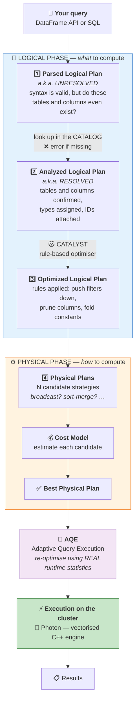
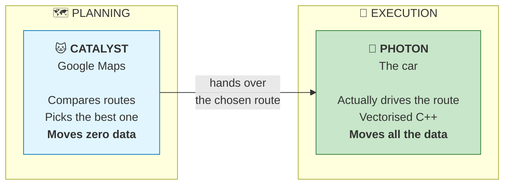
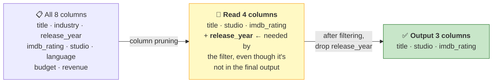
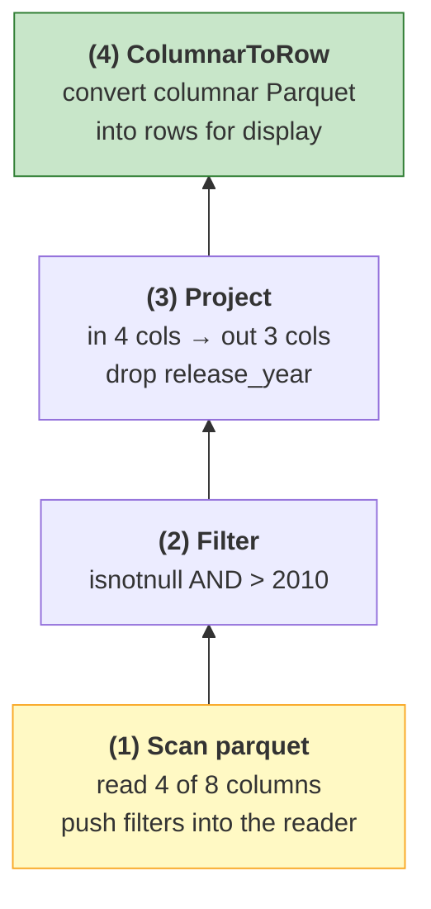
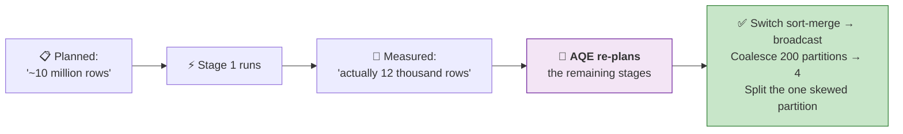

# Part 12 — Query Plans, Catalyst, AQE & Photon

> **Section goal:** Open the engine. You'll learn to read `.explain()` output line by line, trace a query through all four plan stages, *see* predicate pushdown and column pruning happen in real output, and explain Catalyst, Adaptive Query Execution and Photon well enough to answer any interview question about them.

Covers transcript `00:49:49` – `01:02:41`.

> ⚠️ **The instructor flags this himself:** *"Spark is popular because it has a lot of internal optimization. In this chapter we are going to understand the internals of Spark… **this entire chapter is very important from the interview standpoint.**"*
>
> He also gives permission to find it hard: *"Folks, it might be overwhelming. You get some understanding, don't worry. As you progress, as you work with this more, you will get better understanding."* Read it twice. It pays more per page than anything else in this guide.

---

## 1. Why `.explain()` exists

If you've used a relational database, you've used `EXPLAIN` to see how a query will run. Spark has the same thing.

> *"If you have used SQL, you know that in SQL, if you want to look at the query plan, you use `EXPLAIN`. Similarly, when you are writing queries in Spark, there is this **`.explain()`** function that will give you the internal execution plan."*

**Why you care, in one sentence:** Spark almost never runs your code the way you wrote it — and `.explain()` is the only way to see what it actually decided to do.

```python
import pyspark.sql.functions as F

df = spark.table("workspace.default.movies")

df_narrow = (df
    .filter(F.col("release_year") > 2010)
    .select("title", "studio", "imdb_rating"))

df_narrow.explain()                 # physical plan only
df_narrow.explain("extended")       # ⭐ all four plans
df_narrow.explain("formatted")      # readable physical plan
```

> *"Our dataset is small, but let's say this dataset had millions and millions of records. It's going to execute them on multiple nodes or multiple computers, so it needs to do some kind of optimization."*

### The five explain modes

| Mode | Shows | Use when |
|------|-------|----------|
| `.explain()` *(default = `"simple"`)* | Physical plan only | Quick check of join strategy or scan |
| `.explain("extended")` | **All four plans** — parsed, analyzed, optimized, physical | ⭐ Learning; deep debugging |
| `.explain("formatted")` | Physical plan as a numbered tree + per-operator detail | ⭐ Reading a complex plan |
| `.explain("cost")` | Plan annotated with size/row estimates | Diagnosing why a broadcast didn't happen |
| `.explain("codegen")` | The generated Java source | Rare; deep performance work |

```sql
-- SQL equivalents
EXPLAIN           SELECT * FROM workspace.default.movies WHERE release_year > 2010;
EXPLAIN EXTENDED  SELECT * FROM workspace.default.movies WHERE release_year > 2010;
EXPLAIN FORMATTED SELECT * FROM workspace.default.movies WHERE release_year > 2010;
```

---

## 2. The whole journey, in one diagram

This is the diagram to be able to draw on a whiteboard.



### 🔍 Plain-English deep-dive: the four plans

| Plan | Question it answers | Analogy |
|------|---------------------|---------|
| **Parsed (Unresolved)** | *"Is this valid grammar?"* | Reading a recipe and checking it's written in English — you haven't checked the ingredients exist yet |
| **Analyzed (Resolved)** | *"Do these tables and columns actually exist, and what types are they?"* | Checking the pantry: yes, we have flour; yes, it's plain flour |
| **Optimized** | *"What's a smarter way to get the same answer?"* | Realising you should preheat the oven *first* rather than after mixing |
| **Physical** | *"How exactly do I execute this across the cluster?"* | The step-by-step method: which pan, which hob, what order |

> *"If I say `SELECT a, b, c FROM table X` — that is my **unresolved** logical plan. But when I convert to **resolved** logical plan, it will look into the **catalog** to see: OK, do we actually have table X? And if we have that table, do we have columns a, b, c? **If they are not there, then it will throw the error.**"*

**That's why a typo in a column name errors instantly, before any data is read** — the failure happens at analysis, not execution.

---

## 3. The Google Maps analogy — Catalyst vs Photon

The single cleanest way to keep these two straight.

> *"The role of the **Catalyst optimizer** is to create the optimized plan — and the **actual execution**… Catalyst optimizer **doesn't execute**. It's like going to **Google Maps** and figuring out different paths from city A to city B. These are the three different paths. So Catalyst optimizer will just create the **best route** from A to B — and **Photon** executor is actually you taking a car and going from A to B."*



| | 🐱 **Catalyst** | 🚀 **Photon** |
|---|---|---|
| What it is | A query **optimiser** | A query **execution engine** |
| Written in | Scala | **C++** |
| When it runs | Before execution | During execution |
| Open source? | ✅ Yes (Apache Spark) | ❌ No — Databricks proprietary |
| Job | Decide *what* and *how* | Actually *do* it, fast |
| Analogy | Google Maps | The car |

---

## 4. 🧪 The worked example — read a real plan line by line

Set it up exactly as the course does:

```python
import pyspark.sql.functions as F

df = spark.table("workspace.default.movies")

df_narrow = (df
    .filter(F.col("release_year") > 2010)
    .select("title", "studio", "imdb_rating"))

df_narrow.explain("extended")
```

> 💡 **Note the order you wrote it in: `filter` first, then `select`.** Remember that — Spark is about to change it, and *that change is the whole lesson.*

---

### 1️⃣ Parsed Logical Plan (unresolved)

```
'Project ['title, 'studio, 'imdb_rating]
+- 'Filter ('release_year > 2010)
   +- 'UnresolvedRelation [workspace, default, movies]
```

**How to read it:**

| Element | Meaning |
|---------|---------|
| `'` (leading apostrophe) | **Unresolved** — Spark hasn't verified this name exists yet |
| `Project` | ⭐ **`Project` means `SELECT`** |
| `Filter` | `WHERE` |
| `UnresolvedRelation` | *"There's a table named `workspace.default.movies`… allegedly."* |
| `+-` indentation | Child node — **read bottom-to-top for execution order** |

> *"`Project` means select. Whenever you see `Project`, [it] means you are selecting only three columns… And `UnresolvedRelation` — which means you are saying `workspace.default.movies` — that is **unresolved**. Here we don't know whether you have this table or not."*

---

### 2️⃣ Analyzed Logical Plan (resolved)

```
title: string, studio: string, imdb_rating: double
Project [title#12, studio#16, imdb_rating#15]
+- Filter (release_year#14 > 2010)
   +- SubqueryAlias workspace.default.movies
      +- Relation workspace.default.movies[
             title#12, industry#13, release_year#14, imdb_rating#15,
             studio#16, language#17, budget#18, revenue#19] parquet
```

**What changed:**

| Change | Why |
|--------|-----|
| Apostrophes gone | Everything resolved successfully against the catalog |
| `#12`, `#14`, `#16` appeared | **Expression IDs** — unique internal identifiers per column |
| `UnresolvedRelation` → `Relation … parquet` | The table was found; its format and full column list are known |
| Output types listed at the top | `title: string, studio: string, imdb_rating: double` |

> *"With the help of catalog we are creating a resolved logical plan. So now we looked into the catalog and we said 'oh yeah, there is a table called `workspace.default.movies`'. So it found a table, and then it **assigned all these IDs to the columns** — these are the IDs which will identify the actual physical columns — and it is in a **parquet** format."*

### 🔍 Plain-English deep-dive: why `#14`?

Expression IDs make every column reference **globally unambiguous**. After a self-join you have two `customer_id` columns — but `customer_id#7` and `customer_id#42` are unmistakably different. **Analogy:** two employees both called "Chen" get different employee numbers. Spark uses the numbers internally, names only for display.

---

### 3️⃣ Optimized Logical Plan — where the magic happens

```
Project [title#12, studio#16, imdb_rating#15]
+- Filter (isnotnull(release_year#14) AND (release_year#14 > 2010))
   +- Relation workspace.default.movies[
          title#12, release_year#14, imdb_rating#15, studio#16] parquet
```

**Compare it to the analyzed plan. Two things changed, and both are big:**

#### Optimisation A — Column pruning (projection pushdown)

The `Relation` now lists **4 columns** instead of **8**.

> *"So it will scan all these columns — see, **only four columns**. It's not scanning all the columns."*

#### ❓ The instructor's quiz — and its answer

> *"See: title, studio, and IMDb rating. **Why do I have the fourth column?** Just pause the video and tell me."*
>
> *"Well, we have the fourth column because **we need it for filter purpose**."*



**Read 4, output 3.** The extra column is a *working* column, discarded once the filter is done. This is only possible because Parquet is **columnar** — Spark can physically read 4 of 8 columns and never touch the other 4.

#### Optimisation B — an added `isnotnull` predicate

> *"We are also checking `isnotnull`, because **if it is null, then it's not going to be greater than 2010**, so we can ignore it. So this is one condition that is **added by our optimizer**."*

Catalyst inferred a *new*, cheaper predicate you never wrote. `release_year IS NOT NULL` is a very cheap check that Parquet can evaluate from file statistics alone — potentially skipping entire files before decompressing anything.

#### Optimisation C — filter reordering (visible in the physical plan)

> *"See here, what we did is: we had this table, so first thing we will do is **we will apply filter**. Why? **Because that way, you are reading less data.** If I read all the data and have it in memory and then filter — see, eventually I care about filtered data. So the extra rows, which were movies released before 2010, **I read it in vain**."*

**You wrote `filter` then `select`. Catalyst pushes the filter as close to the data source as it can get** — this is **predicate pushdown**, and combined with column pruning it's the reason Spark can be fast on huge tables.

---

### 4️⃣ Physical Plan

```
AdaptiveSparkPlan isFinalPlan=false
+- PhotonResultStage
   +- PhotonProject [title#12, studio#16, imdb_rating#15]
      +- PhotonScan parquet workspace.default.movies[
             title#12, release_year#14, imdb_rating#15, studio#16]
         DataFilters:   [isnotnull(release_year#14), (release_year#14 > 2010)]
         Format:        parquet
         Location:      PreparedDeltaFileIndex(1 paths)[s3://.../movies]
         PushedFilters: [IsNotNull(release_year), GreaterThan(release_year, 2010)]
         ReadSchema:    struct<title:string,release_year:int,imdb_rating:double,studio:string>
```

> *"You have to **always read from bottom**. So when we are looking at this particular thing, read from the bottom. See, it is doing **Photon scan** — again, Photon is your actual executor, it's a vectorized query executor. So it went to your table where the data is stored in **parquet** format… `Location` is — see, this S3 — the actual location of the table that you're reading."*

**The lines that matter most:**

| Line | What it tells you |
|------|-------------------|
| `PushedFilters:` | ⭐ **Filters delegated to the file reader itself.** Parquet uses row-group min/max stats to skip chunks before decompressing. This is where the biggest wins live. |
| `ReadSchema:` | ⭐ **Exactly which columns are physically read.** If you see all 40 columns here, your column pruning failed. |
| `Location:` | Where the data lives — confirms Delta/Parquet and the path |
| `PhotonScan` / `Photon*` | Photon is handling this operator |
| `AdaptiveSparkPlan isFinalPlan=false` | AQE is on; this plan **may change at runtime** |

> ⚠️ **`isFinalPlan=false` is normal and important.** It means AQE hasn't run yet. The plan you're looking at is the *pre-execution* guess. After the query runs, the *actual* plan may differ — check the Spark UI's SQL tab for the final version.

---

### The `formatted` mode — much easier to read

> *"If you don't want to print the entire plan, then you can print something called **formatted**… When you have a formatted plan it is much more readable."*

```python
df_narrow.explain("formatted")
```

```
== Physical Plan ==
* ColumnarToRow (4)
+- * Project (3)
   +- * Filter (2)
      +- Scan parquet workspace.default.movies (1)

(1) Scan parquet workspace.default.movies
Output [4]: [title#12, release_year#14, imdb_rating#15, studio#16]
PushedFilters: [IsNotNull(release_year), GreaterThan(release_year, 2010)]
ReadSchema: struct<title:string,release_year:int,imdb_rating:double,studio:string>

(2) Filter
Input [4]: [title#12, release_year#14, imdb_rating#15, studio#16]
Condition: (isnotnull(release_year#14) AND (release_year#14 > 2010))

(3) Project
Input  [4]: [title#12, release_year#14, imdb_rating#15, studio#16]
Output [3]: [title#12, studio#16, imdb_rating#15]

(4) ColumnarToRow
Input [3]: [title#12, studio#16, imdb_rating#15]
```

> *"So see, first thing it is doing is **scanning** your tables, then it's doing **project**, means it's selecting, and then there is a **result stage**… In `PhotonScan` it will just read these four columns, and in `Project` — which is select — it will get four columns, but in the select we have only three. Release year we are using only for the filtering, so it will read only three columns. **See: input is four columns, output is three columns.**"*

The execution order, bottom to top:



### Why `ColumnarToRow`?

> *"When you're printing the results — see, when I say `display` — you need the results in a **row** format, right? But in Parquet it is stored in a **columnar** form. So you have to convert the columns to rows. That is the final stage."*

Parquet stores column-by-column; humans and result sets want row-by-row. That conversion is the last step. **Seeing it is a good sign** — it means the whole pipeline stayed columnar (and therefore fast) right up to output.

### The `*` prefix — whole-stage code generation

The `*` in `* Filter (2)` means the operator is part of a **WholeStageCodegen** block: Spark compiles several adjacent operators into a single generated Java function, so there's no per-operator overhead and no intermediate objects.

**Analogy:** instead of four workers each handling one step and passing a box along, one worker does all four steps on each item. **Rule of thumb: more `*` = better.** An operator without one is a boundary (usually a shuffle) or something codegen can't handle.

---

## 5. Catalyst's optimisation rules

The course shows two (pushdown and pruning). Here's the fuller set — naming three or four of these in an interview lands well.

| Rule | What it does | Example |
|------|--------------|---------|
| **Predicate pushdown** | Move filters as close to the source as possible | `filter` executed before `join`, or inside the Parquet reader |
| **Projection pruning** | Read only required columns | 8 columns → 4 |
| **Constant folding** | Evaluate constant expressions once, at plan time | `WHERE x > 2 * 5` → `WHERE x > 10` |
| **Null propagation** | Simplify expressions involving nulls | `NULL AND x` → `NULL` |
| **Boolean simplification** | Reduce redundant logic | `x AND TRUE` → `x` |
| **Combine filters** | Merge adjacent `Filter` nodes | `.filter(a).filter(b)` → one `Filter(a AND b)` |
| **Collapse projects** | Merge adjacent `Project` nodes | Two `select`s become one |
| **Limit pushdown** | Push `LIMIT` toward the source | Stop reading early |
| **Join reordering** *(CBO)* | Reorder multi-table joins to minimise intermediate size | Join the two smallest first |
| **Broadcast selection** | Choose broadcast when a side is small enough | See Part 11 |
| **Partition pruning** | Skip whole partition directories | `WHERE dt='2025-10-01'` reads one folder |
| **Dynamic partition pruning** | Prune the fact table using values discovered from the dimension at runtime | Star-schema joins |

> 💡 The instructor's own summary of why filter-first matters: *"Instead of reading like 10,000 records you are reading maybe 200 records from the disk."*

### Cost-Based Optimization (CBO)

The cost model needs **statistics** to make good choices — especially about broadcasting.

```sql
-- Table-level statistics
ANALYZE TABLE ecommerce.gold.gld_fact_order_items COMPUTE STATISTICS;

-- Column-level statistics (needed for join reordering & selectivity estimates)
ANALYZE TABLE ecommerce.gold.gld_fact_order_items
  COMPUTE STATISTICS FOR COLUMNS customer_id, product_id, transaction_date;

-- Inspect
DESCRIBE EXTENDED ecommerce.gold.gld_fact_order_items;
```

```python
spark.conf.set("spark.sql.cbo.enabled", "true")
spark.conf.set("spark.sql.cbo.joinReorder.enabled", "true")
df.explain("cost")     # shows the size/row estimates the model used
```

> ⭐ **Interview:** *"Why didn't Spark broadcast my small table?"* → *"Almost always stale or missing statistics. The optimiser decides from *estimated* size, and if it has no stats it assumes the worst and falls back to a sort-merge join. `ANALYZE TABLE … COMPUTE STATISTICS FOR COLUMNS` fixes the estimate, and `explain('cost')` shows what it currently believes. If the estimate is right but still above threshold, I'd either raise `autoBroadcastJoinThreshold` or add an explicit `broadcast()` hint. On Delta tables, statistics are collected on write for the first 32 columns by default, so a table with many columns may need `delta.dataSkippingNumIndexedCols` adjusted."*

---

## 6. Adaptive Query Execution (AQE)

> *"Here I have mentioned **AQE**, which is **adaptive query execution**… just consider this green box as an **evaluator** which can figure out which plan is the best, and then it will send that plan to the cluster for execution."*

### 🔍 Plain-English deep-dive: the problem AQE solves

Everything up to the physical plan is a **prediction**. Spark guesses how many rows a filter will produce and how big a join's output will be — before running anything. Predictions are often wrong.

**AQE re-optimises *mid-flight*, using real statistics measured after each shuffle.**

**Analogy:** Google Maps recalculating your route when it sees actual traffic ahead — rather than sticking with the plan it made when you set off.



### The three things AQE does

| Feature | Problem it fixes | What it does |
|---------|------------------|--------------|
| **Dynamically coalescing shuffle partitions** | You configured 200 shuffle partitions but the data only fills 3 → 197 empty tasks of pure overhead | Merges tiny post-shuffle partitions into sensible ones |
| **Dynamically switching join strategies** | Planned a sort-merge join; after filtering, one side is actually tiny | Converts it to a broadcast hash join at runtime |
| **Dynamically optimising skew joins** | One key holds 80% of rows → one task runs for hours | Detects oversized partitions and **splits** them across tasks |

```python
spark.conf.set("spark.sql.adaptive.enabled", "true")                        # on by default in DBR
spark.conf.set("spark.sql.adaptive.coalescePartitions.enabled", "true")
spark.conf.set("spark.sql.adaptive.skewJoin.enabled", "true")
```

> 💡 **How to tell AQE actually kicked in:** the plan header says `AdaptiveSparkPlan isFinalPlan=false` *before* execution. After running, open the **Spark UI → SQL/DataFrame tab** and you'll see `isFinalPlan=true` plus `AQEShuffleRead` nodes showing the coalescing that happened.

> 💡 **AQE is why you rarely need to tune `spark.sql.shuffle.partitions` manually any more.** The old advice to hand-set it to 200 (or 2×cores) is largely obsolete on modern Databricks.

---

## 7. Photon

> *"When it comes to execution — see, here we are just creating a plan, we are not executing it. The execution happens here in the last block. At that time we will have the **Photon query engine**, which is a **high-performance vectorized query engine written in C++**. It is relatively modern, and that will make sure your query gets executed really fast."*

### 🔍 Plain-English deep-dive: what came *before* Photon — Project Tungsten & whole-stage codegen

Photon did not appear from nowhere. Open-source Spark had already been through two rounds of execution-engine surgery, and interviewers ask about them because they separate people who *use* Spark from people who understand it.

**Project Tungsten** (Spark 1.4 → 2.x) started from an uncomfortable measurement: Spark jobs were bottlenecked on **CPU and memory**, not on disk or network. Faster disks wouldn't help. Three changes followed:

| Tungsten change | The problem it solved |
|---|---|
| **Binary / off-heap memory** — rows stored in a compact `UnsafeRow` byte layout instead of JVM objects | A Java object carries a header and pointers, and every one of them is eventually garbage to collect. Binary rows are smaller *and* they don't create GC pressure — no more multi-second pauses mid-stage. |
| **Cache-aware algorithms** — sorts and hash maps laid out to respect CPU cache lines | An L1 cache hit costs ~1 ns; main memory ~100 ns. At this level, *memory layout* beats clever algorithms. |
| **Whole-stage code generation** | Per-row, per-operator interpretation overhead — see below |

**Whole-stage codegen** (Spark 2.0) is the one to be able to explain out loud.

Without it, Spark uses the classic **"Volcano" iterator model**: each operator (`Filter`, `Project`, `HashAggregate`) is a separate object, and every row is pulled through the chain by a virtual `next()` call. For a 100-million-row scan through three operators that's 300 million virtual function calls, and the CPU cannot optimise across those boundaries.

Whole-stage codegen collapses an entire chain of narrow operators into **one Java function generated and compiled at runtime**. The stage becomes a single tight loop over the rows — no virtual calls, values held in CPU registers, branch prediction and loop unrolling all working.

> 🔬 **See it in your own plan.** In `.explain()` output, operators prefixed with `*(1)`, `*(2)`… were fused by whole-stage codegen. The asterisk means "this operator was compiled into generated code" and the number is the codegen stage id. Operators *without* an asterisk were **not** fused — a Python UDF is the usual culprit, and it breaks the fusion for everything around it.
>
> ```text
> *(2) HashAggregate(...)        ← fused
> +- Exchange hashpartitioning   ← shuffles are never fused (they cross the network)
>    +- *(1) Filter (...)        ← fused
>       +- *(1) ColumnarToRow    ← fused into the same stage
> ```

**So where does Photon fit?** Tungsten made the **JVM** as fast as a JVM can reasonably get, one row at a time. Photon replaces that layer entirely with native C++ that processes **batches** of values at a time. The lineage is: *interpretation → codegen (Tungsten) → vectorised native execution (Photon)*.

### 🔍 Plain-English deep-dive: "vectorised"

- **Row-at-a-time** (traditional): process record 1 completely, then record 2, then record 3. Every row pays interpretation overhead.
- **Vectorised**: process a **batch** of e.g. 1,000 values in one tight loop, using the CPU's SIMD instructions to operate on many values per instruction.

**Analogy:** a supermarket checkout scanning one item at a time versus a machine that reads an entire trolley at once.

| | Standard Spark (JVM) | 🚀 Photon (C++) |
|---|---|---|
| Language | Scala/Java on the JVM | Native C++ |
| Processing | Row-at-a-time codegen | **Vectorised, batch-at-a-time** |
| Memory | JVM heap + garbage collection | Native, off-heap, no GC pauses |
| Availability | Everywhere | **Databricks only** |
| Typical speedup | baseline | 2–4× on scan/filter/aggregate/join-heavy SQL |
| DBU cost | baseline | Higher per DBU — but often cheaper overall via shorter runtime |

**What Photon accelerates:** scans, filters, projections, joins, aggregations, sorts, writes — i.e. most SQL and DataFrame work.

**What falls back to the JVM:** Python/Scala **UDFs**, RDD operations, some streaming paths, certain exotic data types. When an operator can't be Photonised, that part of the plan silently reverts.

> 💡 **Read your plan for Photon coverage.** Operators prefixed `Photon` (`PhotonScan`, `PhotonProject`, `PhotonGroupingAgg`) are accelerated. If you see plain `Scan`/`Filter` where you expected Photon — often right after a Python UDF — you've found a fallback and probably a performance problem.

> ⭐ **Interview:** *"Should you always enable Photon?"* → *"Usually yes for SQL and DataFrame workloads, but it should be a measured decision because Photon has a higher DBU multiplier. The right question is total cost, not rate: if it cuts a job from 60 minutes to 20, it's cheaper despite the higher rate. Where it doesn't pay is workloads dominated by Python UDFs or RDD operations, since those fall back to the JVM and you pay the premium for no benefit. I'd A/B the job with and without and compare wall-clock *and* DBU consumption — and if UDFs are the blocker, the better fix is usually replacing them with built-in functions so Photon can handle the whole plan."*

---

## 8. Plan operator glossary

You'll meet these constantly. Bookmark this.

| Operator | Means | Cost signal |
|----------|-------|-------------|
| `Scan parquet` / `PhotonScan` | Reading files | Check `ReadSchema` and `PushedFilters` |
| `Filter` | `WHERE` | Should be pushed down — if it's high in the tree, ask why |
| `Project` | `SELECT` | Compare Input vs Output column counts |
| **`Exchange`** | ⚠️ **A SHUFFLE** — data moving across the network | 🔴 **The most expensive thing in any plan** |
| `HashAggregate` | `GROUP BY` | Usually appears twice: partial then final, around an `Exchange` |
| `SortMergeJoin` | Both sides shuffled and sorted | 🟠 Consider broadcasting instead |
| `BroadcastHashJoin` | Small side copied to all executors | 🟢 Good — no shuffle on the big side |
| `BroadcastExchange` | Sending the small side out | 🟢 Cheap if it really is small |
| `BroadcastNestedLoopJoin` | Non-equi join | 🔴 Dangerous on large data |
| `Sort` | `ORDER BY` | Expensive; needs a full shuffle for a global sort |
| `Window` | Window function | Requires sort + partition |
| `Union` | Concatenation | Cheap |
| `ColumnarToRow` | Columnar → row conversion | Normal at the output boundary |
| `AdaptiveSparkPlan` | AQE is enabled | `isFinalPlan=false` means "not final yet" |
| `ReusedExchange` | A shuffle result reused | 🟢 Good — Spark avoided redoing work |
| `InMemoryTableScan` | Reading a cached DataFrame | 🟢 Cache hit |
| `PhotonResultStage` | Photon handled the final stage | 🟢 |

> 🧠 **The single most useful habit: search the plan for `Exchange`.** Every `Exchange` is a shuffle — a full network redistribution of your data. Fewer is better. Part 15 is entirely about them.

---

## 9. The Spark UI — where plans meet reality

`.explain()` shows the plan. The **Spark UI** shows what happened.

| Tab | What it tells you |
|-----|-------------------|
| **SQL / DataFrame** | ⭐ The **final** plan as a visual DAG, with rows and bytes flowing through each operator |
| **Jobs** | One entry per action (Part 14) |
| **Stages** | Stage boundaries = shuffles. Look for one long stage |
| **Tasks** (inside a stage) | ⭐ Compare **min / median / max** duration — a max far above the median means **skew** |
| **Storage** | What's cached and how much fits |
| **Executors** | Per-executor memory, GC time, shuffle read/write |

**How to get there:** in a notebook, under a running/completed cell click **`Spark Jobs`** → **`View`**. Or from the Compute page → your cluster → **`Spark UI`**.

**Your diagnostic checklist:**

| Symptom in the UI | Likely cause | Fix (Part) |
|-------------------|--------------|-----------|
| One task's duration ≫ median | Data **skew** | AQE skew join, salting (11, 16) |
| Huge `Exchange` shuffle-write bytes | Unnecessary wide transformation | Filter earlier, broadcast (11, 15) |
| Thousands of tiny tasks | Too many partitions | `coalesce`, AQE (16) |
| High GC time | Memory pressure | Larger nodes, fewer cached DFs |
| `ReadSchema` lists every column | Column pruning failed — usually `SELECT *` | Select explicitly |
| `PushedFilters` empty | Filter applied after a UDF or non-pushable expression | Restructure (this Part) |

---

## 10. 🧪 Lab — watch the optimiser work

```python
import pyspark.sql.functions as F
df = spark.table("workspace.default.movies")

# ── 1. The baseline example ──────────────────────────────────────────
df_narrow = df.filter(F.col("release_year") > 2010).select("title", "studio", "imdb_rating")
df_narrow.explain("extended")     # read all four plans
df_narrow.explain("formatted")    # then the readable version

# ── 2. Prove Catalyst REORDERS your code ─────────────────────────────
a = df.filter(F.col("release_year") > 2010).select("title", "studio")   # filter first
b = df.select("title", "studio", "release_year").filter(F.col("release_year") > 2010)  # select first
a.explain("formatted")
b.explain("formatted")
# ➡️ Nearly identical physical plans. You cannot outsmart Catalyst by reordering.

# ── 3. Prove COLUMN PRUNING is real ──────────────────────────────────
df.select("title").explain("formatted")   # ReadSchema: struct<title:string>  ← 1 column
df.explain("formatted")                   # ReadSchema: all 8 columns

# ── 4. Constant folding ──────────────────────────────────────────────
df.filter(F.col("release_year") > 2 * 1005 + 0).explain("extended")
# ➡️ Optimized plan shows `> 2010` — the arithmetic vanished

# ── 5. Combine filters ───────────────────────────────────────────────
(df.filter(F.col("release_year") > 2010)
   .filter(F.col("imdb_rating") > 8)
   .explain("extended"))
# ➡️ Two Filters in the analyzed plan, ONE in the optimized plan

# ── 6. Spot the Exchange (shuffle) — narrow vs wide ───────────────────
df.filter(F.col("release_year") > 2010).explain()     # no Exchange  → narrow
df.groupBy("studio").count().explain()                # Exchange!    → wide

# ── 7. Join strategy: sort-merge vs broadcast ────────────────────────
from pyspark.sql.functions import broadcast
d1 = spark.range(0, 1_000_000).withColumn("k", F.col("id") % 1000)
d2 = spark.range(0, 1000).withColumnRenamed("id", "k")
d1.join(d2, "k").explain()               # BroadcastHashJoin (d2 is tiny)
spark.conf.set("spark.sql.autoBroadcastJoinThreshold", -1)
d1.join(d2, "k").explain()               # SortMergeJoin + two Exchanges
spark.conf.set("spark.sql.autoBroadcastJoinThreshold", 10 * 1024 * 1024)  # restore

# ── 8. See the cost estimates ────────────────────────────────────────
df.groupBy("studio").count().explain("cost")

# ── 9. Confirm AQE is on ─────────────────────────────────────────────
print(spark.conf.get("spark.sql.adaptive.enabled"))
```

**✅ Checkpoint:** in step 2 both plans look the same; in step 3 `ReadSchema` shrinks to one column; in step 5 two `Filter` nodes collapse into one; in step 6 `groupBy` introduces an `Exchange` that `filter` does not.

> 💡 **The instructor's genuinely good advice at `01:00:00`:** *"I will encourage you to write some different queries here, then print the plan, and talk to ChatGPT if you don't understand what it means. Give your code and your plan and say 'hey, can you explain this step by step' — and it will explain it to you."* Do this. Reading plans is a skill built by repetition.

---

## ⭐ Likely Interview Questions for This Section

**Q1. "Explain how Spark executes a query, end to end."**
> *Model answer:* "Your DataFrame or SQL code is parsed into an **unresolved logical plan** — syntactically valid, but nothing verified. The **analyzer** resolves it against the catalog, confirming tables and columns exist, attaching types and unique expression IDs, and failing fast if anything is missing. **Catalyst** then applies rule-based optimisations to produce an **optimized logical plan** — pushing filters toward the source, pruning unused columns, folding constants, combining adjacent filters. That's converted into several candidate **physical plans**, and a **cost model** picks the cheapest using table statistics. During execution, **AQE** re-optimises using real runtime statistics after each shuffle, and on Databricks the operators run on **Photon**, a vectorised C++ engine. The key mental split is logical = *what*, physical = *how*."

**Q2. "What is the Catalyst optimizer?"**
> *Model answer:* "Spark's extensible query optimiser. It applies rule-based transformations to the logical plan — predicate pushdown, projection pruning, constant folding, boolean simplification, combining filters, collapsing projects — plus cost-based decisions like join ordering and broadcast selection when statistics are available. The crucial point is that it **doesn't execute anything**: it only produces a better plan. It's why the DataFrame API and SQL have identical performance — both feed the same optimiser. The analogy I use is Google Maps choosing the route, while the execution engine is the car actually driving it."

**Q3. "What's predicate pushdown and why does it matter?"**
> *Model answer:* "Moving filter conditions as close to the data source as possible — ideally *into* the file reader. With Parquet or Delta, the reader can use per-row-group min/max statistics to skip whole chunks without decompressing them, so a filter on a well-clustered column can eliminate most of the file before any real work happens. Combined with **column pruning** — reading only the columns the query needs, which is possible because Parquet is columnar — you often reduce bytes read by an order of magnitude. You verify both in the plan: `PushedFilters` shows what got delegated, `ReadSchema` shows which columns are actually read. If `ReadSchema` lists everything, something defeated pruning, usually a `SELECT *`."

**Q4. "You wrote `filter` then `select`. Does the order in your code matter?"**
> *Model answer:* "No, and that's the point of having an optimiser. Catalyst reorders operations to an equivalent but cheaper form, so filtering before selecting and selecting before filtering produce essentially the same physical plan — you can prove it by comparing `.explain('formatted')` on both. What *does* still matter is things Catalyst can't reason through: an opaque Python UDF is a black box, so it can't push filters past one; and `SELECT *` genuinely forces reading all columns because you've asked for them. So write for readability, and reserve manual tuning for the cases where you've blocked the optimiser."

**Q5. "In the plan, why does the scan read four columns when the query returns three?"**
> *Model answer:* "The fourth column is needed by the filter predicate even though it isn't in the output. In that example `release_year` is required to evaluate `> 2010`, so it's read, used, and then dropped by the `Project`. You can see it explicitly in the formatted plan — the `Project` node shows Input 4 columns, Output 3. It's a nice demonstration that pruning is based on *everything the query needs*, not just what it returns."

**Q6. "What is AQE and what does it actually do?"**
> *Model answer:* "Adaptive Query Execution re-optimises the plan mid-flight using real statistics measured after each shuffle, instead of relying only on pre-execution estimates. Three concrete things: it **coalesces shuffle partitions** so you don't run 200 tasks over data that only fills 3; it **switches join strategies** at runtime, converting a planned sort-merge join into a broadcast join once it sees one side is actually small after filtering; and it **splits skewed partitions** so a single hot key doesn't leave one task running for hours while everything else idles. It's why hand-tuning `spark.sql.shuffle.partitions` is largely obsolete on modern Databricks. You confirm it ran by looking for `isFinalPlan=true` and `AQEShuffleRead` nodes in the Spark UI."

**Q7. "What's Photon, and does it always help?"**
> *Model answer:* "Photon is Databricks' proprietary vectorised query engine written in C++. Instead of processing a row at a time on the JVM, it processes batches of values in tight loops using SIMD instructions, and it works off-heap so there are no GC pauses. Typical speedups are 2–4× on scan, filter, aggregation and join-heavy SQL. It doesn't always help: Python and Scala UDFs, RDD operations and some streaming paths fall back to the JVM, and since Photon carries a higher DBU multiplier you'd be paying a premium for no gain. I check the plan for `Photon`-prefixed operators to see coverage, and if I find a fallback caused by a UDF, replacing it with built-in functions usually recovers both the speed and the Photon eligibility."

**Q8. "You've been given a slow query. How do you diagnose it?"**
> *Model answer:* "Start with `.explain('formatted')` and read bottom-up. Check `ReadSchema` — if it lists every column, pruning failed. Check `PushedFilters` — if empty, the filter isn't reaching the reader, often because a UDF sits between them. Count `Exchange` nodes, since each is a full network shuffle and they dominate cost. Check join operators: a `SortMergeJoin` against a small table means a broadcast opportunity was missed, usually due to stale statistics. Then go to the Spark UI's SQL tab for the *final* post-AQE plan and the actual row and byte counts per operator, and look at the task duration distribution within the longest stage — a max far above the median means skew. That sequence — plan first, then measured reality — isolates almost everything."

**Q9. "Difference between the logical and physical plan?"**
> *Model answer:* "The logical plan describes **what** to compute — relational algebra, independent of the cluster: filter, project, join, aggregate. The physical plan describes **how** — which join algorithm, where shuffles happen, how many partitions, which operators fuse into a codegen stage. One logical plan can map to many physical plans, and the cost model picks between them. That separation is what makes the optimiser powerful: it can reason about equivalence at the logical level, then choose an execution strategy at the physical level based on data sizes and cluster shape."

**Q10. "Why did Spark not broadcast my 5 MB table?"**
> *Model answer:* "The optimiser decides from *estimated* size, not actual size, so the usual cause is missing or stale statistics — with no stats it assumes worst case and falls back to sort-merge. `ANALYZE TABLE … COMPUTE STATISTICS FOR COLUMNS` fixes the estimate, and `explain('cost')` shows what it currently believes. Other causes: the table is the result of an upstream transformation whose output size can't be estimated well; `autoBroadcastJoinThreshold` has been lowered or set to `-1`; or the join is a full outer, where broadcasting isn't valid on that side. If the estimate is genuinely wrong I'd add an explicit `broadcast()` hint. Worth noting AQE can also convert to a broadcast at runtime once it measures the real size, so the pre-execution plan may not be the final story."

**Q11. "What is Project Tungsten and what is whole-stage code generation?"**
> *Model answer:* "Tungsten was the Spark 1.4-to-2.x effort that moved the bottleneck conversation from I/O to CPU and memory. Three pieces: storing rows in a compact off-heap binary format — `UnsafeRow` — so you get a smaller footprint and no garbage-collection pauses; cache-aware sorts and hash maps that respect CPU cache lines; and whole-stage code generation. Codegen is the interesting one. The old Volcano model made every operator a separate object and pulled every row through it with a virtual `next()` call, so a hundred million rows through three operators is three hundred million virtual calls the CPU can't optimise across. Codegen fuses a chain of narrow operators into a single Java function compiled at runtime, so the stage becomes one tight loop. You can see it in `.explain()` — operators prefixed `*(1)`, `*(2)` were fused, and anything *without* a star wasn't, which is usually a Python UDF breaking the chain. The natural follow-on is that Photon takes the same idea further by replacing the generated JVM code with native vectorised C++."

---

## 🧠 30-Second Memory Hooks

- **`.explain("extended")` = all four plans. `.explain("formatted")` = the readable physical one.** ⭐
- **The four plans: Parsed (unresolved) → Analyzed (resolved, via the catalog) → Optimized (Catalyst) → Physical (cost model picks).**
- **Logical = *what*. Physical = *how*.**
- **`'` apostrophe prefix = unresolved. `#14` = expression ID** (an employee number for a column).
- **⭐ `Project` means `SELECT`.**
- **Read plans BOTTOM to TOP.**
- **🐱 Catalyst = Google Maps (picks the route, moves no data). 🚀 Photon = the car (drives it, in C++).**
- **Catalyst is open-source Spark. Photon is Databricks-only.**
- **Predicate pushdown = filter at the source. Column pruning = read only what's needed.** Both visible as `PushedFilters` and `ReadSchema`.
- **Read 4, output 3** — the extra column exists because the *filter* needs it.
- **Catalyst adds predicates you never wrote** (`isnotnull`) because they're cheap and eliminate work.
- **You cannot outsmart Catalyst by reordering `filter` and `select`.** Write for readability.
- **🔴 `Exchange` = a SHUFFLE.** Search for it first. Fewer is better.
- **`*` prefix = WholeStageCodegen.** More stars = better fusion.
- **Tungsten = binary off-heap rows + cache-aware algorithms + codegen.** It made the *JVM* fast; **Photon replaced the JVM** with vectorised C++.
- **Volcano model = one virtual `next()` call per row per operator.** Codegen collapses the chain into one compiled loop.
- **An operator with NO star didn't fuse** — look for a Python UDF right next to it.
- **`ColumnarToRow` at the top is normal** — Parquet is columnar, output is rows.
- **AQE = Google Maps rerouting for live traffic.** Coalesces partitions · switches join strategies · splits skew.
- **`isFinalPlan=false` means AQE hasn't run yet** — check the Spark UI for the real final plan.
- **No broadcast? Blame the statistics.** `ANALYZE TABLE … COMPUTE STATISTICS FOR COLUMNS`.

---

*Next suggested section:* **[Part 13 — Spark Architecture & the Execution Model](Part-13-spark-architecture-execution-model.md)** — you've seen the plan; now see the machinery that runs it. Driver, executors, cluster manager, and the jobs → stages → tasks hierarchy that the Spark UI is organised around. This is the "draw it on a whiteboard" question.

---

**Navigation** — ⬅️ **[Part 11 — Joins in Spark](Part-11-joins-in-spark.md)** · 🏠 **[Master Index](../Databricks%20-%20Study%20Guide.md)** · ➡️ **[Part 13 — Spark Architecture](Part-13-spark-architecture-execution-model.md)**
