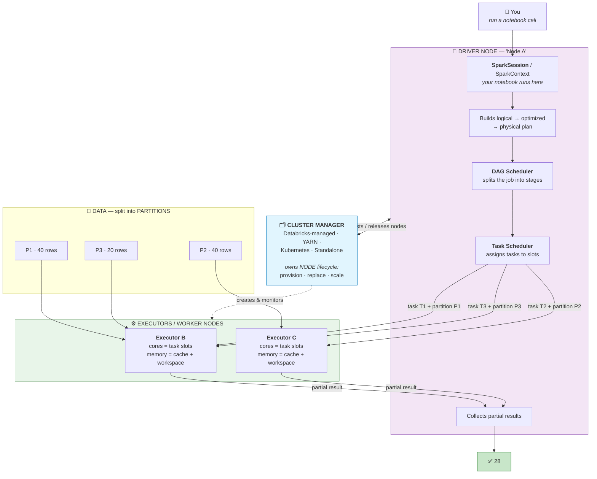
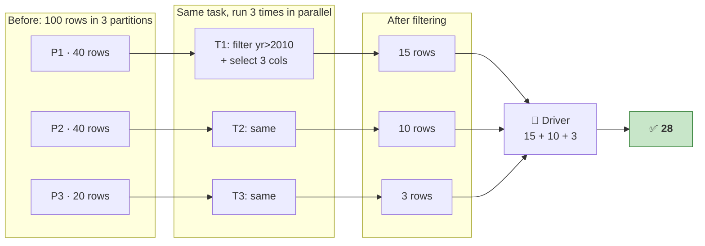
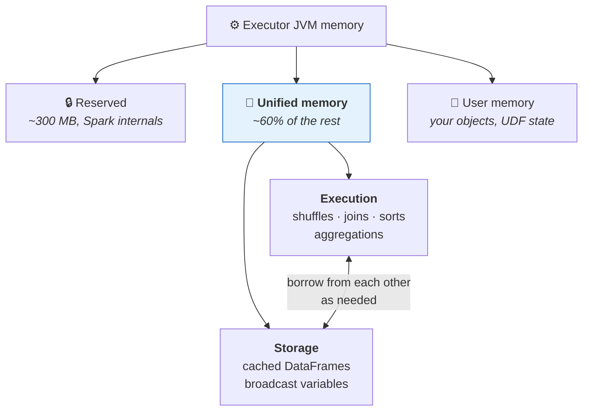
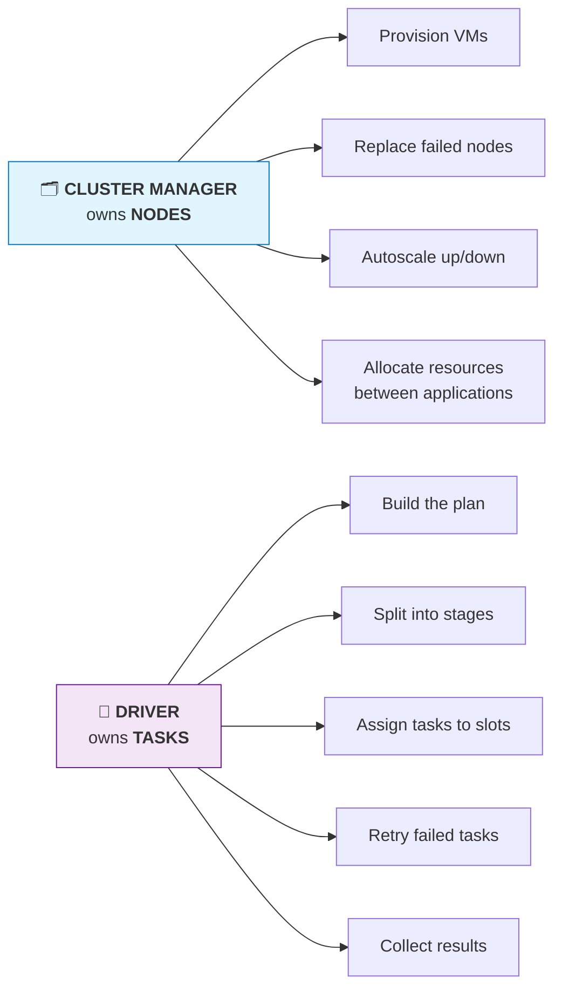
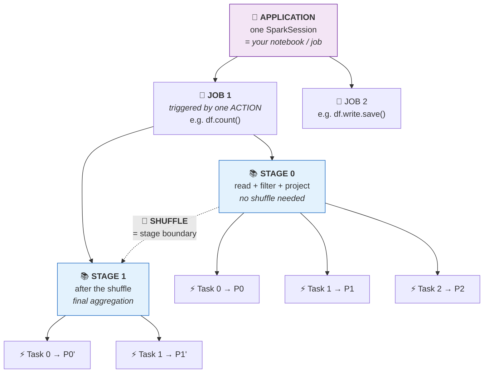
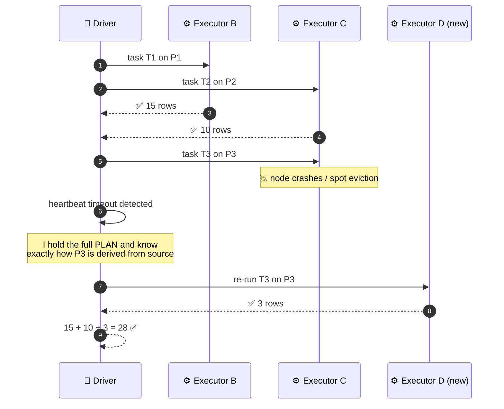
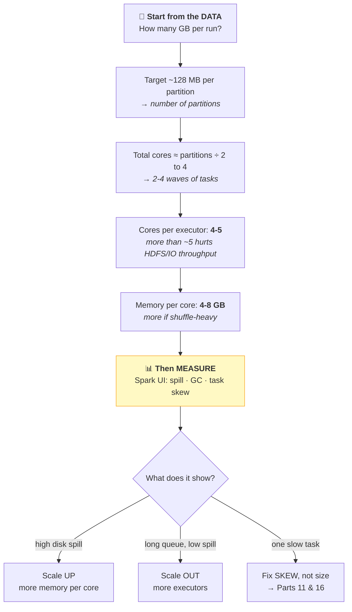

# Part 13 — Spark Architecture & the Execution Model

> **Section goal:** Be able to draw the Spark cluster on a whiteboard from memory and narrate a query through it. You'll learn what the driver does, what executors do, who the cluster manager is, and the **jobs → stages → tasks** hierarchy that the entire Spark UI is organised around.

Covers transcript `01:02:41` – `01:07:47`.

> ⭐ **The instructor says it outright:** *"It is a **very commonly asked question**. The interviewer may ask: 'OK, explain Spark architecture' — and you can just draw this on a whiteboard and explain the whole flow."*

---

## 1. Follow one query through the machine

Take the code from Part 12 and follow it end to end.

```python
df        = spark.table("workspace.default.movies")          # nothing happens
df_narrow = df.filter(F.col("release_year") > 2010) \
              .select("title", "studio", "imdb_rating")      # still nothing happens
df_narrow.count()                                            # 💥 NOW it runs
```

> *"In this code, when you call `df.select` and `filter`, it will **build that plan** — that optimized plan — and then it will convert it to a physical plan. And when you call **`count()`**, it will actually **execute** that plan."*

That's **lazy evaluation** (all of Part 14). For now, just hold onto the split: **transformations plan, actions execute.**

### The full picture



---

## 2. The driver

> *"Wherever you are running this notebook — your notebook kernel, wherever it is running — **that computer is called the driver**. So it's the main computer **orchestrating** the whole thing."*

### 🔍 Plain-English deep-dive: what the driver actually does

**Analogy:** the **team lead**. They don't do the work themselves; they plan it, split it, hand it out, chase failures, and assemble the finished result.

| Responsibility | Detail |
|----------------|--------|
| **Hosts the SparkSession** | The `spark` object you use lives here |
| **Runs your notebook code** | All Python code that isn't a Spark operation executes on the driver, single-threaded |
| **Builds the plan** | Logical → optimized → physical (Part 12) |
| **Splits data into partitions** | Decides how the work is divided |
| **DAG Scheduler** | Breaks the job into **stages** at shuffle boundaries |
| **Task Scheduler** | Assigns individual **tasks** to executor slots |
| **Tracks progress** | Detects failed/slow tasks and re-submits them |
| **Collects results** | Aggregates partial results returned by executors |
| **Serves the Spark UI** | The UI is hosted by the driver |

> ⚠️ **This is why `collect()` and `toPandas()` are dangerous.** They pull **every row** from all executors into the **driver's single machine memory**. Executors scale horizontally; the driver does not. It's the classic way a junior takes a cluster down.

> ⚠️ **`if` statements, loops and `print()` run on the driver.** If you write a Python `for` loop over a million rows, none of it is distributed — you've turned your cluster into a laptop.

---

## 3. Partitions and tasks

> *"Then it takes the dataset, and the dataset will be **divided into partitions**. So let's say for simplicity, let's assume this dataset has **100 records**. And P1 will be, let's say, **40** records, P2 is **40** records, this is **20** records."*

### 🔍 Plain-English deep-dive: partition vs task

- **Partition** — *a chunk of the data.* **Analogy:** a tray of 500 raw puris.
- **Task** — *one operation applied to one partition, running on one CPU core.* **Analogy:** "fry the puris on this tray."

**The rule that ties everything together:**

> **1 task = 1 partition = 1 core, for the duration of that task.**

Which means **your parallelism is capped by `min(number of partitions, total executor cores)`**:

- 100 partitions but only 8 cores → 8 run at a time, 12½ waves
- 8 partitions but 100 cores → 92 cores sit idle

Part 16 is entirely about getting that balance right.

### The example, executed

> *"Node A will give one partition to this, and it will also give a task. So let's say this task is **T1**. The task here is to filter using release year — give me all the movies with release year greater than 2010 — and then pick these three columns. **That code is your task.**"*



> *"When you run T1 on P1, you will get another DataFrame… let's say this guy had 40 records, let's say this has **15** records because you're doing filtering. Then it will give P2 to here… let's say it gets another narrow DataFrame which has 10 records. And then T3 gets **3** records. So now all these partial results, it will send back to the driver when `df_narrow.count()` is called."*

> *"So this driver node will now display **28**."*

**Notice what's efficient here:** only the **counts** (15, 10, 3) travel back to the driver — not the rows. That's why `count()` is safe on a billion rows while `collect()` is not.

---

## 4. Executors

> *"Then there will be **executor nodes** or **worker nodes**."*

### 🔍 Plain-English deep-dive: worker vs executor

| Term | Precise meaning |
|------|-----------------|
| **Worker node** | The **machine** (a VM) |
| **Executor** | The **JVM process** running on that machine, with its own memory and task slots |
| **Slot / core** | One concurrent task's worth of CPU inside an executor |

One worker node can host multiple executors. In everyday conversation people say them interchangeably — but when you're setting `spark.executor.cores` or `spark.executor.memory`, you're sizing **processes**, not machines.

### What an executor's memory is used for



> 💡 **Execution and storage share one pool and borrow from each other.** Cache too aggressively and you starve shuffles of memory, which causes **spilling to disk** — the most common silent performance killer. If the Spark UI shows large "Spill (Disk)" numbers, that's your signal.

---

## 5. The cluster manager

> *"To create the worker nodes — to kind of manage those — it uses a **cluster manager**. Now this cluster manager can be Databricks-managed, YARN, Kubernetes… Cluster manager will take care of creating a new node — let's say one node fails, what to do with it. So that **node lifecycle management** is done by cluster manager. But the **actual task assignment is done by the driver program**."*

### ⭐ The distinction interviewers are testing



> 🧠 **"The cluster manager hires and fires the workers. The driver tells them what to do."**

### The four cluster managers

| Manager | Where you see it |
|---------|------------------|
| **Standalone** | Spark's own simple manager; small self-hosted clusters |
| **YARN** | Hadoop ecosystems, on-premises estates |
| **Kubernetes** | Cloud-native, containerised Spark |
| **Databricks-managed** ⭐ | What you're using. Fully abstracted — this *is* the "event planner" from Part 2 |

---

## 6. Jobs → Stages → Tasks

The transcript doesn't spell this out, but **the Spark UI is built entirely around this hierarchy** and interviewers ask about it constantly.



| Level | Created by | Count |
|-------|-----------|-------|
| **Application** | One `SparkSession` | 1 per notebook/job |
| **Job** | **One action** (`count`, `show`, `write`, `collect`) | 1 per action |
| **Stage** | A **shuffle boundary** | (number of shuffles) + 1 |
| **Task** | One **partition** within a stage | = number of partitions |

### 🔍 Plain-English deep-dive with an analogy

**Analogy — publishing a newspaper:**
- **Application** = the newspaper company
- **Job** = today's edition (triggered by "print it!")
- **Stage** = a production phase — writing, then typesetting, then printing. **You can't start typesetting until *all* writing is done** — that dependency is exactly a shuffle boundary
- **Task** = one journalist writing one article

> 🧠 **The one-liner to remember: *one action → one job; one shuffle → one extra stage; one partition → one task.***

### Prove it

```python
df.filter(F.col("release_year") > 2010).count()
# → 1 job, 1 stage (no shuffle: filter is narrow)

df.groupBy("studio").count().collect()
# → 1 job, 2 stages (groupBy shuffles: partial agg | shuffle | final agg)

df.groupBy("studio").count().orderBy("count").collect()
# → 1 job, 3 stages (groupBy shuffle + orderBy shuffle)
```

Click **`Spark Jobs`** under any notebook cell to see this live.

---

## 7. Fault tolerance in action

Part 2 introduced it; now you can see precisely *why* it works.



> *"Let's say node C — executor — fails due to whatever reason… After some time, when it executes task 3 with P3, let's say there is a problem, node C is down. Now the driver knows — the driver is orchestrating the whole thing, it knows that this is failing. So what it will do is it will assign this task to another node… **But since it has the entire plan or entire recipe**…"*

> *"It's like you have a chef… let's say this chef has cooked some recipe, they are creating a vegetable biryani, they have cooked vegetables and they have not mixed rice yet. Let's say this chef falls ill. Now **you don't want to give this half-cooked recipe** to someone. Since you have the entire recipe, this **master chef will give that entire recipe to a new chef**."*

**The key insight:** the driver never holds a half-finished *result*. It holds the **recipe** (the lineage), so any lost partition can simply be recomputed from source on a different executor. That property depends entirely on **immutability** (Part 8) and **laziness** (Part 14).

### Related resilience features

| Feature | What it does |
|---------|--------------|
| **Task retry** | A failed task is retried up to `spark.task.maxFailures` (default 4) before the stage fails |
| **Stage retry** | If shuffle files are lost, the producing stage is re-run |
| **Speculative execution** | If one task is far slower than its peers, Spark launches a duplicate elsewhere and takes whichever finishes first — mitigates a straggler node |
| **Blacklisting** | An executor that repeatedly fails tasks stops receiving new ones |

> ⚠️ **The driver is a single point of failure.** If it dies, the whole application dies — there is no driver failover. That's *another* reason not to `collect()` a large result.

---

## 8. Data locality and scheduling

When the Task Scheduler assigns work, it prefers to send **the task to the data**, not the data to the task.

| Locality level | Meaning |
|----------------|---------|
| `PROCESS_LOCAL` | Data is already in this executor's memory — best |
| `NODE_LOCAL` | Data is on this machine's disk |
| `RACK_LOCAL` | Data is on the same network rack |
| `ANY` | Data must cross the network — worst |

> 💡 **In the cloud, locality matters less than it did on-prem.** With S3/ADLS, storage is *always* remote — compute and storage are deliberately separated. That's a feature (independent scaling, cheap storage), which is why cloud Spark leans harder on **caching**, **column pruning** and **file skipping** instead of locality.

---

## 9. Databricks specifics

| Concept | On Databricks |
|---------|---------------|
| **Driver** | The driver node of your cluster. Your notebook REPL runs here |
| **Executors** | The worker nodes |
| **Cluster manager** | Databricks-managed — you never configure YARN or K8s |
| **Single Node cluster** | Driver only, no executors. Spark runs locally on that one machine — fine for small data |
| **Serverless** | Driver and executors are both fully abstracted; you can't see or size them |
| **Autoscaling** | The cluster manager adds/removes executors between min and max workers as load changes |
| **Deploy mode** | Effectively **client mode** — the driver hosts your interactive session |

### Client vs cluster deploy mode (for context)

| | **Client mode** | **Cluster mode** |
|---|---|---|
| Driver runs | On the machine that submitted the job | On a node *inside* the cluster |
| Interactive? | ✅ Yes — notebooks, `spark-shell` | ❌ No |
| Network dependency | Submitter must stay connected | Independent |
| Used by | Databricks notebooks | `spark-submit` in production on YARN/K8s |

---

## 10. Sizing a cluster — the practical version

A frequent follow-up to "explain the architecture".



| Rule of thumb | Why |
|---------------|-----|
| **~128 MB per partition** | Matches typical Parquet/HDFS block sizes; balances task overhead against memory |
| **4–5 cores per executor** | Beyond that, I/O throughput per executor degrades |
| **2–4 waves of tasks** | Enough parallelism to keep cores busy, without huge scheduling overhead |
| **Always set auto-termination** | Idle clusters cost real money (Part 4) |
| **Jobs Compute for scheduled work** | Materially cheaper per DBU than All-Purpose (Part 3) |

> ⭐ **Interview:** *"Bigger cluster or better code?"* → *"Better code, almost always — and I'd want data to prove which. Doubling the cluster doubles cost for at best a linear gain, while fixing a missing broadcast join or a `SELECT *` that defeats column pruning can be an order of magnitude for free. My sequence is: read the plan for missed pushdown, pruning and broadcast opportunities; check the Spark UI for skew and spill; only then consider resizing. And the direction of resize depends on the symptom — spill means scale up for memory, a long task queue with no spill means scale out."*

---

## 11. Mapping the architecture onto the Spark UI

| Architecture concept | Where you see it |
|----------------------|------------------|
| Application | The Spark UI itself |
| Job | **Jobs** tab — one row per action |
| Stage | **Stages** tab — boundaries are shuffles |
| Task | Inside a stage — check **min / median / max** duration |
| Partition | Task count = partition count |
| Executor | **Executors** tab — cores, memory, GC time, shuffle read/write |
| Driver | Listed as `driver` in the Executors tab |
| Shuffle | `Exchange` in the plan; **Shuffle Read/Write** columns in Stages |
| Spill | **Spill (Memory)** / **Spill (Disk)** columns — ⚠️ non-zero means memory pressure |

---

## ⭐ Likely Interview Questions for This Section

**Q1. "Explain Spark's architecture."** *(Draw it.)*
> *Model answer:* "There's one **driver** and N **executors**, coordinated by a **cluster manager**. The driver hosts the SparkSession, runs your notebook code, builds the logical and physical plans, splits the data into partitions, and schedules one task per partition onto executor slots. Executors are JVM processes on worker nodes; each has a set of cores — task slots — and a memory pool shared between execution and cached storage. They run tasks on their partitions and return results or write shuffle files. The cluster manager — YARN, Kubernetes, or Databricks' own — owns **node lifecycle**: provisioning, replacing failed nodes, autoscaling. The distinction I'd emphasise is that the **cluster manager hires and fires the workers, while the driver tells them what to do**."

**Q2. "Driver vs executor — what runs where?"**
> *Model answer:* "The driver runs your notebook's Python control flow — loops, conditionals, prints — plus all planning and scheduling, and it collects results. Executors run the actual data processing: reading partitions, applying transformations, writing shuffle files. The practical consequence is that anything that isn't a Spark operation is single-threaded on one machine, so a Python `for` loop over rows turns your cluster into a laptop. And `collect()` or `toPandas()` pulls every row into the driver's memory — executors scale horizontally, the driver doesn't, and if the driver dies the whole application dies since there's no driver failover."

**Q3. "What's the relationship between jobs, stages, tasks and partitions?"**
> *Model answer:* "One **application** per SparkSession. Each **action** — `count`, `collect`, `write`, `show` — triggers one **job**. Each job is split into **stages** at shuffle boundaries, so the stage count is roughly the number of shuffles plus one, because everything within a stage can be pipelined without moving data across the network. Each stage runs one **task per partition**, and each task occupies one core for its duration. So `groupBy().count()` is one job with two stages: partial aggregation, shuffle, final aggregation. That hierarchy is exactly how the Spark UI is organised, which makes it the fastest way to localise a slow query — find the long stage, then look at task duration distribution within it."

**Q4. "How does Spark achieve fault tolerance?"**
> *Model answer:* "Through **lineage**. Because DataFrames are immutable and evaluation is lazy, the driver holds the complete recipe for how every partition is derived from source data. If an executor dies mid-stage, there's no half-finished result to salvage — the driver simply re-runs that task's lineage on a different executor. Tasks retry up to four times by default before the stage fails, and if shuffle files are lost the producing stage re-runs. Spark also has speculative execution, which launches a duplicate of an unusually slow task and takes whichever finishes first, mitigating a straggler node. The exception is the driver itself, which is a single point of failure."

**Q5. "How does Spark decide how many tasks to run?"**
> *Model answer:* "One task per partition per stage. Input partitions come from the source — for files, roughly the file layout and `maxPartitionBytes`, defaulting to 128 MB. After a shuffle, the partition count comes from `spark.sql.shuffle.partitions`, historically 200, though AQE now coalesces that down at runtime based on actual data size. Effective parallelism is the minimum of partition count and total executor cores: more partitions than cores means multiple waves, fewer means idle cores. So partition count is really a tuning knob for parallelism, not just data layout."

**Q6. "What's the difference between a worker and an executor?"**
> *Model answer:* "The worker node is the machine — a VM. The executor is the JVM process running on it, with its own memory allocation and set of task slots. One worker can host multiple executors, though on Databricks it's typically one per node. The distinction matters when tuning, because `spark.executor.cores` and `spark.executor.memory` size the *process*, not the machine. Conventional guidance is 4–5 cores per executor, since more than that degrades I/O throughput per executor, and you leave headroom on the node for the OS and off-heap overhead."

**Q7. "Your job is slow. Bigger cluster, or fix the code?"**
> *Model answer:* "Fix the code first, but let the evidence decide. Doubling the cluster doubles cost for at best a linear improvement, whereas a missed broadcast join, a `SELECT *` defeating column pruning, or an unnecessary shuffle can be an order of magnitude for free. My sequence is: read `.explain()` for missed pushdown, pruning and broadcast opportunities; then the Spark UI for the long stage; then task duration distribution within it. If max is far above median, that's skew and no amount of extra hardware fixes it. If Spill to Disk is high, it's memory pressure and I'd scale *up*. If tasks are uniformly quick but queued behind limited cores, that's genuinely a scale-*out* case."

**Q8. "What is executor memory used for, and what causes spill?"**
> *Model answer:* "Broadly three pools: a small reserved region for Spark internals, a unified pool split between **execution** memory — shuffles, joins, sorts, aggregations — and **storage** memory for cached DataFrames and broadcast variables, and user memory for your own objects. Execution and storage borrow from each other, but execution can evict cached blocks when it's short. Spill happens when a task's working set exceeds available execution memory and Spark writes intermediate data to local disk to continue rather than failing — safe, but often an order of magnitude slower. Common causes are too few partitions so each is too large, a skewed key concentrating rows in one task, or over-caching starving execution. Fixes in that order: more partitions, fix the skew, cache less, then more memory per core."

**Q9. "What does the cluster manager do that the driver doesn't?"**
> *Model answer:* "The cluster manager owns node lifecycle — provisioning VMs, monitoring health, replacing dead nodes, autoscaling, and arbitrating resources between multiple applications sharing the cluster. The driver owns the work — building plans, splitting jobs into stages, assigning tasks to slots, retrying failures, collecting results. So if a node dies, the cluster manager replaces the *machine* while the driver reschedules the *tasks* that were on it. On Databricks the cluster manager is fully managed, which is precisely the 'managed service' value proposition — you never configure YARN or Kubernetes."

---

## 🧠 30-Second Memory Hooks

- **Draw it: Driver ← Cluster Manager → Executors → Partitions.** This is the whiteboard question.
- **Driver = team lead** (plans, splits, assigns, collects). **Executors = team members** (do the work).
- **⭐ Cluster manager hires and fires the *workers*. Driver tells them what to *do*.**
- **1 task = 1 partition = 1 core.** Parallelism = `min(partitions, total cores)`.
- **One action → one JOB. One shuffle → one extra STAGE. One partition → one TASK.**
- **Newspaper analogy:** company = application, today's edition = job, production phase = stage, one article = task.
- **Only the *counts* (15+10+3) come back to the driver — not the rows.** That's why `count()` is safe and `collect()` isn't.
- **⚠️ `collect()` / `toPandas()` kill drivers.** Executors scale out; the driver does not.
- **⚠️ Python loops and `if`s run on the driver, single-threaded.** Not distributed.
- **Fault tolerance = the driver holds the RECIPE, not a half-cooked dish.** Give the recipe to a new chef.
- **Task retries (4×) · stage retries · speculative execution · blacklisting.**
- **Worker = the machine. Executor = the JVM process on it. Slot = one core = one concurrent task.**
- **Executor memory: execution (shuffle/join/sort) ↔ storage (cache) share one pool and borrow.** Over-cache → spill.
- **Spill to disk in the Spark UI = your #1 memory-pressure signal.**
- **Sizing: ~128 MB per partition · 4–5 cores per executor · 4–8 GB per core · then MEASURE.**
- **Spill → scale UP. Queued tasks → scale OUT. One slow task → fix SKEW, not size.**

---

*Next suggested section:* **[Part 14 — Transformations vs Actions & Lazy Evaluation](Part-14-transformations-actions-lazy-evaluation.md)** — you now know that `count()` triggered everything while `filter()` did nothing. Next: exactly which operations are which, why Spark delays work on purpose, and the four concrete benefits laziness buys you.

---

**Navigation** — ⬅️ **[Part 12 — Query Plans & Catalyst](Part-12-query-plans-catalyst-aqe-photon.md)** · 🏠 **[Master Index](../Databricks%20-%20Study%20Guide.md)** · ➡️ **[Part 14 — Transformations vs Actions](Part-14-transformations-actions-lazy-evaluation.md)**
