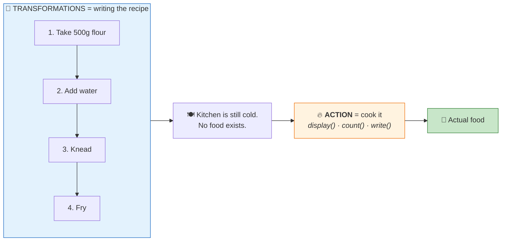
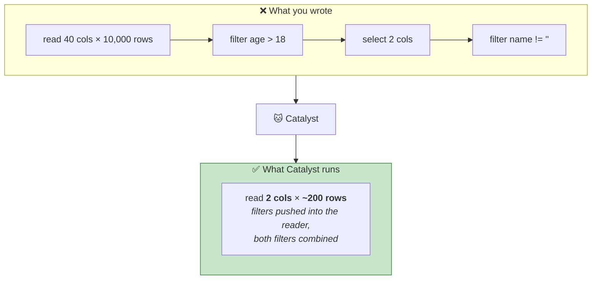
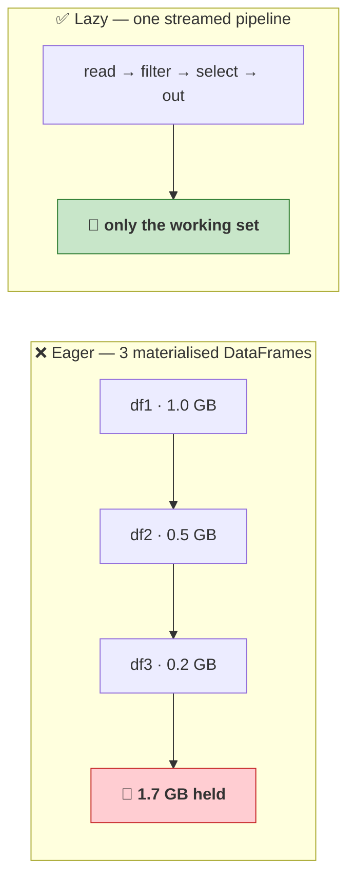
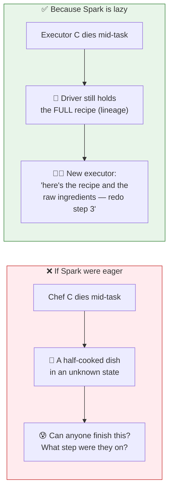

# Part 14 — Transformations vs Actions & Lazy Evaluation

> **Section goal:** Understand the single most surprising behaviour in Spark — that most of your code does *nothing* when you run it. You'll learn exactly which operations are which, why the delay is deliberate, the four concrete benefits it buys, and the caching trap that catches everyone once.

Covers transcript `01:07:47` – `01:16:10`.

---

## 1. The behaviour that confuses everyone

```python
df_narrow = (spark.table("workspace.default.movies")
    .filter(F.col("release_year") > 2010)
    .select("title", "studio", "imdb_rating"))     # ← runs in milliseconds. Suspiciously fast.

display(df_narrow)                                  # ← takes seconds. Why?
```

> *"When you execute this cell, it **doesn't actually create the `df_narrow` DataFrame**. It will only create a **plan**. It will execute this code and create a `df_narrow` DataFrame when you call `display`, or when you call `df_narrow.show()`."*

> *"If you're running this code in **pandas**, it will execute this code right away and it will create a `df_narrow` DataFrame. But in Spark it will **not** create `df_narrow` with all its data. It will create that variable, but this code will not be executed."*

```mermaid
flowchart TB
    subgraph EAGER["🐼 EAGER — pandas"]
        E1["df.filter(...)"] --> E2["⚡ runs NOW<br/>materialises rows"]
        E2 --> E3["df.select(...)"] --> E4["⚡ runs NOW<br/>materialises again"]
        E4 --> E5["Result already in memory"]
    end
    subgraph LAZY["⚡ LAZY — Spark"]
        L1["df.filter(...)"] --> L2["📝 records the intent<br/><i>plan node added</i>"]
        L2 --> L3["df.select(...)"] --> L4["📝 records the intent<br/><i>plan node added</i>"]
        L4 --> L5["😴 still nothing has run"]
        L5 --> L6["display() / count() / write()"] --> L7["💥 <b>NOW</b> optimise<br/>+ execute the whole thing at once"]
    end
    style LAZY fill:#e3f2fd,stroke:#1565c0
    style L7 fill:#c8e6c9,stroke:#2e7d32
```



**The rule:**

> **Transformations build a plan. Actions run it.**

---

## 2. Transformations

> *"Whenever you are doing transformations such as filters, select, etc. — **all these methods are called transformations**… It will not trigger the code actually. It will just build a plan."*

**Definition (memorise this phrasing):**

> A **transformation** is an operation that **defines a new dataset from an existing one but does not execute it immediately**.

Because DataFrames are immutable (Part 8), every transformation returns a *new* DataFrame — which is really just a *new plan node*.

### The transformation reference

| Category | Operations |
|----------|-----------|
| **Column selection** | `select`, `selectExpr`, `drop`, `withColumn`, `withColumnRenamed`, `alias` |
| **Row filtering** | `filter`, `where`, `limit`, `sample` |
| **Aggregation setup** | `groupBy`, `rollup`, `cube`, `agg`, `pivot` |
| **Joining** | `join`, `crossJoin`, `union`, `unionByName`, `intersect`, `except` |
| **Ordering** | `orderBy`, `sort`, `sortWithinPartitions` |
| **Deduplication** | `distinct`, `dropDuplicates` |
| **Nulls** | `na.drop`, `na.fill`, `na.replace` |
| **Partitioning** | `repartition`, `coalesce`, `repartitionByRange` |
| **Reshaping** | `explode`, `flatten`, `melt`, `transpose` |
| **Windowing** | `Window` + `over()` |

> 🧠 **Quick test:** *does it return a DataFrame?* → transformation.

---

## 3. Actions

> *"But when you say `.show()` — see, at that time you're showing the results, so it **has to be executed**. When you say `count`, `toPandas`, when you're writing to disk — let's say you are writing a DataFrame to disk in a Parquet or CSV format — **you have to execute the code**."*

**Definition:**

> An **action** is an operation that **triggers the actual execution** and either **returns a result to the driver** or **writes data to storage**.

### The action reference

| Category | Operations | Returns |
|----------|-----------|---------|
| **Display** | `show()`, `display()` | Printed/rendered output |
| **Counting** | `count()`, `isEmpty()` | A number / boolean |
| **Fetching rows** | `collect()`, `take(n)`, `first()`, `head(n)`, `tail(n)`, `toPandas()` | Data **to the driver** ⚠️ |
| **Aggregate to a value** | `.agg()` **followed by** `.collect()`/`.first()` | A value |
| **Writing** | `write.save()`, `write.saveAsTable()`, `write.parquet()`, `write.insertInto()` | Nothing — writes to storage |
| **Statistics** | `describe().show()`, `summary().show()` | Printed output |
| **Iteration** | `foreach()`, `foreachPartition()` | Nothing |

> 🧠 **Quick test:** *does it return something that is NOT a DataFrame — or write files?* → action.

### ⚠️ The two edge cases

| Operation | Transformation or action? |
|-----------|---------------------------|
| `df.printSchema()` | **Neither** — reads metadata only, no data touched |
| `df.explain()` | **Neither** — builds and prints the plan, doesn't run it |
| `df.limit(5)` | **Transformation** (returns a DataFrame) |
| `df.take(5)` | **Action** (returns a Python list) |
| `df.cache()` | **Transformation** — marks for caching; nothing is cached until an action runs |

---

## 4. The recipe analogy

> *"It is like **transformation is a recipe that a chef is preparing**. Let's say they are preparing a recipe for Rasgulla, or they are preparing another recipe for Hyderabadi Biryani. They are just **noting it down**. But **action is like cooking that recipe** — making that Rasgulla."*



> 💡 **Why the analogy is genuinely good, not just cute:** a written recipe can be *edited before cooking* — swap the order of steps, remove a redundant one, realise you only need half the batch. That's exactly what Catalyst does. Once you've started frying, it's too late to optimise.

---

## 5. Why laziness? The four benefits

> *"Now let's understand **why do we do lazy evaluation**. There are a couple of benefits."*

### Benefit 1 — Query optimisation

> *"Just look at this query. If you have **eager execution** — if you're executing at every step — then what will happen is it will first filter on age greater than 18. Then let's say this DataFrame has five columns. Now it will select only one column. And then it will filter on column name not equal to blank."*

```python
result = (df
    .filter(F.col("age") > 18)              # step 1
    .select("name", "age")                  # step 2
    .filter(F.col("name") != "")            # step 3
    .show(5))                               # ← the only action
```

**Eager execution would do three separate full passes.** Lazy execution sees the whole thing first and rewrites it:

> *"When you create the plan of this entire transformation, then instead of running three separate transformations you can **combine both filters into one**… and you can **push down filters to the data source**. So instead of reading like 10,000 records, you are reading maybe **200 records** from the disk. Then only read `name` and `age` columns — let's say this DataFrame when you're reading from disk has 40 columns, but in my code I'm using only two."*



**Three optimisations, all impossible without laziness:** combine filters · push filters to the source · prune columns.

### Benefit 2 — Avoid unnecessary work

> *"See here, I'm showing only first **five rows**. But let's say if you're running this in pandas, and this is a huge DataFrame — this might contain a million records. Whereas in PySpark what will happen is: it will not execute the code here, it will execute code **only here**. So now it knows that the user wants only five rows — so it will execute and it will just show you five rows."*

```python
df.filter(...).select(...).show(5)
```

Spark pushes the `LIMIT 5` down and stops reading once it has five matching rows. Pandas would have materialised a million rows first and then displayed five.

### Benefit 3 — Memory efficiency

> *"Let's say you have a file of 1 gigabyte and you are reading it into a DataFrame. Then you are applying a filter — let's say this is `df1`, now you have `df2`… `df3`. So you have three DataFrames and **it will store 1.7 gigabyte**. But with lazy execution it will create a **pipeline** — 1 GB, filter, select, result — and with that it will occupy **much less memory**."*



Rows flow through the whole chain one batch at a time. Intermediate DataFrames never physically exist.

### Benefit 4 — Fault tolerance

> *"It is also fault tolerant. See, this is the beauty of Spark… Since it has the **entire plan or entire recipe** — see, this is important. When you have the entire recipe, now you can take the recipe and dataset and give it to someone. **It's not like you have a half-cooked recipe.**"*

> *"Let's say this chef has cooked some recipe — they are creating a vegetable biryani, they have cooked vegetables and they have not mixed rice yet. Let's say this chef falls ill. Now you **don't want to give this half-cooked recipe** to someone. Since you have the entire recipe, this **master chef will give that entire recipe to a new chef** and say 'OK, this is the recipe, these are my raw ingredients — prepare' — rather than giving this half-cooked recipe to someone."*



> 🧠 **The chain: immutable + lazy ⟹ complete lineage ⟹ recomputable ⟹ fault tolerant.** This is the deepest idea in Spark, and it's why the design choices in Part 8 and Part 14 aren't independent.

---

## 6. ⚠️ The trap: laziness means *re-computation*

The one downside, and the thing that catches everyone once.

```python
df_expensive = (spark.table("huge_table")
    .filter(...)
    .join(other, "key")
    .groupBy("x").agg(...))

print(df_expensive.count())      # 🔥 action 1 — runs the ENTIRE chain
display(df_expensive)            # 🔥 action 2 — runs the ENTIRE chain AGAIN
df_expensive.write.saveAsTable() # 🔥 action 3 — and AGAIN
```

**Three actions = three full executions.** Spark keeps the *recipe*, not the *result* — so unless you tell it otherwise, it re-cooks from scratch every time.

### The fix: `cache()` / `persist()`

```python
df_expensive.cache()          # mark for caching (a TRANSFORMATION — nothing happens yet)
df_expensive.count()          # first action: computes AND populates the cache
display(df_expensive)         # ⚡ now served from cache
df_expensive.write.saveAsTable("…")   # ⚡ from cache

df_expensive.unpersist()      # free the memory when done
```

| Method | Storage level |
|--------|---------------|
| `.cache()` | Shorthand for `MEMORY_AND_DISK` |
| `.persist(StorageLevel.MEMORY_ONLY)` | RAM only; recompute what doesn't fit |
| `.persist(StorageLevel.MEMORY_AND_DISK)` | RAM, spilling to local disk — the default |
| `.persist(StorageLevel.DISK_ONLY)` | Disk only; for very large intermediates |
| `.persist(StorageLevel.MEMORY_AND_DISK_2)` | Replicated ×2 for extra resilience |
| `.unpersist()` | Release it |

### ⚠️ When *not* to cache

| Situation | Why not |
|-----------|---------|
| The DataFrame is used **once** | Caching adds overhead for zero benefit |
| It's a simple scan of a Delta table | Delta + Photon + the OS page cache are already fast |
| The data doesn't fit in memory | Cached blocks get evicted; you pay to cache and still recompute |
| You forget to `unpersist()` | Cached blocks steal **execution** memory → shuffle spill (Part 13) |

> ⭐ **Interview:** *"When would you cache a DataFrame?"* → *"When the same expensive intermediate result is consumed by two or more actions — a typical case is computing a joined-and-aggregated DataFrame, then writing it *and* running quality checks on it. Because Spark is lazy it keeps the plan, not the result, so without caching each action re-runs the whole lineage. I'd cache, force materialisation with a cheap action, then `unpersist` when done. I'd *avoid* caching when the DataFrame is used once, when it's a straightforward Delta scan that Photon already handles well, or when it won't fit in memory — cached blocks compete with execution memory for shuffles, so over-caching causes disk spill and makes things slower. For very long lineages I'd consider `checkpoint()` or just writing an intermediate Delta table instead, since that also truncates the lineage."*

### The alternative: write an intermediate table

For long pipelines — like the medallion layers in Parts 21–25 — **materialising to Delta is often better than caching**:

```python
df_expensive.write.format("delta").mode("overwrite").saveAsTable("ecommerce.silver.staging")
df_from_here = spark.table("ecommerce.silver.staging")   # short, clean lineage
```

Benefits: survives cluster restarts, visible to other notebooks, gets Delta optimisations, and **truncates the lineage** so recovery is cheap.

---

## 7. 🧪 Lab — see laziness with your own eyes

```python
import pyspark.sql.functions as F, time

df = spark.table("workspace.default.movies")

# ── 1. Time a transformation vs an action ────────────────────────────
t0 = time.time()
df_narrow = df.filter(F.col("release_year") > 2010).select("title", "studio", "imdb_rating")
print(f"Transformations: {time.time()-t0:.4f}s")     # ~0.00s — nothing ran

t0 = time.time()
n = df_narrow.count()
print(f"Action:          {time.time()-t0:.4f}s  → {n} rows")   # measurably slower

# ── 2. Prove a bad transformation doesn't fail until an action ───────
bad = df.filter(F.col("release_year") / 0 > 1)       # ✅ no error — just a plan
try:
    bad.count()                                       # 💥 error surfaces HERE
except Exception as e:
    print("Failed only on the action:", type(e).__name__)

# ── 3. Count the jobs each action triggers ──────────────────────────
#    (watch the "Spark Jobs" expander under each cell)
df_narrow.count()          # 1 job
df_narrow.show(5)          # 1 job
df_narrow.collect()        # 1 job
df_narrow.explain()        # 0 jobs — not an action

# ── 4. Watch re-computation happen ──────────────────────────────────
expensive = (df.filter(F.col("release_year") > 1990)
               .groupBy("studio")
               .agg(F.avg("imdb_rating").alias("avg_rating"),
                    F.count("*").alias("n")))

t0 = time.time(); expensive.count();   print(f"1st action (cold): {time.time()-t0:.3f}s")
t0 = time.time(); expensive.collect(); print(f"2nd action (recomputed!): {time.time()-t0:.3f}s")

expensive.cache()
expensive.count()                                       # populates the cache
t0 = time.time(); expensive.collect(); print(f"3rd action (cached): {time.time()-t0:.3f}s")
expensive.unpersist()

# ── 5. LIMIT pushdown — benefit 2 in action ──────────────────────────
df.orderBy(F.col("imdb_rating").desc()).limit(5).explain("formatted")
# ➡️ look for a "TakeOrderedAndProject" node — Spark keeps only the top 5,
#    it does NOT sort everything and then discard.
```

**✅ Checkpoint:** the transformation cell is ~instant; the divide-by-zero fails only at `.count()`; `explain()` triggers **zero** jobs; the cached third action is faster than the recomputed second.

---

## 8. Where each action's cost lands

| Action | Returns to driver? | Danger |
|--------|-------------------|--------|
| `count()` | Just a number | 🟢 Safe at any scale |
| `show(n)` | n rows | 🟢 Safe |
| `take(n)` / `head(n)` | n rows | 🟢 Safe |
| `first()` | 1 row | 🟢 Safe |
| `display(df)` | Databricks caps the render (~1000 rows) | 🟢 Fairly safe |
| **`collect()`** | ⚠️ **ALL rows** | 🔴 Can OOM the driver |
| **`toPandas()`** | ⚠️ **ALL rows** | 🔴 Can OOM the driver |
| `write.*` | Nothing | 🟢 Writes in parallel from executors |
| `foreach()` | Nothing | 🟢 Runs on executors |

> 🧠 **`count()` is safe because only per-partition counts travel back. `collect()` is dangerous because every row does.** Same laziness, completely different blast radius.

---

## ⭐ Likely Interview Questions for This Section

**Q1. "What's the difference between a transformation and an action?"**
> *Model answer:* "A transformation defines a new dataset from an existing one but doesn't execute — it just adds a node to the logical plan and returns a new DataFrame. `filter`, `select`, `withColumn`, `join`, `groupBy` are all transformations. An action triggers actual execution and either returns a result to the driver or writes to storage — `count`, `show`, `collect`, `write`. The quick test is: if it returns a DataFrame it's a transformation; if it returns a value or writes files, it's an action. The analogy I use is that transformations write the recipe and actions cook it."

**Q2. "Why is Spark lazy? What does it buy you?"**
> *Model answer:* "Four things. **Optimisation** — seeing the whole chain before executing lets Catalyst combine adjacent filters, push predicates into the file reader and prune unused columns, which is impossible if each step has already run. **Avoiding unnecessary work** — a `show(5)` at the end means Spark can push a limit down and stop reading early rather than materialising a million rows. **Memory efficiency** — intermediate DataFrames never physically exist; rows stream through the pipeline, so three chained operations don't cost three copies. And **fault tolerance** — because the driver holds the complete recipe rather than partially-computed results, a lost partition can simply be recomputed on another executor."

**Q3. "You call `count()` then `write()` on the same DataFrame. What happens?"**
> *Model answer:* "The entire lineage executes twice, because Spark caches the *plan*, not the *result*. Every action re-runs from the source. If the chain includes an expensive join or aggregation, that's a doubling of cost that's easy to miss because nothing errors. The fix is to `cache()` or `persist()` before the first action, force materialisation, then `unpersist()` afterwards. For long medallion-style pipelines I'd often prefer writing an intermediate Delta table instead — it survives restarts, is visible to other notebooks, and truncates the lineage so recovery is cheap."

**Q4. "Is `cache()` a transformation or an action?"**
> *Model answer:* "A transformation — it only marks the DataFrame for caching. Nothing is actually stored until a subsequent action forces computation, and even then the cache populates as a side effect of that action. That's why you often see `df.cache()` followed by a cheap action like `df.count()` to materialise it deliberately, so the next real action gets a warm cache rather than paying to populate it."

**Q5. "How does laziness relate to fault tolerance?"**
> *Model answer:* "Directly. Because transformations are recorded rather than executed, and DataFrames are immutable, the driver holds a complete, deterministic description of how every partition derives from source data — the lineage. When an executor dies, there's no half-finished intermediate result to salvage; the driver just re-runs that partition's lineage somewhere else. The chain is: immutable plus lazy gives you complete lineage, which gives you recomputability, which gives you fault tolerance without checkpointing every step."

**Q6. "Your notebook cell finishes instantly but the next one takes ten minutes. Explain to a junior."**
> *Model answer:* "The first cell only contained transformations, so it built a plan and did no work — that's why it was instant. The second cell had an action, which triggered execution of everything that was queued up. It's not that the second operation is slow; it's that it's paying for all the work described in the first cell too. Practically, this means timing individual cells is misleading, and you should look at the Spark UI's job view to see where time actually went rather than trusting cell durations."

**Q7. "When should you NOT cache?"**
> *Model answer:* "When the DataFrame is consumed by only one action — caching adds serialisation and memory cost for no reuse. When it's a straightforward scan of a Delta table, since Delta with Photon and the OS page cache is already efficient and caching mostly duplicates that. When it won't fit in memory, because blocks get evicted and you pay the caching cost *and* recompute. And critically, when you'd forget to `unpersist` — cached storage memory competes with execution memory in Spark's unified pool, so over-caching starves shuffles and causes disk spill, which makes the whole job slower. Caching is a targeted optimisation, not a default."

---

## 🧠 30-Second Memory Hooks

- **⭐ Transformations build the plan. Actions run it.**
- **Recipe = transformation (writing it down). Cooking = action.** You can edit a recipe; you can't un-fry a puri.
- **Test: returns a DataFrame → transformation. Returns a value or writes files → action.**
- **Transformations:** `select` `filter` `where` `withColumn` `join` `groupBy` `orderBy` `distinct` `union` `repartition`
- **Actions:** `show` `display` `count` `collect` `take` `first` `toPandas` `write.*` `foreach`
- **`explain()` and `printSchema()` are NEITHER** — no data is read.
- **The four benefits: optimise · skip unnecessary work · stream instead of materialise · fault tolerance.**
- **Eager 1 GB → 1.7 GB across three DataFrames. Lazy → one streamed pipeline.**
- **⚠️ Each action re-runs the WHOLE lineage.** Spark keeps the recipe, not the dish.
- **`cache()` is a TRANSFORMATION** — nothing is cached until an action fires.
- **Cache when 2+ actions share an expensive result. `unpersist()` when done.**
- **For long pipelines, an intermediate Delta table often beats `cache()`** — it survives restarts and truncates lineage.
- **`count()` is safe (counts come back). `collect()` is not (every row comes back).**
- **immutable + lazy ⟹ lineage ⟹ recomputable ⟹ fault tolerant.**

---

*Next suggested section:* **[Part 15 — Narrow vs Wide Transformations & the Shuffle](Part-15-narrow-wide-transformations-shuffle.md)** — not all transformations cost the same. Next you'll learn why `filter` is nearly free and `groupBy` is expensive, what a shuffle physically does to your network, and how to spot and reduce them.

---

**Navigation** — ⬅️ **[Part 13 — Spark Architecture](Part-13-spark-architecture-execution-model.md)** · 🏠 **[Master Index](../Databricks%20-%20Study%20Guide.md)** · ➡️ **[Part 15 — Narrow vs Wide & the Shuffle](Part-15-narrow-wide-transformations-shuffle.md)**
