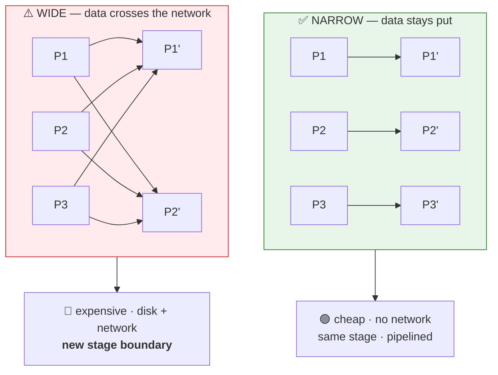
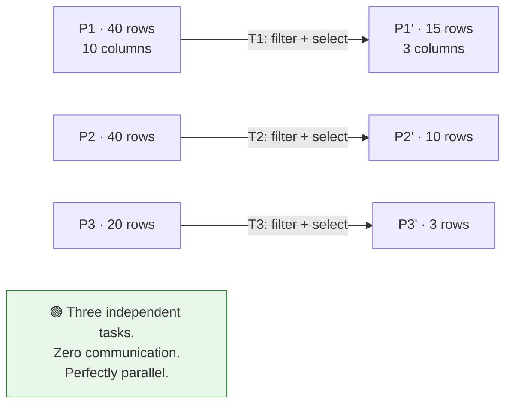
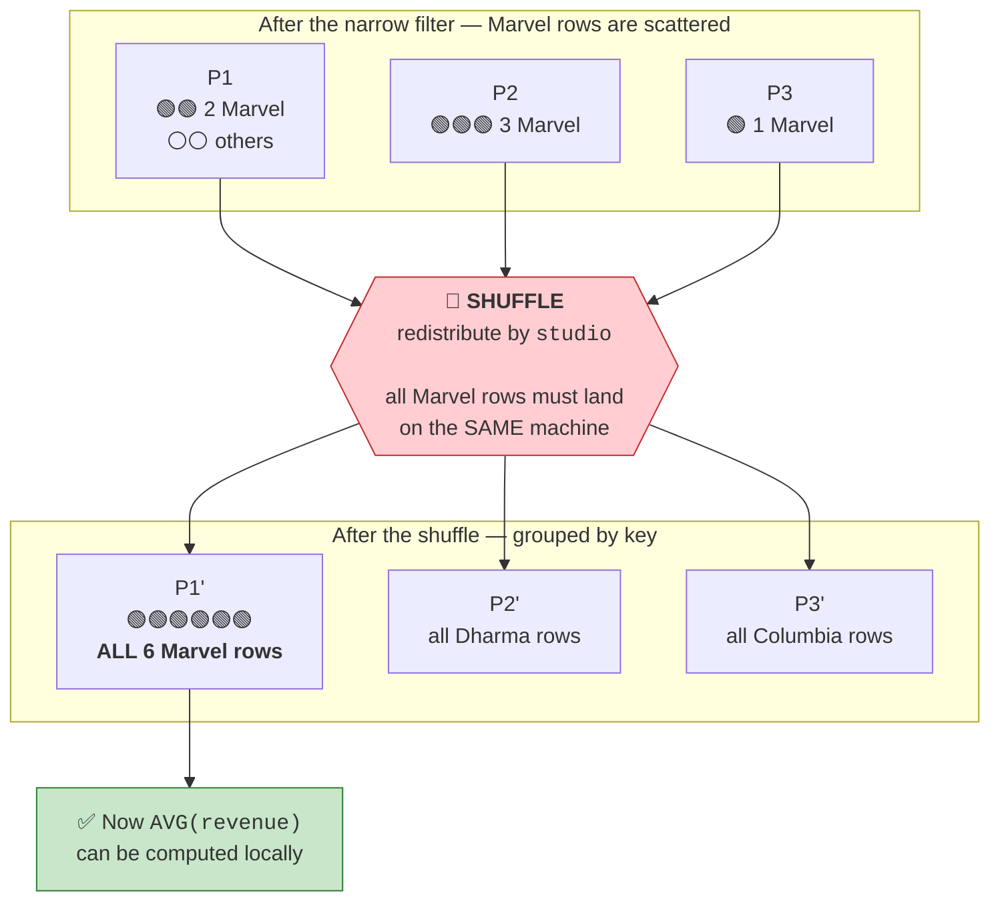
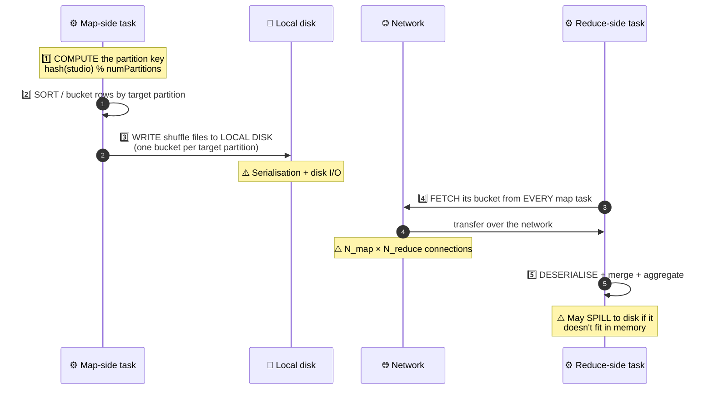
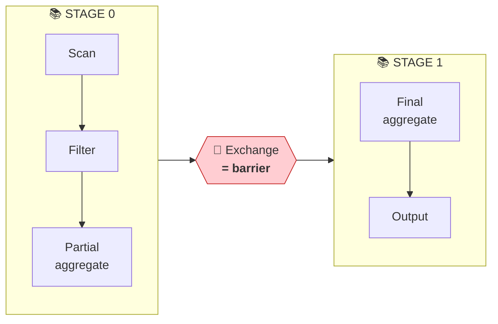
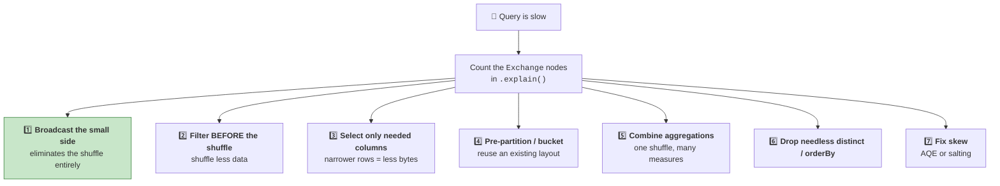
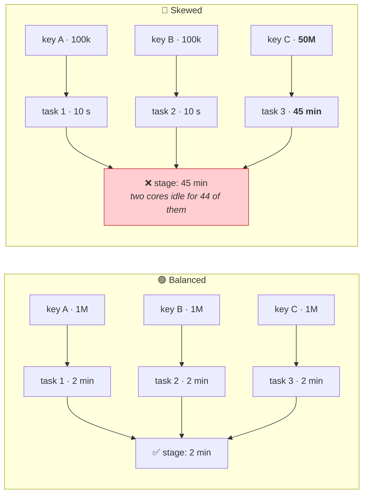

# Part 15 — Narrow vs Wide Transformations & the Shuffle

> **Section goal:** Learn why `filter` is nearly free and `groupBy` is expensive. You'll understand what a shuffle physically does to disk and network, how to spot one in a query plan, and the concrete techniques for eliminating shuffles — the highest-leverage performance skill in Spark.

Covers transcript `01:16:10` – `01:20:04`.

---

## 1. The distinction in one sentence

> **Narrow** = each output partition is built from **one** input partition. No data moves between machines.
> **Wide** = each output partition needs data from **many** input partitions. Data must move between machines — a **shuffle**.



---

## 2. Narrow — the example from Part 13

> *"The example that we saw before, where you are just **filtering** on data and **selecting** a bunch of columns, is a **narrow transformation**. A narrow transformation is a transformation where **you don't have to exchange data between different nodes**."*

> *"Here, let's say in partition 1 you are getting a total of 40 records… Now, when you run task T1 you will first filter these records. To filter the record here you are looking at `release_year`. So let's say from 40 you get 15 records — **you're working on this P1 set only. You don't have to check P2.** And then from those 15 records… out of that you're picking only three columns. Same thing for P2 and P3."*



**Formal definition:**

> A **narrow transformation** is one where **each output partition depends on a single input partition** — so there is **no shuffle**.

**Why it's cheap:** no network, no disk spill for shuffle files, and Spark can **fuse** consecutive narrow operations into a single WholeStageCodegen loop (the `*` you saw in Part 12). Filter-then-select becomes one pass over the data, not two.

---

## 3. Wide — when data must move

> *"But what if you have an operation like this, where you are first **filtering** but then you are **grouping by studio**, and then you are calculating the **average revenue** of every studio? Let's say Marvel Studios has this much average revenue… Now in that case **you will have to look at data on different nodes.**"*

```python
(df.filter(F.col("release_year") > 2010)      # narrow
   .groupBy("studio")                          # ⚠️ WIDE — requires a shuffle
   .agg(F.avg("revenue").alias("avg_revenue")))
```

> *"So let's say first you filter down data using 2010… and you got all this new dataset. But now, to perform **group by**, you have to look at **all these three datasets**. So maybe some different node — let's say node B — is doing group by. Now it has to get this filtered data. This data and this data needs to go to this node, and this node can perform the group-by operation."*



> *"Same thing with **sorting**. If you're doing sorting, you have to go to a different node to get the data — and **this is expensive**. This is going to slow down performance. But we don't have any other option, because there will be data transfer between different machines."*

**Formal definition:**

> A **wide transformation** is one where **each output partition depends on multiple input partitions**, requiring a **shuffle** (also called an **exchange**) between stages.

---

## 4. The reference table

| | ✅ **Narrow** | ⚠️ **Wide** |
|---|---|---|
| Output partition depends on | **One** input partition | **Many** input partitions |
| Data crosses the network | ❌ No | ✅ Yes |
| Writes shuffle files to disk | ❌ No | ✅ Yes |
| Creates a new stage | ❌ No | ✅ **Yes** — stage boundary |
| Can fuse with neighbours (codegen) | ✅ Yes | ❌ Breaks the fusion |
| Shows `Exchange` in the plan | ❌ | ✅ |
| Relative cost | 🟢 Cheap | 🔴 Expensive |
| **Operations** | `filter` · `where` · `select` · `withColumn` · `drop` · `cast` · `map`-type · `union` · `sample` · `coalesce` | `groupBy` · `agg` · `join` · `orderBy` · `sort` · `distinct` · `dropDuplicates` · `repartition` · `Window` · `intersect` · `except` · `pivot` |

> *"These are the examples of narrow transformation: you want to filter on a certain column, you want to select certain columns, you want to create a new column — map-type of operations. Wide transformation, on the other hand, is **group by, order by, join** — for all these you need **all the records**. With a subset of records you can't perform this operation."*

> ⚠️ **`union` is narrow but `distinct` is wide.** `union` just concatenates partition lists (it's really `UNION ALL`). Deduplicating requires comparing rows across partitions — so `distinct()` shuffles.

> ⚠️ **`coalesce` is narrow but `repartition` is wide.** Both change partition counts, but `coalesce` only merges neighbours locally while `repartition` does a full redistribution. That's the whole point of Part 16.

---

## 5. What a shuffle *physically* does

The course says shuffles are expensive. Here's exactly why — and this level of detail is what separates a good interview answer from a generic one.



### The five costs, ranked

| # | Cost | Why it hurts |
|---|------|--------------|
| 1 | **Disk I/O (map side)** | Shuffle data is *always* written to local disk first — even if memory is plentiful — so it survives an executor failure |
| 2 | **Serialisation / deserialisation** | Objects → bytes → objects. Pure CPU overhead producing no business value |
| 3 | **Network transfer** | Every reducer fetches from every mapper: `N_map × N_reduce` connections |
| 4 | **Memory pressure & spill** | If a reduce partition exceeds available memory, it spills to disk again |
| 5 | **Synchronisation barrier** | ⭐ **The stage cannot start until *every* map task finishes.** One slow task holds up everyone |

> 🧠 **The barrier is the underrated one.** Narrow operations pipeline continuously; a shuffle forces a full stop-and-wait. That's why **skew** (one slow task) is catastrophic *specifically* at shuffle boundaries.

### Why shuffles create stage boundaries



Everything in Stage 0 can be pipelined per partition. Stage 1 cannot begin until Stage 0 has fully materialised its shuffle files. **Number of stages ≈ number of shuffles + 1** (Part 13).

### Partial aggregation — Spark's built-in mitigation

Notice `Partial aggregate` *before* the exchange. Spark pre-aggregates on the map side so it shuffles **one partial result per key per partition** instead of every raw row.

**Analogy:** each regional office totals its own sales before posting the number to head office, rather than couriering every individual receipt.

```
HashAggregate(keys=[studio], functions=[partial_avg(revenue)])   ← map side
+- Exchange hashpartitioning(studio, 200)
   +- HashAggregate(keys=[studio], functions=[avg(revenue)])     ← reduce side
```

> ⭐ **The classic RDD interview question:** *"`reduceByKey` vs `groupByKey`?"* → *"`reduceByKey` performs map-side combining, so each partition sends one pre-reduced value per key across the network. `groupByKey` shuffles every raw value and only then groups, so network traffic is proportional to total rows rather than distinct keys — and a hot key can blow up a single reducer's memory. For DataFrames this is handled automatically by partial aggregation, which is another reason to prefer the DataFrame API over RDDs."*

---

## 6. Spotting shuffles

> *"In the plan — when I run `explain` — the physical plan will have things like… **shuffle**. You see, it is doing **shuffling and exchange**, because we are running a wide transformation."*

```python
# Narrow — no Exchange
df.filter(F.col("release_year") > 2010).select("title").explain()

# Wide — Exchange appears
df.groupBy("studio").agg(F.avg("revenue")).explain()
```

```
== Physical Plan ==
*(2) HashAggregate(keys=[studio#16], functions=[avg(revenue#19)])
+- Exchange hashpartitioning(studio#16, 200), ENSURE_REQUIREMENTS   ← 🔴 THE SHUFFLE
   +- *(1) HashAggregate(keys=[studio#16], functions=[partial_avg(revenue#19)])
      +- *(1) Filter (isnotnull(release_year#14) AND (release_year#14 > 2010))
         +- Scan parquet …
```

| What to look for | Meaning |
|------------------|---------|
| `Exchange hashpartitioning(...)` | Shuffle by hash of the key — `groupBy`, `join`, `distinct` |
| `Exchange rangepartitioning(...)` | Shuffle for a global sort — `orderBy` |
| `Exchange SinglePartition` | ⚠️ Everything to **one** partition — `orderBy` without partitioning, or `count()` over a window |
| `Exchange RoundRobinPartitioning` | `repartition(n)` without a key |
| `ReusedExchange` | 🟢 Spark reused a previous shuffle — good |
| `AQEShuffleRead coalesced` | 🟢 AQE merged small post-shuffle partitions |

**In the Spark UI:** the **Stages** tab shows **Shuffle Read** and **Shuffle Write** in bytes. Those numbers are your shuffle bill.

### ⚠️ The serverless caveat from the transcript

> *"In my notebook I performed this particular transformation, and since this is running on **serverless compute** on Databricks, I had to set **explicit partition** and also I had to call **repartition**… You can ignore this — this is just for serverless compute on Databricks."*

Serverless manages partitioning automatically, so to *demonstrate* a shuffle he had to force one. Don't copy those two lines into real code — they exist purely to make the teaching example visible.

---

## 7. How to reduce shuffles — the practical toolkit

This is the section that makes you faster at your job.



### 1. Broadcast instead of shuffling (the biggest win)

```python
from pyspark.sql.functions import broadcast
fact.join(broadcast(small_dim), "product_id", "left")   # ← no shuffle of the fact table
```

### 2. Filter before the wide operation

```python
# ❌ shuffles everything, then discards
df.groupBy("studio").agg(F.avg("revenue")).filter(F.col("studio") == "Marvel Studios")

# ✅ shuffles only Marvel rows
df.filter(F.col("studio") == "Marvel Studios").groupBy("studio").agg(F.avg("revenue"))
```

> 💡 Catalyst pushes many filters down automatically — but **not through UDFs or opaque expressions**. Writing it in the right order costs nothing and removes the risk.

### 3. Select before the shuffle

Shuffled rows carry **all** their columns. Dropping 30 unused columns before a join shrinks the shuffle proportionally.

### 4. Combine aggregations into one pass

```python
# ❌ three shuffles
a = df.groupBy("studio").agg(F.avg("revenue"))
b = df.groupBy("studio").agg(F.max("imdb_rating"))
c = df.groupBy("studio").count()

# ✅ ONE shuffle
combined = df.groupBy("studio").agg(
    F.avg("revenue").alias("avg_revenue"),
    F.max("imdb_rating").alias("best_rating"),
    F.count("*").alias("n"))
```

### 5. Avoid unnecessary `distinct` and `orderBy`

```python
df.select("studio").distinct()                    # ⚠️ shuffle — is it needed?
df.orderBy("revenue").limit(10)                   # ✅ TakeOrderedAndProject, cheap
df.orderBy("revenue").write.saveAsTable("t")      # ❌ global sort = full shuffle for no benefit
df.sortWithinPartitions("revenue")                # ✅ narrow — if per-partition order suffices
```

> ⚠️ **Sorting before writing is almost always wasted work** unless you're doing it for data-skipping purposes — in which case use `ZORDER`/liquid clustering (Part 7), not `orderBy`.

### 6. Reuse a partitioning layout

If you'll perform several operations on the same key, pay for one shuffle and reuse it — that's the core argument of Part 16:

```python
base = df.repartition(6, "studio")        # one deliberate shuffle
base.groupBy("studio").agg(...)           # no further shuffle
base.withColumn("rank", F.row_number().over(w))   # no further shuffle
```

### 7. Tune shuffle partitions (mostly obsolete, but know it)

```python
spark.conf.get("spark.sql.shuffle.partitions")     # historically 200
spark.conf.set("spark.sql.adaptive.enabled", "true")  # AQE now coalesces automatically
```

> 💡 The old rule was "set it to ~2–3× total cores". With AQE on, Spark right-sizes post-shuffle partitions at runtime, so manual tuning is rarely needed on modern Databricks.

---

## 8. Data skew — where shuffles go from expensive to catastrophic

If one key holds most of the rows, one reduce task gets almost all the work.



**Diagnose:**

```python
display(df.groupBy("studio").count().orderBy(F.col("count").desc()).limit(20))
```
Or in the Spark UI: within the long stage, compare **max** vs **median** task duration and shuffle-read size.

**Fix, in order of preference:**

| Fix | How |
|-----|-----|
| **1. AQE skew join** | `spark.sql.adaptive.skewJoin.enabled = true` — splits oversized partitions automatically |
| **2. Broadcast** | No shuffle at all → skew becomes irrelevant |
| **3. Filter out the hot key** | If it's a junk value like `'UNKNOWN'` or `-1`, handle it separately |
| **4. Salting** | Add a random suffix to spread the hot key across partitions |

```python
SALT = 10
left  = df_big.withColumn("salt", (F.rand() * SALT).cast("int"))
right = df_small.withColumn("salt", F.explode(F.array([F.lit(i) for i in range(SALT)])))
joined = left.join(right, ["key", "salt"], "left").drop("salt")
```

---

## 9. 🧪 Lab

```python
import pyspark.sql.functions as F
df = spark.table("workspace.default.movies")

# ── 1. Narrow: no Exchange, one stage ────────────────────────────────
df.filter(F.col("release_year") > 2010).select("title", "studio").explain()

# ── 2. Wide: Exchange appears, two stages ────────────────────────────
df.groupBy("studio").agg(F.avg("imdb_rating")).explain()

# ── 3. Classify them yourself ────────────────────────────────────────
ops = {
    "filter":         df.filter(F.col("release_year") > 2010),
    "select":         df.select("title"),
    "withColumn":     df.withColumn("x", F.lit(1)),
    "union":          df.union(df),
    "distinct":       df.select("studio").distinct(),
    "groupBy":        df.groupBy("studio").count(),
    "orderBy":        df.orderBy("imdb_rating"),
    "dropDuplicates": df.dropDuplicates(["studio"]),
    "repartition":    df.repartition(4),
    "coalesce":       df.coalesce(1),
}
for name, d in ops.items():
    plan = d._jdf.queryExecution().executedPlan().toString()
    print(f"{name:<16} {'⚠️  WIDE (Exchange)' if 'Exchange' in plan else '✅ narrow'}")

# ── 4. Count shuffles in a realistic chain ───────────────────────────
chain = (df.filter(F.col("release_year") > 2000)     # narrow
           .groupBy("studio").agg(F.avg("revenue").alias("avg_rev"))  # shuffle 1
           .orderBy(F.col("avg_rev").desc()))         # shuffle 2
chain.explain()
print("Exchanges:", chain._jdf.queryExecution().executedPlan().toString().count("Exchange"))

# ── 5. Prove combining aggregations saves shuffles ───────────────────
one_pass = df.groupBy("studio").agg(
    F.avg("imdb_rating").alias("avg_rating"),
    F.max("imdb_rating").alias("max_rating"),
    F.count("*").alias("n"))
one_pass.explain()      # a single Exchange for three measures

# ── 6. Broadcast removes a shuffle ───────────────────────────────────
from pyspark.sql.functions import broadcast
big   = spark.range(0, 1_000_000).withColumn("k", F.col("id") % 500)
small = spark.range(0, 500).withColumnRenamed("id", "k")

spark.conf.set("spark.sql.autoBroadcastJoinThreshold", -1)
big.join(small, "k").explain()               # SortMergeJoin + 2 Exchanges
big.join(broadcast(small), "k").explain()    # BroadcastHashJoin + 1 tiny BroadcastExchange
spark.conf.set("spark.sql.autoBroadcastJoinThreshold", 10 * 1024 * 1024)

# ── 7. Filter placement ──────────────────────────────────────────────
late  = df.groupBy("studio").agg(F.avg("revenue")).filter(F.col("studio") == "Marvel Studios")
early = df.filter(F.col("studio") == "Marvel Studios").groupBy("studio").agg(F.avg("revenue"))
late.explain("formatted");  early.explain("formatted")
```

**✅ Checkpoint:** step 3 classifies `union`/`coalesce` as narrow and `distinct`/`repartition` as wide; step 4 finds **2** exchanges; step 6 shows the broadcast plan losing both big-side exchanges.

---

## ⭐ Likely Interview Questions for This Section

**Q1. "Narrow vs wide transformations?"**
> *Model answer:* "In a narrow transformation each output partition is computed from exactly one input partition, so no data crosses the network — `filter`, `select`, `withColumn`, `union`, `coalesce`. Spark can also fuse consecutive narrow operations into a single generated loop, so filter-then-select is one pass, not two. In a wide transformation an output partition needs data from many input partitions, which forces a shuffle — `groupBy`, `join`, `orderBy`, `distinct`, `repartition`, window functions. A shuffle writes to local disk, transfers over the network, and creates a stage boundary, so it's typically the dominant cost in a job. Practically: I count `Exchange` nodes in the plan, because that's the shuffle count."

**Q2. "What actually happens during a shuffle?"**
> *Model answer:* "Five phases. Each map-side task computes a target partition for every row — usually `hash(key) % numPartitions` — buckets the rows accordingly, and **writes shuffle files to local disk**, always, even with plenty of memory, so they survive an executor failure. Then each reduce task fetches its bucket from every map task over the network, which is `N_map × N_reduce` transfers. Then it deserialises and merges, spilling to disk if it exceeds memory. The costs are disk I/O, serialisation CPU, network transfer, memory pressure, and — the underrated one — the **synchronisation barrier**: the next stage cannot start until every map task finishes, so one straggler holds up the entire stage. That barrier is why skew is so damaging specifically at shuffles."

**Q3. "How do you reduce shuffles?"**
> *Model answer:* "In rough order of impact: **broadcast** the small side of a join, which removes the shuffle on the large side entirely. **Filter and select before** the wide operation so you shuffle fewer rows and narrower rows — Catalyst pushes many filters down automatically, but not through UDFs, so ordering it correctly costs nothing. **Combine aggregations** into one `agg()` call rather than three separate `groupBy`s, which turns three shuffles into one. **Reuse a partitioning layout** by repartitioning once on a key when several operations use that key. **Drop unnecessary `distinct` and global `orderBy`** — sorting before a write is nearly always wasted unless you actually want data skipping, in which case liquid clustering is the right tool. And leave AQE on so post-shuffle partitions are right-sized automatically."

**Q4. "Why does a shuffle create a new stage?"**
> *Model answer:* "Because a shuffle is a global data dependency. Everything before it can be pipelined independently per partition, but the operation after it needs input from *all* upstream partitions, so it can't start until every upstream task has written its shuffle files. That materialisation point is precisely the stage boundary. It's why stage count is roughly shuffle count plus one, and why the Spark UI's Stages tab is the fastest way to localise a slow query — you find the long stage, then look at the task duration distribution inside it."

**Q5. "Is `union` narrow or wide? What about `distinct`?"**
> *Model answer:* "`union` is narrow — it just concatenates the partition lists of both DataFrames, so it's really `UNION ALL` with no deduplication and no data movement. `distinct` is wide, because determining uniqueness requires comparing rows that may live on different partitions, so it hashes on the full row and shuffles. That's a nice pair to know because people often assume union deduplicates; it doesn't, and if you want set semantics you're paying for a shuffle you should be explicit about."

**Q6. "What's the difference between `reduceByKey` and `groupByKey`?"**
> *Model answer:* "It's an RDD-era question but the concept still matters. `reduceByKey` performs map-side combining — it pre-reduces within each partition before shuffling, so it sends one value per key per partition. `groupByKey` shuffles every raw value and groups afterwards, so network traffic scales with total row count and a hot key can exhaust a single reducer's memory. For DataFrames this is handled automatically by partial aggregation — you can see it in the plan as `partial_avg` before the `Exchange` and the final aggregate after it — which is one more reason to prefer the DataFrame API over RDDs."

**Q7. "Your job has one stage taking 45 minutes while others take seconds. Diagnose."**
> *Model answer:* "Almost certainly skew at a shuffle. I'd open the Spark UI, find that stage, and compare min, median and max task duration plus shuffle-read size — if max is orders of magnitude above median, one partition holds a disproportionate share of a key. I'd confirm by grouping the join or aggregation key and looking at the top counts; very often it's a sentinel value like `UNKNOWN`, `-1` or a null placeholder rather than genuine business data. Fixes in order: enable AQE skew-join handling so oversized partitions are split automatically; broadcast the other side if it's small enough, which eliminates the shuffle so skew stops mattering; handle the sentinel key separately if it's junk; and salting as the manual fallback — add a random suffix to the hot key on the large side and explode the small side across all salt values."

---

## 🧠 30-Second Memory Hooks

- **Narrow = one input partition → one output partition. No network.** ✅
- **Wide = many input partitions → one output partition. Shuffle.** ⚠️
- **Narrow:** `filter` `select` `withColumn` `drop` `union` `coalesce` `sample`
- **Wide:** `groupBy` `agg` `join` `orderBy` `distinct` `dropDuplicates` `repartition` `Window`
- **⚠️ `union` narrow, `distinct` wide. `coalesce` narrow, `repartition` wide.** The two pairs people get wrong.
- **🔴 `Exchange` in the plan = a shuffle.** Count them; fewer is better.
- **Shuffle = hash + sort + write to local disk + network fetch + merge (+ spill).**
- **Shuffle files ALWAYS hit local disk** — even with free memory — so they survive executor failure.
- **The underrated cost is the BARRIER:** the next stage waits for the *slowest* map task.
- **Stages ≈ shuffles + 1.**
- **Partial aggregation = each regional office totals its own sales before posting to head office.**
- **`reduceByKey` combines map-side; `groupByKey` doesn't.** DataFrames do it for you.
- **Shuffle reduction, ranked: broadcast → filter early → select early → combine aggs → reuse partitioning → drop needless sorts.**
- **Skew: one key hogs a partition → one 45-min task while cores idle.** AQE skew join → broadcast → isolate the sentinel key → salt.

---

*Next suggested section:* **[Part 16 — Partitions, Parallelism, `repartition` vs `coalesce`](Part-16-partitions-repartition-coalesce.md)** — you now know shuffles are expensive. Next: how to control the partitioning that causes them, when paying for one deliberate shuffle saves several later, and the 2,000-chefs problem of getting the partition count wrong in either direction.

---

**Navigation** — ⬅️ **[Part 14 — Transformations vs Actions](Part-14-transformations-actions-lazy-evaluation.md)** · 🏠 **[Master Index](../Databricks%20-%20Study%20Guide.md)** · ➡️ **[Part 16 — Partitions & repartition](Part-16-partitions-repartition-coalesce.md)**
