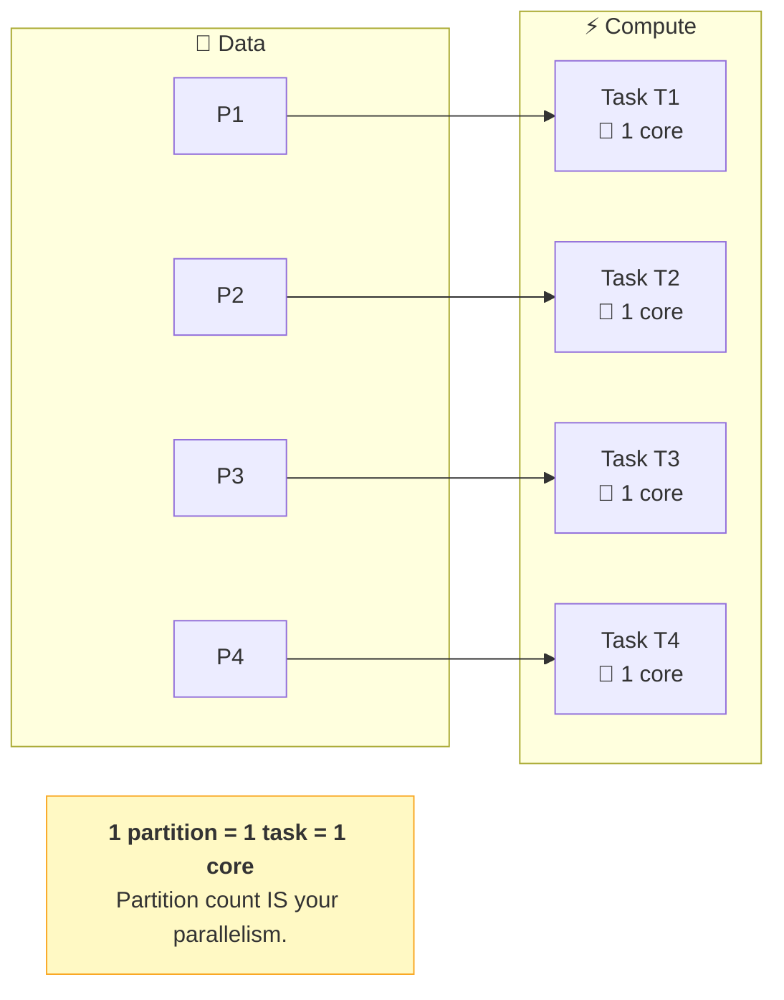
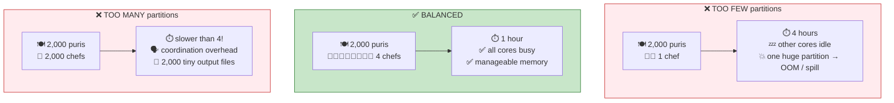
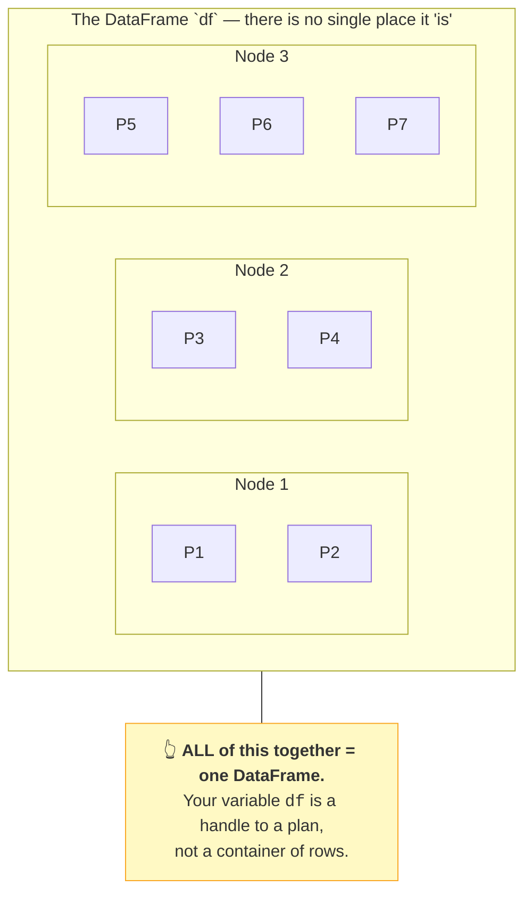
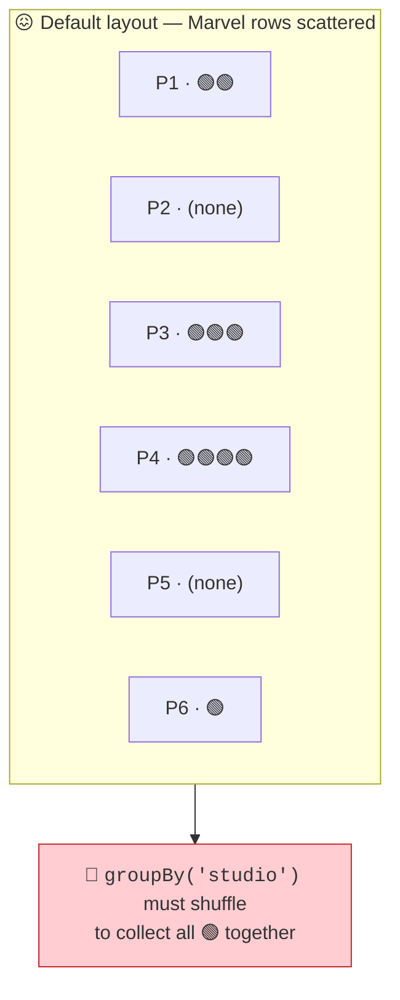
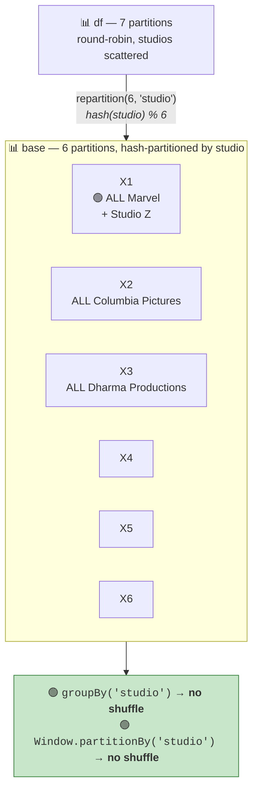
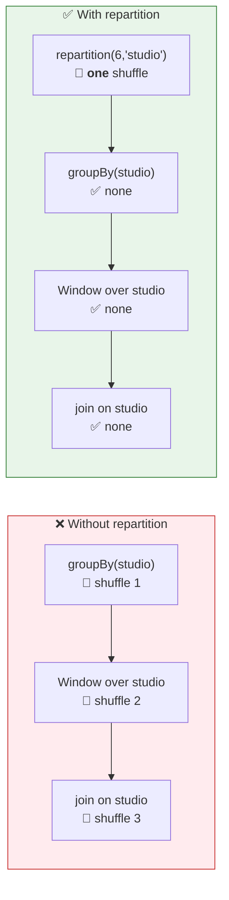
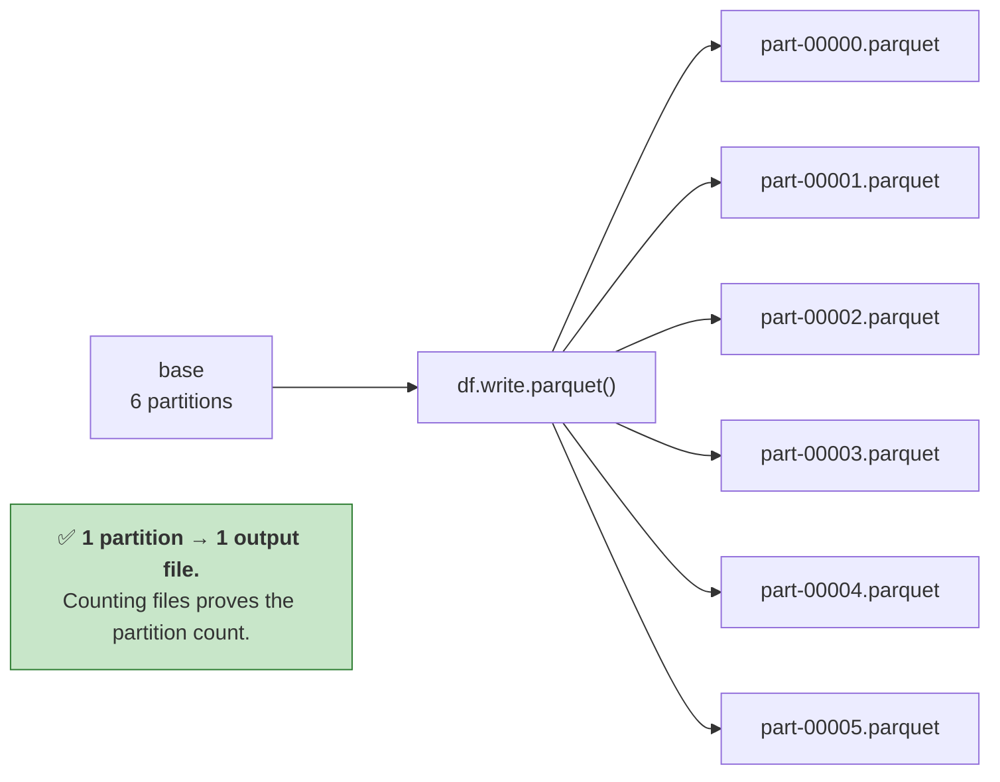
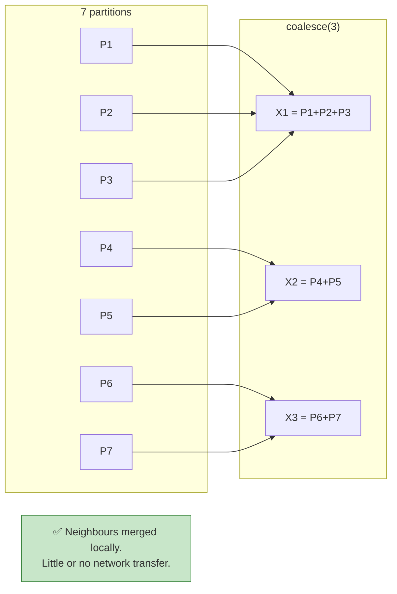
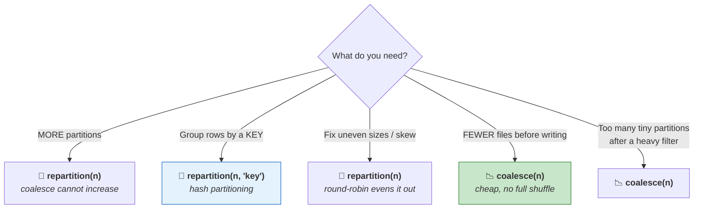
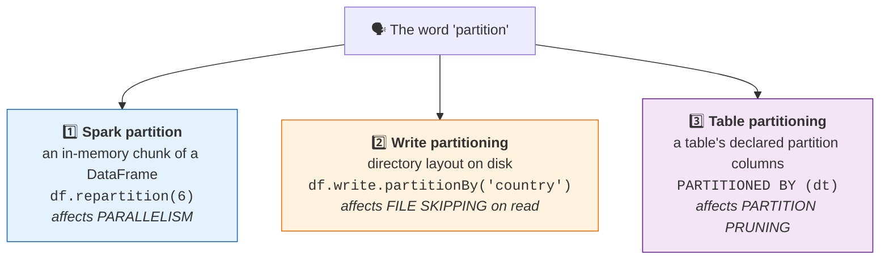

# Part 16 — 🧪 Partitions, Parallelism, `repartition` vs `coalesce`

> **Section goal:** Take control of the thing that determines both your parallelism and your shuffle cost. You'll learn what a partition really is, why too many is as bad as too few, exactly how `repartition` and `coalesce` differ, when paying for one deliberate shuffle saves several later — and how to *prove* your partition count by counting output files.

Covers transcript `01:20:04` – `01:39:45`.

---

## 1. A partition is a unit of *compute*, not just a chunk of data

> *"We have seen this particular diagram before, and we all know that Spark works on distributed computing principles — and here P1, P2, P3 are the **partitions**. So a partition is a **unit of parallelism**. It is not just a data partition. Here you will have a corresponding **task**: P1 will be processed by task T1, P2 by task T2, T3 and so on. So a partition can be considered as a **unit for parallel compute**."*



> 🧠 **Partition count is not a storage detail — it's your parallelism dial.**

```python
print(df.rdd.getNumPartitions())     # how many partitions right now
```

---

## 2. The 2,000-chefs problem — why balance matters

> *"We have seen this example before: if you want to prepare 2,000 puris you can have four chefs each preparing 500 puris. **What if someone decides to have 2,000 chefs?** Is it good? **No**, right? Because then one chef is preparing one puri, and it's not cost-efficient — and also you have to do a lot of coordination. Also, what if you have only **one** chef? That is also not good."*



| Too few | Too many |
|---------|----------|
| Cores sit idle — no parallelism | Scheduling overhead dominates actual work |
| Each partition may exceed memory → **spill to disk** | Thousands of **tiny output files** |
| One node does all the work | Every task has fixed startup cost |
| Failure recovery is expensive (big units) | Shuffle becomes `N_map × N_reduce` connections |

> *"Whenever you are doing parallel processing, the number of partitions that you have — or the number of parallel tasks that you are running — is a number that you have to **decide with a lot of care**. You need to keep a right balance."*

### The practical targets

| Guideline | Value | Why |
|-----------|-------|-----|
| **Partition size** | **~128 MB** (100–200 MB) | Matches Parquet block sizing; balances memory against overhead |
| **Task duration** | **> 100 ms**, ideally seconds | Shorter and scheduling overhead dominates |
| **Total partitions** | **2–4× total executor cores** | Enough waves to keep cores busy without huge overhead |

### Where your partition count comes from

| Source | Controlled by | Default |
|--------|--------------|---------|
| Reading files | `spark.sql.files.maxPartitionBytes` | **128 MB** |
| After a shuffle | `spark.sql.shuffle.partitions` | **200** (AQE now coalesces at runtime) |
| RDD / `parallelize` | `spark.default.parallelism` | Total cores |
| Explicitly | `repartition(n)` / `coalesce(n)` | You decide |

---

## 3. "Where is my DataFrame?" — the mental model

The instructor stops and asks a genuinely good question:

> *"Where is my `df`? Right? This `df` that I have — **where is it?** Well, **this entire thing is my df.** This entire thing, right? … If it has 1,000 records, it will be distributed across all the machines, and Spark provides you **abstractions** so that you don't have to worry about all these details. You can write a code `df.groupBy` — but internally it will be divided between multiple nodes."*



> 💡 **This is the mental shift from pandas.** A pandas `df` *is* the data, sitting in one place. A Spark `df` is a **reference to a distributed, lazily-defined dataset**. Once that clicks, immutability, laziness and partitioning all stop feeling arbitrary.

---

## 4. `repartition` — deliberately reorganising by key

### The problem it solves

> *"Let's assume this scenario. You are grouping by studio for our movies dataset and calculating the average revenue per studio… Now, when you run `groupBy`, what may happen is — let's say you want to find Marvel's revenue — **Marvel can be present in all these partitions**, because when you partitioned you did **not** partition by studio. The partition was done maybe in a **round-robin** fashion."*

> *"So it will have to do **data movement**, because to calculate the average revenue of Marvel it needs to access all these records… And **data movement is always expensive**, right? So that's going to hit performance."*



### The fix

```python
base = df.repartition(6, "studio")
```

> *"So what I'm saying is: create six partitions… **it is like a hashing operation.** It will do partitions so that a studio is present on a **single node** — basically in a **single partition**."*



### 🔍 Plain-English deep-dive: hash partitioning

*Spark computes `hash(studio) % 6` for every row and sends it to that partition number.*

**Analogy:** sorting post into pigeonholes by the first letter of the surname. Every "Marvel" letter always lands in the same hole, because the same input always hashes to the same number.

**Two consequences the instructor is careful about:**

1. **All rows for one key land in one partition** — guaranteed.
2. **One partition may hold several keys** — *"one partition can have multiple studios."* With 22 studios and 6 partitions, some share.

> ⚠️ **`repartition(6)` does NOT mean 6 studios per partition** and it does **not** guarantee equal sizes. If one studio has 90% of the rows, its partition will be huge — that's **skew**, and it's why hash partitioning alone doesn't fix everything.

### Immutability again

> *"In Spark, DataFrames are **immutable**. So once you create it you can't change it, you can only create a new one. I had `df`, my original DataFrame for movies records — I created **`base`** when I did repartition into six."*

```python
df   = spark.table("workspace.default.movies")   # original, untouched
base = df.repartition(6, "studio")               # a NEW DataFrame
```

### When repartitioning pays for itself

> *"This is also useful when you're doing **multiple operations**. So let's say I'm doing `groupBy` studio, then I'm running a **window operation** on studio… If I know that I'm going to be doing multiple operations based on **studio as a key**, then it's better that you create this DataFrame which is optimized for studio-by-key operations."*

> *"This is where the **skill** of data engineering comes into play. You are sensing that you are doing operations based on studio key, therefore let me repartition first and then do it. See — **if you don't do repartition, if you do `df.groupBy` directly, it's going to work, but it will be slow.** This is where the skill comes into play, and this is where you can perform in the interview."*



> ⚠️ **The judgement call:** `repartition` is itself a **wide** transformation — it costs a full shuffle. It only pays off if you'll reuse the layout **two or more times**. For a single `groupBy`, just let Spark shuffle once.

### Prove it in the plan

```python
base = df.repartition(6, "studio")
base.explain()
```
```
Exchange hashpartitioning(studio#16, 6), REPARTITION_BY_NUM
```

Without a key:

```python
df.repartition(6).explain()
```
```
Exchange RoundRobinPartitioning(6), REPARTITION_BY_NUM
```

> *"Also, if you don't specify the key, it will do repartitioning in a **round-robin** fashion. So this is repartitioning by round robin — that's why I have **RR**."*

### 🔍 Round-robin vs hash

| | **Round-robin** `repartition(6)` | **Hash** `repartition(6, "studio")` |
|---|---|---|
| Assignment | Deal rows out like playing cards | `hash(key) % n` |
| Sizes | ✅ Very even | ⚠️ Uneven if keys are skewed |
| Same key together? | ❌ No | ✅ Yes |
| Use for | Fixing lopsided partitions | Preparing for key-based operations |

---

## 5. 🧪 LAB — prove the partition count by counting files

The instructor's verification trick, and it's a good one.

### Step 1 — profile the data

```python
import pyspark.sql.functions as F
df = spark.table("workspace.default.movies")
print("partitions:", df.rdd.getNumPartitions())
print("rows:", df.count())                                   # 37
print("studios:", df.select("studio").distinct().count())    # 22
```

```sql
%sql
SELECT DISTINCT studio FROM workspace.default.movies;   -- 22 rows
```

> *"See, I get **22 rows**. So there are total 22 unique studios. Number of records are 37. So this is a very small dataset that we have."*

### Step 2 — repartition and inspect the plan

```python
base = df.repartition(6, "studio")
base.explain()          # ➡️ Exchange hashpartitioning(studio, 6)
print(base.rdd.getNumPartitions())    # 6
```

### Step 3 — create a volume for the output

> *"For this I will create a new volume called… so let me create a new volume by going to Data Ingestion. Right now we have `workspace.default` and we have only this `raw_data` volume. Just for the separation I'm doing this — **`repartition_demo`** is my volume."*

| # | Action |
|---|--------|
| 1 | **`Data Ingestion`** → **`Upload files to volume`** |
| 2 | Target **`workspace`** → **`default`** → **`Create a volume`** |
| 3 | Name: `repartition_demo`, type **Managed volume** → **`Create`** |

Or in SQL:

```sql
CREATE VOLUME IF NOT EXISTS workspace.default.repartition_demo;
```

### Step 4 — write and count the files

```python
out = "/Volumes/workspace/default/repartition_demo/by_studio"
base.write.mode("overwrite").parquet(out)

files = [f for f in dbutils.fs.ls(out) if f.name.endswith(".parquet")]
print(f"parquet files: {len(files)}")     # 6 ✅
display(dbutils.fs.ls(out))
```

> *"And if you want to verify, you can **write it to a parquet file**… Now let's refresh this and let's see what we get here. See — there are **six files**: one, two, three, four, five and six. Right? So that shows that this repartitioning worked."*



### Step 5 — compare with round-robin

```python
rr = df.repartition(6)
rr.explain()                      # Exchange RoundRobinPartitioning(6)
rr.write.mode("overwrite").parquet("/Volumes/workspace/default/repartition_demo/round_robin")
```

### Step 6 — see the actual distribution

```python
from pyspark.sql.functions import spark_partition_id

display(base.withColumn("pid", spark_partition_id())
            .groupBy("pid").agg(F.count("*").alias("rows"),
                                F.countDistinct("studio").alias("studios"))
            .orderBy("pid"))
```

**✅ Checkpoint:** 6 Parquet files; the hash-partitioned version shows each studio confined to one `pid`; the round-robin version has near-equal row counts but studios spread everywhere.

> 💡 **Note the naming lesson:** *"There is a name here, you should give that name — folks, it's common sense."* Use a distinct output folder per experiment; overwriting the same path makes results impossible to compare.

---

## 6. `coalesce` — reducing partitions cheaply

> *"The second function is **coalesce**."*

### The problem

> *"Usually you have one task associated with one partition… and then there will be — let's say this machine has **four cores**. So each CPU core can work on these processes. And this will work OK. But let's assume you have only a **single-core** machine… In that case you're **unnecessarily creating** these partitions. Maybe there is a chance for some optimization."*

### How it works

> *"When you say `df.coalesce()`… it will **reduce** the partitions. So it will figure out the best strategy making sure that there is **minimum data movement**."*

**7 partitions → `coalesce(3)`:**

> *"If I want to create 3 partitions out of these 7 partitions **without moving data**, what is the best strategy? You tell me. Well, it's easy, right? **You just merge these**… you merge these two and you create this new partition."*



**`coalesce(2)` — and the honest caveat:**

> *"How do you do it with minimum data movement? Well, one way… you merge all this and create one partition X1. Then the second option is either you move these here or you move this here. See — **coalesce minimizes data movement. It doesn't prevent it completely.**"*

**`coalesce(6)` from 7:**

> *"How do you do it with minimum data movement? Well, you merge **any two partitions on a single node**."*

**`coalesce(10)` from 7:**

> *"Well, **coalesce can only reduce partitions. It will never increase it.** So in this case it will do **nothing**."*

```python
print(df.repartition(7).coalesce(10).rdd.getNumPartitions())   # 7 — unchanged, silently
```

> ⚠️ **`coalesce` fails silently when you ask it to increase.** No error, no warning. If you need *more* partitions, use `repartition`.

### The three use cases

> *"Now what are the benefits? Let's look at some of the use cases."*

#### Use case 1 — eliminate task overhead from too many small partitions

> *"Let's say I have four cores on each of these machines and I created, for example, **50 partitions** each… and with each partition you will have a single task. So it will have to do a lot of task distribution. **It's like hiring 1,000 chefs for preparing 2,000 puris.**"*

> *"So a better strategy might be: if there are four cores I will not do three, I will do four, four, four. So I will do **`coalesce(12)`** — so I will create 12 partitions… this way I'm **utilizing all my CPU cores** in parallel and get efficient results."*

#### Use case 2 — optimise file output

> *"Let's say you have a DataFrame with **1,000 partitions**, and when you say `df.write.parquet()` it will actually write **1,000 tiny files**. It's not efficient. It will write **one file per partition**. But you can do `df.coalesce(10).write()` and it will create only **10 files**."*

```python
df_many.write.parquet(path)                    # 1,000 tiny files 😖
df_many.coalesce(10).write.parquet(path)       # 10 sensible files ✅
```

> 💡 **This is the small-file problem from Part 7.** Prevent it with `coalesce` before writing; fix it after the fact with `OPTIMIZE`.

#### Use case 3 — minimise data movement

`coalesce` is a **narrow** transformation (mostly) — no full shuffle, unlike `repartition`.

> *"So as you work on projects, as you work with Spark more, you will realize that sometimes you have to use the **coalesce** function, sometimes you have to use **repartition**. You have to use it **wisely based on the use case** — and that is where your **skill** will come into play."*

### ⚠️ The `coalesce(1)` trap

```python
df.coalesce(1).write.csv(path, header=True)    # exactly one output file
```

**But:** all data now flows through **one task on one executor**. Fine for a small export; a guaranteed OOM on a large one. And it **kills upstream parallelism** — `coalesce` can push its reduced partition count backwards through narrow operations, so the preceding transformations may also run with only one task.

```python
df.repartition(1).write.csv(path, header=True)   # safer: shuffles, but upstream stays parallel
```

---

## 7. `repartition` vs `coalesce` — the comparison

| | 🔄 **`repartition(n[, cols])`** | 📉 **`coalesce(n)`** |
|---|---|---|
| Can **increase** partitions | ✅ Yes | ❌ **No** (silently ignored) |
| Can **decrease** partitions | ✅ Yes | ✅ Yes |
| Transformation type | ⚠️ **Wide** — full shuffle | ✅ **Narrow** — merges locally |
| Partition sizes | ✅ Even | ⚠️ Can be uneven |
| Can partition **by key** | ✅ Yes | ❌ No |
| Cost | 🔴 Expensive | 🟢 Cheap |
| Affects upstream parallelism | ❌ No | ⚠️ **Yes** — can reduce it |
| Use when | Preparing for repeated key operations; fixing skew; increasing parallelism | Reducing file count before a write; trimming excess partitions |



> 🧠 **One-liner: *repartition can go both ways but always shuffles; coalesce only goes down but avoids the shuffle.***

### `repartitionByRange` — the third option

```python
df.repartitionByRange(6, "release_year")
```

Partitions by **value ranges** rather than hash, so partitions are ordered (e.g. 1980–1990, 1990–2000). Useful before a range-based write or when you want roughly sorted output. It samples the data to pick boundaries, so it's non-deterministic across runs.

---

## 8. ⚠️ The three different meanings of "partition"

**This is the single biggest source of confusion in Spark, and interviewers use it to test depth.**



| | `repartition(n, "col")` | `write.partitionBy("col")` |
|---|---|---|
| Where it lives | **In memory**, during execution | **On disk**, as directories |
| Purpose | Control parallelism & shuffles | Enable partition pruning on read |
| Visible on disk | ❌ | ✅ `country=IN/`, `country=US/` |
| Survives the job | ❌ | ✅ |

```python
(df.repartition("country")               # in-memory: one country per task
   .write.partitionBy("country")         # on disk:   one directory per country
   .parquet(path))
```

> ⚠️ **Don't over-use `partitionBy`.** Partitioning by a high-cardinality column creates millions of tiny directories and makes everything slower. Rule of thumb: only partition when each partition value holds **≥ 1 GB**. On modern Databricks, prefer **Liquid Clustering** (Part 7):
> ```sql
> ALTER TABLE ecommerce.gold.gld_fact_order_items CLUSTER BY (transaction_date, region);
> ```

---

## 9. Bucketing — the persistent version of hash partitioning

`repartition(n, "key")` lasts only for the current job. **Bucketing** persists the layout in the table metadata, so *future* joins on that key can skip the shuffle entirely.

```python
(df.write
   .bucketBy(16, "customer_id")
   .sortBy("customer_id")
   .mode("overwrite")
   .saveAsTable("ecommerce.silver.orders_bucketed"))
```

If both sides of a join are bucketed the same way on the join key, Spark performs a **bucketed join** with no shuffle.

> ⚠️ Bucketing is more common in Hive-era pipelines. On Databricks with Delta, **liquid clustering plus broadcast joins usually gives a better cost/benefit** and is far less brittle (bucketing requires both tables to agree on bucket count *and* column).

---

## 10. Modern reality: AQE does most of this for you

```python
spark.conf.set("spark.sql.adaptive.enabled", "true")                     # on by default
spark.conf.set("spark.sql.adaptive.coalescePartitions.enabled", "true")
spark.conf.set("spark.sql.adaptive.skewJoin.enabled", "true")
```

| Manual technique | What AQE does automatically |
|------------------|-----------------------------|
| Tuning `spark.sql.shuffle.partitions` | Coalesces post-shuffle partitions to the right size at runtime |
| `coalesce()` after a heavy filter | Same — merges tiny post-shuffle partitions |
| Salting for skew | Splits oversized partitions automatically |
| Manually choosing broadcast | Converts sort-merge → broadcast at runtime once real sizes are known |

**What AQE still can't do for you:**

- Choose to **hash-partition by a key** ahead of several key-based operations — that's your design decision
- Decide the **output file count** for a specific downstream consumer
- Fix a genuinely bad **data layout** on disk

> ⭐ **Interview:** *"Do you still need to tune partitions with AQE?"* → *"Much less than before. AQE right-sizes post-shuffle partitions at runtime, handles most skew by splitting oversized partitions, and can flip a sort-merge join to a broadcast once it sees real sizes — so hand-tuning `spark.sql.shuffle.partitions` is largely obsolete. What AQE can't do is make design decisions: it won't decide to hash-partition by a key because *I* know three subsequent operations use that key, it won't choose an output file count appropriate to a downstream consumer, and it can't fix a bad physical layout on disk. So I let AQE handle the tactical tuning and reserve manual repartitioning for deliberate, reuse-driven decisions."*

---

## 11. 🧪 Consolidated lab

```python
import pyspark.sql.functions as F
from pyspark.sql.functions import spark_partition_id

df = spark.table("workspace.default.movies")
VOL = "/Volumes/workspace/default/repartition_demo"

# ── 1. Baseline ──────────────────────────────────────────────────────
print("initial partitions:", df.rdd.getNumPartitions())
print("rows:", df.count(), "| studios:", df.select("studio").distinct().count())

# ── 2. Hash-partition by key ─────────────────────────────────────────
base = df.repartition(6, "studio")
base.explain()                                   # Exchange hashpartitioning(studio, 6)
print("after repartition:", base.rdd.getNumPartitions())

# ── 3. Round-robin ───────────────────────────────────────────────────
rr = df.repartition(6)
rr.explain()                                     # Exchange RoundRobinPartitioning(6)

# ── 4. See the distribution difference ───────────────────────────────
def profile(d, label):
    print(f"\n--- {label} ---")
    display(d.withColumn("pid", spark_partition_id())
             .groupBy("pid").agg(F.count("*").alias("rows"),
                                 F.countDistinct("studio").alias("studios"))
             .orderBy("pid"))
profile(base, "hash by studio")     # each studio confined to ONE pid
profile(rr,   "round robin")        # even rows, studios everywhere

# ── 5. Prove partition count by counting files ───────────────────────
base.write.mode("overwrite").parquet(f"{VOL}/by_studio")
print("files:", len([f for f in dbutils.fs.ls(f"{VOL}/by_studio") if f.name.endswith(".parquet")]))  # 6

# ── 6. coalesce reduces… ─────────────────────────────────────────────
print("coalesce(3):",  base.coalesce(3).rdd.getNumPartitions())    # 3
# ── …but never increases ─────────────────────────────────────────────
print("coalesce(10):", base.coalesce(10).rdd.getNumPartitions())   # 6 — silently ignored!
print("repartition(10):", base.repartition(10).rdd.getNumPartitions())  # 10 ✅

# ── 7. coalesce is narrow, repartition is wide ───────────────────────
base.coalesce(3).explain()        # ✅ no Exchange
base.repartition(3).explain()     # ⚠️ Exchange

# ── 8. File-count control before writing ─────────────────────────────
many = df.repartition(20)
many.write.mode("overwrite").parquet(f"{VOL}/many_files")
many.coalesce(2).write.mode("overwrite").parquet(f"{VOL}/few_files")
for p in ["many_files", "few_files"]:
    n = len([f for f in dbutils.fs.ls(f"{VOL}/{p}") if f.name.endswith(".parquet")])
    print(f"{p}: {n} files")      # 20  vs  2

# ── 9. Does repartitioning remove the groupBy shuffle? ───────────────
df.groupBy("studio").count().explain()      # Exchange present
base.groupBy("studio").count().explain()    # already hash-partitioned on studio
```

**✅ Checkpoint:** hash partitioning confines each studio to one `pid`; `coalesce(10)` silently returns 6 while `repartition(10)` returns 10; `coalesce` shows no `Exchange` and `repartition` does; file counts are 20 vs 2.

---

## ⭐ Likely Interview Questions for This Section

**Q1. "`repartition` vs `coalesce`?"**
> *Model answer:* "`repartition` can both increase and decrease the partition count and can partition by a key, but it's a wide transformation — a full shuffle — which gives evenly sized partitions at real cost. `coalesce` can only *decrease*, and does so by merging existing partitions locally, so it's narrow and cheap but can leave uneven sizes. Critically, `coalesce` silently does nothing if you ask for more partitions than you have, which is a common surprise. `coalesce` can also push its reduced parallelism *upstream* through narrow operations, so `coalesce(1)` before a write may make the preceding transformations single-threaded too — in that case `repartition(1)` is safer despite the shuffle. I use `repartition` when I'm deliberately laying data out for repeated key-based operations, and `coalesce` to control output file count."

**Q2. "Why is having too many partitions bad?"**
> *Model answer:* "Every partition means a task, and every task has fixed scheduling, serialisation and launch overhead. If tasks finish in a few milliseconds, that overhead dominates the actual work. It also multiplies shuffle connections, since a shuffle is `N_map × N_reduce` transfers. And at write time you get one file per partition, so thousands of partitions means thousands of tiny files, which then makes every subsequent read slow because of per-file open costs and metadata overhead. The analogy is hiring two thousand chefs to make two thousand flatbreads — the coordination costs more than the cooking. I target roughly 128 MB per partition and tasks lasting at least a few hundred milliseconds."

**Q3. "You're doing a groupBy, a window function and a join, all on `customer_id`. How would you optimise?"**
> *Model answer:* "Repartition once on `customer_id` before the chain. Each of those three operations independently requires the data hash-partitioned by that key, so without it you'd pay three shuffles. By repartitioning up front you pay one shuffle and the subsequent operations find the data already correctly distributed, so they're satisfied without further exchange. You can verify by comparing `Exchange` counts in the plan before and after. The judgement is that repartitioning is itself a shuffle, so it only pays when the layout is reused at least twice — for a single `groupBy` I'd just let Spark shuffle once."

**Q4. "Does `repartition(6, 'studio')` mean six studios per partition?"**
> *Model answer:* "No. It means six partitions, with rows assigned by `hash(studio) % 6`. The guarantee is that *all* rows for a given studio land in the *same* partition — but a partition can hold many studios, and with 22 studios across 6 partitions most will. It also doesn't guarantee even sizes: if one studio has most of the rows, its partition will be disproportionately large, which is skew. So hash partitioning gives you co-location, not balance — for balance without co-location you'd use round-robin `repartition(6)` with no key."

**Q5. "How do you fix the small-file problem?"**
> *Model answer:* "Prevent and remediate. Prevent by controlling partition count before writing — `coalesce(n)` where n gives roughly 128 MB to 1 GB per output file, since one partition produces one file. Remediate on existing Delta tables with `OPTIMIZE`, which compacts small files into larger ones, ideally with `ZORDER` or liquid clustering so the compaction also improves data skipping. Structurally, avoid over-partitioning on write — `partitionBy` on a high-cardinality column is a common cause, creating a directory per value with one tiny file inside. On managed Unity Catalog tables, predictive optimization runs this maintenance automatically, which is a good argument for managed over external."

**Q6. "What's the difference between `repartition('country')` and `write.partitionBy('country')`?"**
> *Model answer:* "Completely different things that share a word. `repartition('country')` is an **in-memory** operation controlling how data is distributed across tasks during execution — it affects parallelism and whether subsequent operations need a shuffle, and it vanishes when the job ends. `write.partitionBy('country')` is a **physical on-disk layout**, creating `country=IN/`, `country=US/` directories, which persists and lets future queries prune whole directories when filtering on that column. They're often used together — repartition in memory so each task writes one country's directory, avoiding many small files per partition value. And I'd add that on modern Databricks, liquid clustering is usually preferable to `partitionBy` because clustering keys can be changed without rewriting the table."

**Q7. "How do you know how many partitions you have — and how do you prove it?"**
> *Model answer:* "`df.rdd.getNumPartitions()` gives the count directly. To prove it empirically, write to Parquet and count the output files, since Spark writes exactly one file per non-empty partition — that's a nice self-check because it validates that the partitioning you *asked for* is what actually happened. For distribution rather than just count, I'd add `spark_partition_id()` as a column and group by it to see rows per partition, which immediately reveals skew. And I'd check the task count in the Spark UI for the relevant stage, which should match."

**Q8. "Is `coalesce(1)` before a write a good idea?"**
> *Model answer:* "Only for genuinely small outputs. It gives you a single file, which is sometimes a hard requirement for a downstream consumer, but all the data funnels through one task on one executor, so it will OOM on anything large. Worse, `coalesce` propagates its reduced parallelism *upstream* through narrow transformations, so the preceding filters and projections may also run single-threaded — turning a distributed job into a serial one. If I truly need one file on a large dataset, `repartition(1)` is safer because it inserts a shuffle boundary that preserves upstream parallelism. But usually the better answer is to question the requirement: many small Parquet files are fine for analytics consumers, and single-file demands usually come from a tool that would be happier with a different integration."

---

## 🧠 30-Second Memory Hooks

- **Partition = unit of PARALLELISM.** 1 partition = 1 task = 1 core.
- **2,000 chefs for 2,000 puris is worse than 4.** Too many partitions = pure overhead. Too few = idle cores + spill.
- **Target ~128 MB per partition; 2–4× total cores; tasks longer than ~100 ms.**
- **`df.rdd.getNumPartitions()`** tells you. **Counting output Parquet files proves it** (1 partition → 1 file).
- **The whole distributed thing IS your DataFrame.** `df` is a handle to a plan, not a box of rows.
- **`repartition(n, "key")` = hash partitioning** — all rows for a key land in ONE partition (but a partition holds many keys, and sizes can be uneven).
- **`repartition(n)` with no key = round-robin** — even sizes, keys scattered.
- **⭐ `repartition` = both directions, always shuffles. `coalesce` = down only, avoids the shuffle.**
- **⚠️ `coalesce(more)` silently does nothing.**
- **⚠️ `coalesce(1)` kills upstream parallelism too.** Use `repartition(1)` if you must have one file.
- **Repartition pays off when you reuse the layout 2+ times** (groupBy + window + join on the same key = 3 shuffles → 1).
- **Three meanings of "partition": in-memory Spark partition · `write.partitionBy` directories · declared table partition columns.** Know which one you're being asked about.
- **`coalesce(10)` before writing turns 1,000 tiny files into 10 sensible ones.**
- **AQE now handles most tactical tuning.** Manual repartitioning is for *design* decisions AQE can't make.

---

*Next suggested section:* **[Part 17 — Medallion Architecture (Bronze / Silver / Gold)](Part-17-medallion-architecture.md)** — Group D is complete; you now understand the engine. Group E turns to design: how to structure a lakehouse so that raw, cleaned and business-ready data each have a proper home — and it's the architecture the entire project is built on.

---

**Navigation** — ⬅️ **[Part 15 — Narrow vs Wide & the Shuffle](Part-15-narrow-wide-transformations-shuffle.md)** · 🏠 **[Master Index](../Databricks%20-%20Study%20Guide.md)** · ➡️ **[Part 17 — Medallion Architecture](Part-17-medallion-architecture.md)**
