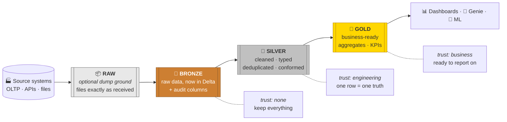
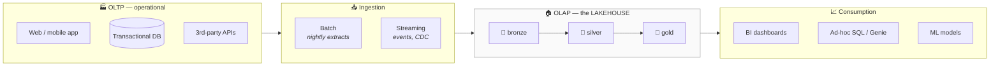
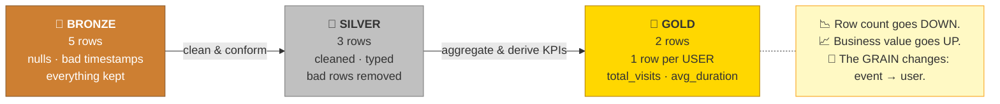
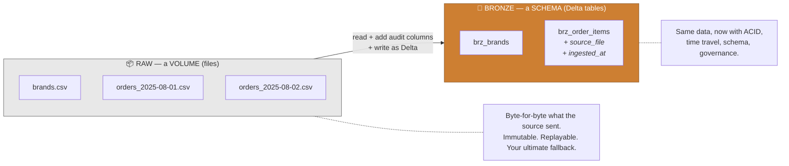
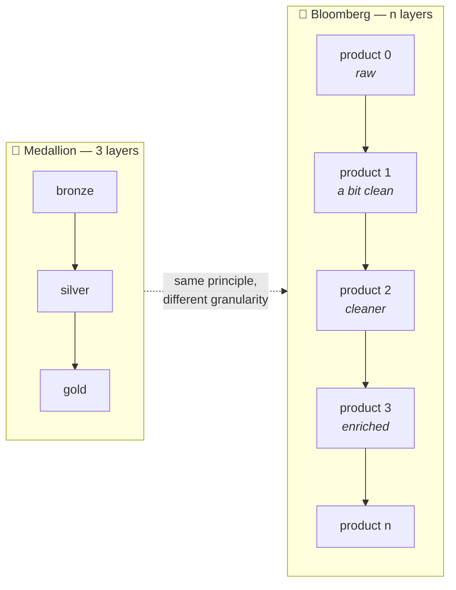
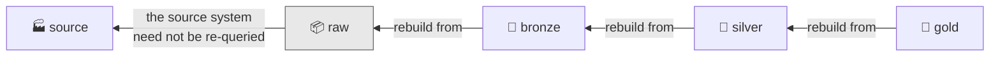
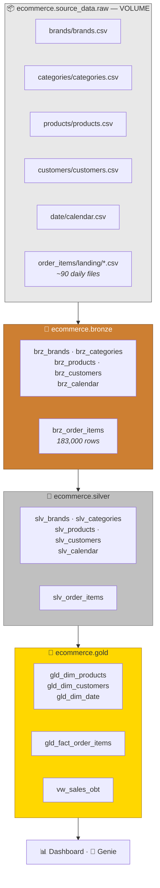

# Part 17 — Medallion Architecture (Bronze / Silver / Gold)

> **Section goal:** Learn the data design pattern the entire project is built on, and be able to explain it clearly in an interview — including the parts most candidates get wrong: what *actually* belongs in each layer, why `raw` and `bronze` are different things, and why three layers isn't a law of physics.

Covers transcript `01:43:34` – `01:49:26`, plus the raw-vs-bronze discussion at `02:36:00`.

> ⭐ *"This is one of the popular questions that gets asked in data engineering interviews… This term sounds like a jargon, but concept-wise it's a **very, very simple** concept."*

---

## 1. The definition

> **Medallion architecture is a data design pattern used to logically organise data in a lakehouse — transforming it *incrementally* and *progressively* to improve the structure and quality of data as it flows through each layer.**

Two words carry the meaning:

- **Incrementally** — each layer makes a *small, well-defined* improvement. No single step tries to do everything.
- **Progressively** — quality and business-readiness go **up** at each hop; you never move backwards.

> 💡 **Why "medallion"?** Olympic medals: **bronze** → **silver** → **gold**. Each is more valuable than the last. That's the whole naming logic.



### Where it sits in the bigger picture

> *"Let's say you are getting your raw data. This system here — this entire system is your **OLTP** system — and you're getting some **batch** data and **streaming** data. And this raw data gets into your **OLAP**… let's say this entire grey block that you see is your **data lakehouse**. So it's a combination of data lake and data warehouse."*



---

## 2. The worked example — website analytics

The clearest illustration in the course. Follow one dataset through all three layers.

> *"I have this website analytics data — if you look at any popular website, they will be tracking their users' interactions with the website."*

### 🥉 Bronze — raw and messy

> *"So let's say user 001 visited this website home page, especially on this day and time, and spent 15 seconds. Then user 001 once again visited that website and now they visited the product page and spent 25 seconds… This is a **raw data**. You can see some null value, see empty values, some invalid timestamp. **It's a very raw, messy data.** This is what you will store in bronze layer."*

| user_id | page | timestamp | duration_sec |
|---------|------|-----------|--------------|
| user_001 | /home | 2025-08-14 09:12:03 | 15 |
| user_001 | /product | 2025-08-14 09:12:20 | 25 |
| **`null`** | /home | 2025-08-14 09:15:44 | 8 |
| user_002 | /cart | **`14/08/2025 9am`** ⚠️ *invalid* | 12 |
| user_002 | /checkout | 2025-08-14 09:20:11 | 40 |

**Nothing is fixed. Everything is kept.** That's deliberate.

### 🥈 Silver — cleaned

> *"Now when you go to silver layer in medallion architecture, you will do **data cleaning**. So maybe you will remove this row because it has a null value. You will also remove this row because it has an invalid timestamp. And after doing data cleaning, see, these two rows you will delete. So you will have **three rows left** — and that is your silver layer."*

| user_id | page | timestamp | duration_sec |
|---------|------|-----------|--------------|
| user_001 | /home | 2025-08-14 09:12:03 | 15 |
| user_001 | /product | 2025-08-14 09:12:20 | 25 |
| user_002 | /checkout | 2025-08-14 09:20:11 | 40 |

> *"So in silver layer you have done some **data cleaning**, some **augmentation** — you've furnished the data."*

> ⚠️ **In production you'd usually *quarantine* rejected rows rather than silently delete them** — write them to a `_rejects` table with a reason code so someone can investigate and fix the upstream source. Silent deletion is how data quietly disappears.

### 🥇 Gold — business-ready

> *"Now this data is **not fully ready for your analytics** yet, because one of the KPIs that you want to know is **average time spent by any user** on your website. So maybe for user 001, average time is 15 and 25 — two sessions — they spent **40 seconds total**, so average time spent is **20 seconds**. So maybe in a gold layer you want to have some kind of KPI like this."*

| user_id | total_visits | avg_duration_sec |
|---------|-------------|------------------|
| user_001 | 2 | **20** |
| user_002 | 1 | 40 |

> *"So this is medallion architecture, folks — it's very simple, right? **Bronze has all the raw messy data, silver has some clean data, and gold will have BI-ready data.** BI-ready data means you would have created some additional measures, some additional KPIs."*



### 🔍 Plain-English deep-dive: "grain"

- **Grain** — *what one row of a table represents.* **Analogy:** the zoom level on a map. Street level vs city level vs country level — same territory, different detail.
- Bronze/silver grain here: **one row = one page view**.
- Gold grain here: **one row = one user**.
- **Why it matters:** changing grain is the defining act of the gold layer, and *"what is the grain of this table?"* is the first question any good data modeller asks. Mixing grains in one table is a classic bug — you end up double-counting when you join.

---

## 3. What goes in each layer — the real answer

The video's summary is correct but brief. Here's the version that survives interview follow-ups.

| | 🥉 **BRONZE** | 🥈 **SILVER** | 🥇 **GOLD** |
|---|---|---|---|
| **Also called** | Raw / landing / ingestion | Cleansed & conformed / enterprise view | Curated / presentation / semantic |
| **Purpose** | Faithful capture of what the source sent | One trustworthy version of each entity | Answer business questions fast |
| **Grain** | Source grain | Source grain (usually unchanged) | **Often aggregated / changed** |
| **Schema** | Permissive — usually **all strings** | Strict, properly typed | Business-friendly names |
| **Typical operations** | Append, add audit columns | Cast · trim · dedupe · null strategy · standardise codes · validate | Join · aggregate · derive KPIs · denormalise · currency conversion |
| **Duplicates** | ✅ Allowed | ❌ Removed | ❌ |
| **Nulls** | ✅ Kept as-is | Handled by an explicit policy | Should be meaningful |
| **Modelling style** | None | Normalised-ish | **Star schema / OBT** |
| **Who reads it** | Data engineers only | Engineers, some analysts | **Everyone** — BI, Genie, ML |
| **Reprocessable from** | Raw / source | Bronze | Silver |
| **In this project** | `ecommerce.bronze.brz_*` | `ecommerce.silver.slv_*` | `ecommerce.gold.gld_*` |

### Why bronze is deliberately all-strings

The project does exactly this for the fact table at `03:02:08`:

> *"Right now we have mentioned everything a **string**, because there is some **data quality issue**, and to tackle that we need to have everything in string."*

**The logic:** if you declare `quantity INT` and the file contains `"two"`, the whole load **fails**. If you declare it `STRING`, the load **succeeds** and you fix `"two"` → `2` in silver, where you have room to do it properly.

> 🧠 **Bronze's job is to *land the data*, not to *judge* it.** Judgement happens in silver.

---

## 4. `raw` vs `bronze` — the distinction most people miss

The project has **four** layers, not three. The instructor addresses the obvious question at `02:36:00`:

> *"Now you may be wondering: **why do we need raw? Can't we directly store it in bronze?** This raw volume is kind of our **dump ground**. We just dump data **as is**, without any changes. Whereas in **bronze**, we might make minor updates. It is still raw data, **but see — it is in Delta Lake format**, so it gets all these ACID, transactions, time-travel properties. Therefore it is a common practice to have **raw as a dump ground** and **bronze as a place where you have structured raw data**."*



| | 📦 **raw** | 🥉 **bronze** |
|---|---|---|
| Object type | **Volume** (files) | **Schema** of Delta **tables** |
| Format | CSV / JSON / whatever arrived | **Delta** |
| Queryable with SQL | Awkwardly, by path | ✅ Natively |
| ACID / time travel | ❌ | ✅ |
| Modified | **Never** | Audit columns added |
| Purpose | Immutable evidence + replay source | Structured, governed raw |

> ⭐ **Interview:** *"Why land files in raw and then create bronze? Isn't that duplication?"* → *"They serve different purposes. Raw is immutable evidence — byte-for-byte what the source sent — so if there's ever a dispute about what arrived, or a bug in bronze logic, I can prove what we received and replay from it. Bronze is that same data materialised as Delta, which adds ACID, schema tracking, time travel, governance and audit columns like ingestion timestamp and source file. Yes it's a second copy, but object storage is cheap and the ability to fully reprocess without re-requesting data from a source system is worth far more than the storage. It also creates a clean boundary between 'what we received' and 'what we ingested'."*

---

## 5. Databricks' own definitions

> *"Since this concept was introduced by Databricks, this is a popular page. Bronze is **all raw data** — you have load time, process ID and so on. Silver is **cleansed and conformed** data — you have removed your duplicates, mastered customers to non-duplicated ingestions and cross-reference tables. And gold is **curated business-level tables**."*

| Layer | Databricks' phrasing | Concrete meaning |
|-------|----------------------|------------------|
| **Bronze** | *"Raw ingestion and history"* | Append-only, with metadata: `load_time`, `process_id`, `source_file` |
| **Silver** | *"Filtered, cleaned, augmented"* | Deduplicated, conformed keys, cross-reference tables resolved, one master record per entity |
| **Gold** | *"Business-level aggregates"* | Star schemas, KPIs, feature tables, reporting views |

### 🔍 Plain-English deep-dive: "conformed"

- **Conformed dimension** — *a dimension that means the same thing everywhere it's used.* **Analogy:** everyone in the company agreeing on one definition of "customer" and one customer ID, instead of Sales and Finance each keeping their own list. **Why it matters:** without conformity you can't compare or join across domains, and two dashboards will legitimately show two different revenue numbers.
- **Mastering** — resolving multiple records that refer to the same real-world thing into one. That's exactly why silver deduplicates.

---

## 6. Why three layers? (And why it might not be three)

> *"The benefit of lakehouse architecture is a **simple data model**. It's very simple, right? You have raw data in your bronze layer, clean data in your silver layer, and business-ready data in gold."*

Then the honest caveat from real experience:

> *"When I was at **Bloomberg**, we used to have **n number of layers**, not just three layers, and we used to call it **product one, product two, product three**. At every level — product zero is raw data, it's not a product that you can sell to customers, but then product one is a little bit clean, product two is more clean, you're **enriching at every stage**, adding additional measures, additional KPIs. And based on the business needs you can have **n number of layers**. But when it comes to medallion architecture specifically, they try to **keep things simple**: bronze, silver and gold."*



**The principle is *progressive refinement*, not the number 3.** Common real-world variations:

| Variation | When |
|-----------|------|
| **raw → bronze → silver → gold** ⭐ | What this project uses; separates evidence from ingestion |
| **bronze → silver → gold → platinum** | An extra layer for heavily consumer-specific marts |
| **Multiple golds** (`gold_finance`, `gold_marketing`) | Different domains need different aggregations from the same silver |
| **Silver split into `silver_clean` / `silver_enriched`** | When cleaning and business-key resolution are large, separate concerns |

> ⭐ **Interview:** *"Must you always have exactly three layers?"* → *"No — three is a convention, not a rule. The underlying principle is progressive refinement with clear separation of concerns: capture faithfully, clean once, then serve. I've seen it implemented with more layers when the enrichment path is long, and with a raw file-landing zone in front of bronze so you keep immutable evidence separate from the Delta ingest. What matters is that each layer has a single stated responsibility, that every layer is reprocessable from the one before it, and that consumers know which layer they're allowed to depend on. Adding layers with no distinct responsibility just adds latency and cost."*

---

## 7. The properties that make it work

Beyond "clean data in stages", four engineering properties matter — and mentioning them separates you from candidates who've only read a blog post.

### 1. Reprocessability

Each layer is rebuildable from the previous one.



**Found a bug in your silver logic six months later?** Fix the code, re-run silver from bronze, cascade to gold. **You never have to ask the source system for history again** — which is often impossible anyway.

### 2. Idempotency

Running the same load twice must not duplicate data.

| Pattern | Idempotent? |
|---------|-------------|
| `mode("overwrite")` for a full refresh | ✅ Yes — this project's approach |
| `mode("append")` on its own | ❌ **No** — a retry duplicates rows |
| `MERGE INTO … WHEN MATCHED UPDATE … WHEN NOT MATCHED INSERT` | ✅ Yes — the production pattern |
| Auto Loader with a checkpoint | ✅ Yes — tracks processed files |

> ⚠️ **This project uses `overwrite` because it's a historical backfill.** For the daily incremental case (Part 28), `append` alone is a bug waiting to happen — a retried task duplicates a day's orders.

### 3. Auditability

Bronze carries provenance columns, so any row is traceable:

```python
df = (df.withColumn("source_file", F.col("_metadata.file_path"))
        .withColumn("ingested_at", F.current_timestamp()))
```

Combine with Delta time travel (Part 7) and Unity Catalog lineage (Part 5) and you can answer *"where did this number come from?"* end to end.

### 4. Separation of concerns

| Change | Which layer you touch |
|--------|----------------------|
| Source adds a column | Bronze (schema evolution) |
| A code value is misspelled | Silver |
| Business redefines "net revenue" | Gold |
| A dashboard needs a new breakdown | Gold (or a view) |

**Each change has exactly one home.** That's what makes the codebase maintainable — and it's the real payoff.

---

## 8. Naming conventions

Not in the transcript, but you'll be judged on it in code review.

```
ecommerce.source_data.raw           ← volume: files as received
ecommerce.bronze.brz_brands
ecommerce.bronze.brz_order_items
ecommerce.silver.slv_brands
ecommerce.silver.slv_order_items
ecommerce.gold.gld_dim_products
ecommerce.gold.gld_dim_customers
ecommerce.gold.gld_dim_date
ecommerce.gold.gld_fact_order_items
ecommerce.gold.vw_sales_obt         ← the reporting view
```

| Convention | Rationale |
|------------|-----------|
| **Layer as the schema** (`bronze.`, `silver.`, `gold.`) | Grant permissions per layer in one statement |
| **Layer prefix on the table too** (`brz_`, `slv_`, `gld_`) | Unambiguous in a query with three-part names elided |
| **`dim_` / `fact_` in gold** | Signals the modelling role immediately |
| **`vw_` for views** | Distinguishes stored data from computed |
| **Consistent schema names across catalogs** | `dev_ecommerce.gold` and `prod_ecommerce.gold` differ by *one* parameter |

---

## 9. Anti-patterns

| ❌ Anti-pattern | Why it's wrong | ✅ Instead |
|----------------|----------------|-----------|
| Cleaning data in bronze | Destroys the faithful record; you can't prove what arrived | Clean in silver |
| BI dashboards reading bronze | Business decisions on unvalidated data | Point BI at gold only |
| Skipping silver ("bronze straight to gold") | Cleaning logic gets duplicated in every gold table | Clean once, reuse everywhere |
| A gold table per dashboard | Explodes into dozens of near-identical tables | Shared gold + views per consumer |
| Business logic in bronze | Layers lose their meaning; changes hit the wrong place | Keep bronze mechanical |
| Deleting bad rows silently | Data disappears with no trace | Quarantine to a `_rejects` table with a reason |
| `append` without idempotency | Retries duplicate data | `MERGE` or overwrite-by-partition |
| Genie/ML pointed at bronze | Confident answers from dirty data | Gold only (see Part 26) |

---

## 10. How medallion relates to classic data modelling

An interviewer with a warehouse background may probe this.

| Approach | Idea | Relationship to medallion |
|----------|------|---------------------------|
| **Kimball (dimensional)** | Star schemas of facts + conformed dimensions, built for query speed | **Lives in gold.** Medallion says *where*; Kimball says *how to shape it* |
| **Inmon (CIF)** | A normalised enterprise warehouse feeding downstream marts | Inmon's normalised core ≈ **silver**; his marts ≈ **gold** |
| **Data Vault** | Hubs, links and satellites for auditable, source-agnostic history | Often implemented **as silver**, with gold as the dimensional presentation |
| **Data Mesh** | Organisational: domain teams own their data as products | **Orthogonal.** Each domain runs its *own* medallion pipeline |

> 💡 **They're not competitors.** Medallion is about **layering and refinement**; Kimball is about **shape**. This project uses **medallion layers with a Kimball star schema in gold** — the most common combination in the industry, and exactly what Part 18 sets up.

---

## 11. This project's implementation



| Layer | Part | What happens |
|-------|------|--------------|
| raw | **20** | Create catalog, schemas, volume; upload source folders |
| bronze | **21**, **24** | Read CSV with explicit schemas, add audit columns, write Delta |
| silver | **22**, **24** | Trim, regex-clean, dedupe, cast, standardise codes, handle nulls |
| gold | **23**, **25** | Denormalise dimensions, map regions, derive KPIs, normalise currency |
| serve | **25–27** | Reporting view, Genie space, dashboard |

---

## ⭐ Likely Interview Questions for This Section

**Q1. "What is medallion architecture?"**
> *Model answer:* "A data design pattern for organising a lakehouse into progressively refined layers. **Bronze** holds raw ingested data as faithfully as possible, typically append-only with audit columns like ingestion timestamp and source file. **Silver** is cleaned and conformed — types cast properly, duplicates removed, codes standardised, an explicit null policy applied — giving one trustworthy version of each entity. **Gold** is business-ready: joined, aggregated, often denormalised into a star schema or wide reporting tables with the KPIs the business actually asks for. The key properties are that each layer is reprocessable from the one before it, and that each type of change has exactly one home — a source schema change hits bronze, a bad code value hits silver, a redefined metric hits gold."

**Q2. "Why not just load straight from source to a reporting table?"**
> *Model answer:* "Because you lose reprocessability and separation of concerns. Without a faithful bronze layer, if you find a transformation bug six months later, the original data is gone and most source systems can't reproduce history. Without silver, cleaning logic gets duplicated into every gold table, so a fix has to be applied in five places and inevitably drifts. Layering also gives clean quality gates and audit points, and lets different consumers depend on the layer that suits them — engineers on silver, business on gold. The cost is extra storage and some latency, and on very simple pipelines that trade-off might not be worth it, but it pays for itself the first time something goes wrong."

**Q3. "What actually happens in the silver layer?"**
> *Model answer:* "Everything that makes the data trustworthy without changing what it means. Casting strings to correct types, trimming whitespace, stripping unit suffixes and currency symbols, standardising inconsistent codes so `Books` and `BKS` become one value, fixing spelling variants, deduplicating on the business key, applying an explicit null policy — drop, default, or flag depending on the column — converting date strings to real dates, and validating ranges. Crucially the **grain doesn't change**: one row still represents the same thing it did in bronze. Aggregation and business logic belong in gold. I'd also quarantine rejected rows rather than deleting them, so bad data is visible and fixable upstream rather than silently vanishing."

**Q4. "Why is bronze often all strings?"**
> *Model answer:* "Resilience. If bronze declares `quantity INT` and the source sends `'two'` — which happens — the whole load fails and you've ingested nothing. With everything as string the load always succeeds, you've captured what arrived, and you fix the type in silver where you have the context and tooling to handle it properly, including routing unparseable values to a quarantine table. It's the principle that **bronze's job is to land the data, not to judge it**. The trade-off is that bronze isn't directly queryable in a useful way, which is fine because it isn't meant to be — only engineers read bronze."

**Q5. "What's the difference between raw and bronze?"**
> *Model answer:* "Raw is a file landing zone — usually a Unity Catalog volume — holding files exactly as received, byte for byte, never modified. It's your immutable evidence and your replay source. Bronze is those same records materialised as Delta tables, which adds ACID transactions, schema tracking, time travel, governance and audit columns like ingestion timestamp and source file path. They look like duplication, but object storage is cheap and being able to fully reprocess without re-requesting history from a source system is worth far more. It also draws a clean line between 'what we received' and 'what we ingested'."

**Q6. "Must there be exactly three layers?"**
> *Model answer:* "No — three is convention, not law. The principle is progressive refinement with clear separation of concerns. I've seen a raw file zone in front of bronze, multiple gold schemas per business domain fed from a shared silver, and organisations with many more stages — one team I know of used numbered 'product' levels where each stage added enrichment. The test for whether a layer earns its place is whether it has a distinct, stated responsibility and whether it's rebuildable from the layer before. Layers with no distinct purpose just add latency, cost and confusion."

**Q7. "How does medallion relate to Kimball dimensional modelling?"**
> *Model answer:* "They answer different questions and combine naturally. Medallion says *where* data sits in its refinement journey; Kimball says *how to shape* it for querying — facts at a declared grain surrounded by conformed dimensions. In practice the Kimball star schema lives in gold, built from cleaned silver tables. That's exactly what this project does: silver holds cleaned versions of each source entity, and gold holds `dim_products`, `dim_customers`, `dim_date` and a `fact_order_items` at line-item grain, plus a denormalised view on top for BI convenience. If you map it to Inmon instead, his normalised enterprise layer is roughly silver and his marts are roughly gold."

**Q8. "Which layer should a BI dashboard read from, and why?"**
> *Model answer:* "Gold, essentially always — or a view over gold. Gold has been cleaned, conformed, aggregated and given business-friendly names, so numbers are consistent across dashboards and column meanings are unambiguous. Pointing BI at silver means every dashboard re-implements business logic and they inevitably diverge; pointing it at bronze means business decisions on unvalidated data. The same applies to Genie and to ML feature tables — anything a non-engineer touches should be gold. I'd enforce it with Unity Catalog grants rather than convention: analysts get `SELECT` on the gold schema only."

**Q9. "How do you make a medallion pipeline idempotent?"**
> *Model answer:* "It depends on the load pattern. For a full refresh, `overwrite` is naturally idempotent — re-running produces the same result — and that's appropriate for backfills and small dimensions. For incremental loads, plain `append` is *not* idempotent, because a retried task duplicates rows, so I'd use `MERGE INTO` on the business key, which upserts rather than blindly inserting. For file ingestion, Auto Loader tracks processed files in a checkpoint so re-running skips what it's already seen. And Delta's transactional guarantees mean a failed write leaves no partial state, so a retry starts from a clean, known version rather than half-loaded data."

---

## 🧠 30-Second Memory Hooks

- **🥉 Bronze = raw. 🥈 Silver = clean. 🥇 Gold = business-ready.** Olympic medals: value increases at each step.
- **Incrementally and progressively.** Small, well-defined improvements — never backwards.
- **Website example: 5 messy rows → 3 clean rows → 2 KPI rows.** Row count down, business value up, **grain changes**.
- **Grain = what one row represents.** Changing grain is the defining act of gold.
- **Bronze's job is to LAND the data, not to JUDGE it.** That's why it's all strings.
- **📦 raw = files as received (a volume). 🥉 bronze = same data as Delta** (ACID + time travel + audit columns).
- **Silver = cleaned AND conformed.** Conformed = means the same thing everywhere.
- **Four properties that make it work: reprocessable · idempotent · auditable · separated concerns.**
- **Every change has exactly ONE home.** Source schema → bronze. Bad code value → silver. New metric → gold.
- **Three layers is convention, not law.** Bloomberg used "product 0…n". The principle is progressive refinement.
- **Medallion says WHERE. Kimball says WHAT SHAPE.** Star schema lives in gold.
- **BI, Genie and ML read GOLD only.** Enforce it with Unity Catalog grants, not politeness.
- **Quarantine rejected rows — don't silently delete them.**
- **⚠️ `append` alone is not idempotent.** Use `MERGE`, overwrite, or Auto Loader checkpoints.

---

*Next suggested section:* **[Part 18 — The Project Blueprint: Data Model & Source Datasets](Part-18-project-blueprint-data-model.md)** — you know the layer pattern; now meet the actual data. Fact versus dimension tables, the star schema you're about to build, a field-by-field tour of all six source datasets, and an inventory of the data-quality defects deliberately planted in each one.

---

**Navigation** — ⬅️ **[Part 16 — Partitions & repartition](Part-16-partitions-repartition-coalesce.md)** · 🏠 **[Master Index](../Databricks%20-%20Study%20Guide.md)** · ➡️ **[Part 18 — Project Blueprint](Part-18-project-blueprint-data-model.md)**
