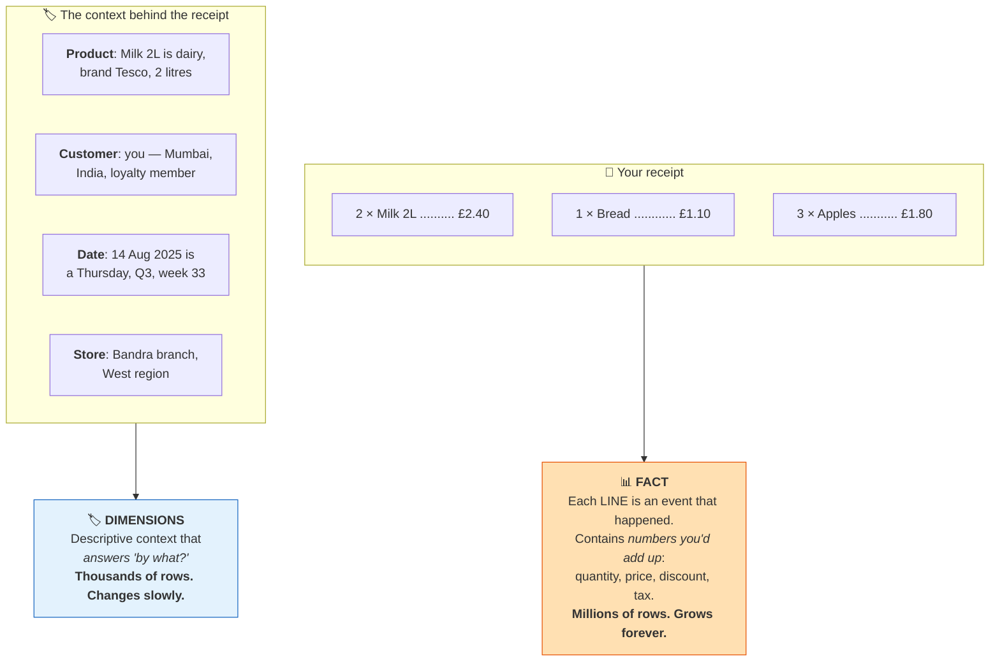
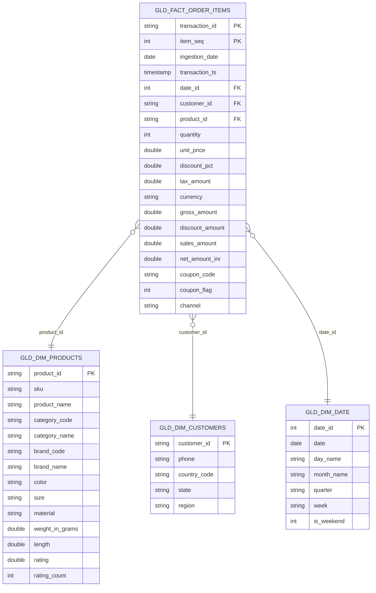
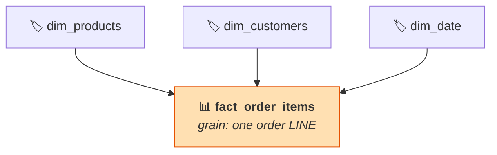
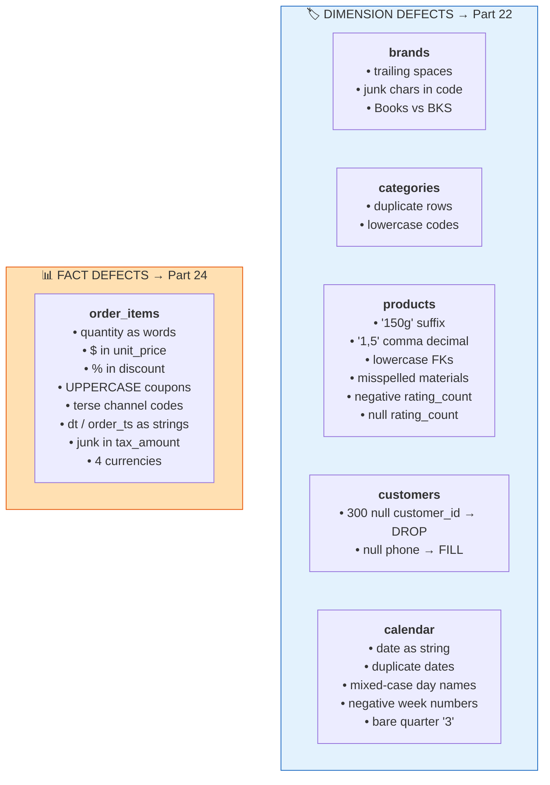
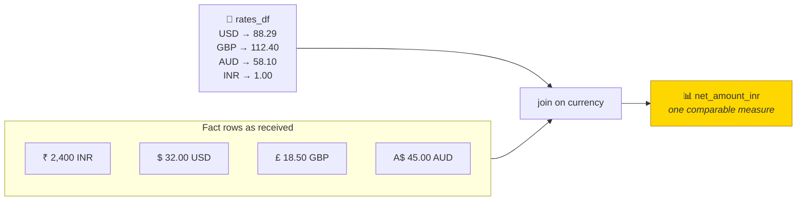

# Part 18 — The Project Blueprint: Data Model & Source Datasets

> **Section goal:** Meet the actual data before you touch it. You'll learn fact vs dimension tables and star schemas from zero, tour all six source datasets field by field, and — most valuably — get a complete inventory of the **data-quality defects deliberately planted in each file**, so the cleaning labs in Parts 22 and 24 feel like a checklist rather than a surprise.

Covers transcript `02:32:02` – `02:34:37`, with forward references to the transformations in `02:40:08` – `03:14:38`.

> ⚠️ **A note on fidelity:** the video shows the files on screen but doesn't dictate every column name. The schemas below are reconstructed from what's shown and from the transformation code applied later. **Open the actual CSVs and run `printSchema()` before coding** — treat this as a map, not gospel.

---

## 1. Facts and dimensions — from zero

> *"So here my **fact table** is `order_items`, and remaining tables are my **dimension tables**."*

That one sentence is the whole data model. But it assumes you know what those words mean, so:

### 🔍 Plain-English deep-dive

**Analogy — a supermarket receipt.**



| | 📊 **Fact table** | 🏷️ **Dimension table** |
|---|---|---|
| Contains | **Measurements of events** | **Descriptive attributes** |
| Answers | *"How much? How many?"* | *"By what? Which? When?"* |
| Typical columns | quantity, price, amount, tax + **foreign keys** | names, codes, categories, hierarchies |
| Size | **Very large** — millions to billions | Small — hundreds to millions |
| Change rate | Append-only, grows constantly | Slow — a product is renamed occasionally |
| Numeric columns are | **Additive** — summing them is meaningful | Not additive — summing customer IDs is nonsense |
| In this project | `order_items` (183,000 rows) | `brands`, `categories`, `products`, `customers`, `calendar` |

> 🧠 **The test: could you meaningfully `SUM()` it?** If yes → it's a **measure** in a fact. If it only makes sense to **group by** it → it's a **dimension attribute**.

### 🔍 Plain-English deep-dive: keys

- **Primary key (PK)** — *the column that uniquely identifies one row in a table.* **Analogy:** your passport number. `customer_id` in the customers table.
- **Foreign key (FK)** — *a column that points at another table's primary key.* **Analogy:** writing your passport number on a form so it links to your record. `customer_id` in the orders table.
- **Composite key** — *two or more columns needed together to be unique.* Here, `order_id` + `item_seq` uniquely identifies a line item.
- **Surrogate key** — *a meaningless system-generated ID* (like `1, 2, 3…`) used instead of a business code, so a renamed business code doesn't break history.

> ⚠️ **Databricks does not enforce foreign keys.** You can declare them for documentation and query-optimisation hints, but nothing stops an order referencing a non-existent customer. **That's why the left-anti-join check from Part 11 matters** — it's your only referential-integrity guard.

---

## 2. The star schema you're going to build

> *"So if you join it, you get a single table."*



### 🔍 Plain-English deep-dive: why it's called a *star*

Draw the fact table in the middle and the dimensions around it and it looks like a star. That shape is deliberate:



| | ⭐ **Star schema** | ❄️ **Snowflake schema** |
|---|---|---|
| Dimensions | **Denormalised** — one flat table each | **Normalised** — dimensions split into sub-tables |
| Example | `dim_products` includes `category_name` and `brand_name` | `dim_products` → `dim_brands` → `dim_categories` |
| Joins per query | Few | Many |
| Query speed | ✅ Faster | Slower |
| Storage | Slightly more (repetition) | Slightly less |
| Readability for analysts | ✅ Easy | Harder |
| **This project** | ⭐ **Star** — Part 23 flattens brands + categories into products | The *source* files are snowflaked |

> 💡 **Notice what Part 23 actually does:** it takes the snowflaked source (`products` → `brands` → `categories`) and **collapses it into a single `gld_dim_products`**. That's the star-schema conversion, and it's why brands and categories have no gold tables of their own.

> ⚠️ **Databricks/Spark favours denormalisation more than a classic warehouse does.** Storage is cheap, columnar formats compress repeated values extremely well, and every avoided join is an avoided shuffle (Part 15). This is also why Part 25 goes one step further and builds a fully flat **One Big Table** view.

### Declaring the grain — always do this first

> **Grain of `gld_fact_order_items`: one row = one *line item* on one order.**

Consequences that fall out immediately:

- An order with 3 different products = **3 fact rows**
- `order_id` alone is **not** unique → the key is `order_id` + `item_seq`
- `COUNT(*)` counts **line items**, not orders → orders is `COUNT(DISTINCT order_id)`
- Order-level values (like a shipping fee) would be **double-counted** if stored here

> ⭐ **Interview:** *"What's the grain of your fact table, and how did you decide?"* → *"One row per order line item, keyed on order ID plus line sequence. I chose line-item grain because the business questions were about products and categories — revenue by category, discount effectiveness by brand — and those require product-level detail, which order-level grain would destroy. The consequences are that `COUNT(*)` gives line items rather than orders, so order counts need `COUNT(DISTINCT order_id)`, and any genuinely order-level measure like a shipping charge can't live in this table without double-counting. Declaring grain first is what prevents that whole class of bug."*

---

## 3. The source folder structure

> *"Once you look at the video description and download that information, you will see this folder which will have different subfolders."*

```
source_data/
├── brands/
│   └── brands.csv
├── categories/
│   └── categories.csv
├── products/
│   └── products.csv
├── customers/
│   └── customers.csv
├── date/
│   └── calendar.csv
└── order_items/
    └── landing/
        ├── order_items_2025-08-01.csv
        ├── order_items_2025-08-02.csv
        ├── …
        └── order_items_2025-10-31.csv          ← ~92 daily files
```

> *"If you check the `order_items` table, it will have this **landing** subfolder, which has a file specific to a date. What we saw is a file for just one day — but for **every day** you will get a separate CSV file. And we have **three months** of data, for the month of eight, nine and ten — see, `10-31`."*

| | Dimensions | Fact |
|---|---|---|
| File count | 1 per entity | **~92 daily files** |
| Why | Reference data — a full snapshot each time | Transactional — arrives daily as it happens |
| Load pattern | Full overwrite | Historical backfill now, incremental later (Part 28) |
| Total rows | 5 → 50,000 | **183,000** |

> 💡 **The `landing/` folder is the whole reason Part 28 exists.** New files keep arriving. This project backfills three months by reading the directory once; production would use **Auto Loader** to pick up only new arrivals.

---

## 4. Dataset-by-dataset tour

### 4.1 🏷️ `brands.csv`

> *"Brands has this CSV file which looks something like this. So you have **brand code, brand name and category code**. We will identify these brand codes with this unique category code — CE, APP, etc."*

| Column | Type | Meaning | Example |
|--------|------|---------|---------|
| `brand_code` | string | Unique brand identifier | `NOVA`, `VOLT` |
| `brand_name` | string | Display name | `Nova Wave` |
| `category_code` | string | FK → categories | `CE`, `H&K` |

**🐞 Planted defects** *(fixed in Part 22)*

| # | Defect | Evidence | Fix |
|---|--------|----------|-----|
| 1 | Trailing/leading spaces in `brand_name` | *"there is an extra space after brand name"* | `F.trim()` |
| 2 | Non-alphanumeric junk in `brand_code` | *"these brand codes have this extra character"* | `F.regexp_replace(col, "[^A-Za-z0-9]", "")` |
| 3 | Inconsistent `category_code` values | *"books and BKS, then you have toy and toys, grocery and GRCY"* | `df.replace({...}, subset=["category_code"])` |

> 💡 **Defect 3 is the payoff for `distinct()` in Part 8.** You only find it by profiling: `df.select("category_code").distinct().show()`.

---

### 4.2 🏷️ `categories.csv`

> *"Then you have categories. For example, for electronics you will use this code **CE**, or home and kitchen you will use **H&K**."*

| Column | Type | Meaning | Example |
|--------|------|---------|---------|
| `category_code` | string | **PK** | `CE`, `H&K`, `BKS`, `TOYS`, `GRCY` |
| `category_name` | string | Display name | `Consumer Electronics` |

**🐞 Planted defects**

| # | Defect | Evidence | Fix |
|---|--------|----------|-----|
| 1 | **Duplicate rows** on `category_code` | *"`APP` category code has two counts, grocery has two counts… these are clearly duplicates"* | `df.dropDuplicates(["category_code"])` |
| 2 | Lowercase codes | *"convert category code into uppercase"* | `F.upper()` |

**Known category codes** (from the transcript):

| Code | Category |
|------|----------|
| `CE` | Consumer Electronics |
| `H&K` | Home & Kitchen |
| `APP` | Apparel |
| `BKS` | Books |
| `TOYS` | Toys |
| `GRCY` | Grocery |

---

### 4.3 🏷️ `products.csv` — the biggest dimension

> *"Then you have products… So you have **product ID, SKU, color, size, material**. You can look into this data. It also has this **brand code**. So category and brand will point to those two other tables."*

> *"So you have **50,000 products** with **14 columns**."*

| Column | Type | Meaning | Notes |
|--------|------|---------|-------|
| `product_id` | string | **PK** | |
| `sku` | string | Stock-keeping unit | |
| `product_name` | string | Display name | |
| `category_code` | string | FK → categories | ⚠️ arrives **lowercase** |
| `brand_code` | string | FK → brands | ⚠️ arrives **lowercase** |
| `color` | string | | |
| `size` | string | | |
| `material` | string | ⚠️ **spelling errors** | |
| `weight_in_grams` | string→double | ⚠️ contains a `g` suffix | `"150g"` |
| `length` | string→float | ⚠️ **comma** decimal separator | `"1,5"` |
| `rating` | double | | |
| `rating_count` | int | ⚠️ **negative** values, nulls | |

**🐞 Planted defects** *(fixed in Part 22)*

| # | Defect | Evidence | Fix |
|---|--------|----------|-----|
| 1 | `weight_in_grams` has a `g` suffix | *"you have all this, right — `g`. So you can remove this `g` character and convert this into a double column"* | `regexp_replace("g","")` then `.cast("double")` |
| 2 | `length` uses `,` as decimal separator | *"for length you have this comma, so you will replace that comma with dot"* | `regexp_replace(",", ".")` then `.cast("float")` |
| 3 | `category_code` / `brand_code` lowercase | *"category and brand code are in lowercase, so we need to make it upper"* | `F.upper()` on both |
| 4 | Misspelled `material` values | *"there are spelling mistakes like `cotton` — the spelling is wrong… `Alluminium` should be this, `Rubbar` should be this"* | `F.when(...).otherwise(...)` chain |
| 5 | Negative `rating_count` | *"it's negative — rating count should be a positive number"* | `F.abs()` |
| 6 | Null `rating_count` | *"otherwise let it be zero if it is null"* | `F.coalesce(..., F.lit(0))` |

> 💡 **Defect 2 is a genuinely European problem.** Many locales write `1,5` where others write `1.5`. Ingesting international data without normalising decimal separators is a real production bug, not a contrived one.

---

### 4.4 🏷️ `customers.csv`

> *"Then you have customers table — pretty straightforward: **customer ID, phone, country, state**, etc."*

| Column | Type | Meaning | Notes |
|--------|------|---------|-------|
| `customer_id` | string | **PK** | ⚠️ ~300 rows are **null** |
| `phone` | string | Contact number | ⚠️ **many nulls** |
| `country_code` | string | ISO code | `IN`, `AU`, `GB` |
| `state` | string | State / province | `Maharashtra`, `Tamil Nadu` |

**🐞 Planted defects** *(fixed in Part 22)*

| # | Defect | Evidence | Fix & rationale |
|---|--------|----------|-----------------|
| 1 | ~300 rows with null `customer_id` | *"you have some 300 null records"* | **Drop.** *"While discussing with the business manager, they are like 'OK, it's OK to drop that data'"* — a null PK is unusable |
| 2 | Nulls in `phone` | *"number of nulls in phone — OK, there's many"* | **Fill** with `"Not Available"`. *"Not having a phone number is OK — some customers do not provide phone number"* |
| 3 | No `region` column | Business wants regional analytics | **Derive it in gold** (Part 23) from a country→state→region map |

> ⭐ **This pair is the perfect illustration of "it depends".** Same problem (nulls), opposite treatments — because the *business meaning* differs. A null identifier makes a row useless; a null phone number is just a fact about that customer. **Interviewers love this distinction.**

---

### 4.5 🏷️ `calendar.csv` (the date dimension)

> *"And date dimension table has **date, your quarter**, etc. In our BI dashboard, if you want to do analytics based on quarter — OK, what was my revenue in Q3, Q4, etc. — then having this kind of dimension table will be helpful."*

| Column | Type | Meaning | Notes |
|--------|------|---------|-------|
| `date` | **string** | The calendar date | ⚠️ stored as text, `dd-MM-yyyy` |
| `day_name` | string | Monday… | ⚠️ **inconsistent casing** |
| `month` | int | 1–12 | |
| `year` | int | | |
| `quarter` | int | 1–4 | ⚠️ just `3`, not `Q3 2025` |
| `week_of_year` | int | 1–53 | ⚠️ **negative** values |

**🐞 Planted defects** *(fixed in Part 22)*

| # | Defect | Evidence | Fix |
|---|--------|----------|-----|
| 1 | `date` is a string | *"date is a string — you want to convert it to a proper date type"* | `F.to_date(col, "dd-MM-yyyy")` |
| 2 | Duplicate dates | *"for 29 date there are two records"* | `dropDuplicates(["date"])` |
| 3 | Inconsistent `day_name` casing | *"one is small case, one is entire upper case"* | `F.initcap()` |
| 4 | Negative `week_of_year` | *"they should be positive"* | `F.abs()` |
| 5 | Bare `quarter` / `week` | *"instead of 3, you'll say Q3 2025"* | Concatenate → `Q3 2025`, `Week 31 2025` |
| 6 | Verbose column name | *"week of the year — you will rename it to `week`"* | `withColumnRenamed` |

### 🔍 Plain-English deep-dive: why a date *table*?

You could compute `QUARTER(order_date)` in every query. A dedicated date dimension is better because:

| Reason | Explanation |
|--------|-------------|
| **Consistency** | Every report agrees on what Q3 means — no two analysts implementing fiscal quarters differently |
| **Non-derivable attributes** | Holidays, fiscal periods, promotional windows, store-closure days can't be computed from a date |
| **Query performance** | Join to a pre-built table instead of calling functions on millions of fact rows |
| **BI friendliness** | Drag "Quarter" into a chart — no formula required |
| **Gaps** | A calendar table includes dates with **zero** sales, so a time series doesn't silently skip them |

> ⚠️ **The last point is subtle and important.** If you derive dates from your fact table, days with no orders simply don't exist — your chart jumps from the 3rd to the 5th, and averages are computed over the wrong denominator.

---

### 4.6 📊 `order_items/landing/*.csv` — the fact table

> *"And finally, we have our fact table, which is orders. So it will have **date, order timestamp, customer ID, how much quantity you order, the price** — because this company has stores in multiple countries: Great Britain pounds, INR, Australian dollar and so on. **Unit price, discount amount, the coupon code** and so on."*

**~92 files → 183,000 rows total.**

| Column | Arrives as | Should be | Meaning |
|--------|-----------|-----------|---------|
| `dt` | string | `date` | The business date of the file |
| `order_id` / `transaction_id` | string | string | Order identifier |
| `order_ts` | string | `timestamp` | Exact order time |
| `item_seq` | string | `int` | Line number within the order |
| `customer_id` | string | string | FK → customers |
| `product_id` | string | string | FK → products |
| `quantity` | string | `int` | ⚠️ sometimes **spelled out as words** |
| `unit_price` | string | `double` | ⚠️ contains **`$`** and spaces |
| `discount_pct` | string | `double` | ⚠️ contains **`%`** |
| `tax_amount` | string | `double` | ⚠️ stray characters |
| `currency` | string | string | `INR`, `USD`, `GBP`, `AUD` |
| `coupon_code` | string | string | ⚠️ **UPPERCASE**, inconsistent |
| `channel` | string | string | ⚠️ terse codes `web` / `app` |

> 💡 **Everything is read as a string on purpose** — the bronze principle from Part 17.
>
> *"Right now we have mentioned everything a string, because there is some data quality issue, and to tackle that we need to have everything in string."*

**🐞 Planted defects** *(fixed in Part 24)*

| # | Defect | Evidence | Fix |
|---|--------|----------|-----|
| 1 | `quantity` written as words | *"some quantities are in text, some quantities are in numbers"* — `"two"` | `F.when(col=="two", 2)...otherwise(col.cast("int"))` |
| 2 | `$` symbol in `unit_price` | *"you see this dollar symbol here… there is extra space"* | `regexp_replace("\\$","")` + `.cast("double")` |
| 3 | `%` in `discount_pct` | *"you want to remove this percentage and get something like for 10% you want to get 0.1"* | `regexp_replace("%","")` + cast (+ ÷100) |
| 4 | Uppercase `coupon_code` | *"you want to convert that to lower"* | `F.lower()` |
| 5 | Terse `channel` codes | *"`web` means this sales was generated through website… maybe we'll convert this to a complete descriptive name"* | `web`→`Website`, `app`→`Mobile App` |
| 6 | `dt` as string | | `F.to_date()` |
| 7 | `order_ts` as string | | `F.to_timestamp()` |
| 8 | Stray characters in `tax_amount` | *"you want to remove some invalid characters… leading and lagging spaces"* | `regexp_replace` + `trim` + cast |
| 9 | **Multiple currencies** | *"these transactions are in different currencies"* | Normalise to INR in **gold** (Part 25) |

---

## 5. The defect inventory — one page

Print this. It *is* Parts 22 and 24.



### Defect taxonomy — the names to use in interviews

| Class | Examples here | Standard technique |
|-------|---------------|--------------------|
| **Type violations** | `"two"` in a numeric column | Cast with fallback; quarantine failures |
| **Format contamination** | `$`, `%`, `g` suffixes | `regexp_replace` then cast |
| **Locale inconsistency** | `1,5` vs `1.5` | Normalise separators |
| **Casing inconsistency** | `MONDAY` / `monday` | `upper` / `lower` / `initcap` |
| **Referential inconsistency** | `Books` vs `BKS` | Map to a canonical code |
| **Duplication** | Two rows per `category_code` | `dropDuplicates` on the business key |
| **Domain violations** | Negative `week_of_year`, negative counts | `abs()`, or reject with a `CHECK` constraint |
| **Missing values** | Null PK vs null phone | Drop vs fill — **decide per column** |
| **Semantic opacity** | `web`, `app` | Map to human-readable values |
| **Unit inconsistency** | 4 currencies | Normalise to a base unit |

> ⭐ **Interview:** *"Walk me through how you'd assess a new dataset's quality."* → *"I'd run a profiling pass before writing any transformation. `printSchema()` first, because numerics arriving as strings is the single most common upstream problem. Then row counts and `summary()` for percentiles, since median versus mean immediately reveals skew and impossible values. Then `distinct()` on every categorical column — that's what surfaces inconsistent codes like `Books` alongside `BKS`. Then null counts per column, and duplicate counts on the candidate primary key. That produces a defect list which becomes the silver transformation spec, and I'd classify each one — type violation, format contamination, duplication, domain violation, missing value — because the class determines the technique. Critically, I'd take the null and deduplication decisions to a business owner rather than guessing: dropping 300 customers is a business decision, not a technical one."*

---

## 6. Currency — a data-modelling problem, not a formatting one

> *"These transactions are in different currencies, and when you are doing a holistic review of your business you may want to bring everything into a **single currency**. Let's say our executive lives in India and they want to see everything in **INR**."*



The project hardcodes the rates — and the instructor is explicit that this is a simplification:

> *"Right now we are hardcoding, but if you're working on a real project you will use some **currency API**… by using that API you can get the **real rates as of that particular transaction date**."*

> ⚠️ **The subtlety worth raising in an interview:** which rate? The rate **on the transaction date** (correct for historical reporting — the value at the time) or **today's rate** (correct for "what is this worth now")? Finance almost always wants the transaction-date rate, which means a **rates dimension with validity ranges** and a **non-equi join** (Part 11), not a simple lookup. Keeping the original `currency` and `unit_price` alongside the converted value is non-negotiable — you must always be able to reconstruct the source figure.

---

## 7. The gold-layer target

What Parts 23 and 25 build, and why each table exists:

| Gold table | Built from | Why |
|-----------|-----------|-----|
| **`gld_dim_products`** | `slv_products` + `slv_brands` + `slv_categories` | Flatten the snowflake — analysts want `category_name`, not `H&K` |
| **`gld_dim_customers`** | `slv_customers` + a region map | Add **region**, which doesn't exist in the source at all |
| **`gld_dim_date`** | `slv_calendar` + derivations | Add `date_id`, `month_name`, `is_weekend` for dashboard filters |
| **`gld_fact_order_items`** | `slv_order_items` + FX rates | Derive `gross_amount`, `discount_amount`, `sales_amount`, `net_amount_inr`, `coupon_flag`; rename for the business |
| **`vw_sales_obt`** | All of the above, joined | One flat table so BI needs no joins at all |

### The derived measures

| Measure | Formula | Business meaning |
|---------|---------|------------------|
| `gross_amount` | `quantity × unit_price` | Value before any discount |
| `discount_amount` | `gross_amount × discount_pct` | Value given away |
| `sales_amount` | `gross_amount − discount_amount + tax_amount` | What the customer actually pays |
| `net_amount_inr` | `sales_amount × fx_rate` | Comparable across countries |
| `coupon_flag` | `1` if a coupon code exists else `0` | Enables "coupon vs non-coupon" analysis |
| `date_id` | `yyyyMMdd` as an integer | Compact join key to the date dimension |
| `is_weekend` | `1` if Sat/Sun else `0` | Enables weekday/weekend filtering |

> 💡 **The instructor's own explanation of gross amount** is the right level for a stakeholder: *"You went to a store and you bought two cans of beans. One can of beans is $5, so two cans is $10. That will be your gross amount — quantity into unit price."*

> 💡 **Why `coupon_flag` as an integer 0/1 rather than a boolean?** Because `SUM(coupon_flag)` gives you the coupon count and `AVG(coupon_flag)` gives you the coupon *rate* directly — no `CASE` expression needed in every dashboard. A small, deliberate design choice worth being able to justify.

---

## 8. The business questions this model must answer

The model exists to serve these — from the Genie question set (Part 26) and the dashboard (Part 27):

| Question | Needs |
|----------|-------|
| *How many transactions were made in USD?* | fact + `currency` |
| *Total revenue in INR by month, with a trend chart* | fact + `dim_date.month_name` + `net_amount_inr` |
| *Average revenue per region* | fact + `dim_customers.region` |
| *Net sales per quarter* | fact + `dim_date.quarter` |
| *Which category sells most?* | fact + `dim_products.category_name` |
| *Sales by hour of day × day of week* | fact + `transaction_ts` + `dim_date.day_name` |
| *How many transactions used coupons each month?* | fact + `coupon_flag` + `dim_date` |
| *Weekend vs weekday revenue* | fact + `dim_date.is_weekend` |

> ⭐ **This is the right way round.** You don't design a model and then look for questions — you gather the questions and design backwards. Every gold column above exists because a question demanded it. Say that in an interview and you sound like a designer rather than a coder.

---

## ⭐ Likely Interview Questions for This Section

**Q1. "Explain fact and dimension tables."**
> *Model answer:* "A fact table records measurements of business events — one row per event, containing additive numeric measures like quantity and amount, plus foreign keys to dimensions. It's the large, fast-growing, append-only table. Dimension tables hold the descriptive context you slice those measures by — product attributes, customer attributes, date attributes. They're comparatively small and change slowly. The quick test is whether summing a column is meaningful: if yes it's a measure and belongs in the fact; if it only makes sense to group by it, it's a dimension attribute. In this project `order_items` is the fact at 183,000 rows and line-item grain, with products, customers and date as dimensions."

**Q2. "Star vs snowflake schema?"**
> *Model answer:* "In a star, each dimension is a single denormalised table joined directly to the fact — so `dim_products` carries `category_name` and `brand_name` inline. In a snowflake, dimensions are normalised into hierarchies, so products joins to brands which joins to categories. Star means fewer joins, faster queries and a much simpler mental model for analysts, at the cost of some storage repetition. Snowflake saves storage and avoids update anomalies but costs joins. On Spark I strongly favour star, because storage is cheap, columnar compression handles repetition well, and every avoided join is an avoided shuffle. This project's source data is snowflaked and the gold layer deliberately flattens it — that transformation is the whole point of the dimension-gold notebook."

**Q3. "What is the grain of a fact table and why declare it first?"**
> *Model answer:* "Grain is what a single row represents. Here it's one line item on one order, keyed by order ID plus line sequence. Declaring it first is essential because everything else follows from it: which columns are legal in the table, what the key is, and how measures aggregate. If I mixed order-level values like a shipping fee into a line-item-grain table, that fee would be repeated per line and double-count on any sum. It also determines correct counting — `COUNT(*)` gives line items, so orders require `COUNT(DISTINCT order_id)`. Ambiguous grain is the root cause of most 'why don't these two dashboards agree?' arguments."

**Q4. "You have 300 rows with a null customer ID and thousands with a null phone. How do you handle each?"**
> *Model answer:* "Differently, because the business meaning differs. A null primary key makes the row unusable — you can't join it, you can't attribute anything to it, and it silently disappears in joins anyway because null never matches null — so dropping is reasonable, but I'd confirm with the business owner and log the count rather than dropping silently. A null phone number is just a fact: some customers don't provide one. Dropping those rows would destroy valid customers, so I'd fill with an explicit sentinel like 'Not Available' so downstream reports show something meaningful rather than blank cells. The general principle is that a null strategy is per-column and driven by business meaning, not a blanket `dropna()`."

**Q5. "Why build a date dimension instead of using date functions?"**
> *Model answer:* "Four reasons. Consistency — every report agrees on what Q3 means rather than each analyst implementing fiscal quarters slightly differently. Non-derivable attributes — holidays, fiscal periods, promotional windows and closure days can't be computed from a date. Performance — joining a small pre-built table beats calling functions across millions of fact rows. And gap handling, which is the subtle one: a calendar table contains dates with zero activity, so a time-series chart doesn't silently skip days with no sales and averages aren't computed over the wrong denominator. Plus it's far friendlier in BI tools — analysts drag 'Quarter' onto a chart rather than writing a formula."

**Q6. "How would you handle multiple currencies in a fact table?"**
> *Model answer:* "Store the original amount and currency code always — you must be able to reconstruct the source figure for reconciliation and audit — then add a normalised measure in a base currency alongside it. The important design question is *which rate*: for historical reporting finance almost always wants the rate on the transaction date, so a rates dimension with validity ranges and a non-equi join on date, not a single lookup, and definitely not today's rate applied retrospectively. This project hardcodes a rate table for simplicity; in production I'd source rates from an FX API into a slowly-changing rate dimension and join on currency plus date range. I'd also keep the rate used as a column on the fact, so the conversion is reproducible even if the rates table is later corrected."

**Q7. "How do you profile an unfamiliar dataset?"**
> *Model answer:* "A fixed sequence. `printSchema()` first, because numerics arriving as strings is the most common upstream problem and it changes everything downstream. Row count for scale. `summary()` rather than `describe()` so I get percentiles — median versus mean reveals skew and impossible values. `distinct()` on every categorical column, which is what surfaces inconsistent codes. Null counts per column. Duplicate counts on the candidate key. Min and max on dates to check the expected range and spot sentinel values like 1900-01-01. That produces a defect list, which becomes the silver transformation specification. I'd classify each defect — type violation, format contamination, duplication, domain violation, missing value — because the class determines the technique, and I'd take the judgement calls to a business owner."

**Q8. "There are no enforced foreign keys. How do you guarantee referential integrity?"**
> *Model answer:* "You can't enforce it, so you have to test for it. Databricks lets you declare primary and foreign keys informationally — useful for documentation and as optimiser hints — but nothing rejects an order referencing a non-existent customer. So I build explicit checks into the pipeline: a left anti join from the fact to each dimension on the key, which returns exactly the orphaned rows. I'd log the count as a metric, and depending on criticality either fail the run or route orphans to a quarantine table and continue. It matters because orphans don't error — they silently produce nulls in every downstream report, so a total looks plausible and is wrong. I'd also add Delta `CHECK` constraints for the things that *can* be enforced, like non-negative quantities and valid currency codes."

---

## 🧠 30-Second Memory Hooks

- **Fact = the receipt lines** (events, numbers you sum). **Dimensions = the context** (product, customer, date).
- **The test: can you meaningfully `SUM()` it?** Yes → measure. Only group by it → dimension attribute.
- **⭐ Declare the GRAIN first.** Here: **one row = one order LINE ITEM**, keyed on `order_id` + `item_seq`.
- **Grain consequence: `COUNT(*)` = line items. Orders = `COUNT(DISTINCT order_id)`.**
- **Star = denormalised dimensions, few joins. Snowflake = normalised, many joins.** Gold flattens the source snowflake into a star.
- **Six sources: brands · categories · products · customers · calendar · order_items.** Five dimensions, **one fact**.
- **Dimensions = 1 file each. Fact = ~92 daily files in `landing/` → 183,000 rows over 3 months.**
- **Bronze reads the fact as ALL STRINGS on purpose** — `"two"` in a numeric column would fail a typed load.
- **The defect list *is* the silver spec.** `.distinct()` is how you find `Books` vs `BKS`.
- **⭐ Null PK → DROP. Null phone → FILL.** Same problem, opposite answer, because business meaning differs.
- **A date dimension exists for consistency, holidays, performance, BI-friendliness — and to include ZERO-SALES DAYS.**
- **Keep the original currency AND the converted amount.** Use the **transaction-date** rate, not today's.
- **`coupon_flag` as 0/1 lets `SUM()` give counts and `AVG()` give rates** — no `CASE` in every dashboard.
- **Databricks does NOT enforce foreign keys.** Left anti join is your referential-integrity test.
- **Design backwards from the business questions.** Every gold column exists because a question demanded it.

---

*Next suggested section:* **Part 19 — Legacy vs Databricks Architecture** — Group F begins. Before you write project code, you'll see the old fragmented AWS stack A2Z was running, exactly why it failed on all three of Bruce's criteria, and the lakehouse design that replaces it — with the ☁️ Azure equivalent alongside.

---

**Navigation** — ⬅️ **[Part 17 — Medallion Architecture](Part-17-medallion-architecture.md)** · 🏠 **[Master Index](../Databricks%20-%20Study%20Guide.md)** · ➡️ **[Part 19 — Legacy vs Databricks](Part-19-legacy-vs-databricks-architecture.md)**

