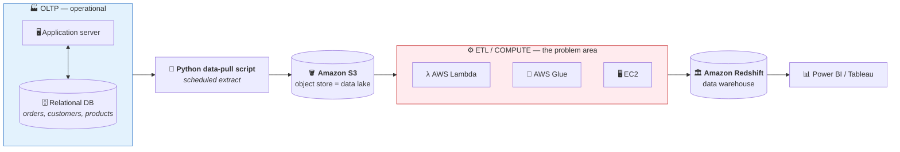
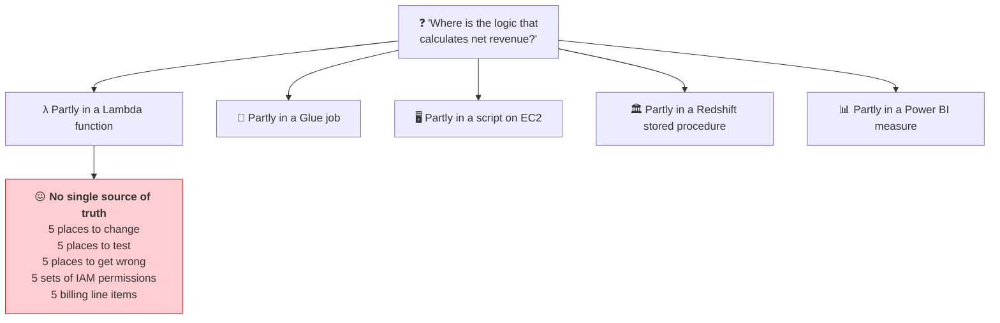
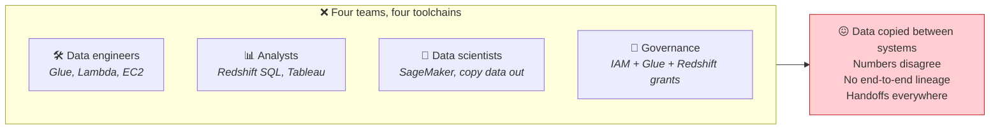
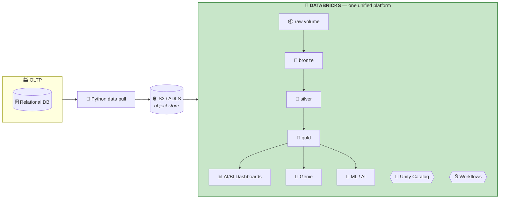
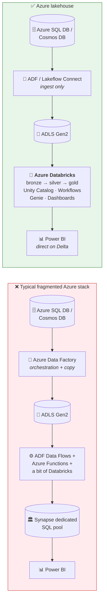
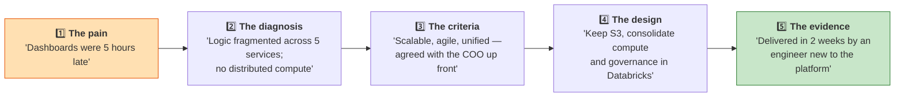

# Part 19 — Legacy vs Databricks Architecture

> **Section goal:** See the system A2Z was actually running, understand precisely why it failed each of Bruce's three criteria, and be able to present the replacement architecture — on AWS *and* ☁️ Azure — as a business case rather than a technology preference. This is the "walk me through your architecture" answer.

Covers transcript `02:25:19` – `02:29:07`.

---

## 1. The legacy architecture

> *"Here is a diagram of a **legacy architecture**. We have an OLTP system here where there is a company's application server and you have a relational database that stores all your transactional data."*

### Component by component

| Stage | Technology | Job |
|-------|-----------|-----|
| **Source** | App server + relational DB | Records live transactions — *"all your transactional data"* |
| **Extraction** | A Python script | *"You will do a **data pull** using some Python script and store that into S3"* |
| **Storage** | **Amazon S3** | *"S3 is an **object store**, which is your **data lake**"* |
| **Transformation** | **Lambda + Glue + EC2** | *"A variety of AWS services… for doing your ETL, compute and data processing"* |
| **Warehouse** | **Amazon Redshift** | *"You store your data in your data warehouse"* |
| **Presentation** | Power BI / Tableau | *"Plugging your BI tool… to Redshift for doing your BI reports"* |

> *"Just in case you don't know OLTP, OLAP, ETL, etc., then you can refer to this video."* — all covered in Part 1 §4 and Part 3 §2 of this guide.

### 🔍 Plain-English deep-dive: the AWS services in that middle box

| Service | What it is | Analogy |
|---------|-----------|---------|
| **AWS Lambda** | Run a short function on an event, no servers to manage. Capped runtime (~15 min). | A **vending machine** — push a button, get one small thing, instantly |
| **AWS Glue** | Managed serverless ETL, Spark under the hood, with a data catalog | A **catering assistant** who does part of the job |
| **EC2** | Plain virtual machines you configure yourself | **Renting an empty kitchen** — you supply everything else |
| **Amazon Redshift** | Columnar cloud data warehouse (a fork of PostgreSQL) | A **library** with strict shelving rules |

> ⚠️ **The architecture isn't wrong** — this stack was industry standard for years, and plenty of companies still run it successfully. The instructor is careful: *"While this technical architecture is **functional**, it has a couple of issues."*

---

## 2. The three problems

> *"The first issue is you have **fragmented ETL and maintenance overhead**."*

### Problem 1 — Fragmented ETL and maintenance overhead

> *"You are using so many different AWS services. Your **ETL logic is scattered** throughout all these different pieces, and you have this AWS billing system — you **don't have much transparency on how you are being billed**. The logic is fragmented. And you have to do a lot of maintenance. Setting up things in AWS might not be easy, especially if you are a beginner. **There is a learning curve.**"*

**The concrete costs:**

| Cost | Manifestation |
|------|---------------|
| **Cognitive load** | An engineer must know Lambda, Glue, EC2, Redshift, IAM, VPC, CloudWatch |
| **Debugging across boundaries** | A failure could be in any of five services, each with its own logs |
| **Deployment complexity** | Five different deployment mechanisms, five sets of credentials |
| **Governance sprawl** | Permissions defined separately in IAM, Glue Catalog, Redshift and the BI tool |
| **Opaque cost** | *"You don't have much transparency on how you are being billed"* — the bill arrives as dozens of line items with no per-pipeline attribution |
| **Onboarding time** | *"There is a learning curve"* — Bruce's criterion 2 fails here |

### Problem 2 — Limited scalability and cost inefficiency

> *"The cost of AWS can easily go high with this kind of architecture. And **we are not using any native Spark cloud platform** — therefore there is **limited scalability**."*

| Issue | Why |
|-------|-----|
| **Lambda's ceiling** | 15-minute maximum runtime and limited memory. Data grows → jobs exceed it → rewrite required |
| **EC2 is always-on** | You pay for provisioned capacity whether you use it or not |
| **Redshift couples storage and compute** *(classically)* | Need more storage? Buy more compute you don't need |
| **No first-class Spark** | Glue offers Spark, but without the tuning surface, notebooks, Photon or unified governance |
| **Scaling means re-architecting** | Not a config change — a redesign. **Bruce's criterion 3a fails** |

### Problem 3 — Lack of a unified platform

> *"And there is **lack of unified platform** as well."*

**Bruce's criterion 3c fails.** He asked for *"data engineers, data analysts and AI engineers all working together in one place."*

### Mapping the failures back to the acceptance criteria

| Bruce's criterion (Part 1) | Legacy verdict | Why |
|---------------------------|----------------|-----|
| **1. Better than current ETL** | ⚠️ Marginal | Python scripts moved to the cloud, but still not distributed |
| **2. Easy to adopt** | ❌ **Fail** | *"There is a learning curve"* — five services to learn |
| **3a. Scalable** | ❌ **Fail** | *"Limited scalability"*, Lambda's hard limits |
| **3b. Agile** | ❌ **Fail** | EC2 pays for idle; *"cost can easily go high"* |
| **3c. Unified** | ❌ **Fail** | *"Lack of unified platform"* |

**Four out of five criteria fail.** That's the business case, and it's why this section exists before any code.

---

## 3. The new architecture

> *"Now **Databricks solves all this problem**. So we are going to have this new architecture where we will do **data pull using Python, store it in S3**, and then **after, everything will happen in Databricks**."*

> *"So Databricks here is a **single unified platform** where you will do your data analytics, data engineering — even if you want to do AI, you can do all of it in this single platform. And **even the BI report and the analytics that we are going to generate is also part of the same Databricks platform**. So Databricks will solve all those three issues."*

### The replacement mapping

| Legacy component | Replaced by | Covered in |
|------------------|-------------|-----------|
| Python pull script | *(unchanged — still Python)* | — |
| S3 | **S3 / ADLS Gen2** — *unchanged, still your storage* | Part 6 |
| Lambda + Glue + EC2 | **Databricks compute + notebooks** | Parts 4, 21–25 |
| Redshift | **Delta tables in the gold layer** | Parts 7, 23, 25 |
| Power BI / Tableau | **AI/BI Dashboards** *(Power BI still works if preferred)* | Part 27 |
| Ad-hoc analysis | **SQL Editor + Genie** | Parts 10, 26 |
| Glue Catalog + IAM + Redshift grants | **Unity Catalog** | Part 5 |
| Step Functions / cron / EventBridge | **Databricks Workflows** | Part 28 |
| SageMaker | **MLflow + Model Serving** | Part 30 |

> 💡 **Notice what did *not* change: the storage.** *"Although we are using S3 to store our objects, we are using S3 **along with** Databricks."* You are not migrating petabytes. That's what makes this a viable pilot rather than a two-year programme — and it's a strong point to make when someone asks about migration risk.

### Why this is a *lakehouse*

> *"One thing I want to point out about the new architecture is that this is based on **data lakehouse architecture**. So previously you had separate data warehouse, data lake, etc. Here… we are doing everything — data analytics, data engineering, and in the future if you want to do AI — everything on a **single platform**. Also we are using the **Delta format** of Databricks. Therefore this is a **data lakehouse architecture**."*

**The three ingredients that make it a lakehouse:**

| Ingredient | Present here |
|-----------|--------------|
| Cheap object storage | ✅ S3 / ADLS |
| An open transactional table format | ✅ **Delta Lake** — ACID, time travel, schema enforcement |
| Unified governance and one platform for BI + AI | ✅ Unity Catalog + Databricks |

### Criteria — re-scored

| Bruce's criterion | Legacy | Databricks | Evidence |
|-------------------|--------|-----------|----------|
| **1. Better than current ETL** | ⚠️ | ✅ | Distributed Spark, Catalyst, Photon (Parts 12–13) |
| **2. Easy to adopt** | ❌ | ✅ | Peter delivered in **~2 weeks** with no prior experience |
| **3a. Scalable** | ❌ | ✅ | Add executors; code unchanged |
| **3b. Agile** | ❌ | ✅ | Serverless / autoscaling; zero idle cost |
| **3c. Unified** | ❌ | ✅ | Engineering + SQL + BI + AI in one governed workspace |

---

## 4. ☁️ The Azure equivalent

The video is AWS-only. Here is the same story on Azure — and the **left-hand diagram is the architecture most Azure shops are actually running today**, which makes it the one you're most likely to be asked to critique.

### AWS → Azure translation table

| Purpose | AWS | ☁️ Azure |
|---------|-----|----------|
| Object storage / data lake | S3 | **ADLS Gen2** |
| Storage URI | `s3://bucket/path` | `abfss://container@acct.dfs.core.windows.net/path` |
| Identity for storage access | IAM role | **Access Connector** (managed identity) |
| Serverless functions | Lambda | Azure Functions |
| Managed ETL service | Glue | ADF Data Flows / Synapse Spark |
| Orchestration | Step Functions / MWAA | **Azure Data Factory** / Databricks Workflows |
| Virtual machines | EC2 | Azure VMs |
| Data warehouse | Redshift | Synapse dedicated SQL pool / Fabric Warehouse |
| BI | QuickSight / Tableau | **Power BI** |
| Secrets | Secrets Manager | **Azure Key Vault** |
| Identity provider | IAM / Identity Center | **Microsoft Entra ID** |
| Monitoring | CloudWatch | Azure Monitor / Log Analytics |
| Databricks flavour | Databricks on AWS | **Azure Databricks** (first-party) |

### ☁️ What changes in *this* project on Azure

| Step | Free Edition (as taught) | ☁️ Azure Databricks |
|------|--------------------------|---------------------|
| Landing zone | Managed volume `ecommerce.source_data.raw` | Same, **or** an external volume on `abfss://` |
| Compute | Serverless only | Serverless **or** classic clusters you size |
| Identity | Your Google/email login | **Entra ID** SSO + Entra groups via SCIM |
| Ingestion trigger | Manual upload | ADF copy activity, or Auto Loader on a container |
| Secrets | n/a | **Key Vault-backed secret scope** |
| BI | AI/BI Dashboards | AI/BI Dashboards **and/or** Power BI on Delta |
| Cost | Free | DBU + VM on your Azure invoice |

> 💡 **A very common real-world Azure pattern:** ADF does the *ingestion* (it has hundreds of connectors and enterprise scheduling), Databricks does the *transformation*, Power BI does the *presentation*. That's a legitimate hybrid, not a failure — the anti-pattern is scattering **transformation logic** across ADF Data Flows, Functions *and* Databricks.

> ⚠️ **A related Azure question you may get: "Databricks or Microsoft Fabric?"** See Part 3 §9 and Part 30 — the short answer is that both build on Delta/Parquet, so keep storage open and the decision stays reversible.

---

## 5. Cost and complexity, side by side

| Dimension | Legacy multi-service | Databricks lakehouse |
|-----------|---------------------|----------------------|
| **Services to learn** | 5–7 | 1 (+ storage) |
| **Places transformation logic lives** | 4–5 | 1 |
| **Governance systems** | 3–4 (IAM, Glue Catalog, Redshift grants, BI tool) | **1** (Unity Catalog) |
| **Copies of the data** | 2–3 (lake + warehouse + extracts) | **1** (lake, in Delta) |
| **Cost attribution** | Opaque across many line items | Per-job/per-cluster via **tags** and `system.billing.usage` |
| **Lineage** | Manual, if it exists at all | **Automatic** |
| **Scaling model** | Re-architect | Config change |
| **Idle cost** | EC2 + provisioned Redshift | Near zero on serverless |
| **Time to onboard an engineer** | Weeks | ~2 weeks to *deliver a project* |

### 🔍 Plain-English deep-dive: why "one copy of data" matters so much

In the legacy design the same orders exist in the **lake** (raw files) *and* the **warehouse** (loaded tables). Consequences:

- **Double storage cost**
- **Drift** — the warehouse is only as fresh as the last load
- **Two governance models** — permissions granted twice, inconsistently
- **Two truths** — a data scientist queries the lake, an analyst queries the warehouse, they get different numbers, and a meeting is spent arguing about whose is right

The lakehouse keeps **one copy** in Delta and serves both audiences from it. That's the single most persuasive line in the whole pitch.

---

## 6. Honest counter-arguments

An interviewer who has done real migrations will push back. Have these ready.

| Counter-argument | Fair response |
|------------------|---------------|
| *"Databricks is expensive."* | Per-DBU it can be, but compare **total** cost: fewer services, no idle EC2, no duplicated storage, less engineering time. And control it — Jobs Compute rather than All-Purpose, auto-termination, cluster policies, spot instances, tag-based attribution. |
| *"You've swapped many vendors for one — that's lock-in."* | Partly. Mitigated by **open formats**: data stays in *your* storage as Parquet + Delta, and UniForm exposes Iceberg metadata. Notebooks are Python/SQL. The lock-in is in Photon, Unity Catalog and Workflows — real, but far less than a proprietary storage format. |
| *"Glue is serverless and cheaper for simple jobs."* | True for genuinely simple, infrequent jobs. The case for Databricks strengthens with pipeline complexity, interactive development needs, and when governance and ML share the platform. |
| *"Redshift/Synapse is faster for BI concurrency."* | Historically a fair point. Databricks SQL Warehouses with Photon plus liquid clustering have closed most of that gap, and materialized views handle the rest. I'd benchmark on the actual workload rather than argue from reputation. |
| *"Our team doesn't know Spark."* | The adoption criterion — which is exactly why this was scoped as a two-week pilot with an engineer who had **no prior Databricks experience**. That evidence *is* the answer. |

> ⭐ **Interview:** *"When would you NOT recommend Databricks?"* → *"When the workload is small and purely SQL over structured data — a managed warehouse with fewer moving parts is simpler and cheaper. When the organisation has deep existing investment in a stack that meets its SLAs, since re-platforming has real cost and risk that a marginal gain doesn't justify. When there's no engineering capability at all to operate it. And when latency requirements are genuinely sub-second event-level, where a streaming engine and a serving store fit better than micro-batch. Recommending it universally would be a red flag; the honest framing is that it wins as complexity, scale and the mix of BI-plus-ML workloads increase."*

---

## 7. How to present this architecture

The structure to use whenever you're asked to walk through it:

**Start with the pain, end with the evidence.** Never lead with the technology.

---

## ⭐ Likely Interview Questions for This Section

**Q1. "Walk me through the architecture of your last data platform."**
> *Model answer:* "Source systems were an application server on a relational database. A Python job extracted to S3, which acted as the data lake. Transformation was spread across Lambda, Glue and EC2, results loaded into Redshift, and Power BI sat on top. It worked, but it had three structural problems: transformation logic was fragmented across four services so there was no single place to change a business rule; scaling meant re-architecting rather than reconfiguring, since Lambda has a hard runtime limit and EC2 is provisioned capacity; and there was no unified platform, so engineers, analysts and data scientists each had their own toolchain with data copied between them. We replaced the middle of that stack with Databricks — keeping S3 as storage — so ingestion, transformation, SQL analytics, dashboards and governance all live in one place on one copy of the data in Delta format."

**Q2. "What was wrong with the old design specifically?"**
> *Model answer:* "Three things, and I'd frame them commercially. **Fragmentation** — a single business rule like net revenue was implemented partly in a Glue job, partly in a Redshift procedure and partly in a BI measure, so changing it meant four coordinated edits and four chances to be inconsistent. Debugging spanned four log systems, and cost attribution was opaque across dozens of billing line items. **Scalability** — Lambda's fifteen-minute ceiling meant growth forced rewrites rather than configuration changes, and EC2 billed for idle capacity. **Fragmentation of people** — four teams, four toolchains, two copies of the data, and consequently two numbers for the same metric. That last one is what actually reaches the executive: the argument in the meeting about whose figure is right."

**Q3. "You kept S3 in the new design. Why not move everything into Databricks?"**
> *Model answer:* "Because you shouldn't, and that's a feature of the lakehouse model rather than a compromise. Storage and compute are deliberately separated: the data stays in our own cloud account in open Parquet and Delta format, which means we control encryption keys, residency and network policy, other tools can still read it, and we don't migrate petabytes to adopt a compute platform. It also makes the decision reversible — if we ever left Databricks, the data doesn't move. Practically, it's what turned this from a multi-year migration into a two-week pilot, because we changed the processing layer without touching the storage layer."

**Q4. "What makes this a lakehouse rather than just 'Spark on S3'?"**
> *Model answer:* "Three ingredients have to be present. Cheap object storage — S3 or ADLS. An open **transactional table format** on top, which is Delta Lake here, giving ACID transactions, schema enforcement and time travel so lake files behave like warehouse tables. And **unified governance plus one platform serving both BI and ML** — Unity Catalog with a single permission model and automatic lineage. Spark on S3 alone gives you compute over files with no transactional guarantees, no schema enforcement and no governance — that's a data lake with a query engine, and it's exactly how data swamps happen."

**Q5. "How would you build this on Azure?"**
> *Model answer:* "The same shape with Azure services. ADLS Gen2 with hierarchical namespace as the lake, accessed via `abfss://` through an Access Connector managed identity rather than an IAM role. Azure Databricks — a first-party Azure resource, so it bills to the Azure subscription and authenticates through Entra ID with groups synced by SCIM. Ingestion typically via Azure Data Factory, which has strong enterprise connectors, or Auto Loader on the container. Secrets in Key Vault-backed secret scopes. Presentation via AI/BI Dashboards or Power BI reading Delta directly. The common Azure anti-pattern I'd specifically avoid is spreading transformation logic across ADF Data Flows, Azure Functions and Databricks — ADF for ingestion and orchestration plus Databricks for all transformation is a clean division; three places doing transformation is the same fragmentation problem in different clothes."

**Q6. "How do you justify the cost of a re-platform to a CFO?"**
> *Model answer:* "Not on technology. I'd quantify the current pain — hours of engineering time lost to cross-service debugging, the cost of duplicated storage, idle compute spend, and ideally a business figure for stale dashboards, like campaign decisions delayed half a business day. Then present a **time-boxed pilot with pass/fail criteria agreed in advance**, so the ask is two weeks of one engineer rather than an open-ended programme. Then report against those criteria with evidence: runtime versus the baseline on the same data, cost per run, and elapsed time for someone new to deliver. That converts it from a technology preference into an investment decision with a bounded downside — which is exactly how the COO in this project framed it when he approved a pilot instead of a migration."

**Q7. "Isn't consolidating on Databricks just a different kind of lock-in?"**
> *Model answer:* "Partly, and I'd say so directly rather than pretend otherwise. But it's a much shallower form than the alternative. The data stays in our own storage account in open Parquet with an open Delta transaction log, readable by Trino, Snowflake and others, and UniForm can expose Iceberg metadata simultaneously. The transformation code is standard PySpark and SQL. What is genuinely proprietary is Photon, Unity Catalog and Workflows — real switching costs, but they're the *platform* layer, not the *data* layer. Compare that to a warehouse with a proprietary storage format, where leaving means physically exporting everything. Keeping the storage format open is the deliberate hedge, and I'd make that an explicit architectural principle rather than an accident."

---

## 🧠 30-Second Memory Hooks

- **Legacy chain: OLTP → Python pull → S3 → (Lambda + Glue + EC2) → Redshift → BI.**
- **The three failures: fragmented ETL & maintenance · limited scalability & cost inefficiency · no unified platform.**
- **"Where is the net-revenue logic?" → five answers.** That's fragmentation in one question.
- **Four of Bruce's five criteria FAIL on the legacy stack.** That's the business case.
- **New chain: OLTP → Python pull → S3/ADLS → 🧱 Databricks (raw→bronze→silver→gold→BI/Genie/ML).**
- **⭐ The storage does NOT change.** S3/ADLS stays. That's what makes it a *pilot*, not a *migration*.
- **Lakehouse needs three things: cheap object storage + an open transactional format (Delta) + unified governance.** Spark on S3 alone is a data lake with a query engine.
- **One copy of data = one truth.** Two copies = two numbers = an argument in a meeting.
- **☁️ Azure: ADLS Gen2 + `abfss://` + Access Connector + Entra ID + Key Vault + ADF for ingest.**
- **☁️ The Azure anti-pattern: transformation logic split across ADF Data Flows, Functions AND Databricks.**
- **Have the counter-arguments ready** — cost, lock-in, Glue-is-cheaper, warehouse concurrency, team skills.
- **Present it as: pain → diagnosis → agreed criteria → design → evidence.** Never lead with the technology.

---

*Next suggested section:* **[Part 20 — 🧪 LAB 1: Environment Setup](Part-20-lab-environment-setup.md)** — enough architecture. Time to build. You'll create the `ecommerce` catalog, the bronze/silver/gold schemas, the `source_data` schema and `raw` volume, and upload every source folder.

---

**Navigation** — ⬅️ **[Part 18 — Project Blueprint](Part-18-project-blueprint-data-model.md)** · 🏠 **[Master Index](../Databricks%20-%20Study%20Guide.md)** · ➡️ **[Part 20 — LAB 1: Environment Setup](Part-20-lab-environment-setup.md)**
