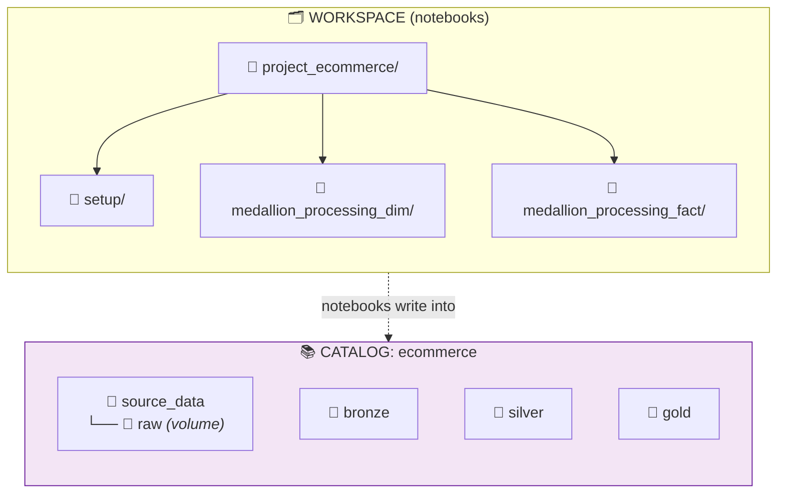
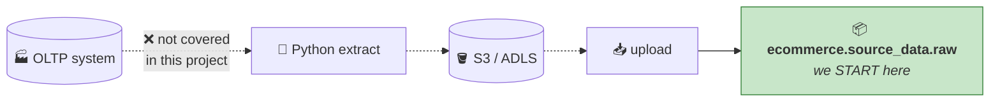
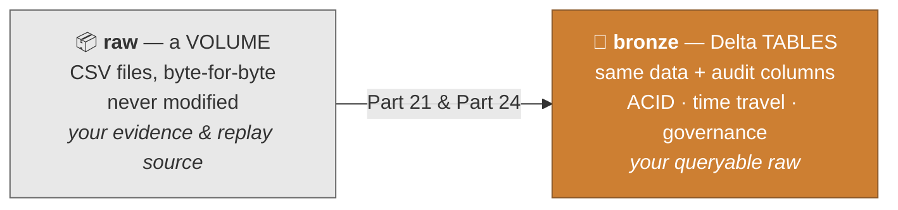

# Part 20 — 🧪 LAB 1: Environment Setup

> **Section goal:** Build the container everything else lives in. By the end you'll have the `ecommerce` catalog, three medallion schemas, a `source_data` schema with a `raw` volume, all six source folders uploaded, and a workspace folder structure that keeps the next eight notebooks organised.

Covers transcript `02:29:07` – `02:36:31`.

---

## 0. What you'll build



**Checklist:**

- [ ] Workspace folders `project_ecommerce/setup`
- [ ] Catalog `ecommerce` exists
- [ ] Schemas `bronze`, `silver`, `gold` exist
- [ ] Schema `source_data` exists
- [ ] Managed volume `ecommerce.source_data.raw` exists
- [ ] All six source folders uploaded into `raw`
- [ ] `order_items/landing/` contains ~92 CSV files

---

## 1. Create the workspace folder structure

> *"Let's go to Workspace and create a new folder here. **If you want to attach it to Git you can create a Git folder** and link it to your Git repository. So create a folder — new folder name will be, let's say, **`project_ecommerce`** — you can give it whatever project name you want to give. And this will have another folder called **`setup`**. So all of our setup code will be stored here."*

| # | Action |
|---|--------|
| 1 | Left nav → **`Workspace`** |
| 2 | Navigate to your user folder (or **Shared**) |
| 3 | **`Create`** → **`Folder`** → name it **`project_ecommerce`** → **`Create`** |
| 4 | Open it → **`Create`** → **`Folder`** → name it **`setup`** |
| 5 | *(Optional, recommended)* Also create `medallion_processing_dim` and `medallion_processing_fact` now — you'll need them in Parts 21 and 24 |

```
project_ecommerce/
├── setup/                        ← Part 20 (this lab)
├── medallion_processing_dim/     ← Parts 21, 22, 23
└── medallion_processing_fact/    ← Parts 24, 25
```

### 💡 Git folders — the professional option

> *"If you want to attach it to Git you can create a **Git folder** and link it to your Git repository."*

| # | Action |
|---|--------|
| 1 | **`Workspace`** → **`Create`** → **`Git folder`** |
| 2 | Paste your repository URL (GitHub, Azure DevOps, GitLab, Bitbucket) |
| 3 | Provider auto-detects → **`Create Git folder`** |
| 4 | Authenticate: **Settings** → **Linked accounts** → add a **personal access token** |

**Why bother, even for a learning project:**

| Benefit | Why it matters |
|---------|----------------|
| **Version history** | Recover a notebook you broke; see what changed and when |
| **Code review** | Pull requests on data pipelines are normal professional practice |
| **CI/CD** | The foundation for Databricks Asset Bundles (Part 30) |
| **Portfolio evidence** | ⭐ A public repo of this project is worth more in an interview than saying "I did a course" |

> 💡 **Do this.** A hiring manager can click a GitHub link; they cannot click your Databricks workspace.

---

## 2. Create the setup notebook

| # | Action |
|---|--------|
| 1 | Open **`project_ecommerce/setup`** |
| 2 | **`Create`** → **`Notebook`** |
| 3 | Rename it: **`00_setup_catalog_schemas`** |
| 4 | Language: **Python** |
| 5 | **`Connect`** → **`Serverless`** |

> *"Let's create a new notebook where we will attach it to a **serverless compute**. So while this is attaching, let's write our code."*

---

## 3. Create the catalog

> *"We all know that if you want to run a SQL query you will write `%sql`, and then you can run this command: **`CREATE CATALOG IF NOT EXISTS ecommerce`**."*

```sql
%sql
CREATE CATALOG IF NOT EXISTS ecommerce;
```

Press **`Ctrl` + `Enter`**.

> 💡 **The `IF NOT EXISTS` habit.** Without it, re-running the cell throws an error. With it, the notebook is **idempotent** — safe to run any number of times. That property matters enormously once these notebooks become scheduled job tasks in Part 28.

### Verify

> *"So while this is running, I will open this catalog in a new tab. And then whenever it comes up I will show you. So if you go here — see, now we have this new catalog."*

**UI:** Left nav → **`Catalog`** → **refresh** → you should see `ecommerce` alongside `workspace` and `system`.

**SQL:**
```sql
%sql
SHOW CATALOGS;
```

> 💡 **Right-click → "Open in new tab"** on the Catalog nav item. Having the catalog browser open beside your notebook makes verification instant — a small habit that pays off across all eight labs.

---

## 4. Set the default catalog

> *"Let's now do another thing, which is `%sql` and **`USE CATALOG ecommerce`**. So whatever code you run **after this line**, that code will use this ecommerce catalog as a **default**."*

```sql
%sql
USE CATALOG ecommerce;
```

Now `CREATE SCHEMA bronze` means `ecommerce.bronze` without you typing the catalog every time.

> ⚠️ **Gotcha (repeated because it matters):** `USE CATALOG` is **session state**. It applies to *this notebook's session only*, and it's lost when the notebook detaches. If you run cells out of order, or run this notebook as a job task in a fresh session, unqualified names may resolve against the wrong catalog — or fail. **In the pipeline notebooks (Parts 21–25) we use fully qualified three-part names instead**, which is why those notebooks define `catalog_name = "ecommerce"` and build names with an f-string.

---

## 5. Create the three medallion schemas

> *"So we are going to now create three schemas. We are using **medallion architecture**, folks. So we will create **bronze** schema, **silver** and **gold** schema."*

```sql
%sql
CREATE SCHEMA IF NOT EXISTS bronze;
CREATE SCHEMA IF NOT EXISTS silver;
CREATE SCHEMA IF NOT EXISTS gold;
```

Or fully qualified — safer, and what you'd write in production:

```sql
%sql
CREATE SCHEMA IF NOT EXISTS ecommerce.bronze  COMMENT 'Raw ingested data, as-received, in Delta format';
CREATE SCHEMA IF NOT EXISTS ecommerce.silver  COMMENT 'Cleaned, typed and conformed data';
CREATE SCHEMA IF NOT EXISTS ecommerce.gold    COMMENT 'Business-ready dimensions, facts and KPIs';
```

> 💡 **Add the `COMMENT`.** It costs five seconds, shows up in the Catalog UI for anyone browsing, and — as covered in Part 5 — feeds Genie's accuracy later.

### Verify — two ways

> *"Control-Enter, and this says — OK, if we refresh it here you will see **bronze, gold and silver** schemas. You can run this command **`SHOW DATABASES FROM ecommerce`**, and whatever structure you are seeing here you will see the same structure here as well."*

```sql
%sql
SHOW DATABASES FROM ecommerce;
```

| databaseName |
|--------------|
| bronze |
| default |
| gold |
| information_schema |
| silver |

> ⚠️ **`SHOW DATABASES` lists *schemas*.** In Databricks the two words are interchangeable (Part 4 §5). `SHOW SCHEMAS IN ecommerce;` is the modern equivalent and does exactly the same thing.

You'll also see two schemas you didn't create:

| Schema | What it is |
|--------|-----------|
| `default` | Auto-created with every catalog. Harmless; we won't use it |
| `information_schema` | ANSI-standard metadata views. **Genuinely useful** — see §9 |

---

## 6. The undo button

> *"Well, then in the code — let's say if for whatever reason you made a mistake and you want to drop the catalog, just say **`DROP CATALOG ... CASCADE`**, and `CASCADE` will delete **everything underneath** ecommerce as well."*

```sql
%sql
-- ⚠️⚠️ DESTRUCTIVE — deletes the catalog and EVERY schema, table and volume inside it
DROP CATALOG IF EXISTS ecommerce CASCADE;
```

### 🔍 Plain-English deep-dive: `CASCADE`

- **Without `CASCADE`** — the drop **fails** if the catalog still contains anything. A safety net: *"you asked me to delete a folder that isn't empty; are you sure?"*
- **With `CASCADE`** — *"delete it and everything inside, recursively."*

**Analogy:** deleting a folder on your computer. Without cascade it says *"folder not empty"*; with cascade it's *"move to bin, contents included."*

> ⚠️⚠️ **Treat this cell with respect.** In this lab it's a convenient reset. In a real workspace it is an incident. Two safety habits:
>
> 1. **Keep it in a markdown cell, commented out**, so it can never run by accident during a Run-All.
> 2. **Never** put a `DROP … CASCADE` in a notebook that's attached to a scheduled job.

```
%md
### ☠️ DANGER — reset cell (do not run accidentally)
```sql
DROP CATALOG IF EXISTS ecommerce CASCADE;
```
```

Related cleanup commands:

```sql
DROP SCHEMA IF EXISTS ecommerce.bronze CASCADE;   -- one schema and its tables
DROP TABLE  IF EXISTS ecommerce.bronze.brz_brands;
DROP VOLUME IF EXISTS ecommerce.source_data.raw;
UNDROP TABLE ecommerce.bronze.brz_brands;         -- managed tables only, within retention
```

---

## 7. Create the `source_data` schema and `raw` volume

> *"After the catalog setup, let's work on **uploading the data**. See, if you are working for any company, the way it will work is: it will pull the data from the OLTP system via Python into S3. Now since this is a **learning project** we are not going to cover this OLTP part — we are mainly interested in **data engineering**. So we will have a bunch of CSV files which we will directly ingest into Databricks."*



### 7.1 Create the schema (UI route)

> *"If you go to Catalogs here, and if you click on your `ecommerce` catalog and click on **Create schema** — now, schema is something we can create here through code as well, but we are going to… I will show you the **manual way** of doing it. We will call this **`source_data`**."*

| # | Action |
|---|--------|
| 1 | Left nav → **`Catalog`** → click **`ecommerce`** |
| 2 | **`Create schema`** |
| 3 | **Name:** `source_data` |
| 4 | **Storage location:** leave **empty** — *"Now here you can use external location… but we're going to use a **managed** location here"* |
| 5 | **`Create`** |

**SQL equivalent:**

```sql
%sql
CREATE SCHEMA IF NOT EXISTS ecommerce.source_data
  COMMENT 'Landing zone: source files exactly as received';
```

### 7.2 Create the managed volume

> *"So just click on this **Create volume**. And this volume we will call it **`raw`**. And this is going to be a **managed volume**, which means the data files' storage location is **managed by Unity Catalog**. So let's hit Create."*

| # | Action |
|---|--------|
| 1 | Inside `ecommerce.source_data` → **`Create volume`** |
| 2 | **Name:** `raw` |
| 3 | **Volume type:** **`Managed volume`** |
| 4 | **`Create`** |

**SQL equivalent:**

```sql
%sql
CREATE VOLUME IF NOT EXISTS ecommerce.source_data.raw
  COMMENT 'Immutable landing zone for source CSV files';
```

☁️ **Azure variant** — if you want the files in your own ADLS Gen2 container (requires the external location from Part 6):

```sql
%sql
CREATE EXTERNAL VOLUME IF NOT EXISTS ecommerce.source_data.raw_ext
LOCATION 'abfss://ecommerce@stdbxlearn123.dfs.core.windows.net/raw/';
```

**Your path is now:**
```
/Volumes/ecommerce/source_data/raw/
```

---

## 8. Upload the source data

> *"And then click on **upload to this volume**. So now I will go to my folder and I will click on all these subfolders. So **drag and drop** them here… See, volume is `ecommerce` → `source_data` → `raw`. Hit **upload** button."*

| # | Action |
|---|--------|
| 1 | Open the volume `ecommerce.source_data.raw` |
| 2 | Click **`Upload to this volume`** |
| 3 | Confirm the target reads **`ecommerce` / `source_data` / `raw`** |
| 4 | **Drag and drop all six source folders** at once — the browser preserves the folder structure |
| 5 | Click **`Upload`** and wait |

> ⚠️ **Drag the *folders*, not the individual files.** Databricks preserves the directory structure, which is exactly what the notebooks in Parts 21 and 24 expect. If you flatten everything into one directory, every path in every subsequent lab breaks.

> ⚠️ **`order_items/landing/` contains ~92 files.** The upload takes noticeably longer than the others. Let it finish before moving on.

### Verify the structure

> *"Alright, so see, my source data is ready. I have `raw`; under `raw` I have all these subfolders. And when you go to any subfolder you will see the files as well."*

**UI:** Catalog → `ecommerce` → `source_data` → **Volumes** → `raw` → click through each folder.

**Code — verify properly, don't just eyeball it:**

```python
RAW = "/Volumes/ecommerce/source_data/raw"

# Top level — expect 6 folders
display(dbutils.fs.ls(RAW))

# Each dimension folder
for folder in ["brands", "categories", "products", "customers", "date"]:
    files = dbutils.fs.ls(f"{RAW}/{folder}")
    print(f"{folder:<12} → {[f.name for f in files]}")

# The fact landing folder — expect ~92 files
landing = dbutils.fs.ls(f"{RAW}/order_items/landing")
print(f"\norder_items/landing → {len(landing)} files")
print("first:", landing[0].name)
print("last: ", landing[-1].name)
```

Expected output shape:

```
brands       → ['brands.csv']
categories   → ['categories.csv']
products     → ['products.csv']
customers    → ['customers.csv']
date         → ['calendar.csv']

order_items/landing → 92 files
first: order_items_2025-08-01.csv
last:  order_items_2025-10-31.csv
```

**Peek at the actual contents before writing any transformation code:**

```python
for folder, fname in [("brands","brands.csv"), ("categories","categories.csv"),
                      ("products","products.csv"), ("customers","customers.csv"),
                      ("date","calendar.csv")]:
    print(f"\n{'='*70}\n{folder}/{fname}")
    df = spark.read.option("header", "true").csv(f"{RAW}/{folder}/{fname}")
    df.printSchema()
    display(df.limit(5))
    print("rows:", df.count())

# One day of the fact data
fact = spark.read.option("header","true").csv(f"{RAW}/order_items/landing/")
fact.printSchema()
display(fact.limit(10))
print("total fact rows:", fact.count())      # ~183,000
```

> 💡 **Do this properly — it's the profiling step from Part 18 §5.** The column names you see here are what you'll hardcode into the schemas in Part 21. Getting them wrong now means debugging later.

**✅ Checkpoint:** 6 folders present; 5 dimension CSVs readable; `order_items/landing` has ~92 files; the fact DataFrame reads ~183,000 rows.

---

## 9. Why `raw` and not straight to `bronze`?

The question the instructor anticipates — and the answer is worth internalising because it comes up in interviews.

> *"Now you may be wondering: **why do we need `raw`? Can't we directly store it in bronze?** This `raw` volume is kind of our **dump ground**. We just dump data **as is**, without any changes. Whereas in **bronze** we might make minor updates — it is still raw data, but see, **it is in Delta Lake format**, so it gets all these ACID, transactions, time-travel properties. Therefore it is a **common practice** to have `raw` as a dump ground and `bronze` as a place where you have **structured raw data**."*



Full treatment in Part 17 §4.

---

## 10. Bonus: query the catalog itself

Every catalog gets an `information_schema` for free. Useful for verification and, later, for automated documentation.

```sql
%sql
-- Every schema in the catalog
SELECT schema_name, comment
FROM   ecommerce.information_schema.schemata;

-- Every table, once you have some
SELECT table_schema, table_name, table_type, created
FROM   ecommerce.information_schema.tables
ORDER  BY table_schema, table_name;

-- Every column of a specific table
SELECT column_name, data_type, is_nullable
FROM   ecommerce.information_schema.columns
WHERE  table_schema = 'bronze' AND table_name = 'brz_brands'
ORDER  BY ordinal_position;

-- Volumes
SELECT volume_name, volume_type, comment
FROM   ecommerce.information_schema.volumes;
```

> 💡 **A genuinely useful trick:** a scheduled query over `information_schema.tables` and `.columns` becomes an auto-generated data dictionary — no manual maintenance, always current.

---

## 11. The complete setup notebook

Everything in one place. This is `project_ecommerce/setup/00_setup_catalog_schemas`.

```python
# COMMAND ----------
# MAGIC %md
# MAGIC # 00 · Environment Setup
# MAGIC Creates the `ecommerce` catalog, the medallion schemas, and the raw landing volume.
# MAGIC **Idempotent** — safe to re-run.

# COMMAND ----------
CATALOG = "ecommerce"

# COMMAND ----------
# MAGIC %sql
# MAGIC CREATE CATALOG IF NOT EXISTS ecommerce
# MAGIC   COMMENT 'A2Z e-commerce pilot — Databricks lakehouse';

# COMMAND ----------
# MAGIC %sql
# MAGIC USE CATALOG ecommerce;

# COMMAND ----------
# MAGIC %sql
# MAGIC CREATE SCHEMA IF NOT EXISTS ecommerce.source_data COMMENT 'Landing zone: files exactly as received';
# MAGIC CREATE SCHEMA IF NOT EXISTS ecommerce.bronze      COMMENT 'Raw ingested data in Delta format';
# MAGIC CREATE SCHEMA IF NOT EXISTS ecommerce.silver      COMMENT 'Cleaned, typed and conformed data';
# MAGIC CREATE SCHEMA IF NOT EXISTS ecommerce.gold        COMMENT 'Business-ready dimensions, facts and KPIs';

# COMMAND ----------
# MAGIC %sql
# MAGIC CREATE VOLUME IF NOT EXISTS ecommerce.source_data.raw
# MAGIC   COMMENT 'Immutable landing zone for source CSV files';

# COMMAND ----------
# MAGIC %sql
# MAGIC SHOW SCHEMAS IN ecommerce;

# COMMAND ----------
# Verify the uploaded files
RAW = "/Volumes/ecommerce/source_data/raw"

expected = {"brands": 1, "categories": 1, "products": 1, "customers": 1, "date": 1}
for folder, n in expected.items():
    files = [f.name for f in dbutils.fs.ls(f"{RAW}/{folder}")]
    status = "✅" if len(files) >= n else "❌"
    print(f"{status} {folder:<12} {files}")

landing = dbutils.fs.ls(f"{RAW}/order_items/landing")
print(f"{'✅' if len(landing) > 80 else '❌'} order_items/landing  {len(landing)} files")

# COMMAND ----------
# MAGIC %md
# MAGIC ### ☠️ DANGER — reset cell. Do NOT run during Run-All.
# MAGIC ```sql
# MAGIC DROP CATALOG IF EXISTS ecommerce CASCADE;
# MAGIC ```
```

> 💡 **The `# MAGIC` prefix** is how Databricks stores non-Python cells in a `.py` source file. When you export a notebook you'll see it; when you're typing in the UI you won't. Useful to recognise when reading exported code in a Git repo.

---

## 12. 🚑 Troubleshooting

| Symptom | Cause | Fix |
|---------|-------|-----|
| `CREATE CATALOG` → permission denied | You lack `CREATE CATALOG` on the metastore | Free Edition: you're the admin, so re-check spelling. Enterprise: ask a metastore admin |
| Catalog created but not visible | Stale UI | Click the **refresh** icon in the Catalog pane |
| `Schema 'bronze' not found` | `USE CATALOG` cell wasn't run, or the session restarted | Re-run it, or use fully qualified names |
| Upload fails or hangs | ~92 files in `landing/` | Be patient; retry only the failed folder |
| `Path does not exist: /Volumes/...` | Folder structure flattened during upload | Re-upload by dragging **folders**, not files |
| Files uploaded to the wrong place | Wrong target picked at step 3 | Delete and re-upload; verify the breadcrumb reads `ecommerce / source_data / raw` |
| Read returns 0 rows | Header-only file, or wrong path | `dbutils.fs.ls` the directory; check file sizes |
| Column names look like `_c0` | Missing `header` option | `.option("header","true")` — Part 9 |
| ☁️ Azure: `403` creating an external volume | Access Connector role missing | **Storage Blob Data Contributor** on the storage account — Part 6 §9 |

---

## ⭐ Likely Interview Questions for This Section

**Q1. "How do you structure catalogs and schemas for a project?"**
> *Model answer:* "For this pilot I used one catalog per project — `ecommerce` — with schemas for each medallion layer plus a separate `source_data` schema holding the landing volume. That keeps the layer boundary visible in every fully qualified name and lets me grant permissions per layer in one statement, for example read on `gold` to analysts and write on `bronze` and `silver` to the engineering service principal. For production I'd add environment separation at the catalog level — `dev_ecommerce` and `prod_ecommerce` with identical schema names inside — so the same code promotes by changing a single catalog parameter, and prod write access is granted to exactly one principal."

**Q2. "Why `IF NOT EXISTS` everywhere?"**
> *Model answer:* "Idempotency. A setup notebook should be safe to run any number of times and reach the same end state, because it will be re-run — during development, after a failure, and eventually as part of a deployment pipeline. Without `IF NOT EXISTS` a re-run throws on the first object that already exists and leaves later statements unexecuted, so you get a partially-configured environment that's worse than either extreme. The same principle applies to the data pipeline itself: overwrite or merge rather than blind append, so a retry doesn't duplicate."

**Q3. "You used `USE CATALOG`. Any risk?"**
> *Model answer:* "Yes — it's session state, not configuration. It applies only to the current session, so a notebook that depends on it breaks when run as a job task in a fresh session, or if someone executes cells out of order. The dangerous failure mode isn't an error, it's silent resolution against a *different* catalog with the same schema names, so a dev run writes to prod or vice versa. I use it for interactive convenience but write fully qualified three-part names in anything scheduled — typically with the catalog as a job parameter, which is also how the same notebook serves dev and prod."

**Q4. "Why land files in a volume instead of loading straight into bronze tables?"**
> *Model answer:* "Because they serve different purposes. The volume is an immutable landing zone holding the source files byte-for-byte, so it's evidence of what actually arrived and a replay source if I ever need to fully reprocess — which matters because most source systems can't reproduce history on demand. Bronze is that data materialised as Delta, which adds ACID, schema tracking, time travel, governance and audit columns like ingestion timestamp and source file path. The extra storage is trivial against the value of being able to rebuild everything without going back to the source, and it draws a clean line between 'what we received' and 'what we ingested'."

**Q5. "What does `DROP CATALOG … CASCADE` do, and how do you protect against it?"**
> *Model answer:* "It deletes the catalog and recursively everything inside — every schema, table, view and volume. Without `CASCADE` the drop fails if the catalog isn't empty, which is the safety net. Protections: never leave it in a runnable cell in a notebook that might be run end-to-end — I keep it commented inside a markdown cell. Never put it in a notebook attached to a scheduled job. Restrict who holds the privilege, so ordinary engineers can't drop a production catalog. And rely on Unity Catalog's retention for managed tables, where `UNDROP TABLE` recovers a mistake within the window — though that's a grace period, not a backup, so genuine protection is separate cross-region copies."

**Q6. "How would you verify an environment was set up correctly, automatically?"**
> *Model answer:* "Assertions in the setup notebook rather than eyeballing the UI. Query `information_schema.schemata` and `information_schema.volumes` to confirm the expected objects exist, list the volume directories with `dbutils.fs.ls` and assert the expected file counts — for example that the fact landing folder has more than eighty files rather than just 'some'. Then read each source file and assert on row counts and column names, since a silently truncated upload is a real failure mode. Those assertions turn setup into a testable step, and the same pattern extends to the pipeline itself as data-quality gates."

**Q7. "Would you use a Git folder for this, and why?"**
> *Model answer:* "Yes, always, even for a learning project. Version history means I can recover from a broken notebook and see what changed. It enables code review, because a pipeline change deserves a pull request as much as application code does. It's the foundation for CI/CD with Databricks Asset Bundles, so the same code deploys to dev and prod with different parameters. And practically for job-hunting, a public repository is something a hiring manager can actually click — 'here's the repo, here's the medallion structure, here's the notebook that handles the currency normalisation' is a far stronger signal than describing a course you completed."

---

## 🧠 30-Second Memory Hooks

- **Build order: catalog → schemas → volume → upload → verify.**
- **`CREATE CATALOG IF NOT EXISTS ecommerce`** — `IF NOT EXISTS` everywhere makes the notebook **idempotent**.
- **Four schemas: `source_data` (volume lives here) + `bronze` + `silver` + `gold`.**
- **⚠️ `USE CATALOG` is session state.** Convenient interactively; fully qualify names in jobs.
- **`SHOW DATABASES FROM ecommerce`** — remember, **schema == database** in Databricks.
- **Volume path: `/Volumes/<catalog>/<schema>/<volume>/…`** → `/Volumes/ecommerce/source_data/raw/`
- **Drag *folders*, not files.** The subfolder structure is what every later path depends on.
- **`order_items/landing/` = ~92 daily CSVs = ~183,000 rows.**
- **☠️ `DROP CATALOG … CASCADE` deletes everything.** Keep it commented inside a markdown cell.
- **`CASCADE` = "delete the folder and its contents".** Without it, a non-empty drop fails — deliberately.
- **📦 raw = evidence (files). 🥉 bronze = queryable raw (Delta).**
- **`information_schema` is free** — `schemata`, `tables`, `columns`, `volumes`. An auto-generated data dictionary.
- **Use a Git folder.** A hiring manager can click GitHub; they can't click your workspace.

---

*Next suggested section:* **[Part 21 — 🧪 LAB 2: Dimensions → Bronze](Part-21-lab-dimensions-bronze.md)** — the environment is ready. Next you'll write your first real pipeline notebook: explicit schemas, reading CSVs from the volume, adding audit columns, and writing five Delta tables into the bronze layer.

---

**Navigation** — ⬅️ **[Part 19 — Legacy vs Databricks](Part-19-legacy-vs-databricks-architecture.md)** · 🏠 **[Master Index](../Databricks%20-%20Study%20Guide.md)** · ➡️ **[Part 21 — LAB 2: Dimensions → Bronze](Part-21-lab-dimensions-bronze.md)**
