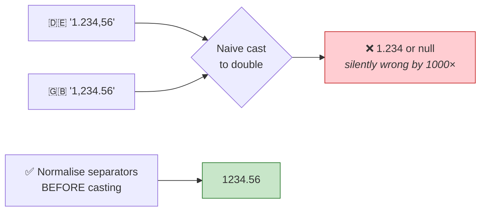
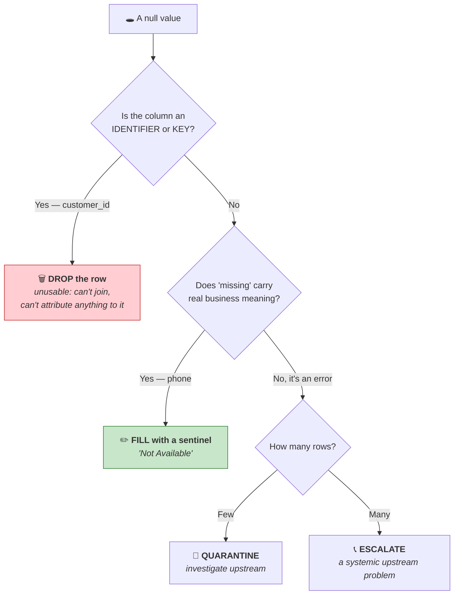

# Part 22 — 🧪 LAB 3: Dimensions → Silver

> **Section goal:** The biggest lab in this guide. Every data-cleaning technique in the course, applied across all five dimensions — trimming, regex scrubbing, anomaly mapping, deduplication, case normalisation, unit stripping, spelling correction, null strategy, date parsing and enrichment. This is where a data engineer earns their salary.

Covers transcript `02:40:08` – `02:52:20`.

> 💡 **On completeness:** the instructor writes `brands` in full then says *"I'm not going to write each and every code in front of you because this is not an EDA tutorial — this is the Databricks tutorial."* He then narrates the rest at speed. **All five are written out here**, reconstructed from his on-screen descriptions.

---

## 0. What you'll build

```mermaid
flowchart LR
    subgraph BRZ["🥉 bronze — all STRING, defects intact"]
        B1["brz_brands"]
        B2["brz_categories"]
        B3["brz_products"]
        B4["brz_customers"]
        B5["brz_calendar"]
    end
    NB["📓 <b>2_dim_silver</b><br/>trim · regex · replace<br/>dedupe · case · cast<br/>null policy · dates"]
    subgraph SLV["🥈 silver — typed, cleaned, conformed"]
        S1["slv_brands"]
        S2["slv_categories"]
        S3["slv_products"]
        S4["slv_customers"]
        S5["slv_calendar"]
    end
    BRZ --> NB --> SLV
    style BRZ fill:#cd7f32,stroke:#8b5a2b,color:#fff
    style SLV fill:#c0c0c0,stroke:#808080
```



**Checklist — the 15 defects from Part 18:**

- [ ] `brands` — trailing spaces trimmed
- [ ] `brands` — non-alphanumeric junk removed from `brand_code`
- [ ] `brands` — `Books`→`BKS`, `Grocery`→`GRCY`, `Toy`→`TOYS`
- [ ] `categories` — duplicate rows dropped
- [ ] `categories` — codes uppercased
- [ ] `products` — `"150g"` → `150.0` double
- [ ] `products` — `"1,5"` → `1.5` float
- [ ] `products` — `category_code` / `brand_code` uppercased
- [ ] `products` — material spellings corrected
- [ ] `products` — `rating_count` made positive, nulls → 0
- [ ] `customers` — ~300 null `customer_id` rows dropped
- [ ] `customers` — null `phone` → `"Not Available"`
- [ ] `calendar` — `date` string → `DateType`
- [ ] `calendar` — duplicate dates dropped, day names title-cased, weeks made positive
- [ ] `calendar` — `quarter` → `Q3 2025`, `week` → `Week 31 2025`

---

## 1. Set up the notebook

> *"Let's go ahead and create a new notebook for the silver processing, and I will call it **`2_dim_silver`**. Here, as usual, I will import some useful functions."*

| # | Action |
|---|--------|
| 1 | `project_ecommerce/medallion_processing_dim` → **`Create`** → **`Notebook`** |
| 2 | Rename: **`2_dim_silver`** · Python · **`Serverless`** |

```python
# ── Cell 1 ────────────────────────────────────────────────────────────
import pyspark.sql.functions as F
import pyspark.sql.types     as T

catalog_name = "ecommerce"
```

---

## 2. `brands` — worked in full

### 2.1 Read from bronze

> *"And then we will create a DataFrame called `df_bronze` with `spark.table`. Let's use the **Python format string** here to say **catalog name dot bronze** is the schema, and then `brz_brands` is the table name."*

```python
# ── Cell 2 ────────────────────────────────────────────────────────────
df_bronze = spark.table(f"{catalog_name}.bronze.brz_brands")
display(df_bronze)
```

> 🧠 **Silver reads from bronze, never from the source files.** That's what makes silver reprocessable — fix the logic, re-run, no source system involved (Part 17 §7).

### 2.2 Defect 1 — trailing whitespace

> *"Now immediately I notice some issues. For example, there is an **extra space after brand name**. So why don't we remove the leading and trailing spaces from the brand name?"*

```python
# ── Cell 3 ────────────────────────────────────────────────────────────
df_silver = df_bronze.withColumn("brand_name", F.trim(F.col("brand_name")))
df_silver.show(10, truncate=False)
```

> *"And now see, you have space here after `Nova Wave`, but here that space is **gone**."*

**The trim family:**

| Function | Removes | Example |
|----------|---------|---------|
| `F.trim(col)` | Both ends | `" Nova Wave "` → `"Nova Wave"` |
| `F.ltrim(col)` | Leading only | `" Nova"` → `"Nova"` |
| `F.rtrim(col)` | Trailing only | `"Nova "` → `"Nova"` |
| `F.btrim(col, "x")` | Custom characters, both ends | `"xxNovaxx"` → `"Nova"` |

### 🔍 Plain-English deep-dive: why one invisible space is a real problem

**Analogy:** two identical books filed under `"Physics"` and `"Physics "` end up on different shelves. A human sees one subject; the catalogue sees two.

| Consequence | What happens |
|-------------|--------------|
| **Joins silently fail** | `"Nova Wave " = "Nova Wave"` is `false` → left join returns nulls |
| **`GROUP BY` splits** | Revenue for one brand appears as two rows in a report |
| **`DISTINCT` over-counts** | 22 studios becomes 24 |
| **Filters miss rows** | `WHERE brand_name = 'Nova Wave'` returns nothing |
| **Dashboards show duplicates** | Two identical-looking bars, half the revenue each |

> ⚠️ **Trailing whitespace is the single most common "why doesn't my join work?" cause in the industry.** Trim every string column you'll join on, group by, or filter on. A cheap blanket defence:
> ```python
> df = df.select(*[F.trim(F.col(c)).alias(c) if t == "string" else F.col(c)
>                  for c, t in df.dtypes])
> ```

### 2.3 Defect 2 — non-alphanumeric characters in `brand_code`

> *"The other issue I observe is these **brand codes have this extra character**. Now when I talk to my business manager, he said that the brand code should have **only alphanumeric characters**. And if you want to detect only those characters, you can use **regular expression**."*

> *"So if you go to **regular expression 101 dot com** website, you can **test your regular expression**."*

```python
# ── Cell 4 ────────────────────────────────────────────────────────────
df_silver = df_silver.withColumn(
    "brand_code",
    F.regexp_replace(F.col("brand_code"), "[^A-Za-z0-9]", "")
)
df_silver.show(10, truncate=False)
```

> *"And now you notice that **Vault** — right, there was this character — so that particular character is **gone**."*

> ⚠️ **A small correction to the video.** The instructor says *"replace those characters with **space**"*. Replacing with a **space** turns `"VA-ULT"` into `"VA ULT"` — you've swapped one problem for another. Replace with an **empty string** `""` so `"VA-ULT"` → `"VAULT"`. If you do use a space, you must `trim()` afterwards.

### 🔍 Plain-English deep-dive: the regex, character by character

```
[^A-Za-z0-9]
│││   │   │└─ digits 0 through 9
│││   │└──── lowercase a through z
│││   └───── (implicit: OR)
││└───────── uppercase A through Z
│└────────── ^  NEGATION — "anything NOT in this set"
└─────────── [] a character class — "any ONE of these characters"
```

**Read it as: "any single character that is *not* a letter or a digit."**

> *"So here this expression says: include the characters which are between capital A to Z, small a to z, or 0 to 9. But **if there is any other character** — so this is a **negation**, this sign is a negation sign — that will say **detect those characters**. And when you detect those, you can **replace them** with space."*

**Regex building blocks worth memorising:**

| Pattern | Matches | Use |
|---------|---------|-----|
| `[^A-Za-z0-9]` | Any non-alphanumeric | Scrub codes |
| `[^0-9.]` | Any non-digit, non-dot | Extract a number from `"$1,234.50"` |
| `\\s+` | One or more whitespace | Collapse multiple spaces |
| `^\\s+\|\\s+$` | Leading or trailing whitespace | Manual trim |
| `\\$` | A literal `$` | Strip currency symbols |
| `%` | A literal `%` | Strip percent signs |
| `[A-Za-z]+$` | Trailing letters | Strip a `"150g"` suffix |
| `,` | A comma | Fix decimal separators |

> ⚠️ **Python escaping:** in a normal Python string, `"\s"` is an invalid escape — write `"\\s"`, or use a raw string `r"\s"`. Same for `"\\$"` / `r"\$"`.

> 💡 **Use [regex101.com](https://regex101.com).** Paste your pattern, paste sample data, and it highlights every match with a plain-English explanation of each token. It is genuinely the fastest way to build and debug a regex.

**The regex toolkit:**

```python
F.regexp_replace(col, pattern, replacement)   # substitute
F.regexp_extract(col, pattern, group_index)   # pull a capture group out
col.rlike(pattern)                             # boolean test — for filtering
F.regexp_count(col, pattern)                   # how many matches
```

### 2.4 Defect 3 — inconsistent category codes

> *"Now, as a common practice, you will try to **identify all the unique category codes, brand codes** and so on. So let's do that."*

```python
# ── Cell 5 · PROFILE FIRST ────────────────────────────────────────────
display(df_silver.select("category_code").distinct().orderBy("category_code"))
```

> *"And when I do that, I find that there are some **discrepancies**. See — **books** and **BKS**, then you have **toy** and **toys**, **grocery** and **GRCY**."*

| category_code |
|---------------|
| APP |
| BKS |
| **Books** ⚠️ |
| CE |
| GRCY |
| **Grocery** ⚠️ |
| H&K |
| **Toy** ⚠️ |
| TOYS |

> *"So once again, you can talk to **domain experts**, your business managers, and they can say that OK, these are the **same**. So let's replace `Books` with `BKS` code, `Grocery` with this code, and so on."*

> 🧠 **This is the payoff for `distinct()` from Part 8.** You do not find this defect by reading code or staring at a preview — you find it by profiling. Make `.distinct()` on every categorical column a reflex.

```python
# ── Cell 6 ────────────────────────────────────────────────────────────
anomalies = {
    "Books":   "BKS",
    "Grocery": "GRCY",
    "Toy":     "TOYS",
    "books":   "BKS",
    "grocery": "GRCY",
    "toy":     "TOYS",
}

df_silver = df_silver.replace(anomalies, subset=["category_code"])
display(df_silver.select("category_code").distinct().orderBy("category_code"))
```

> *"The way you do that is: you will say `df_silver.replace`… and then there is a **subset** — subset is `category_code`."*

> ⚠️ **The instructor's own bug, live at `02:44:07`:** *"OK, I think I should not have `show` here — that's why I was getting that error."* `df.replace()` returns a **DataFrame**, so `df.replace(...).show()` returns `None` and assigning that to `df_silver` destroys it. **Assign first, display second.** A perfect illustration of the immutability rule from Part 8.

**Now the result is clean:**

> *"Now you see, you don't see this `Books`, this `Grocery` and so on. You have just the **valid unique codes**."*

### 🔍 Plain-English deep-dive: `replace` vs `when/otherwise` vs a mapping table

| Technique | Best for | Example |
|-----------|----------|---------|
| **`df.replace(dict, subset=[...])`** | A handful of known value swaps | What we just did |
| **`F.when().otherwise()`** | Conditional logic, ranges, multiple columns | Material spellings (§4.4) |
| **A mapping *table* + join** | ⭐ Many values, or business-owned mappings | Region mapping (Part 23) |

> ⭐ **Interview:** *"You have 200 inconsistent product codes. How do you handle it?"* → *"Not with a hardcoded dictionary. Two hundred mappings buried in a notebook is unmaintainable and the business can't see or change it. I'd create a **mapping table** in the lakehouse — source value, canonical value, effective date, owner — and left-join to it, defaulting unmatched values to an `UNMAPPED` bucket rather than dropping them. That makes the mapping data rather than code, so business users can maintain it, changes are versioned by Delta, and I get a queryable report of unmapped values that surfaces new variants automatically instead of silently. For the three or four values in this project a dictionary is proportionate, but I'd be explicit that it doesn't scale."*

### 2.5 Write to silver

> *"Once that is done, you will write to a table. So you'll write to `slv_brands` table. And when you go to your silver schema and refresh it, you will see that particular table."*

```python
# ── Cell 7 ────────────────────────────────────────────────────────────
(df_silver.write
   .format("delta")
   .mode("overwrite")
   .option("overwriteSchema", "true")
   .saveAsTable(f"{catalog_name}.silver.slv_brands"))

display(spark.table(f"{catalog_name}.silver.slv_brands"))
```

> 💡 **`overwriteSchema` rather than `mergeSchema` here.** In silver you are deliberately *changing* types (string → double, string → date), so the new schema must **replace** the old one. `mergeSchema` only *adds* columns and would conflict with a type change. This is the *strict at silver* half of the rule from Part 7 §6.

**✅ Checkpoint:** `slv_brands` exists; no trailing spaces; `brand_code` is alphanumeric only; `category_code` has ~6 distinct values.

---

## 3. `categories` — deduplication and casing

> *"Now for the category table we will do some other type of data cleaning. So first we will find out the **duplicates** based on the category code."*

### 3.1 Find the duplicates

```python
# ── Cell 8 ────────────────────────────────────────────────────────────
df_bronze_cat = spark.table(f"{catalog_name}.bronze.brz_categories")

display(df_bronze_cat.groupBy("category_code")
                     .count()
                     .filter(F.col("count") > 1)
                     .orderBy(F.col("count").desc()))
```

> *"For example, **`APP` category code has two counts**, **grocery has two counts**. You see, `APP` has this record and this grocery has this and this — and **these are clearly duplicates**."*

**See the offending rows in full:**

```python
dupes = (df_bronze_cat.groupBy("category_code").count()
                      .filter(F.col("count") > 1).select("category_code"))
display(df_bronze_cat.join(dupes, "category_code").orderBy("category_code"))
```

### 3.2 Drop them

> *"So you can just simply drop them by calling this **`drop_duplicates`**. So whenever you have a Spark DataFrame and you say `drop_duplicates` and provide a column, on that column whatever is the duplicate it will just drop it."*

```python
# ── Cell 9 ────────────────────────────────────────────────────────────
df_silver_cat = df_bronze_cat.dropDuplicates(["category_code"])
```

> ⚠️⚠️ **The thing the video doesn't say, and interviewers will:** `dropDuplicates(["category_code"])` keeps an **arbitrary** row from each group. Not the first, not the newest — whichever one Spark happens to encounter, which can differ between runs. **That's non-deterministic.**

**The deterministic pattern — use this in production:**

```python
from pyspark.sql.window import Window

w = Window.partitionBy("category_code").orderBy(F.col("ingested_at").desc())

df_silver_cat = (df_bronze_cat
    .withColumn("_rn", F.row_number().over(w))
    .filter(F.col("_rn") == 1)
    .drop("_rn"))
```

Now you keep the **most recently ingested** row per code — reproducible and explainable.

| Method | Which row survives | Deterministic? |
|--------|-------------------|----------------|
| `df.distinct()` | Rows identical across **all** columns | ✅ (nothing to choose) |
| `df.dropDuplicates()` | Same as `distinct()` | ✅ |
| `df.dropDuplicates(["key"])` | **Arbitrary** row per key | ❌ |
| `row_number()` window + filter | The row **you specify** | ✅ ⭐ |

> ⭐ **Interview:** *"How do you deduplicate, and what's the risk?"* → *"`dropDuplicates` on a subset of columns is the quick way, but it keeps an arbitrary row from each group — not the first or the newest, and potentially a different one on each run, so two executions can produce different tables. That's unacceptable if downstream numbers must reconcile. The deterministic pattern is a window partitioned by the business key, ordered by a tiebreaker like ingestion or update timestamp, take `row_number() = 1`. It's slightly more code and it's explainable — I can say exactly which record survives and why. I'd also log how many rows were dropped, because a sudden jump in duplicates is a signal that something changed upstream."*

### 3.3 Uppercase the codes

> *"The other thing you will do is you will **convert category code into uppercase**. So right now it's small case here — when you do `F.upper` function, see, it has converted this entire column into **upper case**."*

```python
# ── Cell 10 ───────────────────────────────────────────────────────────
df_silver_cat = df_silver_cat.withColumn("category_code", F.upper(F.trim(F.col("category_code"))))

(df_silver_cat.write.format("delta").mode("overwrite")
   .option("overwriteSchema", "true")
   .saveAsTable(f"{catalog_name}.silver.slv_categories"))

display(spark.table(f"{catalog_name}.silver.slv_categories"))
```

**The case family:**

| Function | Effect | Use for |
|----------|--------|---------|
| `F.upper(col)` | `books` → `BOOKS` | **Codes and keys** |
| `F.lower(col)` | `BOOKS` → `books` | Emails, coupon codes, URLs |
| `F.initcap(col)` | `mONDAY` → `Monday` | **Display names** |

> 🧠 **The convention worth adopting: codes go UPPER, free text goes `initcap`, identifiers-that-are-really-strings go lower.** Applied consistently, an entire class of join failure disappears.

> ⚠️ **Order matters: `upper(trim(col))`, not `trim(upper(col))`** — well, both work here, but always trim *before* comparing or joining. Doing case normalisation without trimming is a half-fix.

---

## 4. `products` — the heaviest cleaning

> *"Then for the products table, you will find out the **row and column count**. So you have **50,000 products** with **14 columns**."*

```python
# ── Cell 11 ───────────────────────────────────────────────────────────
df_bronze_prod = spark.table(f"{catalog_name}.bronze.brz_products")

print(f"rows: {df_bronze_prod.count():,}   cols: {len(df_bronze_prod.columns)}")
df_bronze_prod.printSchema()
display(df_bronze_prod.limit(10))
```

### 4.1 `weight_in_grams` — strip the unit, then cast

> *"And when you look at the **weight in gram** — see, you have all this, right? `g`. So you can **remove this `g` character** and **convert this into a double** column."*

```python
# ── Cell 12 ───────────────────────────────────────────────────────────
df_silver_prod = df_bronze_prod.withColumn(
    "weight_in_grams",
    F.regexp_replace(F.col("weight_in_grams"), "[^0-9.]", "").cast(T.DoubleType())
)
display(df_silver_prod.select("product_id", "weight_in_grams").limit(10))
```

> *"So here, see, all these `g`s you have — you will just say `g`, replace that with string, and then weight you can use integer type… so you **cast it to the numeric type**. And then when you look at it, see that `g` is **gone** and it is looking good."*

> 💡 **Use `[^0-9.]` rather than replacing the literal `"g"`.** Stripping `"g"` only handles the exact suffix you've seen; the negated class removes *any* non-numeric contamination — `"150 g"`, `"150gm"`, `"150 grams"` all become `150`. Defensive, and no more code.

> ⚠️ **What happens to unparseable values?** `.cast()` returns **`null`** rather than throwing. That's usually what you want at silver — but it means the failure is **silent**. Always check:

```python
bad = df_silver_prod.filter(F.col("weight_in_grams").isNull() &
                            F.col("weight_in_grams").isNotNull())   # after-cast nulls
print("unparseable weights:",
      df_bronze_prod.filter(F.col("weight_in_grams").isNotNull()).count()
      - df_silver_prod.filter(F.col("weight_in_grams").isNotNull()).count())
```

If that number is non-zero, you've silently lost data. Quarantine it rather than shrugging.

### 4.2 `length` — the comma decimal separator

> *"Same thing you will do for **length** column. So for length you have this **comma**, so you will replace that comma with **dot** by just saying: replace comma with dot, `regexp_replace`, and then **casting it to a float type**."*

```python
# ── Cell 13 ───────────────────────────────────────────────────────────
df_silver_prod = df_silver_prod.withColumn(
    "length",
    F.regexp_replace(F.col("length"), ",", ".").cast(T.FloatType())
)
display(df_silver_prod.select("product_id", "length").limit(10))
```

### 🔍 Plain-English deep-dive: why `1,5` exists

Much of continental Europe writes **`1,5`** where the UK/US write **`1.5`** — and uses `.` as the thousands separator. So `1.234,56` in Germany is `1,234.56` in Britain.



> ⚠️ **This is a real production bug, not a contrived one.** Ingesting international data without normalising decimal separators produces values wrong by a factor of a thousand — and they *look* plausible, so nobody notices for months. If a source may contain both conventions, you need a rule per source system, not a global one.

### 4.3 Uppercase the foreign keys

> *"Then **category and brand code are in lowercase**, so we need to make it **upper**. So in the products table basically they are lowercase, so you will make it upper by calling this. So you can do **cascading** `withColumn`, `withColumn` — you can call it in a cascading fashion."*

```python
# ── Cell 14 ───────────────────────────────────────────────────────────
df_silver_prod = (df_silver_prod
    .withColumn("category_code", F.upper(F.trim(F.col("category_code"))))
    .withColumn("brand_code",    F.upper(F.trim(F.col("brand_code")))))
```

> ⭐ **This is the join fix.** `slv_categories.category_code` is `CE` (uppercase). If `slv_products.category_code` stayed `ce`, the join in Part 23 returns **nulls for every row** — and no error. Standardising both sides of a key *at silver* is exactly why silver is called the "conformed" layer.

### 4.4 `material` — spelling corrections

> *"And for material columns, you have some distinct categories: **cotton, steel, wood** — all of this. And there are **spelling mistakes** like `cotton` — see, the spelling is wrong, so it should be cotton double-T. `Alluminium` should be this, `Rubbar` should be this. So you will just use this **`F.when`** function."*

**Profile first:**

```python
# ── Cell 15 ───────────────────────────────────────────────────────────
display(df_silver_prod.groupBy("material").count().orderBy(F.col("count").desc()))
```

| material | count | ⚠️ |
|----------|-------|----|
| Cotton | 8,102 | ✅ |
| **Cotten** | 341 | ⚠️ misspelled |
| Steel | 7,880 | ✅ |
| **Still** | 290 | ⚠️ misspelled |
| Wood | 6,455 | ✅ |
| Aluminium | 5,910 | ✅ |
| **Alluminium** | 265 | ⚠️ misspelled |
| Rubber | 4,220 | ✅ |
| **Rubbar** | 198 | ⚠️ misspelled |

```python
# ── Cell 16 ───────────────────────────────────────────────────────────
df_silver_prod = df_silver_prod.withColumn(
    "material",
    F.when(F.lower(F.trim(F.col("material"))).isin("cotten", "coton", "cotton"), "Cotton")
     .when(F.lower(F.trim(F.col("material"))).isin("still", "steal", "steel"),   "Steel")
     .when(F.lower(F.trim(F.col("material"))).isin("alluminium", "aluminum",
                                                   "aluminium"),                 "Aluminium")
     .when(F.lower(F.trim(F.col("material"))).isin("rubbar", "rubber"),          "Rubber")
     .when(F.lower(F.trim(F.col("material"))).isin("wood", "wooden"),            "Wood")
     .when(F.lower(F.trim(F.col("material"))).isin("plastic"),                   "Plastic")
     .when(F.col("material").isNull(),                                           "Unknown")
     .otherwise(F.initcap(F.trim(F.col("material"))))
)
display(df_silver_prod.groupBy("material").count().orderBy(F.col("count").desc()))
```

### 🔍 Plain-English deep-dive: `when` / `otherwise`

```python
F.when(condition_1, value_1)
 .when(condition_2, value_2)
 .otherwise(default_value)
```

**It is SQL's `CASE WHEN`.** Conditions are evaluated **top to bottom**; the first match wins.

> ⚠️ **`.otherwise()` is optional but omitting it is a bug waiting to happen** — unmatched rows become **`null`**, silently. Always supply a default.

> 💡 **Why lowercase inside the comparison but title-case in the output?** Comparing on `F.lower(F.trim(...))` makes the match case- and whitespace-insensitive, so `"COTTEN"`, `" cotten "` and `"Cotten"` all hit the same branch. You then emit one canonical form. That's the standard shape for this kind of cleanup, and it's much more robust than matching exact strings.

> ⭐ **Interview:** *"Hardcoded spelling fixes don't scale. What would you do at 500 values?"* → *"Move the mapping out of code and into data. A `material_mapping` Delta table with source value, canonical value, effective date and owner, joined in — so the business maintains it, changes are versioned by Delta, and I can report on unmapped values instead of them silently falling through. For genuinely fuzzy matching I'd add a similarity function like Levenshtein or Soundex to *suggest* candidates for human review, but I would not auto-apply fuzzy matches to production data — false positives silently merge distinct entities, which is far worse than leaving a variant unmapped."*

### 4.5 `rating_count` — negatives and nulls

> *"Then for **rating count** you see it's **negative**. Rating count should be a **positive number**, so you will make it positive by calling this `F.abs` function — on this column, make it absolute. Otherwise, let it be **zero if it is null**."*

```python
# ── Cell 17 ───────────────────────────────────────────────────────────
df_silver_prod = (df_silver_prod
    .withColumn("rating",       F.col("rating").cast(T.DoubleType()))
    .withColumn("rating_count", F.coalesce(F.abs(F.col("rating_count").cast(T.IntegerType())),
                                           F.lit(0))))

display(df_silver_prod.select("product_id", "rating", "rating_count")
                      .orderBy("rating_count").limit(10))
```

| Function | What it does |
|----------|--------------|
| `F.abs(col)` | Absolute value — `-42` → `42` |
| `F.coalesce(a, b, …)` | First non-null argument — the standard null-defaulting idiom |
| `F.nvl(col, default)` | Two-argument alias of `coalesce` |
| `df.na.fill({"col": 0})` | Fill nulls across named columns |

> ⚠️ **`abs()` on a negative count is a *guess*, and you should say so.** It assumes a sign error. If the real cause were a subtraction bug upstream, `abs()` masks it. In production I'd add a `CHECK` constraint (`rating_count >= 0`) so bad values are **rejected loudly** and the upstream bug gets fixed — rather than silently laundered. Being able to articulate that trade-off is the difference between cleaning data and hiding problems.

### 4.6 Final check and write

> *"All right, then **check the final clean data**. So your products table looks pretty good now, and then write that to `slv_products`."*

```python
# ── Cell 18 ───────────────────────────────────────────────────────────
df_silver_prod.printSchema()
display(df_silver_prod.limit(20))

(df_silver_prod.write.format("delta").mode("overwrite")
   .option("overwriteSchema", "true")
   .saveAsTable(f"{catalog_name}.silver.slv_products"))

print("silver products:", spark.table(f"{catalog_name}.silver.slv_products").count())
```

> *"So by calling this method we are creating a new table — I mean, the table schema is created, but we are **filling the data** for this table into your **silver schema**. The table is in bronze; now we are creating a table in a silver schema."*

**✅ Checkpoint:** `weight_in_grams` is `double`, `length` is `float`, `rating_count` is a non-negative `int`, codes are uppercase, materials are canonical.

---

## 5. `customers` — the null-strategy lesson

> *"And you will do a bunch of transformations for your customer. For example, **customer ID column is null** — and you have some **300 null records**."*

### 5.1 Investigate before acting

> *"So what you will do is you'll just filter it — or you will just **display** first. OK, let's display and see what's going on. So these are the columns having customer ID as null. And then you will **drop** them."*

```python
# ── Cell 19 ───────────────────────────────────────────────────────────
df_bronze_cust = spark.table(f"{catalog_name}.bronze.brz_customers")

# Null profile across every column
null_counts = df_bronze_cust.select([
    F.count(F.when(F.col(c).isNull() | (F.trim(F.col(c)) == ""), c)).alias(c)
    for c in df_bronze_cust.columns
])
display(null_counts)

print("total rows:", df_bronze_cust.count())
print("null customer_id:", df_bronze_cust.filter(F.col("customer_id").isNull()).count())   # ~300

display(df_bronze_cust.filter(F.col("customer_id").isNull()).limit(20))
```

> 🧠 **Look before you delete.** Inspecting the rows tells you *whether* they're junk or a systemic upstream failure — e.g. all 300 from one source file, which is a very different problem.

### 5.2 The decision — and why it differs per column

> *"Now, **how you handle null depends on situation, your business logic**. If you have too many records with null values, maybe you want to replace null values with some valid values. But here 300 — and again, **while discussing with the business manager**, they are like 'OK, it's OK to drop that data', so you dropped it."*

> *"Same way, **number of nulls in phone** — OK, there's many. For that you **don't want to drop it**, because **not having a phone number is OK** — some customers do not provide phone number. So there, instead of having null, you will say **'Not Available'**."*



```python
# ── Cell 20 ───────────────────────────────────────────────────────────
before = df_bronze_cust.count()

df_silver_cust = (df_bronze_cust
    # 1. A null identifier makes the row unusable → drop
    .filter(F.col("customer_id").isNotNull() & (F.trim(F.col("customer_id")) != ""))
    # 2. A null phone is meaningful → fill with a sentinel
    .withColumn("phone", F.coalesce(F.nullif(F.trim(F.col("phone")), F.lit("")),
                                    F.lit("Not Available")))
    # 3. Standardise the join keys
    .withColumn("country_code", F.upper(F.trim(F.col("country_code"))))
    .withColumn("state",        F.initcap(F.trim(F.col("state"))))
    .withColumn("customer_id",  F.trim(F.col("customer_id"))))

after = df_silver_cust.count()
print(f"dropped {before - after:,} rows with a null customer_id ({(before-after)/before:.2%})")

(df_silver_cust.write.format("delta").mode("overwrite")
   .option("overwriteSchema", "true")
   .saveAsTable(f"{catalog_name}.silver.slv_customers"))
```

> 💡 **Log the drop count, always.** A pipeline that silently discards 300 rows today and 300,000 tomorrow is a pipeline that hides an incident. Emit it as a metric; alert on a threshold.

**Better still — quarantine rather than delete:**

```python
rejects = (df_bronze_cust
    .filter(F.col("customer_id").isNull() | (F.trim(F.col("customer_id")) == ""))
    .withColumn("reject_reason", F.lit("NULL_CUSTOMER_ID"))
    .withColumn("rejected_at",   F.current_timestamp()))

(rejects.write.format("delta").mode("append")
        .saveAsTable(f"{catalog_name}.silver.slv_customers_rejects"))
```

> ⭐ **Interview:** *"How do you handle nulls?"* → *"Per column, driven by business meaning — never a blanket `dropna()`. A null in an identifier makes the row unusable: it can't be joined, nothing can be attributed to it, and it silently vanishes in joins anyway because null never matches null, so dropping is defensible. A null in an optional attribute like a phone number is a *fact* about that customer, so I fill with an explicit sentinel like 'Not Available' — that way reports show something meaningful rather than blank cells, and it's distinguishable from a genuine empty string. Whatever I decide, I log the affected counts as a metric and quarantine rejected rows to a `_rejects` table with a reason code, so bad data is visible and fixable upstream instead of quietly disappearing. And I'd confirm the drop decision with a business owner — dropping 300 customers is a business decision, not a technical one."*

---

## 6. `calendar` — dates and enrichment

> *"And the last one is our **calendar** table."*

### 6.1 Parse the date

> *"Now in calendar table, if you look at the schema — see, **date is a string**. You want to convert it to a **proper date type**. So you will first **format it in `dd-MM-yyyy` format**, and you convert that to date by calling this **`to_date`** function. Now when you check the data type, see, **date has a proper date data type**."*

```python
# ── Cell 21 ───────────────────────────────────────────────────────────
df_bronze_cal = spark.table(f"{catalog_name}.bronze.brz_calendar")
df_bronze_cal.printSchema()          # date: string
display(df_bronze_cal.limit(10))

df_silver_cal = df_bronze_cal.withColumn("date", F.to_date(F.col("date"), "dd-MM-yyyy"))
df_silver_cal.printSchema()          # date: date  ✅
```

> ⚠️⚠️ **`MM` = month, `mm` = minutes.** Writing `"dd-mm-yyyy"` puts the *minute* in the month slot and silently produces garbage. Check every format string twice (Part 9 §5).

**Verify the parse actually worked** — this is the step people skip:

```python
bad_dates = df_silver_cal.filter(F.col("date").isNull()).count()
print(f"{'⚠️' if bad_dates else '✅'} unparseable dates: {bad_dates}")
if bad_dates:
    display(df_bronze_cal.join(df_silver_cal.filter(F.col("date").isNull()).select("day_name"),
                               "day_name").limit(20))
```

> 💡 **A `to_date` that fails returns `null`, not an error.** So a wrong format string yields a table where every date is null — and it *looks* like it worked until someone builds a chart. Assert on the null count.

### 6.2 Remove duplicate dates

> *"You will also **remove duplicates**. OK, so see, for certain dates you have **higher than one count**. So in our date table there should be **only one record for a given date** — but for **29 date there are two records**, of course. So you will use our usual `drop_duplicates` function."*

```python
# ── Cell 22 ───────────────────────────────────────────────────────────
display(df_silver_cal.groupBy("date").count().filter(F.col("count") > 1).orderBy("date"))

df_silver_cal = df_silver_cal.dropDuplicates(["date"])
```

> 💡 **A date dimension has an obvious uniqueness rule: one row per date.** That makes it an ideal candidate for a `CHECK` constraint or an assertion:
> ```python
> assert df_silver_cal.count() == df_silver_cal.select("date").distinct().count(), \
>        "❌ duplicate dates remain in the calendar dimension"
> ```

### 6.3 Normalise day names

> *"And then you will **normalise the day names**. So if you look at our day names — see, **there is no consistency**: one is small case, one is entire upper case. So you want to normalise in a way that the **first letter should be capitalised**. See — capitalise first letter in day name. So see, now it looks **consistent**."*

```python
# ── Cell 23 ───────────────────────────────────────────────────────────
display(df_silver_cal.select("day_name").distinct())      # BEFORE: MONDAY, monday, Monday…

df_silver_cal = df_silver_cal.withColumn("day_name", F.initcap(F.trim(F.col("day_name"))))

display(df_silver_cal.select("day_name").distinct())      # AFTER: exactly 7 values ✅
```

> 💡 **The assertion writes itself:** a normalised `day_name` must have **exactly 7** distinct values. Anything else means the normalisation didn't work.
> ```python
> assert df_silver_cal.select("day_name").distinct().count() == 7
> ```

### 6.4 Fix negative week numbers

> *"And then **convert negative week of the year to positive**. So some of the — I think see, all these week-of-the-year are **negative**. They should be positive. So once again you call `F.abs` function to convert them to positive."*

```python
# ── Cell 24 ───────────────────────────────────────────────────────────
df_silver_cal = (df_silver_cal
    .withColumn("week_of_year", F.abs(F.col("week_of_year").cast(T.IntegerType())))
    .withColumn("month",        F.col("month").cast(T.IntegerType()))
    .withColumn("year",         F.col("year").cast(T.IntegerType()))
    .withColumn("quarter_num",  F.col("quarter").cast(T.IntegerType())))
```

### 6.5 Enrich quarter and week

> *"And then **enhance quarter and week-of-the-year column**. So for week of the year you are saying **`Week 31 2025`** — see, here it's just `31`, right? And also quarter is just `3`. So instead of `3` you'll say **`Q3 2025`**. So this is useful."*

```python
# ── Cell 25 ───────────────────────────────────────────────────────────
df_silver_cal = (df_silver_cal
    .withColumn("quarter", F.concat(F.lit("Q"), F.col("quarter_num"),
                                    F.lit(" "),  F.col("year")))
    .withColumn("week_of_year", F.concat(F.lit("Week "), F.col("week_of_year"),
                                         F.lit(" "),     F.col("year"))))
```

| Before | After |
|--------|-------|
| `3` | `Q3 2025` |
| `31` | `Week 31 2025` |

### 🔍 Plain-English deep-dive: why enrich at all?

Because **`3` is ambiguous and `Q3 2025` is not.**

| Problem with bare `3` | Solved by `Q3 2025` |
|-----------------------|---------------------|
| Q3 of *which year*? | Year is embedded |
| Sorts as a number next to months and weeks | Self-describing |
| A chart axis labelled `1 2 3 4` means nothing to a viewer | Immediately readable |
| Two years of data collapses Q3-2024 and Q3-2025 into one bar ⚠️ | Correctly separate |

> ⚠️ **That last row is a genuine reporting bug.** Grouping by a bare quarter number across multiple years silently merges them. This "cosmetic" enrichment is actually a correctness fix.

> ⚠️ **The trade-off:** `Q3 2025` is a *string*, so it sorts alphabetically — `Q1 2025, Q2 2025, Q3 2025, Q1 2026` orders wrongly across a year boundary. Keep the numeric `year` and `quarter_num` columns alongside for sorting. That's why the code above retains them.

### 6.6 Rename and write

> *"And then the week of the year, you will **rename it to `week`**. And then you will write that to the **silver schema**."*

```python
# ── Cell 26 ───────────────────────────────────────────────────────────
df_silver_cal = df_silver_cal.withColumnRenamed("week_of_year", "week")

df_silver_cal.printSchema()
display(df_silver_cal.limit(20))

(df_silver_cal.write.format("delta").mode("overwrite")
   .option("overwriteSchema", "true")
   .saveAsTable(f"{catalog_name}.silver.slv_calendar"))
```

> *"So now when you go and refresh your tables and go to silver — see, you will see all these **wonderful tables**. And you can just do some **spot check** by looking at the sample data. Let's check our calendar table — go to sample data, and see, here you see **clean enhanced data**: quarter is `Q3 2025`, week is this, day names are normalised, and then you have some duplicates which are removed as well."*

---

## 7. The complete silver notebook

```python
# Databricks notebook source
# MAGIC %md
# MAGIC # 2 · Dimensions → Silver
# MAGIC Cleans and conforms the five bronze dimension tables.
# MAGIC **Silver rule:** fix quality, keep the grain. No aggregation, no business logic.

# COMMAND ----------
import pyspark.sql.functions as F
import pyspark.sql.types     as T

dbutils.widgets.text("catalog", "ecommerce", "Target catalog")
catalog_name = dbutils.widgets.get("catalog")

def bronze(t): return spark.table(f"{catalog_name}.bronze.{t}")

def to_silver(df, name):
    (df.write.format("delta").mode("overwrite")
       .option("overwriteSchema", "true")
       .saveAsTable(f"{catalog_name}.silver.{name}"))
    n = spark.table(f"{catalog_name}.silver.{name}").count()
    print(f"✅ {name:<18} {n:>7,} rows")
    return n

# COMMAND ----------
# MAGIC %md ## 1 · brands

# COMMAND ----------
anomalies = {"Books": "BKS", "books": "BKS",
             "Grocery": "GRCY", "grocery": "GRCY",
             "Toy": "TOYS", "toy": "TOYS"}

df_brands = (bronze("brz_brands")
    .withColumn("brand_name",    F.trim(F.col("brand_name")))
    .withColumn("brand_code",    F.upper(F.regexp_replace(F.col("brand_code"), "[^A-Za-z0-9]", "")))
    .withColumn("category_code", F.trim(F.col("category_code"))))

df_brands = (df_brands.replace(anomalies, subset=["category_code"])
                      .withColumn("category_code", F.upper(F.col("category_code"))))

to_silver(df_brands, "slv_brands")
display(df_brands.select("category_code").distinct().orderBy("category_code"))

# COMMAND ----------
# MAGIC %md ## 2 · categories

# COMMAND ----------
from pyspark.sql.window import Window
w_cat = Window.partitionBy("category_code").orderBy(F.col("ingested_at").desc())

df_cat = (bronze("brz_categories")
    .withColumn("category_code", F.upper(F.trim(F.col("category_code"))))
    .withColumn("category_name", F.initcap(F.trim(F.col("category_name"))))
    .withColumn("_rn", F.row_number().over(w_cat))
    .filter(F.col("_rn") == 1).drop("_rn"))

to_silver(df_cat, "slv_categories")

# COMMAND ----------
# MAGIC %md ## 3 · products

# COMMAND ----------
mat = F.lower(F.trim(F.col("material")))

df_prod = (bronze("brz_products")
    .withColumn("weight_in_grams", F.regexp_replace(F.col("weight_in_grams"), "[^0-9.]", "").cast(T.DoubleType()))
    .withColumn("length",          F.regexp_replace(F.col("length"), ",", ".").cast(T.FloatType()))
    .withColumn("category_code",   F.upper(F.trim(F.col("category_code"))))
    .withColumn("brand_code",      F.upper(F.trim(F.col("brand_code"))))
    .withColumn("product_id",      F.trim(F.col("product_id")))
    .withColumn("sku",             F.upper(F.trim(F.col("sku"))))
    .withColumn("product_name",    F.trim(F.col("product_name")))
    .withColumn("color",           F.initcap(F.trim(F.col("color"))))
    .withColumn("size",            F.upper(F.trim(F.col("size"))))
    .withColumn("material",
        F.when(mat.isin("cotten", "coton", "cotton"), "Cotton")
         .when(mat.isin("still", "steal", "steel"),   "Steel")
         .when(mat.isin("alluminium", "aluminum", "aluminium"), "Aluminium")
         .when(mat.isin("rubbar", "rubber"),          "Rubber")
         .when(mat.isin("wood", "wooden"),            "Wood")
         .when(mat.isin("plastic"),                   "Plastic")
         .when(F.col("material").isNull(),            "Unknown")
         .otherwise(F.initcap(F.trim(F.col("material")))))
    .withColumn("rating",       F.col("rating").cast(T.DoubleType()))
    .withColumn("rating_count", F.coalesce(F.abs(F.col("rating_count").cast(T.IntegerType())), F.lit(0))))

to_silver(df_prod, "slv_products")

# COMMAND ----------
# MAGIC %md ## 4 · customers

# COMMAND ----------
src_cust = bronze("brz_customers")
before   = src_cust.count()

# Quarantine before dropping
(src_cust.filter(F.col("customer_id").isNull() | (F.trim(F.col("customer_id")) == ""))
         .withColumn("reject_reason", F.lit("NULL_CUSTOMER_ID"))
         .withColumn("rejected_at",   F.current_timestamp())
         .write.format("delta").mode("overwrite")
         .option("overwriteSchema", "true")
         .saveAsTable(f"{catalog_name}.silver.slv_customers_rejects"))

df_cust = (src_cust
    .filter(F.col("customer_id").isNotNull() & (F.trim(F.col("customer_id")) != ""))
    .withColumn("customer_id",  F.trim(F.col("customer_id")))
    .withColumn("phone",        F.coalesce(F.nullif(F.trim(F.col("phone")), F.lit("")), F.lit("Not Available")))
    .withColumn("country_code", F.upper(F.trim(F.col("country_code"))))
    .withColumn("state",        F.initcap(F.trim(F.col("state")))))

after = to_silver(df_cust, "slv_customers")
print(f"   ↳ dropped {before - after:,} rows with a null customer_id")

# COMMAND ----------
# MAGIC %md ## 5 · calendar

# COMMAND ----------
df_cal = (bronze("brz_calendar")
    .withColumn("date",         F.to_date(F.col("date"), "dd-MM-yyyy"))
    .withColumn("day_name",     F.initcap(F.trim(F.col("day_name"))))
    .withColumn("month",        F.col("month").cast(T.IntegerType()))
    .withColumn("year",         F.col("year").cast(T.IntegerType()))
    .withColumn("quarter_num",  F.col("quarter").cast(T.IntegerType()))
    .withColumn("week_num",     F.abs(F.col("week_of_year").cast(T.IntegerType())))
    .dropDuplicates(["date"]))

df_cal = (df_cal
    .withColumn("quarter", F.concat(F.lit("Q"),     F.col("quarter_num"), F.lit(" "), F.col("year")))
    .withColumn("week",    F.concat(F.lit("Week "), F.col("week_num"),    F.lit(" "), F.col("year")))
    .drop("week_of_year"))

to_silver(df_cal, "slv_calendar")

# COMMAND ----------
# MAGIC %md ## 6 · Quality gates

# COMMAND ----------
def q(sql): return spark.sql(sql).collect()[0][0]

checks = {
  "calendar: one row per date":
      q(f"SELECT COUNT(*) - COUNT(DISTINCT date) FROM {catalog_name}.silver.slv_calendar") == 0,
  "calendar: no unparseable dates":
      q(f"SELECT COUNT(*) FROM {catalog_name}.silver.slv_calendar WHERE date IS NULL") == 0,
  "calendar: exactly 7 day names":
      q(f"SELECT COUNT(DISTINCT day_name) FROM {catalog_name}.silver.slv_calendar") == 7,
  "categories: unique codes":
      q(f"SELECT COUNT(*) - COUNT(DISTINCT category_code) FROM {catalog_name}.silver.slv_categories") == 0,
  "customers: no null ids":
      q(f"SELECT COUNT(*) FROM {catalog_name}.silver.slv_customers WHERE customer_id IS NULL") == 0,
  "products: no negative rating_count":
      q(f"SELECT COUNT(*) FROM {catalog_name}.silver.slv_products WHERE rating_count < 0") == 0,
  "products: codes uppercase":
      q(f"SELECT COUNT(*) FROM {catalog_name}.silver.slv_products WHERE brand_code != UPPER(brand_code)") == 0,
  "brands→categories: no orphan codes":
      q(f"""SELECT COUNT(*) FROM {catalog_name}.silver.slv_brands b
            LEFT ANTI JOIN {catalog_name}.silver.slv_categories c
            ON b.category_code = c.category_code""") == 0,
}

for name, ok in checks.items():
    print(f"{'✅' if ok else '❌'} {name}")
assert all(checks.values()), "❌ silver quality gate failed"
print("\n🎉 Silver dimension layer complete and validated.")
```

---

## 8. The silver rule, and what you did *not* do

| Tempting | Why you resisted |
|----------|------------------|
| Join products to brands and categories | ❌ That's **denormalisation** → gold (Part 23) |
| Add a `region` column to customers | ❌ That's **new business logic** → gold |
| Aggregate to one row per customer | ❌ That **changes the grain** → gold |
| Convert currencies | ❌ Business logic → gold |
| Compute `is_weekend` | ❌ A derived business attribute → gold |

> 🧠 **The silver rule in one line: *fix the quality, keep the grain.*** One row in, one (or zero) rows out. Same entity, same meaning, now trustworthy.

---

## 9. 🚑 Troubleshooting

| Symptom | Cause | Fix |
|---------|-------|-----|
| `'NoneType' object has no attribute…` | Assigned the result of `.show()` | `.show()` returns `None` — assign first, display second |
| All dates are null after `to_date` | Wrong format, or `mm` instead of `MM` | Assert the null count immediately after parsing |
| Cast produces nulls silently | Unparseable values | Compare non-null counts before/after; quarantine the difference |
| `dropDuplicates` gives different results each run | Arbitrary row retained | Use a `row_number()` window with an explicit tiebreaker |
| Join still fails after cleaning | Trimmed one side but not the other | Normalise **both** sides — trim *and* case |
| `regexp_replace` did nothing | Python escaping | `"\\s"` or `r"\s"`, not `"\s"` |
| Row count unexpectedly dropped | An unintended `filter` or inner join | Log counts after every step |
| `A schema mismatch detected` | Re-running with changed types | `.option("overwriteSchema","true")` at silver |
| `when` chain leaves nulls | Missing `.otherwise()` | Always supply a default |
| `Q3 2025` sorts wrongly | It's a string | Keep numeric `year` / `quarter_num` for `ORDER BY` |

---

## ⭐ Likely Interview Questions for This Section

**Q1. "Walk me through your silver-layer transformations."**
> *Model answer:* "The rule I apply is *fix the quality, keep the grain* — no aggregation and no business logic, so one row in gives one or zero rows out. Concretely that meant: trimming whitespace on every string I'd later join or group on; scrubbing non-alphanumeric characters out of codes with a regex; mapping inconsistent values like `Books` and `BKS` to a canonical code; deduplicating on business keys; normalising case — codes upper, display names title-case; stripping unit suffixes and fixing comma decimal separators before casting to numerics; correcting known spelling variants; applying a per-column null policy; and parsing date strings with an explicit format. Then quality gates asserting uniqueness, no unparseable values and no orphaned foreign keys, so the layer fails loudly rather than passing bad data downstream."

**Q2. "How did you find the data-quality issues in the first place?"**
> *Model answer:* "Profiling, before writing any transformation. `printSchema()` first, because numerics arriving as strings changes everything. Then `summary()` for percentiles, since impossible values like negative counts show up immediately in the min. Then `distinct()` on every categorical column — that's what surfaced `Books` alongside `BKS` and `Toy` alongside `TOYS`, and you simply cannot see that by reading code or glancing at a preview. Then null counts per column and duplicate counts on the candidate key. That produces a defect list which *is* the transformation specification. And for the judgement calls — whether to drop 300 rows, whether two codes really are the same thing — I'd take them to a business owner rather than guessing, because those are business decisions."

**Q3. "You dropped 300 rows with a null customer ID but filled null phone numbers. Justify the inconsistency."**
> *Model answer:* "It isn't inconsistent — it's per-column, driven by business meaning. A null identifier makes the row unusable: it can't be joined to orders, nothing can be attributed to it, and it would silently vanish in joins anyway because null never matches null. So dropping is defensible, with the business owner's agreement. A null phone number is a *fact* about that customer — plenty legitimately don't provide one — so dropping would destroy valid customers. Filling with an explicit sentinel like 'Not Available' means reports show something meaningful and it's distinguishable from an empty string. In both cases I log the affected counts as a metric and quarantine dropped rows to a rejects table with a reason code, so nothing disappears silently."

**Q4. "`dropDuplicates` on a subset — what's the hidden risk?"**
> *Model answer:* "It keeps an arbitrary row from each group. Not the first, not the newest — whichever Spark encounters, which can genuinely differ between runs because it depends on partitioning and task ordering. So two executions over identical input can produce different tables, which is unacceptable when downstream numbers have to reconcile. The deterministic pattern is a window partitioned by the business key, ordered by a tiebreaker like ingestion or update timestamp, then filter `row_number() = 1`. Slightly more code, and I can state exactly which record survives and why. I'd also log the number of duplicates removed, because a sudden increase signals an upstream change."

**Q5. "Explain the regex `[^A-Za-z0-9]`."**
> *Model answer:* "Square brackets define a character class — any *one* of these characters. The caret immediately after the opening bracket negates it. So the class is 'any single character that is not an uppercase letter, a lowercase letter, or a digit'. Passed to `regexp_replace` with an empty-string replacement, it strips every non-alphanumeric character from the value. Two practical notes: replace with an empty string rather than a space, otherwise `VA-ULT` becomes `VA ULT` and you've traded one problem for another. And in Python, backslash escapes need doubling or a raw string — `\\s` or `r'\s'`, not `\s`. I build and test these on regex101, which explains each token and highlights matches against sample data."

**Q6. "Hardcoded value mappings don't scale. What's the alternative?"**
> *Model answer:* "Move the mapping from code into data. A Delta mapping table with source value, canonical value, effective date and owner, left-joined in, with unmatched values defaulting to an `UNMAPPED` bucket rather than being dropped. That gives three things a dictionary can't: the business can maintain it without a code deployment, changes are versioned by Delta so you can see who changed a mapping and when, and I get a queryable report of unmapped values that surfaces new variants automatically instead of them silently falling through. For the three values in this project a dictionary is proportionate, but I'd say so explicitly rather than pretend it generalises. For genuinely fuzzy matching I'd use Levenshtein or Soundex to *suggest* candidates for human review, never to auto-apply — a false positive silently merges two distinct entities, which is far worse than leaving one unmapped."

**Q7. "You used `abs()` on negative rating counts. Any concern?"**
> *Model answer:* "Yes, and I'd flag it. `abs()` assumes the cause is a sign error, which may well be right, but if the real cause were a subtraction bug upstream then `abs()` launders the symptom and the bug survives. It's the difference between cleaning data and hiding a problem. In production I'd add a Delta `CHECK` constraint that `rating_count >= 0` so violations are rejected loudly and someone investigates the source, and route the offending rows to a quarantine table. If the business confirms it genuinely is a sign convention issue, then `abs()` is correct — but that should be a documented decision, not a silent transformation."

**Q8. "Why is date parsing so error-prone, and how do you defend against it?"**
> *Model answer:* "Because `to_date` with a mismatched format returns **null** rather than raising, so a wrong format string produces a table where every date is null and it looks like the job succeeded. The classic mistake is `mm` instead of `MM` — lowercase is minutes, uppercase is months — which silently puts the minute in the month position. My defences: always specify the format explicitly rather than relying on inference; immediately assert that the null count after parsing is zero, or matches the null count before; and for a date dimension add the obvious structural assertions — one row per date, exactly seven distinct day names, dates within an expected range. Those checks cost seconds and catch the entire class of failure."

**Q9. "Why enrich `3` into `Q3 2025`? Isn't that cosmetic?"**
> *Model answer:* "It looks cosmetic but it's a correctness fix. A bare quarter number is ambiguous across years, so grouping by it silently merges Q3 2024 with Q3 2025 into one bar — a real reporting bug that produces plausible-looking wrong numbers. Embedding the year makes each period unique and self-describing, which also makes chart axes readable without extra formatting in the BI tool. The trade-off is that the enriched value is a string, so it sorts alphabetically and orders wrongly across a year boundary — which is why I keep the numeric year and quarter columns alongside for sorting and filtering. That's a good example of an enrichment needing to *add* rather than *replace*."

---

## 🧠 30-Second Memory Hooks

- **🧠 The silver rule: *fix the quality, keep the grain.*** One row in → one or zero rows out.
- **Silver reads from BRONZE, never from source files.** That's what makes it reprocessable.
- **⚠️ Trailing whitespace is the #1 cause of "why doesn't my join work?"** — `"Physics"` and `"Physics "` are two different shelves.
- **`[^A-Za-z0-9]` = "any character that is NOT a letter or digit".** `^` inside `[]` negates. Replace with **`""`**, not a space.
- **Python regex needs `"\\s"` or `r"\s"`.** Build and test on **regex101.com**.
- **`.distinct()` is how you FIND defects** — `Books` vs `BKS` is invisible any other way.
- **⚠️ `.show()` returns `None`.** Assign first, display second (the instructor's own live bug).
- **⚠️ `dropDuplicates(["key"])` keeps an ARBITRARY row.** Use a `row_number()` window for determinism.
- **Casing convention: codes → `upper`, display text → `initcap`, emails/coupons → `lower`.**
- **Strip units with `[^0-9.]`, not the literal character** — handles `"150 g"`, `"150gm"`, `"150 grams"`.
- **⚠️ `1,5` vs `1.5` — normalise decimal separators BEFORE casting**, or you're wrong by 1000×.
- **`.cast()` returns NULL on failure, silently.** Compare non-null counts before and after.
- **`when/otherwise` = SQL `CASE WHEN`. ALWAYS supply `.otherwise()`** or unmatched rows become null.
- **⭐ Null PK → DROP. Null phone → FILL.** Per-column, business-driven. **Log the counts. Quarantine, don't delete.**
- **⚠️ `MM` = month, `mm` = minutes.** `to_date` failure returns **null**, not an error — assert on it.
- **`overwriteSchema` at silver** (types are changing) vs `mergeSchema` at bronze (columns are added).
- **`Q3 2025` beats `3` — not cosmetics, a correctness fix.** Keep numeric columns for sorting.
- **End every layer with QUALITY GATES that `assert`.** Uniqueness, nulls, ranges, orphaned keys.

---

*Next suggested section:* **[Part 23 — 🧪 LAB 4: Dimensions → Gold](Part-23-lab-dimensions-gold.md)** — the data is now trustworthy. Next you add *business value*: flatten products + brands + categories into one star-schema dimension with a CTE join, derive a `region` column that doesn't exist in the source, and enrich the date dimension with `date_id`, `month_name` and `is_weekend`.

---

**Navigation** — ⬅️ **[Part 21 — LAB 2: Dimensions → Bronze](Part-21-lab-dimensions-bronze.md)** · 🏠 **[Master Index](../Databricks%20-%20Study%20Guide.md)** · ➡️ **[Part 23 — LAB 4: Dimensions → Gold](Part-23-lab-dimensions-gold.md)**
