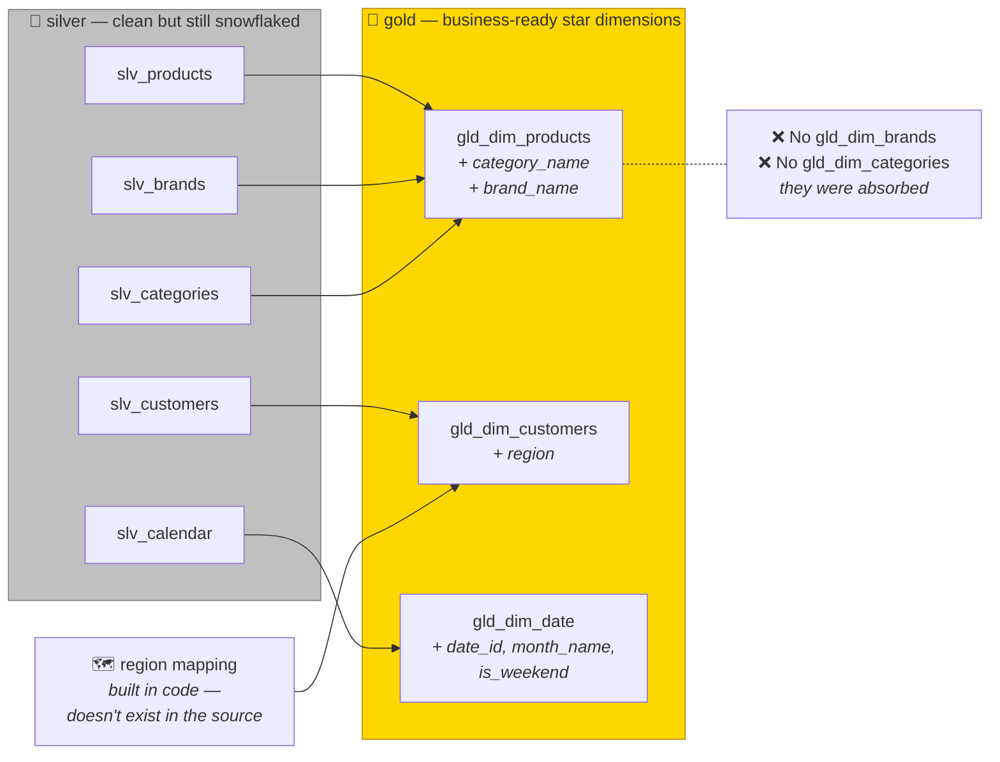
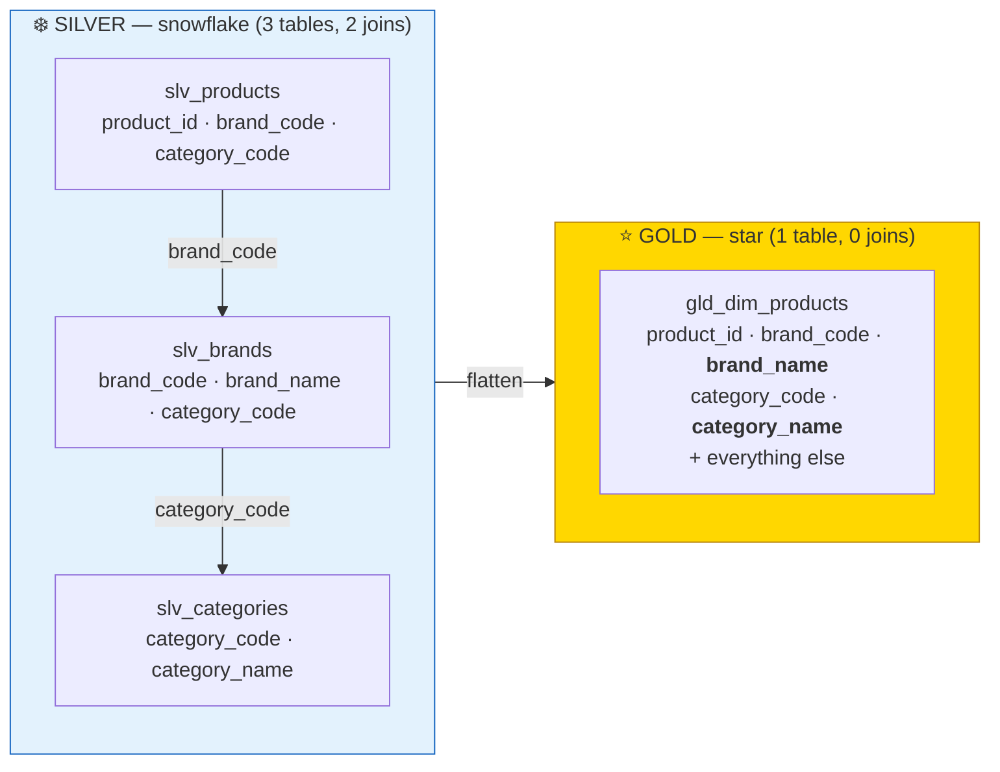
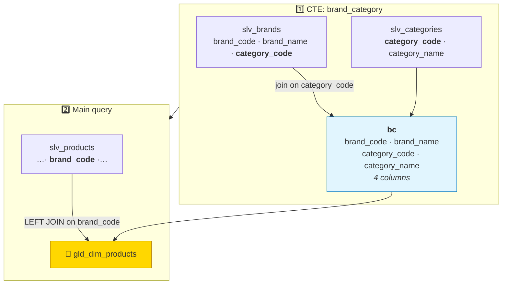
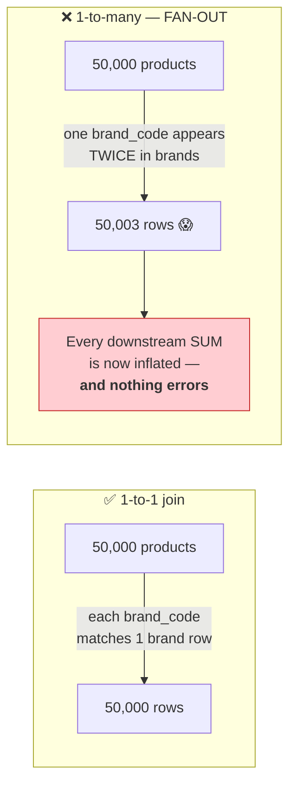
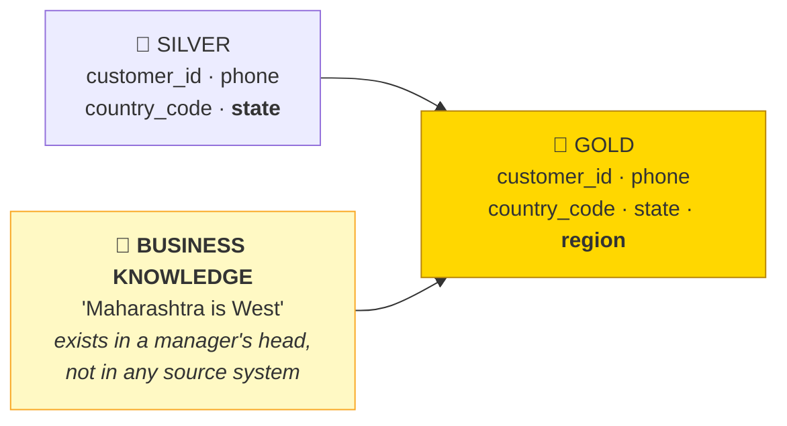
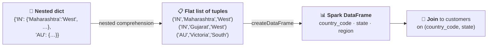

# Part 23 — 🧪 LAB 4: Dimensions → Gold

> **Section goal:** Turn trustworthy data into *useful* data. You'll flatten a three-table snowflake into one star-schema dimension using a CTE join, derive a `region` column that doesn't exist anywhere in the source, and enrich the date dimension with the exact fields the dashboard will need. This is the layer where business value gets created.

Covers transcript `02:52:20` – `03:01:01`.

---

## 0. What you'll build



**Checklist:**

- [ ] Notebook `3_dim_gold` created
- [ ] `gld_dim_products` has `category_name` and `brand_name`
- [ ] `gld_dim_customers` has `region`
- [ ] `gld_dim_date` has `date_id`, `month_name`, `is_weekend`
- [ ] No orphaned rows introduced by any join
- [ ] Row counts match the silver source (no accidental fan-out)

---

## 1. The design decision

> *"Let's now work on the gold layer. I have created this `3_d_gold` notebook, and we will be creating **business-ready columns** in our tables."*

> *"If you look at our products table, it has **category code, brand code**, etc. But when we plot our BI dashboard, we will have **descriptive names**. So instead of `H&K` we will have **Home and Kitchen** and so on."*

> *"So **what if in gold layer we have just one table — product table — and we can get rid of this category and brand table**, and we can put that descriptive name here? So just imagine you have a gold products table where you have category code and, for `H&K`, you have category name which is Home and Kitchen. Same way for brand code you have brand code and brand name. So that way we can **get rid of this brands and category tables** in our gold layer."*



### 🔍 Plain-English deep-dive: why denormalise here?

**Analogy:** a restaurant menu. The kitchen's inventory system correctly stores "dish 47 → ingredient group 12 → supplier 3". The **menu you hand a customer** says *"Grilled Sea Bass"*. Silver is the inventory system; gold is the menu.

| Why flatten in gold | Detail |
|---------------------|--------|
| **Analysts never have to join** | A dashboard filter on "Home & Kitchen" needs no `JOIN` and no knowledge of `H&K` |
| **Every avoided join is an avoided shuffle** | Directly cheaper at query time (Part 15) |
| **Genie works far better** | An LLM reading `category_name = 'Home and Kitchen'` is vastly more accurate than one reading `H&K` (Part 26) |
| **Storage is cheap; columnar compression eats repetition** | 50,000 rows repeating 6 category names compresses to almost nothing |
| **One less thing to get wrong** | No analyst can accidentally inner-join and drop rows |

> ⚠️ **The trade-off, stated honestly:** if a category is renamed, you must rebuild `gld_dim_products` rather than updating one row in a small table. That's fine because gold is *derived* and rebuildable from silver — which is exactly the reprocessability property from Part 17.

---

## 2. Set up

```python
# ── Cell 1 ────────────────────────────────────────────────────────────
import pyspark.sql.functions as F
import pyspark.sql.types     as T

catalog_name = "ecommerce"
```

> *"So here we are just loading all these three tables into Spark DataFrames."*

```python
# ── Cell 2 ────────────────────────────────────────────────────────────
df_products   = spark.table(f"{catalog_name}.silver.slv_products")
df_brands     = spark.table(f"{catalog_name}.silver.slv_brands")
df_categories = spark.table(f"{catalog_name}.silver.slv_categories")

print("products  :", df_products.count())
print("brands    :", df_brands.count())
print("categories:", df_categories.count())
```

### Check the join key *before* you join

> *"So `H&K` — if you look at the silver category and go to sample data, `H&K` is Home and Kitchen. So you have to do a **join using this `H&K`**."*

```python
# ── Cell 3 · verify the keys line up ──────────────────────────────────
print("product category codes:", sorted(r[0] for r in df_products.select("category_code").distinct().collect()))
print("category codes        :", sorted(r[0] for r in df_categories.select("category_code").distinct().collect()))
print("product brand codes   :", df_products.select("brand_code").distinct().count())
print("brand codes           :", df_brands.select("brand_code").distinct().count())

# Orphan check — Part 11's left anti join
orphan_brands = df_products.join(df_brands, "brand_code", "left_anti")
orphan_cats   = df_products.join(df_categories, "category_code", "left_anti")
print(f"products with an unknown brand_code   : {orphan_brands.count()}")
print(f"products with an unknown category_code: {orphan_cats.count()}")
```

> 🧠 **Do this every single time before a join.** If Part 22 hadn't uppercased `brand_code` on *both* sides, the join would return nulls for all 50,000 rows — with no error at all. This check catches it in five seconds.

---

## 3. Temporary views — the bridge to SQL

> *"And then, if you want to pull the category code from the category table… for doing **join, views are useful**. So what I have done here is I have created **three temporary views**. So the purpose of view is that your **DataFrame will become more like a table**, and then on these views you can just run all the queries."*

```python
# ── Cell 4 ────────────────────────────────────────────────────────────
df_products.createOrReplaceTempView("v_products")
df_brands.createOrReplaceTempView("v_brands")
df_categories.createOrReplaceTempView("v_categories")
```

> *"So when you say `SELECT * FROM v_products LIMIT 5` — see, it shows this. `SELECT * FROM v_category`, whatever, limit five — it shows this. And then brands will show it. I mean, this way you will **understand views better**."*

```sql
%sql
SELECT * FROM v_products   LIMIT 5;
```
```sql
%sql
SELECT * FROM v_categories LIMIT 5;
```
```sql
%sql
SELECT * FROM v_brands     LIMIT 5;
```

> 💡 **Why bother, when you could just use the DataFrame API?** Because this particular transformation — a two-step join with a CTE — reads far more naturally as SQL, and analysts can review it. Temp views are the bridge (Part 10 §4). They cost nothing: no data is written, and they vanish with the session.

```sql
%sql
USE CATALOG ecommerce;
```

---

## 4. `gld_dim_products` — the CTE join

> *"Now look at this query. What you're doing here is: you are creating a new table called `gold.gld_dim_products` in gold layer, and the way you do that is — **first you join brand and category table**."*

### 4.1 The two-step logic

> *"How do you join brand and category table? So check: **category** has `category_name` and `category_code`. But if you look at **brands**… brand has `brand_name` and `brand_code`, **but it also has `category_code`**. So if you join it, you get a **single table** which has brand_code, brand_name, category_code, category_name."*



> *"And that is something you can do with this query. So this is a **CTE**, and you are saying: give me brands and category table which has those four columns. Which four columns? Brand name, brand code, category name, category code."*

> *"Once you get that, you feel like you have got this **one table** with those four columns. Now you run this another query — where this brand-category is `BC` — and you will do a **join between that and products table using brand code**. So it's a simple **left join** between product table and this new four-column table."*

### 🔍 Plain-English deep-dive: what a CTE is

- **CTE (Common Table Expression)** — *a named, temporary result set defined at the top of a query with `WITH`, usable in the rest of that query.*
- **Analogy:** in a recipe, *"first make the sauce"* — you name an intermediate result, then use it by name instead of repeating the whole preparation.

```sql
WITH step_one AS ( … ),
     step_two AS ( SELECT … FROM step_one … )
SELECT … FROM step_two;
```

| Benefit | Why it matters here |
|---------|---------------------|
| **Readability** | A two-step join reads top-to-bottom instead of as a nested subquery |
| **Reusability** | Reference `bc` multiple times without repeating the join |
| **Debuggability** | Run just the CTE body to inspect the intermediate result |
| **No performance cost** | Catalyst inlines it — a CTE is not a materialisation |

> ⚠️ **A CTE is not a temp table.** It exists only for the duration of that one statement and stores nothing. If you need the intermediate result in several *separate* queries, use a temp view or write a table.

### 4.2 The SQL

```sql
%sql
CREATE OR REPLACE TABLE ecommerce.gold.gld_dim_products AS
WITH bc AS (
    SELECT
        b.brand_code,
        b.brand_name,
        c.category_code,
        c.category_name
    FROM        v_brands     b
    LEFT JOIN   v_categories c
           ON   b.category_code = c.category_code
)
SELECT
    p.product_id,
    p.sku,
    p.product_name,
    p.category_code,
    bc.category_name,
    p.brand_code,
    bc.brand_name,
    p.color,
    p.size,
    p.material,
    p.weight_in_grams,
    p.length,
    p.rating,
    p.rating_count,
    current_timestamp() AS gold_processed_at
FROM        v_products p
LEFT JOIN   bc
       ON   p.brand_code = bc.brand_code;
```

> ⚠️ **`LEFT JOIN`, not `INNER JOIN` — and this matters.** A product whose brand code is missing from the brands table must **still appear** in the dimension, with a null `brand_name`. An inner join would silently delete it, and then every order for that product would become an orphan in the fact table. **Never let a dimension lookup delete a row.** (Part 11 §4.)

### 4.3 The PySpark equivalent

Both are valid; know how to write each.

```python
# ── Cell 5 · DataFrame API version ────────────────────────────────────
bc = (df_brands.alias("b")
        .join(df_categories.alias("c"), on="category_code", how="left")
        .select(F.col("b.brand_code"),
                F.col("b.brand_name"),
                F.col("category_code"),
                F.col("c.category_name")))

df_gold_products = (df_products.alias("p")
    .join(bc.alias("bc"), on="brand_code", how="left")
    .select(
        F.col("p.product_id"), F.col("p.sku"), F.col("p.product_name"),
        F.col("p.category_code"), F.col("bc.category_name"),
        F.col("p.brand_code"),    F.col("bc.brand_name"),
        F.col("p.color"), F.col("p.size"), F.col("p.material"),
        F.col("p.weight_in_grams"), F.col("p.length"),
        F.col("p.rating"), F.col("p.rating_count"),
        F.current_timestamp().alias("gold_processed_at"))
)

(df_gold_products.write.format("delta").mode("overwrite")
   .option("overwriteSchema", "true")
   .saveAsTable(f"{catalog_name}.gold.gld_dim_products"))
```

> 💡 **Note the ambiguity handling.** Both `slv_products` and `bc` carry `category_code`. Using `on="brand_code"` and then qualifying with `F.col("p.category_code")` keeps it unambiguous — exactly the aliasing discipline from Part 11 §11.

### 4.4 Verify — and check for fan-out

> *"So let's execute this, and in gold now you have `gld_dim_products` table. And see, this is what we got now: so along with category code you have **category name**, brand code you have **brand name**."*

```python
# ── Cell 6 ────────────────────────────────────────────────────────────
g = spark.table(f"{catalog_name}.gold.gld_dim_products")

print("silver products:", df_products.count())
print("gold   products:", g.count())
assert g.count() == df_products.count(), "❌ FAN-OUT — the join duplicated rows"

print("null brand_name   :", g.filter(F.col("brand_name").isNull()).count())
print("null category_name:", g.filter(F.col("category_name").isNull()).count())
display(g.select("product_id","category_code","category_name","brand_code","brand_name").limit(20))
```

### ⚠️ Fan-out — the silent killer of dimension joins



**If the row count grows, your "dimension" table had duplicate keys.** That's precisely why Part 22 deduplicated `categories` — and why the assertion above belongs in the notebook permanently, not just during development.

> ⭐ **Interview:** *"How do you know a join didn't corrupt your data?"* → *"I assert the row count. For a fact-to-dimension or dimension-enrichment left join the output row count must equal the input, because each row should match at most one dimension row. If it grows, the dimension has duplicate keys and every downstream aggregate is silently inflated — no error, just wrong numbers. I also count nulls in the newly added columns, because a spike means the join key didn't match, usually a casing or whitespace mismatch. Both checks go into the notebook as assertions so a regression fails the run rather than reaching a dashboard."*

---

## 5. `gld_dim_customers` — deriving `region`

> *"Then for customer table, it will be useful to have **region**. See, our customer table in silver — if you look at it, it has the **state**. So let's say for country India it has states like Maharashtra, then TN is Tamil Nadu — but **in BI dashboard our business managers want region-level analytics**. They are like: OK, what were my revenues in my **West region, East region**? And **we don't have that in customers table**."*

> *"So how about **we map all these states with region**? So Maharashtra, Gujarat will be West region, Assam will be East region. So you can **get this kind of mapping from business**."*

### 🔍 Plain-English deep-dive: creating data that doesn't exist

This is the clearest example in the whole project of what the gold layer is *for*.



**No amount of cleaning produces `region`.** It requires *domain knowledge*, and the gold layer is where that knowledge is encoded. That's the difference between silver ("make it correct") and gold ("make it useful").

### 5.1 The mapping

> *"So see, in **South** you have Karnataka, Tamil Nadu, AP, Kerala — these are all South. Then you have **West**, you have **North** and so on. So you can get this kind of mapping from domain experts, from your business managers — for not just India country but **all other countries: Australia, UK**. So it's a **simple dictionary**."*

```python
# ── Cell 7 ────────────────────────────────────────────────────────────
country_state_map = {
    "IN": {   # India
        "Maharashtra": "West",  "Gujarat": "West",  "Goa": "West",  "Rajasthan": "West",
        "Karnataka": "South",   "Tamil Nadu": "South", "Andhra Pradesh": "South",
        "Kerala": "South",      "Telangana": "South",
        "Assam": "East",        "West Bengal": "East", "Odisha": "East", "Bihar": "East",
        "Delhi": "North",       "Punjab": "North",  "Haryana": "North",
        "Uttar Pradesh": "North", "Uttarakhand": "North",
    },
    "AU": {   # Australia
        "New South Wales": "East",       "Victoria": "South",
        "Queensland": "North",           "Western Australia": "West",
        "South Australia": "South",      "Tasmania": "South",
    },
    "GB": {   # United Kingdom
        "England": "South",  "Scotland": "North",
        "Wales": "West",     "Northern Ireland": "West",
    },
}
```

> *"So our `country_state_map` dictionary is a **nested dictionary**. And if you execute this, you will get this kind of dictionary: see, for India you have state and the region; for Australia you have the state and the region, and so on."*

### 5.2 Flatten it into rows

> *"And then you can **create a flat list**, basically. So flat list is like a bunch of rows — every row has **country, state, region**, these three columns. And then you can create a **DataFrame**."*

```python
# ── Cell 8 ────────────────────────────────────────────────────────────
flat_rows = [
    (country, state, region)
    for country, states in country_state_map.items()
    for state, region in states.items()
]
print(f"{len(flat_rows)} mapping rows")
print(flat_rows[:5])

df_region_mapping = spark.createDataFrame(
    flat_rows, "country_code STRING, state STRING, region STRING")
display(df_region_mapping)
```

### 🔍 Plain-English deep-dive: dictionary → rows → DataFrame



**Why convert at all?** Because you cannot join a Python dictionary to a distributed DataFrame. The dictionary lives on the **driver**; the customers live across the **executors**. Turning it into a DataFrame lets Spark broadcast it and join in parallel (Parts 11, 13).

> 💡 **The nested comprehension** reads as: *"for each country and its states dict, then for each state and region in that dict, emit a three-element tuple."* If comprehensions aren't comfortable yet, the explicit loop is identical:
> ```python
> flat_rows = []
> for country, states in country_state_map.items():
>     for state, region in states.items():
>         flat_rows.append((country, state, region))
> ```

### 5.3 The composite-key join

> *"And this `df_region_mapping` DataFrame is created based on those flat rows — it has country, state and region. And then you can **do a join**… So now we are going to create a silver customer table — see, this doesn't have a region. But now when you do a join with region mapping table **on country and state**. And for any state, if you don't have a region, you will say **'Other' region**."*

```python
# ── Cell 9 ────────────────────────────────────────────────────────────
from pyspark.sql.functions import broadcast

df_customers = spark.table(f"{catalog_name}.silver.slv_customers")

df_gold_customers = (df_customers
    .join(broadcast(df_region_mapping), on=["country_code", "state"], how="left")
    .withColumn("region", F.coalesce(F.col("region"), F.lit("Other")))
    .select("customer_id", "phone", "country_code", "state", "region",
            F.current_timestamp().alias("gold_processed_at")))

display(df_gold_customers.limit(20))
```

**Three deliberate choices in those four lines:**

| Choice | Why |
|--------|-----|
| **`on=["country_code","state"]`** | A **composite key** (Part 11 §12). `"Victoria"` exists in Australia; a state name alone isn't unique globally |
| **`how="left"`** | Never drop a customer because their state isn't in the map |
| **`coalesce(region, "Other")`** | Explicit default. *"For any state, if you don't have a region, you will say Other region"* |
| **`broadcast(...)`** | ~40 mapping rows — broadcasting eliminates the shuffle entirely (Part 11 §14) |

> ⚠️ **`"Other"` is a design decision that needs monitoring.** It's better than null — it's explicit and visible in a dashboard filter — but if 40% of customers land in `Other`, your mapping is incomplete and regional analytics are meaningless. **Report on it:**

```python
# ── Cell 10 · monitor the mapping coverage ────────────────────────────
display(df_gold_customers.groupBy("region").count().orderBy(F.col("count").desc()))

unmapped = df_gold_customers.filter(F.col("region") == "Other")
print(f"unmapped: {unmapped.count():,} ({unmapped.count()/df_gold_customers.count():.1%})")
display(unmapped.groupBy("country_code", "state").count().orderBy(F.col("count").desc()).limit(20))
```

> ⭐ **That last query is the valuable one** — it tells you *exactly which* country/state combinations to add to the map. A pipeline that reports its own gaps is a pipeline you can improve. One that silently buckets everything into `Other` is one that quietly degrades.

### 5.4 Write and verify

> *"So let's execute this, and now see, here you are getting India, Maharashtra is state, and then customer ID… These columns are not in a right order, but let's look at the data — at least let's verify the accuracy. So India, Maharashtra, country code is IN, and see — **look at this, this is amazing, right? The region is West.**"*

```python
# ── Cell 11 ───────────────────────────────────────────────────────────
before = df_customers.count()

(df_gold_customers.write.format("delta").mode("overwrite")
   .option("overwriteSchema", "true")
   .saveAsTable(f"{catalog_name}.gold.gld_dim_customers"))

after = spark.table(f"{catalog_name}.gold.gld_dim_customers").count()
assert before == after, f"❌ FAN-OUT: {before} → {after}"
print(f"✅ gld_dim_customers  {after:,} rows")
```

> 💡 **The instructor notices the column order is wrong and moves on.** He fixes it properly on the date dimension in §6.4 — the `select()` in Cell 9 above already puts them in a sensible order, which is the cleaner habit.

> ⭐ **A better production pattern:** put the mapping in a **Delta table**, not a Python dictionary.
> ```python
> df_region_mapping.write.format("delta").mode("overwrite") \
>   .saveAsTable(f"{catalog_name}.gold.ref_region_mapping")
> ```
> Now the business can maintain it without a code deployment, changes are versioned by Delta, and the notebook just reads it. Same argument as the mapping-table answer in Part 22 §2.4.

---

## 6. `gld_dim_date` — enrichment for the dashboard

> *"Now let's look at the date table. So here we are going to create a DataFrame out of your silver calendar table, and then we will create a **bunch of new columns**."*

### 6.1 `is_weekend`

> *"For example, **`is_weekend`**. For this date, let's say you want to know whether it's a weekend — **one and zero**. In BI dashboard, imagine you have a filter: **what are my revenues on weekend? What are my revenues on weekdays?** So this column will help you do that, correct?"*

```python
# ── Cell 12 ───────────────────────────────────────────────────────────
df_calendar = spark.table(f"{catalog_name}.silver.slv_calendar")

df_gold_date = df_calendar.withColumn(
    "is_weekend",
    F.when(F.col("day_name").isin("Saturday", "Sunday"), F.lit(1)).otherwise(F.lit(0))
)
```

> 💡 **Why `1`/`0` rather than `true`/`false`?** Because `SUM(is_weekend)` counts weekend days and `AVG(is_weekend)` gives the weekend *proportion* — directly, with no `CASE` expression in every dashboard query. Same reasoning as `coupon_flag` in Part 18 §7. A tiny design choice, and worth being able to justify.

An alternative that doesn't depend on the day-name string:

```python
# dayofweek(): 1 = Sunday … 7 = Saturday
F.when(F.dayofweek(F.col("date")).isin(1, 7), 1).otherwise(0)
```

### 6.2 `date_id`

> *"The second one we created is **`date_id`**. See, date ID is nothing but you take a date, remove the hyphen. See — if you remove the hyphens, what do you get? See, this is the date ID: **2025 09 07**."*

```python
# ── Cell 13 ───────────────────────────────────────────────────────────
df_gold_date = df_gold_date.withColumn(
    "date_id",
    F.date_format(F.col("date"), "yyyyMMdd").cast(T.IntegerType())
)
```

| date | date_id |
|------|---------|
| 2025-09-07 | `20250907` |
| 2025-10-31 | `20251031` |

### 🔍 Plain-English deep-dive: why an integer surrogate date key?

This is a genuine dimensional-modelling convention, not a quirk.

| Reason | Detail |
|--------|--------|
| **Compact** | A 4-byte `INT` versus a date type plus formatting — meaningful across hundreds of millions of fact rows |
| **Fast joins** | Integer comparison is the cheapest join predicate there is |
| **Human-readable** | `20250907` is instantly legible — unlike `1, 2, 3` surrogate keys |
| **Naturally sortable** | Integer ordering equals chronological ordering |
| **Partition-friendly** | Range filters like `date_id BETWEEN 20250801 AND 20251031` work directly |
| **No timezone ambiguity** | It's a calendar day, not an instant in time |

> ⚠️ **Keep the real `date` column too.** `date_id` is the *join key*; the `DateType` column is what you use for date arithmetic, `datediff`, and BI tools that need a genuine date axis. Never replace one with the other.

### 6.3 `month_name`

> *"Then you get **month name**, because in BI dashboard imagine you have a filter: OK, what are my revenues in January, February? You might have **seasons**, right — in summer months there might be revenue decline, or revenue increase in winter months, in fall season. So for all those, month name might be useful."*

```python
# ── Cell 14 ───────────────────────────────────────────────────────────
df_gold_date = (df_gold_date
    .withColumn("month_name",       F.date_format(F.col("date"), "MMMM"))   # "September"
    .withColumn("month_name_short", F.date_format(F.col("date"), "MMM"))    # "Sep"
    .withColumn("day_of_month",     F.dayofmonth(F.col("date")))
    .withColumn("day_of_year",      F.dayofyear(F.col("date"))))
```

> ⚠️ **`month_name` sorts alphabetically** — April, August, December, February… Keep the numeric `month` column for `ORDER BY`. Exactly the same trap as `Q3 2025` in Part 22 §6.5. You'll see the consequence live in Part 27, where the instructor's hand-built chart shows *August, October, September* until he switches to a real date field.

**The `date_format` pattern reference:**

| Pattern | Output | Example |
|---------|--------|---------|
| `yyyy` | 4-digit year | 2025 |
| `MM` | 2-digit month | 09 |
| `MMM` | Short month | Sep |
| `MMMM` | Full month | September |
| `dd` | 2-digit day | 07 |
| `EEE` | Short day | Sun |
| `EEEE` | Full day | Sunday |
| `yyyyMMdd` | Compact date key | 20250907 |

### 6.4 Reorder the columns

> *"So we created these three columns — `date_id`, `month_name`, and `is_weekend`. These three columns that you see at the end. And then you might want to **reorder certain columns**. So you can say `desired_column_order`, then you say `.select(gold)` — and see, now you have all these columns."*

```python
# ── Cell 15 ───────────────────────────────────────────────────────────
desired_column_order = [
    "date_id", "date", "day_name", "day_of_month", "is_weekend",
    "week", "month", "month_name", "month_name_short",
    "quarter", "quarter_num", "year", "day_of_year",
]

df_gold_date = (df_gold_date
    .select(*desired_column_order)
    .withColumn("gold_processed_at", F.current_timestamp()))

display(df_gold_date.orderBy("date_id").limit(20))
```

> 💡 **Column order is not cosmetic in a gold table.** It's the first thing an analyst sees in the Catalog UI, in a `SELECT *`, and in Genie's schema context. Key first, then the most-used attributes, then the long tail. Five seconds of `select()` saves everyone else confusion.

### 6.5 Write and verify

```python
# ── Cell 16 ───────────────────────────────────────────────────────────
(df_gold_date.write.format("delta").mode("overwrite")
   .option("overwriteSchema", "true")
   .saveAsTable(f"{catalog_name}.gold.gld_dim_date"))

d = spark.table(f"{catalog_name}.gold.gld_dim_date")
print("rows:", d.count())
assert d.count() == d.select("date_id").distinct().count(), "❌ duplicate date_id"
display(d.groupBy("is_weekend").count())
display(d.select("month_name").distinct())
```

> *"And when I go here I see `dim_date` and sample data — and here I see this `is_weekend`, this is a new column. Then the `month_name` is another column, and `date_id` is another column that we generated."*

> *"All right, so our **gold layer now has three tables**, and these three tables contain **additional columns which will help us in our BI dashboarding**."*

---

## 7. The complete gold-dimensions notebook

```python
# Databricks notebook source
# MAGIC %md
# MAGIC # 3 · Dimensions → Gold
# MAGIC Flattens the snowflake into star dimensions and adds business-derived columns.
# MAGIC **Gold rule:** add business value. Denormalise, derive, rename for humans.

# COMMAND ----------
import pyspark.sql.functions as F
import pyspark.sql.types     as T
from pyspark.sql.functions import broadcast

dbutils.widgets.text("catalog", "ecommerce", "Target catalog")
catalog_name = dbutils.widgets.get("catalog")

def silver(t): return spark.table(f"{catalog_name}.silver.{t}")

def to_gold(df, name, expect_rows=None):
    (df.write.format("delta").mode("overwrite")
       .option("overwriteSchema", "true")
       .saveAsTable(f"{catalog_name}.gold.{name}"))
    n = spark.table(f"{catalog_name}.gold.{name}").count()
    if expect_rows is not None:
        assert n == expect_rows, f"❌ {name}: FAN-OUT {expect_rows} → {n}"
    print(f"✅ {name:<20} {n:>7,} rows")
    return n

# COMMAND ----------
# MAGIC %md ## 1 · gld_dim_products — flatten the snowflake

# COMMAND ----------
df_products, df_brands, df_categories = (
    silver("slv_products"), silver("slv_brands"), silver("slv_categories"))

# Pre-join sanity: no orphaned foreign keys
assert df_products.join(df_brands, "brand_code", "left_anti").count() == 0, \
       "❌ products reference unknown brand codes"

bc = (df_brands.alias("b")
        .join(df_categories.alias("c"), on="category_code", how="left")
        .select(F.col("b.brand_code"), F.col("b.brand_name"),
                F.col("category_code"), F.col("c.category_name")))

# A dimension must have a unique key or the next join fans out
assert bc.count() == bc.select("brand_code").distinct().count(), \
       "❌ duplicate brand_code in the brand/category CTE"

df_gold_products = (df_products.alias("p")
    .join(bc.alias("bc"), on="brand_code", how="left")
    .select(F.col("p.product_id"), F.col("p.sku"), F.col("p.product_name"),
            F.col("p.category_code"), F.col("bc.category_name"),
            F.col("p.brand_code"),    F.col("bc.brand_name"),
            F.col("p.color"), F.col("p.size"), F.col("p.material"),
            F.col("p.weight_in_grams"), F.col("p.length"),
            F.col("p.rating"), F.col("p.rating_count"),
            F.current_timestamp().alias("gold_processed_at")))

to_gold(df_gold_products, "gld_dim_products", expect_rows=df_products.count())

# COMMAND ----------
# MAGIC %md ## 2 · gld_dim_customers — derive region

# COMMAND ----------
country_state_map = {
    "IN": {"Maharashtra":"West","Gujarat":"West","Goa":"West","Rajasthan":"West",
           "Karnataka":"South","Tamil Nadu":"South","Andhra Pradesh":"South",
           "Kerala":"South","Telangana":"South",
           "Assam":"East","West Bengal":"East","Odisha":"East","Bihar":"East",
           "Delhi":"North","Punjab":"North","Haryana":"North",
           "Uttar Pradesh":"North","Uttarakhand":"North"},
    "AU": {"New South Wales":"East","Victoria":"South","Queensland":"North",
           "Western Australia":"West","South Australia":"South","Tasmania":"South"},
    "GB": {"England":"South","Scotland":"North","Wales":"West","Northern Ireland":"West"},
}

flat_rows = [(c, s, r) for c, states in country_state_map.items() for s, r in states.items()]
df_region_mapping = spark.createDataFrame(
    flat_rows, "country_code STRING, state STRING, region STRING")

# Persist the mapping so the business can own it
df_region_mapping.write.format("delta").mode("overwrite") \
    .option("overwriteSchema", "true") \
    .saveAsTable(f"{catalog_name}.gold.ref_region_mapping")

df_customers = silver("slv_customers")
df_gold_customers = (df_customers
    .join(broadcast(df_region_mapping), on=["country_code", "state"], how="left")
    .withColumn("region", F.coalesce(F.col("region"), F.lit("Other")))
    .select("customer_id", "phone", "country_code", "state", "region",
            F.current_timestamp().alias("gold_processed_at")))

to_gold(df_gold_customers, "gld_dim_customers", expect_rows=df_customers.count())

# Mapping-coverage report
g_cust  = spark.table(f"{catalog_name}.gold.gld_dim_customers")
unmapped = g_cust.filter(F.col("region") == "Other").count()
print(f"   ↳ unmapped region: {unmapped:,} ({unmapped / g_cust.count():.1%})")
display(g_cust.filter(F.col("region") == "Other")
              .groupBy("country_code", "state").count()
              .orderBy(F.col("count").desc()).limit(20))

# COMMAND ----------
# MAGIC %md ## 3 · gld_dim_date — enrich for the dashboard

# COMMAND ----------
df_gold_date = (silver("slv_calendar")
    .withColumn("date_id",          F.date_format(F.col("date"), "yyyyMMdd").cast(T.IntegerType()))
    .withColumn("is_weekend",       F.when(F.col("day_name").isin("Saturday","Sunday"), 1).otherwise(0))
    .withColumn("month_name",       F.date_format(F.col("date"), "MMMM"))
    .withColumn("month_name_short", F.date_format(F.col("date"), "MMM"))
    .withColumn("day_of_month",     F.dayofmonth(F.col("date")))
    .withColumn("day_of_year",      F.dayofyear(F.col("date"))))

desired_column_order = ["date_id","date","day_name","day_of_month","is_weekend",
                        "week","month","month_name","month_name_short",
                        "quarter","quarter_num","year","day_of_year"]

df_gold_date = (df_gold_date.select(*desired_column_order)
                            .withColumn("gold_processed_at", F.current_timestamp()))

to_gold(df_gold_date, "gld_dim_date")

# COMMAND ----------
# MAGIC %md ## 4 · Quality gates

# COMMAND ----------
def q(sql): return spark.sql(sql).collect()[0][0]

checks = {
 "products: no fan-out":
   q(f"SELECT COUNT(*) FROM {catalog_name}.gold.gld_dim_products") ==
   q(f"SELECT COUNT(*) FROM {catalog_name}.silver.slv_products"),
 "products: unique product_id":
   q(f"SELECT COUNT(*) - COUNT(DISTINCT product_id) FROM {catalog_name}.gold.gld_dim_products") == 0,
 "products: category_name populated":
   q(f"SELECT COUNT(*) FROM {catalog_name}.gold.gld_dim_products WHERE category_name IS NULL") == 0,
 "customers: unique customer_id":
   q(f"SELECT COUNT(*) - COUNT(DISTINCT customer_id) FROM {catalog_name}.gold.gld_dim_customers") == 0,
 "customers: region never null":
   q(f"SELECT COUNT(*) FROM {catalog_name}.gold.gld_dim_customers WHERE region IS NULL") == 0,
 "date: unique date_id":
   q(f"SELECT COUNT(*) - COUNT(DISTINCT date_id) FROM {catalog_name}.gold.gld_dim_date") == 0,
 "date: is_weekend only 0 or 1":
   q(f"SELECT COUNT(*) FROM {catalog_name}.gold.gld_dim_date WHERE is_weekend NOT IN (0,1)") == 0,
}
for name, ok in checks.items():
    print(f"{'✅' if ok else '❌'} {name}")
assert all(checks.values()), "❌ gold dimension quality gate failed"
print("\n🎉 Gold dimension layer complete.")

# COMMAND ----------
# MAGIC %sql
# MAGIC SHOW TABLES IN ecommerce.gold;
```

---

## 8. The gold rule

| Layer | Rule | What you did here |
|-------|------|-------------------|
| 🥉 Bronze | *Change nothing except metadata* | Landed the CSVs |
| 🥈 Silver | *Fix the quality, keep the grain* | Trimmed, cast, deduped, standardised |
| 🥇 **Gold** | ***Add business value*** | **Denormalised, derived `region`, enriched dates** |

**The three gold moves, all present in this lab:**

1. **Denormalise** — collapse joins the consumer would otherwise have to do
2. **Derive** — create attributes that don't exist in any source (`region`, `is_weekend`, `date_id`)
3. **Rename for humans** — `category_name` beside `category_code`, so nobody has to memorise `H&K`

---

## 9. 🚑 Troubleshooting

| Symptom | Cause | Fix |
|---------|-------|-----|
| Row count **grows** after a join | Duplicate keys in the "dimension" side | Dedupe it (Part 22 §3); assert `count == distinct(key).count` |
| All `brand_name` values are null | Join key mismatch — case or whitespace | Compare `distinct()` on both sides; standardise in **silver** |
| `Reference 'category_code' is ambiguous` | Present in both sides of the join | Alias the DataFrames and qualify with `F.col("p.category_code")` |
| Products disappear after the join | Used `INNER` instead of `LEFT` | Dimension lookups must never delete rows |
| Everything lands in region `Other` | `state` values don't match the map exactly | Run the unmapped report; check casing/trim from silver |
| `TypeError: 'DataFrame' object is not callable` | Missing `,` between `select()` arguments | Check the argument list |
| `date_id` is null | `date` column is null — a bad `to_date` in silver | Fix upstream; assert no null dates in silver |
| Month names sort wrongly in a chart | `month_name` is a string | Sort by the numeric `month` or by `date` |
| Temp view not found in a later cell | Session restarted, or a `%sql` cell ran first | Re-run the `createOrReplaceTempView` cell |

---

## ⭐ Likely Interview Questions for This Section

**Q1. "Why denormalise in the gold layer when silver is properly normalised?"**
> *Model answer:* "Different consumers, different optimisation. Silver is engineered for correctness and reprocessability, so keeping entities separate is right — a brand rename touches one row. Gold is engineered for consumption: analysts, dashboards and Genie shouldn't need to know that `H&K` maps to Home & Kitchen through a two-hop join. Flattening removes joins at query time, and on Spark every avoided join is an avoided shuffle. Storage cost is negligible because columnar formats compress repeated values extremely well. The trade-off is that a rename requires rebuilding the gold dimension rather than updating one row — which is acceptable precisely because gold is derived and rebuildable from silver."

**Q2. "What is a CTE and why use one here?"**
> *Model answer:* "A Common Table Expression is a named temporary result set defined with `WITH` at the top of a query and referenced in the rest of that statement. Here the logic is two steps — first join brands to categories to get a four-column lookup, then join products to that — and a CTE lets it read top to bottom instead of as a nested subquery. It's also easier to debug, because you can run the CTE body alone to inspect the intermediate result. Importantly it carries no performance cost: Catalyst inlines it, so it isn't a materialisation. And it isn't a temp table — it exists only for that one statement, so if I needed the intermediate result across several queries I'd use a temp view or write a table."

**Q3. "Why `LEFT JOIN` rather than `INNER JOIN` when enriching a dimension?"**
> *Model answer:* "Because a lookup failure must never delete a row. If a product's brand code is missing from the brands table, an inner join silently removes that product from the dimension — and then every order for it becomes an orphan in the fact table, so revenue quietly disappears from reports with no error anywhere. A left join keeps the product with a null brand name, which is visible and fixable. More generally the rule is that enrichment adds columns, never removes rows, and I'd pair it with a left-anti-join check that counts unmatched keys so the gap is reported rather than hidden."

**Q4. "How do you know a join didn't corrupt your data?"**
> *Model answer:* "I assert on the row count. For a dimension enrichment the output count must equal the input count, because each row should match at most one lookup row. If it grows, the lookup side had duplicate keys and every downstream aggregate is silently inflated — that's fan-out, and it produces no error, just wrong numbers. I also count nulls in the newly added columns, because a spike means the join key didn't match, usually a casing or whitespace mismatch that should have been fixed in silver. Both go into the notebook as permanent assertions, not just development checks, so a regression fails the run instead of reaching a dashboard."

**Q5. "The `region` column doesn't exist in any source system. Is inventing data appropriate?"**
> *Model answer:* "It's not inventing data — it's encoding domain knowledge, and that's exactly what the gold layer is for. The mapping from state to region exists in the business, just not in a database, so someone has to formalise it. What matters is doing it responsibly: source the mapping from a domain expert rather than guessing, use a left join with an explicit default like `Other` so unmapped values are visible rather than null, and report on coverage so I can see which states are missing and add them. I'd also store the mapping as a Delta table rather than a Python dictionary, so the business owns it, changes are versioned, and updating it doesn't require a code deployment."

**Q6. "Why an integer `date_id` like 20250907 instead of joining on the date itself?"**
> *Model answer:* "It's a standard dimensional-modelling convention. An integer is compact — four bytes across hundreds of millions of fact rows adds up — and integer comparison is the cheapest possible join predicate. Unlike an anonymous surrogate key it stays human-readable, so `20250907` is instantly legible when you're debugging a fact row. It sorts chronologically for free, and range predicates like `date_id BETWEEN 20250801 AND 20251031` work directly and prune well. It also sidesteps timezone ambiguity, since it represents a calendar day rather than an instant. Crucially I keep the real `DateType` column alongside it — `date_id` is the join key, the date column is what you use for date arithmetic and for BI tools that need a genuine date axis."

**Q7. "Why `1`/`0` for `is_weekend` rather than a boolean?"**
> *Model answer:* "Because it makes aggregation trivial. `SUM(is_weekend)` gives the number of weekend days and `AVG(is_weekend)` gives the weekend proportion directly, without a `CASE` expression in every dashboard query. The same reasoning applies to flags like `coupon_flag` on the fact table, where `AVG` gives the coupon redemption rate for free. It's a small design choice but it's the kind that reduces friction for every downstream consumer, and being able to explain *why* rather than just following a convention is the point."

**Q8. "How would you improve the region mapping for production?"**
> *Model answer:* "Move it out of the notebook and into a governed Delta table with source columns, the canonical region, an effective date and an owner. That gives three things a Python dictionary can't: the business maintains it without a code deployment, Delta versions every change so you can see who changed a mapping and when, and I can join to it rather than embedding it in logic. I'd also make the coverage report a first-class output — a scheduled query listing unmapped country and state combinations by volume, so new variants surface automatically instead of silently accumulating in the `Other` bucket. And I'd add a threshold alert, because if unmapped ever exceeds a few percent the regional analytics have stopped being trustworthy."

---

## 🧠 30-Second Memory Hooks

- **🧠 The gold rule: *add business value*.** Bronze = land it. Silver = fix it. Gold = **make it useful**.
- **The three gold moves: DENORMALISE · DERIVE · RENAME FOR HUMANS.**
- **Silver is the inventory system. Gold is the menu.** `H&K` vs *Home and Kitchen*.
- **Flattening the snowflake into a star removes joins — and every avoided join is an avoided shuffle.**
- **No `gld_dim_brands`, no `gld_dim_categories`** — they were absorbed into `gld_dim_products`.
- **CTE = `WITH name AS (…)`.** A named step, inlined by Catalyst, **not** a temp table, **no** performance cost.
- **⚠️ `LEFT JOIN` for every dimension enrichment.** A lookup must **never delete a row**.
- **⚠️ FAN-OUT: assert `output_count == input_count`.** If it grows, the lookup side had duplicate keys — and **nothing errors**.
- **Also count nulls in the new columns** — a spike means the join key didn't match.
- **`region` doesn't exist in any source.** It's **domain knowledge**, and encoding it is what gold is *for*.
- **dict → flat list of tuples → `createDataFrame` → `broadcast` join.** You can't join a Python dict to a DataFrame.
- **Composite key `["country_code","state"]`** — "Victoria" isn't globally unique.
- **`coalesce(region, "Other")` — then REPORT on the `Other` bucket.** A pipeline that shows its own gaps is one you can improve.
- **`date_id = yyyyMMdd` as an INT** — compact, fast, readable, sortable, prunes well. **Keep the real date too.**
- **`is_weekend` as 1/0 → `SUM` gives the count, `AVG` gives the rate.** No `CASE` needed downstream.
- **⚠️ `month_name` sorts alphabetically.** Keep numeric `month` for `ORDER BY` — you'll see this bite in Part 27.
- **Column order in a gold table is not cosmetic** — it's the first thing analysts and Genie see.
- **Prefer a Delta MAPPING TABLE over a hardcoded dict** so the business owns it and Delta versions it.

---

*Next suggested section:* **[Part 24 — 🧪 LAB 5: Fact Table → Bronze & Silver](Part-24-lab-fact-bronze-silver.md)** — dimensions are done. Now the 183,000-row fact table: ingesting ~92 daily landing files with an all-string schema, spotting the planted defects, and fixing text quantities, `$` symbols, `%` signs, coupon casing, channel codes and date/timestamp types.

---

**Navigation** — ⬅️ **[Part 22 — LAB 3: Dimensions → Silver](Part-22-lab-dimensions-silver.md)** · 🏠 **[Master Index](../Databricks%20-%20Study%20Guide.md)** · ➡️ **[Part 24 — LAB 5: Fact → Bronze & Silver](Part-24-lab-fact-bronze-silver.md)**
