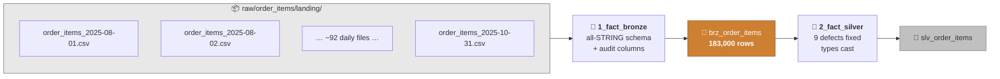
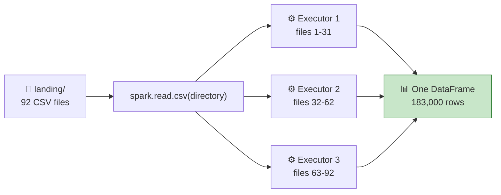
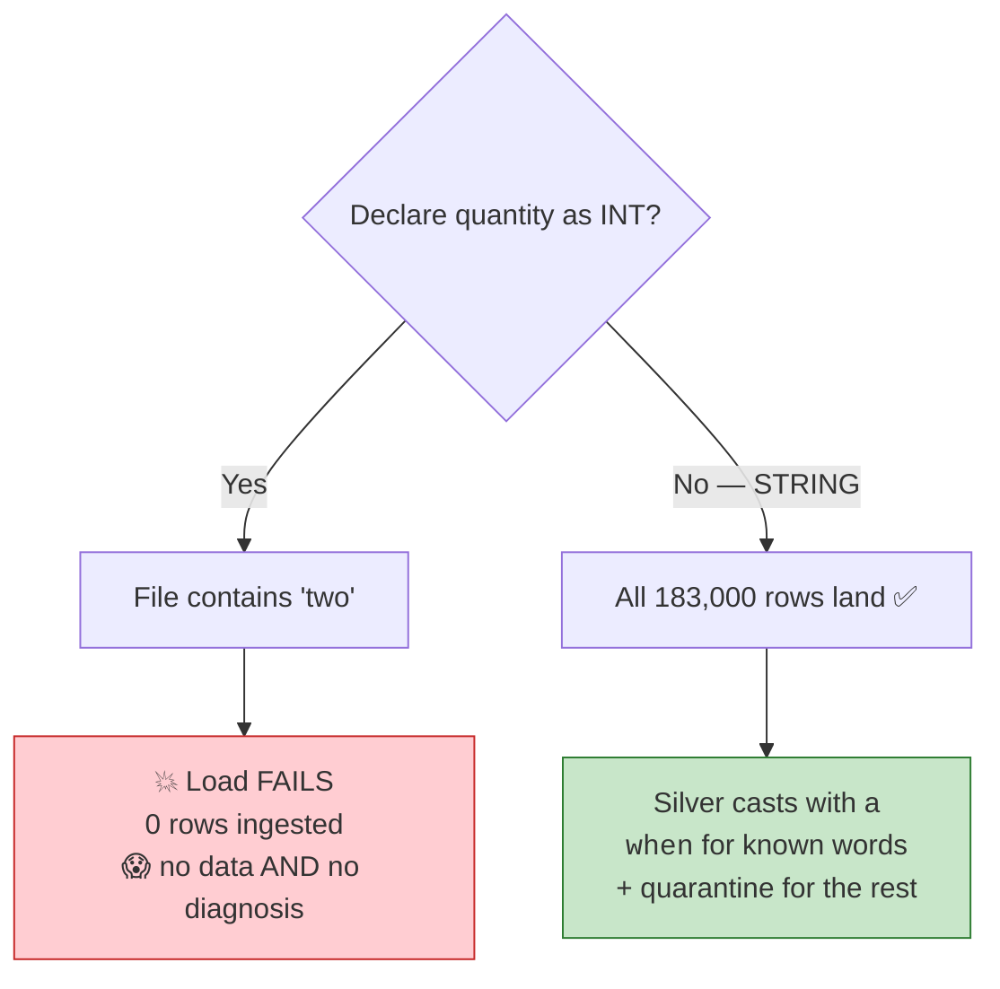
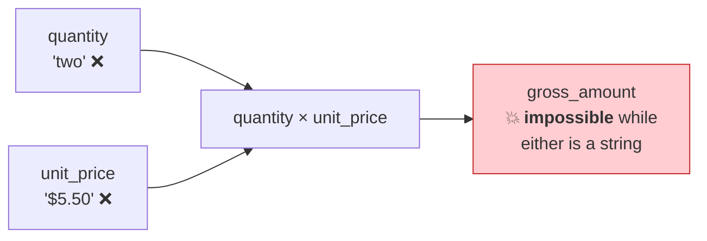
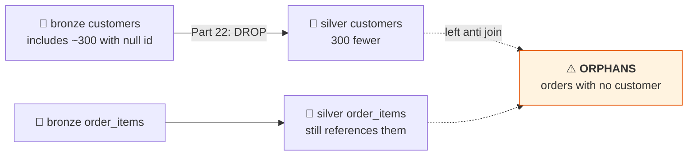

# Part 24 — 🧪 LAB 5: Fact Table → Bronze & Silver

> **Section goal:** Ingest the 183,000-row fact table from ~92 daily landing files, then fix all nine planted defects. This is the table every dashboard number ultimately comes from, so the quality bar is higher and the verification is stricter.

Covers transcript `03:01:01` – `03:10:17`.

---

## 0. What you'll build



**Checklist — the nine defects from Part 18:**

- [ ] `brz_order_items` has ~183,000 rows from ~92 files
- [ ] `quantity` — text words → integers
- [ ] `unit_price` — `$` and spaces stripped → double
- [ ] `discount_pct` — `%` stripped → decimal
- [ ] `tax_amount` — junk characters stripped → double
- [ ] `coupon_code` — lowercased
- [ ] `channel` — `web`→`Website`, `app`→`Mobile App`
- [ ] `dt` — string → `DateType`
- [ ] `order_ts` — string → `TimestampType`
- [ ] `item_seq` — string → `int`
- [ ] `processed_at` added

---

## 1. Set up the folder

> *"We will move on to the next step, which is **processing the fact table**. So here I'm going to create a folder called **`medallion_processing_fact`**. And in this folder I'm going to **import some notebooks** — these three notebooks, I will just drag and drop here — and we'll go over these three one by one."*

| # | Action |
|---|--------|
| 1 | `project_ecommerce` → **`Create`** → **`Folder`** → `medallion_processing_fact` |
| 2 | Inside it, create three notebooks: `1_fact_bronze`, `2_fact_silver`, `3_fact_gold` |

> 💡 You can also **drag `.ipynb` or `.py` files straight into the workspace folder** to import them, which is what the instructor does. Either way, the three-notebook split (bronze / silver / gold) maps directly to the three job tasks you'll wire up in Part 28.

---

## 2. Bronze — ingesting ~92 files at once

### 2.1 The source

> *"So here we want to take the data from our **volume**. So if you look at the data here, let's say our `source_data` volume has `raw` folder, then it has `order_items`, `landing` — and **this is the place where we have our CSV files**. We are going to copy this."*

```python
# ── Cell 1 ────────────────────────────────────────────────────────────
import pyspark.sql.functions as F
import pyspark.sql.types     as T

catalog_name  = "ecommerce"
raw_data_path = "/Volumes/ecommerce/source_data/raw/order_items/landing/"
```

**Check what's actually there first:**

```python
files = dbutils.fs.ls(raw_data_path)
print(f"{len(files)} files")
print("first:", files[0].name)
print("last :", files[-1].name)
print(f"total size: {sum(f.size for f in files)/1024/1024:.1f} MB")
```

### 🔍 Plain-English deep-dive: pointing Spark at a *directory*

> *"From this volume we will take **all the CSV files** and create a table inside of our bronze."*

You give Spark the **folder**, not a file. It:

1. Lists every file in the directory
2. Splits them across partitions
3. Reads them **in parallel** across executors
4. Unions the result into one DataFrame



**The rule: every file in the directory must share the same schema.** If one day's extract gains a column, you either need `mergeSchema` on read or a quarantine strategy.

> 💡 **This is a *backfill* pattern.** It re-reads all 92 files every run — fine once, and hopeless as a daily job that gets slower forever. §7 previews the incremental alternative.

### 2.2 The all-string schema — and why, again

> *"Then catalog name is `ecommerce`. Here is the **schema of our orders**. Right now we have mentioned **everything a string**, because there is some **data quality issue**, and to tackle that we need to have everything in string."*

```python
# ── Cell 2 ────────────────────────────────────────────────────────────
order_schema = T.StructType([
    T.StructField("dt",             T.StringType(), True),   # ⚠️ date as text
    T.StructField("transaction_id", T.StringType(), True),
    T.StructField("order_ts",       T.StringType(), True),   # ⚠️ timestamp as text
    T.StructField("item_seq",       T.StringType(), True),   # ⚠️ int as text
    T.StructField("customer_id",    T.StringType(), True),
    T.StructField("product_id",     T.StringType(), True),
    T.StructField("quantity",       T.StringType(), True),   # ⚠️ contains "two"
    T.StructField("unit_price",     T.StringType(), True),   # ⚠️ contains "$"
    T.StructField("currency",       T.StringType(), True),
    T.StructField("discount_pct",   T.StringType(), True),   # ⚠️ contains "%"
    T.StructField("tax_amount",     T.StringType(), True),   # ⚠️ junk characters
    T.StructField("coupon_code",    T.StringType(), True),   # ⚠️ UPPERCASE
    T.StructField("channel",        T.StringType(), True),   # ⚠️ terse codes
])
```

> ⭐ **This is the strongest illustration of the bronze principle in the whole project.** Seven of thirteen columns are contaminated. A typed schema would fail on the first row of the first file — and you'd have ingested **nothing**. As strings, all 183,000 rows land safely and silver does the interpretation with room to handle edge cases.



> ⚠️ **Verify your column names against the actual files.** Run the profiling code from Part 20 §8. `StructType` matches **by position**, so a wrong order silently mis-assigns every value (Part 21 §8).

### 2.3 Read and stamp

> *"And then this is that same path — see, we have taken that same path here — and **all the CSV files in that particular path** and created a DataFrame. So this DataFrame is created from this raw data path. Then you have **delimiter is comma**, **header equal true**, and **two metadata columns**."*

```python
# ── Cell 3 ────────────────────────────────────────────────────────────
df = (spark.read
        .schema(order_schema)
        .option("sep", ",")
        .option("header", "true")
        .csv(raw_data_path)
        .withColumn("source_file", F.col("_metadata.file_path"))
        .withColumn("ingested_at", F.current_timestamp()))

display(df)
print(f"rows: {df.count():,}")
```

> *"So see, my DataFrame looks good. It has around **183,000 records** from all those CSV files. See, we have many CSV files — three months' data — so the **total records in three months' data is 183,000**."*

**Prove the files all arrived:**

```python
# ── Cell 4 · rows per source file ─────────────────────────────────────
per_file = (df.groupBy("source_file").count()
              .withColumn("file", F.element_at(F.split(F.col("source_file"), "/"), -1))
              .select("file", "count").orderBy("file"))
display(per_file)

print("distinct source files:", df.select("source_file").distinct().count())   # ~92
```

> 💡 **This is why `source_file` matters.** If one day's file failed to upload, this query shows the gap immediately. Without it you'd have 181,000 rows instead of 183,000 and no way to tell which day is missing.

### 2.4 Write to bronze

> *"And then we will **write that to bronze order items table**. So when you say `df.write.format`, it will write it in **Delta format** due to this argument."*

```python
# ── Cell 5 ────────────────────────────────────────────────────────────
(df.write
   .format("delta")
   .mode("overwrite")
   .option("mergeSchema", "true")
   .saveAsTable(f"{catalog_name}.bronze.brz_order_items"))

b = spark.table(f"{catalog_name}.bronze.brz_order_items")
print(f"✅ brz_order_items  {b.count():,} rows")
```

> *"And once this is done you can go here, and you can go to **bronze**, and you will see this `order_items` table. And if you look at some sample data, then here are my records."*

**✅ Checkpoint:** `brz_order_items` exists with ~183,000 rows and ~92 distinct `source_file` values.

---

## 3. Profiling — find the defects before fixing them

> *"Now, when you look at this particular table… I clearly notice some **data quality issues**."*

**Do this systematically rather than by eye:**

```python
# ── Cell 6 · the defect hunt ──────────────────────────────────────────
b = spark.table(f"{catalog_name}.bronze.brz_order_items")

print("── quantity: values that are NOT plain digits ──")
display(b.filter(~F.col("quantity").rlike("^[0-9]+$"))
         .groupBy("quantity").count().orderBy(F.col("count").desc()))

print("── unit_price: values containing non-numeric characters ──")
display(b.filter(F.col("unit_price").rlike("[^0-9.]"))
         .select("unit_price").distinct().limit(20))

print("── discount_pct ──")
display(b.select("discount_pct").distinct().orderBy("discount_pct").limit(20))

print("── tax_amount: contaminated values ──")
display(b.filter(F.col("tax_amount").rlike("[^0-9.]"))
         .select("tax_amount").distinct().limit(20))

print("── low-cardinality columns ──")
for c in ["currency", "channel", "coupon_code"]:
    display(b.groupBy(c).count().orderBy(F.col("count").desc()).limit(15))

print("── nulls per column ──")
display(b.select([F.count(F.when(F.col(c).isNull(), c)).alias(c) for c in b.columns]))
```

### What you find

> *"So let me just pull it from the CSV file, because bronze and CSV is the same — it's raw data."*

| Column | Defect | Instructor's words |
|--------|--------|--------------------|
| `quantity` | Some values are **words** | *"Some quantities are in **text**, some quantities are in **numbers**"* |
| `unit_price` | `$` symbol + stray spaces | *"You see this **dollar symbol** here… dollar, there is **extra space**"* |
| `discount_pct` | `%` symbol | *"You want to **remove this percentage** and get something like — for 10% you want to get **0.1**"* |
| `tax_amount` | Stray characters | *"You want to **remove some invalid characters** from the tax amount"* |
| `coupon_code` | UPPERCASE | *"You want to convert that to **lower**"* |
| `channel` | Terse codes | *"**`web`** means this sales was generated through **website**… **`app`** means the customer went to the **mobile app** and ordered it"* |
| `dt`, `order_ts`, `item_seq` | Strings | Types to cast |

### 🔍 Why the instructor previews gold here

At `03:04:19` he jumps forward to explain *why* these fixes matter:

> *"Because eventually, after your silver processing, you want to have **new columns**… such as **gross amount** — the gross amount will be equal to **quantity into the unit price**. Then you want to know the **discount amount** — discount will be this number into this. And then you want to have **sales amount** — it's very simple logic, right, it's gross amount minus you subtract discount. So this is the amount that customer is paying."*



> 🧠 **Silver's fixes aren't cosmetic — they're the *precondition* for gold's arithmetic.** You cannot multiply `"two"` by `"$5.50"`. This is a good way to explain the medallion layers to someone who thinks silver is optional.

---

## 4. Silver — fixing the nine defects

> *"So let's open the notebook for our silver layer. So here I created a DataFrame from the bronze table. And if you look at the schema, **everything is string**."*

```python
# ── Cell 1 ────────────────────────────────────────────────────────────
import pyspark.sql.functions as F
import pyspark.sql.types     as T

catalog_name = "ecommerce"

df = spark.table(f"{catalog_name}.bronze.brz_order_items")
df.printSchema()          # every column: string
```

### 4.1 `quantity` — words to numbers

> *"So now for transformations we will **convert `two` to `2`**. So we are doing: for quantity, **when quantity is `two`, convert that to number 2, otherwise cast it to integer**. So overall you will get the entire column as integer."*

```python
# ── Cell 2 ────────────────────────────────────────────────────────────
word_to_num = {
    "one": 1, "two": 2, "three": 3, "four": 4, "five": 5,
    "six": 6, "seven": 7, "eight": 8, "nine": 9, "ten": 10,
}

qty = F.lower(F.trim(F.col("quantity")))

qty_expr = F.col("quantity").cast(T.IntegerType())          # the default branch
for word, num in word_to_num.items():
    qty_expr = F.when(qty == word, F.lit(num)).otherwise(qty_expr)

df_silver = df.withColumn("quantity", qty_expr)
```

**Or, more readably, with a chained `when`:**

```python
df_silver = df.withColumn("quantity",
    F.when(qty == "one",   1).when(qty == "two",   2).when(qty == "three", 3)
     .when(qty == "four",  4).when(qty == "five",  5).when(qty == "six",   6)
     .when(qty == "seven", 7).when(qty == "eight", 8).when(qty == "nine",  9)
     .when(qty == "ten",  10)
     .otherwise(F.col("quantity").cast(T.IntegerType())))
```

> ⚠️ **Check what the cast silently swallowed.** Anything that is neither a known word nor a valid integer becomes **null** with no error:

```python
lost = (df.filter(F.col("quantity").isNotNull()).count()
        - df_silver.filter(F.col("quantity").isNotNull()).count())
print(f"{'⚠️' if lost else '✅'} quantities lost to unparseable values: {lost}")

if lost:
    display(df.join(df_silver.filter(F.col("quantity").isNull()).select("transaction_id","item_seq"),
                    ["transaction_id","item_seq"])
              .select("quantity").distinct())
```

> 💡 **Why `F.lower(F.trim(...))` for the comparison?** So `"TWO"`, `" two "` and `"Two"` all match the same branch. Same defensive pattern as the material fixes in Part 22 §4.4.

### 4.2 `unit_price` — strip the currency symbol

> *"Second thing you want to do is: in the **unit price**, there is this **dollar symbol**. So you will say `df.withColumn` — so you always use this `withColumn` function whenever you want to do transformation on a specific column. On unit price column, what kind of transformation do I want to do? I want to **replace this dollar symbol with space**. And this is a **regular expression**, by the way — this is the format for regular expression. And then **cast it to double**."*

```python
# ── Cell 3 ────────────────────────────────────────────────────────────
df_silver = df_silver.withColumn(
    "unit_price",
    F.regexp_replace(F.col("unit_price"), "[^0-9.]", "").cast(T.DoubleType())
)
```

> ⚠️ **Two corrections to the video worth making.**
>
> 1. **Replace with `""`, not a space.** `"$ 5.50"` → with a space becomes `" 5.50"`, which still casts fine, but `"1,234.50"` → `"1 234.50"` would **fail** the cast. Empty string is safer.
> 2. **`[^0-9.]` is more robust than `"\\$"`.** It removes `$`, `£`, `€`, spaces, commas and any other contamination in one pattern. If tomorrow's file has `£` instead of `$`, the literal-`$` version silently produces nulls; the negated-class version just works.

```python
# The literal version — works, but only for the exact symbol you've seen
F.regexp_replace(F.col("unit_price"), "\\$", "").cast(T.DoubleType())
```

> ⚠️ **In Python, `"\\$"` or `r"\$"` — not `"\$"`.** `$` is a regex metacharacter meaning "end of string", so it must be escaped, and the backslash must survive Python's own string parsing.

### 4.3 `discount_pct` — percent to decimal

> *"The third thing I want to do is: from my **percentage column** — like I have this discount — I want to **remove this percentage** and I want to **convert it to a number**. So this will be double."*

```python
# ── Cell 4 ────────────────────────────────────────────────────────────
df_silver = df_silver.withColumn(
    "discount_pct",
    F.regexp_replace(F.col("discount_pct"), "[^0-9.]", "").cast(T.DoubleType())
)
```

### ⚠️ The `/100` question — a genuine decision you must make consciously

At `03:04:19` the instructor says the intent is: *"for 10% you want to get **0.1**"*. But in the gold calculation at `03:11:09` he writes:

> *"discount amount is **gross amount into discount amount divided by this**"*

— i.e. `gross * discount_pct / 100`, meaning `discount_pct` stays as `10`, not `0.1`.

**Both are valid. Pick one and be consistent, because getting it wrong is a 100× error.**

| Convention | `discount_pct` holds | Gold formula |
|-----------|---------------------|--------------|
| **A — store as a percentage** | `10` | `gross * discount_pct / 100` |
| **B — store as a fraction** ⭐ | `0.1` | `gross * discount_pct` |

```python
# Convention B — divide once, in silver, then never think about it again
df_silver = df_silver.withColumn(
    "discount_pct",
    (F.regexp_replace(F.col("discount_pct"), "[^0-9.]", "").cast(T.DoubleType()) / F.lit(100))
)
```

> ⭐ **Interview-grade point:** *"I'd normalise to a fraction in silver and name the column to say so — `discount_rate` rather than `discount_pct` — so the unit is unambiguous at the point of use. Percent-versus-fraction confusion is a classic source of off-by-100 errors that produce plausible-looking wrong numbers, and the defence is naming plus a `CHECK` constraint that the value is between 0 and 1."*

**This guide uses Convention B**, and Part 25's formulas assume it. Add a constraint so it can't drift:

```sql
ALTER TABLE ecommerce.silver.slv_order_items
  ADD CONSTRAINT discount_rate_range CHECK (discount_pct BETWEEN 0 AND 1);
```

### 4.4 `coupon_code` — lowercase

> *"Then you want to do some processing with **coupon code** — you want to convert that to **lower**. So what is my coupon code? Well, coupon code is this. So I want to convert from capital to lower. **This all depends on the business requirement** — it may vary. What kind of transformation you want to do may vary based on the situation."*

```python
# ── Cell 5 ────────────────────────────────────────────────────────────
df_silver = df_silver.withColumn(
    "coupon_code",
    F.when(F.trim(F.col("coupon_code")) == "", None)
     .otherwise(F.lower(F.trim(F.col("coupon_code"))))
)
```

> 💡 **The extra `when` turns empty strings into proper nulls.** Otherwise `""` and `null` both mean "no coupon" but behave differently — `COUNT(coupon_code)` counts the empty strings. Normalising "absence" to a single representation prevents a whole class of miscount.

### 4.5 `channel` — codes to descriptive names

> *"Then you want to change **`web` to `Website`, `app` to `Mobile`** — we discussed that."*

```python
# ── Cell 6 ────────────────────────────────────────────────────────────
ch = F.lower(F.trim(F.col("channel")))

df_silver = df_silver.withColumn("channel",
    F.when(ch == "web",     "Website")
     .when(ch == "app",     "Mobile App")
     .when(ch == "store",   "Physical Store")
     .when(ch == "partner", "Partner Marketplace")
     .when(F.col("channel").isNull(), "Unknown")
     .otherwise(F.initcap(F.trim(F.col("channel")))))
```

> 🤔 **Is this silver or gold work?** Arguably gold — it's a business-friendly relabel, not a quality fix. The instructor puts it in silver, and that's defensible because `web` and `app` are opaque codes rather than a derived metric. **What matters is being able to justify the placement**, and a reasonable rule is: *decoding an opaque source code is conforming (silver); deriving a new business measure is gold.*

**Check the result:**

> *"So when I display the rows you will see some of these things getting into effect. So see — **discount percentage, that percentage thing is gone**; tax amount; this **`web` is `Website`**, **mobile is `Mobile App`**, and this is the **lower case**. We also got these two metadata columns."*

```python
display(df_silver.select("transaction_id", "quantity", "unit_price",
                         "discount_pct", "coupon_code", "channel").limit(20))
```

### 4.6 Dates and timestamps

> *"So the next thing we will do is **conversion of date**, because this `dt` column is string. You want to convert it to a **date format**. So when you say `to_date`, it will actually change the data type and it will still keep it in `yyyy-MM-dd`."*

> *"Second thing you want to do is: for **order timestamp**, you want to convert that to a **timestamp**, because see, right now everything is a string. So you want to convert it into proper timestamp."*

```python
# ── Cell 7 ────────────────────────────────────────────────────────────
df_silver = (df_silver
    .withColumn("dt",       F.to_date(F.col("dt"), "yyyy-MM-dd"))
    .withColumn("order_ts", F.to_timestamp(F.col("order_ts"), "yyyy-MM-dd HH:mm:ss")))
```

> ⚠️ **Verify immediately.** `to_date` / `to_timestamp` return **null** on a format mismatch — no error. A wrong pattern gives you a table where every date is null and it *looks* like it worked:

```python
bad_dt = df_silver.filter(F.col("dt").isNull()).count()
bad_ts = df_silver.filter(F.col("order_ts").isNull()).count()
print(f"{'⚠️' if bad_dt else '✅'} unparseable dt      : {bad_dt}")
print(f"{'⚠️' if bad_ts else '✅'} unparseable order_ts: {bad_ts}")
assert bad_dt == 0, "❌ date parsing failed — check the format string"
```

> ⚠️ **`MM` = month, `mm` = minutes.** Third time this appears in the guide, because it's third-most-common bug in data engineering.

### 4.7 The remaining casts

> *"In the **item sequence** you want to convert that to integer. **Text amount** — you want to remove some invalid characters from the tax amount, just in case if there are any characters, there might be **leading and lagging spaces**. You want to then **convert it to double**. And then you are adding the **process time** — so this will add a **current timestamp** at which that particular record was created."*

```python
# ── Cell 8 ────────────────────────────────────────────────────────────
df_silver = (df_silver
    .withColumn("item_seq",       F.col("item_seq").cast(T.IntegerType()))
    .withColumn("tax_amount",     F.regexp_replace(F.trim(F.col("tax_amount")), "[^0-9.]", "")
                                   .cast(T.DoubleType()))
    .withColumn("transaction_id", F.trim(F.col("transaction_id")))
    .withColumn("customer_id",    F.trim(F.col("customer_id")))
    .withColumn("product_id",     F.trim(F.col("product_id")))
    .withColumn("currency",       F.upper(F.trim(F.col("currency"))))
    .withColumn("processed_at",   F.current_timestamp()))
```

> 💡 **`processed_at` completes the audit trio.** `ingested_at` (when bronze landed it) + `processed_at` (when silver transformed it) + `source_file` (where it came from) means any row's full journey is reconstructable. In Part 25 you'll add `gold_processed_at`.

> 💡 **Don't forget to trim the join keys.** `customer_id` and `product_id` join to dimensions in Part 25 — one trailing space and the join returns nulls for every row, silently (Part 22 §2.2).

### 4.8 Verify and write

> *"So let's execute this code and then let's display this. All right, so now when you look at `dt` — see, **this data type is date**. Previously it was string. This data type is **timestamp**, previously it was string. Then **item sequence is integer**. All right, so you can do some quick check, and if you look at `printSchema` you have the right data types. And then, **as always, you write it to a silver Delta table**."*

```python
# ── Cell 9 ────────────────────────────────────────────────────────────
df_silver.printSchema()
display(df_silver.limit(20))

(df_silver.write
   .format("delta")
   .mode("overwrite")
   .option("overwriteSchema", "true")
   .saveAsTable(f"{catalog_name}.silver.slv_order_items"))

s = spark.table(f"{catalog_name}.silver.slv_order_items")
print(f"✅ slv_order_items  {s.count():,} rows")
```

**The schema you should now see:**

```
|-- dt:             date          ✅ was string
|-- transaction_id: string
|-- order_ts:       timestamp     ✅ was string
|-- item_seq:       integer       ✅ was string
|-- customer_id:    string
|-- product_id:     string
|-- quantity:       integer       ✅ was string
|-- unit_price:     double        ✅ was string
|-- currency:       string
|-- discount_pct:   double        ✅ was string
|-- tax_amount:     double        ✅ was string
|-- coupon_code:    string
|-- channel:        string
|-- source_file:    string
|-- ingested_at:    timestamp
|-- processed_at:   timestamp     ✅ new
```

> *"So see, now in silver schema I got `order_items`, and here you can quickly spot check, you can do some quick quality checks here, and you will find that now this silver table is in a **good shape**."*

---

## 5. Quality gates — including referential integrity

This is where the fact table demands more rigour than the dimensions did.

```python
# ── Cell 10 ───────────────────────────────────────────────────────────
s   = spark.table(f"{catalog_name}.silver.slv_order_items")
dim_cust = spark.table(f"{catalog_name}.silver.slv_customers")
dim_prod = spark.table(f"{catalog_name}.silver.slv_products")

orphan_cust = s.join(dim_cust, "customer_id", "left_anti")
orphan_prod = s.join(dim_prod, "product_id",  "left_anti")

checks = {
    "row count preserved from bronze":
        s.count() == spark.table(f"{catalog_name}.bronze.brz_order_items").count(),
    "no null dt":            s.filter(F.col("dt").isNull()).count() == 0,
    "no null order_ts":      s.filter(F.col("order_ts").isNull()).count() == 0,
    "quantity is positive":  s.filter(F.col("quantity") <= 0).count() == 0,
    "unit_price >= 0":       s.filter(F.col("unit_price") < 0).count() == 0,
    "discount 0..1":         s.filter(~F.col("discount_pct").between(0, 1)).count() == 0,
    "tax_amount >= 0":       s.filter(F.col("tax_amount") < 0).count() == 0,
    "currency in allow-list":
        s.filter(~F.col("currency").isin("INR","USD","GBP","AUD")).count() == 0,
    "channel decoded":
        s.filter(F.col("channel").isin("web","app")).count() == 0,
    "unique (transaction_id, item_seq)":
        s.count() == s.select("transaction_id","item_seq").distinct().count(),
    "no orphan customers":   orphan_cust.count() == 0,
    "no orphan products":    orphan_prod.count() == 0,
}

for name, ok in checks.items():
    print(f"{'✅' if ok else '❌'} {name}")

if orphan_cust.count():
    print(f"\n⚠️ {orphan_cust.count():,} rows reference an unknown customer_id:")
    display(orphan_cust.select("customer_id").distinct().limit(20))
if orphan_prod.count():
    print(f"\n⚠️ {orphan_prod.count():,} rows reference an unknown product_id:")
    display(orphan_prod.select("product_id").distinct().limit(20))

assert all(checks.values()), "❌ silver fact quality gate failed"
```

### ⚠️ Expect the orphan-customer check to *fail* — and that's the lesson

Part 22 **dropped ~300 customers with a null `customer_id`**. Any order placed by one of those customers now references a customer that no longer exists in silver.



**Three legitimate responses — the choice is a business decision, not a technical one:**

| Option | Effect | When |
|--------|--------|------|
| **Keep the orphans** | Facts stay; customer attributes come back null in gold | Revenue totals must stay complete ⭐ |
| **Add an "Unknown" customer row** | Orphans join to a placeholder dimension row | Best practice in dimensional modelling |
| **Quarantine the orphan facts** | Revenue totals change | Only if those orders are genuinely invalid |

```python
# The dimensional-modelling standard: an "Unknown" member
unknown = spark.createDataFrame(
    [("UNKNOWN", "Not Available", "XX", "Unknown", "Other")],
    "customer_id STRING, phone STRING, country_code STRING, state STRING, region STRING")

(unknown.write.format("delta").mode("append")
        .saveAsTable(f"{catalog_name}.gold.gld_dim_customers"))

# Then in the fact, map unmatched keys to it
df_silver = df_silver.withColumn(
    "customer_id",
    F.when(F.col("customer_id").isNull() | (F.trim(F.col("customer_id")) == ""),
           F.lit("UNKNOWN")).otherwise(F.col("customer_id")))
```

> ⭐ **Interview:** *"Your fact table references dimension rows you deleted upstream. What do you do?"* → *"First recognise that dropping rows in a dimension has consequences for the fact, which is exactly why cross-layer referential checks belong in the pipeline. The dimensional-modelling standard is an **Unknown member** — a placeholder row in the dimension with a reserved key — and remapping unmatched fact keys to it. That preserves the fact rows so revenue totals stay complete, keeps every join an inner-join-safe operation, and makes the gap *visible* in reports as an 'Unknown' category rather than silently absent. The alternative — deleting the fact rows — changes financial totals, which is a business decision that needs sign-off, not something a data engineer should do unilaterally. Either way I'd log the count and alert if it grows."*

---

## 6. The complete fact bronze + silver notebooks

```python
# Databricks notebook source
# MAGIC %md # 1 · Fact → Bronze
# MAGIC Ingests ~92 daily landing CSVs into `ecommerce.bronze.brz_order_items`.
# MAGIC **All columns STRING** — seven of thirteen are contaminated in the source.

# COMMAND ----------
import pyspark.sql.functions as F
import pyspark.sql.types     as T

dbutils.widgets.text("catalog", "ecommerce", "Target catalog")
catalog_name  = dbutils.widgets.get("catalog")
raw_data_path = "/Volumes/ecommerce/source_data/raw/order_items/landing/"

# COMMAND ----------
files = dbutils.fs.ls(raw_data_path)
print(f"{len(files)} files, {sum(f.size for f in files)/1024/1024:.1f} MB")
assert len(files) > 80, f"❌ expected ~92 landing files, found {len(files)}"

# COMMAND ----------
def s(*cols):
    return T.StructType([T.StructField(c, T.StringType(), True) for c in cols])

order_schema = s("dt","transaction_id","order_ts","item_seq","customer_id","product_id",
                 "quantity","unit_price","currency","discount_pct","tax_amount",
                 "coupon_code","channel")

df = (spark.read.schema(order_schema)
        .option("sep", ",").option("header", "true")
        .csv(raw_data_path)
        .withColumn("source_file", F.col("_metadata.file_path"))
        .withColumn("ingested_at", F.current_timestamp()))

n = df.count()
print(f"rows: {n:,}")
assert n > 150_000, f"❌ expected ~183,000 rows, got {n:,}"
assert df.select("source_file").distinct().count() == len(files), "❌ not every file was read"

# COMMAND ----------
(df.write.format("delta").mode("overwrite")
   .option("mergeSchema", "true")
   .saveAsTable(f"{catalog_name}.bronze.brz_order_items"))
print(f"✅ brz_order_items {spark.table(f'{catalog_name}.bronze.brz_order_items').count():,} rows")
```

```python
# Databricks notebook source
# MAGIC %md # 2 · Fact → Silver
# MAGIC Fixes the nine planted defects and casts to correct types.
# MAGIC **Silver rule:** fix the quality, keep the grain. No derived measures — that's gold.

# COMMAND ----------
import pyspark.sql.functions as F
import pyspark.sql.types     as T

dbutils.widgets.text("catalog", "ecommerce", "Target catalog")
catalog_name = dbutils.widgets.get("catalog")

df = spark.table(f"{catalog_name}.bronze.brz_order_items")
bronze_count = df.count()

# COMMAND ----------
qty = F.lower(F.trim(F.col("quantity")))
ch  = F.lower(F.trim(F.col("channel")))

df_silver = (df
    # 1 · quantity: words → integers
    .withColumn("quantity",
        F.when(qty == "one", 1).when(qty == "two", 2).when(qty == "three", 3)
         .when(qty == "four", 4).when(qty == "five", 5).when(qty == "six", 6)
         .when(qty == "seven", 7).when(qty == "eight", 8).when(qty == "nine", 9)
         .when(qty == "ten", 10)
         .otherwise(F.col("quantity").cast(T.IntegerType())))

    # 2 · unit_price: strip $ / spaces / commas
    .withColumn("unit_price",
        F.regexp_replace(F.col("unit_price"), "[^0-9.]", "").cast(T.DoubleType()))

    # 3 · discount: strip % and normalise to a FRACTION (10% → 0.10)
    .withColumn("discount_pct",
        F.regexp_replace(F.col("discount_pct"), "[^0-9.]", "").cast(T.DoubleType()) / F.lit(100))

    # 4 · tax_amount: strip junk
    .withColumn("tax_amount",
        F.regexp_replace(F.trim(F.col("tax_amount")), "[^0-9.]", "").cast(T.DoubleType()))

    # 5 · coupon_code: lowercase, empty → null
    .withColumn("coupon_code",
        F.when(F.trim(F.col("coupon_code")) == "", None)
         .otherwise(F.lower(F.trim(F.col("coupon_code")))))

    # 6 · channel: decode the source codes
    .withColumn("channel",
        F.when(ch == "web", "Website").when(ch == "app", "Mobile App")
         .when(ch == "store", "Physical Store").when(ch == "partner", "Partner Marketplace")
         .when(F.col("channel").isNull(), "Unknown")
         .otherwise(F.initcap(F.trim(F.col("channel")))))

    # 7-9 · types + key hygiene + audit
    .withColumn("dt",             F.to_date(F.col("dt"), "yyyy-MM-dd"))
    .withColumn("order_ts",       F.to_timestamp(F.col("order_ts"), "yyyy-MM-dd HH:mm:ss"))
    .withColumn("item_seq",       F.col("item_seq").cast(T.IntegerType()))
    .withColumn("transaction_id", F.trim(F.col("transaction_id")))
    .withColumn("customer_id",    F.trim(F.col("customer_id")))
    .withColumn("product_id",     F.trim(F.col("product_id")))
    .withColumn("currency",       F.upper(F.trim(F.col("currency"))))
    .withColumn("processed_at",   F.current_timestamp()))

df_silver.printSchema()

# COMMAND ----------
(df_silver.write.format("delta").mode("overwrite")
   .option("overwriteSchema", "true")
   .saveAsTable(f"{catalog_name}.silver.slv_order_items"))

s = spark.table(f"{catalog_name}.silver.slv_order_items")
print(f"✅ slv_order_items {s.count():,} rows")

# COMMAND ----------
# MAGIC %md ## Quality gates

# COMMAND ----------
dim_cust = spark.table(f"{catalog_name}.silver.slv_customers")
dim_prod = spark.table(f"{catalog_name}.silver.slv_products")

orphan_cust = s.join(dim_cust, "customer_id", "left_anti").count()
orphan_prod = s.join(dim_prod, "product_id",  "left_anti").count()

checks = {
 "row count preserved":  s.count() == bronze_count,
 "no null dt":           s.filter(F.col("dt").isNull()).count() == 0,
 "no null order_ts":     s.filter(F.col("order_ts").isNull()).count() == 0,
 "quantity positive":    s.filter((F.col("quantity").isNull()) | (F.col("quantity") <= 0)).count() == 0,
 "unit_price >= 0":      s.filter(F.col("unit_price") < 0).count() == 0,
 "discount in 0..1":     s.filter(~F.col("discount_pct").between(0, 1)).count() == 0,
 "tax >= 0":             s.filter(F.col("tax_amount") < 0).count() == 0,
 "currency allow-list":  s.filter(~F.col("currency").isin("INR","USD","GBP","AUD")).count() == 0,
 "channel decoded":      s.filter(F.col("channel").isin("web","app")).count() == 0,
 "unique grain":         s.count() == s.select("transaction_id","item_seq").distinct().count(),
}
for name, ok in checks.items():
    print(f"{'✅' if ok else '❌'} {name}")

print(f"\nℹ️  orphan customer_id rows: {orphan_cust:,}")
print(f"ℹ️  orphan product_id rows : {orphan_prod:,}")
assert all(checks.values()), "❌ silver fact quality gate failed"
print("\n🎉 Silver fact layer complete.")
```

---

## 7. Preview: the incremental version

> *"See, in our project, whatever we did is a **historical backfill**… but the second phase, once your data engineering infrastructure is set up, is **daily incremental updates**."* — `03:28:32`

Re-reading all 92 files every night gets slower forever and reprocesses data you already have.

```python
# Auto Loader — processes ONLY new files, tracked in a checkpoint
(spark.readStream
   .format("cloudFiles")
   .option("cloudFiles.format", "csv")
   .option("cloudFiles.schemaLocation", "/Volumes/ecommerce/source_data/raw/_schema/order_items")
   .option("header", "true")
   .schema(order_schema)
   .load(raw_data_path)
   .withColumn("source_file", F.col("_metadata.file_path"))
   .withColumn("ingested_at", F.current_timestamp())
 .writeStream
   .format("delta")
   .option("checkpointLocation", "/Volumes/ecommerce/source_data/raw/_checkpoint/order_items")
   .trigger(availableNow=True)          # process all new files, then stop
   .toTable(f"{catalog_name}.bronze.brz_order_items"))
```

| | Backfill (this lab) | Auto Loader (production) |
|---|---|---|
| Reads | Every file, every run | **Only new files** |
| Write mode | `overwrite` | `append` |
| Idempotent | ✅ via overwrite | ✅ via checkpoint |
| Runtime | Grows forever | Constant |
| Silver step | Full rebuild | `MERGE` on the business key |

Full treatment in Part 30; the job wiring is Part 28.

---

## 8. 🚑 Troubleshooting

| Symptom | Cause | Fix |
|---------|-------|-----|
| Far fewer than 183,000 rows | Some files failed to upload | `groupBy("source_file").count()` to find the gap |
| All columns null | Schema **order** doesn't match the CSV | `StructType` matches by position — compare with a headerless read |
| `dt` all null after `to_date` | Wrong format string, or `mm` for `MM` | Assert null count immediately after parsing |
| `quantity` has unexpected nulls | Unhandled word, or non-numeric junk | List the distinct failing values and extend the `when` chain |
| `unit_price` all null | Regex removed the decimal point, or used a space replacement on `"1,234.50"` | Use `[^0-9.]` → `""` |
| Discount amounts 100× too big | Percent/fraction convention mismatch | Pick a convention, name the column for it, add a `CHECK` |
| `regexp_replace` does nothing | Python escaping | `"\\$"` or `r"\$"`, never `"\$"` |
| Orphan customers reported | Silver dropped null-id customers in Part 22 | Expected — use an "Unknown" member (§5) |
| Row count changed silver→bronze | An unintended `filter` | Assert equality; silver must not drop fact rows without a decision |
| `A schema mismatch detected` | Types changed between runs | `.option("overwriteSchema","true")` at silver |

---

## ⭐ Likely Interview Questions for This Section

**Q1. "You ingested 92 files into one table. How, and what could go wrong?"**
> *Model answer:* "Point `spark.read` at the directory rather than a file — Spark lists it, distributes the files across executors and unions the result, so the read is parallel. The requirement is that every file shares a schema; if one day's extract gains a column you need `mergeSchema` on read or a quarantine path. The main risk is silent incompleteness: if a file failed to upload you get fewer rows and no error. So I stamp `_metadata.file_path` as a `source_file` column and assert that the distinct file count matches what's on disk, plus a row-count floor. That turns 'we're missing Tuesday' from something you discover in a dashboard into something the pipeline fails on."

**Q2. "Seven of thirteen columns were contaminated. Why not fix that at read time?"**
> *Model answer:* "Because a typed read would fail on the first bad row and you'd ingest nothing — the worst outcome, since you have neither the data nor a diagnosis. Reading everything as string guarantees all 183,000 rows land, so you have a faithful record and can profile the contamination systematically with regex filters to see exactly which values are problematic. Then silver casts with explicit handling: a `when` chain for known word-forms of numbers, regex stripping for currency and percent symbols, and a null-count comparison before and after so anything the cast silently swallowed is visible rather than lost."

**Q3. "How do you convert `'two'` to `2` safely?"**
> *Model answer:* "A `when` chain mapping the known word forms, with `otherwise` falling back to a numeric cast — and comparing on `lower(trim(col))` so `'TWO'` and `' two '` hit the same branch. The critical part is what happens to values that are neither: `cast` returns null silently, so I compare the non-null count before and after and list the distinct failing values. If the loss is non-zero I'd quarantine those rows rather than shrug, because a silently-nulled quantity becomes a zero-revenue order line downstream. Longer term I'd push back on the source system, because word-form quantities are an upstream defect, not something a pipeline should have to normalise forever."

**Q4. "`10%` — do you store 10 or 0.1?"**
> *Model answer:* "Either, but consciously and consistently, because getting it wrong is a hundred-fold error that still produces plausible-looking numbers. I prefer normalising to a fraction in silver and naming the column to say so — `discount_rate` rather than `discount_pct` — so the unit is unambiguous at every point of use and the gold formula is a clean multiply with no magic `/100`. I'd back it with a `CHECK` constraint that the value is between 0 and 1, so a future change that reintroduces percentages fails loudly. Unit ambiguity in numeric columns is a classic silent-error source, and naming plus constraints is the defence."

**Q5. "Your fact table references customers that silver deleted. What now?"**
> *Model answer:* "First, that's exactly why cross-layer referential checks belong in the pipeline — a left anti join from fact to dimension surfaces it. The dimensional-modelling standard response is an **Unknown member**: a placeholder row in the dimension with a reserved key, and unmatched fact keys remapped to it. That preserves the fact rows so revenue totals stay complete, keeps joins simple, and makes the gap visible in reports as an explicit 'Unknown' bucket rather than silently absent. Deleting the fact rows instead would change financial totals, which is a business decision requiring sign-off, not something I'd do unilaterally. Either way I'd log the count and alert if it grows, because a rising orphan rate signals an upstream problem."

**Q6. "Decoding `web` to `Website` — is that silver or gold work?"**
> *Model answer:* "It's genuinely arguable and I'd want a team convention. My rule is that **decoding an opaque source code is conforming, which is silver; deriving a new business measure is gold**. `web` and `app` are source-system shorthand with no analytical meaning, so translating them to canonical labels is standardisation, the same as mapping `Books` to `BKS`. Whereas computing `gross_amount` or converting currency creates new information, which is gold. The important thing isn't which side of the line you land on, it's that the team agrees and applies it consistently — otherwise the same kind of logic ends up in two layers and nobody knows where to change it."

**Q7. "How do you validate a fact table beyond row counts?"**
> *Model answer:* "Four categories. **Structural** — the grain is unique, so transaction ID plus line sequence has no duplicates, and the row count matches bronze since silver shouldn't drop fact rows without a decision. **Domain** — quantity is positive, prices and tax are non-negative, discount is within its declared range, currency is in an allow-list. **Type** — no nulls introduced by date or numeric parsing, which is the silent-failure mode. **Referential** — left anti joins to every dimension to count orphaned keys. I'd run these as assertions in the notebook so the run fails rather than passing bad data downstream, and log the metrics so trends are visible — a slowly rising orphan rate is a signal you only see if you're recording it."

**Q8. "This re-reads all 92 files every run. Would you ship that?"**
> *Model answer:* "For a one-off historical backfill, yes — it's simple and idempotent via overwrite. For daily operation, no: runtime grows forever and you reprocess data you already have. I'd switch to Auto Loader with `cloudFiles`, which tracks processed files in a checkpoint so each run handles only new arrivals, with schema evolution and a rescued-data column for unexpected fields. Bronze becomes an append, and silver becomes a `MERGE` on the business key rather than a full rebuild, so retries don't duplicate. Then a Databricks job triggered on file arrival or on a schedule. The backfill notebook still has value — you keep it for reprocessing history after a logic fix."

---

## 🧠 30-Second Memory Hooks

- **Point `spark.read` at the DIRECTORY** — 92 files read in parallel, unioned into one DataFrame.
- **⭐ 7 of 13 columns are contaminated — so bronze is ALL STRING.** A typed read fails on row one and ingests **nothing**.
- **`source_file` proves every file arrived.** `groupBy("source_file").count()` finds the missing day.
- **Profile with regex filters:** `~col.rlike("^[0-9]+$")` shows every non-numeric quantity in one query.
- **Silver's fixes are the PRECONDITION for gold's arithmetic.** You cannot multiply `"two"` by `"$5.50"`.
- **`when` chain on `lower(trim(col))` for word→number**, `otherwise` cast — then **check what the cast swallowed**.
- **Use `[^0-9.]` → `""`, not a literal `"\\$"`.** Handles `£`, `€`, commas and spaces too.
- **⚠️ `"\\$"` or `r"\$"` in Python — never `"\$"`.**
- **⚠️ 10% → store `10` or `0.1`? PICK ONE, NAME THE COLUMN FOR IT, add a `CHECK`.** Getting it wrong is a 100× error.
- **Empty string → null for `coupon_code`**, so "no coupon" has exactly one representation.
- **⚠️ `to_date` / `to_timestamp` return NULL on mismatch, not an error.** Assert the null count immediately.
- **⚠️ `MM` = month, `mm` = minutes.**
- **Trim the join keys** — `customer_id`, `product_id`. One space = a silently failed join in Part 25.
- **Audit trio: `source_file` + `ingested_at` + `processed_at`.**
- **⭐ Referential integrity = LEFT ANTI JOIN to each dimension.** Databricks doesn't enforce FKs.
- **Orphans from a dimension you deleted → add an "Unknown" member**, don't delete facts. Deleting facts changes financial totals — that's a business decision.
- **Backfill = read everything + overwrite. Incremental = Auto Loader + checkpoint + `MERGE`.**

---

*Next suggested section:* **[Part 25 — 🧪 LAB 6: Fact → Gold + the Reporting View](Part-25-lab-fact-gold-reporting-view.md)** — the last build. Derive `gross_amount`, `discount_amount`, `sales_amount` and `coupon_flag`, normalise four currencies to INR via a rates join, rename everything for the business, and then flatten the whole star into a One Big Table view for the dashboard.

---

**Navigation** — ⬅️ **[Part 23 — LAB 4: Dimensions → Gold](Part-23-lab-dimensions-gold.md)** · 🏠 **[Master Index](../Databricks%20-%20Study%20Guide.md)** · ➡️ **[Part 25 — LAB 6: Fact → Gold + View](Part-25-lab-fact-gold-reporting-view.md)**
