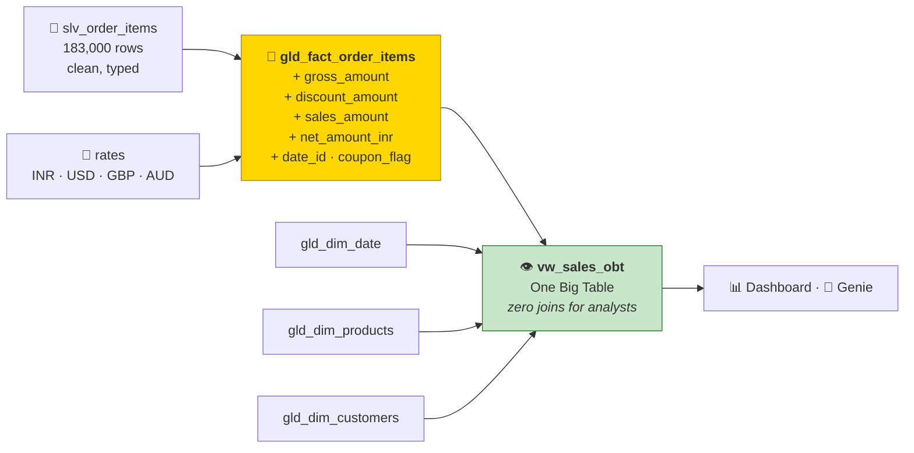
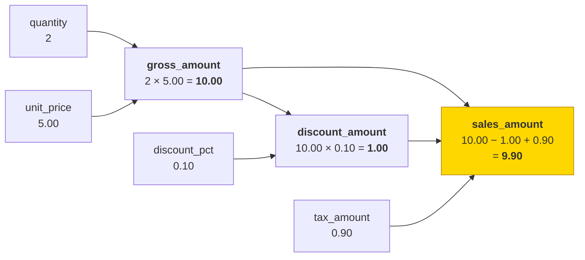
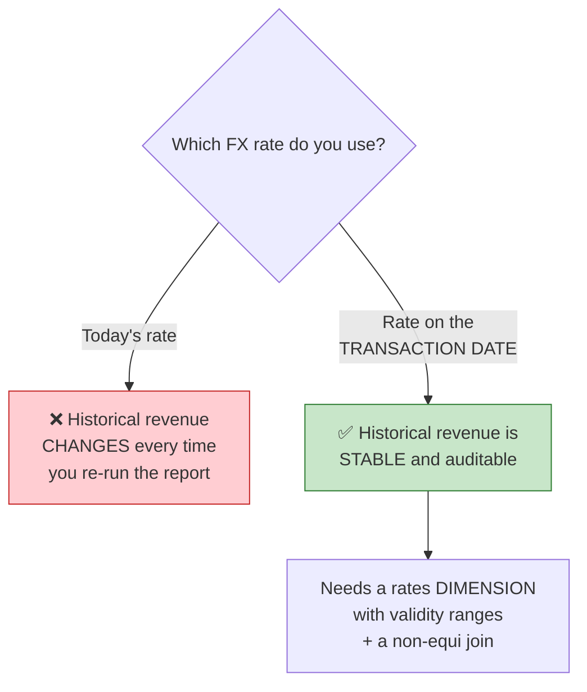
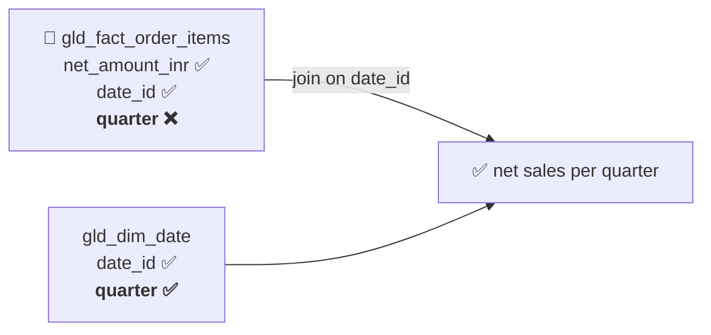

# Part 25 — 🧪 LAB 6: Fact → Gold + the Reporting View

> **Section goal:** The last build. Derive the business measures every dashboard depends on, normalise four currencies into one comparable number, rename everything for humans — then flatten the whole star schema into a single "One Big Table" view so analysts never have to write a join.

Covers transcript `03:10:17` – `03:14:38` and `03:18:16` – `03:21:19`.

---

## 0. What you'll build



**Checklist:**

- [ ] `gld_fact_order_items` has `gross_amount`, `discount_amount`, `sales_amount`, `net_amount_inr`
- [ ] `date_id` and `coupon_flag` present
- [ ] Original `currency` and `unit_price` retained
- [ ] `conversion_rate` stored on the row
- [ ] Columns renamed for the business
- [ ] Row count still **183,000** (no fan-out)
- [ ] `vw_sales_obt` returns rows with quarter, category and region

---

## 1. The derived measures

> *"And the third step in our medallion architecture is processing a **gold layer**. And in the gold layer we are going to create a **bunch of new columns**."*

```python
# ── Cell 1 ────────────────────────────────────────────────────────────
import pyspark.sql.functions as F
import pyspark.sql.types     as T

catalog_name = "ecommerce"
df = spark.table(f"{catalog_name}.silver.slv_order_items")
```

### 1.1 `gross_amount`

> *"So the first thing we'll do is create **gross amount**. Gross amount is simple, folks — very simple business logic: **quantity into unit price**. So let's say you go to a store and you bought **two cans of beans**. OK, so one can of beans is **$5**, so two cans of beans is **$10**. Right? So that will be your gross amount — quantity into unit price."*

```python
df_gold = df.withColumn("gross_amount", F.round(F.col("quantity") * F.col("unit_price"), 2))
```

### 1.2 `discount_amount`

> *"And then **discount amount is gross amount into discount amount divided by this**."*

⚠️ **This is where the convention you chose in Part 24 matters.**

| Convention | `discount_pct` holds | Formula |
|-----------|---------------------|---------|
| A — percentage | `10` | `gross_amount * discount_pct / 100` |
| **B — fraction** ⭐ *(this guide)* | `0.10` | `gross_amount * discount_pct` |

```python
# Convention B — silver already divided by 100
df_gold = df_gold.withColumn(
    "discount_amount", F.round(F.col("gross_amount") * F.col("discount_pct"), 2))
```

```python
# Convention A — if your silver kept the raw percentage
# df_gold = df_gold.withColumn(
#     "discount_amount", F.round(F.col("gross_amount") * F.col("discount_pct") / F.lit(100), 2))
```

> 🧠 **Sanity-check it once, immediately.** A discount that exceeds the gross amount means you picked the wrong convention:
> ```python
> bad = df_gold.filter(F.col("discount_amount") > F.col("gross_amount")).count()
> assert bad == 0, f"❌ {bad} rows where discount > gross — check the percent/fraction convention"
> ```

### 1.3 `sales_amount`

> *"Sales amount column is simple: **gross minus discount plus tax**. Yeah — **you have to pay tax too. Don't forget government.**"*

```python
df_gold = df_gold.withColumn(
    "sales_amount",
    F.round(F.col("gross_amount") - F.col("discount_amount") + F.coalesce(F.col("tax_amount"), F.lit(0.0)), 2))
```



> 💡 **`coalesce(tax_amount, 0)` matters.** In Spark, `10.0 - 1.0 + null` is **`null`**, not `9.0`. A single null tax value would wipe out that row's sales amount entirely — and `SUM()` skips nulls, so revenue would silently drop with no error. Defending against null propagation in arithmetic is a habit worth building.

> 💡 **`F.round(..., 2)` at each step** keeps money to two decimal places. Without it, floating-point noise (`9.900000000000002`) leaks into dashboards. The properly correct answer is `DecimalType(18,2)` — see Part 9 §4 — but rounding is the pragmatic minimum.

### 1.4 `date_id` and `coupon_flag`

> *"And **date ID** is just a unique identifier for your date. And then you also have this **coupon flag** — whether you have coupon code or not. So if you have coupon code then flag will be **one**; no coupon code, it will be **zero**."*

```python
df_gold = (df_gold
    .withColumn("date_id", F.date_format(F.col("dt"), "yyyyMMdd").cast(T.IntegerType()))
    .withColumn("coupon_flag",
        F.when(F.col("coupon_code").isNotNull() & (F.trim(F.col("coupon_code")) != ""), 1)
         .otherwise(0)))

display(df_gold.select("transaction_id", "quantity", "unit_price", "gross_amount",
                       "discount_amount", "tax_amount", "sales_amount",
                       "date_id", "coupon_flag").limit(20))
```

> *"So let's execute this and look at this. Now you have this **gross amount** — see, gross amount, discount amount, sales amount, these are the new columns — **date ID** and **coupon flag**."*

> 💡 **`coupon_flag` as `1`/`0` rather than a boolean** means `SUM(coupon_flag)` gives the coupon count and `AVG(coupon_flag)` gives the **redemption rate** directly — no `CASE` expression in any dashboard. Same reasoning as `is_weekend` in Part 23 §6.1. Part 26 uses exactly this for *"how many transactions used coupons each month?"*.

> 💡 **`date_id` must be computed identically here and in `gld_dim_date`.** Both use `date_format(date, 'yyyyMMdd')`. If the formats ever diverge, the join silently returns nothing.

---

## 2. Currency normalisation

> *"Now we will also **normalise the currency**, because these transactions are in **different currencies**. And when you are doing a **holistic review of your business**, you may want to bring everything into a **single currency**. Let's say our **executive lives in India** and they want to see everything in **INR** currency. So you have to convert all these numbers into common INR currency."*

### 2.1 The rates DataFrame

> *"And for that, you have provided the **spot rates** — you know, currency conversion rates. So for USD, for example, is **88.29**. So right now we are **hardcoding**, but if you're working on the real project you will use some **currency API**."*

```python
# ── Cell 2 ────────────────────────────────────────────────────────────
rates = [
    ("INR", 1.00),
    ("USD", 88.29),
    ("GBP", 112.40),
    ("AUD", 58.10),
]
rates_df = spark.createDataFrame(rates, "currency STRING, conversion_rate DOUBLE")
display(rates_df)
```

> *"So `rates_df` is just a DataFrame with **two columns: currency and the conversion rate**."*

### 2.2 The join

> *"And then you are going to do a **join**. You have your main DataFrame, you will join based on that **currency**. And after doing the join, what you get is — in your orders fact table, towards the end you will get **conversion rate** and the **sales amount in INR**."*

```python
# ── Cell 3 ────────────────────────────────────────────────────────────
from pyspark.sql.functions import broadcast

df_gold = (df_gold
    .join(broadcast(rates_df), on="currency", how="left")
    .withColumn("conversion_rate", F.coalesce(F.col("conversion_rate"), F.lit(1.0)))
    .withColumn("net_amount_inr",  F.round(F.col("sales_amount") * F.col("conversion_rate"), 2)))

display(df_gold.select("transaction_id", "currency", "sales_amount",
                       "conversion_rate", "net_amount_inr").limit(20))
```

**Three deliberate choices:**

| Choice | Why |
|--------|-----|
| **`broadcast(rates_df)`** | 4 rows — broadcasting eliminates the shuffle entirely (Part 11 §14) |
| **`how="left"`** | An unrecognised currency must not delete the order row |
| **Store `conversion_rate` on the fact** | The conversion is now **reproducible and auditable** — you can prove how any INR figure was derived, even if the rates table is later corrected |

> ⚠️ **Always keep the original `currency`, `unit_price` and `sales_amount`.** Finance must be able to reconcile back to the source figure. A gold table that only holds the converted value is unauditable — and the first question in any reconciliation meeting is *"what was the original amount?"*

**Catch unmapped currencies rather than defaulting silently:**

```python
unmapped = (df.select("currency").distinct()
              .join(rates_df, "currency", "left_anti"))
if unmapped.count():
    display(unmapped)
    raise ValueError("❌ transactions in a currency with no conversion rate")
```

### 2.3 The production version — and the question that separates candidates

> *"See, if you Google **currency APIs** you will find a bunch of APIs. So you can maybe buy a subscription to this, and by using an HTTP call — by using that API — you can get the **real rates as of that particular transaction date**."*



**The production shape:**

```python
# A rates dimension with validity ranges
rates_dim = spark.createDataFrame([
    ("USD", "2025-08-01", "2025-09-01", 87.90),
    ("USD", "2025-09-01", "2025-10-01", 88.29),
    ("USD", "2025-10-01", "2026-01-01", 88.75),
    ("GBP", "2025-08-01", "2026-01-01", 112.40),
], "currency STRING, valid_from STRING, valid_to STRING, conversion_rate DOUBLE") \
 .withColumn("valid_from", F.to_date("valid_from")) \
 .withColumn("valid_to",   F.to_date("valid_to"))

# Non-equi join — the rate that was valid on the transaction date (Part 11 §12)
df_gold = (df_gold.alias("f")
    .join(broadcast(rates_dim.alias("r")),
          (F.col("f.currency") == F.col("r.currency")) &
          (F.col("f.dt")       >= F.col("r.valid_from")) &
          (F.col("f.dt")       <  F.col("r.valid_to")),
          "left")
    .drop(F.col("r.currency")))
```

> ⭐ **Interview:** *"How do you handle multi-currency in a fact table?"* → *"Always store the original amount and currency code, then add a normalised measure in a base currency alongside — never replace, because finance must be able to reconcile to the source figure. The design question that actually matters is *which rate*: today's rate makes historical revenue change every time you re-run the report, which fails audit. Finance wants the rate that was valid on the transaction date, so you need a rates dimension with validity ranges and a non-equi join on currency plus date range, not a simple lookup. I'd also persist the `conversion_rate` used on each fact row, so the conversion is reproducible even if the rates table is later corrected — and I'd fail the run on an unmapped currency rather than silently defaulting to 1.0, because that would understate revenue in a way nobody notices."*

---

## 3. Rename for the business

> *"Then you want to create the DataFrame for your **final gold table**. So you will select a bunch of columns, you are **renaming some columns** — instead of `dt` you say **ingestion date**, `order_ts` you are saying **transaction timestamp**. So this way, when **data analysts** are using this gold table for their BI needs — or let's say when **AI engineers or data scientists** are using this for their AI needs — these columns are **more descriptive**."*

```python
# ── Cell 4 ────────────────────────────────────────────────────────────
df_gold_final = df_gold.select(
    # ── keys ──
    F.col("transaction_id"),
    F.col("item_seq"),
    F.col("date_id"),
    F.col("customer_id"),
    F.col("product_id"),
    # ── time ──
    F.col("dt").alias("ingestion_date"),
    F.col("order_ts").alias("transaction_ts"),
    # ── source measures (KEEP — needed for reconciliation) ──
    F.col("quantity"),
    F.col("unit_price"),
    F.col("currency"),
    F.col("discount_pct"),
    F.col("tax_amount"),
    # ── derived measures ──
    F.col("gross_amount"),
    F.col("discount_amount"),
    F.col("sales_amount"),
    F.col("conversion_rate"),
    F.col("net_amount_inr"),
    # ── attributes ──
    F.col("coupon_code"),
    F.col("coupon_flag"),
    F.col("channel"),
    # ── audit ──
    F.col("source_file"),
    F.col("ingested_at"),
    F.col("processed_at"),
    F.current_timestamp().alias("gold_processed_at"),
)

df_gold_final.printSchema()
display(df_gold_final.limit(20))
```

### 🔍 Plain-English deep-dive: naming as an interface

A gold table's column names are its **API**. Every analyst, dashboard and LLM reads them.

| Poor | Better | Why |
|------|--------|-----|
| `dt` | `ingestion_date` | Two letters mean nothing to anyone but the pipeline author |
| `order_ts` | `transaction_ts` | Matches the business's own vocabulary |
| `amt` | `net_amount_inr` | **Units in the name** removes all ambiguity |
| `flag1` | `coupon_flag` | Says what it flags |
| `qty` | `quantity` | Abbreviations save nothing and cost clarity |

> 💡 **Put the unit in the name.** `net_amount_inr` can never be mistaken for USD. `weight_in_grams` can never be mistaken for kilos. `discount_rate` can never be mistaken for a percentage. This one habit prevents an entire class of silent error.

> ⭐ **Second-order benefit: Genie.** The LLM in Part 26 reads only column names, types and comments. `net_amount_inr` produces a correct query; `amt` produces a confident guess. Good naming isn't politeness — it's accuracy.

---

## 4. Write and verify

> *"All right, so once you do that you are going to **display** this. And here you see this **nicely processed table**, which you will write to your gold table."*

```python
# ── Cell 5 ────────────────────────────────────────────────────────────
silver_count = df.count()

(df_gold_final.write
   .format("delta")
   .mode("overwrite")
   .option("overwriteSchema", "true")
   .saveAsTable(f"{catalog_name}.gold.gld_fact_order_items"))

g = spark.table(f"{catalog_name}.gold.gld_fact_order_items")
print(f"✅ gld_fact_order_items  {g.count():,} rows")
assert g.count() == silver_count, f"❌ FAN-OUT: {silver_count:,} → {g.count():,}"
```

> *"Okay, and let's do a quick spot check. So go to **gold**, and in gold you will see **fact table order items**. And look at this — my gold is ready for my BI. See here, we have this **net amount INR**, all of this, and it's now ready for our BI."*

> *"And just a **quick sanity check** — I just want to make a count, and see, my number of records are **183,000**."*

### Full quality gates

```python
# ── Cell 6 ────────────────────────────────────────────────────────────
def n(cond): return g.filter(cond).count()

checks = {
 "row count preserved":            g.count() == silver_count,
 "unique grain":                   g.count() == g.select("transaction_id","item_seq").distinct().count(),
 "no null gross_amount":           n(F.col("gross_amount").isNull()) == 0,
 "no null sales_amount":           n(F.col("sales_amount").isNull()) == 0,
 "no null net_amount_inr":         n(F.col("net_amount_inr").isNull()) == 0,
 "gross = qty × price":            n(F.abs(F.col("gross_amount") -
                                           F.col("quantity")*F.col("unit_price")) > 0.01) == 0,
 "discount ≤ gross":               n(F.col("discount_amount") > F.col("gross_amount")) == 0,
 "sales ≥ 0":                      n(F.col("sales_amount") < 0) == 0,
 "conversion_rate > 0":            n(F.col("conversion_rate") <= 0) == 0,
 "INR rows unconverted":           n((F.col("currency")=="INR") &
                                     (F.abs(F.col("net_amount_inr")-F.col("sales_amount")) > 0.01)) == 0,
 "coupon_flag only 0/1":           n(~F.col("coupon_flag").isin(0,1)) == 0,
 "coupon_flag matches code":       n((F.col("coupon_code").isNotNull()) & (F.col("coupon_flag")==0)) == 0,
 "date_id joins to dim_date":      g.join(spark.table(f"{catalog_name}.gold.gld_dim_date"),
                                          "date_id", "left_anti").count() == 0,
}
for k, v in checks.items():
    print(f"{'✅' if v else '❌'} {k}")
assert all(checks.values()), "❌ gold fact quality gate failed"
```

> 💡 **The `"gross = qty × price"` check is a *recomputation* test** — it independently re-derives the measure and compares. That catches a whole class of bug that a null check never would, and it's the kind of assertion that impresses in a code review.

**A business-level reconciliation:**

```python
display(g.groupBy("currency").agg(
    F.count("*").alias("rows"),
    F.round(F.sum("sales_amount"), 2).alias("sales_native"),
    F.round(F.sum("net_amount_inr"), 2).alias("sales_inr"),
    F.round(F.avg("conversion_rate"), 4).alias("avg_rate")))
```

---

## 5. The reporting view — One Big Table

> *"Now, before we create the BI dashboard, let's **analyse our needs**. See, we want to do some visualisations such as: **what is my net sales per quarter?** Now, when you look at our `gold.fact_order_items` table, it has **net amount** — OK, net sales amount — and it has **date**, but **it doesn't have quarter data**. So naturally we are going to do a **join** based on this date ID."*



### 5.1 The industry pattern

> *"So doing a join between these tables is **one option**. But **in the industry we have seen this practice** where people **join all these tables** and they create **one flat table** — one **highly denormalised table** which has **all the columns**."*

> *"So what we will do here is create a **view** instead of a table — we will create a view which will join all these tables, and we get **one view where we have all the columns**."*

### 🔍 Plain-English deep-dive: One Big Table (OBT)

*A single very wide table (or view) containing the fact plus every dimension attribute already joined in.*

**Analogy:** a **restaurant menu** versus the kitchen's index cards. The kitchen correctly stores dish, ingredients and supplier separately. The menu hands the customer one line with everything they need to decide.

| | ⭐ **Star schema** | 📊 **One Big Table** |
|---|---|---|
| Structure | Fact + separate dimensions | One wide table/view |
| Analyst writes joins | ✅ Yes | ❌ **No** |
| Storage | Efficient | Redundant (if materialised) |
| Query speed | Fast, but pays join cost | Fastest — zero joins |
| Maintainability | ✅ Change a dimension once | Rebuild the whole thing |
| BI tool friendliness | Good | ✅ Excellent |
| Genie / LLM accuracy | Good | ✅ **Best** — no join inference needed |

> 💡 **You don't have to choose.** Keep the star schema as the *governed model* and expose an OBT **view** on top for consumption. That's exactly what this lab does — and it's why a **view** rather than a table is the right call: no extra storage, always fresh, and the underlying star stays the single source of truth.

### 5.2 Create the view

> *"So for this I will click on **SQL editor**. So I'm in the SQL editor here and I will create a **view**. So you will say `CREATE OR REPLACE VIEW`, and in this view you will write a query that is **joining all those tables**."*

> *"So essentially you are selecting data from your main gold table, which is your **fact table**. You are joining it with **dim date on date ID**, then you are joining it with **products on product ID**, and then you are having all this bunch of columns."*

```sql
%sql
CREATE OR REPLACE VIEW ecommerce.gold.vw_sales_obt AS
SELECT
    -- ── fact: keys & time ──
    f.transaction_id,
    f.item_seq,
    f.date_id,
    f.ingestion_date,
    f.transaction_ts,
    HOUR(f.transaction_ts)  AS hour_of_day,

    -- ── date dimension ──
    d.date,
    d.day_name,
    d.month,
    d.month_name,
    d.quarter,
    d.week,
    d.year,
    d.is_weekend,

    -- ── product dimension ──
    f.product_id,
    p.sku,
    p.product_name,
    p.category_code,
    p.category_name,
    p.brand_code,
    p.brand_name,
    p.color,
    p.size,
    p.material,
    p.rating,
    p.rating_count,

    -- ── customer dimension ──
    f.customer_id,
    c.country_code,
    c.state,
    c.region,

    -- ── measures ──
    f.quantity,
    f.unit_price,
    f.currency,
    f.discount_pct,
    f.tax_amount,
    f.gross_amount,
    f.discount_amount,
    f.sales_amount,
    f.conversion_rate,
    f.net_amount_inr,

    -- ── attributes ──
    f.coupon_code,
    f.coupon_flag,
    f.channel

FROM            ecommerce.gold.gld_fact_order_items f
LEFT JOIN       ecommerce.gold.gld_dim_date         d ON f.date_id    = d.date_id
LEFT JOIN       ecommerce.gold.gld_dim_products     p ON f.product_id = p.product_id
LEFT JOIN       ecommerce.gold.gld_dim_customers    c ON f.customer_id = c.customer_id;
```

> *"So let me just run this and show you the result. So it says OK, now I can go to **Catalog**, and in gold — see, I'm seeing a **view**. So when you click on this view, now I have this **highly denormalised view** or table where I have **everything**."*

> ⚠️ **`LEFT JOIN` on every dimension, without exception.** An inner join would silently drop fact rows whose dimension lookup fails — and revenue would quietly disappear from every report. This is the same rule as Part 23 §4.2, and it matters more here because this view *is* the reporting layer.

### 5.3 The instructor's own omission — and the fix

> *"So let's say you have a transaction — right, this transaction — of which **region** it belongs to, which **category** it belongs to, then **hour of the day**, see, **rating count**, **quarter**, right? **I don't think we have region here, because we did not do a join with the customers table** — but that's OK, at least we did a join with our date calendar tables, so we have quarterly data: what are my revenues on weekend versus weekdays."*

> *"But you will see this practice where they will **do join with customers** — let's say they join **every single table** and they create this **one huge table with so many columns**. And now your **data analysts, when they're building a dashboard, all they have to do is refer to that table**."*

**The SQL above already includes the customers join**, so `region` is available. That matters immediately: Part 27 builds an *"average revenue per region"* answer in Genie, and Part 26's question set asks for it explicitly.

### 5.4 Verify

```python
# ── Cell 7 ────────────────────────────────────────────────────────────
v = spark.table(f"{catalog_name}.gold.vw_sales_obt")

print(f"view rows   : {v.count():,}")
print(f"fact rows   : {g.count():,}")
assert v.count() == g.count(), "❌ FAN-OUT — a dimension has duplicate keys"

print(f"columns     : {len(v.columns)}")
v.printSchema()

# Nulls in dimension attributes reveal failed lookups
for c in ["quarter", "category_name", "brand_name", "region"]:
    miss = v.filter(F.col(c).isNull()).count()
    print(f"{'⚠️' if miss else '✅'} null {c:<15} {miss:,}")

display(v.limit(20))
```

**Answer the business questions immediately — the real test of the model:**

```sql
%sql
-- Net sales per quarter
SELECT quarter, ROUND(SUM(net_amount_inr)/1e6, 2) AS net_sales_millions_inr
FROM   ecommerce.gold.vw_sales_obt
GROUP  BY quarter ORDER BY quarter;

-- Revenue by category
SELECT category_name, ROUND(SUM(net_amount_inr)/1e6, 2) AS revenue_m
FROM   ecommerce.gold.vw_sales_obt
GROUP  BY category_name ORDER BY revenue_m DESC;

-- Average revenue per region
SELECT country_code, region,
       COUNT(DISTINCT transaction_id)   AS orders,
       ROUND(AVG(net_amount_inr), 2)    AS avg_revenue_inr
FROM   ecommerce.gold.vw_sales_obt
GROUP  BY country_code, region ORDER BY avg_revenue_inr DESC;

-- Weekend vs weekday
SELECT CASE WHEN is_weekend = 1 THEN 'Weekend' ELSE 'Weekday' END AS day_type,
       ROUND(SUM(net_amount_inr)/1e6, 2) AS revenue_m
FROM   ecommerce.gold.vw_sales_obt GROUP BY is_weekend;

-- Coupon usage per month  ← Part 26 asks exactly this
SELECT month_name,
       COUNT(*)                    AS lines,
       SUM(coupon_flag)            AS coupon_lines,
       ROUND(AVG(coupon_flag)*100, 1) AS coupon_rate_pct
FROM   ecommerce.gold.vw_sales_obt
GROUP  BY month, month_name ORDER BY month;
```

> 💡 **Note that last query.** `SUM(coupon_flag)` and `AVG(coupon_flag)` — the payoff for choosing `1`/`0` over a boolean, exactly as promised in §1.4.

**✅ Checkpoint:** the view returns 183,000 rows with ~45 columns, and all five business questions answer in one query each with **zero joins written by the analyst**.

---

## 6. View vs table vs materialized view

| | 👁️ **View** *(this lab)* | 📋 **Table** | ⚡ **Materialized view** |
|---|---|---|---|
| Stores data | ❌ | ✅ | ✅ |
| Always fresh | ✅ | ❌ until rebuilt | ❌ until refreshed |
| Extra storage | None | Full copy | Full copy |
| Query cost | Re-runs the joins every time | Cheap | Cheap |
| Extra pipeline step | ❌ | ✅ | Managed refresh |
| Best for | Moderate volume, freshness matters ⭐ | Very large, heavily queried | Expensive aggregations queried often |

```sql
-- If the joins become the bottleneck, promote it:
CREATE OR REPLACE MATERIALIZED VIEW ecommerce.gold.mv_sales_obt AS
SELECT ... ;   -- same query, now incrementally maintained by Databricks
```

> ⭐ **Interview:** *"View or materialized table for your reporting layer?"* → *"I'd start with a plain view: no extra storage, always consistent with the underlying star, and no additional pipeline step to keep in sync. I'd promote it only when measurement shows the joins are the bottleneck — for example a dashboard with many concurrent users where the same joins are recomputed constantly. Then a materialized view is the right next step, because Databricks maintains it incrementally rather than requiring me to write and schedule a rebuild. Materialising into a plain table is the last resort, since it adds a pipeline step and a staleness window I now have to reason about. The decision should follow a measurement, not a preference."*

---

## 7. The complete gold-fact notebook

```python
# Databricks notebook source
# MAGIC %md # 3 · Fact → Gold
# MAGIC Derives business measures, normalises currency to INR, renames for consumption.
# MAGIC **Gold rule:** add business value. Grain unchanged: one row per order line.

# COMMAND ----------
import pyspark.sql.functions as F
import pyspark.sql.types     as T
from pyspark.sql.functions import broadcast

dbutils.widgets.text("catalog", "ecommerce", "Target catalog")
catalog_name = dbutils.widgets.get("catalog")

df = spark.table(f"{catalog_name}.silver.slv_order_items")
silver_count = df.count()
print(f"silver rows: {silver_count:,}")

# COMMAND ----------
# MAGIC %md ## 1 · Derived measures

# COMMAND ----------
df_gold = (df
    .withColumn("gross_amount",
        F.round(F.col("quantity") * F.col("unit_price"), 2))
    # discount_pct is a FRACTION (silver divided by 100)
    .withColumn("discount_amount",
        F.round(F.col("gross_amount") * F.col("discount_pct"), 2))
    .withColumn("sales_amount",
        F.round(F.col("gross_amount") - F.col("discount_amount")
                + F.coalesce(F.col("tax_amount"), F.lit(0.0)), 2))
    .withColumn("date_id",
        F.date_format(F.col("dt"), "yyyyMMdd").cast(T.IntegerType()))
    .withColumn("coupon_flag",
        F.when(F.col("coupon_code").isNotNull() & (F.trim(F.col("coupon_code")) != ""), 1)
         .otherwise(0)))

assert df_gold.filter(F.col("discount_amount") > F.col("gross_amount")).count() == 0, \
       "❌ discount exceeds gross — check the percent/fraction convention"

# COMMAND ----------
# MAGIC %md ## 2 · Currency normalisation

# COMMAND ----------
rates_df = spark.createDataFrame(
    [("INR", 1.00), ("USD", 88.29), ("GBP", 112.40), ("AUD", 58.10)],
    "currency STRING, conversion_rate DOUBLE")

unmapped = df.select("currency").distinct().join(rates_df, "currency", "left_anti")
assert unmapped.count() == 0, f"❌ unmapped currencies: {[r[0] for r in unmapped.collect()]}"

df_gold = (df_gold
    .join(broadcast(rates_df), on="currency", how="left")
    .withColumn("conversion_rate", F.coalesce(F.col("conversion_rate"), F.lit(1.0)))
    .withColumn("net_amount_inr",  F.round(F.col("sales_amount") * F.col("conversion_rate"), 2)))

# COMMAND ----------
# MAGIC %md ## 3 · Rename for the business

# COMMAND ----------
df_gold_final = df_gold.select(
    "transaction_id", "item_seq", "date_id", "customer_id", "product_id",
    F.col("dt").alias("ingestion_date"),
    F.col("order_ts").alias("transaction_ts"),
    "quantity", "unit_price", "currency", "discount_pct", "tax_amount",
    "gross_amount", "discount_amount", "sales_amount",
    "conversion_rate", "net_amount_inr",
    "coupon_code", "coupon_flag", "channel",
    "source_file", "ingested_at", "processed_at",
    F.current_timestamp().alias("gold_processed_at"))

(df_gold_final.write.format("delta").mode("overwrite")
   .option("overwriteSchema", "true")
   .saveAsTable(f"{catalog_name}.gold.gld_fact_order_items"))

g = spark.table(f"{catalog_name}.gold.gld_fact_order_items")
print(f"✅ gld_fact_order_items {g.count():,} rows")
assert g.count() == silver_count, "❌ FAN-OUT"

# COMMAND ----------
# MAGIC %md ## 4 · Quality gates

# COMMAND ----------
def n(c): return g.filter(c).count()
checks = {
 "row count preserved": g.count() == silver_count,
 "unique grain":        g.count() == g.select("transaction_id","item_seq").distinct().count(),
 "gross recomputes":    n(F.abs(F.col("gross_amount") - F.col("quantity")*F.col("unit_price")) > 0.01) == 0,
 "discount ≤ gross":    n(F.col("discount_amount") > F.col("gross_amount")) == 0,
 "sales ≥ 0":           n(F.col("sales_amount") < 0) == 0,
 "no null net_inr":     n(F.col("net_amount_inr").isNull()) == 0,
 "INR unconverted":     n((F.col("currency")=="INR") &
                          (F.abs(F.col("net_amount_inr")-F.col("sales_amount")) > 0.01)) == 0,
 "coupon_flag 0/1":     n(~F.col("coupon_flag").isin(0,1)) == 0,
 "date_id joins":       g.join(spark.table(f"{catalog_name}.gold.gld_dim_date"),
                               "date_id", "left_anti").count() == 0,
}
for k, v in checks.items(): print(f"{'✅' if v else '❌'} {k}")
assert all(checks.values()), "❌ gold fact quality gate failed"

# COMMAND ----------
# MAGIC %md ## 5 · Reporting view (One Big Table)

# COMMAND ----------
spark.sql(f"""
CREATE OR REPLACE VIEW {catalog_name}.gold.vw_sales_obt AS
SELECT f.transaction_id, f.item_seq, f.date_id, f.ingestion_date, f.transaction_ts,
       HOUR(f.transaction_ts) AS hour_of_day,
       d.date, d.day_name, d.month, d.month_name, d.quarter, d.week, d.year, d.is_weekend,
       f.product_id, p.sku, p.product_name, p.category_code, p.category_name,
       p.brand_code, p.brand_name, p.color, p.size, p.material, p.rating, p.rating_count,
       f.customer_id, c.country_code, c.state, c.region,
       f.quantity, f.unit_price, f.currency, f.discount_pct, f.tax_amount,
       f.gross_amount, f.discount_amount, f.sales_amount, f.conversion_rate, f.net_amount_inr,
       f.coupon_code, f.coupon_flag, f.channel
FROM      {catalog_name}.gold.gld_fact_order_items f
LEFT JOIN {catalog_name}.gold.gld_dim_date      d ON f.date_id     = d.date_id
LEFT JOIN {catalog_name}.gold.gld_dim_products  p ON f.product_id  = p.product_id
LEFT JOIN {catalog_name}.gold.gld_dim_customers c ON f.customer_id = c.customer_id
""")

v = spark.table(f"{catalog_name}.gold.vw_sales_obt")
assert v.count() == g.count(), "❌ view FAN-OUT — a dimension has duplicate keys"
print(f"✅ vw_sales_obt  {v.count():,} rows × {len(v.columns)} columns")

# COMMAND ----------
# MAGIC %md ## 6 · Document it — feeds humans AND Genie

# COMMAND ----------
spark.sql(f"""COMMENT ON TABLE {catalog_name}.gold.gld_fact_order_items IS
 'Business-ready order line items. Grain: one row per order line (transaction_id + item_seq).
  Currency normalised to INR via conversion_rate. Source amounts retained for reconciliation.'""")

for col, desc in {
 "net_amount_inr":  "Sales amount after discount, including tax, converted to INR.",
 "sales_amount":    "gross_amount - discount_amount + tax_amount, in the original currency.",
 "gross_amount":    "quantity * unit_price, before discount and tax.",
 "discount_pct":    "Discount as a FRACTION (0.10 = 10%).",
 "coupon_flag":     "1 if a coupon code was used, else 0. AVG() gives the redemption rate.",
 "conversion_rate": "FX rate applied to convert sales_amount to INR.",
}.items():
    spark.sql(f"ALTER TABLE {catalog_name}.gold.gld_fact_order_items "
              f"ALTER COLUMN {col} COMMENT '{desc}'")

print("🎉 Gold fact layer + reporting view complete.")
```

---

## 8. 🚑 Troubleshooting

| Symptom | Cause | Fix |
|---------|-------|-----|
| `discount_amount` > `gross_amount` | Percent/fraction convention mismatch | Pick one, name the column for it, add a `CHECK` |
| `sales_amount` is null on some rows | `tax_amount` is null → null propagates | `F.coalesce(tax_amount, 0)` |
| `net_amount_inr` null | Currency missing from the rates table | Left-anti check; fail loudly, don't default to 1.0 |
| Revenue looks 88× too high for INR rows | INR missing from the rates table with a non-1.0 default | Include `("INR", 1.00)` explicitly |
| View row count > fact row count | A dimension has duplicate keys | Assert uniqueness on every dimension key |
| `quarter` null in the view | `date_id` doesn't join | Both sides must use `date_format(date,'yyyyMMdd')` |
| `region` null in the view | Customers join missing, or orphaned `customer_id` | Add the join; use an "Unknown" member (Part 24 §5) |
| Amounts like `9.900000000000002` | Floating-point noise | `F.round(x, 2)`, or `DecimalType(18,2)` |
| `Column 'currency' is ambiguous` | Both sides of the rates join carry it | Use `on="currency"` (collapses to one) or alias and drop |
| View is slow | Recomputes joins on every query | Measure first, then consider a materialized view |

---

## ⭐ Likely Interview Questions for This Section

**Q1. "What belongs in a gold fact table that doesn't belong in silver?"**
> *Model answer:* "Derived business measures and consumption-oriented shaping. Silver has the cleaned source columns at their original grain; gold adds `gross_amount`, `discount_amount`, `sales_amount`, currency-normalised totals and flags like `coupon_flag`, plus business-friendly names and a surrogate `date_id` for joining. The grain stays the same — one row per order line — which is deliberate, because changing grain would prevent product-level analysis. What I explicitly keep is the original quantity, unit price and currency, because finance must be able to reconcile the derived numbers back to source. Gold adds; it doesn't replace."

**Q2. "Walk me through your revenue calculation."**
> *Model answer:* "`gross_amount` is quantity times unit price — the value before anything is applied. `discount_amount` is gross times the discount rate; I normalise the rate to a fraction in silver and name the column accordingly, because percent-versus-fraction confusion is a hundred-fold error that still produces plausible numbers. `sales_amount` is gross minus discount plus tax, which is what the customer actually pays. Then `net_amount_inr` applies the FX rate for cross-country comparison. Two details that matter: I `coalesce` tax to zero, because in SQL arithmetic a single null propagates and would silently wipe out that row's revenue since `SUM` skips nulls; and I round to two decimals at each step so floating-point noise doesn't leak into dashboards."

**Q3. "Why store `conversion_rate` on the fact table?"**
> *Model answer:* "Reproducibility and audit. Without it, the INR figure is a black box — if someone questions a number, or the rates table is later corrected, you can't explain or reproduce how the original value became that one. Storing the rate per row means every conversion is independently verifiable: multiply the source amount by the stored rate and you get the stored result. It also decouples the fact from the rates table's own history, so correcting a future rate doesn't retroactively change past reported figures. That's the same principle as never overwriting the original currency and amount."

**Q4. "How do you handle FX rates properly in production?"**
> *Model answer:* "A rates dimension with validity ranges, joined on currency plus a date-range condition, rather than a single-rate lookup. The reason is that using today's rate makes historical revenue change every time you re-run a report, which fails audit — finance needs the rate that was valid on the transaction date. That's a non-equi join, so you'd broadcast the small rates table since a non-equi join can't use hash or sort-merge strategies. Rates come from an FX API loaded into that dimension on a schedule. I'd also fail the pipeline on a currency with no rate rather than defaulting to 1.0, because defaulting understates revenue in a way nobody would notice."

**Q5. "What is One Big Table and when would you use it?"**
> *Model answer:* "A single very wide table or view with the fact plus every dimension attribute pre-joined, so consumers write no joins. The benefits are query simplicity for analysts, better BI tool behaviour, and materially better accuracy from LLM-based tools like Genie, which don't have to infer join paths. The cost is redundancy and maintainability — a dimension change means rebuilding. My preferred approach is not to choose: keep the star schema as the governed model, since that's where correctness and maintainability live, and expose an OBT **view** on top for consumption. A view costs no storage, is always consistent with the star, and needs no extra pipeline step. I'd only materialise it if measurement showed the joins were the bottleneck."

**Q6. "Why `LEFT JOIN` in the reporting view rather than `INNER`?"**
> *Model answer:* "Because this view is the reporting layer, so an inner join would silently delete fact rows whose dimension lookup fails — and revenue would quietly vanish from every dashboard with no error anywhere. A left join keeps the fact row with null dimension attributes, which is visible and diagnosable. I pair it with two assertions: the view row count must equal the fact row count, which catches fan-out from duplicate dimension keys, and a null count on each newly added dimension attribute, which catches failed lookups. Both go in as permanent gates, because a regression here reaches a dashboard before anyone notices."

**Q7. "How do you validate derived measures beyond null checks?"**
> *Model answer:* "Recomputation and invariants. Recomputation means independently re-deriving the measure and comparing — asserting that `gross_amount` equals quantity times unit price within a small tolerance. That catches logic bugs a null check never would. Invariants are business rules that must always hold: discount can't exceed gross, sales can't be negative, an INR row must have `net_amount_inr` equal to `sales_amount`, `coupon_flag` must agree with whether a coupon code is present. I'd also do a business-level reconciliation — totals by currency, month-over-month variance — because a plausible-looking but wrong number usually shows up as an unexplained jump rather than as a failed technical check."

**Q8. "Why does column naming matter so much in gold?"**
> *Model answer:* "Because a gold table's column names are its interface — every analyst, dashboard and LLM reads them, and most of those consumers will never read the code that produced them. `dt` means nothing outside the pipeline; `ingestion_date` is self-explanatory. Putting units in the name removes an entire class of silent error: `net_amount_inr` can't be mistaken for USD, `weight_in_grams` can't be mistaken for kilos, `discount_rate` can't be mistaken for a percentage. There's also a second-order benefit that's become important — Genie and similar tools generate SQL from column names, types and comments alone, so descriptive naming directly improves the accuracy of natural-language answers. Good naming stopped being politeness and became a correctness feature."

---

## 🧠 30-Second Memory Hooks

- **The measure chain: `gross = qty × price` → `discount = gross × rate` → `sales = gross − discount + tax` → `net_inr = sales × fx_rate`.**
- **Two cans of beans at $5 = $10 gross.** The instructor's analogy — use it, it lands.
- **"Don't forget government"** — tax is **added**, after the discount is subtracted.
- **⚠️ `coalesce(tax, 0)`** — in SQL, `10 − 1 + null` is **null**, and `SUM` skips nulls, so revenue silently drops.
- **`F.round(x, 2)` on money.** Properly, `DecimalType(18,2)`.
- **⚠️ Percent vs fraction: `× rate` or `× rate / 100`?** Pick one, **name the column for it**, add a `CHECK`. Getting it wrong is **100×**.
- **`coupon_flag` as 1/0 → `SUM` = count, `AVG` = redemption rate.** No `CASE` in any dashboard.
- **`date_id` must be computed IDENTICALLY on both fact and dim** or the join silently returns nothing.
- **⭐ ALWAYS keep the original `currency`, `unit_price` and `sales_amount`.** Finance reconciles to source.
- **Store `conversion_rate` ON the fact row** — the conversion becomes reproducible and auditable.
- **⭐ Which FX rate? The TRANSACTION-DATE rate.** Today's rate makes history change on every re-run.
- **`broadcast` the 4-row rates table** — no shuffle. **`left` join** — never delete an order.
- **Fail on an unmapped currency; never silently default to 1.0.**
- **Naming is an INTERFACE.** `dt`→`ingestion_date`. **Put the unit in the name.** It also makes Genie accurate.
- **OBT = the menu; star schema = the kitchen index cards.** Keep the star governed, expose an OBT **view**.
- **⚠️ `LEFT JOIN` every dimension in the view.** Inner join = silently vanished revenue.
- **Assert `view_count == fact_count`** (fan-out) **and null-count each dimension attribute** (failed lookup).
- **View → materialized view → table, in that order, and only when measurement demands it.**
- **Recomputation tests beat null checks:** independently re-derive `gross` and compare.

---

*Next suggested section:* **[Part 26 — 🧪 Genie: Natural-Language Analytics](Part-26-genie-natural-language-analytics.md)** — the build is finished. Group G is about *serving* it: pointing an LLM at your gold layer, why it must never see bronze, and how every naming and commenting decision you just made pays off in answer accuracy.

---

**Navigation** — ⬅️ **[Part 24 — LAB 5: Fact → Bronze & Silver](Part-24-lab-fact-bronze-silver.md)** · 🏠 **[Master Index](../Databricks%20-%20Study%20Guide.md)** · ➡️ **[Part 26 — Genie](Part-26-genie-natural-language-analytics.md)**
