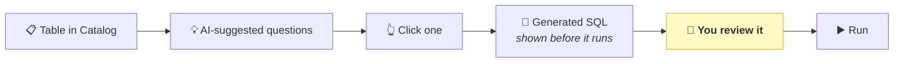
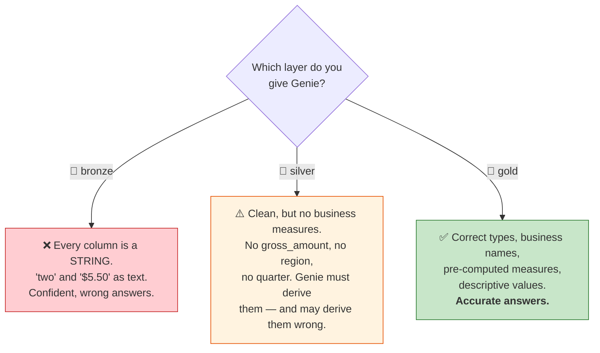
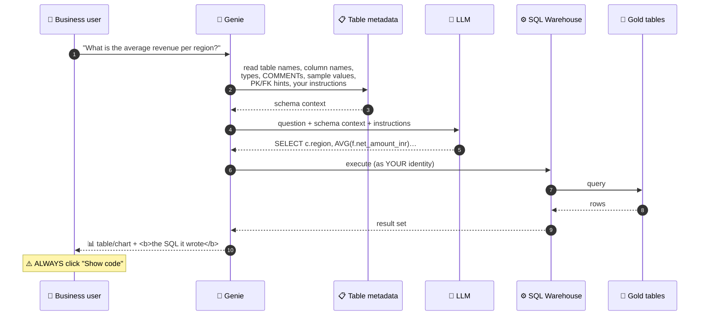

# Part 26 — 🧪 Genie: Natural-Language Analytics

> **Section goal:** Point an LLM at your gold layer and let non-technical users ask questions in English. You'll learn how Genie actually works, why it must never see bronze, how every naming and commenting decision from Parts 22–25 pays off in answer accuracy, and where the genuine risks are.

Covers transcript `03:14:38` – `03:18:16`.

---

## 1. AI is already in the Catalog

> *"Before we start building our BI dashboard, I want to highlight this amazing **AI feature**. Now, AI is **integrated throughout this product**, and you already see this kind of **suggestions at the top of these tables**."*

Open any table in **Catalog** and you'll see suggested questions above the preview.

> *"So let's say for the `fact_order_items` table, I want to know: **how many transactions used coupons each month?** When you click on it, it will actually **generate a SQL query**. See, it generated a SQL query — you can **review it** and then you can **run** the query. Isn't this amazing? So in August, September, October, these are the transactions which used coupon."*



> 💡 **Note that `coupon_flag` design choice paying off already.** *"How many transactions used coupons each month"* becomes `SUM(coupon_flag)` — because you stored `1`/`0` rather than a boolean (Part 25 §1.4). A boolean would have forced a `CASE` expression that the LLM might get wrong.

---

## 2. Create a Genie space

> *"Now let me go to **Genie**. See, this feature that I just showed you is integrated into the Catalog section, but you can **go and click on Genie**, and click on **New**."*

| # | Action |
|---|--------|
| 1 | Left nav → **`Genie`** |
| 2 | **`New`** (or **`Create Genie space`**) |
| 3 | Choose data: expand **`ecommerce`** → **`gold`** |
| 4 | Tick your gold tables — the fact, three dimensions, and the OBT view |
| 5 | **`Create`** |
| 6 | Name it: **`ecommerce genie space`** |

### ⭐ The most important rule in this Part

> *"**Always use gold for your analytics purpose** — right? Because **bronze is raw**, and **silver may not have BI-ready columns**, etc."*



> ⚠️ **Genie will *always* return an answer.** It does not say "I'm not sure". Pointed at bronze, it produces a fluent, confident, wrong number — which is far more dangerous than an error. **Restricting Genie to gold is a correctness control, not a preference.**

**Enforce it with permissions, not politeness:**

```sql
GRANT USE CATALOG ON CATALOG ecommerce      TO `business_users`;
GRANT USE SCHEMA  ON SCHEMA  ecommerce.gold TO `business_users`;
GRANT SELECT      ON SCHEMA  ecommerce.gold TO `business_users`;
-- deliberately NO grants on bronze or silver
```

Unity Catalog permissions apply inside Genie (Part 5), so a user can never coax it into querying something they couldn't query themselves.

---

## 3. How Genie actually works

Understanding the mechanism is what lets you improve its accuracy — and answer the interview question.



**The critical realisation: the LLM never sees your data.** It sees **metadata only** — table names, column names, types, comments and a small sample. So:

> 🧠 **Genie's accuracy is a direct function of your metadata quality.** Every `COMMENT`, every descriptive column name, every decoded value from Parts 22–25 is now an accuracy improvement.

| What you did earlier | What it buys you here |
|----------------------|-----------------------|
| `category_name = 'Home and Kitchen'` instead of `H&K` (Part 23) | The LLM matches the user's own words |
| `net_amount_inr` instead of `amt` (Part 25) | No ambiguity about currency |
| `channel = 'Mobile App'` instead of `app` (Part 24) | Filters on natural language work |
| `coupon_flag` as 1/0 (Part 25) | `SUM`/`AVG` work without a `CASE` |
| `COMMENT ON COLUMN` (Part 25 §7) | The LLM reads your definition of the measure |
| `vw_sales_obt` — no joins needed (Part 25 §5) | Removes the single biggest source of LLM SQL errors |

> ⭐ **That last row is the big one.** Most LLM SQL failures are **join errors** — wrong key, wrong join type, or a fan-out that silently doubles a total. A pre-joined One Big Table eliminates the whole category.

---

## 4. Configure the space

> *"And on the right-hand side you are seeing this **tables**. You can also give **instructions to the LLM** — let's say if you want the answer to be generated in a specific format, **here is where you will do your prompt engineering**. And then there are **settings**, like what kind of **warehouse** you want to use, **space ID** and so on."*

| Tab | What it's for |
|-----|---------------|
| **Data** | Which tables/views the space can query |
| **Instructions** | Free-text guidance to the LLM — ⭐ the highest-leverage setting |
| **Example SQL queries** | Curated query patterns Genie can learn from |
| **Trusted assets** | Certified SQL functions Genie may call rather than writing SQL itself |
| **Settings** | SQL Warehouse, space ID, sharing |

### Instructions — worth writing properly

This is where you encode the business rules an LLM can't infer. A good starting set for this project:

```
## Business context
This is A2Z, an e-commerce company selling across India (IN), Australia (AU) and the UK (GB).

## Preferred table
Always prefer `vw_sales_obt` — it is fully denormalised and requires no joins.
Only use the underlying fact and dimension tables if the view lacks a needed column.

## Grain
One row = one ORDER LINE, not one order.
- "number of orders"       → COUNT(DISTINCT transaction_id)
- "number of items/lines"  → COUNT(*)
Never use COUNT(*) for an order count.

## Measures
- Revenue / sales / turnover → SUM(net_amount_inr). Report in INR unless asked otherwise.
- net_amount_inr is already discounted, taxed and currency-converted. Do not adjust it again.
- discount_pct is a FRACTION (0.10 = 10%), not a percentage.
- Coupon usage    → SUM(coupon_flag) for the count, AVG(coupon_flag) for the rate.
- Weekend revenue → filter is_weekend = 1.

## Formatting
- Round currency to 2 decimals; show large values in millions where sensible.
- Order time series by the underlying date, never alphabetically by month_name.
- Always include the period (quarter/month) label in the output when grouping by time.

## Definitions
- "Region" is a business grouping of states (North/South/East/West/Other), not a country.
- "Channel" values are Website, Mobile App, Physical Store, Partner Marketplace.
```

> 💡 **The grain instruction is the single most valuable line.** Without it, *"how many orders did we get?"* returns 183,000 line items instead of the true order count — a plausible number that is completely wrong. LLMs have no way to know your grain unless you tell them.

---

## 5. 🧪 Ask questions

> *"So let's close this and let's start asking these questions."*

### Q1 — a simple count

> *"So the first question I have is: **how many transactions were made in US currency?** And by the way, I'm going to give you this **text file with some sample questions** — so I'm just using the questions from that file. So **total number of transactions in USD are these**."*

```
how many transactions were made in US currency
```

> *"And if you want to **verify your code**, it will generate SQL query, right? So `SELECT COUNT(DISTINCT transaction_id)` from this gold table where the currency is USD and transaction ID is not null. See, **it's so detailed**."*

```sql
SELECT COUNT(DISTINCT transaction_id) AS total_transactions
FROM   ecommerce.gold.vw_sales_obt
WHERE  currency = 'USD'
  AND  transaction_id IS NOT NULL;
```

> ⭐ **Notice it chose `COUNT(DISTINCT transaction_id)`, not `COUNT(*)`** — because "transactions" implies orders, not lines. That's the grain instruction working. Without it you'd get a line count and never know.

### Q2 — an aggregate with a chart

> *"Then the second question I have is: **what is the total revenue in INR and number of order lines by month, and show me the monthly trend chart?** So see, I got the **number of orders per month** — August, September, October — and the **revenues** in each of these months. And I got this **chart**."*

```
what is the total revenue in INR and number of order lines by month, show me the monthly trend chart
```

```sql
SELECT month_name,
       ROUND(SUM(net_amount_inr), 2) AS total_revenue_inr,
       COUNT(*)                      AS order_lines
FROM   ecommerce.gold.vw_sales_obt
GROUP  BY month, month_name
ORDER  BY month;
```

> *"Now you can click on this button and you can **modify your visualisations**. Let's say I want **bar chart instead of line chart** — OK, so then you get this. You can **add labels** and so on. So you can customise your chart here."*

> 💡 **Notice the question asks for both "revenue" *and* "order lines" — using your vocabulary.** That precision comes from the instructions defining the difference. A vague question gets a vague answer from any tool.

### Q3 — using a derived column

> *"And the next question I have is: **what is the average revenue per region?** Remember, we **created region column** — like east, west and so on. And look at this: in the England there are these regions, so it is showing you that. Then in India these are north, east, etc."*

```
what is the average revenue per region
```

```sql
SELECT region,
       ROUND(AVG(net_amount_inr), 2) AS avg_revenue_inr
FROM   ecommerce.gold.vw_sales_obt
GROUP  BY region
ORDER  BY avg_revenue_inr DESC;
```

> ⭐ **This only works because of Part 23.** `region` doesn't exist in any source system — you *derived* it from a business mapping. Genie can only answer questions about columns that exist. **Every gold enrichment expands what natural language can reach.**

### Q4 — refine the answer

> *"You can also **modify your question**, and you can say: **what is the average revenue per region, show it in table along with country?** So see, country was missing initially — now you have **region as well as country**."*

```
what is the average revenue per region, show it in a table along with country
```

```sql
SELECT country_code, region,
       ROUND(AVG(net_amount_inr), 2) AS avg_revenue_inr,
       COUNT(DISTINCT transaction_id) AS orders
FROM   ecommerce.gold.vw_sales_obt
GROUP  BY country_code, region
ORDER  BY country_code, avg_revenue_inr DESC;
```

> 💡 **Conversational refinement is the real workflow.** Genie keeps context, so *"now break that down by country"* works as a follow-up. That's what makes it useful to a business user rather than a novelty.

> *"And once again you can **verify your SQL query** here by clicking on **Show code**."*
>
> *"I personally **love this Genie feature** — it's making your life so easy as a business user. You can just type in your question and get your answers."*

---

## 6. A question set to test with

The course supplies a `.txt` file of sample questions. Here's a fuller battery, ordered from easy to genuinely hard — **use it to find where your metadata is weak.**

### 🟢 Basic
```
how many transactions were made in US currency
what is the total revenue in INR
how many distinct products were sold
which channel generated the most revenue
how many customers do we have
```

### 🟡 Intermediate
```
total revenue in INR and number of order lines by month, show a trend chart
what is the average revenue per region
which product category has the highest revenue
how many transactions used coupons each month
compare weekend versus weekday revenue
top 10 brands by revenue
```

### 🔴 Advanced — these expose weak metadata
```
what is the average order value by region and quarter
which categories have the highest average discount rate
show revenue by hour of day and day of week
what percentage of orders used a coupon, by channel
month-over-month revenue growth
which products have a high rating but low sales
average revenue per customer by region
```

### ⚫ Trap questions — check the answers by hand
```
how many orders did we get in September          ← lines vs orders?
what is our total discount given                 ← discount_amount, or recomputed from the fraction?
what is our revenue in dollars                    ← does it convert BACK from INR, or use sales_amount?
which region is growing fastest                   ← ambiguous: absolute or percentage?
```

> ⭐ **Run the trap questions and compare with SQL you write yourself.** Where Genie diverges, the fix is almost always an **instruction** or a **column comment**, not a Genie problem. That diagnostic loop is the actual skill.

---

## 7. Making Genie accurate — the checklist

| Lever | Impact | How |
|-------|--------|-----|
| **Point it at gold only** | 🔴 Critical | Enforce with Unity Catalog grants |
| **Use a denormalised view** | 🔴 Critical | Removes join errors — the top LLM SQL failure |
| **Write instructions** | 🔴 Critical | Especially the **grain** rule |
| **Descriptive column names** | 🟠 High | `net_amount_inr`, not `amt` |
| **`COMMENT` on tables and columns** | 🟠 High | The LLM reads these directly |
| **Decode coded values** | 🟠 High | `Mobile App`, not `app` |
| **Example SQL queries** | 🟡 Medium | Teaches your preferred patterns |
| **Trusted assets / SQL functions** | 🟡 Medium | Certified logic Genie calls instead of writing |
| **Benchmarks** | 🟡 Medium | Question + expected SQL pairs, re-run as a regression test |

```sql
-- The five minutes with the highest return in the entire platform
COMMENT ON TABLE ecommerce.gold.vw_sales_obt IS
 'Denormalised sales reporting view. Grain: one row per ORDER LINE (transaction_id + item_seq).
  Use COUNT(DISTINCT transaction_id) for order counts. Revenue = SUM(net_amount_inr).';

ALTER TABLE ecommerce.gold.gld_fact_order_items ALTER COLUMN net_amount_inr
  COMMENT 'Final revenue per order line: discounted, taxed, converted to INR. Do not adjust further.';

ALTER TABLE ecommerce.gold.gld_fact_order_items ALTER COLUMN coupon_flag
  COMMENT '1 if a coupon was used, else 0. SUM() = coupon count; AVG() = redemption rate.';

ALTER TABLE ecommerce.gold.gld_dim_customers ALTER COLUMN region
  COMMENT 'Business region (North/South/East/West/Other) derived from country + state. Not a country.';
```

### 🔍 Plain-English deep-dive: Trusted Assets

*Certified SQL functions or queries that Genie is allowed to **call** rather than writing SQL from scratch.*

**Analogy:** giving a new analyst your approved calculation spreadsheet instead of asking them to derive the formula each time.

```sql
CREATE OR REPLACE FUNCTION ecommerce.gold.revenue_by_region(start_date DATE, end_date DATE)
RETURNS TABLE (region STRING, revenue_inr DOUBLE)
RETURN
  SELECT region, ROUND(SUM(net_amount_inr), 2)
  FROM   ecommerce.gold.vw_sales_obt
  WHERE  date BETWEEN start_date AND end_date
  GROUP  BY region;
```

Register it as a trusted asset and *"revenue by region for Q3"* becomes a **function call with known-correct logic** rather than generated SQL. **This is how you make a business-critical metric non-negotiable.**

---

## 8. The risks — say these before an interviewer does

| Risk | Why it matters | Mitigation |
|------|----------------|------------|
| **Confidently wrong answers** | Genie never says "I don't know" | Show the SQL; benchmark; trusted assets for key metrics |
| **Grain misunderstanding** | Lines counted as orders | Explicit grain instruction + `COUNT(DISTINCT …)` guidance |
| **Ambiguous business terms** | "Revenue" could be gross, net or pre-tax | Define terms in instructions and column comments |
| **Non-determinism** | The same question may generate slightly different SQL | Trusted assets for anything reported externally |
| **Bypassing governed logic** | A user recreates a metric differently to a certified dashboard | Curated view + trusted assets + certification |
| **Over-trust** | An ad-hoc answer ends up in a board pack | Governance policy: Genie for exploration, dashboards for decisions |
| **Cost** | Every question runs a warehouse query | Serverless warehouse with auto-stop; monitor `system.billing.usage` |

> ⭐ **Interview:** *"Would you let executives use Genie for board reporting?"* → *"For **exploration**, absolutely — it removes the analyst bottleneck for 'what happened last month' questions. For anything that reaches a board pack or a regulator, no, not directly. Genie is non-deterministic and never expresses uncertainty, so a confident wrong number is a real risk. My controls would be: restrict it to curated gold tables via Unity Catalog grants so it physically can't query raw data; encode grain and metric definitions in the space instructions; register business-critical metrics as **trusted assets** so they're function calls with known-correct logic rather than generated SQL; maintain a **benchmark set** of question-and-expected-SQL pairs I re-run when the model or schema changes; and set a clear policy that governed dashboards are the system of record while Genie is the exploration tool. Making the generated SQL visible is what keeps it honest — a user can always check, and an analyst can always audit."*

---

## 9. Genie vs a semantic layer

| | 🧞 **Genie** | 📐 **Semantic layer** (dbt metrics, Power BI model, Cube) |
|---|---|---|
| Definition of a metric | Inferred by an LLM per question | **Defined once, explicitly** |
| Determinism | ❌ Varies | ✅ Identical every time |
| Coverage | Any question | Only modelled metrics |
| Setup effort | Low | High |
| Governance | Instructions + trusted assets | Strong by construction |
| Best for | Exploration, long-tail questions | Certified KPIs |

> 💡 **They're complementary.** Certified metrics live in trusted assets or a semantic layer; Genie handles the long tail of one-off questions. Saying *"Genie plus trusted assets for critical metrics"* is a mature answer.

---

## 10. ✅ Checkpoint

- [ ] A Genie space exists over `ecommerce.gold` only
- [ ] Instructions include the **grain rule** and metric definitions
- [ ] All four transcript questions return sensible answers
- [ ] You checked **Show code** on each one
- [ ] `SUM(coupon_flag)` appears in the coupon answer
- [ ] `COUNT(DISTINCT transaction_id)` appears in the transaction-count answer
- [ ] The trap questions have been hand-verified
- [ ] Key columns have `COMMENT`s

---

## ⭐ Likely Interview Questions for This Section

**Q1. "What is Genie and how does it work?"**
> *Model answer:* "It's Databricks' natural-language interface over governed data. A user asks a question in English; Genie assembles context from table metadata — names, column names, types, comments, sample values and any instructions configured on the space — sends that plus the question to an LLM, gets SQL back, executes it on a SQL Warehouse **as the asking user's identity**, and returns both the result and the generated SQL. The key architectural point is that the LLM sees **metadata, not data**, which is good for privacy and means accuracy is a direct function of metadata quality. And because it runs as the user, Unity Catalog permissions apply — it can't surface anything they couldn't already query."

**Q2. "Why point Genie at gold rather than silver or bronze?"**
> *Model answer:* "Because Genie always returns an answer — it never says it's unsure — so pointing it at poor data produces fluent, confident, wrong numbers, which is more dangerous than an error. Bronze is entirely strings with contaminated values, so any aggregation is meaningless. Silver is clean but has no business measures, no region, no quarter, so the LLM would have to derive them and may derive them differently each time. Gold has correct types, business-friendly names, pre-computed measures and decoded values. And I'd enforce it with Unity Catalog grants rather than convention, so business users physically cannot reach bronze or silver."

**Q3. "How do you improve Genie's accuracy?"**
> *Model answer:* "Five levers, roughly in order of impact. Point it at a **denormalised view** rather than a star schema, because join errors are the single biggest category of LLM SQL failure and a pre-joined view eliminates them. Write **space instructions** — above all the grain rule, since without it 'how many orders' returns line items, a plausible number that's completely wrong. Use **descriptive column names with units baked in**, like `net_amount_inr`. Add **comments** on tables and columns, since the LLM reads them directly as the definition of each measure. And register business-critical metrics as **trusted assets** — SQL functions Genie calls rather than writes — so those numbers are non-negotiable. Then maintain a **benchmark set** of question-and-expected-SQL pairs to re-run as a regression test when the schema or model changes."

**Q4. "What are the risks of natural-language BI?"**
> *Model answer:* "The core one is confident wrongness — no expression of uncertainty, so a plausible number reaches a decision without scrutiny. Underneath that are specific failure modes: grain misunderstanding, counting lines as orders; ambiguous business terms, where 'revenue' could be gross, net or pre-tax; non-determinism, where the same question yields slightly different SQL on different days; and users bypassing governed logic by recreating a metric differently to a certified dashboard. Mitigations are showing the generated SQL so it's always auditable, encoding definitions in instructions and comments, trusted assets for critical metrics, benchmark regression tests, and a clear organisational policy that governed dashboards are the system of record while Genie is the exploration tool."

**Q5. "How did your data modelling decisions affect Genie's accuracy?"**
> *Model answer:* "Directly and measurably, which surprised me. Storing `coupon_flag` as 1/0 rather than a boolean meant 'how many transactions used coupons' became a clean `SUM`, whereas a boolean would have needed a `CASE` the LLM could get wrong. Decoding `app` to 'Mobile App' and `H&K` to 'Home and Kitchen' meant users' natural phrasing matched the actual values, so filters worked without the LLM guessing at codes. Naming the measure `net_amount_inr` rather than `amt` removed all currency ambiguity. And deriving `region` in gold is what made 'average revenue per region' answerable at all — you can't ask about a column that doesn't exist. The general lesson is that gold-layer naming and enrichment stopped being ergonomics and became an accuracy feature."

**Q6. "Genie or a semantic layer?"**
> *Model answer:* "Both, for different jobs. A semantic layer defines metrics once, explicitly, so they're deterministic and governed — that's what you want for certified KPIs that appear in board packs or regulatory reports. Genie handles the long tail of ad-hoc questions that nobody would ever model, and it removes the analyst bottleneck for 'what happened last month' queries. The bridge between them in Databricks is **trusted assets**: registering critical metrics as certified SQL functions gives you semantic-layer determinism inside the natural-language interface. So my answer is Genie for exploration, trusted assets or a semantic layer for anything that has to be the same number every time."

---

## 🧠 30-Second Memory Hooks

- **Genie = English → metadata + LLM → SQL → SQL Warehouse → answer + the SQL it wrote.**
- **⭐ The LLM sees METADATA, not data.** So **accuracy = metadata quality**.
- **⭐ ALWAYS point Genie at GOLD.** Bronze is all strings; silver has no business measures. **Enforce with grants, not politeness.**
- **⚠️ Genie NEVER says "I don't know".** A confident wrong number is more dangerous than an error.
- **The #1 LLM SQL failure is JOIN errors** — which is why the **One Big Table view** matters so much.
- **The single most valuable instruction is the GRAIN rule:** *"one row = one order LINE; use `COUNT(DISTINCT transaction_id)` for orders."*
- **Every Part 22–25 decision pays off here:** `coupon_flag` 1/0 · `Mobile App` not `app` · `net_amount_inr` not `amt` · `region` derived · comments written.
- **You cannot ask about a column that doesn't exist.** Gold enrichment expands what natural language can reach.
- **ALWAYS click "Show code".** It's what keeps the whole thing auditable.
- **Trusted assets = certified SQL functions Genie CALLS instead of WRITES.** How you make a metric non-negotiable.
- **Benchmarks = question + expected SQL pairs.** Your regression test for AI answers.
- **Unity Catalog permissions apply inside Genie** — it runs as the *user*, not as a service account.
- **Policy: Genie for exploration · governed dashboards for decisions.**
- **Run trap questions** (*"how many orders in September"*) and hand-verify. Divergence = a missing instruction or comment.

---

*Next suggested section:* **[Part 27 — 🧪 AI/BI Dashboards](Part-27-ai-bi-dashboards.md)** — Genie answers one question at a time. Next you'll build the persistent, governed reporting surface: pages, datasets, a monthly trend line, a category bar chart, an hour × day heatmap and cross-filtering — plus the alphabetical-month trap the instructor walks straight into.

---

**Navigation** — ⬅️ **[Part 25 — LAB 6: Fact → Gold + View](Part-25-lab-fact-gold-reporting-view.md)** · 🏠 **[Master Index](../Databricks%20-%20Study%20Guide.md)** · ➡️ **[Part 27 — AI/BI Dashboards](Part-27-ai-bi-dashboards.md)**
