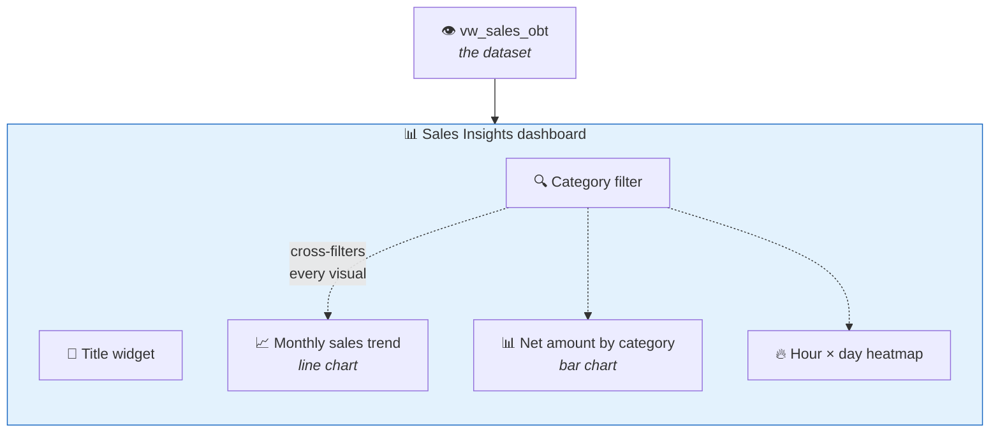
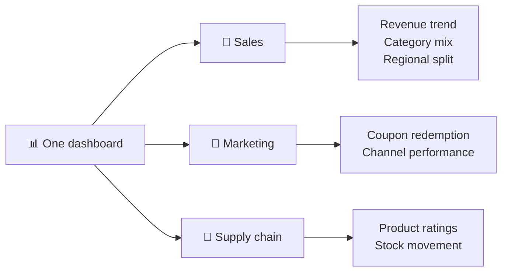
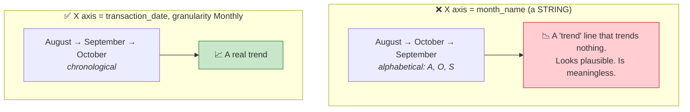
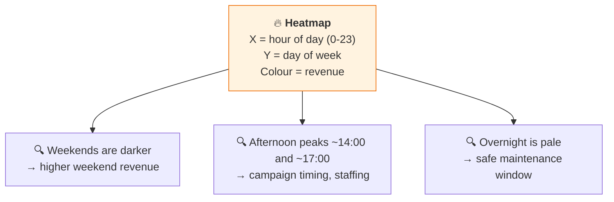
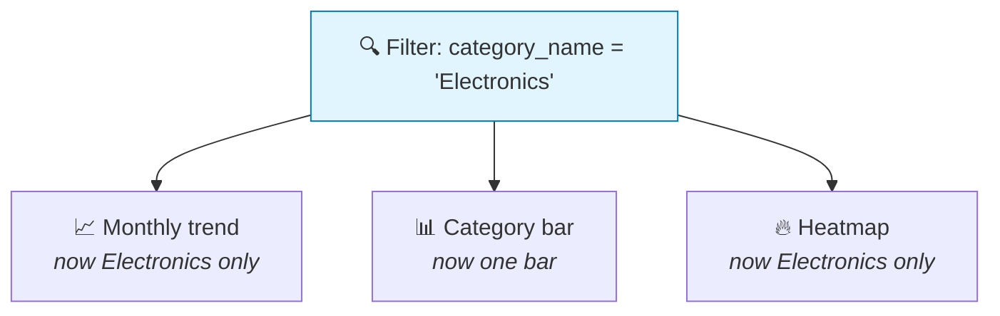
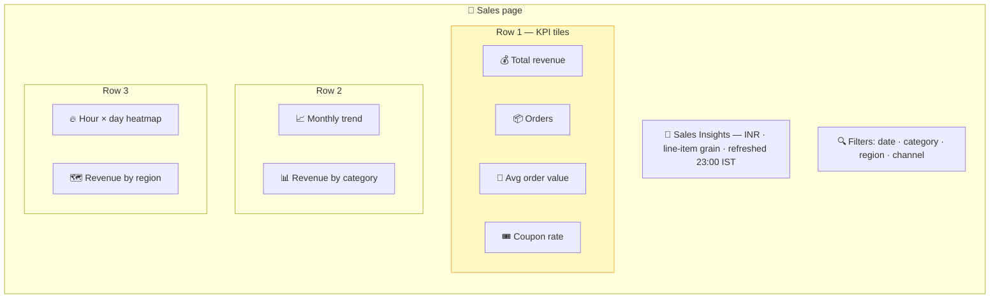

# Part 27 — 🧪 AI/BI Dashboards

> **Section goal:** Build the persistent reporting surface that business users actually open every morning. You'll create a dashboard from scratch, build charts both by hand and with AI assistance, add a heatmap and cross-filtering — and walk straight into the alphabetical-month trap so you never fall for it again.

Covers transcript `03:21:19` – `03:28:29`.

---

## 0. What you'll build



**Checklist:**

- [ ] Dashboard created and named
- [ ] Data source = `ecommerce.gold.vw_sales_obt`
- [ ] Text widget titled **Sales Insights**
- [ ] Monthly trend chart — **in the correct month order**
- [ ] Net amount by category bar chart
- [ ] Hour-of-day × day-name heatmap
- [ ] A category filter that cross-filters everything
- [ ] Published

---

## 1. Genie vs a dashboard — why both exist

| | 🧞 **Genie** (Part 26) | 📊 **Dashboard** (this Part) |
|---|---|---|
| Interaction | Ask a question | Look at a page |
| Persistence | Ephemeral | ✅ Saved, versioned, shared |
| Determinism | ❌ LLM-generated SQL | ✅ Fixed queries |
| Audience | Curious users, ad-hoc | Everyone, every morning |
| Governance | Instructions + trusted assets | ✅ Reviewed and certified |
| Best for | *"I wonder if…"* | *"What are our numbers?"* |

> 💡 **The workflow that actually happens in practice:** explore in Genie → find something worth watching → *promote it into a dashboard* so it's monitored consistently. Genie is the telescope; the dashboard is the instrument panel.

---

## 2. Create the dashboard

> *"Let's now create a dashboard. You will click on **Dashboard** in the left-hand-side menu option. Click on **Create dashboard**, and let's hide this."*

| # | Action |
|---|--------|
| 1 | Left nav → **`Dashboards`** |
| 2 | **`Create dashboard`** |
| 3 | Rename it (click the title): **`A2Z Sales Insights`** |
| 4 | Two tabs at the top: **`Canvas`** (design) and **`Data`** (datasets) |

### Pages

> *"So see, here you will see different options. The first option at the top is **pages**. So you can create **different pages** in your dashboard. So let's say you have a view for **sales**, you have another view for **marketing**, third view for **supply chain** — based on different **business functions** you can have different views."*



> 💡 **One dashboard with several pages beats several dashboards** — shared filters, one URL to bookmark, one thing to maintain, and one place permissions are granted.

---

## 3. Add the data source

> *"Then you can click here and **add a visual** here. Now you need to **connect this with a data source**. Here I don't see any dataset, so let's go to **Data** and **add a data source**. So go to **ecommerce, gold, and the view that we created**. Let's confirm it. So it connected with it, and you are seeing the data — which means **my dashboard is connected with my data source**."*

| # | Action |
|---|--------|
| 1 | Top tab → **`Data`** |
| 2 | **`Add data source`** (or **`Select a table`**) |
| 3 | Navigate: **`ecommerce`** → **`gold`** → **`vw_sales_obt`** |
| 4 | **`Confirm`** / **`Select`** |
| 5 | You should see a preview of rows |

### 🔍 Plain-English deep-dive: what a "dataset" is here

- **Dataset** — *a named query that feeds one or more visuals on the dashboard.*
- **Analogy:** the **ingredients tray** a chef preps once and uses across several dishes.
- **Why it matters:** several charts sharing one dataset also share its filters and its result cache, so a cross-filter applies everywhere at once and you don't re-query per chart.

**Two ways to define a dataset:**

| Approach | When |
|----------|------|
| **Pick a table/view** | ⭐ What we do — the OBT view already has everything |
| **Write custom SQL** | When you need pre-aggregation or a parameterised query |

```sql
-- A custom dataset, if you wanted one
SELECT month, month_name, category_name, region,
       SUM(net_amount_inr)            AS revenue_inr,
       COUNT(DISTINCT transaction_id) AS orders,
       AVG(coupon_flag)               AS coupon_rate
FROM   ecommerce.gold.vw_sales_obt
GROUP  BY month, month_name, category_name, region;
```

> ⭐ **This is the payoff for Part 25's One Big Table.** Because every dimension attribute is already joined in, you point at one object and every chart on the dashboard can use any column. Without it you'd be writing a bespoke join for each visual.

---

## 4. The title widget

> *"And here we will begin adding a **text box**. So add a text box here, and we will call this **Sales Insights** — right, sales insights for your e-commerce business. And let's select **heading three**. OK, or let's say **heading two**. And you can **resize** it."*

| # | Action |
|---|--------|
| 1 | Canvas → **`Add`** → **`Text`** |
| 2 | Type: `Sales Insights` |
| 3 | Select the text → choose **Heading 2** |
| 4 | Drag the widget's corner to resize |

Text widgets support Markdown, so you can add genuinely useful context:

```markdown
# 🛒 A2Z Sales Insights

**Source:** `ecommerce.gold.vw_sales_obt` · **Currency:** INR (converted at transaction-date rates)
**Grain:** one row per order line · **Coverage:** Aug – Oct 2025
_Refreshed daily at 23:00 IST. Owner: data-engineering._
```

> 💡 **Always state the currency, the grain and the refresh time on the dashboard itself.** It pre-empts the three questions every stakeholder asks, and it stops someone quoting a number without knowing what it means.

---

## 5. Chart 1 — Monthly sales trend

### 5.1 Let the AI do it first

> *"The moment you do that, here **AI assistant will give you some suggestion** — what kind of dashboard you might want to have. So let's say you want **monthly sales trend**… And see, it will create this **nice visual** for you. So here I see in **August I got 621 million** of sales, in **September 571**, in **October 618 millions** of sales. OK, you can just say **Accept**."*

| # | Action |
|---|--------|
| 1 | Canvas → **`Add`** → **`Visualization`** |
| 2 | Choose the dataset `vw_sales_obt` |
| 3 | In the AI prompt box, type: `monthly sales trend` |
| 4 | Review the suggestion → **`Accept`** |

| Month | Net sales |
|-------|-----------|
| August | ~₹621M |
| September | ~₹571M |
| October | ~₹618M |

### 5.2 Now build the same thing by hand

> *"You can change things, by the way. So see, here, what it did is — for this particular visualisation, let me **create this visualisation manually** so you get an idea."*

| # | Action |
|---|--------|
| 1 | **`Add`** → **`Visualization`** → dataset `vw_sales_obt` |
| 2 | **Visualization type:** `Line` |
| 3 | **X axis:** `month_name` |
| 4 | **Y axis:** `net_amount_inr`, **Aggregation:** `SUM` |

### 5.3 ⚠️ And here's the trap

> *"Now it's the **same data, but here the order is not correct**: **August, October, and then September**. So August 621 — so August 621, right? October 618, 618. OK. So in the AI-generated suggestion **the order was correct**, because they used this **monthly transaction date**."*



> ⚠️ **This is the exact warning flagged in Part 22 §6.5 and Part 23 §6.3, now happening live.** A string month name sorts alphabetically. It is not a chart-formatting nuisance — **it silently produces a misleading trend line**, and nobody looking at the dashboard will notice.

### 5.4 The fix

> *"So let me just show you **monthly transaction date**. So here, **transaction date**, and then **monthly** — right? You can see monthly, yearly, whatever."*

| # | Action |
|---|--------|
| 1 | Change **X axis** to **`transaction_date`** (or `date`) |
| 2 | Set its **granularity** to **`Monthly`** |
| 3 | Order is now chronological ✅ |

**Three ways to get the order right:**

| Approach | How |
|----------|-----|
| ⭐ **Use a real date field with monthly granularity** | What the video does — the chart engine sorts by the underlying date |
| **Sort by the numeric month column** | Keep `month_name` on the axis, sort by `month` |
| **Prefix the label** | Emit `"08 - August"` in gold so alphabetical == chronological |

> 💡 **This is precisely why Part 23 kept the numeric `month` and `quarter_num` columns alongside the friendly labels.** Display labels and sort keys are different jobs.

### 5.5 Title and axis labels

> *"And you can give it some **title**. So title is yes — so **Monthly Sales Trend**. You can change this label."*

> *"So on the y axis, how do I change label? So by the way, when you click this label it will show you this **annotation** — right? This is useful, right, see all these numbers. And let me go ahead and delete this. So here, let's say I want to change this particular X and Y axis label. So here the **display name** is 'sum of net amount' — so you can just say **Net Amount**. And then on the X axis, display name is **Month**, let's say."*

| Setting | Where | Set to |
|---------|-------|--------|
| Chart title | Visualization config → **Title** | `Monthly Sales Trend` |
| Y-axis label | Y field → **Display name** | `Net Amount (INR)` |
| X-axis label | X field → **Display name** | `Month` |
| Data labels | Y field → **Show labels** | Optional — the "annotation" he toggles |

> 💡 **Put the unit in the axis label**, exactly as you put it in the column name (Part 25 §3). `Net Amount (INR)` removes any doubt about what the 621M represents.

---

## 6. Chart 2 — Net amount by category

> *"OK, you can then go ahead and **create another visual**. So let me add another visual here. And let's say you want to know **net amount by category**… So you see you have all these categories. So let's **accept this suggestion**. And this particular category has **1.38 billion** sales, right? **Electronics is the highest-selling category**, then Home and Kitchen is this much."*

| # | Action |
|---|--------|
| 1 | **`Add`** → **`Visualization`** → dataset `vw_sales_obt` |
| 2 | AI prompt: `net amount by category` → **`Accept`** |
| 3 | Or manually: **Bar**, X = `category_name`, Y = `SUM(net_amount_inr)` |
| 4 | Sort descending by value |

> *"You know, you can **change the visualisation type** — if from bar you want to change it to something else, you can easily do it using this **dropdown**."*

### Choosing the right chart type

| Question shape | Chart |
|----------------|-------|
| Change **over time** | 📈 Line / area |
| **Comparison** across categories | 📊 Bar / column |
| **Composition** of a whole | 🥧 Pie / stacked bar / treemap |
| **Two-dimensional density** | 🔥 Heatmap |
| **Correlation** between two measures | ⚫ Scatter |
| **A single headline number** | 🔢 Counter / KPI tile |
| **Precise values** | 📋 Table |
| Geographic | 🗺️ Map |

> ⚠️ **Pie charts are hard to read beyond ~5 slices** — humans compare lengths far better than angles. A sorted horizontal bar is nearly always clearer.

> ⭐ **Notice `category_name` on the axis, not `category_code`.** A chart labelled `H&K` needs a translator. This is the Part 23 denormalisation paying off in the most visible possible way.

---

## 7. Chart 3 — The hour × day heatmap

> *"Then let me **add a heat map**, actually. So here I'm going to add a heat map. So let me just make this really big and I will select a **heat map** here."*

| # | Action |
|---|--------|
| 1 | **`Add`** → **`Visualization`** → dataset `vw_sales_obt` |
| 2 | **Type:** `Heatmap` |
| 3 | **X axis:** `hour_of_day` |
| 4 | **Y axis:** `day_name` |
| 5 | **Colour:** `net_amount_inr`, aggregation `SUM` |
| 6 | Make the widget wide — 24 columns need room |

> *"And X axis is **hour of the day** — so hour of the day, and Y axis is **net amount**, right, sum of net amount. So here, let's select this. So this will be actually net amount will be in the **colour**. So the Y axis will be **day name**."*

### Reading it

> *"So now, see, what you are seeing here is: you have all these **days**, and the regions which are **darker have more sales**. So you can say that first of all **Saturdays and Sunday have good sales** — see, you have more darker blocks in Saturday and Sunday — and on Saturday on this hour, right, at the **two o'clock**, let's say at **five o'clock** I have more sales."*



> 💡 **A heatmap answers a question no other chart can** — the *interaction* between two dimensions. A bar chart of revenue-by-day and another of revenue-by-hour would both hide the fact that **Saturday at 5pm specifically** is the peak. That combination is what drives a campaign-scheduling decision.

> ⭐ **This chart only exists because `hour_of_day` was computed in the OBT view** (`HOUR(transaction_ts)`, Part 25 §5.2) and `day_name` was normalised to exactly 7 title-case values in silver (Part 22 §6.3). Inconsistent casing would have produced 14+ rows on the Y axis.

**A useful variant — swap the measure for the rate:**

```sql
-- Colour by coupon redemption rate instead of revenue
AVG(coupon_flag)   -- "when are people most discount-sensitive?"
```

---

## 8. Filters — cross-filtering the whole page

> *"You can also click on **filter** and add the filters here. So let's say you want **only particular category**. OK, so you will say **category name** here, and see, it will show you different categories. So let's say you want to do analysis **only and only for electronics**. So when you select electronics here — see, now **data is refreshed to only electronics**."*

> *"I mean, in this bar you'll obviously see only one bar chart, but these numbers — the sales number, this particular thing — is very useful, are only for electronics. Then let's say for **books**, you want to analyse the sales number. So see, now it is refreshing for books, **the sales are less**."*

| # | Action |
|---|--------|
| 1 | Canvas → **`Add`** → **`Filter`** |
| 2 | **Field:** `category_name` |
| 3 | **Type:** `Single select` or `Multi select` |
| 4 | Choose **which visuals** it applies to — default is all sharing the dataset |



### Filters worth adding to this dashboard

| Filter | Field | Type | Why |
|--------|-------|------|-----|
| Date range | `date` | Date range | Every dashboard needs one |
| Category | `category_name` | Multi select | The video's example |
| Region | `region` | Multi select | Regional managers see their own numbers |
| Channel | `channel` | Multi select | Web vs app performance |
| Weekend | `is_weekend` | Single select | The 1/0 flag from Part 23 |
| Currency | `currency` | Multi select | Country-level drill-down |

> 💡 **A single filter widget beats three near-identical dashboards.** Rather than building "Electronics dashboard", "Books dashboard" and so on, build one and let the filter do the work — one thing to maintain, one place to fix a bug.

> ⚠️ **Filters are not security.** A user who can see the dashboard can change the filter. If a regional manager must *only* ever see their region, that's a **row filter in Unity Catalog** (Part 5 §6), not a dashboard filter.

---

## 9. Publish and share

| # | Action |
|---|--------|
| 1 | **`Publish`** (top right) |
| 2 | Choose **`Publish with my credentials`** (viewers see everything you can) or **`Publish with viewer credentials`** (each viewer sees only what *they* may) |
| 3 | **`Share`** → add users or groups → **Can view** / **Can edit** |
| 4 | Optionally set a **refresh schedule** and **email subscriptions** |

> ⚠️ **The credentials choice is a security decision, not a convenience one.**

| Mode | Behaviour | Use when |
|------|-----------|----------|
| **Publisher's credentials** | Everyone sees identical data | The dashboard is deliberately company-wide |
| **Viewer's credentials** ⭐ | Row filters and column masks apply **per viewer** | Anyone must see less than the publisher |

> ⭐ **Interview:** *"How do you make sure a regional manager only sees their region?"* → *"Not with a dashboard filter, because the user can change it. I'd enforce it in Unity Catalog with a **row filter** on the underlying table — a function checking group membership against the region column — and publish the dashboard with **viewer credentials** so the filter evaluates per user. That way one dashboard serves every region, each person sees only their own rows, and the restriction holds identically through SQL, notebooks and Genie. Dashboard filters are for convenience; Unity Catalog is for security."*

---

## 10. Dashboard design principles

Not in the transcript, but this is what separates a dashboard people use from one they ignore.

| Principle | In practice |
|-----------|-------------|
| **Answer one question per visual** | If you can't title it as a question, it doesn't belong |
| **Most important, top-left** | Eyes land there first |
| **KPI tiles above detail charts** | Headline number, then the breakdown |
| **Consistent colour meaning** | If Electronics is blue in one chart, it's blue in all |
| **Label the units** | `Net Amount (INR)`, not `Net Amount` |
| **Fewer than ~8 visuals per page** | Beyond that, split into pages |
| **State the refresh time** | Prevents "is this today's data?" every morning |
| **Sort bars by value, not alphabetically** | The reader wants the ranking |
| **Avoid dual axes** | Almost always misleading |
| **Design for the smallest screen it'll be viewed on** | Executives open dashboards on phones |

### A stronger layout for this dashboard



**KPI tiles to add** — each is a Counter visual over the same dataset:

```sql
SUM(net_amount_inr)                                   -- Total revenue
COUNT(DISTINCT transaction_id)                        -- Orders
SUM(net_amount_inr) / COUNT(DISTINCT transaction_id)  -- Average order value
AVG(coupon_flag) * 100                                -- Coupon redemption rate %
```

> 💡 **`AVG(coupon_flag) * 100` is a one-expression KPI** — the third time the 1/0 design choice from Part 25 has paid for itself.

---

## 11. 🚑 Troubleshooting

| Symptom | Cause | Fix |
|---------|-------|-----|
| Months in the wrong order | `month_name` is a string | Use `date` with monthly granularity, or sort by numeric `month` |
| Categories show as `H&K` | Used `category_code` | Use `category_name` — that's why Part 23 flattened it |
| Chart is empty | Filter excludes everything, or the dataset returned no rows | Clear filters; run the dataset query in the SQL Editor |
| Numbers don't match Genie | Different measure or different grain | Compare the SQL; check `COUNT(*)` vs `COUNT(DISTINCT …)` |
| Dashboard is slow | View recomputes joins per query | Consider a materialized view (Part 25 §6); pre-aggregate the dataset |
| Filter doesn't affect a chart | That visual uses a different dataset | Point both at the same dataset, or set the filter's scope |
| Viewers see "permission denied" | Published with viewer credentials, no grants | `GRANT SELECT` on the gold schema to the viewer group |
| Revenue drops after a pipeline run | A dimension lookup started failing | Re-check the null counts from Part 25 §5.4 |
| Heatmap Y axis has 14 values | `day_name` casing not normalised | Fix in silver (`initcap`) — Part 22 §6.3 |
| Totals differ between two charts | One counts lines, one counts orders | Declare the grain on the dashboard itself |

---

## ⭐ Likely Interview Questions for This Section

**Q1. "Walk me through building a dashboard on Databricks."**
> *Model answer:* "Start from the questions the business actually asks, then work backwards to the data. Create the dashboard, attach a dataset — ideally a curated gold view that's already denormalised, so every visual can use any column without bespoke joins. Add a text widget stating the grain, currency and refresh time, because those are the three questions stakeholders always ask. Then build visuals matched to question shapes: a line chart for change over time, bars for comparison, a heatmap for two-dimensional interaction. Add filters so one dashboard serves many audiences rather than building near-duplicates. Then publish with the right credential mode and grant access to groups. The most important discipline is one question per visual — if I can't write the title as a question, the visual doesn't earn its place."

**Q2. "Your monthly trend chart shows August, October, September. What happened?"**
> *Model answer:* "The X axis is a string month name, so the chart sorted it alphabetically. It's a genuinely dangerous bug rather than a formatting nuisance, because the chart still looks plausible — it just describes a trend that doesn't exist, and no one reviewing it would notice. The fix is to plot a real date field with monthly granularity so the chart engine sorts chronologically, or to keep the friendly label on the axis and sort by the underlying numeric month column. That's exactly why I keep both a display label and a numeric sort key in the gold date dimension — labels and sort keys are different jobs and shouldn't be the same column."

**Q3. "How do you make one dashboard serve regional managers who must only see their own region?"**
> *Model answer:* "Not with a dashboard filter, because a viewer can change it — filters are convenience, not security. I'd enforce it in Unity Catalog with a **row filter** on the underlying table: a SQL function checking group membership against the region column, attached to the table so it applies everywhere. Then publish the dashboard with **viewer credentials** rather than the publisher's, so the filter evaluates per viewing user. That gives one dashboard, one set of visuals to maintain, and each manager sees only their rows — and crucially the same restriction holds if they query the table in SQL, in a notebook or through Genie, because it's enforced at the data rather than the presentation layer."

**Q4. "When would you use a heatmap over a bar chart?"**
> *Model answer:* "When the insight lives in the *interaction* between two dimensions rather than in either one alone. Revenue by day of week and revenue by hour of day are two bar charts, and both would hide the fact that Saturday at 5pm specifically is the peak — you'd see 'weekends are good' and 'afternoons are good' without ever seeing the intersection. A heatmap shows all 168 hour-day combinations at once with colour as the third variable, which is what actually drives a decision like campaign timing or staffing. The trade-off is that colour is imprecise, so I'd pair it with a table if exact values matter."

**Q5. "Genie can answer these questions. Why build a dashboard at all?"**
> *Model answer:* "Different jobs. Genie is ephemeral, non-deterministic and requires someone to ask — it's for exploration and long-tail questions. A dashboard is persistent, deterministic, reviewed and shared, so everyone looking at revenue this month sees the same number computed the same way, without anyone needing to phrase a question. For recurring questions that drive decisions, that consistency is the whole point. The healthy workflow is Genie for discovery, then promoting anything worth watching regularly into a governed dashboard — telescope versus instrument panel."

**Q6. "Your dashboard is slow. How do you fix it?"**
> *Model answer:* "Diagnose before optimising. First check whether it's the query or the rendering — look at the query history for the SQL Warehouse to see actual execution times per visual. If the queries are slow, the usual cause is a view recomputing joins on every load, so options are promoting the view to a materialized view so Databricks maintains it incrementally, or pre-aggregating in the dataset so each visual scans far fewer rows. Data layout helps too — liquid clustering on the columns filters use most, so file skipping kicks in. On the warehouse side, serverless gives fast startup and scaling for concurrency. If it's rendering rather than querying, the fix is fewer visuals per page, which is usually better design anyway."

---

## 🧠 30-Second Memory Hooks

- **Genie = the telescope. Dashboard = the instrument panel.** Explore, then promote what's worth watching.
- **Dataset = a named query feeding many visuals.** Shared dataset ⇒ shared filters and cache.
- **⭐ Point the dashboard at the OBT view** — every visual can use any column, no bespoke joins.
- **⚠️⚠️ `month_name` on an axis sorts ALPHABETICALLY** — August, October, September. **Plot the DATE with monthly granularity.**
- **A misleading chart is worse than a broken one** — it looks fine and nobody checks.
- **Keep display labels AND numeric sort keys.** Different jobs, different columns.
- **`category_name` on the axis, never `category_code`.** Part 23's flattening, made visible.
- **Chart by question shape: time → line · comparison → bar · composition → pie/treemap · interaction → heatmap · correlation → scatter · one number → counter.**
- **The heatmap answers what two bar charts cannot** — *Saturday **at 5pm*** is the peak.
- **`hour_of_day` + normalised `day_name` made that chart possible.** Silver and gold decisions cashing in.
- **One filter beats three near-identical dashboards.**
- **⚠️ Filters are CONVENIENCE. Unity Catalog row filters are SECURITY.** A viewer can change a filter.
- **Publish with VIEWER credentials** when anyone must see less than you.
- **State the grain, currency and refresh time on the dashboard itself.** Pre-empts every stakeholder question.
- **`AVG(coupon_flag) * 100` = a one-expression KPI.** The 1/0 choice paying off a third time.
- **One question per visual. If you can't title it as a question, delete it.**

---

*Next suggested section:* **[Part 28 — 🧪 Orchestration: Jobs, Workflows & Scheduling](Part-28-orchestration-jobs-workflows.md)** — everything so far has been run by hand. Next you'll wire the notebooks into a dependency graph, schedule it, and learn the difference between the historical backfill you built and the daily incremental pipeline production actually needs.

---

**Navigation** — ⬅️ **[Part 26 — Genie](Part-26-genie-natural-language-analytics.md)** · 🏠 **[Master Index](../Databricks%20-%20Study%20Guide.md)** · ➡️ **[Part 28 — Orchestration & Jobs](Part-28-orchestration-jobs-workflows.md)**
