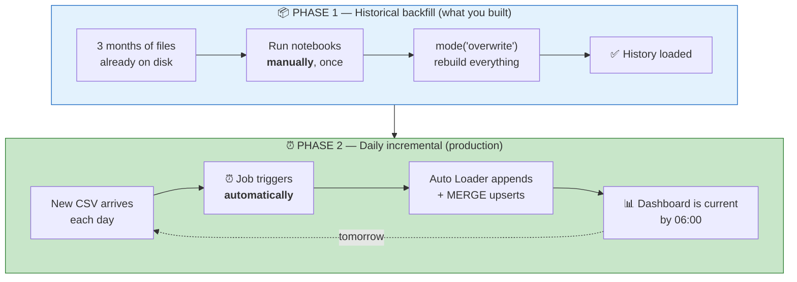
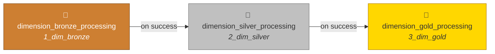
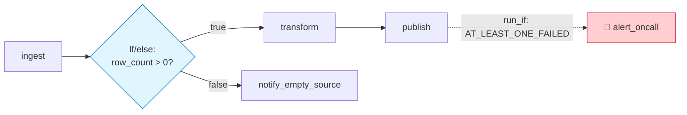
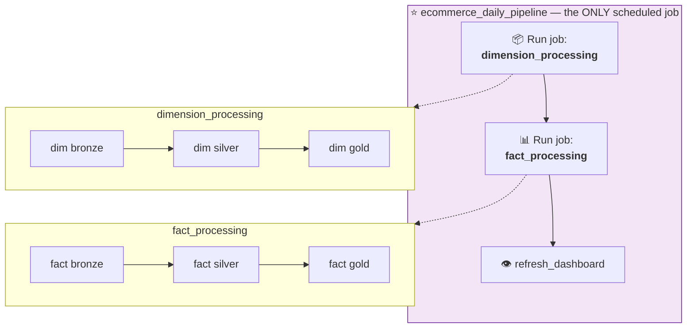
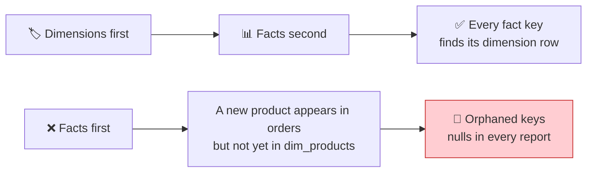
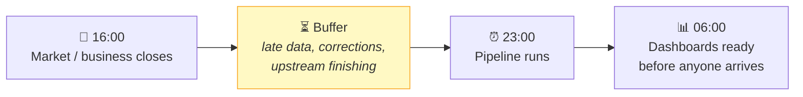
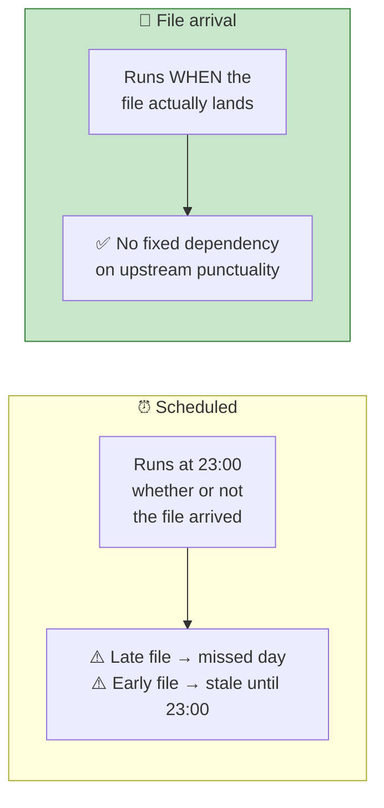
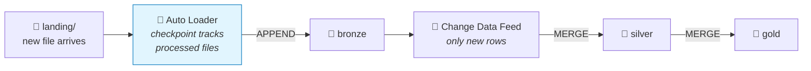

# Part 28 — 🧪 Orchestration: Jobs, Workflows & Scheduling

> **Section goal:** Turn eight notebooks you've been running by hand into an automated, scheduled, monitored pipeline. You'll build a task DAG, wire dependencies, set a cron schedule, and understand the crucial distinction between the *historical backfill* you built and the *daily incremental* pipeline production actually needs.

Covers transcript `03:28:29` – `03:33:41`.

---

## 1. The distinction that frames everything

> *"In the end, let's quickly talk about **orchestration**. See, in our project, whatever we did is a **historical backfill**. When you start working on a data engineering project you might have some historical data — so we had this **last three months of data** which we backfilled by running those notebooks **manually**."*

> *"But the **second phase**, once your data engineering infrastructure is set up, is **daily incremental updates**. Now, we did not cover this in this project, but usually what happens is: now, let's say **sales transactions are happening on a day-to-day basis**, those transactions will keep on coming. Remember our `order_items` table — **that table will have new and new CSV files coming in every day**. And we need to set up some **automated processing**, so whenever new data comes in it will go through this **entire pipeline all the way till your dashboard**."*



> *"Now once again, folks, whatever I'm showing you right now is **valid for daily incremental update**. What we did in this project so far is **historical backfill** — so we have notebooks only for historical backfill. So let's **assume** that we have done coding for daily incremental update and we have those notebooks. **We did not do it, but we are assuming it.**"*

| | 📦 **Backfill** | ⏰ **Incremental** |
|---|---|---|
| Runs | Once (or after a logic fix) | Every day |
| Reads | Everything | Only new files |
| Write mode | `overwrite` | `append` + `MERGE` |
| Idempotent via | Overwrite | Checkpoint + merge key |
| Runtime | Grows with history | Constant |
| Triggered by | A human | A schedule or file arrival |

> 💡 **Keep both.** The backfill notebooks aren't throwaway — you re-run them whenever you fix transformation logic and need to reprocess history. Production teams maintain both paths deliberately.

---

## 2. Create your first job

> *"And for that you will use the feature of these **job runs**. So the way you will do it is: you go to **Job Runs**, you **create a job**, and here you will run your notebook."*

| # | Action |
|---|--------|
| 1 | Left nav → **`Jobs & Pipelines`** (older UI: **`Workflows`** → **`Job runs`**) |
| 2 | **`Create`** → **`Job`** |
| 3 | Name it (top-left): **`dimension_processing`** |

### 🔍 Plain-English deep-dive: job vs task vs run

- **Job** — *a named, schedulable unit of work.* **Analogy:** a **recipe**.
- **Task** — *one step inside a job.* **Analogy:** one **instruction** in the recipe.
- **Run** — *one execution of a job on a particular occasion.* **Analogy:** **cooking it on Tuesday**.
- **DAG (Directed Acyclic Graph)** — *the dependency graph between tasks.* **Directed** = arrows have direction; **Acyclic** = no loops, so it always terminates.

---

## 3. Task 1 — dimensions to bronze

> *"In that case you will create this different task. So let's say this particular task is of **type notebook**. Then the **source** is going to be **workspace**, and the **path** is going to be in `project_ecommerce` — let's say you have **dim processing**, right, dimension processing for bronze, and this is the notebook `1_dim_bronze`, the notebook that will do dimension data processing for bronze layer. OK, you will **select your compute**, you will **add any parameters** that you want to add, and then you will say **create a task**."*

| Field | Value |
|-------|-------|
| **Task name** | `dimension_bronze_processing` |
| **Type** | `Notebook` |
| **Source** | `Workspace` *(or `Git provider` — see §9)* |
| **Path** | `/project_ecommerce/medallion_processing_dim/1_dim_bronze` |
| **Compute** | Serverless, or a **Job cluster** |
| **Parameters** | `catalog` = `ecommerce` |
| **Retries** | `2`, with a 5-minute interval |
| **Timeout** | `1800` seconds |

Click **`Create task`**.

### ⚠️ Compute choice — the biggest cost lever in the platform

| Option | DBU rate | When |
|--------|----------|------|
| **Serverless** | Bundled, no idle cost | ⭐ Default for scheduled work; starts in seconds |
| **Job compute** *(a new cluster per run)* | 💲 **Lowest** classic rate | Long or heavy jobs; terminates automatically |
| **All-purpose compute** | 💲💲💲 **Highest** | ❌ **Never** for scheduled jobs |

> ⚠️ **Attaching a scheduled job to All-Purpose Compute is the single most common cost mistake on Databricks.** Identical work, materially higher DBU rate, plus you're keeping an interactive cluster alive. Use Jobs Compute or serverless. This is a genuine interview answer to "how would you reduce a Databricks bill?"

### Parameters — how one notebook serves dev and prod

The notebooks in Parts 21–25 each begin with:

```python
dbutils.widgets.text("catalog", "ecommerce", "Target catalog")
catalog_name = dbutils.widgets.get("catalog")
```

The job supplies the value, so the **same code** promotes cleanly between environments:

| Job | `catalog` parameter |
|-----|---------------------|
| `dimension_processing_dev` | `dev_ecommerce` |
| `dimension_processing_prod` | `prod_ecommerce` |

**Useful built-in parameter values:**

```
{{job.id}}              {{run_id}}           {{start_date}}
{{job.run_id}}          {{task.name}}        {{job.trigger.type}}
```

```python
dbutils.widgets.text("run_date", "{{start_date}}", "Processing date")
```

---

## 4. Tasks 2 and 3 — building the DAG

> *"So when you do that, see, in your **diagram** here… now you got this, then you can say **add a new task** of type notebook here. So **after this step, you will do what?** Well, you will do a **silver processing**, right? So you will say select silver, and the name here is `dim_silver_processing`. **Create a task.**"*

> *"Then you add another task, which is again a notebook, and it is `dim_gold_processing`. And here **this is dependent on this** — see, **this task depends on this**. You can have **branching logic** as well."*

| # | Action |
|---|--------|
| 1 | Click **`+`** below the first task |
| 2 | **Task name:** `dimension_silver_processing` · **Path:** `.../2_dim_silver` |
| 3 | ⭐ **Depends on:** `dimension_bronze_processing` |
| 4 | Repeat for `dimension_gold_processing` → **Depends on:** `dimension_silver_processing` |



> ⭐ **Why the dependency matters:** silver reads from bronze. If they ran in parallel, silver might read a half-written or stale bronze table. The arrow is a **correctness constraint**, not a preference.

### Task types available

| Type | Runs |
|------|------|
| **Notebook** ⭐ | A workspace or Git notebook |
| **Python script** | A `.py` file |
| **Python wheel** | A packaged library entry point |
| **SQL** | A query, dashboard refresh, alert, or file |
| **Pipeline** | A Lakeflow Declarative Pipeline (DLT) |
| **dbt** | A dbt project |
| **JAR / Spark Submit** | Scala/Java |
| **Run job** | ⭐ **Another job** — this is how you build a parent job (§6) |
| **If/else condition** | Branching |
| **For each** | Loop a task over a list |

### Branching and conditional execution

> *"You can have **branching logic** as well."*



**`Run if` conditions** on a downstream task:

| Condition | Runs when |
|-----------|-----------|
| `ALL_SUCCESS` *(default)* | Every dependency succeeded |
| `AT_LEAST_ONE_SUCCESS` | At least one succeeded |
| `NONE_FAILED` | Nothing failed (skipped is fine) |
| `ALL_DONE` | Everything finished, pass or fail — ⭐ for cleanup tasks |
| `AT_LEAST_ONE_FAILED` | ⭐ For an alerting task |
| `ALL_FAILED` | Everything failed |

**Passing values between tasks:**

```python
# Upstream task
dbutils.jobs.taskValues.set(key="rows_loaded", value=183_000)

# Downstream task
n = dbutils.jobs.taskValues.get(taskKey="dimension_bronze_processing",
                                key="rows_loaded", debugValue=0)
```

---

## 5. Name it and see the graph

> *"So now this whole thing is the processing for your **dimension data**. And this job will be called **dimension processing**."*

The Tasks tab now shows a visual DAG. Databricks lays it out automatically — dependencies you declared become arrows.

> 💡 **The DAG *is* your documentation.** A new joiner can understand the pipeline's shape in five seconds without reading a line of code. That's a real argument for splitting notebooks by layer rather than writing one giant one.

---

## 6. The parent job pattern

> *"Right? And then **similarly you will create another job for your fact processing**. And then you can have a **parent job** which will run **both** of these."*



> *"Ideally what you do is: **this is the pipeline for dimension processing**, you will create another pipeline for **fact processing**, and you will have a **parent job which will process both** dimension and fact — and **you will do scheduling on that. You will not do scheduling on this one.**"*

> ⭐ **That last sentence is the whole pattern, and it's a genuinely good design instinct.** Schedule **only the parent**. If you scheduled the child jobs independently, fact processing could start before dimension processing finished — and the fact-to-dimension joins would silently produce nulls or orphans.

### Why dimensions before facts



**Load order rule: dimensions before facts, always.** A new product can appear in today's orders before it appears in the products extract; loading dimensions first minimises that window. It's the same reasoning as the referential-integrity gate in Part 24 §5.

**Building the parent job:**

| # | Action |
|---|--------|
| 1 | Create a new job: **`ecommerce_daily_pipeline`** |
| 2 | Add a task → **Type: `Run job`** → select **`dimension_processing`** |
| 3 | Add a task → **Type: `Run job`** → select **`fact_processing`** → **Depends on** the first |
| 4 | Add a task → **Type: `SQL`** → dashboard refresh → **Depends on** the second |
| 5 | Schedule **this job only** |

---

## 7. Scheduling and triggers

> *"And then you can **set a trigger**. So see, in the **schedule and trigger**, you can say **add trigger**, and you can say **Scheduled** or **on file arrival**."*

### The trigger types

| Trigger | Fires when | Best for |
|---------|-----------|----------|
| **Scheduled (cron)** ⭐ | At a fixed time | Predictable daily batch |
| **File arrival** ⭐ | A new file lands in a location | Event-driven, no fixed SLA on upstream |
| **Continuous** | Restarts as soon as it finishes | Near-real-time streaming |
| **Table update** | A monitored table changes | Chained downstream pipelines |
| **Manual** | Someone clicks Run now | Backfills, ad-hoc reprocessing |

### Set the schedule

> *"Let's say you are saying **Scheduled** — every day, let's say you want to run it **every day**, add, for example, **11pm in the night**, once all my business transactions are done. **11 or 12 o'clock, whatever** — right? And you can **show the cron syntax** as well. **Active**, and say **Save**."*

| # | Action |
|---|--------|
| 1 | Right panel → **`Schedules & Triggers`** → **`Add trigger`** |
| 2 | **Trigger type:** `Scheduled` |
| 3 | **Every:** `1 Day` at **`23:00`** |
| 4 | **Timezone:** ⚠️ set it explicitly |
| 5 | Optionally **`Show cron syntax`** to see/edit the expression |
| 6 | **Status: `Active`** → **`Save`** |

### 🔍 Plain-English deep-dive: cron syntax

```
   0    0   23    *    *     ?
   │    │    │    │    │     │
   │    │    │    │    │     └── day-of-week  (? = unspecified)
   │    │    │    │    └──────── month        (* = every)
   │    │    │    └───────────── day-of-month (* = every)
   │    │    └────────────────── hour         (23 = 11 PM)
   │    └─────────────────────── minute       (0)
   └──────────────────────────── second       (0)
```

| Expression | Meaning |
|-----------|---------|
| `0 0 23 * * ?` | Every day at 23:00 |
| `0 0 6 * * ?` | Every day at 06:00 |
| `0 30 * * * ?` | Every hour, at half past |
| `0 0 23 ? * MON-FRI` | Weekdays only at 23:00 |
| `0 0 1 1 * ?` | 01:00 on the 1st of every month |
| `0 0/15 * * * ?` | Every 15 minutes |

> ⚠️⚠️ **Always set the timezone explicitly.** A job scheduled in UTC that the business believes runs at 23:00 local will be hours off — and it will *shift* twice a year when daylight saving changes, silently breaking an SLA. Choose the business's timezone, and state it in the job description.

### Why 23:00 — the industry pattern

> *"So what people do is — even when I was working at **Bloomberg**, we'll have **stock market data**, and stock market will **close at 4 o'clock**. All the data stops coming. Then after some **buffer** — let's say **5 or 6 o'clock** — you will run this kind of pipeline **every day**."*



> 💡 **The buffer is the professional detail.** Don't schedule for the instant the source *should* be ready — schedule after a margin that absorbs late-arriving data and upstream delays. And work **backwards from the SLA**: dashboards needed by 06:00, pipeline takes 90 minutes, so start no later than 04:00 — 23:00 gives generous headroom for retries.

### File-arrival triggers — often better



| # | Action |
|---|--------|
| 1 | **`Add trigger`** → **`File arrival`** |
| 2 | **Storage location:** `/Volumes/ecommerce/source_data/raw/order_items/landing/` |
| 3 | Optionally set a **minimum time between triggers** to batch bursts |

> ⭐ **Interview:** *"Scheduled or file-arrival trigger?"* → *"File arrival when the upstream delivery time is variable, because it removes the guesswork — you process when data actually lands rather than hoping it beat your cron time, which avoids both the missed-day and the stale-data failure modes. Scheduled when downstream consumers need predictability, or when you must aggregate a whole day regardless of how many files arrived. In practice I often use both: a file-arrival trigger for responsiveness plus a scheduled catch-up run and an alert if no run has occurred by a cutoff, so a *missing* file is detected rather than silently ignored — that's the failure a pure file-arrival trigger can't see."*

---

## 8. Running it — and the operational settings that matter

> *"So now what will happen is: **this pipeline will run at 11 o'clock every day**. So it will do processing for **bronze, silver and gold**… **You can even run it right now** — see, this is a **manual way** of running it. Otherwise you can run it **on a trigger**."*

Click **`Run now`** to test before trusting the schedule.

### Settings the video doesn't cover but production demands

| Setting | Where | Recommendation |
|---------|-------|----------------|
| **Retries** | Per task | 2–3 with exponential backoff — handles transient cloud errors |
| **Timeout** | Per task and per job | Set one. A hung task blocks the next run forever |
| **Max concurrent runs** | Job settings | **1** for medallion pipelines — overlapping runs corrupt state |
| **Email / webhook notifications** | Job settings | On failure **and** on `Duration exceeded` |
| **Health rules** | Job settings | Alert when a run exceeds an expected duration |
| **Tags** | Job settings | `env=prod`, `owner=data-eng`, `cost_center=…` for cost attribution |
| **Permissions** | Job settings | `Can view` for analysts, `Can manage run` for on-call |
| **Run as** | Job settings | ⭐ A **service principal**, never a person |
| **Queue** | Job settings | Enable, so a delayed run queues rather than being skipped |

> ⚠️ **`Run as` a service principal is not optional in a real team.** If a job runs as a named individual, it breaks the day they leave or lose access. Part 5 §4 covers the identity model.

> ⚠️ **Max concurrent runs = 1.** If a run overruns and the next one starts, two processes write the same tables simultaneously. Delta's ACID guarantees prevent *corruption*, but you'll get failed writes and unpredictable results.

### Monitoring

| Where | What it tells you |
|-------|-------------------|
| **Job → Runs** tab | Every historical run, duration, status, per-task timing |
| **Matrix view** | Colour grid of runs × tasks — instantly shows a recurring failure |
| **Task run output** | Notebook output and stack traces |
| **`system.lakeflow.job_run_timeline`** | ⭐ Queryable run history — build a reliability dashboard on it |
| **`system.billing.usage`** | Cost per job via tags |

```sql
-- Build an SLA dashboard on your own pipeline
SELECT job_name, period_start_time, result_state,
       TIMESTAMPDIFF(MINUTE, period_start_time, period_end_time) AS duration_min
FROM   system.lakeflow.job_run_timeline
WHERE  period_start_time >= current_date() - INTERVAL 30 DAYS
ORDER  BY period_start_time DESC;
```

> ⭐ **Meta-point worth making in an interview:** your job history is *itself* a Delta table, so you can build a dashboard on your own pipeline reliability using the exact skills from Part 27.

---

## 9. Git, CI/CD and Databricks Asset Bundles

Clicking through the UI is fine for learning. Production pipelines are defined as **code**.

```yaml
# databricks.yml — a Databricks Asset Bundle
bundle:
  name: ecommerce_pipeline

resources:
  jobs:
    ecommerce_daily_pipeline:
      name: ecommerce_daily_pipeline
      max_concurrent_runs: 1
      tags: { env: "${bundle.target}", owner: "data-engineering" }
      email_notifications:
        on_failure: ["data-eng-oncall@a2z.com"]
      schedule:
        quartz_cron_expression: "0 0 23 * * ?"
        timezone_id: "Asia/Kolkata"
        pause_status: UNPAUSED
      tasks:
        - task_key: dimension_processing
          run_job_task: { job_id: "${resources.jobs.dimension_processing.id}" }
        - task_key: fact_processing
          depends_on: [{ task_key: dimension_processing }]
          run_job_task: { job_id: "${resources.jobs.fact_processing.id}" }

targets:
  dev:
    default: true
    variables: { catalog: dev_ecommerce }
  prod:
    variables: { catalog: prod_ecommerce }
```

```bash
databricks bundle validate
databricks bundle deploy -t dev
databricks bundle run ecommerce_daily_pipeline -t dev
databricks bundle deploy -t prod
```

| Benefit | Why |
|---------|-----|
| **Version controlled** | Job definitions live in Git alongside the notebooks |
| **Reviewable** | A schedule change goes through a pull request |
| **Environment promotion** | One definition, per-target variables |
| **Reproducible** | Rebuild an entire workspace from the repo |
| **CI/CD** | GitHub Actions or Azure Pipelines deploys on merge |

> 💡 **Point a task's Source at `Git provider` instead of `Workspace`** and the job runs the notebook from a specific branch or tag — so what runs in prod is exactly what was reviewed and merged.

---

## 10. The incremental design you'd actually build

The instructor explicitly asks you to *assume* these notebooks exist. Here's what they'd contain.



**Bronze — Auto Loader:**

```python
(spark.readStream.format("cloudFiles")
   .option("cloudFiles.format", "csv")
   .option("cloudFiles.schemaLocation", f"{base}/_schema/order_items")
   .option("header", "true").schema(order_schema)
   .load(landing_path)
   .withColumn("source_file", F.col("_metadata.file_path"))
   .withColumn("ingested_at", F.current_timestamp())
 .writeStream.format("delta")
   .option("checkpointLocation", f"{base}/_checkpoint/order_items")
   .trigger(availableNow=True)          # process new files, then stop
   .toTable(f"{catalog}.bronze.brz_order_items"))
```

**Silver — `MERGE` for idempotency:**

```python
from delta.tables import DeltaTable

target = DeltaTable.forName(spark, f"{catalog}.silver.slv_order_items")

(target.alias("t")
   .merge(df_transformed.alias("s"),
          "t.transaction_id = s.transaction_id AND t.item_seq = s.item_seq")
   .whenMatchedUpdateAll()
   .whenNotMatchedInsertAll()
   .execute())
```

> ⭐ **`MERGE` is what makes the pipeline safe to retry.** Plain `append` duplicates rows if a task is retried after a partial failure. `MERGE` on the business key upserts, so running it twice gives the same result as running it once. **Idempotency is the single most important property of a scheduled pipeline.**

| Requirement | Mechanism |
|-------------|-----------|
| Process only new files | Auto Loader checkpoint |
| Safe to re-run | `MERGE` on the business key |
| Handle late-arriving data | `MERGE` naturally updates existing rows |
| Recover from a bad run | Delta `RESTORE` (Part 7) |
| Reprocess after a logic fix | Re-run the **backfill** notebooks |

---

## 11. The alternative: Lakeflow Declarative Pipelines

For medallion pipelines specifically, there's a declarative option worth knowing.

```python
import dlt

@dlt.table(comment="Raw order items as received")
def brz_order_items():
    return (spark.readStream.format("cloudFiles")
              .option("cloudFiles.format", "csv")
              .load(landing_path))

@dlt.table(comment="Cleaned order items")
@dlt.expect_or_drop("valid_quantity", "quantity > 0")
@dlt.expect_or_fail("valid_currency", "currency IN ('INR','USD','GBP','AUD')")
def slv_order_items():
    return dlt.read_stream("brz_order_items").transform(clean_orders)
```

| | ⚙️ **Jobs + notebooks** *(this project)* | 🌊 **Lakeflow / DLT** |
|---|---|---|
| You define | The *steps* | The *tables* |
| Dependencies | Declared manually | **Inferred** from `dlt.read()` |
| Data quality | Your own assertions | **Built-in expectations** |
| Incremental | You implement it | Managed |
| Lineage | From Unity Catalog | Automatic, visualised |
| Flexibility | ✅ Total | More constrained |
| DBU cost | Standard | Slightly higher |

> 💡 **`@dlt.expect_or_drop` and `@dlt.expect_or_fail` are the productised version of the quality gates you hand-wrote in Parts 22–25.** Same idea, declared instead of coded, with metrics tracked automatically.

---

## 12. ✅ Checkpoint

- [ ] Job `dimension_processing` with 3 chained tasks
- [ ] Job `fact_processing` with 3 chained tasks
- [ ] Parent job `ecommerce_daily_pipeline` using **Run job** tasks
- [ ] Dimensions run **before** facts
- [ ] Only the **parent** is scheduled
- [ ] Cron `0 0 23 * * ?` with an **explicit timezone**
- [ ] Compute is **serverless or Jobs Compute** — never All-Purpose
- [ ] Retries, timeout, `max_concurrent_runs=1`, failure notifications set
- [ ] `Run as` a service principal
- [ ] A successful manual **Run now**

---

## 13. 🚑 Troubleshooting

| Symptom | Cause | Fix |
|---------|-------|-----|
| Job succeeds but tables are unchanged | Wrong notebook path, or it ran against another catalog | Check the task path and the `catalog` parameter |
| `Table or view not found` | Notebook relied on `USE CATALOG` session state | Use fully qualified names + a parameter (Part 20 §4) |
| Downstream task ran too early | Dependency not declared | Set **Depends on** explicitly |
| Job runs at the wrong hour | Timezone not set, or DST shift | Set the timezone explicitly in the trigger |
| Duplicate rows appear daily | `append` without idempotency | `MERGE` on the business key |
| Two runs overlapping | `max_concurrent_runs > 1` | Set it to 1 |
| Job cost is far higher than expected | Attached to All-Purpose Compute | Switch to Jobs Compute or serverless |
| Job breaks when someone leaves | `Run as` a personal account | Change to a service principal |
| A transient failure kills the run | No retries configured | 2–3 retries with backoff |
| Failure noticed days later | No notifications | Email/webhook on failure **and** duration exceeded |
| Fact keys are orphaned | Facts ran before dimensions | Enforce the order in the parent job |

---

## ⭐ Likely Interview Questions for This Section

**Q1. "How would you orchestrate a medallion pipeline on Databricks?"**
> *Model answer:* "One job per subject area with tasks per layer — bronze, silver, gold — chained by explicit dependencies so each layer only starts once its source is complete. Then a parent job using **Run job** tasks that runs dimensions first, facts second, and refreshes downstream artifacts last. Crucially, only the **parent** is scheduled; scheduling the children independently would let facts start before dimensions finish, producing orphaned keys and nulls in reports. Each task runs on Jobs Compute or serverless rather than All-Purpose, takes the target catalog as a parameter so the same code serves dev and prod, and has retries, a timeout and failure notifications. `max_concurrent_runs` is 1, and the job runs as a service principal."

**Q2. "Backfill versus incremental — what changes?"**
> *Model answer:* "Almost everything except the transformation logic. Backfill reads the entire history and uses `overwrite`, which is naturally idempotent and appropriate for a one-off load or a reprocess after a logic fix. Incremental must read only new data, so bronze uses Auto Loader with a checkpoint tracking processed files, and silver and gold use `MERGE` on the business key rather than `append`, because append duplicates rows if a task is retried. Runtime is the practical tell: a backfill pattern run daily gets slower forever and reprocesses data you already have. I'd keep both code paths, because you genuinely need the backfill again whenever transformation logic changes and history must be rebuilt."

**Q3. "Why schedule the parent job rather than each child?"**
> *Model answer:* "Ordering. Facts join to dimensions, so if fact processing ran while dimension processing was still going, a new product could appear in orders before it exists in `dim_products` — the join would silently produce nulls or the row would show as orphaned, and nobody would see an error. A parent job makes the ordering explicit and enforced. It also gives one place to set the schedule, one run history to monitor, one alerting configuration, and one thing to pause during an incident, rather than coordinating several independent schedules and hoping the timings never drift."

**Q4. "Scheduled trigger or file-arrival trigger?"**
> *Model answer:* "File arrival when upstream delivery time is variable, because it eliminates the guesswork — you process when data actually lands, avoiding both failure modes of a fixed schedule: a late file means a missed day, an early file means stale data until the cron fires. Scheduled when downstream consumers need predictability, or when you must aggregate a full day regardless of file count. In practice I often combine them: a file-arrival trigger for responsiveness, plus a scheduled catch-up run and an alert if no run has happened by a cutoff time. That last piece matters because a pure file-arrival trigger cannot detect a file that never arrives — silence looks identical to success."

**Q5. "How do you make a scheduled pipeline safe to retry?"**
> *Model answer:* "Idempotency at every layer — it's the single most important property of scheduled work, because retries *will* happen. Bronze uses Auto Loader with a checkpoint so already-processed files are skipped. Silver and gold use `MERGE` on the business key so re-running upserts rather than inserting duplicates, which also handles late-arriving corrections naturally. Delta's transactional guarantees mean a failed write leaves no partial state, so a retry starts from a clean known version. And `max_concurrent_runs` is 1, so an overrunning run can't collide with the next one. If a bad run does land, Delta `RESTORE` gives a fast rollback to the previous version."

**Q6. "How would you cut the cost of a Databricks job?"**
> *Model answer:* "The biggest single lever is compute type — scheduled work on All-Purpose Compute costs materially more per DBU than Jobs Compute for identical work, and it's the most common mistake I see. Beyond that: serverless for spiky or short jobs so there's no idle cost and no cluster start-up; right-sizing rather than defaulting large, guided by Spark UI evidence on spill and task skew; spot or low-priority VMs for retryable batch; Photon where it cuts runtime enough to offset its higher rate. Then structurally: don't reprocess data you've already handled, which is the incremental-versus-backfill point, and tag jobs so `system.billing.usage` gives per-pipeline attribution — you can't optimise what you can't attribute."

**Q7. "How do you monitor and alert on a pipeline?"**
> *Model answer:* "Three layers. **Job-level**: failure notifications by email or webhook, plus health rules that alert when a run exceeds an expected duration — because a job that takes three times as long is often a warning before it becomes a failure. **Data-level**: the quality gates I built into each notebook as assertions, so a run fails on bad data rather than publishing it, plus logged metrics like row counts and orphan counts so trends are visible. **Historical**: `system.lakeflow.job_run_timeline` is a queryable Delta table, so I build a reliability dashboard on my own pipeline — success rate, duration trend, time-of-day distribution — using exactly the dashboard skills from the rest of the project. The thing I'd specifically add is a *missing run* alert, since a job that never starts produces no failure notification."

**Q8. "Would you define jobs in the UI or as code?"**
> *Model answer:* "UI for exploration, code for anything real. **Databricks Asset Bundles** define jobs in YAML alongside the notebooks in Git, so a schedule change goes through a pull request, environments differ only by target variables, and a whole workspace is reproducible from the repo. It also lets tasks source notebooks from a Git branch or tag rather than the workspace, so what runs in production is exactly what was reviewed and merged — no drift from someone editing a notebook in place. CI/CD then deploys on merge. The UI is still where I'd prototype and debug, but a job definition that exists only as clicks is undocumented, unreviewable and impossible to recreate."

---

## 🧠 30-Second Memory Hooks

- **⭐ Backfill = run once, read everything, `overwrite`. Incremental = daily, Auto Loader + `MERGE`.** Keep **both**.
- **Job = recipe · Task = one instruction · Run = cooking it Tuesday · DAG = the dependency graph.**
- **Task chain per subject area: bronze → silver → gold.** The arrow is a **correctness constraint**, not a preference.
- **⭐ Parent job with "Run job" tasks. SCHEDULE ONLY THE PARENT.**
- **⭐ Dimensions BEFORE facts. Always.** Otherwise orphaned keys and silent nulls.
- **⚠️ NEVER schedule a job on All-Purpose Compute.** Same work, much higher DBU rate. **The #1 cost mistake.**
- **Parameters (`dbutils.widgets`) let ONE notebook serve dev and prod** — pass the catalog in.
- **Cron `0 0 23 * * ?` = daily at 23:00.** ⚠️ **ALWAYS set the timezone** — DST will shift it twice a year.
- **Schedule AFTER a buffer, and work backwards from the SLA.** Market closes 16:00 → run 23:00 → dashboards by 06:00.
- **File-arrival trigger removes cron guesswork** — but it can't detect a file that **never** arrives. Add a catch-up + missing-run alert.
- **⭐ Idempotency is the #1 property of scheduled work.** `MERGE` on the business key, not `append`.
- **`max_concurrent_runs = 1`** for medallion pipelines.
- **`Run as` a SERVICE PRINCIPAL**, never a person — it breaks the day they leave.
- **Set retries, timeout and failure notifications.** A failure nobody hears about is an outage.
- **`system.lakeflow.job_run_timeline` is a Delta table** — build a reliability dashboard on your own pipeline.
- **Asset Bundles = jobs as YAML in Git.** Reviewable, promotable, reproducible.
- **`@dlt.expect_or_drop` is the productised version of the quality gates you hand-wrote.**

---

*Next suggested section:* **[Part 29 — ☁️ Azure Databricks Deep-Dive](Part-29-azure-databricks-deep-dive.md)** — the project is built, scheduled and served. Group H is the extra edge: the full Azure enterprise picture (workspace provisioning, ADLS Gen2, Access Connector, Entra ID, Key Vault, networking, cost), then advanced topics, the 100+ question bank, and behavioral prep.

---

**Navigation** — ⬅️ **[Part 27 — AI/BI Dashboards](Part-27-ai-bi-dashboards.md)** · 🏠 **[Master Index](../Databricks%20-%20Study%20Guide.md)** · ➡️ **[Part 29 — Azure Deep-Dive](Part-29-azure-databricks-deep-dive.md)**
