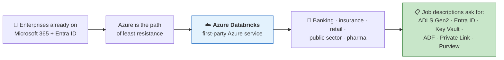
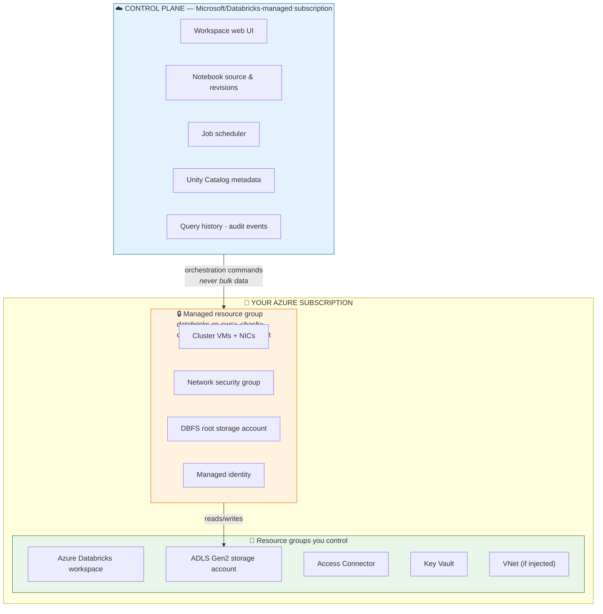
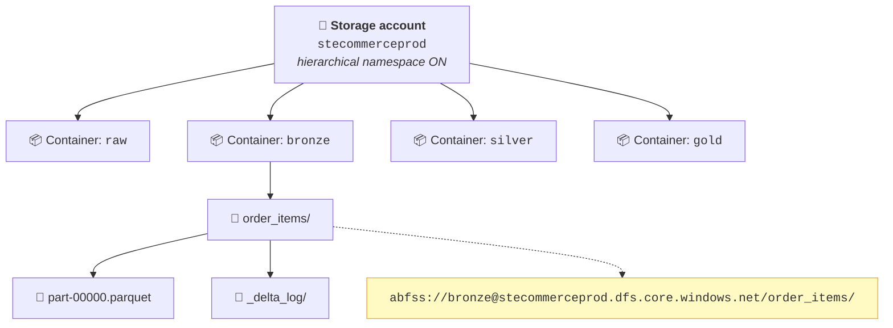
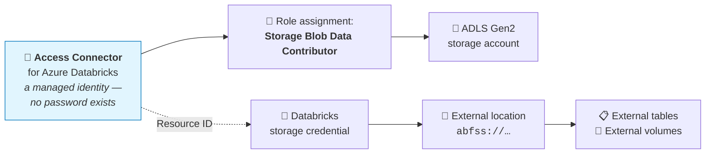
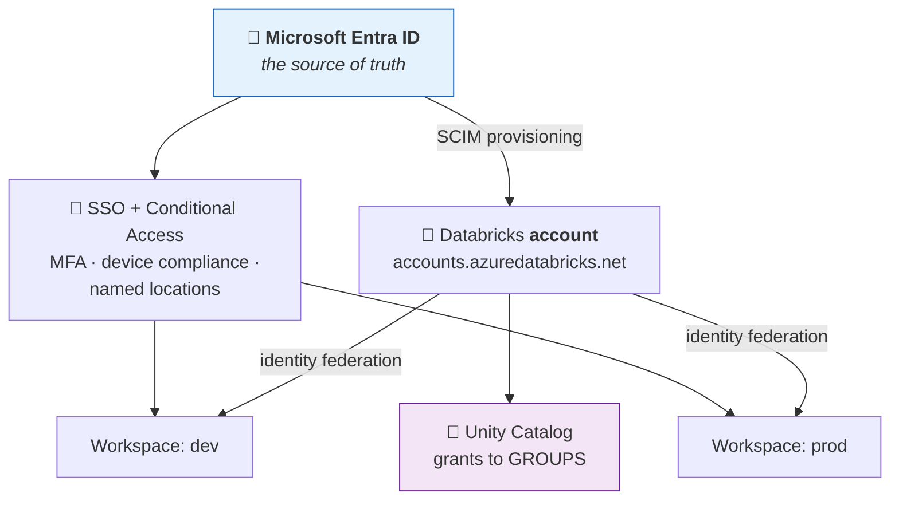
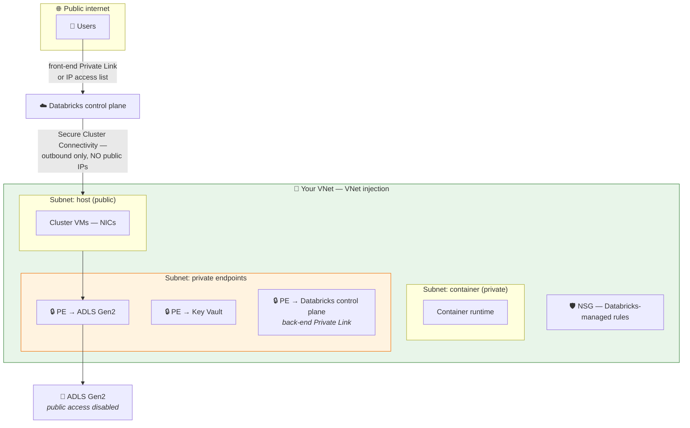
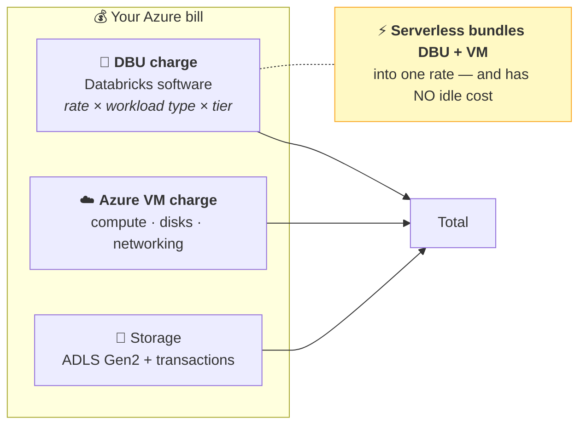
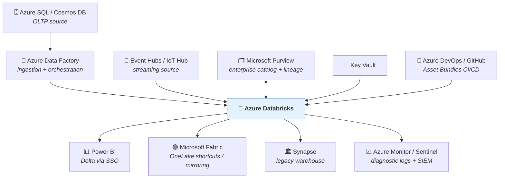
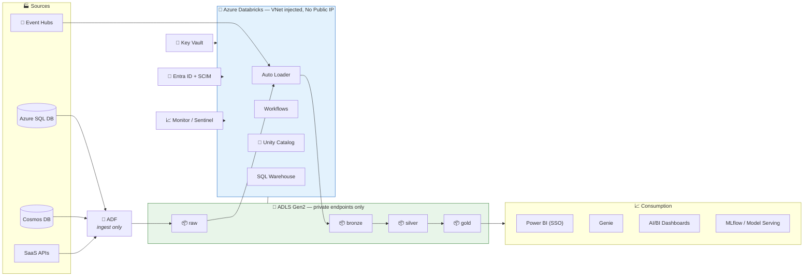

# Part 29 — ☁️ Azure Databricks Deep-Dive

> **Section goal:** Everything the course doesn't cover because it uses Free Edition and AWS. This is the enterprise Azure picture — provisioning, storage, identity, secrets, networking, cost and integrations — and it's disproportionately valuable, because a very large share of enterprise Databricks roles are **Azure** roles.

Not in the transcript. Extends Parts 3, 4, 5, 6 and 19.

---

## 1. Why this Part is worth your time



The Spark and Delta knowledge from Parts 2–28 transfers unchanged. **What differs is the plumbing** — and that plumbing is exactly what enterprise interviews probe, because it's where security reviews and production incidents live.

---

## 2. What "first-party" actually means

**Azure Databricks is jointly engineered by Microsoft and Databricks**, and sold as a native Azure resource. That isn't marketing — it changes six concrete things.

| Aspect | Databricks on AWS | ☁️ **Azure Databricks** |
|--------|-------------------|-------------------------|
| How you create it | Sign up with Databricks; it deploys into your AWS account | **`Microsoft.Databricks/workspaces`** — an Azure resource like a VM |
| Billing | Separate Databricks contract or AWS Marketplace | **On your Azure invoice**; counts toward MACC commitments |
| Identity | Databricks account console + SCIM | **Microsoft Entra ID** — SSO, Conditional Access, Entra groups |
| Support | Databricks | **Microsoft** first-line (single throat to choke) |
| Deployment | Terraform/CloudFormation via Databricks provider | **ARM / Bicep / Terraform `azurerm`** |
| Networking | VPC + PrivateLink | **VNet injection + Azure Private Link + NSGs** |

> ⭐ **Interview:** *"What does first-party mean for Azure Databricks?"* → *"It's a native Azure resource type rather than a third-party SaaS you connect to. Practically: you provision it with ARM, Bicep or Terraform alongside the rest of your estate; it bills to your Azure subscription and counts toward enterprise commitments; identity is Entra ID so you get SSO, Conditional Access and group sync without extra federation; networking uses VNet injection and Private Link like any other Azure service; and Microsoft provides first-line support. That last one matters more than people expect during an incident — you're not triangulating between two vendors."*

---

## 3. The three planes on Azure



### 🔍 Plain-English deep-dive: the managed resource group

Creating a workspace **also creates a second resource group** you didn't ask for, named like `databricks-rg-dbw-learn-abc123xyz`.

- **What's in it:** the cluster VMs, their NICs, an NSG, a storage account holding the DBFS root, and a managed identity.
- **Analogy:** the **plant room** of a building. You use the offices; the plant room is locked and maintained by the building manager.
- **The rules:**

| ❌ Don't | ✅ Do |
|----------|------|
| Rename or move resources inside it | Leave it alone entirely |
| Delete the storage account | Delete it *only* by deleting the workspace |
| Apply your own policies that block its resources | Exclude it from restrictive Azure Policy assignments |
| Store business data in the DBFS root | Use Unity Catalog volumes and external locations |

> ⚠️ **A very common enterprise failure:** an over-restrictive Azure Policy (for example "deny public IPs" or "require a specific NSG") blocks Databricks from creating cluster VMs in its own managed resource group, and clusters silently fail to start. If cluster creation fails with an opaque error on a governed subscription, check Azure Policy assignments first.

---

## 4. 🧪 Provisioning — beyond the basics

Part 4 covered the click-through. Here are the decisions that matter, plus infrastructure-as-code.

### The decisions

| Field | Options | Recommendation |
|-------|---------|----------------|
| **Pricing tier** | Standard · **Premium** · Trial | ⭐ **Premium** — Unity Catalog, RBAC, cluster policies, Conditional Access, IP access lists, audit logs all require it |
| **Region** | Any | ⭐ **Same region as your ADLS Gen2** — cross-region means egress charges and latency |
| **Managed RG name** | Auto or custom | Custom, if your naming standards demand it |
| **Deploy into your own VNet** | No / Yes | **Yes** for anything beyond a lab (§9) |
| **Secure Cluster Connectivity (No Public IP)** | No / Yes | ⭐ **Yes** for production |
| **Customer-managed keys** | Off / On | On if compliance requires |
| **Enhanced security & compliance** | Off / On | On for regulated workloads |

### Bicep

```bicep
param workspaceName string = 'dbw-ecommerce-prod'
param location string = resourceGroup().location

resource dbw 'Microsoft.Databricks/workspaces@2024-05-01' = {
  name: workspaceName
  location: location
  sku: { name: 'premium' }
  properties: {
    managedResourceGroupId: subscriptionResourceId(
      'Microsoft.Resources/resourceGroups', 'databricks-rg-${workspaceName}')
    parameters: {
      enableNoPublicIp:      { value: true }   // Secure Cluster Connectivity
      customVirtualNetworkId:{ value: vnet.id }
      customPublicSubnetName:{ value: 'snet-dbw-host' }
      customPrivateSubnetName:{ value: 'snet-dbw-container' }
    }
  }
  tags: { env: 'prod', owner: 'data-engineering', costCenter: 'CC-1042' }
}
```

### Terraform

```hcl
resource "azurerm_databricks_workspace" "this" {
  name                        = "dbw-ecommerce-prod"
  resource_group_name         = azurerm_resource_group.data.name
  location                    = azurerm_resource_group.data.location
  sku                         = "premium"
  managed_resource_group_name = "databricks-rg-ecommerce-prod"

  custom_parameters {
    no_public_ip                                         = true
    virtual_network_id                                   = azurerm_virtual_network.this.id
    public_subnet_name                                   = azurerm_subnet.host.name
    private_subnet_name                                  = azurerm_subnet.container.name
    public_subnet_network_security_group_association_id  = azurerm_subnet_network_security_group_association.host.id
    private_subnet_network_security_group_association_id = azurerm_subnet_network_security_group_association.container.id
  }

  tags = { env = "prod", owner = "data-engineering" }
}
```

> ⚠️ **VNet injection and No-Public-IP cannot be changed after creation without recreating the workspace.** Decide before you provision. This is the single most common "we have to rebuild it" moment on Azure Databricks.

---

## 5. ADLS Gen2 — the storage layer

### The hierarchy



### Settings that matter

| Setting | Value | Why |
|---------|-------|-----|
| **Hierarchical namespace** | ⭐ **Enabled** | This is what makes it **Gen2**. Real directories, atomic rename, per-directory ACLs. **Cannot be enabled later.** |
| **Performance** | Standard | Premium only for very low-latency small-file workloads |
| **Redundancy** | LRS / ZRS / GRS | LRS for dev; **ZRS** for prod resilience; GRS only if you need cross-region DR |
| **Region** | Same as the workspace | Avoids egress cost and latency |
| **Soft delete (blob + container)** | Enabled, 7–30 days | Recovers accidental deletion. **Delta time travel is not a backup** (Part 7) |
| **Versioning** | Consider off | ⚠️ Blob versioning on a Delta table multiplies storage — Delta already versions logically |
| **Public network access** | Disabled | Use Private Endpoints (§9) |
| **Minimum TLS** | 1.2 | Baseline |

> ⚠️ **Container-per-layer vs directory-per-layer.** Containers give a natural permission boundary and simpler external-location mapping; directories are simpler to browse. Most enterprises use **one container per medallion layer**, which is what the diagram shows.

### 🔍 Plain-English deep-dive: why HNS matters so much

Plain Blob storage has **no real folders** — `bronze/orders/file.parquet` is one long object *name* with slashes in it. Consequences:

| Operation | Flat namespace | Hierarchical namespace |
|-----------|----------------|------------------------|
| List a "folder" | Prefix scan of all objects | ✅ Directory read |
| Rename a "folder" | Copy every object, then delete | ✅ **Atomic** metadata operation |
| Delete a "folder" | Delete each object individually | ✅ Single recursive operation |
| POSIX ACLs | ❌ | ✅ |

**Delta does an enormous amount of listing and renaming.** Without HNS, commits are slow and non-atomic. **ADLS Gen2 = Blob storage + HNS**, and forgetting the tick box is the #1 Azure setup error.

---

## 6. Identity for storage — Access Connector and RBAC

### The evolution (know all three; use only the last)

| Generation | Mechanism | Verdict |
|-----------|-----------|---------|
| 1️⃣ **Storage account key** | A shared secret in a config or notebook | ❌ **Never.** Full account access, no rotation, leaks in notebooks |
| 2️⃣ **Service principal + client secret** | An Entra app registration with a secret in Key Vault | ⚠️ Works, but a secret to store, rotate and eventually leak |
| 3️⃣ **Access Connector (managed identity)** | ⭐ Azure-managed identity, **no secret at all** | ✅ **The current standard** |



### ⚠️ The role that trips everyone up

| Role | Plane | Grants blob data access? |
|------|-------|--------------------------|
| **Owner** / **Contributor** | Control | ❌ **No** — manage the *account*, not its *contents* |
| **Reader** | Control | ❌ No |
| ⭐ **Storage Blob Data Contributor** | **Data** | ✅ **Yes** — read & write blobs |
| **Storage Blob Data Reader** | Data | ✅ Read only |
| **Storage Blob Data Owner** | Data | ✅ Read, write, and set ACLs |

> ⚠️ **`Contributor` is not enough.** It's the most common cause of `403 AuthorizationPermissionMismatch` on Azure Databricks. Control-plane roles manage the storage account; data-plane roles read the data inside it.

> ⚠️ **Role assignments take up to ~5 minutes to propagate.** Wait before debugging anything else.

### The CLI path

```bash
# 1. Create the Access Connector
az databricks access-connector create \
  --resource-group rg-data-prod --name ac-databricks-prod \
  --location westeurope --identity-type SystemAssigned

# 2. Get its principal ID
PRINCIPAL_ID=$(az databricks access-connector show \
  --resource-group rg-data-prod --name ac-databricks-prod \
  --query identity.principalId -o tsv)

# 3. Grant it DATA-plane access on the storage account
az role assignment create \
  --assignee-object-id "$PRINCIPAL_ID" \
  --assignee-principal-type ServicePrincipal \
  --role "Storage Blob Data Contributor" \
  --scope "/subscriptions/<sub>/resourceGroups/rg-data-prod/providers/Microsoft.Storage/storageAccounts/stecommerceprod"
```

Then in Databricks (Part 6 §9): **storage credential** → **external location** → grants.

```sql
GRANT READ FILES, WRITE FILES, CREATE EXTERNAL TABLE
  ON EXTERNAL LOCATION `ext-bronze` TO `data_engineers`;
GRANT READ FILES ON EXTERNAL LOCATION `ext-gold` TO `data_analysts`;
```

---

## 7. Entra ID — identity and access



### 🔍 Plain-English deep-dive: SCIM and identity federation

- **SCIM** *(System for Cross-domain Identity Management)* — *an open standard for syncing users and groups from an identity provider into an application.* **Analogy:** the HR system automatically updating every door-badge group when someone joins, moves or leaves. **Why it matters:** you manage membership **once** in Entra, and Databricks follows — including deprovisioning, which is what auditors actually test.
- **Identity federation** — *defining users and groups once at the **account** level, then assigning them to individual workspaces.* One company ID card that works in every building.

### Setting it up

| # | Where | Action |
|---|-------|--------|
| 1 | `accounts.azuredatabricks.net` | Sign in as an **Account Admin** |
| 2 | **Settings** → **User provisioning** | Generate a **SCIM token** and copy the SCIM URL |
| 3 | Azure Portal → **Entra ID** → **Enterprise applications** | Find/create the **Azure Databricks SCIM Provisioning Connector** |
| 4 | **Provisioning** → **Automatic** | Paste the tenant URL and token → **Test connection** |
| 5 | **Users and groups** | Assign the Entra groups to sync |
| 6 | **Provisioning** → **Start** | Initial sync (can take ~40 minutes) |

### The recommended group model

| Entra group | Databricks grants |
|-------------|-------------------|
| `sg-databricks-admins` | Account admin, metastore admin |
| `sg-data-engineers` | `MODIFY` on bronze/silver/gold; `CREATE` on schemas |
| `sg-data-analysts` | `SELECT` on `gold` only |
| `sg-ml-engineers` | `SELECT` on gold; `CREATE MODEL` |
| `spn-etl-prod` *(service principal)* | Runs all production jobs |

> ⭐ **Never grant to individuals; never run jobs as a person.** Part 5 §4 and Part 28 §8. On Azure the natural implementation is Entra groups synced by SCIM, plus an Entra service principal for automation.

### Conditional Access — a genuine Azure advantage

Because authentication goes through Entra ID, you can apply organisation-wide policies to Databricks:

- Require **MFA** for workspace access
- Require a **compliant/managed device**
- Block access from outside **named locations** (countries, IP ranges)
- Require **phishing-resistant authentication** for admins

> 💡 **This is often the deciding argument in a security review.** The same policy set already protecting Microsoft 365 extends to the data platform with no extra tooling.

---

## 8. Secrets — Key Vault-backed scopes

Never hardcode a credential in a notebook. Databricks provides **secret scopes**; on Azure, back them with **Key Vault**.

| | Databricks-backed scope | ⭐ **Key Vault-backed scope** |
|---|---|---|
| Stored in | Databricks control plane | **Your Azure Key Vault** |
| Managed with | Databricks CLI/API | Azure Portal, CLI, Bicep, Terraform |
| Rotation | Manual, via Databricks | Key Vault rotation policies |
| Audit | Databricks audit logs | ✅ Key Vault + Azure Monitor |
| Access policy | Databricks ACLs | RBAC/access policies **+** Databricks ACLs |

### Create one

```
https://<your-workspace-url>/#secrets/createScope
```

| Field | Value |
|-------|-------|
| **Scope name** | `kv-ecommerce` |
| **Manage principal** | `Creator` (Premium) or `All users` |
| **DNS name** | `https://kv-ecommerce-prod.vault.azure.net/` |
| **Resource ID** | `/subscriptions/<sub>/resourceGroups/rg-data-prod/providers/Microsoft.KeyVault/vaults/kv-ecommerce-prod` |

### Use it

```python
api_key = dbutils.secrets.get(scope="kv-ecommerce", key="fx-api-key")

# Redaction is automatic — this prints [REDACTED]
print(api_key)

dbutils.secrets.listScopes()
dbutils.secrets.list("kv-ecommerce")
```

> 💡 **The FX API from Part 25 §2.3 is the natural use case.** In production the currency-rates API key lives in Key Vault, is fetched by scope at runtime, and never appears in the notebook, in Git, or in job output.

> ⚠️ **Redaction is not a security boundary.** Databricks masks a secret printed directly, but `print(api_key[0:5])` or writing it to a table defeats that. Treat redaction as a safety net, not a control.

> ⚠️ **The Databricks workspace identity needs `Get` and `List` on the Key Vault** (an access policy, or the `Key Vault Secrets User` RBAC role). Missing this is the usual cause of a scope that creates fine but returns nothing.

---

## 9. Networking

The area security teams care most about — and the area most likely to appear in an Azure interview.



### The four controls

| Control | What it does | Set at |
|---------|--------------|--------|
| **VNet injection** | Cluster VMs land in **your** VNet with **your** subnets, NSGs, routes and firewall | ⚠️ Workspace creation only |
| **Secure Cluster Connectivity (No Public IP)** | Cluster nodes get **no public IP**; the control-plane connection is outbound-initiated | ⚠️ Workspace creation only |
| **Private Link — back-end** | Compute plane reaches the control plane over the Microsoft backbone, not the internet | Post-creation |
| **Private Link — front-end** | **Users** reach the workspace UI/API privately | Post-creation |

### 🔍 Plain-English deep-dive: Secure Cluster Connectivity

Without SCC, each cluster VM has a **public IP** and the control plane connects *inbound* to it — meaning inbound rules must exist.

With SCC, the VM opens an **outbound** tunnel to the control plane and commands flow back through it.

**Analogy:** instead of leaving your front door unlocked so the office can walk in, **you phone the office** and keep the line open. No inbound door exists at all.

> ⭐ **This is usually the single question that unblocks a security review.** *"Do cluster nodes have public IPs?"* → *"No. We use Secure Cluster Connectivity, so nodes have no public IP and the control-plane channel is outbound-initiated from inside our VNet."*

### Other network controls

| Control | Purpose |
|---------|---------|
| **IP access lists** | Restrict workspace access to corporate IP ranges (Premium) |
| **NSGs** | Databricks manages required rules; you add restrictions |
| **UDR + Azure Firewall / NVA** | Force egress through inspection — needs allowlisted Databricks endpoints |
| **Storage firewall** | ADLS public access disabled; reachable only via Private Endpoint or trusted service |
| **Service endpoints** | A lighter-weight alternative to Private Endpoints |

> ⚠️ **Locking down egress breaks things if you're careless.** Clusters must reach the control plane, the artifact/repository endpoints, the metastore and any package repositories (`pypi.org`, Maven). If you force all traffic through a firewall, allowlist Databricks' documented FQDNs for your region or clusters will hang in "Pending" and time out.

---

## 10. Encryption and compliance

| Control | What it protects | Notes |
|---------|------------------|-------|
| **Encryption at rest** (default) | All Azure storage | Microsoft-managed keys, always on |
| **Customer-managed keys — managed services** | Notebooks, secrets, query results in the control plane | Premium; Key Vault |
| **Customer-managed keys — workspace storage** | DBFS root and managed disks | Premium; Key Vault |
| **Infrastructure encryption** | A second encryption layer | For the most regulated workloads |
| **Encryption in transit** | All traffic | TLS 1.2+ |
| **Enhanced Security & Compliance add-on** | Hardened images, compliance profiles (HIPAA, PCI-DSS) | Extra cost |
| **Audit logs** | Every workspace action | Diagnostic settings → Log Analytics / Storage / Event Hub |

```bash
# Ship Databricks audit logs to Log Analytics
az monitor diagnostic-settings create \
  --name dbw-diagnostics \
  --resource "/subscriptions/<sub>/resourceGroups/rg-data-prod/providers/Microsoft.Databricks/workspaces/dbw-ecommerce-prod" \
  --workspace "/subscriptions/<sub>/resourceGroups/rg-monitor/providers/Microsoft.OperationalInsights/workspaces/law-central" \
  --logs '[{"category":"accounts","enabled":true},{"category":"clusters","enabled":true},{"category":"notebook","enabled":true},{"category":"jobs","enabled":true},{"category":"unityCatalog","enabled":true}]'
```

> 💡 **Two audit paths, and you want both:** `system.access.audit` inside Unity Catalog (queryable with SQL — Part 5 §9) *and* Azure Monitor diagnostic logs (integrates with your SIEM, e.g. Microsoft Sentinel). Security teams normally require the second.

---

## 11. Cost management

### The model



### The levers, ranked by impact

| # | Lever | Typical saving |
|---|-------|----------------|
| 1 | ⭐ **Jobs Compute (or serverless), never All-Purpose, for scheduled work** | Large — same work, much lower DBU rate |
| 2 | ⭐ **Auto-termination on every interactive cluster** (10–20 min) | Large — eliminates idle VM spend |
| 3 | **Spot / low-priority VMs for retryable batch** | Up to ~80% on VM cost |
| 4 | **Azure Reservations or Savings Plans** for steady baseline VMs | ~30–60% |
| 5 | **Right-size from Spark UI evidence**, not by default-large | Varies |
| 6 | **Photon where it shortens runtime enough** | Net positive when runtime drops materially |
| 7 | **Incremental, not full reprocessing** (Part 28) | Grows over time |
| 8 | **Cluster policies** to cap what anyone can create | Prevents the worst outliers |
| 9 | **Tags + budgets + alerts** | Enables everything else |

### Cluster policies — guardrails as code

```json
{
  "spark_version":            { "type": "regex", "pattern": ".*-LTS.*" },
  "node_type_id":             { "type": "allowlist",
                                "values": ["Standard_D4ds_v5", "Standard_D8ds_v5"] },
  "autotermination_minutes":  { "type": "range", "minValue": 10, "maxValue": 60,
                                "defaultValue": 20 },
  "num_workers":              { "type": "range", "minValue": 1, "maxValue": 8 },
  "azure_attributes.availability": { "type": "fixed",
                                     "value": "SPOT_WITH_FALLBACK_AZURE" },
  "custom_tags.cost_center":  { "type": "fixed", "value": "CC-1042" },
  "custom_tags.env":          { "type": "fixed", "value": "prod" }
}
```

Attach the policy to a group and nobody can create a 64-node cluster with no auto-termination.

### Attribution

```sql
-- Cost by SKU over 30 days, from Unity Catalog system tables
SELECT usage_date, sku_name, ROUND(SUM(usage_quantity), 2) AS dbus
FROM   system.billing.usage
WHERE  usage_date >= current_date() - INTERVAL 30 DAYS
GROUP  BY usage_date, sku_name
ORDER  BY usage_date DESC;

-- Cost by team, using cluster tags
SELECT custom_tags.cost_center, custom_tags.env,
       ROUND(SUM(usage_quantity), 2) AS dbus
FROM   system.billing.usage
WHERE  usage_date >= current_date() - INTERVAL 30 DAYS
GROUP  BY 1, 2 ORDER BY dbus DESC;
```

Set a budget: **Azure Portal → Cost Management + Billing → Budgets → + Add** with alerts at 50%, 80% and 100%.

> ⭐ **Interview:** *"How would you control Databricks spend on Azure?"* → *"Governance first, then tuning. Cluster policies so nobody can create an oversized cluster without auto-termination, with mandatory cost-centre tags enforced by the policy. Route scheduled work to Jobs Compute or serverless — All-Purpose for pipelines is the biggest avoidable overspend I see. Spot with fallback for retryable batch, and Azure Reservations for the steady baseline. Then attribution: `system.billing.usage` joined to tags gives cost per team and per pipeline, which is what makes the conversation data-driven rather than a blanket 'reduce spend' mandate. And Azure budgets with alerts as the backstop. The point I'd emphasise is that you can't optimise what you can't attribute, so tagging comes before tuning."*

---

## 12. The Azure integration ecosystem



| Service | How it's used | Watch out for |
|---------|---------------|---------------|
| **Azure Data Factory** | Copy from 100+ sources into ADLS; trigger Databricks notebook activities | ⚠️ Don't spread *transformation* across ADF Data Flows **and** Databricks (Part 19 §4) |
| **Power BI** | DirectQuery or Import over Delta; Partner Connect sets it up | Use **Entra SSO** so Unity Catalog row filters apply per user |
| **Microsoft Fabric** | OneLake shortcuts or mirroring read Delta directly | Both are Delta-based — keep storage open and the choice stays reversible |
| **Microsoft Purview** | Enterprise-wide catalog and lineage across Azure | Complements Unity Catalog; Purview is estate-wide, UC is Databricks-native |
| **Event Hubs / IoT Hub** | Kafka-compatible streaming source for Structured Streaming | Checkpoint to ADLS |
| **Azure Monitor / Sentinel** | Diagnostic logs, alerting, SIEM | Enable diagnostic settings explicitly — off by default |
| **Azure DevOps / GitHub** | Git folders + Asset Bundle deployment | Service principal for the deployment identity |

### Calling Databricks from ADF

| # | Action |
|---|--------|
| 1 | ADF Studio → **Manage** → **Linked services** → **+ New** → **Azure Databricks** |
| 2 | **Authentication:** ⭐ **Managed identity** (not an access token) |
| 3 | Choose **Existing interactive cluster**, **New job cluster** (⭐ cheaper), or **Existing instance pool** |
| 4 | Pipeline → drag a **Notebook** activity → set the path and base parameters |

> 💡 **The clean division of labour:** ADF for **ingestion and cross-system orchestration** (its connector catalogue is unmatched), Databricks for **all transformation**. The anti-pattern is transformation logic living in both.

---

## 13. ☁️ Azure-specific gotchas

| Gotcha | Symptom | Fix |
|--------|---------|-----|
| **HNS not enabled** | `Filesystem not found`, odd path errors | Recreate the storage account — **cannot be enabled retrospectively** |
| **`Contributor` instead of `Storage Blob Data Contributor`** | `403 AuthorizationPermissionMismatch` | Assign the **data-plane** role |
| **Role assignment not propagated** | Intermittent 403 right after setup | Wait ~5 minutes |
| **vCPU quota too low** | Cluster creation fails on a new subscription | Subscription → **Usage + quotas** → request an increase |
| **VNet injection decided too late** | Can't enable it | ⚠️ Recreate the workspace |
| **Azure Policy blocks the managed RG** | Clusters stuck in Pending | Exclude the managed resource group from restrictive policies |
| **Egress firewall without allowlists** | Clusters hang, then time out | Allowlist Databricks FQDNs for the region |
| **Storage in a different region** | Slow jobs, unexpected egress charges | Co-locate storage and workspace |
| **Key Vault access not granted to Databricks** | Scope exists but returns nothing | Grant `Get` + `List` (or `Key Vault Secrets User`) |
| **`wasbs://` in an old tutorial** | Doesn't work with Gen2 features | Use **`abfss://`** |
| **Blob versioning on Delta tables** | Storage cost explodes | Delta versions logically — usually disable blob versioning |
| **Trial tier assumed free** | Unexpected VM charges | Trial waives **DBUs**, not **VMs**. Auto-terminate. |

---

## 14. Reference architecture



---

## 15. ✅ Azure readiness checklist

**Provisioning**
- [ ] **Premium** tier
- [ ] Workspace and storage in the **same region**
- [ ] VNet injection + **No Public IP** *(decided before creation)*
- [ ] Managed resource group excluded from restrictive Azure Policy
- [ ] Tags: `env`, `owner`, `costCenter`

**Storage**
- [ ] **Hierarchical namespace enabled**
- [ ] Container per medallion layer
- [ ] Public network access disabled; Private Endpoint configured
- [ ] Soft delete enabled; blob versioning considered

**Identity**
- [ ] Access Connector with **Storage Blob Data Contributor**
- [ ] Storage credentials + external locations created and tested
- [ ] Entra groups synced by **SCIM**
- [ ] Grants to **groups only**
- [ ] Jobs run as a **service principal**
- [ ] Conditional Access requiring MFA

**Secrets**
- [ ] Key Vault-backed secret scope
- [ ] Databricks granted `Get`/`List` on the vault
- [ ] Zero credentials in notebooks

**Cost**
- [ ] Cluster policies enforcing auto-termination and node types
- [ ] Scheduled jobs on **Jobs Compute or serverless**
- [ ] Spot with fallback for batch
- [ ] Azure budget with alerts
- [ ] Tag-based attribution queries working

**Operations**
- [ ] Diagnostic settings → Log Analytics
- [ ] Asset Bundles in Git with CI/CD
- [ ] Job failure notifications configured

---

## ⭐ Likely Interview Questions for This Section

**Q1. "How do you set up secure access from Azure Databricks to ADLS Gen2?"**
> *Model answer:* "Storage account with **hierarchical namespace enabled** — that's what makes it Gen2 and it can't be turned on later — in the same region as the workspace, with public network access disabled and a Private Endpoint. Then an **Access Connector for Azure Databricks**, which is a managed identity so there's no secret to store or rotate, granted **Storage Blob Data Contributor** on the storage account. That role is the classic mistake: `Contributor` is control-plane and manages the account without granting access to the data inside it. In Databricks, a **storage credential** referencing the connector's resource ID, then an **external location** binding it to an `abfss://` path, then grants on the external location to groups rather than individuals. The older patterns — account keys or a service principal with a client secret — both mean a credential someone has to protect and rotate."

**Q2. "What is Secure Cluster Connectivity and why does it matter?"**
> *Model answer:* "With SCC, cluster nodes have **no public IP** and the connection to the Databricks control plane is **outbound-initiated** from inside your VNet, so no inbound rules are needed at all. Without it, each VM has a public IP and the control plane connects inbound. The analogy I use is that instead of leaving your front door unlocked so head office can walk in, you phone head office and keep the line open. It matters because 'do your compute nodes have public IPs?' is usually the first question in an Azure security review, and it's a hard no with SCC. The catch is that it must be enabled at workspace creation along with VNet injection — neither can be changed afterwards without recreating the workspace, so it's a day-one decision."

**Q3. "How do you manage identity and access on Azure Databricks?"**
> *Model answer:* "Entra ID as the single source of truth. Users and groups sync into the Databricks **account** via SCIM provisioning, so membership is managed once in Entra including deprovisioning, which is what auditors actually test. Identity federation then assigns those account-level groups to individual workspaces. Unity Catalog grants go to **groups only** — never individuals — and production jobs run as an **Entra service principal**, never a person's account, because otherwise the pipeline breaks the day they leave. The real Azure advantage is Conditional Access: because auth goes through Entra, the same MFA, device-compliance and named-location policies protecting Microsoft 365 automatically extend to the data platform with no extra tooling. That's frequently what closes out a security review."

**Q4. "How do you handle secrets?"**
> *Model answer:* "Key Vault-backed secret scopes. The scope is a pointer to an Azure Key Vault, so secrets live and rotate in Key Vault with its own RBAC and audit trail, and notebooks fetch them at runtime with `dbutils.secrets.get`. Nothing is hardcoded, nothing reaches Git, and job output is redacted automatically. Two caveats I'd flag: the Databricks workspace identity needs `Get` and `List` on the vault or the scope creates fine but returns nothing, which is a confusing failure; and redaction is a safety net rather than a security boundary, since printing a substring or writing a secret to a table defeats it. Better still is avoiding secrets entirely where possible — the Access Connector managed identity means storage access has no credential at all."

**Q5. "How do you reduce Databricks cost on Azure?"**
> *Model answer:* "Governance first, then tuning, because you can't optimise what you can't attribute. **Cluster policies** cap node types and worker counts, enforce auto-termination, and mandate cost-centre tags. Then route scheduled work to **Jobs Compute or serverless** — running pipelines on All-Purpose Compute is the largest avoidable overspend I see, since it's the same work at a materially higher DBU rate. **Spot with fallback** for retryable batch, and **Azure Reservations or Savings Plans** for the steady baseline VM footprint. Then measurement: `system.billing.usage` joined to cluster tags gives cost per team and per pipeline, so the conversation becomes specific rather than a blanket mandate. Azure budgets with alerts as the backstop. And structurally, moving from full reprocessing to incremental with Auto Loader stops cost growing with history."

**Q6. "Azure Databricks or Microsoft Fabric?"**
> *Model answer:* "It depends on the workload's centre of gravity, and they aren't mutually exclusive. Fabric is compelling when the organisation is heavily Microsoft-centric with Power BI everywhere, the workload is predominantly BI over structured data, and simple capacity-based licensing matters. Databricks is stronger for substantial custom engineering, streaming, large-scale Spark and ML — it's more mature and gives far more control. The important architectural point is that **both build on Delta and Parquet**, so if you keep storage in open format the decision stays reversible: OneLake shortcuts and mirroring can read Databricks-managed Delta directly, and Power BI can query Databricks over SSO. I'd make 'keep the storage format open' an explicit principle so this never becomes a one-way door."

**Q7. "Walk me through provisioning a production Azure Databricks workspace."**
> *Model answer:* "As infrastructure-as-code — Bicep or Terraform — not portal clicks, so it's reviewable and reproducible. Premium tier, because Unity Catalog, RBAC, cluster policies and IP access lists all require it. Same region as the ADLS Gen2 account. VNet injection with dedicated host and container subnets delegated to Databricks, plus No Public IP for Secure Cluster Connectivity — both are creation-time-only decisions, which is the thing to get right first time. Then Private Endpoints for storage and Key Vault with public access disabled, diagnostic settings shipping audit logs to Log Analytics, customer-managed keys if compliance requires, and consistent tags for cost attribution. Afterwards: Unity Catalog metastore, Access Connector and external locations, SCIM sync, cluster policies, and Asset Bundle CI/CD. And I'd make sure the managed resource group is excluded from restrictive Azure Policy assignments, because that's a common cause of clusters mysteriously failing to start on governed subscriptions."

---

## 🧠 30-Second Memory Hooks

- **First-party = a real Azure resource:** ARM/Bicep/Terraform · your Azure invoice · Entra ID · Microsoft support.
- **Three planes:** control plane (Databricks-managed) · compute plane (**your** VNet) · storage (**always yours**).
- **The managed resource group is the plant room.** Don't touch it. ⚠️ Restrictive Azure Policy on it = clusters won't start.
- **⚠️⚠️ Hierarchical namespace ON = ADLS Gen2. Cannot be enabled later.**
- **⚠️⚠️ `Storage Blob Data Contributor`, NOT `Contributor`.** Data plane vs control plane. The #1 cause of `403`.
- **Access Connector = a managed identity = NO SECRET EXISTS.** Beats account keys and SP secrets.
- **`abfss://container@account.dfs.core.windows.net/path`** — memorise the shape. Never `wasbs://`.
- **Entra ID → SCIM → Databricks account → workspaces.** Grant to **groups**; run jobs as a **service principal**.
- **Conditional Access is the Azure superpower** — MFA, device compliance and named locations extend to Databricks for free.
- **Key Vault-backed secret scopes.** ⚠️ Databricks needs `Get` + `List` on the vault. Redaction ≠ security.
- **⚠️ VNet injection and No-Public-IP are CREATION-TIME ONLY.** Get them right or rebuild.
- **Secure Cluster Connectivity = you phone the office; no inbound door exists.**
- **Cost = DBU + VM (classic), bundled (serverless).** Levers: **Jobs Compute** · auto-terminate · spot · reservations · policies · tags.
- **Cluster policies are guardrails as code.** Enforce auto-termination and mandatory cost tags.
- **`system.billing.usage` + tags = cost per team.** You can't optimise what you can't attribute.
- **ADF for ingestion, Databricks for transformation.** ⚠️ Splitting transformation across both is the Azure anti-pattern.
- **Two audit trails: `system.access.audit` (SQL) + Azure Monitor diagnostic logs (SIEM).** Security wants both.
- **⚠️ Trial tier waives DBUs, not VMs.**

---

*Next suggested section:* **[Part 30 — Miscellaneous & Deeper Topics](Part-30-miscellaneous-deeper-topics.md)** — the "extra edge" material: Auto Loader, Lakeflow/DLT, Structured Streaming, `MERGE` and SCD Type 2, OPTIMIZE/Z-Order/liquid clustering, broadcast joins and caching, Asset Bundles and CI/CD, the competitive landscape, certifications, and where the platform is heading.

---

**Navigation** — ⬅️ **[Part 28 — Orchestration & Jobs](Part-28-orchestration-jobs-workflows.md)** · 🏠 **[Master Index](../Databricks%20-%20Study%20Guide.md)** · ➡️ **[Part 30 — Misc & Deeper Topics](Part-30-miscellaneous-deeper-topics.md)**
