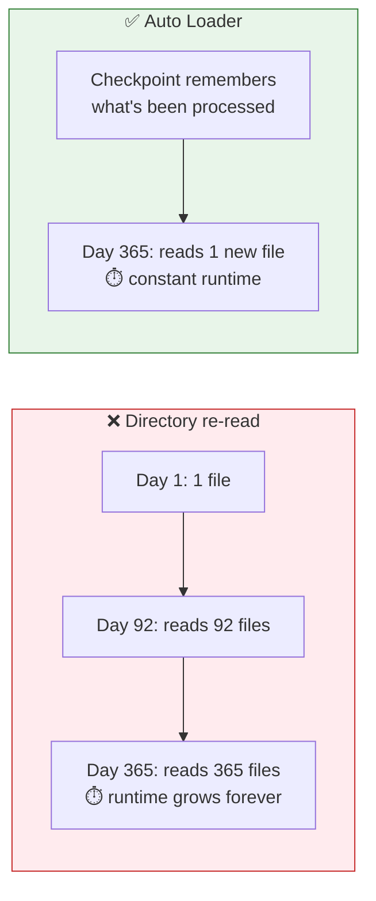
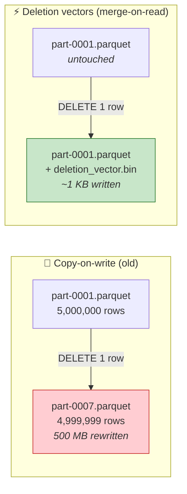
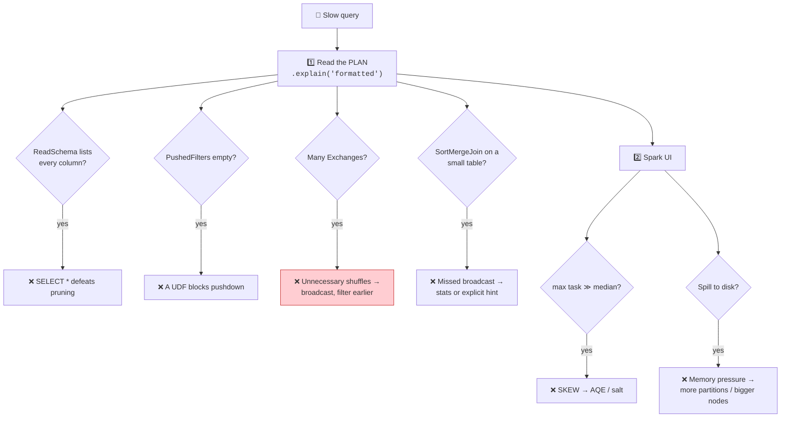
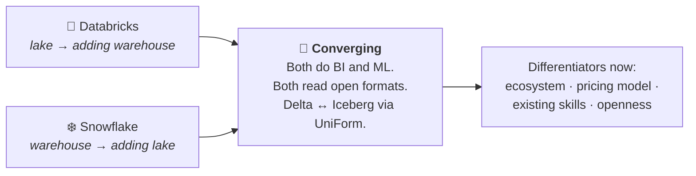

# Part 30 — Miscellaneous & Deeper Topics

> **Section goal:** The "extra edge" material — everything a Databricks interviewer may reach for that the course touches lightly or not at all. Each topic gets enough depth to answer confidently, plus an honest note on when it matters.

Extends the whole guide. Not in the transcript except where noted.

---

## 1. Auto Loader — incremental file ingestion

**The problem:** Part 24 reads all ~92 landing files every run. That's fine once; as a daily job it gets slower forever and reprocesses data you already have.



```python
(spark.readStream.format("cloudFiles")
   .option("cloudFiles.format", "csv")
   .option("cloudFiles.schemaLocation", f"{base}/_schema/order_items")
   .option("cloudFiles.schemaEvolutionMode", "addNewColumns")
   .option("rescuedDataColumn", "_rescued_data")     # ⭐ nothing is silently lost
   .option("header", "true")
   .load(landing_path)
   .withColumn("source_file", F.col("_metadata.file_path"))
 .writeStream
   .option("checkpointLocation", f"{base}/_checkpoint/order_items")
   .trigger(availableNow=True)                        # process new files, then stop
   .toTable("ecommerce.bronze.brz_order_items"))
```

### 🔍 Plain-English deep-dive: how it knows what's new

- **Directory listing mode** *(default)* — lists the folder and diffs against the checkpoint. Fine up to moderate file counts.
- **File notification mode** — subscribes to cloud storage events (Azure Event Grid + Queue Storage, or AWS SNS/SQS). Scales to millions of files because it never lists the directory.

**Analogy:** directory listing is *re-reading the whole guest list each time*; file notification is *the doorbell ringing when someone new arrives*.

| Option | Does |
|--------|------|
| `cloudFiles.schemaLocation` | Where the inferred schema is stored |
| `cloudFiles.schemaEvolutionMode` | `addNewColumns` (default) · `rescue` · `failOnNewColumns` · `none` |
| `rescuedDataColumn` | ⭐ Captures data that didn't fit the schema as JSON — **nothing is silently dropped** |
| `cloudFiles.maxFilesPerTrigger` | Throttle per micro-batch |
| `cloudFiles.useNotifications` | Switch to notification mode |
| `.trigger(availableNow=True)` | Batch-style: process everything new, then stop ⭐ |

> ⭐ **`trigger(availableNow=True)` is the sweet spot for most pipelines** — you write streaming code, but it runs as a batch job on a schedule, so no cluster sits idle waiting for data.

---

## 2. Lakeflow Declarative Pipelines (formerly Delta Live Tables)

**Imperative** (what this project built): *"read this, transform it, write there, in this order."*
**Declarative**: *"here are the tables I want and how each is defined."* The framework infers order and manages execution.

```python
import dlt
import pyspark.sql.functions as F

@dlt.table(comment="Raw order items as received")
def brz_order_items():
    return (spark.readStream.format("cloudFiles")
              .option("cloudFiles.format", "csv")
              .option("header", "true")
              .load("/Volumes/ecommerce/source_data/raw/order_items/landing/"))

@dlt.table(comment="Cleaned order items")
@dlt.expect("positive_quantity", "quantity > 0")                 # log violations
@dlt.expect_or_drop("valid_currency", "currency IN ('INR','USD','GBP','AUD')")   # drop them
@dlt.expect_or_fail("has_transaction_id", "transaction_id IS NOT NULL")          # fail the run
def slv_order_items():
    return (dlt.read_stream("brz_order_items")
              .withColumn("quantity", F.col("quantity").cast("int")))

@dlt.table(comment="Business-ready fact")
def gld_fact_order_items():
    return (dlt.read("slv_order_items")
              .withColumn("gross_amount", F.col("quantity") * F.col("unit_price")))
```

| | ⚙️ **Jobs + notebooks** *(this project)* | 🌊 **Lakeflow / DLT** |
|---|---|---|
| You define | The **steps** | The **tables** |
| Dependency order | Declared manually | **Inferred** from `dlt.read()` |
| Data quality | Your own assertions | **Built-in expectations + metrics** |
| Incremental logic | You implement it | Managed |
| Lineage | Unity Catalog | Automatic and visualised |
| Restart/recovery | Your problem | Managed |
| Flexibility | ✅ Total | More constrained |
| DBU cost | Standard | Slightly higher |

### The three expectation types

| Decorator | On violation | Use for |
|-----------|-------------|---------|
| `@dlt.expect` | Record a metric, **keep the row** | Monitoring |
| `@dlt.expect_or_drop` | Drop the row, record the metric | Known-bad data you can tolerate losing |
| `@dlt.expect_or_fail` | **Fail the pipeline** | Contract violations |

> 💡 **These are the productised version of the quality gates you hand-wrote in Parts 22–25** — same idea, declared rather than coded, with metrics tracked automatically and surfaced in the pipeline UI.

> ⭐ **Interview:** *"DLT or Workflows?"* → *"DLT when the pipeline is a fairly standard medallion flow — declaring tables and letting the framework infer dependencies, handle incremental processing and enforce expectations removes a lot of boilerplate, and the quality metrics come free. Workflows when I need arbitrary control flow, non-Delta targets, external API calls, ML training, or orchestration across systems. They're not exclusive: a Workflow can have a DLT pipeline as one task, which is a common shape — DLT for the medallion core, Workflows around it for everything else."*

---

## 3. Structured Streaming

Same DataFrame API, but the source is unbounded.

```python
(spark.readStream.format("delta").table("ecommerce.bronze.brz_order_items")
   .groupBy(F.window("order_ts", "1 hour"), "channel")
   .agg(F.sum("net_amount_inr").alias("revenue"))
 .writeStream
   .outputMode("append")
   .option("checkpointLocation", "/Volumes/.../_ckpt/hourly")
   .trigger(processingTime="1 minute")
   .toTable("ecommerce.gold.gld_hourly_revenue"))
```

| Concept | Meaning |
|---------|---------|
| **Micro-batch** | Spark processes small batches, not event-at-a-time. Latency ~seconds |
| **Checkpoint** | Progress + state, stored durably. **Never delete it casually** |
| **Output mode** | `append` (new rows) · `update` (changed aggregates) · `complete` (whole result) |
| **Trigger** | `processingTime="1 minute"` · `availableNow=True` · `continuous` (experimental) |
| **Watermark** | How long to wait for late data before finalising a window |
| **Exactly-once** | Guaranteed with Delta sinks via idempotent commits |

```python
.withWatermark("order_ts", "2 hours")   # accept data up to 2h late, then close the window
```

> ⚠️ **Watermarking is a genuine trade-off, not a setting to copy.** Too short and you silently drop late data; too long and state grows and results stay provisional. It should be set from measured arrival lateness, not guessed.

> ⚠️ **Spark is micro-batch.** For true event-at-a-time sub-second processing, Flink or Kafka Streams fit better. Say so rather than over-claiming.

---

## 4. `MERGE`, upserts and Slowly Changing Dimensions

### `MERGE` — the incremental workhorse

```sql
MERGE INTO ecommerce.silver.slv_order_items AS t
USING staged AS s
   ON t.transaction_id = s.transaction_id AND t.item_seq = s.item_seq
WHEN MATCHED AND s.processed_at > t.processed_at THEN UPDATE SET *
WHEN NOT MATCHED THEN INSERT *
WHEN NOT MATCHED BY SOURCE AND t.dt < current_date() - 7 THEN DELETE;
```

> ⭐ **`MERGE` is what makes a pipeline idempotent.** `append` duplicates on retry; `MERGE` upserts, so running twice equals running once (Part 28 §10).

### 🔍 Plain-English deep-dive: SCD types

*How you handle a dimension attribute changing over time.*

**Scenario:** a customer moves from Delhi to Paris.

| Type | Behaviour | Analogy | History? |
|------|-----------|---------|----------|
| **Type 0** | Never update | Written in stone | n/a |
| **Type 1** | Overwrite in place | Correcting a typo — the old value is gone | ❌ |
| **Type 2** ⭐ | Close the old row, insert a new one with validity dates | A new page in the logbook | ✅ Full |
| **Type 3** | Add a `previous_value` column | Remembering only the last address | ⚠️ One step |
| **Type 4** | Current table + separate history table | A ledger plus an archive | ✅ |
| **Type 6** | 1 + 2 + 3 combined | Belt and braces | ✅ |

**SCD Type 2 in practice:**

| customer_id | city | valid_from | valid_to | is_current |
|---|---|---|---|---|
| C001 | Delhi | 2020-01-01 | 2024-06-15 | `false` |
| C001 | **Paris** | 2024-06-15 | 9999-12-31 | **`true`** |

```sql
MERGE INTO gld_dim_customers AS t
USING (SELECT *, current_date() AS eff FROM staged_customers) AS s
   ON t.customer_id = s.customer_id AND t.is_current = true
WHEN MATCHED AND (t.city <> s.city OR t.state <> s.state) THEN
  UPDATE SET t.valid_to = s.eff, t.is_current = false
WHEN NOT MATCHED THEN
  INSERT (customer_id, city, state, valid_from, valid_to, is_current)
  VALUES (s.customer_id, s.city, s.state, s.eff, DATE'9999-12-31', true);
```

> 💡 **DLT can do this for you:** `dlt.create_auto_cdc_flow(..., stored_as_scd_type = 2)` (formerly `apply_changes`).

> ⭐ **Why it matters:** with Type 1, a report for last January would attribute that customer's old orders to Paris — because Delhi no longer exists anywhere. Type 2 preserves *the value as it was at the time*, which is what audit and correct historical reporting require. **This project uses Type 1** (full overwrite of dimensions) — correct for a pilot, and worth naming as a known simplification.

### Change Data Feed

```sql
ALTER TABLE ecommerce.silver.slv_order_items
  SET TBLPROPERTIES (delta.enableChangeDataFeed = true);

SELECT * FROM table_changes('ecommerce.silver.slv_order_items', 10, 20);
-- adds: _change_type (insert / update_preimage / update_postimage / delete), _commit_version, _commit_timestamp
```

**Use it to propagate only what changed** from silver to gold, instead of rebuilding gold entirely.

---

## 5. Delta maintenance and performance

| Command | Does | When |
|---------|------|------|
| `OPTIMIZE` | Compacts small files | After streaming or frequent small writes |
| `OPTIMIZE … ZORDER BY (cols)` | Co-locates similar values → file skipping | Legacy; superseded by clustering |
| `CLUSTER BY (cols)` | **Liquid clustering** — keys changeable without a rewrite | ⭐ Current best practice |
| `VACUUM` | Deletes unreferenced files older than the retention window | ⚠️ Destroys time travel beyond it |
| `ANALYZE TABLE … COMPUTE STATISTICS` | Feeds the cost optimiser | When broadcasts aren't chosen |
| **Predictive Optimization** | Databricks runs all of the above automatically | ⭐ Enable on managed tables |

```sql
CREATE TABLE ecommerce.gold.gld_fact_order_items
CLUSTER BY (ingestion_date, category_name) AS SELECT …;

ALTER TABLE ecommerce.gold.gld_fact_order_items CLUSTER BY (region, ingestion_date);
```

| | Partitioning | Z-ORDER | **Liquid Clustering** |
|---|---|---|---|
| Physical directories | ✅ | ❌ | ❌ |
| Change keys later | ❌ Full rewrite | ✅ Re-OPTIMIZE | ✅ **`ALTER TABLE`** |
| Handles skew | ❌ Poorly | ⚠️ Some | ✅ Well |
| Small-file risk | ⚠️ High | Low | Low |
| 2026 recommendation | Legacy | Legacy | ⭐ **Preferred** |

### 🔍 Plain-English deep-dive: deletion vectors ("merge-on-read")

Parquet files are **immutable**. So how does Delta delete one row out of a 500 MB file?

**The old way — copy-on-write.** Rewrite the entire file minus that row, then point the transaction log at the new file. Correct, but deleting 1 row out of 5 million rewrites all 5 million. A `DELETE` touching 1% of a table could rewrite 60% of its files.

**Deletion vectors — merge-on-read.** Leave the data file alone and write a tiny sidecar bitmap saying "rows 42, 8,113 and 250,004 in this file are deleted." The write is near-instant. Readers apply the bitmap while scanning and skip those rows.



| | Copy-on-write | Deletion vectors |
|---|---|---|
| `DELETE` / `UPDATE` / `MERGE` speed | 🔴 Slow — rewrites whole files | 🟢 **Much faster** |
| Read speed | 🟢 Fastest — nothing to apply | 🟡 Slight overhead applying the bitmap |
| Small-file pressure | Higher | Lower |
| Cleanup | n/a | `OPTIMIZE` (or Predictive Optimization) physically purges them later |

```sql
ALTER TABLE ecommerce.silver.slv_fact_order_items
  SET TBLPROPERTIES ('delta.enableDeletionVectors' = 'true');
```

> ⚠️ **The gotcha that catches people:** deletion vectors need a **reader that understands them** (Delta reader version 3 / `deletionVectors` table feature). Enabling the feature *upgrades the table protocol*, and older external readers — an old OSS Spark, a legacy connector, some third-party tools — will then fail to read the table at all. Check every consumer before enabling it on a shared table. It is also **not reversible by simply turning the property off**; you need to `REORG TABLE … APPLY (PURGE)` and then drop the feature.

> ⭐ **Interview:** *"Why did GDPR-style row deletion used to be so expensive on a lakehouse, and what changed?"* → *"Because the underlying Parquet files are immutable, so removing one person's rows meant rewriting every file that contained them — copy-on-write. Deleting 0.01% of a table could rewrite most of it, and it created a small-file problem on top. Deletion vectors changed the economics: the delete writes a tiny bitmap marking the affected row positions, readers skip them during the scan, and the physical purge happens later during OPTIMIZE. You trade a small read-side cost for an enormous write-side saving, which is the right trade when deletes and updates are frequent. The caveat is that it bumps the table protocol version, so I'd confirm every downstream reader supports it before switching it on."*

### Query performance checklist



### UDFs — the performance cliff

| Approach | Speed | Catalyst can optimise? | Photon? |
|----------|-------|------------------------|---------|
| **Built-in functions** ⭐ | Fastest | ✅ | ✅ |
| **SQL UDF** | Fast | ✅ (inlined) | ✅ |
| **Pandas UDF (Arrow, vectorised)** | Moderate | ❌ | ❌ |
| **Python UDF (row-at-a-time)** | 🐌 Slowest | ❌ | ❌ **fallback** |

```python
# ❌ Python UDF — serialises every row to a Python process
@F.udf("double")
def add_tax(x): return x * 1.18

# ✅ Built-in — stays in the JVM/Photon, fully optimisable
df.withColumn("with_tax", F.col("amount") * 1.18)

# ⚖️ Pandas UDF — batched via Arrow, when you genuinely need Python
@F.pandas_udf("double")
def normalise(s: pd.Series) -> pd.Series:
    return (s - s.mean()) / s.std()
```

> ⭐ **A Python UDF forces Photon to fall back to the JVM for that part of the plan** and blocks predicate pushdown through it. If you must use Python, prefer a Pandas UDF; better still, express it with built-ins.

---

## 6. Databricks Asset Bundles, testing and CI/CD

```
repo/
├── databricks.yml            # bundle definition
├── resources/
│   └── jobs.yml              # job definitions as code
├── src/
│   ├── transformations.py    # pure, testable functions
│   └── notebooks/
└── tests/
    ├── test_transformations.py
    └── conftest.py
```

**Make transformations testable by extracting them from notebooks:**

```python
# src/transformations.py
def clean_orders(df):
    qty = F.lower(F.trim(F.col("quantity")))
    return (df
        .withColumn("quantity", F.when(qty == "two", 2)
                                 .otherwise(F.col("quantity").cast("int")))
        .withColumn("unit_price",
                    F.regexp_replace(F.col("unit_price"), "[^0-9.]", "").cast("double")))
```

```python
# tests/test_transformations.py
def test_word_quantities_become_integers(spark):
    src = spark.createDataFrame([("two", "$5.50")], "quantity STRING, unit_price STRING")
    out = clean_orders(src).collect()[0]
    assert out["quantity"] == 2
    assert out["unit_price"] == 5.50
```

| Test level | Tool | Tests |
|-----------|------|-------|
| **Unit** | pytest + a local SparkSession | Transformation logic on tiny fixtures |
| **Integration** | pytest against a dev catalog | End-to-end on a sample |
| **Data quality** | Assertions / DLT expectations | The gates from Parts 22–25 |
| **Regression** | Compare outputs across versions | Refactors don't change results |

**Choosing a data-quality framework.** "Write your own assertions" is fine at this project's size; at team scale people reach for a framework. Know the names:

| Option | What it is | Use it when |
|--------|-----------|-------------|
| **Hand-rolled assertions** (what Parts 21–25 use) | A `COUNT(*)` check that raises on non-zero | Small projects; zero dependencies; total control |
| **Lakeflow / DLT expectations** | `@dlt.expect_or_drop`, `@dlt.expect_or_fail` declared on the table | ⭐ You're already on declarative pipelines — quality metrics land in the event log for free |
| **Great Expectations** | Open-source Python library: you define an "expectation suite" (`expect_column_values_to_not_be_null`, `expect_column_values_to_be_between`…), it validates and emits **Data Docs**, a browsable HTML quality report | You need auditable, shareable evidence for non-engineers, or you're multi-engine and don't want Databricks-specific syntax |
| **dbt tests** | `not_null`, `unique`, `accepted_values`, `relationships` declared in YAML next to the model | Your transformation layer is dbt |
| **Soda / Deequ** | Declarative checks (Soda: YAML; Deequ: Scala, from AWS) | Standardised checks across many teams |

> ⚠️ **The trap in all of them:** a framework tells you *whether* a rule failed, not *which rule you should have written*. The five defect classes from Part 18 — whitespace, contamination, duplicates, casing, type — are what you check; the tool is just how you express it. Interviewers care far more that you can name the checks than that you can name the library.

```yaml
# .github/workflows/deploy.yml
- run: pip install -r requirements-dev.txt && pytest tests/
- run: databricks bundle validate
- run: databricks bundle deploy -t dev
- if: github.ref == 'refs/heads/main'
  run: databricks bundle deploy -t prod
```

> ⭐ **Interview:** *"How do you test a data pipeline?"* → *"Extract transformations into pure functions that take a DataFrame and return a DataFrame, so they're testable without a cluster or a notebook. Unit-test those against small hand-built fixtures that deliberately include the edge cases — nulls, word-form numbers, contaminated values — because that's the same discipline as building fixtures with defects. Then data-quality gates inside the pipeline as assertions, so a run fails on bad data rather than publishing it. Then integration tests against a dev catalog on a sampled dataset. And regression tests comparing aggregate outputs before and after a refactor, since 'the code is prettier and the numbers changed' is the failure mode you most need to catch. Asset Bundles tie it together so CI runs the tests and deploys the same definitions to dev and prod."*

---

## 7. Delta Sharing and Marketplace

**Delta Sharing** — an open protocol for sharing live Delta tables **across organisations without copying data**, and without the recipient needing Databricks.

```sql
CREATE SHARE ecommerce_partner_share;
ALTER SHARE ecommerce_partner_share ADD TABLE ecommerce.gold.gld_fact_order_items;
CREATE RECIPIENT partner_acme;
GRANT SELECT ON SHARE ecommerce_partner_share TO RECIPIENT partner_acme;
```

| vs | Delta Sharing |
|----|---------------|
| Emailing a CSV | ✅ Live, governed, no copies, revocable |
| An API you build | ✅ No engineering, works at table scale |
| Granting workspace access | ✅ Recipient needs no Databricks account |

**Databricks Marketplace** — browse and consume public datasets and data products, delivered via Delta Sharing.

---

## 8. The ML side

You won't be examined deeply on this in a data-engineering interview, but knowing the vocabulary signals platform breadth.

| Component | What it does |
|-----------|--------------|
| **MLflow Tracking** | Logs parameters, metrics and artifacts per training run |
| **MLflow Models** | Packages a model with its dependencies |
| **Unity Catalog Model Registry** | Versioned, governed models as first-class UC objects |
| **Feature Store / Feature Engineering in UC** | Reusable feature tables with lineage; solves train/serve skew |
| **Model Serving** | Deploy a model behind a REST endpoint |
| **Vector Search** | Managed vector index over Delta tables — the retrieval half of RAG |
| **Mosaic AI Agent Framework** | Build, evaluate and serve LLM agents |
| **AI Functions in SQL** | `ai_query()`, `ai_classify()`, `ai_summarize()` — call an LLM from SQL |

```sql
SELECT product_name,
       ai_classify(product_name, ARRAY('Electronics','Apparel','Grocery')) AS predicted_category
FROM   ecommerce.gold.gld_dim_products LIMIT 20;
```

> 💡 **The lakehouse argument in one line:** the ML feature table and the BI gold table read the *same* governed data, so a dashboard number and a model input can't diverge.

---

## 9. Competitive landscape

| Platform | Identity | Strongest | Weakest |
|----------|----------|-----------|---------|
| **Databricks** | Lakehouse; Spark-native; open formats | Large-scale engineering, ML/AI, one platform for BI+AI, open storage | Steeper curve than a pure SQL warehouse |
| **Snowflake** | Cloud warehouse adding lake features | Effortless SQL, near-zero admin, concurrency | Historically weaker for ML/unstructured; proprietary storage roots |
| **Microsoft Fabric** | All-in-one Microsoft SaaS on OneLake | Power BI / M365 integration, simple licensing | Younger; less control for heavy engineering |
| **AWS EMR + Glue + Redshift** | Assemble-it-yourself | Flexibility, native AWS billing | Fragmented — **the Part 19 legacy pain** |
| **Google BigQuery** | Serverless warehouse | Superb ad-hoc SQL, zero ops | Less natural for Spark-style pipelines |
| **Apache Iceberg + Trino** | Fully open-source stack | No vendor lock-in | You operate everything |

### The convergence



> ⭐ **Keeping data in open Delta/Parquet in your own storage is the strategic hedge.** It's what stops any of these decisions being one-way.

---

## 10. Certifications

| Certification | Level | Covers |
|--------------|-------|--------|
| **Databricks Certified Data Engineer Associate** | ⭐ Entry | Lakehouse, Delta, ETL, Jobs, Unity Catalog basics — **this project maps to it almost exactly** |
| **Data Engineer Professional** | Advanced | Streaming, optimisation, testing, security, CI/CD |
| **Data Analyst Associate** | Entry | Databricks SQL, dashboards, visualisation |
| **ML Associate / Professional** | Entry / Advanced | MLflow, feature engineering, deployment |
| **Generative AI Engineer Associate** | Entry | RAG, vector search, agents |
| **Azure DP-203** *(retiring)* / **DP-700 Fabric** | Microsoft | Azure data engineering more broadly |

> 💡 **The Data Engineer Associate is the highest-value first certification if your target roles are Databricks roles** — and having *built* this project is far better preparation than reading exam notes, because most questions are scenario-based.

---

## 11. Trends worth mentioning

| Trend | Why it matters |
|-------|----------------|
| **Serverless everything** | Compute management is disappearing as a skill; cost tuning shifts from cluster sizing to workload design |
| **Format convergence (UniForm)** | Delta tables exposing Iceberg metadata makes storage choice less consequential |
| **Declarative pipelines** | DLT/Lakeflow moving from optional to default for medallion flows |
| **AI-assisted engineering** | Assistant, Genie and AI functions — the skill shifts to *reviewing* generated code and curating metadata |
| **Governance as the differentiator** | Unity Catalog, lineage, attribute-based access; increasingly the deciding factor in platform selection |
| **Lakehouse Federation** | Query external systems (Postgres, Snowflake, Redshift) through Unity Catalog without moving data |
| **Data products / mesh** | Domain teams owning governed data products rather than a central team owning everything |

> ⭐ **Interview:** *"Where is the platform heading, and how does that change the job?"* → *"Three shifts I'd point to. **Serverless** is removing cluster management, so the value moves from tuning infrastructure to designing workloads — reducing data scanned rather than adding nodes. **Declarative pipelines** are absorbing the boilerplate of medallion ETL, so the differentiator becomes modelling and data-quality design rather than orchestration plumbing. And **AI assistance** means generating a transformation is cheap, so the scarce skills become knowing whether the output is *correct*, curating the metadata that makes AI tools accurate, and owning the governance. The constant underneath all of it is that understanding grain, joins, shuffles and lineage doesn't get automated away — it's what lets you tell a plausible answer from a right one."*

---

## 12. Honest gaps in this project

Naming your own project's limitations unprompted is a strong signal. These are the ones worth citing.

| Gap | What production would add |
|-----|---------------------------|
| **Backfill only, no incremental** | Auto Loader + `MERGE` (§1, §4) |
| **SCD Type 1 dimensions** | Type 2 with validity ranges for historical accuracy (§4) |
| **Hardcoded FX rates** | A rates dimension from an API, joined on transaction date (Part 25 §2.3) |
| **No orphan handling** | An "Unknown" dimension member (Part 24 §5) |
| **Quality gates as ad-hoc asserts** | DLT expectations with tracked metrics (§2) |
| **No unit tests** | pytest on extracted pure functions (§6) |
| **Notebooks, not Asset Bundles** | Jobs and code as version-controlled YAML (§6) |
| **`double` for money** | `DecimalType(18,2)` (Part 9 §4) |
| **Manual mapping dictionaries** | Business-owned Delta mapping tables (Part 22) |
| **No alerting or SLA monitoring** | Job alerts + a reliability dashboard (Part 28 §8) |

> ⭐ **How to use this in an interview:** *"It was scoped as a two-week pilot, so I made deliberate simplifications and I'd list them: backfill rather than incremental, Type 1 dimensions, hardcoded FX rates. For production the first three things I'd add are Auto Loader with `MERGE` so it's incremental and idempotent, Type 2 on customers so historical reporting attributes orders to the right region, and unit tests on the transformation functions."* That answer demonstrates judgement, not gaps.

---

## ⭐ Likely Interview Questions for This Section

**Q1. "How would you make this pipeline incremental?"**
> *Model answer:* "Auto Loader at bronze with `format('cloudFiles')` and a checkpoint, so only new files are processed and runtime stays constant instead of growing with history. I'd enable the rescued-data column so anything not matching the schema is captured rather than silently dropped. Silver and gold switch from full rebuild to `MERGE` on the business key, which makes them idempotent — a retried task upserts rather than duplicating — and naturally handles late-arriving corrections. Trigger with `availableNow=True` so it runs batch-style on a schedule rather than keeping a cluster alive. And I'd keep the backfill notebooks, because you genuinely need them again whenever transformation logic changes and history must be reprocessed."

**Q2. "Explain SCD Type 1 versus Type 2."**
> *Model answer:* "Type 1 overwrites in place, so you always see the current value and the previous one is gone. Type 2 closes the existing row with a `valid_to` date and inserts a new row with `is_current = true`, preserving full history. The difference matters for historical accuracy: if a customer moves from Delhi to Paris and you use Type 1, a report for last January attributes their old orders to Paris, because Delhi no longer exists anywhere in the dimension. Type 2 gives you the value as it was at the time, which audit and correct period reporting require. The cost is complexity — every fact join needs to pick the row valid at the transaction date. This project uses Type 1, which is fine for a pilot, and I'd name that as a known simplification rather than let an interviewer find it."

**Q3. "Why avoid Python UDFs?"**
> *Model answer:* "Three compounding costs. Serialisation — every row crosses from the JVM to a Python process and back. Opacity — Catalyst can't see inside the function, so it can't push filters through it or reorder around it. And on Databricks, a Python UDF forces Photon to fall back to the JVM for that part of the plan, so you lose vectorised execution while still paying Photon's rate. The order of preference is built-in functions, then SQL UDFs which get inlined, then Pandas UDFs which at least batch via Arrow, and row-at-a-time Python UDFs only when there's genuinely no alternative. Most UDFs I've seen in the wild could be expressed with `when/otherwise`, `regexp_replace` and the date functions."

**Q4. "How do you test data pipelines?"**
> *Model answer:* "Extract transformations into pure functions that take a DataFrame and return one, so they're testable without a cluster or a notebook — that refactor alone is most of the work. Unit-test them against small fixtures that deliberately include the edge cases: nulls, word-form numbers, contaminated values, duplicate keys. Then data-quality gates inside the pipeline as assertions or DLT expectations, so a bad run fails rather than publishes. Then integration tests against a dev catalog on sampled data. And regression tests comparing aggregate outputs before and after a change, because 'the refactor is cleaner and the totals moved' is the failure you most need to catch. Asset Bundles wire it into CI so tests gate deployment and the same definitions promote to prod."

**Q5. "What's liquid clustering and why does it replace partitioning?"**
> *Model answer:* "It's a data-layout technique where you declare clustering columns and Databricks maintains the physical organisation so file-level statistics enable data skipping. It replaces partitioning for most cases because partitioning creates physical directories, which means over-partitioning produces millions of tiny files, skew is handled badly, and changing the partition column requires rewriting the whole table. Liquid clustering keys can be changed with a simple `ALTER TABLE`, handle skew far better, and don't create the small-file problem. Z-ORDER was the intermediate step but required re-running `OPTIMIZE` and had similar rigidity. On managed Unity Catalog tables I'd also enable predictive optimization so Databricks runs the maintenance automatically."

**Q6. "Databricks or Snowflake — and does the answer change over time?"**
> *Model answer:* "They're converging, so I'd choose on workload mix and existing skills rather than capability checklists. If the centre of gravity is SQL analytics over structured data with minimal ops, Snowflake is excellent. If there's substantial custom transformation, streaming, unstructured data or ML in the same estate, Databricks fits better. The point I'd emphasise is keeping data in **open formats in your own storage** — Delta and Parquet, with UniForm exposing Iceberg metadata — because that's what stops the decision being irreversible. Choose on today's fit, but architect so you could change your mind. The answer that ages badly is picking on a feature comparison, since both ship the missing features within a year or two."

**Q7. "What would you improve about the project you built?"**
> *Model answer:* "It was a two-week pilot with deliberate simplifications, and I'd name them rather than wait to be asked. Top three: it's a backfill, so I'd add Auto Loader plus `MERGE` to make it incremental and idempotent. Dimensions are Type 1, so I'd move customers to Type 2 to keep historical region attribution correct. And FX rates are hardcoded, so I'd source them from an API into a rates dimension with validity ranges and join on transaction date, since using today's rate makes historical revenue change on every re-run. Beyond that: unit tests on extracted transformation functions, Asset Bundles instead of workspace notebooks, `DecimalType` rather than `double` for money, an Unknown dimension member for orphaned keys, and job alerting with an SLA dashboard."

---

## 🧠 30-Second Memory Hooks

- **Auto Loader = checkpoint remembers what's processed.** Directory listing = re-read the guest list; **file notification = the doorbell**.
- **`rescuedDataColumn`** — nothing is ever silently dropped.
- **`trigger(availableNow=True)`** — write streaming code, run it as a scheduled batch. The sweet spot.
- **Jobs = you define the STEPS. DLT = you define the TABLES**, dependencies inferred from `dlt.read()`.
- **DLT expectations: `expect` (log) · `expect_or_drop` (drop) · `expect_or_fail` (stop).** Your hand-written gates, productised.
- **Spark Structured Streaming is MICRO-BATCH.** True event-at-a-time → Flink.
- **Watermark = how long you'll wait for late data.** A real trade-off, measured not guessed.
- **⭐ `MERGE` is what makes a pipeline idempotent.** `append` duplicates on retry.
- **SCD Type 1 = overwrite (history lost). Type 2 = close the old row, insert a new one** with `valid_from` / `valid_to` / `is_current`.
- **Type 1 attributes last January's orders to the NEW address.** That's the whole argument for Type 2.
- **Liquid clustering > Z-ORDER > partitioning.** Keys changeable with `ALTER TABLE`, no small-file explosion.
- **Deletion vectors = merge-on-read.** Don't rewrite the file, write a bitmap of deleted row positions. Fast deletes, slight read cost, ⚠️ bumps the table protocol.
- **Data-quality tooling: DLT expectations · Great Expectations · dbt tests · Soda/Deequ.** The *checks* matter more than the *library*.
- **⚠️ Python UDF = serialisation + opaque to Catalyst + Photon falls back.** Built-in → SQL UDF → Pandas UDF → Python UDF.
- **Testing: extract PURE FUNCTIONS from notebooks**, then unit + quality + integration + regression.
- **Delta Sharing = live tables across organisations, no copies, recipient needs no Databricks.**
- **Open formats in your own storage are the strategic hedge.** Nothing becomes a one-way door.
- **Databricks Certified Data Engineer Associate maps almost exactly to this project.**
- **⭐ Name your own project's gaps first.** Backfill-only · SCD1 · hardcoded FX · no tests. That's judgement, not weakness.

---

*Next suggested section:* **[Part 31 — Interview Question Bank](Part-31-interview-question-bank.md)** — 100+ questions across basic, intermediate and advanced, each with a model answer and a cross-reference back to the Part that covers it, plus scenario/whiteboard questions and a self-quiz tracker.

---

**Navigation** — ⬅️ **[Part 29 — Azure Deep-Dive](Part-29-azure-databricks-deep-dive.md)** · 🏠 **[Master Index](../Databricks%20-%20Study%20Guide.md)** · ➡️ **[Part 31 — Interview Question Bank](Part-31-interview-question-bank.md)**
