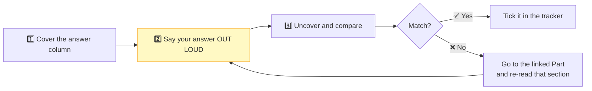

# Part 31 — Interview Question Bank

> **Section goal:** 120 questions with concise answers and a cross-reference to the Part that covers each in depth. Use this to *test* yourself, not to learn — if an answer surprises you, go back to the Part.

---

## How to use this

> ⚠️ **Reading answers silently creates false confidence.** You will *recognise* the right answer and conclude you know it. **Say it aloud.** The gap between recognition and articulation is where interviews are lost.

| Difficulty | Count | Share |
|-----------|-------|-------|
| 🟢 Basic | 25 | ~21% |
| 🟡 Intermediate | 25 | ~21% |
| 🔴 Advanced | 60 | ~50% |
| ⚫ Scenario / whiteboard | 10 | ~8% |
| **Total** | **120** | |

---

## 🟢 Basic (Q1–Q25)

| # | Question | Concise answer | Part |
|---|----------|----------------|------|
| 1 | What is Apache Spark? | An open-source **distributed compute engine** for large-scale data processing. Unified across batch, SQL, streaming and ML. **Not** a storage system. | [2](Part-02-distributed-computing-hadoop-spark.md) |
| 2 | What is Databricks? | Managed Spark + Delta Lake + Unity Catalog + Photon, wrapped in notebooks, SQL warehouses, workflows and dashboards. | [3](Part-03-what-databricks-is-lakehouse-editions.md) |
| 3 | What is distributed computing? | Splitting one large task into sub-tasks executed in parallel across many machines, while behaving like a single system. | [2](Part-02-distributed-computing-hadoop-spark.md) |
| 4 | Spark vs Hadoop MapReduce? | Hadoop writes to disk between every stage; Spark keeps intermediates in memory and chains stages into a DAG. Typically 10–100× on multi-stage jobs. | [2](Part-02-distributed-computing-hadoop-spark.md) |
| 5 | What is a data lakehouse? | Warehouse guarantees (ACID, schema, governance) on cheap data-lake storage, via an open table format. One copy serves BI **and** ML. | [3](Part-03-what-databricks-is-lakehouse-editions.md) |
| 6 | Data warehouse vs data lake? | Warehouse: structured only, schema-on-write, fast SQL, expensive. Lake: any format, schema-on-read, cheap, no guarantees. | [3](Part-03-what-databricks-is-lakehouse-editions.md) |
| 7 | What is Delta Lake? | An open storage layer giving ACID, time travel and schema enforcement. **Delta = Parquet + transaction log + metadata.** | [7](Part-07-delta-lake-acid-time-travel.md) |
| 8 | What is medallion architecture? | Bronze (raw) → Silver (cleaned/conformed) → Gold (business-ready). Progressive refinement with clear separation of concerns. | [17](Part-17-medallion-architecture.md) |
| 9 | Explain the Databricks object hierarchy. | `catalog.schema.object` under a Unity Catalog metastore. Objects: tables, views, volumes, models, functions. | [5](Part-05-unity-catalog-governance.md) |
| 10 | Schema vs database in Databricks? | Same thing. `CREATE SCHEMA` == `CREATE DATABASE`; `SHOW DATABASES` lists schemas. | [4](Part-04-lab-account-setup-ui-tour.md) |
| 11 | What is PySpark? | The Python API for Spark. Same optimiser and execution engine as Scala for DataFrame/SQL work. | [2](Part-02-distributed-computing-hadoop-spark.md) |
| 12 | What is a DataFrame? | A distributed collection of rows with a schema — a table partitioned across the cluster. Immutable and lazily evaluated. | [8](Part-08-dataframe-fundamentals.md) |
| 13 | Transformation vs action? | Transformation builds the plan and returns a DataFrame; action triggers execution and returns a value or writes data. | [14](Part-14-transformations-actions-lazy-evaluation.md) |
| 14 | Name five transformations and five actions. | T: `select`, `filter`, `withColumn`, `join`, `groupBy`. A: `count`, `show`, `collect`, `write`, `take`. | [14](Part-14-transformations-actions-lazy-evaluation.md) |
| 15 | What is lazy evaluation? | Spark records transformations without executing, so it can optimise the whole chain before running it on an action. | [14](Part-14-transformations-actions-lazy-evaluation.md) |
| 16 | Why are DataFrames immutable? | It enables lineage-based fault tolerance, lock-free parallel reads, and safe reordering by the optimiser. | [8](Part-08-dataframe-fundamentals.md) |
| 17 | `display()` vs `show()` vs `collect()`? | `display` = Databricks rich grid. `show` = fast ASCII, works anywhere. `collect` = **all rows to the driver** — dangerous. | [8](Part-08-dataframe-fundamentals.md) |
| 18 | What is `spark` in a Databricks notebook? | A pre-created `SparkSession` — your entry point for reading data, running SQL and creating DataFrames. | [8](Part-08-dataframe-fundamentals.md) |
| 19 | Two ways to run SQL in Spark? | `spark.sql("…")` returning a DataFrame, and the `%sql` cell magic. **Identical performance.** | [10](Part-10-sql-in-spark.md) |
| 20 | Name the join types. | inner, left, right, full outer, left semi, left anti, cross. | [11](Part-11-joins-in-spark.md) |
| 21 | Managed vs external table? | Managed: Databricks owns metadata **and** files; `DROP` deletes both. External: `LOCATION` specified; `DROP` removes only metadata. | [6](Part-06-tables-volumes-managed-vs-external.md) |
| 22 | What is a volume? | Unity Catalog's governed abstraction for **files**, addressed by path `/Volumes/catalog/schema/volume/…`. Replaces DBFS. | [6](Part-06-tables-volumes-managed-vs-external.md) |
| 23 | What is Unity Catalog? | Account-level unified governance for data and AI assets: fine-grained access control, lineage, discovery and audit. | [5](Part-05-unity-catalog-governance.md) |
| 24 | Fact vs dimension table? | Fact = measurements of events (large, additive numbers, FKs). Dimension = descriptive context (small, changes slowly). | [18](Part-18-project-blueprint-data-model.md) |
| 25 | What is a star schema? | A fact table surrounded by denormalised dimensions — few joins, fast queries, analyst-friendly. | [18](Part-18-project-blueprint-data-model.md) |

---

## 🟡 Intermediate (Q26–Q50)

| # | Question | Concise answer | Part |
|---|----------|----------------|------|
| 26 | Explain ACID with an example. | Bank transfer: **A**tomicity (both legs or neither), **C**onsistency (no negative balance), **I**solation (concurrent withdrawals don't collide), **D**urability (committed survives a crash). | [7](Part-07-delta-lake-acid-time-travel.md) |
| 27 | How does Delta time travel work? | Numbered JSON commits in `_delta_log` list added/removed files; replaying to version *N* reconstructs that file list. Bounded by `VACUUM`. | [7](Part-07-delta-lake-acid-time-travel.md) |
| 28 | Is time travel a backup? | **No.** Bounded by `VACUUM` retention (7 days default) and log retention, and it lives in the same storage account. | [7](Part-07-delta-lake-acid-time-travel.md) |
| 29 | Schema enforcement vs evolution? | Enforcement (default) rejects mismatched writes. Evolution (`mergeSchema`) is the opt-in to add columns. Permissive at bronze, strict at silver/gold. | [7](Part-07-delta-lake-acid-time-travel.md) |
| 30 | Would you use `inferSchema` in production? | No — extra full scan, non-deterministic across files, destroys leading zeros. Infer once interactively, then freeze the schema into code. | [9](Part-09-reading-writing-data.md) |
| 31 | Why Parquet over CSV? | Columnar (read only needed columns), better compression, embedded schema, per-row-group min/max stats enabling file skipping. | [9](Part-09-reading-writing-data.md) |
| 32 | Explain the four write modes. | `overwrite`, `append`, `ignore`, `errorifexists` (default). Overwrite is idempotent for backfills; append alone is not. | [9](Part-09-reading-writing-data.md) |
| 33 | Why does one `.write` produce many files? | One output file per partition, written in parallel, plus a `_SUCCESS` marker. | [9](Part-09-reading-writing-data.md) |
| 34 | Do two NULL join keys match? | **No.** `NULL = NULL` evaluates to NULL, not TRUE. Use `eqNullSafe` / `<=>` if they genuinely should. | [11](Part-11-joins-in-spark.md) |
| 35 | Inner join vs left semi join? | Semi returns only left-side columns and never duplicates rows — it's a filter (`WHERE EXISTS`), not an enrichment. | [11](Part-11-joins-in-spark.md) |
| 36 | How do you find orphaned foreign keys? | **Left anti join** from fact to dimension on the key. Databricks doesn't enforce FKs, so this must be an explicit check. | [11](Part-11-joins-in-spark.md) |
| 37 | Temp view vs global temp view vs view? | Session-scoped · cluster-scoped (`global_temp.` prefix) · permanent and governed in Unity Catalog. | [10](Part-10-sql-in-spark.md) |
| 38 | Is a view stored data? | No — a saved query, re-run each time. A **materialized view** stores the result. | [10](Part-10-sql-in-spark.md) |
| 39 | Narrow vs wide transformation? | Narrow: output partition from one input partition, no shuffle. Wide: from many, requires a shuffle and creates a stage boundary. | [15](Part-15-narrow-wide-transformations-shuffle.md) |
| 40 | Is `union` narrow or wide? What about `distinct`? | `union` is narrow (concatenates partitions). `distinct` is wide (must compare across partitions). | [15](Part-15-narrow-wide-transformations-shuffle.md) |
| 41 | `repartition` vs `coalesce`? | `repartition` goes both ways and always shuffles. `coalesce` only reduces, merges locally, and **silently ignores** a request to increase. | [16](Part-16-partitions-repartition-coalesce.md) |
| 42 | How do you know how many partitions you have? | `df.rdd.getNumPartitions()`; or write to Parquet and count the files (one per partition). | [16](Part-16-partitions-repartition-coalesce.md) |
| 43 | What's the ideal partition size? | ~128 MB, with tasks lasting at least a few hundred milliseconds and total partitions ~2–4× total cores. | [16](Part-16-partitions-repartition-coalesce.md) |
| 44 | Explain jobs, stages and tasks. | One action → one job. One shuffle → one extra stage. One partition → one task. | [13](Part-13-spark-architecture-execution-model.md) |
| 45 | What does the driver do vs an executor? | Driver: plans, splits, schedules, collects, runs your Python control flow. Executor: processes partitions. | [13](Part-13-spark-architecture-execution-model.md) |
| 46 | Why is `collect()` dangerous? | It pulls every row into the driver's single-machine memory. Executors scale out; the driver doesn't, and there's no driver failover. | [13](Part-13-spark-architecture-execution-model.md) |
| 47 | What is `.explain()` for? | Shows the query plan. `extended` gives all four plans; `formatted` gives a readable physical plan. Spark rarely runs your code as written. | [12](Part-12-query-plans-catalyst-aqe-photon.md) |
| 48 | What does `Project` mean in a plan? | `SELECT`. And `Exchange` means a **shuffle**. | [12](Part-12-query-plans-catalyst-aqe-photon.md) |
| 49 | Bronze, silver, gold — what belongs in each? | Bronze: as-received + audit columns, usually all strings. Silver: cleaned, typed, deduped, same grain. Gold: joined, aggregated, business-named. | [17](Part-17-medallion-architecture.md) |
| 50 | What is grain, and why declare it first? | What one row represents. It determines the key, which columns are legal, and how measures aggregate — mixed grain causes double counting. | [18](Part-18-project-blueprint-data-model.md) |

---

## 🔴 Advanced (Q51–Q110)

### Engine internals

| # | Question | Concise answer | Part |
|---|----------|----------------|------|
| 51 | Walk through query execution end to end. | Parsed → analyzed (catalog resolution) → optimized (Catalyst) → physical plans → cost model → AQE re-optimisation → Photon execution. | [12](Part-12-query-plans-catalyst-aqe-photon.md) |
| 52 | What is the Catalyst optimizer? | A rule-based (plus cost-based) query optimiser producing a better plan. It **doesn't execute** — Google Maps, not the car. | [12](Part-12-query-plans-catalyst-aqe-photon.md) |
| 53 | Name five Catalyst rules. | Predicate pushdown, projection pruning, constant folding, combine filters, join reordering (CBO). | [12](Part-12-query-plans-catalyst-aqe-photon.md) |
| 54 | What is predicate pushdown? | Pushing filters into the file reader so Parquet row-group statistics skip data before decompression. Visible as `PushedFilters`. | [12](Part-12-query-plans-catalyst-aqe-photon.md) |
| 55 | Why did the scan read 4 columns when the query returns 3? | The extra column is needed by the filter predicate. `Project` shows Input 4 → Output 3. | [12](Part-12-query-plans-catalyst-aqe-photon.md) |
| 56 | Does the order of `filter` and `select` in your code matter? | No — Catalyst reorders to an equivalent cheaper plan. What *does* block it: opaque UDFs and `SELECT *`. | [12](Part-12-query-plans-catalyst-aqe-photon.md) |
| 57 | What is AQE and what does it do? | Re-optimises mid-flight using real statistics: coalesces shuffle partitions, switches join strategies, splits skewed partitions. | [12](Part-12-query-plans-catalyst-aqe-photon.md) |
| 58 | What is Photon? | Databricks' vectorised C++ engine — batch-at-a-time, off-heap, no GC. 2–4× on SQL-style work. **Falls back to the JVM for UDFs.** | [12](Part-12-query-plans-catalyst-aqe-photon.md) |
| 59 | Should Photon always be on? | Usually, but decide on **total cost**: higher DBU rate, offset by shorter runtime. Not worth it for UDF/RDD-dominated jobs. | [12](Part-12-query-plans-catalyst-aqe-photon.md) |
| 60 | What does `isFinalPlan=false` mean? | AQE hasn't run yet — this is the pre-execution guess. Check the Spark UI SQL tab for the final plan. | [12](Part-12-query-plans-catalyst-aqe-photon.md) |
| 61 | What is WholeStageCodegen? | Fusing adjacent operators into one generated Java function to avoid per-operator overhead. Shown by `*` in the plan. | [12](Part-12-query-plans-catalyst-aqe-photon.md) |
| 62 | What does a shuffle physically do? | Hash the key, bucket rows, **write shuffle files to local disk**, network-fetch per reducer, merge (possibly spilling). Plus a synchronisation barrier. | [15](Part-15-narrow-wide-transformations-shuffle.md) |
| 63 | Why is the shuffle barrier the underrated cost? | The next stage can't start until **every** map task finishes — so one straggler holds up the whole stage. That's why skew hurts most at shuffles. | [15](Part-15-narrow-wide-transformations-shuffle.md) |
| 64 | Rank the techniques for reducing shuffles. | Broadcast → filter early → select early → combine aggregations → reuse a partitioning layout → drop needless sorts/distincts. | [15](Part-15-narrow-wide-transformations-shuffle.md) |
| 65 | `reduceByKey` vs `groupByKey`? | `reduceByKey` combines map-side, so traffic scales with distinct keys. `groupByKey` shuffles every raw value. DataFrames do this automatically. | [15](Part-15-narrow-wide-transformations-shuffle.md) |

### Joins and performance

| # | Question | Concise answer | Part |
|---|----------|----------------|------|
| 66 | Name Spark's join strategies. | Broadcast hash (no shuffle) · sort-merge (default for big-big) · shuffle hash · broadcast nested loop (non-equi). | [11](Part-11-joins-in-spark.md) |
| 67 | 2 TB fact joined to a 50 MB dimension is slow. Fix it. | Force a broadcast — raise `autoBroadcastJoinThreshold` or add a `broadcast()` hint — to eliminate the fact-side shuffle. Verify with `.explain()`. | [11](Part-11-joins-in-spark.md) |
| 68 | Why didn't Spark broadcast a small table? | Stale or missing statistics — the optimiser uses *estimated* size. `ANALYZE TABLE … COMPUTE STATISTICS FOR COLUMNS`; check with `explain("cost")`. | [12](Part-12-query-plans-catalyst-aqe-photon.md) |
| 69 | What is data skew and how do you fix it? | One key holds most rows → one task runs far longer. AQE skew join → broadcast → isolate sentinel keys → salting. | [15](Part-15-narrow-wide-transformations-shuffle.md) |
| 70 | Explain salting. | Add a random salt to the hot key on the large side; explode the small side across all salt values; join on key + salt. | [15](Part-15-narrow-wide-transformations-shuffle.md) |
| 71 | When does repartitioning pay for itself? | When the same key layout is reused 2+ times (e.g. groupBy + window + join) — one shuffle instead of three. | [16](Part-16-partitions-repartition-coalesce.md) |
| 72 | Three meanings of "partition"? | In-memory Spark partition (parallelism) · `write.partitionBy` directories (pruning) · declared table partition columns. | [16](Part-16-partitions-repartition-coalesce.md) |
| 73 | Why is `coalesce(1)` risky? | All data funnels through one task, risking OOM, and it propagates reduced parallelism **upstream** through narrow operations. | [16](Part-16-partitions-repartition-coalesce.md) |
| 74 | When would you cache? | When 2+ actions consume the same expensive intermediate. Force materialisation, then `unpersist`. Over-caching starves execution memory → spill. | [14](Part-14-transformations-actions-lazy-evaluation.md) |
| 75 | Diagnose a slow query, step by step. | Plan: `ReadSchema` (pruning), `PushedFilters`, `Exchange` count, join strategy. Then Spark UI: longest stage, max-vs-median task time, spill. | [12](Part-12-query-plans-catalyst-aqe-photon.md) |
| 76 | Bigger cluster or better code? | Better code — a missed broadcast or `SELECT *` can be an order of magnitude free. Spill → scale up; queued tasks → scale out; one slow task → fix skew. | [13](Part-13-spark-architecture-execution-model.md) |
| 77 | Why avoid Python UDFs? | Row-by-row serialisation to a Python process, opaque to Catalyst (blocks pushdown), and forces Photon fallback. Prefer built-ins, then Pandas UDFs. | [30](Part-30-miscellaneous-deeper-topics.md) |
| 78 | What is executor memory used for? | Reserved + unified pool split between **execution** (shuffle/join/sort) and **storage** (cache), which borrow from each other, + user memory. | [13](Part-13-spark-architecture-execution-model.md) |
| 79 | What causes spill and how do you fix it? | Working set exceeds execution memory. Fix order: more partitions → fix skew → cache less → more memory per core. | [13](Part-13-spark-architecture-execution-model.md) |
| 80 | Liquid clustering vs Z-ORDER vs partitioning? | Clustering keys change with `ALTER TABLE`, handle skew, no small-file explosion. Partitioning creates rigid directories. Clustering is the 2026 default. | [30](Part-30-miscellaneous-deeper-topics.md) |

### Governance, storage and Delta

| # | Question | Concise answer | Part |
|---|----------|----------------|------|
| 81 | Explain Databricks' control plane vs data plane. | Control plane (Databricks account): UI, notebook source, job definitions, UC metadata. Compute plane: your VNet (classic) or Databricks-managed (serverless). **Storage is always yours.** | [3](Part-03-what-databricks-is-lakehouse-editions.md) |
| 82 | An analyst says a table "does not exist" but you can see it. | The three-grant rule: `USE CATALOG` + `USE SCHEMA` + `SELECT`. A missing traversal grant reports non-existence deliberately. | [5](Part-05-unity-catalog-governance.md) |
| 83 | Grant to users or groups? | **Groups**, always. Sync from Entra ID via SCIM. Run automation as **service principals**, never a person. | [5](Part-05-unity-catalog-governance.md) |
| 84 | How do you implement row- and column-level security? | Row filters and column masks — SQL functions attached to the table, checking `is_account_group_member()`. They apply through SQL, notebooks, dashboards and Genie. | [5](Part-05-unity-catalog-governance.md) |
| 85 | What is data lineage and how do you use it? | Auto-captured graph of data flow. Upstream = root-cause a wrong number; **downstream = impact analysis before a schema change** (the more valuable one). | [5](Part-05-unity-catalog-governance.md) |
| 86 | How do you audit who accessed PII? | Query `system.access.audit` — a Delta table, so you can dashboard or alert on it. Tag PII objects so filters are stable. | [5](Part-05-unity-catalog-governance.md) |
| 87 | What happens on `DROP` for each table type? | Managed: metadata **and** files deleted (`UNDROP` within retention). External: metadata only — files survive, creating orphans. | [6](Part-06-tables-volumes-managed-vs-external.md) |
| 88 | Storage credential vs external location? | Credential = the identity (IAM role / Access Connector). External location = credential **bound to a path**. Grant users on the location. | [6](Part-06-tables-volumes-managed-vs-external.md) |
| 89 | Explain `OPTIMIZE`, `ZORDER` and `VACUUM`. | Compact small files · co-locate values for file skipping · delete unreferenced files past retention. `VACUUM` is the destructive one — it caps time travel. | [7](Part-07-delta-lake-acid-time-travel.md) |
| 90 | How does Delta handle concurrent writers? | Optimistic concurrency: read version *N*, prepare files, atomically commit *N+1*; on conflict, retry against the new version. Readers get snapshot isolation. | [7](Part-07-delta-lake-acid-time-travel.md) |
| 91 | You ran a bad `UPDATE` in production. Recover. | `DESCRIBE HISTORY` → validate with `VERSION AS OF` → `RESTORE TABLE … TO VERSION AS OF n` (creates a new version, history intact) → reprocess downstream. | [7](Part-07-delta-lake-acid-time-travel.md) |
| 92 | Delta vs Iceberg? | Delta is native on Databricks and gets features first; Iceberg is more engine-neutral. **UniForm** exposes Iceberg metadata from Delta, largely removing the lock-in argument. | [7](Part-07-delta-lake-acid-time-travel.md) |
| 93 | What's Change Data Feed for? | Emits row-level changes (`insert`/`update`/`delete`) so downstream layers propagate only what changed instead of rebuilding. | [30](Part-30-miscellaneous-deeper-topics.md) |

### Pipeline design

| # | Question | Concise answer | Part |
|---|----------|----------------|------|
| 94 | Why is bronze all strings? | So a contaminated value like `"two"` or `"150g"` can't fail the load. **Bronze lands the data; it doesn't judge it.** | [17](Part-17-medallion-architecture.md) |
| 95 | Why land files in `raw` and then create bronze? | `raw` is immutable evidence and a replay source; bronze is the same data as Delta with ACID, time travel and audit columns. | [17](Part-17-medallion-architecture.md) |
| 96 | Must there be exactly three layers? | No — three is convention. The principle is progressive refinement with each layer having one stated responsibility and being rebuildable from the previous. | [17](Part-17-medallion-architecture.md) |
| 97 | How do you make a pipeline idempotent? | Backfill: `overwrite`. Incremental: `MERGE` on the business key + Auto Loader checkpoints. Plain `append` duplicates on retry. | [28](Part-28-orchestration-jobs-workflows.md) |
| 98 | 300 null customer IDs and thousands of null phones. Handle each. | Null PK → **drop** (unusable, and never joins anyway). Null phone → **fill** with a sentinel. Per-column, business-driven; log counts; quarantine. | [22](Part-22-lab-dimensions-silver.md) |
| 99 | What's the risk in `dropDuplicates(["key"])`? | It keeps an **arbitrary** row — non-deterministic across runs. Use a `row_number()` window with an explicit tiebreaker. | [22](Part-22-lab-dimensions-silver.md) |
| 100 | How do you know a join didn't corrupt data? | Assert `output_count == input_count` (catches fan-out from duplicate keys) and count nulls in newly added columns (catches failed lookups). | [23](Part-23-lab-dimensions-gold.md) |
| 101 | Why `LEFT JOIN` for dimension enrichment? | A lookup failure must never delete a fact row — an inner join silently vanishes revenue with no error. | [23](Part-23-lab-dimensions-gold.md) |
| 102 | How do you handle multi-currency? | Keep the original amount and currency; add a converted measure; store the rate used. Use the **transaction-date** rate via a rates dimension and a non-equi join. | [25](Part-25-lab-fact-gold-reporting-view.md) |
| 103 | Explain SCD Type 1 vs Type 2. | Type 1 overwrites (history lost). Type 2 closes the old row and inserts a new one with validity dates — so last January's orders keep the old address. | [30](Part-30-miscellaneous-deeper-topics.md) |
| 104 | What is One Big Table and when do you use it? | A wide pre-joined view for consumption. Keep the star schema governed; expose the OBT as a **view** — no storage, always fresh, and it removes LLM join errors. | [25](Part-25-lab-fact-gold-reporting-view.md) |
| 105 | How do you make a pipeline auditable? | `source_file` + `ingested_at` + `processed_at` audit columns, Delta history, Unity Catalog lineage, and logged quality metrics. | [21](Part-21-lab-dimensions-bronze.md) |
| 106 | How would you make this pipeline incremental? | Auto Loader with a checkpoint at bronze (`availableNow` trigger), `MERGE` at silver/gold, keep the backfill notebooks for reprocessing. | [30](Part-30-miscellaneous-deeper-topics.md) |
| 107 | How do you test a data pipeline? | Extract pure functions from notebooks → unit-test on edge-case fixtures → quality gates in-pipeline → integration on a dev catalog → regression on aggregates. | [30](Part-30-miscellaneous-deeper-topics.md) |
| 108 | Jobs + notebooks or DLT? | DLT for standard medallion flows (inferred dependencies, built-in expectations, managed incrementality). Workflows for arbitrary control flow and cross-system orchestration. | [30](Part-30-miscellaneous-deeper-topics.md) |
| 109 | Scheduled or file-arrival trigger? | File arrival when upstream timing varies; scheduled when consumers need predictability. Combine them — plus an alert for a run that **never happens**. | [28](Part-28-orchestration-jobs-workflows.md) |
| 110 | How do you reduce Databricks cost? | Jobs Compute not All-Purpose · auto-terminate · spot · reservations · right-size from evidence · incremental not full reprocessing · **tags for attribution**. | [29](Part-29-azure-databricks-deep-dive.md) |

---

## ⚫ Scenario / whiteboard (Q111–Q120)

These aren't recall — they're design conversations. Structure matters more than the specific answer.

| # | Scenario | How to approach it |
|---|----------|--------------------|
| 111 | **"Design a data platform for an e-commerce company."** | Clarify volumes, latency, users, budget → sources → landing → medallion layers → star schema in gold → serving (BI/Genie/ML) → governance → orchestration → monitoring. **Ask questions before drawing.** |
| 112 | **"Draw the Spark architecture and explain a query's journey."** | Driver ← cluster manager → executors → partitions. Then: plan → stages at shuffles → tasks per partition → results. *Cluster manager hires the workers; the driver tells them what to do.* |
| 113 | **"Your nightly pipeline now takes 6 hours instead of 1. Debug it."** | Did data volume change, or code? Check the Spark UI for the stage that grew. Then plan for lost pruning/pushdown, a new shuffle, or a broadcast that stopped happening (stats). Then skew, then spill. Change one thing at a time. |
| 114 | **"Revenue in a dashboard is wrong. Find out why."** | Reproduce with SQL. Check grain (lines vs orders). Walk lineage upstream: gold → silver → bronze → source file. Check for orphaned keys producing nulls, currency conversion, and whether a dimension change dropped rows. Use Delta history to compare versions. |
| 115 | **"How would you migrate an on-prem Hadoop estate to Databricks?"** | Inventory workloads and dependencies. Land data in cloud object storage first. Migrate storage → compute → orchestration, in that order. Run in parallel and reconcile outputs before cutover. Prioritise by value and risk, not alphabetically. |
| 116 | **"A regulator asks for a customer's balance as of Jan 2022."** | Delta time travel if within retention; otherwise an SCD Type 2 dimension or an append-only history table. Explain that time travel is **not** an archive, and that regulated retention needs a designed history model. |
| 117 | **"Design a pipeline where files arrive every 5 minutes."** | Auto Loader with file-notification mode, `availableNow` or a short processing-time trigger, `MERGE` for idempotency, and `OPTIMIZE`/predictive optimization for the small-file problem. Discuss latency vs cost explicitly. |
| 118 | **"Two teams report different revenue numbers. Resolve it."** | Almost always definition, not data: grain, filters, currency treatment, date basis (order vs ship), inclusion of tax/returns. Fix by defining the metric once — a certified gold table or trusted asset — not by reconciling spreadsheets forever. |
| 119 | **"How would you secure a Databricks platform for a bank?"** | Unity Catalog with group-based grants, row filters and column masks; Entra ID with Conditional Access; VNet injection + No Public IP + Private Link; Key Vault secrets; CMK; audit logs to a SIEM; cluster policies; service principals for automation. |
| 120 | **"Give us a cost-optimisation plan."** | Attribute first (tags + `system.billing.usage`), then act: workload type, auto-termination, spot, reservations, right-sizing, incremental processing, cluster policies as guardrails. **You can't optimise what you can't attribute.** |

---

## ⚡ Rapid-fire one-liners

Fifteen seconds each. Say them aloud.

| Prompt | Answer |
|--------|--------|
| Delta = ? | Parquet + transaction log + metadata |
| `Exchange` in a plan = ? | A shuffle |
| `Project` = ? | `SELECT` |
| One action = ? | One job |
| One shuffle = ? | One extra stage |
| One partition = ? | One task on one core |
| Three-grant rule | `USE CATALOG` + `USE SCHEMA` + `SELECT` |
| `NULL = NULL` = ? | NULL (so nulls never join) |
| Bronze rule | Change nothing except metadata |
| Silver rule | Fix the quality, keep the grain |
| Gold rule | Add business value |
| `coalesce` can't do what? | Increase partitions |
| Catalyst = ? / Photon = ? | Google Maps / the car |
| Default `autoBroadcastJoinThreshold` | 10 MB |
| Default `VACUUM` retention | 7 days |
| Ideal partition size | ~128 MB |
| Never schedule jobs on… | All-Purpose Compute |
| `MM` vs `mm` | Month vs minutes |
| `*(1)` in a plan = ? | Whole-stage codegen fused that operator |
| No star on an operator = ? | Fusion broken — usually a Python UDF |
| Tungsten = ? | Binary off-heap rows + cache-aware algorithms + codegen |
| Deletion vectors = ? | Merge-on-read — mark deleted rows in a bitmap, don't rewrite the file |
| "Big data" = ? | Won't fit through one machine in the time you have (not a size) |
| Genie should only see… | Gold |
| Run jobs as… | A service principal |
| Azure storage role needed | `Storage Blob Data Contributor` |
| ADLS Gen2 = ? | Blob storage + hierarchical namespace |
| Azure storage URI scheme | `abfss://` |

---

## 🚩 Red flags — things not to say

| ❌ Don't say | ✅ Say instead |
|-------------|----------------|
| "SQL is faster than the DataFrame API" | "Identical — both go through Catalyst" |
| "Spark is always faster than pandas" | "Spark is a *scale* tool; under a few GB pandas wins" |
| "Delta time travel is our backup" | "It's operational recovery, bounded by `VACUUM`; backup is separate" |
| "I just add more nodes when it's slow" | "I read the plan and the Spark UI first — spill vs queue vs skew have different fixes" |
| "We use `collect()` to check results" | "`show`/`display`, or aggregate down first — `collect` risks the driver" |
| "I'd cache everything" | "Cache only when 2+ actions share an expensive result, then `unpersist`" |
| "Databricks is always the right choice" | "It wins as complexity, scale and BI+ML mix increase; a warehouse can be simpler for pure SQL" |
| "We didn't need tests, it's just data" | "Pure functions unit-tested, plus in-pipeline quality gates" |
| "Genie answers all our business questions" | "Genie for exploration; governed dashboards and trusted assets for decisions" |
| Silence about your project's gaps | Volunteer them: backfill-only, SCD1, hardcoded FX |

---

## 📊 Self-quiz tracker

Three passes. Only tick when you've answered **aloud**, without looking.

| Range | Topic | Pass 1 | Pass 2 | Pass 3 |
|-------|-------|:------:|:------:|:------:|
| Q1–Q25 | 🟢 Basic — fundamentals | ⬜ | ⬜ | ⬜ |
| Q26–Q38 | 🟡 Delta, storage, SQL | ⬜ | ⬜ | ⬜ |
| Q39–Q50 | 🟡 Partitions, architecture, medallion | ⬜ | ⬜ | ⬜ |
| Q51–Q65 | 🔴 Engine internals | ⬜ | ⬜ | ⬜ |
| Q66–Q80 | 🔴 Joins & performance | ⬜ | ⬜ | ⬜ |
| Q81–Q93 | 🔴 Governance, storage, Delta | ⬜ | ⬜ | ⬜ |
| Q94–Q110 | 🔴 Pipeline design | ⬜ | ⬜ | ⬜ |
| Q111–Q120 | ⚫ Scenario / whiteboard | ⬜ | ⬜ | ⬜ |
| — | ⚡ Rapid-fire | ⬜ | ⬜ | ⬜ |

**Weak-area log** — write down anything you missed twice:

| Question # | Topic | Part to re-read | Fixed? |
|-----------|-------|-----------------|--------|
| | | | ⬜ |
| | | | ⬜ |
| | | | ⬜ |

---

## 🗓️ A one-week revision plan

| Day | Focus | Target |
|-----|-------|--------|
| **1** | Q1–Q50 + skim Parts 1–11 | Fluent on all basics |
| **2** | Q51–Q80 + re-read Parts 12–16 | Internals — the highest-yield day |
| **3** | Q81–Q110 + re-read Parts 17–25 | Governance & pipeline design |
| **4** | Q111–Q120 — **draw each one on paper** | Whiteboard confidence |
| **5** | Part 32 — write your own STAR stories | Behavioural |
| **6** | Full pass, aloud, timed | Everything ≤ 90 seconds |
| **7** | Weak-area log only + the night-before cheat sheet | Close the gaps |

---

## 🧠 30-Second Memory Hooks

- **Say answers ALOUD.** Recognition ≠ articulation. That gap is where interviews are lost.
- **Three passes, three ticks.** Only count an answer given without looking.
- **The advanced block is 50% of the bank because it's ~60% of a real interview.**
- **Scenario questions test STRUCTURE, not recall.** Clarify → sketch → trade-offs → *"here's what I'd do first."*
- **Ask clarifying questions before designing.** Volumes, latency, users, budget.
- **When debugging: plan first, then Spark UI, then change ONE thing.**
- **When numbers disagree, it's almost always a DEFINITION problem** — grain, filters, date basis, currency.
- **Volunteer your project's gaps before you're asked.** Judgement, not weakness.
- **Never claim "always".** Every good answer contains a trade-off.

---

*Next suggested section:* **[Part 32 — Behavioral & Closing](Part-32-behavioral-and-closing.md)** — technical depth is only half the interview. Next: the STAR method, a background→competency translation table, ready-to-adapt stories built from *this* project, "why Databricks / why this role / why you", questions to ask them, and a one-page night-before cheat sheet.

---

**Navigation** — ⬅️ **[Part 30 — Misc & Deeper Topics](Part-30-miscellaneous-deeper-topics.md)** · 🏠 **[Master Index](../Databricks%20-%20Study%20Guide.md)** · ➡️ **[Part 32 — Behavioral & Closing](Part-32-behavioral-and-closing.md)**
