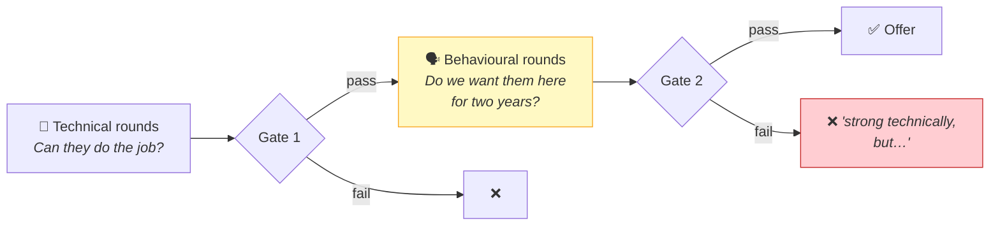
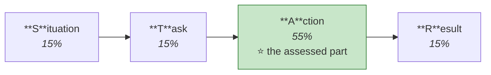
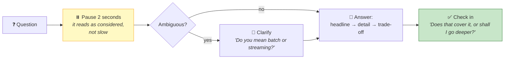
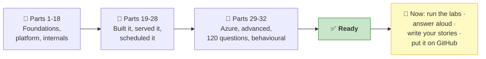

# Part 32 — Behavioral & Closing

> **Section goal:** The half of the interview that isn't technical. You'll learn the STAR structure, translate your existing background into data-engineering competencies, build four ready-to-adapt stories from *this* project, prepare the "why" answers, know what to ask them — and walk in with a one-page cheat sheet.

---

## 1. Why this Part decides more offers than the technical one

Most candidates over-prepare for gate 1 and improvise gate 2. **The improvisation shows.** Behavioural answers given without preparation are vague, chronological and forgettable — and *"strong technically but couldn't give concrete examples"* is a real rejection reason.

---

## 2. STAR — and the mistake almost everyone makes

### 🔍 Plain-English deep-dive

| Letter | Means | Time to spend | Common failure |
|--------|-------|--------------|----------------|
| **S**ituation | The context — where, when, what was at stake | ~15% | Rambling background nobody needs |
| **T**ask | *Your* specific responsibility | ~15% | Saying "we" — the interviewer can't tell what *you* did |
| **A**ction | What **you** did, step by step | ⭐ **~55%** | Skipped or compressed — this is the part they're assessing |
| **R**esult | The outcome, quantified where possible | ~15% | Missing entirely, or unquantified |

> ⚠️ **The single biggest STAR mistake: 80% Situation, 20% everything else.** People are comfortable describing context and uncomfortable claiming credit. Reverse it. The interviewer is scoring **Action**.

> ⚠️ **The second biggest: "we".** *"We decided to use Delta"* tells them nothing about you. *"I proposed Delta because…"* does. Use "we" for genuine team context, "I" for your contribution — and be honest about the split.

### The upgrade: STAR + **L**

Add **Learning** at the end. It turns a story about a past event into evidence of growth.

> *"…and what I took from it was that I now write the referential-integrity check before the join, not after, because a silent orphan is far more expensive than a loud failure."*

---

## 3. Translate your background into data-engineering competencies

Whatever you did before, the underlying competencies transfer. **Fill this in for yourself** — the right-hand column is what the interviewer actually scores.

| If your background is… | The transferable competency | How to phrase it |
|------------------------|-----------------------------|------------------|
| **Support / service desk** | Root-cause analysis under pressure; communicating with non-technical users | *"I've spent years turning a vague symptom into a precise cause — which is exactly what debugging a wrong dashboard number requires."* |
| **Software engineering** | Testing, version control, CI/CD, code review | *"I bring engineering discipline to pipelines — pure functions, unit tests, PR review — which data teams often lack."* |
| **Analyst / BI** | Business context, metric definitions, stakeholder management | *"I've been the consumer of bad pipelines, so I know exactly what makes a gold table usable."* |
| **DBA / SQL developer** | Query optimisation, indexing, transactions, modelling | *"Execution plans, joins and ACID transfer directly — Catalyst is a familiar idea in a distributed setting."* |
| **Sysadmin / cloud / infra** | Networking, identity, cost, automation | *"I can own the Azure side end to end — VNet injection, Entra ID, Key Vault, cost governance."* |
| **QA / testing** | Data quality thinking, edge cases, systematic verification | *"I default to building fixtures that contain the defects, then asserting — which is exactly what a silver layer needs."* |
| **Non-technical / career change** | Domain knowledge, communication, fresh perspective | *"I understand what the business actually asks for, and I've built the technical skills deliberately — here's the project."* |

> ⭐ **The framing that works:** *"Here's the competency, here's where I built it, here's how it applies to this role."* Never apologise for a non-linear path — **explain what it gave you that a linear path wouldn't**.

---

## 4. Four ready STAR stories from this project

Adapt the Situation to your real context. The Action and Result are things you genuinely did if you completed the labs.

---

### ⭐ Story 1 — Data quality (`Tell me about a time you found a problem others had missed`)

> **S:** *"I was building a lakehouse pipeline for an e-commerce dataset — around 183,000 order lines across three months, plus five dimension tables. The source files came from an upstream extract nobody had validated."*
>
> **T:** *"My job was to produce a gold layer the business could report on. Before writing any transformation, I wanted to know what I was actually dealing with."*
>
> **A:** *"I ran a systematic profiling pass rather than eyeballing previews — `printSchema` first, because numerics arriving as strings changes everything downstream; then `summary()` for percentiles, since impossible values like negative counts show up immediately in the min; then `distinct()` on every categorical column; then null counts and duplicate counts on candidate keys. That surfaced twenty-two distinct defects nobody had flagged — most importantly that the same category existed as both `Books` and `BKS`, and as `Grocery` and `GRCY`, which you cannot see from a data preview. It also found quantities written as words, currency symbols embedded in numeric fields, comma decimal separators from European locale data, and negative review counts. I turned that list into the silver-layer specification, classified each defect by type so the technique followed from the class, and took the judgement calls — like whether to drop three hundred customers with null IDs — to a business owner rather than deciding unilaterally."*
>
> **R:** *"The gold layer reconciled first time, and the duplicate category codes would otherwise have split revenue across two rows in every category report. I also built the profiling checks into the pipeline as assertions, so a new variant appearing upstream fails the run rather than silently reaching a dashboard."*
>
> **L:** *"The lesson I took is that `distinct()` on every categorical column is non-negotiable. That specific defect is invisible in a preview and catastrophic in a report."*

**Competencies:** thoroughness · systematic method · stakeholder engagement · prevention over correction.

---

### ⭐ Story 2 — Debugging (`Tell me about a difficult technical problem`)

> **S:** *"After building the gold layer, my referential-integrity check reported that a set of order lines referenced customers that didn't exist in the customer dimension."*
>
> **T:** *"I needed to work out whether it was a bug in my pipeline or a genuine data issue, and decide what to do about it — without quietly changing revenue totals."*
>
> **A:** *"I used a left anti join from the fact to the dimension, which returns exactly the unmatched rows. Tracing it back through the layers, the cause was my own earlier decision: in the silver layer I'd dropped around three hundred customer records with null IDs, on the basis that a null primary key is unusable. That was correct in isolation, but it orphaned every order those customers had placed. So the real lesson was that a decision in one dimension had a consequence in a different table that I hadn't reasoned about. Rather than delete the fact rows — which would have changed revenue and is a business decision, not mine — I implemented the standard dimensional-modelling answer: an 'Unknown' member in the dimension with a reserved key, and unmatched fact keys remapped to it."*
>
> **R:** *"Revenue totals stayed complete and correct, the gap became visible in reports as an explicit 'Unknown' category instead of silently absent, and I added the orphan count as a logged metric so a rising rate would trigger an alert. The check itself became a permanent quality gate."*
>
> **L:** *"What stayed with me is that orphaned keys don't error — they produce nulls, so totals look plausible and are wrong. That's why I now run cross-layer referential checks as part of the pipeline rather than as a one-off."*

**Competencies:** systematic debugging · owning your own mistake · knowing where the technical/business boundary sits · building the fix into the process.

---

### ⭐ Story 3 — Judgement under constraint (`Tell me about a trade-off you made`)

> **S:** *"The pipeline was explicitly scoped as a two-week pilot to evaluate whether the platform was viable, with pass/fail criteria agreed up front — not as a production system."*
>
> **T:** *"I had to decide which engineering practices to apply properly and which to consciously defer, and be able to defend both."*
>
> **A:** *"I applied fully the things that would be expensive to retrofit or that affected correctness: the medallion layering, so every layer is reprocessable from the one before; explicit schemas rather than inference, so types are deterministic; audit columns for provenance; and quality gates as assertions at every layer boundary. I deliberately deferred four things and documented each with what production would need: it's a historical backfill rather than incremental, so it would need Auto Loader with `MERGE`; dimensions are Slowly Changing Type 1, so a customer moving region would retroactively change historical attribution and Type 2 would be needed; FX rates are hardcoded rather than sourced from an API with transaction-date validity; and there are no unit tests, because the transformations weren't yet extracted into pure functions."*
>
> **R:** *"The pilot delivered inside the time-box and answered the actual question — is this platform viable for us — with evidence rather than opinion. And because the simplifications were documented rather than hidden, the follow-on scope was a list, not a discovery exercise."*
>
> **L:** *"I learned that stating your shortcuts explicitly is more credible than hoping nobody notices. It changes the conversation from 'you missed this' to 'you knew, and here's the plan.'"*

**Competencies:** prioritisation · pragmatism · communication · knowing the difference between a shortcut and a mistake.

---

### ⭐ Story 4 — Learning something new fast (`Tell me about a time you had to learn quickly`)

> **S:** *"I needed working Databricks capability from a standing start — not familiarity, but the ability to build and defend something."*
>
> **T:** *"Reading documentation wasn't going to be enough, because the questions that matter are about judgement rather than syntax."*
>
> **A:** *"I structured it as build-plus-understand rather than one or the other. I built a complete end-to-end pipeline — ingestion from a landing zone, medallion layers, a star schema, a reporting view, a dashboard and a scheduled job DAG. But alongside every implementation step I forced myself to understand the engine underneath: reading `.explain()` output line by line until I could see predicate pushdown and column pruning actually happening, understanding why a shuffle creates a stage boundary, and why `repartition` and `coalesce` differ. When something behaved unexpectedly — a chart showing August, October, September — I traced it to the cause rather than working around it, in that case a string month name sorting alphabetically."*
>
> **R:** *"I can now explain not just what I built but why each decision was made and what I'd change for production. And I can debug rather than only follow tutorials, which is the actual difference between having done a course and being able to do the job."*
>
> **L:** *"Building without understanding gives you something you can't debug; understanding without building gives you something you can't demonstrate. The combination is what makes the knowledge stick."*

**Competencies:** self-direction · depth over surface · learning agility.

---

### Two more prompts to prepare yourself

| Question | Which project moment to use |
|----------|-----------------------------|
| *"Tell me about a time you disagreed with someone"* | The percent-vs-fraction discount convention — a genuine ambiguity where you had to pick, name it explicitly and add a constraint so it couldn't drift |
| *"Tell me about a time you improved a process"* | Refactoring five near-identical ingestion blocks into a config-driven loop — and being able to state honestly *when* DRY is over-applied |

---

## 5. The "why" questions

### "Why data engineering?"

**The structure:** what draws you → evidence you've tested that → why now.

> *"Two things. First, it's the part of the stack where correctness compounds — if the pipeline is right, everything downstream can be right, and if it's wrong, no amount of dashboard polish saves it. That responsibility appeals to me. Second, it sits between systems and the business: you have to understand both the engine and what a number actually means. I tested that by building an end-to-end pipeline rather than reading about one, and the parts I found most engaging were exactly the ones I expected to find tedious — reading query plans, reasoning about grain, deciding null strategies per column."*

### "Why Databricks specifically?"

> *"The lakehouse model solves a problem I'd otherwise have to live with: running a lake and a warehouse side by side means two copies, two governance models and two versions of the same number. Databricks puts an open transactional format on cheap storage so one copy serves BI and ML with real ACID guarantees. And practically, the governance layer is what makes it adoptable in a large organisation — Unity Catalog gives one permission model and automatic lineage across every workspace. I'd also say the data staying in open Delta and Parquet in our own storage matters, because it keeps the decision reversible."*

### "Why this role / this company?"

**Do the homework. Generic answers are transparent.**

| Prepare | Where to find it |
|---------|------------------|
| What the company actually does | Their site, recent news, their engineering blog |
| Their data stack | The job description, LinkedIn engineer profiles, tech blog |
| A recent development | Product launches, funding, acquisitions |
| Something specific in the JD that genuinely appeals | The JD itself |

> *"Three reasons. The role is Azure-based, and I've deliberately gone deep on that side — ADLS Gen2, Access Connector and managed identity, Entra ID with SCIM, Key Vault-backed secrets — because it's where most enterprise Databricks work actually happens. The JD mentions [specific thing], which is exactly the problem I found most interesting when I hit a smaller version of it. And [company-specific reason]. I'd rather be somewhere the data platform is treated as a product with owners and SLAs than somewhere it's a side effect."*

### "Why you?"

Three sentences: differentiator, evidence, honesty.

> *"I combine [your background strength] with data engineering that I've built deliberately and can demonstrate rather than describe — here's a repo with a full medallion pipeline, quality gates and a scheduled job DAG. I'm not going to claim years of production Databricks experience I don't have, but I understand the engine well enough to debug rather than guess, and I'd rather be someone who asks a good clarifying question than someone who confidently ships the wrong number."*

### "What's your biggest weakness?"

**The rules:** real, not disguised strength · already being worked on · not core to the job.

| ❌ Avoid | ✅ Works |
|---------|---------|
| "I'm a perfectionist" | A genuine gap plus what you're doing about it |
| "I work too hard" | — |
| Something disqualifying | — |

> *"My production Databricks experience is limited to what I've built myself, so I haven't yet operated a pipeline through a genuine 3am incident or a schema change from an upstream team that broke everything. I've compensated by studying the failure modes deliberately — idempotency, referential integrity, skew, cost blowouts — and by building quality gates and alerting into what I build rather than bolting them on. But I'd be misrepresenting myself if I claimed operational scar tissue I don't have, and it's the thing I most want from this role."*

> ⭐ **That answer works because it's true, it's specific, it shows you know what you don't know, and it ends by wanting the thing.**

---

## 6. Questions to ask them

Having none reads as disinterest. **Prepare six; you'll use three.**

### 🟢 About the role

- *"What does the first ninety days look like — is there a specific pipeline or migration I'd own?"*
- *"How is the data team structured — central platform, embedded in domains, or a hybrid?"*
- *"What does the on-call rotation look like for data pipelines, if there is one?"*

### 🟡 About the technical reality

- *"How much of the estate is on Unity Catalog versus a legacy Hive metastore?"*
- *"Are pipelines defined as code with Asset Bundles, or built in the workspace?"*
- *"How do you handle data quality — expectations in DLT, custom assertions, or a separate tool?"*
- *"Is the medallion architecture consistently applied, or does it vary by team?"*

### 🔴 About maturity — these tell you the most

- *"How do you find out that a pipeline produced wrong numbers — do you find it, or does the business?"*
- *"Who owns the definition of a metric like revenue? Is there a certified source?"*
- *"How is Databricks cost attributed — per team, per pipeline, or a single bill?"*

### ⚫ About growth

- *"What separates someone doing well here from someone doing exceptionally?"*
- *"Is there budget and time for certification or conferences?"*

> ⭐ **The single best question:** *"How do you find out that a pipeline produced wrong numbers — do you find it, or does the business tell you?"* A mature team talks about quality gates, monitoring and alerting. An immature one says *"someone usually notices."* You've learned more from that answer than from anything on the careers page.

---

## 7. Interview-day logistics

| Timing | Do |
|--------|----|
| **Night before** | Read the cheat sheet below. **Sleep.** Don't learn anything new — it displaces what you know |
| **90 min before** | Re-read your four STAR stories out loud once |
| **30 min before** | Test camera, mic, screen share. Close everything else. Water within reach |
| **10 min before** | Cheat sheet visible off-camera. Pen and paper for diagrams |
| **During** | Take a beat before answering. Think aloud on design questions. Ask clarifying questions |
| **If you don't know** | *"I haven't worked with that directly. My understanding is X — is that right?"* Never bluff |
| **After** | Note every question asked. Send a short thank-you referencing something specific |

### Answering technique

> 💡 **"Headline → detail → trade-off"** is the shape of every strong technical answer. Lead with the conclusion, support it, then name what it costs. The trade-off is what makes you sound senior.

---

## 8. 📄 The one-page night-before cheat sheet

*Print this. Nothing else.*

---

### THE PROJECT IN 30 SECONDS
> *"End-to-end lakehouse pipeline for an e-commerce dataset — 183,000 order lines from ~92 daily landing files, plus five dimensions. Bronze/silver/gold in Delta under Unity Catalog, star schema in gold, a denormalised reporting view, an AI/BI dashboard, and a scheduled multi-task job DAG. Quality gates at every layer boundary."*

### THE FOUR RULES
- 📦 **raw** = files as received, never modified
- 🥉 **bronze** = change nothing except metadata (all strings)
- 🥈 **silver** = fix the quality, keep the grain
- 🥇 **gold** = add business value

### THE NUMBERS
`183,000` fact rows · `~92` files · `50,000` products · `22` defects fixed · `4` currencies → INR · grain = **one order LINE**

### ENGINE FACTS
- Delta = **Parquet + transaction log + metadata**
- `Exchange` = **shuffle** · `Project` = **SELECT**
- 1 action → 1 **job** · 1 shuffle → 1 extra **stage** · 1 partition → 1 **task**
- Catalyst = **Google Maps** · Photon = **the car** (C++, vectorised)
- Joins: **broadcast** (no shuffle) · sort-merge · shuffle hash
- Three-grant rule: `USE CATALOG` + `USE SCHEMA` + `SELECT`
- `NULL = NULL` → **NULL** (nulls never join)
- `coalesce` **cannot increase** partitions
- ~**128 MB** per partition · **10 MB** broadcast threshold · **7 days** VACUUM

### TRAPS TO NAME BEFORE THEY DO
Backfill-only (→ Auto Loader + `MERGE`) · SCD **Type 1** (→ Type 2) · hardcoded **FX rates** (→ transaction-date rates) · **no unit tests** (→ extract pure functions) · `double` for money (→ `DecimalType`)

### ANSWER SHAPE
**Headline → detail → trade-off.** Pause 2s. Clarify if ambiguous. Never say "always".

### STAR
**55% on ACTION.** Say **"I"**, not "we". End with **Result** *and* **Learning**.

### MY FOUR STORIES
1. Data quality — 22 defects found by profiling
2. Debugging — orphaned keys → Unknown member
3. Trade-offs — the two-week pilot scope
4. Learning fast — build **and** understand

### THE QUESTION TO ASK THEM
> *"How do you find out that a pipeline produced wrong numbers — do you find it, or does the business tell you?"*

### IF YOU DON'T KNOW
> *"I haven't worked with that directly. My understanding is X — is that right?"*

---

## 9. Am I ready? — an honest answer

Reading this guide builds knowledge. **Readiness needs three more things**, and skipping them is why well-prepared people still stumble.

| Requirement | Why reading isn't enough | How to close it |
|-------------|--------------------------|-----------------|
| **Answering aloud** | Recognition ≠ articulation. You'll *recognise* the right answer and mistake that for knowing it | Part 31's tracker — three passes, spoken |
| **Your own STAR stories written down** | Improvised stories are vague and chronological | Write four in full. Time them: 90 seconds each |
| **Mock practice** | Nobody's first spoken answer is their best | A peer, a recording of yourself, or an LLM playing interviewer |

**A realistic self-assessment:**

| Signal | You're probably… |
|--------|------------------|
| Can explain narrow vs wide **and** why the shuffle barrier matters | 🟢 Solid on internals |
| Can draw the Spark architecture from memory | 🟢 Ready for the whiteboard |
| Can name three of your project's own gaps unprompted | 🟢 Reads as senior |
| Can tell a 90-second STAR story without notes | 🟢 Behaviourally ready |
| Only *recognise* answers rather than produce them | 🟡 More spoken passes needed |
| Haven't actually run the labs | 🔴 Do them — you'll be caught on specifics |

> 💡 **The highest-leverage remaining hour:** record yourself answering ten questions from Part 31 and four STAR prompts, then watch it back. It is uncomfortable and it is the fastest improvement available.

---

## ⭐ Likely Behavioural Questions — quick reference

| Question | Use | Key move |
|----------|-----|----------|
| *"Tell me about yourself"* | 60-90s: now → relevant background → why this role | End on **why you're here**, not chronology |
| *"Walk me through a project"* | The pipeline | Pain → design → **decisions and why** → result |
| *"A difficult technical problem"* | Story 2 (orphans) | Show the *method*, not just the fix |
| *"A time you found something others missed"* | Story 1 (22 defects) | Systematic profiling, not luck |
| *"A trade-off you made"* | Story 3 (pilot scope) | Named the deferrals explicitly |
| *"A time you learned quickly"* | Story 4 | Build **and** understand |
| *"A mistake you made"* | The dropped customers → orphans | Own it; show the systemic fix |
| *"Disagreed with someone"* | Percent vs fraction convention | Resolved with a constraint, not an argument |
| *"Biggest weakness"* | Limited production ops experience | True, specific, being worked on, ends by wanting it |
| *"Where in five years?"* | Depth then breadth | Ambition that includes staying |
| *"Why should we hire you?"* | Differentiator + evidence + honesty | Point at the repo |

---

## 🧠 30-Second Memory Hooks

- **Gate 1 is "can they do it". Gate 2 is "do we want them here for two years".** Prepare both.
- **⭐ STAR: 55% on ACTION.** Everyone over-invests in Situation.
- **Say "I", not "we".** The interviewer cannot score a "we".
- **Add **L**earning to STAR.** It converts a past event into evidence of growth.
- **Answer shape: headline → detail → trade-off.** The trade-off is what sounds senior.
- **Pause two seconds.** It reads as considered, not slow.
- **Clarify before designing.** Volumes, latency, users, budget.
- **Never say "always".** Every strong answer contains a caveat.
- **Volunteer your project's gaps first** — backfill-only, SCD1, hardcoded FX. Judgement, not weakness.
- **Never bluff.** *"I haven't used that directly — my understanding is X, is that right?"*
- **Have six questions; ask three.** Best one: *"How do you find out a pipeline produced wrong numbers?"*
- **Your four stories: quality · debugging · trade-offs · learning fast.** Write them. Time them. 90 seconds each.
- **Weakness = true + specific + being worked on + ends by wanting the thing.**
- **Night before: cheat sheet and sleep.** Learning new material displaces what you know.
- **The last hour that matters: record yourself and watch it back.**

---

## 🎓 You've reached the end of the guide

**The four things that convert this into an offer:**

1. **Run the labs.** Reading about `regexp_replace` and debugging your own regex at 11pm are different skills — and interviewers can tell which one you have.
2. **Answer aloud, three passes.** Part 31's tracker.
3. **Write your four STAR stories in full**, and time them.
4. **Put the project on GitHub** with a README explaining the architecture and the deliberate simplifications. A hiring manager can click a link; they cannot click your workspace.

> *"I wish you all the best."* — and so does the instructor, at `03:35:24`.

---

*Appendices:* **[A — Master Glossary](Appendix-A-glossary.md)** · **[B — Transcript Timestamp Index](Appendix-B-timestamp-index.md)** · **[C — PySpark & SQL Cheat Sheet](Appendix-C-pyspark-sql-cheatsheet.md)**

---

**Navigation** — ⬅️ **[Part 31 — Interview Question Bank](Part-31-interview-question-bank.md)** · 🏠 **[Master Index](../Databricks%20-%20Study%20Guide.md)** · ➡️ *End of guide — go to [Appendix A](Appendix-A-glossary.md)*
