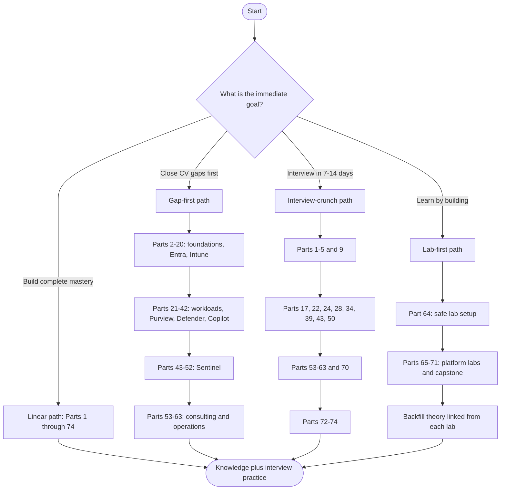
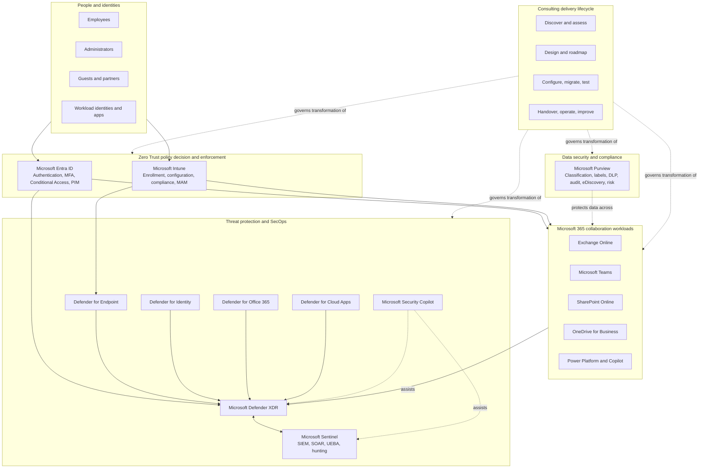
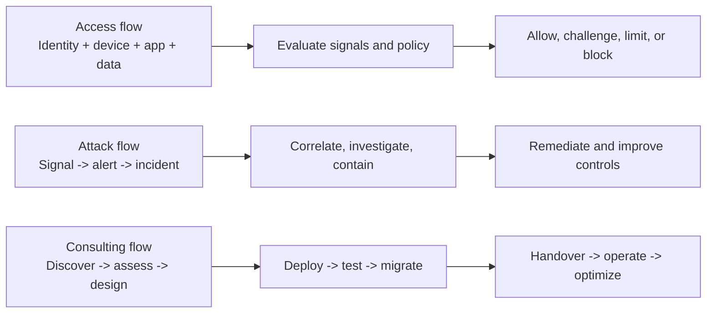
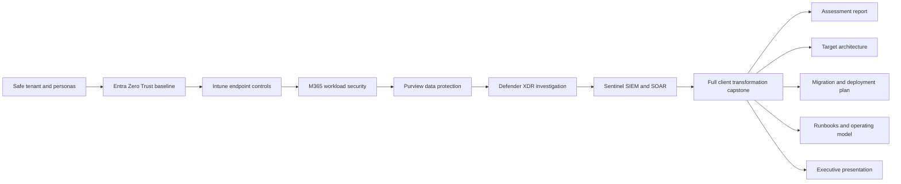

# Deloitte Microsoft 365 Security Senior Consultant - Complete Study Guide

> **Target role:** Deloitte Cyber, Enterprise Security - Microsoft 365 Security Senior Consultant
> **Built for:** Candidates moving from Microsoft 365 Support Escalation Engineering into security consulting
> **Mode:** Complete learning path plus interview preparation
> **Depth promise:** Beginner-first concepts, architecture diagrams, decision flows, implementation labs, troubleshooting, consulting deliverables, scenario drills, model answers, and memory hooks
> **Currency:** Curriculum cross-checked against Microsoft Learn on August 24, 2026

> **How to use this guide:** It is written for **any** candidate preparing for this role. The starting-strength table below describes a *typical* profile, not one person's CV, and every model answer is a template. Replace the bracketed details, metrics, employers, products, and examples with evidence from your own CV before you use them, and never claim experience you cannot defend.

---

## Starting strengths this guide assumes

This guide starts from the strengths a typical enterprise-support professional already has, then deliberately closes the gaps between that background and the role.

| Demonstrated starting strength | How the guide uses it | Main bridge to build |
|---|---|---|
| 5+ years of enterprise support and escalations | Incident, troubleshooting, stakeholder, and operational examples use familiar support motions | Reframe support ownership as consulting discovery, design, deployment, and handover |
| Deep SharePoint Online and OneDrive experience | Workload-security examples start with permissions, sharing, sync, migration, and compliance | Expand to Teams, Exchange Online, Purview, and cross-workload controls |
| Critical incidents, RCA, fix validation, vendors, and product groups | Scenario labs reuse investigation, defect escalation, and multi-party coordination | Add SOC incident response, threat hunting, evidence handling, and SOAR |
| Security- and compliance-aligned technical guidance | Provides a natural entry into Zero Trust and data protection | Build hands-on Entra, Conditional Access, Intune, Defender, Purview, and Sentinel depth |
| Power Automate, Power Apps, Copilot Studio, AI certifications | Useful foundation for playbooks, workflow automation, and Security Copilot | Learn security automation guardrails, Logic Apps, Graph, KQL, and AI governance |
| Business reviews, KPIs, leadership reporting, mentoring | Strong base for consulting communication and operational readiness | Add assessments, maturity scoring, roadmaps, HLD/LLD, RACI, and executive risk reporting |

### Honest gap map

This guide assumes no production experience with Entra ID, MFA, Conditional Access, Intune, Sentinel, Defender, Purview, Exchange Online, Microsoft Teams, third-party security migrations, or SC-series certifications. The guide treats these as learning and lab areas, never as past experience. Interview answers will distinguish clearly among:

- **I have done this in production.**
- **I have done this in a lab or structured exercise.**
- **I understand the design and would validate it this way.**

---

## Learning paths

| Path | Best for | Suggested order |
|---|---|---|
| **Linear mastery** | No deadline; wants complete role readiness | 1 through 74, then Appendices A-H |
| **Gap-first** | Strong M365 support, limited security platform exposure | 2-20, 26-52, 53-63, 64-71, 72-74 |
| **Interview crunch** | Interview within two weeks | 1-5, 9, 17, 22, 24, 28, 34, 39, 43, 50, 53-63, 70, 72-74 |
| **Lab-first** | Learns fastest by doing | 64-71, using each lab's links to backfill the corresponding theory |
| **Certification-aligned** | Wants role prep plus credentials | SC-900 map -> SC-300 -> SC-400 -> SC-200 -> SC-100 in Part 72 |

---

## The role in one architecture picture

### The three flows every candidate must be able to draw

---

## Job description coverage matrix

| JD responsibility or qualification | Primary Parts | Proof produced by the guide |
|---|---:|---|
| Microsoft 365 security consulting and client problem solving | 1, 53-63, 71 | Discovery pack, risk register, design, roadmap, operating model, capstone presentation |
| Microsoft Entra ID, MFA, and Conditional Access | 6-14, 65 | Identity architecture and tested Conditional Access policy set |
| Microsoft Intune and endpoint security | 15-20, 66 | Enrollment, configuration, compliance, endpoint-security, and troubleshooting lab |
| Microsoft Purview | 26-33, 68 | Label, DLP, audit/eDiscovery, risk, compliance, and AI data-security designs |
| Microsoft Defender suite and Defender XDR | 22, 34-42, 69 | Cross-domain incident investigation, response plan, hunting queries |
| Microsoft Sentinel | 43-52, 70 | Data onboarding, detections, workbooks, UEBA, hunting, and SOAR playbook |
| Exchange Online | 21-22, 67 | Secure mail-flow and Defender for Office 365 assessment |
| Microsoft Teams | 23, 67 | Meeting, federation, guest, app, data, and compliance control design |
| SharePoint Online and OneDrive for Business | 24, 67 | Secure sharing, permissions, sync, access-control, and governance assessment |
| M365 workload assessment, design, configuration, and optimization | 21-33, 53-57, 67, 71 | Current-state findings, target controls, deployment plan, validation evidence |
| Third-party tool to Microsoft security transformation | 56, 71 | Capability mapping, coexistence, data migration, cutover, rollback, and decommission plan |
| Security events, policy errors, platform issues, and service disruptions | 5, 20-25, 39-52, 59-62 | Fault-isolation trees, incident timelines, KQL evidence, runbooks, PIR |
| Discovery through handover, documentation, and reporting | 53-61, 71 | Full engagement lifecycle and reusable consulting artifacts |
| Security assessments, health checks, and readiness reviews | 53-55 | Assessment workbook, maturity model, Secure Score analysis, readiness gate |
| Multi-vendor and multi-protocol troubleshooting | 5, 13-14, 20-25, 56, 59 | Protocol traces, dependency maps, ownership boundaries, vendor action plans |
| Security Copilot | 42, 70-72 | Promptbook, validation rules, governance model, investigation use cases |
| Defender Vulnerability Management, Identity, and XDR | 35-41, 69 | Exposure prioritization and cross-domain attack investigation |
| SCCM and co-management | 20, 66 | Intune/SCCM authority, workload slider, migration, and troubleshooting model |
| Power Platform | 25, 63, 71 | Secure automation pattern and operational workflow |
| SC-900, SC-100, SC-200, SC-300, SC-400 | 72 and all mapped technical Parts | Certification-to-role roadmap and objective coverage map |
| 24x7 rotational support and on-call | 58, 61-62, 74 | Triage prioritization, shift handoff, major incident, and behavioral answers |

---

# Part index

## Group A - Role orientation and security foundations

| # | Part | What mastery provides |
|---:|---|---|
| 1 | [Role Map, Deloitte Cyber Context, and the Complete Engagement Story](prep/Part-01-role-map-deloitte-cyber-engagement-story.md) | Translate every JD line into outcomes, stakeholders, artifacts, and interview evidence; understand Enterprise Security, Cyber Operate, cloud transformation, and the difference among support, engineering, architecture, and consulting |
| 2 | [Cybersecurity Fundamentals from Zero](prep/Part-02-cybersecurity-fundamentals.md) | Assets, identities, threats, vulnerabilities, exploits, risk, attack surface, CIA triad, AAA, nonrepudiation, control types, preventive/detective/corrective controls, and security versus compliance |
| 3 | [Zero Trust, Defense in Depth, Shared Responsibility, and Secure by Design](prep/Part-03-zero-trust-defense-in-depth-secure-by-design.md) | Verify explicitly, least privilege, assume breach; identities, endpoints, apps, data, network, infrastructure; policy enforcement; compensating controls; trust boundaries; cloud shared responsibility |
| 4 | [Microsoft 365 Tenant Architecture, Admin Portals, Roles, Licensing, and Service Boundaries](prep/Part-04-m365-tenant-architecture-portals-roles-licensing.md) | Tenant/subscription/workspace relationships, Microsoft 365 service dependencies, admin centers, RBAC, least privilege, E3/E5 and add-on reasoning, data location, service health, and support boundaries |
| 5 | [Networking, Identity, and Application Protocols for M365 Troubleshooting](prep/Part-05-networking-identity-application-protocols.md) | DNS, DHCP, TCP, TLS, HTTP, proxies, firewalls, VPN, SMTP, OAuth 2.0, OpenID Connect, SAML, WS-Fed, Kerberos, LDAP, SCIM, Microsoft Graph, webhooks, API throttling, packet-to-cloud troubleshooting, and multi-vendor ownership |

## Group B - Microsoft Entra identity and access

| # | Part | What mastery provides |
|---:|---|---|
| 6 | [Microsoft Entra ID Architecture and Directory Objects](prep/Part-06-entra-id-architecture-directory-objects.md) | Tenants, users, groups, devices, service principals, app registrations, managed identities, object IDs, domains, licenses, administrative units, directory roles, and lifecycle dependencies |
| 7 | [Authentication, Authorization, Tokens, and Modern Authentication](prep/Part-07-authentication-authorization-tokens-modern-auth.md) | OAuth/OIDC flows, SAML federation, access/ID/refresh tokens, claims, scopes, consent, token lifetimes, sessions, primary refresh tokens, modern versus legacy authentication, and sign-in log interpretation |
| 8 | [MFA, Passwordless Authentication, Authentication Strengths, and Registration](prep/Part-08-mfa-passwordless-authentication-strengths.md) | MFA mechanics, phishing-resistant methods, passkeys/FIDO2, Windows Hello, Authenticator, Temporary Access Pass, SSPR, combined registration, authentication strengths, registration campaigns, and break-glass considerations |
| 9 | [Conditional Access Design, Deployment, and Troubleshooting](prep/Part-09-conditional-access-design-deployment-troubleshooting.md) | Assignments, conditions, authentication context, grant/session controls, report-only mode, What If, exclusions, templates, named locations, device filters, continuous access evaluation, policy conflicts, lockout prevention, and staged rollout |
| 10 | [Entra ID Protection and Risk-Based Access](prep/Part-10-entra-id-protection-risk-based-access.md) | User risk versus sign-in risk, risk detections, risky workload identities, remediation, investigation, risk policies, Conditional Access integration, false positives, and operational workflows |
| 11 | [Privileged Access: RBAC, PIM, Least Privilege, and Emergency Access](prep/Part-11-privileged-access-rbac-pim-emergency-access.md) | Built-in/custom roles, scope, Privileged Identity Management, eligible versus active assignment, JIT activation, approvals, access reviews, alerts, break-glass accounts, and privileged access workstations |
| 12 | [Identity Governance: Lifecycle Workflows, Entitlement Management, and Access Reviews](prep/Part-12-identity-governance-lifecycle-entitlement-access-reviews.md) | Joiner/mover/leaver, access packages, catalogs, connected organizations, terms of use, approval stages, recurring reviews, separation of duties, and HR-driven governance |
| 13 | [Hybrid Identity: Entra Connect, Cloud Sync, PHS, PTA, Federation, and AD DS](prep/Part-13-hybrid-identity-connect-cloud-sync.md) | Source of authority, synchronization, password hash sync, pass-through authentication, AD FS, Seamless SSO, staging mode, filtering, soft/hard match, health monitoring, federation failures, and migration choices |
| 14 | [External, Cross-Tenant, Workload, and Application Identity Security](prep/Part-14-external-cross-tenant-workload-app-identity.md) | B2B collaboration, direct connect, cross-tenant access, tenant restrictions, cross-tenant synchronization, guest lifecycle, app consent, permissions, certificates/secrets, workload identity federation, and application governance |

## Group C - Microsoft Intune and endpoint management

| # | Part | What mastery provides |
|---:|---|---|
| 15 | [Intune Architecture, Device Identity, Enrollment, MDM, and MAM](prep/Part-15-intune-architecture-enrollment-mdm-mam.md) | Intune service architecture, Entra registration/join, corporate versus personal ownership, enrollment methods, MDM authority, MAM without enrollment, platform differences, scope, and enrollment troubleshooting |
| 16 | [Configuration Profiles, Settings Catalog, Security Baselines, and Policy Precedence](prep/Part-16-intune-configuration-settings-baselines-policy-precedence.md) | Configuration channels, templates, Settings Catalog, custom OMA-URI, security baselines, filters, assignments, conflicts, applicability, tattooing, reporting, and safe rollout rings |
| 17 | [Device Compliance and Conditional Access Integration](prep/Part-17-intune-compliance-conditional-access.md) | Compliance policy evaluation, grace periods, actions for noncompliance, device health and threat signals, device/app-based Conditional Access, partner MTD, stale records, and access troubleshooting |
| 18 | [Application Management, Windows Autopilot, Updates, and Device Lifecycle](prep/Part-18-intune-apps-autopilot-updates-lifecycle.md) | Win32/Microsoft Store/M365 apps, dependencies, supersedence, detection rules, app protection, Autopilot profiles and ESP, Windows Update rings, feature/quality updates, wipe/retire/delete, and lifecycle operations |
| 19 | [Intune Endpoint Security: Antivirus, ASR, Firewall, Encryption, EDR, LAPS, and EPM](prep/Part-19-intune-endpoint-security-stack.md) | Endpoint security policy types, Defender Antivirus, attack surface reduction, BitLocker/FileVault, firewall, EDR onboarding, account protection, Windows LAPS, Endpoint Privilege Management, and conflict avoidance |
| 20 | [Intune Operations, Reporting, Remediation, Troubleshooting, SCCM, and Co-Management](prep/Part-20-intune-operations-troubleshooting-sccm-comanagement.md) | Device diagnostics, logs, sync, assignment and enrollment failures, remediation scripts, reports, scope tags, remote actions, Configuration Manager co-management, workload authority, tenant attach, migration, and service health |

## Group D - Securing Microsoft 365 collaboration workloads

| # | Part | What mastery provides |
|---:|---|---|
| 21 | [Exchange Online Architecture, Identity, Permissions, and Mail Flow](prep/Part-21-exchange-online-architecture-mail-flow.md) | Recipients, mailboxes, groups, transport pipeline, connectors, accepted domains, DNS records, SPF/DKIM/DMARC, RBAC, mailbox delegation, auditing, hybrid mail flow, message trace, and delivery troubleshooting |
| 22 | [Exchange Online Protection and Defender for Office 365](prep/Part-22-eop-defender-office-365.md) | Anti-spam/malware/phishing, preset security policies, Safe Links, Safe Attachments, impersonation, spoof intelligence, quarantine, submissions, attack simulation, campaign views, automated investigation, and email incident response |
| 23 | [Microsoft Teams Security, Meetings, Federation, Guests, Apps, and Compliance](prep/Part-23-teams-security-meetings-federation-apps-compliance.md) | Teams architecture, identity and membership, external access versus guests, meeting and messaging policies, app permission/setup policies, shared channels, information barriers, sensitivity labels, DLP, retention, eDiscovery, and troubleshooting |
| 24 | [SharePoint Online and OneDrive Security, Sharing, Sync, and Governance](prep/Part-24-sharepoint-onedrive-security-sharing-sync-governance.md) | Permission inheritance, site roles, sharing links, external sharing, guest access, restricted access, unmanaged devices, sensitivity labels, DLP, retention, access reviews, sync security, migration security, audit, oversharing, and incident scenarios |
| 25 | [Microsoft 365 Apps, Power Platform, Copilot, and Collaboration Integration Security](prep/Part-25-m365-apps-power-platform-copilot-security.md) | Office client security, macros and add-ins, connectors, Power Apps/Automate environments and DLP policies, service accounts, Graph permissions, Copilot permissions model, oversharing risk, plugin/agent governance, and secure automation |

## Group E - Microsoft Purview data security and compliance

| # | Part | What mastery provides |
|---:|---|---|
| 26 | [Microsoft Purview Architecture, Data Classification, and Solution Map](prep/Part-26-purview-architecture-classification-solution-map.md) | Data security versus governance versus compliance, portals, roles, Data Explorer, Content Explorer, Activity Explorer, sensitive information types, exact data match, document fingerprinting, trainable classifiers, and prerequisites |
| 27 | [Information Protection, Sensitivity Labels, Encryption, and Containers](prep/Part-27-purview-information-protection-labels-encryption.md) | Label taxonomy, publishing, manual/default/recommended/automatic labeling, content marking, encryption, permissions, groups/sites/Teams container labels, Office behavior, scanner concepts, migration, and label troubleshooting |
| 28 | [Data Loss Prevention Across M365, Endpoints, Browsers, and Cloud Apps](prep/Part-28-purview-dlp-m365-endpoints-cloud-apps.md) | DLP architecture, locations, policy/rule evaluation, conditions, exceptions, actions, policy tips, user overrides, incident reports, Endpoint DLP, adaptive protection, simulation mode, tuning, false positives, and rollout |
| 29 | [Data Lifecycle and Records Management](prep/Part-29-purview-lifecycle-records-management.md) | Retention policies versus labels, event-based retention, disposition review, records and regulatory records, file plans, preservation lock, inactive mailboxes, deletion conflicts, retention principles, and defensible disposition |
| 30 | [Audit, Content Search, eDiscovery, and Legal Investigation](prep/Part-30-purview-audit-ediscovery-legal-investigation.md) | Unified audit log, Audit Standard/Premium, retention, search strategy, cases, custodians, holds, collections, review sets, exports, chain of custody, legal privilege, evidence preservation, and incident investigation |
| 31 | [Insider Risk, Communication Compliance, Information Barriers, and Adaptive Protection](prep/Part-31-purview-insider-risk-communication-compliance.md) | Privacy-by-design, indicators, triggers, policies, alerts/cases, pseudonymization, communication review, information barriers, adaptive protection, HR/legal partnership, escalation, and ethical boundaries |
| 32 | [Compliance Manager, Regulatory Mapping, Privacy, and Audit Readiness](prep/Part-32-purview-compliance-manager-privacy-audit-readiness.md) | Assessments, improvement actions, compliance score, shared controls, evidence, ISO/NIST/GDPR concepts, data subject requests, privacy risk, audit preparation, control ownership, and explaining compliance without overclaiming |
| 33 | [Data Security Posture Management and Security for AI](prep/Part-33-purview-dspm-ai-data-security.md) | DSPM, DSPM for AI, discovering sensitive-data exposure, risky AI use, Copilot and agent audit events, AI interactions, recommendations, one-click policies, data-security controls, governance, and investigation workflows |

## Group F - Microsoft Defender and unified XDR

| # | Part | What mastery provides |
|---:|---|---|
| 34 | [Microsoft Defender XDR Architecture and the Cross-Domain Attack Story](prep/Part-34-defender-xdr-architecture-attack-story.md) | Defender portal, products and data sources, entities, alerts versus incidents, correlation, attack story, MITRE ATT&CK, unified queue, roles, retention, service integration, and end-to-end attack diagrams |
| 35 | [Defender for Endpoint and Defender Vulnerability Management](prep/Part-35-defender-endpoint-vulnerability-management.md) | Onboarding, sensor architecture, next-generation protection, EDR, behavior blocking, ASR, device inventory, exposure and secure scores, vulnerability prioritization, software evidence, recommendations, remediation, and integrations |
| 36 | [Defender for Identity and Hybrid Identity Threats](prep/Part-36-defender-identity-hybrid-threats.md) | Sensor architecture, domain controllers and AD CS, identity reconnaissance, credential theft, lateral movement, privilege escalation, honeytokens, health issues, identity posture assessments, alerts, and investigation |
| 37 | [Defender for Cloud Apps, SaaS Security, App Governance, and Session Controls](prep/Part-37-defender-cloud-apps-saas-security.md) | CASB concepts, Cloud Discovery, sanctioned/unsanctioned apps, API connectors, activity/file policies, OAuth app governance, Conditional Access App Control, session controls, SaaS posture, and shadow IT |
| 38 | [Defender for Office 365 SecOps and Email Attack Investigation](prep/Part-38-defender-office-365-secops-investigation.md) | Explorer, real-time detections, campaigns, submissions, incidents, Threat Tracker, automated investigation, remediation, hunting email entities, user-reported messages, and business email compromise investigation |
| 39 | [Defender XDR Incident Triage, AIR, Attack Disruption, and Response Actions](prep/Part-39-defender-xdr-incident-response-air.md) | Severity and prioritization, incident scope, timeline, evidence/entities, automated investigation and response, Action Center, live response, device isolation, user disablement, containment tradeoffs, attack disruption, and closure taxonomy |
| 40 | [Defender Advanced Hunting with KQL and Custom Detections](prep/Part-40-defender-advanced-hunting-kql-custom-detections.md) | Hunting schema, tables, event relationships, KQL patterns, query performance, indicators, timelines, joins, custom detections, response actions, tuning, validation, and converting hypotheses into detections |
| 41 | [Security Posture, Exposure Management, Secure Score, and Control Prioritization](prep/Part-41-exposure-management-secure-score-prioritization.md) | Microsoft Secure Score, exposure paths, attack surface, initiatives, device/identity/app/data posture, recommendation scoring, compensating controls, risk-based prioritization, ownership, metrics, and executive reporting |
| 42 | [Microsoft Security Copilot, Agents, Prompting, Validation, and Governance](prep/Part-42-security-copilot-agents-governance.md) | Standalone and embedded experiences, plugins, promptbooks, incident summaries, guided response, KQL generation, script analysis, threat intelligence, agents, capacity concepts, permissions, grounding, hallucination checks, privacy, and human approval |

## Group G - Microsoft Sentinel SIEM and SOAR

| # | Part | What mastery provides |
|---:|---|---|
| 43 | [SIEM, SOAR, SOC Fundamentals, and Microsoft Sentinel Architecture](prep/Part-43-siem-soar-soc-sentinel-architecture.md) | SOC roles and tiers, SIEM versus XDR, SOAR, Sentinel architecture, Defender portal experience, Log Analytics workspaces, tables, solutions, Content Hub, control/data planes, and end-to-end telemetry flow |
| 44 | [Sentinel Planning, Workspace Design, Cost, Retention, and Data Lake](prep/Part-44-sentinel-planning-workspaces-cost-retention-data-lake.md) | Use cases and requirements, single/multiple workspaces, tenant/region boundaries, commitment tiers, ingestion cost, analytics versus basic/auxiliary logs, retention, archive, data collection tiers, Sentinel data lake, and cost governance |
| 45 | [Sentinel Data Connectors, AMA, DCRs, ASIM, Parsers, and Normalization](prep/Part-45-sentinel-connectors-ama-dcr-asim-normalization.md) | Native/API/agent connectors, Azure Monitor Agent, data collection rules/endpoints, Syslog/CEF, Windows events, transformations, custom logs, ASIM schemas/parsers, connector health, latency, and ingestion troubleshooting |
| 46 | [KQL from Zero for Sentinel Analysts](prep/Part-46-kql-from-zero-sentinel.md) | Tables, rows, columns, pipe flow, where/project/extend/summarize, time windows, parse operators, joins/unions, let, functions, dynamic JSON, mv-expand, regex, time series, optimization, and reusable query patterns |
| 47 | [Analytics Rules, Alerts, Incidents, Entities, MITRE Mapping, and Tuning](prep/Part-47-sentinel-analytics-rules-incidents-entities.md) | Scheduled/NRT/Fusion/anomaly rules, rule logic, entity mapping, custom details, grouping, suppression, incident settings, MITRE mapping, alert enrichment, false-positive analysis, testing, and detection-as-code concepts |
| 48 | [UEBA, Behaviors, Anomalies, Threat Intelligence, and Watchlists](prep/Part-48-sentinel-ueba-behaviors-threat-intelligence.md) | User/entity baselines, anomalies, behavior analytics and 2026 behaviors layer, entity pages, threat-intelligence lifecycle, STIX/TAXII concepts, indicators, watchlists, enrichment, correlation, and privacy considerations |
| 49 | [Threat Hunting, Bookmarks, Workbooks, Notebooks, and Investigation](prep/Part-49-sentinel-hunting-workbooks-notebooks.md) | Hypothesis-driven hunting, hunts, queries, bookmarks, entity investigation, workbooks, visualization, notebooks, MSTICPy concepts, evidence preservation, converting findings into detections, and communicating results |
| 50 | [Automation Rules, Logic Apps Playbooks, and SOAR Engineering](prep/Part-50-sentinel-automation-logic-apps-playbooks.md) | Automation triggers/conditions/actions, playbook architecture, managed identities, connectors, permissions, approvals, enrichment, containment, notifications, idempotency, error handling, retries, testing, monitoring, and AI-generated playbook review |
| 51 | [Unified SecOps: Integrating Sentinel, Defender XDR, Purview, and Third Parties](prep/Part-51-unified-secops-defender-sentinel-purview.md) | Defender portal integration, incident synchronization, alert duplication avoidance, unified hunting, Purview signals, data connectors, response ownership, product-boundary decisions, migration from legacy portals, and operating-model implications |
| 52 | [Enterprise Sentinel Deployment: Multi-Workspace, Multi-Tenant, MSSP, Health, and Governance](prep/Part-52-enterprise-sentinel-multiworkspace-multitenant-governance.md) | Azure Lighthouse, delegated access, cross-workspace queries, content promotion, RBAC, repository integration, health/audit, deployment rings, data residency, sovereign-cloud considerations, business continuity, and platform governance |

## Group H - Consulting delivery, transformation, and operations

| # | Part | What mastery provides |
|---:|---|---|
| 53 | [Discovery, Stakeholder Interviews, Current-State Mapping, and Scope Control](prep/Part-53-consulting-discovery-current-state-scope.md) | Discovery agenda, stakeholder map, business/technical questions, inventory, data flows, trust boundaries, pain points, assumptions, constraints, dependencies, in/out of scope, RAID log, evidence requests, and workshop facilitation |
| 54 | [Security Assessments, Technical Health Checks, Maturity Models, and Gap Analysis](prep/Part-54-security-assessments-health-checks-gap-analysis.md) | Assessment methodology, control objectives, evidence-based findings, severity, likelihood/impact, Secure Score context, maturity scoring, benchmarks, false assurance, recommendations, and defensible assessment reports |
| 55 | [Requirements, Threat Modeling, Security Architecture, HLD, and LLD](prep/Part-55-requirements-threat-modeling-hld-lld.md) | Functional/nonfunctional/security requirements, misuse cases, data classification, STRIDE, attack trees, trust boundaries, architecture decisions, HLD/LLD content, traceability, assumptions, exceptions, and design review |
| 56 | [Target Controls, Licensing, Prioritization, Roadmaps, and Business Cases](prep/Part-56-target-controls-licensing-roadmaps-business-case.md) | Map risks to controls and licenses, quick wins versus strategic work, dependencies, effort/value/risk scoring, phased roadmap, residual risk, exceptions, cost drivers, benefits, KPIs, and executive decision support |
| 57 | [Third-Party to Microsoft Security Migration and Coexistence](prep/Part-57-third-party-microsoft-security-migration.md) | Capability mapping, requirements parity, architecture differences, telemetry migration, policy translation, coexistence, duplicate controls, agent conflicts, data retention, pilot groups, acceptance criteria, cutover, rollback, decommissioning, and vendor coordination |
| 58 | [Deployment Engineering: Pilots, Rings, Change Control, Testing, Cutover, and Rollback](prep/Part-58-deployment-pilots-testing-cutover-rollback.md) | Lab/pilot/production stages, deployment rings, CAB/change records, test strategy, positive/negative tests, UAT, policy simulation, success metrics, go/no-go gates, communications, rollback triggers, and hypercare |
| 59 | [Operational Readiness: RACI, SOC Model, Runbooks, SLAs, KPIs, and Handover](prep/Part-59-operational-readiness-raci-soc-runbooks.md) | People/process/technology readiness, RACI, L1-L3 and engineering escalation, queue design, severity, SLAs/OLAs, runbooks, SOPs, access, monitoring, training, knowledge transfer, acceptance, and continual service improvement |
| 60 | [Structured Troubleshooting in Multi-Vendor, Multi-Protocol Cloud Environments](prep/Part-60-structured-troubleshooting-multivendor-cloud.md) | Symptom-to-scope reasoning, timeline and change correlation, layer-by-layer isolation, logs and traces, policy evaluation, service health, network/auth/application boundaries, minimal reproduction, hypothesis testing, vendor evidence packs, and escalation criteria |
| 61 | [Security Incident Response, Crisis Communication, Forensics, and Post-Incident Review](prep/Part-61-security-incident-response-pir.md) | Preparation, detection, analysis, containment, eradication, recovery, evidence integrity, legal/privacy decisions, major incident roles, stakeholder cadence, executive updates, PIR/RCA, corrective actions, lessons learned, and control validation |
| 62 | [Resilience, Service Disruptions, Emergency Access, On-Call, and Shift Handover](prep/Part-62-resilience-oncall-shift-handover.md) | Availability thinking, dependency failure, service-health response, break-glass operation, fail-open/fail-closed choices, recovery objectives, queue triage, fatigue-aware handoff, weekend/night coverage, escalation, and maintaining an auditable timeline |
| 63 | [Documentation, Stakeholder Reporting, Automation, and Engineering Quality](prep/Part-63-documentation-reporting-automation-quality.md) | Findings and design documents, decision records, diagrams, runbooks, executive versus technical reporting, PowerShell, Graph, KQL, Logic Apps, Power Automate, secure secrets, least-privilege automation, source control, peer review, testing, CI/CD, and rollback |

## Group I - Hands-on labs and capstone

| # | Part | What mastery provides |
|---:|---|---|
| 64 | [LAB 0 - Build a Safe Microsoft Security Practice Environment](prep/Part-64-lab-safe-microsoft-security-environment.md) | Tenant and subscription options, licensing realities, trial limits, test personas, naming, sample data, safe domains, least privilege, cost controls, cleanup, evidence journal, screenshots, and ethical/legal boundaries |
| 65 | [LAB 1 - Entra Identity Baseline, MFA, Conditional Access, PIM, and Break Glass](prep/Part-65-lab-entra-zero-trust-baseline.md) | Create personas/groups, authentication plan, report-only policies, policy tests, sign-in-log diagnosis, PIM design, emergency-access validation, rollout plan, test matrix, and rollback evidence |
| 66 | [LAB 2 - Intune Enrollment, Compliance, Security Baseline, and Endpoint Protection](prep/Part-66-lab-intune-endpoint-security.md) | Enrollment/configuration/compliance policies, Conditional Access linkage, endpoint security, MDE onboarding design, app protection, Autopilot plan, staged assignments, troubleshooting logs, SCCM coexistence scenario, and validation report |
| 67 | [LAB 3 - Secure Exchange, Teams, SharePoint, and OneDrive](prep/Part-67-lab-secure-m365-workloads.md) | Mail authentication and threat policy design, Teams guest/meeting/app controls, SharePoint/OneDrive sharing and unmanaged-device controls, workload labels/DLP/retention, test cases, exception handling, and health-check findings |
| 68 | [LAB 4 - Purview Classification, Labels, DLP, Audit, eDiscovery, and Insider Risk](prep/Part-68-lab-purview-data-security-compliance.md) | Build a classification and label taxonomy, simulate DLP, investigate Activity Explorer/audit, design an eDiscovery case and hold, create privacy-safe insider-risk workflow, map evidence, tune policies, and report residual risk |
| 69 | [LAB 5 - Defender XDR Cross-Domain Incident Investigation](prep/Part-69-lab-defender-xdr-incident-investigation.md) | Investigate phishing-to-endpoint-to-identity attack, scope entities, read alerts/evidence, run hunting queries, choose containment, review automated actions, map MITRE techniques, document timeline, close incident, and propose control improvements |
| 70 | [LAB 6 - Sentinel Data Onboarding, KQL, Detection, UEBA, Workbook, and SOAR](prep/Part-70-lab-sentinel-siem-soar.md) | Design workspace, onboard sample logs, normalize data, write KQL, create/tune analytics, map entities/MITRE, investigate UEBA behavior, build workbook, create approval-based playbook, test failures, estimate cost, and package deployment evidence |
| 71 | [CAPSTONE - Deloitte-Style Microsoft 365 Security Transformation](prep/Part-71-capstone-deloitte-m365-security-transformation.md) | Complete fictional client engagement from discovery to handover: current-state assessment, risk register, target architecture, tool migration, licenses, roadmap, Entra/Intune/Purview/Defender/Sentinel/workload controls, pilot/test/cutover, SOC model, runbooks, executive deck, technical defense, and interviewer challenge questions |

## Group J - Extra edge and interview preparation

| # | Part | What mastery provides |
|---:|---|---|
| 72 | [Frameworks, Standards, Competitive Landscape, Licensing, Certifications, and 2026 Trends](prep/Part-72-frameworks-competition-certifications-trends.md) | NIST CSF/800-53, CIS Controls/Benchmarks, ISO 27001, MITRE ATT&CK, OWASP concepts, Zero Trust maturity, Microsoft versus Splunk/Palo Alto/CrowdStrike/Okta/Jamf/Netskope/Purview alternatives, E3/E5 tradeoffs, sovereign clouds, AI agents, Sentinel data lake/behaviors, Security Copilot, and SC-900/300/400/200/100 roadmaps |
| 73 | [Interview Question Bank - 150+ Questions with Answers and Self-Quiz Tracker](prep/Part-73-interview-question-bank.md) | At least 30 basic, 30 intermediate, and 90 advanced questions; architecture whiteboards, troubleshooting, incident, migration, consulting, KQL, policy design, licensing, behavioral, and closing questions; concise answer keys, Part links, confidence tracker, and spaced-repetition plan |
| 74 | [Behavioral, Consulting Case, Leadership, and Closing Preparation](prep/Part-74-behavioral-consulting-closing.md) | STAR method, your background-to-competency translation, factual story bank for critical situations/RCA/CSAT/mentoring/product fixes/AI adoption/Power Platform, handling gaps honestly, why cyber/consulting/Deloitte, case-interview structure, executive communication, questions to ask, 30/60/90-day answer, and night-before cheat sheet |

---

# Appendices

| ID | Appendix | What it contains |
|---|---|---|
| A | [Master Glossary and Acronym Decoder](prep/Appendix-A-master-glossary-acronyms.md) | Every security, cloud, identity, compliance, endpoint, SOC, protocol, and consulting term in one searchable A-Z reference |
| B | [Architecture and Flowchart Atlas](prep/Appendix-B-architecture-flowchart-atlas.md) | Interview-ready Mermaid diagrams: Zero Trust, token flow, Conditional Access, Intune compliance, mail flow, DLP, XDR attack correlation, Sentinel pipeline, SOAR, IR, and consulting lifecycle |
| C | [Portals, Roles, Permissions, and Licensing Quick Reference](prep/Appendix-C-portals-roles-licensing.md) | Admin URLs, least-privilege roles, data locations, common license dependencies, trial caveats, and portal-to-task map, with a verify-current-license warning |
| D | [PowerShell, Microsoft Graph, KQL, and Automation Cheat Sheet](prep/Appendix-D-powershell-graph-kql-automation.md) | Safe command/query patterns, authentication choices, pagination/throttling, logging, error handling, secret management, reusable KQL, and change safeguards |
| E | [Consulting Templates and Checklists](prep/Appendix-E-consulting-templates-checklists.md) | Discovery questionnaire, evidence request, current-state inventory, RAID/risk registers, maturity scoring, requirements, HLD/LLD outlines, roadmap, test plan, cutover/rollback, RACI, runbook, handover, and executive status templates |
| F | [Incident and Troubleshooting Field Manual](prep/Appendix-F-incident-troubleshooting-field-manual.md) | First 15/30/60-minute actions, decision trees, log-source map, evidence checklist, KQL starter queries, severity matrix, comms templates, handoff, escalation pack, PIR, and common failure signatures |
| G | [Official Microsoft Learn Source Map](prep/Appendix-G-official-microsoft-learn-source-map.md) | Current first-party references organized by Part, date checked, portal changes, retired names, preview warnings, licensing dependencies, and update checklist |
| H | [Study Planner, Lab Evidence Portfolio, and Readiness Scorecard](prep/Appendix-H-study-planner-readiness-scorecard.md) | 2/4/8/12-week plans, daily practice blocks, lab evidence tracker, answer-aloud tracker, weak-area heatmap, mock-interview scorecard, certification milestones, and candid readiness gates |

---

## Lab portfolio produced by this guide

Each lab chapter will include:

- Learning objectives and prerequisites.
- A safe lab option and a design-only fallback when licensing is unavailable.
- Click-by-click or command-by-command implementation steps where access permits.
- Architecture, sequence, decision, and troubleshooting diagrams.
- Positive, negative, rollback, and failure-injection test cases.
- Evidence to capture for an interview portfolio.
- Cleanup steps and cost controls.
- Common failures and a root-cause decision tree.
- Five to eight likely interview questions with model answers.
- Clear wording for distinguishing lab knowledge from production experience.

---

## Standard for every Part

Every future Part will follow the Study Guide Builder section contract:

1. Explain each term before using it, assuming zero prior knowledge.
2. Give a plain-English analogy and explain why the concept matters.
3. Include at least two or three useful Mermaid diagrams when the topic supports them.
4. Add decision trees, sequence flows, attack paths, and deployment flows rather than decorative diagrams.
5. Use comparison and quick-reference tables.
6. Tie concepts to your existing Microsoft 365 support, escalation, RCA, stakeholder, and automation experience.
7. Map the content to the relevant JD responsibility and consulting deliverable.
8. Separate production evidence, lab evidence, and conceptual knowledge.
9. Cover architecture, prerequisites, licensing caveats, configuration, testing, troubleshooting, operations, security risks, and rollback.
10. End with five to eight likely interview questions and model answers.
11. End with 30-second memory hooks and the next-Part pointer.
12. Cite current official Microsoft documentation for platform behavior that can change.

---

## Progress tracker

| # | File | Status |
|---:|---|---|
| 1 | [Role Map and Engagement Story](prep/Part-01-role-map-deloitte-cyber-engagement-story.md) | Done |
| 2 | [Cybersecurity Fundamentals](prep/Part-02-cybersecurity-fundamentals.md) | Done |
| 3 | [Zero Trust and Secure by Design](prep/Part-03-zero-trust-defense-in-depth-secure-by-design.md) | Done |
| 4 | [M365 Tenant Architecture](prep/Part-04-m365-tenant-architecture-portals-roles-licensing.md) | Done |
| 5 | [Networking and Protocols](prep/Part-05-networking-identity-application-protocols.md) | Done |
| 6 | [Entra Architecture and Objects](prep/Part-06-entra-id-architecture-directory-objects.md) | Done |
| 7 | [Authentication and Tokens](prep/Part-07-authentication-authorization-tokens-modern-auth.md) | Done |
| 8 | [MFA and Passwordless](prep/Part-08-mfa-passwordless-authentication-strengths.md) | Done |
| 9 | [Conditional Access](prep/Part-09-conditional-access-design-deployment-troubleshooting.md) | Done |
| 10 | [Identity Protection](prep/Part-10-entra-id-protection-risk-based-access.md) | Done |
| 11 | [Privileged Access and PIM](prep/Part-11-privileged-access-rbac-pim-emergency-access.md) | Done |
| 12 | [Identity Governance](prep/Part-12-identity-governance-lifecycle-entitlement-access-reviews.md) | Done |
| 13 | [Hybrid Identity](prep/Part-13-hybrid-identity-connect-cloud-sync.md) | Done |
| 14 | [External and Workload Identities](prep/Part-14-external-cross-tenant-workload-app-identity.md) | Done |
| 15 | [Intune Architecture and Enrollment](prep/Part-15-intune-architecture-enrollment-mdm-mam.md) | Done |
| 16 | [Intune Configuration and Baselines](prep/Part-16-intune-configuration-settings-baselines-policy-precedence.md) | Done |
| 17 | [Intune Compliance and Conditional Access](prep/Part-17-intune-compliance-conditional-access.md) | Done |
| 18 | [Apps, Autopilot, Updates, Lifecycle](prep/Part-18-intune-apps-autopilot-updates-lifecycle.md) | Done |
| 19 | [Intune Endpoint Security](prep/Part-19-intune-endpoint-security-stack.md) | Done |
| 20 | [Intune Operations and Co-Management](prep/Part-20-intune-operations-troubleshooting-sccm-comanagement.md) | Done |
| 21 | [Exchange Online Architecture](prep/Part-21-exchange-online-architecture-mail-flow.md) | Done |
| 22 | [EOP and Defender for Office 365](prep/Part-22-eop-defender-office-365.md) | Done |
| 23 | [Teams Security](prep/Part-23-teams-security-meetings-federation-apps-compliance.md) | Done |
| 24 | [SharePoint and OneDrive Security](prep/Part-24-sharepoint-onedrive-security-sharing-sync-governance.md) | Done |
| 25 | [M365 Apps, Power Platform, and Copilot](prep/Part-25-m365-apps-power-platform-copilot-security.md) | Done |
| 26 | [Purview Architecture and Classification](prep/Part-26-purview-architecture-classification-solution-map.md) | Done |
| 27 | [Purview Information Protection](prep/Part-27-purview-information-protection-labels-encryption.md) | Done |
| 28 | [Purview DLP](prep/Part-28-purview-dlp-m365-endpoints-cloud-apps.md) | Done |
| 29 | [Lifecycle and Records](prep/Part-29-purview-lifecycle-records-management.md) | Done |
| 30 | [Audit and eDiscovery](prep/Part-30-purview-audit-ediscovery-legal-investigation.md) | Done |
| 31 | [Insider Risk and Communication Compliance](prep/Part-31-purview-insider-risk-communication-compliance.md) | Done |
| 32 | [Compliance Manager and Privacy](prep/Part-32-purview-compliance-manager-privacy-audit-readiness.md) | Done |
| 33 | [DSPM and Security for AI](prep/Part-33-purview-dspm-ai-data-security.md) | Done |
| 34 | [Defender XDR Architecture](prep/Part-34-defender-xdr-architecture-attack-story.md) | Done |
| 35 | [Defender for Endpoint and Vulnerability Management](prep/Part-35-defender-endpoint-vulnerability-management.md) | Done |
| 36 | [Defender for Identity](prep/Part-36-defender-identity-hybrid-threats.md) | Done |
| 37 | [Defender for Cloud Apps](prep/Part-37-defender-cloud-apps-saas-security.md) | Done |
| 38 | [Defender for Office 365 SecOps](prep/Part-38-defender-office-365-secops-investigation.md) | Done |
| 39 | [Defender XDR Incident Response](prep/Part-39-defender-xdr-incident-response-air.md) | Done |
| 40 | [Defender Advanced Hunting](prep/Part-40-defender-advanced-hunting-kql-custom-detections.md) | Done |
| 41 | [Exposure Management and Secure Score](prep/Part-41-exposure-management-secure-score-prioritization.md) | Done |
| 42 | [Security Copilot](prep/Part-42-security-copilot-agents-governance.md) | Done |
| 43 | [SIEM, SOAR, SOC, and Sentinel](prep/Part-43-siem-soar-soc-sentinel-architecture.md) | Done |
| 44 | [Sentinel Planning and Cost](prep/Part-44-sentinel-planning-workspaces-cost-retention-data-lake.md) | Done |
| 45 | [Sentinel Connectors and Normalization](prep/Part-45-sentinel-connectors-ama-dcr-asim-normalization.md) | Done |
| 46 | [KQL for Sentinel](prep/Part-46-kql-from-zero-sentinel.md) | Done |
| 47 | [Sentinel Analytics and Incidents](prep/Part-47-sentinel-analytics-rules-incidents-entities.md) | Done |
| 48 | [Sentinel UEBA and Threat Intelligence](prep/Part-48-sentinel-ueba-behaviors-threat-intelligence.md) | Done |
| 49 | [Sentinel Hunting and Workbooks](prep/Part-49-sentinel-hunting-workbooks-notebooks.md) | Done |
| 50 | [Sentinel Automation and Playbooks](prep/Part-50-sentinel-automation-logic-apps-playbooks.md) | Done |
| 51 | [Unified SecOps](prep/Part-51-unified-secops-defender-sentinel-purview.md) | Done |
| 52 | [Enterprise Sentinel Deployment](prep/Part-52-enterprise-sentinel-multiworkspace-multitenant-governance.md) | Done |
| 53 | [Consulting Discovery](prep/Part-53-consulting-discovery-current-state-scope.md) | Done |
| 54 | [Assessments and Health Checks](prep/Part-54-security-assessments-health-checks-gap-analysis.md) | Done |
| 55 | [Requirements, Threat Modeling, HLD, and LLD](prep/Part-55-requirements-threat-modeling-hld-lld.md) | Done |
| 56 | [Controls, Licensing, and Roadmaps](prep/Part-56-target-controls-licensing-roadmaps-business-case.md) | Done |
| 57 | [Third-Party Migration](prep/Part-57-third-party-microsoft-security-migration.md) | Done |
| 58 | [Deployment, Testing, and Cutover](prep/Part-58-deployment-pilots-testing-cutover-rollback.md) | Done |
| 59 | [Operational Readiness](prep/Part-59-operational-readiness-raci-soc-runbooks.md) | Done |
| 60 | [Structured Troubleshooting](prep/Part-60-structured-troubleshooting-multivendor-cloud.md) | Done |
| 61 | [Incident Response and PIR](prep/Part-61-security-incident-response-pir.md) | Done |
| 62 | [Resilience and On-Call](prep/Part-62-resilience-oncall-shift-handover.md) | Done |
| 63 | [Documentation and Automation](prep/Part-63-documentation-reporting-automation-quality.md) | Done |
| 64 | [Lab 0 - Safe Environment](prep/Part-64-lab-safe-microsoft-security-environment.md) | Done |
| 65 | [Lab 1 - Entra Baseline](prep/Part-65-lab-entra-zero-trust-baseline.md) | Done |
| 66 | [Lab 2 - Intune Endpoint Security](prep/Part-66-lab-intune-endpoint-security.md) | Done |
| 67 | [Lab 3 - Secure M365 Workloads](prep/Part-67-lab-secure-m365-workloads.md) | Done |
| 68 | [Lab 4 - Purview](prep/Part-68-lab-purview-data-security-compliance.md) | Done |
| 69 | [Lab 5 - Defender XDR Investigation](prep/Part-69-lab-defender-xdr-incident-investigation.md) | Done |
| 70 | [Lab 6 - Sentinel SIEM and SOAR](prep/Part-70-lab-sentinel-siem-soar.md) | Done |
| 71 | [Capstone - M365 Security Transformation](prep/Part-71-capstone-deloitte-m365-security-transformation.md) | Done |
| 72 | [Frameworks, Competition, Certifications, and Trends](prep/Part-72-frameworks-competition-certifications-trends.md) | Done |
| 73 | [Interview Question Bank](prep/Part-73-interview-question-bank.md) | Done |
| 74 | [Behavioral and Closing](prep/Part-74-behavioral-consulting-closing.md) | Done |
| A | [Master Glossary](prep/Appendix-A-master-glossary-acronyms.md) | Done |
| B | [Architecture Atlas](prep/Appendix-B-architecture-flowchart-atlas.md) | Done |
| C | [Portals, Roles, and Licensing](prep/Appendix-C-portals-roles-licensing.md) | Done |
| D | [PowerShell, Graph, KQL, and Automation](prep/Appendix-D-powershell-graph-kql-automation.md) | Done |
| E | [Consulting Templates](prep/Appendix-E-consulting-templates-checklists.md) | Done |
| F | [Incident and Troubleshooting Field Manual](prep/Appendix-F-incident-troubleshooting-field-manual.md) | Done |
| G | [Official Microsoft Learn Source Map](prep/Appendix-G-official-microsoft-learn-source-map.md) | Done |
| H | [Study Planner and Readiness Scorecard](prep/Appendix-H-study-planner-readiness-scorecard.md) | Done |

Legend: **Not started** | **In progress** | **Done**

---

## Completion gate

The completed curriculum explicitly covers:

- Identity, devices, applications, data, collaboration workloads, infrastructure, network/protocol dependencies, and SecOps.
- Entra ID, MFA, Conditional Access, Intune, Sentinel, Purview, all primary Defender products, Security Copilot, SCCM/co-management, and Power Platform.
- Exchange Online, Teams, SharePoint Online, OneDrive for Business, Microsoft 365 apps, Copilot, and cross-workload policy interactions.
- Assessment, discovery, architecture, design, configuration, deployment, integration, testing, migration, coexistence, cutover, rollback, handover, documentation, stakeholder reporting, and operational readiness.
- Platform incidents, security incidents, policy misconfiguration, service disruption, multi-vendor/protocol troubleshooting, on-call, shift handoff, and post-incident improvement.
- Zero Trust, Secure by Design, threat modeling, security frameworks, compliance, privacy, audit, eDiscovery, insider risk, data protection, AI security, and resilience.
- Hands-on evidence, certification alignment, 150+ interview questions, consulting case practice, factual STAR stories, and a readiness scorecard.

---

All **74 Parts** and **8 Appendices** are complete. Choose a starting point:

- [Start the linear path with Part 1](prep/Part-01-role-map-deloitte-cyber-engagement-story.md).
- [Choose a 2-, 4-, 8-, or 12-week plan](prep/Appendix-H-study-planner-readiness-scorecard.md).
- [Begin with the safe lab environment](prep/Part-64-lab-safe-microsoft-security-environment.md).
- [Use the 205-question interview bank](prep/Part-73-interview-question-bank.md).
- [Open behavioral, closing, and night-before preparation](prep/Part-74-behavioral-consulting-closing.md).
- [Search the 500+ term glossary](prep/Appendix-A-master-glossary-acronyms.md) or [architecture atlas](prep/Appendix-B-architecture-flowchart-atlas.md).

> **Readiness reminder:** Reading builds knowledge, but interview readiness also requires lab evidence, answers spoken aloud, diagram redraws, verified STAR stories, consulting-case practice, and mock interviews.
