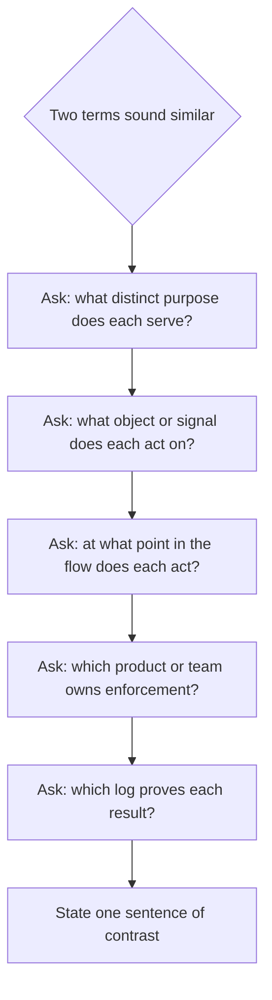
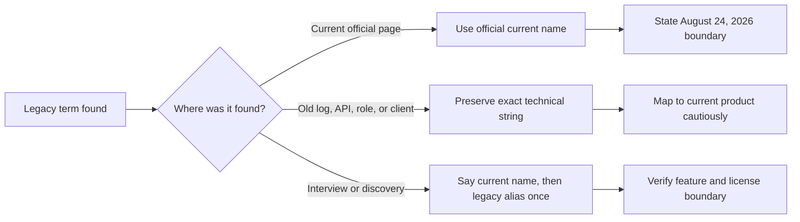
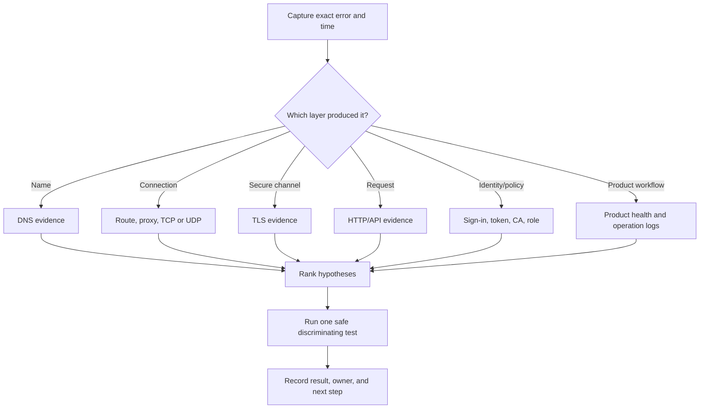

# Appendix A - Master Glossary and Acronym Decoder

> **Currency boundary:** This reference is bounded to official public information available on **August 24, 2026**. Product names, portals, licensing, certification paths, limits, defaults, and preview status change. Recheck live official documentation before an interview, exam booking, design decision, purchase, or production change.
>
> **Candidate honesty note:** Terminology knowledge is not production experience. You can say, “I understand the concept and have studied or lab-tested it,” where accurate, but should claim production ownership only when supported by your real work evidence. The guide’s established strengths are Microsoft 365 support, SharePoint Online and OneDrive, escalation, RCA, stakeholder communication, documentation, metrics, mentoring, and automation; other domains remain learning or lab evidence unless independently verified.

This appendix is the searchable vocabulary layer for [Parts 1-74](../Deloitte%20Microsoft%20365%20Security%20Senior%20Consultant%20-%20Study%20Guide.md#part-index). It covers security, risk, cryptography, networking, protocols, cloud, tenant architecture, Entra, Intune, Exchange, EOP, Defender for Office 365, Teams, SharePoint, OneDrive, Power Platform, Copilot, Purview, Defender XDR, Sentinel, KQL, SIEM, SOAR, consulting, delivery, operations, incident response, frameworks, certification, labs, and interviews. Use [Appendix B](Appendix-B-architecture-flowchart-atlas.md) when a term is easier to remember as a flow.

## How to use this appendix

| Need | Fast method | Evidence-safe result |
|---|---|---|
| Decode an acronym | Use editor search for the exact uppercase form, then read the expansion in the bold entry | Say the expansion once, then use the acronym naturally |
| Prepare an interview answer | Read definition, confusion warning, and linked Part; explain it aloud without reading | A concise concept answer, not a memorized product claim |
| Troubleshoot a symptom | Search the error/status vocabulary, then follow the relevant Part link | A hypothesis and next evidence source, not an unsafe change |
| Draw an architecture | Find the term here, then open [Appendix B](Appendix-B-architecture-flowchart-atlas.md) | A flow with trust boundaries, decisions, telemetry, and owners |
| Validate current behavior | Follow Official Source Anchors and recheck the live page | A dated, tenant-specific statement with licensing and preview caveats |
| Record a missing term | Use the feedback method near the end; do not silently invent a definition | A proposed entry with source, owner, and review date |

### Symbol and abbreviation conventions

| Convention | Meaning in this appendix | Example |
|---|---|---|
| **Expanded term (ACRONYM)** | The first label expands the acronym | **Security information and event management (SIEM)** |
| **Current name; former name** | Current public product name comes first | **Microsoft Entra ID; formerly Azure Active Directory** |
| `Code font` | Literal field, command, header, status, operator, port, or value | `TimeGenerated`, `401`, `443/TCP` |
| `X -> Y` | Direction or sequence, not proof of network reachability | DNS -> TCP -> TLS -> HTTP |
| `/` in a protocol | Alternative transport or paired notation | `53/UDP and TCP` |
| “Commonly” | Frequent pattern, not a universal guarantee | HTTPS commonly uses `443/TCP` |
| “At baseline” | Verified only through August 24, 2026 | Certification or product-state caveat |
| [Part N](Part-02-cybersecurity-fundamentals.md) | Local source chapter for full explanation | Follow before giving a deep answer |


## A-Z glossary

Each entry supplies three things: plain meaning, why it matters or what it is commonly confused with, and one or more source Parts. Product-state statements remain subject to the August 24, 2026 boundary above.

### A

| Glossary entry | Plain-English definition | Why it matters, common confusion, and source |
|---|---|---|
| **AAA (authentication, authorization, and accounting)** | A security model that proves who a subject is, decides what it may do, and records what happened. | The three functions are separate; successful sign-in does not grant every action. [Part 2](Part-02-cybersecurity-fundamentals.md), [Part 7](Part-07-authentication-authorization-tokens-modern-auth.md) |
| **Access control** | A technical or administrative rule that permits, limits, or denies use of a resource. | It combines identity, policy, enforcement, and evidence; do not reduce it to permissions alone. [Part 2](Part-02-cybersecurity-fundamentals.md), [Part 3](Part-03-zero-trust-defense-in-depth-secure-by-design.md) |
| **Access package** | An Entra entitlement bundle containing resources, request rules, approvals, expiration, and reviews. | It governs time-bound access; it is not merely a security group. [Part 12](Part-12-identity-governance-lifecycle-entitlement-access-reviews.md) |
| **Access review** | A recurring decision process in which designated reviewers confirm whether access should continue. | A review without accountable decisions and removal is only a report. [Part 12](Part-12-identity-governance-lifecycle-entitlement-access-reviews.md), [Part 24](Part-24-sharepoint-onedrive-security-sharing-sync-governance.md) |
| **Access token** | A signed token presented to an application programming interface to authorize specific actions for a subject. | It targets a resource and is not the same as an ID token or refresh token. [Part 7](Part-07-authentication-authorization-tokens-modern-auth.md) |
| **Accepted domain** | A domain that Exchange Online is configured to receive mail for or relay according to its domain type. | DNS ownership and accepted-domain configuration solve different parts of mail delivery. [Part 21](Part-21-exchange-online-architecture-mail-flow.md) |
| **Account protection** | Endpoint controls for local users, groups, credentials, Windows Hello, and local administrator password governance. | Intune’s policy category is broader than antivirus and must be coordinated with identity controls. [Part 19](Part-19-intune-endpoint-security-stack.md) |
| **Action Center** | The Defender location that tracks pending, approved, rejected, and completed remediation actions. | Investigation evidence and action approval are distinct; review scope before execution. [Part 39](Part-39-defender-xdr-incident-response-air.md) |
| **Adaptive protection** | Purview capability that adjusts data-protection enforcement using changing insider-risk context. | It links risk levels to DLP, but requires privacy, HR, legal, tuning, and human-governance boundaries. [Part 28](Part-28-purview-dlp-m365-endpoints-cloud-apps.md), [Part 31](Part-31-purview-insider-risk-communication-compliance.md) |
| **Administrative unit** | An Entra directory container used to scope selected administrative permissions to a subset of objects. | It scopes administration, not general application authorization or an independent tenant boundary. [Part 6](Part-06-entra-id-architecture-directory-objects.md) |
| **Advanced hunting** | Proactive query-based investigation across Defender XDR telemetry using Kusto Query Language. | Hunting starts with a hypothesis; it is not identical to alert triage or a scheduled detection. [Part 40](Part-40-defender-advanced-hunting-kql-custom-detections.md) |
| **Advanced multistage attack detection (Fusion)** | Microsoft Sentinel analytics that correlates multiple low- and high-confidence signals into a multistage incident. | It is a correlation capability, not a substitute for source-data quality or analyst validation. [Part 47](Part-47-sentinel-analytics-rules-incidents-entities.md) |
| **Agent identity** | A nonhuman identity used by an autonomous or assisted software agent to access resources and perform work. | Treat agent permissions, actions, owners, and lifecycle as governed identity, not as an invisible user extension. [Part 14](Part-14-external-cross-tenant-workload-app-identity.md), [Part 42](Part-42-security-copilot-agents-governance.md) |
| **AIR (automated investigation and response)** | Defender automation that investigates related evidence and proposes or performs remediation according to product behavior and permissions. | Automation is not automatic truth; review evidence, action state, blast radius, and rollback. [Part 39](Part-39-defender-xdr-incident-response-air.md) |
| **Alert** | A product-generated signal that observed activity may represent suspicious or harmful behavior. | An alert is not yet a confirmed incident; severity and confidence still require investigation. [Part 34](Part-34-defender-xdr-architecture-attack-story.md), [Part 47](Part-47-sentinel-analytics-rules-incidents-entities.md) |
| **AMA (Azure Monitor Agent)** | Microsoft’s supported monitoring agent for collecting configured telemetry through data collection rules. | AMA is the collection component; a connector, DCR, destination, transformation, and health path are also needed. [Part 45](Part-45-sentinel-connectors-ama-dcr-asim-normalization.md) |
| **Analytics rule** | Sentinel logic that evaluates telemetry and can create alerts and incidents when defined conditions are met. | A query that runs is not necessarily a quality detection; map entities, tune, test, and govern it. [Part 47](Part-47-sentinel-analytics-rules-incidents-entities.md) |
| **API (application programming interface)** | A documented contract through which software requests data or actions from another service. | An API is not a permission model by itself; authenticate, authorize, handle pagination, throttling, and errors. [Part 5](Part-05-networking-identity-application-protocols.md), [Part 63](Part-63-documentation-reporting-automation-quality.md) |
| **ASIM (Advanced Security Information Model)** | Microsoft Sentinel’s normalized schemas and parsers for querying different vendors’ events through common fields. | Normalization improves portability but cannot repair absent, ambiguous, or low-quality source data. [Part 45](Part-45-sentinel-connectors-ama-dcr-asim-normalization.md) |
| **ASR (attack surface reduction)** | Defender rules that reduce common attacker techniques such as risky child processes, scripts, or credential theft paths. | ASR is not antivirus; stage audit and enforcement with app compatibility evidence. [Part 19](Part-19-intune-endpoint-security-stack.md), [Part 35](Part-35-defender-endpoint-vulnerability-management.md) |

### B

| Glossary entry | Plain-English definition | Why it matters, common confusion, and source |
|---|---|---|
| **B2B collaboration (business-to-business collaboration)** | Entra external identity model that lets invited users use their home identity to access a resource tenant. | A guest object exists in the resource tenant; it is not the same as creating a local employee account. [Part 14](Part-14-external-cross-tenant-workload-app-identity.md) |
| **B2B direct connect (business-to-business direct connect)** | Cross-tenant trust model used by supported experiences such as Teams shared channels without ordinary guest-style collaboration. | It has different object and trust behavior from B2B collaboration; validate both tenants’ settings. [Part 14](Part-14-external-cross-tenant-workload-app-identity.md), [Part 23](Part-23-teams-security-meetings-federation-apps-compliance.md) |
| **Backout plan** | A controlled sequence for reversing a change when acceptance or safety criteria fail. | “Disable it” is not a plan; define trigger, authority, dependencies, data impact, timing, and validation. [Part 58](Part-58-deployment-pilots-testing-cutover-rollback.md) |
| **Basic Logs** | A lower-cost Azure Monitor log plan intended for selected high-volume data with constrained analytics behavior. | It is not simply cheaper Analytics Logs; query, retention, alerting, and feature differences affect use cases. [Part 44](Part-44-sentinel-planning-workspaces-cost-retention-data-lake.md) |
| **Baseline** | An approved reference state used to compare configuration, performance, maturity, or security posture over time. | A vendor baseline is a starting point, not proof that every setting fits the organization. [Part 16](Part-16-intune-configuration-settings-baselines-policy-precedence.md), [Part 54](Part-54-security-assessments-health-checks-gap-analysis.md) |
| **Bearer token** | A token usable by whoever possesses it, subject to its validity and target-resource rules. | Theft can enable replay; protect issuance, storage, transport, session, and revocation paths. [Part 7](Part-07-authentication-authorization-tokens-modern-auth.md) |
| **Behavior** | An interpreted activity pattern associated with a user, device, app, or other entity. | A behavior adds context but is not automatically malicious or equivalent to an anomaly. [Part 48](Part-48-sentinel-ueba-behaviors-threat-intelligence.md) |
| **Behavior analytics** | Analysis that compares entity activity with patterns or baselines to identify notable behavior. | Unusual does not mean hostile; peer groups, history, context, and privacy controls matter. [Part 48](Part-48-sentinel-ueba-behaviors-threat-intelligence.md) |
| **BIA (business impact analysis)** | Structured assessment of how disruption affects business services, obligations, people, data, and recovery priorities. | It informs recovery targets; it is not a technical vulnerability scan. [Part 56](Part-56-target-controls-licensing-roadmaps-business-case.md), [Part 62](Part-62-resilience-oncall-shift-handover.md) |
| **BitLocker** | Windows full-volume encryption that protects data at rest when configured with suitable key and recovery governance. | Encryption does not stop an authorized, compromised session; key escrow and recovery tests are essential. [Part 19](Part-19-intune-endpoint-security-stack.md) |
| **Block list** | A list of explicitly denied indicators, senders, apps, locations, or other values. | Blocking known bad items is reactive and can be bypassed; use layered policy and expiration governance. [Part 22](Part-22-eop-defender-office-365.md), [Part 48](Part-48-sentinel-ueba-behaviors-threat-intelligence.md) |
| **Bookmark** | A Sentinel hunting artifact that preserves a query result, notes, entities, and investigation context. | It records analyst reasoning and evidence; it is not automatically an alert or incident. [Part 49](Part-49-sentinel-hunting-workbooks-notebooks.md) |
| **Break-glass account** | Common shorthand for a cloud-only emergency-access account reserved for recovering administrative access. | The current design term is emergency access; exclude carefully, monitor continuously, secure strongly, and test. [Part 11](Part-11-privileged-access-rbac-pim-emergency-access.md), [Part 62](Part-62-resilience-oncall-shift-handover.md) |
| **Browser isolation** | A control that executes or renders web content away from the ordinary endpoint session to reduce exposure. | It is different from a proxy, sandboxed attachment, or Conditional Access session control. [Part 5](Part-05-networking-identity-application-protocols.md), [Part 37](Part-37-defender-cloud-apps-saas-security.md) |
| **Browser session control** | A real-time control that monitors or restricts activity in a cloud-app browser session. | It may depend on Conditional Access App Control and supported traffic; it is not device compliance. [Part 37](Part-37-defender-cloud-apps-saas-security.md) |
| **Business case** | Evidence-based explanation of why an investment should proceed, including outcomes, costs, risks, options, and assumptions. | A product feature list is not a business case; decision-makers need measurable value and uncertainty. [Part 56](Part-56-target-controls-licensing-roadmaps-business-case.md) |
| **Business continuity** | Organizational capability to keep priority services operating or restore them acceptably during disruption. | It is broader than disaster recovery and includes people, suppliers, communications, and manual workarounds. [Part 62](Part-62-resilience-oncall-shift-handover.md) |
| **Business email compromise (BEC)** | Social-engineering fraud that abuses trusted identities or mail conversations to redirect money, data, or actions. | BEC may use no malware; identity, mailbox, payment-process, and communication evidence all matter. [Part 22](Part-22-eop-defender-office-365.md), [Part 38](Part-38-defender-office-365-secops-investigation.md) |
| **Business owner** | Person accountable for the business outcome, risk acceptance, funding, and priority of a service or control. | Technical teams advise, but should not silently accept business risk on the owner’s behalf. [Part 53](Part-53-consulting-discovery-current-state-scope.md), [Part 59](Part-59-operational-readiness-raci-soc-runbooks.md) |
| **BYOD (bring your own device)** | Use of a personally owned device for organizational applications or data. | Personal ownership does not mean unmanaged access; privacy-aware MAM, CA, and data controls can apply. [Part 15](Part-15-intune-architecture-enrollment-mdm-mam.md), [Part 17](Part-17-intune-compliance-conditional-access.md) |

### C

| Glossary entry | Plain-English definition | Why it matters, common confusion, and source |
|---|---|---|
| **CA (Conditional Access)** | Entra policy engine that evaluates identity, resource, device, location, risk, client, and other signals before applying access controls. | CA is authorization policy after authentication signals, not the authentication method itself. [Part 9](Part-09-conditional-access-design-deployment-troubleshooting.md) |
| **CAAC (Conditional Access App Control)** | Integration that routes supported cloud-app sessions through Defender for Cloud Apps for real-time monitoring and controls. | It is not every Conditional Access session control and requires supported app/session architecture. [Part 37](Part-37-defender-cloud-apps-saas-security.md) |
| **CAB (change advisory board)** | Governance forum or authority that reviews significant changes, risks, dependencies, timing, and rollback readiness. | CAB approval does not replace engineering tests or accountable change ownership. [Part 58](Part-58-deployment-pilots-testing-cutover-rollback.md) |
| **Capability mapping** | Comparison of required outcomes with what current and target tools, processes, and people can deliver. | Avoid one-to-one feature-name mapping; architecture and operating model may differ. [Part 57](Part-57-third-party-microsoft-security-migration.md) |
| **CASB (cloud access security broker)** | Security capability that discovers and governs cloud-app use, data, sessions, activities, and risk. | CASB is a product category; Microsoft Defender for Cloud Apps is Microsoft’s offering in that category. [Part 37](Part-37-defender-cloud-apps-saas-security.md) |
| **CBA (certificate-based authentication)** | Authentication that proves possession of a private key corresponding to a trusted certificate. | Certificate issuance, mapping, revocation, device protection, and lifecycle determine assurance. [Part 8](Part-08-mfa-passwordless-authentication-strengths.md) |
| **CEF (Common Event Format)** | A standardized text format commonly used to send security events from devices through Syslog-based pipelines. | CEF formatting is not transport security or semantic normalization by itself. [Part 45](Part-45-sentinel-connectors-ama-dcr-asim-normalization.md) |
| **Certificate** | A signed digital document binding a public key to an identity or subject under a trust model. | A certificate is not the private key; validity also depends on chain, usage, name, time, and revocation. [Part 5](Part-05-networking-identity-application-protocols.md), [Part 8](Part-08-mfa-passwordless-authentication-strengths.md) |
| **CIA triad (confidentiality, integrity, and availability)** | Three core security goals: prevent unauthorized disclosure, prevent improper change, and keep needed services usable. | Security decisions usually trade among all three; confidentiality alone is incomplete. [Part 2](Part-02-cybersecurity-fundamentals.md) |
| **CIS Controls (Center for Internet Security Controls)** | Prioritized public safeguards intended to reduce common cyber risks. | Controls describe outcomes; CIS Benchmarks provide product-specific configuration guidance. [Part 72](Part-72-frameworks-competition-certifications-trends.md) |
| **Classification** | Assignment of meaning or sensitivity to data based on content, context, ownership, or business use. | Classification says what data is; a label may carry and enforce that classification. [Part 26](Part-26-purview-architecture-classification-solution-map.md) |
| **Client secret** | Shared credential used by an application to authenticate to an identity platform. | Secrets are easier to leak than managed identity or certificate approaches and require secure rotation. [Part 14](Part-14-external-cross-tenant-workload-app-identity.md) |
| **Cloud Discovery** | Defender for Cloud Apps analysis of network traffic logs to identify cloud services and shadow IT. | Discovery observes service use; API connectors provide deeper sanctioned-app activity where supported. [Part 37](Part-37-defender-cloud-apps-saas-security.md) |
| **Cloud Sync** | Microsoft Entra cloud-managed synchronization that provisions selected on-premises directory objects through lightweight agents. | It is not identical to Connect Sync; compare topology, writeback, filtering, and feature needs. [Part 13](Part-13-hybrid-identity-connect-cloud-sync.md) |
| **Co-management** | Joint management of supported Windows devices by Configuration Manager and Microsoft Intune with defined workload authority. | Two tools do not safely control every setting simultaneously; understand workload sliders and policy conflicts. [Part 20](Part-20-intune-operations-troubleshooting-sccm-comanagement.md) |
| **Compensating control** | Alternative safeguard used when a preferred control is infeasible while still addressing the underlying risk. | It needs evidence of comparable risk reduction, an owner, review date, and residual-risk decision. [Part 3](Part-03-zero-trust-defense-in-depth-secure-by-design.md), [Part 56](Part-56-target-controls-licensing-roadmaps-business-case.md) |
| **Compliance policy** | Intune rules that evaluate whether a managed device meets required conditions and report a compliance state. | It evaluates device posture; Conditional Access decides whether that state affects resource access. [Part 17](Part-17-intune-compliance-conditional-access.md) |
| **Conditional Access** | Full name of Entra’s signal-driven access-policy capability, commonly abbreviated CA. | Do not promise a policy result without checking assignments, exclusions, dependencies, report-only evidence, and sign-in logs. [Part 9](Part-09-conditional-access-design-deployment-troubleshooting.md) |
| **Connector** | Configured integration that moves events, mail, workflow calls, or application data between systems. | “Connector” is overloaded; identify product, direction, authentication, schema, ownership, and failure behavior. [Part 21](Part-21-exchange-online-architecture-mail-flow.md), [Part 45](Part-45-sentinel-connectors-ama-dcr-asim-normalization.md) |
| **Content Explorer** | Purview experience for authorized exploration of discovered sensitive and labeled content across supported locations. | It exposes sensitive metadata/content under strict roles; Activity Explorer focuses on actions rather than inventory. [Part 26](Part-26-purview-architecture-classification-solution-map.md) |

### D

| Glossary entry | Plain-English definition | Why it matters, common confusion, and source |
|---|---|---|
| **Data classification** | Organized identification of data type, sensitivity, value, or handling requirement. | It drives labels and controls but needs owners, examples, exceptions, and lifecycle governance. [Part 26](Part-26-purview-architecture-classification-solution-map.md) |
| **DCE (data collection endpoint)** | Azure Monitor endpoint used in selected data-collection architectures for agents or Logs Ingestion API traffic. | DCE and DCR perform different jobs; current architecture determines whether a DCE is required. [Part 45](Part-45-sentinel-connectors-ama-dcr-asim-normalization.md) |
| **DCR (data collection rule)** | Azure Monitor configuration defining which data to collect, how to transform it, and where to send it. | A DCR is policy for collection, not the agent, connector, endpoint, or destination workspace. [Part 45](Part-45-sentinel-connectors-ama-dcr-asim-normalization.md) |
| **Defender for Cloud Apps** | Microsoft’s cloud-app security service for discovery, SaaS posture, activity, files, OAuth governance, and supported session controls. | Current name replaces Microsoft Cloud App Security; capabilities and licensing vary. [Part 37](Part-37-defender-cloud-apps-saas-security.md) |
| **Defender for Endpoint** | Microsoft endpoint security platform for prevention, detection and response, investigation, vulnerability context, and response actions. | MDE is not the same as Defender Antivirus, though they integrate. [Part 35](Part-35-defender-endpoint-vulnerability-management.md) |
| **Defender for Identity** | Microsoft service that uses identity signals and sensors to detect and investigate threats involving hybrid identity infrastructure. | MDI is not Entra ID Protection; each observes different identity surfaces and signals. [Part 36](Part-36-defender-identity-hybrid-threats.md) |
| **Defender for Office 365** | Microsoft 365 threat-protection service adding phishing, URL, attachment, campaign, investigation, simulation, and response capabilities beyond EOP. | EOP and MDO are related but not synonyms; plan and license boundaries matter. [Part 22](Part-22-eop-defender-office-365.md) |
| **Defender Vulnerability Management** | Risk-based capability for discovering endpoint weaknesses, software evidence, recommendations, and remediation priorities. | Vulnerability exposure is not proof of active compromise; combine exploitability, business context, and threat evidence. [Part 35](Part-35-defender-endpoint-vulnerability-management.md) |
| **Defender XDR (extended detection and response)** | Unified Microsoft security experience correlating signals across endpoints, identities, email, apps, and related domains into incidents. | XDR correlation does not eliminate Sentinel’s wider SIEM use cases or source validation. [Part 34](Part-34-defender-xdr-architecture-attack-story.md) |
| **Defense in depth** | Multiple independent or complementary safeguards across layers so one failure does not expose everything. | Duplicating the same weak control is not meaningful depth; layers should address different failure paths. [Part 3](Part-03-zero-trust-defense-in-depth-secure-by-design.md) |
| **Delegated administration** | Authorized management performed by another team, tenant, provider, or partner within defined scopes. | Delegation is not transfer of accountability; govern least privilege, evidence, separation, and revocation. [Part 4](Part-04-m365-tenant-architecture-portals-roles-licensing.md), [Part 52](Part-52-enterprise-sentinel-multiworkspace-multitenant-governance.md) |
| **Detection rule** | Logic that turns observable events into a signal when a threat hypothesis or policy condition is met. | A rule needs data contracts, tuning, testing, ownership, response mapping, and lifecycle metrics. [Part 40](Part-40-defender-advanced-hunting-kql-custom-detections.md), [Part 47](Part-47-sentinel-analytics-rules-incidents-entities.md) |
| **DHCP (Dynamic Host Configuration Protocol)** | Protocol that supplies clients with IP configuration such as address, subnet, gateway, and DNS servers. | DHCP can affect cloud reachability indirectly; it does not resolve names or encrypt traffic. [Part 5](Part-05-networking-identity-application-protocols.md) |
| **DKIM (DomainKeys Identified Mail)** | Email authentication method that signs selected message content so receivers can validate domain-linked integrity. | DKIM does not encrypt mail and must be aligned with DMARC policy and operational key rotation. [Part 21](Part-21-exchange-online-architecture-mail-flow.md) |
| **DLP (data loss prevention)** | Policies that detect sensitive data and warn, restrict, block, audit, or report risky handling across supported locations. | DLP is not backup, retention, or classification alone; context, tuning, exceptions, and user behavior matter. [Part 28](Part-28-purview-dlp-m365-endpoints-cloud-apps.md) |
| **DMARC (Domain-based Message Authentication, Reporting, and Conformance)** | Domain policy and reporting layer that uses aligned SPF or DKIM results to guide receiving systems. | DMARC is not a magic spoofing block; alignment, coverage, forwarding, reports, and phased enforcement matter. [Part 21](Part-21-exchange-online-architecture-mail-flow.md) |
| **DNS (Domain Name System)** | Distributed system that maps names to records such as addresses, mail exchangers, and verification values. | A successful lookup does not prove TCP, TLS, identity, or application health. [Part 5](Part-05-networking-identity-application-protocols.md) |
| **DSPM (data security posture management)** | Continuous discovery and prioritization of risks around sensitive data, access, activity, and control coverage. | DSPM is posture management, while DLP enforces handling rules; Microsoft product naming must be dated. [Part 33](Part-33-purview-dspm-ai-data-security.md) |
| **Due diligence** | Proportionate investigation of facts, risks, obligations, suppliers, and assumptions before a decision. | It is not a checkbox; record evidence quality, unresolved questions, owners, and decision consequences. [Part 53](Part-53-consulting-discovery-current-state-scope.md), [Part 57](Part-57-third-party-microsoft-security-migration.md) |
| **Dynamic group** | Entra group whose membership is calculated from configured object attributes rather than manually maintained. | Dynamic membership can lag or mis-scope; validate rules, attributes, license needs, and downstream blast radius. [Part 6](Part-06-entra-id-architecture-directory-objects.md) |

### E

| Glossary entry | Plain-English definition | Why it matters, common confusion, and source |
|---|---|---|
| **E3** | Common Microsoft 365 enterprise license family that bundles productivity, management, identity, security, and compliance rights at defined levels. | E3 is not one timeless capability list; verify current service plans, region, add-ons, and Product Terms. [Part 4](Part-04-m365-tenant-architecture-portals-roles-licensing.md), [Part 56](Part-56-target-controls-licensing-roadmaps-business-case.md) |
| **E5** | Common Microsoft 365 enterprise license family offering broader security, compliance, analytics, and communications capabilities than E3 in many areas. | E5 does not automatically enable or configure controls; verify entitlements and operational readiness. [Part 4](Part-04-m365-tenant-architecture-portals-roles-licensing.md), [Part 56](Part-56-target-controls-licensing-roadmaps-business-case.md) |
| **EDM (exact data match)** | Purview classification method that fingerprints protected source records to detect corresponding structured sensitive values with higher context. | It differs from a generic pattern-based sensitive information type and requires secure data preparation and refresh. [Part 26](Part-26-purview-architecture-classification-solution-map.md) |
| **EDR (endpoint detection and response)** | Endpoint telemetry, analytics, investigation, and response capabilities focused on suspicious behavior and compromise. | EDR is not ordinary antivirus; prevention and post-compromise detection complement each other. [Part 35](Part-35-defender-endpoint-vulnerability-management.md) |
| **eDiscovery (electronic discovery)** | Governed identification, preservation, collection, review, and export of electronically stored information for legal or investigative needs. | It is not an unrestricted administrator search; legal authority, roles, scope, evidence integrity, and privacy apply. [Part 30](Part-30-purview-audit-ediscovery-legal-investigation.md) |
| **Emergency access** | Preplanned, tightly secured administrative access used when ordinary identity or policy paths fail. | It is the preferred design term for “break glass”; test without normalizing daily use. [Part 11](Part-11-privileged-access-rbac-pim-emergency-access.md), [Part 62](Part-62-resilience-oncall-shift-handover.md) |
| **Encryption** | Cryptographic transformation that makes data unreadable without the authorized key or operation. | Encryption can protect at rest or in transit but does not automatically provide identity, authorization, or availability. [Part 2](Part-02-cybersecurity-fundamentals.md), [Part 27](Part-27-purview-information-protection-labels-encryption.md) |
| **Endpoint analytics** | Intune analytics that surfaces device performance and user-experience signals for supported managed endpoints. | It supports optimization and troubleshooting; it is not EDR or a guarantee of user sentiment. [Part 20](Part-20-intune-operations-troubleshooting-sccm-comanagement.md) |
| **Endpoint DLP** | Purview DLP enforcement and auditing for sensitive-data activity on supported endpoint devices. | It differs from Intune device compliance and Defender endpoint threat detection, though signals may complement each other. [Part 28](Part-28-purview-dlp-m365-endpoints-cloud-apps.md) |
| **EOP (Exchange Online Protection)** | Microsoft’s cloud email hygiene layer for spam, malware, spoof, connection, and transport protection. | EOP is foundational mail protection; Defender for Office 365 adds advanced threat capabilities. [Part 22](Part-22-eop-defender-office-365.md) |
| **EPM (Endpoint Privilege Management)** | Intune capability for controlled elevation of approved tasks without granting permanent local administrator rights. | EPM is not PIM: one governs endpoint process elevation, the other privileged identity assignments. [Part 19](Part-19-intune-endpoint-security-stack.md) |
| **Eradication** | Incident-response phase that removes malicious artifacts, persistence, compromised credentials, and root causes after containment. | Eradication before scoping can miss persistence; preserve evidence and validate recovery. [Part 61](Part-61-security-incident-response-pir.md) |
| **ESP (Enrollment Status Page)** | Windows Autopilot experience that tracks required device and user setup steps before allowing normal use. | ESP is not the entire Autopilot service; app detection, assignments, network, and timing often explain failures. [Part 18](Part-18-intune-apps-autopilot-updates-lifecycle.md) |
| **Evidence** | Information that supports or challenges a factual claim, finding, hypothesis, control result, or decision. | Screenshots alone may lack time, scope, source, and reproducibility; assess relevance and reliability. [Part 54](Part-54-security-assessments-health-checks-gap-analysis.md), [Part 61](Part-61-security-incident-response-pir.md) |
| **Evidence integrity** | Assurance that collected evidence remains complete, attributable, protected, and unchanged except through documented handling. | It supports defensibility; hashing alone does not establish lawful collection or full chain of custody. [Part 30](Part-30-purview-audit-ediscovery-legal-investigation.md), [Part 61](Part-61-security-incident-response-pir.md) |
| **Exception** | Approved, documented deviation from a requirement or standard for a defined scope and period. | It is not silent noncompliance; record rationale, compensating controls, owner, residual risk, expiry, and review. [Part 55](Part-55-requirements-threat-modeling-hld-lld.md), [Part 56](Part-56-target-controls-licensing-roadmaps-business-case.md) |
| **Exchange Online** | Microsoft-hosted enterprise email and calendaring service within Microsoft 365. | It includes identity, transport, recipient, permission, protection, compliance, and client dependencies; it is not just mailboxes. [Part 21](Part-21-exchange-online-architecture-mail-flow.md) |
| **Exposure management** | Prioritization of attack paths, weaknesses, identities, devices, applications, and controls according to likely organizational impact. | Exposure is broader than vulnerability count and should guide risk-based remediation. [Part 41](Part-41-exposure-management-secure-score-prioritization.md) |
| **External access** | Teams capability allowing communication with users in other organizations without making them members of the local team. | It differs from guest access, shared channels, and anonymous meeting participation. [Part 23](Part-23-teams-security-meetings-federation-apps-compliance.md) |
| **External identity** | Identity originating outside the resource organization but permitted to access selected resources under governed trust. | External does not mean untrusted by default; lifecycle, sponsor, policy, terms, and reviews establish control. [Part 14](Part-14-external-cross-tenant-workload-app-identity.md) |

### F

| Glossary entry | Plain-English definition | Why it matters, common confusion, and source |
|---|---|---|
| **Fail closed** | Failure behavior that denies access or stops processing when a control cannot make a trusted decision. | It favors security but can harm availability; use only with understood dependencies and recovery paths. [Part 3](Part-03-zero-trust-defense-in-depth-secure-by-design.md), [Part 62](Part-62-resilience-oncall-shift-handover.md) |
| **Fail open** | Failure behavior that permits access or continues processing when a control is unavailable. | It may preserve service but increases exposure; the decision requires explicit risk ownership and monitoring. [Part 3](Part-03-zero-trust-defense-in-depth-secure-by-design.md), [Part 62](Part-62-resilience-oncall-shift-handover.md) |
| **False negative** | Harmful or policy-violating activity that a control fails to detect or classify as such. | Low alert volume can hide false negatives; use adversarial, negative, and coverage testing. [Part 47](Part-47-sentinel-analytics-rules-incidents-entities.md), [Part 54](Part-54-security-assessments-health-checks-gap-analysis.md) |
| **False positive** | Benign activity incorrectly identified as harmful or policy-violating. | Excessive false positives consume analyst trust and time; tune without erasing true-positive coverage. [Part 28](Part-28-purview-dlp-m365-endpoints-cloud-apps.md), [Part 47](Part-47-sentinel-analytics-rules-incidents-entities.md) |
| **Feature update** | Windows release that changes operating-system capabilities and support state more substantially than a routine quality update. | Ring, safeguard, compatibility, rollback, and support planning differ from monthly quality updates. [Part 18](Part-18-intune-apps-autopilot-updates-lifecycle.md) |
| **Federation** | Trust arrangement in which one identity system accepts authentication assertions or tokens from another. | Federation does not merge directories; token claims, keys, endpoints, policy, and availability become dependencies. [Part 7](Part-07-authentication-authorization-tokens-modern-auth.md), [Part 13](Part-13-hybrid-identity-connect-cloud-sync.md) |
| **FIDO2 (Fast Identity Online 2)** | Standards for phishing-resistant public-key authentication using a device-bound or supported passkey credential. | FIDO2 avoids reusable shared secrets, but registration, recovery, attestation, and platform support still matter. [Part 8](Part-08-mfa-passwordless-authentication-strengths.md) |
| **File plan** | Records-management structure describing record categories, retention, disposition, authority, and governance metadata. | A file plan is not a SharePoint folder tree; it supports defensible lifecycle decisions. [Part 29](Part-29-purview-lifecycle-records-management.md) |
| **FileVault** | Apple macOS full-disk encryption capability whose configuration and recovery information can be managed through supported endpoint tooling. | Like BitLocker, it protects data at rest rather than an already-authorized compromised session. [Part 19](Part-19-intune-endpoint-security-stack.md) |
| **Firewall** | Control that permits or denies network traffic according to attributes such as direction, address, port, protocol, application, or identity. | A port rule alone does not validate DNS, TLS, HTTP, application authorization, or intended data flow. [Part 5](Part-05-networking-identity-application-protocols.md), [Part 19](Part-19-intune-endpoint-security-stack.md) |
| **First-party application** | Application published and operated by the platform or service provider itself. | First party does not mean unlimited trust; review permissions, publisher, scope, data use, and current documentation. [Part 14](Part-14-external-cross-tenant-workload-app-identity.md) |
| **Fix validation** | Reproduction-based confirmation that a change resolves the original defect without unacceptable regression. | “No new complaint” is not validation; preserve test conditions, expected results, evidence, and observation period. [Part 60](Part-60-structured-troubleshooting-multivendor-cloud.md), [Part 63](Part-63-documentation-reporting-automation-quality.md) |
| **Flow** | Ordered movement of identity, data, control decisions, messages, or telemetry among components. | Always name direction, protocol, decision point, trust boundary, failure evidence, and owner. [Part 5](Part-05-networking-identity-application-protocols.md), [Part 55](Part-55-requirements-threat-modeling-hld-lld.md) |
| **Forensic artifact** | A piece of potentially relevant evidence such as a log, file, process record, token event, header, or timeline entry. | An artifact needs context and provenance; it is not automatically proof of attacker intent. [Part 61](Part-61-security-incident-response-pir.md) |
| **Forensic image** | Controlled bit-level copy of a storage source made for preservation and analysis. | It differs from an ordinary file copy; authority, tooling, hashing, chain of custody, and scope matter. [Part 61](Part-61-security-incident-response-pir.md) |
| **Forward proxy** | Intermediary that makes outbound requests on behalf of clients and may filter, authenticate, inspect, or log them. | It differs from a reverse proxy protecting servers; TLS inspection can alter certificate and privacy behavior. [Part 5](Part-05-networking-identity-application-protocols.md) |
| **Framework** | Structured set of concepts, outcomes, practices, or controls used to organize security work. | A framework guides decisions but does not certify implementation or replace organization-specific risk analysis. [Part 72](Part-72-frameworks-competition-certifications-trends.md) |
| **FQDN (fully qualified domain name)** | Complete DNS name identifying a host or service within the domain hierarchy. | An FQDN is a name, not an IP address or proof that every resolved endpoint is allowed. [Part 5](Part-05-networking-identity-application-protocols.md) |
| **Functional requirement** | Statement of behavior a solution must perform, such as blocking risky sign-ins or preserving specified records. | It differs from a nonfunctional quality such as availability, latency, privacy, or supportability. [Part 55](Part-55-requirements-threat-modeling-hld-lld.md) |
| **Fusion** | Short Microsoft Sentinel name associated with Advanced multistage attack detection correlation. | Do not confuse the branded analytics family with generic event fusion or Defender XDR incident correlation. [Part 47](Part-47-sentinel-analytics-rules-incidents-entities.md) |

### G

| Glossary entry | Plain-English definition | Why it matters, common confusion, and source |
|---|---|---|
| **GA (general availability)** | Product lifecycle label indicating a capability is released for supported production use under its stated terms. | GA does not mean licensed everywhere, enabled by default, identical across clouds, or risk-free. [Part 4](Part-04-m365-tenant-architecture-portals-roles-licensing.md), [Part 72](Part-72-frameworks-competition-certifications-trends.md) |
| **Gap analysis** | Evidence-based comparison between the current state and a defined target or control objective. | A gap is relative to an agreed target; avoid treating every vendor recommendation as a mandatory deficiency. [Part 54](Part-54-security-assessments-health-checks-gap-analysis.md) |
| **Gateway** | Component that connects networks, protocols, services, or trust zones and may route, translate, inspect, or enforce policy. | Identify the exact gateway function; default route, VPN gateway, mail gateway, and API gateway are not interchangeable. [Part 5](Part-05-networking-identity-application-protocols.md) |
| **GDPR (General Data Protection Regulation)** | European Union data-protection law governing processing of personal data and rights of individuals within its scope. | A product feature cannot guarantee GDPR compliance; legal basis, purpose, minimization, governance, and evidence matter. [Part 32](Part-32-purview-compliance-manager-privacy-audit-readiness.md) |
| **Global Administrator** | Highly privileged Entra role with broad administrative capabilities across Microsoft cloud services. | It should not be routine access; use least privilege, PIM, emergency controls, monitoring, and separation. [Part 11](Part-11-privileged-access-rbac-pim-emergency-access.md) |
| **GMSA (group managed service account)** | Active Directory account whose password management is handled automatically for authorized Windows services or hosts. | It is an on-premises service identity pattern, not an Entra managed identity. [Part 13](Part-13-hybrid-identity-connect-cloud-sync.md), [Part 36](Part-36-defender-identity-hybrid-threats.md) |
| **Go/no-go decision** | Formal choice to proceed, pause, roll back, or reschedule based on defined readiness and risk criteria. | It needs named authority and evidence; an optimistic meeting consensus is not a gate. [Part 58](Part-58-deployment-pilots-testing-cutover-rollback.md) |
| **Golden image** | Prebuilt operating-system image used as a standardized deployment starting point. | It can become stale or carry hidden configuration; modern provisioning may prefer a clean image plus managed policy. [Part 18](Part-18-intune-apps-autopilot-updates-lifecycle.md) |
| **Governance** | Decision rights, policies, roles, evidence, oversight, and lifecycle mechanisms that keep a capability aligned with objectives and risk. | Governance is not merely documentation or central control; it creates accountable, repeatable decisions. [Part 53](Part-53-consulting-discovery-current-state-scope.md), [Part 59](Part-59-operational-readiness-raci-soc-runbooks.md) |
| **GPO (Group Policy Object)** | Active Directory mechanism that delivers Windows configuration to scoped domain users and computers. | GPO and Intune policy can conflict; determine authority, precedence, applicability, and migration behavior. [Part 16](Part-16-intune-configuration-settings-baselines-policy-precedence.md), [Part 20](Part-20-intune-operations-troubleshooting-sccm-comanagement.md) |
| **Grace period** | Defined time after a policy condition fails before enforcement or final state takes effect. | It reduces abrupt disruption but creates a temporary exposure window that must be understood and monitored. [Part 17](Part-17-intune-compliance-conditional-access.md), [Part 29](Part-29-purview-lifecycle-records-management.md) |
| **Grant control** | Conditional Access requirement that must be satisfied, such as stronger authentication or a compliant device. | It is an access requirement, not an assignment condition or session control. [Part 9](Part-09-conditional-access-design-deployment-troubleshooting.md) |
| **Graph API (Microsoft Graph application programming interface)** | Unified Microsoft cloud API surface for authorized access to supported directory, security, device, and productivity data. | Endpoints and permissions vary; never assume one consent grants every workload operation. [Part 5](Part-05-networking-identity-application-protocols.md), [Part 63](Part-63-documentation-reporting-automation-quality.md) |
| **GRC (governance, risk, and compliance)** | Coordinated discipline for decision rights, uncertainty and impact, obligations, controls, and assurance. | Compliance is one input to risk governance, not a synonym for security. [Part 2](Part-02-cybersecurity-fundamentals.md), [Part 32](Part-32-purview-compliance-manager-privacy-audit-readiness.md) |
| **Group** | Directory object used to organize users, devices, service principals, or access assignments according to supported type. | Group membership, role assignability, mail capability, ownership, and dynamic rules create different behavior. [Part 6](Part-06-entra-id-architecture-directory-objects.md) |
| **Group-based licensing** | Assignment of product licenses to users through Entra group membership. | It simplifies operations but requires error monitoring, available inventory, usage location, and lifecycle governance. [Part 4](Part-04-m365-tenant-architecture-portals-roles-licensing.md), [Part 6](Part-06-entra-id-architecture-directory-objects.md) |
| **Guest access** | Microsoft 365 collaboration model in which an external person becomes a guest member with governed resource access. | In Teams, it differs from external access; in SharePoint, link type and Entra integration also matter. [Part 23](Part-23-teams-security-meetings-federation-apps-compliance.md), [Part 24](Part-24-sharepoint-onedrive-security-sharing-sync-governance.md) |
| **Guest lifecycle** | Invitation, sponsorship, access, review, expiration, disablement, and deletion process for external users. | Creating a guest is easy; proving continued business need and removing stale access are the control. [Part 12](Part-12-identity-governance-lifecycle-entitlement-access-reviews.md), [Part 14](Part-14-external-cross-tenant-workload-app-identity.md) |
| **Guardrail** | Predefined boundary that lets teams act autonomously while preventing or escalating unacceptable risk. | A guardrail should be testable and owned; vague advice is not an enforceable boundary. [Part 42](Part-42-security-copilot-agents-governance.md), [Part 63](Part-63-documentation-reporting-automation-quality.md) |
| **GUID (globally unique identifier)** | 128-bit identifier commonly represented as hexadecimal text and used to distinguish objects or records. | Display names can change or collide; stable IDs improve joins, automation, and incident correlation. [Part 6](Part-06-entra-id-architecture-directory-objects.md), [Part 46](Part-46-kql-from-zero-sentinel.md) |

### H

| Glossary entry | Plain-English definition | Why it matters, common confusion, and source |
|---|---|---|
| **HA (high availability)** | Architecture designed to keep a service available despite selected component failures. | HA is not disaster recovery; define failure domains, redundancy, health detection, capacity, and tests. [Part 62](Part-62-resilience-oncall-shift-handover.md) |
| **Hallucination** | Plausible-sounding but unsupported or incorrect output from a generative AI system. | Treat AI output as a hypothesis; verify sources, permissions, scope, calculations, and proposed actions. [Part 42](Part-42-security-copilot-agents-governance.md) |
| **Handover** | Controlled transfer of knowledge, evidence, access, ownership, support procedures, and acceptance to an operating team. | A document dump is not handover; prove readiness through walkthroughs, drills, access, and sign-off. [Part 59](Part-59-operational-readiness-raci-soc-runbooks.md) |
| **Hard match** | Hybrid identity matching that associates an on-premises object with a cloud object through a strong immutable identifier. | It differs from attribute-based soft match and has security hardening; never force reassociation casually. [Part 13](Part-13-hybrid-identity-connect-cloud-sync.md) |
| **Hash** | Fixed-length result of a one-way function used for integrity checks, indexing, or secure credential constructions. | Hashing is not encryption because there is no decryption key; algorithms and context determine safety. [Part 2](Part-02-cybersecurity-fundamentals.md), [Part 61](Part-61-security-incident-response-pir.md) |
| **Health attestation** | Signed device-health evidence about measured boot or security state used by supported management and access decisions. | It is a signal, not proof that the device has no compromise or every control is healthy. [Part 17](Part-17-intune-compliance-conditional-access.md) |
| **Health check** | Time-bounded assessment of configuration, operation, evidence, and risk against defined objectives. | It is broader than a portal score and must state scope, method, limitations, and date. [Part 54](Part-54-security-assessments-health-checks-gap-analysis.md) |
| **Heartbeat** | Small recurring signal indicating that an agent, connector, source, or workflow is alive or recently active. | A heartbeat proves limited liveness, not complete data quality or end-to-end detection. [Part 45](Part-45-sentinel-connectors-ama-dcr-asim-normalization.md), [Part 59](Part-59-operational-readiness-raci-soc-runbooks.md) |
| **HLD (high-level design)** | Architecture document describing major components, integrations, flows, principles, boundaries, and decisions. | It explains what and why; a low-level design adds implementation detail. [Part 55](Part-55-requirements-threat-modeling-hld-lld.md) |
| **Hold** | eDiscovery preservation mechanism intended to retain potentially relevant content for a legal or investigative matter. | A hold is not the same as ordinary retention policy or export; authority, scope, notification, and release matter. [Part 30](Part-30-purview-audit-ediscovery-legal-investigation.md) |
| **Honeytoken** | Decoy identity or credential-like object monitored because legitimate use should be rare or nonexistent. | It is a detection aid, not a production credential or substitute for protecting real privileged accounts. [Part 36](Part-36-defender-identity-hybrid-threats.md) |
| **Hostname** | Human-readable label assigned to a networked device or service instance. | A hostname may map to multiple addresses or change; distinguish it from FQDN, device ID, and asset owner. [Part 5](Part-05-networking-identity-application-protocols.md) |
| **Hot tier** | Storage or analytics tier optimized for frequent, lower-latency access compared with colder retention. | “Hot” is a relative cost/performance term; use-case query and retention requirements determine placement. [Part 44](Part-44-sentinel-planning-workspaces-cost-retention-data-lake.md) |
| **HSTS (HTTP Strict Transport Security)** | Web response policy telling supported browsers to use HTTPS for a domain for a stated period. | It helps prevent downgrade after trust is established; it does not fix invalid certificates or authorize users. [Part 5](Part-05-networking-identity-application-protocols.md) |
| **HTTP (Hypertext Transfer Protocol)** | Application protocol carrying requests and responses using methods, headers, status codes, and bodies. | HTTP behavior sits above DNS, TCP, and usually TLS; each layer can fail independently. [Part 5](Part-05-networking-identity-application-protocols.md) |
| **HTTPS (Hypertext Transfer Protocol Secure)** | HTTP carried through Transport Layer Security to protect transport confidentiality and integrity and authenticate the server. | HTTPS does not prove the application is safe or the user is authorized. [Part 5](Part-05-networking-identity-application-protocols.md) |
| **Hybrid identity** | Identity model connecting on-premises directories and cloud identity services through synchronization, federation, or authentication integration. | It creates shared dependencies and source-of-authority decisions rather than one magically merged directory. [Part 13](Part-13-hybrid-identity-connect-cloud-sync.md) |
| **Hybrid Microsoft Entra join** | Device state in which a Windows device is joined to on-premises Active Directory and registered in Entra ID. | It differs from cloud-native Entra join and simple Entra registration; management and sign-in dependencies differ. [Part 15](Part-15-intune-architecture-enrollment-mdm-mam.md) |
| **Hypercare** | Intensified monitoring, support, and rapid issue handling for a defined period after a deployment or cutover. | It needs exit criteria and handoff; permanent crisis staffing hides unresolved operational design. [Part 58](Part-58-deployment-pilots-testing-cutover-rollback.md) |
| **Hypothesis** | Testable explanation that predicts what evidence should appear if it is correct. | Troubleshooting and hunting should attempt to disconfirm hypotheses, not collect only supporting facts. [Part 49](Part-49-sentinel-hunting-workbooks-notebooks.md), [Part 60](Part-60-structured-troubleshooting-multivendor-cloud.md) |

### I

| Glossary entry | Plain-English definition | Why it matters, common confusion, and source |
|---|---|---|
| **IaaS (infrastructure as a service)** | Cloud model in which the provider supplies infrastructure while the customer manages more of the operating system, applications, identity, and data. | Shared responsibility differs from SaaS and PaaS; “in cloud” never means “provider secures everything.” [Part 3](Part-03-zero-trust-defense-in-depth-secure-by-design.md) |
| **IAM (identity and access management)** | Processes and technologies governing identities, authentication, authorization, privilege, and lifecycle. | IAM is broader than single sign-on and includes human, workload, device, and external identities. [Part 6](Part-06-entra-id-architecture-directory-objects.md), [Part 12](Part-12-identity-governance-lifecycle-entitlement-access-reviews.md) |
| **ICMP (Internet Control Message Protocol)** | Network-layer protocol carrying diagnostics and error messages, including traffic used by common ping and path tools. | ICMP success or failure alone does not prove application reachability or firewall intent. [Part 5](Part-05-networking-identity-application-protocols.md) |
| **ID token** | OpenID Connect token containing claims that tell a client application about an authenticated session and user. | It is for the client, not a general authorization token for calling APIs. [Part 7](Part-07-authentication-authorization-tokens-modern-auth.md) |
| **Identity** | Digital representation of a person, device, application, workload, or agent that can be authenticated and governed. | An account is one implementation; identity also includes attributes, credentials, lifecycle, ownership, and risk. [Part 6](Part-06-entra-id-architecture-directory-objects.md) |
| **Identity Protection** | Microsoft Entra capability that detects and investigates identity risk and supports risk-based access and remediation. | User risk and sign-in risk answer different questions; licensing and current policy behavior must be verified. [Part 10](Part-10-entra-id-protection-risk-based-access.md) |
| **IdP (identity provider)** | Service that authenticates subjects and issues assertions or tokens trusted by applications or other systems. | The IdP does not automatically own application authorization; relying parties still enforce access. [Part 7](Part-07-authentication-authorization-tokens-modern-auth.md) |
| **Idempotency** | Property that makes repeated execution of the same intended operation produce no additional unintended effect. | Essential for retries in SOAR; without it, a replay might disable repeatedly, duplicate tickets, or spam users. [Part 50](Part-50-sentinel-automation-logic-apps-playbooks.md) |
| **IME (Intune Management Extension)** | Endpoint component that supports capabilities such as Win32 app management, scripts, and remediations on managed Windows devices. | It is not the entire Intune enrollment channel; inspect IME-specific prerequisites and logs. [Part 18](Part-18-intune-apps-autopilot-updates-lifecycle.md), [Part 20](Part-20-intune-operations-troubleshooting-sccm-comanagement.md) |
| **Impact** | Magnitude of harm a threat, outage, or failed control could cause to objectives, people, assets, or obligations. | Impact differs from likelihood; both shape risk, severity, and prioritization. [Part 2](Part-02-cybersecurity-fundamentals.md), [Part 54](Part-54-security-assessments-health-checks-gap-analysis.md) |
| **Incident** | Coordinated case representing confirmed or suspected harmful activity that requires investigation and response. | An incident can correlate multiple alerts; not every alert becomes a true incident. [Part 34](Part-34-defender-xdr-architecture-attack-story.md), [Part 61](Part-61-security-incident-response-pir.md) |
| **Indicator** | Observable value such as a domain, hash, address, or certificate associated with threat knowledge and a validity context. | An indicator is not timeless proof of compromise; confidence, source, expiration, and context matter. [Part 48](Part-48-sentinel-ueba-behaviors-threat-intelligence.md) |
| **Information barrier** | Purview policy that restricts communication or collaboration between defined user segments for regulatory or ethical separation. | It differs from sensitivity labels and DLP; design segment membership and supported workloads carefully. [Part 31](Part-31-purview-insider-risk-communication-compliance.md) |
| **Insider risk** | Potential harm involving trusted access, whether intentional, accidental, coerced, or compromised. | It is not a label for a person; privacy, proportionality, pseudonymization, HR, and legal governance are mandatory. [Part 31](Part-31-purview-insider-risk-communication-compliance.md) |
| **Intune** | Microsoft cloud service for endpoint enrollment, configuration, compliance, applications, protection, and device operations. | It is management and policy, not a replacement for every identity, EDR, DLP, or Configuration Manager function. [Part 15](Part-15-intune-architecture-enrollment-mdm-mam.md) |
| **IOC (indicator of compromise)** | Observable artifact associated with known or suspected malicious activity. | IOCs age quickly and can be shared by benign infrastructure; validate context and favor behavior-based coverage too. [Part 40](Part-40-defender-advanced-hunting-kql-custom-detections.md), [Part 48](Part-48-sentinel-ueba-behaviors-threat-intelligence.md) |
| **IP address (Internet Protocol address)** | Numeric network-layer address used to identify an interface or endpoint for routing. | An address may be shared, translated, dynamic, or attacker-controlled; do not equate it directly with a person. [Part 5](Part-05-networking-identity-application-protocols.md) |
| **IR (incident response)** | Organized preparation, detection, analysis, containment, eradication, recovery, and improvement for security incidents. | IR is a lifecycle with legal, business, technical, and communication decisions, not only malware removal. [Part 61](Part-61-security-incident-response-pir.md) |
| **ISO/IEC 27001** | International standard specifying requirements for an information security management system. | Certification concerns the scoped management system; it does not prove every asset is secure. [Part 32](Part-32-purview-compliance-manager-privacy-audit-readiness.md), [Part 72](Part-72-frameworks-competition-certifications-trends.md) |
| **ITIL (Information Technology Infrastructure Library)** | Widely used service-management guidance for value, practices, incidents, changes, problems, and continual improvement. | ITIL practices can support security operations but do not replace security frameworks or technical controls. [Part 59](Part-59-operational-readiness-raci-soc-runbooks.md) |

### J

| Glossary entry | Plain-English definition | Why it matters, common confusion, and source |
|---|---|---|
| **Jailbroken device** | Mobile device whose platform security restrictions have been bypassed to gain unauthorized control. | Detection can inform compliance, but device state can change and requires current platform support and response policy. [Part 17](Part-17-intune-compliance-conditional-access.md) |
| **Jamf Pro** | Third-party Apple device-management platform often considered in endpoint coexistence, integration, or migration designs. | Do not assume capability parity with Intune; map requirements, authority, data, support, and contracts. [Part 57](Part-57-third-party-microsoft-security-migration.md), [Part 72](Part-72-frameworks-competition-certifications-trends.md) |
| **JEA (Just Enough Administration)** | PowerShell security approach that exposes only approved commands and parameters through constrained endpoints. | It reduces administrative scope; it is different from Entra PIM and still needs endpoint and identity governance. [Part 63](Part-63-documentation-reporting-automation-quality.md) |
| **JIT access (just-in-time access)** | Privileged access granted only when requested and approved for a limited period. | JIT reduces standing privilege but does not guarantee least-privilege scope or safe actions. [Part 11](Part-11-privileged-access-rbac-pim-emergency-access.md) |
| **JML (joiner, mover, leaver)** | Identity lifecycle covering onboarding, role change, and departure. | Most access drift occurs at transitions; connect authoritative events to provisioning, review, and removal. [Part 12](Part-12-identity-governance-lifecycle-entitlement-access-reviews.md) |
| **Job** | Scheduled or triggered unit of automated work with inputs, steps, outputs, identity, and execution state. | Identify the platform: Intune remediation, Logic App, notebook, pipeline, and KQL query have different semantics. [Part 50](Part-50-sentinel-automation-logic-apps-playbooks.md), [Part 63](Part-63-documentation-reporting-automation-quality.md) |
| **Join (KQL)** | Operator that combines rows from two tabular inputs using matching key values and a selected join flavor. | Duplicate or weak keys can multiply rows and create false conclusions; normalize and constrain first. [Part 46](Part-46-kql-from-zero-sentinel.md) |
| **Join key** | Field or set of fields used to decide which records from different sources represent related things. | Names and IPs are weak keys; prefer stable IDs plus tenant and time context where available. [Part 40](Part-40-defender-advanced-hunting-kql-custom-detections.md), [Part 46](Part-46-kql-from-zero-sentinel.md) |
| **Join type** | Rule determining which matching and unmatched rows a tabular join returns. | `inner`, `leftouter`, and `leftanti` answer different questions; choose deliberately and test counts. [Part 46](Part-46-kql-from-zero-sentinel.md) |
| **Journal rule** | Exchange rule that sends copies of selected messages to a journaling destination for applicable archiving requirements. | Journaling is not the same as Purview retention or backup; scope and compliance architecture differ. [Part 21](Part-21-exchange-online-architecture-mail-flow.md), [Part 29](Part-29-purview-lifecycle-records-management.md) |
| **Journey map** | Visual sequence of stakeholder steps, goals, pain points, handoffs, and evidence across an experience. | It helps discovery but should not replace technical flow, trust-boundary, or control diagrams. [Part 53](Part-53-consulting-discovery-current-state-scope.md) |
| **JSON (JavaScript Object Notation)** | Structured text format representing objects, arrays, names, strings, numbers, booleans, and null values. | JSON is data syntax, not JavaScript execution; schemas and types still require validation. [Part 46](Part-46-kql-from-zero-sentinel.md), [Part 63](Part-63-documentation-reporting-automation-quality.md) |
| **JSON dynamic type** | KQL representation used to store and query arrays or property bags parsed from JSON-like data. | Dynamic fields need explicit parsing and type conversion; string searching alone is fragile. [Part 46](Part-46-kql-from-zero-sentinel.md) |
| **JWK (JSON Web Key)** | JSON representation of a cryptographic public key and related metadata. | It is usually public verification material, not the token or private signing key. [Part 7](Part-07-authentication-authorization-tokens-modern-auth.md) |
| **JWKS (JSON Web Key Set)** | JSON document containing one or more JWKs used by clients to find current token-verification keys. | Cache and rotate according to protocol guidance; never pin a single signing key indefinitely. [Part 7](Part-07-authentication-authorization-tokens-modern-auth.md) |
| **JWT (JSON Web Token)** | Compact signed or encrypted token format carrying header, claims payload, and cryptographic protection. | JWT describes format, not trust; validate issuer, audience, signature, time, nonce, and intended token type. [Part 7](Part-07-authentication-authorization-tokens-modern-auth.md) |
| **Jump host** | Hardened intermediary system used to reach a restricted administrative network or resource. | It reduces exposure only if identity, session, endpoint, logging, patching, and egress are controlled. [Part 11](Part-11-privileged-access-rbac-pim-emergency-access.md), [Part 55](Part-55-requirements-threat-modeling-hld-lld.md) |
| **Jupyter notebook** | Interactive document combining executable code, queries, outputs, and narrative for analysis. | Notebooks aid hunting but can expose secrets, become irreproducible, or alter evidence unless governed. [Part 49](Part-49-sentinel-hunting-workbooks-notebooks.md) |
| **Junk email** | Messages classified as unwanted or low-value and routed away from the primary inbox. | Junk classification is not the same as quarantine, malware verdict, phishing determination, or transport rejection. [Part 22](Part-22-eop-defender-office-365.md) |
| **Justification** | Recorded reason supplied for an access request, override, exception, elevation, or decision. | Free text is evidence, not proof; reviewers must assess need, scope, duration, and policy. [Part 11](Part-11-privileged-access-rbac-pim-emergency-access.md), [Part 28](Part-28-purview-dlp-m365-endpoints-cloud-apps.md) |

### K

| Glossary entry | Plain-English definition | Why it matters, common confusion, and source |
|---|---|---|
| **Kanban** | Visual work-management method that limits work in progress and moves tasks through explicit states. | Useful for delivery and incident actions, but board movement is not proof of control effectiveness. [Part 59](Part-59-operational-readiness-raci-soc-runbooks.md), [Part 63](Part-63-documentation-reporting-automation-quality.md) |
| **Kerberos** | Ticket-based network authentication protocol widely used in Active Directory environments. | It depends on trusted time, names, service principal names, keys, and domain reachability; it is not LDAP. [Part 5](Part-05-networking-identity-application-protocols.md), [Part 13](Part-13-hybrid-identity-connect-cloud-sync.md) |
| **Kerberos constrained delegation** | Configuration that limits which downstream services an identity may impersonate users to under defined Kerberos delegation. | Delegation is sensitive privilege; validate protocol transition, SPNs, scope, service identity, and abuse paths. [Part 13](Part-13-hybrid-identity-connect-cloud-sync.md), [Part 36](Part-36-defender-identity-hybrid-threats.md) |
| **Key** | Cryptographic value used by an algorithm to encrypt, decrypt, sign, verify, derive, or authenticate data. | Algorithm strength cannot compensate for exposed, reused, unowned, or unrecoverable keys. [Part 2](Part-02-cybersecurity-fundamentals.md), [Part 27](Part-27-purview-information-protection-labels-encryption.md) |
| **Key derivation function (KDF)** | Cryptographic function that derives one or more strong keys from source material such as a secret and salt. | A KDF is not a plain fast hash; parameters and purpose matter for password and key security. [Part 2](Part-02-cybersecurity-fundamentals.md) |
| **Key escrow** | Controlled storage of recovery or decryption material so authorized recovery remains possible. | Escrow improves recoverability but creates a high-value access, separation, logging, and retention responsibility. [Part 19](Part-19-intune-endpoint-security-stack.md), [Part 27](Part-27-purview-information-protection-labels-encryption.md) |
| **Key performance indicator (KPI)** | Measurable indicator showing progress toward a defined operational or business objective. | A count is not automatically a KPI; define target, owner, data quality, behavior incentives, and decision use. [Part 59](Part-59-operational-readiness-raci-soc-runbooks.md), [Part 63](Part-63-documentation-reporting-automation-quality.md) |
| **Key risk indicator (KRI)** | Metric intended to signal increasing exposure or proximity to an unacceptable risk threshold. | KRIs look forward or warn; KPIs primarily measure performance against objectives. [Part 54](Part-54-security-assessments-health-checks-gap-analysis.md), [Part 56](Part-56-target-controls-licensing-roadmaps-business-case.md) |
| **Key rotation** | Controlled replacement of cryptographic keys or application credentials according to lifecycle and incident needs. | Rotation requires overlap, validation, rollback, consumer inventory, and revocation; simply creating a new key changes nothing. [Part 14](Part-14-external-cross-tenant-workload-app-identity.md), [Part 63](Part-63-documentation-reporting-automation-quality.md) |
| **Key vault** | Protected service or system for storing and controlling access to secrets, keys, and certificates. | Storage is only one control; identity, network, logging, recovery, rotation, and application retrieval still matter. [Part 63](Part-63-documentation-reporting-automation-quality.md) |
| **Kill chain** | Staged model of attacker activity from preparation through objectives, used to reason about detection and interruption opportunities. | It is a model, not a guaranteed linear sequence; MITRE ATT&CK provides a different behavior-oriented view. [Part 34](Part-34-defender-xdr-architecture-attack-story.md) |
| **Knowledge base** | Curated collection of reusable support, design, troubleshooting, and operational knowledge. | Quality requires ownership, searchability, evidence, review dates, audience, and retirement of stale guidance. [Part 59](Part-59-operational-readiness-raci-soc-runbooks.md), [Part 63](Part-63-documentation-reporting-automation-quality.md) |
| **Knowledge transfer (KT)** | Planned transfer of understanding and practical capability from one person or team to another. | KT is not attendance at a presentation; verify through teach-back, exercises, access, and independent execution. [Part 59](Part-59-operational-readiness-raci-soc-runbooks.md) |
| **Known error** | Documented problem with understood symptoms, cause or workaround, and current resolution status. | It accelerates support but must not normalize unsafe workarounds or prevent root-cause correction. [Part 60](Part-60-structured-troubleshooting-multivendor-cloud.md) |
| **KQL (Kusto Query Language)** | Read-oriented query language used across Microsoft security and Azure data experiences for filtering, shaping, joining, and analyzing telemetry. | KQL contexts have different tables and capabilities; a valid query in one product may not work unchanged elsewhere. [Part 46](Part-46-kql-from-zero-sentinel.md) |
| **KQL custom detection** | Detection logic created from a KQL query and configured to generate alerts or take supported actions on a schedule. | A hunting query needs stable schema, entity mapping, timing, thresholds, tuning, and response governance before promotion. [Part 40](Part-40-defender-advanced-hunting-kql-custom-detections.md), [Part 47](Part-47-sentinel-analytics-rules-incidents-entities.md) |
| **KQL function** | Named, reusable KQL expression that can accept parameters and return tabular or scalar results. | Functions improve consistency but can hide cost, stale logic, permissions, or schema assumptions. [Part 46](Part-46-kql-from-zero-sentinel.md) |
| **KQL parser** | Query logic that converts raw or vendor-specific event fields into structured or normalized columns. | Parsing does not prove semantic accuracy; test types, nulls, variants, and version drift. [Part 45](Part-45-sentinel-connectors-ama-dcr-asim-normalization.md), [Part 46](Part-46-kql-from-zero-sentinel.md) |
| **KQL schema** | Available tables, columns, types, and relationships against which a query is written. | Schema differs across workspaces and products; inspect actual data before copying a query. [Part 40](Part-40-defender-advanced-hunting-kql-custom-detections.md), [Part 46](Part-46-kql-from-zero-sentinel.md) |
| **KQL time window** | Explicit event-time range included in a query or correlation. | Confusing event time, ingestion time, rule frequency, and lookback can miss or duplicate detections. [Part 46](Part-46-kql-from-zero-sentinel.md), [Part 47](Part-47-sentinel-analytics-rules-incidents-entities.md) |

### L

| Glossary entry | Plain-English definition | Why it matters, common confusion, and source |
|---|---|---|
| **L1 support (Level 1 support)** | Frontline support that receives, records, prioritizes, resolves known cases, and escalates with required evidence. | L1 is a responsibility model, not an intelligence ranking; quality triage prevents slow, context-free escalation. [Part 59](Part-59-operational-readiness-raci-soc-runbooks.md) |
| **L2 support (Level 2 support)** | More specialized support that performs deeper diagnosis, configuration analysis, and known remediation. | Boundaries must be explicit by service and severity; “send to L2” is not a diagnostic step. [Part 59](Part-59-operational-readiness-raci-soc-runbooks.md) |
| **L3 support (Level 3 support)** | Deep engineering or product-level support handling complex defects, design issues, or code-level investigation. | L3 engagement still needs reproduction, timeline, logs, impact, changes, and hypotheses from earlier tiers. [Part 59](Part-59-operational-readiness-raci-soc-runbooks.md), [Part 60](Part-60-structured-troubleshooting-multivendor-cloud.md) |
| **Label** | Metadata marking data or a container with a classification and potentially associated protection or governance settings. | A visual label is not necessarily encryption; sensitivity and retention labels serve different purposes. [Part 27](Part-27-purview-information-protection-labels-encryption.md), [Part 29](Part-29-purview-lifecycle-records-management.md) |
| **LAPS (Local Administrator Password Solution)** | Microsoft capability that rotates and securely stores per-device local administrator passwords. | LAPS reduces shared-password risk; retrieval roles, auditing, rotation triggers, and account scope remain critical. [Part 19](Part-19-intune-endpoint-security-stack.md) |
| **Latency** | Time delay between an event and a response, arrival, ingestion, detection, or completed action. | Always name the measured interval; network latency differs from connector, ingestion, query, and alert latency. [Part 5](Part-05-networking-identity-application-protocols.md), [Part 45](Part-45-sentinel-connectors-ama-dcr-asim-normalization.md) |
| **Lateral movement** | Attacker expansion from one compromised identity or system to others inside an environment. | Authentication success may be malicious after credential theft; correlate identity, endpoint, network, and privilege behavior. [Part 34](Part-34-defender-xdr-architecture-attack-story.md), [Part 36](Part-36-defender-identity-hybrid-threats.md) |
| **LDAP (Lightweight Directory Access Protocol)** | Protocol for querying and modifying directory services under their supported schemas and security settings. | LDAP is not authentication by itself and is different from Kerberos; unsigned or simple-bind designs need scrutiny. [Part 5](Part-05-networking-identity-application-protocols.md), [Part 13](Part-13-hybrid-identity-connect-cloud-sync.md) |
| **Least privilege** | Granting only the permissions needed for a defined task, scope, and time. | It includes standing access, data scope, role choice, elevation duration, review, and service identities. [Part 3](Part-03-zero-trust-defense-in-depth-secure-by-design.md), [Part 11](Part-11-privileged-access-rbac-pim-emergency-access.md) |
| **Legal hold** | Common phrase for preservation imposed due to litigation, investigation, or legal duty. | In Purview, use precise eDiscovery hold terminology and follow legal direction; it is not ordinary retention. [Part 30](Part-30-purview-audit-ediscovery-legal-investigation.md) |
| **License** | Contractual right for specified users, devices, workloads, or capacity to use defined capabilities under current terms. | A portal switch or technical possibility is not proof of entitlement; verify service plan, prerequisite, region, and date. [Part 4](Part-04-m365-tenant-architecture-portals-roles-licensing.md), [Part 56](Part-56-target-controls-licensing-roadmaps-business-case.md) |
| **Lifecycle Workflow** | Entra identity-governance automation for joiner, mover, and leaver tasks driven by supported conditions and schedules. | Workflow execution does not fix poor authoritative data or unclear ownership; monitor failures and exceptions. [Part 12](Part-12-identity-governance-lifecycle-entitlement-access-reviews.md) |
| **Likelihood** | Assessed chance that a threat scenario will occur or a risk will materialize within stated conditions and time. | It is not impact or certainty; document basis, uncertainty, assumptions, and scale. [Part 2](Part-02-cybersecurity-fundamentals.md), [Part 54](Part-54-security-assessments-health-checks-gap-analysis.md) |
| **Link scanner** | Security service that inspects or follows URLs to classify destinations and detect threats. | Scanner clicks can affect analytics and app behavior; distinguish automated visits from user activity. [Part 22](Part-22-eop-defender-office-365.md), [Part 38](Part-38-defender-office-365-secops-investigation.md) |
| **Live response** | Defender for Endpoint remote investigation and response capability for authorized commands on supported devices. | It is high-impact administrative access; scope roles, preserve evidence, log actions, and use approved procedures. [Part 39](Part-39-defender-xdr-incident-response-air.md) |
| **LLD (low-level design)** | Detailed implementation design specifying configurations, objects, rules, interfaces, identities, dependencies, tests, and operational behavior. | It translates HLD into buildable detail; it is not an undocumented export from a portal. [Part 55](Part-55-requirements-threat-modeling-hld-lld.md) |
| **Local administrator** | Account or group with broad administrative authority on an endpoint. | Local admin differs from cloud directory roles; reduce standing membership and govern elevation and credentials. [Part 19](Part-19-intune-endpoint-security-stack.md) |
| **Log Analytics workspace** | Azure resource that stores and queries supported telemetry and can underpin Microsoft Sentinel. | A workspace is not the same as a Sentinel instance, tenant, subscription, or data lake. [Part 43](Part-43-siem-soar-soc-sentinel-architecture.md), [Part 44](Part-44-sentinel-planning-workspaces-cost-retention-data-lake.md) |
| **Log source** | System, service, application, device, or control that originates observable event data. | “Connected” does not prove completeness; define expected events, fields, volume, latency, retention, and owner. [Part 45](Part-45-sentinel-connectors-ama-dcr-asim-normalization.md), [Part 60](Part-60-structured-troubleshooting-multivendor-cloud.md) |
| **Logic Apps** | Azure workflow service used by Sentinel playbooks and other integrations to orchestrate connectors, conditions, approvals, and actions. | A playbook is implemented with Logic Apps, but permissions, cost, retries, identity, and idempotency need separate design. [Part 50](Part-50-sentinel-automation-logic-apps-playbooks.md) |

### M

| Glossary entry | Plain-English definition | Why it matters, common confusion, and source |
|---|---|---|
| **MAA (Multiple Administrative Approval)** | Intune control requiring a second authorized administrator to approve selected changes or actions. | It supports separation of duties but does not replace change testing, precise scope, or emergency procedure. [Part 20](Part-20-intune-operations-troubleshooting-sccm-comanagement.md) |
| **Mail flow rule** | Exchange transport rule that evaluates message conditions and applies configured actions, exceptions, or auditing. | Rule order, scope, headers, connectors, and other filters can affect results; it is not an inbox rule. [Part 21](Part-21-exchange-online-architecture-mail-flow.md) |
| **Mailbox delegation** | Permissions allowing another identity to access a mailbox or send as/on behalf of it. | Full Access, Send As, and Send on Behalf are different; govern business need and audit changes. [Part 21](Part-21-exchange-online-architecture-mail-flow.md) |
| **Malicious insider** | Authorized person who intentionally abuses legitimate or acquired access to cause harm. | Do not assume intent from anomaly alone; use privacy-safe investigation and HR/legal governance. [Part 31](Part-31-purview-insider-risk-communication-compliance.md) |
| **MAM (mobile application management)** | Policies protecting organizational data inside supported applications, potentially without enrolling the whole device. | MAM is app/data control, while MDM manages device configuration; combinations and platform support vary. [Part 15](Part-15-intune-architecture-enrollment-mdm-mam.md) |
| **Managed device** | Device enrolled or otherwise brought under an approved management authority with reported state. | Managed does not automatically mean compliant, secure, healthy, or company-owned. [Part 15](Part-15-intune-architecture-enrollment-mdm-mam.md), [Part 17](Part-17-intune-compliance-conditional-access.md) |
| **Managed identity** | Entra-backed identity whose credential lifecycle is managed by the cloud platform for supported Azure resources. | It avoids application-held secrets but still needs least-privilege authorization and lifecycle review. [Part 14](Part-14-external-cross-tenant-workload-app-identity.md), [Part 50](Part-50-sentinel-automation-logic-apps-playbooks.md) |
| **MAPI (Messaging Application Programming Interface)** | Microsoft messaging interface family used by Outlook and Exchange scenarios. | Modern authentication and network behavior depend on the exact MAPI/HTTP and client context; avoid legacy assumptions. [Part 5](Part-05-networking-identity-application-protocols.md), [Part 21](Part-21-exchange-online-architecture-mail-flow.md) |
| **Maturity model** | Ordered levels describing how consistently and effectively a capability is governed, implemented, measured, and improved. | Maturity is not identical to risk or compliance; scoring criteria and evidence must be explicit. [Part 54](Part-54-security-assessments-health-checks-gap-analysis.md) |
| **MDCA (Microsoft Defender for Cloud Apps)** | Common acronym for Microsoft’s CASB and SaaS security product. | Do not use the former MCAS name as current; distinguish discovery, API, governance, and session-control functions. [Part 37](Part-37-defender-cloud-apps-saas-security.md) |
| **MDE (Microsoft Defender for Endpoint)** | Common acronym for Microsoft’s endpoint prevention, detection, investigation, vulnerability, and response platform. | MDE integrates with Intune and XDR but does not make them the same product. [Part 35](Part-35-defender-endpoint-vulnerability-management.md) |
| **MDI (Microsoft Defender for Identity)** | Common acronym for Microsoft’s hybrid identity threat-detection and posture service. | MDI sensor architecture and support state are change-sensitive; verify current prerequisites. [Part 36](Part-36-defender-identity-hybrid-threats.md) |
| **MDM (mobile device management)** | Device-level enrollment and policy authority for configuration, compliance, inventory, and remote actions. | MDM differs from MAM; enrollment type, ownership, platform, and user privacy shape control. [Part 15](Part-15-intune-architecture-enrollment-mdm-mam.md) |
| **MDO (Microsoft Defender for Office 365)** | Common acronym for Microsoft’s advanced email and collaboration threat-protection service. | It extends EOP; Plan 1, Plan 2, and bundled rights must be checked rather than assumed. [Part 22](Part-22-eop-defender-office-365.md) |
| **MFA (multifactor authentication)** | Authentication using evidence from at least two independent factor categories such as knowledge, possession, or inherence. | Two prompts are not necessarily two factors; phishing resistance and registration/recovery matter. [Part 8](Part-08-mfa-passwordless-authentication-strengths.md) |
| **Microsoft Entra ID** | Microsoft’s cloud identity and access service, formerly named Azure Active Directory. | It is not Windows Server Active Directory Domain Services; use current name and explain the legacy alias once. [Part 6](Part-06-entra-id-architecture-directory-objects.md), [Part 13](Part-13-hybrid-identity-connect-cloud-sync.md) |
| **Microsoft Graph** | Microsoft’s unified API and data-access surface across supported cloud services. | It is unrelated to a graph visualization; permissions, API version, workload limits, and data boundaries vary. [Part 5](Part-05-networking-identity-application-protocols.md), [Part 63](Part-63-documentation-reporting-automation-quality.md) |
| **MITRE ATT&CK (Adversarial Tactics, Techniques, and Common Knowledge)** | Public knowledge base organizing observed adversary behaviors into tactics, techniques, and sub-techniques. | ATT&CK maps behavior and coverage; it is not a compliance standard, product score, or complete threat model. [Part 34](Part-34-defender-xdr-architecture-attack-story.md), [Part 72](Part-72-frameworks-competition-certifications-trends.md) |
| **MTA (mail transfer agent)** | System component that transfers email using SMTP between mail systems or processing stages. | MTA is a role in mail transport, not multifactor authentication despite the similar acronym. [Part 21](Part-21-exchange-online-architecture-mail-flow.md) |
| **MTTR (mean time to restore, resolve, or remediate)** | Average elapsed time for a defined operational outcome across measured cases. | Expansion varies by organization; state which endpoint and clock pauses are used before comparing. [Part 59](Part-59-operational-readiness-raci-soc-runbooks.md), [Part 61](Part-61-security-incident-response-pir.md) |

### N

| Glossary entry | Plain-English definition | Why it matters, common confusion, and source |
|---|---|---|
| **NAC (network access control)** | Technology and policy that assess and control which devices or identities may connect to a network. | NAC is different from Entra Conditional Access, though both make access decisions using context. [Part 5](Part-05-networking-identity-application-protocols.md), [Part 57](Part-57-third-party-microsoft-security-migration.md) |
| **Named location** | Conditional Access object representing selected countries/regions or IP ranges, optionally marked trusted. | Trusted does not mean risk-free; IP geolocation, VPNs, proxies, and mobile networks reduce certainty. [Part 9](Part-09-conditional-access-design-deployment-troubleshooting.md) |
| **Native connector** | Product-supported integration designed specifically for a source or service. | Native does not guarantee zero configuration, complete fields, free ingestion, or permanent schema stability. [Part 45](Part-45-sentinel-connectors-ama-dcr-asim-normalization.md) |
| **NAT (network address translation)** | Translation between network addresses, often allowing many private clients to share public addressing. | Source IP seen by a cloud service may represent a proxy or many users, not one endpoint. [Part 5](Part-05-networking-identity-application-protocols.md) |
| **Negative test** | Test proving that prohibited, invalid, or unsafe behavior is rejected or handled correctly. | A positive success case does not prove enforcement; test exclusions, failures, bypass attempts, and rollback. [Part 58](Part-58-deployment-pilots-testing-cutover-rollback.md) |
| **Network access** | Ability for a device or service to exchange traffic with another endpoint through the required path. | Reachability is not application authorization; DNS, routing, ports, TLS, proxy, identity, and policy are separate layers. [Part 5](Part-05-networking-identity-application-protocols.md) |
| **Network boundary** | Point where network trust, ownership, routing, inspection, or policy changes. | Cloud services weaken simple “inside/outside” assumptions; draw identity and data boundaries too. [Part 3](Part-03-zero-trust-defense-in-depth-secure-by-design.md), [Part 55](Part-55-requirements-threat-modeling-hld-lld.md) |
| **Network interface** | Logical or physical attachment through which a system sends and receives network traffic. | A host may have multiple interfaces, addresses, routes, VPNs, and policy paths. [Part 5](Part-05-networking-identity-application-protocols.md) |
| **Network trace** | Time-ordered capture or record of network packets or connections used to analyze protocol behavior. | Trace collection may contain sensitive data; obtain authority, filter safely, synchronize time, and correlate higher-layer logs. [Part 5](Part-05-networking-identity-application-protocols.md), [Part 60](Part-60-structured-troubleshooting-multivendor-cloud.md) |
| **Next-generation protection** | Defender for Endpoint prevention capabilities combining antimalware, cloud protection, behavior, and related technologies. | It is broader than signature-only antivirus but still distinct from EDR investigation and response. [Part 35](Part-35-defender-endpoint-vulnerability-management.md) |
| **NIST (National Institute of Standards and Technology)** | United States standards and technology agency that publishes widely used cybersecurity standards and guidance. | NIST publishes many documents; cite the exact framework, publication, version, and scope. [Part 72](Part-72-frameworks-competition-certifications-trends.md) |
| **NIST CSF (Cybersecurity Framework)** | Outcome-oriented framework for organizing cyber risk management through functions, categories, and profiles. | It is not a product checklist; use current version and tailor target/current profiles to business outcomes. [Part 72](Part-72-frameworks-competition-certifications-trends.md) |
| **NIST SP 800-53** | NIST Special Publication catalog of security and privacy controls for information systems and organizations. | It is far more detailed than CSF and requires tailoring; control selection does not prove implementation. [Part 32](Part-32-purview-compliance-manager-privacy-audit-readiness.md), [Part 72](Part-72-frameworks-competition-certifications-trends.md) |
| **Nonfunctional requirement** | Required quality or constraint such as availability, performance, privacy, supportability, auditability, or residency. | These often determine architecture even when user-facing behavior looks unchanged. [Part 55](Part-55-requirements-threat-modeling-hld-lld.md) |
| **Nonrepudiation** | Assurance that a party cannot credibly deny a specific action because attribution and integrity evidence support it. | Digital signatures can contribute, but identity proofing, key control, logs, and legal context matter. [Part 2](Part-02-cybersecurity-fundamentals.md) |
| **Normalization** | Transformation of differently shaped events into a common schema and semantic model. | It supports reusable analytics; it can also hide source nuance, so preserve raw context and parser version. [Part 45](Part-45-sentinel-connectors-ama-dcr-asim-normalization.md) |
| **Not applicable** | Assessment result stating a requirement does not apply within the documented scope and rationale. | It is not “not implemented”; support with boundary, evidence, authority, and review conditions. [Part 54](Part-54-security-assessments-health-checks-gap-analysis.md) |
| **Notebook** | Interactive analysis environment combining code, data, outputs, and narrative, often used for advanced hunting. | Govern dependencies, credentials, data export, reproducibility, and evidence handling. [Part 49](Part-49-sentinel-hunting-workbooks-notebooks.md) |
| **NRT rule (near-real-time rule)** | Sentinel analytics rule family designed for frequent low-latency evaluation under its supported limits. | NRT does not mean instantaneous and has different configuration constraints from scheduled rules. [Part 47](Part-47-sentinel-analytics-rules-incidents-entities.md) |
| **NTLM (NT LAN Manager)** | Legacy Windows challenge-response authentication protocol family still encountered in compatibility scenarios. | It lacks modern protections and enables relay-related risk; inventory dependencies rather than disabling blindly. [Part 5](Part-05-networking-identity-application-protocols.md), [Part 36](Part-36-defender-identity-hybrid-threats.md) |

### O

| Glossary entry | Plain-English definition | Why it matters, common confusion, and source |
|---|---|---|
| **OATH (Initiative for Open Authentication)** | Standards family used by hardware or software one-time-password tokens, commonly TOTP or HOTP. | OATH token codes are not the same as FIDO2 passkeys and are generally more phishable. [Part 8](Part-08-mfa-passwordless-authentication-strengths.md) |
| **OAuth 2.0 (Open Authorization 2.0)** | Framework through which a client obtains scoped access to a protected resource with tokens. | OAuth is authorization delegation, not user authentication by itself; OpenID Connect adds identity. [Part 7](Part-07-authentication-authorization-tokens-modern-auth.md) |
| **Object** | Stored directory or service representation of an entity such as a user, group, device, app, mailbox, or policy. | Similar display names do not make objects identical; inspect type, tenant, immutable ID, owner, and lifecycle. [Part 6](Part-06-entra-id-architecture-directory-objects.md) |
| **Object ID** | Tenant-local unique identifier assigned to an Entra directory object. | It differs from application/client ID and can differ for corresponding objects across tenants. [Part 6](Part-06-entra-id-architecture-directory-objects.md), [Part 14](Part-14-external-cross-tenant-workload-app-identity.md) |
| **Objective** | Specific desired outcome against which controls, requirements, tests, and measures are aligned. | Starting with tools before objectives produces weak scope and unprovable value. [Part 53](Part-53-consulting-discovery-current-state-scope.md), [Part 54](Part-54-security-assessments-health-checks-gap-analysis.md) |
| **OIDC (OpenID Connect)** | Identity layer built on OAuth 2.0 that lets a client verify authentication and obtain identity claims. | OIDC’s ID token is not an API access token; validate nonce, issuer, audience, signature, and flow. [Part 7](Part-07-authentication-authorization-tokens-modern-auth.md) |
| **OLA (operational-level agreement)** | Internal agreement between supporting teams describing responsibilities and targets needed to meet service commitments. | It supports an SLA but is not usually the customer-facing service agreement. [Part 59](Part-59-operational-readiness-raci-soc-runbooks.md) |
| **OMA-URI (Open Mobile Alliance Uniform Resource Identifier)** | Intune custom-policy path used to configure supported configuration service provider settings not exposed through ordinary templates. | It is not a generic registry editor; exact CSP path, data type, platform, conflicts, and rollback matter. [Part 16](Part-16-intune-configuration-settings-baselines-policy-precedence.md) |
| **On-call** | Scheduled availability to receive, triage, coordinate, and escalate service or security issues outside normal staffing patterns. | It needs severity rules, access, fatigue controls, handover, backup, and authority, not merely a phone number. [Part 62](Part-62-resilience-oncall-shift-handover.md) |
| **On-premises** | Infrastructure operated within organization-controlled facilities or environments rather than as the referenced cloud service. | Ownership does not imply stronger security; shared responsibility and dependencies differ by deployment model. [Part 3](Part-03-zero-trust-defense-in-depth-secure-by-design.md), [Part 13](Part-13-hybrid-identity-connect-cloud-sync.md) |
| **OneDrive for Business** | Microsoft 365 service providing each licensed user a work-focused file area built on SharePoint technology. | It differs from consumer OneDrive and team-owned SharePoint sites; ownership and departure lifecycle matter. [Part 24](Part-24-sharepoint-onedrive-security-sharing-sync-governance.md) |
| **OOBE (out-of-box experience)** | Windows first-run setup experience through which identity, enrollment, and Autopilot-driven provisioning may occur. | OOBE is a phase, not the entire device lifecycle; network and enrollment dependencies can block it. [Part 18](Part-18-intune-apps-autopilot-updates-lifecycle.md) |
| **Operating model** | Defined way people, processes, technology, decisions, funding, metrics, and suppliers work together to run a capability. | A target architecture without an operating model may deploy successfully and still fail operationally. [Part 59](Part-59-operational-readiness-raci-soc-runbooks.md) |
| **Operational readiness** | Evidence that a service can be owned, monitored, supported, secured, recovered, measured, and improved after go-live. | Technical build completion is only one gate; access, staffing, runbooks, training, support, and acceptance matter. [Part 59](Part-59-operational-readiness-raci-soc-runbooks.md) |
| **OSINT (open-source intelligence)** | Intelligence developed from lawfully available public information using documented collection and analysis. | Publicly accessible does not mean unrestricted reuse; assess reliability, legality, privacy, and source bias. [Part 48](Part-48-sentinel-ueba-behaviors-threat-intelligence.md), [Part 61](Part-61-security-incident-response-pir.md) |
| **OTP (one-time password)** | Short-lived code intended for one authentication use or time/counter window. | OTP improves over static passwords but can be phished or relayed; prefer phishing-resistant methods where required. [Part 8](Part-08-mfa-passwordless-authentication-strengths.md) |
| **Outbound connector** | Exchange connector controlling or routing mail sent from Microsoft 365 toward a partner, service, or on-premises system. | Direction, certificate/domain validation, smart host, restrictions, and transport rules must align. [Part 21](Part-21-exchange-online-architecture-mail-flow.md) |
| **Oversharing** | Data accessible to more people, apps, guests, links, or agents than business need requires. | It is an authorization and governance problem, not proof that Copilot changed source permissions. [Part 24](Part-24-sharepoint-onedrive-security-sharing-sync-governance.md), [Part 25](Part-25-m365-apps-power-platform-copilot-security.md) |
| **Ownership** | Accountable responsibility for a service, identity, app, control, risk, data set, or decision throughout its lifecycle. | Technical access and ownership are different; every exception and automation needs a reachable owner. [Part 53](Part-53-consulting-discovery-current-state-scope.md), [Part 59](Part-59-operational-readiness-raci-soc-runbooks.md) |
| **OWASP (Open Worldwide Application Security Project)** | Public community producing application-security knowledge such as Top 10 lists, testing guidance, and maturity resources. | A Top 10 list raises awareness; it is not a complete architecture, threat model, or compliance program. [Part 72](Part-72-frameworks-competition-certifications-trends.md) |

### P

| Glossary entry | Plain-English definition | Why it matters, common confusion, and source |
|---|---|---|
| **PaaS (platform as a service)** | Cloud model in which the provider operates more of the runtime platform while the customer governs applications, identities, configuration, and data. | Shared responsibility lies between IaaS and SaaS patterns and varies by exact service. [Part 3](Part-03-zero-trust-defense-in-depth-secure-by-design.md) |
| **Parser** | Logic that converts raw text or structured input into named, typed fields for querying and analysis. | A parser can run without being semantically correct; test vendor versions, malformed input, nulls, and timestamps. [Part 45](Part-45-sentinel-connectors-ama-dcr-asim-normalization.md), [Part 46](Part-46-kql-from-zero-sentinel.md) |
| **Passkey** | FIDO-based credential that uses public-key cryptography and a user-verification gesture instead of a reusable password. | Some passkeys are device-bound and some can sync in supported ecosystems; assurance and recovery design must match risk. [Part 8](Part-08-mfa-passwordless-authentication-strengths.md) |
| **Password hash sync (PHS)** | Hybrid authentication method that synchronizes a derived representation of on-premises password hashes to Entra for cloud authentication. | It does not send the reversible password; compare availability, risk detection, writeback, and policy needs with PTA/federation. [Part 13](Part-13-hybrid-identity-connect-cloud-sync.md) |
| **Passwordless authentication** | Authentication that does not require the user to submit a traditional reusable password for that sign-in. | Passwordless is not automatically phishing-resistant; method, device binding, verifier, and recovery determine assurance. [Part 8](Part-08-mfa-passwordless-authentication-strengths.md) |
| **PDP (policy decision point)** | Component that evaluates context and policy to decide whether an action should be permitted or constrained. | The decision point differs from the policy enforcement point that applies the result. [Part 3](Part-03-zero-trust-defense-in-depth-secure-by-design.md), [Part 9](Part-09-conditional-access-design-deployment-troubleshooting.md) |
| **PEP (policy enforcement point)** | Component that allows, blocks, challenges, limits, or terminates an action according to a policy decision. | Enforcement must receive the right decision and context; drawing PDP and PEP separately exposes failure boundaries. [Part 3](Part-03-zero-trust-defense-in-depth-secure-by-design.md) |
| **Phishing** | Deceptive communication intended to make a person reveal credentials, approve access, open content, or perform an attacker-chosen action. | Phishing may use email, chat, voice, QR codes, OAuth consent, or adversary-in-the-middle techniques. [Part 22](Part-22-eop-defender-office-365.md), [Part 38](Part-38-defender-office-365-secops-investigation.md) |
| **PIM (Privileged Identity Management)** | Microsoft Entra capability for time-bound privileged-role eligibility, activation, approval, alerts, and access reviews. | PIM reduces standing privilege; it does not replace endpoint security, scope design, monitoring, or emergency access. [Part 11](Part-11-privileged-access-rbac-pim-emergency-access.md) |
| **Pilot** | Limited, representative deployment used to validate outcomes, compatibility, support, communication, metrics, and rollback before broader release. | A pilot is not a tiny production rollout without hypotheses and acceptance criteria. [Part 58](Part-58-deployment-pilots-testing-cutover-rollback.md) |
| **PIR (post-incident review)** | Structured review of an incident’s timeline, impact, decisions, causes, response, and corrective actions after stabilization. | It should improve systems rather than assign simplistic blame; track actions to verified completion. [Part 61](Part-61-security-incident-response-pir.md) |
| **Playbook** | In Sentinel, a Logic Apps workflow that automates or assists enrichment, notification, approval, containment, or case handling. | A playbook is not the same as an analyst runbook; permissions, retries, idempotency, errors, and human gates matter. [Part 50](Part-50-sentinel-automation-logic-apps-playbooks.md) |
| **Policy** | Approved rule or statement defining required, permitted, or prohibited behavior and decision authority. | A portal configuration can implement policy, but policy also requires scope, ownership, exceptions, evidence, and review. [Part 3](Part-03-zero-trust-defense-in-depth-secure-by-design.md), [Part 55](Part-55-requirements-threat-modeling-hld-lld.md) |
| **Policy tip** | User-facing DLP notification explaining that content or action matches a data-protection rule and what choices are available. | It can educate or allow justified override; it is not the same as an administrator incident alert. [Part 28](Part-28-purview-dlp-m365-endpoints-cloud-apps.md) |
| **Power Automate** | Microsoft Power Platform service for building cloud and desktop workflows from triggers, connectors, conditions, and actions. | It differs from Sentinel Logic Apps playbooks despite workflow similarities; govern environments, connectors, identities, and DLP. [Part 25](Part-25-m365-apps-power-platform-copilot-security.md), [Part 63](Part-63-documentation-reporting-automation-quality.md) |
| **Power Platform** | Microsoft low-code platform including Power Apps, Power Automate, Power Pages, Copilot Studio, Dataverse, and related governance. | Low code is still code and data processing; apply environment, connector, tenant, identity, and lifecycle controls. [Part 25](Part-25-m365-apps-power-platform-copilot-security.md) |
| **PRT (primary refresh token)** | Entra token artifact on supported joined or registered devices that enables single sign-on and carries device/session context. | It is not a general API refresh token; device registration, key protection, CA, and session state affect use. [Part 7](Part-07-authentication-authorization-tokens-modern-auth.md) |
| **Proxy** | Intermediary that sends, receives, filters, inspects, or routes requests on behalf of clients or servers. | Identify forward/reverse role, authentication, bypass, TLS inspection, logging, and ownership before troubleshooting. [Part 5](Part-05-networking-identity-application-protocols.md) |
| **PTA (pass-through authentication)** | Hybrid sign-in method in which Entra securely validates a password through on-premises agents rather than authenticating from a synced hash. | It creates on-premises availability dependencies; compare with PHS and federation using business requirements. [Part 13](Part-13-hybrid-identity-connect-cloud-sync.md) |
| **Public preview** | Product lifecycle state offering early access under preview terms, limitations, and possible change. | Preview is not GA; validate support, region, licensing, data handling, rollback, and production policy before use. [Part 4](Part-04-m365-tenant-architecture-portals-roles-licensing.md), [Part 72](Part-72-frameworks-competition-certifications-trends.md) |

### Q

| Glossary entry | Plain-English definition | Why it matters, common confusion, and source |
|---|---|---|
| **QA (quality assurance)** | Planned practices that prevent defects and demonstrate that processes and outputs meet defined quality criteria. | QA is broader than final testing; it includes standards, reviews, traceability, automation, and evidence. [Part 63](Part-63-documentation-reporting-automation-quality.md) |
| **QBR (quarterly business review)** | Periodic stakeholder review of outcomes, service health, risks, trends, value, decisions, and planned improvements. | It is not a slide-only status meeting; metrics need interpretation, owners, and actions. [Part 53](Part-53-consulting-discovery-current-state-scope.md), [Part 63](Part-63-documentation-reporting-automation-quality.md) |
| **QoS (quality of service)** | Network mechanisms that classify and prioritize traffic to manage delay, loss, and congestion. | QoS cannot create bandwidth or repair endpoint, DNS, TLS, identity, or application defects. [Part 5](Part-05-networking-identity-application-protocols.md), [Part 23](Part-23-teams-security-meetings-federation-apps-compliance.md) |
| **QR code (quick response code)** | Two-dimensional barcode that can encode text such as a URL or authentication-registration payload. | Users may not see the destination before scanning; QR phishing and enrollment misuse require verification. [Part 8](Part-08-mfa-passwordless-authentication-strengths.md), [Part 22](Part-22-eop-defender-office-365.md) |
| **Quality gate** | Objective checkpoint that an artifact or deployment must pass before advancing to the next stage. | Define evidence and authority in advance; a calendar date is not a quality gate. [Part 58](Part-58-deployment-pilots-testing-cutover-rollback.md), [Part 63](Part-63-documentation-reporting-automation-quality.md) |
| **Quality update** | Windows update generally delivering security and reliability fixes within a supported product version. | It differs from a feature update; deployment rings, deadlines, reboot behavior, safeguards, and rollback still matter. [Part 18](Part-18-intune-apps-autopilot-updates-lifecycle.md) |
| **Quarantine** | Controlled location or state that restricts access to a suspicious message, file, device, or item pending policy or review. | Quarantine is not deletion or proof of maliciousness; release rights and auditability matter. [Part 22](Part-22-eop-defender-office-365.md) |
| **Quarterly access review** | Access recertification scheduled every three months for selected roles, groups, guests, or packages. | “Quarterly” is not inherently sufficient; choose cadence from privilege, change rate, risk, and obligations. [Part 12](Part-12-identity-governance-lifecycle-entitlement-access-reviews.md) |
| **Query** | Structured request that selects, filters, transforms, correlates, or summarizes data. | A syntactically valid query may still answer the wrong question because of scope, time, nulls, duplicates, or schema. [Part 46](Part-46-kql-from-zero-sentinel.md) |
| **Query cost** | Compute, scanned-data, latency, or monetary impact of executing a query in its product and data tier. | Optimize early filtering, columns, time, and joins without sacrificing correctness. [Part 44](Part-44-sentinel-planning-workspaces-cost-retention-data-lake.md), [Part 46](Part-46-kql-from-zero-sentinel.md) |
| **Query function** | Reusable named query expression that packages logic and may accept parameters. | Review ownership and version because callers inherit hidden assumptions and permissions. [Part 46](Part-46-kql-from-zero-sentinel.md) |
| **Query pack** | Managed grouping of shared Log Analytics queries for reuse and governance. | It organizes logic but does not automatically deploy detections or ensure schema compatibility. [Part 44](Part-44-sentinel-planning-workspaces-cost-retention-data-lake.md), [Part 49](Part-49-sentinel-hunting-workbooks-notebooks.md) |
| **Query performance** | How efficiently and quickly a query produces correct results for expected data volume and concurrency. | Fast but incomplete is not good performance; validate semantics, limits, sampling, and cost. [Part 40](Part-40-defender-advanced-hunting-kql-custom-detections.md), [Part 46](Part-46-kql-from-zero-sentinel.md) |
| **Query result** | Rows, columns, scalar value, visualization input, or action candidates returned by a query. | A result is evidence produced under query assumptions, not automatically a finding or incident. [Part 46](Part-46-kql-from-zero-sentinel.md), [Part 49](Part-49-sentinel-hunting-workbooks-notebooks.md) |
| **Query rule** | Detection or policy logic whose condition is expressed as a query and executed on a defined schedule or trigger. | Query, timing, threshold, entities, suppression, incident grouping, and actions form the full rule. [Part 47](Part-47-sentinel-analytics-rules-incidents-entities.md) |
| **Query scope** | Data sources, workspaces, tables, tenants, time, entities, and permissions included in query evaluation. | Results can be correct within scope and still miss the incident outside it. [Part 40](Part-40-defender-advanced-hunting-kql-custom-detections.md), [Part 52](Part-52-enterprise-sentinel-multiworkspace-multitenant-governance.md) |
| **Query time** | Moment or interval at which a query executes, often distinct from event and ingestion timestamps. | Relative functions such as `ago()` use execution time; record anchors for reproducible timelines. [Part 46](Part-46-kql-from-zero-sentinel.md) |
| **Queue** | Ordered collection of work items awaiting triage, investigation, approval, processing, or response. | Queue health needs priority, age, ownership, capacity, handoff, and service targets, not just item count. [Part 59](Part-59-operational-readiness-raci-soc-runbooks.md), [Part 62](Part-62-resilience-oncall-shift-handover.md) |
| **Quick win** | Low-dependency action that delivers meaningful, measurable value or risk reduction relatively soon. | “Easy to configure” is not enough; avoid changes that create future debt, disruption, or false assurance. [Part 56](Part-56-target-controls-licensing-roadmaps-business-case.md) |
| **Quota** | Enforced limit on capacity, requests, objects, storage, throughput, or consumption. | Quota failure can look like permission or service failure; monitor usage, headroom, throttling, and increase process. [Part 4](Part-04-m365-tenant-architecture-portals-roles-licensing.md), [Part 60](Part-60-structured-troubleshooting-multivendor-cloud.md) |

### R

| Glossary entry | Plain-English definition | Why it matters, common confusion, and source |
|---|---|---|
| **RACI (responsible, accountable, consulted, and informed)** | Matrix clarifying who performs work, owns the outcome, advises, and receives communication. | One accountable owner prevents ambiguity; RACI does not replace procedures or staffing. [Part 59](Part-59-operational-readiness-raci-soc-runbooks.md) |
| **RAG status (red, amber, green status)** | Simple indicator communicating whether work or risk is off track, threatened, or on track against explicit criteria. | Colors without thresholds, evidence, trend, and action can conceal problems. [Part 63](Part-63-documentation-reporting-automation-quality.md) |
| **RAID log (risks, assumptions, issues, and dependencies log)** | Delivery register tracking uncertainty, working assumptions, current problems, and external prerequisites. | Categories differ: a possible future event is risk; a present problem is issue. [Part 53](Part-53-consulting-discovery-current-state-scope.md) |
| **RBAC (role-based access control)** | Authorization model assigning permissions through roles at defined scopes rather than one permission at a time. | A role name alone is incomplete; inspect actions, data actions, scope, assignment type, and duration. [Part 4](Part-04-m365-tenant-architecture-portals-roles-licensing.md), [Part 11](Part-11-privileged-access-rbac-pim-emergency-access.md) |
| **RCA (root-cause analysis)** | Evidence-based investigation identifying causal and contributing conditions so recurrence can be reduced. | The last change or last person is not automatically root cause; distinguish trigger, mechanism, latent conditions, and impact. [Part 60](Part-60-structured-troubleshooting-multivendor-cloud.md), [Part 61](Part-61-security-incident-response-pir.md) |
| **Recovery** | Incident phase that restores services and business operations safely after containment and eradication. | Restore does not mean return blindly; validate identity, endpoints, controls, data, monitoring, and heightened observation. [Part 61](Part-61-security-incident-response-pir.md) |
| **Recovery objective** | Approved target for acceptable recovery time, data loss, service level, or restoration sequence. | Objectives are business decisions supported by tested architecture, not promises invented during an outage. [Part 62](Part-62-resilience-oncall-shift-handover.md) |
| **Refresh token** | OAuth credential used by an authorized client to request new access tokens without repeating full interactive authentication. | It is not sent to resource APIs; protect, rotate, revoke, and evaluate session/CA behavior. [Part 7](Part-07-authentication-authorization-tokens-modern-auth.md) |
| **Regulatory record** | Purview records-management designation with stricter restrictions intended for content subject to applicable regulatory recordkeeping. | It is not just a high-sensitivity label; irreversible or restrictive behavior requires legal and records approval. [Part 29](Part-29-purview-lifecycle-records-management.md) |
| **Remediation** | Action that removes a weakness, harmful state, policy violation, or contributing cause and verifies the result. | Closing a ticket is not remediation evidence; confirm scope, side effects, residual risk, and recurrence control. [Part 35](Part-35-defender-endpoint-vulnerability-management.md), [Part 61](Part-61-security-incident-response-pir.md) |
| **Report-only mode** | Conditional Access evaluation mode that records predicted policy impact without enforcing the grant or block decision. | It is not a perfect production simulation; review dependencies, unrepresented traffic, and sign-in evidence before enablement. [Part 9](Part-09-conditional-access-design-deployment-troubleshooting.md) |
| **Requirement traceability** | Links connecting business need to requirement, design decision, control, build item, test, evidence, and acceptance. | It makes scope changes and gaps visible; a requirements list without downstream links is hard to defend. [Part 55](Part-55-requirements-threat-modeling-hld-lld.md), [Part 58](Part-58-deployment-pilots-testing-cutover-rollback.md) |
| **Residual risk** | Risk remaining after selected controls are implemented and operating as evidenced. | It is not zero and needs an accountable acceptance, treatment, transfer, or monitoring decision. [Part 54](Part-54-security-assessments-health-checks-gap-analysis.md), [Part 56](Part-56-target-controls-licensing-roadmaps-business-case.md) |
| **Retention label** | Purview label applied to individual content to control retention, deletion, record behavior, or disposition under its configuration. | It differs from a sensitivity label and from broad location-based retention policy. [Part 29](Part-29-purview-lifecycle-records-management.md) |
| **Retention policy** | Purview policy applying retention or deletion behavior to selected supported locations and scopes. | It generally targets locations rather than classifying each item; retention labels provide item-level behavior. [Part 29](Part-29-purview-lifecycle-records-management.md) |
| **Reverse proxy** | Intermediary receiving requests for backend services and forwarding them according to routing, security, or load-balancing logic. | It faces clients on behalf of servers; a forward proxy acts for clients. [Part 5](Part-05-networking-identity-application-protocols.md) |
| **Risk** | Effect of uncertainty on objectives, commonly assessed using threat scenario, likelihood, impact, exposure, and controls. | Risk is not the same as vulnerability, issue, or compliance gap; state the scenario and affected objective. [Part 2](Part-02-cybersecurity-fundamentals.md), [Part 54](Part-54-security-assessments-health-checks-gap-analysis.md) |
| **Risk acceptance** | Authorized decision to tolerate defined residual risk for a stated scope and period. | Acceptance does not make the risk disappear; record owner, rationale, conditions, expiry, monitoring, and alternatives. [Part 56](Part-56-target-controls-licensing-roadmaps-business-case.md) |
| **Risk register** | Managed record of risk scenarios, causes, consequences, likelihood, impact, controls, owners, actions, dates, and status. | It should drive decisions and review, not become a static spreadsheet archive. [Part 53](Part-53-consulting-discovery-current-state-scope.md), [Part 56](Part-56-target-controls-licensing-roadmaps-business-case.md) |
| **Rollback** | Controlled restoration to a known acceptable state after a failed or unsafe change. | Rollback may not undo data, tokens, messages, or external effects; test actual reversibility. [Part 58](Part-58-deployment-pilots-testing-cutover-rollback.md) |

### S

| Glossary entry | Plain-English definition | Why it matters, common confusion, and source |
|---|---|---|
| **SaaS (software as a service)** | Cloud model in which the provider operates the application while the customer still governs identities, data, configuration, endpoints, and use. | Provider operation does not remove customer security responsibility. [Part 3](Part-03-zero-trust-defense-in-depth-secure-by-design.md) |
| **Safe Attachments** | Defender for Office 365 capability that evaluates attachments using detonation and related analysis according to policy. | It complements antimalware and does not make every released attachment harmless; delivery behavior and licensing vary. [Part 22](Part-22-eop-defender-office-365.md) |
| **Safe Links** | Defender for Office 365 capability that evaluates URLs at click time and applies supported tracking or protection behavior. | It does not replace user awareness, browser controls, identity protection, or post-click investigation. [Part 22](Part-22-eop-defender-office-365.md) |
| **SAML (Security Assertion Markup Language)** | XML-based federation standard through which an identity provider sends signed authentication and attribute assertions to a service provider. | SAML is not OAuth; validate audience, recipient, issuer, signature, time, and replay controls. [Part 7](Part-07-authentication-authorization-tokens-modern-auth.md) |
| **Sanctioned app** | Cloud application explicitly approved for organizational use under defined controls. | Approval is not permanent trust; govern owners, data, permissions, configuration, assurance, and review. [Part 37](Part-37-defender-cloud-apps-saas-security.md) |
| **SC-100** | Microsoft Cybersecurity Architect exam associated with the expert certification path at the August 24, 2026 baseline. | Verify the live exam, renewal, prerequisite certification, and skills outline before booking. [Part 72](Part-72-frameworks-competition-certifications-trends.md) |
| **SC-200** | Microsoft Security Operations Analyst certification exam covering SecOps environments, incident response, Defender XDR, Sentinel, and hunting at baseline. | A passed exam is evidence of certification knowledge, not production incident ownership. [Part 72](Part-72-frameworks-competition-certifications-trends.md) |
| **SC-300** | Microsoft Identity and Access Administrator certification exam focused on Entra identities, access, workload identities, and governance at baseline. | Recheck current objectives and renewal; lab practice should support conceptual study. [Part 72](Part-72-frameworks-competition-certifications-trends.md) |
| **SC-400** | Retired Microsoft Information Protection and Compliance Administrator exam, retained only as a historical search term. | At the August 24, 2026 baseline it is retired; use SC-401 as the current information-security path. [Part 72](Part-72-frameworks-competition-certifications-trends.md) |
| **SC-401** | Current Microsoft Information Security Administrator certification path at the August 24, 2026 baseline, covering information protection, DLP, retention, and risk activities. | Recheck live objectives and status before booking; do not call it SC-400. [Part 72](Part-72-frameworks-competition-certifications-trends.md) |
| **SC-900** | Microsoft Security, Compliance, and Identity Fundamentals certification exam introducing solution concepts and capabilities. | Fundamentals knowledge is valuable but does not prove administration, design, or incident experience. [Part 72](Part-72-frameworks-competition-certifications-trends.md) |
| **SCCM (System Center Configuration Manager)** | Widely recognized former product name for Microsoft Configuration Manager endpoint-management technology. | Use current “Configuration Manager” name, preserve SCCM only as a search/interview alias, and distinguish co-management. [Part 20](Part-20-intune-operations-troubleshooting-sccm-comanagement.md) |
| **SCIM (System for Cross-domain Identity Management)** | HTTP-based standard for provisioning and deprovisioning users and groups between identity systems and applications. | SCIM manages lifecycle; it is not SSO authentication or application authorization. [Part 5](Part-05-networking-identity-application-protocols.md), [Part 14](Part-14-external-cross-tenant-workload-app-identity.md) |
| **Scope** | Explicit boundary of users, devices, resources, locations, time, responsibilities, or work included in a decision. | Unclear scope causes misleading findings and unsafe changes; always record exclusions and dependencies. [Part 53](Part-53-consulting-discovery-current-state-scope.md) |
| **Scope tag** | Intune mechanism that limits which managed objects selected administrators can see and manage. | It is an administrative visibility boundary, not a device assignment group or Entra administrative unit. [Part 20](Part-20-intune-operations-troubleshooting-sccm-comanagement.md) |
| **Secure Score** | Microsoft posture metric showing recommended improvement actions and points within supported product scopes. | It is not risk, compliance, maturity, or a guarantee; validate applicability, compensating controls, and impact. [Part 41](Part-41-exposure-management-secure-score-prioritization.md) |
| **Security baseline** | Curated recommended configuration starting point for a platform or workload. | Baselines require versioning, conflict analysis, applicability, testing, exceptions, and operational ownership. [Part 16](Part-16-intune-configuration-settings-baselines-policy-precedence.md), [Part 19](Part-19-intune-endpoint-security-stack.md) |
| **Security control** | Safeguard that modifies risk by preventing, detecting, correcting, deterring, recovering, or governing. | A control can be administrative, technical, or physical; design existence differs from operating effectiveness. [Part 2](Part-02-cybersecurity-fundamentals.md), [Part 54](Part-54-security-assessments-health-checks-gap-analysis.md) |
| **Security Copilot** | Microsoft generative-AI security experience that assists with investigation, summarization, queries, scripts, intelligence, and workflows under permissions. | It assists rather than owns decisions; validate grounding, data access, output, capacity, and human approval. [Part 42](Part-42-security-copilot-agents-governance.md) |
| **Security group** | Directory group commonly used to assign permissions or access to resources. | It may also be mail-enabled; inspect type, owners, nesting, dynamic rules, and role assignability. [Part 6](Part-06-entra-id-architecture-directory-objects.md) |
| **Sentinel** | Short name for Microsoft Sentinel, Microsoft’s cloud-native SIEM and SOAR platform integrated into the evolving unified SecOps experience. | It is not only a Log Analytics workspace or identical to Defender XDR. [Part 43](Part-43-siem-soar-soc-sentinel-architecture.md), [Part 51](Part-51-unified-secops-defender-sentinel-purview.md) |
| **Sensitivity label** | Purview label that classifies content or containers and may apply markings, encryption, privacy, sharing, or meeting settings. | It differs from a retention label; supported actions depend on workload, client, policy, and license. [Part 27](Part-27-purview-information-protection-labels-encryption.md) |
| **Service principal** | Tenant-local Entra representation of an application or service identity through which permissions and access are assigned. | It differs from the application registration definition; each tenant can have its own service principal. [Part 6](Part-06-entra-id-architecture-directory-objects.md), [Part 14](Part-14-external-cross-tenant-workload-app-identity.md) |
| **SharePoint Online** | Microsoft 365 service for sites, content, permissions, collaboration, intranet, and the storage foundation used by several workloads. | It is not OneDrive, though OneDrive uses SharePoint technology; ownership and sharing models differ. [Part 24](Part-24-sharepoint-onedrive-security-sharing-sync-governance.md) |
| **SIEM (security information and event management)** | Platform capability that ingests, stores, searches, correlates, detects, visualizes, and supports investigation across diverse telemetry. | SIEM is broader than XDR product-native correlation; data quality and operating model determine value. [Part 43](Part-43-siem-soar-soc-sentinel-architecture.md) |
| **SLA (service-level agreement)** | Formal agreement defining measurable service commitments, conditions, exclusions, responsibilities, and remedies. | Do not confuse target, indicator, objective, internal OLA, and vendor SLA. [Part 59](Part-59-operational-readiness-raci-soc-runbooks.md) |
| **SMTP (Simple Mail Transfer Protocol)** | Protocol used to transfer email between clients, relays, and mail systems under specific submission or relay patterns. | SMTP transport does not prove sender identity, message safety, or authorized relay; TLS and auth modes vary. [Part 5](Part-05-networking-identity-application-protocols.md), [Part 21](Part-21-exchange-online-architecture-mail-flow.md) |
| **SOAR (security orchestration, automation, and response)** | Integration of workflows, tools, enrichment, decisions, and response actions to make security operations repeatable and faster. | SOAR is not unattended containment by default; approvals, errors, idempotency, and auditability matter. [Part 43](Part-43-siem-soar-soc-sentinel-architecture.md), [Part 50](Part-50-sentinel-automation-logic-apps-playbooks.md) |
| **SOC (security operations center)** | People, process, technology, governance, and service model for monitoring, detecting, investigating, and responding to threats. | A SOC is not a room or SIEM license; define coverage, roles, handoffs, authority, metrics, and improvement. [Part 43](Part-43-siem-soar-soc-sentinel-architecture.md), [Part 59](Part-59-operational-readiness-raci-soc-runbooks.md) |
| **Soft match** | Hybrid synchronization matching that links an on-premises object to a cloud object using supported attributes rather than a strong immutable identifier. | It differs from hard match and can be blocked by conflicts or security safeguards. [Part 13](Part-13-hybrid-identity-connect-cloud-sync.md) |
| **SOP (standard operating procedure)** | Approved repeatable instructions for routine operational work, including prerequisites, steps, evidence, exceptions, and escalation. | An SOP differs from a high-level policy and an incident-specific runbook. [Part 59](Part-59-operational-readiness-raci-soc-runbooks.md) |
| **SPF (Sender Policy Framework)** | DNS-based email authentication mechanism listing systems authorized to send mail for a domain under SPF evaluation. | SPF checks the envelope domain, can break through forwarding, and must align with DMARC to support domain policy. [Part 21](Part-21-exchange-online-architecture-mail-flow.md) |
| **SSL (Secure Sockets Layer)** | Obsolete predecessor term often used informally when people mean TLS. | Say TLS for current secure transport; legacy “SSL certificate” usually means a TLS server certificate. [Part 5](Part-05-networking-identity-application-protocols.md) |
| **SSPR (self-service password reset)** | Entra capability allowing eligible users to reset or unlock credentials after approved verification. | It is recovery, not MFA enrollment alone; writeback, registration, methods, licensing, and help-desk process matter. [Part 8](Part-08-mfa-passwordless-authentication-strengths.md), [Part 13](Part-13-hybrid-identity-connect-cloud-sync.md) |
| **STIX (Structured Threat Information Expression)** | Standard language for representing cyber threat intelligence objects and relationships. | STIX structures intelligence; TAXII transports collections. Neither guarantees source accuracy or safe blocking. [Part 48](Part-48-sentinel-ueba-behaviors-threat-intelligence.md) |
| **STRIDE (spoofing, tampering, repudiation, information disclosure, denial of service, elevation of privilege)** | Threat-modeling mnemonic for examining common threat categories against system elements and flows. | It generates questions, not a complete risk rating or attack list. [Part 55](Part-55-requirements-threat-modeling-hld-lld.md) |
| **Syslog** | Widely used protocol and message format family for sending system and security events to collectors. | Syslog alone does not guarantee encryption, reliable delivery, consistent time, or normalized fields. [Part 45](Part-45-sentinel-connectors-ama-dcr-asim-normalization.md) |

### T

| Glossary entry | Plain-English definition | Why it matters, common confusion, and source |
|---|---|---|
| **Tactic** | In MITRE ATT&CK, an adversary’s high-level technical objective, such as credential access or lateral movement. | A tactic explains why; a technique describes how. [Part 34](Part-34-defender-xdr-architecture-attack-story.md) |
| **TAXII (Trusted Automated Exchange of Intelligence Information)** | Protocol for exchanging collections of structured threat intelligence such as STIX objects. | TAXII moves intelligence; it does not determine trust, confidence, expiration, or enforcement. [Part 48](Part-48-sentinel-ueba-behaviors-threat-intelligence.md) |
| **TCP (Transmission Control Protocol)** | Connection-oriented transport protocol providing ordered reliable byte delivery between endpoints. | A successful TCP handshake proves limited transport reachability, not TLS, HTTP, identity, or application success. [Part 5](Part-05-networking-identity-application-protocols.md) |
| **Teams** | Microsoft 365 collaboration service for chat, meetings, calling, apps, channels, and shared work across connected services. | Teams relies on Entra, SharePoint, OneDrive, Exchange, compliance, endpoint, and network dependencies. [Part 23](Part-23-teams-security-meetings-federation-apps-compliance.md) |
| **Tenant** | Dedicated logical organization boundary for a cloud service containing identities, policies, data, and configurations according to that service. | Entra tenant, Microsoft 365 tenant, Azure subscription, and Sentinel workspace are related but not identical. [Part 4](Part-04-m365-tenant-architecture-portals-roles-licensing.md) |
| **Tenant attach** | Configuration Manager integration that exposes supported device and management actions through the cloud admin experience. | It differs from co-management workload authority and full Intune enrollment. [Part 20](Part-20-intune-operations-troubleshooting-sccm-comanagement.md) |
| **Tenant restriction** | Identity/network control limiting which external Entra tenants users may access under supported sign-in flows. | It differs from cross-tenant access settings and requires current architecture and client/proxy support. [Part 14](Part-14-external-cross-tenant-workload-app-identity.md) |
| **Threat** | Circumstance or actor capable of exploiting a weakness and causing harm to an objective or asset. | Threat is not vulnerability or risk; risk needs a scenario, likelihood, impact, and controls. [Part 2](Part-02-cybersecurity-fundamentals.md) |
| **Threat hunting** | Proactive, hypothesis-driven search for malicious behavior not adequately surfaced by existing alerts. | Hunting is not random query browsing; preserve evidence and promote validated findings into durable coverage. [Part 49](Part-49-sentinel-hunting-workbooks-notebooks.md) |
| **Threat intelligence** | Assessed knowledge about adversaries, behaviors, infrastructure, vulnerabilities, and context that supports decisions. | Raw indicators are data, not necessarily intelligence; score source, confidence, relevance, and lifetime. [Part 48](Part-48-sentinel-ueba-behaviors-threat-intelligence.md) |
| **Threat model** | Structured analysis of assets, trust boundaries, data flows, adversaries, abuse cases, and mitigations. | It is design reasoning, not a vulnerability scan or compliance checklist. [Part 55](Part-55-requirements-threat-modeling-hld-lld.md) |
| **Threat vector** | Path or means through which a threat can reach and act on an asset. | Prefer the more precise “attack vector” or explicit path when discussing an actual technique. [Part 2](Part-02-cybersecurity-fundamentals.md), [Part 55](Part-55-requirements-threat-modeling-hld-lld.md) |
| **TLS (Transport Layer Security)** | Protocol protecting data in transit through encryption, integrity, and endpoint authentication under configured trust. | TLS does not authorize application actions; versions, ciphers, names, chain, inspection, and time can fail separately. [Part 5](Part-05-networking-identity-application-protocols.md) |
| **TOTP (time-based one-time password)** | OATH one-time code generated from a shared secret and current time step. | It is more phishable than FIDO2 and depends on secret protection and clock tolerance. [Part 8](Part-08-mfa-passwordless-authentication-strengths.md) |
| **Trainable classifier** | Purview machine-learning classifier trained or supplied to identify content by meaning and examples rather than only exact patterns. | Validate quality, language, sample representativeness, false positives, and intended policy use. [Part 26](Part-26-purview-architecture-classification-solution-map.md) |
| **Transport rule** | Another common name for an Exchange mail flow rule applied during message transport. | It is not an Outlook inbox rule or a firewall rule; order and message-stage behavior matter. [Part 21](Part-21-exchange-online-architecture-mail-flow.md) |
| **Trust boundary** | Point where data or control crosses between different trust assumptions, owners, identities, or enforcement domains. | Every crossing needs authentication, authorization, validation, protection, logging, and failure analysis. [Part 3](Part-03-zero-trust-defense-in-depth-secure-by-design.md), [Part 55](Part-55-requirements-threat-modeling-hld-lld.md) |
| **TTL (time to live)** | Lifetime value controlling how long a DNS answer, packet, cache entry, or other artifact remains usable. | TTL meaning varies by protocol; DNS TTL does not guarantee immediate global change at expiration. [Part 5](Part-05-networking-identity-application-protocols.md) |
| **Two-person rule** | Control requiring two authorized people for a sensitive decision or action. | It supports separation and error resistance but needs independence, evidence, and emergency handling. [Part 20](Part-20-intune-operations-troubleshooting-sccm-comanagement.md), [Part 59](Part-59-operational-readiness-raci-soc-runbooks.md) |
| **TTP (tactics, techniques, and procedures)** | Description of adversary objectives, methods, and implementation patterns. | TTP intelligence tends to be more durable than individual indicators but still needs contextual validation. [Part 34](Part-34-defender-xdr-architecture-attack-story.md), [Part 48](Part-48-sentinel-ueba-behaviors-threat-intelligence.md) |

### U

| Glossary entry | Plain-English definition | Why it matters, common confusion, and source |
|---|---|---|
| **UAT (user acceptance testing)** | Testing by representative business users or owners to confirm that a solution supports agreed real-world needs. | UAT does not replace security, integration, performance, or rollback testing; define acceptance and negative cases. [Part 58](Part-58-deployment-pilots-testing-cutover-rollback.md) |
| **UDP (User Datagram Protocol)** | Connectionless transport protocol that sends independent datagrams without TCP-style delivery or ordering guarantees. | UDP is useful for low-overhead protocols, but application behavior must handle loss, order, size, and security. [Part 5](Part-05-networking-identity-application-protocols.md) |
| **UEBA (user and entity behavior analytics)** | Analytics that establish context or baselines for users and other entities to surface unusual or risky behavior. | UEBA is not user surveillance or proof of malice; privacy, quality, peer context, and analyst validation matter. [Part 48](Part-48-sentinel-ueba-behaviors-threat-intelligence.md) |
| **UEM (unified endpoint management)** | Product category combining management of multiple endpoint platforms, applications, configuration, compliance, and lifecycle. | UEM is a category, while Intune, Configuration Manager, Jamf, and others have distinct capabilities and contracts. [Part 15](Part-15-intune-architecture-enrollment-mdm-mam.md), [Part 57](Part-57-third-party-microsoft-security-migration.md) |
| **UEFI (Unified Extensible Firmware Interface)** | Modern firmware interface that initializes hardware and starts the operating-system boot process. | Secure Boot and measured-boot evidence depend on firmware state, but UEFI is not endpoint management itself. [Part 17](Part-17-intune-compliance-conditional-access.md), [Part 19](Part-19-intune-endpoint-security-stack.md) |
| **Unified audit log** | Microsoft 365 audit search data spanning supported user and administrator activities across services. | Audit coverage, fields, delay, retention, license, and workload onboarding vary; absence is not proof an action did not occur. [Part 30](Part-30-purview-audit-ediscovery-legal-investigation.md) |
| **Unified role-based access control** | Microsoft Defender model intended to manage supported security permissions consistently across integrated services. | Unified RBAC coverage and activation are change-sensitive; verify workload mappings and legacy roles before migration. [Part 34](Part-34-defender-xdr-architecture-attack-story.md), [Part 51](Part-51-unified-secops-defender-sentinel-purview.md) |
| **Unified SecOps** | Evolving prior experience integrating Sentinel and Defender XDR workflows, incidents, hunting, and operations in the Defender portal. | Portal convergence does not erase service, data, permission, billing, retention, or ownership boundaries. [Part 51](Part-51-unified-secops-defender-sentinel-purview.md) |
| **Union (KQL)** | KQL operator that combines rows from multiple tabular inputs, aligning columns according to names and types. | Union stacks rows; join correlates columns by keys. Type differences can create suffixed columns. [Part 46](Part-46-kql-from-zero-sentinel.md) |
| **Unique identifier** | Value intended to distinguish one object or record from others within a stated scope. | Uniqueness is scoped; combine tenant, source, object, and time when correlating across systems. [Part 6](Part-06-entra-id-architecture-directory-objects.md), [Part 46](Part-46-kql-from-zero-sentinel.md) |
| **Unknown device** | Device context that cannot be confidently matched to a managed or registered device record during access evaluation or investigation. | Unknown is not necessarily malicious; inspect client type, registration, browser, stale records, privacy, and logs. [Part 17](Part-17-intune-compliance-conditional-access.md), [Part 60](Part-60-structured-troubleshooting-multivendor-cloud.md) |
| **Unmanaged device** | Endpoint not under the organization’s expected management authority or unable to provide required managed state. | Unmanaged does not mean ownerless; use app, session, browser, DLP, and access controls appropriate to risk. [Part 17](Part-17-intune-compliance-conditional-access.md), [Part 24](Part-24-sharepoint-onedrive-security-sharing-sync-governance.md) |
| **Unsanctioned app** | Cloud application explicitly marked unapproved under the organization’s cloud-app governance process. | Unsanctioned classification requires communicated policy and enforcement design; a tag alone does not block traffic. [Part 37](Part-37-defender-cloud-apps-saas-security.md) |
| **UPN (user principal name)** | User sign-in-style identifier commonly formatted as `name@domain` in Active Directory and Entra contexts. | A UPN can differ from email address and display name; hybrid changes affect sign-in and synchronization. [Part 6](Part-06-entra-id-architecture-directory-objects.md), [Part 13](Part-13-hybrid-identity-connect-cloud-sync.md) |
| **Update ring** | Intune policy that stages Windows update timing, deadlines, restart behavior, and rollout among device populations. | Rings govern deployment behavior; feature and quality update policies may add separate controls. [Part 18](Part-18-intune-apps-autopilot-updates-lifecycle.md) |
| **URI (Uniform Resource Identifier)** | General string that identifies a resource by name, location, or both according to a scheme. | A URL is a common URI subtype that describes location/access; not every URI is a web URL. [Part 5](Part-05-networking-identity-application-protocols.md) |
| **URL (Uniform Resource Locator)** | URI that identifies where and how a resource can be accessed, often using HTTPS. | A visible URL can differ from redirect destinations, embedded links, Safe Links wrapping, or browser interpretation. [Part 5](Part-05-networking-identity-application-protocols.md), [Part 22](Part-22-eop-defender-office-365.md) |
| **USB control (Universal Serial Bus control)** | Endpoint policy governing use of removable devices, peripherals, or storage connected through USB. | “Block USB” is overly broad; classify device classes, business exceptions, evidence, encryption, and DLP needs. [Part 19](Part-19-intune-endpoint-security-stack.md), [Part 28](Part-28-purview-dlp-m365-endpoints-cloud-apps.md) |
| **User** | Directory object representing a human or, in legacy designs, sometimes a service account that can receive identity attributes and access. | Do not use human user accounts for unattended workloads where a governed workload identity is supported. [Part 6](Part-06-entra-id-architecture-directory-objects.md), [Part 14](Part-14-external-cross-tenant-workload-app-identity.md) |
| **User risk** | Entra assessment of the probability that a user identity is compromised, based on supported detections and evidence. | It differs from sign-in risk, which concerns one authentication event. [Part 10](Part-10-entra-id-protection-risk-based-access.md) |

### V

| Glossary entry | Plain-English definition | Why it matters, common confusion, and source |
|---|---|---|
| **Validation** | Evidence-producing check that an output, control, fix, or design meets its intended purpose under stated conditions. | Validation asks whether the right outcome is achieved; verification often asks whether requirements were built correctly. [Part 58](Part-58-deployment-pilots-testing-cutover-rollback.md), [Part 63](Part-63-documentation-reporting-automation-quality.md) |
| **Value case** | Concise explanation connecting a proposed change to measurable outcomes, costs, risks, beneficiaries, and assumptions. | It is a smaller decision artifact than a full business case but still needs evidence rather than product marketing. [Part 56](Part-56-target-controls-licensing-roadmaps-business-case.md) |
| **Variable** | Named value used in code, KQL, configuration, or templates so logic can be reused and changed consistently. | A variable may contain sensitive data and can have type, scope, lifetime, and injection risks. [Part 46](Part-46-kql-from-zero-sentinel.md), [Part 63](Part-63-documentation-reporting-automation-quality.md) |
| **Vendor** | External organization supplying technology, service, support, intelligence, or professional capability. | A vendor is part of the delivery and risk chain; define responsibility, access, data, evidence, escalation, and exit. [Part 53](Part-53-consulting-discovery-current-state-scope.md), [Part 57](Part-57-third-party-microsoft-security-migration.md) |
| **Vendor escalation** | Structured request for supplier engineering or support action backed by impact, scope, reproduction, timeline, evidence, and explicit asks. | Sending raw logs without a question is not a strong escalation; preserve privacy and case continuity. [Part 60](Part-60-structured-troubleshooting-multivendor-cloud.md) |
| **Vendor risk** | Exposure arising from a supplier’s access, dependencies, security, service resilience, subcontractors, data handling, or failure. | Procurement status does not remove ongoing monitoring, contractual, technical, and exit obligations. [Part 53](Part-53-consulting-discovery-current-state-scope.md), [Part 57](Part-57-third-party-microsoft-security-migration.md) |
| **Verdict** | Product or analyst classification of an object or activity, such as malicious, suspicious, spam, or clean. | A verdict depends on evidence and time; “clean” may mean no known detection, not guaranteed harmlessness. [Part 22](Part-22-eop-defender-office-365.md), [Part 39](Part-39-defender-xdr-incident-response-air.md) |
| **Verified ID** | Microsoft Entra service for issuing and verifying standards-based verifiable credentials under governed trust. | It is not ordinary Entra user verification or government identity assurance by default; issuer and verifier policy matter. [Part 8](Part-08-mfa-passwordless-authentication-strengths.md), [Part 14](Part-14-external-cross-tenant-workload-app-identity.md) |
| **Verify explicitly** | Zero Trust principle requiring current, relevant signals to be evaluated for each access decision rather than relying on network location. | It does not mean annoying users at every click; use risk-appropriate, continuous, and phishing-resistant controls. [Part 3](Part-03-zero-trust-defense-in-depth-secure-by-design.md), [Part 9](Part-09-conditional-access-design-deployment-troubleshooting.md) |
| **Version control** | System that records changes to code, queries, configurations, and documentation with authorship, history, review, and recovery. | A shared folder with dated filenames is not equivalent; protect secrets and control deployment separately. [Part 63](Part-63-documentation-reporting-automation-quality.md) |
| **Virtual machine (VM)** | Software-defined computer running an operating system on shared or dedicated virtualized infrastructure. | A VM still requires identity, patching, endpoint protection, network, backup, monitoring, and owner governance. [Part 3](Part-03-zero-trust-defense-in-depth-secure-by-design.md), [Part 64](Part-64-lab-safe-microsoft-security-environment.md) |
| **Virtual network (VNet)** | Azure logical network boundary with address spaces, subnets, routing, and connectivity controls. | A VNet is not an Entra tenant or complete security boundary; identity and application policies still apply. [Part 5](Part-05-networking-identity-application-protocols.md), [Part 55](Part-55-requirements-threat-modeling-hld-lld.md) |
| **Virtual private network (VPN)** | Encrypted tunnel connecting a client or network to another network through an untrusted transport. | VPN access does not prove device health or authorize every resource; it can also alter DNS, routes, and source IP. [Part 5](Part-05-networking-identity-application-protocols.md) |
| **VLAN (virtual local area network)** | Logical Layer 2 network segmentation that separates broadcast domains on shared switching infrastructure. | VLAN separation is not automatically a firewall or Zero Trust policy; inter-VLAN routing and enforcement determine access. [Part 5](Part-05-networking-identity-application-protocols.md) |
| **Vishing (voice phishing)** | Social engineering delivered through telephone or voice channels to obtain secrets, approvals, money, or actions. | Email controls cannot stop it alone; identity verification and business-process safeguards matter. [Part 22](Part-22-eop-defender-office-365.md), [Part 61](Part-61-security-incident-response-pir.md) |
| **Volume encryption** | Encryption applied to a disk volume to protect stored data when the device or media is offline. | It differs from file-level rights encryption and transport TLS; recovery-key governance is essential. [Part 19](Part-19-intune-endpoint-security-stack.md), [Part 27](Part-27-purview-information-protection-labels-encryption.md) |
| **Vulnerability** | Weakness that a threat could exploit to harm an asset or objective. | A vulnerability is not automatically an exploit or incident; assess exposure, reachability, business value, and controls. [Part 2](Part-02-cybersecurity-fundamentals.md), [Part 35](Part-35-defender-endpoint-vulnerability-management.md) |
| **Vulnerability assessment** | Time-bounded discovery and analysis of weaknesses within defined assets, methods, and scope. | A scan is one input; validate false positives, inventory completeness, exploitability, ownership, and remediation. [Part 35](Part-35-defender-endpoint-vulnerability-management.md), [Part 54](Part-54-security-assessments-health-checks-gap-analysis.md) |
| **Vulnerability management** | Continuous process for discovering, prioritizing, remediating, accepting, and verifying weaknesses according to risk. | It is not “patch everything by count”; include configuration, software, exposure, exceptions, owners, and SLAs. [Part 35](Part-35-defender-endpoint-vulnerability-management.md) |
| **Vulnerability remediation** | Action that removes or sufficiently mitigates a vulnerability and validates the new state. | A ticket or update deployment is not proof; confirm affected assets, restart/state, exposure, side effects, and residual risk. [Part 35](Part-35-defender-endpoint-vulnerability-management.md), [Part 58](Part-58-deployment-pilots-testing-cutover-rollback.md) |

### W

| Glossary entry | Plain-English definition | Why it matters, common confusion, and source |
|---|---|---|
| **WAF (web application firewall)** | Control that inspects HTTP/S requests and responses to block or detect configured web-application attacks. | It is not a network firewall, secure coding, identity control, or complete bot/API defense. [Part 5](Part-05-networking-identity-application-protocols.md), [Part 72](Part-72-frameworks-competition-certifications-trends.md) |
| **Watchlist** | Sentinel reference data used to enrich, filter, or compare telemetry through governed query patterns. | A watchlist is not real-time authoritative identity data or automatically a detection; refresh and expiry matter. [Part 48](Part-48-sentinel-ueba-behaviors-threat-intelligence.md) |
| **Webhook** | HTTP callback through which one system notifies another that an event occurred. | Authenticate sender and receiver, validate payload, handle replay/retry, protect secrets, and make processing idempotent. [Part 5](Part-05-networking-identity-application-protocols.md), [Part 50](Part-50-sentinel-automation-logic-apps-playbooks.md) |
| **Where operator** | KQL operator that keeps rows whose predicate evaluates true. | Place selective time and condition filters early when semantically safe to improve clarity and performance. [Part 46](Part-46-kql-from-zero-sentinel.md) |
| **Whitelist** | Legacy term for a list of explicitly permitted values; current inclusive term is **allow list**. | Allow-listing can create bypass risk if scope, ownership, expiry, and validation are weak. [Part 22](Part-22-eop-defender-office-365.md), [Part 63](Part-63-documentation-reporting-automation-quality.md) |
| **Windows Autopilot** | Microsoft cloud-assisted Windows provisioning approach that applies an organization’s enrollment and setup profile to registered devices. | Autopilot is not imaging, Intune itself, or guaranteed zero touch; identity, hardware registration, network, ESP, and apps matter. [Part 18](Part-18-intune-apps-autopilot-updates-lifecycle.md) |
| **Windows Hello for Business** | Windows passwordless authentication using device-bound keys protected by user gesture and supported hardware or software. | A convenience PIN unlocks the key; it is not the user’s domain password stored locally. [Part 8](Part-08-mfa-passwordless-authentication-strengths.md) |
| **Windows LAPS** | Current Windows implementation of Local Administrator Password Solution with supported directory backup and policy. | Distinguish it from legacy Microsoft LAPS and verify directory, policy, role, and migration prerequisites. [Part 19](Part-19-intune-endpoint-security-stack.md) |
| **Windows Update ring** | Intune configuration controlling deferrals, deadlines, restarts, and rollout behavior for Windows updates. | It does not replace feature-update targeting, quality-update acceleration, reporting, compatibility, or change governance. [Part 18](Part-18-intune-apps-autopilot-updates-lifecycle.md) |
| **Win32 app** | Traditional Windows desktop application packaged and deployed through supported Intune management behavior. | Correct detection, requirement, dependency, supersedence, return-code, installation context, and IME logs drive reliability. [Part 18](Part-18-intune-apps-autopilot-updates-lifecycle.md) |
| **Wi-Fi (wireless fidelity, common industry name)** | Wireless local-network technology based on IEEE 802.11 standards. | Association is not internet or application health; authentication, DHCP, DNS, routing, proxy, TLS, and policy follow. [Part 5](Part-05-networking-identity-application-protocols.md) |
| **Wipe** | Remote device action intended to remove organizational or all device data according to platform and enrollment behavior. | Wipe, retire, delete, reset, and selective wipe differ; verify ownership, reachability, escrow, legal hold, and result. [Part 18](Part-18-intune-apps-autopilot-updates-lifecycle.md) |
| **WORM (write once, read many)** | Storage property intended to prevent alteration or deletion during a defined retention period. | It supports immutability but does not itself classify records, authorize access, or satisfy every legal requirement. [Part 29](Part-29-purview-lifecycle-records-management.md) |
| **Workaround** | Temporary alternative that restores or preserves an outcome without removing the underlying cause. | Document risk, limitations, owner, expiry, monitoring, and permanent-fix path; do not normalize unsafe bypasses. [Part 60](Part-60-structured-troubleshooting-multivendor-cloud.md) |
| **Workbook** | Microsoft Sentinel interactive visualization and investigation artifact built from queries, parameters, and display elements. | A workbook is not an analytics rule or authoritative executive metric without data-quality governance. [Part 49](Part-49-sentinel-hunting-workbooks-notebooks.md) |
| **Workload** | Application, service, process, or business capability consuming identities, data, compute, or platform services. | State the exact workload; Microsoft 365 workload, Azure workload, and machine workload identity differ. [Part 4](Part-04-m365-tenant-architecture-portals-roles-licensing.md), [Part 14](Part-14-external-cross-tenant-workload-app-identity.md) |
| **Workload identity** | Nonhuman identity used by an application, service, container, agent, or automation to access resources. | It needs owner, least privilege, credential strategy, monitoring, and lifecycle just like human identity. [Part 14](Part-14-external-cross-tenant-workload-app-identity.md) |
| **Workload identity federation** | Trust that lets an external workload exchange a supported signed assertion for Entra tokens without storing a long-lived secret. | It reduces secret risk but depends on exact issuer, subject, audience, platform, and trust configuration. [Part 14](Part-14-external-cross-tenant-workload-app-identity.md) |
| **Workspace** | Product-scoped container for data, settings, access, or collaboration, such as a Log Analytics workspace. | “Workspace” is overloaded; name the service, tenant, subscription, region, retention, permissions, and cost owner. [Part 43](Part-43-siem-soar-soc-sentinel-architecture.md), [Part 44](Part-44-sentinel-planning-workspaces-cost-retention-data-lake.md) |
| **WS-Fed (WS-Federation)** | Older web-federation protocol used in some Microsoft and enterprise identity integrations. | It differs from SAML and OIDC; inventory relying parties and claims before modernization. [Part 5](Part-05-networking-identity-application-protocols.md), [Part 7](Part-07-authentication-authorization-tokens-modern-auth.md) |

### X

| Glossary entry | Plain-English definition | Why it matters, common confusion, and source |
|---|---|---|
| **X.500 proxy address** | Exchange directory address value, often represented with an `X500:` prefix, that helps preserve replyability after legacy directory changes. | It is not an SMTP address; missing legacy values can cause reply nondelivery after migration. [Part 21](Part-21-exchange-online-architecture-mail-flow.md) |
| **X.509 certificate** | Certificate format standard widely used for TLS, device, user, and application public-key identities. | Format alone does not establish trust; validate chain, names, usage, time, revocation, and private-key control. [Part 5](Part-05-networking-identity-application-protocols.md), [Part 8](Part-08-mfa-passwordless-authentication-strengths.md) |
| **XDR (extended detection and response)** | Security category correlating detection and response across multiple control domains rather than one endpoint source. | Vendor scope varies; XDR does not make SIEM, case governance, or third-party telemetry unnecessary. [Part 34](Part-34-defender-xdr-architecture-attack-story.md), [Part 43](Part-43-siem-soar-soc-sentinel-architecture.md) |
| **XML (Extensible Markup Language)** | Structured text format using nested elements, attributes, and schemas, used by protocols such as SAML. | Parsing must handle signatures, namespaces, encoding, entity security, and schema rather than string matching. [Part 5](Part-05-networking-identity-application-protocols.md), [Part 7](Part-07-authentication-authorization-tokens-modern-auth.md) |
| **X-Forwarded-For** | HTTP header commonly added by proxies to convey an originating client IP chain. | It can be forged unless trusted proxy boundaries sanitize and append it consistently; it is not identity proof. [Part 5](Part-05-networking-identity-application-protocols.md) |
| **X-header** | Nonstandard or product-specific message or HTTP header historically prefixed with `X-`. | Treat semantics as implementation-specific; preserve headers for investigation but verify authoritative documentation. [Part 5](Part-05-networking-identity-application-protocols.md), [Part 38](Part-38-defender-office-365-secops-investigation.md) |
| **X-MS-Exchange-Organization-SCL** | Exchange message header exposing a spam confidence level value in applicable message traces or headers. | It is one verdict signal, not final proof of phishing or maliciousness; trace the full filtering path. [Part 22](Part-22-eop-defender-office-365.md), [Part 38](Part-38-defender-office-365-secops-investigation.md) |
| **XOR (exclusive OR)** | Boolean operation true when inputs differ, also used inside many cryptographic constructions. | XOR alone is not secure encryption when keys are reused or predictable; context and key handling are decisive. [Part 2](Part-02-cybersecurity-fundamentals.md) |
| **XQL (Cortex Query Language)** | Palo Alto Networks query language encountered when mapping third-party SecOps capabilities and content. | It is not KQL; migration requires semantic, schema, time, function, and detection-behavior translation. [Part 57](Part-57-third-party-microsoft-security-migration.md), [Part 72](Part-72-frameworks-competition-certifications-trends.md) |
| **XSS (cross-site scripting)** | Web vulnerability allowing attacker-controlled script content to execute in another user’s browser context. | A WAF may help but output encoding, safe frameworks, content security policy, and secure design remain primary. [Part 72](Part-72-frameworks-competition-certifications-trends.md) |

### Y

| Glossary entry | Plain-English definition | Why it matters, common confusion, and source |
|---|---|---|
| **YAML (YAML Ain't Markup Language)** | Human-readable structured-data format used for configuration, pipelines, and infrastructure definitions. | Indentation and type interpretation matter; validate schemas and keep secrets out of repositories. [Part 63](Part-63-documentation-reporting-automation-quality.md) |
| **YARA** | Pattern-matching language used to identify files or memory artifacts through textual, binary, and logical conditions. | A YARA match is an investigative signal; test false positives, performance, scope, and rule provenance. [Part 40](Part-40-defender-advanced-hunting-kql-custom-detections.md), [Part 49](Part-49-sentinel-hunting-workbooks-notebooks.md) |
| **Yearly access review** | Annual recertification of selected access assignments. | Annual cadence may be too slow for privileged or rapidly changing access; derive frequency from risk and obligations. [Part 12](Part-12-identity-governance-lifecycle-entitlement-access-reviews.md) |
| **Yellow team** | Security practitioners who help builders apply secure design, architecture, and engineering practices. | Team-color terminology varies; state responsibilities instead of assuming a universal operating model. [Part 55](Part-55-requirements-threat-modeling-hld-lld.md), [Part 72](Part-72-frameworks-competition-certifications-trends.md) |
| **YubiKey** | Yubico hardware authenticator family that can support FIDO2, smart-card, and other authentication modes by model and configuration. | A brand is not a protocol; verify method, tenant policy, lifecycle, PIN, attestation, backup, and recovery. [Part 8](Part-08-mfa-passwordless-authentication-strengths.md) |

### Z

| Glossary entry | Plain-English definition | Why it matters, common confusion, and source |
|---|---|---|
| **ZAP (zero-hour auto purge)** | Microsoft email capability that can retroactively act on delivered messages after updated threat verdicts. | It is not instant or a substitute for prevention and investigation; behavior depends on policy, message state, and product support. [Part 22](Part-22-eop-defender-office-365.md) |
| **Zero-day** | Vulnerability not yet known to defenders or without an available effective fix at the relevant time. | “Zero-day” describes defender knowledge/patch state, not automatically exploit severity or active compromise. [Part 2](Part-02-cybersecurity-fundamentals.md), [Part 35](Part-35-defender-endpoint-vulnerability-management.md) |
| **Zero-day exploit** | Code or technique that abuses a zero-day vulnerability before defenders can broadly remediate it. | Exploit evidence differs from vulnerable-state evidence; use behavior, containment, mitigations, and vendor intelligence. [Part 35](Part-35-defender-endpoint-vulnerability-management.md), [Part 39](Part-39-defender-xdr-incident-response-air.md) |
| **Zero standing privilege (ZSP)** | Goal of removing persistent privileged assignment so access is created or activated only for approved need and time. | It is stronger than merely time-limiting some roles and may not be feasible for every emergency or service path. [Part 11](Part-11-privileged-access-rbac-pim-emergency-access.md) |
| **Zero-touch provisioning** | Deployment approach minimizing manual technician handling through pre-registration, policy, automation, and user-driven setup. | It is an objective, not a guarantee; hardware, network, identity, app, exception, and support paths remain. [Part 18](Part-18-intune-apps-autopilot-updates-lifecycle.md) |
| **Zero Trust** | Security strategy built on verify explicitly, least privilege, and assume breach across identities, devices, applications, data, infrastructure, and networks. | It is not a product, VPN replacement alone, or claim that nothing is trusted. [Part 3](Part-03-zero-trust-defense-in-depth-secure-by-design.md) |
| **Zero Trust architecture (ZTA)** | System design that applies Zero Trust principles through explicit policy decisions, enforcement points, telemetry, segmentation, and governance. | Architecture must show flows and failure behavior; a product inventory is not ZTA. [Part 3](Part-03-zero-trust-defense-in-depth-secure-by-design.md), [Part 55](Part-55-requirements-threat-modeling-hld-lld.md) |
| **Zero Trust data pillar** | Zero Trust focus on discovering, classifying, protecting, governing, and monitoring data according to sensitivity and use. | Data control is not only DLP; include permissions, labels, encryption, lifecycle, apps, devices, and incidents. [Part 3](Part-03-zero-trust-defense-in-depth-secure-by-design.md), [Part 26](Part-26-purview-architecture-classification-solution-map.md) |
| **Zero Trust device pillar** | Zero Trust focus on device identity, management, compliance, health, configuration, protection, and access context. | A registered device is not automatically managed or compliant. [Part 3](Part-03-zero-trust-defense-in-depth-secure-by-design.md), [Part 17](Part-17-intune-compliance-conditional-access.md) |
| **Zero Trust identity pillar** | Zero Trust focus on strong authentication, risk, least privilege, lifecycle, governance, and continuous access decisions. | MFA alone is not an identity strategy; include workload, guest, privileged, and recovery identities. [Part 3](Part-03-zero-trust-defense-in-depth-secure-by-design.md), [Part 6](Part-06-entra-id-architecture-directory-objects.md) |
| **Zero Trust maturity** | Assessed progression from fragmented or manual practices toward integrated, measured, adaptive Zero Trust outcomes. | Maturity models are guides, not universal scores or proof of risk reduction. [Part 54](Part-54-security-assessments-health-checks-gap-analysis.md), [Part 72](Part-72-frameworks-competition-certifications-trends.md) |
| **Zero Trust Network Access (ZTNA)** | Access model that grants identity- and context-aware connections to specific applications rather than broad network presence. | ZTNA is one part of Zero Trust and does not replace application authorization, endpoint security, or data controls. [Part 3](Part-03-zero-trust-defense-in-depth-secure-by-design.md), [Part 72](Part-72-frameworks-competition-certifications-trends.md) |
| **Zeroization** | Deliberate clearing or destruction of sensitive key material or secrets when no longer needed or during defined security events. | Deleting a reference may not remove backups, memory, caches, or replicas; validate the platform’s actual behavior. [Part 2](Part-02-cybersecurity-fundamentals.md), [Part 63](Part-63-documentation-reporting-automation-quality.md) |
| **Zip bomb** | Small compressed archive engineered to expand to excessive size or processing load when inspected or extracted. | Treat archives with resource limits and sandboxing; extension or compressed size alone is not adequate safety. [Part 22](Part-22-eop-defender-office-365.md), [Part 35](Part-35-defender-endpoint-vulnerability-management.md) |
| **Zombie account** | Informal term for stale, orphaned, or supposedly departed identity that remains enabled or retains access. | Prefer precise state and owner language; remediate authoritative source, sessions, credentials, groups, apps, and data access. [Part 12](Part-12-identity-governance-lifecycle-entitlement-access-reviews.md) |
| **Zone** | Logical or physical area grouped by network, trust, service, region, or administrative characteristics. | “Zone” is overloaded; document exact boundary, enforcement, ownership, flows, and failure assumptions. [Part 5](Part-05-networking-identity-application-protocols.md), [Part 55](Part-55-requirements-threat-modeling-hld-lld.md) |
| **Zone redundancy** | Service design distributing supported instances or data across separate availability zones within a region. | It does not provide cross-region recovery or protect against every shared dependency; verify service-specific guarantees. [Part 62](Part-62-resilience-oncall-shift-handover.md) |
| **Zone transfer** | DNS operation copying zone records between authoritative servers using configured transfer mechanisms. | Unauthorized transfer can disclose structure; it is different from an ordinary DNS query and should be restricted. [Part 5](Part-05-networking-identity-application-protocols.md) |
| **Zscaler** | Security vendor encountered in secure web gateway, zero-trust access, data protection, and migration/coexistence discussions. | Do not infer contracted products or equivalence; map exact client capabilities, policies, telemetry, dependencies, and exit. [Part 57](Part-57-third-party-microsoft-security-migration.md), [Part 72](Part-72-frameworks-competition-certifications-trends.md) |
| **Zulu time** | Operational term for Coordinated Universal Time, written with a `Z` suffix in timestamps. | Normalize incident timelines to UTC while preserving original source offset and clock-quality evidence. [Part 46](Part-46-kql-from-zero-sentinel.md), [Part 61](Part-61-security-incident-response-pir.md) |

## Common-confusion index

Use this index before an interview whiteboard or troubleshooting call. The left and right terms are often related, but treating them as synonyms hides the decision boundary.

| # | X vs Y | Distinction to say aloud | Source |
|---:|---|---|---|
| 1 | Authentication vs authorization | Authentication proves identity; authorization decides permitted actions. | [Part 7](Part-07-authentication-authorization-tokens-modern-auth.md) |
| 2 | Access token vs ID token | An access token is for a resource API; an ID token tells a client about authentication. | [Part 7](Part-07-authentication-authorization-tokens-modern-auth.md) |
| 3 | Access token vs refresh token | An access token calls a resource; a refresh token asks the authorization server for new access tokens. | [Part 7](Part-07-authentication-authorization-tokens-modern-auth.md) |
| 4 | OAuth 2.0 vs OpenID Connect | OAuth delegates authorization; OIDC adds an authentication and identity layer. | [Part 7](Part-07-authentication-authorization-tokens-modern-auth.md) |
| 5 | SAML vs OIDC | SAML commonly exchanges XML assertions; OIDC commonly uses OAuth-based flows and ID tokens. | [Part 7](Part-07-authentication-authorization-tokens-modern-auth.md) |
| 6 | MFA vs phishing-resistant MFA | MFA uses multiple factors; phishing-resistant methods bind authentication to the legitimate verifier and resist relay. | [Part 8](Part-08-mfa-passwordless-authentication-strengths.md) |
| 7 | Passwordless vs phishing-resistant | Passwordless removes password entry; only suitable methods and flows are phishing-resistant. | [Part 8](Part-08-mfa-passwordless-authentication-strengths.md) |
| 8 | User risk vs sign-in risk | User risk estimates identity compromise; sign-in risk evaluates one authentication event. | [Part 10](Part-10-entra-id-protection-risk-based-access.md) |
| 9 | PIM vs EPM | PIM governs privileged identity assignments; EPM governs endpoint process elevation. | [Part 11](Part-11-privileged-access-rbac-pim-emergency-access.md), [Part 19](Part-19-intune-endpoint-security-stack.md) |
| 10 | Eligible vs active assignment | Eligible permits time-bound activation; active grants the role during its assignment period. | [Part 11](Part-11-privileged-access-rbac-pim-emergency-access.md) |
| 11 | Emergency access vs daily admin | Emergency identities recover access during failure; ordinary privileged work uses normal governed accounts. | [Part 11](Part-11-privileged-access-rbac-pim-emergency-access.md) |
| 12 | Entra ID vs Active Directory Domain Services | Entra ID is cloud identity; AD DS is a Windows domain directory with Kerberos, LDAP, and domain services. | [Part 6](Part-06-entra-id-architecture-directory-objects.md), [Part 13](Part-13-hybrid-identity-connect-cloud-sync.md) |
| 13 | App registration vs service principal | Registration is the application definition; service principal is its tenant-local identity instance. | [Part 6](Part-06-entra-id-architecture-directory-objects.md) |
| 14 | Application permission vs delegated permission | Application permission acts as the workload; delegated permission acts in a signed-in user context within grants. | [Part 14](Part-14-external-cross-tenant-workload-app-identity.md) |
| 15 | Managed identity vs service principal | A managed identity uses a platform-managed service principal and credentials; not every service principal is managed identity. | [Part 14](Part-14-external-cross-tenant-workload-app-identity.md) |
| 16 | B2B collaboration vs B2B direct connect | Collaboration creates a guest-style resource-tenant relationship; direct connect supports specific cross-tenant experiences. | [Part 14](Part-14-external-cross-tenant-workload-app-identity.md) |
| 17 | Guest access vs Teams external access | Guests join tenant resources; external access enables communication without team membership. | [Part 23](Part-23-teams-security-meetings-federation-apps-compliance.md) |
| 18 | PHS vs PTA | PHS authenticates in cloud from synchronized derived hashes; PTA validates through on-premises agents. | [Part 13](Part-13-hybrid-identity-connect-cloud-sync.md) |
| 19 | Cloud Sync vs Connect Sync | Both synchronize identity, but topology, agents, supported features, and management differ. | [Part 13](Part-13-hybrid-identity-connect-cloud-sync.md) |
| 20 | Soft match vs hard match | Soft match uses supported attributes; hard match uses a strong immutable linkage. | [Part 13](Part-13-hybrid-identity-connect-cloud-sync.md) |
| 21 | Entra joined vs hybrid Entra joined | Cloud join uses Entra as join authority; hybrid join retains AD DS join plus Entra registration. | [Part 15](Part-15-intune-architecture-enrollment-mdm-mam.md) |
| 22 | MDM vs MAM | MDM manages the device; MAM protects organizational app data, sometimes without enrollment. | [Part 15](Part-15-intune-architecture-enrollment-mdm-mam.md) |
| 23 | Managed vs compliant device | Managed indicates authority/enrollment; compliant indicates policy evaluation state. | [Part 17](Part-17-intune-compliance-conditional-access.md) |
| 24 | Compliance policy vs Conditional Access | Intune evaluates device posture; CA uses that signal to make an access decision. | [Part 17](Part-17-intune-compliance-conditional-access.md) |
| 25 | Configuration profile vs security baseline | A profile configures selected settings; a baseline packages Microsoft-recommended security settings as a starting point. | [Part 16](Part-16-intune-configuration-settings-baselines-policy-precedence.md) |
| 26 | Autopilot vs imaging | Autopilot provisions from an existing Windows installation; imaging lays down an operating-system image. | [Part 18](Part-18-intune-apps-autopilot-updates-lifecycle.md) |
| 27 | Wipe vs retire | Wipe removes broader device state according to platform; retire removes managed organizational data/settings. | [Part 18](Part-18-intune-apps-autopilot-updates-lifecycle.md) |
| 28 | Defender Antivirus vs MDE | Antivirus is prevention technology; MDE adds endpoint detection, investigation, response, and broader platform services. | [Part 35](Part-35-defender-endpoint-vulnerability-management.md) |
| 29 | EDR vs vulnerability management | EDR detects/responds to behavior; vulnerability management prioritizes weaknesses before or independent of compromise. | [Part 35](Part-35-defender-endpoint-vulnerability-management.md) |
| 30 | EOP vs Defender for Office 365 | EOP supplies baseline email hygiene; MDO adds advanced URL, attachment, campaign, investigation, and response capabilities. | [Part 22](Part-22-eop-defender-office-365.md) |
| 31 | Safe Links vs Safe Attachments | Safe Links evaluates URLs; Safe Attachments evaluates files. | [Part 22](Part-22-eop-defender-office-365.md) |
| 32 | SPF vs DKIM | SPF authorizes sending infrastructure for an envelope domain; DKIM cryptographically signs message content for a signing domain. | [Part 21](Part-21-exchange-online-architecture-mail-flow.md) |
| 33 | DKIM vs DMARC | DKIM validates a signature; DMARC evaluates aligned SPF/DKIM and publishes domain policy/reporting. | [Part 21](Part-21-exchange-online-architecture-mail-flow.md) |
| 34 | Junk vs quarantine | Junk goes to a user mailbox folder; quarantine restricts item access under administrator/user policy. | [Part 22](Part-22-eop-defender-office-365.md) |
| 35 | SharePoint vs OneDrive | SharePoint supports team/organizational sites; OneDrive is the user-owned work file area built on SharePoint. | [Part 24](Part-24-sharepoint-onedrive-security-sharing-sync-governance.md) |
| 36 | External sharing vs anonymous link | External sharing is the broad capability; an Anyone link is one link type that may not require sign-in. | [Part 24](Part-24-sharepoint-onedrive-security-sharing-sync-governance.md) |
| 37 | Sensitivity label vs retention label | Sensitivity labels classify/protect; retention labels retain/delete/manage record behavior. | [Part 27](Part-27-purview-information-protection-labels-encryption.md), [Part 29](Part-29-purview-lifecycle-records-management.md) |
| 38 | DLP vs retention | DLP governs risky handling; retention preserves or deletes content over time. | [Part 28](Part-28-purview-dlp-m365-endpoints-cloud-apps.md), [Part 29](Part-29-purview-lifecycle-records-management.md) |
| 39 | Classification vs label | Classification identifies meaning/sensitivity; a label records it and may trigger protection. | [Part 26](Part-26-purview-architecture-classification-solution-map.md) |
| 40 | Content Explorer vs Activity Explorer | Content Explorer shows classified content; Activity Explorer shows related user/system activities. | [Part 26](Part-26-purview-architecture-classification-solution-map.md) |
| 41 | Audit vs eDiscovery | Audit records activities; eDiscovery governs preservation, collection, review, and export for matters. | [Part 30](Part-30-purview-audit-ediscovery-legal-investigation.md) |
| 42 | Insider risk vs malicious insider | Insider risk includes accidental, compromised, coerced, or malicious behavior; malicious insider asserts intent. | [Part 31](Part-31-purview-insider-risk-communication-compliance.md) |
| 43 | DSPM vs DLP | DSPM discovers/prioritizes data exposure; DLP enforces handling policy on supported activities. | [Part 33](Part-33-purview-dspm-ai-data-security.md), [Part 28](Part-28-purview-dlp-m365-endpoints-cloud-apps.md) |
| 44 | Alert vs incident | An alert is one suspicious signal; an incident correlates related alerts/evidence into a response case. | [Part 34](Part-34-defender-xdr-architecture-attack-story.md) |
| 45 | SIEM vs XDR | SIEM integrates broad telemetry and analytics; XDR correlates deeply across integrated security product domains. | [Part 43](Part-43-siem-soar-soc-sentinel-architecture.md) |
| 46 | SIEM vs SOAR | SIEM collects/analyzes events; SOAR orchestrates repeatable workflows and response. | [Part 43](Part-43-siem-soar-soc-sentinel-architecture.md) |
| 47 | Hunting query vs detection rule | Hunting is analyst-driven hypothesis search; a detection is governed recurring logic that generates signals. | [Part 40](Part-40-defender-advanced-hunting-kql-custom-detections.md) |
| 48 | KQL join vs union | Join correlates columns by keys; union stacks rows from tabular inputs. | [Part 46](Part-46-kql-from-zero-sentinel.md) |
| 49 | Event time vs ingestion time | Event time comes from activity/source; ingestion time records arrival in the analytics platform. | [Part 45](Part-45-sentinel-connectors-ama-dcr-asim-normalization.md), [Part 46](Part-46-kql-from-zero-sentinel.md) |
| 50 | Analytics Logs vs Basic Logs | Analytics supports richer frequent analysis; Basic targets selected lower-cost high-volume use with constraints. | [Part 44](Part-44-sentinel-planning-workspaces-cost-retention-data-lake.md) |
| 51 | ASIM parser vs source parser | ASIM exposes a common schema; source parsing structures a specific source and may feed normalization. | [Part 45](Part-45-sentinel-connectors-ama-dcr-asim-normalization.md) |
| 52 | Automation rule vs playbook | Automation rules route/update incidents and can invoke actions; playbooks are Logic Apps workflows. | [Part 50](Part-50-sentinel-automation-logic-apps-playbooks.md) |
| 53 | Risk vs issue | Risk may occur; an issue is already occurring or has occurred. | [Part 53](Part-53-consulting-discovery-current-state-scope.md) |
| 54 | HLD vs LLD | HLD explains major architecture and decisions; LLD specifies buildable implementation detail. | [Part 55](Part-55-requirements-threat-modeling-hld-lld.md) |
| 55 | Rollback vs workaround | Rollback restores a prior state; workaround preserves an outcome without removing the underlying cause. | [Part 58](Part-58-deployment-pilots-testing-cutover-rollback.md), [Part 60](Part-60-structured-troubleshooting-multivendor-cloud.md) |



## Product-renaming and retirement map

These mappings are search aids, not claims that all older capabilities moved one-to-one. Names and feature boundaries are stated only through the August 24, 2026 baseline.

| Older, retired, or informal term | Current/preferred term at baseline | Caveat and source |
|---|---|---|
| Azure Active Directory / Azure AD / AAD | Microsoft Entra ID | Renamed product; not Active Directory Domain Services. [Part 6](Part-06-entra-id-architecture-directory-objects.md) |
| Azure AD Connect | Microsoft Entra Connect Sync | Older name remains common in logs, binaries, and interviews. [Part 13](Part-13-hybrid-identity-connect-cloud-sync.md) |
| Azure AD Cloud Sync | Microsoft Entra Cloud Sync | Capabilities are not identical to Connect Sync. [Part 13](Part-13-hybrid-identity-connect-cloud-sync.md) |
| Azure AD Identity Protection | Microsoft Entra ID Protection | Use current Entra naming; policy experiences are change-sensitive. [Part 10](Part-10-entra-id-protection-risk-based-access.md) |
| Azure AD PIM | Microsoft Entra Privileged Identity Management | “PIM” remains the standard acronym. [Part 11](Part-11-privileged-access-rbac-pim-emergency-access.md) |
| Azure AD B2B | Microsoft Entra External ID B2B collaboration | External ID terminology spans multiple external identity scenarios. [Part 14](Part-14-external-cross-tenant-workload-app-identity.md) |
| Microsoft Cloud App Security / MCAS | Microsoft Defender for Cloud Apps / MDCA | Legacy names may remain in APIs, roles, or customer language. [Part 37](Part-37-defender-cloud-apps-saas-security.md) |
| Microsoft Defender Advanced Threat Protection / MDATP | Microsoft Defender for Endpoint / MDE | Do not assume old plan or feature boundaries. [Part 35](Part-35-defender-endpoint-vulnerability-management.md) |
| Azure Advanced Threat Protection / Azure ATP | Microsoft Defender for Identity / MDI | Sensor architecture and prerequisites have evolved. [Part 36](Part-36-defender-identity-hybrid-threats.md) |
| Office 365 Advanced Threat Protection / Office 365 ATP | Microsoft Defender for Office 365 / MDO | EOP remains a distinct baseline layer. [Part 22](Part-22-eop-defender-office-365.md) |
| Microsoft 365 Defender | Microsoft Defender XDR | Portal and unified SecOps integration continue to evolve. [Part 34](Part-34-defender-xdr-architecture-attack-story.md) |
| Azure Sentinel | Microsoft Sentinel | Current service remains tied to Azure resources and Log Analytics concepts. [Part 43](Part-43-siem-soar-soc-sentinel-architecture.md) |
| System Center Configuration Manager / SCCM | Microsoft Configuration Manager | “SCCM” is retained as a discoverability alias, not current branding. [Part 20](Part-20-intune-operations-troubleshooting-sccm-comanagement.md) |
| Microsoft Endpoint Manager | Microsoft Intune family and Configuration Manager, named by the specific product | Avoid using the former umbrella name as if it were one service. [Part 15](Part-15-intune-architecture-enrollment-mdm-mam.md), [Part 20](Part-20-intune-operations-troubleshooting-sccm-comanagement.md) |
| Azure Information Protection / AIP | Microsoft Purview Information Protection for current labeling; AIP terminology remains for legacy client/scanner/migration context | Migration is not just a rename; inventory clients, labels, protection, scanner, and dependencies. [Part 27](Part-27-purview-information-protection-labels-encryption.md) |
| Microsoft Information Protection / MIP | Microsoft Purview Information Protection in current product naming | MIP SDK terminology may still be technically current in its own context. [Part 27](Part-27-purview-information-protection-labels-encryption.md) |
| Microsoft 365 compliance center | Microsoft Purview portal | Portal paths and solution placement can change. [Part 26](Part-26-purview-architecture-classification-solution-map.md) |
| Security & Compliance Center | Microsoft Purview and other current admin experiences by task | Do not send users to retired portal paths without verification. [Part 26](Part-26-purview-architecture-classification-solution-map.md) |
| Compliance Score | Compliance Manager and compliance score terminology | Score is not certification or proof of legal compliance. [Part 32](Part-32-purview-compliance-manager-privacy-audit-readiness.md) |
| Windows Defender Antivirus | Microsoft Defender Antivirus | “Windows Defender” alone is ambiguous across current products. [Part 19](Part-19-intune-endpoint-security-stack.md) |
| SC-400 | SC-401 for the current Microsoft information-security administrator path | SC-400 is retired at the August 24, 2026 baseline; verify the live exam page. [Part 72](Part-72-frameworks-competition-certifications-trends.md) |
| SSL | TLS | SSL versions are obsolete; “SSL certificate” is usually informal language for a TLS certificate. [Part 5](Part-05-networking-identity-application-protocols.md) |
| Whitelist / blacklist | Allow list / block list | Preserve older wording only when quoting a field, API, or source exactly. [Part 63](Part-63-documentation-reporting-automation-quality.md) |
| Break-glass account | Emergency-access account | The informal term is understood, but the current design should emphasize governed emergency access. [Part 11](Part-11-privileged-access-rbac-pim-emergency-access.md) |



## Protocol and port quick map

> **Security caveat:** This table is a recognition and troubleshooting aid, **not a firewall allow list**. Real Microsoft cloud connectivity can use service tags, content delivery networks, changing endpoints, proxies, split tunneling, multiple transports, certificate revocation, DNS, and vendor-specific ports. Validate the exact direction, source, destination, protocol, TLS requirements, authentication, official endpoint publication, least privilege, inspection support, logging, and business owner. Do not open inbound or outbound access from this table alone.

| Protocol/service | Common port/transport | Security and troubleshooting interpretation | Source |
|---|---|---|---|
| DNS | `53/UDP` and `53/TCP` | UDP is common for queries; TCP is used for larger responses and zone operations. Encrypted DNS changes the path. | [Part 5](Part-05-networking-identity-application-protocols.md) |
| DHCPv4 | `67/UDP` server, `68/UDP` client | Broadcast/relay behavior is local-network dependent; DHCP supplies configuration, not cloud access. | [Part 5](Part-05-networking-identity-application-protocols.md) |
| HTTP | `80/TCP` | Often redirect/bootstrap only; plaintext traffic offers no TLS protection. | [Part 5](Part-05-networking-identity-application-protocols.md) |
| HTTPS | `443/TCP`, with supported modern transports potentially using `443/UDP` | Port 443 does not prove HTTP success; inspect DNS, proxy, TCP/QUIC, TLS, identity, status, and payload. | [Part 5](Part-05-networking-identity-application-protocols.md) |
| SMTP relay/transfer | `25/TCP` | Server-to-server mail transfer; relay authorization and TLS policy must be explicit. | [Part 21](Part-21-exchange-online-architecture-mail-flow.md) |
| SMTP submission | `587/TCP` | Common authenticated client submission path; supported auth and tenant policy vary. | [Part 21](Part-21-exchange-online-architecture-mail-flow.md) |
| IMAP over TLS | `993/TCP` | Legacy-style mailbox access protocol; modern-auth support and disablement policy must be checked. | [Part 5](Part-05-networking-identity-application-protocols.md) |
| POP over TLS | `995/TCP` | Retrieval protocol with limited modern collaboration behavior; verify business need and auth. | [Part 5](Part-05-networking-identity-application-protocols.md) |
| LDAP | `389/TCP` and sometimes UDP discovery uses | Plain/simple binds are risky; signing, channel binding, and exact directory use matter. | [Part 13](Part-13-hybrid-identity-connect-cloud-sync.md) |
| LDAPS | `636/TCP` | LDAP protected with TLS; certificate, name, chain, and client behavior remain dependencies. | [Part 13](Part-13-hybrid-identity-connect-cloud-sync.md) |
| Global Catalog | `3268/TCP`; TLS commonly `3269/TCP` | AD forest-wide directory query ports; not Entra cloud directory API ports. | [Part 13](Part-13-hybrid-identity-connect-cloud-sync.md) |
| Kerberos | `88/TCP` and `88/UDP` | Authentication depends on DNS, time, SPNs, keys, KDC reachability, and ticket policy. | [Part 13](Part-13-hybrid-identity-connect-cloud-sync.md) |
| SMB | `445/TCP` | High-value file/administration protocol; never expose broadly to the internet. | [Part 5](Part-05-networking-identity-application-protocols.md) |
| RDP | `3389/TCP` and supported UDP behavior | Administrative remote desktop should use hardened, governed access, MFA, segmentation, and monitoring. | [Part 11](Part-11-privileged-access-rbac-pim-emergency-access.md) |
| NTP | `123/UDP` | Time synchronization supports Kerberos, certificates, tokens, and timelines; secure source hierarchy matters. | [Part 5](Part-05-networking-identity-application-protocols.md) |
| Syslog | Commonly `514/UDP` or `514/TCP`; TLS conventions vary | Delivery and format vary; prefer authenticated/encrypted supported paths and verify loss/latency. | [Part 45](Part-45-sentinel-connectors-ama-dcr-asim-normalization.md) |
| Syslog over TLS | Commonly `6514/TCP` | Convention, not universal; certificate and collector configuration must agree. | [Part 45](Part-45-sentinel-connectors-ama-dcr-asim-normalization.md) |
| SSH | `22/TCP` | Secure shell transport still requires key, account, host-key, bastion, command, and logging governance. | [Part 5](Part-05-networking-identity-application-protocols.md) |
| SNMP | `161/UDP`; traps commonly `162/UDP` | Older SNMP versions expose weak community strings; use supported secure versions and limit scope. | [Part 5](Part-05-networking-identity-application-protocols.md) |
| IPsec IKE | `500/UDP`; NAT traversal commonly `4500/UDP` | VPN negotiation also depends on identities, proposals, routes, NAT, and peer configuration. | [Part 5](Part-05-networking-identity-application-protocols.md) |
| SQL Server | Common default `1433/TCP` | Instances and managed services vary; do not expose databases merely because a default port is known. | [Part 55](Part-55-requirements-threat-modeling-hld-lld.md) |
| WinRM HTTP/HTTPS | Commonly `5985/TCP` and `5986/TCP` | Remote management must use authenticated, constrained, logged, and segmented administration paths. | [Part 63](Part-63-documentation-reporting-automation-quality.md) |
| Microsoft Graph | HTTPS, commonly `443/TCP` | The same port carries many APIs; token audience, permissions, endpoint, throttling, and response code isolate failure. | [Part 5](Part-05-networking-identity-application-protocols.md) |
| OAuth/OIDC endpoints | HTTPS, commonly `443/TCP` | Protocol messages are application-layer exchanges; never troubleshoot them as “port 443 only.” | [Part 7](Part-07-authentication-authorization-tokens-modern-auth.md) |
| Teams media | Multiple Microsoft-published UDP/TCP ranges and endpoints | Use current official Microsoft 365 endpoint guidance and network assessment; do not infer from one static port. | [Part 23](Part-23-teams-security-meetings-federation-apps-compliance.md) |

```mermaid
flowchart LR
    NAME[DNS name] --> DNS[DNS answer]
    DNS --> ROUTE[Route, proxy, NAT, firewall]
    ROUTE --> TRANSPORT[TCP or supported UDP transport]
    TRANSPORT --> TLS[TLS identity and encryption]
    TLS --> HTTP[HTTP method, status, headers]
    HTTP --> AUTH[Token, session, authorization]
    AUTH --> APP[Application and data policy]
    APP --> TELEMETRY[Logs, correlation ID, timing]
```



## Error and status vocabulary

An error label identifies a layer and evidence source; it rarely states root cause by itself. Capture timestamp, UTC offset, tenant, user/object ID, device, app/resource, correlation/request ID, policy result, exact status/substatus, reproduction steps, and recent change before remediation.

| Term/status | Plain meaning | Correct next question | Source |
|---|---|---|---|
| `2xx` | HTTP request was accepted or completed according to the specific status. | Did the response body and business outcome match, or was processing asynchronous? | [Part 5](Part-05-networking-identity-application-protocols.md) |
| `3xx` | HTTP redirection or cache-related response. | Where did the client go, and were method, cookies, scheme, and authorization preserved correctly? | [Part 5](Part-05-networking-identity-application-protocols.md) |
| `400 Bad Request` | Server considers the request malformed or invalid. | Which field, header, schema, encoding, API version, or parameter violated the contract? | [Part 5](Part-05-networking-identity-application-protocols.md), [Part 63](Part-63-documentation-reporting-automation-quality.md) |
| `401 Unauthorized` | Authentication credentials are absent, invalid, expired, or unacceptable for the target. | Was the correct token sent to the correct audience, and what does the challenge/error detail say? | [Part 7](Part-07-authentication-authorization-tokens-modern-auth.md) |
| `403 Forbidden` | Server understood identity/request but refuses the action under authorization or policy. | Which role, scope, consent, CA, data permission, or resource policy denied it? | [Part 7](Part-07-authentication-authorization-tokens-modern-auth.md) |
| `404 Not Found` | Requested route or resource was not found or may be intentionally hidden. | Is the endpoint/version/object ID correct, and does the caller have visibility? | [Part 5](Part-05-networking-identity-application-protocols.md) |
| `408 Request Timeout` | Request did not complete within the server’s expected interval. | Did delay occur in DNS, proxy, transport, upstream service, throttling, or client retry behavior? | [Part 5](Part-05-networking-identity-application-protocols.md) |
| `409 Conflict` | Request conflicts with current resource state. | Is there a duplicate, version/ETag mismatch, lifecycle transition, or concurrent operation? | [Part 63](Part-63-documentation-reporting-automation-quality.md) |
| `429 Too Many Requests` | Service is throttling the caller or workload. | What retry guidance, quota, burst pattern, pagination, concurrency, or backoff applies? | [Part 5](Part-05-networking-identity-application-protocols.md), [Part 63](Part-63-documentation-reporting-automation-quality.md) |
| `5xx` | Server or upstream path failed to fulfill an otherwise accepted request. | Is failure transient, regional, dependency-specific, correlated with service health, and carrying a request ID? | [Part 60](Part-60-structured-troubleshooting-multivendor-cloud.md) |
| DNS `NXDOMAIN` | Authoritative DNS answer says the queried name does not exist. | Is the name correct, suffix/search behavior expected, record published, and negative cache current? | [Part 5](Part-05-networking-identity-application-protocols.md) |
| DNS timeout | Resolver did not receive a usable response in time. | Which resolver, route, firewall, VPN, proxy, packet size, and recursion path were used? | [Part 5](Part-05-networking-identity-application-protocols.md) |
| TCP timeout | Connection establishment or data exchange did not finish in time. | Is traffic dropped, routed incorrectly, proxied, saturated, or answered on a different path? | [Part 5](Part-05-networking-identity-application-protocols.md) |
| TCP reset | Endpoint or intermediary abruptly terminated the connection. | Which side sent the reset, at what sequence, after which protocol message, and under what policy? | [Part 5](Part-05-networking-identity-application-protocols.md) |
| TLS certificate-name mismatch | Requested hostname does not match a valid certificate identity. | Is DNS/proxy routing correct, and is the client using the intended hostname and SNI? | [Part 5](Part-05-networking-identity-application-protocols.md) |
| TLS untrusted chain | Client cannot build certificate trust to an accepted root under policy. | Is an intermediate missing, trust store stale, inspection occurring, or certificate issued by the wrong authority? | [Part 5](Part-05-networking-identity-application-protocols.md) |
| TLS handshake failure | Client and server did not establish a protected session. | Compare protocol versions, cipher/key support, certificates, SNI, proxy inspection, time, and alerts. | [Part 5](Part-05-networking-identity-application-protocols.md) |
| Authentication failure | Identity proof was rejected or could not complete. | Which protocol stage, method, credential, tenant, client, CA dependency, and server log explains it? | [Part 7](Part-07-authentication-authorization-tokens-modern-auth.md) |
| Consent required | App lacks user/admin consent for requested delegated or application permissions. | Is the request legitimate, least privilege, publisher trusted, and approval path authorized? | [Part 14](Part-14-external-cross-tenant-workload-app-identity.md) |
| Conditional Access failure | CA policy result blocked or required an unmet control. | Which policy, assignment, condition, grant/session control, exclusion, and sign-in detail applied? | [Part 9](Part-09-conditional-access-design-deployment-troubleshooting.md) |
| Device noncompliant | Intune evaluation reports one or more required compliance conditions unmet or unresolved. | Which setting, source, grace period, sync time, device record, and remediation state explain it? | [Part 17](Part-17-intune-compliance-conditional-access.md) |
| Intune policy conflict | Multiple applicable settings request incompatible values or authorities. | Which profiles, channels, baselines, GPOs, filters, assignments, and device logs show precedence? | [Part 16](Part-16-intune-configuration-settings-baselines-policy-precedence.md) |
| App install failed | Managed app did not reach the expected installed state. | Check requirements, detection, dependencies, context, return code, content download, IME, and reboot. | [Part 18](Part-18-intune-apps-autopilot-updates-lifecycle.md) |
| Mail `4xx` response | Temporary SMTP failure that normally invites retry. | What remote response, retry schedule, connector, throttling, DNS, and queue state apply? | [Part 21](Part-21-exchange-online-architecture-mail-flow.md) |
| Mail `5xx` response / NDR | Permanent SMTP failure or nondelivery report for the attempted delivery. | Read enhanced status, failing hop, recipient/domain, policy, connector, and authentication result. | [Part 21](Part-21-exchange-online-architecture-mail-flow.md) |
| KQL semantic error | Query parses but references incompatible types, absent fields, or invalid operations. | Inspect schema, types, nulls, dynamic parsing, table context, and function definitions. | [Part 46](Part-46-kql-from-zero-sentinel.md) |
| KQL empty result | No rows matched the current scope and logic. | Verify table, time, ingestion latency, permissions, tenant/workspace, filters, case, nulls, and source health. | [Part 46](Part-46-kql-from-zero-sentinel.md) |
| Connector unhealthy | Integration reports failure, delay, authentication error, or absent expected data. | Trace source generation, credential, network, agent/API, DCR/parser, destination, quota, and health telemetry. | [Part 45](Part-45-sentinel-connectors-ama-dcr-asim-normalization.md) |
| Playbook failed | One or more Logic Apps workflow steps failed, timed out, or were skipped. | Inspect trigger, run history, identity, connector, inputs, branch, retry, idempotency, and partial actions. | [Part 50](Part-50-sentinel-automation-logic-apps-playbooks.md) |
| Unknown / insufficient evidence | Current evidence cannot support a reliable conclusion. | What cheapest safe observation would discriminate among the remaining hypotheses? | [Part 60](Part-60-structured-troubleshooting-multivendor-cloud.md) |



## Interview pronunciation and expansion drill

Pronunciation varies by team and region. The safe interview habit is to expand an acronym on first use, use the common spoken form afterward, and never pretend certainty about an unfamiliar organization-specific abbreviation.

| Term | Say it approximately | Expansion or one-breath meaning |
|---|---|---|
| AAA | “triple A” | Authentication, authorization, and accounting |
| AMA | “A-M-A” | Azure Monitor Agent |
| ASIM | “AY-sim” | Advanced Security Information Model |
| CASB | “CAZ-bee” or letters | Cloud access security broker |
| CEF | “C-E-F” | Common Event Format |
| CIA triad | “C-I-A triad” | Confidentiality, integrity, availability |
| DCR | “D-C-R” | Data collection rule |
| DKIM | “DEE-kim” | DomainKeys Identified Mail |
| DLP | “D-L-P” | Data loss prevention |
| DMARC | “DEE-mark” | Domain-based Message Authentication, Reporting, and Conformance |
| DSPM | “D-S-P-M” | Data security posture management |
| EDR | “E-D-R” | Endpoint detection and response |
| EOP | “E-O-P” | Exchange Online Protection |
| FIDO2 | “FYE-doh two” | Fast Identity Online 2 |
| GUID | “goo-id” | Globally unique identifier |
| HLD / LLD | letters | High-level design / low-level design |
| IAM | “eye-am” or letters | Identity and access management |
| IOC | “I-O-C” | Indicator of compromise |
| JSON | “JAY-sən” | JavaScript Object Notation |
| JWT | Usually “J-W-T”; some say “jot” | JSON Web Token |
| KQL | “K-Q-L” | Kusto Query Language |
| LDAP | “ELL-dap” | Lightweight Directory Access Protocol |
| MAM / MDM | letters | Mobile application management / mobile device management |
| MDE / MDI / MDO / MDCA | letters | Defender for Endpoint / Identity / Office 365 / Cloud Apps |
| MFA | “M-F-A” | Multifactor authentication |
| MITRE ATT&CK | “MY-ter attack” | Adversarial Tactics, Techniques, and Common Knowledge |
| OAuth | “OH-auth” | Open Authorization |
| OIDC | “O-I-D-C” | OpenID Connect |
| PHS / PTA | letters | Password hash sync / pass-through authentication |
| PIM | “pim” | Privileged Identity Management |
| PRT | “P-R-T” | Primary refresh token |
| RACI | “RAY-see” | Responsible, accountable, consulted, informed |
| SAML | “SAM-əl” | Security Assertion Markup Language |
| SCIM | “skim” | System for Cross-domain Identity Management |
| SIEM | “seem” | Security information and event management |
| SOAR | “soar” | Security orchestration, automation, and response |
| SPF | “S-P-F” | Sender Policy Framework |
| STIX / TAXII | “sticks” / “taxi” | Threat intelligence structure / exchange protocol |
| STRIDE | “stride” | Six threat-modeling categories |
| TLS | “T-L-S” | Transport Layer Security |
| TOTP | “T-O-T-P” | Time-based one-time password |
| UEBA | “you-ee-bah” or letters | User and entity behavior analytics |
| UPN | “U-P-N” | User principal name |
| XDR | “X-D-R” | Extended detection and response |
| ZTNA | “Z-T-N-A” | Zero Trust Network Access |

### Five-minute expansion routine

| Round | Action | Pass condition |
|---:|---|---|
| 1 | Read 20 acronyms and expansions aloud | No skipped words or invented expansions |
| 2 | Hide the expansion column and explain each in one sentence | Meaning includes purpose, not merely product category |
| 3 | Pair each acronym with its nearest confusion | Can state one boundary, such as SIEM vs XDR |
| 4 | Add one evidence source | Names a log, portal record, test, or linked Part |
| 5 | Add honesty boundary | Says “concept,” “lab,” or “production” accurately |

## Missing-term feedback method

Do not silently add a guessed definition. Use this lightweight process so the appendix remains searchable, current, and defensible.

| Step | Record | Acceptance rule |
|---:|---|---|
| 1. Capture | Exact term, capitalization, screenshot/log context, and where it appeared | Remove secrets, personal data, tenant identifiers, and client-confidential material |
| 2. Classify | Product, protocol, error, role, framework, consulting, lab, or interview term | Identify whether it is official, legacy, vendor, or organization-specific |
| 3. Source | Public owner documentation and relevant local Part | Prefer current official source; preserve exact legacy strings when technically necessary |
| 4. Define | Expansion, plain-English meaning, purpose, common confusion | Do not infer functionality from the name alone |
| 5. Bound | Date checked, preview/retired/license/cloud caveat | Never use a date later than the evidence reviewed |
| 6. Review | Named technical reviewer or self-review against two independent clues | Reject duplicate entries and unsupported claims |
| 7. Link | Add source Part and related Appendix B diagram | Validate every relative link before completion |

Suggested issue text:

```text
Term:
Exact context (sanitized):
Proposed expansion:
Proposed plain-English definition:
Common confusion:
Official public source:
Source Part:
Date checked (not later than August 24, 2026 for this baseline):
Reviewer / unresolved question:
```

## Official Source Anchors

These are durable starting points, not citations for every changing detail. Recheck the live page, Product Terms, service description, target cloud/region, tenant behavior, and support statement before a consequential decision.

| Domain | Official public anchor | Use |
|---|---|---|
| Microsoft security documentation | [Microsoft Security documentation](https://learn.microsoft.com/security/) | Zero Trust, products, architecture, guidance |
| Entra | [Microsoft Entra documentation](https://learn.microsoft.com/entra/) | Identity, access, governance, hybrid, external identities |
| Intune | [Microsoft Intune documentation](https://learn.microsoft.com/mem/intune/) | Enrollment, configuration, compliance, applications, operations |
| Microsoft 365 | [Microsoft 365 documentation](https://learn.microsoft.com/microsoft-365/) | Tenant, workloads, administration, service behavior |
| Exchange Online | [Exchange Online documentation](https://learn.microsoft.com/exchange/exchange-online) | Recipients, mail flow, permissions, protection dependencies |
| Teams | [Microsoft Teams documentation](https://learn.microsoft.com/microsoftteams/) | Meetings, federation, apps, governance, network |
| SharePoint and OneDrive | [SharePoint and OneDrive documentation](https://learn.microsoft.com/sharepoint/) | Sharing, permissions, sync, governance |
| Power Platform | [Power Platform documentation](https://learn.microsoft.com/power-platform/) | Environments, connectors, governance, administration |
| Microsoft Purview | [Microsoft Purview documentation](https://learn.microsoft.com/purview/) | Classification, protection, DLP, retention, investigation, risk |
| Defender XDR | [Microsoft Defender XDR documentation](https://learn.microsoft.com/defender-xdr/) | Incidents, hunting, products, response, unified SecOps |
| Defender for Office 365 | [Microsoft Defender for Office 365 documentation](https://learn.microsoft.com/defender-office-365/) | Email protection, investigation, response |
| Microsoft Sentinel | [Microsoft Sentinel documentation](https://learn.microsoft.com/azure/sentinel/) | Architecture, ingestion, analytics, hunting, automation |
| KQL | [Kusto Query Language documentation](https://learn.microsoft.com/kusto/query/) | Operators, types, functions, performance semantics |
| Microsoft Graph | [Microsoft Graph documentation](https://learn.microsoft.com/graph/) | API contracts, permissions, errors, throttling |
| Azure Monitor | [Azure Monitor documentation](https://learn.microsoft.com/azure/azure-monitor/) | AMA, DCR, logs, collection, workspaces |
| Certifications | [Microsoft Credentials](https://learn.microsoft.com/credentials/) | Current exams, study guides, renewals, retirements |
| Licensing | [Microsoft Product Terms](https://www.microsoft.com/licensing/terms/) | Contractual terms; supplement with service descriptions and agreements |
| NIST | [NIST Cybersecurity](https://www.nist.gov/cybersecurity) | Frameworks, standards, publications |
| MITRE ATT&CK | [MITRE ATT&CK](https://attack.mitre.org/) | Tactics, techniques, groups, software, mitigations |
| CIS | [CIS Controls](https://www.cisecurity.org/controls) | Safeguards and implementation groups |
| OWASP | [OWASP](https://owasp.org/) | Application security knowledge and projects |

## Completion and use checklist

| Check | Done when |
|---|---|
| Searchability | A-Z headings and bold entry labels can be found directly in the editor |
| Expansion | Every acronym entry states its expansion in the entry or definition |
| Plain English | Each entry answers “what is it?” without depending on unexplained jargon |
| Relevance | Each entry states why it matters or names a common confusion |
| Traceability | Every glossary row links to at least one existing source Part |
| Current naming | Renamed and retired terms point to the current name with the August 24, 2026 caveat |
| Safety | Port data is explicitly not a firewall allow list; operational advice requires authorization and evidence |
| Error handling | Status vocabulary points to the next evidence question, not a blind fix |
| Interview practice | Acronyms are expanded once, contrasted, and tied to a log or architecture flow |
| Honest evidence | Production, lab, and conceptual knowledge are never blended |
| Missing terms | New terms follow the sanitized, sourced, dated feedback method |
| Architecture recall | Terms that depend on sequence or boundary are rehearsed with [Appendix B](Appendix-B-architecture-flowchart-atlas.md) |

**Use gate:** Pick ten random entries. For each, explain the expansion, purpose, nearest confusion, evidence source, and whether your knowledge is production, lab, or conceptual. Revisit the linked Part when any answer is vague.
