# Appendix B - Architecture and Flowchart Atlas

> **Currency boundary:** This atlas reflects public product terminology and behavior available through **August 24, 2026**. Microsoft can change portals, licensing, data paths, preview status, service limits, and unified experiences. Treat every diagram as a reasoning model, then verify the live official documentation, tenant, cloud, region, license, and observed logs before implementation.
>
> **Candidate honesty note:** A clear whiteboard proves conceptual understanding, not production ownership. Arti should label examples accurately as production experience, lab evidence, or design knowledge. Her established production strengths are Microsoft 365 support, SharePoint Online and OneDrive, critical escalation, RCA, stakeholder communication, documentation, metrics, mentoring, and automation. Entra, Intune, Purview, Defender, Sentinel, Exchange, Teams, and security-transformation claims remain conceptual or lab-based unless independently supported by real evidence.

This atlas turns [Appendix A](Appendix-A-master-glossary-acronyms.md) vocabulary and [Parts 1-74](../Deloitte%20Microsoft%20365%20Security%20Senior%20Consultant%20-%20Study%20Guide.md#part-index) into interview-ready flows. It is not a deployment template. Every production design needs named assumptions, requirements, trust boundaries, roles, telemetry, data handling, licensing, testing, rollback, and operating ownership.

## How to use the atlas

| Situation | Choose | Say before drawing | Finish with |
|---|---|---|---|
| “Design secure access” | Zero Trust, token, Conditional Access, or device-compliance flow | “I’ll separate signals, policy decision, enforcement, and evidence.” | Failure path, emergency access, staged rollout |
| “Troubleshoot sign-in” | Protocol stack, token sequence, CA evaluation, or hybrid identity flow | “I’ll isolate the first failing layer and use correlation IDs.” | Cheapest safe discriminating test |
| “Secure the endpoint” | Enrollment, configuration, compliance, app, Autopilot, or co-management flow | “Management state and compliance state are different.” | Authority, conflicts, logs, rollback |
| “Protect collaboration data” | Mail, Teams, SharePoint, OneDrive, Power Platform, Copilot, or Purview flow | “Source permissions and data classification drive exposure.” | User experience, exceptions, audit, lifecycle |
| “Investigate an attack” | Defender XDR, incident, AIR, hunting, exposure, or Sentinel flow | “I’ll correlate by stable entity and time, then contain proportionately.” | Evidence preservation, action approval, recovery |
| “Plan Sentinel” | Ingestion, tiers, ASIM, KQL, detection, UEBA, SOAR, unified, or multitenant flow | “Data quality and operating model come before dashboards.” | Cost, latency, health, ownership |
| “Run the engagement” | Discovery, assessment, threat model, roadmap, migration, pilot, cutover, RACI, IR, or handover flow | “Every recommendation traces to evidence and an accountable decision.” | Acceptance, residual risk, next decision |

## Visual legend

| Shape or line | Meaning | Whiteboard shorthand |
|---|---|---|
| Rounded start/end node | Trigger, actor entry, or outcome | Circle or rounded box |
| Rectangle | Component, activity, store, or control | Box |
| Diamond | Decision or policy evaluation | Diamond with yes/no labels |
| Solid arrow | Primary request, data, or workflow direction | Solid arrow |
| Dashed arrow | Signal, telemetry, influence, or optional relationship | Dashed arrow |
| Subgraph boundary | Tenant, trust zone, platform, owner, or lifecycle phase | Large labeled container |
| Sequence lifeline | Actor or component participating over time | Vertical line with name |
| State node | Stable lifecycle condition | Box connected by transitions |
| Red note in speech | Risk, caveat, or failure path | Write “risk” beside the line |
| Source Part link | Full explanation and product caveats | Cite after drawing, not inside it |

## Diagram-selection matrix

| Interview prompt | Primary diagram | Supporting diagram | What the interviewer is testing |
|---|---:|---:|---|
| Explain Zero Trust | 1 | 2, 3 | Principles translated into decisions and enforcement |
| Show Microsoft 365 security architecture | 4 | 5 | Tenant/service boundaries and control planes |
| Diagnose a cloud connection | 6 | 7, 8 | Layer isolation, evidence, proxy/TLS understanding |
| Explain modern authentication | 9 | 10, 13 | OAuth/OIDC sequence, token purpose, session behavior |
| Design MFA and Conditional Access | 14 | 15, 16 | Strong methods, safe policy deployment, exception handling |
| Explain PIM and governance | 17 | 18 | Privilege lifecycle and joiner/mover/leaver controls |
| Explain hybrid/external identity | 19 | 20 | Source authority, synchronization, trust, guest lifecycle |
| Design Intune | 21 | 22-26 | Enrollment, policy channels, compliance, applications, lifecycle |
| Secure Exchange and email | 27 | 28 | Mail routing, authentication, EOP/MDO layers, investigation |
| Secure Teams, SharePoint, OneDrive | 29 | 30 | Membership/sharing, storage dependencies, governance |
| Secure Power Platform and Copilot | 31 | 32 | Connectors, environments, source permissions, AI guardrails |
| Explain Purview | 33 | 34-38 | Classification through protection, lifecycle, investigation, risk |
| Explain Defender XDR | 39 | 40-44 | Product signals, attack correlation, incident, AIR, hunting, exposure |
| Design Sentinel | 45 | 46-52 | Ingestion, storage, normalization, analytics, automation, enterprise scope |
| Run discovery or assessment | 53 | 54, 55 | Consulting structure, evidence quality, threat-to-control reasoning |
| Plan migration/deployment | 56 | 57 | Capability mapping, pilot, test, cutover, rollback |
| Design operations and incident response | 58 | 59 | RACI, runbooks, triage, containment, recovery, PIR |
| Present a capstone | 60 | Any domain flow | End-to-end coherence, decisions, proof, honesty |

## Whiteboard redraw drill

| Pass | Time box | Task | Quality gate |
|---:|---:|---|---|
| 1 | 60 seconds | Copy only actors, boundaries, and main arrows | Correct direction and no orphan node |
| 2 | 90 seconds | Redraw from memory | States the question the diagram answers |
| 3 | 2 minutes | Add decision point and failure path | Separates policy decision from enforcement |
| 4 | 3 minutes | Add telemetry and owner | Names the log/evidence and accountable team |
| 5 | 4 minutes | Add security caveat and rollback | Avoids unsafe “just enable/block” advice |
| 6 | 5 minutes | Explain to a non-specialist | Uses one analogy and no unexplained acronym |
| 7 | 5 minutes | Answer two challenges | Can change one assumption without redrawing everything |

## Thirty-second and two-minute variants

| Variant | Structure | Example opening | Required close |
|---|---|---|---|
| 30 seconds | Goal -> three boxes -> one decision -> outcome | “This flow decides whether this identity on this device may access this resource.” | “The sign-in and resource logs prove the result.” |
| 2 minutes | Goal -> assumptions -> actors -> trust boundary -> sequence -> control -> evidence -> failure -> operations | “I’ll assume a managed tenant, modern authentication, and a supported client, then show where policy is decided and enforced.” | “I would stage it, validate negative tests, preserve emergency access, and hand it to an owner.” |
| Troubleshooting | Symptom -> first failing layer -> competing hypotheses -> one test -> evidence | “A 403 means transport worked; I’ll inspect authorization and policy before changing the network.” | “The test either narrows the layer or falsifies the hypothesis.” |
| Consulting | Business objective -> current evidence -> risk -> target control -> delivery -> residual risk | “The objective is controlled external collaboration, not simply disabling sharing.” | “The business owner accepts the residual risk and the operating team owns the control.” |

## Whiteboard quality gate

| Check | Strong answer | Weak answer to avoid |
|---|---|---|
| Question | Diagram answers one explicit question | Product-logo map with no decision |
| Boundary | Tenant, trust, owner, and data crossings are visible | One cloud-shaped box |
| Direction | Every important arrow has purpose and direction | Unlabeled bidirectional arrows everywhere |
| Decision | Policy inputs and possible outcomes are explicit | “Security checks it” |
| Evidence | At least one log, ID, metric, or test proves behavior | “The portal will show it” |
| Failure | Dependency and safe failure/rollback are stated | Assumes happy path only |
| Ownership | Build and run owners are named | “Microsoft handles it” |
| Honesty | Production, lab, and conceptual evidence are separated | Whiteboard implies personal deployment experience |

---

# Atlas

## Orientation, Zero Trust, tenants, and control planes

| Area | Decision to expose | Evidence to name | Failure to mention |
|---|---|---|---|
| Zero Trust | Allow, challenge, limit, block | Sign-in, device, app, data, and incident logs | Stale signal or policy dependency |
| Tenant | Which logical organization owns identity, policy, and data | Tenant ID, object ID, subscription/workspace IDs | Confusing tenant with subscription/workspace |
| Control plane | Who may configure the service | Audit log, role assignment, change record | Privileged compromise or configuration drift |
| Data plane | Who may use or query protected content | Resource logs, access logs, data activity | Assuming admin role always grants data access |
| Shared responsibility | Which party owns each control outcome | Contract, service description, configuration evidence | Treating SaaS as provider-owned security end to end |

### Diagram 1 - Zero Trust access decision

**Question answered:** How does Zero Trust turn changing context into an access outcome?

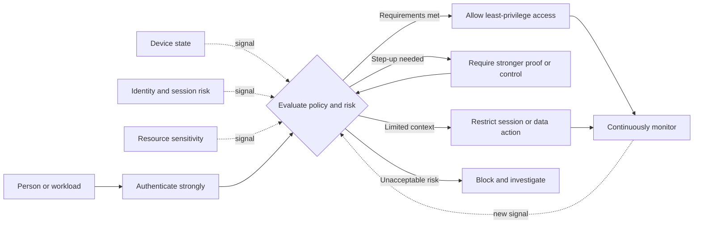
```mermaid
flowchart LR
		ACTOR[Person or workload] --> AUTH[Authenticate strongly]
		DEVICE[Device state] -.signal.-> DECIDE{Evaluate policy and risk}
		RISK[Identity and session risk] -.signal.-> DECIDE
		RESOURCE[Resource sensitivity] -.signal.-> DECIDE
		AUTH --> DECIDE
		DECIDE -->|Requirements met| ALLOW[Allow least-privilege access]
		DECIDE -->|Step-up needed| CHALLENGE[Require stronger proof or control]
		DECIDE -->|Limited context| LIMIT[Restrict session or data action]
		DECIDE -->|Unacceptable risk| BLOCK[Block and investigate]
		ALLOW --> MONITOR[Continuously monitor]
		CHALLENGE --> DECIDE
		LIMIT --> MONITOR
		MONITOR -.new signal.-> DECIDE
```

**Interpretation**
- Authentication begins the decision, but device, resource, risk, and session context shape authorization.
- Least privilege includes action, data scope, and duration; it is not merely assigning a smaller role once.
- Continuous monitoring can change the decision when a token, identity, device, or resource signal changes.

**Interview use:** Draw this first for any “design secure access” question, then replace generic signals with Entra, Intune, Defender, or Purview evidence appropriate to the scenario.

**Common mistake:** Saying Zero Trust means “trust nobody” or forcing MFA on every click. It means no implicit trust and explicit, proportionate verification.

**Source Parts:** [Part 3](Part-03-zero-trust-defense-in-depth-secure-by-design.md), [Part 9](Part-09-conditional-access-design-deployment-troubleshooting.md), [Part 17](Part-17-intune-compliance-conditional-access.md)

### Diagram 2 - Zero Trust pillars and cross-cutting capabilities

**Question answered:** Which domains must a complete Zero Trust strategy cover?

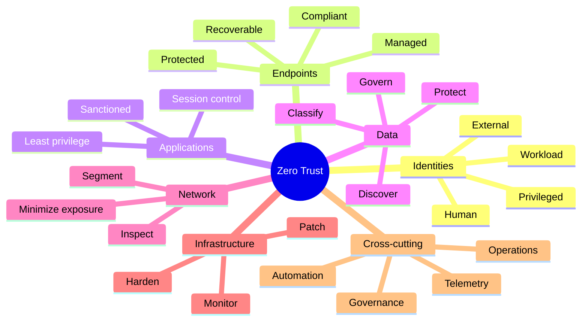
```mermaid
mindmap
	root((Zero Trust))
		Identities
			Human
			Workload
			External
			Privileged
		Endpoints
			Managed
			Compliant
			Protected
			Recoverable
		Applications
			Sanctioned
			Least privilege
			Session control
		Data
			Discover
			Classify
			Protect
			Govern
		Network
			Segment
			Inspect
			Minimize exposure
		Infrastructure
			Harden
			Monitor
			Patch
		Cross-cutting
			Telemetry
			Automation
			Governance
			Operations
```

**Interpretation**
- Identity is a major control plane, but Zero Trust fails if endpoints, applications, data, networks, or infrastructure remain implicitly trusted.
- Telemetry, automation, governance, and operations connect the pillars; they are not a seventh product to buy.
- A maturity assessment should identify dependencies and outcomes across pillars rather than score isolated feature activation.

**Interview use:** Use the mind map to scope a broad transformation, then choose one pillar for depth and name interfaces with the others.

**Common mistake:** Presenting the six pillars as six Microsoft licenses. They are security concerns with many possible controls and owners.

**Source Parts:** [Part 3](Part-03-zero-trust-defense-in-depth-secure-by-design.md), [Part 41](Part-41-exposure-management-secure-score-prioritization.md), [Part 54](Part-54-security-assessments-health-checks-gap-analysis.md)

### Diagram 3 - Defense in depth and shared responsibility

**Question answered:** How do layered controls and cloud responsibility reduce single-point failure?

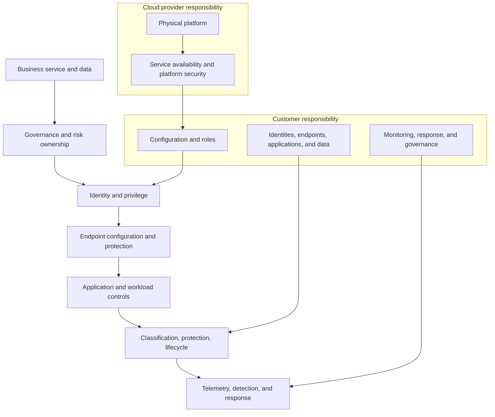
```mermaid
flowchart TB
		OBJECTIVE[Business service and data] --> GOV[Governance and risk ownership]
		GOV --> ID[Identity and privilege]
		ID --> DEVICE[Endpoint configuration and protection]
		DEVICE --> APP[Application and workload controls]
		APP --> DATA[Classification, protection, lifecycle]
		DATA --> DETECT[Telemetry, detection, and response]

		subgraph PROVIDER[Cloud provider responsibility]
				PHYSICAL[Physical platform]
				SERVICE[Service availability and platform security]
		end

		subgraph CUSTOMER[Customer responsibility]
				CONFIG[Configuration and roles]
				CONTENT[Identities, endpoints, applications, and data]
				OPERATE[Monitoring, response, and governance]
		end

		SERVICE --> CONFIG
		PHYSICAL --> SERVICE
		CONFIG --> ID
		CONTENT --> DATA
		OPERATE --> DETECT
```

**Interpretation**
- Defense in depth uses controls with different failure modes; repeating the same misconfiguration is not resilience.
- SaaS moves platform operations to the provider but leaves customer identity, data, configuration, use, and response duties.
- Contracts and service descriptions define provider commitments, while tenant evidence proves customer control operation.

**Interview use:** When asked “isn’t Microsoft responsible?”, draw the provider/customer boundary and place the disputed control on one or both sides.

**Common mistake:** Assuming shared responsibility is a fixed 50/50 split. Responsibility changes by service model, contract, capability, and activity.

**Source Parts:** [Part 2](Part-02-cybersecurity-fundamentals.md), [Part 3](Part-03-zero-trust-defense-in-depth-secure-by-design.md), [Part 62](Part-62-resilience-oncall-shift-handover.md)

### Diagram 4 - Microsoft 365 tenant and connected security planes

**Question answered:** Where do tenant, workload, security, compliance, and Azure resource boundaries meet?

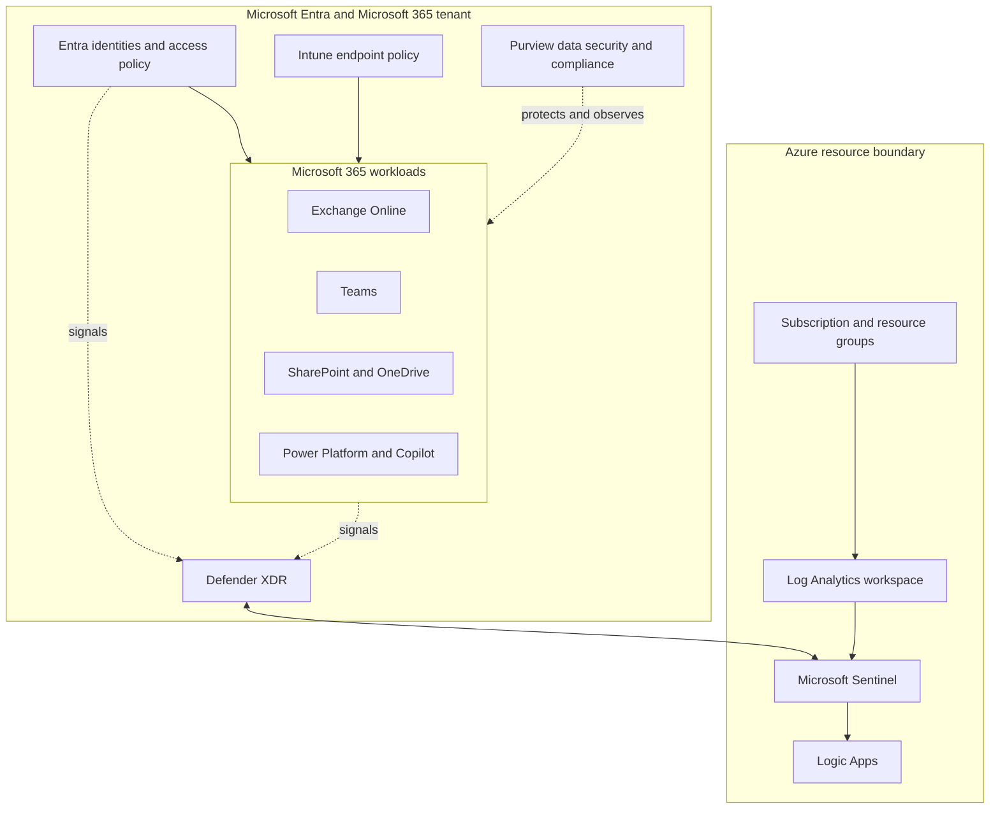
```mermaid
flowchart TB
		subgraph TENANT[Microsoft Entra and Microsoft 365 tenant]
				ENTRA[Entra identities and access policy]
				INTUNE[Intune endpoint policy]
				subgraph WORKLOADS[Microsoft 365 workloads]
						EXO[Exchange Online]
						TEAMS[Teams]
						SPO[SharePoint and OneDrive]
						POWER[Power Platform and Copilot]
				end
				PURVIEW[Purview data security and compliance]
				XDR[Defender XDR]
		end

		subgraph AZURE[Azure resource boundary]
				SUB[Subscription and resource groups]
				LAW[Log Analytics workspace]
				SENTINEL[Microsoft Sentinel]
				LOGIC[Logic Apps]
		end

		ENTRA --> WORKLOADS
		INTUNE --> WORKLOADS
		PURVIEW -.protects and observes.-> WORKLOADS
		WORKLOADS -.signals.-> XDR
		ENTRA -.signals.-> XDR
		XDR <--> SENTINEL
		LAW --> SENTINEL
		SENTINEL --> LOGIC
		SUB --> LAW
```

**Interpretation**
- A tenant is the logical organization boundary, while Sentinel’s workspace and playbooks are also Azure resources with subscription, region, role, and cost implications.
- Workloads share Entra identity and integrate with Purview and Defender, but their permissions, logs, storage, and failure modes remain distinct.
- Unified portals improve workflow without collapsing every underlying service boundary.

**Interview use:** Start here for a senior-consultant architecture question, then zoom into one arrow and state data direction, permission, and evidence.

**Common mistake:** Calling the tenant, Azure subscription, Log Analytics workspace, and Defender portal the same boundary.

**Source Parts:** [Part 4](Part-04-m365-tenant-architecture-portals-roles-licensing.md), [Part 34](Part-34-defender-xdr-architecture-attack-story.md), [Part 43](Part-43-siem-soar-soc-sentinel-architecture.md), [Part 51](Part-51-unified-secops-defender-sentinel-purview.md)

### Diagram 5 - Control plane versus data plane

**Question answered:** How should privileged configuration and ordinary resource use be separated?

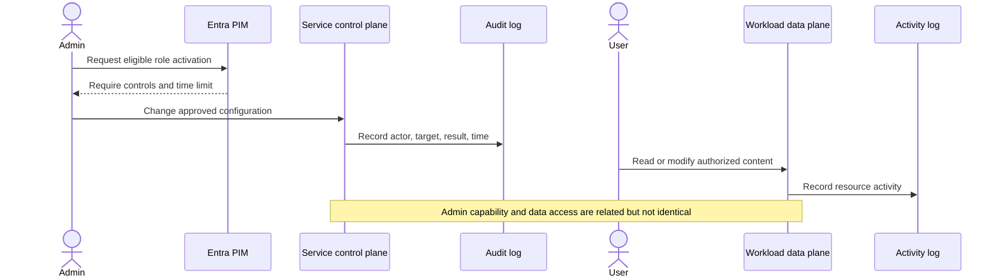
```mermaid
sequenceDiagram
		actor Admin
		participant PIM as Entra PIM
		participant Control as Service control plane
		participant Audit as Audit log
		actor User
		participant Data as Workload data plane
		participant Activity as Activity log

		Admin->>PIM: Request eligible role activation
		PIM-->>Admin: Require controls and time limit
		Admin->>Control: Change approved configuration
		Control->>Audit: Record actor, target, result, time
		User->>Data: Read or modify authorized content
		Data->>Activity: Record resource activity
		Note over Control,Data: Admin capability and data access are related but not identical
```

**Interpretation**
- The control plane changes service configuration; the data plane uses or queries protected resources.
- Privileged role activation, administrative audit, workload permissions, and content activity need separate least-privilege analysis.
- Some roles span both planes, so role documentation and tests must replace assumptions based on titles.

**Interview use:** Use this distinction when discussing tenant administration, Sentinel workspaces, eDiscovery, automation identities, or delegated operations.

**Common mistake:** Assuming Global Administrator automatically grants every content-search or Azure resource permission, or that data access grants configuration rights.

**Source Parts:** [Part 4](Part-04-m365-tenant-architecture-portals-roles-licensing.md), [Part 11](Part-11-privileged-access-rbac-pim-emergency-access.md), [Part 30](Part-30-purview-audit-ediscovery-legal-investigation.md), [Part 43](Part-43-siem-soar-soc-sentinel-architecture.md)

## Network, DNS, TCP, TLS, HTTP, and authentication protocols

| Layer | Evidence | Typical confusion | Safe next move |
|---|---|---|---|
| Name resolution | Resolver answer, query time, record, TTL | “Ping failed, so DNS failed” | Query intended resolver and record type |
| Route/proxy | Path, source address, proxy decision, firewall log | “443 open means service works” | Compare working and failing path |
| Transport | Handshake, reset, loss, latency | Treating timeout as application error | Identify which side stopped progress |
| TLS | SNI, certificate, chain, version, alert | Calling every TLS issue “SSL certificate” | Validate name, time, trust, inspection |
| HTTP/API | Method, URL, status, headers, body, request ID | Treating 403 as network block | Inspect authorization and policy |
| Identity | Issuer, audience, claims, consent, CA result | Using ID token as API token | Trace protocol and target resource |

### Diagram 6 - Cloud connection layer model

**Question answered:** What sequence must succeed before a Microsoft cloud application can complete a request?


```mermaid
flowchart LR
		CLIENT[Client and device] --> DNS[DNS resolution]
		DNS --> PATH[Route, VPN, proxy, NAT, firewall]
		PATH --> TRANSPORT[TCP or supported UDP transport]
		TRANSPORT --> TLS[TLS negotiation and server identity]
		TLS --> HTTP[HTTP request and response]
		HTTP --> IDENTITY[Authentication and token]
		IDENTITY --> POLICY[Authorization and service policy]
		POLICY --> DATA[Application operation and data]
		DATA --> LOGS[Client, identity, network, and service logs]
```

**Interpretation**
- A higher layer cannot work before its required lower-layer dependency, but one symptom can be caused by multiple layers.
- A `403` normally proves that name, route, transport, TLS, and HTTP reached a responding service; focus on authorization or policy.
- Correlating client, proxy, identity, and service timestamps prevents teams from blaming the nearest visible product.

**Interview use:** Draw this when given a vague “Microsoft 365 is down” symptom, then ask where the first observable divergence occurs.

**Common mistake:** Opening broad firewall access before identifying the exact endpoint, direction, protocol, error, and policy result.

**Source Parts:** [Part 5](Part-05-networking-identity-application-protocols.md), [Part 60](Part-60-structured-troubleshooting-multivendor-cloud.md)

### Diagram 7 - DNS through HTTPS request sequence

**Question answered:** What happens on the wire before an HTTPS application response appears?

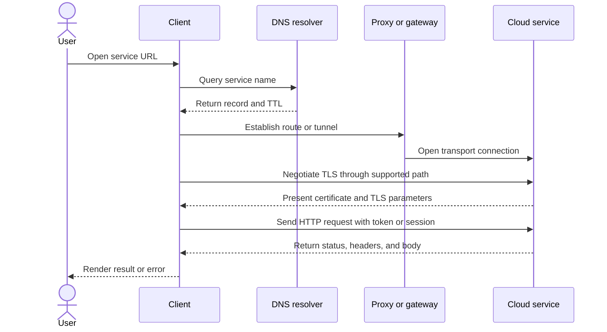
```mermaid
sequenceDiagram
		actor User
		participant Client
		participant DNS as DNS resolver
		participant Proxy as Proxy or gateway
		participant Service as Cloud service

		User->>Client: Open service URL
		Client->>DNS: Query service name
		DNS-->>Client: Return record and TTL
		Client->>Proxy: Establish route or tunnel
		Proxy->>Service: Open transport connection
		Client->>Service: Negotiate TLS through supported path
		Service-->>Client: Present certificate and TLS parameters
		Client->>Service: Send HTTP request with token or session
		Service-->>Client: Return status, headers, and body
		Client-->>User: Render result or error
```

**Interpretation**
- DNS gives a name answer, not permission or application health.
- A proxy can originate transport or inspect TLS, changing source addresses, certificates, logs, and failure ownership.
- HTTP status, request ID, and response body are essential evidence after secure transport succeeds.

**Interview use:** Narrate one sentence per arrow and name the evidence available at the client, resolver, proxy, identity provider, and service.

**Common mistake:** Saying TLS always runs directly between browser and cloud service when an approved inspection proxy terminates and re-establishes sessions.

**Source Parts:** [Part 5](Part-05-networking-identity-application-protocols.md), [Part 60](Part-60-structured-troubleshooting-multivendor-cloud.md)

### Diagram 8 - Proxy and TLS fault isolation

**Question answered:** How do you distinguish endpoint, proxy, TLS, and application failures without unsafe bypasses?

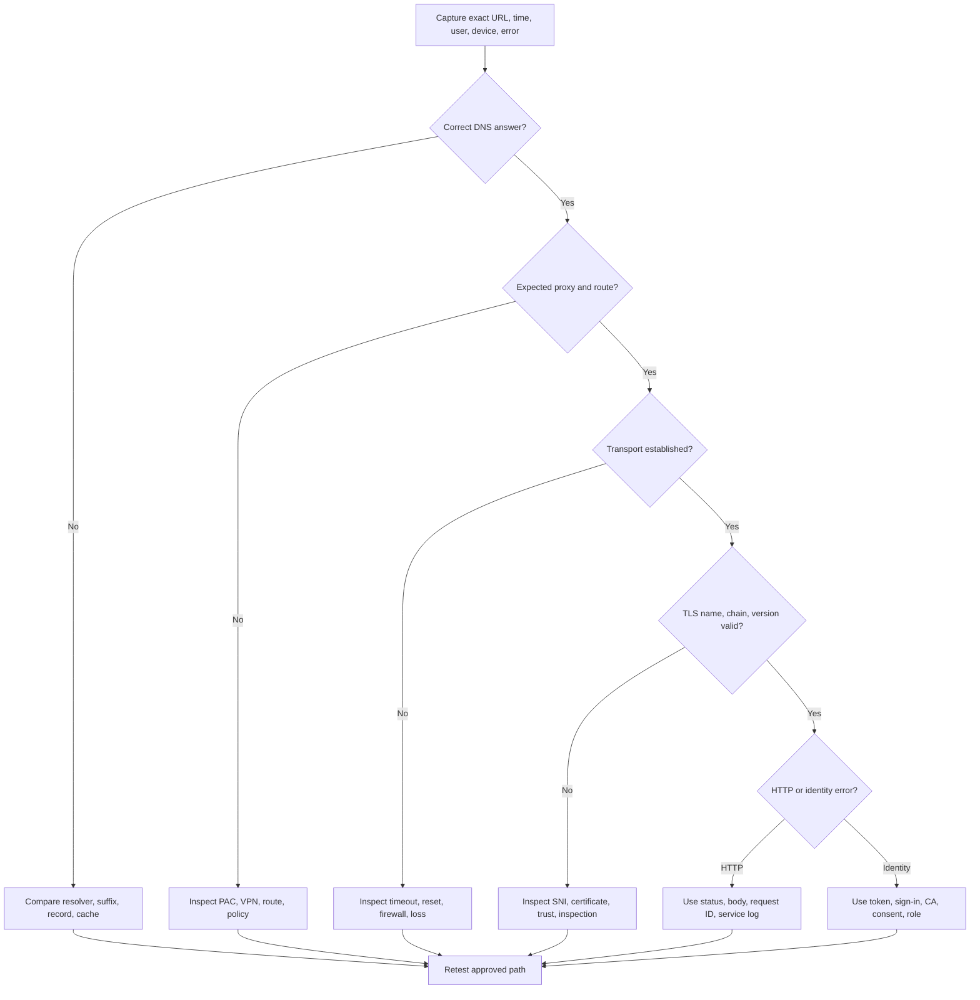
```mermaid
flowchart TD
		START[Capture exact URL, time, user, device, error] --> DNSQ{Correct DNS answer?}
		DNSQ -->|No| DNSFIX[Compare resolver, suffix, record, cache]
		DNSQ -->|Yes| PATHQ{Expected proxy and route?}
		PATHQ -->|No| PATHFIX[Inspect PAC, VPN, route, policy]
		PATHQ -->|Yes| TCPQ{Transport established?}
		TCPQ -->|No| NETFIX[Inspect timeout, reset, firewall, loss]
		TCPQ -->|Yes| TLSQ{TLS name, chain, version valid?}
		TLSQ -->|No| TLSFIX[Inspect SNI, certificate, trust, inspection]
		TLSQ -->|Yes| HTTPQ{HTTP or identity error?}
		HTTPQ -->|HTTP| APPFIX[Use status, body, request ID, service log]
		HTTPQ -->|Identity| IDFIX[Use token, sign-in, CA, consent, role]
		DNSFIX --> RETEST[Retest approved path]
		PATHFIX --> RETEST
		NETFIX --> RETEST
		TLSFIX --> RETEST
		APPFIX --> RETEST
		IDFIX --> RETEST
```

**Interpretation**
- The flow starts with evidence and compares the expected path before changing controls.
- TLS inspection is one hypothesis, not a reason to disable the proxy globally; use approved test groups or traces.
- Each branch identifies a different owner and log set, which improves multi-vendor escalation quality.

**Interview use:** State one competing hypothesis at each diamond and propose the cheapest safe test that could disprove it.

**Common mistake:** Testing by turning off security controls for everyone. A controlled, approved comparison should preserve least exposure and clear rollback.

**Source Parts:** [Part 5](Part-05-networking-identity-application-protocols.md), [Part 60](Part-60-structured-troubleshooting-multivendor-cloud.md), [Part 62](Part-62-resilience-oncall-shift-handover.md)

### Diagram 9 - OAuth 2.0 authorization code with OpenID Connect

**Question answered:** How does a user sign in and a client obtain a token for an API without giving the app the user’s password?

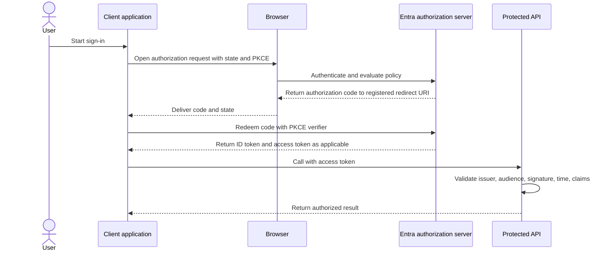
```mermaid
sequenceDiagram
		actor User
		participant Client as Client application
		participant Browser
		participant Entra as Entra authorization server
		participant API as Protected API

		User->>Client: Start sign-in
		Client->>Browser: Open authorization request with state and PKCE
		Browser->>Entra: Authenticate and evaluate policy
		Entra-->>Browser: Return authorization code to registered redirect URI
		Browser-->>Client: Deliver code and state
		Client->>Entra: Redeem code with PKCE verifier
		Entra-->>Client: Return ID token and access token as applicable
		Client->>API: Call with access token
		API->>API: Validate issuer, audience, signature, time, claims
		API-->>Client: Return authorized result
```

**Interpretation**
- The browser handles interactive authentication; the client receives a short-lived code rather than the user’s password.
- PKCE binds code redemption to the initiating client instance, while `state` helps bind the response to the request.
- The API validates an access token intended for it; the client uses the ID token for authenticated-session information.

**Interview use:** Explain trust at each hop: registered client, redirect URI, authorization server, token validation, API permission, and CA decision.

**Common mistake:** Saying the client sends an ID token to Microsoft Graph, or decoding a JWT and treating readable claims as proof of validity.

**Source Parts:** [Part 7](Part-07-authentication-authorization-tokens-modern-auth.md), [Part 9](Part-09-conditional-access-design-deployment-troubleshooting.md), [Part 14](Part-14-external-cross-tenant-workload-app-identity.md)

### Diagram 10 - Token and session lifecycle

**Question answered:** How can access continue, refresh, be challenged, or end after initial authentication?

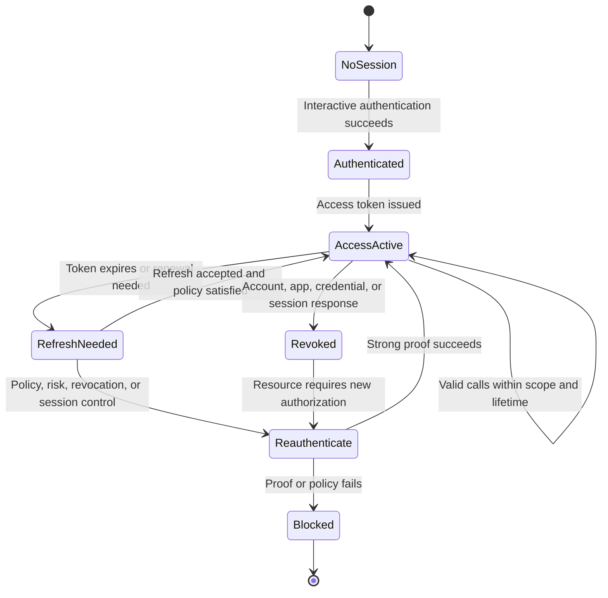
```mermaid
stateDiagram-v2
		[*] --> NoSession
		NoSession --> Authenticated: Interactive authentication succeeds
		Authenticated --> AccessActive: Access token issued
		AccessActive --> AccessActive: Valid calls within scope and lifetime
		AccessActive --> RefreshNeeded: Token expires or renewal needed
		RefreshNeeded --> AccessActive: Refresh accepted and policy satisfied
		RefreshNeeded --> Reauthenticate: Policy, risk, revocation, or session control
		Reauthenticate --> AccessActive: Strong proof succeeds
		Reauthenticate --> Blocked: Proof or policy fails
		AccessActive --> Revoked: Account, app, credential, or session response
		Revoked --> Reauthenticate: Resource requires new authorization
		Blocked --> [*]
```

**Interpretation**
- Token lifetime, refresh behavior, resource enforcement, CA, continuous access evaluation, and explicit response actions all influence session duration.
- Revocation is not one universal instant event; token type, application, resource, cache, and protocol support affect observed behavior.
- A user can remain authenticated while one resource denies authorization or demands stronger proof.

**Interview use:** Use the state model to explain why “reset the password” may be necessary but insufficient after token or session theft.

**Common mistake:** Promising that disabling a user invalidates every session immediately in every workload without checking current support and evidence.

**Source Parts:** [Part 7](Part-07-authentication-authorization-tokens-modern-auth.md), [Part 9](Part-09-conditional-access-design-deployment-troubleshooting.md), [Part 39](Part-39-defender-xdr-incident-response-air.md)

## Microsoft Entra identity and access

| Identity design question | Object or signal | Control owner | Evidence |
|---|---|---|---|
| Who or what is acting? | User, device, service principal, managed identity, agent | Identity owner | Object ID, tenant ID, owner, credential |
| What may it do? | Role, scope, delegated/application permission | Resource owner | Assignment, consent, access token claims |
| How was it authenticated? | Method, strength, protocol, session | Identity platform and authenticator owner | Sign-in detail, authentication methods |
| Is access acceptable now? | Risk, device, location, client, resource, session | Conditional Access owner | Policy result, report-only result, correlation ID |
| Why does access continue? | Token/session state, CAE, refresh, resource behavior | Identity and application owners | Token metadata, resource and sign-in logs |
| When should access end? | Departure, expiry, review, revocation, incident | Governance and operations owners | Workflow, access review, action log |

### Diagram 11 - Entra directory object relationships

**Question answered:** How do users, groups, devices, app registrations, and service principals relate inside a tenant?

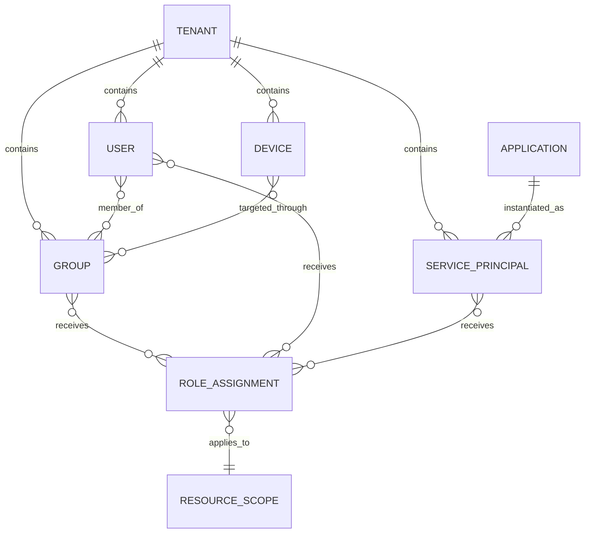
```mermaid
erDiagram
		TENANT ||--o{ USER : contains
		TENANT ||--o{ GROUP : contains
		TENANT ||--o{ DEVICE : contains
		TENANT ||--o{ SERVICE_PRINCIPAL : contains
		APPLICATION ||--o{ SERVICE_PRINCIPAL : instantiated_as
		USER }o--o{ GROUP : member_of
		DEVICE }o--o{ GROUP : targeted_through
		GROUP }o--o{ ROLE_ASSIGNMENT : receives
		USER }o--o{ ROLE_ASSIGNMENT : receives
		SERVICE_PRINCIPAL }o--o{ ROLE_ASSIGNMENT : receives
		ROLE_ASSIGNMENT }o--|| RESOURCE_SCOPE : applies_to
```

**Interpretation**
- An app registration represents the application definition; a service principal is its identity instance in a tenant.
- Users, groups, devices, and service principals can participate in access assignments under different supported rules.
- Stable object IDs, tenant context, ownership, credentials, and scope matter more than display names during investigation.

**Interview use:** Draw this before explaining application consent, group-based access, workload identities, or why two objects with the same name behave differently.

**Common mistake:** Calling an app registration and service principal the same object, or assuming an application ID uniquely identifies a tenant-local assignment.

**Source Parts:** [Part 6](Part-06-entra-id-architecture-directory-objects.md), [Part 11](Part-11-privileged-access-rbac-pim-emergency-access.md), [Part 14](Part-14-external-cross-tenant-workload-app-identity.md)

### Diagram 12 - Token purpose map

**Question answered:** Which token or credential artifact serves which participant and purpose?

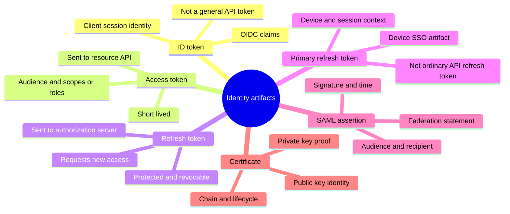
```mermaid
mindmap
	root((Identity artifacts))
		ID token
			Client session identity
			OIDC claims
			Not a general API token
		Access token
			Sent to resource API
			Audience and scopes or roles
			Short lived
		Refresh token
			Sent to authorization server
			Requests new access
			Protected and revocable
		Primary refresh token
			Device SSO artifact
			Device and session context
			Not ordinary API refresh token
		SAML assertion
			Federation statement
			Audience and recipient
			Signature and time
		Certificate
			Public key identity
			Private key proof
			Chain and lifecycle
```

**Interpretation**
- Token names describe intended consumers; sending the wrong artifact to a resource should fail and can create insecure designs.
- A readable token is not a trusted token until signature, issuer, audience, time, nonce, and protocol requirements are validated.
- Credential and session artifacts have different revocation and caching behavior, so incident response must identify the actual artifact.

**Interview use:** Use this map to answer “what is inside a token?” while keeping purpose and validation ahead of claim trivia.

**Common mistake:** Treating every JWT as an access token or assuming decoding proves authenticity.

**Source Parts:** [Part 7](Part-07-authentication-authorization-tokens-modern-auth.md), [Part 8](Part-08-mfa-passwordless-authentication-strengths.md)

### Diagram 13 - Authentication and federation protocol selection

**Question answered:** How do you choose among OIDC/OAuth, SAML, WS-Fed, Kerberos, LDAP, and SCIM for an integration?

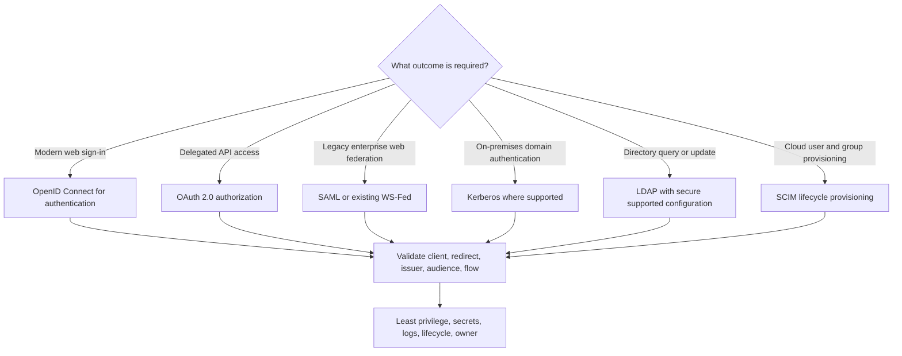
```mermaid
flowchart TD
		NEED{What outcome is required?}
		NEED -->|Modern web sign-in| OIDC[OpenID Connect for authentication]
		NEED -->|Delegated API access| OAUTH[OAuth 2.0 authorization]
		NEED -->|Legacy enterprise web federation| SAML[SAML or existing WS-Fed]
		NEED -->|On-premises domain authentication| KERB[Kerberos where supported]
		NEED -->|Directory query or update| LDAP[LDAP with secure supported configuration]
		NEED -->|Cloud user and group provisioning| SCIM[SCIM lifecycle provisioning]
		OIDC --> VALIDATE[Validate client, redirect, issuer, audience, flow]
		OAUTH --> VALIDATE
		SAML --> VALIDATE
		KERB --> VALIDATE
		LDAP --> VALIDATE
		SCIM --> VALIDATE
		VALIDATE --> GOVERN[Least privilege, secrets, logs, lifecycle, owner]
```

**Interpretation**
- Authentication, API authorization, federation, directory access, and provisioning are different outcomes; one protocol does not solve all of them.
- Existing application support and security quality constrain migration, but legacy compatibility should have an owner and modernization path.
- Every integration also needs credential, certificate, consent, monitoring, failure, and deprovisioning design.

**Interview use:** Ask what the application is trying to do before naming a protocol, then explain why the other choices are not the primary fit.

**Common mistake:** Saying SCIM provides single sign-on or OAuth authenticates a user without OpenID Connect or another authentication protocol.

**Source Parts:** [Part 5](Part-05-networking-identity-application-protocols.md), [Part 7](Part-07-authentication-authorization-tokens-modern-auth.md), [Part 14](Part-14-external-cross-tenant-workload-app-identity.md)

### Diagram 14 - MFA registration and authentication strength

**Question answered:** How does an organization move a user from registration to a policy-approved strong authentication method?

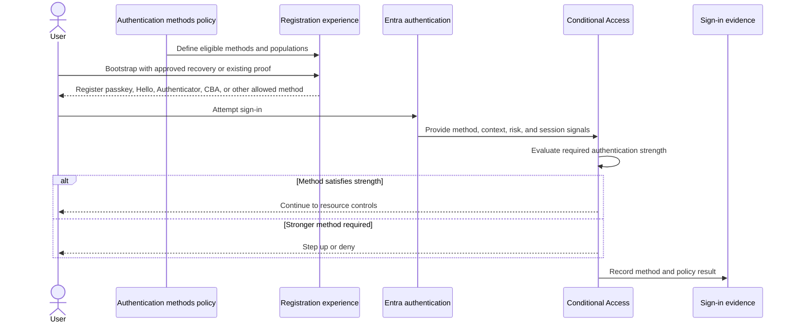
```mermaid
sequenceDiagram
		actor User
		participant Policy as Authentication methods policy
		participant Reg as Registration experience
		participant Auth as Entra authentication
		participant CA as Conditional Access
		participant Log as Sign-in evidence

		Policy->>Reg: Define eligible methods and populations
		User->>Reg: Bootstrap with approved recovery or existing proof
		Reg-->>User: Register passkey, Hello, Authenticator, CBA, or other allowed method
		User->>Auth: Attempt sign-in
		Auth->>CA: Provide method, context, risk, and session signals
		CA->>CA: Evaluate required authentication strength
		alt Method satisfies strength
				CA-->>User: Continue to resource controls
		else Stronger method required
				CA-->>User: Step up or deny
		end
		CA->>Log: Record method and policy result
```

**Interpretation**
- Method enablement, user registration, authentication, and policy requirement are separate control stages.
- Temporary Access Pass or another governed bootstrap can help registration without becoming a permanent everyday method.
- Authentication strengths let policy express acceptable method combinations, but current tenant support and user readiness must be tested.

**Interview use:** Explain both the technical sign-in and the deployment journey: personas, registration campaign, recovery, support, exclusions, monitoring, and staged enforcement.

**Common mistake:** Enabling a method and immediately requiring it for everyone without proving registration, device/platform support, and emergency recovery.

**Source Parts:** [Part 8](Part-08-mfa-passwordless-authentication-strengths.md), [Part 9](Part-09-conditional-access-design-deployment-troubleshooting.md), [Part 65](Part-65-lab-entra-zero-trust-baseline.md)

### Diagram 15 - Conditional Access evaluation

**Question answered:** How does Conditional Access combine assignments, conditions, and controls for a sign-in?

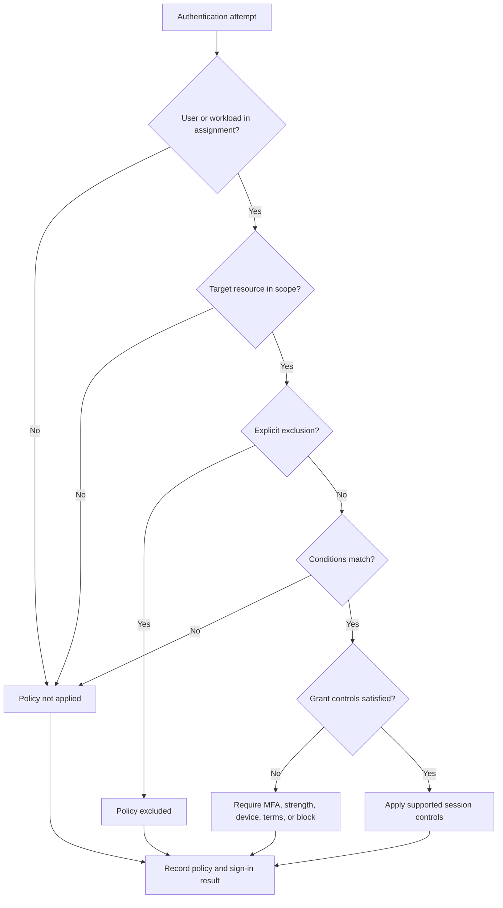
```mermaid
flowchart TD
		SIGNIN[Authentication attempt] --> SCOPE{User or workload in assignment?}
		SCOPE -->|No| NOTAPPLIED[Policy not applied]
		SCOPE -->|Yes| RESOURCE{Target resource in scope?}
		RESOURCE -->|No| NOTAPPLIED
		RESOURCE -->|Yes| EXCLUDE{Explicit exclusion?}
		EXCLUDE -->|Yes| EXCLUDED[Policy excluded]
		EXCLUDE -->|No| CONDITION{Conditions match?}
		CONDITION -->|No| NOTAPPLIED
		CONDITION -->|Yes| GRANT{Grant controls satisfied?}
		GRANT -->|No| CHALLENGE[Require MFA, strength, device, terms, or block]
		GRANT -->|Yes| SESSION[Apply supported session controls]
		CHALLENGE --> RESULT[Record policy and sign-in result]
		SESSION --> RESULT
		NOTAPPLIED --> RESULT
		EXCLUDED --> RESULT
```

**Interpretation**
- Policy evaluation first determines applicability, then requirements; “not applied” is different from successful grant.
- Multiple applicable policies are cumulative, so satisfying one policy does not cancel another policy’s block or grant requirement.
- The sign-in log, policy detail, authentication detail, device detail, and resource identify the real decision path.

**Interview use:** Use the diamonds to diagnose a reported lockout, then name the exact policy evidence rather than editing exclusions by guesswork.

**Common mistake:** Treating policy order like firewall rule order. Conditional Access evaluates all applicable policies under documented combination behavior.

**Source Parts:** [Part 9](Part-09-conditional-access-design-deployment-troubleshooting.md), [Part 10](Part-10-entra-id-protection-risk-based-access.md), [Part 17](Part-17-intune-compliance-conditional-access.md)

### Diagram 16 - Conditional Access safe deployment lifecycle

**Question answered:** How do you move a Conditional Access policy from design to enforced operation without locking out the tenant?

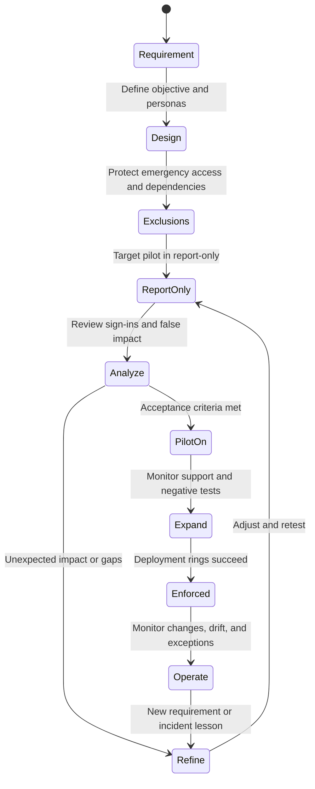
```mermaid
stateDiagram-v2
		[*] --> Requirement
		Requirement --> Design: Define objective and personas
		Design --> Exclusions: Protect emergency access and dependencies
		Exclusions --> ReportOnly: Target pilot in report-only
		ReportOnly --> Analyze: Review sign-ins and false impact
		Analyze --> Refine: Unexpected impact or gaps
		Refine --> ReportOnly: Adjust and retest
		Analyze --> PilotOn: Acceptance criteria met
		PilotOn --> Expand: Monitor support and negative tests
		Expand --> Enforced: Deployment rings succeed
		Enforced --> Operate: Monitor changes, drift, and exceptions
		Operate --> Refine: New requirement or incident lesson
```

**Interpretation**
- Report-only supplies predicted policy evidence but does not reproduce every future user, client, or dependency.
- Emergency access and service/workload dependencies are designed before enforcement, not added during an outage.
- The operating state includes exception expiry, break-glass monitoring, change review, sign-in trends, and periodic tests.

**Interview use:** This lifecycle turns “enable MFA for all users” into a consulting-grade rollout with test, rollback, communication, and ownership.

**Common mistake:** Calling report-only a guaranteed simulation or moving directly from a template to all-user enforcement.

**Source Parts:** [Part 9](Part-09-conditional-access-design-deployment-troubleshooting.md), [Part 58](Part-58-deployment-pilots-testing-cutover-rollback.md), [Part 65](Part-65-lab-entra-zero-trust-baseline.md)

### Diagram 17 - PIM privileged-role activation

**Question answered:** How does PIM reduce standing privilege while preserving accountable administration?

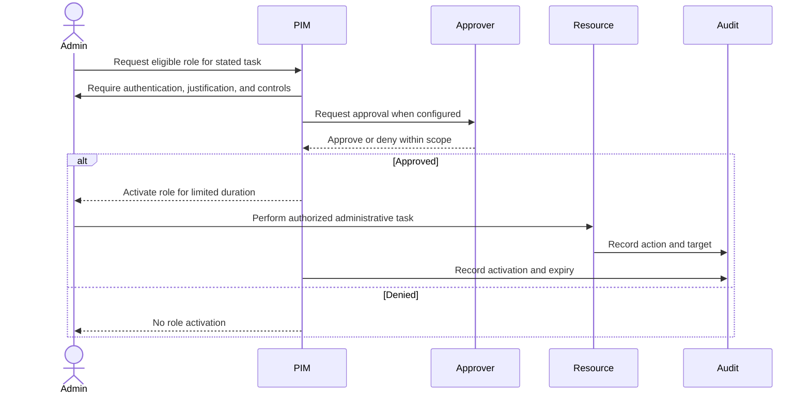
```mermaid
sequenceDiagram
		actor Admin
		participant PIM
		participant Approver
		participant Resource
		participant Audit

		Admin->>PIM: Request eligible role for stated task
		PIM->>Admin: Require authentication, justification, and controls
		PIM->>Approver: Request approval when configured
		Approver-->>PIM: Approve or deny within scope
		alt Approved
				PIM-->>Admin: Activate role for limited duration
				Admin->>Resource: Perform authorized administrative task
				Resource->>Audit: Record action and target
				PIM->>Audit: Record activation and expiry
		else Denied
				PIM-->>Admin: No role activation
		end
```

**Interpretation**
- Eligibility creates the right to request; activation creates time-bound effective privilege after required controls.
- Approval quality depends on an independent reviewer understanding the task, scope, risk, and requested duration.
- PIM evidence and workload audit evidence together connect privileged intent with the actual change.

**Interview use:** Add access reviews, alerts, role design, privileged workstation, and emergency access when explaining a complete privileged-access program.

**Common mistake:** Assuming PIM makes an excessively broad role safe or that justification text replaces least-privilege scope.

**Source Parts:** [Part 11](Part-11-privileged-access-rbac-pim-emergency-access.md), [Part 59](Part-59-operational-readiness-raci-soc-runbooks.md)

### Diagram 18 - Joiner, mover, leaver governance journey

**Question answered:** Where do identity lifecycle controls prevent birthright-access drift and orphaned accounts?

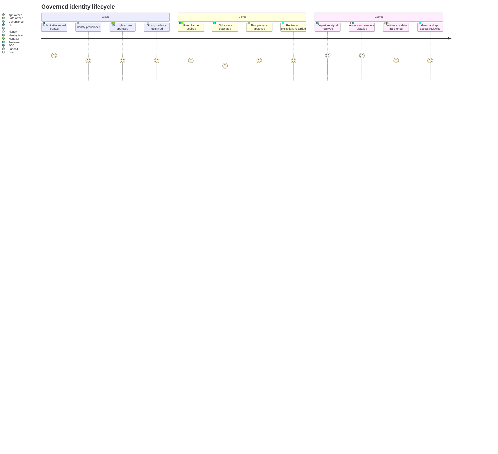
```mermaid
journey
		title Governed identity lifecycle
		section Joiner
			Authoritative record created: 5: HR
			Identity provisioned: 4: Identity team
			Birthright access approved: 4: Manager, App owner
			Strong methods registered: 4: User, Support
		section Mover
			Role change received: 4: HR, Manager
			Old access evaluated: 3: Governance
			New package approved: 4: App owner
			Review and exceptions recorded: 4: Reviewer
		section Leaver
			Departure signal received: 5: HR
			Access and sessions disabled: 5: Identity, SOC
			Devices and data transferred: 4: IT, Data owner
			Guest and app access reviewed: 4: Governance
```

**Interpretation**
- The authoritative business event begins the process; directory automation cannot fix late or inaccurate source data.
- Movers are high-risk because access is often added without removing obsolete entitlements.
- Departure includes sessions, devices, application assignments, data ownership, delegated permissions, and evidence, not only account disablement.

**Interview use:** Use this journey to connect Lifecycle Workflows, entitlement management, access reviews, HR, managers, app owners, and operations.

**Common mistake:** Describing joiner/mover/leaver as an identity-team-only process without business ownership or exception handling.

**Source Parts:** [Part 12](Part-12-identity-governance-lifecycle-entitlement-access-reviews.md), [Part 59](Part-59-operational-readiness-raci-soc-runbooks.md)

### Diagram 19 - Hybrid identity synchronization and authentication choices

**Question answered:** How do on-premises identity data and cloud authentication paths reach Entra?

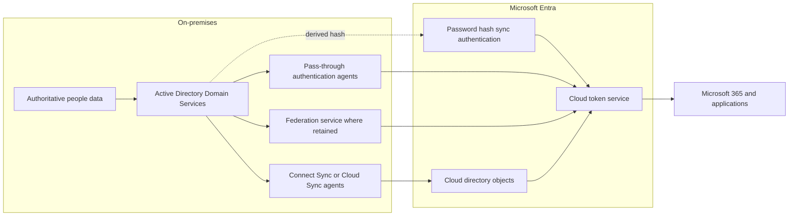
```mermaid
flowchart LR
		subgraph ONPREM[On-premises]
				HR[Authoritative people data] --> AD[Active Directory Domain Services]
				AD --> CONNECT[Connect Sync or Cloud Sync agents]
				AD --> PTA[Pass-through authentication agents]
				AD --> ADFS[Federation service where retained]
		end

		subgraph CLOUD[Microsoft Entra]
				DIRECTORY[Cloud directory objects]
				PHS[Password hash sync authentication]
				AUTH[Cloud token service]
		end

		CONNECT --> DIRECTORY
		AD -.derived hash.-> PHS
		PHS --> AUTH
		PTA --> AUTH
		ADFS --> AUTH
		DIRECTORY --> AUTH
		AUTH --> APPS[Microsoft 365 and applications]
```

**Interpretation**
- Synchronization of objects and authentication of users are related but separate paths.
- PHS, PTA, and federation have different availability, security, operational, and migration characteristics; requirements select the path.
- Source authority, matching, filtering, staging, health, agent support, and recovery deserve explicit design.

**Interview use:** State the current path, target path, coexistence, validation, rollback, and retirement plan rather than claiming one method is universally best.

**Common mistake:** Saying Cloud Sync or Connect Sync sends plaintext passwords, or assuming federation is required for every enterprise feature.

**Source Parts:** [Part 13](Part-13-hybrid-identity-connect-cloud-sync.md), [Part 36](Part-36-defender-identity-hybrid-threats.md)

### Diagram 20 - External, cross-tenant, and workload identity governance

**Question answered:** How do guests, partner tenants, applications, and workloads receive governed access without becoming unmanaged exceptions?

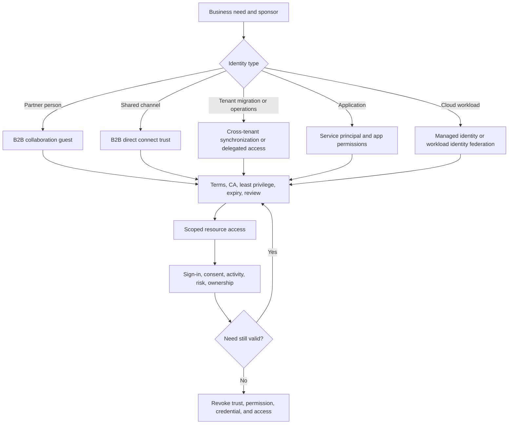
```mermaid
flowchart TB
		NEED[Business need and sponsor] --> TYPE{Identity type}
		TYPE -->|Partner person| B2B[B2B collaboration guest]
		TYPE -->|Shared channel| DIRECT[B2B direct connect trust]
		TYPE -->|Tenant migration or operations| CROSS[Cross-tenant synchronization or delegated access]
		TYPE -->|Application| APP[Service principal and app permissions]
		TYPE -->|Cloud workload| FED[Managed identity or workload identity federation]
		B2B --> GOVERN[Terms, CA, least privilege, expiry, review]
		DIRECT --> GOVERN
		CROSS --> GOVERN
		APP --> GOVERN
		FED --> GOVERN
		GOVERN --> RESOURCE[Scoped resource access]
		RESOURCE --> MONITOR[Sign-in, consent, activity, risk, ownership]
		MONITOR --> REVIEW{Need still valid?}
		REVIEW -->|Yes| GOVERN
		REVIEW -->|No| REMOVE[Revoke trust, permission, credential, and access]
```

**Interpretation**
- External human, cross-tenant, application, and workload identities require different object, trust, credential, and lifecycle patterns.
- Sponsorship and ownership prevent guest and service-principal access from becoming permanent anonymous infrastructure.
- Workload identity federation or managed identity can reduce long-lived secrets but does not remove authorization and monitoring duties.

**Interview use:** Ask “who owns it, what exact resource, how long, which credential, and how is it removed?” for every external or nonhuman identity.

**Common mistake:** Treating all external access as guest invitations, or granting broad application permissions because no interactive user is present.

**Source Parts:** [Part 12](Part-12-identity-governance-lifecycle-entitlement-access-reviews.md), [Part 14](Part-14-external-cross-tenant-workload-app-identity.md), [Part 52](Part-52-enterprise-sentinel-multiworkspace-multitenant-governance.md)

## Microsoft Intune and endpoint management

| Endpoint plane | Main question | Typical evidence | Boundary to protect |
|---|---|---|---|
| Device identity | Registered, Entra joined, or hybrid joined? | Entra device record, join state | Identity state is not enrollment state |
| Enrollment | Which authority and method manage the device? | Intune record, enrollment logs, tokens | Ownership, platform, scope, privacy |
| Configuration | Which applicable channel requested the setting? | Profile status, CSP/MDM/GPO logs | Conflict and tattooing behavior |
| Compliance | Which rule produced the state and when? | Per-setting compliance, grace period | State is a signal, not CA itself |
| Applications | Was content installed and detected correctly? | IME logs, return code, detection | System/user context and dependencies |
| Endpoint security | Which control owns prevention, EDR, firewall, encryption, privilege? | MDE, Intune, platform logs | Duplicate policy authorities |
| Co-management | Which product owns each workload now? | Workload slider, client and cloud state | Pilot collection and rollback |

### Diagram 21 - Intune enrollment and management choice

**Question answered:** How do ownership, platform, identity, and business need determine the management approach?

```mermaid
flowchart TD
	DEVICE[Device needs organizational access] --> OWNER{Corporate or personal?}
	OWNER -->|Corporate| PLATFORM{Platform and provisioning path}
	OWNER -->|Personal| PRIVACY{Full device management justified?}
	PRIVACY -->|No| MAM[MAM or app protection without enrollment]
	PRIVACY -->|Yes and supported| BYOD[Privacy-aware user enrollment or MDM]
	PLATFORM -->|Windows new device| AUTO[Autopilot plus Entra join and Intune]
	PLATFORM -->|Existing managed Windows| CO[Co-management or migration path]
	PLATFORM -->|Apple or Android| TOKEN[Platform enrollment with required token or account]
	AUTO --> POLICY[Assign configuration, compliance, apps, security]
	CO --> POLICY
	TOKEN --> POLICY
	BYOD --> POLICY
	MAM --> APPDATA[Protect organizational app data]
	POLICY --> VALIDATE[Validate identity, ownership, management, and access]
```

**Interpretation**
- Device registration/join, Intune enrollment, ownership, and compliance are different states that must be observed separately.
- Personal-device design balances data protection and user privacy; app protection may meet the requirement without full enrollment.
- Platform prerequisites, enrollment restrictions, token/certificate lifecycles, licensing, and support paths affect the choice.

**Interview use:** Start by asking personas, ownership, platform, data sensitivity, privacy, and current authority before recommending enrollment.

**Common mistake:** Saying every mobile device must be fully enrolled or that Entra registration proves Intune management.

**Source Parts:** [Part 15](Part-15-intune-architecture-enrollment-mdm-mam.md), [Part 18](Part-18-intune-apps-autopilot-updates-lifecycle.md), [Part 66](Part-66-lab-intune-endpoint-security.md)

### Diagram 22 - Intune configuration applicability and conflict

**Question answered:** Why can an assigned Intune setting still be absent, conflicting, or different on a device?

```mermaid
flowchart TD
	PROFILE[Profile or endpoint-security policy] --> ASSIGN{User or device targeted?}
	ASSIGN -->|No| NA[Not applicable to assignment]
	ASSIGN -->|Yes| FILTER{Assignment filter passes?}
	FILTER -->|No| NA
	FILTER -->|Yes| SUPPORT{Platform, edition, version, and CSP support?}
	SUPPORT -->|No| UNSUP[Not applicable or error]
	SUPPORT -->|Yes| CHANNEL{Other authority configures same setting?}
	CHANNEL -->|No| APPLY[Apply requested value]
	CHANNEL -->|Yes| PRECEDENCE[Evaluate MDM, GPO, baseline, security, or local precedence]
	PRECEDENCE --> RESULT{Compatible?}
	RESULT -->|Yes| APPLY
	RESULT -->|No| CONFLICT[Conflict, override, or last-writer behavior]
	APPLY --> REPORT[Device and service report state]
	CONFLICT --> REPORT
```

**Interpretation**
- Assignment is only the first gate; filters, platform applicability, edition, OS support, CSP behavior, and other authorities affect outcome.
- “Conflict” is not one universal precedence rule. Inspect the setting’s channel and actual device diagnostics.
- Removing a profile may not reverse a tattooed or independently configured value, so rollback requires a tested desired state.

**Interview use:** Use the flow to troubleshoot one setting from portal assignment through device evidence before changing multiple profiles.

**Common mistake:** Assuming the newest profile always wins or deleting policies until the dashboard becomes green.

**Source Parts:** [Part 16](Part-16-intune-configuration-settings-baselines-policy-precedence.md), [Part 19](Part-19-intune-endpoint-security-stack.md), [Part 20](Part-20-intune-operations-troubleshooting-sccm-comanagement.md)

### Diagram 23 - Compliance signal into Conditional Access

**Question answered:** How does a device setting failure become an access decision?

```mermaid
sequenceDiagram
	actor User
	participant Device
	participant Intune
	participant Entra
	participant CA as Conditional Access
	participant App as Cloud application

	Device->>Intune: Check in with inventory and policy state
	Intune->>Intune: Evaluate compliance rules and grace period
	Intune-->>Entra: Publish device compliance state
	User->>Entra: Authenticate from device
	Entra->>CA: Supply identity, device, risk, resource, and client context
	CA->>CA: Evaluate require-compliant-device policy
	alt Device matched and compliant
		CA-->>App: Permit token or access under all policies
	else Missing, stale, or noncompliant
		CA-->>User: Block or require supported remediation path
	end
```

**Interpretation**
- Intune computes compliance; Entra Conditional Access consumes the signal for a resource-access decision.
- Device-record mismatch, stale check-in, unsupported client, duplicate objects, grace periods, and policy applicability can explain unexpected results.
- Device health or mobile-threat-defense signals may feed compliance, but each integration has latency and support boundaries.

**Interview use:** Explain which service owns each step and identify per-setting compliance plus sign-in policy result as the key evidence pair.

**Common mistake:** Configuring compliance without a CA policy and claiming access is blocked, or editing CA when Intune never produced the expected state.

**Source Parts:** [Part 17](Part-17-intune-compliance-conditional-access.md), [Part 9](Part-09-conditional-access-design-deployment-troubleshooting.md), [Part 66](Part-66-lab-intune-endpoint-security.md)

### Diagram 24 - Managed application lifecycle

**Question answered:** How does an Intune application move from packaging to reliable operation and replacement?

```mermaid
stateDiagram-v2
	[*] --> Package
	Package --> Requirements: Define platform and prerequisites
	Requirements --> Detection: Define installed-state evidence
	Detection --> Assign: Choose required, available, or uninstall
	Assign --> Download: Device receives policy and content
	Download --> Install: Run in correct context
	Install --> Detected: Detection rule confirms state
	Install --> Failed: Return code, dependency, content, or context error
	Failed --> Diagnose: Collect IME and installer evidence
	Diagnose --> Package: Correct package or logic
	Detected --> Monitor: Measure success and user impact
	Monitor --> Supersede: New version or replacement
	Supersede --> Detected: Validate migration and old-app handling
	Detected --> Retire: Remove assignment and content safely
	Retire --> [*]
```

**Interpretation**
- Installation success and detection success are separate; a wrong detection rule can report failure after a good install or success when the app is absent.
- Requirements, dependencies, supersedence, execution context, restart, and return-code handling form one deployment contract.
- Application retirement needs data, integration, support, rollback, and user-communication decisions, not only assignment deletion.

**Interview use:** For “app failed,” walk the state model and ask which transition failed instead of reinstalling repeatedly.

**Common mistake:** Treating `0` as the only successful return code or using a file-existence detection rule that does not represent functional installed state.

**Source Parts:** [Part 18](Part-18-intune-apps-autopilot-updates-lifecycle.md), [Part 20](Part-20-intune-operations-troubleshooting-sccm-comanagement.md)

### Diagram 25 - Autopilot, updates, and device lifecycle

**Question answered:** How does a corporate Windows device move from registration through provisioning, operation, updates, and retirement?

```mermaid
sequenceDiagram
	participant OEM as OEM or supplier
	participant Auto as Autopilot service
	actor User
	participant Entra
	participant Intune
	participant Device
	participant Ops as Endpoint operations

	OEM->>Auto: Register approved device identity
	Ops->>Intune: Assign profile, ESP, apps, security, and update rings
	User->>Device: Start Windows out-of-box experience
	Device->>Auto: Retrieve organization profile
	Device->>Entra: Join and authenticate user
	Device->>Intune: Enroll and receive policy
	Intune-->>Device: Apply ESP requirements, apps, and controls
	Device-->>User: Release when required setup completes
	loop Operational lifecycle
		Intune->>Device: Configuration, compliance, app, and update policy
		Device-->>Intune: Health, inventory, and status
	end
	Ops->>Device: Retire, wipe, reset, or reassign under approved process
```

**Interpretation**
- Autopilot supplies an organization-specific provisioning experience; Entra and Intune perform identity, join, enrollment, and management work.
- ESP can block on required app or policy dependencies, so detection logic, network, context, and timeout evidence are central.
- Update rings and feature/quality controls continue after provisioning; retirement must address data, keys, records, user ownership, and hardware reuse.

**Interview use:** Draw the complete lifecycle to show that “zero touch” still requires supplier, identity, network, packaging, support, and disposal processes.

**Common mistake:** Calling Autopilot a custom image deployment service or assuming successful enrollment proves all required controls applied.

**Source Parts:** [Part 18](Part-18-intune-apps-autopilot-updates-lifecycle.md), [Part 58](Part-58-deployment-pilots-testing-cutover-rollback.md), [Part 66](Part-66-lab-intune-endpoint-security.md)

### Diagram 26 - Endpoint security and co-management authority

**Question answered:** How do Intune, Configuration Manager, Defender, and local/platform controls coexist without fighting over the endpoint?

```mermaid
flowchart TB
	subgraph AUTHORITY[Management authority]
		CM[Configuration Manager workloads]
		INTUNE[Intune workloads]
		PILOT[Co-management pilot collection]
		CM --> PILOT
		PILOT --> INTUNE
	end

	subgraph CONTROLS[Endpoint control families]
		AV[Defender Antivirus and ASR]
		EDR[MDE sensor and EDR]
		FW[Firewall]
		ENC[BitLocker or FileVault]
		ACCT[Account protection, LAPS, EPM]
		APP[Applications and updates]
	end

	AUTHORITY --> CONTROLS
	GPO[Group Policy or local policy] --> CONTROLS
	MDE[MDE security settings and response] --> EDR
	CONTROLS --> DEVICE[Endpoint effective state]
	DEVICE --> EVIDENCE[Intune, CM, MDE, event, and diagnostic logs]
	EVIDENCE --> DECIDE{Expected owner and result?}
	DECIDE -->|No| ISOLATE[Identify duplicate authority or failed channel]
	DECIDE -->|Yes| OPERATE[Monitor, remediate, and advance pilot]
```

**Interpretation**
- Co-management moves named workloads through pilot and production authority; it does not mean both tools should configure every setting.
- Defender signals and actions integrate with management, while prevention, EDR, compliance, and response retain different purposes.
- Effective state must be proved at the endpoint and service, especially where GPO, baseline, endpoint security, and Configuration Manager overlap.

**Interview use:** State the current authority matrix, target workload, pilot population, success criteria, conflicts, rollback, and operations owner.

**Common mistake:** Moving all workload sliders at once or assuming portal assignment wins over every existing endpoint policy channel.

**Source Parts:** [Part 19](Part-19-intune-endpoint-security-stack.md), [Part 20](Part-20-intune-operations-troubleshooting-sccm-comanagement.md), [Part 57](Part-57-third-party-microsoft-security-migration.md), [Part 66](Part-66-lab-intune-endpoint-security.md)

## Exchange, MDO, Teams, SharePoint, OneDrive, Power Platform, and Copilot

| Workload | Identity/data dependency | Primary protection questions | Troubleshooting evidence |
|---|---|---|---|
| Exchange Online | Entra recipients, domains, mailboxes, connectors | Mail auth, transport, permissions, EOP/MDO, audit | Message trace, headers, NDR, connector/rule result |
| Teams | Entra membership plus SharePoint/OneDrive/Exchange services | Meetings, federation, guests, channels, apps, compliance | Teams logs, policy assignments, audit, underlying workload |
| SharePoint Online | Sites, groups, permissions, sharing links | Inheritance, external sharing, unmanaged access, labels/DLP | Sharing event, permission chain, link, CA, audit |
| OneDrive for Business | User-owned SharePoint-backed storage | Departure, sharing, sync, unmanaged device, data lifecycle | Sync logs, owner state, sharing/audit events |
| Power Platform | Environments, connectors, identities, Dataverse/data sources | DLP, environment strategy, service accounts, ALM | Flow run, connector, identity, DLP, solution history |
| Microsoft 365 Copilot | User identity and permitted Microsoft 365 content | Oversharing, labels, plugins/agents, prompts, audit | Source permission, grounding, audit, output validation |

### Diagram 27 - Exchange Online inbound mail flow

**Question answered:** How does an internet message move from sender through DNS, EOP, transport, policy, and delivery?

```mermaid
sequenceDiagram
	actor Sender
	participant Send as Sending mail system
	participant DNS
	participant EOP as Exchange Online Protection
	participant Transport as Exchange transport
	participant MDO as Defender for Office 365
	participant Mailbox

	Sender->>Send: Submit message
	Send->>DNS: Query recipient domain MX
	DNS-->>Send: Return Microsoft protection endpoint
	Send->>EOP: SMTP transfer and negotiated TLS
	EOP->>EOP: Connection, spam, malware, spoof, and policy checks
	EOP->>Transport: Accept message for tenant processing
	Transport->>Transport: Recipient, connector, and mail-flow rules
	Transport->>MDO: Apply supported URL and attachment protections
	alt Deliverable
		MDO->>Mailbox: Deliver with verdict and headers
	else Restricted or rejected
		MDO-->>Transport: Quarantine, reject, or other policy action
	end
```

**Interpretation**
- Public DNS MX records route the sender to the protection service; accepted domains, recipients, connectors, and transport rules govern tenant processing.
- SPF, DKIM, and DMARC contribute sender-domain authentication, while EOP and MDO evaluate additional threat and policy signals.
- Message trace, SMTP response, headers, authentication results, rule matches, quarantine, and campaign evidence show different stages.

**Interview use:** Draw inbound direction first, then adapt it for outbound, partner connector, hybrid routing, or a specific NDR.

**Common mistake:** Claiming DMARC encrypts mail, or treating a successful SPF result as proof the message is safe.

**Source Parts:** [Part 21](Part-21-exchange-online-architecture-mail-flow.md), [Part 22](Part-22-eop-defender-office-365.md), [Part 67](Part-67-lab-secure-m365-workloads.md)

### Diagram 28 - Email attack prevention through investigation

**Question answered:** How do EOP and Defender for Office 365 turn a suspicious message into prevention, investigation, response, and improvement?

```mermaid
flowchart LR
	MESSAGE[Message or campaign] --> PREVENT[EOP plus anti-phish and preset policy]
	PREVENT --> URL[Safe Links evaluation]
	PREVENT --> FILE[Safe Attachments evaluation]
	URL --> VERDICT{Current verdict and policy}
	FILE --> VERDICT
	VERDICT -->|Block or restrict| QUAR[Reject, quarantine, or detonate]
	VERDICT -->|Deliver| USER[Mailbox and user interaction]
	USER --> SIGNAL[User report, click, identity, endpoint, or cloud signal]
	QUAR --> SIGNAL
	SIGNAL --> INVEST[Explorer, campaign, incident, entities, timeline]
	INVEST --> RESPOND[Remove message, contain identity/device/app, approve AIR actions]
	RESPOND --> IMPROVE[Tune policy, training, process, and detection]
```

**Interpretation**
- Delivery is not the end of protection; verdicts can change, users can report messages, and cross-domain signals can expand the incident.
- Response may include mail remediation, but account, endpoint, OAuth application, forwarding rule, payment process, and data access may also require action.
- Preset policies are a strong baseline, yet exceptions, simulation, business mail patterns, false positives, and operating ownership require governance.

**Interview use:** For a BEC scenario, follow the message, user action, identity session, mailbox change, business process, and response evidence.

**Common mistake:** Searching only for malware or deleting one email without scoping recipients, clicks, sessions, rules, consent, and downstream action.

**Source Parts:** [Part 22](Part-22-eop-defender-office-365.md), [Part 38](Part-38-defender-office-365-secops-investigation.md), [Part 39](Part-39-defender-xdr-incident-response-air.md)

### Diagram 29 - Teams service and security dependencies

**Question answered:** Which services and policy layers participate when people collaborate in Teams?

```mermaid
flowchart TB
	USER[Member, guest, external user, or anonymous attendee] --> ENTRA[Entra identity and access]
	ENTRA --> TEAMS[Teams chat, meetings, channels, calling, and apps]
	TEAMS --> SPO[SharePoint stores team and channel files]
	TEAMS --> ODB[OneDrive stores personal and chat-shared files]
	TEAMS --> EXO[Exchange supports calendar and related services]
	POLICY[Meeting, messaging, federation, app, and channel policies] --> TEAMS
	PURVIEW[Labels, DLP, retention, eDiscovery, barriers] -.governs.-> TEAMS
	DEFENDER[Defender signals and investigation] -.observes.-> TEAMS
	ENDPOINT[Intune and endpoint posture] -.conditions access.-> ENTRA
	TEAMS --> AUDIT[Audit, reports, service health, workload logs]
```

**Interpretation**
- Teams is an integrated experience whose files, calendar, identity, endpoint, and compliance behavior depend on other services.
- External access, guest membership, shared channels, and anonymous meetings are distinct collaboration models with different trust and lifecycle.
- App permission/setup policy, consent, publisher trust, connectors, bots, and agents create an application-governance path beyond meetings.

**Interview use:** When given a Teams symptom, identify whether the failing object lives in Teams, SharePoint, OneDrive, Exchange, Entra, endpoint, or network.

**Common mistake:** Applying a Teams policy and assuming underlying SharePoint permissions, guest lifecycle, or Purview behavior automatically match it.

**Source Parts:** [Part 23](Part-23-teams-security-meetings-federation-apps-compliance.md), [Part 24](Part-24-sharepoint-onedrive-security-sharing-sync-governance.md), [Part 67](Part-67-lab-secure-m365-workloads.md)

### Diagram 30 - SharePoint and OneDrive sharing decision

**Question answered:** How should a sharing request be evaluated from tenant boundary through link, identity, device, data, and lifecycle?

```mermaid
flowchart TD
	REQUEST[User requests sharing] --> TENANT{Tenant and site external sharing permit it?}
	TENANT -->|No| DENY[Do not create share]
	TENANT -->|Yes| DATA{Content sensitivity and policy allow it?}
	DATA -->|No| PROTECT[Block, require protection, or approved exception]
	DATA -->|Yes| LINK{Which audience is necessary?}
	LINK -->|Named internal people| INTERNAL[Specific people or existing access]
	LINK -->|Named external people| EXTERNAL[Authenticated guest or one-time-passcode path]
	LINK -->|Broad anonymous need approved| ANYONE[Any-one link with least permissions and expiry]
	INTERNAL --> ACCESS[Evaluate permissions and inheritance]
	EXTERNAL --> ACCESS
	ANYONE --> ACCESS
	ACCESS --> DEVICE{Managed or unmanaged access conditions}
	DEVICE --> SESSION[Web, download, sync, or restricted session]
	SESSION --> REVIEW[Audit, owner review, guest/link expiry, revoke]
```

**Interpretation**
- Tenant and site settings define maximum capability; item permissions and link choices grant the actual audience and action.
- Sensitivity labels, DLP, authentication context, Conditional Access, unmanaged-device restrictions, and session controls can change behavior.
- OneDrive ownership follows a person, while team content should have durable site and group ownership; departure handling differs.

**Interview use:** Start with the business collaboration need, then select the narrowest audience, permission, duration, and device behavior that meets it.

**Common mistake:** Solving oversharing by disabling all external collaboration without understanding partner workflows, existing links, exceptions, and data classes.

**Source Parts:** [Part 24](Part-24-sharepoint-onedrive-security-sharing-sync-governance.md), [Part 27](Part-27-purview-information-protection-labels-encryption.md), [Part 28](Part-28-purview-dlp-m365-endpoints-cloud-apps.md)

### Diagram 31 - Power Platform secure automation lifecycle

**Question answered:** How do environment, connector, identity, data, and application-lifecycle controls surround a low-code solution?

```mermaid
flowchart LR
	NEED[Business automation need] --> ENV[Choose governed environment and owner]
	ENV --> DATA[Classify data sources and destinations]
	DATA --> DLP{Connector groups and DLP allow combination?}
	DLP -->|No| REDESIGN[Use approved connector, isolation, or exception process]
	DLP -->|Yes| ID[Choose user, service principal, managed identity, or connection]
	ID --> BUILD[Build app, flow, agent, or connector]
	BUILD --> REVIEW[Peer review, permissions, secrets, errors, logging]
	REVIEW --> TEST[Functional, negative, security, scale, and failure tests]
	TEST --> DEPLOY[Solution-aware deployment through environments]
	DEPLOY --> OPERATE[Monitor runs, owner, consent, cost, changes, and expiry]
	OPERATE --> RETIRE[Transfer, replace, disable, or retire safely]
```

**Interpretation**
- Environment strategy and DLP policy govern where solutions run and which business/nonbusiness connectors may combine data.
- Personal connections and service accounts create lifecycle risk; choose a supported identity pattern and least permissions for the automation.
- Low-code assets need versioning, review, testing, monitoring, ownership, recovery, and retirement just like other software.

**Interview use:** Tie Arti’s automation background to security by describing connector governance, identity, error handling, audit, data boundaries, and operational ownership.

**Common mistake:** Calling Power Platform DLP an endpoint data-loss prevention product or assuming a flow owned by an employee survives departure safely.

**Source Parts:** [Part 25](Part-25-m365-apps-power-platform-copilot-security.md), [Part 63](Part-63-documentation-reporting-automation-quality.md), [Part 71](Part-71-capstone-deloitte-m365-security-transformation.md)

### Diagram 32 - Microsoft 365 Copilot grounding and security boundary

**Question answered:** How does Copilot use a user’s identity and permitted organizational content to generate an answer?

```mermaid
sequenceDiagram
	actor User
	participant Copilot
	participant Entra
	participant Graph as Microsoft Graph and search
	participant Sources as M365 source content
	participant Model as Language model service
	participant Audit

	User->>Copilot: Submit work prompt
	Copilot->>Entra: Use user identity and session context
	Copilot->>Graph: Retrieve relevant content in user context
	Graph->>Sources: Enforce source permissions and supported policy
	Sources-->>Graph: Return permitted grounding content
	Graph-->>Copilot: Provide grounded context
	Copilot->>Model: Generate response using prompt and context
	Model-->>Copilot: Return draft response
	Copilot-->>User: Present response for human validation
	Copilot->>Audit: Record supported interaction and activity evidence
```

**Interpretation**
- Copilot does not grant new source permissions, but it can make already overshared content easier to discover and synthesize.
- Identity, source permissions, labels, DLP, retention, plugins/agents, prompt handling, output use, and audit form the security design.
- Generated output can be incomplete or wrong; the user remains responsible for validation before consequential use.

**Interview use:** Explain that readiness begins with permissions and data posture, then adds AI-specific governance, audit, education, and incident handling.

**Common mistake:** Claiming Copilot independently scans all tenant data or that “it respects permissions” eliminates oversharing and hallucination risk.

**Source Parts:** [Part 25](Part-25-m365-apps-power-platform-copilot-security.md), [Part 33](Part-33-purview-dspm-ai-data-security.md), [Part 42](Part-42-security-copilot-agents-governance.md)

## Microsoft Purview data security and compliance

| Data outcome | Primary Purview capability | Decision owner | Proof to collect |
|---|---|---|---|
| Know the data | Sensitive information types, EDM, classifiers, explorers | Data and security owners | Match examples, coverage, false-positive tests |
| Mark and protect | Sensitivity labels, encryption, container settings | Information-protection owner | Label state, policy, client/workload behavior |
| Control risky use | DLP, Endpoint DLP, adaptive protection | Data protection plus HR/legal where applicable | Simulation, policy match, user action, alert |
| Keep or dispose | Retention policies/labels, records, disposition | Records and legal owners | Scope, trigger, retention result, disposition evidence |
| Investigate | Audit, eDiscovery, holds, collections, review | Legal/investigation authority | Case, query, hold, export, chain of custody |
| Manage human risk | Insider Risk, Communication Compliance, barriers | Privacy, HR, legal, security | Proportionate policy, pseudonymization, case decision |
| Secure AI data | DSPM and DSPM for AI | Data security and AI governance | Exposure, activity, recommendation, validated control |

### Diagram 33 - Purview solution map

**Question answered:** How do Purview capabilities connect data discovery, protection, lifecycle, investigation, risk, and assurance?

```mermaid
mindmap
	root((Microsoft Purview))
		Discover and classify
			Sensitive information types
			Exact data match
			Trainable classifiers
			Content and Activity Explorers
		Protect
			Sensitivity labels
			Encryption
			Container settings
			Data loss prevention
		Govern lifecycle
			Retention policies
			Retention labels
			Records management
			Disposition
		Investigate
			Audit
			eDiscovery
			Holds and collections
		Manage risk
			Insider Risk
			Communication Compliance
			Information Barriers
			Adaptive Protection
		Assess posture
			Compliance Manager
			DSPM
			DSPM for AI
```

**Interpretation**
- Classification supplies context used by protection, DLP, lifecycle, risk, and posture workflows, but each capability has distinct scope and prerequisites.
- Legal, records, privacy, HR, security, data, and workload owners share decisions; one administrator should not silently own policy intent.
- Portal convergence does not mean role, license, data-location, investigation, or irreversible-control boundaries disappear.

**Interview use:** Begin broad Purview questions with this map, then choose one lifecycle and trace policy, enforcement, evidence, exception, and owner.

**Common mistake:** Calling Purview one DLP product or claiming a compliance score proves regulatory compliance.

**Source Parts:** [Part 26](Part-26-purview-architecture-classification-solution-map.md), [Part 32](Part-32-purview-compliance-manager-privacy-audit-readiness.md), [Part 33](Part-33-purview-dspm-ai-data-security.md)

### Diagram 34 - Classification to sensitivity label and encryption

**Question answered:** How does raw content become classified, labeled, and optionally protected across supported workloads?

```mermaid
flowchart LR
		CONTENT[File, email, site, group, or meeting] --> DETECT[Detect sensitive type, EDM, classifier, metadata, or user judgment]
		DETECT --> CLASS[Determine business classification]
		CLASS --> LABEL{Manual, recommended, default, or automatic label}
		LABEL --> MARK[Apply metadata and optional visual marking]
		LABEL --> ENCRYPT[Apply supported encryption and usage rights]
		LABEL --> CONTAINER[Apply supported site, group, or meeting settings]
		MARK --> USE[Open, share, download, email, or collaborate]
		ENCRYPT --> USE
		CONTAINER --> USE
		USE --> POLICY[DLP, audit, search, lifecycle, and investigation]
		POLICY --> REVIEW[Monitor adoption, errors, downgrade, exceptions, and drift]
```

**Interpretation**
- Classification is the business meaning; a sensitivity label records it and may apply marking, encryption, or container controls.
- Content labels and container labels affect different objects, and encryption behavior varies by client, user, permissions, and external collaboration.
- A usable taxonomy needs examples, owners, publishing, user education, auto-label validation, downgrade rationale, and migration planning.

**Interview use:** Explain one label end to end: who sees it, how it is selected, what technical protection follows, and how support proves behavior.

**Common mistake:** Saying every sensitivity label encrypts content or treating an AIP-to-Purview transition as a name-only change.

**Source Parts:** [Part 26](Part-26-purview-architecture-classification-solution-map.md), [Part 27](Part-27-purview-information-protection-labels-encryption.md), [Part 68](Part-68-lab-purview-data-security-compliance.md)

### Diagram 35 - DLP evaluation and response

**Question answered:** How does a DLP policy turn data context and user activity into education, restriction, alerting, and tuning?

```mermaid
sequenceDiagram
		actor User
		participant Workload as M365, endpoint, browser, or cloud app
		participant DLP as Purview DLP policy
		participant Notify as Policy tip and notification
		participant Alert as Alert and incident workflow
		participant Analyst

		User->>Workload: Attempt content action
		Workload->>DLP: Provide content, activity, identity, location, and context
		DLP->>DLP: Evaluate scope, rule, conditions, exceptions, and priority
		alt No match
				DLP-->>Workload: Allow ordinary handling
		else Match in audit or simulation
				DLP-->>Workload: Record event without final enforcement
				DLP->>Alert: Report according to policy
		else Enforced match
				DLP->>Notify: Warn, educate, block, restrict, or offer justified override
				Notify-->>User: Present supported action
				DLP->>Alert: Create report or alert when configured
		end
		Alert->>Analyst: Triage context and user history proportionately
		Analyst->>DLP: Tune rule, exception, severity, or response with evidence
```

**Interpretation**
- DLP evaluates a supported action in a location using content, identity, context, rule order, and exceptions; it is not just pattern matching.
- Simulation and audit help estimate impact, but representative positive and negative tests are still needed before broad blocking.
- User override can be a governed business mechanism when justification, alerting, review, and exception policy are clear.

**Interview use:** Describe policy intent, data class, location, action, user experience, incident flow, false-positive tuning, and residual exfiltration paths.

**Common mistake:** Deploying one broad blocking rule across every workload without accounting for policy precedence, endpoint support, business process, and noise.

**Source Parts:** [Part 28](Part-28-purview-dlp-m365-endpoints-cloud-apps.md), [Part 31](Part-31-purview-insider-risk-communication-compliance.md), [Part 68](Part-68-lab-purview-data-security-compliance.md)

### Diagram 36 - Retention and records decision lifecycle

**Question answered:** How do retention, deletion, record declaration, hold, and disposition interact over content life?

```mermaid
stateDiagram-v2
		[*] --> ActiveContent
		ActiveContent --> Retained: Retention policy or label applies
		ActiveContent --> Record: Record label declares record behavior
		ActiveContent --> RegulatoryRecord: Approved regulatory record behavior
		Retained --> Retained: User edit or delete does not defeat required preservation
		Record --> Retained: Record controls and retention continue
		RegulatoryRecord --> Retained: Strict configured restrictions continue
		Retained --> Held: eDiscovery hold also applies
		Held --> Retained: Hold released but retention remains
		Retained --> Disposition: Retention period and trigger complete
		Disposition --> Retained: Reviewer extends or relabels
		Disposition --> Deleted: Authorized defensible disposition
		Deleted --> [*]
```

**Interpretation**
- Retention policies usually scope locations; retention labels can apply item-level behavior and record semantics.
- Preservation and user-visible location are different: a user deletion can remove an item from ordinary view while required preservation continues.
- Holds, records, retention, deletion, and disposition can overlap, so legal and records owners must approve precedence assumptions and tests.

**Interview use:** State the business record class, trigger, duration, action, exceptions, event source, proof, and final disposition authority.

**Common mistake:** Calling retention a backup or promising immediate deletion when another retention or hold requirement applies.

**Source Parts:** [Part 29](Part-29-purview-lifecycle-records-management.md), [Part 30](Part-30-purview-audit-ediscovery-legal-investigation.md)

### Diagram 37 - eDiscovery case and evidence flow

**Question answered:** How does an authorized legal or investigative matter move from preservation through review and export?

```mermaid
flowchart LR
		MATTER[Authorized matter and legal scope] --> CASE[Create governed eDiscovery case]
		CASE --> CUST[Identify custodians, sources, locations, and dates]
		CUST --> HOLD{Preservation required?}
		HOLD -->|Yes| PRESERVE[Place targeted hold and validate]
		HOLD -->|No| COLLECT
		PRESERVE --> COLLECT[Build tested collection query]
		COLLECT --> REVIEW[Commit to review set where applicable]
		REVIEW --> PROCESS[Search, filter, tag, analyze, and document]
		PROCESS --> EXPORT[Authorized export with manifest and controls]
		EXPORT --> CUSTODY[Transfer and maintain chain of custody]
		CUSTODY --> CLOSE[Release holds when authorized, retain case evidence, close]
```

**Interpretation**
- Legal authority and scope precede technical search; least-privilege role assignment and case separation limit inappropriate access.
- Query iteration should measure false inclusions and omissions, dates, locations, identities, keywords, and indexing limitations.
- Export is an evidence-handling transition with privacy, encryption, manifest, hash, transfer, access, retention, and custody obligations.

**Interview use:** Keep the answer procedural and governed; explain when you would defer to legal counsel rather than making an independent legal judgment.

**Common mistake:** Treating eDiscovery as an administrator’s unrestricted search tool or releasing a hold because a collection completed.

**Source Parts:** [Part 30](Part-30-purview-audit-ediscovery-legal-investigation.md), [Part 61](Part-61-security-incident-response-pir.md), [Part 68](Part-68-lab-purview-data-security-compliance.md)

### Diagram 38 - Insider risk, adaptive protection, and DSPM for AI

**Question answered:** How can data posture and human-risk signals improve protection without turning an anomaly into an accusation?

```mermaid
flowchart TB
		DATA[Discover sensitive data, permissions, and exposure] --> DSPM[DSPM and DSPM for AI posture]
		AI[Copilot, agent, and AI activity evidence] --> DSPM
		SIGNALS[Privacy-approved activity and risk indicators] --> IRM[Insider Risk policy]
		TRIGGER[Governed trigger or event] --> IRM
		IRM --> RISK{Risk level and case evidence}
		DSPM --> PRIORITY[Prioritized data-security recommendations]
		RISK --> ADAPT[Adaptive Protection context]
		ADAPT --> DLP[DLP enforcement matched to approved risk level]
		DLP --> USER[Warn, restrict, block, or allow governed override]
		USER --> CASE[Analyst review with pseudonymization and role separation]
		PRIORITY --> CONTROL[Permissions, labels, DLP, retention, app and AI controls]
		CASE --> OUTCOME[Dismiss, monitor, escalate under HR, legal, privacy process]
		CONTROL --> MONITOR[Measure exposure and control effect]
```

**Interpretation**
- DSPM identifies sensitive-data exposure and risky use; Insider Risk analyzes approved indicators and cases; adaptive protection can vary DLP response.
- An anomaly or risk score is not proof of malicious intent. Pseudonymization, need-to-know roles, documented escalation, and proportionality protect people.
- AI posture includes source permissions, sensitive data, prompts/interactions, agents/plugins, recommendations, and verified control outcomes.

**Interview use:** Lead with privacy and governance, then explain how a signal becomes a bounded control and human-reviewed decision.

**Common mistake:** Calling an employee “malicious” based on one model score or enabling aggressive policies without HR, legal, privacy, and worker-council review where applicable.

**Source Parts:** [Part 31](Part-31-purview-insider-risk-communication-compliance.md), [Part 33](Part-33-purview-dspm-ai-data-security.md), [Part 42](Part-42-security-copilot-agents-governance.md)

## Microsoft Defender XDR, exposure, and Security Copilot

| Defender domain | Main entities/signals | Typical response boundary | Source Part |
|---|---|---|---|
| Endpoint | Device, process, file, network, user | Isolate device, collect package, live response, remediate file | [Part 35](Part-35-defender-endpoint-vulnerability-management.md) |
| Hybrid identity | User, domain controller, credential, lateral movement | Disable/reset identity, contain source, protect tier-zero systems | [Part 36](Part-36-defender-identity-hybrid-threats.md) |
| Cloud applications | App, OAuth grant, session, file, activity | Revoke consent/session, govern app, restrict session | [Part 37](Part-37-defender-cloud-apps-saas-security.md) |
| Email/collaboration | Message, URL, attachment, sender, recipient, campaign | Remove message, block indicator, investigate click/user | [Part 38](Part-38-defender-office-365-secops-investigation.md) |
| XDR incident | Correlated alert, evidence, entity, timeline | Scope, contain, approve AIR, close with classification | [Part 39](Part-39-defender-xdr-incident-response-air.md) |
| Hunting/detection | KQL tables, hypothesis, query result | Preserve finding, tune, promote to governed detection | [Part 40](Part-40-defender-advanced-hunting-kql-custom-detections.md) |
| Exposure | Asset, weakness, attack path, initiative, recommendation | Prioritize owner and remediation by contextual risk | [Part 41](Part-41-exposure-management-secure-score-prioritization.md) |

### Diagram 39 - Defender XDR signal and incident architecture

**Question answered:** How do Defender products contribute domain signals to a correlated XDR incident?

```mermaid
flowchart TB
	MDE[Defender for Endpoint<br/>Device and process] --> XDR[Defender XDR correlation]
	MDI[Defender for Identity<br/>Hybrid identity] --> XDR
	MDO[Defender for Office 365<br/>Email and collaboration] --> XDR
	MDCA[Defender for Cloud Apps<br/>SaaS, OAuth, session] --> XDR
	ENTRA[Entra identity and risk signals] -.context.-> XDR
	PURVIEW[Purview data and risk signals] -.context.-> XDR
	XDR --> INCIDENT[Incident, alerts, entities, evidence, attack story]
	INCIDENT --> TRIAGE[Analyst triage and scope]
	TRIAGE --> AIR[AIR and approved response actions]
	TRIAGE --> HUNT[Advanced hunting]
	AIR --> ACTION[Action Center and remediation evidence]
	HUNT --> DETECT[Custom detection and control improvement]
	INCIDENT <--> SENTINEL[Microsoft Sentinel integration]
```

**Interpretation**
- Each product retains domain telemetry and response capabilities; XDR correlates them around shared entities, time, and behavior.
- An incident is the investigation container, while alerts and evidence preserve the underlying product detections and artifacts.
- Sentinel adds broader data, SIEM analytics, automation, and enterprise use cases; integration should avoid duplicate ownership and alert loops.

**Interview use:** Name which product first observes each stage of an attack and which team is authorized to take each containment action.

**Common mistake:** Saying Defender XDR stores or replaces every Sentinel data source, or treating all product alerts as one identical schema.

**Source Parts:** [Part 34](Part-34-defender-xdr-architecture-attack-story.md), [Part 39](Part-39-defender-xdr-incident-response-air.md), [Part 51](Part-51-unified-secops-defender-sentinel-purview.md)

### Diagram 40 - Cross-domain phishing-to-data attack story

**Question answered:** How can one attack traverse email, endpoint, identity, OAuth application, and cloud data?

```mermaid
sequenceDiagram
	actor Attacker
	participant Mail as Defender for Office 365
	actor User
	participant Device as Defender for Endpoint
	participant Entra
	participant App as Cloud app and MDCA
	participant Data as M365 data
	participant XDR as Defender XDR

	Attacker->>Mail: Send persuasive phishing message
	Mail-->>User: Message delivered or later reclassified
	User->>Device: Open URL or content
	Device->>XDR: Emit browser, process, file, and network signals
	Attacker->>Entra: Reuse stolen session or credentials
	Entra->>XDR: Emit risky sign-in and identity signals
	Attacker->>App: Grant or abuse OAuth access
	App->>Data: Read or export permitted content
	App->>XDR: Emit app and cloud-activity signals
	Mail->>XDR: Emit message, click, campaign, and recipient evidence
	XDR->>XDR: Correlate user, device, app, message, session, and time
```

**Interpretation**
- The attack story is a hypothesis-backed timeline connecting stable entities; a shared username or IP alone is insufficient correlation.
- Initial access, execution, credential/session abuse, consent, collection, and exfiltration can be seen by different products at different delays.
- Scoping asks who else received, clicked, signed in, consented, ran the artifact, or accessed similar data.

**Interview use:** After drawing, mark containment choices at each stage and state business impact and evidence-preservation tradeoffs.

**Common mistake:** Ending investigation after removing the phishing email or isolating one device without checking identity, app consent, and cloud-data activity.

**Source Parts:** [Part 34](Part-34-defender-xdr-architecture-attack-story.md), [Part 38](Part-38-defender-office-365-secops-investigation.md), [Part 69](Part-69-lab-defender-xdr-incident-investigation.md)

### Diagram 41 - Defender incident and AIR lifecycle

**Question answered:** How does a Defender XDR incident move from creation through automated investigation, containment, remediation, and closure?

```mermaid
stateDiagram-v2
	[*] --> New
	New --> Triage: Assign owner and validate severity
	Triage --> Investigating: Scope entities, alerts, timeline, and evidence
	Investigating --> Automated: AIR investigates supported artifacts
	Automated --> PendingAction: Action requires approval or review
	PendingAction --> Investigating: Reject or request more evidence
	PendingAction --> Contained: Approve proportionate containment
	Investigating --> Contained: Analyst takes authorized action
	Contained --> Remediated: Remove persistence and root cause
	Remediated --> Recovered: Restore and monitor safely
	Recovered --> Closed: Classify, document, link actions and lessons
	Closed --> Investigating: New evidence requires reopening
```

**Interpretation**
- Automated investigation can enrich and recommend actions, but action state, scope, approval, execution result, and rollback remain visible decisions.
- Containment limits ongoing harm; remediation removes harmful state; recovery restores service; closure records classification and improvement.
- Severity can change as business impact and scope become known, so ownership and communication cadence should follow current facts.

**Interview use:** Narrate analyst checkpoints and identify what evidence would justify isolating a device, disabling a user, revoking sessions, or removing an app.

**Common mistake:** Closing an incident because an automated action completed without validating outcome, remaining access, business recovery, and recurrence controls.

**Source Parts:** [Part 39](Part-39-defender-xdr-incident-response-air.md), [Part 61](Part-61-security-incident-response-pir.md), [Part 69](Part-69-lab-defender-xdr-incident-investigation.md)

### Diagram 42 - Hunting hypothesis to custom detection

**Question answered:** How does an analyst turn a question into repeatable, governed Defender detection coverage?

```mermaid
flowchart LR
	QUESTION[Threat or gap question] --> HYP[Write falsifiable hypothesis]
	HYP --> DATA[Identify tables, fields, IDs, time, and coverage]
	DATA --> QUERY[Build narrow KQL query]
	QUERY --> VALIDATE{Do results represent intended behavior?}
	VALIDATE -->|No| REFINE[Fix schema, joins, time, exclusions, assumptions]
	REFINE --> QUERY
	VALIDATE -->|Yes| HUNT[Scope entities and preserve findings]
	HUNT --> TEST[Replay safe synthetic positive and negative cases]
	TEST --> TUNE[Measure false positives, false negatives, cost, latency]
	TUNE --> DETECT[Create custom detection with entity and action design]
	DETECT --> OPERATE[Monitor health, drift, volume, outcome, owner]
	OPERATE --> HYP
```

**Interpretation**
- Hunting is driven by a hypothesis and coverage limits; empty results do not prove absence until source, time, permissions, and schema are validated.
- Detection promotion adds schedule, lookback, entity mapping, severity, threshold, response, test evidence, and owner beyond the query.
- Stable identifiers and constrained time joins reduce misleading correlation, while synthetic data prevents unsafe activity.

**Interview use:** Explain one query’s assumptions before syntax, then describe how you would test and operationalize it.

**Common mistake:** Copying a community query directly into production detection without checking schema, tenant behavior, volume, actions, and ownership.

**Source Parts:** [Part 40](Part-40-defender-advanced-hunting-kql-custom-detections.md), [Part 46](Part-46-kql-from-zero-sentinel.md), [Part 69](Part-69-lab-defender-xdr-incident-investigation.md)

### Diagram 43 - Exposure prioritization

**Question answered:** How do assets, vulnerabilities, identities, attack paths, controls, and business context become a defensible remediation priority?

```mermaid
flowchart TB
	ASSETS[Devices, identities, apps, data, and services] --> WEAK[Weaknesses and misconfigurations]
	THREAT[Active threats and exploitability] --> PRIORITY{Contextual exposure priority}
	PATH[Attack paths and reachability] --> PRIORITY
	VALUE[Business criticality and data sensitivity] --> PRIORITY
	WEAK --> PRIORITY
	CONTROL[Existing and compensating controls] --> PRIORITY
	PRIORITY --> QUICK[Immediate containment or quick win]
	PRIORITY --> PLAN[Planned remediation with owner and SLA]
	PRIORITY --> ACCEPT[Documented residual-risk decision]
	QUICK --> VERIFY[Verify effective state and reduced path]
	PLAN --> VERIFY
	ACCEPT --> MONITOR[Monitor expiry and changing context]
	VERIFY --> REPORT[Trend, initiative, outcome, and remaining exposure]
```

**Interpretation**
- Vulnerability count alone ignores reachability, active exploitation, business value, identity privilege, data, and compensating controls.
- Secure Score and recommendations are decision inputs; applicability, side effects, ownership, license, and validated outcome determine action.
- Remediation evidence should show the affected path or risk changed, not only that a task or ticket closed.

**Interview use:** Compare two findings and explain why the lower technical severity might be higher priority because of attack path and business consequence.

**Common mistake:** Optimizing for the largest score increase or patching by CVSS alone without asset and threat context.

**Source Parts:** [Part 35](Part-35-defender-endpoint-vulnerability-management.md), [Part 41](Part-41-exposure-management-secure-score-prioritization.md), [Part 56](Part-56-target-controls-licensing-roadmaps-business-case.md)

### Diagram 44 - Security Copilot assisted investigation

**Question answered:** Where can Security Copilot accelerate work, and where must an authorized human validate and decide?

```mermaid
sequenceDiagram
	actor Analyst
	participant Copilot as Security Copilot
	participant Plugins as Authorized plugins and security data
	participant Evidence as Primary evidence
	participant Action as Response system
	participant Audit

	Analyst->>Copilot: Provide bounded prompt and investigation goal
	Copilot->>Plugins: Retrieve permitted grounded context
	Plugins-->>Copilot: Return incidents, entities, queries, or intelligence
	Copilot-->>Analyst: Draft summary, query, script analysis, or response steps
	Analyst->>Evidence: Verify facts, scope, timestamps, sources, and gaps
	alt Output supported and action authorized
		Analyst->>Action: Approve or execute governed response
		Action->>Audit: Record actor, input, result, and time
	else Output unsupported or unsafe
		Analyst->>Copilot: Refine prompt or reject output
	end
	Analyst->>Audit: Record final reasoning and evidence
```

**Interpretation**
- Copilot can reduce synthesis and query time, but it operates within user/plugin permissions and can produce incomplete or incorrect output.
- Primary evidence, source citations, query results, script behavior, business impact, and action authority must be independently checked.
- Promptbooks and agents need owners, approved data, least privilege, evaluation sets, failure handling, logging, and change governance.

**Interview use:** Offer one acceleration example and one nondelegable human decision, then state how the output is verified before action.

**Common mistake:** Saying Copilot autonomously resolves incidents or assuming fluent output is reliable evidence.

**Source Parts:** [Part 42](Part-42-security-copilot-agents-governance.md), [Part 39](Part-39-defender-xdr-incident-response-air.md), [Part 70](Part-70-lab-sentinel-siem-soar.md)

## Microsoft Sentinel SIEM, SOAR, and enterprise operations

| Sentinel layer | Design question | Evidence/metric | Frequent failure |
|---|---|---|---|
| Source | Which event proves the use case? | Expected event, field, volume, owner | Ingesting everything without purpose |
| Collection | Agent, API, native connector, Syslog/CEF, or other path? | Connector/agent health, auth, latency | “Connected” but missing important events |
| Transformation | Where are filtering and shaping applied? | DCR/parser version, dropped volume, schema tests | Discarding evidence before use is known |
| Storage/tier | Which query, retention, and cost behavior is required? | GB/day, retention, query latency, total cost | Treating tiers as price-only choices |
| Normalization | Can analytics use a stable semantic schema? | ASIM parser tests and field coverage | Hiding source nuance or wrong mappings |
| Detection | Which hypothesis, entities, threshold, and action? | True/false positives, latency, health | Copying rule without local validation |
| Investigation | How does an analyst preserve and communicate findings? | Incident, bookmark, timeline, entities | Querying without evidence provenance |
| Automation | Which step is safe, authorized, repeatable, and reversible? | Run history, action result, approval, retry | Non-idempotent or overprivileged playbook |
| Enterprise scope | Workspace, tenant, region, customer, and delegated role? | Tenant/workspace IDs, RBAC, data location | One architecture imposed on every boundary |

### Diagram 45 - Sentinel ingestion pipeline

**Question answered:** How does telemetry move from source through collection and transformation into a queryable Sentinel data store?

```mermaid
flowchart LR
	subgraph SOURCES[Telemetry sources]
		MS[Microsoft services]
		WIN[Windows and endpoints]
		LINUX[Linux, network, and appliances]
		SAAS[Third-party SaaS and APIs]
		CUSTOM[Custom applications]
	end

	MS --> NATIVE[Native or service connector]
	WIN --> AMA[Azure Monitor Agent]
	LINUX --> CEF[Syslog or CEF collector and AMA]
	SAAS --> API[API or codeless connector path]
	CUSTOM --> INGEST[Logs Ingestion API or supported custom path]
	AMA --> DCR[Data collection rule]
	CEF --> DCR
	INGEST --> DCR
	NATIVE --> TABLES[Log Analytics tables]
	API --> TABLES
	DCR --> TRANSFORM[Filter, transform, and route]
	TRANSFORM --> TABLES
	TABLES --> SENTINEL[Sentinel analytics, hunting, incidents, workbooks]
	HEALTH[Connector, agent, DCR, table, and latency health] -.monitors.-> SENTINEL
```

**Interpretation**
- Connector, agent/API, DCR, transformation, destination table, parser, and Sentinel content are separate links in the data contract.
- Onboarding success means expected events and fields arrive with acceptable volume, latency, time, quality, retention, and cost, not merely a green connector tile.
- Collection filters can reduce cost and noise, but irreversible early dropping requires approved use cases and evidence.

**Interview use:** Pick one source and name protocol, identity, permission, collector, transformation, table, health signal, schema, and owner.

**Common mistake:** Starting with dashboards before defining security use cases, source event requirements, data owner, and ongoing connector health.

**Source Parts:** [Part 43](Part-43-siem-soar-soc-sentinel-architecture.md), [Part 45](Part-45-sentinel-connectors-ama-dcr-asim-normalization.md), [Part 70](Part-70-lab-sentinel-siem-soar.md)

### Diagram 46 - Sentinel data-tier and retention decision

**Question answered:** How do use case, query frequency, detection need, retention, and cost determine a data tier?

```mermaid
flowchart TD
	SOURCE[Proposed data source] --> USE[Document detection, investigation, reporting, and legal use cases]
	USE --> QUALITY{Required fields and reliability available?}
	QUALITY -->|No| FIX[Improve source or reject ingestion]
	QUALITY -->|Yes| FREQUENCY{Frequent analytics or alerting required?}
	FREQUENCY -->|Yes| ANALYTICS[Analytics-capable tier with required hot retention]
	FREQUENCY -->|No| SEARCH{Occasional investigation or long-term need?}
	SEARCH -->|High-volume occasional search| LOWER[Supported lower-cost log tier]
	SEARCH -->|Long-term security data strategy| LAKE[Sentinel data lake path at baseline support]
	SEARCH -->|No defensible use| DROP[Do not ingest or filter approved fields]
	ANALYTICS --> RETAIN[Define interactive, total retention, archive, and restore/search]
	LOWER --> RETAIN
	LAKE --> RETAIN
	RETAIN --> COST[Model ingestion, query, retention, automation, egress, and operations]
	COST --> TEST[Pilot with representative volume and query tests]
	TEST --> REVIEW[Review value, health, cost, privacy, and requirements]
```

**Interpretation**
- A cheaper tier can remove or constrain analytics behavior required by the use case; selection begins with questions and service levels.
- Retention includes hot/interactively queryable time, longer retention, archive/search/restore behavior, legal need, and investigation latency.
- The Sentinel data lake and changing tier capabilities require live verification at the August 24, 2026 baseline before design commitments.

**Interview use:** Compare one high-value authentication source with one high-volume network source and explain different tier choices from use cases.

**Common mistake:** Keeping all logs forever “for compliance” or deleting data solely by ingestion cost without legal, detection, and incident input.

**Source Parts:** [Part 44](Part-44-sentinel-planning-workspaces-cost-retention-data-lake.md), [Part 56](Part-56-target-controls-licensing-roadmaps-business-case.md)

### Diagram 47 - ASIM normalization and reusable analytics

**Question answered:** How can one detection query work across different vendors without pretending their raw events are identical?

```mermaid
flowchart LR
	V1[Vendor A raw authentication event] --> P1[Source-specific parser]
	V2[Vendor B raw sign-in event] --> P2[Source-specific parser]
	V3[Microsoft identity event] --> P3[Source-specific parser]
	P1 --> ASIM[ASIM authentication schema]
	P2 --> ASIM
	P3 --> ASIM
	ASIM --> FIELDS[Common semantic fields and types]
	FIELDS --> DETECTION[Reusable detection]
	FIELDS --> HUNT[Reusable hunting query]
	FIELDS --> WORKBOOK[Reusable workbook]
	RAW[Raw source fields] -.retained for nuance.-> INVEST[Deep investigation]
	DETECTION --> INVEST
	HUNT --> INVEST
```

**Interpretation**
- Source parsers map vendor fields and values into a common ASIM schema so analytics can express one semantic question.
- Normalization does not create missing source data or make different authentication semantics identical; parser tests must document gaps.
- Raw fields remain valuable for vendor-specific investigation, support escalation, and validating normalized meaning.

**Interview use:** Explain how you would test a parser with positive, negative, null, malformed, type, time, and version cases before reusing detections.

**Common mistake:** Renaming columns and calling the source normalized without verifying event meaning, units, identities, outcomes, and parser performance.

**Source Parts:** [Part 45](Part-45-sentinel-connectors-ama-dcr-asim-normalization.md), [Part 46](Part-46-kql-from-zero-sentinel.md)

### Diagram 48 - KQL reasoning pipeline

**Question answered:** In what order should an analyst shape telemetry into a defensible answer?

```mermaid
flowchart LR
	TABLE[Choose table and verify schema] --> TIME[Constrain event time]
	TIME --> FILTER[Filter relevant rows]
	FILTER --> PROJECT[Keep and rename needed columns]
	PROJECT --> PARSE[Parse dynamic or text fields]
	PARSE --> ENRICH[Extend normalized context]
	ENRICH --> CORRELATE{Need another data set?}
	CORRELATE -->|No| SUMMARIZE[Summarize or order evidence]
	CORRELATE -->|Yes| JOIN[Join, lookup, or union with stable key and time]
	JOIN --> SUMMARIZE
	SUMMARIZE --> VALIDATE[Check counts, nulls, duplicates, samples, limits]
	VALIDATE --> OUTPUT[Timeline, finding, visualization, or detection input]
```

**Interpretation**
- Schema, time, source health, and data types come before complex operators; otherwise a polished result can answer the wrong question.
- Early selective filters and projection usually reduce cost, but optimization must preserve semantics and necessary correlation evidence.
- Joins need stable keys, tenant/source context, and bounded time; weak IP or display-name matches can multiply false relationships.

**Interview use:** Write a five-line query while narrating the investigation question, table, time, identity key, expected rows, and validation.

**Common mistake:** Starting with a large join copied from another tenant and interpreting an empty result as “no attack.”

**Source Parts:** [Part 46](Part-46-kql-from-zero-sentinel.md), [Part 40](Part-40-defender-advanced-hunting-kql-custom-detections.md)

### Diagram 49 - Sentinel detection engineering lifecycle

**Question answered:** How does a Sentinel use case become a tested analytics rule and maintained incident workflow?

```mermaid
stateDiagram-v2
	[*] --> UseCase
	UseCase --> DataContract: Define threat, event, fields, latency, owner
	DataContract --> Query: Build KQL and entity mapping
	Query --> Test: Synthetic positives, negatives, edge cases
	Test --> Tune: Threshold, lookback, grouping, suppression, exclusions
	Tune --> Pilot: Limited production scope and monitoring
	Pilot --> Active: Acceptance criteria met
	Pilot --> Query: Gaps or excessive noise
	Active --> Operate: Monitor health, incidents, drift, value
	Operate --> Improve: Threat, schema, process, or lesson changes
	Improve --> Test
	Operate --> Retire: Use case obsolete or replaced
	Retire --> [*]
```

**Interpretation**
- Detection content includes data dependency, rule type, query, schedule, lookback, threshold, entities, details, severity, tactics, grouping, and response.
- A pilot measures incident quality and analyst workflow, not only whether an alert fired once.
- Detection-as-code practices can add review, versioning, testing, promotion, rollback, and consistent enterprise deployment.

**Interview use:** State success metrics such as true-positive usefulness, false-positive burden, time to detect, data health, response readiness, and owner.

**Common mistake:** Tuning only by suppression until noise falls, thereby hiding true positives and leaving no measured coverage statement.

**Source Parts:** [Part 47](Part-47-sentinel-analytics-rules-incidents-entities.md), [Part 58](Part-58-deployment-pilots-testing-cutover-rollback.md), [Part 70](Part-70-lab-sentinel-siem-soar.md)

### Diagram 50 - UEBA signal to hypothesis-driven hunt

**Question answered:** How should unusual behavior, threat intelligence, watchlists, and entity context support investigation without becoming automatic guilt?

```mermaid
flowchart TB
	EVENTS[Normalized identity, endpoint, network, app, and resource events] --> UEBA[UEBA baseline and behavior analytics]
	UEBA --> ANOMALY[Behavior or anomaly with context]
	TI[Threat intelligence indicators and relationships] --> ENRICH[Entity enrichment]
	WATCH[Governed watchlists and reference data] --> ENRICH
	ANOMALY --> ENTITY[Entity page and timeline]
	ENRICH --> ENTITY
	ENTITY --> HYP[Analyst writes alternative hypotheses]
	HYP --> HUNT[Run bounded KQL across relevant data]
	HUNT --> BOOKMARK[Preserve query, rows, entities, notes, and time]
	BOOKMARK --> DECIDE{Suspicious, benign, or unknown?}
	DECIDE -->|Suspicious| INCIDENT[Create or enrich incident and respond]
	DECIDE -->|Benign| TUNE[Tune context without suppressing broad truth]
	DECIDE -->|Unknown| COLLECT[Collect more evidence and preserve uncertainty]
```

**Interpretation**
- UEBA highlights difference from a baseline; it does not establish malicious intent, identity certainty, or business harm.
- Threat intelligence and watchlists require provenance, confidence, lifetime, refresh, scope, and privacy governance.
- A bookmark preserves the analyst’s evidence and reasoning; validated hunts can improve detections, parsers, playbooks, or posture controls.

**Interview use:** Offer a benign alternative for every anomaly, then name the evidence that would distinguish it from compromise.

**Common mistake:** Blocking an identity solely from one anomaly score or stale indicator without confirming source, entity, time, and business context.

**Source Parts:** [Part 48](Part-48-sentinel-ueba-behaviors-threat-intelligence.md), [Part 49](Part-49-sentinel-hunting-workbooks-notebooks.md)

### Diagram 51 - Sentinel SOAR with approval and idempotency

**Question answered:** How can an automation rule and Logic Apps playbook enrich and contain safely under retry and partial failure?

```mermaid
sequenceDiagram
	participant Sentinel
	participant Rule as Automation rule
	participant Playbook as Logic Apps playbook
	participant Sources as Enrichment sources
	actor Analyst
	participant Target as Response target
	participant Audit

	Sentinel->>Rule: Incident created or updated
	Rule->>Rule: Check severity, entity, tag, status, and conditions
	Rule->>Playbook: Invoke with incident context
	Playbook->>Playbook: Validate input and idempotency key
	Playbook->>Sources: Enrich entity using least-privilege identity
	Sources-->>Playbook: Return context or controlled error
	Playbook->>Analyst: Request approval for high-impact action
	alt Approved and not already completed
		Analyst-->>Playbook: Approve bounded action
		Playbook->>Target: Execute containment
		Target-->>Playbook: Return action result
	else Rejected, duplicate, or failed prerequisite
		Playbook->>Playbook: Stop safely and record reason
	end
	Playbook->>Sentinel: Update incident with outcome
	Playbook->>Audit: Record run, identity, input, action, error, and retry
```

**Interpretation**
- Automation rules decide when and how incident workflow changes; playbooks perform connector-based orchestration in Logic Apps.
- Idempotency prevents a retry or duplicate trigger from repeating destructive actions, tickets, or notifications.
- Managed identity, minimal connector permissions, secrets, approvals, timeouts, branches, retries, monitoring, and rollback form the security design.

**Interview use:** Explain which enrichments are safe automatically and which containment actions need human approval, then describe failure behavior.

**Common mistake:** Testing only the successful run or granting a playbook broad administrator access because it is “automation.”

**Source Parts:** [Part 50](Part-50-sentinel-automation-logic-apps-playbooks.md), [Part 59](Part-59-operational-readiness-raci-soc-runbooks.md), [Part 70](Part-70-lab-sentinel-siem-soar.md)

### Diagram 52 - Unified, multiworkspace, and multitenant Sentinel operations

**Question answered:** How can central SecOps govern multiple tenants or workspaces while preserving data, access, region, customer, and response boundaries?

```mermaid
flowchart TB
	subgraph CENTRAL[Central SecOps or service provider]
		GOV[Standards, repositories, content promotion, health]
		DELEGATE[Delegated access and Azure Lighthouse where applicable]
		PORTAL[Unified Defender portal workflows]
	end

	subgraph TENA[Tenant A]
		WSA[Workspace A]
		XDRA[Defender XDR A]
		DATAA[Regional data and incidents A]
		WSA --> DATAA
		XDRA <--> WSA
	end

	subgraph TENB[Tenant B]
		WSB[Workspace B]
		XDRB[Defender XDR B]
		DATAB[Regional data and incidents B]
		WSB --> DATAB
		XDRB <--> WSB
	end

	GOV --> WSA
	GOV --> WSB
	DELEGATE --> WSA
	DELEGATE --> WSB
	PORTAL --> XDRA
	PORTAL --> XDRB
	WSA -.cross-workspace query when authorized.-> WSB
	BOUNDARY[Customer, tenant, region, role, cost, and response boundary] -.constrains.-> CENTRAL
```

**Interpretation**
- Central standards and delegated operations can coexist with tenant/customer data isolation, regional requirements, local ownership, and separate response authority.
- One versus multiple workspaces is a requirements decision involving tenancy, region, RBAC, data ownership, cost, retention, continuity, and query needs.
- Unified SecOps improves analyst flow, but incident synchronization, duplicate alerts, content deployment, roles, data plans, and product ownership still need design.

**Interview use:** State why each boundary exists before drawing centralization, then show content promotion, delegated access, health, and customer-approved response.

**Common mistake:** Creating one workspace per team by habit or centralizing every customer’s data without residency, contract, privacy, cost, and access analysis.

**Source Parts:** [Part 51](Part-51-unified-secops-defender-sentinel-purview.md), [Part 52](Part-52-enterprise-sentinel-multiworkspace-multitenant-governance.md), [Part 59](Part-59-operational-readiness-raci-soc-runbooks.md)

## Consulting delivery, transformation, operations, and incidents

| Engagement phase | Core output | Decision gate | Evidence quality question |
|---|---|---|---|
| Discover | Scope, stakeholders, current-state map, evidence request, RAID | Do participants agree on objective and boundary? | Is each fact observed, reported, assumed, or unknown? |
| Assess | Findings, maturity, risks, control effectiveness, dependencies | Is the gap defensible against an agreed objective? | Was design and operating effectiveness tested? |
| Design | Requirements, threat model, options, HLD, LLD, decisions | Does the target address risk and nonfunctional needs? | Can each decision trace to a requirement and test? |
| Roadmap | Priorities, dependencies, licenses, costs, owners, benefits | Is sequencing feasible and residual risk owned? | Are estimates and product assumptions dated? |
| Migrate/deploy | Mapping, coexistence, pilot, test, cutover, rollback | Are acceptance and rollback gates met? | Did representative positive and negative tests pass? |
| Handover | RACI, runbooks, access, monitoring, training, acceptance | Can the receiving team operate independently? | Did teach-back and drills prove capability? |
| Operate/improve | SLA/OLA, queues, incident, PIR, metrics, backlog | Are controls effective and sustainable? | Do measures drive decisions instead of appearances? |

### Diagram 53 - Discovery and current-state journey

**Question answered:** How does a consultant turn a broad request into a shared, evidence-backed current-state and controlled scope?

```mermaid
journey
		title Discovery to agreed current state
		section Prepare
			Clarify business objective and sponsor: 5: Consultant, Sponsor
			Draft scope, stakeholders, and evidence request: 4: Consultant
			Record assumptions and constraints: 4: Consultant, PM
		section Discover
			Interview business and technical owners: 5: Stakeholders
			Inventory identities, devices, apps, data, controls: 4: SMEs
			Map flows, dependencies, trust, and failure paths: 4: Architect
			Observe configurations and operations: 5: Engineers, SOC
		section Reconcile
			Separate fact, report, assumption, and unknown: 5: Consultant
			Resolve contradictions and evidence gaps: 3: Owners
			Confirm in-scope and out-of-scope boundaries: 5: Sponsor
		section Baseline
			Publish current-state map and RAID log: 4: Consultant
			Obtain factual validation, not solution approval: 5: Owners
```

**Interpretation**
- Discovery begins with outcomes and stakeholders, then collects evidence about technology, process, people, suppliers, data, obligations, and pain points.
- Interview statements are useful but remain reported evidence until corroborated by configuration, logs, documents, tests, or accountable confirmation.
- Scope control records what is excluded, why, which dependency remains, and how a new request changes time, cost, risk, or outcome.

**Interview use:** Describe one workshop question for business, identity, endpoint, data, SecOps, legal/privacy, and operations stakeholders.

**Common mistake:** Asking only “which products do you use?” and designing a target before documenting flows, constraints, decision rights, and evidence quality.

**Source Parts:** [Part 53](Part-53-consulting-discovery-current-state-scope.md), [Part 55](Part-55-requirements-threat-modeling-hld-lld.md), [Part 71](Part-71-capstone-deloitte-m365-security-transformation.md)

### Diagram 54 - Assessment finding and gap-analysis flow

**Question answered:** How does assessment evidence become a risk-based finding rather than a copied best-practice statement?

```mermaid
flowchart LR
		OBJECTIVE[Agreed control objective or requirement] --> CRITERIA[Define evidence and rating criteria]
		CRITERIA --> COLLECT[Collect configuration, log, process, interview, and test evidence]
		COLLECT --> VALIDATE{Evidence sufficient and consistent?}
		VALIDATE -->|No| LIMIT[Record limitation, unknown, and follow-up]
		VALIDATE -->|Yes| CURRENT[Describe current design and operation]
		CURRENT --> GAP[Compare with objective and accepted context]
		GAP --> SCENARIO[Write threat or failure scenario]
		SCENARIO --> RATE[Assess likelihood, impact, controls, and confidence]
		RATE --> RECOMMEND[Recommend outcome, options, owner, effort, dependency]
		RECOMMEND --> RESIDUAL[State residual risk and validation test]
		LIMIT --> REPORT[Report without false certainty]
		RESIDUAL --> REPORT
```

**Interpretation**
- A finding connects criterion, observed condition, evidence, scenario, consequence, recommendation, and confidence.
- Secure Score, benchmark, framework, and vendor guidance are references; client requirements, applicability, compensating controls, and observed operation determine the gap.
- Maturity scores summarize consistency and governance but should not be substituted for risk severity or compliance conclusions.

**Interview use:** Give a sample finding in one minute: objective, evidence, risk scenario, recommendation, owner, and validation.

**Common mistake:** Marking a control absent because one portal toggle is off without checking alternate controls, scope, license, business need, or operation.

**Source Parts:** [Part 54](Part-54-security-assessments-health-checks-gap-analysis.md), [Part 41](Part-41-exposure-management-secure-score-prioritization.md), [Part 32](Part-32-purview-compliance-manager-privacy-audit-readiness.md)

### Diagram 55 - Threat model to HLD and LLD

**Question answered:** How do business requirements and threat analysis become testable architecture and implementation detail?

```mermaid
flowchart TD
		GOAL[Business objective and data classification] --> REQ[Functional, security, privacy, and nonfunctional requirements]
		REQ --> DFD[Actors, components, data flows, stores, and trust boundaries]
		DFD --> THREATS[STRIDE, misuse cases, attack paths, and failure scenarios]
		THREATS --> RISK[Prioritize scenarios using context and existing controls]
		RISK --> OPTIONS[Compare design options and tradeoffs]
		OPTIONS --> ADR[Record architecture decisions, assumptions, and exceptions]
		ADR --> HLD[HLD: components, integrations, boundaries, principles]
		HLD --> LLD[LLD: objects, policies, roles, queries, interfaces, configuration]
		LLD --> TEST[Trace positive, negative, security, resilience, and rollback tests]
		TEST --> REVIEW{Requirement and risk addressed?}
		REVIEW -->|No| OPTIONS
		REVIEW -->|Yes| BASELINE[Approve versioned design baseline]
```

**Interpretation**
- Threat modeling asks how assets and flows can fail or be abused; STRIDE is a prompt, not a complete risk answer.
- HLD communicates the major architecture and rationale, while LLD makes the design buildable and operable with explicit configuration.
- Traceability lets a reviewer follow each important requirement or risk to decision, control, test, evidence, and owner.

**Interview use:** Draw one trust boundary and generate two threats, then show how they change architecture and tests.

**Common mistake:** Producing a product diagram first and reverse-writing requirements to fit it, or treating an exported configuration as an LLD.

**Source Parts:** [Part 55](Part-55-requirements-threat-modeling-hld-lld.md), [Part 3](Part-03-zero-trust-defense-in-depth-secure-by-design.md), [Part 58](Part-58-deployment-pilots-testing-cutover-rollback.md)

### Diagram 56 - Roadmap and third-party migration

**Question answered:** How do risks, capabilities, dependencies, licensing, coexistence, and business value become a phased migration roadmap?

```mermaid
flowchart LR
		CURRENT[Current outcomes, tools, contracts, data, process, skills] --> NEED[Required future capabilities and service levels]
		NEED --> MAP[Map capability, not feature name]
		MAP --> GAP[Identify parity gap, improvement, loss, and workaround]
		GAP --> OPTIONS[Retain, integrate, coexist, migrate, replace, or retire]
		OPTIONS --> SCORE[Score risk reduction, value, effort, cost, dependency, reversibility]
		SCORE --> WAVE1[Wave 1: prerequisites and quick risk reduction]
		WAVE1 --> WAVE2[Wave 2: pilot and coexistence]
		WAVE2 --> WAVE3[Wave 3: production migration and optimization]
		WAVE3 --> EXIT[Decommission, data disposition, contract and access exit]
		LICENSE[Current licenses, capacity, terms, regions] --> SCORE
		OWNER[Business, technical, security, procurement, vendor owners] --> SCORE
		EXIT --> BENEFIT[Measure outcome, cost, residual risk, and lessons]
```

**Interpretation**
- Capability mapping compares required outcomes, not marketing labels. Data model, policy semantics, response, integrations, support, and operations can differ substantially.
- Coexistence reduces migration risk but can add duplicate agents, controls, alerts, cost, and unclear authority; it needs an exit criterion.
- Licensing and commercial claims are dated assumptions until verified against Product Terms, contracts, region, technical prerequisites, and acceptance tests.

**Interview use:** Use one third-party-to-Microsoft example and state what you would preserve, redesign, pilot, measure, roll back, and retire.

**Common mistake:** Promising one-to-one feature parity or counting license consolidation as realized value before deployment and operational costs are known.

**Source Parts:** [Part 56](Part-56-target-controls-licensing-roadmaps-business-case.md), [Part 57](Part-57-third-party-microsoft-security-migration.md), [Part 72](Part-72-frameworks-competition-certifications-trends.md)

### Diagram 57 - Pilot, testing, cutover, and rollback

**Question answered:** How does a security change move from lab to production with evidence-based go/no-go gates?

```mermaid
stateDiagram-v2
		[*] --> Lab
		Lab --> DesignReview: Configuration and unit evidence ready
		DesignReview --> Pilot: Risks, access, comms, rollback approved
		Pilot --> Test: Representative users, devices, apps, and data
		Test --> Fix: Positive, negative, failure, scale, or support test fails
		Fix --> Pilot: Correct and repeat baseline
		Test --> GoNoGo: Acceptance, monitoring, runbooks, and rollback pass
		GoNoGo --> Rollback: Gate fails or risk exceeds authority
		Rollback --> Pilot: Restore and validate prior acceptable state
		GoNoGo --> Cutover: Accountable approval to proceed
		Cutover --> Hypercare: Monitor metrics, incidents, users, dependencies
		Hypercare --> Rollback: Predefined rollback trigger reached
		Hypercare --> Operate: Exit criteria and handover accepted
		Operate --> Improve: Metrics, incident, or requirement change
		Improve --> Lab
```

**Interpretation**
- The test plan covers intended success, intended denial, exceptions, failure modes, service disruption, support, monitoring, and rollback.
- A rollback plan identifies authority, trigger, steps, timing, data effects, dependency state, communication, and validation; some actions are not fully reversible.
- Hypercare has measurable exit criteria and handover rather than becoming indefinite project staffing.

**Interview use:** Name three go/no-go criteria and two rollback triggers for a Conditional Access, Intune, DLP, or Sentinel change.

**Common mistake:** Defining pilot only by a small population without representativeness, hypotheses, success metrics, support capacity, and negative tests.

**Source Parts:** [Part 58](Part-58-deployment-pilots-testing-cutover-rollback.md), [Part 65](Part-65-lab-entra-zero-trust-baseline.md), [Part 71](Part-71-capstone-deloitte-m365-security-transformation.md)

### Diagram 58 - Operational readiness, RACI, on-call, and documentation

**Question answered:** What must exist before a security capability can be handed from project delivery to sustainable 24x7 operations?

```mermaid
flowchart TB
		SERVICE[Service and control scope] --> RACI[RACI and decision authority]
		RACI --> ACCESS[Least-privilege access, PIM, emergency path]
		ACCESS --> MONITOR[Health, telemetry, alert, queue, dashboards]
		MONITOR --> RUNBOOK[Runbooks, SOPs, known errors, escalation]
		RUNBOOK --> SLA[SLA, OLA, severity, priority, and communication]
		SLA --> STAFF[Coverage, on-call rota, backup, fatigue controls]
		STAFF --> HANDOFF[Shift handover and auditable timeline]
		HANDOFF --> TRAIN[Training, walkthrough, drill, and teach-back]
		TRAIN --> ACCEPT{Receiving team can operate independently?}
		ACCEPT -->|No| GAP[Close access, knowledge, tooling, or staffing gap]
		GAP --> TRAIN
		ACCEPT -->|Yes| LIVE[Accept service and improvement backlog]
		LIVE --> DOCS[Versioned records, decisions, metrics, review dates]
```

**Interpretation**
- RACI separates task responsibility from outcome accountability and consultation; it does not create staff capacity or procedure.
- On-call readiness includes access, severity, authority, backup, handoff, fatigue management, escalation, legal/privacy contacts, and communication channels.
- Documentation is operational control: version, owner, audience, prerequisites, safe steps, expected evidence, exception, rollback, and review date matter.

**Interview use:** Explain how you would prove handover with a scenario drill and teach-back instead of asking the operations team to sign a document.

**Common mistake:** Declaring go-live when technology works but monitoring, ownership, access, support, vendor escalation, and recovery remain unresolved.

**Source Parts:** [Part 59](Part-59-operational-readiness-raci-soc-runbooks.md), [Part 62](Part-62-resilience-oncall-shift-handover.md), [Part 63](Part-63-documentation-reporting-automation-quality.md)

### Diagram 59 - Structured troubleshooting into incident response and PIR

**Question answered:** How does a symptom become a tested technical hypothesis, and when does the flow escalate into security incident response?

```mermaid
flowchart TD
		SYMPTOM[Capture symptom, impact, time, scope, change, IDs] --> STABILIZE{Immediate safety or business threat?}
		STABILIZE -->|Yes| INCIDENT[Declare and assign incident command]
		STABILIZE -->|No| BASELINE[Compare expected and observed behavior]
		BASELINE --> LAYER[Map identity, device, network, app, data, service layers]
		LAYER --> HYP[Rank falsifiable hypotheses]
		HYP --> TEST[Run cheapest safe discriminating test]
		TEST --> RESULT{Hypothesis supported?}
		RESULT -->|No| HYP
		RESULT -->|Yes| CAUSE[Identify trigger, mechanism, contributors, and blast radius]
		CAUSE --> FIX[Choose approved remediation and rollback]
		FIX --> VALIDATE[Reproduce and validate outcome plus regression]
		VALIDATE --> CLOSE[Document evidence, owner, residual risk, and known error]
		INCIDENT --> IR[Detect, analyze, contain, eradicate, recover]
		IR --> EVIDENCE[Preserve evidence and maintain stakeholder cadence]
		EVIDENCE --> PIR[PIR and root-cause analysis]
		PIR --> ACTIONS[Corrective actions with owner, due date, and validation]
		ACTIONS --> CLOSE
```

**Interpretation**
- Troubleshooting isolates the first failing mechanism; incident response adds command, legal/privacy, evidence, containment, crisis communication, and business-recovery decisions.
- A hypothesis predicts evidence that could disprove it. Changing many controls at once destroys that learning and increases risk.
- PIR separates trigger, root and contributing causes, detection/response gaps, decisions, and corrective actions without reducing analysis to blame.

**Interview use:** Tell a real support/RCA story with exact evidence and actions, then distinguish what you would add in a security incident: preservation, containment, legal/privacy, and threat scope.

**Common mistake:** Calling every outage a cyber incident or waiting for perfect certainty before activating incident command when impact and threat justify it.

**Source Parts:** [Part 60](Part-60-structured-troubleshooting-multivendor-cloud.md), [Part 61](Part-61-security-incident-response-pir.md), [Part 62](Part-62-resilience-oncall-shift-handover.md)

## Lab, capstone, and interview flows

| Practice mode | Input | Output | Honesty boundary |
|---|---|---|---|
| Safe lab | Synthetic identities, data, events, and approved tenant controls | Screenshots, logs, queries, test matrix, cleanup evidence | “I lab-tested this behavior under these conditions.” |
| Paper design | Fictional scenario and public product documentation | Requirements, diagrams, policies, tests, roadmap | “I designed this and would validate it this way.” |
| Production story | Real work the candidate personally performed | Specific action, evidence, result, lesson | “I did this”; remove client-confidential detail |
| Capstone | Fictional current state plus cross-domain requirements | Full transformation pack and oral defense | Never present fictional implementation as client delivery |
| Interview whiteboard | Prompt, assumptions, time box | Clear flow, decisions, evidence, caveats | State unknowns and current-documentation checks |

### Diagram 60 - End-to-end Microsoft 365 security capstone

**Question answered:** How do all identity, endpoint, workload, data, SecOps, and consulting workstreams form one defensible transformation?

```mermaid
flowchart TB
	SPONSOR[Business objectives, sponsor, obligations, risk appetite] --> DISCOVER[Discover current state and evidence]
	DISCOVER --> ASSESS[Assess threats, gaps, maturity, operations]
	ASSESS --> REQUIRE[Define requirements and acceptance criteria]
	REQUIRE --> ARCH[Target HLD, LLD, decisions, trust boundaries]

	ARCH --> ENTRA[Entra identity, MFA, CA, PIM, governance]
	ARCH --> INTUNE[Intune endpoint management and protection]
	ARCH --> M365[Exchange, Teams, SharePoint, OneDrive, Power Platform]
	ARCH --> PURVIEW[Purview data security and compliance]
	ARCH --> XDR[Defender XDR and Security Copilot]
	ARCH --> SENTINEL[Sentinel SIEM, SOAR, hunting, governance]

	ENTRA --> INTEGRATE[Integrated controls, signals, and ownership]
	INTUNE --> INTEGRATE
	M365 --> INTEGRATE
	PURVIEW --> INTEGRATE
	XDR --> INTEGRATE
	SENTINEL --> INTEGRATE

	INTEGRATE --> ROADMAP[Risk-based roadmap, licenses, migration, dependencies]
	ROADMAP --> PILOT[Lab, pilot, tests, coexistence, change control]
	PILOT --> CUTOVER[Cutover, rollback, hypercare, evidence]
	CUTOVER --> OPERATE[RACI, SOC, runbooks, on-call, handover]
	OPERATE --> IMPROVE[Metrics, incidents, PIR, posture, backlog]
	IMPROVE --> ASSESS
```

**Interpretation**
- The capstone begins with objectives and evidence, not products; technical workstreams meet at shared identity, data, telemetry, decision, and ownership interfaces.
- Requirements and acceptance criteria make the roadmap, pilot, and handover testable, while architecture decisions document assumptions and tradeoffs.
- Operation and improvement feed the next assessment; transformation is a controlled service lifecycle, not a one-time portal configuration.

**Interview use:** Use this as the top-level case answer, then zoom into two domain diagrams and one delivery diagram based on interviewer follow-up.

**Common mistake:** Listing every Microsoft security product without explaining which risk, dependency, owner, test, and operating outcome each addresses.

**Source Parts:** [Part 1](Part-01-role-map-deloitte-cyber-engagement-story.md), [Part 53](Part-53-consulting-discovery-current-state-scope.md), [Part 71](Part-71-capstone-deloitte-m365-security-transformation.md)

### Diagram 61 - Safe lab evidence cycle

**Question answered:** How does a lab exercise create credible evidence without unsafe production actions or experience overclaims?

```mermaid
stateDiagram-v2
	[*] --> Objective
	Objective --> Boundary: Define synthetic scenario, tenant, cost, safety, cleanup
	Boundary --> Baseline: Record initial state and expected evidence
	Baseline --> Configure: Make one approved lab change
	Configure --> PositiveTest: Prove intended success
	PositiveTest --> NegativeTest: Prove intended denial or failure handling
	NegativeTest --> Observe: Collect logs, IDs, timestamps, screenshots, and results
	Observe --> Diagnose: Compare expected and actual behavior
	Diagnose --> Configure: Correct hypothesis or configuration
	Observe --> Rollback: Restore lab baseline and remove artifacts
	Rollback --> Report: Document conditions, limitations, result, and learning
	Report --> Explain: Practice honest interview answer aloud
	Explain --> [*]
```

**Interpretation**
- A lab starts with a narrow hypothesis, synthetic data, approved scope, cost controls, and cleanup plan; random clicking produces weak evidence.
- Positive, negative, failure, and rollback tests prove more than a successful screenshot, especially for access and response controls.
- The report states tenant conditions, product/licensing limitations, timestamps, artifacts, and what cannot be generalized to production.

**Interview use:** Say exactly what you configured, observed, and learned, then explain how production change control, scale, privacy, and operations would differ.

**Common mistake:** Claiming “hands-on experience” without distinguishing a guided lab from independent design, troubleshooting, and production accountability.

**Source Parts:** [Part 64](Part-64-lab-safe-microsoft-security-environment.md), [Part 65](Part-65-lab-entra-zero-trust-baseline.md), [Part 70](Part-70-lab-sentinel-siem-soar.md)

### Diagram 62 - Interview architecture answer flow

**Question answered:** How can a candidate structure an unfamiliar architecture or troubleshooting prompt without going blank?

```mermaid
flowchart TD
	PROMPT[Listen and restate the requested outcome] --> ASK[Ask scope, users, data, current state, constraints, and success]
	ASK --> ASSUME[State reasonable assumptions and unknowns]
	ASSUME --> DRAW[Draw actors, boundaries, stores, and main flow]
	DRAW --> DECIDE[Add policy decision and enforcement point]
	DECIDE --> SECURE[Add least privilege, data protection, and failure behavior]
	SECURE --> PROVE[Name logs, correlation IDs, tests, and metrics]
	PROVE --> DELIVER[Add pilot, change, rollback, RACI, and handover]
	DELIVER --> HONEST{Personal evidence level?}
	HONEST -->|Production| REAL[Give factual action and result]
	HONEST -->|Lab| LAB[State lab conditions and evidence]
	HONEST -->|Concept| CONCEPT[State design and validation approach]
	REAL --> CLOSE[Summarize tradeoff, residual risk, and next decision]
	LAB --> CLOSE
	CONCEPT --> CLOSE
```

**Interpretation**
- Clarifying questions and assumptions prevent premature product choices and show senior reasoning under ambiguity.
- A complete answer includes flow, control, evidence, failure, delivery, and operations; the diagram can remain simple.
- Honest evidence language increases credibility. A candidate can give a strong conceptual design without implying deployment ownership.

**Interview use:** Practice the flow until each box prompts one sentence; use the 30-second variant when interrupted and the two-minute variant when invited deeper.

**Common mistake:** Filling silence with product features, hiding unknowns, or answering a design question only with a support story.

**Source Parts:** [Part 73](Part-73-interview-question-bank.md), [Part 74](Part-74-behavioral-consulting-closing.md), [Part 1](Part-01-role-map-deloitte-cyber-engagement-story.md)

## Diagram review tracker

| Range | Domain | 30-second redraw | 2-minute explanation | Challenge handled | Evidence language honest |
|---|---|---|---|---|---|
| 1-5 | Zero Trust and tenant planes | [ ] | [ ] | [ ] | [ ] |
| 6-10 | Network and authentication | [ ] | [ ] | [ ] | [ ] |
| 11-20 | Entra identity and access | [ ] | [ ] | [ ] | [ ] |
| 21-26 | Intune and endpoint | [ ] | [ ] | [ ] | [ ] |
| 27-32 | Microsoft 365 workloads and Copilot | [ ] | [ ] | [ ] | [ ] |
| 33-38 | Purview | [ ] | [ ] | [ ] | [ ] |
| 39-44 | Defender XDR and Security Copilot | [ ] | [ ] | [ ] | [ ] |
| 45-52 | Sentinel | [ ] | [ ] | [ ] | [ ] |
| 53-59 | Consulting and operations | [ ] | [ ] | [ ] | [ ] |
| 60-62 | Capstone, labs, and interviews | [ ] | [ ] | [ ] | [ ] |

## Challenge-question drill

| Interviewer challenge | Strong response pattern |
|---|---|
| “Why not block everything?” | Restate business outcome, data class, user path, exception, proportional control, and measurable residual risk |
| “Why do we need Sentinel if we have XDR?” | Contrast broad SIEM ingestion/use cases with deep product-native XDR correlation, then define integrated ownership |
| “Can Microsoft guarantee compliance?” | Separate product capability, configured control, operating evidence, legal interpretation, and accountable organization |
| “Can Copilot automate this?” | Name bounded assistive step, permission, validation, human decision, audit, failure, and rollback |
| “Why not enable the baseline for everyone today?” | Describe applicability, conflict, pilot, negative tests, support, emergency path, deployment rings, and rollback |
| “What if licensing changes?” | Mark the assumption dated, verify Product Terms/service plan/contract, design options, and avoid irreversible dependency |
| “What did you personally do?” | State production, lab, or conceptual level precisely; give evidence only for the truthful category |
| “What if your diagram is wrong?” | State assumptions, identify the cheapest observation that would falsify them, and update the design transparently |

## Mermaid rendering and troubleshooting

| Symptom | Likely cause | Repair approach |
|---|---|---|
| Block renders as text | Fence lacks `mermaid` or is not closed | Use exactly ` ```mermaid ` and a closing fence on its own line |
| Parse error near a label | Unescaped punctuation, newline, quote, or unsupported markup | Simplify label; use `<br/>` for a line break and avoid code-like punctuation |
| Sequence diagram stops early | Missing `end` for `alt`, `loop`, `opt`, or `par` | Match every block opener with one `end` |
| Flowchart has an orphan | Node ID typo or missing arrow | Reuse the exact case-sensitive node ID and inspect direction |
| Subgraph layout is confusing | Too many cross-boundary arrows | Split into context and detailed diagrams; keep one question per diagram |
| Mind map fails | Unsupported indentation or punctuation | Use consistent spaces and simple text nodes; remove complex inline formatting |
| State diagram fails | Invalid transition label or state identifier | Keep state IDs simple and place explanation after `:` |
| Journey fails | Missing section/task score syntax | Use `task: score: actor` and a supported integer score |
| Diagram is technically valid but unreadable | Too many nodes, crossing arrows, or tiny labels | Apply the 7-plus-or-minus-2 node rule per visual layer and make a second diagram |
| VS Code and another renderer differ | Mermaid versions support different syntax | Prefer basic supported constructs and validate in the target renderer |
| Link inside prose fails | Relative path typo or encoded spaces missing | Use the exact local filename and test from this appendix directory |
| Security meaning is ambiguous | Arrow has no direction/purpose or boundary | Label the flow in prose and name protocol, identity, data, owner, and evidence |

### Mermaid validation routine

| Step | Check | Pass condition |
|---:|---|---|
| 1 | Fence count | Every Mermaid opening fence has one closing fence |
| 2 | Recognized type | First line is `flowchart`, `sequenceDiagram`, `mindmap`, `stateDiagram-v2`, `journey`, or another supported directive |
| 3 | Balance | Every subgraph/block has its required `end`; brackets and braces close |
| 4 | Semantics | Direction, decision labels, trust boundaries, and data/control distinction are accurate |
| 5 | Readability | Diagram can be redrawn and explained without reading tiny text |
| 6 | Safety | No diagram implies broad allow rules, credential exposure, destructive testing, or unapproved production action |
| 7 | Currency | Product-specific statement remains bounded to August 24, 2026 and points to a source Part |

## Official Source Anchors

These public links are starting points. Verify the exact live page, target tenant/cloud/region, licensing, preview state, limits, and observed behavior before a design or production action.

| Domain | Official public anchor |
|---|---|
| Zero Trust | [Microsoft Zero Trust documentation](https://learn.microsoft.com/security/zero-trust/) |
| Microsoft Entra | [Microsoft Entra documentation](https://learn.microsoft.com/entra/) |
| Conditional Access | [Conditional Access documentation](https://learn.microsoft.com/entra/identity/conditional-access/) |
| Microsoft Intune | [Microsoft Intune documentation](https://learn.microsoft.com/mem/intune/) |
| Microsoft 365 | [Microsoft 365 documentation](https://learn.microsoft.com/microsoft-365/) |
| Exchange Online | [Exchange Online documentation](https://learn.microsoft.com/exchange/exchange-online) |
| Microsoft Teams | [Microsoft Teams documentation](https://learn.microsoft.com/microsoftteams/) |
| SharePoint and OneDrive | [SharePoint and OneDrive documentation](https://learn.microsoft.com/sharepoint/) |
| Power Platform | [Power Platform documentation](https://learn.microsoft.com/power-platform/) |
| Microsoft Purview | [Microsoft Purview documentation](https://learn.microsoft.com/purview/) |
| Defender XDR | [Microsoft Defender XDR documentation](https://learn.microsoft.com/defender-xdr/) |
| Microsoft Sentinel | [Microsoft Sentinel documentation](https://learn.microsoft.com/azure/sentinel/) |
| KQL | [Kusto Query Language documentation](https://learn.microsoft.com/kusto/query/) |
| Azure Monitor | [Azure Monitor documentation](https://learn.microsoft.com/azure/azure-monitor/) |
| Microsoft Graph | [Microsoft Graph documentation](https://learn.microsoft.com/graph/) |
| Architecture guidance | [Microsoft Cloud Adoption Framework](https://learn.microsoft.com/azure/cloud-adoption-framework/) |
| Security architecture | [Microsoft Cybersecurity Reference Architectures](https://learn.microsoft.com/security/adoption/mcra) |
| Product terms | [Microsoft Product Terms](https://www.microsoft.com/licensing/terms/) |

## Completion checklist

| Check | Pass condition |
|---|---|
| Coverage | All requested domains appear in the organized atlas and selection matrix |
| Question | Every numbered diagram begins with one explicit question answered |
| Interpretation | Every numbered diagram has two to five substantive interpretation bullets |
| Interview use | Every numbered diagram explains how to deploy it in an interview answer |
| Common mistake | Every numbered diagram names a plausible misconception or unsafe simplification |
| Traceability | Every numbered diagram links to existing source Part files |
| Mermaid | Every block uses a recognized directive and balanced syntax |
| Variety | Flowcharts, sequences, mind maps, state diagrams, journeys, and an ER diagram are used purposefully |
| Whiteboard | Redraw drill, 30-second/two-minute variants, selection matrix, and challenge drill are present |
| Safety | No port-only firewall advice, credential exposure, destructive test, or unapproved containment is prescribed |
| Honesty | Production, lab, and conceptual evidence remain clearly separated |
| Currency | No product claim is presented beyond the August 24, 2026 baseline |
| Sources | Official public anchors and Parts provide a path for current verification |

**Final use gate:** Randomly select one diagram from each tracker row. Redraw it, explain it in 30 seconds and two minutes, answer one challenge, name one evidence source and one failure path, and state your personal evidence level honestly.

Planned next reference: [Appendix C](Appendix-C-portals-roles-licensing.md).
