# Appendix C - Portals, Roles, Permissions, and Licensing Quick Reference

> **Currency boundary:** This appendix reflects official public Microsoft information available through **August 24, 2026**. Portal URLs, navigation, role definitions, permission mappings, product names, licenses, service plans, APIs, data locations, retention, preview status, trials, and sovereign-cloud availability change. Recheck the live official documentation, Product Terms, service description, Message center, tenant, cloud, region, contract, and observed effective permissions before an interview answer, purchase, design, support statement, or production action.
>
> **No commercial promise:** This is a technical decision aid, not a quote, entitlement matrix, contract interpretation, or promise that a trial is available. It deliberately contains no prices. Microsoft documentation can describe a capability while the customer's agreement, geography, offer, prerequisite, capacity, user eligibility, or service plan produces a different result.
>
> **Candidate honesty note:** Knowing where a portal, role, log, or license belongs is not evidence of having administered it in production. Arti can claim production depth in Microsoft 365 support, SharePoint Online, OneDrive, enterprise escalation, root-cause analysis, stakeholder communication, documentation, metrics, mentoring, and automation where supported by her CV and examples. She should label Entra, Intune, Exchange, Teams, Purview, Defender, Sentinel, Security Copilot, and broad licensing work as studied, designed, or lab-tested unless she has separate evidence of direct production ownership.

This appendix condenses the portal and tenant foundation in [Part 4](Part-04-m365-tenant-architecture-portals-roles-licensing.md), privileged-access model in [Part 11](Part-11-privileged-access-rbac-pim-emergency-access.md), workload chapters in [Parts 15-42](../Deloitte%20Microsoft%20365%20Security%20Senior%20Consultant%20-%20Study%20Guide.md#part-index), Sentinel chapters in [Parts 43-52](../Deloitte%20Microsoft%20365%20Security%20Senior%20Consultant%20-%20Study%20Guide.md#part-index), and commercial decision method in [Part 56](Part-56-target-controls-licensing-roadmaps-business-case.md). Use [Appendix A](Appendix-A-master-glossary-acronyms.md) to decode terms, [Appendix B](Appendix-B-architecture-flowchart-atlas.md) to redraw flows, and [Appendix D](Appendix-D-powershell-graph-kql-automation.md) for safe read-only command and query patterns.

## How to use this quick reference

| Need | Start here | Produce | Do not conclude |
|---|---|---|---|
| Find an administrative surface | Portal inventory and portal-to-task maps | Current URL, selected tenant/cloud, task owner, role family, evidence source | A visible tile proves entitlement or authorization |
| Troubleshoot a symptom | Symptom-to-log maps | First failing boundary, UTC window, stable IDs, comparison, next safe test | One portal's green status proves the whole journey works |
| Design least privilege | Role-system and role-to-task maps | Principal, role definition, scope, assignment path, activation, expiry, audit, test | A role name guarantees an exact permission in every product |
| Assess licensing | License decision and evidence worksheet | Persona, capability, prerequisites, metric, current source, tenant observation, commercial validation | A suite label is an exact feature matrix forever |
| Prepare an interview answer | Candidate wording and memory gates | Concept, boundary, evidence, caveat, source Part, honest experience level | Memorizing URLs equals operational experience |
| Escalate to Microsoft or a vendor | Escalation map | Business impact, tenant/resource context, timeline, IDs, logs, change history, tested hypotheses | Support owns the client's incident or risk acceptance |

### Terms that control every answer

| Term | Plain meaning | Why it matters | Memory hook |
|---|---|---|---|
| Portal | A web user interface over one or more service APIs | Navigation can move while the resource and authorization model remain | Portal is a window, not the building |
| Product boundary | The service that owns a capability or data set | Similar pages can use different roles, logs, retention, and support teams | Name the owner before the page |
| Resource boundary | The tenant, environment, subscription, workspace, site, mailbox, team, device, app, or record being managed | Scope is part of authorization and blast radius | Permission needs a where |
| Role family | A set of roles belonging to one authorization system | Entra, Azure, Exchange, Intune, Purview, Defender, and Dataverse roles are not interchangeable | Same badge name, different doors |
| Effective permission | What a principal can actually do after all assignments, scopes, activation, group membership, precedence, and product behavior are evaluated | The displayed role label is only an input | Test the task, not the title |
| Entitlement | Contractual or subscription right to use a capability | Purchase, assignment, service-plan state, configuration, and authorization remain separate | Bought is not enabled |
| Data location | Where a defined category of customer data is stored under service commitments | It does not mean every packet, cache, support operation, or export stays there | Ask which data and which service |
| Audit source | The authoritative or relevant record of a supported action or state change | No single M365 log records everything | Evidence follows the owner |
| Recheck-current warning | A marker that the statement is likely to change | It prevents a dated guide from becoming a false production guarantee | Date the fact, verify the tenant |

```mermaid
flowchart LR
    NEED[Task or symptom] --> BOUND[Name tenant, product and resource boundary]
    BOUND --> PORTAL[Choose current portal or API]
    PORTAL --> ROLE[Verify role family, scope and activation]
    ROLE --> LIC[Verify license, plan, capacity and prerequisites]
    LIC --> DATA[Locate data and audit evidence]
    DATA --> TEST[Run an authorized least-impact validation]
    TEST --> RECORD[Record UTC time, IDs, source and result]
```

## 1. Portal safety and currency rules

A portal is a convenience layer. The most reliable answer names the underlying object and the API or service boundary, then gives the portal as the current human entry point. A direct URL can redirect, a feature can move, and one tenant can receive navigation before another. Commercial, government, national, and partner-operated clouds can use different endpoints and release schedules. Never paste a commercial-cloud URL into a sovereign-cloud runbook without checking the official cloud-specific endpoint list.

| Before opening a portal | Check | Evidence to retain |
|---|---|---|
| Identity | Named admin account, home versus guest tenant, phishing-resistant sign-in route, no shared credentials | Account type and approved access request |
| Tenant | Tenant ID and verified domain, not display name alone | Sanitized tenant identifier reference |
| Cloud | Commercial, government, national, or other sovereign environment | Contract/cloud designation and official endpoint page |
| Session | Correct directory, no stale consumer account, expected Conditional Access result | Sign-in record and UTC time if access fails |
| Task | Read, investigate, configure, approve, export, or respond | Ticket/change/incident authority |
| Role | Correct authorization system, assignment scope, activation and expiry | Role assignment record and effective-permission test |
| License | Product, service plan, persona, resource/capacity requirement | Dated service description and tenant assignment evidence |
| Data | Classification, purpose, minimization, export restrictions and retention | Evidence-handling approval |

| Portal symptom | Likely explanations | Cheapest discriminating check |
|---|---|---|
| Portal returns access denied | Wrong tenant, missing role, inactive PIM assignment, wrong scope, unsupported guest pattern, Conditional Access, or license | Confirm tenant ID; inspect effective role and sign-in result without requesting broader privilege |
| Portal opens but a card is absent | Capability not provisioned, role lacks visibility, subscription absent, cloud/region unsupported, rollout not reached, or navigation moved | Open current product documentation and the direct specialist entry point; compare with an authorized peer persona |
| Portal shows data but action is unavailable | Read role only, product role not mapped, approval separation, resource scope mismatch, action restricted, or record state disallows it | Inspect exact action permission and scope; do not infer from role name |
| Portal and API disagree | Different endpoint/version, eventual consistency, filter/scope, delegated versus app context, cache, or API support gap | Record request ID, API version, UTC time, selected object ID, and compare a single read |
| Two portals show different status | Different object grain, ingestion time, cached summary, product ownership, or schema | Identify each page's source object and timestamp; correlate with raw audit/status record |
| Documentation screenshot differs | Targeted release, updated navigation, tenant/cloud variation, or retired experience | Search by feature name and use current canonical Learn page rather than matching pixels |

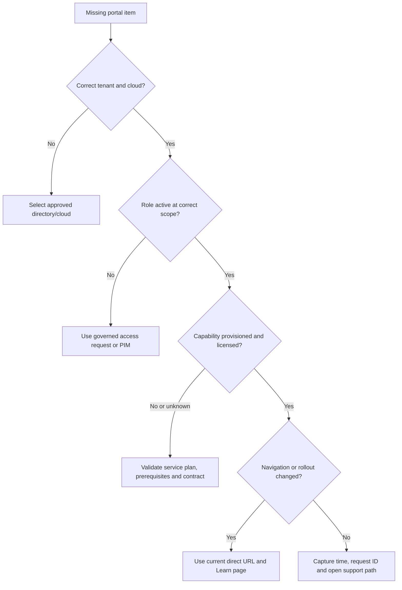

## 2. Comprehensive portal inventory

The URLs below are commercial-cloud starting points current at the baseline. Treat them as bookmarks, not immutable API contracts. For SharePoint, tenant-specific admin URLs use the organization's tenant prefix. For sovereign environments, obtain current official endpoints from that cloud's Microsoft documentation.

### Common administration and identity

| Portal and current entry | Purpose and product/resource boundary | Key tasks and diagnostic views | Least-privilege role families to evaluate | Data location and audit source | Common confusion | Source Parts |
|---|---|---|---|---|---|---|
| [Microsoft 365 admin center](https://admin.microsoft.com) | Common Microsoft 365 tenant administration; subscriptions, users, domains, support and links to specialists | Active users, license assignment, domains, setup, reports, Service health, Message center, support requests | License Administrator, User/Groups roles, Service Support Administrator, Message Center Reader/Privacy Reader, Reports Reader; verify exact task | Tenant configuration; service-specific customer data remains in owning workloads. M365/Purview audit plus support and commerce records | It is not the complete admin surface for Exchange, Purview, Defender, Azure, or Dataverse | [Part 4](Part-04-m365-tenant-architecture-portals-roles-licensing.md), [Part 62](Part-62-resilience-oncall-shift-handover.md) |
| [Microsoft Entra admin center](https://entra.microsoft.com) | Entra tenant identity, access, governance, protection, applications and network access | Users/groups, enterprise apps, app registrations, authentication, Conditional Access, roles, PIM, sign-ins, audit, provisioning, risky identities | Reports Reader, Security Reader/Operator, Authentication roles, Conditional Access Administrator, Application roles, Identity Governance Administrator, Privileged Role Administrator; scope narrowly | Entra directory and identity telemetry; Entra sign-in, audit, provisioning, risk, Graph activity and diagnostic exports | Entra roles do not automatically manage Azure resources; app object is not service principal | [Parts 6-14](../Deloitte%20Microsoft%20365%20Security%20Senior%20Consultant%20-%20Study%20Guide.md#part-index) |
| [Microsoft Intune admin center](https://intune.microsoft.com) | Intune tenant, managed devices/apps, policy, compliance and endpoint administration | Device/app inventory, configuration and compliance status, enrollment, endpoint security, reports, audit, connector status, per-user Troubleshoot, diagnostics | Intune built-in/custom RBAC roles with admin groups, scope groups and scope tags; Entra roles only when necessary | Intune management data and reports; Intune audit, device-side logs, IME/MDM diagnostics, Entra device/sign-in, Defender sensor evidence | Entra device, Intune managed-device record, OS state and Defender device entity are distinct | [Parts 15-20](../Deloitte%20Microsoft%20365%20Security%20Senior%20Consultant%20-%20Study%20Guide.md#part-index) |
| [Microsoft 365 Apps admin center](https://config.office.com) | Microsoft 365 Apps cloud policy, inventory, servicing and health surfaces | Cloud Policy, servicing profiles where supported, inventory, security/update posture and client health | Office Apps Administrator and relevant readers; Intune roles for device policy managed there | Apps telemetry/configuration; M365 Apps reports and applicable audit/configuration records | Office cloud policy, Intune policy and local Group Policy can all affect the same client | [Part 25](Part-25-m365-apps-power-platform-copilot-security.md) |
| [Microsoft 365 Lighthouse](https://lighthouse.microsoft.com) | Partner/multitenant management for supported customer tenants and scenarios | Customer-tenant posture, alerts, user/device management and delegated operations where contracted | Granular delegated admin privileges, partner roles and customer-approved scopes | Cross-tenant operational metadata; partner and customer audit sources | A partner relationship is not unrestricted tenant ownership; GDAP scope and customer consent matter | [Part 14](Part-14-external-cross-tenant-workload-app-identity.md), [Part 52](Part-52-enterprise-sentinel-multiworkspace-multitenant-governance.md) |

### Collaboration workload administration

| Portal and current entry | Purpose and product/resource boundary | Key tasks and diagnostic views | Least-privilege role families to evaluate | Data location and audit source | Common confusion | Source Parts |
|---|---|---|---|---|---|---|
| [Exchange admin center](https://admin.exchange.microsoft.com) | Exchange Online organization, recipients, mail flow and migration | Recipients, accepted domains, connectors, transport rules, migration, message trace, reports | Exchange Online role groups/management roles and scoped recipient administration; Entra Exchange Administrator is broad | Mailbox and mail-flow data in Exchange service; Exchange admin audit, mailbox audit, message trace, Purview Audit | Exchange role groups and Entra role labels are related but not identical; message trace is not message content | [Part 21](Part-21-exchange-online-architecture-mail-flow.md), [Part 22](Part-22-eop-defender-office-365.md) |
| [Teams admin center](https://admin.teams.microsoft.com) | Teams service policies, meetings, messaging, voice, apps and devices | Users, policies, meeting/calling settings, external access, apps, Teams devices, analytics, call diagnostics | Teams Administrator, Teams Reader, communications/device/external-collaboration role families; verify current permissions | Teams chat/meeting and service metadata; Teams/Purview audit, Call Analytics, CQD, client logs | Teams files live in SharePoint/OneDrive; calendars and some compliance data cross Exchange/Purview | [Part 23](Part-23-teams-security-meetings-federation-apps-compliance.md) |
| [Teams Call Quality Dashboard](https://cqd.teams.microsoft.com) | Tenant-wide Teams media-quality analytics | Network, endpoint, building and media trends; compare with per-call diagnostics | Teams communications support/administrator roles and report access | Aggregated call-quality telemetry; Teams CQD and call records | CQD trends are not a packet capture and do not prove one user's root cause alone | [Part 23](Part-23-teams-security-meetings-federation-apps-compliance.md), [Part 60](Part-60-structured-troubleshooting-multivendor-cloud.md) |
| SharePoint admin center at `https://<tenant>-admin.sharepoint.com` | SharePoint Online and OneDrive tenant/site administration | Active/deleted sites, sharing, access control, storage, settings, migration, sync and site health views | SharePoint Administrator plus site collection/site roles for local tasks; restricted admin patterns where supported | SharePoint and OneDrive content in service-specific geo; Purview Audit, sharing/access events, site settings and support diagnostics | SharePoint Administrator is not automatically ordinary content access for every purpose; OneDrive is built on SharePoint | [Part 24](Part-24-sharepoint-onedrive-security-sharing-sync-governance.md) |
| [Microsoft 365 admin center migration area](https://admin.microsoft.com) | Cross-workload migration entry for supported sources and destinations | Migration projects, task status, reports and agent health where applicable | Microsoft 365 Migration Administrator or workload-specific roles; validate source connector privileges | Migration metadata and transferred content in destination workload; migration reports plus source/destination audit | A successful task count does not prove permissions, metadata, versions and business acceptance are complete | [Part 24](Part-24-sharepoint-onedrive-security-sharing-sync-governance.md), [Part 57](Part-57-third-party-microsoft-security-migration.md) |

### Power Platform, data, security, and Azure

| Portal and current entry | Purpose and product/resource boundary | Key tasks and diagnostic views | Least-privilege role families to evaluate | Data location and audit source | Common confusion | Source Parts |
|---|---|---|---|---|---|---|
| [Power Platform admin center](https://admin.powerplatform.microsoft.com) | Power Platform tenant and environment administration, capacity, policies and analytics | Environments, tenant settings, data policies, capacity, resources, support and environment diagnostics | Power Platform Administrator, Dynamics 365 Administrator, Environment Admin/System Administrator and narrower Dataverse roles | Environment/Dataverse region and connected data sources; Power Platform admin analytics, Purview Audit and Dataverse auditing | Tenant admin does not automatically grant Dataverse table data access in every environment | [Part 25](Part-25-m365-apps-power-platform-copilot-security.md) |
| [Power Apps maker portal](https://make.powerapps.com) | Maker experience scoped to selected Power Platform environment | Apps, solutions, connections, tables and flows exposed to maker permissions | Environment Maker plus explicit data-source/Dataverse roles | Environment metadata and connected source data; solution/run/Dataverse audit according to configuration | Maker rights do not grant source-data rights; changing environment changes the resource boundary | [Part 25](Part-25-m365-apps-power-platform-copilot-security.md) |
| [Power Automate portal](https://make.powerautomate.com) | Cloud-flow and desktop-flow authoring/operations in selected environment | Flows, solutions, connections, run history, approvals and process features | Environment Maker, flow owner/co-owner, connector authorization and Dataverse roles | Flow definitions/run history plus data touched by connectors; run history, Purview Audit and source-system audit | A flow owner's personal connection is not a durable workload identity | [Part 25](Part-25-m365-apps-power-platform-copilot-security.md), [Part 50](Part-50-sentinel-automation-logic-apps-playbooks.md) |
| [Microsoft Purview portal](https://purview.microsoft.com) | Unified data security, data governance, risk and compliance entry | DLP, information protection, Audit, eDiscovery, insider/communication risk, records, Compliance Manager, DSPM, catalog/governance | Purview role groups/roles, solution-specific permissions, Entra mappings, administrative-unit scope and PIM-for-groups where supported | Workload content stays in owning services; Purview indexes/cases/configuration have solution-specific residency. Purview Audit and solution audit | Portal visibility depends on both permission and subscription; Purview permissions do not grant Exchange mail-flow administration | [Parts 26-33](../Deloitte%20Microsoft%20365%20Security%20Senior%20Consultant%20-%20Study%20Guide.md#part-index) |
| [Microsoft Defender portal](https://security.microsoft.com) | Unified SecOps for Defender XDR, exposure, incidents, hunting, actions, and onboarded Sentinel | Incidents/alerts, assets, advanced hunting, Action center, threat analytics, settings, permissions, Sentinel content | Defender unified RBAC, existing product roles, Entra security roles, Sentinel Azure/Unified RBAC; inspect effective cumulative grants | Defender product telemetry and configured Sentinel workspaces/data lake; Defender action/audit records, product evidence and Sentinel audit | Unified portal does not erase product licensing, Purview RBAC, Azure RBAC, workspace, retention or billing boundaries | [Parts 34-41](../Deloitte%20Microsoft%20365%20Security%20Senior%20Consultant%20-%20Study%20Guide.md#part-index), [Part 51](Part-51-unified-secops-defender-sentinel-purview.md) |
| [Microsoft Security Copilot](https://securitycopilot.microsoft.com) | Standalone Security Copilot experience plus capacity and plugin context | Sessions, promptbooks, plugins, agents, usage/capacity administration where authorized | Security Copilot roles plus source-product roles; Azure capacity permissions; verify embedded-experience requirements | Prompt/session and source-product context subject to Security Copilot privacy/residency terms; usage and product audit sources | Copilot cannot grant source access; generated output is not verified evidence; closing a UI panel may not end consumption | [Part 42](Part-42-security-copilot-agents-governance.md) |
| [Azure portal](https://portal.azure.com) | Azure tenant/directory selection and Azure resource management | Subscriptions, resource groups, Log Analytics, Sentinel resource settings, Logic Apps, Key Vault, Azure RBAC, Policy, Monitor, Cost Management, Service Health | Azure RBAC at management-group/subscription/resource-group/resource scope; PIM for Azure resources; resource-specific data roles | Region of each Azure resource; Azure Activity, resource logs, diagnostic settings, Log Analytics and billing records | Entra Global Administrator and Azure Owner are separate; control-plane access can differ from data-plane access | [Parts 43-50](../Deloitte%20Microsoft%20365%20Security%20Senior%20Consultant%20-%20Study%20Guide.md#part-index) |
| [Azure Monitor / Log Analytics](https://portal.azure.com) | Workspace-based collection, retention, querying, alerting and diagnostics | Logs, tables, agents/DCRs, usage, retention, workspace health and diagnostic settings | Log Analytics Reader/Contributor, resource-context/table access and Sentinel roles | Workspace region and configured destination; Azure Activity, workspace audit, query/audit and `AzureDiagnostics`-style resource data where configured | Data not ingested cannot be queried; connector green does not prove completeness, latency or schema | [Part 44](Part-44-sentinel-planning-workspaces-cost-retention-data-lake.md), [Part 45](Part-45-sentinel-connectors-ama-dcr-asim-normalization.md) |
| [Microsoft Sentinel in Defender](https://security.microsoft.com) | Primary long-term analyst/SIEM experience for onboarded Sentinel workspaces | Unified incidents, hunting, analytics, connectors, content, workbooks, automation and data-lake experiences as supported | Sentinel Azure RBAC and/or Defender unified RBAC according to activation; Logic Apps roles separately | Workspace and data-lake tiers retain their region, plan and billing context; `SentinelHealth`, `SentinelAudit`, Azure Activity and incident history | Sentinel in Defender can work without a Defender XDR suite, but individual features, data and actions still need prerequisites | [Parts 43-52](../Deloitte%20Microsoft%20365%20Security%20Senior%20Consultant%20-%20Study%20Guide.md#part-index) |

### Health, licensing, assurance, and developer aids

| Portal and current entry | Purpose and product/resource boundary | Safe key tasks | Role/access family | Evidence and caution | Source Parts |
|---|---|---|---|---|---|
| Service health in [Microsoft 365 admin center](https://admin.microsoft.com) | Tenant-scoped Microsoft 365 incidents and advisories | Correlate issue ID, affected services, start time, updates and history; open support | Service Support Administrator and supported read roles | Provider statement is evidence, not proof of every user's path; retain issue ID and UTC timeline | [Part 62](Part-62-resilience-oncall-shift-handover.md) |
| Message center in [Microsoft 365 admin center](https://admin.microsoft.com) | Tenant change, retirement, rollout and action communications | Filter, assign owner, record deadline, assess impact, test and update runbooks | Message Center Reader; Privacy Reader for applicable privacy/security messages; verify exact current mapping | A post is not a delivery guarantee; tenant rollout may differ | [Part 4](Part-04-m365-tenant-architecture-portals-roles-licensing.md), [Part 59](Part-59-operational-readiness-raci-soc-runbooks.md) |
| Azure Service Health in [Azure portal](https://portal.azure.com) | Personalized Azure service issues, planned maintenance and advisories | Correlate subscriptions/regions/resources, configure governed alerts, inspect history | Azure Service Health access through applicable Azure/Entra roles | Azure status does not replace resource telemetry or M365 Service health | [Part 62](Part-62-resilience-oncall-shift-handover.md) |
| Microsoft 365 network connectivity in [admin center](https://admin.microsoft.com) | M365 connectivity assessment and location/network insights | Review endpoint reachability, egress location and network recommendations | Network Administrator/appropriate readers | It is not a packet capture and should not justify unsupported firewall bypass | [Part 5](Part-05-networking-identity-application-protocols.md), [Part 60](Part-60-structured-troubleshooting-multivendor-cloud.md) |
| [Service Trust Portal](https://servicetrust.microsoft.com) | Microsoft compliance, audit and assurance materials subject to access | Retrieve current reports for authorized assessment and evidence requests | Tenant/account access and document-specific terms | Reports have scope, period and permitted-use constraints; they do not certify the client's implementation | [Part 32](Part-32-purview-compliance-manager-privacy-audit-readiness.md), [Part 54](Part-54-security-assessments-health-checks-gap-analysis.md) |
| Billing and Licenses in [Microsoft 365 admin center](https://admin.microsoft.com) | Purchased subscriptions, seats, assignments and commerce tasks | Read subscribed SKUs, assigned/available counts and service plans; engage procurement | Billing/License Administrator and commerce-specific roles as applicable | Tenant inventory is not the whole contract; do not infer price, renewal or use rights | [Part 56](Part-56-target-controls-licensing-roadmaps-business-case.md) |
| Cost Management in [Azure portal](https://portal.azure.com) | Azure usage, budgets, exports, reservations/commitments and invoices according to billing scope | Inspect actual meters, tags/scopes, forecast and anomalies | Cost Management Reader/Contributor and billing-account roles | Subscription resource access does not automatically grant billing-account visibility | [Part 44](Part-44-sentinel-planning-workspaces-cost-retention-data-lake.md), [Part 56](Part-56-target-controls-licensing-roadmaps-business-case.md) |
| [Microsoft Product Terms](https://www.microsoft.com/licensing/terms/) | Current and historical use-rights source selected by program/product | Select correct program, publication and product offering; archive evidence | Public reading plus procurement/legal interpretation | Product pages and Learn guidance do not replace applicable agreement terms | [Part 56](Part-56-target-controls-licensing-roadmaps-business-case.md) |
| [Microsoft Graph Explorer](https://developer.microsoft.com/graph/graph-explorer) | Interactive Microsoft Graph request exploration | Use sample tenant or explicitly authorized delegated account; run narrow GET requests; inspect headers and response shape | Delegated permissions consented for the signed-in user; least privilege only | It is not a production automation host; do not grant broad consent, paste secrets, or run write/delete requests casually | [Part 63](Part-63-documentation-reporting-automation-quality.md), [Appendix D](Appendix-D-powershell-graph-kql-automation.md) |

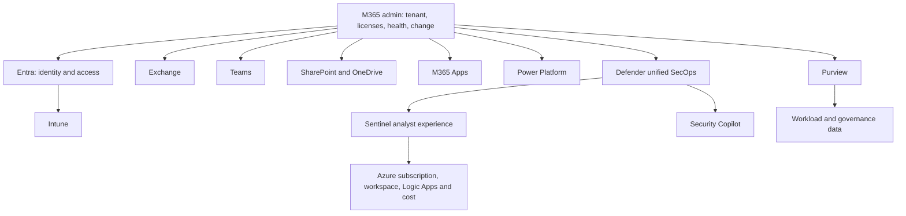

## 3. Portal-to-task maps

### Identity, tenant, and endpoint tasks

| Task | Primary current surface | Supporting surface/evidence | Role family to verify | Source Part |
|---|---|---|---|---|
| Confirm tenant ID, domains and subscribed SKUs | M365 admin and Entra admin | Graph read, contract inventory | Directory/License/Billing readers appropriate to task | [Part 4](Part-04-m365-tenant-architecture-portals-roles-licensing.md) |
| Investigate a sign-in failure | Entra sign-in logs | Conditional Access result, application logs, client/network trace, correlation ID | Reports Reader or Security Reader; sensitive fields may require more | [Part 9](Part-09-conditional-access-design-deployment-troubleshooting.md) |
| Review authentication methods | Entra authentication methods/activity | Registration campaign/report, user method evidence, audit | Authentication Policy/Administrator or read role according to task | [Part 8](Part-08-mfa-passwordless-authentication-strengths.md) |
| Review Conditional Access safely | Entra Conditional Access | Sign-in logs, report-only results, What If tool, emergency-access design | Conditional Access Administrator for change; read role for assessment | [Part 9](Part-09-conditional-access-design-deployment-troubleshooting.md) |
| Inventory privileged roles | Entra Roles and admins/PIM | Role assignments, access reviews, audit, group membership | Global Reader/Security Reader/PRA depending read/manage action | [Part 11](Part-11-privileged-access-rbac-pim-emergency-access.md) |
| Diagnose application authorization | Entra enterprise app/app registration | Consent grants, service principal, sign-in/provisioning logs, API response | Cloud/Application role plus resource-specific reader; treat credential admins as privileged | [Part 14](Part-14-external-cross-tenant-workload-app-identity.md) |
| Diagnose device compliance | Intune device/compliance views | Entra device/sign-in/CA, local MDM/IME logs, Defender health | Intune Read Only/Help Desk/Endpoint Security role at proper scope | [Part 17](Part-17-intune-compliance-conditional-access.md) |
| Review policy conflict | Intune policy reports and per-setting status | Assignment filters/groups, device diagnostics, policy CSP/provider result | Policy and Profile Manager or read-only equivalent for diagnosis | [Part 16](Part-16-intune-configuration-settings-baselines-policy-precedence.md) |
| Review endpoint security posture | Intune Endpoint security and Defender portal | Device timeline, sensor health, local event evidence | Intune Endpoint Security Manager plus Defender read role, scoped | [Part 19](Part-19-intune-endpoint-security-stack.md) |

### Collaboration and data tasks

| Task | Primary current surface | Supporting surface/evidence | Role family to verify | Source Part |
|---|---|---|---|---|
| Trace mail delivery | Exchange admin center message trace | Headers, DNS, connector/rule, Defender email evidence | Exchange role group permitting trace; Defender role only for security investigation | [Part 21](Part-21-exchange-online-architecture-mail-flow.md) |
| Investigate suspected malicious email | Defender portal email/entity/incident views | Exchange trace, headers, campaign, submission, audit | Defender/MDO investigation roles; separate remediation permission | [Part 38](Part-38-defender-office-365-secops-investigation.md) |
| Diagnose Teams meeting quality | Teams admin per-call diagnostics and CQD | Client logs, network path, media endpoint checks, service health | Teams communications support role matched to detail needed | [Part 23](Part-23-teams-security-meetings-federation-apps-compliance.md) |
| Diagnose Teams file access | Teams context then SharePoint admin/site | Team/group membership, site permission, link, guest object, audit | Teams read plus SharePoint/site access appropriate to question | [Part 24](Part-24-sharepoint-onedrive-security-sharing-sync-governance.md) |
| Diagnose OneDrive sync | SharePoint/OneDrive admin and client sync evidence | Site/user permission, file/path constraints, client/network logs, service health | SharePoint admin or scoped support route; content access only when authorized | [Part 24](Part-24-sharepoint-onedrive-security-sharing-sync-governance.md) |
| Review external sharing | SharePoint admin, Teams admin and Entra external identities | Purview Audit, site/team/group/link inventory, cross-tenant settings | Workload roles plus Entra reader; avoid one global role for convenience | [Part 14](Part-14-external-cross-tenant-workload-app-identity.md) |
| Review a DLP event | Purview portal | Workload item/activity, Endpoint DLP/device evidence, Defender alert if surfaced | DLP role group and workload/data permissions; not Defender unified RBAC alone | [Part 28](Part-28-purview-dlp-m365-endpoints-cloud-apps.md) |
| Run an authorized audit search | Purview Audit | Workload records, Graph audit-search API where supported, case record | Audit Reader/Manager role groups according to search/export task | [Part 30](Part-30-purview-audit-ediscovery-legal-investigation.md) |
| Manage an eDiscovery case | Purview eDiscovery | Custodian/data-source, holds, searches, review sets, exports, case audit | eDiscovery Manager/Administrator with case assignment and separation | [Part 30](Part-30-purview-audit-ediscovery-legal-investigation.md) |
| Review Power Platform environment risk | Power Platform admin center | Maker inventory, connectors/connections, DLP, Dataverse roles/audit, Entra apps | Tenant admin for platform, environment/Dataverse roles for data | [Part 25](Part-25-m365-apps-power-platform-copilot-security.md) |

### SecOps, Sentinel, health, and commercial tasks

| Task | Primary current surface | Supporting surface/evidence | Role family to verify | Source Part |
|---|---|---|---|---|
| Triage a Defender incident | Defender portal | Alerts, entities, evidence/timeline, advanced hunting, Action center | Defender Security Data read plus incident management; action rights separate | [Part 39](Part-39-defender-xdr-incident-response-air.md) |
| Hunt across Defender data | Defender advanced hunting | Live schema, time range, source coverage and known test event | Defender hunting read; custom detection rights only if authoring | [Part 40](Part-40-defender-advanced-hunting-kql-custom-detections.md) |
| Triage a Sentinel incident | Defender portal Sentinel/unified queue | Workspace query, alert/rule, connector health, entity, automation history | Sentinel Responder or equivalent effective unified permission | [Part 47](Part-47-sentinel-analytics-rules-incidents-entities.md) |
| Diagnose missing Sentinel data | Defender/Azure Sentinel connector and Log Analytics | Source event, agent/DCR, ingestion timestamp, table/schema, transform, health | Workspace/log reader plus connector/resource reader | [Part 45](Part-45-sentinel-connectors-ama-dcr-asim-normalization.md) |
| Review Sentinel cost drivers | Defender Sentinel cost view and Azure Cost Management | Usage tables, table plans, retention, connector categories, commitments | Cost Management/Billing read plus workspace read | [Part 44](Part-44-sentinel-planning-workspaces-cost-retention-data-lake.md) |
| Review failed playbook | Logic App run history/Azure Monitor | Sentinel automation history, connector auth, managed identity sign-in, diagnostics | Logic App Reader plus Sentinel reader; connection access minimized | [Part 50](Part-50-sentinel-automation-logic-apps-playbooks.md) |
| Correlate a provider incident | M365 Service health or Azure Service Health | User journey evidence, Message center, change record, support case | Service Support/Service Health read role | [Part 62](Part-62-resilience-oncall-shift-handover.md) |
| Assess an upcoming service change | Message center | Roadmap as noncontractual context, target release, tenant observation | Message Center Reader/Privacy Reader as appropriate | [Part 59](Part-59-operational-readiness-raci-soc-runbooks.md) |
| Validate license availability | M365 Billing/Licenses plus workload portal | Service descriptions, Product Terms, assigned plans, provisioning, test persona | License/Billing read roles and procurement input | [Part 56](Part-56-target-controls-licensing-roadmaps-business-case.md) |
| Explore a Graph GET safely | Graph Explorer or approved API client | Permissions reference, response headers, audit/sign-in, redacted output | Delegated least privilege; no broad consent for convenience | [Appendix D](Appendix-D-powershell-graph-kql-automation.md) |

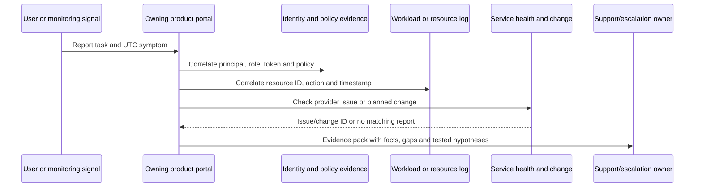

## 4. Symptom-to-log maps

### Identity and endpoint symptoms

| Symptom | First owner boundary | Primary evidence | Correlate with | Do not assume |
|---|---|---|---|---|
| User cannot sign in | Entra authentication/token issuance | Sign-in log detail, result, failure reason, CA tab, correlation/request ID | App logs, client UTC time, authentication method, network/TLS | `401` always means bad password |
| Sign-in succeeds but app denies access | Application authorization/resource | App sign-in plus app/resource authorization log | Token audience/scopes/roles, enterprise-app assignment, resource ACL | Authentication grants business data access |
| MFA prompt loops | Authentication/session/client | Sign-in sequence and authentication details | Browser cookies, broker/client, CA session controls, device registration | Re-registering methods is the first safe fix |
| CA blocks a compliant device | Entra CA plus Intune compliance signal | Sign-in CA result and device ID | Entra device object, Intune compliance timestamp, token/client | Portal's current green state was available at token evaluation time |
| Device shows conflicting compliance | Intune | Per-setting compliance and device check-in | Assignment, platform applicability, Entra object, local diagnostics | One summary status identifies the failing setting |
| App deployment remains pending | Intune app management/client | App install status, detection and IME/client logs | Assignment, requirements, content delivery, restart/user context | Pending equals failure or success |
| Defender device missing | Defender onboarding/sensor | Device inventory/sensor health and local onboarding evidence | Intune policy delivery, network endpoints, duplicate/stale device records | An Intune-managed device is Defender-onboarded |
| Role activation did not appear | PIM/product propagation | PIM activation/audit and token issue time | Group membership, product cache, sign-out/new token, scope | Activation instantly updates every service |

### Collaboration and data symptoms

| Symptom | First owner boundary | Primary evidence | Correlate with | Do not assume |
|---|---|---|---|---|
| Message delayed or rejected | Exchange transport path | Message trace, headers, SMTP enhanced status | DNS, connector/rule, EOP/MDO verdict, remote server evidence | Defender incident view is a full mail trace |
| Safe Link or attachment behavior differs | Defender for Office 365 policy/evaluation | Email entity, policy/override, detonation or verdict data | Recipient, URL/file, delivery action, client click evidence | A clean verdict guarantees harmless content |
| Teams user cannot join meeting | Teams meeting/access policy | Meeting/call diagnostic record | Identity/guest state, meeting policy, lobby, client/network, service health | Teams chat capability proves meeting entitlement |
| Teams channel file is inaccessible | SharePoint authorization | Site/library/item permission and sharing link | Team/group/channel type, guest object, sensitivity/CA | Teams membership always maps immediately to every file |
| OneDrive sync conflict | SharePoint/OneDrive plus client | Sync client logs and item/site state | Versions, coauthoring, path/name, disk, Files On-Demand, network | Cloud icon color proves latest content is safe |
| Label did not apply | Purview information protection | Label policy, client/activity/content explorer as authorized | Publishing scope, file type, client support, priority, service delay | License assignment means label policy reached the item |
| DLP action unexpected | Purview DLP | Alert/activity explorer and policy match details | Location, sensitive info type, exception, user action, endpoint state | Alert severity equals confirmed data loss |
| eDiscovery result seems incomplete | Purview eDiscovery and source workload | Case data sources, search conditions, statistics/status | Custodian mapping, hold, indexing, unsupported item, time zone | A completed job found every legally relevant item |

### SecOps, Sentinel, automation, and service symptoms

| Symptom | First owner boundary | Primary evidence | Correlate with | Do not assume |
|---|---|---|---|---|
| Alert absent | Source product or analytics | Known source event, source alert/rule execution | Data ingestion, schema, suppression, rule schedule/lookback, permissions | No alert means no activity |
| Incidents differ between queues | Correlation/unified portal | Incident/alert IDs, creation/update time and sources | Connector mode, merge/sync behavior, workspace, retention | Same title means same incident object |
| Sentinel connector says connected but table is empty | Ingestion pipeline | Connector health plus known source event | Agent/DCR/API, transform, workspace/table, ingestion time | Green configuration proves end-to-end data quality |
| KQL query returns zero rows | Query scope/schema/time | Workspace, table, explicit UTC window and sample schema | Table plan, ingestion latency, field type/case, RBAC | Zero is evidence of absence |
| Playbook did not run | Sentinel automation/Logic Apps | Automation-rule activity and Logic App run history | Trigger payload, permissions, connector auth, concurrency, throttling | Incident status alone proves workflow execution |
| Automation repeated work | Workflow state/idempotency | Trigger IDs, run IDs and deduplication store | Retry policy, delivery semantics, concurrency, downstream response | One event produces one invocation |
| Portal healthy but users fail | End-to-end service journey | User-specific transaction and dependency logs | Tenant config, identity, network, client, region, provider health | Service dashboard covers every tenant slice |
| Security Copilot output is incomplete | Source access/data/prompt/capacity | Session references, plugin/source selection and usage state | User role, source freshness, prompt scope, capacity, service limits | Fluent output is complete or correct |

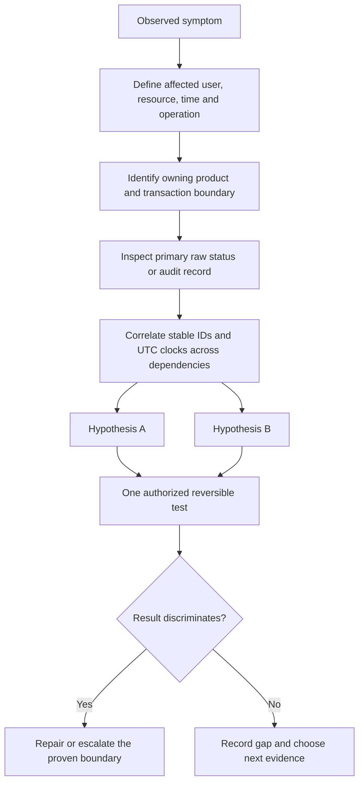

## 5. Role and permission systems

### The non-negotiable role equation

An authorization answer is incomplete until it names the **principal + role definition + scope + assignment path + activation state + effective test + audit source**. Group nesting, multiple assignments, Entra role mappings, legacy models, unified RBAC activation, resource roles, data roles, and product caches can broaden or delay effective access. Deny behavior and precedence differ by system. Do not copy role names into a design and call it least privilege.

| Role system | Controls | Typical scope | Primary assignment surface | Effective-access evidence | Key separation |
|---|---|---|---|---|---|
| Microsoft Entra RBAC | Directory users, groups, apps, roles, policies and integrated service actions | Tenant, administrative unit, supported object | Entra Roles/PIM/Graph | Role assignments, PIM, token, audit, exact task test | Separate from Azure resource RBAC |
| Azure RBAC | Azure control-plane and some data-plane operations | Management group, subscription, resource group, resource | Azure Access control (IAM)/PIM | Role assignments, Activity Log, access check | Owner/Contributor are not Entra Global Administrator |
| Exchange Online RBAC | Exchange cmdlets, recipients, mail flow and workload administration | Organization, management scope, recipient/configuration scope | Exchange admin/PowerShell | Role group/assignment, admin audit, cmdlet availability | Unified Defender RBAC does not govern EXO PowerShell |
| Teams admin roles | Teams service administration and diagnostics | Usually tenant/service with role-specific detail boundaries | Entra/M365 roles | Teams admin access and audit | SharePoint/Exchange data still use their own permissions |
| SharePoint authorization | Tenant admin plus site/library/item content permissions | Tenant, site, list/library, item | Entra admin role and SharePoint/site controls | Site permissions, sharing links, audit | Service admin and content access are not the same purpose |
| Intune RBAC | Endpoint admin permissions and managed object visibility | Role assignment, scope groups, scope tags | Intune Tenant administration > Roles | My permissions, Admin permissions, Roles by permission, audit | Entra AUs do not replace Intune scope groups/tags |
| Purview RBAC | Compliance/governance solution tasks and sensitive case/content operations | Role group, solution, AU/case or supported scope | Purview Settings > Roles and scopes | My permissions, role-group membership, case assignment, audit | Purview permission does not grant all workload administration |
| Defender unified/product RBAC | Security data, investigations, response and configuration | Data source/device group/scoped resources depending workload | Defender Settings > Permissions | Effective role, product scope, Action center/audit | Purview DLP/IRM permissions remain Purview-governed |
| Sentinel authorization | SIEM workspace/resources, incidents, content, playbooks and data lake | Azure resource group/workspace/resource; unified data scopes where enabled | Azure IAM and Defender unified RBAC according to activation | ARM assignments, unified roles, Sentinel audit/health, task test | Logic Apps and workspace data can require additional roles |
| Power Platform/Dataverse | Tenant, environment, maker, app and table/record access | Tenant, environment, business unit/table/record | M365/Power Platform/Dataverse | Assigned security roles, environment access, audit | Tenant admin does not automatically grant Dataverse data |

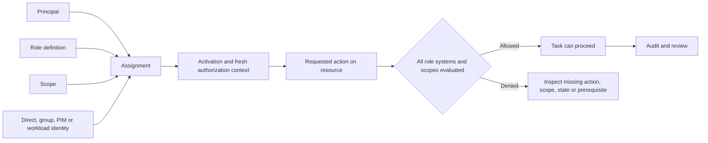

### Microsoft Entra role families

| Task family | Candidate role families to assess, least to broader | Scope/privilege caution | Verify live in |
|---|---|---|---|
| Read identity/security evidence | Reports Reader, Security Reader, Global Reader only if truly required | Read roles can expose sensitive identity, keys metadata, configuration and personal data; Global Reader has product limitations | Built-in permissions reference, PIM and exact log field access |
| User and group lifecycle | User Administrator, Groups Administrator, scoped AU variants | Password reset/group ownership can create indirect privilege escalation | Role definition, target user's role, AU behavior and audit |
| Authentication methods | Authentication Administrator, Authentication Policy Administrator, Privileged Authentication Administrator | Managing another identity's credentials can enable impersonation; privileged-admin methods require stronger role | Current role comparison and protected-user test case |
| Conditional Access | Conditional Access Administrator; Security/Global roles only where justified | A policy mistake can lock out the tenant; use PIM, emergency access, report-only, exclusions and approvals | Role actions, CA policy owner/change audit |
| Applications | Application Developer, Cloud Application Administrator, Application Administrator, Privileged Role Administrator for applicable consent | Credential management can impersonate a powerful app; app ownership and admin consent are privilege paths | App/enterprise-app owners, grants, credentials, role actions |
| Identity governance | Identity Governance Administrator, Lifecycle Workflows roles, access-package delegated catalog roles | Reviewers/approvers and affected users can each create licensing and separation-of-duty requirements | Governance feature permissions and current licensing |
| Privileged access | Privileged Role Administrator and PIM-specific eligible assignments | PRA can assign Global Administrator and consent; protect as a top-tier role | PIM settings, role audit, activation and access review |
| Workload/service admin | Exchange, SharePoint, Teams, Intune, Power Platform, AI and service-specific roles | Service roles often include adjacent group/support/health actions; role names and API names can differ | Full built-in action list and workload role system |
| Support/change communication | Service Support Administrator, Message Center Reader, Message Center Privacy Reader | Privacy/security posts can have distinct access; support role is not a technical fix role | M365 role reference and portal test |
| License/commercial operations | License Administrator, Billing Administrator, commerce-specific billing roles | Assigning a license differs from purchasing, contract authority or designing eligibility | Tenant commerce scope, Product Terms and procurement process |

### Microsoft 365 workload role families

| Workload | Narrow task examples | Role family examples | Critical verification question |
|---|---|---|---|
| Exchange Online | Message trace, recipient administration, mail-flow configuration, migration | Exchange role groups and management roles; Entra Exchange Administrator for broad service admin | Which cmdlets/actions and recipient/configuration scopes are included now? |
| Teams | Read settings, diagnose calls, manage meetings, devices, telephony or external collaboration | Teams Reader, Communications Support Specialist/Engineer, Communications/Devices/Telephony/External Collaboration Administrator | Does the role expose full participant details, all call records, or configuration writes? |
| SharePoint/OneDrive | Tenant settings, site lifecycle, migration, site ownership/content task | SharePoint Administrator, Migration Administrator, site collection admin/owner/member/visitor | Is service administration sufficient, or is separately authorized content access required? |
| Defender for Office 365 | Investigate, submit, search, simulate or remediate | Defender unified permissions, Email & collaboration roles, Search and Purge, Preview/Review families as current | Is the task portal-only, Exchange/Security PowerShell, content search, or response action? |
| M365 Apps | Cloud policy, update/servicing/inventory reports | Office Apps Administrator and relevant report roles | Which policy authority wins when Intune, GPO and Cloud Policy overlap? |
| Service health/support | Read incidents, privacy posts or create cases | Service Support Administrator, Message Center roles | Does the role include tickets, health, privacy/security messages, or only ordinary posts? |

### Purview roles and solution boundaries

| Purview task | Role-group/role family to investigate | Additional boundary | Common overgrant |
|---|---|---|---|
| Audit search | Audit Reader for read/search; Audit Manager for broader management/export according to current definition | Audit license/retention, workload events and export handling | Compliance Administrator for every investigator |
| eDiscovery | eDiscovery Manager with case assignment; eDiscovery Administrator only for organization-wide administrative need | Case membership, custodian/data source, hold/search/review/export permissions | Giving every case worker eDiscovery Administrator |
| DLP policy | DLP Compliance Management/role families; separate investigation/view roles | Workload location, endpoint onboarding and item access | Combining policy author, approver and incident investigator permanently |
| Information protection | Information Protection role families and sensitivity-label permissions | Label publishing, encryption rights and workload support | Assuming label administration grants document decryption for all content |
| Insider Risk | Insider Risk Management role groups split among analyst/investigator/approver/auditor tasks | Privacy, pseudonymization, case access, HR/legal authority | Broadly revealing named users to all analysts |
| Communication Compliance | Communication Compliance role groups with reviewer/investigator separation | Privacy/legal policy, scoped users and case records | Treating communication review as ordinary security alert access |
| Records/lifecycle | Records Management and Retention Management role families | Record declaration, disposition, immutable/regulatory controls | Giving irreversible record actions to policy designers without approval |
| Compliance Manager | Compliance Manager roles for assessments, actions and reading | Assessment ownership and evidence access | Treating score edit rights as audit assurance |
| Data governance/catalog | Purview governance tenant roles, domain/collection roles and data-source permissions | Data source scanning identity, collection/domain scope, Azure resource access | Assuming catalog curator can read every source data record |
| DSPM/AI data security | Data Security AI/DSPM role families and source permissions | Copilot/AI app data, Defender integration, license and privacy | Using Global Administrator because a new role mapping is unfamiliar |

> **Recheck-current warning:** Purview maps some Entra roles into Purview role groups, supports solution-specific scopes, and can use PIM for Groups. Direct Entra roles can take precedence over scoped Purview assignments for overlapping capabilities. Product propagation can be delayed. Verify the current role mapping, assignment source, administrative-unit behavior, case membership, expiration, and effective task before declaring access least-privileged.

### Defender unified RBAC and product roles

| Permission area | What to separate | Scope input | Audit/test |
|---|---|---|---|
| Security data | Basic/read versus full investigation data | Data sources, device groups, Sentinel collections/workspaces where supported | Open one authorized incident/entity and verify fields |
| Incidents and alerts | Read, manage status/assignment, response and advanced actions | Unified incident queue plus product source | Incident history, audit and action record |
| Hunting | Query read versus custom detection authoring | Tables/data sources and device/data scope | Run bounded synthetic/read query; inspect schema |
| Response | Device, identity, email, app or cloud action rights | Product entity and device/data group | Action Center, approval and rollback authority |
| Exposure/posture | Read recommendations versus manage exceptions/initiatives | Asset groups and product support | Recommendation change/audit and owner approval |
| Authorization | Manage unified roles and assignments | Tenant/workload activation and supported principals | Role audit, imported mapping and effective-access review |
| Defender for Endpoint | Unified RBAC plus device groups | Device group criteria and hierarchy | Compare two scoped devices and actions |
| Defender for Office 365 | Unified portal role plus Exchange/Security PowerShell role systems | Email/collaboration data and supported license/model | Test portal and PowerShell separately; never infer one from the other |
| Defender for Identity | Unified RBAC and current scoped-access/product relationship | Identity data scope and Cloud Apps relationships | Verify portal data and exact response action |
| Defender for Cloud Apps | Unified RBAC support/status plus remaining product-scoped roles | App/data governance scope | Recheck preview/activation and migrated role behavior |
| Purview DLP/IRM surfaced in Defender | Purview RBAC, not Defender unified RBAC | Purview scope/case/policy | Verify in Purview My permissions and incident view |

### Sentinel, Azure, and Logic Apps roles

| Task | Candidate least-privilege role family | Extra role/resource dependency | Warning |
|---|---|---|---|
| View Sentinel data/content | Microsoft Sentinel Reader or scoped Log Analytics/data access | Workspace/resource group and table/data context | Azure Reader can be broader across resources; data access mode matters |
| Manage incidents | Microsoft Sentinel Responder | Directory read may be needed for guest assignment scenarios | Responder does not author analytics rules |
| Author Sentinel content | Microsoft Sentinel Contributor | Workbook Contributor for workbook operations; connector-specific permissions | Contributor can materially change detections and ingestion |
| Run a playbook manually | Microsoft Sentinel Playbook Operator | Access to playbook resource group and connector/run context | Running a workflow can be high impact even without editing it |
| Create/edit playbooks | Logic App Contributor at narrow resource scope | Sentinel role for incident integration; connection/identity permissions | Logic App Contributor is not automatically rights to every target API |
| Allow automation rules to invoke playbooks | Microsoft Sentinel Automation Contributor for the Sentinel service identity pattern | Explicit resource-group permission according to current guidance | This role is not intended as an ordinary human analyst role |
| Query Log Analytics | Log Analytics Reader or Sentinel Reader | Resource-context/table restrictions and query scope | Querying sensitive logs is data access, not just portal read |
| Manage workspace/table settings | Log Analytics Contributor or narrower custom role | DCR, diagnostic settings and resource permissions | Can affect retention, ingestion and cost; separate from detection authoring |
| View Azure cost | Cost Management Reader at correct billing/resource scope | Billing account/invoice scopes can differ | Subscription Owner does not guarantee every invoice view |
| Use Sentinel unified RBAC | Defender unified custom/built-in permissions after supported activation | Azure RBAC remains relevant; service-principal/GDAP limitations may require Azure RBAC | Cumulative ARM permissions can expose more than the unified role suggests |

### Intune RBAC, scope groups, and scope tags

| Component | Question it answers | Example | Failure mode |
|---|---|---|---|
| Admin group | Who receives the role assignment? | Regional support security group | Nested/unlicensed-admin behavior or stale membership misunderstood |
| Role definition | Which Intune actions may they perform? | Read devices; collect diagnostics; manage apps | Built-in role has more actions than job requires |
| Scope groups | Which users/devices may they manage or target? | Region A users/devices | `All users` or `All devices` expands blast radius |
| Scope tags | Which Intune objects can they see/manage? | Region A tag on policies/apps/devices | Untagged/multiple assignments produce unexpected visibility |
| Assignment combination | How do multiple roles combine? | Help desk plus app reader | Incremental permissions broaden effective access across contexts |
| My permissions/Admin permissions | What is effectively granted now? | Named admin inspection | Shows result but still needs group/source and task validation |
| PIM for Groups | Can Intune role-group membership be activated just in time? | Eligible regional support group | Activation propagation differs from direct Entra role activation |
| Multi Admin Approval | Does a sensitive change need a second admin? | Governed role/policy change | Approval does not repair a bad design or overly broad scope |

> **Recheck-current warning:** Intune's opt-in scoped-permissions behavior and multiple-assignment semantics are change-sensitive. Evaluate the tenant's live setting and Permissions Assessment-style evidence before changing it. Never assume a scope tag is a hard security boundary for every object type or that an Entra administrative unit replaces Intune scope groups.

### Power Platform and Dataverse roles

| Scope | Role family | Controls | Does not automatically grant |
|---|---|---|---|
| Tenant | Power Platform Administrator, Dynamics 365 Administrator, limited service roles | Environments, tenant settings, policies, support and platform administration | Dataverse row/table data in every environment |
| Environment without Dataverse | Environment Admin, Environment Maker | Environment resources and maker operations | Rights to external connector data sources |
| Environment with Dataverse | System Administrator, System Customizer and custom Dataverse roles | Dataverse configuration, tables, apps and data privileges | Tenant-wide platform administration |
| Application user | Dataverse security roles assigned to a service principal/application user | Nonhuman access to Dataverse tables/actions | Microsoft Graph permissions or arbitrary connectors |
| Flow/app ownership | Owner/co-owner/share permissions | Definition management and run visibility depending product | Durable credential lifecycle or data-source authorization |
| Connector/connection | User, service principal or managed connection identity where supported | Actual call to target service | More access than that target identity already holds |
| Environment security group | Who can enter an environment | Membership gate | A complete Dataverse data role |

### Emergency access and PIM

| Control | Design requirement | Evidence | Anti-pattern |
|---|---|---|---|
| Emergency-access identities | Cloud-native, independently secured, very limited, monitored, excluded only as required, documented custody | Sign-in alerting, periodic access test, sealed procedure and review | Daily admin use or dependence on the same failing federation/device |
| Eligible privileged roles | Named job need, approval/justification, short duration, strong authentication, notification | PIM assignment/settings/activation logs | Permanent Global Administrator because activation is inconvenient |
| Approval separation | Approver is competent, available and not the requester for sensitive roles | Approval record and backup rota | One person requests and approves their own elevation |
| Privileged workstation/session | Trusted clean administrative path with separate account/browser context | Device compliance/health and sign-in record | Email/web browsing from the privileged session |
| Access reviews | Reviewer, recommendation context, denial/removal behavior and escalation | Decision, applied result and exception record | Review completed with all access retained by default |
| Break-path exercise | Scheduled, non-disruptive test of access, communications and recovery | Test case, outcome, finding/action owner | Waiting for a real lockout to discover the procedure is stale |

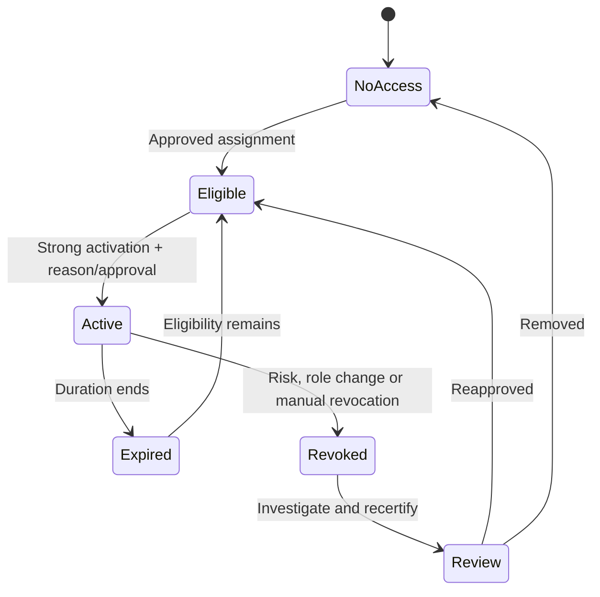

### Managed identities, service principals, and nonhuman access

| Identity type | Best-fit use | Credential model | Permission assignment | Required governance |
|---|---|---|---|---|
| System-assigned managed identity | One Azure resource lifecycle owns one identity | Azure-managed credential, deleted with resource | Azure RBAC/API app role according to supported target | Resource owner, permissions, sign-in/activity, removal with resource |
| User-assigned managed identity | Reusable Azure identity with independent lifecycle | Azure-managed credential | Assign to multiple supported Azure resources | Named owner, resource attachments, blast radius and lifecycle review |
| Service principal with certificate | App/automation not able to use managed identity, with certificate auth supported | Certificate private key protected and rotated | Graph/API application permissions and resource roles | Owners, certificate store, expiry alert, consent review, sign-in monitoring |
| Service principal with federated credential | CI/CD or external workload exchanges trusted token without stored secret | Workload identity federation | Narrow app/resource permissions | Issuer/subject/audience trust, repository/environment protection, review |
| Service principal with client secret | Compatibility fallback only when stronger secretless/certificate pattern is unavailable | Secret with expiration | Narrow app/resource permissions | Vault storage, rotation, no source-code/log exposure, owner and alerting |
| Delegated user automation | User-present tool acts within user's rights and delegated consent | Interactive/token broker | Delegated scopes plus user authorization | Human accountability, MFA/CA, no unattended token misuse |

| Workload identity review question | Why it matters | Evidence |
|---|---|---|
| What exact resource and operation needs access? | Prevents broad `*.Read.All` or Contributor grants based on convenience | API operation, resource ID and data-flow diagram |
| Can managed identity or federation remove stored credentials? | Reduces secret theft and rotation failure | Supported authentication documentation and lab test |
| Who owns the application and service principal? | App object, local enterprise app and runtime can have different owners | Named business/technical owners and inventory |
| Which tenant issues the token and which resource accepts it? | Prevents home/resource-tenant confusion | Issuer, audience, tenant and sign-in record |
| Which permissions are consented versus resource-role assigned? | Graph app permissions and Azure RBAC solve different authorization layers | Consent grants plus IAM assignments |
| What happens on expiry, disablement or owner departure? | Nonhuman access often outlives the project | Lifecycle runbook and failure test |

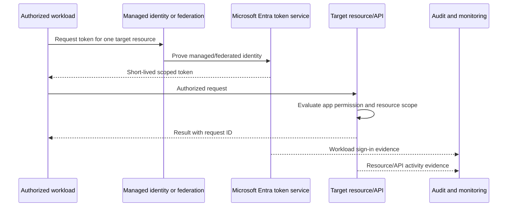

## 6. Product-to-data, location, and audit maps

### Product-to-data map

| Product | Primary administrative/configuration data | Primary customer/security data | Common query/investigation surface | Residency statement must distinguish |
|---|---|---|---|---|
| Entra | Directory objects, policies, roles, apps | Sign-ins, audit, risk, provisioning, Graph activity | Entra logs, Graph, diagnostic export | Directory data, log destination and external identity data |
| Intune | Policies, assignments, enrollment and app metadata | Device inventory/status, diagnostics and reports | Intune reports/Graph, device logs | Intune service data, device-local logs and exported Log Analytics data |
| Exchange Online | Organization/recipient/mail-flow configuration | Mailbox, calendar and transport metadata/content | EAC, Purview Audit, message trace, Defender email | Mailbox content, transport records, audit and exports |
| Teams | Policies, apps, meeting/voice config | Chat, meeting, call-quality and membership metadata | Teams admin/CQD, Purview Audit, Defender | Chat versus files, recording/transcript, CQD and connected services |
| SharePoint/OneDrive | Tenant/site/sharing settings | Sites, files, lists, versions and sharing links | SharePoint admin, Purview Audit, Graph | Tenant geo, satellite geo, user/site placement and exports |
| Power Platform | Environments, apps, flows, policies, connections | Dataverse and connector-mediated business data | Admin analytics, run history, Dataverse audit | Environment region, connector target and gateway/on-premises path |
| Purview | Policies, classifiers, cases, assessments, catalog | Indexes, alerts, audit records, review/case data | Purview solution portals/APIs | Source workload content, Purview service data, case/export destination |
| Defender XDR | Security settings, role definitions, onboarding | Endpoint/email/identity/app alerts, events, incidents, evidence | Defender portal, advanced hunting, APIs | Each source product, Defender retention and exported streams |
| Sentinel/Log Analytics | Workspace, connectors, rules, content, automation metadata | Ingested logs, incidents, data lake and query results | Defender Sentinel, Log Analytics, Azure APIs | Workspace region, analytics/lake tier, cross-region sources and exports |
| Security Copilot | Capacity, plugins, agents and settings | Prompts, responses, sessions and source-grounded context | Standalone/embedded experiences and usage views | Prompt/session data, source-product data and configured capacity geography |

### Data-location vocabulary

| Concept | What it means | What it does not prove | Validation source |
|---|---|---|---|
| Tenant provisioned geography | Initial service geography associated with tenant/service provisioning | Every service and every later resource uses that geography | M365 data-location page and workload admin view |
| Workload data location | Reported location for defined customer data of a specific service | Security logs, support data, transient processing and exports share it | Workload-specific residency documentation |
| Azure region | Region selected for a workspace, vault, Logic App or other resource | Every dependency or paired service stays only there | Azure resource properties and regional availability |
| Preferred Data Location | User/resource attribute guiding supported Multi-Geo placement | Immediate movement or all Teams data placement | Multi-Geo service documentation and live location report |
| Advanced Data Residency | Additional eligible commitments for specified services/geographies | Universal sovereignty or automatic enrollment | Current ADR terms, eligibility and tenant status |
| EU Data Boundary | Defined Microsoft commitment for in-scope data and services | No transfer, support access, exception or global processing ever occurs | Current boundary documentation and contract |
| Sovereign cloud | Separate cloud/environment for particular jurisdiction/customer classes | Feature parity, same URL, same API or same release date | Cloud service description and feature availability |
| Export location | Destination chosen by investigator/admin/automation | It inherits the source service's protection automatically | Export procedure, storage classification and access review |

### Audit-source selection

| Question | Primary source | Supporting source | Limitation to state |
|---|---|---|---|
| Who attempted to authenticate? | Entra sign-in logs | App logs, client/network, workload sign-in | Identity in a record does not prove the human's intent |
| Who changed a directory object? | Entra audit logs | Graph activity, change ticket, PIM | Retention/field visibility and service propagation vary |
| Who changed an Intune policy? | Intune audit logs | Entra sign-in, assignment/version record | Audit success may mean accepted, not applied to devices |
| How did mail route? | Exchange message trace and headers | Connector/rule, EOP/MDO, remote evidence | Trace is not complete message content or threat verdict |
| Who shared/accessed a file? | Purview Audit and SharePoint/OneDrive records | Sharing-link/site permission and client evidence | Event availability and semantics vary by action/client |
| What happened in Teams? | Teams/Purview audit or call diagnostics according to question | CQD, client logs, Exchange/SharePoint dependencies | Chat, meeting, media and file events use different data |
| Which compliance action occurred? | Purview solution/audit record | Case history, source workload, approval | Compliance event does not establish legal conclusion |
| What did Defender detect or do? | Alert/incident/entity timeline and Action center | Advanced hunting, source product evidence | Correlation can update; action requested is not action completed |
| What did Sentinel ingest/evaluate? | Workspace table, rule history, Sentinel health/audit | Source event, DCR/connector, incident history | Missing row can be scope, latency, transform, schema or permission |
| What changed in Azure? | Azure Activity Log | Resource logs, deployment history, Entra sign-in | Control-plane Activity Log is not all data-plane activity |
| What did automation execute? | Logic App/flow run history and target audit | Trigger event, identity sign-in, request IDs | Successful connector step may not equal business outcome |

### Evidence and retention cautions

| Evidence property | Required question | Good practice |
|---|---|---|
| Source | Which product emitted this record? | Preserve canonical event plus query/export method |
| Grain | Is one row an event, alert, incident, aggregate, user or resource? | State row grain before counting or joining |
| Clock | Which timestamp and timezone apply? | Normalize to UTC while retaining source timestamps |
| Identity | User, app, managed identity, service, device or shared account? | Prefer stable IDs and record issuer/tenant context |
| Completeness | Which actions, clients, regions and periods are covered? | Document known gaps, filters, latency and sampling |
| Retention | How long is interactive, archived/lake, recoverable or exported data kept? | Read current plan/policy and test retrieval before an incident |
| Integrity | Can the evidence be altered and how is chain of custody maintained? | Use approved immutable/controlled storage and hashes where required |
| Privacy | Does it contain personal, legal, credential or security-sensitive information? | Minimize, redact, restrict and log access |
| Authorization | Why may this analyst view/export it? | Record purpose, case/ticket, role and approval |

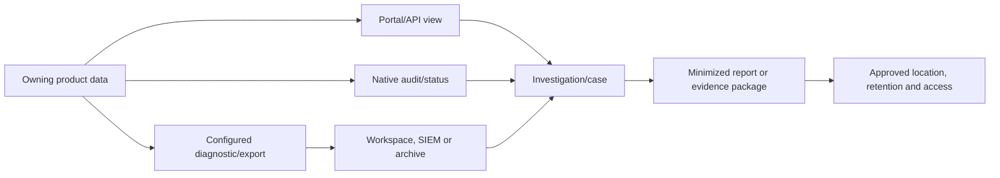

## 7. Licensing concepts without an entitlement trap

### The licensing stack

Licensing decisions should begin with an outcome and persona, not a suite acronym. The stack is: **agreement and offer -> tenant purchase/subscription -> service plan/capacity/resource -> eligible user/device/workload -> assignment/provisioning -> configuration -> role/policy -> observed use -> audit and cost**. A failure at any layer can look like “not licensed.”

| Licensing unit | Plain meaning | Examples | Key question |
|---|---|---|---|
| Tenant | Capability or service enabled at organization boundary, often with user requirements too | Tenant service activation, compliance service | Is a tenant switch enough, or must every benefiting user be licensed? |
| User | Named person licensed for direct or indirect benefit | M365 suite, Entra, Intune user | Which users are in scope, including admins, reviewers and beneficiaries? |
| Device | Entitlement for supported device-only/shared scenarios | Intune device-only pattern | Are user-based features such as CA/MAM excluded? |
| Capacity | Preprovisioned resource shared by authorized workloads/users | Security Copilot SCUs, Power Platform capacity | Who owns, monitors and limits the pool? |
| Consumption | Charge based on measured use | Sentinel ingestion/query/storage/automation, Azure resources | Which meter, data volume, tier and time window drive use? |
| Workspace/resource | Service attached to a deployed Azure or Power Platform resource | Sentinel workspace, Logic App, Dataverse environment | Which subscription, region, plan and resource owner apply? |
| Add-on | Product that depends on an eligible base license or service | Security, compliance, Intune or advanced management add-on | What prerequisite and which persona receives the benefit? |
| Service plan | Individual capability within an assigned SKU | Exchange, Intune, Defender or compliance plan | Is it enabled, provisioned and compatible with dependencies? |
| External/guest metric | Special model for external identities or users | Monthly active users or guest governance patterns as current | Which home/resource tenant and billing rule apply now? |

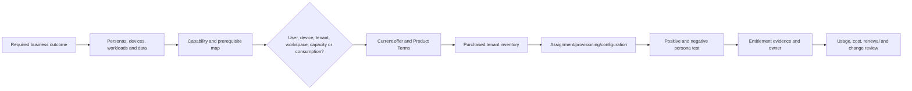

### Suite and persona orientation

| Category | Safe high-level orientation | Persona fit to evaluate | Never say without validation |
|---|---|---|---|
| Microsoft 365 E3 category | Broad productivity, Windows/management and foundational security/compliance bundle depending current offer | Information workers needing standard collaboration and management baseline | “E3 includes every capability in this guide” |
| Microsoft 365 E5 category | Broader advanced security, compliance, voice/analytics and identity capabilities depending current offer | Higher-risk users, admins, investigators, regulated or advanced security personas | “E5 removes the need for Sentinel, add-ons or capacity” |
| F-series/frontline category | Frontline-oriented rights and constraints designed for eligible worker patterns | Shift/frontline workers with defined device/app/mailbox needs | “F licenses are cheaper E3/E5 with identical use rights” |
| Security/Defender add-on category | Adds selected advanced identity/threat capabilities to an eligible base | SOC, high-risk users, protected endpoints/identities/email | “One security add-on covers every Defender plan and every user” |
| Purview/compliance add-on category | Adds selected data protection, investigation, risk and compliance capabilities | Data owners, legal/compliance investigators, regulated users | “Only investigators need licenses” |
| Entra Suite/Governance category | Adds advanced access, network, governance and protection capabilities according to current package | Privileged users, governed workforce/external access and Zero Trust programs | “P2 and Governance are permanently identical” |
| Intune Suite/add-on category | Adds advanced endpoint management/security tools above base Intune | Endpoint support/security teams and covered users/devices | “Intune Plan 1 contains every Suite capability” |
| Azure consumption category | Metered Azure resources and operations | Sentinel, Log Analytics, Logic Apps, Key Vault and integration owners | “An M365 suite absorbs all Azure usage” |
| Security Copilot capacity/inclusion category | Compute capacity or current eligible inclusion used by standalone/embedded/agent experiences | SOC/security admins with governed use cases | “Every E5 user gets unlimited Copilot use” |

### E3, E5, frontline, and add-on decision lens

| Decision lens | E3-type baseline question | E5-type/advanced question | Frontline question | Add-on question |
|---|---|---|---|---|
| Persona | Does the user need full information-worker apps/services? | Which advanced security/compliance functions benefit this user? | Does work pattern meet current frontline eligibility and constraints? | Is there an eligible base license for every covered beneficiary? |
| Identity | Is P1-level capability sufficient for requirements? | Are P2/risk/governance functions required? | Are shared-device and sign-in patterns supported? | Is Entra standalone/suite more precise? |
| Endpoint | Is base Intune/device management enough? | Are advanced endpoint or Defender Plan 2 capabilities needed? | User versus device entitlement and kiosk restrictions? | Which Intune/Defender add-on and prerequisite apply? |
| Data security | Are baseline labels/retention/audit requirements met? | Are advanced DLP, eDiscovery, insider risk or extended audit needed? | Which frontline data locations/actions are in scope? | Who benefits from the advanced control under current terms? |
| SecOps | Which source products emit needed signals? | Which XDR features require higher product plans? | Are frontline identities/devices/email covered? | Is Sentinel consumption still separately modeled? |
| Commercial | What does current contract already own? | Does consolidation reduce or increase overlap? | Are minimums/eligibility observed? | Is add-on cheaper is a procurement calculation, never assumed here |

### Entra P1/P2 and adjacent distinctions

| Capability type | P1-oriented concept | P2/Governance-oriented concept | Recheck-current caution |
|---|---|---|---|
| Conditional Access | Policy-based access commonly associated with P1 | Risk-based conditions depend on ID Protection/P2 capability | Exact users benefiting and interacting product licenses matter |
| Group-based licensing/custom roles/AU administration | Common P1-related administration patterns | P2 does not automatically solve every governance scenario | Dynamic/AU/member/admin licensing rules vary by feature |
| Identity Protection | Limited/basic visibility may exist | Full risk detections, risky-user/sign-in investigation and risk policies associated with P2 | Report fields and policy features differ; verify live table |
| PIM | Not a P1 feature category | P2 or ID Governance licensing according to current requirements | Eligible users, approvers and reviewers can each require coverage |
| Access reviews/entitlement management | Some adjacent/basic features may exist | P2 carries established capabilities; ID Governance adds newer/advanced capabilities | Do not use “P2 includes all governance” as a permanent rule |
| Lifecycle Workflows | Not baseline P1/P2 assumption | ID Governance-oriented capability | Workflow users/admins and custom-extension use need live validation |
| Workload identities | Service principals exist without premium | Workload ID Premium adds protected/governed scenarios | Licensed per applicable workload identity/model, not ordinary user logic |
| Managed identities | Azure-managed identity concept | No ordinary P1/P2 prerequisite for the identity itself | Target resource, Azure service and API permissions still apply |

### Intune plan and add-on orientation

| Category | Safe concept | Typical decision question | Evidence |
|---|---|---|---|
| Intune Plan 1 | Base unified endpoint and application management | Which users/devices enroll, receive policy, apps or protection? | Assigned service plan, tenant status, managed-device/user test |
| Intune Plan 2 | Additive advanced endpoint-management capabilities according to current catalog | Which specific advanced function is required and who benefits? | Current Intune licensing page and feature prerequisite |
| Intune Suite | Bundle of advanced management/security capabilities and Plan 2 according to current offer | Is the bundle aligned to personas, or are selected add-ons enough? | Current service description, Product Terms and tenant feature state |
| Individual Intune add-ons | Selected advanced capability without whole suite where offered | Base-license prerequisite, covered users/devices and integration | Offer/contract and live admin center |
| Device-only | Supported no-user-affinity/shared-device management | Are MAM, Conditional Access and user-based services unnecessary? | Enrollment type, device assignment and documented limitations |
| Unlicensed admin access | Admin portal access can be supported without an Intune user license under documented tenant conditions | Does the admin only administer, or also benefit as a managed user/device? | Tenant setting/creation conditions and role assignment |
| Co-management rights | Current qualifying subscriptions can include Configuration Manager/co-management rights | Which enrollment and user requirements still apply? | Current Intune/ConfigMgr licensing documentation |

### Defender plan orientation

| Product | Plan/category distinction to validate | Persona/resource | Common false shortcut |
|---|---|---|---|
| Defender for Endpoint | Plan 1 versus Plan 2, Vulnerability Management add-on/standalone and server coverage | End-user endpoints, servers, security analysts | “Defender Antivirus equals Defender for Endpoint Plan 2” |
| Defender for Office 365 | Plan 1 versus Plan 2 and Exchange Online Protection baseline | Protected recipients, SOC/email investigators | “An E5 admin can investigate every unlicensed recipient identically” |
| Defender for Identity | Identity sensor/service prerequisites and covered users | Hybrid identity estate and benefiting users | “Installing a sensor completes licensing and deployment” |
| Defender for Cloud Apps | Discovery/control/protection capabilities and suite/add-on source | SaaS users, apps and security team | “Cloud Discovery equals all CASB controls” |
| Defender XDR | Correlation experience assembled from provisioned source products | SOC and protected identities/devices/mail/apps | “XDR is one independent license that creates all source telemetry” |
| Defender for Cloud | Azure subscription resource plans by protected resource type | Servers, storage, databases, containers and cloud resources | “M365 E5 covers every Azure resource plan” |
| Defender Vulnerability Management | Included and premium capabilities depend on Endpoint/standalone/add-on | Endpoint and vulnerability teams | “Exposure Management and vulnerability management are the same license” |

### Purview capability orientation

| Capability family | License question | Beneficiary question | Evidence question |
|---|---|---|---|
| Information Protection | Which label/classification/encryption features and clients are required? | Creators, recipients, admins and protected users according to current terms | Can the test persona publish/apply/open and is the action audited? |
| DLP | Which locations, endpoint/cloud-app/adaptive controls and advanced classifiers are required? | Users whose data/actions receive benefit, plus admins as current terms require | Does policy evaluate a synthetic item in each location? |
| Audit | Standard versus Premium capabilities, retention and high-value events | Investigators and users whose activities receive advanced audit benefit | Are required events present for required period and export method? |
| eDiscovery | Standard/Premium workflow, review, analytics and custodial features | Custodians/data sources, case users and beneficiaries under current guidance | Can an authorized case test complete end to end? |
| Insider Risk/Communication Compliance | Advanced signal/case/review functions and privacy controls | In-scope users, analysts/investigators and policy stakeholders | Are connectors/signals, pseudonymization and case permissions available? |
| Records/lifecycle | Retention, records, regulatory records and disposition features | Content owners/users and records team | Can the chosen workload apply, retain, dispose and audit as required? |
| Compliance Manager | Included assessments/actions versus premium templates/features | Compliance team and assessed organization | Which assessment/template is available and what is customer-owned? |
| DSPM for AI/data governance | Data security posture, AI visibility and governance service model | Data/AI owners and protected estate | Which sources, scans, classifications and insights are provisioned? |

### Sentinel and Azure billing concepts

| Meter/category | What drives it | Design control | Never promise |
|---|---|---|---|
| Analytics ingestion/analysis | Billable volume and current pricing plan/benefit | Source filtering, DCR transforms, table plan and value-based onboarding | Every connector or Defender table is free |
| Commitment tier | Committed daily volume under current terms | Baseline/forecast, variance, review cadence and owner | A commitment is always cheaper for this tenant |
| Data lake ingestion/processing/storage | Tier choice, processed volume, retained volume and current compression/billing method | Data classification, retention need, transformations and lifecycle | Data lake is free archive |
| Data lake query | Data scanned by query/job under current model | Bounded time/columns, scheduled-job governance, query review | Read-only query has no cost implication |
| Interactive/long-term retention | Table plan and retention periods | Regulatory need, retrieval SLA and deletion governance | All tables support identical retention/query behavior |
| Search/restore or successor behavior | Current tier and retrieval method | Planned investigation workflow and cost test | Archived data is instantly interactive |
| Logic Apps/playbooks | Trigger/action executions, connectors, hosting plan and dependent services | Idempotency, batching, approvals, diagnostics and budget | Sentinel license includes unlimited SOAR execution |
| Azure Functions/Event Hubs/Storage/Key Vault | Connector/integration architecture | Full bill of materials and owner | Connector page lists every downstream charge |
| Included/free-benefit data | Specific current table/source and conditions | Validate meter in actual bill and documentation | A product family label makes all raw events free |

### Security Copilot capacity

| Capacity concept | Safe description | Governance question | Recheck-current point |
|---|---|---|---|
| Security Compute Unit (SCU) | Compute capacity consumed by standalone, embedded, agent and other supported Security Copilot workloads | Which use cases, users and controls consume the pool? | Consumption behavior and included experiences can change |
| Provisioned capacity | Capacity configured in advance for predictable availability under current billing blocks | Who may scale it, when, and under which budget alert? | Minimums, billing increments and regional availability |
| Overage/on-demand capacity | Additional consumption above provisioned/included capacity where enabled | Is there a maximum, alert, approval and stop condition? | “Unlimited” configuration is not unlimited budget |
| Eligible-suite inclusion | Current eligible customers may receive an inclusion/default capacity under current terms | Is the tenant onboarded, and what happens after included capacity? | Do not translate inclusion into per-user unlimited use |
| Capacity geography | Azure capacity resource/region and service data behavior | Does selected geography satisfy architecture and policy? | Capacity location and every source data location are not identical |
| Usage monitoring | Dashboard/evidence for consumption by experience and time | Who reviews anomalies, abandoned sessions and agent use? | Closing a panel may not prove background work stopped |

### Trial, preview, and sovereign caveats

| Label | What it safely means | Required validation | Forbidden shortcut |
|---|---|---|---|
| Trial | A time/usage/eligibility-limited evaluation may be offered under current tenant/market terms | Availability, start/end, included units, conversion, cleanup, data retention and cost owner | “Everyone gets a free trial” |
| Free/included | A documented meter or capability may have no separate charge under stated conditions | Exact SKU, table, amount, period, region, prerequisite and bill | “Free means no downstream Azure cost” |
| Preview | Feature is not yet governed like ordinary generally available capability and terms/support can differ | Public/private status, tenant eligibility, SLA/support, data, security, rollback and exit plan | “Preview is production-ready because it appears in portal” |
| Targeted release | Tenant/user may receive M365 experience earlier | Selected population, Message center, support and test | “Targeted release covers every Azure/security product” |
| Sovereign cloud | Separate endpoint/service environment with distinct feature schedule and terms | Current service availability, URL, API, role, licensing and cross-cloud limits | Reusing commercial assumptions or endpoints |
| Retired/classic portal | Experience is replaced or on a transition timeline | Current redirect, functional gaps, API/resource continuity and migration deadline | Building a new runbook around old screenshots |

## 8. License-decision and evidence method

### Decision questions

| Step | Question | Deliverable | Stop condition |
|---:|---|---|---|
| 1 | What business/security outcome and control requirement must be met? | Requirement with owner, risk and acceptance test | Product named without requirement |
| 2 | Which personas, devices, workloads, data locations and external users benefit? | Persona/scope inventory | “All users” with no definition |
| 3 | Which exact capability and version/status satisfies it? | Capability-to-requirement map | Preview/roadmap item treated as committed control |
| 4 | What prerequisites, base licenses, service plans, resources and integrations apply? | Dependency map | Add-on assessed without base eligibility |
| 5 | What is the licensing metric? | User/device/tenant/workspace/capacity/consumption statement | Mixed metrics collapsed into seat count |
| 6 | What does the current agreement and Product Terms permit? | Procurement/legal validation | Learn page treated as contract |
| 7 | What does the tenant actually own and assign? | SKU/service-plan inventory | Purchase quantity inferred from a sales page |
| 8 | Can representative positive and negative personas use the capability? | Dated test evidence | Portal tile treated as proof |
| 9 | What Azure/usage/capacity costs remain? | Bill of materials and monitored forecast | “Included” used to hide dependent meters |
| 10 | Who owns renewal, true-up, capacity, usage and change monitoring? | RACI and review cadence | No operating owner |

### Five-source validation hierarchy

| Source | What it proves best | What it cannot prove alone |
|---|---|---|
| Applicable agreement and Product Terms | Contractual use rights and program/product terms | Tenant assignment, successful provisioning or future feature behavior |
| Official service description/licensing guidance | Current public capability/plan orientation and prerequisites | Customer-specific negotiated terms or every exception |
| Tenant subscription/service-plan inventory | What SKUs and plans appear purchased/assigned now | Correct licensing interpretation or operational capability |
| Workload portal/API observation | Provisioning, visibility, configuration and current behavior | Contract compliance, completeness or future support |
| Representative authorized test and audit | End-to-end outcome for defined persona/time/resource | Universal entitlement across all users/clouds or permanent behavior |

### Licensing evidence worksheet

| Field | Record | Example wording, not a real tenant value |
|---|---|---|
| Decision ID and owner | Unique reference, accountable business/security/procurement owners | `LIC-EXAMPLE-001`, Security Architecture owner |
| Baseline date | Date all sources were checked | August 24, 2026 |
| Tenant/cloud/market | Sanitized tenant reference, commercial/sovereign cloud and market | Commercial cloud, approved market |
| Outcome/control | Requirement and acceptance criterion | Risk-based access for defined privileged persona |
| Personas/resources | Users, devices, workloads, external identities, workspaces | 20 privileged admins; two emergency accounts handled separately |
| Capability | Exact current product feature and status | Entra risk-based CA, generally available at check date |
| Licensing metric | User/device/tenant/capacity/consumption/workspace | User-benefit plus administrator/approver validation |
| Base and add-on | Current prerequisite and candidate offer | Eligible base + current advanced identity plan; verify contract |
| Service plans | Required enabled plan identifiers/names | Recorded from tenant export; no secret values |
| Product Terms/service source | URL, publication/program selection and relevant clause/page | Official links with checked date |
| Tenant evidence | Purchased/assigned counts and errors | Redacted SKU report and assignment result |
| Configuration evidence | Feature enabled/configured at correct scope | Policy export/reference and owner approval |
| Positive test | Authorized persona expected to succeed | Synthetic user passes approved test |
| Negative test | Persona expected not to receive capability | Out-of-scope persona lacks feature/action |
| Consumption dependencies | Azure meters, capacity, connectors, storage and automation | Workspace ingestion + Logic Apps + retention modeled |
| Caveats | Preview, cloud, region, propagation, unsupported scenario | Government availability to be separately validated |
| Decision and expiry | Approved option, residual risk and recheck date | Revalidate before renewal or material design change |

### Persona mapping example

| Persona | Required outcomes | Candidate category, not entitlement answer | Additional validation |
|---|---|---|---|
| Standard information worker | Collaboration, managed device/app, baseline identity and data protection | M365 E3-type baseline | Device platform, apps, mailbox, Purview feature specifics |
| High-risk executive | Strong access, advanced threat/data protection, priority response | E5-type or targeted security/compliance add-ons | Benefiting-user terms, privacy, SOC runbook |
| Frontline worker | Constrained collaboration on shared/personal device | F-series category | Eligibility, mailbox/app/device limitations and add-ons |
| Security analyst | Incidents, hunting and response across licensed sources | Source Defender plans plus Sentinel/SCU as required | Product data scope, RBAC, ingestion and capacity |
| Compliance investigator | Audit, eDiscovery, DLP/IRM case workflow | Purview advanced category for covered personas | Custodians/beneficiaries, case roles, retention/export |
| Endpoint engineer | Intune and endpoint security administration | Intune base/Suite/add-ons and Defender plan | Admin license exception versus managed-user benefit |
| Workload identity | Read/write API or resource access | Managed identity, app permission, Workload ID feature where required | Nonhuman metric, consent, secretless pattern and owner |
| Sentinel platform team | Workspace, connectors, retention, automation and cost | Azure consumption/resource model | Meters, table plans, commitment, Logic Apps and support |

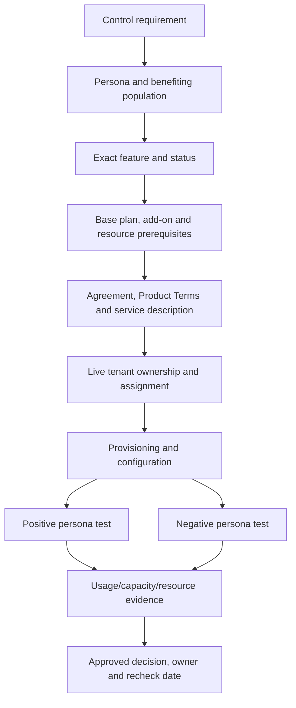

## 9. Role-to-task quick map

Role names below are starting families, not guaranteed permission answers. Microsoft can add actions, rename roles, alter mappings, introduce unified models, or change scope support. Validate the exact current action in the official role reference and test with a nonproduction or read-only case.

| Task | Least-privilege starting family | Avoid defaulting to | Effective validation |
|---|---|---|---|
| Read Entra sign-ins/audit | Reports Reader or Security Reader depending fields | Global Administrator | Open one authorized event and required details |
| Read M365 Service health | Service Support Administrator or supported read role | Global Administrator | View current/history page without edit access |
| Read Message center | Message Center Reader; Privacy Reader for applicable messages | Global Reader without checking limitations | Confirm ordinary and restricted posts needed |
| Assign product licenses | License Administrator | Billing/Global Administrator | Assign only in authorized test or inspect action definition read-only |
| Manage Conditional Access | Conditional Access Administrator via PIM | Security/Global Administrator as standing role | Report-only policy workflow and role audit |
| Review Intune device status | Read Only Operator or scoped Help Desk role | Intune Administrator | Compare visible devices across scope groups/tags |
| Collect endpoint diagnostics | Scoped Intune role with only required remote action | Full Intune Administrator | Approved lab device and audit record |
| Trace mail | Exchange trace-capable role group | Exchange Administrator automatically | Confirm trace action and scoped recipient data |
| Diagnose Teams calls | Communications Support Specialist/Engineer according to detail | Teams Administrator | Confirm one test user's call detail boundary |
| Read SharePoint tenant settings | SharePoint Administrator/read API according to current support | Site collection admin everywhere | Inspect settings without content browsing |
| Search Purview Audit | Audit Reader | Compliance Administrator | Search synthetic event; verify export separately |
| Work one eDiscovery case | eDiscovery Manager assigned to case | eDiscovery Administrator | Access assigned case but not unrelated case |
| Read Defender incidents | Defender Security Data/basic read scoped to sources | Security Administrator | Inspect one incident; no response action |
| Manage Defender incident status | Incident management permission | Full response permission | Update only in authorized lab; inspect audit |
| Read Sentinel incident/data | Sentinel Reader | Contributor/Owner | Query and open incident without management rights |
| Manage Sentinel incidents | Sentinel Responder | Contributor | Change lab incident state; cannot edit rule |
| Author Sentinel analytics | Sentinel Contributor at resource group/workspace | Subscription Contributor | Create only through lab/change control and inspect scope |
| Run approved playbook | Sentinel Playbook Operator | Logic App Contributor | Run disabled/safe lab workflow and inspect history |
| View Power Platform inventory | Power Platform tenant reader/admin capability as currently available | Global Administrator | Confirm no Dataverse data access |
| Manage Dataverse data | Custom Dataverse role at environment/business scope | Power Platform Administrator alone | Test exact table/row privileges with synthetic data |
| Read Graph objects | Narrow delegated read permission and user role | Broad directory read consent | GET one selected property and inspect consent |

## 10. Escalation and support maps

### Escalation routing

| Evidence points to | First accountable owner | Supporting team | Escalate externally when | Include |
|---|---|---|---|---|
| Entra sign-in/policy | Identity platform/security | App, endpoint, network | Service behavior contradicts documented result or tenant issue suspected | Sign-in/correlation ID, UTC, user/app/device, CA result, comparison |
| Intune delivery/device | Endpoint management | Identity, network, device vendor | Reproducible supported scenario fails after client/service evidence | Device record, policy ID, check-in, diagnostics, platform/build |
| Exchange transport | Messaging | DNS/network, remote mail admin, Defender | Microsoft hop/trace or service behavior needs provider investigation | Message ID, trace, headers, UTC, sender/recipient domains, connector/rule |
| Teams media | Collaboration/voice | Network, endpoint, carrier | Call diagnostics show Microsoft/service/carrier boundary issue | Conference/call ID, UTC, users, media path, CQD/client evidence |
| SharePoint/OneDrive | Collaboration/content | Identity, network, client, migration vendor | Supported site/sync/service behavior remains unexplained | Site/item IDs, sync version/logs, permission path, request ID |
| Purview policy/case | Compliance/data security | Legal/privacy, workload owner | Reproducible solution behavior or indexing/export issue needs Microsoft | Policy/case/job IDs, scope, sample classification, audit, authority |
| Defender alert/action | SOC/security engineering | Endpoint/email/identity/app owners | Source sensor/service, correlation or action failure needs product support | Alert/incident/action/device IDs, timeline, evidence, no sensitive payload unless approved |
| Sentinel ingestion/rule | SIEM platform | Source owner, Azure/network, SOC | Connector/API/workspace service issue persists with known event | Workspace/resource, connector, DCR, table, timestamps, source event, query |
| Logic Apps/Power Automate | Automation platform | Target API owner, identity, network | Connector/platform run contradicts documented behavior | Run/workflow/request IDs, sanitized inputs/outputs, identity, retry history |
| License/entitlement | SAM/procurement/licensing specialist | Product owner, legal, Microsoft account team | Agreement/offer interpretation or tenant entitlement needs authoritative answer | Program, SKU/service plans, personas, requirement, source dates, no assumed price |

### Support evidence pack

| Field | Minimum content | Security handling |
|---|---|---|
| Business impact | Affected service, users/process, severity basis, workaround and deadline | No exaggeration; distinguish security incident from availability issue |
| Scope | Tenant/cloud/region, subscription/workspace/site/device/app and affected/unaffected comparison | Use approved identifiers; redact public copies |
| Timeline | First known good, first failure, changes, tests and current status in UTC | Preserve original source clocks |
| Stable IDs | Correlation/request, message, call, policy, device, incident, alert, run and resource IDs as applicable | Never include tokens, cookies or secrets |
| Expected/actual | Supported expected behavior and exact observed result | Cite current official documentation |
| Reproduction | Smallest authorized repeatable case and frequency | Use synthetic data/test persona where possible |
| Logs | Relevant raw/sanitized records, query and collection method | Minimize personal/content data and use approved transfer |
| Changes | Deployment, policy, role, license, network, client and provider changes | State unknowns; do not equate timing with cause |
| Hypotheses/tests | Alternatives considered, discriminating tests and outcomes | Do not perform destructive or control-bypassing tests |
| Environment | Versions, portal/API, module, cloud, region and feature status | Recheck-current at escalation time |
| Ask | Specific question, owner needed and next decision | “Please investigate” is weaker than a bounded technical ask |

### Support and incident RACI

| Activity | Client service owner | Security/technical lead | Microsoft/vendor support | Business/legal/privacy |
|---|---|---|---|---|
| Declare impact/severity | Accountable | Consulted/responsible for evidence | Informed | Consulted according to impact |
| Preserve evidence | Accountable | Responsible | Receives approved subset | Defines legal/privacy constraints |
| Form/test hypotheses | Informed | Responsible | Consulted; investigates provider boundary | Informed as needed |
| Approve production change | Accountable change authority | Recommends/implements | Advises on provider behavior | Approves material business/legal risk where required |
| Communicate status | Accountable | Supplies technical facts | Supplies provider updates, not client message | Receives/advises audience-specific communication |
| Accept residual risk | Business owner accountable | Advises | Cannot accept for client | Legal/privacy consulted |
| Close and improve | Accountable | Validates, RCA/PIR actions | Confirms case result | Reviews obligations and impact |

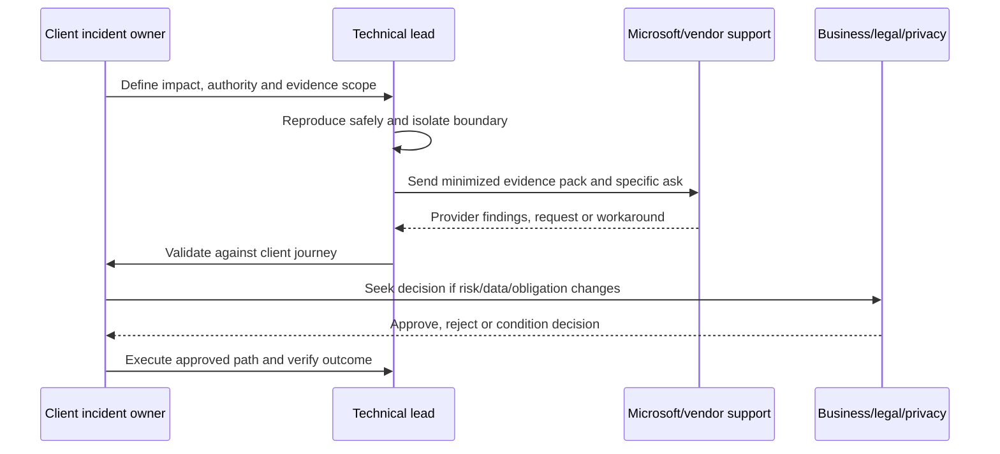

## 11. Common confusions and interview corrections

| Confusion | Correct answer |
|---|---|
| “The portal is the product.” | The portal is a user interface. Name the owning service, resource, API, role system, data and audit source. |
| “Global Reader can read everything everywhere.” | It is broad and privileged but has documented product limitations; Purview, Power Platform and other experiences require live verification. |
| “Security Administrator is least privilege for all security work.” | It is broad. Separate reading, incident management, hunting, response, policy and role administration by product and scope. |
| “Unified RBAC replaces every old role.” | Only supported/activated workloads move under it; Entra roles, Azure RBAC, product roles, Exchange/Security PowerShell and Purview permissions can remain relevant. |
| “Sentinel is an E5 feature.” | Sentinel is an Azure SIEM with workspace/data/consumption models and can be used in Defender portal independently of an E5 suite in supported scenarios. Source product data still has prerequisites. |
| “M365 E5 means no Azure bill.” | Azure resources, Sentinel meters, Logic Apps, storage, Key Vault, integrations and capacity can still accrue consumption. |
| “E3 versus E5 is one exact table.” | It is a category comparison bounded by offer, market, agreement and date; validate each required feature, persona and prerequisite. |
| “P2 includes every governance feature.” | P2 includes established advanced identity capabilities, while ID Governance/Suite can carry additional/newer functions. Use the current feature table. |
| “An admin never needs a product license.” | Some admin portal access can be unlicensed, but admins can still require licenses when they benefit from or use protected features; feature-specific terms govern. |
| “A tenant admin can read all Dataverse data.” | Power Platform tenant administration and Dataverse data security are distinct. Assign environment/data roles for authorized data access. |
| “A SharePoint Administrator owns all site content.” | Service administration and ordinary content authorization/purpose are separate. Access content only when authorized and audited. |
| “A role name proves access.” | Effective access depends on current actions, scope, assignment path, activation, group memberships, precedence, product status and a real task test. |
| “Data residency means data never leaves a country.” | Define data category, storage, processing, transit, support, backup, export and contractual scope for each service. |
| “A trial will be there for my lab.” | Trial offers vary and can change. Plan a design-only/synthetic fallback and prevent automatic cost or data surprises. |
| “Graph Explorer is harmless because it is a browser tool.” | It can request delegated consent and call live APIs. Use a sample or authorized test tenant, narrow GETs, no secrets and no casual writes. |

### Candidate wording by evidence level

| Evidence level | Honest wording | Avoid |
|---|---|---|
| Production | “In production I owned/supported X; my role was Y; the evidence and outcome were Z.” | Expanding one workload experience into tenant-wide security ownership |
| Lab | “I configured and validated this in an isolated lab with synthetic identities/data; I tested positive, negative and rollback paths.” | Calling a lab a client deployment |
| Design/study | “I understand the architecture and would verify the current role, license, tenant behavior and official source before implementation.” | “I have done it” when only read |
| Observed/assisted | “I contributed to troubleshooting/documentation while another team owned the control.” | Taking ownership of another team's change |
| Unknown | “I do not know the current entitlement from memory; I would validate it using Product Terms, service descriptions, tenant inventory and a persona test.” | Guessing a SKU, role or price |

### Likely interview questions

| Question | Concise model answer |
|---|---|
| Why are there so many Microsoft admin portals? | Microsoft 365 integrates distinct services. Each portal presents the owning product's resources, roles, data and diagnostics. I start with the task and boundary, not the logo, then correlate across dependencies. |
| How do you choose least privilege? | I define the exact task, principal and resource; identify the owning role system; select the narrowest role and scope; use PIM/expiry where possible; test effective access; and audit/review it. |
| Does a role name guarantee permission? | No. Role definitions change, mappings and scopes differ, and multiple assignments are cumulative. I verify the live action list and a representative task using the intended principal. |
| Explain E3 versus E5 safely. | They are suite categories, not permanent exact matrices. I map requirements and personas to current capabilities and prerequisites, check Product Terms and the tenant, then test entitlement without quoting memory or price. |
| How is Sentinel licensed? | It combines Azure workspace/resource and consumption concepts: data tiers, ingestion/analysis, retention, queries and dependent automation/services. Source products and any included benefits are validated separately. |
| What is the difference between Entra and Azure roles? | Entra roles manage directory resources through Entra/Graph; Azure RBAC manages Azure resources through ARM and data roles. Similar words such as Owner or Administrator do not cross automatically. |
| What is your first step when a portal card is missing? | Confirm account, tenant and cloud; role family/scope/activation; license/provisioning; then current navigation/rollout. I do not request Global Administrator just to make the card appear. |
| Where do you look for service issues? | Tenant-scoped M365 Service health or Azure Service Health, then Message center for planned change. I still validate the user's end-to-end journey because a green dashboard is not proof. |

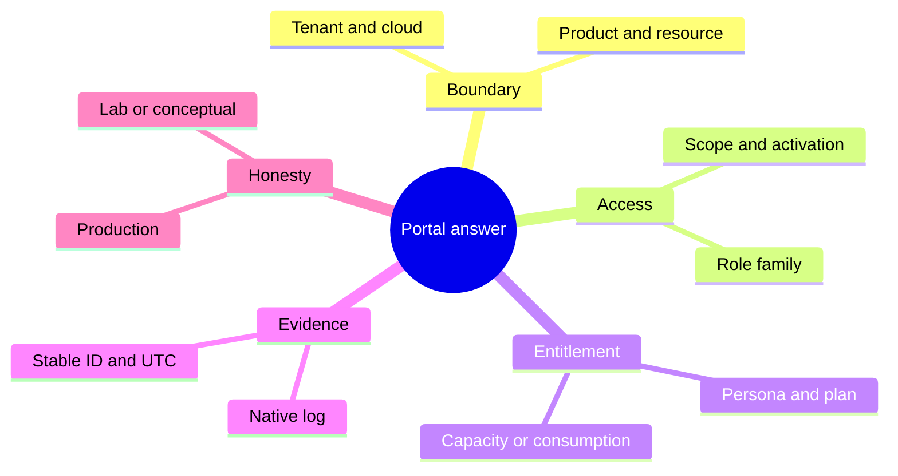

## 12. Recheck-current operating routine

### High-volatility claim register

| Claim type | Recheck frequency/trigger | Sources | Owner |
|---|---|---|---|
| Portal URL/navigation | Before runbook use and after redirects/Message center change | Current Learn portal overview, direct tenant observation | Product operations owner |
| Role definition/mapping | Before new assignment, quarterly review and unified-RBAC activation | Built-in permission reference, product role page, effective test | Privileged access owner |
| License entitlement | Before purchase/renewal/design and material feature rollout | Agreement, Product Terms, service description, tenant inventory | SAM/procurement with architecture |
| API/module/version | Before automation release and deprecation notice | Official API/module docs, changelog, Message center | Automation owner |
| Schema/table | Before detection release and connector/source change | Live schema, table reference, sample event | SIEM/detection owner |
| Data residency/availability | Before architecture/contract and region/cloud change | Official data-location/service-availability terms | Privacy/legal/cloud architecture |
| Preview/trial | Before enrollment and at each review gate | Preview terms, tenant offer, support/SLA page | Product owner and finance |
| Sentinel transition | At roadmap/release checkpoints | Sentinel-in-Defender and transition guidance | SOC/SIEM platform owner |
| Security Copilot capacity | Before onboarding, agent rollout and budget review | Capacity/usage docs, Azure resource and tenant dashboard | Security AI service owner |
| Service limits/retention | Before scale/incident-readiness test | Official limits, service plan, live configuration | Workload/platform owner |

### Revalidation checklist

| Check | Pass condition |
|---|---|
| Date | Claim has a checked date no later than this appendix boundary or is explicitly marked for live recheck |
| Official source | Canonical Microsoft Learn/Product Terms/service page, not a memory-only or reseller matrix |
| Tenant observation | Correct tenant ID, cloud, region and signed-in persona recorded |
| Product boundary | Owning service/resource and adjacent dependencies named |
| Role | Exact current role actions, scope, assignment path, activation and effective task tested |
| License | Persona, metric, base/add-on, service plans, capacity/consumption and prerequisites recorded |
| Data | Data categories, location, retention, audit and export destination recorded |
| Safety | No broad privilege, production write, consent expansion or sensitive export used merely to validate |
| Commercial | No price, renewal, trial or entitlement promise made without authorized commercial confirmation |
| Sovereign | Commercial-cloud URLs/features not reused without cloud-specific validation |
| Evidence | Stable IDs, UTC, expected/actual, source URLs and caveats retained |
| Honesty | Candidate labels production, lab, assisted and conceptual evidence accurately |

## Official Source Anchors

These are starting anchors, not substitutes for the current feature page, tenant observation, applicable agreement, or Product Terms. Recheck the live page before use.

| Domain | Official Microsoft source anchor |
|---|---|
| Microsoft 365 admin center | [Admin center overview](https://learn.microsoft.com/microsoft-365/admin/admin-overview/admin-center-overview?view=o365-worldwide) |
| M365 admin roles | [About administrator roles](https://learn.microsoft.com/microsoft-365/admin/add-users/about-admin-roles?view=o365-worldwide) |
| Service health | [View Microsoft 365 service health](https://learn.microsoft.com/microsoft-365/enterprise/view-service-health?view=o365-worldwide) |
| Message center | [Track changes in Message center](https://learn.microsoft.com/microsoft-365/admin/manage/message-center?view=o365-worldwide) |
| Data locations | [Microsoft 365 data locations](https://learn.microsoft.com/microsoft-365/enterprise/o365-data-locations?view=o365-worldwide) |
| Entra portal | [Microsoft Entra admin center](https://learn.microsoft.com/entra/fundamentals/entra-admin-center) |
| Entra RBAC | [Entra RBAC overview](https://learn.microsoft.com/entra/identity/role-based-access-control/custom-overview) |
| Entra role actions | [Microsoft Entra built-in roles](https://learn.microsoft.com/entra/identity/role-based-access-control/permissions-reference) |
| PIM and emergency access | [PIM overview](https://learn.microsoft.com/entra/id-governance/privileged-identity-management/pim-configure) and [emergency-access accounts](https://learn.microsoft.com/entra/identity/role-based-access-control/security-emergency-access) |
| Entra licensing | [Microsoft Entra licensing](https://learn.microsoft.com/entra/fundamentals/licensing) |
| Intune portal | [Intune admin center walkthrough](https://learn.microsoft.com/intune/fundamentals/tutorial-admin-center-walkthrough) |
| Intune RBAC | [Role-based access control with Intune](https://learn.microsoft.com/intune/fundamentals/role-based-access-control/overview) |
| Intune licensing | [Microsoft Intune licensing](https://learn.microsoft.com/intune/fundamentals/licensing) |
| Exchange roles | [Permissions in Exchange Online](https://learn.microsoft.com/exchange/permissions-exo/permissions-exo) |
| Teams roles | [Use Teams administrator roles](https://learn.microsoft.com/microsoftteams/using-admin-roles) |
| SharePoint admin | [SharePoint admin center](https://learn.microsoft.com/sharepoint/get-started-new-admin-center) |
| Power Platform roles | [Dataverse role-based security](https://learn.microsoft.com/power-platform/admin/database-security) |
| Purview portal | [Microsoft Purview portal](https://learn.microsoft.com/purview/purview-portal) |
| Purview permissions | [Permissions in Microsoft Purview](https://learn.microsoft.com/purview/purview-permissions) |
| Security/compliance licensing | [Microsoft 365 security and compliance licensing guidance](https://learn.microsoft.com/office365/servicedescriptions/microsoft-365-service-descriptions/microsoft-365-tenantlevel-services-licensing-guidance/microsoft-365-security-compliance-licensing-guidance) |
| Defender portal | [Microsoft Defender portal](https://learn.microsoft.com/defender-xdr/microsoft-365-defender-portal) |
| Defender unified RBAC | [Microsoft Defender unified RBAC](https://learn.microsoft.com/defender-xdr/manage-rbac) |
| Defender prerequisites | [Microsoft Defender XDR prerequisites](https://learn.microsoft.com/defender-xdr/prerequisites) |
| Sentinel portal direction | [Microsoft Sentinel in the Defender portal](https://learn.microsoft.com/azure/sentinel/microsoft-sentinel-defender-portal) |
| Sentinel roles | [Roles and permissions in Microsoft Sentinel](https://learn.microsoft.com/azure/sentinel/roles) |
| Sentinel billing | [Plan Microsoft Sentinel costs and billing](https://learn.microsoft.com/azure/sentinel/billing) |
| Security Copilot capacity | [Security Compute Units and capacity](https://learn.microsoft.com/copilot/security/security-compute-units-capacity) |
| Graph Explorer | [Use Graph Explorer](https://learn.microsoft.com/graph/graph-explorer/graph-explorer-overview) |
| Product Terms | [Microsoft Product Terms](https://www.microsoft.com/licensing/terms/) |

## Completion checklist

| Check | Pass condition |
|---|---|
| Portal coverage | M365, Entra, Intune, Exchange, Teams, SharePoint/OneDrive, Power Platform, Purview, Defender, Sentinel/Log Analytics/Azure, Security Copilot, health/change, Graph Explorer and licensing surfaces are mapped |
| Portal detail | Each major portal has purpose, boundary, tasks, diagnostics, role family, data/audit, confusion and source Part |
| Role coverage | Entra, workload role groups, Purview, Defender, Sentinel/Azure, Intune, Power Platform, PIM/emergency and workload identities are separated |
| Permission honesty | No role name is presented as a permanent exact permission guarantee; effective live validation is required |
| License coverage | Tenant, user, device, capacity, consumption and workspace models plus suite/add-on/persona concepts are included |
| Product coverage | E3/E5/frontline, P1/P2/Governance, Intune, Defender, Purview, Sentinel and Security Copilot distinctions are bounded and current-sensitive |
| Commercial safety | No prices, trial promise or false exact entitlement matrix appears |
| Maps | Portal-to-task, symptom-to-log, role-to-task, product-to-data, license decision and escalation/support maps are present |
| Data | Location, audit, retention, export and sovereign-cloud caveats are explicit |
| Currency | August 24, 2026 baseline and recheck-current warnings cover URLs, roles, licenses, APIs/modules/schemas and previews |
| Sources | Official Microsoft anchors and existing local source Parts are linked |
| Honesty | Candidate production, lab, assisted and conceptual claims remain distinct |

**Final use gate:** Pick one task. State the tenant/cloud, owning product/resource, current portal, exact role system and scope, licensing metric/prerequisite, primary audit source, one common confusion, one safe validation, and your personal evidence level. If any field is unknown, say how you would verify it rather than guessing.

Next reference: [Appendix D - PowerShell, Microsoft Graph, KQL, and Automation Cheat Sheet](Appendix-D-powershell-graph-kql-automation.md).