# Appendix D - PowerShell, Microsoft Graph, KQL, and Automation Cheat Sheet

> **Currency boundary:** This appendix reflects official public Microsoft information available through **August 24, 2026**. PowerShell versions, modules, cmdlets, Microsoft Graph endpoints and permissions, SDKs, Azure CLI commands/extensions, KQL functions and product schemas, Logic Apps/Power Automate connectors, workflow definitions, managed-identity support, API versions, limits, and preview status change. Recheck current official documentation, module/API metadata, live schema, tenant/cloud/region, and a controlled test environment before use.
>
> **Safety boundary:** This is a learning and design reference, not a production script library. Every example is read-only, synthetic, local-only, `-WhatIf`, deliberately disabled, or clearly non-executable pseudocode. No example contains a tenant ID, client secret, access token, customer identifier, destructive operation, security-control bypass, broad consent instruction, remediation command, malware, or attack procedure. Use an explicit authorized test lab before connecting any example to a Microsoft tenant or Azure subscription.
>
> **Candidate honesty note:** Arti can credibly discuss PowerShell/automation reasoning, structured troubleshooting, evidence correlation, documentation, quality, and safe operational design where supported by her experience. She can demonstrate these local and synthetic exercises. She should not claim production Graph application ownership, KQL detection engineering, Sentinel playbook operation, managed-identity design, CI/CD platform ownership, or tenant-wide automation unless separately evidenced. A strong answer is, “I understand the pattern, have practised it safely with synthetic data, and would verify permissions, schema, limits, tests, approvals, and rollback before production.”

This appendix expands the API and automation foundation in [Part 4](Part-04-m365-tenant-architecture-portals-roles-licensing.md), KQL chapters in [Part 40](Part-40-defender-advanced-hunting-kql-custom-detections.md) and [Part 46](Part-46-kql-from-zero-sentinel.md), Sentinel automation in [Part 50](Part-50-sentinel-automation-logic-apps-playbooks.md), unified SecOps in [Part 51](Part-51-unified-secops-defender-sentinel-purview.md), and documentation/automation quality in [Part 63](Part-63-documentation-reporting-automation-quality.md). Use [Appendix C](Appendix-C-portals-roles-licensing.md) first for portal, role, license, data, and audit boundaries.

## How to use this appendix

| Need | Start | Safe outcome | Required recheck |
|---|---|---|---|
| Learn PowerShell | Objects, pipeline, functions, errors, logging and local examples 01-22 | Predictable object output and a reviewable function skeleton | PowerShell/module version and command help |
| Understand Graph | Auth/permission model and examples 23-34 | Narrow read-only request design with pagination/throttling evidence | Endpoint operation, permission, version, cloud and SDK release |
| Inspect Azure context | Azure CLI examples 35-40 | Confirm selected account/subscription and read resource metadata | CLI/extension version, cloud endpoints and RBAC |
| Learn KQL | Operator/type/schema map and examples 41-76 | Run synthetic `datatable` queries without tenant data | Product surface, live schema, table plan and supported functions |
| Design automation | Logic Apps/Power Automate patterns and examples 77-88 | Disabled workflow design with identity, idempotency, approval and failure paths | Connector, identity support, definition schema, cost and environment |
| Prepare an interview answer | Quality gates and candidate wording | Explain purpose, boundary, safety, evidence and honest experience | Current source and personal evidence level |

### Safety levels used by every code/query example

| Safety level | Meaning | Permitted here | Production implication |
|---|---|---|---|
| Local synthetic | Operates only on literal/in-memory data in the shell/query | Preferred | Still review data handling and version behavior |
| Local read-only | Reads local metadata without changing files/settings | Permitted | Confirm privacy and endpoint impact |
| Authorized lab read-only | Calls a Microsoft service only after explicit lab authorization and narrow permission | Shown as GET/read pattern | Do not point at production by copy/paste |
| `WhatIf`/dry run | Uses native simulation or returns a plan without executing a change | Permitted | Verify the underlying command truly honors simulation |
| Disabled template | Contains an explicit disabled state or false guard and synthetic placeholders | Permitted | Requires security review and controlled enablement |
| Pseudocode | Illustrates control flow but is intentionally non-executable | Permitted | Must be implemented with supported SDKs and tests |
| Prohibited here | Destructive, remediation, control-disabling, broad-consent or secret-bearing code | Not included | Requires separate authority, runbook, test and approval |

```mermaid
flowchart LR
    OUT[Defined read-only outcome] --> DATA[Classify and minimize inputs]
    DATA --> ID[Choose delegated or workload identity]
    ID --> PERM[Verify least permission and resource scope]
    PERM --> DRY[Synthetic test, mock or dry run]
    DRY --> FAIL[Exercise timeout, throttle and duplicate]
    FAIL --> REVIEW[Peer, security and owner review]
    REVIEW --> PILOT[Authorized isolated pilot]
    PILOT --> EVID[Logs, IDs, expected/actual and rollback evidence]
```

## 1. PowerShell foundations

PowerShell is an object pipeline, not merely a text shell. A command emits .NET objects with properties and methods. The pipeline passes those objects to the next command. Formatting is a display concern at the end; it should not be inserted in the middle of logic that still needs object properties. This distinction eliminates fragile parsing and makes tests precise.

| Concept | Plain meaning | Good habit | Common failure |
|---|---|---|---|
| Object | Structured value with a type, properties and methods | Inspect with `Get-Member`; select named properties | Parsing formatted text as if it were data |
| Collection | Zero, one or many objects | Test empty/single/multiple inputs | Code works only when exactly one item exists |
| Pipeline | Passes objects from left to right | Filter early, project late, preserve types | Assuming it passes only strings |
| `Where-Object` | Keeps objects matching a predicate | Use explicit property and operator | Assignment or case/type mismatch inside predicate |
| `Select-Object` | Shapes output properties/rows | Define a stable output contract | Formatting too early or dropping join IDs |
| `ForEach-Object` | Processes pipeline records | Use for streaming, small clear transformations | Hidden side effects or remote call per item |
| Splatting | Supplies parameters from a hashtable | Improves review and conditional parameters | Reusing mutable splat across unrelated calls |
| Advanced function | Function with cmdlet-style binding/validation/streams | Use approved verb, typed parameters and output objects | Returning presentation strings instead of records |
| `ShouldProcess` | Native contract behind `-WhatIf`/`-Confirm` for state-changing functions | Put the change inside the Boolean guard | Advertising `-WhatIf` but changing state outside guard |

### Pipeline and stream model

| Stream | Number | Intended content | Handling guidance |
|---|---:|---|---|
| Success | 1 | Data objects for downstream processing | Keep clean; do not mix status prose into data |
| Error | 2 | Error records | Preserve category, operation, target and exception safely |
| Warning | 3 | Recoverable concern | Explain consequence and operator decision |
| Verbose | 4 | Optional operational detail | Redact sensitive values; enable during diagnosis |
| Debug | 5 | Developer-oriented detail | Never log tokens, secrets or full sensitive payloads |
| Information | 6 | Structured informational messages | Tag and route deliberately |
| Progress | n/a | Transient progress UI | Do not treat as durable audit evidence |

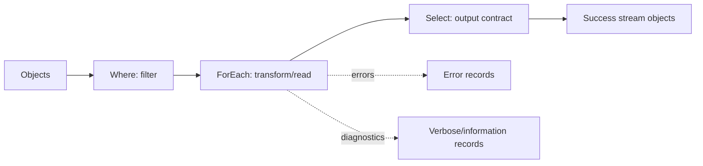

### Examples 01-07: objects and pipeline

**Example 01 - Create and inspect structured objects**

- **Purpose:** Demonstrate object properties without a tenant or filesystem dependency.
- **Safety level:** Local synthetic.
- **Expected shape:** Two objects with `Name`, `State`, and `CheckedAtUtc` properties.
- **Common failure:** Formatting the records before later filters need their typed properties.
- **Source Part:** [Part 63](Part-63-documentation-reporting-automation-quality.md).

```powershell
$services = @(
    [pscustomobject]@{ Name = 'Example-A'; State = 'Healthy'; CheckedAtUtc = [datetime]'2026-08-24T09:00:00Z' }
    [pscustomobject]@{ Name = 'Example-B'; State = 'Degraded'; CheckedAtUtc = [datetime]'2026-08-24T09:01:00Z' }
)
$services
```

**Example 02 - Inspect type and members**

- **Purpose:** Learn what a pipeline object actually exposes.
- **Safety level:** Local synthetic.
- **Expected shape:** Member metadata for one `PSCustomObject`.
- **Common failure:** Assuming a displayed column exists as a real property after formatting.
- **Source Part:** [Part 63](Part-63-documentation-reporting-automation-quality.md).

```powershell
$sample = [pscustomobject]@{ Name = 'Example'; Count = 3; Enabled = $true }
$sample | Get-Member
```

**Example 03 - Filter with `Where-Object`**

- **Purpose:** Keep only records whose explicit state is degraded.
- **Safety level:** Local synthetic.
- **Expected shape:** One object named `Example-B`.
- **Common failure:** Comparing a Boolean, integer, or datetime property as an unvalidated string.
- **Source Part:** [Part 63](Part-63-documentation-reporting-automation-quality.md).

```powershell
@(
    [pscustomobject]@{ Name = 'Example-A'; State = 'Healthy' }
    [pscustomobject]@{ Name = 'Example-B'; State = 'Degraded' }
) | Where-Object { $_.State -eq 'Degraded' }
```

**Example 04 - Shape output with `Select-Object`**

- **Purpose:** Define a minimal output contract and calculated property.
- **Safety level:** Local synthetic.
- **Expected shape:** `Name` and Boolean `NeedsReview` columns.
- **Common failure:** Dropping a stable ID needed for later correlation.
- **Source Part:** [Part 63](Part-63-documentation-reporting-automation-quality.md).

```powershell
@(
    [pscustomobject]@{ Name = 'Example-A'; State = 'Healthy' }
    [pscustomobject]@{ Name = 'Example-B'; State = 'Degraded' }
) | Select-Object Name, @{ Name = 'NeedsReview'; Expression = { $_.State -ne 'Healthy' } }
```

**Example 05 - Transform with `ForEach-Object`**

- **Purpose:** Normalize synthetic names one record at a time.
- **Safety level:** Local synthetic.
- **Expected shape:** Two new objects with lowercase `NormalizedName`.
- **Common failure:** Calling a remote API once per record when batching or set-based retrieval is available.
- **Source Part:** [Part 63](Part-63-documentation-reporting-automation-quality.md).

```powershell
'Example-A', 'Example-B' | ForEach-Object {
    [pscustomobject]@{
        OriginalName   = $_
        NormalizedName = $_.ToLowerInvariant()
    }
}
```

**Example 06 - Use strongly typed calculated values**

- **Purpose:** Keep durations as `TimeSpan` values rather than presentation text.
- **Safety level:** Local synthetic.
- **Expected shape:** One object whose `Duration` is a `TimeSpan`.
- **Common failure:** Converting to a formatted string before comparisons or aggregation.
- **Source Part:** [Part 63](Part-63-documentation-reporting-automation-quality.md).

```powershell
$started = [datetime]'2026-08-24T09:00:00Z'
$ended = [datetime]'2026-08-24T09:03:30Z'
[pscustomobject]@{
    Correlation = 'synthetic-run-001'
    Duration    = $ended - $started
}
```

**Example 07 - Use splatting for readable parameters**

- **Purpose:** Show reviewable local read-only command parameters.
- **Safety level:** Local read-only.
- **Expected shape:** Metadata for Markdown files in the current directory, if any.
- **Common failure:** Assuming the current directory is the intended scope or passing an unvalidated path.
- **Source Part:** [Part 63](Part-63-documentation-reporting-automation-quality.md).

```powershell
$listParameters = @{
    Path        = '.'
    Filter      = '*.md'
    File        = $true
    ErrorAction = 'Stop'
}
Get-ChildItem @listParameters | Select-Object Name, Length, LastWriteTimeUtc
```

## 2. Functions, parameters, validation, and predictable output

| Function quality gate | Strong pattern | Weak pattern |
|---|---|---|
| Name | Approved verb plus singular noun | Ambiguous `Do-Stuff` |
| Input | Typed, named, validated and documented | Positional strings with hidden meaning |
| Pipeline | `ValueFromPipeline` only when semantics are clear | Accidental array/scalar behavior |
| Output | One stable object type/contract | Mixed strings, tables and status messages |
| State change | `SupportsShouldProcess`; change inside guard | `-WhatIf` parameter manually declared but ignored |
| Errors | Actionable error record; caller controls policy | Swallow every exception and report success |
| Logging | Correlation, operation, result, duration, redaction | Full payload, token or secret |
| Idempotency | Same input can be retried without duplicate effect | Blind create/action on every invocation |
| Tests | Empty, one, many, malformed, duplicate, timeout and throttle | Happy path only |

### Examples 08-12: functions and validation

**Example 08 - Validate a constrained parameter**

- **Purpose:** Reject unsupported status values before processing.
- **Safety level:** Local synthetic.
- **Expected shape:** One object containing a validated status.
- **Common failure:** Accepting free text and silently mapping misspellings to a dangerous default.
- **Source Part:** [Part 63](Part-63-documentation-reporting-automation-quality.md).

```powershell
function Get-SyntheticStatusRecord {
    [CmdletBinding()]
    param(
        [Parameter(Mandatory)]
        [ValidateSet('Healthy', 'Degraded', 'Unknown')]
        [string]$Status
    )

    [pscustomobject]@{ Status = $Status; IsKnown = $Status -ne 'Unknown' }
}
Get-SyntheticStatusRecord -Status 'Healthy'
```

**Example 09 - Validate an identifier pattern**

- **Purpose:** Accept only a synthetic correlation-ID format.
- **Safety level:** Local synthetic.
- **Expected shape:** A normalized identifier object.
- **Common failure:** Interpolating arbitrary input into a URL, query, path, or log without validation.
- **Source Part:** [Part 63](Part-63-documentation-reporting-automation-quality.md).

```powershell
function ConvertTo-SyntheticCorrelation {
    [CmdletBinding()]
    param(
        [Parameter(Mandatory, ValueFromPipeline)]
        [ValidatePattern('^case-[0-9]{3}$')]
        [string]$Id
    )
    process {
        [pscustomobject]@{ CorrelationId = $Id.ToLowerInvariant() }
    }
}
'case-001' | ConvertTo-SyntheticCorrelation
```

**Example 10 - Process pipeline input explicitly**

- **Purpose:** Demonstrate one output record for each validated input object.
- **Safety level:** Local synthetic.
- **Expected shape:** Two objects preserving names and adding `Reviewed`.
- **Common failure:** Omitting `process` and unexpectedly processing the collection once.
- **Source Part:** [Part 63](Part-63-documentation-reporting-automation-quality.md).

```powershell
function Test-SyntheticRecord {
    [CmdletBinding()]
    param(
        [Parameter(Mandatory, ValueFromPipeline)]
        [pscustomobject]$InputObject
    )
    process {
        [pscustomobject]@{
            Name     = $InputObject.Name
            Reviewed = $true
        }
    }
}
@([pscustomobject]@{Name='A'}, [pscustomobject]@{Name='B'}) | Test-SyntheticRecord
```

**Example 11 - Return data separately from verbose detail**

- **Purpose:** Keep operational narration out of the success stream.
- **Safety level:** Local synthetic.
- **Expected shape:** One data object; optional verbose message when requested.
- **Common failure:** Emitting “Starting” strings into output consumed as records.
- **Source Part:** [Part 63](Part-63-documentation-reporting-automation-quality.md).

```powershell
function Get-SyntheticInventory {
    [CmdletBinding()]
    param()
    Write-Verbose 'Building local synthetic inventory.'
    [pscustomobject]@{ Name = 'Example'; Kind = 'Synthetic'; Count = 1 }
}
Get-SyntheticInventory -Verbose
```

**Example 12 - Demonstrate `ShouldProcess` only as a dry run**

- **Purpose:** Show the correct guard for a hypothetical report publication without performing it.
- **Safety level:** `WhatIf`/dry run; the guarded body returns a plan object only.
- **Expected shape:** A native WhatIf message; no file or service change.
- **Common failure:** Changing state before calling `ShouldProcess` or assuming every wrapped cmdlet supports `-WhatIf`.
- **Source Part:** [Part 63](Part-63-documentation-reporting-automation-quality.md).

```powershell
function Publish-SyntheticReportPlan {
    [CmdletBinding(SupportsShouldProcess, ConfirmImpact='Low')]
    param([ValidateNotNullOrEmpty()][string]$ReportName)

    if ($PSCmdlet.ShouldProcess($ReportName, 'Return publication plan')) {
        [pscustomobject]@{ ReportName = $ReportName; Action = 'PlanOnly'; Executed = $false }
    }
}
Publish-SyntheticReportPlan -ReportName 'Example-Report' -WhatIf
```

## 3. Errors, logging, transcripts, redaction, and cleanup

PowerShell distinguishes terminating and non-terminating errors. `try/catch` handles terminating errors. For a command that normally emits non-terminating errors, `-ErrorAction Stop` can make that command catchable. Do not set global error preferences casually inside shared modules; use explicit command/function behavior and restore any changed preference in `finally` when unavoidable.

| Error/logging concern | Safe practice | Failure to avoid |
|---|---|---|
| Error type | Preserve `ErrorRecord`, exception type, category and target | Logging only the friendly message |
| Catch scope | Catch where a recovery or context decision is possible | One enormous catch that hides failing operation |
| Retry | Only transient, idempotent operations; bounded attempts; server delay first | Retrying validation, authorization or permanent not-found errors |
| Finally | Dispose resources and restore temporary state | Cleanup only on success |
| Transcript | Approved local path, restricted access, explicit start/stop, pre-redaction assessment | Assuming transcript automatically removes secrets |
| Structured log | UTC, correlation, operation, result, duration, safe error code | User content, tokens, cookies, Authorization headers |
| Redaction | Minimize before capture; allowlist output fields; test final artifact | Regex-only masking after broad collection |

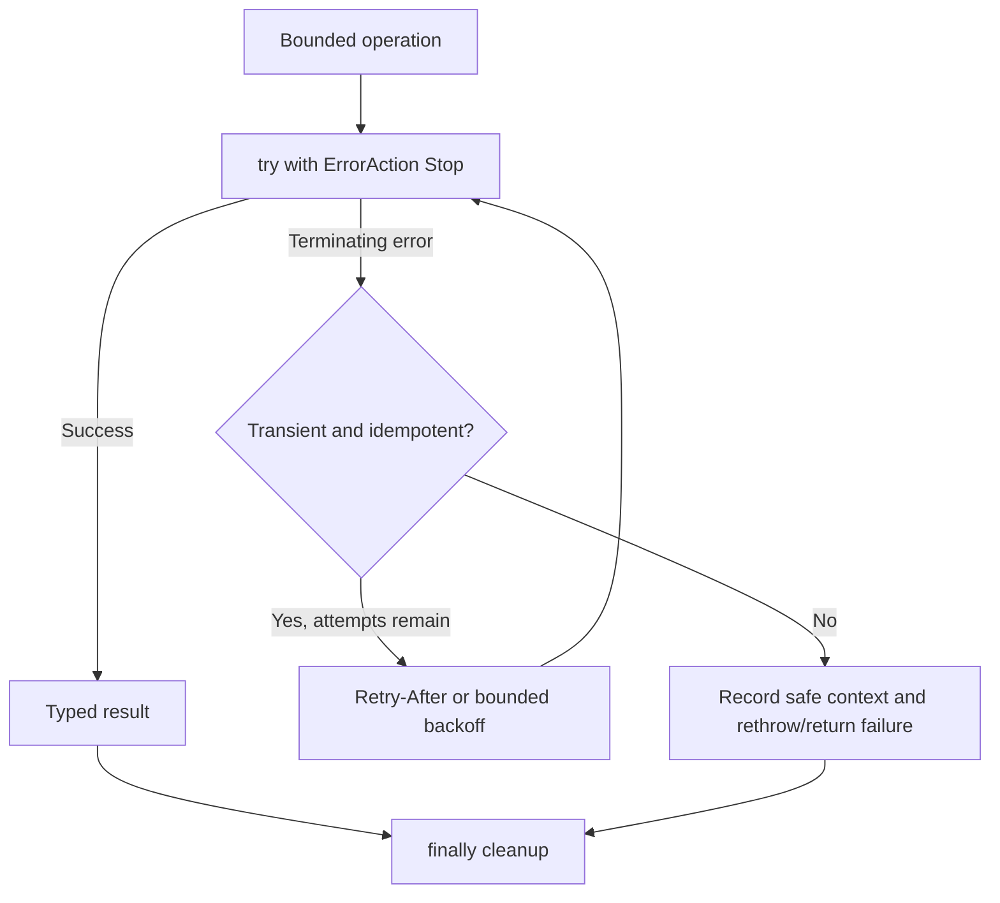

### Examples 13-19: errors and evidence

**Example 13 - Catch a local conversion error**

- **Purpose:** Convert a synthetic value and return a safe error record.
- **Safety level:** Local synthetic.
- **Expected shape:** One object with `Succeeded = false` and an exception type.
- **Common failure:** Logging the entire error object when it can include sensitive target/input data.
- **Source Part:** [Part 63](Part-63-documentation-reporting-automation-quality.md).

```powershell
try {
    $value = [int]::Parse('not-an-integer')
    [pscustomobject]@{ Succeeded = $true; Value = $value }
} catch {
    [pscustomobject]@{
        Succeeded    = $false
        ErrorType    = $_.Exception.GetType().FullName
        ErrorCategory = $_.CategoryInfo.Category.ToString()
    }
}
```

**Example 14 - Use `finally` for local disposal**

- **Purpose:** Guarantee disposal of an in-memory reader.
- **Safety level:** Local synthetic.
- **Expected shape:** One line of text and a disposed local object.
- **Common failure:** Referencing an uninitialized resource in `finally` after construction failed.
- **Source Part:** [Part 63](Part-63-documentation-reporting-automation-quality.md).

```powershell
$reader = $null
try {
    $reader = [System.IO.StringReader]::new("alpha`nbeta")
    $reader.ReadLine()
} finally {
    if ($null -ne $reader) { $reader.Dispose() }
}
```

**Example 15 - Build a structured log event**

- **Purpose:** Create a minimal audit-friendly event without writing a file.
- **Safety level:** Local synthetic.
- **Expected shape:** One object with UTC time, correlation, operation, result and duration.
- **Common failure:** Treating this operational log as a replacement for the target service's audit log.
- **Source Part:** [Part 63](Part-63-documentation-reporting-automation-quality.md).

```powershell
[pscustomobject]@{
    TimeUtc       = [datetime]'2026-08-24T10:00:00Z'
    CorrelationId = 'case-001'
    Operation     = 'ReadSyntheticInventory'
    Result        = 'Succeeded'
    DurationMs    = 12
} | ConvertTo-Json -Compress
```

**Example 16 - Redact by allowlisting fields**

- **Purpose:** Prefer safe-field projection over collecting then masking everything.
- **Safety level:** Local synthetic.
- **Expected shape:** An object without the synthetic sensitive field.
- **Common failure:** Assuming `Select-Object -ExcludeProperty` catches nested or renamed sensitive values.
- **Source Part:** [Part 63](Part-63-documentation-reporting-automation-quality.md).

```powershell
$raw = [pscustomobject]@{
    CorrelationId = 'case-001'
    Result        = 'Succeeded'
    SensitiveNote = 'synthetic-value-not-for-output'
}
$raw | Select-Object CorrelationId, Result
```

**Example 17 - Demonstrate a disabled transcript template**

- **Purpose:** Show explicit transcript lifecycle while guaranteeing no transcript starts.
- **Safety level:** Disabled template guarded by `$false`.
- **Expected shape:** No output and no file.
- **Common failure:** Transcripts can capture command arguments and output; redaction must be designed before enabling.
- **Source Part:** [Part 63](Part-63-documentation-reporting-automation-quality.md).

```powershell
if ($false) {
    $transcriptPath = Join-Path $env:TEMP 'synthetic-transcript.txt'
    Start-Transcript -Path $transcriptPath
    try {
        Write-Information 'Synthetic authorized-lab step only.'
    } finally {
        Stop-Transcript
    }
}
```

**Example 18 - Preserve local error context without swallowing**

- **Purpose:** Add an operation label, then rethrow the original local error.
- **Safety level:** Local synthetic.
- **Expected shape:** A verbose-safe context message followed by the original error.
- **Common failure:** Replacing the original exception with a generic string and losing stack/category details.
- **Source Part:** [Part 63](Part-63-documentation-reporting-automation-quality.md).

```powershell
try {
    [void][guid]::Parse('invalid-guid')
} catch {
    Write-Verbose 'Operation=ParseSyntheticGuid Result=Failed' -Verbose
    throw
}
```

**Example 19 - Capture command-local errors**

- **Purpose:** Demonstrate `-ErrorVariable` on a harmless local lookup.
- **Safety level:** Local read-only.
- **Expected shape:** No item result and one error record in `$lookupErrors`.
- **Common failure:** Using `SilentlyContinue` and later reporting success because output is empty.
- **Source Part:** [Part 63](Part-63-documentation-reporting-automation-quality.md).

```powershell
$lookupErrors = @()
Get-Item -LiteralPath '.\synthetic-file-that-does-not-exist.txt' `
    -ErrorAction SilentlyContinue -ErrorVariable lookupErrors
[pscustomobject]@{ Found = $false; ErrorCount = $lookupErrors.Count }
```

## 4. Idempotency, retries, pagination, time, CSV, and JSON

| Reliability concept | Plain meaning | Required design record |
|---|---|---|
| Idempotency | Repeating the same request does not create a second unintended effect | Stable operation key, current-state check and outcome store |
| Retry | Reattempt only a likely transient operation | Error classes, maximum attempts, total deadline, jitter/backoff and stop reason |
| Rate limit | Service protects capacity by limiting calls | Status/headers, request ID, metrics and caller behavior |
| Pagination | Collection arrives in multiple pages | Entire next-link/cursor, page count, item count and restart checkpoint |
| Partial failure | Some items succeed while others fail | Per-item result and reconciliation; never one blanket success |
| UTC normalization | Store/compare unambiguous time | Source timestamp, parsed timezone and UTC value |
| CSV | Flat row/column interchange with weak typing | Encoding, delimiter, schema, formula-injection defense and classification |
| JSON | Nested typed-ish interchange | Schema, depth, property allowlist, size, encoding and sensitive fields |

### Examples 20-22: local reliability and serialization

**Example 20 - Idempotent local classification**

- **Purpose:** Return the same classification for the same normalized input.
- **Safety level:** Local synthetic.
- **Expected shape:** Two identical normalized results, no persisted side effect.
- **Common failure:** Using current time or random values in an idempotency key.
- **Source Part:** [Part 63](Part-63-documentation-reporting-automation-quality.md).

```powershell
function Get-SyntheticIdempotencyKey {
    param([Parameter(Mandatory)][string]$Name)
    $normalized = $Name.Trim().ToLowerInvariant()
    $bytes = [Text.Encoding]::UTF8.GetBytes($normalized)
    $hash = [Security.Cryptography.SHA256]::HashData($bytes)
    [Convert]::ToHexString($hash)
}
Get-SyntheticIdempotencyKey ' Example '
Get-SyntheticIdempotencyKey 'example'
```

**Example 21 - Bounded synthetic retry with backoff**

- **Purpose:** Exercise retry control flow without a network call or real wait.
- **Safety level:** Local synthetic; calculated delay is reported but not slept.
- **Expected shape:** Two retry-plan objects followed by success on attempt three.
- **Common failure:** Retrying authorization/validation errors or exceeding an overall deadline.
- **Source Part:** [Part 63](Part-63-documentation-reporting-automation-quality.md).

```powershell
$maximumAttempts = 3
for ($attempt = 1; $attempt -le $maximumAttempts; $attempt++) {
    if ($attempt -lt 3) {
        [pscustomobject]@{ Attempt = $attempt; Result = 'SyntheticTransient'; PlannedDelaySeconds = [math]::Pow(2, $attempt) }
        continue
    }
    [pscustomobject]@{ Attempt = $attempt; Result = 'Succeeded'; PlannedDelaySeconds = 0 }
    break
}
```

**Example 22 - Safe in-memory CSV and JSON projection**

- **Purpose:** Serialize only allowlisted synthetic fields without writing files.
- **Safety level:** Local synthetic.
- **Expected shape:** CSV text and JSON text with two fields per record.
- **Common failure:** CSV formula injection, implicit culture/time conversion, excessive JSON depth, or exporting sensitive nested properties.
- **Source Part:** [Part 63](Part-63-documentation-reporting-automation-quality.md).

```powershell
$records = @(
    [pscustomobject]@{ Name = 'Example-A'; Result = 'Healthy'; Hidden = 'synthetic-private' }
    [pscustomobject]@{ Name = 'Example-B'; Result = 'Review'; Hidden = 'synthetic-private' }
) | Select-Object Name, Result
$csvText = $records | ConvertTo-Csv -NoTypeInformation
$jsonText = $records | ConvertTo-Json -Depth 3
[pscustomobject]@{ Csv = $csvText -join "`n"; Json = $jsonText }
```

## 5. Microsoft Graph concepts

Microsoft Graph is a protected REST API gateway at `https://graph.microsoft.com`. Authentication proves the caller; authorization decides whether that caller may perform an operation on the resource. A token is not a general Microsoft 365 pass: it has an audience, caller, tenant, permissions and lifetime. Do not decode or log live tokens in ordinary troubleshooting artifacts.

### Authentication and permission model

| Model | Caller | Authorization inputs | Best fit | Primary risk |
|---|---|---|---|---|
| Delegated | App acts for signed-in user | Delegated scopes plus the user's own resource/role permission | Interactive tools and user-context operations | Consent plus user privilege can expose more than expected |
| App-only | Service principal acts without user | Application permission/app role or supported RBAC/resource ownership | Background service with explicit tenant-wide/non-user need | Persistent high-impact access and weak owner/credential lifecycle |
| Managed identity | Azure workload obtains token as managed service principal | Target API support plus app role/Azure RBAC | Azure-hosted automation where supported | Editors of the workload can effectively wield its identity |
| Certificate credential | Service principal proves possession of private key | App registration, certificate, application permission | Non-Azure/compatibility scenario when federation unavailable | Private-key protection, expiration and rotation |
| Client secret | Service principal uses string credential | App registration, secret, application permission | Last-resort compatibility | Leakage, hardcoding, rotation and bootstrap problem |
| Workload federation | External/CI workload exchanges trusted issuer token | Issuer, subject, audience trust plus app permissions | Secretless CI/CD and supported external workloads | Overbroad subject trust or compromised pipeline/repository |

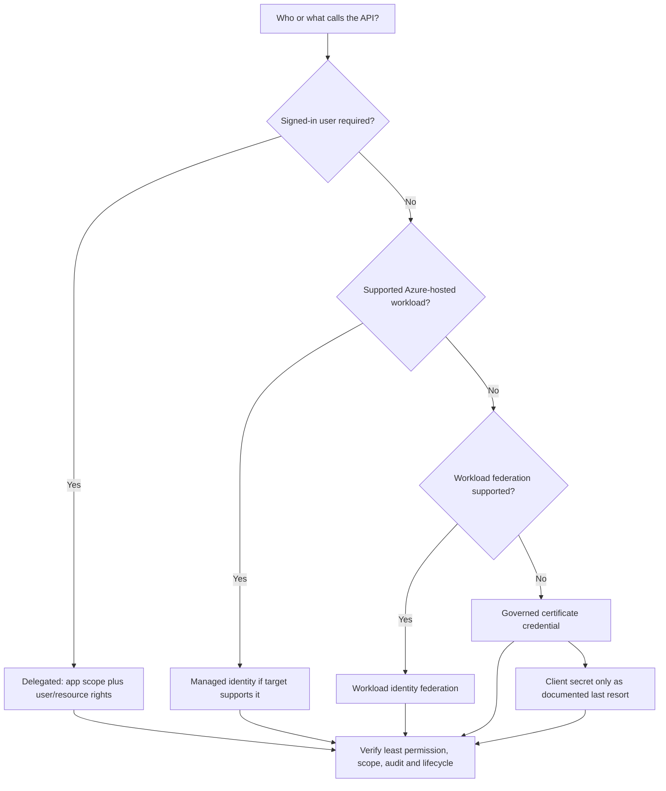

| Permission design question | Required answer |
|---|---|
| Which operation? | Exact documented GET/list/read operation, endpoint and API version |
| Which resource? | User's own resource, selected object, site, group, tenant collection or security data |
| Delegated or app-only? | Whether a signed-in user is present and why their rights are or are not sufficient |
| Least permission? | Lowest documented permission plus any user role/resource permission |
| Consent authority? | Who can approve, why, duration/review and evidence; never request broad consent for convenience |
| Scope control? | API-supported resource-specific access, RBAC, application access policy or other current boundary |
| Credential? | Managed identity/federation first where supported; otherwise governed certificate; secret only with explicit caveat |
| Audit? | Workload sign-in, consent/app audit, Graph activity/resource audit and request IDs |

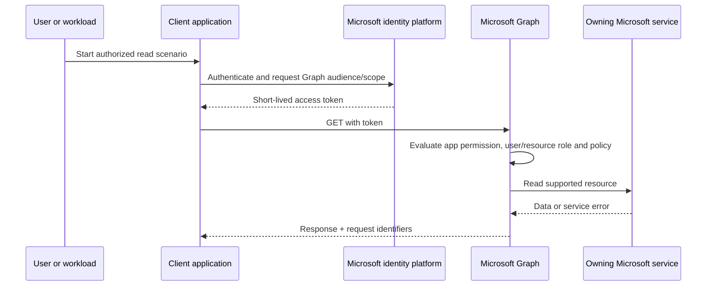

### Endpoint, version, OData, and response map

| Item | Meaning | Safe practice | Common failure |
|---|---|---|---|
| `v1.0` | Generally available API contract for supported operation | Prefer for production design after operation-level review | Assuming every property exists for every tenant/cloud |
| `beta` | Preview/changeable API surface | Study only unless explicit approved exception | Building production dependency on unstable schema |
| `$select` | Return named properties | Minimize payload and sensitive fields | Assuming unselected nondefault property will appear |
| `$filter` | Server-side row restriction where operation supports it | Validate support, encoding, type/case and returned semantics | Assuming unsupported filter fails loudly |
| `$top` | Requested page size where supported | Treat as request, not guarantee | Assuming it returns all results |
| `$orderby` | Server-side sort where supported | Use documented fields/combinations | Combining with filter incorrectly |
| `$expand` | Include supported related resource | Use sparingly and inspect paging/limits | Assuming every navigation property expands/paginates |
| `@odata.nextLink` | Opaque URL for next page | Follow the entire returned URL unchanged | Reconstructing/extracting a skip token |
| `@odata.deltaLink` | Opaque checkpoint for supported change tracking | Store securely with scope/version context | Treating delta as immutable audit or full current snapshot |
| `429` | Too many requests | Honor `Retry-After`; otherwise bounded exponential backoff | Immediate loop or identical concurrent retries |
| Request IDs | Service correlation identifiers in headers/error | Log safely with UTC, endpoint and status | Logging Authorization header or full sensitive body |

| HTTP status family | First interpretation | Next evidence |
|---|---|---|
| `200` | Request succeeded at HTTP/API level | Validate item count, schema, paging and business outcome |
| `202` | Request accepted for asynchronous processing | Poll documented status safely; do not call it complete |
| `400` | Request syntax/semantic issue | Error code/message, API version, OData support, encoding |
| `401` | Authentication/token issue | Audience, expiry, issuer, auth flow and sign-in logs |
| `403` | Caller authenticated but authorization/policy/resource denies | Permission type, user role, resource ACL, consent, CA and scope |
| `404` | Resource/route unavailable to caller | ID/tenant/version, permission-hiding behavior and lifecycle |
| `409` | State or concurrency conflict | Current resource state, idempotency and ETag if supported |
| `429` | Throttled | `Retry-After`, request ID, call volume and batching/polling design |
| `5xx` | Service-side/transient candidate | Request ID, service health, bounded retry and support evidence |

### REST versus SDK

| Choice | Strength | Cost/risk | Choose when |
|---|---|---|---|
| Direct REST | Exact HTTP contract, headers and new endpoints visible | Must implement auth, serialization, paging, retry and models correctly | Debugging the wire contract or unsupported SDK operation |
| Microsoft Graph SDK | Typed/generated builders, auth adapters, retry/paging helpers | Version/generated names change; abstractions can hide request detail | Supported language and stable operation benefit from client library |
| Graph PowerShell SDK | Interactive/admin-friendly wrapper over Graph | Cmdlets generated from schema; permissions and paging semantics still matter | Admin read/report workflow with PowerShell skills |
| Graph Explorer | Fast learning and request inspection | Delegated consent and live-data exposure if used carelessly | Sample tenant or explicit authorized test tenant with narrow GET |
| Data Connect | Governed large-scale data extraction pattern | Separate setup, supported datasets and Azure data governance | Bulk recurring analytics that should not poll REST APIs |

### Examples 23-34: Graph read patterns

**Example 23 - Minimal delegated profile GET**

- **Purpose:** Show the smallest common Graph read request.
- **Safety level:** Authorized lab read-only GET; no token is included.
- **Expected shape:** One JSON user profile object for the signed-in lab user.
- **Common failure:** `/me` works only with delegated user context, not app-only context.
- **Source Part:** [Part 4](Part-04-m365-tenant-architecture-portals-roles-licensing.md).

```http
GET https://graph.microsoft.com/v1.0/me?$select=id,displayName,userPrincipalName
Accept: application/json
```

**Example 24 - Minimize a user collection page**

- **Purpose:** Request only a small first page and selected properties.
- **Safety level:** Authorized lab read-only GET.
- **Expected shape:** JSON object with `value` array and possibly `@odata.nextLink`.
- **Common failure:** Treating `$top=5` as proof that only five users exist or that paging is complete.
- **Source Part:** [Part 4](Part-04-m365-tenant-architecture-portals-roles-licensing.md).

```http
GET https://graph.microsoft.com/v1.0/users?$select=id,displayName&$top=5
Accept: application/json
```

**Example 25 - Filter a synthetic naming convention**

- **Purpose:** Demonstrate server-side filter syntax for an authorized lab collection.
- **Safety level:** Authorized lab read-only GET.
- **Expected shape:** A page of users whose display name starts with the synthetic prefix, if supported and present.
- **Common failure:** Filter support differs by resource/property and some advanced queries require headers.
- **Source Part:** [Part 63](Part-63-documentation-reporting-automation-quality.md).

```http
GET https://graph.microsoft.com/v1.0/users?$filter=startswith(displayName,'Lab-Example')&$select=id,displayName&$top=5
Accept: application/json
```

**Example 26 - Preserve correlation headers conceptually**

- **Purpose:** Define the safe metadata captured from a Graph response.
- **Safety level:** Non-executable pseudocode.
- **Expected shape:** Status, UTC time, request IDs, endpoint label and item count; no token/body dump.
- **Common failure:** Header names vary by response/service; inspect the actual documented response.
- **Source Part:** [Part 60](Part-60-structured-troubleshooting-multivendor-cloud.md).

```text
PSEUDOCODE
response = SEND_AUTHORIZED_GET(request)
record status_code
record UTC_NOW
record response_header("request-id") if present
record response_header("client-request-id") if present
record sanitized_endpoint_name
record count(response.body.value) if collection
never record Authorization, cookies, tokens, or unneeded body fields
```

**Example 27 - Follow `@odata.nextLink` safely**

- **Purpose:** Show pagination using the opaque next URL returned by the service.
- **Safety level:** Non-executable pseudocode.
- **Expected shape:** An accumulated read-only collection plus page/item counts.
- **Common failure:** Rebuilding the URL, losing custom headers, looping forever, or keeping partial output as complete.
- **Source Part:** [Part 63](Part-63-documentation-reporting-automation-quality.md).

```text
PSEUDOCODE
next_url = initial_authorized_get_url
page_count = 0
items = empty_list
while next_url exists and page_count < approved_page_limit:
    response = SEND_AUTHORIZED_GET(next_url, required_nonsecret_headers)
    assert_success_or_handle_throttle(response)
    append response.body.value to items
    page_count = page_count + 1
    next_url = response.body["@odata.nextLink"]  // use entire URL unchanged
return items, page_count, completion_flag(next_url is absent)
```

**Example 28 - Honor 429 `Retry-After`**

- **Purpose:** Define bounded throttling behavior without issuing requests.
- **Safety level:** Non-executable pseudocode.
- **Expected shape:** Retry decision with delay, maximum attempts and total deadline.
- **Common failure:** Retrying immediately, retrying a non-idempotent action, or ignoring batch subrequest failures.
- **Source Part:** [Part 63](Part-63-documentation-reporting-automation-quality.md).

```text
PSEUDOCODE
if response.status == 429:
    delay = parse_retry_after(response.headers) if present
    else delay = bounded_exponential_backoff_with_jitter(attempt)
    if request_is_read_only and attempt < max_attempts and now + delay < deadline:
        wait(delay)
        retry same request with same correlation context
    else:
        return throttled_failure_with_request_id
```

**Example 29 - Inspect Graph PowerShell context only**

- **Purpose:** Verify the current SDK session context without retrieving tenant data.
- **Safety level:** Authorized lab read-only/local session metadata.
- **Expected shape:** Current account, tenant, scopes and auth type if connected; otherwise no context.
- **Common failure:** Printing context to a broadly shared log because tenant/account identifiers can be sensitive.
- **Source Part:** [Part 63](Part-63-documentation-reporting-automation-quality.md).

```powershell
$context = Get-MgContext
if ($null -eq $context) {
    [pscustomobject]@{ Connected = $false }
} else {
    [pscustomobject]@{ Connected = $true; AuthType = $context.AuthType; ScopeCount = @($context.Scopes).Count }
}
```

**Example 30 - Read a small Graph PowerShell page**

- **Purpose:** Demonstrate a narrow lab read with selected properties.
- **Safety level:** Authorized lab read-only; requires preapproved delegated access.
- **Expected shape:** Up to five user objects with only ID and display name requested.
- **Common failure:** `-Top` and `-All` semantics differ; never add `-All` without scale, privacy and throttling review.
- **Source Part:** [Part 4](Part-04-m365-tenant-architecture-portals-roles-licensing.md).

```powershell
Get-MgUser -Top 5 -Property 'id,displayName' |
    Select-Object Id, DisplayName
```

**Example 31 - GET-only JSON batch design**

- **Purpose:** Illustrate a Graph JSON batch whose subrequests are all read-only.
- **Safety level:** Non-executable disabled design; sending a batch uses POST to the batch endpoint, so authorization and throttling review remain required.
- **Expected shape:** Independent subresponses keyed by request ID.
- **Common failure:** Treating outer HTTP success as success for every subrequest or assuming throttled subrequests auto-retry.
- **Source Part:** [Part 63](Part-63-documentation-reporting-automation-quality.md).

```json
{
  "disabled": true,
  "requests": [
    { "id": "profile", "method": "GET", "url": "/me?$select=id,displayName" },
    { "id": "manager", "method": "GET", "url": "/me/manager?$select=id,displayName" }
  ]
}
```

**Example 32 - Delta-query checkpoint concept**

- **Purpose:** Show how an opaque delta link is treated as a protected checkpoint.
- **Safety level:** Non-executable pseudocode.
- **Expected shape:** Complete initial sync, then stored delta link and subsequent changes.
- **Common failure:** Losing deletions/tombstones, changing query shape midstream, or treating delta history as legal audit.
- **Source Part:** [Part 63](Part-63-documentation-reporting-automation-quality.md).

```text
PSEUDOCODE
checkpoint = secure_store.read("synthetic-delta-checkpoint")
url = checkpoint if checkpoint exists else approved_delta_initial_url
repeat:
    page = SEND_AUTHORIZED_GET(url)
    validate_and_stage(page.value)
    url = page["@odata.nextLink"] if present
until no nextLink
atomically_commit_staged_changes()
secure_store.write(page["@odata.deltaLink"])
```

**Example 33 - Webhook design is disabled by default**

- **Purpose:** Capture subscription lifecycle requirements without creating one.
- **Safety level:** Disabled YAML design, non-executable.
- **Expected shape:** A review checklist for validation, renewal, deduplication and lifecycle events.
- **Common failure:** Public unauthenticated endpoint, unprotected validation token, missed renewals, duplicate delivery, or notification mistaken for full resource data.
- **Source Part:** [Part 63](Part-63-documentation-reporting-automation-quality.md).

```yaml
enabled: false
mode: design-only
resource: approved-read-scope-placeholder
notificationEndpoint: https://example.invalid/graph-notifications
controls:
  validateClientState: true
  deduplicateByNotificationId: true
  renewBeforeExpiration: true
  handleLifecycleNotifications: true
  fetchResourceWithLeastPrivilege: true
  storeNoTokensInLogs: true
```

**Example 34 - SDK versus REST equivalence record**

- **Purpose:** Require an SDK call to be traceable to its REST operation.
- **Safety level:** Non-executable pseudocode.
- **Expected shape:** Review record with SDK/module version, cmdlet/method, HTTP method/path, API version, permission and paging behavior.
- **Common failure:** Assuming generated cmdlet names or defaults remain stable across module versions.
- **Source Part:** [Part 63](Part-63-documentation-reporting-automation-quality.md).

```text
PSEUDOCODE REVIEW RECORD
sdk_or_module_version = CURRENT_PINNED_VERSION
sdk_operation = READ_ONLY_METHOD_NAME
http_method = GET
http_path = /v1.0/approved-resource?$select=approvedProperties
permission = LOWEST_DOCUMENTED_PERMISSION
user_or_resource_role = REQUIRED_IF_ANY
paging = SDK_ITERATOR_OR_EXPLICIT_NEXTLINK
retry = SDK_DEFAULT_VERIFIED_AND_BOUNDED
```

## 6. Azure CLI context and read-only inventory

Azure CLI commands run against a selected cloud, tenant and default subscription. Human interactive sign-in and workload automation are different patterns. Do not automate username/password login. Prefer managed identity for an Azure-hosted workload, or governed workload identity/service principal patterns where required. Never print `az account get-access-token` output into logs; access tokens are credentials.

| Context check | Why | Safe evidence |
|---|---|---|
| Cloud name | National/sovereign endpoints differ | `az cloud show` selected name/endpoints, redacted as needed |
| Account/tenant | Guest/home directory errors are common | Account type and sanitized tenant reference |
| Default subscription | Read commands can query the wrong estate | Subscription name/state/default flag, no public paste of IDs |
| Resource group/resource ID | Scope controls data, permission and cost | Approved target resource reference |
| CLI and extension version | Command/schema behavior changes | Version inventory pinned in build record |
| Output query | Minimize identifiers and fields | JMESPath allowlist and approved storage |

### Examples 35-40: Azure CLI reads

**Example 35 - Show the selected account safely**

- **Purpose:** Confirm that an authorized lab session has the expected subscription context.
- **Safety level:** Authorized lab read-only; output is minimized.
- **Expected shape:** Name, state and default flag, without token output.
- **Common failure:** Sharing tenant/subscription identifiers in screenshots or assuming the default is correct.
- **Source Part:** [Part 44](Part-44-sentinel-planning-workspaces-cost-retention-data-lake.md).

```azurecli
az account show --query "{Name:name, State:state, IsDefault:isDefault}" --output json
```

**Example 36 - List available subscription contexts**

- **Purpose:** Compare authorized subscription names and state before selecting one.
- **Safety level:** Authorized lab read-only.
- **Expected shape:** Table of names, states and default flags.
- **Common failure:** Selecting by ambiguous display name in automation; production should use approved stable references without logging them broadly.
- **Source Part:** [Part 44](Part-44-sentinel-planning-workspaces-cost-retention-data-lake.md).

```azurecli
az account list --query "[].{Name:name, State:state, IsDefault:isDefault}" --output table
```

**Example 37 - Inspect current cloud endpoints**

- **Purpose:** Make cloud/environment context explicit without changing it.
- **Safety level:** Local/authorized session read-only.
- **Expected shape:** Selected cloud name, active flag and resource manager endpoint.
- **Common failure:** Hardcoding commercial endpoints into sovereign-cloud automation.
- **Source Part:** [Part 4](Part-04-m365-tenant-architecture-portals-roles-licensing.md).

```azurecli
az cloud show --query "{Name:name, IsActive:isActive, ResourceManager:endpoints.resourceManager}" --output json
```

**Example 38 - List resource metadata in a synthetic lab group**

- **Purpose:** Produce a minimal resource inventory for an explicitly authorized lab resource group.
- **Safety level:** Authorized lab read-only; placeholder group name.
- **Expected shape:** Name, type and location rows or an empty list.
- **Common failure:** Removing `--resource-group` and unintentionally inventorying an entire subscription.
- **Source Part:** [Part 44](Part-44-sentinel-planning-workspaces-cost-retention-data-lake.md).

```azurecli
az resource list --resource-group example-lab-rg `
  --query "[].{Name:name, Type:type, Location:location}" --output table
```

**Example 39 - Read diagnostic-setting names only**

- **Purpose:** Inspect whether a known authorized resource has diagnostic settings without exporting destinations.
- **Safety level:** Authorized lab read-only; `$RESOURCE_ID` must be set through approved context.
- **Expected shape:** Names of diagnostic settings.
- **Common failure:** Resource IDs and destinations can reveal topology; minimize and protect output.
- **Source Part:** [Part 45](Part-45-sentinel-connectors-ama-dcr-asim-normalization.md).

```azurecli
az monitor diagnostic-settings list --resource "$RESOURCE_ID" `
  --query "value[].name" --output table
```

**Example 40 - Read Key Vault metadata, never secret values**

- **Purpose:** Show a metadata-only vault query in a synthetic lab naming pattern.
- **Safety level:** Authorized lab read-only; no secret/key/certificate retrieval.
- **Expected shape:** Vault name, location and RBAC authorization mode if the placeholder exists.
- **Common failure:** Confusing control-plane vault metadata with permission to read secret data.
- **Source Part:** [Part 63](Part-63-documentation-reporting-automation-quality.md).

```azurecli
az keyvault show --name example-lab-vault `
  --query "{Name:name, Location:location, RbacEnabled:properties.enableRbacAuthorization}" --output json
```

## 7. KQL quick reference

Kusto Query Language (KQL) uses a tabular pipeline. A query begins with a table or tabular expression, then each `|` operator consumes a table and returns another table. KQL is read-only; Kusto management commands are a separate surface and are intentionally absent here. All exercises below start with `datatable`, which creates synthetic in-memory rows for the query only.

### KQL surfaces are not one schema

| Surface | Typical time column | Data origin | Important distinction |
|---|---|---|---|
| Sentinel/Log Analytics | Often `TimeGenerated` | Connector-ingested Azure Monitor workspace tables | Workspace, table plan, transformations, retention and Azure RBAC matter |
| Defender advanced hunting | Commonly `Timestamp` | Defender product telemetry and onboarded unified sources | Table/column/action names follow Defender hunting schema and retention |
| Sentinel data in Defender hunting | Surface-specific unified schema | Onboarded Sentinel/Defender data | Similar table concepts can have renamed fields or different contracts |
| Azure Resource Graph | Resource inventory/change data | Azure control plane | Uses KQL-like syntax with different operators/functions/schema |
| Azure Data Explorer/Fabric | Kusto databases/eventhouse | Application/analytics data | Full service capabilities differ from Sentinel/Defender query surface |

| Scalar type | Example | Common conversion | Failure mode |
|---|---|---|---|
| `string` | `"alice"` | `tostring()` | Case, whitespace, identifier semantics |
| `bool` | `true` | `tobool()` | String `"true"` is not Boolean until parsed |
| `int`/`long` | `4625` | `toint()`, `tolong()` | Overflow or null on invalid conversion |
| `real`/`decimal` | `0.95` | `toreal()`, `todecimal()` | Precision/rounding assumption |
| `datetime` | `datetime(2026-08-24)` | `todatetime()` | Local-time ambiguity and wrong source clock |
| `timespan` | `15m` | `totimespan()` | Formatting as string before comparison |
| `guid` | Synthetic GUID literal where needed | `toguid()` | Display name used instead of stable ID |
| `dynamic` | `dynamic({"key":"value"})` | `parse_json()`, then cast child | Property absent, nested string JSON, row explosion |

| Operator/function | Primary use | Performance/semantic note |
|---|---|---|
| `where` | Filter rows | Filter time and selective dimensions early |
| `project` | Select/rename/order columns | Minimize wide payload after preserving needed keys |
| `extend` | Add calculated columns | Repeated expensive parsing should be reviewed |
| `summarize` | Aggregate/group | Define output row grain and retained dimensions |
| `count` | Count rows | Count is only within scope/time/filter |
| `distinct` | Unique combinations | Can hide meaningful duplicates and be high cardinality |
| `top`/`order by` | Rank/sort | `take` is arbitrary; `top` includes ordering intent |
| `join` | Correlate two tabular expressions | Project/filter first; choose kind deliberately; keys may multiply rows |
| `lookup` | Enrich large left with small right | Right side must stay appropriately small |
| `union` | Combine compatible event sets | Use source labeling and type normalization |
| `mv-expand` | Expand dynamic array/bag to rows | Filter first; measure row multiplication |
| `parse_json` | Parse JSON string/dynamic | Cast extracted properties explicitly |
| `bin` | Place time/numbers into buckets | Bin size changes apparent pattern |
| `arg_max` | Keep row with maximum expression per group | State tie/late-arrival assumptions |
| `make-series` | Create regular time series | Define range/step/default and cost carefully |

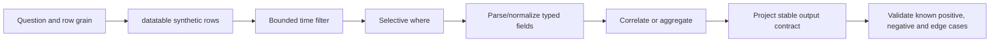

### Examples 41-50: filter, project, aggregate, and rank

**Example 41 - First bounded KQL pipeline**

- **Purpose:** Filter synthetic failures in an explicit UTC window.
- **Safety level:** Local/synthetic KQL.
- **Expected shape:** One row for `alice`.
- **Common failure:** Relying on an unstated portal time picker or using the wrong timestamp column.
- **Source Part:** [Part 46](Part-46-kql-from-zero-sentinel.md).

```kusto
datatable(TimeGenerated:datetime, User:string, Result:string)
[
  datetime(2026-08-24 09:00:00), "alice", "Failure",
  datetime(2026-08-24 09:01:00), "bob", "Success"
]
| where TimeGenerated between (datetime(2026-08-24 08:55:00) .. datetime(2026-08-24 09:05:00))
| where Result == "Failure"
```

**Example 42 - Project a minimal contract**

- **Purpose:** Return only fields needed by the next analytical step.
- **Safety level:** Local/synthetic KQL.
- **Expected shape:** `TimeGenerated` and `User` columns.
- **Common failure:** Removing a correlation key too early or exporting raw sensitive fields unnecessarily.
- **Source Part:** [Part 46](Part-46-kql-from-zero-sentinel.md).

```kusto
datatable(TimeGenerated:datetime, User:string, Result:string, RawDetail:string)
[
  datetime(2026-08-24 09:00:00), "alice", "Failure", "synthetic-detail"
]
| project TimeGenerated, User
```

**Example 43 - Normalize with `extend`**

- **Purpose:** Normalize user casing while preserving the original value for validation.
- **Safety level:** Local/synthetic KQL.
- **Expected shape:** Original and lowercase user fields.
- **Common failure:** Treating two identifiers as the same entity merely because normalized text matches.
- **Source Part:** [Part 46](Part-46-kql-from-zero-sentinel.md).

```kusto
datatable(User:string)
[
  "Alice@Example.invalid",
  "alice@example.invalid"
]
| extend NormalizedUser = tolower(trim(" ", User))
```

**Example 44 - Count rows in scope**

- **Purpose:** Count synthetic records after an explicit filter.
- **Safety level:** Local/synthetic KQL.
- **Expected shape:** One row with `Count = 2`.
- **Common failure:** Presenting count as organization-wide when scope contains only a sample/window.
- **Source Part:** [Part 46](Part-46-kql-from-zero-sentinel.md).

```kusto
datatable(Result:string)
[
  "Failure", "Failure", "Success"
]
| where Result == "Failure"
| count
```

**Example 45 - Summarize by dimension**

- **Purpose:** Count synthetic results per user.
- **Safety level:** Local/synthetic KQL.
- **Expected shape:** One row per user with event count.
- **Common failure:** Forgetting that `summarize` spends event-level detail.
- **Source Part:** [Part 46](Part-46-kql-from-zero-sentinel.md).

```kusto
datatable(User:string, Result:string)
[
  "alice", "Failure",
  "alice", "Success",
  "bob", "Failure"
]
| summarize Events=count(), Failures=countif(Result == "Failure") by User
```

**Example 46 - Bin a synthetic timeline**

- **Purpose:** Aggregate events into five-minute buckets.
- **Safety level:** Local/synthetic KQL.
- **Expected shape:** Two time buckets with counts.
- **Common failure:** Choosing a bin size that hides short spikes or exaggerates noise.
- **Source Part:** [Part 46](Part-46-kql-from-zero-sentinel.md).

```kusto
datatable(TimeGenerated:datetime)
[
  datetime(2026-08-24 09:01:00),
  datetime(2026-08-24 09:04:00),
  datetime(2026-08-24 09:07:00)
]
| summarize Events=count() by bin(TimeGenerated, 5m)
| order by TimeGenerated asc
```

**Example 47 - Approximate distinct count**

- **Purpose:** Compare event count with approximate distinct synthetic devices.
- **Safety level:** Local/synthetic KQL.
- **Expected shape:** One row with `Events` and `ApproxDevices`.
- **Common failure:** Presenting `dcount()` as exact or comparing estimates without understanding accuracy.
- **Source Part:** [Part 46](Part-46-kql-from-zero-sentinel.md).

```kusto
datatable(Device:string)
[
  "device-01", "device-01", "device-02", "device-03"
]
| summarize Events=count(), ApproxDevices=dcount(Device)
```

**Example 48 - Collect a bounded set**

- **Purpose:** Build a small set of synthetic result values per user.
- **Safety level:** Local/synthetic KQL.
- **Expected shape:** One row per user with a dynamic array.
- **Common failure:** Unbounded arrays create large results and hide event order.
- **Source Part:** [Part 46](Part-46-kql-from-zero-sentinel.md).

```kusto
datatable(User:string, Result:string)
[
  "alice", "Success",
  "alice", "Failure",
  "alice", "Pending"
]
| summarize Results=make_set(Result, 10) by User
```

**Example 49 - Keep latest row with `arg_max`**

- **Purpose:** Select the latest synthetic status record per device.
- **Safety level:** Local/synthetic KQL.
- **Expected shape:** One latest row for each device.
- **Common failure:** Ignoring ties, late arrival, source clock, or duplicate records.
- **Source Part:** [Part 46](Part-46-kql-from-zero-sentinel.md).

```kusto
datatable(TimeGenerated:datetime, Device:string, State:string)
[
  datetime(2026-08-24 09:00:00), "device-01", "Unknown",
  datetime(2026-08-24 09:05:00), "device-01", "Healthy",
  datetime(2026-08-24 09:03:00), "device-02", "Review"
]
| summarize arg_max(TimeGenerated, *) by Device
```

**Example 50 - Rank with `top`**

- **Purpose:** Return the two highest synthetic failure counts.
- **Safety level:** Local/synthetic KQL.
- **Expected shape:** Two ordered rows.
- **Common failure:** Confusing `take 2` with deterministic ranking.
- **Source Part:** [Part 46](Part-46-kql-from-zero-sentinel.md).

```kusto
datatable(User:string, Failures:long)
[
  "alice", 4,
  "bob", 2,
  "carol", 7
]
| top 2 by Failures desc
```

### Examples 51-60: strings, parsing, dynamic JSON, and nulls

**Example 51 - Select distinct combinations**

- **Purpose:** List unique synthetic user/device pairs.
- **Safety level:** Local/synthetic KQL.
- **Expected shape:** Two unique rows.
- **Common failure:** Deduplicating records when duplicates are analytically meaningful.
- **Source Part:** [Part 46](Part-46-kql-from-zero-sentinel.md).

```kusto
datatable(User:string, Device:string)
[
  "alice", "device-01",
  "alice", "device-01",
  "alice", "device-02"
]
| distinct User, Device
| order by Device asc
```

**Example 52 - Use token-aware string matching**

- **Purpose:** Match a complete token in synthetic messages.
- **Safety level:** Local/synthetic KQL.
- **Expected shape:** The row containing the token `failed`.
- **Common failure:** Using `contains` when token semantics or case behavior require `has`/`has_cs`.
- **Source Part:** [Part 46](Part-46-kql-from-zero-sentinel.md).

```kusto
datatable(Message:string)
[
  "Synthetic sign-in failed for test user",
  "Synthetic sign-in succeeded"
]
| where Message has "failed"
```

**Example 53 - Parse a stable text pattern**

- **Purpose:** Extract named fields from controlled synthetic text.
- **Safety level:** Local/synthetic KQL.
- **Expected shape:** User, action and result columns.
- **Common failure:** Production source format drifts and parse failures become null silently.
- **Source Part:** [Part 46](Part-46-kql-from-zero-sentinel.md).

```kusto
datatable(Message:string)
[
  "user=alice action=read result=success",
  "user=bob action=read result=failure"
]
| parse Message with "user=" User " action=" Action " result=" Result
| project User, Action, Result
```

**Example 54 - Parse dynamic JSON**

- **Purpose:** Convert synthetic JSON text and cast child properties.
- **Safety level:** Local/synthetic KQL.
- **Expected shape:** Typed user string and score integer.
- **Common failure:** Accessing a nested dynamic value without casting or trusting malformed JSON.
- **Source Part:** [Part 46](Part-46-kql-from-zero-sentinel.md).

```kusto
datatable(Payload:string)
[
  '{"user":"alice","score":7}',
  '{"user":"bob","score":2}'
]
| extend Body=parse_json(Payload)
| extend User=tostring(Body.user), Score=toint(Body.score)
| project User, Score
```

**Example 55 - Extract with a bounded regular expression**

- **Purpose:** Extract a synthetic case identifier and mark parse success.
- **Safety level:** Local/synthetic KQL.
- **Expected shape:** One valid ID and one null, with Boolean status.
- **Common failure:** Expensive broad regex, unbounded input, or treating null as a valid match.
- **Source Part:** [Part 46](Part-46-kql-from-zero-sentinel.md).

```kusto
datatable(Message:string)
[
  "case=case-001 result=success",
  "malformed"
]
| extend CaseId=extract(@"case=(case-[0-9]{3})", 1, Message)
| extend ParseOk=isnotempty(CaseId)
```

**Example 56 - Split a synthetic principal**

- **Purpose:** Separate local and domain parts for well-formed synthetic input.
- **Safety level:** Local/synthetic KQL.
- **Expected shape:** Principal, local part, and domain.
- **Common failure:** Assuming every identifier contains exactly one delimiter.
- **Source Part:** [Part 46](Part-46-kql-from-zero-sentinel.md).

```kusto
datatable(Principal:string)
[
  "alice@example.invalid",
  "bob@example.invalid"
]
| extend Parts=split(Principal, "@")
| extend LocalPart=tostring(Parts[0]), Domain=tostring(Parts[1])
| project Principal, LocalPart, Domain
```

**Example 57 - Expand a dynamic array**

- **Purpose:** Turn synthetic tags into one row per tag.
- **Safety level:** Local/synthetic KQL.
- **Expected shape:** Three rows with source ID and tag.
- **Common failure:** `mv-expand` multiplies rows and can distort counts after joins.
- **Source Part:** [Part 46](Part-46-kql-from-zero-sentinel.md).

```kusto
datatable(RecordId:string, Tags:dynamic)
[
  "record-01", dynamic(["identity","review"]),
  "record-02", dynamic(["device"])
]
| mv-expand Tag=Tags to typeof(string)
| project RecordId, Tag
```

**Example 58 - Expand dynamic objects with index**

- **Purpose:** Preserve order while expanding synthetic evidence objects.
- **Safety level:** Local/synthetic KQL.
- **Expected shape:** Two rows with index, type and value.
- **Common failure:** Losing source row identity or expanding before filtering.
- **Source Part:** [Part 46](Part-46-kql-from-zero-sentinel.md).

```kusto
datatable(RecordId:string, Evidence:dynamic)
[
  "record-01", dynamic([{"type":"user","value":"alice"},{"type":"device","value":"device-01"}])
]
| mv-expand with_itemindex=EvidenceIndex Item=Evidence
| extend Type=tostring(Item.type), Value=tostring(Item.value)
| project RecordId, EvidenceIndex, Type, Value
```

**Example 59 - Handle missing values with `coalesce`**

- **Purpose:** Choose the first nonempty synthetic display value.
- **Safety level:** Local/synthetic KQL.
- **Expected shape:** `alice` then `unknown`.
- **Common failure:** Collapsing null, empty, redacted and genuinely unknown into one state without documentation.
- **Source Part:** [Part 46](Part-46-kql-from-zero-sentinel.md).

```kusto
datatable(User:string, Alternate:string)
[
  "alice", "",
  "", "unknown"
]
| extend DisplayUser=coalesce(User, Alternate, "not-recorded")
| project DisplayUser
```

**Example 60 - Guard numeric conversion**

- **Purpose:** Mark valid and invalid integer text explicitly.
- **Safety level:** Local/synthetic KQL.
- **Expected shape:** One valid and one invalid conversion status.
- **Common failure:** Invalid conversion becomes null and is silently removed by later filters.
- **Source Part:** [Part 46](Part-46-kql-from-zero-sentinel.md).

```kusto
datatable(RawCount:string)
[
  "7",
  "not-a-number"
]
| extend ParsedCount=toint(RawCount)
| extend ConversionStatus=iff(isnull(ParsedCount), "invalid", "valid")
```

### Join and correlation reference

| Join kind | Keeps | Use | Main danger |
|---|---|---|---|
| `innerunique` | Matching rows after left-side key dedup behavior | Kusto default `join`; use only when semantics fit | Unexpected loss of duplicate left events |
| `inner` | All matching combinations | Event-to-reference correlation | Many-to-many multiplication |
| `leftouter` | Every left row plus matching right fields | Preserve primary event population | Null right fields misread as negative evidence |
| `leftanti` | Left rows with no right match | Find missing enrichment/expected relationship | Key normalization/time mismatch creates false gaps |
| `leftsemi` | Left rows with at least one match | Membership/existence test | Match detail is discarded |
| `lookup` | Enrich left with small right | Dimension/reference data | Right side too large or duplicate key |

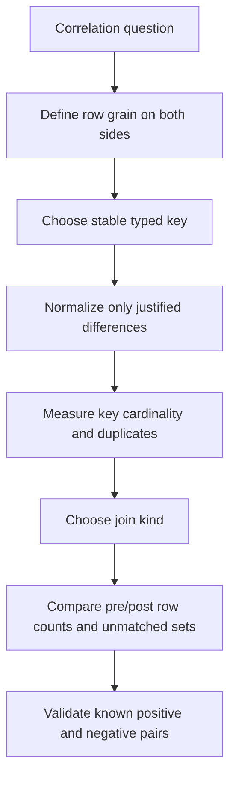

### Examples 61-68: joins, unions, and timelines

**Example 61 - Inner join with explicit projection**

- **Purpose:** Correlate synthetic events with synthetic device owners.
- **Safety level:** Local/synthetic KQL.
- **Expected shape:** Two matching event rows enriched with owner.
- **Common failure:** Duplicate dimension keys multiply results; use explicit `kind=inner` and measure counts.
- **Source Part:** [Part 46](Part-46-kql-from-zero-sentinel.md).

```kusto
let Events=datatable(TimeGenerated:datetime, DeviceId:string, Result:string)
[
  datetime(2026-08-24 09:00:00), "device-01", "Success",
  datetime(2026-08-24 09:01:00), "device-02", "Failure"
];
let Owners=datatable(DeviceId:string, Owner:string)
[
  "device-01", "alice",
  "device-02", "bob"
];
Events
| join kind=inner (Owners) on DeviceId
| project TimeGenerated, DeviceId, Owner, Result
```

**Example 62 - Left outer join and missing enrichment**

- **Purpose:** Preserve all synthetic events and flag unknown owners.
- **Safety level:** Local/synthetic KQL.
- **Expected shape:** Two rows; one has `OwnerStatus = missing`.
- **Common failure:** Interpreting missing right-side data as proof that no owner exists.
- **Source Part:** [Part 46](Part-46-kql-from-zero-sentinel.md).

```kusto
let Events=datatable(DeviceId:string)["device-01","device-99"];
let Owners=datatable(DeviceId:string, Owner:string)["device-01","alice"];
Events
| join kind=leftouter (Owners) on DeviceId
| extend OwnerStatus=iff(isempty(Owner), "missing", "present")
```

**Example 63 - Left anti join for a quality gap**

- **Purpose:** Find synthetic device IDs absent from a reference list.
- **Safety level:** Local/synthetic KQL.
- **Expected shape:** One row for `device-99`.
- **Common failure:** Key case/type/whitespace mismatch produces false unmatched rows.
- **Source Part:** [Part 46](Part-46-kql-from-zero-sentinel.md).

```kusto
let Observed=datatable(DeviceId:string)["device-01","device-99"];
let Inventory=datatable(DeviceId:string)["device-01","device-02"];
Observed
| join kind=leftanti (Inventory) on DeviceId
```

**Example 64 - Lookup small reference data**

- **Purpose:** Enrich synthetic result codes with descriptions.
- **Safety level:** Local/synthetic KQL.
- **Expected shape:** Two rows with descriptions.
- **Common failure:** The right side is not small or contains duplicate keys.
- **Source Part:** [Part 46](Part-46-kql-from-zero-sentinel.md).

```kusto
let Events=datatable(Code:int)[0,1];
let Reference=datatable(Code:int, Description:string)[0,"Success",1,"Review"];
Events
| lookup kind=leftouter Reference on Code
```

**Example 65 - Union with source labels**

- **Purpose:** Combine two synthetic event families into one normalized timeline.
- **Safety level:** Local/synthetic KQL.
- **Expected shape:** Two rows with common time/entity/action fields and source.
- **Common failure:** `union` aligns by name/type; mismatches can create suffixed columns or nulls.
- **Source Part:** [Part 46](Part-46-kql-from-zero-sentinel.md).

```kusto
let IdentityEvents=datatable(TimeGenerated:datetime, Entity:string, Action:string)
[
  datetime(2026-08-24 09:00:00), "alice", "SignIn"
];
let DeviceEvents=datatable(TimeGenerated:datetime, Entity:string, Action:string)
[
  datetime(2026-08-24 09:02:00), "device-01", "CheckIn"
];
union withsource=SourceTable IdentityEvents, DeviceEvents
| order by TimeGenerated asc
```

**Example 66 - Build an entity timeline**

- **Purpose:** Order synthetic evidence for one user across event types.
- **Safety level:** Local/synthetic KQL.
- **Expected shape:** Three chronologically ordered rows.
- **Common failure:** Using display text as the only entity key or ignoring source clock/ingestion latency.
- **Source Part:** [Part 46](Part-46-kql-from-zero-sentinel.md).

```kusto
datatable(TimeGenerated:datetime, EntityId:string, EventType:string, Detail:string)
[
  datetime(2026-08-24 09:03:00), "user-01", "AppRead", "Synthetic app read",
  datetime(2026-08-24 09:00:00), "user-01", "SignIn", "Synthetic sign-in",
  datetime(2026-08-24 09:02:00), "user-01", "Policy", "Synthetic policy evaluation"
]
| where EntityId == "user-01"
| order by TimeGenerated asc
```

**Example 67 - Measure join multiplication**

- **Purpose:** Expose how duplicate synthetic keys create extra joined rows.
- **Safety level:** Local/synthetic KQL.
- **Expected shape:** Summary showing four joined rows for a two-by-two key.
- **Common failure:** Counting joined rows as unique events or entities.
- **Source Part:** [Part 46](Part-46-kql-from-zero-sentinel.md).

```kusto
let Left=datatable(Key:string, LeftValue:string)["A","L1","A","L2"];
let Right=datatable(Key:string, RightValue:string)["A","R1","A","R2"];
Left
| join kind=inner (Right) on Key
| summarize JoinedRows=count(), LeftValues=dcount(LeftValue), RightValues=dcount(RightValue) by Key
```

**Example 68 - Compare affected and unaffected cohorts**

- **Purpose:** Summarize synthetic failures by controlled cohort.
- **Safety level:** Local/synthetic KQL.
- **Expected shape:** One row per cohort with total/failure counts and percentage.
- **Common failure:** Cohorts differ on hidden variables, sample is tiny, or denominator is zero.
- **Source Part:** [Part 60](Part-60-structured-troubleshooting-multivendor-cloud.md).

```kusto
datatable(Cohort:string, Result:string)
[
  "Affected", "Failure",
  "Affected", "Failure",
  "Control", "Success",
  "Control", "Failure"
]
| summarize Total=count(), Failures=countif(Result == "Failure") by Cohort
| extend FailurePercent=round(100.0 * Failures / Total, 1)
```

### Time-series and performance reference

| Topic | Safe rule | Why |
|---|---|---|
| Time filter | Put bounded timestamp predicate near source | Reduces scan and prevents accidental historical conclusion |
| Columns | Project only needed fields before expensive joins/expansion | Reduces memory/network and sensitive exposure |
| String operators | Prefer term-aware operators where semantics fit | More precise and often more efficient than broad substring search |
| Parse | Filter first, parse second; validate parse failures | Repeated regex/JSON work can dominate query |
| Join | Smaller side/right strategy as documented; reduce both inputs | Many-to-many and cross-cluster joins are expensive |
| `materialize` | Use only when reused expensive subexpression benefits and fits limits | It is not a universal speed switch |
| `make-series` | Explicit start/end/step/default and bounded entities | Dense arrays can become large |
| Results | Cap exploratory output after preserving analytical correctness | UI row limit is not data completeness |
| Table plan | Verify Analytics/Basic/Auxiliary/lake capabilities | Operator, alerting, retention and cost behavior differ |

### Examples 69-76: time, series, performance, and schema portability

**Example 69 - Calculate source-to-ingestion latency**

- **Purpose:** Compare two synthetic clocks.
- **Safety level:** Local/synthetic KQL.
- **Expected shape:** Rows ordered by greatest latency.
- **Common failure:** Treating `TimeGenerated` as universal source event time without connector semantics.
- **Source Part:** [Part 45](Part-45-sentinel-connectors-ama-dcr-asim-normalization.md).

```kusto
datatable(SourceTime:datetime, TimeGenerated:datetime, EventId:string)
[
  datetime(2026-08-24 09:00:00), datetime(2026-08-24 09:00:20), "event-01",
  datetime(2026-08-24 09:01:00), datetime(2026-08-24 09:03:00), "event-02"
]
| extend Latency=TimeGenerated-SourceTime
| order by Latency desc
```

**Example 70 - Use `prev()` after serialization**

- **Purpose:** Calculate gaps between ordered synthetic events.
- **Safety level:** Local/synthetic KQL.
- **Expected shape:** First row has null previous time; later rows have gaps.
- **Common failure:** Calling row-order functions without a serialized deterministic order.
- **Source Part:** [Part 46](Part-46-kql-from-zero-sentinel.md).

```kusto
datatable(TimeGenerated:datetime, EventId:string)
[
  datetime(2026-08-24 09:00:00), "event-01",
  datetime(2026-08-24 09:04:00), "event-02",
  datetime(2026-08-24 09:05:00), "event-03"
]
| order by TimeGenerated asc
| serialize
| extend PreviousTime=prev(TimeGenerated), Gap=TimeGenerated-prev(TimeGenerated)
```

**Example 71 - Create a bounded time series**

- **Purpose:** Build five-minute synthetic event-count arrays.
- **Safety level:** Local/synthetic KQL.
- **Expected shape:** One row per service with time and count arrays.
- **Common failure:** Omitting explicit boundaries or creating too many entity series.
- **Source Part:** [Part 46](Part-46-kql-from-zero-sentinel.md).

```kusto
datatable(TimeGenerated:datetime, Service:string)
[
  datetime(2026-08-24 09:01:00), "Service-A",
  datetime(2026-08-24 09:03:00), "Service-A",
  datetime(2026-08-24 09:08:00), "Service-A"
]
| make-series Events=count() default=0 on TimeGenerated
    from datetime(2026-08-24 09:00:00) to datetime(2026-08-24 09:15:00) step 5m by Service
```

**Example 72 - Describe a synthetic series**

- **Purpose:** Return simple statistics for a controlled dynamic series.
- **Safety level:** Local/synthetic KQL.
- **Expected shape:** Minimum, maximum, average and other supported series statistics.
- **Common failure:** Function availability or output fields differ by query surface/version.
- **Source Part:** [Part 46](Part-46-kql-from-zero-sentinel.md).

```kusto
datatable(Service:string, Values:dynamic)
[
  "Service-A", dynamic([1,2,2,3,8])
]
| extend Stats=series_stats_dynamic(Values)
| project Service, Stats
```

**Example 73 - Flag a benign synthetic volume outlier**

- **Purpose:** Practise anomaly output on service-volume test data, not security activity.
- **Safety level:** Local/synthetic KQL.
- **Expected shape:** Original values plus anomaly and score arrays.
- **Common failure:** Anomaly is not root cause or maliciousness; sparse/seasonal data and parameters need validation.
- **Source Part:** [Part 46](Part-46-kql-from-zero-sentinel.md).

```kusto
datatable(Service:string, Values:dynamic)
[
  "Service-A", dynamic([10,11,10,12,11,40,12,11])
]
| extend (Anomalies, Scores, Baseline)=series_decompose_anomalies(Values, 1.5, -1, 'linefit')
| project Service, Values, Baseline, Anomalies, Scores
```

**Example 74 - Calculate percentiles**

- **Purpose:** Summarize a synthetic latency distribution beyond the average.
- **Safety level:** Local/synthetic KQL.
- **Expected shape:** One row with median and higher percentile latency.
- **Common failure:** Tiny samples, mixed populations or units make percentiles misleading.
- **Source Part:** [Part 46](Part-46-kql-from-zero-sentinel.md).

```kusto
datatable(DurationMs:long)
[
  10, 12, 15, 20, 25, 30, 200
]
| summarize P50=percentile(DurationMs, 50), P95=percentile(DurationMs, 95), Maximum=max(DurationMs)
```

**Example 75 - Model Sentinel versus Defender time columns**

- **Purpose:** Normalize synthetic Log Analytics-like and Defender-like schemas.
- **Safety level:** Local/synthetic KQL.
- **Expected shape:** Two rows with unified `EventTime`, source and entity.
- **Common failure:** Copying a query between surfaces and only renaming the table while fields/semantics differ.
- **Source Part:** [Part 51](Part-51-unified-secops-defender-sentinel-purview.md).

```kusto
let SentinelLike=datatable(TimeGenerated:datetime, AccountUpn:string)
[
  datetime(2026-08-24 09:00:00), "alice@example.invalid"
]
| project EventTime=TimeGenerated, Entity=AccountUpn, Source="SentinelLike";
let DefenderLike=datatable(Timestamp:datetime, AccountUpn:string)
[
  datetime(2026-08-24 09:01:00), "alice@example.invalid"
]
| project EventTime=Timestamp, Entity=AccountUpn, Source="DefenderLike";
union SentinelLike, DefenderLike
| order by EventTime asc
```

**Example 76 - Build a transparent threshold candidate**

- **Purpose:** Separate synthetic aggregation from a review threshold.
- **Safety level:** Local/synthetic KQL.
- **Expected shape:** Only users with at least three synthetic failures.
- **Common failure:** Threshold chosen without baseline, rule frequency, grouping, suppression, entity mapping or false-positive review.
- **Source Part:** [Part 40](Part-40-defender-advanced-hunting-kql-custom-detections.md).

```kusto
let MinimumFailures=3;
datatable(TimeGenerated:datetime, User:string, Result:string)
[
  datetime(2026-08-24 09:00:00), "alice", "Failure",
  datetime(2026-08-24 09:01:00), "alice", "Failure",
  datetime(2026-08-24 09:02:00), "alice", "Failure",
  datetime(2026-08-24 09:03:00), "bob", "Failure"
]
| where Result == "Failure"
| summarize Failures=count(), FirstSeen=min(TimeGenerated), LastSeen=max(TimeGenerated) by User
| where Failures >= MinimumFailures
```

### Sentinel and Defender schema distinction

| Question | Sentinel/Log Analytics answer | Defender advanced-hunting answer |
|---|---|---|
| Where is schema discovered? | Workspace Tables pane, table reference, connector/source sample | Advanced hunting schema pane/reference and sample data |
| Time column? | Commonly `TimeGenerated`, but source columns can coexist | Commonly `Timestamp`; verify each table |
| Identity fields? | Connector/table/ASIM-specific fields such as UPN, SID or object ID | Defender table-specific account/entity fields |
| Ingestion? | Connector, AMA/DCR/API, transform and workspace/table plan | Defender product sensor/service and unified integrations |
| Retention/cost? | Workspace/table tier and Sentinel/Azure billing model | Defender product retention/licensing; unified/lake context can differ |
| Rule surface? | Sentinel scheduled/NRT/other analytics, hunting and workbooks | Defender custom detections and advanced hunting |
| Portability? | KQL concepts transfer; table names, fields, functions and row grain may not | Rebuild schema mapping and validation for target surface |

### Detection-conversion checklist

| Gate | Question | Evidence required |
|---|---|---|
| Purpose | What undesirable or policy-relevant behavior should be surfaced, without assuming intent? | Threat/control hypothesis and owner |
| Source | Is required telemetry complete, timely, licensed and monitored? | Known positive source event and connector/sensor health |
| Schema | Are table, columns, types, nulls and row grain current? | Live sample/schema reference and checked date |
| Time | How do query lookback, rule frequency and ingestion delay interact? | Timing test including late arrival |
| Logic | Are filters, normalizations, joins, thresholds and exclusions justified? | Unit-like synthetic positive/negative/edge cases |
| Output | Does one result row map clearly to alert/entity fields? | Output contract and entity mapping test |
| Baseline | What normal cohorts, service accounts, maintenance and seasonality exist? | Historical/authorized baseline with privacy review |
| Performance | Is time filtering early and scan/join/cardinality bounded? | Query statistics/plan in lab and expected scale |
| False positives | Who reviews, tunes and expires exceptions? | Tuning log and accountable owner |
| Response | What human decision follows; what must never be automatic? | Runbook, severity, approval and evidence-preservation path |
| Promotion | How does query move from hunt to test rule to pilot to production? | Version control, peer review, test result and rollback |
| Health | How is no-data, rule failure, schema drift and alert-volume drift detected? | Monitoring and SLO/runbook |

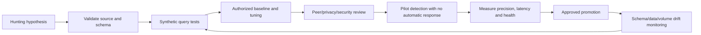

## 8. Logic Apps, Sentinel playbooks, and Power Automate patterns

Logic Apps is Azure workflow infrastructure; Sentinel playbooks are Logic Apps workflows integrated with Sentinel triggers/actions. Power Automate is a Power Platform automation service oriented toward business workflows and environment/connector governance. Their workflow concepts overlap, but resource boundaries, roles, hosting, connectors, identity options, networking, ALM and cost differ.

| Dimension | Azure Logic Apps / Sentinel playbook | Power Automate |
|---|---|---|
| Boundary | Azure subscription/resource group/Logic App/workflow and API connections | Power Platform tenant/environment/solution/flow/connections |
| Security use | Sentinel SOAR, Azure integration, enterprise workflows | Business approvals, M365/Dataverse and user/process automation |
| Identity | Managed identity where supported, service principal or connector connection | Connection owner/reference, service principal/managed identity only where supported by feature/connector |
| Roles | Azure RBAC, Sentinel roles, Logic Apps roles and target roles | Power Platform/environment/Dataverse roles, flow sharing and target permissions |
| Network | Consumption/Standard options, integration service environment/private networking as current | Connector/gateway/environment capabilities and policies |
| ALM | ARM/Bicep/workflow files, Standard project tooling, deployment pipelines | Solutions, connection references, environment variables, Power Platform pipelines/build tools |
| Diagnostics | Run history, Azure Monitor/App Insights/diagnostic settings | Run history, admin analytics, Application Insights where supported, Purview Audit |
| Cost | Azure workflow/action/hosting/connectors and dependencies | License/capacity/request limits/connectors according to current offer |

### Automation anatomy

| Element | Required question | Design evidence |
|---|---|---|
| Trigger | Event, schedule, request or human action? Can it duplicate/reorder? | Trigger schema, source and delivery semantics |
| Validation | Are type, required fields, size, tenant/resource and classification checked? | Contract tests and rejection path |
| Correlation | Which stable trigger/run/request/incident ID follows every step? | Structured log schema |
| Idempotency | What key prevents duplicate effect? Where is state stored atomically? | Duplicate-delivery test |
| Identity | Which workload/user identity calls each connector/API? | Data-flow identity map and effective permission test |
| Action | Read, enrich, notify, approve or change? | Risk class and authorization |
| Approval | Which human/role approves sensitive work and by when? | Escalation/timeout path and separation of duty |
| Retry | Which failures are transient and operations idempotent? | Bounded policy and total deadline |
| Concurrency | Can parallel instances conflict or overwhelm dependencies? | Limit, partition key and load test |
| Failure | How are failed/skipped/timed-out branches caught? | Scope/run-after design and dead-letter/replay route |
| Audit | What is logged, redacted, retained and accessible? | Run IDs, source audit and evidence store |
| Rollback | Disable trigger, restore version, reverse approved external change or route manually? | Tested rollback/recovery runbook |

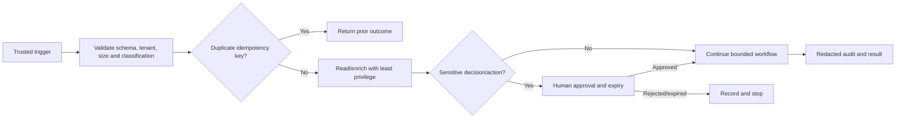

### Identity and secret handling

| Pattern | Preference | Controls |
|---|---|---|
| Managed identity | First choice for supported Azure source/target | Narrow Azure/API role, exact audience, workflow-editor privilege review, sign-in/audit monitoring |
| Workload identity federation | Preferred for supported CI/CD/external workload | Exact issuer/subject/audience, protected environment, no wildcard trust without risk acceptance |
| Service principal certificate | Compatibility alternative | HSM/vault/private-key protection, expiry/rotation, owner, app permission review |
| Service principal secret | Last-resort compatibility | Key Vault, short governed lifetime, rotation, no code/config/log exposure, alerting |
| User-owned connector | Suitable only for explicit user/process lifecycle | Named owner/co-owner, departure/reauth path, conditional access and data policy |
| Key Vault | Store secrets/keys/certificates when secrets remain necessary | Data-plane RBAC, network, soft-delete/recovery governance, diagnostic logs and access review |
| Secure inputs/outputs | Reduce run-history exposure for supported actions | Propagate carefully, understand diagnostic/tracked-property tradeoff, test downstream visibility |

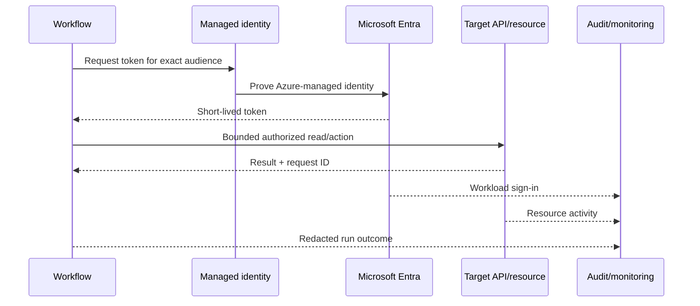

### Examples 77-88: disabled workflow and operations templates

**Example 77 - Disabled Sentinel playbook skeleton**

- **Purpose:** Show explicit disabled state, synthetic trigger metadata and no response action.
- **Safety level:** Disabled JSON design, non-deployable excerpt.
- **Expected shape:** Design record only.
- **Common failure:** Importing a template and enabling a trigger before identity, connection, scope and test review.
- **Source Part:** [Part 50](Part-50-sentinel-automation-logic-apps-playbooks.md).

```json
{
  "state": "Disabled",
  "designOnly": true,
  "trigger": "SyntheticSentinelIncident",
  "actions": [
    "ValidateSchema",
    "ReadIncidentMetadata",
    "BuildApprovalSummary",
    "WriteRedactedAudit"
  ],
  "containsResponseAction": false
}
```

**Example 78 - Idempotency decision pseudocode**

- **Purpose:** Prevent a duplicate event from repeating a downstream effect.
- **Safety level:** Non-executable pseudocode.
- **Expected shape:** Prior outcome for duplicate, reserved key for first delivery.
- **Common failure:** Check-then-write race without atomic reservation or key based on mutable display fields.
- **Source Part:** [Part 50](Part-50-sentinel-automation-logic-apps-playbooks.md).

```text
PSEUDOCODE
idempotency_key = HASH(source_system + stable_event_id + operation_version)
existing = outcome_store.read(idempotency_key)
if existing exists:
    return existing
if not outcome_store.try_reserve_atomically(idempotency_key, expiration):
    return retryable_concurrency_result
result = perform_approved_operation()
outcome_store.commit(idempotency_key, sanitized_result)
return result
```

**Example 79 - Disabled exponential retry design**

- **Purpose:** Express a bounded retry for a synthetic read-only endpoint.
- **Safety level:** Disabled JSON template; endpoint uses reserved `.invalid` domain.
- **Expected shape:** Retry policy metadata only.
- **Common failure:** Retrying all status codes, ignoring `Retry-After`, or using retry on a non-idempotent action.
- **Source Part:** [Part 50](Part-50-sentinel-automation-logic-apps-playbooks.md).

```json
{
  "state": "Disabled",
  "action": {
    "type": "Http",
    "method": "GET",
    "uri": "https://example.invalid/read-only-resource",
    "retryPolicy": {
      "type": "exponential",
      "count": 3,
      "interval": "PT5S",
      "maximumInterval": "PT1M"
    }
  }
}
```

**Example 80 - Try/catch/finally scope design**

- **Purpose:** Make workflow outcome branches explicit.
- **Safety level:** Non-executable YAML design.
- **Expected shape:** Three scopes with run-after intent.
- **Common failure:** Catch path succeeds and makes the whole run look successful while business work failed.
- **Source Part:** [Part 50](Part-50-sentinel-automation-logic-apps-playbooks.md).

```yaml
enabled: false
scopes:
  Try:
    runAfter: TriggerSucceeded
    actions: [ValidateSyntheticInput, ReadSyntheticReference]
  Catch:
    runAfter: [TryFailed, TryTimedOut]
    actions: [CaptureSafeErrorCode, QueueForHumanReview]
  Finally:
    runAfter: [TrySucceeded, TryFailed, TryTimedOut, CatchSucceeded, CatchFailed]
    actions: [WriteRedactedOutcome, ReleaseSyntheticLease]
```

**Example 81 - Concurrency design record**

- **Purpose:** Document partitioning and bounded concurrency before enabling it.
- **Safety level:** Disabled YAML design.
- **Expected shape:** A review record, not a platform setting.
- **Common failure:** Setting concurrency to one hides throughput problems; high concurrency overwhelms Graph/connectors or races state.
- **Source Part:** [Part 50](Part-50-sentinel-automation-logic-apps-playbooks.md).

```yaml
enabled: false
concurrency:
  globalMaximum: 4
  partitionKey: syntheticResourceId
  perPartitionMaximum: 1
  queueWhenBusy: true
  totalDeadline: PT10M
validation:
  loadTestCompleted: false
  duplicateRaceTestCompleted: false
```

**Example 82 - Secure run-history design**

- **Purpose:** Mark where secure inputs/outputs are required without placing a secret in the template.
- **Safety level:** Disabled JSON excerpt.
- **Expected shape:** Runtime security metadata only.
- **Common failure:** Securing one action but exposing the same value in a downstream compose/log/error action.
- **Source Part:** [Part 50](Part-50-sentinel-automation-logic-apps-playbooks.md).

```json
{
  "state": "Disabled",
  "runtimeConfiguration": {
    "secureData": {
      "properties": ["inputs", "outputs"]
    }
  },
  "note": "Verify every downstream action and diagnostic tradeoff before enablement."
}
```

**Example 83 - Managed-identity read design**

- **Purpose:** Show audience-bound identity intent for a read-only Azure management request.
- **Safety level:** Disabled, non-deployable JSON design with no subscription/resource identifiers.
- **Expected shape:** Authentication design only.
- **Common failure:** Workflow editors can use the workflow identity; overbroad RBAC on the identity becomes an escalation path.
- **Source Part:** [Part 50](Part-50-sentinel-automation-logic-apps-playbooks.md).

```json
{
  "state": "Disabled",
  "method": "GET",
  "uri": "https://management.azure.com/{authorized-resource}?api-version={current-version}",
  "authentication": {
    "type": "ManagedServiceIdentity",
    "audience": "https://management.azure.com/"
  }
}
```

**Example 84 - Key Vault reference design without a secret**

- **Purpose:** Document that a secret reference, not a value, belongs in environment configuration when a secret is unavoidable.
- **Safety level:** Disabled pseudocode YAML; contains no vault/resource ID or secret name from a tenant.
- **Expected shape:** Reference metadata and governance controls.
- **Common failure:** Retrieving a secret safely but then writing it to run history, debug output or an exception.
- **Source Part:** [Part 63](Part-63-documentation-reporting-automation-quality.md).

```yaml
enabled: false
credentialPattern: key-vault-reference-only
vaultReference: approved-environment-variable
secretNameReference: approved-environment-variable
controls:
  preferManagedIdentity: true
  secureInputsOutputs: true
  logSecretValue: false
  rotationOwnerAssigned: false
```

**Example 85 - Power Automate solution-aware design**

- **Purpose:** Separate environment-specific configuration from a flow definition.
- **Safety level:** Disabled YAML design.
- **Expected shape:** Solution components and promotion controls.
- **Common failure:** Personal connection embedded directly, unmanaged flow edited in production, or environment URL hardcoded.
- **Source Part:** [Part 25](Part-25-m365-apps-power-platform-copilot-security.md).

```yaml
enabled: false
solution:
  flow: SyntheticReadAndApprove
  connectionReferences: [ApprovedReadConnector]
  environmentVariables: [SyntheticApiBaseUrl, SupportQueueName]
  containsSecrets: false
promotion:
  order: [Development, Test, Production]
  requireApprovals: true
  prohibitDirectProductionEdit: true
```

**Example 86 - Human approval contract**

- **Purpose:** Define approval inputs, expiry and separation of duty.
- **Safety level:** Non-executable pseudocode.
- **Expected shape:** Approved, rejected or expired decision with accountable identity and reason.
- **Common failure:** Approval message lacks scope/evidence, approver is requester, or timeout silently defaults to approve.
- **Source Part:** [Part 50](Part-50-sentinel-automation-logic-apps-playbooks.md).

```text
PSEUDOCODE
approval_request = {
  correlation_id,
  requested_read_or_action,
  exact_resources,
  evidence_summary_without_sensitive_payload,
  expected_effect,
  rollback_or_recovery,
  expiration_utc
}
require approver != requester for sensitive operation
on expiration: reject_and_escalate
record approver, decision, UTC time, reason, and immutable reference
```

**Example 87 - CI/CD validation manifest**

- **Purpose:** Define gates for workflow/query artifacts without deploying them.
- **Safety level:** Disabled YAML design.
- **Expected shape:** Required static and test checks.
- **Common failure:** Pipeline validates syntax only and uses an overprivileged deployment identity.
- **Source Part:** [Part 63](Part-63-documentation-reporting-automation-quality.md).

```yaml
enabled: false
pullRequestGates:
  - schemaValidation
  - secretScanning
  - unsafeOperationPolicy
  - lintAndFormat
  - syntheticUnitTests
  - permissionDiffReview
  - costAndCapacityReview
  - rollbackArtifactPresent
deploymentGates:
  - protectedEnvironmentApproval
  - workloadFederationSubjectMatch
  - testEnvironmentSmokeTest
```

**Example 88 - Read-only smoke-test contract**

- **Purpose:** Define post-deployment verification with no response/remediation action.
- **Safety level:** Non-executable pseudocode.
- **Expected shape:** Pass/fail evidence for identity, read, log and duplicate handling.
- **Common failure:** Smoke test changes production data, leaks identifiers or declares success from HTTP status alone.
- **Source Part:** [Part 58](Part-58-deployment-pilots-testing-cutover-rollback.md).

```text
PSEUDOCODE READ-ONLY SMOKE TEST
assert deployed_version == approved_version
assert workload_identity == approved_identity
assert effective_permission_allows one synthetic read
assert effective_permission_denies unapproved resource read
assert run emits correlation and request IDs without secrets
assert duplicate synthetic trigger returns prior outcome
assert disable switch and previous version are available
```

## 9. Error, audit, rollback, and operational patterns

### Failure classification

| Failure class | Retry? | Response | Evidence |
|---|---|---|---|
| Validation/schema | No | Reject safely; quarantine/reference; owner fixes producer/contract | Field, safe reason, schema version, correlation |
| Authentication `401` | Usually no immediate blind retry | Reauthenticate through supported library/identity; inspect audience/issuer/expiry | Sign-in ID, safe auth mode, request ID |
| Authorization `403` | No privilege escalation retry | Verify permission/user/resource role and policy; governed access request | Effective role/consent, resource scope, request ID |
| Not found `404` | Only if documented eventual creation/propagation | Validate tenant, ID, lifecycle and permission-hiding behavior | Resource reference, time, prior state |
| Conflict `409` | Conditional | Re-read state, use idempotency/ETag if supported | Current version/state and operation key |
| Throttle `429` | Yes for bounded idempotent operation | Honor server delay; reduce calls; delta/webhook/batch where appropriate | Retry-After, request ID, attempt/volume |
| Timeout/network | Maybe | Check whether operation completed before replay; use idempotency | Client/run ID, target request ID, elapsed time |
| Service `5xx` | Bounded if idempotent | Backoff, service health, circuit/dead-letter and support | Status, request ID, UTC, service-health correlation |
| Business rejection | No technical retry | Route to human/owner with reason | Decision record and policy/rule version |

### Observability contract

| Field | Why | Redaction rule |
|---|---|---|
| UTC start/end/duration | Timeline and SLO | Keep; identify source clock |
| Correlation/run/request IDs | Cross-system join | Keep in approved evidence; avoid public posting |
| Workflow/query/version | Reproducibility | Keep commit/artifact reference |
| Environment/tenant alias | Prevent wrong-target operation | Use approved alias; protect real identifiers |
| Identity type/name alias | Authorization trace | No token, credential or unnecessary PII |
| Operation and resource type | Understand intent | Avoid full sensitive resource path if unnecessary |
| Result/status/error code | Health and failure routing | Sanitize messages/payloads |
| Attempt/delay/throttle | Reliability tuning | Never log Authorization/Retry payload secrets |
| Item/page counts | Completeness and scale | Counts can still be sensitive; classify |
| Approval/reference | Accountability | Restrict legal/HR/security case detail |

### Rollback and recovery map

| Artifact | Rollback/recovery | Test |
|---|---|---|
| Read-only script/report | Stop schedule/job, restore pinned prior version, reconcile partial output | Simulate cancellation and partial-page failure |
| Graph app permission | Disable workload, remove/reduce grant through approved identity process, rotate/revoke credential if compromised | Access denied after revocation and no dependent outage |
| KQL hunt | Revert query version | Known synthetic cases return prior results |
| Detection rule | Disable/revert version, preserve alerts/evidence, communicate monitoring gap | Rule health and known-event test |
| Logic App/playbook | Disable trigger/workflow, restore prior definition/connection references, drain/reconcile queue | Trigger disabled, no orphan runs, prior version smoke test |
| Power Automate flow | Turn off through governed process, restore solution version, repair connection references | No new runs; pending approvals/items reconciled |
| Managed identity role | Remove narrow assignment through approved change; preserve audit | Target read denied; unrelated workflow remains healthy |
| Secret/certificate | Revoke/rotate and update approved consumers | Old credential rejected; new path succeeds |

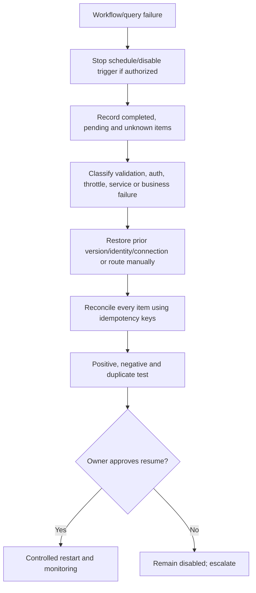

## 10. Source control, IaC, CI/CD, and testing

Automation is a software product even when built in a visual designer. Keep the human-readable definition, parameters, query, permission manifest, test data, expected outputs, release notes, runbook and rollback under version control. Generated exports can contain environment references or connector metadata; inspect and sanitize before commit. Never commit secrets or tenant/customer data.

| Artifact | Version-control expectation | Review focus |
|---|---|---|
| PowerShell | Module manifest/script/function, tests and pinned dependencies | Parameters, output type, `ShouldProcess`, errors, logging, unsafe verbs |
| Graph integration | Endpoint/permission manifest, SDK version, request models and mocks | Least permission, auth flow, pagination, retry, delta/webhook lifecycle |
| KQL | Query, metadata, source/schema version, tests and expected row grain | Time, joins, nulls, entity mapping, performance and privacy |
| Logic Apps | Workflow definition/project, parameters, connection references and IaC | Managed identity, role assignments, secure data, concurrency, retries, cost |
| Power Automate | Solution-aware export, environment variables, connection references, checker results | Personal connections, direct production edits, DLP and ownership |
| Deployment | Pipeline definition and federated identity trust | Protected environments, subject scope, permission diff, approval |
| Runbook | Operate, fail, replay, reconcile, disable and restore | Named owner, screenshots as secondary, exact evidence and exercises |

| Test type | Example | Pass condition |
|---|---|---|
| Static | Lint, parse, schema, secret scan, prohibited-operation scan | No unresolved error, secret or prohibited command |
| Unit/synthetic | Local objects, mocked Graph page, KQL `datatable` | Deterministic expected shape and edge cases |
| Contract | Current API/schema/connector response in lab | Required fields, headers, pagination and permission behavior match |
| Integration | Test tenant/environment with managed identity/connector | End-to-end read and audit evidence; no broad access |
| Negative authorization | Query unapproved resource | Access denied and denial logged without fallback escalation |
| Failure injection | Synthetic timeout, 429, malformed payload, duplicate | Bounded retry/reject/deduplication and observable failure |
| Recovery | Disable, previous version, credential rotation, replay | Known state restored and every item reconciled |
| Performance/cost | Approved load and data volume | Limits, latency, throttle and budget within accepted bounds |
| Security/privacy | Role/consent/run history/export review | Least privilege and no sensitive leakage |
| User acceptance | Operator can interpret and recover using runbook | Accurate decision, escalation and evidence capture |

```mermaid
flowchart LR
    DEV[Branch: code/query/workflow definition] --> PR[Pull request]
    PR --> STATIC[Schema, lint, secret and unsafe-operation scans]
    STATIC --> SYN[Synthetic tests]
    SYN --> SEC[Permission, privacy and cost review]
    SEC --> TEST[Test environment deployment]
    TEST --> NEG[Positive, negative, throttle, duplicate and recovery tests]
    NEG --> APPROVE[Protected production approval]
    APPROVE --> DEPLOY[Versioned deployment]
    DEPLOY --> SMOKE[Read-only smoke test]
    SMOKE --> MON[Health, drift and rollback readiness]
```

### Recheck-current module/API/schema register

| Surface | Record before release | Recheck trigger |
|---|---|---|
| PowerShell engine | Edition/version/platform and language features used | Runtime image or support policy change |
| PowerShell module | Name, source, version, publisher/signature and command syntax | Module update/deprecation/security advisory |
| Graph REST | Operation page, version, permission type, query support and limits | API changelog/retirement or schema error |
| Graph SDK | Language/package version and generated request model | Major/minor update affecting generated names/handlers |
| Azure CLI | CLI and extension versions, cloud and command reference | Agent image/extension update or command warning |
| KQL | Query surface, live tables/columns/types/functions and table plan | Connector/product migration, unified schema or retention change |
| Logic Apps | Consumption/Standard, definition schema/API version, connector version | Platform/connector update or portal transition |
| Power Automate | Environment, solution version, connector and licensing/request limits | Release wave, policy or ownership change |
| Identity | Principal object, auth method, role/app permission and scope | Owner departure, credential/federation or permission change |

## 11. Applied design and review field guide

The examples above teach syntax and control flow. This section teaches the harder consulting task: deciding whether an automation is understandable, supportable, appropriately authorized, and safe to operate. A technically valid script can still fail because the question was vague, the source was incomplete, the identity was overprivileged, pagination stopped early, a retry repeated an action, a schema changed, a connection belonged to a departing employee, or nobody owned the failure queue. Review the full service around the code, not only the code.

### PowerShell production-readiness review

| Review area | Questions to answer before an authorized pilot | Strong evidence | Reject or redesign when |
|---|---|---|---|
| Outcome | What measurable operational outcome does the function produce, for whom, and why is automation preferable to a documented manual process? | Approved requirement, named consumer, expected object contract and acceptance test | The goal is “automate administration” with no bounded task or success measure |
| Scope | Which tenant, subscription, environment, workload, resource types and object population can the script read or affect? | Explicit parameters, target allowlist, environment guard and negative-scope test | Scope is discovered from the caller's broad permissions or current directory alone |
| Input contract | Which fields, types, ranges, encodings, time zones and maximum sizes are accepted? | Parameter validation, sample valid/invalid inputs and schema version | Untrusted free text is interpolated into a query, path, URL or command |
| Empty input | What should happen when zero records arrive or the source returns no page? | Test showing an explicit empty result with reason and completion state | Empty output is treated as success, no data, and completed inventory simultaneously |
| Single versus many | Does one object behave identically to a one-item array, and can large collections stream safely? | Tests for zero, one, many and maximum supported batch | Array unrolling, scalar coercion or pipeline binding changes the output shape |
| Object contract | Are output types and properties stable enough for downstream tools, tests and reports? | `PSCustomObject` or defined type with documented nullable fields and version | Status prose, formatted tables and data objects share the success stream |
| Dependencies | Which PowerShell edition, modules, native tools, APIs and operating systems are supported? | Pinned versions, signed/trusted source, compatibility matrix and update owner | Script downloads latest dependencies at runtime or assumes an administrator workstation image |
| Authentication | Is the operation interactive, delegated, managed identity, federated workload or certificate based, and why? | Identity decision record, sign-in evidence and no password automation | Username/password, embedded token, copied browser session or shared admin account is required |
| Authorization | What exact API operation, cmdlet and resource scope does the identity need? | Permission-to-operation matrix and negative authorization test | Broad directory, subscription or workload role is granted because least privilege was inconvenient |
| `ShouldProcess` | Are all state-changing statements inside the native `ShouldProcess` guard, including helper calls? | Pester/mock test proving `-WhatIf` reaches no mutating dependency | Function advertises `-WhatIf` but creates files, connections, objects or remote changes beforehand |
| Idempotency | What stable key and current-state comparison make a retry safe? | Duplicate input test, prior-outcome lookup and reconciliation report | Every run blindly creates, sends, assigns or invokes again |
| Error model | Which failures terminate, which records may continue, and what does the caller receive? | Typed/error-category behavior, partial-success contract and safe rethrow strategy | Catch block returns “completed” after swallowing permission, timeout or parse failures |
| Retry model | Which operations are transient and idempotent, and what total deadline and maximum attempts apply? | Server-delay handling, bounded backoff, jitter and retry-exhausted result | Authorization, validation and permanent not-found errors are retried indefinitely |
| Pagination | How is an opaque next link preserved, checkpointed and distinguished from complete output? | Page/item counts, completion flag, page-limit alarm and restart test | Script fetches one page or reconstructs a service cursor from assumptions |
| Concurrency | Can parallel calls race the same object, exceed service limits or reorder dependent work? | Partition key, bounded worker count, race/load tests and throttle telemetry | `ForEach-Object -Parallel` is added solely to make a slow design appear faster |
| Logging | Which UTC, identity, operation, version, correlation, count and result fields are recorded? | Structured allowlisted log schema and retention/access classification | Transcript or verbose output captures tokens, headers, customer content or raw API bodies |
| Privacy | Is every input, output, temporary object, cache and export necessary for the approved purpose? | Data-minimization review, redaction test and approved repository | Script inventories an entire tenant because filtering is easier after export |
| Cleanup | Which sessions, streams, files, locks and temporary variables require deterministic cleanup? | `finally`/`clean` behavior tested on success, error and cancellation | Cleanup runs only after success or removes evidence needed for investigation |
| Rollback | How is the schedule stopped, prior version restored and partial work reconciled? | Tested disable procedure, signed prior artifact and item-level reconciliation | “Rerun the script” is the only recovery plan |
| Ownership | Who approves releases, monitors failures, rotates credentials, updates modules and answers support calls? | Named RACI, on-call route, review dates and service-level objectives | Author is the only person who understands the script or owns its account |

#### Plain-English deep-dive: output is a contract, not decoration

The most reusable PowerShell function returns facts in a stable structure. Imagine a courier delivering labeled containers. Downstream consumers can inspect the label and contents without guessing how a human-formatted receipt was spaced. A function that sometimes returns a user object, sometimes a sentence, and sometimes nothing forces every consumer to reverse-engineer its mood. Keep status and diagnostics in the appropriate streams; keep data in the success stream; document whether zero objects means no matches, unavailable source, unauthorized source, or incomplete retrieval.

Formatting commands belong at the presentation boundary. `Format-Table` creates formatting instructions for the host, not a business data set. If a report needs CSV or JSON, project the approved properties first, preserve their types until serialization, specify encoding and time behavior, and validate the exported artifact. A pretty console table is useful for a person but unsuitable as a durable interface.

### PowerShell data-handling decisions

| Data concern | Design decision | Verification method | Operational note |
|---|---|---|---|
| Date and time | Accept ISO 8601 with explicit offset or typed datetime; normalize comparisons to UTC while retaining source time | Test UTC, positive/negative offsets, daylight-saving transition, invalid and missing values | Display local time only at the user-facing boundary with the time zone named |
| Culture | Decide whether numbers/dates are invariant machine data or localized presentation | Run tests under at least two relevant cultures | CSV generated in one locale can parse differently in another if assumptions are implicit |
| Encoding | Choose and document UTF-8 or required target encoding; preserve byte-level evidence separately | Round-trip non-ASCII test and downstream import test | Do not “fix” evidence encoding by silently replacing characters |
| CSV schema | Define columns, order, delimiter, header, null representation and formula-injection treatment | Golden synthetic file and spreadsheet-safe inspection | CSV cannot naturally represent nested objects or strong types |
| JSON schema | Define required/optional properties, types, arrays, depth, enum values and unknown-field behavior | Schema validation and malformed/nested payload tests | Excessive serialization depth can expose unintended object properties |
| Null versus empty | Give null, empty string, zero and missing property distinct meanings where the source does | Four-case test and downstream contract | Collapsing states can create false compliance or false completeness |
| Identifiers | Preserve stable object/resource IDs separately from display names | Rename/duplicate-name test | IDs can still be sensitive and must be protected in evidence packages |
| Boolean | Use true/false types, not “Yes,” “No,” blank and localized variants inside logic | Type validation and serialization round trip | Presentation can map Boolean to friendly text after decisions are complete |
| Enumeration | Validate supported values and define unknown/future behavior | Known, deprecated and future-value tests | Rejecting every new server value can become an outage; silently defaulting can become a security error |
| Large collection | Stream, page or batch according to API; set approved limits and completion indicators | Maximum-volume, throttling and partial-page tests | Holding all records in memory may fail late and lose useful checkpoints |
| Temporary data | Prefer in-memory processing; if a file is necessary, use approved restricted storage and deterministic cleanup | Permission, cancellation and cleanup tests | Temporary directories, shell history and crash dumps can retain sensitive data |
| Export | Minimize columns/rows, classify, name owner and retention, and record query/source/time | Peer review of final artifact and access test as intended recipient | An export creates a new data location with its own risk and lifecycle |

### Microsoft Graph operation contract worksheet

Before an application or script receives consent, complete one row per Graph operation. “Read directory” is not an operation contract. A useful contract identifies the HTTP method and route, API version, resource grain, authentication mode, least documented permission, user/resource authorization, query options, pagination, expected response, errors, limits, audit and owner. This turns consent from a vague trust decision into a reviewable capability list.

| Contract field | Question | Example of an acceptable design statement | Red flag |
|---|---|---|---|
| Business operation | What user or service outcome requires this API call? | Read five selected properties for authorized lab users to validate report schema | “We may need the directory later” |
| HTTP operation | What exact method and documented route are called? | `GET` on a current `v1.0` collection operation | Generic Graph access with no route inventory |
| API status | Is the operation `v1.0`, beta, preview or retired, and what support commitment applies? | `v1.0`, checked August 24, 2026; operation page archived in design evidence | Beta endpoint hidden behind a generally available SDK |
| Cloud | Which Microsoft cloud endpoint and feature availability apply? | Commercial cloud lab; sovereign endpoint and parity explicitly out of scope | Hardcoded `graph.microsoft.com` used for every customer |
| Resource grain | Does one result represent a user, group, message, site, event, alert, incident or aggregate? | One row per directory user; IDs and selected profile properties only | Count mixes users, guests, contacts and service principals without definition |
| Auth mode | Why delegated or app-only, and is a signed-in user genuinely required? | Delegated because the operator reads only resources already authorized to that user | App-only chosen only to avoid interactive sign-in during development |
| Permission | What is the lowest permission documented for this exact operation and access mode? | Named delegated read scope plus the user's resource access | Broad `*.ReadWrite.All` requested for a read-only report |
| User role | Does the signed-in user also need an Entra/workload/resource role? | Reports role documented for the required audit fields | Permission scope assumed to override workload RBAC |
| Resource restriction | Can access be limited to selected sites, mailboxes, groups, administrative units or application access policy? | Current supported resource-specific policy evaluated and negative-tested | Tenant-wide app permission accepted without reviewing available restriction |
| Consent | Who grants consent, for what duration, and how is it reviewed/revoked? | Privileged approver, ticket, permission diff, expiry/review date and owner | Developer self-approves production-wide permission |
| Credential | How does the app prove identity without exposing a reusable secret? | Managed identity or workload federation; certificate fallback with governed lifecycle | Client secret in pipeline variable, flow definition or local profile |
| Query options | Which `$select`, `$filter`, `$orderby`, `$top`, `$expand` and headers are supported? | Operation-specific options documented and tested against known rows | Generic query builder assumes every OData option works everywhere |
| Pagination | What server/client paging behavior and maximum page size apply? | Entire next link followed until absent; page/item totals and completion flag recorded | First page is exported as the inventory |
| Delta | Is change tracking supported and how is the opaque checkpoint protected/rebuilt? | Initial sync and delta lifecycle tested, including removals and token reset | Delta is treated as immutable audit or used after query shape changes |
| Notifications | Are webhooks supported; how are validation, client state, duplicates, renewal and lifecycle events handled? | Authenticated/restricted endpoint, client-state validation, dedupe and renewal alerts | Notification payload assumed to contain complete resource or guaranteed single delivery |
| Batching | Why batch, and how are individual status, dependencies and throttled subrequests evaluated? | Read-only independent subrequests; every subresponse checked; 429 items retried separately | Outer batch `200` recorded as success for every operation |
| Throttling | Which limits/signals apply and how is `Retry-After` honored? | Bounded idempotent retry plus call-volume metrics and delta/notification alternative | Immediate retry loop or parallel fan-out across the tenant |
| Errors | Which Graph error codes are expected and what safe context is retained? | Status, safe code, UTC and request IDs; no token or sensitive payload | Error body dumped wholesale into a broad log channel |
| Audit | Which sign-in, consent, Graph activity and source-resource logs prove use? | Workload sign-in and source audit correlated to request/run ID where available | Application log is the only claimed evidence |
| Owner/lifecycle | Who maintains app, permission, credential, SDK, API migration and incident response? | Named product and technical owners with quarterly review and decommission path | Orphan app registration with no monitored credential expiry |

#### Plain-English deep-dive: delegated is an intersection

Delegated authorization is like a courier carrying a signed request from an employee. The courier application needs permission to carry that class of request, and the employee must already be allowed into the destination. The app scope does not automatically make the user a site owner, mailbox reader, or security administrator. Conversely, a highly privileged user's rights can make a seemingly modest delegated app much more powerful. Test with the intended persona, not only with the developer or Global Administrator who built it.

App-only authorization removes the signed-in human from the transaction. That can be the correct design for a service, but it transfers responsibility to application governance: owner, permission, resource restriction, credential or federation, sign-in monitoring, deployment identity, revocation, and incident response. “No user is required” must not become “no human is accountable.”

### Pagination, delta, batching, and webhook assurance

| Pattern | Lifecycle to design | Completeness test | Failure/recovery requirement |
|---|---|---|---|
| Ordinary paging | Initial URL, every returned next link, terminal page and completion flag | Synthetic collection larger than one page; expected unique item set and page count | Resume from last successful opaque URL; do not use a retry-only cursor for later pages where service guidance warns against it |
| Client page size | Requested `$top` and service-specific accepted maximum | Test below, at and above documented maximum | Handle ignored/clamped/error behavior without claiming the requested size was honored |
| Advanced query headers | Initial request and every subsequent page receive required nonsecret headers | Count/filter query produces consistent complete set across pages | Store required-header metadata with checkpoint; never append old headers blindly to unrelated URLs |
| Delta initial sync | All pages consumed before accepting final delta link | Current snapshot reconciles with a known authorized source set | If interrupted, continue next link; do not publish partial snapshot as current |
| Delta incremental | Stored delta link, changes, tombstones/removals and new checkpoint | Apply changes to a copy; compare resulting state with periodic controlled full validation | Detect expired/reset token and rebuild through documented initial synchronization |
| Webhook validation | Endpoint proves ownership within service timeout and does not log validation material | Controlled subscription validation succeeds and unauthorized requests fail | Validation failure alerts an owner; no insecure bypass endpoint is introduced |
| Notification security | Validate client state or current supported authenticity mechanism; minimize payload | Modified/missing state rejected; replay/duplicate handled | Quarantine ambiguous notification and fetch resource through authorized API rather than trusting payload |
| Subscription renewal | Track expiration, renewal window, permission and endpoint health | Short lab lifetime proves renewal and expiry behavior | Alert before expiry; rebuild through approved process if renewal fails |
| Lifecycle notification | Handle reauthorization, missed notification and subscription removal states | Simulated lifecycle states route to correct owner and recovery | Stop pretending monitoring is healthy when authorization or subscription is stale |
| JSON batch | Subrequest IDs, dependencies, individual headers/status and response correlation | Mixed synthetic success/error/throttle batch produces correct per-item outcome | Retry only eligible failed subrequests after server delay; preserve dependency order |
| Large extraction | Decide whether REST, delta, notifications or Graph Data Connect is appropriate | Load test demonstrates limits, duration, completeness, privacy and cost | Do not evade throttling with more identities, tenants, regions or uncontrolled parallel clients |
| Checkpoint storage | Protect opaque URLs/tokens as sensitive operational state with version/scope | Wrong environment/query checkpoint is rejected | Atomic update, previous checkpoint recovery and rotation/retention policy |

An inventory is complete only when the service indicates there is no next page and the client records that terminal state. A row count alone is weak: permissions can hide rows, filters can be unsupported or silently ineffective, delta state can be stale, and an interrupted job can export a plausible partial file. Include a completion Boolean, pages retrieved, items retrieved, query/version, start/end UTC, and any known omissions in the report metadata.

Do not treat batching as a permission or throttling bypass. Each subrequest is authorized and throttled according to its own operation. A batch reduces network round trips and can express dependencies, but it introduces a second result layer: the outer request and every inner response. Operational dashboards must count subrequest failures, not only batch transport failures.

### KQL peer-review worksheet

| Review dimension | Reviewer questions | Test evidence | Common defect |
|---|---|---|---|
| Question | Can a nonauthor state in one sentence what the query proves and does not prove? | Query metadata and expected row grain | Query begins with available tables rather than an investigation question |
| Surface | Is this Sentinel/Log Analytics, Defender hunting, data lake, Azure Resource Graph or another Kusto surface? | Named portal/API/workspace and checked date | Query is called “KQL” without a target schema |
| Scope | Which tenant, workspace, source, table, device group and time range are included? | Scope capture and known authorized sample | Portal picker, default workspace or hidden UI filter changes results |
| Source health | Is telemetry present, timely, correctly parsed and complete enough for the conclusion? | Known positive source event traced end to end | Query quality is reviewed while connector/sensor is unhealthy |
| Row grain | What does one input and output row represent? | Grain statement before and after summarize/join | Event, alert, incident and entity counts are mixed |
| Timestamp | Which clock is filtered, and what ingestion/source delay exists? | Source versus `TimeGenerated`/`Timestamp` comparison | Rule lookback misses late data or double-processes overlapping windows |
| Types | Are compared/joined fields the same scalar type, and are failed casts visible? | Valid/invalid/null conversion tests | Failed `toint`/`todatetime` becomes null and silently disappears |
| Case/normalization | Is normalization justified by identifier semantics? | Mixed-case and whitespace examples plus stable-ID comparison | Lowercased display text is treated as a durable entity key |
| String operator | Does `has`, `contains`, equality, regex or case-sensitive variant match intent? | Token, substring, malformed and case tests | Broad substring search creates noise and high scan cost |
| Time filter | Is the bounded predicate applied as early as the surface supports? | Query statistics and boundary-time cases | Full-retention scan precedes selective filters |
| Projection | Are required correlation/entity fields retained and unnecessary sensitive columns removed? | Output contract and privacy review | Raw payload travels through every join and export |
| Parsing | Is connector-parsed data preferred, and are parse failures counted? | Valid, malformed, missing and changed-format rows | Regex assumes every vendor version uses one text template |
| Dynamic data | Are nested properties cast, arrays bounded and expansion multiplication measured? | Pre/post `mv-expand` counts and null tests | Array expansion silently turns one alert into hundreds of “events” |
| Aggregation | Which detail is discarded, and are grouping dimensions sufficient for investigation? | Known receipts-to-total style reconstruction test | `summarize` removes IDs/times needed to explain an alert |
| Distinct count | Is approximate `dcount` acceptable or is exact behavior required and supported? | Accuracy expectation and scale test | Approximate values compared as exact audit totals |
| Join key | Is it stable, typed, normalized and unique enough? | Cardinality profile and unmatched samples | Display name, IP alone or truncated ID causes false correlation |
| Join kind | Does inner, left outer, semi, anti or lookup match the analytical question? | Positive, negative, duplicate and missing-right cases | Default join semantics are accepted without understanding left deduplication |
| Join multiplication | What are left/right duplicate counts and pre/post row totals? | Multiplication report by key | Many-to-many rows inflate event, user or device counts |
| Union | Are source label, column names/types and missing fields normalized? | Source-specific sample and schema output | Suffixed type columns or null fields are ignored |
| Threshold | Is the value tied to baseline, risk, rule frequency and expected volume? | Historical/synthetic boundary tests and rationale | Round number copied from another environment |
| Exclusions | Are exceptions narrow, owned, dated, tested and visible in metrics? | Exception register and expiry test | Broad service-account exclusion hides compromised activity |
| Series/anomaly | Is the history dense/long enough and seasonality understood? | Known normal spike, sustained change and sparse-series tests | Statistical anomaly is labeled malicious or causal |
| Performance | Are scanned volume, memory, join strategy, result size and repeated subexpressions acceptable? | Query statistics/plan at pilot scale | `materialize`, regex or cross-workspace union used as unexplained magic |
| Privacy | Is use authorized and are output/export fields minimized? | Purpose approval, role and final-artifact inspection | Query author can technically read data but investigation purpose is absent |
| Portability | Has every target surface's table, field, function and retention difference been mapped? | Side-by-side synthetic and known-event results | Search-and-replace changes only table name |
| Detection output | Do result rows contain stable event time, report ID and mapped entities required by the target rule? | Rule-schema validation and incident/entity test | Hunt looks useful but cannot create stable, deduplicated alerts |
| Testing | Are positive, negative, boundary, null, duplicate, late and schema-change cases automated or recorded? | Synthetic `datatable` pack with expected outputs | Author validates only that query compiles |
| Ownership | Who tunes, investigates, monitors no-data/volume drift and retires the query/rule? | Named owner, runbook, SLO and review date | Query is promoted then abandoned |

#### Plain-English deep-dive: a query result is bounded testimony

A KQL result says, “For the data I could access, in these tables, under this schema, during this time range, after these filters and transformations, these rows were returned.” It does not automatically say the event never happened, the identity is malicious, the connector captured everything, the user caused the action, or no related event exists elsewhere. Good analysts state the boundary alongside the finding.

Aggregation is an evidence trade. Counting failures by user can reveal concentration, but it removes each attempt's request ID, application, IP and exact time unless retained or recoverable. Design a detection output for the next investigator: enough stable fields to reopen the source evidence, map entities and explain why the row crossed the threshold.

### Workflow production-readiness review

| Review area | Design questions | Required evidence | Reject or redesign when |
|---|---|---|---|
| Trigger semantics | At-most-once, at-least-once, scheduled poll, webhook, manual or event stream? Can delivery duplicate, reorder or arrive late? | Source contract and duplicate/out-of-order tests | Designer assumes one source event always creates exactly one run |
| Trigger trust | How are caller identity, issuer, audience, signature/client state, network and schema validated? | Unauthorized, malformed, oversized and replay tests | Possession of a callback URL is the only long-term control for sensitive workflow |
| Input classification | Does payload contain personal, security, legal, credential or customer content? | Data-flow classification and minimization | Entire incident/email/document body is copied “for convenience” |
| Input limit | What maximum bytes, arrays, attachments, nesting and duration are accepted? | Boundary/oversize rejection test | Platform limit is discovered only during a major incident |
| Environment guard | How does workflow prove it is in intended tenant, subscription, resource group or Power Platform environment? | Deployment parameter and runtime assertion | Same package can target production from developer defaults |
| Identity per action | Which identity or connector authorizes each target call? | Sequence/data-flow diagram and effective-permission tests | One highly privileged connection is reused for unrelated actions |
| Editor privilege | Can a workflow editor use or redirect the managed identity/connection? | Role review for workflow, connections, Key Vault and deployment pipeline | Least privilege is assessed only on runtime identity, not people who control code |
| Connector governance | Is connector supported, licensed, regionally available and permitted by DLP/Azure Policy? | Current connector reference, policy result and fallback | Maker chooses a consumer connector that moves regulated data outside boundary |
| Connection ownership | Is connection personal, service-owned, managed identity or service principal, and what happens on departure? | Owner/co-owner, renewal and break/fix test | Flow depends on one employee's refresh token |
| Validation | Are required fields, enums, IDs, tenant/resource, timestamps and versions checked before actions? | Contract tests and rejected-message record | Null/default values select a broad target |
| Idempotency | What stable source ID and operation version form the key; is reservation atomic? | Duplicate and concurrent duplicate test | “Check if row exists, then create” races under parallel runs |
| State | Where are queued, reserved, approved, completed, failed and reconciled outcomes stored? | State model, retention and consistency decision | Run history is the only business state store |
| Concurrency | What global and per-resource limits protect dependencies and ordering? | Load/race test and throttle metrics | Default parallelism is accepted without target API analysis |
| Retry | Which statuses are transient, and does target honor idempotency/ETag? | Retry matrix, total deadline and exhausted-retry path | Default retry silently repeats a non-idempotent connector action |
| Timeout | What happens when trigger, approval, connector, child workflow or target exceeds deadline? | Timeout test and explicit terminal state | Timed-out run is replayed without checking target completion |
| Approval | Does approver receive scope, evidence, effect, residual risk, recovery and expiry? | Approval contract, separation-of-duty and timeout test | Approval defaults to yes or requester approves own high-impact action |
| Branch status | Do failed, skipped, timed-out and succeeded paths produce truthful aggregate status? | Scope/run-after tests for every terminal combination | Catch branch sends email then entire failed business transaction appears successful |
| Partial success | How are per-item results retained and reconciled? | Item-level outcome table and rerun behavior | Batch/run status overwrites mixed suboperation results |
| Dead letter | Where do permanently failed inputs wait, who owns queue, and how are they replayed safely? | Restricted queue, alert, triage SLA and replay idempotency | Failed payload is emailed or silently discarded |
| Run history | Are sensitive inputs/outputs secured through every downstream step? | Final run-history inspection by least-privilege operator | Secret is hidden in one action but exposed in compose, error or notification |
| Diagnostics | Which run, action, request, connector and source IDs correlate across systems? | Structured telemetry and sample support pack | Screenshot is the only troubleshooting evidence |
| Health | How are no-runs, failure rate, duration, queue age, throttling, auth expiry and volume drift monitored? | SLOs, alerts, dashboard and on-call response | Monitoring alerts only after users complain |
| Cost/capacity | Which triggers/actions/connectors/hosting/logs/storage/API calls consume license or Azure meters? | Load model, budget alerts and actual pilot usage | “Included in Sentinel/M365” replaces a bill of materials |
| Change | How are definitions, parameters, identities, roles, connectors and policies versioned/reviewed? | Pull request, permission diff and protected environment | Direct production designer edit has no reproducible artifact |
| Deployment | Is identity federated/secretless, environment-scoped and unable to approve its own broader role? | Pipeline trust, protected branch/environment and deployment log | Pipeline identity is subscription Owner or tenant Global Administrator |
| Smoke test | Can a safe read-only test verify deployed version, identity, permission and diagnostics? | Positive and negative postdeployment tests | Smoke test changes live data or tests only HTTP success |
| Disable | Can owner stop new triggers without losing queued/evidence state? | Tested kill switch and communications route | Deleting workflow/resource is the only stop mechanism |
| Rollback | Can prior version/connections be restored and partial work reconciled? | Signed prior artifact and recovery exercise | Rollback ignores external actions already completed |
| Continuity | Is there a documented manual process and backlog/replay decision during outage? | Continuity runbook and exercise | Business service stops because automation is unavailable |
| Ownership | Who owns trigger, workflow, connection, identity, target API, data, support and risk? | RACI, on-call, escalation and review cadence | Platform team is named owner of business decisions it cannot make |

### Scenario review drills

| Scenario | Safe reasoning path | Evidence to request | Decision to avoid |
|---|---|---|---|
| Nightly user inventory returns fewer rows | Confirm tenant/account/permission and query, then inspect page count, terminal next-link state, filters, service health and source population before comparing output | Run/version, Graph endpoint, permission context, page/item counts, completion flag, request IDs and prior baseline | Declaring users deleted or increasing permissions before proving incomplete paging |
| Graph report starts receiving 429 | Measure caller/tenant operation volume, honor server delay, bound retries, reduce selected properties/frequency and evaluate delta, notifications, batching or Data Connect | Status/header/request IDs, attempt/delay metrics, schedule overlap, item/page counts and API-specific limits | Adding parallel identities or immediate retries to “work around” throttling |
| Delegated query works for developer but not analyst | Compare app delegated scope, each user's role/resource authorization, tenant, Conditional Access and target data permission | Sign-in logs, consent, user roles, resource ACL and identical request IDs/route | Granting analyst Global Administrator because developer test used one |
| Managed-identity workflow gets 403 | Separate token acquisition from authorization; verify exact audience, identity object, target role/app permission, scope and propagation | Workload sign-in, safe token metadata without token value, IAM/app role, target request ID and audit | Adding broad Contributor at subscription scope before identifying missing action |
| Playbook runs twice for one incident | Confirm delivery semantics, automation rules, retries, manual invocations and concurrent triggers; implement atomic idempotency on incident/action/version | Trigger/run IDs, rule history, retry records, state-store reservations and target audit | Suppressing the second run without reconciling whether both performed actions |
| Flow owner leaves company | Inventory flows, connections, connection references, approvals, service accounts and co-owners; move to governed identity pattern where supported and test reauthentication | Ownership export, environment/solution, connection status, run failures, DLP and business owner | Assigning all flows to a generic shared user with permanent broad access |
| KQL detection volume jumps | Verify source volume/schema/connector/rule changes, time window, join multiplication, exclusions and actual behavior before tuning | Query/rule version, row counts at each stage, source health, known examples and Message center/change record | Raising threshold immediately and hiding a real increase or broken join |
| KQL query returns zero | Check target surface/workspace/table, explicit time, source ingestion, schema/case/type, permissions and filters using a known authorized event | Tables/schema pane, connector health, sample event, query scope and UTC clocks | Concluding absence of activity or widening to all retention without a hypothesis |
| PowerShell job reports success with missing CSV rows | Separate process exit, command errors, pagination, serialization and file-write completion; compare item counts and error streams | Job transcript after redaction review, structured log, page totals, source count, file hash/row count and errors | Treating file existence or zero exit code as business completeness |
| Connector credential expires | Identify affected workflows/actions, stop unsafe replay, restore through approved owner/identity process, then reconcile queued/unknown outcomes | Connector status, sign-in/auth errors, expiry/owner records, run IDs and target audit | Embedding a new secret directly in each workflow as emergency repair |
| API adds a new enum value | Preserve unknown value, route to review, update schema/tests and decide behavior explicitly | Raw safe field, API changelog, operation version, impacted counts and test cases | Mapping unknown to success, compliant or lowest severity by default |
| Workflow timeout after target accepted request | Query target by idempotency/request key before deciding replay; classify completed, failed, pending and unknown | Client/run/request IDs, target audit/status and retry record | Blind retry that duplicates ticket, message, assignment or response action |
| Secure outputs hide diagnostics | Balance confidentiality with observability: retain nonsecret status, IDs, duration and error class outside secured payload, with restricted deep-access procedure | Run-history settings, diagnostic destination, sample support event and access controls | Turning off secure data globally to make troubleshooting easier |
| Azure CLI reads wrong subscription | Stop, record no further action, verify cloud/account/default subscription and require explicit approved target parameter | `az account` minimized context, deployment/run log and target allowlist | Continuing because command is “read-only”; metadata from wrong client is still unauthorized |
| Beta API property disappears | Disable dependent release/job if output contract is unsafe, restore prior supported path, assess partial output and migrate deliberately | API/SDK version, changelog, schema tests, last good artifact and downstream impact | Patching around missing property with an unrelated field and no semantic review |

### Operational handover pack

| Handover artifact | Minimum content | Acceptance test |
|---|---|---|
| Service summary | Outcome, users, trigger, schedule, systems, data classification, criticality and support hours | New operator can explain what stops if automation is unavailable |
| Architecture | Tenant/cloud, environments, identity, APIs/connectors, state stores, logs, network and trust boundaries | Reviewer can trace one request and one failure end to end |
| Ownership/RACI | Business owner, product owner, automation owner, identity owner, data owner, on-call, approver and vendors | Every alert and decision has one accountable route |
| Inventory | Scripts/functions/modules, Graph apps, managed identities, certificates, flows, Logic Apps, connections, rules, queries and pipelines | Inventory reconciles to live authorized resources |
| Permission manifest | Principal, auth mode, exact operations/permissions, scopes, consent, assignments, expiry and review | Negative authorization test denies out-of-scope resource |
| Configuration | Environment variables, nonsecret parameters, schedules, limits, feature flags and version | Rebuild in test without undocumented portal values |
| Secret/certificate register | References only, owners, stores, expiry/rotation and failure alert; never secret values | Rotation exercise succeeds and old credential is rejected |
| Data contract | Input/output schemas, types, nulls, time zones, size, version and compatibility behavior | Valid, malformed, unknown-value and maximum-size tests pass |
| State/idempotency | State machine, key composition, reservation/expiry, duplicate and reconciliation rules | Concurrent duplicate test produces one approved outcome |
| Error matrix | Validation, auth, permission, conflict, throttle, timeout, service and business errors | Each synthetic failure reaches expected state, alert and owner |
| Monitoring | SLOs for success, duration, freshness, queue age, no-data, throttle, auth and volume drift | Alert fires in exercise and operator locates correlated run |
| Dashboards/reports | Metric definition, source, query, scope, timezone, refresh, owner and caveat | Number can be reproduced from source evidence |
| Runbook | Start/stop, inspect, retry, replay, reconcile, rotate, restore and escalate | On-call completes a tabletop without author assistance |
| Continuity | Manual fallback, backlog capture, priority, capacity and replay/abandon decision | Business process continues during simulated outage |
| Deployment | Source repository, branch, build, tests, artifact, identity, approvals and environment promotion | Prior approved version deploys reproducibly to test |
| Rollback | Trigger, authority, disable, prior artifact, connection/identity handling, external-effect reconciliation and validation | Exercise restores service and accounts for every synthetic item |
| Security/privacy | Threat model, DLP/policy, run-history protection, export controls, retention and access reviews | Least-privilege/privacy reviewer signs current evidence |
| Cost/capacity | Meters/licenses, expected volume, budget/limit alerts and optimization owner | Pilot actual usage reconciles with forecast dimensions |
| Support pack | Required IDs, logs, redaction, transfer route, Microsoft/vendor entitlement and escalation contacts | Operator can build a sanitized case from synthetic failure |
| Change register | Module/API/schema/connector/license/portal dependencies, sources and review triggers | Simulated deprecation creates owned backlog before failure |
| Known limitations | Unsupported cases, preview dependencies, scale limits, delayed consistency and residual risks | Consumer acknowledges each limitation and workaround |
| Training | Operator, developer, approver and business-owner tasks with evidence level | Named backups demonstrate their role independently |
| Review calendar | Permission, credential, owner, dependency, cost, resilience and retirement reviews | Missed review creates visible escalation rather than silent staleness |
| Decommission | Stop trigger, preserve required evidence, revoke consent/roles, retire identity/connection, archive code and notify consumers | Test inventory shows no orphan privilege, schedule or unsupported dependency |

#### Plain-English deep-dive: rollback is reconciliation

Restoring a previous workflow definition does not reverse emails already sent, tickets already created, roles already assigned, or records already updated. Technical rollback restores the system's ability to process future work under a known version. Operational recovery also classifies every in-flight item as completed, not completed, pending, duplicated or unknown and then applies an approved reconciliation decision. This is why stable operation keys, target request IDs and item-level outcomes matter before an incident.

A safe disable switch stops new work while preserving evidence and queued state. Deleting a workflow to stop it destroys context and can make recovery harder. The runbook should name who may disable, how stakeholders are notified, how backlog is captured, what manual process applies, and what tests permit controlled restart.

### Senior-consultant review prompts

| Prompt | What a strong answer demonstrates |
|---|---|
| “Show me the least-privilege proof.” | Maps each operation to permission and resource scope, includes effective positive/negative tests, assignment path, activation, consent and current source rather than citing a role name |
| “How do you know the inventory is complete?” | Explains terminal pagination/delta state, scope, permission, filters, counts, known omissions, source health, UTC window and reconciliation rather than pointing to a generated file |
| “What happens when this runs twice?” | Names stable idempotency key, atomic reservation, target behavior, prior-outcome return, duplicate telemetry and reconciliation for ambiguous completion |
| “What happens when Microsoft changes the schema?” | Names dependency register, contract/synthetic tests, unknown-field behavior, release monitoring, owner, disable/fallback path and controlled migration |
| “Who can use the managed identity?” | Reviews both runtime assignment and humans/pipelines able to edit workflow, redirect requests, alter connections or change identity roles |
| “Where could sensitive data leak?” | Traces input, variables, run history, logs, errors, approvals, notifications, exports, temporary files, pipeline artifacts and support packages |
| “How is failure visible before a user complains?” | Defines no-run/freshness, failure rate, duration, queue age, auth expiry, throttle and volume-drift signals with tested on-call routing |
| “What is the rollback?” | Separates disable, prior version restore, credential/connection handling, external-effect reconciliation, validation, communication and resume authority |
| “Why this platform?” | Compares PowerShell, Graph SDK/REST, Logic Apps, Power Automate and native product capability using ownership, identity, scale, network, ALM, cost and operator skill |
| “What is your personal evidence?” | Distinguishes production support/automation experience from synthetic lab, design study and areas requiring specialist review without underselling transferable troubleshooting discipline |

## 12. Candidate interview quick reference

| Question | Model answer |
|---|---|
| Why PowerShell instead of manual portal work? | It provides object-based, repeatable, testable operations and evidence. I still design least privilege, `WhatIf`/`ShouldProcess`, idempotency, errors, logging, review and rollback; automation is not permission to bypass change control. |
| Delegated versus app-only Graph? | Delegated combines app scopes with a signed-in user's authorization. App-only uses the workload's application permission/RBAC without a user and can be much broader. I choose by use case and verify the least operation/resource scope. |
| How do you handle Graph paging? | Follow the entire `@odata.nextLink` unchanged until absent, preserve required headers, bound/restart safely, track page/item counts, and never call partial results complete. |
| How do you handle 429? | Honor `Retry-After`; otherwise use bounded exponential backoff with jitter for idempotent requests. Reduce call volume and prefer delta, notifications, batching or Data Connect where appropriate. |
| KQL versus SQL? | Both query tabular data, but KQL usually starts from a table and pipes tabular results through operators. Operator order, time scope, schema, row grain and type handling are central. |
| Can a Sentinel KQL query run in Defender? | Concepts transfer, but schemas do not automatically. I map table, time column, fields, types, functions, retention and row semantics in the target surface and rerun synthetic/known-event tests. |
| How do you secure a playbook? | Least-privilege managed identity where supported, restricted editors, validated input, idempotency, bounded retries/concurrency, secure run history, approvals for sensitive actions, diagnostic/audit correlation, versioning and tested disable/rollback. |
| How do you store secrets? | Prefer eliminating them through managed identity or workload federation. If unavoidable, use governed Key Vault/certificate lifecycle, narrow access, rotation/expiry alerts, secure inputs/outputs and no logs/source-control exposure. |

### Thirty-second memory hooks

| Topic | Hook |
|---|---|
| PowerShell | Objects in, objects out; format last |
| Safe change | Validate, `ShouldProcess`, idempotency, audit, rollback |
| Errors | Catch terminating errors; retry only transient idempotent work |
| Graph auth | Token audience plus app permission plus user/resource rights |
| Graph collections | Select, filter, page to no nextLink, count completion |
| Throttle | `429` means wait as told, then reduce demand |
| KQL | Question -> time -> filter -> type -> correlate -> project -> validate |
| Schema | KQL travels; table contracts do not |
| Workflow | Trigger, validate, dedupe, identity, approve, observe, recover |
| Secret | Best secret is no secret; managed identity/federation first |

## Official Source Anchors

These links are starting points. Verify the exact operation, target service/cloud, current module/SDK/connector/schema, permission and limits before implementation.

| Domain | Official Microsoft source |
|---|---|
| PowerShell overview | [What is PowerShell?](https://learn.microsoft.com/powershell/scripting/overview) |
| PowerShell pipeline | [About pipelines](https://learn.microsoft.com/powershell/module/microsoft.powershell.core/about/about_pipelines) |
| Advanced functions | [About advanced functions](https://learn.microsoft.com/powershell/module/microsoft.powershell.core/about/about_functions_advanced) |
| `ShouldProcess` | [Advanced function methods](https://learn.microsoft.com/powershell/module/microsoft.powershell.core/about/about_functions_advanced_methods) |
| Common/risk parameters | [About common parameters](https://learn.microsoft.com/powershell/module/microsoft.powershell.core/about/about_commonparameters) |
| Error handling | [About try, catch, and finally](https://learn.microsoft.com/powershell/module/microsoft.powershell.core/about/about_try_catch_finally) |
| Graph overview | [Microsoft Graph overview](https://learn.microsoft.com/graph/overview) |
| Graph auth | [Authentication and authorization basics](https://learn.microsoft.com/graph/auth/auth-concepts) |
| Graph permissions | [Microsoft Graph permissions reference](https://learn.microsoft.com/graph/permissions-reference) |
| Graph query parameters | [Customize responses with query parameters](https://learn.microsoft.com/graph/query-parameters) |
| Graph paging | [Paging Microsoft Graph data](https://learn.microsoft.com/graph/paging) |
| Graph throttling | [Microsoft Graph throttling guidance](https://learn.microsoft.com/graph/throttling) |
| Graph SDKs | [Microsoft Graph SDK overview](https://learn.microsoft.com/graph/sdks/sdks-overview) |
| Graph PowerShell | [Microsoft Graph PowerShell SDK overview](https://learn.microsoft.com/powershell/microsoftgraph/overview) |
| Delta query | [Microsoft Graph delta query](https://learn.microsoft.com/graph/delta-query-overview) |
| Change notifications | [Microsoft Graph change notifications](https://learn.microsoft.com/graph/change-notifications-overview) |
| Azure CLI auth | [Sign in with Azure CLI](https://learn.microsoft.com/cli/azure/authenticate-azure-cli) |
| KQL | [Kusto Query Language overview](https://learn.microsoft.com/kusto/query/) |
| Sentinel KQL | [KQL overview for Microsoft Sentinel](https://learn.microsoft.com/azure/sentinel/kusto-overview) |
| Defender hunting language | [Advanced hunting query language](https://learn.microsoft.com/defender-xdr/advanced-hunting-query-language) |
| Logic Apps errors | [Handle workflow errors and exceptions](https://learn.microsoft.com/azure/logic-apps/error-exception-handling) |
| Logic Apps security | [Secure access and data in workflows](https://learn.microsoft.com/azure/logic-apps/logic-apps-securing-a-logic-app) |
| Sentinel automation | [Automation in Microsoft Sentinel](https://learn.microsoft.com/azure/sentinel/automation/automation) |
| Power Automate errors | [Employ robust error handling](https://learn.microsoft.com/power-automate/guidance/coding-guidelines/error-handling) |
| Power Platform ALM | [Application lifecycle management](https://learn.microsoft.com/power-platform/alm/) |
| Managed identities | [Managed identities for Azure resources](https://learn.microsoft.com/entra/identity/managed-identities-azure-resources/overview) |
| Workload federation | [Workload identity federation](https://learn.microsoft.com/entra/workload-id/workload-identity-federation) |
| Key Vault | [Azure Key Vault basic concepts](https://learn.microsoft.com/azure/key-vault/general/basic-concepts) |

## Completion checklist

| Check | Pass condition |
|---|---|
| Safety | Every non-Mermaid fenced example is local, synthetic, read-only, `WhatIf`, disabled or pseudocode and has purpose/safety/shape/failure/source labels |
| No secrets | No tenant ID, client secret, token, cookie, production identifier or real credential appears |
| No unsafe action | No destructive, remediation, control-disabling, broad-consent, malware or attack command/content appears |
| PowerShell | Objects, pipeline, filter/select/foreach, splatting, functions, parameters, validation, errors, logging, transcript, redaction and `ShouldProcess` are covered |
| Reliability | Idempotency, pagination, retry/backoff, rate limits, partial failure, time zones and serialization are covered |
| Graph | Delegated/app-only/managed identity/certificate/secret caveats, least privilege, versioning, OData, paging, 429, IDs, SDK/REST, batch/delta/webhooks are covered |
| Azure CLI | Cloud/account/subscription/resource context and metadata-only reads are included without token retrieval |
| KQL | Operators, types, strings, parsing, dynamic JSON, joins, series, performance and schema distinction are covered |
| KQL exercises | More than 30 queries use synthetic `datatable` data and no production table dependency |
| Detection | Conversion checklist includes source, schema, time, logic, baseline, performance, promotion, response and health |
| Automation | Logic Apps/Sentinel playbooks, Power Automate, identity, connectors, approvals, idempotency, concurrency, errors, audit and rollback are covered |
| Delivery | Source control, IaC, CI/CD, workload federation, tests, protected environments and recovery are covered |
| Currency | August 24, 2026 baseline and recheck warnings cover APIs, modules, SDKs, commands, schemas, connectors and limits |
| Honesty | Production, lab and conceptual experience are explicitly separated |

**Final use gate:** For any example, explain its purpose, input/output shape, safety level, identity, permission, page/rate behavior, errors, audit, test, and rollback. If you cannot name all ten, keep it in the synthetic lab.

Next planned reference: [Appendix E - Consulting Templates and Checklists](Appendix-E-consulting-templates-checklists.md).