# Appendix E - Consulting Templates and Checklists

> **Currency boundary:** This public, general-purpose library reflects information available through **August 24, 2026**. It is not a Deloitte methodology, deliverable, endorsement, or representation of Deloitte proprietary material. Tailor every artifact to the client, contract, law, regulation, industry, geography, cloud, product release, and approved delivery method.
>
> **Safety and evidence boundary:** Templates do not grant authority to inspect systems, collect personal data, change production, accept risk, or represent legal conclusions. Collect the minimum approved evidence, preserve original timestamps and identifiers, record provenance and access, redact exports, separate fact from inference, and use approved repositories and retention. Never place credentials, tokens, private keys, recovery codes, message bodies, regulated data, or unrestricted tenant exports in a working document.
>
> **Candidate honesty note:** You can use these artifacts to demonstrate structured discovery, support discipline, troubleshooting, executive communication, and design reasoning. You should distinguish a template you can apply from a production deliverable you personally owned. A credible phrase is: "I would adapt this public template with the accountable client owner, validate it against the statement of work and evidence, and obtain the required security, legal, architecture, operations, and change approvals."

This appendix turns the consulting lifecycle in [Part 53](Part-53-consulting-discovery-current-state-scope.md) through [Part 63](Part-63-documentation-reporting-automation-quality.md) into a copy/adapt library. Replace every bracketed field. The fictional examples use **Northstar Retail**, a synthetic organization; they are not customer facts.

## 1. How to use the library

1. Copy only the template needed for the approved deliverable.
2. Keep the field names and instructions until the artifact owner confirms they are unnecessary.
3. Replace synthetic examples; never relabel them as discovered facts.
4. Link claims to evidence IDs, not uncontrolled attachments or secret-bearing screenshots.
5. Run the template-specific quality gate and the universal gate before approval.
6. Record reviewer decisions, unresolved gaps, version, and disposition in the controlled repository.

| Marker | Meaning | Required action |
|---|---|---|
| `[Required]` | Necessary for a defensible artifact | Complete or record owner-approved reason for omission |
| `[Conditional]` | Needed when the stated condition applies | Mark not applicable with rationale when omitted |
| `[Unknown]` | Discovery has not established the answer | Assign owner and due date; do not silently guess |
| `[Assumption]` | Temporary proposition used to continue work | Link to assumptions log and define validation |
| `[Evidence: E-###]` | Claim is supported by a cataloged item | Link to metadata record; restrict access to source |
| `[Decision: D-###]` | Choice is approved and recorded | Link to decision record and consequences |

### Universal document-control block

Place this block at the top of every adapted artifact.

| Field | Copy/adapt value | Instruction |
|---|---|---|
| Artifact ID | `[ENG-ARTIFACT-###]` | Stable identifier; never recycle |
| Engagement/client | `[Approved engagement]` | Use approved client naming and classification |
| Owner / approver | `[Named owner] / [Named approver]` | Owner maintains; approver is accountable for acceptance |
| Version / status | `[0.1] / [Draft-In review-Approved-Retired]` | Increment under repository convention |
| Effective / review date | `[UTC date] / [UTC date]` | Avoid ambiguous local dates |
| Classification | `[Public-Internal-Confidential-Restricted]` | Follow the client's policy, not this example |
| Evidence handling | `[Repository, access group, retention, redaction]` | Reference evidence IDs; do not embed secrets or bulk raw data |
| Related records | `[Scope, decision, risk, change, requirement IDs]` | Preserve traceability across artifacts |
| Change summary | `[What changed and why]` | Make review impact visible |

### Universal evidence record

| Evidence ID | Source and collector | UTC window | Integrity/provenance | Access and retention | Supports / limitations |
|---|---|---|---|---|---|
| E-001 | Northstar synthetic Conditional Access export; Analyst A | 2026-08-24T09:00Z to 09:05Z | Read-only export; source filename and hash in restricted catalog | Restricted project evidence; 90-day review | Supports policy inventory; does not prove runtime enforcement |

### Universal quality gate

| Gate | Pass question |
|---|---|
| Authority | Was the work and evidence collection explicitly authorized and in scope? |
| Accuracy | Are facts supported, assumptions labeled, and unknowns visible? |
| Completeness | Does the artifact cover agreed people, process, technology, data, and operations? |
| Traceability | Can each material requirement, finding, decision, risk, test, and change be followed to evidence and ownership? |
| Safety | Are secrets excluded, sensitive content minimized, and access/retention appropriate? |
| Currency | Were product behavior, licensing, roles, limits, and official guidance rechecked? |
| Operability | Are monitoring, support, failure, rollback, and recovery represented? |
| Approval | Did the correct accountable owners approve, with conditions recorded? |

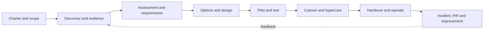

## 2. Initiation and scope templates

### Template 01 - Engagement charter

**Use when:** launching a bounded assessment, design, migration, or operational-improvement engagement. Draft with the sponsor and delivery lead before detailed discovery.

| Charter field | Copy/adapt entry | Fictional Northstar example |
|---|---|---|
| Business context | `[Why now; affected capability; consequence]` | Store growth and remote administration increased identity-control inconsistency |
| Outcome | `[Observable future result]` | Approved identity security roadmap and pilot decision, not a tenant-wide deployment |
| Objectives | `[Three to five measurable objectives]` | Inventory privileged access; assess authentication controls; prioritize 90-day actions |
| Deliverables | `[Named artifacts and acceptance form]` | Current state, findings, HLD, prioritized roadmap, executive readout |
| Boundaries | `[Tenants, users, regions, workloads, dates]` | One synthetic corporate tenant; no production changes or credential collection |
| Governance | `[Sponsor, lead, cadence, escalation]` | Sponsor: CIO; client lead: Identity Manager; weekly steering review |
| Success measures | `[Measure, baseline, target, date]` | 100% of agreed privileged roles mapped to owner and evidence ID by review |
| Constraints | `[Time, access, legal, dependency]` | Read-only evidence; four-week discovery; retail change freeze |
| Acceptance | `[Approver, criteria, due date]` | Sponsor accepts when comments are resolved or recorded as exceptions |

**Instructions:** Write the outcome as a client result, not consultant activity. Separate objectives from deliverables. Confirm what acceptance means, who can change scope, and which assumptions could invalidate the plan. Read the charter aloud with sponsor, technical owner, security, and operations; inconsistent interpretations are defects.

**Quality gate:** Every objective maps to a deliverable and success measure; every deliverable has an approver; boundaries exclude unauthorized activity; constraints and unresolved assumptions have owners.

**Control footer:** Owner `[Engagement lead]`; approver `[Sponsor]`; version `[0.1 draft]`; evidence `[Approved repository; charter usually references, rather than embeds, evidence]`.

### Template 02 - Scope in/out matrix

**Use when:** translating the charter or statement of work into testable boundaries. Review before each evidence request and change.

| Dimension | In scope | Out of scope | Boundary test | Owner |
|---|---|---|---|---|
| Tenant | `[Named tenant/cloud]` | `[Other tenants]` | Verify tenant ID through approved metadata without copying it into broad notes | Client lead |
| Identity population | `[Users/groups/roles]` | `[Excluded populations]` | Query/filter reconciles to approved population count | Identity owner |
| Workload | `[Entra/Intune/etc.]` | `[Excluded products]` | Deliverable contains no conclusions about excluded workload | Workstream lead |
| Activity | `[Assess/design/read-only test]` | `[Deploy/delete/disable/respond]` | Planned step is authorized by engagement and change record | Delivery lead |
| Time | `[Evidence window]` | `[Outside window]` | All evidence timestamps fall within approved collection window | Evidence custodian |
| Geography/data | `[Regions/data classes]` | `[Restricted regions/classes]` | Legal/privacy owner confirms handling | Data owner |
| Northstar row | Corporate Entra design and synthetic lab validation | Production policy modification | Any write request fails scope test | Identity Manager |

**Instructions:** Use nouns for system/population boundaries and verbs for allowed activity. Add a boundary test that a reviewer can execute. If a requested action is absent, treat it as out until approved; do not infer authority from technical access.

**Quality gate:** All six dimensions are explicit; out-of-scope dependencies are recorded; ambiguous verbs such as "support" or "optimize" are decomposed; evidence requests and plans cite a scope row.

**Control footer:** Owner `[Engagement lead]`; approver `[Sponsor and security owner]`; version `[scope baseline]`; evidence `[Link approval and changes; do not duplicate contractual material beyond allowed access]`.

### Template 03 - Stakeholder register

**Use when:** identifying people affected by, accountable for, or knowledgeable about the work.

| Stakeholder ID | Role / concern | Influence | Impact | Decision rights | Engagement action | Owner |
|---|---|---:|---:|---|---|---|
| S-001 | Northstar Identity Manager; operational stability | High | High | Recommends identity design; accepts support readiness | Twice-weekly workshop; pre-read 24 hours before | Engagement lead |
| `[S-###]` | `[Role, not sensitive biography]` | `[L/M/H]` | `[L/M/H]` | `[Approve/recommend/consult/inform]` | `[Channel, cadence, accessibility]` | `[Name]` |

**Instructions:** Register roles before names where possible. Record decision rights, availability, timezone, accessibility, conflict, and delegate. Do not store unnecessary personal information. Validate missing groups: executive sponsor, security, identity, endpoint, messaging, collaboration, compliance/legal/privacy, SOC, service desk, network, architecture, change, procurement/licensing, and affected business representatives.

**Quality gate:** Every deliverable approver and RACI role appears; every high-impact group has a representative; absences/delegates are known; privacy-minimal contact data is stored in the approved location.

**Control footer:** Owner `[PM/engagement lead]`; approver `[Sponsor]`; version `[weekly]`; evidence `[Meeting decisions link to decision log; stakeholder preferences are restricted as appropriate]`.

### Template 04 - Stakeholder influence-impact map

**Use when:** choosing engagement intensity without confusing title with expertise or decision authority.

| Quadrant | Treatment | Copy/adapt stakeholders | Northstar example |
|---|---|---|---|
| High influence / high impact | Manage closely; resolve conflict early | `[IDs]` | CIO, Identity Manager, Security Operations lead |
| High influence / lower impact | Keep satisfied; seek timely decisions | `[IDs]` | Procurement/licensing owner |
| Lower influence / high impact | Involve and listen; test usability | `[IDs]` | Service desk and pilot users |
| Lower influence / lower impact | Monitor and inform proportionately | `[IDs]` | Adjacent project observers |

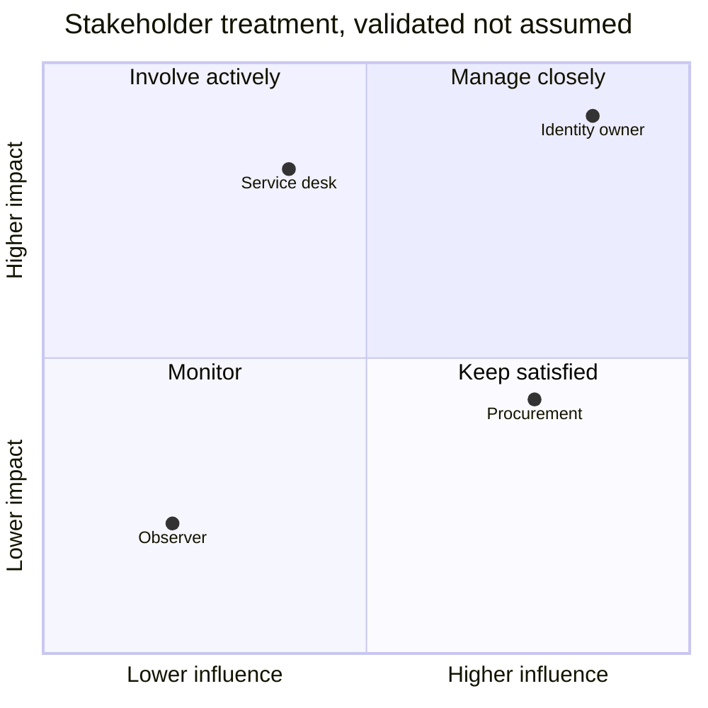

**Instructions:** Score influence and impact independently, validate with the sponsor, and record why. Reassess after design decisions; a service desk may gain influence when support acceptance becomes the critical gate.

**Quality gate:** Treatment is respectful and accessible; no group is excluded because of hierarchy; map agrees with decision rights and communications plan.

**Control footer:** Owner `[Engagement lead]`; approver `[Sponsor]`; version `[at phase gates]`; evidence `[Store rationale; do not include subjective personal commentary]`.

### Template 05 - RACI matrix

**Use when:** clarifying who is Responsible, Accountable, Consulted, and Informed for each outcome. One Accountable role is preferred per row.

| Activity / deliverable | Sponsor | Client owner | Consultant | Security/architecture | Operations | Evidence |
|---|---|---|---|---|---|---|
| Approve scope | A | R | C | C | I | D-001 |
| Collect approved evidence | I | A | R | C | C | E-catalog |
| Accept target design | A | R | C | R/C per governance | C | D-### |
| Approve production change | I | A/R per policy | C | C | R | CHG-### |
| Northstar pilot go/no-go | A | R | C | C | R | GNG-001 |
| `[Activity]` | `[R/A/C/I/-]` | `[value]` | `[value]` | `[value]` | `[value]` | `[record]` |

**Instructions:** Define RACI terms in the meeting. Do not use RACI to override formal change, risk, legal, or operational authority. Split broad rows until one outcome can be accepted. Resolve missing A, multiple conflicting A values, and a consultant incorrectly made accountable for client risk.

**Quality gate:** Every material row has at least one R and exactly one recognized A or an explicit governance exception; role names match the stakeholder register; approval evidence is named.

**Control footer:** Owner `[Engagement lead]`; approver `[Sponsor/governance chair]`; version `[phase baseline]`; evidence `[Decision links; signatures/approvals retained under policy]`.

## 3. Discovery and evidence templates

### Template 06 - Discovery workshop agenda

**Use when:** running a focused 60-90 minute workshop. Send objectives and questions in advance.

| Time | Agenda item | Prompt / output | Facilitator | Evidence / parking lot |
|---:|---|---|---|---|
| 0-5 | Purpose, scope, safety | Confirm no production change; introductions; decision rights | Lead | Scope ID |
| 5-15 | Business outcomes | What fails today and who is affected? | Sponsor | Outcome statements |
| 15-35 | Current state | People, process, technology, data, integrations | Architect | Inventory/evidence IDs |
| 35-50 | Failure and operations | Detection, escalation, recovery, recurring pain | Support lead | Incident samples IDs |
| 50-65 | Requirements/constraints | Must/should/could, regulation, time, licensing | Analyst | REQ/CON IDs |
| 65-75 | Playback | Facts, assumptions, unknowns, conflicts | Facilitator | RAID items |
| 75-90 | Decisions/actions | Owners, dates, next evidence, approval | PM | D/A/E-request IDs |
| Northstar | Conditional Access discovery | Establish policy ownership and exception lifecycle | Identity lead | E-014, A-006 |

**Instructions:** Ask one question at a time, distinguish observation from interpretation, and capture dissent. Stop accidental disclosure of secrets or personal data. Use a parking lot for adjacent topics and close it into action, risk, or out-of-scope disposition.

**Quality gate:** Agenda names a decision/output; all required roles invited with delegates; notes separate fact/assumption; every action has owner/date; participant playback is recorded.

**Control footer:** Owner `[Facilitator]`; approver `[Workstream owner]`; version `[meeting date]`; evidence `[Approved notes; recordings only with explicit authorization and retention]`.

### Template 07 - Discovery questionnaire

**Use when:** collecting consistent pre-work without replacing interviews or evidence validation.

| ID | Question | Why it matters | Accepted evidence | Response / confidence / owner |
|---|---|---|---|---|
| Q-01 | What business service and user journey does this capability protect? | Prevents tool-first design | Service map, owner confirmation | `[Text / H-M-L / owner]` |
| Q-02 | Which tenants, clouds, identities, devices, apps, data classes, and regions are included? | Defines blast radius and constraints | Approved inventory/scope | `[Response]` |
| Q-03 | Who owns configuration, monitoring, incident response, exceptions, and licensing? | Exposes accountability gaps | RACI, support model | `[Response]` |
| Q-04 | What control intent, regulation, or risk treatment drives the work? | Connects feature to outcome | Control/risk record | `[Response]` |
| Q-05 | How is access authenticated, authorized, logged, reviewed, and revoked? | Maps identity lifecycle | Flow/evidence | `[Response]` |
| Q-06 | What are the top three failures, workarounds, and recovery limits? | Centers operability | Redacted incidents, SLO | `[Response]` |
| Q-07 | Which integrations, network paths, certificates, APIs, and third parties are dependencies? | Finds hidden failure points | Architecture/contracts | `[Response]` |
| Q-08 | What changes are frozen, prohibited, or approval-bound? | Avoids unauthorized work | Change policy/calendar | `[Response]` |
| Q-09 | How are privileged access and emergency access governed and tested? | Tests resilience and least privilege | PIM/access-review evidence | `[Response]` |
| Q-10 | What would make the recommendation unacceptable? | Reveals constraints early | Owner statement | `[Response]` |
| Northstar | How are store-support exclusions approved and expired? | Tests exception governance | Redacted exception record | Manual list; confidence low; owner Identity Manager |

**Instructions:** Tailor terminology, allow "unknown," and request corroboration rather than treating self-report as proof. Avoid compound questions during interviews; split this catalogue into role-specific subsets.

**Quality gate:** Questions cover outcome, scope, ownership, lifecycle, dependency, failure, control, data, change, and acceptance; unsupported answers are labeled; unanswered high-risk questions become actions or risks.

**Control footer:** Owner `[Business analyst]`; approver `[Workstream lead]`; version `[question set version]`; evidence `[Responses classified; sensitive attachments cataloged separately]`.

### Template 08 - Evidence request register

**Use when:** asking for the minimum proof needed for an agreed question.

| Request ID | Question / requested item | Scope and UTC window | Collection method / format | Sensitivity | Owner / due | Status / alternative |
|---|---|---|---|---|---|---|
| ER-001 | Prove current privileged role assignment lifecycle | Agreed admin roles; previous 30 days | Owner-run read-only export; CSV metadata only | Restricted | Identity Manager / `[date]` | Open; interview is not equivalent proof |
| ER-002 | Show Conditional Access policy inventory | In-scope tenant; current snapshot | Approved portal export/screenshot with IDs redacted | Confidential | Identity Engineer / `[date]` | Open |
| `[ER-###]` | `[Claim/question, not "send everything"]` | `[Population/time]` | `[Least-data method]` | `[Class]` | `[Owner/date]` | `[State/alternative]` |
| Northstar | Redacted sample of expired exception | One closed store-support exception | PDF in restricted evidence store | Restricted | Security Governance / 2026-08-24 | Received as E-021 |

**Instructions:** State why each item is needed and how it will be minimized. Prefer client-run collection, filtered exports, configuration metadata, and redacted samples. Never request passwords, tokens, keys, recovery codes, unrestricted mailbox content, or a broad dump "just in case."

**Quality gate:** Every request maps to scope and question; owner, due date, sensitivity, approved method, window, format, and fallback are present; received items are moved to the evidence catalog.

**Control footer:** Owner `[Evidence coordinator]`; approver `[Client data/system owner]`; version `[daily during discovery]`; evidence `[Register contains metadata; payload stays in access-controlled evidence store]`.

### Template 09 - Evidence catalog and chain record

**Use when:** recording provenance, handling, relevance, and limitations without altering the source item.

| Evidence ID | Description / source | Collector / authority | Collected UTC / source window | Integrity | Location / access / retention | Supports / limitations |
|---|---|---|---|---|---|---|
| E-021 | Northstar synthetic closed exception sample | Governance owner under ER-014 | 2026-08-24T10:15Z / closed 2026-08-20 | Original preserved; working copy redacted; hash recorded where policy supports | Restricted case folder; named reviewers; review at closure | Supports expiry field; one sample does not prove population completeness |
| `[E-###]` | `[What and where from]` | `[Who and approval]` | `[UTC values]` | `[Original, hash/tool/version, transformations]` | `[Repository, ACL, retention]` | `[Claim and caveat]` |

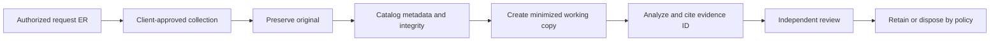

**Instructions:** Record every transformation: export, decompression, timezone conversion, filtering, redaction, or format change. Keep original and working copy distinct. A screenshot can prove what was displayed at a moment; it may not prove completeness or effective runtime behavior.

**Quality gate:** Authority, source, UTC time, provenance, transformations, integrity method, access, retention, supported claim, and limitation are complete; sensitive payload is not embedded in broad deliverables.

**Control footer:** Owner `[Evidence custodian]`; approver `[Engagement/client evidence owner]`; version `[append-only corrections]`; evidence `[This is the canonical metadata record; disposal is logged]`.

### Template 10 - Current-state inventory

**Use when:** establishing what exists, who owns it, how it is configured, and how complete the view is.

| Asset/capability ID | Type and purpose | Environment / scope | Owner | Identity/data/network dependency | Logging/support | Evidence / confidence / gap |
|---|---|---|---|---|---|---|
| INV-001 | Entra Conditional Access policy set; access control | Northstar corporate tenant | Identity Manager | User/group/app/device/risk signals; token path | Sign-in logs; identity on-call | E-030 / Medium / exclusion ownership incomplete |
| `[INV-###]` | `[Service/config/integration and purpose]` | `[Prod/test/region/population]` | `[Business/technical owners]` | `[Dependencies and data class]` | `[Telemetry/runbook/support]` | `[IDs/confidence/missing]` |

**Instructions:** Define inventory population and reconciliation method before collection. Prefer stable IDs over display names. Capture lifecycle state, environment, criticality, owner, version, data classification, identity, network path, integration, log destination, recovery, and known exception. Mark duplicate, orphan, unsupported, and unknown items without silently deleting them.

**Quality gate:** Scope population, source, pagination/completion, collection time, permissions, filters, duplicates, omissions, and reconciliation are documented; each critical item has owner and support path.

**Control footer:** Owner `[Workstream analyst]`; approver `[Platform owner]`; version `[snapshot date]`; evidence `[Minimized metadata; raw exports separately controlled]`.

### Template 11 - Current-state diagram checklist

**Use when:** reviewing whether a diagram communicates runtime and control reality rather than attractive boxes.

| Check | Copy/adapt result | Northstar example |
|---|---|---|
| Boundary and legend | `[Tenants/clouds/trust boundaries; symbols/colors defined]` | Corporate tenant and third-party SaaS trust boundary shown |
| Actors and identities | `[Human/workload/device/guest/admin]` | Store user, support admin, managed device, SaaS service principal |
| Flows | `[Auth, data, management, logs; direction and protocol]` | Token flow separated from audit-log export |
| Decision/enforcement | `[Policy decision and enforcement points]` | Conditional Access decision before token issuance |
| Data | `[Class, at-rest/in-transit, residency where relevant]` | Restricted audit data to approved workspace |
| Dependencies | `[DNS, PKI, network, API, license, third party]` | Proxy and SaaS federation dependency |
| Operations | `[Monitoring, alerting, owner, recovery]` | SOC receives identity alerts; identity team owns policy |
| Evidence/status | `[Observed/inferred/proposed and evidence IDs]` | Dashed line marks unverified legacy app path |
| Failure | `[Timeout, deny, retry, fallback, degraded mode]` | Sign-in denial produces correlation ID and support route |

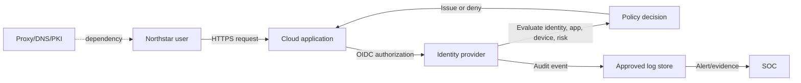

**Instructions:** Start with audience and question. Maintain separate logical, security, deployment, and support views when one diagram becomes unreadable. Label current, proposed, and unknown paths explicitly.

**Quality gate:** A reviewer can identify boundaries, actors, four flow types, enforcement, data, dependencies, logs, ownership, failure, and evidence without oral explanation.

**Control footer:** Owner `[Architect]`; approver `[System/security owners]`; version `[diagram baseline]`; evidence `[Sanitize topology in broad distribution; source model controlled]`.

### Template 12 - Data, authentication, and log flow register

**Use when:** tracing a transaction across systems and identifying identifiers needed for troubleshooting.

| Flow ID | Trigger / actor | Source -> destination | Protocol / identity | Data and class | Control / failure | Logs / correlation / owner |
|---|---|---|---|---|---|---|
| FL-001 | Northstar employee opens SaaS app | Browser -> identity -> SaaS | HTTPS/TLS; OIDC; user + enterprise app | Claims and business profile; Confidential | CA evaluates; deny or token issuance | UTC, request/correlation ID, sign-in record; Identity owner |
| `[FL-###]` | `[Event/person/workload]` | `[Ordered hops]` | `[Protocol, credential/token/cert type]` | `[Fields/class/minimization]` | `[Decision, retry, timeout, fallback]` | `[Sources, IDs, retention, owner]` |

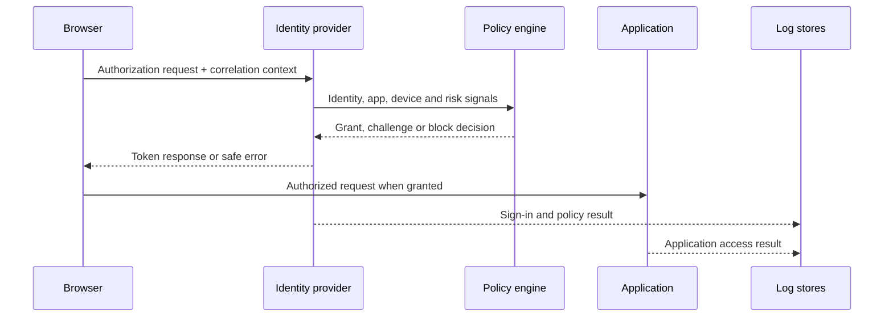

**Instructions:** Create separate rows for authentication, authorization, business data, management, and telemetry. Record where identifiers change, clocks differ, data is transformed, and logs can be delayed or sampled.

**Quality gate:** Every hop names protocol, identity, data class, enforcement, owner, failure behavior, log, UTC/correlation key, and evidence; secrets are neither diagrammed nor copied.

**Control footer:** Owner `[Architect/troubleshooting lead]`; approver `[Security and system owners]`; version `[flow version]`; evidence `[Topology and identifiers restricted; examples synthetic/redacted]`.

## 4. Governance and control logs

### Template 13 - RAID register

**Use when:** maintaining one governed view of Risks, Assumptions, Issues, and Dependencies while preserving links to detailed logs.

| ID / type | Statement | Impact / probability | Owner | Response / validation | Due / trigger | Evidence / status |
|---|---|---|---|---|---|---|
| R-001 / Risk | Proxy behavior may prevent pilot authentication telemetry | High / Medium | Network owner | Validate synthetic pilot path before ring 1 | Before test gate | E-041 / Open |
| A-001 / Assumption | Existing license covers proposed pilot capability | High if false / n/a | Licensing owner | Verify current service-plan entitlement and terms | Design review | Unknown |
| I-001 / Issue | Two privileged groups have no confirmed owner | High / occurred | Identity Manager | Assign accountable owner; assess exposure | 48 hours | E-033 / Open |
| D-001 / Dependency | Legal approves audit-data retention | Medium / n/a | Compliance owner | Decision required before logging design approval | HLD gate | D-### |
| `[ID/type]` | `[Cause-condition-consequence or fact]` | `[Rating]` | `[One owner]` | `[Treatment/test]` | `[Date/event]` | `[IDs/state]` |

**Instructions:** A risk is uncertain; an issue has occurred; an assumption is believed temporarily; a dependency is an external prerequisite. Do not collapse them into vague concerns. Link high risks to the detailed risk register and decisions.

**Quality gate:** Correct type, clear statement, owner, response/validation, date/trigger, evidence, and state exist; stale items are reviewed on cadence; closure states residual consequence.

**Control footer:** Owner `[PM/risk coordinator]`; approver `[Governance chair]`; version `[living register]`; evidence `[Links only; sensitive issue evidence restricted]`.

### Template 14 - Assumptions and dependencies log

**Use when:** making temporary premises and external prerequisites explicit before they become hidden design facts.

| ID / kind | Statement | Why needed | Validation / dependency commitment | Owner / due | If false or late | Status / evidence |
|---|---|---|---|---|---|---|
| A-007 / Assumption | Northstar pilot users have supported managed devices | Enables device-compliance scenario design | Reconcile pilot list to approved device inventory | Endpoint owner / gate 1 | Split scenario or revise scope; do not weaken control | Open / E-052 |
| DEP-004 / Dependency | Network team supplies approved proxy test route | Required for end-to-end pilot | Named resource and availability confirmed in change plan | Network owner / `[date]` | Reschedule test; escalate schedule risk | Accepted / D-019 |
| `[ID/kind]` | `[Specific testable statement]` | `[Decision relying on it]` | `[Evidence/commitment]` | `[Owner/date]` | `[Consequence and response]` | `[State/ID]` |

**Instructions:** Link every assumption to decisions or requirements that depend on it. Time-box validation. For dependencies, record provider, consumer, input/output contract, lead time, readiness signal, and escalation path.

**Quality gate:** Every high-impact assumption is testable and dated; every dependency has provider acceptance and readiness evidence; false/late response protects security and avoids silent scope drift.

**Control footer:** Owner `[PM/business analyst]`; approver `[Workstream leads]`; version `[living]`; evidence `[Owner confirmations and validation IDs]`.

### Template 15 - Decision log

**Use when:** an accountable role chooses among alternatives or approves a consequential interpretation.

| Decision ID | Question / context | Options considered | Decision and rationale | Decision maker / UTC | Consequences / conditions | Evidence / revisit trigger |
|---|---|---|---|---|---|---|
| DEC-012 | How should Northstar pilot access be phased? | All users; role-based rings; geography | Role-based rings, because support and risk signals can be validated before broad exposure | CIO delegate / 2026-08-24T14:00Z | Service desk readiness before ring 2; no automatic expansion | OPT-003, E-060 / revisit if critical defect |
| `[DEC-###]` | `[One decision question]` | `[Viable options including status quo]` | `[Choice and evidence-based why]` | `[Authorized role/time]` | `[Tradeoffs/actions/limits]` | `[IDs/event/date]` |

**Instructions:** Record the decision, not meeting minutes. Include the status quo and rejected options when material. State who had authority, what information was unavailable, and which event would invalidate the decision. Supersede; do not erase history.

**Quality gate:** Decision is singular, authorized, dated in UTC, rationalized, traceable, communicated, and linked to consequences and revisit criteria.

**Control footer:** Owner `[PM/architect]`; approver `[Named decision authority]`; version `[append-only]`; evidence `[Approval and supporting options retained under classification]`.

### Template 16 - Action log

**Use when:** converting meetings, findings, and decisions into observable work.

| Action ID | Action / completion evidence | Owner | Due UTC date | Priority / dependency | Status / blocker | Source / closure approval |
|---|---|---|---|---|---|---|
| ACT-024 | Reconcile pilot persona list to managed-device inventory; attach count and exceptions | Endpoint owner | `[Agreed due date]` | High / A-007 | In progress / none | Workshop-04 / Identity Manager |
| `[ACT-###]` | `[Verb + object + proof of done]` | `[One person/role]` | `[Date]` | `[Priority/dependencies]` | `[State/blocker]` | `[Origin/closer]` |

**Instructions:** Avoid "follow up" and "investigate" without a bounded question and deliverable. The owner accepts the action; the meeting organizer is not automatically the owner. A closed action links completion evidence and any resulting decision, risk, or change.

**Quality gate:** Every action is specific, owned, dated, evidence-based, and dispositioned; overdue items have escalation and revised impact, not merely a new date.

**Control footer:** Owner `[PM]`; approver `[Workstream lead for closure]`; version `[living]`; evidence `[Completion links; sensitive payload elsewhere]`.

### Template 17 - Change log and scope-change request

**Use when:** a proposed alteration affects agreed scope, schedule, cost, risk, quality, deliverable, or dependency.

| Change ID | Requested change / reason | Baseline affected | Impact assessment | Options / recommendation | Authority / decision | Effective version / evidence |
|---|---|---|---|---|---|---|
| CHG-005 | Add guest-access assessment after acquisition announcement | Scope v1.0, schedule, evidence | +4 workshops; privacy review; two-week estimate; new tenant dependency | Defer to phase 2 recommended | Sponsor approved defer / 2026-08-24 | Scope v1.1 / DEC-020 |
| `[CHG-###]` | `[Change and business reason]` | `[Artifact/version]` | `[Time/cost/risk/security/people]` | `[Choices and recommendation]` | `[Authorized outcome/time]` | `[New baseline/IDs]` |

**Instructions:** Distinguish engagement scope change from a technical production change; each follows its own governance. Assess the cost of not changing. Do not start expanded work because a senior stakeholder asked informally.

**Quality gate:** Baseline, impacts, options, recommendation, authority, decision, effective version, and communications are recorded; rejected changes have rationale.

**Control footer:** Owner `[Engagement lead]`; approver `[Contract/sponsor authority]`; version `[append-only]`; evidence `[Commercial details limited to authorized repository]`.

## 5. Assessment, findings, and control templates

### Template 18 - Finding record

**Use when:** evidence supports a material gap, weakness, strength, or improvement opportunity.

| Finding field | Copy/adapt content | Northstar example |
|---|---|---|
| ID / title | `[FND-### / factual title]` | FND-008 / Privileged exception ownership is incomplete |
| Criteria / expected state | `[Requirement, policy, control intent, design]` | Every privileged exception has owner, rationale, expiry, review, and revocation path |
| Condition / scope | `[Observed fact and population]` | Two of twelve sampled synthetic exception records lack a named business owner |
| Evidence / method | `[IDs, UTC window, sample/reconciliation]` | E-071; owner-provided redacted sample; 2026-08-24; sample-limited |
| Cause / confidence | `[Validated cause or hypothesis]` | Workflow does not require owner field; medium confidence pending configuration evidence |
| Consequence | `[Business/security/operational effect]` | Exception may persist without accountable review |
| Severity rationale | `[Method, likelihood, impact, uncertainty]` | High impact, medium likelihood, medium confidence; not proof of exploitation |
| Recommendation | `[Outcome-focused action]` | Require owner and expiry; reconcile existing records; monitor overdue reviews |
| Owner / target | `[Accountable client owner/date]` | Identity Governance owner / agreed roadmap date |
| Management response | `[Agree/disagree/alternative/accept]` | `[To be completed by authorized owner]` |

**Instructions:** Use neutral, precise language. Criteria plus condition makes a finding defensible. Never infer compromise from a configuration gap. Keep sample limitations visible and distinguish root cause from an untested hypothesis.

**Quality gate:** Criteria, condition, scope, method, evidence, uncertainty, consequence, rating rationale, recommendation, owner, and response are present; wording avoids blame and unsupported absolutes.

**Control footer:** Owner `[Assessment lead]`; approver `[Quality reviewer/client factual-validation owner]`; version `[finding lifecycle]`; evidence `[Citations by ID; sensitive proof restricted]`.

### Template 19 - Risk register

**Use when:** documenting uncertainty that could affect objectives and choosing treatment.

| Risk ID | Cause -> event -> consequence | Inherent likelihood / impact | Existing controls / evidence | Treatment / owner / due | Residual rating / acceptance | Trigger / status |
|---|---|---|---|---|---|---|
| RSK-014 | Incomplete exception ownership may allow an access exclusion to remain unreviewed, increasing unauthorized-access exposure | Possible / Major | Quarterly manual review; E-071 sample-limited | Mitigate: require owner/expiry and reconcile; Identity Governance / Q4 | `[After design validation]`; acceptance only by risk authority | Overdue exception / Open |
| `[RSK-###]` | `[Cause-event-consequence]` | `[Defined scales]` | `[Prevent/detect/respond/recover + IDs]` | `[Avoid/mitigate/transfer/accept; owner/date]` | `[Reassessed score and authority]` | `[KRI/event/state]` |

**Instructions:** Use the client's risk method and appetite. Do not multiply ordinal numbers unless the method explicitly supports it. State uncertainty and control effectiveness evidence. Recommendations do not close risks; validated treatment and authorized residual disposition do.

**Quality gate:** Statement, method, inherent rating, control evidence, treatment, owner, due date, residual reassessment, trigger, and acceptance authority are complete.

**Control footer:** Owner `[Client risk owner]`; approver `[Risk authority]`; version `[review cadence]`; evidence `[Sensitive threat/vulnerability details restricted]`.

### Template 20 - Maturity scoring rubric

**Use when:** comparing capability consistency over time, not pretending a score is objective truth.

| Level | Observable characteristics | Evidence threshold | Northstar identity example |
|---:|---|---|---|
| 0 - Absent | No defined capability or outcome | Corroborated absence within scoped population | No documented exception process |
| 1 - Ad hoc | Person-dependent, reactive, inconsistent | Samples/interviews show inconsistent execution | Exceptions tracked in individual notes |
| 2 - Defined | Documented process and ownership, uneven adoption | Approved process plus partial operating evidence | Standard form exists; owner field optional |
| 3 - Managed | Consistent operation, measures, review, exceptions | Reconciled population and period evidence | Owner/expiry enforced; overdue reviews measured |
| 4 - Optimized | Outcome measured; feedback improves design safely | Trend, control tests, PIR/change evidence | Root causes reduce exception demand over time |

| Capability | Current / evidence / confidence | Target / rationale / horizon | Gap / action / owner |
|---|---|---|---|
| Privileged exception governance | 2 / E-071, E-073 / Medium | 3 / risk appetite and auditability / 6 months | Mandatory fields, reconciliation, KPI / Governance owner |
| `[Capability]` | `[0-4 / IDs / H-M-L]` | `[level / business reason / date]` | `[Specific changes / owner]` |

**Instructions:** Define scope, scale, weighting, and evidence before scoring. Score capabilities, not teams or people. A target is not automatically level 4; choose the lowest level that meets outcome and risk appetite.

**Quality gate:** Each score has observable evidence, confidence, scope, and reviewer calibration; targets have business rationale and cost; averages do not hide critical low capabilities.

**Control footer:** Owner `[Assessment lead]`; approver `[Capability owners]`; version `[assessment date/method]`; evidence `[Score worksheet and calibration notes retained]`.

### Template 21 - Control mapping matrix

**Use when:** connecting obligations and risks to control intent, implementation, operation, and proof without claiming certification.

| Control ID / source | Obligation or risk | Control objective | Implementation / owner | Prevent-detect-respond-recover | Evidence / test / result | Gap / treatment |
|---|---|---|---|---|---|---|
| CTL-017 / Northstar policy | Privileged exceptions must be time-bound | Ensure exclusions are authorized, owned, reviewed, and revoked | Identity exception workflow / Governance owner | Prevent + Detect | E-071 sample; TEST-022 pending | Owner field optional; FND-008 |
| `[CTL-### / framework ref]` | `[Exact requirement/risk]` | `[Technology-neutral outcome]` | `[People/process/technology and owner]` | `[Functions]` | `[Proof and validation]` | `[Finding/risk/plan]` |

**Instructions:** Treat framework mapping as interpretation requiring review; similar labels do not prove equivalence. Separate design evidence (a control exists), implementation evidence (configured), operating evidence (performed), and effectiveness evidence (achieved result).

**Quality gate:** Source/version, applicability, objective, implementation, owner, lifecycle function, evidence type, test, limitation, gap, and treatment are explicit; no unsupported "compliant" claim appears.

**Control footer:** Owner `[GRC/control analyst]`; approver `[Control owner/compliance/legal as required]`; version `[framework and mapping version]`; evidence `[Licensed standards quoted only as permitted; links/references preferred]`.

## 6. Requirements and traceability templates

### Template 22 - Requirements catalogue

**Use when:** turning outcomes and constraints into testable statements before choosing a product feature.

| Requirement ID | Requirement statement | Type / priority | Source / rationale | Acceptance measure | Owner / approver | Dependencies / status |
|---|---|---|---|---|---|---|
| REQ-031 | The solution shall record an accountable owner and expiry for every privileged-access exception | Security / Must | FND-008, RSK-014 | 100% of pilot exception records reject missing owner/expiry and appear in approved report | Identity Governance / CISO delegate | Workflow design / Approved |
| `[REQ-###]` | `[Actor/system shall outcome under condition]` | `[Business/security/functional/nonfunctional/transition; MoSCoW]` | `[Stakeholder/control/finding]` | `[Observable pass threshold]` | `[Owner/approver]` | `[IDs/state]` |

**Instructions:** Make requirements solution-neutral unless a contractual or architectural constraint fixes technology. Include performance, availability, recovery, privacy, accessibility, audit, support, migration, licensing, and decommission requirements alongside features.

**Quality gate:** Each requirement is atomic, unambiguous, feasible, necessary, uniquely identified, sourced, owned, prioritized, testable, and free of unstated design; conflicts and duplicates are resolved or logged.

**Control footer:** Owner `[Business analyst]`; approver `[Product/control owner]`; version `[baseline]`; evidence `[Source interviews/evidence IDs; sensitive rationale restricted]`.

### Template 23 - Requirements traceability matrix

**Use when:** proving that a requirement survived design, build/configuration, testing, acceptance, operation, and change.

| Requirement | Source / risk | Design component | Build/change | Test / result | Operational control | Acceptance / status |
|---|---|---|---|---|---|---|
| REQ-031 | FND-008, RSK-014 | HLD-ID-04, LLD-WF-07 | CHG-027 | TC-041 / Pass with condition | SOP-EXC-02, KPI overdue count | DEC-042 / Accepted for pilot |
| `[REQ-###]` | `[IDs]` | `[HLD/LLD/ADR]` | `[Work/change/version]` | `[Case/result/defect]` | `[Runbook/SLA/monitor]` | `[Approver/state]` |

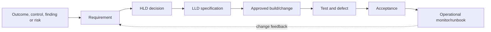

**Instructions:** Run forward tracing to find unimplemented requirements and backward tracing to find orphan features. Preserve superseded links. Treat "not tested" and "not applicable" as governed states with rationale, not blank cells.

**Quality gate:** Every approved must-have traces end to end or has an accepted exception; every build element has a requirement; failed/blocked tests prevent false acceptance.

**Control footer:** Owner `[Business analyst/test lead]`; approver `[Design and acceptance authorities]`; version `[baseline plus controlled changes]`; evidence `[Links to canonical artifacts, not duplicate copies]`.

### Template 24 - Nonfunctional requirements checklist

**Use when:** preventing a functionally correct design that is unsafe or unoperable.

| Category | Requirement prompt | Measure / Northstar example |
|---|---|---|
| Security | Authentication, least privilege, separation, secret/certificate lifecycle, attack surface? | Privileged workflow changes require approved role and audit event |
| Privacy/data | Minimization, purpose, residency, retention, subject rights, redaction? | Report contains IDs/status, not message or token content |
| Availability | Service hours, dependency behavior, degraded mode, SLO? | Pilot support path available during rollout window |
| Performance/scale | Population, peak, latency, throttle, pagination, growth? | Reconcile agreed exception population within approved reporting window |
| Recovery | RTO/RPO, rollback, backup/restore, reconciliation? | Restore prior workflow version and reconcile in-flight records |
| Observability | Health, audit, correlation, alert, ownership, retention? | Alert on failed workflow and overdue exception with stable ID |
| Operability | Runbook, support, skill, access, cost, license, handover? | Tier 2 can diagnose from safe error and correlation ID |
| Accessibility/usability | Inclusive interaction, language, error clarity, training? | Form and approval usable with keyboard/screen reader per policy |
| Maintainability | Version, test, change, ownership, deprecation, documentation? | Quarterly control and dependency review |

**Instructions:** Convert relevant prompts into numbered requirements; do not leave them as aspirations. Recheck vendor limits and service behavior at design time.

**Quality gate:** Applicable categories have measurable thresholds, owners, tests, and lifecycle handling; unavailable vendor guarantees are expressed honestly.

**Control footer:** Owner `[Architect/business analyst]`; approver `[Service/security/data owners]`; version `[requirements baseline]`; evidence `[Official source links and test evidence]`.

## 7. Threat modeling templates

### Template 25 - Threat-model context worksheet

**Use when:** identifying trust boundaries, assets, actors, assumptions, and abuse cases before detailed design.

| Context field | Copy/adapt entry | Northstar example |
|---|---|---|
| Business purpose | `[Service and protected outcome]` | Govern time-bound privileged exceptions |
| Assets | `[Data, identity, configuration, availability, reputation]` | Exception records, approval integrity, audit history |
| Actors | `[Users, admins, workloads, support, adversary capability]` | Requester, approver, workflow identity, auditor |
| Entry/exit points | `[UI, API, connector, file, event, admin plane]` | Approved form, workflow connector, reporting export |
| Trust boundaries | `[Identity, tenant, network, third party, admin]` | User to workflow; workflow to directory; report repository |
| Assumptions/dependencies | `[IDs and validation]` | DEP-004 approved identity and connector permissions |
| Security objectives | `[Confidentiality/integrity/availability/safety/privacy]` | No exception without accountable approval and expiry |
| Abuse cases | `[Actor causes unwanted outcome]` | Requester manipulates target or expiry after approval |
| Existing controls / gaps | `[Prevent/detect/respond/recover]` | Immutable approval record planned; reconciliation missing |

**Instructions:** Threat model the system and workflow, not a vendor logo. Include administrative and recovery paths. Invite builders, operators, security, privacy, and business owner; validate diagrams against actual data/auth/log flows.

**Quality gate:** Purpose, scope, assets, actors, entry points, boundaries, objectives, abuse cases, dependencies, controls, owners, and evidence are complete; threats lead to requirements or accepted risks.

**Control footer:** Owner `[Security architect]`; approver `[System/risk owners]`; version `[design milestone]`; evidence `[Threat details restricted to need-to-know]`.

### Template 26 - STRIDE worksheet

**Use when:** systematically prompting threats per element. STRIDE means Spoofing, Tampering, Repudiation, Information disclosure, Denial of service, and Elevation of privilege.

| Element / boundary | STRIDE category | Threat statement | Existing control / evidence | Requirement or treatment | Owner / status |
|---|---|---|---|---|---|
| Approval callback | Spoofing | An untrusted caller could impersonate the approved workflow identity | Workload identity and audience validation planned | REQ-044 validate caller, audience, issuer, and authorization | App owner / Open |
| Exception record | Tampering | Approved target or expiry could be altered without a new decision | Version history; access control | REQ-045 immutable approval linkage and change audit | Governance / Open |
| Approval event | Repudiation | Actor could deny approving if event lacks stable identity/time | Directory and workflow audit | Retain approved audit fields and correlation ID | Audit owner / Open |
| Report | Information disclosure | Broad export could expose identity/security metadata | Restricted repository | Minimize fields and enforce access/retention | Data owner / Open |
| Connector | Denial of service | Throttling or outage could leave requests in ambiguous state | Retry design incomplete | Bounded retry, queue health, reconciliation | Ops / Open |
| Admin role | Elevation of privilege | Workflow editor could redirect privileged operation | Editor governance and PIM | Separate edit/approve roles; monitor changes | Security / Open |

**Instructions:** Apply categories where meaningful to processes, stores, flows, identities, and boundaries. Write cause and consequence. STRIDE generates hypotheses, not confirmed vulnerabilities; validate likelihood and controls before rating.

**Quality gate:** All model elements were considered, threats are specific and non-duplicative, existing controls are evidenced, and every material threat maps to a requirement, test, risk, or explicit disposition.

**Control footer:** Owner `[Threat-model facilitator]`; approver `[Security/system owner]`; version `[model version]`; evidence `[Restricted model; no exploit instructions or credentials]`.

### Template 27 - Attack-tree worksheet

**Use when:** decomposing an unwanted goal into alternative (OR) and combined (AND) paths to prioritize controls defensively.

| Node ID | Parent / logic | Defensive hypothesis | Preconditions | Prevent/detect evidence | Treatment/test |
|---|---|---|---|---|---|
| AT-0 | Root | Unauthorized durable privileged exception exists | Access to request or admin path | Reconciliation and access reviews | Validate no unowned/unexpired exception |
| AT-1 | AT-0 / OR | Approval identity is misused | Identity compromised or authorization weak | Strong auth, role governance, sign-in monitoring | REQ-050, TC-060 |
| AT-2 | AT-0 / OR | Approved record is changed after decision | Edit permission and weak change linkage | Version/audit and immutable decision reference | REQ-045, TC-061 |
| AT-3 | AT-0 / AND group | Expiry fails and monitoring fails | Workflow fault plus absent reconciliation | Queue/expiry health alert and periodic inventory | OPS-012, TC-062 |
| `[AT-#]` | `[Parent / AND-OR]` | `[Defensive unwanted condition]` | `[Conditions]` | `[Current proof]` | `[IDs]` |

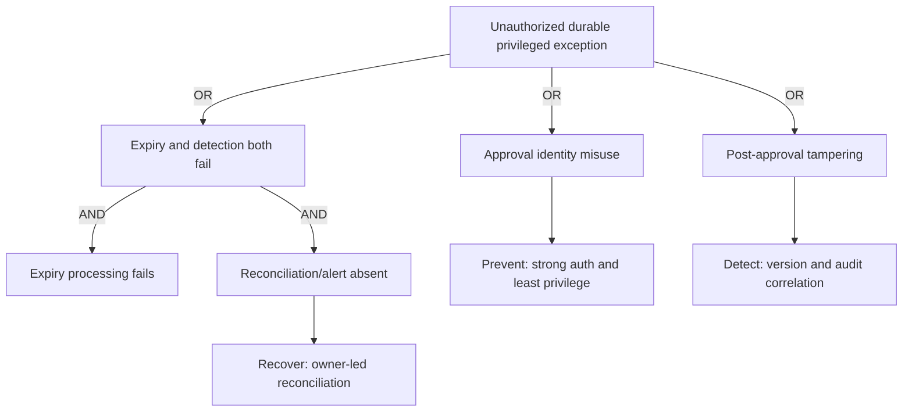

**Instructions:** Keep nodes at a defensive design level; do not add exploitation procedures. Score only under the client's threat/risk method. Use the tree to identify single points of control failure and defense-in-depth gaps.

**Quality gate:** Root is a business-relevant unwanted outcome; AND/OR logic is explicit; paths are plausible but not operational attack guidance; controls map to requirements, owners, tests, and evidence.

**Control footer:** Owner `[Security architect]`; approver `[Risk/system owner]`; version `[threat model baseline]`; evidence `[Restricted; share minimized diagrams]`.

## 8. Architecture and design templates

### Template 28 - High-level design (HLD) outline

**Use when:** seeking agreement on architecture intent, boundaries, major components, decisions, and operations before implementation detail.

| HLD section | Required content | Northstar example cue |
|---|---|---|
| 1. Purpose and scope | Outcomes, audiences, in/out, assumptions, constraints | Privileged exception governance pilot only |
| 2. Requirements | Prioritized functional/nonfunctional requirements and trace links | REQ-031 owner/expiry |
| 3. Current and target context | Actors, systems, trust boundaries, data/auth/log flows | User -> workflow -> directory -> audit store |
| 4. Components/responsibility | Major services and ownership; buy/build boundaries | Form, approval workflow, directory operation, report |
| 5. Security/privacy | Identity, authorization, data, threats, controls, residual risks | Separate request/approval/edit roles |
| 6. Integration/network | APIs, connectors, DNS/TLS/proxy, limits, failure behavior | Supported connector and bounded retries |
| 7. Operations | Health, logs, alerts, support, recovery, cost/license | Queue health and expiry reconciliation |
| 8. Delivery | Environments, pilot/rings, test, cutover, rollback | Synthetic lab -> pilot ring 0/1 |
| 9. Decisions/open items | ADRs, options, risks, assumptions, dependencies | ADR-004 identity pattern |
| 10. Acceptance | Reviewers, criteria, conditions, effective version | Architecture/security/operations approval |

**Instructions:** Keep implementation detail in LLD. Use diagrams with explicit status and evidence. Describe failure and recovery, not only happy path. State what the vendor service guarantees versus what the team designs.

**Quality gate:** Every must requirement maps to a component or explicit exception; boundaries, threats, dependencies, operability, delivery, and acceptance are reviewable; no unsupported license or feature claim.

**Control footer:** Owner `[Solution architect]`; approver `[Architecture/security/service authorities]`; version `[HLD baseline]`; evidence `[Public official sources plus controlled internal evidence]`.

### Template 29 - Low-level design (LLD) outline

**Use when:** specifying enough approved detail for a qualified implementer and operator to build, test, support, and reverse the change.

| LLD section | Copy/adapt required detail | Review evidence |
|---|---|---|
| Scope/version | HLD/requirements/ADR/change baselines | IDs and versions |
| Object/configuration model | Stable IDs, naming, states, assignment/targeting, precedence | Sanitized configuration model |
| Identity/permissions | Runtime/admin identities, exact least roles/scopes, lifecycle, audit | Permission review |
| Data/schema | Fields, types, classification, validation, retention, redaction | Data owner approval |
| Interfaces | Supported endpoint/connector, request/response, pagination, throttling, timeout | Current official source and contract test |
| Logic | Decision tables, idempotency, concurrency, retry, partial/ambiguous failure | Peer review and synthetic tests |
| Observability | Events, correlation IDs, health, thresholds, dashboards, ownership | Monitoring test |
| Deployment | Environment, dependencies, sequence, approvals, checkpoints | Change/cutover plan |
| Rollback/recovery | Trigger, safe reversal, state reconciliation, validation | Rehearsal evidence |
| Test/support | Cases, data, expected result, runbook/SOP, escalation | Traceability links |

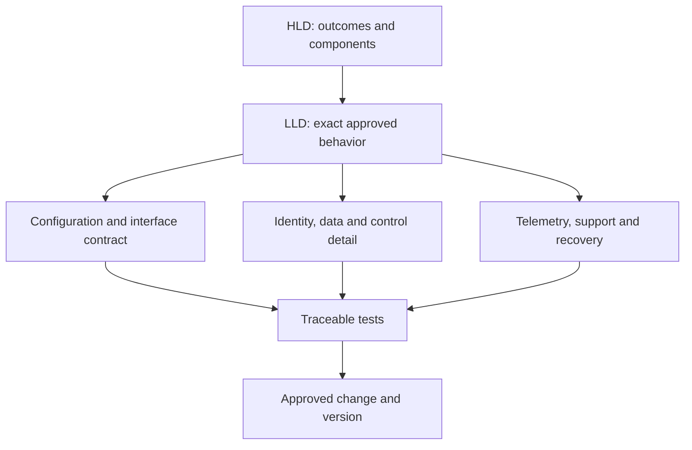

**Instructions:** Use current product schema and avoid secret values. Separate defaults from explicit choices. Include negative paths, concurrency, retry, reconciliation, and unsupported states. A script snippet does not replace design rationale, review, or rollback.

**Quality gate:** Qualified reviewers can implement without guessing security-sensitive choices; every detail traces to HLD/requirement/ADR; deployment, monitoring, support, and reversal are executable and tested.

**Control footer:** Owner `[Technical architect/engineer]`; approver `[Implementation, security, operations owners]`; version `[release baseline]`; evidence `[Configuration examples sanitized; secrets referenced by governed mechanism only]`.

### Template 30 - Architecture decision record (ADR)

**Use when:** one architecture choice has durable consequences and future maintainers need the context.

| ADR field | Copy/adapt entry | Northstar example |
|---|---|---|
| ID / title / status | `[ADR-### / decision / Proposed-Accepted-Superseded]` | ADR-004 / Use managed workload identity where supported / Proposed |
| Context | `[Forces, requirements, constraints, uncertainty]` | Automation needs non-human identity; avoid stored client secrets |
| Decision drivers | `[Security, support, cost, scale, time]` | Least privilege, credential lifecycle, platform support, operability |
| Options | `[Including status quo]` | Managed identity; workload federation; certificate; stored secret; manual process |
| Decision | `[Chosen option and boundaries]` | Managed identity only where connector/resource supports required operation |
| Consequences | `[Positive, negative, risk, work]` | Reduced secret handling; still requires role lifecycle and workflow-editor governance |
| Validation | `[Prototype/test/source]` | Current official support matrix plus authorized synthetic contract test |
| Revisit | `[Date/event]` | Connector or API support change; new sovereign-cloud requirement |

**Instructions:** Keep one decision per ADR. Do not rewrite accepted history; create a superseding ADR. Record uncertainty and the rejected status quo so future teams understand why change was justified.

**Quality gate:** Context, drivers, viable options, authorized decision, consequences, validation, linked requirements/risks, and revisit trigger are complete.

**Control footer:** Owner `[Architect]`; approver `[Architecture authority]`; version `[immutable after acceptance except status/link corrections]`; evidence `[Official sources and test IDs]`.

### Template 31 - Options analysis

**Use when:** comparing viable responses without tailoring criteria to a preferred product.

| Criterion / weight | Status quo | Option A | Option B | Evidence / uncertainty |
|---|---:|---:|---:|---|
| Security outcome / 25 | 2 | 4 | 3 | Threat model and control map; confidence Medium |
| Operability/recovery / 20 | 2 | 4 | 3 | Support workshop and synthetic test |
| Requirements fit / 20 | 2 | 4 | 4 | Traceability count; two unknown requirements |
| Cost/license / 15 | 4 | 3 | 2 | Current entitlement validation pending |
| Delivery risk/time / 10 | 4 | 3 | 2 | Dependency estimates |
| Strategic fit/exit / 10 | 2 | 4 | 3 | Architecture principles and portability review |
| Weighted total | `[calculated under agreed method]` | `[score]` | `[score]` | Score informs; it does not replace decision authority |
| Northstar recommendation | Retain only as fallback | Role-based governed workflow | Custom application | Recommend A subject to licensing and pilot gates |

**Instructions:** Define a 1-5 scale and weights before scoring. Use evidence and confidence per score; run sensitivity when close. Include do-nothing, process-only, native capability, third-party, and custom options when genuinely viable. Separate one-time and recurring cost.

**Quality gate:** Criteria trace to outcomes/requirements, weights are approved, options are comparable, assumptions and confidence visible, sensitivity performed, and recommendation states conditions and dissent.

**Control footer:** Owner `[Architect/business analyst]`; approver `[Decision authority]`; version `[analysis baseline]`; evidence `[Commercial details restricted; public capability claims source-linked]`.

### Template 32 - Licensing and persona map

**Use when:** testing whether each persona, capability, environment, and administrative operation is currently entitled and operationally viable.

| Persona / population | Required capability | Product/service plan assumption | Add-on/dependency | Admin/operator need | Validation / owner / status |
|---|---|---|---|---|---|
| Northstar pilot employee / 50 | Conditional access and device signal | Existing suite assumed; exact service plans unverified | Managed-device enrollment and supported platform | Service desk diagnostic access | Licensing owner checks current terms and tenant service plans / Open |
| Security analyst / 8 | Incident investigation and approved telemetry | `[Current entitlement]` | Data ingestion/retention/capacity | Least role and audit | `[Evidence/owner/state]` |
| Guest/partner | `[Feature and boundary]` | `[Home/resource tenant responsibility]` | `[Cross-tenant terms]` | `[Support role]` | `[Validation]` |
| Workload identity | `[API/automation capability]` | `[Resource/provider entitlement]` | `[Connector/capacity]` | `[Runtime/editor roles]` | `[Validation]` |

**Instructions:** Map named personas and populations, not "all users." Check base license, add-ons, prerequisites, tenant/cloud availability, trial/preview limitations, capacity/consumption, external-user treatment, administrative licenses, and contract terms with the authorized licensing owner. A portal toggle is not entitlement proof.

**Quality gate:** Every requirement has a persona/population and current validation; unknowns are cost/schedule risks; license feasibility is rechecked before pilot and production gates.

**Control footer:** Owner `[Licensing/procurement owner]`; approver `[Commercial authority and service owner]`; version `[date checked]`; evidence `[Contract/pricing material access-controlled; official public links are snapshots, not terms]`.

### Template 33 - Prioritization matrix

**Use when:** sequencing findings, requirements, or initiatives transparently.

| Item | Outcome/risk value | Urgency | Effort/complexity | Dependency/readiness | Confidence | Priority / rationale |
|---|---:|---:|---:|---:|---:|---|
| Northstar mandatory exception owner/expiry | 5 | 5 | 2 | 4 | 4 | P1: closes evidenced governance gap with manageable dependency |
| Rebuild custom reporting | 3 | 2 | 5 | 2 | 2 | P3: defer pending native capability and data requirement validation |
| `[ID/title]` | `[1-5 + evidence]` | `[1-5]` | `[1-5]` | `[1-5]` | `[1-5]` | `[P1-P4 / why / conditions]` |

**Instructions:** Define scales and whether high effort increases or decreases a score. Use scoring for transparency, then apply hard constraints: safety, regulation, critical dependency, change freeze, and capacity. Preserve stakeholder dissent and confidence.

**Quality gate:** Every factor has evidence and a common scale; critical risk is not averaged away; dependencies and capacity are represented; accountable owners approve sequence.

**Control footer:** Owner `[Roadmap lead]`; approver `[Steering group]`; version `[prioritization event]`; evidence `[Source finding/risk/requirement links]`.

### Template 34 - Roadmap

**Use when:** translating priorities into outcome-based horizons with gates, dependencies, owners, and benefits.

| Initiative | Now (0-90 days) | Next (3-6 months) | Later (6-18 months) | Gate / dependency | Owner / measure |
|---|---|---|---|---|---|
| Exception governance | Baseline/reconcile; approve requirement and HLD; synthetic pilot | Ringed deployment; overdue-review metric | Optimize root-cause reduction and integrate governance reporting | License, workflow design, service-desk readiness | Identity Governance / owned, unexpired record rate |
| `[Initiative]` | `[Outcome, not task list]` | `[Outcome]` | `[Outcome]` | `[Decision/evidence/dependency]` | `[Accountable owner/KPI]` |

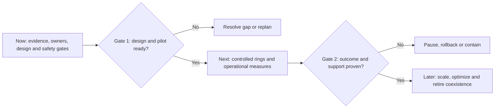

**Instructions:** Put outcomes and acceptance measures in horizons; maintain detailed work elsewhere. Show people/process/change, technical work, licensing/procurement, operations, data/compliance, and decommission tracks. Make uncertainty wider in later horizons.

**Quality gate:** Each initiative traces to approved value/risk, has owner/measure, dependencies, decision gates, capacity, and decommission/coexistence implications; roadmap is explicitly not a promise without resourcing.

**Control footer:** Owner `[Transformation lead]`; approver `[Steering group]`; version `[planning cycle]`; evidence `[Decision and estimate bases linked]`.

### Template 35 - Business case

**Use when:** seeking investment or authorization with transparent value, cost, risk, and uncertainty.

| Business-case field | Copy/adapt content | Northstar example cue |
|---|---|---|
| Problem/opportunity | `[Evidence-based current consequence]` | Manual exception process lacks complete ownership |
| Options | `[Status quo and viable alternatives]` | Process fix; native workflow; custom build |
| Benefits | `[Financial/nonfinancial, owner, baseline, measure, timing]` | Reduce overdue/unowned exceptions; improve auditability |
| Costs | `[One-time/recurring/license/data/people/support/change/exit]` | Design, licensing validation, training, operation, coexistence |
| Risks/disbenefits | `[Delivery, adoption, lock-in, privacy, failure]` | Workflow dependency and false confidence without reconciliation |
| Assumptions/sensitivity | `[Ranges and key variables]` | Population and entitlement unverified; show low/base/high scenarios |
| Recommendation | `[Option, conditions, funding, gate]` | Fund pilot only; production decision after measured gates |
| Benefits governance | `[Owner, review, stop/replan trigger]` | Identity Governance reports monthly outcome and exceptions |

**Instructions:** Do not invent precise savings from weak inputs. Show ranges, baseline, source, confidence, and who realizes each benefit. Include cost of delay and cost of control failure only under an accepted valuation method.

**Quality gate:** Problem is evidenced; options and full lifecycle cost are comparable; benefits are owned/measurable; uncertainty and disbenefits visible; recommendation has gates and exit conditions.

**Control footer:** Owner `[Business sponsor/finance partner]`; approver `[Investment authority]`; version `[decision baseline]`; evidence `[Commercial/personnel data restricted]`.

## 9. Migration and coexistence templates

### Template 36 - Migration capability map and coexistence matrix

**Use when:** moving between products, tenants, policies, or operating models without assuming feature parity.

| Capability / object | Source state | Target state | Map: retain-transform-rebuild-retire | Coexistence / authority | Data/history handling | Validation / owner |
|---|---|---|---|---|---|---|
| Privileged exception record | Manual form and spreadsheet | Governed workflow and report | Transform active records; archive closed under policy | Source remains authoritative until signed reconciliation | Minimized fields; preserve decision/expiry/history | Count and field reconciliation / Governance owner |
| `[Capability/object]` | `[Version/config/owner]` | `[Required target outcome]` | `[Disposition and rule]` | `[Dual-write/read/conflict/period]` | `[Export/import/retention/disposal]` | `[Test/owner]` |

**Instructions:** Map business capability, configuration, data, identity, policy, integration, reporting, support, license, and skills. Define source of truth in each phase and conflict behavior. Identify unsupported semantics instead of forcing a one-to-one map.

**Quality gate:** Every scoped object has disposition; coexistence has one authority and end condition; data integrity, rollback, support, license, retention, and decommission are traceable.

**Control footer:** Owner `[Migration architect]`; approver `[Source/target/data/service owners]`; version `[migration wave]`; evidence `[Inventories and reconciliation reports controlled]`.

### Template 37 - Migration wave plan

**Use when:** grouping people, workloads, sites, data, or configurations into controlled waves.

| Wave / ring | Population and entry criteria | Dependencies / freeze | Migration method | Validation / soak | Exit / rollback | Owner / communication |
|---|---|---|---|---|---|---|
| Wave 0 | Synthetic records and delivery team; design/tests approved | Test environment and support route ready | Dry-run transform; no production write | Field/count reconciliation and failure-path tests | Reset synthetic data | Technical lead / daily |
| Ring 1 | 10 Northstar pilot users; supported devices; consented participation | Service desk and known proxy path | Approved controlled change | 5 business-day soak; sign-in/support/exception metrics | Revert assignment and reconcile state under rollback plan | Pilot owner / targeted notice |
| `[Wave]` | `[Population/entry]` | `[Dependencies/calendar]` | `[Tool/process/change ID]` | `[Checks/duration]` | `[Criteria/plan]` | `[Owner/cadence]` |

**Instructions:** Choose waves by risk and learning value, not convenience alone. Avoid putting all specialists, all executives, or one critical service in the first production ring. Define hard stop, pause, and expansion authority.

**Quality gate:** Population is reconciled; entry/exit criteria objective; support, communication, metrics, soak, rollback, and dependency gates approved; no automatic expansion on missing data.

**Control footer:** Owner `[Migration lead]`; approver `[Change/service/business owners]`; version `[wave baseline]`; evidence `[Population lists minimized and restricted]`.

## 10. Pilot and test templates

### Template 38 - Pilot and ring charter

**Use when:** proving assumptions and operations in a limited authorized population before scale.

| Pilot field | Copy/adapt entry | Northstar example |
|---|---|---|
| Hypotheses | `[What must be learned]` | Owner/expiry enforcement works; support can diagnose safe errors |
| Population/rings | `[Selection, size, exclusions, consent/change]` | Ring 0 delivery team; Ring 1 ten supported users; no guests |
| Success | `[Outcome and threshold]` | 100% records have owner/expiry; no severity-1 incident; support case triage within target |
| Guardrails | `[No-go actions, scope, data, security]` | No weakened authentication or production-wide assignment |
| Telemetry | `[Health, experience, control, support, cost]` | Workflow health, exception completeness, tickets, latency |
| Duration | `[Start, soak, review]` | Five business days after stable entry validation |
| Stop/rollback | `[Objective triggers and authority]` | Integrity failure, unexpected assignment, unsupported outage |
| Expansion | `[Gate and approvers]` | Explicit go decision; silence is not approval |

**Instructions:** A pilot is an experiment with protected participants and decision criteria, not a quiet production launch. Capture baseline and expected variance. Include technical, security, privacy, usability, support, and operational learning.

**Quality gate:** Hypotheses, representative population, consent/change, baseline, metrics, telemetry, stop/rollback, support, duration, and explicit expansion authority are complete.

**Control footer:** Owner `[Pilot lead]`; approver `[Service/change/business owners]`; version `[pilot baseline]`; evidence `[Participant data minimized; results aggregated where possible]`.

### Template 39 - Test strategy

**Use when:** defining how confidence will be built across requirements, risk, failure, operations, and change.

| Strategy area | Copy/adapt decision | Northstar example |
|---|---|---|
| Scope/objectives | `[Requirements/risks/design versions tested]` | REQ-031, identity/control and support paths |
| Levels/types | `[Unit/config/contract/integration/security/UAT/operational/recovery]` | Synthetic contract, end-to-end pilot, rollback rehearsal |
| Environment/data | `[Isolation, parity, synthetic/redacted data, reset]` | Authorized lab then limited pilot; no production data copied |
| Roles | `[Author, executor, witness, approver; independence]` | Engineer executes; test lead witnesses; owner accepts |
| Entry/exit | `[Objective prerequisites and thresholds]` | Approved design, evidence, support; no critical open defects |
| Defects | `[Severity, triage, retest, waiver]` | Daily triage; risk acceptance cannot be self-approved |
| Evidence | `[Logs, screenshots, IDs, results, retention]` | Safe correlation IDs and redacted result record |
| Schedule/risk | `[Windows, dependencies, stop conditions]` | Freeze-aware; stop on scope/safety deviation |

**Instructions:** Test negative authorization, expiration, duplicate/retry, partial failure, throttling, timeout, dependency outage, monitoring, alert routing, support, rollback, and reconciliation, not only a successful path.

**Quality gate:** Every must requirement and material threat/risk has an appropriate test or accepted rationale; data/environment safety, independence, evidence, exit, and defect governance are approved.

**Control footer:** Owner `[Test lead]`; approver `[Service/business/security owners]`; version `[release test baseline]`; evidence `[Test data classification and repository documented]`.

### Template 40 - Test case

**Use when:** specifying one reproducible test with preconditions, steps, expected evidence, and cleanup.

| Test-case field | Copy/adapt entry | Northstar example |
|---|---|---|
| ID/title/type | `[TC-### / behavior / positive-negative-recovery]` | TC-041 / Reject exception missing expiry / Negative security |
| Trace | `[Requirement/design/threat/risk]` | REQ-031, STRIDE-T02 |
| Preconditions | `[Version, environment, roles, safe data, health]` | Synthetic lab; approved test requester; workflow v0.8 |
| Steps | `[Numbered operator actions without secrets]` | Submit synthetic request with expiry omitted; do not alter control |
| Expected | `[UI/API/state/log/support behavior]` | Validation rejects submission; safe message; audit/correlation recorded |
| Evidence | `[Fields/IDs/timestamps/screenshots]` | UTC, test ID, version, redacted message, correlation ID |
| Cleanup | `[Restore/reset/reconcile]` | Delete synthetic draft only under lab procedure; verify no active record |
| Stop/safety | `[Abort criteria]` | Any unexpected production context or real identity data |

**Instructions:** Keep steps deterministic and authorized. Use synthetic identities/data where feasible. Never put passwords, tokens, bypass steps, or a direction to weaken a policy in the case.

**Quality gate:** Trace, preconditions, exact safe steps, expected result, evidence, cleanup, stop condition, owner, and version are present; another qualified tester can reproduce it.

**Control footer:** Owner `[Test analyst]`; approver `[Test lead/control owner]`; version `[case version]`; evidence `[Result references separate controlled record]`.

### Template 41 - Test result

**Use when:** recording what actually happened without rewriting expected behavior.

| Result ID / test | Execution context | Expected / actual | Status | Evidence | Defect / retest / approver |
|---|---|---|---|---|---|
| TR-041 / TC-041 v1.1 | Lab; workflow v0.8; 2026-08-24T15:10Z; Tester A | Expected reject and audit; actual reject, safe message, audit event received after 2 minutes | Pass with observation | E-091, correlation redacted | Observation OBS-03 latency baseline; Test lead |
| `[TR-### / TC/version]` | `[Env/build/time/executor/data]` | `[Separate expected and actual]` | `[Pass-Fail-Blocked-Not run]` | `[IDs]` | `[DEF/retest/approval]` |

**Instructions:** A pass requires the documented expected result, not tester intent. Record delays, retries, warnings, and unexpected side effects. Never convert a failed result to pass by editing the test after execution; version the case and retest.

**Quality gate:** Context, versions, UTC, expected, actual, status, evidence, deviations, defect/observation, cleanup, and independent review are complete.

**Control footer:** Owner `[Tester]`; approver `[Test lead/acceptance owner]`; version `[immutable execution record; correction appended]`; evidence `[Restricted logs linked by ID]`.

### Template 42 - Defect record

**Use when:** actual behavior differs from an approved expectation or causes an adverse side effect.

| Defect field | Copy/adapt content | Northstar example |
|---|---|---|
| ID/title | `[DEF-### / observed problem]` | DEF-009 / Expired synthetic record remains in active report |
| Environment/version | `[Exact approved context]` | Lab workflow v0.8; report v0.5 |
| Preconditions/repro | `[Minimal safe sequence and rate]` | Create synthetic record with short test expiry under approved case |
| Expected/actual | `[Separate statements]` | Expected inactive after expiry; actual active for 20 minutes |
| Impact/severity | `[User/control/data/operational rationale]` | Control-report lag; Medium pending agreed freshness target |
| Evidence | `[UTC/correlation/log/result IDs]` | TR-055, E-102 |
| Analysis | `[Known fact, hypothesis, unknown]` | Queue event delayed; cause unknown |
| Disposition | `[Fix/defer/duplicate/not defect/accept]` | Investigate and retest; no ring expansion |
| Owner/target/retest | `[Values]` | Workflow owner / next build / TC-055 |

**Instructions:** Use safe reproducibility detail, not secrets or attack steps. Keep severity separate from priority. Link accepted defects to a risk/exception with authorized expiry and compensating control.

**Quality gate:** Reproducible context, expected/actual, evidence, impact rationale, owner, status, target, retest, and acceptance path are present; no unsupported root-cause claim.

**Control footer:** Owner `[Engineering/test triage]`; approver `[Product/control owner]`; version `[lifecycle]`; evidence `[Logs and screenshots controlled/redacted]`.

### Template 43 - Test summary report

**Use when:** presenting release confidence and residual uncertainty to a decision authority.

| Measure | Planned | Executed | Pass | Fail | Blocked/not run | Decision implication |
|---|---:|---:|---:|---:|---:|---|
| Must requirements | 24 | 24 | 23 | 1 | 0 | No-go until DEF-009 fixed or accepted by risk authority |
| Negative/security | 12 | 12 | 12 | 0 | 0 | Tested scope only; not a penetration test |
| Recovery/rollback | 6 | 6 | 6 | 0 | 0 | Rehearsal met defined validation |
| Northstar total | 42 | 42 | 41 | 1 | 0 | Conditional decision pending one defect |

| Summary field | Copy/adapt content |
|---|---|
| Scope/build/environment | `[Exact baselines]` |
| Coverage and exclusions | `[Requirements/risks and untested areas]` |
| Defects/residual risks | `[Counts plus material IDs]` |
| Nonfunctional result | `[Security, recovery, support, performance, accessibility]` |
| Recommendation | `[Go/conditional/no-go with evidence and authority needed]` |

**Instructions:** Do not hide failed critical tests inside a percentage. Report requirement/risk coverage and limitations, environment parity, data limitations, flaky tests, and evidence quality.

**Quality gate:** Totals reconcile to result records; material failures and untested scope are prominent; recommendation is conditional on correct authority and residual risk disposition.

**Control footer:** Owner `[Test lead]`; approver `[Acceptance authority]`; version `[release candidate]`; evidence `[Result and defect IDs; raw logs restricted]`.

## 11. Go-live, rollback, and stabilization templates

### Template 44 - Go/no-go checklist and decision

**Use when:** an authorized body decides whether to start, pause, conditionally proceed, or stop a release/wave.

| Gate | Status / evidence | Owner confirmation | Blocking rule |
|---|---|---|---|
| Scope/change authorization | `[Green/Amber/Red + CHG ID]` | Change owner | Red is no-go |
| Requirements/design | `[Traceability and approved HLD/LLD]` | Architecture/security | Unapproved must requirement is no-go |
| Test/defects | `[Summary and material defects]` | Test/business owner | Unaccepted critical failure is no-go |
| Security/privacy/risk | `[Threats, residual risks, exceptions]` | Risk/data authorities | Missing authority is no-go |
| Cutover/rollback | `[Rehearsal, timings, checkpoints]` | Technical/change lead | Unrehearsed material rollback is no-go |
| Operations/support | `[Monitoring, access, runbook, staffing]` | Service/SOC/help desk | No support/health visibility is no-go |
| Communications | `[Audience, status page, escalation]` | Comms/business owner | Material affected group uninformed is no-go |
| Northstar decision | Conditional go after DEF-009 closure and retest | Named authorities at decision meeting | No implicit approval from meeting attendance |

**Decision record:** `[GO / CONDITIONAL GO / HOLD / NO-GO]`, UTC `[time]`, authority `[names/roles]`, conditions `[IDs, owners, deadlines]`, next checkpoint `[time]`, evidence package `[ID]`.

**Quality gate:** Quorum/authority, baselines, objective status, blocker rules, dissent, conditions, rollback authority, communication, and signed decision are recorded.

**Control footer:** Owner `[Change/release lead]`; approver `[Named go-live authority]`; version `[decision event]`; evidence `[Approval record and gate evidence retained]`.

### Template 45 - Cutover plan

**Use when:** coordinating a time-bound approved transition with command, checkpoints, validation, and communication.

| Step / UTC window | Preconditions | Action / executor | Expected evidence | Checkpoint / authority | Failure response |
|---|---|---|---|---|---|
| 0 / before window | Go decision, backups/config exports where supported, health baseline, bridge open | Confirm context and freeze; Release lead | Approved change, participant list, baseline dashboard | Change lead authorizes start | Hold; do not improvise |
| 1 / `[time]` | Correct tenant/environment and version | Apply approved narrow assignment through controlled procedure | Audit/change ID and expected object/version | Technical witness verifies | Stop on context mismatch |
| 2 / `[time]` | Change observed | Run smoke, negative authorization, logging, support checks | TR IDs and health signals | Service owner accepts checkpoint | Rollback trigger evaluation |
| Northstar | Ring 1 assignment only | Identity engineer executes; second person verifies scope | Ten approved IDs targeted; no unexpected assignment | Pilot owner | Remove assignment under rollback plan if integrity fails |

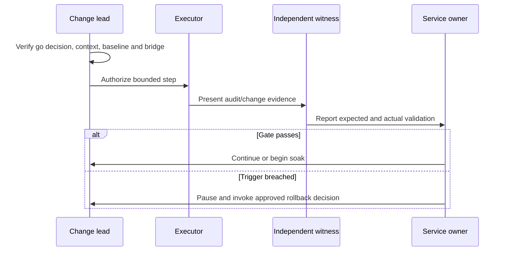

**Instructions:** Use UTC, one commander, one authoritative copy, and explicit hold points. Separate executor from verifier where risk warrants. Prewrite status messages. Never add an unreviewed fix during the window; log and route a change.

**Quality gate:** Authority, exact scope/context, dependencies, sequence, timings, executor/witness, evidence, checkpoints, communication, abort/rollback triggers, and closure are executable.

**Control footer:** Owner `[Release/change lead]`; approver `[Change/service authority]`; version `[frozen at window]`; evidence `[Bridge notes and logs classified; secrets excluded]`.

### Template 46 - Rollback and state-reconciliation plan

**Use when:** defining how to stop harm, restore an approved state, and account for work completed during ambiguity.

| Rollback field | Copy/adapt entry | Northstar example |
|---|---|---|
| Triggers | `[Objective threshold/event]` | Unexpected population assignment; integrity failure; critical support outage |
| Authority | `[Who invokes; delegate]` | Service owner after change-lead recommendation; emergency authority per policy |
| Point of no return | `[State/time and alternative recovery]` | None for pilot assignment; data transform has separate reconciliation |
| Reversal sequence | `[Approved high-level steps and owners]` | Freeze expansion; remove ring assignment through approved change; restore prior workflow version |
| State reconciliation | `[In-flight/duplicate/partial records]` | Compare request/decision/directory/report IDs; owner disposes each ambiguous record |
| Validation | `[Security/function/log/support checks]` | Prior access behavior, audit continuity, no active orphan exception |
| Communication | `[Who, when, what]` | Pilot users, service desk, SOC, sponsor; factual status and next update |
| Re-entry | `[Root cause/fix/test/new approval]` | PIR/defect, revised test evidence, new go decision |

**Instructions:** Rollback is not always a reverse command. It may require containment, prior-version restore, data correction, replay prevention, and business reconciliation. Rehearse with synthetic state and time the procedure.

**Quality gate:** Triggers, authority, feasibility, point of no return, exact owners, evidence preservation, state reconciliation, validation, communication, and re-entry gate are approved and tested.

**Control footer:** Owner `[Technical/service owner]`; approver `[Change and business authorities]`; version `[release-specific]`; evidence `[Rehearsal and execution records retained]`.

### Template 47 - Hypercare plan and tracker

**Use when:** providing elevated observation and support after a controlled transition, with a defined exit.

| Hypercare item | Baseline / threshold | Source / cadence | Owner / response | Exit evidence |
|---|---|---|---|---|
| Service/control health | Workflow success and exception completeness; alert on agreed deviation | Approved health dashboard / hourly then daily | Operations -> incident path | Stable for five business days |
| User experience | Ticket volume/category and safe error rate | Service desk / daily | Support lead -> known issue/defect | Within agreed baseline range |
| Security | Unexpected assignment, privileged activity, alert trend | Approved security telemetry / defined cadence | SOC and identity owner | No unresolved material anomaly |
| Data/reconciliation | Source/target/report counts and ambiguous records | Controlled report / daily | Data/governance owner | 100% explained within scope |
| Northstar issue | DEF-009 expiry lag | Every test event during soak | Workflow owner; no expansion on threshold breach | Retest pass and owner acceptance |

**Instructions:** Establish baseline before cutover. Use an issue tracker with ID, UTC, symptom, impact, owner, workaround, fix, retest, and status. Hypercare does not bypass incident, change, risk, or privacy governance.

**Quality gate:** Measures, thresholds, cadence, staffing, escalation, comms, issue linkage, duration, exit criteria, and transition to steady support are agreed; exit is evidence-based.

**Control footer:** Owner `[Service transition lead]`; approver `[Service/business owner]`; version `[release/wave]`; evidence `[Operational data minimized; incident evidence separately controlled]`.

## 12. Operational readiness and support templates

### Template 48 - Operational readiness review (ORR)

**Use when:** deciding whether a capability can be owned, observed, supported, recovered, governed, and funded after delivery.

| Readiness domain | Pass evidence | Owner | Status / gap / due |
|---|---|---|---|
| Service ownership | Named business, product, technical, control, data, and support owners accept duties | Service owner | `[G/A/R; gap]` |
| Support | Tier model, access, intake, known errors, escalation, vendor route, hours | Support lead | `[Status]` |
| Observability | Health, audit, security, performance, cost, no-data/freshness, alert routing tested | Operations/SOC | `[Status]` |
| Security/privacy/compliance | Least privilege, identity lifecycle, threat treatment, retention, exceptions | Security/data owners | `[Status]` |
| Resilience | Dependency map, degraded behavior, backup/restore where applicable, recovery/rollback rehearsal | Technical owner | `[Status]` |
| Change/release | Version, environments, tests, approvals, maintenance and emergency paths | Change owner | `[Status]` |
| Documentation/knowledge | HLD/LLD, runbook, SOP, KB, support contacts, review dates | Knowledge owner | `[Status]` |
| Capacity/license/cost | Population, limits, entitlement, budget, usage and forecast alerts | FinOps/licensing | `[Status]` |
| Northstar | Exception workflow pilot readiness | Identity service owner | Amber until DEF-009 retest and Tier 2 exercise |

**Instructions:** Require evidence, not "ready" declarations. Test access and paging routes using a synthetic case. Include weekends, leave, vendor boundaries, certificate/secret expiry, service health, and ownership after project closure.

**Quality gate:** Every applicable domain has accountable acceptance and current evidence; Amber items have conditions/owners/dates; any Red blocks transition unless correct authority accepts a documented risk without weakening required safety.

**Control footer:** Owner `[Service transition manager]`; approver `[Service/business/change authorities]`; version `[release ORR]`; evidence `[Acceptance and exercise records]`.

### Template 49 - Support model

**Use when:** defining how users and monitoring reach qualified help and how ownership moves without bouncing cases.

| Tier/function | Receives / owns | Performs | Does not perform | Access/tools | Escalates when / to |
|---|---|---|---|---|---|
| Tier 0 | User self-help | Status/KB and safe data collection guidance | Diagnose privileged configuration | Public/internal KB | Unresolved or security signal -> Tier 1 |
| Tier 1 service desk | User report and initial impact | Verify service health, time, user journey, correlation ID, known issue | Disable controls or request secrets | Ticketing, approved read-only views | Scope/control/security threshold -> Tier 2/SOC |
| Tier 2 platform | Product diagnosis | Correlate config, logs, dependencies; coordinate workaround/change | Accept business risk | Least operational role, runbooks | Defect/vendor/security -> Tier 3/incident |
| Tier 3 engineering/vendor | Product defect or deep integration | Reproduce safely, analyze, propose supported fix | Receive unnecessary raw tenant data | Approved engineering/support channel | Major incident/problem/change governance |
| Northstar control owner | Exception-governance outcome | Review control integrity and risk decisions | Routine ticket triage | Governance report | Risk authority for residual risk |

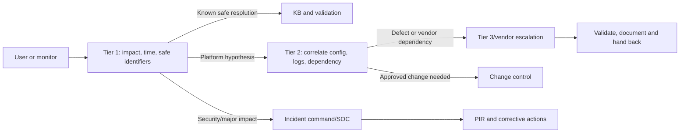

**Instructions:** Define one case owner even when multiple teams investigate. Map authentication, endpoint, network, workload, data/compliance, SOC, and vendor boundaries. Specify warm handoff content and escalation clocks.

**Quality gate:** Intake, ownership, tier duties/boundaries, hours, access, skills, escalation criteria, warm handoff, incident/change/risk interfaces, vendor route, and knowledge feedback are complete and exercised.

**Control footer:** Owner `[Service owner]`; approver `[Operations/support leaders]`; version `[service version]`; evidence `[Exercise/ticket examples redacted]`.

### Template 50 - SLA and OLA catalogue

**Use when:** aligning external service commitments (SLA) with internal supporting commitments (OLA). Verify contractual meanings with authorized owners.

| Commitment ID | Measure and clock | Scope/exclusions | Target | Data source/calculation | Provider/consumer | Breach response/review |
|---|---|---|---|---|---|---|
| SLA-01 | Time to acknowledge priority-1 user-impacting incident; starts at accepted intake | Covered service/hours; approved exclusions | `[Contractual target]` | Ticket timestamps in UTC; paused states defined | Service owner/business | Major incident path; monthly review |
| OLA-02 | Identity team joins validated priority-1 bridge | Identity-related incidents during support hours/on-call | 15 minutes example, subject to approval | Paging and bridge audit | Identity operations/incident command | Escalate to duty manager |
| SLO-03 | Exception-report freshness | In-scope active records | `[Internal objective]` | Source max timestamp versus UTC now | Workflow/operations | Alert, reconcile, problem review |
| `[ID]` | `[Definition, start/stop/pause]` | `[Population/window/exclusions]` | `[Threshold/percentile]` | `[Source/formula/timezone]` | `[Provider/consumer]` | `[Escalation/review]` |

**Instructions:** Separate contractual SLA, internal service-level objective (SLO), and OLA. Define numerator, denominator, percentile, business/calendar hours, clock pauses, exclusions, data quality, and reporting ownership. Do not promise vendor recovery beyond published/current terms.

**Quality gate:** Terms are defined, measurable, owned, achievable across dependencies, security-safe, and traceable to customer outcome; supporting OLAs make the SLA plausible; breach and improvement paths exist.

**Control footer:** Owner `[Service manager]`; approver `[Contract/business/operations authorities]`; version `[effective period]`; evidence `[Contracts restricted; operational metrics controlled]`.

### Template 51 - Runbook

**Use when:** an operator needs a decision-oriented procedure for a recurring event, alert, failure, recovery, or maintenance activity.

| Runbook section | Copy/adapt content | Northstar example cue |
|---|---|---|
| Trigger and objective | `[Alert/request and safe end state]` | Exception-report freshness alert; restore trustworthy view |
| Scope/authority | `[Systems, environment, authorized roles/change]` | Read-only triage first; changes require approved change/incident authority |
| Preconditions | `[Health, access, contacts, backup/rollback]` | Confirm tenant/context and service health |
| Inputs | `[Ticket, UTC, IDs, versions; prohibited data]` | Workflow run ID and redacted record ID; never token or password |
| Decision procedure | `[Numbered checks with expected branch]` | Source event -> workflow run -> queue -> report refresh -> reconciliation |
| Safety/stop | `[No-destructive boundary and escalation]` | Stop on wrong environment, uncertain scope, or evidence-integrity concern |
| Validation | `[Function/security/data/log/user checks]` | Counts explain; overdue record state correct; health alert clears |
| Failure/rollback | `[Contain, change, restore, reconcile]` | Escalate; preserve logs; invoke approved recovery plan |
| Closure | `[Evidence, ticket, KB/problem/update]` | Record root cause confidence and next preventive action |

**Instructions:** Write observable checks before actions. Label read-only, approved-change, and emergency-authority steps. Include expected evidence and the route when it differs. Test with a synthetic scenario and review after use.

**Quality gate:** Trigger, objective, authority, inputs, safe sequence, decision points, stop rules, validation, rollback/recovery, evidence, escalation, and closure are executable by the intended role.

**Control footer:** Owner `[Operations owner]`; approver `[Service/security/change owners]`; version `[tested release]`; evidence `[Execution IDs in ticket; secrets excluded]`.

### Template 52 - Standard operating procedure (SOP)

**Use when:** a controlled repeatable process must produce a consistent outcome, including approvals and records.

| SOP field | Copy/adapt content | Northstar example |
|---|---|---|
| Purpose/scope | `[Outcome, population, exclusions]` | Request, approve, review, expire, and close privileged exceptions |
| Roles/separation | `[Requester, verifier, approver, executor, reviewer]` | Requester cannot self-approve; governance reviews overdue items |
| Inputs/entry | `[Required fields and preconditions]` | Business need, target, owner, expiry, risk, alternative considered |
| Procedure | `[Numbered lifecycle with decision gates]` | Validate -> approve/reject -> implement under authority -> monitor -> expire -> reconcile |
| Records/evidence | `[Canonical record and retention]` | Stable exception ID linked to decision/change/audit |
| Exceptions | `[How deviations are authorized and time-bound]` | Risk acceptance template; no verbal permanent exception |
| Measures | `[Quality, timeliness, outcome]` | Owned/unexpired rate, overdue review count, recurrence cause |
| Review/training | `[Frequency, owner, competency]` | Quarterly plus PIR/change trigger |

**Instructions:** SOPs govern process; runbooks diagnose or operate technical events. Use active verbs, decision authority, input/output, segregation, records, quality checks, exception route, and review cadence.

**Quality gate:** A trained role can execute consistently; no step relies on hidden knowledge; separation, authorization, evidence, exception, measure, training, and revision controls are explicit.

**Control footer:** Owner `[Process/control owner]`; approver `[Governance authority]`; version `[effective controlled document]`; evidence `[Process records linked; sensitive requests restricted]`.

### Template 53 - Knowledge-base article

**Use when:** providing a safe, searchable answer for a defined audience and symptom.

| KB field | Copy/adapt content | Northstar example |
|---|---|---|
| Title/symptoms | `[User language and safe error]` | Sign-in says access requirements were not met during pilot |
| Audience/scope | `[Users/Tier 1/Tier 2; systems/version]` | Northstar pilot users and Tier 1; ring 1 only |
| Impact | `[What is/is not affected]` | One app sign-in may fail; do not retry repeatedly or share credentials |
| Safe checks | `[Service health, UTC, browser/session, approved identifiers]` | Record UTC, app, safe error and correlation ID; check service notice |
| Resolution/workaround | `[Supported, reversible, approved steps]` | Use approved support channel; only documented alternative route if authorized |
| Escalation | `[Trigger, team, required package]` | Repeated/multiple users/security signal -> Tier 2/incident route |
| Validation | `[How user/operator knows resolved]` | Successful expected access plus audit record under approved check |
| Metadata | `[Keywords, owner, version, review/expiry, related IDs]` | Owner service desk; review after pilot |

**Instructions:** Do not instruct users to disable security, reveal secrets, install unapproved tools, or repeatedly trigger lockouts. Put the simplest safe action first. Separate user article from restricted diagnostic detail.

**Quality gate:** Searchable title, exact audience/scope, safe checks, supported resolution, escalation package, validation, owner, review date, and feedback link are present; article contains no sensitive topology or bypass.

**Control footer:** Owner `[Knowledge manager/service owner]`; approver `[Technical/security reviewer]`; version `[published revision]`; evidence `[Source/runbook links; screenshots sanitized and current]`.

### Template 54 - Handover and knowledge-transfer plan

**Use when:** transferring ownership from project/delivery to steady-state teams without treating a meeting as proof of readiness.

| Capability/topic | Provider -> receiver | Method | Practice/evidence | Acceptance criterion | Owner / date / gap |
|---|---|---|---|---|---|
| Architecture and boundaries | Architect -> platform/support | Walkthrough plus diagram playback | Receiver explains data/auth/log and failure paths | Accurate teach-back with open questions recorded | Architect / `[date]` |
| Operations | Engineer -> Tier 2/on-call | Runbook exercise | Synthetic freshness alert triaged and handed off | Correct evidence, branch, escalation, closure | Ops lead / `[date]` |
| Control/risk | Governance -> service owner | Scenario review | Expired exception and risk-acceptance exercise | Correct owner/authority/record path | Governance / `[date]` |
| Northstar ownership | Delivery -> Identity Manager | Shadow then reverse-shadow | Receiver leads pilot review | ORR acceptance signed with no unowned Red gap | Transition lead |

**Instructions:** Inventory artifacts, access, contacts, known defects, risks, licenses, costs, dependencies, maintenance, certificates/secrets lifecycle, vendor cases, and future commitments. Use teach-back, shadow, reverse-shadow, and observed exercise. Revoke temporary project access after acceptance under policy.

**Quality gate:** Receiver has tested access, skill, documentation, support contacts, authority, capacity, and exercises; gaps are accepted with owner/date; ownership and temporary-access disposition are documented.

**Control footer:** Owner `[Transition manager]`; approver `[Receiving service owner]`; version `[handover baseline]`; evidence `[Attendance alone is insufficient; exercise/acceptance records linked]`.

## 13. Status and executive communication templates

### Template 55 - Weekly status report

**Use when:** giving a factual, action-oriented view of progress, forecast, decisions, and risk.

| Section | Copy/adapt content | Northstar example |
|---|---|---|
| Overall RAG / rationale | `[Green/Amber/Red with defined criteria and trend]` | Amber: design on plan; one failed expiry-lag test blocks pilot expansion |
| Outcomes this period | `[Completed, evidenced outcomes]` | HLD approved; 41/42 tests passed; ORR exercise scheduled |
| Next period | `[Outcome, owner, target]` | Fix/retest DEF-009; execute Tier 2 scenario |
| Milestones/forecast | `[Baseline/current date, variance, confidence]` | Pilot gate unchanged; confidence Medium pending retest |
| Risks/issues/dependencies | `[Top IDs, impact, response, ask]` | DEF-009; licensing validation; proxy test route |
| Decisions/changes | `[Needed/made, authority, due]` | Go decision after evidence package; no scope change |
| Budget/capacity | `[Only if in governance scope]` | No variance; operations capacity confirmation open |
| Client actions | `[Owner/date/consequence]` | Licensing owner confirms entitlement before gate |

**Instructions:** Lead with change since last report and decision/assistance needed. Reconcile dates and counts to canonical logs. RAG is not sentiment; define thresholds. Report bad news early with impact and options.

**Quality gate:** Period, baseline, trend, evidence, forecast confidence, material risk/issue, decisions, owner/date, and ask are clear; no unsupported percentage or hidden blocker.

**Control footer:** Owner `[PM/engagement lead]`; approver `[Delivery/client lead]`; version `[reporting period]`; evidence `[Links to controlled records; distribution by classification]`.

### Template 56 - Executive decision report

**Use when:** an executive needs a concise decision, not a compressed technical document.

| Executive element | Copy/adapt statement | Northstar example |
|---|---|---|
| Decision requested | `[Specific choice, amount/scope/date]` | Approve pilot only after expiry-lag defect passes retest |
| Why now | `[Business event and consequence]` | Current exception ownership gap persists; design is ready except one control test |
| Evidence | `[Three decisive facts and confidence]` | Sample finding; approved design; 41/42 test result, Medium-High confidence |
| Options/tradeoffs | `[Status quo and alternatives]` | Hold; conditional pilot; proceed despite failed test (not recommended) |
| Recommendation | `[Choice and conditions]` | Hold expansion; complete fix/retest and ORR, then reconvene |
| Value/risk | `[Outcome, cost/range, residual exposure]` | Improves ownership and expiry evidence; workflow dependency remains |
| Roadmap/owner | `[Near-term milestones and accountable owners]` | Workflow owner fixes; test lead retests; service owner accepts |
| Ask/next checkpoint | `[Decision authority and UTC/date]` | Sponsor confirms conditional path; evidence review on agreed date |

**Instructions:** Use one message per page/section, plain language, and a small number of sourced measures. State uncertainty and what is not known. Put detail in linked appendices rather than deleting caveats.

**Quality gate:** Decision, urgency, evidence, options, recommendation, value/risk, conditions, authority, owner, and timing are visible in a two-minute read; technical claims are traceable.

**Control footer:** Owner `[Engagement/executive communication lead]`; approver `[Sponsor/decision owner]`; version `[decision event]`; evidence `[Minimized and audience-appropriate]`.

## 14. Incident, improvement, and exception templates

### Template 57 - Incident record and command worksheet

**Use when:** coordinating live service/security impact. Appendix F supplies the point-of-use diagnostic flows.

| Incident field | Copy/adapt entry | Northstar example |
|---|---|---|
| ID / declared UTC / severity | `[INC-### / timestamp / provisional severity]` | INC-017 / 2026-08-24T18:05Z / SEV2 provisional |
| Symptom / impact / scope | `[Observed behavior, affected service/users/regions]` | Pilot exception report stale; 10 pilot users; control visibility affected, source state unknown |
| Commander / roles | `[IC, technical, comms, scribe, business/security]` | Duty manager / identity lead / comms / scribe |
| Timeline | `[UTC event, source, fact/inference]` | 18:00 monitor alert; 18:07 service health checked; no advisory observed |
| Hypotheses/evidence | `[Ranked hypotheses and IDs]` | Refresh delay, workflow queue, source event gap; correlation set collected |
| Actions/decisions | `[Owner, time, expected evidence]` | Freeze expansion; preserve logs; reconcile source and report counts |
| Workaround/fix/rollback | `[State and authorization]` | Manual owner-reviewed read-only reconciliation; no control disabled |
| Comms/cadence | `[Audience, channel, next update]` | Pilot/support/governance every 30 minutes |
| Exit/follow-up | `[Recovery validation, monitoring, PIR/problem]` | Two healthy cycles plus reconciled population; PIR required |

**Instructions:** Record facts in UTC and label hypotheses. Keep one commander and one authoritative timeline. Security, privacy, legal, or safety events follow the applicable response plan and authorities; this worksheet does not replace them.

**Quality gate:** Impact/scope/severity, command roles, timeline, evidence, decisions, safe actions, comms, recovery criteria, and follow-up are current; no destructive troubleshooting or evidence loss.

**Control footer:** Owner `[Incident commander]`; approver `[Incident/service authority]`; version `[live append-only timeline]`; evidence `[Restricted case repository and chain record]`.

### Template 58 - Post-incident review (PIR)

**Use when:** learning after recovery without blame and without collapsing evidence, contributing conditions, and root-cause confidence.

| PIR section | Copy/adapt content | Northstar example cue |
|---|---|---|
| Executive summary | `[Impact, duration, resolution, current risk]` | Report freshness breach; source control remained intact; visibility delayed |
| Timeline | `[UTC facts, detection to recovery]` | Monitor, declaration, checks, workaround, fix, validation |
| Detection/response | `[What worked, delayed, confused]` | Freshness alert worked; ownership of connector health delayed triage |
| Technical analysis | `[Failure mechanism and confidence]` | Refresh job queue delay; high confidence from correlated run/audit evidence |
| Contributing conditions | `[People/process/technology/data/vendor]` | Threshold not tied to OLA; runbook lacked queue branch |
| Five-whys/cause method | `[Evidence-backed chain; stop before speculation]` | Why visibility stale -> refresh delayed -> queue saturation candidate, validation required |
| Recovery | `[Workaround/fix/rollback/reconciliation]` | Safe read-only reconciliation, supported refresh recovery, two-cycle validation |
| Actions | `[Corrective/preventive IDs, owners, dates, measures]` | Add queue health, update OLA/runbook, test delayed-event path |
| Lessons | `[Preserve strengths and improvements]` | Keep early expansion freeze and correlation discipline |

**Instructions:** Avoid "human error" as root cause; ask why the system allowed, failed to detect, or made recovery difficult. Separate confirmed cause, contributors, and unknowns. Do not publish sensitive investigation details broadly.

**Quality gate:** Impact and timeline reconcile; evidence supports causal statements; detection and response are analyzed; actions address system causes, have owners/measures/dates, and link to problem/change/risk.

**Control footer:** Owner `[Problem/incident manager]`; approver `[Service/security/business owners]`; version `[approved PIR]`; evidence `[Incident evidence access preserved; broad summary minimized]`.

### Template 59 - Corrective and preventive action (CAPA) register

**Use when:** tracking whether findings, incidents, defects, audits, or tests produced durable improvement.

| CAPA ID / source | Cause/control gap | Action type and outcome | Owner / due | Validation method / measure | Status / evidence / effectiveness review |
|---|---|---|---|---|---|
| CAPA-011 / PIR-017 | Queue health absent from service model and runbook | Corrective: add health signal/alert; Preventive: test delayed-event scenario and update OLA | Operations owner / `[date]` | Synthetic delay test; alert reaches on-call; triage within OLA | Open / CHG-### / review after 30 days |
| `[CAPA-### / source]` | `[Evidence-backed cause/gap]` | `[Correct/prevent; observable future state]` | `[Owner/date]` | `[Test/KPI/sample/period]` | `[State/IDs/review]` |

**Instructions:** Fixing one record is correction; changing the system to prevent recurrence is corrective action; reducing likelihood elsewhere is preventive action. Use proportional scope and verify effectiveness after implementation.

**Quality gate:** Source, cause link, outcome, action type, owner/date, approved change, validation, effectiveness period, residual risk, and closure authority are present; overdue actions escalate.

**Control footer:** Owner `[Problem/control owner]`; approver `[Risk/service authority]`; version `[living]`; evidence `[Closure requires effectiveness proof, not task completion alone]`.

### Template 60 - Exception and risk-acceptance record

**Use when:** an authorized business/risk owner considers a temporary departure from a requirement or accepts residual risk. This is not a shortcut around mandatory law or safety.

| Acceptance field | Copy/adapt content | Northstar example |
|---|---|---|
| ID / requirement | `[EXC-### / policy-control-requirement]` | EXC-006 / REQ-031 expiry-report freshness target |
| Scope / duration | `[Exact population/system; start/expiry]` | Pilot report only; seven days; no production expansion |
| Business rationale | `[Why alternative cannot meet need now]` | Fix requires supported workflow update and retest |
| Risk | `[Cause-event-consequence, inherent/residual method]` | Delayed visibility may postpone review; source control unchanged |
| Alternatives | `[Avoid/mitigate/defer/status quo]` | Hold pilot; manual read-only reconciliation; accept delay |
| Compensating controls | `[Owner, operation, evidence]` | Daily owner-reviewed reconciliation with stable IDs and escalation |
| Monitoring/triggers | `[KRI, cadence, breach response]` | Any unexplained record or increased delay triggers hold/incident |
| Authority | `[Risk owner, control/legal/security reviews]` | Named risk authority; consultant cannot accept client risk |
| Exit | `[Fix/change/test/review/revoke]` | DEF-009 fix, TC-055 pass, reconciliation, explicit closure |

**Instructions:** State exactly what is excepted and what remains mandatory. Time-bound it, prevent scope inheritance, and reassess on change. Never accept risk on behalf of the client or imply an exception makes a control effective.

**Quality gate:** Requirement, scope, rationale, alternatives, rating method, compensating controls, monitoring, trigger, expiry, exit, and authorized signatures are complete; prohibited or non-delegable obligations are routed to proper counsel/authority.

**Control footer:** Owner `[Business/risk owner]`; approver `[Authorized risk authority plus required reviewers]`; version `[immutable approval; renew as new decision]`; evidence `[Restricted risk record and approvals]`.

### Template 61 - Automation review checklist

**Use when:** reviewing a script, API client, workflow, query-driven process, playbook, or pipeline before authorized deployment.

| Review domain | Copy/adapt questions | Northstar example evidence |
|---|---|---|
| Outcome/scope | Is automation preferable to supported native/manual control? Are targets bounded? | Exception workflow only; explicit pilot population |
| Identity/permission | Delegated or workload identity? Least operation/resource scope? Who can edit runtime? | Managed identity hypothesis; editor role review; ADR-004 |
| Input/data | Schema validation, classification, minimization, injection/content handling? | Required owner/expiry; safe field constraints |
| State/idempotency | Stable key, duplicate/replay/concurrency behavior, atomic decision? | Exception ID plus version; duplicate returns prior outcome |
| Failure/retry | Timeout, 429, transient/permanent, partial/ambiguous outcome, bounded retry? | Queue health and reconciliation after uncertain completion |
| Safety/change | Dry run, approval, environment guard, stop, rollback, point of no return? | Synthetic mode and ring targeting; no automatic expansion |
| Secrets/dependencies | Managed identity/federation first; expiry/rotation; API/connector/version/limit? | No embedded credential; current connector support rechecked |
| Logging/privacy | Correlation, actor, version, outcome, secure run history, redaction/retention? | Stable IDs and UTC; no tokens or message content |
| Test/quality | Unit/contract/integration/security/load/recovery tests; peer review? | TC suite including duplicate, expiry, queue delay, rollback |
| Operations | Health/no-run/freshness/cost, on-call, runbook, disable authority, owner? | ORR and support model; alert route exercised |
| Supply chain | Source control, protected review, dependency pin/scan/provenance where applicable? | Approved repository and release version |
| Exit | Disable/decommission, state/data reconciliation, access removal, records? | Workflow retirement and active-record disposition plan |

**Instructions:** Review automation as a production service, even if it is "just a script." A read operation can still expose data, exhaust an API, or produce a misleading partial inventory. Separate reviewer, approver, and operator where risk warrants.

**Quality gate:** All twelve domains have evidence or accepted not-applicable rationale; material failures block release; the reviewer verifies no secret, broad consent, destructive default, hidden production target, or security-control bypass.

**Control footer:** Owner `[Automation owner]`; approver `[Security/service/change authorities]`; version `[release]`; evidence `[Review/test/source IDs; sensitive source and pipeline logs access-controlled]`.

## 15. Tailoring guide

### Tailoring by engagement type

| Engagement | Start with | Add before recommendation | Do not skip |
|---|---|---|---|
| Assessment/health check | 01-14, 18-21 | 22-23, 31-35, 55-56 | Scope, evidence limitations, factual validation, risk authority |
| Target architecture | 22-31 | 32, 36, 39, 48-50, 61 | Failure/operations, threat model, ADR, licensing validation |
| Migration | 01-17, 22-24, 28-37 | 38-47, 48-54 | Coexistence authority, reconciliation, rollback, decommission |
| Pilot/deployment | 22-24, 28-30, 37-47 | 48-54, 55, 57-59 | Entry/exit, support, incident route, no automatic expansion |
| Operational improvement | 10-21, 48-61 | 22-24 for changed requirements | Baseline, support ownership, evidence, PIR/CAPA effectiveness |
| Executive case | 01-05, 18-21, 31-35, 56 | Detailed evidence appendix | Options, uncertainty, lifecycle cost, decision and conditions |

### Tailoring by risk and scale

| Factor | Lighter treatment may be appropriate when | Stronger treatment is required when |
|---|---|---|
| Impact | Synthetic, isolated, reversible, no sensitive data | Privileged access, regulated data, broad population, safety/critical service |
| Change | Read-only analysis with no persistent effect | Production write, irreversible transform, identity/security policy, cross-tenant change |
| Evidence | Public/synthetic low-sensitivity inputs | Customer telemetry, personal data, incident evidence, legal hold, regulated records |
| Novelty | Established supported pattern with proven operators | Preview/new integration, custom code, ambiguous vendor support, unfamiliar team |
| Dependency | Few owned dependencies and graceful failure | Cross-vendor, network/PKI, licensing, external authority, weak observability |
| Operations | Short-lived lab with explicit disposal | 24x7 service, contractual commitment, on-call and recovery requirement |

**Tailoring rule:** Reduce ceremony only after preserving the control intent: authority, evidence, traceability, owner, safety, validation, approval, and lifecycle. A one-page artifact can be sufficient; a blank control cannot.

## 16. Common anti-patterns and repairs

| Anti-pattern | Why it fails | Repair |
|---|---|---|
| Template theater | Fields are completed to look finished, not to guide a decision | Begin with audience, decision, and evidence; delete only with rationale |
| Copying Northstar as fact | Synthetic examples become false client claims | Replace examples and label remaining unknowns |
| Consultant as risk owner | Accountability is transferred without authority | Name authorized client owner; consultant advises and documents |
| Screenshot as complete proof | It may omit pages, effective state, time, or population | Record scope, method, pagination/reconciliation, UTC, and limitations |
| RAG without criteria | Color becomes opinion | Define thresholds, trend, impact, and evidence |
| Maturity average | Critical weakness disappears in a mean | Show capability distribution and critical minimum gates |
| Tool-first requirement | Product choice is disguised as a need | Write technology-neutral outcome and acceptance measure first |
| RACI with everyone responsible | Ownership is diluted | Split outcome and assign recognized A plus executing R |
| Risk with no trigger | Register becomes static prose | Add treatment, KRI/trigger, review, residual disposition |
| "Rollback = undo" | Data and external side effects remain ambiguous | Reconcile state, validate, communicate, and govern re-entry |
| Pilot without stop rules | Limited launch quietly becomes production | Preapprove stop/rollback and explicit expansion decision |
| Test percentage only | Critical failure is hidden by many trivial passes | Report must-requirement/risk coverage and material defects |
| Runbook with commands only | Operator cannot reason about context or unexpected output | Add objective, expected evidence, branches, stop, validation, escalation |
| Evidence in email/chat | Access, version, retention, and provenance are weak | Use approved repository and stable evidence catalogue |
| Permanent temporary exception | Compensating control and expiry disappear | Time-bound, monitor, review, and require new authorized renewal |
| Automation as a shortcut | Scale amplifies permission, data, retry, and state errors | Treat it as a service with identity, tests, monitoring, rollback, ownership |
| Proprietary-method implication | Public template is presented as employer intellectual property | State public/general origin and never use restricted client/employer material |

## 17. Candidate-use honesty guide

| Interview situation | Honest, strong wording |
|---|---|
| Asked whether you used this exact pack | "This is a public, general template library I assembled for preparation. I have used comparable support and documentation disciplines, and I would adapt the client's approved method rather than claim this is their proprietary process." |
| Asked for a deliverable you have not owned | "I understand its purpose, fields, evidence, and review gates and can walk through a synthetic Northstar example. I would partner with the accountable architect/control owner for a production deliverable." |
| Asked for a risk decision | "I can frame likelihood, impact, controls, alternatives, and evidence, but the authorized client risk owner accepts residual risk." |
| Asked about production deployment | "I would not infer authority from access. I would require approved design, test, change, rollback, operations, and go/no-go evidence." |
| Asked about a gap | "I separate directly evidenced experience, safe lab practice, and conceptual knowledge, then explain how I would validate the unknown." |

## Official public source anchors

These are starting points, not frozen requirements. Verify current editions, product behavior, license terms, jurisdiction, and client policy.

| Domain | Public source |
|---|---|
| Cybersecurity outcomes and governance | [NIST Cybersecurity Framework 2.0](https://www.nist.gov/cyberframework) |
| Security and privacy controls | [NIST SP 800-53 Rev. 5](https://csrc.nist.gov/pubs/sp/800/53/r5/upd1/final) |
| Risk assessment | [NIST SP 800-30 Rev. 1](https://csrc.nist.gov/pubs/sp/800/30/r1/final) |
| Incident response | [NIST SP 800-61 Rev. 2](https://csrc.nist.gov/pubs/sp/800/61/r2/final) |
| Zero Trust architecture | [NIST SP 800-207](https://csrc.nist.gov/pubs/sp/800/207/final) |
| Incident and vulnerability response playbooks | [CISA Cybersecurity Incident and Vulnerability Response Playbooks](https://www.cisa.gov/news-events/news/cisa-publishes-cybersecurity-incident-and-vulnerability-response-playbooks) |
| Threat modeling | [Microsoft Threat Modeling Tool threats](https://learn.microsoft.com/azure/security/develop/threat-modeling-tool-threats) |
| Architecture quality | [Microsoft Azure Well-Architected Framework](https://learn.microsoft.com/azure/well-architected/) |
| Cloud adoption planning | [Microsoft Cloud Adoption Framework](https://learn.microsoft.com/azure/cloud-adoption-framework/) |
| Architecture decision records | [Architecture decision record guidance](https://learn.microsoft.com/azure/well-architected/architect-role/architecture-decision-record) |
| Operational readiness | [Operational readiness guidance](https://learn.microsoft.com/azure/cloud-adoption-framework/operate/ready) |
| Microsoft 365 service health | [How to check Microsoft 365 service health](https://learn.microsoft.com/microsoft-365/enterprise/view-service-health) |
| Microsoft incident response overview | [Microsoft security incident management](https://learn.microsoft.com/security/operations/incident-response-overview) |
| Adoption/change management | [Microsoft 365 adoption resources](https://adoption.microsoft.com/) |
| Accessibility | [Microsoft Accessibility Fundamentals](https://learn.microsoft.com/training/paths/accessibility-fundamentals/) |
| Privacy principles | [Microsoft Privacy](https://www.microsoft.com/privacy) |

## Completion checklist

| Check | Pass condition |
|---|---|
| Public/general boundary | No Deloitte method, ownership, endorsement, or proprietary implication appears |
| Library completeness | 61 numbered copy/adapt templates cover initiation through automation review |
| Required template coverage | Charter; scope; stakeholder; RACI; discovery; evidence; inventory; diagrams/flows; RAID/logs; findings/risks/maturity/controls; requirements/threat/design/options/license/roadmap/business case; migration/pilot/test/go-live; operations/reporting/incident/PIR/exception/automation are present |
| Template usability | Every template has instructions, fields, a Northstar example or example row, a quality gate, owner/version, and evidence handling |
| Evidence safety | Collection is authorized/minimized; provenance, UTC, redaction, access, retention, and limitations are explicit |
| Candidate honesty | Production ownership, lab practice, conceptual knowledge, and client decision authority are separated |
| Tables and diagrams | More than 45 tables and at least 10 Mermaid diagrams provide reusable structure and flows |
| Tailoring | Engagement/risk tailoring preserves control intent and anti-pattern repairs are actionable |
| Sources/currency | Public source anchors and August 24, 2026 boundary are explicit; current verification is required |
| Local links | All Part links target existing local files; the forward link targets Appendix F |
| Safety | No secret, tenant identifier, security-control bypass, destructive step, malware, attack procedure, or unauthorized production instruction is included |

**Final use gate:** Before presenting any adapted artifact, identify its audience, decision, authority, scope, source evidence, limitations, owner, approver, version, classification, retention, quality result, and next lifecycle event. If any answer is unknown, label it and assign validation rather than manufacturing certainty.

Next reference: [Appendix F - Incident and Troubleshooting Field Manual](Appendix-F-incident-troubleshooting-field-manual.md).
