# Appendix F - Incident and Troubleshooting Field Manual

> **Currency boundary:** This defensive field manual reflects public information available through **August 24, 2026**. Microsoft portals, roles, licenses, schemas, retention, service-health surfaces, product names, limits, KQL tables, APIs, and support routes change. Verify current official documentation, tenant/cloud/region, approved runbooks, and live schema before use.
>
> **Authorization and safety boundary:** Use this manual only for systems, tenants, devices, accounts, data, and incidents you are explicitly authorized to support. Begin read-only. Do not disable security controls, weaken authentication, bypass Conditional Access, release suspected content, delete evidence, purge messages, isolate devices, revoke sessions, change policy, modify retention, run malware, execute attack simulations, or perform production remediation from this guide. Such actions require the applicable incident, legal, security, privacy, change, and risk authority plus a tested plan and rollback. Never ask for or record passwords, MFA codes, access/refresh tokens, cookies, private keys, recovery codes, or full sensitive content.
>
> **Candidate honesty note:** You can credibly lead structured triage, evidence correlation, customer communication, escalation, and safe troubleshooting where supported by experience. You can demonstrate these synthetic/read-only patterns. You should not claim production ownership of Entra, Intune, Exchange, Purview, Defender XDR, Sentinel, Security Copilot, or tenant-wide incident command unless separately evidenced. A strong phrase is: "I would preserve evidence, verify scope and authority, form falsifiable hypotheses, use the least-invasive read-only check, and involve the accountable product, security, privacy, legal, or vendor owner before any production change."

This manual operationalizes [Part 60](Part-60-structured-troubleshooting-multivendor-cloud.md), [Part 61](Part-61-security-incident-response-pir.md), and [Part 62](Part-62-resilience-oncall-shift-handover.md). Use [Appendix E](Appendix-E-consulting-templates-checklists.md) for the full incident, PIR, corrective-action, exception, runbook, and handover records. All names and events below are fictional Northstar examples.

## 1. Non-negotiable live-response rules

| Rule | Required behavior | Reason |
|---|---|---|
| Confirm authority | Name the authorized system, role, activity, evidence types, and escalation authority before access | Technical access is not permission |
| Protect people and service | If life, safety, legal, privacy, active security, or critical service risk is possible, invoke the approved specialist plan immediately | Troubleshooting must not increase harm |
| Preserve before change | Capture current UTC, scope, identifiers, configuration/version, health, and relevant volatile evidence under policy | A change can erase cause and invalidate evidence |
| Read-only first | Prefer status, metadata, logs, correlation, configuration views, and synthetic reproduction | Lowest blast radius and strongest learning |
| One change at a time | Any approved change has hypothesis, expected signal, owner, checkpoint, rollback, and audit/change ID | Bundled changes destroy causality |
| No security bypass | Do not disable MFA/CA/DLP/Defender, add broad exclusions, release suspicious content, or weaken policy as a diagnostic shortcut | It creates exposure and misleading success |
| No secret collection | Do not request credentials, tokens, cookies, keys, recovery data, or full authentication headers | They are dangerous and rarely required for diagnosis |
| Minimize evidence | Collect only approved fields/population/window; redact and restrict | Logs and support bundles can contain personal/security data |
| Label certainty | Separate observed fact, customer report, vendor statement, hypothesis, and conclusion | Prevents confident but unsupported root cause |
| Use UTC | Record source timestamp, timezone, normalized UTC, clock offset, and query window | Cross-service clocks and delays otherwise mislead |
| Keep one timeline | Append corrections; never silently rewrite history | Supports command, handoff, PIR, and evidence integrity |
| Validate recovery | Confirm user journey, security/control state, data/state reconciliation, telemetry, and monitoring | "Error disappeared" is not full recovery |

### Evidence-safe troubleshooting loop

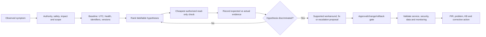
```mermaid
flowchart LR
    S[Observed symptom] --> A[Authority, safety, impact and scope]
    A --> B[Baseline: UTC, health, identifiers, versions]
    B --> H[Rank falsifiable hypotheses]
    H --> C[Cheapest authorized read-only check]
    C --> E[Record expected vs actual evidence]
    E --> D{Hypothesis discriminated?}
    D -->|No| H
    D -->|Yes| X[Supported workaround, fix or escalation proposal]
    X --> G[Approval/change/rollback gate]
    G --> V[Validate service, security, data and monitoring]
    V --> P[PIR, problem, KB and corrective action]
```

## 2. First 5, 15, 30, and 60 minutes

### First 5 minutes - stabilize understanding

| Check | Capture | Do not do |
|---|---|---|
| Safety/authority | Incident ID, authorized lead, affected service, security/privacy/legal trigger | Explore unrelated tenants or data |
| Symptom | Exact user/monitor wording, safe error code, first/last observed UTC | Convert report into a root cause |
| Impact | Business journey, number/type of users, criticality, workaround status | Declare severity from ticket emotion alone |
| Scope | One/many users, one/many devices/apps/sites/regions/tenants, internal/guest | Assume global impact from one sample |
| Change | Recent approved deployment, config, license, certificate, network, vendor event | Roll back before preserving baseline and authority |
| Health | Current Microsoft/vendor status and internal monitor state | Treat "no advisory" as proof the service is healthy |
| Evidence | Start append-only UTC timeline and evidence catalogue | Paste secrets or bulk logs into chat |
| Command | Name incident commander/case owner and next update time | Let every team send independent directions |

**Five-minute output:** `INC ID; declared UTC; provisional severity; observed symptom; impact; scoped known/unknown; commander; safety/escalation trigger; service-health status; next update; first read-only check.`

### First 15 minutes - discriminate broad fault domains

| Check | Question | Evidence target |
|---|---|---|
| Reproduce safely | Can an authorized synthetic/control account reproduce without changing policy? | Expected vs actual with UTC and correlation ID |
| Compare cohorts | Working versus failing user/device/app/location/tenant/time? | Small matrix with one variable per comparison |
| Service path | Client -> DNS/network/TLS/proxy -> identity -> policy -> workload -> data -> logs? | Last known successful hop and first failed hop |
| Configuration | What effective configuration/version/assignment applies? | Read-only effective-state metadata and stable IDs |
| Identity | Who/what authenticated, to which tenant/resource, with what supported method? | Sign-in/result metadata; no token content |
| Dependency | Network, PKI, license, API, connector, third party, quota, clock? | Health/config/contract evidence |
| Detection | Are expected logs present, delayed, sampled, or outside retention? | Source freshness and ingestion-time comparison |
| Containment need | Is active harm suspected? | Escalate to authorized security incident process; no self-directed remediation |

**Fifteen-minute output:** top three hypotheses with predicted evidence, assigned investigators, next safe checks, current workaround status, and communications cadence.

### First 30 minutes - organize parallel work without losing causality

| Workstream | Owner output | Coordination rule |
|---|---|---|
| Impact/scope | Reconciled affected population and business impact | Use one definition and timestamp |
| Product | Configuration, effective state, product logs, known issue | Record stable IDs and query window |
| Identity/security | Authentication/policy/alert evidence and security assessment | Preserve; route active threat to SOC/IR |
| Endpoint/client | Version, enrollment/health, local read-only state | No unapproved reset/reinstall |
| Network | DNS/TCP/TLS/proxy/VPN path evidence | No firewall/proxy bypass |
| Data/compliance | Data class, retention/hold/DLP/label impact | Involve privacy/legal before content access/change |
| Vendor | Support case, advisory, request IDs, time window, package | Minimize and approve transfer |
| Communications | Audience-specific factual update and next update time | Separate external status from technical speculation |

**Thirty-minute output:** evidence-backed fault-domain ranking, severity confirmation/change, workaround assessment, explicit decision needs, blocked dependencies, vendor case if warranted, and handoff-ready timeline.

### First 60 minutes - decide, validate, and prepare endurance

| Gate | Pass questions |
|---|---|
| Severity and command | Is severity evidence-based? Are commander, technical lead, comms, scribe, business/security/data leads staffed? |
| Scope | Are affected and unaffected cohorts known, with confidence and reconciliation method? |
| Root-cause confidence | Which mechanism is confirmed, probable, possible, or excluded? What evidence would change the view? |
| Workaround | Is it supported, authorized, reversible, monitored, time-bound, and security-preserving? |
| Fix/change | Does proposal name hypothesis, blast radius, preconditions, test, owner, approval, rollback, and validation? |
| Evidence | Are originals, UTC timeline, correlation IDs, source windows, transformations, access, and retention controlled? |
| Communication | Did affected users, leadership, support, SOC/privacy/legal/vendor receive appropriate facts and cadence? |
| Staffing | Are shift length, relief, specialist coverage, escalation, and 24x7 handoff planned? |
| Recovery | Are technical, security, data, user, and monitoring success criteria explicit? |
| Follow-up | Are PIR/problem/defect/change/KB/CAPA triggers assigned even if service is not yet restored? |

**Sixty-minute output:** commander's decision statement: `continue investigation / use approved workaround / submit change / invoke rollback / escalate vendor / transfer command`, with authority, evidence, risks, and next checkpoint.

## 3. Severity, impact, urgency, and scope

### Provisional severity matrix

Use the organization's approved matrix. This generic model is a discussion aid, not a contractual definition.

| Severity | Typical impact | Command/cadence | Examples requiring validation |
|---|---|---|---|
| SEV1 / Critical | Safety, active severe security event, critical business service unavailable broadly, material legal/privacy consequence, no acceptable workaround | Immediate incident command and specialist plans; continuous bridge; frequent executive/user updates | Tenant-wide sign-in failure, active compromise, widespread destructive or data-impact event |
| SEV2 / High | Major service/control degradation, many users or critical cohort, limited workaround, high operational risk | Named command; 15-30 minute cadence; vendor/escalation readiness | Regional access failures, critical mail delay, security telemetry gap |
| SEV3 / Medium | Limited cohort or noncritical function, supported workaround, moderate risk | Case owner; 30-60 minute review; scheduled stakeholders | One app/policy/device cohort failure |
| SEV4 / Low | Individual/minor issue, low impact, established handling | Standard support cadence | Single-user configuration or how-to issue after scope validation |

### Impact and scope worksheet

| Dimension | Known | Unknown / validation | Confidence / evidence |
|---|---|---|---|
| Business journey | `[Sign in, enroll, send mail, join meeting, access file, investigate alert]` | `[Downstream consequences]` | `[H/M/L; IDs]` |
| Population | `[Count/types affected and unaffected]` | `[Total denominator/reconciliation]` | `[Method]` |
| Time | `[First/last observed UTC; continuous/intermittent]` | `[Earlier silent onset/log delay]` | `[Sources]` |
| Geography/network | `[Sites/regions/ISP/proxy/VPN]` | `[Unobserved paths]` | `[Evidence]` |
| Platform/client | `[OS/browser/app/version/device state]` | `[Other versions]` | `[Evidence]` |
| Identity/tenant | `[Member/guest/workload; home/resource tenant]` | `[Cross-tenant population]` | `[Evidence]` |
| Workload/data | `[Apps/sites/mailboxes/labels/policies]` | `[Related services]` | `[Evidence]` |
| Security/control | `[Control effective/degraded/unknown]` | `[Exposure/telemetry completeness]` | `[SOC/control-owner assessment]` |
| Workaround | `[Available, tested, authorized]` | `[Scale/safety/duration]` | `[Result IDs]` |
| Northstar example | Ten pilot users see stale exception report; source control state not yet shown affected | Whether queue delay affects nonpilot reports | Medium; alert, two synthetic records, reconciliation pending |

### Severity reassessment triggers

| Trigger | Direction | Required response |
|---|---|---|
| Active threat, safety, regulated-data, legal-hold, or material privacy indication | Raise/escalate | Invoke approved specialist process immediately |
| Scope expands across cohorts/regions/tenants or critical service | Raise | Restaff command and shorten cadence |
| Security monitoring/control is blind or unreliable | Raise | Treat absence of alerts cautiously; establish alternate approved visibility |
| Supported workaround proves safe and broadly effective | May lower | Validate control/data state; obtain commander decision |
| Scope reconciled to one low-impact user with known resolution | May lower | Record evidence and transition to normal support |
| No new evidence | No automatic change | Severity follows impact/risk, not elapsed time alone |

## 4. Roles, communications, cadence, and shift handoff

### Major-incident roles

| Role | Owns | Must avoid |
|---|---|---|
| Incident commander (IC) | Objectives, priorities, severity, decisions, safety, cadence, role assignment | Deep-diving one log while command gaps grow |
| Technical lead | Hypothesis tree, workstreams, evidence standards, change proposal | Running unauthorized changes or suppressing dissent |
| Scribe/timeline | UTC facts, decisions, actions, owners, corrections, evidence IDs | Editing history to fit a later theory |
| Communications lead | Audience map, approved messages, status/cadence, feedback | Publishing root-cause speculation or sensitive detail |
| Business/service lead | Impact, priority, workaround acceptability, recovery acceptance | Accepting technical/security risk outside authority |
| Security/SOC lead | Threat assessment, evidence/containment route, security validation | Treating service troubleshooting as permission to hunt unrelated data |
| Privacy/legal/compliance | Regulatory, privacy, legal-hold and notification advice when triggered | Broad participation without need-to-know |
| Vendor liaison | One support channel, escalation package, request tracking | Sending unredacted bulk exports without approval |
| Shift lead | Fatigue control, transfer, open-risk acceptance, next objectives | Informal handoff without read-back |

### Communications cadence matrix

| Audience | Content | Typical cadence | Owner / channel |
|---|---|---|---|
| Responders | Objective, changes since last, hypotheses, decisions, actions, blockers | 15-30 minutes for major incident | IC on approved bridge/timeline |
| Affected users/support | Impact, scope, safe workaround, what not to do, next update | Severity/need-based; time promised explicitly | Comms/service desk/status channel |
| Executives/business | Outcome impact, trend, confidence, options, decision ask, next milestone | 30-60 minutes for major incident or material change | Executive comms/IC |
| Security/privacy/legal | Trigger facts, evidence, exposure assessment, decisions needed | Immediate on trigger; then agreed cadence | Named specialist channel |
| Vendor | Product, impact, UTC window, request IDs, minimal diagnostics, ask | On package update or agreed escalation | Vendor liaison |
| Shift/on-call | Full command/evidence/risks/actions/access handoff | Before transfer with overlap | Outgoing/incoming leads |

### Major-incident update template

| Field | Copy/adapt statement |
|---|---|
| Header | `[INC ID] - [Service/journey] - [SEV] - Update [n] - [UTC]` |
| Impact | `Users/services affected; business/control consequence; known unaffected scope` |
| Current state | `Investigating / workaround / monitoring recovery; what changed since prior update` |
| Evidence/confidence | `Confirmed facts; probable hypothesis with confidence; important unknown` |
| Actions | `Completed and next actions with owners; no sensitive technical detail` |
| Workaround | `Supported, approved, security-preserving steps and limitations, or none` |
| Ask | `Decision/resource/vendor action needed by time` |
| Next update | `Exact UTC, even if no material change` |

**Fictional Northstar update:** `INC-017 - Exception reporting - SEV2 - Update 2 - 2026-08-24T18:30Z. Ten pilot users are in scope; authorization source state remains available, but the governance report is delayed. We have confirmed a reporting freshness breach and are correlating source events, workflow runs, and report refresh; cause is not yet confirmed. Pilot expansion is paused. Governance is using an approved read-only reconciliation; no security control has been disabled. Next update 19:00Z.`

### Twenty-four-by-seven handoff template

| Handoff field | Required content |
|---|---|
| Command | Incident/severity, outgoing/incoming IC, transfer UTC, decision authority, bridge/channels |
| Impact/scope | Current affected/unaffected cohorts, business/security/data impact, confidence, trend |
| Timeline | Link to canonical append-only timeline; last major events and clock/source caveats |
| Current objective | One sentence defining success for next shift |
| Hypotheses | Ranked state: confirmed/probable/possible/excluded; predicted discriminating evidence |
| Actions | In-flight/next action, owner, expected completion/evidence, dependencies |
| Changes | Workaround/fix/rollback status, approvals, versions, checkpoints, monitoring |
| Evidence | IDs, repositories, access, UTC windows, queries, redaction, retention/hold |
| Risks | Safety/security/privacy/legal, degraded visibility, fatigue, point of no return |
| Communications | Last/next update by audience; pending approvals and vendor case |
| Read-back | Incoming lead restates impact, objective, top risk, next decision, and access gaps |

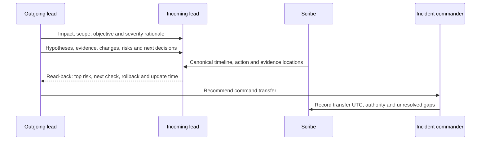
```mermaid
sequenceDiagram
    participant O as Outgoing lead
    participant I as Incoming lead
    participant S as Scribe
    participant C as Incident commander
    O->>I: Impact, scope, objective and severity rationale
    O->>I: Hypotheses, evidence, changes, risks and next decisions
    S->>I: Canonical timeline, action and evidence locations
    I-->>O: Read-back: top risk, next check, rollback and update time
    O->>C: Recommend command transfer
    C->>S: Record transfer UTC, authority and unresolved gaps
```

## 5. Evidence, correlation, timestamps, and redaction

### Minimum event tuple

| Field | Example / handling |
|---|---|
| Incident/evidence ID | `INC-017 / E-204`; stable and nonsecret |
| Source system | `Identity sign-in log`, `browser network metadata`, `workflow run history` |
| Source timestamp | Preserve literal plus stated timezone/format |
| Normalized UTC | ISO 8601, for example `2026-08-24T18:07:11Z` |
| Ingestion/observation UTC | Distinguish event occurrence from arrival/view time |
| Clock offset | Device/service offset or uncertainty if known |
| Tenant/resource boundary | Use controlled stable reference; redact from broad communication |
| Actor/object | Minimized stable ID; avoid unnecessary display name/email/content |
| Correlation keys | Request, correlation, trace, operation, session, message/network-message, incident/alert/device IDs as applicable |
| Result | Code, status, policy/rule name/ID, safe error category |
| Collector/method | Person/service, read-only tool/view, query/version, authorization |
| Transformations | Filter, export, timezone conversion, parsing, redaction, compression |
| Integrity/access | Original/working copy, hash where approved, repository ACL, retention/hold |
| Limitation | Sampling, delay, retention, role visibility, missing field, schema ambiguity |

### Correlation-key map

| Domain | Useful keys | Caution |
|---|---|---|
| Entra sign-in | Correlation/request ID, sign-in ID, user/object/app/service-principal ID, tenant, UTC, result, CA status | Do not copy tokens; interactive/noninteractive/service-principal logs differ |
| Intune | Device ID, Entra device ID, managed-device ID, user ID, enrollment/profile/policy/app ID, UTC | One physical device can expose several IDs; ownership/state can lag |
| Exchange/MDO | Network message ID, internet message ID, recipient, sender domain, UTC, trace/action/detection IDs | Subject/body/attachments are sensitive; message IDs can be exposed outside need-to-know |
| Teams | Meeting/conference/call/session ID, participant/call-record IDs, UTC, tenant/user type | Call records and meeting data have privacy/access limits |
| SharePoint/OneDrive | Site/web/list/item/drive/item ID, sharing link ID, user/guest ID, sync correlation, UTC | URLs, filenames, and content can be sensitive |
| Purview | Policy/rule/label/retention event, activity/operation, user/object ID, case/export ID, UTC | Legal hold/eDiscovery data needs legal and case authority |
| Defender XDR | Incident, alert, device, account, evidence, email/network-message, cloud-app IDs, UTC | Response actions require separate authority; entity data may be sensitive |
| Sentinel | Workspace, table, `TimeGenerated`, ingestion time, system/tenant/resource ID, alert/incident/entity/rule/run ID | Table schema and retention differ; ingestion delay can mimic event absence |
| Network/browser | DNS name/query, source/destination IP/port, protocol, TLS SNI/certificate metadata, proxy/VPN session, browser request ID, UTC | HAR, headers, URLs, query strings, certificates, and addresses can reveal secrets/topology |

### Redaction decision table

| Data | Keep only when necessary | Redact/remove by default |
|---|---|---|
| Authentication | Safe error/result, timestamp, app, correlation ID | Password, MFA code, token, cookie, authorization header, QR/recovery code |
| Identity | Stable pseudonymous ID or limited affected account | Personal profile, unrelated accounts, full directory export |
| Messaging/files | Message/network ID, direction, timestamps, verdict/action | Body, attachment, subject/file name unless explicitly required and authorized |
| Network | Relevant endpoint class, port, result, approved address | Internal topology, unrelated IPs, full packet payload, proxy credentials |
| Browser | Request timing/status and redacted URL path if needed | Cookies, tokens, POST bodies, query secrets, autofill/personal data |
| Security | Alert/incident/evidence IDs and defensive findings | Exploit detail, malware sample, credentials, unnecessary affected content |
| Commercial/legal | Support entitlement/case ID | Contract, pricing, legal advice, hold/case content outside approved channel |

### Evidence-chain record

| Event | Required record |
|---|---|
| Collection authorized | Who authorized which source, scope, fields, window, and purpose |
| Original acquired | Source, collector, UTC, tool/version, read-only method, filename/object ID |
| Integrity preserved | Hash where supported/approved, immutable source or vendor record, no silent edits |
| Working copy created | Transformation, redaction, filter, timezone normalization, output ID |
| Transfer/access | From/to, UTC, approved channel, recipient, access group, reason |
| Analysis | Analyst, query/tool/version, inputs/outputs, interpretation and limitation |
| Retain/hold/dispose | Policy/case authority, date, method, approval and disposition evidence |

## 6. Service health and change correlation

| Check | Evidence | Interpretation boundary |
|---|---|---|
| Microsoft 365/Azure service health | Advisory/incident ID, affected services/regions, start/update UTC, tenant relevance | Absence does not exclude a new, scoped, dependency, or client-side issue |
| Internal health | Synthetic journey, source freshness, queue depth, error rate, latency, alert-routing health | Monitor may itself be stale, sampled, or credential-dependent |
| Vendor status | Public/contracted notice, case statement, UTC | Public status may lag or aggregate regions |
| Recent changes | Approved change IDs, release/version, policy/assignment/license/certificate/network changes | Temporal correlation is a hypothesis, not proof |
| Release/message center | Current notices and roadmaps relevant to behavior | Announcement does not prove tenant rollout or cause |
| Dependency health | DNS, PKI, proxy, VPN, ISP, third party, API/connector, capacity | Check both provider and consumer evidence |
| Recovery signal | Advisory closure plus tenant/user/control validation | Vendor "resolved" is not local recovery proof |

### Change-correlation worksheet

| Candidate change | Effective UTC / propagation | Affected scope | Predicted symptom | Working control group | Evidence / verdict |
|---|---|---|---|---|---|
| Northstar workflow v0.8 | 17:30Z / up to approved refresh window | Pilot exception report | Freshness delay, source state unaffected | Nonpilot report and source records | Temporal match; queue evidence needed; Possible |
| `[Change/version]` | `[Deploy/effective/propagation]` | `[Population]` | `[Falsifiable prediction]` | `[Unaffected comparator]` | `[IDs; confirmed/probable/excluded]` |

## 7. Safe Windows and browser data collection

Run only on an authorized device and approved support context. These examples are read-only, but outputs can reveal personal, network, tenant, and security metadata. Store minimally and redact before transfer.

### Windows read-only command card

| Purpose | Safe command | Expected output / caution |
|---|---|---|
| UTC and clock | `Get-Date -AsUTC -Format o` | Current UTC; compare with event source, do not change clock |
| OS basics | `Get-ComputerInfo | Select-Object WindowsProductName, WindowsVersion, OsBuildNumber` | Local version metadata; output varies by PowerShell/OS |
| Network config | `Get-NetIPConfiguration` | Interfaces, addresses, gateways, DNS; internal topology is sensitive |
| DNS servers | `Get-DnsClientServerAddress | Select-Object InterfaceAlias, AddressFamily, ServerAddresses` | Local resolver configuration; minimize addresses in tickets |
| DNS resolution | `Resolve-DnsName example.invalid -ErrorAction Stop` | Replace only with an explicitly authorized hostname; query leaves network evidence |
| TCP reachability | `Test-NetConnection example.invalid -Port 443 -InformationLevel Detailed` | Authorized endpoint only; tests route/TCP, not application auth |
| WinHTTP proxy | `netsh winhttp show proxy` | Machine WinHTTP proxy, not necessarily browser/user path |
| User proxy metadata | `Get-ItemProperty 'HKCU:\Software\Microsoft\Windows\CurrentVersion\Internet Settings' | Select-Object ProxyEnable, ProxyServer, AutoConfigURL` | URLs/servers sensitive; policy/effective behavior may differ |
| VPN profiles | `Get-VpnConnection | Select-Object Name, ServerAddress, TunnelType, ConnectionStatus` | Local user profiles only; do not expose server topology broadly |
| Certificates metadata | `Get-ChildItem Cert:\CurrentUser\My | Select-Object Subject, Issuer, NotBefore, NotAfter, Thumbprint` | Metadata only; never export private keys; subject can be personal |
| Event-log catalogue | `Get-WinEvent -ListLog * | Where-Object IsEnabled | Select-Object -First 20 LogName, RecordCount` | Catalogue only; actual event collection needs approved channel/filter |

```powershell
# Local synthetic formatting example only; no tenant or production access.
$observation = [pscustomobject]@{
    IncidentId      = 'INC-EXAMPLE'
    ObservedAtUtc   = (Get-Date).ToUniversalTime().ToString('o')
    Symptom         = 'Synthetic sign-in failed'
    CorrelationId   = 'redacted-example-id'
    Confidence      = 'Unknown'
}
$observation | Format-List
```

### Browser evidence card

| Check | Safe collection | Risk/control |
|---|---|---|
| Browser/version | About/help version page or approved inventory | Do not trigger update during live incident without change authority |
| InPrivate/profile comparison | Authorized test account and non-sensitive app only | Comparison may alter session state; never use another person's account |
| Console | Capture only relevant timestamped errors | Console can contain URLs, IDs, personal data, or app internals |
| Network request | Status, timing, method, redacted host/path, request/correlation response headers | Never copy cookies, authorization headers, tokens, bodies, or secret query strings |
| HAR | Avoid by default; if vendor requires, obtain approval, narrow capture, sanitize with approved process, restrict transfer/retention | HAR commonly contains credentials/session data; casual sharing is prohibited |
| Certificate | Issuer, subject/SAN relevance, validity, chain error, hostname, UTC | Do not install/bypass certificates or ignore warnings |
| Storage/session | Observe only under approved procedure | Clearing cookies/cache destroys state and can hide cause; preserve first |

## 8. KQL starter queries - synthetic and read-only

All executable queries below use `datatable` synthetic data. The authorized-tenant patterns are pseudocode checklists, not copy/paste production queries. Verify the actual product schema, table access, retention, privacy, cost, time column, and row meaning.

### Synthetic query 1 - normalize and bound time

```kusto
let StartUtc = datetime(2026-08-24T18:00:00Z);
let EndUtc = datetime(2026-08-24T19:00:00Z);
datatable(EventTime:datetime, Source:string, CorrelationId:string, Result:string)
[
    datetime(2026-08-24T18:04:00Z), "Identity", "corr-001", "Failure",
    datetime(2026-08-24T18:06:00Z), "Application", "corr-001", "Denied",
    datetime(2026-08-24T18:08:00Z), "Identity", "corr-002", "Success"
]
| where EventTime between (StartUtc .. EndUtc)
| project EventTime, Source, CorrelationId, Result
| order by EventTime asc
```

### Synthetic query 2 - correlate by safe identifier

```kusto
let IdentityEvents = datatable(Time:datetime, CorrelationId:string, IdentityResult:string)
[
    datetime(2026-08-24T18:04:00Z), "corr-001", "PolicyFailure",
    datetime(2026-08-24T18:08:00Z), "corr-002", "Success"
];
let AppEvents = datatable(Time:datetime, CorrelationId:string, AppResult:string)
[
    datetime(2026-08-24T18:04:03Z), "corr-001", "NoSession",
    datetime(2026-08-24T18:08:02Z), "corr-002", "Loaded"
];
IdentityEvents
| join kind=leftouter AppEvents on CorrelationId
| project CorrelationId, IdentityTime=Time, IdentityResult, AppTime=Time1, AppResult
```

### Synthetic query 3 - distinguish event and ingestion delay

```kusto
datatable(EventTime:datetime, IngestedTime:datetime, Source:string)
[
    datetime(2026-08-24T18:00:00Z), datetime(2026-08-24T18:01:00Z), "SourceA",
    datetime(2026-08-24T18:02:00Z), datetime(2026-08-24T18:17:00Z), "SourceA",
    datetime(2026-08-24T18:03:00Z), datetime(2026-08-24T18:04:00Z), "SourceB"
]
| extend DelayMinutes = datetime_diff('minute', IngestedTime, EventTime)
| summarize Events=count(), MaxDelay=max(DelayMinutes), P95Delay=percentile(DelayMinutes, 95) by Source
```

### Synthetic query 4 - cohort comparison

```kusto
datatable(Time:datetime, Cohort:string, Result:string, DurationMs:long)
[
    datetime(2026-08-24T18:00:00Z), "Pilot", "Failure", 1200,
    datetime(2026-08-24T18:01:00Z), "Pilot", "Failure", 1300,
    datetime(2026-08-24T18:02:00Z), "Control", "Success", 500,
    datetime(2026-08-24T18:03:00Z), "Control", "Success", 520
]
| summarize Total=count(), Failures=countif(Result == "Failure"), P95Ms=percentile(DurationMs, 95) by Cohort
| extend FailureRate = round(100.0 * Failures / Total, 1)
```

### Synthetic query 5 - freshness/no-data signal

```kusto
let NowUtc = datetime(2026-08-24T19:00:00Z);
datatable(Source:string, LatestEvent:datetime, ExpectedMaxLagMinutes:long)
[
    "Identity", datetime(2026-08-24T18:57:00Z), 10,
    "Workflow", datetime(2026-08-24T18:32:00Z), 10,
    "Report", datetime(2026-08-24T18:30:00Z), 15
]
| extend LagMinutes = datetime_diff('minute', NowUtc, LatestEvent)
| extend Freshness = iff(LagMinutes <= ExpectedMaxLagMinutes, "WithinExpected", "Stale")
| project Source, LatestEvent, LagMinutes, ExpectedMaxLagMinutes, Freshness
```

### Authorized read-only KQL planning card

| Step | Write down before querying live data |
|---|---|
| Question | One incident question and what result would change next action |
| Authority | Workspace/product, role, incident purpose, population and data approval |
| Schema | Actual table, time column, ingestion semantics, fields/types, row grain, source health |
| Time | Start/end UTC plus justified buffer for skew/ingestion |
| Filter | Incident IDs, known entities, tenant/resource scope; avoid broad search by default |
| Projection | Minimum fields; exclude message bodies, tokens, unrelated personal/security data |
| Cost/performance | Time filter first, selective predicates, bounded joins, result limit/export control |
| Validation | Known event/control cohort, row counts, duplicates, missing sources, false negatives |
| Evidence | Query text/version, executor, UTC, result ID, redaction and limitations |

## 9. Workaround, fix, rollback, and recovery

| Term | Meaning | Approval/evidence test |
|---|---|---|
| Containment | Limits harm or scope during an incident | Security/incident authority; evidence preserved; side effects monitored |
| Workaround | Temporary supported path that reduces user impact without resolving cause | Risk/safety reviewed, reversible, time-bound, documented, monitored |
| Fix | Addresses confirmed/probable failure mechanism | Requirement/design, test, change approval, blast radius, rollback |
| Rollback | Returns toward prior approved state | Trigger/authority, state reconciliation, validation, communication |
| Recovery | Service/control/data/user outcomes meet criteria after action | Multi-dimensional checks and observation window |
| Resolution | Incident command can close/transition under agreed criteria | Residual risk, monitoring, actions, communications, ownership |
| Root cause | Evidence-supported failure mechanism at stated confidence | PIR review; distinguish contributing conditions and unknowns |

### Change proposal card during incident

| Field | Required statement |
|---|---|
| Hypothesis | `If cause/mechanism H is true, approved change C should produce signal S without affecting boundary B.` |
| Evidence | Facts supporting H, alternatives not excluded, confidence and limitation |
| Change | Exact approved object/scope/version; executor and independent verifier |
| Preconditions | Backups/config snapshot where supported, health baseline, authority, support/comms ready |
| Risk/blast radius | User, security, data, dependency, legal/privacy and operational impact |
| Test/checkpoint | Expected immediate and soak evidence; stop threshold |
| Rollback | Trigger, authority, feasible sequence, point of no return, reconciliation |
| Validation | User journey, security/control, data/state, logs/alerts, monitoring, support |

## 10. Vendor escalation pack

| Section | Minimum approved content |
|---|---|
| Case header | Severity/impact, service, tenant/cloud/region by controlled reference, support entitlement, contacts/hours |
| Problem statement | Exact observed symptom and safe error; expected behavior; first/last UTC |
| Scope | Affected/unaffected counts and cohorts; business/security/control consequence |
| Timeline | Key UTC events, changes, service-health checks, reproductions, workarounds |
| Reproduction | Minimal authorized safe steps, frequency, environment/version, expected/actual |
| Correlation | Request/correlation/operation/message/incident IDs and exact UTC windows |
| Diagnostics | Minimum redacted product logs/config metadata; collection method/tool/version |
| Analysis | Ranked hypotheses, checks completed, result, known exclusions and uncertainty |
| Ask | Specific vendor action: confirm backend event, known issue, schema/feature behavior, escalation, workaround support |
| Data handling | Classification, transfer approval/channel, retention/deletion request, legal/privacy constraints |
| Update | Required cadence, next checkpoint, escalation contacts and business deadline |

**Vendor package quality gate:** reproduce the package from canonical evidence IDs; remove secrets/content; verify dates/timezones; obtain owner approval for transfer; track exactly what was sent and vendor retention/disposition.

## 11. Closure, PIR, and corrective action

### Recovery validation matrix

| Dimension | Check | Northstar example |
|---|---|---|
| User/business | Representative journey works and backlog/impact handled | Pilot owner validates expected report use |
| Security/control | Required control remains effective; no unauthorized exception/action | Source approval/expiry state reconciles |
| Data/state | Source/target/in-flight/duplicate/failed records accounted for | Every pilot exception ID explained |
| Technical | Error/latency/queue/dependency returned within expected range | Two report cycles meet freshness threshold |
| Observability | Logs, alerts, freshness/no-data and routing work | Synthetic stale event reaches on-call |
| Operations | Support/runbook/workaround status and ownership current | Tier 2 performs scenario successfully |
| Vendor | Advisory/case disposition understood | Case notes linked; tenant validation independent |
| Communication | Users/leaders/support/security receive closure and residual limitations | Closure message states monitoring period |

### PIR quick frame

| Question | Required evidence |
|---|---|
| What happened? | Reconciled UTC timeline and impact, not a narrative built from memory |
| How was it detected? | Signal source, threshold, delay, route and blind spots |
| Why did it happen? | Confirmed mechanism, contributing conditions, confidence and alternatives |
| Why was impact possible? | Control/design/process/dependency conditions, not blame |
| How did response perform? | Command, evidence, diagnosis, vendor, comms, change, recovery metrics |
| What changes? | CAPA/defect/problem/change/KB/test IDs, owners, dates, effectiveness measures |
| What remains? | Residual risk, unknowns, monitoring, expiry/review and authority |

### Field-manual exit checklist

| Exit item | Pass condition |
|---|---|
| Timeline | Append-only UTC record reconciles material events, changes and communications |
| Evidence | Authority, provenance, originals/working copies, access, redaction, transfer, retention/hold/disposal recorded |
| Service | Recovery validated across user, technical, security, data, telemetry and operations dimensions |
| Workaround | Removed, retained with approved owner/expiry, or converted through change/risk governance |
| Root cause | Confidence and limitations stated; unknown is acceptable when evidence does not support certainty |
| Follow-up | PIR/problem/defect/CAPA/KB/runbook/monitoring actions owned and dated |
| Handoff | Service owner accepts ongoing risk, monitoring, vendor case and actions |
| Communication | Closure/transition sent to appropriate audiences with residual limitations and support path |

## 12. Identity, sign-in, MFA, Conditional Access, and cross-tenant flows

For identity failures, capture the exact sign-in UTC, user type, home and resource tenant roles, application/resource, client type, safe error, correlation/request ID, authentication step, Conditional Access result, and working comparator. Do not decode/copy tokens, request MFA codes, or exclude users from policy as a diagnostic shortcut.

### Flow 01 - Sign-in failure: establish the failed layer

| Symptom | Ranked hypothesis | Read-only evidence | Next safe action |
|---|---|---|---|
| Browser/app reports sign-in failed | Service/dependency issue; authentication failure; CA/authorization denial; application session error | Service health, exact UTC/correlation, sign-in record category/result, app-side request result | Identify last successful layer and route to its owner |
| One user fails, control user works | Account state, assignment, method registration, user risk, license, group/role difference | User/account metadata, effective assignment, sign-in comparison with one variable | Validate the differing state; do not reset credentials without approved identity process |
| Many users/apps fail | Identity service, network/proxy/TLS, tenant policy/change, broad dependency | Scope matrix, health, recent changes, sign-in volume/result trend | Declare/raise incident based on impact; parallel identity and network checks |

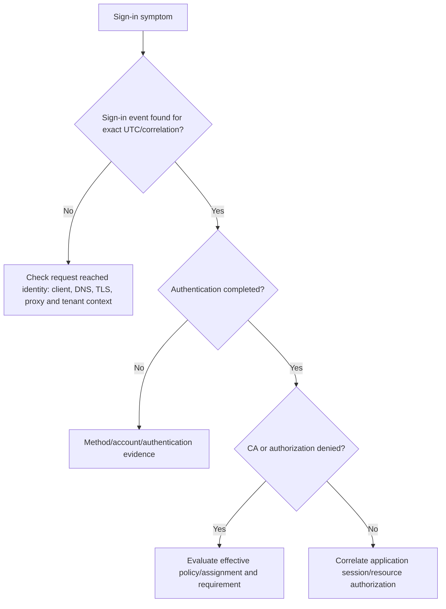
```mermaid
flowchart TD
    A[Sign-in symptom] --> B{Sign-in event found for exact UTC/correlation?}
    B -->|No| C[Check request reached identity: client, DNS, TLS, proxy and tenant context]
    B -->|Yes| D{Authentication completed?}
    D -->|No| E[Method/account/authentication evidence]
    D -->|Yes| F{CA or authorization denied?}
    F -->|Yes| G[Evaluate effective policy/assignment and requirement]
    F -->|No| H[Correlate application session/resource authorization]
```

**Escalate with:** affected/control cohorts, exact UTC, correlation/request IDs, sign-in type/result, application/resource and current service/change evidence. **Validate recovery:** expected sign-in plus unchanged required controls and matching logs.

### Flow 02 - No sign-in prompt, repeated redirect, or wrong tenant

| Symptom | Ranked hypothesis | Read-only evidence | Next safe action |
|---|---|---|---|
| No prompt and immediate app error | Existing session, app authority/redirect configuration, network block before identity | Redacted browser request chain, app config metadata, sign-in event absence/presence | Compare supported clean test profile with authorized test account; preserve original session evidence |
| Repeated redirects | Session/cookie scope, mismatched redirect URI, cross-tenant authority, app callback failure | Redacted status/location sequence, correlation headers, app/identity logs | Correlate one loop; escalate app configuration owner |
| Prompt/branding shows unexpected tenant | Guest/home-resource tenant context, domain routing, app authority | Tenant context in safe UI/sign-in metadata, guest object, app configuration | Confirm intended resource tenant and invitation/access path |

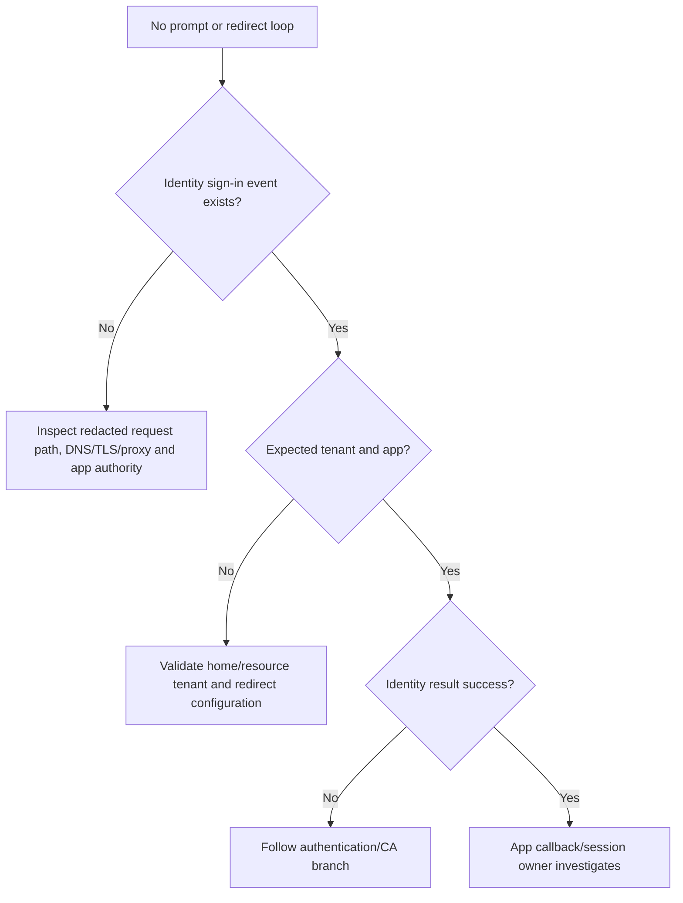
```mermaid
flowchart TD
    A[No prompt or redirect loop] --> B{Identity sign-in event exists?}
    B -->|No| C[Inspect redacted request path, DNS/TLS/proxy and app authority]
    B -->|Yes| D{Expected tenant and app?}
    D -->|No| E[Validate home/resource tenant and redirect configuration]
    D -->|Yes| F{Identity result success?}
    F -->|No| G[Follow authentication/CA branch]
    F -->|Yes| H[App callback/session owner investigates]
```

**Safety:** Do not clear browser state until required evidence is preserved and an approved comparison is planned; HAR files require special approval/redaction. **Recovery:** one complete expected redirect chain, correct tenant, and application session.

### Flow 03 - MFA challenge fails or loops

| Symptom | Ranked hypothesis | Read-only evidence | Next safe action |
|---|---|---|---|
| Method unavailable or registration requested | Method policy/registration state, authentication-strength requirement, user eligibility | Sign-in authentication details, registered-method metadata, effective method/strength policy | Route through approved registration/recovery process; never ask for an MFA code |
| Correct challenge repeats | Interrupted session, app/browser state, CA reevaluation, token/session issue, network callback failure | Step-level auth result, correlation, client/app comparison, redacted request timing | Compare supported client; correlate repeated events and policy results |
| MFA succeeds but app still denies | MFA claim insufficient for required strength/context; CA/session control; app authorization | Authentication method/strength result, CA result, resource/app logs | Identify unmet requirement rather than repeating MFA |

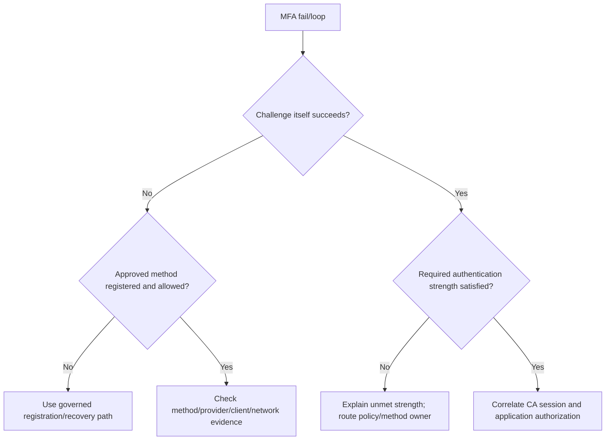
```mermaid
flowchart TD
    A[MFA fail/loop] --> B{Challenge itself succeeds?}
    B -->|No| C{Approved method registered and allowed?}
    C -->|No| D[Use governed registration/recovery path]
    C -->|Yes| E[Check method/provider/client/network evidence]
    B -->|Yes| F{Required authentication strength satisfied?}
    F -->|No| G[Explain unmet strength; route policy/method owner]
    F -->|Yes| H[Correlate CA session and application authorization]
```

**Escalate:** widespread challenge-provider impact, suspicious prompt activity, or registration anomalies go to identity/security incident owners. **Never:** approve a prompt merely to test, share codes, or add an MFA exclusion.

### Flow 04 - Conditional Access unexpectedly blocks access

| Symptom | Ranked hypothesis | Read-only evidence | Next safe action |
|---|---|---|---|
| Block cites CA | Intended policy requirement unmet; assignment/exclusion misunderstood; report-only versus enabled confusion | Sign-in CA tab/result, policy ID/state, user/group/app/action/location/device/risk conditions | Reconstruct effective evaluation from sign-in evidence and policy version |
| Only one cohort blocked | Group propagation, device/compliance, client platform, location, auth strength, guest treatment | Failing/working matrix and effective properties | Test the single differentiator with an authorized synthetic account/device |
| Change correlation | New policy/assignment or dependent signal changed | Audit/change record, effective UTC, sign-in before/after | Use change governance; propose correction only with blast radius/test/rollback |

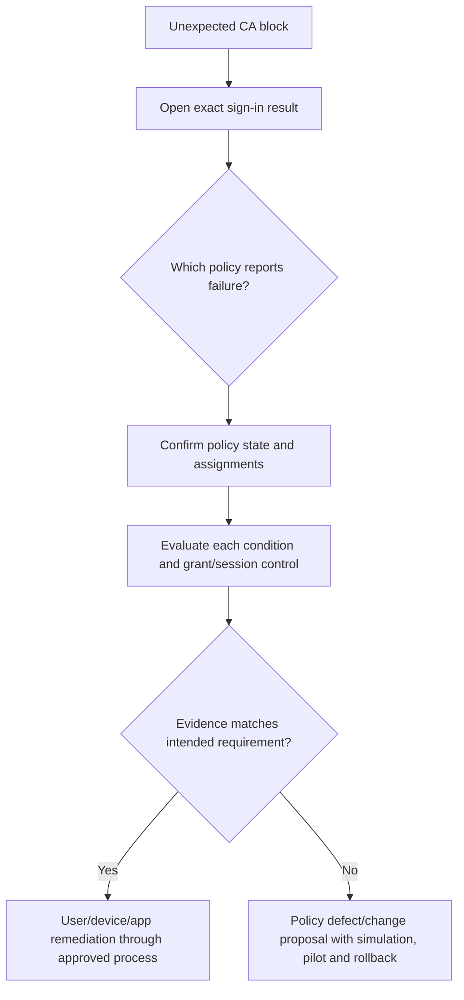
```mermaid
flowchart TD
    A[Unexpected CA block] --> B[Open exact sign-in result]
    B --> C{Which policy reports failure?}
    C --> D[Confirm policy state and assignments]
    D --> E[Evaluate each condition and grant/session control]
    E --> F{Evidence matches intended requirement?}
    F -->|Yes| G[User/device/app remediation through approved process]
    F -->|No| H[Policy defect/change proposal with simulation, pilot and rollback]
```

**Safety:** Never disable the policy, exclude the user, mark a device compliant, or weaken authentication to prove causality. Use report/evaluation evidence and controlled test design. **Recovery:** intended cohort succeeds while a negative control still blocks as designed.

### Flow 05 - Conditional Access unexpectedly grants access

| Symptom | Ranked hypothesis | Read-only evidence | Next safe action |
|---|---|---|---|
| Access succeeds despite expected block | Policy not applied, report-only/off, assignment gap, excluded identity/app, condition mismatch, existing session, unsupported flow | Exact sign-in CA result, policy state/scope, auth/client type, session timing, audit history | Treat as potential control incident; preserve and escalate to security/control owner |
| Only guests/workloads affected | User-type, service-principal, authentication-context or cross-tenant scope differs | Sign-in type, home/resource context, policy targets and supported workload behavior | Validate whether policy can govern that flow; add requirement/risk if unsupported |
| Negative test inconsistent | Test identity/session not representative or evidence delayed | Test preconditions, timestamps, policy propagation, known-good negative case | Re-run only under approved test plan after propagation window |

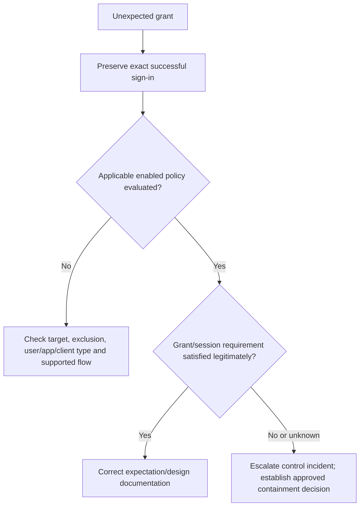
```mermaid
flowchart TD
    A[Unexpected grant] --> B[Preserve exact successful sign-in]
    B --> C{Applicable enabled policy evaluated?}
    C -->|No| D[Check target, exclusion, user/app/client type and supported flow]
    C -->|Yes| E{Grant/session requirement satisfied legitimately?}
    E -->|Yes| F[Correct expectation/design documentation]
    E -->|No or unknown| G[Escalate control incident; establish approved containment decision]
```

**Priority:** unexpected allow can be more serious than unexpected block. Do not create an unauthorized test against real sensitive resources. **Validate:** approved negative test denies, intended positive test succeeds, audit/monitoring detects both.

### Flow 06 - Passwordless or FIDO2/security-key failure

| Symptom | Ranked hypothesis | Read-only evidence | Next safe action |
|---|---|---|---|
| Method not offered | Registration/enablement, authentication-strength policy, browser/OS/key support, tenant context | Method metadata, policy assignment, client/platform versions, exact sign-in details | Confirm supported matrix/current policy and approved registration |
| Key/PIN gesture fails | Local authenticator/key issue, user verification, device/browser compatibility, key lifecycle | Safe error, authenticator metadata allowed by policy, working client/key comparison | Use approved key support/replacement process; do not collect PIN |
| Method works elsewhere | Relying-party/authentication-context or cross-tenant requirement differs | App/resource, tenant, sign-in method/strength and CA comparison | Correlate app-specific policy and tenant trust settings |

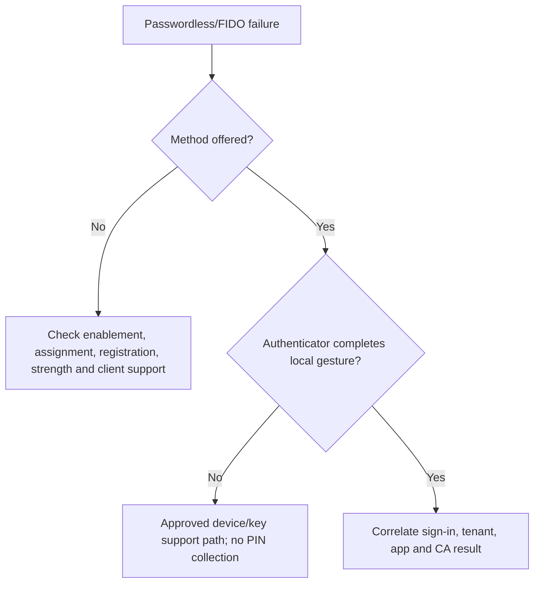
```mermaid
flowchart TD
    A[Passwordless/FIDO failure] --> B{Method offered?}
    B -->|No| C[Check enablement, assignment, registration, strength and client support]
    B -->|Yes| D{Authenticator completes local gesture?}
    D -->|No| E[Approved device/key support path; no PIN collection]
    D -->|Yes| F[Correlate sign-in, tenant, app and CA result]
```

**Evidence minimization:** record method class and result, not biometric/PIN/security-key secret material. **Recovery:** expected method meets required authentication strength and the fallback/recovery path remains governed.

### Flow 07 - Risk-based sign-in or user-risk behavior

| Symptom | Ranked hypothesis | Read-only evidence | Next safe action |
|---|---|---|---|
| User is challenged/blocked for risk | Risk detection and policy working; stale/remediated state; policy mapping issue | Risky sign-in/user record, detection type/time/state, CA result, investigation status | Route to authorized identity protection/SOC process |
| Risk appears false | Benign travel/network/device pattern, delayed signal, entity mismatch | Correlated sign-ins, network/device context, user confirmation through approved channel | Security analyst validates/dismisses only under role and procedure |
| Risk not triggering expected control | Policy scope/state, risk level/flow mismatch, detection delay/coverage | Risk event and sign-in timelines, policy targets/results, supported detection coverage | Escalate as control gap; do not manufacture risky activity to test |

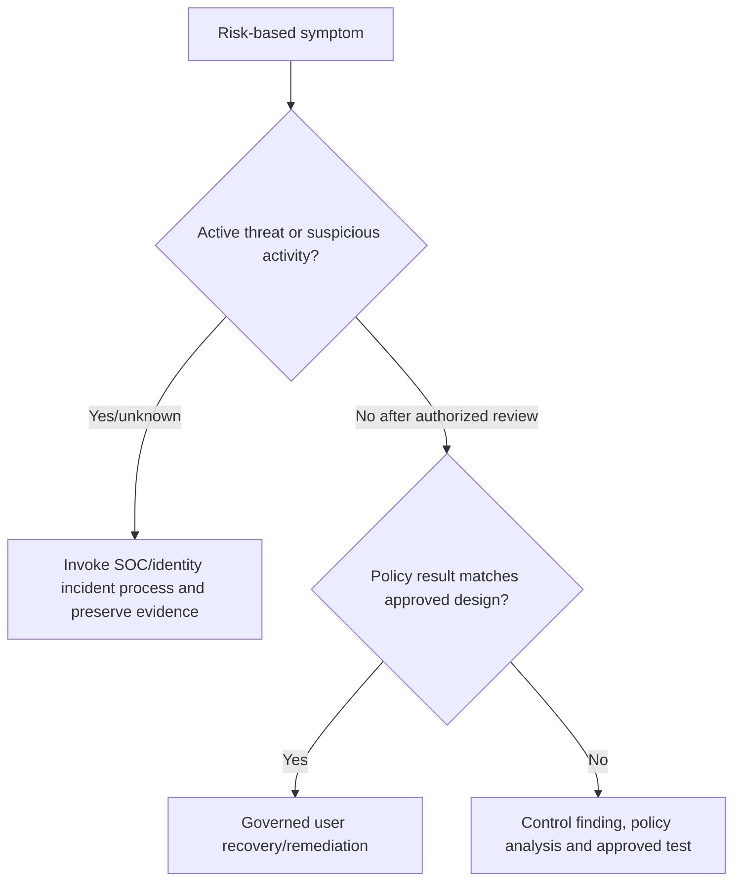
```mermaid
flowchart TD
    A[Risk-based symptom] --> B{Active threat or suspicious activity?}
    B -->|Yes/unknown| C[Invoke SOC/identity incident process and preserve evidence]
    B -->|No after authorized review| D{Policy result matches approved design?}
    D -->|Yes| E[Governed user recovery/remediation]
    D -->|No| F[Control finding, policy analysis and approved test]
```

**Safety:** Do not mark risk safe, dismiss detections, reset identity, revoke sessions, or force remediation from this guide. **Record:** analyst authority, evidence, decision, residual uncertainty, and user communication.

### Flow 08 - Workload identity or service-principal sign-in failure

| Symptom | Ranked hypothesis | Read-only evidence | Next safe action |
|---|---|---|---|
| App authentication fails | Credential/certificate/federation expiry/config, wrong tenant/audience, disabled app, token endpoint/network issue | Service-principal sign-in, credential metadata (not secret), federated-credential config, app/request IDs | Verify lifecycle/config with app owner; never expose secret/token |
| Authentication succeeds, API returns 403 | Missing/wrong permission type, consent/RBAC/resource ACL, CA for workload where applicable | Token-free request metadata, app roles/scopes configuration, resource authorization, Graph/request ID | Compare exact operation with current least-permission documentation |
| Intermittent failure | Throttling, certificate rollover, multiple instances/config drift, dependency | HTTP status/retry headers, instance/version, UTC pattern, health | Bound retries for idempotent reads; escalate code/config owner |

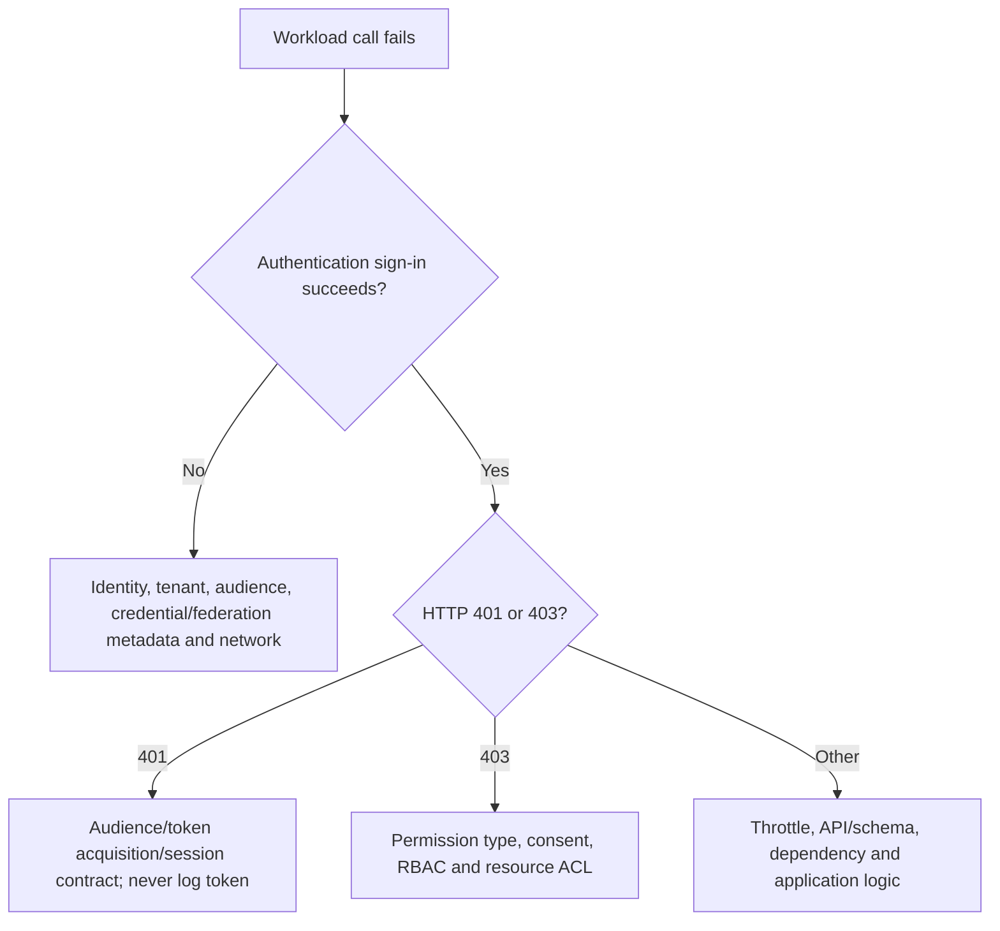
```mermaid
flowchart TD
    A[Workload call fails] --> B{Authentication sign-in succeeds?}
    B -->|No| C[Identity, tenant, audience, credential/federation metadata and network]
    B -->|Yes| D{HTTP 401 or 403?}
    D -->|401| E[Audience/token acquisition/session contract; never log token]
    D -->|403| F[Permission type, consent, RBAC and resource ACL]
    D -->|Other| G[Throttle, API/schema, dependency and application logic]
```

**Escalation pack:** operation, method, endpoint version, UTC, request ID, status, least permission/RBAC expected, app/service-principal controlled IDs, credential-expiry metadata, and recent deployment. No secret values.

### Flow 09 - Guest invitation redemption or guest sign-in failure

| Symptom | Ranked hypothesis | Read-only evidence | Next safe action |
|---|---|---|---|
| Invitation cannot be redeemed | Wrong signed-in identity, invitation state, domain/tenant restriction, one-time passcode/federation behavior, expired/redeemed link | Guest object/invitation metadata, home identity, resource tenant, redemption/sign-in result | Reissue only through approved guest lifecycle after identity match is established |
| Redeemed but resource denied | Resource assignment/permissions, CA/cross-tenant trust, terms/access package lifecycle | Resource ACL/group/access-package state, sign-in CA result, user type | Route to resource owner and identity governance |
| Guest works in one app only | App-specific assignment/sharing/federation or browser/session context | Working/failing app matrix, resource logs, tenant context | Identify first differing authorization layer |

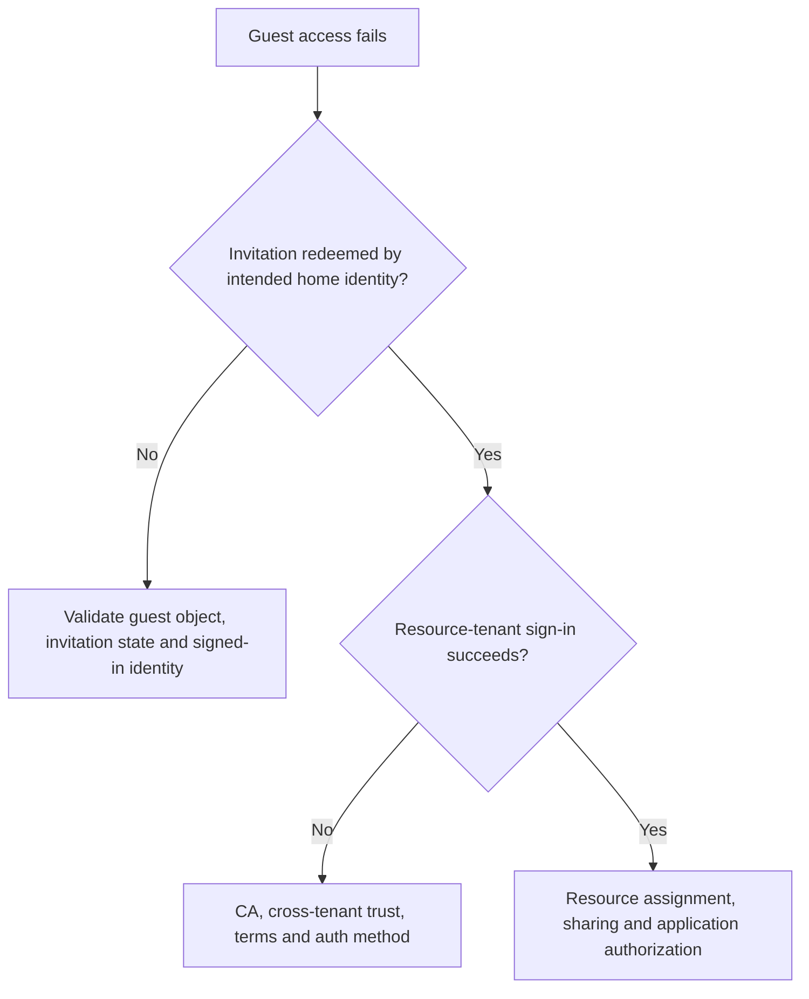
```mermaid
flowchart TD
    A[Guest access fails] --> B{Invitation redeemed by intended home identity?}
    B -->|No| C[Validate guest object, invitation state and signed-in identity]
    B -->|Yes| D{Resource-tenant sign-in succeeds?}
    D -->|No| E[CA, cross-tenant trust, terms and auth method]
    D -->|Yes| F[Resource assignment, sharing and application authorization]
```

**Privacy:** minimize guest personal data and coordinate both organizations through approved contacts. **Never:** ask the guest to forward invitation URLs, tokens, or screenshots containing sensitive claims broadly.

### Flow 10 - Cross-tenant access or synchronization issue

| Symptom | Ranked hypothesis | Read-only evidence | Next safe action |
|---|---|---|---|
| Inbound/outbound B2B behavior differs | Home/resource tenant cross-tenant settings, trust direction, user/group scope, partner policy mismatch | Both sides' approved configuration metadata and sign-in result; direction clearly labeled | Pair tenant owners and compare the same user/app/direction |
| MFA/device trust not accepted | Trust claim not configured/supported, auth strength/device condition differs, stale session | Resource-tenant CA result, home authentication/device claim evidence, current trust settings | Validate current supported behavior; do not weaken resource policy |
| Synced user missing/stale | Provisioning scope/filter, source attribute, mapping, quarantine/error, propagation | Provisioning job status/log, source/target object IDs, mapping/version and UTC | Resolve through approved provisioning owner; reconcile population |

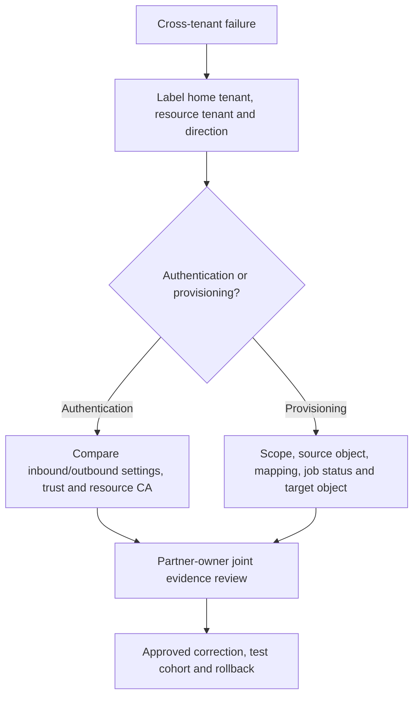
```mermaid
flowchart TD
    A[Cross-tenant failure] --> B[Label home tenant, resource tenant and direction]
    B --> C{Authentication or provisioning?}
    C -->|Authentication| D[Compare inbound/outbound settings, trust and resource CA]
    C -->|Provisioning| E[Scope, source object, mapping, job status and target object]
    D --> F[Partner-owner joint evidence review]
    E --> F
    F --> G[Approved correction, test cohort and rollback]
```

**Quality gate:** no side assumes the other tenant's configuration; each provides minimized evidence under its own authority. Reconcile user lifecycle and removal as carefully as creation.

## 13. Intune enrollment, policy, compliance, application, and update flows

Capture platform/OS build, ownership, enrollment method/time, user/device/Entra/managed-device IDs, management authority, license, profile/policy/app IDs, assignment filters, last check-in, effective status, and working comparator. Do not retire, wipe, sync, re-enroll, mark compliant, delete records, or remove policy from this guide.

### Flow 11 - Enrollment preflight or enrollment blocked

| Symptom | Ranked hypothesis | Read-only evidence | Next safe action |
|---|---|---|---|
| Device cannot start/complete enrollment | License/MDM scope, platform restriction, enrollment limit, unsupported OS/ownership/method, network endpoint, stale object | User entitlement/scope, restrictions, device records, exact stage/error/UTC, endpoint reachability | Identify failing prerequisite and use approved enrollment support path |
| Many devices fail same stage | Service health, profile/config change, certificate/connector, network/proxy | Scope by platform/site/method, health/change, connector/certificate metadata | Raise incident and involve endpoint/network/vendor owners |
| One device fails, peer works | Local state, prior enrollment, clock, OS/build, hardware/attestation capability | Read-only local/device records and peer matrix | Preserve logs/state; do not factory reset or delete object casually |

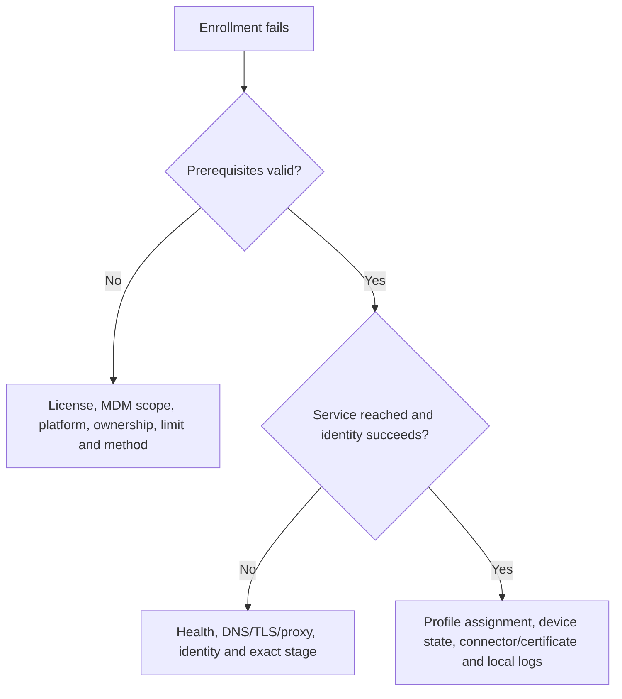
```mermaid
flowchart TD
    A[Enrollment fails] --> B{Prerequisites valid?}
    B -->|No| C[License, MDM scope, platform, ownership, limit and method]
    B -->|Yes| D{Service reached and identity succeeds?}
    D -->|No| E[Health, DNS/TLS/proxy, identity and exact stage]
    D -->|Yes| F[Profile assignment, device state, connector/certificate and local logs]
```

**Recovery validation:** one authorized device appears with expected ownership/management authority, receives intended baseline, reports health, and produces audit/support evidence. Enrollment completion alone is insufficient.

### Flow 12 - Duplicate, stale, or mismatched device identity

| Symptom | Ranked hypothesis | Read-only evidence | Next safe action |
|---|---|---|---|
| Multiple records for one physical device | Re-enrollment, Autopilot/Entra/Intune record separation, restore/clone, delayed cleanup | Hardware-safe identifiers under policy, Entra device ID, managed-device ID, serial/hash access controls, timestamps | Build lifecycle timeline and identify authoritative active record |
| Policy targets unexpected record | Group/filter rule, stale membership, object-ID confusion | Assignment evaluation, object IDs, last check-in, ownership/state | Correct mapping through approved governance after impact review |
| Record stale but device active | Check-in/connectivity/client issue, management authority changed | Last sync/check-in, client management state, service/network health | Investigate client/service path; do not delete evidence-bearing record |

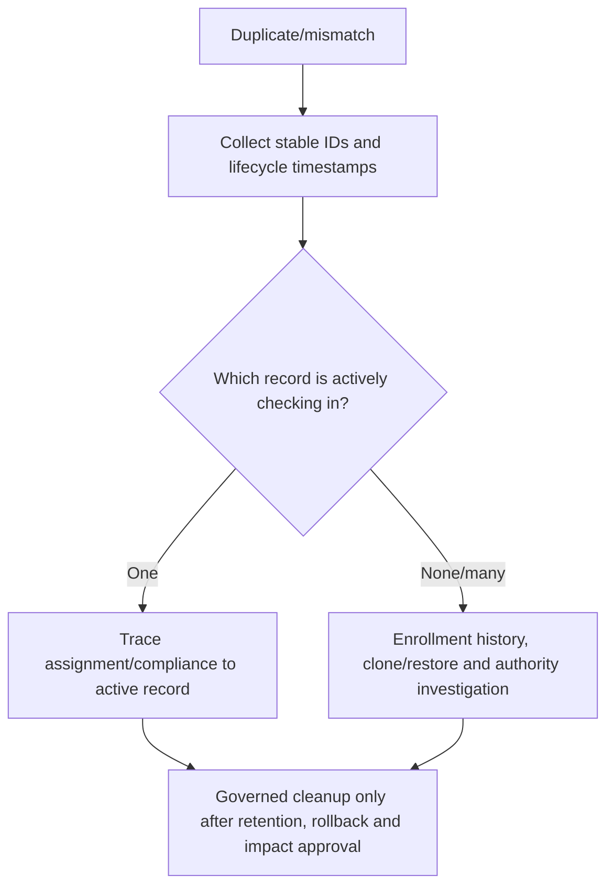
```mermaid
flowchart TD
    A[Duplicate/mismatch] --> B[Collect stable IDs and lifecycle timestamps]
    B --> C{Which record is actively checking in?}
    C -->|One| D[Trace assignment/compliance to active record]
    C -->|None/many| E[Enrollment history, clone/restore and authority investigation]
    D --> F[Governed cleanup only after retention, rollback and impact approval]
    E --> F
```

**Safety:** device deletion/retirement can remove management state or evidence and requires separate approval. Document cross-system ID mapping in the case.

### Flow 13 - Configuration policy not received or not applicable

| Symptom | Ranked hypothesis | Read-only evidence | Next safe action |
|---|---|---|---|
| Policy absent | Assignment group/filter, platform/edition/version applicability, enrollment/management authority, propagation/check-in | Policy ID/version, assignment evaluation, device/user IDs, applicability/status and last check-in | Compare one working peer and resolve first differing assignment/applicability fact |
| Status pending | Device not checked in, reporting delay, dependency/connector | Last contact, per-setting status timestamp, service health | Wait only within documented expected window; monitor freshness |
| Not applicable | Setting CSP/support mismatch, wrong target context, conflicting management | Per-setting reason if available, OS/build/edition, current support docs | Revise requirement/design rather than forcing unsupported setting |

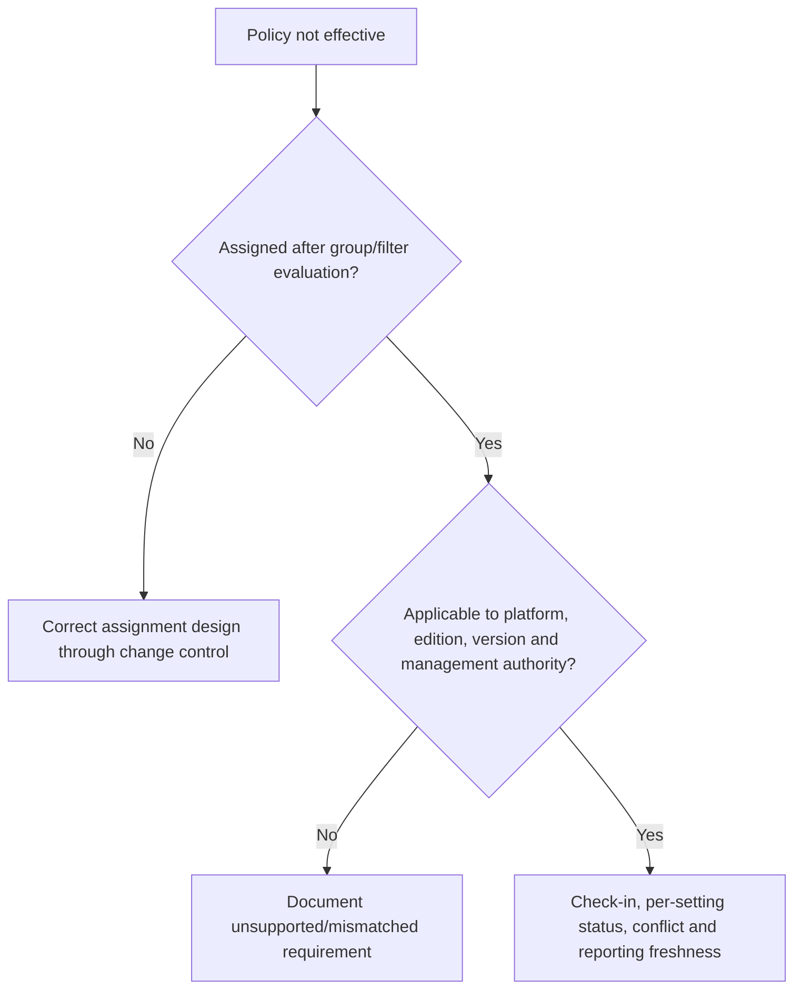
```mermaid
flowchart TD
    A[Policy not effective] --> B{Assigned after group/filter evaluation?}
    B -->|No| C[Correct assignment design through change control]
    B -->|Yes| D{Applicable to platform, edition, version and management authority?}
    D -->|No| E[Document unsupported/mismatched requirement]
    D -->|Yes| F[Check-in, per-setting status, conflict and reporting freshness]
```

**Do not:** repeatedly force sync at scale or remove/re-add assignments without evidence. **Validate:** effective setting plus security baseline/negative-control checks and status telemetry.

### Flow 14 - Policy conflict or unexpected effective value

| Symptom | Ranked hypothesis | Read-only evidence | Next safe action |
|---|---|---|---|
| Setting reports conflict | Two Intune profiles, security baseline/endpoint security overlap, GPO/co-management/provider precedence | Per-setting status, all assigned profiles, policy source/management authority, device diagnostics under approval | Map each writer and documented precedence; choose one owner |
| Portal says success, device differs | Reporting lag, local/provider error, another management channel, user/device target difference | Device-side read-only state, UTC, source policy IDs, event logs | Correlate effective device state to management reports |
| Change causes broad drift | Assignment/filter/group change or policy version | Audit/change, affected cohort and before/after status | Pause expansion; submit approved correction/rollback |

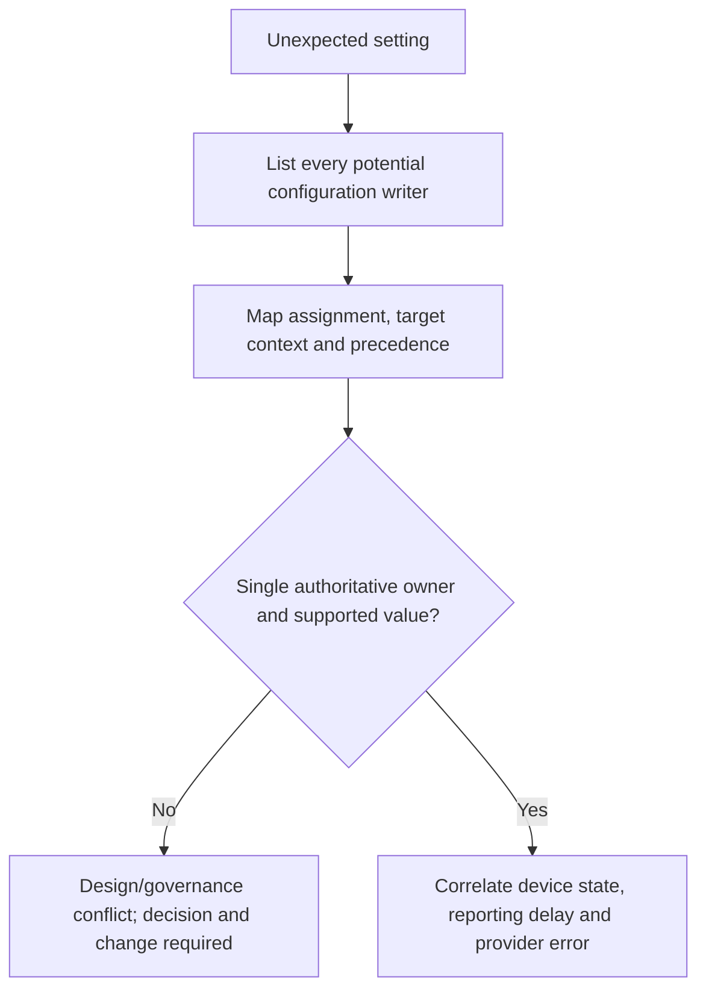
```mermaid
flowchart TD
    A[Unexpected setting] --> B[List every potential configuration writer]
    B --> C[Map assignment, target context and precedence]
    C --> D{Single authoritative owner and supported value?}
    D -->|No| E[Design/governance conflict; decision and change required]
    D -->|Yes| F[Correlate device state, reporting delay and provider error]
```

**Quality:** document desired value, actual value, each writer, precedence source, evidence time, and controlled resolution. Avoid a "winning policy" workaround that leaves conflicting intent.

### Flow 15 - Device compliance unknown or noncompliant

| Symptom | Ranked hypothesis | Read-only evidence | Next safe action |
|---|---|---|---|
| Noncompliant | Actual failed setting, grace period/marking, threat signal, encryption/OS requirement, partner signal | Per-setting compliance, policy version, evaluated UTC, device health and applicable connector status | Address failed requirement through approved device/support process |
| Unknown/not evaluated | Enrollment/check-in, user association, policy assignment, reporting delay, service issue | Last check-in, policy state, assignment, source freshness | Restore observability/management path before judging compliance |
| CA blocks although portal appears compliant | Stale/different device ID, token claim timing, CA requires compliant device, registration/session issue | Exact sign-in device ID and CA result versus Intune record/evaluation time | Reconcile IDs and evaluation/session timeline |

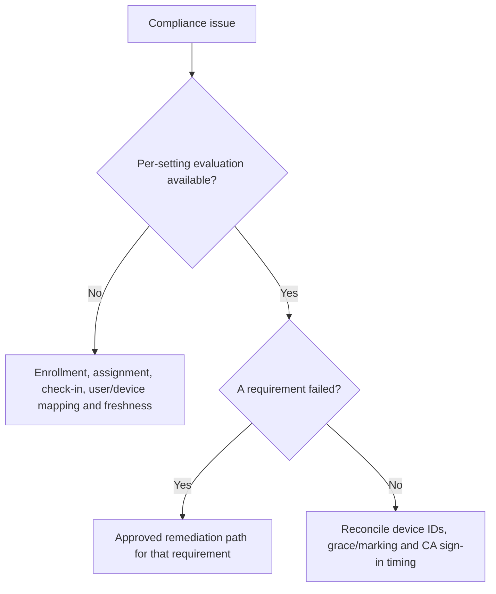
```mermaid
flowchart TD
    A[Compliance issue] --> B{Per-setting evaluation available?}
    B -->|No| C[Enrollment, assignment, check-in, user/device mapping and freshness]
    B -->|Yes| D{A requirement failed?}
    D -->|Yes| E[Approved remediation path for that requirement]
    D -->|No| F[Reconcile device IDs, grace/marking and CA sign-in timing]
```

**Never:** manually mark compliant or bypass the CA requirement for troubleshooting. **Recovery:** compliance source, CA consumption, user access, and monitoring all agree for the same device ID and UTC.

### Flow 16 - Intune compliance to Conditional Access chain

| Symptom | Ranked hypothesis | Read-only evidence | Next safe action |
|---|---|---|---|
| Managed compliant device still blocked | Browser/app cannot present device identity, wrong account/device registration, CA target/session, stale compliance | Sign-in device ID/trust/compliance fields, CA result, Intune record and client type | Compare supported client and reconcile same device/account |
| Unmanaged device allowed | Policy scope/client/app gap, session, unsupported flow, exclusion, compliance requirement not applied | Successful sign-in CA policies, device fields, client type, policy state/scope | Escalate potential control gap to identity/security owner |
| Behavior intermittent | Token/session lifetime, check-in/evaluation delay, network/client variation | Sequence of sign-ins and compliance timestamps; cohort matrix | Bound time and identify first state transition |

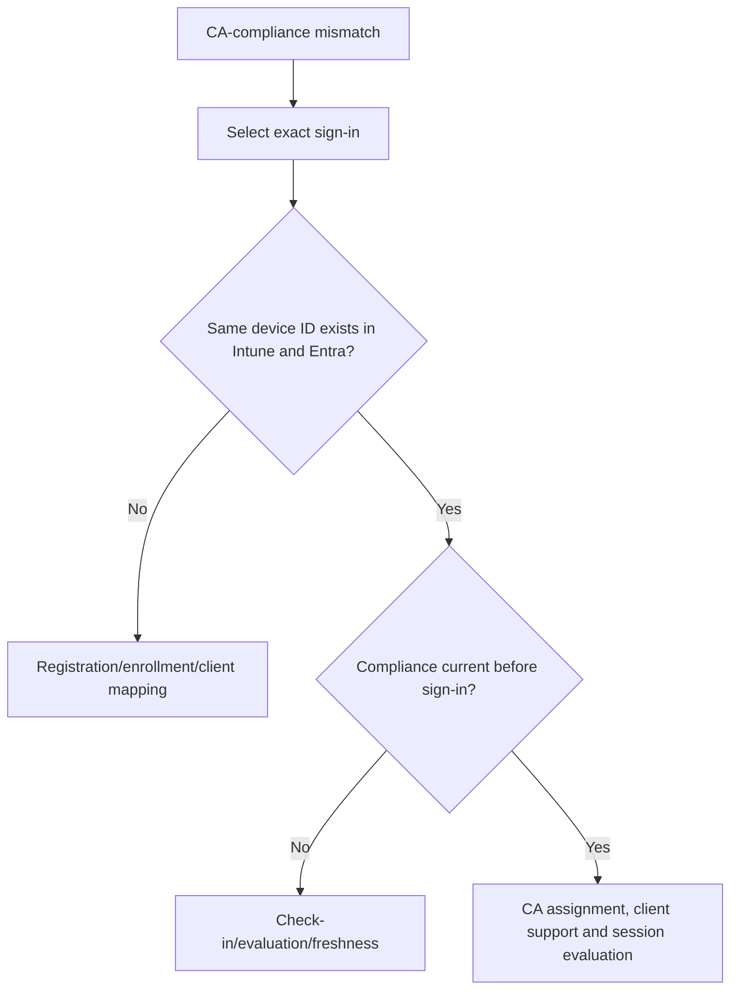
```mermaid
flowchart TD
    A[CA-compliance mismatch] --> B[Select exact sign-in]
    B --> C{Same device ID exists in Intune and Entra?}
    C -->|No| D[Registration/enrollment/client mapping]
    C -->|Yes| E{Compliance current before sign-in?}
    E -->|No| F[Check-in/evaluation/freshness]
    E -->|Yes| G[CA assignment, client support and session evaluation]
```

**Evidence rule:** portal screenshots from different times are not a chain. Correlate stable IDs and event/evaluation UTC. Use a controlled negative test to validate enforcement after authorized fix.

### Flow 17 - Required application install fails or remains pending

| Symptom | Ranked hypothesis | Read-only evidence | Next safe action |
|---|---|---|---|
| App not offered/assigned | User/device assignment/filter, applicability/requirements, supersedence/dependency, license | App ID/version, assignments, detected applicability and effective intent | Correct catalogue/assignment design under change control |
| Download/install fails | Content delivery/network/proxy, disk, installer return code, dependency, context | Managed app status, safe installer code, local agent logs, network health | Use vendor-supported code interpretation; preserve logs before retry |
| Installed but not detected | Detection rule mismatch, version/architecture/context, delayed report | Installed metadata, detection logic/version, agent evaluation UTC | Fix detection rule through test and staged deployment |

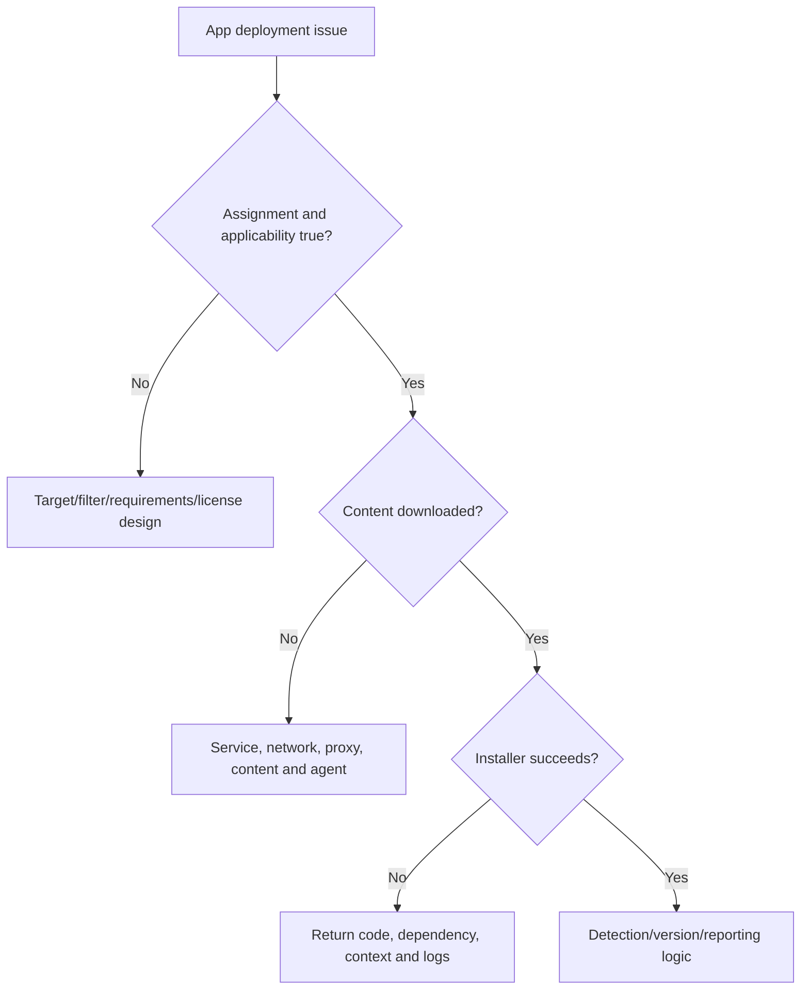
```mermaid
flowchart TD
    A[App deployment issue] --> B{Assignment and applicability true?}
    B -->|No| C[Target/filter/requirements/license design]
    B -->|Yes| D{Content downloaded?}
    D -->|No| E[Service, network, proxy, content and agent]
    D -->|Yes| F{Installer succeeds?}
    F -->|No| G[Return code, dependency, context and logs]
    F -->|Yes| H[Detection/version/reporting logic]
```

**Do not:** repeatedly reinstall, change detection, or run installers manually on production devices without authorization. **Validate:** assignment, install, detection, app function, security controls, telemetry and rollback/uninstall plan.

### Flow 18 - App protection (MAM) policy not applied or blocks unexpectedly

| Symptom | Ranked hypothesis | Read-only evidence | Next safe action |
|---|---|---|---|
| Policy absent | Unsupported app/platform, user assignment/filter, license, account not recognized as work context, app SDK/version | Policy/app/user/version metadata, app protection status, working comparator | Confirm current support and effective user/app target |
| Unexpected block/wipe prompt | Conditional launch setting, app/OS version, device threat/jailbreak signal, multiple accounts, reporting state | Per-setting result, app/client version, safe error, device/app status | Route to endpoint/security owner; do not weaken policy |
| Data transfer differs | Multiple policy scopes, managed/unmanaged app classification, sharing target, app implementation | Effective policy and source/destination app/account context | Reproduce with synthetic non-sensitive data in authorized lab |

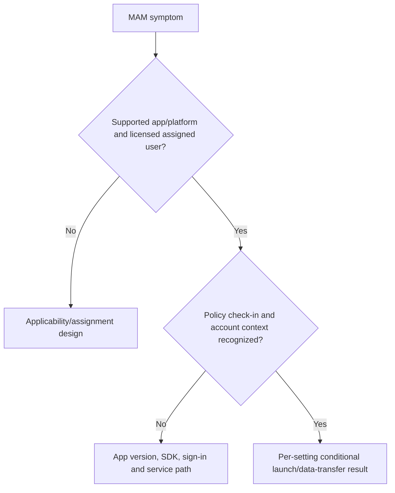
```mermaid
flowchart TD
    A[MAM symptom] --> B{Supported app/platform and licensed assigned user?}
    B -->|No| C[Applicability/assignment design]
    B -->|Yes| D{Policy check-in and account context recognized?}
    D -->|No| E[App version, SDK, sign-in and service path]
    D -->|Yes| F[Per-setting conditional launch/data-transfer result]
```

**Safety:** Never trigger selective wipe from this guide, and never use real sensitive data to test transfer restrictions. **Recovery:** expected positive and blocked flows behave correctly with audit/status evidence.

### Flow 19 - Windows Autopilot provisioning failure

| Symptom | Ranked hypothesis | Read-only evidence | Next safe action |
|---|---|---|---|
| Device not recognized/profile missing | Registration/import, group/profile assignment, hardware identity mismatch, propagation | Autopilot/device/profile IDs, assignment state, timestamps | Reconcile authorized inventory and assignment; no record deletion shortcut |
| ESP stalls/fails | Required app/policy, identity/enrollment, network/proxy, TPM/attestation, timeout | Exact ESP phase, app/policy status, event logs, device/build/network metadata | Identify blocking item and follow supported recovery/change path |
| User-driven/self-deploy behavior wrong | Profile setting/mode, device support, assignment, tenant restriction | Profile version/config and device capability | Correct profile through lab test and staged assignment |

```mermaid
flowchart TD
    A[Autopilot failure] --> B{Device recognized with intended profile?}
    B -->|No| C[Registration, group, assignment, identity and propagation]
    B -->|Yes| D{Which phase fails: device, account or ESP item?}
    D --> E[Collect phase, blocking app/policy, network and device evidence]
    E --> F[Supported recovery or approved profile/app change]
```

**Do not:** factory reset, delete Autopilot/device records, bypass ESP, or remove required controls without explicit authority and evidence preservation. **Escalate:** TPM/attestation or service-wide failures with model/build/cohort data.

### Flow 20 - Update ring, feature update, or co-management workload issue

| Symptom | Ranked hypothesis | Read-only evidence | Next safe action |
|---|---|---|---|
| Update not offered or delayed | Ring/feature policy assignment, safeguard hold, eligibility, pause/deadline, scan health, delivery network | Effective update policies, device build/eligibility, update status/error, service/change info | Identify documented hold/requirement; avoid forcing update during incident |
| Unexpected update timing | Conflicting policies, deadline/restart setting, local/user action, co-management authority | All policy sources, management authority/workload, event timeline | Resolve ownership/precedence through change governance |
| Co-managed setting ignored | Workload not moved, collection/assignment, client health, GPO/Intune conflict | Workload authority, client status, policy source and effective state | Pair Intune/Configuration Manager owners; test one cohort |

```mermaid
flowchart TD
    A[Update/co-management symptom] --> B[Identify authoritative workload and all policy writers]
    B --> C{Device eligible and healthy?}
    C -->|No| D[Build, safeguard, scan/client and network evidence]
    C -->|Yes| E{Expected policy assigned and conflict-free?}
    E -->|No| F[Assignment/precedence/change correction]
    E -->|Yes| G[Service timing, reporting delay and approved escalation]
```

**Safety:** Do not force restart/update, remove safeguard, or switch workloads as an ad hoc fix. Validate with controlled rings, user communication, recovery/rollback strategy, and post-update security/management health.

## 14. Exchange Online and Defender for Office 365 flows

Capture sender/recipient by minimized reference, first/last UTC, direction, network message ID and internet message ID where authorized, message trace status, transport/rule/policy verdict, connector route, safe NDR code, and working comparator. Do not forward suspicious messages, open attachments/links, release quarantined content, purge mail, or modify protection from this guide.

### Flow 21 - Mail not received

| Symptom | Ranked hypothesis | Read-only evidence | Next safe action |
|---|---|---|---|
| Sender reports sent, recipient sees nothing | Not submitted, transport delay/failure, quarantine/filter, inbox/rule/client view, wrong address | Sender submission evidence, message trace, quarantine/verdict metadata, mailbox delivery/audit where authorized | Locate last transport hop and owning boundary |
| External only | DNS/MX, connector/TLS, anti-spam policy, sender reputation/provider | Directional trace, connector status, DNS/TLS metadata, NDR | Pair messaging/network/vendor owners with exact window/IDs |
| One recipient only | Address/object, mailbox state, rule/forwarding, recipient policy/quarantine | Trace per recipient, object/mailbox metadata, rule audit under authority | Investigate recipient-specific control without reading content unnecessarily |

```mermaid
flowchart TD
    A[Mail missing] --> B{Message trace record found?}
    B -->|No| C[Sender submission, address, DNS/connector boundary]
    B -->|Yes| D{Delivered, failed, pending or filtered?}
    D -->|Delivered| E[Mailbox rule/folder/client view with approved metadata]
    D -->|Failed| F[NDR code and failing transport hop]
    D -->|Pending/filtered| G[Queue/service health or MDO/quarantine verdict]
```

**Validate:** delivery to intended mailbox, protection verdict/action, client visibility, trace/audit and no duplicate/replayed side effects. Never use resend loops at scale.

### Flow 22 - Mail delayed

| Symptom | Ranked hypothesis | Read-only evidence | Next safe action |
|---|---|---|---|
| Delivery arrives late | Sender queue, connector/TLS retry, service degradation, transport rule, scanning, recipient throttling | Header/trace hop times without content, message trace events, service health, connector/rule metadata | Calculate where delay accrued; compare control message only if authorized |
| Many domains affected | Service/connector/network/DNS or broad rule change | Domain/cohort trend, health/change, queue/trace pattern | Raise incident and engage messaging/vendor/network |
| One sender/domain | Sender infrastructure/reputation/TLS or scoped rule | Direction/domain comparison, NDR/retry metadata | Provide exact IDs/window to sending provider; avoid allow-list shortcut |

```mermaid
flowchart TD
    A[Mail delayed] --> B[Build hop timeline in UTC]
    B --> C{Delay before Microsoft boundary?}
    C -->|Yes| D[Sender/DNS/TLS/provider evidence]
    C -->|No| E{Delay in transport, scanning or delivery?}
    E --> F[Service health, connector/rule/verdict and recipient evidence]
    F --> G[Supported fix/workaround proposal with security review]
```

**Safety:** do not bypass scanning or add broad sender/domain allow entries to improve latency. Report p50/p95 and affected cohort rather than one anecdote.

### Flow 23 - Non-delivery report (NDR) or mail flow rejection

| Symptom | Ranked hypothesis | Read-only evidence | Next safe action |
|---|---|---|---|
| NDR has 4xx | Transient service, throttling, DNS/TLS/connector retry, recipient temporary state | Enhanced status code, failing server/hop, retry timeline, health | Allow supported retry within bounds; escalate if duration/impact threshold breached |
| NDR has 5xx | Address/policy/permission/size/routing/permanent rejection | Exact enhanced status, trace event, recipient/connector/rule metadata | Correct source/recipient/config through owner and change control |
| NDR appears suspicious | Backscatter/spoof/phishing or unrelated message | Message/network ID, authentication/verdict metadata, user report | Route to MDO/SOC; do not click or forward content |

```mermaid
flowchart TD
    A[NDR] --> B{Enhanced code transient 4xx or permanent 5xx?}
    B -->|4xx| C[Service, queue, throttle, DNS/TLS and retry window]
    B -->|5xx| D[Address, policy, connector, size and authorization]
    A --> E{User did not send original?}
    E -->|Yes| F[Potential spoof/backscatter: MDO/SOC process]
```

**Record:** full code and redacted diagnostic metadata; NDR text can expose addresses/topology. **Recovery:** a supported test reaches intended disposition and trace shows expected route.

### Flow 24 - Connector, TLS, or hybrid mail-route failure

| Symptom | Ranked hypothesis | Read-only evidence | Next safe action |
|---|---|---|---|
| External/hybrid route fails | Connector scope, certificate name/expiry/chain, DNS, firewall/proxy, smart host, accepted domain, auth | Connector configuration metadata, certificate metadata, trace/NDR, DNS/TCP/TLS evidence | Identify first failed hop; pair messaging/network/PKI owners |
| Intermittent route | Multiple hosts/certs, load balancer, DNS variation, throttling, asymmetric config | Failing/working host and time matrix, certificate chain metadata, connection logs | Isolate cohort without bypassing TLS or protection |
| After certificate/change | Wrong binding/name/rollover sequence or propagation | Change ID, before/after cert metadata and connector validation | Submit supported correction/rollback with PKI and mail owners |

```mermaid
flowchart TD
    A[Connector/TLS failure] --> B[Resolve DNS and intended mail route]
    B --> C{TCP 25/required endpoint reachable under authorized test?}
    C -->|No| D[Network/firewall/provider path]
    C -->|Yes| E{TLS name, chain, validity and connector condition match?}
    E -->|No| F[PKI/connector change proposal]
    E -->|Yes| G[SMTP/auth/routing/rule and service evidence]
```

**Never:** disable TLS validation, route around protection, or expose private keys. Use certificate metadata only.

### Flow 25 - Suspected phishing or malicious mail report

| Symptom | Ranked hypothesis | Read-only evidence | Next safe action |
|---|---|---|---|
| User reports suspicious mail | Phishing/malware/spoof; benign marketing; account compromise; false positive | Approved user-report/MDO alert, message/network ID, authentication/verdict/URL/attachment metadata, recipient scope | Invoke MDO/SOC process; preserve original in place per policy |
| User clicked/opened | Potential endpoint/account impact | User statement, click telemetry, endpoint/identity alerts, sign-ins and device evidence under incident authority | Escalate immediately; authorized responders decide containment/remediation |
| Multiple recipients | Campaign, forwarding/list expansion, replay | Explorer/investigation metadata, recipient count, related message IDs and timeline | Scope under SOC authority; communicate no-click guidance |

```mermaid
flowchart TD
    A[Suspected phish] --> B{User interacted or active threat signal?}
    B -->|Yes/unknown| C[Declare/escalate security incident; preserve email, identity and endpoint evidence]
    B -->|No| D[MDO/SOC triage verdict and recipient scope]
    D --> E{Confirmed malicious?}
    E -->|Yes| F[Authorized response plan; no actions from this manual]
    E -->|No| G[Document false-positive/benign rationale and user closure]
```

**Prohibited here:** opening links/attachments, detonation, forwarding samples, releasing messages, deleting/purging mail, blocking senders/domains, or account/device response. Those require authorized defensive tooling and runbooks.

### Flow 26 - Legitimate mail quarantined or protection false positive

| Symptom | Ranked hypothesis | Read-only evidence | Next safe action |
|---|---|---|---|
| Expected mail quarantined | Correct protection based on indicators; policy tuning issue; sender auth/reputation/content pattern; campaign override | Quarantine/verdict/detection metadata, policy/rule, authentication results, submission history | Security analyst validates through approved review; do not release from this guide |
| Repeated sender impact | Sender authentication/config/content or overly broad tenant setting | Pattern across IDs/times/recipients, SPF/DKIM/DMARC metadata, policy/change | Work with sender/security owners on root cause; avoid blanket allow |
| User cannot access quarantine | Role/policy/user-notification/portal/session issue | Quarantine policy and user scope, sign-in/client evidence | Fix access path without granting broad role |

```mermaid
flowchart TD
    A[Potential false positive] --> B[Preserve verdict, policy and authentication evidence]
    B --> C{Authorized security review confirms legitimate and safe?}
    C -->|No/unknown| D[Keep contained; continue SOC/vendor analysis]
    C -->|Yes| E[Choose narrow supported disposition/tuning through approval]
    E --> F[Test future delivery and protection negative controls]
```

**Quality:** business legitimacy is not proof of technical safety. Tuning should target the causal signal and include expiry/review, not broad bypass.

## 15. Microsoft Teams flows

Capture meeting/call/tenant context, organizer and participant type by minimized reference, join method, client/platform/version, exact UTC/error/correlation, network path, policy/meeting setting, and working comparator. Do not record meetings, access chat/files, or collect call content without authorization.

### Flow 27 - Cannot join a Teams meeting

| Symptom | Ranked hypothesis | Read-only evidence | Next safe action |
|---|---|---|---|
| Join link fails before lobby | Link/meeting validity, client/browser, DNS/TLS/proxy, tenant context | Redacted join URL metadata, browser/client result, network and service health | Compare supported web/client join with authorized test meeting/account |
| Reaches lobby but not admitted | Organizer/lobby policy, participant identity/type, meeting option | Meeting policy/options, participant type, organizer evidence | Route to organizer/support; do not alter policy broadly |
| Sign-in/authorization denial | Guest/external policy, CA, cross-tenant access, license/account | Sign-in/CA result, Teams external/guest config metadata | Follow identity/cross-tenant flow with both owners |

```mermaid
flowchart TD
    A[Teams join fails] --> B{Join service reached?}
    B -->|No| C[Link, browser/client, DNS/TLS/proxy and service health]
    B -->|Yes| D{Authentication/tenant succeeds?}
    D -->|No| E[Identity, CA, guest/cross-tenant]
    D -->|Yes| F{Lobby/meeting policy permits entry?}
    F -->|No| G[Organizer/meeting policy route]
    F -->|Yes| H[Media/call setup diagnostics]
```

**Validate:** intended participant joins through supported path, correct lobby/policy remains effective, and call telemetry exists.

### Flow 28 - Teams audio, video, or screen sharing quality

| Symptom | Ranked hypothesis | Read-only evidence | Next safe action |
|---|---|---|---|
| Poor one-way or two-way media | Device/peripheral, client, network loss/jitter/latency, VPN/proxy path, service/media relay | Call quality record, client/device/version, network metrics, cohort/site comparison | Identify endpoint versus network versus service boundary |
| Screen sharing blocked | Meeting/policy, client/platform limitation, OS privacy permission, app state | Effective meeting policy, client/platform and safe error | Correct supported client/device setting via approved support |
| Many users/site affected | WAN/VPN/QoS/firewall/service issue | Site cohort and call-quality trend, network health/change | Engage network/Teams/vendor with call IDs and UTC |

```mermaid
flowchart TD
    A[Media quality issue] --> B{One endpoint or cohort/site?}
    B -->|One| C[Peripheral, OS permission, client/version and local network]
    B -->|Cohort/site| D[Call-quality metrics, WAN/VPN/QoS/firewall and service health]
    C --> E{Signaling succeeds but media impaired?}
    D --> E
    E -->|Yes| F[Media path/relay/network owner]
    E -->|No| G[Identity/policy/client setup owner]
```

**Safety:** do not disable firewall/VPN/security inspection as a test. Use approved network path comparison and synthetic meeting.

### Flow 29 - Teams guest or external/federated collaboration failure

| Symptom | Ranked hypothesis | Read-only evidence | Next safe action |
|---|---|---|---|
| Chat/search external user fails | External access/federation setting, domain policy, tenant mode, identity mismatch | Both tenant configs under authority, user type/domain, exact client result | Pair tenant collaboration owners; distinguish guest from external federation |
| Guest joins team but cannot use channel | Team membership, channel type, guest permission, app/resource authorization, propagation | Guest object, team/channel membership and policy metadata | Route team/resource owner; reconcile stable IDs |
| Meeting works, file/chat fails | Different workload and authorization boundary (SPO/OneDrive) | Teams event plus linked SharePoint site/file permissions | Follow SharePoint/OneDrive flow, not meeting policy |

```mermaid
flowchart TD
    A[External collaboration fails] --> B{Guest membership or external federation?}
    B -->|Guest| C[Guest object, team/channel membership, resource tenant policies]
    B -->|External| D[Both tenant federation/domain policies]
    C --> E{Chat/meeting or file access?}
    E -->|File| F[SharePoint/OneDrive authorization]
    E -->|Chat/meeting| G[Teams policy/client/service]
```

**Key distinction:** a Teams container does not erase SharePoint permissions or guest lifecycle. Validate offboarding and access review as well as initial success.

### Flow 30 - Teams file tab or shared file access fails

| Symptom | Ranked hypothesis | Read-only evidence | Next safe action |
|---|---|---|---|
| File tab errors | Backing SharePoint site/library permission, guest identity mismatch, link scope, sync/client, service issue | Team/channel-to-site mapping, site/item permission metadata, user/guest ID, service health | Follow resource authorization to exact site/item |
| User can chat but not file | Teams membership propagated differently or SharePoint permission/link not granted | Team membership versus site permission and audit | Reconcile group/site membership and propagation |
| Desktop fails, web works | Client/cache/session/sync path | Client/version, web result, sign-in and redacted request evidence | Use supported client troubleshooting after preserving state |

```mermaid
flowchart TD
    A[Teams file fails] --> B[Resolve backing SharePoint site and item]
    B --> C{User identity has expected site/item authorization?}
    C -->|No| D[Membership, sharing, guest and link governance]
    C -->|Yes| E{Web access works?}
    E -->|Yes| F[Teams client/session/cache integration]
    E -->|No| G[SharePoint service, policy, conditional access and request logs]
```

**Do not:** create an anonymous link or grant direct broad access as a diagnostic shortcut. Use intended group/permission model.

## 16. SharePoint Online and OneDrive flows

Capture site/drive/item stable IDs where possible, user/guest ID, URL only in restricted evidence, permission inheritance and sharing-link type, sensitivity/retention/DLP state, client/sync version, UTC/error/correlation, and audit result. File names and content are sensitive.

### Flow 31 - User has unexpected access denied

| Symptom | Ranked hypothesis | Read-only evidence | Next safe action |
|---|---|---|---|
| Site denied | User/group membership, site permission, guest state, CA/session, site lock, license/service | Site/user/group permission metadata, sign-in CA, site state and health | Find first authorization layer that denies |
| Folder/item only | Broken inheritance, unique permission, link scope, sensitivity/retention behavior | Item permission/inheritance and sharing link metadata, audit | Route to content/site owner with least-access correction proposal |
| One browser/client only | Session/tenant/profile, client version, network | Supported clean comparison and request correlation | Preserve state before client reset |

```mermaid
flowchart TD
    A[SPO/OneDrive access denied] --> B{Identity sign-in/CA succeeds?}
    B -->|No| C[Identity/CA flow]
    B -->|Yes| D{Site access succeeds?}
    D -->|No| E[Site/group/guest/lock/license]
    D -->|Yes| F[Library/folder/item inheritance, unique permission, link and label]
```

**Validate:** intended user receives least access through the governed membership path; an unauthorized negative control remains denied; audit records the approved change if one was needed.

### Flow 32 - User has unexpected access or oversharing concern

| Symptom | Ranked hypothesis | Read-only evidence | Next safe action |
|---|---|---|---|
| User can open content unexpectedly | Broad group, direct permission, anonymous/company link, inheritance, guest reuse, search/index timing | Effective permission/link metadata, membership, audit/sharing events, site settings | Treat as potential data/security incident; preserve and escalate |
| Link works outside intended cohort | Link type/scope/expiry, recipient identity not enforced, resharing setting | Link metadata and access audit; no broad test sharing | Content/security owner assesses authorized containment |
| Search shows content after access changed | Index/cache delay versus continuing authorization | Current direct access test under authority, audit/change time, search result metadata | Distinguish discoverability from actual access; escalate if content opens |

```mermaid
flowchart TD
    A[Unexpected access] --> B[Preserve current permission, link and access audit]
    B --> C{Content actually opens for unauthorized identity?}
    C -->|Yes/unknown| D[Data/security incident route; authorized containment decision]
    C -->|No| E[Search/cache/index artifact validation]
    D --> F[Trace group, direct, inherited and link authorization paths]
```

**Prohibited here:** deleting links/permissions, changing sharing defaults, or accessing content beyond the minimum authorized validation. Data owners and incident authorities decide containment.

### Flow 33 - External sharing invitation or link fails

| Symptom | Ranked hypothesis | Read-only evidence | Next safe action |
|---|---|---|---|
| Invitation cannot be used | Wrong identity, guest lifecycle, link expired/revoked/type, site/tenant external-sharing restriction, domain policy | Guest/link/site/tenant metadata, audit, sign-in and error | Align intended recipient identity and permitted sharing model |
| Internal works, external fails | Site/tenant policy, sensitivity label/container policy, domain restriction, cross-tenant CA | Effective sharing settings and label/policy, guest sign-in | Involve site/data/identity owners; no anonymous-link workaround |
| External enters but item denied | Item permission/inheritance or link not bound to item/current identity | Item/link effective permissions and audit | Correct intended item authorization through owner |

```mermaid
flowchart TD
    A[External share fails] --> B{Tenant/site policy permits intended sharing type?}
    B -->|No| C[Business/data owner evaluates compliant alternative]
    B -->|Yes| D{Guest/recipient identity matches link/invitation?}
    D -->|No| E[Guest lifecycle and redemption correction]
    D -->|Yes| F[Item permission, link state, expiry and CA]
```

**Safety:** do not weaken tenant/site sharing, remove labels, or create broader links to diagnose. Use synthetic content in an authorized test site when reproduction is needed.

### Flow 34 - OneDrive sync stuck, erroring, or conflicted

| Symptom | Ranked hypothesis | Read-only evidence | Next safe action |
|---|---|---|---|
| Files pending/error | Authentication/session, client version/health, path/name/size/type limits, storage, permission, network/proxy, service | Sync client status/version, safe error, item metadata, service/network health | Identify one failing file/path class without copying content |
| Conflicted copies | Concurrent edits, offline/clock, sync root duplication, application lock | UTC/version metadata, client state, audit/version history under content-owner authority | Preserve both versions; content owner decides merge/disposition |
| Many users/site | Service, library configuration, network/security product, broad client release | Cohort/version/site/network matrix, health/change | Incident and vendor escalation with minimized diagnostics |

```mermaid
flowchart TD
    A[Sync issue] --> B{Client authenticated and service reachable?}
    B -->|No| C[Identity, service, DNS/TLS/proxy]
    B -->|Yes| D{One item/path or whole library?}
    D -->|One| E[Name/path/type/size/permission/version conflict]
    D -->|Whole| F[Library setting, client health, quota and service]
    E --> G[Preserve data and use supported recovery under content owner]
```

**Never:** delete local/cloud files, unlink/reset clients, or discard conflicts before backup/evidence and content-owner approval. Validate bidirectional state and version history where applicable.

## 17. Microsoft Purview flows

Capture policy/label/rule/version, user/device/location, app/workload, item by controlled reference, action, UTC, match/evaluation details, alert/event/audit/case IDs, and working comparator. Do not remove labels, disable DLP, alter retention/holds, export case content, or purge audit data from this guide.

### Flow 35 - Sensitivity label unavailable or not applying

| Symptom | Ranked hypothesis | Read-only evidence | Next safe action |
|---|---|---|---|
| Label not visible | Publication scope, policy propagation, license, client/app/version/support, user account context | Label/policy IDs/version, publication assignment, client and licensing metadata, audit | Confirm current support and intended persona/scope |
| Label selected but protection/marking differs | Label configuration, app support, existing protection, container/item distinction, encryption rights | Effective label config and item metadata; safe test file | Reproduce with synthetic content in approved test location |
| Auto-label not applied | Simulation/policy state, location/content conditions, classifier confidence, scan/index timing | Policy mode, match/evaluation and source freshness, test-data result | Validate rule logic and expected latency; do not force broad enablement |

```mermaid
flowchart TD
    A[Label issue] --> B{Label published and applicable to user/workload/client?}
    B -->|No| C[Scope, license, support and propagation]
    B -->|Yes| D{Manual or automatic application?}
    D -->|Manual| E[Client/item/container/protection configuration]
    D -->|Automatic| F[Mode, location, condition/classifier and evaluation evidence]
```

**Validate:** expected label/protection/marking on synthetic content plus unauthorized-access negative test and audit visibility. Avoid real regulated content in troubleshooting tests.

### Flow 36 - DLP unexpectedly blocks, warns, or allows

| Symptom | Ranked hypothesis | Read-only evidence | Next safe action |
|---|---|---|---|
| Expected action blocked/warned | Policy/rule match, location, sensitive-info classifier, label, user/group exception, device state | Alert/event/policy/rule/version, matched condition metadata, action and client/workload | Explain causal rule; owner decides governed exception/change |
| Expected block did not occur | Policy mode/scope, rule order, classifier miss, unsupported app/location, endpoint status, exception | Exact test preconditions, policy evaluation/event absence, client/device status, audit | Treat as potential control gap; preserve and escalate |
| User override fails/works unexpectedly | Override setting, justification requirement, role/user scope, offline/client behavior | Rule/override config, audit/justification metadata, client state | Follow policy-approved override support; do not coach around control |

```mermaid
flowchart TD
    A[DLP symptom] --> B[Preserve policy/rule/version and exact action context]
    B --> C{Evaluation event exists?}
    C -->|No| D[Scope, mode, workload/app support, endpoint health and telemetry freshness]
    C -->|Yes| E{Condition/classifier and exception explain action?}
    E -->|Yes| F[Business/control owner handles user or rule outcome]
    E -->|No| G[Control defect/vendor escalation with synthetic reproduction]
```

**Safety:** never disable policy or use sensitive real data to trigger it. Use approved synthetic patterns that do not resemble actionable secrets.

### Flow 37 - Retention, disposition, or deletion behavior unexpected

| Symptom | Ranked hypothesis | Read-only evidence | Next safe action |
|---|---|---|---|
| Content cannot be deleted | Retention policy/label, record declaration, legal hold/eDiscovery, preservation, workload behavior | Item retention metadata, applicable policies/labels/holds by authorized role, audit | Engage records/legal/content owner; do not alter retention |
| Content deleted/expired unexpectedly | Policy scope/priority, label event, user action, lifecycle job, unsupported expectation | Audit, retention event, version/history/recycle state under authority | Treat potential data/compliance incident; preserve and escalate |
| Disposition review missing/stuck | Reviewer assignment, permissions, stage, service delay, item state | Disposition status/reviewer/policy metadata and health | Route records-management owner/vendor |

```mermaid
flowchart TD
    A[Retention/deletion symptom] --> B{Legal hold, record or retention control may apply?}
    B -->|Yes/unknown| C[Stop changes; legal/records authority reviews]
    B -->|No after review| D[Policy/label scope, lifecycle event and workload behavior]
    A --> E{Potential unexpected data loss?}
    E -->|Yes| F[Data/compliance incident and evidence preservation]
```

**Non-negotiable:** this manual never recommends changing/removing a hold, label, policy, record state, or deletion setting. Legal/records authority governs those actions.

### Flow 38 - Audit search returns no or incomplete results

| Symptom | Ranked hypothesis | Read-only evidence | Next safe action |
|---|---|---|---|
| No events | Wrong UTC/window, operation/workload/user filter, audit not available/retained, role/record visibility, ingestion delay, activity not logged | Query definition, role, retention/licensing metadata, known control event, source freshness | Remove filters one at a time within approved scope; test a known event |
| Counts differ from other portal | Different row grain, time column, deduplication, latency, schema/operation mapping | Export/query definitions, IDs, timestamps, documentation and sample reconciliation | Define row semantics and reconcile, not average counts |
| Export incomplete | Paging/result/export limit, timeout, permissions | Result count, pages/jobs/status, tool/version | Use supported bounded export under evidence/data approval |

```mermaid
flowchart TD
    A[Audit result missing] --> B[Verify authority, role, UTC window and retention]
    B --> C{Known control event appears?}
    C -->|No| D[Operation/workload mapping, ingestion delay, coverage and service]
    C -->|Yes| E[Add incident filters one at a time]
    E --> F{Pagination/export complete?}
    F -->|No| G[Supported paging/job and completeness evidence]
    F -->|Yes| H[Document true absence with limitations]
```

**Honesty:** absence of a returned event is not proof the activity did not happen. State query, schema, retention, role, delay, and completeness limitations.

### Flow 39 - eDiscovery search, collection, review, or export issue

| Symptom | Ranked hypothesis | Read-only evidence | Next safe action |
|---|---|---|---|
| Search count unexpected | Query syntax/locations/custodians/time, indexing, unindexed items, permissions, deduplication/statistics semantics | Case/search version, locations, query, status/statistics, known item under case authority | Case owner validates definition and known-item test |
| Collection/review set missing items | Collection options, processing error, source change, family/deduplication, unsupported type | Job/report/error metadata, item IDs and stages | Follow case procedure/vendor escalation |
| Export fails or differs | Export role/tool/browser/network, packaging/deduplication, size/limit, encryption/transfer | Export job/error metadata and manifest under legal authority | Preserve job; use approved case/vendor route |

```mermaid
flowchart TD
    A[eDiscovery issue] --> B[Confirm case authority and preserve case/search version]
    B --> C{Search definition and locations approved?}
    C -->|No| D[Case owner corrects under legal procedure]
    C -->|Yes| E[Known-item, index/unindexed and job-stage evidence]
    E --> F{Issue in search, collection, review or export?}
    F --> G[Stage-specific case/vendor escalation]
```

**Safety:** do not access, alter, download, transfer, or disclose case content unless explicitly authorized by legal/case roles. Never change a hold to troubleshoot search/export.

### Flow 40 - Insider risk, communication compliance, or alert workflow issue

| Symptom | Ranked hypothesis | Read-only evidence | Next safe action |
|---|---|---|---|
| Expected alert absent | Policy scope/state, prerequisites/signals, user eligibility, privacy controls, delay, threshold | Policy version/status, signal health/freshness, anonymized workflow metadata | Authorized compliance owner validates; do not manufacture risky behavior |
| Alert volume spikes | Policy/change, signal/source shift, organizational event, tuning issue, true activity | Trend by policy/signal/time, change and service health; minimized case metadata | Escalate compliance/SOC and assess capacity/risk |
| Reviewer cannot access/work case | Role group, assignment, privacy mode, case state, portal/session | Role/assignment and safe case metadata | Least-role correction through governance |

```mermaid
flowchart TD
    A[Compliance alert workflow issue] --> B{Privacy/legal/security trigger?}
    B -->|Yes/unknown| C[Restrict access and invoke authorized compliance process]
    B -->|No after owner review| D[Policy state/scope, prerequisites, signal freshness and workflow]
    D --> E{One case or broad trend?}
    E -->|One| F[Assignment/role/case state]
    E -->|Broad| G[Signal/service/change and capacity incident]
```

**Candidate boundary:** describe workflow, evidence discipline, privacy, role separation, and escalation; do not claim authority to inspect employee communications or make HR/legal determinations.

## 18. Microsoft Defender XDR flows

Capture incident/alert/entity/evidence IDs, product source, detection and first/last activity UTC, affected asset/account/message/cloud app by controlled ID, sensor/source health, investigation status, role, recent change, and authorized action history. Treat portal severity and automated investigation as inputs, not unquestionable conclusions. Response actions are outside this manual.

### Flow 41 - Defender XDR incident missing, delayed, or incorrectly correlated

| Symptom | Ranked hypothesis | Read-only evidence | Next safe action |
|---|---|---|---|
| Expected incident absent | No qualifying alert, alert suppressed/resolved, connector/source delay, retention/role, correlation behavior | Source alert, incident queue filters, alert/incident IDs, timestamps, product health | Find source alert and establish whether correlation should occur |
| Alerts split across incidents | Entity/time/campaign correlation insufficient, different tenants/products, delayed alert | Alert entities, evidence, timestamps and incident graph; schema/source health | Analyst links context in case notes; vendor escalation if behavior contradicts current docs |
| Unrelated alerts merged | Shared entity/IP/device, broad detection, identity reuse, correlation model | Incident graph and entity relationship evidence | Preserve model output but document analytical separation and escalate/tune under governance |

```mermaid
flowchart TD
    A[XDR correlation issue] --> B{Source alert exists and is visible?}
    B -->|No| C[Detection/source/sensor, filter, role and retention]
    B -->|Yes| D{Incident exists?}
    D -->|No| E[Correlation timing/eligibility and product health]
    D -->|Yes| F[Validate shared entities, time and evidence graph]
    F --> G[Document analyst conclusion and vendor/tuning route]
```

**Safety:** do not create malicious activity to test correlation. Use synthetic/vendor-supported simulation only in a separately authorized lab. **Validate:** known benign test alert follows expected source-to-incident path and analyst can explain limitations.

### Flow 42 - Defender for Endpoint onboarding or sensor health gap

| Symptom | Ranked hypothesis | Read-only evidence | Next safe action |
|---|---|---|---|
| Device absent/inactive | Not onboarded, stale duplicate ID, unsupported platform/version, sensor/service/network/proxy issue, offboarded state | Device inventory/status, onboarding method/config metadata, sensor health and last seen, local read-only service/event data | Map device IDs and first failing onboarding/sensor dependency |
| Many devices stop reporting | Service issue, proxy/firewall/certificate, policy/deployment change, sensor version | Cohort/site/version trend, health/change, connectivity metadata | Raise telemetry-blindness incident and engage endpoint/network/vendor |
| Device appears but data incomplete | Feature/config/license/sensor health, telemetry delay, privacy/role visibility | Device timeline/source freshness, configuration and role | Verify expected data source and current capability |

```mermaid
flowchart TD
    A[Endpoint sensor gap] --> B{Device record exists with current last-seen?}
    B -->|No| C[Onboarding assignment, ID mapping, platform, local sensor and network]
    B -->|Yes| D{Expected telemetry sources current?}
    D -->|No| E[Sensor health, feature/config, service and ingestion delay]
    D -->|Yes| F[Portal filters, role, retention and expectation]
```

**Do not:** offboard/re-onboard, restart services, change proxy/firewall, or run response packages from this guide. Telemetry blindness can raise incident severity even when no alert is visible.

### Flow 43 - Defender for Endpoint alert or device incident triage

| Symptom | Ranked hypothesis | Read-only evidence | Next safe action |
|---|---|---|---|
| Endpoint alert fires | True malicious/suspicious activity; legitimate admin/tool; false positive; stale/replayed telemetry | Alert evidence graph, process/file/network metadata, device timeline, user/change context under SOC authority | SOC applies approved triage and response plan |
| Alert lacks expected evidence | Sensor/source delay, retention, collection limit, process terminated, role/portal filter | Alert timestamps, device/sensor health, source freshness and advanced hunting schema | Preserve available data and escalate product/vendor gap |
| Similar alerts recur | Unresolved cause, policy/detection issue, repeated legitimate process, incomplete response | Incident/history trend, entity/change/allow indicator governance | Problem/detection engineering review; no broad suppression shortcut |

```mermaid
flowchart TD
    A[Endpoint alert] --> B{Active threat or material uncertainty?}
    B -->|Yes/unknown| C[SOC incident process; authorized containment decision]
    B -->|No after review| D[Correlate device timeline, identity, change and evidence]
    D --> E{Benign/false positive supported?}
    E -->|Yes| F[Detection/tuning review with expiry and negative tests]
    E -->|No| G[Continue investigation and response under SOC authority]
```

**Prohibited here:** isolate device, stop/quarantine file, collect investigation package, run antivirus scan, live response, indicator block/allow, remediation, or deletion. Record who authorized each response action in the incident timeline.

### Flow 44 - Defender for Identity sensor or identity alert issue

| Symptom | Ranked hypothesis | Read-only evidence | Next safe action |
|---|---|---|---|
| Sensor unhealthy/data gap | Sensor service/config, domain controller capacity, network/name resolution, certificate/proxy, version, permission | Sensor health, last data, version/config metadata, server/network health | Identity/security/platform owners investigate under approved server procedure |
| Expected identity alert absent | Detection prerequisites, sensor coverage, event/audit configuration, activity outside model, delay | Coverage/source health, supported detection prerequisites and UTC activity | Document limitation; do not generate attack activity to test |
| Alert appears false | Legitimate admin/system behavior, shared entity, clock/name resolution, model uncertainty | Alert entities/timeline, approved change/admin context, sensor health | SOC validates and detection owner tunes only through governance |

```mermaid
flowchart TD
    A[Identity sensor/alert issue] --> B{Sensor and required data sources healthy?}
    B -->|No| C[Server, version, permission, network and event prerequisites]
    B -->|Yes| D{Alert exists?}
    D -->|No| E[Detection coverage, timing and supported prerequisites]
    D -->|Yes| F[SOC correlates account, device, domain and admin/change context]
```

**Safety:** domain controllers and identity sensors are high-impact. Do not restart, reinstall, change audit policy, or run offensive validation from this guide.

### Flow 45 - Defender for Cloud Apps discovery, activity, or policy alert gap

| Symptom | Ranked hypothesis | Read-only evidence | Next safe action |
|---|---|---|---|
| Discovered app data missing/stale | Log collector/source, network integration, parsing, upload delay, scope, license | Data-source health, last upload, parser/status, traffic/source coverage | Network/cloud-app owner restores approved source path |
| Activity absent | App connector/API permission, token/credential lifecycle, supported event/retention, delay | Connector health/config metadata, audit/sign-in, last event | Fix connector lifecycle through change; never expose credentials |
| Policy alert unexpected/absent | Policy scope/filter/threshold, entity resolution, source gap, change | Policy/version, event match evidence, source freshness and comparator | Detection/control owner validates and tests with synthetic authorized event |

```mermaid
flowchart TD
    A[Cloud Apps telemetry/policy issue] --> B{Discovery log or API connector source?}
    B -->|Discovery| C[Collector/source coverage, parsing and upload freshness]
    B -->|API| D[Connector health, supported event, permission and lifecycle]
    C --> E{Source current?}
    D --> E
    E -->|Yes| F[Policy scope, condition, entity and threshold]
    E -->|No| G[Restore visibility and declare blind spot as appropriate]
```

**Do not:** reconnect with a personal credential, grant broad consent, sanction/unsanction apps, or alter policy from this guide. Cloud discovery may contain sensitive browsing/application metadata.

### Flow 46 - Defender email alert and XDR incident correlation

| Symptom | Ranked hypothesis | Read-only evidence | Next safe action |
|---|---|---|---|
| MDO alert not linked to XDR incident | Alert timing/state, entity/message ID mismatch, product integration/correlation, role/filter | Alert and network message IDs, incident graph, sender/recipient entities, UTC | Correlate manually in case notes and vendor-escalate if needed |
| Endpoint/identity alert follows email | User interaction led to device/account signal; unrelated coincidence; shared entity | Message/click, sign-in, endpoint alert timelines and controlled IDs | SOC assesses cross-domain incident and containment under approved plan |
| Email action status differs by portal | Async action, permissions, stale view, partial recipients, remediation error | Action/audit status per message/recipient and time | Authorized MDO responder reconciles; no repeat action from this guide |

```mermaid
flowchart TD
    A[Email/XDR correlation issue] --> B[Start with network message ID and alert ID]
    B --> C[Map recipient/account, click, sign-in, device and UTC]
    C --> D{Cross-domain evidence supports one incident?}
    D -->|Yes| E[SOC unifies scope and response under incident plan]
    D -->|No/unknown| F[Keep hypotheses separate; monitor and request vendor evidence]
```

**Evidence:** message subject/body/attachment are not needed for most correlation packages; use IDs, verdicts, hashes only under policy, and event times.

### Flow 47 - Defender advanced hunting query returns unexpected data

| Symptom | Ranked hypothesis | Read-only evidence | Next safe action |
|---|---|---|---|
| No rows | Wrong table/time/field/type, source not onboarded, retention/role, event not collected, ingestion delay | Query, schema, known event, source health, time/ingestion checks | Start from known control event and add filters incrementally |
| Duplicates/count mismatch | Table row grain, repeated events, joins, entity IDs, late data | Sample rows, keys, `summarize` logic, source documentation | Define grain and dedupe rule tied to question |
| Query slow/limited | Broad time, unselective joins/parsing, result limits, schema mismatch | Query plan/shape, time range, row counts | Filter time/entity early and project minimum fields |

```mermaid
flowchart TD
    A[Hunting query unexpected] --> B[Verify product, table, schema, role and retention]
    B --> C{Known event found in narrow UTC window?}
    C -->|No| D[Source health, collection coverage and ingestion delay]
    C -->|Yes| E[Add incident filters and joins one at a time]
    E --> F[Validate row grain, types, duplicates and result limits]
```

**Honesty:** a hunt is a query over available telemetry, not proof of absence or compromise. Preserve query text/version, time, schema, source health and limitations.

## 19. Microsoft Sentinel flows

Capture workspace/table/connector/DCR/AMA/resource IDs by controlled reference, `TimeGenerated` and ingestion time, data collection rule and transformation versions, ingestion volume/freshness, query/rule version, alert/incident/entity/run IDs, role, retention/tier, service health, and recent change. Do not change connectors, rules, incidents, watchlists, playbooks, permissions, or retention from this manual.

### Flow 48 - Sentinel connector shows no data

| Symptom | Ranked hypothesis | Read-only evidence | Next safe action |
|---|---|---|---|
| Connector says connected but table empty | Source not generating, wrong workspace/table, permission, DCR/diagnostic setting, transformation drop, ingestion delay | Connector/source health, destination IDs, DCR/config metadata, known event, table freshness | Trace source -> collection -> transform -> endpoint -> workspace/table |
| One resource missing | Resource-specific diagnostic/DCR association, region/network, identity/permission | Working/failing resource config comparison | Correct association/permission via approved change |
| All sources stop | Workspace/service/identity/network/agent broad issue or budget/cap | Cross-table freshness, service/change, agent/connector health | Raise telemetry outage incident and establish approved alternate visibility |

```mermaid
flowchart TD
    A[No Sentinel data] --> B{Source produced a known authorized event?}
    B -->|No| C[Source owner and event generation/health]
    B -->|Yes| D{Collection config points to intended workspace/table?}
    D -->|No| E[DCR/diagnostic/connector association change]
    D -->|Yes| F[Identity, network, transformation, ingestion and table schema]
```

**Safety:** do not generate security events on production solely to test. Use an existing known event or approved benign synthetic source.

### Flow 49 - Sentinel ingestion delay, volume drop, or cost spike

| Symptom | Ranked hypothesis | Read-only evidence | Next safe action |
|---|---|---|---|
| Events arrive late | Source buffering, agent/connector/network, transformation, ingestion service, clock | Event versus ingestion delay trend by source/resource, health/change | Locate delay segment and alert on freshness, not just event count |
| Volume drops | Source outage/config, filter/transformation, population change, schema/table migration | Baseline by source/resource/table, known events, config/version | Treat unexplained drop as visibility incident |
| Volume/cost spikes | New source/category, duplicate collection, verbose logs, incident burst, transform change | Ingestion trend, billable-size/source breakdown, changes | FinOps/security owners assess; do not drop logs ad hoc |

```mermaid
flowchart TD
    A[Delay/volume anomaly] --> B[Compare event time, ingestion time, source and baseline]
    B --> C{Freshness, drop or spike?}
    C -->|Freshness| D[Source buffer, path, transform and ingestion]
    C -->|Drop| E[Coverage/config/population/table change]
    C -->|Spike| F[New source, duplicates, verbosity or real event surge]
    D --> G[Owner, threshold and safe change proposal]
    E --> G
    F --> G
```

**Balance:** cost controls must preserve required security/compliance visibility. Any filtering/tier/retention decision needs data, security, legal/compliance and service approval as applicable.

### Flow 50 - Sentinel query returns no, duplicate, or inconsistent results

| Symptom | Ranked hypothesis | Read-only evidence | Next safe action |
|---|---|---|---|
| No result | Wrong workspace/time/table/schema/type, source delay, retention/tier, permissions | Workspace/context, schema, known row, freshness and query | Use known event; narrow table/time/entity and inspect schema |
| Duplicate result | Ingestion duplication, source retransmit, union/join, row-grain assumption | Stable source keys, `_ResourceId`/system fields where available, query stages | Define event identity and dedupe without hiding legitimate repeats |
| Portal/query discrepancy | Different workspace/table/time/filter/cache/entity mapping | Exact query/export and portal filter/version | Reconcile definitions and timestamps |

```mermaid
flowchart TD
    A[Sentinel query mismatch] --> B[Confirm workspace, table, UTC, role, retention and source freshness]
    B --> C{Known row exists?}
    C -->|No| D[Ingestion/source path]
    C -->|Yes| E[Apply filters, parse and joins one stage at a time]
    E --> F[Validate types, grain, duplicates, nulls and limits]
```

**Query evidence:** save query text/version, parameters, execution UTC, result count, sampled IDs, schema and limitation. Avoid broad exports.

### Flow 51 - Analytics rule does not fire or fires unexpectedly

| Symptom | Ranked hypothesis | Read-only evidence | Next safe action |
|---|---|---|---|
| Expected alert absent | Rule disabled/schedule, query no rows in lookback, ingestion delay, threshold/grouping/suppression, permissions/failure | Rule/version/state, execution history, exact query at execution window, source freshness | Reproduce with synthetic `datatable` or approved known event; detection owner reviews |
| Too many alerts | Query logic/baseline, source/schema change, duplicate data, threshold/suppression, real activity | Alert trend, rule/version, query stage counts, source change | Triage security impact before tuning |
| Alert fields/entities wrong | Entity mapping/custom details/schema/type mismatch | Rule mapping/version and sample result | Correct mapping through test/deployment governance |

```mermaid
flowchart TD
    A[Analytics rule issue] --> B{Rule executed successfully at expected UTC?}
    B -->|No| C[State, schedule, permissions, query/runtime failure]
    B -->|Yes| D{Query returns expected rows for rule lookback?}
    D -->|No| E[Source freshness, schema, logic and threshold]
    D -->|Yes| F[Grouping, suppression, entity mapping and incident settings]
```

**Never:** create attack traffic in production or disable a noisy rule before security triage. Use versioned rule-as-code/test where established and monitor rule health/no-run.

### Flow 52 - Sentinel incident or entity mapping is wrong

| Symptom | Ranked hypothesis | Read-only evidence | Next safe action |
|---|---|---|---|
| Alerts fail to group | Incident setting/group window, entity mismatch/null, rule differences, delayed alerts | Rule incident config, alert/entity IDs and UTC | Detection owner tests grouping with synthetic records |
| Unrelated alerts grouped | Shared broad entity (IP/account), mapping error, grouping condition too broad | Incident graph, source rows, entity fields/types | Analyst documents separation; propose precise mapping/group change |
| Entity absent/incorrect | Field null/type/format, parser/normalization, entity mapping version | Query results and rule mapping | Fix parsing/mapping with regression tests |

```mermaid
flowchart TD
    A[Incident/entity issue] --> B[Trace incident -> alert -> source row]
    B --> C{Entity field populated with correct type/value?}
    C -->|No| D[Parser/schema/custom detail/entity mapping]
    C -->|Yes| E{Grouping settings match intended time/entities?}
    E -->|No| F[Rule incident-setting change and regression test]
    E -->|Yes| G[Document model limitation/analyst disposition]
```

**Validation:** positive grouping case plus unrelated negative case, delayed event, null field, and duplicate event. Preserve incident history when correcting future behavior.

### Flow 53 - Sentinel automation rule or playbook does not run

| Symptom | Ranked hypothesis | Read-only evidence | Next safe action |
|---|---|---|---|
| Automation rule not triggered | Trigger condition/order/expiry, incident source/status, rule disabled, permissions | Automation rule/version/state, incident properties and audit | Compare exact incident to conditions and order |
| Playbook not invoked | Permission/role assignment, connection/identity, trigger config, region/resource, disabled workflow | Automation audit, playbook run history, identity/connection metadata | Workflow/security owner restores authorized invocation path |
| Run fails/partial | Connector auth, input schema, branch, timeout/throttle, downstream API, idempotency | Run steps/status, redacted inputs/outputs, request IDs, retry headers | Stop repeated side effects; reconcile external state and escalate |

```mermaid
flowchart TD
    A[Automation/playbook issue] --> B{Automation rule matched incident?}
    B -->|No| C[Condition, order, expiry, state and incident properties]
    B -->|Yes| D{Playbook invocation exists?}
    D -->|No| E[Permissions, identity, connection and trigger]
    D -->|Yes| F[Failed step, input schema, API, throttle and partial effects]
    F --> G[Reconcile state before authorized retry/change]
```

**Prohibited here:** rerun, enable, change connection, grant role, or execute response playbook. Run history may contain sensitive inputs/outputs; restrict and redact.

### Flow 54 - Sentinel UEBA, threat-intelligence, watchlist, or workbook issue

| Symptom | Ranked hypothesis | Read-only evidence | Next safe action |
|---|---|---|---|
| UEBA/entity behavior absent | Prerequisites/source coverage, entity mapping, model warm-up/delay, license/config | Data-source health, entity records, feature state and current documentation | Document coverage/model limitation; do not generate risky behavior |
| TI match absent/noisy | Indicator format/expiry/confidence/source, observable normalization, rule logic, source data | Indicator metadata, source event, normalization and detection query | TI/detection owner validates source quality and matching |
| Watchlist/workbook stale/broken | Update/upload schema, search key, permissions, query/parameter/resource change | Last update, schema/sample, workbook query error and access | Content owner corrects via source control/change |

```mermaid
flowchart TD
    A[UEBA/TI/watchlist/workbook issue] --> B{Underlying source data current and correctly mapped?}
    B -->|No| C[Connector, schema, entity/observable normalization]
    B -->|Yes| D{Reference/model/content current and accessible?}
    D -->|No| E[Expiry, update, permission, version and warm-up]
    D -->|Yes| F[Detection/query/visualization logic and expectations]
```

**Safety:** threat-intelligence and watchlists may be sensitive; never paste indicators into public tools or use them to probe systems from this manual.

## 20. Security Copilot validation flows

Treat Security Copilot output as an analyst aid, not evidence, authority, or a substitute for source review. Prompts and outputs may contain sensitive data and follow product/tenant controls that must be verified.

### Flow 55 - Security Copilot answer is incorrect, unsupported, or inconsistent

| Symptom | Ranked hypothesis | Read-only evidence | Next safe action |
|---|---|---|---|
| Answer conflicts with portal/log | Wrong grounding source/time/scope, stale context, ambiguous prompt, model inference, missing permission/data | Prompt/version/time, cited sources/plugins, source records, session scope and analyst comparison | Reframe with explicit incident IDs/time and verify every material claim at source |
| Repeated answers differ | Nondeterminism, changing data/context/plugin, prompt ambiguity | Saved approved prompt/output metadata and current source state | Use structured question and source-of-truth checklist; do not average answers |
| Summary omits evidence | Input truncation/scope, plugin permissions, unsupported source | Source count/window and citations | Build analyst-owned timeline from canonical evidence |

```mermaid
flowchart TD
    A[Copilot output questionable] --> B[Classify each statement: cited fact, inference or recommendation]
    B --> C{Canonical source supports fact in same scope/time?}
    C -->|No| D[Reject/mark unsupported and inspect grounding/plugin/input]
    C -->|Yes| E{Inference follows evidence and alternatives?}
    E -->|No| F[Analyst corrects hypothesis and records uncertainty]
    E -->|Yes| G[Use as aid; human authority decides next action]
```

**Never:** allow generated content alone to trigger production response, risk acceptance, legal conclusion, user accusation, or external communication.

### Flow 56 - Security Copilot plugin, permission, or data-boundary issue

| Symptom | Ranked hypothesis | Read-only evidence | Next safe action |
|---|---|---|---|
| Plugin unavailable/no data | Role/permission, connection/config, product license, region/cloud/support, source health | Plugin status, user role, source access, current product documentation | Least-role/product owner validates; do not grant broad role for convenience |
| Copilot sees more/less than analyst expected | Plugin executes under different permission/context, case/session scope, source filter | Effective permissions and source query comparison | Security/data owner reviews authorization model and access |
| Sensitive data appears in prompt/output | Overbroad input, source content, retention/sharing control misunderstanding | Session/audit metadata under privacy/security authority | Stop sharing; invoke data/privacy incident process as required |

```mermaid
flowchart TD
    A[Copilot plugin/data issue] --> B{Source itself healthy and user authorized?}
    B -->|No| C[Source/role/license/config owner]
    B -->|Yes| D{Plugin uses expected identity, scope and region?}
    D -->|No/unknown| E[Security/data governance review before use]
    D -->|Yes| F[Prompt scope, filters, citations and product support]
    A --> G{Sensitive exposure suspected?}
    G -->|Yes| H[Stop transfer and invoke privacy/security process]
```

**Candidate honesty:** explain validation, least privilege, grounding, prompt/output handling, human decision authority, and audit. Do not claim autonomous agent operation unless evidenced.

## 21. Network, DNS, TCP, TLS, proxy, and VPN flows

Capture authorized source device/site, destination hostname/service, UTC, DNS server/result/TTL, resolved addresses, destination port/protocol, route/TCP result, TLS name/issuer/chain/validity/error, proxy/VPN profile/session, browser/app behavior, and working comparator. Do not bypass proxy/VPN/firewall/TLS inspection, install certificates, change DNS, or disable security.

### Flow 57 - DNS resolution failure or wrong answer

| Symptom | Ranked hypothesis | Read-only evidence | Next safe action |
|---|---|---|---|
| Name does not resolve | Typo/nonexistent record, resolver unreachable, suffix/search, VPN/split DNS, policy/filter, service DNS issue | `Resolve-DnsName` against configured resolver, resolver config, exact error/UTC, working site/device | Identify authoritative versus recursive/client boundary with network owner |
| Different answers by cohort | Split horizon, geo/CDN, resolver/cache, VPN/proxy, stale record | Resolver/address/TTL/site/VPN matrix and authoritative/public info as approved | Validate intended answer per network design; avoid hard-coded host entries |
| DNS succeeds but app fails | Failure is later: TCP/TLS/proxy/app/identity | Resolved address plus TCP/TLS/request evidence | Continue to Flow 58/59/60, do not blame DNS |

```mermaid
flowchart TD
    A[DNS symptom] --> B{Configured resolver reachable and returns response?}
    B -->|No| C[Interface/VPN/resolver/network path]
    B -->|Yes| D{NXDOMAIN, SERVFAIL, timeout or unexpected address?}
    D -->|NXDOMAIN| E[Name/zone/record and intended namespace]
    D -->|SERVFAIL/timeout| F[Resolver/forwarder/DNSSEC/dependency]
    D -->|Unexpected| G[Split DNS, cache, geo/CDN and TTL]
```

**Evidence:** preserve exact queried FQDN only in restricted context if sensitive; record resolver and answer time. Flushing cache or changing DNS is a change, not an initial read-only check.

### Flow 58 - TCP connection failure or timeout

| Symptom | Ranked hypothesis | Read-only evidence | Next safe action |
|---|---|---|---|
| Connection refused | Service not listening, wrong host/port, active reject, load balancer/backend | `Test-NetConnection` to authorized endpoint, service health and server/provider evidence | Confirm intended endpoint/port and service owner |
| Timeout | Routing/firewall/security group/proxy/VPN/ISP, silent drop, service path | Source/destination/port/time, route context, cohort comparison, approved network logs | Network owner traces path; no firewall bypass |
| TCP succeeds, application fails | TLS/proxy/HTTP/auth/app layer | TCP result and next-layer error/correlation | Continue layer-by-layer |

```mermaid
flowchart TD
    A[TCP failure] --> B{DNS answer is intended?}
    B -->|No| C[DNS flow]
    B -->|Yes| D{TCP handshake succeeds to authorized host/port?}
    D -->|Refused| E[Wrong port or service/listener/load balancer]
    D -->|Timeout| F[Route, firewall, VPN, proxy or provider drop]
    D -->|Yes| G[TLS, proxy, HTTP or application layer]
```

**Safety:** repeated port probing, broad scanning, firewall changes, or testing unrelated endpoints is prohibited. One approved destination/port check answers a specific hypothesis.

### Flow 59 - TLS certificate or secure-channel failure

| Symptom | Ranked hypothesis | Read-only evidence | Next safe action |
|---|---|---|---|
| Name mismatch/expired/untrusted | Wrong endpoint, certificate rollover, missing/intercepting chain, device trust/clock, proxy inspection | Browser/OS error, certificate subject/SAN/issuer/validity/chain metadata, hostname/UTC | PKI/network/service owner validates intended certificate/path |
| Some devices/sites fail | Trust-store/update, inspection path, clock, old client/protocol, load-balanced cert inconsistency | Working/failing cert metadata, client/version/site/proxy matrix | Isolate cohort and certificate endpoint difference |
| TLS works in browser not app | Different proxy/store/protocol/SNI/client library | App/client version, WinHTTP/user proxy, endpoint/cert comparison | Application/network owner evaluates supported configuration |

```mermaid
flowchart TD
    A[TLS failure] --> B{Device UTC and requested hostname correct?}
    B -->|No| C[Clock/name/config owner; do not ignore warning]
    B -->|Yes| D{Certificate name, validity and chain match intended endpoint?}
    D -->|No| E[PKI/service/proxy inspection path]
    D -->|Yes| F[Protocol/cipher/client library/proxy and application]
```

**Never:** click through warnings, disable validation, install an unapproved root certificate, lower protocol security, or export private keys. Compare metadata and escalate.

### Flow 60 - Proxy or VPN path failure, authentication loop, or intermittent performance

| Symptom | Ranked hypothesis | Read-only evidence | Next safe action |
|---|---|---|---|
| Works off VPN/proxy only | Routing/split tunnel, DNS, proxy PAC/bypass, authentication, TLS inspection, blocked endpoint | Approved on/off path comparison, proxy/VPN config metadata, DNS/TCP/TLS and logs | Network/security owner validates intended path; no bypass as workaround without authority |
| Proxy auth loop | Identity/session, browser versus WinHTTP context, PAC route, service account, clock, unsupported auth | Redacted status/headers (no credentials), proxy config, sign-in and client context | Correlate one request across client/proxy/identity |
| Intermittent slowness | Loss/jitter/latency, tunnel capacity, path changes, DNS/CDN, proxy saturation, app/service latency | Time-series client/network/service timings and cohort/site comparison | Locate segment and correlate capacity/change; avoid one-time speed conclusion |

```mermaid
flowchart TD
    A[Proxy/VPN issue] --> B{Expected route and policy for destination known?}
    B -->|No| C[Network/security design owner establishes intended path]
    B -->|Yes| D{DNS and TCP succeed on failing path?}
    D -->|No| E[Resolver, route, tunnel, firewall and endpoint]
    D -->|Yes| F{TLS/proxy auth/HTTP succeeds?}
    F -->|No| G[PAC, proxy identity, inspection, cert and policy]
    F -->|Yes but slow| H[Segment latency/loss/capacity and service timing]
```

**Validation:** authorized user journey succeeds through the intended secured route; DNS/TLS identity, proxy/VPN policy, application result, logging, and performance threshold all remain correct. An off-network success is evidence, not permission to stay off the governed path.

## 22. Cross-service log and evidence maps

### Product evidence map

| Product/domain | Start with | Correlate next | Health/completeness check | Typical owner boundary |
|---|---|---|---|---|
| Entra sign-in/CA | Sign-in result, authentication details, CA evaluation, audit | User/app/device/risk, home/resource tenant, application logs | Sign-in type coverage, retention, role, ingestion delay | Identity -> application -> network/security |
| Guest/cross-tenant | Guest object, invitation/redemption, resource sign-in | Home identity, cross-tenant settings, resource ACL/app | Both tenant directions and object lifecycle | Two identity owners plus resource owner |
| Intune | Enrollment/device/policy/compliance/app status | Entra device/sign-in, local agent/events, connector/network | Last check-in, per-setting timestamp, stable-ID mapping | Endpoint -> identity -> app/network |
| Exchange/MDO | Message trace, NDR, quarantine/detection metadata | Connector/TLS/DNS, mailbox delivery, alert/incident | Direction, recipient-level events, trace window/retention | Messaging -> security -> sender/recipient provider |
| Teams | Meeting/call/call-quality record and policy | Entra sign-in/CA, network, backing SharePoint site | Meeting/call ID, participant type, telemetry delay | Collaboration -> identity/network/SPO |
| SharePoint/OneDrive | Site/item permission, sharing link, sync status, audit | Entra guest/sign-in, label/DLP/retention, Teams container | Effective access versus search/cache, item/site IDs | Content/site -> identity/data governance |
| Purview | Policy/rule/label/retention/audit/case event | Workload/item/device, source signal, identity, legal case | Policy mode/version, source freshness, role/retention | Data/compliance/legal -> workload |
| Defender XDR | Incident/alert/entity/evidence graph | Endpoint, identity, email, cloud app, sign-in/change | Sensor/source health, first/last activity, retention | SOC -> product/identity/endpoint/messaging |
| Sentinel | Source row, connector/DCR, query/rule/incident/run | Source product, ingestion time, entity, playbook/API | Known event, freshness/no-data, rule execution health | SOC/SIEM -> source/platform/automation |
| Security Copilot | Prompt, cited grounding/plugin and output metadata | Canonical source logs and analyst case timeline | Source currency, plugin scope/permission, unsupported statements | Analyst -> data/security/product owner |
| Network/browser | DNS, TCP, TLS, proxy/VPN and redacted request timing | Identity/app/service event with correlation ID | Intended route, client/store differences, capture redaction | Network/PKI -> endpoint/application/vendor |

### End-to-end sign-in and application log map

```mermaid
sequenceDiagram
    participant U as User/device/browser
    participant N as DNS/proxy/VPN/TLS path
    participant I as Entra authentication and CA
    participant A as Application/resource
    participant D as Device/compliance source
    participant S as Security/SIEM
    U->>N: Request at UTC T with client context
    N->>I: Authorization request, network metadata
    I->>D: Evaluate available device/compliance signal
    D-->>I: Device identity and current state
    I-->>U: Success/challenge/deny plus safe correlation context
    U->>A: Token-backed request when granted
    A-->>U: Resource authorization and application result
    I-->>S: Sign-in, policy and risk telemetry
    A-->>S: Application/audit/security event
    Note over U,S: Correlate UTC, tenant, user/app/device and request IDs; never copy token content
```

### End-to-end email-to-XDR-to-Sentinel log map

```mermaid
sequenceDiagram
    participant M as Mail transport/MDO
    participant U as Recipient
    participant X as Defender XDR
    participant E as Endpoint/identity sources
    participant S as Sentinel
    participant R as Authorized SOC responder
    M->>M: Trace, authenticate, scan and apply policy
    M-->>X: Email alert/evidence with network message ID
    U-->>E: User/device/identity event if interaction occurs
    E-->>X: Endpoint or identity alert/entities
    X->>X: Correlate incident and evidence graph
    M-->>S: Approved source telemetry
    X-->>S: Alert/incident telemetry where configured
    S-->>R: Rule/incident/automation evidence
    Note over M,R: Preserve source IDs and times; response actions require separate authority
```

### End-to-end managed-device log map

```mermaid
sequenceDiagram
    participant D as Device
    participant E as Enrollment/Intune
    participant C as Compliance service
    participant I as Entra/Conditional Access
    participant A as Application
    participant O as Operations/SOC
    D->>E: Enroll/check in with stable device identities
    E->>D: Applicable policy/app intent
    D-->>E: Per-setting/app/device status
    E->>C: Evaluated compliance state
    D->>I: Application sign-in
    I->>C: Request current device compliance signal
    C-->>I: State and device reference
    I-->>A: Grant/deny decision path
    E-->>O: Management health and audit
    I-->>O: Sign-in/CA result
```

### Log absence decision map

| Question | If yes | If no |
|---|---|---|
| Did the source generate the event? | Check collection path | Do not blame ingestion; validate source behavior |
| Is the exact source/tenant/resource in scope? | Continue | Correct context/expectation |
| Is source health/current timestamp within expected lag? | Check transform/destination | Treat visibility gap and escalate owner |
| Does role expose the record and fields? | Continue | Obtain authorized least-role reviewer, not broad access |
| Is the event within retention/tier and correct time column? | Continue | State evidence limitation; do not fabricate absence conclusion |
| Do schema, operation, type and row grain match query? | Apply narrow incident filter | Inspect known event and schema first |
| Are paging/export/result limits complete? | Interpret with caveats | Complete supported paging/job and reconcile counts |

## 23. Additional synthetic KQL cards

### Synthetic query 6 - create a single incident timeline

```kusto
let Identity = datatable(EventTime:datetime, Source:string, EntityId:string, CorrelationId:string, Event:string)
[
    datetime(2026-08-24T18:04:00Z), "Identity", "user-01", "corr-001", "PolicyFailure",
    datetime(2026-08-24T18:08:00Z), "Identity", "user-02", "corr-002", "Success"
];
let Application = datatable(EventTime:datetime, Source:string, EntityId:string, CorrelationId:string, Event:string)
[
    datetime(2026-08-24T18:04:03Z), "Application", "user-01", "corr-001", "SessionDenied",
    datetime(2026-08-24T18:08:02Z), "Application", "user-02", "corr-002", "PageLoaded"
];
union Identity, Application
| order by EventTime asc
| project EventTime, Source, EntityId, CorrelationId, Event
```

### Synthetic query 7 - find correlated and orphan records

```kusto
let SourceEvents = datatable(EventTime:datetime, EventId:string)
[
    datetime(2026-08-24T18:00:00Z), "evt-001",
    datetime(2026-08-24T18:01:00Z), "evt-002",
    datetime(2026-08-24T18:02:00Z), "evt-003"
];
let ProcessedEvents = datatable(ProcessedTime:datetime, EventId:string, Outcome:string)
[
    datetime(2026-08-24T18:00:30Z), "evt-001", "Completed",
    datetime(2026-08-24T18:01:30Z), "evt-002", "Failed"
];
SourceEvents
| join kind=leftouter ProcessedEvents on EventId
| extend CorrelationState = iff(isempty(Outcome), "NoProcessedRecord", Outcome)
| project EventTime, EventId, ProcessedTime, CorrelationState
```

### Synthetic query 8 - compare before and after a change

```kusto
let ChangeUtc = datetime(2026-08-24T18:10:00Z);
datatable(EventTime:datetime, Cohort:string, Result:string)
[
    datetime(2026-08-24T18:01:00Z), "Pilot", "Success",
    datetime(2026-08-24T18:05:00Z), "Pilot", "Success",
    datetime(2026-08-24T18:12:00Z), "Pilot", "Failure",
    datetime(2026-08-24T18:16:00Z), "Pilot", "Failure",
    datetime(2026-08-24T18:12:00Z), "Control", "Success",
    datetime(2026-08-24T18:16:00Z), "Control", "Success"
]
| extend Period = iff(EventTime < ChangeUtc, "Before", "After")
| summarize Total=count(), Failures=countif(Result == "Failure") by Cohort, Period
| extend FailureRate = round(100.0 * Failures / Total, 1)
| order by Cohort asc, Period asc
```

### Synthetic query 9 - preserve uncertainty in a hypothesis table

```kusto
datatable(Hypothesis:string, ExpectedEvidence:string, ObservedEvidence:string, Confidence:int)
[
    "Workflow queue delay", "Source events present; processing delayed", "Source present; two delayed runs", 70,
    "Source stopped", "No new source events", "New source events present", 10,
    "Report query error", "Completed runs; report errors", "Not yet checked", 30
]
| extend Status = case(
    Confidence >= 70, "Probable",
    Confidence <= 15, "LowSupport",
    "Possible")
| project Hypothesis, ExpectedEvidence, ObservedEvidence, Status
```

**KQL safety gate:** Synthetic examples are safe to run as written. For live data, replace the entire `datatable` exercise with a separately reviewed query design; do not simply swap in a production table name. Keep the question, authority, time, schema, minimum projection, cost, validation, evidence, and retention controls from Section 8.

## 24. Major-incident communication pack

### Initial declaration template

| Field | Copy/adapt wording |
|---|---|
| Header | `[INC ID] - [Service/journey] - [Provisional SEV] - Declared [UTC]` |
| Observed impact | `We are investigating [observable symptom] affecting [known population/business outcome] since [UTC].` |
| Scope confidence | `Confirmed: [facts]. Unknown: [important unknowns]. Current confidence: [H/M/L].` |
| Safety/action | `[Incident/security/privacy plan] is active. [Approved user guidance]. Do not [unsafe action].` |
| Ownership | `Incident commander: [role]. Technical/service/security owners: [roles].` |
| Next update | `Next update at [UTC], even if there is no material change.` |

### Investigation update template

| Field | Copy/adapt wording |
|---|---|
| Change since last | `Impact/scope/trend changed from [x] to [y], supported by [source/ID].` |
| Current evidence | `Confirmed [facts]. We are testing [hypothesis] because [evidence]; [alternative] remains open.` |
| Completed/next | `[Action/result] completed at [UTC]. Next: [owner/action/expected evidence] by [UTC].` |
| Workaround | `A [supported/approved] workaround [is/is not] available; its limits and expiry are [details].` |
| Decision/ask | `We need [authority/resource/vendor action] by [UTC] to [outcome].` |
| Next update | `[Exact UTC].` |

### Monitoring-recovery template

| Field | Copy/adapt wording |
|---|---|
| Status | `Service is recovering / an approved workaround or fix is in place as of [UTC].` |
| Validation | `Validated: [user journey], [security/control], [data/state], [telemetry].` |
| Remaining | `Still monitoring [signal/population] for [duration]; [backlog/risk/unknown] remains.` |
| User action | `[None / supported step]. Do not [unsafe or obsolete action].` |
| Reversal | `Rollback remains available until [gate], owned by [authority].` |
| Next update | `[UTC or closure criteria].` |

### Resolution or transition template

| Field | Copy/adapt wording |
|---|---|
| Resolution | `The [service/journey] met recovery criteria at [UTC] after [supported action at high level].` |
| Impact | `[Final reconciled population/duration/business consequence]; data/security impact [confirmed state or under separate investigation].` |
| Cause | `[Confirmed/probable/undetermined] mechanism at [confidence]; do not overstate.` |
| Validation | `[User, technical, security, data, monitoring and operations results].` |
| Residual | `[Known issue/workaround/risk/vendor case] owned by [role] until [date/trigger].` |
| Follow-up | `PIR/problem/CAPA [IDs] due [date]; support route [approved channel].` |

### Communication anti-patterns

| Anti-pattern | Risk | Better practice |
|---|---|---|
| "Microsoft is down" without tenant evidence | Misattributes cause and delays local checks | State service-health result plus local evidence and uncertainty |
| "No security impact" before assessment | Creates false assurance | Say no impact is confirmed yet and name assessment owner |
| Root cause in first update | Anchors responders and may be wrong | Report observed mechanism/hypotheses and confidence |
| Technical dump to users | Exposes sensitive detail and obscures action | Give impact, safe action, workaround, next update |
| No-change silence | Stakeholders invent status | Update at promised time, even if only confidence/actions changed |
| Declaring resolved on one success | Misses recurrence, data and control inconsistency | Use recovery matrix and observation window |

## 25. Common failure signatures and discriminator cards

| Signature | Common domains | First discriminator | Frequent trap |
|---|---|---|---|
| One user, all devices/apps | Identity/account/license/risk/assignment | Same user versus control user in same context | Resetting device/client first |
| All users, one app | App/service/resource policy/config | App health and sign-in success versus app authorization | Treating authentication success as app access |
| One site/network, many services | DNS/proxy/VPN/TLS/ISP | On-path versus approved off-path cohort plus DNS/TCP/TLS | Disabling security path |
| One device, many users | Device enrollment/registration/client/certificate/network | Stable device IDs and local health versus peer device | Deleting/re-enrolling before preserving state |
| Works in browser, fails native client | Different auth broker/proxy/store/protocol/client version | Same user/device/app/time; compare request path | Clearing all state immediately |
| Portal says healthy, users fail | Scoped/new issue, client/dependency, health lag | Known journey and product logs | Closing because no advisory exists |
| Portal says success, control ineffective | Reporting delay/wrong ID/unsupported flow/other writer | Effective runtime negative test and stable-ID correlation | Trusting status screenshot alone |
| Log absent everywhere | Source did not emit or broad visibility outage | Known control event and source health | Query-tuning indefinitely |
| Event time current, ingestion late | Collection/ingestion delay | Compare event and ingestion timestamps | Calling source unavailable |
| Failures begin after change | Causal change or coincidence | Affected cohort, before/after and control group | Immediate rollback without baseline/authority |
| Intermittent 401/403 | Session/audience/permission/context/clock | Exact request/sign-in per occurrence | Logging tokens to compare |
| 429/timeout | Throttle/capacity/dependency/network | Retry header, rate, instance, idempotency | Aggressive retries amplifying incident |
| Counts disagree | Scope/time/grain/dedupe/paging/role | Write both query definitions and reconcile sample IDs | Averaging the counts |
| Security alert spike after onboarding | New visibility versus true increase versus rule/source change | Normalize by source population/time and inspect alert mix | Suppressing before triage |

## 26. Troubleshooting anti-patterns and safe repairs

| Anti-pattern | Why it is unsafe or weak | Safe repair |
|---|---|---|
| Change first, evidence later | Erases state and breaks causal inference | Record baseline, hypothesis, expected signal, authority and rollback first |
| Disable the control to see if it works | Creates exposure and proves little about correct design | Use effective-evaluation logs, report/simulation, synthetic lab and controlled positive/negative tests |
| Collect every log | Expands privacy/security risk and analysis noise | Request minimum source/fields/population/window tied to a question |
| Ask user for password/MFA/token/HAR casually | Creates credential/session exposure | Use safe error, UTC, correlation ID and approved sanitized capture route |
| Retry until success | Can cause lockout, duplicates, throttle and evidence ambiguity | Bound attempts; capture each result; respect retry guidance and idempotency |
| Clear cache/reset/re-enroll immediately | Destroys discriminating state and may cause data loss | Preserve state, compare supported control, then use approved recovery |
| Broad allow-list/exclusion | Converts diagnosis into persistent control gap | Identify exact causal signal and use narrow, time-bound, approved treatment only if necessary |
| Treat correlation as causation | Recent change/vendor event becomes an attractive story | Predict evidence, use comparator, and seek mechanism |
| Treat no rows as no event | Role, retention, schema, delay and source gaps remain | Prove source/query completeness and state limitations |
| Copy portal screenshots as truth | Time, ID, filter and effective state may differ | Capture metadata and correlate to runtime event |
| Let vendor own the timeline | Client impact, changes and evidence become fragmented | Maintain canonical client incident timeline and evidence catalogue |
| Let AI decide | Generated output can be wrong or unauthorized | Verify canonical sources; human owner decides and records authority |
| Work through shift fatigue | Increases error and weakens communication | Staff relief early and require overlap/read-back handoff |
| Close on technical green | Users, control, data, telemetry or backlog may remain impaired | Apply multi-dimensional recovery and observation window |

## 27. Candidate field answer

| Interview prompt | Defensible response structure |
|---|---|
| "A customer cannot sign in. What do you do?" | Confirm safety/impact/scope and UTC/correlation; check health/change; find sign-in event; separate network, authentication, CA, authorization and app session; compare one control; preserve evidence; propose only approved reversible change; validate control and user journey. |
| "Would you disable Conditional Access to test?" | No. I would use exact sign-in evaluation, policy scope/state, report/simulation where supported, a synthetic authorized test, and a working comparator. Any policy correction needs blast-radius analysis, approval, staged test and rollback. |
| "How do you handle a phishing report?" | Instruct no interaction, preserve the message in place, collect safe IDs/time through the approved reporting path, escalate to SOC/MDO, correlate recipient/click/identity/endpoint evidence, and let authorized responders decide containment/remediation. |
| "Sentinel has no logs; is the connector broken?" | That is one hypothesis. I check whether the source produced a known event, destination/config, identity/network/transform, event versus ingestion time, intended table/schema, role/retention and query completeness before concluding. |
| "Can Security Copilot resolve the incident?" | It can accelerate summarization and hypothesis generation when properly grounded and governed. I verify every material claim against canonical evidence; it does not grant authority or replace analyst judgment, change control, legal/privacy review, or response validation. |
| "What is your personal experience?" | Separate directly owned support/incident work, safe synthetic practice, and conceptual product knowledge. Explain transferable method and where a product owner or authorized specialist is required. |

## Official public source anchors

These links are starting points. Verify current page, product/cloud, schema, role, permission, retention, license, limit, supportability, and incident-specific authority.

| Domain | Official source |
|---|---|
| Incident response lifecycle | [NIST SP 800-61 Rev. 2](https://csrc.nist.gov/pubs/sp/800/61/r2/final) |
| Federal incident/vulnerability playbooks | [CISA Incident and Vulnerability Response Playbooks](https://www.cisa.gov/news-events/news/cisa-publishes-cybersecurity-incident-and-vulnerability-response-playbooks) |
| Microsoft security incident response | [Microsoft security incident management](https://learn.microsoft.com/security/operations/incident-response-overview) |
| Microsoft 365 health | [View service health](https://learn.microsoft.com/microsoft-365/enterprise/view-service-health) |
| Entra sign-in diagnostics | [Troubleshoot sign-in errors](https://learn.microsoft.com/entra/identity/monitoring-health/howto-troubleshoot-sign-in-errors) |
| Conditional Access troubleshooting | [Troubleshoot Conditional Access](https://learn.microsoft.com/entra/identity/conditional-access/troubleshoot-conditional-access) |
| Conditional Access What If | [Conditional Access What If tool](https://learn.microsoft.com/entra/identity/conditional-access/what-if-tool) |
| B2B invitation redemption | [B2B invitation redemption](https://learn.microsoft.com/entra/external-id/redemption-experience) |
| Cross-tenant access | [Cross-tenant access overview](https://learn.microsoft.com/entra/external-id/cross-tenant-access-overview) |
| Intune troubleshooting | [Use the Intune troubleshooting portal](https://learn.microsoft.com/intune/intune-service/fundamentals/help-desk-operators) |
| Intune enrollment errors | [Troubleshoot device enrollment](https://learn.microsoft.com/troubleshoot/mem/intune/device-enrollment/troubleshoot-device-enrollment-in-intune) |
| Intune policy troubleshooting | [Troubleshoot policies and profiles](https://learn.microsoft.com/intune/intune-service/configuration/troubleshoot-policies-in-microsoft-intune) |
| Exchange message trace | [Message trace in Exchange Online](https://learn.microsoft.com/exchange/monitoring/trace-an-email-message/message-trace-modern-eac) |
| Defender for Office 365 investigations | [Investigate threats in Defender for Office 365](https://learn.microsoft.com/defender-office-365/threat-explorer-threat-hunting) |
| Teams troubleshooting | [Microsoft Teams troubleshooting](https://learn.microsoft.com/microsoftteams/troubleshoot/teams-welcome) |
| Teams call quality | [Use Call Analytics to troubleshoot poor call quality](https://learn.microsoft.com/microsoftteams/use-call-analytics-to-troubleshoot-poor-call-quality) |
| SharePoint/OneDrive troubleshooting | [SharePoint and OneDrive troubleshooting](https://learn.microsoft.com/sharepoint/troubleshoot/) |
| Purview DLP alerts | [View data loss prevention alerts](https://learn.microsoft.com/purview/dlp-alerts-get-started) |
| Purview Audit | [Audit solutions in Microsoft Purview](https://learn.microsoft.com/purview/audit-solutions-overview) |
| Purview eDiscovery | [Microsoft Purview eDiscovery solutions](https://learn.microsoft.com/purview/ediscovery) |
| Defender XDR incidents | [Investigate incidents in Microsoft Defender XDR](https://learn.microsoft.com/defender-xdr/investigate-incidents) |
| Defender advanced hunting | [Advanced hunting overview](https://learn.microsoft.com/defender-xdr/advanced-hunting-overview) |
| Defender for Endpoint troubleshooting | [Troubleshoot Microsoft Defender for Endpoint](https://learn.microsoft.com/defender-endpoint/troubleshoot-microsoft-defender-for-endpoint) |
| Defender for Identity health | [Microsoft Defender for Identity health issues](https://learn.microsoft.com/defender-for-identity/health-alerts) |
| Defender for Cloud Apps troubleshooting | [Troubleshooting Microsoft Defender for Cloud Apps](https://learn.microsoft.com/defender-cloud-apps/troubleshooting) |
| Sentinel data connectors | [Troubleshoot Microsoft Sentinel data connectors](https://learn.microsoft.com/azure/sentinel/troubleshoot-data-connectors) |
| Sentinel analytics rules | [Create scheduled analytics rules](https://learn.microsoft.com/azure/sentinel/detect-threats-custom) |
| Sentinel automation | [Automation in Microsoft Sentinel](https://learn.microsoft.com/azure/sentinel/automation/automation) |
| KQL | [Kusto Query Language overview](https://learn.microsoft.com/kusto/query/) |
| Security Copilot responsible AI | [Responsible AI FAQ for Microsoft Security Copilot](https://learn.microsoft.com/copilot/security/responsible-ai-faq) |
| Security Copilot data and privacy | [Data security and privacy for Microsoft Security Copilot](https://learn.microsoft.com/copilot/security/data-security-privacy) |
| Windows DNS command | [Resolve-DnsName](https://learn.microsoft.com/powershell/module/dnsclient/resolve-dnsname) |
| Windows network test | [Test-NetConnection](https://learn.microsoft.com/powershell/module/nettcpip/test-netconnection) |
| TLS troubleshooting | [Transport Layer Security protocol](https://learn.microsoft.com/windows-server/security/tls/transport-layer-security-protocol) |

## Completion checklist

| Check | Pass condition |
|---|---|
| Defensive scope | Manual is authorized, read-only first, evidence-preserving, and contains no attack, malware, destructive response, or security-control bypass instructions |
| First hour | Universal first 5/15/30/60-minute checklists produce command, evidence, hypotheses, severity, comms, and decision outputs |
| Command | Impact/scope/severity, roles, cadence, major-incident messages, relief, and 24x7 read-back handoff are usable |
| Evidence | UTC/source/ingestion times, correlation IDs, provenance, transformation, redaction, access, transfer, retention/hold/disposal and limitations are explicit |
| Safe collection | Windows commands are read-only and browser/HAR hazards are controlled; secrets are prohibited |
| KQL | Nine executable examples use synthetic `datatable` only; live querying has authority/schema/time/minimization/cost/evidence gates |
| Product coverage | Identity/MFA/CA, guest/cross-tenant, Intune, Exchange/MDO, Teams, SPO/OneDrive, Purview, Defender XDR, Sentinel, Security Copilot and network are covered |
| Flows | Exactly 60 numbered troubleshooting flows use symptom -> hypothesis -> evidence -> next action tables and defensive Mermaid paths |
| Diagrams/tables | More than 35 Mermaid diagrams and more than 50 tables are present |
| Sentinel | Connector, ingestion, query, analytics rule, incident/entity, automation/playbook and enrichment/content paths are covered |
| Defender | Endpoint, identity, cloud app, email, incident correlation and hunting paths are covered with response authority separated |
| Operational outcome | Vendor escalation, service health, workaround/fix/rollback, recovery, closure, PIR and corrective action are integrated |
| Candidate honesty | Product ownership, production authority, direct experience, synthetic practice and conceptual knowledge are distinguished |
| Sources/currency | Official public anchors and August 24, 2026 boundary are explicit; current verification is required |
| Local links | Appendix E and Parts 60-62 resolve; the forward Appendix G reference resolves to its planned tracker entry without creating G |

**Final live-use gate:** Before any action, state authorization, incident objective, current impact/scope, safety/security/privacy trigger, hypothesis, expected evidence, blast radius, owner, approval, rollback, validation, communication, and evidence handling. If an item is missing, remain read-only and escalate.

Next planned reference: [Appendix G - Official Microsoft Learn Source Map](Appendix-G-official-microsoft-learn-source-map.md).