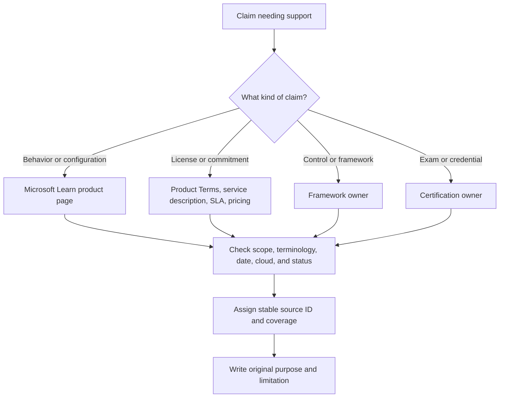
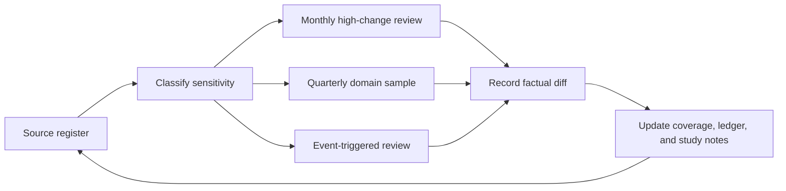
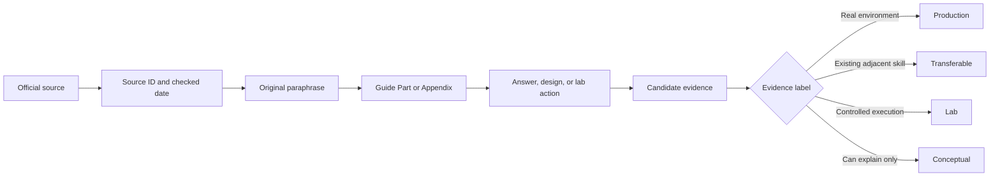
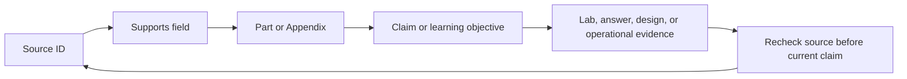
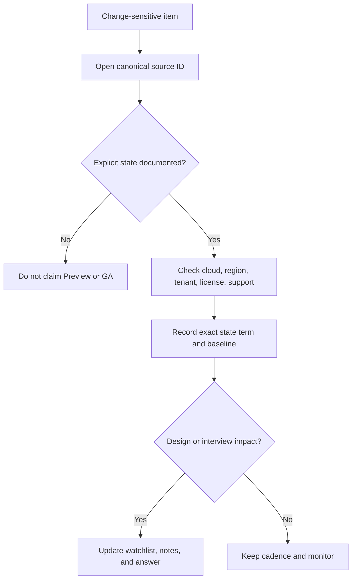
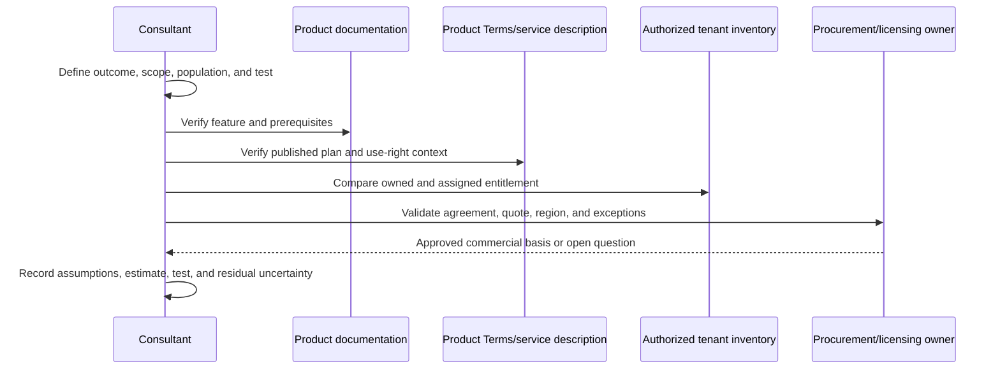
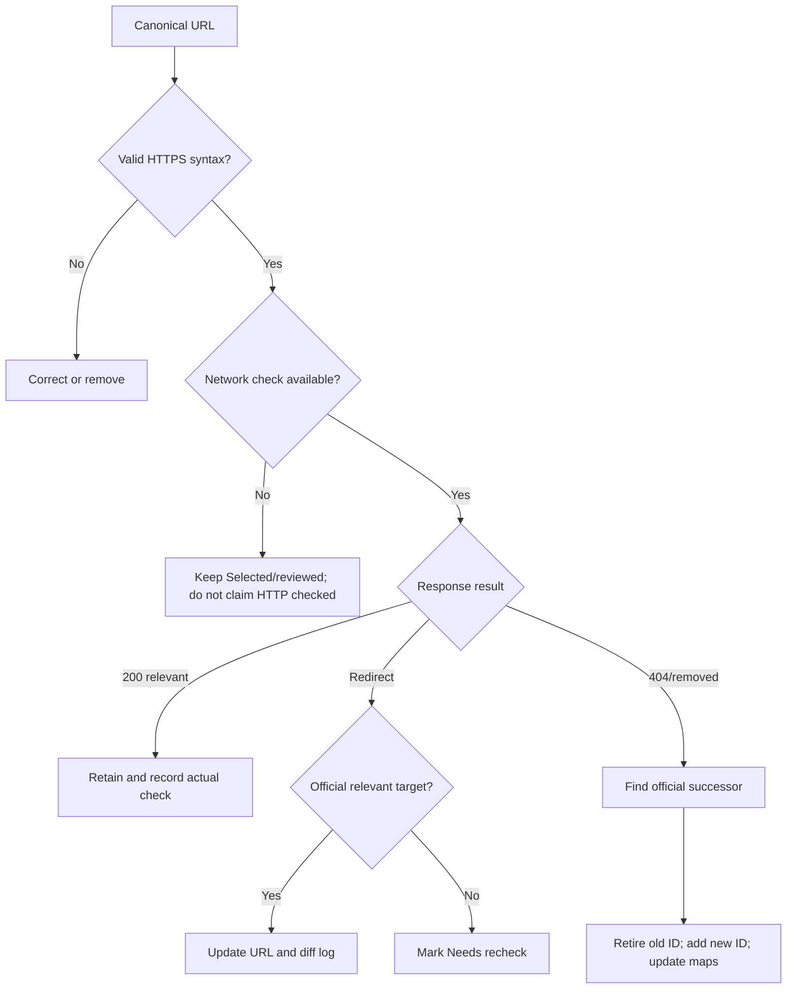
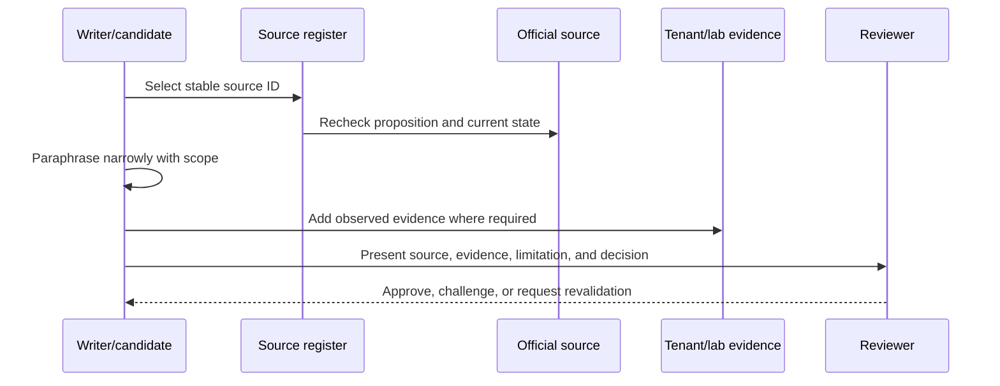
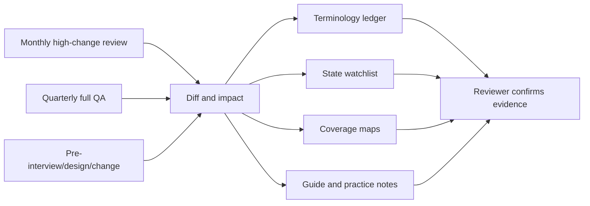

# Appendix G - Official Microsoft Learn Source Map

> **Purpose:** Maintain a first-party, interview-safe source register for Parts 1-74 and Appendices A-F without copying documentation.
>
> **Currency baseline:** August 24, 2026. No statement in this appendix should be read as newer than that baseline.
>
> **Validation status language:** `Selected/reviewed` means the source was chosen and its relevance was reviewed for this guide. It does **not** claim that an automated HTTP request succeeded on August 24, 2026. Recheck links, product state, licensing, portal paths, and certification details before relying on them.

## 1. Register contract

This appendix is a map, not a substitute for the source. Each record identifies an authoritative page, explains why it supports the guide, and records how quickly it may change. Summaries are original paraphrases. They deliberately avoid reproducing Microsoft Learn, standards, certification, or framework text.

| Field | Required meaning | Maintenance rule |
|---|---|---|
| ID | Stable identifier used by matrices and reverse maps | Never recycle an ID; retire it in the ledger |
| Domain/product | Owning knowledge area | Use current product terminology at the baseline |
| Page title | Human-readable source title | Recheck after redirects or product renames |
| URL | Unique canonical public URL | Remove tracking parameters and language duplicates |
| Source owner | Organization accountable for the source | Prefer Microsoft; use standards bodies only where appropriate |
| Supports | Parts or appendices materially supported | Keep ranges explicit and auditable |
| Purpose | Why the candidate should consult the page | Paraphrase; do not copy source prose |
| Checked date | Guide currency date | Use August 24, 2026 for this edition |
| Sensitivity | Portal, licensing, preview, schema, certification, or low | Drives recheck priority |
| Cadence | Monthly, quarterly, semiannual, or pre-interview | Recheck sooner after announced change |
| Notes/current terminology | Naming, scope, and evidence limitation | Separate documented fact from candidate inference |

## 2. Candidate honesty and copyright boundary

| Rule | Safe practice | Unsafe practice |
|---|---|---|
| First-party grounding | Read the linked source, then explain the concept in original words | Present guide prose as an official Microsoft quotation |
| Copyright | Quote only a short phrase when indispensable and attribute it | Copy tables, procedures, exam content, or long passages |
| Experience | Say `production`, `transferable`, `lab`, or `conceptual` accurately | Treat reading or a lab as client production ownership |
| Currency | Say `as documented at the August 24, 2026 baseline` | Claim that a portal, license, preview, or exam is current without recheck |
| Confidence | Record uncertainty and a validation step | Guess about tenant behavior, legal meaning, pricing, or roadmap |

> **Candidate limitation:** Official documentation establishes product guidance, not your personal experience. A source-backed explanation can prove preparation; only truthful work records, lab evidence, or direct observation can prove execution.

## 3. Source status legend

| Status | Meaning | Claim permitted |
|---|---|---|
| Selected/reviewed | Relevance reviewed while assembling the guide | The URL is an intentional source anchor |
| HTTP checked | A successful network check was actually performed and recorded | The URL responded at the recorded time |
| Content verified | The relevant statement was compared with the live page | The cited detail matched at verification time |
| Needs recheck | High-change detail or unresolved redirect | Do not rely on the detail until rechecked |
| Retired | Source or feature is officially retired/replaced | Preserve history and point to the successor |

---

## 4. Source quality hierarchy and selection method

The register uses the narrowest authoritative page that can support a claim. A product overview is useful for orientation; a configuration reference is better for a setting; a service description or Product Terms entry is better for commercial boundaries; a framework owner's publication is better than a vendor summary of that framework. Authority does not remove the need to check scope, date, cloud, license, and local client agreement.

| Rank | Source type | Best use | Limitation |
|---:|---|---|---|
| 1 | Microsoft Learn product/configuration documentation | Architecture, supported behavior, prerequisites, procedures, limits, schemas | Pages can change; not a contractual licensing promise |
| 2 | Microsoft service descriptions, Product Terms, SLA, and pricing tools | Service capability, use rights, service commitment, current public estimate inputs | Agreement, program, region, currency, tax, and negotiated terms still govern |
| 3 | Microsoft security, adoption, architecture, and support material | Patterns, troubleshooting, deployment, operational guidance | Confirm that guidance applies to the exact product and tenant state |
| 4 | Standard or framework owner | Vendor-neutral controls, vocabulary, assessment, attack knowledge | A framework does not prove implementation or compliance |
| 5 | Official certification owner | Exam scope, renewal, prerequisites, credential status | Skills measured and policies can change quickly |
| Excluded | Unofficial blogs, dumps, copied training, forum guesses, search snippets | None for authoritative claims | May be stale, incomplete, unauthorized, or context-free |

| Selection test | Pass condition | Failure response |
|---|---|---|
| Authority | Owner is Microsoft or a permitted public standards/certification body | Exclude the source |
| Specificity | Page directly supports the intended concept | Find a narrower page |
| Stability | Documentation URL is preferred over a campaign or marketing URL | Replace unstable page where docs exist |
| Currency | Terminology and status can be reconciled to August 24, 2026 | Mark `Needs recheck`; do not assert a newer state |
| Uniqueness | Canonical URL appears once in this appendix | Keep one record and expand its Supports field |
| Traceability | Record maps to at least one Part or Appendix A-F | Remove orphan or document the maintenance purpose |
| Copyright | Purpose and notes are original paraphrase | Rewrite; never reproduce the source body |

## 5. Sensitivity and recheck model

| Sensitivity | Typical change | Default cadence | Extra trigger |
|---|---|---|---|
| Portal | Navigation, unified portal migration, role surface | Monthly | Message center announcement or interview demo |
| Licensing | Entitlement, plan inclusion, meter, capacity, prerequisite | Pre-interview and before design | Quote, renewal, trial, or procurement decision |
| Preview | State, eligibility, region, terms, support, schema | Monthly | Public preview/GA/retirement announcement |
| Schema | Table, field, API, KQL operator, connector, limit | Monthly for active labs | Query failure or API version change |
| Certification | Exam code, skills measured, renewal, retirement | Monthly while studying | Exam booking or credential announcement |
| Retirement | Deadline, successor, migration requirement | Monthly | Message center or official lifecycle notice |
| Low | Stable concept or framework landing page | Semiannual | New edition or revision |

| Cadence | Minimum action | Evidence retained |
|---|---|---|
| Monthly | Recheck high-change IDs and watchlist | Date, reviewer, changed fact, action |
| Quarterly | Sample every domain; check redirects and terminology | Link report and ledger diff |
| Semiannual | Revisit low-sensitivity foundations and frameworks | Version or publication note |
| Pre-interview | Recheck every fact likely to be stated as current | Short current-facts sheet |
| Pre-design | Recheck licensing, support, cloud, limits, and prerequisites | Dated source extract or citation, subject to terms |

## 6. Evidence provenance model

| Layer | Question | Honest output |
|---|---|---|
| Source | What does the authoritative owner currently document? | Dated citation with scope |
| Interpretation | What does it mean for this scenario? | Original explanation plus assumptions |
| Decision | What should be done and why? | Tradeoff, owner, approval, test, rollback |
| Evidence | What did you actually do or observe? | Production/transferable/lab/conceptual label |
| Currency | Could the fact have changed? | Recheck date and sensitivity |

## 7. Canonical source register

All records below have status **Selected/reviewed**, checked date **August 24, 2026**, unless the Notes field says `Needs recheck`. The date records the guide baseline, not an automated HTTP result. URLs are intentionally normalized and unique within this appendix.

### 7.1 Foundations, architecture, tenant, protocols, and automation

| ID | Domain/product | Page title | URL | Owner | Supports | Purpose | Checked | Sensitivity | Cadence | Notes/current terminology |
|---|---|---|---|---|---|---|---|---|---|---|
| F001 | Security | Microsoft Security documentation | <https://learn.microsoft.com/security/> | Microsoft | P1-P3, A, B | Root map for Microsoft security architecture and Zero Trust topics. | Aug 24 2026 | Portal | Quarterly | Selected/reviewed; use narrower pages for factual detail. |
| F002 | Zero Trust | Zero Trust overview | <https://learn.microsoft.com/security/zero-trust/zero-trust-overview> | Microsoft | P1-P3, P54-P56, P71-P74 | Grounds the current principles and adoption framing used throughout the guide. | Aug 24 2026 | Low | Semiannual | Selected/reviewed; principles are guidance, not proof of maturity. |
| F003 | Zero Trust/M365 | Zero Trust deployment with Microsoft 365 | <https://learn.microsoft.com/security/zero-trust/microsoft-365-zero-trust> | Microsoft | P1, P3-P4, P21-P25, P71 | Connects identity, devices, applications, and data to an M365 deployment path. | Aug 24 2026 | Portal | Quarterly | Selected/reviewed; validate product-specific controls separately. |
| F004 | Zero Trust/access | Identity and device access configurations | <https://learn.microsoft.com/security/zero-trust/zero-trust-identity-device-access-policies-overview> | Microsoft | P3, P8-P9, P15-P19, P65-P67, B | Supports staged identity/device access baselines and policy dependencies. | Aug 24 2026 | Licensing | Quarterly | Selected/reviewed; examples require tenant-specific validation. |
| F005 | Architecture | Zero Trust architecture | <https://learn.microsoft.com/azure/architecture/guide/security/zero-trust> | Microsoft | P3, P55, P71, B | Provides an architecture-oriented Zero Trust view for trust boundaries and design. | Aug 24 2026 | Low | Semiannual | Selected/reviewed; Azure examples must be adapted to M365 scope. |
| F006 | Consulting | Cloud Adoption Framework strategy | <https://learn.microsoft.com/azure/cloud-adoption-framework/strategy/> | Microsoft | P1, P53, P56, P71, E | Supports motivations, outcomes, stakeholders, and transformation planning. | Aug 24 2026 | Low | Semiannual | Selected/reviewed; a public framework, not a Deloitte method claim. |
| F007 | Security benchmark | Microsoft cloud security benchmark | <https://learn.microsoft.com/security/benchmark/azure/overview> | Microsoft | P2-P3, P54-P56, P72 | Offers Microsoft control guidance and mappings for assessment reasoning. | Aug 24 2026 | Schema | Quarterly | Selected/reviewed; confirm applicability beyond Azure. |
| F008 | Threat modeling | Microsoft Threat Modeling Tool | <https://learn.microsoft.com/azure/security/develop/threat-modeling-tool> | Microsoft | P2, P55, P71, E | Grounds data-flow and STRIDE-oriented threat modeling practice. | Aug 24 2026 | Low | Semiannual | Selected/reviewed; a tool does not replace stakeholder review. |
| F009 | Architecture quality | Azure Well-Architected security pillar | <https://learn.microsoft.com/azure/well-architected/security/> | Microsoft | P3, P54-P56, P71 | Supplies security design review principles and tradeoff prompts. | Aug 24 2026 | Low | Semiannual | Selected/reviewed; tailor to M365/SaaS responsibility boundaries. |
| F010 | Microsoft 365 | Admin center overview | <https://learn.microsoft.com/microsoft-365/admin/admin-overview/admin-center-overview> | Microsoft | P4, P53, P60, C | Maps central administration and specialist admin surfaces. | Aug 24 2026 | Portal | Monthly | Selected/reviewed; portal navigation is change-sensitive. |
| F011 | Microsoft 365 | View service health | <https://learn.microsoft.com/microsoft-365/enterprise/view-service-health> | Microsoft | P4-P5, P20-P25, P60-P62, F | Supports service-issue triage, advisories, history, and evidence capture. | Aug 24 2026 | Portal | Monthly | Selected/reviewed; tenant-visible incidents can differ. |
| F012 | Microsoft 365 | Track changes in Message center | <https://learn.microsoft.com/microsoft-365/admin/manage/message-center> | Microsoft | P4, P58-P63, P72, G | Supports proactive change tracking and action ownership. | Aug 24 2026 | Portal | Monthly | Selected/reviewed; message availability depends on tenant and role. |
| F013 | Microsoft 365 | Microsoft 365 data locations | <https://learn.microsoft.com/microsoft-365/enterprise/o365-data-locations> | Microsoft | P4, P23-P33, P44, P52, P55-P57 | Anchors data-location and residency discovery questions. | Aug 24 2026 | Licensing | Quarterly | Selected/reviewed; verify workload, geo, agreement, and sovereign cloud. |
| F014 | Microsoft 365 | Microsoft 365 service descriptions | <https://learn.microsoft.com/office365/servicedescriptions/> | Microsoft | P4, P21-P33, P56, P64, C | Authoritative capability and service-boundary starting point. | Aug 24 2026 | Licensing | Pre-interview | Selected/reviewed; service descriptions do not replace Product Terms. |
| F015 | Licensing | Microsoft Product Terms | <https://www.microsoft.com/licensing/terms/> | Microsoft | P4, P26-P44, P56-P57, P64-P72, C | Contractual public entry point for product use-right verification. | Aug 24 2026 | Licensing | Pre-design | Selected/reviewed; client agreement and program control. |
| F016 | Service commitment | Online Services SLA | <https://www.microsoft.com/licensing/docs/view/Service-Level-Agreements-SLA-for-Online-Services> | Microsoft | P4, P59, P61-P62, E-F | Supports service-commitment and operational-expectation checks. | Aug 24 2026 | Licensing | Quarterly | Selected/reviewed; read applicable version and exclusions. |
| F017 | Microsoft Graph | Microsoft Graph overview | <https://learn.microsoft.com/graph/overview> | Microsoft | P5-P7, P12-P14, P25, P63, D | Grounds unified API concepts, resources, permissions, and automation boundaries. | Aug 24 2026 | Schema | Monthly | Selected/reviewed; use endpoint reference for implementation. |
| F018 | Identity protocols | OAuth 2.0 and OpenID Connect protocols | <https://learn.microsoft.com/entra/identity-platform/v2-protocols> | Microsoft | P5, P7, P14, P25, D | Supports modern authentication protocol roles and token flows. | Aug 24 2026 | Schema | Quarterly | Selected/reviewed; protocol knowledge is not tenant evidence. |
| F019 | Networking | Microsoft 365 network connectivity principles | <https://learn.microsoft.com/microsoft-365/enterprise/microsoft-365-network-connectivity-principles> | Microsoft | P5, P21-P25, P60, F | Grounds local egress, DNS, proxy, inspection, and performance reasoning. | Aug 24 2026 | Schema | Quarterly | Selected/reviewed; test actual network path. |
| F020 | Networking | Microsoft 365 URLs and IP address ranges | <https://learn.microsoft.com/microsoft-365/enterprise/urls-and-ip-address-ranges> | Microsoft | P5, P21-P25, P60, F | Provides the maintained endpoint categories used for firewall/proxy validation. | Aug 24 2026 | Schema | Monthly | Selected/reviewed; consume changes rather than hard-code remembered lists. |
| F021 | Networking | TLS protocol overview | <https://learn.microsoft.com/windows-server/security/tls/tls-protocol-overview> | Microsoft | P5, P13, P21, P45, P60, F | Supports handshake, certificate, encryption, and failure-layer explanations. | Aug 24 2026 | Low | Semiannual | Selected/reviewed; implementation details vary by client and service. |
| F022 | Networking | Azure DNS overview | <https://learn.microsoft.com/azure/dns/dns-overview> | Microsoft | P5, P21, P43-P45, P60 | Provides a first-party DNS resolution and hosting reference. | Aug 24 2026 | Low | Semiannual | Selected/reviewed; not all M365 DNS is hosted in Azure DNS. |
| F023 | KQL | Kusto Query Language overview | <https://learn.microsoft.com/kusto/query/> | Microsoft | P40, P43-P52, P63, P69-P70, D | Canonical language root for KQL operators and query semantics. | Aug 24 2026 | Schema | Monthly | Selected/reviewed; pin product context for table schemas. |
| F024 | PowerShell | What is PowerShell? | <https://learn.microsoft.com/powershell/scripting/overview> | Microsoft | P5, P20-P25, P63-P70, D | Grounds shell, object pipeline, modules, and automation practice. | Aug 24 2026 | Schema | Quarterly | Selected/reviewed; command availability depends on module/version. |
| F025 | Incident response | Microsoft security incident management | <https://learn.microsoft.com/security/operations/incident-response-overview> | Microsoft | P2, P34, P39, P43, P59-P62, P69-P71, F | Supports preparation, response roles, lifecycle, and improvement framing. | Aug 24 2026 | Low | Semiannual | Selected/reviewed; adapt to client authority and legal process. |

### 7.2 Microsoft Entra identity, access, governance, hybrid, and external identity

| ID | Domain/product | Page title | URL | Owner | Supports | Purpose | Checked | Sensitivity | Cadence | Notes/current terminology |
|---|---|---|---|---|---|---|---|---|---|---|
| E026 | Entra | What is Microsoft Entra? | <https://learn.microsoft.com/entra/fundamentals/what-is-entra> | Microsoft | P4, P6, P14, P65, A-C | Establishes current family naming and Entra ID's role. | Aug 24 2026 | Portal | Quarterly | Selected/reviewed; use Microsoft Entra ID, not Azure AD, for current name. |
| E027 | Entra | Microsoft Entra admin center | <https://learn.microsoft.com/entra/fundamentals/entra-admin-center> | Microsoft | P4, P6-P14, P65, C | Maps the administrative portal and product surfaces. | Aug 24 2026 | Portal | Monthly | Selected/reviewed; navigation and blades can move. |
| E028 | Entra ID | Add or update user profile information | <https://learn.microsoft.com/entra/fundamentals/how-to-manage-user-profile-info> | Microsoft | P6, P12-P14, P65 | Supports user objects, attributes, source, and lifecycle reasoning. | Aug 24 2026 | Schema | Quarterly | Selected/reviewed; source of authority matters. |
| E029 | Entra ID | Learn about groups and access | <https://learn.microsoft.com/entra/fundamentals/concept-learn-about-groups> | Microsoft | P6, P9, P11-P12, P15-P20, P65 | Grounds group types, membership, ownership, and assignment use. | Aug 24 2026 | Schema | Quarterly | Selected/reviewed; nested/dynamic behavior has boundaries. |
| E030 | Entra devices | Device identity overview | <https://learn.microsoft.com/entra/identity/devices/overview> | Microsoft | P6, P9, P15-P20, P65-P66 | Connects registered, joined, and hybrid-joined device identities. | Aug 24 2026 | Schema | Quarterly | Selected/reviewed; distinguish identity from Intune management. |
| E031 | Entra domains | Add a custom domain name | <https://learn.microsoft.com/entra/fundamentals/add-custom-domain> | Microsoft | P4, P6, P13, P21, P64 | Supports verified domains and tenant setup dependencies. | Aug 24 2026 | Portal | Quarterly | Selected/reviewed; DNS ownership and production impact require care. |
| E032 | Entra RBAC | Administrative units | <https://learn.microsoft.com/entra/identity/role-based-access-control/administrative-units> | Microsoft | P6, P11, P20, P52, P59 | Grounds delegated administrative scope and limitations. | Aug 24 2026 | Licensing | Quarterly | Selected/reviewed; verify role and object support. |
| E033 | Entra RBAC | Microsoft Entra RBAC overview | <https://learn.microsoft.com/entra/identity/role-based-access-control/custom-overview> | Microsoft | P6, P11-P12, P14, P65, C | Explains principal, role definition, assignment, and scope. | Aug 24 2026 | Licensing | Quarterly | Selected/reviewed; least privilege needs task-level mapping. |
| E034 | Entra RBAC | Built-in role permissions reference | <https://learn.microsoft.com/entra/identity/role-based-access-control/permissions-reference> | Microsoft | P6, P11-P14, P65, C | Canonical reference for current role actions and descriptions. | Aug 24 2026 | Schema | Monthly | Selected/reviewed; role permissions can evolve. |
| E035 | Entra RBAC | Create and assign a custom role | <https://learn.microsoft.com/entra/identity/role-based-access-control/custom-create> | Microsoft | P11, P55, P59, P65 | Supports controlled custom-role design and assignment. | Aug 24 2026 | Licensing | Quarterly | Selected/reviewed; prefer built-in role when fit is adequate. |
| E036 | Identity platform | Authentication versus authorization | <https://learn.microsoft.com/entra/identity-platform/authentication-vs-authorization> | Microsoft | P5, P7, P14, P25 | Establishes the distinction used in protocol and access answers. | Aug 24 2026 | Low | Semiannual | Selected/reviewed; a foundational concept. |
| E037 | Identity platform | Authorization code flow with PKCE | <https://learn.microsoft.com/entra/identity-platform/v2-oauth2-auth-code-flow> | Microsoft | P5, P7, P14, P25 | Supports interactive OAuth flow, PKCE, redirect, and token reasoning. | Aug 24 2026 | Schema | Quarterly | Selected/reviewed; app type and registration must match. |
| E038 | Identity platform | Client credentials flow | <https://learn.microsoft.com/entra/identity-platform/v2-oauth2-client-creds-grant-flow> | Microsoft | P7, P14, P25, P63 | Grounds app-only authentication and workload identity risk. | Aug 24 2026 | Schema | Quarterly | Selected/reviewed; certificates/federation preferred where feasible. |
| E039 | Identity platform | Device authorization grant flow | <https://learn.microsoft.com/entra/identity-platform/v2-oauth2-device-code> | Microsoft | P5, P7, P14 | Supports device-code behavior and phishing/abuse discussions. | Aug 24 2026 | Schema | Quarterly | Selected/reviewed; do not treat flow possession as trust. |
| E040 | Identity platform | SAML protocol | <https://learn.microsoft.com/entra/identity-platform/saml-protocol-reference> | Microsoft | P5, P7, P13-P14 | Supports federation assertions, endpoints, and troubleshooting vocabulary. | Aug 24 2026 | Schema | Semiannual | Selected/reviewed; inspect actual metadata and claims. |
| E041 | Identity platform | Security tokens | <https://learn.microsoft.com/entra/identity-platform/security-tokens> | Microsoft | P7, P9-P10, P14 | Grounds access, ID, and SAML token purpose and validation. | Aug 24 2026 | Schema | Quarterly | Selected/reviewed; clients should not infer authorization from token text alone. |
| E042 | Identity platform | ID token claims reference | <https://learn.microsoft.com/entra/identity-platform/id-token-claims-reference> | Microsoft | P7, P9, P14, D | Canonical schema reference for ID token claims. | Aug 24 2026 | Schema | Monthly | Selected/reviewed; optional claims and versions vary. |
| E043 | Identity platform | Microsoft identity platform consent framework | <https://learn.microsoft.com/entra/identity-platform/consent-framework> | Microsoft | P7, P14, P25, P37 | Grounds delegated/application permissions and consent actors. | Aug 24 2026 | Schema | Quarterly | Selected/reviewed; consent is not a risk-free approval. |
| E044 | Identity platform | Microsoft Authentication Library overview | <https://learn.microsoft.com/entra/identity-platform/msal-overview> | Microsoft | P7, P14, P63, D | Supports supported authentication library and token-cache concepts. | Aug 24 2026 | Schema | Quarterly | Selected/reviewed; follow language-specific library guidance. |
| E045 | Authentication | Authentication methods overview | <https://learn.microsoft.com/entra/identity/authentication/overview-authentication> | Microsoft | P8-P10, P65 | Maps primary, MFA, passwordless, and recovery method roles. | Aug 24 2026 | Preview | Monthly | Selected/reviewed; method availability and state can change. |
| E046 | Authentication | How Microsoft Entra MFA works | <https://learn.microsoft.com/entra/identity/authentication/concept-mfa-howitworks> | Microsoft | P8-P10, P65 | Grounds factor concepts and MFA integration. | Aug 24 2026 | Licensing | Quarterly | Selected/reviewed; verify policy and method strength. |
| E047 | Authentication | Authentication methods policy | <https://learn.microsoft.com/entra/identity/authentication/concept-authentication-methods-manage> | Microsoft | P8-P10, P65 | Supports centralized method enablement and migration. | Aug 24 2026 | Portal | Monthly | Selected/reviewed; legacy method settings require reconciliation. |
| E048 | Passwordless | Enable passkeys/FIDO2 security keys | <https://learn.microsoft.com/entra/identity/authentication/how-to-enable-passkey-fido2> | Microsoft | P8-P9, P11, P65 | Grounds phishing-resistant passkey/security-key rollout. | Aug 24 2026 | Preview | Monthly | Selected/reviewed; terminology and device support require recheck. |
| E049 | Passwordless | Windows Hello for Business planning | <https://learn.microsoft.com/windows/security/identity-protection/hello-for-business/deploy/> | Microsoft | P8, P13, P15-P19, P65-P66 | Supports passwordless device-bound credential planning. | Aug 24 2026 | Schema | Quarterly | Selected/reviewed; deployment model and trust type matter. |
| E050 | Authentication | Authentication strengths | <https://learn.microsoft.com/entra/identity/authentication/concept-authentication-strengths> | Microsoft | P8-P9, P65 | Supports method combinations and phishing-resistant access requirements. | Aug 24 2026 | Licensing | Monthly | Selected/reviewed; check supported methods and Conditional Access scope. |
| E051 | Authentication | Temporary Access Pass | <https://learn.microsoft.com/entra/identity/authentication/howto-authentication-temporary-access-pass> | Microsoft | P8, P12, P65 | Grounds bootstrap and recovery use with lifetime controls. | Aug 24 2026 | Portal | Quarterly | Selected/reviewed; treat TAP as sensitive credential material. |
| E052 | Authentication | Self-service password reset overview | <https://learn.microsoft.com/entra/identity/authentication/concept-sspr-howitworks> | Microsoft | P8, P12-P13, P65 | Supports recovery, registration, and writeback dependencies. | Aug 24 2026 | Licensing | Quarterly | Selected/reviewed; verify hybrid writeback prerequisites. |
| E053 | Authentication | Combined security information registration | <https://learn.microsoft.com/entra/identity/authentication/concept-registration-mfa-sspr-combined> | Microsoft | P8, P12, P65 | Connects MFA and SSPR registration experience and policy. | Aug 24 2026 | Portal | Quarterly | Selected/reviewed; user experience can change. |
| E054 | Conditional Access | Conditional Access overview | <https://learn.microsoft.com/entra/identity/conditional-access/overview> | Microsoft | P3-P4, P8-P10, P17, P65, B-C | Defines the Zero Trust policy engine, signals, and decisions. | Aug 24 2026 | Licensing | Monthly | Selected/reviewed; P1/P2 and feature dependencies need current check. |
| E055 | Conditional Access | Build a Conditional Access policy | <https://learn.microsoft.com/entra/identity/conditional-access/concept-conditional-access-policies> | Microsoft | P9-P10, P17, P65 | Supports assignments, conditions, grant/session controls, and safe rollout. | Aug 24 2026 | Portal | Monthly | Selected/reviewed; exclude emergency access and test safely. |
| E056 | Conditional Access | Target resources | <https://learn.microsoft.com/entra/identity/conditional-access/concept-conditional-access-cloud-apps> | Microsoft | P9, P14, P21-P25, P65 | Grounds resource targeting and service dependencies. | Aug 24 2026 | Schema | Monthly | Selected/reviewed; broad scopes can create lockout. |
| E057 | Conditional Access | Conditions | <https://learn.microsoft.com/entra/identity/conditional-access/concept-conditional-access-conditions> | Microsoft | P9-P10, P17, P65 | Supports risk, device, platform, location, client, and filter conditions. | Aug 24 2026 | Schema | Monthly | Selected/reviewed; availability and evaluation can change. |
| E058 | Conditional Access | Grant controls | <https://learn.microsoft.com/entra/identity/conditional-access/concept-conditional-access-grant> | Microsoft | P8-P9, P17, P65 | Grounds block, MFA, strength, device, and terms requirements. | Aug 24 2026 | Licensing | Monthly | Selected/reviewed; control combinations require testing. |
| E059 | Conditional Access | Session controls | <https://learn.microsoft.com/entra/identity/conditional-access/concept-conditional-access-session> | Microsoft | P9, P14, P24, P37, P65 | Supports sign-in frequency, persistent browser, CAE, and app-control discussion. | Aug 24 2026 | Licensing | Monthly | Selected/reviewed; workload support differs. |
| E060 | Conditional Access | Report-only mode | <https://learn.microsoft.com/entra/identity/conditional-access/concept-conditional-access-report-only> | Microsoft | P9, P58, P65 | Grounds safe impact analysis before enforcement. | Aug 24 2026 | Portal | Monthly | Selected/reviewed; report-only is evidence, not a guarantee. |
| E061 | Conditional Access | What If tool | <https://learn.microsoft.com/entra/identity/conditional-access/what-if-tool> | Microsoft | P9, P60, P65, F | Supports policy simulation and hypothesis testing. | Aug 24 2026 | Portal | Monthly | Selected/reviewed; validate with real sign-in logs. |
| E062 | Conditional Access | Troubleshoot Conditional Access | <https://learn.microsoft.com/entra/identity/conditional-access/troubleshoot-conditional-access> | Microsoft | P9, P20-P25, P60, P65, F | Provides official diagnostics and policy-result interpretation. | Aug 24 2026 | Portal | Monthly | Selected/reviewed; preserve correlation and sign-in context. |
| E063 | Conditional Access | Policy templates | <https://learn.microsoft.com/entra/identity/conditional-access/concept-conditional-access-policy-common> | Microsoft | P9, P54, P65 | Supplies common policy patterns for adaptation. | Aug 24 2026 | Licensing | Monthly | Selected/reviewed; templates are starting points, not turnkey designs. |
| E064 | Conditional Access | Continuous access evaluation | <https://learn.microsoft.com/entra/identity/conditional-access/concept-continuous-access-evaluation> | Microsoft | P7, P9-P10, P21-P25, P65 | Grounds near-real-time session reevaluation and limitations. | Aug 24 2026 | Schema | Monthly | Selected/reviewed; client/workload support matters. |
| E065 | ID Protection | Microsoft Entra ID Protection overview | <https://learn.microsoft.com/entra/id-protection/overview-identity-protection> | Microsoft | P10, P39-P41, P65, C | Supports detect, investigate, and remediate risk workflow. | Aug 24 2026 | Licensing | Monthly | Selected/reviewed; P2 and signal availability require recheck. |
| E066 | ID Protection | Risk detections | <https://learn.microsoft.com/entra/id-protection/concept-identity-protection-risks> | Microsoft | P10, P39-P40, P65 | Canonical interpretation of user/sign-in risk detections. | Aug 24 2026 | Schema | Monthly | Selected/reviewed; a detection is evidence to investigate, not guilt. |
| E067 | ID Protection | Configure risk policies | <https://learn.microsoft.com/entra/id-protection/howto-identity-protection-configure-risk-policies> | Microsoft | P9-P10, P58, P65 | Supports risk-based Conditional Access and staged policy decisions. | Aug 24 2026 | Licensing | Monthly | Selected/reviewed; test remediation and emergency paths. |
| E068 | ID Protection | Investigate risky users | <https://learn.microsoft.com/entra/id-protection/howto-identity-protection-investigate-risk> | Microsoft | P10, P39, P61, P65 | Grounds evidence-led risk investigation and disposition. | Aug 24 2026 | Portal | Monthly | Selected/reviewed; dismissal requires justified evidence. |
| E069 | PIM | What is Privileged Identity Management? | <https://learn.microsoft.com/entra/id-governance/privileged-identity-management/pim-configure> | Microsoft | P11-P12, P59, P65, C | Establishes eligible/active assignments, activation, and governance. | Aug 24 2026 | Licensing | Monthly | Selected/reviewed; verify supported roles and license. |
| E070 | PIM | Assign Entra roles in PIM | <https://learn.microsoft.com/entra/id-governance/privileged-identity-management/pim-how-to-add-role-to-user> | Microsoft | P11, P58-P59, P65 | Supports controlled privileged-role assignment workflow. | Aug 24 2026 | Portal | Monthly | Selected/reviewed; approval and activation policy are design choices. |
| E071 | Resilience | Manage emergency access accounts | <https://learn.microsoft.com/entra/identity/role-based-access-control/security-emergency-access> | Microsoft | P9, P11, P58, P62, P65, F | Grounds break-glass design, monitoring, testing, and recovery. | Aug 24 2026 | Schema | Monthly | Selected/reviewed; protect and test without normalizing use. |
| E072 | Governance | Identity Governance overview | <https://learn.microsoft.com/entra/id-governance/identity-governance-overview> | Microsoft | P12, P14, P54-P56, P65 | Maps identity, access, and privileged lifecycle governance. | Aug 24 2026 | Licensing | Quarterly | Selected/reviewed; current suite/feature names need license check. |
| E073 | Governance | Entitlement management overview | <https://learn.microsoft.com/entra/id-governance/entitlement-management-overview> | Microsoft | P12, P14, P53-P59, P65 | Supports access packages, catalogs, approvals, expiry, and guests. | Aug 24 2026 | Licensing | Monthly | Selected/reviewed; external-user billing and features may change. |
| E074 | Governance | Lifecycle Workflows overview | <https://learn.microsoft.com/entra/id-governance/what-are-lifecycle-workflows> | Microsoft | P12-P13, P53-P59, P65 | Grounds joiner/mover/leaver automation and workflow evidence. | Aug 24 2026 | Licensing | Monthly | Selected/reviewed; task support and prerequisites require recheck. |
| E075 | Governance | Access reviews overview | <https://learn.microsoft.com/entra/id-governance/access-reviews-overview> | Microsoft | P11-P12, P14, P23-P24, P65 | Supports recurring access certification and decision ownership. | Aug 24 2026 | Licensing | Quarterly | Selected/reviewed; define reviewer, fallback, and remediation. |
| E076 | Hybrid identity | Microsoft Entra Connect overview | <https://learn.microsoft.com/entra/identity/hybrid/connect/whatis-azure-ad-connect> | Microsoft | P13, P60, P65 | Grounds synchronization architecture, health, and current product direction. | Aug 24 2026 | Retirement | Monthly | Selected/reviewed; legacy Azure AD naming may remain in URL/title. |
| E077 | Hybrid identity | Connect Sync architecture | <https://learn.microsoft.com/entra/identity/hybrid/connect/concept-azure-ad-connect-sync-architecture> | Microsoft | P6, P13, P60, P65 | Supports connectors, metaverse, rules, joins, and attribute flow. | Aug 24 2026 | Schema | Quarterly | Selected/reviewed; diagnose source and precedence before editing. |
| E078 | Hybrid identity | Microsoft Entra Cloud Sync overview | <https://learn.microsoft.com/entra/identity/hybrid/cloud-sync/what-is-cloud-sync> | Microsoft | P13, P56-P58, P65 | Grounds agent-based cloud sync architecture and selection. | Aug 24 2026 | Preview | Monthly | Selected/reviewed; compare current feature parity and limits. |
| E079 | Hybrid authentication | Choose the right authentication method | <https://learn.microsoft.com/entra/identity/hybrid/connect/choose-ad-authn> | Microsoft | P7-P8, P13, P55-P58 | Compares password hash sync, pass-through authentication, and federation. | Aug 24 2026 | Retirement | Quarterly | Selected/reviewed; prefer evidence-based migration choices. |
| E080 | External ID | Microsoft Entra External ID overview | <https://learn.microsoft.com/entra/external-id/external-identities-overview> | Microsoft | P14, P23-P24, P65, C | Establishes workforce external collaboration and external-tenant scope. | Aug 24 2026 | Retirement | Monthly | Selected/reviewed; B2C purchasing/lifecycle language needs recheck. |
| E081 | External ID | What is B2B collaboration? | <https://learn.microsoft.com/entra/external-id/what-is-b2b> | Microsoft | P14, P23-P24, P65 | Grounds guest objects, invitation, redemption, and home identity. | Aug 24 2026 | Portal | Quarterly | Selected/reviewed; distinguish guest collaboration from external access. |
| E082 | External ID | Cross-tenant access overview | <https://learn.microsoft.com/entra/external-id/cross-tenant-access-overview> | Microsoft | P14, P23-P24, P52, P65 | Supports inbound/outbound trust, MFA/device claims, and tenant restrictions. | Aug 24 2026 | Licensing | Monthly | Selected/reviewed; both tenants' settings influence outcome. |
| E083 | Workload identities | Workload identities overview | <https://learn.microsoft.com/entra/workload-id/workload-identities-overview> | Microsoft | P6-P7, P10-P11, P14, P25 | Grounds service principals, managed identities, and workload risk. | Aug 24 2026 | Licensing | Quarterly | Selected/reviewed; nonhuman identities require lifecycle ownership. |
| E084 | Enterprise apps | Consent and permissions | <https://learn.microsoft.com/entra/identity/enterprise-apps/user-admin-consent-overview> | Microsoft | P7, P14, P25, P37, P55 | Supports user/admin consent policy and permission-governance reasoning. | Aug 24 2026 | Portal | Monthly | Selected/reviewed; verify publisher, permissions, and business need. |
| E085 | Managed identities | Managed identities overview | <https://learn.microsoft.com/entra/identity/managed-identities-azure-resources/overview> | Microsoft | P14, P25, P45, P50, P63, P70 | Supports secret-reduction patterns for Azure-hosted automation. | Aug 24 2026 | Schema | Quarterly | Selected/reviewed; scope RBAC and lifecycle separately. |

### 7.3 Microsoft Intune, endpoint management, and co-management

| ID | Domain/product | Page title | URL | Owner | Supports | Purpose | Checked | Sensitivity | Cadence | Notes/current terminology |
|---|---|---|---|---|---|---|---|---|---|---|
| I086 | Intune | What is Microsoft Intune? | <https://learn.microsoft.com/intune/fundamentals/what-is-intune> | Microsoft | P15-P20, P66, A-C | Establishes Intune's cloud endpoint-management and app-management role. | Aug 24 2026 | Portal | Quarterly | Selected/reviewed; distinguish management from Entra device identity. |
| I087 | Intune | Microsoft Intune licensing | <https://learn.microsoft.com/intune/fundamentals/licensing> | Microsoft | P4, P15-P20, P56, P64, P66, C | Provides first-party plan, add-on, trial, and admin-access context. | Aug 24 2026 | Licensing | Pre-interview | Selected/reviewed; verify agreement and current suite packaging. |
| I088 | Intune enrollment | Device enrollment guide | <https://learn.microsoft.com/intune/device-enrollment/guide> | Microsoft | P15, P18, P64, P66 | Maps platform enrollment decisions, prerequisites, and lifecycle. | Aug 24 2026 | Portal | Quarterly | Selected/reviewed; use platform-specific pages for implementation. |
| I089 | Intune enrollment | Enrollment restrictions | <https://learn.microsoft.com/intune/device-enrollment/enrollment-restrictions-set> | Microsoft | P15, P17-P18, P66 | Supports device limits, platform restrictions, and ownership controls. | Aug 24 2026 | Schema | Quarterly | Selected/reviewed; assignment and priority need testing. |
| I090 | Windows enrollment | Windows enrollment guide | <https://learn.microsoft.com/intune/device-enrollment/windows-enrollment-methods> | Microsoft | P15, P18, P20, P66 | Compares Windows enrollment and join pathways. | Aug 24 2026 | Schema | Quarterly | Selected/reviewed; edition, join, and management state matter. |
| I091 | Apple enrollment | macOS enrollment guide | <https://learn.microsoft.com/intune/device-enrollment/macos-enroll> | Microsoft | P15-P20, P66 | Grounds macOS enrollment choices and prerequisites. | Aug 24 2026 | Schema | Quarterly | Selected/reviewed; Apple service and token dependencies change. |
| I092 | Apple enrollment | iOS/iPadOS enrollment guide | <https://learn.microsoft.com/intune/device-enrollment/ios-ipados-enroll> | Microsoft | P15-P20, P66 | Supports supervised, automated, user, and account-driven enrollment planning. | Aug 24 2026 | Schema | Quarterly | Selected/reviewed; verify current Apple platform support. |
| I093 | Android enrollment | Android enrollment guide | <https://learn.microsoft.com/intune/device-enrollment/android-enroll> | Microsoft | P15-P20, P66 | Maps Android Enterprise profile and enrollment options. | Aug 24 2026 | Schema | Quarterly | Selected/reviewed; Google service and device support apply. |
| I094 | App management | App management overview | <https://learn.microsoft.com/intune/apps/app-management> | Microsoft | P15, P18, P25, P66 | Establishes managed app lifecycle and protection scope. | Aug 24 2026 | Portal | Quarterly | Selected/reviewed; MAM can exist with or without enrollment. |
| I095 | App protection | App protection policy overview | <https://learn.microsoft.com/intune/apps/app-protection-policy> | Microsoft | P15, P17-P18, P23-P25, P66 | Grounds corporate-data controls in managed applications. | Aug 24 2026 | Licensing | Quarterly | Selected/reviewed; supported app/platform behavior varies. |
| I096 | Configuration | Device configuration overview | <https://learn.microsoft.com/intune/configuration/device-profiles> | Microsoft | P16, P18-P20, P66 | Maps profile types, settings channels, assignment, and reporting. | Aug 24 2026 | Portal | Quarterly | Selected/reviewed; current Intune documentation paths can redirect. |
| I097 | Settings Catalog | Create a Settings Catalog policy | <https://learn.microsoft.com/intune/configuration/settings-catalog> | Microsoft | P16, P19, P58, P66 | Supports granular settings selection, scope, assignment, and reporting. | Aug 24 2026 | Schema | Monthly | Selected/reviewed; settings applicability changes by platform release. |
| I098 | Assignment | Assign user and device profiles | <https://learn.microsoft.com/intune/configuration/device-profile-assign> | Microsoft | P16-P20, P58, P66 | Grounds inclusion/exclusion, user/device targeting, and evaluation. | Aug 24 2026 | Schema | Quarterly | Selected/reviewed; avoid conflicting group logic. |
| I099 | Assignment filters | Use assignment filters | <https://learn.microsoft.com/intune/fundamentals/filters> | Microsoft | P16-P20, P58, P66 | Supports device-property targeting and rollout rings. | Aug 24 2026 | Schema | Monthly | Selected/reviewed; expression properties and workloads vary. |
| I100 | Security baselines | Security baselines overview | <https://learn.microsoft.com/intune/protect/security-baselines> | Microsoft | P16, P19, P54, P58, P66 | Grounds recommended baseline templates, versions, and migration. | Aug 24 2026 | Schema | Monthly | Selected/reviewed; never treat template as risk-free universal policy. |
| I101 | Compliance | Device compliance overview | <https://learn.microsoft.com/intune/protect/device-compliance-get-started> | Microsoft | P17, P19-P20, P65-P66 | Explains compliance state, policy, Entra integration, and reporting. | Aug 24 2026 | Licensing | Monthly | Selected/reviewed; compliance is a signal, not complete device security. |
| I102 | Compliance | Create a compliance policy | <https://learn.microsoft.com/intune/protect/create-compliance-policy> | Microsoft | P17, P58, P66 | Supports platform policy creation, assignment, and evaluation timing. | Aug 24 2026 | Schema | Monthly | Selected/reviewed; grace period and default state need deliberate design. |
| I103 | Compliance | Actions for noncompliance | <https://learn.microsoft.com/intune/protect/actions-for-noncompliance> | Microsoft | P17, P59, P66 | Grounds notification, marking, retirement, and escalation actions. | Aug 24 2026 | Schema | Quarterly | Selected/reviewed; destructive actions require approval and testing. |
| I104 | Compliance/access | Require compliant devices with Conditional Access | <https://learn.microsoft.com/intune/protect/create-conditional-access-intune> | Microsoft | P9, P17, P58, P65-P66 | Connects compliance evaluation to access enforcement. | Aug 24 2026 | Licensing | Monthly | Selected/reviewed; stage policy and preserve emergency access. |
| I105 | Windows apps | Win32 app management | <https://learn.microsoft.com/intune/apps/apps-win32-app-management> | Microsoft | P18, P20, P66 | Grounds packaging, detection, requirements, assignment, and supersedence. | Aug 24 2026 | Schema | Monthly | Selected/reviewed; detection logic is a common failure source. |
| I106 | Intune extension | Intune Management Extension | <https://learn.microsoft.com/intune/intune-service/apps/intune-management-extension> | Microsoft | P18, P20, P63, P66 | Supports Win32 apps, scripts, remediations, logs, and execution context. | Aug 24 2026 | Schema | Monthly | Selected/reviewed; path retains service naming. |
| I107 | Store apps | Add Microsoft Store apps | <https://learn.microsoft.com/intune/apps/store-apps-microsoft> | Microsoft | P18, P66 | Grounds current Store integration, assignment, and update behavior. | Aug 24 2026 | Retirement | Monthly | Selected/reviewed; legacy Store mechanisms should not be assumed. |
| I108 | Autopilot | Windows Autopilot overview | <https://learn.microsoft.com/autopilot/overview> | Microsoft | P18, P58, P64, P66 | Establishes provisioning identities, profiles, and lifecycle scenarios. | Aug 24 2026 | Preview | Monthly | Selected/reviewed; current device preparation terminology needs recheck. |
| I109 | Autopilot | Enrollment Status Page | <https://learn.microsoft.com/autopilot/enrollment-status> | Microsoft | P18, P20, P58, P66 | Supports blocking criteria, tracking, timeout, and troubleshooting. | Aug 24 2026 | Schema | Monthly | Selected/reviewed; app dependencies can stall provisioning. |
| I110 | Windows updates | Update rings policy | <https://learn.microsoft.com/intune/protect/windows-10-update-rings> | Microsoft | P18, P58, P62, P66 | Grounds quality-update deferral, deadlines, restart, and rollout rings. | Aug 24 2026 | Schema | Monthly | Selected/reviewed; current Windows release policy applies. |
| I111 | Windows updates | Feature updates policy | <https://learn.microsoft.com/intune/protect/windows-10-feature-updates> | Microsoft | P18, P58, P66 | Supports controlled target-version deployment and reporting. | Aug 24 2026 | Schema | Monthly | Selected/reviewed; verify supported versions and offer status. |
| I112 | Device actions | Available remote actions | <https://learn.microsoft.com/intune/remote-actions/device-management> | Microsoft | P18, P20, P39, P59, P66 | Maps sync, restart, wipe, retire, and security actions. | Aug 24 2026 | Portal | Monthly | Selected/reviewed; scope and destructive impact vary. |
| I113 | Device lifecycle | Retire or wipe devices | <https://learn.microsoft.com/intune/remote-actions/devices-wipe> | Microsoft | P18, P20, P58-P59, P66 | Grounds data-removal choices and ownership implications. | Aug 24 2026 | Schema | Monthly | Selected/reviewed; verify expected data loss before action. |
| I114 | Endpoint security | Endpoint security overview | <https://learn.microsoft.com/intune/protect/endpoint-security> | Microsoft | P19, P34-P35, P41, P66 | Maps endpoint security policy families and Defender integration. | Aug 24 2026 | Portal | Monthly | Selected/reviewed; authority/conflict with other channels matters. |
| I115 | Antivirus | Endpoint security antivirus policy | <https://learn.microsoft.com/intune/protect/endpoint-security-antivirus-policy> | Microsoft | P19, P35, P58, P66 | Supports Defender Antivirus settings, assignments, and reporting. | Aug 24 2026 | Schema | Monthly | Selected/reviewed; platform and management authority vary. |
| I116 | Firewall | Endpoint security firewall policy | <https://learn.microsoft.com/intune/protect/endpoint-security-firewall-policy> | Microsoft | P19, P35, P58, P66 | Grounds firewall profiles, rules, and monitoring. | Aug 24 2026 | Schema | Monthly | Selected/reviewed; test application and network dependencies. |
| I117 | ASR | Attack surface reduction policy | <https://learn.microsoft.com/intune/protect/endpoint-security-asr-policy> | Microsoft | P19, P35, P58, P66 | Supports ASR, web, application, and device-control policy deployment. | Aug 24 2026 | Schema | Monthly | Selected/reviewed; audit before block and capture exclusions. |
| I118 | Encryption | Disk encryption policy | <https://learn.microsoft.com/intune/protect/endpoint-security-disk-encryption-policy> | Microsoft | P19, P58, P66 | Grounds BitLocker/FileVault management and recovery considerations. | Aug 24 2026 | Schema | Monthly | Selected/reviewed; escrow and recovery testing are mandatory. |
| I119 | EDR | Endpoint detection and response policy | <https://learn.microsoft.com/intune/protect/endpoint-security-edr-policy> | Microsoft | P19, P34-P35, P66, P69 | Supports Defender for Endpoint onboarding and EDR configuration. | Aug 24 2026 | Licensing | Monthly | Selected/reviewed; avoid duplicate onboarding authorities. |
| I120 | Windows LAPS | Windows LAPS policy | <https://learn.microsoft.com/intune/protect/windows-laps-policy> | Microsoft | P11, P19, P58, P66 | Grounds local administrator password rotation and recovery controls. | Aug 24 2026 | Schema | Monthly | Selected/reviewed; directory backup and RBAC matter. |
| I121 | EPM | Endpoint Privilege Management overview | <https://learn.microsoft.com/intune/intune-service/protect/epm-overview> | Microsoft | P11, P19, P41, P66 | Supports least-privilege elevation and policy workflow. | Aug 24 2026 | Licensing | Monthly | Selected/reviewed; Intune Suite/add-on packaging needs verification. |
| I122 | Intune RBAC | Role-based access control | <https://learn.microsoft.com/intune/fundamentals/role-based-access-control> | Microsoft | P11, P20, P52, P59, P66, C | Grounds roles, assignments, scope groups, and scope tags. | Aug 24 2026 | Schema | Quarterly | Selected/reviewed; Entra and Intune roles are separate layers. |
| I123 | Intune RBAC | Use scope tags | <https://learn.microsoft.com/intune/fundamentals/scope-tags> | Microsoft | P20, P52, P59, P66 | Supports delegated administration and object visibility. | Aug 24 2026 | Preview | Monthly | Selected/reviewed; verify scoped-permission state and limitations. |
| I124 | Intune reporting | Reports overview | <https://learn.microsoft.com/intune/fundamentals/reports> | Microsoft | P17, P20, P41, P59, P63, P66 | Maps operational, organizational, historical, and specialist reports. | Aug 24 2026 | Portal | Monthly | Selected/reviewed; latency and export schema must be understood. |
| I125 | Remediations | Remediations overview | <https://learn.microsoft.com/intune/fundamentals/remediations> | Microsoft | P20, P35, P63, P66, D | Grounds detection/remediation scripts, schedule, output, and safety. | Aug 24 2026 | Licensing | Monthly | Selected/reviewed; scripts require signing, review, and rollback. |
| I126 | Troubleshooting | Troubleshoot Intune | <https://learn.microsoft.com/troubleshoot/mem/intune/welcome-intune> | Microsoft | P15-P20, P60, P66, F | First-party troubleshooting hub for enrollment, policy, app, and reporting failures. | Aug 24 2026 | Schema | Monthly | Selected/reviewed; capture actual client logs and correlation. |
| I127 | Co-management | Co-management overview | <https://learn.microsoft.com/intune/configmgr/comanage/overview> | Microsoft | P20, P56-P59, P66 | Establishes ConfigMgr/Intune coexistence and cloud-attach value. | Aug 24 2026 | Retirement | Monthly | Selected/reviewed; current Configuration Manager terminology applies. |
| I128 | Co-management | Co-management workloads | <https://learn.microsoft.com/intune/configmgr/comanage/workloads> | Microsoft | P20, P57-P58, P66 | Supports authority-slider, pilot collection, and migration reasoning. | Aug 24 2026 | Schema | Monthly | Selected/reviewed; effective authority must be verified per workload. |

### 7.4 Exchange, Defender for Office 365, Teams, SharePoint, OneDrive, apps, Power Platform, and Copilot

| ID | Domain/product | Page title | URL | Owner | Supports | Purpose | Checked | Sensitivity | Cadence | Notes/current terminology |
|---|---|---|---|---|---|---|---|---|---|---|
| W129 | Exchange Online | Exchange Online documentation | <https://learn.microsoft.com/exchange/exchange-online> | Microsoft | P21-P22, P38, P67, A-C | Root map for Exchange Online architecture and administration. | Aug 24 2026 | Portal | Quarterly | Selected/reviewed; use narrower pages for configuration claims. |
| W130 | Exchange Online | Exchange Online service description | <https://learn.microsoft.com/office365/servicedescriptions/exchange-online-service-description/exchange-online-service-description> | Microsoft | P4, P21-P22, P30, P56, P67, C | Supports plan capabilities, mailbox features, and limits. | Aug 24 2026 | Licensing | Pre-interview | Selected/reviewed; verify applicable plan and agreement. |
| W131 | Exchange mail flow | Mail flow and transport pipeline | <https://learn.microsoft.com/exchange/mail-flow/mail-flow> | Microsoft | P5, P21-P22, P38, P60, P67, B-F | Grounds transport stages, routing, and troubleshooting boundaries. | Aug 24 2026 | Schema | Quarterly | Selected/reviewed; hybrid routes need separate evidence. |
| W132 | Exchange connectors | Configure mail flow with connectors | <https://learn.microsoft.com/exchange/mail-flow-best-practices/use-connectors-to-configure-mail-flow/use-connectors-to-configure-mail-flow> | Microsoft | P21-P22, P57-P58, P67 | Supports connector purpose, scope, validation, and coexistence. | Aug 24 2026 | Schema | Quarterly | Selected/reviewed; test certificate, IP, recipient, and route assumptions. |
| W133 | Exchange domains | Accepted domains | <https://learn.microsoft.com/exchange/mail-flow-best-practices/manage-accepted-domains/manage-accepted-domains> | Microsoft | P6, P21, P57, P67 | Grounds authoritative/internal-relay domain behavior. | Aug 24 2026 | Schema | Quarterly | Selected/reviewed; incorrect type can disrupt delivery. |
| W134 | Email authentication | Set up SPF | <https://learn.microsoft.com/defender-office-365/email-authentication-spf-configure> | Microsoft | P5, P21-P22, P38, P67 | Supports SPF authorization, DNS, and staged validation. | Aug 24 2026 | Schema | Quarterly | Selected/reviewed; one record and lookup limit require care. |
| W135 | Email authentication | Configure DKIM | <https://learn.microsoft.com/defender-office-365/email-authentication-dkim-configure> | Microsoft | P21-P22, P38, P67 | Grounds signing domain, selectors, DNS, and verification. | Aug 24 2026 | Portal | Quarterly | Selected/reviewed; rotate and validate each sending domain. |
| W136 | Email authentication | Set up DMARC | <https://learn.microsoft.com/defender-office-365/email-authentication-dmarc-configure> | Microsoft | P21-P22, P38, P67 | Supports alignment, reporting, policy progression, and spoof protection. | Aug 24 2026 | Schema | Quarterly | Selected/reviewed; monitor legitimate senders before reject. |
| W137 | Exchange permissions | Permissions in Exchange Online | <https://learn.microsoft.com/exchange/permissions-exo/permissions-exo> | Microsoft | P11, P21-P22, P59, P67, C | Maps Exchange RBAC role groups and least-privilege administration. | Aug 24 2026 | Schema | Quarterly | Selected/reviewed; workload roles differ from Entra roles. |
| W138 | Message trace | Message trace in the new EAC | <https://learn.microsoft.com/exchange/monitoring/trace-an-email-message/message-trace-modern-eac> | Microsoft | P21-P22, P38, P60, P67, F | Grounds delivery-status evidence and trace workflow. | Aug 24 2026 | Portal | Monthly | Selected/reviewed; retention, latency, and permissions apply. |
| W139 | EOP | Exchange Online Protection overview | <https://learn.microsoft.com/defender-office-365/eop-about> | Microsoft | P21-P22, P38, P67 | Establishes built-in email protection and service boundary. | Aug 24 2026 | Licensing | Quarterly | Selected/reviewed; distinguish EOP from Defender add-on capabilities. |
| W140 | Defender for Office 365 | Product overview | <https://learn.microsoft.com/defender-office-365/mdo-about> | Microsoft | P22, P34, P38-P39, P67, P69 | Maps advanced protection, investigation, response, and plan boundaries. | Aug 24 2026 | Licensing | Pre-interview | Selected/reviewed; Plan 1/2 inclusion needs current check. |
| W141 | Defender for Office 365 | Preset security policies | <https://learn.microsoft.com/defender-office-365/preset-security-policies> | Microsoft | P22, P38, P54, P58, P67 | Supports Standard/Strict protection and assignment design. | Aug 24 2026 | Schema | Monthly | Selected/reviewed; exceptions and policy order need evidence. |
| W142 | Defender for Office 365 | Safe Links | <https://learn.microsoft.com/defender-office-365/safe-links-about> | Microsoft | P22, P38, P67 | Grounds time-of-click URL protection and supported workloads. | Aug 24 2026 | Licensing | Monthly | Selected/reviewed; behavior differs by client and location. |
| W143 | Defender for Office 365 | Safe Attachments | <https://learn.microsoft.com/defender-office-365/safe-attachments-about> | Microsoft | P22, P38-P39, P67 | Grounds detonation, action, delivery, and response behavior. | Aug 24 2026 | Licensing | Monthly | Selected/reviewed; define business impact and dynamic-delivery expectation. |
| W144 | Defender for Office 365 | Threat Explorer and real-time detections | <https://learn.microsoft.com/defender-office-365/threat-explorer-real-time-detections-about> | Microsoft | P22, P38-P40, P67, P69 | Supports email hunting, investigation, and remediation evidence. | Aug 24 2026 | Portal | Monthly | Selected/reviewed; license controls feature depth. |
| W145 | Teams | Teams overview for administrators | <https://learn.microsoft.com/microsoftteams/teams-overview> | Microsoft | P4, P23, P67, A-C | Establishes Teams dependencies on Entra, groups, SharePoint, and Exchange. | Aug 24 2026 | Portal | Quarterly | Selected/reviewed; current experience may be unified across portals. |
| W146 | Teams | Teams security and compliance overview | <https://learn.microsoft.com/microsoftteams/security-compliance-overview> | Microsoft | P23, P27-P31, P67 | Maps identity, meetings, apps, data, and compliance controls. | Aug 24 2026 | Licensing | Quarterly | Selected/reviewed; verify workload-specific license and support. |
| W147 | Teams | Teams and channel types | <https://learn.microsoft.com/microsoftteams/teams-channels-overview> | Microsoft | P14, P23-P24, P67 | Compares standard, private, and shared channel architecture. | Aug 24 2026 | Schema | Quarterly | Selected/reviewed; membership and SharePoint site behavior differ. |
| W148 | Teams | Shared channels | <https://learn.microsoft.com/microsoftteams/shared-channels> | Microsoft | P14, P23-P24, P67 | Grounds B2B direct connect and shared-channel governance. | Aug 24 2026 | Schema | Monthly | Selected/reviewed; both tenants and cross-tenant access matter. |
| W149 | Teams meetings | Manage meeting policies | <https://learn.microsoft.com/microsoftteams/meeting-policies-overview> | Microsoft | P23, P27, P31, P67 | Supports meeting access, recording, transcription, and feature governance. | Aug 24 2026 | Portal | Monthly | Selected/reviewed; settings, templates, and labels can overlap. |
| W150 | Teams external | Manage external access | <https://learn.microsoft.com/microsoftteams/manage-external-access> | Microsoft | P14, P23, P60, P67 | Distinguishes federation/external access from guest collaboration. | Aug 24 2026 | Schema | Monthly | Selected/reviewed; domain and tenant policies interact. |
| W151 | Teams guests | Guest access in Teams | <https://learn.microsoft.com/microsoftteams/guest-access> | Microsoft | P12, P14, P23-P24, P67 | Grounds guest prerequisites, policy, and cross-workload dependencies. | Aug 24 2026 | Schema | Monthly | Selected/reviewed; Entra and M365 group controls also apply. |
| W152 | Teams apps | Manage app permission policies | <https://learn.microsoft.com/microsoftteams/teams-app-permission-policies> | Microsoft | P14, P23, P25, P67 | Supports app allow/block governance and user targeting. | Aug 24 2026 | Retirement | Monthly | Selected/reviewed; current app-centric management terminology needs recheck. |
| W153 | Teams apps | Manage app setup policies | <https://learn.microsoft.com/microsoftteams/teams-app-setup-policies> | Microsoft | P23, P25, P67 | Grounds installation, pinning, and assignment experience. | Aug 24 2026 | Retirement | Monthly | Selected/reviewed; portal model may transition. |
| W154 | Teams compliance | Information barriers in Teams | <https://learn.microsoft.com/purview/information-barriers-teams> | Microsoft | P23, P31, P67 | Supports segmentation behavior and operational considerations. | Aug 24 2026 | Licensing | Monthly | Selected/reviewed; legal/compliance ownership required. |
| W155 | SharePoint | SharePoint and OneDrive introduction | <https://learn.microsoft.com/sharepoint/introduction> | Microsoft | P23-P24, P67, A-C | Root architecture and administration map for collaboration content. | Aug 24 2026 | Portal | Quarterly | Selected/reviewed; Your strongest production anchor. |
| W156 | SharePoint sharing | External sharing overview | <https://learn.microsoft.com/sharepoint/external-sharing-overview> | Microsoft | P12, P14, P23-P24, P67 | Grounds tenant/site sharing, guest models, and link behavior. | Aug 24 2026 | Schema | Monthly | Selected/reviewed; Teams and Entra dependencies must be traced. |
| W157 | SharePoint sharing | Manage sharing settings | <https://learn.microsoft.com/sharepoint/turn-external-sharing-on-or-off> | Microsoft | P14, P24, P58, P67 | Supports tenant/site/OneDrive controls and link defaults. | Aug 24 2026 | Portal | Monthly | Selected/reviewed; use staged changes and negative tests. |
| W158 | SharePoint access | Control access from unmanaged devices | <https://learn.microsoft.com/sharepoint/control-access-from-unmanaged-devices> | Microsoft | P9, P17, P24, P37, P67 | Connects SharePoint access control to Conditional Access session behavior. | Aug 24 2026 | Licensing | Monthly | Selected/reviewed; validate app/client compatibility. |
| W159 | SharePoint access | Restricted Access Control | <https://learn.microsoft.com/sharepoint/restricted-access-control> | Microsoft | P12, P24, P54, P67 | Supports group-based site access restriction and oversharing reduction. | Aug 24 2026 | Licensing | Monthly | Selected/reviewed; license and scope require current check. |
| W160 | SharePoint governance | Site lifecycle management | <https://learn.microsoft.com/sharepoint/site-lifecycle-management> | Microsoft | P12, P24, P29, P59, P67 | Grounds ownership, inactivity, review, and archive decisions. | Aug 24 2026 | Preview | Monthly | Selected/reviewed; feature availability may vary. |
| W161 | OneDrive sync | OneDrive sync overview | <https://learn.microsoft.com/sharepoint/sync-process> | Microsoft | P5, P24, P60, P67, F | Supports sync architecture, files-on-demand, and troubleshooting flow. | Aug 24 2026 | Schema | Quarterly | Selected/reviewed; production expertise remains your direct evidence. |
| W162 | OneDrive sync | OneDrive sync app configuration | <https://learn.microsoft.com/sharepoint/use-group-policy> | Microsoft | P16, P19, P24, P66-P67 | Maps policy control of sync behavior and enterprise deployment. | Aug 24 2026 | Schema | Monthly | Selected/reviewed; ADMX and Intune settings evolve. |
| W163 | SharePoint permissions | Understanding permission levels | <https://learn.microsoft.com/sharepoint/understanding-permission-levels> | Microsoft | P6, P11-P12, P24, P67 | Grounds roles, inheritance, and least-privilege permission reasoning. | Aug 24 2026 | Schema | Quarterly | Selected/reviewed; custom levels complicate support. |
| W164 | SharePoint labels | Sensitivity labels for containers | <https://learn.microsoft.com/purview/sensitivity-labels-teams-groups-sites> | Microsoft | P23-P24, P27, P67-P68 | Supports privacy/sharing settings on groups, Teams, and sites. | Aug 24 2026 | Licensing | Monthly | Selected/reviewed; container labels do not label every file. |
| W165 | SharePoint audit | SharePoint sharing audit | <https://learn.microsoft.com/purview/audit-sharing> | Microsoft | P24, P30, P60-P61, P67-P68 | Grounds audit events for sharing and access investigation. | Aug 24 2026 | Schema | Monthly | Selected/reviewed; event availability/retention depends on license. |
| W166 | M365 Apps | Update channels overview | <https://learn.microsoft.com/microsoft-365-apps/updates/overview-update-channels> | Microsoft | P18, P25, P58, P62, P67 | Supports servicing-channel selection and deployment rings. | Aug 24 2026 | Retirement | Monthly | Selected/reviewed; channel names/support dates can change. |
| W167 | M365 Apps | Cloud Policy overview | <https://learn.microsoft.com/microsoft-365-apps/admin-center/overview-cloud-policy> | Microsoft | P16, P25, P58, P67 | Grounds user-based policy, precedence, and administration. | Aug 24 2026 | Portal | Monthly | Selected/reviewed; reconcile Intune, GPO, and Cloud Policy. |
| W168 | M365 Apps | Security baseline | <https://learn.microsoft.com/microsoft-365-apps/security/security-baseline> | Microsoft | P19, P25, P54, P67 | Supports Office application hardening and exception analysis. | Aug 24 2026 | Schema | Monthly | Selected/reviewed; pilot against business workflows. |
| W169 | M365 Apps | Block macros from the internet | <https://learn.microsoft.com/microsoft-365-apps/security/internet-macros-blocked> | Microsoft | P19, P25, P35, P67 | Grounds Mark-of-the-Web macro protection and trusted workflows. | Aug 24 2026 | Schema | Quarterly | Selected/reviewed; do not broadly bypass protection. |
| W170 | Power Platform | Security and governance overview | <https://learn.microsoft.com/power-platform/admin/security/overview> | Microsoft | P14, P25, P55-P59, P63, P71 | Maps tenant, environment, identity, connector, and data security. | Aug 24 2026 | Portal | Monthly | Selected/reviewed; product admin surfaces change quickly. |
| W171 | Power Platform | Data policies | <https://learn.microsoft.com/power-platform/admin/wp-data-loss-prevention> | Microsoft | P25, P28, P54-P58, P71 | Supports connector classification and cross-environment data boundaries. | Aug 24 2026 | Licensing | Monthly | Selected/reviewed; Power Platform DLP differs from Purview DLP. |
| W172 | Power Platform | Environment strategy | <https://learn.microsoft.com/power-platform/guidance/adoption/environment-strategy> | Microsoft | P25, P53-P59, P71 | Grounds environment segmentation, ownership, lifecycle, and ALM. | Aug 24 2026 | Portal | Quarterly | Selected/reviewed; adoption guidance requires client tailoring. |
| W173 | Microsoft 365 Copilot | Data, privacy, and security | <https://learn.microsoft.com/copilot/microsoft-365/microsoft-365-copilot-privacy> | Microsoft | P14, P24-P25, P27-P33, P71-P72 | Supports grounding, permissions, prompts, data handling, and boundaries. | Aug 24 2026 | Licensing | Monthly | Selected/reviewed; do not claim tenant isolation beyond documented scope. |
| W174 | Microsoft 365 Copilot | Deployment overview | <https://learn.microsoft.com/copilot/microsoft-365/microsoft-365-copilot-setup> | Microsoft | P25, P33, P53-P59, P71 | Grounds prerequisites, readiness, assignment, and staged adoption. | Aug 24 2026 | Portal | Monthly | Selected/reviewed; product naming and prerequisites may evolve. |
| W175 | Microsoft 365 Copilot | Permissions and oversharing | <https://learn.microsoft.com/copilot/microsoft-365/microsoft-365-copilot-permissions> | Microsoft | P12, P24-P25, P27-P33, P71 | Supports permission-aware retrieval and oversharing remediation. | Aug 24 2026 | Preview | Monthly | Selected/reviewed; verify exact capability and state before interview. |

### 7.5 Microsoft Purview data security, compliance, investigation, privacy, and AI

| ID | Domain/product | Page title | URL | Owner | Supports | Purpose | Checked | Sensitivity | Cadence | Notes/current terminology |
|---|---|---|---|---|---|---|---|---|---|---|
| P176 | Purview | Microsoft Purview documentation | <https://learn.microsoft.com/purview/> | Microsoft | P26-P33, P68, A-C | Root map for data security, compliance, and investigation documentation. | Aug 24 2026 | Portal | Quarterly | Selected/reviewed; use narrower pages for behavior. |
| P177 | Purview | Learn about Microsoft Purview | <https://learn.microsoft.com/purview/purview> | Microsoft | P26, P32-P33, P53-P56, P68 | Establishes portfolio scope and solution relationships. | Aug 24 2026 | Portal | Monthly | Selected/reviewed; governance and compliance product names must stay distinct. |
| P178 | Purview portal | Microsoft Purview portal | <https://learn.microsoft.com/purview/purview-portal> | Microsoft | P4, P26-P33, P68, C | Maps the unified portal, cards, solutions, and relocated experiences. | Aug 24 2026 | Portal | Monthly | Selected/reviewed; classic portal guidance may be retired. |
| P179 | Purview permissions | Permissions in Microsoft Purview | <https://learn.microsoft.com/purview/purview-permissions> | Microsoft | P11, P26-P33, P59, P68, C | Grounds role groups, solution permissions, and least privilege. | Aug 24 2026 | Schema | Monthly | Selected/reviewed; Entra roles alone may not grant solution access. |
| P180 | Data classification | Data classification overview | <https://learn.microsoft.com/purview/data-classification-overview> | Microsoft | P26-P28, P32-P33, P68 | Establishes classification flow, explorers, and labeling context. | Aug 24 2026 | Portal | Quarterly | Selected/reviewed; visibility depends on roles, audit, and data. |
| P181 | Data Explorer | Data Explorer | <https://learn.microsoft.com/purview/data-explorer> | Microsoft | P26, P33, P54, P68 | Supports posture discovery by data, activity, risk, and location. | Aug 24 2026 | Preview | Monthly | Selected/reviewed; current experience/state needs recheck. |
| P182 | Content Explorer | Content Explorer | <https://learn.microsoft.com/purview/data-classification-content-explorer> | Microsoft | P26-P28, P54, P68 | Grounds item-level classification inspection and role separation. | Aug 24 2026 | Portal | Monthly | Selected/reviewed; sensitive content viewing requires authorization. |
| P183 | Activity Explorer | Activity Explorer | <https://learn.microsoft.com/purview/data-classification-activity-explorer> | Microsoft | P26-P28, P31-P33, P60-P61, P68 | Supports activity filtering, investigation, and policy tuning. | Aug 24 2026 | Schema | Monthly | Selected/reviewed; event latency and availability vary. |
| P184 | Sensitive info types | Sensitive information types | <https://learn.microsoft.com/purview/sensitive-information-type-learn-about> | Microsoft | P26-P28, P30-P33, P68 | Grounds pattern, confidence, proximity, and evidence concepts. | Aug 24 2026 | Schema | Monthly | Selected/reviewed; validate false-positive/negative behavior. |
| P185 | Sensitive info types | Create custom sensitive information types | <https://learn.microsoft.com/purview/sit-create-a-custom-sensitive-information-type> | Microsoft | P26-P28, P55, P68 | Supports custom detectors, testing, and controlled publication. | Aug 24 2026 | Schema | Monthly | Selected/reviewed; test with synthetic authorized data. |
| P186 | Exact Data Match | Exact Data Match overview | <https://learn.microsoft.com/purview/sit-learn-about-exact-data-match-based-sits> | Microsoft | P26-P28, P31, P68 | Grounds hashed reference-data matching and operational prerequisites. | Aug 24 2026 | Licensing | Monthly | Selected/reviewed; protect source data and schema. |
| P187 | Document fingerprinting | Document fingerprinting | <https://learn.microsoft.com/purview/sit-document-fingerprinting> | Microsoft | P26-P28, P68 | Supports form/template-derived detection design. | Aug 24 2026 | Schema | Quarterly | Selected/reviewed; representative templates and testing matter. |
| P188 | Trainable classifiers | Trainable classifiers | <https://learn.microsoft.com/purview/classifier-learn-about> | Microsoft | P26-P28, P31, P33, P68 | Grounds machine-learning classification and feedback limitations. | Aug 24 2026 | Preview | Monthly | Selected/reviewed; classifier result is not infallible fact. |
| P189 | Information Protection | Sensitivity labels | <https://learn.microsoft.com/purview/sensitivity-labels> | Microsoft | P23-P28, P32-P33, P67-P68 | Establishes label scopes, priority, protection, and policy model. | Aug 24 2026 | Licensing | Monthly | Selected/reviewed; labels do not grant data accuracy or compliance. |
| P190 | Information Protection | Create and publish sensitivity labels | <https://learn.microsoft.com/purview/create-sensitivity-labels> | Microsoft | P27, P58, P68 | Supports taxonomy, creation, publication, and rollout. | Aug 24 2026 | Portal | Monthly | Selected/reviewed; preserve label GUID and migration implications. |
| P191 | Information Protection | Sensitivity label policies | <https://learn.microsoft.com/purview/create-sensitivity-labels#publish-sensitivity-labels-by-creating-a-label-policy> | Microsoft | P27, P58, P68 | Grounds user/group publication, defaults, prompts, and priority. | Aug 24 2026 | Schema | Monthly | Selected/reviewed; fragment retained as canonical subsection. |
| P192 | Information Protection | Automatically apply sensitivity labels | <https://learn.microsoft.com/purview/apply-sensitivity-label-automatically> | Microsoft | P27-P28, P58, P68 | Supports simulation, conditions, automatic labeling, and tuning. | Aug 24 2026 | Licensing | Monthly | Selected/reviewed; simulation evidence should precede broad action. |
| P193 | Information Protection | Restrict access with encryption | <https://learn.microsoft.com/purview/encryption-sensitivity-labels> | Microsoft | P27, P55-P58, P67-P68 | Grounds rights, offline access, user-defined permissions, and revocation. | Aug 24 2026 | Licensing | Monthly | Selected/reviewed; test recovery and external collaboration. |
| P194 | Information Protection | Sensitivity labels in Office apps | <https://learn.microsoft.com/purview/sensitivity-labels-office-apps> | Microsoft | P25, P27, P67-P68 | Supports client behavior, marking, defaults, and coauthoring context. | Aug 24 2026 | Schema | Monthly | Selected/reviewed; app/channel/platform support varies. |
| P195 | Information Protection | Migrate Azure Information Protection labels | <https://learn.microsoft.com/purview/migrate-aip-labels-to-unified-labeling> | Microsoft | P27, P57-P58, P68 | Grounds legacy-to-unified labeling migration considerations. | Aug 24 2026 | Retirement | Monthly | Selected/reviewed; legacy AIP terminology is historical. |
| P196 | DLP | Data Loss Prevention overview | <https://learn.microsoft.com/purview/dlp-learn-about-dlp> | Microsoft | P25-P28, P31, P33, P67-P68 | Establishes locations, policy/rule, evaluation, action, and alert flow. | Aug 24 2026 | Licensing | Monthly | Selected/reviewed; Purview DLP differs from Power Platform data policies. |
| P197 | DLP | Data Loss Prevention policy reference | <https://learn.microsoft.com/purview/dlp-policy-reference> | Microsoft | P28, P55, P58, P68 | Canonical rule, condition, action, location, and precedence reference. | Aug 24 2026 | Schema | Monthly | Selected/reviewed; behavior depends on workload support. |
| P198 | DLP | Create, test, and tune a DLP policy | <https://learn.microsoft.com/purview/dlp-create-deploy-policy> | Microsoft | P28, P58, P68 | Supports design-to-simulation-to-enforcement lifecycle. | Aug 24 2026 | Portal | Monthly | Selected/reviewed; include override, exception, and rollback evidence. |
| P199 | Endpoint DLP | Endpoint data loss prevention | <https://learn.microsoft.com/purview/endpoint-dlp-learn-about> | Microsoft | P19, P28, P33, P66, P68 | Grounds endpoint activity controls and device prerequisites. | Aug 24 2026 | Licensing | Monthly | Selected/reviewed; OS, onboarding, and browser support matter. |
| P200 | Endpoint DLP | Onboard devices into Purview | <https://learn.microsoft.com/purview/device-onboarding-overview> | Microsoft | P19, P28, P35, P66, P68 | Supports device onboarding routes and shared sensor dependencies. | Aug 24 2026 | Schema | Monthly | Selected/reviewed; reconcile Defender/Intune onboarding authority. |
| P201 | Endpoint DLP | Browser and domain restrictions | <https://learn.microsoft.com/purview/dlp-configure-endpoint-settings> | Microsoft | P25, P28, P37, P66, P68 | Supports endpoint settings, browser, network share, and domain controls. | Aug 24 2026 | Schema | Monthly | Selected/reviewed; test business applications and uploads. |
| P202 | Adaptive Protection | Adaptive Protection overview | <https://learn.microsoft.com/purview/insider-risk-management-adaptive-protection> | Microsoft | P28, P31, P33, P68 | Connects insider-risk levels to dynamic protection. | Aug 24 2026 | Licensing | Monthly | Selected/reviewed; privacy, fairness, and human oversight are mandatory. |
| P203 | DLP operations | DLP alerts dashboard | <https://learn.microsoft.com/purview/dlp-alerts-dashboard-get-started> | Microsoft | P28, P31, P39, P59, P68 | Grounds alert triage, events, matches, and investigation. | Aug 24 2026 | Portal | Monthly | Selected/reviewed; an alert is not proof of malicious intent. |
| P204 | Retention | Retention policies and labels | <https://learn.microsoft.com/purview/retention> | Microsoft | P23-P24, P29-P30, P32, P67-P68 | Establishes policy/label differences and retention principles. | Aug 24 2026 | Licensing | Monthly | Selected/reviewed; legal requirements need counsel. |
| P205 | Retention | Configure retention settings | <https://learn.microsoft.com/purview/retention-settings> | Microsoft | P29-P30, P55, P68 | Supports scope, locations, adaptive/static choices, and settings. | Aug 24 2026 | Schema | Monthly | Selected/reviewed; conflicts follow documented principles, not intuition. |
| P206 | Retention | Create retention policies | <https://learn.microsoft.com/purview/create-retention-policies> | Microsoft | P29, P58, P68 | Grounds policy creation, simulation, publication, and validation. | Aug 24 2026 | Portal | Monthly | Selected/reviewed; deletion can have irreversible consequences. |
| P207 | Retention labels | Create retention labels | <https://learn.microsoft.com/purview/create-retention-labels-data-lifecycle-management> | Microsoft | P29, P58, P68 | Supports item-level retention, disposition, and event-based design. | Aug 24 2026 | Licensing | Monthly | Selected/reviewed; file-plan governance precedes scale. |
| P208 | Records Management | Records Management overview | <https://learn.microsoft.com/purview/records-management> | Microsoft | P29-P30, P32, P68 | Grounds records, regulatory records, disposition, and proof. | Aug 24 2026 | Licensing | Quarterly | Selected/reviewed; records decisions require authorized governance. |
| P209 | Records Management | File plan | <https://learn.microsoft.com/purview/file-plan-manager> | Microsoft | P29, P32, P53-P56, P68 | Supports centralized label metadata and retention schedule design. | Aug 24 2026 | Portal | Quarterly | Selected/reviewed; align with legal/records owners. |
| P210 | Records Management | Disposition review | <https://learn.microsoft.com/purview/disposition> | Microsoft | P29, P32, P59, P68 | Grounds reviewer workflow, evidence, relabel, extend, and dispose actions. | Aug 24 2026 | Licensing | Monthly | Selected/reviewed; destructive action needs authorization and audit. |
| P211 | Audit | Auditing solutions overview | <https://learn.microsoft.com/purview/audit-solutions-overview> | Microsoft | P26, P30-P33, P39, P61, P68, C-F | Establishes Audit tiers, use cases, retention, and investigation. | Aug 24 2026 | Licensing | Monthly | Selected/reviewed; Standard/Premium boundaries require recheck. |
| P212 | Audit | Search the audit log | <https://learn.microsoft.com/purview/audit-search> | Microsoft | P30-P31, P39, P60-P61, P68, F | Supports filters, search, export, latency, and evidence collection. | Aug 24 2026 | Portal | Monthly | Selected/reviewed; preserve query scope and timestamps. |
| P213 | Audit | Audit log activities | <https://learn.microsoft.com/purview/audit-log-activities> | Microsoft | P30-P33, P40, P61, P68, D-F | Canonical activity-name and workload reference. | Aug 24 2026 | Schema | Monthly | Selected/reviewed; events and names evolve. |
| P214 | Audit | Audit log detailed properties | <https://learn.microsoft.com/purview/audit-log-detailed-properties> | Microsoft | P30, P40, P61, P68, D-F | Supports record-field interpretation and correlation. | Aug 24 2026 | Schema | Monthly | Selected/reviewed; null/optional fields require defensive analysis. |
| P215 | eDiscovery | eDiscovery overview | <https://learn.microsoft.com/purview/ediscovery> | Microsoft | P29-P30, P32, P61, P68 | Establishes cases, holds, search, review, export, and roles. | Aug 24 2026 | Portal | Monthly | Selected/reviewed; legal authority and privilege control the workflow. |
| P216 | eDiscovery | Create and manage cases | <https://learn.microsoft.com/purview/ediscovery-create-and-manage-cases> | Microsoft | P30, P53, P59, P68 | Grounds case membership, role assignment, status, and lifecycle. | Aug 24 2026 | Portal | Monthly | Selected/reviewed; current experience naming requires recheck. |
| P217 | eDiscovery | Create a collection estimate | <https://learn.microsoft.com/purview/ediscovery-create-search> | Microsoft | P30, P60-P61, P68 | Supports defensible query scope, estimate, refinement, and statistics. | Aug 24 2026 | Schema | Monthly | Selected/reviewed; validate query syntax and custodian scope. |
| P218 | eDiscovery | Manage holds | <https://learn.microsoft.com/purview/ediscovery-create-holds> | Microsoft | P29-P30, P61, P68 | Grounds preservation scope, status, error, and release decisions. | Aug 24 2026 | Schema | Monthly | Selected/reviewed; coordinate with legal before change. |
| P219 | eDiscovery | Export case data | <https://learn.microsoft.com/purview/ediscovery-export-content> | Microsoft | P30, P61, P68 | Supports export package, report, custody, and handling controls. | Aug 24 2026 | Portal | Monthly | Selected/reviewed; protect sensitive exported material. |
| P220 | Insider Risk | Insider Risk Management | <https://learn.microsoft.com/purview/insider-risk-management> | Microsoft | P31-P33, P39, P61, P68 | Establishes privacy-aware indicators, alerts, cases, and governance. | Aug 24 2026 | Licensing | Monthly | Selected/reviewed; signals are not proof of intent. |
| P221 | Insider Risk | Create and manage policies | <https://learn.microsoft.com/purview/insider-risk-management-policies> | Microsoft | P31, P53-P59, P68 | Grounds templates, thresholds, users, triggers, and health. | Aug 24 2026 | Schema | Monthly | Selected/reviewed; HR/legal/privacy participation required. |
| P222 | Communication Compliance | Communication Compliance overview | <https://learn.microsoft.com/purview/communication-compliance> | Microsoft | P23, P31-P32, P68 | Supports policy, reviewer, remediation, privacy, and investigation flow. | Aug 24 2026 | Licensing | Monthly | Selected/reviewed; authorized purpose and reviewer welfare matter. |
| P223 | Information Barriers | Information Barriers overview | <https://learn.microsoft.com/purview/information-barriers> | Microsoft | P23-P24, P31-P32, P67-P68 | Grounds segments, policies, modes, and collaboration impact. | Aug 24 2026 | Licensing | Monthly | Selected/reviewed; test before activation and plan remediation. |
| P224 | Compliance Manager | Microsoft Purview Compliance Manager | <https://learn.microsoft.com/purview/compliance-manager> | Microsoft | P32, P54, P56, P68, P71-P72 | Establishes assessments, improvement actions, score, and evidence. | Aug 24 2026 | Licensing | Monthly | Selected/reviewed; compliance score does not certify compliance. |
| P225 | Compliance Manager | Build and manage assessments | <https://learn.microsoft.com/purview/compliance-manager-assessments> | Microsoft | P32, P53-P56, P68, P71 | Supports assessment groups, actions, owners, evidence, and exports. | Aug 24 2026 | Schema | Monthly | Selected/reviewed; map evidence to agreed control scope. |
| P226 | DSPM | Data Security Posture Management | <https://learn.microsoft.com/purview/data-security-posture-management-learn-about> | Microsoft | P26, P28, P33, P41, P68 | Grounds data posture, risk, recommendations, and investigation. | Aug 24 2026 | Preview | Monthly | Selected/reviewed; current DSPM naming/state needs recheck. |
| P227 | DSPM | DSPM considerations | <https://learn.microsoft.com/purview/data-security-posture-management-considerations> | Microsoft | P33, P54-P56, P68 | Captures prerequisites, scope, limits, and operational considerations. | Aug 24 2026 | Preview | Monthly | Selected/reviewed; do not infer unsupported coverage. |
| P228 | DSPM | DSPM permissions | <https://learn.microsoft.com/purview/data-security-posture-management-permissions> | Microsoft | P11, P33, P59, P68, C | Supports least-privilege access to posture and investigation experiences. | Aug 24 2026 | Schema | Monthly | Selected/reviewed; verify current role-group names. |
| P229 | DSPM for AI | Data Security Posture Management for AI | <https://learn.microsoft.com/purview/ai-microsoft-purview> | Microsoft | P25, P31-P33, P42, P68, P71-P72 | Maps AI discovery, data risk, recommendations, and controls. | Aug 24 2026 | Preview | Monthly | Selected/reviewed; verify current feature names and GA/preview state. |
| P230 | AI investigation | Audit and investigate AI interactions | <https://learn.microsoft.com/purview/ai-microsoft-purview-audit> | Microsoft | P30, P33, P42, P61, P68 | Supports authorized investigation of Copilot/AI audit events. | Aug 24 2026 | Schema | Monthly | Selected/reviewed; event availability, privacy, and license matter. |

### 7.6 Microsoft Defender, Exposure Management, and Security Copilot

| ID | Domain/product | Page title | URL | Owner | Supports | Purpose | Checked | Sensitivity | Cadence | Notes/current terminology |
|---|---|---|---|---|---|---|---|---|---|---|
| D231 | Defender XDR | Microsoft Defender XDR overview | <https://learn.microsoft.com/defender-xdr/microsoft-365-defender> | Microsoft | P22, P34-P42, P51, P69, A-C | Establishes unified detection, investigation, response, and product integration. | Aug 24 2026 | Portal | Monthly | Selected/reviewed; legacy Microsoft 365 Defender remains in URL. |
| D232 | Defender portal | Microsoft Defender portal overview | <https://learn.microsoft.com/defender-xdr/microsoft-365-defender-portal> | Microsoft | P4, P34-P42, P51, P69, C | Maps unified portal navigation, settings, permissions, and experiences. | Aug 24 2026 | Portal | Monthly | Selected/reviewed; portal changes are high sensitivity. |
| D233 | Defender XDR | Incidents overview | <https://learn.microsoft.com/defender-xdr/incidents-overview> | Microsoft | P34, P38-P40, P51, P61, P69, B-F | Grounds alert correlation, attack story, entities, and incident lifecycle. | Aug 24 2026 | Schema | Monthly | Selected/reviewed; incident correlation is evidence, not final verdict. |
| D234 | Defender XDR | Investigate incidents | <https://learn.microsoft.com/defender-xdr/investigate-incidents> | Microsoft | P34, P38-P40, P61, P69, F | Supports triage, scope, evidence, timeline, and response workflow. | Aug 24 2026 | Portal | Monthly | Selected/reviewed; preserve authority and audit trail. |
| D235 | Defender XDR | Manage incidents | <https://learn.microsoft.com/defender-xdr/manage-incidents> | Microsoft | P39, P51, P59-P61, P69 | Grounds assignment, status, classification, determination, and closure. | Aug 24 2026 | Schema | Monthly | Selected/reviewed; closure taxonomy should reflect evidence. |
| D236 | Defender XDR | Alert investigation | <https://learn.microsoft.com/defender-xdr/investigate-alerts> | Microsoft | P34, P38-P40, P69 | Supports evidence/entity review and alert-to-incident context. | Aug 24 2026 | Portal | Monthly | Selected/reviewed; validate signal across domains. |
| D237 | Defender XDR | Entity pages | <https://learn.microsoft.com/defender-xdr/entity-page-overview> | Microsoft | P34, P39-P40, P48-P49, P69 | Maps identity, device, file, URL, and other entity evidence. | Aug 24 2026 | Schema | Monthly | Selected/reviewed; entity resolution can be incomplete. |
| D238 | Defender XDR | Unified RBAC | <https://learn.microsoft.com/defender-xdr/manage-rbac> | Microsoft | P11, P34, P51-P52, P59, P69, C | Grounds permissions, role assignment, scope, and activation. | Aug 24 2026 | Preview | Monthly | Selected/reviewed; unified RBAC migration/state needs recheck. |
| D239 | Defender XDR | Automated investigation and response | <https://learn.microsoft.com/defender-xdr/m365d-autoir> | Microsoft | P34, P38-P39, P50-P51, P69 | Supports AIR triggers, investigation, remediation, and action review. | Aug 24 2026 | Schema | Monthly | Selected/reviewed; automation requires human-governed boundaries. |
| D240 | Defender XDR | Action center | <https://learn.microsoft.com/defender-xdr/m365d-action-center> | Microsoft | P39, P50-P51, P59, P69 | Grounds pending/completed actions, approval, history, and rollback. | Aug 24 2026 | Portal | Monthly | Selected/reviewed; permissions and reversibility differ by action. |
| D241 | Advanced hunting | Advanced hunting overview | <https://learn.microsoft.com/defender-xdr/advanced-hunting-overview> | Microsoft | P34, P38-P40, P51, P69, D | Establishes query workspace, scope, results, and hunting use. | Aug 24 2026 | Portal | Monthly | Selected/reviewed; table availability depends on services/licenses. |
| D242 | Advanced hunting | Schema tables | <https://learn.microsoft.com/defender-xdr/advanced-hunting-schema-tables> | Microsoft | P40, P51, P69, D | Canonical table catalog for Defender hunting. | Aug 24 2026 | Schema | Monthly | Selected/reviewed; recheck fields before query reuse. |
| D243 | Advanced hunting | Query language | <https://learn.microsoft.com/defender-xdr/advanced-hunting-query-language> | Microsoft | P40, P46, P69, D | Connects KQL semantics to Defender-specific querying. | Aug 24 2026 | Schema | Monthly | Selected/reviewed; use product schema, not assumptions from Sentinel. |
| D244 | Custom detections | Create custom detection rules | <https://learn.microsoft.com/defender-xdr/custom-detection-rules> | Microsoft | P40, P47, P50-P51, P69 | Supports query promotion, frequency, entities, actions, and health. | Aug 24 2026 | Schema | Monthly | Selected/reviewed; validate required columns and false positives. |
| D245 | Defender for Endpoint | Product overview | <https://learn.microsoft.com/defender-endpoint/microsoft-defender-endpoint> | Microsoft | P19, P34-P35, P39-P41, P66, P69 | Establishes endpoint prevention, EDR, investigation, and response. | Aug 24 2026 | Licensing | Quarterly | Selected/reviewed; plan and OS support require current check. |
| D246 | Defender for Endpoint | Deployment planning guide | <https://learn.microsoft.com/defender-endpoint/mde-planning-guide> | Microsoft | P35, P55-P59, P66, P69 | Grounds requirements, architecture, roles, rollout, and operations. | Aug 24 2026 | Schema | Monthly | Selected/reviewed; tailor to current management estate. |
| D247 | Defender for Endpoint | Minimum requirements | <https://learn.microsoft.com/defender-endpoint/minimum-requirements> | Microsoft | P35, P56-P58, P64, P66, P69 | Canonical supported-system and connectivity prerequisite reference. | Aug 24 2026 | Schema | Monthly | Selected/reviewed; always recheck before deployment. |
| D248 | Defender for Endpoint | Onboard devices | <https://learn.microsoft.com/defender-endpoint/onboard-configure> | Microsoft | P19, P35, P58, P66, P69 | Maps onboarding methods, capabilities, and validation. | Aug 24 2026 | Schema | Monthly | Selected/reviewed; avoid duplicate authority and stale offboarding. |
| D249 | Defender Antivirus | Antivirus compatibility | <https://learn.microsoft.com/defender-endpoint/microsoft-defender-antivirus-compatibility> | Microsoft | P19, P35, P57, P66 | Supports active/passive/disabled mode and third-party coexistence. | Aug 24 2026 | Schema | Monthly | Selected/reviewed; platform/server behavior differs. |
| D250 | Defender for Endpoint | EDR in block mode | <https://learn.microsoft.com/defender-endpoint/edr-in-block-mode> | Microsoft | P19, P35, P39, P66, P69 | Grounds post-breach blocking behavior and prerequisites. | Aug 24 2026 | Licensing | Monthly | Selected/reviewed; do not confuse with primary antivirus mode. |
| D251 | Defender for Endpoint | Live response | <https://learn.microsoft.com/defender-endpoint/live-response> | Microsoft | P35, P39, P59-P61, P69, F | Supports authorized remote investigation and remediation sessions. | Aug 24 2026 | Schema | Monthly | Selected/reviewed; privilege, script, evidence, and audit controls apply. |
| D252 | Defender for Endpoint | Respond to a compromised device | <https://learn.microsoft.com/defender-endpoint/respond-machine-alerts> | Microsoft | P35, P39, P61, P69, F | Maps isolation, package collection, scan, restriction, and containment. | Aug 24 2026 | Portal | Monthly | Selected/reviewed; business impact and recovery path precede action. |
| D253 | Vulnerability Management | Defender Vulnerability Management overview | <https://learn.microsoft.com/defender-vulnerability-management/defender-vulnerability-management> | Microsoft | P35, P41, P54, P69 | Establishes inventories, recommendations, exposure, and remediation. | Aug 24 2026 | Licensing | Monthly | Selected/reviewed; plan/add-on capability requires recheck. |
| D254 | Vulnerability Management | Security recommendations | <https://learn.microsoft.com/defender-vulnerability-management/tvm-security-recommendation> | Microsoft | P35, P41, P54-P56, P69 | Grounds prioritization, exposure evidence, exceptions, and remediation request. | Aug 24 2026 | Schema | Monthly | Selected/reviewed; score is decision input, not automatic priority. |
| D255 | Vulnerability Management | Software inventory | <https://learn.microsoft.com/defender-vulnerability-management/tvm-software-inventory> | Microsoft | P35, P41, P54, P69 | Supports software evidence, prevalence, weakness, and lifecycle analysis. | Aug 24 2026 | Schema | Monthly | Selected/reviewed; sensor visibility and freshness matter. |
| D256 | Defender for Identity | Product overview | <https://learn.microsoft.com/defender-for-identity/what-is> | Microsoft | P13, P34, P36, P39-P41, P69 | Establishes hybrid identity signals, detections, and posture. | Aug 24 2026 | Licensing | Quarterly | Selected/reviewed; former Azure ATP naming is retired terminology. |
| D257 | Defender for Identity | Architecture | <https://learn.microsoft.com/defender-for-identity/architecture> | Microsoft | P13, P36, P55, P69, B | Grounds sensors, cloud service, data flow, and dependencies. | Aug 24 2026 | Schema | Monthly | Selected/reviewed; domain controller and AD CS coverage matter. |
| D258 | Defender for Identity | Deployment guide | <https://learn.microsoft.com/defender-for-identity/deploy/deploy-defender-identity> | Microsoft | P36, P56-P58, P64, P69 | Supports prerequisites, sizing, directory service accounts, and rollout. | Aug 24 2026 | Schema | Monthly | Selected/reviewed; use current sensor generation. |
| D259 | Defender for Identity | Deploy sensor v3.x | <https://learn.microsoft.com/defender-for-identity/deploy/deploy-sensor-v3> | Microsoft | P36, P58, P69 | Grounds current sensor deployment and migration. | Aug 24 2026 | Retirement | Monthly | Selected/reviewed; version-specific guidance is highly change-sensitive. |
| D260 | Defender for Identity | Health issues | <https://learn.microsoft.com/defender-for-identity/health-alerts> | Microsoft | P36, P39, P59-P60, P69 | Supports service/sensor health triage and remediation. | Aug 24 2026 | Schema | Monthly | Selected/reviewed; health gaps reduce detection confidence. |
| D261 | Defender for Identity | Security posture assessments | <https://learn.microsoft.com/defender-for-identity/security-assessment> | Microsoft | P36, P41, P54, P69 | Grounds identity posture findings and remediation context. | Aug 24 2026 | Schema | Monthly | Selected/reviewed; validate evidence and business constraints. |
| D262 | Defender for Cloud Apps | Product overview | <https://learn.microsoft.com/defender-cloud-apps/what-is-defender-for-cloud-apps> | Microsoft | P14, P28, P34, P37, P41, P69 | Establishes CASB, SaaS posture, app governance, and controls. | Aug 24 2026 | Licensing | Monthly | Selected/reviewed; Microsoft Defender for Cloud Apps is current name. |
| D263 | Defender for Cloud Apps | Editions and Office 365 Cloud App Security | <https://learn.microsoft.com/defender-cloud-apps/editions-cloud-app-security-o365> | Microsoft | P37, P56, P64, C | Compares product capability and legacy edition boundaries. | Aug 24 2026 | Licensing | Monthly | Selected/reviewed; verify current package names. |
| D264 | Defender for Cloud Apps | Cloud Discovery | <https://learn.microsoft.com/defender-cloud-apps/set-up-cloud-discovery> | Microsoft | P37, P41, P54, P69 | Grounds traffic-log discovery, catalog scoring, and shadow IT. | Aug 24 2026 | Schema | Monthly | Selected/reviewed; discovery is not proof of sanctioned use. |
| D265 | Defender for Cloud Apps | Connect apps | <https://learn.microsoft.com/defender-cloud-apps/connect-apps> | Microsoft | P14, P37, P55-P58, P69 | Supports API-connector prerequisites, permissions, and status. | Aug 24 2026 | Schema | Monthly | Selected/reviewed; use least privilege and monitor connector health. |
| D266 | Defender for Cloud Apps | Activity policies | <https://learn.microsoft.com/defender-cloud-apps/user-activity-policies> | Microsoft | P37, P39-P40, P69 | Grounds activity detection, filters, alerts, and governance actions. | Aug 24 2026 | Schema | Monthly | Selected/reviewed; tune baseline and service-account behavior. |
| D267 | Defender for Cloud Apps | App governance | <https://learn.microsoft.com/defender-cloud-apps/app-governance-manage-app-governance> | Microsoft | P14, P25, P37, P41, P69 | Supports OAuth app visibility, policies, risk, and remediation. | Aug 24 2026 | Licensing | Monthly | Selected/reviewed; consent review requires owner context. |
| D268 | Defender for Cloud Apps | Conditional Access App Control | <https://learn.microsoft.com/defender-cloud-apps/proxy-intro-aad> | Microsoft | P9, P14, P24, P37, P65, P67 | Grounds reverse-proxy session control and onboarding. | Aug 24 2026 | Licensing | Monthly | Selected/reviewed; test app compatibility and privacy. |
| D269 | Defender for Cloud Apps | Session policies | <https://learn.microsoft.com/defender-cloud-apps/session-policy-aad> | Microsoft | P9, P24, P28, P37, P67 | Supports monitor/block download, upload, and session actions. | Aug 24 2026 | Schema | Monthly | Selected/reviewed; policy scope and unsupported clients matter. |
| D270 | Defender for Office 365 | Security operations guide | <https://learn.microsoft.com/defender-office-365/mdo-sec-ops-guide> | Microsoft | P22, P38-P40, P59, P69 | Provides an operations-oriented email security workflow. | Aug 24 2026 | Portal | Monthly | Selected/reviewed; adapt responsibilities to client SOC. |
| D271 | Defender for Office 365 | Manage incidents and alerts | <https://learn.microsoft.com/defender-office-365/mdo-sec-ops-manage-incidents-and-alerts> | Microsoft | P38-P39, P51, P69 | Grounds email alert triage in unified incidents. | Aug 24 2026 | Portal | Monthly | Selected/reviewed; correlate mailbox, URL, file, identity, and device. |
| D272 | Defender for Office 365 | Email entity page | <https://learn.microsoft.com/defender-office-365/mdo-email-entity-page> | Microsoft | P38-P40, P69 | Supports message evidence, authentication, delivery, threats, and actions. | Aug 24 2026 | Schema | Monthly | Selected/reviewed; availability depends on role/license. |
| D273 | Defender for Office 365 | Automated investigation and response | <https://learn.microsoft.com/defender-office-365/air-about> | Microsoft | P22, P38-P39, P69 | Grounds email AIR investigation, pending actions, and remediation. | Aug 24 2026 | Licensing | Monthly | Selected/reviewed; review automation results and impact. |
| D274 | Defender for Office 365 | User submissions | <https://learn.microsoft.com/defender-office-365/submissions-user-reported-messages-custom-mailbox> | Microsoft | P22, P38, P59, P67, P69 | Supports user-reported message routing and feedback loop. | Aug 24 2026 | Portal | Monthly | Selected/reviewed; mailbox and reporting configuration interact. |
| D275 | Exposure Management | Microsoft Security Exposure Management | <https://learn.microsoft.com/security-exposure-management/microsoft-security-exposure-management> | Microsoft | P35-P36, P41, P54-P56, P71 | Establishes exposure graph, initiatives, paths, and prioritization. | Aug 24 2026 | Preview | Monthly | Selected/reviewed; current capability/state needs recheck. |
| D276 | Exposure Management | Prerequisites and support | <https://learn.microsoft.com/security-exposure-management/prerequisites> | Microsoft | P41, P56, P64, P71 | Canonical data-source, role, license, and support prerequisites. | Aug 24 2026 | Licensing | Monthly | Selected/reviewed; recheck before design. |
| D277 | Exposure Management | Classify critical assets | <https://learn.microsoft.com/security-exposure-management/classify-critical-assets> | Microsoft | P41, P53-P56, P71 | Grounds business criticality input and asset classification. | Aug 24 2026 | Schema | Monthly | Selected/reviewed; client ownership validates criticality. |
| D278 | Secure Score | Microsoft Secure Score | <https://learn.microsoft.com/defender-xdr/microsoft-secure-score> | Microsoft | P3, P34, P41, P54, P56, P71 | Establishes score, improvement actions, status, and comparison limits. | Aug 24 2026 | Schema | Monthly | Selected/reviewed; score is not breach prediction or compliance proof. |
| D279 | Security Copilot | What is Microsoft Security Copilot? | <https://learn.microsoft.com/copilot/security/microsoft-security-copilot> | Microsoft | P42, P51, P63, P70-P72 | Establishes generative security assistance, experiences, and grounding. | Aug 24 2026 | Licensing | Monthly | Selected/reviewed; capability, capacity, and inclusion can change. |
| D280 | Security Copilot | Get started | <https://learn.microsoft.com/copilot/security/get-started-security-copilot> | Microsoft | P42, P56, P64, P69-P70 | Grounds prerequisites, provisioning, roles, and first use. | Aug 24 2026 | Portal | Monthly | Selected/reviewed; recheck tenant and capacity model. |
| D281 | Security Copilot | Experiences | <https://learn.microsoft.com/copilot/security/experiences-security-copilot> | Microsoft | P42, P51, P69-P70 | Maps standalone and embedded product experiences. | Aug 24 2026 | Preview | Monthly | Selected/reviewed; feature location/state is change-sensitive. |
| D282 | Security Copilot | Prompting guide | <https://learn.microsoft.com/copilot/security/prompting-security-copilot> | Microsoft | P42, P63, P69-P70, D | Supports clear prompt, context, iteration, and validation practice. | Aug 24 2026 | Schema | Monthly | Selected/reviewed; generated output always needs evidence review. |
| D283 | Security Copilot | Security and privacy | <https://learn.microsoft.com/copilot/security/security-privacy> | Microsoft | P31-P33, P42, P55-P56, P70-P72 | Grounds data handling, access, retention, and responsible use questions. | Aug 24 2026 | Licensing | Monthly | Selected/reviewed; verify region and agreement. |

### 7.7 Microsoft Sentinel, Azure Monitor, KQL, SIEM, and SOAR

| ID | Domain/product | Page title | URL | Owner | Supports | Purpose | Checked | Sensitivity | Cadence | Notes/current terminology |
|---|---|---|---|---|---|---|---|---|---|---|
| S284 | Sentinel | What is Microsoft Sentinel? | <https://learn.microsoft.com/azure/sentinel/overview> | Microsoft | P43-P52, P59-P63, P70, A-C | Establishes cloud-native SIEM/SOAR purpose, capabilities, and architecture. | Aug 24 2026 | Portal | Monthly | Selected/reviewed; current Defender portal direction needs recheck. |
| S285 | Sentinel portal | Sentinel in the Defender portal | <https://learn.microsoft.com/azure/sentinel/microsoft-sentinel-defender-portal> | Microsoft | P43, P47-P52, P70, C | Maps unified portal onboarding, operations, differences, and transition. | Aug 24 2026 | Retirement | Monthly | Selected/reviewed; portal timelines are high sensitivity. |
| S286 | Sentinel onboarding | Onboard Microsoft Sentinel | <https://learn.microsoft.com/azure/sentinel/quickstart-onboard> | Microsoft | P43-P44, P52, P64, P70 | Grounds subscription, workspace, role, and onboarding prerequisites. | Aug 24 2026 | Portal | Monthly | Selected/reviewed; verify cloud/region and Defender portal flow. |
| S287 | Sentinel planning | Deployment planning guide | <https://learn.microsoft.com/azure/sentinel/deploy-overview> | Microsoft | P43-P45, P52-P59, P70-P71 | Supports use-case, architecture, data, content, and operating-model planning. | Aug 24 2026 | Portal | Quarterly | Selected/reviewed; plan from outcomes, not ingest-all default. |
| S288 | Log Analytics | Workspace architecture | <https://learn.microsoft.com/azure/azure-monitor/logs/workspace-design> | Microsoft | P43-P45, P52, P55-P57, P70 | Grounds tenant, region, access, cost, and topology choices. | Aug 24 2026 | Licensing | Monthly | Selected/reviewed; legal/residency and operational needs drive design. |
| S289 | Sentinel architecture | Sample workspace designs | <https://learn.microsoft.com/azure/sentinel/sample-workspace-designs> | Microsoft | P44, P52, P55, P70-P71, B | Provides patterns for common topology tradeoffs. | Aug 24 2026 | Schema | Quarterly | Selected/reviewed; samples are not universal recommendations. |
| S290 | Sentinel multitenant | Prepare for multiple workspaces and tenants | <https://learn.microsoft.com/azure/sentinel/prepare-multiple-workspaces> | Microsoft | P44, P52, P55-P57, P70-P71 | Supports explicit criteria for topology and tenant boundaries. | Aug 24 2026 | Portal | Monthly | Selected/reviewed; query, incident, and automation limits matter. |
| S291 | Sentinel multitenant | Extend across workspaces and tenants | <https://learn.microsoft.com/azure/sentinel/extend-sentinel-across-workspaces-tenants> | Microsoft | P44, P49-P52, P57, P70 | Grounds cross-workspace query, content, incident, and Lighthouse behavior. | Aug 24 2026 | Schema | Monthly | Selected/reviewed; verify current Defender portal support. |
| S292 | Sentinel cost | Costs and billing | <https://learn.microsoft.com/azure/sentinel/billing> | Microsoft | P44-P45, P50, P56, P64, P70, C | Explains ingestion, retention, analytics, and automation cost drivers. | Aug 24 2026 | Licensing | Pre-design | Selected/reviewed; use current region/agreement pricing. |
| S293 | Azure Monitor cost | Log Analytics cost calculations | <https://learn.microsoft.com/azure/azure-monitor/logs/cost-logs> | Microsoft | P44-P45, P49-P50, P56, P70 | Supports volume, tier, retention, query, export, and commitment modeling. | Aug 24 2026 | Licensing | Monthly | Selected/reviewed; meter behavior can change. |
| S294 | Azure Monitor retention | Data retention and archive | <https://learn.microsoft.com/azure/azure-monitor/logs/data-retention-archive> | Microsoft | P30, P44, P49, P56, P61, P70 | Grounds interactive retention, archive, search, restore, and cost tradeoffs. | Aug 24 2026 | Licensing | Monthly | Selected/reviewed; table plan and retrieval needs matter. |
| S295 | Sentinel data lake | Microsoft Sentinel data lake overview | <https://learn.microsoft.com/azure/sentinel/datalake/sentinel-lake-overview> | Microsoft | P44, P49, P51-P52, P70, P72 | Supports long-term security data and current architecture direction. | Aug 24 2026 | Preview | Monthly | Selected/reviewed; state, region, pricing, and schema require recheck. |
| S296 | Sentinel connectors | Data connectors overview | <https://learn.microsoft.com/azure/sentinel/connect-data-sources> | Microsoft | P43, P45, P51-P52, P57, P70 | Establishes connector families, support, installation, and ownership. | Aug 24 2026 | Retirement | Monthly | Selected/reviewed; legacy connector/API timelines need recheck. |
| S297 | Sentinel connectors | Data connectors reference | <https://learn.microsoft.com/azure/sentinel/data-connectors-reference> | Microsoft | P45, P51-P52, P57, P70 | Canonical connector catalog and support-status starting point. | Aug 24 2026 | Schema | Monthly | Selected/reviewed; inspect each connector page and Content Hub solution. |
| S298 | Sentinel connectors | Configure a data connector | <https://learn.microsoft.com/azure/sentinel/configure-data-connector> | Microsoft | P45, P52, P58, P70 | Grounds installation, prerequisites, permissions, and verification. | Aug 24 2026 | Portal | Monthly | Selected/reviewed; verify data arrival and health, not only UI success. |
| S299 | Azure Monitor Agent | Azure Monitor Agent overview | <https://learn.microsoft.com/azure/azure-monitor/agents/azure-monitor-agent-overview> | Microsoft | P45, P52, P57-P58, P70 | Establishes AMA architecture, DCR control, and supported sources. | Aug 24 2026 | Retirement | Monthly | Selected/reviewed; legacy Log Analytics agent is retired terminology/path. |
| S300 | Data collection rules | DCR overview | <https://learn.microsoft.com/azure/azure-monitor/data-collection/data-collection-rule-overview> | Microsoft | P45, P52, P55, P58, P70 | Grounds sources, streams, transformations, destinations, and associations. | Aug 24 2026 | Schema | Monthly | Selected/reviewed; DCR schema is implementation-critical. |
| S301 | DCR transformations | Workspace transformations | <https://learn.microsoft.com/azure/azure-monitor/logs/tutorial-workspace-transformations-portal> | Microsoft | P44-P46, P52, P70 | Supports ingestion-time filtering/parsing and cost-governance labs. | Aug 24 2026 | Schema | Monthly | Selected/reviewed; transformation errors can drop or alter data. |
| S302 | Syslog/CEF | Collect CEF with AMA | <https://learn.microsoft.com/azure/sentinel/connect-cef-syslog-ama> | Microsoft | P5, P45, P57, P60, P70 | Grounds Linux collector, DCR, forwarding, and CEF ingestion. | Aug 24 2026 | Schema | Monthly | Selected/reviewed; validate facility/severity, parser, and network path. |
| S303 | Windows events | Windows Security Events connector | <https://learn.microsoft.com/azure/sentinel/data-connectors/windows-security-events-via-ama> | Microsoft | P36, P45, P52, P70 | Supports event selection, DCR, and Windows telemetry onboarding. | Aug 24 2026 | Schema | Monthly | Selected/reviewed; collect use-case-required events, not all by default. |
| S304 | Custom logs | Log ingestion API | <https://learn.microsoft.com/azure/azure-monitor/logs/logs-ingestion-api-overview> | Microsoft | P45, P52, P57, P63, P70, D | Grounds authenticated custom ingestion, DCR, endpoint, and schema. | Aug 24 2026 | Schema | Monthly | Selected/reviewed; protect credentials and handle retry/throttling. |
| S305 | ASIM | Advanced Security Information Model overview | <https://learn.microsoft.com/azure/sentinel/normalization> | Microsoft | P43, P45-P49, P51-P52, P70 | Establishes normalization schemas, parsers, and content portability. | Aug 24 2026 | Schema | Monthly | Selected/reviewed; normalization coverage must be measured. |
| S306 | ASIM | ASIM schemas overview | <https://learn.microsoft.com/azure/sentinel/normalization-about-schemas> | Microsoft | P45-P48, P70, D | Canonical map for normalized event categories and fields. | Aug 24 2026 | Schema | Monthly | Selected/reviewed; schema versions and required fields evolve. |
| S307 | ASIM | Develop ASIM parsers | <https://learn.microsoft.com/azure/sentinel/normalization-develop-parsers> | Microsoft | P45-P47, P63, P70, D | Supports parser design, filtering, naming, testing, and deployment. | Aug 24 2026 | Schema | Monthly | Selected/reviewed; measure correctness and query cost. |
| S308 | Sentinel health | Monitor data connector health | <https://learn.microsoft.com/azure/sentinel/monitor-data-connector-health> | Microsoft | P45, P52, P59-P60, P70, F | Grounds health tables, alerts, audit, and operations. | Aug 24 2026 | Schema | Monthly | Selected/reviewed; no data can be source silence or collection failure. |
| S309 | KQL | KQL best practices | <https://learn.microsoft.com/kusto/query/best-practices> | Microsoft | P40, P46-P50, P63, P69-P70, D | Supports early filtering, efficient operators, joins, and bounded queries. | Aug 24 2026 | Schema | Monthly | Selected/reviewed; profile against actual data distribution. |
| S310 | Log Analytics | Log Analytics tutorial | <https://learn.microsoft.com/azure/azure-monitor/logs/log-analytics-tutorial> | Microsoft | P43, P46, P49, P64, P70 | Grounds workspace scope, schema discovery, time range, and query workflow. | Aug 24 2026 | Portal | Monthly | Selected/reviewed; UI changes do not alter evidence discipline. |
| S311 | Azure Monitor Logs | Log query overview | <https://learn.microsoft.com/azure/azure-monitor/logs/log-query-overview> | Microsoft | P43-P46, P49, P70 | Establishes query scope, context, time, and Log Analytics use. | Aug 24 2026 | Schema | Quarterly | Selected/reviewed; context can silently limit results. |
| S312 | KQL operator | where operator | <https://learn.microsoft.com/kusto/query/where-operator> | Microsoft | P40, P46-P49, P69-P70, D | Canonical filtering semantics and performance guidance. | Aug 24 2026 | Schema | Monthly | Selected/reviewed; filter time and high-selectivity predicates early. |
| S313 | KQL operator | summarize operator | <https://learn.microsoft.com/kusto/query/summarize-operator> | Microsoft | P40, P46-P49, P69-P70, D | Supports aggregation, grouping, counts, and timeline patterns. | Aug 24 2026 | Schema | Monthly | Selected/reviewed; null/default behavior matters. |
| S314 | KQL operator | join operator | <https://learn.microsoft.com/kusto/query/join-operator> | Microsoft | P40, P46-P49, P69-P70, D | Canonical join flavors, hints, and schema behavior. | Aug 24 2026 | Schema | Monthly | Selected/reviewed; bound time and cardinality to avoid cost. |
| S315 | KQL operator | parse operator | <https://learn.microsoft.com/kusto/query/parse-operator> | Microsoft | P40, P45-P46, P69-P70, D | Grounds extraction from structured text during investigation. | Aug 24 2026 | Schema | Monthly | Selected/reviewed; prefer ingestion normalization for repeated use. |
| S316 | KQL operator | mv-expand operator | <https://learn.microsoft.com/kusto/query/mv-expand-operator> | Microsoft | P40, P46-P49, P69-P70, D | Supports expansion of dynamic arrays and property bags. | Aug 24 2026 | Schema | Monthly | Selected/reviewed; expansion can multiply rows dramatically. |
| S317 | Sentinel analytics | Threat detection overview | <https://learn.microsoft.com/azure/sentinel/threat-detection> | Microsoft | P43, P47-P48, P51, P70 | Maps current analytics and custom detection families. | Aug 24 2026 | Retirement | Monthly | Selected/reviewed; unified detection direction needs recheck. |
| S318 | Sentinel analytics | Scheduled rules overview | <https://learn.microsoft.com/azure/sentinel/scheduled-rules-overview> | Microsoft | P47, P50, P52, P70 | Grounds schedule, lookback, grouping, suppression, entities, and incidents. | Aug 24 2026 | Schema | Monthly | Selected/reviewed; test latency and duplicate behavior. |
| S319 | Sentinel analytics | Create analytics rules | <https://learn.microsoft.com/azure/sentinel/create-analytics-rules> | Microsoft | P47, P58, P70 | Supports rule wizard, query validation, details, entities, and automation. | Aug 24 2026 | Portal | Monthly | Selected/reviewed; promote through controlled environments. |
| S320 | Sentinel analytics | Near-real-time rules | <https://learn.microsoft.com/azure/sentinel/near-real-time-rules> | Microsoft | P47, P70 | Grounds NRT timing, limits, and use-case choice. | Aug 24 2026 | Schema | Monthly | Selected/reviewed; ingestion latency still exists. |
| S321 | Sentinel analytics | Fusion advanced multistage attack detection | <https://learn.microsoft.com/azure/sentinel/fusion> | Microsoft | P34, P47-P48, P51, P70 | Supports multistage correlation and incident interpretation. | Aug 24 2026 | Preview | Monthly | Selected/reviewed; availability and naming need recheck. |
| S322 | Sentinel entities | Map data fields to entities | <https://learn.microsoft.com/azure/sentinel/map-data-fields-to-entities> | Microsoft | P47-P49, P70 | Grounds identifiers, entity mapping, enrichment, and investigation quality. | Aug 24 2026 | Schema | Monthly | Selected/reviewed; poor mapping weakens correlation. |
| S323 | Sentinel incidents | Investigate incidents | <https://learn.microsoft.com/azure/sentinel/investigate-cases> | Microsoft | P47-P51, P59-P61, P70, F | Supports graph, events, entities, timeline, and case decisions. | Aug 24 2026 | Portal | Monthly | Selected/reviewed; portal transition may alter steps. |
| S324 | Sentinel UEBA | Identify threats with UEBA | <https://learn.microsoft.com/azure/sentinel/identify-threats-with-entity-behavior-analytics> | Microsoft | P43, P48-P49, P51, P70 | Establishes behavioral baselines, enrichments, anomalies, and entities. | Aug 24 2026 | Preview | Monthly | Selected/reviewed; anomaly does not prove malice. |
| S325 | Sentinel UEBA | Enable UEBA | <https://learn.microsoft.com/azure/sentinel/enable-entity-behavior-analytics> | Microsoft | P48, P52, P58, P70 | Grounds prerequisites, sources, settings, and validation. | Aug 24 2026 | Licensing | Monthly | Selected/reviewed; behavior and anomaly toggles may differ. |
| S326 | Sentinel UEBA | UEBA reference | <https://learn.microsoft.com/azure/sentinel/ueba-reference> | Microsoft | P48-P49, P70, D | Canonical source/event requirements, table, enrichment, and limitations. | Aug 24 2026 | Schema | Monthly | Selected/reviewed; use current fields in queries. |
| S327 | Threat intelligence | Threat intelligence overview | <https://learn.microsoft.com/azure/sentinel/understand-threat-intelligence> | Microsoft | P47-P49, P51, P70 | Grounds indicators, sources, confidence, expiry, and correlation. | Aug 24 2026 | Schema | Monthly | Selected/reviewed; indicator match needs corroboration. |
| S328 | Threat intelligence | Connect STIX/TAXII feeds | <https://learn.microsoft.com/azure/sentinel/connect-threat-intelligence-taxii> | Microsoft | P45, P48, P52, P57, P70 | Supports standards-based feed onboarding and validation. | Aug 24 2026 | Schema | Monthly | Selected/reviewed; server, collection, auth, and freshness matter. |
| S329 | Watchlists | Watchlists in Microsoft Sentinel | <https://learn.microsoft.com/azure/sentinel/watchlists> | Microsoft | P45, P47-P49, P70 | Grounds reference lists, joins, refresh, and size/latency constraints. | Aug 24 2026 | Schema | Monthly | Selected/reviewed; protect sensitive list content. |
| S330 | Hunting | Hunt for threats | <https://learn.microsoft.com/azure/sentinel/hunting> | Microsoft | P40, P46, P49, P51, P69-P70 | Establishes query catalog, results, MITRE, bookmarks, and investigations. | Aug 24 2026 | Preview | Monthly | Selected/reviewed; Hunts state requires recheck. |
| S331 | Hunting | Conduct end-to-end Hunts | <https://learn.microsoft.com/azure/sentinel/hunts> | Microsoft | P49, P59, P70 | Supports hypothesis, scope, query, bookmark, evidence, and status workflow. | Aug 24 2026 | Preview | Monthly | Selected/reviewed; label preview honestly. |
| S332 | Hunting | Hunt with bookmarks | <https://learn.microsoft.com/azure/sentinel/bookmarks> | Microsoft | P47, P49, P61, P70 | Grounds evidence preservation, entities, notes, and incident promotion. | Aug 24 2026 | Schema | Monthly | Selected/reviewed; bookmark is investigation artifact, not immutable evidence. |
| S333 | Workbooks | Visualize data with workbooks | <https://learn.microsoft.com/azure/sentinel/monitor-your-data> | Microsoft | P44, P49, P59, P70 | Supports operational dashboards, parameters, queries, and sharing. | Aug 24 2026 | Portal | Monthly | Selected/reviewed; charts must expose scope and time. |
| S334 | Notebooks | Jupyter notebooks and MSTICPy | <https://learn.microsoft.com/azure/sentinel/notebooks> | Microsoft | P49, P63, P70 | Grounds notebook setup, investigation, credentials, and packages. | Aug 24 2026 | Schema | Monthly | Selected/reviewed; notebook output needs reproducibility and secret hygiene. |
| S335 | Sentinel automation | Automation overview | <https://learn.microsoft.com/azure/sentinel/automation/automation> | Microsoft | P43, P50-P52, P59, P70 | Establishes automation rules, playbooks, permissions, and portal differences. | Aug 24 2026 | Portal | Monthly | Selected/reviewed; preserve approval for high-impact actions. |
| S336 | Automation rules | Automate incident handling | <https://learn.microsoft.com/azure/sentinel/automate-incident-handling-with-automation-rules> | Microsoft | P47, P50-P52, P59, P70 | Grounds triggers, conditions, order, expiration, actions, and health. | Aug 24 2026 | Schema | Monthly | Selected/reviewed; rule order and recursion need testing. |
| S337 | Playbooks | Automate response with playbooks | <https://learn.microsoft.com/azure/sentinel/automation/automate-responses-with-playbooks> | Microsoft | P50-P52, P59, P63, P70 | Supports Logic Apps architecture, templates, roles, and response use cases. | Aug 24 2026 | Licensing | Monthly | Selected/reviewed; connectors and executions can incur cost. |
| S338 | Playbooks | Authenticate Sentinel playbooks | <https://learn.microsoft.com/azure/sentinel/automation/authenticate-playbooks-to-sentinel> | Microsoft | P11, P14, P50, P63, P70 | Grounds managed identity, service principal, and permission choices. | Aug 24 2026 | Schema | Monthly | Selected/reviewed; least privilege and credential rotation apply. |
| S339 | Logic Apps | Azure Logic Apps overview | <https://learn.microsoft.com/azure/logic-apps/logic-apps-overview> | Microsoft | P25, P50, P63, P70, D | Establishes workflow, connector, trigger, action, and hosting concepts. | Aug 24 2026 | Licensing | Quarterly | Selected/reviewed; Consumption/Standard design and pricing differ. |
| S340 | Unified SecOps | Unified security operations overview | <https://learn.microsoft.com/unified-secops/overview-unified-security> | Microsoft | P34, P43, P51-P52, P69-P72 | Grounds Defender portal integration across XDR, Sentinel, exposure, and AI. | Aug 24 2026 | Preview | Monthly | Selected/reviewed; current integration scope must be rechecked. |

### 7.8 Consulting delivery, public frameworks, standards, risk, and operations

| ID | Domain/product | Page title | URL | Owner | Supports | Purpose | Checked | Sensitivity | Cadence | Notes/current terminology |
|---|---|---|---|---|---|---|---|---|---|---|
| C341 | Cloud adoption | Plan methodology | <https://learn.microsoft.com/azure/cloud-adoption-framework/plan/> | Microsoft | P53-P58, P71, E | Supports rational plans, skills, backlogs, dependencies, and value. | Aug 24 2026 | Low | Semiannual | Selected/reviewed; use as public guidance, not proprietary method. |
| C342 | Cloud adoption | Ready methodology | <https://learn.microsoft.com/azure/cloud-adoption-framework/ready/> | Microsoft | P53-P58, P64, P71 | Grounds environment readiness, landing-zone, and prerequisite thinking. | Aug 24 2026 | Schema | Quarterly | Selected/reviewed; adapt Azure emphasis to M365 engagement scope. |
| C343 | Cloud governance | Govern methodology | <https://learn.microsoft.com/azure/cloud-adoption-framework/govern/> | Microsoft | P53-P59, P63, P71 | Supports policy, ownership, compliance, cost, and governance design. | Aug 24 2026 | Low | Semiannual | Selected/reviewed; client decision rights control. |
| C344 | Operations | Manage methodology | <https://learn.microsoft.com/azure/cloud-adoption-framework/manage/> | Microsoft | P59-P63, P71 | Grounds operations baseline, commitments, monitoring, and improvement. | Aug 24 2026 | Low | Semiannual | Selected/reviewed; not a replacement for agreed service model. |
| C345 | Architecture quality | Operational excellence pillar | <https://learn.microsoft.com/azure/well-architected/operational-excellence/> | Microsoft | P58-P63, P71 | Supports observability, safe deployment, automation, and learning. | Aug 24 2026 | Low | Semiannual | Selected/reviewed; apply principles to SaaS operating boundaries. |
| C346 | Architecture quality | Reliability pillar | <https://learn.microsoft.com/azure/well-architected/reliability/> | Microsoft | P58-P62, P71 | Grounds failure-mode, recovery, testing, and resilience decisions. | Aug 24 2026 | Low | Semiannual | Selected/reviewed; Microsoft SaaS controls differ from customer controls. |
| C347 | Architecture quality | Cost Optimization pillar | <https://learn.microsoft.com/azure/well-architected/cost-optimization/> | Microsoft | P44, P50, P56, P64, P70-P71 | Supports cost modeling, guardrails, measurement, and value tradeoffs. | Aug 24 2026 | Low | Semiannual | Selected/reviewed; price inputs need current sources. |
| C348 | Architecture decisions | Architecture decision records | <https://learn.microsoft.com/azure/well-architected/architect-role/architecture-decision-record> | Microsoft | P55-P58, P63, P71, E | Grounds concise decision, context, options, consequences, and status. | Aug 24 2026 | Low | Semiannual | Selected/reviewed; record rejected alternatives and assumptions. |
| C349 | Technical testing | Penetration testing rules of engagement | <https://learn.microsoft.com/azure/security/fundamentals/pen-testing> | Microsoft | P55, P58, P61, P64-P71 | Supports authorization and prohibited-activity boundaries for cloud testing. | Aug 24 2026 | Schema | Quarterly | Selected/reviewed; tenant/provider/client approval still required. |
| C350 | Responsible AI | Microsoft responsible AI principles | <https://learn.microsoft.com/azure/machine-learning/concept-responsible-ai> | Microsoft | P25, P31-P33, P42, P55, P63, P71-P72 | Grounds fairness, reliability, privacy, inclusiveness, transparency, accountability. | Aug 24 2026 | Low | Semiannual | Selected/reviewed; principles require concrete controls and review. |
| C351 | NIST CSF | Cybersecurity Framework 2.0 | <https://www.nist.gov/cyberframework> | NIST | P2-P3, P41, P53-P63, P71-P74, E-F | Vendor-neutral outcomes for Govern, Identify, Protect, Detect, Respond, Recover. | Aug 24 2026 | Low | Semiannual | Selected/reviewed; framework use does not prove compliance. |
| C352 | NIST controls | SP 800-53 Rev. 5 | <https://csrc.nist.gov/pubs/sp/800/53/r5/upd1/final> | NIST | P2-P3, P32, P54-P59, P71-P72, E | Public security/privacy control catalog for assessment mapping. | Aug 24 2026 | Low | Semiannual | Selected/reviewed; tailor controls and preserve mapping limitations. |
| C353 | NIST assessment | SP 800-53A Rev. 5 | <https://csrc.nist.gov/pubs/sp/800/53/a/r5/final> | NIST | P54, P58, P71, E | Public procedures for assessing control implementation/effectiveness. | Aug 24 2026 | Low | Semiannual | Selected/reviewed; assessment depth must match authorization and scope. |
| C354 | NIST risk | SP 800-30 Rev. 1 | <https://csrc.nist.gov/pubs/sp/800/30/r1/final> | NIST | P2, P41, P53-P56, P61, P71, E | Supports threat, vulnerability, likelihood, impact, and uncertainty reasoning. | Aug 24 2026 | Low | Semiannual | Selected/reviewed; use agreed client method where specified. |
| C355 | NIST incident response | SP 800-61 Rev. 3 | <https://csrc.nist.gov/pubs/sp/800/61/r3/final> | NIST | P39, P59-P62, P69-P71, P73-P74, F | Current public incident-response recommendations aligned to CSF 2.0. | Aug 24 2026 | Low | Semiannual | Selected/reviewed; Rev. 3 is current at baseline. |
| C356 | NIST Zero Trust | SP 800-207 | <https://csrc.nist.gov/pubs/sp/800/207/final> | NIST | P3, P9, P17, P55, P65, P71-P72 | Vendor-neutral Zero Trust architecture concepts and logical components. | Aug 24 2026 | Low | Semiannual | Selected/reviewed; do not equate product purchase with Zero Trust. |
| C357 | NIST engineering | SP 800-160 Vol. 1 Rev. 1 | <https://csrc.nist.gov/pubs/sp/800/160/v1/r1/final> | NIST | P3, P55, P58, P63, P71 | Systems security engineering principles across lifecycle. | Aug 24 2026 | Low | Semiannual | Selected/reviewed; scale rigor to engagement risk. |
| C358 | NIST secure development | SP 800-218 SSDF | <https://csrc.nist.gov/pubs/sp/800/218/final> | NIST | P25, P42, P55, P58, P63, P71 | Supports secure automation/script/software delivery practices. | Aug 24 2026 | Low | Semiannual | Selected/reviewed; not all controls apply to configuration-only work. |
| C359 | NIST testing | SP 800-115 | <https://csrc.nist.gov/pubs/sp/800/115/final> | NIST | P54-P55, P58, P60, P64-P71 | Public guide to planning and conducting technical security testing. | Aug 24 2026 | Low | Semiannual | Selected/reviewed; authorization and safety precede testing. |
| C360 | NIST forensics | SP 800-86 | <https://csrc.nist.gov/pubs/sp/800/86/final> | NIST | P30, P39, P49, P61, P69-P70, F | Supports evidence handling and forensic technique integration. | Aug 24 2026 | Low | Semiannual | Selected/reviewed; legal process and specialist advice may govern. |
| C361 | NIST contingency | SP 800-34 Rev. 1 | <https://csrc.nist.gov/pubs/sp/800/34/r1/upd1/final> | NIST | P58-P62, P71, E-F | Grounds contingency planning, recovery priorities, tests, and maintenance. | Aug 24 2026 | Low | Semiannual | Selected/reviewed; cloud shared responsibility needs adaptation. |
| C362 | NIST privacy | NIST Privacy Framework | <https://www.nist.gov/privacy-framework> | NIST | P30-P33, P53-P56, P61, P68, P71-P72 | Supports privacy-risk outcomes and stakeholder communication. | Aug 24 2026 | Low | Semiannual | Selected/reviewed; not legal advice or certification. |
| C363 | CIS Controls | CIS Critical Security Controls v8 | <https://www.cisecurity.org/controls/v8> | CIS | P2-P3, P35, P41, P54-P56, P71-P72 | Prioritized safeguard categories and implementation-group context. | Aug 24 2026 | Low | Semiannual | Selected/reviewed; respect CIS terms and current version. |
| C364 | CIS Benchmarks | CIS Benchmarks | <https://www.cisecurity.org/cis-benchmarks> | CIS | P16, P19, P25, P35, P54, P58, P66-P67, P72 | Official benchmark catalog for consensus configuration guidance. | Aug 24 2026 | Certification | Quarterly | Selected/reviewed; benchmark version and platform applicability matter. |
| C365 | ISO | ISO/IEC 27001:2022 | <https://www.iso.org/standard/27001> | ISO | P2, P32, P54-P56, P71-P72 | High-level official standard record for ISMS requirements. | Aug 24 2026 | Certification | Semiannual | Selected/reviewed; copyrighted standard text is not reproduced. |
| C366 | MITRE ATT&CK | Enterprise matrix | <https://attack.mitre.org/matrices/enterprise/> | MITRE | P2, P34-P40, P47-P49, P61, P69-P70, B | Official tactic/technique map for threat and detection context. | Aug 24 2026 | Schema | Quarterly | Selected/reviewed; ATT&CK mapping is not detection coverage proof. |
| C367 | MITRE ATT&CK | ATT&CK FAQ | <https://attack.mitre.org/resources/faq/> | MITRE | P34, P40, P47, P54, P69-P72 | Grounds ATT&CK definitions, update model, and interpretation limits. | Aug 24 2026 | Schema | Quarterly | Selected/reviewed; use current version and object status. |
| C368 | MITRE ATT&CK | Data and tools | <https://attack.mitre.org/resources/attack-data-and-tools/> | MITRE | P40, P47-P49, P63, P69-P72 | Official access to STIX/TAXII, Navigator, Workbench, and versioned data. | Aug 24 2026 | Schema | Quarterly | Selected/reviewed; preserve version in evidence. |
| C369 | OWASP | Threat Modeling Process | <https://owasp.org/www-community/Threat_Modeling_Process> | OWASP | P2, P25, P55, P71-P73 | Public question-led threat modeling process. | Aug 24 2026 | Low | Semiannual | Selected/reviewed; community guidance, not client approval. |
| C370 | OWASP | Application Security Verification Standard | <https://owasp.org/www-project-application-security-verification-standard/> | OWASP | P25, P42, P55, P58, P63, P71-P72 | Public application security requirements and verification reference. | Aug 24 2026 | Schema | Semiannual | Selected/reviewed; version and level must be declared. |
| C371 | OWASP | OWASP Top Ten | <https://owasp.org/www-project-top-ten/> | OWASP | P2, P5, P14, P25, P55, P72-P73 | Official web-application risk awareness source. | Aug 24 2026 | Schema | Semiannual | Selected/reviewed; awareness list is not a complete assessment. |
| C372 | OWASP | API Security Top 10 | <https://owasp.org/API-Security/> | OWASP | P5, P7, P14, P25, P55, P63, P72 | Official API risk-category awareness source. | Aug 24 2026 | Schema | Semiannual | Selected/reviewed; current edition must be stated. |
| C373 | CSA | Cloud Controls Matrix | <https://cloudsecurityalliance.org/research/cloud-controls-matrix> | Cloud Security Alliance | P3, P32, P54-P56, P71-P72 | Public cloud control framework and mapping entry point. | Aug 24 2026 | Schema | Semiannual | Selected/reviewed; respect license and version. |

### 7.9 Labs, certifications, and interview-current learning paths

| ID | Domain/product | Page title | URL | Owner | Supports | Purpose | Checked | Sensitivity | Cadence | Notes/current terminology |
|---|---|---|---|---|---|---|---|---|---|---|
| L374 | Lab safety | Microsoft 365 developer program | <https://learn.microsoft.com/office/developer-program/microsoft-365-developer-program> | Microsoft | P64-P68, P71 | Supports eligibility-aware sandbox exploration and sample data context. | Aug 24 2026 | Licensing | Monthly | Selected/reviewed; sandbox eligibility/availability is not guaranteed. |
| L375 | Lab safety | Azure free account FAQ | <https://azure.microsoft.com/free/free-account-faq/> | Microsoft | P44, P50, P64, P70 | Supports current credit, eligibility, service, and billing caveats. | Aug 24 2026 | Licensing | Pre-lab | Selected/reviewed; protect payment method and set budgets. |
| L376 | Lab safety | Cost Management budgets | <https://learn.microsoft.com/azure/cost-management-billing/costs/tutorial-acm-create-budgets> | Microsoft | P44, P50, P56, P64, P70 | Grounds budgets, alerts, scope, and cost-monitoring evidence. | Aug 24 2026 | Portal | Monthly | Selected/reviewed; alerts do not automatically stop resources. |
| L377 | Lab safety | Azure resource locks | <https://learn.microsoft.com/azure/azure-resource-manager/management/lock-resources> | Microsoft | P58, P62, P64, P70 | Supports accidental deletion/change protection and cleanup planning. | Aug 24 2026 | Schema | Quarterly | Selected/reviewed; locks can block legitimate automation/cleanup. |
| L378 | Lab evidence | Azure Activity Log | <https://learn.microsoft.com/azure/azure-monitor/essentials/activity-log> | Microsoft | P30, P44-P45, P61, P64, P70 | Grounds control-plane evidence, correlation, export, and retention. | Aug 24 2026 | Schema | Monthly | Selected/reviewed; data-plane events need other sources. |
| L379 | Certification | SC-900 certification | <https://learn.microsoft.com/credentials/certifications/security-compliance-and-identity-fundamentals/> | Microsoft | P2-P4, P6, P15, P26, P34, P43, P72-P74 | Official credential page for fundamentals scope and policy. | Aug 24 2026 | Certification | Monthly | Selected/reviewed; recheck before booking. |
| L380 | Certification | SC-900 exam | <https://learn.microsoft.com/credentials/certifications/exams/sc-900/> | Microsoft | P2-P4, P6, P15, P26, P34, P43, P72-P74 | Official exam page and skills-measured entry point. | Aug 24 2026 | Certification | Monthly | Selected/reviewed; exam objectives can change. |
| L381 | Certification | SC-300 certification | <https://learn.microsoft.com/credentials/certifications/identity-and-access-administrator/> | Microsoft | P6-P14, P65, P72-P74 | Official identity credential scope, prerequisites, and renewal entry. | Aug 24 2026 | Certification | Monthly | Selected/reviewed; direct production identity experience is not implied. |
| L382 | Certification | SC-300 exam | <https://learn.microsoft.com/credentials/certifications/exams/sc-300/> | Microsoft | P6-P14, P65, P72-P74 | Official exam page for current objective recheck. | Aug 24 2026 | Certification | Monthly | Selected/reviewed; study guide must follow current objective date. |
| L383 | Certification | SC-401 certification | <https://learn.microsoft.com/credentials/certifications/information-security-administrator/> | Microsoft | P26-P33, P68, P72-P74 | Official information security administrator credential page. | Aug 24 2026 | Certification | Monthly | Selected/reviewed; use SC-401 current naming, not assume older SC-400 equivalence. |
| L384 | Certification | SC-401 exam | <https://learn.microsoft.com/credentials/certifications/exams/sc-401/> | Microsoft | P26-P33, P68, P72-P74 | Official exam page and current skills-measured source. | Aug 24 2026 | Certification | Monthly | Selected/reviewed; recheck language, schedule, and objective changes. |
| L385 | Certification | SC-200 certification | <https://learn.microsoft.com/credentials/certifications/security-operations-analyst/> | Microsoft | P34-P52, P69-P70, P72-P74 | Official security operations credential scope and renewal entry. | Aug 24 2026 | Certification | Monthly | Selected/reviewed; certification is not SOC production tenure. |
| L386 | Certification | SC-200 exam | <https://learn.microsoft.com/credentials/certifications/exams/sc-200/> | Microsoft | P34-P52, P69-P70, P72-P74 | Official exam objectives for Defender and Sentinel study. | Aug 24 2026 | Certification | Monthly | Selected/reviewed; align KQL practice to current scope. |
| L387 | Certification | SC-100 certification | <https://learn.microsoft.com/credentials/certifications/cybersecurity-architect-expert/> | Microsoft | P3-P4, P34, P41-P42, P51-P58, P71-P74 | Official expert credential scope and prerequisites. | Aug 24 2026 | Certification | Monthly | Selected/reviewed; verify prerequisite credential path. |
| L388 | Certification | SC-100 exam | <https://learn.microsoft.com/credentials/certifications/exams/sc-100/> | Microsoft | P3-P4, P34, P41-P42, P51-P58, P71-P74 | Official architecture exam objective source. | Aug 24 2026 | Certification | Monthly | Selected/reviewed; architecture answers need evidence and tradeoffs. |
| L389 | Certification | Renew a Microsoft certification | <https://learn.microsoft.com/credentials/certifications/renew-your-microsoft-certification> | Microsoft | P72-P74, H | Grounds current renewal timing, assessment, and expiration process. | Aug 24 2026 | Certification | Monthly | Selected/reviewed; fundamentals credentials may have different rules. |
| L390 | Training | Describe security and compliance concepts | <https://learn.microsoft.com/training/paths/describe-concepts-of-security-compliance-identity/> | Microsoft | P2-P3, P72-P74 | Official beginner path for fundamentals recall. | Aug 24 2026 | Certification | Quarterly | Selected/reviewed; training completion is conceptual evidence. |
| L391 | Training | Implement an identity management solution | <https://learn.microsoft.com/training/paths/implement-identity-management-solution/> | Microsoft | P6-P14, P65, P72-P74 | Structured identity learning path for SC-300 preparation. | Aug 24 2026 | Certification | Quarterly | Selected/reviewed; pair with Lab 1 evidence. |
| L392 | Training | Mitigate threats using Microsoft Defender XDR | <https://learn.microsoft.com/training/paths/mitigate-threats-using-microsoft-365-defender/> | Microsoft | P34-P42, P69, P72-P74 | Structured XDR investigation and response learning. | Aug 24 2026 | Certification | Quarterly | Selected/reviewed; legacy path wording may remain in URL/title. |
| L393 | Training | Create queries for Microsoft Sentinel using KQL | <https://learn.microsoft.com/training/paths/sc-200-utilize-kql-for-azure-sentinel/> | Microsoft | P40, P43-P50, P69-P70, P72-P74 | Structured KQL practice aligned to security operations. | Aug 24 2026 | Certification | Quarterly | Selected/reviewed; pair with timed queries and journal evidence. |
| L394 | Training | Configure Microsoft Sentinel environment | <https://learn.microsoft.com/training/paths/sc-200-configure-azure-sentinel-environment/> | Microsoft | P43-P52, P70, P72-P74 | Structured Sentinel planning, connector, and workspace study. | Aug 24 2026 | Certification | Quarterly | Selected/reviewed; current product names may outpace path URL. |
| L395 | Certification | Microsoft credentials support | <https://learn.microsoft.com/credentials/support/help> | Microsoft | P72-P74, H | Official support route for exam, profile, renewal, and credential issues. | Aug 24 2026 | Certification | Monthly | Selected/reviewed; use official support, not exam-dump communities. |

The canonical register contains **395 records and 395 intended unique URLs**. Final validation below is authoritative; this statement must be updated if records are added, merged, or retired.

---

*Coverage matrices, reverse maps, terminology ledgers, watchlists, and maintenance procedures follow.*

## 8. Part-to-source coverage matrix

Coverage means the IDs materially support the Part's architecture, configuration, troubleshooting, delivery, or currency claims. It does not mean every sentence came from those pages. Parts remain original study material; the register provides a maintainable verification route.

### 8.1 Parts 1-10

| Part | Primary source IDs | Supporting source IDs | Coverage intent |
|---|---|---|---|
| [Part 1](Part-01-role-map-deloitte-cyber-engagement-story.md) | F002-F006, C341-C348 | C351-C354, L379-L388 | Role outcomes, engagement lifecycle, evidence, and honest candidate positioning. |
| [Part 2](Part-02-cybersecurity-fundamentals.md) | F002, F007-F009, C351-C356 | C363, C366, C369-C372 | Security, risk, controls, threats, Zero Trust, and framework vocabulary. |
| [Part 3](Part-03-zero-trust-defense-in-depth-secure-by-design.md) | F002-F005, C356-C358 | C351-C353, C363, C373 | Zero Trust, defense in depth, secure engineering, and shared responsibility. |
| [Part 4](Part-04-m365-tenant-architecture-portals-roles-licensing.md) | F010-F016, E026-E027 | E031-E034, I087, F014-F015 | Tenant, portal, role, service boundary, data location, and license verification. |
| [Part 5](Part-05-networking-identity-application-protocols.md) | F017-F022, E036-E044 | W131-W136, S302, C371-C372 | DNS/TCP/TLS/HTTP, identity protocols, mail protocols, Graph, and fault isolation. |
| [Part 6](Part-06-entra-id-architecture-directory-objects.md) | E026-E035 | E083-E085, F017 | Tenant objects, users, groups, devices, domains, roles, apps, and managed identities. |
| [Part 7](Part-07-authentication-authorization-tokens-modern-auth.md) | E036-E044 | F018, E045-E053, E064 | OAuth/OIDC/SAML, tokens, claims, consent, sessions, and modern authentication. |
| [Part 8](Part-08-mfa-passwordless-authentication-strengths.md) | E045-E053 | E054-E064, E071, L391 | MFA, passkeys, Windows Hello, strengths, TAP, SSPR, and registration. |
| [Part 9](Part-09-conditional-access-design-deployment-troubleshooting.md) | E054-E064 | E045-E053, E065-E071, I104, D268-D269 | Policy anatomy, signals, controls, simulation, troubleshooting, and lockout prevention. |
| [Part 10](Part-10-entra-id-protection-risk-based-access.md) | E065-E068 | E054-E064, D233-D244 | Risk detections, investigation, remediation, and risk-based access. |

### 8.2 Parts 11-20

| Part | Primary source IDs | Supporting source IDs | Coverage intent |
|---|---|---|---|
| [Part 11](Part-11-privileged-access-rbac-pim-emergency-access.md) | E032-E035, E069-E071 | I120-I123, D238, P179 | RBAC, PIM, JIT, emergency access, local privilege, and role boundaries. |
| [Part 12](Part-12-identity-governance-lifecycle-entitlement-access-reviews.md) | E072-E075 | E028-E029, E081-E082, W151, W159-W160 | Joiner/mover/leaver, access packages, reviews, guests, and lifecycle ownership. |
| [Part 13](Part-13-hybrid-identity-connect-cloud-sync.md) | E076-E079 | E031, E040, E052, D256-D260 | Connect, Cloud Sync, authentication choice, source authority, health, and migration. |
| [Part 14](Part-14-external-cross-tenant-workload-app-identity.md) | E080-E085 | E037-E043, W147-W153, D262-D269 | B2B, cross-tenant access, apps, consent, workloads, and SaaS controls. |
| [Part 15](Part-15-intune-architecture-enrollment-mdm-mam.md) | I086-I095 | E029-E030, I122, L391 | Intune architecture, ownership, enrollment, MDM/MAM, and identity dependency. |
| [Part 16](Part-16-intune-configuration-settings-baselines-policy-precedence.md) | I096-I100 | I114-I121, W167-W168 | Settings channels, assignments, filters, baselines, and effective-state conflicts. |
| [Part 17](Part-17-intune-compliance-conditional-access.md) | I101-I104 | E054-E064, I095, I124 | Compliance evaluation, noncompliance, access enforcement, reports, and diagnosis. |
| [Part 18](Part-18-intune-apps-autopilot-updates-lifecycle.md) | I094-I095, I105-I113 | I097-I099, W166 | Apps, Autopilot, updates, remote actions, and device lifecycle. |
| [Part 19](Part-19-intune-endpoint-security-stack.md) | I100, I114-I121 | D245-D255, P199-P201, W168-W169 | Antivirus, firewall, ASR, encryption, EDR, LAPS, EPM, and conflicts. |
| [Part 20](Part-20-intune-operations-troubleshooting-sccm-comanagement.md) | I122-I128 | I086-I121, F011-F012 | RBAC, reports, remediations, troubleshooting, co-management, and service health. |

### 8.3 Parts 21-30

| Part | Primary source IDs | Supporting source IDs | Coverage intent |
|---|---|---|---|
| [Part 21](Part-21-exchange-online-architecture-mail-flow.md) | W129-W138 | F019-F021, E031-E034 | Recipients, mail flow, domains, DNS authentication, permissions, and traces. |
| [Part 22](Part-22-eop-defender-office-365.md) | W134-W144 | D270-D274, D231-D240 | EOP, Defender for Office 365, policies, investigation, and response. |
| [Part 23](Part-23-teams-security-meetings-federation-apps-compliance.md) | W145-W154 | E080-E082, W164, P196, P204, P222-P223 | Teams dependencies, channels, meetings, external users, apps, and compliance. |
| [Part 24](Part-24-sharepoint-onedrive-security-sharing-sync-governance.md) | W155-W165 | E075, E080-E082, P189-P205 | Permissions, sharing, unmanaged access, labels, DLP, retention, audit, and sync. |
| [Part 25](Part-25-m365-apps-power-platform-copilot-security.md) | W166-W175 | E083-E085, P196-P203, C358, C370-C372 | Office hardening, Power Platform governance, Copilot permissions, and automation. |
| [Part 26](Part-26-purview-architecture-classification-solution-map.md) | P176-P188 | P211, P224-P230 | Portal, roles, explorers, sensitive types, classifiers, and solution relationships. |
| [Part 27](Part-27-purview-information-protection-labels-encryption.md) | P189-P195 | W164, P176-P188, P204-P210 | Label taxonomy, publication, automation, encryption, clients, and migration. |
| [Part 28](Part-28-purview-dlp-m365-endpoints-cloud-apps.md) | P196-P203 | P184-P195, D262-D269, W171 | DLP policies, locations, endpoint/browser controls, adaptive protection, and tuning. |
| [Part 29](Part-29-purview-lifecycle-records-management.md) | P204-P210 | P189-P195, P215-P219 | Retention, labels, records, file plans, disposition, and preservation interaction. |
| [Part 30](Part-30-purview-audit-ediscovery-legal-investigation.md) | P211-P219 | P204-P210, C360, C362 | Audit, cases, holds, collections, exports, legal boundary, and evidence handling. |

### 8.4 Parts 31-40

| Part | Primary source IDs | Supporting source IDs | Coverage intent |
|---|---|---|---|
| [Part 31](Part-31-purview-insider-risk-communication-compliance.md) | P202, P220-P223 | P183-P188, P196-P203, C362 | Insider risk, communication review, barriers, adaptive protection, and privacy. |
| [Part 32](Part-32-purview-compliance-manager-privacy-audit-readiness.md) | P224-P225, C351-C365 | P204-P223, C373 | Assessments, evidence, improvement actions, frameworks, privacy, and non-overclaiming. |
| [Part 33](Part-33-purview-dspm-ai-data-security.md) | P226-P230 | W173-W175, P180-P203, D279-D283 | Data posture, AI discovery, risky use, recommendations, audit, and governance. |
| [Part 34](Part-34-defender-xdr-architecture-attack-story.md) | D231-D244 | D245-D278, C366-C368, S340 | Unified XDR architecture, correlation, entities, attack story, and product boundaries. |
| [Part 35](Part-35-defender-endpoint-vulnerability-management.md) | D245-D255 | I114-I121, D231-D244 | MDE planning/onboarding, prevention, EDR, response, inventory, and vulnerabilities. |
| [Part 36](Part-36-defender-identity-hybrid-threats.md) | D256-D261 | E076-E079, D231-D244 | Sensor architecture, hybrid attack detections, health, and posture assessments. |
| [Part 37](Part-37-defender-cloud-apps-saas-security.md) | D262-D269 | E080-E085, P196-P203, W170-W175 | Cloud discovery, connectors, policies, app governance, and session controls. |
| [Part 38](Part-38-defender-office-365-secops-investigation.md) | D270-D274, W139-W144 | D231-D244, W134-W138 | Explorer, email entity, campaigns, submissions, AIR, and BEC investigation. |
| [Part 39](Part-39-defender-xdr-incident-response-air.md) | D233-D240, D251-D252 | D270-D274, C355-C360 | Triage, evidence, AIR, containment, Action Center, closure, and recovery. |
| [Part 40](Part-40-defender-advanced-hunting-kql-custom-detections.md) | D241-D244, F023, S309-S316 | C366-C368, D231-D240 | Hunting schema, KQL, timelines, joins, custom detections, and tuning. |

### 8.5 Parts 41-50

| Part | Primary source IDs | Supporting source IDs | Coverage intent |
|---|---|---|---|
| [Part 41](Part-41-exposure-management-secure-score-prioritization.md) | D253-D278 | P226-P228, C351-C354 | Exposure, critical assets, recommendations, Secure Score, and prioritization. |
| [Part 42](Part-42-security-copilot-agents-governance.md) | D279-D283 | W173-W175, P229-P230, C350, C358 | Security Copilot, prompting, embedded experiences, privacy, validation, and governance. |
| [Part 43](Part-43-siem-soar-soc-sentinel-architecture.md) | S284-S287, S340 | F025, S288-S305 | SIEM/SOAR/SOC concepts, Sentinel architecture, workspace, data, and unified SecOps. |
| [Part 44](Part-44-sentinel-planning-workspaces-cost-retention-data-lake.md) | S288-S295 | S284-S287, S300-S301, C347 | Workspace topology, data plans, cost, retention, archive, and data lake. |
| [Part 45](Part-45-sentinel-connectors-ama-dcr-asim-normalization.md) | S296-S308 | S288-S295, S304-S307 | Connectors, AMA, DCR, transformations, custom ingestion, ASIM, and health. |
| [Part 46](Part-46-kql-from-zero-sentinel.md) | F023, S309-S316 | S304-S308, D241-D244, L393 | Tables, pipes, filters, aggregation, joins, parsing, dynamic data, and efficiency. |
| [Part 47](Part-47-sentinel-analytics-rules-incidents-entities.md) | S317-S323 | S305-S316, S335-S338 | Rules, entities, incidents, grouping, suppression, tuning, and automation linkage. |
| [Part 48](Part-48-sentinel-ueba-behaviors-threat-intelligence.md) | S324-S329 | C366-C368, S317-S323 | UEBA, anomalies, TI, STIX/TAXII, watchlists, privacy, and corroboration. |
| [Part 49](Part-49-sentinel-hunting-workbooks-notebooks.md) | S330-S334 | S309-S329, C366-C368 | Hypothesis hunting, bookmarks, workbooks, notebooks, evidence, and detections. |
| [Part 50](Part-50-sentinel-automation-logic-apps-playbooks.md) | S335-S339 | E083-E085, S317-S334, C347 | Automation rules, playbooks, identity, approvals, retries, monitoring, and cost. |

### 8.6 Parts 51-60

| Part | Primary source IDs | Supporting source IDs | Coverage intent |
|---|---|---|---|
| [Part 51](Part-51-unified-secops-defender-sentinel-purview.md) | S285, S340, D231-D244 | P211-P230, S284-S339 | XDR/SIEM/SOAR integration, incident ownership, hunting, and Purview signals. |
| [Part 52](Part-52-enterprise-sentinel-multiworkspace-multitenant-governance.md) | S288-S308 | S285, S317-S340, E082, I122-I123 | Multi-workspace/tenant, delegated access, content, health, and governance. |
| [Part 53](Part-53-consulting-discovery-current-state-scope.md) | F006, C341-C344, C351-C354 | C362-C373, E072-E075 | Discovery, stakeholders, scope, evidence requests, constraints, and current state. |
| [Part 54](Part-54-security-assessments-health-checks-gap-analysis.md) | D278, C351-C365 | F007-F009, P224-P228, D253-D277 | Evidence-based assessment, controls, maturity, posture, findings, and limitations. |
| [Part 55](Part-55-requirements-threat-modeling-hld-lld.md) | F008-F009, C348-C350, C356-C359, C369-C370 | E083-E085, S288-S307 | Requirements, data flows, threats, HLD/LLD, decisions, and verification. |
| [Part 56](Part-56-target-controls-licensing-roadmaps-business-case.md) | F014-F016, C341-C347, C351-C365 | Domain licensing IDs, L375-L376 | Control mapping, license validation, prioritization, roadmap, cost, and value. |
| [Part 57](Part-57-third-party-microsoft-security-migration.md) | C341-C348, C351-C365 | I127-I128, P195, S296-S308 | Capability parity, coexistence, policy/data migration, cutover, and retirement. |
| [Part 58](Part-58-deployment-pilots-testing-cutover-rollback.md) | C345-C349, C353, C357-C359 | E060-E063, I097-I113, L377 | Rings, testing, approvals, acceptance, cutover, rollback, and hypercare. |
| [Part 59](Part-59-operational-readiness-raci-soc-runbooks.md) | C343-C346, C351-C355 | F025, D239-D240, S308, S335-S338 | RACI, SOC model, runbooks, SLAs, metrics, access, training, and handover. |
| [Part 60](Part-60-structured-troubleshooting-multivendor-cloud.md) | F011, F019-F025, C354-C360 | Domain diagnostic IDs, S308 | Scope, timeline, layers, hypotheses, discriminating evidence, and escalation. |

### 8.7 Parts 61-70

| Part | Primary source IDs | Supporting source IDs | Coverage intent |
|---|---|---|---|
| [Part 61](Part-61-security-incident-response-pir.md) | F025, C355, C360, C362 | D233-D252, P211-P230, S323-S338 | Preparation, analysis, containment, forensics, communication, recovery, and PIR. |
| [Part 62](Part-62-resilience-oncall-shift-handover.md) | F011-F016, C344-C347, C355, C361 | E071, I110-I113, S308 | Resilience, service disruption, emergency access, on-call, and handover. |
| [Part 63](Part-63-documentation-reporting-automation-quality.md) | F017, F023-F024, C348, C350, C357-C358 | E085, I125, S304-S339 | Documentation, executive reporting, automation, source control, testing, and safety. |
| [Part 64](Part-64-lab-safe-microsoft-security-environment.md) | F015, L374-L378 | F011-F016, C349, domain licensing IDs | Authorization, sandbox, personas, cost controls, evidence, and cleanup. |
| [Part 65](Part-65-lab-entra-zero-trust-baseline.md) | E045-E075 | E026-E044, E080-E085, F004, C356 | Safe identity baseline, tests, logs, PIM, emergency access, and evidence. |
| [Part 66](Part-66-lab-intune-endpoint-security.md) | I086-I128 | E030, E054-E064, D245-D255, P199-P201 | Enrollment, policy, compliance, endpoint controls, diagnosis, and rollback. |
| [Part 67](Part-67-lab-secure-m365-workloads.md) | W129-W175 | E080-E082, P189-P223 | Exchange, Teams, SharePoint, OneDrive, apps, labels, DLP, and test evidence. |
| [Part 68](Part-68-lab-purview-data-security-compliance.md) | P176-P230 | W154-W165, C351-C365 | Classification, labels, DLP, audit/eDiscovery, risk, privacy, and evidence. |
| [Part 69](Part-69-lab-defender-xdr-incident-investigation.md) | D231-D283 | C355, C360, C366-C368, L392 | Cross-domain incident, KQL, containment, timeline, MITRE, and improvement. |
| [Part 70](Part-70-lab-sentinel-siem-soar.md) | S284-S340 | F023, C347, L375-L378, L393-L394 | Workspace, data, KQL, detection, investigation, workbook, SOAR, and cost. |

### 8.8 Parts 71-74 and Appendices A-F

| Section | Primary source IDs | Supporting source IDs | Coverage intent |
|---|---|---|---|
| [Part 71](Part-71-capstone-deloitte-m365-security-transformation.md) | F002-F016, C341-C373 | Domain registers E026-S340 | End-to-end fictional transformation with traceable product and framework support. |
| [Part 72](Part-72-frameworks-competition-certifications-trends.md) | C351-C373, L379-L395 | F012-F016, change-sensitive domain IDs | Frameworks, standards, current terminology, credentials, and trend caveats. |
| [Part 73](Part-73-interview-question-bank.md) | L379-L395, C351-C373 | All domain records F001-S340 | 205-question fact checking, source review, current caveats, and honest answers. |
| [Part 74](Part-74-behavioral-consulting-closing.md) | F002, C341-C355, L379-L395 | Part-specific records for claimed examples | Behavioral structure, consulting cases, closing, readiness, and source honesty. |
| [Appendix A](Appendix-A-master-glossary-acronyms.md) | F001-F025, domain overview IDs | C351-C373 | Current names, definitions, acronyms, and framework vocabulary. |
| [Appendix B](Appendix-B-architecture-flowchart-atlas.md) | F002-F009, domain architecture IDs | C356, C366-C368 | Diagram flows for identity, workloads, data, XDR, Sentinel, and consulting. |
| [Appendix C](Appendix-C-portals-roles-licensing.md) | F010-F016, domain role/license IDs | L379-L389 | Portals, least-privilege roles, capability boundaries, and verification warnings. |
| [Appendix D](Appendix-D-powershell-graph-kql-automation.md) | F017, F023-F024, domain schema IDs | E085, I125, S304-S339 | Safe APIs, commands, queries, authentication, error handling, and safeguards. |
| [Appendix E](Appendix-E-consulting-templates-checklists.md) | C341-C365 | F006-F009, C366-C373 | Discovery, assessment, design, delivery, testing, handover, and reporting templates. |
| [Appendix F](Appendix-F-incident-troubleshooting-field-manual.md) | F011, F019-F025, C355, C360 | Domain diagnostic/incident IDs | Triage, evidence, communications, escalation, containment, recovery, and PIR. |

## 9. Source-to-Part reverse map

The detailed reverse mapping is the `Supports` field in every source record. The domain summaries below provide a maintainable second view: start from a source family, see where it is consumed, and identify the main recheck trigger.

### 9.1 Foundations reverse map

| Source IDs | Main Parts | Appendices | Main recheck trigger |
|---|---|---|---|
| F001-F005 | P1-P4, P54-P56, P65, P71-P74 | A-B | Zero Trust terminology or deployment guidance change |
| F006-F009 | P1-P3, P53-P58, P71-P72 | B, E | Framework or architecture-method revision |
| F010-F016 | P4, P21-P33, P44, P52, P56, P59-P72 | C, E-F | Portal, service, Product Terms, SLA, or data-location change |
| F017-F024 | P5-P7, P12-P14, P20-P25, P40, P43-P52, P63-P70 | A, D-F | API/schema/module/endpoint change |
| F025 | P2, P34, P39, P43, P59-P62, P69-P71 | F | Incident guidance revision |

### 9.2 Entra reverse map

| Source IDs | Main Parts | Appendices | Main recheck trigger |
|---|---|---|---|
| E026-E035 | P4, P6, P11-P14, P65 | A-C | Name, object, role, or portal change |
| E036-E044 | P5, P7, P14, P25, P63 | A, D | Protocol, token, claim, consent, or library change |
| E045-E053 | P8-P9, P12-P13, P65 | A-C | Authentication-method state/support change |
| E054-E064 | P3, P8-P10, P14, P17, P21-P25, P37, P58, P60, P65 | B-C, F | Conditional Access control/license/evaluation change |
| E065-E071 | P9-P12, P39-P41, P58-P62, P65 | C, F | Risk signal, PIM, or emergency guidance change |
| E072-E085 | P6-P7, P10-P14, P23-P25, P37, P45, P50, P63, P65 | C-D | Governance, hybrid, external, workload identity, or managed identity change |

### 9.3 Intune reverse map

| Source IDs | Main Parts | Appendices | Main recheck trigger |
|---|---|---|---|
| I086-I095 | P15, P17-P18, P64, P66 | A-C | License, enrollment, ownership, or MAM support change |
| I096-I104 | P9, P16-P17, P19, P58, P65-P66 | B-C | Settings, assignment, baseline, compliance, or CA change |
| I105-I113 | P18, P20, P58-P59, P66 | C, F | App, Autopilot, update, or remote action change |
| I114-I121 | P11, P19, P34-P35, P41, P58, P66, P69 | B-C | Endpoint policy schema/license change |
| I122-I128 | P15-P20, P35, P52, P57-P60, P63, P66 | C-D, F | RBAC/report/remediation/co-management change |

### 9.4 Workloads reverse map

| Source IDs | Main Parts | Appendices | Main recheck trigger |
|---|---|---|---|
| W129-W144 | P5-P6, P11, P21-P22, P34, P38-P40, P57-P60, P67, P69 | B-C, F | Mail-flow, authentication, policy, portal, or license change |
| W145-W154 | P12, P14, P23-P25, P27, P31, P60, P67 | B-C | Teams channel/meeting/external/app/compliance change |
| W155-W165 | P6, P9, P11-P12, P14, P16, P19, P23-P24, P27, P30, P54, P60-P61, P66-P68 | B-C, F | Sharing, sync, access, label, or audit change |
| W166-W172 | P16, P18-P19, P25, P28, P53-P59, P62, P67, P71 | C | M365 Apps servicing or Power Platform governance change |
| W173-W175 | P12, P14, P24-P25, P27-P33, P53-P59, P71-P72 | A-C | Copilot permission, privacy, deployment, or license change |

### 9.5 Purview reverse map

| Source IDs | Main Parts | Appendices | Main recheck trigger |
|---|---|---|---|
| P176-P188 | P26-P28, P31-P33, P54, P68 | A-C | Portal, explorer, detector, or classifier change |
| P189-P203 | P19, P23-P28, P31, P33, P37, P58, P66-P68 | B-C, F | Label/DLP/endpoint/adaptive capability or license change |
| P204-P219 | P23-P24, P29-P32, P39, P53, P59-P61, P67-P68 | C, F | Retention, records, Audit, or eDiscovery change |
| P220-P230 | P11, P23-P33, P39, P41-P42, P53-P61, P68, P71-P72 | A-C, F | Insider, communications, barriers, Compliance Manager, DSPM, or AI change |

### 9.6 Defender reverse map

| Source IDs | Main Parts | Appendices | Main recheck trigger |
|---|---|---|---|
| D231-D244 | P22, P34, P38-P40, P47, P51-P52, P61, P69 | A-D, F | Portal, incident, RBAC, AIR, schema, or custom detection change |
| D245-D255 | P19, P34-P35, P39-P41, P54-P59, P66, P69 | B-C, F | MDE/TVM support, license, response, or inventory change |
| D256-D261 | P13, P34, P36, P39-P41, P54-P60, P69 | B-C, F | Sensor version, architecture, health, or assessment change |
| D262-D274 | P9, P14, P22, P24-P25, P28, P34, P37-P41, P54-P58, P65, P67, P69 | B-C, F | MDCA/MDO edition, portal, connector, policy, or action change |
| D275-D283 | P25, P31-P35, P41-P42, P51, P54-P56, P63-P72 | A-C | Exposure or Security Copilot state/license/privacy change |

### 9.7 Sentinel reverse map

| Source IDs | Main Parts | Appendices | Main recheck trigger |
|---|---|---|---|
| S284-S295 | P30, P43-P45, P49-P52, P55-P57, P61, P64, P70-P72 | A-C | Portal, topology, pricing, retention, or data-lake change |
| S296-S308 | P5, P36, P43-P47, P51-P52, P57-P60, P63, P70 | B-D, F | Connector, agent, DCR, API, ASIM, or health schema change |
| S309-S316 | P40, P43, P46-P50, P63, P69-P70 | D | KQL operator or Log Analytics context change |
| S317-S329 | P34, P43, P47-P52, P58-P61, P70 | B-D, F | Detection, incident, UEBA, TI, or watchlist change |
| S330-S340 | P25, P34, P40, P43, P47, P49-P52, P59, P63, P69-P72 | B-D | Hunting, notebook, automation, Logic Apps, or unified SecOps change |

### 9.8 Consulting and frameworks reverse map

| Source IDs | Main Parts | Appendices | Main recheck trigger |
|---|---|---|---|
| C341-C350 | P25, P31-P33, P42, P44, P50, P53-P64, P70-P72 | E | Microsoft framework, architecture, testing, or AI guidance change |
| C351-C362 | P2-P3, P9, P17, P30-P32, P39, P41, P53-P74 | E-F | NIST publication/revision change |
| C363-C365 | P2-P3, P16, P19, P25, P32, P35, P41, P54-P58, P66-P67, P71-P72 | E | CIS/ISO version or status change |
| C366-C373 | P2, P5, P14, P25, P34-P40, P42, P47-P49, P54-P55, P58, P61, P63, P69-P73 | B, D-E | ATT&CK/OWASP/CSA version or data change |

### 9.9 Labs, certification, and interview reverse map

| Source IDs | Main Parts | Appendices | Main recheck trigger |
|---|---|---|---|
| L374-L378 | P30, P44-P45, P50, P56, P58, P61-P64, P68, P70-P71 | H | Sandbox eligibility, cost, lock, or evidence-source change |
| L379-L380 | P2-P6, P15, P26, P34, P43, P72-P74 | H | SC-900 objective/policy change |
| L381-L382 | P6-P14, P65, P72-P74 | H | SC-300 objective/policy change |
| L383-L384 | P26-P33, P68, P72-P74 | H | SC-401 objective/policy change |
| L385-L386 | P34-P52, P69-P70, P72-P74 | H | SC-200 objective/policy change |
| L387-L395 | P3-P4, P34, P40-P58, P65, P69-P74 | H | SC-100, renewal, training, or support change |

## 10. Retired, renamed, and current-name ledger

The ledger prevents a candidate from sounding stale while still recognizing names that remain in URLs, logs, APIs, roles, certifications, or customer language. A rename does not prove that capabilities are identical before and after the change. When a legacy name appears, identify the current term, then verify the specific feature rather than performing a blind word substitution.

| Legacy or alternate term | Current term at baseline | Source IDs | Usage rule |
|---|---|---|---|
| Azure Active Directory / Azure AD | Microsoft Entra ID | E026-E027 | Use current name in explanations; mention legacy name only for recognition, URLs, old logs, or customer context. |
| Azure AD tenant | Microsoft Entra tenant or Microsoft 365 tenant, depending on scope | E026, F010 | Clarify whether discussing directory, Microsoft 365 services, or Azure subscription relationship. |
| Azure AD Conditional Access | Microsoft Entra Conditional Access | E054-E064 | Do not change the policy semantics merely because the brand changed. |
| Azure AD Identity Protection | Microsoft Entra ID Protection | E065-E068 | Use current product name and verify P2/license assumptions. |
| Azure AD PIM | Microsoft Entra Privileged Identity Management | E069-E070 | PIM is within identity governance; exact role support remains product-specific. |
| Azure AD B2B | Microsoft Entra B2B collaboration / External ID workforce collaboration | E080-E082 | Distinguish workforce guests from external-tenant customer identity scenarios. |
| Azure AD Connect | Microsoft Entra Connect | E076-E077 | Legacy wording persists in URL and some component names; verify supported version. |
| Azure AD Cloud Sync | Microsoft Entra Cloud Sync | E078 | Compare current capabilities rather than assuming parity with Connect Sync. |
| Microsoft Endpoint Manager admin center | Microsoft Intune admin center | I086-I087 | Use current portal/product wording; Configuration Manager remains a distinct product. |
| Windows 10 update ring documentation wording | Windows update ring policy in Intune | I110-I111 | URL may retain Windows 10 while supported scope can include later Windows versions. |
| Windows Autopilot classic scenario language | Windows Autopilot and current device preparation experiences | I108-I109 | Verify current scenario status and do not merge different provisioning models. |
| Office 365 Security & Compliance Center | Microsoft Purview portal | P176-P179 | Use current portal; old screenshots and runbooks need migration review. |
| Microsoft 365 compliance center | Microsoft Purview portal | P177-P179 | Recheck role groups and navigation after portal consolidation. |
| Azure Information Protection unified labeling | Microsoft Purview Information Protection sensitivity labeling | P189-P195 | Preserve label identities and verify client/scanner migration rather than recreating casually. |
| Microsoft Cloud App Security | Microsoft Defender for Cloud Apps | D262-D269 | Use current name; legacy edition wording may remain in entitlement pages. |
| Azure ATP | Microsoft Defender for Identity | D256-D261 | Use current sensor and architecture guidance, not old deployment assumptions. |
| Microsoft 365 Defender | Microsoft Defender XDR | D231-D244 | Legacy wording persists in URLs; current product name emphasizes cross-domain XDR. |
| Microsoft Defender portal for separate products | Unified Defender portal with product-specific experiences | D232, S285, S340 | State which data, role, and workspace/tenant context is active. |
| Azure Sentinel | Microsoft Sentinel | S284-S340 | Use current name; old URLs, connectors, and training paths can retain Azure wording. |
| Log Analytics agent / MMA | Azure Monitor Agent for supported current collection scenarios | S299-S303 | Treat migration as an engineering project; verify source-specific support and DCR behavior. |
| Sentinel Azure portal-only workflow | Sentinel in the Microsoft Defender portal plus documented transition paths | S285, S340 | Verify current portal status before demonstrations or runbooks. |
| Microsoft Secure Score as a security guarantee | Microsoft Secure Score as posture measurement/input | D278 | Never describe a score as breach probability, certification, or complete risk. |
| Compliance score as compliance proof | Compliance Manager score as an improvement/assessment aid | P224-P225 | Never claim legal compliance from the score alone. |
| SC-400 as the current information-protection target | SC-401 Information Security Administrator at this baseline | L383-L384 | Use SC-401 for the active study plan; do not claim automatic equivalence to older exams. |
| “Defender” without qualifier | Defender XDR or named Defender product | D231-D283 | Name Endpoint, Identity, Office 365, Cloud Apps, Vulnerability Management, or XDR explicitly. |
| “DLP” without qualifier | Purview DLP or Power Platform data policy, as applicable | P196-P203, W171 | Explain product boundary; the controls are related but not interchangeable. |
| “Copilot” without qualifier | Microsoft 365 Copilot or Microsoft Security Copilot | W173-W175, D279-D283 | Name the product, data context, role, license, and intended user. |

| Ledger maintenance question | Why it matters | Required evidence |
|---|---|---|
| Did the official title change? | Interview language and search terms can diverge. | Old term, new term, source ID, review date. |
| Did only branding change, or did behavior change too? | Blind renaming can hide migration and capability differences. | Feature comparison and documented transition source. |
| Does the old term remain in an API, role, event, or URL? | Operational artifacts often lag product branding. | Exact artifact field plus interpretation note. |
| Is a successor generally available, preview, or limited? | Migration timing and support depend on state. | Explicit status wording from the official source. |
| Is there a retirement action? | Inaction can create data, access, or detection gaps. | Owner, deadline from source, plan, test, rollback. |

## 11. Preview, GA, and retirement watchlist

This watchlist contains only states documented by the selected first-party sources as reviewed for the August 24, 2026 baseline. It avoids guessing about roadmap items. A `change-sensitive` row is not an assertion that a feature is preview; it means the state must be reread before use. Dates announced beyond the baseline are deliberately not restated here. The source page remains authoritative.

| Item | Baseline documented state | Source IDs | Safe statement | Recheck action |
|---|---|---|---|---|
| Microsoft Sentinel in Defender portal | Generally available experience documented | S285 | “The official documentation describes a GA Defender portal experience at the baseline; I would recheck current transition guidance.” | Monthly and before any demo/design. |
| Microsoft Sentinel Hunts | Preview documented | S330-S331 | “Hunts is documented as preview at the baseline, so I would validate support and terms before production reliance.” | Monthly; record status and region. |
| Microsoft Sentinel data lake | Preview/change-sensitive documentation | S295 | “Data lake capability is change-sensitive at the baseline; design requires a live status, region, cost, and support check.” | Monthly and before architecture claims. |
| Microsoft Security Exposure Management | Current product documentation; individual capability availability can vary | D275-D277 | “Exposure Management is documented, but I would verify tenant entitlement and each capability rather than infer it.” | Monthly; check prerequisite page. |
| Security Copilot experiences | Current product with change-sensitive embedded experiences | D279-D283 | “Security Copilot is current, while experiences, capacity, and inclusion require live verification.” | Monthly and before commercial claims. |
| DSPM for AI | Current documentation with rapidly changing capability surface | P229-P230 | “DSPM for AI is documented at the baseline; I would verify feature state, data sources, and permissions.” | Monthly; capture portal and source evidence. |
| Unified Defender portal | Current unified SecOps direction | D232, S285, S340 | “The unified portal is the documented direction, but product and workspace scope still need explicit verification.” | Monthly; update runbooks/screenshots. |
| Unified Defender RBAC | Change-sensitive permissions experience | D238 | “I would verify whether unified RBAC is activated and how scopes map before assuming access.” | Monthly and before role design. |
| Azure Monitor Agent | Current supported collection direction for documented scenarios | S299-S303 | “AMA and DCRs are the current design anchors for these sources; I would verify connector-specific support.” | Monthly for migrations and connectors. |
| Legacy Log Analytics agent | Retired legacy agent path documented | S299 | “I would not design a new solution around the retired legacy agent; I would validate migration and source support.” | Check every legacy estate discovery. |
| SC-401 | Current official certification/exam target in this guide | L383-L384 | “SC-401 is the current information security administrator target at the baseline.” | Monthly and immediately before booking. |
| SC-900/300/200/100 | Current official credential/exam pages in this register | L379-L382, L385-L388 | “The credential pages were selected at the baseline; objectives and policies must be rechecked.” | Monthly while studying and before booking. |

| Watchlist evidence field | Example content | Rule |
|---|---|---|
| Feature | Microsoft Sentinel Hunts | Use current official product name. |
| State wording | Preview documented | Copy at most the minimal status term, not surrounding prose. |
| Source ID | S331 | Do not repeat the URL outside the canonical register. |
| Baseline | Aug 24 2026 | Never silently replace with today's date. |
| Tenant/region checked | Not checked / lab tenant / named region | Be explicit; documentation alone is not tenant availability. |
| Action | Recheck before production reliance | Assign owner and target event. |

## 12. Licensing and pricing verification workflow

Licensing is not a memory test. It is a controlled verification exercise. A feature can appear in a portal without being entitled for every user; a trial can expose an experience that a production agreement does not include; a service description can describe capability without granting use rights; public list price can differ from a client agreement; and a technical prerequisite can add a second license or Azure consumption cost. Therefore, an interview-safe answer explains the verification method and avoids invented SKU certainty.

| Step | Verification question | Preferred evidence | Output |
|---:|---|---|---|
| 1 | What business/control outcome is required? | Requirement and test case | Capability statement independent of SKU. |
| 2 | Which exact product capability satisfies it? | Product configuration/overview source ID | Named feature, scope, dependencies, limitations. |
| 3 | What does the service description say? | F014 or workload service-description ID | Plan/capability hypothesis. |
| 4 | What use rights and program apply? | F015 plus applicable client agreement | Contractual interpretation escalated to licensing/procurement. |
| 5 | What tenant licenses are actually owned and assigned? | Authorized admin export/inventory | Quantity, assignment, group licensing, gaps. |
| 6 | What technical prerequisites or add-ons exist? | Product prerequisite/license source IDs | Full dependency chain. |
| 7 | Is consumption metered? | S292-S293, S339, or applicable pricing source | Region, volume, tier, retention, execution assumptions. |
| 8 | What is the client-specific price? | Authorized quote/agreement, taxes/currency | Dated estimate range with exclusions. |
| 9 | How will entitlement be tested? | Pilot user/device/workspace and positive/negative test | Evidence that behavior matches design. |
| 10 | Who approves residual uncertainty? | Decision log and accountable owner | Approved assumption or blocked design. |

| Verification layer | Source | What it can establish | What it cannot establish alone |
|---|---|---|---|
| Technical documentation | Domain source record | Feature behavior, prerequisite, scope, configuration | Client's legal entitlement or negotiated price |
| Service description | F014 or product service description | Published plan capability and service boundary | Contract-specific use right |
| Product Terms | F015 | Public use-right terms by program/product | Legal advice or every negotiated amendment |
| SLA | F016 | Published online service commitment | Internal support target or guaranteed incident outcome |
| Tenant inventory | Authorized tenant data | Owned/assigned license state at collection time | Future renewal or contractual interpretation |
| Pricing page/calculator | Current Microsoft pricing surface | Public estimate inputs | Final invoice, discount, tax, FX, or partner terms |
| Client quote/agreement | Procurement-approved evidence | Client-specific commercial basis | Technical readiness or successful deployment |

| Cost model input | Unit | Evidence required | Uncertainty to state |
|---|---|---|---|
| Sentinel daily ingestion | GB/day by table/source | Measured sample and projection | Growth, duplicate data, transformation effect |
| Analytics/basic/auxiliary plan | Table plan | Use-case latency/query requirement | Current plan capabilities and query charges |
| Interactive retention | Days | Detection/investigation requirement | Included period and regional rate |
| Archive/data lake | GB-month and retrieval | Legal/forensic requirement | Search/restore/query frequency and state |
| Logic Apps | Triggers/actions/connectors/executions | Tested playbook and volume | Connector class, retries, failed runs |
| Security Copilot | Current capacity/entitlement unit | Current official commercial source and tenant plan | Inclusion, overage, regional availability |
| User-based security license | Users or protected scope | Persona/license assignment model | Guest/shared device/service account treatment |
| Endpoint add-on | Managed devices/users | Platform and entitlement inventory | Server, VDI, contractor, and coexistence cases |
| Lab subscription | Resource-hours/GB/executions | Budget and cost analysis | Free/trial expiration and cleanup lag |

| Pricing anti-pattern | Why unsafe | Correct behavior |
|---|---|---|
| Quoting a remembered list price | Region, currency, packaging, and time can differ. | State assumptions and use the current client channel. |
| Treating E5 as “everything” | Add-ons, consumption, prerequisites, and product changes exist. | Verify each required capability and population. |
| Counting only licensed users | Guests, devices, servers, data ingestion, automation, and storage can matter. | Model all entitlement and consumption dimensions. |
| Treating trial behavior as entitlement | Trial grants can differ and expire. | Record trial state and verify production agreement. |
| Using portal visibility as proof | UI visibility does not prove use rights or data availability. | Validate license, assignment, role, and positive/negative behavior. |
| Presenting an estimate as a quote | It can create false commercial certainty. | Label estimate, range, assumptions, exclusions, and owner. |

## 13. Link rot, version, language, region, and sovereign-cloud handling

### 13.1 URL hygiene

| Check | Rule | Example outcome |
|---|---|---|
| Scheme | Require `https` | Reject insecure or protocol-relative links. |
| Host | Permit only owners in the source hierarchy | Reject aggregators, copied docs, and exam dumps. |
| Canonical path | Prefer stable documentation path | Remove campaign and search-result URLs. |
| Locale | Prefer locale-neutral path where enterprise supports it | Avoid separate `en-us`, `en-gb`, and translated duplicates. |
| Query | Keep only required product/view version | Remove tracking parameters. |
| Fragment | Use only when the subsection is the real source | Recheck fragment after heading changes. |
| Trailing slash | Normalize consistently where practical | Treat slash-only variants as duplicates. |
| Duplicate | Compare normalized scheme/host/path/query/fragment | One URL, one stable source ID. |

### 13.2 Link-check status

| Status | Test performed | Register treatment |
|---|---|---|
| Selected/reviewed | Relevance and syntax reviewed | Current status for all records in this edition. |
| HTTP checked | Actual request succeeded | Record checker/date/status separately; not claimed here. |
| Redirect | Target inspected and authoritative | Update canonical URL, retain old path in diff log. |
| Soft 404 | Page responds but content is missing/unrelated | Replace and mark old record retired. |
| Access restricted | Sign-in or tenant needed | Keep only if authoritative; document access limitation. |
| Removed | Official page unavailable | Find official successor; never silently use an unofficial copy. |
| Ambiguous | Multiple possible successors | Mark Needs recheck and block current factual claim. |

### 13.3 Redirect and rot workflow

### 13.4 Version handling

| Version surface | Capture | Why |
|---|---|---|
| KQL/API schema | Table/endpoint, field/operator, product context | Queries can fail or change meaning. |
| PowerShell | Module and command version | Parameters and authentication behavior change. |
| Sensor/agent | Product and major generation | Deployment/upgrade prerequisites differ. |
| Policy baseline | Template/version | Settings can be added, removed, or renamed. |
| Framework | Edition/revision | Mapping across versions is not automatically equivalent. |
| Exam | Exam code and skills-measured effective version | Preparation must match booking date. |
| Portal | Experience and tenant/workspace context | Same task can move or have different scope. |
| Service description/terms | Publication/contract period | Commercial interpretation is time-bound. |

### 13.5 Language and translation handling

| Situation | Practice | Candidate wording |
|---|---|---|
| Canonical page has localized variants | Keep one locale-neutral canonical URL | “I used the canonical Microsoft Learn source.” |
| Translation differs from English terminology | Compare the current source-language term and product UI | “Terminology can differ by locale; I would verify the tenant language.” |
| Machine translation is used | Do not treat it as authoritative legal/technical nuance | “I would confirm the original official wording.” |
| Client evidence is multilingual | Preserve original and a labeled translation | “The translation aids review; the original remains evidence.” |
| Exam language/accommodation matters | Verify official exam page and booking policy | “I would check current language availability before booking.” |

### 13.6 Region, cloud, and sovereign handling

| Dimension | Questions | Required output |
|---|---|---|
| Azure region | Is workspace/resource available, and where is data stored/processed? | Named region, source, tested availability, residency assumption. |
| Microsoft 365 geo | Which tenant/workload data-location commitment applies? | Workload/geo evidence and contract reference. |
| Worldwide commercial cloud | Does global documentation apply to tenant and license? | Confirmed tenant cloud and exceptions. |
| Sovereign/national cloud | Is feature, portal, endpoint, API, connector, or exam available? | Cloud-specific official source or explicit unresolved gap. |
| Cross-tenant/cross-region | What data, metadata, identity claim, or incident crosses boundary? | Data-flow diagram and legal/security review. |
| Supportability | Is preview or integration supported in that cloud/region? | Support status and fallback design. |
| Pricing | Which region/currency/agreement drives cost? | Dated estimate with assumptions and exclusions. |

| Sovereign-cloud anti-assumption | Why it fails | Required response |
|---|---|---|
| “Microsoft Learn says it exists, so every cloud has it.” | Rollout and feature parity differ. | Find cloud-specific availability and test authorized tenant. |
| “The portal URL is the same.” | Endpoints, authentication, and services can differ. | Verify official cloud endpoints and login context. |
| “A connector works globally.” | Source API, region, solution, and agent support can differ. | Validate connector page, Content Hub package, and data arrival. |
| “Licensing is identical.” | Programs, offers, and procurement channels differ. | Use applicable Product Terms/agreement and licensing owner. |
| “Data residency equals no data movement.” | Support, threat intelligence, telemetry, and processing terms are nuanced. | Build an explicit data-flow and contractual review. |

## 14. Evidence citation method

The guide uses source IDs to avoid duplicating URLs and to make updates centralized. A citation should let a reviewer identify the source, the proposition it supports, the review baseline, the scope, and any limitation. It should not decorate a weak claim with a link. For high-impact configuration, licensing, legal, privacy, or incident decisions, the citation accompanies direct tenant evidence and accountable review.

| Citation component | Required content | Example pattern |
|---|---|---|
| Source ID | Stable ID from this register | `E054` |
| Owner/title | Organization and page title | `Microsoft, Conditional Access overview` |
| Baseline | Checked/selected date | `selected/reviewed Aug 24 2026` |
| Proposition | Narrow supported statement | `describes signals and access decisions` |
| Scope | Product/cloud/tenant/version | `worldwide docs; tenant behavior not yet tested` |
| Limitation | What source does not prove | `does not prove client's license or current policy result` |

| Use case | Citation form | Additional evidence |
|---|---|---|
| Study note | `[E054; Microsoft; selected/reviewed Aug 24 2026]` | One-sentence paraphrase and memory hook. |
| Interview answer | “At my Aug 24 baseline, the official Conditional Access documentation…” | State current-fact recheck and evidence boundary. |
| Architecture decision | Source IDs in decision record | Requirement, alternatives, test, owner, residual risk. |
| Lab journal | Source ID plus tenant/test timestamp | Screenshots/exports/query results without secrets. |
| Incident report | Source ID for expected behavior | Actual logs, timeline, correlation IDs, authorization, custody. |
| Licensing assessment | Technical ID plus F014/F015 | Tenant inventory and licensing/procurement interpretation. |
| Framework mapping | C-series source ID and version | Explicit non-equivalence and control evidence. |

| Claim type | Minimum source | Minimum candidate caveat |
|---|---|---|
| Stable concept | Overview or framework owner | Explain in original words. |
| Configuration behavior | Product procedure/reference | Tenant, platform, version, and test scope. |
| API/schema/KQL | Current reference page | Table/field/version and observed sample. |
| Preview/GA/retirement | Official page with explicit state | State baseline and recheck before reliance. |
| Licensing | Product docs + service description + Product Terms | Agreement and licensing-owner confirmation. |
| Pricing | Current regional pricing/quote | Currency, volume, tax, discount, and date assumptions. |
| Compliance/legal | Framework/standard owner plus counsel/client method | Not legal advice; implementation evidence required. |
| Personal experience | Work/lab evidence, not documentation | Production/transferable/lab/conceptual label. |

## 15. Update checklists

### 15.1 Monthly high-change review

| Done | Check | Scope | Evidence/output |
|---|---|---|---|
| [ ] | Review Message center and official product announcements available to the authorized tenant | Portal, retirement, rollout | Candidate change list; no confidential client content. |
| [ ] | Recheck all Preview, Portal, Licensing, Retirement, Schema, and Certification watchlist rows | G watchlist | State/cadence/diff update. |
| [ ] | Recheck Entra Conditional Access, authentication methods, PIM, and External ID | E045-E085 | Terminology, license, control, and portal changes. |
| [ ] | Recheck Intune baselines, Autopilot, updates, endpoint security, and co-management | I096-I128 | Version/support/authority changes. |
| [ ] | Recheck Purview portal, labels, DLP, Audit/eDiscovery, DSPM/AI | P176-P230 | Portal/state/schema/license changes. |
| [ ] | Recheck Defender portal, RBAC, hunting schema, sensors, and response actions | D231-D283 | Product/state/schema/permission changes. |
| [ ] | Recheck Sentinel portal, connectors, agents, DCR/ASIM, analytics, UEBA, Hunts, data lake, automation | S284-S340 | Transition/state/schema/cost changes. |
| [ ] | Recheck SC-900/300/401/200/100 pages if actively studying | L379-L389 | Skills measured, booking, renewal, retirement. |
| [ ] | Normalize any redirects and run duplicate comparison | All URLs | Link report and diff log. |
| [ ] | Update only claims affected by evidence | Guide notes | Traceable minimal change; no speculative rewrite. |

### 15.2 Quarterly register review

| Done | Check | Sampling rule | Pass condition |
|---|---|---|---|
| [ ] | Source authority | Every non-Microsoft domain | All are permitted framework/certification owners. |
| [ ] | URL uniqueness | Entire canonical list | Normalized duplicate count is zero. |
| [ ] | Syntax | Entire canonical list | HTTPS, valid host/path, no broken Markdown delimiters. |
| [ ] | Coverage | P1-P74 and A-F | Every section has primary and supporting IDs. |
| [ ] | Reverse map | Every ID range | Every source family routes to consuming sections. |
| [ ] | Terminology | Ledger plus headings | Current terms used; legacy terms contextualized. |
| [ ] | Product state | Watchlist | Only explicitly documented states asserted. |
| [ ] | Commercial claims | Licensing/pricing-sensitive Parts | Verification method replaces remembered certainty. |
| [ ] | Copyright | Sample every domain | Original paraphrase; no copied tables/procedures. |
| [ ] | Candidate honesty | Parts 1, 64-74, H | Experience labels remain explicit. |
| [ ] | Local links | G and H plus master/Parts/appendices | Every local target exists. |
| [ ] | Change log | Since prior review | Reviewer, reason, before/after, impact, evidence recorded. |

### 15.3 Pre-interview current-facts review

| Done | Question | Required response |
|---|---|---|
| [ ] | What names changed? | Read ledger; practice current name plus legacy recognition. |
| [ ] | What is preview, GA, retired, or transitioning? | Read only verified watchlist and recheck source IDs live if possible. |
| [ ] | Which portals are current? | Verify Entra, Intune, Purview, Defender/Sentinel navigation. |
| [ ] | Which licenses are likely to be discussed? | State verification workflow; do not memorize price as truth. |
| [ ] | Which exam codes are current? | Recheck L379-L389, especially SC-401. |
| [ ] | Which schemas may be challenged? | Recheck KQL, Defender hunting, ASIM, DCR, audit, and connector references. |
| [ ] | Which personal examples are direct? | Review evidence inventory in Appendix H and Part 74. |
| [ ] | Which examples are lab-only? | Say “lab” before describing configuration. |
| [ ] | Which answers depend on legal/privacy context? | State role boundary and consult authorized owner/counsel. |
| [ ] | Can every “current” claim include a baseline? | Use “at my Aug 24 2026 study baseline; I would verify…” |

### 15.4 Pre-design and pre-change review

| Done | Gate | Evidence |
|---|---|---|
| [ ] | Requirement and data classification are explicit | Approved requirement and scope. |
| [ ] | Current product support and prerequisites checked | Source IDs and dated notes. |
| [ ] | License, terms, cost, and region checked | Agreement/owner evidence and model. |
| [ ] | Roles and permissions minimize privilege | Task-to-role mapping and test. |
| [ ] | Positive, negative, exception, failure, and rollback tests exist | Test plan and expected evidence. |
| [ ] | Monitoring and operational ownership exist | Health query/alert, runbook, RACI, SLA/OLA. |
| [ ] | Privacy/legal/safety review completed where needed | Authorized decision record. |
| [ ] | Change/approval and communications are ready | Change record and stakeholder plan. |
| [ ] | Recovery and emergency access are proven | Timed test with protected evidence. |
| [ ] | Source citations and assumptions are attached | Decision record with IDs and limitations. |

## 16. Diff and change-log templates

| Change ID | Review date | Source ID | Change type | Before | After | Affected Parts/appendices | Risk/impact | Action | Reviewer |
|---|---|---|---|---|---|---|---|---|---|
| CHG-___ | YYYY-MM-DD | ___ | URL / title / status / schema / portal / license / cert / retirement | Concise prior fact | Concise current fact | P__ / Appendix __ | Low/medium/high plus reason | Update / re-test / no action / retire | ___ |

| Field | Completion rule | Example without asserting a real change |
|---|---|---|
| Review date | Actual date the comparison occurred | `YYYY-MM-DD` |
| Source ID | Existing stable ID | `S___` |
| Change type | Choose controlled category | `Schema` |
| Before/after | State only verified difference | `Field name A` → `Field name B` |
| Affected content | Trace through Supports and coverage map | `P46, P70, Appendix D` |
| Risk | Explain answer/lab/design impact | `Saved query may fail` |
| Action | Name owner and validation | `Update query; test sample; rerun lab check` |
| Evidence | Preserve minimal authorized proof | `Source section and query result` |

| Retirement record | Required value |
|---|---|
| Retired source ID | Keep old ID; never reuse it. |
| Last known canonical URL | Preserve in controlled change history, not as a second active URL. |
| Official reason/state | Paraphrase explicit source evidence. |
| Successor source ID | Add a new unique ID. |
| Content impact | Parts, appendices, labs, questions, diagrams, scripts. |
| Migration action | Owner, plan, tests, fallback, completion evidence. |

## 17. Copyrighted-content paraphrase rule

| Situation | Permitted practice | Prohibited practice |
|---|---|---|
| Product explanation | Read, close the source, explain the concept and why it matters in original language | Copy the page introduction or procedure. |
| Configuration steps | Summarize decision points and link to source ID | Reproduce click-by-click copyrighted documentation as a substitute. |
| Table/limit | State a small necessary fact with attribution and baseline | Copy a large table or catalog. |
| Diagram | Create an original Mermaid model of relationships | Trace or recreate a proprietary figure without permission. |
| Framework | Summarize outcomes and cite owner/version | Reproduce copyrighted standard text or imply the guide is the standard. |
| Certification | Use public skills-measured themes and official learning | Use exam dumps, recalled live questions, or unauthorized content. |
| Error/log example | Use sanitized synthetic or authorized evidence | Publish customer secrets, personal data, tokens, or proprietary logs. |
| Quotation | Use a short indispensable phrase with attribution | Assemble extensive quotations that substitute for the source. |

| Paraphrase quality check | Pass question |
|---|---|
| Independence | Could this explanation have been written after understanding, without copying sentence structure? |
| Accuracy | Does it preserve the technical meaning and scope? |
| Attribution | Can a reviewer find the authoritative source by ID? |
| Proportion | Is any quotation short and necessary? |
| Added value | Does the guide explain purpose, analogy, tradeoff, test, or limitation? |
| Confidentiality | Is the example synthetic or authorized and sanitized? |

## 18. Candidate honesty and source limitations

| What a source can prove | What it cannot prove |
|---|---|
| Microsoft or framework owner documented a concept at the baseline | That you implemented it in a production client environment. |
| A feature had documented prerequisites or state | That it is enabled, licensed, available, or correctly configured in a specific tenant. |
| A product provides a control | That risk is fully mitigated or compliance achieved. |
| A configuration path exists | That it is safe for a client's dependencies without testing. |
| An exam measures a skill domain | That passing proves production leadership. |
| A framework contains an outcome/control | That a particular implementation satisfies the organization or auditor. |
| A query schema defines fields | That returned events are complete, accurate, or malicious. |
| A pricing surface provides inputs | That it equals the client's final commercial terms. |

| Candidate statement | Evidence label | Safe? | Improvement |
|---|---|---:|---|
| “I led complex SharePoint Online and OneDrive escalations in production.” | Production | Yes, if supported by CV/story evidence. | Add scope, action, result, and confidentiality-safe detail. |
| “I built Conditional Access policies in the guide lab.” | Lab | Yes, after actual completion and retained evidence. | Add report-only, tests, rollback, and limitations. |
| “I know Sentinel because I read the chapter.” | Conceptual | Too vague | Say what can be explained; complete Lab 6 and timed KQL practice. |
| “E5 includes everything needed.” | None | No | Use the licensing workflow and state uncertainty. |
| “Secure Score proves the tenant is secure.” | Conceptual error | No | Describe it as prioritized posture input with gaps and compensating controls. |
| “The alert proves the user was malicious.” | Unsafe inference | No | Corroborate evidence and preserve fair/privacy-aware investigation. |
| “The source was checked today.” | Currency claim | No unless actually checked | Say selected/reviewed at the Aug 24 2026 baseline. |

### 🔍 Plain-English deep-dive: a source is a map, not a passport stamp

An official page is like a manufacturer's service manual. It can explain how a system is intended to work, what parts it has, and which warnings apply. Owning the manual does not prove that you repaired a live system, and reading it does not prove that a specific machine matches the manual. Production evidence is the work order, measurements, approvals, test results, and outcome. Lab evidence is a controlled practice repair with retained notes. Conceptual knowledge is the ability to explain the mechanism. All three are useful; calling them by the right name is what makes the candidate credible.

## 19. Register quality gates

| Gate | Pass criterion | Failure response |
|---|---|---|
| Record count | At least 300 canonical source records | Add only authoritative, coverage-relevant sources. |
| URL uniqueness | No normalized duplicate URL | Merge coverage into one record. |
| Domain allowlist | Only Microsoft and permitted public owner domains | Remove source and replace with authoritative owner. |
| Coverage | P1-P74 and A-F each mapped | Add primary/supporting IDs and reverse route. |
| Required metadata | Every record has all eleven fields | Complete or remove incomplete row. |
| Baseline | Every record uses Aug 24 2026 | Correct accidental later date. |
| Truthful status | No HTTP/content claim without performed check | Downgrade to Selected/reviewed. |
| State claims | Preview/GA/retirement only when official source explicitly supports it | Remove speculation; mark recheck. |
| Licensing | Workflow and agreement caveat present | Block definitive entitlement statement. |
| Copyright | Original paraphrase; no copied source body | Rewrite and shorten quotations. |
| Local links | All Part/Appendix/master/H links resolve | Correct link before completion. |
| Mermaid | Balanced fences and syntactically coherent graphs | Repair before completion. |

| Final source-register metric | Expected result |
|---|---:|
| Canonical records | 395 |
| Intended unique URLs | 395 |
| Part coverage | 74 of 74 |
| Existing appendix coverage | A-F: 6 of 6 |
| Primary organization groups | Foundations, Entra, Intune, workloads, Purview, Defender, Sentinel, consulting/frameworks, labs/cert/interview |
| Status date | Aug 24 2026 |
| Automated HTTP claim | None |

## 20. Maintainer completion checklist

| Done | Requirement |
|---|---|
| [ ] | All 395 records retain a unique canonical HTTPS URL. |
| [ ] | Every URL host belongs to Microsoft or a permitted authoritative public owner. |
| [ ] | Every record contains ID, domain, title, URL, owner, Supports, purpose, checked date, sensitivity, cadence, and terminology note. |
| [ ] | Every checked date remains Aug 24 2026 for this baseline edition. |
| [ ] | No wording implies a network check that was not performed. |
| [ ] | Parts 1-74 and Appendices A-F remain fully represented in the forward matrix. |
| [ ] | Reverse maps remain consistent with each record's Supports field. |
| [ ] | Renamed and legacy terms remain recognizable without replacing current terminology. |
| [ ] | Preview, GA, and retirement statements remain limited to documented states. |
| [ ] | Licensing and pricing claims follow the layered verification workflow. |
| [ ] | Language, region, version, and sovereign-cloud caveats remain visible. |
| [ ] | Source-based prose remains original paraphrase and respects copyright. |
| [ ] | Candidate answers distinguish production, transferable, lab, and conceptual evidence. |
| [ ] | Monthly, quarterly, pre-interview, and pre-design checks are assigned and dated when run. |
| [ ] | Redirects, replacements, and semantic changes are recorded in the diff log. |
| [ ] | All local links resolve, including Appendix H and the master guide. |

> **Source limitation:** This register is deliberately maintainable rather than self-updating. Product behavior, portals, schemas, commercial terms, certification objectives, and preview/retirement states can change after the baseline. When network validation is unavailable, the honest status remains `Selected/reviewed`; the maintainer must not upgrade it to `HTTP checked` or `Content verified` by inference.

> **Candidate honesty checklist:** Before quoting a “current” fact, identify the source ID and baseline. Before describing an action, identify whether the evidence is production, transferable, lab, or conceptual. Before recommending a change, state authorization, impact, test, rollback, monitoring, and residual uncertainty. Before claiming compliance, licensing, pricing, or legal sufficiency, involve the accountable client owner.

[Continue to Appendix H - Study Planner and Readiness Scorecard](Appendix-H-study-planner-readiness-scorecard.md)

[Return to the Master Study Guide](../Deloitte%20Microsoft%20365%20Security%20Senior%20Consultant%20-%20Study%20Guide.md)