# Appendix H - Study Planner, Lab Evidence Portfolio, and Readiness Scorecard

> **Built for:** Candidates moving from Microsoft 365 Support Escalation Engineering into a Microsoft 365 Security Senior Consultant role.
>
> **Evidence baseline:** August 24, 2026. This appendix uses the supplied CV evidence and the explicit boundaries recorded in [Part 1](Part-01-role-map-deloitte-cyber-engagement-story.md). It does not assume a lab, certification, mock interview, or guide chapter has been completed merely because material exists.
>
> **Core rule:** Reading can create awareness and explanation. Readiness also requires retrieval without notes, safe hands-on evidence, diagnosis, design tradeoffs, consulting communication, honest experience labels, and mock performance.

## 1. How to use this execution system

Choose one schedule, record the starting evidence level, complete the assigned deliverables, and rescore only when evidence changes. Hours are adjustable estimates, not a moral score. A demanding work week, health need, or family commitment is a planning constraint; use the catch-up rules instead of compressing unsafe labs into exhausted late-night sessions.

| Decision | Default | Adjust when |
|---|---|---|
| Primary path | 8-week balanced | Interview date requires 2 or 4 weeks, or mastery time permits 12 weeks. |
| Weekday study | 60-90 minutes | Work/on-call load requires a 30-minute minimum viable session. |
| Weekend study | One 2-3 hour lab block plus one rest/catch-up block | Lab access, cost, health, or family schedule requires redistribution. |
| Rest | At least one low-load or rest block weekly | Fatigue, declining recall, or unsafe lab behavior appears. |
| Evidence | Production, transferable, lab, or conceptual label on every claim | Never merge labels to improve a score. |
| Sources | Use [Appendix G](Appendix-G-official-microsoft-learn-source-map.md) | Recheck high-change facts before interview, exam, lab, or design. |
| Question bank | All 205 questions in [Part 73](Part-73-interview-question-bank.md) | Prioritize red domains first, but complete every question before final gate. |
| Behavioral | Verified story anchors in [Part 74](Part-74-behavioral-consulting-closing.md) | Remove or mark any detail you cannot personally verify. |

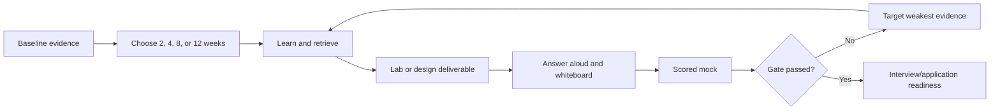

| This system is | This system is not |
|---|---|
| A repeatable evidence and practice workflow | A promise of employment or interview success |
| A transparent guide-specific score | A validated psychometric or scientific instrument |
| A way to expose weak areas early | A mechanism for inflating experience |
| A plan that can be scaled around work | A requirement to study through illness or exhaustion |
| A safety and honesty gate | Authorization to test any production tenant |

## 2. Evidence level: 0 through 7

Use the highest level supported by current, reviewable evidence. Levels are cumulative in capability, but evidence may be domain-specific. You can be Level 6 in SharePoint/OneDrive operational troubleshooting and Level 1 in Sentinel without contradiction.

| Level | Name | Observable capability | Minimum evidence | Interview-safe wording |
|---:|---|---|---|---|
| 0 | Unfamiliar | Cannot yet define the concept accurately | No reliable evidence | “I have not learned this yet.” |
| 1 | Aware | Recognizes the term and basic purpose | Notes or glossary recall | “I am aware of its purpose; I would need to validate details.” |
| 2 | Explain | Explains flow, compares basic options, and names limits | Closed-note answer and simple diagram | “I understand the design concept and can explain the dependencies.” |
| 3 | Lab | Configures or simulates safely and captures repeatable evidence | Lab journal, screenshots/exports/queries, tests, cleanup | “I have implemented and tested this in a controlled lab.” |
| 4 | Diagnose | Isolates realistic failures with discriminating evidence | Troubleshooting drill, timeline, decision tree, corrected result | “I diagnosed this scenario in a lab/exercise; my production experience is adjacent.” |
| 5 | Design | Produces a requirement-led design with tradeoffs, tests, and rollback | HLD/LLD, decision record, test/rollback plan | “I can design the approach and defend the tradeoffs; production ownership remains a gap where applicable.” |
| 6 | Operate | Runs, monitors, tunes, reports, responds, and improves | Runbook, metrics, repeated incidents/operations, handover evidence | “I have operated this in the stated context and can describe failures and improvement.” |
| 7 | Lead | Owns workstream/outcome, reviews others, and guides stakeholders | Leadership evidence, decisions, coaching, outcomes | “I led this scope; here is my personal action, decision, result, and lesson.” |

| Evidence type | Meaning | Strength | Boundary |
|---|---|---|---|
| Production | Performed in an authorized real environment | Strongest evidence for the exact activity | Scope, tenant, role, frequency, and recency still matter. |
| Transferable | Proven adjacent skill that applies to the target activity | Strong evidence for method and learning speed | Does not become direct product experience by analogy. |
| Lab | Performed in controlled practice with retained proof | Strong evidence of hands-on learning and method | Not production scale, politics, consequences, or long-term operation. |
| Conceptual | Can explain accurately and reason through examples | Necessary foundation | Reading/explanation alone is not implementation or diagnosis. |

| Promotion | Required evidence | What does not count |
|---|---|---|
| 0 → 1 | Correct one-sentence purpose and vocabulary | Recognition without accurate meaning |
| 1 → 2 | Closed-note explanation, flow diagram, comparison, limitation | Re-reading highlighted text |
| 2 → 3 | Authorized lab with positive/negative test, cleanup, and evidence | Watching a demo |
| 3 → 4 | Failure injection or scenario diagnosis with a discriminating check | Random clicking until it works |
| 4 → 5 | Client-specific design, alternatives, risk, test, rollback | Feature list presented as architecture |
| 5 → 6 | Repeated operations, health, metrics, incidents, tuning, handover | One successful configuration |
| 6 → 7 | Ownership, stakeholder decisions, quality review, coaching, outcome | Title or attendance without personal contribution |

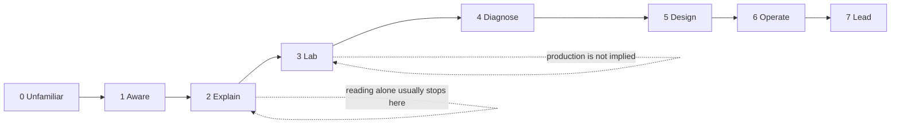

## 3. Personalized baseline self-assessment

The baseline below is conservative. It credits your documented Microsoft 365 escalation, SharePoint/OneDrive, incident, RCA, stakeholder, reporting, mentoring, and Power Platform evidence. It does not grant hands-on security-product levels until you complete and retains the relevant lab or work evidence.

### 3.1 RAG meaning

| Color | Level/evidence interpretation | Action |
|---|---|---|
| Red | 0-2 for a role-critical product, or no usable evidence | Learn fundamentals, answer aloud, then complete the linked lab/design. |
| Amber | 3-4, or strong transferable evidence without direct target-product operation | Strengthen diagnosis, design, tradeoffs, and repeated practice. |
| Green | 5-7 with current, honest, reviewable evidence appropriate to the role | Maintain with current-source checks and challenge scenarios. |
| Gated Red | Any unsafe action, invented claim, missing authorization, or major core-domain blank | Stop score averaging; repair the gate first. |

### 3.2 Major-domain baseline heatmap

| Domain | Weight | Baseline level 0-7 | RAG | Evidence type | Current evidence and boundary | Priority Parts/lab |
|---|---:|---:|---|---|---|---|
| Security foundations and Zero Trust | 5% | 2 | Red | Conceptual/transferable | Security-aligned M365 guidance helps, but formal security design evidence is not established. | P2-P5, P54-P55 |
| Entra identity and access | 12% | 2 | Red | Conceptual/transferable | Active Directory and M365 fundamentals; no documented production Entra/MFA/CA/PIM implementation. | P6-P14, Lab 1 P65 |
| Intune and endpoint security | 10% | 1 | Red | Conceptual | CV does not establish Intune, compliance, Autopilot, endpoint policy, or co-management operation. | P15-P20, Lab 2 P66 |
| Exchange and Teams security | 5% | 1 | Red | Conceptual/adjacent | M365 breadth is useful, but Exchange/Teams security is not documented as primary production ownership. | P21-P23, Lab 3 P67 |
| SharePoint Online and OneDrive security | 5% | 6 | Green | Production | Deep workload, permissions, sharing, sync, migration, incident, and guidance evidence; security controls still need precise scoping. | P24, P27-P30, Lab 3 P67 |
| Purview data security/compliance | 10% | 1 | Red | Conceptual/adjacent | Content/compliance context transfers; no named Purview production implementation. | P26-P33, Lab 4 P68 |
| Defender suite and XDR | 12% | 1 | Red | Conceptual | No documented Defender Endpoint/Identity/Cloud Apps/XDR production ownership. | P34-P42, Lab 5 P69 |
| Sentinel, KQL, SIEM, and SOAR | 12% | 0 | Red | Unfamiliar at evidence baseline | No established Sentinel/KQL production or completed-lab evidence. | P43-P52, Lab 6 P70 |
| Consulting discovery, assessment, and design | 10% | 3 | Amber | Transferable | Advisory, escalation strategy, risk mitigation, reviews, and stakeholder work transfer; formal cyber consulting artifacts remain to prove. | P53-P57, Capstone P71 |
| Deployment, migration, testing, and operations | 6% | 4 | Amber | Production/transferable | Strong incident/fix validation/vendor coordination; security platform deployment lifecycle needs domain evidence. | P57-P63, Labs P65-P70 |
| Troubleshooting, incident, and on-call | 6% | 6 | Green | Production | Critical incidents, RCA, escalation, fix validation, multi-party coordination, and handover are strong. | P60-P62, F, P69-P70 |
| Documentation, automation, and quality | 3% | 5 | Green | Production/transferable | KBs, guides, Power Automate/Apps/Copilot Studio, reporting, and mentoring; security automation guardrails need proof. | P50, P63, D-E |
| Communication, leadership, and behavioral | 2% | 6 | Green | Production | Business reviews, KPIs, stakeholder coordination, mentoring, and leadership examples are documented. | P1, P53, P59, P74 |
| Lab/evidence portfolio completeness | 2% | 0 | Red | None assumed | Lab chapters exist, but completion cannot be inferred. | P64-P71 |

### 3.3 Baseline interpretation

| Signal | What it says | What to do |
|---|---|---|
| Green in workload operations | You have a credible production anchor. | Lead with SharePoint/OneDrive and escalation evidence; do not hide it. |
| Green in troubleshooting/communication | The consulting method is learnable from existing strengths. | Translate evidence into discovery, risk, design, handover, and executive outcomes. |
| Red across security products | Product breadth is not yet evidenced. | Use the lab sequence and answer-aloud practice; never substitute chapter completion. |
| Amber in consulting/deployment | Adjacent experience is meaningful but needs artifacts. | Complete capstone assessment, HLD, roadmap, test plan, runbook, and executive brief. |
| Red lab portfolio | Readiness cannot pass the hands-on gate. | Complete at least the role-critical safe labs and retain sanitized proof. |

## 4. Weighted JD readiness score

The score measures guide-specific evidence coverage, not intelligence, potential, job probability, or human worth. It is deliberately demanding because the target is a senior consultant role with broad Microsoft security responsibilities.

Let domain $i$ have weight $w_i$ as a percentage and evidence level $l_i$ from 0 to 7. The raw evidence score is:

$$
S_{raw}=\sum_{i=1}^{n} w_i\left(\frac{l_i}{7}\right), \qquad \sum_{i=1}^{n}w_i=100
$$

The score is rounded to one decimal place. Gates are applied separately; a high arithmetic score cannot cancel an honesty or safety failure.

| Domain group | Weight | Baseline level | Contribution $w_i(l_i/7)$ |
|---|---:|---:|---:|
| Security foundations | 5 | 2 | 1.43 |
| Entra | 12 | 2 | 3.43 |
| Intune | 10 | 1 | 1.43 |
| Exchange/Teams | 5 | 1 | 0.71 |
| SharePoint/OneDrive | 5 | 6 | 4.29 |
| Purview | 10 | 1 | 1.43 |
| Defender/XDR | 12 | 1 | 1.71 |
| Sentinel/KQL/SOAR | 12 | 0 | 0.00 |
| Consulting | 10 | 3 | 4.29 |
| Deployment/operations | 6 | 4 | 3.43 |
| Troubleshooting/on-call | 6 | 6 | 5.14 |
| Documentation/automation | 3 | 5 | 2.14 |
| Communication/behavioral | 2 | 6 | 1.71 |
| Lab portfolio | 2 | 0 | 0.00 |
| **Baseline raw score** | **100** |  | **31.1 / 100** |

> The arithmetic baseline is **31.1%** after summing the unrounded domain contributions and rounding the total to one decimal place. It is not a rejection prediction. It says that several high-weight product domains currently have conceptual rather than hands-on/operational evidence, while your strongest production capabilities sit in transferable troubleshooting, collaboration workload depth, communication, and operations.

| Raw score band | Guide-specific interpretation | Gate requirement |
|---:|---|---|
| 0-49.9 | Foundation/evidence build | Do not market as broadly ready; pursue targeted learning and labs. |
| 50.0-64.9 | Developing interview coverage | May attempt exploratory conversations with explicit gaps; continue building. |
| 65.0-74.9 | Credible but uneven | Mock performance and core-domain evidence determine whether to proceed. |
| 75.0-84.9 | Guide-ready range | All eight gates must pass; no red core domain. |
| 85.0-100 | Strong guide evidence | Still not a guarantee; current sources and honest scope remain mandatory. |

| Caveat | Consequence |
|---|---|
| Level estimates are self-assessed | Use mocks, lab artifacts, and an external reviewer to calibrate. |
| Domain weights reflect this guide's JD reading | A real interview panel can weight domains differently. |
| One level can hide uneven subskills | Keep subdomain heatmaps and question results. |
| Production context varies | Operating SharePoint does not automatically transfer level 6 to Purview or Sentinel. |
| Certifications are not separate score multipliers | They support knowledge but do not replace evidence. |
| Gates override averages | Any invented claim or unsafe scenario answer blocks readiness. |

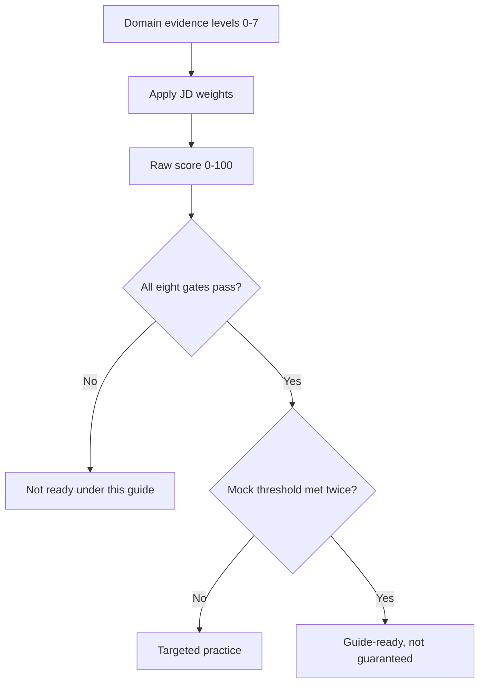

## 5. Evidence inventory and gap map

### 5.1 Production evidence inventory

| Evidence anchor | Target-role value | Domains supported | Proof to prepare | Boundary statement |
|---|---|---|---|---|
| 5+ years enterprise support/escalation | Accountability, technical depth, ambiguity handling | Troubleshooting, operations, consulting communication | Sanitized incident timeline and personal actions | Does not prove production ownership of each security product. |
| SharePoint Online and OneDrive depth | Strong M365 workload anchor | Permissions, sharing, sync, migration, data/security context | Two architecture/troubleshooting examples | Workload depth is not identical to Purview/Defender experience. |
| Critical incidents and RCA | Incident leadership and evidence discipline | IR, on-call, service disruption, stakeholder cadence | STAR story with scope, hypotheses, evidence, result | Distinguish security incident from service/technical incident. |
| Fix validation and product-group coordination | Engineering rigor and cross-team delivery | Testing, defect escalation, rollback, vendor boundaries | Example of discriminating test and verified fix | Do not disclose customer or internal confidential detail. |
| Architecture guidance and risk mitigation | Advisory foundation | Discovery, design, tradeoffs, client communication | Decision example with alternatives and limitation | Avoid relabeling support guidance as formal cyber architecture. |
| Business reviews, CSAT, backlog, trends | Executive communication and operational measurement | Consulting reporting, KPIs, service improvement | One-page executive update sample | Translate service metrics into risk/outcome without inventing numbers. |
| KBs and troubleshooting guides | Documentation and knowledge transfer | Runbooks, handover, quality, repeatability | Sanitized guide/runbook outline | Existing documents may be proprietary; recreate a safe sample. |
| Mentoring and onboarding | Workstream leadership and capability building | Leadership, handover, team quality | STAR story with personal method and result | State team size/scope only if verified. |
| Power Automate, Power Apps, Copilot Studio | Automation and adoption foundation | SOAR concepts, workflows, governance, AI | Safe automation example and control analysis | Not equivalent to Logic Apps/Sentinel production SOAR. |

### 5.2 Transferable evidence inventory

| Existing capability | Transfer target | Bridge exercise | Completion evidence |
|---|---|---|---|
| Layered M365 troubleshooting | Entra/Intune/Defender/Sentinel diagnosis | Re-run one scenario per domain using evidence ladders | Four decision trees and spoken answers. |
| Support case scoping | Consulting discovery | Turn a case intake into stakeholders, scope, assumptions, evidence request | Discovery pack from P53/E. |
| RCA and fix validation | Security incident/PIR | Map timeline, attack path, containment, root cause, corrective controls | PIR from P61/F. |
| Cross-team escalation | Multi-vendor security transformation | Define ownership boundaries, dependencies, escalation evidence | RAID/RACI/vendor pack. |
| Workload permissions knowledge | Zero Trust/Purview/Copilot oversharing | Draw identity → access → data → detection flow | Whiteboard plus Lab 3/4 evidence. |
| Customer architecture advice | HLD/LLD and roadmap | Convert advice into requirements, decisions, tests, rollback | Capstone design set. |
| Operational metrics | Security posture/SOC metrics | Create outcome/KPI definitions and limitations | Executive dashboard specification. |
| Power Platform automation | Sentinel playbook engineering | Design approval-based enrichment/containment with managed identity | Lab 6 playbook evidence. |
| Mentoring | Consultant workstream leadership | Review a lab/design with rubric and record feedback | Peer/mock review note. |

### 5.3 Planned lab evidence inventory

No row is marked complete by default.

| Lab | Required artifact | Minimum test evidence | Cleanup/cost evidence | Evidence label after completion |
|---|---|---|---|---|
| [Lab 0, Part 64](Part-64-lab-safe-microsoft-security-environment.md) | Tenant/subscription plan, personas, naming, authorization | Access and boundary checks | Budget, resource inventory, cleanup plan | Lab |
| [Lab 1, Part 65](Part-65-lab-entra-zero-trust-baseline.md) | CA/PIM/emergency-access design and result pack | Positive, negative, report-only, What If, sign-in log | Test accounts/groups and policy cleanup | Lab; diagnose if failure drill completed |
| [Lab 2, Part 66](Part-66-lab-intune-endpoint-security.md) | Enrollment/compliance/security baseline report | Policy assignment, compliance, CA, conflict/failure test | Device retire/wipe decision and assignment cleanup | Lab; diagnose with logs/failure injection |
| [Lab 3, Part 67](Part-67-lab-secure-m365-workloads.md) | Workload health-check and control design | Mail/sharing/guest/unmanaged/label/DLP cases | Test content, users, policies, and domains cleanup | Lab; design if tradeoffs defended |
| [Lab 4, Part 68](Part-68-lab-purview-data-security-compliance.md) | Classification, label, DLP, audit/eDiscovery evidence | Simulation, match/nonmatch, audit search, privacy-safe workflow | Test data/case/policy cleanup or retention note | Lab; diagnose after tuning exercise |
| [Lab 5, Part 69](Part-69-lab-defender-xdr-incident-investigation.md) | Incident timeline, entities, KQL, containment decision, MITRE map | Benign/malicious hypotheses, scope, response, closure | Restore/release actions and artifact sanitation | Lab; diagnose after independent investigation |
| [Lab 6, Part 70](Part-70-lab-sentinel-siem-soar.md) | Workspace/data/KQL/detection/workbook/playbook pack | Ingestion, false positive, entity mapping, failure/retry/approval | Ingestion/execution cost and full resource cleanup | Lab; design after defended architecture |
| [Capstone, Part 71](Part-71-capstone-deloitte-m365-security-transformation.md) | Assessment, risk register, HLD/LLD, roadmap, test, runbook, executive brief | Challenge review and traceability | Fictional data only; no tenant residue | Transferable design evidence, not production |

### 5.4 Conceptual evidence inventory

| Domain | Conceptual minimum | Closed-note proof | Upgrade path |
|---|---|---|---|
| Foundations | CIA, risk, control, Zero Trust, shared responsibility | 90-second explanation and control example | Threat model and assessment. |
| Entra | Token → CA → session → logs; MFA/PIM/governance | Draw access flow and troubleshoot one denial | Lab 1. |
| Intune | Enrollment → config → compliance → CA → reporting | Draw authority/effective-state flow | Lab 2. |
| Workloads | Identity, permissions, policy, data, audit dependencies | Compare Exchange/Teams/SPO controls | Lab 3. |
| Purview | Discover → classify → protect → retain → investigate | Draw data lifecycle and policy boundaries | Lab 4. |
| Defender | Signal → alert → incident → evidence → response | Explain attack story and containment tradeoff | Lab 5. |
| Sentinel | Source → connector → table → KQL → rule → incident → playbook | Draw pipeline and write three queries | Lab 6. |
| Consulting | Discover → assess → design → deploy → handover | Give structured case opening and deliverable chain | Capstone. |

### 5.5 Prioritized gaps

| Priority | Gap | Why material | Dependency | Closure evidence | Interview wording until closed |
|---:|---|---|---|---|---|
| 1 | Sentinel/KQL/SOAR evidence | High JD weight and baseline Level 0 | P43-P50; safe lab | Lab 6 queries, detection, workbook, playbook, cost/cleanup | “This is a current learning priority; I will not claim production Sentinel operations.” |
| 2 | Defender/XDR evidence | Core cross-domain incident responsibility | Foundations, workloads | Lab 5 timeline, query, containment, closure | “I can explain the method; hands-on evidence is lab-based after completion.” |
| 3 | Entra/Conditional Access/PIM | Cloud security control plane | P6-P8 before P9-P11 | Lab 1 policies, logs, emergency access, rollback | “My identity production experience is adjacent; implementation evidence is lab.” |
| 4 | Intune/endpoint | Device trust is central to Zero Trust | Entra device identity/CA | Lab 2 enrollment, compliance, policy, diagnosis | “I have not operated Intune in production.” |
| 5 | Purview | Data security/compliance is broad JD surface | Workload/data fundamentals | Lab 4 taxonomy, DLP simulation, audit/eDiscovery | “My content background transfers; Purview evidence is controlled practice.” |
| 6 | Exchange/Teams breadth | M365 consultant must cover workloads beyond SPO/OneDrive | Entra/external identities | Lab 3 health check and tests | “SPO/OneDrive are direct; Exchange/Teams are broadened through study and lab.” |
| 7 | Formal consulting artifacts | Senior consultant must produce decision-ready deliverables | Product foundations and labs | Capstone assessment, HLD/LLD, roadmap, runbook, executive brief | “My advisory work transfers; formal security-consulting artifacts are demonstrated in a fictional capstone.” |
| 8 | Certification currency | Useful signal and structured coverage, not proof | Domain knowledge first | Current objective plan and passed exam if pursued | “Certification supports study; it does not replace hands-on evidence.” |
| 9 | Behavioral verification | Strong stories can fail if numbers/details are uncertain | Personal records and Part 74 | Five verified STAR cards with boundaries | “I will use only details I can personally verify.” |
| 10 | Repeated mock performance | Knowledge must survive pressure and follow-ups | Answers, labs, stories | Two passing mixed mocks on separate days | “Readiness is based on demonstrated practice, not reading completion.” |

### 5.6 Dependency order

| Before | Then | Reason |
|---|---|---|
| P2-P5 foundations | P6-P14 Entra | Identity/security vocabulary makes policy flow understandable. |
| P6-P9 Entra | P15-P20 Intune | Device identity and CA are required for compliance-based access. |
| P6-P14 identity | P21-P25 workloads | Workloads depend on identity, external access, apps, and tokens. |
| P21-P25 workloads | P26-P33 Purview | Data protection behavior depends on workload locations and permissions. |
| P2-P5 plus workloads | P34-P42 Defender | Detection and incident stories need entities and attack paths. |
| P34-P42 plus KQL basics | P43-P52 Sentinel | SIEM architecture and unified SecOps are easier after XDR boundaries. |
| P53-P63 consulting/operations | P71 capstone | Artifacts, deployment, handover, and communication are prerequisites. |
| Lab 0 | Labs 1-6 | Authorization, personas, cost, naming, and cleanup precede configuration. |
| Labs 1-6 | Capstone defense | Designs become credible when grounded in observed behavior. |
| Part 73 practice | Part 74 final rehearsal | Technical confidence supports concise behavioral/closing delivery. |

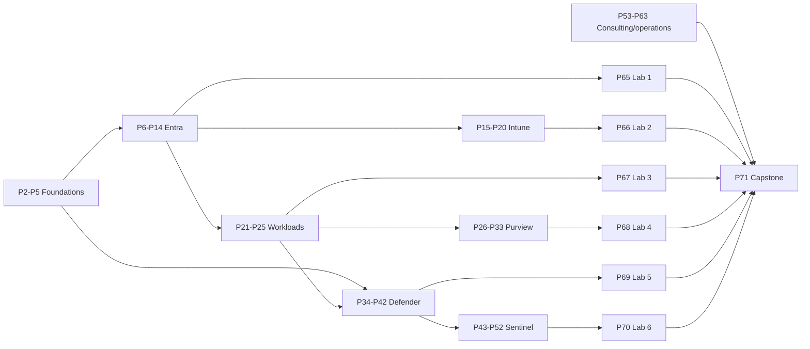

## 6. Path selection, time budget, and catch-up rules

| Path | Use when | Estimated total | Typical weekday | Typical weekend | Tradeoff |
|---|---|---:|---:|---:|---|
| 2-week emergency | Interview is imminent | 30-42 hours | 2-2.5 h | 4-5 h | Coverage and answer survival; several labs may be design/demo evidence rather than full mastery. |
| 4-week focused | One month is available | 55-75 hours | 1.5-2 h | 4-6 h | Role-critical labs and mocks, limited repetition. |
| 8-week balanced | Sustainable default | 90-125 hours | 1-1.5 h | 4-6 h | Full theory/lab/capstone cycle with spaced recall. |
| 12-week mastery | Broad evidence and certification alignment | 140-190 hours | 1-1.5 h | 5-7 h | Repeated diagnosis/design/operation practice and stronger portfolio. |

| Constraint | Adjustment | Non-negotiable |
|---|---|---|
| Only 30 minutes available | Definition recall, one diagram, two questions aloud | Record misses and next review. |
| No lab license/access | Complete design-only fallback and state limitation | Never claim configuration evidence. |
| Heavy on-call/work week | Keep one retrieval block, move lab to catch-up week | Do not operate a lab while dangerously fatigued. |
| Topic already Green | Run closed-note challenge, then reallocate time | Source currency and honesty still checked. |
| Topic remains Red after two sessions | Reduce scope to prerequisite; use one discriminating exercise | Do not reread the whole guide without retrieval. |
| Interview date moves | Switch path at the next week boundary | Preserve completed evidence and spaced reviews. |

| Catch-up rule | Trigger | Action |
|---|---|---|
| One-block slip | Missed one weekday | Use next catch-up block; do not double the next session. |
| Two-block slip | Missed two sessions in a week | Drop optional deep dive; keep core Parts, questions, and deliverable. |
| Lab blocked | License, tenant, device, or cost unavailable | Produce design/test/rollback pack; reschedule hands-on; label conceptual/design. |
| Fatigue | Recall collapses, errors rise, or unsafe judgment appears | Stop, sleep/rest, resume with a short baseline quiz. |
| Repeated miss | Same concept fails at Day 1/3/7 | Return to exact subsection/source, redraw, explain, vary scenario. |
| Schedule overload | More than 20% rolls forward | Extend path or reduce noncritical breadth; do not erase rest. |

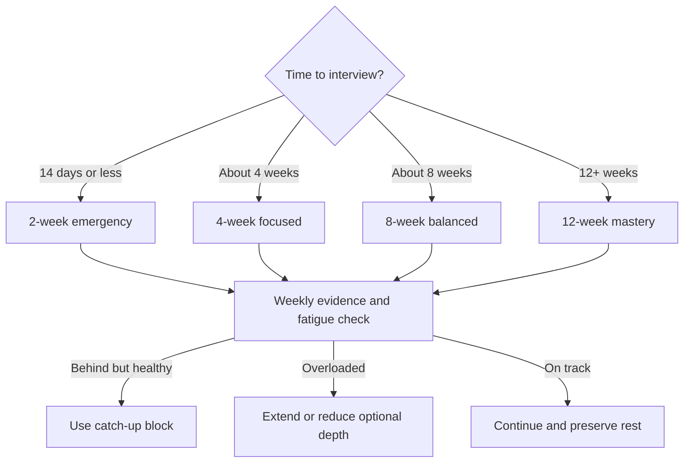

## 7. Two-week emergency path

**Goal:** Never go blank on role-critical fundamentals, present your strengths honestly, complete a small defensible evidence set, and survive layered follow-up questions. This path does not create senior-level mastery in two weeks. Use design-only fallbacks when lab access is unavailable; never compress authorization, cleanup, or high-impact response actions.

### 7.1 Days 1-7

| Day | Time | Parts/lab | Exact question assignment | Answer-aloud/diagram | Deliverable | Dependency |
|---:|---:|---|---|---|---|---|
| 1 | 2.5 h | P1-P5 | Q001-Q005, Q096, Q181, Q196 | 90-second “tell me about yourself”; draw access/attack/consulting flows | One-page role map and honest evidence labels | None |
| 2 | 2.5 h | P6-P9 | Q006-Q009, Q078-Q081, Q097-Q099 | Draw token → CA → resource → sign-in log; explain one lockout-safe rollout | Lab 1 design/test matrix draft | P2-P5 |
| 3 | 2.5 h | P10-P14 | Q010-Q014, Q082-Q083, Q100-Q101 | Explain risk, PIM, JML, hybrid, B2B, workload identity | Identity comparison sheet and one diagnosis tree | Day 2 |
| 4 | 2.5 h | P15-P20 | Q015-Q020, Q084-Q088, Q102 | Draw enrollment → policy → compliance → CA; diagnose Not compliant | Lab 2 design and log-source map | Entra device/CA |
| 5 | 2.5 h | P21-P25 | Q021-Q025, Q089-Q090, Q103-Q104 | Explain mail authentication; compare Teams guest/external; draw SPO sharing flow | M365 workload health-check page | Identity/external access |
| 6 | 4 h | P26-P33; Lab 4 design fallback | Q026-Q033, Q091, Q155-Q157, Q105 | Draw discover → classify → protect → retain → investigate | Label/DLP simulation plan and privacy boundary | Workload/data flow |
| 7 | 1-2 h or rest | Catch-up; P73 red questions only | Reattempt all Red questions from Days 1-6 | Five 30-second definitions; no new content if fatigued | Updated RAG sheet and next-week priorities | Recovery |

### 7.2 Days 8-14

| Day | Time | Parts/lab | Exact question assignment | Answer-aloud/diagram | Deliverable | Dependency |
|---:|---:|---|---|---|---|---|
| 8 | 3 h | P34-P42; Lab 5 design | Q034-Q042, Q092-Q094, Q121-Q125, Q141-Q147 | Draw phishing → identity → endpoint → XDR incident; choose containment | Incident timeline and evidence/response table | Foundations/workloads |
| 9 | 4 h | P43-P50; Lab 6 safe KQL | Q043-Q050, Q095, Q106-Q110, Q148-Q152 | Draw source → DCR/table → KQL → rule → incident → playbook; speak three queries | Five KQL queries plus one detection/playbook design | Defender concepts; lab safety |
| 10 | 2.5 h | P51-P52, P60-P62 | Q051-Q052, Q126-Q130, Q158-Q161 | Explain XDR vs SIEM, multi-workspace, incident/on-call handoff | 15/30/60 incident plan and shift handoff | Days 8-9 |
| 11 | 3 h | P53-P59, P63 | Q131-Q140, Q162-Q165 | Run 10-minute discovery opening; explain finding → risk → recommendation | Discovery questions, risk, roadmap, RACI, executive update | Product basics |
| 12 | 4-5 h | P64-P71; one feasible lab slice | Q166-Q180 | Defend a fictional target architecture in 8 minutes | Mini-capstone: assessment, diagram, 90-day roadmap, test/rollback | Lab 0 safety |
| 13 | 3 h | P72-P74 | Q173-Q180, Q181-Q205 | Five verified STAR stories; why move/company/you; gap answer | Story cards, closing, questions, current-facts sheet | Personal verification |
| 14 | 2-3 h | Full mixed mock; Part 74 night-before | 20 random questions: 3 Basic, 3 Intermediate, 8 Advanced, 3 Behavioral, 3 Closing | 45-minute mock plus 10-minute whiteboard; stop heavy study after debrief | Mock score, three repair notes, interview setup | All prior days |

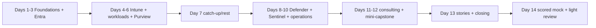

### 7.3 Emergency-path deliverables

| Deliverable | Minimum acceptable evidence | Timebox | Skip? |
|---|---|---:|---:|
| Honest evidence map | Every likely claim labeled production/transferable/lab/conceptual | 30 min | No |
| Three core diagrams | Access, attack/XDR, Sentinel/SOAR from memory | 45 min | No |
| KQL starter set | Five queries explained aloud; source/table/time/filter/result | 90 min | No for Sentinel role coverage |
| Mini-capstone | Current state, three risks, target diagram, roadmap, tests, handover | 3 h | No |
| Five STAR cards | Verified situation/task/actions/result/reflection/boundary | 2 h | No |
| One mixed mock | Scored with honesty and safety gates | 60 min | No |
| Full labs | Complete only when access/time/safety permit | Variable | Yes; use labeled design fallback |
| Deep certification study | Objective recheck and future plan only | 30 min | Yes |

## 8. Four-week focused path

**Goal:** Reach credible broad interview coverage, complete role-critical lab slices, produce a capstone pack, attempt all 205 questions at least once, and run three scored mocks. Six study blocks plus one rest/catch-up block are shown each week. Weekday blocks are 75-120 minutes; lab blocks are 3-5 hours.

### 8.1 Week 1: foundations and Entra

| Day | Assignment | Questions | Practice/deliverable | Hours |
|---:|---|---|---|---:|
| 1 | P1-P3 | Q001-Q003, Q096, Q181, Q196 | Candidate story, Zero Trust diagram, evidence labels | 1.5 |
| 2 | P4-P5 | Q004-Q005, Q076-Q077, Q097 | Tenant/protocol map and troubleshooting ladder | 1.5 |
| 3 | P6-P8 | Q006-Q008, Q078-Q079 | Token and authentication-strength diagrams aloud | 2 |
| 4 | P9-P10 | Q009-Q010, Q080-Q083 | CA design, report-only, sign-in diagnosis | 2 |
| 5 | P11-P14 | Q011-Q014, Q098-Q101 | PIM/JML/hybrid/external/app identity comparison | 2 |
| 6 | P64-P65 Lab 0/1 | Q153-Q154, Q166 | Safe lab slice or full design fallback; evidence journal | 4-5 |
| 7 | Rest/catch-up | Reattempt Week 1 Reds | 20-minute recall only if resting | 0-1 |

### 8.2 Week 2: endpoint, workloads, and Purview

| Day | Assignment | Questions | Practice/deliverable | Hours |
|---:|---|---|---|---:|
| 8 | P15-P17 | Q015-Q017, Q084-Q086, Q102 | Enrollment/compliance/CA diagram | 2 |
| 9 | P18-P20 | Q018-Q020, Q087-Q088 | Autopilot/update/lifecycle/co-management diagnosis | 2 |
| 10 | P21-P22 | Q021-Q022, Q089, Q103 | Mail flow/SPF-DKIM-DMARC/MDO answer | 1.5 |
| 11 | P23-P25 | Q023-Q025, Q090, Q104 | Teams/SPO/OneDrive/Power/Copilot boundary | 2 |
| 12 | P26-P29 | Q026-Q029, Q091, Q105 | Classification/label/DLP/retention flow | 2 |
| 13 | P30-P33; one Lab 2-4 slice | Q030-Q033, Q155-Q157, Q167-Q169 | Audit/eDiscovery/privacy/DSPM exercise and lab evidence | 4-5 |
| 14 | Rest/catch-up | Week 2 Reds plus Week 1 Day-7 review | Diagram redraw without notes | 0-1 |

### 8.3 Week 3: Defender, Sentinel, and incident operations

| Day | Assignment | Questions | Practice/deliverable | Hours |
|---:|---|---|---|---:|
| 15 | P34-P37 | Q034-Q037, Q092-Q093, Q121 | XDR architecture and product-boundary map | 2 |
| 16 | P38-P42 | Q038-Q042, Q094, Q122-Q125, Q141-Q147 | Incident triage, hunting, exposure, Copilot validation | 2.5 |
| 17 | P43-P46 | Q043-Q046, Q095, Q106-Q108, Q148 | Sentinel architecture and five KQL queries | 2.5 |
| 18 | P47-P50 | Q047-Q050, Q109-Q110, Q149-Q152 | Detection tuning, UEBA/TI, hunt, SOAR design | 2.5 |
| 19 | P51-P52, P60-P62 | Q051-Q052, Q126-Q130, Q158-Q161 | Unified SecOps, enterprise topology, incident/on-call drill | 2 |
| 20 | Lab 5 or 6 role-critical slice | Q170-Q172, Q176-Q178 | Incident or Sentinel evidence pack with cleanup/cost | 5 |
| 21 | Rest/catch-up | Week 3 Reds; mixed Q001-Q052 sample | No new content | 0-1 |

### 8.4 Week 4: consulting, capstone, and interview performance

| Day | Assignment | Questions | Practice/deliverable | Hours |
|---:|---|---|---|---:|
| 22 | P53-P56 | Q131-Q135, Q162-Q164 | Discovery, assessment, HLD/LLD, roadmap case | 2 |
| 23 | P57-P59, P63 | Q111-Q120, Q136-Q140, Q165 | Migration, deployment, RACI/runbook, quality answer | 2.5 |
| 24 | P71 capstone build | Q173-Q175, Q179-Q180 | Assessment, risks, target diagram, roadmap | 3 |
| 25 | P71 capstone defense | Q096-Q110 changed constraints | Whiteboard, tests, rollback, handover, executive summary | 2.5 |
| 26 | P72-P74 | Q181-Q205 | Five STARs, gap answer, why/closing, current source check | 2.5 |
| 27 | Mock 1 technical + Mock 2 consulting/behavioral | Random Q001-Q205 | Two scorecards and repair list | 3 |
| 28 | Rest; Mock 3 only if recovered | Weak questions only | Final mock or light night-before review | 1-2 |

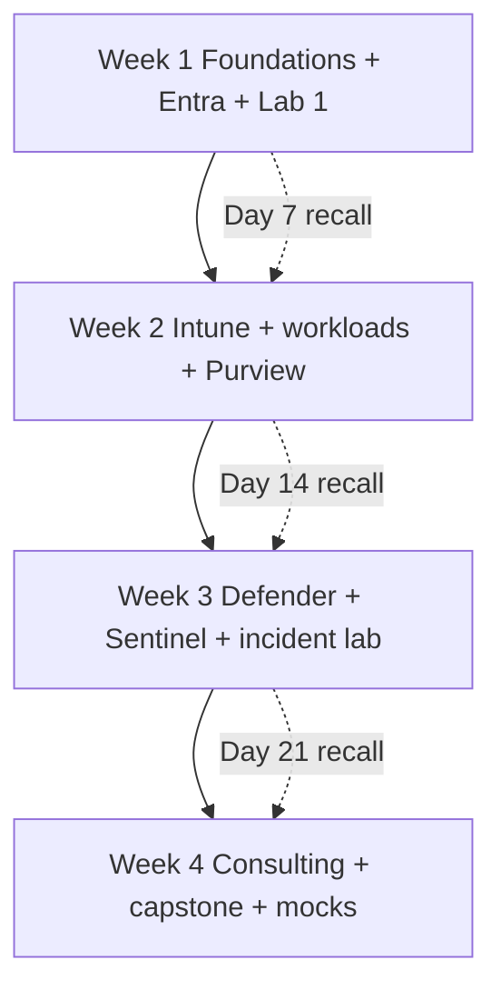

### 8.5 Four-week deliverable gate

| Evidence set | Required by end | Pass condition |
|---|---:|---|
| 205-question first pass | Day 26 | Every Q001-Q205 attempted and R/A/G recorded. |
| Identity/endpoint/data/incident/Sentinel diagrams | Day 25 | Drawn from memory and defended under one changed constraint. |
| At least two hands-on lab slices | Day 20 | Authorized, tested, journaled, sanitized, and cleaned up. |
| Mini-capstone pack | Day 25 | Finding → risk → recommendation → design → test → owner traceability. |
| Five verified STAR stories | Day 26 | Personal actions/results/boundaries can survive follow-up. |
| Three mock rounds | Day 28 | At least two passing or a documented extension decision. |

## 9. Eight-week balanced path

**Goal:** Complete the full learning sequence with all seven labs/capstone artifacts, three passes through core questions, spaced recall, four mock rounds, and one source-current review. The path uses a weekly spiral: understand, retrieve, apply, diagnose, communicate, then rest/catch up.

### 9.1 Weekly schedule with daily assignments

| Week | Day 1 | Day 2 | Day 3 | Day 4 | Day 5 | Day 6 lab/deliverable | Day 7 |
|---:|---|---|---|---|---|---|---|
| 1 | P1-P2; Q001-Q002, Q181 | P3; Q003, Q096 | P4; Q004, Q076 | P5; Q005, Q077 | P53 intro; Q131 | P64 Lab 0; role/evidence map | Rest + Day-1 recall |
| 2 | P6-P7; Q006-Q007 | P8; Q008, Q078 | P9; Q009, Q079-Q081 | P10-P11; Q010-Q011, Q082 | P12-P14; Q012-Q014, Q083 | P65 Lab 1; identity evidence | Rest + Week-1/2 mixed recall |
| 3 | P15-P16; Q015-Q016 | P17; Q017, Q084-Q086 | P18; Q018, Q087 | P19; Q019, Q088 | P20; Q020, Q102 | P66 Lab 2; endpoint evidence | Rest + CA/Intune redraw |
| 4 | P21-P22; Q021-Q022, Q089 | P23; Q023, Q090 | P24; Q024 | P25; Q025 | P26-P29; Q026-Q029 | P67 Lab 3; workload evidence | Rest + Q001-Q090 sample |
| 5 | P30; Q030-Q031 | P31-P33; Q032-Q033, Q155-Q157 | P34-P36; Q034-Q036, Q092 | P37-P39; Q037-Q039, Q093-Q094 | P40-P42; Q040-Q042, Q141-Q147 | P68 Lab 4; data evidence | Rest + Purview/XDR redraw |
| 6 | P43-P44; Q043-Q044 | P45-P46; Q045-Q046, Q095 | P47-P48; Q047-Q048 | P49-P50; Q049-Q050, Q148-Q152 | P51-P52; Q051-Q052 | P69 Lab 5; XDR incident evidence | Rest + incident mock |
| 7 | P53-P55; Q131-Q134 | P56-P58; Q111-Q120, Q135-Q137 | P59-P61; Q126-Q130, Q138 | P62-P63; Q139-Q140, Q158-Q165 | P72; Q173-Q180 | P70 Lab 6; Sentinel evidence | Rest + source recheck |
| 8 | P71 capstone assessment | P71 design/roadmap | P71 test/runbook/executive brief | P73 Q001-Q180 red/amber pass | P74 Q181-Q205 and stories | Capstone defense + full mock | Rest/night-before only |

### 9.2 Daily block pattern

| Block | Weekday minutes | Lab-day minutes | Method | Output |
|---|---:|---:|---|---|
| Retrieval warm-up | 10 | 15 | Yesterday/Day-3/Day-7 questions closed-note | Confidence and miss list. |
| Learn | 25-35 | 30 | Read assigned Part selectively | Three concepts and one limitation. |
| Draw/compare | 10-15 | 20 | Diagram or decision table from memory | Photograph/file without sensitive data. |
| Answer aloud | 15-20 | 20 | Assigned questions with timer/follow-up | Score and correction. |
| Apply | 10-20 | 120-240 | Scenario, KQL, lab, design, or artifact | Evidence journal/deliverable. |
| Close | 5 | 15 | Next review date, cleanup/cost, source flag | Updated tracker. |

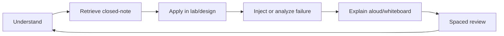

### 9.3 Eight-week deliverables

| Week | Portfolio addition | Spoken proof | Gate checked |
|---:|---|---|---|
| 1 | Lab safety/authorization/cost pack and evidence baseline | Role story and three security flows | Honesty, safety |
| 2 | Identity baseline and test matrix | CA/PIM/hybrid/external scenario | Knowledge, lab |
| 3 | Endpoint policy/effective-state pack | Intune diagnosis and rollout | Troubleshooting, safety |
| 4 | M365 workload health-check | Cross-workload access/data flow | Knowledge, architecture |
| 5 | Purview design plus XDR attack map | Privacy-safe DLP/investigation and XDR triage | Lab, troubleshooting |
| 6 | Defender XDR incident pack | Incident prioritization/containment | Troubleshooting, honesty |
| 7 | Sentinel SIEM/SOAR pack and consulting templates | KQL/detection/SOAR plus discovery | Lab, consulting |
| 8 | Capstone and mock results | 10-minute defense and executive close | All gates |

## 10. Twelve-week mastery path

**Goal:** Move beyond broad interview coverage into repeated diagnosis, design, operation simulation, source currency, certification planning, and leadership-level communication. This path still cannot manufacture production tenure; it creates a stronger lab and transferable portfolio.

### 10.1 Weekly schedule with day pattern

| Week | Domain and Parts | Mon | Tue | Wed | Thu | Fri | Sat | Sun |
|---:|---|---|---|---|---|---|---|---|
| 1 | Role/foundations P1-P3 | Concepts Q001-Q003 | Zero Trust redraw | Threat/control scenario | Answer aloud Q096/Q181 | Source check | Assessment mini-case | Rest |
| 2 | Tenant/protocols P4-P5, P53 | Tenant map | OAuth/network flows | Troubleshooting drill Q076-Q077 | Discovery opening Q131 | Review | P64 Lab 0 and evidence system | Rest |
| 3 | Entra core P6-P10 | Objects/tokens | MFA/passwordless | CA design | Risk diagnosis Q078-Q083 | Review | P65 Lab 1 build | Rest |
| 4 | Entra governance/hybrid/external P11-P14 | PIM/RBAC | JML/access reviews | Connect/Cloud Sync | B2B/app/workload identity | Review | Lab 1 failures and design defense | Rest |
| 5 | Intune P15-P20 | Enrollment/MAM | Configuration/baselines | Compliance/CA | Apps/Autopilot/update | Endpoint/co-management | P66 Lab 2 | Rest |
| 6 | Workloads P21-P25 | Exchange/mail auth | MDO | Teams | SPO/OneDrive | Apps/Power/Copilot | P67 Lab 3 | Rest |
| 7 | Purview P26-P33 | Classification/labels | DLP | Retention/records | Audit/eDiscovery | Insider/privacy/DSPM AI | P68 Lab 4 | Rest |
| 8 | Defender P34-P42 | XDR/Endpoint | Identity/Cloud Apps | MDO SecOps | Incident/AIR | Hunting/exposure/Copilot | P69 Lab 5 | Rest |
| 9 | Sentinel P43-P46 | Architecture/workspaces | Cost/retention | Connectors/DCR/ASIM | KQL operators | Timed KQL | P70 Lab 6 build | Rest |
| 10 | Sentinel P47-P52 | Analytics/entities | UEBA/TI | Hunting/workbooks | Automation/playbooks | Unified/multitenant | Lab 6 failure/cost/defense | Rest |
| 11 | Consulting/operations P53-P63 | Discovery/assessment | Threat model/HLD/LLD | Licensing/roadmap/migration | Deployment/operating model | Troubleshooting/IR/on-call | P71 capstone build | Rest |
| 12 | Interview/cert/current P72-P74 | 205-question red pass | STAR/closing | Capstone defense | Technical mock | Consulting mock | Full panel mock/source recheck | Rest/night-before |

### 10.2 Question progression by week

| Week | First-pass assignment | Scenario assignment | Review assignment |
|---:|---|---|---|
| 1 | Q001-Q003 | Q096, Q181 | Day 1/3/7 recall |
| 2 | Q004-Q005 | Q076-Q077, Q131 | Week 1 Reds |
| 3 | Q006-Q010 | Q078-Q083, Q097-Q099 | Q001-Q010 mixed |
| 4 | Q011-Q014 | Q100-Q101, Q153-Q154 | Identity Reds |
| 5 | Q015-Q020 | Q084-Q088, Q102 | Q006-Q020 mixed |
| 6 | Q021-Q025 | Q089-Q090, Q103-Q104 | Q001-Q025 mixed |
| 7 | Q026-Q033 | Q091, Q105, Q155-Q157 | Q021-Q033 mixed |
| 8 | Q034-Q042 | Q092-Q094, Q121-Q125, Q141-Q147 | Q026-Q042 mixed |
| 9 | Q043-Q046 | Q095, Q106-Q108, Q148 | Timed KQL corrections |
| 10 | Q047-Q052 | Q109-Q110, Q149-Q152, Q158-Q161 | Q034-Q052 mixed |
| 11 | Q053-Q075 | Q111-Q120, Q126-Q140, Q162-Q172 | All technical Reds |
| 12 | Q173-Q205 | Random Q001-Q180 | Full 205 completion and Green coverage |

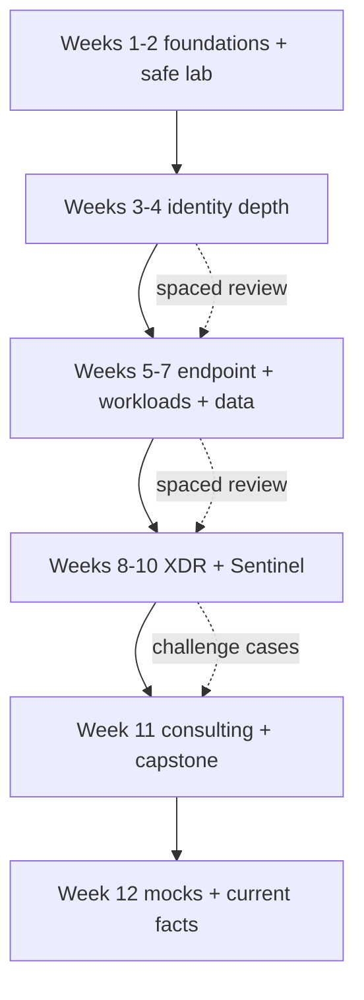

### 10.3 Mastery-path evidence targets

| Target | Minimum | Stretch | Boundary |
|---|---|---|---|
| Lab portfolio | Labs 0-6 with journal, tests, cleanup | Repeat three with failure injection and changed constraints | Still lab evidence. |
| KQL | 30 explained queries across Defender/Sentinel | 60 queries, performance comparison, five detections | Query count does not prove analyst tenure. |
| Architecture | Seven domain diagrams plus capstone | Redraw under three constraint changes | Review does not equal production implementation. |
| Troubleshooting | Ten diagnosis drills | Twenty, including cross-domain and vendor boundary | Synthetic scenarios must be labeled. |
| Consulting | Full capstone artifact chain | Peer challenge and revised decision log | Fictional client; no proprietary Deloitte claim. |
| Questions | Q001-Q205 attempted three times | Green twice on all core questions | Confidence must be calibrated by correctness. |
| Mocks | Six rounds | Two external reviewers and changed scenarios | Guide threshold is not scientific. |
| Certification | Current plan for SC-900/300/401/200/100 | Sit only the credential aligned to evidence/career priority | Passing does not add production level automatically. |

## 11. Study session, active recall, and spaced repetition

### 11.1 Standard study session

| Phase | 30-minute minimum | 90-minute standard | 3-hour lab block | Evidence |
|---|---:|---:|---:|---|
| Retrieval | 5 min | 10 min | 15 min | Closed-note answers and confidence. |
| Learn | 10 min | 25 min | 30 min | Three facts, one flow, one limitation. |
| Draw/compare | 5 min | 15 min | 20 min | Diagram or decision table. |
| Apply | 5 min | 20 min | 100 min | Query, scenario, configuration, test, or artifact. |
| Speak | 3 min | 15 min | 20 min | Timed answer and follow-up. |
| Close | 2 min | 5 min | 15 min | Score, next review, source flag, cleanup/cost. |

| Session opening question | Good answer evidence | Warning sign |
|---|---|---|
| What am I trying to retrieve? | Named Parts/questions and prior miss. | “Read as much as possible.” |
| What will exist at the end? | Diagram, query, test result, story card, or score. | No observable output. |
| What is the evidence label? | Conceptual, lab, transferable, or production. | Treating study as experience. |
| What could be unsafe? | Authorization, data, privilege, cost, destructive action, fatigue. | No boundary or cleanup plan. |
| When is the next review? | Day 1/3/7/14/30 date or session number. | “When I have time.” |

### 11.2 Active recall menu

| Method | Prompt | Time | Success criterion | Best for |
|---|---|---:|---|---|
| One-sentence definition | “What is it and why does it matter?” | 30 sec | Correct purpose without circular jargon. | Level 0→1 |
| 90-second answer | “Explain flow, risk, control, limit.” | 90 sec | Structured and honest without notes. | Level 1→2 |
| Blank-page diagram | “Draw components and arrows.” | 3-5 min | Correct direction, boundaries, evidence points. | Architecture memory |
| Compare/contrast | “X vs Y: choose when and why?” | 2 min | At least three meaningful dimensions. | Product/policy choices |
| Failure ladder | “What layer could fail; what discriminates?” | 3 min | Ranked hypotheses and cheapest safe check. | Diagnosis |
| Changed constraint | “Now add sovereign cloud/no E5/high latency.” | 3-5 min | Recommendation adapts without losing outcome. | Design/consulting |
| Teach-back | Explain to a non-specialist | 3 min | Plain meaning, analogy, risk, decision. | Executive communication |
| Query narration | Read KQL left to right | 2 min | Table/time/filter/transform/aggregate/result/limit. | KQL |
| Story interruption | Reviewer interrupts STAR with “what did you do?” | 2 min | Personal action and verified result stay clear. | Behavioral |

| Recall failure type | Diagnosis | Repair |
|---|---|---|
| Blank | Retrieval path absent | Rebuild one-sentence definition and diagram; retry in 10 minutes. |
| Buzzword list | Relationships not understood | Draw flow and explain each arrow. |
| Confidently wrong | Calibration failure | Compare to source Part/Appendix G; write correction and why error seemed plausible. |
| Correct but slow | Retrieval not automated | Repeat at Day 1/3/7 with shorter timer. |
| Correct but unsafe | Missing operations/safety layer | Add authorization, impact, test, rollback, monitoring. |
| Correct but inflated | Evidence boundary missing | Start answer with direct/transferable/lab/conceptual label. |
| Memorized script | Brittle under follow-up | Change audience/constraint/order; answer in fresh words. |

### 11.3 Spaced repetition schedule

| Review | Timing after first attempt | Task | Promotion rule |
|---:|---|---|---|
| 0 | Same session | Cold answer, score, study exact gap, answer again | Establish baseline only. |
| 1 | 1 day | 30-90 second closed-note answer | Correct purpose + honest limitation. |
| 2 | 3 days | Add diagram, comparison, or one query | Confidence ≥3/5 and no critical error. |
| 3 | 7 days | Scenario with one changed constraint | Safe method and evidence points. |
| 4 | 14 days | Mixed-domain random practice | Quality ≥75% and no prompt for core flow. |
| 5 | 30 days | Mock/panel use | Green twice on nonadjacent attempts. |
| Maintain | Every 30-45 days or pre-interview | Recheck current facts; answer red/amber items | Source current and quality maintained. |

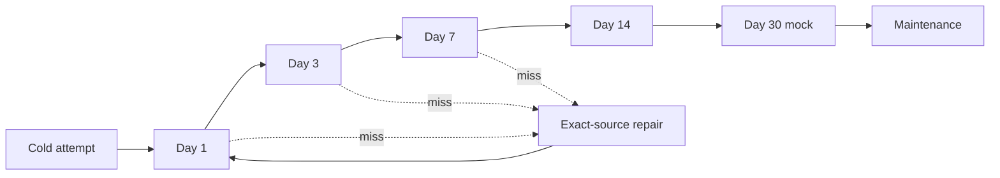

### 11.4 Diagram redraw system

| Diagram | Source Parts | 3-minute minimum | 8-minute interview version | Evidence checkpoint |
|---|---|---|---|---|
| Zero Trust access | P3, P6-P9, P15-P17 | User/device/app/data → policy decision → outcome | Add MFA, CA, compliance, session, logs, emergency access | Can explain every arrow. |
| Token flow | P5, P7 | Client → authorize/token endpoint → resource | Add PKCE, consent, scopes, claims, cache, CA, failure logs | No token-as-authorization confusion. |
| Intune effective state | P15-P20 | Enroll → assign → evaluate → report → CA | Add authority, filters, conflicts, grace, sync, logs | Identifies failure layer. |
| M365 data/sharing | P21-P25 | Identity → workload permission → sharing → audit | Add Teams/SPO/Exchange dependencies, labels, DLP, guests | You tie to direct workload evidence. |
| Purview lifecycle | P26-P33 | Discover → classify → protect → retain → investigate | Add roles, explorers, audit/eDiscovery, privacy, DSPM AI | No compliance overclaim. |
| XDR attack story | P34-P42 | Signal → alert → incident → evidence → response | Add email/device/identity/app entities, AIR, hunting, Action Center | Containment tradeoff explained. |
| Sentinel pipeline | P43-P50 | Source → connector/DCR → table → KQL → rule → incident → playbook | Add ASIM, entities, UEBA/TI, health, cost, approval | No “ingest everything.” |
| Unified SecOps | P51-P52 | Defender products ↔ XDR ↔ Sentinel | Add Purview, portal/workspace scope, ownership, duplicates | Boundaries remain explicit. |
| Consulting lifecycle | P53-P63 | Discover → assess → design → deploy → operate | Add artifacts, gates, tests, rollback, handover, metrics | Client decision/outcome clear. |
| Incident lifecycle | P39, P61-P62, F | Detect → analyze → contain → eradicate → recover → learn | Add authority, evidence, comms, shift handoff, PIR | No unsafe containment. |

| Diagram tracker | Date | Attempt | Time | Accuracy /5 | Explanation /5 | Changed constraint handled? | Next review |
|---|---|---:|---:|---:|---:|---|---|
| ______ | YYYY-MM-DD | 1 | __ min | __ | __ | Yes/No: ______ | YYYY-MM-DD |
| ______ | YYYY-MM-DD | 2 | __ min | __ | __ | Yes/No: ______ | YYYY-MM-DD |

## 12. KQL practice system

KQL proficiency is not syntax recall alone. A good security query starts from a hypothesis, uses the correct product/table/time scope, minimizes data early, preserves useful entities, explains uncertainty, and produces a result that can be validated. Any response action derived from a query remains separately authorized.

### 12.1 KQL ladder

| Level | Skill | Required exercise | Evidence |
|---:|---|---|---|
| 1 | Read pipeline | Narrate table, time, filter, projection, result | Five queries explained aloud. |
| 2 | Filter/project/extend | Build narrow event list with derived field | Query plus expected/actual columns. |
| 3 | Summarize/time-bin | Count by entity/time and identify baseline | Chart/table plus interpretation caveat. |
| 4 | Parse/dynamic data | Extract JSON/arrays safely | Before/after sample and null handling. |
| 5 | Join/union | Correlate compatible entities/time | Cardinality, join flavor, false-match analysis. |
| 6 | Function/let/reuse | Parameterize repeated logic | Documented function/query with tests. |
| 7 | Detection engineering | Convert hypothesis to rule | Entities, threshold, suppression, ATT&CK, owner, tests. |
| 8 | Operational tuning | Measure volume, false positives, latency, cost, health | Change record and before/after metrics. |

### 12.2 Required query portfolio

| Query group | Minimum count | Parts | What to demonstrate |
|---|---:|---|---|
| Identity sign-ins/risk | 5 | P7-P10, P40, P46 | Time, result, app, user, IP/location caution, CA context. |
| Endpoint/process/network | 5 | P35, P40, P46 | Process lineage, hashes, command lines, device identity, prevalence. |
| Email/collaboration | 4 | P22, P38, P40 | Sender/recipient/URL/file/delivery/authentication correlation. |
| Sentinel common logs | 5 | P45-P48 | Source schema, normalization, entities, ingestion time. |
| Hunting timeline | 4 | P40, P49, P69 | Multi-table/entity chronology with uncertainty. |
| Detection candidates | 3 | P40, P47 | Hypothesis, threshold, lookback, suppression, validation. |
| Operations/health/cost | 2 | P44-P45, P52, P70 | Ingestion/connector/rule health and volume. |
| **Minimum portfolio** | **28** |  | Explain every query; do not count copied queries not understood. |

### 12.3 KQL tracker

| Query ID | Hypothesis | Product/table | Time bound | Key operators | Expected result | Actual/validation | Performance/cost note | Evidence label | Next variation |
|---|---|---|---|---|---|---|---|---|---|
| KQL-___ |  | Defender/Sentinel; ______ |  | where/project/summarize/join/... |  |  |  | Lab/Conceptual |  |

### 12.4 KQL safety and quality checklist

| Done | Check |
|---|---|
| [ ] | Query scope and time range are explicit. |
| [ ] | Source/table/field exists in the active product context. |
| [ ] | Filters are applied early and string operators are appropriate. |
| [ ] | Join keys, time compatibility, nulls, and cardinality are understood. |
| [ ] | Dynamic/parsed fields handle missing or malformed data. |
| [ ] | Result is treated as evidence, not automatic malicious verdict. |
| [ ] | Sensitive result data is minimized, sanitized, and stored appropriately. |
| [ ] | Response action has separate authorization and rollback. |
| [ ] | Query performance, volume, and operational cost are considered. |
| [ ] | Source/schema current state is rechecked in Appendix G. |

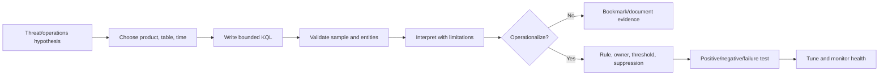

## 13. Lab journal, evidence portfolio, cleanup, and source recheck

### 13.1 Lab session journal

| Field | Required entry |
|---|---|
| Lab/session ID | LAB__-S__ |
| Date and baseline | Actual session date; guide source baseline Aug 24 2026 |
| Authorization/scope | Personal lab or explicitly authorized tenant/subscription; prohibited actions |
| Goal/hypothesis | What behavior is being learned or tested? |
| Environment | Tenant/cloud/region/license/trial/device/workspace, without secrets |
| Source IDs | Appendix G IDs used and whether live rechecked |
| Starting state | Relevant users/groups/policies/data/resources and expected dependencies |
| Change/action | What was configured or queried, by whom, under what role |
| Positive test | Expected allowed/matching/success case and result |
| Negative test | Expected denied/nonmatching/failure case and result |
| Failure/rollback test | Injected or observed failure; rollback outcome |
| Evidence | Sanitized screenshots, exports, KQL, correlation IDs, timestamps |
| Diagnosis | Hypotheses, discriminating check, finding, uncertainty |
| Cost | Meter/resource estimate and actual visible cost where available |
| Cleanup | Deleted/disabled/reverted resources, policies, data, assignments |
| Reflection | What changed in understanding; next variation |
| Evidence label | Conceptual / Lab / Transferable; never Production unless truly production |

### 13.2 Evidence portfolio tracker

| Artifact ID | Domain | Part/lab | Artifact | Evidence type | Sanitized? | Reviewer | Quality /5 | Limitation | Ready to discuss? |
|---|---|---|---|---|---|---|---:|---|---|
| ART-___ |  | P__ / Lab __ | Diagram/query/test/report/runbook/story | Lab/Transferable/Production | Yes/No |  | 0 |  | Yes/No |

### 13.3 Portfolio quality rubric

| Dimension | 0 | 1 | 2 | 3 | 4 |
|---|---|---|---|---|---|
| Traceability | No goal | Goal only | Goal and source | Requirement → action → evidence | Full finding/risk/design/test/owner chain |
| Reproducibility | No context | Partial steps | Environment noted | Steps/tests repeatable | Failure/rollback and limitations included |
| Safety | Unsafe/secrets | Boundary unclear | Basic cleanup | Authorized and sanitized | Least privilege, cost, rollback, privacy proven |
| Technical depth | Screenshot only | Feature description | Configuration evidence | Dependencies/diagnosis | Tradeoffs, failure modes, operation |
| Communication | Unreadable | Raw dump | Understandable | Audience-ready | Executive and engineering versions |

### 13.4 Lab dependency and fallback tracker

| Lab | Prerequisites | Common blocker | Safe fallback | Do not claim |
|---|---|---|---|---|
| Lab 0 | Personal authorization, account, budget | Sandbox/trial ineligible | Design lab plan and use documented screenshots only as conceptual reference | Tenant operation |
| Lab 1 | Entra license/features, test personas | CA/PIM entitlement | Policy JSON/design, What If explanation, synthetic sign-in analysis | Enforced production CA |
| Lab 2 | Supported device/VM and Intune entitlement | Enrollment/device unavailable | Configuration/effective-state design and log analysis | Device enrollment/configuration |
| Lab 3 | M365 workloads/test domain/users | Mail/DNS/Teams/license constraints | Health-check, control matrix, synthetic tests | Live mail/security policy change |
| Lab 4 | Purview roles/license/test data | Audit/DLP/eDiscovery feature unavailable | Taxonomy, simulated policy, case plan, synthetic event review | Live protection/investigation |
| Lab 5 | Defender trial/simulation/evidence | Sensor/license/alert unavailable | Provided scenario, attack timeline, KQL reasoning, response decision | Live XDR incident handling |
| Lab 6 | Azure subscription/workspace/budget | Connector/data/cost unavailable | Sample data/design/query exercises and playbook pseudoflow | Production SIEM/SOAR operation |

### 13.5 Cleanup tracker

| Resource/change | Owner | Created | Cost risk | Data sensitivity | Cleanup action | Verified removed/reverted | Residual item/reason |
|---|---|---|---|---|---|---|---|
| ______ | You | YYYY-MM-DD | Low/Med/High | Synthetic/Personal/Other authorized |  | YYYY-MM-DD / evidence |  |

### 13.6 Cost tracker

| Lab/resource | Region | Meter/plan | Budget/alert | Expected hours/GB/runs | Observed cost | Stop/cleanup trigger | Status |
|---|---|---|---|---:|---:|---|---|
| ______ |  |  |  |  |  |  | Planned/Active/Cleaned |

### 13.7 Official-source recheck tracker

| Topic | Appendix G IDs | Why change-sensitive | Last actual recheck | Result | Study/lab impact | Next recheck |
|---|---|---|---|---|---|---|
| Portal/navigation | F010-F012, E027, P178, D232, S285 | Screens and paths move |  |  |  | Pre-interview |
| Licensing/pricing | F014-F016 and product license IDs | Entitlements/costs change |  |  |  | Pre-design/exam |
| Preview/retirement | G watchlist IDs | Support and migration change |  |  |  | Monthly |
| KQL/schema/connectors | D242-D244, S296-S329 | Queries/rules can break |  |  |  | Before lab/mock |
| Certifications | L379-L395 | Objectives/policies change |  |  |  | Before booking |

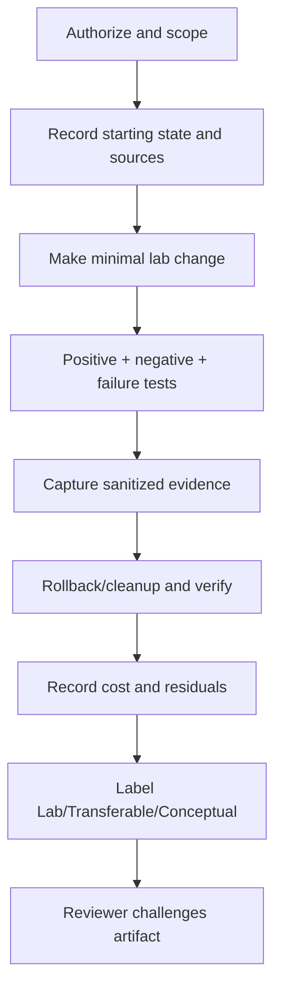

## 14. 205-question tracker integration

Use [Part 73](Part-73-interview-question-bank.md) as the canonical questions and answers. This appendix tracks attempts and performance; it does not duplicate the bank. A question is Green only after a correct, structured, safe, honest answer on two nonadjacent attempts, including at least one follow-up or changed constraint for advanced questions.

### 14.1 Bank inventory

| Block | Questions | Count | Required completion |
|---|---|---:|---|
| Basic | Q001-Q035 | 35 | 100% attempted; no core definition blank. |
| Intermediate | Q036-Q075 | 40 | 100% attempted; flow and dependencies correct. |
| Advanced | Q076-Q180 | 105 | 100% attempted; safe tradeoffs, evidence, and adaptation. |
| Behavioral/STAR | Q181-Q195 | 15 | Verified personal story or honest no-example bridge. |
| Closing/Why | Q196-Q205 | 10 | Concise, specific, role-relevant, and non-scripted. |
| **Total** | **Q001-Q205** | **205** | **All attempted before final readiness gate.** |

### 14.2 Question status tracker

| Question | Date | Attempt | Confidence 0-5 | Quality /32 | R/A/G | Evidence label | Critical miss | Source Part reviewed | Next review |
|---|---|---:|---:|---:|---|---|---|---|---|
| Q___ | YYYY-MM-DD | 1 | 0 | 0 | Red | Production/Transferable/Lab/Conceptual |  | P__ | YYYY-MM-DD |

### 14.3 Domain roll-up

| Domain | Priority questions | Attempted / total | Green | Amber | Red | Last mixed review | Repair assignment |
|---|---|---:|---:|---:|---:|---|---|
| Foundations/tenant/protocols | Q001-Q005, Q076-Q077, Q096-Q097 |  |  |  |  |  | P1-P5 |
| Entra | Q006-Q014, Q078-Q083, Q098-Q101 |  |  |  |  |  | P6-P14, P65 |
| Intune | Q015-Q020, Q084-Q088, Q102 |  |  |  |  |  | P15-P20, P66 |
| Workloads | Q021-Q025, Q089-Q090, Q103-Q104 |  |  |  |  |  | P21-P25, P67 |
| Purview | Q026-Q033, Q091, Q105, Q155-Q157 |  |  |  |  |  | P26-P33, P68 |
| Defender | Q034-Q042, Q092-Q094, Q121-Q125, Q141-Q147 |  |  |  |  |  | P34-P42, P69 |
| Sentinel/KQL/SOAR | Q043-Q052, Q095, Q106-Q110, Q148-Q152 |  |  |  |  |  | P43-P52, P70 |
| Consulting/operations | Q111-Q140, Q158-Q165 |  |  |  |  |  | P53-P63, P71 |
| Labs/frameworks/trends | Q153-Q180 |  |  |  |  |  | P64-P72 |
| Behavioral/closing | Q181-Q205 |  |  |  |  |  | P74 |

### 14.4 Question metrics

$$
Completion=\frac{Attempted}{205}\times100
$$

$$
Recall=\frac{\sum Confidence}{5\times Attempted}\times100,\qquad
GreenCoverage=\frac{Green}{205}\times100
$$

| Metric | Formula | Guide target | Caveat |
|---|---|---:|---|
| Completion | Attempted / 205 | 100% | Attempt does not imply correctness. |
| Recall | Sum confidence / (5 × attempted) | ≥80% | Self-confidence needs external calibration. |
| Answer quality | Points / 32 | ≥75% overall; ≥80% advanced | Honesty/safety gate still overrides. |
| Green coverage | Green / 205 | ≥80% | No red role-critical domain. |
| Blank rate | Blank core answers / core prompts | 0% | An honest “I don't know; here is how I would validate” is not a blank. |
| Evidence-label accuracy | Correctly labeled / label-needed answers | 100% | Any invented experience blocks readiness. |

### 14.5 Answer-aloud tracker

| Answer ID | Question/scenario | Target length | Actual | Structure used | Follow-up handled | Filler/clarity note | Evidence boundary clear? | Score | Next change |
|---|---|---:|---:|---|---|---|---|---:|---|
| AA-___ | Q___ | 90 sec |  | Risk→flow→evidence→decision | Yes/No |  | Yes/No | /5 |  |

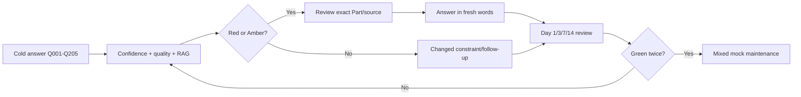

## 15. Certification planner: current caveat first

Certification names, exam objectives, prerequisites, scheduling, renewal, and retirement policies can change. The official pages selected in Appendix G were reviewed for the August 24, 2026 baseline. Recheck them immediately before committing money or study time. This plan uses **SC-401**, not SC-400, as the information security administrator target at the baseline.

### 15.1 Role-aligned certification sequence

| Certification | Best purpose for you | Guide coverage | Start gate | Evidence it does not replace | Priority |
|---|---|---|---|---|---:|
| SC-900 | Consolidate security/compliance/identity vocabulary | P2-P4 plus overviews in P6, P15, P26, P34, P43 | Basic question block ≥80% | Hands-on or production depth | Optional quick foundation |
| SC-300 | Deepen Entra identity/access | P6-P14, Lab 1 | Lab 1 design plus Q006-Q014/Q078-Q083 stable | Production identity operation | High |
| SC-401 | Deepen information security/Purview | P26-P33, Lab 4 | Lab 4 evidence plus privacy/compliance boundaries | Legal compliance or production Purview ownership | High after identity |
| SC-200 | Defender/Sentinel analyst depth | P34-P52, Labs 5-6 | 28-query portfolio and incident/Sentinel lab evidence | SOC tenure or incident authority | Highest technical gap value |
| SC-100 | Architecture integration | P3-P4, P34, P41-P42, P51-P58, P71 | Capstone defended and prerequisites rechecked | Senior architecture delivery history | Later/stretch |

### 15.2 Certification decision score

| Factor | 0 | 1 | 2 | Weight |
|---|---|---|---|---:|
| Role relevance | Peripheral | Useful | Core JD gap | 30% |
| Prerequisite knowledge | Missing | Developing | Stable | 20% |
| Lab evidence | None | Partial | Complete | 20% |
| Time before interview | Distracts | Neutral | Helps structured prep | 15% |
| Credential dependency/current state | Unclear | Recheck needed | Confirmed official path | 15% |

$$
CertPriority=\sum Weight_i\left(\frac{Factor_i}{2}\right)
$$

| Decision | Guide rule |
|---|---|
| Score <50% | Do not book; close fundamentals/lab gaps first. |
| 50-74% | Study selectively; book only after current official recheck and practice exam evidence. |
| ≥75% | Reasonable to schedule if it does not displace role-critical labs/mocks. |
| Any status uncertainty | Recheck Appendix G certification IDs and official booking policy. |
| Failed attempt | Record objective gaps; do not hide or overinterpret; repair and decide calmly. |

### 15.3 Certification tracker

| Credential | Official page rechecked | Skills version/date | Study start | Lab prerequisite | Practice result | Booked | Result/renewal | Evidence wording |
|---|---|---|---|---|---|---|---|---|
| SC-900 |  |  |  |  |  |  |  |  |
| SC-300 |  |  |  | Lab 1 |  |  |  |  |
| SC-401 |  |  |  | Lab 4 |  |  |  |  |
| SC-200 |  |  |  | Labs 5-6 |  |  |  |  |
| SC-100 |  |  |  | Capstone |  |  |  |  |

## 16. Mock interviews and performance rubrics

Mocks convert private recognition into observable performance. Use a human interviewer when possible; otherwise record audio/video, enforce the timer, randomize questions, and score after answering. Do not pause to search during the timed portion. An honest “I have not done that in production; here is my lab/design evidence and validation method” can be a strong answer. An invented production claim is an automatic gate failure even if the technical explanation is polished.

### 16.1 Mock rounds

| Round | Duration | Question mix | Interviewer behavior | Required evidence | Pass focus |
|---:|---:|---|---|---|---|
| 1 | 30 min | 8 Basic + 5 Intermediate | Prompts allowed | Definitions, flows, limits | No core blank; structure emerges. |
| 2 | 45 min | 5 Intermediate + 4 troubleshooting | Repeatedly ask “what evidence?” | Hypotheses, discriminating checks, logs | Safe diagnosis, not random action. |
| 3 | 45 min | 2 architecture + 2 tradeoff prompts | Change license/region/scale midway | Whiteboard and decision record | Adaptation and boundaries. |
| 4 | 45 min | 2 incidents + 2 KQL/SOAR + on-call | Challenge containment/privacy/automation | Query narration, response authority, handoff | Evidence-led and reversible. |
| 5 | 45 min | 3 consulting cases + 3 Behavioral | Ask personal contribution/result | Discovery, recommendation, verified STAR | Client communication and honesty. |
| 6 | 60 min | Random panel Q001-Q205 | Minimal prompting; interrupt naturally | Full answer rubric | ≥80%, no core Red or gate fail. |
| 7 | 30 min | Closing, gaps, role motivation, questions | Skeptical but fair | Concise candidate narrative | Specificity, curiosity, no defensiveness. |

### 16.2 Mock result tracker

| Mock ID | Date | Reviewer | Rounds/questions | Technical /32 | Consulting /24 | Whiteboard /24 | Communication /20 | Honesty | Safety | Overall % | Pass? | Top three repairs |
|---|---|---|---|---:|---:|---:|---:|---|---|---:|---|---|
| MOCK-___ | YYYY-MM-DD |  |  |  |  |  |  | Pass/Fail | Pass/Fail |  | Yes/No |  |

### 16.3 Technical answer rubric

Score 0-4 in each dimension, maximum 32.

| Dimension | 0 | 1 | 2 | 3 | 4 |
|---|---|---|---|---|---|
| Correctness | Wrong/unsafe | Major gaps | Core partly right | Correct, minor gap | Correct, bounded, current to baseline |
| Structure | Blank | Fragmented | Understandable list | Clear method | Prioritized narrative |
| Risk/outcome | Product trivia | Vague risk | Names outcome | Connects risk/control | Defines acceptance/residual risk |
| Technical depth | Buzzwords | One layer | Basic dependency | End-to-end flow | Boundaries/failure modes/evidence |
| Tradeoffs | None | Generic | One tradeoff | Options/constraints | Defensible choice and rejected option |
| Validation | “Check logs” | Unfocused | Names evidence | Discriminating test | Positive/negative/failure/rollback/monitoring |
| Communication | Inaccessible | Poor audience fit | Understandable | Decision-ready | Executive + engineering layers |
| Honesty/safety | Invented/unsafe | Ambiguous | Labels after prompt | Correct label/authorization | Proactive boundary, uncertainty, safe next step |

### 16.4 Troubleshooting drill rubric

| Dimension | 0 | 1 | 2 | 3 | 4 |
|---|---|---|---|---|---|
| Symptom/scope | Assumes | Vague | User/device/app scoped | Time/change/segment scoped | Blast radius and business impact explicit |
| Timeline | None | Single timestamp | Basic sequence | Cross-system sequence | Time zone, latency, correlation limitations |
| Hypotheses | One guess | Unranked list | Layered list | Ranked by evidence | Each has falsifying observation |
| Check choice | Destructive/random | Broad data dump | Useful log | Cheap discriminating check | Safe check maximizes information gain |
| Evidence | None | “Logs” | Named source | Field/result interpretation | Cross-source corroboration and gaps |
| Resolution | Restart/disable | Symptom workaround | Plausible fix | Root cause plus validation | Rollback, monitor, prevention, ownership |

### 16.5 Consulting case scorecard

Score 0-4 per dimension, maximum 24. Use generic/public consulting discipline only; the fictional capstone is not presented as a proprietary Deloitte method or client engagement.

| Dimension | 0 | 1 | 2 | 3 | 4 |
|---|---|---|---|---|---|
| Clarify outcome/scope | Jumps to product | One vague question | Basic objective | Stakeholders/constraints/success | Scope, assumptions, exclusions, decision owner |
| Current state/evidence | Guesses | Feature inventory | Some evidence | Architecture/data/roles/process | Evidence quality, gaps, trust boundaries |
| Risk/prioritization | Feature list | Generic risk | Likelihood/impact | Business/control mapping | Uncertainty, residual risk, sequencing |
| Recommendation | One tool | Generic best practice | Reasonable control | Options/tradeoffs/dependencies | Defensible target, rejected option, exceptions |
| Delivery/adoption | Configure now | High-level phases | Pilot/test | Change/rollback/hypercare | RACI, acceptance, training, operational readiness |
| Communication | Technical dump | Long answer | Understandable | Executive decision and technical path | Clear ask, owner, timing, measures, limitations |

### 16.6 Technical whiteboard rubric

| Dimension | 0 | 1 | 2 | 3 | 4 |
|---|---|---|---|---|---|
| Frame | No goal | Title only | Scope named | Outcome/assumptions | Audience, scope, constraints, non-goals |
| Components | Missing/wrong | Product boxes | Main components | Roles/boundaries | Owners, control/data planes, dependencies |
| Flows | No arrows | Ambiguous | Happy path | Decision/evidence path | Failure, recovery, observability, data handling |
| Security | None | “Zero Trust” label | Identity/least privilege | Threat/control mapping | Abuse cases, privacy, break-glass, residual risk |
| Operations | None | Monitoring box | Logs/alerts | Runbook/escalation | SLO/health/cost/handover/tuning |
| Delivery | None | “Deploy” | Pilot | Test/rollback | Phases, gates, acceptance, migration/coexistence |

### 16.7 Communication rubric

| Dimension | 0 | 1 | 2 | 3 | 4 |
|---|---|---|---|---|---|
| Directness | No answer | Buried answer | Answer eventually | Leads with answer | Leads with decision and one-sentence reason |
| Clarity | Jargon wall | Hard to follow | Mostly clear | Plain language | Plain language plus precise technical terms |
| Structure | Rambling | Loose list | Beginning/middle/end | Named framework | Flexible, concise, interruption-resistant |
| Audience fit | Same for everyone | Too technical/vague | Basic tailoring | Executive vs engineer | Anticipates decision/evidence needs |
| Listening | Ignores prompt | Partial | Answers prompt | Clarifies ambiguity | Updates answer when constraints change |

### 16.8 Executive-summary rubric

| Element | Required one-page content | Failure mode |
|---|---|---|
| Situation | Business service, scope, timing, and material context | Product-first opening. |
| Risk/impact | What may happen, affected population, confidence | Unsupported fear or invented quantification. |
| Evidence | Three strongest observations and limitations | Raw logs without interpretation. |
| Decision | Recommendation, alternatives, tradeoff, accountable owner | No ask or ambiguous ownership. |
| Plan | Immediate action, next milestone, dependencies, rollback | Activity list without gates. |
| Measure | Success, control health, residual risk, review point | “Done” with no outcome. |

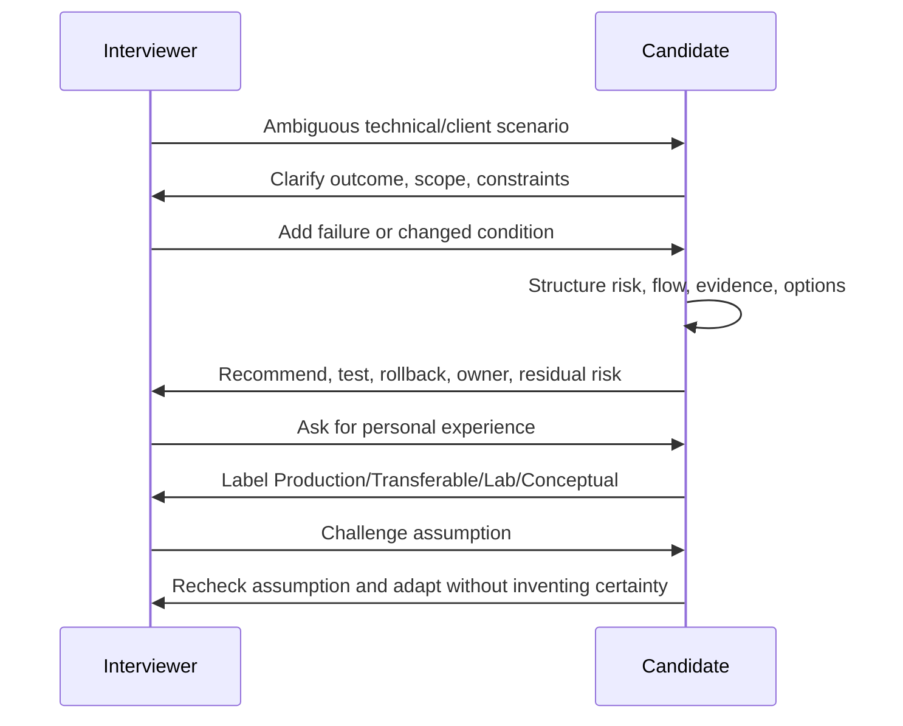

## 17. Behavioral STAR verification and candidate narrative

### 17.1 STAR verification gate

| Story field | Verification question | Acceptable evidence | Reject/repair when |
|---|---|---|---|
| Situation | Did this event happen, and can you describe it without confidential detail? | Personal record/recollection consistent with CV | Story combines multiple unrelated events. |
| Task | What was you personally responsible for? | Role, decision, deliverable, expectation | “We” obscures personal accountability. |
| Action | What did you decide/do, in sequence? | Three specific actions and rationale | Generic team activity or invented authority. |
| Result | What changed and how is it known? | Verified qualitative/quantitative outcome | Number cannot be verified or causality is overstated. |
| Reflection | What was learned and changed later? | Specific improvement or changed method | Empty “communication is important.” |
| Boundary | What was not your role/product/scope? | Honest collaborator/product/experience limit | Takes credit for product team/client/manager decision. |

### 17.2 Story inventory

| Story ID | Theme | Verified situation | Personal task/actions | Verified result | Reflection | Target competency | Boundary checked? |
|---|---|---|---|---|---|---|---|
| STAR-1 | Critical incident/critical situation |  |  |  |  | Incident leadership/on-call |  |
| STAR-2 | RCA/product fix |  |  |  |  | Troubleshooting/engineering rigor |  |
| STAR-3 | Difficult stakeholder/vendor |  |  |  |  | Consulting communication |  |
| STAR-4 | Mentoring/quality |  |  |  |  | Leadership/capability building |  |
| STAR-5 | Automation/AI adoption |  |  |  |  | Innovation/governance |  |
| STAR-6 | Mistake/setback |  |  |  |  | Accountability/learning |  |
| STAR-7 | Architecture/risk guidance |  |  |  |  | Advisory/design |  |

### 17.3 Production-to-security bridge

| Transferable evidence | Security-consulting bridge | Safe sentence |
|---|---|---|
| SharePoint/OneDrive escalation depth | Workload security, permissions, data, migration, resilience | “My direct depth is the collaboration workload; I have extended into cross-product security through structured labs and designs.” |
| Critical incident ownership | Security triage, stakeholder cadence, PIR, on-call | “The incident discipline transfers; I distinguish service incidents from security incidents and use the correct authority.” |
| Cross-team/vendor coordination | Multi-vendor security migration and escalation | “I establish evidence, ownership boundaries, dependencies, and next decisions rather than simply forwarding a case.” |
| Fix validation/RCA | Control testing, detection tuning, rollback, improvement | “I am accustomed to proving a fix and preventing recurrence; security controls add authorization and threat/evidence considerations.” |
| Business reviews/KPIs | Executive risk and operational reporting | “I translate technical evidence into outcomes, trends, decisions, owners, and next actions.” |
| Power Platform/Copilot Studio | SOAR and AI-assisted workflow foundation | “The workflow skill transfers, while Sentinel Logic Apps and Security Copilot production ownership remain separate evidence.” |

### 17.4 Gap-answer checklist

| Done | Required move |
|---|---|
| [ ] | Acknowledge the exact gap directly; do not evade. |
| [ ] | State the nearest truthful production/transferable anchor. |
| [ ] | Describe completed lab/design evidence only if actually completed. |
| [ ] | Explain the safe method, dependencies, validation, and limitation. |
| [ ] | State the next concrete action to deepen evidence. |
| [ ] | Avoid apology loops, invented tenure, or claiming the guide itself as experience. |

## 18. 24x7/on-call readiness

On-call readiness includes technical triage, reliable communication, protected privileged access, handoff, fatigue awareness, and honest discussion of personal availability. It is not a performance of unlimited availability. You should understand the employer's actual rotation and then answer truthfully about constraints. This guide does not give employment or legal advice.

### 18.1 Rotation discovery questions

| Question to ask | Why it matters |
|---|---|
| How large is the rotation and how often is primary/secondary duty? | Determines frequency, resilience, and learning support. |
| Which services and severities page this role? | Clarifies technical breadth and expected response. |
| What are acknowledgement and engagement targets? | Separates operational expectation from vague “24x7.” |
| Is work follow-the-sun, local night/weekend, or both? | Clarifies hours and handoff model. |
| What escalation paths and engineering/vendor support exist? | Indicates whether ownership has reachable dependencies. |
| What access, runbooks, tooling, and training are provided? | Safe response needs prepared privilege and knowledge. |
| How are compensatory rest, scheduling, and sustained incidents handled? | Fatigue is an operational and human risk. |
| What is expected after an incident: PIR, backlog, control validation? | Reveals improvement culture and workload. |

### 18.2 On-call scenario drill

| Minute | Action | Evidence/communication | Safety boundary |
|---:|---|---|---|
| 0-5 | Acknowledge, confirm severity/impact, open timeline | Reporter, affected service/users, start time, change | Do not make unapproved production changes. |
| 5-15 | Stabilize ownership and collect discriminating signals | Incident commander/technical lead, service health, key logs | Protect evidence and privileged access. |
| 15-30 | Rank hypotheses, choose reversible mitigation, escalate dependencies | Decision, owner, expected effect, rollback trigger | Containment impact approved. |
| 30-60 | Validate mitigation, scope residual impact, maintain cadence | Before/after evidence, user validation, next update | Do not declare resolution from one signal. |
| Handoff | Transfer full state, risks, access/actions, next checks | Timeline, hypotheses, evidence, owners, comms | Receiving owner confirms understanding. |
| After | Recover, monitor, close, PIR/corrective actions | Closure taxonomy, root/contributing factors, actions | Avoid blame and unsupported attribution. |

### 18.3 On-call readiness tracker

| Capability | Evidence | Current R/A/G | Drill needed | Pass condition |
|---|---|---|---|---|
| Severity/impact triage | Production escalation history |  | Mixed security/service scenario | Correct priority and scope in 5 minutes. |
| Technical isolation | RCA/fix validation |  | Entra/Intune/XDR/Sentinel failures | Ranked hypotheses and safe check. |
| Incident roles/comms | Stakeholder coordination |  | 30-minute simulated bridge | Clear owners/cadence/decision log. |
| Privileged/safe action | Security lab evidence required |  | Containment/rollback exercise | Authorization and rollback explicit. |
| Shift handoff | Support transfer experience |  | Timed handoff | Receiver can continue without re-discovery. |
| Fatigue/resilience | Personal planning |  | Rotation discussion | Honest availability and sustainable practice. |

### 18.4 Interview-safe on-call answer frame

| Element | Content |
|---|---|
| Direct answer | State willingness/constraints truthfully after understanding rotation. |
| Evidence | Cite critical incident, escalation, stakeholder cadence, and handoff experience. |
| Method | Severity → scope → timeline → hypotheses/evidence → mitigation → escalation → recovery/PIR. |
| Safety | Authorization, least privilege, evidence preservation, rollback, fatigue-aware handoff. |
| Clarifying question | Ask about frequency, coverage model, services, targets, escalation, and rest. |

## 19. Application and interview tracker

### 19.1 Application tracker

| Application ID | Company/role | Role source/version | Applied date | Evidence fit | Top three gaps | Tailored CV/story | Contact/status | Next action/date |
|---|---|---|---|---|---|---|---|---|
| APP-___ |  |  | YYYY-MM-DD | High/Med/Low |  |  |  |  |

### 19.2 Interview stage tracker

| Interview ID | Application ID | Stage | Date/time/zone | Interviewers/roles | Expected focus | Evidence/diagrams prepared | Questions to ask | Outcome/follow-up |
|---|---|---|---|---|---|---|---|---|
| INT-___ | APP-___ | Recruiter/Technical/Case/Panel/Final |  |  |  |  |  |  |

### 19.3 Post-interview debrief

| Prompt | Notes |
|---|---|
| Questions asked |  |
| Strong answers and why |  |
| Blanks/weak answers |  |
| Any inaccurate or overbroad statement to correct |  |
| Evidence requested |  |
| Product/current fact to recheck |  |
| Interviewer priorities/signals |  |
| Follow-up message/action |  |
| Next spaced review |  |

### 19.4 Weekly execution dashboard

| Week | Planned hours | Actual hours | Rest blocks kept | Parts complete | Questions attempted/Green | Labs/artifacts | Mocks | Source checks | Biggest risk | Next adjustment |
|---:|---:|---:|---:|---|---|---|---|---|---|---|
| __ | __ | __ | __ |  |  |  |  |  |  |  |

## 20. Eight readiness gates

A gate is binary for the final guide decision: Pass or Not Yet. Amber means work is progressing but the gate is not passed. Arithmetic cannot compensate for a failed honesty or safety gate.

### 20.1 Gate summary

| Gate | Pass requirement | Current baseline | Status |
|---|---|---|---|
| Knowledge | Q001-Q205 attempted; ≥80% Green; no Red core domain; current facts rechecked | Not measured | Not Yet |
| Lab evidence | Safe evidence slice for Labs 0-6; cleanup/cost; limitations; capstone artifacts | None assumed | Not Yet |
| Troubleshooting | Ten scored drills, including identity, endpoint, workload/data, XDR, Sentinel, on-call | Strong transferable base; target-product drills pending | Not Yet |
| Architecture | Seven domain diagrams plus capstone; changed constraints; tests/operations | Some transferable advisory evidence | Not Yet |
| Consulting | Two passing cases plus discovery/assessment/design/roadmap/handover artifacts | Transferable, formal evidence pending | Not Yet |
| Behavioral | Five verified STARs, one setback, gap answer, why/closing, questions | Strong candidate material; verification pending | Not Yet |
| Honesty | 100% correct evidence labels; no invented number/role/product/current claim | Rule accepted; must be demonstrated | Not Yet |
| Safety | 100% authorization/privacy/least-privilege/test/rollback/cleanup in relevant answers | Must be demonstrated | Not Yet |

### 20.2 Knowledge gate

| Check | Pass |
|---|---|
| All 205 questions attempted | [ ] |
| ≥80% Green overall | [ ] |
| No Red in Entra, Intune, Purview, Defender, Sentinel, consulting/incident | [ ] |
| Basic/intermediate definitions correct without prompts | [ ] |
| Advanced answers include tradeoff, evidence, validation, owner | [ ] |
| Current portal/license/preview/cert facts rechecked against Appendix G | [ ] |

### 20.3 Lab-evidence gate

| Check | Pass |
|---|---|
| Lab 0 authorization, personas, budget, cleanup system complete | [ ] |
| Labs 1-6 each have an authorized evidence slice or are explicitly marked incomplete | [ ] |
| Positive, negative, and failure/rollback evidence exists where feasible | [ ] |
| Artifacts are sanitized and contain no secrets/customer data | [ ] |
| Costs/resources/policies/test data are cleaned or justified | [ ] |
| Capstone uses fictional data and labels lab/transferable evidence | [ ] |

### 20.4 Troubleshooting gate

| Check | Pass |
|---|---|
| Ten drills score ≥75% on the troubleshooting rubric | [ ] |
| At least one drill each: Entra, Intune, workload, Purview, XDR, Sentinel | [ ] |
| Two cross-domain drills include time/correlation limitations | [ ] |
| Hypotheses are ranked and falsifiable | [ ] |
| First checks are safe and discriminating | [ ] |
| Resolution includes validation, rollback, monitoring, and prevention | [ ] |

### 20.5 Architecture gate

| Check | Pass |
|---|---|
| Seven core domain diagrams drawn from memory | [ ] |
| Each diagram includes identity, data/control flow, trust boundary, evidence points | [ ] |
| Three diagrams survive changed region/license/scale/privacy constraints | [ ] |
| Capstone HLD/LLD includes options, decisions, tests, operations | [ ] |
| Licensing and current-state assumptions are explicit | [ ] |
| Whiteboard rubric ≥80% twice | [ ] |

### 20.6 Consulting gate

| Check | Pass |
|---|---|
| Two cases score ≥80% on consulting rubric | [ ] |
| Discovery questions precede recommendations | [ ] |
| Finding → risk → recommendation → requirement → design → test → owner traceability exists | [ ] |
| Roadmap has dependencies, quick wins, residual risk, and decision owners | [ ] |
| Deployment includes pilot, change, rollback, hypercare, and handover | [ ] |
| Executive summary names decision/ask rather than feature list | [ ] |

### 20.7 Behavioral gate

| Check | Pass |
|---|---|
| Five positive STAR stories are personally verified | [ ] |
| One mistake/setback story shows accountability and change | [ ] |
| Results/numbers can be substantiated or are described qualitatively | [ ] |
| “I” actions and collaborator boundaries are clear | [ ] |
| Gap answer distinguishes direct, transferable, lab, conceptual | [ ] |
| Why cyber/consulting/role/company and smart questions sound specific, not memorized | [ ] |

### 20.8 Honesty gate

| Check | Pass |
|---|---|
| Every target-product claim has correct evidence label | [ ] |
| Reading and certification are never called implementation experience | [ ] |
| Lab and fictional capstone are never called production/client work | [ ] |
| No confidential, proprietary, customer, or internal data is disclosed | [ ] |
| Uncertain current facts are baseline-qualified and rechecked | [ ] |
| Unknown answer uses a validation method instead of bluffing | [ ] |

### 20.9 Safety gate

| Check | Pass |
|---|---|
| Authorization and scope precede tests/changes | [ ] |
| Least privilege and protected credentials are explicit | [ ] |
| Destructive/containment actions include impact approval and rollback | [ ] |
| Privacy/legal/HR boundaries are escalated to authorized owners | [ ] |
| Positive, negative, failure, and recovery tests are planned | [ ] |
| Lab cost and cleanup are verified | [ ] |
| Fatigue/on-call handoff is treated as operational risk | [ ] |

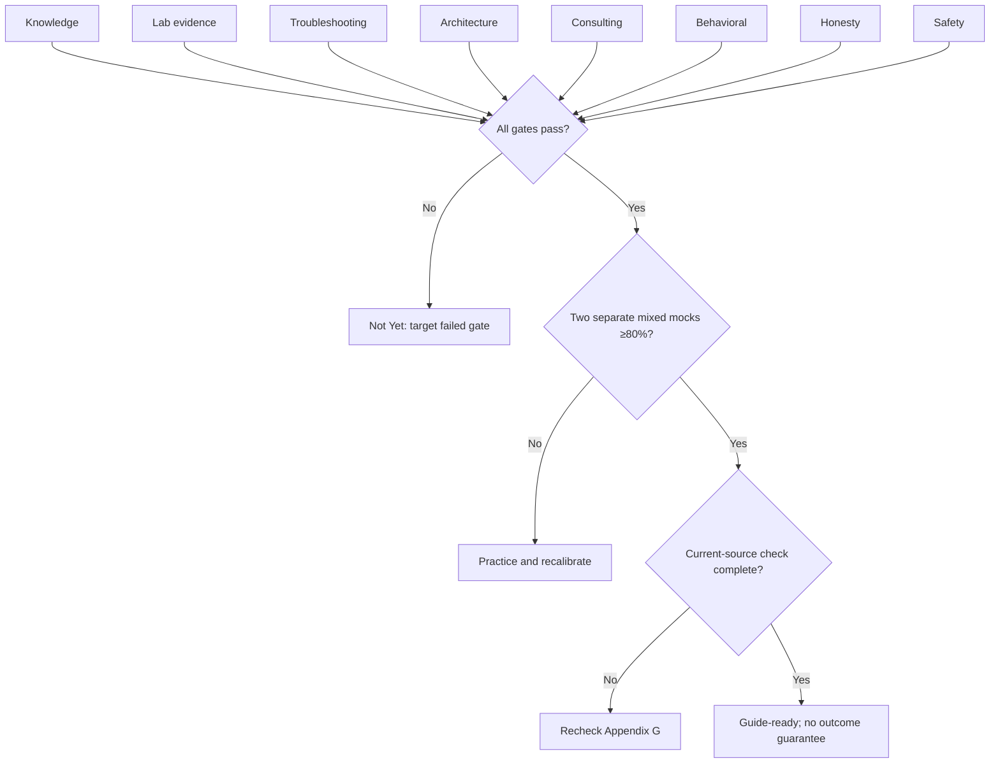

## 21. Mock pass threshold and candid final criteria

The threshold below is a **guide-specific coaching rule, not a scientific or validated hiring predictor**. It creates consistency and makes weak areas visible.

$$
MockPercent=\frac{TechnicalPoints}{32}\times100
$$

For mixed mocks that combine rubrics:

$$
MixedMock=\frac{PointsEarned}{PointsAvailable}\times100
$$

Final guide readiness requires:

$$
GuideReady=(S_{raw}\ge75)\land(AllEightGates=Pass)\land(TwoMixedMocks\ge80\%)
$$

| Criterion | Pass | Automatic Not Yet |
|---|---|---|
| Raw score | ≥75% after evidence-based rescore | Score inflated without new evidence. |
| Mixed mocks | ≥80% twice on separate days | One lucky/practiced question set only. |
| Advanced scenarios | ≥80% and adapts to follow-up | Feature recitation without evidence/tradeoff. |
| Core domains | No Red in identity, endpoint, data, XDR, Sentinel, consulting/incident | Blank/unsafe core answer. |
| Honesty | 100% correct scope/evidence labels | Any invented experience, number, role, or certainty. |
| Safety | 100% safe framing where applicable | Unauthorized/destructive/privacy-unsafe action. |
| Sources | Current-fact sheet rechecked | Unqualified current license/preview/cert assertion. |
| Communication | Technical and executive versions | Rambling answer with no decision. |

| Candid question | Ready answer |
|---|---|
| “I read all 74 Parts; am I ready?” | No. Reading builds Levels 1-2. Complete retrieval, labs/designs, diagnosis, spoken answers, verified STARs, and mocks. |
| “I passed a certification; am I ready?” | Not from the credential alone. Use it as knowledge evidence and retain hands-on/consulting proof. |
| “I completed every lab once; am I ready?” | Not necessarily. Diagnose failures, defend tradeoffs, clean up, and perform under follow-up. |
| “My score is 80; am I ready?” | Only if the evidence is real and all eight gates plus mocks pass. |
| “Can I apply before every gate passes?” | Yes, with honest positioning; the guide's final readiness label remains Not Yet. |
| “What if the role weights domains differently?” | Reweight transparently, preserve evidence levels, and never lower honesty/safety gates. |

## 22. Night-before and morning-of execution

Use the existing [Part 74 one-page night-before cheat sheet](Part-74-behavioral-consulting-closing.md#15-one-page-night-before-cheat-sheet). Do not add a final cram marathon. The goal is rested retrieval, accurate current facts, verified stories, and reliable setup.

### 22.1 Night-before checklist

| Done | Check |
|---|---|
| [ ] | Open the Part 74 night-before sheet and five STAR anchor cards. |
| [ ] | Review three core diagrams: access, XDR attack story, Sentinel pipeline. |
| [ ] | Review red/amber questions only; stop at planned time. |
| [ ] | Confirm current-facts sheet: portals, preview/retirement, licenses, SC-401 naming. |
| [ ] | Prepare CV, JD, role map, interviewer questions, blank paper, water. |
| [ ] | Test camera, audio, network, power, link, quiet space, backup contact. |
| [ ] | Remove confidential material from visible desktop/notes. |
| [ ] | Set sleep, travel/time-zone, and alarm plan. |

### 22.2 Morning-of checklist

| Done | Check |
|---|---|
| [ ] | Eat/hydrate as appropriate and avoid panic studying. |
| [ ] | Speak one 60-second opening, one technical answer, one STAR, one closing. |
| [ ] | Check interview time zone and join plan. |
| [ ] | Keep evidence labels visible: Production / Transferable / Lab / Conceptual. |
| [ ] | Remember: clarify, structure, evidence, tradeoff, validate, owner. |
| [ ] | Join early enough for technical recovery, not excessively early. |

### 22.3 Final readiness record

| Field | Result |
|---|---|
| Raw weighted score | ___ /100 |
| Knowledge gate | Pass / Not Yet |
| Lab evidence gate | Pass / Not Yet |
| Troubleshooting gate | Pass / Not Yet |
| Architecture gate | Pass / Not Yet |
| Consulting gate | Pass / Not Yet |
| Behavioral gate | Pass / Not Yet |
| Honesty gate | Pass / Not Yet |
| Safety gate | Pass / Not Yet |
| Mixed mock 1 | ___% on YYYY-MM-DD |
| Mixed mock 2 | ___% on YYYY-MM-DD |
| Current-source check | Complete / Not Yet |
| Overall guide decision | Guide-ready / Not Yet |
| Three remaining risks | 1. ___ 2. ___ 3. ___ |

> **Candid final rule:** If reading is complete but answer-aloud, lab evidence, troubleshooting, architecture, consulting cases, verified STAR stories, or mocks are incomplete, the result is **Not Yet**. That is a planning result, not a personal judgment. State the gap honestly, choose the smallest evidence-producing next step, and rescore only after completing it.

> **Safety rule:** Use only personal labs or explicitly authorized environments. Never test destructive controls, containment, user monitoring, eDiscovery, insider-risk, credentials, or production policy changes without permission, impact analysis, protected evidence, and rollback. Do not expose customer, employer, Microsoft internal, or proprietary Deloitte information in the portfolio.

> **Source rule:** Product, portal, licensing, pricing, preview, retirement, schema, and certification statements are bounded by the August 24, 2026 baseline. Use [Appendix G](Appendix-G-official-microsoft-learn-source-map.md) and record an actual recheck before presenting a time-sensitive fact as current.

[Return to the Master Study Guide](../Deloitte%20Microsoft%20365%20Security%20Senior%20Consultant%20-%20Study%20Guide.md)