# Part 1 — Role Map, Deloitte Cyber Context, and the Complete Engagement Story

> **Section goal:** Understand what this Microsoft 365 Security Senior Consultant role actually does, why clients pay for it, how the Microsoft security products fit together, and what a complete engagement looks like from first workshop to operational handover. By the end, you should be able to explain the role in business language, draw its architecture, describe its deliverables, and position your existing Microsoft support experience honestly.

Covers index item **1** and maps to all major job-description responsibilities, especially client engagement, assessment, design, deployment, troubleshooting, documentation, stakeholder reporting, operational readiness, and Microsoft 365 security transformation.

---

## 1. The role in one sentence

A Microsoft 365 Security Senior Consultant helps a client understand its cyber risks, design the right Microsoft controls, deploy and test those controls safely, and leave the client able to operate and improve them.

That sentence has five verbs:

1. **Understand** the client's environment and risk.
2. **Design** a secure target state.
3. **Deploy** the selected controls.
4. **Prove** through testing that they work.
5. **Transfer** the solution into sustainable operations.

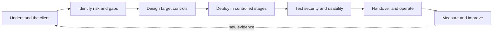

The role is not simply "configure Microsoft products." Configuration is only one step in a much larger chain.

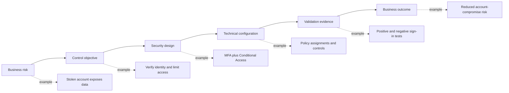

> **Core interview insight:** A strong consultant does not begin with a product. A strong consultant begins with the client's risk, constraints, and required outcome.

---

## 2. Plain-English role decoder

### 🔍 Plain-English deep-dive: the title itself

- **Microsoft 365** - *Microsoft's cloud productivity ecosystem for identity, email, collaboration, files, devices, data protection, and security.* **Analogy:** It is a digital office campus containing the reception desk, employee badges, mailroom, meeting rooms, filing cabinets, security cameras, and incident-control room. **Why it matters:** Securing only one room leaves the rest exposed.
- **Security** - *Reducing the likelihood and impact of harmful events while enabling legitimate work.* **Analogy:** A good airport protects passengers without making every flight impossible. **Why it matters:** Controls must balance protection, productivity, usability, privacy, cost, and operational effort.
- **Consultant** - *A professional who turns an ambiguous client problem into evidence, decisions, a workable solution, and an adopted outcome.* **Analogy:** A doctor does not prescribe before taking history, examining the patient, and considering side effects. **Why it matters:** Product knowledge without discovery and judgment is not consulting.
- **Senior Consultant** - *A delivery role expected to own substantial workstreams, guide others, communicate with clients, manage risks, and know when to escalate.* **Analogy:** The lead engineer on a construction area may not own the entire building, but is accountable for the quality and coordination of that area. **Why it matters:** Seniority is demonstrated through ownership and judgment, not through memorizing every portal page.
- **Enterprise Security** - *Security across large, interconnected organizations with many users, devices, applications, vendors, policies, legal obligations, and legacy systems.* **Analogy:** Protecting a city is different from locking one house. **Why it matters:** A technically correct control can still fail because of scale, ownership, integration, licensing, or change-management constraints.

### What the role is and is not

| The role is | The role is not |
|---|---|
| Risk-led and outcome-focused | A checklist of product features |
| Client-facing and evidence-driven | Silent back-office configuration only |
| Architecture plus implementation plus operations | Architecture slides with no deployment reality |
| Cross-product and cross-team | A single-portal administrator role |
| Designed around safe change | Making production changes without testing or rollback |
| Responsible for clear documentation and handover | Leaving tribal knowledge behind |
| Honest about assumptions and limitations | Pretending certainty where evidence is missing |
| A balance of security and business enablement | Blocking everything to claim maximum security |

---

## 3. Why a client hires this team

Organizations adopt Microsoft 365 to collaborate quickly, but the same connectivity creates risk:

- A stolen identity can access cloud data from anywhere.
- An unmanaged or compromised endpoint can download sensitive files.
- A permissive sharing link can expose SharePoint or OneDrive content.
- A malicious email can start an identity-and-endpoint attack chain.
- Security signals can be scattered across tools and missed.
- Data can be retained too long, deleted too early, or shared with AI applications without proper control.
- Policies can conflict, over-block users, or remain in report-only mode forever.
- A security product can be purchased but not operationalized.
- A legacy tool can overlap or conflict with a new Microsoft control.
- Incident responders can lack the logs, permissions, runbooks, or ownership needed to act.

The job description summarizes the desired improvement as **resilience, visibility, and control**.

| Outcome | Plain meaning | Example Microsoft capabilities | How it is proven |
|---|---|---|---|
| **Resilience** | Continue operating safely, recover from disruption, and reduce attack impact | Emergency access, attack disruption, endpoint isolation, retention, tested runbooks, rollback | Recovery exercise, incident simulation, service-health procedure, post-incident actions |
| **Visibility** | Know what assets exist, what happened, what is risky, and where gaps remain | Entra sign-in logs, Intune reports, Purview Audit, Defender XDR, Sentinel, Secure Score | Dashboards, query results, incident timelines, control-health reports |
| **Control** | Make and enforce deliberate decisions about access, devices, data, apps, and response | Conditional Access, Intune compliance, DLP, Defender response actions, Sentinel automation | Policy tests, exception records, approval evidence, configuration exports |

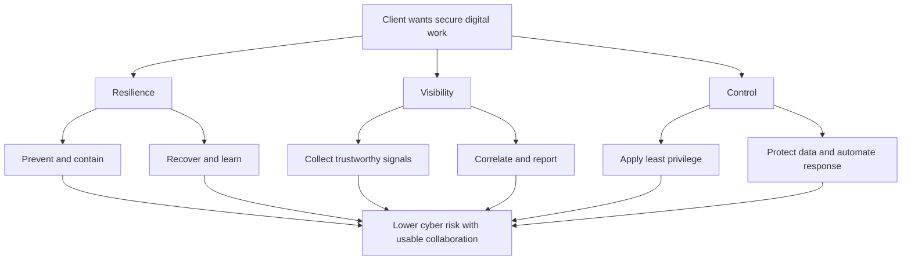

### 🔍 Plain-English deep-dive: risk, issue, finding, and incident

These words are related but not interchangeable.

| Term | Meaning | Example |
|---|---|---|
| **Risk** | An uncertain future event that could harm an objective | A stolen password might allow unauthorized access |
| **Issue** | A problem already happening | Intune policies are failing to apply to 20% of devices |
| **Finding** | Evidence-based assessment result showing a gap or weakness | Legacy authentication remains enabled for a business application |
| **Incident** | An event or group of events requiring security response | A compromised account is downloading sensitive files |
| **Vulnerability** | A weakness that can be exploited | Unpatched software with a known flaw |
| **Threat** | Something capable of causing harm | A criminal group conducting phishing campaigns |
| **Control** | A safeguard that changes risk | Phishing-resistant MFA and Conditional Access |
| **Residual risk** | Risk remaining after controls are applied | A user can still approve a malicious consent prompt if governance is weak |

A useful simplified risk model is:

$$
\text{Risk} \approx \text{Likelihood} \times \text{Impact}
$$

This is not a universal mathematical law. It is a prioritization model. A consultant must document how likelihood and impact are defined instead of presenting arbitrary numbers as objective truth.

---

## 4. Deloitte Cyber context from this job description

The supplied job description places the role inside **Deloitte Cyber**, on the **Enterprise Security** team, with a connection to **Cloud Infrastructure** and **Cyber Operate** work.

### What those phrases imply for delivery

| Job-description phrase | Practical interpretation for the role |
|---|---|
| **Enterprise Security** | Secure foundational identity, endpoint, collaboration, data, and monitoring capabilities across a complex organization |
| **Secure by Design** | Put security requirements into architecture and change decisions from the beginning, not after deployment |
| **Cloud Security Orchestration and Automation** | Connect signals and actions through Sentinel, Defender, Logic Apps, Power Automate, APIs, and runbooks with human guardrails |
| **Core Infrastructure Security** | Protect identity, devices, networks, cloud services, administrative paths, and operational dependencies |
| **Secure Software Enablement** | Help teams use applications, APIs, identities, connectors, automation, and delivery pipelines safely |
| **Cyber Operate** | Make controls operational: monitor, triage, respond, report, tune, maintain, and improve them |
| **Cloud transformation and resilience** | Move or modernize controls without losing visibility, business continuity, or recovery capability |

> **Important boundary:** This guide uses the wording in the supplied job description. It does not imply access to Deloitte-internal methods, client information, templates, or confidential delivery practices.

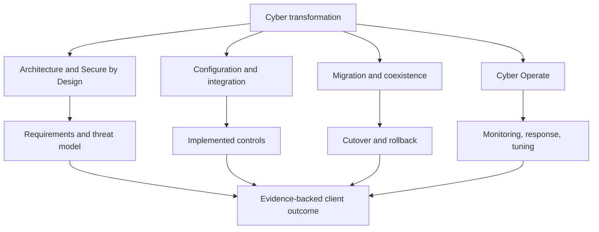

---

## 5. The four hats worn by a Senior Consultant

A candidate who describes only product configuration sounds too narrow. This role combines four professional hats.

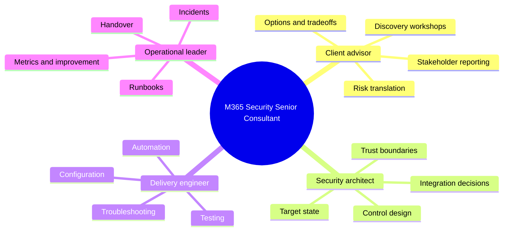

### Hat 1 - Client advisor

The consultant must:

- Ask questions that reveal business impact, not merely collect settings.
- Separate stated symptoms from root problems.
- Identify stakeholders, constraints, assumptions, and decision owners.
- Explain risk in language suitable for engineers, managers, legal teams, and executives.
- Present options with benefits, limitations, costs, dependencies, and residual risk.
- Manage scope and document decisions.

### Hat 2 - Security architect

The consultant must:

- Understand the current architecture and trust boundaries.
- Define control objectives before choosing product settings.
- Design integrations among identity, endpoint, workloads, data, and SecOps.
- Apply Zero Trust, least privilege, defense in depth, and assume-breach thinking.
- Consider licensing, scale, privacy, data location, operational ownership, and failure modes.
- Produce high-level and low-level designs that engineers can implement.

### Hat 3 - Delivery engineer

The consultant must:

- Configure or guide configuration of Microsoft security capabilities.
- Use pilots and deployment rings instead of unsafe big-bang changes.
- Test expected access, denied access, exception paths, failure behavior, and rollback.
- Troubleshoot policy, identity, endpoint, network, workload, integration, and service issues.
- Automate repeatable tasks securely.
- Capture evidence so that implementation claims are verifiable.

### Hat 4 - Operational leader

The consultant must:

- Define incident ownership, escalation paths, and response actions.
- Create runbooks, standard operating procedures, and shift-handover practices.
- Ensure the right logs, permissions, alerts, dashboards, and service-health checks exist.
- Train client teams and transfer knowledge.
- Define service-level targets and useful metrics.
- Tune controls after deployment and turn incidents into improvements.

### Seniority signals

| Less mature behavior | Senior Consultant behavior |
|---|---|
| Lists features | Connects risk, control, configuration, evidence, and outcome |
| Says "best practice" without context | Explains why a recommendation fits this client and what tradeoff it creates |
| Changes production directly | Uses pilot groups, report-only modes, testing, approvals, rollback, and hypercare |
| Treats a policy failure as a portal problem | Traces identity, assignment, token, device, app, network, workload, and service dependencies |
| Reports activity | Reports decisions, risk movement, blockers, evidence, and next actions |
| Keeps expertise personally | Creates documentation, automation, training, and operational ownership |
| Hides uncertainty | States assumptions, evidence gaps, confidence, and validation steps |

---

## 6. The Microsoft security solution map

The products are easier to remember when organized by the question each one answers.

| Security question | Primary capability | Supporting capabilities |
|---|---|---|
| **Who or what is requesting access?** | Microsoft Entra ID | MFA, Conditional Access, Identity Protection, PIM, Identity Governance |
| **Is the device managed, healthy, and appropriately configured?** | Microsoft Intune | Compliance, endpoint security policies, app protection, Autopilot, Defender for Endpoint integration |
| **What collaboration resource is being used?** | Exchange, Teams, SharePoint, OneDrive | Workload policies, sharing, mail flow, guest access, meeting/app controls |
| **What data is involved and how should it be handled?** | Microsoft Purview | Classification, labels, encryption, DLP, retention, audit, eDiscovery, insider risk |
| **Is an attack occurring across identities, devices, email, and cloud apps?** | Microsoft Defender XDR | Defender for Endpoint, Identity, Office 365, and Cloud Apps |
| **What events must be collected across Microsoft and non-Microsoft systems?** | Microsoft Sentinel | Connectors, analytics, UEBA, hunting, workbooks, SIEM, SOAR |
| **How can analysts investigate and respond faster with AI assistance?** | Microsoft Security Copilot | Embedded experiences, plugins, promptbooks, KQL assistance, summaries, guided response |
| **How do controls become a sustainable client service?** | Consulting and operating model | Discovery, design, migration, testing, RACI, runbooks, handover, KPIs, continual improvement |

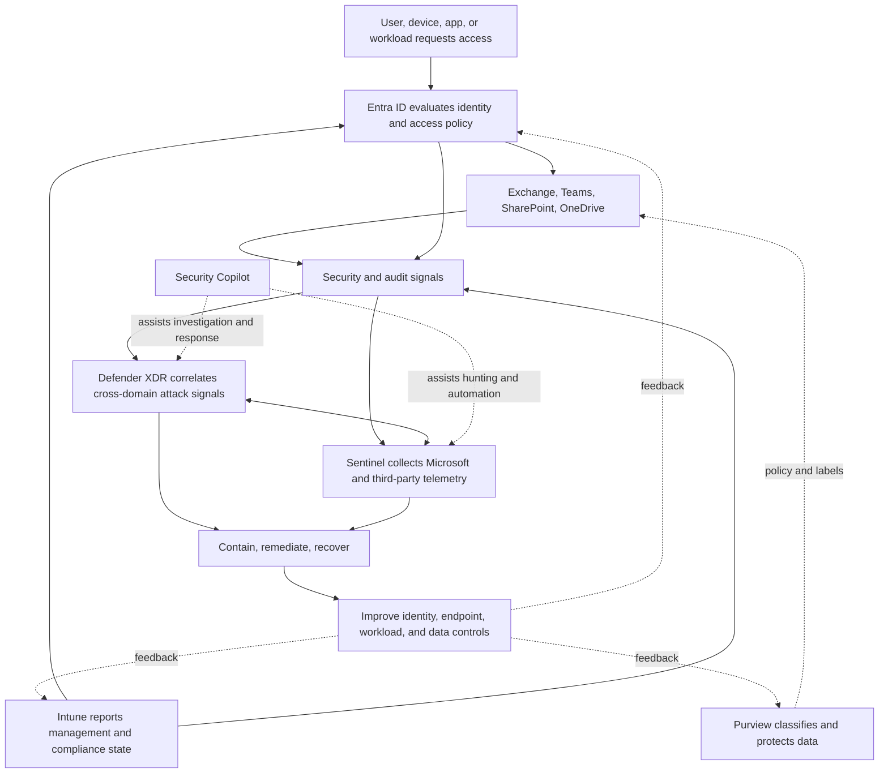

### 🔍 Plain-English deep-dive: SIEM, XDR, and SOAR

- **SIEM - Security Information and Event Management** - *Collects, searches, correlates, and analyzes security data from many systems.* **Analogy:** A city control room receiving feeds from traffic cameras, alarms, hospitals, and emergency services. **Microsoft example:** Sentinel.
- **XDR - Extended Detection and Response** - *Correlates high-quality security signals across connected protection domains such as endpoint, identity, email, and cloud applications.* **Analogy:** A detective who realizes that a stolen badge, a forced door, and a missing laptop are parts of one case. **Microsoft example:** Defender XDR.
- **SOAR - Security Orchestration, Automation, and Response** - *Coordinates repeatable response workflows across tools.* **Analogy:** An emergency playbook that automatically gathers facts, opens the right channels, requests approval, and carries out authorized actions. **Microsoft example:** Sentinel automation rules and Logic Apps playbooks.

A concise distinction:

- **XDR** is strongest at understanding and responding to attacks across deeply integrated security products.
- **SIEM** is strongest at bringing together broad telemetry across Microsoft and non-Microsoft environments.
- **SOAR** turns defined response logic into repeatable workflows.
- In modern Microsoft operations, they are integrated rather than treated as isolated islands.

---

## 7. The end-to-end client engagement lifecycle

A complete engagement is a controlled progression from uncertainty to sustainable operation.

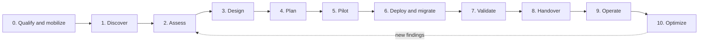

### Phase 0 - Qualify and mobilize

**Question:** What problem is the client asking us to solve, and can the engagement solve it?

Typical activities:

- Clarify business objective and expected outcome.
- Establish initial scope, timeline, locations, users, workloads, and constraints.
- Identify sponsors, decision makers, technical owners, legal/privacy contacts, and operations teams.
- Confirm assumptions, dependencies, access needs, and commercial boundaries.
- Create governance, meeting cadence, escalation path, and RAID log.

Typical artifacts:

- Statement of work or scope summary.
- Engagement charter.
- Stakeholder map.
- Initial RAID log: risks, assumptions, issues, and dependencies.
- Access and evidence request.

### Phase 1 - Discover

**Question:** What exists today, how does it work, and what matters to the client?

Typical activities:

- Interview business, security, identity, endpoint, collaboration, compliance, legal, network, service-desk, and SOC stakeholders.
- Inventory tenants, domains, identities, devices, applications, connectors, data, tools, licenses, policies, exceptions, and integrations.
- Map data and authentication flows.
- Review incidents, audit findings, service pain, and planned changes.
- Separate facts from assumptions and validate evidence quality.

Typical artifacts:

- Discovery questionnaire and workshop notes.
- Current-state architecture and data-flow diagrams.
- Inventory and dependency map.
- Evidence catalogue.
- Confirmed scope and constraints.

### Phase 2 - Assess

**Question:** Where are the material gaps and how important are they?

Typical activities:

- Compare evidence with agreed control objectives, standards, contractual needs, and product guidance.
- Review configuration and operational effectiveness.
- Identify vulnerabilities, design gaps, process gaps, licensing constraints, ownership gaps, and monitoring gaps.
- Score risk and maturity with documented criteria.
- Validate findings with client owners before finalizing them.

Typical artifacts:

- Findings register.
- Risk and maturity assessment.
- Health-check report.
- Secure Score analysis with context.
- Prioritized recommendations.

### Phase 3 - Design

**Question:** What should the target state be and why?

Typical activities:

- Define security requirements and control objectives.
- Create high-level and low-level designs.
- Map trust boundaries, integrations, policy decisions, roles, logs, and response actions.
- Analyze options, tradeoffs, licensing, privacy, resilience, and failure behavior.
- Record architecture decisions, assumptions, and exceptions.

Typical artifacts:

- Target-state architecture.
- High-level design (HLD).
- Low-level design (LLD).
- Requirements traceability matrix.
- Decision records and exception register.

### Phase 4 - Plan

**Question:** How can the client reach the target state with controlled risk?

Typical activities:

- Break work into phases, waves, and deployment rings.
- Identify prerequisites and dependencies.
- Define test, communication, training, migration, coexistence, cutover, rollback, and hypercare plans.
- Allocate ownership through a RACI.
- Establish success metrics and go/no-go criteria.

Typical artifacts:

- Roadmap and implementation plan.
- Migration and coexistence plan.
- Test strategy and test matrix.
- Cutover and rollback plan.
- RACI and communication plan.

### Phase 5 - Pilot

**Question:** Does the design work safely for representative users and scenarios?

Typical activities:

- Select a representative but controlled pilot group.
- Use report-only, simulation, or audit modes where available.
- Test expected success, expected block, exception, failure, and rollback cases.
- Collect user experience, security, support, and operational evidence.
- Tune policies before broader deployment.

Typical artifacts:

- Pilot results and issue log.
- Updated configurations and designs.
- Acceptance evidence.
- Go/no-go recommendation.

### Phase 6 - Deploy and migrate

**Question:** Can the control be introduced at scale without unmanaged disruption?

Typical activities:

- Deploy through controlled rings or waves.
- Monitor technical health, user impact, incidents, and support volume.
- Operate coexistence with legacy or third-party controls.
- Translate policies and migrate telemetry or workflows where required.
- Execute approved changes and rollback if exit criteria are breached.

Typical artifacts:

- Change records and implementation evidence.
- Deployment dashboard.
- Migration reconciliation.
- Issue and decision log.
- Hypercare reports.

### Phase 7 - Validate

**Question:** Did the implementation satisfy the requirement and reduce the intended risk?

Typical activities:

- Perform functional, security, integration, performance, usability, and operational tests.
- Check policy coverage and exclusions.
- Validate logging, alerting, response, and audit evidence.
- Reassess residual risk.
- Obtain formal acceptance or document exceptions.

Typical artifacts:

- Test results and traceability.
- Control validation report.
- Residual-risk register.
- Acceptance or exception record.

### Phase 8 - Handover

**Question:** Can the client's teams run the solution without depending on the project team?

Typical activities:

- Deliver runbooks, SOPs, architecture, configuration records, and known-issue guidance.
- Train administrators, service desk, SOC, engineering, and governance teams.
- Confirm permissions, dashboards, queues, alerts, escalation paths, and vendor contacts.
- Run knowledge checks and operational simulations.
- Obtain handover acceptance.

Typical artifacts:

- Operations handbook.
- Runbooks and support model.
- Knowledge-transfer material and recordings.
- Configuration baseline.
- Handover checklist and acceptance.

### Phases 9 and 10 - Operate and optimize

**Question:** Is the control healthy, effective, usable, and improving?

Typical activities:

- Monitor alerts, incidents, service health, drift, exceptions, and license use.
- Tune policies and detections.
- Review KPIs, risk, and control coverage.
- Conduct incident reviews and exercises.
- Feed lessons into the roadmap and backlog.

Typical artifacts:

- Service and security dashboards.
- Monthly or quarterly reviews.
- Tuning backlog.
- Post-incident reviews.
- Continual-improvement roadmap.

---

## 8. Stage gates: how a consultant prevents unsafe progress

A phase does not finish merely because its meetings are over. It finishes when evidence meets agreed exit criteria.

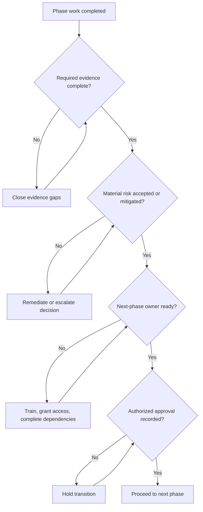

| Gate | Example exit criteria |
|---|---|
| Discovery complete | Critical stakeholders interviewed; inventory confidence recorded; major dependencies mapped |
| Assessment approved | Findings validated by owners; severity criteria applied consistently; disputed findings documented |
| Design approved | Requirements traced to controls; architecture reviewed; privacy/licensing/operations considered |
| Pilot approved | Positive and negative tests passed; support impact acceptable; rollback proven; residual risk understood |
| Production go-live | Change approved; monitoring active; support ready; communications sent; rollback window available |
| Handover accepted | Runbooks tested; owners trained; access verified; known issues and escalation routes documented |

> **Interview phrase:** "I would define evidence-based entry and exit criteria for each phase so progress is controlled by readiness, not by calendar pressure alone."

---

## 9. Complete fictional engagement story

The following scenario is fictional and exists only for study and interview practice. It must never be presented as personal client experience.

### Client: Northstar Retail Group

Northstar is a fictional multinational retailer with:

- 18,000 employees and 4,000 seasonal workers.
- One Microsoft 365 tenant.
- Hybrid Active Directory and Microsoft Entra ID.
- Exchange Online, Teams, SharePoint Online, and OneDrive.
- Windows, macOS, iOS, and Android devices.
- A mixture of Intune, Configuration Manager, and unmanaged devices.
- A third-party email security gateway, endpoint product, and SIEM.
- Microsoft 365 E3 for most users, E5 Security for selected groups, and limited E5 Compliance licensing.
- A 24x7 SOC provided jointly by internal staff and a managed security service provider.

### Trigger event

A finance employee receives a convincing supplier-payment email. The user enters credentials into a fake sign-in page. The attacker signs in from an unusual location, registers an authentication method, searches mail, accesses a broadly shared finance site, downloads files, creates an inbox rule, and sends internal phishing messages.

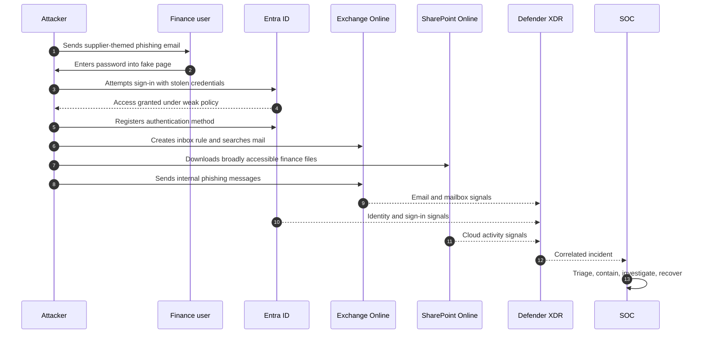

### The business problem

Northstar's executives do not ask for "more Conditional Access." They ask:

- How did one stolen password lead to data exposure?
- Which other users and files may be affected?
- Why did existing tools not stop or correlate the attack earlier?
- Can the company reduce this risk without blocking seasonal operations?
- How should the legacy security tools transition to Microsoft capabilities?
- What will the SOC need to operate the new controls around the clock?
- How will leadership know that risk has actually decreased?

### Initial discovery findings

| Domain | Current-state observation | Potential effect |
|---|---|---|
| Identity | MFA coverage is inconsistent; legacy exclusions have no owners | Stolen credentials can bypass intended protection |
| Conditional Access | Policies were added over time without a documented design | Conflicts, gaps, and lockout risk |
| Privilege | Permanent privileged-role assignments are common | Larger impact if an admin is compromised |
| Devices | Some personal and stale devices appear compliant | Untrusted endpoints can access corporate data |
| Email | Third-party gateway and Microsoft protection overlap | Unclear responsibility, duplicate handling, and blind spots |
| Collaboration | Finance content uses broad membership and permissive sharing | Compromised user can reach more data than required |
| Data security | Labels and DLP exist only in a small pilot | Sensitive data lacks consistent handling controls |
| Detection | Defender and third-party SIEM incidents are separate | Analysts reconstruct one attack across multiple consoles |
| Operations | Runbooks and escalation ownership differ by shift | Response speed and quality vary |
| Licensing | Capabilities were purchased unevenly without persona mapping | Design may assume features users do not have |

### Scope agreed with the client

The engagement will:

1. Assess identity, endpoint, collaboration, data-security, and SecOps controls.
2. Design a Zero Trust target state.
3. Pilot high-priority identity and data controls.
4. Define integration and migration from selected third-party capabilities.
5. Improve Defender XDR and Sentinel operations.
6. Create operational documentation, training, and a phased roadmap.

The engagement will not:

- Replace every third-party tool during the initial phase.
- Redesign unrelated business applications.
- Claim regulatory compliance based on technical configuration alone.
- Make production changes without client approval.

### Target-state concept

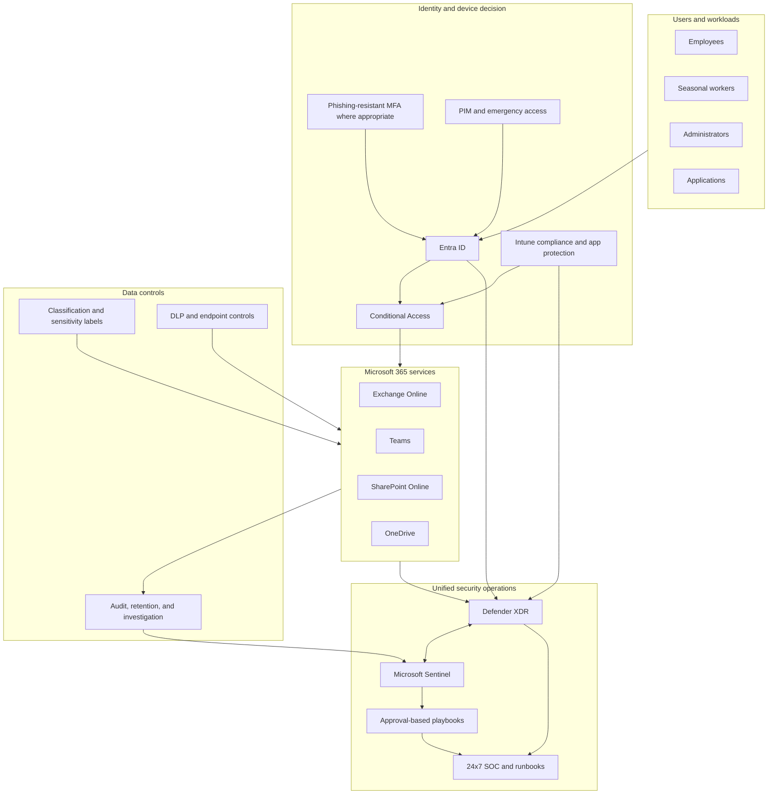

### Prioritized transformation roadmap

| Wave | Objective | Example work | Why this order |
|---|---|---|---|
| **0 - Stabilize** | Close urgent exposure and preserve access | Investigate incident, review emergency access, stop ownerless exclusions, protect high-risk admins, preserve audit evidence | Immediate risk and safe administration come first |
| **1 - Establish identity baseline** | Make access decisions explicit and testable | Authentication registration, MFA, Conditional Access in report-only, legacy auth review, PIM design | Identity is the control plane for cloud access |
| **2 - Establish device trust** | Add reliable endpoint state to access decisions | Enrollment cleanup, compliance, endpoint security baseline, MDE/Intune integration, MAM scenarios | Conditional Access needs trustworthy device signals |
| **3 - Protect collaboration and data** | Reduce oversharing and data loss | Workload policies, sharing governance, labels, DLP simulation, retention, audit | Protect the resources attackers seek |
| **4 - Unify detection and response** | Correlate and operationalize signals | Defender XDR incidents, Sentinel connectors, analytics, UEBA, playbooks, SOC runbooks | Controls must detect and respond when prevention fails |
| **5 - Migrate and optimize** | Reduce duplication and improve value | Capability mapping, coexistence, pilot, cutover, legacy decommission, tuning, metrics | Migrate only after target controls are proven |

### Example identity pilot

The team does not immediately enable a broad blocking policy.

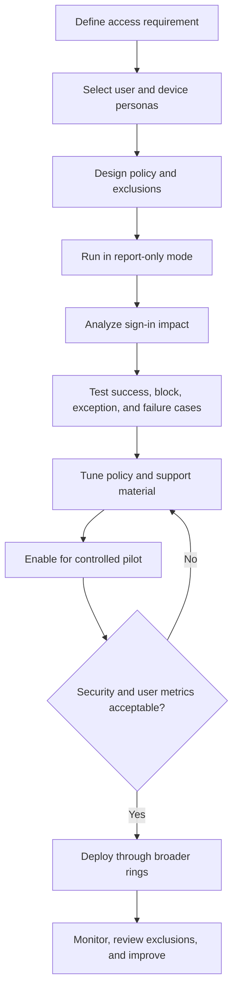

Example tests include:

- Managed compliant device with correct MFA succeeds.
- Unmanaged device receives the intended restriction.
- Legacy client cannot bypass modern authentication policy.
- Emergency-access account works through its separately monitored path.
- Service accounts and workload identities are not accidentally treated as users.
- A user without the required license is identified before enforcement.
- Help desk can diagnose the result from sign-in logs and policy details.
- Rollback restores access without destroying evidence.

### Example third-party migration decision

The consultant does not assume "Microsoft must replace everything." Each capability is assessed.

| Decision question | Example evidence |
|---|---|
| What business and security outcome does the current tool provide? | Use cases, policies, incident history, integrations, SLAs |
| Does a Microsoft capability meet the requirement? | Tested feature and licensing map, not a marketing comparison |
| Are there material gaps? | Platform support, detection depth, data residency, workflow, reporting |
| Can controls coexist safely? | Agent, connector, mail-flow, policy, and response-action compatibility |
| How is historical data handled? | Exportability, retention, legal need, query access, cost |
| What are the cutover and rollback triggers? | Measured detection, performance, user impact, support readiness |
| Who accepts residual risk? | Named business and security decision owner |

### Handover outcome

The project is not complete when the last policy is enabled. It is complete when Northstar can answer:

- Who owns each control?
- How is control health monitored?
- What does L1, L2, L3, engineering, and the vendor do?
- What severity and response targets apply?
- How does an analyst investigate and contain an incident?
- How are exceptions approved, reviewed, and removed?
- How are changes tested and rolled back?
- Which metrics show risk reduction rather than mere activity?
- What is the next improvement wave?

---

## 10. Stakeholders and decision rights

Security transformation crosses organizational boundaries. A technically sound solution can fail if decision rights are unclear.

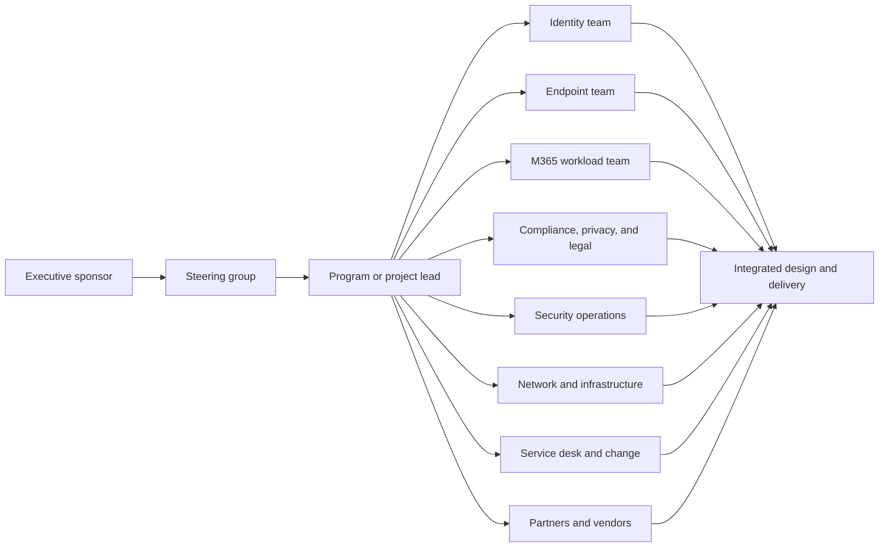

### Common stakeholder concerns

| Stakeholder | What they usually care about | Consultant responsibility |
|---|---|---|
| Executive sponsor | Risk, cost, timeline, disruption, accountability | Give concise decisions, exposure, progress, blockers, and outcomes |
| CISO/security leader | Control effectiveness, threat coverage, residual risk | Connect findings to risk and security objectives |
| Identity team | Authentication, access, privilege, hybrid dependencies | Produce implementable identity design and safe rollout |
| Endpoint team | Enrollment, policy conflicts, platform support, user impact | Coordinate Intune, MDE, SCCM, and access requirements |
| M365 workload owners | Service behavior, sharing, mail, meetings, productivity | Protect workloads without ignoring operational reality |
| SOC | Actionable signals, permissions, queues, automation, response | Design detections and runbooks that can actually be operated |
| Compliance/legal/privacy | Data handling, retention, evidence, employee privacy | Involve them before implementing sensitive monitoring or retention decisions |
| Service desk | User symptoms, diagnosis, escalation, communications | Provide support scripts, logs, known errors, and handoff routes |
| Change management | Approvals, communications, scheduling, rollback | Make change controlled and auditable |
| Vendors/partners | Product boundary, evidence, defect ownership | Create a shared timeline and specific evidence-based action requests |
| End users | Ability to work, understandable prompts, privacy, support | Test usability and communicate why controls exist |

### RACI in plain English

- **Responsible** - does the work.
- **Accountable** - owns the result and final decision. Ideally one accountable owner per activity.
- **Consulted** - provides required input before the decision or action.
- **Informed** - receives relevant updates.

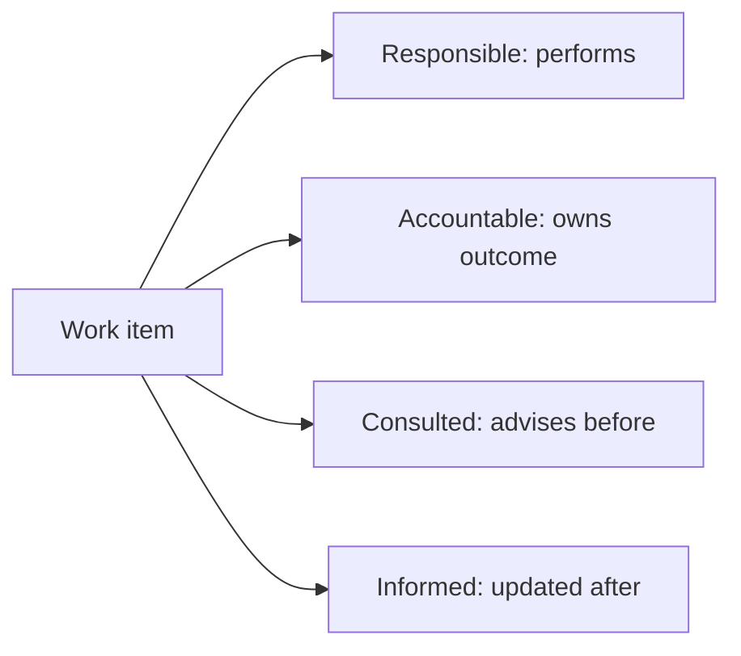

A RACI is not a substitute for conversation. Its purpose is to expose ambiguity before an urgent change or incident exposes it painfully.

---

## 11. What a day in the role can look like

There is no single routine day, but activities generally fall into five modes.

| Mode | Example activities | Output |
|---|---|---|
| **Discovery and advisory** | Client workshop, architecture review, risk discussion | Validated requirements and decisions |
| **Design and engineering** | Policy design, configuration, automation, integration | Tested technical change and evidence |
| **Troubleshooting and incident response** | Timeline reconstruction, log analysis, vendor bridge | Containment, root cause, action plan |
| **Program delivery** | RAID review, dependency management, status reporting | Controlled scope, blockers, and decisions |
| **Enablement and operations** | Training, runbook walkthrough, shift handover, KPI review | Sustainable client ownership |

### Example working day

1. Review overnight incidents, service health, and deployment metrics.
2. Join an identity-design workshop with client security and infrastructure leads.
3. Analyze report-only Conditional Access impact with an engineer.
4. Update a design decision after discovering a legacy application dependency.
5. Present a risk and options summary to the project lead.
6. Review a Sentinel playbook with the SOC and privacy team.
7. Conduct a pilot go/no-go checkpoint.
8. Update the RAID log, actions, and next-day priorities.
9. Hand over open issues to the next shift with evidence and explicit ownership.

### 24x7 and on-call reality

The job description explicitly requires rotational coverage, including nights, weekends, holidays, and on-call assignments. This implies more than willingness to answer a phone.

A strong answer should show readiness for:

- Severity-based triage under time pressure.
- Clean shift handover with timeline, impact, actions, hypotheses, evidence, and next owner.
- Following runbooks while recognizing when the scenario falls outside them.
- Protecting privileged access and change approvals during emergencies.
- Communicating at an agreed cadence.
- Escalating early when impact or uncertainty is high.
- Avoiding unsupported changes merely to appear fast.
- Completing post-incident learning after service is restored.

---

## 12. Support-to-Consultant Bridge: From Escalation Engineering to Security Consulting

Arti's background is not a detour. It provides strong evidence for several consulting competencies. The transition requires translating that evidence and deliberately building the missing platform depth.

### Transferable evidence map

| Existing evidence from the CV | Consulting competency it supports | Security-context translation |
|---|---|---|
| Owns business-critical M365 escalations and high-priority incidents | Accountability, triage, stakeholder coordination | Lead evidence-based investigation across identity, workload, endpoint, and security teams |
| Coordinates customer IT, partners, engineering, product groups, and vendors | Multi-party client delivery | Establish ownership boundaries, shared timeline, dependencies, and escalation actions |
| Provides architecture guidance, escalation strategy, and risk mitigation | Technical advisory | Convert risk and constraints into control and deployment choices |
| Works across SharePoint Online, OneDrive, sync, M365 administration, and Copilot | Collaboration workload depth | Anchor workload-security assessment and expand into cross-product security controls |
| Investigates recurring issues, escalates defects, and validates fixes | Problem management and engineering rigor | Distinguish configuration, design, service, and product defects; prove remediation |
| Presents business reviews using CSAT, backlog, quality, and trends | Executive and operational reporting | Report risk, control coverage, incidents, readiness, and improvement actions |
| Authors KBs, troubleshooting guides, and best-practice documentation | Knowledge transfer and handover | Create runbooks, designs, support models, and operational acceptance evidence |
| Mentors and onboards engineers | Team enablement | Lead workstreams, review quality, and build client capability |
| Builds Power Automate, Power Apps, Copilot Studio agents | Automation foundation | Learn secure SOAR, Graph, Logic Apps, identity, approval, and audit guardrails |

### Honest gap and action map

| Role requirement | Current evidence boundary | How this guide closes it | Interview-safe wording until proven in production |
|---|---|---|---|
| Entra ID, MFA, Conditional Access | Active Directory and M365 fundamentals; not documented as production implementation | Parts 6-14 and Lab 1 | "I understand the design and have validated it in a lab; my production identity experience is adjacent rather than direct." |
| Intune | Not established in the CV | Parts 15-20 and Lab 2 | "I have built and tested the workflow in a lab and can explain the dependencies and troubleshooting path." |
| Purview | Content/compliance management is broad; no named Purview implementation | Parts 26-33 and Lab 4 | "My M365 content background helps me understand the data problem; my Purview implementation evidence is currently lab-based." |
| Defender suite | Not established in the CV | Parts 34-41 and Lab 5 | "I can investigate the scenario and explain the product boundaries, but I would not claim prior Defender ownership." |
| Sentinel and KQL | Not established in the CV | Parts 43-52 and Lab 6 | "I have hands-on lab evidence for ingestion, KQL, detection, and SOAR; not yet long-term production operations." |
| Exchange and Teams security | Not documented as primary workloads | Parts 21-23 and Lab 3 | "My deepest production workload experience is SharePoint and OneDrive; I have broadened Exchange and Teams through structured labs." |
| Security assessments and migrations | Related advisory and escalation evidence, not a formal cyber-assessment claim | Parts 53-58 and capstone | "I use an evidence-based assessment method in the capstone and can connect it to my existing health-review and advisory work." |

> **Candidate honesty note:** Lab work is real evidence of learning, method, and technical execution. It is not production tenure. Interview defensibility is more valuable than inflated keyword coverage.

### 🔍 Plain-English deep-dive: transferable skill versus direct experience

- **Direct experience** - *You performed the activity in the relevant real environment and can explain constraints, decisions, failures, and outcomes.*
- **Transferable skill** - *A proven ability from another context that helps with the new activity.*
- **Conceptual knowledge** - *You understand how and why the activity works.*
- **Lab experience** - *You implemented or simulated it in a controlled environment and retained evidence.*

A credible candidate labels these correctly. For example:

> "I have direct production experience leading complex Microsoft 365 escalations across SharePoint and OneDrive. My Conditional Access experience is currently structured lab work, where I used report-only analysis, positive and negative test cases, and rollback planning. The transferable strength is disciplined troubleshooting and cross-team incident ownership."

---

## 13. Competency model for this role

The role requires six connected competency groups.

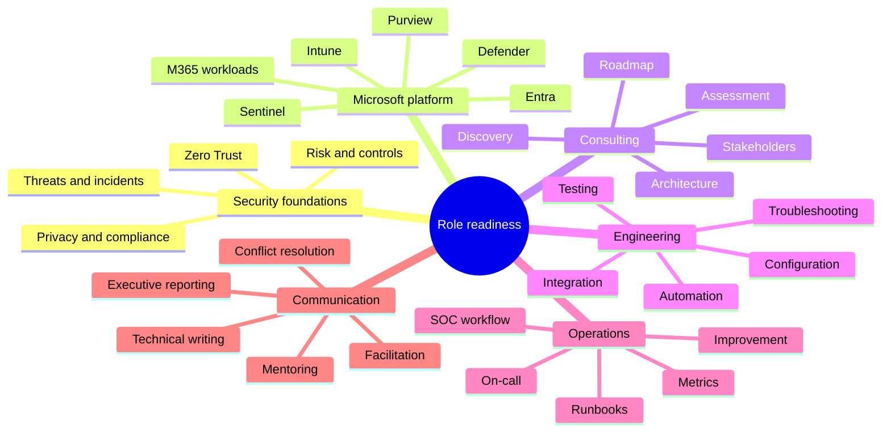

### Readiness levels

| Level | What it means | Evidence example |
|---|---|---|
| **0 - Unfamiliar** | Cannot explain the purpose accurately | No evidence yet |
| **1 - Aware** | Can define the concept and identify its role | Notes and glossary recall |
| **2 - Explain** | Can compare options and draw the flow | Whiteboard and model answer |
| **3 - Apply in lab** | Can configure or simulate and capture evidence | Lab journal, screenshots, exports, queries |
| **4 - Diagnose** | Can explain failure modes and isolate causes | Troubleshooting exercise and decision tree |
| **5 - Design** | Can create a client-specific design with tradeoffs | HLD/LLD and requirements traceability |
| **6 - Operate** | Can run, tune, measure, and improve it | Runbook, metrics, incident exercise |
| **7 - Lead** | Can own the workstream and guide others | Delivery plan, reviews, stakeholder decisions |

Reading alone usually reaches Levels 1-2. Labs, scenario drills, answer-aloud practice, and mock interviews are needed for higher levels.

---

## 14. The deliverable chain

Clients should be able to trace each recommendation from evidence to outcome.

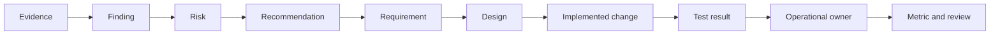

| Artifact | Core question it answers | Quality test |
|---|---|---|
| Discovery notes | What did stakeholders say and what remains unclear? | Decisions, facts, assumptions, and actions are distinguishable |
| Current-state diagram | What exists and how does it connect? | Owners can validate it; trust boundaries and dependencies are visible |
| Evidence catalogue | What proof was reviewed? | Source, date, scope, owner, and limitations are recorded |
| Findings register | What is wrong or weak? | Each finding is specific, evidenced, scoped, and reproducible where possible |
| Risk register | Why does the finding matter? | Likelihood, impact, owner, treatment, and residual risk are clear |
| Requirements | What must the solution achieve? | Requirements are testable and traceable |
| HLD | What is the target architecture and major decision? | Product roles, flows, boundaries, integrations, and tradeoffs are clear |
| LLD | Exactly how will the design be implemented? | An engineer can configure it without guessing key decisions |
| Test plan | How will the control be proven? | Includes success, denial, exception, failure, rollback, and operations |
| Migration plan | How will the old and new states transition safely? | Coexistence, reconciliation, cutover, rollback, and decommission are defined |
| Runbook | How will operators handle a known event? | Triggers, permissions, steps, decisions, evidence, escalation, and recovery exist |
| Executive report | What decision or attention is needed? | Concise risk, outcome, options, recommendation, and ask |

### The evidence rule

A finding should be reproducible or at least traceable to trustworthy evidence. A useful pattern is:

> **Observation:** What was seen.  
> **Evidence:** Where, when, and for what scope.  
> **Risk:** What could happen and why it matters.  
> **Recommendation:** What should change.  
> **Validation:** How success will be proven.  
> **Owner:** Who decides or acts.  
> **Residual risk:** What remains.

---

## 15. Consulting judgment: the questions behind every control

Before recommending or enabling a control, ask:

1. **Objective:** What risk or requirement does this address?
2. **Scope:** Which users, devices, apps, data, locations, and tenants are included?
3. **Prerequisites:** Which identity, license, network, endpoint, data, and operational dependencies exist?
4. **Conflict:** Which current or third-party controls overlap?
5. **Privacy:** What data is collected, who can see it, and what legal or employee considerations apply?
6. **Failure mode:** What happens if the service, policy, connector, token, or automation fails?
7. **Usability:** How does legitimate work continue?
8. **Exception:** Who approves exceptions, for how long, and how are they reviewed?
9. **Test:** What positive, negative, and rollback evidence is required?
10. **Operation:** Who monitors, responds, tunes, and reports after go-live?
11. **Metric:** How will the client know that risk moved in the intended direction?
12. **Exit:** How can the change be rolled back or the tool be decommissioned safely?

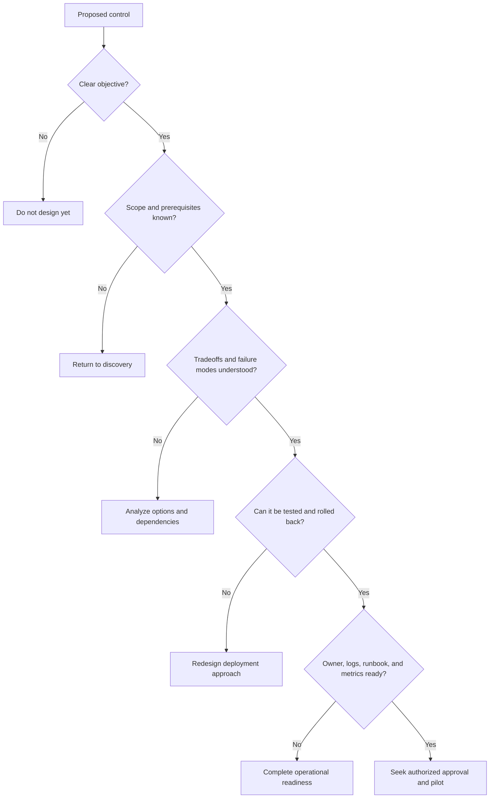

---

## 16. Common failure patterns in security transformations

| Failure pattern | Why it fails | Better approach |
|---|---|---|
| Product-first recommendation | May solve the wrong problem | Begin with risk, objective, scope, and evidence |
| Big-bang enforcement | Creates lockout and disruption | Simulate, pilot, use rings, monitor, and retain rollback |
| Treating Secure Score as the risk strategy | Score lacks full client context | Use it as one signal within evidence-based prioritization |
| Copying a baseline without exceptions analysis | Business and technical dependencies differ | Validate personas, apps, devices, and failure paths |
| Buying a license without an operating model | Capability exists but produces no sustained outcome | Define ownership, process, access, runbooks, and metrics |
| Automating high-impact response without guardrails | False positives can create outages | Use confidence thresholds, approval, least privilege, logging, and rollback |
| Migrating tools feature-for-feature | Product architectures and operating models differ | Map outcomes and use cases, then validate gaps and coexistence |
| Ignoring privacy and legal stakeholders | Monitoring or retention can create new risk | Engage them during requirements and design |
| Measuring deployment rather than effectiveness | "Policy enabled" does not prove risk reduction | Test control behavior and monitor coverage, exceptions, and outcomes |
| Weak handover | Client remains dependent on project team | Test runbooks, access, skills, escalation, and acceptance |
| Blaming users after incidents | Hides control and process improvements | Use blame-free analysis of human, technical, and organizational conditions |
| Overclaiming experience in interviews | Collapses under follow-up questions | Label direct, transferable, lab, and conceptual evidence accurately |

---

## 17. Interview answer framework: O-R-C-E-T-O

Use this structure for architecture, migration, troubleshooting, and consulting scenarios.

1. **Outcome** - What must the client achieve?
2. **Risk and context** - What threats, constraints, users, data, and dependencies matter?
3. **Control design** - Which layered controls address the risk and why?
4. **Execution** - How will discovery, pilot, deployment, migration, and change control work?
5. **Testing and evidence** - How will success, failure, exceptions, and rollback be proven?
6. **Operations** - Who owns monitoring, incidents, runbooks, metrics, and improvement?

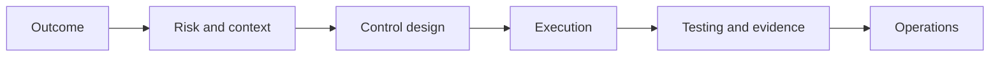

### Example question

**"How would you improve Microsoft 365 security for a new client?"**

Weak answer:

> "I would enable MFA, Conditional Access, Intune, Defender, Purview, and Sentinel."

Stronger answer:

> "I would first confirm the business outcomes, critical users and data, regulatory needs, current tools, incidents, licenses, and operational constraints. I would assess identity, endpoint, collaboration, data, and SecOps controls using evidence, then prioritize material risks. The target design would apply Zero Trust in layers: strong authentication and risk-aware access, trustworthy device signals, workload and data controls, and correlated detection and response. I would deliver through simulation and pilot groups, define positive, negative, exception, and rollback tests, and use deployment rings. Before handover I would validate logs, runbooks, permissions, escalation, service metrics, and client ownership. The exact products and settings would follow from the evidence rather than being assumed in advance."

---

## 18. Practical exercise - build your 90-second role explanation

Write and speak an answer containing all six elements:

- **Client problem:** Complex organizations need secure collaboration without unmanaged disruption.
- **Scope:** Identity, endpoint, Microsoft 365 workloads, data, and SecOps.
- **Method:** Discover, assess, design, deploy, validate, hand over, operate, improve.
- **Technology:** Entra, Intune, Purview, Defender XDR, Sentinel, Security Copilot, Exchange, Teams, SharePoint, and OneDrive.
- **Business outcome:** Resilience, visibility, control, and usable productivity.
- **Personal bridge:** Direct M365 escalation/advisory experience plus explicit lab-based security-platform development.

### Model answer

> "This role helps enterprise clients reduce cyber risk while keeping Microsoft 365 collaboration usable. The work spans identity with Entra, endpoint trust with Intune, Exchange, Teams, SharePoint and OneDrive controls, data security with Purview, and detection and response through Defender XDR and Sentinel. I see the job as an end-to-end consulting lifecycle: discover the current state, assess evidence and risk, design a target architecture, pilot and deploy changes safely, test the intended control behavior, and hand the solution to an operational team with runbooks and metrics. My direct strength is more than five years of Microsoft 365 enterprise support, critical escalation ownership, technical advisory, stakeholder coordination, RCA, fix validation, and documentation. I am building the named security-platform depth through structured labs, and I would be explicit about which evidence is production-based and which is lab-based."

### Self-review rubric

| Criterion | 0 | 1 | 2 |
|---|---|---|---|
| Starts with client outcome | Missing | Implied | Explicit and concise |
| Covers all five technical domains | Fewer than three | Three or four | Identity, endpoint, workload, data, SecOps |
| Describes full lifecycle | Product list only | Some phases | Discovery through operation |
| Shows safe delivery judgment | Missing | Mentions testing | Pilot, evidence, rollback, handover |
| Connects personal evidence | Generic | Lists skills | Accurate direct-to-transferable bridge |
| Avoids overclaiming | Inflated | Unclear | Explicit evidence boundary |

Target score: **10 or more out of 12**, delivered naturally without memorizing every word.

---

## 19. JD mapping for Part 1

| Job requirement | What Part 1 establishes | Deep-dive Part |
|---|---|---|
| Lead and support client engagements | Four-hat role and lifecycle ownership | Parts 53-63 |
| Entra, MFA, Conditional Access | Identity as policy decision layer | Parts 6-14 and Lab 1 |
| Intune | Device trust and endpoint control layer | Parts 15-20 and Lab 2 |
| Purview | Data-security and compliance layer | Parts 26-33 and Lab 4 |
| Defender suite | Integrated prevention, detection, investigation, and response | Parts 34-41 and Lab 5 |
| Sentinel | Broad SIEM/SOAR and third-party telemetry | Parts 43-52 and Lab 6 |
| Exchange, Teams, SharePoint, OneDrive | Collaboration resources being protected | Parts 21-25 and Lab 3 |
| Security assessments and health checks | Evidence-to-finding-to-risk method | Parts 53-54 |
| Discovery, design, deployment, testing, handover | Full engagement lifecycle and stage gates | Parts 53-59 |
| Third-party migration | Outcome and capability mapping, coexistence, cutover | Part 57 and capstone |
| Troubleshooting and service disruption | Cross-layer diagnosis and operational ownership | Parts 60-62 |
| Documentation and reporting | Traceable artifact chain | Part 63 |
| Security Copilot | AI-assisted investigation with human validation | Part 42 |
| SCCM and Power Platform | Endpoint coexistence and secure automation | Parts 20, 25, and 63 |
| 24x7 shifts and on-call | Handover, severity, emergency change, and incident discipline | Parts 61-62 |

---

## 20. Official Source Anchors

These first-party references ground the product relationships introduced here. Product behavior, portals, licensing, and preview status can change, so recheck them before implementation or an interview.

1. [Zero Trust deployment with Microsoft 365](https://learn.microsoft.com/security/zero-trust/microsoft-365-zero-trust) - Zero Trust principles, architecture, and Microsoft 365 deployment guidance.
2. [Zero Trust identity and device access configurations](https://learn.microsoft.com/security/zero-trust/zero-trust-identity-device-access-policies-overview) - Entra, Conditional Access, Intune, and Microsoft 365 access guidance.
3. [Microsoft Defender XDR in the Microsoft Defender portal](https://learn.microsoft.com/unified-secops/defender-xdr-portal) - Cross-domain protection, incidents, hunting, automated response, and Sentinel integration.
4. [Microsoft Sentinel overview](https://learn.microsoft.com/azure/sentinel/overview) - Cloud-native SIEM, security analytics, threat hunting, and SOAR.
5. [Microsoft Sentinel deployment guide](https://learn.microsoft.com/azure/sentinel/deploy-overview) - Planning, content, workspaces, UEBA, and data-lake deployment stages.
6. [Manage endpoint security in Microsoft Intune](https://learn.microsoft.com/intune/device-security/endpoint-security-policies) - Endpoint policy, compliance, Conditional Access, Defender integration, and least privilege.
7. [Microsoft Purview data compliance solutions](https://learn.microsoft.com/purview/purview-compliance) - Audit, eDiscovery, insider risk, communication compliance, records, and Compliance Manager.
8. [What is Microsoft Security Copilot?](https://learn.microsoft.com/copilot/security/microsoft-security-copilot) - Standalone and embedded AI-assisted security experiences and integrations.

---

## ⭐ Likely Interview Questions for This Section

### Q1. What does a Microsoft 365 Security Senior Consultant do?

> **Model answer:** "The consultant translates client risk into an integrated, operable Microsoft 365 security solution. I would discover the current environment, assess evidence and gaps, design layered controls across identity, endpoint, workloads, data, and SecOps, deploy through pilots and controlled rings, validate the intended behavior, and hand over runbooks, ownership, and metrics. The outcome is not merely enabled features; it is measurable resilience, visibility, and control."

### Q2. How is security consulting different from technical support?

> **Model answer:** "Support usually begins with a reported symptom or incident and works toward restoration and root cause. Consulting often begins with an ambiguous business objective and must define scope, assess current state, design a target state, deliver change, and create sustainable operations. The skills overlap in troubleshooting, stakeholder management, risk communication, documentation, and escalation. The additional consulting disciplines are structured discovery, architecture, roadmap, change, acceptance, and handover."

### Q3. How do Entra, Intune, Purview, Defender XDR, and Sentinel fit together?

> **Model answer:** "Entra evaluates identity and access. Intune supplies device management, configuration, compliance, and application-protection state. Microsoft 365 workloads provide collaboration resources. Purview classifies and protects data and supports compliance investigations. Defender XDR correlates attacks across integrated domains such as identity, endpoint, email, and cloud apps. Sentinel extends SIEM and SOAR across Microsoft and third-party telemetry. The products should be designed as connected control and evidence layers, not isolated portals."

### Q4. How would you start a Microsoft 365 security transformation?

> **Model answer:** "I would start with outcomes and evidence: critical services and data, threat and incident history, regulatory needs, user and device personas, current architecture and tools, licenses, operational model, constraints, and planned changes. I would map dependencies and trust boundaries, assess control design and effectiveness, validate findings with owners, and prioritize risk. Only then would I recommend a target architecture and phased roadmap."

### Q5. How would you prevent a security deployment from disrupting the client?

> **Model answer:** "I would use explicit prerequisites and stage gates, report-only or simulation modes where available, representative pilot groups, deployment rings, positive and negative test cases, exception and emergency-access validation, support readiness, monitored success metrics, formal go/no-go decisions, and a tested rollback plan. I would also account for licensing, legacy applications, service accounts, network paths, third-party overlap, and user communications."

### Q6. How would you approach migration from a third-party security tool to Microsoft security?

> **Model answer:** "I would map business outcomes and use cases rather than compare feature names only. I would assess current policies, data, integrations, response workflows, service levels, costs, and regulatory constraints; identify parity and gaps; design coexistence; test representative detections and operational workflows; define data-retention treatment, cutover, reconciliation, rollback, and decommission criteria; and obtain risk acceptance for any residual gaps."

### Q7. Your CV does not show production ownership of every named security product. How would you address that?

> **Model answer:** "I would be precise. My direct production evidence is Microsoft 365 enterprise support, SharePoint and OneDrive depth, critical incident ownership, technical advisory, cross-team and vendor coordination, RCA, fix validation, documentation, and business reviews. For products such as Sentinel or Intune, I would present structured lab evidence and explain the architecture, implementation, tests, and troubleshooting path without claiming production tenure. That makes the gap visible but also demonstrates a disciplined plan to close it."

### Q8. What makes a security control operationally ready?

> **Model answer:** "A control is operationally ready when ownership, access, monitoring, logs, alert routing, severity, runbooks, escalation, vendor boundaries, service targets, exception management, change process, rollback, training, documentation, and metrics are in place and tested. A control that is configured but cannot be monitored, supported, or recovered is not fully delivered."

---

## 🧠 30-Second Memory Hooks

- **The role:** Understand -> design -> deploy -> prove -> transfer.
- **Business outcomes:** Resilience, visibility, and control.
- **Five security domains:** Identity, endpoint, workloads, data, and SecOps.
- **Five product anchors:** Entra, Intune, Purview, Defender XDR, Sentinel.
- **Consulting chain:** Evidence -> finding -> risk -> recommendation -> design -> test -> owner -> metric.
- **Delivery lifecycle:** Discover -> assess -> design -> plan -> pilot -> deploy -> validate -> handover -> operate -> optimize.
- **Safe change:** Simulate, pilot, ring, monitor, roll back.
- **XDR:** Correlates an attack across integrated protection domains.
- **SIEM:** Collects and analyzes broad telemetry.
- **SOAR:** Orchestrates repeatable response.
- **RACI:** Responsible does; Accountable owns; Consulted advises; Informed knows.
- **Interview honesty:** Production, transferable, lab, and conceptual are four different evidence levels.
- **Senior signal:** Explain tradeoffs and operation, not just features.
- **O-R-C-E-T-O:** Outcome, Risk, Control, Execution, Testing, Operations.

---

## Completion Checklist

You are ready to move on when you can do all of the following without reading:

- [ ] Explain the role in one sentence and in 90 seconds.
- [ ] Define consultant, security, enterprise security, risk, control, finding, issue, and incident.
- [ ] Draw the five-domain architecture: identity, endpoint, workloads, data, and SecOps.
- [ ] Explain Entra, Intune, Purview, Defender XDR, Sentinel, and Security Copilot without confusing their roles.
- [ ] Distinguish SIEM, XDR, and SOAR.
- [ ] Walk through discovery, assessment, design, planning, pilot, deployment, validation, handover, operation, and optimization.
- [ ] Name at least one artifact and one exit criterion for each engagement phase.
- [ ] Explain the Northstar incident from initial phish to cross-domain response.
- [ ] Describe how you would pilot a high-impact policy safely.
- [ ] Explain how third-party migration differs from a feature checklist.
- [ ] Describe operational readiness and 24x7 handover requirements.
- [ ] Translate five items from Arti's support background into consulting competencies.
- [ ] State the Entra, Intune, Purview, Defender, Sentinel, Exchange, and Teams gaps honestly.
- [ ] Answer all eight interview questions aloud in two minutes or less each.
- [ ] Score at least 10/12 on the role-explanation rubric.

---

*Next suggested section:* [**Part 2 - Cybersecurity Fundamentals from Zero**](Part-02-cybersecurity-fundamentals.md). It builds the vocabulary and mental models needed to reason about threats, vulnerabilities, risk, controls, confidentiality, integrity, availability, authentication, authorization, and compliance before product configuration begins.
