# Part 2 — Cybersecurity Fundamentals from Zero

> **Section goal:** Build the vocabulary and reasoning model needed to discuss cybersecurity without hiding behind product names. By the end, you should be able to identify assets, threats, weaknesses, risk, controls, evidence, and responsibilities; explain confidentiality, integrity, availability, identity assurance, cryptography, resilience, governance, and ethics; and turn an ambiguous Microsoft 365 concern into a defensible security finding and treatment plan.

**JD mapping:** This Part supports Deloitte responsibilities for Microsoft 365 security assessments, health checks, architecture, troubleshooting, policy analysis, risk communication, documentation, incident support, client workshops, and operational handover. It supplies the concepts later used for Microsoft Entra, Intune, Purview, Defender, Sentinel, Exchange, Teams, SharePoint Online, OneDrive, Power Platform, and Copilot work.

---

## 1. Security begins with what the organization values

Cybersecurity is the coordinated protection of information, technology, services, and people against harm. The point is not to make every action impossible. The point is to let legitimate work continue while reducing the likelihood and impact of unwanted events.

### 🔍 Plain-English deep-dive: assets, identities, data, and attack surface

- **Asset** — *anything the organization values and would suffer from losing, exposing, corrupting, or being unable to use.* **Analogy:** A household protects not only cash, but also keys, documents, medicines, family members, and utilities. **Why it matters:** A control has no purpose unless it protects an asset or business objective.
- **Identity** — *a digital representation of a person, device, application, service, or automated agent.* **Analogy:** A badge represents someone or something at a controlled doorway. **Why it matters:** Microsoft 365 access usually begins with an identity, so stolen or overprivileged identities can reach many services.
- **Data** — *recorded information, including documents, messages, settings, logs, credentials, and business records.* **Analogy:** Data is the content inside filing cabinets, not merely the cabinets. **Why it matters:** Attackers often want the information, while regulators and customers care how it is handled.
- **Attack surface** — *all reachable ways an attacker could try to enter, influence, observe, or disrupt an environment.* **Analogy:** It is the collection of doors, windows, vents, delivery bays, staff entrances, and exposed pipes around a building. **Why it matters:** Unknown services, sharing links, applications, privileged accounts, and vendor connections create unmanaged opportunities.
- **Asset inventory** — *a maintained record of assets, owners, purpose, location, criticality, dependencies, and lifecycle state.* **Analogy:** A fire service needs an accurate building plan before an emergency. **Why it matters:** An organization cannot consistently protect or retire what it cannot identify.

| Asset class | Microsoft 365 examples | Harm to consider | Useful owner question |
|---|---|---|---|
| People and identities | Employees, guests, administrators, service accounts, applications | Impersonation, privilege misuse, lockout | Who approves, reviews, and removes access? |
| Business data | SharePoint sites, OneDrive files, Teams messages, Exchange mail | Disclosure, alteration, deletion, regulatory breach | What is sensitive and who should use it? |
| Configuration | Sharing settings, mail rules, app consent, domain records | Security bypass, outage, loss of control | What is the approved baseline and change process? |
| Endpoints | Laptops, mobile devices, browsers, sync clients | Credential theft, malware, local data exposure | Is the device known, healthy, and supported? |
| Applications and automation | Power Apps, Power Automate flows, Copilot agents, integrations | Excessive permissions, data leakage, unintended action | Which identity and connectors does it use? |
| Evidence | Audit logs, sign-in records, message traces, tickets, RCA documents | Blind investigation, weak auditability | Is collection sufficient, trustworthy, retained, and accessible? |
| Service capability | Authentication, email, file sync, collaboration | Business interruption and safety impact | What depends on it and how is failure handled? |
| Reputation and obligations | Customer trust, contracts, law, policy | Financial, legal, operational, and reputational loss | Which stakeholders decide acceptable risk? |

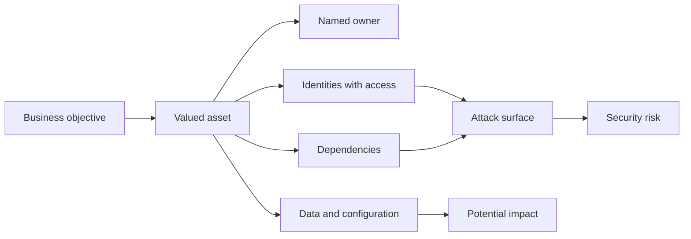

An asset can have several forms. A SharePoint Online finance site is a service resource, a collection of data, a set of permissions, an operational dependency, and a legal evidence source. Protecting only its availability while ignoring broad membership would miss confidentiality. Protecting only confidentiality while losing recoverability would miss availability and integrity.

> **Arti's transferable advantage:** Production work across SharePoint Online, OneDrive, sync, customer environments, and critical escalations already requires asset-and-dependency thinking. The security extension is to ask not only “why did sync fail?” but also “what data, identity, permission, device, control, evidence, and business impact are involved?”

---

## 2. Threats, actors, motives, techniques, vulnerabilities, exploits, and exposure

A security problem is easier to reason about when its pieces are separated. A threat is not the same as a vulnerability, and a vulnerability is not proof that exploitation occurred.

### 🔍 Plain-English deep-dive: the attack vocabulary

- **Threat** — *a circumstance or actor capable of causing harm.* **Analogy:** A burglar is a threat to a house. **Why it matters:** Threats guide what defenses and monitoring are relevant.
- **Threat actor** — *a person, group, organization, or automated capability that intentionally or accidentally causes harm.* **Analogy:** Different trespassers have different skills and objectives. **Why it matters:** A criminal group, careless insider, hostile state, and malfunctioning automation require different treatments.
- **Motive** — *the reason an actor acts, such as profit, espionage, disruption, ideology, revenge, or convenience.* **Analogy:** Knowing whether someone wants money or sabotage changes what they might target. **Why it matters:** Motive helps prioritize plausible scenarios.
- **Tactic, technique, and procedure (TTP)** — *a goal, a method for achieving it, and the actor's repeatable way of using that method.* **Analogy:** “Enter the building” is the goal; “use a stolen badge” is the method; “steal badges during lunch and enter through loading bays” is the procedure. **Why it matters:** Defenders detect behavior even when malware names or infrastructure change.
- **Vulnerability** — *a weakness that could be exploited.* **Analogy:** A window with a faulty latch. **Why it matters:** Weakness alone does not establish actual compromise, but it creates possibility.
- **Exploit** — *a method or code that uses a vulnerability to produce unintended behavior.* **Analogy:** A tool shaped to open the faulty latch. **Why it matters:** Exploitability affects urgency, but exposure and impact still matter.
- **Exposure** — *the condition that makes an asset reachable or accessible to potential harm.* **Analogy:** The faulty window is more dangerous when it faces an unmonitored public alley. **Why it matters:** Reducing reachability can lower risk even before a weakness is fully removed.
- **Attack vector** — *the route or method used to reach a target.* **Analogy:** A path through the mailroom, website, phone, or front door. **Why it matters:** M365 vectors include phishing, malicious consent, oversharing, vulnerable endpoints, misconfiguration, and third-party access.
- **Attack path** — *a chain of conditions and steps that leads from an initial position to a valuable objective.* **Analogy:** A route through several unlocked internal doors. **Why it matters:** Breaking one high-value step can stop several scenarios.

| Actor type | Common motive | Illustrative behavior | Defensive emphasis |
|---|---|---|---|
| Cybercriminal | Financial gain | Phishing, fraud, ransomware, data sale | Strong identity, email protection, payment controls, detection, recovery |
| Nation-state or advanced group | Espionage, strategic access, disruption | Patient credential theft, supply-chain access, persistence | Privileged security, segmentation, intelligence, hunting, long-term evidence |
| Malicious insider | Profit, coercion, grievance | Data theft, sabotage, abuse of legitimate access | Least privilege, separation of duties, auditing, fair insider-risk process |
| Careless insider | Convenience, mistake, weak awareness | Wrong sharing link, unsafe data transfer, accidental deletion | Usable defaults, education, labels, DLP, recovery, nonpunitive learning |
| Third party | Compromised partner or weak process | Vendor account abuse, insecure connector, delayed offboarding | Contract, access review, scoped permissions, monitoring, exit process |
| Hacktivist | Ideology or publicity | Defacement, denial of service, disclosure | Resilience, public communications, monitoring, incident readiness |
| Automation or software failure | No human motive | Runaway flow, defective update, incorrect synchronization | Change control, guardrails, rate limits, rollback, monitoring |

```mermaid
flowchart LR
    ACTOR[Threat actor] --> MOTIVE[Motive]
    MOTIVE --> TACTIC[Tactic: desired stage]
    TACTIC --> TECH[Technique: method]
    TECH --> VECTOR[Attack vector]
    VECTOR --> EXPOSURE[Reachable exposure]
    EXPOSURE --> VULN[Vulnerability or weakness]
    VULN --> EXPLOIT[Exploit or abuse]
    EXPLOIT --> IMPACT[Business impact]
```

Consider a permissive anonymous sharing link. The link is an exposure. Weak governance or excessive duration is a control weakness. A forwarded link is an attack or misuse vector. Downloading confidential content is the harmful action. A public breach is an impact. The analysis must not collapse those statements into “SharePoint was hacked.”

| Statement | What it establishes | What it does not establish |
|---|---|---|
| A weakness exists | Potential for harm | Exploitation or business impact occurred |
| An exploit is public | A practical method may exist | The client asset is reachable or affected |
| An alert fired | A rule observed matching evidence | Confirmed incident or full scope |
| A login succeeded | Authentication was accepted | The person was legitimate or every policy worked |
| A file was downloaded | Data transfer occurred | Malicious intent without context |
| A product fix was applied | A known defect may be addressed | Configuration, data, or service is healthy without validation |

---

## 3. The CIA triad: confidentiality, integrity, and availability

The **CIA triad** is a three-part model for the security properties of information and systems. Here CIA does not mean an intelligence agency.

### 🔍 Plain-English deep-dive: three kinds of harm

- **Confidentiality** — *information is disclosed only to authorized parties.* **Analogy:** A sealed medical letter is read only by the intended recipient. **Why it matters:** Oversharing, stolen sessions, broad permissions, and exposed backups can reveal sensitive M365 data.
- **Integrity** — *information and systems remain accurate, complete, authentic, and changed only in authorized ways.* **Analogy:** A tamper-evident seal shows whether medicine was altered. **Why it matters:** An attacker who changes bank details, mailbox rules, labels, logs, or configuration can cause harm without stealing data.
- **Availability** — *authorized users can access needed information and services at the required time and quality.* **Analogy:** A hospital generator keeps essential equipment available during a power failure. **Why it matters:** Identity outages, network failures, ransomware, deletion, or badly designed security policies can stop business operations.

| Property | M365 failure example | Preventive ideas | Detective/recovery evidence |
|---|---|---|---|
| Confidentiality | External guest reads restricted SharePoint files | Least privilege, secure sharing defaults, encryption, data classification | Audit records, access reviews, sharing reports |
| Integrity | Attacker creates an inbox forwarding rule | Strong authentication, privileged controls, change restrictions | Mailbox audit, alert, message trace, known-good configuration |
| Availability | Users cannot sign in after unsafe policy rollout | Staged deployment, exclusions, emergency access, rollback | Sign-in logs, service health, change record, recovery test |

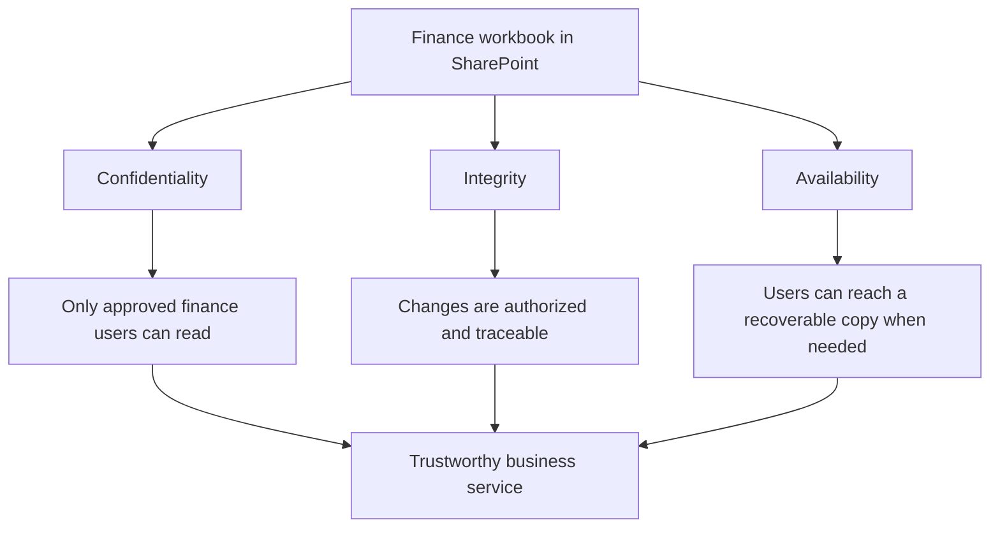

The three properties can conflict. A broad emergency link may improve immediate availability while damaging confidentiality. A strict block may protect confidentiality but cause an outage. A consultant identifies the required balance, documents the decision owner, and designs a controlled exception rather than pretending one property always wins.

| Decision | Confidentiality effect | Integrity effect | Availability effect | Better consulting question |
|---|---|---|---|---|
| Block all external sharing | Usually increases | May reduce external modification | May stop partner work | Which sites, data classes, and partner scenarios require controlled sharing? |
| Give many global admins | Decreases through broad access | Increases risk of harmful change | May make support faster temporarily | Which scoped role and activation window are sufficient? |
| Keep only online copies | Neutral by itself | Recovery integrity uncertain | Raises dependency on live service/account | What tested, protected recovery path meets the business objective? |
| Disable a control during diagnosis | Often decreases | May change evidence or state | May restore one symptom | Which safe test can isolate the control without weakening production? |

---

## 4. AAA, accountability, nonrepudiation, and privacy

**AAA** commonly stands for authentication, authorization, and accounting. It describes how access is proven, permitted, and recorded.

| Concept | Plain meaning | M365 illustration | Key question |
|---|---|---|---|
| Authentication, or AuthN | Prove who or what is requesting | Entra ID validates a user sign-in | Who are you and how strong is the proof? |
| Authorization, or AuthZ | Decide what an authenticated identity may do | SharePoint permission allows read but not edit | What can this identity do to this resource? |
| Accounting | Record relevant activity and resource use | Audit entry records file access or admin change | What happened, when, where, and under which identity? |
| Accountability | Connect actions to responsible identities and governance | Named owner reviews an exception and activity | Who owns the action and consequence? |
| Nonrepudiation | Provide strong evidence that a party performed or approved an action | A signed approval plus protected audit trail | Can the actor credibly deny the action? |

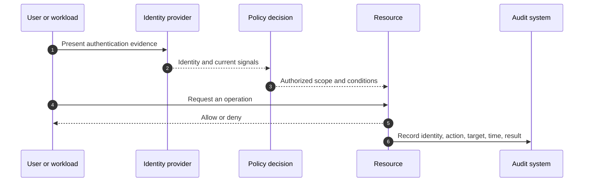

### Privacy is related to security but not identical

**Privacy** concerns appropriate collection, use, sharing, retention, monitoring, and disposal of information about people. Security helps protect that information, but a perfectly encrypted database can still violate privacy if the organization collected data without a valid purpose or retained it indefinitely.

| Security question | Privacy question |
|---|---|
| Can unauthorized people access the data? | Should the organization collect or use the data at all? |
| Is the record protected from tampering? | Is the purpose clear and proportionate? |
| Are actions audited? | Who can see employee monitoring information and under what process? |
| Is the data recoverable? | How long should personal data be retained? |
| Does encryption protect transport? | Was sharing with a processor or AI service properly assessed? |

**Data minimization** means collecting and retaining only what is necessary for a defined purpose. **Purpose limitation** means using data only for the stated legitimate purpose unless another lawful and governed basis exists. **Transparency** means affected people can understand important handling. These are governance and legal matters as well as technical design matters.

> **Arti tie-in:** Customer escalation work already demands careful handling of logs, screenshots, tenant identifiers, and user information. The security-consulting extension is to request the minimum evidence needed, redact safely, control who receives it, document purpose, and follow retention and deletion requirements.

---

## 5. Risk vocabulary and the limits of scoring

Risk expresses uncertainty about harm to an objective. It is not simply a product score, a vulnerability count, or a red status icon.

### 🔍 Plain-English deep-dive: from threat to residual risk

- **Likelihood** — *the judged chance that a scenario will occur within a defined period.* **Analogy:** A weather forecast estimates possibility, not certainty. **Why it matters:** Exposure, attacker capability, history, and controls influence likelihood.
- **Impact** — *the consequence if the scenario occurs.* **Analogy:** The same leak is minor under a sink and catastrophic above a data center. **Why it matters:** Safety, operations, finance, legal duties, reputation, and affected people all matter.
- **Inherent risk** — *risk before considering the selected controls.* **Analogy:** The raw fire risk before sprinklers and evacuation measures. **Why it matters:** It communicates why safeguards are needed.
- **Control effectiveness** — *how well a safeguard is designed, implemented, and operating.* **Analogy:** Owning a fire extinguisher is not enough if it is empty or nobody can find it. **Why it matters:** “Enabled” does not prove effective.
- **Residual risk** — *risk that remains after controls.* **Analogy:** A seat belt reduces injury risk but does not make driving risk-free. **Why it matters:** A named authority must understand and accept, further treat, or avoid what remains.
- **Risk appetite** — *the broad amount and type of risk an organization is willing to pursue or retain for its objectives.* **Analogy:** A company-wide rule for how adventurous investments may be. **Why it matters:** It guides strategy.
- **Risk tolerance** — *the acceptable variation around a specific objective or metric.* **Analogy:** A service may tolerate a defined outage duration. **Why it matters:** It turns broad appetite into operational boundaries.
- **Risk owner** — *the person accountable for deciding and monitoring treatment.* **Analogy:** The person who owns the business consequence, not merely the technician who changes a setting. **Why it matters:** Engineers should not silently accept business risk.

A simple qualitative model is:

$$
\text{Risk level} \approx \text{Likelihood} \times \text{Impact}
$$

This is a prioritization aid, not a physical law. Multiplying labels such as “3 × 4 = 12” can create false precision. Scores are useful only when the scales, timeframe, evidence, assumptions, control state, and decision thresholds are documented.

| Scoring limitation | Why it matters | Better practice |
|---|---|---|
| Undefined labels | “High” means different things to different teams | Define observable criteria for each level |
| False precision | A numeric result looks more objective than the evidence | Show rationale, uncertainty, and confidence |
| Ignored asset context | One weakness has different effects in different systems | Tie scenario to asset, data, users, and business process |
| Counting findings | Ten minor gaps may matter less than one attack-path gap | Prioritize plausible scenarios and concentration of harm |
| Vendor score as truth | Product scores optimize their own model | Use score as one signal; validate in client context |
| Static snapshot | Threats, controls, and business use change | Assign review triggers and dates |
| Control existence assumed effective | A policy can be excluded, broken, or unmonitored | Test design, implementation, and operation |

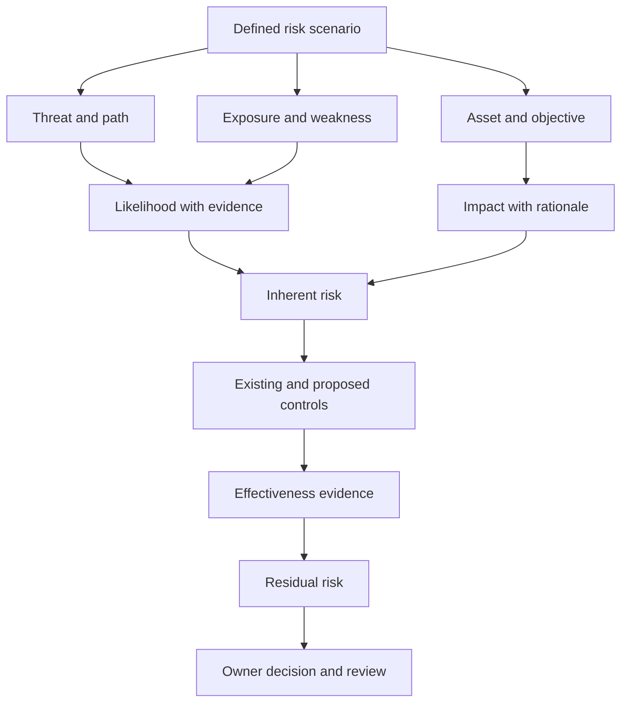

### Risk treatment choices

| Treatment | Meaning | M365 example | Important caution |
|---|---|---|---|
| Mitigate | Reduce likelihood or impact with controls | Tighten sharing, improve identity proof, monitor downloads | Verify the control and residual risk |
| Avoid | Stop the activity causing the risk | Do not permit anonymous links for a classified repository | Consider business impact and alternatives |
| Transfer or share | Shift some financial or operational consequence | Contract, insurance, managed service | Accountability and many harms cannot be fully transferred |
| Accept | Formally retain the risk | Time-limited exception for a documented legacy need | Requires authority, rationale, expiry, and monitoring |

**Risk statement pattern:**

> Because **[threat/source]** could exploit **[exposure or weakness]**, there is a possibility of **[security event]**, leading to **[business impact]**. Existing controls are **[state and evidence]**. Recommended treatment is **[action]**, leaving **[residual risk]** owned by **[role]**.

Example:

> Because a forwarded anonymous link can be used by an unintended recipient, long-lived anonymous sharing on a finance site could expose commercially sensitive documents, leading to confidentiality, contractual, and reputational impact. Current evidence shows links are permitted but does not yet establish how many exist or whether content was accessed. Treatment should inventory active links, classify affected sites, replace inappropriate links with authenticated access, define expiry, and monitor sharing. The finance data owner accepts any documented residual external-collaboration risk.

---

## 6. Controls: families, forms, functions, and layers

A **security control** is a safeguard that changes risk. Controls can be classified in several valid ways; the classifications answer different questions.

| Classification lens | Categories | Example |
|---|---|---|
| Nature | Administrative, technical, physical | Policy; access rule; secured facility |
| Function | Preventive, detective, corrective, deterrent, recovery, compensating | MFA; alert; revoke session; warning; restore; temporary restriction |
| Timing | Before, during, after an event | Baseline; live monitoring; post-incident improvement |
| Scope | Organization, tenant, workload, site, group, item | Security standard; tenant setting; site permission |
| Automation | Manual, automated, hybrid | Approval; policy engine; analyst-approved playbook |

### Control families

| Family | Objective | Illustrative safeguards |
|---|---|---|
| Governance and risk | Direct and oversee security | Policies, risk owners, exceptions, steering review |
| Asset management | Know and manage what exists | Inventories, ownership, lifecycle, criticality |
| Identity and access | Permit appropriate access | Authentication, authorization, privileged access, lifecycle |
| Data protection | Protect information by sensitivity and use | Classification, encryption, DLP, retention, sharing controls |
| Secure configuration | Maintain approved settings | Baselines, configuration review, drift detection |
| Vulnerability management | Find and reduce exploitable weakness | Inventory, assessment, remediation, validation |
| Network security | Control and observe communication | Segmentation, firewall, proxy, secure protocols |
| Logging and detection | Observe suspicious or important behavior | Audit, alerting, correlation, health monitoring |
| Incident response | Prepare for and handle incidents | Triage, containment, communications, evidence, PIR |
| Resilience and recovery | Continue and restore trusted operation | Redundancy, backups, emergency access, exercises |
| Supplier security | Govern third-party dependency | Due diligence, access boundaries, contract, offboarding |
| People security | Reduce human and organizational risk | Training, role separation, background process, support |

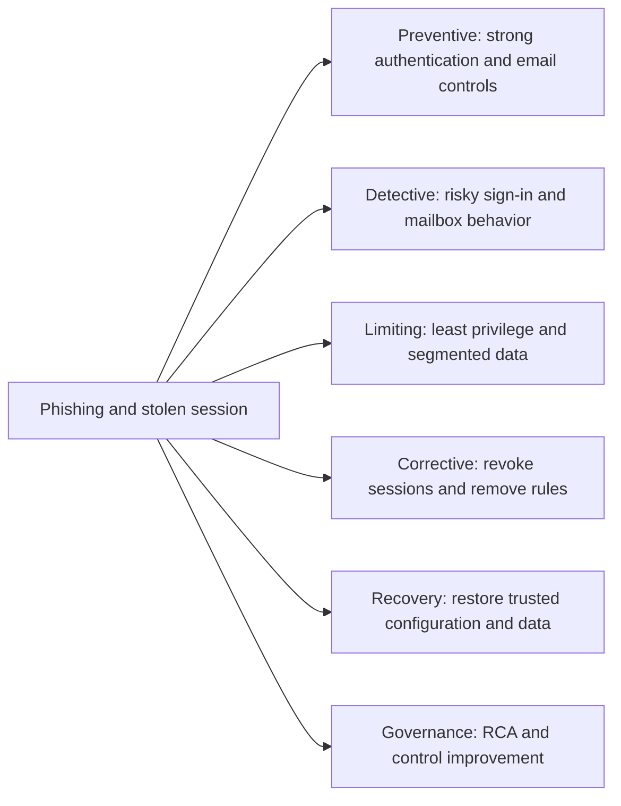

**Defense in depth** means using independent or complementary layers so one failure does not immediately cause maximum harm. It does not mean purchasing every product or duplicating controls without purpose.

| Layer | Finance-site example | Failure it helps contain |
|---|---|---|
| Identity | Strong authentication and sign-in policy | Stolen password alone |
| Device | Managed, healthy endpoint expectation | Access from attacker-controlled device |
| Application/session | Restricted session and app permissions | Excessive user action |
| Data | Classification, scoped access, encryption | Broad resource reach |
| Network | Secure transport and direct supported connectivity | Interception or unreliable path |
| Detection | Audit and anomalous download monitoring | Prevention bypass |
| Response | Session revocation, account remediation, evidence process | Ongoing compromise |
| Recovery | Versioning, restore, validated clean state | Deletion or tampering |

### Compensating controls

A **compensating control** is an alternative safeguard used when the preferred control is not currently feasible, while still addressing the objective. It needs evidence, an owner, limitations, and a review date. “We cannot implement MFA, so we monitor logs” may be inadequate because monitoring does not prevent credential use and may detect it too late. A valid compensating package might tightly isolate the legacy application, restrict source paths, reduce permissions, use a dedicated identity, monitor behavior, and execute a dated replacement plan.

---

## 7. Shared responsibility in Microsoft cloud services

Microsoft 365 is **Software as a Service (SaaS)**: Microsoft operates the underlying cloud service, while the customer configures use, identities, access, data handling, endpoints, and organizational processes. Shared responsibility does not mean responsibility is vague; it means each layer has a defined owner and some outcomes require both parties.

### 🔍 Plain-English deep-dive: provider responsibility versus customer accountability

- **Cloud provider responsibility** — *the provider secures and operates specified service layers.* **Analogy:** A commercial landlord maintains the building structure and common utilities. **Why it matters:** Customers do not patch Microsoft 365 datacenter hosts.
- **Customer responsibility** — *the customer secures what it controls and how it uses the service.* **Analogy:** The tenant still controls occupants, keys, documents, and business practices. **Why it matters:** Microsoft cannot decide who should access the client's finance files.
- **Shared responsibility** — *an outcome depends on coordinated provider and customer controls.* **Analogy:** Fire safety depends on building systems plus tenant behavior and evacuation plans. **Why it matters:** Service security does not remove customer configuration and governance duties.

| Area | Microsoft role in SaaS | Customer role | Consulting evidence |
|---|---|---|---|
| Physical datacenter and host | Operate and secure | Review assurance relevant to requirements | Service documentation and assurance reports |
| Service availability | Engineer and restore cloud service | Design business continuity, monitor health, communicate, test dependencies | Service health procedure and resilience plan |
| Identities and users | Provide identity capabilities | Joiner/mover/leaver, authentication choices, access review | Identity inventory and lifecycle evidence |
| Configuration | Provide settings and defaults | Choose, approve, test, monitor, and maintain configuration | Baseline, change records, exports, tests |
| Customer data | Provide platform protections | Classify, authorize, retain, share, and govern | Data map, labels, permissions, retention decisions |
| Endpoints | Provide integrations/capabilities | Manage and protect devices and applications | Device standard, coverage, exception process |
| Detection and response | Generate service signals and platform actions | Configure, monitor, investigate, decide, respond, learn | Alert routing, runbooks, incident exercises |
| Compliance | Maintain provider attestations | Determine obligations and operate controls | Control mapping and evidence, not a blanket claim |

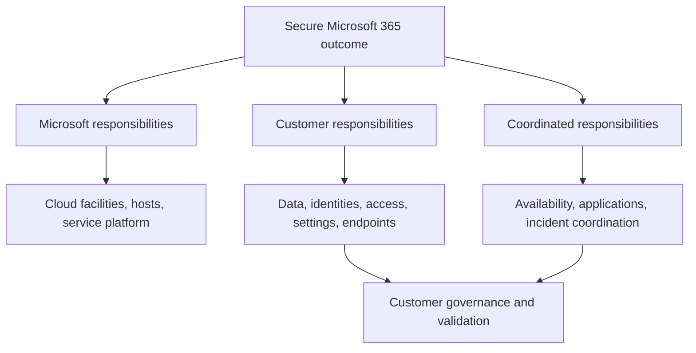

Never tell a client, “It is in Microsoft's cloud, so Microsoft secures it.” The safer statement is, “Microsoft secures the service layers described in its model; the client remains responsible for data, identities, access, configuration, endpoints, and appropriate use, with some outcomes shared.”

---

## 8. Governance, risk, compliance, and security versus compliance

**Governance, Risk, and Compliance (GRC)** is a coordinated way to direct security, manage uncertainty, and demonstrate obligations.

| Discipline | Plain meaning | Typical artifacts | Failure if missing |
|---|---|---|---|
| Governance | Decide direction, authority, ownership, and oversight | Strategy, policy, RACI, steering decisions | Controls exist without accountability or alignment |
| Risk management | Identify, evaluate, treat, and monitor uncertainty | Risk register, assessment, treatment plan | Effort follows noise instead of business exposure |
| Compliance | Meet and evidence applicable requirements | Control mapping, audit evidence, exceptions | Obligations are missed or claims are unsupported |

Security and compliance overlap but are not interchangeable.

| Security | Compliance |
|---|---|
| Seeks to reduce real harm from threats and failures | Seeks to satisfy defined legal, regulatory, contractual, or internal requirements |
| Must adapt to changing threats | Is assessed against an applicable requirement set |
| Can exceed a minimum requirement | Often demonstrates a minimum or specified condition |
| Can fail even when a checklist was completed | Can fail even when no breach occurred |
| Requires operational effectiveness | Requires traceable evidence and interpretation |

A compliant environment can still be insecure if controls are poorly scoped, evidence is stale, new threats emerged, or the requirement is narrow. A secure control can also violate privacy, labor, or retention obligations if implemented without the right governance. A consultant should say, “This control supports requirement X,” not, “This product makes the client compliant.”

### Policy hierarchy

| Document | Purpose | Example statement | Usual detail level |
|---|---|---|---|
| Policy | Mandatory intent and authority | Sensitive data must be accessible only to approved parties | Broad and durable |
| Standard | Mandatory measurable rule | Confidential sites must use authenticated sharing and quarterly access review | Specific and testable |
| Procedure | Required sequence for performing work | Steps to request, approve, configure, test, and review guest access | Operational detail |
| Guideline | Recommended practice allowing judgment | Prefer named-user links for partner collaboration | Advisory |
| Baseline | Approved minimum configuration | Sharing, logging, and role settings for a site class | Technical reference |
| Runbook | Response procedure for a known trigger | Investigate suspected bulk download | Event-driven operations |

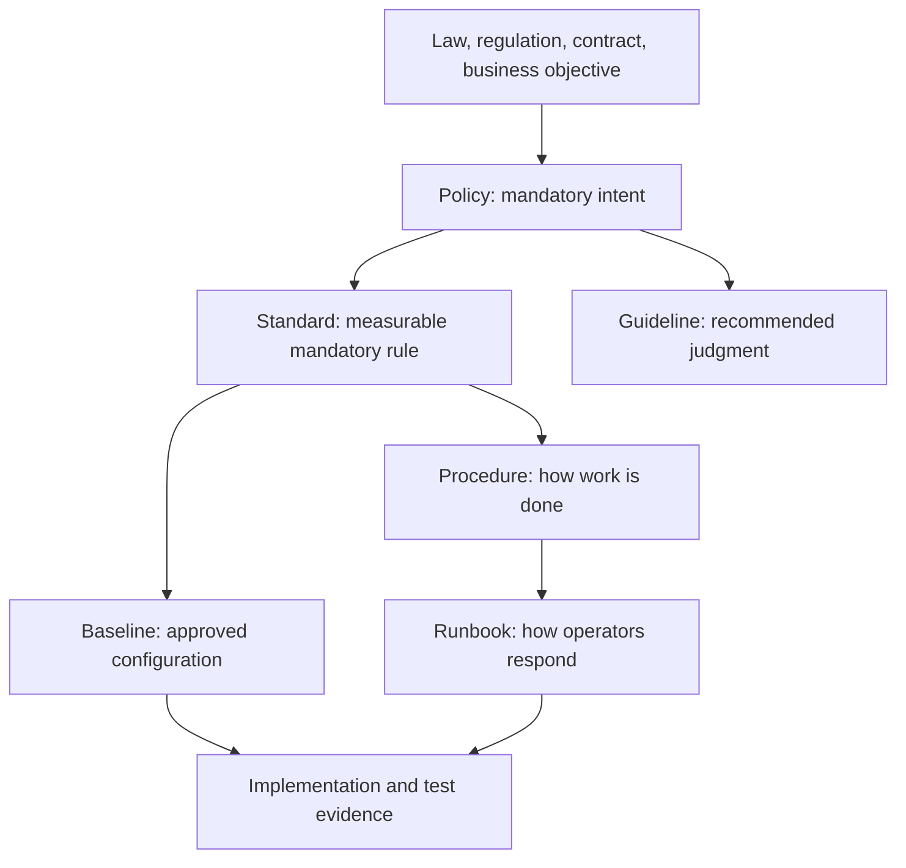

---

## 9. Events, alerts, incidents, findings, issues, and evidence

Operational security language should reveal what is known rather than overstate certainty.

| Term | Meaning | Example | Required next thought |
|---|---|---|---|
| Event | An observable occurrence | User downloaded a file | Is it expected, important, or suspicious? |
| Signal | Data point that informs judgment | New location, device state, download volume | Is it reliable and contextual? |
| Alert | A rule or analytic identified matching evidence | Bulk download rule fired | Is it true, severe, and part of a larger story? |
| Incident | Events/alerts handled as a security case | Stolen account accessed and sent data | What is scope, impact, containment, and recovery? |
| Finding | Evidence-based assessment result | Anonymous links lack expiry governance | What risk and recommendation follow? |
| Issue | A current problem requiring management | Audit export job repeatedly fails | Who owns restoration and impact? |
| Vulnerability | Exploitable weakness | Unsupported component flaw | Is the affected asset exposed and material? |
| Risk | Uncertain future harm | Link could expose confidential content | What treatment and owner are needed? |
| Problem/root cause | Underlying reason for recurring events | Faulty sync behavior triggered by known defect | What corrective and preventive actions follow? |

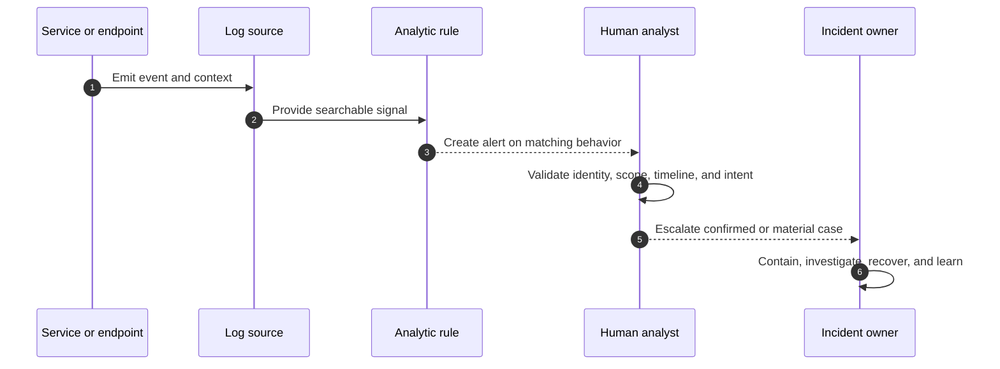

### Evidence quality

Good evidence is relevant, traceable, time-bounded, scoped, authentic enough for the decision, and handled appropriately. A screenshot can show what a portal displayed, but an export may be easier to search and validate. A user's recollection is valuable context but may not establish timing. A service-health advisory can explain broad impact but not prove a specific client symptom without correlation.

| Evidence question | Stronger practice |
|---|---|
| Source | Record system, query, file, ticket, person, and collection method |
| Time | Normalize time zone and preserve start/end boundaries |
| Scope | State tenant, users, devices, sites, policies, and exclusions covered |
| Integrity | Preserve originals, hashes where appropriate, and handling history |
| Context | Include change, service health, expected behavior, and business purpose |
| Privacy | Minimize and redact sensitive content; control recipients and retention |
| Limitation | State missing logs, retention gaps, sampling, and uncertainty |

> **Arti's transferable advantage:** RCA, fix validation, product-group escalation, vendor coordination, and troubleshooting documentation are direct evidence of disciplined fact gathering. In security work, preserve the same rigor while adding incident evidence handling, privacy, authorization, and adversarial hypotheses.

---

## 10. Frameworks: structured maps, not magic answers

A framework organizes security outcomes and activities so teams share language and can assess coverage. It does not automatically decide the right implementation.

| Framework or knowledge base | Main purpose | Useful consulting question | Common misuse |
|---|---|---|---|
| NIST Cybersecurity Framework (CSF) | Organize cybersecurity outcomes across Govern, Identify, Protect, Detect, Respond, Recover | Which outcomes matter and what is the current/target profile? | Treating categories as a product checklist |
| NIST SP 800-53 | Catalog security and privacy controls | Which control objectives and evidence apply? | Applying every control without tailoring |
| ISO/IEC 27001 | Requirements for an Information Security Management System | How does the organization govern and continually improve security? | Claiming certification from a tool deployment |
| CIS Critical Security Controls | Prioritized safeguards and implementation groups | Which foundational safeguards reduce common attack paths? | Copying safeguards without asset context |
| CIS Benchmarks | Configuration recommendations for technologies | Which baseline settings should be evaluated and tested? | Enforcing blindly without compatibility testing |
| MITRE ATT&CK | Knowledge base of adversary tactics and techniques | Which behaviors can controls prevent, detect, or investigate? | Treating technique coverage as proof of effectiveness |

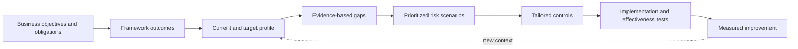

Framework mapping is many-to-many. One Conditional Access design may support several control objectives; one control objective may require identity, device, process, and monitoring controls. Preserve this distinction:

1. Framework outcome says **what** should be achieved.
2. Architecture says **how components work together**.
3. Product configuration says **how a capability is set**.
4. Test evidence says **whether behavior matched the requirement**.
5. Operations evidence says **whether effectiveness is sustained**.

---

## 11. Threat modeling from zero

**Threat modeling** is a structured way to ask how a system could be misused or fail, then design and verify mitigations before an incident. It is not only for software developers; consultants can threat-model an M365 sharing process, identity flow, migration, automation, or incident playbook.

### 🔍 Plain-English deep-dive: trust boundaries and misuse cases

- **System model** — *a simplified representation of components, data, users, and interactions.* **Analogy:** A transit map omits building details but shows the routes needed for the journey. **Why it matters:** Teams need a shared picture before debating controls.
- **Data flow** — *movement of information between components.* **Analogy:** A parcel route from sender through depots to recipient. **Why it matters:** Each transfer can alter exposure, trust, and responsibility.
- **Trust boundary** — *a point where the level of control, identity, authority, or ownership changes.* **Analogy:** Crossing from a public lobby into a badge-controlled office. **Why it matters:** Inputs and claims should be revalidated at boundaries.
- **Misuse case** — *a scenario describing how a legitimate feature could be abused.* **Analogy:** A delivery entrance used to remove goods rather than receive them. **Why it matters:** Many cloud incidents abuse intended functions rather than exploit software flaws.
- **Mitigation** — *a control that reduces a modeled threat.* **Analogy:** Badge checks, inventory reconciliation, and cameras each reduce a delivery-bay risk. **Why it matters:** Every important threat needs an owner and disposition.

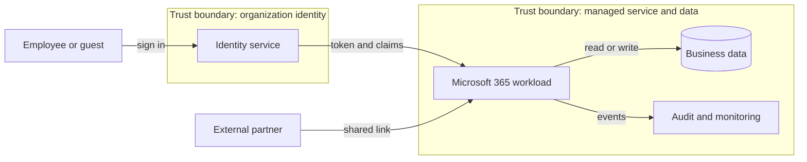

### A practical threat-modeling sequence

1. Define the business objective and scope.
2. Identify assets, users, identities, dependencies, and owners.
3. Draw data flows and trust boundaries.
4. Ask what could go wrong through spoofing, tampering, repudiation, information disclosure, denial of service, and elevation of privilege. This mnemonic is **STRIDE**.
5. Describe plausible attack or misuse paths.
6. Record existing controls and evidence.
7. Prioritize threats using business impact, likelihood, and uncertainty.
8. Choose mitigation, acceptance, avoidance, or transfer.
9. Convert mitigation into testable requirements.
10. Validate after implementation and revisit after change or incident.

| STRIDE category | Plain meaning | M365-oriented question |
|---|---|---|
| Spoofing | Pretend to be another identity | Could a stolen session or weak app identity be accepted? |
| Tampering | Alter data or configuration | Could mailbox rules, files, labels, or logs be changed improperly? |
| Repudiation | Deny an action without adequate evidence | Are approvals and audit trails trustworthy and retained? |
| Information disclosure | Reveal data improperly | Could sharing, sync, logs, or Copilot grounding expose sensitive data? |
| Denial of service | Make service unavailable | Could policy, network, attack, or automation block legitimate work? |
| Elevation of privilege | Gain greater authority | Could a user, guest, app, or admin acquire excessive permissions? |

---

## 12. Cryptography basics: encryption, hashes, keys, signatures, and certificates

**Cryptography** uses mathematical techniques to protect information and establish properties such as confidentiality, integrity, and authenticity. It is powerful but does not fix weak identity governance, excessive permissions, compromised endpoints, or bad key handling.

### Symmetric and asymmetric encryption

| Property | Symmetric encryption | Asymmetric encryption |
|---|---|---|
| Keys | Same secret key encrypts and decrypts | Public/private key pair |
| Speed | Generally faster for bulk data | Generally slower and used for key exchange, signatures, or small data |
| Key challenge | Safely share and protect the secret | Protect private key and trust the public key owner |
| Analogy | One locked box key shared by approved people | Public padlock anyone can close; only private key holder opens |
| Typical role | Encrypt stored data or a network session | Establish identity, exchange secrets, create digital signatures |

**Encryption at rest** protects stored data. **Encryption in transit** protects data moving over a network. **Encryption in use** concerns data while being processed, where protection is more difficult and may use isolation or confidential-computing techniques. The state must be named; “the data is encrypted” is incomplete.

```mermaid
sequenceDiagram
    autonumber
    participant C as Client
    participant S as Service
    C->>S: Request secure connection and supported algorithms
    S-->>C: Certificate and key agreement information
    C->>C: Validate name, chain, time, and trust
    C->>S: Complete key agreement
    C->>S: Encrypted application data
    S-->>C: Encrypted response
    Note over C,S: Asymmetric methods establish trust/key material; symmetric keys protect bulk session data
```

### Hashes, message authentication, and digital signatures

| Mechanism | What it does | What it does not do by itself |
|---|---|---|
| Cryptographic hash | Produces a fixed-size digest that changes when input changes | Hide the input or prove who created it |
| Salted password hash | Makes password verification resistant to precomputed lookup attacks | Make weak passwords safe or prevent online guessing |
| Hash-based Message Authentication Code (HMAC) | Uses a shared secret plus a hash to prove integrity/authenticity to secret holders | Provide public nonrepudiation |
| Digital signature | Private key signs; corresponding public key verifies origin and integrity | Encrypt the content unless combined with encryption |
| Checksum | Detects accidental transmission errors | Resist intentional malicious modification |

### Certificates and Public Key Infrastructure

A **digital certificate** binds a public key to an identified subject, such as a website name, under a trust model. A **Certificate Authority (CA)** signs certificates. A **Public Key Infrastructure (PKI)** is the wider system of authorities, policies, keys, certificates, revocation, and operations.

| Certificate check | Question | Failure implication |
|---|---|---|
| Subject Alternative Name (SAN) | Does the requested hostname appear in the certificate? | Name mismatch; possible interception or misconfiguration |
| Validity period | Is current time within not-before/not-after dates? | Expired or not-yet-valid certificate |
| Chain | Does it chain through intermediates to a trusted root? | Unknown issuer or missing intermediate |
| Signature | Is each certificate signature valid? | Tampering or invalid issuer relationship |
| Revocation | Has the certificate been revoked where checking applies? | A compromised certificate may still appear time-valid |
| Private-key protection | Is the corresponding private key controlled? | Impersonation or decryption/signing abuse |

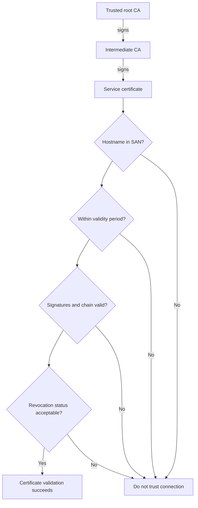

### Key management is the real operational challenge

Keys need generation, authorized use, storage, backup where appropriate, rotation, revocation, recovery, monitoring, and destruction. Deleting a customer-managed key before dependencies are reconfigured can make data or services unavailable. Suspected compromise calls for a controlled response that preserves recoverability while moving use to a trusted key.

| Key lifecycle stage | Design question |
|---|---|
| Generate | Is the algorithm and key length approved and randomness strong? |
| Store | Is the key isolated in an appropriate vault or hardware-backed boundary? |
| Authorize | Which identities may use, manage, rotate, or export it? |
| Use | Is usage logged and limited to intended cryptographic operations? |
| Rotate | How do dependent services transition without outage or data loss? |
| Revoke/disable | How is suspected compromise contained safely? |
| Recover | Are backup and break-glass procedures tested and protected? |
| Destroy | Are retention, legal, and recoverability requirements satisfied? |

---

## 13. Backup, resilience, recovery, and trusted restoration

A backup is a separate recoverable copy or representation of data and state. Resilience is the ability to withstand disruption, continue essential outcomes, recover, and improve. High availability, version history, retention, recycle bins, backups, and disaster recovery can overlap but are not identical.

| Capability | Main purpose | Key limitation |
|---|---|---|
| High availability | Keep service running through component failures | May replicate corruption or malicious change |
| Version history | Recover earlier item versions | Scope and retention may not meet full recovery needs |
| Recycle/restore | Recover recently deleted objects | Time, scope, permissions, and dependency limits apply |
| Retention | Preserve content for governance/legal purposes | Is not automatically a complete operational backup |
| Backup | Keep restorable copies separated by design | Must be protected, monitored, and tested |
| Disaster recovery | Restore service after major disruption | Requires people, dependencies, priorities, and exercises |

**Recovery Point Objective (RPO)** is the maximum targeted amount of data loss measured in time. **Recovery Time Objective (RTO)** is the targeted time to restore an acceptable service. These are business requirements, not promises created by writing values in a document.

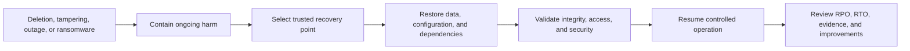

A trustworthy recovery plan answers:

- What business service and data are in scope?
- Which dependencies must recover first, including identity and network access?
- What corruption or compromise could also exist in the recovery source?
- Who can initiate and approve restore actions?
- How is restored integrity validated?
- How are privileged credentials and keys recovered?
- How often is restoration exercised?
- What happens if the primary admin portal or identity path is unavailable?
- How are customers, leaders, legal teams, and vendors updated?

---

## 14. People, process, technology, and ethical practice

Security outcomes emerge from a system of people, process, and technology. Blaming one user or buying one tool hides system conditions.

| Dimension | Security contribution | Example failure | Better design response |
|---|---|---|---|
| People | Judgment, ownership, expertise, challenge, communication | User approves convincing prompt | Phishing-resistant design, usable support, education, detection |
| Process | Repeatable decisions, reviews, escalation, evidence | Guest access never expires | Owner, approval, review cadence, removal workflow |
| Technology | Consistent enforcement, telemetry, scale | Policy excludes an unknown group | Inventory, simulation, coverage monitoring, change control |

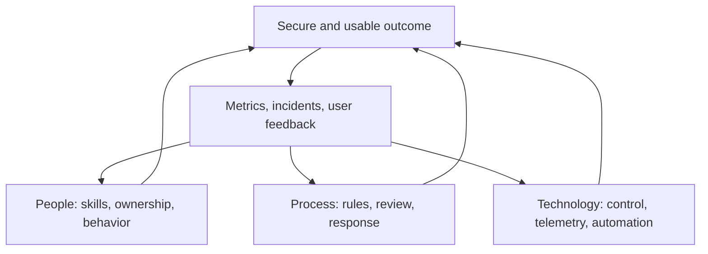

### Ethics for a security consultant

| Principle | Practical behavior |
|---|---|
| Authorization | Test or access only what the client has explicitly authorized |
| Minimization | Collect the least sensitive evidence required |
| Honesty | Separate fact, inference, assumption, limitation, and recommendation |
| Competence | Ask for review or escalation when work exceeds demonstrated capability |
| Confidentiality | Protect client information and avoid reuse outside agreed purpose |
| Proportionality | Avoid controls or monitoring whose harm exceeds justified benefit |
| Independence | Surface inconvenient risk and conflicts rather than shaping evidence to a desired sale |
| Human dignity | Avoid blame, discriminatory profiling, or intrusive monitoring without governance |
| Safety | Use nonproduction, simulation, staged rollout, and rollback for risky changes |
| Evidence integrity | Do not alter, omit, or overstate evidence |

Never use a real customer tenant for unapproved experimentation. Never attempt exploitation merely to “prove” a concern when a safe evidence path exists. Never share tenant data, tokens, full email addresses, confidential file names, or secrets in a portfolio. Never claim compliance, production ownership, or incident certainty beyond evidence.

---

## 15. Turning fundamentals into troubleshooting and consulting artifacts

Security reasoning strengthens troubleshooting because it forces explicit scope, evidence, and failure hypotheses.

### Security-aware troubleshooting sequence

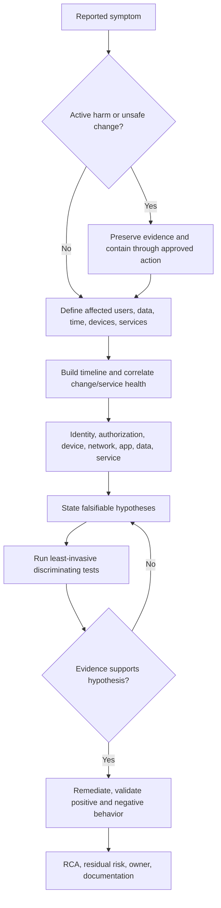

| Artifact | Minimum content | Arti evidence bridge |
|---|---|---|
| Asset/dependency map | Asset, owner, identity, data, services, vendors, criticality | Existing cross-service and sync troubleshooting |
| Finding | Observation, evidence, scope, risk, recommendation, owner | Technical advisory and documentation |
| Risk register entry | Scenario, likelihood, impact, controls, treatment, residual risk | Risk mitigation and business reviews |
| Incident timeline | Normalized time, source, event, action, owner, confidence | Critical escalation and RCA practice |
| Control test matrix | Requirement, positive, negative, failure, rollback, evidence | Fix validation discipline |
| Vendor evidence pack | Symptom, scope, timeline, reproduction, logs, exclusions, ask | Product-group/vendor coordination |
| Executive update | Impact, known facts, unknowns, actions, decisions, next update | Leadership and customer communication |
| Knowledge article | Trigger, prerequisites, steps, interpretation, escalation | KB and troubleshooting-guide authorship |

---

## 16. Scenario walkthroughs

### Scenario A: external SharePoint link reported as a breach

**Report:** A user says a confidential file “was public.”

Do not immediately declare a breach. Establish:

1. Asset and owner: Which site, library, file, classification, and business process?
2. Link type: Anonymous, organization-only, specific people, or existing access?
3. Exposure: When created, by whom, expiry, and whether still valid?
4. Authorization: Was sharing approved and with whom?
5. Evidence: Audit event, link settings, access/download activity, recipient, IP/context, retention limits?
6. Impact: What data was actually accessible or accessed?
7. Containment: Can the link be revoked through an approved action without destroying evidence?
8. Broader scope: Are similar links present on the site or across the tenant?
9. Root cause: Policy design, user mistake, unclear standard, excessive permission, or product behavior?
10. Improvement: Safer defaults, expiry, owner review, classification, training, detection, and support guidance.

| Possible conclusion | Evidence threshold |
|---|---|
| Misconfiguration/finding | Link allowed beyond approved standard |
| Exposure | Unintended party could reach content |
| Security incident | Evidence shows or strongly indicates unauthorized access requiring response |
| Confirmed data breach | Authorized process determines protected data was compromised under applicable definition |
| False report | Evidence shows access remained correctly restricted and behavior was expected |

### Scenario B: OneDrive synchronization corrupts working files

This is an integrity and availability issue even if no attacker exists. Preserve original samples and timestamps, identify affected versions/devices/users, stop unsafe propagation through approved steps, distinguish local client, network, permission, service, and product-defect hypotheses, validate restoration, and document prevention. If an attacker or malicious automation is suspected, add identity, audit, and containment analysis.

### Scenario C: Power Automate flow sends records to the wrong audience

The flow is a workload identity and application process. Analyze connector identity, trigger, source permissions, destination, data classification, environment policy, recent changes, run history, error handling, approvals, and owner. Contain without deleting evidence. Determine whether the cause is logic, permission, configuration, source data, or platform defect. Validate with positive and negative test records and an authorized recipient matrix.

### Scenario D: Copilot answer reveals a sensitive document

Do not assume the AI “bypassed permissions.” Determine which identity asked, what source item grounded the response, whether that identity already had access, how the permission was granted, whether content classification and governance were appropriate, and what audit evidence exists. The likely security problem may be preexisting oversharing surfaced by Copilot. That still requires risk treatment, but the root cause statement matters.

---

## 17. Safe paper lab: build a threat-and-control case without a paid tenant

### Lab goal

Create an interview-ready mini assessment for a fictional SharePoint Online finance workspace. This lab requires no Microsoft license and changes no environment.

### Prerequisites

- A text editor or paper.
- This fictional scope: 25 finance employees, 5 external auditors, one SharePoint site, OneDrive sync, one Power Automate approval flow, and a quarterly reporting deadline.
- The rule that no real customer names, tenant IDs, email addresses, file names, screenshots, or secrets may be used.

### Fictional facts

- Site membership has not been reviewed for 18 months.
- Specific-people external links are permitted and default to 90-day expiry.
- Two former contractor accounts remain in a site group.
- The approval flow uses an owner's personal connection.
- Audit data is available for the exercise, but nobody owns a review runbook.
- Version history is enabled, but restore has not been tested.
- Finance says collaboration must continue during the quarterly close.

### Steps

1. **Create an asset table.** Record the finance site, reports, identities, flow, audit data, and business deadline. Add owner, criticality, confidentiality, integrity, availability, and dependencies.
2. **Draw a system model.** Show employees, auditors, identity service, SharePoint, OneDrive clients, Power Automate, email approvals, and audit evidence. Mark trust boundaries at external users, endpoints, connectors, and cloud services.
3. **Write four misuse cases.** Include former contractor access, forwarded/incorrect external sharing, compromised flow owner, and accidental mass modification through sync.
4. **Separate terms.** For each case, name threat, actor or failure source, exposure, weakness, event, potential impact, and existing control. Do not call every case a breach.
5. **Assess CIA impact.** Explain confidentiality, integrity, and availability consequences separately.
6. **Score cautiously.** Use low/medium/high likelihood and impact with written criteria, assumptions, confidence, and evidence gaps.
7. **Select treatment.** Propose immediate, near-term, and strategic controls across people, process, and technology.
8. **Classify controls.** Mark each as administrative/technical, preventive/detective/corrective/recovery, and primary/compensating.
9. **Create tests.** Define positive, negative, failure, and recovery tests.
10. **Write a finding.** Use observation, evidence, risk, recommendation, validation, owner, and residual-risk fields.
11. **Create a one-page executive summary.** State business impact, top three risks, recommended decisions, constraints, and next steps.
12. **Red-team your own report.** Ask whether conclusions exceed evidence, scores create false precision, recommendations block the deadline, or privacy is ignored.

### Positive tests

| Test | Expected result | Evidence to record |
|---|---|---|
| Current finance member opens approved report | Access succeeds | Persona, resource, expected permission, result |
| Named external auditor opens specifically shared item during valid period | Access succeeds under intended conditions | Recipient model, expiry, scope, result |
| Approved flow sends a test record to the approved audience | Correct recipients and logged run | Test data, run record, recipient matrix |
| Authorized owner restores a known test version | Trusted version is restored within target time | Start/end time, version, validation |

### Negative and failure tests

| Test | Expected result | Security property |
|---|---|---|
| Former contractor attempts site access | Denied and evidence available | Confidentiality/accountability |
| Unnamed external person uses a specific-person link | Denied | Confidentiality |
| Flow attempts a destination outside approved audience | Blocked or routed for controlled approval | Confidentiality/integrity |
| Bulk accidental edit occurs in test model | Detection and recovery process identifies and restores | Integrity/availability |
| Audit reviewer is unavailable | Backup owner follows the documented procedure | Operational resilience |

### Evidence package

- Asset and dependency inventory.
- Data-flow/trust-boundary diagram.
- Four misuse cases.
- Risk register with assumptions and confidence.
- Control matrix and treatment roadmap.
- Test matrix with positive, negative, failure, and recovery cases.
- One complete finding.
- One-page executive summary.
- Redaction statement confirming all content is fictional.

### Cleanup

No tenant cleanup is required. Delete any accidental real identifiers from drafts, document that the scenario is fictional, and retain only sanitized portfolio material.

### Interview-portfolio wording

> “I completed a paper-based security assessment for a fictional Microsoft 365 finance collaboration scenario. I mapped assets, identities, data flows, trust boundaries, threats, weaknesses, CIA impact, shared responsibility, controls, residual risk, and positive/negative/recovery tests. The exercise demonstrates my assessment method and M365 transferability; it is not a claim of production ownership of Entra, Purview, Defender, Intune, or Sentinel.”

---

## 18. Candidate honesty note

| Evidence level | What Arti can support | What must not be implied |
|---|---|---|
| Production | Microsoft 365 enterprise escalation, SharePoint Online, OneDrive, sync, technical advisory, customer/partner/engineering/vendor coordination, RCA, fix validation, documentation, business reviews, and Power Platform/Copilot-related work reflected in the CV | Production ownership of Entra, Intune, Purview, Defender, Sentinel, or every security control discussed here |
| Transferable | Layered troubleshooting, dependency mapping, incident coordination, evidence gathering, client communication, documentation, and validation | That transferability equals years administering a security platform |
| Lab/paper exercise | Threat models, risk registers, control maps, tests, and fictional consulting artifacts completed through this guide | That a paper or trial exercise was a production client deployment |
| Conceptual | CIA, AAA, risk, controls, frameworks, cryptography, shared responsibility, GRC, and ethics explained accurately | That understanding alone proves implementation or operational depth |

A safe answer names the evidence level before describing detail. Follow-up questions become easier because the claim is true and bounded.

---

## 19. JD Mapping

| JD responsibility | Fundamentals applied in this Part | Evidence Arti can build or transfer |
|---|---|---|
| Security assessments and health checks | Asset scope, finding quality, risk, control effectiveness, framework use | Paper assessment plus existing evidence-led technical reviews |
| Microsoft 365 architecture and design | CIA, trust boundaries, defense in depth, shared responsibility | M365 workload knowledge translated into security requirements |
| Troubleshoot security events and service disruptions | Event/alert/incident distinctions, timeline, layered hypotheses, evidence | Direct escalation, RCA, defect escalation, and validation practice |
| Client workshops and reporting | Plain language, risk statements, treatment options, decision ownership | Business reviews, customer and stakeholder coordination |
| Configuration and optimization | Baselines, control families, positive/negative/recovery tests | Fix-validation discipline; product-specific security configuration remains lab/conceptual until proven |
| Incident response and operational readiness | Containment, evidence, recovery, runbooks, lessons learned | Critical-incident coordination as transferable evidence |
| Governance and compliance | Policy hierarchy, GRC, privacy, security/compliance distinction | Documentation and advisory foundation; no blanket compliance claim |
| Multi-vendor work | Shared ownership, dependency map, evidence pack, explicit action request | Direct customer/partner/engineering/vendor coordination |
| Power Platform and Copilot | Application identity, connector, data, misuse, and privacy reasoning | Existing Power Platform/Copilot evidence without claiming security-platform ownership |

---

## 20. Official Source Anchors

The principles in this chapter are stable, but Microsoft product behavior and cloud-responsibility guidance can change. These first-party pages were checked against the guide's **August 24, 2026** currency date and should be rechecked before a client recommendation or interview involving current product behavior.

1. [Zero Trust as a security foundation](https://learn.microsoft.com/security/zero-trust/zero-trust-overview) — Microsoft's current three principles and outcome framing.
2. [Shared responsibility in the cloud](https://learn.microsoft.com/azure/security/fundamentals/shared-responsibility) — Current responsibility matrix; customers retain responsibility for data, identities, access, configurations, and endpoints across cloud models.
3. [Security design principles in the Azure Well-Architected Framework](https://learn.microsoft.com/azure/well-architected/security/principles) — CIA, threat modeling, inventory, segmentation, least privilege, resilience, and continuous improvement.
4. [Azure data security and encryption best practices](https://learn.microsoft.com/azure/security/fundamentals/data-encryption-best-practices) — Data at rest, in transit, and in use; key-management and protection guidance.
5. [Authentication versus authorization](https://learn.microsoft.com/entra/identity-platform/authentication-vs-authorization) — Current Microsoft identity-platform definitions for AuthN, AuthZ, OAuth 2.0, and OpenID Connect.
6. [Zero Trust deployment plan with Microsoft 365](https://learn.microsoft.com/security/zero-trust/microsoft-365-zero-trust) — How Microsoft connects principles to identity, device, applications, data, threat protection, AI, and compliance work.

For NIST, ISO, CIS, and MITRE details, use the issuing organization's current publications rather than a secondary summary. Framework mapping in this chapter is introductory; Part 72 provides the deeper standards comparison.

---

## ⭐ Likely Interview Questions for This Section

### Q1. What is the difference between a threat, vulnerability, exploit, and risk?

> **Model answer:** “A threat is something capable of causing harm. A vulnerability is a weakness. An exploit is a method that uses a weakness, while exposure describes whether the asset is reachable. Risk is the uncertain business harm from a defined scenario, considering likelihood, impact, and controls. I would not call a vulnerability a breach; I would establish asset context, exploitability, exposure, evidence, and impact.”

### Q2. Explain the CIA triad with a Microsoft 365 example.

> **Model answer:** “Confidentiality means only authorized people can read a SharePoint finance file. Integrity means its content, permissions, and history cannot be changed without authorization and changes are traceable. Availability means approved users can reach a trusted version when needed. A good design balances all three: an indiscriminate block might protect confidentiality but damage availability, while broad emergency access might do the reverse.”

### Q3. What are authentication, authorization, accounting, and nonrepudiation?

> **Model answer:** “Authentication proves who or what is requesting access. Authorization decides what that identity may do to a resource. Accounting records relevant activity. Accountability connects actions to responsible ownership. Nonrepudiation provides strong evidence so a party cannot credibly deny an action, often through protected audit trails, approvals, or digital signatures.”

### Q4. How would you assess and communicate security risk without false precision?

> **Model answer:** “I would write a scenario tied to a business asset, threat, exposure, weakness, and consequence. I would define qualitative or quantitative likelihood and impact criteria, timeframe, evidence, assumptions, uncertainty, and control effectiveness. A score is a prioritization aid, not objective truth. I would present inherent risk, treatment options, expected residual risk, named owner, review date, and the evidence needed to validate the decision.”

### Q5. How are security and compliance different?

> **Model answer:** “Security reduces real harm from threats and failures; compliance demonstrates that applicable legal, regulatory, contractual, or internal requirements are met. They overlap, but neither proves the other. A compliant checklist can miss a new attack path, and a strong technical control can still violate privacy or retention rules. I map controls to requirements and evidence rather than saying a product makes a client compliant.”

### Q6. What does shared responsibility mean for Microsoft 365?

> **Model answer:** “Microsoft operates and secures the underlying SaaS service layers described in its model. The customer still owns decisions and controls for data, identities, users, access, configuration, endpoints, and appropriate use, while outcomes such as availability and incident coordination involve both parties. I make the boundary explicit in the design, RACI, runbooks, and evidence rather than assuming cloud security is automatic.”

### Q7. How would you use defense in depth without creating unnecessary complexity?

> **Model answer:** “I would start with a risk scenario and use complementary layers that prevent, limit, detect, correct, and recover. For account compromise, that might include strong authentication, least privilege, device and session controls, scoped data access, audit, anomalous behavior detection, session revocation, and trusted recovery. Each layer needs a distinct objective, owner, test, and operational path; duplicate products without clear purpose add failure modes rather than meaningful depth.”

### Q8. How does your current experience support cybersecurity consulting, and where are the boundaries?

> **Model answer:** “My direct evidence is Microsoft 365 enterprise escalation across SharePoint Online, OneDrive, and sync, with customer, partner, engineering, and vendor coordination, RCA, fix validation, documentation, and business reviews. Those skills transfer strongly to evidence-led assessment, incident coordination, layered troubleshooting, and client communication. My Entra, Intune, Purview, Defender, and Sentinel evidence is learning and lab-based, so I would explain the method and tests without claiming production ownership.”

---

## 🧠 30-Second Memory Hooks

- **Asset:** If losing, exposing, changing, or stopping it hurts, it is an asset.
- **Attack surface:** Every reachable door, identity, app, integration, and data path.
- **Threat–vulnerability–exploit:** Harm source, weakness, method.
- **Exposure:** Can the threat reach the weakness?
- **CIA:** Secret enough, correct enough, available enough.
- **AAA:** Prove identity, permit action, record activity.
- **Risk:** Scenario plus likelihood, impact, controls, uncertainty, and owner.
- **Residual risk:** The seat belt helps; driving is not risk-free.
- **Control functions:** Prevent, detect, limit, correct, recover, improve.
- **Defense in depth:** One failed layer must not equal maximum harm.
- **Shared responsibility:** Microsoft runs the service; the customer still governs use, access, data, settings, and endpoints.
- **Security versus compliance:** Reduce harm versus prove requirements; neither automatically proves the other.
- **Framework:** A map for outcomes, not a magic configuration.
- **Threat model:** Draw the system, mark boundaries, ask how it can be misused, then test mitigations.
- **Hash versus encryption:** Fingerprint versus locked content.
- **Signature:** Private key signs; public key verifies integrity and source.
- **RPO/RTO:** How much data loss and how much recovery time can the business tolerate?
- **Evidence honesty:** Fact, inference, assumption, limitation, and recommendation are different.
- **Candidate honesty:** Production, transferable, lab, and conceptual evidence must stay labeled.

---

## Completion Checklist

- [ ] Define asset, identity, data, attack surface, threat, actor, motive, TTP, vulnerability, exploit, exposure, vector, and attack path.
- [ ] Use a SharePoint, OneDrive, Power Platform, or Copilot example without overstating the evidence.
- [ ] Explain confidentiality, integrity, and availability and one tradeoff among them.
- [ ] Distinguish authentication, authorization, accounting, accountability, and nonrepudiation.
- [ ] Explain why privacy is not identical to security.
- [ ] Write a complete risk statement with likelihood, impact, assumptions, controls, residual risk, and owner.
- [ ] Explain the limits of numeric risk scoring and vendor posture scores.
- [ ] Compare mitigation, avoidance, transfer/share, and acceptance.
- [ ] Classify controls by nature and function and explain a compensating control.
- [ ] Draw a defense-in-depth model for one M365 scenario.
- [ ] Explain Microsoft/cloud/customer shared responsibility without saying the cloud secures everything.
- [ ] Distinguish governance, risk management, compliance, security, and privacy.
- [ ] Explain policy, standard, procedure, guideline, baseline, and runbook.
- [ ] Distinguish event, signal, alert, incident, finding, issue, vulnerability, and risk.
- [ ] Introduce NIST, ISO, CIS, and MITRE without treating any as a product checklist.
- [ ] Draw a data flow and mark at least two trust boundaries.
- [ ] Explain STRIDE and write one misuse case.
- [ ] Compare symmetric encryption, asymmetric encryption, hashes, HMAC, digital signatures, and certificates.
- [ ] Explain key lifecycle risk and why encryption does not solve authorization.
- [ ] Compare high availability, versioning, retention, backup, and disaster recovery.
- [ ] Explain RPO and RTO and the need for trusted restore validation.
- [ ] Complete the paper lab with positive, negative, failure, and recovery tests.
- [ ] Answer all eight interview questions aloud without unsupported production claims.

---

*Next suggested section:* [Part 3](Part-03-zero-trust-defense-in-depth-secure-by-design.md) — apply these fundamentals to a complete Zero Trust and secure-by-design architecture, deployment roadmap, and client workshop.