# Part 3 — Zero Trust, Defense in Depth, Shared Responsibility, and Secure by Design

> **Section goal:** Learn to design Zero Trust as an end-to-end security strategy rather than a product slogan. By the end, you should be able to explain every principle and pillar, draw policy decision and enforcement flows, separate management/control/data planes, design least-privilege and emergency access, plan a phased deployment, identify failure modes, measure outcomes, and facilitate a client workshop without overstating product experience.

**JD mapping:** This Part directly supports Deloitte responsibilities for Microsoft 365 security architecture, Secure by Design, Entra and Intune integration, identity and device policy, data protection, Defender and Sentinel visibility, cloud shared responsibility, health checks, roadmap development, safe deployment, service continuity, and client-facing tradeoff decisions.

---

## 1. Zero Trust is a strategy, not a product

**Zero Trust** is a security approach in which access is not granted merely because a user or device is inside a corporate network, previously authenticated, or familiar. Each request is evaluated using relevant evidence, given only the access needed, and monitored with the expectation that a control or identity may already be compromised.

“Never trust, always verify” is a memory hook, not an instruction to distrust employees personally. The object of evaluation is a digital access request. Zero Trust replaces broad, durable, location-based assumptions with explicit, contextual, limited, and observable decisions.

### 🔍 Plain-English deep-dive: the three principles

- **Verify explicitly** — *authenticate and authorize using the available signals relevant to the risk.* **Analogy:** An airport checks identity, ticket, destination, and screening status at appropriate stages rather than accepting “I entered the building earlier.” **Why it matters:** A valid password or internal network location is not enough evidence for every action.
- **Use least-privilege access** — *give only the needed permission, to the needed resource, for the needed purpose and duration.* **Analogy:** A hotel key opens one room until checkout, not every room forever. **Why it matters:** Excess privilege increases both accidental harm and attacker blast radius.
- **Assume breach** — *design as though an attacker may bypass a layer or already have a foothold.* **Analogy:** A ship uses watertight compartments because the hull might be breached. **Why it matters:** Segmentation, detection, evidence, response, and recovery limit damage when prevention fails.

| Traditional assumption | Zero Trust shift | Design implication |
|---|---|---|
| Internal network means trusted | Network location is one signal, never blanket trust | Evaluate identity, device, application, data, behavior, and risk |
| One successful sign-in establishes a trusted session | Conditions can change after sign-in | Reevaluate supported sessions and monitor behavior |
| Access is broad and permanent for convenience | Access is scoped and time-bound | Use role, resource, context, Just-in-Time, and review |
| Perimeter defense stops attackers | Breach is possible | Segment, encrypt, detect, contain, and recover |
| Security team owns security alone | Business, IT, users, suppliers, and provider share responsibility | Define owners and operating processes |
| Product deployment equals Zero Trust | Principles must shape architecture and operations | Trace each control to risk, requirement, test, owner, and metric |

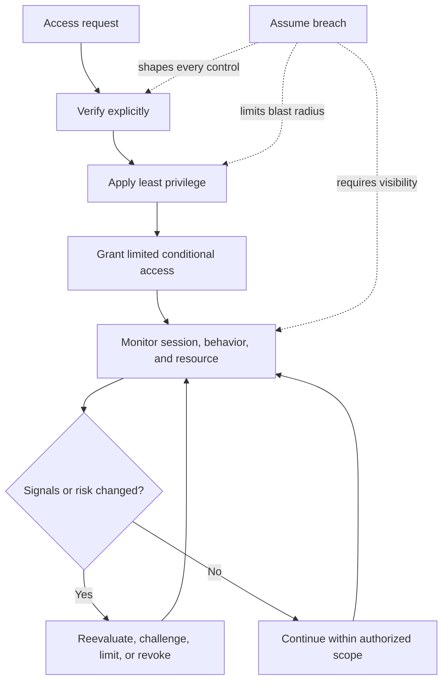

Zero Trust is successful when legitimate access becomes explicit and manageable, attackers face repeated barriers, compromised access has limited reach, suspicious behavior becomes visible, and response can restore a trusted state. It is not successful merely because multifactor authentication was enabled.

> **Arti's transferable advantage:** M365 escalation work already challenges weak assumptions. A sync symptom may arise from identity, permission, device, network, service, or client state. Zero Trust applies the same evidence-led discipline to access: never accept “inside,” “managed,” “licensed,” or “authenticated” as a complete explanation.

---

## 2. The seven technology pillars and their shared visibility layer

Microsoft's current Zero Trust deployment model organizes technical controls into identities, endpoints, data, applications, infrastructure, networks, and security operations. Older diagrams may say “devices” rather than “endpoints” and “visibility, automation, and orchestration” rather than “SecOps”; the underlying idea is coordinated protection across domains.

| Pillar | What is protected or decided | Core Zero Trust question | M365-oriented examples |
|---|---|---|---|
| Identities | People, devices, applications, services, agents | Who or what is requesting, and how strong/current is the evidence? | Entra authentication, role, risk, lifecycle |
| Endpoints/devices | Laptops, phones, servers, browsers | Is the endpoint known, healthy, compliant, and appropriate? | Intune state, endpoint protection, app protection |
| Applications | SaaS, APIs, clients, automation | Is the app approved, securely configured, and limited? | Enterprise apps, Graph permissions, Power Platform connectors |
| Data | Documents, email, chats, records, secrets | What is the data, who may use it, and under which conditions? | SharePoint/OneDrive permissions, labels, DLP, encryption |
| Network | Communication paths and boundaries | Is communication necessary, secure, segmented, and observable? | TLS, local egress, firewall, proxy, named locations |
| Infrastructure | Compute, platforms, cloud resources, admin paths | Is the underlying workload hardened and controlled? | Azure resources, hybrid systems, privileged workstations |
| SecOps/visibility | Signals, analytics, investigation, response, automation | Can the organization detect, understand, contain, recover, and improve? | Defender XDR, Sentinel, audit, runbooks, Security Copilot with validation |

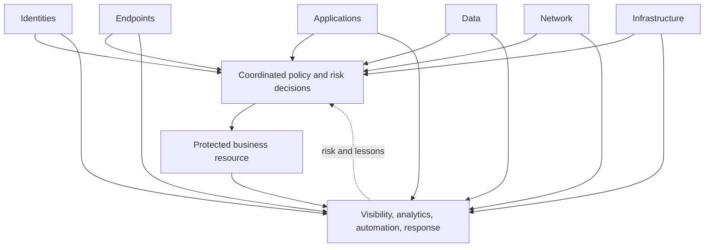

The pillars are not products and should not become separate projects with incompatible assumptions. Requiring a compliant device in an access policy is ineffective if device ownership and compliance signals are unreliable. Applying a sensitivity label is insufficient if broad site permissions already expose content. Generating alerts is insufficient if no queue, analyst permission, runbook, or response owner exists.

| Cross-pillar dependency | Failure example | Design response |
|---|---|---|
| Identity ↔ endpoint | Duplicate/stale device appears trusted | Define registration, ownership, lifecycle, and signal freshness |
| Identity ↔ application | App receives excessive delegated or application permission | Consent governance, least privilege, credential lifecycle, monitoring |
| Identity ↔ data | Broad group membership reaches sensitive sites | Classify data, reduce group scope, review access, protect sessions |
| Network ↔ application | Proxy breaks modern authentication or adds latency | Validate supported path, certificate behavior, endpoints, ownership |
| Data ↔ SecOps | Sensitive download alert lacks data context | Enrich with classification, identity, resource, and business owner |
| Infrastructure ↔ identity | Compromised admin workstation controls tenant | Separate privileged path, strong authentication, limited activation |
| SecOps ↔ every pillar | Alert has no containment or recovery owner | Build RACI, runbooks, permissions, approval, metrics, and exercises |

---

## 3. Policy decision, policy enforcement, and signals

Zero Trust access can be understood as a decision system. A **Policy Decision Point (PDP)** evaluates evidence and rules. A **Policy Enforcement Point (PEP)** applies the result at the resource, application, gateway, endpoint, or session. These are architecture concepts; a specific implementation may distribute their functions.

### 🔍 Plain-English deep-dive: decision versus enforcement

- **Policy Decision Point (PDP)** — *the logical function that evaluates signals and policy to decide what should happen.* **Analogy:** A travel authorization desk checks identity, visa, destination, and current restrictions. **Why it matters:** Decision logic needs trustworthy inputs, clear rules, and explainable results.
- **Policy Enforcement Point (PEP)** — *the function that allows, blocks, challenges, limits, or terminates access.* **Analogy:** The gate agent enforces the authorization decision at boarding. **Why it matters:** A correct decision has no value if the resource ignores it.
- **Signal** — *a data point used to inform a decision, such as identity, device state, location, application, risk, resource sensitivity, or behavior.* **Analogy:** One medical measurement informs a diagnosis but rarely proves it alone. **Why it matters:** Stale, absent, spoofed, or misunderstood signals produce unsafe decisions.
- **Policy** — *a rule connecting scope, conditions, and an outcome.* **Analogy:** “For international travel, present a valid passport and visa.” **Why it matters:** Ambiguous scope and exceptions create gaps or outages.
- **Claim** — *a statement about an identity or session carried in a token or assertion.* **Analogy:** A signed badge states name, employer, and role. **Why it matters:** The resource must validate the issuer, audience, time, and relevant claims.

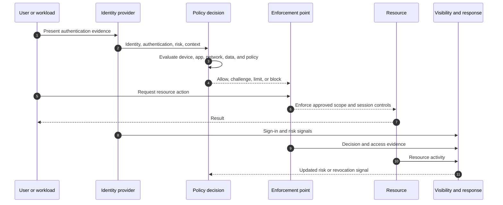

### Signal quality and decision design

| Signal | What it can indicate | Common limitation | Validation question |
|---|---|---|---|
| Identity | Account/object and authentication context | Account may be compromised or stale | Is lifecycle and authentication evidence current? |
| Authentication strength | Resistance of the method to specified attacks | Strong method does not fix excessive authorization | Is strength appropriate to the resource/action? |
| Device identity/compliance | Known enrollment and evaluated configuration | Stale, duplicate, incorrectly scoped, or spoofed state | How fresh and trustworthy is the signal? |
| Network/location | Source IP, country, named network, route | VPN/proxy/mobile networks make location imperfect | Is it a supporting signal rather than implicit trust? |
| Application/client | App identity, protocol, client type | App can have broad permission or legacy behavior | Is the app approved and permission-scoped? |
| User/sign-in risk | Analytic assessment of suspicious identity activity | False positives/negatives and license dependencies | What response and override process exists? |
| Resource/data sensitivity | Classification and business criticality | Missing or wrong classification | Does protection rise with sensitivity? |
| Behavior/session | Download volume, impossible sequence, token change | Requires baseline, context, and privacy governance | Can access be reevaluated or contained? |

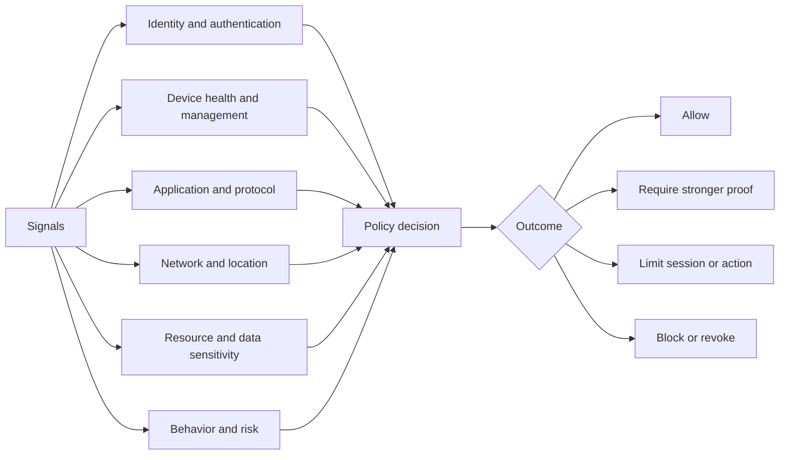

A policy should be explainable as: **who/what**, **which resource**, **under which conditions**, **with which required controls**, **which exclusions**, **which monitoring**, and **what failure behavior**. “Enable Conditional Access” is not a design.

---

## 4. Management, control, and data planes

Security architecture becomes clearer when actions are separated by plane.

### 🔍 Plain-English deep-dive: the three planes

- **Management plane** — *where administrators create, change, and govern resources and configuration.* **Analogy:** The building-management office changes who has master keys and how doors are configured. **Why it matters:** Compromise can alter the security system itself.
- **Control plane** — *where systems make coordination and policy decisions about access and operation.* **Analogy:** The security control room decides whether a badge should open a zone. **Why it matters:** Identity, policy, routing, and orchestration decisions are high-value targets.
- **Data plane** — *where users and workloads perform business operations on actual data or service traffic.* **Analogy:** People use rooms, equipment, and documents after access is granted. **Why it matters:** This is where information is read, changed, sent, or deleted.

| Plane | M365-oriented examples | Primary threats | Design emphasis |
|---|---|---|---|
| Management | Admin portals, Graph/PowerShell administration, role assignment, policy change | Privilege theft, unsafe change, malicious automation | Separate admin identity/path, JIT/JEA, approval, audit, rollback |
| Control | Entra authentication and policy, service routing, group resolution | Decision manipulation, stale signals, token abuse | Strong trust, resilient dependencies, explicit policy, monitoring |
| Data | Mail, files, chats, meetings, API content operations | Exfiltration, tampering, deletion, misuse | Data classification, scoped access, encryption, behavior detection, recovery |

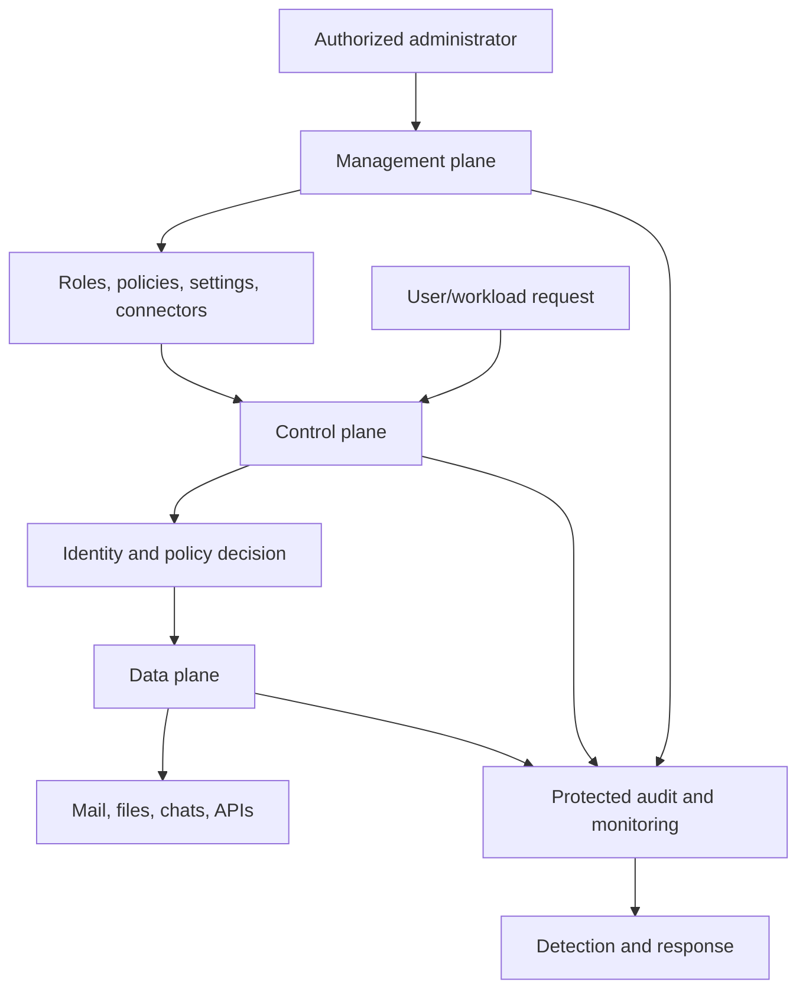

An administrator may have no need to read user content yet still hold management-plane power that could grant such access. Therefore, protecting management roles is as important as protecting data-plane access. Separate duties where feasible: one role proposes a high-impact change, another approves, and an independent evidence path records it.

### Trust boundaries

A **trust boundary** is where ownership, privilege, identity, validation, network, or data handling changes. Crossing a boundary should trigger appropriate validation and logging.

| Boundary | Example | Required questions |
|---|---|---|
| Human ↔ identity | User signs in | Which person, method, risk, session, recovery path? |
| Endpoint ↔ cloud | Browser/sync client connects | Is device/app appropriate and channel protected? |
| Tenant ↔ external tenant | Guest collaboration | Which home identity, inbound/outbound trust, lifecycle, data? |
| User ↔ application | User consents or invokes app | What permissions, publisher, token, session, monitoring? |
| Application ↔ API | Power Automate or service calls Graph | Delegated/application permission, secret/certificate, rate, evidence? |
| Workload ↔ data | Teams/SharePoint/Exchange accesses content | Does authorization and classification match purpose? |
| Customer ↔ Microsoft | SaaS service boundary | Which responsibility and escalation belongs to each party? |
| Client ↔ consulting/vendor | Evidence or admin access is shared | Authorization, minimization, expiry, handling, audit, exit? |

---

## 5. Least privilege, JIT, JEA, and privilege lifecycle

Least privilege is multidimensional. Permission can be excessive by action, resource, population, time, session, device, network, or delegation.

| Least-privilege dimension | Question | Excessive example | Better pattern |
|---|---|---|---|
| Action | What operations are needed? | Global administration for password reset | Scoped help-desk role |
| Resource | Which objects or services? | Tenant-wide access for one site task | Workload/site scope where supported |
| Population | For whom? | Policy applies broad exception group | Named, owned, reviewed assignment |
| Time | For how long? | Permanent privileged assignment | Time-bound eligible activation |
| Context | Under what conditions? | Admin action from any unmanaged device | Strong admin authentication and controlled endpoint |
| Delegation | Can access be passed onward? | App can grant or use broad permissions | Constrained consent and ownership review |
| Data | Which information class? | Full download when browser-only use is enough | Session/action restriction aligned to sensitivity |

**Just-in-Time (JIT)** means privilege becomes active only when needed and for a limited time. **Just-Enough-Access (JEA)** means only the necessary operations and scope are available. Microsoft also uses JEA as the name of a PowerShell technology; the general principle remains narrow capability.

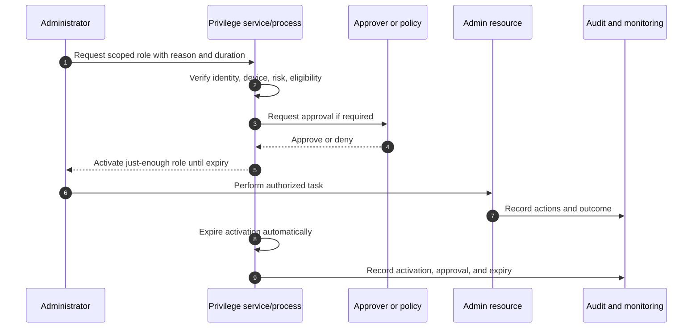

### Privilege lifecycle

1. Define roles from business duties and separation-of-duty needs.
2. Assign eligibility or access through an authorized process.
3. Require suitable authentication and controlled admin context.
4. Activate only when required, with reason, approval, and duration proportional to risk.
5. Monitor activation and actions.
6. Expire access automatically.
7. Review assignments and exceptions.
8. Remove access on role change, departure, inactivity, or risk.
9. Test emergency paths separately.

> **Arti tie-in:** Escalation engineering demonstrates knowing when to involve product groups, vendors, and specialist owners rather than taking every action personally. Least privilege formalizes the same discipline: the right actor receives the right capability for the right task, with evidence and expiry.

---

## 6. Assume breach, segmentation, and defense in depth

“Assume breach” does not mean assume every employee is malicious or declare every alert an incident. It means architecture must remain defensible after one identity, endpoint, application, network segment, configuration, or control fails.

### Segmentation

**Segmentation** divides access and function into controlled boundaries. Network segmentation is one form; identity, administrative, application, tenant, data, and operational segmentation are equally important in cloud environments.

| Segmentation type | Example | Blast-radius benefit |
|---|---|---|
| Identity | Separate user and admin identities | Stolen daily-use identity lacks standing admin path |
| Privilege | Scoped roles and separate duties | One role cannot make every high-impact change |
| Data | Sensitive sites/groups and item-level controls where justified | Compromise does not reach all content |
| Application | Distinct app identities and permissions | One connector cannot call unrelated APIs |
| Tenant/environment | Separate production/test or Power Platform environments | Testing error does not directly alter production |
| Network | Restrict unnecessary flows and lateral movement | Compromised host has fewer reachable targets |
| Operations | Separate alert triage, containment approval, and evidence review | A single mistaken action has lower impact |

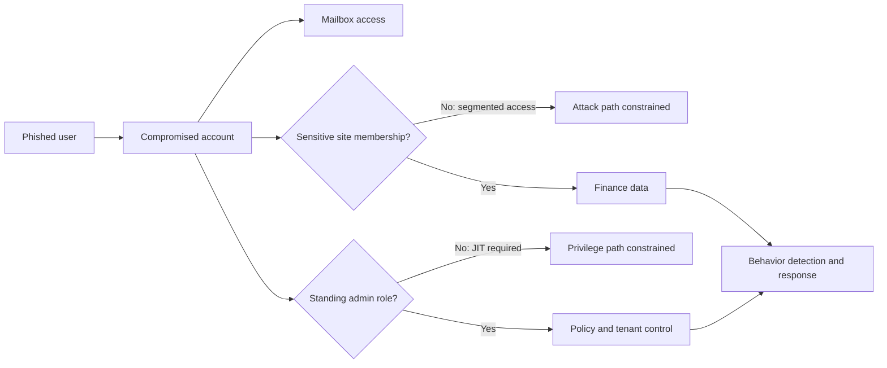

### Defense in depth versus duplication

| Healthy depth | Unhealthy duplication |
|---|---|
| Each layer addresses a defined failure | Multiple tools act on the same event without ownership |
| Layers produce compatible signals and actions | Conflicting agents, policies, or mail routes |
| Failure behavior and dependencies are known | Hidden chain where one outage breaks all access |
| Coverage and exceptions are measured | Licenses purchased but capability unoperated |
| Response and recovery are included | Prevention-only architecture |

For a stolen M365 session, defense may include phishing-resistant authentication, short and conditional sessions, resource-scoped authorization, limited download, classification and encryption, behavioral analytics, token/session revocation, protected audit, and recovery. No single item is called “the Zero Trust control.”

---

## 7. Secure by Design, Secure by Default, and shared responsibility

**Secure by Design** means security requirements, threats, trust boundaries, failure modes, privacy, and operations influence architecture from the start. **Secure by Default** means the initial or standard state favors a safe outcome without requiring every user or administrator to discover and enable protection.

### 🔍 Plain-English deep-dive: design, default, and operation

- **Secure by Design** — *build protection into requirements and architecture before implementation.* **Analogy:** Fire exits and structural supports are part of the building plan, not decorations added after opening. **Why it matters:** Late security changes are costlier and may not fix unsafe assumptions.
- **Secure by Default** — *the normal initial configuration minimizes avoidable exposure.* **Analogy:** A hotel room door locks when it closes. **Why it matters:** Safe behavior should not depend on every person making an expert choice.
- **Secure in Operation** — *maintain effectiveness through monitoring, updates, access review, incident handling, testing, and improvement.* **Analogy:** Alarms, doors, and evacuation plans must be maintained and exercised. **Why it matters:** A secure launch can degrade through drift and organizational change.
- **Fail secure** — *when a component fails, preserve the intended security property where proportionate.* **Analogy:** A fire door closes when power is lost. **Why it matters:** Some failures should deny access, while life/safety and continuity may require carefully controlled alternatives.

| Lifecycle stage | Secure-by-design question | Required artifact |
|---|---|---|
| Discover | What business outcomes, people, data, dependencies, and obligations matter? | Scope, asset/data map, stakeholder map |
| Requirements | What must be protected and how will success be tested? | Security/privacy/nonfunctional requirements |
| Threat model | How could the design be abused or fail? | Data flow, trust boundaries, threat register |
| Architecture | Which controls and responsibilities address the threats? | HLD, decisions, shared-responsibility/RACI |
| Implementation | Are defaults, roles, secrets, and interfaces configured safely? | LLD, baseline, change record |
| Validation | Do success, block, failure, exception, and rollback behave correctly? | Test matrix and evidence |
| Operations | Who monitors, responds, reviews, recovers, and improves? | Runbooks, ownership, metrics, exercises |
| Retirement | How are access, data, integrations, and evidence removed or retained? | Decommission and data disposition plan |

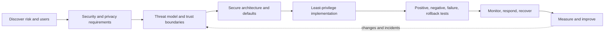

### Shared responsibility in a Zero Trust M365 design

| Responsibility | Microsoft | Client organization | Consultant/delivery team |
|---|---|---|---|
| Cloud service platform | Operates defined SaaS layers | Understands dependencies and monitors published health | Designs around documented behavior and escalation boundary |
| Identity/access capability | Provides platform features | Defines identities, roles, policy, lifecycle, exceptions | Assesses, designs, tests, documents, and transfers ownership |
| Customer data | Provides service controls and commitments | Classifies, authorizes, retains, shares, and governs | Maps requirements, validates controls, avoids compliance overclaim |
| Endpoints and networks | Publishes supported integration/connectivity guidance | Manages devices and customer network/security products | Coordinates product, network, endpoint, and vendor evidence |
| Incidents | Investigates service-side issues and publishes service health | Investigates tenant/user/client activity and business impact | Helps correlate, coordinate, document, and improve within scope |
| Decisions | Does not decide client risk appetite | Authorized client owner accepts/treats risk | Presents evidence, options, tradeoffs, and residual risk |

The consultant does not become the risk owner merely by recommending a design. The client makes authorized business decisions; Microsoft owns documented service layers; the consultant must make boundaries, assumptions, and evidence explicit.

---

## 8. Zero Trust maturity and target states

Maturity describes how consistently capabilities, processes, ownership, and evidence achieve outcomes. It should not be a vanity score.

| Maturity level | Characteristics | Identity/access illustration |
|---|---|---|
| 0 — Ad hoc | Implicit trust, undocumented exceptions, reactive support | Password and network location dominate; broad standing roles |
| 1 — Visibility | Inventory and logs begin; major gaps known | Users/apps/roles inventoried; sign-in evidence reviewed manually |
| 2 — Standardized | Baselines, ownership, and repeatable deployment exist | Common strong-auth and access policies with controlled scope |
| 3 — Integrated | Signals and controls work across pillars | Device, risk, application, and data context inform access |
| 4 — Adaptive | Continuous evaluation, automation with guardrails, measured improvement | Risk and session changes trigger proportionate response |
| 5 — Optimizing | Exercises, threat intelligence, metrics, and lessons reshape design | Attack paths tested; exceptions shrink; outcomes improve predictably |

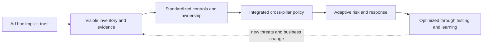

Maturity is not uniform. A client may have strong identity enforcement but weak application governance, excellent endpoint telemetry but unmanaged guest access, or mature technology but poor exception review. Assess each pillar and cross-pillar dependency against client outcomes.

### Current-state and target-state evidence

| Evidence domain | Current-state question | Target-state evidence |
|---|---|---|
| Inventory | Are identities, apps, devices, data, roles, and integrations known? | Automated coverage with owner and lifecycle |
| Policy | Are decisions documented, scoped, simulated, and reviewed? | Traceable policy set with low unmanaged overlap |
| Privilege | Is standing privilege minimized and monitored? | JIT/JEA, controlled admin path, reviews, emergency access |
| Data | Does protection follow sensitivity and purpose? | Classification-informed authorization and monitoring |
| Visibility | Can events become actionable incidents? | Correlated evidence, queues, runbooks, response permissions |
| Resilience | Can access and data recover to trusted state? | Tested emergency and restore paths |
| Governance | Are exceptions and residual risks owned? | Expiry, approval, metrics, and decision cadence |

---

## 9. Security, productivity, usability, reliability, privacy, and cost

Zero Trust design is a constrained optimization problem, not a contest to maximize blocks. A control that legitimate users cannot satisfy will create bypasses, support load, and resistance; a frictionless control that does not reduce material risk is security theater.

| Dimension | Question | Example metric/evidence |
|---|---|---|
| Security | Does the control reduce a defined attack path? | Block/containment test, exposure and exception trend |
| Productivity | Can required business work continue? | Task completion, collaboration success, delay |
| Usability | Can users understand and satisfy the requirement? | Prompt success, help-desk volume, accessibility review |
| Reliability | Does the control depend on fragile services or paths? | Failure test, latency, dependency health, fallback |
| Privacy | Is monitoring/collection proportionate and governed? | Data minimization, access, retention, legal review |
| Cost | Are license, engineering, support, and operational costs justified? | Persona/license map, total operating effort |

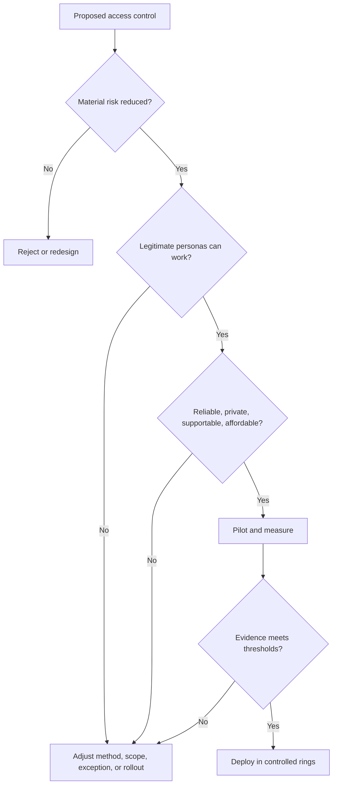

### Persona-based design

Do not apply one undifferentiated experience to every person. Define personas such as standard employee, frontline/shift worker, executive, administrator, developer, external partner, contractor, service desk, break-glass operator, and workload identity. Each has different resources, devices, locations, authentication options, consequences, and support needs.

| Persona | Higher-risk concerns | Design considerations |
|---|---|---|
| Administrator | Tenant-wide impact, attacker target | Separate account, strong proof, controlled endpoint, JIT, audit |
| Executive | Targeted phishing, travel, assistants, sensitive data | Strong usable methods, travel support, priority monitoring |
| Frontline/shared device | Device/session sharing, limited phone access | Supported authentication, rapid sign-out, narrow apps/data |
| External partner | Lifecycle and home-tenant dependency | Specific resources, terms, reviews, cross-tenant boundary |
| Automation/workload | Nonhuman credential and broad API scope | Managed identity/certificate where suitable, least permission, rotation, monitoring |
| Service desk | Frequent identity operations | Scoped role, verification procedure, anti-social-engineering controls |

---

## 10. Emergency access and break-glass design

**Emergency-access accounts**, often called **break-glass accounts**, are tightly controlled identities or procedures intended to restore administrative access when normal controls or dependencies fail. They are not convenience accounts and should not become unmonitored permanent bypasses.

### Design requirements

| Requirement | Rationale |
|---|---|
| Cloud-native dependency where appropriate | Avoid the same federation/on-premises failure as normal accounts |
| Strong, independent authentication | Avoid dependence on the failed method while remaining resistant to abuse |
| Minimal number with controlled custody | Balance resilience against added attack surface |
| Deliberate policy treatment | Avoid accidental lockout without creating broad exclusions |
| No routine use | Any use should be exceptional and investigated |
| High-signal alerting | Use must generate immediate review through an independent path |
| Credential and procedure validation | An untested emergency path may fail when needed |
| Named authorization and dual control where feasible | Reduce unilateral misuse |
| Post-use rotation and review | Restore trust and capture lessons |
| Offline, protected documentation | Procedure must be reachable during platform or network disruption |

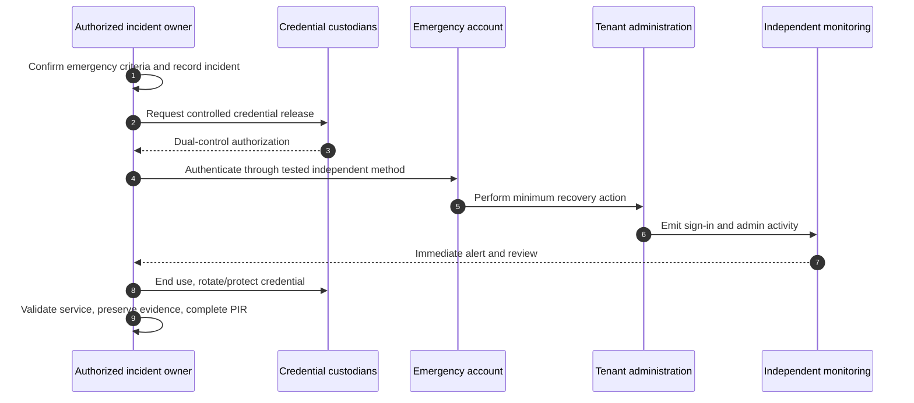

### Fail-open and fail-closed

**Fail-closed** means access is denied when the decision/control cannot establish safety. **Fail-open** means access continues when the control fails. Neither is universally correct. Privileged modification of security policy usually favors fail-closed behavior; emergency operation may require a separately designed path. The decision must consider safety, business continuity, abuse, detection, recovery, and legal obligations.

| Scenario | Default preference | Compensating requirements |
|---|---|---|
| Unknown user requests sensitive data | Fail closed | Clear support and authorized access restoration |
| Device signal unavailable | Depends on data/persona risk | Limited web session, alternate proof, monitoring, time bound |
| Primary identity path unavailable | Normal access may fail closed | Tested emergency identity and recovery procedure |
| Automated containment confidence is low | Avoid irreversible automatic action | Analyst approval, scoped action, timeout, rollback |
| Life/safety operation | Continuity may dominate | Segmented emergency mode, logging, reconciliation, review |

---

## 11. Failure modes and Zero Trust anti-patterns

A good architecture predicts how it can fail technically and organizationally.

| Failure mode | Symptom/impact | Root design question | Safer response |
|---|---|---|---|
| Policy lockout | Administrators/users lose access | Were emergency accounts, exclusions, pilot, simulation, and rollback tested? | Stop rollout, use approved recovery, preserve evidence, correct scope |
| Stale device signal | Known user blocked or unsafe device allowed | What is source, freshness, duplicate cleanup, and authority? | Correlate identity/device records and lifecycle |
| Conflicting policies | Unexpected challenge/block/session behavior | Is policy intent consolidated and evaluated end-to-end? | Build decision matrix; remove unmanaged overlap safely |
| Broad exception | Attackers target excluded accounts/apps | Is exception owned, minimal, monitored, and expiring? | Reduce scope and duration; add compensating controls |
| Unusable MFA | Users cannot satisfy method | Were personas, accessibility, travel, and recovery designed? | Add supported strong methods and controlled registration support |
| App permission sprawl | Workload reads unrelated data | Are consent, permission, credential, and owner lifecycle governed? | Inventory, reduce permissions, rotate, monitor, review |
| Visibility without action | Alerts accumulate | Who triages, contains, communicates, and closes? | Operational model, queue, severity, runbooks, metrics |
| Automation without guardrails | False positive causes outage | What confidence, approval, scope, idempotency, and rollback exist? | Human approval for high impact; test failure/retry |
| Overclassification | Work becomes slow; users bypass controls | Does classification match business value and usability? | Simplify taxonomy and test real workflows |
| Perimeter-only trust | VPN user receives broad access | Are identity, device, app, and data evaluated? | Treat network as one signal and segment resources |

### Anti-patterns

| Anti-pattern | Why it is wrong | Better statement/action |
|---|---|---|
| “Zero Trust means trust nobody” | Confuses people with access decisions | Verify requests explicitly and proportionately |
| “We bought E5, so we have Zero Trust” | Licensing is capability, not design or operation | Map risk to configured, tested, owned outcomes |
| “Block everything first” | Creates outages and bypass pressure | Simulate, pilot, ring, monitor, and retain rollback |
| “The corporate network is safe” | Compromised identities and endpoints cross the perimeter | Treat location as contextual evidence only |
| “One policy for all users and apps” | Personas and resource sensitivity differ | Use coherent protection levels and justified scopes |
| “Never allow exceptions” | Some legitimate requirements need governed alternatives | Time-bound, minimal, approved, monitored exception |
| “Exclude service accounts and forget them” | Creates durable attacker path | Redesign workload identity, permission, credential, and monitoring |
| “Secure Score is our maturity model” | A product score lacks full business context | Use it as one input to evidence-based assessment |
| “Automation must contain immediately” | Incorrect high-impact action can create incident | Confidence, approval, least privilege, idempotency, rollback |
| “Disable the security control to troubleshoot” | Weakens protection and changes evidence | Use logs, report-only/simulation, scoped test, vendor-safe bypass process |

---

## 12. Reference architecture for Microsoft 365 Zero Trust

The architecture below is conceptual. It describes responsibilities and flows, not a claim that every capability is licensed or deployed.

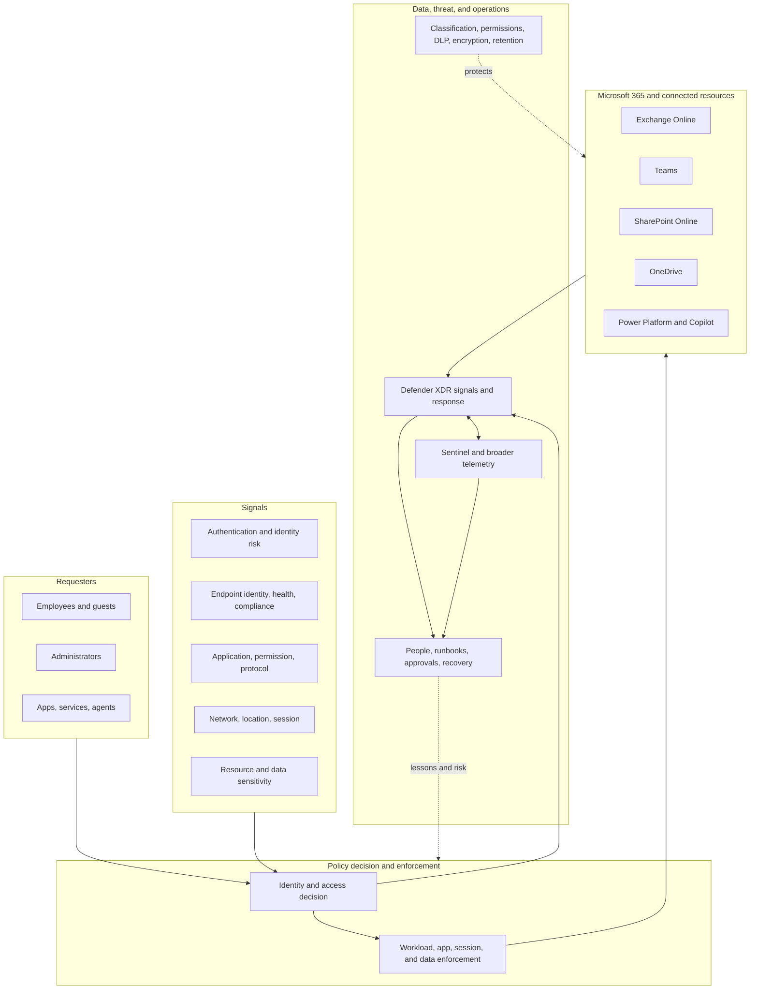

### Architecture decision record questions

| Decision area | Questions to record |
|---|---|
| Outcome | Which business scenario and risk are addressed? |
| Scope | Which tenants, users, identities, endpoints, apps, data, and locations? |
| Decision logic | Which signals, rules, protection levels, and outcomes? |
| Enforcement | Which component applies allow/challenge/limit/block/revoke? |
| Privilege | Which admin roles, paths, JIT/JEA, approval, emergency access? |
| Dependencies | Identity, network, device, license, service, vendor, data, operations? |
| Privacy | What telemetry and user data are collected, who sees it, how long? |
| Failure | What if signal, service, connector, policy, or automation fails? |
| Test | Positive, negative, exception, failure, rollback, and recovery cases? |
| Operations | Owner, queue, runbook, access, metric, review, escalation? |

---

## 13. Deployment roadmap: strategy to sustained operation

Zero Trust adoption is incremental. Microsoft currently frames adoption through business scenarios, security disciplines, technology pillars, and technical solutions. The roadmap must start with business outcomes and foundational dependencies rather than the easiest portal setting.

### Phased roadmap

| Phase | Purpose | Key outputs | Gate |
|---|---|---|---|
| 0. Mobilize and protect administration | Establish governance and avoid lockout | Sponsor, RACI, emergency access, privileged baseline, evidence request | Admin recovery path tested |
| 1. Discover and assess | Understand identities, endpoints, apps, data, network, operations | Inventory, flows, maturity, risks, dependencies | Material unknowns and owners documented |
| 2. Define target and protection levels | Connect risk to requirements and personas | Target architecture, policy matrix, license map, roadmap | Stakeholders approve design and residual risks |
| 3. Establish identity foundation | Improve proof, lifecycle, privilege, logging | Authentication/registration plan, role plan, report-only policies | Tests and support readiness pass |
| 4. Establish endpoint and app trust | Improve device/app signals and control | Enrollment/compliance/app governance plan | Signal reliability validated |
| 5. Protect resources and data | Apply workload/data-specific safeguards | Sharing, session, label, DLP, permission designs | User workflows and data-owner tests pass |
| 6. Integrate detection and response | Correlate signals and enable containment/recovery | Alerts, incidents, runbooks, automation guardrails | Exercises prove ownership and access |
| 7. Scale and optimize | Deploy rings, reduce exceptions, measure outcomes | Dashboards, reviews, backlog, maturity reassessment | Metrics show sustained improvement |

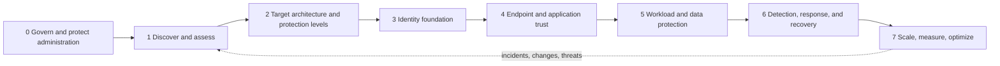

### Deployment rings

| Ring | Members | Purpose | Exit criteria |
|---|---|---|---|
| Lab/design validation | Fictional or nonproduction personas | Validate logic and documentation | Requirements and test behavior align |
| Ring 0 | Security/identity administrators and recovery owners | Validate administration and emergency paths | No lockout; logs/runbooks work |
| Ring 1 | Technical pilot with diverse devices/apps | Find compatibility and support issues | Positive/negative/failure tests pass |
| Ring 2 | Representative business groups | Validate real workflows and regional/persona differences | Security and productivity metrics acceptable |
| Ring 3 | Broad deployment | Scale with monitoring and support | Coverage grows without threshold breach |
| Specialized | High-value/high-regulation personas/data | Apply stronger controls after foundations | Specific risk and operational tests pass |

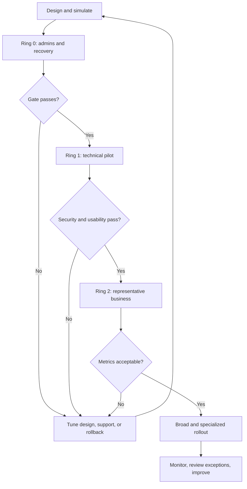

Do not use real emergency accounts or client production policy changes as learning experiments. Labs and paper designs should use fictional data; production changes require authorization, peer review, change control, evidence, and rollback.

---

## 14. Measurements: prove outcomes, not activity

A Zero Trust metric should help a decision. “Number of policies created” is an activity measure; it can increase while risk worsens.

| Outcome | Useful measure | Misleading substitute |
|---|---|---|
| Stronger identity proof | Protected population and successful strong-auth coverage by persona | Number of authentication methods enabled |
| Reduced standing privilege | Permanent privileged assignments, activation duration, review/removal | Number of PIM licenses |
| Trustworthy endpoint signal | Active endpoint coverage, stale/duplicate rate, compliance confidence | Total device records |
| Narrower blast radius | High-value resource memberships, broad groups, app permission scope | Number of groups |
| Controlled exceptions | Exception count, age, owner, expiry, compensating control | “Exceptions are documented” |
| Faster detection | Time to reliable signal/triage for defined scenarios | Raw alert count |
| Effective response | Mean time to contain/recover with quality and false-action rate | Automated actions executed |
| Resilience | Emergency access and restore exercise pass rate | Backup configured |
| Usable security | Legitimate success, support volume, abandonment, accessibility | Block rate alone |
| Maturity | Evidence-backed capability progress by pillar and dependency | Secure Score alone |

### Leading and lagging indicators

- **Leading indicators** show conditions likely to influence future outcomes: stale privileged access, unmanaged exceptions, unclassified critical sites, untested emergency accounts, or missing runbooks.
- **Lagging indicators** show outcomes after events: incidents, data exposure, recovery time, user disruption, false-positive containment, or audit failure.

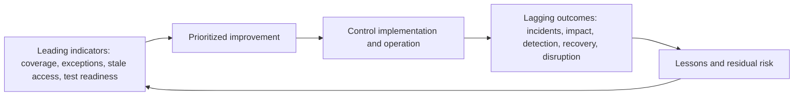

Every dashboard should state source, calculation, scope, exclusions, freshness, owner, target, trend, and action threshold. A percentage without denominator and coverage boundaries can mislead.

---

## 15. Troubleshooting Zero Trust access without weakening security

When legitimate access fails, isolate the decision path instead of disabling controls.

### Access troubleshooting model

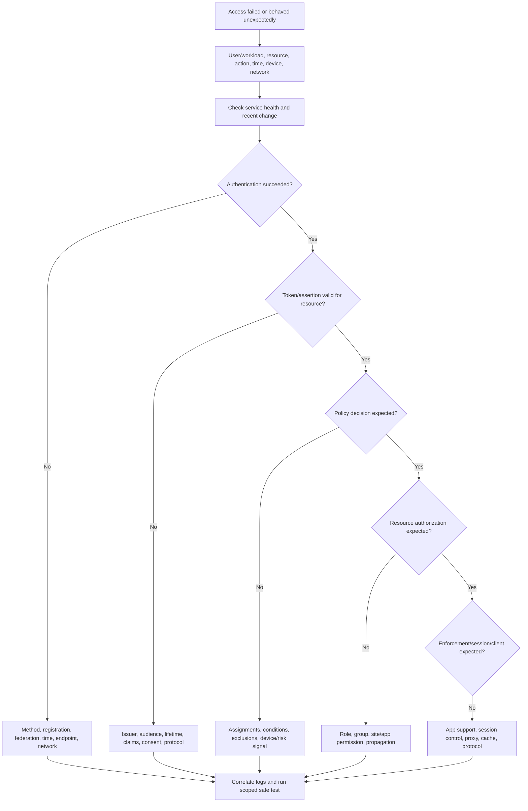

| Evidence | What it answers | Caution |
|---|---|---|
| User symptom and timestamp | What operation failed and perceived impact | Normalize timezone; recollection is not full proof |
| Sign-in/authentication log | Identity, app, method, result, policy evaluation | Retention/license/field interpretation varies |
| Device record/status | Identity, ownership, management, compliance | Duplicate/stale records can mislead |
| Resource permission | Whether authorized access exists | Group nesting/propagation/session caching may matter |
| Client/network trace | DNS, proxy, TLS, HTTP, endpoint reachability | Redact tokens, cookies, user/content data |
| Service health/message | Known provider incident/change | Correlate scope; absence does not prove no service issue |
| Change record | What changed and expected effect | Unrecorded changes remain possible |

Safe discriminating tests include report-only/simulation where available, a controlled test persona, a separate test resource, comparing affected and unaffected paths, checking logs, and reverting through approved change. Do not advise turning off MFA, firewall, proxy, certificate validation, endpoint protection, or access policy as an unbounded troubleshooting step.

---

## 16. Consulting artifacts for a Zero Trust engagement

| Artifact | What it contains | Quality criterion |
|---|---|---|
| Business scenario | Outcome, actors, assets, harm, constraints | Understandable without product jargon |
| Current-state architecture | Pillars, flows, planes, boundaries, dependencies | Validated by owners and evidence |
| Maturity assessment | Criteria, evidence, confidence, gap, target | No unsupported score precision |
| Persona matrix | Users/workloads, resources, devices, methods, support | Covers exceptions and accessibility |
| Policy matrix | Scope, signals, controls, outcome, exclusion, failure | Traceable and testable |
| Privilege model | Roles, JIT/JEA, separation, admin path, emergency | Avoids standing broad access |
| Target architecture | Decisions, enforcement, telemetry, response, responsibility | Cross-pillar dependencies visible |
| Roadmap | Phases, prerequisites, rings, owner, license, gate | Driven by risk and readiness |
| Test matrix | Positive, negative, exception, failure, rollback, recovery | Evidence and acceptance criteria defined |
| Exception register | Reason, scope, risk, compensating control, owner, expiry | Regularly reviewed and shrinking |
| Metrics pack | Outcome, source, denominator, trend, threshold, action | Supports decisions, not vanity |
| Handover pack | Runbooks, access, training, escalation, known issues | Operators demonstrate readiness |

### Workshop facilitation pattern

1. Start with business outcomes and recent pain, not products.
2. Agree scope and vocabulary.
3. Map assets, personas, data, applications, and critical dependencies.
4. Draw current access and administrative flows.
5. Mark trust boundaries and shared-responsibility boundaries.
6. Identify assumptions and ask what happens when each fails.
7. Prioritize attack paths and business impacts.
8. Define protection levels and target outcomes.
9. Capture decisions, disagreements, evidence gaps, owners, and dates.
10. Convert workshop output into architecture, roadmap, and tests.

---

## 17. Safe paper lab: facilitate a Zero Trust client workshop

### Lab goal

Produce a consulting-quality Zero Trust workshop pack for a fictional organization without a Microsoft tenant or paid license.

### Prerequisites

- A document editor or paper.
- Part 2's cybersecurity vocabulary.
- Fictional client: **Northwind Research**, 2,000 staff, remote and office work, Microsoft 365, unmanaged partner access, SharePoint/OneDrive research data, Power Automate approvals, and a small service desk.
- No real customer information, credentials, tenant identifiers, screenshots, or configuration exports.

### Scenario facts

- MFA exists for most employees but not all workload identities.
- Administrators use ordinary workstations and several roles are permanent.
- Device inventory contains stale and duplicate records.
- Sensitive research sites use large nested groups.
- A proxy and VPN backhaul all remote traffic.
- Audit events exist, but alert ownership is unclear.
- A previous policy rollout blocked a partner during a submission deadline.
- Emergency-access accounts are documented but have not been tested this year.

### Steps

1. **Write the workshop objective:** reduce account-compromise blast radius while preserving research and partner deadlines.
2. **Create a stakeholder/RACI draft:** sponsor, identity, endpoint, M365 workload, data owner, network, SOC, service desk, privacy/legal, vendor, and partner owner.
3. **Build personas:** employee, researcher, administrator, service desk, external reviewer, contractor, workflow identity, and emergency operator.
4. **Draw the architecture:** identity, endpoints, apps, data, network, infrastructure, SecOps. Add management, control, and data planes.
5. **Mark trust boundaries:** external partner, unmanaged endpoint, proxy/VPN, application/API, privileged administration, Microsoft service, and vendor support.
6. **Map three attack paths:** phished researcher, compromised Power Automate connection, and stolen admin session.
7. **Apply the principles:** state how verify explicitly, least privilege, and assume breach change each path.
8. **Score maturity by pillar:** use evidence-based 0–5 criteria, confidence, and gaps. Do not average away a critical weakness.
9. **Define protection levels:** starting point, enterprise, and specialized research data/personas. Keep policy descriptions product-neutral first.
10. **Design emergency access:** trigger, custody, independent authentication, minimum action, alert, evidence, rotation, and review.
11. **Build a phased roadmap:** administration, inventory, identity, endpoint/app, data/workload, SecOps, optimization.
12. **Create a deployment-ring plan:** lab, admins, technical pilot, representative research team, broad rollout, specialized sites.
13. **Create a test matrix:** at least four positive, four negative, two failure, one rollback, and one recovery test.
14. **Define ten metrics:** include security, usability, exception, privilege, signal quality, detection, response, and recovery.
15. **Write a decision log:** identify what the client must decide versus what Microsoft or a vendor must investigate.
16. **Practice a 10-minute readout:** current risk, target model, first 90 days, tradeoffs, and evidence required.

### Positive tests

| Test | Expected result | Evidence |
|---|---|---|
| Managed researcher uses approved app and method | Access to normal research workspace succeeds | Persona, conditions, decision, resource result |
| Named external reviewer uses approved path during assignment | Access only to assigned content succeeds | Identity, scope, expiry, resource audit |
| Eligible admin activates scoped role for approved task | JIT/JEA access succeeds then expires | Request, approval, activation, action, expiry |
| Workflow identity performs its single approved API action | Action succeeds only within intended resource scope | Identity, permission, run result, audit |

### Negative tests

| Test | Expected result | Control intent |
|---|---|---|
| Unmanaged device attempts specialized-data download | Blocked or restricted by approved design | Protect sensitive data with endpoint/session context |
| Expired partner assignment attempts access | Denied and review evidence retained | Lifecycle and least privilege |
| Workflow identity calls unrelated API/resource | Denied | Just-enough application permission |
| Daily user account attempts tenant administration | Denied | Administrative segmentation |

### Failure, rollback, and recovery tests

| Test | Expected result |
|---|---|
| Device signal is unavailable | Defined fail behavior applies; no silent broad trust |
| Proxy path adds authentication/TLS failure | Evidence isolates network ownership without disabling security controls |
| Pilot policy exceeds support-impact threshold | Approved rollback restores expected access and preserves logs |
| Primary admin access fails | Authorized emergency-access procedure restores minimum control, alerts, rotates, and completes review |

### Evidence package

- Workshop agenda and stakeholder map.
- Persona and protection-level matrix.
- Pillar/plane/trust-boundary architecture.
- Three attack-path diagrams.
- Maturity assessment with evidence and confidence.
- Target policy decision matrix.
- Emergency-access design.
- Phased roadmap and deployment rings.
- Test and metric catalog.
- Decision/assumption/evidence-gap log.
- Ten-minute executive readout.

### Cleanup

No tenant cleanup is needed. Confirm every organization, identity, domain, metric, and screenshot is fictional or generic. Remove any accidental real identifiers and label the pack “paper lab — no production deployment.”

### Interview-portfolio wording

> “I facilitated a paper-based Zero Trust design exercise for a fictional Microsoft 365 organization. I mapped all seven pillars, management/control/data planes, trust boundaries, policy decision and enforcement, least privilege, attack paths, emergency access, maturity, phased rollout, tests, and metrics. It demonstrates my architecture and workshop method, supported by transferable M365 escalation experience; it does not represent production ownership of Entra, Intune, Purview, Defender, or Sentinel.”

---

## 18. Candidate honesty note

| Evidence type | Defensible statement | Boundary |
|---|---|---|
| Production | Arti has led Microsoft 365 enterprise escalations involving SharePoint Online, OneDrive, sync, customers, partners, engineering, vendors, RCA, fix validation, documentation, and business reviews | Do not convert this into claims of owning Conditional Access, Intune compliance, Purview, Defender, Sentinel, or privileged identity deployments |
| Transferable | Layer isolation, hypothesis testing, stakeholder coordination, safe validation, documentation, and operational communication map directly to Zero Trust delivery | Transferability supports readiness; it is not identical product tenure |
| Lab/paper | Architecture, workshop, policy matrix, emergency-access design, tests, and metrics can be demonstrated as structured exercises | State clearly that no production tenant was changed |
| Conceptual | Principles, pillars, planes, signals, segmentation, maturity, failure modes, and roadmap can be explained and defended | Conceptual fluency needs product labs and supervised implementation to become operational depth |

Recommended phrasing:

> “My production foundation is M365 escalation and collaboration-workload troubleshooting. I use that evidence discipline to reason about Zero Trust, and I have produced a structured architecture and test portfolio. The named Entra, Intune, Defender, Purview, and Sentinel implementations remain lab or conceptual evidence until I have production ownership.”

---

## 19. JD Mapping

| JD requirement | Part 3 capability | Candidate evidence route |
|---|---|---|
| Secure by Design | Requirements, threat model, defaults, failure, testing, operations | Paper HLD/decision records plus existing technical advisory discipline |
| Microsoft 365 Zero Trust | Principles, pillars, policy decision/enforcement, architecture | Whiteboard and workshop pack; no product-ownership overclaim |
| Entra/MFA/Conditional Access | Identity signals and access decision concepts | Deeper implementation in Parts 6–14 and Lab 1 |
| Intune and endpoint trust | Endpoint signal, device lifecycle, policy dependency | Deeper implementation in Parts 15–20 and Lab 2 |
| Purview and data protection | Data sensitivity and protection following the asset | M365 content transferability; implementation later in Parts 26–33 |
| Defender/Sentinel operations | Cross-pillar visibility, response, automation guardrails | Incident/RCA transferability; platform evidence later in Parts 34–52 |
| Assessment/health check | Maturity criteria, evidence gaps, anti-patterns, metrics | Safe workshop lab and assessment artifacts |
| Design/deploy/optimize | Architecture decisions, rings, gates, roadmap, measurement | Fix-validation and coordination strengths translated into deployment method |
| Service disruption/on-call | Emergency access, fail behavior, rollback, recovery | Critical escalation and handover evidence as transferable skill |
| Multi-vendor troubleshooting | Trust/shared-responsibility boundaries and dependency evidence | Direct customer/partner/engineering/vendor coordination |
| Power Platform/Copilot | Workload identity, app permission, data and API boundaries | Existing Power Platform/Copilot evidence, scoped honestly |

---

## 20. Official Source Anchors

These first-party Microsoft Learn pages were checked for the guide's **August 24, 2026** currency date. Microsoft can change product names, licensing, portal placement, recommendations, and deployment models, so verify the live pages before client implementation.

1. [Zero Trust as a security foundation](https://learn.microsoft.com/security/zero-trust/zero-trust-overview) — Current principles: verify explicitly, least privilege, and assume breach; continuous evaluation and structured adoption.
2. [Zero Trust deployment for technology pillars](https://learn.microsoft.com/security/zero-trust/deploy/overview) — Current identities, endpoints, data, applications, infrastructure, networks, and SecOps pillar model.
3. [Zero Trust deployment plan with Microsoft 365](https://learn.microsoft.com/security/zero-trust/microsoft-365-zero-trust) — Microsoft 365 architecture and phased work across remote/hybrid work, breach reduction, data, AI, and compliance.
4. [Zero Trust identity and device access configurations](https://learn.microsoft.com/security/zero-trust/zero-trust-identity-device-access-policies-overview) — Protection levels, security/productivity tradeoffs, identity/device prerequisites, caveats, and incremental rollout guidance.
5. [Azure Well-Architected security design principles](https://learn.microsoft.com/azure/well-architected/security/principles) — Segmentation, least privilege, CIA, threat modeling, resilience, security readiness, and continuous improvement.
6. [Shared responsibility in the cloud](https://learn.microsoft.com/azure/security/fundamentals/shared-responsibility) — Provider/customer responsibility boundaries used in the design and RACI.
7. [Microsoft 365 network connectivity principles](https://learn.microsoft.com/microsoft-365/enterprise/microsoft-365-network-connectivity-principles?view=o365-worldwide) — Current local-egress, endpoint, proxy/inspection, and cloud-connectivity principles relevant to the network pillar.

Licensing examples in Microsoft guidance are not a purchasing quote. Confirm current product terms, service descriptions, tenant cloud, region, user persona, and licensing with authorized Microsoft/commercial sources before design approval.

---

## ⭐ Likely Interview Questions for This Section

### Q1. What are the three Zero Trust principles, and what do they change?

> **Model answer:** “Verify explicitly means authenticate and authorize each request using relevant current signals. Least privilege means only the needed action, resource, population, duration, and context. Assume breach means segment, limit blast radius, monitor, respond, and recover because a layer can fail. Together they replace broad durable trust based on network location or one successful sign-in with explicit, conditional, limited, and observable access.”

### Q2. Is Zero Trust a Microsoft product?

> **Model answer:** “No. Zero Trust is a security strategy and design model. Microsoft capabilities can implement parts of it across identities, endpoints, applications, data, networks, infrastructure, and SecOps, but licenses or enabled features do not prove Zero Trust. I would trace business risk to policy decisions, enforcement, tests, operations, exceptions, and measurable outcomes.”

### Q3. Explain the policy decision point, enforcement point, and signals.

> **Model answer:** “The logical policy decision point evaluates identity, authentication, device, app, network, risk, resource sensitivity, behavior, and configured rules. The enforcement point applies the result at an identity, application, session, network, endpoint, or resource boundary by allowing, challenging, limiting, blocking, or revoking. Signal quality, freshness, dependencies, and failure behavior must be designed and observable.”

### Q4. How do JIT and JEA support least privilege?

> **Model answer:** “Just-in-Time limits when privilege is active; Just-Enough-Access limits what actions and resources are available. A mature privileged flow verifies the administrator and context, activates a scoped role for a justified duration, uses approval where appropriate, records actions, expires automatically, reviews assignments, and maintains a separately tested emergency path.”

### Q5. How would you prevent a Zero Trust rollout from locking out a client?

> **Model answer:** “I would inventory identities, applications, protocols, devices, dependencies, and existing policies; protect and test emergency access first; use simulation or report-only capability where available; create test personas and positive, negative, exception, failure, and rollback cases; deploy through representative rings; monitor security and user metrics; prepare service-desk guidance; and use evidence-based go/no-go gates. I would never treat a broad production block as the first test.”

### Q6. How do you balance security and productivity?

> **Model answer:** “I start with risk and real personas, then choose proportionate protection levels for resources and actions. I test legitimate success as rigorously as expected denial, include accessibility and support, measure friction and false blocks, and use controlled alternatives rather than unmanaged bypasses. A control must materially reduce risk while remaining reliable, private, supportable, and affordable.”

### Q7. What makes emergency access secure rather than a dangerous bypass?

> **Model answer:** “It is reserved for defined emergencies, minimizes shared dependencies, uses strong independently recoverable authentication, has tightly controlled custody and authorization, receives deliberate policy treatment, is never used routinely, generates immediate independent alerts, is exercised, and triggers post-use rotation and review. The action performed should be the minimum needed to restore normal trusted administration.”

### Q8. How would you measure Zero Trust maturity?

> **Model answer:** “I would assess evidence by pillar and cross-pillar dependency: inventory, identity proof, privilege, device/app signal quality, data scope, segmentation, policy coherence, exceptions, visibility, response, recovery, usability, and ownership. I would define current and target criteria, confidence, and business outcomes rather than average everything into a vanity score. Metrics should drive actions, such as reducing standing privilege or stale exceptions, and be validated through attack, failure, and recovery exercises.”

---

## 🧠 30-Second Memory Hooks

- **Verify explicitly:** Decide from current relevant evidence, not location or familiarity.
- **Least privilege:** Right identity, action, resource, condition, and duration.
- **Assume breach:** Watertight compartments, alarms, response, and recovery.
- **Seven pillars:** Identity, endpoint, app, data, network, infrastructure, SecOps.
- **PDP versus PEP:** Decide at the desk; enforce at the gate.
- **Signals:** Useful only when trustworthy, fresh, relevant, and understood.
- **Three planes:** Manage configuration, control decisions, use data.
- **Trust boundary:** Revalidate when ownership, authority, or control changes.
- **JIT/JEA:** Privilege only now and only enough.
- **Segmentation:** Break attack paths and reduce blast radius.
- **Secure by Design:** Put fire exits in the blueprint.
- **Secure by Default:** The door locks when it closes.
- **Secure in Operation:** Maintain, monitor, exercise, and improve.
- **Break glass:** Tested emergency path, not daily convenience.
- **Maturity:** Visible → standardized → integrated → adaptive → optimizing.
- **Safe rollout:** Discover, simulate, pilot, ring, gate, monitor, roll back.
- **Good metric:** Changes a decision; activity counts alone do not.
- **Honesty:** Architecture fluency and lab evidence are not production ownership.

---

## Completion Checklist

- [ ] Explain Zero Trust without calling it a product or distrusting people personally.
- [ ] Define and illustrate verify explicitly, least privilege, and assume breach.
- [ ] Draw all seven pillars and explain at least three cross-pillar dependencies.
- [ ] Distinguish a policy decision point from a policy enforcement point.
- [ ] Explain identity, authentication, endpoint, app, network, risk, data, and behavior signals plus their limitations.
- [ ] Draw a complete request-to-decision-to-resource-to-visibility sequence.
- [ ] Distinguish management, control, and data planes.
- [ ] Identify at least five trust boundaries in an M365 scenario.
- [ ] Explain least privilege across action, resource, population, time, context, and delegation.
- [ ] Compare JIT and JEA and describe a privilege lifecycle.
- [ ] Explain segmentation beyond networks and draw an attack path it breaks.
- [ ] Distinguish defense in depth from duplicate uncontrolled tooling.
- [ ] Define Secure by Design, Secure by Default, Secure in Operation, and fail-secure behavior.
- [ ] Explain customer, Microsoft, consultant, and risk-owner responsibility boundaries.
- [ ] Assess maturity with explicit evidence and confidence rather than a vanity score.
- [ ] Describe persona-based security/productivity tradeoffs.
- [ ] Design emergency access with custody, alerting, exercise, and post-use review.
- [ ] Compare fail-open and fail-closed choices without making an absolute claim.
- [ ] Recognize at least eight Zero Trust failure modes or anti-patterns.
- [ ] Produce a phased deployment roadmap and ring strategy.
- [ ] Define leading, lagging, security, usability, exception, and recovery metrics.
- [ ] Troubleshoot an access problem without recommending broad control disablement.
- [ ] Complete the paper workshop, test matrix, and ten-minute readout.
- [ ] Answer all eight interview questions using honest evidence boundaries.

---

*Next suggested section:* [Part 4](Part-04-m365-tenant-architecture-portals-roles-licensing.md) — map Zero Trust decisions onto Microsoft 365 tenants, directories, subscriptions, roles, portals, licenses, services, and operational boundaries.