# Part 4 — Microsoft 365 Tenant Architecture, Admin Portals, Roles, Licensing, and Service Boundaries

> **Section goal:** Build an accurate map of the Microsoft 365 administrative world before attempting security design or troubleshooting. By the end, you should be able to distinguish tenants, directories, Microsoft 365 subscriptions, Azure subscriptions, domains, licenses, service plans, roles, scopes, portals, workloads, data locations, APIs, logs, and support boundaries; create a least-privilege task map; and perform a safe paper-based tenant health check.

**JD mapping:** This Part supports Deloitte responsibilities for Microsoft 365 assessment, tenant architecture, role and license analysis, workload security, Entra/Intune/Purview/Defender/Sentinel integration, service-health troubleshooting, Power Platform and Azure dependencies, documentation, operational handover, and multi-vendor support. It does not claim that you have administered the named security products in production.

---

## 1. The foundational map: tenant, directory, subscription, and environment

Many Microsoft cloud problems begin with overloaded words. “Tenant,” “directory,” “subscription,” and “environment” are related, but they are not interchangeable.

### 🔍 Plain-English deep-dive: the four containers

- **Tenant** — *a dedicated organizational instance and trust boundary in a Microsoft cloud service.* **Analogy:** A company leases a secured office suite in a large managed building. **Why it matters:** Identities, configuration, data, licenses, and administrative authority are associated with an organizational boundary.
- **Microsoft Entra tenant/directory** — *the organization's cloud identity and access-management instance containing users, groups, applications, devices, roles, domains, and policies.* **Analogy:** It is the central badge office and identity registry. **Why it matters:** Microsoft 365, Azure, Dynamics, and integrated applications use this identity boundary.
- **Microsoft 365 subscription** — *a commercial product entitlement purchased for an organization, with a quantity of licenses and included service plans.* **Analogy:** It is a bundle of memberships the company can assign to eligible people. **Why it matters:** Purchasing capability does not assign it, configure it, or prove operational readiness.
- **Azure subscription** — *an Azure billing, quota, governance, and resource-management boundary that trusts one Microsoft Entra directory at a time for identities.* **Analogy:** It is a project account and fenced resource estate whose workers come from one badge office. **Why it matters:** Azure resource roles and billing are separate from Microsoft Entra directory roles.
- **Power Platform environment** — *a logical space for Power Apps, Power Automate, Dataverse, agents, connections, policies, and lifecycle.* **Analogy:** It is a workshop inside the organizational estate with its own tools and controls. **Why it matters:** Development, test, and production should not be treated as one uncontrolled space.
- **Log Analytics workspace** — *an Azure resource that stores and queries log data and can underpin Microsoft Sentinel.* **Analogy:** It is a searchable evidence warehouse attached to an Azure resource account. **Why it matters:** Sentinel has Azure subscription, workspace, region, access, cost, and retention dependencies even when analysts operate through the Defender portal.

| Term | Primary boundary | Contains or controls | It is not |
|---|---|---|---|
| Microsoft Entra tenant/directory | Identity and organization | Users, groups, apps, devices, roles, domains, identity policies | An Azure billing container |
| Microsoft 365 tenant | Organization's SaaS service instance | Workload configuration, licensed users, collaboration data | A single server or datacenter |
| Microsoft 365 subscription | Commercial entitlement | Product licenses and service plans | Proof that a feature is enabled or used correctly |
| Azure subscription | Azure resource/billing scope | Resource groups, resources, Azure RBAC, cost/quota | The Entra directory itself |
| Resource group | Azure lifecycle/management grouping | Related Azure resources | A security boundary by itself in every design |
| Power Platform environment | App/automation lifecycle and data boundary | Apps, flows, connections, Dataverse, policies | The same thing as an M365 tenant |
| Sentinel workspace | Security data/analytics context | Tables, connectors, analytics, incidents and content dependencies | The entire Entra or M365 tenant |

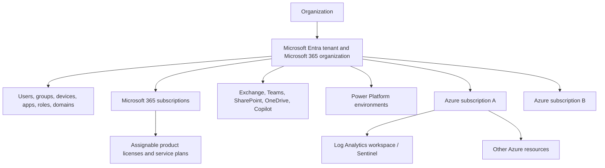

Microsoft documentation states that every Microsoft 365, Azure, or Dynamics online subscriber uses a Microsoft Entra tenant. In day-to-day M365 conversation, “the tenant” and “the directory” may refer to the same organizational identity instance, but an architecture document should state which boundary is meant.

An Azure subscription trusts one directory at a time; one directory can be trusted by multiple Azure subscriptions. Moving an Azure subscription to another directory is not a cosmetic switch: old Azure role assignments do not transfer, managed identities and key dependencies can break, and remediation is required. Azure subscription Owner does not automatically mean Microsoft Entra Global Administrator, and Global Administrator does not automatically grant all Azure resource rights without a deliberate elevation/assignment process.

> **Your transferable advantage:** M365 enterprise escalation already depends on identifying the right tenant, workload, user, site, client, and service boundary. The security extension is to add identity, Azure resource, license, role, data-location, API, logging, and ownership boundaries before making a recommendation.

---

## 2. Tenant boundaries, custom domains, and DNS

A tenant boundary separates organizational identity, configuration, and service data. Collaboration can cross tenants, but cross-tenant access is an explicit external trust relationship, not a merger of directories.

### Initial and custom domains

Every Entra directory receives an initial domain such as `contoso.onmicrosoft.com`. An organization can verify custom domains such as `contoso.com` by proving control through **Domain Name System (DNS)** records. DNS translates names and publishes service information; it is not where users or mailboxes are stored.

| Domain concept | Meaning | Security/operational implication |
|---|---|---|
| Initial `onmicrosoft.com` domain | Microsoft-provided tenant domain | Durable tenant identity; useful when custom DNS is unavailable |
| Custom verified domain | Organization proves DNS control | Can be used in user sign-in names and service configuration |
| Primary/default domain | Default choice for some new identities/configuration | Changing it does not rename every existing object automatically |
| User Principal Name (UPN) suffix | Sign-in name domain for a user | Can differ from email address; affects user experience and federation/sync design |
| Email/SMTP domain | Addressing and mail-routing domain | Requires Exchange accepted-domain and DNS/mail-flow planning |
| Federated domain | Authentication can be redirected to external/on-premises identity provider | Adds availability, certificate, claim, and emergency-access dependencies |
| Tenant ID | Globally unique directory identifier | Stronger technical identifier than display name/domain |

```mermaid
sequenceDiagram
    autonumber
    participant A as Authorized tenant admin
    participant M as Microsoft cloud
    participant D as Public DNS provider
    A->>M: Add custom domain request
    M-->>A: Provide unique verification record
    A->>D: Publish verification record
    M->>D: Query public DNS
    D-->>M: Return matching record
    M-->>A: Mark domain verified
    A->>M: Configure identities and workload-specific DNS
    Note over A,M: Verification proves domain control; it does not configure mail, federation, or every service automatically
```

### Domain and tenant failure modes

| Failure | Symptom | Evidence and owner |
|---|---|---|
| Verification record absent/wrong | Domain remains unverified | Public DNS query, registrar/DNS owner, exact record |
| DNS TTL/caching delay | Different resolvers return different state | Authoritative answer, recursive cache, Time to Live (TTL) |
| UPN/email mismatch misunderstood | User signs in with one name but receives mail at another | Entra object, Exchange proxy addresses, user communication |
| Federation configuration/certificate failure | Custom-domain sign-in fails while cloud path differs | Entra sign-in evidence, federation service, certificates, network |
| Mail records incorrect | Sign-in works but mail delivery fails | MX/SPF/DKIM/DMARC and Exchange accepted-domain/mail-flow evidence |
| Wrong tenant selected | Admin sees missing users/settings/licenses | Tenant ID, account home/guest directory, portal directory switcher |
| Domain removal blocked | Dependencies remain | Users, aliases, apps, groups, federation, and service references |

Do not use DNS changes as unreviewed troubleshooting experiments. Record current values, owners, TTLs, expected propagation, dependencies, approval, validation, and rollback.

---

## 3. Directory objects, groups, licenses, and service plans

An M365 tenant is a graph of related objects. A portal page is only one view of those relationships.

### 🔍 Plain-English deep-dive: objects and entitlements

- **Directory object** — *a stored identity-related entity with properties and a unique object identifier.* **Analogy:** A record in the organization's master identity registry. **Why it matters:** Display names can duplicate or change; object IDs are durable technical references.
- **User object** — *a human identity record, member or guest, cloud-only or synchronized depending on architecture.* **Analogy:** A person's badge-office file. **Why it matters:** Lifecycle, source of authority, authentication, license, role, and workload data are related but separate.
- **Group** — *a collection used for collaboration, access, communication, licensing, or administration.* **Analogy:** A maintained roster that several services can consume. **Why it matters:** Wrong type, ownership, nesting, or lifecycle can cause access and mail problems.
- **Application object** — *the global definition of an application registered in its home tenant.* **Analogy:** A product blueprint. **Why it matters:** It describes what the software is and can request.
- **Service principal** — *the application's local identity/instance in a tenant.* **Analogy:** A specific installed copy with a local badge and permissions. **Why it matters:** Consent, credentials, owners, assignments, and activity must be governed.
- **Product license** — *an assignable purchased SKU, such as a Microsoft 365 plan or add-on.* **Analogy:** A membership package. **Why it matters:** Availability depends on purchase quantity, assignment, eligibility, location, terms, and service state.
- **Service plan** — *an individual capability inside a product license that can be enabled or disabled for an assigned user where supported.* **Analogy:** Features included inside the membership package. **Why it matters:** “E5 assigned” does not prove every relevant service plan is active or provisioned.

| Group type | Primary use | Common security/operations question |
|---|---|---|
| Microsoft 365 group | Shared membership for collaboration resources such as mailbox/site/Team | Who owns lifecycle, guest access, sensitivity, and associated resources? |
| Security group | Access assignment and, in some scenarios, licensing | Is membership authoritative, reviewed, and supported for the target? |
| Mail-enabled security group | Security membership plus mail delivery | Which service owns property changes and moderation? |
| Distribution group | Email distribution | Do not assume it can authorize every resource |
| Dynamic group | Rule-calculated membership | Are attributes reliable, rule/licensing supported, and changes monitored? |
| Role-assignable group | Group can receive selected Entra roles | Is privileged membership protected, reviewed, and licensed? |

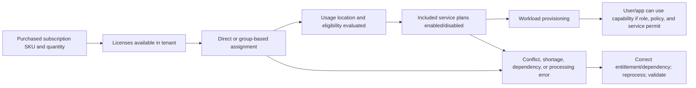

### License troubleshooting distinctions

| State | Meaning | Next check |
|---|---|---|
| Purchased | Organization owns quantity under current terms | Is an unconsumed seat available? |
| Assigned | Product license attached to user/group result | Is assignment direct/group and error-free? |
| Service plan enabled | Included capability not disabled in assignment | Are prerequisites and dependencies met? |
| Provisioned | Workload created/activated user service state | Has backend provisioning completed or failed? |
| Authorized | User/admin/app has permission to action/resource | Role, group, workload permission, policy |
| Reachable | Network/client can access service endpoint | DNS, proxy, TLS, route, service health |
| Operational | End-to-end workflow works and is supported | Test, logs, dependency, support ownership |

A license is neither authorization nor configuration. A user can be licensed but blocked by policy, lack a SharePoint permission, have an unprovisioned mailbox, use an unsupported client, or encounter a service incident.

---

## 4. Roles, RBAC, scopes, and administrative units

**Role-Based Access Control (RBAC)** grants permissions through roles rather than arbitrary per-person action lists. A role assignment joins three things: security principal, role definition, and scope.

### 🔍 Plain-English deep-dive: principal, role, and scope

- **Security principal** — *the user, group, service principal, or other supported identity receiving access.* **Analogy:** The badge holder. **Why it matters:** Human and workload identities both require lifecycle and monitoring.
- **Role definition** — *a named collection of permitted management actions.* **Analogy:** A job description encoded as allowed tasks. **Why it matters:** Built-in and custom roles differ, and similarly named roles across systems are not interchangeable.
- **Role assignment** — *the binding of principal to role at a scope.* **Analogy:** Assign this person this job in this branch. **Why it matters:** Troubleshooting must inspect all three parts.
- **Scope** — *the resource set over which permissions apply.* **Analogy:** A facilities manager may control one building rather than the whole company estate. **Why it matters:** Narrow scope reduces blast radius.
- **Administrative unit (AU)** — *an Entra container for users, groups, or devices used to scope supported directory administration.* **Analogy:** Delegate help-desk duties for one region. **Why it matters:** AUs restrict supported management permissions; they are not universal data or visibility boundaries.

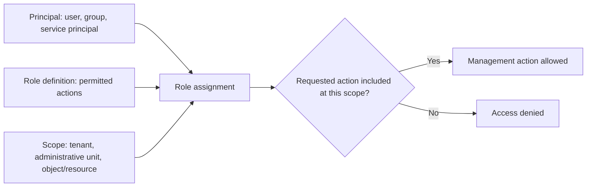

### Role systems are separate

| Role system | Controls | Examples | Common confusion |
|---|---|---|---|
| Microsoft Entra roles | Directory resources and integrated admin functions | Global Reader, User Administrator, Application Administrator | Does not automatically grant Azure VM/storage rights |
| Azure RBAC | Azure resource management | Reader, Contributor, Owner at management group/subscription/resource group/resource | Subscription Owner is not automatically Entra Global Administrator |
| Exchange RBAC | Exchange administration and recipients | Role groups and management roles | Workload-specific command scope differs from Entra role label |
| Purview permissions | Data security/compliance/governance solution roles/groups | eDiscovery, Audit, DLP, role groups | Portal visibility depends on both permission and subscription |
| Defender unified RBAC/product roles | Security operation capabilities and data | Security operations and product-specific permissions | Unified portal does not erase product data/permission boundaries |
| Intune RBAC | Endpoint-management tasks, scope groups/tags | Help desk/operator/admin roles | Administrative unit scope does not equal Intune scope |
| SharePoint site roles | Site/content authorization | Site owner, member, visitor, item permission | SharePoint Administrator is not automatically ordinary content owner in every workflow |
| Power Platform roles | Environment/Dataverse/app administration | Environment Admin, System Administrator, maker roles | Tenant admin, environment role, connector identity are separate |

| Common role | Intended use | Least-privilege caution |
|---|---|---|
| Global Administrator | Broad tenant administration and emergency-level capability | Keep very few; do not use for routine work |
| Global Reader | Broad read-only view of many admin experiences | Read access can still expose sensitive configuration/data |
| Security Reader | Read security information across supported services | Validate exact portal/data scope and privileged classification |
| Security Administrator | Manage supported security controls/monitoring | Not a substitute for every workload-specific role |
| SharePoint Administrator | Manage SharePoint/OneDrive service settings and sites | Use site-level roles for site work where possible |
| Exchange Administrator | Manage Exchange Online | Mailbox/content operations can carry high sensitivity |
| Teams Administrator | Manage Teams settings and service | Teams depends on groups, SharePoint, Exchange, identity |
| Service Support Administrator | Service requests, Message center, service health | Use for support duties instead of broad global role |
| License Administrator | Assign/remove supported licenses | Does not decide entitlement strategy alone |
| Power Platform Administrator | Broad Power Platform administration | Environment-scoped delegation may be more appropriate |

Administrative-unit limitations matter. A group placed in an AU brings the group object into scope, not automatically every member user object. AUs cannot be nested and do not universally scope every Microsoft 365 service. Check live documentation and the specific task.

---

## 5. Admin portals: task map, not separate universes

Portals are user interfaces over service and API boundaries. A setting appearing in two portals does not mean two independent copies exist; a missing tile may reflect role, license, cloud, rollout, or feature state.

| Portal | Primary purpose | Typical tasks | Boundary caution |
|---|---|---|---|
| `admin.microsoft.com` / Microsoft 365 admin center | Common tenant administration | Users, licenses, billing, domains, service health, Message center, support, links to specialists | Not every specialist setting is exposed |
| `entra.microsoft.com` | Identity and network access family | Users/groups/apps/devices, authentication, roles, Conditional Access, governance | Entra roles differ from Azure resource roles |
| `intune.microsoft.com` | Endpoint and application management | Enrollment, configuration, compliance, apps, endpoint security | Device identity, Intune object, OS state, and Defender sensor are related but separate |
| `admin.exchange.microsoft.com` | Exchange Online | Recipients, mail flow, transport, protection links, migration | Teams/groups and DNS dependencies cross services |
| `admin.teams.microsoft.com` | Teams service | Meetings, messaging, federation, apps, voice | Team files and membership depend on SharePoint/groups/Exchange |
| SharePoint admin center | SharePoint Online and OneDrive service administration | Sites, sharing, access control, storage, sync, content services | Site/data permissions and tenant settings must both be considered |
| `admin.powerplatform.microsoft.com` | Power Platform administration | Environments, analytics, capacity, policies, resources | Connections and application identities may have cross-service reach |
| `purview.microsoft.com` | Unified data security, governance, risk, compliance | DLP, labels, audit, eDiscovery, data governance, settings | Visible solutions depend on permission and subscription |
| `security.microsoft.com` | Unified security operations/Defender | Incidents, alerts, hunting, assets, actions, Sentinel integration | Capabilities depend on onboarded/licensed products and RBAC |
| `portal.azure.com` | Azure resources/governance | Subscriptions, resource groups, workspaces, Azure RBAC, cost | Azure role is not Entra role; Sentinel transition affects analyst portal |
| Microsoft 365 Apps admin center | Apps configuration and health | Cloud policy, inventory, servicing/profile tasks | Client policy can interact with endpoint and workload settings |

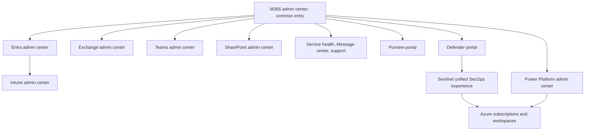

### Portal troubleshooting checklist

1. Confirm the signed-in account and tenant ID, not only display name.
2. Confirm home versus guest directory and selected directory.
3. Confirm required role, role system, assignment scope, and activation status.
4. Confirm product subscription, service plan, feature eligibility, cloud, region, and rollout.
5. Check direct URL and specialist portal rather than assuming navigation tile presence.
6. Check service health and Message center.
7. Check browser/session/cache carefully through a controlled comparison.
8. Check API/PowerShell evidence if the UI is ambiguous, using read-only and least-privilege access.
9. Record portal version/time because navigation changes.
10. Never request Global Administrator merely because the correct role is unknown.

---

## 6. Exchange, Teams, SharePoint, and OneDrive boundaries and dependencies

Microsoft 365 collaboration services are integrated. A user-facing action can cross identity, group, mail, file, meeting, search, compliance, and security systems.

### Workload map

| Workload | Primary responsibility | Common objects/data | Key dependencies |
|---|---|---|---|
| Exchange Online | Email, calendars, mail routing, recipients | Mailboxes, messages, rules, connectors, groups | Entra identity, DNS, licensing, network, protection, Purview |
| Microsoft Teams | Meetings, chat, channels, collaboration shell | Teams/channels, chats, meetings, apps | Entra, Microsoft 365 Groups, SharePoint, OneDrive, Exchange, network/media |
| SharePoint Online | Sites, document libraries, lists, intranet/content services | Sites, permissions, files, metadata, sharing links | Entra, groups, DNS/network, Purview, Defender, Graph |
| OneDrive for Business | Per-user work files and sync/sharing | User drive/site, files, versions, sync relationships | SharePoint platform, identity, license, endpoint, network |

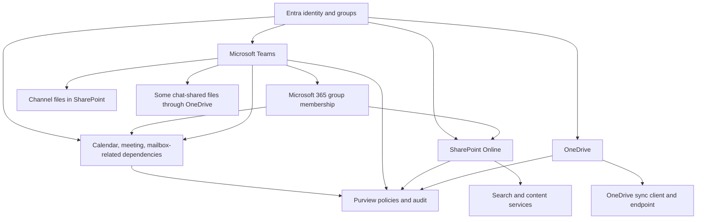

### A Teams creation illustrates cross-service provisioning

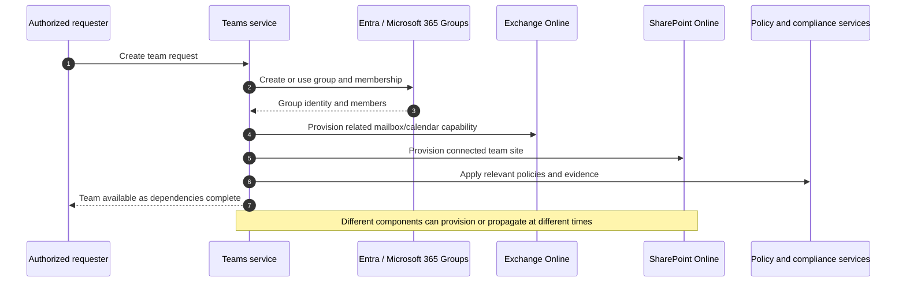

### Cross-workload failure examples

| Symptom | Plausible boundary | Evidence route |
|---|---|---|
| Team exists but files tab fails | SharePoint site provisioning/permission/network | Team/group IDs, site URL, SharePoint status, request correlation |
| User receives team messages but not meeting calendar behavior | Exchange/calendar licensing or provisioning | Recipient/mailbox state, Teams event, client, service health |
| OneDrive sync fails for one library | Endpoint/client, site permission, path/content, network, service | Sync logs, library URL, user/site authorization, affected scope |
| Guest can chat but cannot open file | Teams external identity versus SharePoint sharing/permission | Guest object, group/site membership, link type, policy evaluation |
| Group rename appears inconsistently | Cross-service propagation | Object IDs, timestamps, each workload state, known health/change |
| Retention blocks deletion | Purview policy rather than workload defect | Policy scope/evaluation, item state, audit, legal owner |

> **Your direct strength:** SharePoint Online, OneDrive, sync, migration, and enterprise escalation provide real production evidence for this dependency model. The safe bridge is “I understand the collaboration service boundary deeply and can map security dependencies,” not “I owned Exchange, Teams, Purview, or Entra production administration.”

---

## 7. Power Platform, Copilot, and Azure relationships

Power Platform and Copilot experiences consume identities, connectors, permissions, environments, data, and Microsoft 365 services. They are not isolated low-code toys.

| Component | Purpose | Security boundary |
|---|---|---|
| Power Apps | Build business applications | Maker/user identity, environment, connectors, data source authorization |
| Power Automate | Automate triggers and actions | Connection owner, flow owner, connector permissions, run history |
| Dataverse | Structured business data/platform | Environment roles, table privileges, data policy, region |
| Copilot Studio | Build copilots/agents | Agent identity, knowledge sources, actions, channels, publication, governance |
| Connectors | Interface to M365/third-party services | Delegated or application access, credentials, data movement |
| Environment DLP policy | Classifies/controls connector combinations | Policy scope and exceptions; does not replace data classification |
| Azure resources | Hosting, APIs, Logic Apps, vaults, workspaces | Azure subscription/RBAC/managed identities/network/cost |

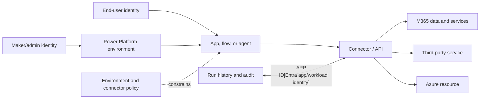

Copilot answers are generally constrained by the requesting identity's authorized data and configured grounding, but that can surface preexisting oversharing. Inventory permissions and data before blaming the AI layer. Copilot/agent capabilities, admin roles, included capacity, and licensing are moving quickly; confirm current Microsoft documentation and product terms.

---

## 8. Defender, Purview, and Sentinel portal relationships

The portals are converging, but the capability boundaries still matter.

### 🔍 Plain-English deep-dive: XDR, SIEM, SOAR, and data governance

- **Extended Detection and Response (XDR)** — *correlates attack evidence across integrated security domains such as identity, endpoint, email, and cloud applications.* **Analogy:** A detective connects several alarms into one attack story. **Why it matters:** The Microsoft Defender portal provides unified Defender XDR investigations and actions.
- **Security Information and Event Management (SIEM)** — *collects and analyzes broad security telemetry from Microsoft and non-Microsoft systems.* **Analogy:** A city operations center receives many agencies' feeds. **Why it matters:** Microsoft Sentinel broadens detection, hunting, retention, and correlation.
- **Security Orchestration, Automation, and Response (SOAR)** — *coordinates repeatable response workflows.* **Analogy:** An incident checklist that gathers facts and executes approved actions. **Why it matters:** Automation needs permissions, approval, failure handling, and rollback.
- **Microsoft Purview** — *a family of data security, governance, risk, and compliance capabilities.* **Analogy:** The information-governance office classifies, controls, retains, investigates, and maps data. **Why it matters:** It is not simply another threat-alert portal.

| Experience | Main concern | Relationship in 2026 | Licensing/access caveat |
|---|---|---|---|
| Microsoft Defender portal | Unified SecOps, Defender XDR, incidents, hunting, actions, exposure | Integrates Defender services and Sentinel; can surface selected Purview alerts | Only authorized/provisioned capabilities appear |
| Microsoft Sentinel | SIEM/SOAR, connectors, analytics, workspaces, broad telemetry | Generally available in Defender portal; Azure workspace/resources remain important | Ingestion, retention, connectors, features, roles, and costs vary |
| Microsoft Purview portal | Data security, governance, risk, compliance | Unified entry for Purview solutions; related portals link to Defender/Entra/Priva | Solutions/cards depend on permissions and subscription |
| Azure portal | Azure resource/workspace management | Legacy Sentinel analyst/admin surface transitions toward Defender | Azure RBAC and resource ownership still matter |

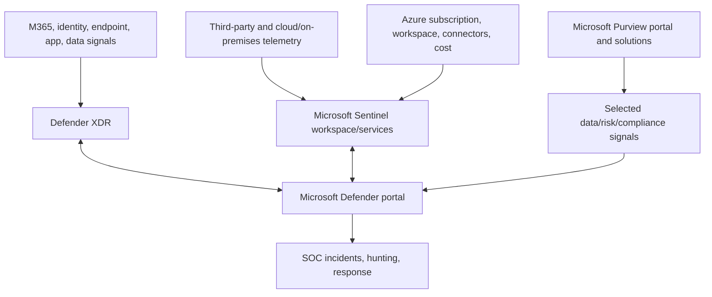

**Current direction warning:** Microsoft Learn states that Sentinel is generally available in the Defender portal, including without Defender XDR/E5 in supported scenarios, and that after **March 31, 2027** Sentinel will no longer be supported in the Azure portal. Treat this as a planning dependency and recheck the live timeline before a client roadmap.

Unified portal does not mean unified entitlement, data retention, role, billing, or operational ownership. Document each source, permission system, response action, and workspace dependency.

---

## 9. Service health, Message center, public roadmap, and change operations

Cloud administration includes continuous change. Three information sources answer different questions.

| Source | Main question | Typical use | Limitation |
|---|---|---|---|
| Service health | Is Microsoft reporting an active issue affecting services/tenant? | Incident correlation, updates, history, support | Absence does not prove no service-side issue |
| Message center | What upcoming change, retirement, feature, or action may affect the organization? | Change planning, owner assignment, deadline tracking | Relevance/rollout fields are not available for every post |
| Microsoft 365 public roadmap | What capabilities are publicly planned or rolling out? | Strategic awareness and dependency planning | Not a contractual delivery guarantee; tenant timing may vary |

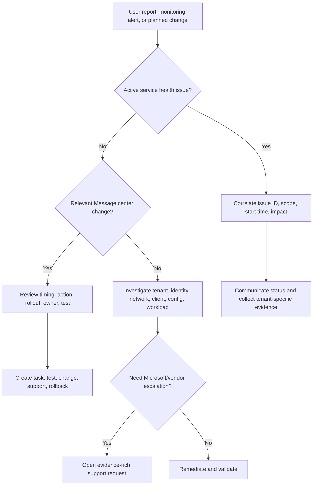

### Change-management rhythm

1. Assign Message center reader/privacy-reader responsibilities with least privilege.
2. Filter by services and tags, but retain central oversight so local preferences do not create organizational blind spots.
3. Triage “act by,” retirement, admin impact, user impact, privacy, and major-update messages.
4. Map each relevant change to owner, affected tenants/personas/workloads, deadline, test, communication, support, and rollback.
5. Use targeted release/pilot users deliberately where supported.
6. Validate tenant rollout rather than assuming public announcement equals availability.
7. Update runbooks, screenshots, training, automation, and integrations.
8. Review missed changes after incidents.

Your business reviews, documentation, escalation coordination, and fix validation translate directly into this cloud-change operating rhythm.

---

## 10. Data residency, Multi-Geo, and sovereign clouds

**Data residency** describes commitments about where defined customer data is stored. It is not the same as every packet staying in one country, all support activity occurring locally, or legal sovereignty being solved automatically.

| Concept | Plain meaning | Design caution |
|---|---|---|
| Tenant provisioned geography | Geography associated with initial service provisioning | Service-specific commitments differ |
| Data location | Reported location for defined service/customer data | Check each workload and data category |
| Advanced Data Residency (ADR) | Additional residency commitments for eligible tenants/services/geographies | Eligibility, licensing, enrollment, migration, and scope vary |
| Multi-Geo | Store in-scope user/shared-resource data in multiple geographies within one tenant | Requires planning, supported plans/add-on, user/data location, service-specific behavior |
| Preferred Data Location (PDL) | Attribute guiding supported user data placement in Multi-Geo | Not an instant move switch; provisioning/move takes service processing |
| EU Data Boundary | Microsoft commitment for specified customer/personal data in covered services | Scope, exclusions, transfers, and current terms must be reviewed |
| Sovereign/national cloud | Separate cloud environment designed for specific regulatory/government needs | Features, URLs, APIs, release cadence, interoperability, and licensing can differ |

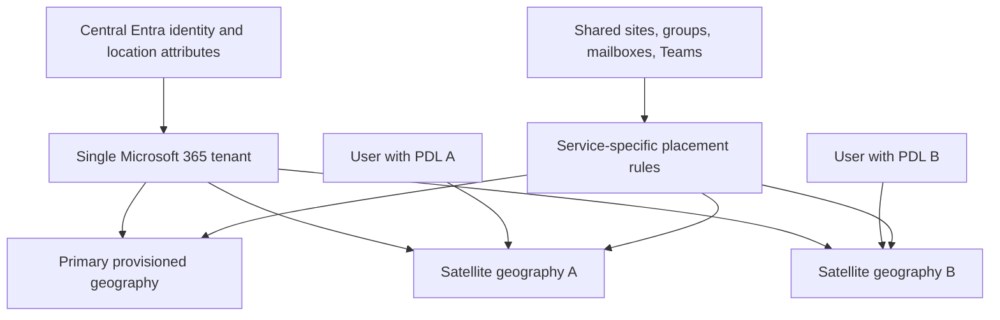

For every residency requirement, define:

- Which data types: mailbox content, SharePoint/OneDrive content, Teams data, audit, security telemetry, support data, backups, metadata, AI interactions?
- Which service and cloud?
- Storage, processing, transit, support access, or legal-control requirement?
- Which users/shared resources and how location is assigned?
- What commitment is contractual versus documentation guidance?
- What happens during migration, failover, investigation, eDiscovery, and export?
- Which license/add-on and minimums apply now?

Never promise residency based on tenant display region alone. Involve privacy, legal, procurement, data owners, and Microsoft/licensing specialists.

---

## 11. Audit, logs, evidence, and retention boundaries

No single log captures every M365 action. Design evidence by question.

| Evidence source | Typical question | Key boundary |
|---|---|---|
| Entra sign-in logs | Who/what attempted authentication, to which app, with what result/context? | License/retention and event type vary |
| Entra audit logs | What directory/configuration object changed? | Not the same as user content activity |
| Microsoft Purview Audit | What supported user/admin/workload activities occurred? | Workload coverage, retention, roles, and schema vary |
| Exchange message trace | How did a message route and what delivery status occurred? | Not full message content or every security verdict |
| SharePoint/OneDrive activity | Who accessed/shared/changed supported content? | Permissions and audit event semantics require context |
| Teams diagnostics/audit | What meeting/chat/admin event occurred? | Media quality and user activity use different evidence sources |
| Defender XDR evidence | What security alerts/incidents/entities/actions exist? | Depends on onboarded products, permissions, retention |
| Sentinel/Log Analytics | What ingested data and analytics exist across sources? | Connector, table, ingestion latency, transformation, cost, retention |
| Service health/support ticket | What provider issue or support action was reported? | Must correlate to the specific tenant symptom |

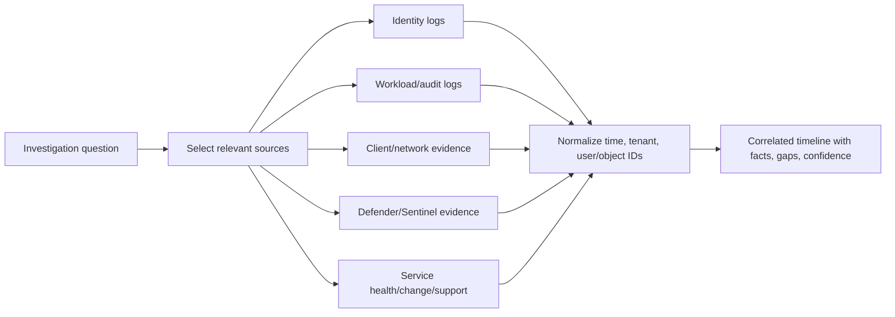

An audit event shows that a supported system recorded an action under an identity; it does not by itself prove the human behind the identity, intent, full impact, or absence of related actions. Preserve raw evidence, query, time zone, scope, role used, export method, and limitations. Redact tokens, cookies, secrets, personal data, tenant identifiers, and content unless authorized and necessary.

---

## 12. Microsoft Graph, PowerShell, APIs, automation, and throttling

Portals call service interfaces; automation uses APIs and command-line modules to make work repeatable. **Microsoft Graph** is a REST-based gateway to many Microsoft cloud data and administration capabilities. **REST** means Representational State Transfer, a common web API style using resources and HTTP methods.

| Interface | Best use | Strength | Risk/control |
|---|---|---|---|
| Portal | Discovery, occasional task, visual investigation | Context and guided UI | Manual inconsistency, changing navigation |
| Microsoft Graph API | Cross-service automation and applications | Standard endpoint and resource model | Consent, app permission, secrets/certificates, pagination, throttling |
| Microsoft Graph PowerShell | Administrative scripting over Graph | Familiar shell and delegated/app access | Module/version, scope, error handling, logging |
| Workload PowerShell | Deep service-specific operations | Rich Exchange/SharePoint/Teams capabilities | Separate connections/RBAC and command semantics |
| Service communications API | Programmatic service health/Message center | Integrates operational workflow | Least-privilege app access and data handling |
| Microsoft Graph Data Connect | Governed bulk data extraction to Azure | Scale beyond operational API patterns | Separate approval, Azure, storage, privacy, cost |

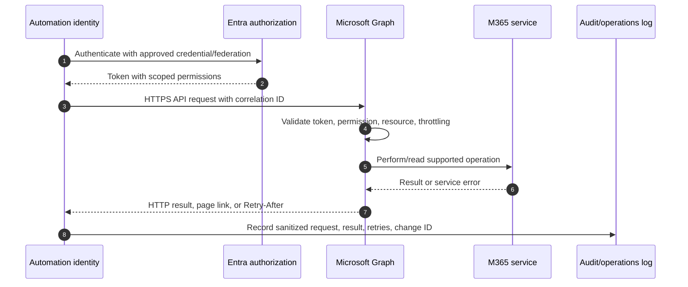

### Safe automation requirements

| Requirement | Why |
|---|---|
| Least-privilege identity and permission | Limits blast radius |
| Prefer managed identity/federation/certificate where appropriate | Reduces stored secret risk |
| Separate test and production | Prevents accidental broad change |
| Read-before-write and dry-run/report mode | Exposes scope before mutation |
| Idempotency | Repeating the operation does not create harmful duplication |
| Pagination/delta/change notifications | Avoid incomplete inventory and wasteful polling |
| Throttling handling | Respect HTTP 429 and `Retry-After`; use backoff |
| Explicit error and partial-success handling | Prevent silent inconsistent state |
| Correlation, audit, approval, and change record | Makes actions traceable |
| Bounded retries and rollback | Avoid runaway load and recover safely |
| Safe redaction | Logs must not expose tokens, secrets, or customer content |

Microsoft Graph throttling limits resource overuse. A `429 Too Many Requests` response is not solved by immediate aggressive retry. Respect `Retry-After`; use exponential backoff when appropriate; reduce requests; prefer delta queries/change notifications over polling; and consider Data Connect for supported bulk extraction. Batches are evaluated request by request, so a successful batch envelope can contain throttled operations.

Your Power Automate/Power Apps/Copilot Studio experience is a useful automation foundation. The security bridge is explicit workload identity, consent, least privilege, secret handling, environment policy, audit, retries, approvals, and rollback.

---

## 13. Support boundaries and evidence-based ownership

A support boundary defines which team or provider controls a component and what evidence is needed to transfer an issue responsibly. “Microsoft issue,” “network issue,” or “customer configuration” should be a conclusion, not an opening assumption.

| Boundary | Customer/team responsibility | Provider/vendor responsibility | Shared evidence |
|---|---|---|---|
| Microsoft SaaS | Identity, config, data, client, network, operations | Service platform and published commitments | Tenant ID, time, request IDs, service health, reproducibility |
| Customer network/proxy | DNS, routing, firewall, proxy, TLS inspection, capacity | Device/service product behavior under contract | Trace, policy, endpoint list, affected/unaffected path |
| Endpoint/vendor | OS/client configuration, lifecycle, local security | Product defect/support and updates | Version, logs, reproduction, dump/trace if authorized |
| Identity/federation | Entra config and customer identity provider | Platform-specific service behavior | Sign-in/federation logs, certificate, claims, timeline |
| M365 workload | Tenant/workload config and permissions | Exchange/Teams/SharePoint service behavior | Object IDs, audit, request IDs, service health |
| Third-party app/connector | Consent, assignment, data, client policy | App implementation and support | App/service principal IDs, permissions, request correlation |
| Consultant | Scoped assessment/design/delivery evidence | Client/Microsoft/vendor decisions outside scope | RACI, assumptions, action owner, escalation pack |

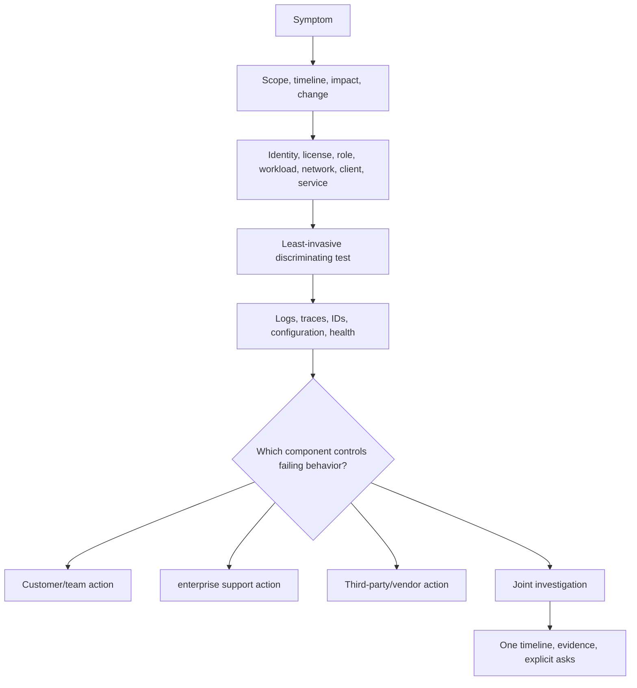

An escalation pack should include business impact, tenant/cloud, affected and unaffected scope, first/last occurrence, normalized timeline, recent change, reproduction, expected versus actual behavior, object/request/correlation IDs, sanitized logs, tests already run, service health/message references, architecture/dependency map, and a precise ask.

---

## 14. Licensing: E3, E5, add-ons, personas, trials, and verification

Licensing is a design constraint and a commercial/legal subject. Feature names, bundles, regional offers, Teams inclusion, add-ons, prerequisites, trials, and product terms change. Never use a study-guide table as a purchasing quote.

### Conceptual plan comparison

| Concept | E3-style foundation | E5-style expansion | Consultant caution |
|---|---|---|---|
| Productivity/workloads | Core enterprise apps and M365 collaboration services | Includes E3 capabilities plus additional enterprise features | Exact service/feature details differ by plan and date |
| Identity/security | Foundational identity/device/security capabilities, with some premium capability depending on SKU | Broader advanced security suite capabilities | Verify Entra/Defender feature-level entitlements |
| Compliance/data | Foundational compliance/data features | Broader Purview suite/advanced features | Verify each solution, location, user, and data prerequisite |
| Analytics/voice/AI | Limited or separate depending on offer | Additional capabilities may be included or announced | Regional/no-Teams/AI capacity terms can change |
| Cost model | Lower base with possible targeted add-ons | Higher broad bundle | Persona/add-on mix can be more appropriate than blanket licensing |

### Persona-based license reasoning

| Persona | Needed outcomes | Questions before selecting entitlement |
|---|---|---|
| Standard knowledge worker | Email, files, meetings, baseline security | Desktop apps? mailbox/storage? device management? data controls? |
| Frontline worker | Mobile/shared device, focused apps | Mailbox rights, app rights, storage, shared-device controls? |
| Administrator | Strong identity and privileged controls | Which premium identity/endpoint capabilities and how many admins? |
| Security analyst | Incidents, hunting, response, telemetry | Which Defender/Sentinel data/features, retention, role, capacity? |
| Compliance/legal investigator | Audit, eDiscovery, retention, review | Which custodians/users need coverage and which investigator roles? |
| High-risk executive/researcher | Strong identity/device/data protection | Targeted security/compliance add-ons versus broad suite? |
| External user/guest | Collaboration without employee package assumptions | External identity, workload, host/guest licensing terms? |
| Workload/application identity | API and automation | Workload identity, API, capacity, connector, Azure cost? |

### Verify-current checklist

1. Record exact SKU part number/name, not “Office” or “E5-ish.”
2. Record tenant cloud and market/region.
3. Check Microsoft Product Terms and current Service Descriptions.
4. Check workload-specific licensing pages and prerequisites.
5. Identify which users, admins, data subjects, devices, or workloads require a license.
6. Confirm add-on requires a qualifying base license.
7. Confirm service-plan assignment and provisioning.
8. Confirm capacity/consumption charges such as Sentinel ingestion, storage, AI capacity, telephony, or Azure resources.
9. Confirm trial duration, eligibility, feature limits, data treatment, expiry behavior, and conversion plan.
10. Validate with Microsoft, authorized reseller, or licensing specialist before commercial commitment.

| Trial risk | Required safeguard |
|---|---|
| Trial expires and control stops or access changes | Exit date, owner, decision, rollback/transition plan |
| Production data enters an evaluation | Privacy, retention, authorization, cleanup |
| Trial enables broad defaults | Review scope and test personas before activation |
| Client assumes trial equals purchased entitlement | Written commercial boundary |
| Evidence cannot be retained after expiry | Export sanitized configuration/test evidence appropriately |

Microsoft's current overview describes E5 as E3 plus advanced capabilities including Defender and Purview suite features, while E3 can be extended with add-ons. Treat that as orientation only and verify live product terms.

---

## 15. Least-privilege administration and emergency access

The safest admin model separates daily productivity from privileged work, scopes roles to tasks/resources, activates privilege only when needed where supported, and preserves emergency recovery.

| Control | Design intent | Evidence |
|---|---|---|
| Separate admin identity | Reduce exposure from daily email/browsing | Inventory and sign-in patterns |
| Least-permissive role | Avoid Global Administrator for routine tasks | Task-to-role matrix |
| Scoped assignment | Limit tenant/AU/object/environment/workload reach | Role assignment export |
| JIT/JEA | Reduce standing privilege and duration | Eligibility, activation, approval, expiry |
| Strong authentication/admin endpoint | Protect high-impact sessions | Method/policy/device evidence |
| Approval/change control | Prevent unreviewed high-impact action | Ticket, peer review, test, rollback |
| Audit/alert | Detect role and critical setting changes | Logs, notifications, owner/runbook |
| Access review | Remove stale privilege | Review result and remediation |
| Emergency access | Recover if normal controls fail | Exercise record, alert, custody, post-use review |
| Delegated partner governance | Limit external admin relationship | Contract, granular delegation, expiry, activity review |

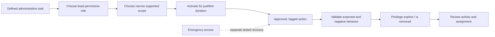

Do not use emergency Global Administrator accounts for routine portal exploration. Do not add broad rights merely to make a missing menu appear. Determine the precise role and feature entitlement, then validate in a safe environment.

---

## 16. Tenant inventory and health-check method

A tenant health check is an evidence-based assessment of architecture, configuration, coverage, operations, and risk. It is not a one-click score export.

### Inventory domains

| Domain | Inventory fields |
|---|---|
| Tenant identity | Tenant ID, display name, initial/custom domains, cloud, country/region, contacts |
| Commercial | Subscriptions, quantities, assignments, service plans, renewal/trial dates, add-ons |
| Identities | Member/guest/workload counts, source, lifecycle, stale objects, high-risk personas |
| Roles | Role system, principal, scope, assignment type, activation, owner, last review |
| Groups | Type, purpose, owners, membership method, guest use, license/access dependencies |
| Workloads | Exchange, Teams, SharePoint, OneDrive, Power Platform, Copilot use and owners |
| Security/data | Entra/Intune/Purview/Defender/Sentinel state, scope, owner, operational process |
| Network/integration | Domains, DNS, proxy, endpoints, federation, APIs, connectors, third parties |
| Data location | Provisioned geography, service locations, Multi-Geo/ADR/sovereign requirements |
| Evidence/operations | Audit, retention, service health, Message center, support, runbooks, metrics |

### Assessment flow

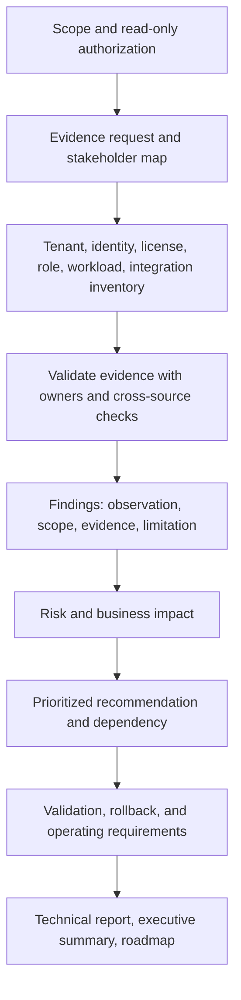

### Finding quality example

Weak finding:

> “Too many admins. Move to least privilege.”

Stronger finding:

> **Observation:** The supplied role export dated 2026-08-20 shows 14 active Global Administrator assignments, of which 9 are used for workload-specific operations. Three accounts have no named business owner in the inventory. The export does not establish activation history before the available retention window. **Risk:** Compromise or error involving a standing broad account could alter identity, roles, service settings, or access across the tenant, increasing blast radius and recovery difficulty. **Recommendation:** Validate duties with owners; map each task to the least-permissive supported Entra/workload role and scope; replace standing access with eligible/time-bound activation where licensed and appropriate; retain separately tested emergency access; alert and review critical assignments. **Validation:** Authorized task succeeds with the scoped role; unrelated high-impact task fails; activation, action, expiry, and emergency tests produce evidence. **Owner:** Identity/security governance lead. **Residual risk:** Document any task that still requires broad rights with expiry and compensating monitoring.

---

## 17. Scenario walkthroughs

### Scenario A: licensed user cannot access a security portal

Do not assume propagation delay first. Confirm tenant/account, home versus guest context, license/service plan, product onboarding, exact role system/scope, PIM activation, portal URL, feature cloud/region, service health, and session/token age. Compare a known-good user with the same intended role. Use read-only API evidence if authorized. Do not grant Global Administrator as a diagnostic shortcut.

### Scenario B: Teams guest can chat but cannot open a channel file

Teams communication and SharePoint file authorization are distinct dependencies. Correlate guest object, invitation redemption, group/team membership, channel type, connected site, SharePoint external-sharing settings, link/item permission, Conditional Access/session behavior, network path, and audit. The failing component may be working as designed while another boundary lacks authorization.

### Scenario C: OneDrive sync incident after proxy change

Scope by site, user, device, location, client version, and file type. Check service health and Message center; compare direct versus corporate path only through approved tests; resolve DNS/TLS/proxy evidence; confirm published M365 endpoints; correlate client logs and request IDs. Do not disable TLS validation, firewall, endpoint protection, or organization-wide proxy security. Coordinate a scoped vendor-supported policy correction and validate security plus performance.

### Scenario D: Sentinel analyst sees different features after portal transition

Confirm Sentinel workspace onboarding to Defender portal, tenant/workspace selection, Azure and unified Defender roles, product/service state, data connectors, feature parity/limitations, browser session, and current migration guidance. Portal navigation has changed, but Azure workspace, ingestion, retention, cost, and connector ownership remain real dependencies.

### Scenario E: Copilot surfaces a sensitive SharePoint document

Establish the requesting user, grounding source, existing SharePoint permission, group membership, site/link configuration, classification, and audit. Determine whether Copilot respected access and exposed a preexisting authorization/governance issue. Coordinate SharePoint owner, data owner, security, privacy, and Copilot governance. Do not claim a Purview/Defender failure without evidence.

---

## 18. Safe paper lab: Microsoft 365 tenant health check

### Lab goal

Create a defensible tenant health-check pack using a fictional organization and public Microsoft documentation. No Microsoft tenant, paid license, or production access is required.

### Prerequisites

- A spreadsheet or Markdown editor.
- Fictional tenant name `contoso-lab.onmicrosoft.com`; never register or use a real customer's domain.
- The scope in this exercise only.
- Current Microsoft Learn pages in Official Source Anchors.

### Fictional environment

- 4,000 users across three countries.
- Microsoft 365 E3 for most users; selected E5 Security/Purview add-ons described only as “to be verified.”
- One Entra tenant, two Azure subscriptions, three Power Platform environments, one Sentinel workspace.
- Exchange, Teams, SharePoint, OneDrive, Power Automate, Power Apps, Copilot pilot.
- 12 Global Administrators, several guest administrators, stale groups, and unknown app owners.
- Service health is checked only during major incidents; Message center has no formal owner.
- Data-residency requirement is written as “all data must remain in-country,” with no data/service definition.

### Steps

1. **Create the boundary diagram.** Draw tenant/directory, M365 subscriptions, Azure subscriptions, workspace/Sentinel, Power Platform environments, and workloads.
2. **Build the tenant identity inventory.** Tenant ID placeholder, initial/custom domains, DNS owners, cloud, geography, support contacts, and evidence source.
3. **Build the subscription/license inventory.** SKU, quantity, assignment model, service plans, trial/renewal, owner, and “verify current” source. Do not invent entitlements.
4. **Build the role inventory.** Role system, principal, scope, permanent/eligible, owner, purpose, last activity/review, emergency flag.
5. **Build the group/app inventory.** Type, owners, membership, resources, guest use, consent/permissions, credential type/expiry.
6. **Map portals to tasks.** For 20 tasks, name primary portal/API, least role to verify, evidence, and alternate interface.
7. **Map workload dependencies.** At minimum Teams-to-group/Exchange/SharePoint, OneDrive-to-SharePoint/endpoint/network, and Sentinel-to-Azure/Defender.
8. **Assess service-change operations.** Define service-health and Message-center owners, triage cadence, task tracking, communications, and escalation.
9. **Clarify residency.** Rewrite “all data” into questions by service, data category, storage/processing/transit/support, geography, and legal owner.
10. **Assess audit readiness.** Map ten investigation questions to log sources, access roles, retention, export, and limitations.
11. **Assess automation.** Define Graph/PowerShell identity, permissions, read-only discovery, throttling, redaction, approval, logging, and rollback.
12. **Write eight findings.** Include two identity/role, one license, one app, one workload dependency, one change-management, one evidence, and one residency finding.
13. **Prioritize a 90-day roadmap.** Protect administration, close ownership gaps, establish inventories/change rhythm, validate licenses/logs, and plan deeper controls.
14. **Prepare readout.** Five slides/pages: architecture, top risks, evidence gaps, roadmap, decisions required.

### Positive tests

| Test | Expected result | Evidence |
|---|---|---|
| Service Support role views health and creates/manages appropriate support request | Task succeeds without Global Administrator | Role/task mapping and screenshot placeholder description |
| SharePoint admin manages service setting in fictional workflow | Intended task allowed | Role, scope, action, expected audit event |
| Graph read-only inventory respects pagination/backoff | Complete sanitized inventory design | Request model, page handling, 429 response plan |
| Named Message center owner triages a major update | Owner, deadline, affected services, test, comms captured | Change ticket template |

### Negative tests

| Test | Expected result | Security intent |
|---|---|---|
| License Administrator attempts unrelated security policy change | Denied | Role separation |
| AU-scoped help-desk admin manages user outside AU | Denied for supported scoped task | Administrative scope |
| Test app requests broad write permission for read inventory | Consent rejected/redesigned | Least privilege |
| Analyst without workspace/Defender permission opens Sentinel data | Denied or limited as designed | Data/RBAC boundary |

### Failure and recovery tests

| Test | Expected result |
|---|---|
| Microsoft 365 admin center is unavailable | Public status plus specialist/API/emergency procedure is followed as authorized |
| Normal privileged activation fails | Tested emergency path performs minimum recovery, alerts, and rotates |
| Graph returns 429 | Automation honors `Retry-After`, uses bounded backoff, and records partial state |
| Trial expires | Owner follows documented purchase/transition/disable plan without surprise control loss |

### Evidence package

- Tenant/subscription/environment architecture.
- Inventory workbook for tenant, license, role, group, app, workload, integration, data location, and logs.
- Portal-to-task least-privilege map.
- Service dependency and support-boundary diagram.
- Eight evidence-based findings.
- 90-day roadmap with owners and gates.
- Test matrix and emergency-access exercise design.
- Executive readout and evidence-gap register.

### Cleanup

No cloud cleanup is required. Search the pack for real domains, tenant IDs, email addresses, object IDs, tokens, customer names, screenshots, and file names; remove or replace them. Mark every artifact “fictional paper lab.”

### Interview-portfolio wording

> “I produced a paper-based Microsoft 365 tenant health check for a fictional organization. I mapped tenant, directory, Microsoft 365 and Azure subscriptions, Power Platform environments, Sentinel workspace, domains, licenses/service plans, RBAC systems, portals, workload dependencies, data location, logs, APIs, service health, support boundaries, tests, and a 90-day roadmap. It demonstrates my assessment method and builds on direct M365 escalation and SharePoint/OneDrive experience; it is not production ownership of Entra, Intune, Purview, Defender, or Sentinel.”

---

## 19. Candidate honesty note

| Evidence level | Defensible evidence | Explicit boundary |
|---|---|---|
| Production | Microsoft 365 enterprise escalation, M365 administration exposure, SharePoint Online, OneDrive, sync, migration-related troubleshooting, customer/partner/engineering/vendor coordination, RCA, fix validation, documentation, business reviews, Power Platform, and Copilot work reflected in the CV | Do not claim production tenant-security ownership for Entra, Intune, Purview, Defender, Sentinel, Exchange, or Teams unless separate evidence exists |
| Transferable | Tenant/workload scoping, cross-service dependency analysis, support boundaries, incident communication, evidence packs, and validation | Transferable administration/troubleshooting is not the same as security-product deployment |
| Lab/paper | Health-check inventory, role/license map, portal task map, findings, tests, roadmap | Label the fictional scope and absence of production change |
| Conceptual | Tenant/directory/subscription relationships, RBAC systems, licensing logic, portal direction, residency, APIs | Confirm current behavior and obtain appropriate review before client implementation |

Safe interview phrasing:

> “My deepest production workload evidence is SharePoint Online, OneDrive, sync, and M365 enterprise escalation. I can map the wider tenant architecture and explain how identity, licensing, roles, portals, workloads, Azure, Power Platform, Purview, Defender, and Sentinel relate. For the named security platforms, my current evidence is structured learning and paper/lab assessment rather than production ownership.”

---

## 20. JD Mapping

| JD requirement | Part 4 content | Evidence route |
|---|---|---|
| Microsoft 365 assessment/architecture | Complete tenant/directory/subscription/environment map | Health-check paper lab and direct M365 scoping experience |
| Entra and least privilege | Objects, roles, scopes, AUs, admin separation, emergency access | Conceptual now; deep labs in Parts 6–14/65 |
| Intune | Portal and endpoint-signal boundary | Conceptual now; Parts 15–20/66 |
| Exchange/Teams/SharePoint/OneDrive | Workload boundaries and integrated provisioning | Direct SPO/OneDrive evidence; Exchange/Teams remain learning areas |
| Purview/Defender/Sentinel | Portal/capability relationships and unified direction | Conceptual/paper evidence; platform labs later |
| Power Platform/Copilot | Environment, connector, workload identity, data/API relationships | Existing Power Platform/Copilot evidence with security guardrail bridge |
| Licensing and optimization | SKU/service-plan/persona/add-on/trial method | Verify-current decision artifact, not commercial authority claim |
| Troubleshooting/service disruption | Service health, Message center, logs, API, support boundary | Direct escalation/RCA/fix-validation transferability |
| Documentation/reporting | Inventory, findings, roadmap, executive readout | Direct documentation and business-review evidence |
| Multi-vendor coordination | Evidence-based ownership and escalation packs | Direct customer/partner/engineering/vendor coordination |

---

## 21. Official Source Anchors

These sources were checked for the guide's **August 24, 2026** currency date. Portal paths, roles, licensing, data locations, feature availability, and transition dates can change; always recheck before implementation.

1. [Microsoft 365 admin center overview](https://learn.microsoft.com/microsoft-365/admin/admin-overview/admin-center-overview?view=o365-worldwide) — Common administration, specialist workspaces, service health, Message center, roles, subscriptions, and portal variability.
2. [What is Microsoft Entra?](https://learn.microsoft.com/entra/fundamentals/whatis) — Tenant relationship, Entra product family, admin center, Graph, and identity role.
3. [Azure subscriptions and Microsoft Entra directories](https://learn.microsoft.com/entra/fundamentals/how-subscriptions-associated-directory) — One-directory-per-Azure-subscription trust, many subscriptions per tenant, and directory-change impact.
4. [Microsoft Entra RBAC overview](https://learn.microsoft.com/entra/identity/role-based-access-control/custom-overview) — Principal, role definition, assignment, scope, built-in/custom roles, Graph, and separate Azure RBAC.
5. [Administrative units](https://learn.microsoft.com/entra/identity/role-based-access-control/administrative-units) — Supported scope, group/member behavior, portal differences, limitations, and licensing.
6. [Microsoft 365 administrator roles](https://learn.microsoft.com/microsoft-365/admin/add-users/about-admin-roles?view=o365-worldwide) — Least-role guidance and current common roles.
7. [Microsoft 365 for enterprise overview](https://learn.microsoft.com/microsoft-365/enterprise/microsoft-365-overview?view=o365-worldwide) — Current E3/E5/F3 orientation and suite components.
8. [Microsoft 365 and Office 365 plan options](https://learn.microsoft.com/office365/servicedescriptions/office-365-platform-service-description/office-365-plan-options) — Plan/service orientation and requirement to verify feature details/add-ons.
9. [Microsoft Defender XDR in the Defender portal](https://learn.microsoft.com/defender-xdr/microsoft-365-defender-portal) — Unified incidents, hunting, actions, product visibility, Sentinel relationship, and current direction.
10. [Microsoft Sentinel in the Defender portal](https://learn.microsoft.com/azure/sentinel/microsoft-sentinel-defender-portal) — General availability, Azure-versus-Defender comparison, limited capabilities, and March 31, 2027 Azure-portal support timeline.
11. [Microsoft Purview portal](https://learn.microsoft.com/purview/purview-portal) — Unified Purview experience, solution visibility, roles/settings, relocated features, and related portals.
12. [Microsoft 365 service health](https://learn.microsoft.com/microsoft-365/enterprise/view-service-health?view=o365-worldwide) — Incidents/advisories, tenant issues, status, history, and support correlation.
13. [Microsoft 365 Message center](https://learn.microsoft.com/microsoft-365/admin/manage/message-center?view=o365-worldwide) — Change categories, relevance, rollout, major updates, role/access, and service communications API.
14. [Microsoft 365 data locations](https://learn.microsoft.com/microsoft-365/enterprise/o365-data-locations?view=o365-worldwide) — Current service-specific residency links and ADR geographies.
15. [Microsoft 365 Multi-Geo](https://learn.microsoft.com/microsoft-365/enterprise/microsoft-365-multi-geo?view=o365-worldwide) — Architecture, eligible services, licensing orientation, PDL, and rollout.
16. [Microsoft Graph overview](https://learn.microsoft.com/graph/overview) and [Graph throttling](https://learn.microsoft.com/graph/throttling) — API scope, Data Connect, authorization, 429 handling, backoff, and change patterns.

**Verify-current warning:** Commercial entitlements must be confirmed through current Microsoft Product Terms, Service Descriptions, workload licensing pages, tenant cloud/region, and an authorized licensing channel. This chapter is an architecture and decision guide, not legal or purchasing advice.

---

## ⭐ Likely Interview Questions for This Section

### Q1. What is the relationship among an M365 tenant, Entra directory, Microsoft 365 subscription, and Azure subscription?

> **Model answer:** “The Entra tenant is the organization's identity directory. Microsoft 365 services use that organizational identity boundary, while Microsoft 365 subscriptions are commercial product entitlements containing assignable licenses and service plans. An Azure subscription is a separate Azure billing/resource/RBAC boundary that trusts one Entra directory at a time; one tenant can serve multiple Azure subscriptions. Entra directory roles and Azure resource roles are separate.”

### Q2. Why can a licensed user still be unable to use a feature?

> **Model answer:** “Purchase, assignment, service-plan enablement, provisioning, authorization, policy, client/network reachability, and operational health are distinct states. I would confirm exact SKU and service plan, assignment source/errors, prerequisites and provisioning, required role or workload permission, policy evaluation, tenant/cloud/rollout, service health, and supported client path rather than treating license assignment as proof of access.”

### Q3. How would you design least-privilege administration across M365?

> **Model answer:** “I would inventory tasks and role systems, map each task to the least-permissive built-in role and narrow supported scope, separate daily and admin identities, use eligible/time-bound activation where appropriate, protect admin authentication and endpoints, require approval and change evidence for high impact, review assignments, govern partner access, and maintain separately tested emergency access. Global Administrator should not be the default troubleshooting role.”

### Q4. How do Teams, SharePoint, OneDrive, Exchange, and Entra depend on one another?

> **Model answer:** “Entra supplies identities and groups. A Team commonly uses Microsoft 365 group membership, a SharePoint site for channel files, Exchange-related mailbox/calendar capabilities, and OneDrive for some user file-sharing scenarios. Provisioning and policy can propagate at different rates. Therefore a Teams symptom may belong to identity, group, Exchange, SharePoint, OneDrive, network, compliance, or service-health boundaries, and I correlate object IDs and evidence across them.”

### Q5. How do Defender, Purview, and Sentinel portals relate in 2026?

> **Model answer:** “The Defender portal is Microsoft's unified security-operations surface for Defender XDR and integrated capabilities including Sentinel. Sentinel remains a SIEM/SOAR capability with Azure workspace, data, connector, RBAC, cost, and retention dependencies. Microsoft Learn currently states that after March 31, 2027 Sentinel will be available only in the Defender portal, so clients should plan transition and recheck the timeline. Purview is the unified data security, governance, risk, and compliance portal; selected Purview alerts can surface in Defender, but the products, permissions, and licenses remain distinct.”

### Q6. How would you approach M365 licensing in a client design?

> **Model answer:** “I would start with personas, control objectives, workloads, data, and operational use cases; then map required capabilities to exact current SKUs, base-license prerequisites, add-ons, service plans, covered users/workloads, capacity costs, and region/cloud terms. I would compare broad E5 coverage with targeted add-ons where appropriate, include trial/expiry risks, and validate through Microsoft Product Terms, Service Descriptions, workload pages, and an authorized licensing specialist. I would never present a static feature table as a quote.”

### Q7. What evidence would you collect for a tenant health check?

> **Model answer:** “I would obtain read-only evidence for tenant/cloud/domains, subscriptions and service plans, users/guests/workload identities, roles and scopes, groups and apps, workloads and owners, Power Platform/Azure/Sentinel dependencies, network and federation, data locations, audit/log retention, service health, Message center, support model, exceptions, and recent incidents. I would state source, date, scope, limitation, and confidence, then trace findings to risk, recommendation, test, owner, and residual risk.”

### Q8. How does your experience fit this architecture without overstating it?

> **Model answer:** “My direct production evidence is M365 enterprise escalation with SharePoint Online, OneDrive, sync, customer and partner coordination, engineering/vendor escalation, RCA, fix validation, documentation, business reviews, and Power Platform/Copilot work. That gives me strong workload, dependency, support-boundary, and evidence discipline. I can map the wider tenant and security architecture and have built a health-check exercise, but Entra, Intune, Purview, Defender, and Sentinel ownership remains lab or conceptual evidence rather than claimed production administration.”

---

## 🧠 30-Second Memory Hooks

- **Tenant/directory:** The organization's cloud identity and trust boundary.
- **M365 subscription:** Purchased product entitlement; not configuration or permission.
- **Azure subscription:** Resource, billing, quota, and Azure RBAC boundary trusting one directory.
- **Service plan:** A capability inside an assigned product license.
- **License path:** Purchase → assign → enable plan → provision → authorize → reach → operate.
- **RBAC:** Principal + role definition + scope = assignment.
- **AU:** Scopes supported directory administration; not a universal data wall.
- **Portal:** A window over a service/API, not the service boundary itself.
- **Teams files:** Usually SharePoint; chat sharing may involve OneDrive.
- **OneDrive:** Built on SharePoint service foundations plus endpoint sync.
- **Defender:** Unified SecOps and XDR surface.
- **Sentinel:** SIEM/SOAR with Azure workspace/data dependencies, moving to Defender portal.
- **Purview:** Data security, governance, risk, and compliance family.
- **Service health versus Message center:** Current issue versus upcoming change/action.
- **Data residency:** Ask which service, data, operation, geography, and commitment.
- **Graph 429:** Respect `Retry-After`; do not hammer the service.
- **Support boundary:** One timeline, component evidence, named owner, precise ask.
- **Licensing:** Verify current exact SKU, persona, prerequisite, service plan, cloud, and terms.
- **Honesty:** Deep SPO/OneDrive operations support does not become security-platform ownership by wording.

---

## Completion Checklist

- [ ] Draw and explain tenant, Entra directory, M365 subscription, Azure subscription, Power Platform environment, and Sentinel workspace.
- [ ] Explain why Azure subscription Owner and Entra Global Administrator are different.
- [ ] Distinguish tenant display name, tenant ID, initial domain, custom domain, UPN, and email domain.
- [ ] Explain DNS domain verification without implying mail/federation is configured automatically.
- [ ] Define users, guests, groups, application objects, service principals, product licenses, and service plans.
- [ ] Compare at least five group types and their appropriate use.
- [ ] Troubleshoot the license path from purchase through operational access.
- [ ] Explain RBAC principal, definition, assignment, and scope.
- [ ] Compare Entra, Azure, Exchange, Purview, Defender, Intune, SharePoint, and Power Platform role systems.
- [ ] Explain administrative-unit value and at least three limitations.
- [ ] Map 20 administrative tasks to a portal/API and least role to verify.
- [ ] Draw Exchange, Teams, SharePoint, and OneDrive dependencies.
- [ ] Explain Power Platform environment, connector, identity, and Azure relationships.
- [ ] Explain current Defender, Purview, and Sentinel portal direction with the verify-current warning.
- [ ] Distinguish service health, Message center, and public roadmap.
- [ ] Define a change-management rhythm for cloud updates.
- [ ] Distinguish data location, ADR, Multi-Geo, PDL, EU Data Boundary, and sovereign cloud.
- [ ] Map ten investigation questions to suitable logs and limitations.
- [ ] Explain Graph, Graph PowerShell, workload PowerShell, Data Connect, pagination, delta, throttling, and safe automation.
- [ ] Build an evidence-rich Microsoft/vendor escalation pack.
- [ ] Explain E3/E5/add-on/persona/trial reasoning without making a commercial promise.
- [ ] Design least-privilege and emergency administration.
- [ ] Complete the fictional tenant health check, eight findings, test matrix, and 90-day roadmap.
- [ ] Answer all eight interview questions with explicit evidence boundaries.

---

*Next suggested section:* [Part 5](Part-05-networking-identity-application-protocols.md) — follow a Microsoft 365 request across DNS, IP routing, TCP/UDP, TLS, HTTP, proxies, identity protocols, APIs, sync, and mail flow to troubleshoot safely from user to cloud.