# Part 5 — Networking, Identity, and Application Protocols for M365 Troubleshooting

> **Section goal:** Learn how a Microsoft 365 action travels from a user and device through local networking, DNS, routing, TCP or UDP, TLS, HTTP, proxies, identity protocols, APIs, and cloud workloads. By the end, you should be able to interpret common evidence, isolate the failing layer, coordinate multiple owners, and troubleshoot sign-in, OneDrive sync, and mail flow without weakening security controls.

**JD mapping:** This Part supports Deloitte responsibilities for multi-protocol and multi-vendor troubleshooting, Microsoft 365 incidents, Entra sign-in analysis, Exchange mail flow, Teams/SharePoint/OneDrive connectivity, proxy/firewall/VPN design, application integration, Graph/API troubleshooting, secure evidence handling, RCA, documentation, and operational handover.

---

## 1. The network is a delivery system made of layers

A user clicking “Open” in Microsoft 365 triggers several cooperating systems. Layers help isolate which system owns a failure.

### 🔍 Plain-English deep-dive: OSI and TCP/IP models

- **Open Systems Interconnection (OSI) model** — *a seven-layer conceptual model for communication.* **Analogy:** Sending a parcel involves the item, packaging, address, transport network, route, and delivery service; each stage has a distinct job. **Why it matters:** It provides shared troubleshooting language.
- **TCP/IP model** — *the practical Internet protocol suite usually grouped into application, transport, internet, and link layers.* **Analogy:** It is the working delivery network rather than the teaching blueprint. **Why it matters:** Real packet tools and protocols map most naturally to TCP/IP.
- **Protocol** — *agreed rules and message formats used by communicating systems.* **Analogy:** A courier and recipient must agree how addresses, signatures, and status codes work. **Why it matters:** DNS, TCP, TLS, HTTP, OAuth, and SMTP solve different problems.
- **Encapsulation** — *each layer wraps higher-layer data with information needed for its own delivery.* **Analogy:** A letter goes in an envelope, then a courier bag, then a vehicle. **Why it matters:** A packet capture exposes several nested layers from one user action.

| OSI layer | TCP/IP grouping | Job | Examples relevant to M365 | Typical failure |
|---:|---|---|---|---|
| 7 Application | Application | User/service protocol and data | HTTP, SMTP, DNS, OAuth, OIDC, SAML, LDAP, SCIM | 401/403/429/5xx, protocol or policy error |
| 6 Presentation | Application | Format, encryption representation | TLS encoding, JSON, XML | Certificate/algorithm/format failure |
| 5 Session | Application | Conversation/session management | HTTP session, cookies, token/session state | Repeated sign-in, stale session |
| 4 Transport | Transport | End-to-end ports, reliability, flow | TCP, UDP, QUIC | Timeout, reset, retransmission, blocked port |
| 3 Network | Internet | Logical addressing and routing | IPv4, IPv6, ICMP, IP routes | No route, wrong gateway, filtering |
| 2 Data Link | Link | Local segment delivery | Ethernet, Wi-Fi, MAC, ARP, VLAN | Local link/VLAN/ARP issue |
| 1 Physical | Link/physical | Signals and media | Radio, copper, fiber | Link down, weak signal, cabling |

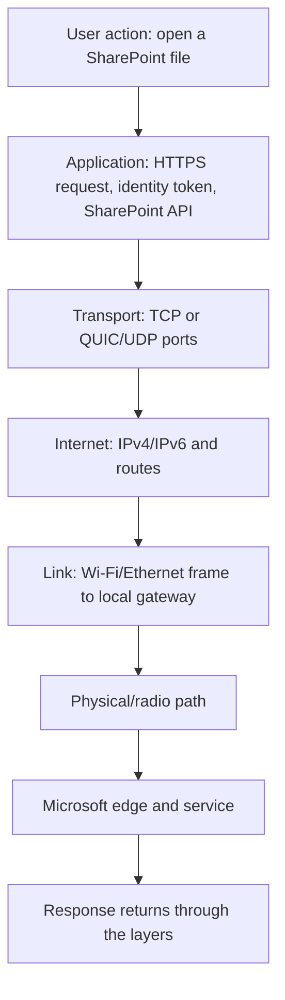

The models do not imply that troubleshooting must rigidly begin at Layer 1. Start where evidence is cheapest and most discriminating. If service health reports an active tenant-wide issue, do not spend an hour replacing cables. If one device fails while another on the same network succeeds, inspect client identity, proxy, certificate, DNS cache, and application state.

> **Your transferable advantage:** SharePoint Online and OneDrive sync escalations already require layer separation. This Part supplies precise protocol names and evidence so the same RCA skill can distinguish local network, proxy, identity, workload, and Microsoft service behavior.

---

## 2. Frames, packets, segments, datagrams, sockets, and the five-tuple

People often say “packet” for all network data, but precise terms make captures easier to read.

| Unit/term | Layer | Plain meaning | Important fields |
|---|---|---|---|
| Frame | Link | Local-network delivery unit | Source/destination MAC, EtherType, payload, integrity check |
| Packet | Internet | IP delivery unit across routed networks | Source/destination IP, protocol, hop limit/TTL, payload |
| TCP segment | Transport | Reliable ordered TCP unit | Source/destination port, sequence/acknowledgment, flags, window |
| UDP datagram | Transport | Connectionless message | Source/destination port, length, checksum |
| Application message | Application | Protocol request/response | HTTP method/status/headers, DNS query, SMTP command |
| Socket | Host interface | Endpoint used by an application for communication | Protocol, local IP/port, remote IP/port, state/process |

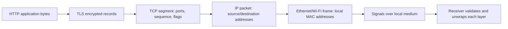

### The five-tuple

A network flow is commonly identified by:

1. Source IP address.
2. Source port.
3. Destination IP address.
4. Destination port.
5. Transport protocol, usually TCP or UDP.

| Five-tuple field | Example | Why it matters |
|---|---|---|
| Source IP | `10.20.4.18` | Which interface/device address sent the traffic? |
| Source port | `51842` | Which ephemeral client-side conversation? |
| Destination IP | `203.0.113.20` (documentation example) | Which resolved/service edge address? |
| Destination port | `443` | Which expected service endpoint? |
| Protocol | TCP | Which transport behavior and firewall rule? |

An **ephemeral port** is a temporary client-side port selected for an outbound conversation. A web server commonly listens on TCP 443; the client uses a high temporary source port. A firewall must permit return traffic for the established flow. Port 443 alone does not prove HTTPS or safety; applications can use ports unexpectedly, and modern HTTP/3 can use QUIC over UDP 443.

### Common ports are orientation, not proof

| Port/protocol | Common use | M365 relevance | Caution |
|---|---|---|---|
| UDP/TCP 53 | DNS | Resolve Microsoft names | Encrypted DNS and internal resolvers alter path |
| UDP 67/68 | DHCPv4 | Obtain local IP settings | Normally local broadcast/client-server process |
| TCP 80 | HTTP | Redirects, certificate revocation endpoints, some content | Sensitive app traffic should use supported secure transport |
| TCP 443 | HTTPS | Most M365 APIs and web/client traffic | Could be TLS inspection or proxy; QUIC may use UDP 443 |
| UDP 443 | QUIC/HTTP/3 | Supported modern cloud transport in some paths | Blocking can cause fallback/performance effects |
| TCP 25 | SMTP server-to-server | Exchange Online mail flow/connectors | Not ordinary web/client submission |
| TCP 587 | Authenticated message submission | Some client/application mail scenarios | Verify supported modern auth and Microsoft guidance |
| UDP 3478–3481 | Teams media traversal | Audio/video/media optimization | Endpoint ranges and requirements change |
| TCP 88 / UDP 88 | Kerberos | On-premises/hybrid Windows authentication | Not direct modern M365 token protocol |
| TCP/UDP 389, TCP 636 | LDAP/LDAPS | Directory access in legacy/hybrid systems | Do not expose plain LDAP; Entra ID is not an LDAP directory endpoint |

Do not create permanent firewall rules from a memorized port table. Use current Microsoft endpoint publications and the application's official requirements.

---

## 3. MAC addresses, ARP, local links, and DHCP

A device first needs a working local network before it can reach the internet.

### MAC and ARP

A **Media Access Control (MAC) address** identifies a network interface on a local link. An IP packet destined beyond the local subnet is placed in a frame addressed to the local gateway's MAC, not the remote cloud server's MAC.

**Address Resolution Protocol (ARP)** maps an IPv4 address on the local link to a MAC address. IPv6 uses **Neighbor Discovery Protocol (NDP)** rather than ARP.

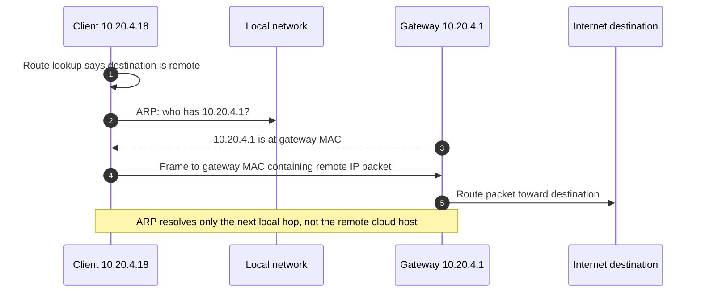

| Local symptom | Plausible cause | Evidence |
|---|---|---|
| No link/Wi-Fi association | Physical/radio/authentication issue | Adapter state, Wi-Fi event, switch/AP evidence |
| Address begins `169.254` on IPv4 | DHCP failed; Automatic Private IP Addressing (APIPA) fallback | `ipconfig /all`, DHCP events, packet trace |
| Duplicate IP warning/intermittent reachability | Duplicate static/DHCP conflict | ARP changes, DHCP lease, switch evidence |
| Gateway unreachable | VLAN, Wi-Fi isolation, ARP, local firewall, route | ARP table, gateway test, interface/route |
| Only one VLAN/location fails | Scope-specific routing/firewall/DHCP/DNS | Compare affected/unaffected configuration |

### DHCP

**Dynamic Host Configuration Protocol (DHCP)** supplies IP address, subnet prefix/mask, default gateway, DNS servers, lease time, and other options. DHCPv4 commonly follows **DORA**: Discover, Offer, Request, Acknowledge.

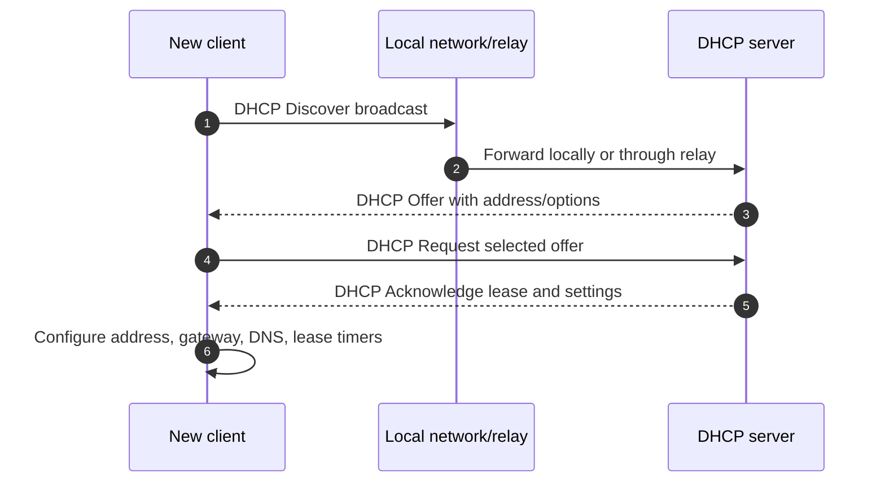

Do not confuse DHCP with DNS. DHCP tells a client which DNS server to ask; DNS resolves names. A correct IP address with a wrong DNS server can still break M365.

---

## 4. IPv4, IPv6, CIDR, subnets, gateways, routes, and NAT

An **Internet Protocol (IP) address** identifies an interface for routed communication. IPv4 uses 32-bit addresses; IPv6 uses 128-bit addresses and a different neighbor/configuration model.

### 🔍 Plain-English deep-dive: prefixes and routes

- **Subnet** — *a range of IP addresses treated as one local routed network.* **Analogy:** Houses on the same street can deliver locally; other streets use a junction. **Why it matters:** The client decides whether to send directly or to a gateway.
- **Classless Inter-Domain Routing (CIDR) prefix** — *an address plus the number of leading bits defining the network, such as `10.20.4.0/24`.* **Analogy:** A postal prefix identifies the neighborhood portion of an address. **Why it matters:** Wrong prefix creates local/remote routing mistakes.
- **Default gateway** — *the router used when no more specific route exists.* **Analogy:** The road out of the local neighborhood. **Why it matters:** A valid address without a reachable gateway cannot reach cloud destinations.
- **Route table** — *ordered rules mapping destination prefixes to next hops/interfaces.* **Analogy:** A navigation table selecting the most specific road for a destination. **Why it matters:** VPNs, virtual adapters, and security clients can install unexpected routes.
- **Network Address Translation (NAT)** — *a gateway rewrites addresses, and often ports, between network realms.* **Analogy:** A company mailroom sends many employees' parcels under one public return address while tracking internal senders. **Why it matters:** Cloud logs may show public egress IP rather than the device's private IP.

| IPv4 concept | Example | Meaning |
|---|---|---|
| Private address | `10.20.4.18` | Not globally routed on public internet |
| Prefix | `/24` | First 24 bits identify network; 256 total addresses in the range |
| Network | `10.20.4.0/24` | Range treated as local under that prefix |
| Default route | `0.0.0.0/0 via 10.20.4.1` | Catch-all when no more specific route matches |
| Public egress | ISP-assigned address | Address Microsoft may observe after NAT/proxy |

| IPv4 | IPv6 |
|---|---|
| 32-bit dotted decimal | 128-bit hexadecimal colon notation |
| Broadcast used in some local protocols | No broadcast; multicast/neighbor discovery used |
| NAT is widespread | Designed for abundant end-to-end addressing; firewalls still essential |
| ARP maps local IPv4 to MAC | NDP maps neighbors and discovers routers |
| Example loopback `127.0.0.1` | Loopback `::1` |

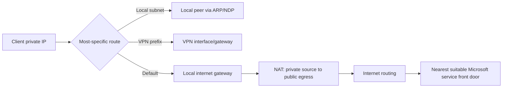

### Route choice

Routers choose the longest matching prefix, then apply metric/administrative rules where relevant. A VPN route for `0.0.0.0/0` can backhaul all internet traffic, while split tunneling sends selected M365 traffic directly. The security and network teams must design this deliberately from current endpoint data; a client should not manually change routes as an unapproved workaround.

### MTU and fragmentation

**Maximum Transmission Unit (MTU)** is the largest packet/frame payload a link carries without fragmentation or a smaller-path adjustment. VPN/tunnel overhead reduces effective MTU. A **Path MTU Discovery** failure can allow small requests while larger TLS/application transfers hang, especially when required Internet Control Message Protocol (ICMP) feedback is blocked.

| MTU symptom | Evidence | Safe response |
|---|---|---|
| Small web page works; upload/sync stalls | Packet sizes, retransmissions, ICMP too-big/fragmentation-needed, tunnel path | Engage network owner; validate supported MTU/MSS configuration |
| VPN users fail; local users succeed | Route and tunnel overhead comparison | Test approved split/direct path; do not disable security client |
| TLS starts then hangs on larger records | Capture shows repeated retransmission near size threshold | Correlate proxy/VPN/MTU and vendor guidance |

---

## 5. DNS resolution, records, caches, TTL, errors, and split DNS

**Domain Name System (DNS)** maps names to data such as IP addresses and mail exchangers. M365 uses many dynamic names and distributed front doors; hard-coding old IP addresses is unsafe.

### 🔍 Plain-English deep-dive: recursive and authoritative DNS

- **Stub resolver** — *the client component that asks a configured DNS resolver.* **Analogy:** A person asks a local information desk. **Why it matters:** Client cache and configured servers influence answers.
- **Recursive resolver** — *a DNS server that finds or caches the answer for the client.* **Analogy:** The desk contacts other directories on the caller's behalf. **Why it matters:** Location and cache can influence Microsoft front-door selection and latency.
- **Authoritative server** — *the source responsible for records in a DNS zone.* **Analogy:** The official registry for that domain. **Why it matters:** Public record corrections happen at the authoritative owner.
- **Time to Live (TTL)** — *how long a DNS answer may be cached.* **Analogy:** An information card has an expiry time. **Why it matters:** Changes are not instantly visible through every cache.
- **Split-horizon DNS** — *the same name returns different answers depending on internal/external resolver context.* **Analogy:** An internal directory gives an office extension while the public directory gives the switchboard. **Why it matters:** Wrong internal records can shadow public Microsoft or federated names.

| Record | Purpose | M365-oriented use |
|---|---|---|
| A | Name to IPv4 address | Web/service endpoint resolution |
| AAAA | Name to IPv6 address | IPv6 service path |
| CNAME | Alias to canonical name | Service discovery/indirection |
| MX | Domain's mail exchanger and priority | Inbound Exchange/mail routing |
| TXT | Arbitrary verification/policy text | Domain verification, SPF and other policies |
| SRV | Service location with port/priority/weight | Some service-discovery scenarios |
| PTR | Reverse IP-to-name mapping | Mail reputation/troubleshooting context |
| CAA | Which certificate authorities may issue for domain | Public certificate governance |

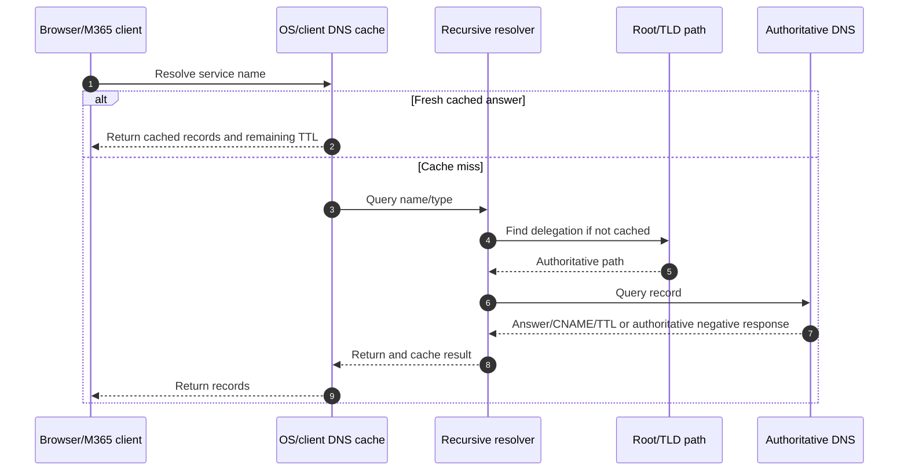

### DNS errors and interpretation

| Result | Meaning | Common next step |
|---|---|---|
| `NOERROR` with answer | Query succeeded with requested data | Validate expected record and route |
| `NOERROR` without requested data | Name exists but that record type may not | Query relevant type/alias chain |
| `NXDOMAIN` | Authoritative statement that name does not exist | Check spelling, suffix, split DNS, stale config |
| `SERVFAIL` | Resolver could not complete query | Check DNSSEC, upstream, recursion, authoritative health |
| Timeout/no response | Resolver/network/firewall issue | Compare configured resolver and packet evidence |
| Unexpected private/old address | Split DNS, hosts file, cache, interception | Compare authoritative/public/internal answers and ownership |

Do not flush DNS cache before capturing the problematic answer unless the test plan requires it; flushing destroys useful evidence and changes behavior. First record `ipconfig /displaydns`, `Resolve-DnsName`, configured servers, answer, TTL, resolver, and time. Then perform an approved comparison or cache reset.

Microsoft recommends DNS resolution close to local internet egress so users reach an appropriate nearby service front door. A distant central resolver combined with local egress can produce suboptimal service selection.

---

## 6. TCP: handshake, reliability, windows, retransmission, teardown, and reset

**Transmission Control Protocol (TCP)** provides a connection-oriented, ordered, reliable byte stream. Reliability means TCP detects loss and retransmits; it does not guarantee the application succeeds quickly.

### Three-way handshake

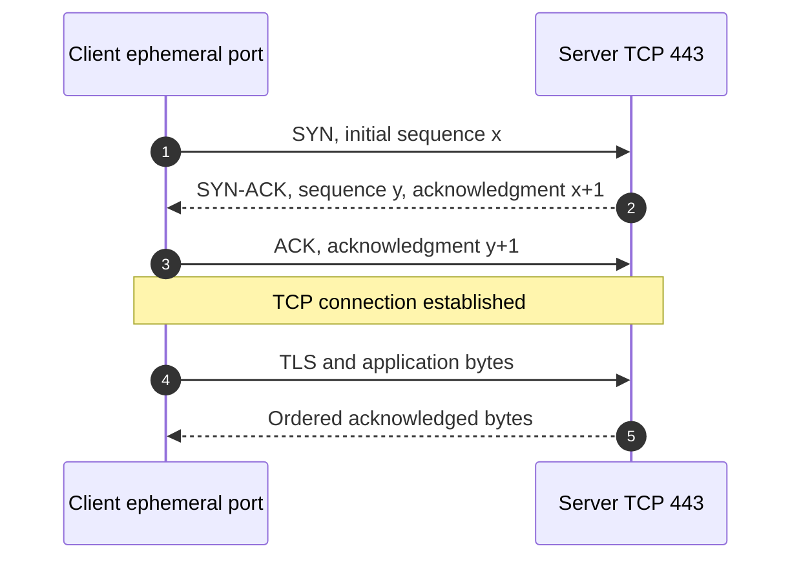

| Observation | Likely interpretation | Do not conclude yet |
|---|---|---|
| Repeated SYN, no SYN-ACK | Packet loss, firewall drop, route, server not reachable | “Microsoft is down” without scope comparison |
| Immediate RST to SYN | Active reject, no listener, middlebox reset | Which device sent reset without TTL/MAC/path evidence |
| Handshake succeeds, TLS fails | Transport works; investigate TLS/proxy/certificate | Application authorization issue automatically |
| TCP works then retransmits | Loss, congestion, receiver delay, MTU, capture artifact | Source of loss from one trace alone |
| Long gaps with zero window | Receiver advertised no buffer | Network bandwidth is necessarily the root cause |

### Sequence, acknowledgment, and windows

TCP numbers bytes. The receiver acknowledges the next expected byte. A missing segment causes duplicate acknowledgments and retransmission. The **receive window** advertises how much data the receiver can accept; **window scaling** allows larger windows for high-bandwidth/high-latency paths. Congestion control separately adapts sending to network conditions.

| TCP behavior | Plain meaning | Troubleshooting value |
|---|---|---|
| Retransmission | Sender did not observe acknowledgment in expected time | Indicates loss/delay or capture perspective; correlate path |
| Duplicate ACK | Receiver repeatedly reports same missing next byte | Helps identify loss/out-of-order delivery |
| Zero window | Receiver temporarily cannot accept more | Investigate receiving app/host pressure |
| RST | Abruptly terminate/refuse connection | Identify sender, timing, preceding application/proxy action |
| FIN/ACK | Orderly close | Normal teardown unless premature relative to app |
| Keepalive | Probe idle connection state | Middlebox idle timeouts can still matter |

```mermaid
sequenceDiagram
    autonumber
    participant A as Endpoint A
    participant B as Endpoint B
    A->>B: FIN: no more data from A
    B-->>A: ACK
    B->>A: FIN: no more data from B
    A-->>B: ACK
    Note over A,B: Orderly close; RST is abrupt and skips this graceful exchange
```

A reset is evidence, not root cause. A proxy can reset after policy denial, a server can reset an unsupported protocol, a firewall can inject a reset, or a local process can close abruptly. Correlate IP/MAC path, TTL/hop behavior, TLS/HTTP messages, device logs, and vendor policy.

---

## 7. UDP, QUIC, loss, latency, and jitter

**User Datagram Protocol (UDP)** sends independent datagrams without TCP's connection setup, ordered delivery, or retransmission. Applications add any reliability they need.

| TCP | UDP |
|---|---|
| Connection-oriented byte stream | Connectionless datagrams |
| Ordered and retransmitted by transport | No transport-level ordering/retransmission |
| Congestion/flow control built in | Application chooses behavior |
| Common for HTTPS/TLS | Common for DNS, real-time media, QUIC |
| Loss often becomes delay through retransmission | Loss may become missing audio/video or application recovery |

**QUIC** is a modern encrypted transport over UDP, and HTTP/3 runs over QUIC. It reduces some handshake and head-of-line delays, but firewalls or middleboxes that block UDP 443 can cause fallback or degraded behavior. Follow Microsoft endpoint/protocol guidance rather than forcing downgrades.

### Performance terms

| Term | Meaning | User effect |
|---|---|---|
| Latency | Time for data to travel; round-trip time measures there and back | Slow interaction, long handshakes |
| Packet loss | Packets/datagrams fail to arrive | TCP retransmission delay; media gaps |
| Jitter | Variation in packet arrival timing | Choppy real-time audio/video |
| Bandwidth | Maximum transfer capacity | Limits sustained large transfers |
| Throughput | Useful data transferred over time | What application actually achieves |
| Congestion | Demand exceeds path capacity | Delay, loss, queueing |
| Bufferbloat | Oversized queues add high latency under load | Calls degrade during uploads/downloads |
| MTU | Largest supported packet size on path/interface | Larger transfers may stall if discovery fails |

For Teams media, average bandwidth alone is not enough. Latency, jitter, loss, endpoint CPU/audio device, Wi-Fi, VPN/proxy path, and service/media relay selection all matter.

---

## 8. TLS: secure channel, certificates, SNI, revocation, and mTLS

**Transport Layer Security (TLS)** protects data in transit and authenticates the server; it can also authenticate the client. HTTPS is HTTP over TLS.

### 🔍 Plain-English deep-dive: TLS identity and trust

- **Certificate chain** — *the leaf/service certificate is signed through one or more intermediate authorities to a trusted root.* **Analogy:** A local credential is validated through issuing offices to a trusted national authority. **Why it matters:** Missing intermediates or untrusted roots cause failure.
- **Subject Alternative Name (SAN)** — *certificate field listing names the certificate is valid for.* **Analogy:** The credential lists approved business names. **Why it matters:** The requested hostname must match.
- **Server Name Indication (SNI)** — *the client tells the TLS endpoint which hostname it wants early in negotiation.* **Analogy:** At a shared reception desk, state which company you are visiting. **Why it matters:** Many cloud services share IPs and select the right certificate/site by name.
- **Certificate revocation** — *a mechanism indicating a certificate should no longer be trusted before expiry.* **Analogy:** A badge is canceled after theft even though its printed date remains valid. **Why it matters:** Certificate Revocation Lists (CRLs) and Online Certificate Status Protocol (OCSP) endpoints may need reachability.
- **Mutual TLS (mTLS)** — *both server and client present certificates.* **Analogy:** Both sides of a sensitive delivery verify credentials. **Why it matters:** Some connectors/APIs use client certificates, which adds issuance, storage, rotation, and mapping dependencies.

### Simplified modern TLS flow

```mermaid
sequenceDiagram
    autonumber
    participant C as Client
    participant P as Optional proxy/security device
    participant S as Microsoft/service endpoint
    C->>P: ClientHello: versions, ciphers, SNI, key share
    P->>S: Forward or create inspected upstream TLS session
    S-->>P: ServerHello, certificate chain, key agreement
    P-->>C: Service certificate or inspection-issued certificate
    C->>C: Validate SAN, chain, trust, time, signature, revocation policy
    C->>P: Complete key agreement and encrypted application data
    P->>S: Encrypted upstream application data
    Note over C,S: With no interception, P forwards traffic; with TLS inspection, two TLS sessions exist
```

| TLS failure | Evidence | Likely owner(s) |
|---|---|---|
| Name mismatch | Requested hostname not in SAN | DNS/proxy/application/service configuration |
| Untrusted issuer | Chain ends at unknown root | Endpoint trust store or TLS inspection deployment |
| Expired/not-yet-valid | Certificate time versus system time | Certificate owner or endpoint clock |
| Missing intermediate | Chain cannot build | Server/proxy certificate presentation or client retrieval |
| Revocation unavailable/revoked | OCSP/CRL result and policy | Network, certificate owner, security policy |
| Protocol/cipher mismatch | TLS alert after ClientHello | Client/server/proxy support and policy |
| Handshake timeout | TCP works but TLS messages stop | Proxy/inspection, MTU, route, server, endpoint security |
| mTLS client cert rejected | Client certificate/issuer/usage/mapping | App, connector, PKI, service configuration |

### TLS inspection

A TLS-inspecting proxy decrypts one TLS session and creates another. The endpoint usually sees a certificate issued by the organization's inspection authority, while the proxy validates the service certificate upstream. This can provide security value for general internet traffic but adds certificate, privacy, protocol, scale, and compatibility dependencies.

Microsoft's current M365 network guidance recommends bypassing Microsoft 365 domains from TLS decryption/interception and avoiding unsupported forced protocol downgrade for the relevant published endpoints. That is a planned network architecture decision, not permission for an end user to bypass security. Network and security owners should use current endpoint data, risk review, controlled testing, and change management.

Never advise disabling certificate validation. Capture the presented chain, SNI/hostname, issuer, timestamps, proxy path, TLS alert, and affected scope; then correct trust, certificate, endpoint, or inspection policy through authorized owners.

---

## 9. HTTP: methods, statuses, headers, cookies, sessions, proxies, and HAR

**Hypertext Transfer Protocol (HTTP)** is a request/response application protocol. HTTPS adds TLS protection.

| HTTP method | Intent | Safety/idempotency note |
|---|---|---|
| GET | Retrieve representation | Intended read; can still expose sensitive query/data |
| HEAD | Retrieve headers without body | Useful for metadata/reachability |
| POST | Submit/create/action | Often not idempotent; retry carefully |
| PUT | Replace/create at known resource | Intended idempotent under protocol semantics |
| PATCH | Partially modify | Retry behavior depends on implementation |
| DELETE | Remove resource | High impact; API semantics/soft delete vary |
| OPTIONS | Discover communication options/CORS | Can reveal supported methods/policy |

| Status family | Meaning | Examples |
|---|---|---|
| 1xx | Informational | Protocol progress |
| 2xx | Request accepted/succeeded | 200 OK, 201 Created, 204 No Content |
| 3xx | Redirect/caching | 301/302 redirect, 304 Not Modified |
| 4xx | Client/request/auth/policy issue | 400, 401, 403, 404, 407, 408, 409, 429 |
| 5xx | Server/gateway could not fulfill | 500, 502, 503, 504 |

### Important statuses

| Status | Plain meaning | M365 troubleshooting thought |
|---|---|---|
| 401 Unauthorized | Authentication is absent/invalid or challenge required | Token/cookie/realm/identity flow; name is historically confusing |
| 403 Forbidden | Server understood but refuses authorization/policy | Permission, policy, scope, resource, app role |
| 404 Not Found | Resource not found or deliberately hidden | URL/object ID, provisioning, authorization behavior |
| 407 Proxy Authentication Required | Proxy requires authentication | PAC path, proxy identity method, service/client support |
| 429 Too Many Requests | Throttled | Respect `Retry-After`, reduce frequency, backoff/delta |
| 500 Internal Server Error | Service-side failure for request | Correlation/request ID, scope, health, payload |
| 502 Bad Gateway | Intermediary received bad upstream response | Proxy/gateway/upstream path |
| 503 Service Unavailable | Temporarily unable to serve | Retry guidance, health, capacity, maintenance |
| 504 Gateway Timeout | Intermediary timed out waiting upstream | Path, proxy, service latency, MTU, dependency |

### Headers, cookies, and sessions

| Item | Purpose | Sensitive content risk |
|---|---|---|
| `Host` / `:authority` | Target hostname | Architecture information |
| `Authorization` | Bearer/basic/other credentials | Tokens/secrets; always redact |
| `Cookie` / `Set-Cookie` | Session state | Session hijack; always redact values |
| `Location` | Redirect target | Can expose tenant/app identifiers/query state |
| `User-Agent` | Client identity/version hints | Device/app fingerprinting |
| `Content-Type` | Body format | Helps parse JSON/XML/form data |
| `Retry-After` | When to retry | Required for throttling/recovery behavior |
| `x-ms-request-id` or correlation IDs | Trace request through service | Share with support when authorized; usually not secret but tenant context matters |
| `Strict-Transport-Security` | Require HTTPS for future access | Security policy evidence |

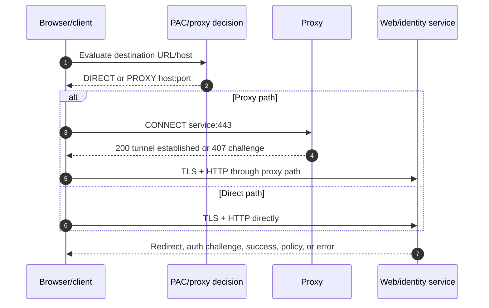

### PAC files and proxy errors

A **Proxy Auto-Configuration (PAC)** file is JavaScript that chooses DIRECT or a proxy for a URL/host. Wrong order, expensive DNS functions, stale deployment, incomplete Microsoft domains, or fallback behavior can create location-specific failures.

`407 Proxy Authentication Required` establishes that the proxy, not the M365 resource, requested authentication. Investigate which proxy was selected, whether the client supports the proxy method, user/device context, Kerberos/NTLM or other mechanism where applicable, certificate/TLS inspection, and proxy logs. Do not bypass the proxy manually without authorization.

### HAR evidence

An **HTTP Archive (HAR)** file records browser request timing, URLs, headers, redirects, statuses, and sometimes bodies. It can contain bearer tokens, cookies, personal data, tenant IDs, query parameters, file names, and response content.

| HAR timing/field | What it may show |
|---|---|
| DNS | Name resolution delay from browser perspective |
| Connect | TCP connection time |
| SSL | TLS negotiation time |
| Send/wait/receive | Request transmission, server time-to-first-byte, response transfer |
| Redirect chain | Identity/resource navigation and loops |
| Status/headers | Auth, proxy, throttle, gateway, correlation evidence |

Collect HAR only with authorization, reproduce the minimum safe scenario, avoid typing real secrets while recording, export once, protect transfer/storage, redact appropriately without destroying needed structure, document time and scope, and delete according to the evidence plan.

---

## 10. Firewalls, proxies, VPNs, load balancers, and CDNs

These devices/services alter path or policy in different ways.

| Component | Primary job | Common M365 failure |
|---|---|---|
| Firewall | Permit/deny traffic by addresses, ports, state, app/policy | Missing/delayed endpoint update, UDP blocked, idle timeout |
| Forward proxy | Acts for clients accessing external services | 407, TLS inspection, capacity, PAC misroute, unsupported auth |
| Reverse proxy | Fronts servers/applications | Header/auth/certificate/time-out mismatch |
| VPN | Encrypts/routes client traffic through private gateway | Backhaul latency, MTU, default route, DNS mismatch |
| Load balancer | Distributes requests among service instances | Health probe, persistence, backend reset/time-out |
| Content Delivery Network (CDN) | Serves content from distributed edge caches | Blocked CDN domain, stale cache, geolocation/path issue |
| Secure Web Gateway (SWG) | Cloud/enterprise web policy and inspection | Hairpin, tenant restriction, TLS/protocol compatibility |
| Cloud Access Security Broker (CASB) | Visibility/control for cloud-app use | Session-control compatibility, app coverage, policy conflict |

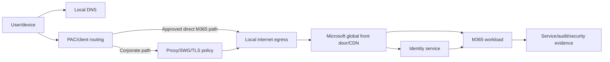

### Local breakout and M365 endpoint categories

Microsoft 365 is a globally distributed SaaS service. Current Microsoft guidance emphasizes identifying M365 traffic, local DNS plus local internet egress, avoiding network hairpins, and evaluating bypass of performance-impacting intermediaries for published required domains.

Microsoft endpoint data historically groups endpoints as **Optimize**, **Allow**, and **Default**, with required/optional status and protocol/port information. Current publications also include unified domains such as `*.cloud.microsoft`, `*.static.microsoft`, and `*.usercontent.microsoft`. The list changes, and Microsoft provides a web service and change feed.

| Category | General character | Network treatment thought |
|---|---|---|
| Optimize | High-volume/latency-sensitive core scenarios, often with IPs | Prioritize direct efficient path and early optimization |
| Allow | Required service dependencies, often lower volume | Explicitly permit and avoid harmful interference per guidance |
| Default | Dynamic/general internet-style dependencies | Reachability required where marked; domains may be more dynamic |
| Required | Blocking causes service/scenario failure | Automate current list and change management |
| Optional | Enables a documented optional scenario | Permit according to used features and risk decision |

Do not selectively allow only the endpoint observed in one capture. M365 features span workloads and endpoints; partial allowlisting causes intermittent and future failures. Automate publication consumption, peer review changes, preserve rollback, and validate from representative locations.

---

## 11. SMTP and Exchange Online mail flow

**Simple Mail Transfer Protocol (SMTP)** transfers email between mail systems. It is a store-and-forward protocol: a message can pass through several servers and policy stages before mailbox delivery.

### Mail-related DNS and authentication

| Mechanism | Purpose | What it does not do alone |
|---|---|---|
| MX | Identifies receiving mail servers for a domain | Prove sender authenticity |
| SPF | DNS policy lists systems authorized to send for envelope domain | Sign content or survive every forwarding pattern |
| DKIM | Sender domain signs selected headers/body cryptographically | Guarantee message is benign |
| DMARC | Policy/alignment/reporting using SPF and/or DKIM | Replace anti-phishing/content/security analysis |
| PTR/reputation | Reverse DNS and sending reputation signals | Prove business legitimacy |

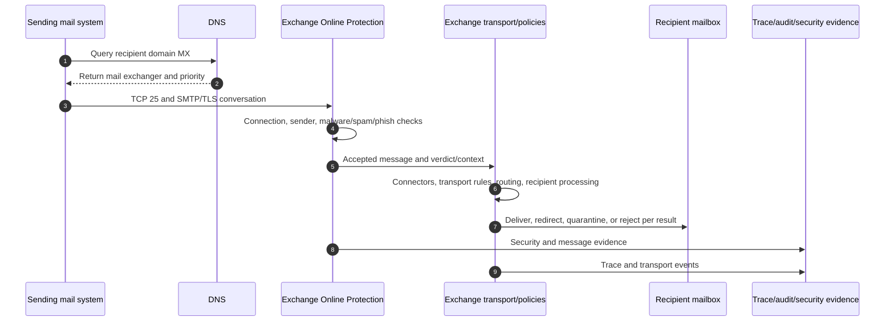

### SMTP conversation orientation

| Command/status | Purpose |
|---|---|
| `EHLO` | Client introduces itself and discovers extensions |
| `STARTTLS` | Upgrade SMTP connection to TLS where offered/required |
| `MAIL FROM` | Envelope sender |
| `RCPT TO` | Envelope recipient; evaluated per recipient |
| `DATA` | Begin message content |
| `250` | Requested action accepted |
| `4xx` | Temporary failure; sender normally retries |
| `5xx` | Permanent failure for that attempt/message/recipient |

| Symptom | Evidence path | Common boundary |
|---|---|---|
| External sender gets non-delivery report | Enhanced SMTP status, timestamp, message ID, recipient | DNS, recipient, policy, connector, sender reputation |
| Message trace says delivered but user cannot see mail | Mailbox rules, focused/junk/quarantine, client/search, delegate | Exchange mailbox/client, security product |
| All mail from partner delayed | Connector/TLS/certificate/DNS/partner queue | Partner mail system, network, Exchange connector |
| SPF fail but DKIM pass/aligned | Authentication results and DMARC policy | Forwarding or sender configuration; interpret alignment |
| Internal message blocked | Transport/security rule and verdict | Exchange/Defender policy and exception ownership |
| TCP 25 timeout | SYN path, firewall, route, target MX | Network/ISP/recipient service, not mailbox permission |

Never “fix” mail flow by broadly disabling anti-spam, anti-phishing, malware, transport rules, TLS requirements, or authentication controls. Use a controlled test message, trace, quarantine/submission process, scoped exception only with risk approval, and vendor-supported correction.

---

## 12. OAuth 2.0, OIDC, SAML, Kerberos, LDAP, SCIM, Graph, and webhooks

Identity protocols solve different problems. “SSO” is an outcome, not one protocol.

### 🔍 Plain-English deep-dive: modern identity protocols

- **OAuth 2.0** — *an authorization framework that lets a client obtain limited access to a resource/API.* **Analogy:** Give a valet a limited parking key, not the house key. **Why it matters:** Access tokens carry delegated or application authority; OAuth is not by itself a user-authentication protocol.
- **OpenID Connect (OIDC)** — *an authentication layer built on OAuth 2.0 that provides identity information, including an ID token.* **Analogy:** Add a verified identity card to the limited-access delegation process. **Why it matters:** Modern web/mobile applications use it for sign-in and SSO.
- **Security Assertion Markup Language (SAML)** — *an XML-based federation protocol where an identity provider sends a signed authentication assertion to a service provider.* **Analogy:** A trusted organization presents a signed letter saying the user authenticated. **Why it matters:** Common for enterprise SaaS SSO, with certificate, claim, time, and reply-URL dependencies.
- **Kerberos** — *a ticket-based network authentication protocol commonly used by Active Directory Domain Services.* **Analogy:** A trusted ticket office issues time-limited tickets to services without resending the password. **Why it matters:** Hybrid/legacy application integration, constrained delegation, DNS/time/service principal names are critical.
- **Lightweight Directory Access Protocol (LDAP)** — *a protocol for querying and modifying directory services.* **Analogy:** Search and update an organizational phone directory through defined operations. **Why it matters:** Legacy apps may depend on LDAP/LDAPS; Microsoft Entra ID is not exposed as a generic LDAP directory.
- **System for Cross-domain Identity Management (SCIM)** — *a standard REST/JSON protocol for provisioning and deprovisioning users and groups between identity systems and applications.* **Analogy:** Automate employee roster updates to a partner system. **Why it matters:** SCIM manages lifecycle; it does not perform interactive sign-in.

| Protocol | Primary purpose | Typical artifact | Common failure |
|---|---|---|---|
| OAuth 2.0 | API authorization/delegation | Access token, scopes/roles, refresh token | Wrong audience/scope/consent, expired token |
| OIDC | User authentication and identity | ID token, userinfo, nonce/state | Redirect URI, issuer, nonce, claim mismatch |
| SAML 2.0 | Federated authentication/SSO | Signed XML assertion | Certificate, NameID/claim, time skew, reply URL |
| WS-Federation | Older web federation | Security token and realm/reply | Realm, certificate, endpoint, claim mismatch |
| Kerberos | Domain/service authentication | TGT/service ticket | DNS, time skew, SPN, delegation, ticket cache |
| LDAP/LDAPS | Directory query/update | Bind and search/modify operations | Bind, TLS trust, filter/base DN, firewall |
| SCIM | Identity provisioning lifecycle | REST JSON users/groups | Token, schema mapping, duplicate matching, rate limit |
| Microsoft Graph | M365/Entra API access | HTTPS REST requests and JSON | Permission, consent, 401/403/404/429, pagination |
| Webhook/change notification | Push notification that data changed | HTTPS callback with validation/subscription | Expiry, endpoint validation, retries, duplicate/out-of-order events |

### OAuth/OIDC authorization-code flow with PKCE

**Proof Key for Code Exchange (PKCE)** binds an authorization request to the client that initiated it, reducing stolen-code abuse for public clients.

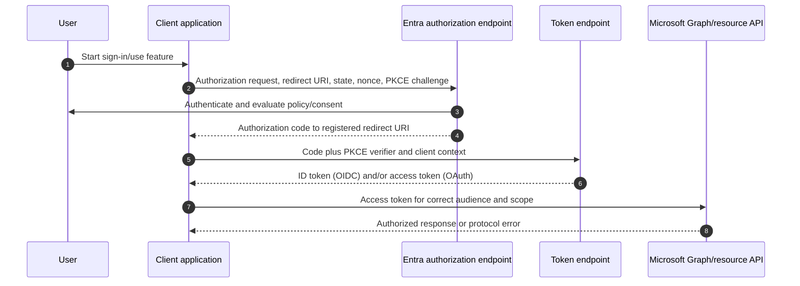

### SAML flow

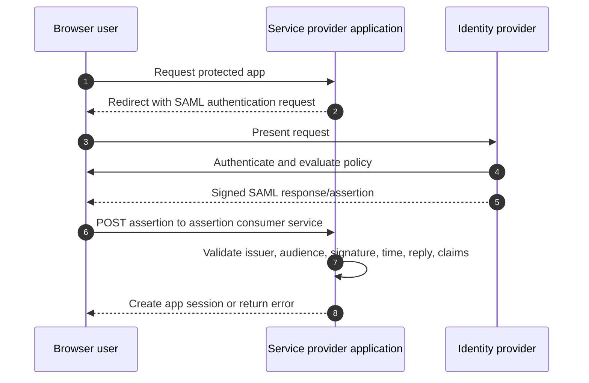

### Kerberos flow

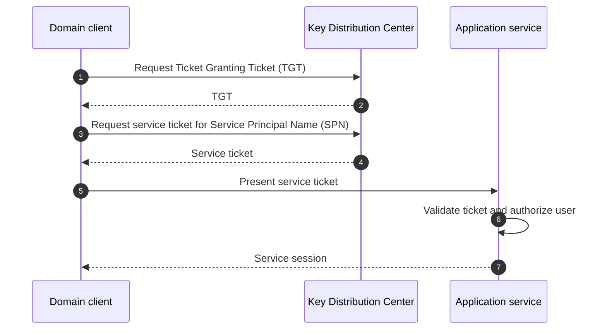

### Authentication versus provisioning versus authorization

| Question | Protocol/capability |
|---|---|
| Who signed in? | OIDC, SAML, Kerberos, other authentication |
| What API may the client call? | OAuth access token/scopes/roles |
| Should a user account exist in the SaaS app? | SCIM/lifecycle provisioning |
| What directory data can be queried? | LDAP for compatible directories; Graph for Microsoft cloud resources |
| How is a change delivered asynchronously? | Webhook/change notification |

Do not put OAuth bearer tokens, SAML assertions, cookies, Kerberos tickets, client secrets, or SCIM tokens in ordinary tickets or study portfolios. They may grant access.

---

## 13. Microsoft Graph, webhooks, API throttling, and integrations

Microsoft Graph exposes resources across Entra, Microsoft 365, Windows, and related services through `https://graph.microsoft.com`. An integration still needs identity, consent, permission, resource authorization, network reachability, error handling, and operations.

| API result | Interpretation path |
|---|---|
| 400 | Request syntax/property/unsupported combination |
| 401 | Token absent, invalid, expired, or wrong authentication context |
| 403 | Token valid but permission, consent, role, policy, or resource authorization insufficient |
| 404 | Resource/path/version/tenant mismatch or intentionally hidden object |
| 409 | State conflict, duplicate, or concurrency issue |
| 412 | Precondition/ETag mismatch |
| 429 | Throttled; use `Retry-After` and backoff |
| 5xx | Service/gateway failure; use request ID/time and retry guidance |

### Webhooks and change notifications

A webhook endpoint receives a notification that something changed. The notification may be duplicated, delayed, or out of order; the subscriber should validate authenticity, handle renewal/expiration, be idempotent, and fetch current authoritative state where needed.

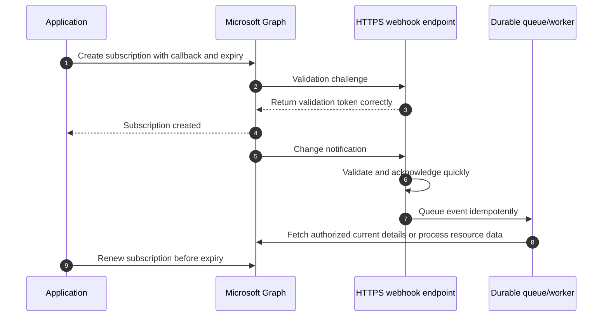

Avoid continuous polling. Use delta queries/change notifications where supported. Handle pagination so inventories are complete. Log request IDs and timestamps but redact tokens and personal/content data. Respect terms and privacy obligations.

---

## 14. A user-to-cloud troubleshooting method

The objective is to find the earliest layer where expected and actual behavior diverge.

### End-to-end path

```mermaid
flowchart LR
    USER[User intent] --> CLIENT[Client/app and local state]
    CLIENT --> IPLOCAL[Interface, DHCP, IP, route]
    IPLOCAL --> DNS[DNS resolution]
    DNS --> PATH[Firewall, proxy, VPN, NAT, internet route]
    PATH --> TRANS[TCP/UDP/QUIC]
    TRANS --> TLS[TLS and certificate]
    TLS --> HTTP[HTTP/SMTP/application protocol]
    HTTP --> ID[Authentication/token/federation]
    ID --> AUTHZ[Policy and resource authorization]
    AUTHZ --> WORK[Microsoft workload/API]
    WORK --> EVID[Logs, service health, request IDs]
```

### Triage sequence

1. **Safety and impact:** Is there active compromise, data loss, dangerous change, or major outage? Follow incident process and preserve evidence.
2. **Define transaction:** Exact user/workload, device, client, action, resource, tenant, time zone, location, network, expected result.
3. **Scope:** One user, device, site, network, ISP, region, tenant, app, or everyone? Identify a known-good comparison.
4. **Timeline/change:** First/last occurrence, recent updates, DNS/proxy/firewall/policy/license/app changes, service health, Message center.
5. **Local configuration:** Interface, DHCP, address, gateway, DNS, routes, proxy, VPN, time, certificates.
6. **Name resolution:** Expected names/records, resolver, CNAME chain, TTL, split DNS, IPv4/IPv6.
7. **Transport:** Five-tuple, handshake, reset/timeout/retransmission, UDP/QUIC, MTU.
8. **TLS/proxy:** SNI, chain, SAN, issuer, inspection, revocation, 407, protocol alert.
9. **Application/identity:** Redirects, status codes, token audience/scope, SAML claims, policy, resource authorization.
10. **Service:** Workload logs, audit, message trace, sync evidence, request IDs, service health.
11. **Hypothesis/test:** State one falsifiable cause and run the least-invasive discriminating test.
12. **Remediate/validate:** Positive, negative, performance, failure, and rollback tests; document ownership and residual risk.

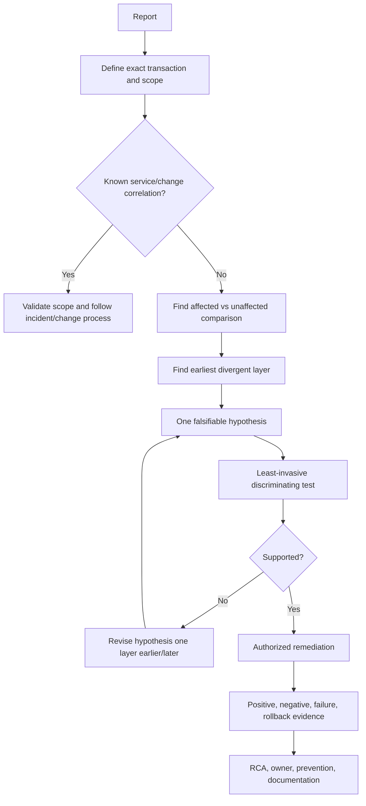

Avoid random “try everything” lists. Every test should state what result supports or weakens the hypothesis.

---

## 15. Windows commands and evidence collection

Use built-in tools read-only first. Commands and availability vary by Windows version and policy. Run only with authorization and do not collect unrelated customer content.

| Command/tool | Purpose | Evidence/caution |
|---|---|---|
| `ipconfig /all` | Interface, address, gateway, DHCP, DNS | Redact host/domain/IP as required |
| `ipconfig /displaydns` | Client DNS cache | Capture before flush |
| `nslookup name server` | Query a specific DNS resolver | Older tool; record server and record type |
| `Resolve-DnsName name -Type A` | Detailed PowerShell DNS query | Compare A/AAAA/CNAME/MX/TXT as authorized |
| `route print` | IPv4/IPv6 route tables and metrics | VPN/security adapters can change routes |
| `arp -a` | IPv4 neighbor cache | Local-link evidence only |
| `Get-NetIPConfiguration` | Structured interface/IP/DNS/gateway state | Useful for PowerShell evidence |
| `Test-NetConnection host -Port 443` | DNS/route/TCP connection test | TCP success does not prove TLS/HTTP/auth |
| `tracert host` | ICMP-based hop path | Missing hops may filter ICMP; not proof of failure |
| `pathping host` | Longer latency/loss sampling | Intermediate ICMP rate limiting can mislead |
| `netstat -ano` | Connections/listeners and process IDs | Process mapping needs authorization/context |
| `Get-NetTCPConnection` | Structured TCP state/process view | Snapshot can miss short connections |
| `netsh winhttp show proxy` | WinHTTP proxy configuration | Browser may use different proxy stack/PAC |
| `curl.exe -I -v https://host` | HTTP headers/TLS/proxy details | Verbose output can expose cookies/tokens; use safe public target |
| `pktmon` | Built-in packet monitoring | Capture may contain sensitive traffic; scope and secure it |
| `netsh trace start ...` | Windows network trace | Broad traces are sensitive and can be large; use approved scenario |
| `Get-WinEvent` | Query relevant Windows event logs | Filter by time/provider; avoid unrelated personal data |

### Evidence order

1. Record device time/time zone and incident window.
2. Record symptom and exact reproduction without secrets.
3. Capture read-only configuration before changing cache, route, proxy, or client state.
4. Use a narrow test and trace window.
5. Record command, target, result, exit/error, and whether run elevated.
6. Stop captures immediately after reproduction.
7. Secure files, hash when chain-of-custody needs justify it, and create a sanitized working copy.
8. Document any state-changing action and rollback.

### Commands are not conclusions

| Observation | What it proves | What remains open |
|---|---|---|
| `Test-NetConnection` TCP 443 succeeds | TCP connection to resolved IP/port succeeded at that time | Correct TLS, proxy route, HTTP, identity, workload |
| `tracert` has `* * *` hop | Hop did not return expected ICMP response | Data traffic may still pass normally |
| DNS returns several IPs | Resolver supplied distributed addresses | Which address client selected and path quality |
| `curl` gets 302 | HTTP endpoint redirected | Whether full browser identity flow succeeds |
| `netstat` shows ESTABLISHED | TCP state exists | Application health or correct authorization |

---

## 16. Reading packet captures, HAR files, and logs together

No evidence source has the whole truth.

### Packet capture workflow

| Step | Question |
|---|---|
| Locate flow | Which five-tuple, process/time, DNS name, and interface? |
| Verify DNS | Which query/answer/CNAME/TTL/resolver preceded connection? |
| Verify transport | SYN/SYN-ACK/ACK or QUIC? RST, timeout, retransmission, window, MTU? |
| Verify TLS | SNI, version, certificate chain/issuer, alert, inspection? |
| Verify application visibility | If decrypted/unencrypted and authorized, status/command; otherwise correlate timing/size |
| Compare | What differs between working and failing location/device/user? |
| Correlate | Which HAR/log/request ID/service event matches the packet time? |

### Example interpretations

| Evidence pattern | Most likely layer to investigate next |
|---|---|
| DNS timeout; no connection attempt | DNS/client/network-to-resolver |
| DNS works; SYN retransmits with no SYN-ACK | Route/firewall/ISP/service reachability |
| TCP succeeds; TLS alert after inspection certificate | Trust/TLS inspection/protocol policy |
| TLS succeeds; HTTP 407 | Proxy authentication/path |
| HTTP redirects loop between app and identity | Cookie/session/redirect URI/federation/policy |
| Identity returns token; resource gives 403 | Resource authorization, token audience/scope, policy |
| HTTP 429 with Retry-After | API throttling/client behavior |
| SMTP 550 after RCPT TO | Recipient/policy permanent rejection; inspect enhanced code |
| Long retransmissions only for large records over VPN | MTU/loss/tunnel path |

### Correlation table template

| Time UTC | Source | Request/flow ID | Observation | Fact or inference | Owner/next test |
|---|---|---|---|---|---|
| 10:02:14.120 | DNS trace | Query ID | A/AAAA resolved with TTL | Fact | Compare resolver/location |
| 10:02:14.180 | Packet | Five-tuple | SYN sent; no SYN-ACK | Fact | Firewall/route capture at egress |
| 10:02:35 | Client log | Correlation ID | Connection timeout | Fact | Correlates with transport loss |
| 10:03 | Change record | CR-123 | New proxy policy enabled | Fact | Test approved unaffected policy group |
| — | Analyst | — | Proxy likely drops flow | Inference | Confirm with proxy logs |

---

## 17. Safe redaction and evidence handling

Network and identity evidence can grant access or reveal confidential data.

| Always treat as highly sensitive | Examples |
|---|---|
| Authentication secrets | Passwords, client secrets, private keys |
| Session material | Cookies, bearer/refresh/ID tokens, SAML assertions, Kerberos tickets |
| Personal/customer data | Email addresses, names, phone numbers, message/file content |
| Tenant/resource identifiers | Tenant IDs, object IDs, site URLs, mailbox addresses, app IDs depending on context |
| Internal architecture | Private IPs, hostnames, routes, proxy names, security policy |
| Security evidence | Alerts, vulnerabilities, attacker indicators, admin actions |

### Redaction principles

1. Collect only the smallest relevant window and transaction.
2. Preserve an authorized original if investigation/legal process requires it; work from a protected copy.
3. Replace values consistently so relationships remain analyzable, for example `USER-A`, `TENANT-A`, `IP-CLIENT-1`.
4. Do not leave tokens in screenshots, HAR, packet-decryption keys, command history, or chat.
5. Remove URL query parameters and POST bodies only after checking whether they hold required error context; document redaction.
6. Use approved secure transfer, access, retention, and deletion.
7. Do not upload customer evidence to public analyzers or personal AI services.
8. Record who collected, transformed, received, and deleted evidence when required.

> **Background tie-in:** Existing coordination with customers, partners, engineering, and vendors is valuable. Security consulting adds stricter minimization and explicit authorization: each recipient gets only evidence needed for their component and task.

---

## 18. Multi-vendor ownership and escalation

Complex paths can include endpoint vendor, identity team, DNS/DHCP, firewall, proxy/SWG, VPN, ISP, Microsoft, third-party SaaS, and application developer.

| Owner | Controls | Evidence requested | Useful explicit ask |
|---|---|---|---|
| Endpoint/client team | OS, browser, certificates, client version, local policy | Event/client logs, trust store, process, affected comparison | Confirm client receives expected proxy/cert/policy |
| Network team | DHCP, routing, firewall, NAT, VPN, QoS, MTU | Config, flow logs, captures at boundaries | Confirm five-tuple disposition and path |
| DNS team/provider | Zones, resolvers, split DNS, forwarding | Authoritative/recursive answers, TTL, query logs | Correct/confirm record and cache behavior |
| Proxy/SWG vendor/team | PAC, auth, inspection, category, capacity | Selected route, policy verdict, TLS chain, proxy logs | Explain 407/reset/deny and supported M365 treatment |
| Identity team | Entra/federation/app/claims/policy | Sign-in logs, app config, correlation, certificate | Explain auth/policy result at timestamp |
| M365 workload team | Permissions/settings/workload logs | Object IDs, audit, message trace, sync/service evidence | Confirm expected workload behavior/config |
| enterprise support | SaaS service-side diagnosis | Tenant/time/request IDs/repro/health/captures | Investigate specified request/service boundary |
| Third-party app/vendor | App implementation, redirect, API client, SCIM | App logs, version, permission, request IDs | Correct protocol/permission/retry behavior |

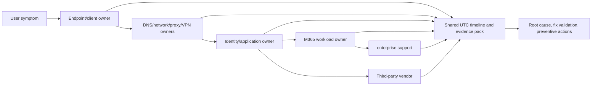

The incident lead should maintain one UTC timeline, fact/inference separation, action owner, deadline, decision, and next update. Avoid parallel teams making uncoordinated changes that destroy evidence.

---

## 19. Detailed scenario: Microsoft 365 sign-in

### Expected flow

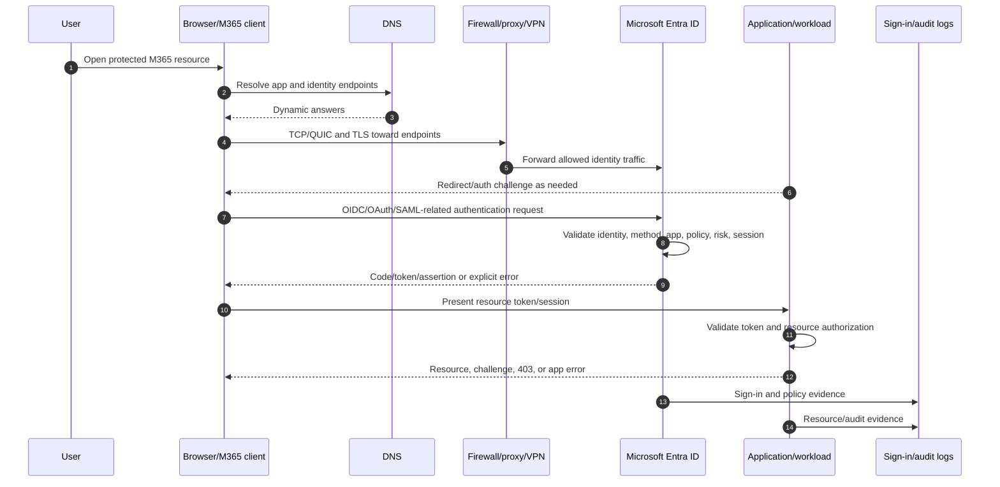

### Sign-in failure matrix

| Symptom | First evidence | Plausible branch |
|---|---|---|
| Identity page never loads | DNS, proxy, TCP/TLS | Endpoint blocked, 407, cert inspection, route |
| Page loops repeatedly | HAR redirect/cookies, time | Third-party cookie/session, stale state, federation redirect, proxy |
| Password accepted then denied | Entra sign-in details | MFA, Conditional Access, risk, device, app, location |
| Authentication succeeds; app 403 | Token claims plus resource permission | Scope/audience, group/site/app role, guest authorization |
| Only federated domain fails | Federation endpoint, cert, DNS, claims | AD FS/identity provider dependency |
| Only one network fails | Resolver/PAC/proxy/TLS/egress comparison | Network/security path |
| Only legacy client fails | Protocol/client support | Modern auth requirement, proxy/TLS capability |

### Safe troubleshooting

1. Record exact resource URL, app/client, tenant, UPN domain, time, device, and network without collecting password.
2. Check service health and known change.
3. Confirm DNS and TLS reachability to current required endpoints.
4. Capture HAR for a controlled browser reproduction if authorized; protect tokens/cookies.
5. Find Entra sign-in record by user/time/correlation/request ID.
6. Read authentication, failure code, policy, device, risk, and app fields in context.
7. If token issued, inspect metadata/claims only through approved tools and redact token; correlate resource authorization.
8. Compare a working user/device/network one variable at a time.
9. Correct root configuration; do not disable MFA, Conditional Access, proxy, firewall, TLS validation, or endpoint security broadly.
10. Validate intended success and intended denial.

---

## 20. Detailed scenario: OneDrive and SharePoint synchronization

OneDrive sync combines identity, SharePoint/OneDrive discovery, local filesystem, endpoint resources, HTTP/TLS, change enumeration, metadata, and content transfer.

### Simplified flow

```mermaid
sequenceDiagram
    autonumber
    participant U as User
    participant O as OneDrive sync client
    participant E as Entra ID
    participant S as SharePoint/OneDrive service
    participant F as Local filesystem
    participant P as Proxy/network
    participant L as Client/service/audit evidence
    U->>O: Sign in and select library
    O->>P: Resolve/connect to identity and service endpoints
    P->>E: Authentication and token flow
    E-->>O: Authorized token/session
    O->>S: Discover user/site/drive and sync relationship
    S-->>O: Metadata/change information
    O->>F: Compare local state, names, paths, versions, locks
    O->>S: Upload/download authorized changes
    S-->>O: Success, conflict, throttle, policy, or service error
    O->>L: Client sync evidence
    S->>L: Audit/request evidence
```

### Sync failure dimensions

| Dimension | Examples | Evidence |
|---|---|---|
| Scope | One file, folder, library, user, device, network, tenant | Reproduction matrix |
| Identity | Wrong account, token, guest, stale session | Sign-in/account/client logs |
| Authorization | Site/library/item permission, access policy | SharePoint permission and audit |
| Local filesystem | Invalid/reserved name, long path, lock, disk, permissions | File properties, client error, OS logs |
| Change/version | Conflict, simultaneous edits, known-folder move | Version history, timestamps, client state |
| Network | DNS, proxy, TLS, latency/loss/MTU, blocked endpoint | Trace, HAR where applicable, proxy logs |
| API/service | Throttling, request error, service incident | HTTP status, Retry-After, request ID, health |
| Client | Version, cache/database, policy, unsupported environment | Client version/logs and known-good comparison |

### Detailed walkthrough: sync works at home but fails in office

1. Scope the same device/user/library and exact office/home times.
2. Check service health; a location-only pattern weakens a broad service hypothesis.
3. Compare DNS resolver/answers, routes, proxy/PAC, VPN, TLS certificate issuer, and endpoint reachability.
4. Look for 407, TLS alerts, resets, 429, 5xx, retransmissions, or MTU-sized stalls.
5. Correlate OneDrive client logs with network timestamps and SharePoint request IDs.
6. Confirm current Microsoft endpoint categories and proxy/TLS-inspection guidance.
7. Ask the proxy/network owner for the exact policy verdict; do not ask the user to disable the security agent.
8. Test an approved narrow policy correction or representative pilot.
9. Validate sign-in, discovery, small/large upload, download, rename, conflict, and intended policy denial.
10. Document root cause, affected endpoints, automated endpoint-list maintenance, monitoring, and rollback.

You can use direct production experience for sync investigation, RCA, vendor coordination, and fix validation. The protocol explanation deepens that evidence; it should not be reframed as ownership of Entra or network security platforms.

---

## 21. Detailed scenario: Exchange Online mail delivery

### Scenario: partner mail is delayed, internal mail is healthy

1. Define sender domain/IP, recipient, message ID, UTC send/receive times, direction, volume, and business impact. Do not paste message content unless necessary and authorized.
2. Obtain non-delivery report or headers safely. Separate SMTP enhanced status from user wording.
3. Query authoritative recipient MX and relevant sender SPF/DKIM/DMARC records; record resolver, answer, TTL, and time.
4. Determine whether sender queued before connection, TCP 25 timed out, TLS failed, recipient was temporarily rejected, or Exchange accepted then processed slowly.
5. Use Exchange message trace and security/quarantine evidence with exact message ID.
6. Review connectors, certificates, accepted domains, transport rules, spam/phish verdict, and recent change.
7. Check Microsoft service health and partner/vendor health.
8. Correlate partner SMTP logs, customer network/firewall logs if mail traverses it, and prior evidence in one timeline.
9. If 4xx, understand retry behavior and avoid duplicate manual resends that confuse evidence.
10. Apply the scoped supported correction; validate accepted mail, rejected unauthorized sender, authentication results, and no open relay/bypass.

| Evidence outcome | Interpretation |
|---|---|
| Partner never attempted recipient MX | Partner DNS/queue/routing ownership |
| SYNs leave but no response | Network/ISP/target path; capture both boundaries |
| TLS certificate requirement fails | Connector/partner certificate/name/trust configuration |
| SMTP `451/4.x.x` then later success | Temporary condition and retry worked; find source of deferral |
| SMTP `550/5.x.x` | Permanent reject for stated reason; correct address/policy/auth |
| Exchange accepted and trace shows delivered | Investigate mailbox rule, junk/quarantine, client/search visibility |
| Security product quarantined | Review verdict/submission and scoped policy, not broad disablement |

---

## 22. Safe evidence lab: map and diagnose a public HTTPS flow

### Lab goal

Collect a small, sanitized evidence pack for a public test transaction and interpret supplied failure samples. No Microsoft 365 license is required. The lab must not bypass organizational controls or capture unrelated traffic.

### Prerequisites

- Windows device on a network where you are authorized to run basic diagnostics.
- PowerShell and built-in Windows commands.
- Use `example.com` and `www.microsoft.com` only as public targets; do not sign in or enter personal/customer data.
- If packet capture is not authorized, complete the paper-only path using command output and the supplied sample patterns.
- A folder approved for temporary sanitized evidence.

### Steps

1. Record current UTC/local time and time zone.
2. Run `ipconfig /all` and create a redacted copy showing only interface type, DHCP state, prefix, gateway presence, and DNS-server type; replace real addresses consistently.
3. Run `route print`; identify local subnet, default route, IPv4/IPv6, and any VPN route. Do not change routes.
4. Run `ipconfig /displaydns` and note whether the target is cached. Do not flush yet.
5. Run `Resolve-DnsName example.com -Type A` and `Resolve-DnsName example.com -Type AAAA`. Record resolver behavior, answers as aliases such as `IP-A`, and TTL.
6. Run `Test-NetConnection example.com -Port 443`. Explain exactly what success proves and does not prove.
7. Run `netsh winhttp show proxy`; state that browser/PAC configuration may differ.
8. Run `curl.exe -I -v https://example.com` only if policy permits. Redact IPs, certificate details as needed, and any headers beyond the public test. Identify DNS, TCP, TLS, HTTP status, and connection reuse clues.
9. Run `tracert example.com` or skip if policy blocks it. Explain why `*` hops are not proof of data-path failure.
10. Query the reserved invalid name `does-not-exist.invalid` and observe the negative DNS result. Do not change DNS settings.
11. Use `netstat -ano` or `Get-NetTCPConnection` immediately during a safe request to locate local ephemeral and remote 443 endpoints.
12. If authorized, capture only the test flow with `pktmon` or an approved tool, stop immediately, and store securely. Otherwise draw the expected SYN/TLS/HTTP sequence.
13. Build a correlation table across command time, DNS, five-tuple, TLS, HTTP, and route.
14. Interpret the four supplied failure samples below.
15. Write a one-page RCA-style report with evidence, limitations, and next tests.

### Positive tests

| Test | Expected result | Evidence |
|---|---|---|
| Public name resolves | A and/or AAAA answer or CNAME chain | Resolver, time, TTL, sanitized records |
| TCP 443 is reachable | TCP test succeeds | Selected address, port, protocol, time |
| TLS validates | `curl` reports trusted chain/name and negotiates secure protocol | Hostname, public issuer category, result; no secrets |
| HTTP responds | Public endpoint returns valid status/headers | Status, server timing, redirect if any |

### Negative and failure tests

| Test/sample | Expected interpretation |
|---|---|
| `.invalid` name returns NXDOMAIN | DNS negative result; application cannot start remote connection |
| Sample A: DNS works, three SYNs, no SYN-ACK | Investigate route/firewall/ISP/service reachability |
| Sample B: TCP works, certificate issuer is unexpected enterprise CA, TLS alert | Investigate TLS inspection/trust/protocol policy; do not disable validation |
| Sample C: TLS works, HTTP 407 | Proxy authentication/path issue, not M365 resource authorization |
| Sample D: HTTP 429 with `Retry-After: 30` | Back off 30 seconds, reduce calls, do not retry immediately |

### Evidence to retain

- Sanitized interface, DNS, route, proxy, connection, TLS, and HTTP observations.
- Layer map and five-tuple.
- Command/result/meaning/limitation table.
- Failure-sample decision tree.
- One-page RCA with one primary and one alternative hypothesis for each sample.
- Redaction and deletion record.

### Cleanup

Stop all capture sessions. Delete raw traces/HAR/output unless the authorized lab plan requires protected retention. Remove tokens, cookies, local/public IPs, hostnames, user names, device IDs, proxy names, and unrelated traffic from portfolio material. Do not flush caches or alter network configuration merely for cleanup.

### Interview-portfolio wording

> “I completed a safe public-endpoint network evidence lab. I mapped local addressing, DNS, routes, five-tuple, TCP, TLS, HTTP, proxy state, and command limitations; then interpreted NXDOMAIN, SYN timeout, inspected-certificate TLS failure, HTTP 407, and Graph-style 429 patterns. The lab demonstrates protocol troubleshooting and evidence handling. My production evidence remains M365 escalation and SharePoint/OneDrive sync; this is not a claim of operating enterprise firewalls, Entra, or Exchange security.”

---

## 23. Candidate honesty note

| Evidence level | Defensible evidence | Boundary |
|---|---|---|
| Production | Microsoft 365 enterprise escalation, SharePoint Online, OneDrive, sync, customer/partner/engineering/vendor coordination, RCA, fix validation, documentation, and business reviews | Do not claim production network engineering, PKI ownership, Entra federation, Exchange mail-flow ownership, or security-product administration without separate evidence |
| Transferable | Layer isolation, protocol evidence correlation, affected/unaffected comparison, vendor escalation, fix validation, and clear client updates | Transferability supports multi-vendor troubleshooting but not years owning each infrastructure layer |
| Lab | Public HTTPS evidence lab and sanitized packet/HAR/log interpretation | State targets were public/safe and no client security controls were changed |
| Conceptual | OSI/TCP-IP, DNS, DHCP, routing, NAT, TCP/UDP, TLS, HTTP, SMTP, OAuth/OIDC/SAML/Kerberos/LDAP/SCIM/Graph/webhooks | Validate product-specific current behavior and involve the owning engineer before production change |

Safe phrasing:

> “I have direct production experience diagnosing complex SharePoint Online and OneDrive sync issues and coordinating customers, networks, partners, vendors, and engineering through RCA and fix validation. I can now articulate the packet-to-application and identity flow precisely. I would not claim to have owned the client's firewall, Entra federation, Exchange transport, or PKI unless that was separately true.”

---

## 24. JD Mapping

| JD requirement | Part 5 capability | Evidence route |
|---|---|---|
| Multi-protocol troubleshooting | Layer, five-tuple, DNS, transport, TLS, HTTP, identity, API, SMTP | Safe lab plus direct sync escalation transferability |
| M365 service disruptions | User-to-cloud method, health/change correlation, evidence | Direct critical escalation/RCA/fix validation |
| Entra/modern authentication | OAuth/OIDC/SAML flow and sign-in troubleshooting | Conceptual now; deeper Parts 6–14 |
| Exchange Online | SMTP, DNS, authentication, trace, connectors, delivery scenario | Conceptual/scenario; do not claim production ownership |
| Teams/SharePoint/OneDrive | M365 endpoints, local breakout, proxy/TLS, sync scenario | Direct SPO/OneDrive experience; Teams broader learning |
| APIs and automation | Graph, scopes, statuses, 429, delta, webhooks | Power Platform/Copilot automation foundation with new guardrails |
| Multi-vendor coordination | Ownership table, common timeline, precise evidence asks | Direct customer/partner/engineering/vendor experience |
| Security consulting | No-control-disable rule, redaction, least-invasive tests, residual risk | Documentation and advisory transferability |
| Documentation/handover | Commands, interpretation, runbook, RCA, evidence pack | Direct KB/troubleshooting/business-review evidence |

---

## 25. Official Source Anchors

These first-party pages were checked against the guide's **August 24, 2026** currency date. Microsoft endpoints, domains, protocols, proxy guidance, portal behavior, and identity features change; use the live pages before production decisions.

1. [Microsoft 365 network connectivity principles](https://learn.microsoft.com/microsoft-365/enterprise/microsoft-365-network-connectivity-principles?view=o365-worldwide) — Distributed service-front-door architecture, local DNS/egress, hairpins, PAC/proxy/TLS inspection, VPN, and endpoint-management principles.
2. [Microsoft 365 URLs and IP address ranges](https://learn.microsoft.com/microsoft-365/enterprise/urls-and-ip-address-ranges?view=o365-worldwide) — Current required/optional endpoints, Optimize/Allow/Default categories, unified domains, ports, and web-service/change cadence.
3. [Authentication versus authorization](https://learn.microsoft.com/entra/identity-platform/authentication-vs-authorization) — Current Microsoft definitions and OAuth/OIDC/SAML orientation.
4. [Microsoft Entra authentication and synchronization protocol overview](https://learn.microsoft.com/entra/architecture/auth-sync-overview) — Current integration map for LDAP, OAuth, OIDC, SAML, Kerberos constrained delegation, and other patterns.
5. [OAuth 2.0 and OpenID Connect protocols on the Microsoft identity platform](https://learn.microsoft.com/entra/identity-platform/v2-protocols) — Protocol endpoints and flow guidance.
6. [Microsoft Graph overview](https://learn.microsoft.com/graph/overview) — Graph API, Copilot connectors, Data Connect, resources, and authorization context.
7. [Microsoft Graph throttling guidance](https://learn.microsoft.com/graph/throttling) — HTTP 429, `Retry-After`, exponential backoff, batching, delta, notifications, and Data Connect guidance.
8. [Microsoft Graph change notifications](https://learn.microsoft.com/graph/change-notifications-overview) — Webhook subscription, validation, lifecycle, and notification patterns.
9. [Mail flow best practices for Exchange Online, Microsoft 365, and Office 365](https://learn.microsoft.com/exchange/mail-flow-best-practices/mail-flow-best-practices) — Current cloud mail-flow scenarios, DNS/MX dependencies, connectors, and routing guidance.
10. [Email authentication in Microsoft 365](https://learn.microsoft.com/defender-office-365/email-authentication-about) — SPF, DKIM, DMARC, composite authentication, and anti-spoofing context.
11. [Microsoft 365 service health](https://learn.microsoft.com/microsoft-365/enterprise/view-service-health?view=o365-worldwide) — Service-side incident correlation before deep local troubleshooting.
12. [Windows `Test-NetConnection`](https://learn.microsoft.com/powershell/module/nettcpip/test-netconnection) — Built-in connectivity diagnostics and output interpretation.

Microsoft's endpoint page is generated from a REST web service and changes over time. Never copy the examples in this chapter into production firewall/proxy policy as a substitute for the current official feed and authorized change process.

---

## ⭐ Likely Interview Questions for This Section

### Q1. How would you explain the OSI/TCP-IP models to a client and use them in troubleshooting?

> **Model answer:** “They separate communication responsibilities so we can identify the earliest failing layer. For an M365 request I trace client state, local link and IP/DHCP, DNS, route/firewall/proxy/VPN, TCP or UDP, TLS, HTTP or SMTP, identity token/federation, resource authorization, and service evidence. I do not mechanically start at Layer 1 when a service-health or app error already discriminates the issue; I use the cheapest evidence and affected-versus-unaffected comparison.”

### Q2. What does a TCP handshake or reset tell you?

> **Model answer:** “SYN, SYN-ACK, ACK establishes transport reachability for one five-tuple at that time. Repeated SYNs without a response point toward route, filtering, loss, or target reachability. A reset is an abrupt reject/close, but not root cause by itself; the server, proxy, firewall, or local process might send it. I identify the sender and correlate timing with TLS, HTTP, proxy, and device logs.”

### Q3. How would you troubleshoot a TLS certificate error without weakening security?

> **Model answer:** “I would record the requested hostname/SNI, presented leaf and chain, SAN, issuer, validity, trust root, revocation behavior, TLS version/alert, system time, proxy path, and affected scope. An unexpected enterprise issuer suggests inspection; a name mismatch suggests DNS/proxy/service configuration. I would correct trust, certificate, endpoint, or authorized inspection policy with the owner. I would not disable certificate validation or tell the user to bypass security.”

### Q4. What is the difference among OAuth 2.0, OIDC, SAML, SCIM, and Graph?

> **Model answer:** “OAuth 2.0 delegates API authorization through access tokens. OIDC adds authentication and identity information on OAuth. SAML is XML-based federated authentication commonly used for enterprise SSO. SCIM provisions and deprovisions user/group lifecycle; it is not interactive sign-in. Microsoft Graph is an HTTPS API surface for Microsoft cloud resources and uses identity-platform authorization. I separate authentication, authorization, provisioning, and API access when troubleshooting.”

### Q5. Why does Microsoft recommend local M365 egress and careful proxy handling?

> **Model answer:** “M365 is globally distributed and uses nearby service front doors. Central VPN or proxy backhaul, distant DNS, hairpins, TLS inspection, forced protocol downgrade, and incomplete endpoint lists can add latency, loss, incompatibility, and scale limits. I would consume the current Microsoft endpoint feed, classify required traffic, coordinate local DNS and egress, evaluate inspection/bypass through risk and change control, pilot representative locations, and retain endpoint security and cloud controls. Users should not bypass controls themselves.”

### Q6. How would you distinguish a proxy issue from an M365 authorization issue?

> **Model answer:** “HTTP 407 specifically means the proxy requires authentication, while 401 is an application/identity authentication challenge and 403 generally means the resource understood but refused authorization or policy. I would confirm PAC selection, proxy identity method, TLS inspection, proxy logs, and client support for 407. For 403, I would inspect token audience/scope/claims, policy, group/site/app permissions, and resource logs. HAR plus proxy and service correlation is useful but must be redacted.”

### Q7. Walk through troubleshooting OneDrive sync that fails only on the corporate network.

> **Model answer:** “I would hold user, device, and library constant and compare office versus a working authorized path. I would check service health, then compare DNS resolver/answers, routes, PAC/proxy/VPN selection, certificate issuer and TLS, current M365 endpoint treatment, HTTP statuses such as 407/429/5xx, retransmission/MTU patterns, and OneDrive client/request logs. I would ask the network owner for the policy verdict, test a scoped approved correction, and validate sign-in, discovery, small/large transfer, rename/conflict, and intended security denials without disabling controls.”

### Q8. How do you coordinate a multi-vendor M365 network incident?

> **Model answer:** “I define the exact transaction, impact, affected/unaffected scope, UTC timeline, architecture, recent change, and evidence at each boundary. I assign endpoint, DNS, network, proxy, identity, workload, Microsoft, and third-party owners precise asks, using shared request IDs and five-tuples. Facts and hypotheses stay separate, and teams avoid uncoordinated changes. After the scoped fix, I run positive, negative, performance, failure, and rollback tests, document root cause and preventive actions, and sanitize evidence.”

---

## 🧠 30-Second Memory Hooks

- **Layers:** Link delivers locally; IP routes; transport connects; TLS protects; app protocol does the work.
- **Encapsulation:** HTTP inside TLS inside TCP/QUIC inside IP inside a local frame.
- **Five-tuple:** Source IP/port, destination IP/port, protocol.
- **Ephemeral port:** Temporary client-side conversation number.
- **ARP:** IPv4 next-hop IP to local MAC; not cloud-server discovery.
- **DHCP DORA:** Discover, Offer, Request, Acknowledge.
- **Route:** Longest matching prefix wins; default is the road out.
- **NAT:** Many private senders share translated public egress.
- **DNS:** Name to records; TTL controls cache life; NXDOMAIN means name does not exist.
- **TCP:** SYN, SYN-ACK, ACK; retransmission means missing acknowledgment, not automatic root cause.
- **RST:** Abrupt close; identify who sent it and why.
- **UDP:** Fast datagrams; application handles loss/order.
- **TLS:** Validate SNI/name, SAN, chain, time, signature, revocation, and inspection.
- **407/401/403:** Proxy authentication / application authentication / authorization-policy denial.
- **PAC:** Script decides DIRECT or PROXY; users do not override it casually.
- **SMTP:** MX → TCP 25/TLS → filtering → transport → mailbox/other disposition.
- **OAuth/OIDC:** API authorization / user authentication layer.
- **SAML:** Signed browser-posted federation assertion.
- **SCIM:** Provisioning lifecycle, not sign-in.
- **Graph 429:** Honor `Retry-After`; use backoff, delta, notifications.
- **M365 path:** Local DNS plus local egress toward a nearby Microsoft front door.
- **Evidence:** Collect narrow, correlate UTC, redact tokens/cookies/content, preserve limitations.
- **No unsafe shortcut:** Diagnose controls; do not broadly disable them.
- **Honesty:** Direct sync troubleshooting plus protocol lab is not firewall/Entra/Exchange ownership.

---

## Completion Checklist

- [ ] Map OSI layers to TCP/IP and one M365 transaction.
- [ ] Distinguish frame, packet, TCP segment, UDP datagram, application message, and socket.
- [ ] Identify a five-tuple and client ephemeral port from sample evidence.
- [ ] Explain MAC, ARP, NDP, DHCP DORA, APIPA, VLAN, and default gateway.
- [ ] Explain IPv4/IPv6, CIDR, subnet, longest-prefix route, default route, NAT, and MTU.
- [ ] Trace recursive/authoritative DNS resolution and explain A, AAAA, CNAME, MX, TXT, SRV, PTR, CAA, TTL, NXDOMAIN, SERVFAIL, and split DNS.
- [ ] Interpret TCP SYN, SYN-ACK, ACK, FIN, RST, sequence, ACK, retransmission, duplicate ACK, window, and zero window.
- [ ] Compare TCP, UDP, QUIC, latency, loss, jitter, bandwidth, throughput, congestion, and bufferbloat.
- [ ] Trace TLS, SNI, SAN, chain, trust, revocation, inspection, and mTLS.
- [ ] Explain why certificate validation must not be disabled for troubleshooting.
- [ ] Interpret HTTP methods, status families, 401, 403, 407, 429, 502, 503, 504, headers, cookies, and sessions.
- [ ] Collect and redact HAR evidence safely.
- [ ] Compare firewall, forward/reverse proxy, VPN, load balancer, CDN, SWG, and CASB.
- [ ] Explain M365 Optimize/Allow/Default and Required/Optional endpoint concepts and local-breakout principles.
- [ ] Trace SMTP mail flow and explain MX, SPF, DKIM, DMARC, SMTP commands, 4xx, and 5xx.
- [ ] Distinguish OAuth 2.0, OIDC, SAML, WS-Fed, Kerberos, LDAP/LDAPS, SCIM, Graph, and webhooks.
- [ ] Explain Graph permission errors, pagination, 429 handling, delta, and change notifications.
- [ ] Use the user-to-cloud troubleshooting sequence and state a falsifiable hypothesis.
- [ ] Explain the value and limitation of each Windows command in the table.
- [ ] Correlate packet, HAR, client, identity, workload, and service-health evidence in UTC.
- [ ] Apply safe redaction to tokens, cookies, identities, tenant data, and content.
- [ ] Build a multi-vendor ownership/evidence matrix with precise asks.
- [ ] Walk through detailed sign-in, OneDrive sync, and Exchange mail scenarios.
- [ ] Complete the safe public HTTPS evidence lab and cleanup.
- [ ] Answer all eight interview questions without unsupported production claims.

---

*Next suggested section:* [Part 6](Part-06-entra-id-architecture-directory-objects.md) — deepen the identity layer into Entra tenants, users, groups, devices, applications, service principals, managed identities, domains, roles, and lifecycle dependencies.