# Part 6 — Microsoft Entra ID Architecture and Directory Objects

> **Section goal:** Build a precise mental model of a Microsoft Entra ID tenant as a graph of people, devices, groups, applications, permissions, roles, domains, and entitlements. By the end, you should be able to inventory that graph, explain object relationships and identifiers, identify lifecycle and ownership risk, troubleshoot object-resolution failures, and turn the findings into defensible client artifacts.

This Part deepens the identity and tenant concepts introduced in [Part 4](Part-04-m365-tenant-architecture-portals-roles-licensing.md) and provides the object foundation required for authentication in [Part 7](Part-07-authentication-authorization-tokens-modern-auth.md), MFA in Part 8, and Conditional Access in Part 9.

> **Currency and change-sensitive note:** Product behavior and terminology were checked against official Microsoft Learn content available on **August 24, 2026**. Portal paths, Microsoft-managed defaults, preview features, license bundles, object recovery behavior, retention, and Microsoft Graph schemas can change. Items marked **Preview** or **change-sensitive** must be revalidated in the client's tenant and current documentation before design or implementation.

## JD Mapping

| Deloitte role expectation | Capability developed in this Part | Evidence or consulting artifact |
|---|---|---|
| Assess Microsoft 365 and Entra environments | Build a relationship-aware directory inventory rather than a flat user list | Tenant identity inventory, dependency map, findings register |
| Design secure identity architecture | Separate people, devices, workloads, permissions, roles, scope, and entitlements | Current-state and target-state identity diagrams |
| Troubleshoot policy errors and platform issues | Resolve objects by immutable IDs and trace source, state, relationship, license, and logs | Object-resolution decision tree and evidence pack |
| Improve resilience, visibility, and control | Establish ownership, naming, lifecycle, deletion recovery, and monitoring | Ownership matrix, orphan report, restore runbook |
| Work across Microsoft 365 workloads and vendors | Correlate Entra objects with SharePoint, OneDrive, Teams, Exchange, Azure, and SaaS dependencies | Cross-service object map and named-owner actions |
| Document and report to stakeholders | Translate technical identity debt into risk, decisions, and roadmap actions | Executive summary, risk register, remediation backlog |

## Candidate honesty note

You can connect this material to real Microsoft 365 escalation work: isolating affected users and tenants, correlating SharePoint and OneDrive identities, handling sync and permissions symptoms, coordinating customer and engineering stakeholders, documenting root cause, and validating fixes. Those are strong transferable skills.

This Part does **not** claim that you designed or operated Microsoft Entra ID in production. Safe interview language is:

> “My production depth is Microsoft 365 escalation, especially SharePoint Online, OneDrive, sync, permissions-related symptoms, RCA, fix validation, and cross-team communication. I have built a structured Entra directory inventory and troubleshooting method as a paper/lab exercise. I can explain how the objects and dependencies work and how I would validate them, without presenting that as production Entra implementation.”

---

## 1. Microsoft Entra ID is the tenant's identity control plane

**Microsoft Entra ID** is Microsoft's cloud identity and access management service. It stores identity objects, authenticates supported identities, issues tokens, contributes signals to access decisions, and records identity activity. An organization using Microsoft 365, Azure, or Dynamics already has a Microsoft Entra tenant.

Think of a tenant as a secured corporate registry. The registry contains people, teams, devices, software identities, verified domain names, administrative powers, and links among them. Microsoft 365 services rely on that registry, but each workload still has its own resources and authorization model. A user object in Entra is not the same thing as a SharePoint permission, an Exchange mailbox, or a Teams membership, even when all are related.

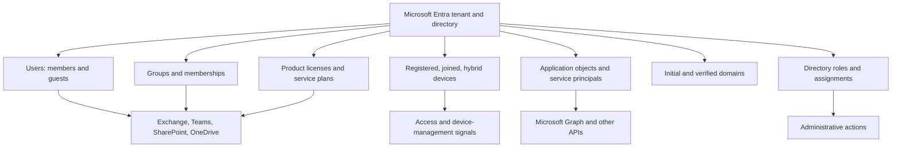

| Boundary | What Entra contributes | What remains separate |
|---|---|---|
| Microsoft 365 | Identity, groups, authentication, tokens, selected roles and policy signals | Mailboxes, sites, files, chats, workload permissions, workload logs |
| Azure | Directory trust and security principals | Subscription/resource hierarchy, Azure RBAC, resource configuration, billing |
| SaaS application | SSO, provisioning, service principal, assignment, consent | The application's internal data, roles, sessions, and support behavior |
| Endpoint | Device identity and access signals | Operating-system state, Intune management, local accounts, endpoint controls |
| Automation | Workload identity and token issuance | Code quality, secret handling, API logic, resource-side authorization |

**Security implication:** The directory is a control plane. Weak object governance can create broad consequences: an ownerless privileged group, stale guest, over-permissioned service principal, duplicate device, or incorrect domain can affect many services at once.

---

## 2. Objects, properties, relationships, and source of authority

### 🔍 Plain-English deep-dive: an object is a record, not the real-world thing

- **Directory object** — *a structured record representing an identity-related entity.* **Analogy:** A badge-office file, not the person or machine itself. **Why it matters:** The record can be stale, duplicated, disabled, deleted, or sourced elsewhere.
- **Property** — *a named value stored on an object, such as display name, department, account state, or application ID.* **Analogy:** One field on the badge form. **Why it matters:** Policies and dynamic groups may trust properties, so data quality becomes a security dependency.
- **Relationship** — *a link from one object to another, such as member-of, owner-of, assigned-to, or consented-permission.* **Analogy:** Lines in an organization chart. **Why it matters:** Effective access is often hidden in relationships rather than visible on one object.
- **Source of authority** — *the system whose version of a property or object is authoritative.* **Analogy:** Payroll, not a handwritten desk label, decides an employee's official department. **Why it matters:** Editing the wrong system either fails or is overwritten.
- **Security principal** — *an identity that can authenticate or receive authorization.* **Analogy:** An entity that can hold a badge. **Why it matters:** Users, service principals, and managed identities can receive powerful access; a contact generally cannot.

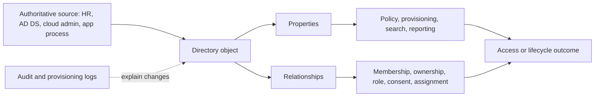

| Question | Evidence to inspect | Frequent mistake |
|---|---|---|
| Does the object exist? | Object type, object ID, tenant ID, deletion state | Searching only by display name |
| Who controls it? | Source, synchronization properties, provisioning job, owner | Editing cloud properties that are authoritative on-premises |
| What can it do? | Roles, memberships, app permissions, resource assignments | Treating license assignment as authorization |
| Where is it used? | Group links, enterprise apps, workload references, sign-ins | Deleting before dependency discovery |
| Is it healthy? | Enabled state, license errors, credentials, last activity, logs | Using “present” as proof of health |
| Can it be recovered? | Object-specific soft-delete/restore support and dependencies | Assuming every related object restores automatically |

The directory is best understood as a **graph**, meaning objects are nodes and relationships are edges. Microsoft Graph exposes many of these resources through a common API, but it does not erase product boundaries. A Graph query can return a user and their groups, yet SharePoint still decides whether that identity can open a particular file.

---

## 3. Identifiers: the difference between a name and an identity key

Display names and sign-in names are useful to humans; immutable identifiers are safer for technical correlation.

### 🔍 Plain-English deep-dive: four IDs that are commonly confused

- **Tenant ID** — *the globally unique identifier for a Microsoft Entra tenant.* **Analogy:** The corporate registry's serial number. **Why it matters:** It distinguishes organizations that may have similar names or domains.
- **Object ID** — *the identifier of one object instance in one tenant.* **Analogy:** The unique record number on a local badge file. **Why it matters:** The same multitenant application has a different service-principal object ID in each tenant.
- **Application (client) ID** — *the identifier assigned to an application definition.* **Analogy:** The software product model number. **Why it matters:** It identifies the client application in protocol requests, but it is not the tenant-local service-principal object ID.
- **User principal name (UPN)** — *a sign-in-style name, often resembling an email address.* **Analogy:** A memorable login label printed on the badge. **Why it matters:** It can change and need not equal the user's primary email address.

| Identifier | Example form | Scope | Can it change? | Best use |
|---|---|---|---|---|
| Tenant ID | GUID | One tenant | Normally stable | Tenant correlation, token issuer context |
| Object ID | GUID | One object in one tenant | New object means new ID | Logs, assignments, API operations, unambiguous inventory |
| Application/client ID | GUID | Application definition across intended tenants | Stable unless a new registration is created | OAuth client identification, app correlation |
| Service-principal object ID | GUID | Local application instance in one tenant | New local instance means new ID | Local permissions, ownership, assignments, sign-ins |
| UPN | `alex@contoso.com` | User sign-in namespace | Yes | Human sign-in and communication, not durable correlation |
| Mail address | SMTP address | Workload/mail namespace | Yes | Message delivery, not proof of directory identity |
| Group ID | Object ID GUID | Group object in tenant | New group means new ID | Membership and resource assignments |
| Device ID/object ID | GUID values with different uses | Device registration/record | Re-registration can create new values | Device and sign-in correlation with care |

**Troubleshooting rule:** Capture the tenant ID, object type, object ID, application ID where applicable, UPN/display name, timestamp, and source. “The Finance app” is not enough when three enterprise applications have similar names.

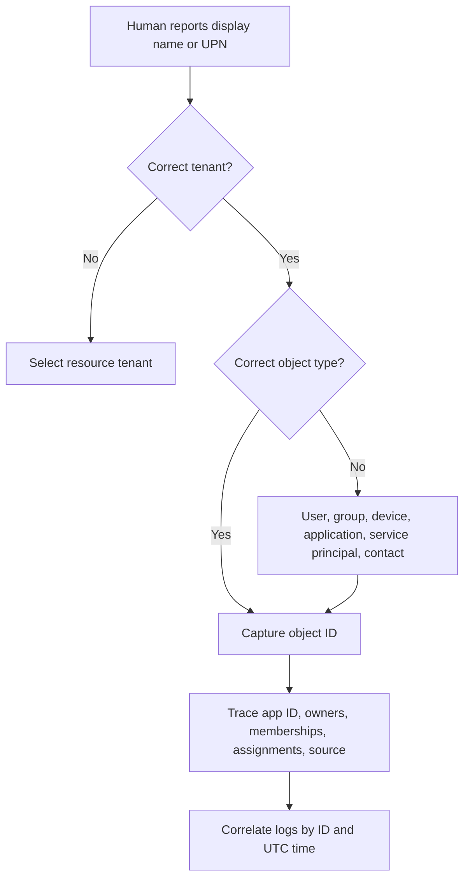

---

## 4. Users: members, guests, cloud-only, and synchronized identities

A **user object** represents a person or person-like account in the directory. The object's `userType` commonly distinguishes **Member** and **Guest**, but that property alone does not fully describe authentication source, employment status, authorization, or risk.

### 🔍 Plain-English deep-dive: member and guest are directory classifications

- **Member user** — *normally an identity treated as internal to the tenant.* **Analogy:** A staff badge in the local registry. **Why it matters:** Defaults, licensing, group behavior, and lifecycle expectations often differ from guests.
- **Guest user** — *normally an external identity represented in the resource tenant for collaboration.* **Analogy:** A visitor badge linked to an outside identity.* **Why it matters:** The resource tenant governs access to its resources while authentication can rely on the guest's home identity provider.
- **Cloud-only user** — *an object created and primarily managed in Entra.* **Analogy:** The cloud registry is the original personnel file. **Why it matters:** Cloud administration controls supported properties and deletion.
- **Synchronized user** — *an object whose selected identity data comes from an on-premises directory through a synchronization service.* **Analogy:** The cloud keeps a synchronized copy of an on-premises master record. **Why it matters:** Source-of-authority errors are fixed upstream, not by repeatedly editing the copy.

| User dimension | Possible states | Security and operations question |
|---|---|---|
| User type | Member, Guest | Does the classification match the collaboration and governance model? |
| Source | Cloud, synchronized, provisioned from HR/app, invited external | Which system can safely change or delete it? |
| Account state | Enabled, disabled, soft-deleted | Can it authenticate, and do existing sessions require revocation? |
| Authentication | Managed, federated, external provider, one-time passcode scenarios | Which identity provider validates the sign-in? |
| Entitlement | Licensed/unlicensed; service plans | Which services should provision, and are assignments error-free? |
| Authorization | Groups, workload permissions, app assignments, roles | What can the identity actually reach or administer? |
| Ownership | Manager, sponsor, business owner, technical owner | Who certifies continued need and responds to incidents? |

**Contacts are different.** An organizational contact or mail contact is generally an address-book/mail-routing representation, not a normal sign-in security principal. Do not grant access by assuming every person-like object can authenticate.

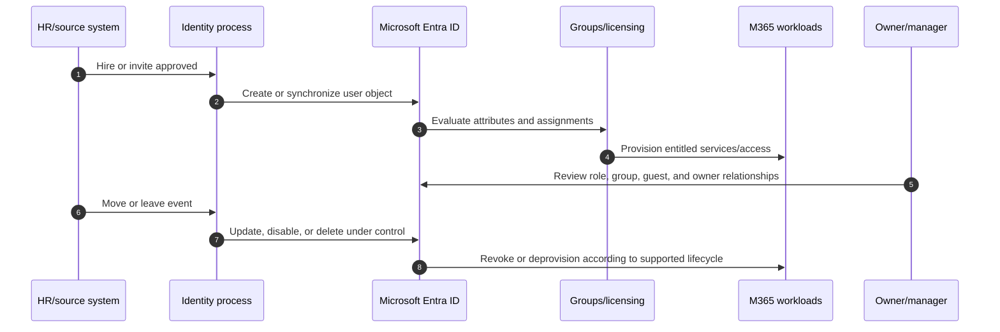

**Tie-in to your background:** SharePoint and OneDrive cases often surface as “user missing,” “wrong account,” or “access denied.” The Entra discipline is to distinguish the sign-in identity, resource-tenant guest object, group relationship, site permission, license/provisioning state, and sync client cache instead of treating them as one account state.

---

## 5. Groups: type, membership, ownership, nesting, and dynamic rules

Groups reduce direct per-user assignment, but they also concentrate risk. Every group should have a purpose, supported target, membership authority, at least two appropriate owners where practical, lifecycle, review frequency, and dependency record.

| Group construct | Main purpose | Membership | Important limitation or risk |
|---|---|---|---|
| Security group | Access to supported resources and applications | Users, devices, service principals, sometimes nested groups | Target service may not honor nesting or every member type |
| Microsoft 365 group | Collaboration membership for mailbox, site, Planner, Teams-related resources | Users, including supported guests | Deleting group can affect associated workload resources |
| Mail-enabled security group | Access-related membership plus mail delivery | Managed through supported mail/admin surfaces | Identity and mail ownership boundaries can differ |
| Distribution group | Email distribution | Recipients | Do not assume it is supported for resource authorization |
| Assigned membership | Owners/admins explicitly add members | Human/process controlled | Stale access without review and offboarding |
| Dynamic user group | Rule evaluates user attributes | Automatic | Attribute quality and Entra ID P1 licensing are dependencies |
| Dynamic device group | Rule evaluates device attributes | Automatic | Cannot base device membership on device owner's attributes |
| Role-assignable group | Receives supported Entra directory roles | Restricted privileged design | Membership changes are privileged and require stronger governance |

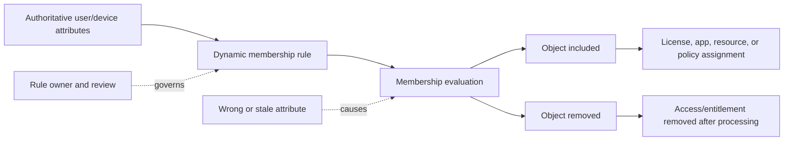

### Group decision tradeoffs

| Decision | Benefit | Tradeoff | Required control |
|---|---|---|---|
| Direct assignment | Simple for one exceptional identity | Hard to inventory and offboard at scale | Named exception, expiry, periodic review |
| Assigned group | Clear reusable access package | Membership maintenance can become stale | Owners, approval, access review |
| Dynamic group | Automated joiner/mover/leaver response | Bad attributes create automatic bad access | Authoritative data owner, rule test, monitoring |
| Nested groups | Reuse existing structures | Effective membership can be opaque or unsupported | Target-specific validation and graph expansion |
| One group for many controls | Fewer objects | Coupled changes can affect unrelated services | Separate groups when risk, owner, or lifecycle differs |

Dynamic membership is **change-sensitive**. Rule syntax, supported properties, processing status, license requirements, and service behavior must be checked live. A dynamic group for users cannot also be a dynamic group for devices. Processing is not instantaneous, so deployment and incident plans must include propagation time.

---

## 6. Device identities: registered, joined, and hybrid joined

A **device identity** is an Entra directory object that represents a device for supported identity, single sign-on, management, and access scenarios. It is not proof that the device is secure, compliant, currently used, or owned by the organization.

| Device state | Typical ownership/use | Sign-in relationship | Common use | Key caution |
|---|---|---|---|---|
| Microsoft Entra registered | Personal/BYOD and mobile scenarios | Work account added to device | SSO and device-aware access | Registration does not equal Intune compliance |
| Microsoft Entra joined | Organization-owned modern Windows and supported scenarios | Entra is primary organizational join | Cloud-first management and SSO | Confirm local admin, recovery, and management design |
| Microsoft Entra hybrid joined | On-premises AD DS joined plus Entra registration | Hybrid dependency | Transitional/hybrid access and management | Microsoft describes it as an interim path toward Entra join for modern scenarios |

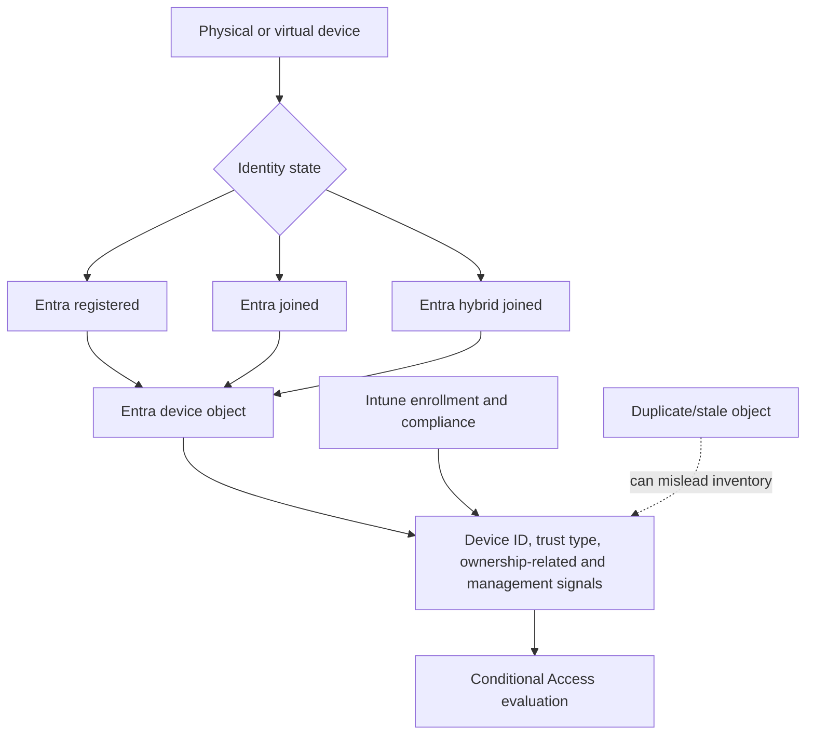

Device troubleshooting must separate:

1. The physical endpoint.
2. The local operating-system account and join state.
3. The Entra device object and identifiers.
4. Intune's managed-device record.
5. Compliance evaluation.
6. The device claim actually presented during the sign-in.
7. The target application's support for device-based access.

A common failure is deleting a device object to “refresh” it without first recording identifiers, join state, management state, encryption-key implications, Conditional Access dependencies, and recovery procedure. Use a supported re-registration plan and owner approval; do not treat deletion as a harmless cache clear.

---

## 7. Domains, UPNs, licenses, and service plans

Every new tenant receives an initial domain such as `contoso.onmicrosoft.com`. Verified custom domains can be added after proving control through DNS. Verification establishes ownership of a namespace; it does not automatically configure mail flow, federation, DNS security, or every user's UPN.

| Concept | Meaning | Not the same as |
|---|---|---|
| Initial domain | Tenant-created `onmicrosoft.com` namespace | Corporate brand or mail domain |
| Verified custom domain | DNS-proven namespace added to tenant | Automatic Exchange, federation, or DKIM configuration |
| UPN suffix | Namespace used in a user's sign-in name | Necessarily the primary SMTP address |
| Tenant ID | GUID identifying the tenant | Tenant display name or domain |
| Product license/SKU | Purchased assignable entitlement bundle | Permission, role, or successful provisioning |
| Service plan | Capability inside a product license | Proof that the workload is configured and operational |

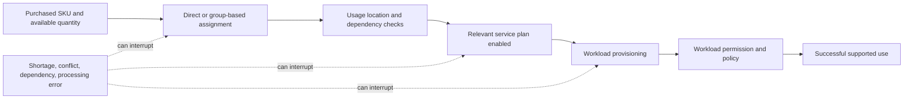

### Licensing and prerequisite discipline

| Feature area | Conceptual requirement as of August 2026 | Verify-current action |
|---|---|---|
| Basic directory objects | Entra tenant/free capabilities cover core objects | Check cloud, quotas, and supported object behavior |
| Dynamic groups | Microsoft Entra ID P1 for covered users | Verify licensing rules and assignment population |
| Administrative units | P1 for AU-scoped administrators; dynamic AU members have additional P1 requirements | Recheck current licensing and supported workloads |
| Conditional Access | Entra ID P1 for covered users | Part 9 validates P1/P2 and product dependencies |
| Risk-based identity features | Generally Entra ID P2/ID Protection | Confirm exact covered identities and tenant plan |
| Workload identity premium controls | Microsoft Entra Workload ID capabilities may require separate entitlement | Verify workload identity and Conditional Access licensing |

Never promise licensing from memory. Record the exact SKU, service plan, population, tenant cloud, region, prerequisites, trial status, and source date; then involve an authorized licensing specialist for commercial decisions.

---

## 8. Directory roles, assignments, scope, and administrative units

A directory role assignment combines a **principal**, a **role definition**, and a **scope**. This is Microsoft Entra role-based access control (RBAC). It is separate from Azure RBAC and workload-specific roles.

| Element | Question | Example |
|---|---|---|
| Principal | Who or what receives administration rights? | User or supported role-assignable group |
| Role definition | Which management actions are permitted? | User Administrator, Application Administrator |
| Scope | Which directory resources can be managed? | Tenant-wide, administrative unit, supported object scope |
| Assignment mode | Standing or time-bound/eligible where PIM is used? | Active permanent versus eligible |
| Governance | Who approves, reviews, monitors, and removes it? | Privileged access owner and recurring review |

An **administrative unit (AU)** is a container for users, groups, or devices that can scope supported directory administration. It is useful for regional or divisional delegation, but it is not a general security boundary. AUs cannot be nested. Adding a group to an AU puts the group object in scope, not automatically each user or device member. Intune device management is not scoped by Entra AUs as of the checked documentation.

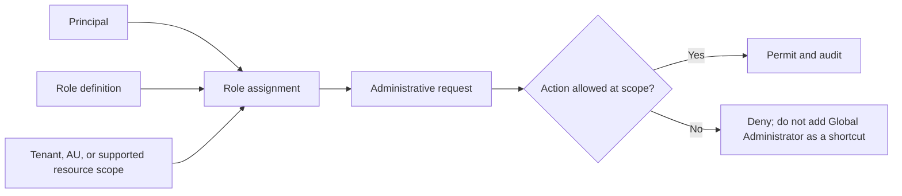

### Security implications

- Keep Global Administrator assignments very limited and do not use them for ordinary troubleshooting.
- Separate daily productivity and privileged identities.
- Use Privileged Identity Management (PIM), approval, duration, authentication strength, and access reviews where licensed and appropriate; Part 11 covers these deeply.
- Maintain at least two separately protected emergency-access accounts according to current Microsoft guidance; Parts 8 and 9 cover authentication and policy exclusions.
- Treat read roles as sensitive. Directory configuration, sign-in data, and relationship inventories can expose valuable attack intelligence.

---

## 9. Application registrations, application objects, and service principals

### 🔍 Plain-English deep-dive: blueprint versus local installed identity

- **App registration** — *the act and configuration experience that creates an application's identity definition.* **Analogy:** Registering a product design with the identity office. **Why it matters:** It establishes client ID, supported accounts, redirect URIs, credentials, exposed APIs, and requested permissions.
- **Application object** — *the single application definition in its home tenant.* **Analogy:** The software blueprint. **Why it matters:** It is the global definition from which local instances are represented.
- **Service principal** — *the application's local security principal in a tenant.* **Analogy:** The installed copy's local badge. **Why it matters:** The tenant governs local assignment, consent, permissions, owners, credentials, and sign-in activity here.
- **Enterprise application** — *the admin-center view primarily used to manage service principals and their local behavior.* **Analogy:** The installed-software inventory. **Why it matters:** “App registrations” and “Enterprise applications” are different views of related but distinct objects.

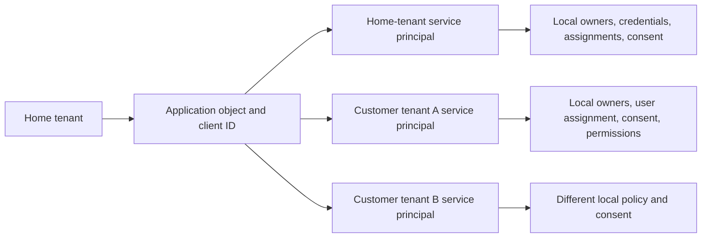

| Characteristic | Application object | Service principal |
|---|---|---|
| Location | Application's home tenant | Each tenant where application is represented/used |
| Identifier focus | Application/client ID plus application-object ID | Tenant-local service-principal object ID plus referenced app ID |
| Purpose | Defines the application | Provides a local security principal and access configuration |
| Admin-center view | App registrations | Enterprise applications |
| Relationship | One application object | One-to-many service principals for multitenant use |
| Delete consequence | Can affect home service principal and application definition | Removes local instance/access; dependency impact must be assessed |

Official documentation notes an important recovery caveat: deleting an application object also deletes its home-tenant service principal, but restoring the application object through the app-registration interface does not automatically restore that corresponding service principal. Recovery must be designed per object and tested.

---

## 10. Managed identities and workload identities

A **workload identity** is a nonhuman identity used by software, services, containers, or automation. In Entra, application objects, service principals, and managed identities participate in workload identity scenarios.

A **managed identity for Azure resources** lets supported Azure compute obtain Entra tokens without developers handling a password, secret, or certificate. It is represented by a special service principal and can be authorized to downstream resources that support Entra authentication.

| Managed identity type | Lifecycle | Reuse | Suitable pattern | Main risk |
|---|---|---|---|---|
| System-assigned | Tied to one Azure resource; deleted with it | One resource only | Workload contained in one resource | Resource deletion also removes identity; downstream assignments need cleanup |
| User-assigned | Independent Azure resource lifecycle | Can be assigned to multiple supported resources | Stable identity across recyclable/multiple compute resources | Shared blast radius and orphaning if ownership is weak |
| App registration with federated credential | App trusts an external or managed identity assertion | Architecture dependent | Cross-cloud/CI or credential-free app scenarios | Trust configuration, subject matching, and app permissions remain critical |

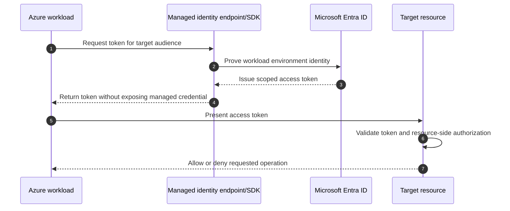

Managed identity removes **credential management**, not the need for authorization, ownership, inventory, monitoring, and least privilege. An app with broad Microsoft Graph application permissions can be highly privileged even if it has no stored secret.

**Service accounts versus workload identities:** A human-style user account used by a service is often a legacy service-account pattern. Prefer a purpose-built workload identity when supported. Do not apply human MFA expectations to a service principal; instead govern its credential or federation, permissions, Conditional Access for workload identities where licensed/supported, network/resource controls, and activity monitoring.

---

## 11. Permissions, consent, assignment, role, and ownership are different

### 🔍 Plain-English deep-dive: approval does not create every kind of access

- **Permission** — *an operation an API exposes, such as reading a user's profile.* **Analogy:** A type of door the software may request to open. **Why it matters:** Permission type and breadth determine potential impact.
- **Consent** — *authorization recorded for an application to receive specified delegated or application permissions.* **Analogy:** An authorized signer approves which doors the app may request access to. **Why it matters:** Consent can create broad tenant exposure, especially for application permissions.
- **User assignment** — *a local enterprise-application control selecting users/groups allowed to use an app when assignment is required.* **Analogy:** A guest list. **Why it matters:** Being on the list is not the same as API consent or resource authorization.
- **Owner** — *an identity expected to manage an object.* **Analogy:** The accountable custodian. **Why it matters:** Ownership is administration authority and responsibility, not business approval by itself.
- **Directory role** — *permissions to administer directory resources.* **Analogy:** A badge-office job role. **Why it matters:** It is separate from app roles and API permissions.

| Construct | Grants what? | Recipient | Example risk |
|---|---|---|---|
| Delegated API permission | App acts within user context and consented scope | Client plus signed-in user context | App can misuse what user can access |
| Application API permission | App acts as itself without user | Service principal | Tenant-wide background access |
| App role assignment | Role exposed by resource app | User, group, or service principal | Incorrect role gives app-function access |
| Enterprise-app user assignment | Permission to sign in/use local app when required | User/group | Unassigned user blocked despite valid authentication |
| Entra directory role | Directory administration | User/supported group/service principal in supported cases | Privileged tenant changes |
| Azure RBAC role | Azure resource management/data actions | Security principal | Subscription/resource access, not Entra admin by default |
| SharePoint permission | Site/file access | User/group/share link | Content exposure despite successful Entra sign-in |

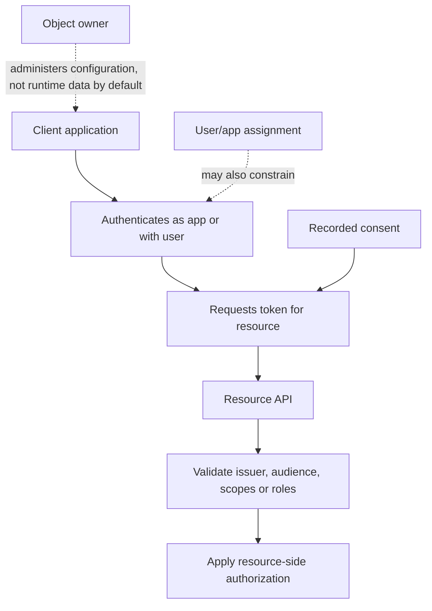

Part 7 explains delegated permissions, application permissions, scopes, roles, token claims, and consent at protocol depth. For Part 6, remember the object relationships: application object defines requests; service principal holds local grants; consent records approval; resource enforces authorization.

---

## 12. Ownership, naming, tags, and inventory quality

An object without an accountable owner is a future incident. Technical ownership, business ownership, data ownership, and approval authority may be different people; record each where relevant.

| Object | Minimum inventory fields | Ownership questions |
|---|---|---|
| User | Object ID, UPN, type, source, state, manager/sponsor, creation, licenses | Who confirms employment/collaboration need and offboarding? |
| Group | Object ID, type, membership mode/rule, owners, purpose, assignments, last review | Who approves membership and understands downstream resources? |
| Device | Object/device IDs, trust type, owner, management/compliance link, last activity | Who owns endpoint lifecycle and stale cleanup? |
| Application object | Object ID, client ID, tenant audience, redirect URIs, credentials, owners, API exposure | Which engineering team owns code and credential rotation? |
| Service principal | Object ID, app ID, publisher, owners, consent, assignments, sign-ins | Who accepts local permission risk and responds to compromise? |
| Managed identity | Principal/client/resource IDs, type, attached resources, downstream roles | Who owns source compute and target access lifecycle? |
| Role assignment | Principal, role, scope, mode, start/end, approver, review | Is privilege still needed and monitored? |

### Naming and tagging pattern

| Component | Example | Purpose |
|---|---|---|
| Object class | `SG`, `M365`, `APP`, `MI`, `CA` | Makes type/purpose visible without replacing object ID |
| Environment | `DEV`, `TST`, `PRD` | Prevents test/production confusion |
| Business service | `FinanceReporting` | Maps to owner and criticality |
| Access purpose | `Readers`, `Contributors`, `License-E5Sec` | Explains assignment intent |
| Sensitivity/criticality tag | `Tier0`, `High`, `Standard` | Drives review and monitoring |
| Owner/cost center metadata | Team identifier | Supports accountability and chargeback |
| Expiry/review date | ISO date in governed field/register | Prevents permanent exceptions |

Names are not security boundaries and can become stale. Use immutable IDs for automation and evidence. Use supported tags, custom security attributes, extension properties, or an external configuration-management database only after defining governance, permission, privacy, and synchronization rules.

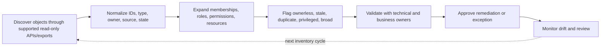

---

## 13. Lifecycle: create, join, move, review, disable, delete, restore

Identity lifecycle is a controlled process, not a one-time account creation task.

| Lifecycle stage | People | Groups | Applications/workloads | Required evidence |
|---|---|---|---|---|
| Request/design | Employment/guest purpose and sponsor | Access/collaboration purpose | Use case, data, permissions, architecture | Approved request and owner |
| Create | Correct source and immutable ID | Correct type and membership mode | App/service principal/managed identity created appropriately | Creation audit event and inventory record |
| Assign | License, groups, roles | Resource/license/policy targets | Consent, app roles, resource RBAC | Least-privilege decision |
| Operate | Sign-ins, method and risk monitoring | Membership/owner changes | Credentials/federation, sign-ins, API activity | Health and activity review |
| Move/change | Attributes, manager, access recertification | Rules and downstream assignments | Owner, permissions, redirect URIs, resource changes | Change record and tests |
| Disable/quarantine | Block new access and address sessions | Stop use without destructive deletion where possible | Deactivate or disable sign-in when supported | Incident/change approval |
| Delete | Controlled deprovision after dependency review | Associated workloads considered | App, SP, role, consent, credential dependencies | Deletion and recovery plan |
| Restore/close | Validate all supported relationships | Validate workload resources/membership | Recreate missing local instances or assignments | Positive/negative tests and residual gaps |

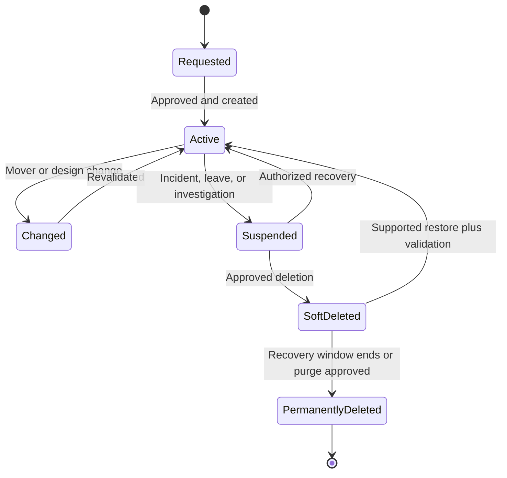

### Recycle, restore, and dependency cautions

| Object/action | Recovery principle | Validation after restore |
|---|---|---|
| User restore | Soft-deleted users may be recoverable during the documented window | UPN, licenses, group memberships, roles, MFA methods, workload data, sessions |
| Microsoft 365 group restore | Group and supported associated resources may have recovery behavior | Site, mailbox, Team, Planner, owners, membership, sharing |
| Application restore | Application object recovery does not guarantee home service-principal recovery | SP existence, consent, credentials, redirect URIs, assignments, sign-in |
| Service-principal deletion | Local enterprise-app relationships can be lost | Recreated object ID, local consent, assignments, claims/policy dependencies |
| Device deletion | May invalidate identity/SSO and affect recovery keys or management workflows | Join/registration, Intune relationship, compliance, Conditional Access sign-in |
| Permanent deletion | Usually creates a new object if rebuilt | Every old ID reference and permission must be remapped |

Do not use permanent deletion as the first response to suspected compromise. Disabling sign-in, revoking sessions, deactivating an application, removing credentials/assignments, or isolating a dependency may preserve evidence and allow recovery. The exact containment action depends on the object and incident plan.

---

## 14. Logs: audit, sign-in, provisioning, and workload evidence

No single log explains an identity outcome. Select evidence by question.

| Log/evidence | Primary question | Example fields | Limitation |
|---|---|---|---|
| Entra audit log | Who changed a directory object or policy? | Actor, activity, target object ID, changed properties, result, correlation | Not proof of downstream workload behavior |
| Interactive sign-in | What happened during user interaction? | User/object ID, app/resource, client, IP, authentication, CA result | One event can be part of a larger token/session sequence |
| Non-interactive user sign-in | How did a client refresh/access without a prompt? | User, client, resource, token context, result | High volume; requires correlation and privacy controls |
| Service-principal sign-in | Which application identity requested access? | SP/app IDs, resource, credential type, result | Does not by itself prove every downstream action |
| Managed-identity sign-in | Which Azure managed identity accessed a resource? | Managed identity/resource context, target, result | Azure resource activity may require Azure logs too |
| Provisioning log | What did a provisioning service create/update/skip/fail? | Job, source/target IDs, action, attribute mapping, reason | Separate from interactive authentication |
| Microsoft 365/Purview Audit | Which supported workload activity occurred? | User/app, operation, object/workload, time | Coverage, schema, license, and retention vary |

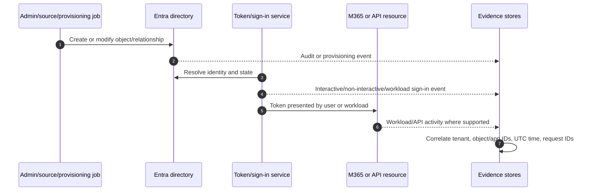

As of the checked Learn page, the sign-in experience exposes interactive users, non-interactive users, service principals, and managed identities. The page also describes **Agent logs** as a new log type and calls parts of the sign-in experience preview. Treat agent identities and agent log behavior as **change-sensitive/preview** and recheck scope, licensing, schema, and retention.

**Evidence safety:** Do not place access tokens, refresh tokens, cookies, client secrets, certificates with private keys, or unnecessary personal data in tickets or portfolio material. Preserve raw evidence only in an authorized repository; use sanitized IDs and fictional data for interviews.

---

## 15. Microsoft Graph for read-only inventory and relationship analysis

Microsoft Graph is a REST API gateway to Microsoft cloud resources. It can enumerate many users, groups, devices, applications, service principals, roles, and relationships. It requires authentication, consent, permissions, pagination, throttling handling, and privacy controls.

| Inventory need | Conceptual Graph resource/path | Control |
|---|---|---|
| Users and selected properties | `/users` | Request only required properties; protect personal data |
| Groups and owners | `/groups`, owner/member relationships | Expand nesting carefully; target support differs |
| Devices | `/devices` | Correlate with Intune/endpoint records before conclusions |
| Application objects | `/applications` | Separate object ID from app/client ID |
| Service principals | `/servicePrincipals` | Capture local permissions, owners, sign-ins separately |
| Directory roles/assignments | Role-management resources | Privileged read permissions and sensitive output |
| Deleted items | Supported `/directory/deletedItems` resources | Object-specific restore support and retention |
| Audit/sign-ins | Audit log resources | Licensing, retention, volume, and role requirements |

### Safe inventory method

1. Define the question and approved scope before querying.
2. Use the least-privileged read permission and a separate test tenant when practical.
3. Record tenant ID, API version, query, selected properties, UTC time, pagination, and limitations.
4. Follow `@odata.nextLink` until the dataset is complete.
5. Honor HTTP `429` and `Retry-After`; do not aggressively retry.
6. Prefer stable `v1.0` APIs for production automation. Treat `beta` as change-sensitive and unsupported for production dependency unless Microsoft explicitly states otherwise for the feature.
7. Store results in an approved location, minimize personal data, and set retention.
8. Validate suspicious findings with object owners and a second evidence source before change.

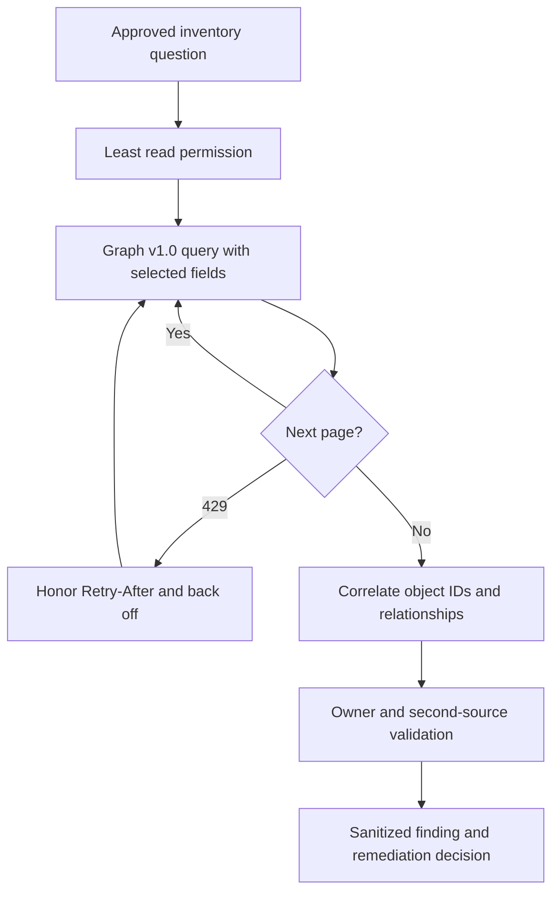

Do not copy an example write command into a client tenant. A read-only inventory still needs approval because directory relationship data can be sensitive.

---

## 16. Orphan, stale, duplicate, and overprivileged-object detection

An **orphan** lacks a valid accountable owner or supporting resource relationship. **Stale** means activity or lifecycle evidence suggests it may no longer be needed. Neither term proves safe deletion.

| Detection signal | Possible concern | Required validation before action |
|---|---|---|
| Group has no owners | No membership/lifecycle accountability | Resource owner, recent changes, downstream assignments |
| App/service principal has no owners | No credential, consent, or incident owner | Publisher, sign-ins, API permissions, code repository, vendor contract |
| Credential expired or near expiry | Outage risk or abandoned app | Actual credential used, rotation owner, managed/federated alternative |
| No recent sign-in | Potentially stale | Log retention, noninteractive/workload log type, seasonal process |
| Guest sponsor missing | External access lacks business accountability | Resource use, home tenant, contract/project end date |
| Duplicate display name | Mistaken assignment/troubleshooting risk | Object ID, source, creation time, actual dependencies |
| Duplicate/stale device objects | Incorrect device inventory or policy diagnosis | Physical device, join IDs, Intune record, last activity |
| Broad application permissions | Large blast radius | Business use case, actual API use, resource-specific restrictions |
| Direct privileged role | Standing privilege and offboarding risk | Role need, PIM eligibility, last use, emergency path |
| Dynamic rule uses poor attribute | Automatic incorrect membership | Data owner, rule preview/test, sample personas |

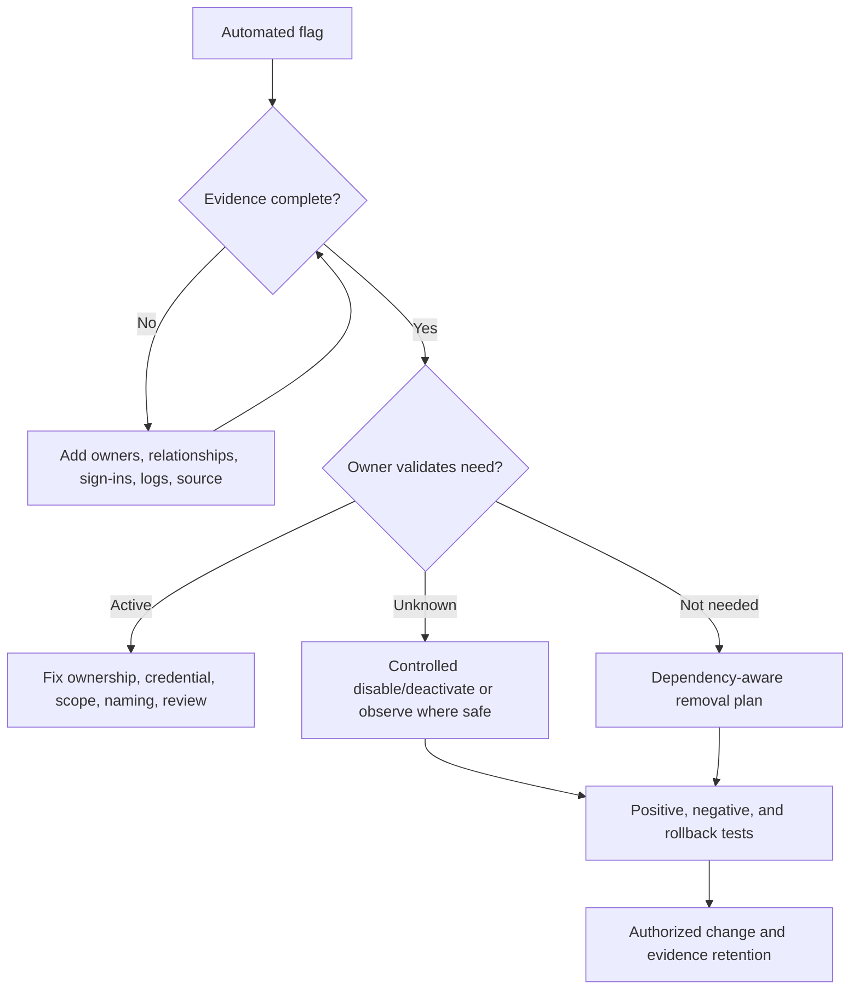

**Security implication:** Automated cleanup can become automated outage. Use automation to find candidates, not to make irreversible business decisions without guardrails.

---

## 17. Deployment method for directory governance improvements

Directory architecture work is often remediation rather than greenfield deployment. Use controlled stages.

| Stage | Activities | Exit criteria |
|---|---|---|
| Discover | Inventory objects, IDs, sources, relationships, owners, logs, licenses | Scope and evidence confidence recorded |
| Classify | Business service, criticality, identity type, environment, privilege | Owners validate classification |
| Design | Naming, ownership, lifecycle, review, role, permission, restore standards | Architecture and control decisions approved |
| Pilot | Apply to low-risk representative objects | Positive, negative, rollback tests pass |
| Remediate | Fix owners, rules, credentials, assignments, stale candidates in waves | Change evidence and exception records complete |
| Operate | Scheduled inventories, alerts, reviews, lifecycle metrics | Named team, runbook, service targets, dashboard |

### Test strategy

| Test type | Example | Expected evidence |
|---|---|---|
| Positive | Correctly sourced member receives intended group/license | Object ID, membership source, provisioning success |
| Negative | Unqualified persona is not dynamically included | Rule evaluation and absence from downstream assignment |
| Security | Ownerless high-privilege service principal is detected | Inventory flag and validated permission evidence |
| Failure | Authoritative attribute is missing or malformed | Processing error, alert, owner action, no silent broad access |
| Restore | Soft-deleted test object is restored in supported lab | New/retained IDs and complete relationship comparison |
| Rollback | Naming/rule/owner change can be reversed safely | Before/after export, approved reversal, no lost access |

Rollback is object-specific. Reversing a dynamic rule may not immediately reverse every downstream consequence. Restoring a user may not recreate every workload or local app relationship. Define rollback at the transaction and dependency level, not merely “set the old value.”

---

## 18. Layered object-resolution troubleshooting

Start with the exact failed transaction and the earliest evidence that discriminates among object, source, relationship, entitlement, policy, token, resource, and service causes.

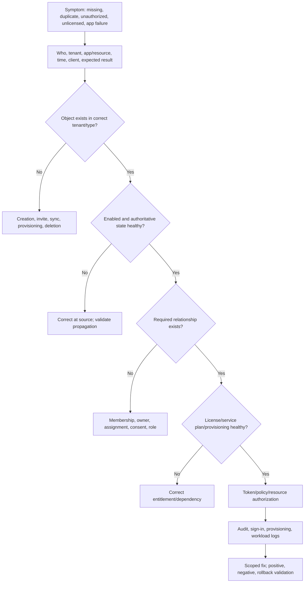

| Symptom | Likely layers | Discriminating checks |
|---|---|---|
| User cannot be found | Tenant, object type, deleted state, guest context, replication | Tenant ID, object ID, user type, deleted items, invitation/redemption |
| User keeps old department | Source of authority, sync/provisioning, attribute mapping | Upstream value, synchronization status, provisioning log, changed properties |
| Dynamic group member missing | Rule syntax, property value/type, processing, license | Rule evaluation, exact attribute, processing state, P1 coverage |
| App appears in Enterprise apps but not App registrations | Service principal is local; application object may be in another home tenant | Service-principal object ID, app ID, publisher/home tenant |
| App has consent but API returns 403 | Token permission/role, resource authorization, wrong audience, tenant | SP grant, token claims, API logs, resource ACL/RBAC |
| Managed identity gets 401 | Token acquisition, audience, identity attachment | Source resource identity, token audience, sign-in logs |
| Managed identity gets 403 | Resource-side role/data permission | Principal ID, role assignment scope, target logs |
| Device shown twice | Re-registration, hybrid join, stale record, Intune mismatch | Device/object IDs, trust type, join status, Intune ID, activity |
| Restored app still fails | Missing home service principal, consent, credential, assignment | App/SP relationship, object IDs, local grants, sign-ins |
| License assigned but service unavailable | Service plan, dependency, provisioning, policy, workload permission | Assignment source/error, plan state, workload object, logs |

### Common error interpretation

| Error/result | Meaning direction | Do not assume |
|---|---|---|
| HTTP 400 | Invalid request/property/unsupported combination | Service outage |
| HTTP 401 | Missing/invalid/expired authentication context | User lacks resource permission |
| HTTP 403 | Caller authenticated but permission/policy/resource authorization failed | Token acquisition failed |
| HTTP 404 | Wrong path/type/tenant/ID or absent/hidden object | Object never existed |
| HTTP 409 | Conflict, duplicate, or concurrency state | Retrying unchanged is safe |
| HTTP 429 | Throttling | Permission failure; honor `Retry-After` |
| `Request_ResourceNotFound`-style result | Object/resource cannot be resolved in request context | Display-name search found the correct object |
| Provisioning skipped | Scoping/filter/matching says no action | Provisioning service is broken |

**Safe troubleshooting rule:** Do not add Global Administrator, grant broad Graph permissions, delete/recreate identities, disable Conditional Access, or bypass certificate validation merely to see whether the symptom changes. Choose the least-invasive test that can falsify the current hypothesis.

---

## 19. Realistic client scenarios

### Scenario A: SharePoint external user sees “access denied” after a name change

The user reports that OneDrive sync works for one site but not a finance site. A weak investigation searches the display name and repeatedly re-shares the folder. A structured investigation captures resource tenant, guest object ID, home identity, UPN/mail changes, invitation/redemption state, site/group authorization, Conditional Access result, and sync-client account.

Possible root causes include a second guest object, stale SharePoint user information, membership tied to a different object ID, resource-tenant policy, or a sync client signed into the wrong account. The consultant separates Entra identity resolution from SharePoint authorization and OneDrive client state.

### Scenario B: A finance automation stops overnight

The service principal still exists, but its client secret expired. The application has a broad Graph application permission and no current owner. Restoring service by creating a long-lived secret fixes availability but leaves governance risk.

The target solution identifies a code owner and business owner, validates required API operations, reduces permissions, prefers managed identity or workload identity federation where supported, creates credential-expiry monitoring if a credential remains, tests failure and rollback, and records the local service-principal object ID and app ID.

### Scenario C: A regional help desk can edit a group but cannot reset its members

The group object is in an administrative unit, but the individual user members are not. This matches documented AU behavior: adding a group places the group object in scope, not all members. The fix is not Global Administrator. The design decides whether user objects should be AU members and whether the requested task is supported at AU scope, then tests with a representative admin.

### Scenario D: A “stale” device cleanup blocks executives

An inventory used display name and last sign-in only. It deleted records that were associated with active endpoints under a second Intune identifier. The better method correlates Entra object ID, device ID, join state, Intune managed-device ID, user, last activity across relevant logs, BitLocker/recovery dependencies, and Conditional Access tests. Candidates are disabled or remediated in a pilot only after endpoint-owner validation.

| Scenario | Primary object lesson | Consulting lesson |
|---|---|---|
| External access | One human can have home and resource-tenant objects | Correlate immutable IDs across tenant and workload |
| Automation outage | Credential health and permission breadth are separate | Restore safely, then reduce recurring risk |
| AU delegation | Scope applies only to supported contained objects/actions | Validate documented limits before promising delegation |
| Device cleanup | Directory and management records are related but separate | Never automate deletion from one weak signal |

---

## 20. Operations and governance

Directory health must be operated continuously because people leave, applications change, credentials expire, domains evolve, and services create relationships.

| Operational control | Frequency/trigger | Owner | Useful metric |
|---|---|---|---|
| Privileged role inventory | Continuous alert plus monthly review | Identity security | Standing privileged assignments; ownerless privilege |
| App/service-principal review | Monthly/quarterly by criticality | App governance | Ownerless apps; broad permissions; inactive credentials |
| Guest review | Project end and recurring | Sponsor/resource owner | Guests without sponsor; inactive guests; accepted exceptions |
| Group ownership/membership review | Recurring and owner change | Group/resource owner | Ownerless groups; stale direct members; rule errors |
| Device hygiene | Lifecycle event and recurring | Endpoint team | Duplicates, stale objects, Entra/Intune mismatch |
| License error review | Daily/weekly depending scale | M365/license operations | Assignment conflicts, shortages, disabled required plans |
| Deleted-item/recovery drill | At least scheduled by criticality | Identity operations | Recovery time and relationship completeness |
| Graph automation health | Every run | Automation owner | Completeness, 429 rate, failed pages, schema drift |

### Failure modes and controls

| Failure mode | Impact | Preventive/detective control |
|---|---|---|
| HR attribute wrong | Dynamic access/license error | Data contract, rule test, exception queue |
| Last group/app owner leaves | Orphaned administration | Minimum owner rule, owner-offboarding alert |
| Secret expires | Automation outage | Managed/federated identity or monitored rotation |
| App permission grows unnoticed | Data exposure | Consent workflow, permission inventory, owner review |
| Object permanently deleted | Irrecoverable relationships/data | Dependency map, soft-delete hold, approval, tested backup/export where supported |
| Graph query misses pages | False clean inventory | Pagination completeness and record counts |
| Naming collision | Wrong assignment/change | Immutable ID in change records and automation |
| Preview schema changes | Automation failure | Version pinning where supported, test tenant, release monitoring |

---

## 21. Consulting artifacts for an Entra directory assessment

| Artifact | Minimum content | Quality test |
|---|---|---|
| Identity architecture diagram | Tenants, sources, object types, trust and provisioning paths | Client owners can validate each boundary |
| Object inventory | IDs, type, source, state, owner, relationships, activity, privilege | Complete pagination, source date, scope, limitations |
| Application register | App/client ID, SP object ID, owners, permissions, credentials/federation, sign-ins | Local and home objects are distinguished |
| Role and scope matrix | Principal, role, scope, mode, expiry, review | Entra and Azure/workload roles are not conflated |
| Lifecycle RACI | Create/change/disable/delete/restore responsibilities | One accountable owner per decision |
| Orphan/stale report | Flag, evidence, confidence, owner response, proposed action | No deletion based on inactivity alone |
| Recovery runbook | Trigger, authority, supported restore, dependencies, tests | Exercise proves more than portal object presence |
| Executive summary | Material risks, business impact, options, recommendation, decision | Avoids raw object counts without risk meaning |

Example finding:

> **Observation:** Seven service principals with directory-wide application permissions have no recorded technical owner; two show recent noninteractive sign-ins. **Evidence:** Read-only inventory dated 2026-08-24, tenant ID recorded separately, service-principal object IDs, consent grants, and sign-in events retained in the authorized evidence store. **Risk:** A credential failure could interrupt business automation, while compromise could expose broad directory data without a named responder. **Recommendation:** Validate purpose and owner, map actual API use, prefer managed identity or workload federation where supported, reduce permissions, establish credential monitoring, and quarantine only through approved testing. **Residual risk:** Vendor applications may retain broad permissions where the API offers no narrower supported permission.

---

## 22. Safe paper lab: build an Entra object relationship and orphan assessment

This exercise is intentionally **paper-based**. It requires no tenant changes, no real credentials, and no production data.

### Prerequisites

- This Part and the tenant architecture in Part 4.
- A spreadsheet or Markdown document in an approved study location.
- The fictional dataset below.
- Current Microsoft Learn pages in Official Source Anchors.
- No real tenant IDs, user data, tokens, secrets, or client information.

### Fictional dataset

| Object | ID alias | Key facts |
|---|---|---|
| Member user Aruna | `U-101` | Finance analyst; department Finance; licensed; sponsor manager M-1 |
| Guest user Dale | `U-202` | Supplier project ended 90 days ago; sponsor disabled |
| Dynamic group Finance-All | `G-301` | Rule uses department; one owner; grants Finance app |
| M365 group Finance-Close | `G-302` | Two owners; SharePoint site and Team; Dale is direct guest member |
| Application object CloseBot | `A-401`; client ID `C-401` | Single-tenant automation; owner left; secret expires in 5 days |
| Service principal CloseBot | `SP-402`; app ID `C-401` | `Sites.ReadWrite.All` application permission; recent sign-ins |
| User-assigned managed identity | `MI-501` | Attached to test Function App; no production permission |
| Device Aruna-LT | `D-601` | Entra joined; separate Intune alias `I-602`; compliant yesterday |
| AU Finance-EU | `AU-701` | Contains G-301 and U-101; scoped help desk role |

### Procedure

1. Draw every object as a node and each ownership, membership, app-ID, assignment, license, device-management, or AU relationship as a labeled edge.
2. Create an identifier table separating object ID, application/client ID, UPN/display name, and tenant ID placeholder.
3. Mark each object's source of authority, business owner, technical owner, lifecycle trigger, and recovery dependency.
4. Flag possible risks without declaring root cause: Dale's stale sponsorship/membership, single group owner, CloseBot owner/secret/permission, and device cross-record dependency.
5. For each flag, list a second evidence source and decision owner.
6. Produce a remediation sequence that preserves evidence and availability.
7. Draft an executive paragraph containing impact, options, recommendation, and residual risk.

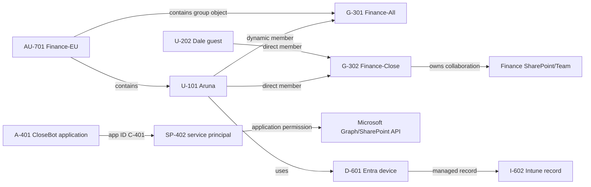

### Positive, negative, rollback, and failure tests

| Test | Expected result |
|---|---|
| Positive membership | Finance user with correct authoritative department appears in G-301 after processing |
| Negative membership | Non-Finance user does not receive Finance app through G-301 |
| AU boundary | Scoped admin can manage supported G-301 properties but cannot infer rights over uncontained user members |
| App availability | Approved credential/identity replacement supports required test operation with least permission |
| App denial | CloseBot cannot perform an operation outside approved scope |
| Failure injection | Missing department generates an exception path rather than broad fallback access |
| Rollback | Previous group rule/assignment and app credential state can be restored from documented configuration |
| Recovery | A hypothetical restored application includes an explicit check for its service principal and grants |

### Evidence to retain

- Sanitized relationship diagram.
- Object/identifier/owner inventory.
- Four evidence-based findings with confidence and decision owner.
- Positive, negative, failure, and rollback matrix.
- One-page remediation roadmap.
- Source list with August 24, 2026 check date.

### Cleanup

Because this is a paper lab, cleanup means deleting temporary fictional exports that contain no learning value, retaining only the sanitized portfolio artifacts, and confirming that no real IDs, client names, tokens, or secrets were introduced. If adapting the exercise to a lab tenant later, remove test assignments and objects in dependency order under a documented change and preserve the approved evidence.

### Interview-portfolio wording

> “I completed a fictional, read-only Entra directory architecture assessment. I mapped member and guest users, dynamic and Microsoft 365 groups, devices, an app registration and service principal, managed identity, administrative unit, roles, consent, and workload dependencies. I produced an orphan-risk report, test matrix, recovery checks, and remediation roadmap. This demonstrates my method and conceptual/lab depth; it was not a production Entra engagement.”

---

## 23. Official Source Anchors

These first-party references ground the chapter and were checked for the guide's **August 24, 2026** currency date. Recheck live documentation before implementation.

1. [What is Microsoft Entra?](https://learn.microsoft.com/entra/fundamentals/what-is-entra) — Current product family, tenant relationship, Entra ID role, Graph, licensing families, workload and agent identity direction.
2. [Learn about groups, group membership, and access](https://learn.microsoft.com/entra/fundamentals/concept-learn-about-groups) — Security/Microsoft 365 groups, assigned/dynamic membership, nesting context, ownership, naming, and current management boundaries.
3. [What is device identity in Microsoft Entra ID?](https://learn.microsoft.com/entra/identity/devices/overview) — Registered, joined, and hybrid joined device identities and device-based access prerequisites.
4. [Apps and service principals in Microsoft Entra ID](https://learn.microsoft.com/entra/identity-platform/app-objects-and-service-principals) — Application object/service-principal relationship, managed/legacy SP types, portal views, and deletion/recovery caution.
5. [Managed identities for Azure resources](https://learn.microsoft.com/entra/identity/managed-identities-azure-resources/overview) — System/user-assigned lifecycle, credential-free token acquisition, resource authorization, and workload federation direction.
6. [Administrative units in Microsoft Entra ID](https://learn.microsoft.com/entra/identity/role-based-access-control/administrative-units) — Scope, constraints, group/member behavior, supported scenarios, and current licensing.
7. [Microsoft Entra RBAC overview](https://learn.microsoft.com/entra/identity/role-based-access-control/custom-overview) — Principal, role definition, assignment, scope, and separation from Azure RBAC.
8. [Sign-in logs in Microsoft Entra ID](https://learn.microsoft.com/entra/identity/monitoring-health/concept-sign-ins) — Interactive, noninteractive, service-principal, managed-identity, and change-sensitive agent log types.
9. [Microsoft Graph overview](https://learn.microsoft.com/graph/overview) — Graph resources, relationships, API gateway, Copilot connectors, and Data Connect context.
10. [Microsoft Graph throttling guidance](https://learn.microsoft.com/graph/throttling) — `429`, `Retry-After`, backoff, batching, delta, notification, and bulk-data guidance.
11. [Delete and recover applications and service principals](https://learn.microsoft.com/entra/identity/enterprise-apps/delete-recover-faq) — Object-specific deletion, recovery, and relationship considerations.
12. [Microsoft Entra licensing](https://learn.microsoft.com/entra/fundamentals/licensing) — Current Free, P1, P2, Governance, Workload ID, and suite orientation; commercial validation remains required.

**Preview/change-sensitive register:** Agent identities/logs, passkey and authentication defaults discussed in later Parts, Microsoft Graph beta schemas, portal navigation, licensing bundles, recovery behavior, and Microsoft-managed settings require live verification. No preview feature should be presented as a guaranteed production control without documented support and client acceptance.

---

## ⭐ Likely Interview Questions for This Section

### Q1. What is Microsoft Entra ID, and how does it relate to Microsoft 365?

> **Model answer:** “Microsoft Entra ID is the cloud identity and access-management control plane used by Microsoft 365. It stores users, groups, devices, application identities, roles, domains, and relationships; authenticates supported identities; issues tokens; and provides access-policy signals and logs. Microsoft 365 workloads rely on those identities, but workload resources and permissions remain separate. A successful Entra sign-in does not by itself grant access to a SharePoint site, mailbox, or Team.”

### Q2. What is the difference between an application object and a service principal?

> **Model answer:** “The application object is the single application definition in its home tenant: the blueprint with the client ID, account audience, redirect URIs, credentials, API exposure, and requested permissions. A service principal is the tenant-local security principal representing that application where it is used. Enterprise applications primarily shows service principals. For a multitenant app, one application object can have service principals in many customer tenants, each with local consent, assignment, ownership, and policy.”

### Q3. How do tenant ID, object ID, and application ID differ?

> **Model answer:** “Tenant ID identifies the Entra tenant. Object ID identifies one object instance in that tenant, such as a user or local service principal. Application or client ID identifies the application definition in protocol requests and is shared by its service-principal representations. I record all relevant IDs because display names and UPNs can change or collide, and a service principal has a different object ID in each tenant.”

### Q4. How would you choose between assigned and dynamic groups?

> **Model answer:** “I would begin with the access purpose, owner, source of authority, target-system support, and lifecycle. Assigned membership is appropriate when an owner must make explicit decisions but requires review and offboarding controls. Dynamic membership improves scale when reliable attributes exist, but it makes attribute quality, rule logic, processing latency, and P1 licensing security dependencies. I would test representative joiner, mover, leaver, missing-attribute, and exclusion cases before downstream assignment.”

### Q5. What is an administrative unit, and what are its limitations?

> **Model answer:** “An administrative unit scopes supported Entra directory-role administration to selected users, groups, or devices, such as regional help-desk responsibility. It is not a general data or visibility boundary, cannot be nested, and does not automatically bring a group's members into scope when the group object is added. It also does not scope Intune device management. I would verify the exact task, role, portal/API, object membership, and P1 licensing before designing delegation.”

### Q6. How would you investigate an ownerless service principal with broad permissions?

> **Model answer:** “I would preserve evidence and identify its object ID, app/client ID, publisher/home tenant, consent grants, application permissions, credentials or federation, assignments, sign-in activity, target resources, code or vendor owner, and business dependency. I would not delete it from one inactivity signal. I would validate actual API use, establish owners, reduce permissions, prefer managed identity or federation where supported, test credential rotation or deactivation, define rollback, and monitor future activity.”

### Q7. Why can a licensed user still fail to access a service?

> **Model answer:** “Purchase, assignment, service-plan enablement, provisioning, authentication, Conditional Access, group/resource authorization, client/network support, and service health are separate states. I would identify the exact SKU and assignment source, check errors and dependencies, verify the workload object is provisioned, then correlate sign-in policy and workload permission logs. A license enables entitlement; it is neither a role nor proof of successful end-to-end access.”

### Q8. How does your background support Entra work without claiming production implementation?

> **Model answer:** “My direct production strength is Microsoft 365 escalation across SharePoint Online, OneDrive, sync, permissions symptoms, RCA, fix validation, stakeholder coordination, and engineering escalation. That gives me disciplined scoping, identity/resource separation, evidence correlation, and communication. I have applied those skills in a fictional read-only Entra inventory and orphan assessment, but I would label the Entra design and implementation evidence as structured learning and lab work rather than production ownership.”

---

## 🧠 30-Second Memory Hooks

- **Entra tenant:** The organization's cloud identity registry and control plane.
- **Directory graph:** Objects are nodes; ownership, membership, roles, and consent are edges.
- **Object versus person:** The record can be stale even when the real person or device is active.
- **Source of authority:** Fix identity data where it originates or it may be overwritten.
- **Tenant ID:** Which registry.
- **Object ID:** Which local record.
- **Application ID:** Which software definition.
- **Application object:** Global blueprint in the home tenant.
- **Service principal:** Local app badge in a tenant.
- **Managed identity:** No developer-managed credential, but still needs least-privilege authorization.
- **Member/guest:** Directory classification, not complete trust or access proof.
- **Group type:** Choose for the target use, owner, membership source, and lifecycle.
- **Dynamic group:** Automation is only as trustworthy as its attributes and rule.
- **Device identity:** Registered/joined record, not automatic compliance proof.
- **AU:** Scopes supported administration, not all data or member visibility.
- **License path:** Purchase → assign → enable plan → provision → authorize → use.
- **Consent:** Approval for app permissions; not every resource permission.
- **Orphan flag:** Investigation candidate, not automatic delete instruction.
- **Logs:** Audit says change; sign-in says access attempt; provisioning says lifecycle action.
- **Graph:** Query relationships with least privilege, pagination, backoff, and redaction.
- **Safe troubleshooting:** Resolve tenant, type, ID, source, state, relationship, entitlement, policy, resource.
- **Honesty:** M365 escalation evidence transfers; it does not become production Entra ownership.

---

## Completion Checklist

- [ ] Explain Entra ID as an identity control plane without confusing it with Microsoft 365 workload authorization.
- [ ] Draw users, groups, devices, apps, service principals, roles, domains, licenses, and workload relationships.
- [ ] Define object, property, relationship, security principal, and source of authority.
- [ ] Distinguish tenant ID, object ID, application/client ID, service-principal object ID, UPN, and mail address.
- [ ] Compare member, guest, cloud-only, synchronized, provisioned, and contact objects.
- [ ] Compare security, Microsoft 365, mail-enabled security, distribution, dynamic, nested, and role-assignable groups.
- [ ] Explain registered, joined, and hybrid joined device identities and why none alone proves compliance.
- [ ] Explain domains, UPNs, licenses, service plans, provisioning, and authorization as separate states.
- [ ] Explain principal + role + scope and the separation of Entra, Azure, and workload RBAC.
- [ ] State at least four administrative-unit limitations and current licensing considerations.
- [ ] Draw the one-application-object-to-many-service-principals relationship.
- [ ] Compare system-assigned, user-assigned, and federated workload identity patterns.
- [ ] Distinguish permissions, consent, app roles, user assignment, ownership, and resource authorization.
- [ ] Build a minimum inventory for each major object type with immutable IDs and owners.
- [ ] Explain naming/tagging benefits without treating names as security keys.
- [ ] Walk through create, change, disable, delete, restore, and dependency validation.
- [ ] Map audit, interactive, noninteractive, service-principal, managed-identity, provisioning, and workload logs to questions.
- [ ] Describe safe Graph inventory with least privilege, pagination, `429` handling, and redaction.
- [ ] Identify orphan/stale candidates without recommending automatic deletion.
- [ ] Apply positive, negative, failure, security, restore, and rollback tests.
- [ ] Troubleshoot the ten common symptoms using object IDs and layered evidence.
- [ ] Produce the paper lab's relationship map, findings, tests, remediation roadmap, and honest portfolio wording.
- [ ] Answer all eight interview questions aloud without claiming production Entra implementation.

---

*Next suggested section:* [Part 7](Part-07-authentication-authorization-tokens-modern-auth.md) — follow these directory objects through identification, authentication, authorization, OAuth/OIDC flows, tokens, sessions, consent, and modern-authentication troubleshooting.