# Part 7 — Authentication, Authorization, Tokens, and Modern Authentication

> **Section goal:** Follow a Microsoft Entra identity from sign-in through token issuance, policy evaluation, application session, and resource authorization. By the end, you should be able to choose an appropriate OAuth or federation flow, explain every major token and claim, identify modern-versus-legacy authentication risk, debug sign-in and token failures safely, and translate protocol evidence into client decisions.

This Part uses the directory objects from [Part 6](Part-06-entra-id-architecture-directory-objects.md) and the network/protocol foundation from [Part 5](Part-05-networking-identity-application-protocols.md). It prepares the authentication-method decisions in [Part 8](Part-08-mfa-passwordless-authentication-strengths.md) and the policy engine in Part 9.

> **Currency and change-sensitive note:** Product behavior was checked against official Microsoft Learn content available on **August 24, 2026**. Token formats, claims, lifetimes, library behavior, continuous access evaluation support, browser privacy behavior, protocol endpoints, legacy-protocol retirement, and Conditional Access integration can change. Use supported Microsoft Authentication Library (MSAL) implementations and OpenID Connect metadata rather than hard-coded assumptions.

## JD Mapping

| Deloitte role expectation | Capability developed in this Part | Consulting evidence |
|---|---|---|
| Design Microsoft 365 identity security | Select authentication and authorization patterns for users and workloads | Authentication architecture and flow decision record |
| Deploy Entra, MFA, and Conditional Access safely | Explain when first factor, MFA, token issuance, and resource authorization occur | End-to-end sign-in sequence and test matrix |
| Troubleshoot policy errors and service disruption | Correlate sign-in logs, token endpoint errors, client traces, claims, and resource logs | Layered token-debugging runbook |
| Integrate Microsoft and third-party applications | Compare OAuth/OIDC, SAML, WS-Fed, and hybrid Kerberos context | App integration assessment and migration recommendation |
| Improve security visibility and resilience | Govern sessions, caches, revocation, Continuous Access Evaluation, and workload credentials | Session-risk register and monitoring plan |
| Communicate with clients and vendors | Translate protocol errors into precise owner actions without exposing secrets | Sanitized escalation pack and executive decision summary |

## Candidate honesty note

You have direct experience with Microsoft 365 escalation, SharePoint Online, OneDrive, sync, permissions symptoms, browser/client evidence, RCA, fix validation, and cross-team communication. That makes the distinction among identity, client, network, workload, and resource authorization familiar in practice.

This Part does **not** claim production ownership of Entra federation, application registration, OAuth implementation, token validation, or Conditional Access. Safe phrasing is:

> “I have diagnosed identity-adjacent Microsoft 365 and sync failures in production and coordinated evidence through customer, product, and engineering teams. I have studied and modeled OAuth/OIDC, tokens, sessions, app registration, and sign-in-log troubleshooting in a safe paper exercise. I can explain the design and validation method, but I would not claim that I implemented the client's Entra authentication platform in production.”

---

## 1. Identity and Access Management begins with IAAA

**Identity and Access Management (IAM)** is the discipline of identifying entities and controlling what they may do. A useful model is **Identification, Authentication, Authorization, and Accounting (IAAA)**.

### 🔍 Plain-English deep-dive: the four questions

- **Identification** — *the identity an entity claims.* **Analogy:** Saying “I am Aruna” at reception. **Why it matters:** A username or application ID identifies a claim; it does not prove it.
- **Authentication (AuthN)** — *the process of proving the claimed identity.* **Analogy:** Showing a badge and unlocking it with a PIN or biometric. **Why it matters:** Passwords, passkeys, certificates, and federation provide different assurance and attack resistance.
- **Authorization (AuthZ)** — *the decision about what an authenticated principal may do.* **Analogy:** The badge opens the finance floor but not the server room. **Why it matters:** Successful authentication is not permission to every resource.
- **Accounting** — *recording relevant identity and access activity for investigation, audit, billing, and improvement.* **Analogy:** The access system records which badge opened which door and when. **Why it matters:** Logs provide evidence but still require context and protected retention.

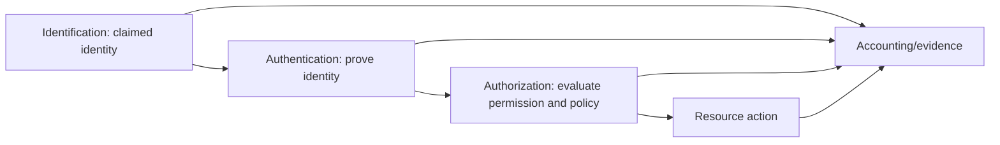

| Question | Typical Entra/M365 evidence | Common confusion |
|---|---|---|
| Who is claimed? | UPN, object ID, service-principal ID, tenant context | Display name treated as unique identity |
| How was identity proven? | Authentication details, method, identity provider, MFA claim | “MFA required” treated as proof it occurred now |
| Why was access allowed or denied? | Conditional Access, token claims, app assignment, resource permission | Sign-in success treated as SharePoint authorization |
| What happened afterward? | Workload audit, API/resource logs, Defender/Sentinel evidence | Sign-in event treated as proof of every user action |

Your SharePoint/OneDrive experience maps naturally: a user may authenticate successfully, receive a token for SharePoint, and still be denied because the site, library, item, sharing link, or tenant control does not authorize the requested action.

---

## 2. Single sign-on, federation, and protocol are not synonyms

**Single sign-on (SSO)** is an experience in which a user authenticates once and can access multiple relying applications without repeatedly entering credentials. **Federation** is a trust arrangement in which one security domain accepts identity assertions or tokens from another. SSO can be created through federation, a central identity provider, device brokers, cookies, Kerberos tickets, or other supported mechanisms.

| Term | Meaning | Example | Key caution |
|---|---|---|---|
| SSO | User experience/outcome | Office apps silently acquire tokens through broker | Does not name the protocol or assurance |
| Identity provider (IdP) | System that authenticates identity and issues assertions/tokens | Microsoft Entra ID | Availability and trust configuration are critical |
| Relying party/service provider | Application trusting the IdP | SaaS app using SAML or OIDC | Must validate issuer, audience, signature, time, claims |
| Federation | Cross-domain trust | Entra trusts an external IdP for a domain | Adds certificate, endpoint, claim, availability dependencies |
| Realm/home discovery | Determines which IdP/tenant should handle sign-in | UPN suffix routes a federated user | Wrong hint/domain can send user to wrong authority |
| Session | Continuing authenticated state at IdP or application | Browser cookie after sign-in | Session lifetime is not identical to token lifetime |

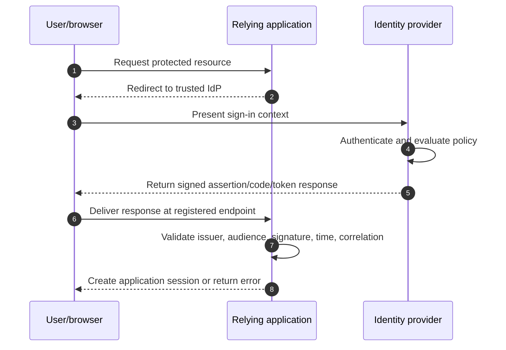

**Federation versus cloud-managed authentication tradeoff:** Federation can preserve specialized external authentication requirements, but adds infrastructure, certificate rollover, claims, endpoint, monitoring, and outage dependencies. Cloud-managed authentication can reduce those dependencies. The correct choice follows requirements and evidence; it is not a blanket rule that every federation is wrong.

---

## 3. Modern authentication versus legacy authentication

In Microsoft 365 discussions, **modern authentication** generally means token-based authentication using OAuth 2.0 and related modern protocols/libraries, often with OpenID Connect for sign-in. It supports MFA and policy claims without repeatedly sending a user's password to each service.

**Legacy authentication** commonly refers to older clients/protocol patterns, especially basic authentication, where a client sends a reusable username and password to a service. The exact product support and retirement state must be verified; protocol name alone does not always reveal whether modern authentication is being used.

### 🔍 Plain-English deep-dive: password replay versus token delegation

- **Basic authentication** — *a client repeatedly presents a username and password to a service.* **Analogy:** Handing a master key to every desk you visit. **Why it matters:** It cannot satisfy modern MFA interaction and exposes a reusable secret to more paths.
- **Bearer token** — *an access artifact whose holder can use it within its accepted scope and lifetime.* **Analogy:** A time-limited access pass. **Why it matters:** It avoids sharing the password with the resource but must be protected from theft and replay.
- **Modern authentication** — *standards-based token acquisition and validation with identity-provider policy integration.* **Analogy:** Reception verifies you once and issues a scoped electronic pass. **Why it matters:** Enables MFA, Conditional Access, application permissions, modern SSO, and richer evidence.

| Dimension | Legacy/basic pattern | Modern token pattern |
|---|---|---|
| Credential at service | Reusable password frequently presented | Access token presented to intended resource |
| MFA interaction | Generally unsupported | Supported through interactive/broker flows |
| Conditional Access | Limited or cannot satisfy controls | Rich policy evaluation and claims |
| Scope | Password can unlock many services | Token is intended for an audience and permissions |
| Revocation | Password change/block and service behavior | Token/session/cache/revocation/CAE considerations |
| Client support | Older protocols/clients and specialized devices | MSAL/OAuth-capable applications |
| Migration risk | Hidden scanners, apps, scripts, service accounts | Redirect, broker, consent, and token handling requirements |

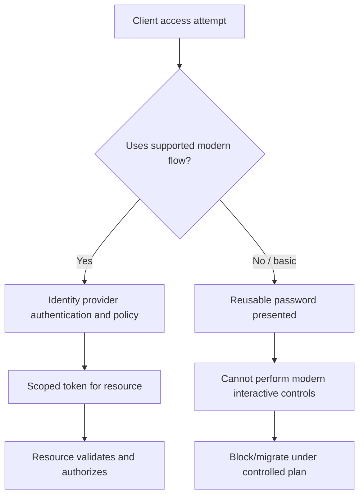

Do not create a permanent broad exclusion for legacy clients simply to preserve availability. Inventory actual use through sign-in and workload logs, identify owner and business process, modernize the application or protocol, pilot blocking, provide an approved replacement, and retain a time-bound exception only when risk is explicitly accepted.

---

## 4. OAuth 2.0 roles and the Microsoft identity platform endpoints

OAuth 2.0 is an **authorization framework**. It defines how a client obtains limited access to a protected resource. OpenID Connect (OIDC) adds an authentication layer and identity information.

### 🔍 Plain-English deep-dive: the four OAuth roles

- **Resource owner** — *usually the user whose data is being accessed.* **Analogy:** The bank-account holder. **Why it matters:** Delegated consent is constrained by the user and tenant policy.
- **Client** — *the application requesting access.* **Analogy:** A budgeting app asking to read transactions. **Why it matters:** Public and confidential clients can protect credentials differently.
- **Authorization server** — *the identity platform that authenticates and issues tokens.* **Analogy:** The bank's authorization desk. **Why it matters:** It evaluates identity, consent, client, and policy context.
- **Resource server** — *the API hosting protected data or functions.* **Analogy:** The transaction system that accepts the pass. **Why it matters:** It must validate the token and enforce resource authorization.

| Endpoint/artifact | Purpose | Security requirement |
|---|---|---|
| Authorization endpoint `/authorize` | Interactive authorization/sign-in redirect | Registered redirect URI, `state`, `nonce` for OIDC, PKCE |
| Token endpoint `/token` | Exchange code, refresh token, assertion, or client credential for tokens | TLS, client validation where applicable, exact grant data |
| Device-code endpoint `/devicecode` | Begin input-constrained device flow | User understands which device/app request they approve |
| OIDC discovery metadata | Publishes issuer, endpoints, supported behavior, signing-key location | Fetch/cache securely; validate expected authority |
| JSON Web Key Set (JWKS) | Publishes public signing keys | Libraries handle key rollover and signature validation |
| Redirect URI | Registered destination for authorization response | Exact, least set; no unsafe wildcard/broad redirect |

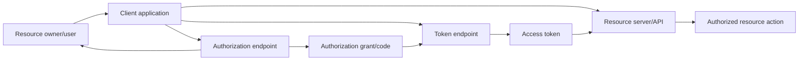

Microsoft endpoint paths vary by tenant context, account audience, cloud instance, and protocol version. Values such as `common`, `organizations`, `consumers`, a tenant ID, or verified domain have different audience effects. Use app registration metadata and the correct sovereign/national-cloud endpoints where applicable.

---

## 5. OAuth/OIDC authorization code flow with PKCE

The **authorization code flow** is the preferred interactive pattern for web, desktop/mobile, and single-page applications when implemented for the client type. **Proof Key for Code Exchange (PKCE)** binds the authorization request to the client that redeems the code, reducing stolen-code abuse. Microsoft recommends PKCE for all application types and requires it for single-page apps using this flow.

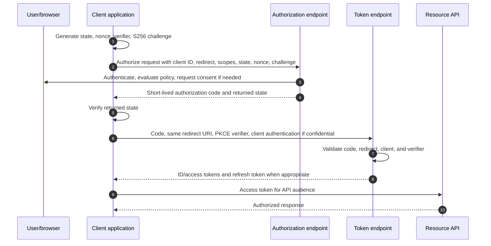

| Parameter | Purpose | Failure/attack if mishandled |
|---|---|---|
| `client_id` | Identifies app registration | Wrong registration/tenant or impersonation confusion |
| `redirect_uri` | Returns response to client | Open redirect or mismatch; interception risk |
| `scope` | Requests delegated permissions/OIDC behavior | Excess privilege or invalid-resource combinations |
| `state` | Correlates request and helps prevent cross-site request forgery | Login CSRF/session mix-up |
| `nonce` | Correlates ID token to OIDC request and mitigates replay | Replayed/wrong ID-token acceptance |
| `code_challenge` | PKCE commitment derived from verifier | Stolen code may be redeemable without binding |
| `code_verifier` | Secret random value held by initiating client | Weak/leaked verifier breaks PKCE protection |

Public clients such as browser or native apps cannot safely keep a client secret. Do not embed a secret in JavaScript, mobile binaries, desktop apps, or public repositories. Confidential server-side clients can authenticate using a certificate, federated credential, or carefully managed secret; prefer stronger, automatable credential patterns where supported.

---

## 6. Client credentials flow for app-only access

The **client credentials flow** lets a confidential workload obtain a token as itself, without a signed-in user. It is appropriate for background service-to-service activity only when the resource supports application permission or another direct authorization model.

```mermaid
sequenceDiagram
    autonumber
    participant APP as Confidential workload
    participant E as Entra token endpoint
    participant API as Resource API
    participant LOG as Sign-in/resource logs
    APP->>E: Client ID + certificate/federated assertion/secret + resource /.default
    E->>E: Authenticate service principal and evaluate grant
    E-->>APP: App-only access token; no refresh token
    APP->>API: Bearer token with app role/authorized app identity
    API->>API: Validate issuer, audience, roles/ACL, tenant, authorization
    API-->>APP: Result
    E-->>LOG: Service-principal sign-in evidence
    API-->>LOG: Resource action evidence where supported
```

| Credential option | Benefit | Risk/operations |
|---|---|---|
| Managed identity | No developer-managed credential; platform token endpoint | Azure/support boundary and resource-role lifecycle |
| Workload identity federation | No long-lived Entra secret; trusts external assertion | Issuer/subject/audience trust must be exact and monitored |
| Certificate | Asymmetric; stronger than shared secret when protected | Private-key storage, rotation, expiry, chain and access |
| Client secret | Widely supported and simple | Theft, accidental publication, expiry, rotation outage |

Client credentials uses application permissions/app roles or resource access-control lists. There is no user, so delegated permissions are not applicable and no refresh token is issued; the client can authenticate again for a fresh access token. Application permissions can be tenant-wide and high impact. Do not replace an interactive user workflow with app-only access merely to avoid MFA.

---

## 7. On-behalf-of flow for a middle-tier API

The **OAuth 2.0 on-behalf-of (OBO) flow** lets a middle-tier web API exchange a user-delegated access token intended for that middle tier for another delegated token to a downstream API. The user's identity and delegated authorization remain in the chain.

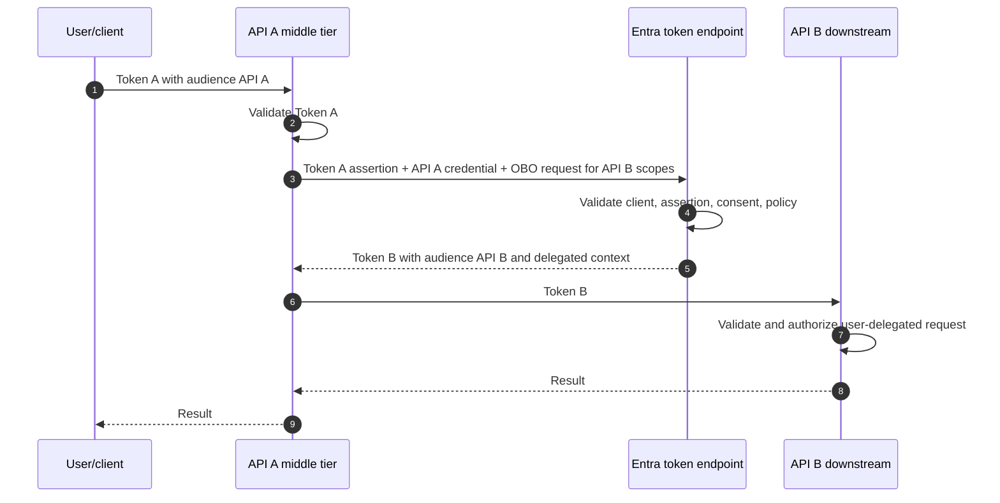

| Design question | Correct principle |
|---|---|
| Which token enters API A? | An access token whose audience is API A, not an ID token or Graph token |
| What permissions does OBO use? | Delegated scopes, preserving user context |
| Can app-only service principal token use OBO? | No; use client credentials for app-only downstream access |
| What if downstream CA requires interaction? | Return a standards-based claims challenge to the client for interactive satisfaction |
| Can API A relay its token to API B? | No; acquire a separate token intended for API B |

Do not pass a middle-tier token to an unintended audience. It can break Conditional Access claims challenges, token protection, audience validation, and least privilege. Each resource should receive a token issued for that resource.

---

## 8. Device code flow and the phishing risk around user codes

The **device authorization grant**, or device code flow, supports input-constrained devices such as a printer, command-line tool, smart TV, or similar device. The device displays a short code and verification URL; the user authenticates on another browser-capable device while the client polls the token endpoint.

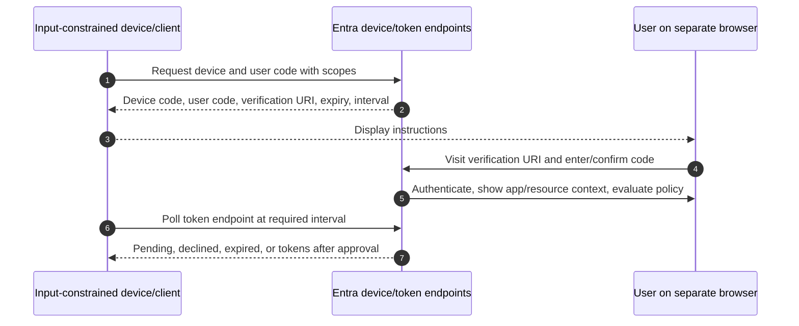

Attackers can phish users into entering a code that authorizes the attacker's device. Training must tell users never to enter an unsolicited code and to verify the app/request context. Conditional Access includes an **authentication flows** condition that can control device code flow and authentication transfer; the condition was documented as **Preview** in August 2026, so revalidate support and licensing before reliance.

Device code also has device-state limitations: the browser used to authenticate cannot simply transfer its compliant-device claim to the input-constrained device. Do not assume “the user approved from a managed phone” makes the target device compliant.

---

## 9. ROPC warning and migration

**Resource Owner Password Credentials (ROPC)** is an OAuth grant where the application directly collects a user's username and password and sends them to the token endpoint. Microsoft recommends not using it. It is incompatible with MFA and passwordless accounts, has federation limitations, and requires a highly trusted application to handle the password.

| ROPC problem | Security/functional effect | Migration direction |
|---|---|---|
| App sees the password | Credential theft and logging risk | Interactive authorization code + PKCE |
| No browser interaction | Cannot satisfy MFA/modern challenges | Broker/system-browser sign-in |
| Passwordless identity | No password exists to submit | Passkey/WHfB/Authenticator through interactive flow |
| Federated redirect | Token endpoint cannot perform normal full-page federation | Supported interactive federation |
| Test/script dependency | Breaks as MFA requirements increase | Service principal only when no user context; otherwise interactive test account flow |
| User context replaced by app-only | Excess tenant-wide privilege | Preserve delegated user context where user action exists |

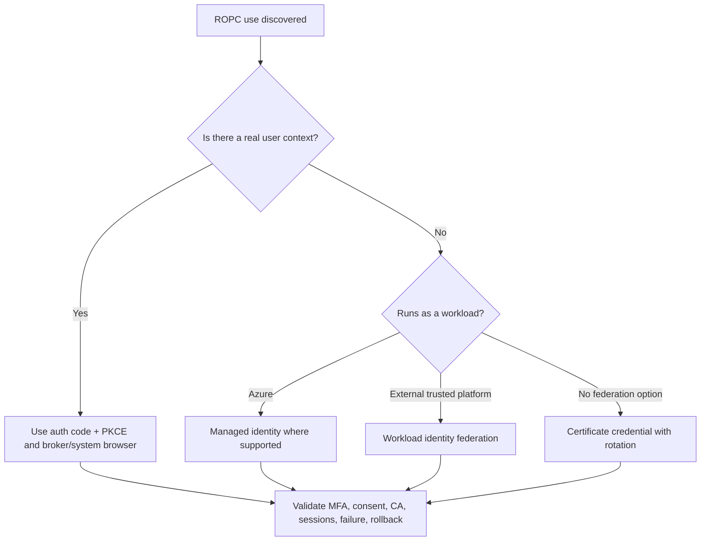

Do not create a Conditional Access exception that preserves ROPC indefinitely. Document business dependency, owner, data, requested permissions, replacement architecture, target date, compensating controls, residual risk, and executive acceptance.

---

## 10. OIDC, SAML, WS-Federation, and Kerberos hybrid context

Different protocols solve different authentication contexts.

| Protocol | Primary role | Artifact | Common dependencies | Modernization note |
|---|---|---|---|---|
| OIDC | Modern user authentication layered on OAuth 2.0 | ID token and OAuth flow artifacts | Client ID, redirect URI, issuer, keys, nonce, scopes | Preferred for new modern applications when supported |
| SAML 2.0 | Browser-based enterprise federation/SSO | Signed XML assertion | Entity ID/audience, ACS/reply URL, signing cert, NameID/claims, time | Common SaaS integration; not an API authorization framework |
| WS-Federation | Older browser federation | Security token and realm/reply parameters | Realm, reply, signing cert, claims, federation metadata | Understand for legacy apps; migrate when supported |
| Kerberos | AD DS domain/service authentication | TGT and service ticket | DNS, time, SPN, KDC, delegation | Relevant to hybrid/on-premises SSO, not a replacement for cloud OAuth |

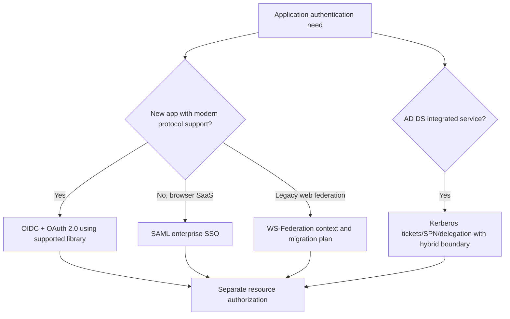

### SAML validation checklist

| Check | Why |
|---|---|
| Issuer/entity ID | Assertion comes from expected identity provider |
| Audience | Assertion is intended for this service provider |
| Signature and trusted current certificate | Detects tampering and supports rollover |
| Assertion time, not-before, expiry, clock skew | Prevents stale/replayed assertions |
| Recipient/Assertion Consumer Service (ACS) URL | Response reaches intended endpoint |
| InResponseTo/relay state where used | Correlates request and response safely |
| NameID/claim mapping | Resolves to correct local account and role |

### Kerberos hybrid troubleshooting context

Kerberos depends on accurate DNS, synchronized time, Service Principal Names (SPNs), reachable Key Distribution Center (KDC), ticket cache, encryption support, and delegation design. A user can have a valid Entra token for a cloud front end while a downstream on-premises service fails Kerberos. Record where token-to-ticket translation or constrained delegation occurs and which team owns it.

---

## 11. Access, ID, and refresh tokens

### 🔍 Plain-English deep-dive: three artifacts, three jobs

- **Access token** — *presented by a client to a resource API as proof of delegated or application authorization.* **Analogy:** A scoped, time-limited door pass. **Why it matters:** The API, not the client, is the intended audience and validates it.
- **ID token** — *OIDC proof to the client that a user authenticated, with identity claims.* **Analogy:** A signed conference name badge for the application. **Why it matters:** It is not used to call an API.
- **Refresh token** — *a sensitive artifact used by a client at the authorization server to obtain fresh tokens without repeating full interaction.* **Analogy:** A protected renewal voucher, not a building pass. **Why it matters:** Long-lived session access makes theft serious; the client should let MSAL protect and rotate it.

| Token | Recipient/use | Contains/represents | Never use it for |
|---|---|---|---|
| Access token | Resource/API | Audience, issuer, subject/client, scopes or roles, times and other claims | Identifying user to a different client or calling another audience |
| ID token | OIDC client | Authentication event and identity claims for client | Calling an API or blindly authorizing sensitive API actions |
| Refresh token | Authorization server via client | Previously granted authorization/session renewal context | Presenting to a resource API or exposing to scripts/tickets |
| Primary Refresh Token | Supported platform broker | Device/user SSO artifact, opaque to client | Manual decoding or application storage |
| Browser/app session cookie | Identity provider or application | Continuing web session | Treating as harmless diagnostic text |

Microsoft warns that access tokens for APIs you do not own may not be readable JWTs and can use special or encrypted formats. Applications must not parse or validate tokens intended for Microsoft Graph or another API as a security dependency. The resource owner validates its own access-token format.

---

## 12. JWT structure, claims, signatures, and validation

A **JSON Web Token (JWT)** is a compact token format often shown as three Base64URL-encoded segments separated by periods: header, payload, and signature. Base64URL encoding is not encryption; anyone holding a readable JWT can usually decode the header and payload.

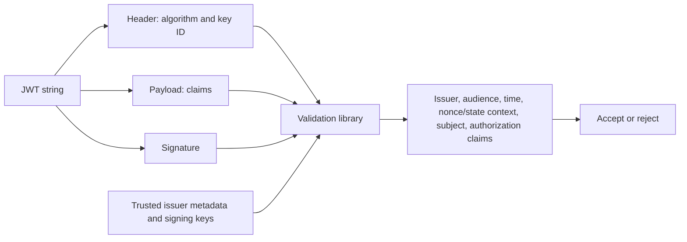

| Claim/concept | Plain meaning | Validation/use caution |
|---|---|---|
| `iss` | Issuer that created token | Must match trusted authority/tenant pattern for app design |
| `aud` | Intended resource/client audience | Must match this API/client, not merely a familiar value |
| `sub` | Subject identifier in issuer/client context | Stable use depends on protocol and pairwise behavior |
| `oid` | Entra object ID where provided | Pair with tenant ID; do not assume it appears in every token |
| `tid` | Tenant ID | Validate allowed tenant(s) for multitenant apps |
| `exp` | Expiration time | Reject expired token with allowed clock skew policy |
| `nbf` | Not valid before time | Detect early use/time problems |
| `iat` | Issued-at time | Useful context, not sole replay prevention |
| `scp` | Delegated scopes | API must check required scope and resource authorization |
| `roles` | Application/user app roles where issued | API must check expected role and caller type |
| `azp`/`appid` | Authorized client application identity depending token version | Useful for client restrictions with issuer/audience validation |
| `amr`/authentication detail claims | Authentication method/reference context where provided | Do not invent assurance from a single unvalidated claim |
| `nonce` | OIDC request correlation/replay defense | Client validates returned ID-token nonce |

### Signature is not encryption

| Property | Signing | Encryption |
|---|---|---|
| Main purpose | Integrity and issuer authenticity | Confidentiality |
| Can holder read payload? | Usually yes for JWT | Not without decryption key |
| Does it stop bearer replay? | No | Not by itself |
| Required companion | Issuer/audience/time/claim validation | Key management plus authentication/authorization |

Use a maintained token-validation library. Validate issuer, audience, signature/key, time, tenant policy, token version/claim mapping, and authorization claims. Do not write a custom JWT parser as a security control. Do not accept `alg=none`, trust a key supplied by an untrusted token, or authorize solely from an unverified payload.

---

## 13. Claims, scopes, roles, consent, and resource authorization

A **claim** is a statement in a token. A **scope** usually represents delegated permission requested by a client acting with a user. An **app role/application permission** can authorize an application acting as itself. **Consent** records authorization for requested permissions, subject to tenant policy and who is allowed to consent.

| Model | Principal in request | Token permission signal | Consent/assignment | Example |
|---|---|---|---|---|
| Delegated | User plus client app | `scp` scopes | User/admin consent depending permission/policy | App reads signed-in user's profile |
| Application/app-only | Service principal | `roles` or resource ACL | Admin/API owner grant | Background service reads approved tenant data |
| App role for user/group | User assigned app-specific role | Role claim depending app design | Enterprise-app assignment | User is `Approver` inside custom app |
| Resource-specific authorization | User/app after token validation | Resource ACL/RBAC/site permission | Resource owner/admin | User can edit one SharePoint site |

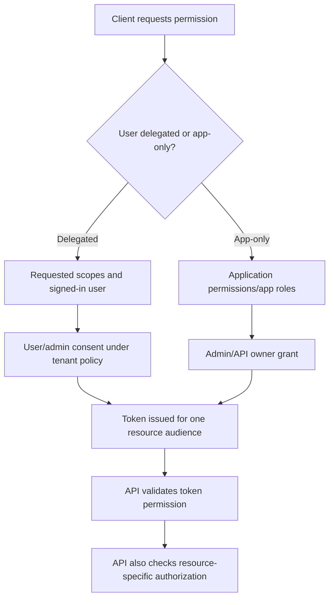

**Least privilege questions:**

1. Does the app need a user context?
2. Which exact API and operation is required?
3. Can a narrower delegated scope or resource-specific permission work?
4. Does application permission create tenant-wide reach?
5. Who can consent, and is admin consent workflow configured?
6. Is user assignment required?
7. Who reviews publisher, owners, credentials, permissions, and actual use?
8. How are access and consent removed without breaking unrelated apps?

Consent is not a substitute for resource authorization. `Files.Read` in a delegated token does not magically give the user access to every file; the resource evaluates the user's existing rights. Conversely, broad app-only permissions may not have a user's resource boundary and therefore require stricter governance.

---

## 14. Sessions, cookies, token caches, and MSAL

An identity experience contains multiple sessions:

- The identity provider's browser session cookie.
- The application's own session cookie.
- Access tokens for individual resources.
- Refresh tokens or broker-managed artifacts.
- Device broker state such as a Primary Refresh Token.
- Resource-side sessions and cached authorization.

| Session/artifact | Owner | Purpose | Troubleshooting boundary |
|---|---|---|---|
| Entra browser cookie | Identity provider/browser | Avoid repeated primary sign-in | Browser profile, cookie policy, sign-in frequency, revocation |
| App session cookie | Application | Maintain app login | App session settings and logout implementation |
| MSAL token cache | Client/library/broker | Reuse valid tokens and refresh silently | Account selection, authority, scopes, cache protection |
| Resource session | Workload/API | Maintain resource interaction | Resource-specific revocation and session controls |
| PRT | Platform broker | Device/user SSO and token acquisition | Device registration, broker, keys, account state |

**Microsoft Authentication Library (MSAL)** is Microsoft's supported library family for acquiring and caching tokens. Applications should request tokens through MSAL rather than manually implementing protocol details. The normal pattern is “acquire token silently from cache; if an interaction-required result occurs, perform an approved interactive flow.”

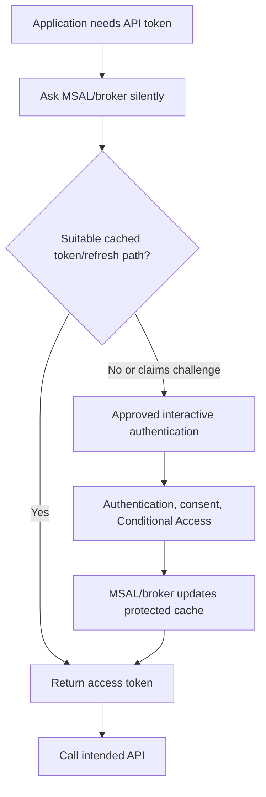

Do not “fix” cache issues by publishing instructions to delete all identity data or browser profiles organization-wide. First reproduce with a safe test account/profile, identify whether the stale state belongs to the app, MSAL/broker, browser, PRT, or resource, and preserve logs before scoped cleanup.

---

## 15. Primary Refresh Token and device SSO

A **Primary Refresh Token (PRT)** is an opaque artifact issued to supported Microsoft first-party token brokers to enable SSO across applications on supported platforms. On Windows, CloudAP and Web Account Manager (WAM) participate in issuance and token acquisition. A registered-device PRT can carry user and device context; an unregistered-device PRT cannot satisfy policies that require a registered device.

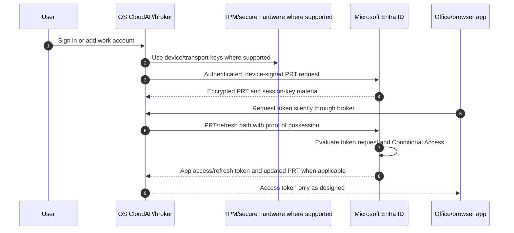

| PRT fact | Practical meaning |
|---|---|
| Opaque to clients | Do not try to decode or manually copy it |
| Device-bound where supported | Hardware/secure storage and session keys reduce replay risk |
| Used for SSO/token acquisition | It is not an access token presented directly to SharePoint by ordinary app code |
| Can carry MFA context | Existing MFA claim can satisfy later app requirements when valid |
| Conditional Access not evaluated at issuance/renewal itself | CA is evaluated for resource token requests, not simply because a PRT renewed |
| Documented 90-day validity with active renewal behavior | Do not equate nominal lifetime with uninterrupted access |

The PRT page updated in July 2026 describes registered and unregistered PRTs across Windows, macOS, iOS, Android, and Linux with platform-specific broker and hardware-binding behavior. Treat platform matrices as **change-sensitive** and validate the exact OS, browser, app, broker, device registration, and management configuration.

---

## 16. Token lifetimes, refresh, revocation, and Continuous Access Evaluation

Access tokens are normally short-lived; the checked Microsoft guidance describes a default near one hour for non-Continuous Access Evaluation clients. Refresh tokens are longer-lived and can fail due to expiry, revocation, policy, user state, or changed authorization. Do not build applications around a guessed fixed lifetime.

**Continuous Access Evaluation (CAE)** lets supported resource providers react to critical events and selected location-policy changes without waiting for ordinary token expiry. Entra and supported resources exchange event/policy context; a resource can reject an otherwise unexpired token and issue a claims challenge that a capable client sends back to Entra.

```mermaid
sequenceDiagram
    autonumber
    participant C as CAE-capable client
    participant E as Microsoft Entra ID
    participant R as Supported resource
    participant A as Administrator/risk event
    C->>E: Request token
    E-->>C: CAE-capable access token
    C->>R: Present token
    R-->>C: Resource response
    A->>E: Disable user, revoke session, password event, or risk event
    E-->>R: Critical event notification
    C->>R: Reuse unexpired token
    R-->>C: HTTP 401 plus claims challenge
    C->>E: Bypass cache; send challenge for reevaluation
    E-->>C: Deny, prompt, or issue new token
```

| Event/control | Expected direction | Limitation/caution |
|---|---|---|
| User disabled/deleted | Supported resources can revoke near real time | Propagation can take time; cached OS sign-in differs |
| Password changed/reset | Affects applicable sessions/tokens | Exact behavior depends on authentication method and session |
| Explicit session revocation | Resource receives critical event where supported | Not every app/resource is CAE-capable |
| High user risk | CAE critical-event behavior where supported | SharePoint has documented user-risk limitation |
| IP named-location change | Near-real-time enforcement for supported IP policies | Network path/IP variation and provider support matter |
| Sign-in frequency | Requires reauthentication at configured interval | Works with or without CAE; user experience needs testing |

The checked documentation states CAE sessions can use long-lived access tokens up to 28 hours because events, not arbitrary expiry alone, drive revocation. That does not mean 28 hours of unconditional access. It also documents limitations for guests, coauthoring, Teams components, OneDrive client/platform combinations, policy replication, shared/variable egress IPs, and named-location scale. Recheck the live support matrix.

---

## 17. App registration design and redirect URI security

An app registration translates software architecture into identity configuration.

| Design field | Decision | Security concern |
|---|---|---|
| Supported account types | Single tenant, multitenant, personal-account options as required | Unnecessary audience expands trust and validation complexity |
| Platform/client type | Web, SPA, mobile/desktop, API | Determines secret capability, redirect behavior, and flow |
| Redirect URIs | Exact approved destinations | Open/wildcard/unused redirects increase interception risk |
| Credentials | Managed/federated/certificate/secret | Storage, rotation, expiry, and incident response |
| Exposed API scopes/roles | Delegated and application authorization contract | Overbroad scopes or role-less app-only token acceptance |
| Requested API permissions | Minimum downstream operations | Admin consent and tenant-wide blast radius |
| Owners | Technical and operational custodians | Orphaned app, expired credentials, slow response |
| Publisher/verification | Trust and user-consent context | Name/logo alone does not prove safety |

### Deployment method

1. Define data flow, principal type, user context, APIs, operations, tenants, and threat model.
2. Select protocol and flow for the actual client type.
3. Register separate development, test, and production applications unless architecture explicitly justifies another design.
4. Add only exact redirect URIs and least permissions.
5. Prefer managed identity or workload federation for supported workloads, otherwise certificates before shared secrets where practical.
6. Configure consent workflow, assignment, owners, logging, credential monitoring, and support runbook.
7. Test positive, denial, wrong tenant, wrong audience, expired credential, revoked consent, claims challenge, and rollback scenarios.
8. Promote through change control and monitor sign-ins and resource actions.

```mermaid
flowchart LR
    REQUIRE[Requirements and threat model] --> CLIENT[Choose client type]
    CLIENT --> FLOW[Choose supported MSAL flow]
    FLOW --> REG[Register app and exact redirects]
    REG --> PERM[Least scopes/roles and consent]
    PERM --> CRED[Managed/federated/certificate credential]
    CRED --> TEST[Test success, denial, failure, rollback]
    TEST --> DEPLOY[Controlled deployment]
    DEPLOY --> OPERATE[Owners, logs, rotation, reviews]
```

Rollback may mean restoring a previous redirect/configuration, disabling a new service principal, revoking a newly granted permission, re-enabling the old integration during a defined coexistence window, or reverting client code. Capture object IDs and exports before change.

---

## 18. Attack scenarios and secure design choices

| Attack/failure | How it works | Design response |
|---|---|---|
| Password spray | Tries common passwords across many accounts | Passwordless/phishing-resistant methods, smart lockout, risk monitoring, block legacy auth |
| Credential phishing | Fake page captures password and OTP | Passkeys/WHfB/CBA, user training, risk and Conditional Access |
| MFA fatigue | Repeated push prompts seek accidental approval | Number matching, system-preferred stronger method, risk response |
| Consent phishing | User/admin grants malicious app permissions | Consent policy/workflow, publisher review, least privilege, app governance |
| Authorization-code interception | Attacker steals code | PKCE, exact redirects, state validation, system browser |
| Login CSRF | Attacker mixes victim session with attacker's authorization response | Strong random `state`, same-site/session handling, library patterns |
| ID-token replay | Reuses an authentication token | Nonce, audience, issuer, signature, time validation |
| Access-token theft | Bearer token replayed from another system | Secure cache, TLS, endpoint security, token protection where supported, CAE |
| Secret leakage | Client secret committed or logged | Managed identity/federation/certificate, secret scanning, rotation, revoke and investigate |
| Redirect takeover | Abandoned domain/URI receives response | Minimal redirect inventory, domain ownership, removal testing |
| Overprivileged app | App-only permission exposes broad data | Resource-specific/narrow permission, admin consent review, workload monitoring |
| Device-code phishing | Victim enters attacker's code | Flow restrictions, clear app context, user education, sign-in monitoring |

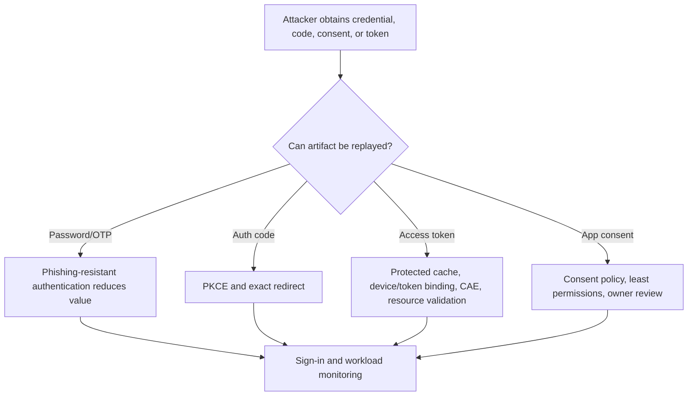

Security controls are layered. PKCE does not replace `state`; MFA does not fix overprivileged consent; a valid signature does not prove correct audience; CAE does not support every app; revoking refresh tokens does not erase every application cookie immediately.

---

## 19. Safe token and sign-in debugging

Never paste live tokens into public decoders, chat, tickets, screenshots, or interview portfolios. A bearer token can grant access. A refresh token or session cookie can be even more sensitive. Use a nonproduction test identity and a locally approved decoder only when authorized; prefer sign-in-log fields and application/resource telemetry over token disclosure.

### Redaction matrix

| Data | Ticket/portfolio treatment | Why |
|---|---|---|
| Access/ID/refresh token | Do not include; replace with `[REDACTED TOKEN]` | Bearer/replay and personal claim risk |
| Session cookie/PRT | Never include | Can maintain or bootstrap access |
| Client secret/private key | Never include; trigger incident process if exposed | Workload impersonation |
| Authorization code/device code | Redact and let expire | May be redeemable/abusable |
| Tenant/object/app IDs | Minimize or pseudonymize outside authorized case | Correlation and privacy/security context |
| UPN/email/IP | Redact unless necessary and authorized | Personal and security data |
| Trace/correlation ID and UTC time | Usually safe in authorized support context | Enables Microsoft/vendor correlation |
| Error code and sanitized description | Retain | High diagnostic value with low secret risk |

### Layered troubleshooting method

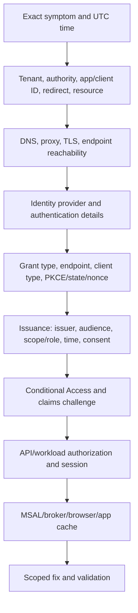

| Symptom/error | Likely direction | Next evidence |
|---|---|---|
| `AADSTS50011`-style redirect mismatch | Redirect URI not exact/registered for platform | App registration, actual encoded URI, platform type |
| `invalid_client` | Client authentication/registration credential failed | App ID, tenant, credential ID/expiry, certificate/federation |
| `invalid_grant` | Code/verifier/refresh/assertion invalid, expired, or wrong context | Fresh flow, PKCE pair, redirect, time, user/session state |
| `interaction_required` | Silent path cannot satisfy auth/consent/CA | Claims challenge, interactive MSAL flow, CA tab |
| `consent_required` | Permission not granted under policy | Requested scopes, consent records/workflow, admin restriction |
| `invalid_scope` | Unsupported/malformed/mixed resource scopes | Exact resource and v2 scope syntax |
| HTTP 401 from API | Missing/invalid/wrong-audience/expired token | Resource logs and token metadata for owned API |
| HTTP 403 from API | Token accepted but permission/resource authorization/policy insufficient | `scp`/`roles`, app/user assignment, site/RBAC/ACL |
| Works in browser, fails native app | Redirect/platform/client type, broker/cache, proxy, embedded view | MSAL logs, app version, account, broker, sign-in client fields |
| Repeated prompts | Cookie/cache, sign-in frequency, claims challenge, third-party cookie/privacy behavior | Sign-in sequence, session controls, browser profile, app logs |

Capture the sign-in's correlation ID, request ID where available, timestamp, tenant, user/SP object ID, app/client ID, resource, client app, IP, device details, authentication details, Conditional Access results, error code, and resource response. “Token issue” is not a diagnosis.

---

## 20. Realistic client scenarios

### Scenario A: OneDrive desktop repeatedly prompts while browser works

Start with affected account, device, client version, tenant, UTC timeline, network path, and service health. Browser success proves some identity and resource paths but not the native app's redirect, broker, account selection, MSAL cache, PRT, proxy behavior, or Conditional Access device claim.

Compare interactive and noninteractive sign-ins. Check resource audience, client app, authentication details, CA result, broker/device state, and OneDrive logs. Use a safe test profile/account before scoped cache cleanup. Do not disable MFA or Conditional Access.

### Scenario B: Custom finance API returns 401 after successful sign-in

The client used an ID token to call the API. The ID token proves authentication to the client and has the client's audience; it is not an API access token. The app must request an access token for the finance API scope. The API validates issuer, audience, signature, time, tenant, scope/role, and resource authorization.

### Scenario C: Middleware returns 403 from Microsoft Graph

API A receives a token intended for API A, then incorrectly forwards it to Graph. Graph rejects the audience. API A should perform OBO to obtain Token B for Graph with approved delegated scopes. If app-only access is actually required, use client credentials and separately approved application permissions; do not silently convert user delegation into tenant-wide app access.

### Scenario D: Legacy scanner stops after MFA rollout

The scanner uses a protocol/client incapable of modern interactive authentication. The answer is not a broad MFA exclusion. Inventory the workflow, data, sender behavior, owner, supported modern alternatives, connector/relay options where appropriate, network restrictions, monitoring, pilot, and retirement date. Any exception is narrow, time-bound, approved, and measured.

### Scenario E: User sees a device-code prompt they did not initiate

Treat it as possible phishing. The user does not enter the code, reports the event, and preserves nonsecret context. Security reviews sign-in logs for device-code flow, app/client ID, IP, user, consent, and subsequent tokens/activity. The organization evaluates the authentication-flows control and training, noting preview/change-sensitive status.

| Scenario | Earliest discriminating fact | Likely owner boundary |
|---|---|---|
| Browser works/native fails | Client/broker/redirect/sign-in record differs | App, endpoint, identity, network |
| API 401 with ID token | Audience/token type is wrong | Application developer |
| Graph 403 via middle tier | Audience/flow/permission/resource authorization | App/API owner and identity admin |
| Scanner failure | Client cannot perform modern flow | Workload owner, messaging, security |
| Unsolicited device code | User did not initiate request | Security incident/app governance |

---

## 21. Deployment, testing, rollback, and operations

### Architecture-to-production method

| Stage | Activities | Gate |
|---|---|---|
| Discover | App owners, users/workloads, flows, endpoints, data, clients, federation, logs, failures | Current flow and dependency diagram validated |
| Design | Protocol, grant, client type, redirects, permissions, credential, session, CA behavior | Threat model and decision record approved |
| Build | Separate app registrations/environments, MSAL, least permissions, monitoring | Peer/security review and no secret leakage |
| Pilot | Representative users, devices, networks, browsers, apps, service identities | Positive/negative/failure tests pass |
| Migrate | Coexistence, user communication, consent, credential rotation, legacy retirement | Rollback and support readiness proven |
| Operate | Sign-ins, errors, consent, credentials, sessions, CAE, app activity | Owners, SLOs, alerts, reviews, runbook |

### Test matrix

| Test type | Example | Expected result |
|---|---|---|
| Positive | Correct user uses auth code + PKCE for intended API | Correct tokens and authorized resource response |
| Negative audience | Token for API A sent to API B | API B rejects it |
| Negative scope | Delegated token lacks write scope | API denies write while read remains valid |
| App-only boundary | Service principal attempts user-only delegated action | Request denied |
| Tenant isolation | User from disallowed tenant attempts multitenant app | Issuer/tenant validation rejects |
| Redirect attack | Unregistered or altered redirect URI | Authorization server rejects |
| Consent | User requests admin-restricted permission | Consent workflow/error, no silent grant |
| Claims challenge | CA requirement changes during session | Capable client reauthenticates or access is denied safely |
| Credential failure | Certificate/secret expired in test | Alert, graceful failure, documented rotation/rollback |
| Revocation | Test user/session revoked | Supported resources enforce within documented behavior |
| Legacy block | Test legacy client attempts sign-in | Blocked while modern replacement succeeds |
| Rollback | New app registration/config disabled | Previous approved integration resumes without broadening access |

Rollback cannot recall a leaked secret or token. If exposure occurs, revoke/rotate, investigate use, review resource activity, and notify through the incident process. Configuration rollback restores service; security response addresses compromise.

### Operational metrics

| Metric | What it reveals | Avoid |
|---|---|---|
| Legacy-auth sign-ins by owner/app | Migration exposure | Counting attempts without identifying business process |
| Interactive/noninteractive failure trend | Client, policy, or service changes | Treating all failures as attacks |
| App consent and permission growth | Privilege expansion | Reviewing app registration only, not local SP grants |
| Credential expiry coverage | Outage risk | Long-lived secrets as “solution” |
| Wrong-audience/scope errors | Integration quality | Logging tokens to debug |
| Claims-challenge handling | CAE/CA resilience | Assuming every client supports it |
| Mean time to identify failing layer | Support maturity | Closing on workaround without root cause |

---

## 22. Consulting artifacts

| Artifact | Contents | Quality test |
|---|---|---|
| Authentication flow diagram | User/workload, client, IdP, endpoints, tokens, resource, session, logs | Every trust boundary and audience is visible |
| Application identity register | App/SP IDs, owners, tenant audience, redirects, credentials, permissions | Home and local objects distinguished |
| Protocol decision record | Requirements, options, choice, tradeoffs, assumptions | Explains why, not only what |
| Legacy-auth migration register | Client/protocol, owner, use, data, replacement, exception, date | No ownerless permanent exclusions |
| Consent and permission matrix | Delegated/app permissions, approver, resource scope, review | Least privilege and actual API use traced |
| Test plan | Positive, negative, attack, failure, claims challenge, revocation, rollback | Expected evidence and owner for each test |
| Token-debug runbook | Safe fields, log sources, flow-specific errors, escalation | Explicitly forbids sharing live tokens/secrets |
| Session-risk register | Cookie/cache/refresh/PRT/CAE behavior and limitations | Includes unsupported clients and residual risk |
| Vendor escalation pack | UTC timeline, IDs, error/correlation, sanitized traces, precise ask | Reproducible without bearer artifacts |

Example architecture decision:

> **Decision:** Replace a desktop application's ROPC implementation with authorization code flow using PKCE and MSAL with the system browser. **Reason:** The current flow handles user passwords, cannot satisfy MFA/passwordless requirements, and creates a permanent Conditional Access exception. **Tradeoffs:** Interactive migration, redirect registration, broker/account testing, and user communication are required. **Validation:** Representative users, federation paths, MFA, consent, token cache, offline/recovery, wrong audience, and rollback tests. **Residual risk:** Bearer access tokens still require endpoint and cache protection; token protection availability is app/platform dependent.

---

## 23. Safe paper lab: trace and debug a fictional modern-auth flow

This exercise creates portfolio evidence without generating, copying, or decoding any live token.

### Prerequisites

- Parts 5 and 6.
- A local Markdown or diagram editor.
- Current Official Source Anchors below.
- Fictional identifiers only.
- No production tenant, token, secret, cookie, user, or client data.

### Fictional architecture

- Tenant ID alias: `T-NORTHSTAR`.
- Single-page client: `Finance Portal`, client ID alias `C-FIN`.
- Middle-tier API: `Finance API`, app ID alias `API-FIN`.
- Downstream API: Microsoft Graph.
- User: `U-ANALYST`.
- Finance Portal uses authorization code + PKCE.
- Finance API uses OBO for delegated `User.Read` to Graph.
- A separate nightly export uses user-assigned managed identity and approved app-only resource permission.

### Procedure

1. Draw the authorization-code + PKCE sequence from browser to Finance Portal and Finance API.
2. Label authorization and token endpoints, client IDs, redirect URI, `state`, `nonce`, PKCE challenge/verifier, scopes, and each token audience.
3. Add the OBO exchange and prove why Token A cannot be forwarded to Graph.
4. Draw the separate managed-identity client-credentials path and show that no user exists in it.
5. Create a token-purpose table without token values: token type, issuer alias, audience alias, subject type, scopes/roles, client, recipient, lifetime source, storage owner.
6. Diagnose five injected failures: redirect mismatch, wrong audience, missing scope, expired workload credential, and interaction-required claims challenge.
7. Build positive, negative, revocation, failure, and rollback tests.
8. Create a sanitized escalation template that permits correlation IDs and times but forbids bearer artifacts.

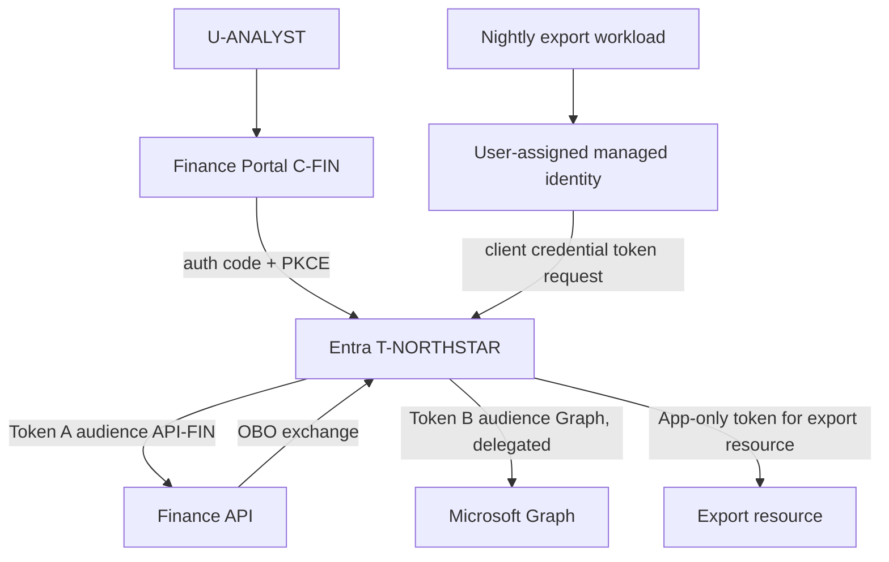

### Test and evidence matrix

| Test | Procedure | Expected evidence |
|---|---|---|
| Positive interactive | Model correct state/nonce/PKCE and API scope | Code redeemed once; API-FIN audience; delegated scope |
| Redirect negative | Change path/case from registered URI | Redirect mismatch; no token issued |
| Audience negative | Send Token A to Graph | Graph rejects wrong audience |
| Scope negative | Remove required write scope | API authenticates caller but denies write |
| OBO challenge | Add downstream auth requirement | API returns claims challenge; client interacts safely |
| App-only separation | Night job tries delegated `/me` operation | Denied because no user context |
| Credential failure | Model expired certificate/secret | Workload sign-in failure and alert; no broad fallback |
| Revocation | Disable test user in scenario | Supported session/resource path denies under documented behavior |
| Rollback | Re-enable prior app configuration in model | Service resumes with original approved permission, no extra grant |

### Evidence to retain

- Three flow diagrams: interactive, OBO, and workload.
- Token-purpose and claim-validation tables with fictional aliases.
- Five failure analyses with exact owner boundary.
- Positive/negative/revocation/failure/rollback matrix.
- Redacted escalation template.
- One decision record for ROPC-to-PKCE migration.

### Cleanup

Delete scratch content that resembles token strings, even if fictional, so it cannot normalize unsafe handling. Retain only diagrams, metadata tables, tests, and source links. If adapting this to a real lab later, remove test app registrations, service principals, grants, credentials, redirect URIs, and managed-identity assignments in dependency order under an approved cleanup record.

### Interview-portfolio wording

> “I created a fictional authentication architecture and troubleshooting exercise covering authorization code with PKCE, OIDC, an OBO middle tier, and app-only managed identity. I documented token audiences, claims, consent, session behavior, CAE challenges, redaction, and positive/negative/rollback tests. It demonstrates protocol reasoning and safe evidence handling; I did not present it as a production Entra implementation.”

---

## 24. Official Source Anchors

These first-party references were checked for the guide's **August 24, 2026** currency date. Recheck them for live behavior, platform support, and security recommendations.

1. [Authentication versus authorization](https://learn.microsoft.com/entra/identity-platform/authentication-vs-authorization) — Current AuthN/AuthZ definitions and OAuth/OIDC/SAML orientation.
2. [OAuth 2.0 and OpenID Connect protocols](https://learn.microsoft.com/entra/identity-platform/v2-protocols) — OAuth roles, token types, app registration, authorization/token endpoints, and tenant audiences.
3. [Authorization code flow with PKCE](https://learn.microsoft.com/entra/identity-platform/v2-oauth2-auth-code-flow) — Client types, PKCE, redirect URIs, state, nonce, code redemption, errors, refresh behavior, and token-reading warning.
4. [OAuth 2.0 client credentials flow](https://learn.microsoft.com/entra/identity-platform/v2-oauth2-client-creds-grant-flow) — App-only access, app permissions, credentials/federation, `/.default`, no refresh token, and permission risks.
5. [OAuth 2.0 on-behalf-of flow](https://learn.microsoft.com/entra/identity-platform/v2-oauth2-on-behalf-of-flow) — Delegated middle-tier exchange, audience rules, claims challenges, and token-relay warning.
6. [OAuth 2.0 device authorization grant](https://learn.microsoft.com/entra/identity-platform/v2-oauth2-device-code) — Device/user codes, polling, errors, input-constrained scenario, and user interaction.
7. [ROPC grant and migration guidance](https://learn.microsoft.com/entra/identity-platform/v2-oauth-ropc) — Microsoft warning, MFA/passwordless/federation limitations, and replacement patterns.
8. [ID tokens in the Microsoft identity platform](https://learn.microsoft.com/entra/identity-platform/id-tokens) — ID-token purpose, JWT format, audience/nonce/time validation, and prohibition on API use.
9. [Access tokens](https://learn.microsoft.com/entra/identity-platform/access-tokens) — Resource ownership of validation, claims, format, lifetime, and security guidance.
10. [Permissions and consent](https://learn.microsoft.com/entra/identity-platform/permissions-consent-overview) — Delegated/application permissions, consent actors, and scopes/roles.
11. [Understanding Primary Refresh Token](https://learn.microsoft.com/entra/identity/devices/concept-primary-refresh-token) — Platform brokers, registered/unregistered PRT, protection, SSO, lifecycle, and MFA context.
12. [Continuous Access Evaluation](https://learn.microsoft.com/entra/identity/conditional-access/concept-continuous-access-evaluation) — Critical events, claims challenges, long-lived CAE tokens, supported resources, network and guest limitations.
13. [MSAL authentication flows](https://learn.microsoft.com/entra/identity-platform/msal-authentication-flows) — Supported library patterns and scenario-to-flow selection.
14. [Secure applications with Zero Trust principles](https://learn.microsoft.com/security/zero-trust/develop/identity-iam-development) — Identity design, least privilege, token validation, and application security context.

**Change-sensitive register:** MSAL versions, broker support, PRT platform matrices, browser cookie/privacy behavior, CAE resource/client support, configurable token behavior, claims, sovereign-cloud endpoints, the Conditional Access authentication-flows condition, and legacy protocol support require live validation.

---

## ⭐ Likely Interview Questions for This Section

### Q1. What is the difference among identification, authentication, authorization, and accounting?

> **Model answer:** “Identification is the identity claimed, such as a UPN or client ID. Authentication proves that identity through a password, passkey, certificate, federation, or workload credential. Authorization decides which action the authenticated principal may perform using policy, token permission, role, assignment, and resource ACLs. Accounting records sign-in, directory, provisioning, and resource activity. I keep them separate because a valid sign-in does not prove SharePoint access, and a log entry does not prove human intent.”

### Q2. Walk through authorization code flow with PKCE.

> **Model answer:** “The client generates random state, nonce for OIDC, and a PKCE verifier/challenge, then sends the user to Entra's authorization endpoint with the client ID, exact redirect URI, and scopes. Entra authenticates, evaluates policy and consent, and returns a short-lived code. The client validates state and redeems the code at the token endpoint with the same redirect and verifier; a confidential server also authenticates itself. It receives an ID token for client sign-in and an access token for the API. PKCE binds code redemption, state mitigates request/session forgery, and nonce mitigates ID-token replay.”

### Q3. When would you use client credentials versus on-behalf-of?

> **Model answer:** “Client credentials is for a workload acting as itself with no user; it uses application permissions or a resource ACL and preferably managed identity, workload federation, or a certificate. OBO is for a middle-tier API preserving a signed-in user's delegated identity while calling a downstream API. The incoming token must target the middle tier, which exchanges it for a separate downstream token. I would not convert a user workflow to app-only merely to bypass MFA or forward a token to the wrong audience.”

### Q4. What is the difference among an access token, ID token, and refresh token?

> **Model answer:** “An access token is presented to its intended resource API and represents delegated scopes or application roles. An ID token is OIDC proof to the client that the user authenticated; it is not an API token. A refresh token is presented only to the authorization server to obtain new tokens and is highly sensitive. Applications should let MSAL and the broker acquire, validate as appropriate, cache, and refresh artifacts rather than parsing Microsoft API tokens or exposing them in logs.”

### Q5. Why is ROPC unsafe, and how would you migrate it?

> **Model answer:** “ROPC makes the app collect the user's reusable password, cannot satisfy MFA, does not support passwordless identities, and has federation limitations. If a user context exists, I would migrate to authorization code with PKCE through MSAL and a system browser or broker. If no user exists, I would use a purpose-built workload identity, preferring managed identity or federation. I would inventory dependencies, pilot MFA and Conditional Access, test sessions and failures, provide rollback, and retire any exception.”

### Q6. How do you validate a JWT securely?

> **Model answer:** “For a token intended for an API I own, I use a maintained validation library and trusted OIDC metadata. I validate the signature and current key, issuer, audience, token version and times, expected tenant, and required scopes or roles, then apply resource authorization. For an ID token I also validate nonce in the request context. Base64 decoding is not validation, signing is not encryption, and applications must not parse Microsoft Graph tokens they do not own as a security dependency.”

### Q7. How do PRT and Continuous Access Evaluation affect sessions?

> **Model answer:** “A PRT is an opaque broker artifact used for SSO and token acquisition on supported devices; registered-device PRTs can carry device context and be hardware-bound where supported. CAE lets supported resources react to critical events or selected IP-policy changes and challenge an unexpired access token. The client sends the claims challenge to Entra for reevaluation. Neither feature covers every platform, app, guest, network, or session, so I validate the current support matrix and retain resource-side session controls and monitoring.”

### Q8. How would you troubleshoot a successful sign-in followed by a 403 from an API?

> **Model answer:** “I would separate authentication from authorization. I would capture UTC time, tenant, user/service-principal and app IDs, resource, correlation IDs, client, and sign-in/Conditional Access result without sharing tokens. Then I would check whether the access token was issued for the correct audience and contains the required delegated scope or app role, whether consent and app/user assignment exist, and whether the API's resource ACL/RBAC permits the specific object. A 403 often means the caller authenticated but lacks permission or resource authorization.”

---

## 🧠 30-Second Memory Hooks

- **IAAA:** Claim identity, prove it, permit action, record evidence.
- **SSO:** An experience; federation is a trust; protocol is the mechanism.
- **Modern auth:** Scoped tokens and policy-capable flows, not password replay.
- **OAuth:** Authorization framework.
- **OIDC:** Authentication layer on OAuth.
- **SAML:** Signed XML browser federation assertion.
- **Kerberos:** Domain ticketing with DNS, time, SPN, KDC, and delegation dependencies.
- **OAuth roles:** Owner, client, authorization server, resource server.
- **Authorization endpoint:** User interaction and code.
- **Token endpoint:** Exchange grants or credentials for tokens.
- **PKCE:** Code challenge out, verifier back.
- **State:** Correlate request and resist login CSRF.
- **Nonce:** Bind ID token to OIDC request.
- **Client credentials:** App as itself; application permission; no user or refresh token.
- **OBO:** Middle tier exchanges user-delegated Token A for downstream Token B.
- **Device code:** Useful for constrained input; never enter an unsolicited code.
- **ROPC:** App handles password and loses MFA/passwordless; migrate it.
- **Access token:** For one resource audience.
- **ID token:** For client sign-in, not API calls.
- **Refresh token:** Renewal artifact for authorization server only.
- **JWT:** Header.payload.signature; readable does not mean validated.
- **Scopes versus roles:** Delegated user context versus app/app-role authorization.
- **Consent:** Approval to grant permission, not automatic resource entitlement.
- **MSAL:** Silent cache first, approved interaction when required.
- **PRT:** Opaque broker SSO artifact, not an app access token.
- **CAE:** Resource can challenge an unexpired token after critical change.
- **401 versus 403:** Authentication/token problem versus accepted identity lacking authorization.
- **Safe debug:** IDs, times, errors, and correlation; never bearer artifacts.
- **Honesty:** Protocol paper lab plus M365 troubleshooting is not production federation ownership.

---

## Completion Checklist

- [ ] Explain identification, authentication, authorization, and accounting with separate evidence.
- [ ] Distinguish SSO, federation, identity provider, relying party, and session.
- [ ] Compare modern token authentication with legacy/basic authentication.
- [ ] Name the four OAuth roles and explain authorization/token endpoints.
- [ ] Draw authorization code + PKCE and explain client ID, redirect, scope, state, nonce, challenge, and verifier.
- [ ] Draw client credentials and state why no refresh token or delegated user exists.
- [ ] Draw OBO and explain why Token A cannot be relayed to API B.
- [ ] Explain device code flow, polling results, device-state limitation, and phishing risk.
- [ ] Explain why Microsoft recommends against ROPC and give user/workload migration paths.
- [ ] Compare OIDC, SAML, WS-Fed, and Kerberos contexts.
- [ ] Distinguish access, ID, refresh, primary refresh tokens, and cookies.
- [ ] Explain JWT header, payload, signature, encoding, signing, and encryption.
- [ ] Validate issuer, audience, signature/key, time, tenant, nonce, scope/role, and resource access appropriately.
- [ ] Compare claims, delegated scopes, application permissions, app roles, consent, assignment, and resource authorization.
- [ ] Explain identity-provider, app, MSAL, resource, browser, and broker session boundaries.
- [ ] Explain registered versus unregistered PRT context and platform-change sensitivity.
- [ ] Explain ordinary expiry, refresh, revocation, claims challenges, CAE, and limitations.
- [ ] Design an app registration with exact redirects, least permissions, owners, and credential lifecycle.
- [ ] Describe at least eight attack scenarios and layered mitigations.
- [ ] Redact tokens, codes, cookies, credentials, IDs, and personal data safely.
- [ ] Interpret redirect, client, grant, interaction, consent, scope, 401, and 403 errors.
- [ ] Complete positive, negative, tenant, audience, scope, credential, revocation, legacy, and rollback tests.
- [ ] Produce the paper lab's three flows, token-purpose table, failures, tests, and decision record.
- [ ] Answer all eight interview questions aloud without claiming production Entra implementation.

---

*Next suggested section:* [Part 8](Part-08-mfa-passwordless-authentication-strengths.md) — turn the authentication flows into a method strategy covering MFA, passwordless and phishing-resistant credentials, registration, recovery, help-desk proofing, and authentication strengths.