# Part 8 — MFA, Passwordless Authentication, Authentication Strengths, and Registration

> **Section goal:** Design an authentication-method program that improves resistance to password theft and phishing while preserving enrollment, recovery, accessibility, and emergency access. By the end, you should be able to compare every major Entra method, distinguish enablement from enforcement, create persona-based rollout and recovery controls, troubleshoot registration and challenge failures, and present an honest client-ready deployment plan.

This Part turns the authentication and token flows from [Part 7](Part-07-authentication-authorization-tokens-modern-auth.md) into a method strategy. [Part 9](Part-09-conditional-access-design-deployment-troubleshooting.md) uses these methods and authentication strengths in access policy.

> **Currency and change-sensitive note:** Product behavior was checked against official Microsoft Learn content available on **August 24, 2026**. Passkey profiles, synced passkeys, passkeys in Microsoft Authenticator, Microsoft-managed registration campaigns, system-preferred first-factor behavior, hardware OATH token experience, Verified ID account recovery, and external MFA are evolving surfaces. Preview items are labeled. Recheck tenant rollout, client/platform support, licenses, and current Microsoft-managed settings before implementation.

## JD Mapping

| Deloitte role expectation | Capability developed in this Part | Consulting evidence |
|---|---|---|
| Design and deploy MFA and strong authentication | Build persona-based method, enrollment, enforcement, and recovery strategy | Authentication method architecture and persona matrix |
| Implement Zero Trust and Conditional Access | Map authentication methods to MFA/passwordless/phishing-resistant strengths | Strength-to-resource policy design |
| Assess M365 security posture | Inventory registration coverage, weak methods, legacy policies, and break-glass readiness | Current-state findings and migration backlog |
| Troubleshoot policy and platform issues | Separate registration, enablement, prompt selection, Conditional Access, client, and token evidence | Layered authentication troubleshooting runbook |
| Minimize business disruption | Use campaigns, Temporary Access Pass, pilots, rings, communications, and help-desk readiness | Deployment/test/rollback plan |
| Improve operational resilience | Define lost/new-device recovery, identity proofing, emergency access, monitoring, and metrics | Recovery runbook, proofing standard, drill evidence |

## Candidate honesty note

You can credibly connect this Part to production support behaviors: handling urgent user-impacting cases, validating identity and scope, coordinating customers and engineering, documenting safe recovery, explaining changes, and proving a fix across SharePoint, OneDrive, and sync scenarios. Those skills are valuable for MFA rollout and recovery operations.

This Part does **not** claim that you deployed Entra MFA, passkeys, authentication strengths, or security defaults in production. Safe phrasing is:

> “My direct production experience is Microsoft 365 escalation, user-impact troubleshooting, RCA, fix validation, documentation, and stakeholder communication. I have built a detailed paper/lab design for Entra authentication methods, registration, recovery, and staged testing. I can defend the architecture and troubleshooting approach while being clear that the Entra implementation evidence is structured learning rather than production ownership.”

---

## 1. MFA is about independent factors, not merely two prompts

**Multifactor authentication (MFA)** requires evidence from two or more factor categories. The traditional categories are something the user **knows**, **has**, and **is**.

### 🔍 Plain-English deep-dive: factors and assurance

- **Knowledge factor** — *something the user knows, usually a password or PIN.* **Analogy:** A memorized safe combination. **Why it matters:** It can be guessed, phished, reused, or observed.
- **Possession factor** — *something the user has, such as a registered phone, device-bound key, security key, or certificate private key.* **Analogy:** A physical badge. **Why it matters:** Strong methods prove possession cryptographically rather than trusting a phone number alone.
- **Inherence factor** — *something the user is, such as a fingerprint or face matched locally.* **Analogy:** The badge unlocks only for its holder. **Why it matters:** In Windows Hello for Business and passkey scenarios, biometrics usually unlock a local private key; the biometric is not sent to Entra.
- **Authentication assurance** — *confidence that the authentication really represents the intended identity under the relevant threat model.* **Analogy:** A government ID check provides different assurance from recognizing a familiar coat. **Why it matters:** Not every method called MFA has equal resistance to phishing, interception, recovery fraud, or device compromise.

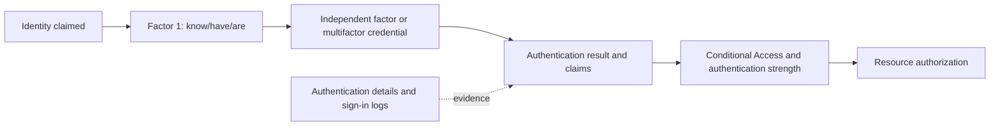

| Example | Factor interpretation | MFA quality |
|---|---|---|
| Password + SMS code | Knowledge + control of phone route | MFA, but remotely phishable and telecom-dependent |
| Password + Authenticator push | Knowledge + registered app/device | MFA, but push approval can be socially engineered |
| Passkey/security key + local PIN/biometric | Possession of private key + user verification | Passwordless, phishing-resistant MFA in supported design |
| Windows Hello for Business | Device-bound key + gesture/biometric unlock | Passwordless, phishing-resistant MFA |
| Multifactor CBA | Certificate private key + configured second factor/assurance binding | Phishing-resistant MFA when correctly designed |
| Two passwords | Two knowledge proofs | Not MFA; same factor category |

MFA dramatically reduces password-only risk, but **MFA is not one security level**. SMS can stop many password-reuse attacks while still being vulnerable to phishing and number takeover. Authentication design should match user persona, resource sensitivity, device support, recovery, accessibility, and threat model.

---

## 2. Authentication method policy, registration, preference, and enforcement

Four different controls are commonly confused:

1. The **Authentication methods policy** determines which users/groups may use and configure supported methods and method-specific options.
2. **Registration** means the user actually enrolled a method.
3. **System-preferred authentication** influences which registered method Entra prompts first.
4. **Conditional Access authentication strength** limits which method combinations can satisfy access to a resource.

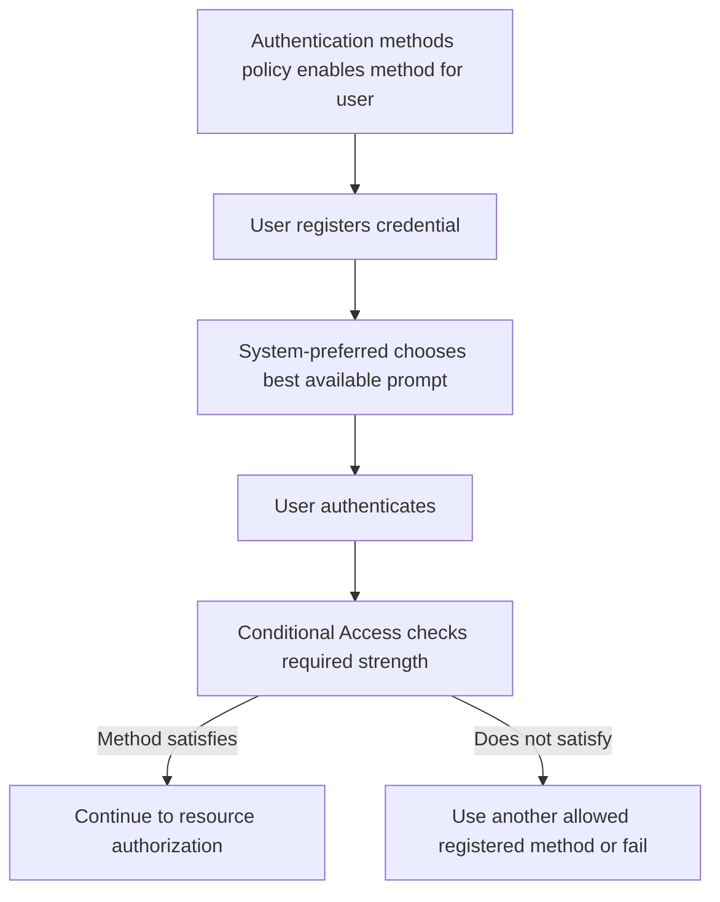

| State | Question | Example failure |
|---|---|---|
| Enabled | Is the method allowed for this user/group? | Passkey policy excludes pilot user |
| Configured | Are method options compatible with device/authenticator? | AAGUID blocked or attestation required |
| Registered | Does user have a usable credential? | MFA policy enabled but no method enrolled |
| Offered/preferred | Which method does sign-in present first? | System-preferred chooses CBA on device without certificate |
| Satisfies MFA | Does the method provide required factor claim? | Password alone does not satisfy MFA |
| Satisfies strength | Is the method in the specific allowed combination? | Authenticator push does not satisfy phishing-resistant strength |
| Supported by client | Can this app/browser/platform complete it? | Legacy client cannot perform modern challenge |
| Recoverable | Can user safely regain access after loss? | Only method was on lost phone |

An administrator can enable passkeys without forcing their use. A user can register Authenticator but continue selecting SMS unless preference or access policy directs a stronger method. A resource can require phishing-resistant strength only after targeted users have an eligible method and recovery path.

---

## 3. Method comparison and the security hierarchy

| Method | Primary sign-in | MFA | Passwordless | Phishing-resistant | Main dependency/limitation |
|---|---:|---:|---:|---:|---|
| Password | Yes | No | No | No | Secret reuse, phishing, spray |
| SMS sign-in | Yes in supported setup | Can be second factor | Passwordless first-factor experience, but not MFA by itself | No | Phone-number and telecom risk |
| SMS/voice MFA | No/secondary | Yes | No | No | SIM swap, interception, delivery, social engineering |
| Software OATH TOTP | Secondary | Yes | No | No | Code can be phished/replayed within window |
| Hardware OATH token | Secondary | Yes | No | No | Token logistics; new hardware-token experience **Preview** |
| Authenticator push | Can support first-factor context; commonly MFA | Yes | Push plus password is not passwordless | No | MFA fatigue/social engineering; number matching helps |
| Authenticator phone sign-in | Yes | Satisfies passwordless MFA strength | Yes | No | Device registration, app availability, recovery |
| Passkey/FIDO2 security key | Yes | Yes | Yes | Yes | Browser/OS/authenticator support, key custody |
| Synced passkey | Yes | Yes | Yes | Yes | Provider account/sync recovery; no attestation |
| Passkey in Authenticator | Yes | Yes | Yes | Yes | Supported app versions/platform rollout |
| Windows Hello for Business | Yes | Yes | Yes | Yes | Device provisioning, key trust/cloud trust/cert trust choices |
| macOS platform credential | Yes | Yes | Yes | Yes | Platform SSO/management prerequisites |
| Certificate-based authentication | Yes | Can be single or multifactor by binding | Yes | Multifactor CBA is phishing-resistant strength | PKI, mapping, revocation, certificate lifecycle |
| Temporary Access Pass | Yes | Can satisfy MFA for bootstrap | Temporary, not steady-state passwordless strategy | Not phishing-resistant strength | Short lifetime, issue/proofing/custody |

“Phishing-resistant” means the credential is bound to the legitimate relying party or sign-in surface so a remote fake site cannot simply capture a reusable secret or code and replay it to the real site. It does not mean invulnerable. Compromised endpoints, malicious browser extensions, session theft, enrollment fraud, recovery fraud, and improper resource authorization remain concerns.

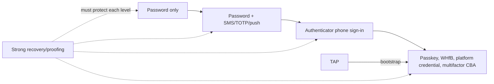

---

## 4. System-preferred authentication in August 2026

**System-preferred authentication** prompts users with the strongest registered method according to Microsoft's current ranking while still allowing another permitted method when the user selects **Sign in another way**.

As of the checked July 2026 documentation, it has three states:

| State | First factor | Second factor | Use |
|---|---|---|---|
| Disabled | Existing behavior | Existing behavior | Temporary compatibility after assessed need |
| Enabled | Existing first-factor behavior | System-preferred ranking | Stronger MFA prompt without first-factor change |
| Microsoft managed | System-preferred ranking where rollout applies | System-preferred ranking | Microsoft-managed current direction |

The **Microsoft managed** behavior affecting both first and second factor was being gradually deployed through **August 2026**. A tenant might not show identical behavior for every user until rollout reaches it. The documented current ranking is dynamic and can change; it placed Temporary Access Pass first as recovery, then passkeys, certificate-based authentication, Authenticator, external MFA, TOTP, telephony, QR code, and password, with detailed method categories.

### 🔍 Plain-English deep-dive: preference is not enforcement

- **Preference** — *the method offered first.* **Analogy:** The reception desk points you toward the strongest available lane. **Why it matters:** The user may select another allowed method.
- **Enforcement** — *a policy requirement that access must use an accepted method combination.* **Analogy:** The secure room admits only specific badge types regardless of the receptionist's suggestion. **Why it matters:** Use authentication strength when the resource requires a specific assurance level.
- **Microsoft managed** — *a setting whose behavior Microsoft can evolve according to documented rollout.* **Analogy:** The building operator updates the lane order centrally. **Why it matters:** Monitor Message center/Learn and test rather than assuming a static default.

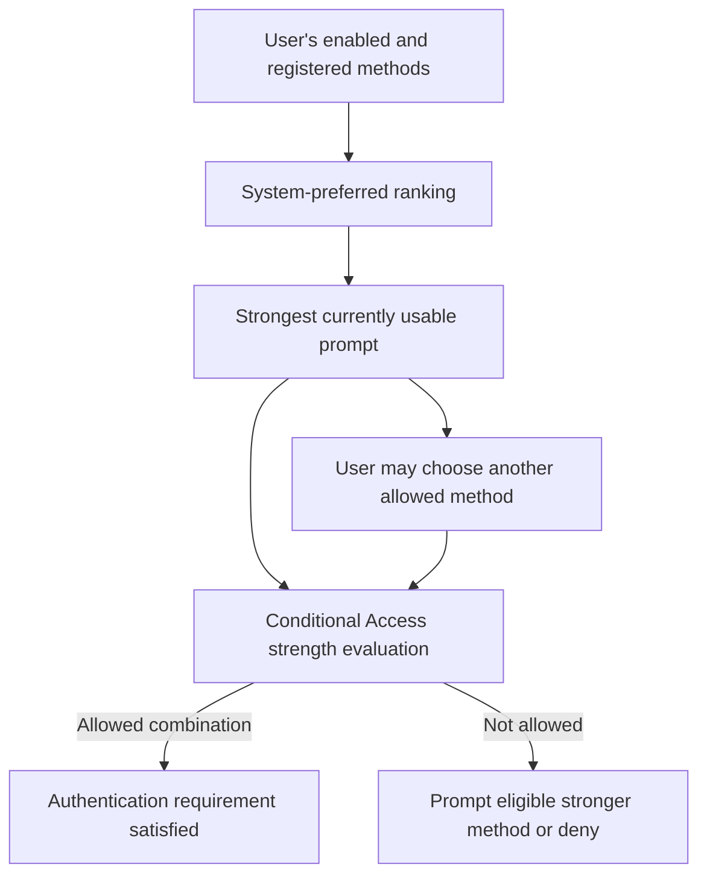

Known behavior must be tested. For example, system-preferred can offer certificate-based authentication before password where Microsoft-managed first-factor behavior applies; a user without the certificate on the current device may need **Sign in another way**. Federated users retain external first-factor routing, while system-preferred can affect second factor.

---

## 5. Registration and combined MFA/SSPR experience

**Self-service password reset (SSPR)** lets eligible users reset or unlock their account using configured verification methods and policy. **Combined registration** gives users one security-info experience for methods that support MFA and SSPR instead of separate enrollment processes.

| Registration mode | Trigger | User experience | Operations concern |
|---|---|---|---|
| Interrupt mode | Sign-in policy requires registration/refresh | Wizard during sign-in | Must avoid dead-end when no bootstrap method exists |
| Manage mode | User visits Security info/My Sign-ins | Add/delete/change supported methods | Strong authentication required before sensitive changes |
| Registration campaign | Nudge after normal MFA | Authenticator or passkey prompt, with configured snooze | Only one targeted method per tenant campaign at a time |
| Admin bootstrap | Help desk issues TAP or approved credential process | User establishes durable strong method | Proofing, issuance, expiry, and post-use review |

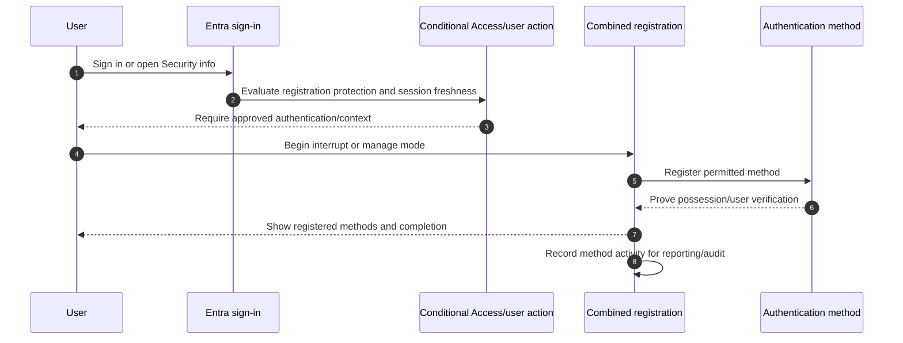

The checked guidance states that adding or modifying a passkey requires strong authentication within the previous five minutes. Since August 25, 2025, users managing credentials or accessing My Sign-ins must complete MFA when the current session is older than ten minutes. Authentication-strength policies for the **Register security information** user action can conflict with bootstrap when users do not yet possess an allowed method. Test this carefully.

### Registration design questions

1. Which personas can self-register from which locations/devices?
2. What existing proof lets a new user bootstrap safely?
3. Which two recovery-capable methods should each persona maintain?
4. Can guests register in the resource tenant, and which home-tenant claims are trusted?
5. How are accessibility, shared devices, frontline users, and restricted phones supported?
6. How does help desk verify identity when every method is lost?
7. Which events produce alerts and post-recovery review?

---

## 6. Registration campaigns

Registration campaigns nudge eligible users during sign-in to register **Microsoft Authenticator** or a **passkey (FIDO2)** after completing ordinary MFA. As of the August 2026 documentation, only one target method can be active in the tenant campaign at a time.

| Campaign option | Current behavior to verify | Design consideration |
|---|---|---|
| Target method | Authenticator or passkey | Sequence migrations; cannot target both simultaneously |
| Include/exclude | Users/groups | Exclusion wins; protect exceptions with owner/expiry |
| Snooze | Configurable in Enabled mode; limited/unlimited design | Support and deadline communication |
| Microsoft managed | Microsoft controls target/defaults and rolls out changes | Documentation notes movement toward passkey nudges and changed snooze behavior |
| Passkey nudge | Evaluates local passkey for current device/browser combination | User may be nudged on one device but not another |
| Mobile support | Differs for Authenticator/passkey and native/browser paths | Test exact platform; current limitations apply |

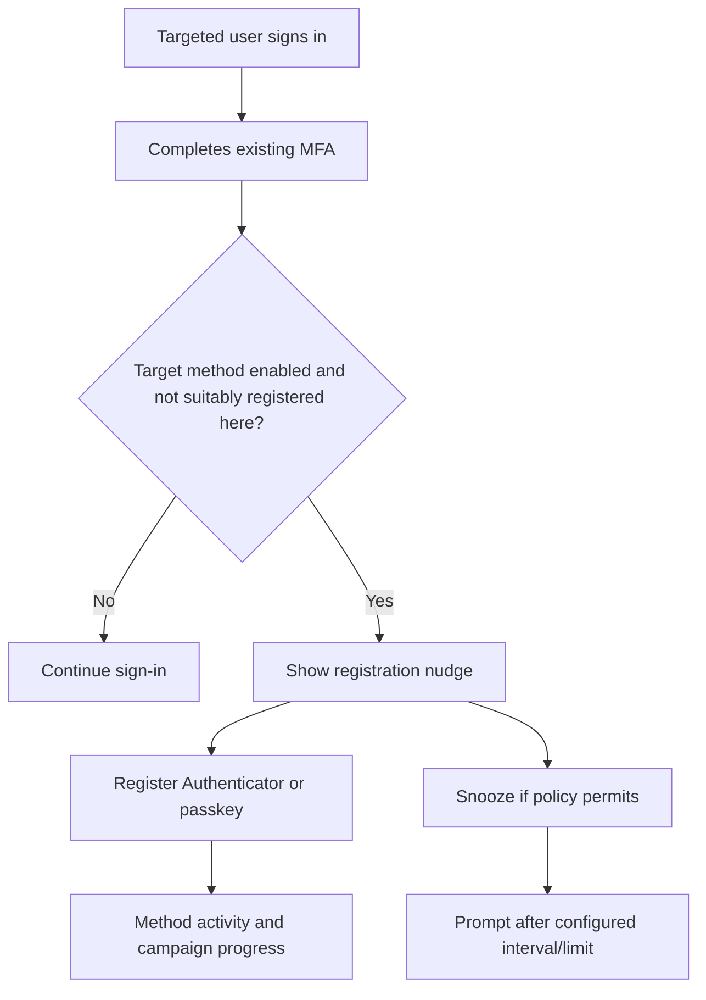

The Microsoft-managed campaign behavior is **change-sensitive**. The checked page states defaults are incrementally moving from Authenticator toward passkeys for eligible tenants and changing snooze/targeting behavior. Do not promise a user experience based on a screenshot; record the tenant state and test account behavior.

---

## 7. Passkeys and FIDO2

**FIDO2** is a set of standards for phishing-resistant public-key authentication. A **passkey** is a FIDO2 credential in which the private key stays under the authenticator's control and the public key is registered with the service. Sign-in proves possession of the private key and verifies the legitimate relying party domain.

### 🔍 Plain-English deep-dive: why passkeys resist remote phishing

- **Public/private key pair** — *the service stores a public key; the authenticator protects the private key.* **Analogy:** The service keeps a lock while the user keeps the unique key. **Why it matters:** The server does not store a shared password that the user types into websites.
- **Relying-party binding** — *the credential is bound to the legitimate domain/context.* **Analogy:** The key is cut for one building and cannot unlock an attacker's imitation building. **Why it matters:** A fake sign-in page cannot relay a captured passkey response to another domain like it can relay an OTP.
- **User verification** — *a PIN or biometric unlocks use of the authenticator locally.* **Analogy:** The badge needs its owner's gesture. **Why it matters:** The biometric template normally stays on the device/authenticator.
- **Attestation** — *evidence about authenticator make/model at registration.* **Analogy:** Verifying that a badge came from an approved manufacturer. **Why it matters:** It supports device-bound authenticator policy but reduces flexibility/privacy and is unavailable for synced passkeys.

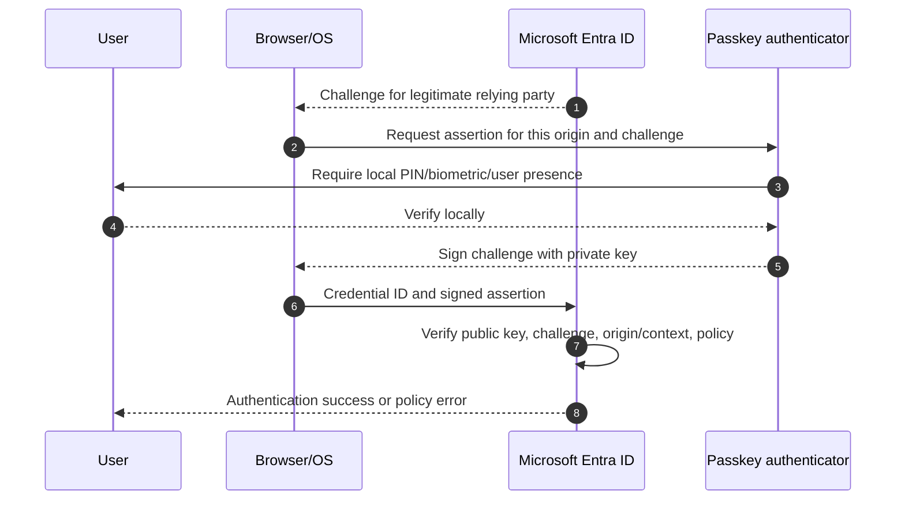

| Passkey type | Private-key behavior | Strength | Governance tradeoff |
|---|---|---|---|
| Device-bound security key | Private key remains on hardware key | Phishing-resistant; portable physical authenticator | Procurement, PIN, spare key, loss, AAGUID/attestation |
| Device-bound Authenticator passkey | Bound to supported phone/app | Phishing-resistant | Phone lifecycle and supported versions |
| Platform credential/WHfB | Bound to device secure hardware where supported | Phishing-resistant | Device enrollment and recovery |
| Synced passkey | Encrypted credential syncs through passkey provider to eligible devices | Phishing-resistant under current Entra classification | Provider-account recovery and no attestation |

As of the checked March 2026 documentation, Entra supports synced and device-bound passkeys and makes them available in all Entra ID editions without an extra passkey license. **Passkey profiles** allow group-targeted requirements for device-bound/synced types, attestation, and AAGUID restrictions. Enabling passkey profiles migrates existing global configuration into a Default profile and cannot be opted out of; the page states up to three profiles were supported, with more in development. Treat these limits as change-sensitive.

Administrator provisioning of FIDO2 security keys through Microsoft Graph/custom clients is **Preview**. Guest registration of passkeys in the resource tenant was not supported in the checked guidance. UPN changes can require deletion and re-registration of affected passkeys. Validate these limitations live.

---

## 8. Windows Hello for Business

**Windows Hello for Business (WHfB)** replaces password use on the device with a cryptographic credential bound to a user and device, unlocked by PIN or biometric. The PIN is local to the device; it is not the user's Entra password.

| Component | Purpose | Security point |
|---|---|---|
| Device registration/join | Establishes device identity and keys | Duplicate/broken registration affects authentication |
| TPM/secure hardware where available | Protects private key | Reduces export/replay risk |
| PIN/biometric gesture | Unlocks key locally | PIN is device-specific; biometric is not sent to Entra |
| Provisioning policy | Controls enrollment and trust model | Prerequisites differ for cloud trust, key trust, certificate trust |
| PRT/broker | Enables SSO and resource token acquisition | CA evaluates resource token requests, not merely local unlock |

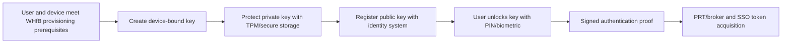

WHfB satisfies MFA in Conditional Access. Authentication strength has a user-experience nuance: if the user authenticated initially with another method and a strength later requires WHfB, Entra may not offer WHfB as a step-up in that session; the user may need to restart and select the required sign-in option. Test sign-in, unlock, key recovery, device replacement, remote/hybrid resource access, and help-desk paths.

Do not call a four-digit PIN “weaker than a password” without context. Online password attempts can be remote and reusable; a WHfB PIN unlocks a device-bound private key and is protected by local anti-hammering/security controls. The threat model is different.

---

## 9. Microsoft Authenticator: push, phone sign-in, and passkeys

Microsoft Authenticator supports several distinct modes.

| Authenticator mode | What it does | Assurance | Common confusion |
|---|---|---|---|
| Push notification MFA | Approves second-factor prompt, now with number matching | MFA, not phishing-resistant | “Authenticator” does not automatically mean passwordless |
| TOTP code | Generates time-based one-time password | MFA, remotely phishable | Code works without push connectivity but can be relayed |
| Passwordless phone sign-in | User selects number/context and approves with app/device unlock | Passwordless MFA strength, not phishing-resistant strength | Different registration/enablement from push |
| Passkey in Authenticator | FIDO2 credential in supported Authenticator platform/version | Phishing-resistant | Newer capability with platform/version dependencies |
| Broker | Helps device registration and token SSO on mobile | Supports device/CA flows | Broker role is not itself an MFA method |

**Number matching** is enabled for Authenticator push notifications. In ordinary cross-device sign-in, the page displays a number that the user enters in Authenticator, reducing blind approval. Current same-device experiences in Microsoft mobile apps can show a secure Yes/No flow tied to the initiating device; browser behavior differs. Users cannot opt out of number matching.

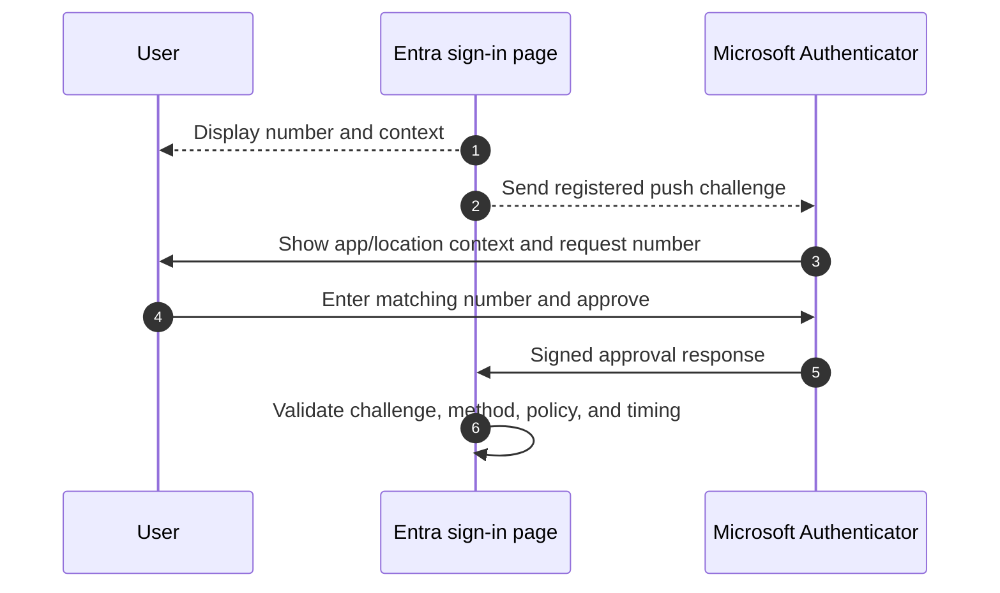

Number matching reduces accidental approval but does not make push phishing-resistant. A real-time adversary can instruct the victim to enter the displayed number. Train users to deny/report unexpected prompts, show application/location context where supported, monitor repeated denials, and move sensitive personas toward passkeys, WHfB, or multifactor CBA.

---

## 10. Certificate-based authentication

**Microsoft Entra certificate-based authentication (CBA)** lets users authenticate directly to Entra using an X.509 certificate issued by the organization's Public Key Infrastructure (PKI), without requiring AD FS for cloud CBA.

| Design area | Question | Failure/security risk |
|---|---|---|
| Trust store | Which certificate authorities are trusted? | Rogue/expired/missing CA |
| User binding | Which certificate field maps to which user property? | Wrong user or ambiguous mapping |
| Authentication binding | Which issuer/policy OID qualifies as single or multifactor? | Certificate gives unintended assurance |
| Revocation | Where is HTTP CRL distribution point and is it reachable? | Revoked certificate accepted or outage |
| Certificate lifecycle | Issue, renew, replace, revoke, recover | Expiry outage or retained access |
| Client support | Which browser/native app/platform scenarios work? | Authentication offered but cannot complete |

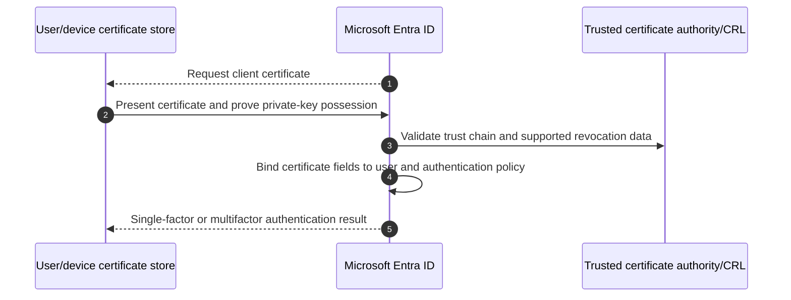

The checked guidance describes CBA as available without a paid Entra edition, while Conditional Access/MFA features layered on it require their applicable licensing. It supports many browser and Office scenarios but has limitations: the organization supplies PKI; HTTP Certificate Revocation List (CRL) distribution is required in documented scenarios; Online Certificate Status Protocol (OCSP) and LDAP CRL URLs are not supported in the cited overview; and some Windows sign-in/nonbrowser combinations differ.

CBA can be excellent for regulated or smart-card environments, but PKI complexity is real. A certificate is only as trustworthy as issuance proofing, private-key protection, mapping, revocation, and operational recovery.

---

## 11. Temporary Access Pass

A **Temporary Access Pass (TAP)** is a time-limited passcode that can bootstrap passwordless methods or recover access. It can be configured for one-time or multiple use under current policy options. TAP is not a permanent credential and is not part of the phishing-resistant authentication strength.

### TAP lifecycle

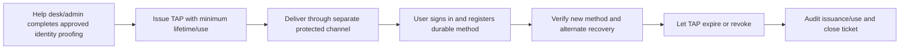

| Decision | Safe design |
|---|---|
| Who can issue? | Least-privileged Authentication Administrator process with approval/audit |
| When? | New-user bootstrap, lost-device recovery, method migration under policy |
| Lifetime/use | Minimum practical; one-time where workflow supports it |
| Delivery | Separate authenticated channel; never ordinary open email/chat |
| User instruction | Sign in only at known official URL; register durable approved method immediately |
| Completion | Confirm method works, alternative recovery exists, TAP is expired/revoked |
| Monitoring | Alert unusual issuers, volume, repeated issuance, failed use, privileged users |

TAP can satisfy MFA for registration/bootstrap in supported scenarios, which makes issuance identity proofing critical. An attacker who convinces help desk to issue a TAP can enroll their own strong credential. Strong authentication is undermined by weak recovery.

---

## 12. OATH tokens, SMS, and voice

**OATH TOTP** is a standards-based time code generated from a shared seed. Software authenticator apps and hardware tokens can produce these codes. TOTP is useful where push or data connectivity is unavailable, but it is remotely phishable because a victim can type the current code into a fake site.

| Method | Benefit | Limitation | Suitable use |
|---|---|---|---|
| Software OATH | Offline code, broad authenticator support | Seed/device recovery and phishing | Transitional/general MFA where passkey not ready |
| Hardware OATH | No phone/app requirement | Procurement, seed custody, clock drift, phishing | Accessibility/restricted-device scenarios |
| SMS | Familiar and broad reach | SIM swap, interception, delivery, phone-number recycling | Transitional/recovery with explicit risk |
| Voice | Accessibility and no smartphone data | Call forwarding, interception, social engineering, reliability | Limited exception based on user need |

The new hardware OATH token management/provisioning experience was documented as **Preview** in the August 2026 authentication-method overview. Recheck lifecycle, Graph/API, licensing, and migration support before basing production operations on it.

Telephone methods should not be the target state for privileged or high-risk users. Do not abruptly remove them until users possess and have tested stronger primary and recovery methods. Track exception owner, reason, compensating controls, expiry, and migration date.

---

## 13. Authentication strengths

An **authentication strength** is a Conditional Access grant control specifying which authentication method combinations may satisfy access to a resource.

| Built-in strength | Purpose | Representative accepted methods as of checked guidance |
|---|---|---|
| Multifactor authentication strength | Any supported MFA combination | FIDO2, WHfB/platform credential, multifactor CBA, TAP, password/federated factor plus SMS/voice/push/TOTP |
| Passwordless MFA strength | MFA without entering password | FIDO2, WHfB/platform credential, multifactor CBA, Authenticator phone sign-in |
| Phishing-resistant MFA strength | Methods bound to legitimate sign-in surface | FIDO2/passkeys, WHfB/platform credential, multifactor CBA |
| Custom strength | Selected supported combinations/AAGUID options for a scenario | Client-specific approved methods |

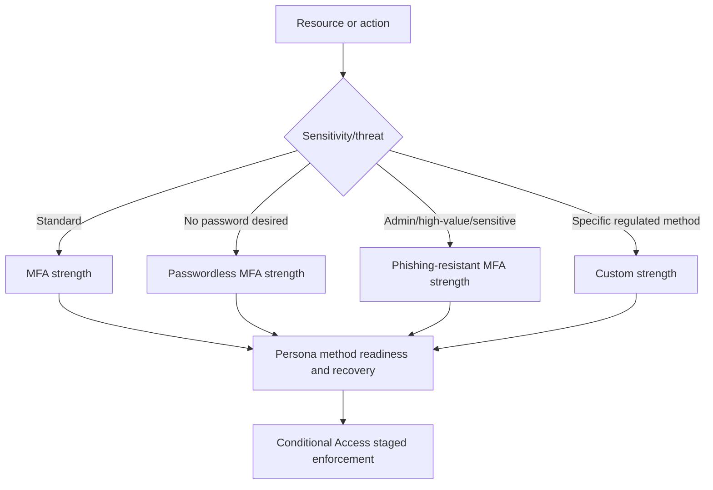

### Important limitations

- Strength is evaluated after initial authentication; it does not prevent the initial password page by itself.
- Do not combine **Require MFA** and **Require authentication strength** in the same policy; MFA strength provides equivalent MFA semantics.
- WHfB may not be offered as a fresh step-up when another primary method started the session; users may need a new session/sign-in option.
- Email one-time pass for guests is not an authentication-strength combination in the checked guidance.
- Method policy must enable the method, and the user must have it registered and supported on the current client.
- Built-in definitions can be updated by Microsoft; validate current combinations.

**Design principle:** Use broad method enablement only where acceptable, then use authentication strength to require specific assurance for sensitive resources. Avoid creating dozens of nearly identical custom strengths without owner, use case, and review.

---

## 14. Password protection and smart lockout

Passwordless adoption does not instantly remove passwords from every identity, recovery process, legacy system, or synchronized environment. Password controls still matter during transition.

**Microsoft Entra Password Protection** helps block globally known weak passwords and organization-specific banned terms. **Smart lockout** identifies likely malicious sign-in attempts while trying not to lock out the legitimate user, using separate familiarity and threshold logic managed by the service.

| Control | Purpose | Design caution |
|---|---|---|
| Global banned-password list | Blocks common weak/compromised patterns | Microsoft manages content; do not rely on visible list |
| Custom banned-password list | Blocks company/product/location terms and variants | Keep meaningful, not an enormous leaked-password substitute |
| On-premises Password Protection agents | Extend policy to AD DS password changes | Agent/proxy/DC deployment, monitoring, emergency behavior |
| Smart lockout | Limits password guessing with intelligence | Threshold/duration changes affect security and user support |
| Risk detection | Detects spray, unfamiliar sign-in, leaked credentials | Entra ID Protection licensing and operational response |

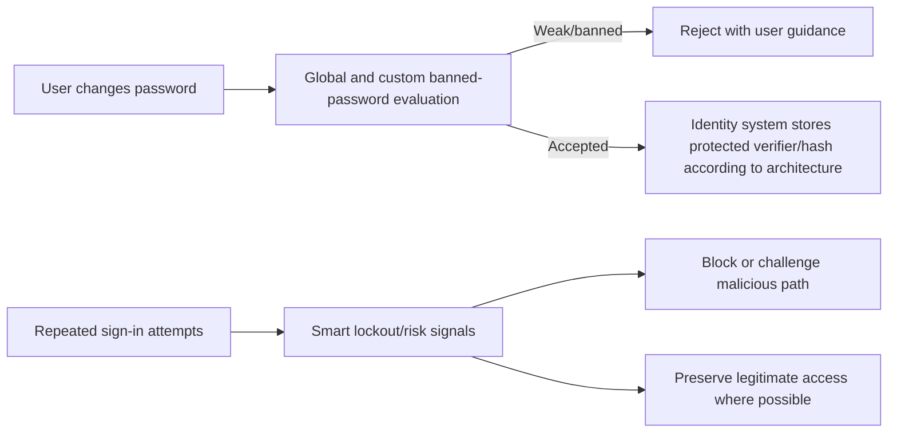

Do not use frequent arbitrary password expiration as the main defense unless required by a specific policy/standard with current rationale. Favor long unique passwords, banned-password protection, phishing-resistant authentication, risk detection, and prompt change when compromise is known. Confirm current organizational standards and Microsoft guidance.

---

## 15. Security defaults versus Conditional Access

**Security defaults** are a Microsoft-managed baseline available without premium Conditional Access licensing. They protect all users with baseline behaviors such as MFA registration/challenges and blocking legacy authentication according to the current service design. **Conditional Access (CA)** provides granular, client-designed policies and requires applicable licensing.

| Dimension | Security defaults | Conditional Access |
|---|---|---|
| Best fit | Small/simple tenant needing baseline protection | Organizations needing persona, app, device, location, risk, session, or strength design |
| Configuration | Microsoft-managed package | Granular policies and templates |
| Exclusions | Limited/no custom exclusion model | Explicit includes/excludes with governance |
| Licensing | Available to all tenants | Entra ID P1; risk conditions generally P2 plus dependencies |
| Coexistence | Cannot be used as a substitute layered arbitrarily with CA | When CA is adopted, intentionally replace baseline coverage |
| Operations | Lower design effort | Requires policy governance, report-only, logs, rollback |

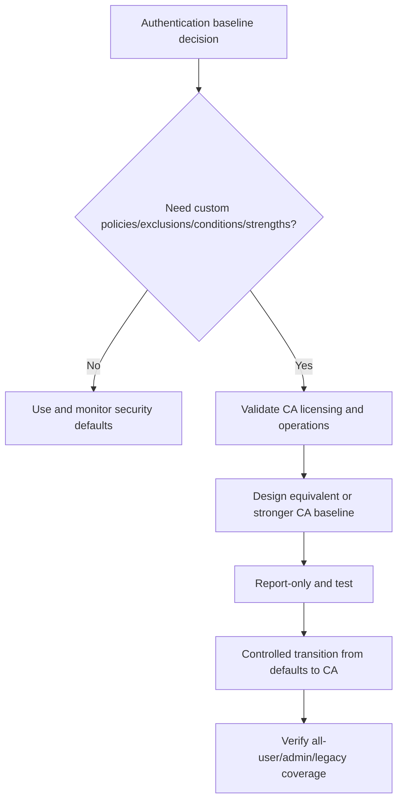

Do not disable security defaults first and design policies later. Prepare and validate the replacement CA baseline, emergency access, registration readiness, and support plan, then perform the approved transition in a controlled window. Part 9 provides the full method.

---

## 16. Human users, service accounts, and workload identities

MFA is designed for interactive human authentication. A service principal or managed identity does not answer a phone prompt. Treat identity types differently.

| Identity | Preferred control | Anti-pattern |
|---|---|---|
| Employee | Passkey/WHfB/CBA plus CA and recovery | Permanent SMS-only MFA for every context |
| Administrator | Phishing-resistant method, separate admin identity, PAW, PIM, strong recovery | Daily email account as permanent Global Admin |
| Guest | Home-tenant MFA trust/cross-tenant design or resource-tenant method as supported | Assuming guest email OTP equals phishing-resistant MFA |
| Legacy user service account | Migrate workflow to workload identity; tightly constrain interim account | Exclude from all CA and use nonexpiring password |
| Service principal | Managed/federated/certificate credential, least app permission, workload CA where supported | Applying human MFA policy or storing secret in script |
| Managed identity | Resource attachment, least RBAC/API permission, activity monitoring | Assuming “no secret” means “no risk” |

A legacy automation using a user account may break under MFA because the real design is wrong: software is impersonating a person. Inventory the workflow, replace it with application permission only when the API and risk model justify app-only authority, and scope the workload identity tightly. Do not grant tenant-wide app permission merely to remove a user prompt.

---

## 17. Emergency access accounts

Emergency-access or **break-glass** accounts provide tenant recovery when ordinary federation, MFA devices, Conditional Access, PIM approval, or administrator accounts fail. Current Microsoft guidance recommends two or more cloud-only accounts using the `onmicrosoft.com` domain, permanent active Global Administrator assignment, phishing-resistant credentials such as FIDO2/passkeys or CBA, secure custody, monitoring, and regular validation.

| Requirement | Purpose |
|---|---|
| At least two accounts | Redundancy without shared failure |
| Cloud-only initial domain | Avoid on-premises/federation dependency |
| Strong method different from normal admins | Avoid shared Authenticator/telecom failure mode |
| Excluded from policies that block/restrict sign-in | Preserve recovery during policy or dependency failure |
| Report-only policies need no exclusion | They do not enforce controls |
| Permanent active privileged role | Avoid PIM activation/approver deadlock |
| Secure separate credential storage | Prevent ordinary use and shared physical failure |
| Alert on every sign-in/action | Use should be rare and investigated |
| Test at least every 90 days | Prove sign-in and necessary admin action work |

```mermaid
flowchart LR
    OUTAGE[Normal admin path unavailable] --> AUTHORIZE[Invoke documented emergency process]
    AUTHORIZE --> RETRIEVE[Two-person/approved credential retrieval]
    RETRIEVE --> SIGNIN[Use secure workstation and alternate network]
    SIGNIN --> RESTORE[Perform minimum recovery actions]
    RESTORE --> EXIT[Sign out, secure credential, restore normal controls]
    EXIT --> REVIEW[Alert review, audit actions, post-use report]
```

Exclusion is not permission for routine use. The phishing-resistant credential, secure workstation, custody, alerts, and drill process compensate for exclusion from ordinary CA restrictions. Every use is a high-severity event until confirmed as an authorized test or emergency.

---

## 18. Persona-based rollout design

One method does not fit every worker.

| Persona | Target steady-state | Bootstrap/recovery | Special tests |
|---|---|---|---|
| Standard managed Windows user | WHfB; passkey alternative | TAP plus spare approved method | New device, TPM reset, remote work, browser choice |
| Administrator | Device-bound passkey/security keys or multifactor CBA; separate admin identity | Two controlled keys/cert recovery; no personal phone dependency | PAW, PIM, CA strength, key loss, emergency separation |
| Executive/high-risk traveler | Passkey/WHfB and spare key | High-assurance help-desk proofing | New country/device, offline, theft, privacy |
| Frontline/shared-device user | Approved passkey/QR/phone/shared-device strategy by current support | Shift-safe supervised recovery | Shared device, no personal phone, rapid turnover |
| Mobile/BYOD user | Passkey/Authenticator with app protection/device registration as designed | TAP and alternate device | Broker, new phone, lost phone, managed/unmanaged |
| Restricted environment | Hardware passkey or CBA | Secured spare credential | No phone, no camera, offline/controlled network |
| Guest/partner | Cross-tenant MFA trust or supported resource method | Sponsor-managed external recovery | Home tenant, method claim, guest limitations |
| Accessibility needs | User-tested compatible method(s) | Accessible proofing and assisted path | Screen reader, motor/cognitive/telephony constraints |

### Rollout rings

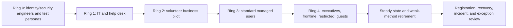

Administrators are high risk but should not always be the first uncontrolled pilot. Use test admin identities and representative privileged workflows first; preserve emergency access; then deploy to real admins with support and rollback. Pilot populations must include people likely to fail, not only technically enthusiastic volunteers.

---

## 19. Lost device, new device, and account recovery

Recovery is part of authentication architecture. If help desk can replace a passkey after asking public knowledge questions, the effective security of the passkey equals the weak recovery process.

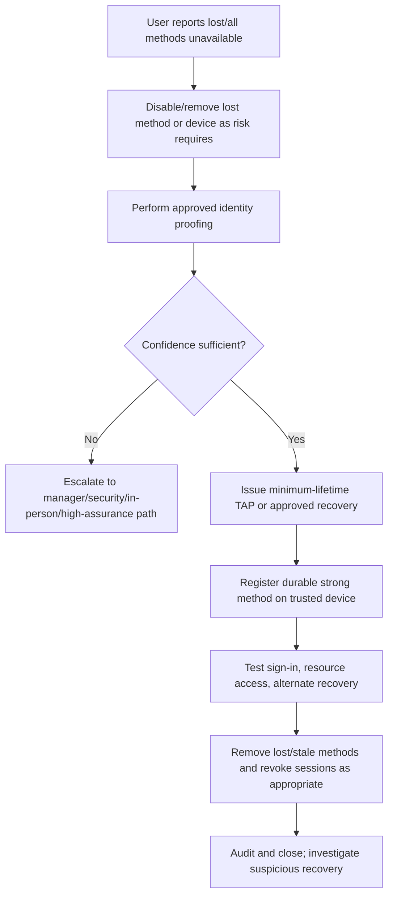

| Scenario | Required action | Security caution |
|---|---|---|
| Phone replaced normally | Register new method before removing old when possible | Avoid window with no recovery |
| Phone lost/stolen | Remove method/device, assess session/token exposure | Do not wait only for user password change |
| Security key lost | Remove credential ID, review use, activate spare | A PIN-protected key still requires response |
| WHfB device replaced | Provision new device/key, retire old device object after correlation | Preserve BitLocker/recovery and management evidence |
| User lost all methods | High-assurance proofing and TAP/approved bootstrap | Social-engineering target |
| User changed UPN | Validate passkey known issue/current remediation | May require passkey deletion/re-registration |
| Guest cannot register | Check resource/home tenant and current passkey support | Do not force unsupported resource-tenant process |

**Recovery evidence:** caller/request identity, proofing steps and confidence, approver, operator, method issued/removed, affected device, UTC times, sign-in/session actions, tests, anomalies, and closure. Minimize personal data and never record TAP value, private key, seed, or full credential.

---

## 20. Help-desk identity proofing

### 🔍 Plain-English deep-dive: authentication recovery is identity issuance

When help desk resets a password, removes MFA, or issues TAP, it is effectively issuing or enabling identity proof. This is not an ordinary convenience transaction.

| Proofing signal | Value | Limitation |
|---|---|---|
| Existing strong method | High when still controlled by user | Unavailable in full-loss scenario |
| In-person government/employee credential under policy | Can provide strong evidence | Privacy, forgery detection, regional/legal requirements |
| Manager confirmation | Useful organizational corroboration | Manager account may be compromised; not sufficient alone |
| Known corporate device with live interaction | Adds possession/context | Device may be stolen or remotely controlled |
| HR-record callback through authoritative contact | Better than caller-provided number | HR data can be stale; insider risk |
| Video/selfie/biometric identity verification | Potential high assurance through approved provider | Bias, privacy, consent, regional and vendor risk |
| Knowledge questions | Low value | Public, guessable, socially engineered |

### Proofing procedure

1. Classify request risk: standard user, privileged user, executive, sensitive incident, unusual location, recent changes.
2. Use contact information from an authoritative system, never only what the caller provides.
3. Require multiple independent signals according to policy.
4. Escalate uncertain or high-risk requests; do not reward urgency with weaker proof.
5. Separate requester, approver, and issuer for privileged recovery where practical.
6. Issue the minimum temporary capability and deliver it securely.
7. Monitor first sign-in, method registration, session activity, and sensitive changes.
8. Review repeated recovery, recent phone/UPN/manager changes, and social-engineering indicators.

Microsoft's 2026 authentication overview describes **Verified ID** as identity verification for account recovery, not a normal sign-in/MFA/SSPR method, including partner identity-verification and Face Check scenarios. Treat availability, licensing, provider, biometric/privacy, regional, and legal requirements as **change-sensitive** and engage privacy/legal teams before adoption.

---

## 21. Migration from legacy MFA and SSPR policies

Microsoft's current direction is the unified Authentication methods policy rather than managing overlapping methods through legacy per-user MFA/service settings and SSPR method controls.

| Legacy surface | Migration concern | Target state |
|---|---|---|
| Per-user MFA Enabled/Enforced | App passwords and inconsistent challenge behavior | Conditional Access or security defaults with tested coverage |
| Legacy MFA service settings | Methods enabled outside Authentication methods policy | Unified policy with explicit groups/options |
| Separate SSPR method policy | Different allowed methods confuse users | Combined registration and aligned recovery policy |
| App passwords | Bypass modern interactive auth for legacy apps | Modernize app/protocol; retire app password |
| SMS/voice-only enrollment | Weak target and poor recovery diversity | Passkey/WHfB/Auth/CBA plus appropriate alternate |
| Unowned exclusions | Permanent bypass | Named owner, reason, expiry, compensating controls |

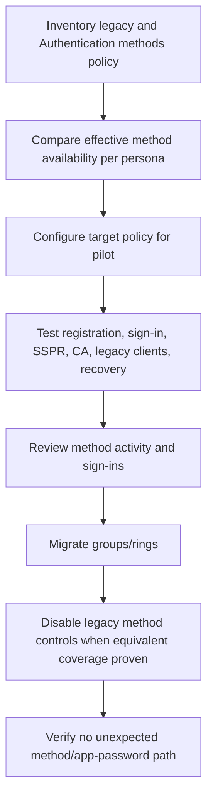

Do not assume a portal toggle immediately removes a method from every cached session or legacy configuration. Export before/after state, test fresh and existing sessions, monitor sign-ins, and keep rollback instructions. Migration rollback should restore only the previous known configuration temporarily while preserving the issue evidence and a dated remediation plan.

---

## 22. Deployment method, test plan, and rollback

### Prerequisites

| Prerequisite | Why |
|---|---|
| Persona and application inventory | Method/client fit differs |
| Accurate user contact/source data | Registration and recovery depend on it |
| Current licensing | CA/strength/risk and product dependencies vary |
| Emergency access validated | Prevent tenant lockout |
| Help-desk proofing/runbook/training | Enrollment failures become identity incidents |
| Supported clients/platforms | Passkey, broker, WHfB, CBA behavior differs |
| Communication and accessibility plan | Strong controls must remain usable and inclusive |
| Logging/roles | Diagnose registration and challenge outcomes |
| Change and rollback owner | High-impact identity change needs authority |

### Test matrix

| Test type | Example | Expected result |
|---|---|---|
| Positive registration | Pilot user registers allowed passkey | Credential visible; sign-in succeeds on supported client |
| Negative registration | Excluded user attempts passkey | Registration denied without affecting other allowed method |
| Positive strength | Admin uses device-bound passkey | Phishing-resistant CA requirement satisfied |
| Negative strength | Admin uses SMS | Access denied/step-up to eligible method |
| System preference | User has passkey and password | Current tenant behavior offers strongest method first |
| Recovery | User loses phone and follows proofing/TAP process | Durable method restored; old method removed; event audited |
| New device | WHfB user provisions replacement | New key works; old device retired safely |
| Offline/no mobile | Restricted persona uses approved key/CBA | Access works without unapproved phone dependency |
| Guest | External user follows supported home/resource flow | Correct MFA trust and no unsupported passkey assumption |
| Failure | Push delivery unavailable | User uses approved alternate, not policy bypass |
| Break glass | Scheduled emergency account drill | Sign-in/admin action/alert work without normal dependencies |
| Rollback | Pilot strength disabled/report-only | Access restored through prior approved method; evidence retained |

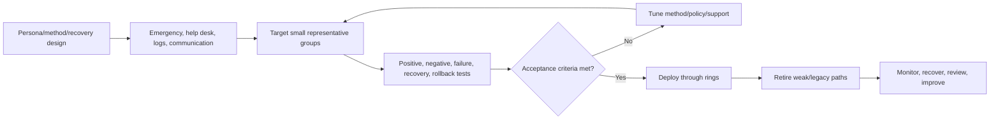

### Rollback principles

- Prefer disabling or moving the new Conditional Access enforcement to report-only over deleting design evidence.
- Re-enable the previously approved method only for the affected pilot and minimum time when necessary.
- Do not disable MFA tenant-wide or broadly exclude users to recover one persona.
- Preserve sign-in, audit, method activity, and ticket evidence before changes.
- Define rollback triggers: administrator lockout, help-desk volume, registration failure, unsupported business app, accessibility harm, or break-glass failure.
- A credential exposed during testing must be revoked; configuration rollback cannot make it secret again.

---

## 23. Layered troubleshooting

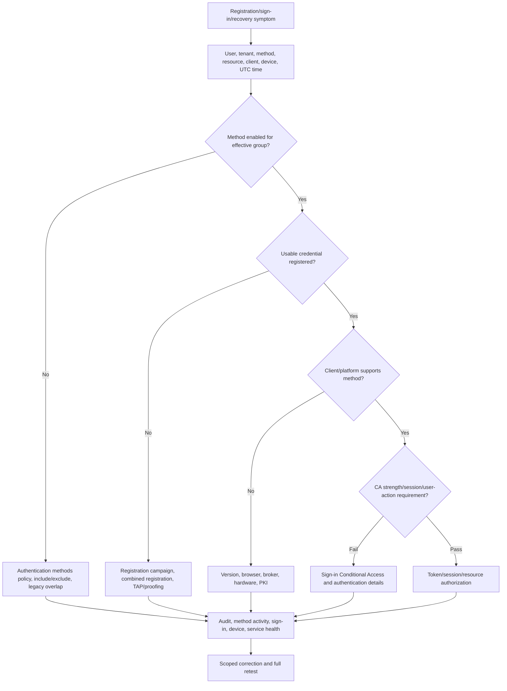

| Symptom | Likely cause | Discriminating evidence |
|---|---|---|
| Method not offered | Not enabled/registered, system preference, client unsupported | Effective policy, registration details, client/platform |
| User can register but strength fails | Method is not in required strength combination | Authentication details and CA policy result |
| Passkey registration fails | Five-minute freshness, profile/AAGUID/attestation, platform, guest/UPN issue | Passkey policy/profile, browser/OS, error/correlation |
| WHfB not offered for step-up | Started session with another primary method | New session/sign-in options, auth details |
| Push never arrives | App registration, device connectivity, notification, method state | Authenticator diagnostics, method record, sign-in state |
| Repeated push prompts | Attack, stale session, app retry, CA/sign-in frequency | Sign-in IP/app/time, denials, token/session sequence |
| TAP rejected | Expired, already used, policy, wrong tenant/user | TAP metadata without value, audit/sign-in, issuance time |
| CBA fails | Chain, CRL, mapping, binding, client support, time | Certificate metadata, Entra error, CRL reachability |
| SMS/voice delayed | Telecom/provider/number issue | Delivery result, country/carrier, alternate method |
| Registration campaign absent | Existing eligible method, SSO, mobile limitation, terms/custom control, excluded group | Campaign state, method activity, platform/session |
| Guest sees wrong methods | Resource/home tenant context and cross-tenant trust | Tenant ID, user type, authentication source/details |
| Security info page loops | Session freshness and strength conflict | User-action CA, last MFA time, combined-registration logs |

### Failure handling without weakening security

Do not tell users to approve unexpected prompts, share OTP/TAP, send screenshots containing QR codes/seeds, use another person's phone, disable certificate validation, or accept a broad policy exclusion. Move through approved alternate methods and recovery. If no safe path exists, escalate and restore through emergency procedures.

---

## 24. Realistic client scenarios

### Scenario A: Administrators must become phishing-resistant

The client has Authenticator push for admins and wants a phishing-resistant strength tomorrow. The consultant first validates two emergency accounts, identifies admin personas and clients, enables device-bound passkeys/security keys or multifactor CBA for a pilot, registers at least two credentials where appropriate, tests PIM/portal/PowerShell/mobile and recovery, then runs the CA policy in report-only before phased enforcement.

### Scenario B: New employee cannot register a passkey

The user's only proof is a temporary password and the registration page requires recent MFA. The design needs bootstrap, not an exclusion. An authorized help desk verifies identity and issues a minimum-lifetime TAP through a protected channel; the user registers the passkey and alternate recovery; TAP expires; first sign-in is monitored.

### Scenario C: User replaced a phone and is locked out

Help desk does not simply delete methods after caller-provided knowledge answers. It checks request risk, authoritative contact, manager/in-person/device evidence, and recent account changes. After sufficient proof it removes the lost method as required, issues controlled TAP, enrolls a durable method, validates access, revokes sessions if theft is suspected, and reviews logs.

### Scenario D: Registration campaign appears inconsistent

Some users see passkey nudges on a Mac but not Windows. The 2026 campaign evaluates whether a local passkey exists for the current device/browser combination. A WHfB credential can suppress the Windows nudge but does not exist on the Mac. Campaign state, passkey profile restrictions, SSO, mobile support, and exclusions also matter.

### Scenario E: Scanner “needs MFA disabled”

The scanner is nonhuman and uses a legacy user credential. Human MFA is not the right workload control. The client inventories the actual protocol and destination, evaluates a supported workload identity/connector, assigns minimum permission, restricts source/resource, monitors activity, tests failure and rollback, and retires the user service account. It does not exclude the scanner account from all CA indefinitely.

| Scenario | Control objective | Evidence of success |
|---|---|---|
| Admin strength | Phishing-resistant privileged access | Eligible methods, report-only impact, positive/negative sign-ins, recovery |
| New hire | Strong bootstrap without weak permanent method | Proofing, TAP audit, passkey registration, TAP expiry |
| Lost phone | Recover identity without social-engineering shortcut | Multi-signal proof, old method removal, session review |
| Campaign variance | Explain device/browser-aware eligibility | Method activity, campaign state, exact client behavior |
| Scanner | Replace human credential with workload identity | App-only least permission and legacy-account retirement |

---

## 25. Operations, metrics, and failure modes

| Operational metric | Why it matters | Interpretation caution |
|---|---|---|
| Users capable of MFA | Baseline readiness | Capability does not mean actual enforcement |
| Users registered for phishing-resistant method | Migration readiness | Registration does not prove resource enforcement |
| Weak method usage over time | Retirement progress | Some accessibility/legacy exceptions may be valid |
| Registration success/failure by persona/platform | User-experience quality | Campaign may not prompt every session/device |
| Recovery/TAP volume and repeat rate | Help-desk risk and design gaps | Do not publish TAP data or sensitive proofing details |
| Unexpected push denials | Possible attack/noise | Correlate source app/IP/time and retry behavior |
| Break-glass test age | Resilience | Test must include alert and minimum admin action |
| Credential expiry/CBA revocation health | Outage/compromise prevention | PKI and app credentials need separate dashboards |
| Legacy policy overlap | Migration completeness | Effective policy requires per-persona testing |

### Common program failure modes

| Failure mode | Impact | Better control |
|---|---|---|
| Enforce before registration | Lockout/support surge | Readiness report, campaign, TAP, pilot rings |
| One method for everyone | Accessibility and platform failures | Persona matrix and approved alternatives |
| SMS as permanent admin method | Phishing/telecom risk | Device-bound passkey/WHfB/multifactor CBA |
| Weak help-desk reset | Bypasses strong credential | High-assurance proofing, separation, alerts |
| No spare admin credential | Key/device loss becomes outage | Two separately controlled strong credentials |
| Break glass uses normal Authenticator | Shared failure mode | Different phishing-resistant method and custody |
| Broad service-account exclusion | Password-only nonhuman access | Workload identity migration |
| Treating preference as enforcement | Users select weaker method | Authentication strength for sensitive resources |
| Ignoring Microsoft-managed changes | Unexpected user prompts | Change monitoring, test users, communication |
| Deleting method without evidence | Incident context lost | Preserve audit/sign-in data, scoped response |

---

## 26. Consulting artifacts

| Artifact | Minimum content | Quality test |
|---|---|---|
| Authentication strategy | Threats, personas, target methods, enforcement, recovery, roadmap | Distinguishes MFA, passwordless, and phishing-resistant |
| Method policy matrix | Effective include/exclude and method options | Accounts for overlapping groups and legacy policy |
| Persona readiness matrix | User/device/app/accessibility/recovery needs | Includes frontline, guests, admins, restricted and BYOD |
| Registration plan | Campaign/TAP/combined registration, communication, support | Avoids bootstrap dead ends |
| Authentication strength matrix | Resource/action to built-in/custom strength | Every targeted user has eligible supported method |
| Recovery/proofing standard | Risk tiers, signals, approval, TAP, monitoring | No knowledge-only privileged reset |
| Break-glass runbook | Custody, sign-in, secure workstation, actions, alerts, review | Tested every 90 days and after key changes |
| Legacy migration plan | Per-user MFA/SSPR/app passwords/service accounts | Equivalent coverage proven before retirement |
| Test and rollback plan | Positive, negative, failure, recovery, accessibility, emergency | Explicit triggers and no tenant-wide bypass |
| Executive dashboard | Coverage, weak usage, recovery, incidents, exceptions, risk | Reports outcome, not registration count alone |

Example finding:

> **Observation:** Privileged users can satisfy the current admin access policy with SMS or Authenticator push, and 18% have no registered phishing-resistant method. **Risk:** Real-time phishing or telecom compromise can satisfy the current MFA requirement, while immediate enforcement of a stronger method would lock out unprepared administrators. **Recommendation:** Validate emergency access; enable device-bound passkeys/security keys or multifactor CBA for an admin pilot; register redundant credentials; test portal, CLI, PIM, recovery, and unsupported clients; evaluate phishing-resistant strength in report-only; then enforce through rings and retire weak methods. **Residual risk:** Endpoint/session compromise remains possible and requires privileged workstations, token/session controls, monitoring, and incident response.

---

## 27. Safe paper lab: design a phishing-resistant rollout and recovery drill

This exercise makes no tenant changes and uses only fictional personas.

### Prerequisites

- Parts 6 and 7.
- A spreadsheet/Markdown editor and Mermaid renderer.
- Official Source Anchors below.
- No real user, tenant, device, token, phone, certificate, TAP, or client information.

### Fictional client personas

| Persona | Population | Current state | Constraint |
|---|---:|---|---|
| Standard Windows staff | 4,000 | Password + Authenticator push | Managed Windows 11; remote/hybrid |
| Administrators | 80 | Password + mixed push/SMS | Separate admin account; some CLI use |
| Executives | 40 | Push | Frequent international travel |
| Frontline shared-device | 1,200 | Password/SMS | No personal phone requirement allowed |
| Contractors/guests | 500 | Home-tenant methods vary | Multiple partner tenants |
| Restricted-lab staff | 120 | Hardware OATH | Phones prohibited |

### Procedure

1. Define the threat model: password spray, phishing, MFA fatigue, SIM swap, lost device, recovery fraud, service outage.
2. Choose a target primary and alternate/recovery method for each persona. Explain rejected alternatives.
3. Create an Authentication methods policy group map and mark legacy-policy overlap.
4. Design a registration campaign sequence: Authenticator cleanup only if needed, then passkey campaign; remember only one target at a time.
5. Design TAP issuance with proofing, minimum lifetime, secure delivery, method registration, and post-use review.
6. Create built-in authentication-strength mappings for standard resources, admin resources, and sensitive finance sites.
7. Create Ring 0–4 rollout with entry/exit criteria and help-desk readiness.
8. Run three tabletop incidents: lost admin security key, new hire with no MFA, and unsolicited push/device-code report.
9. Produce a rollback decision tree that never disables MFA tenant-wide.

```mermaid
flowchart TB
    PERSONAS[Six fictional personas] --> METHODS[Target and alternate methods]
    METHODS --> POLICY[Authentication methods policy]
    POLICY --> REGISTER[Campaign/TAP/combined registration]
    REGISTER --> STRENGTH[Resource authentication strengths]
    STRENGTH --> RINGS[Report-only and rollout rings]
    RINGS --> TESTS[Positive, negative, recovery, accessibility, break-glass]
    TESTS --> OPERATE[Metrics, help desk, exceptions, incident response]
```

### Required tests

| Test | Expected evidence |
|---|---|
| Standard positive | WHfB/passkey user accesses standard M365 resource |
| Admin positive | Device-bound passkey satisfies phishing-resistant strength |
| Admin negative | SMS cannot satisfy privileged strength |
| Frontline | Approved method works without personal phone |
| Guest | Cross-tenant method behavior is documented; resource-tenant passkey limitation considered |
| Restricted lab | Hardware key/CBA target works with phone prohibited |
| New hire | Proofed TAP bootstraps durable method and expires |
| Lost key | Spare/recovery works; lost credential removed; activity reviewed |
| Push attack | User denies/reports; security correlates sign-in evidence |
| Break glass | Account works, alert fires, actions are reviewed |
| Failure | Authenticator service/connectivity issue uses approved alternate |
| Rollback | Pilot enforcement returns to report-only/previous scoped method |

### Evidence to retain

- Persona and threat matrix.
- Method decision record with licensing/change-sensitive notes.
- Registration and rollout diagrams.
- Authentication strength/resource matrix.
- Help-desk proofing and TAP runbook.
- Twelve-test result template.
- Three tabletop incident reports.
- Sanitized executive recommendation.

### Cleanup

Delete scratch values that resemble TAPs, QR seeds, phone numbers, certificate subjects, or real identities. Retain only fictional/sanitized artifacts and source links. In a future test tenant, cleanup would remove test methods, TAPs, passkey profiles/targets, policy assignments, and temporary groups only after exporting evidence and validating emergency access.

### Interview-portfolio wording

> “I completed a fictional authentication-method transformation design for six personas. I compared MFA, passwordless and phishing-resistant methods, designed passkey and WHfB rollout, registration campaigns, TAP recovery, authentication strengths, legacy-policy migration, help-desk proofing, emergency access, and twelve positive/negative/failure tests. It is paper/lab evidence that demonstrates method and judgment, not a claim of production Entra deployment.”

---

## 28. Official Source Anchors

These first-party references were checked for the guide's **August 24, 2026** currency date. Recheck tenant behavior and current requirements before implementation.

1. [Microsoft Entra authentication overview](https://learn.microsoft.com/entra/identity/authentication/overview-authentication) — Current methods, primary/MFA/recovery use, phishing-resistant methods, Verified ID recovery direction, and preview hardware OATH notation.
2. [Microsoft Entra MFA overview](https://learn.microsoft.com/entra/identity/authentication/concept-mfa-howitworks) — Factor concepts, available verification methods, security defaults, and Conditional Access integration.
3. [Authentication methods policy](https://learn.microsoft.com/entra/identity/authentication/concept-authentication-methods-manage) — Unified method policy, migration, targeting, and current controls.
4. [System-preferred authentication](https://learn.microsoft.com/entra/identity/authentication/concept-system-preferred-authentication) — Enabled/Microsoft-managed behavior, first-factor rollout through August 2026, current ranking, and limitations.
5. [Combined MFA and SSPR registration](https://learn.microsoft.com/entra/identity/authentication/concept-registration-mfa-sspr-combined) — Interrupt/manage modes, supported methods, session freshness, user-action protection, and tenant switching.
6. [Registration campaign for passkey or Authenticator](https://learn.microsoft.com/entra/identity/authentication/how-to-mfa-registration-campaign) — Targeting, snooze, Microsoft-managed changes, device/browser passkey evaluation, and limitations.
7. [Enable passkeys (FIDO2)](https://learn.microsoft.com/entra/identity/authentication/how-to-authentication-passkeys-fido2) — Profiles, synced/device-bound passkeys, attestation, AAGUID, licensing, Graph provisioning preview, and known issues.
8. [Windows Hello for Business overview](https://learn.microsoft.com/windows/security/identity-protection/hello-for-business/) — Device-bound key, PIN/biometric gesture, trust and deployment architecture.
9. [Microsoft Authenticator](https://learn.microsoft.com/entra/identity/authentication/concept-authentication-authenticator-app) — Push, TOTP, passwordless phone sign-in, passkeys, and broker context.
10. [Number matching](https://learn.microsoft.com/entra/identity/authentication/how-to-mfa-number-match) — Current enforced push behavior, same-device experience, NPS/AD FS limitations, and user guidance.
11. [Microsoft Entra CBA overview](https://learn.microsoft.com/entra/identity/authentication/concept-certificate-based-authentication) — Direct cloud CBA, mapping/binding, licensing orientation, supported/unsupported scenarios, PKI boundary.
12. [Temporary Access Pass](https://learn.microsoft.com/entra/identity/authentication/howto-authentication-temporary-access-pass) — Bootstrap, policy, lifetime/use, registration, and recovery behavior.
13. [Authentication strengths](https://learn.microsoft.com/entra/identity/authentication/concept-authentication-strengths) — Built-in/custom strengths, licensing, combinations, limitations, and known issues.
14. [Security defaults](https://learn.microsoft.com/entra/fundamentals/security-defaults) — Baseline protection and applicability.
15. [Password Protection](https://learn.microsoft.com/entra/identity/authentication/concept-password-ban-bad) and [smart lockout](https://learn.microsoft.com/entra/identity/authentication/howto-password-smart-lockout) — Banned-password and attack-throttling behavior.
16. [Emergency access accounts](https://learn.microsoft.com/entra/identity/role-based-access-control/security-emergency-access) — Current passwordless guidance, CA exclusions, custody, monitoring, and 90-day validation.

**Preview/change-sensitive register:** Hardware OATH token management, administrator FIDO2 provisioning through Graph, Verified ID account recovery and partner verification, passkey profile limits, Authenticator passkey versions, guest passkey support, Microsoft-managed system preference and campaigns, External MFA, QR/frontline methods, and platform/client matrices require current validation.

---

## ⭐ Likely Interview Questions for This Section

### Q1. Is all MFA equally strong?

> **Model answer:** “No. MFA means independent factor categories, but methods resist different attacks. Password plus SMS stops many password-only attacks but remains vulnerable to phishing and telecom compromise. TOTP and push are remotely phishable; number matching reduces blind approval but not real-time relay. Passkeys, Windows Hello for Business, platform credentials, and correctly configured multifactor CBA are phishing-resistant because authentication is cryptographically bound to the legitimate context. I select methods by persona, resource sensitivity, client support, recovery, and threat.”

### Q2. What is the difference among Authentication methods policy, system-preferred authentication, and authentication strength?

> **Model answer:** “Authentication methods policy determines which users may register and use methods and their options. Registration means the user actually has a credential. System-preferred authentication chooses the strongest registered method to prompt first; under Microsoft-managed rollout it can affect first and second factor, but the user can select another allowed method. Authentication strength is Conditional Access enforcement that limits which combinations may satisfy a resource. Enablement and preference do not equal enforcement.”

### Q3. How would you deploy phishing-resistant MFA for administrators?

> **Model answer:** “I would validate two cloud-only emergency accounts and alerts first, inventory admin identities, clients and privileged workflows, then enable device-bound passkeys/security keys, WHfB where suitable, or multifactor CBA for a pilot. Admins would register redundant credentials and test portal, CLI, PowerShell, PIM, device loss, recovery, and unsupported clients. I would evaluate phishing-resistant strength in report-only, deploy through rings, monitor sign-ins/help desk, preserve scoped rollback, and retire SMS/push for privileged access.”

### Q4. How do passkeys resist phishing?

> **Model answer:** “A passkey uses a public/private key pair. Entra stores the public key while the authenticator protects the private key and signs a fresh challenge after local user verification. The credential is bound to the legitimate relying-party domain/context, so a fake site cannot collect a reusable password or OTP and replay it to Entra. Device-bound and synced passkeys have different custody and attestation tradeoffs, and recovery, endpoint compromise, and session theft still need controls.”

### Q5. What is a Temporary Access Pass, and how should it be governed?

> **Model answer:** “TAP is a time-limited passcode used to bootstrap passwordless registration or recover access. Help desk must perform risk-tiered identity proofing before issuance, use the least-privileged role and minimum lifetime/use count, deliver it through a protected separate channel, monitor its use, require immediate registration of a durable strong method and alternate recovery, then let it expire or revoke it. The TAP value must never be stored in the ticket.”

### Q6. How would you recover a user who lost every authentication method?

> **Model answer:** “I would treat it as identity reissuance. I would assess user/role risk and recent account changes, use authoritative contact and multiple independent proofing signals, and escalate uncertainty rather than weakening proof. After approval I would remove or contain the lost methods/devices as appropriate, issue minimum-lifetime TAP or an approved recovery path, register and test a durable method and alternate, revoke sessions if theft is suspected, monitor first activity, and preserve an auditable record without secrets.”

### Q7. Security defaults or Conditional Access: how do you choose?

> **Model answer:** “Security defaults provides a Microsoft-managed baseline suitable for simple tenants without granular requirements. Conditional Access requires applicable P1 licensing and an operating model but supports persona, resource, device, location, risk, session, exclusion, and authentication-strength design. If moving to CA, I would build and validate equivalent or stronger all-user/admin/legacy-auth coverage, emergency access and support first, then transition in a controlled window. I would not disable defaults and leave an unprotected design gap.”

### Q8. How does your experience support an MFA rollout without overstating it?

> **Model answer:** “My production evidence is Microsoft 365 escalation, user-impact troubleshooting, SharePoint/OneDrive and sync context, RCA, fix validation, documentation, and stakeholder coordination. Those skills transfer directly to pilot scoping, affected/unaffected comparison, support readiness, evidence, and safe recovery. My Entra MFA/passkey evidence is a detailed fictional design and test exercise, so I would explain the architecture and method confidently but not claim production deployment ownership.”

---

## 🧠 30-Second Memory Hooks

- **MFA:** Two or more independent factor categories, not two passwords.
- **Assurance:** MFA is a family, not one strength level.
- **Policy → registration → preference → enforcement:** Four separate states.
- **System-preferred:** Offers the strongest registered method first; it does not replace CA strength.
- **August 2026:** Microsoft-managed system preference is rolling into first factor too.
- **Combined registration:** One Security info experience for MFA and SSPR-capable methods.
- **Campaign:** Nudge Authenticator or passkey, one target method at a time.
- **Passkey:** Public key at service, private key in authenticator, bound to real site.
- **Device-bound:** Key stays on one authenticator.
- **Synced passkey:** Phishing-resistant and portable, but no attestation.
- **WHfB PIN:** Unlocks a local device-bound key; it is not the cloud password.
- **Push number matching:** Reduces accidental approval, not real-time phishing.
- **CBA:** Certificate trust + user mapping + assurance binding + revocation.
- **TAP:** Temporary bootstrap bridge, never steady-state identity.
- **TOTP:** Works offline but can be phished.
- **SMS/voice:** Transitional/exception methods, not privileged target state.
- **MFA strength:** Broad supported combinations.
- **Passwordless strength:** MFA without entering password.
- **Phishing-resistant strength:** Passkey/WHfB/platform credential/multifactor CBA.
- **Password protection:** Block weak/company terms while password still exists.
- **Security defaults:** Microsoft baseline.
- **Conditional Access:** Client-designed policy engine requiring operations and license.
- **Workload identity:** Software cannot answer human MFA; give it purpose-built identity.
- **Break glass:** Two cloud-only accounts, different strong method, exclusion, alert, drill.
- **Recovery:** Strong sign-in with weak help desk is weak authentication.
- **Proofing:** Do not reward urgency with lower identity confidence.
- **Rollback:** Scope back to pilot/report-only, never disable MFA tenant-wide.
- **Honesty:** Paper design proves method; it does not prove production Entra tenure.

---

## Completion Checklist

- [ ] Define knowledge, possession, inherence, MFA, passwordless, assurance, and phishing resistance.
- [ ] Explain why two knowledge prompts are not MFA.
- [ ] Distinguish method enablement, registration, system preference, strength enforcement, and client support.
- [ ] Compare password, SMS, voice, TOTP, push, phone sign-in, passkeys, WHfB, CBA, and TAP.
- [ ] Explain August 2026 system-preferred Disabled/Enabled/Microsoft-managed behavior and rollout caveat.
- [ ] Explain combined registration interrupt/manage modes and current session-freshness requirements.
- [ ] Design a registration campaign and state that only one target method runs at a time.
- [ ] Draw passkey registration/sign-in and explain RP binding, keys, user verification, attestation, and AAGUID.
- [ ] Compare device-bound and synced passkeys and identify current preview/guest/UPN limitations.
- [ ] Explain WHfB device-bound key, TPM, PIN/biometric, PRT, and step-up nuance.
- [ ] Distinguish Authenticator push, TOTP, phone sign-in, passkey, and broker roles.
- [ ] Explain number matching value and limitation.
- [ ] Design CBA trust, mapping, binding, revocation, lifecycle, and client testing.
- [ ] Design TAP proofing, issuance, delivery, registration, expiry, and review.
- [ ] Explain hardware/software OATH, SMS, and voice tradeoffs.
- [ ] Compare MFA, passwordless MFA, phishing-resistant, and custom strengths.
- [ ] Explain password protection and smart lockout during passwordless transition.
- [ ] Choose security defaults versus Conditional Access without creating a coverage gap.
- [ ] Separate human, guest, legacy service account, service principal, and managed identity controls.
- [ ] Design two emergency-access accounts and a 90-day drill.
- [ ] Build the six-persona method and recovery matrix.
- [ ] Walk through lost phone, lost key, new device, all-method loss, UPN change, and guest recovery.
- [ ] Define help-desk proofing with multiple authoritative signals and privileged escalation.
- [ ] Migrate legacy MFA/SSPR/app-password controls to the unified target.
- [ ] Run all twelve positive, negative, failure, recovery, emergency, and rollback tests.
- [ ] Troubleshoot method-not-offered, strength, passkey, WHfB, push, TAP, CBA, campaign, guest, and Security info failures.
- [ ] Complete the paper lab and retain only sanitized portfolio evidence.
- [ ] Answer all eight interview questions aloud without claiming production Entra implementation.

---

*Next suggested section:* [Part 9](Part-09-conditional-access-design-deployment-troubleshooting.md) — combine users, devices, methods, risk, clients, resources, grant controls, and sessions into a governed Conditional Access policy system.