# Part 9 — Conditional Access Design, Deployment, and Troubleshooting

> **Section goal:** Design Microsoft Entra Conditional Access as a coherent Zero Trust policy system rather than a collection of portal toggles. By the end, you should be able to model policy logic, choose assignments, conditions, grant and session controls, prevent lockout, deploy through report-only and rings, diagnose every common outcome from sign-in evidence, roll back safely, and govern the policy estate over time.

This Part combines the directory objects from [Part 6](Part-06-entra-id-architecture-directory-objects.md), token/session behavior from [Part 7](Part-07-authentication-authorization-tokens-modern-auth.md), and authentication methods/strengths from [Part 8](Part-08-mfa-passwordless-authentication-strengths.md). Part 10 adds risk detection and remediation depth.

> **Currency and change-sensitive note:** Product behavior was checked against official Microsoft Learn content available on **August 24, 2026**. Conditions for authentication flows and agent identities, policy impact, Strict Location Enforcement, application protection on Windows, custom controls, and some risk/agent capabilities are Preview or evolving. The approved-client-app grant was scheduled to retire in early March 2026; treat surviving legacy configurations as migration debt and verify current tenant behavior. Recheck Microsoft-managed policies, target-resource enforcement changes, license bundles, service dependencies, and client/platform matrices before implementation.

## JD Mapping

| Deloitte role expectation | Capability developed in this Part | Consulting evidence |
|---|---|---|
| Design and deploy Conditional Access | Build requirements-led policy architecture and baseline set | HLD/LLD, persona/use-case matrix, policy register |
| Implement Zero Trust and MFA | Combine explicit identity, device, network, risk, resource, and method signals | Signal-decision-enforcement diagrams and strength mapping |
| Troubleshoot policy errors and disruptions | Interpret applied/not-applied/success/failure/interrupted outcomes | Sign-in-log runbook and root-cause decision tree |
| Minimize client disruption | Use emergency access, report-only, What If, pilots, rings, rollback, and hypercare | Change/test/rollback pack |
| Secure M365 workloads and unmanaged access | Use resource targeting, device controls, app protection, and session restrictions | M365 dependency and unmanaged-device design |
| Establish sustainable operations | Govern exclusions, named locations, policy sprawl, monitoring, reviews, and changes | Operating model, RACI, metrics, exception register |

## Candidate honesty note

You have strong directly relevant delivery behaviors: scoping Microsoft 365 incidents, comparing affected and unaffected users, correlating SharePoint/OneDrive/sync evidence, identifying changes, coordinating stakeholders and engineering, documenting RCA, testing fixes, and communicating business impact.

This Part does **not** claim that you designed or enforced production Conditional Access policies. Safe phrasing is:

> “I have production experience leading Microsoft 365 escalations and validating changes across SharePoint, OneDrive, sync, clients, and stakeholders. I have built a detailed Conditional Access paper design with report-only analysis, policy logic, lockout prevention, sign-in troubleshooting, positive/negative tests, and rollback. I would present that as structured lab/design evidence rather than production Entra policy ownership.”

---

## 1. Conditional Access is a Zero Trust policy engine

Microsoft Entra Conditional Access (CA) combines signals about an access request, evaluates applicable policies, and requires controls or blocks access. The simplest mental model is **if this identity requests this resource under these conditions, then require these controls**.

Conditional Access runs after initial authentication. It is not the first-line control for denial-of-service traffic and does not replace resource authorization. A user can pass CA and still lack permission to a SharePoint site; an attacker can fail password authentication before CA has a sign-in to evaluate.

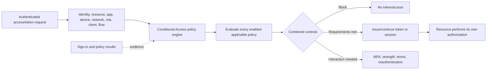

| Layer | Question | Example |
|---|---|---|
| First authentication | Did the identity prove itself enough to begin evaluation? | Password, passkey, federation, workload credential |
| CA assignment | Is identity/resource in policy scope? | All users accessing all resources |
| CA condition | Does this context match? | Browser from unmanaged device outside named network |
| CA control | What must happen? | Require phishing-resistant strength or block |
| Session control | How should continuing access behave? | Sign-in frequency, limited SharePoint session |
| Resource authorization | What data/action is allowed? | Site membership, API scope/role, mailbox permission |

**Consulting principle:** Begin with a control objective such as “privileged users must use phishing-resistant authentication,” then design the smallest clear set of policies that achieves it. Do not begin by copying every available template into production.

---

## 2. Policy anatomy

### 🔍 Plain-English deep-dive: assignment, condition, grant, and session

- **Assignment** — *who or what and which resource the policy targets.* **Analogy:** Which people and buildings a safety rule covers. **Why it matters:** Wrong scope creates a gap or outage.
- **Condition** — *context that narrows when the rule applies.* **Analogy:** The rule applies after hours or on an unrecognized vehicle. **Why it matters:** Conditions are signals, not always trustworthy facts; platform can be inferred from user agent.
- **Grant control** — *the access requirement or block decision.* **Analogy:** Show a stronger badge, use an inspected vehicle, accept terms, or do not enter. **Why it matters:** Multiple controls can use AND/OR within a policy.
- **Session control** — *requirements or restrictions after initial access.* **Analogy:** Recheck the badge every shift or allow view-only access inside the building. **Why it matters:** Session support varies by application and client.

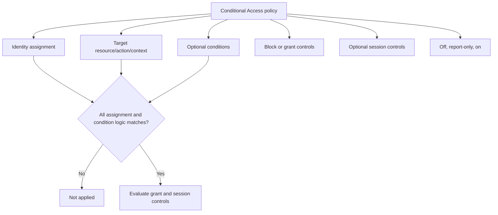

| Policy field | Example | Evidence before enabling |
|---|---|---|
| Name | `CA-P01-Admins-AllResources-PhishResist` | Naming standard and unique purpose |
| Users/workload identities | Privileged role population | Current object IDs and dynamic membership behavior |
| Target resources | All resources or admin resource set | Service dependencies and audience reporting |
| Conditions | Any network, all client types | Affected client/platform inventory |
| Grant | Require phishing-resistant strength | Method registration/readiness |
| Session | Sign-in frequency for sensitive action | Client support and user-impact tests |
| Exclusions | Emergency access group only | Owner, rationale, alerts, review |
| State | Report-only | Sign-in evidence and approval |

Every policy needs a purpose, business/technical owner, risk/control objective, includes/excludes, dependencies, license, test cases, rollout ring, monitoring, review date, exception path, and rollback instruction.

---

## 3. Identity assignments: users, groups, roles, guests, and workload identities

| Identity target | Best use | Risk/caution |
|---|---|---|
| All users | Baseline controls with minimum exclusion | Includes new users; validate guests and service dependencies |
| Selected users/groups | Pilot or persona policy | Membership latency, nesting, owner, direct exceptions |
| Directory roles | Protect current members of selected admin roles | Role membership/activation timing; cover other privileged paths |
| Guest/external user types | Partner-specific policy | Home-tenant MFA trust, client/device claims, invitation lifecycle |
| Workload identities | Service-principal access policy | Separate policy type/licensing; only supported service-principal scenarios |
| Agent identities/users | Emerging agent controls | **Preview/change-sensitive** targeting and grants |

**Workload identity Conditional Access** applies to service principals under the supported Workload ID capability, not managed identities in the same way and not ordinary user accounts. It typically supports conditions/controls suited to nonhuman authentication, such as blocking from outside trusted locations or risk-based workload controls where licensed. A workload cannot perform interactive MFA; govern credential/federation, application permissions, resource access, and workload-specific CA instead.

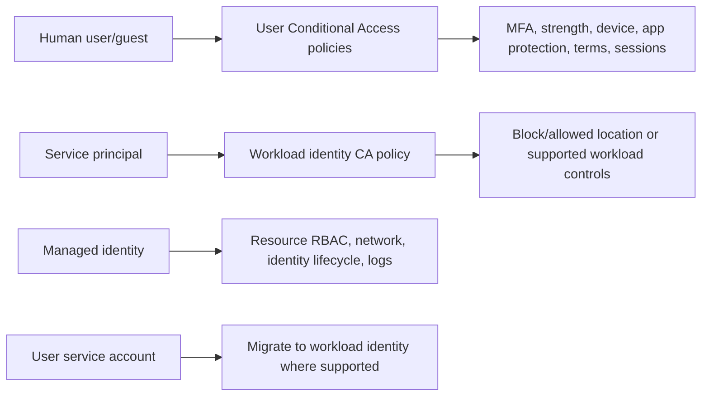

Avoid broad “service account” user exclusions. Inventory each account and migrate software to a purpose-built workload identity. If an interim exclusion is unavoidable, constrain resource, protocol, source, credential, monitoring, owner, and expiry.

---

## 4. Target resources, user actions, and authentication context

The current term **target resources** replaces older “cloud apps or actions” wording. A policy can target applications/services, user actions, Global Secure Access traffic profiles, or authentication context under supported designs.

| Target | Use | Important boundary |
|---|---|---|
| All resources | Broad baseline coverage | Resource exclusions create complexity and 2026 enforcement changes |
| Microsoft 365/Office 365 app suite | Protect integrated M365 services together | Prefer suite grouping to avoid Exchange/Teams/SharePoint dependency gaps |
| Specific enterprise app/API | App-specific requirement | CA targets resource, not ordinary public/native client app itself |
| Microsoft Admin Portals | Admin portal token set | Does not automatically include every backend service dependency |
| Windows Azure Service Management API | Azure management access | Covers portal/ARM-related tools, not Microsoft Graph PowerShell |
| Register security information | Protect method registration | Report-only does not evaluate user-action policies normally |
| Register or join devices | Protect device action | Only MFA/strength controls; device-dependent conditions unavailable |
| Authentication context | Step-up for sensitive data/action inside app | App must tag/request context; up to current documented context limits |
| Global Secure Access profiles | Identity-aware network traffic controls | Requires Entra network access product design and license |
| All agent resources | Agent identity blueprint/resources | **Preview** as of checked documentation |

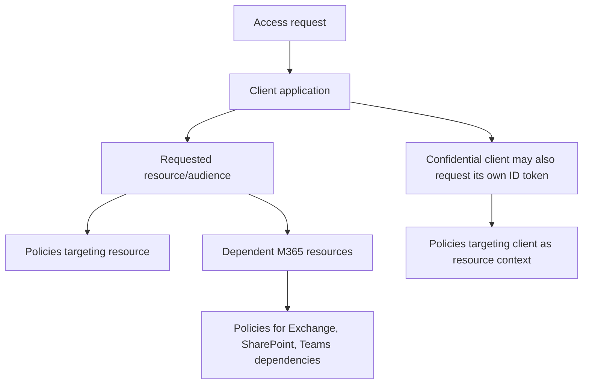

In 2026 Microsoft changed enforcement for baseline directory scopes when an **All resources** policy has resource exclusions. Low-privilege scopes that were previously excluded from some policy evaluation are being brought into enforcement in phased rollout beginning March 2026. Test apps that request profile/group scopes; avoid resource exclusions in the baseline policy where possible; consult current Learn guidance.

### Authentication context

Authentication context lets an application mark a specific action or data as requiring step-up policy, such as a sensitive SharePoint site, privileged operation, Defender for Cloud Apps session, or PIM activation. It avoids applying the strongest control to every ordinary action.

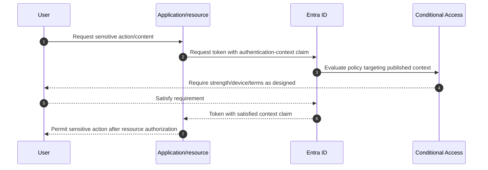

Do not delete an authentication context while applications still use it. Inventory context IDs, policies, apps/resources, owners, sign-ins, and rollback.

---

## 5. Conditions: context signals and limitations

### 🔍 Plain-English deep-dive: a signal is evidence, not certainty

- **Device platform** — *the operating-system category inferred from client data.* **Analogy:** A vehicle declares its model at the gate. **Why it matters:** User-agent data can be modified; pair with compliance or use primarily for blocking unsupported platforms.
- **Named location/network** — *IP range, country/region, GPS or Global Secure Access-derived context depending feature.* **Analogy:** The road the request appears to arrive from. **Why it matters:** Proxies, VPNs, IPv6, mobile networks, and attackers can change location.
- **Client app** — *browser, mobile/desktop, Exchange ActiveSync, or other legacy client category.* **Analogy:** Which entrance protocol is used. **Why it matters:** Legacy clients cannot satisfy modern controls.
- **Device filter** — *rule using supported device properties to include or exclude devices.* **Analogy:** Admit vehicles by managed fleet record, not only model label. **Why it matters:** Device must be identified; null/unknown values need explicit design.
- **Risk** — *probability signal about user/sign-in/workload compromise.* **Analogy:** Security intelligence raises the inspection level. **Why it matters:** P2/ID Protection and operational remediation are required.

| Condition | Typical use | Limitation/control |
|---|---|---|
| User risk | Require remediation/strong control for compromised identity | Entra ID Protection/P2; Part 10 |
| Sign-in risk | Challenge or block suspicious transaction | P2; false positives and recovery |
| Insider risk | Apply adaptive control from Purview signal | Purview licensing/privacy/governance |
| Device platform | Block unsupported OS or tailor supported path | User agent not authoritative |
| Network/location | Require controls outside trusted network | IP is not identity; account for IPv4/IPv6 and egress paths |
| Client apps | Block legacy auth; distinguish browser/native | Default new policies apply to all clients when not configured |
| Filter for devices | Target/exclude device properties | Preferred over deprecated device-state condition |
| Authentication flows | Control device code/auth transfer | **Preview**; phishing and compatibility tests |
| Agent risk/execution environment | Emerging agent policy | **Preview/change-sensitive** |

The old **device state** condition is deprecated; use **Filter for devices**. Device filters support include or exclude logic based on supported properties such as trust type and compliance, but an unknown/unregistered device may have null properties. Write and test expressions for unknowns deliberately.

---

## 6. Named locations and network trust limitations

A named location labels IP ranges, countries/regions, or other supported network context for policy use. “Trusted location” should never mean “trusted user” or “safe device.” An attacker on the network, compromised VPN account, cloud proxy, or stolen endpoint still exists.

| Location design | Benefit | Limitation/risk |
|---|---|---|
| Dedicated public egress IP ranges | Stable signal for offices/VPN | Keep IPv4/IPv6 and failover ranges current |
| Country/region by IP | Coarse geopolitical control | VPN/proxy evasion, mobile IP, inaccurate geolocation |
| GPS named location | Stronger mobile location in supported scenarios | Client/app/privacy/platform dependencies |
| Trusted MFA IP legacy setting | Historical convenience | CAE location changes do not treat it like IP-based CA named location |
| Shared cloud proxy egress | Central visibility | Shared/nonenumerable IP should not be labeled trusted |
| Global Secure Access compliant network | Identity/network integration | Product/client/traffic profile/licensing dependencies |

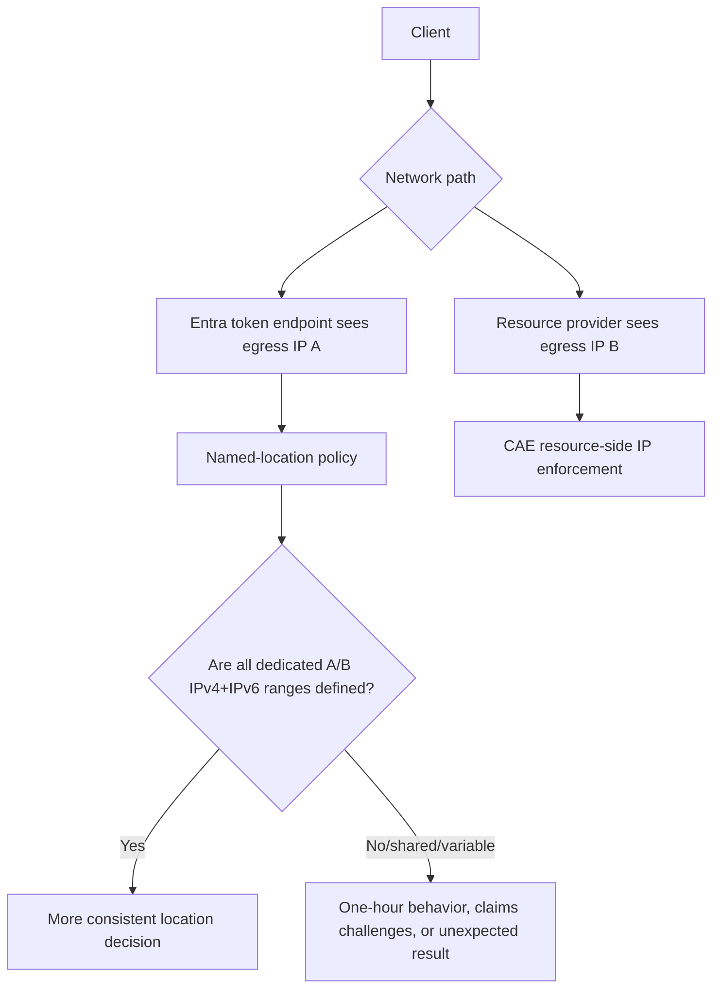

CAE supports real-time location enforcement only for IP-based CA named locations and has limitations when identity and resource traffic use different or shared egress. The checked documentation notes that more than 5,000 total IP ranges prevents real-time user location-change enforcement; other CAE events continue. **Strict Location Enforcement** was Public Preview. Do not enable or disable CAE/strict behavior as a casual workaround; correct network and policy design with owner review.

---

## 7. Client apps, modern authentication, and legacy blocking

| Client category | Typical protocol | CA behavior |
|---|---|---|
| Browser | OIDC/SAML/WS-Fed/web auth | Supports interactive controls; device claim support varies by OS/browser/configuration |
| Mobile apps and desktop clients | OAuth/MSAL/broker | Supports modern MFA/device controls when client/resource support them |
| Exchange ActiveSync legacy category | Basic/legacy scenarios | Cannot satisfy interactive controls; use migration/block design |
| Other clients | POP/IMAP/SMTP/EWS and older basic clients depending service | Block legacy authentication baseline |

New CA policies apply to all client app types by default when the condition is not configured. Legacy clients cannot perform MFA or present modern device state, so “Require MFA” effectively blocks them, but a dedicated block-legacy policy gives clearer objective and evidence.

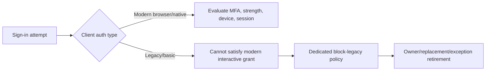

Do not exclude service accounts wholesale. Use sign-in logs to identify legacy usage by app, protocol, owner, source, and business process; migrate to modern user or workload identity; then test and enforce.

---

## 8. Grant controls and AND/OR logic

Grant controls decide block versus required access conditions.

| Grant control | Purpose | Prerequisite/limitation |
|---|---|---|
| Block access | Deny matching request | Highest impact; report-only/What If/pilot first |
| Require MFA | Any supported MFA combination | Method readiness; do not combine with strength in same policy |
| Require authentication strength | Specific method combinations | Entra ID P1 plus method enablement/registration |
| Require compliant device | Intune/partner reports compliance | Registered device, supported OS/client, Intune dependencies |
| Require hybrid joined device | Require Entra hybrid join claim | Windows/hybrid design and client support |
| Require approved client app | Historical mobile app control | Retired in early March 2026 direction; migrate to app protection policy |
| Require app protection policy | Require Intune MAM policy in supported app | Broker, Intune license, platform/app support; Windows support may be Preview |
| Require password change/risk remediation | Self-remediate user risk | P2/ID Protection and constrained policy design |
| Terms of use | Require acceptance | Governance, language, legal owner, reacceptance and guest behavior |

### Within one policy

Selected grant controls can require **all** (AND) or **one** (OR). For example:

- `MFA AND compliant device` means both must pass.
- `compliant device OR hybrid joined device` lets either device trust path satisfy the policy.
- A block policy has no “satisfy” path: if it applies, access is denied.

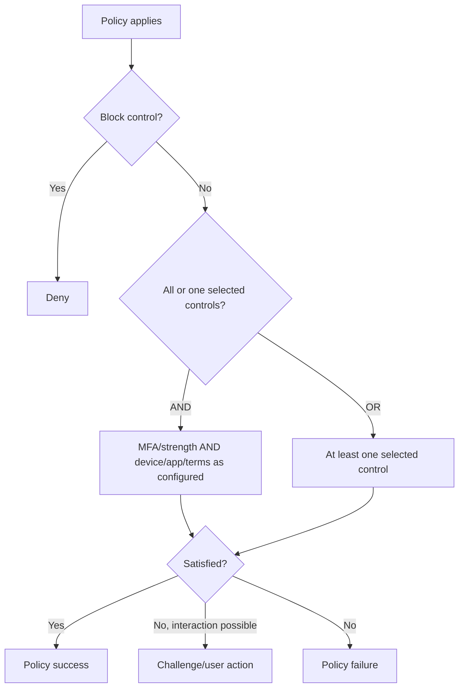

**Approved client app change:** Microsoft Learn stated the approved-client-app grant was retiring in early March 2026 and directed new policies to **Require app protection policy**. In August 2026, inventory residual policies, validate Microsoft’s current retirement enforcement, and migrate. Do not design new long-term reliance on a retired control.

---

## 9. Multiple policies are cumulative

Entra evaluates all enabled policies that apply. There is no policy priority number and no “allow policy” that overrides a block. Requirements from different policies accumulate.

### 🔍 Plain-English deep-dive: cumulative logic

Imagine three building rules:

- Rule A requires a strong badge.
- Rule B requires an inspected laptop.
- Rule C blocks entry from a closed entrance.

Passing A does not bypass B. If C applies, the person is blocked. Conditional Access behaves similarly.

| Applicable policy | Requirement | Combined effect |
|---|---|---|
| Baseline | MFA strength | Must satisfy MFA |
| Finance | Compliant device | Must also use compliant device |
| Admin | Phishing-resistant strength | Must satisfy the stronger method requirement |
| Country block | Block | Access denied regardless of satisfied grants |
| Session policy | Sign in every 12 hours | Reauthentication applies in addition |

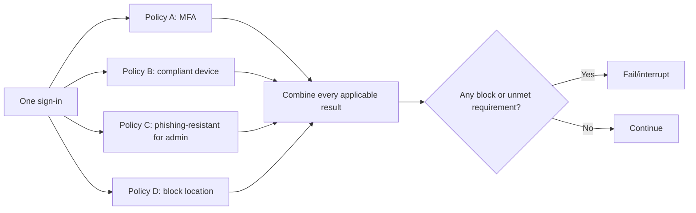

A frequent mistake is diagnosing only the policy named by the project. Sign-in details must review every enabled and report-only policy, including Microsoft-managed policies and workload/resource dependencies.

---

## 10. Session controls

| Session control | Purpose | Key limitation/dependency |
|---|---|---|
| Sign-in frequency | Require periodic or every-time reauthentication | App support; interacts with strengths and user experience |
| Persistent browser session | Allow or prevent browser persistence | Browser cookie behavior and shared devices |
| Application-enforced restrictions | Pass device state so supported app limits unmanaged session | SharePoint/Exchange-supported behavior and workload setup |
| Conditional Access App Control | Route session through Defender for Cloud Apps reverse proxy | MDCA licensing, supported apps, network/session policy |
| Customize CAE | Disable CAE only under constrained all-resource/no-condition design | Disabling reduces near-real-time response; rarely justified |
| Disable resilience defaults | Deny when Entra cannot reevaluate sessions during outage | Availability tradeoff; use only explicit high-risk decision |
| Token protection | Bind supported sign-in tokens to intended device | Client/resource/platform support and licensing; change-sensitive |
| Global Secure Access security profile | Apply identity-aware network profile | Entra Internet Access dependencies |

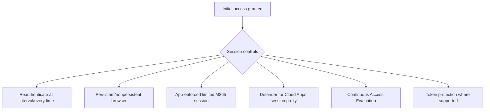

**Application-enforced restrictions** can give an unmanaged device a limited browser experience, such as web-only access with download restrictions in SharePoint/OneDrive, rather than an all-or-nothing block. The workload must be configured to interpret device information. This is especially relevant to your SharePoint/OneDrive background: CA chooses the session signal; SharePoint enforces the limited content experience.

---

## 11. Licensing and prerequisites

| Capability | Conceptual license/prerequisite as of August 2026 | Verify-current action |
|---|---|---|
| Conditional Access | Microsoft Entra ID P1; Business Premium includes CA capabilities under current terms | Confirm covered population and exact SKU |
| Risk conditions/remediation | Entra ID P2/ID Protection | Confirm users/workload identities and response features |
| Workload identity CA | Microsoft Entra Workload ID premium capability | Confirm service-principal coverage and license model |
| Compliant device | Intune/eligible MDM plus Entra device and CA | Confirm platform, enrollment, compliance, broker/client |
| App protection policy | Intune MAM plus supported app/platform | Check Windows Preview status and app list |
| Defender for Cloud Apps session control | Applicable Defender for Cloud Apps entitlement | Validate reverse-proxy app support and onboarding |
| Terms of use | Entra capability and governance/legal ownership | Verify guest and audit behavior |
| Insights workbook | P1, Azure Monitor/Log Analytics workspace and permissions | Include ingestion, retention, cost, RBAC |
| Authentication strengths | CA/P1 plus method enablement | Check method/license separately |

If CA licenses expire, Microsoft documentation says policies are not automatically deleted or disabled; customers can view/delete but not update them. That grace is not a license strategy. Maintain entitlement monitoring and a planned transition.

### Prerequisites checklist

- Two tested emergency-access accounts and alerting.
- Current user, guest, group, role, app, workload, device, client, and location inventory.
- Authentication-method registration/readiness.
- Intune compliance and app-protection health where used.
- Service-dependency and target-resource map.
- Sign-in logs, roles, retention, time synchronization, and optional Log Analytics.
- Help-desk runbook, communication, accessibility, exception, and escalation process.
- Policy naming, owner, change, test, and rollback standards.
- Approved pilot identities including negative/failure personas.

---

## 12. Baseline design and persona/use-case matrix

A baseline is a starting architecture, not a copy-and-enable checklist.

| Policy objective | Identity | Resource | Conditions | Control | Notes |
|---|---|---|---|---|---|
| Require MFA baseline | All users except emergency accounts | All resources, no exclusions if feasible | All clients | MFA strength | Replace security defaults only with proven coverage |
| Protect admins | Admin roles/groups except emergency | All resources/admin surfaces | All | Phishing-resistant strength | Test PIM, CLI, PowerShell, portals |
| Block legacy auth | All users except approved short-term exceptions | All resources | Legacy client categories | Block | Owner/date/replacement for exceptions |
| Protect registration | All users | Register security information | Defined safe context | MFA/strength | Report-only limitation; prevent bootstrap dead end |
| Require managed device for sensitive apps | Selected employees | Finance/HR apps | Modern clients | Compliant device | Include BYOD/guest alternative or explicit block |
| Limit unmanaged M365 browser | Selected users | M365/SharePoint | Browser/unmanaged | App-enforced restrictions | Configure SharePoint/Exchange workload behavior |
| Protect workload identity | Selected service principals | Target resource | Allowed network/risk as supported | Block outside criteria | No human MFA; Workload ID licensing |

### Persona/use-case matrix

| Persona/use case | Identity control | Device/session control | Exception/recovery |
|---|---|---|---|
| Standard managed employee | MFA/passwordless | Compliant device for sensitive data; ordinary M365 access | Help-desk proofing/TAP |
| Administrator | Phishing-resistant strength | Compliant/PAW filter, short sensitive session | Separate emergency accounts, not ordinary exclusion |
| Guest | Home MFA trust or resource challenge | Limited unmanaged session; terms | Sponsor and cross-tenant review |
| BYOD employee | MFA | App protection or web-limited session | Approved app/browser path |
| Frontline/shared device | Persona-compatible MFA | Shared-device/app control | No personal-phone assumption |
| Legacy application | Modernize authentication | Narrow coexistence controls | Time-bound owner exception |
| Service principal | Credential/federation and workload policy | Resource/network restriction | Credential rotation and app owner |
| High sign-in risk | Strong challenge/block per risk strategy | Session revocation/remediation | ID Protection process in Part 10 |

Templates in the portal are useful drafting aids, but every template must be reviewed for assignment, exclusion, license, methods, clients, dependencies, and operating model. Keep policies in report-only until evidence supports enforcement.

---

## 13. Emergency access and lockout prevention

Lockout prevention is an architecture requirement, not a final checkbox.

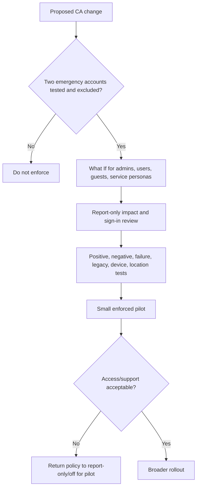

### Lockout-prevention controls

| Control | Requirement |
|---|---|
| Emergency identities | Two or more cloud-only accounts with different phishing-resistant credential path |
| Exclusions | Dedicated group excluded from every blocking/restrictive policy; report-only needs no exclusion |
| Monitoring | Alert every emergency sign-in and privileged action |
| Testing | At least every 90 days and before/after material CA changes |
| Admin pilot | Test identities and representative tools, not sole real Global Admin |
| Dependency test | Federation, network, MFA, Intune, PIM, portal, CLI, Graph, service health |
| Change window | Authorized owner, live monitoring, support bridge, rollback operator |
| Access recovery | Portal plus supported Graph/PowerShell path known and permissioned |

Never exclude “all admins” from a baseline policy. Protect ordinary admins more strongly; exclude only governed emergency accounts from controls that could prevent recovery.

---

## 14. Report-only, What If, policy impact, and sign-in logs

### 🔍 Plain-English deep-dive: simulation tools answer different questions

- **Report-only** — *evaluates most policies against real sign-ins without enforcing controls.* **Analogy:** A shadow security guard records what it would have done. **Why it matters:** It reveals real users, clients, apps, and contexts, but does not prompt users to prove they could satisfy an interactive requirement.
- **What If** — *simulates whether policies apply to one supplied scenario.* **Analogy:** Ask how the rules would treat a hypothetical visitor. **Why it matters:** It is fast and useful for rare cases, but does not test resource dependencies or actual client behavior.
- **Sign-in logs** — *the evidence for one actual authentication/token transaction.* **Analogy:** The gate record with each policy result. **Why it matters:** It is the primary troubleshooting source.
- **Insights workbook/policy impact** — *aggregated views over time.* **Analogy:** Trend dashboard for gates. **Why it matters:** Aggregation finds populations and patterns but needs Log Analytics/permissions and current preview notes.

| Tool | Strength | Limitation |
|---|---|---|
| Report-only | Real sign-ins, per-policy outcomes | User-action policies excluded; no actual interactive challenge; device cert prompts can still appear on some platforms |
| What If | Fast scenario/app/user/service-principal evaluation | Does not evaluate service dependencies; omitted parameters reduce accuracy |
| Policy impact | Recent impact sample | Interactive sign-in focus and **Preview/change-sensitive** status |
| Insights workbook | Combined policy trends and filters | Log Analytics workspace, cost, retention, permissions |
| Sign-in details | Exact policy, auth, device, client, resource, errors | One event may be part of multi-step flow |

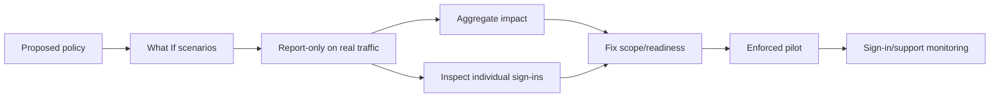

What If requires identity, target resource, device platform, and client app for current accurate evaluation, with optional conditions supplied when relevant. It does not include Teams' Exchange/SharePoint dependencies automatically. Test those resources separately and use audience reporting in sign-in logs.

---

## 15. Policy outcomes: success, failure, interrupted, and not applied

| Outcome | Meaning | Next action |
|---|---|---|
| Success | Policy applied and its requirements were met | Check whether another policy blocked and verify resource result |
| Failure | Policy applied and a required control failed or block applied | Determine intended versus accidental block and failed control |
| Not applied | At least one assignment/condition did not match or identity was excluded | Read exact nonapplication reason; verify scope expectation |
| Interrupted/user action required | More interaction is needed, such as MFA, terms, consent, password change | Follow subsequent sign-in event and user/client capability |
| Report-only success | Noninteractive requirements already satisfied | Does not prove user can complete future challenge |
| Report-only failure | Matching block/noninteractive control would fail | Remediate before enforcement |
| Report-only user action required | Interactive control would be requested | Test real pilot interaction before enforcement |
| Disabled/not enabled | Policy did not enforce due to state | Confirm expected lifecycle and cleanup |

Conditional Access validation has an order. Multiple grant controls can produce an initial interrupted/failure-looking record, then a second successful record after MFA or terms. Correlate request/correlation IDs, time, app/resource, and the full event sequence rather than reading one row in isolation.

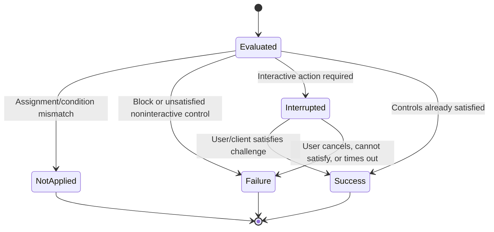

---

## 16. Deployment method and rollout rings

### Phase method

| Phase | Activities | Exit criteria |
|---|---|---|
| Discover | Identities, apps/resources, clients, devices, methods, locations, risks, existing policies, licenses | Current-state map and owner validation |
| Design | Objectives, personas, policy set, exclusions, dependencies, session and rollback | HLD/LLD and threat/risk review approved |
| Prepare | Emergency access, registration, Intune, app protection, logs, support, communication | Readiness checklist passed |
| Simulate | What If and report-only | Expected applicability and failure populations understood |
| Pilot | Enforce for test/ring groups | Positive, negative, failure, break-glass, rollback pass |
| Scale | Ordered rings and change gates | Metrics/support within threshold |
| Operate | Reviews, drift, exclusions, alerts, incidents, license/change monitoring | RACI, runbooks, dashboard, cadence active |

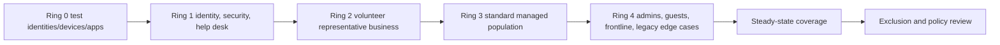

The most sensitive population may need the strongest target state, but not an untested first production enforcement. Use controlled privileged test accounts before real admin rollout, with emergency access always validated.

### Change record minimum

- Objective and risk addressed.
- Policy JSON/export and before/after diff.
- Includes, excludes, object IDs, resources, conditions, controls, state.
- License and dependency validation.
- Test cases and evidence.
- Estimated impacted sign-ins/users/apps.
- Communications and help-desk script.
- Enable/monitor/rollback times and named operators.
- Go/no-go and rollback thresholds.
- Post-change review and residual risk.

---

## 17. Positive, negative, failure, and rollback testing

| Test type | Scenario | Expected result |
|---|---|---|
| Positive standard | Managed user with eligible MFA | Access succeeds and required policy shows success |
| Negative method | Admin tries SMS under phishing-resistant strength | Prompt for eligible method or deny |
| Positive device | Compliant device accesses finance | Device grant succeeds |
| Negative device | Unmanaged device accesses finance | Block or limited session as designed |
| Legacy | Basic/legacy client attempts resource | Dedicated legacy policy blocks |
| Guest | Partner with trusted home MFA | Correct cross-tenant claim and resource policy outcome |
| Wrong guest | Guest without acceptable MFA/device context | Challenge, limited session, or block as designed |
| Location | Dedicated office/VPN and outside network | Correct named-location behavior for IPv4/IPv6 |
| Service principal | Allowed workload source accesses API | Workload policy and resource permission succeed |
| Workload negative | Same SP from disallowed context | Workload policy blocks |
| Authentication context | User opens sensitive site/action | Step-up policy applies only to tagged resource/action |
| Terms | First access/reacceptance/guest | Required terms shown and audited |
| CAE | Revoke test session/change IP in supported path | Resource challenges within documented behavior |
| Break glass | Emergency account signs in during drill | Unblocked, alert fires, minimum admin action succeeds |
| Failure injection | Intune compliance unavailable/stale, proxy path changes, method unavailable | Runbook and approved alternative/rollback work |
| Rollback | Pilot policy moved to report-only/off | Pilot access restored; other controls and evidence remain |

Rollback does not mean deleting the policy. Set the new policy to report-only or off, or remove only the pilot assignment according to the approved procedure; preserve its configuration, logs, and incident timeline. Do not disable every CA policy or remove MFA globally.

---

## 18. Troubleshooting method

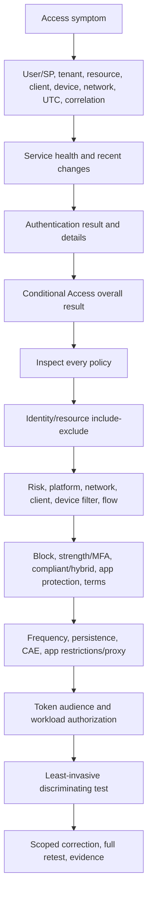

### Evidence checklist

| Evidence | Fields/question |
|---|---|
| User/SP | Object ID, UPN/display alias, user type, home/resource tenant, role/group |
| Application/resource | Client app ID, resource/audience, service dependencies |
| Sign-in | UTC time, correlation/request ID, interactive/noninteractive/workload type, result/error |
| Authentication | Method, MFA/strength details, identity provider, prior claim/session |
| CA | Overall result, every policy, grant/session results, report-only tab |
| Device | Device/object IDs, trust type, compliance, management, filter properties |
| Network | Public IPv4/IPv6, named-location result, proxy/VPN/GSA path |
| Client | Browser/native/legacy, OS, version, broker, private mode, device-claim support |
| Resource | Site/app/API authorization, session restriction, workload logs |
| Change/health | Policy/group/license/Intune/network change, service health, rollout |

### Common symptoms

| Symptom | Likely cause | First discriminating check |
|---|---|---|
| Policy Not applied unexpectedly | Wrong identity/resource, exclusion, condition mismatch, group latency | Per-policy Not applied reason and object IDs |
| Policy applies unexpectedly | Broad group/all resources, default all clients, cumulative policy | Every applicable policy and resolved memberships |
| MFA prompts repeatedly | Sign-in frequency, multiple resources, missing persistent session, claims challenge | Event sequence and session controls |
| Compliant device fails | Device not identified, wrong account/browser/private mode, stale Intune state | Device details in exact sign-in |
| Hybrid join fails policy | Wrong device record/trust claim, unsupported client | `dsregcmd` evidence plus sign-in device ID |
| Named location wrong | Proxy/VPN/IPv6/failover egress missing | IP observed by Entra/resource, not user's local IP |
| Teams partially works | Exchange/SharePoint/Teams dependencies have different policy | Audience reporting and dependent-resource sign-ins |
| Report-only says action required | MFA/terms would prompt but was not enforced | Real pilot challenge readiness |
| User blocked after exclusion | Group replication/session/resource policy | Direct object exclusion, revoke session only if approved, all policies |
| Service account broke | Human legacy account hit MFA/block | Migrate workflow; avoid broad exclusion |
| SP blocked | Workload CA or resource permission/credential | Service-principal sign-in log and workload policy |
| Terms loops/fails | Acceptance, language/version, MFA validation order | Correlated multi-step sign-ins and terms record |

Never troubleshoot by granting Global Administrator, broadly excluding the user, disabling certificate validation, or turning off all security policies. Such tests change too many variables and can create new exposure.

---

## 19. Rollback and incident response

### Rollback triggers

| Trigger | Example threshold | Action |
|---|---|---|
| Admin lockout | Normal admin population cannot access required tools | Invoke approved rollback through separate admin/emergency path |
| Break-glass failure | Drill or prechange test fails | Stop change; restore emergency design first |
| User impact | Failure/help-desk rate exceeds agreed threshold | Pause next ring; return pilot policy to report-only |
| Critical app failure | Business-critical app cannot satisfy control | Restore previous scoped policy while app owner executes remediation |
| Device signal defect | Known-compliant clients not identified | Pause device requirement; preserve other MFA/block controls |
| Security regression | Exclusion or OR logic permits unintended access | Disable new weak path immediately; investigate and retest |

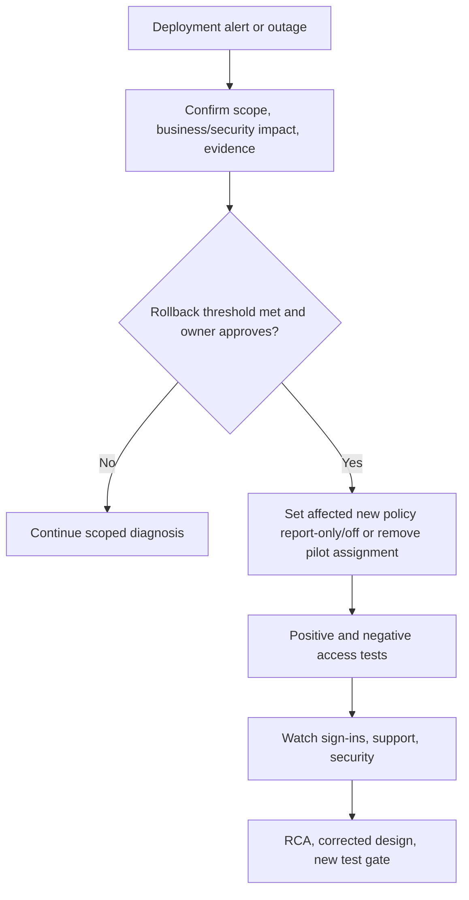

If an attacker exploited a policy gap, rollback alone is insufficient. Contain identities/sessions/devices/apps, preserve logs, investigate resource activity, remove unauthorized methods/consent, and follow incident response. Availability rollback and security containment may run in parallel under different owners.

---

## 20. Operations and policy governance

| Governance control | Purpose | Cadence/trigger |
|---|---|---|
| Policy register | Owner, objective, state, scope, dependencies, tests | Every change; quarterly review |
| Naming/versioning | Understand purpose and lifecycle | Creation/update |
| Export/source control | Detect drift and support rollback | Automated regular export plus change |
| Exclusion register | Owner, reason, compensating control, expiry | Monthly/high-risk review |
| Emergency-account drill | Prove recovery and alerts | At least every 90 days/material change |
| Coverage review | Apps/users/resources without baseline policy | Weekly/monthly based on risk |
| Sign-in outcome dashboard | Failure/not-applied/interrupted trends | Daily operational monitoring |
| Named-location review | IP ownership, IPv6, failover, VPN/proxy changes | Network change and quarterly |
| License/dependency review | Prevent unsupported configuration | Renewal/product change |
| Policy rationalization | Remove duplicate/obsolete/sprawling policies | Quarterly/after programs |

### Policy sprawl indicators

- Multiple policies with identical purpose and slightly different groups.
- Display-name-based ownership and no immutable IDs in change records.
- Permanent exclusions with no ticket, expiry, or monitoring.
- A single policy mixing unrelated objectives, conditions, and exceptions.
- Disabled/report-only test policies with no retirement date.
- Names such as `Test`, `MFA2`, or `New Policy` with no owner.
- OR logic added to restore one application but broadening every user.
- Resource-specific rules that ignore Microsoft 365 dependencies.

```mermaid
flowchart LR
    INVENTORY[Inventory policies and effective coverage] --> GROUP[Group by control objective]
    GROUP --> DUP[Find duplicate, conflicting, obsolete, ownerless]
    DUP --> DESIGN[Design simplified target set]
    DESIGN --> COMPARE[Report-only comparison to enforced estate]
    COMPARE --> MIGRATE[Migrate assignments through rings]
    MIGRATE --> RETIRE[Disable then remove obsolete policies after evidence window]
    RETIRE --> MONITOR[Drift and coverage monitoring]
```

Fewer policies are not automatically better; clarity and traceability are. Separate policies when objectives, owners, risk, exclusions, or rollback differ. Combine only when it reduces complexity without hiding logic.

---

## 21. Realistic client scenarios

### Scenario A: Privileged administrators

Objective: every normal admin access uses phishing-resistant MFA, with secure endpoint context where supported. Design separate admin identities, registered passkeys/WHfB/multifactor CBA, emergency exclusions, all-resource/admin coverage, test CLI/portal/PIM, report-only, and controlled rings. Do not make emergency accounts eligible through PIM or subject them to the same dependency.

### Scenario B: Guests and partners

Objective: guests must satisfy acceptable MFA and terms, with limited access from unmanaged devices. Validate cross-tenant access settings and home-tenant MFA trust, guest type/provider, terms, SharePoint/Teams dependencies, and CAE guest limitations. Use app-enforced restrictions or Defender for Cloud Apps when the business requires browser access without download, subject to license/support.

### Scenario C: Unmanaged SharePoint/OneDrive access

Objective: permit browser viewing while preventing download from unmanaged devices. CA targets the M365/SharePoint resource and passes device context through application-enforced restrictions; SharePoint is configured for limited access. Test Word/Excel web, direct download, sync, Teams file access, sharing, guest, mobile, and dependent resource behavior.

### Scenario D: Risky access

Objective: high sign-in risk requires a strong challenge or block, while high user risk follows remediation. Validate P2/ID Protection, method readiness, false-positive operations, emergency/admin treatment, session revocation, and help-desk proofing. Part 10 develops this design.

### Scenario E: Terms of use

Objective: contractors accept current terms before a sensitive app. Legal owns content/version/language/reacceptance; identity owns CA targeting; app/resource owner validates access. Test first acceptance, decline, updated terms, mobile/browser, guest, MFA ordering, audit, and expired contractor access.

### Scenario F: Legacy service account

Objective: remove a user account excluded from CA. Inventory protocol/resource/source/data, create a least-privilege service principal or managed identity where supported, use certificate/federation, restrict resource/network, test job and denial, monitor, then remove exclusion and disable the old account under rollback plan.

| Scenario | Primary CA design | Non-CA dependency |
|---|---|---|
| Admins | Phishing-resistant strength, device filter/compliance, session | PIM, PAW, method registration, emergency access |
| Guests | MFA trust/strength, terms, session restriction | Cross-tenant settings, sponsor, workload sharing |
| Unmanaged M365 | App-enforced restrictions/app control | SharePoint/Exchange/MDCA configuration |
| Risk | Sign-in/user risk condition and remediation | ID Protection investigation and help desk |
| Terms | Terms grant and target | Legal content, consent record, app lifecycle |
| Legacy account | Interim narrow exception then removal | Application modernization/workload identity |

---

## 22. Consulting artifacts

| Artifact | Minimum content | Quality test |
|---|---|---|
| CA current-state assessment | Policies, states, owners, exclusions, coverage, results, licenses | Effective logic, not screenshots alone |
| Persona/use-case matrix | Identity, resource, device, network, method, session, recovery | Includes guests, admins, workloads, BYOD, frontline |
| Policy HLD | Signals, decisions, enforcement points, dependencies | Explains target architecture and trust boundaries |
| Policy LLD/register | Exact IDs, includes/excludes, conditions, controls, state, owner | Implementer can configure without guessing |
| Service-dependency map | M365 apps/resources and client audiences | Tests Teams/Exchange/SharePoint relationships |
| Exception register | Owner, reason, scope, compensation, expiry, review | No permanent unowned exclusion |
| Test matrix | Positive/negative/failure/rollback per persona | Expected log evidence defined |
| Change/rollback plan | Rings, metrics, operators, triggers, commands/portal steps | Does not require disabling all CA |
| Troubleshooting runbook | Sign-in evidence, outcomes, layered tree, escalation | No unsafe broad bypass guidance |
| Operations dashboard | Coverage, outcomes, exclusions, emergency tests, drift | Measures control health and user impact |

Example finding:

> **Observation:** Twenty-three Conditional Access policies overlap on Microsoft 365, six have no owner, and eight exclusions are permanent groups with no expiry. One policy uses OR between MFA and compliant device, allowing password-plus-compliant-device access where the stated requirement is MFA plus managed device. **Risk:** Complexity hides gaps and creates unpredictable troubleshooting and rollback. **Recommendation:** Export and map effective logic; establish owners; validate emergency access; create a simplified target policy set in report-only; test every persona and M365 dependency; migrate through rings; retire obsolete policies after evidence retention. **Residual risk:** Group/policy propagation and client support remain operational variables requiring monitoring.

---

## 23. Safe paper lab: design and defend a Conditional Access baseline

This exercise uses fictional identities and produces no tenant changes.

### Prerequisites

- Parts 6–8.
- Mermaid and spreadsheet/Markdown editor.
- Official Source Anchors below.
- Fictional aliases only; no real object IDs, policies, sign-ins, tenant data, tokens, or client details.

### Fictional client

Northstar has 5,000 employees, 100 admins, 800 frontline users, 400 guests, 60 service principals, managed Windows devices, BYOD mobile users, SharePoint/OneDrive/Teams/Exchange, one legacy scanner, and a finance app. It owns Entra ID P1 for all employees, P2 for high-risk personas, Intune for employees, and Defender for Cloud Apps for selected users. Licensing must still be validated commercially.

### Procedure

1. Define ten control objectives before writing policies.
2. Create personas for standard, admin, guest, BYOD, frontline, emergency, legacy user service account, and service principal.
3. Design a baseline policy set covering MFA, admins, legacy auth, security registration, finance compliant-device access, unmanaged M365 limitation, terms, and workload source restriction.
4. Write every policy as: identity AND resource AND conditions → block or grant controls + session controls.
5. Expand multiple-policy logic for at least four sign-ins.
6. Create What If cases and report-only result expectations.
7. Define Ring 0–4, entry/exit gates, monitoring, rollback triggers, and communications.
8. Troubleshoot six injected cases: Not applied, unexpected block, compliant device missing, repeated MFA, Teams partial access, and service-principal failure.
9. Conduct a break-glass tabletop and a policy-sprawl rationalization exercise.

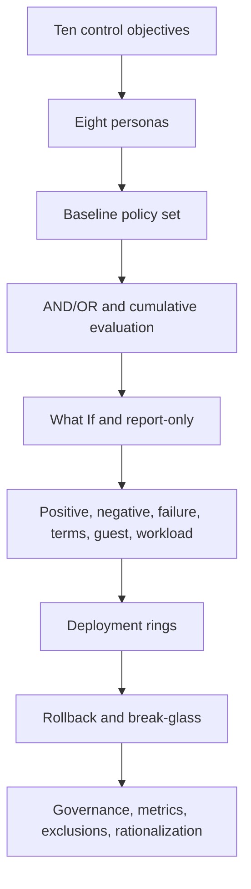

### Required test/evidence matrix

| Test | Expected evidence |
|---|---|
| Standard MFA | Baseline applies and eligible method succeeds |
| Admin negative | SMS cannot satisfy phishing-resistant strength |
| Finance device positive | Compliant managed device succeeds |
| Finance unmanaged negative | Block/limited behavior matches design |
| Guest terms | MFA trust and terms result visible |
| Legacy scanner | Legacy sign-in blocked after replacement is ready |
| Service principal positive/negative | Allowed and disallowed workload contexts differentiate |
| Not applied diagnosis | Exact assignment/condition reason identified |
| Teams dependency | Exchange/SharePoint/Teams resource results correlated |
| CAE | Supported revocation/location behavior and limitation recorded |
| Break glass | Emergency path and alert pass tabletop |
| Rollback | New pilot policy returns to report-only without removing baseline protection |

### Evidence to retain

- Control objectives and persona matrix.
- HLD diagram and policy register.
- Four cumulative-logic truth tables.
- What If/report-only workbook template.
- Twelve test cases and six troubleshooting reports.
- Change, communication, rollback, and emergency drill plans.
- Policy-sprawl before/after map.
- Executive recommendation with license/change-sensitive caveats.

### Cleanup

Delete scratch sign-in examples that accidentally include real identifiers, IPs, or tenant names. Retain only fictional/sanitized artifacts and official source links. If later implemented in a lab tenant, return test policies to Off and delete temporary groups only after exporting configurations and validating that no policy targets real identities; never remove emergency controls as cleanup.

### Interview-portfolio wording

> “I completed a fictional Conditional Access baseline and troubleshooting design. I mapped eight personas and ten control objectives into cumulative policies, used report-only/What If logic, designed emergency exclusions, M365 dependency tests, unmanaged-device sessions, workload identity policy, rollout rings, twelve tests, six failure investigations, and scoped rollback. It demonstrates my architecture and support method; it was not a production Entra deployment.”

---

## 24. Official Source Anchors

These first-party references were checked for the guide's **August 24, 2026** currency date. Recheck all live pages before production decisions.

1. [Microsoft Entra Conditional Access overview](https://learn.microsoft.com/entra/identity/conditional-access/overview) — Zero Trust engine, post-authentication timing, signals, decisions, common policies, admin experience, and P1/P2 licensing.
2. [Building a Conditional Access policy](https://learn.microsoft.com/entra/identity/conditional-access/concept-conditional-access-policies) — Policy anatomy, assignments, conditions, controls, and deployment principles.
3. [Target resources in Conditional Access](https://learn.microsoft.com/entra/identity/conditional-access/concept-conditional-access-cloud-apps) — M365/resource targeting, service dependencies, admin portals, all resources, 2026 low-scope enforcement change, user actions, and authentication context.
4. [Conditions in Conditional Access](https://learn.microsoft.com/entra/identity/conditional-access/concept-conditional-access-conditions) — Risk, platforms, client apps, deprecated device state, device filters, preview authentication flows, and agent conditions.
5. [Network assignment and named locations](https://learn.microsoft.com/entra/identity/conditional-access/concept-assignment-network) — IP/country/GPS/compliant network context and limitations.
6. [Grant controls](https://learn.microsoft.com/entra/identity/conditional-access/concept-conditional-access-grant) — Block, MFA, strength, compliant/hybrid device, app protection, approved-app retirement, risk remediation, terms, and AND/OR behavior.
7. [Session controls](https://learn.microsoft.com/entra/identity/conditional-access/concept-conditional-access-session) — Sign-in frequency, persistence, application restrictions, MDCA app control, CAE, resilience, token protection, and Global Secure Access profile.
8. [Report-only and policy insights](https://learn.microsoft.com/entra/identity/conditional-access/concept-conditional-access-report-only) — Results, limitations, policy impact, sign-in logs, and compare-before-enforcement method.
9. [Conditional Access What If](https://learn.microsoft.com/entra/identity/conditional-access/what-if-tool) — Current evaluation API, required parameters, service-dependency limitation, and result interpretation.
10. [Conditional Access insights workbook](https://learn.microsoft.com/entra/identity/conditional-access/howto-conditional-access-insights-reporting) — Log Analytics prerequisites, impact views, report-only/enforced outcomes, and troubleshooting.
11. [Plan a Conditional Access deployment](https://learn.microsoft.com/entra/identity/conditional-access/plan-conditional-access) — Stakeholders, emergency access, report-only, pilot, communications, and operations.
12. [Continuous Access Evaluation](https://learn.microsoft.com/entra/identity/conditional-access/concept-continuous-access-evaluation) — Critical events, IP enforcement, claims challenges, long-lived sessions, network/named-location and guest limitations.
13. [Emergency access accounts](https://learn.microsoft.com/entra/identity/role-based-access-control/security-emergency-access) — Cloud-only accounts, phishing-resistant methods, CA exclusions, monitoring, custody, and drills.
14. [Conditional Access for workload identities](https://learn.microsoft.com/entra/workload-id/workload-identities-conditional-access) — Service-principal targeting, supported conditions/controls, exclusions, and Workload ID licensing.
15. [Migrate approved client app control](https://learn.microsoft.com/entra/identity/conditional-access/migrate-approved-client-app) — Retirement direction and application-protection replacement.

**Preview/change-sensitive register:** Authentication flows, agent risk/execution/identities, all-agent resources, policy impact, Strict Location Enforcement, custom controls, app protection on Windows, token protection support, Global Secure Access integration, risk-remediation controls, low-privilege scope enforcement rollout, Microsoft-managed policies, and client/resource matrices require current validation.

---

## ⭐ Likely Interview Questions for This Section

### Q1. How does Conditional Access evaluate a sign-in?

> **Model answer:** “After initial authentication, Entra evaluates every enabled policy whose identity and target-resource assignments match and whose conditions are satisfied. Within a policy, selected grant controls use configured AND or OR logic; across policies, requirements are cumulative and any applicable block wins. Session controls then affect continuing access. The resource still performs its own authorization. I confirm the final result from the exact sign-in's authentication details, every CA policy result, token/resource, device, network, and session evidence.”

### Q2. How would you prevent locking a tenant out during CA deployment?

> **Model answer:** “I would maintain and alert on at least two tested cloud-only emergency accounts using a different phishing-resistant method and excluded from blocking/restrictive policies. I would inventory dependencies and method/device readiness, use What If and report-only, test representative positive, negative and failure cases, enforce only to a small pilot during a monitored window, define rollback operators and thresholds, and expand through rings. A material change stops if emergency access fails.”

### Q3. What is the difference between report-only and What If?

> **Model answer:** “Report-only evaluates most proposed policies against real sign-ins over time without enforcing grant/session controls, so it reveals actual users, clients, apps, and contexts. It does not evaluate user-action policies normally or prove users can complete an interactive challenge. What If evaluates one supplied hypothetical user/workload, resource, platform, client and optional conditions quickly, but it does not evaluate service dependencies or actual client behavior. I use both, then run enforced pilot tests.”

### Q4. How do AND/OR and multiple policies work?

> **Model answer:** “Inside one grant policy I can require all selected controls, such as MFA AND compliant device, or one, such as compliant OR hybrid joined. Across separate applicable policies, requirements accumulate; an MFA policy and compliant-device policy mean both. There is no priority and no allow override. If any applicable policy blocks, access is denied. I therefore model effective logic per persona and inspect every policy in the sign-in log.”

### Q5. How would you secure SharePoint and OneDrive access from unmanaged devices?

> **Model answer:** “I would clarify whether the business wants block or browser-limited access. For limited access I would target the appropriate M365/SharePoint resources and use application-enforced restrictions, with SharePoint configured to provide the unmanaged web experience. I would test direct browser access, download, sync, Office web, Teams file dependencies, mobile, guests, sharing and existing sessions. For higher-risk scenarios I would consider Defender for Cloud Apps session control subject to licensing and support.”

### Q6. How would you troubleshoot a policy that says Not applied?

> **Model answer:** “Not applied means at least one assignment or condition did not match, or the identity/resource was excluded. I capture user/service-principal, tenant, resource audience, client, device, network, UTC time and correlation ID, then open that policy's result and read its nonapplication reason. I verify immutable IDs, effective group/role membership, target resource and dependencies, client category, risk, IP/IPv6 path and device-filter properties. I do not broaden scope until the expected logic is proven.”

### Q7. How should legacy authentication and service accounts be handled?

> **Model answer:** “I would use sign-in evidence to inventory legacy clients by account, protocol, app, source, owner and business process, deploy a dedicated block-legacy policy through report-only and rings, and modernize each workflow. Human users move to modern interactive auth. Nonhuman processes move to a least-privilege service principal or managed/federated workload identity where supported. Any interim exclusion is narrow, monitored, owned, risk-accepted, and expires; I would not exclude a generic service-account group from all CA.”

### Q8. How does your background support CA troubleshooting without overstating it?

> **Model answer:** “My direct production experience is complex Microsoft 365 escalation across SharePoint, OneDrive, sync, affected-versus-unaffected analysis, stakeholder coordination, RCA and fix validation. That maps strongly to CA troubleshooting because I separate identity, client, network, device, workload and service evidence and change one variable at a time. My CA implementation evidence is a fictional baseline, report-only/test matrix and troubleshooting exercise, not claimed production policy ownership.”

---

## 🧠 30-Second Memory Hooks

- **CA:** Signals → all applicable policies → block/requirements → session → resource authorization.
- **Timing:** CA evaluates after first authentication.
- **Policy anatomy:** Identity + resource + conditions → grant + session; state Off/report-only/On.
- **Assignment:** Who/what and which resource.
- **Condition:** Context that narrows applicability.
- **Grant:** Block or requirement.
- **Session:** Continuing access behavior.
- **All policies:** Cumulative; no priority; any block wins.
- **Within policy:** Selected controls can be AND or OR.
- **All resources:** Best baseline coverage; resource exclusions add risk and 2026 changes.
- **M365:** Teams depends on Exchange and SharePoint; test audiences.
- **Authentication context:** Step up only for tagged sensitive action/data.
- **Platform:** User-agent signal, not authoritative trust.
- **Device filter:** Use supported properties; device state is deprecated.
- **Named location:** IP context, never identity; include IPv4/IPv6 and every dedicated egress.
- **Legacy client:** Cannot satisfy modern MFA/device controls; migrate and block.
- **Approved app:** Retired direction; use app protection policy for new design.
- **Compliant device:** Entra registration + Intune/partner state + supported client.
- **App restriction:** CA passes context; SharePoint/Exchange enforces limited session.
- **CAE:** Resource can challenge unexpired token; support and network limitations apply.
- **Report-only:** Real shadow evaluation, not proof of interactive success.
- **What If:** Scenario simulator, not dependency or end-to-end test.
- **Success:** This policy passed; another can still block.
- **Not applied:** Scope/condition mismatch; read the reason.
- **Interrupted:** User/client action is required; follow the sequence.
- **Break glass:** Two cloud-only accounts, separate strong method, exclusion, alert, 90-day drill.
- **Rollback:** New policy to report-only/off or remove pilot; never disable all CA.
- **Sprawl:** Every policy needs one clear objective, owner, tests, and review.
- **Honesty:** CA paper design and M365 RCA transferability are not production Entra tenure.

---

## Completion Checklist

- [ ] Explain CA as a post-authentication Zero Trust policy engine.
- [ ] Draw the signal, policy, decision, session, and resource-authorization flow.
- [ ] Define assignment, condition, grant, session, and policy state.
- [ ] Compare all users, groups, roles, guests, workload, and agent identity assignments.
- [ ] Explain human versus service-principal versus managed-identity control paths.
- [ ] Compare all resources, M365 suite, specific apps, admin APIs, user actions, auth context, GSA, and agent resources.
- [ ] Explain the 2026 low-privilege scope enforcement change and resource-exclusion caution.
- [ ] Design and troubleshoot authentication context.
- [ ] Compare risk, platform, network, client, device-filter, authentication-flow, and agent conditions.
- [ ] Explain why platform/location are signals and why device state is deprecated.
- [ ] Design named locations with IPv4/IPv6, proxies, VPN, shared egress, CAE and 5,000-range limitation.
- [ ] Categorize browser, modern native, Exchange ActiveSync, and other legacy clients.
- [ ] Compare block, MFA, strength, compliant, hybrid, approved app, app protection, risk remediation, and terms grants.
- [ ] Explain approved-client-app retirement and migration direction.
- [ ] Model AND/OR inside a policy and cumulative logic across policies.
- [ ] Compare sign-in frequency, persistence, app restrictions, MDCA, CAE, resilience, token protection, and GSA sessions.
- [ ] Validate P1/P2, Workload ID, Intune, MDCA, Log Analytics, and related licensing.
- [ ] Build the baseline and eight-persona use-case matrix.
- [ ] Design emergency access and pass the lockout-prevention gate.
- [ ] Compare report-only, What If, policy impact, workbook, and sign-in details.
- [ ] Interpret Success, Failure, Not applied, Interrupted, and report-only outcomes.
- [ ] Design Ring 0–4 with change record, entry/exit criteria, and hypercare.
- [ ] Run all sixteen positive, negative, failure, dependency, CAE, terms, guest, workload, and rollback tests.
- [ ] Use the layered troubleshooting tree and evidence checklist.
- [ ] Roll back one policy/pilot without disabling the security estate.
- [ ] Define operations, exclusion review, named-location review, coverage, export, and rationalization.
- [ ] Defend the six realistic client scenarios and consulting artifacts.
- [ ] Complete the safe paper lab with sanitized evidence.
- [ ] Answer all eight interview questions aloud without claiming production Entra implementation.

---

*Next suggested section:* [Part 10](Part-10-entra-id-protection-risk-based-access.md) — add user, sign-in, and workload risk detections, investigation, remediation, false-positive handling, and risk-based Conditional Access operations.