# Part 10 — Entra ID Protection and Risk-Based Access

> **Section goal:** Understand how Microsoft Entra ID Protection turns identity telemetry into user, sign-in, workload, and emerging agent risk; use that evidence to investigate incidents and design risk-based access without treating a score as a verdict. By the end, you should be able to explain detections and states, build separate user-risk and sign-in-risk policies, run a privacy-aware investigation, remediate safely, measure the operating model, and troubleshoot false positives or missing signals.

This Part extends [Part 9](Part-09-conditional-access-design-deployment-troubleshooting.md): Conditional Access evaluates a risk condition, while ID Protection generates and manages the risk evidence behind that condition. Part 11 applies least privilege and PIM to the administrators who investigate and respond.

> **Currency and change-sensitive note:** Product behavior was checked against official Microsoft Learn content available on **August 24, 2026**. The legacy user-risk and sign-in-risk policies inside the ID Protection experience are scheduled to retire on **October 1, 2026**; new designs should use separate Conditional Access policies. Agent detections and Risky Agents are **Preview/change-sensitive**. Workload risk requires its own Workload Identities Premium model. Microsoft changes detection names, machine-learning behavior, portal views, remediation labels, and licensing; verify live documentation and tenant behavior before implementation.

## JD Mapping

| Deloitte role expectation | Capability developed in this Part | Consulting evidence |
|---|---|---|
| Design risk-based Entra controls | Translate user, sign-in, and workload risk into separate Conditional Access responses | Risk policy HLD/LLD and decision matrix |
| Investigate security events | Correlate identity risk with sign-in, audit, Defender, Sentinel, app, device, and workload evidence | Identity incident timeline and evidence pack |
| Troubleshoot policy errors and false positives | Separate detection timing, risk level, risk state, policy outcome, and resource activity | Layered troubleshooting runbook |
| Protect Microsoft 365 data | Investigate SharePoint/OneDrive mass access, mailbox-rule, session, and token indicators | M365 identity-incident scenario |
| Minimize user disruption | Prefer tested self-remediation, staged policy, strong recovery, and scoped rollback | Positive/negative/rollback test plan |
| Deliver sustainable operations | Define queues, roles, metrics, privacy controls, feedback, retention, and escalation | SOC operating model and dashboard specification |

## Candidate honesty note

Arti can credibly connect this subject to demonstrated production strengths: leading Microsoft 365 escalations, comparing affected and unaffected populations, correlating SharePoint/OneDrive and sync evidence, preserving timelines, coordinating customers, vendors, and product groups, documenting RCA, validating fixes, and briefing technical and business stakeholders.

This Part does **not** claim production ownership of Entra ID Protection, risk policies, or an identity SOC queue. Safe wording is:

> “My production experience is complex Microsoft 365 escalation, SharePoint/OneDrive investigation, RCA, vendor coordination, and evidence-based stakeholder communication. I have completed a current paper design for Entra ID Protection covering risk detections, Conditional Access, identity-incident triage, false-positive handling, testing, metrics, and rollback. I would present that as transferable troubleshooting skill plus structured design evidence, not as production Entra ownership.”

---

## 1. Identity Protection is a detect-investigate-remediate system

Microsoft Entra ID Protection uses Microsoft signals, heuristics, threat intelligence, and machine learning to identify suspicious identity activity. It does not merely produce alerts. Its risk information can drive investigation, Conditional Access, user self-remediation, administrator action, Microsoft Defender XDR correlation, Microsoft Sentinel analytics, Microsoft Graph automation, and long-term reporting.

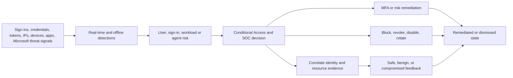

| Stage | Plain meaning | Primary evidence | Common mistake |
|---|---|---|---|
| Detect | Identify a suspicious signal or pattern | Risk detection record | Treat every anomaly as compromise |
| Assess | Estimate likelihood/confidence | Risk level and details | Treat level as business impact |
| Decide | Select access or incident response | CA result and SOC playbook | Put user and sign-in risk in one policy |
| Remediate | Remove or reduce compromise condition | MFA, secure change, reset, rotation | Dismiss risk without securing identity |
| Investigate | Determine scope, cause, and resource impact | Sign-in, audit, Defender, workload logs | Look only at the risky sign-in row |
| Learn | Give accurate feedback and tune operations | Confirm safe/compromised/dismiss | Use “safe” and “dismiss” interchangeably |

**Analogy:** ID Protection is a credit-card fraud system. It notices unusual transactions, scores confidence, may ask for extra proof, and gives an investigator evidence. The score is neither a criminal conviction nor a complete forensic report.

---

## 2. User risk, sign-in risk, workload risk, and agent risk

### 🔍 Plain-English deep-dive: four different questions

- **User risk** — *the probability that the identity itself is compromised.* **Analogy:** The bank suspects the card number and account are under attacker control, not just one purchase. **Why it matters:** Response usually protects the whole account and all sessions.
- **Sign-in risk** — *the probability that one authentication request was not authorized by the identity owner.* **Analogy:** One purchase looks suspicious, even if the card account is not yet considered stolen. **Why it matters:** A strong challenge can prove this transaction while avoiding unnecessary account-wide reset.
- **Workload identity risk** — *risk attached to an application or service principal rather than a person.* **Analogy:** An automated company badge used by a delivery robot starts entering unusual buildings. **Why it matters:** A workload cannot perform human MFA; containment centers on credentials, federation, permissions, source, and disablement.
- **Agent risk** — *emerging risk for autonomous agent identities in Microsoft Entra Agent ID.* **Analogy:** A software assistant acts outside its normal job. **Why it matters:** As of August 2026 this is Preview/change-sensitive and must not be presented as a settled production control surface.

| Risk subject | Unit being assessed | Example | Typical response |
|---|---|---|---|
| User | Account across activity | Leaked credentials or attacker-in-the-middle | Secure password change/reset, session revocation, method review |
| Sign-in | One authentication/session | Anonymous IP plus unfamiliar device | Strong authentication, investigate transaction and session |
| Workload identity | Service principal/application instance | Leaked app credential or anomalous Graph activity | Disable if needed, rotate credentials, remove grants, review code/source |
| Agent | Agent identity/autonomous activity | Suspicious agent operation | Sponsor review and scoped containment under current Preview guidance |

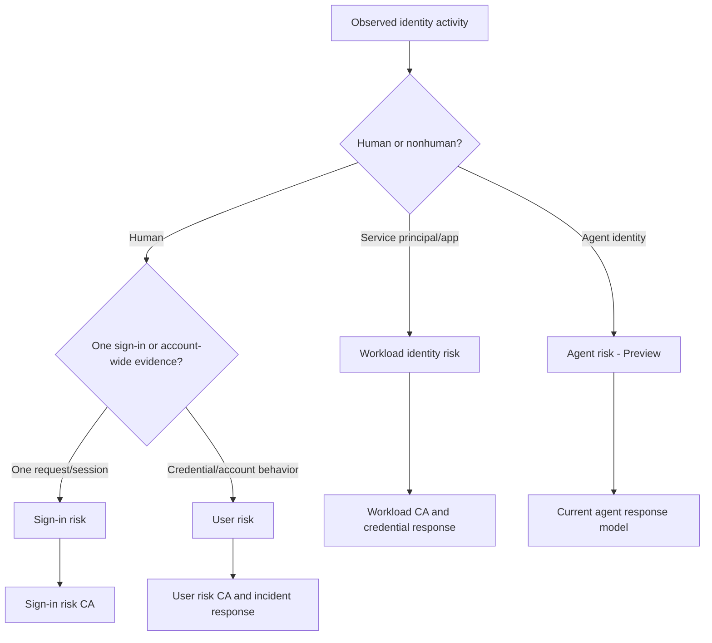

A risky sign-in can contribute to user risk if it remains unresolved or combines with other evidence. Conversely, a user can be high risk because of leaked credentials even when no successful malicious resource access has yet been proven. Keep **compromise likelihood**, **attack success**, and **business impact** as separate investigation questions.

---

## 3. Risk detections, risk levels, and risk states are different dimensions

A **risk detection** says what suspicious evidence was observed. A **risk level** says Microsoft’s confidence tier: low, medium, or high. A **risk state** says where the record is in its response lifecycle.

| Dimension | Values/examples | Question answered |
|---|---|---|
| Detection | Leaked credentials, unfamiliar properties, anomalous token | What signal or pattern was found? |
| Detection timing | Real-time, offline, or either | When can it influence access or appear in reports? |
| Risk level | Low, medium, high, none | How confident is compromise according to the model? |
| Risk state | At risk, remediated, dismissed, confirmed safe/compromised as surfaced | What happened to the risk record? |
| Risk detail | User passed MFA, admin dismissed, secure change, AI assessed safe | Why did the state change? |
| Policy result | Applied, not applied, interrupted, success, failure | What did Conditional Access do? |
| Incident status | New, active, contained, recovered, closed | What does the organization’s response process say? |

Low, medium, and high are confidence tiers, not direct severity or data-impact ratings. A high-confidence leaked credential for a low-privilege unused account is still urgent, but its business impact differs from medium-confidence token replay involving a Global Administrator. Prioritization should combine confidence, privilege, asset sensitivity, observed resource activity, blast radius, and attacker persistence.

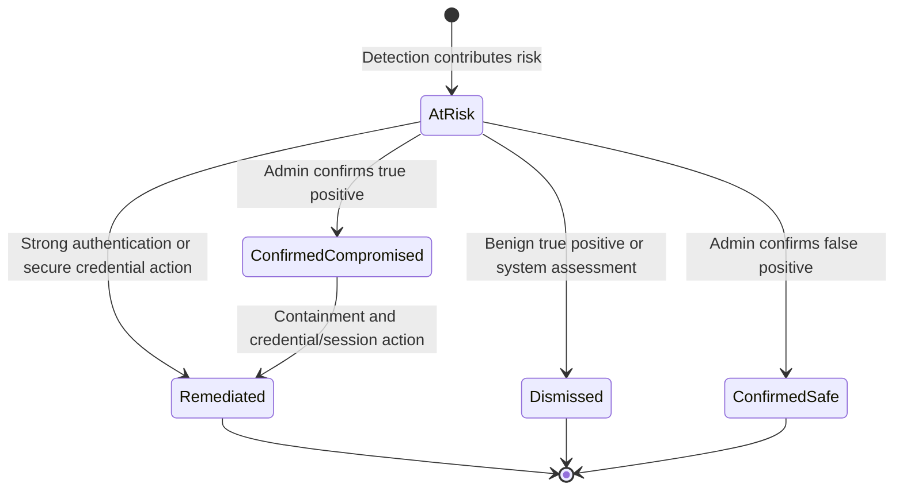

Current Learn guidance says low-risk detections and users age out after six months; medium and high persist until remediated or dismissed. Real-time detection details generally surface in reports within roughly 5–10 minutes, while offline detections can take up to 48 hours. These timings are operational expectations, not strict incident SLAs.

---

## 4. Real-time versus offline detection

Real-time detections execute during authentication and can influence that transaction. Offline detections analyze more context after authentication; they may discover compromise later and change aggregate risk.

| Characteristic | Real-time | Offline |
|---|---|---|
| Decision timing | During sign-in | After sign-in analysis |
| Access effect | Can trigger CA immediately | Usually affects later sign-in/user response |
| Context depth | Evidence available at transaction time | Broader historical, cross-signal, resource, and intelligence analysis |
| Report appearance | Details typically 5–10 minutes | Up to 48 hours under current guidance |
| Example | Anonymous IP, unfamiliar sign-in properties, suspicious MFA approval | Atypical travel, impossible travel, inbox manipulation, leaked credentials |
| Operational need | Fast self-remediation and block path | Retrospective hunting, session/resource review, later containment |

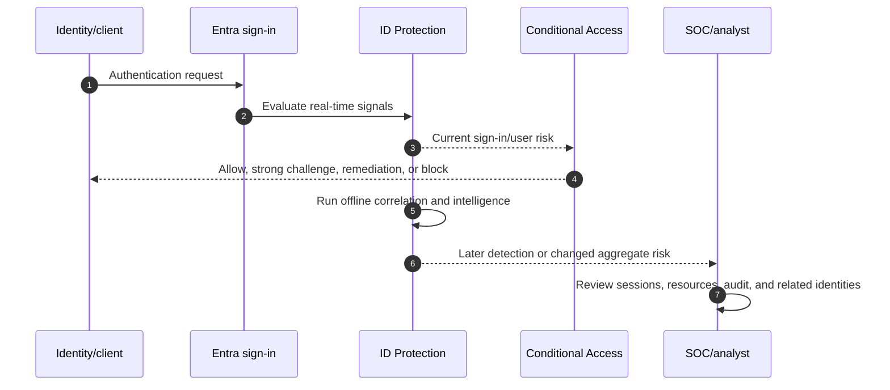

An analyst must not conclude “the policy failed” merely because an offline detection appeared after access. The control may have had no signal at transaction time. The correct response is to determine when evidence became available, whether later session controls or Continuous Access Evaluation apply, what resources were touched, and whether detection/response latency meets the threat model.

---

## 5. Human sign-in detections and their distinctions

The detection catalog evolves. Learn the investigation meaning, not only the display name.

| Detection | Timing/licensing pattern | What it means | Key validation |
|---|---|---|---|
| Anonymous IP address | Real-time; nonpremium detail tier exists | Source appears to be Tor or anonymous VPN/proxy | Corporate VPN, privacy service, IP reputation, other users |
| Activity from anonymous IP | Offline via Defender for Cloud Apps | Activity from identified anonymous proxy | MDCA evidence and resource actions |
| Unfamiliar sign-in properties | Real-time; P2 detail | IP, ASN, location, device, browser, or subnet differs from learned history | Learning period, new device, travel, noninteractive token use |
| Atypical travel | Offline; P2 | Two distant sign-ins, at least one atypical, considering travel time and normal behavior | User travel, VPN egress, session/token evidence |
| Impossible travel | Offline; Defender for Cloud Apps signal plus license | Distant activities occur faster than physical travel permits | Different proxy exits, cloud apps, simultaneous session use |
| New country | Offline; Defender for Cloud Apps signal | Country is new/infrequent for tenant/user history | Approved travel or vendor network |
| Malicious IP | Offline; P2 | IP has malicious reputation or high invalid-credential activity | Shared cloud provider, protocol, related attempts |
| Verified threat actor IP | Real-time; P2; high | IP associated with known threat actor | Treat urgently; correlate all identities/resources |
| Password spray | Real-time/offline; P2 | Microsoft observed spray and a successful password validation | Success does not prove resource access; reset and scope attack |
| Suspicious MFA approval | Real-time; P2; high | Authenticator telemetry and unfamiliar context suggest social engineering | Requesting versus approving device/location; user confirmation |
| Anomalous token | Real-time/offline; P2 | Token lifetime/use/location/client characteristics suggest replay | Session details, issuer, request/correlation IDs, downstream activity |
| Token issuer anomaly | Offline; P2 | SAML issuer/claims resemble compromised issuer behavior | Federation health, signing certificates, claims, AD FS evidence |

### 🔍 Plain-English deep-dive: unfamiliar, anonymized, atypical, and impossible

- **Unfamiliar sign-in properties** asks whether the overall sign-in looks unlike this user’s learned behavior. A new browser at a normal office can trigger it. It is real-time and can cover interactive or noninteractive sign-ins.
- **Anonymous IP** asks whether the source hides origin through a known anonymity service. It does not compare the user with prior behavior. A legitimate privacy VPN can be anonymous but not malicious.
- **Atypical travel** compares two distant sign-ins and user/tenant normality. Microsoft’s algorithm suppresses some obvious VPN and commonly shared-location noise. Current documentation describes an initial learning period of the earlier of 14 days or 10 sign-ins for this detection.
- **Impossible travel** is an offline Defender for Cloud Apps-derived activity detection about distances and elapsed time across sessions. It has an additional product-license dependency.

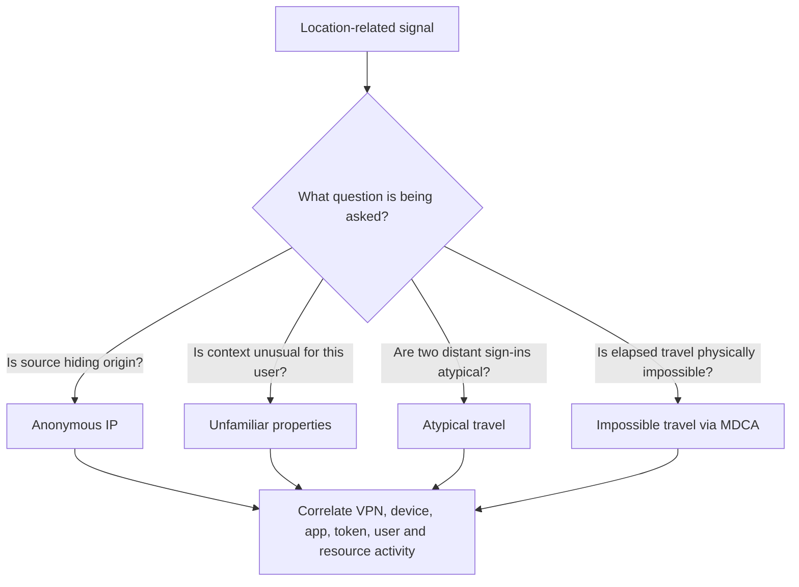

Never “fix” a location alert by marking a broad cloud-proxy range trusted without validating ownership and shared use. Named locations can improve risk accuracy, but over-trusting network context can suppress useful signals.

---

## 6. User-level detections and credential evidence

| User detection | Meaning | Immediate investigation priority |
|---|---|---|
| Leaked credentials | Microsoft found and validated current credential material against the tenant | High; find use, reset/change, revoke, check reuse and persistence |
| Attacker in the Middle | Session linked to malicious reverse proxy; high-precision detection | High; token/session theft, methods, resources, mailbox/app persistence |
| Possible PRT access | Defender signal suggests attempted Primary Refresh Token theft | High; endpoint containment and identity response together |
| Suspicious API traffic | Abnormal Graph activity/directory enumeration | App/client, scopes, privileged changes, data enumeration |
| Anomalous user activity | Administrative behavior differs from baseline | Exact directory changes, initiator, target, privilege path |
| Suspicious sending patterns | Defender for Office 365 reports suspicious outbound mail behavior | Mailbox compromise, restrictions, rules, recipients, campaign |
| User reported suspicious activity | User denied and reported an unexpected MFA prompt | Password compromise, spray, source, prompt history, method changes |
| Threat intelligence | Activity matches known attack research/intelligence | Related users, IP/ASN, campaign identifier, protocol and resource |

**Leaked credentials are always high risk** in current documentation because Microsoft validates a match, rather than merely spotting a username in a breach. For hybrid identities, Password Hash Synchronization (PHS) is required for Microsoft to compare current on-premises password material and for cloud remediation behavior described in the guidance. Enabling PHS can therefore support detection and disaster recovery even if PTA or federation remains the primary sign-in method.

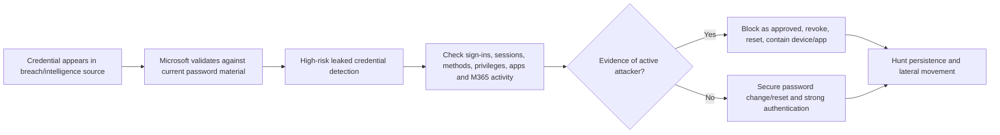

Changing a password is not the entire response when an attacker may hold refresh/session tokens, added an authentication method, granted OAuth consent, created forwarding rules, registered a device, or changed privileged assignments. Identity remediation and resource investigation must run together.

---

## 7. Workload identity risk

A **workload identity** lets software authenticate. In this context, risk primarily concerns service principals/application instances. Workload identities cannot answer an MFA prompt and often have secrets, certificates, or federated credentials, broad API permissions, and weak ownership processes.

| Workload detection | What to investigate |
|---|---|
| Suspicious sign-ins | New IP/ASN, target resource, user agent, hosting class, country, or credential type after a 2–60 day baseline |
| Leaked credentials | Secret/certificate exposure in public code, breach, paste, or other source; current credential match |
| Threat intelligence | Activity consistent with known attack patterns |
| Anomalous service-principal activity | Unusual administrative directory changes by the service principal |
| Suspicious API traffic | Graph enumeration, reconnaissance, or possible exfiltration |
| Suspicious/malicious application | ID Protection/Defender signals and Microsoft disablement/status where applicable |
| Admin confirmed compromised | Administrator feedback raises and records compromise |

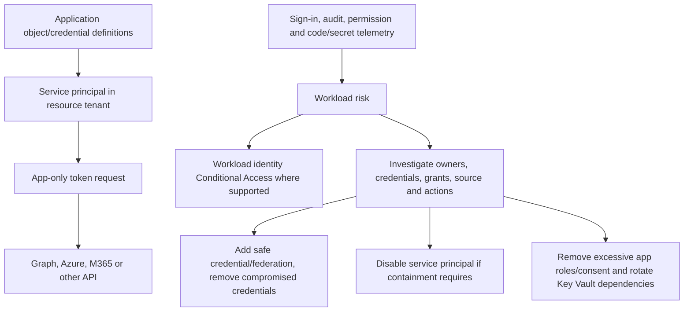

Current scope is nuanced: detections can cover single-tenant, non-Microsoft SaaS, and multitenant apps, while risk-based workload Conditional Access is narrower and applies to supported **single-tenant service principals registered in the tenant**. Managed identities, non-Microsoft SaaS, and multitenant apps are out of scope for that workload-risk CA path. Full details and controls require Workload Identities Premium; limited detections can still surface without it. Verify current scope.

Workload remediation normally follows this order: identify every credential on application and service-principal objects; create a safe replacement, preferably certificate or federation where supported; update the workload; prove positive and negative authentication; remove compromised credentials; rotate secrets the identity could read, including Key Vault material; remove unauthorized grants/owners; inspect every action; and only then clear/dismiss risk. Disablement can be the right containment action, but first understand business criticality and emergency alternatives.

---

## 8. Risk state and administrator feedback

### 🔍 Plain-English deep-dive: safe, dismiss, compromised, and remediated

- **Confirm sign-in/user safe** — *the detection was a false positive.* **Analogy:** The fraud system misread an ordinary purchase. **Why it matters:** Similar activity can be learned as safe; user-level safe feedback removes current detections and can place the user back into learning mode.
- **Dismiss risk** — *the signal was real but benign, such as an approved penetration test.* **Analogy:** The purchase was unusual, but it was an authorized test transaction. **Why it matters:** Similar future signals should still be evaluated; dismissal is not the same feedback as false positive.
- **Confirm compromised** — *investigation validates a true malicious event.* **Analogy:** The card really was stolen. **Why it matters:** User/sign-in aggregate risk rises and remediation is still required; confirmation is not containment.
- **Remediated** — *an approved action changed the security condition, such as strong proof, secure password action, or credential response.* **Analogy:** The card was replaced and old sessions invalidated. **Why it matters:** A closed risk record does not prove all downstream damage was reversed.

| Action | Appropriate when | What it does not prove |
|---|---|---|
| Confirm safe | Evidence establishes false positive | That all user activity forever is safe |
| Dismiss sign-in/user risk | True signal was authorized/benign | That credential/session was changed |
| Confirm compromised | True malicious activity is established | That attacker is contained |
| MFA self-remediation | User strongly proves a risky sign-in | That token-theft/resource persistence is absent |
| Secure password change/reset | Password-related user risk is addressed | That methods, consent, rules, devices, or apps are clean |
| Disable service principal | Stops supported new workload sign-ins | That issued tokens/resources/credentials are fully cleaned |

Feedback processing can be offline, so state changes are not always immediate. Record who made the decision, evidence considered, UTC time, incident/change ID, related sessions/resources, and follow-up. Bulk dismissal solely to reduce a dashboard number destroys investigation value.

---

## 9. Remediation paths: MFA, risk remediation, password change, and reset

Current Microsoft guidance distinguishes a **secure password change** from **SSPR password reset**. In the risk-remediation change flow, the user knows the current password, completes MFA, then changes it. SSPR is recovery when the user does not know the password. Both can remediate relevant user risk under supported configuration, but dependencies differ for cloud and hybrid identities.

| Path | Typical trigger | Prerequisites | Result/limitation |
|---|---|---|---|
| Sign-in-risk self-remediation | Medium/high risky sign-in CA | Registered strong authentication method | Successful strong auth remediates sign-in risk |
| User-risk “Require risk remediation” | High user-risk CA | Authentication strength; password method or passwordless flow support | Adds mandatory every-time sign-in frequency; passwords may require secure change |
| Secure password change | Risk policy; user knows password | MFA registration and supported cloud/hybrid configuration | Changes password and remediates user risk |
| SSPR reset | Recovery/admin/user flow | SSPR, proofing, writeback for applicable hybrid path | Resets credential and can remediate risk |
| Admin temporary password | Manual response | User Administrator plus ID Protection role as applicable | User must change at next sign-in; protect delivery/proofing |
| Workload credential rotation | Workload compromise | App owner, deployment path, replacement credential/federation | No MFA; must rotate dependencies and validate workload |

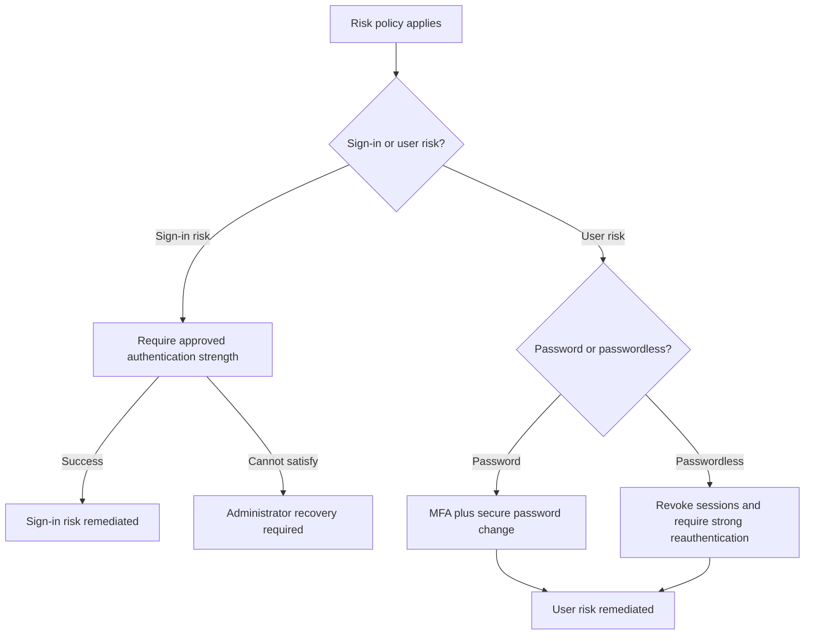

As of the checked 2026 guidance, selecting **Require risk remediation** automatically selects an authentication strength and applies **Sign-in frequency: Every time**. Sign-in-risk policy guidance likewise recommends every-time reauthentication. Do not promise this behavior without checking the live policy UI because grant terminology has recently evolved.

Token-theft-related detections now receive stricter treatment. Microsoft states that threat intelligence, anomalous token, attacker-in-the-middle, verified threat actor IP, and token issuer anomaly are no longer auto-remediated merely because a session has MFA claims. Investigate and force appropriate reauthentication/credential and session response; an MFA claim can exist inside a stolen session.

---

## 10. Designing separate risk-based Conditional Access policies

Do **not** combine user risk and sign-in risk conditions in one policy. They answer different questions, trigger different remediation, and need different troubleshooting and rollback.

| Design item | User-risk policy | Sign-in-risk policy |
|---|---|---|
| Recommended threshold starting point | High | Medium and high |
| Scope | All intended users, exclude emergency access | All intended users, exclude emergency access |
| Resources | All resources | All resources |
| Control | Require risk remediation/current equivalent | Require approved MFA authentication strength |
| Session | Every time, automatically applied in current risk remediation design | Every time recommended |
| Readiness | Password/passwordless and hybrid remediation paths | Registered strong methods and client support |
| Operational owner | Identity/SOC/help desk jointly | Identity/SOC/help desk jointly |
| Main false-positive impact | Account-wide remediation/block | Transaction challenge/block |

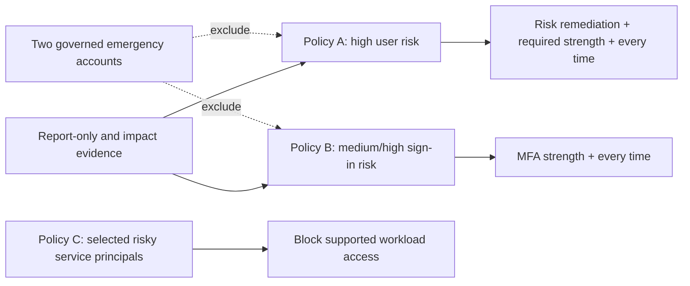

Before enforcing, remediate existing risky populations, validate MFA/passwordless registration, password writeback/PHS where relevant, help-desk proofing, emergency access, hybrid account behavior, workload exclusions, client compatibility, and support coverage. Start report-only, test real interaction with a pilot, and move through rings. Report-only predicts policy impact but cannot prove a user can complete remediation.

**Retirement:** Legacy risk policies configured inside ID Protection are scheduled to retire on October 1, 2026. Inventory them, create equivalent separate CA policies in report-only, compare results, enable through change control, then disable legacy policies. Do not run undocumented overlapping controls indefinitely.

---

## 11. Licensing, roles, prerequisites, and privacy

| Capability | Current conceptual requirement | Verify-current action |
|---|---|---|
| Full human risk details/policies/reports | Entra ID P2 or Entra Suite | License all in-scope users under current terms |
| Limited risky-user/sign-in visibility | Free/P1 has limited views/details | Do not design SOC process around hidden detection detail |
| Defender-derived signals | Applicable Defender product plus identity licensing | Map each desired detection to owning license |
| Workload risk details/access controls | Workload Identities Premium | Confirm service-principal scope and entitlement model |
| Risk-based CA | Entra ID P2/Entra Suite plus CA | Confirm population and policy owners |
| Graph risk reports | P2 full capability and Graph permission/role | Use least privilege and certificate/federation for automation |
| Log export | Diagnostic settings plus Azure destination/cost/RBAC | Define retention, region, access, and deletion |
| Agent risk | Current Agent ID/Agent 365 requirements; Preview | Validate availability, terms, and data handling |

| Task | Least-privilege role highlighted by current Learn |
|---|---|
| View risk reports | Global Reader/Security Reader depending task; Reports Reader for sign-in/audit logs |
| Dismiss risk/confirm safe/compromised | Security Operator |
| Create/edit risk CA policies | Conditional Access Administrator |
| Full ID Protection configuration | Security Administrator |
| Reset user password | User Administrator |
| Workload report action | Security Reader/Operator/Administrator as documented; CA admin for policy |

Privacy matters because risk data can reveal travel, IP-derived geography, devices, applications, work patterns, and security allegations. Use data minimization, role-based access, appropriate retention, legal/privacy review, secure exports, documented purpose, and careful user contact. Do not expose precise location or accusation broadly. Separate “algorithm detected anomaly” from “employee acted maliciously.” Purview Insider Risk is a different governed process; identity risk is not proof of insider intent.

---

## 12. Reports, logs, API, exports, and evidence retention

| Evidence surface | What it contains | Current window/consideration |
|---|---|---|
| ID Protection dashboard | Attack/high-risk summary and trends | Operational overview, not case evidence alone |
| Risky users | Aggregate user risk, history, related detections | Full detail needs license |
| Risky sign-ins | Interactive/noninteractive sign-ins, real-time/aggregate risk, CA/MFA/device/app/location | Filterable up to 30 days in current report |
| Risk detections | Detection type, state, level, attack/source and related context | Filterable up to 90 days in current report |
| Risky workload identities | Service-principal risk level/history | Workload Identities Premium for full detail |
| Sign-in logs | Authentication, CA, device, client, resource, IDs | Correlate, do not substitute one row for session timeline |
| Audit logs | Role, app, method, policy and directory changes | Preserve for incident/change investigation |
| Graph APIs | `riskDetections`, `riskyUsers`, workload collections | Least privilege, pagination, throttling, schema/version control |
| Diagnostic settings | Send to Log Analytics, storage, Event Hubs/SIEM | Cost, residency, RBAC, immutable retention and privacy |

Current workload collections include `riskyServicePrincipals` and `servicePrincipalRiskDetections`. Human risk automation uses Graph risk detection and risky-user resources. Avoid using preview PowerShell modules as the only production response path; pin supported SDK/API versions, test permissions, log every write, require approval for destructive actions, and preserve the raw event before state mutation.

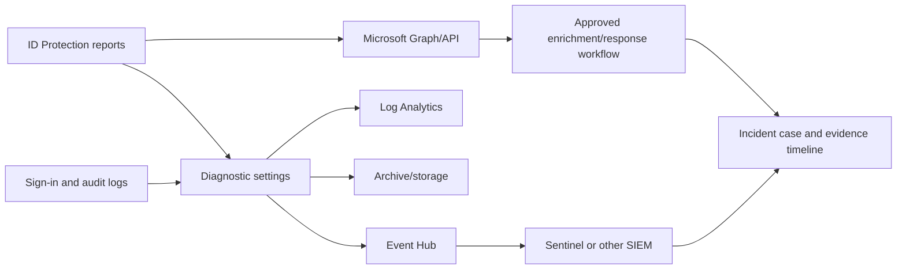

Evidence records should include UTC time, user/service-principal object ID, home/resource tenant, app/client/resource IDs, sign-in type, request/correlation ID, IP/ASN/location confidence, device ID/compliance, authentication details, CA policies, risk type/level/state/detail, audit changes, resource activity, investigator decisions, and actions. Sanitize portfolio artifacts.

---

## 13. Investigation workflow for a risky user or sign-in

### 🔍 Plain-English deep-dive: confidence is not scope

A high-risk label says confidence is high; it does not tell you every affected resource. A medium-risk token anomaly involving a privileged administrator may require broader containment than a high-risk leaked password for a disabled test user. Investigation combines:

1. **Identity criticality:** privilege, group/app ownership, executive or sensitive role.
2. **Detection confidence and type:** verified credential/threat actor versus behavior anomaly.
3. **Authentication outcome:** failed validation, successful sign-in, MFA/strength, token/session.
4. **Resource impact:** SharePoint/OneDrive files, mailbox rules, Graph calls, role/app changes.
5. **Persistence:** methods, devices, consent grants, credentials, forwarding, app registrations.
6. **Blast radius:** same IP/ASN/user agent/app, spray targets, related service principals.

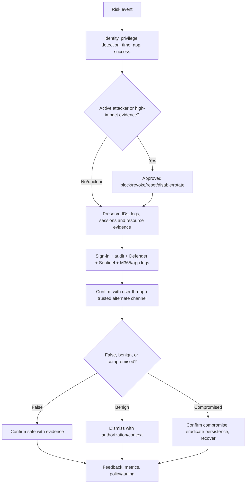

Contacting the user is useful but not authoritative: email or Teams might be compromised. Use a known alternate channel and do not lead the answer. Ask whether they initiated the exact app, UTC time, device, location, and action. Corroborate with logs.

### Initial triage record

| Field | Question |
|---|---|
| Identity | Exact object ID, source, role, group/app ownership, guest/member status |
| Detection | Name, event type, real-time/offline, level, state, detail, source |
| Sign-in | Success, type, client, app/resource, request/correlation IDs |
| Authentication | Method, MFA result, strength, token issuer/session details |
| Device/network | Device ID/trust/compliance, IP/ASN, named location, VPN/proxy |
| Resource | Files, mail, Graph, admin changes, app consent, Azure actions |
| Timeline | First/last known normal, detection time, update time, response actions |
| Related scope | Other identities, IPs, apps, user agents, workloads, campaign IDs |

---

## 14. Microsoft 365 identity incident scenario

Assume a SharePoint administrator receives an anomalous-token detection. OneDrive audit shows mass download; Exchange shows a new forwarding rule; Graph audit shows consent to an unfamiliar app.

| Layer | Evidence | Response question |
|---|---|---|
| Identity | Risk history, sign-ins, methods, sessions | Is the account or token under attacker control? |
| Endpoint | Defender device timeline, browser/process | Was the token stolen from a compromised endpoint? |
| Application | Consent grant, service principal, permissions | Did attacker create durable app access? |
| SharePoint/OneDrive | File operations, sharing links, sync/client | What data was accessed/exfiltrated? |
| Exchange | Inbox/forwarding rules and message activity | Is mail persistence or fraud present? |
| Privilege | Role/PIM/audit changes | Did attacker elevate or affect other identities? |
| Scope | Same IP/ASN/app/user agent across tenant | Are other accounts or workloads affected? |

Arti’s SharePoint/OneDrive experience is directly useful at the **resource-impact** layer: understanding permissions, sync clients, normal migration/download patterns, sharing, and stakeholder impact can distinguish legitimate bulk operations from exfiltration. The honest bridge is to say that the resource investigation and RCA method transfer; the Entra risk-control ownership is paper/lab evidence.

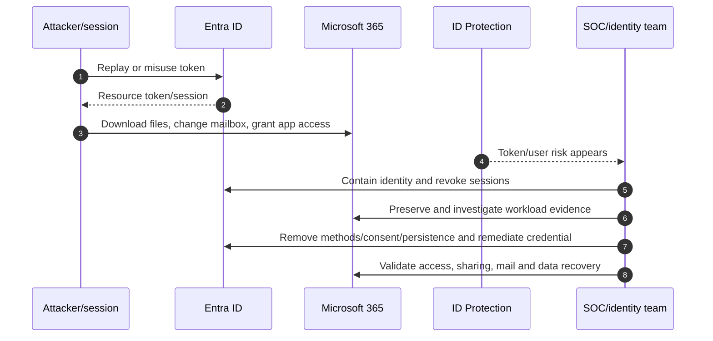

Containment must be approved and coordinated: blocking a critical executive or automation identity can create business harm, while delay can increase exfiltration. Document the decision, owner, alternative access, legal/privacy involvement, and restoration criteria.

---

## 15. False positives, benign positives, and privacy-aware tuning

| Cause | Example | Better response than broad suppression |
|---|---|---|
| New-user learning | New hire has no stable history | Pilot/readiness, contextual validation, do not mark broad network safe |
| Corporate VPN/proxy | Distant egress or anonymous reputation | Verify dedicated ranges and ownership; named location only after risk review |
| Mobile/carrier routing | IP geography changes rapidly | Correlate device, broker, app, method and ASN |
| Approved penetration test | Real attack-like activity | Dismiss as benign positive with test authorization/time window |
| Migration/bulk access | OneDrive/SharePoint mass operations | Validate tool, service principal, change, owner and expected data set |
| Workload deployment | New service-principal source/credential/target | Planned change record and baseline update, not blind dismissal |
| User travel | Genuine atypical travel | Trusted user confirmation plus itinerary/context; protect privacy |
| Token noise | Low/medium anomalous-token detection | Session and resource correlation; do not ignore token class wholesale |

**False positive** means the detection assessment was wrong. **Benign true positive** means unusual behavior really occurred but was authorized. Use confirm safe for the former and dismiss for the latter under current feedback semantics. This distinction helps model quality and audit defensibility.

Privacy controls should include least-privilege viewers, documented purpose, role-specific dashboards, minimal precise location disclosure, retention schedule, data-residency review, secure case notes, subject-access/deletion process where applicable, and legal consultation. Never infer medical, political, or disciplinary conclusions from travel/location telemetry.

---

## 16. Phased deployment and change control

| Phase | Activities | Exit gate |
|---|---|---|
| Discover | Licenses, existing risk, identities, hybrid method, MFA readiness, apps, logs, roles, privacy | Current-state and risk register approved |
| Design | Separate policies, thresholds, exclusions, remediation, SOC/help desk, retention | HLD/LLD and DPIA/privacy review where required |
| Prepare | Emergency accounts, strong methods, PHS/writeback, runbooks, exports, contacts | Recovery and evidence readiness proven |
| Simulate | Report-only, impact workbook, historical analysis | Affected populations and failure reasons understood |
| Pilot | Test identities and representative real clients | Positive/negative/failure/rollback pass |
| Scale | Business rings with monitored change windows | Risk and support metrics within threshold |
| Operate | Queue, metrics, reviews, source change monitoring, exercises | Named owners and continual-improvement cadence |

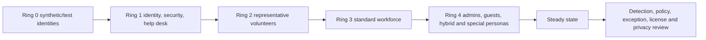

Do not deliberately generate real malicious detections in production merely to test a dashboard. Use report-only analysis, fictional paper cases, Microsoft-supported simulation guidance in a lab, approved attack simulation where relevant, and controlled sign-in scenarios. Never publish credentials or create public secrets to test leaked-credential detection.

---

## 17. Positive, negative, failure, and rollback testing

| Test type | Scenario | Expected evidence |
|---|---|---|
| Positive sign-in remediation | Pilot medium-risk paper event with registered strong method | Policy applies; strong proof; risk state transition documented |
| Negative method | User lacks required authentication strength | Block/admin recovery path and clear support message |
| Positive user remediation | Password user can complete MFA and secure change | User risk remediated; sessions and logs reviewed |
| Passwordless user | High user risk under current remediation control | Session revocation/strong reauthentication behavior validated |
| Hybrid change | Synced user follows approved on-prem/cloud path | PHS/writeback and risk reset behavior matches design |
| Emergency access | Emergency account excluded and alerting active | Successful minimal admin action; alert and audit record |
| Workload positive | Normal service principal source/target | Sign-in succeeds and expected permissions only |
| Workload negative | Risky test workload in design scenario | Supported policy blocks; application owner/runbook engages |
| Offline detection | Detection appears after initial access | Later queue, correlation and containment path works |
| False positive | Approved travel/VPN case | Confirm-safe evidence and no unsafe broad trust change |
| Benign positive | Approved test activity | Dismiss semantics, ticket and expiry recorded |
| API failure | Graph export throttled/permission removed | Retry/backoff, alert, no silent data loss |
| SIEM delay | Event pipeline is delayed | Native portal fallback and evidence-gap notation |
| Rollback | Pilot CA policy returned to report-only | Access restored for pilot; risk monitoring remains |

Rollback is scoped. Return the new policy to report-only/off or remove the pilot assignment under approval; do not disable all Conditional Access, clear all risk, exclude a broad population, or mark suspicious sign-ins safe merely to restore access. If active compromise exists, maintain containment while resolving policy/user-experience defects.

---

## 18. Layered troubleshooting

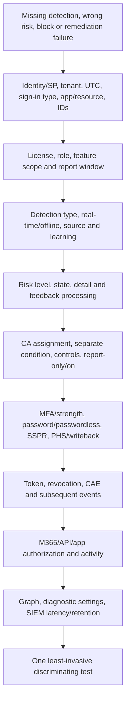

| Symptom | Likely causes | First discriminating check |
|---|---|---|
| Expected detection missing | Wrong detection assumption, insufficient signal, offline delay, license detail hidden | Detection catalog timing/license and exact sign-in evidence |
| Detection says Additional risk detected | Free/P1 hides premium detail | Tenant and affected-user licensing |
| Risk level changed later | Offline aggregation or new evidence | Detection/update timestamps and risk history |
| User remains at risk after MFA | User risk needs stronger remediation; token-theft class no longer auto-clears | Risk type/detail and user versus sign-in policy |
| User cannot remediate | No registered method, strength mismatch, hybrid dependency, client limitation | Authentication details and registration/writeback/PHS state |
| Policy not applied | Scope/exclusion/resource/condition mismatch | Every CA policy result and immutable IDs |
| Workload not blocked | Unsupported app type, managed identity/multitenant scope, license | Service-principal type, home tenant, workload CA scope |
| False travel alert | VPN/proxy/mobile egress/new behavior | IP/ASN ownership, device, app, user confirmation |
| State action greyed out | Insufficient role | Exact task-to-role mapping |
| Graph query empty/fails | Permission, endpoint/version, filter, retention, paging | Raw request, consent, role, API response and portal comparison |
| SIEM differs from portal | Pipeline delay, filter, schema, retention | Event IDs/timestamps at source and each hop |
| Deleted user remains in report | Current product limitation | Confirm object deletion; support case for removal if required |

Never troubleshoot by granting Global Administrator, broadly excluding risk policies, trusting arbitrary IP ranges, clearing all risk, or disabling MFA. Those actions change too many variables and can destroy evidence.

---

## 19. Operations, metrics, and service ownership

| Metric | What it reveals | Guardrail |
|---|---|---|
| High-risk users open over SLA | Response backlog/exposure | Segment by privilege and active evidence |
| Mean time to triage/contain/remediate | SOC responsiveness | Do not optimize by premature dismissal |
| Self-remediation success rate | Method/readiness and user friction | Break down by persona/client/hybrid type |
| Admin intervention rate | Recovery burden | Review registration and policy design |
| Confirmed-compromise rate | Detection yield and attack trend | Confidence intervals and detection mix matter |
| False-positive and benign-positive rate | Accuracy and expected activity | Keep categories separate |
| Recurrent-risk identities | Persistence, weak recovery, unmanaged devices | Privacy-safe root-cause review |
| Workload identities without owner/rotation | Governance exposure | Track permissions and credential/federation type |
| Offline detection-to-containment time | Retrospective response capability | Include pipeline and on-call delay |
| Risk policy coverage | In-scope identities/resources | Verify exclusions and licensing |
| Emergency-account tests | Recovery readiness | Alert on every use; at least 90-day drill |
| Evidence export health | Audit/forensic availability | Alert on latency, schema and dropped events |

### Operating roles

| Role | Responsibility |
|---|---|
| Identity engineering | Policy, authentication, hybrid remediation and platform health |
| SOC | Triage, correlation, containment coordination and incident record |
| Help desk | Approved identity proofing, user guidance and escalation; no risk dismissal by convenience |
| M365/app owner | Resource impact, business validation, restoration and app credential changes |
| Endpoint team | Device containment and token-theft evidence |
| Privacy/legal/HR | Purpose, sensitive investigations, notification and employee/guest rights |
| Service owner | KPI, license, backlog, change, runbook and continual improvement |

An SLA should distinguish high-confidence credential/token events, privileged identities, active attacker evidence, medium/low behavioral anomalies, and workload criticality. “All high risk in 15 minutes” is meaningless without 24x7 staffing, telemetry latency, authority, and containment paths.

---

## 20. Failure modes and security implications

| Failure mode | Security/business effect | Design response |
|---|---|---|
| No MFA registration before policy | Legitimate user blocked; admin workload | Registration campaign, TAP/recovery, pilot evidence |
| PHS absent in hybrid environment | Leaked-credential detection/remediation gaps | Evaluate PHS even with PTA/federation |
| User and sign-in risk combined | Ambiguous logic and poor remediation | Separate policies and owners |
| Overly high threshold only | Medium/low attack path remains | Risk acceptance and compensating detection; tune by evidence |
| Overly low threshold broadly | Excessive prompts/blocks and alert fatigue | Persona pilot, strong methods, metrics and exception governance |
| Dismiss used as remediation | Compromised credential/session remains | Secure identity first; use correct feedback semantics |
| MFA claim trusted after token theft | Stolen session persists | Follow 2026 token-detection response and resource investigation |
| Workload secret rotated incompletely | Outage or attacker retains another credential | Full credential inventory and dual-running replacement test |
| Location over-trusted | Attacker gains lower risk from shared egress | Dedicated verified ranges and ongoing review |
| Export/SIEM silently fails | Evidence and alerts missing | Health monitoring, native fallback, reconciliation |
| Excessive report access | Employee/travel privacy exposure | Least privilege, retention and audit |
| Legacy policy not migrated | Retirement outage/control gap after October 1, 2026 | Report-only CA migration and change evidence |

Security is not maximized by blocking everything. A control that strands users without a secure recovery path drives unsafe bypasses. Conversely, friction concerns cannot justify dismissing verified leaked credentials. Good consulting makes the tradeoff explicit: threat, confidence, identity criticality, user journey, dependency, operational capacity, residual risk, owner, and review date.

---

## 21. Consulting deliverables

| Deliverable | Minimum content | Quality test |
|---|---|---|
| Current-state assessment | Licenses, detections, risk backlog, policies, methods, hybrid, logs, roles | Evidence and immutable IDs, not screenshots alone |
| Risk architecture HLD | Signal, decision, enforcement, remediation, SOC and exports | Separates human sign-in/user/workload paths |
| Policy LLD | Exact scope, exclusions, thresholds, controls, state, owners | Implementer can configure without guessing |
| Detection catalog | Type, timing, source, license, response, false-positive context | Version/date and change-sensitive register |
| Incident runbook | Triage, containment, evidence, user contact, verdict, recovery | Covers token, credential, workload and M365 impact |
| Test plan | Positive, negative, failure, offline, workload and rollback | Expected log/state evidence defined |
| RACI/escalation | Identity, SOC, help desk, endpoint, M365, app, privacy, vendor | On-call authority and response times named |
| Metrics dashboard | Backlog, time, outcomes, coverage, readiness, pipeline health | Cannot be gamed by dismissal |
| Privacy/retention design | Purpose, access, region, retention, subject process | Reviewed by accountable privacy/legal stakeholders |
| Migration plan | Legacy risk policies to separate CA policies | October 1, 2026 retirement and rollback addressed |

Example finding:

> **Observation:** High user risk is monitored manually once per business day; 31% of users cannot complete the required authentication strength, PHS is disabled despite federated hybrid identities, and a legacy ID Protection risk policy remains enabled. **Risk:** Verified credential exposure may not be detected or remediated promptly, legitimate users can be stranded, and the legacy policy is scheduled to retire October 1, 2026. **Recommendation:** Validate licensing; assess PHS; improve method readiness and recovery; create separate high-user-risk and medium/high-sign-in-risk CA policies in report-only; establish 24x7 escalation for privileged/token events; test rings and rollback; migrate off legacy policy; measure self-remediation and containment. **Residual risk:** Offline detection latency and model false positives require resource correlation and human review.

---

## 22. Safe paper lab: design an identity-risk operating model

This exercise is design-only. It creates no tenant users, credentials, detections, policies, or malicious traffic.

### Prerequisites

- Parts 6–9 and the Official Source Anchors below.
- Markdown/spreadsheet/diagram editor.
- Fictional company and aliases only.
- No real tenant names, user IDs, IPs, credentials, tokens, screenshots, or confidential incident data.

### Fictional client

Northstar has 8,000 users, hybrid AD DS with federation and PHS currently disabled, 120 administrators, 350 guests, 90 service principals, Microsoft 365 E5 for 3,000 users, Entra ID P2 for 4,000 users, and incomplete workload licensing. The SOC is 24x5; the help desk is 24x7. A risky SharePoint administrator incident exposed gaps in token response and user contact.

### Steps

1. Build an inventory of identities, privileges, methods, hybrid source, workloads, owners, licenses, and log destinations.
2. Create a detection catalog with at least 15 human and 6 workload detections, timing, license, evidence, likely false-positive context, and response.
3. Design separate high-user-risk and medium/high-sign-in-risk CA policies. Include emergency exclusions, strong methods, password/passwordless paths, report-only, and every-time behavior.
4. Produce a PHS decision for the federated tenant covering leaked-credential detection and disaster recovery.
5. Create a workload-risk response for a leaked service-principal secret, including replacement, positive/negative tests, permission review, Key Vault rotation, disablement criterion, and owner.
6. Investigate six paper incidents: leaked credentials, atypical travel, impossible travel, suspicious MFA approval, anomalous token with OneDrive mass download, and suspicious Graph workload traffic.
7. For each, classify false positive, benign positive, or compromise only after writing corroborating and contradicting evidence.
8. Define deployment rings, 14 tests, rollback, runbooks, RACI, on-call escalation, privacy controls, and ten metrics.
9. Create a legacy-risk-policy migration plan finishing before October 1, 2026.

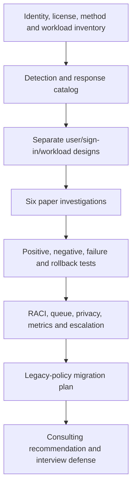

### Required tests and evidence

| Test | Evidence to produce |
|---|---|
| User-risk positive | Truth table and expected remediation state |
| Sign-in-risk positive | Challenge flow and expected CA/auth details |
| Unregistered user negative | Admin recovery and proofing runbook |
| Passwordless risk | Session/reauthentication design |
| Hybrid risk | PHS/writeback/source decision |
| Emergency access | Exclusion, alert and drill record template |
| Workload secret leak | Credential inventory/rotation/permission matrix |
| Offline risk | Detection-to-containment timeline |
| False travel | Corroborating/contradicting evidence record |
| Token incident | Identity, endpoint, app, SharePoint/OneDrive and Exchange correlation |
| Graph export failure | Pipeline alert and native fallback |
| Legacy migration | Before/after policy comparison and rollback |
| Privacy | Data inventory, access, retention and disclosure controls |
| Executive decision | One-page risk, options, recommendation and residual risk |

### Evidence to retain

- Sanitized identity/risk architecture.
- Detection catalog and licensing matrix.
- Three policy LLDs and cumulative logic table.
- Six incident timelines and verdict records.
- Fourteen-test matrix with expected evidence.
- Runbook, RACI, metrics, privacy controls, rollout and rollback.
- Retirement migration plan and executive recommendation.

### Cleanup

Delete any scratch material containing real identifiers, travel details, IPs, screenshots, tenant data, or credentials. If the exercise is later adapted to a lab tenant, return test policies to report-only/off under the approved cleanup plan, export configuration/evidence first, remove only fictional test objects, and verify emergency controls remain intact. Never create a public credential or attempt a real compromise to generate risk.

### Interview wording

> “I completed a fictional Identity Protection operating-model design grounded in current Microsoft guidance. I separated user, sign-in, and workload risk; cataloged real-time/offline detections; designed report-only CA policies, remediation and emergency paths; investigated six identity/M365 scenarios; and produced tests, rollback, RACI, privacy controls, metrics, and the October 2026 legacy-policy migration. It demonstrates architecture and investigation method, not production Entra ownership.”

---

## 23. Official Source Anchors

These first-party references were checked for the guide’s **August 24, 2026** currency date. Recheck live pages, Product Terms, Message center, feature availability, and tenant UI before production decisions.

1. [What is Microsoft Entra ID Protection?](https://learn.microsoft.com/entra/id-protection/overview-identity-protection) — detect/investigate/remediate model, reports, integrations, roles, and license tiers.
2. [Risk detection and event types](https://learn.microsoft.com/entra/id-protection/concept-identity-protection-risks) — current human detection names, real-time/offline classification, risk event types, licenses, and detailed meaning.
3. [Risk detection types and levels](https://learn.microsoft.com/entra/id-protection/concept-risk-detection-types) — low/medium/high, persistence, detection timing, report latency, locations, and Preview agent detections.
4. [ID Protection risk reports](https://learn.microsoft.com/entra/id-protection/concept-risk-reports) — risky users/sign-ins/workloads/agents, risk detections, actions, current report windows, and feedback distinctions.
5. [Investigate risk](https://learn.microsoft.com/entra/id-protection/howto-identity-protection-investigate-risk) — triage, correlation, user confirmation, detection-specific investigation, and future mitigation.
6. [Remediate risks and unblock users](https://learn.microsoft.com/entra/id-protection/howto-identity-protection-remediate-unblock) — secure change versus SSPR, self/admin/system remediation, hybrid behavior, deleted-user limitation, and token-theft change.
7. [Risk policies](https://learn.microsoft.com/entra/id-protection/howto-identity-protection-configure-risk-policies) — separate CA policies, current Microsoft recommendations, risk remediation, passwordless behavior, exclusions, and **October 1, 2026** legacy-policy retirement.
8. [Provide risk feedback](https://learn.microsoft.com/entra/id-protection/howto-identity-protection-risk-feedback) — confirm safe, dismiss, confirm compromised, user-level feedback, and processing behavior.
9. [Microsoft Graph PowerShell and ID Protection](https://learn.microsoft.com/entra/id-protection/howto-identity-protection-graph-api) — Graph permissions and supported query/action examples.
10. [Securing workload identities with ID Protection](https://learn.microsoft.com/entra/id-protection/concept-workload-identity-risk) — workload detections, reports/API/export, CA scope, investigation, credential response, and licensing.
11. [Conditional Access for workload identities](https://learn.microsoft.com/entra/identity/conditional-access/workload-identity) — supported service-principal targeting, conditions, controls, scope exclusions, and Workload ID licensing.
12. [Emergency access accounts](https://learn.microsoft.com/entra/identity/role-based-access-control/security-emergency-access) — two cloud-only accounts, phishing-resistant methods, CA exclusion, monitoring, and 90-day drills.
13. [Authentication for hybrid identity](https://learn.microsoft.com/entra/identity/hybrid/connect/choose-ad-authn) — PHS requirement for leaked-credential detection and backup-authentication reasoning.
14. [Export risk data](https://learn.microsoft.com/entra/id-protection/howto-export-risk-data) — diagnostic settings and external retention/integration paths.

**Preview/change-sensitive register:** Risky Agents and agent detections; Agent ID attribution/licensing; detection names and model timing; system/threat-informed remediation; “AI confirmed sign-in safe” labeling; Require risk remediation grant behavior; passwordless flows; workload CA/CAE scope; Graph/PowerShell modules; report retention windows; Defender-derived signals; and October 1, 2026 legacy-risk-policy retirement all require current validation.

---

## ⭐ Likely Interview Questions for This Section

### Q1. What is the difference between user risk and sign-in risk?

> **Model answer:** “Sign-in risk is the probability that one authentication request was not performed by the identity owner; it can often be self-remediated with an approved strong authentication challenge. User risk is the probability that the account itself is compromised based on aggregate evidence such as leaked credentials or token activity; it needs account-wide remediation and resource investigation. I use separate Conditional Access policies because their thresholds, controls, evidence and rollback differ.”

### Q2. How do real-time and offline detections affect response?

> **Model answer:** “Real-time detections execute during sign-in and can influence that transaction through Conditional Access. Offline detections use broader analysis after authentication and may appear up to 48 hours later, changing aggregate user risk after access occurred. I record detection and update timestamps, determine what was knowable at sign-in, then investigate sessions and resource activity and contain according to current evidence rather than calling the policy defective.”

### Q3. How would you design risk-based Conditional Access?

> **Model answer:** “I would create separate policies: high user risk requiring current risk-remediation controls, and medium/high sign-in risk requiring an approved MFA authentication strength, with every-time reauthentication according to current guidance. I would exclude only governed emergency accounts, validate P2 licensing, registration, password/passwordless and hybrid paths, remediate existing risk, use report-only and impact analysis, test real pilot interactions, roll out through rings, and keep scoped rollback.”

### Q4. What is the difference between confirm safe and dismiss risk?

> **Model answer:** “Confirm safe means the assessment was a false positive and feeds that result back so similar behavior can be learned appropriately. Dismiss is for a real but benign signal, such as an authorized penetration test; similar future activity should still be evaluated. Confirm compromised records a true malicious event but is not containment. I preserve evidence and use the exact action deliberately rather than clearing a queue.”

### Q5. How do you investigate an anomalous-token event involving OneDrive?

> **Model answer:** “I prioritize identity privilege and active attacker evidence, preserve request/correlation and session details, then correlate sign-in, authentication, endpoint, audit, Graph, consent, SharePoint/OneDrive downloads/sharing, Exchange rules and Defender/Sentinel incidents. If compromise is credible I coordinate approved block/revocation and credential response while preserving evidence, remove methods/consent/persistence, assess data impact, validate recovery, and give accurate risk feedback. An MFA claim alone no longer clears current token-theft detections.”

### Q6. How is workload identity risk different from user risk?

> **Model answer:** “A service principal cannot perform human MFA, so response focuses on owners, sign-in baseline, credentials or federation, application permissions, source network/workload, directory and API activity, and business criticality. I create a safe replacement credential or federation, update and test the workload, remove all compromised credentials, rotate downstream secrets, remove unauthorized grants, and disable the service principal when containment requires. Workload risk details and CA have separate licensing and supported scope.”

### Q7. How do you reduce false positives without weakening detection?

> **Model answer:** “I distinguish false from benign positives, correlate device, client, app, token, IP/ASN, VPN, change and user evidence, and provide correct feedback. I validate dedicated corporate egress before using named locations, record approved travel or tests through governed processes, and tune by persona and detection. I do not broadly trust shared proxy ranges, dismiss all low-risk token events, or expose sensitive travel data beyond the investigation need.”

### Q8. How does your background support this work without overstating it?

> **Model answer:** “My direct production strength is Microsoft 365 escalation: scope comparison, SharePoint/OneDrive and sync evidence, critical-incident coordination, vendor/product-group engagement, RCA, documentation and fix validation. Those skills transfer to identity investigations, especially resource impact and layered fault isolation. My Identity Protection evidence is a current fictional architecture, policy, incident, test and operating-model exercise; I do not claim production Entra policy ownership.”

---

## 🧠 30-Second Memory Hooks

- **Identity Protection:** Detect → assess → decide → investigate → remediate → learn.
- **Sign-in risk:** Is this transaction really the user?
- **User risk:** Is the account under attacker control?
- **Workload risk:** Software badge behaving dangerously; no human MFA.
- **Detection:** What suspicious evidence appeared.
- **Level:** Microsoft’s confidence, not business impact.
- **State:** What happened to the risk record.
- **Real-time:** Can challenge the current sign-in.
- **Offline:** Better context later; hunt what already happened.
- **Unfamiliar:** New context for this user.
- **Anonymous:** Source hides origin.
- **Atypical travel:** Distant and unusual for the user.
- **Impossible travel:** Distance/time conflict from MDCA analysis.
- **Leaked credential:** Valid credential match, always high under current guidance.
- **Confirm safe:** False positive.
- **Dismiss:** Real but benign positive.
- **Confirm compromised:** True positive, not containment.
- **Token theft:** MFA claim can be inside the stolen session.
- **Policies:** User risk and sign-in risk stay separate.
- **Rollout:** Readiness → report-only → pilot → rings → operate.
- **Rollback:** Scope the new policy; never turn off the security estate.
- **PHS:** Detection and disaster-recovery value even with PTA/federation.
- **Privacy:** Anomaly is not misconduct.
- **Retirement:** Legacy ID Protection risk policies retire October 1, 2026.
- **Honesty:** M365 RCA transferability plus paper design is not production Entra ownership.

---

## Completion Checklist

- [ ] Explain Identity Protection as a detect-investigate-remediate system.
- [ ] Distinguish user, sign-in, workload, and Preview agent risk.
- [ ] Separate detection, level, state, detail, policy result, and incident status.
- [ ] Explain low/medium/high confidence and current aging behavior.
- [ ] Compare real-time and offline detections and report latency.
- [ ] Distinguish unfamiliar properties, anonymous IP, atypical travel, and impossible travel.
- [ ] Explain leaked credentials, password spray, suspicious MFA approval, anomalous token, token issuer anomaly, and threat intelligence.
- [ ] Cover all listed user-level detections and their response implications.
- [ ] Explain workload detections, report/API, CA scope, licensing, and credential remediation.
- [ ] Use confirm safe, dismiss, confirm compromised, and remediated correctly.
- [ ] Distinguish secure password change from SSPR reset.
- [ ] Explain current Require risk remediation and every-time behavior.
- [ ] Explain why token-theft detections are not cleared solely by an MFA claim.
- [ ] Design separate high-user-risk and medium/high-sign-in-risk CA policies.
- [ ] Plan migration before the October 1, 2026 legacy-policy retirement.
- [ ] Validate P2, Defender, Workload ID, logging and Graph licensing/permissions.
- [ ] Apply least-privilege ID Protection roles.
- [ ] Use dashboard, risky users/sign-ins/workloads, detections, logs, Graph, diagnostics, and SIEM appropriately.
- [ ] Run the layered identity investigation and trusted alternate user contact.
- [ ] Correlate an identity incident across endpoint, app, SharePoint/OneDrive, Exchange and privilege evidence.
- [ ] Distinguish false positive from benign positive and protect privacy.
- [ ] Build deployment rings and all positive, negative, failure and rollback tests.
- [ ] Troubleshoot missing detections, wrong states, remediation failures, workload scope, Graph and pipeline differences.
- [ ] Define operational RACI, on-call escalation, metrics, SLAs and evidence health.
- [ ] Produce all consulting deliverables and the safe paper-lab portfolio.
- [ ] Answer Q1–Q8 aloud without claiming production Entra ownership.

---

*Next suggested section:* [Part 11](Part-11-privileged-access-rbac-pim-emergency-access.md) — constrain who can investigate, configure, approve, and recover identity systems through RBAC, PIM, least privilege, secure admin workstations, and emergency access.