# Part 11 — Privileged Access: RBAC, PIM, Least Privilege, and Emergency Access

> **Section goal:** Design privileged access so administrators and workloads receive only the actions, scope, and time they need, from an appropriately secured identity and device, with approval, evidence, review, and an independent emergency path. By the end, you should be able to explain Entra RBAC precisely, configure a defensible PIM model on paper, distinguish every group/role/PIM boundary, design and test emergency access, troubleshoot activation and propagation, and facilitate a client role-design workshop.

This Part builds on authentication and Conditional Access from [Part 8](Part-08-mfa-passwordless-authentication-strengths.md) and [Part 9](Part-09-conditional-access-design-deployment-troubleshooting.md), and on identity incidents from [Part 10](Part-10-entra-id-protection-risk-based-access.md). Part 12 applies lifecycle governance and recurring certification beyond the privileged-access boundary.

> **Currency and change-sensitive note:** Product behavior was checked against official Microsoft Learn content available on **August 24, 2026**. “Privileged Access Groups” was renamed **PIM for Groups** in January 2023. PIM custom extensions for activation and some PIM-for-Groups access-review capabilities are **Preview/change-sensitive**. Role definitions, Graph actions, workload review licensing, Microsoft 365 portal propagation, notification limits, authentication-context behavior, and product terms change. PIM licensing expiry has material effects on eligible/time-bound assignments; verify Product Terms and live tenant behavior before implementation.

## JD Mapping

| Deloitte role expectation | Capability developed in this Part | Consulting evidence |
|---|---|---|
| Design secure Microsoft 365 administration | Map job tasks to Entra/M365 roles, scopes, identities, and devices | Role catalog, persona matrix, HLD/LLD |
| Implement Zero Trust and least privilege | Replace standing broad access with eligible, time-bound, controlled activation | PIM policy set and activation sequence |
| Troubleshoot M365 and security services | Diagnose assignment, token, activation, portal, scope, and workload boundaries | Layered PIM/RBAC runbook |
| Support operational resilience | Maintain tested, monitored, independent emergency administration | Break-glass design and 90-day drill |
| Work across stakeholders/vendors | Facilitate role-design workshops and agree owners, approvers, tickets, SLAs | Workshop pack, RACI, decision log |
| Produce audit-ready documentation | Preserve assignment, activation, approval, review, alert, and emergency evidence | Access certification and evidence pack |

## Candidate honesty note

You can credibly connect this Part to demonstrated experience as a technical advisor and escalation engineer: controlling high-impact support actions, separating diagnosis from authorization, coordinating customer administrators and Microsoft/product vendors, documenting approvals and RCA, validating changes, mentoring engineers, and explaining business impact across SharePoint Online and OneDrive.

This Part does **not** claim that you owned production Entra RBAC, PIM, Global Administrator governance, PAW deployment, or emergency accounts. Safe wording is:

> “I have production experience leading high-impact Microsoft 365 escalations with controlled changes, stakeholder authorization, vendor coordination, documentation, and validation. I have built a current privileged-access paper design covering Entra RBAC, PIM, role-assignable groups, administrative units, secure admin devices, emergency access, tests, and operations. I can defend the design and troubleshooting method while being explicit that it is structured learning rather than production Entra ownership.”

---

## 1. Privilege is permission plus reach plus time

**Privilege** is the ability to perform an action that can materially affect identities, policy, data, applications, security, or availability. It is not limited to a role named “administrator.” A service principal with tenant-wide Graph application permission, a SharePoint site collection administrator, an app owner who can add a credential, or a group owner who controls a role-assignable group may all have powerful paths.

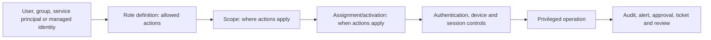

| Privilege dimension | Question | Example risk |
|---|---|---|
| Identity | Who or what receives access? | Shared admin account has no accountability |
| Action | What operation can be performed? | Reset authentication methods or grant app consent |
| Scope | Which resources are affected? | Tenant-wide role used for one application |
| Time | Is access standing, eligible, or temporary? | Permanent privilege remains after project |
| Context | How and from where may it be used? | Admin token acquired on phishing-exposed laptop |
| Governance | Who approves/reviews and what evidence exists? | Activation has no reason, owner, or audit follow-up |

Least privilege is not “give no access.” It means the minimum sufficient **action, scope, duration, and context** for an authorized task, with a recovery path. If the role cannot perform the task, do not leap directly to Global Administrator; identify the missing action and decide whether another built-in role, scoped assignment, custom role, or separate authorized operator is appropriate.

---

## 2. Entra RBAC: principal, role definition, action, assignment, and scope

### 🔍 Plain-English deep-dive: the RBAC sentence

- **Security principal** — *the identity receiving permissions: user, role-assignable group, service principal, or supported managed identity.* **Analogy:** The person or machine holding a badge. **Why it matters:** Owners, lifecycle, authentication, and review differ by identity type.
- **Role definition** — *a named collection of permitted actions.* **Analogy:** A badge template that says “may reset standard user passwords.” **Why it matters:** It defines capability but grants nothing until assigned.
- **Action/permission** — *one management operation, usually expressed in Microsoft Graph resource/action terms.* **Analogy:** One door or control the badge can operate. **Why it matters:** Custom roles are assembled from supported actions, not prose job titles.
- **Role assignment** — *the link between principal, role definition, and scope.* **Analogy:** Issuing that badge template to this holder for these buildings. **Why it matters:** Access is granted by the assignment, not by merely creating a role.
- **Scope** — *the boundary where the role’s actions are valid.* **Analogy:** Headquarters, one branch, or one application. **Why it matters:** The same role can be tenant-wide or constrained where support exists.

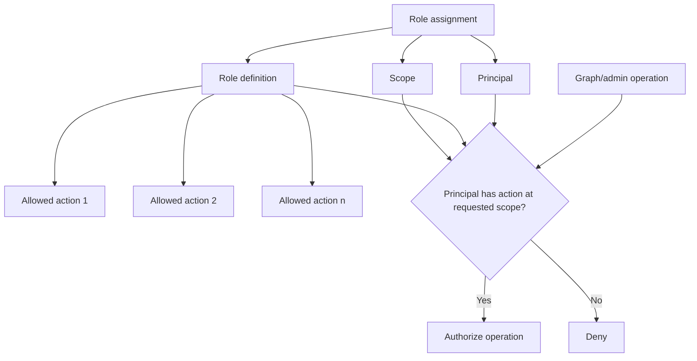

| RBAC object | Example | Troubleshooting evidence |
|---|---|---|
| Principal | User object ID or role-assignable group ID | Exact ID, type, tenant, enabled state |
| Role definition | Authentication Administrator | Template/definition ID, built-in/custom, action list |
| Role assignment | User + role + tenant scope | Assignment ID, direct/group, active/eligible, dates |
| Scope | `/`, administrative unit, app registration, enterprise app, group | Scope ID/type and target resource |
| Token/authorization context | Microsoft Graph access token and current role membership | Sign-in, token issue time, portal/API, resource response |

Microsoft Entra roles govern Microsoft Entra directory resources through Microsoft Graph, such as users, groups, applications, and directory settings. Azure roles govern Azure resources through Azure Resource Manager, such as subscriptions, resource groups, VMs, Key Vaults, and storage. They use similar language but are separate authorization systems. Exchange, SharePoint, Purview, Teams, Defender, and other services can add their own RBAC or role-group layers.

---

## 3. Entra roles versus Azure roles versus workload roles

| Authorization system | Controls | Example role | Scope model | Main portal/API |
|---|---|---|---|---|
| Microsoft Entra RBAC | Directory users, groups, apps, identity policy | User Administrator | Tenant, administrative unit, supported Entra resource | Entra admin center/Microsoft Graph |
| Azure RBAC | Azure management-plane resources | Virtual Machine Contributor | Management group, subscription, resource group, resource | Azure portal/ARM |
| Exchange RBAC | Exchange configuration/recipients | Organization Management/custom role group | Organization or management scope | Exchange admin center/PowerShell |
| SharePoint roles | Sites and tenant settings | SharePoint Administrator, site admin | Tenant/site | M365/SharePoint admin center/APIs |
| Purview permissions | Compliance/data-security solutions | eDiscovery Manager | Solution/case/role group | Purview portal |
| Application authorization | API scopes/app roles/resource-specific roles | `Files.Read.All` application permission | Resource API/tenant/resource instance | Consent/app assignment/API |

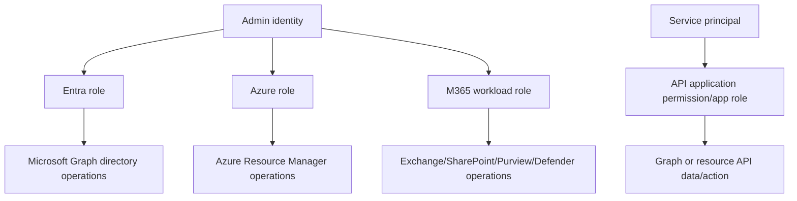

Global Administrator does not mean every data-plane permission everywhere forever. It is extremely powerful and can elevate into some services, but workload-specific authorization and explicit elevation paths still matter. Conversely, a role with no “Global” label can expose sensitive data or create privilege escalation. Build an **effective privilege graph**, not a list of titles.

---

## 4. Built-in roles, custom roles, and the Global Administrator trap

**Built-in roles** have fixed Microsoft-defined actions and evolve with the service. **Custom roles** select supported permissions into an organization-defined role. A custom role is justified when built-ins are materially too broad or when a recurring job requires a stable supported action set.

| Choice | Advantages | Risks/operations |
|---|---|---|
| Built-in specific role | Microsoft maintained, documented, recognizable | May contain more actions than one narrow task; behavior evolves |
| Multiple specific roles | Composes capabilities without Global Admin | Effective access can become broad; review combinations |
| Custom role | Tailored supported actions and object scope | P1 licensing, permission drift, owner/testing/documentation required |
| Global Administrator | Recovery and rare tenant-wide task capability | Highest blast radius; should be very limited and protected |
| Workload-specific role | Better separation for Exchange/SharePoint/Purview | Portal propagation and parallel RBAC systems complicate diagnosis |

### Global Administrator risk

- Can manage broad identity controls and enable further access.
- A compromised session can change authentication, roles, applications, federation, and policies.
- Routine support under Global Admin hides missing role design.
- Shared use damages accountability.
- Standing access extends attack opportunity.
- Using the same identity for email/web/productivity exposes privileged tokens.

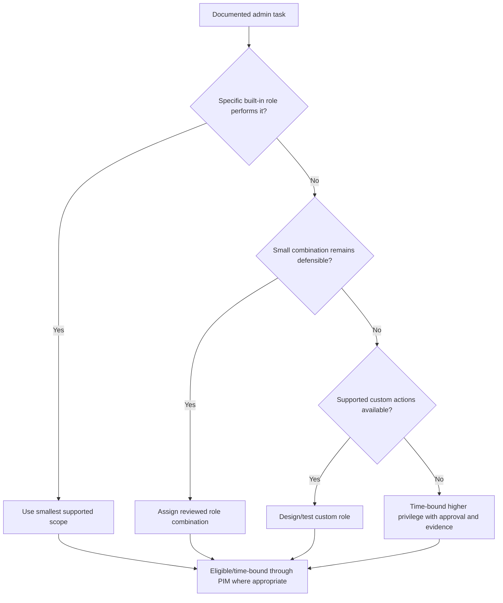

Custom-role design needs a role owner, business purpose, exact action list, supported scopes, prohibited actions, test tenant, positive/negative tests, version/date, change review, assignee review, PIM settings, rollback, and retirement. Never infer permission names or edit unsupported Graph action strings by guesswork.

---

## 5. Administrative units: delegated scope, not a security boundary for everything

An **administrative unit (AU)** is a container of users, groups, or devices used to scope supported Entra administrative roles. It is useful for regional, divisional, educational, or business-unit help desks.

| AU behavior | Current boundary |
|---|---|
| Membership | Users, groups, and devices can be members; users can belong to multiple AUs |
| Nesting | AUs cannot be nested |
| Group member effect | Adding a group scopes management of the group object, not automatically every user in it |
| Supported admin tasks | Selected user/group/device operations by supported roles and portals/APIs |
| Intune device management | Not scoped by AU under current guidance |
| Visibility | AUs scope management permission, not all directory visibility/default user permissions |
| Governance integration | Current Learn states AUs are not available as a general ID Governance container |
| Licensing | P1 for AU-scoped role administrators; dynamic AU membership adds member licensing conditions |

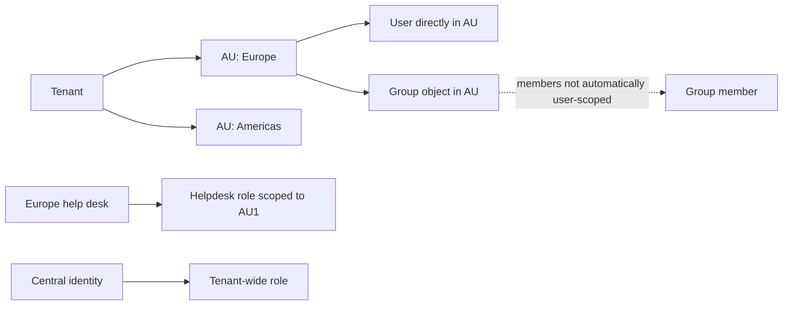

An AU-scoped User Administrator might manage a group’s membership when the group is in the AU, but cannot reset an individual member’s password unless that user is separately in the AU and the role supports the action. This is a classic troubleshooting distinction.

Restricted management administrative units and newer protected-object scenarios may add behavior beyond basic AUs; treat them as change-sensitive and validate exact supported roles, object types, and escape paths before design.

---

## 6. Assignment versus activation; eligible, active, assigned, and activated

### 🔍 Plain-English deep-dive: PIM vocabulary

- **Eligible assignment** — *the principal may request temporary use of a role but does not currently have its permissions.* **Analogy:** An employee is approved to collect a master key when needed. **Why it matters:** It reduces standing privilege.
- **Active assignment** — *the role permissions are continuously available during the assignment period without activation.* **Analogy:** The key is already on the employee’s keyring. **Why it matters:** “Active” can still be time-bound or permanent.
- **Activation** — *the process that turns an eligible assignment into temporary active access after required steps.* **Analogy:** Check out the key using strong ID, reason, ticket, and perhaps manager approval. **Why it matters:** Activation settings do not govern unrelated standing assignments.
- **Assigned state** — *a user has an active role assignment.* **Analogy:** The key was directly issued.
- **Activated state** — *an eligible user successfully activated and is temporarily active.* **Analogy:** The checked-out key is valid until return time.
- **Permanent/time-bound** — *whether eligibility or active assignment has no end date or defined start/end dates.* **Analogy:** Authorization to check out the key indefinitely versus only during a project.

| Type/duration | Needs activation? | Access availability | Preferred use |
|---|---:|---|---|
| Permanent eligible | Yes | On demand indefinitely, subject to policy | Stable admin job requiring recurring temporary access |
| Time-bound eligible | Yes | On demand only between assignment dates | Project, vendor, temporary duty |
| Permanent active | No | Standing indefinitely | Emergency account or documented service dependency only |
| Time-bound active | No | Standing during start/end window | Constrained automation/transition where activation impossible |

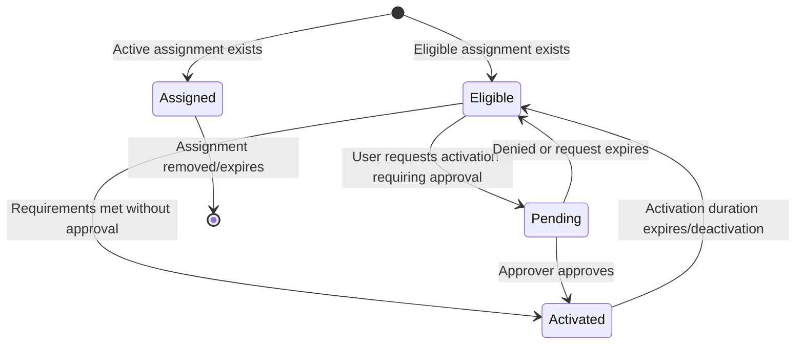

Assignment is an administrator’s decision about who may hold or activate a role and for how long. Activation is the eligible user’s request to use it now. Confusing them leads to statements such as “PIM requires MFA for all admins,” when permanent active assignments can use the role without activation.

---

## 7. PIM purpose and control architecture

Microsoft Entra Privileged Identity Management (PIM) controls, monitors, and reviews privileged access for Microsoft Entra roles, Azure resource roles, and group membership/ownership. It supports just-in-time (JIT) and time-bound access, activation requirements, approval, notifications, alerts, audit history, and access reviews.

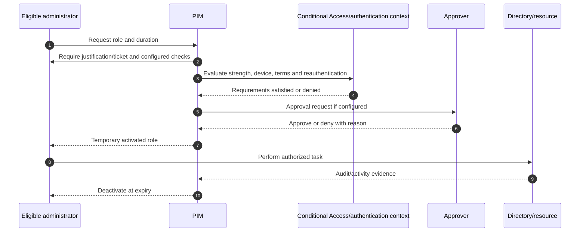

| PIM control | Security value | Limitation/decision |
|---|---|---|
| Eligible assignment | Removes standing access | Eligibility is still valuable to an attacker who controls the user |
| Time-bound assignment | Removes stale project access | Requires lifecycle/renewal process |
| Activation duration | Limits exposure window | Must be long enough for task and incident work |
| MFA | Adds proof if not already satisfied | May reuse earlier MFA in session; not necessarily fresh |
| Authentication context | Connects CA strength/device/terms | Protect activation and separately protect role use |
| Approval | Independent decision before elevation | Approvers need coverage, context, separation and emergency path |
| Justification | Records business reason | Free text can be meaningless without standards/review |
| Ticket information | Correlation field | PIM does not validate ticket existence by itself |
| Notification | Alerts participants/admins | Email is not a SIEM and has recipient limits |
| Access review | Recertifies assignment need | Snapshot/reviewer quality and auto-apply need governance |

PIM is not Privileged Access Management for every credential, endpoint, database, or legacy system. It does not record every admin screen like a session-recording vault. It controls supported role/group paths; use PAWs, Conditional Access, workload identity, logging, resource RBAC, secrets management, and incident response around it.

---

## 8. JIT, JEA, and separation of duties

**Just-in-time (JIT)** means permissions become active only for the period needed. **Just Enough Administration (JEA)** is a PowerShell constrained-endpoint technology and a broader design idea: expose only approved commands/tasks. They complement each other but are not synonyms and JEA is not an Entra PIM toggle.

| Principle | Question | Example |
|---|---|---|
| JIT | When should permission exist? | Activate SharePoint Administrator for two hours |
| JEA | What exact operations should be possible? | Constrained endpoint exposes approved site-recovery commands |
| Least privilege | What minimum action/scope/time/context is sufficient? | Scoped app role rather than tenant-wide Global Admin |
| Separation of duties | Which decisions/actions must be split? | Requester cannot approve own high-risk activation |
| Four-eyes control | Who independently verifies? | Approver validates ticket, scope and change window |
| Clean source | Is the admin identity/device path more secure than target? | PAW and separate admin identity for tenant control |

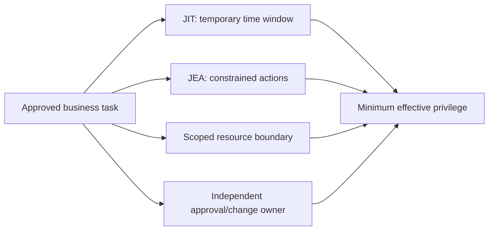

Do not add approval to every low-risk activation reflexively. Approval adds security only when an informed, available, independent approver can evaluate context. For common low-impact tasks, strong authentication, short duration, justification, ticket, alerting, and post-use analytics may be better. For Global/Privileged Role Administrator, consent administration, federation, or high-impact production access, approval is usually more defensible.

---

## 9. Activation settings: MFA, authentication context, justification, ticket, duration, approval

| Setting | Current behavior | Design guidance |
|---|---|---|
| Maximum activation duration | 1–24 hours for Entra role settings | Match task; shorter is not always safer if repeated activation causes bypass pressure |
| Require MFA | Prompts only if session has not already satisfied acceptable MFA | Use authentication context for stronger/fresher requirements |
| Authentication context | Applies CA policy for strength/device/terms | Create enabled CA policy first; avoid role+context circular targeting |
| Every-time reauthentication | CA sign-in frequency on context | Current 10-minute reauthentication window can cover another activation |
| Justification | Required free-text reason | Define examples and quality checks |
| Ticket | Information-only field | Integrate validation/process outside PIM; do not assume enforcement |
| Approval | Specific approvers or active PRA/GA defaults | Configure at least two; avoid all approvers being merely eligible |
| Notification | Assignee, approver, admin and added recipients | Integrate audit/SIEM; one event max 1,000 emails currently |

### Authentication-context trap

The user is not yet active in the role while activating it. If a CA policy targets both the authentication context and the directory role, the role condition may not match. Current guidance says target the context to all or eligible users. Then, if device/location/strength must also govern **use after activation**, add a second CA policy targeting active directory roles. Activation on a compliant device does not prevent the newly active role being used from another session/device unless role-use policy also applies.

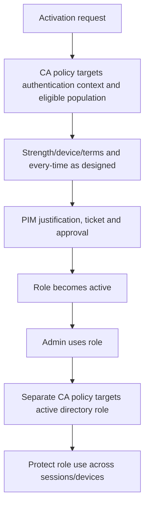

PIM has a backup MFA behavior when an authentication context is configured but no enabled CA policy targets it; do not rely on that as normal architecture. The backup does not protect against a policy being intentionally Off/report-only or excluding the eligible user.

---

## 10. Approval design and operational resilience

| Approval question | Defensible answer |
|---|---|
| Who approves? | Resource/service owner or delegated qualified on-call approvers, not requester |
| How many? | At least two configured for coverage; more only if signal remains actionable |
| What evidence? | Task, resource/scope, duration, ticket/change/incident, risk and timing |
| What is verified? | Requester identity, eligibility, business authorization, conflict, change window |
| What is denial behavior? | Reason, user notification, escalation and emergency criteria |
| What about nights/weekends? | On-call approver with SLA or documented lower-risk alternative |
| What if PIM/CA is unavailable? | Independent emergency access and outage runbook |
| What after approval? | Activation/use logs, high-risk action monitoring and review |

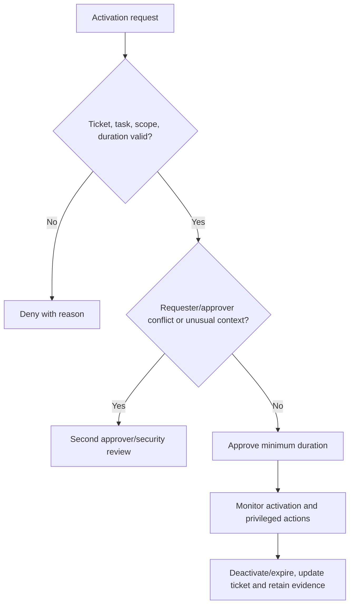

The lockout scenario to remember: all Global Administrators and Privileged Role Administrators are eligible but none active; approval is required; no specific approvers exist; default approvers are the inactive eligible admins. No one can approve. Prevent it through active permanent emergency accounts, specific available approvers, drills, and role/setting change review.

---

## 11. Role-assignable groups versus PIM for Groups

### 🔍 Plain-English deep-dive: two independent group properties

- **Role-assignable group** — *a group created with immutable `isAssignableToRole=true`, allowing an Entra role to be assigned to it and adding protections.* **Analogy:** A specially controlled roster whose membership confers an admin badge. **Why it matters:** It is required for group-based Entra role assignment and cannot be retrofitted.
- **PIM for Groups** — *PIM-governed eligible or active membership/ownership for a security or Microsoft 365 group.* **Analogy:** Temporarily join a controlled roster to receive whatever access that roster grants. **Why it matters:** The group can control apps, Azure, Teams, SQL, Key Vault, or other resources; it need not be role-assignable.
- **Privileged Access Groups** — *the old name for PIM for Groups before January 2023.* **Analogy:** Old label on the same service concept. **Why it matters:** Recognize legacy documentation and interview wording.

| Property | Role-assignable group | PIM for Groups |
|---|---|---|
| Purpose | Assign Entra roles to a group | Govern temporary group member/owner access |
| Creation flag | `isAssignableToRole=true`, immutable | Enable eligible membership/ownership on supported existing/new group |
| Group types | Security or Microsoft 365, assigned membership | Security/M365 except current exclusions such as dynamic/synced groups |
| Role requirement | Required if assigning Entra role to group | Not required unless group receives Entra role |
| Limits | Current maximum 500 role-assignable groups per tenant | More than 500 PIM-enabled groups possible under current guidance |
| Nesting | Active nesting into role-assignable group not supported | Eligible group nesting has nuanced user-specific activation behavior |
| License | P1 for role-assignable groups; P2/Governance for PIM | P2 or ID Governance for in-scope users/approvers/reviewers |

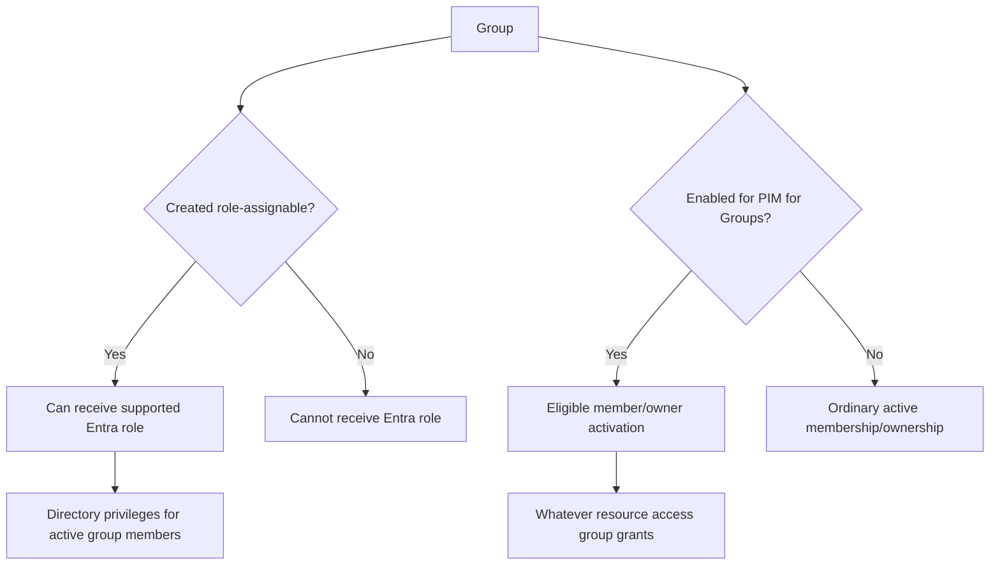

For SharePoint, Exchange, or Purview role propagation, current guidance recommends active user membership in the role-assignable group with the **group itself eligible for the Entra role**, rather than making the role active on the group and users eligible for group membership. The latter can incur significant workload propagation delay. Test every target portal and API.

---

## 12. PIM for Entra roles, Azure resources, and groups

| PIM surface | Managed object | Administrator authority | Common mistake |
|---|---|---|---|
| PIM for Microsoft Entra roles | Directory-role assignments | Privileged Role Administrator/Global Administrator | Assume it governs Azure subscription roles |
| PIM for Azure resources | ARM role assignments at management group/subscription/RG/resource | Owner or User Access Administrator at resource scope | Ask Entra Security Admin to manage Azure role eligibility by default |
| PIM for Groups | Group membership and ownership | Appropriate group/PIM governance roles | Assume every PIM group is role-assignable |
| PIM access reviews | Active/eligible assignments and supported service principals | Depends on Entra versus Azure review | Treat recommendation as proof of need |

PIM for Azure resources uses Azure RBAC and resource hierarchy. A user can activate Contributor at one resource group without receiving Entra User Administrator. PIM for Groups can provide JIT access to an application, Azure role, Microsoft 365 team, or third-party resource based on group assignment. Map the full chain from membership to final resource permission.

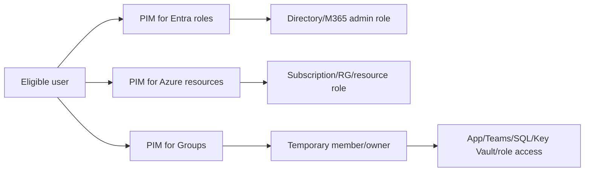

If SCIM provisioning is linked to a PIM group, activated membership can be provisioned to an app in roughly 2–10 minutes for initial requests under current guidance, with throttling and normal cycles around 40 minutes for excess requests. This is not instantaneous JIT. Define activation duration that includes propagation, application session behavior, and deprovisioning latency.

---

## 13. Privileged identities, admin/workload separation, and service principals

| Identity pattern | Recommended direction | Reason |
|---|---|---|
| Daily user account with admin roles | Separate productivity and admin identities | Reduces phishing/browser/email exposure to privileged token |
| Shared admin account | Replace with named admin identities | Accountability, lifecycle, strong auth, review |
| User “service account” | Replace with managed identity/service principal where supported | Avoid interactive bypass and human lifecycle coupling |
| Automation under admin user | Use workload identity with least app/Azure permission | Noninteractive, owner/credential/federation governance |
| Service principal with Entra role | Time-bound/least scope; review and monitor | App can perform tenant administration without user presence |
| Managed identity in Azure | Prefer when hosting/resource supports it | Platform-managed credentials, no secret in code |
| Emergency user | Cloud-only, active permanent GA, independent credential/device | Recovery must not depend on PIM/federation/ordinary CA |

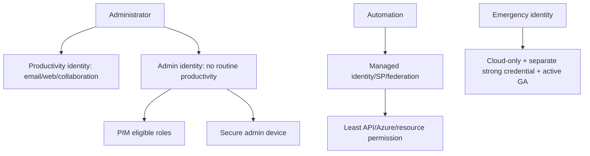

Service principals and managed identities can receive Entra/Azure roles where supported. Their lifecycle differs: no human activation in many paths, so use time-bound assignment where workable, narrowly scoped resource roles, credential/federation controls, app owners, sign-in/audit monitoring, permission reviews, and change approval. PIM access reviews of service principals require Workload ID Premium in addition to P2/Governance under current guidance.

An application owner may be able to add credentials and thereby act as the application. Treat ownership as privilege. Separate app registration ownership, enterprise app permission administration, consent, production deployment, and secret-vault administration where risk warrants.

---

## 14. Privileged Access Workstations and the clean-source principle

A **Privileged Access Workstation (PAW)** is a hardened, controlled device used only for highly sensitive administration. The **clean-source principle** says a system used to control another system should be at least as trusted as the target.

| PAW control area | Purpose |
|---|---|
| Hardware trust | TPM 2.0, Secure Boot, firmware/supply-chain confidence |
| Encryption | Protect data/credentials at rest with BitLocker or equivalent |
| Device management | Known configuration, compliance, updates and monitored lifecycle |
| Application control | Only approved administrative tools execute |
| No routine productivity | Remove email, arbitrary web browsing and user-installed tools |
| Endpoint detection | Detect/respond to compromise attempts |
| Separate admin identity | Prevent productivity identity/session crossover |
| Restricted destinations | Access only approved admin portals/endpoints |
| Recovery | Replacement device/credential and emergency procedure |

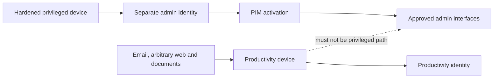

Conditional Access can require a compliant device or authentication context for activation and active role use, but device compliance is not synonymous with PAW. PAW design adds workload restriction, application control, browsing separation, hardware trust, monitoring, and operational custody. A jump host can be part of the path but must not become an unmonitored shared credential concentrator.

---

## 15. Emergency access: independent recovery, not convenient bypass

Emergency or **break-glass** accounts exist to recover tenant administration when normal identities, federation, MFA, PIM, approvers, devices, Conditional Access, or staff availability fail.

### 🔍 Plain-English deep-dive: emergency access is deliberately different

- **Independent identity** — *a cloud-only account that does not depend on synchronized AD DS or federation.* **Analogy:** A mechanical fire-exit key still works when the electronic badge system is offline. **Why it matters:** The same outage must not disable both normal and recovery paths.
- **Permanent active role** — *Global Administrator is usable without PIM activation.* **Analogy:** The emergency key is already authorized rather than locked behind an unavailable approver. **Why it matters:** This is a narrowly governed exception to ordinary JIT design.
- **Conditional Access exclusion** — *the account is excluded from policies that could block recovery.* **Analogy:** The fire exit does not depend on the failed turnstile. **Why it matters:** The account still needs phishing-resistant authentication, secure custody, a trusted device, and monitoring.
- **Break-glass declaration** — *a formal decision that normal administration cannot safely meet the need.* **Analogy:** Breaking the alarmed case is visible and reviewed. **Why it matters:** Emergency access is never a convenience path around approval.

### Current Microsoft-aligned design

| Control | Requirement |
|---|---|
| Count | At least two accounts for redundancy |
| Source | Cloud-only on `.onmicrosoft.com`; not synchronized/federated |
| Role | Global Administrator, permanent active, not PIM eligible |
| Authentication | Phishing-resistant passkey/FIDO2 recommended or CBA where PKI is independently resilient |
| Independence | Different method/dependency from ordinary admins; no employee personal device |
| Conditional Access | Exclude from policies that block/restrict; report-only needs no exclusion |
| Device | Designated secure workstation/PAW path |
| Custody | Secure, separate, fireproof locations; authorized multi-person procedure |
| Monitoring | Alert every sign-in and audit action |
| Testing | At least every 90 days and after staff/subscription/policy/material change |
| Review | Post-use review, credential rotation as required, evidence and corrective actions |

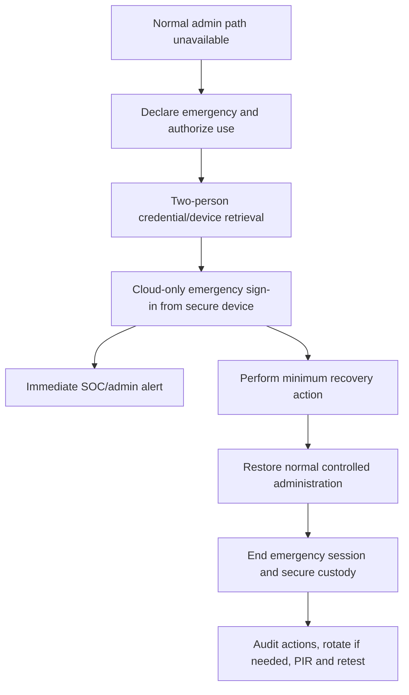

Emergency accounts should not be used for ordinary administration, automation, monitoring agents, or “faster” approval. Exclusion from restrictive CA does not mean weak authentication. Their registered method, device, custody, alerting, and active role protect them while preserving independence.

### Emergency scenarios

- Federation/AD FS outage redirects ordinary admins to an unavailable identity provider.
- Authenticator/mobile network dependency fails for all normal admins.
- PIM approval deadlock leaves no active PRA/GA.
- Conditional Access configuration locks normal administrators out.
- Intune/compliance service or device fleet prevents required admin access.
- Last normal active privileged administrator leaves or is disabled.
- Cyberattack takes on-premises identity infrastructure offline.

---

## 16. Emergency-access testing and monitoring

| Drill step | Evidence |
|---|---|
| Announce controlled drill | Approved ticket/change and SOC awareness |
| Validate authorized custodians | Current access list and separation of duties |
| Retrieve correct credential/device | Custody log; no personal-device binding |
| Sign in from independent network paths | Successful auth and dependency record |
| Confirm CA exclusion | Sign-in policy details; no accidental control dependency |
| Perform minimum harmless admin read/action | Role works without broad production change |
| Confirm alerts | SOC receives sign-in and audit notifications |
| Sign out/end session | Session/action timeline |
| Review registered methods/details | No unauthorized methods, SSPR info or expiry |
| Restore custody and rotate as policy requires | Custody/rotation record |
| Conduct post-drill review | Gaps, owner, due date and retest |

Alert on every emergency sign-in, failed or successful, and every material directory action. Use immutable object IDs in detection, because display name/UPN can change. Avoid relying solely on email to the same tenant during an outage; include independent notification/incident channels where feasible.

Rollback for an emergency-account design change means restoring the last tested independent method, exclusion, active role, alert, and custody arrangement. Never “clean up” a lab or role project by deleting the only emergency identities.

---

## 17. Access reviews, assignment lifecycle, and alerts

PIM access reviews recertify active and/or eligible Entra and Azure role assignments. Reviewers may be selected users, managers with fallback, or self-reviewers where supported. Current reviews take a snapshot at the beginning; changes during a review appear in a later cycle.

| Review setting | Decision |
|---|---|
| Scope | Role(s), active/eligible/all, users/groups or supported service principals |
| Frequency | One-time, weekly, monthly, quarterly, semiannual, annual as supported |
| Reviewer | Resource owner, manager/fallback, independent role owner, self only for low risk |
| Recommendation | 30-day activity or other helpers; input, not verdict |
| No response | No change, remove, approve, or recommendation according to risk |
| Auto-apply | Enable only with trustworthy scope/reviewer/fallback/testing |
| Reason | Require reason on approval for audit quality |
| Notification | Start, reminder, completion and escalation |

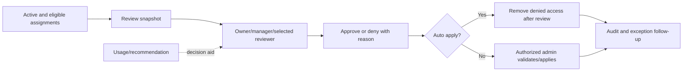

For Entra role reviews, a role-assignable group can appear as the group rather than expanded users; denying it removes the group’s role assignment. For Azure role reviews, group membership may be expanded, but denying a user assigned through a group does not automatically remove that user from a shared group. Understand the assignment path before promising auto-remediation.

### PIM alerts to operationalize

| Alert | Risk signal |
|---|---|
| Roles assigned outside PIM | High-severity governance bypass or attack path |
| Too many Global Administrators | Excessive broad privilege |
| Roles do not require MFA | Weak activation policy |
| Potential stale privileged accounts | Unmaintained attack surface |
| Admins not using privileged roles | Possibly unnecessary assignment |
| Roles activated too frequently | Attack, duration mismatch, or operational friction |
| Missing P2/Governance license | PIM capability and assignment-lifecycle risk |

---

## 18. Licensing and license-expiry risk

| Capability | Current conceptual license |
|---|---|
| Built-in Entra roles | Free |
| Custom Entra roles | P1 for each user with custom-role assignment |
| Administrative unit scoped admin | P1 for each scoped administrator; dynamic membership has additional member requirement |
| Role-assignable groups | P1 |
| PIM for Entra/Azure roles and Groups | Entra ID P2, ID Governance, or Suite under current terms |
| PIM approvers/reviewers/eligible users | License each in-scope category under current model |
| Service-principal PIM access reviews | Workload ID Premium plus P2/Governance |
| PIM authentication-context controls | P2/Governance plus Conditional Access capability |
| PAW/Intune/Defender controls | Applicable Intune, Defender and OS entitlements |

License expiry is a security and availability event. Current Learn states that when P2/Governance/trial expires, PIM interfaces/settings/reviews/notifications become unavailable; eligible assignments are removed because they cannot activate; active permanent assignments remain; and active time-bound assignments can become active permanent under the current licensing FAQ. Maintain renewal monitoring, entitlement owner, expiry alerts, and a tested transition. Do not assume PIM simply “freezes safely.”

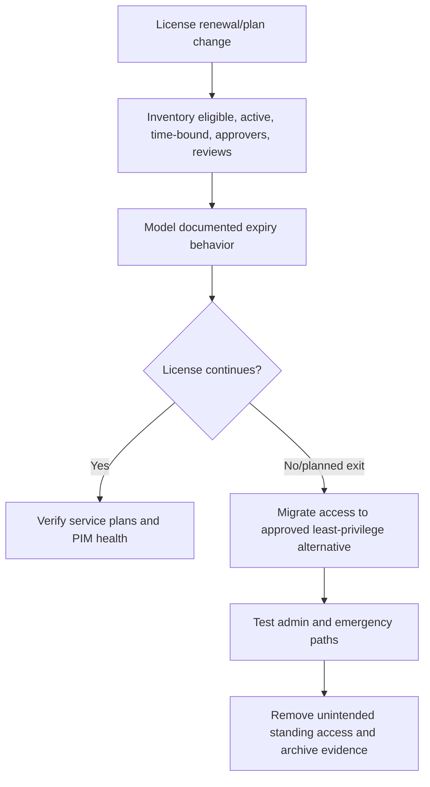

---

## 19. Phased privileged-access deployment

| Phase | Activities | Exit gate |
|---|---|---|
| Discover | Roles, assignments, groups, service principals, workload RBAC, admin identities/devices, licenses | Effective privilege inventory validated |
| Analyze | Task-role mapping, toxic combinations, standing access, ownership, usage | Risk-ranked findings and quick wins |
| Design | Personas, separate accounts, scopes, PIM settings, approvers, PAW, emergency | HLD/LLD and RACI approved |
| Prepare | Strong methods, CA contexts, approver/on-call, logging, help desk, emergency drill | Dependency readiness proven |
| Pilot | Low/medium-risk roles and test identities | Activation/use/deactivation/rollback pass |
| Expand | Admin cohorts and high-impact roles in rings | Support/security metrics acceptable |
| Operate | Reviews, alerts, lifecycle, drift, licenses, exercises | Owners and continual improvement active |

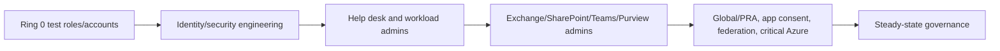

High-risk roles need the strongest target state, but not an untested first enforcement on the only real administrators. Use dedicated test identities, parallel emergency access, workload-specific portal/API tests, and monitored change windows.

---

## 20. Positive, negative, failure, and rollback testing

| Test type | Scenario | Expected result/evidence |
|---|---|---|
| Positive eligible | User sees and requests assigned role | Correct scope/duration/settings |
| Strong auth | Activation context requires phishing-resistant strength | Eligible method and CA event succeed |
| Negative method | SMS-only user requests strong context | Cannot activate; recovery guidance works |
| Approval | Valid ticket and duration | Correct independent approver notified and audit captured |
| Negative approval | Missing/invalid context | Denied with reason; no active role |
| Ticket | Enter known ticket reference | Recorded, while external process validates it |
| Duration | Activate minimum and wait/expire | Permission ends at documented time |
| Role-use CA | Activate on PAW, try another unmanaged session | Active role use is blocked as designed |
| Scope positive | AU admin manages in-scope user | Supported action succeeds |
| Scope negative | Same admin targets out-of-scope user | Denied without broader role |
| Group propagation | Activate through selected PIM/group pattern | Target M365 portal/API timing measured |
| Service principal | Time-bound least role performs automation | Only required operation succeeds |
| PIM alert | Controlled outside-PIM assignment in lab/design | Expected alert/workflow documented |
| Access review | Deny stale test assignment | Correct assignment path removed/applied |
| Emergency | Both independent accounts tested | Sign-in/action/alert/custody evidence |
| Approver unavailable | Primary absent | Secondary/on-call meets SLA |
| PIM outage tabletop | Normal activation unavailable | Emergency runbook restores minimum control |
| Rollback | Pilot PIM settings/assignment reverted | Prior approved access restored, evidence retained |

Rollback is not a blanket permanent-active conversion. Export assignments/settings first; revert only the affected role policy or pilot assignment; preserve strong authentication and monitoring; validate the target task; set a temporary exception owner/expiry if necessary; and conduct root-cause review before reattempt.

---

## 21. Layered troubleshooting

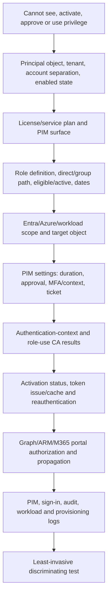

| Symptom | Likely cause | First discriminating check |
|---|---|---|
| Role not visible to activate | Wrong tenant/account, no eligible assignment, start/end date, license | PIM assignment by immutable principal/role/scope ID |
| Activation pending forever | Wrong/absent approver, inactive default PRA/GA, email issue | Pending request and configured approver active state |
| No MFA prompt | MFA already satisfied in token/session | Authentication details; decide if auth context/every-time required |
| Auth context does not prompt | CA Off/report-only, excluded user, wrong context, prior 10-minute window | Exact CA policy and context claim/result |
| Activated but portal denies | Token/portal cache, workload propagation, wrong RBAC system, unsupported group pattern | Test direct API/new session and role assignment path |
| SharePoint/OneDrive delay | Group-to-role activation propagation pattern | Compare direct PIM role activation with group path |
| AU admin can manage group but not user | User not directly in AU | AU memberships of group object and user object |
| Azure role absent | Looking in Entra PIM or wrong subscription/resource scope | ARM assignment and PIM for Azure resource |
| PIM group activation succeeds but app denies | SCIM/provisioning delay or app session cache | PIM audit plus provisioning log and app authorization |
| Review denial did not remove user | User inherited through group/unsupported auto-removal path | Exact assignment path and review resource behavior |
| Service principal review unavailable | Missing Workload ID Premium or wrong scope | License and review principal type |
| Emergency account blocked | CA exclusion drift, credential/device dependency, account disabled | Emergency sign-in CA details and registered method/custody |

Never troubleshoot by granting permanent Global Administrator, disabling all Conditional Access, removing every PIM approval, sharing emergency credentials, or running admin work from an unmanaged personal device. Such tests erase control boundaries.

---

## 22. Operations, metrics, and lifecycle

| Metric | Meaning | Guardrail |
|---|---|---|
| Standing privileged assignments | Persistent attack surface | Segment legitimate emergency/workload cases |
| Eligible-to-active ratio | JIT adoption | Do not reward unnecessary activation |
| Activation approval/denial time | Operational responsiveness | Include after-hours and critical roles |
| Activation duration used | Policy fit | Repeated reactivation may signal too-short duration |
| Roles assigned outside PIM | Governance bypass | Investigate every high-risk occurrence |
| Global/PRA count | Tenant-control concentration | Include groups, eligible and service principals |
| Stale/unused privileged assignments | Excess access | Usage is input, not proof access is unnecessary |
| Failed activation by cause | User/policy/dependency friction | Break down auth, approval, license, scope and portal |
| Access-review completion/denial | Certification effectiveness | Watch rubber-stamp approvals and no-response defaults |
| Emergency drill success | Recovery readiness | Both accounts, action, alert and custody must pass |
| PAW/admin-device compliance | Clean-source coverage | Compliance alone does not prove PAW controls |
| Credential/owner coverage for privileged workloads | Machine privilege governance | Include app owners and expiring credentials/federation |

Privileged assignment lifecycle should begin with a documented role request and manager/resource-owner approval, use a time-bound eligibility period where practical, set activation policy, review usage and continued need, renew only with evidence, and remove promptly on mover/leaver/project completion. Service principals need named business and technical owners, permission inventory, credential/federation lifecycle, and incident contact.

### Operational RACI

| Activity | Accountable/primary owner |
|---|---|
| Role catalog and custom definitions | Identity security architecture |
| PIM role settings | Privileged Role Administrator service owner |
| Activation approval | Resource/service owner delegates |
| CA authentication context and role-use policy | Conditional Access owner with peer review |
| PAW platform | Endpoint security/Intune owner |
| Emergency custody/testing | CISO/identity leadership with SOC monitoring |
| Access reviews | Role/resource owner with governance administration |
| PIM alerts/incidents | SOC plus identity engineering |
| License monitoring | Service owner/procurement/licensing |
| Audit evidence | Governance/compliance with platform owners |

---

## 23. Role-design workshop

A Deloitte-style workshop should start with tasks and risk, not a preselected role list.

### Workshop inputs

- Business/service scope and regulatory requirements.
- Current users, groups, service principals, Entra/Azure/M365 assignments.
- Admin task and escalation catalog with frequency and urgency.
- Existing PIM, CA, authentication, devices, emergency access and licenses.
- Incident history, audit findings, on-call model, vendor and delegated administration.

### Workshop sequence

```mermaid
flowchart LR
    TASKS[Enumerate real admin tasks] --> ACTIONS[Map task to actions/APIs/portals]
    ACTIONS --> ROLES[Compare built-in, combination, custom]
    ROLES --> SCOPE[Choose tenant/AU/object/Azure/workload scope]
    SCOPE --> TIME[Eligible, active, time-bound and activation duration]
    TIME --> CONTROLS[Strength, device, approval, ticket, notification]
    CONTROLS --> TESTS[Positive, negative, propagation, emergency and rollback tests]
    TESTS --> OWNERS[Owners, reviewers, metrics, lifecycle]
```

| Workshop output | Required content |
|---|---|
| Persona-task matrix | Standard admin, help desk, workload admin, app admin, security, vendor, emergency |
| Permission traceability | Task → action → role → scope → principal → assignment/activation |
| Toxic combination register | Consent + app ownership, auth reset + role/group control, federation + CA, etc. |
| PIM policy matrix | Duration, MFA/context, approval, justification, ticket, notification per role |
| Device/access matrix | Productivity, specialized, PAW, emergency path and allowed interfaces |
| Exception register | Reason, risk, compensation, owner, expiry, review |
| Test/rollback plan | Expected evidence and named operators |
| RACI/operations | Request, approve, monitor, review, incident, license and emergency owners |

Facilitation language: “What exact outcome must this person achieve?” “Which API or portal action performs it?” “What is the smallest scope?” “How quickly is access needed at 02:00?” “Who can independently approve?” “What happens if PIM, federation, Intune, or the approver is unavailable?” “How will we prove removal?”

---

## 24. Consulting scenarios and deliverables

### Scenario A: Too many Global Administrators

Export direct/group and active/eligible assignments; identify actual tasks and last use; map specific roles/scopes; protect admin identities/devices; move routine access to eligibility; retain two emergency accounts; pilot; review and remove broad assignments. Do not bulk-remove before recovery and task coverage tests.

### Scenario B: Regional help desk

Use a supported Helpdesk/Authentication/User role scoped to an AU containing the correct users, not merely a group whose members are outside the AU. Test in-scope and out-of-scope password/method actions and portal differences. Keep escalation to tenant-level identity team.

### Scenario C: Vendor SharePoint administration

Use separate named guest/admin identities where supported, time-bound eligibility, strong method, approval by service owner, short duration, PAW/managed-device context, and SharePoint-specific role rather than Global Admin. Account for PIM-to-workload propagation, cross-tenant policy, contract end date, and review.

### Scenario D: Automation with directory role

Challenge whether the service principal needs an Entra role or a narrower Graph application permission/resource RBAC. Use federation/managed identity/certificate, least scope, owner, time-bound assignment if supported, workload monitoring, and permission review. Never solve noninteractive automation by excluding a user account from MFA.

### Scenario E: PIM approval deadlock

Invoke tested emergency access, restore an active capable approver or correct PIM settings, preserve audit, minimize emergency actions, rotate/custody-review, run PIR, and add an automated control detecting no active PRA/GA/approver.

| Deliverable | Minimum content |
|---|---|
| Privileged-access assessment | All role systems, assignment paths, identities, scopes, devices, workload credentials |
| Role catalog | Purpose, actions, scope, owner, risk, built-in/custom, version |
| Persona/task matrix | Who needs what, how often, urgency, target and evidence |
| PIM LLD | Assignment type/dates and activation policy per role/group/resource |
| Effective privilege graph | Direct, group, app owner, consent, Azure and workload paths |
| PAW design | Device controls, identity separation, destinations, operations and recovery |
| Emergency runbook | Custody, declaration, sign-in, minimum action, monitoring, post-use |
| Access-review plan | Scope, reviewer, recommendation, no-response, auto-apply and exceptions |
| Test/rollback pack | 18 tests, propagation, failure injection, named operators |
| Operations dashboard | Standing access, activations, alerts, reviews, emergency, licenses, workloads |

Example finding:

> **Observation:** Forty-seven users hold permanent active Global Administrator, seven are shared support accounts, role assignment occurs outside PIM, and emergency accounts are federated and subject to device-compliance CA. **Risk:** A phished productivity session, shared credential, federation outage, or Intune failure can cause tenant compromise or lockout. **Recommendation:** Preserve and test recovery first; create two cloud-only active emergency accounts with independent phishing-resistant credentials and alerts; separate named admin identities and PAWs; map tasks to specific roles/scopes; migrate routine privilege to PIM eligibility with role-specific controls; monitor outside-PIM assignment; review quarterly. **Residual risk:** PIM/workload propagation and emergency-account concentration require drills, monitoring, and resource-level controls.

---

## 25. Safe paper lab: privileged-access redesign and defense

This exercise creates no tenant roles, users, groups, service principals, CA policies, or credentials.

### Prerequisites

- Parts 6–10 and Official Source Anchors below.
- Diagram/Markdown/spreadsheet editor.
- Fictional aliases and object IDs only.
- No production exports, screenshots, role assignments, credentials, or customer data.

### Fictional client

Northstar has 8,000 employees, 60 IT admins, 12 permanent Global Administrators, regional help desks, a third-party SharePoint migration vendor, 25 privileged service principals, Entra ID P2 for administrators, Intune, Defender for Endpoint, and two emergency accounts that currently depend on federation and Authenticator.

### Steps

1. Inventory fictional direct/group, active/eligible Entra roles, Azure roles, M365 workload roles, app permissions, owners, and service principals.
2. Create 15 admin tasks and map each to exact role family, smallest scope, principal, assignment type, activation duration, device, approval, ticket, and evidence.
3. Replace at least eight Global Admin tasks with specific built-in or documented custom-role candidates.
4. Design three AUs and prove group-object versus user-member scope with positive and negative cases.
5. Create role-specific PIM policies for help desk, SharePoint Admin, App Admin, Conditional Access Admin, Privileged Role Admin, and one Azure role.
6. Design one role-assignable group pattern and one PIM-for-Groups application pattern; document propagation and review differences.
7. Redesign admin identities and PAW paths; separate productivity, admin, workload, and emergency identities.
8. Redesign two emergency accounts using independent cloud-only authentication, active GA, CA exclusion, custody, alerts, and 90-day drills.
9. Run all 18 tests from the test table, including approval outage, license expiry tabletop, PIM outage, propagation, review, emergency, and rollback.
10. Produce a role-design workshop deck outline, risk register, HLD/LLD, RACI, metrics, and executive recommendation.

```mermaid
flowchart TB
    INVENTORY[Effective privilege inventory] --> TASKS[Task-action-role-scope mapping]
    TASKS --> TARGET[Target PIM, AU, group and workload design]
    TARGET --> IDENTITIES[Separate admin/workload/emergency identities]
    IDENTITIES --> DEVICES[PAW and CA context]
    DEVICES --> TEST[18-test and rollback matrix]
    TEST --> OPERATE[Reviews, alerts, metrics, licenses and drills]
    OPERATE --> DEFEND[Workshop and interview defense]
```

### Evidence to retain

| Artifact | Evidence |
|---|---|
| Effective privilege inventory | Direct/group/service-principal paths and toxic combinations |
| Task-role traceability | 15 tasks with actions, roles and scope |
| PIM policy matrix | Six Entra/Azure roles with complete activation settings |
| Group comparison | Role-assignable and PIM-for-Groups design |
| AU proof | In-scope/out-of-scope object cases |
| Identity/device architecture | Productivity/admin/workload/emergency separation |
| Emergency package | Custody, test, alert and PIR templates |
| Test results | Expected logs/results for all 18 cases |
| Operations pack | RACI, reviews, metrics, alert and license process |
| Executive output | Options, recommendation, roadmap and residual risk |

### Cleanup

Delete scratch content containing real account names, object IDs, role exports, screenshots, credentials, device details, or customer data. If later adapted to a lab tenant, export test settings, remove only test role/group assignments in dependency order, return CA/PIM pilot settings to their approved state, validate both emergency accounts, and confirm no service principal or active assignment was orphaned. Never delete emergency access as ordinary cleanup.

### Interview wording

> “I completed a fictional privileged-access redesign grounded in current Microsoft guidance. I mapped tasks to Entra/Azure/M365 actions and scopes, replaced routine Global Admin use, designed role-specific PIM activation, administrative units, role-assignable and PIM groups, admin/workload separation, PAWs, emergency access, 18 tests, reviews, alerts, metrics, rollback, and a role-design workshop. It is design/lab evidence, not claimed production Entra ownership.”

---

## 26. Official Source Anchors

These first-party references were checked for the guide’s **August 24, 2026** currency date. Recheck the live permission reference, Product Terms, portal behavior, and workload-specific documentation before implementation.

1. [Entra RBAC overview](https://learn.microsoft.com/entra/identity/role-based-access-control/custom-overview) — principal, role definition, assignment, scope, built-in/custom roles, authorization flow, workload governance, and licensing.
2. [Microsoft Entra built-in roles](https://learn.microsoft.com/entra/identity/role-based-access-control/permissions-reference) — current role purposes and Graph actions.
3. [Administrative units](https://learn.microsoft.com/entra/identity/role-based-access-control/administrative-units) — scope, membership behavior, constraints, supported tasks, and licensing.
4. [Use groups to manage Entra role assignments](https://learn.microsoft.com/entra/identity/role-based-access-control/groups-concept) — immutable role-assignable flag, protections, 500-group limit, nesting, known issues, and P1/P2 boundary.
5. [What is PIM?](https://learn.microsoft.com/entra/id-governance/privileged-identity-management/pim-configure) — purpose, features, authority, eligible/active vocabulary, assignment and activation lifecycle.
6. [Configure Entra role settings in PIM](https://learn.microsoft.com/entra/id-governance/privileged-identity-management/pim-how-to-change-default-settings) — duration, MFA, authentication context, every-time/10-minute behavior, justification, ticket, approval, notifications, and Graph policies.
7. [PIM for Groups](https://learn.microsoft.com/entra/id-governance/privileged-identity-management/concept-pim-for-groups) — old name, membership/ownership policies, role-assignable independence, nesting, M365 propagation and app provisioning.
8. [PIM access reviews for Entra and Azure roles](https://learn.microsoft.com/entra/id-governance/privileged-identity-management/pim-create-roles-and-resource-roles-review) — scope, reviewers, recommendations, auto-apply, groups, service-principal licensing, and snapshot behavior.
9. [PIM security alerts](https://learn.microsoft.com/entra/id-governance/privileged-identity-management/pim-how-to-configure-security-alerts) — outside-PIM assignment, stale accounts, GA count, activation frequency, MFA and license alerts.
10. [ID Governance licensing fundamentals](https://learn.microsoft.com/entra/id-governance/licensing-fundamentals) — PIM/Governance licenses, approver/reviewer coverage, license-expiry effects, and Preview capabilities.
11. [Manage emergency access accounts](https://learn.microsoft.com/entra/identity/role-based-access-control/security-emergency-access) — two cloud-only active GA accounts, phishing-resistant methods, CA exclusions, PAW, custody, monitoring and 90-day testing.
12. [Why privileged access devices are important](https://learn.microsoft.com/security/privileged-access-workstations/privileged-access-devices) — clean source, device profiles, hardware/application controls, and PAW separation.
13. [PIM integration with Azure RBAC](https://learn.microsoft.com/azure/role-based-access-control/pim-integration) — Azure resource role eligibility and scope context.
14. [Secure privileged access](https://learn.microsoft.com/entra/identity/role-based-access-control/security-planning) — role planning, high-impact permissions, and privileged identity strategy.

**Preview/change-sensitive register:** PIM custom activation extensions; PIM-for-Groups reviews; restricted management administrative units; role permission definitions; group/portal propagation; notification limit; authentication-context backup and 10-minute window; workload/service-principal reviews; license-expiry effects; managed identity/federation patterns; Microsoft 365 admin portal recognition; and PAW product implementation require current validation.

---

## ⭐ Likely Interview Questions for This Section

### Q1. What makes up a Microsoft Entra role assignment?

> **Model answer:** “A role assignment links a security principal, a role definition, and a scope. The principal is the user, role-assignable group, service principal, or supported managed identity; the role definition contains allowed Graph management actions; and the scope limits where they apply, such as tenant, administrative unit, application, enterprise app, or group. I troubleshoot all three by immutable ID and also distinguish Entra RBAC from Azure and workload RBAC.”

### Q2. What is the difference between eligible, active, assigned, and activated in PIM?

> **Model answer:** “Eligible means the user can request temporary use but does not currently hold the role. Active means permissions are usable without activation during the assignment period. Assigned is the state of a direct active assignment. Activated means an eligible user completed requirements and is temporarily active. Either eligible or active assignment can be permanent or time-bound; activation has its own shorter duration.”

### Q3. How would you configure PIM for a high-impact role?

> **Model answer:** “I map the exact task and scope first, make normal admins time-bound eligible, require a suitable authentication context and every-time reauthentication, justification and validated ticket process, independent approval with at least two available approvers, minimum practical activation duration, notifications and SOC/audit monitoring. I separately apply Conditional Access to active role use, test portal/API propagation, review assignments, maintain emergency access, and define rollback.”

### Q4. What is the difference between a role-assignable group and PIM for Groups?

> **Model answer:** “A role-assignable group is created with immutable `isAssignableToRole=true`, which permits Entra role assignment and adds membership protections; it is a P1 RBAC feature. PIM for Groups governs eligible or active group membership and ownership and can control access to apps, Azure, Teams and other resources; the group need not be role-assignable. Privileged Access Groups is the old name. The two properties are independent.”

### Q5. How should emergency access be designed?

> **Model answer:** “Maintain at least two cloud-only `.onmicrosoft.com` accounts with permanent active Global Administrator, not PIM eligibility. Give them independent phishing-resistant credentials, exclude them from restrictive Conditional Access while keeping report-only visibility, use designated secure workstations, secure separate custody, alert every sign-in/action, and test at least every 90 days and after material changes. Use them only for declared recovery and conduct a post-use review.”

### Q6. Why are authentication context and a PAW both needed?

> **Model answer:** “Authentication context lets PIM invoke Conditional Access for strength, device, terms and fresh authentication during activation. It does not by itself stop the active role being used from another session or prove the device is a true PAW, so I add a role-targeted CA policy for use and a hardened privileged workstation with separate identity, application control, restricted browsing/destinations, hardware trust and monitoring.”

### Q7. How would you troubleshoot successful activation followed by Access Denied in SharePoint or another portal?

> **Model answer:** “I verify tenant/account, assignment path, role/scope, activation status and expiry, then inspect CA and token issue time. I distinguish direct PIM role activation from eligible group membership, because group and workload propagation can lag. I test a fresh supported API/session, correlate PIM and workload audit/provisioning logs, and confirm whether the target uses Entra, Azure or its own RBAC. I do not grant permanent Global Admin as a test.”

### Q8. How does your background support privileged-access consulting without overstating it?

> **Model answer:** “My production experience is controlled Microsoft 365 escalation: validating authorization before impactful action, coordinating customers and vendors, documenting change and RCA, and proving fixes in SharePoint/OneDrive scenarios. Those behaviors transfer to role workshops, tests, troubleshooting and stakeholder decisions. My Entra RBAC/PIM/PAW/emergency evidence is a current fictional design exercise, not claimed production ownership.”

---

## 🧠 30-Second Memory Hooks

- **Privilege:** Action × scope × time × context.
- **RBAC assignment:** Principal + role definition + scope.
- **Role definition:** Permission recipe; no access until assigned.
- **Entra role:** Directory/Graph management.
- **Azure role:** ARM resource management.
- **Built-in first:** Use specific maintained roles before custom or Global Admin.
- **Custom role:** Supported actions, owner, tests, version and P1.
- **AU:** Scoped supported management, not universal visibility/security boundary.
- **Eligible:** May activate later.
- **Active:** Can use now without activation.
- **Activated:** Eligible user temporarily elevated.
- **JIT:** Permission only when needed.
- **JEA:** Only enough approved operations; not a PIM switch.
- **Ticket:** PIM records it; PIM does not validate it.
- **Auth context:** Protect activation.
- **Role-use CA:** Protect the active role across sessions.
- **Role-assignable group:** Special immutable admin-role roster.
- **PIM for Groups:** Temporary roster membership/ownership; old name PAG.
- **Propagation:** Activation success does not guarantee instant workload permission.
- **PAW:** Clean, restricted admin device; compliance alone is not PAW.
- **Workload admin:** Machine identity needs owner, least scope and credential/federation lifecycle.
- **Break glass:** Two cloud-only, active GA, independent strong method, alert, 90-day drill.
- **Review:** Recommendation informs; owner decides; assignment path controls removal.
- **License expiry:** Can remove eligibility and turn time-bound active into standing access.
- **Rollback:** Revert the pilot role/policy, not the whole privileged-control system.
- **Honesty:** Controlled M365 change experience plus paper design is not production PIM tenure.

---

## Completion Checklist

- [ ] Explain privilege as action, scope, time, context and governance.
- [ ] Define principal, role definition, action, assignment and scope.
- [ ] Distinguish Entra, Azure, Exchange, SharePoint/Purview and app authorization.
- [ ] Compare built-in, combined, custom and Global Administrator choices.
- [ ] Design and govern a custom role without guessing actions.
- [ ] Explain AU membership, group-object behavior, constraints, licensing and visibility limits.
- [ ] Distinguish eligible, active, assigned, activated, permanent and time-bound.
- [ ] Explain PIM purpose, surfaces, authority and limitations.
- [ ] Distinguish JIT, JEA, least privilege, separation of duties and clean source.
- [ ] Configure duration, MFA, authentication context, justification, ticket, approval and notification.
- [ ] Explain authentication-context targeting, backup behavior, 10-minute window and role-use CA.
- [ ] Design resilient, independent approval with no deadlock.
- [ ] Distinguish role-assignable groups, PIM for Groups and the old Privileged Access Groups name.
- [ ] Explain group limits, immutability, nesting, app provisioning and M365 propagation.
- [ ] Compare PIM for Entra roles, Azure resources and groups.
- [ ] Separate productivity, admin, workload and emergency identities.
- [ ] Govern privileged service principals, managed identities, app owners and consent paths.
- [ ] Explain PAW controls and why device compliance is not sufficient.
- [ ] Design two independent cloud-only active emergency accounts.
- [ ] Run the full emergency test and monitoring/post-use process.
- [ ] Design PIM access reviews with correct assignment-path behavior.
- [ ] Operationalize all material PIM alerts.
- [ ] Validate P1, P2/Governance, Workload ID, Intune/Defender and license-expiry effects.
- [ ] Build deployment rings and execute all 18 tests with scoped rollback.
- [ ] Use the layered troubleshooting tree without broad privilege escalation.
- [ ] Define lifecycle, metrics, RACI and on-call operations.
- [ ] Facilitate the role-design workshop and produce all consulting deliverables.
- [ ] Complete the safe paper lab and answer Q1–Q8 honestly.

---

*Next suggested section:* [Part 12](Part-12-identity-governance-lifecycle-entitlement-access-reviews.md) — extend least privilege across the complete joiner, mover, leaver, employee, guest, application, entitlement, review, and exception lifecycle.