# Part 12 — Identity Governance: Lifecycle Workflows, Entitlement Management, and Access Reviews

> **Section goal:** Design Identity Governance and Administration (IGA) so identity and access follow authoritative business events rather than accumulating through tickets, memory, and permanent exceptions. By the end, you should be able to model joiner-mover-leaver flows, connect HR-driven provisioning to Lifecycle Workflows, design catalogs and access packages for employees and guests, configure defensible access reviews and separation of duties, troubleshoot failed provisioning, measure outcomes, and produce a client-ready governance design.

This Part extends the privileged assignment lifecycle in [Part 11](Part-11-privileged-access-rbac-pim-emergency-access.md) to the broader workforce, guests, applications, groups, Teams, and SharePoint Online. Part 13 explains the AD DS and Entra synchronization paths that often carry authoritative identity attributes into the cloud.

> **Currency and change-sensitive note:** Product behavior was checked against official Microsoft Learn content available on **August 24, 2026**. Microsoft’s Lifecycle Workflows overview currently states a 100-workflow limit while the July 2026 licensing page still describes 50; treat the limit as documentation drift and verify the live tenant before design. Agent identity governance, catalog access reviews, custom-data-resource reviews, PIM-for-Groups reviews, Microsoft Entra roles in access packages, SAP integrations, API permissions for agents/service principals, delegated My Access approval, and some tenant-governance features are **Preview/change-sensitive**. Licensing has shifted toward Entra ID Governance/Entra Suite; validate Product Terms, guest monthly-active-user billing, cloud availability, and feature-specific P2 carryover.

## JD Mapping

| Deloitte role expectation | Capability developed in this Part | Consulting evidence |
|---|---|---|
| Assess and transform M365 identity processes | Map authoritative identity, JML events, access delivery, review, and removal | Current-state lifecycle map and risk register |
| Design secure collaboration | Package Teams, groups, enterprise apps, and SharePoint roles with approval/expiry | Catalog/access-package LLD |
| Minimize security and audit risk | Enforce separation of duties, expiration, recurring reviews, and evidence | Control matrix and certification schedule |
| Troubleshoot platform/process failures | Isolate HR source, matching, provisioning, workflow, entitlement, target, and reviewer layers | Layered runbook and failure scenarios |
| Coordinate stakeholders/vendors | Define HR, manager, resource owner, identity, app, privacy, audit and vendor roles | RACI, workshop and escalation pack |
| Build sustainable operations | Monitor SLA, exceptions, orphan access, guest lifecycle, review quality and license health | Dashboard specification and service model |

## Candidate honesty note

Arti can credibly connect this topic to demonstrated Microsoft 365 support and advisory work: tracing permissions and sharing in SharePoint/OneDrive, coordinating customer stakeholders and product vendors, managing escalations, documenting ownership and RCA, validating fixes, creating reusable guidance, mentoring peers, and translating technical impact for business reviews.

This Part does **not** claim that Arti owned production HR provisioning, Lifecycle Workflows, entitlement management, access reviews, guest governance, or separation-of-duties policy. Safe wording is:

> “My production experience includes Microsoft 365 escalations, SharePoint/OneDrive permissions and sharing analysis, stakeholder and vendor coordination, RCA, documentation, and fix validation. I have built a current fictional Entra ID Governance design covering authoritative HR events, Lifecycle Workflows, access packages, guest lifecycle, reviews, exceptions, testing, metrics, and troubleshooting. I present that as transferable delivery skill and structured design evidence, not production IGA ownership.”

---

## 1. IGA asks who should have what, why, and for how long

**Identity Governance and Administration (IGA)** is the set of policies, processes, data, roles, and technology used to create and maintain identities, grant and remove access, certify that access, and prove controls worked.

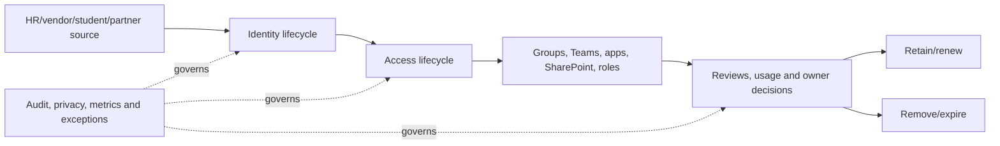

| Governance question | Evidence needed | Weak answer |
|---|---|---|
| Which identity is this? | Stable worker/person/partner identifier and source | Display name or email alone |
| Should it exist? | Current authoritative status and relationship | “It signed in recently” |
| What baseline access is justified? | Role/department/location/employment policy | Copy predecessor’s access |
| What additional access is needed? | Request, purpose, owner and approval | Permanent direct group add |
| How long? | Start/end date, renewal and review | Until someone remembers |
| Who is accountable? | Manager, sponsor, resource and technical owner | Generic IT queue |
| What conflicts? | Separation-of-duties policy and toxic combinations | Reviewer intuition only |
| Can control be proven? | Immutable records, decisions, provisioning and removal evidence | Screenshot of current state |

IGA balances **productivity** and **security**. A new starter needs access on day one, while a leaver’s access must close promptly. A project contractor needs quick collaboration, but only through the contract end date. Governance fails when either side dominates: manual over-control causes shadow access; uncontrolled convenience creates stale privilege and audit findings.

---

## 2. Identity lifecycle, access lifecycle, and privileged lifecycle

| Lifecycle | Governs | Typical technology |
|---|---|---|
| Identity lifecycle | Whether a digital identity exists and its authoritative attributes/status | HR-driven/API provisioning, AD DS/Entra sync, Lifecycle Workflows |
| Access lifecycle | Which groups, apps, Teams, SharePoint roles and entitlements it receives | Dynamic groups, entitlement management, app provisioning, access reviews |
| Privileged lifecycle | High-impact roles and temporary elevation | PIM, privileged access reviews, CA, PAW, emergency access |

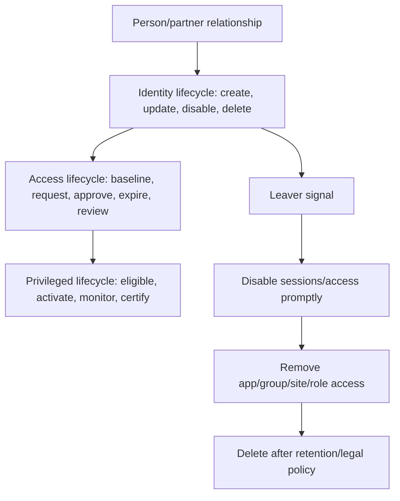

These lifecycles interlock but should not be collapsed. Deleting an Entra user before preserving legal/manager-owned business data can harm the organization. Removing a user from an access package may not delete a guest if another assignment remains. A PIM role review does not replace employee termination. Each layer needs an owner and sequence.

---

## 3. Joiner, mover, leaver, rehire, leave, and contingent-worker events

### 🔍 Plain-English deep-dive: JML is a state machine, not three tickets

- **Joiner** — *an identity enters scope and needs a controlled digital presence.* **Analogy:** Issue a building badge before the first shift, but not unrestricted keys. **Why it matters:** Timely, correct baseline access improves productivity without copying excess access.
- **Mover** — *the person’s role, manager, location, employment type, or other boundary changes.* **Analogy:** A worker transfers buildings and should return old keys before receiving new ones. **Why it matters:** Movers are a major source of accumulated privilege.
- **Leaver** — *the relationship ends or access should stop.* **Analogy:** Deactivate the badge immediately, then recover assets and archive records in order. **Why it matters:** Disablement, session revocation, ownership transfer, access removal, retention, and deletion are distinct tasks.
- **Rehire/return** — *a former worker returns under a new or resumed relationship.* **Analogy:** Decide whether to reactivate the old badge record or issue a new one after verifying identity. **Why it matters:** Duplicate matching and stale access can reappear.

| Event | Trigger examples | Access design |
|---|---|---|
| Prehire | Signed contract and future hire date | Create staged identity/minimum onboarding; no premature sensitive access |
| First day | Hire date/status active | Baseline license/groups, TAP delivery to manager, orientation |
| Role/department move | Effective-dated HR change | Remove incompatible old access, assign new baseline, review exceptions |
| Manager change | HR hierarchy update | Update approvals/reviewer/sponsor routes |
| Leave of absence | Status/date policy | Suspend selected access and sessions; retain identity/data per policy |
| Termination | Immediate or scheduled authoritative event | Disable, revoke, remove, transfer, preserve, then delete on policy |
| Contract extension | Approved new end date | Extend only current justified access, not every stale grant |
| Rehire | New relationship or reactivation rule | Match stable ID, validate old object/access, apply new baseline |

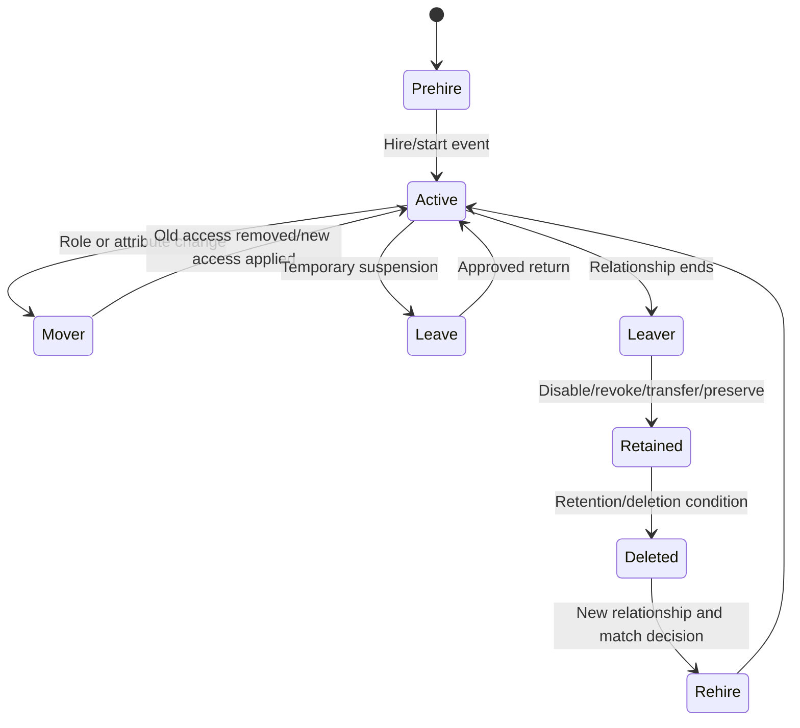

The business must define event semantics. “Termination date” might mean last working day, payroll close, or legal effective time. A one-day timezone mismatch can become an access exposure or employee-relations incident. Store effective timestamps consistently and test daylight-saving/region cases.

---

## 4. Source of authority and identity data contracts

The **source of authority (SoA)** is the system trusted to originate a given identity or attribute. HR is often authoritative for worker status, hire/end dates, department, manager, and worker ID. AD DS may be authoritative for legacy account properties. Entra may be authoritative for cloud-only identities, authentication methods, and cloud-created access.

| Attribute/data | Likely authority | Governance requirement |
|---|---|---|
| Worker/person ID | HR/HCM | Stable, unique, not recycled; primary correlation key |
| Employment status/dates | HR/HCM | Effective-time semantics, urgent termination path |
| Legal/preferred name | HR with approved override | Privacy and downstream compatibility |
| Manager | HR/org system | Fallback reviewer when missing; cyclic hierarchy checks |
| Department/cost center | HR/finance | Controlled values for scope/auto-assignment |
| UPN/mail nickname | Identity/messaging policy | Uniqueness, verified domain and rename effects |
| AD account/OU | Identity provisioning/AD DS | Placement rules and sync scope |
| Authentication methods | Entra/user under policy | Never overwrite casually from HR feed |
| Access package assignment | Entitlement management | Policy/request/approval/expiry record |
| App-local role/account | Target app/provisioning service | Reconciliation and orphan detection |

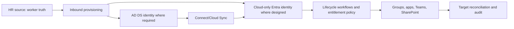

Create an **identity data contract**: attribute, definition, format, authority, allowed values, null behavior, transformation, matching key, effective timing, downstream consumers, privacy class, owner, error SLA, and change process. Do not build movers or automatic access on free-text department names with no data owner.

---

## 5. HR-driven provisioning architecture

HR-driven provisioning creates/updates/disables digital identities based on HR events. Current Microsoft Entra provisioning supports cloud HR sources such as Workday and SuccessFactors, API-driven inbound provisioning for other sources, and paths to AD DS or directly to Entra ID.

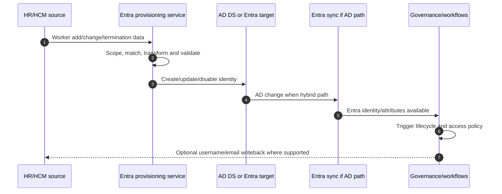

| Provisioning path | Best fit | Tradeoff |
|---|---|---|
| Cloud HR → AD DS → Entra | Legacy/hybrid apps and AD-dependent resources | More hops, sync latency and dual troubleshooting |
| Cloud HR → Entra | Cloud-only workforce | Simpler path; validate legacy dependencies |
| On-prem HR → API-driven provisioning → AD/Entra | Custom HR/CSV/SQL integration | Integration must securely transform and call bulk API |
| HR → partner/custom connector → provisioning API | Specialized business logic | Vendor ownership, schema, retry and security contract |
| Manual CSV/script | Temporary migration only | Error-prone, weak audit/idempotency; retire with roadmap |

Matching is the highest-risk decision. A bad match can merge a new worker into another person’s account; a missed match creates duplicates. Use a stable nonrecycled identifier, staged pilot, collision report, and explicit rehire logic. Never match only on display name.

Provisioning is not authorization by itself. It establishes identity and baseline attributes; group rules, entitlement policies, app provisioning, resource authorization, and reviews turn those attributes into access.

---

## 6. Lifecycle Workflows architecture

**Lifecycle Workflows (LCW)** automate tasks based on user scope and lifecycle timing. A workflow combines execution conditions with an ordered task sequence. It can run automatically on a schedule or on demand, and can call approved custom task extensions backed by Logic Apps for scenarios not covered by built-in tasks.

| LCW element | Plain meaning | Example |
|---|---|---|
| Workflow | Governed automation for a lifecycle outcome | Prehire onboarding |
| Template | Microsoft starting pattern | Onboard prehire employee |
| Scope/execution condition | Which users and when | Department=Sales and 7 days before `employeeHireDate` |
| Task | One built-in action | Add user to group, remove licenses, disable account |
| Task sequence | Ordered operations | Revoke access before deleting account |
| Schedule | Periodic engine evaluation | Run every configured interval |
| On-demand run | Manually start for selected workflow/users | Test/pilot or urgent controlled execution |
| Custom task extension | Call a Logic App workflow | Create ticket, notify vendor, update asset system |
| Workflow history | Per-run/task status and errors | Evidence and troubleshooting |

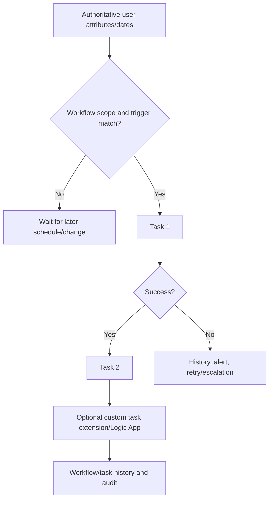

### Common built-in outcomes

| Phase | Example tasks |
|---|---|
| Joiner | Generate Temporary Access Pass, email manager/user, add groups, assign access package, enable account |
| Mover | Add/remove groups or access packages, run custom extension, notify stakeholders |
| Leaver | Disable user, remove groups/licenses/access packages, remove Teams, revoke tasks as supported, delete later |
| Governance | Request review/notify manager through integrated process, preserve audit and exceptions |

Task order is a security control. For a leaver, disable/sign-out/revoke paths should precede slow ownership transfer and eventual deletion. Custom extensions need managed identity/service principal permissions, idempotency, retries, timeout handling, input validation, secretless authentication where possible, logging, and a manual fallback.

---

## 7. Workflow limits, templates, extensions, and change control

### 🔍 Plain-English deep-dive: automation amplifies data quality

- **Execution condition** — *the rule that decides who and when.* **Analogy:** A conveyor sensor starts a machine when the correct package arrives. **Why it matters:** A wrong department or date can automate the wrong access removal at scale.
- **Idempotency** — *repeating a task has the same safe end state.* **Analogy:** Pressing an elevator call button twice does not send two elevators through the floor. **Why it matters:** Retries must not create duplicate tickets, accounts, or grants.
- **Custom extension** — *a governed call from LCW to Logic Apps for external work.* **Analogy:** The conveyor hands a package to another specialized station. **Why it matters:** The external station adds identities, permissions, connectors, cost, data flow, and failure modes.
- **History** — *task-by-task execution evidence.* **Analogy:** A package scan at each station. **Why it matters:** “Workflow completed” is not enough if a critical removal task failed.

| Change | Required control |
|---|---|
| Scope filter update | Impact count, sample identities, negative tests, peer approval |
| Trigger date offset | Timezone/effective-date tests and HR owner approval |
| Task reorder | Failure/partial-completion analysis |
| Custom extension change | Code/connector diff, permissions, security review, retry/rollback |
| Workflow enablement | Pilot/on-demand evidence before scheduled broad run |
| Workflow deletion | Export, dependency review, retention and replacement |

**Documentation discrepancy:** the current LCW overview says up to 100 workflows and 100 custom task extensions; the July 2026 licensing fundamentals page still says up to 50 workflows and 100 extensions. Record this as a live validation item rather than asserting one universal production limit. Limits and cloud availability can change.

---

## 8. Entitlement management: access as a governed package

**Entitlement management** automates access requests, approvals, assignments, expiration, reviews, and external-user onboarding. It is suited to project, cross-department, partner, and time-bound access that baseline attribute rules alone cannot safely decide.

### 🔍 Plain-English deep-dive: package the business outcome, not random permissions

- **Entitlement** — *a justified right to a resource role.* **Analogy:** Permission to use a workshop, not ownership of the whole building. **Why it matters:** The right needs a reason, owner, start, end, and review.
- **Catalog** — *a delegated container of approved resources and packages.* **Analogy:** A department’s controlled shelf of equipment. **Why it matters:** Delegation stays within resources whose owners authorized inclusion.
- **Access package** — *the exact resource roles needed for one understandable job or project outcome.* **Analogy:** A project starter kit containing only the required tools. **Why it matters:** Users and approvers can understand what access is delivered and removed together.
- **Assignment policy** — *rules for one population to obtain and retain the package.* **Analogy:** Employees and suppliers can order the same kit through different approval and return rules. **Why it matters:** Eligibility, approval, expiration, review, and external onboarding can differ without duplicating the resources.

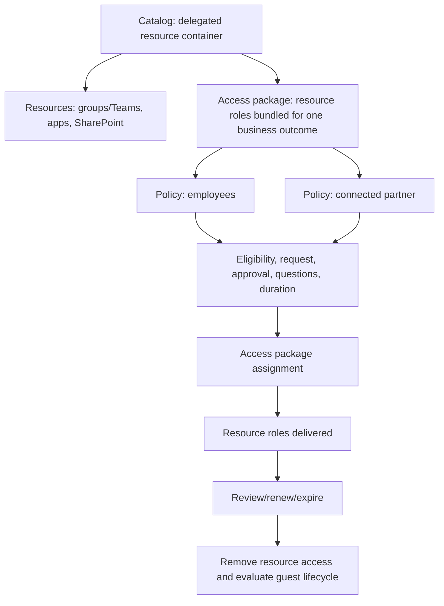

| Term | Meaning | Analogy |
|---|---|---|
| Catalog | Container for resources/packages and delegation | Department’s approved product shelf |
| Resource | Group/Team, enterprise app, SharePoint site, or supported newer type | One product on the shelf |
| Resource role | Permission within the resource | Member, owner, app role, site role |
| Access package | Business bundle of resource roles | New-project starter kit |
| Policy | Rules for one requestor population | Who may order, approval, duration and review |
| Request | Identity asks for package under a policy | Order form with business reason |
| Assignment | Delivered entitlement with lifecycle | Issued kit with expiry label |
| Connected organization | Governed representation of a partner identity source | Approved supplier account relationship |

An access package should represent one understandable business outcome, such as “Project Aurora contributor,” not “miscellaneous access.” It should not duplicate universal birthright access such as every employee’s mailbox. Put resources into a catalog only with resource-owner consent and delegation boundaries.

---

## 9. Catalogs, resources, resource roles, and delegation

| Governance role | Typical responsibility | Guardrail |
|---|---|---|
| Identity Governance Administrator | Tenant-wide governance configuration | Use PIM/least privilege and peer review |
| Catalog creator | Create catalogs | New catalog automatically owned by creator; lifecycle/standards needed |
| Catalog owner | Add owned resources and delegate package management | Cannot treat unowned resource as automatically authorized |
| Access package manager | Build package/policies within delegated catalog | Resource roles limited to catalog contents |
| Access package assignment manager | Manage assignments/requests as delegated | Avoid bypassing approval without documented reason |
| Resource owner | Approves catalog inclusion and access policy | Accountable for business need and review |
| Connected-organization sponsor | Relationship and request/review context | Sponsor lifecycle and fallback required |

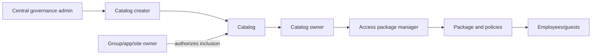

Delegation reduces central bottlenecks but can create catalog sprawl, inconsistent names, weak approval, and duplicate packages. Establish naming, description, sensitivity, owner, review frequency, allowed resource types, default expiration, approval tiers, evidence, and retirement standards.

Current supported mainstream resources include security groups, Microsoft 365 Groups/Teams, enterprise applications, and SharePoint Online sites. Microsoft Entra roles, SAP IAG roles, agent/service-principal API permissions, and some advanced assignments have Preview or separate license boundaries as of August 2026.

---

## 10. Access package policies, requests, approvals, and expiration

One access package can have multiple policies for different populations. Employees might need manager approval for 180 days; a partner might need sponsor plus resource-owner approval for 30 days with terms and review.

| Policy element | Design question |
|---|---|
| Requestor scope | Existing users, groups, connected organizations, all external users, direct assignment, auto-assignment? |
| Approval | None, one/multiple stages, manager, sponsor, resource owner, fallback/alternate? |
| Request questions | What minimum business context is needed without collecting excess personal data? |
| Assignment duration | Fixed days, end date, no expiration only if strongly justified? |
| Extension | Can requestor extend; who approves and what evidence is refreshed? |
| Access review | Who reviews, how often, what happens on denial/no response? |
| Separation of duties | Which groups/packages make request incompatible? |
| Terms/CA | What legal/security acceptance and access conditions apply? |

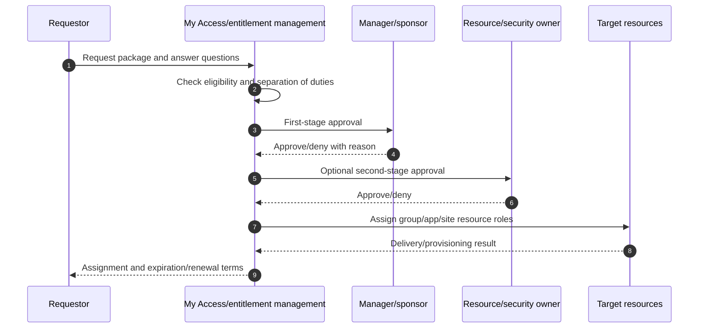

Approval quality matters more than the number of stages. Give approvers package purpose, request answers, requestor relationship, current/conflicting access, resource sensitivity, duration, risk context where licensed, and a response SLA. Configure alternate/fallback approvers so absence does not silently approve or strand work.

Expiration is preferred to permanent access, but an assignment ending does not prove downstream app deprovisioning succeeded. Monitor delivery/removal and reconcile target accounts.

---

## 11. Connected organizations and external requestors

A **connected organization** represents a partner directory/domain or other identity source whose users can request governed packages. Supported identity-source patterns include another Entra directory in the same or another cloud, direct federation, email one-time passcode domains, and Microsoft accounts under current capabilities.

| Connected-org design | Question/risk |
|---|---|
| Directory/domain identity source | Does the domain map to the intended organization and authentication path? |
| Configured versus proposed state | Was the relationship approved by an admin or auto-created from a request? |
| Internal/external sponsors | Who validates relationship and remains available? |
| Policy scope | Specific connected organizations or any external requestor? |
| B2B allow/block settings | Does External ID policy permit invitation/redemption? |
| Guest object lifecycle | Remove when last assignment ends? Delay/retention and other access? |
| Privacy | What identity data crosses tenants and what notice/consent is required? |

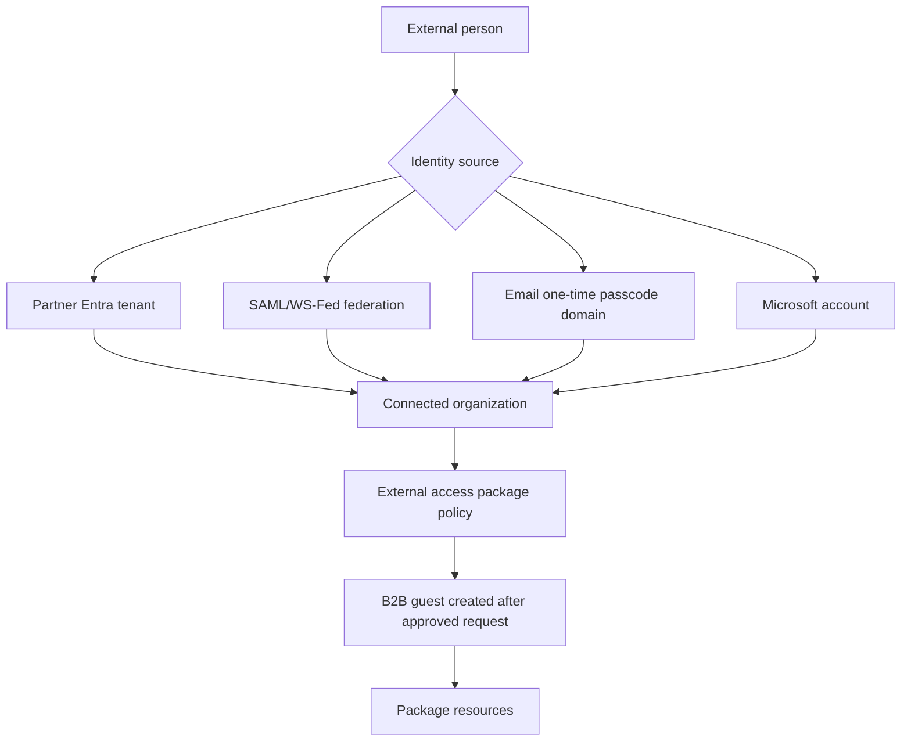

If “all connected organizations plus any new external users” is allowed, an approved user outside existing organizations can cause a **proposed** connected organization to be created. Proposed does not equal trusted configured partner. Review automatically created relationships, social/personal account overlap, domains, sponsors, and policies that target all configured organizations.

---

## 12. Guest lifecycle and sponsor accountability

| Guest phase | Control |
|---|---|
| Request | Eligible partner, purpose, sponsor, package and approval |
| Invitation/redemption | Approved identity provider, B2B settings, terms and CA |
| Assignment | Minimum group/app/site roles with expiry |
| Use | Sign-in/resource activity, risk and support |
| Review | Sponsor/resource owner confirms continued relationship and access |
| Expiration | Remove package resource roles; assess other assignments/direct access |
| Account cleanup | Delete guest only when no justified access and policy allows |
| Reengagement | New request/approval rather than restoring stale grants blindly |

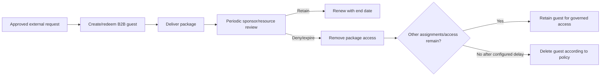

Guest cleanup should not rely solely on last sign-in. A guest may have valid infrequent access, or may never have redeemed an invite. Combine sponsor relationship, package assignment, group/app/site membership, sign-in, resource sensitivity, contract date, legal retention, and other tenant access. Entitlement management can automate external-user removal after assignments end, but validate current settings and direct access outside packages.

---

## 13. Access reviews: recurring certification, not a checkbox

**Access reviews** ask designated reviewers whether users should retain group membership, enterprise-application assignment, access-package assignment, or privileged roles. Reviews address cases where perfect automation is impossible or where periodic human certification is required.

| Review target | Where created | Reviewer examples |
|---|---|---|
| Security/Microsoft 365 group membership | Access Reviews/groups | Group owner, manager, selected reviewer, self |
| Enterprise application assignment | Access Reviews/enterprise app | App owner, selected reviewer, self |
| Entra role | PIM | Role owner, selected reviewer, manager/self where supported |
| Azure resource role | PIM | Resource owner/selected reviewer |
| Access package assignment | Entitlement management | Sponsor, group member, selected reviewer, self |
| Custom data resource | Access Reviews | Manager; **Preview/change-sensitive** |
| Multiple catalog resources | Catalog access review | **Preview/change-sensitive** |

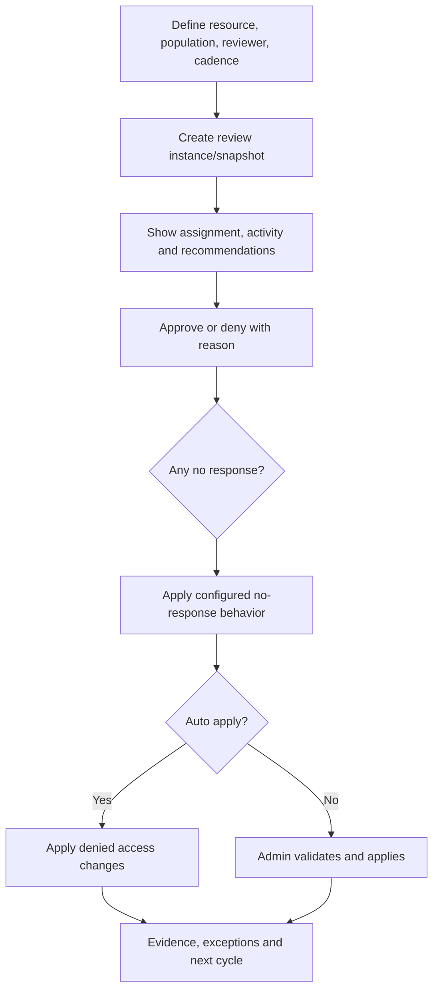

Reviewers need a plain description of what access grants, data sensitivity, expected population, assignment source, manager/sponsor, activity, request reason, and consequences of denial. “Approve all” without evidence is certification theater.

---

## 14. Recommendations, auto-apply, and no-response behavior

### 🔍 Plain-English deep-dive: a recommendation is evidence, not authority

- **Inactive-user recommendation** — *current guidance recommends deny when no tenant sign-in in 30 days, or no app activity for app reviews.* **Analogy:** A library card has not been used recently. **Why it matters:** Inactivity suggests review but does not prove no future business need.
- **User-to-group affiliation** — *machine-learning comparison of reporting-line distance from peers.* **Analogy:** Someone appears on a project roster far from everyone else’s org structure. **Why it matters:** It requires manager hierarchy, current licensing, and currently does not support groups over 600 users.
- **Auto-apply** — *system applies denials after review.* **Analogy:** Rejected badges are deactivated automatically. **Why it matters:** Reviewer mistakes, bad fallback, or wrong scope become real removals.
- **No-response behavior** — *what happens when a reviewer does nothing.* **Analogy:** An unanswered recertification cannot be left ambiguous. **Why it matters:** “Approve” favors continuity; “remove” favors security; “recommendation” depends on data quality; “no change” preserves risk.

| Setting | Safer use | Risk |
|---|---|---|
| Show recommendations | Decision aid with training and reason | Rubber-stamp algorithm |
| Require reason on approval | Sensitive resources and exceptions | Low-quality copied text if no review |
| Auto-apply | Mature resource, accurate path, tested reviewer/fallback | Mass removal or incomplete downstream effect |
| Remove on no response | High-risk access with reliable reviewer/escalation | Business outage during absence |
| No change on no response | Early rollout/low confidence | Stale access persists |
| Take recommendations | Mature trusted signal with exception path | Inactivity is not business truth |

Access-review data is captured at the beginning of an instance. A user’s activity or assignment can change during the review, so the decision may reflect a snapshot. Define review duration, refresh/escalation, and post-review validation.

---

## 15. Separation of duties and incompatible access

**Separation of duties (SoD)** prevents one identity from holding conflicting powers, such as creating and approving a payment or deploying and independently approving production code. Entitlement management can mark a group or another access package incompatible with a package.

| SoD element | Design requirement |
|---|---|
| Conflict rule | Business-readable reason and technical group/package mapping |
| Direction | Incompatibility is unidirectional; configure both directions when required |
| Existing conflicts | Report and remediate users who already hold both |
| Request behavior | Block incompatible request/direct assignment under current rule |
| Exception | Separate combined package with stronger approval, shorter expiry and frequent review |
| Monitoring | Detect direct resource assignment that bypasses entitlement management |

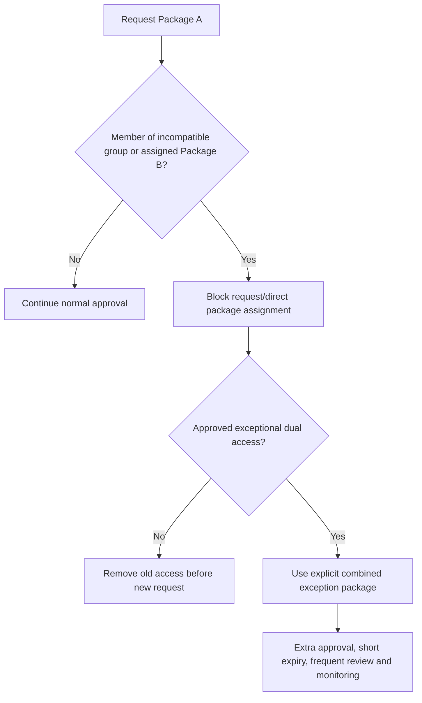

SoD in access packages does not automatically discover every toxic combination across Exchange, SharePoint, Azure, custom apps, local accounts, and direct assignments. Maintain a control matrix and detect bypass paths. A package conflict added after users already hold both prevents re-request but does not necessarily revoke existing overlap automatically.

---

## 16. Terms of Use and policy attestation

Microsoft Entra **Terms of Use (ToU)** presents a PDF through Conditional Access and records acceptance/decline. It can support contractor, guest, regulated-resource, acceptable-use, or privacy acknowledgement, but legal counsel must own the wording and evidentiary requirement.

| ToU capability | Current boundary |
|---|---|
| License | Entra ID P1 |
| Limit | Up to 40 terms per tenant under current guidance |
| Targeting | Conditional Access users/groups and modern-auth apps |
| Languages | Multiple localized PDFs; browser/OS language behavior |
| Reacceptance | Version update, schedule or duration; session timing affects prompt |
| Per-device | Requires registered device; B2B users not supported for per-device mode |
| B2B | Guest with directory object can receive ToU during redemption/access |
| Service accounts | Interactive ToU not supported; exclude nonhuman paths and redesign |
| Evidence | Lifetime policy acceptance report; audit retention differs |

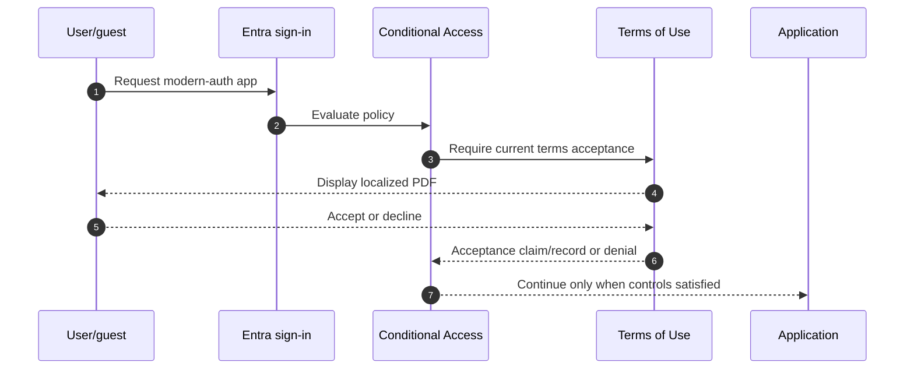

ToU is not proof the person read or understood every term, and it does not replace a contract, privacy notice, training, or authorization. Protect the PDF/version, localize accessibly, record legal owner, test browser/native/guest flows, and avoid collecting unnecessary personal data in request questions.

---

## 17. Licensing and prerequisites

| Capability | Current conceptual requirement | Change-sensitive note |
|---|---|---|
| HR/API-driven provisioning | P1/P2/Governance depending scenario and identities | API quotas/job limits differ by SKU |
| Lifecycle Workflows | Entra ID Governance or Entra Suite for member users in scope/admin | 50-versus-100 workflow documentation conflict |
| LCW custom extensions | Governance/Suite plus Logic Apps/Azure dependencies | 100 extension limit currently documented |
| Entitlement management core | Governance/Suite; some existing capabilities operate under P2 | New advanced features not being added to P2 |
| Access reviews core | Governance/Suite; some existing capabilities under P2 | Advanced recommendations/multi-resource need Governance |
| PIM | P2 or Governance/Suite | Part 11 license-expiry behavior |
| Guest governance | Azure subscription and monthly active user billing | Confirm External ID/Governance billing model |
| ToU | P1 | Acceptance data deleted if tenant loses P1/P2 per current guidance |
| Logic Apps/custom integrations | Azure subscription, connector, identity, network and consumption | Cost, region, permission and data flow |
| Agent governance | Microsoft Agent 365/M365 E7 and prerequisites | Preview/change-sensitive |

### Prerequisites checklist

- Authoritative identity sources, stable IDs, data owners and quality SLA.
- Defined JML states/effective timestamps, rehire and exception rules.
- Complete application/group/site/resource ownership inventory.
- Entra roles, PIM, Conditional Access, authentication and emergency access.
- Provisioning/sync architecture and target connector capabilities.
- Privacy/legal/HR/labor consultation and retention/notice requirements.
- Guest sponsor and connected-organization lifecycle.
- Audit/log export, case/ticket integration, support and on-call model.
- Licensing mapped to every in-scope member, reviewer, approver, guest and advanced feature.

Licenses do not replace prerequisites. An access package can deliver a group successfully while a downstream app provisioning job fails. A Lifecycle Workflow can disable a cloud account while an app-local account remains active. Design end-to-end evidence.

---

## 18. Security, privacy, compliance, and audit implications

| Concern | Risk | Control |
|---|---|---|
| HR data overcollection | Sensitive personal data spreads to directory/apps | Minimize attributes and restrict/retain/log access |
| Automated wrong match | Identity takeover or duplicate | Stable ID, collision testing, manual quarantine |
| Wrong mover event | Old and new access overlap | Effective-date sequencing and SoD check |
| Leaver delay | Former worker retains access | Urgent event path, SLA and session/resource validation |
| Manager approval conflict | Manager lacks resource/risk context | Resource/security second stage for sensitive access |
| Guest consent/notice | Cross-tenant data processed without adequate basis | Privacy notice, legal review, minimization, sponsors |
| Reviewer fatigue | Rubber-stamp certification | Risk-tiered cadence, clear context, sampled QA |
| Auto-apply error | Mass removal/outage | Pilot, fallback, threshold, rollback and target validation |
| Direct assignment bypass | Access outside package/review | Workbooks/audit and owner remediation |
| Custom extension privilege | Logic App becomes high-impact automation identity | Managed identity, least permission, code/change review |

Audit evidence should prove the full chain: authoritative event → identity match/create/update → workflow scope/task results → access request/approval → assignment → target delivery → use/review → removal → target deprovisioning. A current membership export proves only one instant, not control operation over time.

For privacy, define purpose, lawful basis/organizational policy, data minimization, precise role access, retention, subject requests, cross-border/cross-tenant flow, algorithmic recommendation transparency, and incident disclosure. Do not use access-review affiliation or inactivity recommendations as employment-performance evidence.

---

## 19. Failed provisioning and partial completion

Provisioning is distributed. A job can successfully read HR, create an Entra user, fail to assign a group, and never create the app-local account. “User exists” does not mean onboarding completed.

| Failure layer | Example | Evidence |
|---|---|---|
| Source | Missing worker ID/manager/end date | HR record/version and source connector response |
| Scope | User excluded by filter or wrong effective date | Evaluated scoping expression |
| Match | Duplicate/collision or rehire mismatch | Matching attribute and competing objects |
| Transform | Invalid UPN/unsupported characters/null mapping | Expression evaluation and target schema |
| Entra/AD target | Uniqueness, permission, OU or write error | Provisioning/sync log and directory object |
| LCW trigger | Attribute absent, timezone offset, schedule not reached | Workflow conditions and evaluation time |
| LCW task | Group/license/TAP/custom extension failed | Per-task workflow history |
| Entitlement | Ineligible, SoD conflict, approver timeout | Request/approval/assignment status |
| Target provisioning | SCIM token/schema/rate limit/app outage | Provisioning logs and target API response |
| Deprovision | Direct access or app-local account remains | Reconciliation and target account inventory |

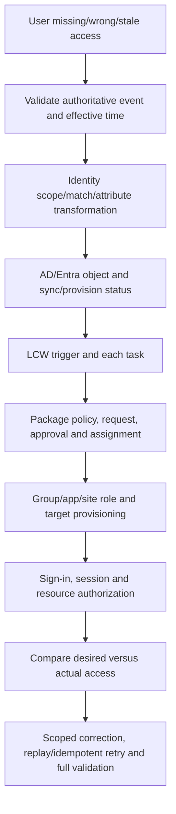

Do not edit a source-owned cloud attribute as a permanent workaround; the next sync can overwrite it. Determine the authoritative source and correct it there. If urgent access is granted manually, record owner, reason, scope, expiry, compensating control, and reconciliation into the governed path.

---

## 20. Exceptions and manual access

| Exception field | Requirement |
|---|---|
| Business reason | Specific task/impact, not “urgent” alone |
| Requested access | Exact group/app/site role and scope |
| Why standard path fails | Missing feature/data, outage, timing or incompatible process |
| Risk | Security, privacy, SoD and audit impact |
| Compensation | Stronger approval, monitoring, shorter duration, restricted session |
| Owner/approver | Named accountable business/resource/security roles |
| Start/end | Automatic expiry whenever possible |
| Evidence | Ticket, assignment, tests, usage and removal |
| Remediation plan | Root cause, target governed path, due date |
| Review | Frequent until retired |

An exception is a governed state, not an invisible bypass. Direct assignments outside entitlement management should feed a detection/workbook and either be moved into a package, removed, or documented as a short-lived exception. Do not create a permanent “exceptions group” whose membership grants broad unrelated access.

---

## 21. Phased deployment and migration

| Phase | Activities | Exit gate |
|---|---|---|
| Discover | Sources, JML, identities, apps, groups/sites, direct access, owners, licenses, legal | Current-state and data-flow map approved |
| Clean data | Stable IDs, manager, dates, department values, duplicates and orphan owners | Data-quality thresholds met |
| Design | Identity contract, workflows, catalogs/packages, reviews, SoD, exceptions, RACI | HLD/LLD/control matrix approved |
| Prepare | Roles/PIM, connectors, logs, custom extension, support, guest billing/privacy | Dependencies and recovery proven |
| Pilot | One department/project/partner with synthetic and volunteer users | Full JML/delivery/removal tests pass |
| Migrate | Move direct groups/app/site grants into governed paths in rings | Desired-versus-actual reconciliation passes |
| Operate | Metrics, reviews, exception retirement, source/feature/license monitoring | Service acceptance and continual improvement |

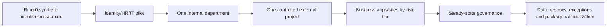

When migrating direct access to packages, avoid duplicate and oscillating authority. Inventory current members, map package outcomes, pilot assignment, prove target delivery, then remove direct assignment only when the package is authoritative and rollback is known. Preserve access for legal holds, records, service accounts, and business continuity according to approved policy.

---

## 22. Positive, negative, failure, and rollback testing

| Test type | Scenario | Expected result/evidence |
|---|---|---|
| Joiner positive | Future hire enters scope | Identity created once; correct attributes; tasks at correct time |
| Joiner negative | Missing stable worker ID | Quarantine/error; no guessed duplicate account |
| Mover positive | Department changes | Old incompatible access removed before/new access assigned |
| Mover negative | Malformed department | No broad default; exception/escalation |
| Leaver immediate | Urgent termination | Disable/revoke/removal SLA and evidence pass |
| Leaver scheduled | End date across timezone | Correct effective time and downstream deprovision |
| Rehire | Existing identity returns | Correct match/reactivation; stale access not resurrected |
| LCW retry | Custom extension times out | Idempotent retry; one external ticket/action |
| Package employee | Eligible user requests | Correct approval, assignment, expiration |
| Package guest | Connected partner requests | Correct B2B creation, sponsor, terms and resources |
| Ineligible request | User outside scope | Cannot request or assign through policy |
| SoD negative | User holds incompatible package/group | Request blocked in required directions |
| Approval absence | Primary approver unavailable | Alternate/fallback and SLA work |
| Access review deny | Reviewer denies stale assignment | Correct path removed and target validated |
| No response | Reviewer misses deadline | Configured fallback outcome, notification and exception |
| ToU decline | Guest declines | Resource access blocked; record captured |
| Target SCIM failure | App rejects schema/token | Alert, no false “complete,” safe retry |
| Direct bypass | Admin adds user outside package | Audit/workbook detects and exception workflow starts |
| Rollback | Pilot workflow/package causes impact | Disable scoped automation/new policy; restore prior documented access |

Rollback must distinguish identity existence, access assignment, and target state. Disable the new workflow or policy, stop the next rollout ring, restore only verified prior access for affected identities, preserve event and task evidence, reconcile targets, and correct source/rule before replay. Do not delete users broadly or turn off all provisioning.

---

## 23. Layered troubleshooting

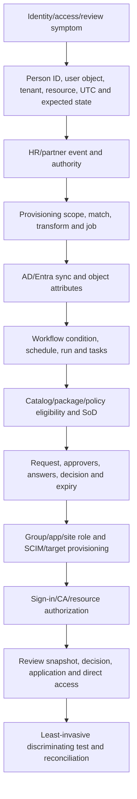

| Symptom | Likely cause | First discriminating check |
|---|---|---|
| New hire absent | Source scope/missing ID/effective date/match error | Provisioning log by stable worker ID |
| Duplicate user | Weak match or rehire logic | Source ID and competing AD/Entra objects |
| Workflow did not run | Attribute/date absent, scope false, schedule, workflow disabled | Workflow condition evaluation and history |
| Workflow “completed” but access missing | One task failed or downstream propagation | Per-task result, then group/app target |
| Package not visible | Wrong policy/requestor/connected org/catalog state | Policy eligibility for exact principal |
| Request stuck | Missing approver/manager/fallback or stage timeout | Approval stage and reviewer object/state |
| Guest cannot request | Domain/identity-source/B2B settings mismatch | Connected-org auth type and External ID policy |
| Assignment delivered but app denies | SCIM/app role/session or target-local authorization | Provisioning log, app assignment and token/session |
| Expired access remains | Direct grant, nested group, target deprovision failure | Desired-versus-actual assignment paths |
| Review denied but access remains | Results not applied or indirect/shared group path | Review state and exact resource assignment |
| Recommendation seems wrong | 30-day snapshot, app activity, missing manager/hierarchy | Recommendation inputs at review start |
| ToU repeats/does not show | Session, Edge profile/PRT, policy target, no guest object | Correlated sign-ins and acceptance record |
| License feature missing | P2 versus Governance/Suite or guest billing | Service plans, users in scope and live feature table |

Never troubleshoot by making the user Global Administrator, bypassing all approvals, permanently assigning a sensitive group, deleting/recreating an identity before matching analysis, or changing a source-owned attribute only in Entra.

---

## 24. Operations, metrics, and continual improvement

| Metric | What it reveals | Guardrail |
|---|---|---|
| Day-one readiness | Joiner productivity | Measure correct access, not just account creation |
| Termination disable/revoke SLA | Exposure after relationship end | Separate urgent and scheduled leavers |
| Mover old-access removal time | Privilege accumulation | Track toxic conflicts and exceptions |
| Provisioning success/retry age | Connector/data health | Reconcile targets; do not count only job status |
| Workflow task failure rate | Automation reliability | Segment built-in/custom task and source quality |
| Request approval time | User experience/owner capacity | Track after-hours and fallback use |
| Package expiry/renewal rate | Time-bound access effectiveness | Renewal is not automatically good/bad |
| Review completion and denial rate | Certification engagement | Detect approve-all and no-response patterns |
| Auto-apply/removal success | Closed-loop governance | Validate app-local account and direct paths |
| Guests without sponsor/active package | External identity hygiene | Include justified direct collaboration |
| Direct assignments outside packages | Governance bypass | Risk-tier and exception owner |
| SoD conflicts/exceptions | Control effectiveness | Exceptions need expiry/frequent review |
| Orphan app/group/site owners | Lifecycle weakness | Require business and technical owners |
| License/guest billing coverage | Service continuity/cost | Validate SKU feature mapping regularly |

### Operating cadence

| Cadence | Activities |
|---|---|
| Daily | Provisioning/workflow failures, urgent leavers, stuck approvals, security alerts |
| Weekly | Retry age, direct bypass, guest/package expiry, source-quality exceptions |
| Monthly | Metrics, catalog/package ownership, custom-extension health/cost, license coverage |
| Quarterly | Sensitive resource reviews, SoD/exception review, guest sponsors, package rationalization |
| Annual/change | HR data contract, legal terms, JML policy, cloud/feature limits, disaster/tabletop test |

Avoid metrics that reward risky behavior: a low denial rate may mean rubber-stamping; a short approval time may mean no review; 100% successful workflows can hide identities excluded by bad scope. Pair volume with outcome and sampled quality.

---

## 25. Design scenario: Northstar project collaboration

Northstar needs employees and a partner to collaborate on a sensitive product project using a Team, SharePoint site, design SaaS app, and a read-only reporting group for six months.

### Target design

| Design area | Decision |
|---|---|
| Authority | HR owns employee status/manager; partner tenant/domain and sponsor own external relationship |
| Catalog | Product Engineering catalog owned by central and delegated product owners |
| Package | `Project Aurora Contributor` with Team member, SharePoint member, SaaS app role, report group |
| Employee policy | Selected departments can request; manager then project owner; 90-day assignment/extension |
| Partner policy | Specific configured connected organization; sponsor then data owner; 30-day renewable |
| SoD | Incompatible with `Aurora Production Approver`; bidirectional mapping |
| Terms | Partner confidentiality/acceptable-use ToU with legal owner and version |
| Review | Monthly partner sponsor review; quarterly employee resource-owner review |
| Guest cleanup | Remove package resources at expiry; delete guest only if no other governed/direct access after delay |
| Operations | Provisioning alerts, direct-assignment detection, SLA, support and privacy process |

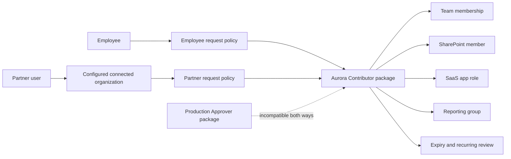

Arti’s SharePoint/OneDrive background helps test what the package actually grants: site role, Team-backed group, file sharing, sync/download, external-user experience, inherited/direct permissions, and cleanup. The consulting answer remains honest: transfer workload and escalation knowledge into governance design without claiming to have deployed entitlement management in production.

---

## 26. Consulting deliverables

| Deliverable | Minimum content | Quality test |
|---|---|---|
| Identity lifecycle assessment | Sources, JML definitions, data quality, paths, SLAs, failures | Stable identifiers and effective times proven |
| Identity data contract | Attribute authority, transform, null, privacy, owner, consumer | No free-text access rule without data governance |
| JML process maps | Happy path, urgent, rehire, leave, partial failure, rollback | Identity/access/data steps separated |
| Governance HLD | HR/provisioning/sync/LCW/entitlement/review/targets/logging | Trust and ownership boundaries visible |
| LCW LLD | Scope, trigger, tasks/order, extensions, retries, evidence | Idempotency and partial failure addressed |
| Catalog/package register | Resources/roles, owner, policies, expiry, reviews, SoD | Business outcome understandable |
| Connected-org/guest model | Sources, sponsors, request, CA/ToU, cleanup, privacy | Other/direct access considered before delete |
| Review schedule | Resource, reviewer, cadence, recommendation, no-response, auto-apply | Reviewer can make informed decision |
| Exception register | Risk, compensation, owner, expiry, remediation | No hidden permanent bypass |
| Test/rollback pack | 19 tests, expected evidence, operators, reconciliation | Includes negative and downstream removal |
| Operations/RACI | HR, identity, app, resource, manager, sponsor, privacy, audit, vendor | Daily through annual cadence assigned |
| Metrics/dashboard | Timeliness, correctness, review quality, bypass, guest, license | Cannot be gamed by excluding failures |

Example finding:

> **Observation:** New hires are created from weekly CSV files, movers retain all historical group memberships, contractors have no authoritative end date, and quarterly app reviews default to approve when managers do not respond. **Risk:** Delayed onboarding, stale and conflicting access, persistent guests, and weak certification create breach and audit exposure. **Recommendation:** Define HR data authority and stable matching; implement staged HR/API provisioning; design effective-dated LCW joiner/mover/leaver flows; package sensitive group/app/SharePoint access with owner approval, expiry and SoD; establish sponsor-led guest lifecycle; change high-risk no-response handling after pilot; reconcile target deprovisioning; govern exceptions. **Residual risk:** Source-data defects and app-local accounts require monitoring, manual quarantine and recurring reconciliation.

---

## 27. Safe paper lab: govern a joiner-to-guest-offboarding lifecycle

This exercise makes no production or tenant changes.

### Prerequisites

- Parts 6–11 and the Official Source Anchors below.
- Markdown, Mermaid and spreadsheet editor.
- Fictional worker IDs, organizations, apps, groups and sites only.
- No real HR records, tenant IDs, user data, screenshots, tokens or credentials.

### Fictional client

Northstar has 8,000 employees in hybrid AD DS, Workday-like HR, 1,200 contractors, 900 guests, 300 enterprise apps, Teams/SharePoint collaboration, P2 for part of the population, Governance licenses for a planned pilot, and inconsistent manager/end-date data. The Aurora project needs internal and partner access for six months.

### Steps

1. Define authoritative attributes, stable matching, JML states, effective timestamps, rehire and leave rules.
2. Draw both HR→AD DS→Entra and HR→Entra paths; choose one for each worker population with rationale.
3. Design four LCWs: prehire, first-day, mover, and leaver. Specify scope, trigger, ordered tasks, custom extension, idempotency, partial failure, evidence, and rollback.
4. Create one Product Engineering catalog and the Aurora package with Team, SharePoint, enterprise app, and group roles.
5. Create employee and connected-partner policies with two-stage approvals, questions, duration, extension, reviews and fallbacks.
6. Configure paper SoD with the production-approver package in both directions and a short-lived combined exception package.
7. Design ToU, B2B guest creation, sponsor review, expiry, other-access check and deletion delay.
8. Design group, app, package and privileged review schedules with recommendations, no-response and auto-apply decisions.
9. Execute all 19 positive, negative, failure and rollback tests from this Part.
10. Produce a layered RCA for six injected failures: duplicate joiner, workflow missed, custom extension duplicate, stuck approval, SCIM failure, and denied review that left direct access.
11. Build RACI, metrics, privacy/audit controls, license matrix, roadmap and executive recommendation.

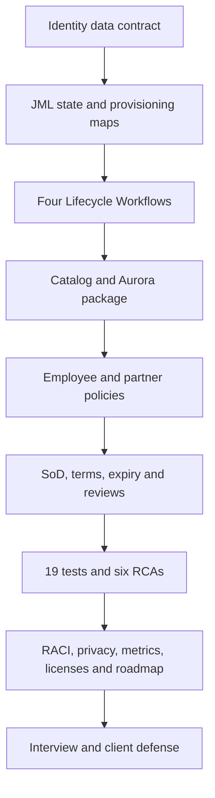

### Evidence to retain

| Artifact | Evidence |
|---|---|
| Identity contract | Authority/match/transform/privacy table |
| Architecture | Hybrid/cloud paths and decision record |
| LCW LLDs | Scope, trigger, ordered tasks, extension, retry/rollback |
| Entitlement LLD | Catalog, resources, package and two policies |
| SoD/exception | Bidirectional conflict and combined exception controls |
| Guest design | Connected org, sponsor, ToU, review, cleanup |
| Reviews | Four review types and setting decisions |
| Test/RCA pack | 19 expected results and six layered investigations |
| Operations | RACI, dashboard, cadence and escalation |
| Executive summary | Risks, options, licensing, roadmap and residual risk |

### Cleanup

Delete scratch content containing real HR data, employee IDs, partner domains, tenant/user IDs, screenshots, contracts, IPs, or credentials. If later adapted to a lab tenant, disable scoped test workflows and automatic policies, export settings/results, remove only fictional assignments/resources in dependency order, validate no guest or group remains with unintended access, and preserve required audit evidence. Never bulk-delete users or disable all provisioning as cleanup.

### Interview wording

> “I completed a fictional Entra ID Governance design grounded in current Microsoft guidance. I defined authoritative JML data, designed HR provisioning and four Lifecycle Workflows, built employee and partner access-package policies for Teams/SharePoint/app/group resources, added bidirectional SoD, ToU, guest lifecycle, four review types, 19 tests, six failure RCAs, privacy, licensing, RACI and metrics. It demonstrates design and troubleshooting, not production IGA ownership.”

---

## 28. Official Source Anchors

These first-party references were checked for the guide’s **August 24, 2026** currency date. Recheck live pages, Product Terms, cloud availability, guest billing, portal limits, and target-application behavior before implementation.

1. [Microsoft Entra ID Governance overview](https://learn.microsoft.com/entra/id-governance/identity-governance-overview) — identity, access and privileged lifecycles; JML; guests; automation; and Preview agent governance.
2. [Identity Governance licensing fundamentals](https://learn.microsoft.com/entra/id-governance/licensing-fundamentals) — Governance/Suite/P2 boundaries, feature table, guest billing, workflow limits, provisioning quotas and advanced/Preview capabilities.
3. [HR-driven provisioning](https://learn.microsoft.com/entra/identity/app-provisioning/what-is-hr-driven-provisioning) — HR as source, cloud HR/API paths, AD/Entra targets, JML and LCW extension.
4. [What are Lifecycle Workflows?](https://learn.microsoft.com/entra/id-governance/what-are-lifecycle-workflows) — joiner/mover/leaver, conditions, tasks, schedules, history, Logic Apps and current stated limits.
5. [Lifecycle Workflow tasks](https://learn.microsoft.com/entra/id-governance/lifecycle-workflow-tasks) — current built-in task catalog and prerequisites.
6. [Lifecycle Workflow extensibility](https://learn.microsoft.com/entra/id-governance/lifecycle-workflow-extensibility) — custom task extensions and Logic Apps integration.
7. [Entitlement management overview](https://learn.microsoft.com/entra/id-governance/entitlement-management-overview) — catalogs, packages, resources/roles, policies, requests, approvals, assignments, expiration, delegation and Preview resource types.
8. [Connected organizations](https://learn.microsoft.com/entra/id-governance/entitlement-management-organization) — identity sources, sponsors, configured/proposed state and requestor behavior.
9. [Access reviews overview](https://learn.microsoft.com/entra/id-governance/access-reviews-overview) — review targets, reviewers, scenarios, portals and licensing.
10. [Access review recommendations](https://learn.microsoft.com/entra/id-governance/review-recommendations-access-reviews) — 30-day inactivity, app activity, user-to-group affiliation, manager dependency and 600-user limit.
11. [Create access reviews](https://learn.microsoft.com/entra/id-governance/create-access-review) — recurrence, reviewers, no-response, recommendations, auto-apply, notifications and guest actions.
12. [Separation of duties for access packages](https://learn.microsoft.com/entra/id-governance/entitlement-management-access-package-incompatible) — incompatible groups/packages, unidirectional rules, existing conflicts, overrides and monitoring.
13. [Terms of Use with Conditional Access](https://learn.microsoft.com/entra/identity/conditional-access/terms-of-use) — P1, 40-term limit, versions/languages/reacceptance, per-device/B2B constraints, reports, audit, privacy and troubleshooting.
14. [Prepare applications for identity governance](https://learn.microsoft.com/entra/id-governance/identity-governance-applications-prepare) — application ownership, integration and governance prerequisites.

**Preview/change-sensitive register:** Agent identity governance and Agent 365; LCW 50-versus-100 workflow limit; Lifecycle Workflow/entitlement custom extensions; catalog/custom-data/PIM-for-Groups reviews; affiliation recommendations; access-package Entra roles, SAP and API permissions; auto-assignment and risk integrations; My Access approver delegation/details; guest MAU billing; provisioning quotas; ToU support/retention; and cloud-specific availability require current validation.

---

## ⭐ Likely Interview Questions for This Section

### Q1. What is the difference between identity lifecycle and access lifecycle?

> **Model answer:** “Identity lifecycle governs whether the digital identity exists and its authoritative attributes through join, move, leave, leave of absence and rehire. Access lifecycle governs which groups, applications, Teams, SharePoint roles and packages that identity receives, reviews, renews or loses. They interact, but disabling/deleting an identity, removing an entitlement, preserving data and deprovisioning app-local accounts are separate sequenced controls.”

### Q2. How would you design an HR-driven joiner-mover-leaver process?

> **Model answer:** “I start with a stable nonrecycled worker ID, attribute-level source of authority, effective timestamps and data-quality SLAs. I choose HR-to-AD-to-Entra or direct HR-to-Entra per dependency, then use Lifecycle Workflows for ordered prehire, first-day, mover and leaver tasks. I design quarantine for match/data errors, idempotent extensions, urgent termination, rehire, target reconciliation, positive/negative/failure tests, logging, rollback and clear HR/identity/app ownership.”

### Q3. What are catalogs, access packages, and policies?

> **Model answer:** “A catalog is a delegated container of approved resources. An access package bundles specific resource roles from groups/Teams, enterprise apps and SharePoint sites for one business outcome. A policy defines which population can request or receive that package, approval stages, questions, duration, extension, access review and other guardrails. One package can have different employee and partner policies while delivering the same resource roles.”

### Q4. How would you govern external users with entitlement management?

> **Model answer:** “I define approved connected organizations and sponsors, limit request policies to the intended identity sources, use staged approval, minimum package roles, short expiration, Conditional Access and legal-owned terms. I run sponsor/resource reviews, remove package access at denial/expiry, check other direct or governed access before deleting the guest, and monitor proposed organizations, failed delivery, privacy, billing and partner offboarding.”

### Q5. How should access-review recommendations and auto-apply be used?

> **Model answer:** “Recommendations are decision aids, not proof. Current inactivity recommendations use a 30-day snapshot, and affiliation depends on manager hierarchy with size/licensing limits. I give reviewers resource context and require reasons for sensitive approval. I enable auto-apply only after scope, reviewer, fallback, assignment path and target removal are tested; no-response behavior is an explicit risk decision, never an accidental default.”

### Q6. How does separation of duties work in access packages?

> **Model answer:** “A package can mark another package or security group incompatible, blocking a request or new assignment when the user already has that access. The relationship is unidirectional, so I configure both directions where the business conflict is symmetric. I report existing overlaps and direct-resource bypasses. Exceptional dual access uses an explicit combined package with stronger approval, shorter expiry, frequent review and monitoring.”

### Q7. How would you troubleshoot a workflow that completed but did not give application access?

> **Model answer:** “I identify the user by stable ID and expected timestamp, validate source and matching, then inspect every LCW task rather than the overall status. I verify package eligibility/request/approval/assignment, group or app role delivery, SCIM provisioning and target-local account/role, then sign-in and resource authorization. I compare desired versus actual access and retry only through an idempotent scoped path; I do not grant permanent direct access without expiry and reconciliation.”

### Q8. How does your M365 experience support IGA consulting without overstating it?

> **Model answer:** “My direct production strength is Microsoft 365 escalation, particularly SharePoint/OneDrive permissions, sharing, sync, affected-scope analysis, vendor coordination, RCA, documentation and validation. That helps me test whether a governed package really delivers and removes the intended workload access and communicate impact. My HR, Lifecycle Workflow, entitlement and review evidence is a fictional current design, not claimed production ownership.”

---

## 🧠 30-Second Memory Hooks

- **IGA:** Right identity, right access, right reason, right time, provable removal.
- **Identity lifecycle:** Does the account exist and reflect the relationship?
- **Access lifecycle:** Which resources should it reach and for how long?
- **JML:** Join ready, move cleanly, leave promptly.
- **Mover risk:** New keys plus forgotten old keys.
- **Source of authority:** Correct data at the correct source, not the easiest portal.
- **Stable ID:** Match people with nonrecycled identity, never display name alone.
- **HR provisioning:** Source event → scope/match/transform → identity.
- **LCW:** Who + when → ordered tasks → history.
- **Idempotent:** Safe to retry without duplicate side effects.
- **Catalog:** Delegated shelf of approved resources.
- **Access package:** Business kit of exact resource roles.
- **Policy:** Who, approval, duration, review and guardrails.
- **Connected organization:** Governed partner identity source, not automatic trust.
- **Assignment:** Delivered package with lifecycle.
- **Review:** Human certification with evidence, not a checkbox.
- **Recommendation:** Clue, not verdict.
- **Auto-apply:** Powerful only after path and fallback tests.
- **SoD:** Conflicting keys must not sit on one ring.
- **ToU:** Recorded attestation, not proof of comprehension or contract replacement.
- **Guest cleanup:** Remove access, check other grants, then delete by policy.
- **Provisioning success:** Identity + entitlement + target account/role + reconciliation.
- **Exception:** Named risk, owner, expiry, compensation and exit plan.
- **Docs drift:** Verify LCW workflow limit live.
- **Honesty:** Workload/RCA transfer plus paper IGA design is not production governance ownership.

---

## Completion Checklist

- [ ] Explain IGA’s identity, access and privileged lifecycle questions.
- [ ] Distinguish identity creation/status from access assignment and data preservation.
- [ ] Model joiner, mover, leaver, leave and rehire as effective-dated states.
- [ ] Define source of authority and produce an identity data contract.
- [ ] Compare HR→AD→Entra, HR→Entra and API-driven paths.
- [ ] Explain matching, collision, duplicate and rehire risks.
- [ ] Define LCW workflows, templates, conditions, tasks, schedules, on-demand runs, extensions and history.
- [ ] Design ordered, idempotent JML tasks and partial-failure handling.
- [ ] Flag and validate the current 50-versus-100 LCW limit discrepancy.
- [ ] Define catalogs, resources, resource roles, packages, policies, requests and assignments.
- [ ] Map governance roles and delegation guardrails.
- [ ] Design employee and external policies with approvals, fallbacks, questions, expiry and renewal.
- [ ] Explain connected organizations, identity sources, sponsors and configured/proposed states.
- [ ] Design guest invitation, assignment, review, expiry, other-access check and deletion.
- [ ] Compare group, app, package, Entra/Azure role and Preview review targets.
- [ ] Explain recommendations, 30-day snapshots, affiliation limits, auto-apply and no-response choices.
- [ ] Design bidirectional SoD and an explicit controlled exception.
- [ ] Explain ToU licensing, limit, versions, B2B/per-device, evidence and privacy limitations.
- [ ] Validate Governance/Suite/P2, guest billing, Logic Apps and target licenses.
- [ ] Map security, privacy, compliance and end-to-end audit evidence.
- [ ] Troubleshoot source, match, provisioning, sync, LCW, entitlement, approval, target and review layers.
- [ ] Govern direct/manual exceptions with expiry and reconciliation.
- [ ] Build deployment rings and run all 19 positive, negative, failure and rollback tests.
- [ ] Define metrics that measure correctness, timeliness, review quality and bypass.
- [ ] Defend the Northstar collaboration scenario and all consulting deliverables.
- [ ] Complete the safe paper lab and answer Q1–Q8 without production IGA claims.

---

*Next suggested section:* [Part 13](Part-13-hybrid-identity-connect-cloud-sync.md) — trace how AD DS identities, attributes, passwords, objects and authentication choices reach Entra ID, and how to migrate, recover and troubleshoot that hybrid control plane.