# Part 13 — Hybrid Identity: Entra Connect, Cloud Sync, PHS, PTA, Federation, and AD DS

> **Section goal:** Understand hybrid identity as a controlled relationship between Active Directory Domain Services (AD DS), Microsoft Entra ID, synchronization technology, and authentication technology. By the end, you should be able to map source of authority and attribute flows, compare Connect Sync with Cloud Sync, choose PHS/PTA/federation and Seamless SSO deliberately, explain matching and duplicate protection, deploy and migrate through safe rings, recover from failure, and troubleshoot from the source object to Microsoft 365 access.

This Part supplies the directory-provisioning foundation used by the governance flows in [Part 12](Part-12-identity-governance-lifecycle-entitlement-access-reviews.md). Part 14 expands from one hybrid organization to external tenants, B2B collaboration, cross-tenant synchronization, app objects, service principals, consent, and workload federation.

> **Currency and change-sensitive note:** Product behavior was checked against official Microsoft Learn content available on **August 24, 2026**. Azure AD Connect V1 retired on August 31, 2022. Microsoft describes Cloud Sync as its strategic direction and says Connect Sync will retire after Cloud Sync reaches full functional parity, but the checked documentation gives **no Connect Sync retirement date**; do not invent one. Since **July 1, 2026**, cloud-side hard-match security hardening automatically protects privileged or already-linked cloud accounts from takeover. Cloud Sync limits and feature parity, source-of-authority controls, writeback, matching protections, minimum Connect versions, AD FS certificates, and authentication support matrices are change-sensitive. Validate current Microsoft Learn, release history, health alerts, Product Terms, and tenant behavior before production change.

## JD Mapping

| Deloitte role expectation | Capability developed in this Part | Consulting evidence |
|---|---|---|
| Assess and design Microsoft 365 identity | Map forests, domains, OUs, objects, attributes, sync and authentication | Hybrid identity HLD and inventory |
| Troubleshoot multi-protocol/platform issues | Isolate AD DS, DNS/network, sync engine, cloud service, authentication and resource | Layered runbook and evidence pack |
| Plan secure transformation | Compare Connect Sync/Cloud Sync and PHS/PTA/federation migrations | Decision record, pilot and cutover plan |
| Maintain resilience | Design staging/active agents, PHS backup, health, emergency access and DR | BCDR runbook and exercise |
| Minimize client disruption | Use filtering, matching, accidental-delete protection, staged rollout and rollback | Positive/negative/rollback matrix |
| Coordinate vendors/stakeholders | Align AD, HR, security, M365, network, PKI, app and Microsoft support owners | RACI, workshop and escalation package |

## Candidate honesty note

Arti can credibly connect this Part to production Microsoft 365 escalation behaviors: tracing SharePoint/OneDrive identity and sync symptoms across clients and services, comparing affected populations, correlating network and authentication evidence, managing critical incidents, coordinating customers/vendors/product groups, documenting RCA, and validating changes.

This Part does **not** claim that Arti deployed or operated production Entra Connect Sync, Cloud Sync, PHS, PTA, AD FS, password writeback, or hybrid-identity migrations. Safe wording is:

> “My direct production experience is complex Microsoft 365 escalation, SharePoint/OneDrive and sync troubleshooting, multi-party RCA, documentation, and fix validation. I have completed a current hybrid-identity paper design covering AD DS, Connect Sync, Cloud Sync, authentication choices, matching, migration, testing, monitoring, and disaster recovery. I can defend the architecture and investigation method while being clear that it is design/lab evidence rather than production hybrid-identity ownership.”

---

## 1. AD DS and Entra ID solve related but different problems

**Active Directory Domain Services (AD DS)** is an on-premises directory and authentication system organized into forests, domains, organizational units, objects, trusts, domain controllers, and protocols such as Kerberos and LDAP. **Microsoft Entra ID** is a cloud identity and access service built around tenants, modern authentication, OAuth/OIDC/SAML, Conditional Access, devices, applications, service principals, and Microsoft Graph.

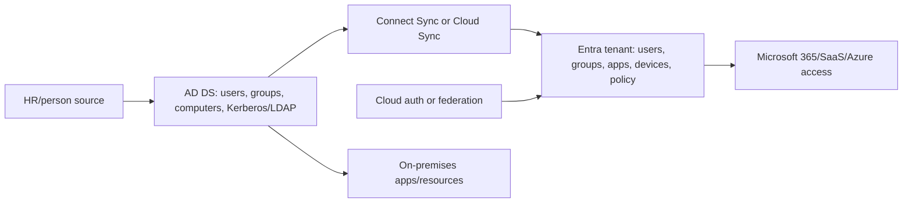

| Concept | AD DS | Microsoft Entra ID |
|---|---|---|
| Boundary | Forest/domain | Tenant |
| Hierarchy | OUs, domains and forests | Mostly flat directory with groups, administrative units and resource scopes |
| Primary protocols | Kerberos, NTLM, LDAP, DNS-dependent domain services | OAuth 2.0, OIDC, SAML, WS-Fed and modern token services |
| Device relation | Domain join and computer objects | Entra join/register/hybrid join and device identities |
| Policy examples | Group Policy, domain password/lockout | Conditional Access, authentication methods, app consent |
| Administration | AD ACLs/delegation/domain/enterprise roles | Entra RBAC, PIM, Graph and workload roles |
| Cloud access | Requires integration/federation for common identity | Native authority for Entra-protected cloud apps |

Hybrid identity does not “turn AD into Entra.” It establishes supported object and authentication relationships while each system retains distinct authorization, schema, availability, and security behavior.

---

## 2. Forests, domains, OUs, UPNs, and immutable identity

### 🔍 Plain-English deep-dive: the AD map

- **Forest** — *the top AD DS security/schema/trust boundary containing one or more domains.* **Analogy:** A company campus with one master building plan and trust system. **Why it matters:** Multi-forest mergers and disconnected forests change synchronization design.
- **Domain** — *a partition with users, groups, computers, domain controllers, DNS name, and policies.* **Analogy:** One managed building within the campus. **Why it matters:** UPN suffix, authentication, connectivity, and object scale are evaluated by domain.
- **Organizational unit (OU)** — *an administrative container used for delegation, Group Policy, and sync filtering.* **Analogy:** Floors/departments on the building plan. **Why it matters:** Renaming, moving, or unselecting an OU can move thousands of objects out of sync scope.
- **User Principal Name (UPN)** — *the user’s sign-in-style name, often `user@verified-domain`.* **Analogy:** The public address printed on the badge. **Why it matters:** It should be routable/verified for cloud sign-in and unique, but it is not the immutable identity key.
- **Source anchor/immutable identifier** — *a stable value linking the on-premises object to its cloud representation.* **Analogy:** The serial number behind the badge even if the printed name changes. **Why it matters:** Changing it can create duplicates, mismatches, or takeover risk.

| Design item | Good practice | Failure if ignored |
|---|---|---|
| Forest/domain inventory | Include trusts, connectivity, schema, Exchange, duplicate people | Unsupported topology or wrong joins |
| OU scope | Explicit include rationale, owner and change alert | Mass out-of-scope deletion |
| UPN | Verified routable suffix and uniqueness validation | Sign-in confusion/fallback `onmicrosoft.com` UPN |
| `proxyAddresses` | Unique, authoritative mail values | Duplicate/quarantined attributes and mail issues |
| Source anchor | Stable recommended mapping such as `mS-DS-ConsistencyGuid` where appropriate | Invalid hard/soft match after forest move/reinstall |
| Worker ID | Stable HR correlation separate from UPN | Duplicate rehire/person match |

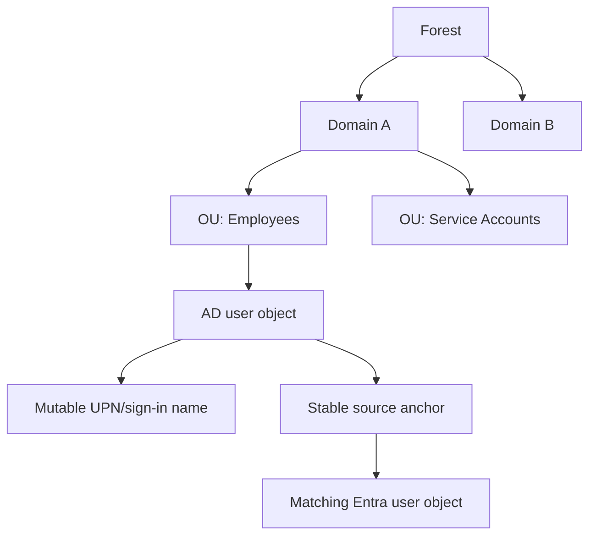

Do not use email/display name as the permanent object identity. UPN and mail can change after marriage, rebrand, merger, or domain migration. Object IDs also differ between systems. Preserve an explicit correlation model.

---

## 3. Source of authority and attribute-level decisions

**Source of authority (SoA)** answers where an object or attribute must be changed so the value persists. In a traditional synchronized user, many attributes are mastered in AD DS; editing them in Entra can be unavailable or overwritten. Some cloud attributes and services remain cloud-managed.

| Attribute/control | Likely authority in hybrid design | Validation |
|---|---|---|
| Worker status/manager/department | HR → provisioning → AD/Entra | Data contract and effective timestamp |
| UPN/source anchor | AD DS/sync design | Unique, verified suffix and immutable mapping |
| `proxyAddresses`/mail attributes | AD DS/Exchange management path in hybrid | Workload-specific supported tools |
| Cloud license/group package | Entra group/governance | Assignment/audit and source policy |
| Authentication methods | Entra methods policy/user/admin process | Not ordinary AD attribute sync |
| Conditional Access/PIM | Entra | Cloud policy ownership and emergency path |
| App-local account/role | Target app plus provisioning | Reconciliation and deprovisioning |
| Password | AD DS for synchronized user with hash/writeback flows | PHS/PTA/federation/writeback path |

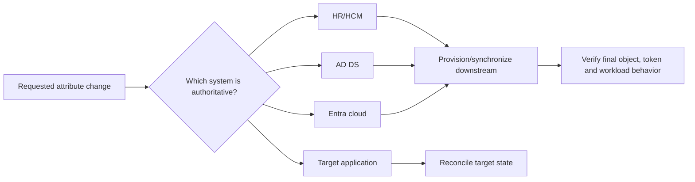

Cloud Sync is adding modern source-of-authority scenarios, including cloud-to-AD group provisioning. This does not mean every user attribute can be edited in either direction. Record authority per object/attribute and verify current feature support.

---

## 4. Three independent choices: synchronization, authentication, and SSO

A core interview rule: **the sync engine does not determine the sign-in method**. Connect Sync or Cloud Sync moves identity data. PHS, PTA, or federation determines password/authentication handling. Seamless SSO or device SSO improves user experience.

| Decision | Options | Question |
|---|---|---|
| Synchronization/provisioning | Connect Sync, Cloud Sync, cloud-only, HR/API path | How do objects/attributes reach Entra? |
| Authentication | PHS, PTA, federation; passwordless/cloud methods layered | Where/how is primary credential validated? |
| SSO experience | Entra-joined/hybrid device SSO, PRT, Seamless SSO, federation IWA | How are repeated prompts reduced? |

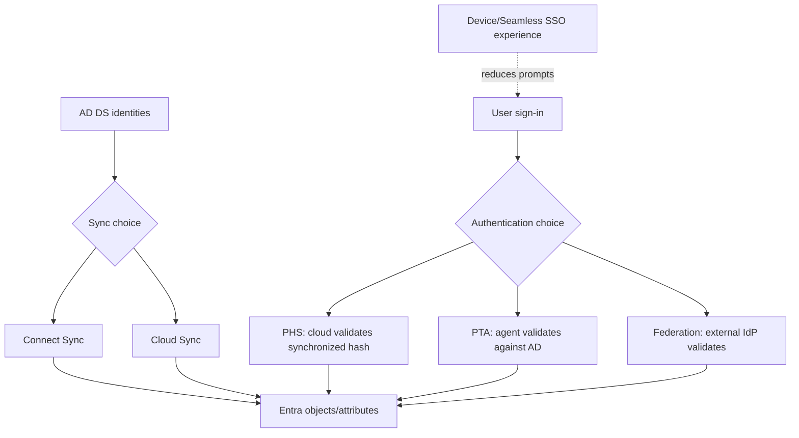

Changing Connect Sync to Cloud Sync does not automatically migrate federation to PHS, and migrating AD FS to PHS does not automatically replace the sync engine. Plan each control plane and its rollback separately.

---

## 5. Microsoft Entra Connect Sync architecture

Connect Sync is an on-premises synchronization engine. It imports directory objects into **connector spaces**, joins/projects them into a central **metaverse**, applies declarative synchronization rules and attribute flows, then exports changes to connected directories.

### 🔍 Plain-English deep-dive: connector spaces and metaverse

- **Connector** — *configuration and connection for one directory.* **Analogy:** A loading dock serving one warehouse. **Why it matters:** Import/export errors are tied to a source or target connector.
- **Connector space** — *staging representation of objects from that directory.* **Analogy:** Packages waiting at that warehouse’s dock. **Why it matters:** It shows pending imports/exports and object lineage without directly being the live directory.
- **Metaverse** — *the joined central identity representation used by the sync engine.* **Analogy:** A central manifest combining records from multiple docks into one person/package identity. **Why it matters:** Join/projection errors and multi-forest precedence are resolved here.
- **Synchronization rule** — *scope, join, precedence, transformation, and attribute-flow logic.* **Analogy:** Rules deciding which packages belong together and which label wins. **Why it matters:** Unsupported or poorly tested custom rules can alter thousands of cloud objects.

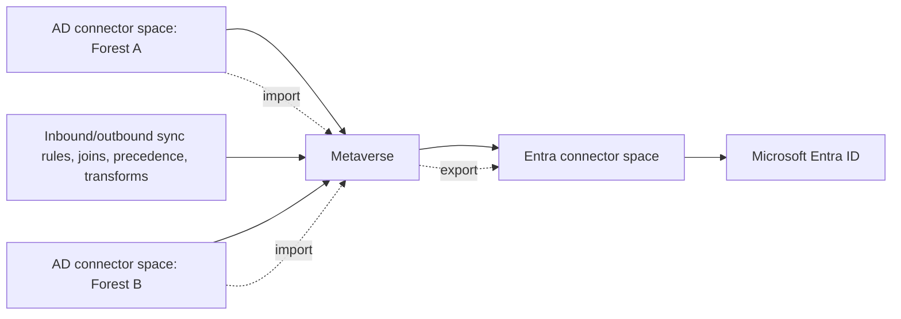

| Component | Purpose/consideration |
|---|---|
| Connect server | Domain-joined Windows server running sync components; protect as Tier 0/control plane |
| Sync service | Import, synchronization and export operations |
| SQL database | LocalDB for many default deployments or supported full SQL for scale/requirements |
| Scheduler | Runs delta cycles; full/initial cycle for certain rule/filter changes |
| Connectors/connector spaces | Represent AD forests and Entra directory |
| Metaverse | Joined identity view and attribute precedence |
| Rules editor/service manager | Advanced configuration and operations; tightly restrict access |
| Service accounts | AD DS connector, sync service and Entra connector identities; managed/configured variants depend on install/version |
| Staging server | Imports/synchronizes but does not export; warm standby and change preview |

The Connect server contains sensitive directory data and credentials/keys needed to synchronize. Harden, patch, monitor, restrict interactive logon, back up configuration, and avoid installing unrelated software. Do not treat it as an ordinary utility server.

---

## 6. Connect Sync cycle and scheduler

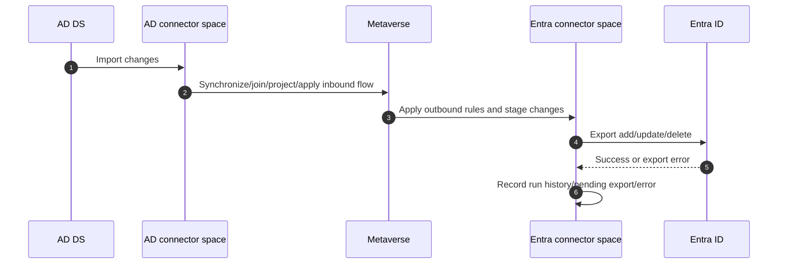

| Cycle/action | Use | Caution |
|---|---|---|
| Delta import/sync/export | Routine incremental changes | Does not reevaluate every rule/scope change |
| Initial/full cycle | New/changed rules, filtering and full reevaluation scenarios | Larger blast radius and duration; preview first |
| Manual delta trigger | Approved urgent validation | Do not repeatedly trigger while prior cycle runs |
| Scheduler disabled | Controlled maintenance/migration | Monitor duration; password sync behavior has nuances |
| Export preview | Validate pending adds/updates/deletes | Required before high-impact change |

The built-in scheduler normally runs a synchronization cycle on a recurring interval; password hash synchronization has a more frequent path commonly around two minutes under current guidance. Do not guarantee exact end-to-end timing: AD replication, source collection, sync processing, cloud processing, and workload propagation all contribute.

---

## 7. Connect Sync topologies and high availability

| Topology | Support/decision |
|---|---|
| Single forest → single tenant | Common express scenario |
| Multiple connected forests → single tenant | One active Connect server must reach all; configure joins carefully |
| Multiple active Connect servers → one tenant | Unsupported except staging servers; even mutually exclusive object scope is not supported |
| One AD → multiple Entra tenants | Separate Connect instance per tenant; writeback/hybrid constraints and distinct UPN domains |
| Multiple Entra tenants | Prefer one tenant where feasible; document business/security boundary |
| Staging server | Supported standby; manually keep configuration aligned and activate during failover |

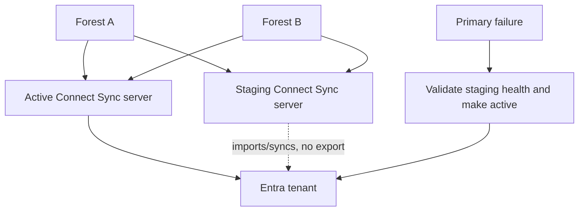

A staging server is not automatic failover. Keep version, configuration, connectors, custom rules, encryption keys/credentials, network and runbooks aligned; monitor its imports/synchronization; rehearse promotion; ensure only one server exports. Configuration export/import and documented rebuild are central to DR.

---

## 8. Microsoft Entra Cloud Sync architecture

Cloud Sync uses lightweight **provisioning agents** on-premises and a cloud-hosted Entra provisioning service. Configuration, scheduling, transformation and status are managed in the cloud. Agents use outbound connectivity and communicate through Azure Service Bus; the service uses provisioning/SCIM-style requests and watermark-based incremental processing.

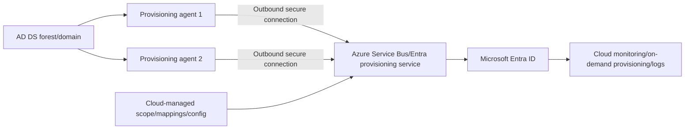

| Cloud Sync capability | Value |
|---|---|
| Cloud-managed configuration | Admins manage scope/mappings/status without direct sync-server console |
| Multiple active agents | Automatic agent failover/load distribution |
| Disconnected forests | Separate agents can connect forests without forest connectivity/consolidation |
| Lightweight/auto-updated agent | Reduced on-premises maintenance footprint |
| On-demand provisioning | Test a specific object and mapping quickly |
| Cloud-to-AD group provisioning | Supports newer cloud-authoritative group scenarios |
| Roughly two-minute scheduler model | Faster recurring service processing under documented normal behavior |

The agent is still privileged infrastructure with AD connectivity. Harden, monitor, restrict, and deploy multiple agents across failure domains. Cloud management reduces server complexity but does not eliminate source-data, network, agent, permissions, schema, or target-service failures.

---

## 9. Connect Sync versus Cloud Sync

| Capability | Connect Sync | Cloud Sync (Aug 2026 checked guidance) |
|---|---:|---:|
| Users/groups/contacts basic sync | Yes | Yes |
| Multiple disconnected forests | No/simple parity limitation | Yes |
| Multiple active instances | No; staging only | Yes; multiple active agents |
| Device synchronization/hybrid join | Yes | No current parity |
| Objects per domain | Broader/established scale | Current guide: 150,000 per domain |
| Group membership scale | Current guide: 250,000 | Current guide: 50,000 |
| PHS/password writeback | Yes | Yes under current support; cloud limitations apply |
| PTA/AD FS configuration | Integrated tools | Managed separately; auth can continue independently |
| Advanced sync rules | Full declarative rule engine | Simpler expression builder; no full parity |
| Cross-forest references/attribute merge | Supported in designed topologies | Current limitations |
| Cloud-to-AD groups | Legacy/writeback paths | Strategic group provisioning capability |
| On-demand object test | Limited tooling model | Yes |
| Configuration location | On-premises | Cloud service |

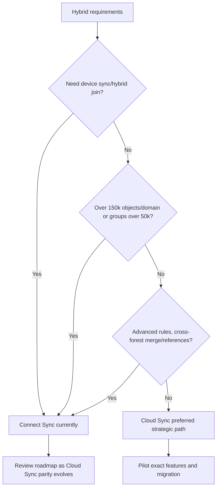

Cloud Sync is not automatically right because it is newer. Use the live comparison and requirements. Conversely, avoid deploying a new Connect server reflexively when Cloud Sync meets the need and provides active-agent resilience.

---

## 10. Password Hash Synchronization

**Password Hash Synchronization (PHS)** synchronizes a derived hash of the AD password hash to Entra so Entra validates cloud sign-in. It does not send or store cleartext passwords or a reversibly encrypted password.

### 🔍 Plain-English deep-dive: a hash of a hash

- **AD password hash** — *the one-way verifier stored by AD DS.* **Analogy:** A fingerprint-like verifier, not the original password text. **Why it matters:** It must still be protected as sensitive credential material.
- **Synchronized derived hash** — *Connect/Cloud Sync processes the AD hash with additional cryptographic steps for Entra.* **Analogy:** A second safe representation made from the first fingerprint for another gate. **Why it matters:** Entra can validate the same user-entered password without contacting the on-premises DC on every sign-in.
- **Cloud authentication** — *Entra performs validation in Microsoft’s cloud service.* **Analogy:** The cloud gate has its own verifier. **Why it matters:** On-premises outage does not stop authentication once current hashes are available.
- **State synchronization** — *account disablement and password change availability depend on sync timing.* **Analogy:** The cloud gate’s roster must receive status updates. **Why it matters:** PHS does not immediately enforce every AD state such as lockout/password expiry.

| PHS advantage | Consideration |
|---|---|
| Simplest/highly available cloud auth | Password changes must synchronize before new password works |
| No on-premises dependency per sign-in | AD lockout/password-expired/sign-in-hours not evaluated in the same real-time way |
| Supports leaked-credential detection | Enable PHS even with PTA/federation for this protection |
| Backup auth for PTA/federation | Failover must be planned and switched; it is not automatically enabled as primary |
| Supports cloud resilience | Protect sync path and emergency accounts |

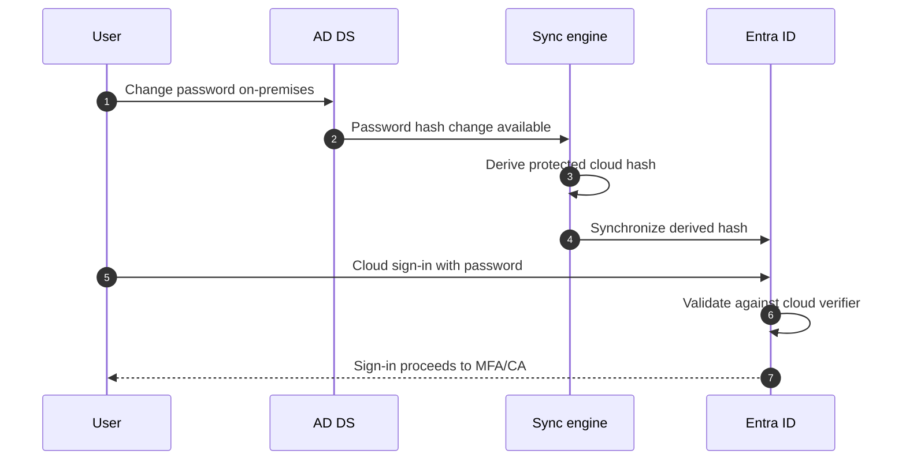

PHS is strongly recommended by Microsoft alongside other authentication methods for disaster recovery and leaked-credential detection. Security review should address privileged sync infrastructure, hash access, legacy password quality, smart lockout, Password Protection, MFA/passwordless roadmap, and monitoring.

---

## 11. Pass-through Authentication

**Pass-through Authentication (PTA)** lets Entra receive the cloud sign-in and securely route password validation through outbound on-premises agents to AD DS. The password is validated against a domain controller, so current AD account states such as lockout, expiry, disabled status and sign-in hours can affect authentication.

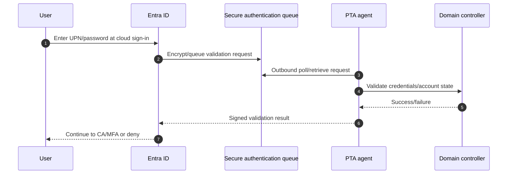

| PTA design | Current guidance |
|---|---|
| Agents | Deploy at least three total for resilience under Microsoft recommendation |
| Placement | On domain-accessible servers; not perimeter network because agents need DC access |
| Network | Outbound internet plus DC connectivity; no inbound internet requirement to agent |
| PHS | Enable as backup and for leaked-credential detection |
| Failover | Switch to PHS is not automatic; documented authorized procedure |
| Monitoring | Agent status, sign-in errors, network/DC/service health |

PTA creates on-premises availability dependency for password validation. A cloud service, queue, agent, network, DNS, DC or AD policy failure can affect sign-in. Use multiple agents in separate failure domains and exercise failover.

---

## 12. Federation and AD FS

**Federation** redirects the user to an external trusted identity provider, often Active Directory Federation Services (AD FS), which authenticates and issues a token/assertion trusted by Entra. It supports specialized requirements but adds servers, Web Application Proxy (WAP), certificates, claims rules, network publishing, load balancing, patching, monitoring, and attack surface.

| Federation component | Purpose/risk |
|---|---|
| AD FS farm | Authenticates and issues signed tokens; Tier 0 target |
| WAP/proxy | Publishes federation externally; perimeter exposure |
| Token-signing certificate | Entra trusts signed assertions; rollover/compromise critical |
| Token-decrypting/service communication certificates | Secure federation operations depending role |
| TLS/service certificate | Client trust and endpoint availability; expiry/name chain issues |
| Claims rules | Transform identity/authentication claims; complexity can create bypass |
| Federation metadata/trust | Publishes endpoints/certs and establishes relying-party trust |
| Load balancer/DNS | Availability and routing |

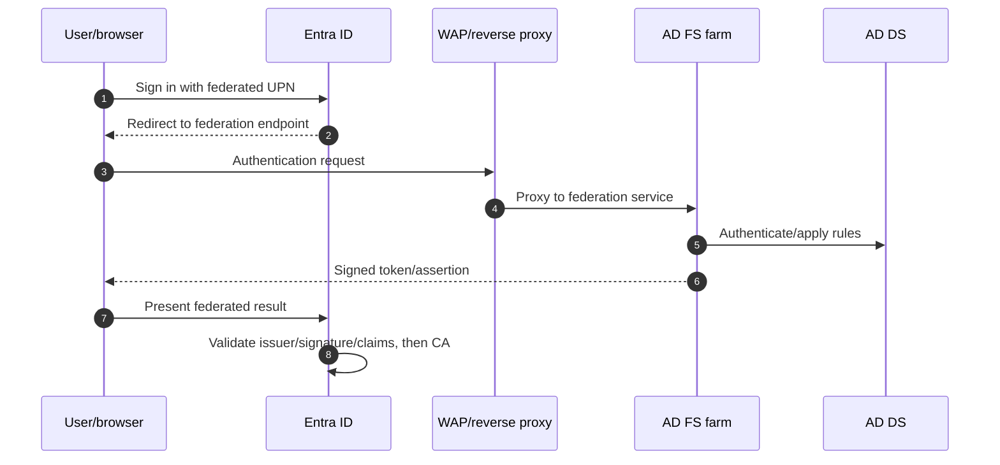

Federation risks include credential theft, token-signing certificate theft, forged tokens, vulnerable/persisted claims rules, extranet password spray, certificate expiry/rollover failure, WAP/farm outage, TLS interception, clock skew, and unpatched Tier 0 systems. Protect with PAWs, separate admin identities, Defender for Identity/endpoint monitoring, extranet lockout, certificate-key protection, audited claims/trust changes, PHS backup, emergency access and tested migration.

Use federation only for a current requirement Entra cloud authentication cannot meet, not because it is historically present. Microsoft guidance notes greater cost/complexity than cloud authentication.

---

## 13. Seamless SSO and device-based SSO

**Seamless Single Sign-On** can use the `AZUREADSSOACC` computer account and Kerberos to sign in domain users from trusted internal contexts without reentering credentials. Entra-joined/hybrid-joined devices and Primary Refresh Tokens (PRTs) provide broader modern SSO patterns.

| SSO mechanism | Use | Boundary |
|---|---|---|
| Seamless SSO | Domain-joined on corporate network with supported browser/config | Convenience layer; not authentication method; Kerberos/DNS/browser dependencies |
| Entra join + PRT | Cloud-managed device and user SSO | Device registration/broker/CA health |
| Hybrid join + PRT | AD DS device represented in Entra | Device sync/registration and line-of-sight dependencies |
| Federation IWA | Integrated Windows auth through AD FS internally | Federation infrastructure and browser/client behavior |

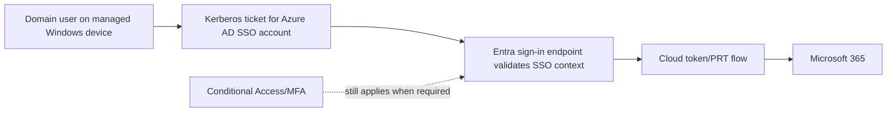

SSO does not bypass Conditional Access or resource authorization. Troubleshoot prompt issues by separating local Windows sign-in, Kerberos ticket/DNS/intranet zone, browser/broker, device registration, PRT, token resource, federation/cloud auth and CA.

---

## 14. Password writeback and SSPR context

**Password writeback** lets an approved cloud password reset/change flow write the new password to on-premises AD DS through the synchronization/provisioning infrastructure. **Self-service password reset (SSPR)** lets users recover or change passwords after approved verification.

| Decision | Requirement/risk |
|---|---|
| License | Validate current Entra/M365 entitlement for users and writeback feature |
| Agent/service | Connect Sync or supported Cloud Sync provisioning agent configuration |
| AD permissions | Connector account needs documented least permissions to reset/change/unlock as configured |
| Policy | AD domain password policy can reject the new value |
| Connectivity | Outbound service and DC reachability |
| Registration | Strong recovery methods and identity proofing |
| Security | Monitor resets, admin changes, failures and abuse; protect help desk/TAP |
| ID Protection | Hybrid user-risk remediation has PHS/writeback/on-prem change settings dependencies |

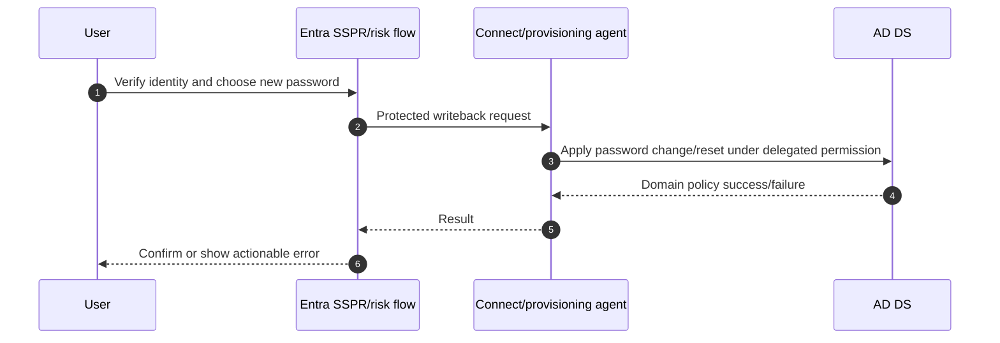

Do not weaken AD password policy or broaden service-account permissions to solve a writeback error. Check the exact domain policy, target DC, permissions, connectivity, event/provisioning logs, and user source.

---

## 15. Filtering and scope

Filtering controls which objects synchronize. Common Connect filters include domain/OU, attribute and group-based approaches; support and caveats differ. Cloud Sync uses configuration/OU and supported scoping/attribute expressions.

| Filter | Benefit | Risk |
|---|---|---|
| Domain/OU | Clear organizational scope | OU rename/move/unselect can stage mass deletes |
| Attribute | Flexible business rule | Null/uncontrolled values and custom-rule complexity |
| Group-based | Useful pilot | Often limited/complex for long-term production; nested/reference behavior |
| Object type | Exclude unneeded classes | Workload/Exchange dependencies may be missed |
| Cloud Sync OU/config scope | Cloud-managed and pilot-friendly | Feature/filter parity and object/reference limits |

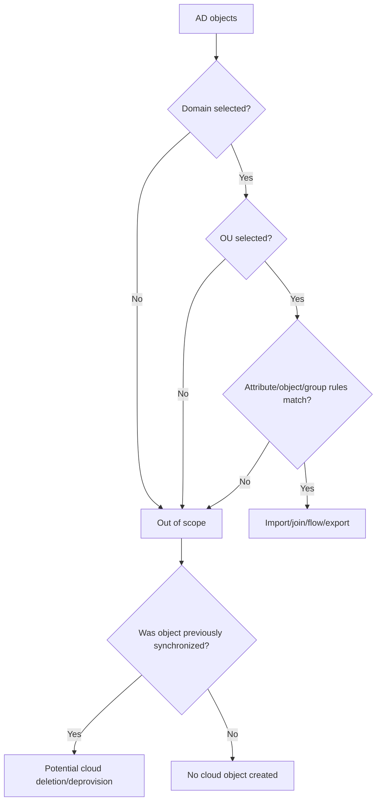

Every scope change needs impact counts, pending-export preview, accidental-delete threshold, representative positive/negative objects, group/reference impact, Exchange/M365 owner review, change approval and rollback. Never unselect an OU as a casual way to pause one user.

---

## 16. Attribute flows, rules, precedence, and transformations

| Rule concept | Meaning |
|---|---|
| Scope | Which connector-space objects the rule evaluates |
| Join | How an imported object links to existing metaverse object |
| Projection | When to create a new metaverse object |
| Inbound flow | Source directory attribute → metaverse |
| Outbound flow | Metaverse attribute → target connector space |
| Precedence | Which rule wins when multiple flows contribute |
| Transformation | Direct, constant or expression-based value |
| Provision/deprovision | When target object is added, disconnected or deleted |

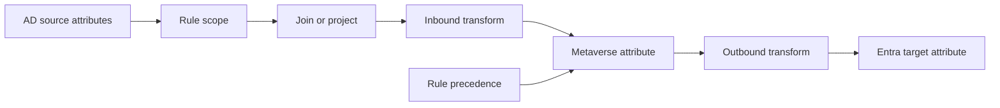

Preserve default rules and create supported custom rules rather than editing built-ins directly where guidance requires, because upgrades can replace defaults and unsupported edits complicate support. Document rule ID/name, precedence, scope, join, each flow, owner, business requirement, examples, full-sync requirement, test and rollback.

Use structured expressions, not ad hoc assumptions. Test null, multi-valued, Unicode/special-character, duplicate, rename, rehire, cross-forest, disabled and out-of-scope values.

---

## 17. Hard match, soft match, and 2026 security hardening

**Hard match** links using the immutable/source-anchor relationship. **Soft match** uses selected unique attributes such as UPN or primary SMTP/proxy address when no hard match exists and the target is eligible.

### 🔍 Plain-English deep-dive: matching decides whether this is the same identity

- **Hard match** — *the stable on-premises source anchor equals the cloud object’s immutable linkage.* **Analogy:** Two records carry the same nonchanging serial number. **Why it matters:** It is deterministic, so a wrong or manipulated serial can attempt a dangerous account takeover.
- **Soft match** — *no anchor match exists, so an eligible cloud object is correlated by unique UPN or proxy-address evidence.* **Analogy:** The serial is absent, so the clerk compares a unique official address. **Why it matters:** Duplicates, prior synchronization, or privileged status can make the match unsafe or invalid.
- **Projection/new object** — *no eligible match exists, so synchronization creates a new cloud object.* **Analogy:** The clerk opens a new record. **Why it matters:** A missed match can split one person into duplicate identities with different mail, data, and access.
- **Protected match** — *Entra refuses reassociation when cloud security state indicates takeover risk.* **Analogy:** A high-security record cannot be relabeled by an ordinary clerk. **Why it matters:** The July 2026 hardening is a security boundary to investigate and preserve, not a nuisance to switch off.

| Match | Basis | Use/risk |
|---|---|---|
| Hard match | Source anchor ↔ `onPremisesObjectIdentifier`/immutable relationship | Deterministic but dangerous if manipulated to take over wrong cloud object |
| Soft match | UPN/proxy address and cloud object state | Helpful for existing cloud object; collision/privileged protection applies |
| No match | No eligible unique relationship | New cloud object created if valid, risking duplicate person |
| Blocked match | Privileged/already-linked/security setting conflict | Quarantine/error; validate ownership and supported recovery |

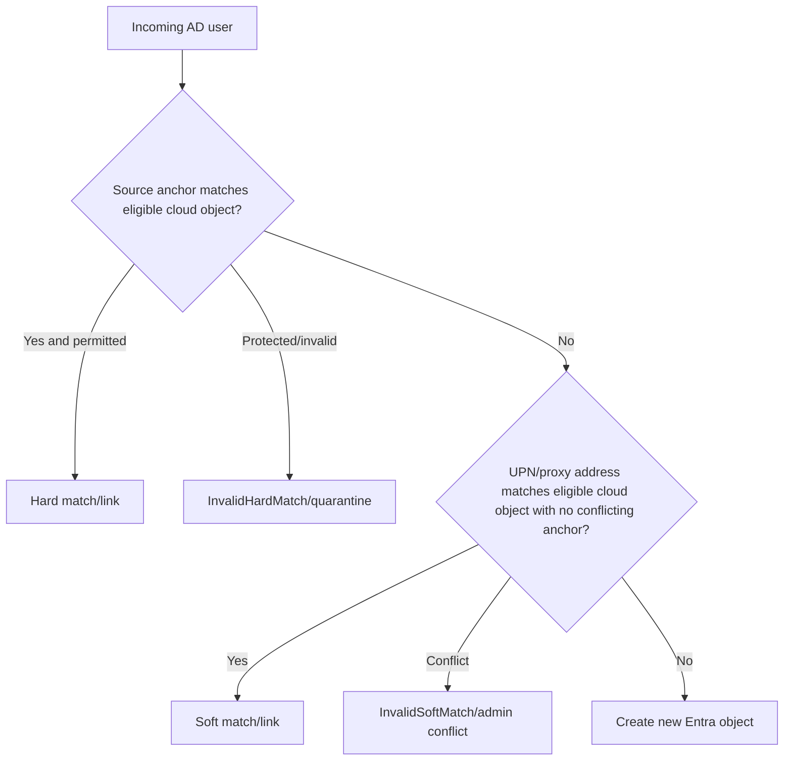

Since July 1, 2026, Entra automatically enforces hard-match security hardening for target cloud users that are privileged, eligible for privileged roles, or already have `onPremisesObjectIdentifier` set. This reduces cloud-account takeover through manipulated matching. The tenant can also use a block-cloud-object-takeover setting.

Current Microsoft troubleshooting documentation describes carefully controlled recovery paths that can include resolving privileged assignments or object linkage and, in some cases, temporary feature flags. Treat any bypass or temporary removal of privilege as a high-risk, vendor-supported change: verify intended person/object ownership, preserve access/recovery, obtain security approval, test in isolation, restore protections immediately, and retain evidence. Do not casually clear immutable values, remove privileged roles, or disable takeover protection merely to make an export green.

---

## 18. Duplicates, conflicts, resiliency, and quarantine

| Error/failure | Meaning | Safe investigation |
|---|---|---|
| `InvalidSoftMatch` | Soft match found object with conflicting immutable ID | Identify both source anchors/objects and duplicate UPN/proxy value |
| `InvalidHardMatch` | Cloud protects object from reassociation/takeover | Validate privileged/link state and approved recovery path |
| `AttributeValueMustBeUnique` | UPN/mail/proxy/sign-in value already used | Find authoritative owner of value and correct source |
| `ObjectTypeMismatch` | User/group/contact share match attribute | Compare object types and authoritative mail address |
| `Existing Admin Role Conflict` | Protected cloud admin cannot be soft-matched normally | High-risk supported recovery with emergency path |
| Data validation | Unsupported UPN characters/format or attribute rules | Correct source value/transform |
| Large object | Attribute count/size exceeds cloud schema | Remove obsolete source values with owner approval |
| Duplicate attribute resiliency | Quarantines conflicting value while allowing object provisioning | Object may exist without intended UPN/proxy; fix data, do not ignore |

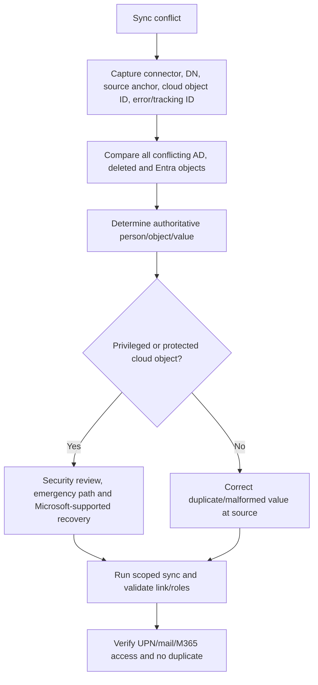

“Quarantine” or duplicate resiliency can let an object synchronize while dropping/altering a conflicting attribute. That preserves directory progress but can break mail routing or sign-in. Monitor health reports and remediate the data owner; do not celebrate a lower error count without checking object correctness.

---

## 19. Prevent accidental deletes

Connect Sync enables **prevent accidental deletes** by default, currently with a threshold of 500 exports. If pending deletes exceed the configured threshold, export stops before deleting them and raises event/health/email evidence.

| Cause of mass pending deletes | Prevention |
|---|---|
| OU/domain unchecked | Change review and pending-export preview |
| OU renamed/moved | Re-select/validate scope before full sync |
| Attribute filter changed | Impact query and synthetic null/edge tests |
| Connector/rule change | Staging server preview and peer review |
| Migration coexistence mistake | Follow supported no-flow/coexistence design; retain references |
| Source outage/permissions | Distinguish missing import from intentional deletion |

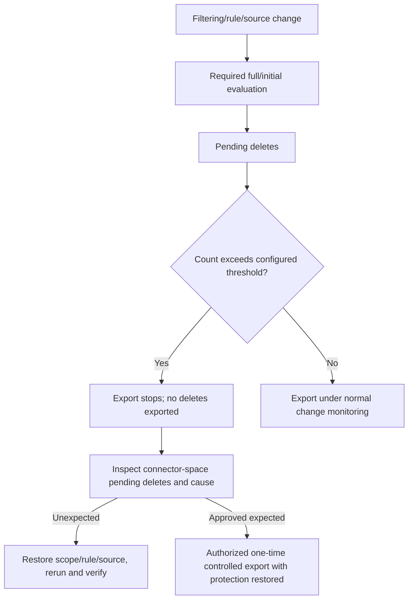

Do not leave delete protection disabled. For an approved bulk deletion, current Learn documents temporary disable/export/re-enable or raising the threshold; use named authorization, exact object list, backup/recovery, live monitoring, post-export validation, and immediate protection restoration. The safe paper design should state the control, not provide casual bypass instructions.

Cloud Sync has its own scoping, quarantine and deletion-safety behavior; verify current thresholds and logs rather than assuming Connect’s 500-object setting applies identically.

---

## 20. Connect Health, logs, tools, and monitoring

| Tool/evidence | Use |
|---|---|
| Synchronization Service Manager | Run history, connectors, connector-space search, metaverse, pending export/errors |
| Synchronization Rules Editor | Scope/join/precedence/flows; tightly controlled changes |
| Connect wizard/config export | Supported configuration and staging/promotion/migration |
| Windows Application event log | Directory Synchronization and agent/service events |
| Entra Connect Health | Alerts, sync errors, latency, AD FS/PTA health and usage depending agents/license |
| Provisioning logs | Cloud Sync object actions, errors and mapping details |
| Agent status | Cloud Sync/PTA agent availability and version |
| `Get-ADSyncScheduler`/approved cmdlets | Scheduler/configuration state; use current supported module |
| `Start-ADSyncSyncCycle` | Approved delta/initial run; not a substitute for diagnosis |
| AD tools | ADUC/ADAC, PowerShell, replication, DNS, DC and attribute evidence |
| Entra logs/Graph | Cloud object, sign-in, audit, provisioning and source fields |
| M365 workload tools | Exchange/SharePoint/OneDrive/Teams object and authorization validation |

Connect Health requires applicable P1 licensing and current supported agents/versions. Azure AD Connect V1 and its health integration are retired. Monitor version support and automatic/manual upgrade requirements; unsupported sync software is a security and availability risk.

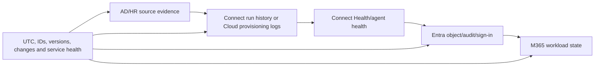

Log export and retention should support incident/RCA needs. Record UTC, server/agent, connector/job ID, run profile, operation, DN, source anchor, metaverse/cloud object IDs, attribute/error/tracking ID, sync version, change, and final workload effect.

---

## 21. Migration among sync engines and authentication models

Treat synchronization migration and authentication migration as related but separate workstreams.

### Connect Sync to Cloud Sync

Current supported guidance requires assessing feature parity, backing up Connect configuration, keeping pilot OUs/objects in Connect scope during coexistence, and using documented `cloudNoFlow`/`JoinNoFlow` rules to prevent conflicting nonreference exports while Cloud Sync pilots. Removing pilot objects/OUs from Connect scope too early can export reference deletes such as group membership removals.

| Migration phase | Key control |
|---|---|
| Assess | Device sync, object/group scale, rules, references, writeback, Exchange, auth dependencies |
| Baseline | Object counts, attributes, memberships, errors, latency, config export |
| Pilot | Dedicated OU/batch remains in Connect scope under supported no-flow design |
| Validate | Create/update/disable/password/group/manager/reference and failure tests |
| Scale | Batches with reconciliation and rollback |
| Cutover | Stop Connect export for completed scope only after Cloud Sync and references proven |
| Hold | Leave old server disabled for observation/rollback period |
| Decommission | Remove only after acceptance, evidence and dependency review |

### Federation/PTA to PHS cloud authentication

Use staged rollout for selected users, preserve PHS in advance, test managed and unmanaged clients, legacy protocols, SSO, MFA/CA, password reset, privileged/emergency users and apps. After broad validation, convert the domain/authentication method through supported procedures and retire AD FS/PTA only after no dependency remains.

```mermaid
flowchart TB
    BASE[Inventory and baseline] --> SYNCSTREAM[Sync-engine migration stream]
    BASE --> AUTHSTREAM[Authentication migration stream]
    SYNCSTREAM --> CSPILOT[Cloud Sync pilot/coexistence]
    AUTHSTREAM --> STAGED[Staged rollout to PHS/PTA test groups]
    CSPILOT --> RECON[Object/attribute/reference reconciliation]
    STAGED --> SIGNTEST[Client/app/CA/SSO sign-in tests]
    RECON --> GATE{Both streams ready?}
    SIGNTEST --> GATE
    GATE --> CUTOVER[Controlled cutover]
    CUTOVER --> HOLD[Hypercare and rollback hold]
    HOLD --> DECOM[Approved decommission]
```

Do not uninstall AD FS, stop Connect, remove OUs, or change a federated domain before rollback and dependency evidence exists. PHS must be operating before it can be a backup during an outage.

---

## 22. High availability and disaster recovery

| Component | HA design | DR evidence |
|---|---|---|
| Connect Sync | One active plus staging server(s), separate failure domain | Config export, promotion runbook, version/health parity |
| Cloud Sync | Multiple active agents per domain/forest | Agent health, automatic failover test, reinstall credentials |
| PTA | At least three agents, DC/network diversity | Agent outage and planned PHS switch exercise |
| PHS | Enable/current hashes even if backup | Auth method switch runbook and test users |
| AD FS | Redundant farm/WAP/load balancer/DNS/certs | Certificate/trust backup, farm recovery or PHS migration |
| AD DS | Multiple healthy DCs/DNS/replication/sites | AD forest recovery and identity incident plan |
| Emergency Entra access | Two cloud-only active GA accounts | 90-day independent sign-in/action/alert test |
| Logs/config | Exported protected evidence and monitoring | Restore/query exercise and retention validation |

```mermaid
flowchart TD
    FAILURE[Hybrid identity failure] --> TYPE{Sync or authentication?}
    TYPE -->|Connect sync| STAGING[Validate/promote staging server]
    TYPE -->|Cloud Sync agent| AGENT[Other active agent continues; repair failed agent]
    TYPE -->|PTA| PTAHA[Healthy agents/DCs or authorized switch to prepared PHS]
    TYPE -->|AD FS| FEDHA[Farm/WAP recovery or prepared PHS migration]
    TYPE -->|AD compromise| CLOUDONLY[Cloud emergency admin and cloud auth continuity]
    STAGING --> VALIDATE[Validate identities, sign-ins and M365]
    AGENT --> VALIDATE
    PTAHA --> VALIDATE
    FEDHA --> VALIDATE
    CLOUDONLY --> VALIDATE
```

RTO/RPO must be explicit. Synchronization can pause while existing cloud users continue signing in under PHS, but new hires, disables, group changes and password updates may be stale. PTA/federation outages can stop password sign-in immediately. Define business impact by function, not merely “sync server down.”

---

## 23. Phased deployment and testing

| Phase | Activities | Exit gate |
|---|---|---|
| Discover | Forests/domains/OUs, objects, UPNs, Exchange, rules, auth, devices, apps, health, versions | Supported current-state map |
| Clean | Duplicates, invalid UPNs/proxies, source anchors, stale OUs, owners | Data-quality threshold met |
| Design | Sync/auth/SSO decisions, scope, flows, HA/DR, monitoring, security | HLD/LLD and threat review approved |
| Prepare | Test tenant/OU/users, PHS, agents/staging, emergency, backups, logs, support | Recovery paths proven |
| Pilot | Representative users, groups, changes, apps, devices and failures | Positive/negative/rollback pass |
| Scale | OU/domain/business rings with reconciliation | Error/latency/support within thresholds |
| Operate | Health, versions, collisions, deletes, certs, DR, roadmap | RACI and cadence active |

### Test matrix

| Test type | Scenario | Expected evidence |
|---|---|---|
| Joiner | New AD user in selected OU | One matched Entra user and intended attributes |
| Negative scope | New user outside scope | No cloud object and clear filter evidence |
| Attribute update | Manager/department/UPN change | Correct authority, flow and workload result |
| Password PHS | Change password | New password works after sync; old fails |
| PTA account state | Lock/disable/expiry | Real-time AD state enforced as designed |
| Federation | Internal/external and certificate path | Correct redirect, claims, MFA/CA and logs |
| Seamless SSO | Managed internal client | Reduced prompt but CA still enforced |
| SSPR writeback | Approved reset/change | AD accepts; cloud/on-prem sign-in validates |
| Soft match | Existing eligible cloud user | Correct link without duplicate/privilege conflict |
| Hard-match protected | Privileged cloud object scenario | Block/quarantine and safe escalation, no takeover |
| Duplicate proxy | Two source objects collide | Resiliency/error visible and authoritative fix |
| OU rename | Pilot OU path changes | Delete protection/preview catches impact |
| Accidental deletes | Over-threshold paper/pilot export | Export stops and investigation works |
| Connect failover | Primary unavailable | Staging promotion with only one exporter |
| Cloud agent failover | One agent stopped | Other active agent processes changes |
| PTA failover | Agent/DC failure | Remaining agents work; PHS contingency rehearsed |
| Offline on-prem | PHS user during outage | Existing cloud access continues within policy |
| Rollback | Pilot sync/auth migration fails | Prior engine/method restored without duplicate/delete |

---

## 24. Layered troubleshooting

```mermaid
flowchart TD
    SYM[Cloud identity/sign-in/M365 symptom] --> SCOPE[User/group/device, UPN, object IDs, tenant, UTC, app, change]
    SCOPE --> SOURCE[HR/AD object, DN, attributes, account state, replication]
    SOURCE --> FILTER[Domain/OU/attribute scope and connector permissions]
    FILTER --> IMPORT[Import/agent/job status and connector space]
    IMPORT --> JOIN[Join/project, source anchor, metaverse/match]
    JOIN --> FLOW[Rule precedence, transform and target connector]
    FLOW --> EXPORT[Export/cloud provisioning error and tracking ID]
    EXPORT --> CLOUD[Entra object/source, license, groups, device]
    CLOUD --> AUTH[PHS/PTA/federation/SSO/password writeback]
    AUTH --> CA[Authentication details and Conditional Access]
    CA --> RESOURCE[Exchange/SharePoint/OneDrive/Teams authorization]
    RESOURCE --> TEST[Least-invasive discriminating test and end-to-end validation]
```

| Symptom | Likely cause | First discriminating check |
|---|---|---|
| User not in Entra | AD replication, OU/filter, import permission, job/agent, validation | Search source DN then connector/provisioning log |
| Wrong attribute | Source authority, precedence, custom rule, stale export | Trace attribute from source through connector/metaverse/cloud |
| Duplicate user | No hard/soft match, source-anchor change, rehire/forest move | Compare source anchors, UPN/proxy and cloud objects |
| Export error | Uniqueness, validation, protected match, large object | Exact error/tracking ID and competing objects |
| Many pending deletes | Filter/OU/rule/source change | Stop and inspect pending export/delete threshold |
| Password works on-prem not cloud | PHS backlog/error, auth method/domain route, UPN | Sign-in log plus PHS/agent status and last password sync |
| PTA fails for all | Agent/queue/network/DC/service outage | Agent status, test account, service health and DC connectivity |
| PTA fails one user | AD state/password/UPN/domain routing | DC validation and exact sign-in error |
| Federated redirect loop | Domain federation, cookies, claims, WAP/AD FS trust | Home realm/domain config and AD FS event/correlation |
| AD FS token invalid | Signing cert/trust/clock/claims | Certificate thumbprint/validity, metadata and event logs |
| Seamless SSO prompts | Kerberos ticket, browser zone, DNS, device/PRT | `klist`/browser/device registration and sign-in details |
| SSPR writeback rejected | AD password policy/permissions/connectivity/source | Writeback event/provisioning result and DC policy |
| Sync succeeded, OneDrive fails | Resource authorization/license/site state, not sync | Entra object/group/token then SharePoint/OneDrive evidence |
| Cloud Sync pilot changes membership | Coexistence reference flow/no-flow mistake | Connect and Cloud Sync scope/rule/reference comparison |

Do not troubleshoot by clearing immutable IDs, disabling takeover protection, turning off accidental-delete protection permanently, unselecting an OU, changing federation trust, granting Domain/Global Admin, or deleting/recreating a user before object-lineage analysis. These actions can cause takeover, deletion, duplicates, or outage.

---

## 25. Operational metrics and ownership

| Metric | Meaning | Guardrail |
|---|---|---|
| Last successful sync/latency | Pipeline health | Segment object/password/reference paths |
| Import/export/provision errors by age | Data and service backlog | Error count can fall due to quarantine, not correction |
| Duplicate/invalid attribute count | Source-data quality | Track business owner and user impact |
| Pending deletes/threshold events | Change/scope risk | Every event reviewed, not auto-overridden |
| PHS freshness/failures | Auth and leaked-credential readiness | Validate backup users periodically |
| PTA/Cloud agent availability | HA coverage | Distribute by failure domain, not just agent count |
| AD FS/WAP health and cert days | Federation availability/security | Include trust/signing/TLS rollover drills |
| Staging parity/test date | Connect DR readiness | Configuration/version/run history all matter |
| Unsupported/minimum version exposure | Security/support risk | Scheduled release-health review |
| Match-protection/quarantine events | Potential takeover/data issue | Privileged events require security escalation |
| Reconciliation difference | Desired versus actual identities/attributes | Sample critical M365 attributes and memberships |
| Auth-method distribution | Migration/readiness | PHS backup enabled does not mean users migrated |

### RACI

| Area | Primary accountable role |
|---|---|
| AD forests/domains/DCs/DNS | AD platform owner |
| HR/source data | HRIS/data owner |
| Connect/Cloud Sync | Hybrid identity engineering |
| PHS/PTA/federation | Identity authentication owner |
| AD FS/WAP certificates | Identity + PKI/network owners |
| Conditional Access/MFA | Cloud identity security |
| Exchange/M365 attributes | Messaging/workload owners |
| Health/SOC alerts | Identity operations + SOC |
| Change/DR/testing | Service owner with CAB/business stakeholders |
| Microsoft/vendor escalation | Named technical advisor/vendor manager |

Arti’s demonstrated ability to build evidence packs, coordinate vendors/product groups and communicate incident timelines maps naturally to this RACI. The honest gap remains hands-on operation of the hybrid platform itself.

---

## 26. Client scenario: migrate a federated multi-forest manufacturer

Northstar Manufacturing has two connected forests, one Entra tenant, AD FS with expiring certificates, one Connect V2 server and no staging server, PTA installed but unused, PHS disabled, complex Exchange attributes, 120,000 objects in one domain, 35,000-member largest group, hybrid-joined devices, and M365 E5.

### Assessment

| Requirement | Decision implication |
|---|---|
| Hybrid device sync | Cloud Sync lacks current device parity; retain Connect for device path or redesign device strategy |
| 120k objects/domain | Within current Cloud Sync 150k guide but near enough to capacity-plan |
| 35k-member group | Within current 50k guide but test performance |
| Complex Exchange/rules | Inventory exact parity; may require Connect |
| Multi-forest connected | Both technologies possible; Cloud Sync adds agent resilience |
| AD FS expiry/complexity | Prioritize PHS enablement and staged cloud-auth migration |
| No staging/backup auth | Immediate resilience finding |

```mermaid
flowchart LR
    NOW[Two forests + one Connect + AD FS] --> QUICK[PHS enablement, emergency accounts, cert health, staging design]
    QUICK --> AUTH[Pilot federation-to-PHS staged rollout]
    QUICK --> SYNC[Cloud Sync parity assessment]
    AUTH --> CLOUDAUTH[Cloud authentication target]
    SYNC --> HYBRID{Device/Exchange/rule parity met?}
    HYBRID -->|No| CONNECTTARGET[Supported Connect V2 + staging while roadmap evolves]
    HYBRID -->|Yes| CLOUDTARGET[Cloud Sync agents and phased migration]
    CLOUDAUTH --> OPERATE[Unified health, DR, metrics and decommission controls]
    CONNECTTARGET --> OPERATE
    CLOUDTARGET --> OPERATE
```

Recommended sequence: fix emergency access and certificate risk; enable/verify PHS without changing primary authentication; deploy staging/agent resilience; baseline objects/errors/rules; pilot PHS authentication through staged rollout; validate apps/devices/CA/SSO; migrate federation only with rollback; separately evaluate Cloud Sync parity; do not combine AD FS retirement and sync-engine cutover into one opaque change.

---

## 27. Consulting deliverables

| Deliverable | Minimum content | Quality test |
|---|---|---|
| Hybrid identity assessment | Forests/domains/OUs, objects, Exchange, rules, versions, auth, devices, health | Supported/unsupported topology explicit |
| Source/attribute matrix | Authority, source, transform, precedence, target, privacy, owner | Trace critical attributes end to end |
| HLD | AD/agents/Connect/Cloud/Entra/auth/SSO/writeback/monitoring | Sync and authentication drawn separately |
| LLD | Servers/agents/accounts/permissions/ports/scope/rules/config/certs | Implementer can build without guessing |
| Sync-engine decision | Requirements against current parity/limits | No “newer is always better” claim |
| Authentication decision | PHS/PTA/federation comparison and threat/availability | PHS backup and special requirements addressed |
| Matching/data-quality plan | Source anchor, soft match, privilege protection, duplicates | 2026 hardening and quarantine included |
| Migration/coexistence plan | Batches, no-flow/reference design, staged rollout, hold/decommission | No early OU removal or dual export |
| Test/rollback pack | 18 tests, expected IDs/logs, operators and gates | Includes deletion, failover, match and M365 |
| BCDR runbook | Staging/agents/PHS/AD FS/AD/emergency/logs | RTO/RPO and exercise evidence |
| Troubleshooting runbook | Layered source-to-resource evidence | Avoids destructive match/filter bypass |
| Operations dashboard/RACI | Health, errors, versions, certs, reconciliation and owners | Every alert has action/SLA/escalation |

Example finding:

> **Observation:** The tenant uses a single Connect V2 server and AD FS farm, has no staging server, PHS is disabled, the AD FS token-signing rollover has not been tested, and 1,400 duplicate proxy addresses are quarantined. **Risk:** A server, federation, certificate, ransomware, or data-quality event can stop authentication/synchronization or produce mail and identity errors; no prepared cloud-auth recovery exists. **Recommendation:** Validate emergency access; enable and monitor PHS; remediate duplicate attributes at authoritative sources; deploy/test staging or assess Cloud Sync active agents against device/rule requirements; rehearse AD FS certificate/DR; pilot cloud authentication with staged rollout; separate sync-engine migration from auth migration. **Residual risk:** Hybrid dependencies and offline/source timing remain until device, app and data authority are modernized.

---

## 28. Safe paper lab: hybrid identity assessment, migration, and incident

This exercise creates no AD objects, Entra users, agents, sync rules, credentials, certificates, domains, or tenant changes.

### Prerequisites

- Parts 4–12 and Official Source Anchors below.
- Markdown/Mermaid/spreadsheet editor.
- Fictional forests, domains, UPNs, object IDs, IPs and certificates only.
- No production configuration export, logs, screenshots, tokens, password hashes or customer data.

### Fictional client

Northstar has two connected forests, three domains, hybrid Exchange attributes, 140,000 users in the largest domain, one 48,000-member group, hybrid-joined devices, Connect V2 without staging, AD FS, PHS disabled, one expiring TLS certificate, duplicate `proxyAddresses`, and a planned Cloud Sync/cloud-auth modernization.

### Steps

1. Inventory forests, domains, trusts, OUs, object counts, UPN suffixes, Exchange, devices, apps, sync rules, writeback, authentication, agents/servers, certificates and owners.
2. Build a source/attribute/precedence matrix for 20 critical attributes.
3. Draw Connect Sync connector-space/metaverse architecture and Cloud Sync agent/service architecture.
4. Score Connect versus Cloud Sync against device sync, 150k/domain, 50k group, advanced rules, references, Exchange and HA.
5. Compare PHS/PTA/federation and select target authentication; include Seamless/device SSO separately.
6. Design PHS backup, staging or active agents, emergency access, monitoring, certificate and DR controls.
7. Create a matching plan for new, existing cloud, privileged, rehire and forest-move users under July 2026 hardening.
8. Design filtering, accidental-delete protection, duplicate quarantine and rule change control.
9. Build separate sync-engine and authentication migration workstreams with pilot, coexistence, staged rollout, cutover, rollback hold and decommission gates.
10. Execute all 18 tests from this Part and six incidents: missing user, wrong attribute, protected hard match, mass pending deletes, PTA outage and AD FS certificate failure.
11. Produce HLD/LLD, RACI, metrics, BCDR, runbook, roadmap and executive recommendation.

```mermaid
flowchart TB
    INVENTORY[Forest/domain/object/auth inventory] --> ATTR[Source and attribute matrix]
    ATTR --> ARCH[Connect and Cloud Sync architectures]
    ARCH --> DECIDE[Sync and authentication decisions]
    DECIDE --> SECURE[Matching, filtering, agents/staging, PHS, certs and emergency]
    SECURE --> MIGRATE[Two migration workstreams]
    MIGRATE --> TEST[18 tests and six incidents]
    TEST --> OPERATE[BCDR, RACI, metrics, roadmap]
    OPERATE --> DEFEND[Client/interview defense]
```

### Evidence to retain

| Artifact | Evidence |
|---|---|
| Inventory | Forest/domain/OU/object/device/app/auth/certificate map |
| Attribute matrix | 20 attributes with authority, flow and precedence |
| Architecture | Connect and Cloud Sync diagrams with trust boundaries |
| Decision records | Engine and authentication scoring/rationale |
| Matching/filter design | New/existing/privileged/rehire/move and delete controls |
| Migration plan | Separate streams, coexistence, batches, gates and rollback |
| Test/incident pack | 18 expected cases and six layered RCAs |
| BCDR | RTO/RPO, staging/agents/PHS/AD FS/emergency exercise |
| Operations | Health dashboard, RACI, versions, certs and reconciliation |
| Executive summary | Risks, options, recommendation, roadmap and residual risk |

### Cleanup

Delete scratch material containing real domains, DNs, source anchors, object IDs, IPs, server names, certificates, screenshots, configurations, hashes or customer logs. If later adapted to a lab, stop only the scoped pilot through supported procedure, export evidence/config first, restore the approved engine/auth state, verify no pending adds/deletes or dual exporters, validate test user sign-in and emergency access, and remove only fictional lab objects after dependency review. Never clear immutable IDs, disable match protection, or bulk-remove sync scope as cleanup.

### Interview wording

> “I completed a fictional hybrid-identity assessment grounded in current Microsoft guidance. I mapped AD DS forests, source authority and Connect internals; compared Cloud Sync limits and active agents; separated PHS/PTA/federation from sync and SSO; designed matching under July 2026 hardening, filtering, delete protection, HA/DR, two migration streams, 18 tests and six incident RCAs. It demonstrates architecture and troubleshooting, not production hybrid-identity ownership.”

---

## 29. Official Source Anchors

These first-party references were checked for the guide’s **August 24, 2026** currency date. Recheck current version requirements, release history, feature comparison, cloud availability, certificate guidance, limits and support statements before implementation.

1. [Microsoft Entra Connect and Connect Health](https://learn.microsoft.com/entra/identity/hybrid/connect/whatis-azure-ad-connect) — Connect features, Cloud Sync direction, V1 retirement, health and licensing.
2. [Connect Sync overview/customization](https://learn.microsoft.com/entra/identity/hybrid/connect/how-to-connect-sync-whatis) — sync components, feature reference, strategic Cloud Sync direction and no-date parity retirement statement.
3. [Connect Sync architecture](https://learn.microsoft.com/entra/identity/hybrid/connect/concept-azure-ad-connect-sync-architecture) — connectors, connector spaces, metaverse, joins, rules and flow.
4. [Supported Connect topologies](https://learn.microsoft.com/entra/identity/hybrid/connect/plan-connect-topologies) — forests/tenants, unsupported multiple active servers, staging, multi-tenant/writeback and M365 considerations.
5. [Cloud Sync overview](https://learn.microsoft.com/entra/identity/hybrid/cloud-sync/what-is-cloud-sync) — agents, cloud service, SCIM-style flow, multiple active agents, disconnected forests and strategic scenarios.
6. [Connect-to-Cloud-Sync decision guide](https://learn.microsoft.com/entra/identity/hybrid/cloud-sync/connect-to-cloud-sync-decision-guide) — current 150k/50k limits, devices, rules, references, writeback, parity and migration readiness.
7. [Migrate Connect to Cloud Sync](https://learn.microsoft.com/entra/identity/hybrid/cloud-sync/migrate-azure-ad-connect-to-cloud-sync) — prerequisites, configuration backup, coexistence/no-flow, references, batch migration, hold and decommission.
8. [Choose hybrid authentication](https://learn.microsoft.com/entra/identity/hybrid/connect/choose-ad-authn) — PHS/PTA/federation architecture, state/availability differences, PHS backup and staged rollout.
9. [Password Hash Synchronization](https://learn.microsoft.com/entra/identity/hybrid/connect/how-to-connect-password-hash-synchronization) — protected hash process, timing, temporary passwords and troubleshooting.
10. [Pass-through Authentication](https://learn.microsoft.com/entra/identity/hybrid/connect/how-to-connect-pta) — agent flow, deployment, security and HA.
11. [Seamless SSO](https://learn.microsoft.com/entra/identity/hybrid/connect/how-to-connect-sso) — Kerberos account, browser/network behavior and supported scenarios.
12. [Troubleshoot Connect sync errors](https://learn.microsoft.com/entra/identity/hybrid/connect/tshoot-connect-sync-errors) — duplicate/validation/object mismatch, July 1, 2026 hard-match hardening, protected admin and recovery concepts.
13. [Prevent accidental deletes](https://learn.microsoft.com/entra/identity/hybrid/connect/how-to-connect-sync-feature-prevent-accidental-deletes) — default 500 threshold, event/health evidence, pending-export review and controlled response.
14. [Microsoft Entra Connect Health](https://learn.microsoft.com/entra/identity/hybrid/connect/whatis-azure-ad-connect-health) — sync, AD FS and AD DS health/monitoring.
15. [AD FS design and deployment](https://learn.microsoft.com/windows-server/identity/ad-fs/ad-fs-design-deployment) — federation components, topology, certificates, proxy and operations.

**Preview/change-sensitive register:** Cloud Sync 150k objects/domain and 50k group limits; device and advanced-rule parity; cloud-to-AD provisioning and source authority; Connect minimum supported version; Connect retirement only after parity with no current date; hard-match security flags/recovery; password writeback/cloud support; staged rollout; PHS/PTA/federation matrices; AD FS certificates/versions; Seamless SSO/browser behavior; Connect Health portal/agents; and sovereign-cloud support require current validation.

---

## ⭐ Likely Interview Questions for This Section

### Q1. What is the difference between AD DS and Microsoft Entra ID?

> **Model answer:** “AD DS is an on-premises forest/domain directory using domain controllers, OUs, Kerberos, LDAP and Group Policy. Entra ID is a cloud tenant identity and access service using modern token protocols, Conditional Access, cloud devices, apps, service principals and Graph. Hybrid identity synchronizes supported objects/attributes and connects authentication, but it does not turn them into one identical directory or authorization system.”

### Q2. How do Connect Sync and Cloud Sync differ?

> **Model answer:** “Connect Sync is a full on-premises engine with connector spaces, metaverse, declarative rules, SQL and one active exporter plus staging. Cloud Sync moves orchestration/configuration to Entra and uses multiple lightweight active agents with outbound connections, adding disconnected-forest and cloud-to-AD group scenarios. As of August 2026 Cloud Sync lacks device sync and some advanced rules/references and documents 150k objects per domain and 50k group members, so I decide from live requirements and parity.”

### Q3. Compare PHS, PTA, and federation.

> **Model answer:** “PHS synchronizes a derived password hash so Entra validates in the cloud; it is simplest and most resilient. PTA keeps cloud sign-in but routes password validation through outbound agents to AD, enforcing current AD account states but adding on-prem dependency. Federation redirects authentication to an external IdP such as AD FS, supporting special requirements but adding farms, proxies, certificates, claims and attack surface. I enable PHS for backup and leaked-credential detection even with PTA/federation.”

### Q4. What is the difference between synchronization, authentication, and Seamless SSO?

> **Model answer:** “Synchronization decides how users, groups and attributes reach Entra. Authentication decides where and how the primary credential is validated: PHS, PTA or federation. Seamless or device SSO reduces prompts after a device/domain sign-in; it is not a separate sync engine or authentication authority and does not bypass MFA, Conditional Access or resource authorization.”

### Q5. Explain hard match, soft match, and the 2026 protection.

> **Model answer:** “Hard match links the source anchor to the cloud immutable/on-premises identifier. Soft match uses eligible unique values such as UPN or proxy address when no hard link exists. Since July 1, 2026 Entra automatically blocks hard-match takeover of privileged, role-eligible or already-linked cloud accounts. I validate every competing object and authoritative person, use a Microsoft-supported high-risk recovery process, and never clear anchors or disable protection just to remove an error.”

### Q6. How do you prevent a sync filtering change from deleting users?

> **Model answer:** “I inventory the impacted domain/OU/rule, model counts and references, test on staging/pilot, run the required full evaluation, inspect pending exports, and use the enabled accidental-delete threshold, currently 500 by default for Connect. If it stops export, I determine whether the deletes are expected before any authorized controlled action, restore the scope when unexpected, re-enable protection immediately, and validate identities, groups and M365.”

### Q7. How would you troubleshoot a user who exists in AD but cannot access OneDrive?

> **Model answer:** “I start with stable identity, UPN, DN, UTC and expected tenant. I verify AD state/replication, sync scope/import, match/source anchor, rule/attribute flow and export. Then I inspect the Entra object, license, groups, sign-in/authentication and CA. Only after identity and token evidence pass do I move to SharePoint/OneDrive authorization, site/provisioning, sync client and service health. A successful sync alone does not prove workload access.”

### Q8. How does your background support hybrid identity work without overstating it?

> **Model answer:** “My direct production strength is layered Microsoft 365 escalation: SharePoint/OneDrive and sync symptoms, affected-versus-unaffected analysis, networking/authentication evidence, critical-incident coordination, vendor/product-group escalation, RCA and validation. That method transfers directly to hybrid troubleshooting and client communication. My Connect, Cloud Sync, PHS/PTA/AD FS and migration evidence is a current fictional design, not claimed production operation.”

---

## 🧠 30-Second Memory Hooks

- **AD DS:** Forest/domain/OUs, Kerberos/LDAP and on-premises control.
- **Entra ID:** Cloud tenant, modern tokens, policy, apps and Graph.
- **Hybrid:** Supported relationship, not identical directories.
- **UPN:** Printed badge address; mutable.
- **Source anchor:** Badge serial number; stable.
- **Three choices:** Sync objects, authenticate users, simplify SSO.
- **Connect:** Connector spaces → metaverse → target export.
- **Cloud Sync:** Lightweight active agents; cloud orchestration.
- **Staging:** Warm synchronized standby; no export; manual promotion.
- **PHS:** Cloud validates derived hash; resilience and leaked-credential value.
- **PTA:** Cloud sign-in, on-prem AD validation through agents.
- **Federation:** Redirect to external IdP; more flexibility and more moving parts.
- **Seamless SSO:** Fewer prompts, not a security bypass.
- **Writeback:** Cloud reset must pass agent, AD permissions and domain policy.
- **Filter:** Out of scope can mean pending deletion.
- **Rule:** Scope + join/project + transform + precedence + flow.
- **Hard match:** Stable anchor link.
- **Soft match:** Eligible UPN/proxy link.
- **July 2026:** Privileged/already-linked cloud accounts resist hard-match takeover.
- **Duplicate resiliency:** Object may sync while conflicting value is quarantined.
- **Delete threshold:** Stop, inspect and prove intent; never leave protection off.
- **Cloud migration:** Keep pilot objects in Connect scope under supported no-flow rules.
- **Auth migration:** PHS first, staged rollout, apps/devices/CA tests, then cutover.
- **DR:** Staging/agents + PHS + emergency cloud admins + rehearsed runbook.
- **Honesty:** M365 sync/RCA skill plus paper hybrid design is not production Connect tenure.

---

## Completion Checklist

- [ ] Compare AD DS forests/domains/OUs/protocols with Entra tenant/token architecture.
- [ ] Explain UPN, source anchor, immutable identifier and worker correlation.
- [ ] Build attribute-level source-of-authority decisions.
- [ ] Separate synchronization, authentication and SSO choices.
- [ ] Draw Connect connector spaces, metaverse, rules, SQL, scheduler and export.
- [ ] Explain service-account and Connect-server Tier 0 protections.
- [ ] Compare delta/initial cycles and propagation timing.
- [ ] Design supported topologies, staging, configuration parity and one active exporter.
- [ ] Draw Cloud Sync agents, outbound service connection, cloud orchestration and multiple-agent HA.
- [ ] Compare current Connect/Cloud features, 150k/50k limits, devices, rules and references.
- [ ] Explain PHS hash-of-hash, cloud validation, timing and backup value.
- [ ] Explain PTA queue/agents/DC validation, three-agent recommendation and manual PHS failover.
- [ ] Explain federation/AD FS farm, WAP, claims, trust and certificate risks.
- [ ] Distinguish Seamless SSO, device/PRT SSO and federation IWA.
- [ ] Design SSPR/password writeback with AD policy and least permissions.
- [ ] Compare domain/OU/attribute/group filtering and deletion risk.
- [ ] Explain rules, joins, projection, precedence, transforms and default-rule protection.
- [ ] Distinguish hard/soft/no/blocked match and July 2026 hardening.
- [ ] Troubleshoot duplicates, quarantine, validation, object mismatch and protected admin conflict safely.
- [ ] Explain Connect’s default 500 accidental-delete threshold and response.
- [ ] Use Service Manager, Rules Editor, Connect Health, provisioning, event, Graph and M365 evidence.
- [ ] Build separate sync-engine and authentication migration streams.
- [ ] Design HA/DR for Connect, Cloud Sync, PTA, PHS, AD FS, AD DS and emergency access.
- [ ] Execute all 18 positive, negative, failure, failover and rollback tests.
- [ ] Use the layered source-to-resource troubleshooting tree without destructive bypass.
- [ ] Define operations metrics, version/certificate monitoring, reconciliation and RACI.
- [ ] Defend the Northstar multi-forest migration and produce all deliverables.
- [ ] Complete the paper lab and answer Q1–Q8 without claiming production hybrid ownership.

---

*Next suggested section:* [Part 14](Part-14-external-cross-tenant-workload-app-identity.md) — extend identity boundaries across partner tenants, B2B collaboration, cross-tenant synchronization, applications, service principals, consent, managed identities and secretless workload federation.