# Part 14 — External, Cross-Tenant, Workload, and Application Identity Security

> **Section goal:** Design secure collaboration and application access across identity boundaries: partners using B2B, multiple tenants using cross-tenant policy and synchronization, and software using service principals, managed identities, consent, and federation. By the end, you should be able to distinguish every object and trust path, choose the right collaboration model, govern guest and app lifecycle, reduce secrets and excessive permissions, investigate incidents, troubleshoot token/tenant/consent failures, and present a phased client design with evidence and rollback.

This Part extends the internal and hybrid identity boundaries from [Part 13](Part-13-hybrid-identity-connect-cloud-sync.md). Part 15 moves to Intune, where device identity, enrollment, MDM, MAM, compliance, and Conditional Access add endpoint context to these user and workload access decisions.

> **Currency and change-sensitive note:** Product behavior was checked against official Microsoft Learn content available on **August 24, 2026**. B2B guest sign-in redirection to the home-tenant branded sign-in completed rollout by the end of 2025. B2B direct connect remains focused on Teams shared channels. Cross-tenant group synchronization and cross-cloud synchronization have newer ID Governance licensing and limitations. Tenant Restrictions v2 authentication-plane protection is generally available, while portions of Windows/client and Microsoft 365 data-plane/anonymous enforcement remain **Preview/change-sensitive**. Flexible federated identity credentials, agent identities, API permissions for agents, and related governance are Preview. Azure AD B2C became unavailable for new purchases on May 1, 2025; Microsoft Entra External ID external tenants are the current CIAM direction. Recheck feature availability, licensing, product terms, Graph version, claims trust, app governance and workload CA scope before implementation.

## JD Mapping

| Deloitte role expectation | Capability developed in this Part | Consulting evidence |
|---|---|---|
| Secure M365 external collaboration | Select B2B guest, direct connect, shared-channel and entitlement patterns | External collaboration HLD/LLD |
| Design cross-tenant controls | Configure inbound/outbound, trust, tenant restrictions and synchronization governance | Cross-tenant policy matrix |
| Assess application identity risk | Inventory app objects, service principals, permissions, owners and credentials | Application risk register and permission review |
| Modernize automation securely | Replace user service accounts/secrets with managed or federated workload identity | Credential migration roadmap |
| Troubleshoot complex access | Correlate home/resource tenant, invitation, consent, token, CA, resource and provisioning | Layered runbook and incident timelines |
| Deliver sustainable operations | Define guest/app lifecycle, rotation, reviews, app governance, Graph evidence and metrics | RACI, dashboards and handover pack |

## Candidate honesty note

You can credibly connect this Part to demonstrated production work in SharePoint Online and OneDrive sharing, permissions, sync, escalation, multi-vendor coordination, stakeholder communication, RCA, documentation, and technical-advisor guidance. Those are directly relevant to the resource side of guest access and to proving whether application-driven file access is expected.

This Part does **not** claim production ownership of Entra External ID, cross-tenant access, multitenant organizations, app registrations, admin consent, managed identities, workload federation, workload Conditional Access, or app governance. Safe wording is:

> “My production experience includes SharePoint/OneDrive sharing and permission escalations, multi-vendor troubleshooting, RCA, documentation, and stakeholder advisory work. I have completed a current fictional design for B2B and cross-tenant access plus application/workload identity security, including permissions, credentials, consent, tests, incidents, metrics, and rollback. I present that as transferable M365 investigation skill and structured design evidence, not production Entra ownership.”

---

## 1. Four boundary problems, four different identity patterns

| Need | Primary pattern | Identity representation |
|---|---|---|
| Partner accesses apps/sites/Teams in your workforce tenant | B2B collaboration | Guest/external user object in resource tenant |
| Partner uses one Teams shared channel seamlessly | B2B direct connect | No ordinary guest object in resource tenant for that direct-connect user |
| Employee from another tenant in same organization needs broad recurring access | Cross-tenant synchronization + B2B collaboration model | Synchronized external user object in target tenant |
| Software calls an API/resource | App/service principal, managed identity or workload federation | Nonhuman workload identity and token |

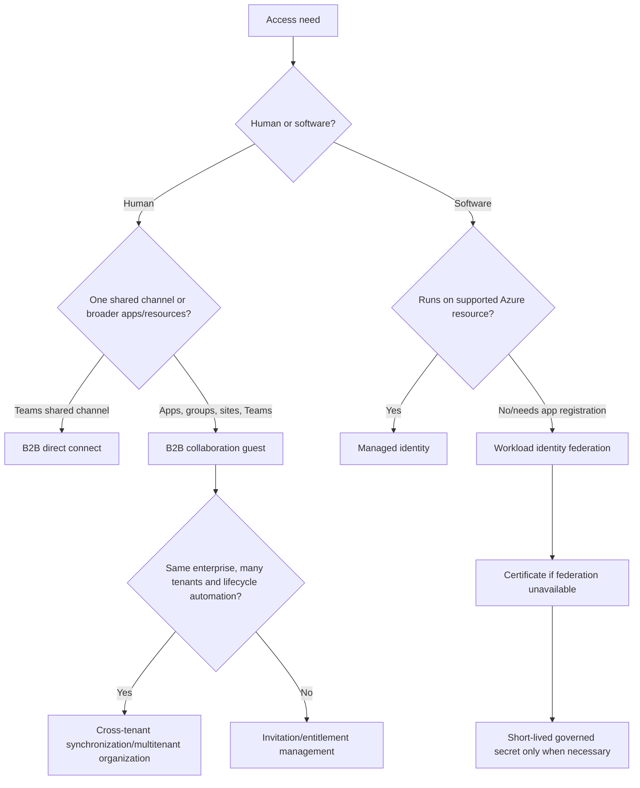

Do not solve every external case with a guest, every shared channel with tenant-wide B2B allow, or every automation with an excluded user account. Start from the relationship, resource, duration, home identity, lifecycle owner, authentication, authorization, device/data controls, and recovery.

---

## 2. B2B collaboration: authentication at home, authorization at the resource

**Microsoft Entra B2B collaboration** lets an external person use an identity from their home organization, Microsoft account, email one-time passcode, or configured provider to access resources in a workforce tenant. The resource tenant creates a user object and controls authorization.

### 🔍 Plain-English deep-dive: home tenant and resource tenant

- **Home tenant/identity provider** — *where the external person’s credentials and primary identity are managed.* **Analogy:** The visitor’s employer issues and validates their passport. **Why it matters:** The resource organization normally does not manage that password.
- **Resource tenant** — *the tenant hosting the application, Team, SharePoint site, or data.* **Analogy:** The country/building being visited. **Why it matters:** It decides whether the visitor is allowed in and what rooms they can use.
- **Guest/external user object** — *the resource tenant’s local representation of the outside person.* **Analogy:** A visitor record linked to the external passport. **Why it matters:** Groups, app roles, Conditional Access, terms, audit, sponsor, and lifecycle attach to this object.
- **Authentication versus authorization** — *home identity proves who; resource permissions decide what.* **Analogy:** Passport control verifies identity, while the meeting host controls room access. **Why it matters:** A successful guest sign-in does not grant SharePoint or app permission automatically.

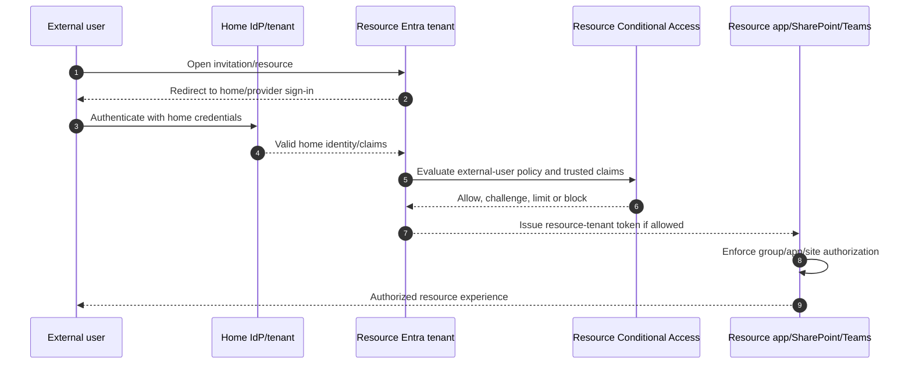

Since the 2025 guest sign-in change, Entra guests are redirected to their home organization’s branded endpoint to enter credentials, then return to the resource tenant. This helps users recognize where credentials belong but does not make every external identity trustworthy.

---

## 3. Guest objects, user type, invitation, and redemption

| Guest property/state | Meaning |
|---|---|
| Object ID | Resource tenant’s immutable local user identifier |
| Home identity/issuer | External tenant/provider that authenticates the person |
| `userType` | Commonly `Guest`, but user type is not a complete security boundary |
| UPN | Often contains `#EXT#`; not the user’s home credential name |
| Invitation state | Pending or accepted/redeemed under applicable flow |
| External user state/change time | Tracks invitation redemption-related state |
| Sponsor/manager | Governance relationship where configured |
| Group/app/site assignments | Resource authorization paths |

```mermaid
flowchart LR
    CREATE[Admin/user/API/entitlement creates invitation] --> OBJECT[External user object created]
    OBJECT --> EMAIL[Invitation email or direct resource link]
    EMAIL --> DISCOVER[Entra discovers identity provider/redemption order]
    DISCOVER --> AUTH[User authenticates at home/provider]
    AUTH --> CONSENT[Consent/terms when applicable]
    CONSENT --> REDEEM[Redeemed guest relationship]
    REDEEM --> AUTHORIZE[Group/app/site authorization]
```

| Invitation path | Best use | Control |
|---|---|---|
| Admin portal/Graph invitation | Known individual and explicit resource | Sponsor, purpose, expiry and assignment |
| Teams/SharePoint sharing | Workload-led collaboration | External sharing level, guest integration, link and site controls |
| Entitlement management | Scaled governed partner requests | Connected org, approval, package, expiration, review |
| Self-service sign-up | External app onboarding | Identity providers, user flow, collected attributes, API connectors |
| Cross-tenant synchronization | Same enterprise/multitenant lifecycle | Source scope, target inbound permission, automatic redemption |

Email one-time passcode is on by default for new tenants and existing tenants where not explicitly disabled under current guidance. Redemption order can prioritize Entra, direct federation, Microsoft account or email OTP paths; changing it can affect which identity binds to an invitation. Reset redemption only through an approved identity-verification process.

---

## 4. External collaboration settings versus cross-tenant access settings

**External collaboration settings** control who can invite guests, guest directory visibility, and allow/block domains, including non-Entra identity cases. **Cross-tenant access settings** control inbound and outbound authentication/access with other Entra organizations.

| Setting family | Controls | Example |
|---|---|---|
| External collaboration | Who may invite; guest directory permissions; domain allow/block | Only Guest Inviter/admin roles can invite approved domains |
| Cross-tenant inbound B2B | Which external users/groups can access which local apps | Partner group may access selected resource apps |
| Cross-tenant outbound B2B | Which local users/groups can access which external apps | Project team may collaborate in partner tenant |
| Trust settings | Whether resource CA accepts home MFA/compliant/hybrid-join claims | Trust partner MFA after due diligence |
| B2B direct connect | Mutual shared-channel access | Two tenants allow selected groups/apps |
| Cross-tenant sync | Whether source can provision users/groups into target | Target allows inbound user/group synchronization |
| Tenant restrictions | External-account access to external apps from controlled network/device | Block unknown tenant accounts on managed devices |

The most restrictive applicable control can block onboarding. A domain blocked in external collaboration settings can prevent new invitations even if cross-tenant B2B is allowed. Existing guests might continue under their existing relationship, so test new and existing users separately.

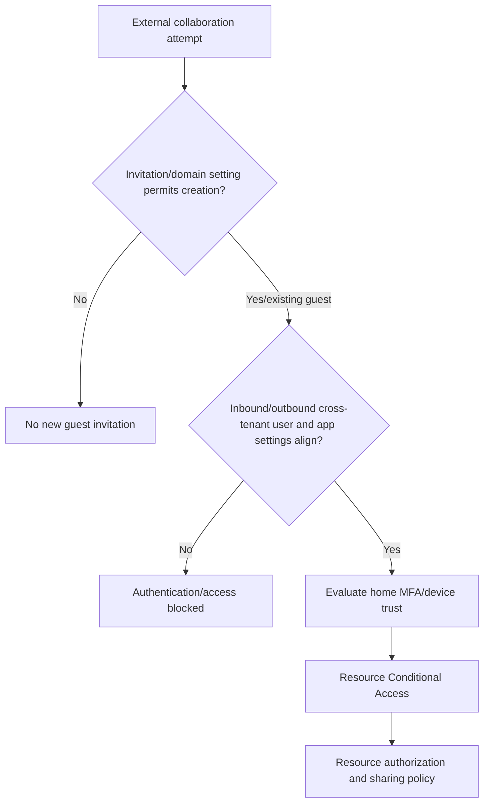

Avoid a tenant-wide allowlist that no owner maintains. Use organization-specific settings for strategic partners and preserve a defensible default.

---

## 5. Cross-tenant access: inbound, outbound, default, and organization settings

### 🔍 Plain-English deep-dive: direction depends on whose user and whose resource

- **Inbound** — *external users enter your tenant’s resources.* **Analogy:** Visitors entering your building. **Why it matters:** Your tenant scopes which external users/groups and which local applications are reachable.
- **Outbound** — *your users go to another tenant’s resources.* **Analogy:** Employees visit another building. **Why it matters:** You control which internal users can collaborate externally and with which apps.
- **Default settings** — *policy for every external Entra organization without an override.* **Analogy:** Standard visitor policy. **Why it matters:** Initial B2B collaboration is broadly enabled while direct connect is blocked; changing defaults can break unknown dependencies.
- **Organization-specific settings** — *overrides for one tenant partner.* **Analogy:** A bilateral visitor agreement. **Why it matters:** It supports precise users, groups, applications, trust, sync and automatic redemption.

| Initial default under current guidance | Behavior |
|---|---|
| B2B collaboration | Inbound/outbound generally enabled for users; other controls still apply |
| B2B direct connect | Inbound/outbound blocked |
| MFA/device trust | External claims not trusted by default |
| Cross-tenant sync | No users/groups synchronized by default |
| Organization overrides | None until added; override defaults for that tenant |

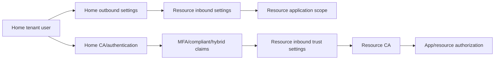

User/group and application settings must align. A policy cannot logically allow users while blocking every app required for the flow. Collect partner object IDs and app IDs carefully; do not target display names. Examine cross-tenant sign-in activity before changing defaults.

---

## 6. Trusting MFA and device claims

The resource tenant can trust external home-tenant claims for MFA, compliant devices, and Entra hybrid joined devices. Trust means the resource Conditional Access policy can accept the home tenant’s assertion rather than forcing a second resource-tenant registration/challenge.

| Claim trust | Benefit | Due diligence/risk |
|---|---|---|
| MFA | Seamless partner experience while resource policy still requires MFA | Partner method/registration/recovery assurance may differ |
| Compliant device | Accept partner MDM compliance claim | Partner compliance standard and device ownership may differ |
| Hybrid joined device | Accept partner hybrid device state | AD/device lifecycle and compromise handling differ |
| No trust | Resource tenant challenges/enforces locally where possible | Guests may not register/satisfy device controls or direct-connect prerequisites |

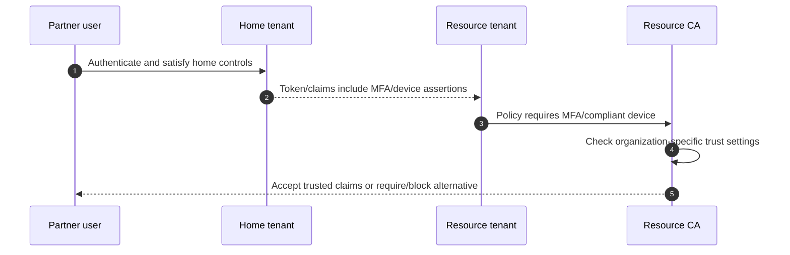

Trust is not transitive confidence in the partner’s entire security program. Document partner tenant ID, assurance requirements, contract, incident notification, device/MFA standards, review cadence, offboarding, and breach response. For B2B direct connect with MFA-requiring CA, current guidance says resource inbound trust for home MFA must be configured.

---

## 7. B2B direct connect and Teams shared channels

**B2B direct connect** is a mutual cross-tenant trust pattern currently used by Teams shared channels. The external user works from their home Teams context and is not represented by an ordinary guest object in the resource tenant.

| B2B collaboration guest | B2B direct connect |
|---|---|
| Guest/external user object exists in resource tenant | No ordinary guest object for direct-connect user |
| Access to M365/SaaS/custom apps according to assignment | Current primary use: Teams Connect shared channels |
| Can be member of a Team; tenant switching experience | Shared channel visible from home Teams experience |
| Resource tenant can challenge MFA or trust home claim | Must trust home MFA when resource CA requires MFA |
| Guest lifecycle through entitlement/reviews | Shared-channel owner, cross-tenant policy, Teams/access review mechanisms |
| Broader resource access possible | Scoped to shared channel resources/apps and policy |

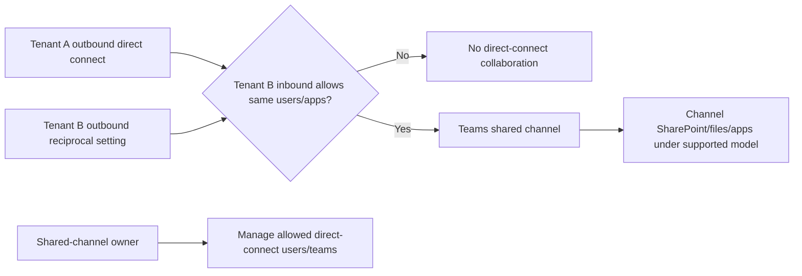

Direct connect requires mutual settings. Default is blocked. Restrict to specific organizations/users/groups/apps where feasible; review privacy because limited contact data and policy information can cross tenant/geographic boundaries. Current access reviews can find directly added B2B direct-connect users, but not necessarily other teams added to a shared channel; the channel owner must review those team relationships.

---

## 8. Cross-tenant synchronization and multitenant organizations

**Cross-tenant synchronization** uses Entra provisioning to push internal members (and now supported security-group scenarios) from a source tenant into a target as B2B collaboration external users/groups. A **multitenant organization (MTO)** is a declared group of tenants belonging to one enterprise to improve collaboration experiences; it does not merge the tenants or replace cross-tenant access policy.

| Cross-tenant sync property | Current behavior |
|---|---|
| Direction | One-way push from source to target |
| Source identities | Internal source members; not source guests |
| Target object | External member or guest according to mapping; B2B foundation |
| Scope/mapping | Configured in source tenant |
| Target permission | Target must allow inbound user/group synchronization |
| Automatic redemption | Required; both source outbound and target inbound setting for suppression |
| Frequency | Current fixed start around 40-minute intervals; duration varies |
| Deprovision | Source delete/out-of-scope soft-deletes target user; relationship deletion alone does not clean objects |
| Purpose | Ongoing collaboration/lifecycle, not tenant migration |

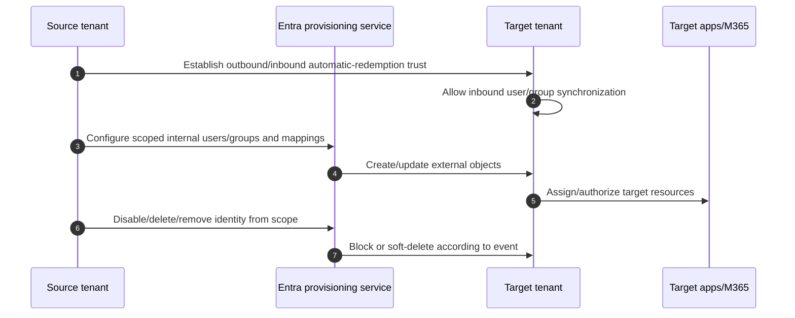

| Scenario | License direction under current guidance |
|---|---|
| Same-cloud user sync | P1 for each synchronized source user |
| Same-cloud group sync | Entra ID Governance or Entra Suite in source |
| Cross-cloud sync | Entra ID Governance or Entra Suite in source |
| Target | No cross-tenant-sync license itself, but target features/External ID billing may apply |

Group sync has constraints: source security/M365 groups can become static security groups in target; no role-assignable groups, nested groups, Microsoft 365 groups in target, mail-enabled/distribution types, or cross-cloud group sync under current guidance. Manager, cloud, scale, and mapping behaviors differ. Verify live documentation.

Cross-tenant sync is not a user/data migration tool: source identity remains required to authenticate, and SharePoint/OneDrive/mail data is not migrated.

---

## 9. Tenant Restrictions v2

**Tenant Restrictions v2 (TRv2)** controls external-account access to external applications from devices or networks your organization controls. It is independent of inbound/outbound B2B settings.

### 🔍 Plain-English deep-dive: three directions, one common confusion

- **Inbound cross-tenant** — *outside account → your app.* **Analogy:** Visitor enters your building.
- **Outbound cross-tenant** — *your account → outside app.* **Analogy:** Employee visits a partner building.
- **Tenant restriction** — *outside account → outside app from your controlled device/network.* **Analogy:** An employee tries to use a second company’s badge to enter a third building while using your company vehicle. **Why it matters:** Outbound B2B policy for the employee’s home account cannot govern that foreign account.
- **Client signaling** — *device/network adds your tenant/policy identity so Microsoft can enforce TRv2.* **Analogy:** The company vehicle tells the destination which travel policy applies. **Why it matters:** Without supported signaling/enforcement, the cloud cannot apply your tenant-restriction policy to that request.

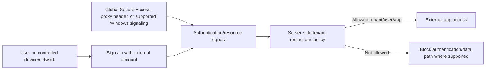

| Enforcement option | Coverage/limitation |
|---|---|
| Universal TRv2 via Global Secure Access | Authentication plane across platforms; current data-plane coverage differs, including Graph focus |
| Corporate proxy header | Authentication plane; requires carefully supported TLS inspection/header insertion |
| Windows policy/signaling | Authentication and supported M365 data-plane paths; portions remain Preview and browser/.NET gaps require App Control/Firewall design |
| No signaling | Server-side policy is not applied to ordinary request merely because it exists |

Authentication-plane TRv2 is generally available. Data-plane/anonymous enforcement for Teams, SharePoint, OneDrive, Exchange, Forms and Windows client paths includes Preview/change-sensitive areas. Test exact browser, native app, PowerShell/.NET, anonymous link/meeting, service principal, network, proxy, cross-cloud and Apple SSO scenarios. Never deploy TLS break/inspect broadly without Microsoft endpoint guidance, security/privacy review, certificate trust, bypass and rollback.

---

## 10. Guest lifecycle, access reviews, and entitlement management

| Lifecycle stage | Control |
|---|---|
| Partner approval | Connected organization/tenant ID, contract, sponsor, privacy/security assessment |
| Invitation/sync | Correct home identity, redemption, user type/mapping and terms |
| Access | Package/group/app/site role; least privilege and expiry |
| Authentication | Cross-tenant policy, trusted claims, CA and session controls |
| Review | Sponsor/resource/channel owner certifies user/team and access |
| Offboarding | Remove package/direct/group/site/app/shared-channel access |
| Account cleanup | Delete guest/external object only after all justified access is gone |
| Relationship closure | Remove bilateral settings/sync only after deprovision completes |

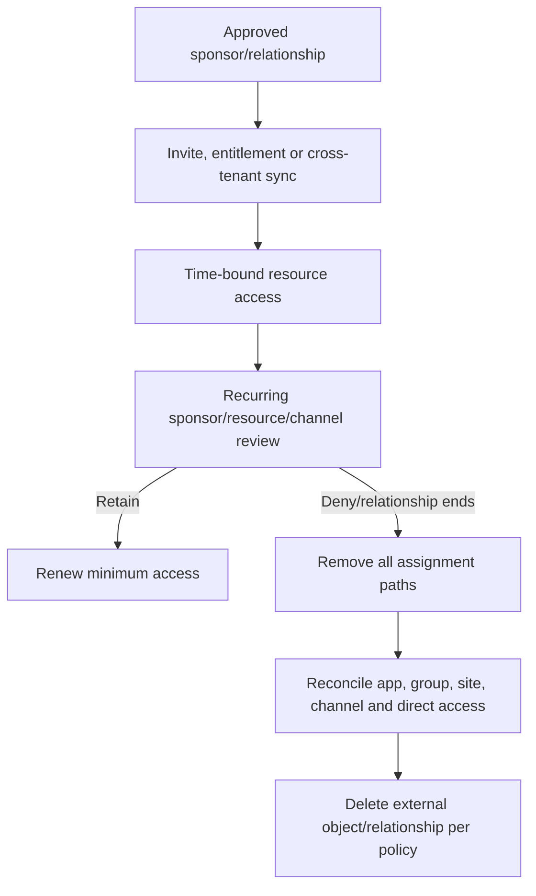

Do not delete a guest solely because one package expires if they retain another valid package, direct SharePoint permission, Teams membership, app assignment, shared-channel access, legal/eDiscovery role, or sponsored relationship. Conversely, an external object with no sponsor, assignment or use should not persist indefinitely.

Your SharePoint/OneDrive background is useful for discovering direct sharing and permissions outside identity packages. Governance must reconcile workload-level access, not just guest object existence.

---

## 11. App registration, application object, enterprise application, and service principal

### 🔍 Plain-English deep-dive: blueprint versus local instance

- **App registration/application object** — *the home-tenant blueprint for the software identity: client ID, redirect URIs, exposed scopes/roles, supported account types, and credentials.* **Analogy:** The master product design. **Why it matters:** It defines how the app can request/receive tokens and be instantiated.
- **Enterprise application/service principal** — *the local security principal representing the application in one tenant.* **Analogy:** The installed/licensed copy of that product in a customer building. **Why it matters:** Local consent, assignments, CA, sign-ins, permissions and enable/disable state attach here.
- **Client ID/app ID** — *globally unique identifier shared by app instances.* **Analogy:** Product model number. **Why it matters:** It is not the local object ID and is not a secret.
- **Object ID** — *identifier for one application or service-principal object in one tenant.* **Analogy:** Serial number of the blueprint record or installed copy. **Why it matters:** Graph calls and troubleshooting often require the correct object type/ID.

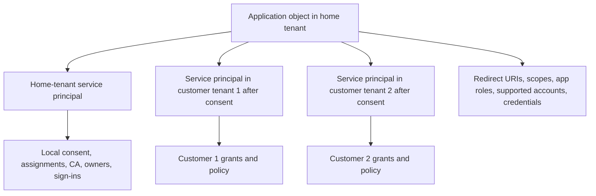

| Portal label | Object primarily managed |
|---|---|
| App registrations | Application objects in the home tenant |
| Enterprise applications | Service principals/local application instances |
| Managed identity resource | Azure resource plus special service principal; usually no app object |

Deleting an application object can delete its home service principal, but restoring the application object does not necessarily restore that service principal automatically. Deactivation can be safer than deletion for temporary containment while preserving evidence. Plan object-specific recovery.

---

## 12. Single-tenant and multitenant applications

| App audience | Who can sign in/consent | Risk/design |
|---|---|---|
| Single tenant | Accounts in one tenant/directory | Best default for internal app; one local service principal |
| Multitenant organizational | Accounts in any Entra tenant after consent/policy | Publisher verification, tenant onboarding, service-principal locks, support/privacy |
| Organizational + personal Microsoft accounts | Work/school and consumer accounts | Broader identity/test/consent/data boundaries |
| Personal Microsoft accounts only | Consumer identity scenario | Different product/use case; not workforce B2B |

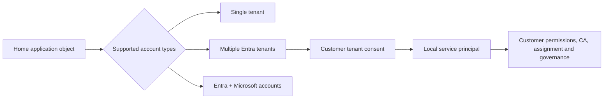

A multitenant app is not the same as a multitenant organization or cross-tenant synchronization. A multitenant app accepts users/consent from many tenants. MTO and cross-tenant sync organize employee collaboration among related tenants. B2B creates external user relationships to resources.

Use publisher verification, controlled redirect URIs, verified domains, app instance property lock, tenant allow/deny business logic where appropriate, secure token issuer/audience validation, and customer-specific least consent. Do not use the `common` endpoint without correctly validating issuer/tenant and application requirements.

---

## 13. Delegated versus application permissions

**Delegated permissions** let an app act on behalf of a signed-in user. The app and user must both be authorized; the app generally cannot exceed what the user can access. **Application permissions** let the app act as itself without a user and can cover all data described by the granted app role.

| Dimension | Delegated permission | Application permission |
|---|---|---|
| User present | Yes | No |
| Other name | Scope/OAuth permission scope | App role/app-only permission |
| Effective access | Intersection of delegated scope and user authorization | App’s granted role across resource scope |
| Consent | User for allowed low-risk scopes or admin | Admin/resource app owner under policy |
| Use | Interactive app acting for user | Daemon, service, backup, automation |
| Example | `Files.Read` for signed-in user’s files | `Files.Read.All` can read tenant files via Graph |
| Main risk | Consent phishing and user/session abuse | Silent broad nonhuman data access |

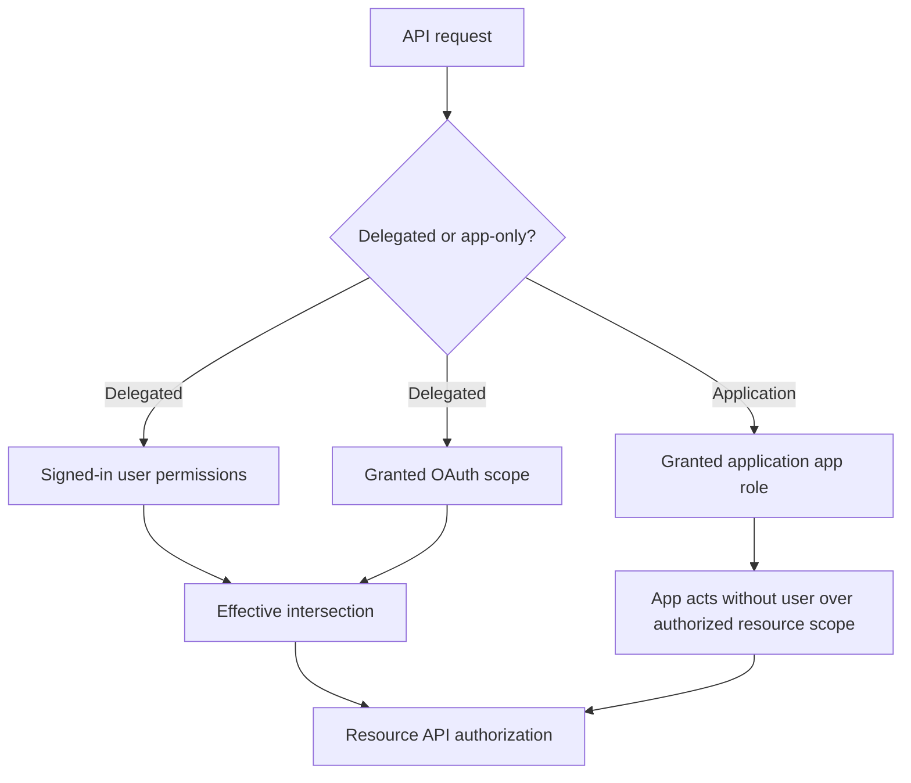

Prefer delegated access when the task is naturally user-scoped, but do not force a human session into background automation. For app-only Microsoft Graph, choose the least privileged application permission and investigate resource-specific alternatives such as Exchange application RBAC or Teams resource-specific consent when they reduce scope.

---

## 14. Consent and admin consent workflow

**Consent** creates an authorization grant from a user/admin to the application’s local service principal. It is not authentication and does not prove the software is safe.

| Consent path | Control |
|---|---|
| User consent | Allow only verified publishers and selected low-impact permissions under current policy |
| Admin consent | Least-privilege app reviewers/administrators inspect publisher, permissions and business case |
| Admin consent workflow | User requests; designated reviewers assess; approver still needs actual consent role |
| Preauthorization | Resource API preauthorizes client for scopes | Resource-owner security review required |
| Dynamic consent | App requests delegated scope at runtime | Prevent surprise scope creep; update app/request governance |

```mermaid
sequenceDiagram
    autonumber
    participant U as User/requestor
    participant A as Application
    participant W as Admin consent workflow
    participant R as Reviewer/approver
    participant E as Entra service principal/grants
    U->>A: Sign in; app requests permissions
    A-->>U: User cannot consent under policy
    U->>W: Submit admin consent request
    W->>R: Notify configured reviewer
    R->>R: Validate owner, publisher, permissions, data, credential and purpose
    R-->>W: Deny/block or approve if role permits
    W->>E: Create grant only through authorized consent action
    E-->>A: Future token can include granted permissions
```

Current workflow nuances: a Global Administrator is required to enable the workflow; it can take up to an hour to become active; reviewers need a separate role capable of granting the requested consent; only Global Administrators can approve requests for Microsoft Graph application permissions under the checked guidance; new reviewers cannot act on old requests, and removed reviewers retain review ability for requests created while assigned. Design operational coverage accordingly.

An approval checklist should include tenant/app/client/service-principal IDs, publisher verification, redirect URIs, single/multitenant audience, delegated/application permissions, exact Graph calls/data, owners, credential/federation, hosting, privacy/residency, retention, security testing, incident contact, expiration/review, and alternatives.

---

## 15. Credentials: secrets, certificates, and federated identity credentials

| Credential pattern | Security/operations | Preferred use |
|---|---|---|
| Client secret/password credential | Copyable string, leakage and expiry risk | Last resort; short lifetime, vault, rotation, scanner |
| Certificate credential | Private key proves app identity; stronger than secret | When managed/federated identity unavailable; protect key in vault/HSM |
| Federated identity credential | Trust external OIDC token claims; no stored Entra secret | GitHub, Kubernetes, Google, AWS and trusted platforms |
| Managed identity as credential | Azure platform issues identity tokens; no exposed credential | Supported Azure-hosted workload and app-as-FIC pattern |

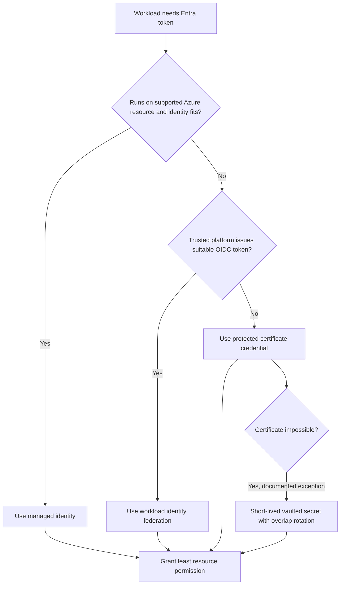

### Credential lifecycle

| Stage | Control |
|---|---|
| Create | Named owner, purpose, environment, least identity and management policy |
| Store/trust | Managed platform, OIDC trust, Key Vault/HSM; never source code/ticket/email |
| Deploy | CI/CD identity and auditable retrieval; no human copy where avoidable |
| Rotate | Add replacement, deploy/test, observe, remove old; overlap only as long as needed |
| Monitor | Sign-in use, expiry, unused credentials, owner changes, code scanning |
| Incident | Disable/rotate, inspect grants/actions, downstream secrets and persistence |
| Retire | Remove credentials, permissions, owners and object after evidence/dependency review |

Use application authentication-method policies to restrict secret/certificate lifetimes and trusted issuers where current support fits. Avoid many credentials on one app, shared credentials across environments/apps, unowned credentials, and public-client apps with confidential credentials.

---

## 16. Managed identities

A **managed identity** is a special service principal associated with Azure resources; Azure manages the underlying credentials so developers do not store a secret.

| Type | Lifecycle | Sharing | Best use |
|---|---|---|---|
| System-assigned | Created/deleted with one Azure resource | One resource only | Identity lifecycle should exactly follow the workload resource |
| User-assigned | Independent Azure resource | Can attach to multiple supported resources | Preauthorization, reusable identity, blue/green/recycled compute |

```mermaid
sequenceDiagram
    autonumber
    participant W as Azure workload
    participant M as Managed identity endpoint/platform
    participant E as Entra ID
    participant R as Target resource
    W->>M: Request token for target resource
    M->>E: Platform-authenticated managed identity request
    E-->>M: Access token for identity/resource
    M-->>W: Token; no app secret exposed
    W->>R: Call with access token
    R->>R: Enforce RBAC/app authorization
```

Managed identity removes credential handling, not authorization risk. A user-assigned identity shared across many workloads increases blast radius and obscures attribution. Grant least RBAC/API scope, maintain owner/resource inventory, separate environments, monitor sign-ins and Azure Activity, and delete unused identities/assignments. Microsoft currently recommends user-assigned managed identities for many Microsoft-service scenarios, but system-assigned remains suitable where lifecycle coupling is desired.

---

## 17. Workload identity federation

**Workload identity federation (WIF)** configures an Entra app or user-assigned managed identity to trust tokens from an external OpenID Connect (OIDC) issuer. The external workload exchanges its short-lived platform token for an Entra access token.

### 🔍 Plain-English deep-dive: federation replaces a stored secret with a narrow trust rule

- **Issuer** — *the trusted external identity provider URL.* **Analogy:** Which passport authority may issue the document. **Why it matters:** Trusting the wrong issuer accepts attacker-controlled tokens.
- **Subject** — *the exact external workload identity/claim, such as repository, branch/environment, Kubernetes service account, or cloud principal.* **Analogy:** The named passport holder. **Why it matters:** A broad subject can let another workload impersonate production.
- **Audience** — *the intended token exchange recipient.* **Analogy:** The border crossing the passport was issued for. **Why it matters:** It prevents replay to an unintended service.
- **Federated identity credential (FIC)** — *the Entra trust configuration matching issuer, subject and audience.* **Analogy:** The approved passport rule. **Why it matters:** Values are case-sensitive under current breaking-change guidance and must match exactly.

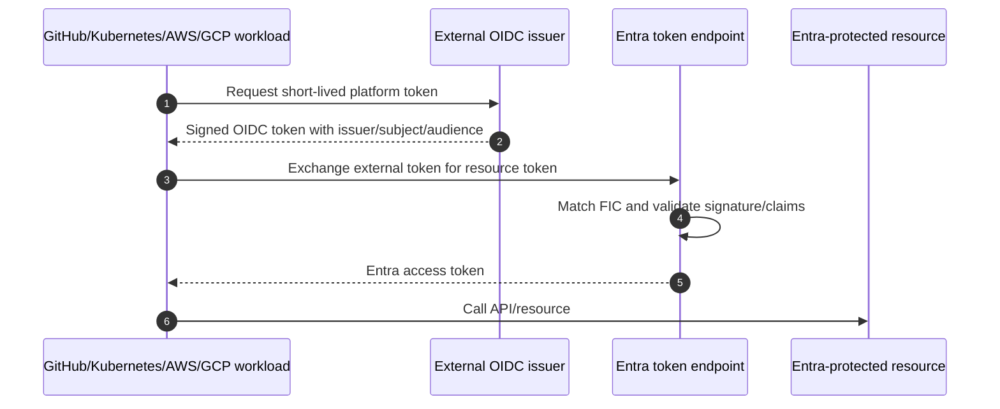

Current supported examples include GitHub Actions, Kubernetes, Google Cloud, AWS outbound identity federation, Azure Pipelines, SPIFFE/SPIRE and other OIDC platforms. Entra-issued tokens cannot be used as the external token in this federation flow under current guidance. The platform stores only the first 100 signing keys from the external issuer’s OIDC endpoint, so excessive keys can cause failure. Flexible/wildcard FIC patterns are Preview/change-sensitive; prefer exact subjects and environment protection until assessed.

---

## 18. Conditional Access and risk for workload identities

Workload Conditional Access targets supported service principals, not ordinary users. A workload cannot satisfy interactive MFA, device-compliance or terms prompts like a human.

| Workload control | Current scope/consideration |
|---|---|
| Identity target | Selected supported service principals |
| License | Workload Identities Premium |
| Conditions | Supported location/risk conditions under current feature |
| Grant | Commonly block access when criteria match |
| Exclusions | Managed identities and some multitenant/non-Microsoft SaaS paths are outside risk-CA scope |
| Report | Service-principal sign-in and risky workload identities |
| CAE | Supported workload/resource paths can enforce critical changes/risk more quickly |

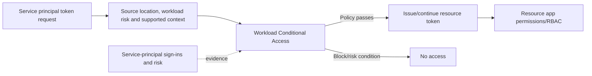

Risk detections include suspicious sign-ins, leaked credentials, threat intelligence, anomalous service-principal activity, suspicious API traffic and suspicious/malicious apps. Investigation must cover application and service-principal credentials, owners, permission grants, source workloads, code/deployment changes, Graph/Azure/M365 actions and downstream secrets. Rotate/replace before clearing risk; disable the service principal when containment and business continuity support it.

---

## 19. App governance and service-principal risk

**App governance** in Microsoft Defender for Cloud Apps/Defender XDR provides visibility, policy, detection and remediation for OAuth-enabled apps across supported Entra, Google and Salesforce environments. It can show app activity, permissions, user grants, sensitive data use and anomalous behavior.

| App governance function | Operational use |
|---|---|
| Inventory/insights | Non-Microsoft apps, permission level, users and activity |
| Policy | Detect noncompliant/risky app/user patterns |
| Alerts | App Governance source in Defender XDR queue |
| Remediation | Restrict/block/revoke supported app access/actions under policy |
| Correlation | Pivot between Defender Cloud Apps, XDR and Entra evidence |

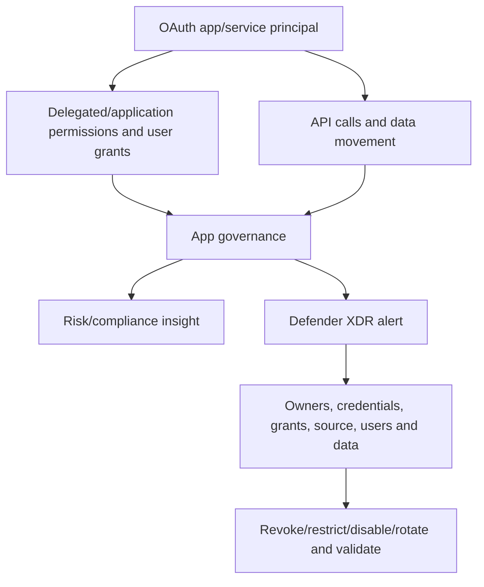

App governance does not replace Entra inventory, consent policy, code security, app ownership, workload CA, ID Protection, API-specific RBAC, or incident response. Validate Defender licensing and supported platforms/connectors.

---

## 20. App ownership, properties, and secure configuration

| Property/control | Risk | Secure direction |
|---|---|---|
| Owners | Owner can change app/credentials | Minimal named business/technical owners; frequent review |
| Redirect URI | Domain takeover or token/code redirect | HTTPS, exact owned URIs, no wildcard/insecure scheme |
| Implicit flow | Tokens exposed in front-channel patterns | Authorization code + PKCE for modern public clients |
| App ID URI | Collision/misvalidation | Supported unique URI; commonly `api://<appId>` |
| Token version/audience | API accepts wrong tokens | Correct v2 claims/audience validation where required |
| Supported account types | Unintended tenants/accounts | Single tenant by default; justify multitenant/consumer |
| App instance property lock | Customer-tenant SP can be altered unexpectedly | Lock sensitive properties, especially multitenant apps |
| Credentials | Leakage/expiry/too many keys | Managed/federated first; certificate; short secret exception |
| Permissions | Excessive data/admin reach | Least privilege; delegated where natural; periodic reduction |
| Publisher verification | Consent trust signal | Verify publisher, but do not treat verification as security review |

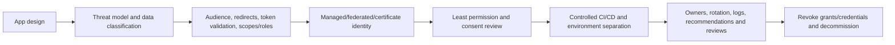

Separate development, test and production app registrations/identities to avoid one credential or permission crossing environments. Application owners are privileged; govern their lifecycle and PIM/CA where applicable. A stale owner who left can add a credential or redirect URI if the account persists.

---

## 21. Permission inventory, audit, Graph, and revocation

| Permission evidence | Graph/resource concept |
|---|---|
| Delegated grant | `oauth2PermissionGrant` for client service principal/user or all principals |
| Application permission | `appRoleAssignment` from client service principal to resource service principal |
| User/group app assignment | `appRoleAssignment` to local enterprise application |
| Entra/Azure role | Directory/Azure RBAC assignment separate from consent |
| App owner | Application/service-principal owners |
| Credential | Application/service-principal password, key or federated identity credential |
| Sign-in | Service-principal or user sign-in logs |
| API activity | Microsoft Graph activity/resource audit logs where available |

```mermaid
flowchart TD
    INVENTORY[App/service-principal inventory] --> PERMS[Delegated grants + app role assignments]
    INVENTORY --> OTHER[Entra/Azure/Exchange/Teams resource authorization]
    INVENTORY --> CREDS[Secrets, certs, FICs and owners]
    PERMS --> NEED[Map each grant to API call/business need]
    OTHER --> NEED
    CREDS --> NEED
    NEED --> DECIDE{Retain, reduce, replace or revoke?}
    DECIDE --> CHANGE[Approved scoped change]
    CHANGE --> TEST[Positive/negative app tests and logs]
    TEST --> REVIEW[Recurring owner/permission/credential review]
```

Revoking an admin consent grant does not stop the application from requesting it again or a user from reconsenting where policy allows. Remove/update requested permissions in the app, configure user-consent policy/admin workflow, and review all other authorization systems. The portal can revoke admin consent; user consent may require Graph/PowerShell. Use current least-privilege admin roles and supported Graph permissions, not copied destructive scripts.

### Permission review questions

1. Which exact API calls require each scope/app role?
2. Can a narrower delegated or resource-specific permission work?
3. Which users/data/tenants can the app reach?
4. Has the permission been used recently, and does that prove ongoing need?
5. Who owns code, deployment, identity, resource and incident response?
6. Which credentials exist on both application and service-principal objects?
7. What happens if the grant is revoked, and how is rollback authorized?

---

## 22. Application/workload incident response

Assume ID Protection reports suspicious API traffic from a service principal with `Files.Read.All`; Defender app governance shows unusual OneDrive download volume; a new credential was added two days earlier.

```mermaid
flowchart TD
    ALERT[Workload risk/App Governance alert] --> IDENTIFY[App ID, application/SP object IDs, tenant, owners, environment]
    IDENTIFY --> CONTAIN{Active data access/business criticality?}
    CONTAIN -->|Yes| ACTION[Approved disable/revoke/credential rotation/resource restriction]
    CONTAIN -->|Unclear| PRESERVE[Preserve sign-in, audit, grants, credential and API evidence]
    ACTION --> PRESERVE
    PRESERVE --> SCOPE[Graph/M365/Azure actions, data, users and related apps]
    SCOPE --> ROOT[Credential leak, owner compromise, consent phishing, code/pipeline or federation trust]
    ROOT --> ERADICATE[Remove credential/grants/persistence; secure pipeline/owner]
    ERADICATE --> RECOVER[Least permission, new identity/federation, tests and monitoring]
    RECOVER --> PIR[RCA, disclosure, app governance and control improvement]
```

| Evidence | Questions |
|---|---|
| App/application/SP objects | IDs, audience, properties, owners, created/changed time |
| Credentials/FIC | Who added, key ID, start/end, last use, issuer/subject/audience |
| Consent/grants | Who granted, delegated/app-only, scope, tenant-wide/user-specific |
| Sign-ins | IP/ASN, resource, credential type, token, CA, errors, pattern |
| Graph/resource activity | Files/mail/directory/role/app changes and data volume |
| CI/CD/code/vault | Commit, deployment, secret scanner, runner identity and access |
| Related identities | Owner/admin user compromise and other service principals |
| Business impact | Data sensitivity, customers, regions, legal/privacy notification |

You can truthfully lead the SharePoint/OneDrive resource-impact analysis pattern on paper: distinguish expected migration/sync/download from exfiltration, validate site and file scope, sharing and business owner, and coordinate identity/app/security teams. Do not imply having performed production app-governance containment.

---

## 23. Phased deployment and design tradeoffs

| Phase | Activities | Exit gate |
|---|---|---|
| Discover | Guests, partners, tenants, sharing, apps/SPs, grants, credentials, owners, logs, licenses | Complete boundary inventory |
| Assess | Risk, privacy, stale guests, excessive consent, secret exposure, unsupported flows | Prioritized findings |
| Design | B2B/direct/sync choice, cross-tenant matrix, guest/app lifecycle, identity hierarchy | HLD/LLD and owner approval |
| Prepare | CA/trust, strong auth, consent workflow, managed/federated identity, logging, emergency | Dependencies and rollback proven |
| Pilot | One partner/project and selected noncritical apps/workloads | Positive/negative/failure tests pass |
| Scale | Partner/app risk rings with communication and hypercare | Metrics/support/security within thresholds |
| Operate | Reviews, rotation, app governance, tenant/sign-in changes, incidents, license monitoring | RACI and cadence active |

```mermaid
flowchart LR
    R0[Ring 0 fictional/test tenant and app] --> R1[Identity/security/admin users]
    R1 --> R2[One strategic partner/shared project]
    R2 --> R3[Low-risk delegated apps/workloads]
    R3 --> R4[Sensitive M365 app-only and multitenant apps]
    R4 --> RUN[Steady state]
    RUN --> REVIEW[Guest, partner, permission, credential and trust review]
```

### Tradeoffs

| Choice | Benefit | Cost/risk |
|---|---|---|
| Trust partner MFA/device | Better experience and reuse | Reliance on partner assurance and incident process |
| B2B guest | Broad app/resource integration | Guest object lifecycle and tenant switching |
| Direct connect | Seamless shared channel | Mutual admin coordination and limited scope |
| Cross-tenant sync | Automated same-enterprise lifecycle | Attribute/privacy/licensing/deprovision complexity |
| App-only permission | Reliable background access | Broad silent data reach |
| Delegated permission | User context constrains access | User/session/consent dependency |
| Shared user-assigned MI | Reusable/preauthorized | Larger blast radius and attribution difficulty |
| Exact per-workload identity | Strong isolation | More identity inventory/operations |

---

## 24. Positive, negative, failure, and rollback testing

| Test type | Scenario | Expected result/evidence |
|---|---|---|
| B2B invite | Approved Entra partner user redeems | Correct home redirect, guest object, CA and resource role |
| Email OTP | Non-Entra partner under approved policy | OTP provider and resource access work |
| Blocked domain | New invitation from denied domain | Creation blocked; existing-user behavior separately validated |
| Inbound negative | External user outside allowed partner group | Cross-tenant access blocked |
| Outbound negative | Internal user tries disallowed external app | Home outbound policy blocks |
| Trusted MFA | Partner MFA claim present | Resource CA accepts only for configured organization |
| Untrusted device | Device claim not trusted | Resource requirement challenges/blocks as designed |
| Direct connect | Mutual shared-channel test | Home Teams experience and scoped channel resources work |
| Direct negative | Only one tenant allows | No shared-channel access |
| Cross-tenant sync | Scoped source user created in target | Correct mapping, automatic redemption and app access |
| Cross-tenant deprovision | Source user disabled/out of scope | Target blocked/soft-deleted according to event |
| TRv2 | Unknown external account on supported controlled client | Authentication/data path blocked as documented |
| Single-tenant app | User from other tenant attempts sign-in | Rejected before local consent/authorization |
| Delegated permission | User calls only own authorized files | Cannot exceed user/resource scope |
| Application permission | Workload performs required API operation | Negative API/data operation denied |
| Admin consent | Request goes through qualified review | Grant, requester/reviewer and evidence correct |
| Secret rotation | Add/test replacement then remove old | No outage; old credential fails |
| Federation negative | FIC subject/case/audience mismatch | Token exchange denied and logged |
| Managed identity | Azure workload gets token | No secret exposed; RBAC limits resource |
| Workload CA | Selected service principal from blocked context | Policy denial; managed/multitenant exclusions understood |
| Permission revocation | Remove grant under approved test | Token renewal/API fails; requested permission/reconsent controlled |
| Incident containment | Disable/revoke paper scenario | Business fallback and evidence preservation work |
| Rollback | Partner/app pilot disrupts business | Revert only scoped setting/grant/credential with security monitoring retained |

Rollback differs by layer: restore a partner-specific cross-tenant setting, reinstate a tested prior grant, reactivate a preserved service principal, or restore an old credential only if it is known uncompromised and approved. Never broadly enable all B2B, trust every tenant’s MFA/device claims, re-enable user consent tenant-wide, or restore a suspected credential to solve an outage.

---

## 25. Layered troubleshooting

```mermaid
flowchart TD
    SYM[External/app access symptom] --> IDS[Home/resource tenant, user/app/SP IDs, UTC, resource and correlation]
    IDS --> REL[Guest/direct/sync/app identity relationship and object state]
    REL --> XTA[Inbound/outbound/default/org/trust/tenant restriction settings]
    XTA --> AUTH[Home provider, redemption, MFA/device claims, token endpoint]
    AUTH --> CA[Home and resource Conditional Access/workload CA]
    CA --> CONSENT[Service principal, delegated/app grant, assignment and user consent]
    CONSENT --> CRED[Secret/cert/FIC/managed identity and token claims]
    CRED --> RESOURCE[Graph/Azure/M365 app authorization and sharing]
    RESOURCE --> PROV[Entitlement/cross-tenant/SCIM provisioning and lifecycle]
    PROV --> LOGS[Sign-in, audit, Graph, Defender/App Governance and resource logs]
    LOGS --> TEST[Least-invasive discriminating test]
```

| Symptom | Likely cause | First discriminating check |
|---|---|---|
| Guest says account not found | Wrong home identity/provider/redemption binding | Guest identities/issuer and home-tenant sign-in redirect |
| Invitation cannot be sent | Invite role/domain/external collaboration restriction | New invitation policy and domain list |
| Guest authenticates but app denies | No group/app/site assignment or resource authorization | Local guest object ID and exact resource role |
| Guest repeatedly challenged | MFA trust absent, CA conflict, token/session/terms | Both tenants’ sign-in and CA details |
| Compliant partner device ignored | Claim trust not enabled or device claim absent | Organization-specific inbound trust and token/device details |
| Direct connect fails | Mutual settings/app/user scope or MFA trust missing | Both tenants’ inbound/outbound direct-connect policy |
| Cross-tenant user not created | Target sync not allowed, source scope/mapping, job error | Provisioning log in source and target inbound setting |
| Source disabled but target re-enabled | Target manual change overwritten by next source update | Source `accountEnabled`, mapping and cycle |
| TRv2 policy not enforced | Missing/unsupported client signaling or data-plane limitation | Request path, signaling method and exact app/client |
| App exists in registrations but not enterprise apps | Service principal missing/deleted/wrong tenant | Application object and local SP object IDs |
| Consent prompt repeats | Grant absent/wrong tenant/scopes changed/prompt forced | `oauth2PermissionGrant`/app-role assignment and request |
| Admin reviewer cannot approve | Reviewer lacks actual consent role; Graph app permission needs GA | Requested permission type and reviewer role |
| `invalid_client` | Expired/wrong secret/cert, app/tenant mismatch | App ID, tenant endpoint, credential key ID/time and sign-in log |
| Federated exchange fails | Issuer/subject/audience/case/key mismatch | External token claims and FIC exact values |
| Managed identity gets 403 | Token succeeded but resource RBAC missing/wrong scope | Token audience/identity object then target role assignment |
| Workload CA not applied | Managed identity, multitenant/non-Microsoft SaaS or wrong scope/license | Service-principal type/home and workload CA applicability |
| Revoked app still accesses | Existing token/session, another grant/RBAC, reconsent | All grants, tokens, resource auth and audit timeline |

Never troubleshoot by granting Global Administrator, granting `Directory.ReadWrite.All`/`Files.ReadWrite.All` blindly, adding a long-lived secret to source code, trusting all external claims, allowing all tenants, disabling CA, or deleting an application before preserving object/grant/evidence relationships.

---

## 26. Operations, metrics, privacy, and licensing

| Metric | What it reveals | Guardrail |
|---|---|---|
| Guests without sponsor/expiry | External lifecycle gap | Include justified direct collaboration and owners |
| Guest/direct-connect review completion | Certification quality | Track teams added to shared channels separately |
| Cross-tenant deny/failure rate | Policy or user-impact issue | Segment inbound/outbound/trust/app/CA |
| Cross-tenant sync latency/errors | Lifecycle health | Reconcile target, not job status only |
| External objects after source leaver | Deprovision gap | Distinguish disabled, soft-deleted and orphaned |
| Apps/service principals without two owners | Ownership risk | One owner may be acceptable only with documented fallback |
| High-privilege app grants | Silent data/admin reach | Map actual API use and resource-specific alternatives |
| Secrets/certs expiring/unused | Outage/attack surface | Federate/managed migration and rotation SLA |
| Federated credential breadth | Trust blast radius | Exact subject/environment controls |
| Consent requests/denials/time | User need and reviewer capacity | Denial is not automatically success |
| Service-principal risk/app governance alerts | Active app threat | Incident SLA and business criticality |
| Permission/credential review age | Governance health | Review usage, owner, data and code changes |

### Licensing anchors

| Capability | Current conceptual requirement |
|---|---|
| Cross-tenant trust/settings scoped to users/groups/apps | Entra ID P1 in configured tenant; direct connect P1 both tenants |
| Cross-tenant user sync | P1 for synchronized users in source |
| Cross-tenant group/cross-cloud sync | ID Governance/Suite in source |
| Entitlement/access review guest governance | Governance/Suite/P2 carryover plus guest billing as applicable |
| Workload Conditional Access/risk details | Workload Identities Premium |
| App governance | Applicable Defender for Cloud Apps/Defender XDR licensing |
| Tenant Restrictions v2 | P1/P2 plus GSA/Windows/proxy dependencies by enforcement |
| Managed identities | No extra managed-identity charge; target services/RBAC still apply |

Privacy concerns include external contact discovery, guest profile and activity, cross-tenant attribute replication, policy storage across regions, partner claims, app permissions to mail/files, app-governance data, and developer/operator visibility. Define legal purpose, partner notices/agreements, data minimization, attribute map, residency, retention, subject rights, incident notification, and secure access. Cross-tenant synchronization outside one enterprise can add significant GDPR/regulatory duties; Microsoft does not collect consent for you.

---

## 27. RACI and operating cadence

| Activity | Accountable owner |
|---|---|
| External collaboration defaults | External Identity/Entra service owner |
| Partner-specific cross-tenant agreement | Business sponsor + identity security + partner admin |
| Trusted MFA/device claims | Security architecture/risk owner |
| Teams shared channel membership | Channel owner with Teams governance |
| Cross-tenant sync source/mappings | Source tenant identity/provisioning owner |
| Guest lifecycle/access reviews | Sponsor/resource owner + ID Governance |
| App registration/code | Application product owner/development |
| Service principal/consent | Cloud Application/identity security owner |
| Credential/federation/managed identity | Workload/platform/DevSecOps owner |
| App governance/workload incidents | SOC + identity/app/resource owners |
| Graph/permission evidence | Identity governance/compliance |
| Privacy/contract | Privacy/legal/procurement with business sponsor |

| Cadence | Activities |
|---|---|
| Daily | Provisioning errors, risky workload/app alerts, expiring critical credentials, partner incidents |
| Weekly | Stuck consent requests, external access failures, new high grants/secrets/owners |
| Monthly | Guest/sponsor hygiene, app/credential inventory, sync and rotation health |
| Quarterly | Partner trust, sensitive app permissions, shared channels, direct assignments, incident exercises |
| Annual/change | Default cross-tenant/TRv2 policy, contracts/privacy, multitenant audience, federation issuers and full tabletop |

Vendor coordination should use exact tenant/app/service-principal IDs, UTC, correlation/request IDs, token audience/issuer (never raw tokens), permissions, credential key IDs, redacted sign-in errors, expected/actual flow, ownership and minimal reproduction. This aligns naturally with your escalation and vendor evidence experience.

---

## 28. Consulting scenarios

### Scenario A: Partner needs one project Team and SharePoint site

Use entitlement-managed B2B collaboration with a connected organization, sponsor/resource approval, package roles, 30–90 day expiration, resource CA, deliberate MFA/device trust, terms, review and cleanup. Test SharePoint/OneDrive sharing, sync/download, Teams files and direct permissions.

### Scenario B: Partner needs only a shared channel

Use B2B direct connect if both Entra organizations can manage mutual settings and home MFA trust; scope users/apps; review direct users and added teams; document privacy. Do not create broad guest access merely to make a shared channel work.

### Scenario C: Enterprise has five tenants after acquisition

Use MTO context and cross-tenant synchronization for ongoing employee collaboration where requirements fit, with one-way source mappings, automatic redemption, P1/Governance licensing, target CA and resource assignment. It is not a tenant/data migration. Plan guest/object conflicts, manager/groups, deprovision, privacy and topology.

### Scenario D: GitHub pipeline deploys to Azure

Use workload identity federation with exact repository/environment subject and protected deployment environment, least Azure RBAC, no secret, code-owner approval, short platform token, sign-in/activity monitoring and negative branch/fork tests. Prefer managed identity if hosted in Azure and the app model fits.

### Scenario E: Third-party app requests `Files.ReadWrite.All`

Determine delegated versus application need, exact Graph calls, data scope, publisher, owners, redirect URIs, credential, hosting, retention and resource-specific alternatives. Route through admin consent workflow, pilot, monitor via app governance, review periodically and revoke/update requested permissions when unjustified.

| Scenario | Primary risk | Main deliverable |
|---|---|---|
| Project guest | Stale/direct SharePoint access | Guest package and workload test plan |
| Shared channel | Mutual trust and hidden team membership | Direct-connect matrix and review |
| Multiple tenants | Object/attribute/privacy/deprovision complexity | Cross-tenant sync HLD/LLD |
| CI/CD workload | Long-lived secret or broad subject/RBAC | Federated identity design |
| Third-party OAuth | Tenant-wide data access/consent phishing | App assessment and consent decision |

---

## 29. Consulting deliverables

| Deliverable | Minimum content | Quality test |
|---|---|---|
| External identity assessment | Guests, direct connect, sync, sharing, trusts, sponsors, reviews | Home/resource tenant and all access paths visible |
| Partner matrix | Tenant IDs, inbound/outbound users/apps, claims trust, sync, TRv2 | No display-name-only targeting |
| Collaboration decision | B2B guest vs direct connect vs sync vs multitenant app | Resource/lifecycle requirement drives choice |
| Guest lifecycle LLD | Invite/redeem/CA/assign/review/remove/delete | Direct workload permissions reconciled |
| App/workload inventory | Application/SP IDs, owners, audience, permissions, credentials, sign-ins | App object and local SP distinguished |
| Consent standard | User policy, admin workflow, reviewer checklist, SLA, evidence | Grant role and requester need verified |
| Credential roadmap | Managed → federation → cert → secret exceptions | Rotation/rollback and environment separation |
| Permission review | Delegated/app grants plus Entra/Azure/Exchange/Teams auth | Reconsent/requested permissions addressed |
| TRv2 design | Policy, signaling, authentication/data plane, clients, privacy | Preview/unsupported scenarios tested |
| Incident runbook | Guest/app/workload evidence, containment, recovery, disclosure | Preserves object/grant/token/resource timeline |
| Test/rollback pack | 23 tests, expected logs, operators and gates | Positive/negative/failure/incident coverage |
| Operations handover | RACI, dashboard, cadence, licenses, partner/vendor escalation | Every metric has owner/action |

Example finding:

> **Observation:** All employees and guests can invite external users, default B2B collaboration is unchanged, three strategic partners have no organization-specific trust review, 160 service principals have no owners, 42 secrets expire within 30 days, and eight apps hold tenant-wide file application permissions without recent review. **Risk:** Uncontrolled guest onboarding, stale partner access, credential outage/leak, consent abuse and silent M365 data access can bypass intended governance. **Recommendation:** Preserve business flows and baseline sign-ins; restrict invitations; create partner-specific inbound/outbound/trust settings; onboard guests through packages with sponsor/expiry/reviews; inventory app/SP/grants/credentials; migrate Azure workloads to managed identity and external pipelines to exact FICs; route consent through qualified review; enable app governance/workload-risk operations; test rings and scoped rollback. **Residual risk:** Partner assurance and third-party code remain external dependencies requiring contractual and technical monitoring.

---

## 30. Safe paper lab: partner collaboration and secretless workload design

This exercise creates no guests, invitations, tenant trusts, sync jobs, app registrations, service principals, grants, credentials, managed identities, policies or API calls.

### Prerequisites

- Parts 6–13 and Official Source Anchors below.
- Markdown/Mermaid/spreadsheet editor.
- Fictional tenant IDs, domains, users, apps, credentials and log entries only.
- No real customer/partner data, app secrets, certificates, tokens, screenshots or exports.

### Fictional client

Northstar has three Entra tenants, one strategic design partner, Teams/SharePoint/OneDrive collaboration, 900 guests, 230 app registrations, 310 service principals, GitHub pipelines with secrets, Azure workloads with user accounts, and M365 E5/Entra P1 plus limited P2/Workload ID coverage.

### Steps

1. Inventory human external relationships and nonhuman app/workload identities separately.
2. Choose B2B guest for a project Team/site and B2B direct connect for one shared channel; document why.
3. Build default and organization-specific inbound/outbound/trust policy matrices for two partners.
4. Design guest invitation/redemption, entitlement package, CA, ToU, sponsor, review and cleanup.
5. Design one-way cross-tenant user/group synchronization among Northstar tenants; include automatic redemption, mapping, limits, deprovision and privacy.
6. Build a TRv2 paper design for controlled Windows and universal GSA paths; mark authentication/data-plane Preview boundaries and unsupported clients.
7. Model an internal single-tenant app and vendor multitenant app: application object, home/customer service principals, audience, redirects and owners.
8. Compare delegated and application permissions and conduct an admin consent review for `Files.ReadWrite.All`.
9. Replace one Azure user service account with managed identity and one GitHub secret with an exact federated identity credential.
10. Design Workload ID CA, risky-service-principal investigation, app governance and permission/credential reviews.
11. Execute all 23 tests and three incidents: guest access persists after project, malicious OAuth grant, and leaked service-principal credential downloading OneDrive files.
12. Produce HLD/LLD, risk register, RACI, metrics, license matrix, roadmap, rollback and executive recommendation.

```mermaid
flowchart TB
    INVENTORY[External people + app/workload inventory] --> HUMAN[Guest/direct/sync collaboration designs]
    INVENTORY --> MACHINE[App/SP/managed/federated designs]
    HUMAN --> XTA[Cross-tenant/trust/TRv2 matrices]
    MACHINE --> CONSENT[Consent, permission and credential controls]
    XTA --> TEST[23 tests]
    CONSENT --> TEST
    TEST --> INCIDENT[Three incident investigations]
    INCIDENT --> OPERATE[RACI, metrics, licensing and roadmap]
    OPERATE --> DEFEND[Client/interview defense]
```

### Evidence to retain

| Artifact | Evidence |
|---|---|
| Boundary inventory | Guests/partners/tenants plus app/SP/credential/permission map |
| Decision records | B2B/direct/sync and managed/federated choices |
| Cross-tenant matrix | Default/org inbound/outbound/trust/sync/TRv2 |
| Guest LLD | Invite, redemption, package, CA, terms, review, cleanup |
| App models | Single/multitenant objects, audience, redirects, owners |
| Consent assessment | Delegated/app need, data, publisher, grant decision and tests |
| Credential migration | Managed identity and exact FIC with negative cases |
| Security operations | Workload CA, risk, app governance and permission review |
| Test/incident pack | 23 expected results and three timelines/RCA |
| Executive pack | Risks, options, licensing, roadmap, rollback and residual risk |

### Cleanup

Delete scratch content containing real partner domains, tenant/user/app/service-principal IDs, permissions, screenshots, IPs, secrets, certificates, tokens or customer data. If later adapted to a lab, export settings/evidence, remove only test partner policies/assignments after deprovision completes, revoke test grants and credentials, confirm test tokens no longer renew, delete fictional objects in dependency order, and verify default collaboration/emergency controls remain intact. Never paste a secret into code or logs, broadly trust all partners, or delete an app before preserving incident evidence.

### Interview wording

> “I completed a fictional external and workload identity design grounded in current Microsoft guidance. I compared B2B guest, direct connect and cross-tenant sync; designed inbound/outbound trust and tenant restrictions; governed guest lifecycle; modeled application/service-principal objects and consent; migrated secrets to managed identity/federation; added workload CA, risk and app governance; and ran 23 tests plus three incidents. It is design/lab evidence, not claimed production Entra ownership.”

---

## 31. Official Source Anchors

These first-party references were checked for the guide’s **August 24, 2026** currency date. Recheck live pages, Product Terms, cloud/tenant type, Graph version, service limitations, Defender support and partner requirements before implementation.

1. [Microsoft Entra External ID overview](https://learn.microsoft.com/entra/external-id/external-identities-overview) — workforce B2B versus external-tenant CIAM, direct connect, MTO, Conditional Access, Graph and B2C purchase retirement.
2. [What is B2B collaboration?](https://learn.microsoft.com/entra/external-id/what-is-b2b) — guest objects, invitation/redemption, home sign-in change, collaboration/external settings and SharePoint/OneDrive integration.
3. [Cross-tenant access overview](https://learn.microsoft.com/entra/external-id/cross-tenant-access-overview) — inbound/outbound/default/org settings, MFA/device trust, direct connect, automatic redemption, sync, TRv2, licensing, audit and privacy.
4. [B2B direct connect](https://learn.microsoft.com/entra/external-id/b2b-direct-connect-overview) — mutual Teams shared-channel trust, no guest object, MFA/device trust, monitoring, access reviews and privacy.
5. [Cross-tenant synchronization](https://learn.microsoft.com/entra/identity/multi-tenant-organizations/cross-tenant-synchronization-overview) — one-way provisioning, automatic redemption, mappings, user/group support, 40-minute interval, deprovision, limits, licensing and privacy.
6. [Multitenant organizations overview](https://learn.microsoft.com/entra/identity/multi-tenant-organizations/overview) — related-tenant collaboration model and capability comparison.
7. [Tenant Restrictions v2](https://learn.microsoft.com/entra/external-id/tenant-restrictions-v2) — directions, policy/signaling options, authentication/data-plane scope, Preview M365/Windows behavior, service principals, logs and limitations.
8. [Application objects and service principals](https://learn.microsoft.com/entra/identity-platform/app-objects-and-service-principals) — registration, blueprint/local instance, managed/legacy service principals, multitenant relationship and deletion consequences.
9. [Single- and multitenant apps](https://learn.microsoft.com/entra/identity-platform/single-and-multi-tenant-apps) — supported account audiences and tenant onboarding.
10. [Permissions and consent overview](https://learn.microsoft.com/entra/identity-platform/permissions-consent-overview) — delegated versus app-only, scopes/app roles, user/admin consent and other authorization.
11. [Configure admin consent workflow](https://learn.microsoft.com/entra/identity/enterprise-apps/configure-admin-consent-workflow) — enabling role, reviewers, Graph-app-role approval, notifications, expiry and reviewer limitations.
12. [Security best practices for app properties](https://learn.microsoft.com/entra/identity-platform/security-best-practices-for-app-registration) — identity/credential hierarchy, redirects, token/App ID URI, property lock, permissions, owners and recommendations.
13. [Managed identities overview](https://learn.microsoft.com/entra/identity/managed-identities-azure-resources/overview) — system/user-assigned identities, lifecycle, token use, managed identity as FIC and current recommendations.
14. [Workload identity federation](https://learn.microsoft.com/entra/workload-id/workload-identity-federation) — GitHub/Kubernetes/AWS/GCP/SPIFFE/Azure Pipelines, issuer-subject-audience matching, case sensitivity and signing-key limit.
15. [Conditional Access for workload identities](https://learn.microsoft.com/entra/identity/conditional-access/workload-identity) — supported service-principal targeting, controls, exclusions and Workload ID Premium.
16. [Workload identity risk](https://learn.microsoft.com/entra/id-protection/concept-workload-identity-risk) — detections, reports/Graph/export, investigation, credential response and CA scope.
17. [App governance](https://learn.microsoft.com/defender-cloud-apps/app-governance-manage-app-governance) — OAuth app inventory, policy, detection, Defender XDR alerts and remediation.
18. [Review permissions granted to enterprise apps](https://learn.microsoft.com/entra/identity/enterprise-apps/manage-application-permissions) — delegated/application grant review/revocation, Graph resources, reconsent caveat and other authorization systems.

**Preview/change-sensitive register:** Tenant Restrictions v2 Windows/data-plane/anonymous M365 coverage; Global Secure Access enforcement; cross-tenant group/cross-cloud sync; manager and MTO user experiences; Agent ID/Agent 365 and API permissions; flexible federated identity credentials; workload CA/CAE/risk scope; app governance connectors/remediation; consent reviewer role behavior; Graph schemas/modules; app instance locks/policies; External ID/B2C transition; guest and governance billing; and sovereign-cloud support require current validation.

---

## ⭐ Likely Interview Questions for This Section

### Q1. What is the difference between B2B collaboration and B2B direct connect?

> **Model answer:** “B2B collaboration creates a local external user object in the resource tenant and supports access to Microsoft, SaaS and custom apps through groups, app roles and sites. B2B direct connect is a mutual cross-tenant trust currently used for Teams shared channels; users remain in their home Teams experience and no ordinary guest object is created. Direct connect is blocked by default, requires both tenants and home MFA trust when resource CA requires MFA.”

### Q2. How do inbound, outbound, trust settings, and tenant restrictions differ?

> **Model answer:** “Inbound controls external users reaching my tenant’s apps. Outbound controls my users reaching external apps. Inbound trust decides whether my resource CA accepts a partner’s MFA/compliant/hybrid-device claims. Tenant restrictions are separate: they control an external account reaching an external app from my managed device or network. I model user, app, direction, tenant and client signaling explicitly.”

### Q3. What is cross-tenant synchronization, and what is it not?

> **Model answer:** “It is a one-way Entra provisioning push that creates and manages B2B external users and supported groups in a target tenant from scoped internal source members, with automatic redemption and lifecycle deprovisioning. It supports multitenant-organization collaboration. It is not bidirectional authority, does not sync source guests, is not instantaneous, and is not a tenant or SharePoint/OneDrive/mail data migration because the source identity remains required.”

### Q4. What is the difference between an app registration and enterprise application?

> **Model answer:** “The app registration/application object is the home-tenant blueprint: app ID, audience, redirects, scopes/app roles and credentials. An enterprise application is usually the local service-principal instance in a tenant, where consent grants, assignments, CA, sign-ins and enablement apply. A multitenant blueprint can produce a service principal in every consenting customer tenant. I use the correct app ID versus local object ID when troubleshooting.”

### Q5. Compare delegated and application permissions.

> **Model answer:** “Delegated permissions are scopes used with a signed-in user; effective access is constrained by both the scope and the user/resource authorization. Application permissions are app roles used without a user and can grant broad tenant data access. I choose the least permission, prefer delegated when the task is naturally user-scoped, use app-only for genuine automation, and assess resource-specific RBAC alternatives, owners, credentials, data and monitoring.”

### Q6. How would you secure an application credential?

> **Model answer:** “My hierarchy is managed identity for a suitable Azure workload, workload identity federation with an exact trusted OIDC issuer/subject/audience for external platforms, a protected certificate when federation is unavailable, and a short-lived vaulted secret only as a documented exception. I separate environments, grant least resource permission, monitor use/expiry, rotate with add-test-remove overlap, scan code, and review owners and every credential.”

### Q7. How would you respond to a service principal downloading unusual OneDrive data?

> **Model answer:** “I identify the application and local service-principal objects, owners, credentials/FICs, consent/app roles, sign-ins and business dependency. I coordinate approved containment such as disablement, grant revocation or credential replacement while preserving evidence. I scope Graph/SharePoint/OneDrive activity, owner/admin compromise, code/pipeline and downstream secrets, eradicate persistence, recover with least permission and secretless identity, validate positive/negative tests, and complete privacy/RCA actions.”

### Q8. How does your background support this work without overstating it?

> **Model answer:** “My direct production experience is SharePoint/OneDrive sharing, permissions and sync escalation, plus RCA, vendor/product-group coordination, documentation and stakeholder advisory work. That maps strongly to resource authorization, guest experience and data-impact validation. My cross-tenant, consent, app, managed/federated identity and workload-security evidence is a current fictional design and incident exercise, not claimed production Entra ownership.”

---

## 🧠 30-Second Memory Hooks

- **B2B guest:** Authenticate at home, authorize at resource, local external object.
- **Direct connect:** Mutual Teams shared-channel trust, no ordinary guest object.
- **Inbound:** Their users → our apps.
- **Outbound:** Our users → their apps.
- **Tenant restriction:** Their account → their app on our controlled device/network.
- **Trust claim:** Accept partner MFA/device proof only after due diligence.
- **External collaboration:** Invitation rights, guest visibility and domains.
- **Cross-tenant sync:** One-way lifecycle push, not tenant/data migration.
- **MTO:** Related tenant collaboration, not tenant merge.
- **Guest cleanup:** Remove every access path before deleting the object.
- **App registration:** Home blueprint.
- **Enterprise app:** Local service-principal instance.
- **App ID:** Product model; not secret.
- **Object ID:** One local directory record.
- **Delegated:** App + signed-in user; effective intersection.
- **Application permission:** App acts alone; potentially tenant-wide.
- **Consent:** Authorization grant, not proof the app is safe.
- **Admin workflow:** Reviewer designation does not grant consent authority.
- **Identity hierarchy:** Managed → federated → certificate → secret exception.
- **FIC:** Exact issuer + subject + audience; case matters.
- **Managed identity:** No developer-held credential, but permissions still matter.
- **Workload CA:** Service-principal conditions/block; no human MFA.
- **App governance:** OAuth inventory + activity + policy + alert/remediation.
- **Revoke:** Remove grant and control requested permissions/reconsent too.
- **Incident:** Identity + credential + grant + code + API/data timeline.
- **Honesty:** M365 sharing/RCA transfer plus paper design is not production Entra app ownership.

---

## Completion Checklist

- [ ] Choose correctly among B2B guest, direct connect, cross-tenant sync and workload identity.
- [ ] Explain home/resource tenant authentication and authorization.
- [ ] Trace guest object, invitation, provider discovery, redemption, CA and resource role.
- [ ] Distinguish external collaboration settings from cross-tenant settings.
- [ ] Explain inbound, outbound, default, organization-specific and app/user alignment.
- [ ] Design and risk-assess trusted MFA, compliant-device and hybrid-join claims.
- [ ] Explain mutual B2B direct connect, Teams shared channels, review and privacy limits.
- [ ] Explain MTO context and one-way cross-tenant user/group synchronization.
- [ ] Validate automatic redemption, 40-minute interval, mappings, deprovision and licensing.
- [ ] Explain why cross-tenant sync is not tenant/data migration.
- [ ] Distinguish TRv2 from outbound policy and design supported signaling.
- [ ] Mark current authentication/data-plane/Windows/M365 Preview boundaries.
- [ ] Design guest sponsor, package, review, direct-access reconciliation and cleanup.
- [ ] Distinguish application object, service principal, managed identity, app ID and object ID.
- [ ] Compare single-tenant, multitenant and consumer audiences.
- [ ] Explain delegated scopes versus application app roles and effective access.
- [ ] Design user/admin consent and current admin-consent workflow limitations.
- [ ] Apply the managed/federated/certificate/secret credential hierarchy.
- [ ] Design credential ownership, rotation, monitoring, incident and retirement.
- [ ] Compare system- and user-assigned managed identities and blast radius.
- [ ] Explain workload federation issuer/subject/audience, case and signing-key limits.
- [ ] Design Workload ID CA/risk with supported service-principal scope and exclusions.
- [ ] Explain App Governance’s inventory, policy, alert and remediation role.
- [ ] Secure redirects, implicit flow, token/audience, property lock, permissions and ownership.
- [ ] Inventory delegated grants, app-role assignments, other RBAC, owners and credentials with Graph.
- [ ] Explain why revocation alone does not prevent reconsent.
- [ ] Run the application/workload incident and preserve M365 resource evidence.
- [ ] Execute all 23 positive, negative, failure, incident and rollback tests.
- [ ] Use layered troubleshooting without broad trust, permission or credential bypass.
- [ ] Define licensing, privacy, metrics, RACI, cadence and vendor escalation.
- [ ] Complete the paper lab, deliver consulting artifacts and answer Q1–Q8 honestly.

---

*Next suggested section:* [Part 15](Part-15-intune-architecture-enrollment-mdm-mam.md) — add device identity, enrollment, MDM/MAM authority, platform ownership and endpoint context to the user, guest and workload access architecture.