# Part 15 — Intune Architecture, Device Identity, Enrollment, MDM, and MAM

> **Section goal:** Build a beginner-to-consultant mental model of Microsoft Intune: what the cloud service controls, how device identity and enrollment establish trust, when to manage a whole device with mobile device management (MDM), and when to protect only work data with mobile application management (MAM). By the end, you should be able to design a platform-aware enrollment approach, explain ownership and record boundaries, plan prerequisites and lifecycle actions, troubleshoot enrollment layer by layer, and produce defensible client artifacts without claiming production Intune ownership.

This Part adds endpoint context to the identity controls in [Part 14](Part-14-external-cross-tenant-workload-app-identity.md). Parts 16-20 build on this foundation with configuration, compliance, applications, endpoint security, operations, and co-management.

> **Currency and change-sensitive note:** Product behavior was checked against official Microsoft Learn content available on **August 24, 2026**. Portal labels, supported operating-system versions, enrollment methods, Apple and Google prerequisites, remote-action behavior, licensing bundles, Intune Suite entitlements, and Microsoft Graph schemas can change. Android device administrator management is deprecated and unavailable for devices with Google Mobile Services; use supported Android Enterprise patterns. Windows Autopilot device preparation and classic Windows Autopilot are separate current experiences and are covered in Part 18. Recheck Microsoft Learn, Product Terms, the tenant release, Apple deployment documentation, Android Enterprise documentation, and service health before a real design or change.

## JD Mapping

| Deloitte role expectation | Capability developed in this Part | Consulting evidence |
|---|---|---|
| Assess Microsoft 365 endpoint posture | Map users, devices, ownership, identity states, enrollment methods, licenses, certificates, tokens, and dependencies | Current-state inventory and enrollment-readiness assessment |
| Design Intune and endpoint-management architecture | Choose MDM, MAM, or both by persona, platform, data sensitivity, and ownership | Enrollment HLD, platform decision matrix, and trust-flow diagram |
| Configure and optimize Microsoft security services | Define authority, scope, restrictions, profiles, ownership classification, and lifecycle guardrails | Configuration workbook and phased rollout plan |
| Troubleshoot policy and platform issues | Separate discovery, identity, licensing, network, enrollment, management-channel, and record failures | Layered runbook, evidence timeline, and escalation pack |
| Work across vendors and stakeholders | Assign Apple, Google, OEM, reseller, identity, network, privacy, HR, service-desk, and security ownership | RACI, dependency register, and expiry calendar |
| Deliver documentation and handover | Define metrics, support states, remote-action approvals, evidence, known errors, and escalation criteria | Operations guide, knowledge articles, dashboard, and handover checklist |

## Candidate honesty note

You can credibly connect this Part to demonstrated Microsoft 365 support strengths: identity and permission investigation, SharePoint/OneDrive sync and access troubleshooting, critical-incident coordination, hypothesis-driven RCA, change validation, customer communication, vendor/product-group escalation, documentation, and service metrics. Those skills transfer directly to separating a user issue from device identity, enrollment, token, network, policy, or service failure.

This Part does **not** claim that you have owned a production Intune tenant, enrolled an enterprise fleet, administered Apple Business Manager or Managed Google Play, operated certificate connectors, or executed production retire/wipe actions. Safe wording is:

> “My production background is Microsoft 365 support, escalation, RCA, documentation, and stakeholder coordination rather than Intune platform ownership. I have built a current, platform-aware Intune enrollment and lifecycle design as a structured paper exercise. I can explain the architecture, prerequisites, evidence, tests, risks, rollback, and troubleshooting method, and I would validate tenant-specific behavior with the endpoint owner before implementation.”

---

## 1. Intune in one sentence: a cloud control plane for endpoints and work data

**Microsoft Intune** is a cloud service that manages devices, applications, and the work data inside supported applications. An **endpoint** is a device from which a person or process accesses company resources: a Windows laptop, Mac, iPhone, iPad, Android device, Linux workstation, specialty device, or supported virtual endpoint.

Intune is not the operating system, identity provider, antivirus engine, or Conditional Access decision engine. It coordinates with those systems. Microsoft Entra ID authenticates identities and stores device identities. Operating-system management frameworks enforce settings. Apps integrated with the Intune software development kit enforce app protection. Conditional Access consumes signals and controls access. Microsoft Defender products contribute risk and protection signals.

| Capability | Plain meaning | Intune role | Separate dependency |
|---|---|---|---|
| Device enrollment | Establish a management relationship | Issues/records management identity and sends policy | OS enrollment framework, Entra, network |
| Configuration | Ask the OS to apply settings | Creates, assigns, reports profiles | Windows CSP, Apple MDM, Android Enterprise APIs |
| Compliance | Evaluate whether posture meets rules | Calculates and reports status | Device signals, Entra Conditional Access |
| App management | Deliver or protect work apps/data | Assigns apps and app policies | Store, app vendor, Intune SDK/IME |
| Endpoint security | Configure security technologies | Provides focused policy surfaces | Defender, firewall, encryption, OS edition |
| Remote actions | Request sync, retire, wipe, lock, and more | Authorizes, queues, audits action | Online device and platform support |
| Reporting/automation | Observe and operate at scale | Admin center and Microsoft Graph | Entra groups, RBAC, API permissions |

**Memory hook:** Intune is the conductor, not every instrument.

## 2. The architecture: identity, control plane, delivery channel, enforcement, evidence

The **control plane** is where administrators define desired state. The **data plane** is where devices, applications, and service traffic perform work. Intune's control plane stores assignments and management state; platform channels deliver instructions; the operating system or app enforces them; status returns as evidence.

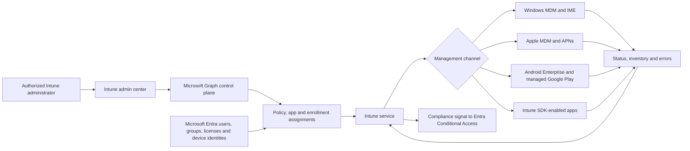

### 🔍 Plain-English deep-dive: desired state is a request plus evidence

- **Desired state** — *the approved configuration the organization wants.* **Analogy:** A building specification says every external door should lock. **Why it matters:** A saved policy is intent, not proof that every endpoint complied.
- **Management channel** — *the trusted path used to send instructions and return status.* **Analogy:** A registered courier route. **Why it matters:** If identity, push notification, token, certificate, or network transport fails, the correct policy never reaches the device.
- **Enforcement point** — *the OS or app component that actually applies a control.* **Analogy:** The physical lock, not the architect's drawing. **Why it matters:** Platform and edition support determine whether a requested setting can work.
- **Evidence** — *status, inventory, logs, timestamps, and user-visible results that show what happened.* **Analogy:** Inspection records and a tested door. **Why it matters:** “Assigned” is not the same as “received,” “applied,” or “effective.”

For you, this resembles troubleshooting a SharePoint/OneDrive policy or sync issue: separate configuration intent, target, delivery, client enforcement, and telemetry instead of treating “the portal looks correct” as proof.

## 3. Tenant readiness, MDM authority, and automatic enrollment scope

An Intune **tenant** is the organization's service instance associated with its Microsoft Entra tenant. The **mobile device management authority** identifies which service owns MDM management. For modern Intune-only tenants, Intune is normally the authority. Legacy environments or Configuration Manager integrations require careful verification; never change authority based on assumption.

**Automatic enrollment scope** defines which Entra users are automatically enrolled in Intune when supported Windows join or registration flows occur. It is not the same as an Intune policy assignment, a device license, an enrollment restriction, or Conditional Access.

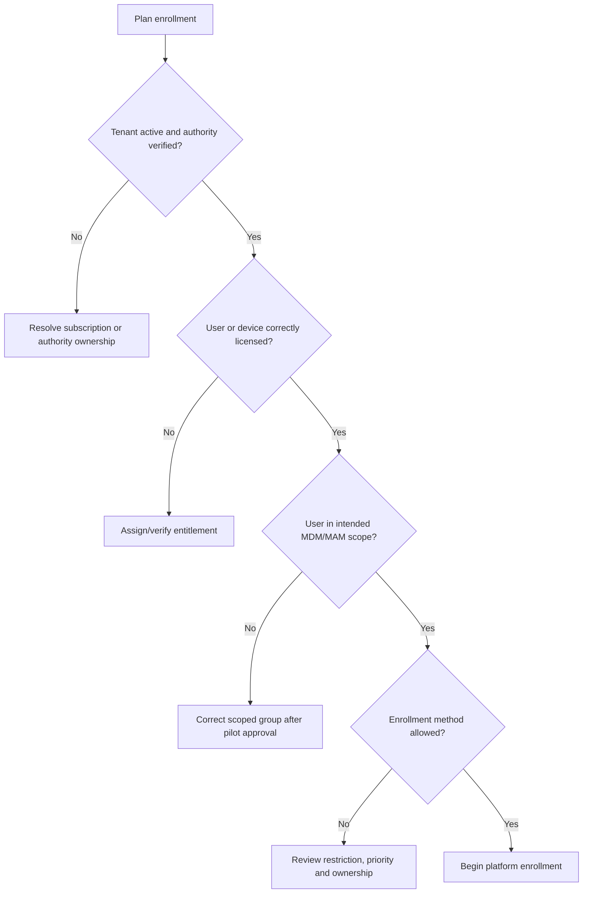

| Readiness question | Evidence | Failure if ignored |
|---|---|---|
| Is the tenant healthy and in the intended cloud? | Tenant details, service health | Admin or enrollment endpoint mismatch |
| Is Intune the intended MDM authority? | Tenant administration status | Devices enroll into wrong/no authority |
| Which identities may enroll? | MDM user-scope groups | Unexpected enrollment or missing auto-enrollment |
| Which identities receive MAM? | MAM/app-protection assignments | Work data remains unmanaged or user is blocked |
| Are licenses present and enabled? | User license/service-plan evidence | Enrollment or policy delivery fails |
| Are admin roles least privilege? | Intune/Entra role assignments | Excessive access and weak accountability |
| Are terms and privacy notices approved? | Legal/privacy sign-off | Invalid consent or employee-relations risk |
| Are platform connections current? | Apple/Google certificate and token dates | Fleet-wide enrollment or app failure |

Do not casually toggle an entire workforce into MDM scope. Use a test group, document expected join paths, check existing management agents, and define recovery. Automatic enrollment can transform a sign-in or join action into a management relationship; that deserves change control.

## 4. One physical endpoint can create several different records

The word “device” is overloaded. One laptop or phone can produce an Entra device object, an Intune managed-device record, an Autopilot registration, an Apple Business Manager assignment, a Managed Google Play binding, Defender inventory, and Configuration Manager records. They are related but not interchangeable.

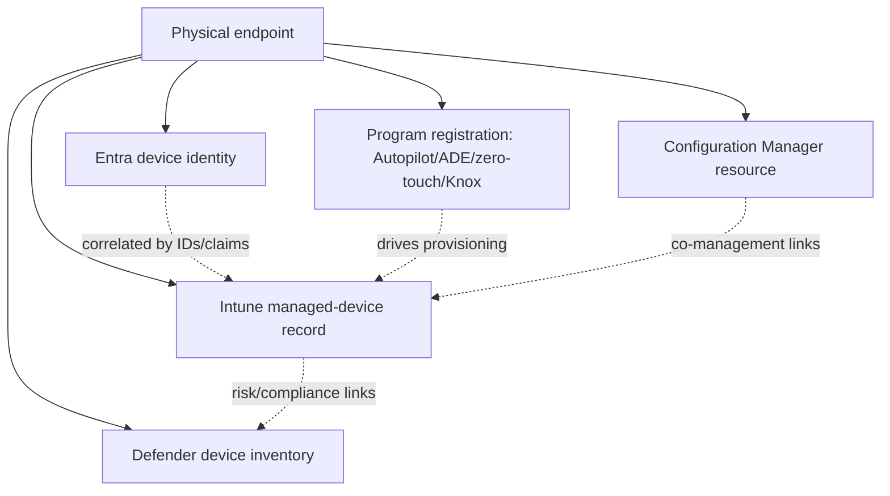

| Record | Primary purpose | Typical identifier | Deleting it does not automatically mean |
|---|---|---|---|
| Entra device | Authentication/device identity and trust claims | Entra device ID | Device is factory reset or removed from every service |
| Intune managed device | MDM inventory, policy, app, compliance, actions | Intune managed-device ID | Entra identity or provisioning registration is removed |
| Windows Autopilot registration | Recognize hardware during out-of-box experience | Hardware hash/serial-related identity | Intune record is retired or user data is erased |
| Apple ADE record | Automated enrollment assignment from Apple | Serial and MDM-server assignment | APNs certificate or Intune object disappears |
| Android enterprise enrollment | Work profile/fully managed/dedicated relationship | Android management identifiers | Personal Google account/data is controlled |
| Defender record | Endpoint security telemetry and risk | Defender machine/device ID | MDM authority changes |
| Configuration Manager resource | On-premises management and workload state | Resource/client GUID | Cloud identity is removed |

### 🔍 Plain-English deep-dive: duplicate records are a correlation problem first

- **Identity record** — *a directory representation used during authentication.* **Analogy:** An employee badge record. **Why it matters:** Conditional Access needs the correct device claim.
- **Management record** — *Intune's operational view of the enrolled endpoint.* **Analogy:** The facilities maintenance record for the badge holder's laptop. **Why it matters:** Policy status and remote actions attach here.
- **Provisioning registration** — *a pre-deployment claim that a device belongs to an organization or program.* **Analogy:** A purchase order telling receiving where new equipment should go. **Why it matters:** Deleting it can change the next out-of-box experience.
- **Stale record** — *an object that has not checked in or no longer represents a live relationship.* **Analogy:** An old badge left in the database. **Why it matters:** It distorts reporting and can confuse access decisions, but age alone is not permission to delete it.

Before deleting a duplicate, correlate serial number, hardware ID, Entra device ID, management ID, user, enrollment date, last check-in, certificate state, and provisioning source. Determine which record is live and what downstream systems reference each identifier.

## 5. Entra device states: registered, joined, and hybrid joined

Device state describes the relationship to Entra ID. It does not, by itself, prove Intune enrollment or compliance.

| Entra state | Plain meaning | Common ownership/use | Domain relationship | Intune relationship |
|---|---|---|---|---|
| Entra registered | A user adds a work account to a device | Often personal/BYOD | Not joined to organizational directory | May be MAM-only or optionally MDM enrolled |
| Entra joined | Device belongs directly to Entra | Cloud-managed corporate Windows | No traditional AD join required | Common Intune/Autopilot target |
| Entra hybrid joined | Device is joined to AD DS and also represented in Entra | Existing domain fleet | On-premises AD dependency | Can be Intune enrolled/co-managed |

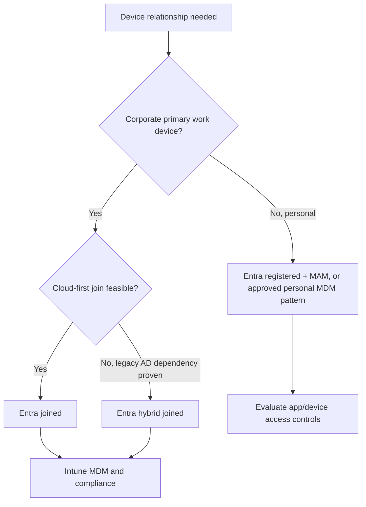

Do not use “joined,” “registered,” “enrolled,” “managed,” “corporate-owned,” and “compliant” as synonyms. A personal phone can be registered but not MDM enrolled. A corporate laptop can be joined but temporarily noncompliant. An Intune record can exist while the device is offline. Ask which specific relationship and timestamp the speaker means.

## 6. Ownership: corporate versus personal is a governance input, not a perfect detector

**Ownership** affects inventory visibility, actions, enrollment eligibility, user expectations, and privacy. Intune can classify devices as corporate or personal based on enrollment method, corporate identifiers, and platform behavior. Administrators can change ownership in supported contexts, but governance should define who may do so and with what evidence.

| Ownership evidence | Strong use | Limitation |
|---|---|---|
| Apple Automated Device Enrollment (ADE) | Apple device procured/assigned through organization | Depends on Apple program and assignment accuracy |
| Windows Autopilot registration | Organization-authorized Windows provisioning | Registration ownership and reseller process must be governed |
| Android corporate-owned enrollment | Fully managed, dedicated, or corporate-owned work profile | Correct token/mode must be used at setup |
| Corporate identifier | Match supported serial/IMEI/manufacturer/model data | Best-effort classification; platform fields and reuse can vary |
| Device Enrollment Manager | Bulk/user-associated enrollment under special account | Operational account is not proof of procurement by itself |
| Manual ownership change | Correct a known inventory record | Vulnerable to human error; requires source evidence |

**Corporate identifiers** help Intune recognize supported devices as company-owned. They are not cryptographic attestation and enrollment restrictions are not security boundaries against a malicious device that can misrepresent attributes. Reconcile identifiers with procurement and asset systems.

Privacy design should answer: What inventory can administrators see? Which actions can remove personal data? What does the user consent to? Which jurisdictions require works-council or legal review? How long are device and user records retained? Who can export them? A technically valid control can still be an unacceptable privacy design.

## 7. Platform support is a matrix, not one universal Intune feature set

Intune supports broad platform families, but enrollment methods, configuration payloads, compliance signals, app models, remote actions, and minimum versions differ.

| Platform family | Common supported management patterns | Important caveat |
|---|---|---|
| Windows 10/11 | Entra join/hybrid join, automatic MDM, Autopilot, provisioning, co-management | Edition, build, CSP, network, and existing authority matter |
| macOS | Company Portal user enrollment or Apple ADE | APNs certificate and Apple enrollment/profile rules are critical |
| iOS/iPadOS | Account-driven/user enrollment, device enrollment, ADE, shared/specialized patterns | Ownership and user affinity change privacy and capability |
| Android Enterprise | Personally owned work profile, corporate-owned work profile, fully managed, dedicated, AOSP scenarios | Managed Google Play binding and Google services/support vary |
| Linux | Supported distro enrollment and compliance/configuration capabilities | Feature set is narrower and changes by distro/version |
| ChromeOS/specialty Apple platforms | Specific management/inventory/action scenarios | Do not assume full parity with Windows/mobile |

Never write “Intune supports setting X” without naming platform, OS version, ownership/enrollment mode, license, and enforcement mechanism. A consultant should maintain a requirements-to-platform matrix and mark unsupported requirements explicitly.

## 8. Licensing and scope: verify the person, device, administrator, and add-on

Core Intune rights can be included in Microsoft Intune Plan 1 and several Microsoft 365/Enterprise Mobility + Security bundles. Advanced capabilities can require Intune Plan 2, Intune Suite, or standalone add-ons. Conditional Access has separate Entra licensing. Endpoint Privilege Management, Remote Help, Advanced Analytics, Cloud PKI, Enterprise Application Management, and other advanced capabilities can have distinct entitlements.

| Licensing question | Why it matters | Evidence to collect |
|---|---|---|
| Is the managed user licensed for Intune? | User-driven enrollment and policy rights depend on entitlement | Entra license/service plan |
| Is device-only licensing intended? | Userless/shared scenarios have different rights and limitations | Procurement and device-license assignment design |
| Is Entra ID P1/P2 included where needed? | Automatic enrollment and Conditional Access require applicable rights | Product terms and service plans |
| Are advanced Intune features used? | Core Intune does not imply every Suite capability | Feature-to-license matrix |
| Are M365 apps/Defender rights needed? | App and endpoint scenarios cross product boundaries | Persona bundle mapping |
| Are admins licensed? | Unlicensed-admin access can be enabled; it does not license managed users/devices | Tenant setting and privileged-access policy |

**Scope** has several meanings: licensing scope, MDM/MAM user scope, assignment scope, RBAC scope groups, and scope tags. Record the exact one. Recheck current Product Terms rather than promising that “E3” or “E5” always covers a scenario; bundle names, prerequisites, and add-ons evolve.

## 9. Enrollment restrictions, priorities, limits, and Device Enrollment Managers

Enrollment restrictions are best-effort rules controlling which user-driven enrollments are accepted. Platform restrictions can consider platform, supported OS bounds, Android manufacturer, and personal ownership. Device-limit restrictions can cap a user's enrollments from 1 to 15 under current guidance. A default restriction always exists; higher-priority assigned policies can override it for targeted users.

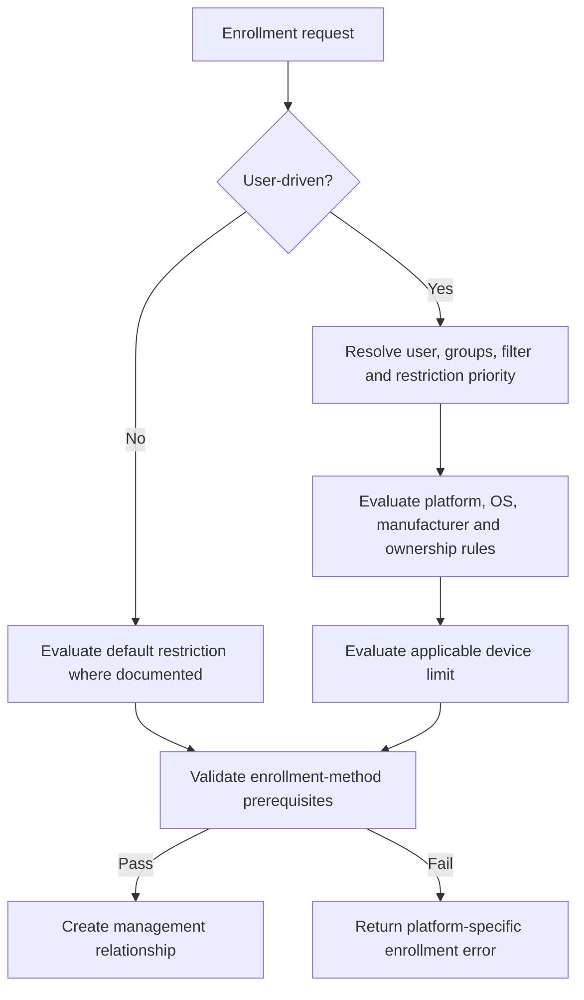

| Control | Controls | Does not prove/control |
|---|---|---|
| Platform restriction | Allowed platforms, ownership, versions/manufacturer where supported | Device is uncompromised |
| Device-limit restriction | Number a user can enroll in applicable flows | Shared/userless and several Windows modes |
| Entra maximum device setting | Directory registrations/joins per user | Every Intune enrollment scenario |
| Device Enrollment Manager (DEM) | Special account can enroll many devices under supported limits | Ideal ownership for every shared device or all platforms |
| Enrollment Status Page/profile | Setup experience and blocking choices | General tenant enrollment permission |
| Conditional Access | Access after identity/policy evaluation | Initial enrollment restriction semantics |

Enrollment restrictions can take time to reflect group/filter changes; Microsoft notes that Entra-to-Intune assignment processing is not instantaneous. Non-user-driven methods such as certain Autopilot, bulk, co-management, userless ADE, AVD, Windows 365, and dedicated Android scenarios rely on default-restriction behavior as documented. Test the exact flow.

Use DEM only where it matches the platform and operational need. Protect the account, restrict its role, document who controls it, monitor enrollments, and avoid making one shared account the hidden identity for an entire fleet when modern userless enrollment exists.

## 10. Windows enrollment patterns

Windows offers several paths. Choose based on ownership, join target, deployment lifecycle, legacy dependencies, and user experience.

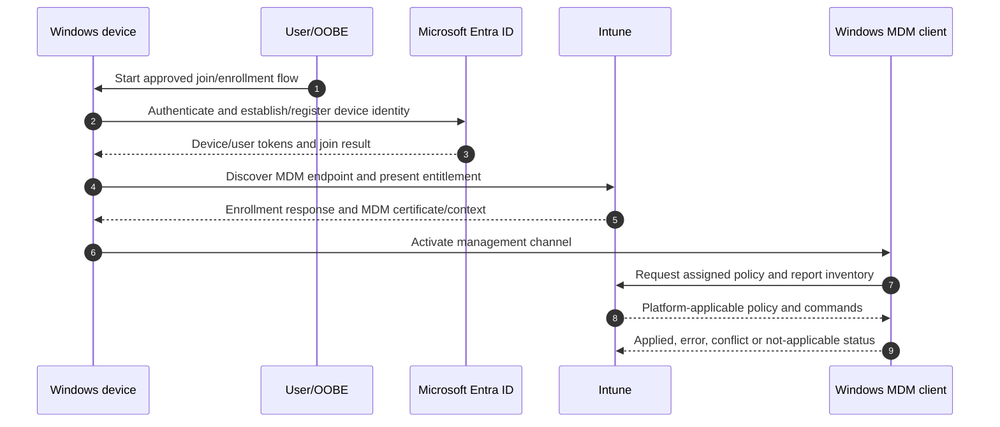

| Windows pattern | Best fit | Key considerations |
|---|---|---|
| Entra join + automatic MDM | Cloud-first corporate user device | MDM scope, license, OOBE/network, local admin design |
| Windows Autopilot | Pre-registered, repeatable provisioning and lifecycle scenarios | Registration/profile, OOBE, ESP, network, supported modes |
| Autopilot device preparation | Simplified Windows 11 provisioning with enrollment-time grouping | Separate model, Entra join only, device must not have classic registration |
| Entra hybrid join + enrollment | Proven AD dependency during transition | Line-of-sight, sync, connector/dependency complexity |
| Group Policy enrollment | Existing domain fleet | GPO scope, scheduled task, Entra/hybrid readiness |
| Configuration Manager co-management | Existing ConfigMgr client estate | Workload authority and enrollment prerequisites |
| Provisioning package/bulk | Shared or staged scenarios | Package protection, default restrictions, user association |
| Company Portal/Settings MDM | Approved manual scenario | Personal/corporate restriction behavior and user clarity |

Avoid presenting hybrid join as the default “more secure” option. It adds dependency and troubleshooting layers. Choose it only when requirements justify it. Part 18 compares the two Autopilot families and Part 20 covers co-management.

## 11. Apple trust chain: APNs, Automated Device Enrollment, Apps and Books

Apple management depends on external trust artifacts. The **Apple Push Notification service (APNs) certificate** lets Intune wake managed Apple devices so they check for commands. It is not the device's MDM identity itself. Renew it before expiry using the same Apple account and renewal path; replacing it can force re-enrollment.

An **Automated Device Enrollment (ADE) token** links Intune to an MDM server assignment in Apple Business Manager or Apple School Manager. An **Apps and Books token** supports organization-managed app and book licensing. Each has ownership, expiry, renewal, and incident implications.

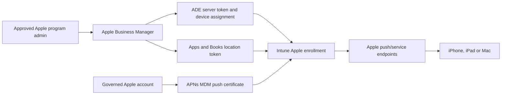

### 🔍 Plain-English deep-dive: certificates and tokens are expiring supply lines

- **APNs certificate** — *authorizes the MDM service to send Apple push notifications for its topic.* **Analogy:** A renewable permit for a dispatcher to call field devices. **Why it matters:** Expiry can interrupt management; replacement can break continuity.
- **ADE token** — *connects the Apple organization's device-assignment service to Intune.* **Analogy:** A warehouse routing agreement. **Why it matters:** New/reset devices need the correct MDM destination and profile.
- **Apps and Books token** — *connects purchased app-license inventory to Intune.* **Analogy:** A company software voucher account. **Why it matters:** App assignment and license reclamation depend on it.
- **Federated/managed Apple identity** — *an organization-governed Apple account pattern where configured.* **Analogy:** A company identity accepted at a partner desk. **Why it matters:** Apple identity design affects enrollment and service experience but is not identical to Entra device identity.

| Artifact | Owner | Renewal control | Monitor | Failure impact |
|---|---|---|---|---|
| APNs certificate | Named endpoint platform team + backup | Renew same certificate/account | 90/60/30/14/7-day alerts | Existing Apple MDM communication at risk |
| ADE token | Apple/endpoint admins | Download/upload renewed server token | Expiry and sync status | Device assignment/profile sync fails |
| Apps and Books token | App/license team | Renew same location token | Expiry, last sync, license errors | Managed app licensing/deployment fails |
| Apple account recovery | Controlled business process | Multiple authorized custodians | Recovery test | Renewal becomes impossible |

Never bind a fleet to an employee's ungoverned personal Apple account. Store ownership, renewal procedure, recovery, contacts, and evidence in the operations pack.

## 12. iOS and iPadOS enrollment patterns

Apple enrollment choices trade administrative control against privacy and user experience.

| Pattern | Typical ownership | User affinity | Control/privacy summary |
|---|---|---|---|
| ADE with user affinity | Corporate, assigned to a person | Yes | Strong automated enrollment; user-aware apps/policy |
| ADE without user affinity | Shared/kiosk/special purpose | No | Device-focused; no normal primary-user experience |
| Account-driven Apple User Enrollment | Personal/BYOD | User | Separated work management with privacy-focused control |
| Device enrollment via Company Portal/web flow | Personal or approved corporate | User | Broader device management; explain visibility and actions |
| Shared iPad | Corporate shared | Multiple managed users | Requires supported Apple/Intune design and capacity planning |

**Supervision** is an Apple management state that unlocks stronger controls on organization-owned devices. ADE can establish supervision automatically. It is not equivalent to Intune compliance and should not be promised for a personal-device path.

Design the profile before purchasing or resetting devices: user affinity, authentication method, locked enrollment, naming, setup-assistant screens, shared mode, and ownership. Test device reassignment, user departure, lost device, reset, and token renewal, not only happy-path first enrollment.

## 13. macOS enrollment patterns and privacy

macOS can use user-driven Company Portal enrollment or ADE for corporate deployment. FileVault bootstrap/secure tokens, platform single sign-on, local accounts, privacy preferences, system extensions, network filters, and app deployment have platform-specific prerequisites covered in later Parts.

| Design question | Why it matters |
|---|---|
| Corporate ADE or user-driven enrollment? | Determines automation, supervision-like management capabilities, and ownership confidence |
| Who is the primary user? | Affects user-targeted policy, app licensing, support, and reassignment |
| How are local administrator rights handled? | Changes escalation, security, and support model |
| Is the Mac already managed by another MDM? | Apple devices normally cannot have two active MDM authorities |
| Which security extensions need approval? | User prompts or blocked extensions can break protection |
| What personal data is visible or removable? | Employee notice and privacy review are mandatory |

For acquisition or migration, determine how the previous MDM profile is removed, how the new profile is installed, whether erase/reprovision is required, how FileVault keys are escrowed, and what happens if enrollment fails between authorities. Do not improvise removal on production Macs without tested recovery.

## 14. Android Enterprise enrollment patterns and managed Google Play

Android Enterprise separates personal and work contexts according to ownership. Intune binds to **managed Google Play**, which brokers enterprise app approval/distribution and Android management relationships.

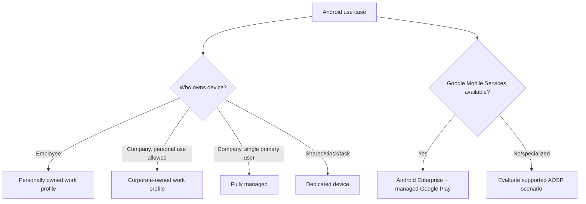

| Android mode | Personal space | Work management | Typical use |
|---|---|---|---|
| Personally owned work profile | Yes, user controlled | Separate managed work profile | BYOD |
| Corporate-owned work profile | Yes, permitted personal area | Stronger corporate controls over work/device boundary | Corporate phone with personal use |
| Fully managed | No normal unmanaged personal profile | Organization manages whole device | Corporate single-user device |
| Dedicated | No ordinary personal use | Locked/shared/task controls | Kiosk, frontline, signage |
| AOSP user-associated/userless | Scenario-specific | Intune-supported AOSP management | Devices without Google services where supported |

Android device administrator is a legacy, deprecated path and is no longer available on devices with Google Mobile Services. Do not recommend it for a new deployment. For China/no-GMS or specialized hardware, validate OEM, AOSP, app-distribution, push, compliance, and support requirements explicitly.

Enrollment tokens, QR codes, zero-touch, Samsung Knox Mobile Enrollment, NFC, or identifier-based methods can bootstrap modes. Treat enrollment tokens and QR material as sensitive: limit lifetime/scope, store securely, rotate after exposure, and prevent an uncontrolled device from joining a dedicated fleet.

## 15. BYOD versus corporate-owned: decide from data and support outcomes

**Bring your own device (BYOD)** means the worker owns the endpoint. Corporate-owned means the organization owns it, even if personal use is allowed. The decision should consider data, tasks, legal constraints, support, identity, offline use, certificates, apps, and exit handling.

| Requirement | MAM-only BYOD | BYOD with enrollment | Corporate MDM |
|---|---|---|---|
| Protect data in supported apps | Strong fit | Strong fit | Strong fit |
| Configure device Wi-Fi/VPN/certificates | No | Platform-dependent | Yes, platform-dependent |
| Inventory whole-device posture | Limited app signals | More device inventory | Broadest supported inventory |
| Deploy apps silently | Generally no | Limited/platform-dependent | Strongest with supervised/managed modes |
| Factory reset | No | Usually inappropriate for personal | Supported where platform/action allows |
| Selectively remove work data | Yes | Yes | Yes |
| Personal privacy | Highest management separation | Requires clear notice | Corporate policy governs device |
| Shared/kiosk use | Poor fit | Poor fit | Purpose-built enrollment |

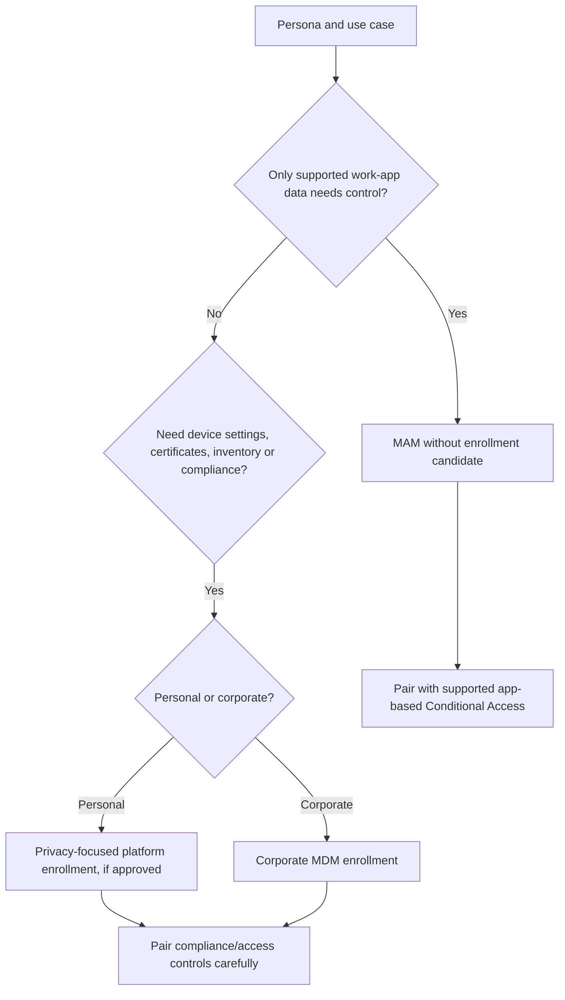

Do not force personal-device enrollment merely because it is technically possible. If the requirement is to keep work email and documents inside approved apps, MAM may meet it with less privacy impact. If device certificates, Wi-Fi, OS posture, encryption, inventory, or full lifecycle control are required, MDM may be justified.

## 16. MDM versus MAM: whole device, work container, or work identity inside an app

**Mobile device management (MDM)** enrolls the endpoint and uses the OS management framework. **Mobile application management (MAM)** applies policies to supported apps and work identities/data; Intune app protection policies can operate without MDM enrollment.

### 🔍 Plain-English deep-dive: three different boundaries

- **MDM boundary** — *the enrolled operating-system management relationship.* **Analogy:** The company maintains the entire office building. **Why it matters:** It can configure device settings, inventory, compliance, apps, and lifecycle within platform limits.
- **Work profile/container boundary** — *an OS-separated work area, such as Android Enterprise work profile or Apple User Enrollment separation.* **Analogy:** A locked company office inside a privately owned building. **Why it matters:** It balances work control and personal privacy.
- **MAM/app boundary** — *the work account and data inside an SDK-enabled app.* **Analogy:** A sealed company briefcase carried through a personal building. **Why it matters:** It can control copy/paste, save destinations, access checks, encryption, and selective wipe without managing the whole device.
- **App management state** — *whether policy targets managed or unmanaged device contexts.* **Analogy:** Different handling rules for a briefcase in a company office versus at home. **Why it matters:** Organizations can apply stricter MAM controls to unenrolled devices.

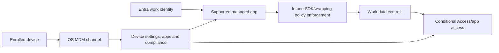

MAM without enrollment does not deploy device certificates, corporate Wi-Fi, or whole-device VPN; users generally install apps themselves. On Android, Company Portal is required for much app-protection functionality even when enrollment is not required. Microsoft 365 MAM on Android requires Entra device registration. On iOS/iPadOS, Authenticator commonly acts as broker. Support and broker requirements are change-sensitive.

## 17. App protection without enrollment: identity-centered data protection

An **app protection policy (APP)** can require an app PIN or biometrics, encrypt work data, constrain data transfer, require approved storage, enforce minimum app/OS conditions, block rooted/jailbroken devices, and selectively wipe organizational app data. The app must be supported through the Intune SDK or wrapping model.

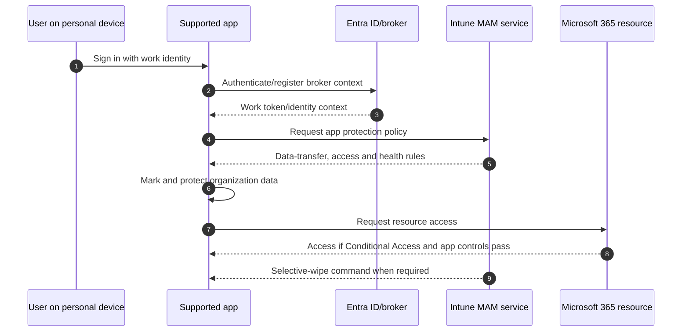

| MAM control | Example outcome | Limitation |
|---|---|---|
| Data transfer | Work data opens only in policy-managed apps | App/extension behavior must be tested |
| Save copies | Work files save only to approved cloud location | Cannot manage all personal storage generally |
| App access PIN/biometric | Additional gate for work context | Not a replacement for device encryption/authentication |
| Conditional launch | Warn/block/wipe based on version or risk | Depends on fresh app/device signals and SDK |
| MAM selective wipe | Removes organization data from managed apps | Device and personal content remain |
| Multi-identity | Policy applies to work identity, not personal account | App must correctly support multi-identity |

MAM is not magical data control over every app. Validate supported apps, authentication, share extensions, web links, offline grace, multiple accounts, document providers, and app versions. Pair it with Conditional Access that requires app protection where supported; note that the legacy **Require approved client app** grant retired in early March 2026, so current design should use the supported app-protection grant/migration guidance, not a legacy-only policy.

## 18. Company Portal, discovery, authentication, terms, and user experience

The **Company Portal** is a user-facing app/site involved in many enrollment, app, compliance, and support flows. Its exact role differs by platform and mode. It can authenticate the user, guide enrollment, display required/available apps, show compliance issues, initiate sync, and present support details. It is not the management authority itself.

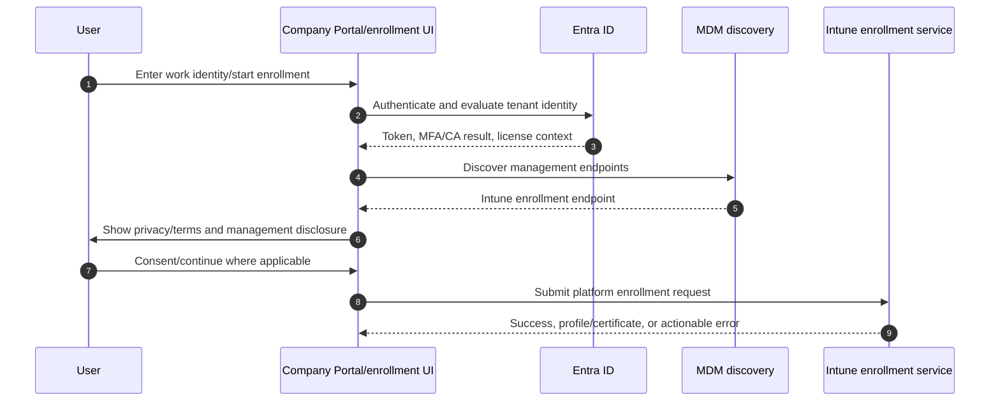

| User-experience element | Design need |
|---|---|
| Company branding and support contacts | Users must recognize legitimate enrollment and know whom to contact |
| Privacy statement | Explain collected device data and actions accurately |
| Terms and conditions | Obtain legal/privacy/HR approval and maintain versions |
| Enrollment instructions | Platform/mode-specific, with screenshots kept current |
| Remediation messages | State what failed, safe action, deadline, and support route |
| App availability | Clarify required versus optional apps and licensing |
| Lost/stolen procedure | Fast route for identity disablement and appropriate remote action |

Discovery failures can look like bad credentials but arise from DNS/network, tenant routing, MDM scope, application broker, or service health. Capture the exact URL, client, timestamp, correlation ID, platform, and stage.

## 19. Enrollment profiles, certificates, tokens, and bootstrap security

An **enrollment profile** defines how a supported provisioning flow behaves: ownership, user affinity, authentication, setup screens, group association, supervision/locked management, naming, or device mode. The profile does not replace the platform's trust artifacts.

| Bootstrap item | Purpose | Security control |
|---|---|---|
| Enrollment profile | Defines intended enrollment experience | Version, approval, pilot assignment, rollback |
| MDM enrollment certificate/profile | Authenticates ongoing management relationship | Protect private key; monitor expiry/status |
| Enrollment token/QR | Starts Android/specialized enrollment | Short lifetime/scope; controlled distribution |
| Corporate identifier | Helps authorize/classify known device | Reconcile to asset/procurement source |
| Autopilot registration | Recognizes Windows hardware for classic flow | Govern reseller/OEM import and deregistration |
| ADE assignment | Routes Apple serial to Intune/profile | Controlled Apple admin roles and sync evidence |
| Managed Google Play binding | Enables Android enterprise/app relationship | Govern enterprise binding and admin recovery |

Certificates and tokens are credentials. Do not paste them into tickets, screenshots, or general documentation. Store only identifiers, owners, nonsecret metadata, and renewal evidence in the knowledge base; store secrets in an approved vault where applicable.

## 20. Enrollment lifecycle: prepare, enroll, operate, transfer, and remove

Enrollment is not a one-time wizard. Design the entire endpoint lifecycle.

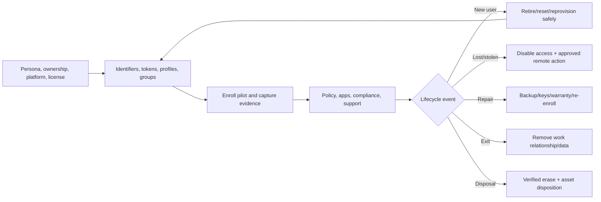

| Lifecycle stage | Control question | Evidence |
|---|---|---|
| Procurement | Is device registered in correct vendor program and inventory? | Purchase/serial/program record |
| Staging | Are profile, network, assignment, and tokens ready? | Readiness checklist |
| Enrollment | Did correct identity, ownership, mode, and record appear? | IDs, timestamps, screenshots/logs |
| Operation | Is check-in, policy, app, compliance, and protection healthy? | Dashboard/alert history |
| Transfer | Was previous user data removed and new identity assigned? | Approved action and validation |
| Loss/theft | Were account, sessions, device, legal, and law-enforcement steps coordinated? | Incident timeline |
| Retirement | Was corporate data/management removed without excess impact? | Action status and user confirmation |
| Disposal | Was secure erase and asset disposition verified? | Chain-of-custody/destruction certificate |

For you, the transferable behavior is lifecycle-aware RCA: a recurring enrollment incident can be a procurement/program registration defect, not a user mistake. Corrective action belongs at the earliest broken stage.

## 21. Retire, wipe, delete, and MAM selective wipe are not synonyms

Remote actions are platform-dependent, asynchronous, and potentially destructive. Require RBAC, confirmation, identity/asset verification, ticket/change or incident linkage, and where configured Multiple Administrative Approval.

### 🔍 Plain-English deep-dive: action intent versus database cleanup

- **Retire** — *ask an enrolled device to remove managed organizational data/settings and end management, within platform behavior.* **Analogy:** Recover company keys and files when a contractor leaves. **Why it matters:** It aims to preserve personal content but requires device contact and platform validation.
- **Wipe** — *request a factory reset or documented platform-specific erase behavior.* **Analogy:** Empty and reset the whole company laptop. **Why it matters:** It can destroy personal and corporate data and can render some devices unrecoverable under stronger options.
- **Delete record** — *remove the management object from the admin service.* **Analogy:** Delete the equipment row from a spreadsheet. **Why it matters:** It does not prove the physical endpoint erased data or received a retire command.
- **MAM selective wipe** — *remove organization data from supported managed apps.* **Analogy:** Remove company papers from the sealed briefcase, leaving the personal building intact. **Why it matters:** It is suitable for unenrolled BYOD but depends on app check-in.

| Action | Primary intent | Needs device/app contact | Personal data impact | Record impact |
|---|---|---|---|---|
| Sync | Request check-in | Yes | None expected | Updates status if successful |
| Retire | Remove management/company data | Yes | Intended to preserve, platform-specific | Intune relationship removed after processing |
| Wipe | Factory reset/erase | Yes | High; removes personal data in normal full wipe | Device removed from Intune after action behavior |
| Delete Intune object | Inventory cleanup | No command proof | None on device by itself | Removes Intune record |
| Delete Entra object | Remove directory device identity | No erase proof | None on device by itself | Removes Entra trust object |
| MAM selective wipe | Remove work data from supported apps | App checks service | Personal data preserved | MAM wipe request/status retained |
| Autopilot deregister | Stop classic program recognition | Service-side registration change | No immediate erase | Removes Autopilot registration, not every record |

For Windows, Microsoft documents several wipe options, including a protected wipe that continues despite power loss and can make some devices unbootable. Never recommend that option casually; use only for approved corporate high-security scenarios with recovery and hardware procedures. Current Intune guidance also documents a tenant-wide daily wipe-action limit. Recheck current limits before mass response.

## 22. Security and privacy threat model for enrollment

Enrollment creates a trusted management path, so attackers may target bootstrap material, admin roles, device identities, reseller registrations, help-desk processes, or stale records.

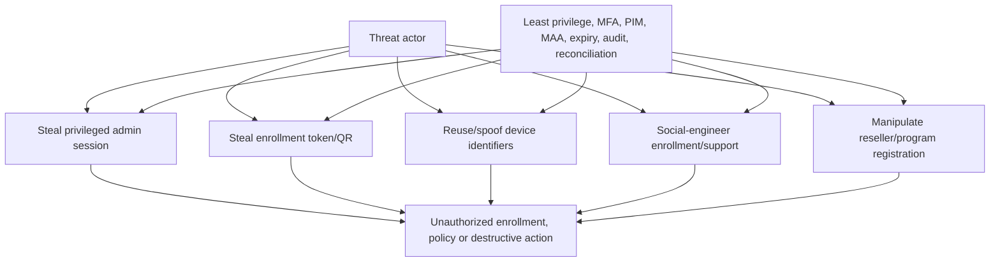

| Risk | Preventive control | Detective/recovery control |
|---|---|---|
| Privileged admin compromise | Phishing-resistant MFA, PIM, least privilege, admin workstation | Audit alerts, session revocation, role review |
| Unauthorized device enrolls | Approved methods, corporate identifiers/program registration, scoped restriction | Enrollment alerts, asset reconciliation, investigate/remove access |
| Token/QR leaks | Short-lived scoped token, secure distribution | Revoke/rotate, review unexpected enrollments |
| APNs/ADE/app token expires | Governed business identity, renewal calendar and backup owner | Expiry alert, tested renewal runbook |
| Personal device overmanaged | Privacy-by-design MAM/user-enrollment option | Complaints process, audit of remote actions, corrective policy |
| Duplicate/stale object affects access | Lifecycle automation with evidence thresholds | Correlation report, staged disable before delete |
| Wrong wipe | MAA, RBAC, asset/user verification, confirmation | Incident process, backup/recovery, audit review |

Enrollment restrictions are not sufficient anti-attacker controls. Combine them with identity protection, admin security, asset evidence, Conditional Access, compliance, endpoint protection, and monitoring.

## 23. Prerequisites and discovery workbook

A consultant should not start by clicking “Create profile.” Start with discovery and evidence.

| Discovery domain | Questions | Artifact |
|---|---|---|
| Personas | Executives, developers, frontline, contractors, shared devices, privileged admins? | Persona matrix |
| Platforms | OS/version/model counts, ownership, geography, accessibility? | Endpoint inventory |
| Identity | Entra join/register/hybrid, MFA, guest use, shared identities? | Identity/device-state map |
| Existing management | ConfigMgr, third-party MDM/MAM, OEM tools, scripts? | Authority/coexistence map |
| Apps/data | Required apps, certificates, VPN, offline data, regulated data? | App/data dependency map |
| Network | Proxies, TLS inspection, captive portal, VPN, split tunnel, restricted regions? | Endpoint allowlist/flow map |
| Vendor programs | Apple, Google, Autopilot, OEM/reseller readiness? | Token/program register |
| Operations | Service desk, 24x7, remote actions, depot, repair, disposal? | RACI and runbook catalogue |
| Privacy/legal | BYOD consent, monitoring boundaries, works council, retention? | Privacy impact decisions |
| Licensing | Persona/service-plan/add-on coverage? | License bill of materials |

Convert each requirement into an acceptance test. “Support BYOD securely” is vague. “On an unenrolled personal iPhone, Outlook work data cannot save to personal storage; personal photos remain outside management; offboarding removes work app data after check-in” is testable.

## 24. Deployment: rings, gates, communications, and rollback

Roll out by **rings**, meaning progressively larger and more representative groups. Rings reduce blast radius and create evidence before expansion.

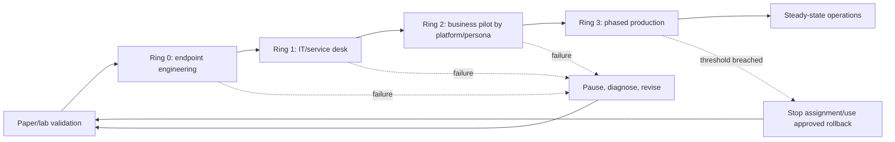

| Gate | Example criterion | Rollback/pause trigger |
|---|---|---|
| Architecture | Authority, identity, ownership, privacy and licenses approved | Unresolved authority or legal gap |
| Platform readiness | Certificates/tokens valid, network tests pass | Expiring artifact or blocked endpoint |
| Ring 0 | Repeated enroll/retire on representative devices succeeds | Unrecoverable device or wrong ownership |
| Ring 1 | Service-desk article and logs resolve common failures | Support cannot identify failure stage |
| Business pilot | Success rate, duration, app/data tests meet threshold | Access/data-loss/privacy incident |
| Production | Dashboard, on-call, vendor escalation and expiry monitoring active | Major incident or systemic trend |

Rollback may mean removing a pilot assignment, restoring a previous profile version, pausing enrollment communications, renewing a broken token, reverting a Conditional Access dependency, or returning to the previous management authority under a tested migration plan. It rarely means deleting every object. Record what cannot be instantly reversed, such as an OS reset, device wipe, ownership transition, or MDM migration.

## 25. Testing: positive, negative, lifecycle, privacy, and failure injection

| Test class | Example | Expected evidence |
|---|---|---|
| Positive enrollment | Licensed pilot user enrolls approved device/mode | Correct records, ownership, profile, check-in |
| Negative license | Unlicensed test identity attempts enrollment | Clear entitlement failure; no partial trust |
| Negative restriction | Personal device blocked for corporate-only persona | Predictable block and help text |
| Identity | Same device tested for intended register/join state | Correct Entra state and identifiers |
| Network | Proxy/TLS inspection path and unrestricted reference path | Endpoint-specific failure isolated |
| Token expiry simulation | Review near-expiry alert/runbook without expiring production token | Owner responds and renewal evidence template works |
| Privacy | Verify admin inventory and personal-data boundary | Approved fields/actions only |
| Lifecycle | Retire/re-enroll or reset/reassign a disposable test endpoint | Data/records align with documented action |
| MAM | Copy/save/open/selective wipe in supported apps | Work boundary enforced; personal data remains |
| Resilience | Service degradation and offline device | Queue/status/comms follow runbook |

Never failure-inject destructive actions into a production endpoint. Use disposable lab hardware or paper/tabletop evidence when licensing or devices are unavailable. Screen recordings and logs must not expose tokens, personal data, device secrets, or tenant identifiers in a public portfolio.

## 26. Layered enrollment troubleshooting

Troubleshoot from scope and time, then move through layers. Do not repeatedly press Sync or delete records before identifying the failed stage.

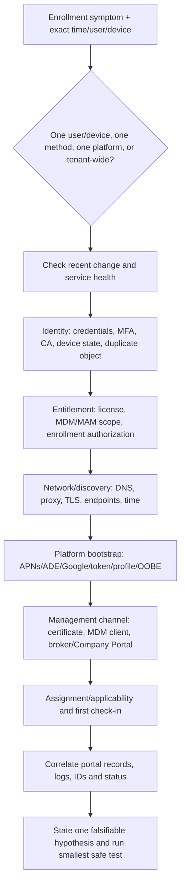

### 🔍 Plain-English deep-dive: an error code is a clue, not the root cause

- **Symptom** — *what the user or system observed.* **Analogy:** “The key did not open the door.” **Why it matters:** It does not yet identify whether the key, lock, identity, or permission is wrong.
- **Failure stage** — *the exact step where expected progress stopped.* **Analogy:** The key was never issued versus issued but rejected. **Why it matters:** Each stage has different evidence and owner.
- **Correlation ID/timestamp** — *values that connect client and cloud telemetry.* **Analogy:** A parcel tracking number and scan time. **Why it matters:** Support can locate the correct transaction instead of guessing.
- **Falsifiable hypothesis** — *a proposed cause with a test that could prove it wrong.* **Analogy:** “Proxy inspection breaks enrollment; the same device should succeed on an approved clean network.” **Why it matters:** It prevents random changes and produces RCA-quality evidence.

| Layer | Evidence | Common failure | Smallest safe check |
|---|---|---|---|
| Scope/time | User, device, platform, method, exact UTC | Broad outage mistaken for one-device issue | Compare known-good peer and service health |
| Identity | Entra sign-in/device logs, join state | MFA/CA interruption, wrong tenant, duplicate/stale object | Review sign-in and device IDs |
| License/scope | Service plans, MDM scope, groups | User outside scope or unlicensed | Compare effective membership after propagation |
| Restrictions | Policy priority/default/filter | Ownership/platform/device-limit block | Model exact user-driven/non-user-driven flow |
| Network | DNS, proxy, TLS, endpoint reachability, time | Blocked discovery/push/service URL | Test approved reference network |
| Platform trust | APNs/ADE/Google/token/profile status | Expired certificate/token or wrong assignment | Check expiry/last sync without replacing artifact |
| Client channel | Company Portal/broker/MDM client logs | Broken certificate/profile/app state | Gather diagnostics before reset |
| Records | Entra/Intune/program IDs and timestamps | Wrong record correlated or stale duplicate | Build identifier crosswalk |
| Service | Intune health/message center/support | Regional/service incident | Match impact and incident window |

## 27. Common enrollment failures and root-cause patterns

| Symptom | Plausible causes | Do not jump to | Better next evidence |
|---|---|---|---|
| User “not authorized” | License, scope, restriction, device limit, role/tenant | Factory reset | License details, group resolution, restriction result |
| Device appears in Entra but not Intune | Join succeeded, MDM discovery/scope/enrollment failed | Delete Entra object immediately | Join output, MDM URLs, enrollment event/log |
| Intune record exists but no policy | First check-in, assignment, applicability, channel certificate | Re-enroll repeatedly | Last check-in, profile status, platform log |
| Apple enrollment stops | APNs/ADE token, assignment, network, profile, activation | Replace APNs certificate | Expiry, serial assignment, ADE sync, setup logs |
| Android work profile fails | Managed Google Play binding, unsupported mode/device, Play services, restriction | Use device administrator | Enrollment mode/token, GMS/support evidence |
| Windows personal device blocked | Personal-device restriction and unauthorized enrollment path | Allow all personal Windows | Confirm corporate registration/method and business need |
| Duplicate device names/records | Re-enrollment, reset, reused name, stale objects | Bulk delete by display name | IDs, serial, timestamps, last check-in, live certificate |
| MAM policy absent | User/app not targeted, unsupported app, broker/registration, license | Enroll whole personal device | App SDK support, identity, broker and MAM report |
| Retire/wipe pending | Endpoint offline, push/channel failure, app not launched | Mark action successful manually | Last contact, action audit, platform behavior |

RCA should distinguish trigger, root cause, contributing conditions, detection gap, customer impact, recovery, and preventive action. Example: “The APNs certificate expired” is a technical cause; “renewal depended on a former employee's personal Apple account with no secondary owner or alerts” is the governance root cause.

## 28. Operations, metrics, alerts, and evidence quality

Use measures that reveal both outcomes and process health.

| Metric | Definition | Why it matters | Guardrail |
|---|---|---|---|
| Enrollment success rate | Successful intended enrollments / attempts by platform/mode | Shows user and platform health | Exclude test noise transparently |
| Median/P95 enrollment duration | Start to management-ready | Finds long-tail friction | Define timestamps consistently |
| First-check-in success | Enrolled devices reporting within target | Detects channel/bootstrap failures | Segment offline/staged devices |
| Ownership accuracy | Records matching authoritative asset source | Protects actions/privacy | Sample and reconcile, do not self-attest |
| Duplicate/stale rate | Correlated suspect records over inventory | Reporting/access hygiene | Use evidence threshold before cleanup |
| Token/certificate risk | Artifacts inside warning windows | Prevents fleet-wide expiry | Require primary and backup owner |
| MAM protection coverage | Active protected users/apps against intended scope | Reveals data-control gaps | Account for app/report latency |
| Remote-action completion | Completed/failed/pending by action and age | Operational and incident readiness | Never reward excessive destructive use |
| Support contact rate | Tickets per 100 enrollments by reason | User-experience quality | Pair with severity and self-help success |
| Mean time to isolate | Time from report to proven failing layer | Measures troubleshooting maturity | Do not confuse with closure time |

Maintain an **expiry calendar** for APNs, ADE, Apps and Books, connectors, certificates, tokens, and vendor contracts. Test the runbook before the deadline. Use service health and Message center monitoring for platform changes. Protect exported reports as personal/asset data.

## 29. Consulting artifacts and decision records

| Artifact | Minimum contents | Client value |
|---|---|---|
| Current-state inventory | Platforms, versions, ownership, join/enrollment, managers, tokens, licenses | Establishes facts and scope |
| Persona-to-control matrix | User/device/data needs mapped to MDM/MAM/mode | Explains why controls differ |
| Enrollment HLD | Tenants, identity, vendor services, network, trust boundaries | Architecture review |
| Enrollment LLD/workbook | Profiles, groups, restrictions, naming, dependencies, owners | Repeatable implementation |
| Certificate/token register | Artifact, account, expiry, owner, backup, renewal proof | Prevents avoidable outages |
| Privacy impact summary | Inventory, actions, notices, retention, jurisdiction decisions | Defensible BYOD design |
| Test plan/evidence pack | Positive, negative, failure, lifecycle, privacy tests | Acceptance and audit trail |
| Rollout/cutover plan | Rings, communications, gates, support, rollback | Controlled change |
| Troubleshooting runbook | Layered flow, logs, IDs, known errors, escalation | Faster support and 24x7 handoff |
| Operations dashboard/RACI | Metrics, alerts, owners, cadences, vendors | Sustainable service |
| Architecture decision record | Decision, alternatives, evidence, risks, expiry/review date | Prevents undocumented assumptions |

Tie every design choice to requirement and evidence. “Use MAM for contractors” is incomplete; record supported apps, data flows, access control, offline grace, privacy boundary, unsupported tasks, license, test cases, user communication, and exception path.

## 30. Scenario drills

### Scenario A: Contractors need Outlook, Teams, and OneDrive on personal phones

Start with MAM without enrollment if the supported-app/data requirements fit. Require a work identity, applicable Intune license, app-protection assignment, broker/Company Portal requirements, and a current app-based Conditional Access design. Test copy/paste, save locations, web links, multiple identities, offline behavior, rooted/jailbroken detection, selective wipe, and contractor offboarding. Do not claim control over the entire personal device.

### Scenario B: Corporate iPhones must be supervised and silently receive apps

Use Apple Business Manager/ADE, an Intune ADE token, APNs certificate, an approved enrollment profile, and Apps and Books integration. Define user affinity, locked enrollment, setup screens, ownership, app licensing, lost-device actions, reassignment, and certificate/token renewal. Pilot with disposable devices before bulk release.

### Scenario C: A newly acquired company has another MDM

Inventory authority, profiles, certificates, apps, compliance/access dependencies, Apple/Google program ownership, and device modes. Build coexistence and migration paths by platform. Some devices may require unenrollment, profile removal, reset, or user action. Prevent a period in which neither MDM protects the endpoint and prevent two systems from issuing conflicting controls.

### Scenario D: Enrollment failures spike at one office

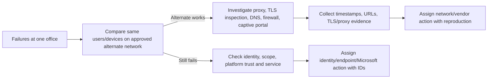

Your multi-protocol support habit is valuable: define impact, compare a control group, correlate the change window, identify the first failed transaction, and provide the responsible team a reproducible evidence pack.

### Scenario E: HR asks IT to wipe a departing employee's personal phone

Stop and clarify ownership, legal authority, enrollment/MAM state, data requirement, and approved procedure. A full wipe of a personal phone can be disproportionate and destructive. MAM selective wipe or retire may be the intended action, subject to platform behavior and policy. Use least privilege, second approval where configured, ticket evidence, and user/HR/legal coordination.

## 31. Safe paper lab and evidence exercise

This exercise requires no production tenant, device enrollment, license purchase, token, or remote action. It produces interview-safe design evidence.

### Fictional client

Contoso Advisory has 2,000 Windows laptops, 350 corporate iPhones, 600 employee-owned mobile devices, 80 shared Android scanners, and 200 Macs. Windows is partly domain joined, Apple devices are manually configured, scanners use an aging OEM tool, and no certificate/token owner register exists. The client needs secure M365 access, a privacy-respecting BYOD option, staged modernization, and 24x7 support readiness.

### Exercise steps

1. Create a one-page assumptions list: fictional tenant, no real identifiers, no production claims, current-doc verification date.
2. Build a persona table for office worker, executive, contractor, Mac developer, warehouse scanner, service-desk engineer, and privileged admin.
3. For each persona, select Entra device state, ownership, MDM/MAM choice, platform enrollment method, required app/data controls, and reason.
4. Draw the architecture from identity through enrollment, management channel, app/data protection, evidence, and Conditional Access signal.
5. Build a prerequisite register for licenses, MDM authority, MDM/MAM scope, Apple APNs/ADE/Apps and Books, managed Google Play, corporate identifiers, network, roles, privacy, and support.
6. Create a record-correlation worksheet with fictional Entra ID, Intune ID, serial, provisioning ID, Defender ID, primary user, ownership, enrollment date, and last check-in.
7. Define Ring 0, Ring 1, business pilot, and production gates. Include stop conditions for data loss, wrong ownership, unexpected access block, destructive action, and privacy complaint.
8. Write ten acceptance tests: successful enrollment by platform, unauthorized personal enrollment, expired-token tabletop, network isolation, duplicate correlation, MAM data transfer, selective wipe, retire, reassignment, and offline pending action.
9. Create an expiry register with primary/backup owner and 90/60/30/14/7-day actions.
10. Write a support decision tree using the layers in section 26 and an escalation template containing UTC time, impact, user/device/method, IDs, network, logs, changes, hypotheses, and safe reproduction.
11. Draft a remote-action matrix defining who may request, approve, execute, verify, and communicate sync, retire, wipe, delete, and MAM wipe.
12. Conduct a tabletop: at 02:00 UTC, corporate iPhone enrollment fails tenant-wide because APNs is near expiry. Produce first-15-minute actions, stakeholder update, owner handoff, recovery validation, and corrective actions without changing a real certificate.

### Evidence to retain

| Evidence | Interview value | Sanitization rule |
|---|---|---|
| Architecture diagram | Shows system-boundary thinking | Fictional names and IDs only |
| Persona/method decision matrix | Shows privacy and platform judgment | No employer/customer data |
| Prerequisite and expiry register | Shows operational readiness | Never include credentials/tokens |
| Test and rollback plan | Shows controlled delivery | Label as paper exercise |
| Troubleshooting decision tree | Shows RCA method | Use invented error details |
| Remote-action RACI | Shows risk governance | No real approver identities |
| Incident tabletop timeline | Shows 24x7 communication | State no production action occurred |

### Completion test

You should be able to explain, without notes, why one physical device can have multiple records; why registered/joined/enrolled/compliant are different; when MAM is preferable to MDM; how Apple and Google dependencies affect operations; why retire, wipe, delete, and MAM wipe differ; and how to isolate an enrollment failure without deleting evidence.

## 32. JD Mapping: how to present this Part in a consulting interview

| Interview prompt | candidate-aligned truthful response structure |
|---|---|
| “Design Intune enrollment for a client” | State discovery, persona/platform/ownership matrix, authority/licenses/dependencies, MDM/MAM decisions, architecture, pilot, tests, privacy, rollback, operations |
| “What have you done with Intune?” | Separate production M365 support from the current paper design; describe artifacts and reasoning, not invented administration |
| “A device will not enroll; what do you do?” | Scope/time/change, then identity, entitlement, restriction, network, platform trust, channel, record, service; test one hypothesis |
| “How do you handle executives asking for broad controls?” | Translate business outcome, data risk, privacy, platform support, exception and evidence; avoid a one-size policy |
| “How would you hand this to operations?” | RACI, support states, logs, known errors, expiry monitoring, dashboards, remote-action approvals, escalation pack, training, acceptance |

The strongest bridge from support to consulting is not “I have seen Intune.” It is: “I can turn ambiguous symptoms and stakeholder needs into a testable architecture, controlled rollout, evidence model, troubleshooting path, and sustainable handover while staying explicit about where I need platform-owner validation.”

## 33. Official Source Anchors

These first-party anchors were checked for the August 2026 study snapshot. Recheck page dates, notices, prerequisites, platform tables, licensing, and tenant behavior before implementation.

| Topic | Official Microsoft source |
|---|---|
| Intune purpose, architecture, MDM/MAM, Entra integration | [What is Microsoft Intune?](https://learn.microsoft.com/en-us/intune/fundamentals/what-is-intune) |
| Intune licensing and admin access | [Microsoft Intune licensing](https://learn.microsoft.com/en-us/intune/fundamentals/licensing) |
| Device enrollment guide | [Device enrollment guide for Microsoft Intune](https://learn.microsoft.com/en-us/intune/device-enrollment/guide) |
| Enrollment restrictions and current Android DA warning | [Overview of enrollment restrictions](https://learn.microsoft.com/en-us/intune/device-enrollment/restrictions) |
| Corporate identifiers | [Identify devices as corporate-owned](https://learn.microsoft.com/en-us/intune/device-enrollment/corporate-identifiers) |
| Apple enrollment setup | [Set up enrollment for Apple devices](https://learn.microsoft.com/en-us/intune/device-enrollment/apple-enrollment) |
| Apple MDM push certificate | [Get an Apple MDM push certificate](https://learn.microsoft.com/en-us/intune/device-enrollment/apple-mdm-push-certificate-get) |
| Android enrollment | [Set up enrollment for Android devices](https://learn.microsoft.com/en-us/intune/device-enrollment/android-enroll) |
| Windows enrollment | [Windows enrollment guide](https://learn.microsoft.com/en-us/intune/device-enrollment/windows-enrollment-methods) |
| Entra device identities/states | [What is a device identity?](https://learn.microsoft.com/en-us/entra/identity/devices/overview) |
| Intune app protection/MAM without enrollment | [App protection policies overview](https://learn.microsoft.com/en-us/intune/app-management/protection/overview) |
| Remove company data with retire | [Device action: Retire](https://learn.microsoft.com/en-us/intune/device-management/actions/retire) |
| Factory reset and platform wipe caveats | [Device action: Wipe](https://learn.microsoft.com/en-us/intune/device-management/actions/wipe) |
| MAM selective wipe | [Wipe only corporate data from apps](https://learn.microsoft.com/en-us/intune/apps/apps-selective-wipe) |
| Intune service changes | [What's new in Microsoft Intune](https://learn.microsoft.com/en-us/intune/fundamentals/whats-new) |

---

## ⭐ Likely Interview Questions for This Section

### Q1. What is Microsoft Intune, and where does it sit in Microsoft 365 security architecture?

> **Model answer:** Intune is Microsoft's cloud endpoint-management service. It uses Entra identities and groups, sends device or app policy through platform-specific channels, receives inventory and status, and reports compliance to Entra Conditional Access. The OS or Intune SDK-enabled app is the enforcement point, so I separate control-plane intent, assignment, delivery, enforcement, and evidence. Intune coordinates with Entra, Defender, Apple, Google, app stores, and Configuration Manager; it is not a replacement for all of them.

### Q2. Explain Entra registered, Entra joined, Intune enrolled, corporate-owned, and compliant.

> **Model answer:** Registered and joined describe directory device relationships: registered commonly represents a personal device with a work account, joined a cloud-owned work device, and hybrid joined an AD-joined device also represented in Entra. Intune enrolled means an MDM management relationship exists. Corporate-owned is an ownership classification based on enrollment/procurement evidence. Compliant is a time-sensitive policy result. They can correlate, but none is a synonym for another.

### Q3. When would you choose MAM without enrollment instead of MDM?

> **Model answer:** I choose MAM without enrollment when the requirement is to protect work data in supported apps on a personal device and whole-device configuration, certificates, inventory, or lifecycle control is unnecessary or disproportionate. I validate app support, broker/registration requirements, data-transfer and offline behavior, selective wipe, licensing, and app-based Conditional Access. If device posture, Wi-Fi/VPN certificates, silent app deployment, or full lifecycle control is required, an approved MDM pattern is a better fit.

### Q4. What are the critical Apple dependencies in Intune?

> **Model answer:** The APNs certificate supports push communication with managed Apple devices; the ADE token links Apple Business Manager device assignment to Intune; and the Apps and Books token supports organization-managed app licensing. I govern each with a business-owned account, primary and backup owner, expiry alerts, tested same-artifact renewal, last-sync monitoring, and escalation. I would not replace an APNs certificate casually because that can break management continuity and require re-enrollment.

### Q5. How do enrollment restrictions and corporate identifiers improve security?

> **Model answer:** Restrictions reduce accidental or unauthorized user-driven enrollment by platform, ownership, version, manufacturer where supported, and device count. Corporate identifiers help classify or authorize known corporate devices. They are best-effort governance controls, not cryptographic proof against a malicious endpoint. I combine them with secure identities/admins, vendor program registration, asset reconciliation, compliance, Conditional Access, endpoint security, monitoring, and a tested lifecycle.

### Q6. What is the difference among retire, wipe, delete, and MAM selective wipe?

> **Model answer:** Retire asks an enrolled endpoint to remove managed company data and end management while intending to preserve personal content, subject to platform behavior. Wipe requests a factory reset or platform-specific erase and is destructive. Delete removes a service record and does not prove the physical device received an erase. MAM selective wipe removes organization data from supported managed apps, including on unenrolled devices. I verify ownership, identity, asset, action support, approval, device contact, and completion before using any action.

### Q7. How would you troubleshoot a device that fails to enroll?

> **Model answer:** I record exact UTC time, user, device, platform, ownership, method, error, and impact; determine scope and recent changes; then inspect service health, identity/device state, MFA/CA, license and MDM scope, restriction priority and limits, network/discovery/TLS, platform trust such as APNs or managed Google Play, client management certificate/channel, and correlated Entra/Intune/program records. I state one falsifiable hypothesis and run the smallest safe comparison, preserving logs before reset or deletion.

### Q8. How does your background prepare you for Intune consulting without overstating experience?

> **Model answer:** My production strength is Microsoft 365 escalation engineering: access and sync troubleshooting, critical incidents, RCA, multi-vendor coordination, fix validation, stakeholder updates, documentation, and operational metrics. I have not claimed production Intune ownership. I use those transferable skills in a current paper design covering enrollment architecture, MDM/MAM decisions, platform dependencies, tests, privacy, rollback, operations, and troubleshooting, and I would implement with the endpoint owner and tenant-specific validation.

---

## 🧠 30-Second Memory Hooks

- **Intune** = cloud conductor for devices, apps, and work data; the OS/app still plays the control.
- **Registered / joined / enrolled / owned / compliant** = five different labels answering five different questions.
- **One device, many records** = correlate IDs before deleting anything.
- **MDM** = manage the building; **work profile** = manage one office; **MAM** = protect the briefcase.
- **MAM without enrollment** = work-data control, not whole-device control.
- **APNs** wakes Apple devices; **ADE** routes devices; **Apps and Books** routes licenses.
- **Android Enterprise** = work profile, corporate work profile, fully managed, or dedicated; device administrator is legacy/deprecated.
- **Restriction** = best-effort enrollment gate, not device attestation.
- **Retire** removes work management; **wipe** erases; **delete** removes a record; **MAM wipe** removes work app data.
- **Enrollment RCA** = scope → identity → entitlement → network → platform trust → channel → record → service.
- **Expiry is an incident with a calendar** = every token/certificate needs owner, backup, alert, and tested renewal.
- **Candidate honesty** = production support skill + current design evidence, never invented Intune ownership.

---

## Completion Checklist

- [ ] I can draw the Intune control, delivery, enforcement, evidence, and Conditional Access flow.
- [ ] I can distinguish Entra, Intune, provisioning, Defender, and Configuration Manager records.
- [ ] I can explain registered, joined, hybrid joined, enrolled, owned, managed, and compliant precisely.
- [ ] I can verify MDM authority, MDM/MAM scope, licensing, roles, privacy, and service health before enrollment.
- [ ] I can compare Windows, macOS, iOS/iPadOS, Android Enterprise, and specialized enrollment patterns.
- [ ] I can explain restrictions, priorities, device limits, DEM, corporate identifiers, and their limitations.
- [ ] I can choose MDM, MAM, or both from persona, ownership, data, app, certificate, support, and privacy needs.
- [ ] I can explain APNs, ADE, Apps and Books, managed Google Play, enrollment tokens, profiles, and expiry governance.
- [ ] I can distinguish sync, retire, wipe, delete, MAM selective wipe, and provisioning deregistration.
- [ ] I can plan architecture, prerequisites, licensing, security, privacy, deployment rings, testing, rollback, operations, and metrics.
- [ ] I can troubleshoot enrollment using evidence and a falsifiable hypothesis without destructive guesswork.
- [ ] I completed or can describe the safe paper lab and label it honestly as non-production evidence.
- [ ] I can answer Q1-Q8 aloud in my own words and keep your production/lab boundary explicit.
- [ ] I will recheck official platform, licensing, preview, retirement, and remote-action guidance before implementation.

---

*Next suggested section:* [Part 16](Part-16-intune-configuration-settings-baselines-policy-precedence.md) — move from establishing the management relationship to delivering settings through the right policy channel, resolving applicability and conflicts, controlling drift, and rolling configuration out safely.