# Part 16 — Configuration Profiles, Settings Catalog, Security Baselines, and Policy Precedence

> **Section goal:** Learn how Intune turns an approved control into a setting on a real endpoint, why several policy surfaces can configure the same technology, and how to predict targeting, applicability, conflict, refresh, and rollback. By the end, you should be able to select the least ambiguous policy channel, rationalize overlapping profiles, design rollout rings and version control, diagnose each status with evidence, and produce a client-ready configuration standard without presenting a portal assignment as proof of effective state.

This Part assumes the device identity and enrollment relationship from [Part 15](Part-15-intune-architecture-enrollment-mdm-mam.md). Part 17 uses the resulting endpoint state as input to compliance and Conditional Access.

> **Currency and change-sensitive note:** Product behavior was checked against official Microsoft Learn content available on **August 24, 2026**. Settings Catalog content continually expands from Windows configuration service providers (CSPs), Apple payloads/declarative device management, and supported Android controls. Profile types, setting metadata, baseline versions, import/export support, reports, Intune Management Extension behavior, licensing, and portal paths change. Microsoft Copilot in Intune can summarize settings or suggest conflicts but remains advisory. Recheck current setting documentation, OS build/edition, baseline release notes, Microsoft Graph version, co-management authority, and tenant release before implementation.

## JD Mapping

| Deloitte role expectation | Capability developed in this Part | Consulting evidence |
|---|---|---|
| Design Microsoft endpoint controls | Translate requirements into Settings Catalog, template, endpoint-security, baseline, custom, script, or remediation channels | Configuration HLD/LLD and channel decision register |
| Configure and optimize Intune | Build scoped, named, versioned policies with filters, exclusions, rings, acceptance tests, and rollback | Policy workbook and deployment plan |
| Troubleshoot policy errors | Trace assignment, applicability, delivery, CSP/payload processing, conflicts, and effective state | Per-setting evidence pack and fault-isolation runbook |
| Assess and rationalize environments | Find duplicate, obsolete, risky, unowned, and contradictory settings across surfaces | Policy inventory, overlap matrix, and rationalization roadmap |
| Secure operations and automation | Apply least privilege, export/Graph discipline, source control concepts, peer review, and drift monitoring | Configuration-as-code operating model |
| Communicate with stakeholders | Explain business impact, exceptions, change windows, metrics, and residual risk in plain language | Decision records, test report, executive summary, and handover |

## Candidate honesty note

You can connect this topic to production strengths in policy-related Microsoft 365 support, SharePoint/OneDrive client behavior, scoped troubleshooting, configuration validation, RCA, product-group escalation, documentation, customer communications, and measuring whether a fix actually held. Those habits transfer directly to Intune's intent-to-effective-state pipeline.

This Part does **not** claim that you have designed or administered production Intune configuration profiles, security baselines, custom CSP payloads, remediation packages, or Graph deployment pipelines. Safe wording is:

> “My production experience is Microsoft 365 support and escalation, where I separate policy intent, scope, propagation, client enforcement, and observed outcome. I have applied that method in a current Intune paper design covering channel selection, targeting, conflicts, baselines, testing, rollback, drift, and evidence. I would validate settings and platform behavior with the endpoint engineering owner before a production change.”

---

## 1. Configuration policy is desired state, not guaranteed state

A **configuration profile** is an Intune object containing one or more requested settings plus assignments and metadata. A **setting** is one controllable behavior, such as blocking an unsupported feature, configuring a browser policy, or requiring a password characteristic. The endpoint operating system, app, or management agent is the enforcement point.

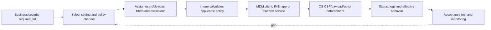

| State | What it proves | What it does not prove |
|---|---|---|
| Created | Object exists in tenant | Correct design or target |
| Assigned | Group relationship is saved | Device/user is an effective member |
| Pending | Evaluation/delivery not complete | Failure or success |
| Succeeded | Client reported successful processing | Business control is effective in every context |
| Error | Client/service reported failure | Root cause without logs and scope |
| Conflict | Competing values were detected/reported | Which source should win by business intent |
| Not applicable | Setting/profile does not apply in that context | Endpoint is insecure |
| Effective behavior verified | Test observed intended outcome | Future drift cannot occur |

The consulting standard is **requirement → control → setting → channel → target → delivery → status → effective test → owner**. If any link is missing, the configuration is not defensible.

## 2. Policy-channel taxonomy

Intune exposes several ways to configure endpoints because platforms and product histories differ. More than one surface can reach the same underlying technology.

| Channel | Best use | Enforcement path | Main risk |
|---|---|---|---|
| Settings Catalog | Granular current platform settings | Native CSP/payload/API | Overlap across many small profiles |
| Device configuration template | Curated scenario such as Wi-Fi, VPN, kiosk, certificate | Native platform framework | Older template duplicates catalog setting |
| Administrative Templates | Windows/Edge/Office ADMX-backed policy | Policy CSP/ADMX ingestion path | GPO/cloud overlap and user/device scope confusion |
| Custom OMA-URI | Supported CSP node absent from UI or special payload | Direct CSP URI/value | Syntax/type/support errors; weak discoverability |
| Imported custom ADMX | Manage supported app policy definitions | ADMX ingestion + configured settings | Dependency, namespace, update and removal complexity |
| Endpoint security policy | Focused security technology | Underlying CSP/security provider | Duplicate with config or baseline |
| Security baseline | Versioned Microsoft-recommended set | Multiple underlying settings | Broad bundle and version drift |
| PowerShell/shell script | Imperative one-time/recurring client action | Intune Management Extension/platform agent | Side effects, context, idempotency, secrets |
| Remediations | Detect and optionally correct a condition | Detection/remediation scripts via IME | Licensing, execution safety, reporting interpretation |

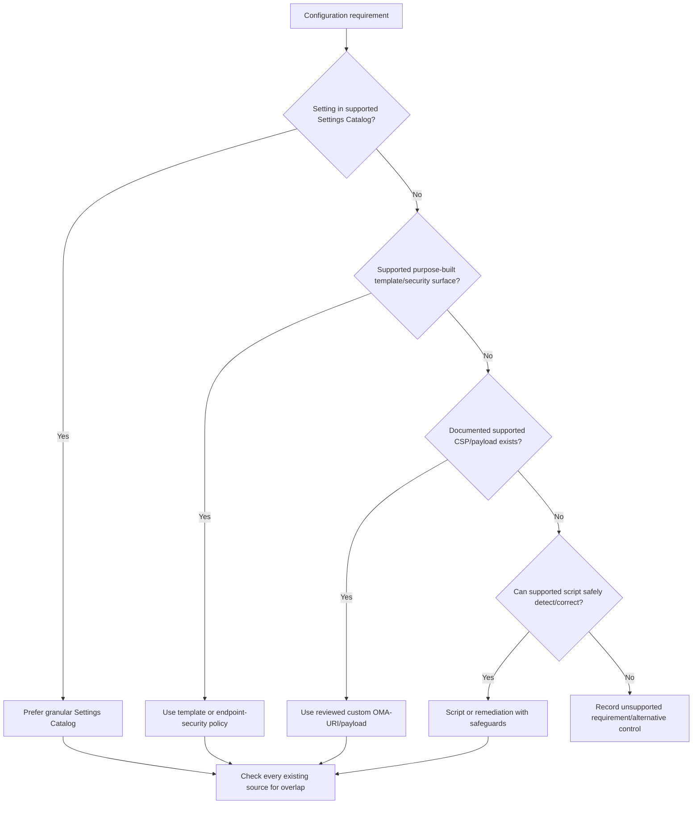

Choose the most specific, supported, observable, and maintainable channel already standard in the client environment. Do not select a custom payload simply because it feels more technical.

## 3. Settings Catalog: granular control and growing platform coverage

The **Settings Catalog** lists configurable settings in a searchable experience. On Windows, many settings are generated from CSPs and include ADMX-backed settings. Apple coverage includes native payload keys and declarative device management (DDM) where supported. Android coverage varies by enrollment mode.

### 🔍 Plain-English deep-dive: catalog, CSP, and provider

- **Configuration service provider (CSP)** — *a Windows interface that exposes manageable settings as paths and values.* **Analogy:** A labeled control panel installed by Windows. **Why it matters:** OS version, edition, and CSP documentation determine whether the switch exists and how it behaves.
- **Settings Catalog** — *Intune's searchable presentation of supported platform switches.* **Analogy:** A catalog of labeled control-panel switches. **Why it matters:** It reduces manual URI/type errors and shows metadata, but does not eliminate applicability checks.
- **Administrative template (ADMX)** — *a definition describing policy-backed registry settings and their choices.* **Analogy:** A form telling an administrator which approved knobs an app exposes. **Why it matters:** Scope and policy semantics differ from arbitrary registry edits.
- **Declarative device management (DDM)** — *Apple's newer model in which a device maintains declarations and reports state more autonomously.* **Analogy:** Give a branch office an approved standing rule instead of phoning each instruction. **Why it matters:** Availability and fallback depend on platform/enrollment support.

Microsoft's 2026 documentation supports export of applicable Windows Settings Catalog profiles to JSON and import to create a new profile. The imported profile still requires review, naming, assignments, tenant-specific IDs, current setting availability, and testing. Export is a transport artifact, not a complete source-controlled deployment solution.

## 4. Templates and administrative templates

Templates group settings around a use case. Examples include Wi-Fi, VPN, certificates, kiosk, device restrictions, and platform-specific features. They can be clearer than building a complex scenario from isolated settings, but may overlap with Settings Catalog or endpoint security.

| Surface | Advantage | Use with caution when |
|---|---|---|
| Scenario template | Guided fields and coherent payload | Same settings exist elsewhere or template is legacy |
| Administrative Templates | Familiar GPO-like app/Windows policy | On-prem GPO and MDM both target device |
| Imported ADMX | Adds supported third-party/custom app definitions | Vendor changes namespace/version or import dependencies |
| Settings Catalog ADMX setting | Granular and searchable | Scope tag/user-device behavior is misunderstood |

Administrative Templates are policy, not ordinary preference registry keys. On Windows, a user-scoped policy generally writes/evaluates in user context, while a device-scoped policy applies machine-wide. Always read the setting's scope and CSP/ADMX documentation.

Do not bulk migrate every GPO to Intune one-for-one. Classify each as required, obsolete, unsupported, replaced by modern security control, or retained temporarily. Reduce policy debt before translating it.

## 5. Custom OMA-URI and CSP values

**Open Mobile Alliance Uniform Resource Identifier (OMA-URI)** profiles can address documented CSP paths directly. A custom profile typically needs the exact URI, data type, and value.

| Validation item | Example question | Failure signature |
|---|---|---|
| Supported CSP | Is node documented for this OS/edition? | Not applicable or CSP error |
| URI syntax | Are path, case, provider and node exact? | Invalid URI/unknown node |
| Operation | Does node support Add, Replace, Delete, Execute? | Method not allowed |
| Data type | Integer, string, Boolean, XML, Base64? | Type/format error |
| Value schema | Is XML/JSON payload valid and escaped? | Generic processing error |
| Scope | Device or user? | Applies to wrong context or not applicable |
| Existing source | Is catalog/template/GPO setting same node? | Conflict or last-writer behavior |
| Removal behavior | Does deleting policy revert setting? | Tattooed local state |

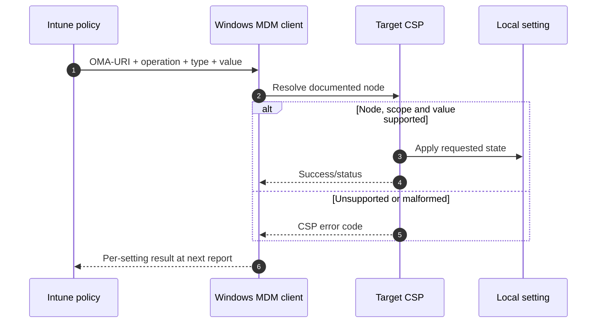

Document why a custom profile exists, official CSP link, tested builds/editions, sample effective evidence, rollback operation, owner, and retirement criterion. Prefer native catalog support when it later becomes available, but migrate through a conflict-free pilot rather than switching both sources simultaneously.

## 6. Scripts and remediations: imperative tools with stronger safety obligations

A configuration policy is usually **declarative**: it says what state should exist. A script is **imperative**: it issues steps to change or inspect the system. **Remediations** pair a detection script with an optional remediation script and reporting.

### 🔍 Plain-English deep-dive: declarative versus imperative

- **Declarative control** — *state the destination and let the platform reconcile it.* **Analogy:** Set a thermostat to 21°C. **Why it matters:** Re-evaluation can restore drift and status is tied to a setting.
- **Imperative script** — *state the sequence of actions.* **Analogy:** Tell someone to open a valve for ten seconds. **Why it matters:** Re-running can have side effects unless designed safely.
- **Idempotent** — *safe to run repeatedly with the same final result.* **Analogy:** “Ensure the door is locked,” not “turn the key once.” **Why it matters:** Cloud scheduling, retries, and manual runs can repeat.
- **Detection/remediation pair** — *one script measures; another corrects only if needed.* **Analogy:** Inspection followed by a repair order. **Why it matters:** It separates evidence from change and supports reporting.

| Script concern | Design question | Safeguard |
|---|---|---|
| Context | System or signed-in user? 32-bit or 64-bit host? | Explicit context and test matrix |
| Signature | Must scripts be signed and trusted? | Code-signing and controlled exception |
| Exit/output | What indicates compliant, failed, or corrected? | Stable exit codes and bounded output |
| Idempotency | What happens on second/tenth run? | Detect before change; no blind append |
| Secrets | Does script contain credential/token? | Managed identity/certificate/vault pattern; no embedded secret |
| Network | Does it call external service? | Allowlist, timeout, retry/backoff, privacy review |
| Privilege | Could standard user trigger privileged behavior? | Input validation and least-privilege design |
| Rollback | Can changed state be restored? | Backup/current-state capture and tested undo |

Remediations have licensing and platform prerequisites that change; verify current Intune licensing and supported clients. Never use scripts to silently weaken Defender, firewall, logging, UAC, encryption, or certificate validation as a troubleshooting shortcut.

## 7. Endpoint-security policy and security baselines are configuration channels too

The Endpoint security node provides focused policies for technologies such as antivirus, attack surface reduction, firewall, encryption, endpoint detection and response, and account protection. Security baselines provide versioned collections of Microsoft-recommended settings for a product or scenario.

| Surface | Purpose | Strength | Risk |
|---|---|---|---|
| Endpoint security policy | Focused owner-friendly security configuration | Clear security workflow and reporting | Same CSP setting may exist in configuration profile |
| Security baseline | Broad recommended starting position | Accelerates hardened design | Defaults can disrupt apps; versions require migration |
| Settings Catalog | Precise exception or broader configuration | Granular and current | Fragmented ownership/overlap |
| Compliance policy | Evaluate posture, not generally configure it | Access signal and remediation communication | Confused with enforcement profile |

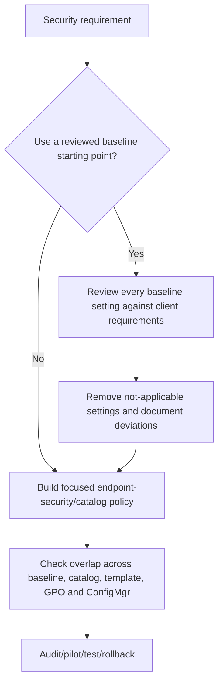

Part 19 covers the technologies. Here the rule is: designate one preferred policy source per setting and authority. A visually separate portal blade does not make settings independent.

## 8. Assignment building blocks: users, devices, groups, all, include, exclude

Assignments determine candidate targets. Intune can assign many objects to user groups, device groups, all users, or all devices, with exclusions where supported.

| Target | Best fit | Common surprise |
|---|---|---|
| User group | Experience follows licensed user across relevant devices | Applies to every applicable enrolled device for that user |
| Device group | Stable device-purpose control | Primary user change does not change membership immediately |
| All users | Broad user control after pilot | New users are included automatically |
| All devices | Tenant-wide device control | Staging, kiosk, virtual and specialty devices may be included |
| Dynamic group | Attribute-driven lifecycle | Evaluation delay and bad rule expand scope |
| Exclusion | Known approved exception from broader include | Mixed user/device exclusion semantics can be misunderstood |

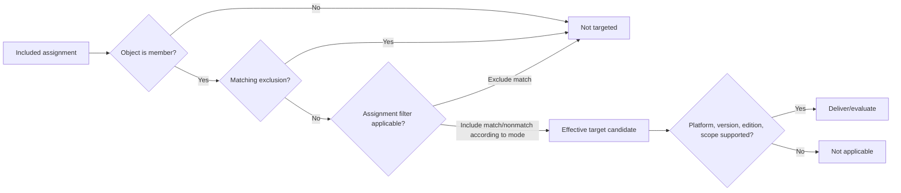

Effective targeting is set mathematics plus platform context. Document inclusion and exclusion at the same object type where possible. Test a named expected-in, expected-out, and exception endpoint before expansion.

## 9. Assignment filters: fast endpoint attributes after group targeting

**Assignment filters** refine an assignment using supported device properties such as ownership, model, manufacturer, OS/version, enrollment profile, management name, or other platform-specific fields. An include filter requires a match; an exclude filter removes matches.

| Filter use | Good example | Bad assumption |
|---|---|---|
| Separate corporate and personal | Apply device-wide restriction only to corporate-owned devices | Ownership field is infallible security attestation |
| Exclude unsupported model | Temporarily exclude proven driver-incompatible model | Permanent undocumented exception |
| Select enrollment profile | Target kiosk/ADE/Autopilot population | Display name never changes |
| OS/build gating | Pilot feature on supported build | String comparison behaves like semantic version without verification |
| Virtual/special device separation | Prevent user policy on shared device type | Every needed property is available in every workload |

Filters are evaluated during assignment and can be more responsive than waiting for dynamic group membership, but property freshness and supported workload behavior matter. Filters do not replace authoritative asset classification. Name, owner, rationale, review date, and test every filter.

## 10. User scope, device scope, and assignment are different dimensions

A setting can be user-scoped or device-scoped independently of whether its profile is assigned to a user or device group.

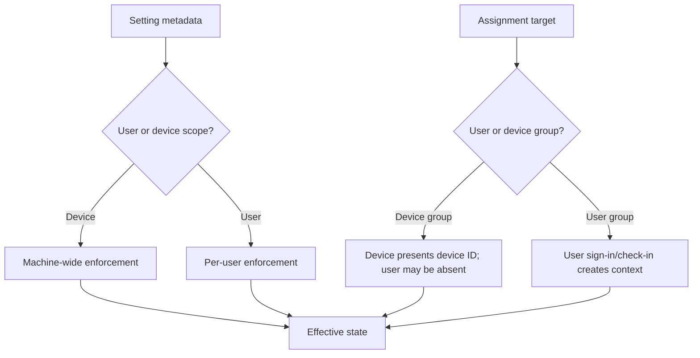

| Setting scope + target | Documented Windows behavior to plan for |
|---|---|
| Device setting → device group | Applies machine-wide to users on target device |
| Device setting → user group | After targeted user signs in/syncs, machine-wide setting can affect all users on that device |
| User setting → user group | Applies to targeted user context |
| User setting → device group | Can apply to users on target device, similar to loopback merge behavior |
| Same setting in user and device scope | Current Settings Catalog guidance states user scope can take precedence |
| User setting before user hive/context exists | May report not applicable during early device activity |

Do not infer scope from the assignment group name. Read the setting metadata and test multi-user/shared-device behavior.

## 11. Delivery pipeline and check-in

Policy arrival depends on assignment computation, device notification, periodic check-in, user context, management channel, and provider processing.

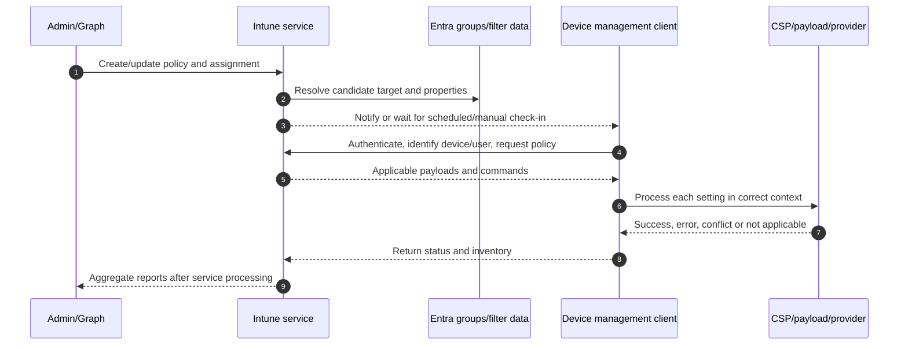

Check-in is not instantaneous and refresh intervals differ by platform, enrollment age, agent, action, and policy type. Newly enrolled Windows devices check more frequently during an initial period under current guidance; established devices use periodic MDM refresh plus notifications and manual sync. The Intune Management Extension has its own cadence and triggers. Do not promise a universal “every X minutes” SLA. Use official current refresh tables and observed timestamps.

Repeated manual sync does not repair an unsupported CSP, stale group property, conflicting authority, malformed value, missing user context, or script defect. It only requests another evaluation.

## 12. Reading status: pending, success, error, conflict, and not applicable

### 🔍 Plain-English deep-dive: status belongs to a layer and time

- **Pending** — *the service lacks a final result for the current assignment/version.* **Analogy:** A parcel label exists but delivery is not confirmed. **Why it matters:** Check target, contact, context, and age before calling it failure.
- **Error** — *processing returned a failure.* **Analogy:** The courier reached the address but the package was invalid. **Why it matters:** Error code, provider log, OS build, and payload identify cause.
- **Conflict** — *multiple sources request incompatible values or provider reports contention.* **Analogy:** Two managers send opposite thermostat settings. **Why it matters:** Technical precedence is not a substitute for one accountable design owner.
- **Not applicable** — *the setting cannot/should not evaluate in that endpoint context.* **Analogy:** Elevator policy sent to a one-floor building. **Why it matters:** Platform, edition, scope, enrollment mode, and prerequisites must be checked.

| Status question | Evidence path |
|---|---|
| Which profile/version? | Object ID, modification time, exported settings |
| Which setting? | Per-setting status and setting identifier |
| Which target? | User/device IDs, group membership, filter result, exclusion |
| Which device context? | OS/build/edition, enrollment mode, ownership, user sign-in |
| Which source competes? | Catalog, template, endpoint security, baseline, GPO, ConfigMgr, script, local |
| Which provider error? | MDM diagnostic report/event logs/platform logs/IME logs |
| What is effective? | Supported local query and behavioral acceptance test |
| Is report fresh? | Device check-in and report-generation timestamps |

Aggregated dashboards can hide that only one setting in a broad profile failed. Conversely, a single device error can distort a small pilot. Drill from profile to device/user to setting to client evidence.

## 13. Precedence: there is no universal “Intune always wins” rule

Precedence can arise in assignment exclusions, user/device scope, policy provider behavior, GPO/MDM settings, security-management authority, and local enforcement. The correct answer depends on the exact setting and source.

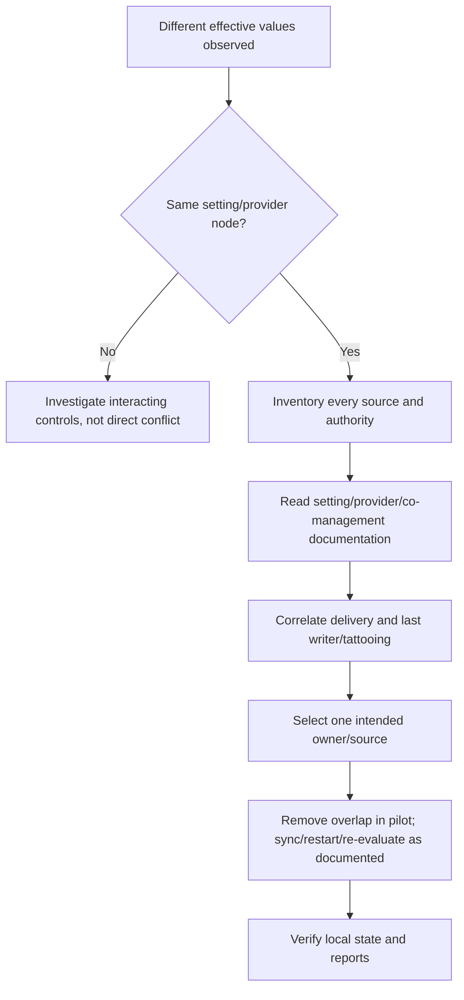

| Precedence domain | Example | Required approach |
|---|---|---|
| Include/exclude | User belongs to broad include and explicit exclude | Follow workload assignment semantics; test same object type |
| User/device setting scope | Same configurable setting in both scopes | Follow setting documentation; current catalog notes user scope may win |
| MDM vs Group Policy | Policy CSP has setting-specific behavior | Use Policy CSP result/GPO analytics/docs; avoid blanket rule |
| ConfigMgr vs Intune | Co-management workload slider/exception baseline | Confirm authority and pilot collection |
| Security settings management | MDE-managed device receives security policy | Confirm management source and applicable scope |
| Multiple MDM profiles | Same provider path with different values | Rationalize; per-setting report may show conflict |
| Local/admin preference | Policy-managed state versus user-set state | Confirm whether setting is enforced, preference, or tattooed |

The consulting goal is not to memorize every precedence edge. It is to eliminate dual ownership, document necessary exceptions, and know how to prove effective state.

## 14. Conflict versus interaction versus duplicate intent

Not every unexpected result appears as an Intune “Conflict.” Two different settings can interact, and two identical settings can create duplicate ownership without a reported conflict.

| Pattern | Example | Portal may show | Governance issue |
|---|---|---|---|
| Direct conflict | Same CSP node requests allow and block | Conflict/error | Contradictory sources |
| Duplicate same value | Baseline and catalog both require same setting | Success | Future drift when one changes |
| Interaction | Firewall permits app but network isolation blocks path | Both success | Cross-control design gap |
| Timing/last writer | Script changes value after MDM applies | Intermittent success/drift | Imperative tool bypasses owner |
| Prerequisite gap | ASR setting arrives but Defender state/license unsupported | Error/not applicable | Requirement not mapped to prerequisites |
| Reporting lag | Local state changed before portal aggregation | Old status | Timestamp misunderstanding |

Create an overlap matrix keyed by stable setting identifier/CSP path, not only display label. Include GPO, Configuration Manager, Defender security settings management, scripts, provisioning packages, OEM tools, and app-local policy.

## 15. Tattooing and removal behavior

**Tattooing** means a setting remains after the policy source is removed or changed to Not configured. Some policy-backed settings revert; others leave the last value until another source or explicit rollback changes it.

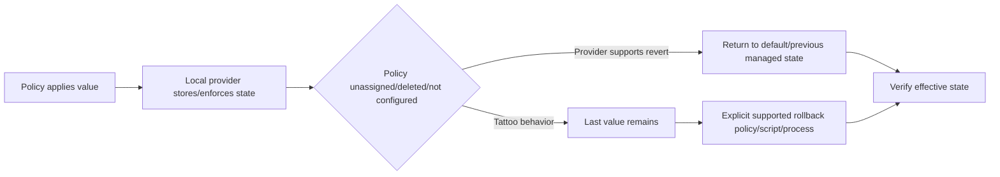

| Change | Do not assume | Test |
|---|---|---|
| Remove setting from profile | OS reverts immediately | Documented CSP removal plus local state |
| Unassign profile | All values disappear | Check next refresh and provider behavior |
| Delete profile | Device receives explicit undo | Verify queued removal semantics |
| Set Not configured | Prior value resets | Compare provider documentation |
| Move to new profile | New profile cleanly replaces old | Sequence without overlap/gap |
| Revert baseline version | Old baseline is restored automatically | Export values and use supported migration/rollback |

Every change record needs both rollback intent and **rollback mechanics**. “Unassign policy” is not a complete rollback until tested for each critical setting.

## 16. Applicability: platform, version, edition, mode, scope, and prerequisite

A setting is applicable only when its requirements match the endpoint.

| Applicability dimension | Example |
|---|---|
| Platform | Windows setting cannot apply to macOS |
| OS version/build | CSP node introduced in later Windows build |
| Edition | Enterprise-only control sent to Pro |
| Architecture | Script/native binary differs on ARM64 |
| Enrollment mode | Android dedicated setting not valid for work profile |
| Ownership/supervision | Apple restriction needs supervised corporate device |
| User context | User-scope setting evaluated before a user is present |
| License/service | Security feature or remediation requires entitlement |
| Component state | Defender, extension, certificate, app or agent missing |
| Authority | ConfigMgr still owns workload for co-managed device |

“Not applicable” can be correct and healthy if policy intentionally targets a mixed population, but high volume often signals poor targeting or design. Segment reports by expected applicability and remove noise that masks real failures.

## 17. Security baselines: starting point, not automatic truth

A baseline packages recommended settings for a product/scenario at a point in time. Each version can add, remove, or change settings. New baseline versions do not mean an existing profile automatically becomes the new version.

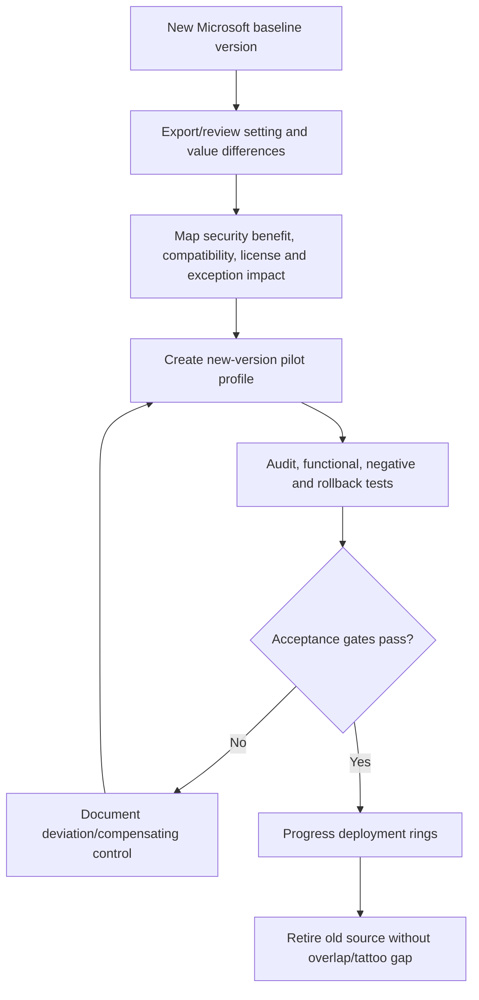

| Baseline decision | Required evidence |
|---|---|
| Accept default | Requirement and compatibility test |
| Tighten value | Threat/risk justification and supportability |
| Relax value | Business dependency, risk owner, compensating control, expiry |
| Not configure | Another authoritative source or non-applicability |
| Defer version | Specific blocker, time-boxed plan and residual risk |
| Retire old baseline | New source effective and old tattooing handled |

Do not deploy every baseline setting to every endpoint on day one. Broad baselines can affect authentication, apps, network, peripherals, scripts, and support workflows. The name “recommended” does not remove the need for client-specific testing.

## 18. Policy rationalization: reduce sources before optimizing values

Rationalization is the disciplined removal of duplicate, obsolete, unsupported, conflicting, or unowned policy.

| Inventory field | Purpose |
|---|---|
| Object ID/name/channel/platform | Stable identification |
| Owner and business service | Accountability |
| Setting ID/CSP path/value/scope | Detect real overlap |
| Includes/excludes/filter | Calculate effective target |
| Created/modified/version | Change history |
| Device/user/error/conflict counts | Operational impact |
| Requirement/control mapping | Justification |
| Baseline/GPO/ConfigMgr equivalent | Cross-plane overlap |
| Exception/expiry | Prevent permanent drift |
| Recommendation | Retain, merge, migrate, replace, retire |

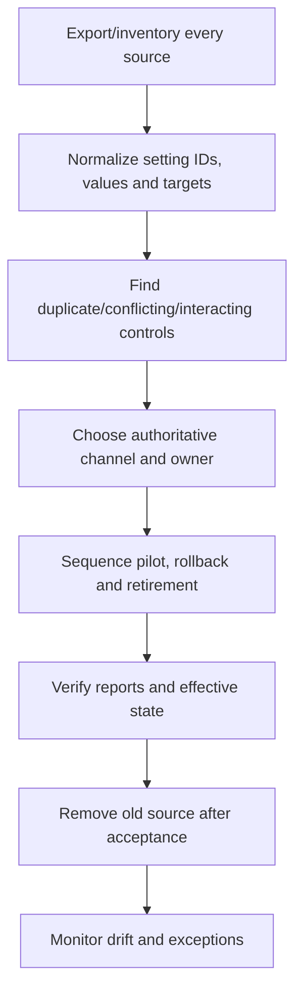

For an acquired tenant, resist importing policies immediately. First map requirements, management authority, platform support, exceptions, and business dependencies. Importing old debt into a new control plane makes troubleshooting harder.

## 19. Naming, descriptions, versioning, and change records

| Metadata | Recommended content | Example pattern |
|---|---|---|
| Name | Platform-purpose-scope-ring-version | `WIN-SEC-Firewall-Corp-R1-v03` |
| Description | Owner, requirement, settings intent, exclusions, ticket, review date | Human-readable and current |
| Assignment group | Purpose and lifecycle | `INT-WIN-CORP-RING1-DEV` |
| Filter | Attribute, include/exclude intent, owner | `WIN-Include-Corporate-Autopilot` |
| Version | Increment for controlled material change | Object description/tag + repository revision |
| Change record | Before/after, impact, tests, rollback, approvals | Linked service-management ID |
| Exception | Control deviation, approver, compensating control, expiry | Time-bound register |

Intune object history and audit logs are not a full version-control system. Export supported profiles, retain reviewed specifications, and record exact before/after settings. Do not put secrets, certificates, personal data, or tenant credentials in a repository.

## 20. Configuration-as-code concepts, Graph, export, and drift

**Configuration as code** means representing configuration in structured files and delivering it through repeatable, reviewed automation. Microsoft Graph exposes Intune resources, but APIs differ by object, permission, and version.

### 🔍 Plain-English deep-dive: automation multiplies both quality and mistakes

- **Desired-state file** — *structured representation of approved configuration.* **Analogy:** A versioned construction drawing. **Why it matters:** Reviewers can compare intended changes before deployment.
- **Pipeline** — *automated sequence that validates and deploys.* **Analogy:** A controlled manufacturing line. **Why it matters:** Identity, approval, testing, and rollback must be built in.
- **Drift** — *difference between approved intent and actual tenant/device state.* **Analogy:** A building altered after inspection. **Why it matters:** Portal edits, API changes, baseline versions, and local tools can diverge.
- **Idempotent deployment** — *re-running produces the same intended object/state without duplicates.* **Analogy:** Reprinting an approved label, not adding a new door each time. **Why it matters:** Retry and recovery are safer.

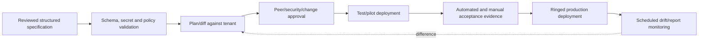

| Pipeline control | Minimum expectation |
|---|---|
| Identity | Dedicated least-privilege app/workload identity; no user password |
| Permissions | Exact Graph application/delegated scopes, admin consent governance |
| Secrets | Prefer certificate/federation; approved vault and rotation |
| Validation | Schema, allowed settings, target allowlist, destructive-change checks |
| Approval | Separate author and approver for high-impact change |
| Environment | Test/pilot before production; tenant IDs explicit |
| Logging | Correlation IDs, request/response status, actor, object IDs, redaction |
| Throttling | Retry with backoff; pagination; partial-failure handling |
| Rollback | Previous reviewed specification and tested restoration path |
| Drift | Scheduled read/compare with approved exceptions |

An export can include tenant-specific IDs and unstable metadata. Normalize carefully, never blindly replay production output into another tenant, and verify whether the API is `/v1.0` or `/beta`. Beta APIs are change-sensitive and generally unsuitable for an ungoverned production dependency.

## 21. Security, privacy, prerequisites, and licensing

| Domain | Design requirement |
|---|---|
| Administrative security | Intune RBAC, PIM/least privilege, protected admin identity, audit, MAA where available |
| Assignment safety | Pilot allowlist, maximum target threshold, exclusions, break-glass/support devices where justified |
| Endpoint prerequisites | Supported OS/build/edition, enrollment mode, agent/provider, user context, storage/network |
| Licensing | Core Intune plus feature-specific rights for remediation/security/Suite capabilities |
| Data protection | Scripts/logs/exports must not collect unnecessary personal or secret data |
| Supply chain | Review script modules, ADMX, vendor payloads, binaries, hashes/signatures |
| Availability | Avoid one giant profile that creates broad failure and difficult rollback |
| Resilience | Offline behavior, cached policy, service incident, re-enrollment and recovery |

Privacy matters even in configuration. A script that inventories browser history, personal files, location, or user content can exceed the stated purpose. Collect only necessary fields, define retention and access, and obtain legal/privacy review.

## 22. Rollout rings and safe deployment

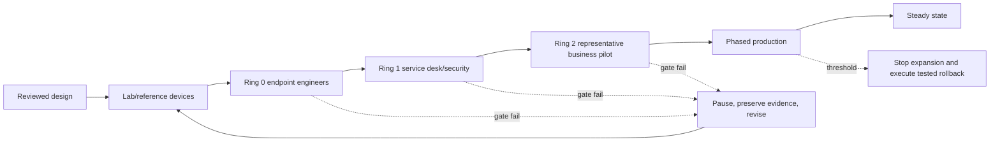

| Gate | Example measure | Stop condition |
|---|---|---|
| Static review | Setting IDs, scope, value, support, overlap, rollback approved | Unsupported/custom control lacks owner |
| Lab | Positive/negative/effective tests pass | Boot, sign-in, network or security failure |
| Ring 0 | Per-setting success and log collection proven | Conflict/error above threshold |
| Ring 1 | Service desk can diagnose and recover | Runbook does not isolate stage |
| Business pilot | App/peripheral/workflow acceptance | Material productivity/access impact |
| Production | Metrics, owners and rollback capacity active | Data loss, security regression or broad incident |

Use representative endpoints: OS builds, editions, ARM/x64, network paths, ownership, enrollment profiles, language/accessibility, remote users, shared devices, and critical apps. A homogeneous IT pilot cannot prove business compatibility.

## 23. Testing and rollback matrix

| Test class | Example | Evidence |
|---|---|---|
| Assignment positive | Included device receives profile | IDs, filter result, check-in, status |
| Assignment negative | Excluded device does not receive profile | Membership/filter/exclusion evidence |
| Applicability | Unsupported edition reports expected state | OS metadata and per-setting result |
| Effective behavior | Setting changes actual UI/API/security behavior | Before/after local query and action |
| Conflict | Controlled lab duplicate requests different value | Per-setting conflict and source inventory |
| Tattoo | Unassign on disposable endpoint | Local value before/after refresh/restart |
| Multi-user | Different users sign into shared device | User/device scope result |
| Offline | Device misses check-in, reconnects later | Cached state and eventual report |
| Upgrade | OS feature update with policy present | Setting continuity and compatibility |
| Rollback | Restore approved previous state | Completion time and effective state |

Never test by disabling security broadly. For a security control, prefer audit/evaluation modes, isolated disposable endpoints, controlled test artifacts, and explicit re-enable verification.

## 24. Layered policy troubleshooting

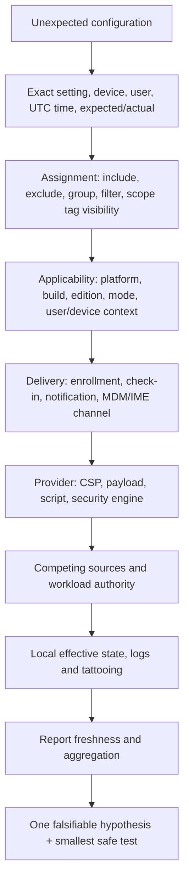

| Layer | Windows evidence examples | Questions |
|---|---|---|
| Target | Entra membership, Intune assignment/filter | Was this exact user/device targeted now? |
| Applicability | OS build/edition, setting scope, provider docs | Can this endpoint process it? |
| Delivery | Last sync, MDM diagnostic report | Did current profile version arrive? |
| MDM provider | DeviceManagement-Enterprise-Diagnostics-Provider logs | Which CSP node and result code? |
| IME | AgentExecutor, IntuneManagementExtension logs | Which context, detection, exit, output? |
| Authority | GPO result, ConfigMgr workload, MDE source | Who owns this setting? |
| Effective state | Supported local policy/provider query | What actually governs behavior? |
| Report | Policy/device/per-setting timestamps | Is portal status current and same object? |

On Apple and Android, collect platform-specific management/profile/app logs and enrollment-mode evidence. Do not force Windows log names onto other platforms.

## 25. Common failures and discriminating checks

| Symptom | Likely categories | Cheap discriminating check |
|---|---|---|
| Profile pending for days | Offline/stale endpoint, target propagation, channel issue | Compare last check-in with assignment change |
| One setting errors, rest succeed | Unsupported node/value/prerequisite | Open per-setting code and provider documentation |
| All settings not applicable | Wrong platform/profile/scope/mode | Confirm OS, edition, enrollment mode and context |
| Device shows success but behavior differs | Interaction, tattoo, wrong test context, report limitation | Query effective local source and reproduce in correct user |
| Intermittent value | GPO/script/ConfigMgr/local last writer | Time-correlate each engine's refresh/log |
| Baseline conflicts with endpoint security | Same underlying setting from two surfaces | Normalize setting IDs/CSP paths |
| Excluded user still affected | Device-scoped setting assigned through device or prior tattoo | Check setting scope, all assignments and removal behavior |
| Script works manually but not Intune | System/user context, 32/64-bit, signature, working directory | Run under matching test context and inspect IME log |
| Imported policy deploys wrong scope | Tenant-specific IDs/metadata not reviewed | Diff import against approved normalized spec |

Your RCA discipline applies: preserve current state, identify first divergence from expected flow, compare known-good endpoint, and avoid “fixing” the symptom by deleting the evidence.

## 26. Drift, metrics, and operations

| Metric | Definition | Use |
|---|---|---|
| Effective-target coverage | Expected targets with fresh evaluation / expected targets | Finds assignment/contact gaps |
| Per-setting success | Successful applicable results / evaluated applicable results | Avoids broad profile masking |
| Error/conflict age | Time unresolved by setting/source | Prioritizes persistent policy debt |
| Not-applicable ratio | NA results / targeted results by expected segment | Reveals poor targeting |
| Drift count | Unapproved differences from specification | Detects portal/API/local changes |
| Exception debt | Active/expired exceptions by control and owner | Prevents permanent weakening |
| Baseline currency | Profiles by baseline version | Plans controlled upgrades |
| Rollback readiness | Critical policies with tested rollback in period | Measures resilience |
| Change failure rate | Changes causing incident/rollback | Improves deployment quality |
| Mean time to isolate | Symptom to proven failing layer | Measures troubleshooting maturity |

Operations should include monthly overlap review, baseline/version watch, error-age triage, expired-exception escalation, quarterly access review, Graph identity credential review, script signing/dependency review, and a documented response to Intune What's new/Message center notices.

## 27. Consulting scenarios

### Scenario A: Client has one 250-setting “gold” profile

Do not split it merely for aesthetics or keep it merely because it is familiar. Inventory settings, owners, risk, applicability, failure domains, rollback coupling, and overlap. Group coherent controls by platform, technology, owner, cadence, and blast radius. Preserve traceability, pilot each replacement, and retire the old object only after effective-state validation.

### Scenario B: Security baseline breaks a legacy application

Identify the exact setting, reproduce on a disposable representative endpoint, verify the underlying security mechanism, quantify threat and business impact, and test least-weak alternatives. Document a time-bound exception and compensating control. Do not disable the whole baseline or security stack.

### Scenario C: Same firewall setting appears in three places

Normalize the catalog, endpoint-security, and baseline setting to provider identifiers and values. Identify intended owner and co-management authority. Build a pilot where only the chosen source remains. Test effective firewall state, reporting, tattoo removal, and rollback before broad retirement.

### Scenario D: Policy “succeeded,” but OneDrive behavior is unchanged

Confirm that the setting applies to the installed OneDrive version and correct user/device scope, that the user signed in, and that another ADMX/GPO source does not govern it. Check `edge://policy`-style app-specific policy pages where applicable, OneDrive policy evidence, client logs, and actual behavioral test. This is familiar to you: portal status is one signal, not the outcome.

### Scenario E: Acquisition needs configuration migration

Do not treat JSON export/import as a migration strategy by itself. IDs, groups, filters, licenses, CSP support, authority, baselines, and business dependencies differ.

## 28. Consulting artifacts

| Artifact | Minimum contents |
|---|---|
| Configuration control matrix | Requirement, risk, setting ID/path, value, scope, platform, source, owner |
| Policy inventory | Object, channel, assignments, filter, version, status, modified date |
| Overlap/precedence matrix | Every source, same/interacting setting, authority, intended owner |
| Baseline deviation register | Default, chosen value, reason, risk owner, compensation, review |
| Naming/version standard | Object and group naming, description, revision, ticket, owner |
| Test/rollback pack | Positive, negative, applicability, conflict, tattoo, effective tests |
| Ring plan | Membership, gates, thresholds, communications, stop/rollback authority |
| Automation design | Identity, permissions, validation, approval, logging, rollback, drift |
| Troubleshooting runbook | Target-to-provider evidence flow and platform logs |
| Operational dashboard | Coverage, errors, conflicts, NA, drift, baseline, exception metrics |

## 29. Safe paper lab and evidence exercise

This lab makes no tenant change and needs no Intune license.

### Fictional brief

Contoso has a Windows password/lock configuration in GPO, an Intune device-restriction template, a security baseline, and a custom OMA-URI. Reports show success, conflict, and not-applicable states. A Mac fleet needs browser and FileVault-related configuration, and the client wants repeatable Graph-based promotion later.

### Steps

1. Define ten fictional requirements across Windows, macOS, browser, network, and security.
2. Choose a preferred policy channel for each and write why alternatives were rejected.
3. Build a setting inventory with stable setting/CSP/payload identifier, value, scope, prerequisites, and official source.
4. Create an assignment matrix with included users/devices, exclusions, filters, expected-in/out examples, and propagation assumption.
5. Draw the delivery sequence from admin/Graph through group/filter, MDM/IME, provider, report, and effective test.
6. Build a four-source overlap matrix for GPO, Settings Catalog, endpoint security, and baseline.
7. Model one direct conflict, one duplicate same-value control, one interaction, one not-applicable case, and one tattoo case.
8. Write a baseline-version review with accept/tighten/relax/not-configure decisions and time-bound exceptions.
9. Design Ring 0/Ring 1/business pilot/production gates and stop thresholds.
10. Write positive, negative, multi-user, offline, upgrade, effective-state, and rollback tests.
11. Sketch a configuration-as-code pipeline with least-privilege identity, schema checks, diff, approval, pilot, logs, rollback, and drift.
12. Produce a support evidence template with IDs, UTC times, assignments, context, logs, error code, source inventory, hypothesis, and safe comparison.

### Evidence and honesty

| Evidence | Interview value | Label |
|---|---|---|
| Channel decision register | Shows architecture judgment | Fictional paper design |
| Overlap matrix | Shows conflict/authority reasoning | No tenant export |
| Baseline deviation register | Shows risk communication | Assumptions explicit |
| Test and rollback pack | Shows controlled delivery | No device changed |
| Pipeline diagram | Shows automation safeguards | Concept, not deployed system |
| Troubleshooting case | Shows RCA transfer | Synthetic IDs/errors |

Safe interview statement: “I produced this as a current paper lab; I did not deploy these policies in a production Intune tenant.”

## 30. JD Mapping: interview translation

| Prompt | Strong truthful structure |
|---|---|
| Design a configuration baseline | Discover requirements/platforms, select channels, normalize overlap, define exceptions, pilot, test effective state, rollback, operate |
| Resolve Intune conflicts | Name exact setting and sources, confirm scope/target/authority, inspect per-setting/client evidence, choose one owner, pilot removal |
| Automate Intune | Explain Graph identity/permissions, structured spec, validation, diff, approval, pilot, logs, throttling, rollback, drift |
| Explain limited Intune experience | Lead with production policy/RCA/support skills; present paper artifacts and owner-validation approach |
| Improve an inherited tenant | Inventory, rationalize, baseline currency, assignment hygiene, errors, exceptions, naming, metrics, roadmap |

## 31. Official Source Anchors

| Topic | Official Microsoft source |
|---|---|
| Settings Catalog, scope, JSON import/export, reports | [Create a policy using Settings Catalog](https://learn.microsoft.com/en-us/intune/device-configuration/settings-catalog/) |
| Device configuration overview | [Device configuration policies in Microsoft Intune](https://learn.microsoft.com/en-us/intune/device-configuration/overview) |
| Profile assignment | [Assign user and device profiles](https://learn.microsoft.com/en-us/intune/device-configuration/assign-profile) |
| Assignment filters | [Create assignment filters in Intune](https://learn.microsoft.com/en-us/intune/fundamentals/filters/overview) |
| Policy refresh and troubleshooting | [Questions with policies and profiles in Intune](https://learn.microsoft.com/en-us/intune/device-configuration/troubleshoot-device-profiles) |
| Monitor profiles and conflicts | [See device configuration policies with Intune](https://learn.microsoft.com/en-us/intune/device-configuration/monitor-device-profile) |
| Windows Policy CSP | [Policy configuration service provider](https://learn.microsoft.com/en-us/windows/client-management/mdm/policy-configuration-service-provider) |
| Custom Windows settings | [Use custom settings for Windows devices](https://learn.microsoft.com/en-us/intune/device-configuration/custom-settings-windows-10) |
| Administrative Templates | [Use Windows ADMX templates in Intune](https://learn.microsoft.com/en-us/intune/device-configuration/administrative-templates-windows) |
| Security baselines | [Intune security baselines for Windows devices](https://learn.microsoft.com/en-us/intune/device-security/security-baselines/overview) |
| Intune Management Extension | [Understand the Intune Management Extension](https://learn.microsoft.com/en-us/intune/device-management/tools/management-extension-windows) |
| Remediations | [Deploy remediations in Microsoft Intune](https://learn.microsoft.com/en-us/intune/device-management/tools/deploy-remediations) |
| Microsoft Graph for Intune | [Working with Intune in Microsoft Graph](https://learn.microsoft.com/en-us/graph/api/resources/intune-graph-overview) |
| Co-management workload authority | [Co-management workloads](https://learn.microsoft.com/en-us/intune/configmgr/comanage/workloads) |
| Product changes | [What's new in Microsoft Intune](https://learn.microsoft.com/en-us/intune/fundamentals/whats-new) |

---

## ⭐ Likely Interview Questions for This Section

### Q1. How do you choose among Settings Catalog, templates, endpoint security, baselines, custom OMA-URI, and scripts?

> **Model answer:** I start with the requirement and platform enforcement point. I prefer the most specific supported and observable native channel already governed by the client: usually Settings Catalog for granular settings, a purpose-built template/security profile for a coherent supported scenario, and a reviewed baseline as a starting set. I use custom OMA-URI only for a documented supported CSP gap and scripts/remediations only when declarative management cannot meet the need. Before deployment I normalize every source to the underlying setting, check authority and overlap, and define tests and rollback.

### Q2. What is the difference between assignment target and setting scope?

> **Model answer:** Assignment says which user or device is a candidate to receive a profile. Setting scope says whether the OS enforces that setting per user or machine. A device-scoped setting assigned to a user can become machine-wide after that user signs in, and a user-scoped setting assigned to a device can affect users on that device. I read the setting metadata and test shared/multi-user behavior rather than inferring scope from the group.

### Q3. What do pending, error, conflict, and not applicable mean?

> **Model answer:** Pending means no final result for the current target/version yet; I check assignment, contact, context, and age. Error means a provider or processing failure; I need the exact setting, code, OS and logs. Conflict means competing values or provider contention; I inventory all sources and choose one owner. Not applicable means the endpoint context does not support or require the setting; I verify platform, build, edition, enrollment mode, scope and prerequisites. Each status is time- and layer-specific.

### Q4. Does Intune always override Group Policy or Configuration Manager?

> **Model answer:** No. Precedence is setting- and authority-specific. Windows CSP/GPO behavior, user versus device scope, co-management workload sliders, exception baselines, timing, and tattooing all matter. I identify the exact underlying setting and every source, confirm documented authority/precedence, correlate timestamps, and pilot removal of overlap. The design goal is one accountable source per setting rather than relying on accidental last-writer behavior.

### Q5. What is tattooing, and why does it change rollback design?

> **Model answer:** Tattooing means the last configured value remains locally after a profile is unassigned, deleted, or set to Not configured. Therefore “unassign” is not automatically a rollback. I check the CSP/provider removal semantics on a disposable endpoint, capture before state, define an explicit supported restoration value or process, account for refresh/restart, and verify effective state before declaring rollback complete.

### Q6. How would you deploy a new security baseline safely?

> **Model answer:** I compare versions setting by setting, map each value to requirements and platform support, identify app/peripheral/network impact and overlapping sources, record deviations and compensating controls, then create a new-version pilot. I test positive, negative, compatibility, conflict, tattoo, upgrade, and rollback cases through representative rings with stop thresholds. I retire the old source only after the new state is effective and removal behavior is verified.

### Q7. What would a safe Intune configuration-as-code model include?

> **Model answer:** A structured reviewed specification, least-privilege workload identity, exact Graph permissions, no embedded secrets, schema and policy validation, target allowlists and blast-radius checks, plan/diff, peer/change approval, test and ringed deployment, redacted correlation logs, throttling and partial-failure handling, previous-state rollback, and scheduled drift detection. JSON export is useful input but not a complete pipeline and tenant-specific metadata must be reviewed.

### Q8. How does your background apply to this work without claiming production Intune ownership?

> **Model answer:** In Microsoft 365 escalation work I routinely separated policy intent, user scope, propagation, client enforcement, logs, and observed behavior; I built RCAs, validated fixes, coordinated owners, and documented support paths. I have used that method in a current Intune paper design with a channel register, overlap matrix, baseline decisions, tests, rollback, automation safeguards, and troubleshooting flow. I would partner with the production endpoint owner for tenant-specific deployment and validation.

---

## 🧠 30-Second Memory Hooks

- **Profile saved** ≠ targeted ≠ delivered ≠ applied ≠ effective.
- **Catalog** = searchable native switches; **template** = scenario bundle; **custom URI** = direct documented socket.
- **Baseline** = reviewed starting point, not a universal mandate.
- **Compliance asks “is it true?”; configuration asks “make it true.”**
- **Assignment** chooses candidate; **scope** chooses user or machine enforcement.
- **Filter** refines a group; it is not authoritative asset proof.
- **Pending** waits, **error** fails, **conflict** disagrees, **not applicable** does not fit.
- **No universal winner** = identify exact setting, source, authority, time, and provider.
- **Tattoo** = policy leaves ink; rollback may need an explicit eraser.
- **One setting, one owner** reduces hidden precedence and future drift.
- **Script safety** = context + idempotency + no secrets + bounded change + rollback.
- **Configuration as code** = review and repeatability, not blind Graph replay.
- **Candidate honesty** = production policy/RCA skill plus paper design, not invented Intune administration.

---

## Completion Checklist

- [ ] I can trace requirement, channel, assignment, delivery, provider, report, and effective state.
- [ ] I can choose among Catalog, templates, ADMX, OMA-URI, endpoint security, baselines, scripts, and remediations.
- [ ] I can explain CSP, ADMX, DDM, declarative, imperative, idempotent, and drift.
- [ ] I can calculate candidate targeting from groups, exclusions, filters, and applicability.
- [ ] I can distinguish assignment target from user/device setting scope.
- [ ] I can interpret pending, success, error, conflict, and not applicable with timestamps.
- [ ] I reject blanket “Intune always wins” statements and can prove exact authority/precedence.
- [ ] I can explain direct conflict, duplicate intent, interaction, timing, and tattooing.
- [ ] I can review and migrate a baseline version with deviations and compensating controls.
- [ ] I can define naming, versioning, exports, Graph safeguards, drift, and least privilege.
- [ ] I can design representative rings, tests, stop thresholds, and explicit rollback mechanics.
- [ ] I can troubleshoot from target to effective state without destructive guesswork.
- [ ] I completed or can explain the safe paper lab and label it non-production.
- [ ] I can answer Q1-Q8 aloud while preserving your honesty boundary.
- [ ] I will recheck current platform, baseline, API, licensing, preview, and retirement guidance.

---

*Next suggested section:* [Part 17](Part-17-intune-compliance-conditional-access.md) — use configuration and device-health evidence to calculate compliance, pass the signal to Entra Conditional Access, manage grace and remediation, and troubleshoot access without confusing posture evaluation with enforcement.