# Part 17 — Device Compliance and Conditional Access Integration

> **Section goal:** Understand how Intune evaluates device posture, how time and multiple policies become one compliance result, and how Microsoft Entra Conditional Access consumes that result to allow or block access. By the end, you should be able to design built-in and custom compliance, actions and grace periods, health/risk integrations, device- and app-based access, staged rollout, reporting, false-result prevention, and an evidence-led troubleshooting method.

This Part builds on enrollment from [Part 15](Part-15-intune-architecture-enrollment-mdm-mam.md) and configuration delivery from [Part 16](Part-16-intune-configuration-settings-baselines-policy-precedence.md). Part 18 applies these signals to app deployment, Autopilot, updates, and endpoint lifecycle.

> **Currency and change-sensitive note:** Product behavior was checked against official Microsoft Learn content available on **August 24, 2026**. Compliance settings, custom compliance platforms, device-health attestation, mobile threat defense (MTD) partners, Microsoft Defender for Endpoint (MDE) integration, client-driven compliance evaluation, reports, Conditional Access grants, supported browsers, and licensing can change. Client-driven Windows compliance reevaluation remains a current documented **Preview/change-sensitive** capability. The legacy Conditional Access **Require approved client app** grant retired in early March 2026; current mobile designs should follow Microsoft's migration guidance and use the supported **Require app protection policy** grant rather than creating legacy-only policy. Recheck Microsoft Learn, Product Terms, tenant release, partner support, and report-only results before implementation.

## JD Mapping

| Deloitte role expectation | Capability developed in this Part | Consulting evidence |
|---|---|---|
| Design Zero Trust endpoint access | Connect device/app posture to Entra policy decisions without confusing evaluation and enforcement | Compliance/Conditional Access HLD and signal-flow diagram |
| Configure and optimize Intune | Define platform policies, tenant settings, grace, actions, custom checks, threat risk, and assignments | Compliance LLD and policy matrix |
| Troubleshoot policy and access failures | Correlate Intune status, device health, MDE/MTD, Entra device object, token, browser, CA result, and time | Layered runbook and transaction evidence pack |
| Conduct health/readiness assessment | Find coverage gaps, default-compliant exposure, stale/duplicate records, unsupported clients, and licensing gaps | Findings register and remediation roadmap |
| Manage client risk and adoption | Use report-only CA, pilot rings, break-glass controls, communications, tests, and rollback | Deployment/change plan and acceptance report |
| Deliver operations and reporting | Define dashboards, validity monitoring, notifications, exception ownership, escalation, and 24x7 handover | Metrics catalogue, RACI, runbook, and handover pack |

## Candidate honesty note

Arti can credibly connect this topic to production M365 access troubleshooting, permission and sync investigations, incident scoping, correlation of client/cloud evidence, RCA, fix validation, stakeholder communications, documentation, and escalation to service/product owners. Those skills are directly relevant when users report “Conditional Access blocked me” but the cause might be enrollment, stale compliance, an app/broker limitation, threat risk, licensing, or token context.

This Part does **not** claim production ownership of Intune compliance, Conditional Access, device health attestation, MDE/MTD integration, custom compliance scripts, or access-policy rollout. Safe wording is:

> “My production experience is Microsoft 365 support, access troubleshooting, RCA, and stakeholder coordination. I have built a current paper design for Intune compliance and Conditional Access, including signal timing, grace, device/app paths, MDE risk, tests, rollback, and operations. I present that as transferable investigation and design evidence, and I would validate production policy with the Intune and Entra owners.”

---

## 1. Configuration, compliance, and Conditional Access answer different questions

| Control | Question | Example | Outcome |
|---|---|---|---|
| Configuration policy | “Can management request this state?” | Enable encryption or firewall | Device/provider attempts enforcement |
| Compliance policy | “Does reported state meet a rule?” | Encryption is active; OS is new enough | Compliant/noncompliant/unknown-like status |
| Action for noncompliance | “What follows a failed rule, and when?” | Notify now; mark after grace; queue retirement | User/admin workflow |
| Conditional Access | “May this sign-in access this resource?” | Require compliant device and MFA | Allow, challenge, session control, or block |
| App protection | “How may work data behave inside supported app?” | Prevent save to personal storage | App-level enforcement and signal |

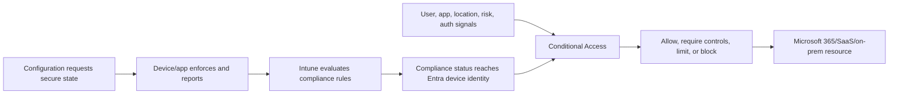

A configuration can fail while compliance still appears acceptable if the compliance rule does not test that control. A device can meet configuration but be noncompliant due to threat risk. A compliant device can still be blocked by another CA policy. A noncompliant device can access a resource if no applicable CA policy requires compliance. Keep the layers separate.

## 2. Compliance architecture and signal path

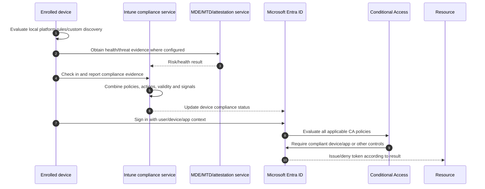

| Component | Owns | Useful evidence |
|---|---|---|
| Device OS/agent | Local posture collection and check-in | Platform/Company Portal/MDM logs |
| Intune | Policy assignment, rule evaluation, actions, reporting | Device and per-setting compliance reports |
| Attestation/MDE/MTD | Health or threat evidence | Partner/MDE status and integration health |
| Entra device object | Directory device identity and compliance property | Device ID, join state, enabled/compliant timestamps |
| Conditional Access | Sign-in policy decision | Sign-in log, policy result, grant failure reason |
| Client/broker/browser | Presents identity/device/app claims | Browser/app/broker support and token context |
| Resource | Accepts token and applies workload authorization | Resource audit/application logs |

The signal is asynchronous. Device check-in, external risk evaluation, Intune calculation, Entra update, token acquisition, and portal reports do not share one instant clock.

## 3. Tenant-wide compliance policy settings

Intune has tenant-level **compliance policy settings** separate from platform compliance policies.

### 🔍 Plain-English deep-dive: default posture and validity

- **Mark devices with no compliance policy assigned as** — *decides whether an enrolled device with no applicable compliance policy is treated as compliant or noncompliant.* **Analogy:** A school can pass untested students by default or require a completed exam. **Why it matters:** The current default is **Compliant**, which can create false assurance; Microsoft recommends **Not compliant** when CA relies on compliance, after coverage is proven.
- **Compliance status validity period** — *how long a device can go without successfully reporting compliance before it becomes noncompliant.* **Analogy:** A safety inspection certificate expires if not renewed. **Why it matters:** Too long tolerates stale posture; too short blocks legitimate offline devices.
- **Assignment coverage** — *whether every intended enrolled endpoint receives the correct platform policy.* **Analogy:** Ensure every student got the exam before changing the pass rule. **Why it matters:** Switching the tenant default to Not compliant before coverage can create mass access loss.
- **Status freshness** — *the age and stage of evidence, not just the displayed word.* **Analogy:** Yesterday's weather report cannot prove today's conditions. **Why it matters:** Access troubleshooting must correlate check-in and sign-in time.

| Tenant setting | Current documented behavior | Design action |
|---|---|---|
| No policy assigned | Default value is Compliant | Map coverage, pilot change to Not compliant, monitor impact |
| Validity period | Default 30 days; configurable 1-120 days | Choose by risk, travel/offline pattern and support capacity |
| Policy-specific actions | Separate from tenant settings | Define mark timing and communication per policy |

Do not change the no-policy setting during an incident without a coverage report and rollback. First identify devices with no assigned policy, unsupported platforms, stale records, and intentional exceptions.

## 4. Built-in platform compliance policies

Compliance settings differ by platform and enrollment mode. Common families include operating-system version, password/passcode, encryption, jailbreak/root state, device health, secure boot/code integrity, threat level, firewall/antivirus, and platform-specific integrity.

| Rule family | What it evaluates | Caveat |
|---|---|---|
| OS version/build | Minimum/maximum supported version | Hard-coded maximum can block a new release; lifecycle dates move |
| Password/passcode | Required lock/complexity characteristics | Platform may remediate or only quarantine |
| Encryption | Reported device/storage encryption | Capability and reporting differ by platform |
| Root/jailbreak | Platform integrity compromise | Detection is not perfect and can depend on app/service |
| Windows health | Attested boot/security properties | Requires supported hardware, OS, attestation connectivity |
| Defender Antivirus/firewall | Reported protection state | Product mode, third-party AV and freshness matter |
| MDE/MTD threat level | External security risk under threshold | Connector, app/sensor and partner service must be healthy |
| Device properties | Manufacturer/model/OS constraints where exposed | Inventory can be stale or user-controlled in some contexts |

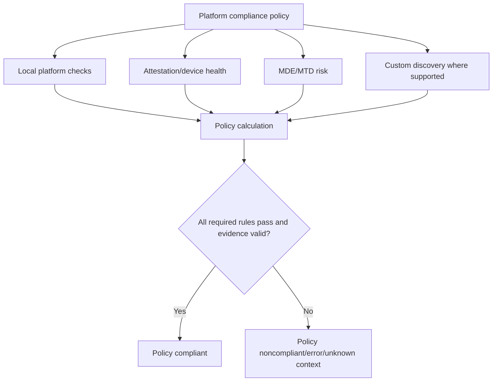

Use platform-specific policies instead of one conceptual “global device policy.” Maintain a common control objective with documented platform implementations and gaps.

## 5. Multiple policies and status calculation

A device can receive multiple compliance policies. The effective result is conservative: failure of an applicable required policy/rule can make the device noncompliant. Intune reports can show policy-level, setting-level, user-level, and device-level views; aggregate labels need drill-down.

| Situation | Expected reasoning |
|---|---|
| Two policies both pass | Device can be compliant if no other failing/expired requirement |
| One passes, one fails | Device is noncompliant |
| Policy not assigned | Tenant “no policy assigned” behavior matters only when no applicable policy covers device |
| Rule not applicable | It should not count as a failure, but targeting noise should be reduced |
| Error/no evidence | May prevent a compliant result depending on rule/status path |
| Compliance evidence expires | Device becomes noncompliant after validity period |
| Grace period active | Access impact depends on mark-noncompliant action timing and CA |

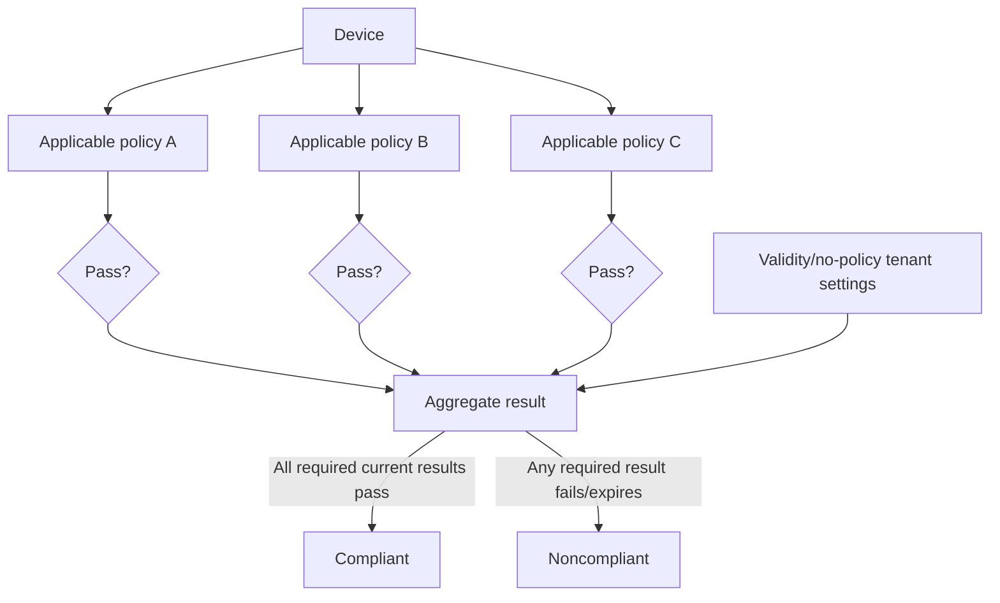

Avoid duplicate compliance rules unless an explicit reason exists. Duplicate rules with different grace/actions confuse users and responders.

## 6. Actions for noncompliance and grace periods

Every compliance policy includes an action to **mark the device noncompliant**, with a schedule. Additional supported actions can notify users/admins, remotely lock, or mark a device for retirement after a period. Platform support varies.

| Action | Purpose | Design caution |
|---|---|---|
| Mark noncompliant | Change compliance result after configured delay | This is what CA consumes; delay is the practical grace period |
| Email end user | Explain issue and remediation | Localize, protect data, avoid unhelpful generic text |
| Notify additional recipients | Alert service desk/security/owner | Avoid leaking device details broadly |
| Push notification | Prompt through supported app/path | Delivery is not guaranteed evidence of receipt |
| Remotely lock | Constrain device after prolonged failure where supported | Can disrupt user; platform/ownership approval required |
| Mark for retirement | Put qualifying devices into retirement workflow | Current behavior requires admin review/action; do not imply instant auto-retire |

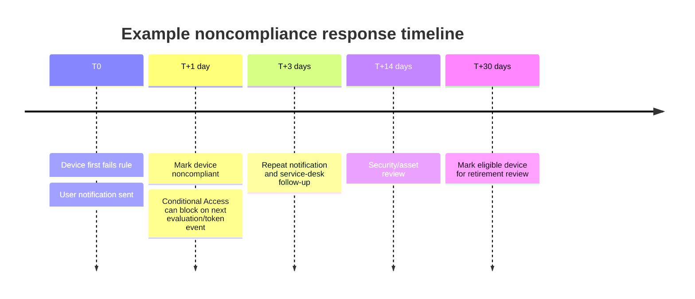

Grace should reflect severity. Active malware/high threat may justify immediate restriction; an OS update deadline may allow staged notification. Document weekends, travel, offline devices, accessibility, executive/critical operations, and support capacity.

## 7. Device health attestation

**Attestation** means a trusted component provides evidence about boot/security state rather than relying only on a local self-report. Windows health attestation can evaluate properties such as secure boot, code integrity, early-launch antimalware, and related supported signals.

### 🔍 Plain-English deep-dive: attestation is a signed inspection, not a cure

- **Trusted Platform Module (TPM)** — *hardware-backed component that can protect keys and measurements.* **Analogy:** A tamper-resistant logbook sealed into the device. **Why it matters:** Supported health and identity assurances can rely on it.
- **Measured boot** — *records components loaded during startup.* **Analogy:** A signed loading manifest for a secure shipment. **Why it matters:** It can reveal whether expected boot protections were active.
- **Health attestation service** — *validates supported device measurements and returns a result.* **Analogy:** An external inspector checks the sealed manifest. **Why it matters:** Network, hardware, firmware, OS and service health all affect evidence.
- **Compliance action** — *what Intune does with the result.* **Analogy:** Failed inspection can block warehouse entry, but the inspection itself does not repair the truck. **Why it matters:** Configuration/remediation and access policy remain separate.

| Failure | Evidence | Response |
|---|---|---|
| Unsupported hardware/firmware | Device model, TPM/Secure Boot state | Document non-applicability or modernization plan |
| Attestation endpoint blocked | Network/proxy/TLS logs | Allow required trusted endpoints; do not disable validation |
| Firmware/boot setting off | UEFI/OS health evidence | Approved remediation with recovery plan |
| Service delay | Known-good peer and service health | Avoid destructive re-enrollment; monitor/retry |
| Stale result | Last compliance/check-in timestamps | Trigger supported reevaluation and inspect channel |

Do not make a high-impact CA dependency on attestation before proving fleet hardware, firmware, network, and recovery readiness.

## 8. Microsoft Defender for Endpoint risk integration

MDE can report machine/device risk to Intune. A compliance rule can require risk at or below a selected level. This joins endpoint detection evidence with access control.

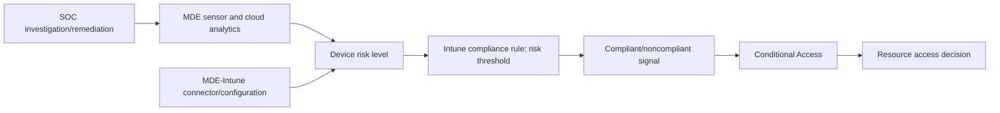

| Design question | Why it matters |
|---|---|
| Is device onboarded and sensor healthy? | No healthy telemetry means unreliable risk result |
| Which risk threshold? | Lower thresholds increase protection and potential blocks |
| How quickly can SOC remediate? | Access block without response path strands users |
| Who owns false positive? | Intune admin should not close Defender alert blindly |
| What is emergency access path? | Incident response needs controlled alternatives |
| What happens after remediation? | Risk/compliance/token reevaluation has latency |

Do not lower the risk threshold or offboard the sensor merely to restore access. Investigate the security finding, contain/remediate, validate sensor health, and allow signals to clear through the supported workflow.

## 9. Mobile Threat Defense and partner integrations

**Mobile Threat Defense (MTD)** products can supply device/app/network risk for supported mobile scenarios. Intune connectors and compliance/app-protection conditional launch can consume partner signals depending on integration.

| Layer | Example responsibility |
|---|---|
| Mobile app/sensor | Collect supported device/network/app threat indicators |
| Partner cloud | Analyze and assign threat level |
| Intune connector | Exchange risk/health signal and map to policy |
| Compliance/APP | Compare result with threshold |
| Conditional Access/app | Restrict access or protected-app use |
| SOC/service desk | Investigate, remediate, communicate, escalate |

Partner compliance is different from MTD. **Device compliance partner** integrations allow supported non-Microsoft MDM posture to contribute a compliance result in applicable scenarios. Verify current platform and partner lists; do not assume any third-party MDM can mark every device compliant.

Privacy review must cover what the partner collects, where it processes data, retention, employee notice, incident access, and cross-border transfer. Technical integration does not replace vendor risk assessment.

## 10. Custom compliance

Custom compliance extends built-in checks using a discovery script and a structured JSON rule file on supported platforms. Current 2026 Intune guidance supports custom compliance for Windows, macOS, and supported Linux distributions; verify exact versions and prerequisites.

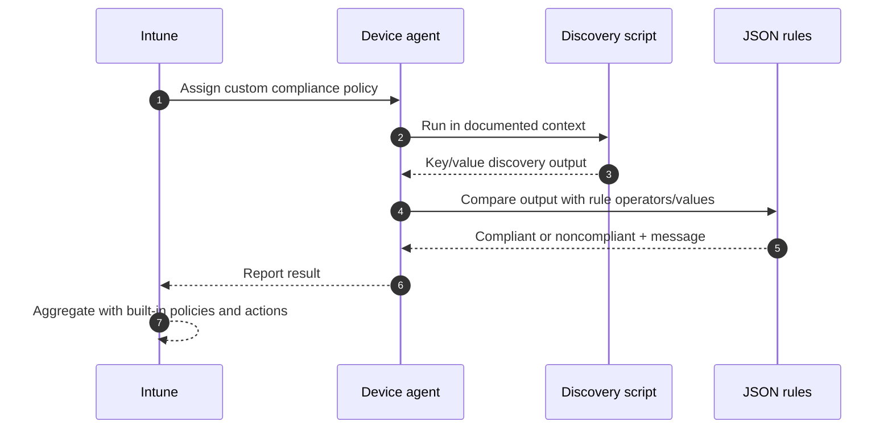

| Custom design element | Requirement |
|---|---|
| Discovery output | Valid, bounded, deterministic JSON in documented schema |
| Rule key/type | Matches script output exactly |
| Operator/value | Correct comparison; version/string semantics tested |
| Remediation message | Clear nonsecret user guidance, localized as needed |
| Context/permissions | Minimum required; no interactive assumption |
| Runtime | Fast, reliable, offline-aware, no unbounded network call |
| Security | Signed/reviewed, no secrets, safe dependencies |
| Failure behavior | Script error is not silently interpreted as healthy |
| Versioning | Script/rule pair change together with tests |

Custom compliance evaluates; it does not automatically correct the condition. Pair with supported configuration, remediation, app deployment, or service-desk workflow. A custom check that always returns “true” on error is false compliance.

## 11. Compliance timing and freshness

Compliance changes can wait for local evaluation, device check-in, partner risk update, Intune aggregation, Entra propagation, and a new access evaluation.

### 🔍 Plain-English deep-dive: a repaired device can still have an old access decision

- **Propagation** — *movement of a new status through services.* **Analogy:** A corrected address must travel from the local office to the central directory. **Why it matters:** Local remediation does not instantly update Intune and Entra.
- **Token** — *a signed access credential containing claims used by a resource.* **Analogy:** A time-limited entry ticket printed from the information available at issue time. **Why it matters:** A ticket issued before compliance changed can reflect an older decision until refresh or reevaluation.
- **Session** — *the ongoing authenticated relationship between client and resource.* **Analogy:** A person already inside a venue after the ticket check. **Why it matters:** Session controls and Continuous Access Evaluation support affect when a new posture changes access.
- **Fresh evidence** — *timestamps showing each stage processed the new state.* **Analogy:** Track every scan on a parcel route. **Why it matters:** It tells support whether to wait, trigger a supported reevaluation, or investigate a broken stage.

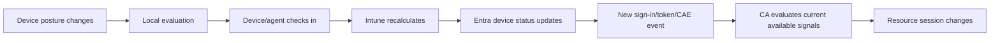

| Clock | Typical trigger | Troubleshooting timestamp |
|---|---|---|
| Device local state | User/admin/OS/security event | Local event/log time |
| MDM/agent evaluation | Scheduled, notification, manual sync, preview client trigger | Last check-in/evaluation |
| Partner threat | Sensor/cloud analysis cadence | Risk update time |
| Intune report | Service processing | Last reported/evaluated |
| Entra device property | Intune-to-directory propagation | Device status time where exposed |
| Access decision | Sign-in/token/session reevaluation | Entra sign-in log time |
| Resource session | Token/session control behavior | App audit/session time |

Do not promise instant recovery after remediation. Tell the user what must reevaluate and which evidence will prove each stage.

## 12. Device-based Conditional Access

Device-based CA uses a grant such as **Require device to be marked as compliant**. The device must be registered in Entra so a supported client can present device identity. Current support includes documented Windows, iOS/iPadOS, Android, macOS, and supported Linux contexts; browser/client limitations apply.

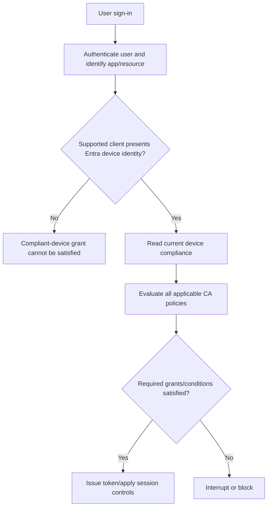

| CA design element | Guardrail |
|---|---|
| Users | Include intended users; exclude controlled emergency accounts where justified |
| Resources | Start with low-risk pilot resource before all resources |
| Platforms/client apps | Validate supported clients and browser device-claim behavior |
| Grant | Require compliant device, MFA/auth strength, or combinations by requirement |
| Mode | Report-only first; analyze real sign-ins |
| Session | Understand token/session lifetime and Continuous Access Evaluation support |
| Dependencies | Do not block enrollment/remediation/broker paths needed to become compliant |

Microsoft notes that Edge InPrivate on Windows does not satisfy compliant/hybrid device controls. Other browser/device-certificate behavior varies. Test the exact client, account, platform, and session.

## 13. App-based Conditional Access and MAM

App-based CA protects access through supported policy-managed apps, especially on unenrolled mobile BYOD. It can require an Intune app protection policy. MAM health checks and data controls then operate inside the app.

### 🔍 Plain-English deep-dive: device gate versus app gate

- **Device-based gate** — *the whole registered/enrolled endpoint must meet compliance.* **Analogy:** The entire vehicle must pass inspection before entering the site. **Why it matters:** Best when organization requires device posture and owns/manages the endpoint.
- **App-based gate** — *the supported work app must receive and enforce app protection.* **Analogy:** A sealed approved delivery container can enter even when the private vehicle is not managed. **Why it matters:** Supports privacy-focused BYOD.
- **Broker app** — *Authenticator or Company Portal component that helps establish device/app identity for mobile authentication.* **Analogy:** A trusted receptionist verifies the delivery context. **Why it matters:** Missing/outdated broker can look like policy failure.
- **Conditional launch** — *app-level checks performed before work data is used.* **Analogy:** Inspect the sealed container each time its rules require. **Why it matters:** OS/app version, jailbreak, threat risk, offline grace, or PIN can warn/block/wipe.

| Requirement | Device-based CA | App-based CA/MAM |
|---|---|---|
| Whole-device compliance | Yes | No |
| Unenrolled BYOD | Usually cannot satisfy compliant-device grant | Core use case on supported apps |
| Corporate Wi-Fi/certificate | MDM can deploy | Not provided by MAM alone |
| Work data transfer controls | Add APP for depth | Primary capability |
| Unsupported app/client | May be blocked by device/client rules | Cannot receive APP; design explicit block/alternative |
| Selective work-data wipe | MDM retire/APP depending design | MAM selective wipe |

For mixed populations, design separate clear policies rather than an accidental OR that lets an unmanaged unsupported path through. Analyze all applicable CA policies together.

## 14. False compliance and false noncompliance

**False compliance** means the system appears to approve posture that does not meet intended control. **False noncompliance** means a healthy/approved endpoint is marked failing due to stale, unsupported, or incorrect evidence.

| Pattern | Type | Prevention |
|---|---|---|
| No policy assigned defaults to Compliant | False compliance | Coverage report then staged Not compliant setting |
| Custom script returns healthy on exception | False compliance | Fail safely with explicit error path; monitor script health |
| MDE connector/sensor missing but risk rule absent | False compliance | Onboarding coverage plus compliance requirement |
| Old portal report read as current | Either | Compare check-in/evaluation/sign-in timestamps |
| Duplicate Entra object carries stale status | Either/access mismatch | Correlate device IDs in token, Intune and Entra |
| Unsupported browser cannot present device ID | False noncompliance/access failure | Supported-client matrix and user guidance |
| Attestation endpoint blocked | False noncompliance | Network readiness and service monitoring |
| Hard maximum OS version after new release | False noncompliance | Lifecycle review and release-ring tests |
| Partner risk delay after remediation | False noncompliance temporarily | Track partner→Intune→Entra propagation |

Treat unexpectedly high compliance as suspicious until coverage and freshness are proven. A 99.9% green dashboard can mean weak rules or no-policy defaults, not excellent security.

## 15. Stale and duplicate device records

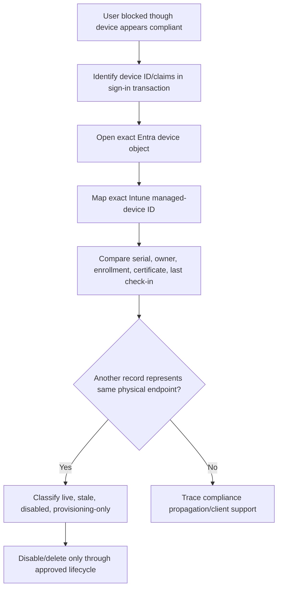

| Correlation field | Why useful |
|---|---|
| Entra device ID | Device claim and directory lookup |
| Intune managed-device ID | Policy/compliance/remote-action record |
| Serial/hardware identifiers | Physical correlation, not sole trust proof |
| Join type/trust type | Registered, joined, hybrid context |
| Enrollment date/certificate | Which management relationship is current |
| Primary/last user | User context, not always current owner |
| Last check-in/compliance time | Liveness and freshness |
| Autopilot/ADE/Android registration | Provisioning lifecycle relationship |

Do not bulk delete by display name. Disabling a stale object before deletion can provide a safer observation window, but must follow asset, access, and support procedures.

## 16. Licensing, roles, and scope

| Capability | Typical license dependency to verify |
|---|---|
| Intune device compliance | Applicable Microsoft Intune entitlement |
| Conditional Access | Microsoft Entra ID P1 or P2 according to feature |
| Identity Protection/risk | Entra ID P2 for relevant risk capabilities |
| Defender device risk | Applicable MDE subscription/onboarding plus Intune integration |
| MTD partner | Intune plus partner product/license |
| App protection/MAM | Intune entitlement and supported app/resource license |
| Custom compliance/remediations | Verify current Intune plan/platform prerequisites |

Use least-privilege Intune and Entra roles, scope groups/tags, PIM where available, protected admin accounts, and audit. Compliance administrators should not automatically receive broad destructive remote-action rights. Separation of duties matters when the same team could mark posture, alter CA, and erase devices.

## 17. Security, privacy, and resilience design

| Concern | Design response |
|---|---|
| Device posture data | Collect only required signals; restrict reports and retention |
| Threat-risk visibility | Limit SOC/help-desk access; define user communications |
| BYOD | Prefer app-level controls where sufficient; disclose device data/actions |
| Partner processing | Review data location, retention, sub-processors, incident obligations |
| Lockout | Emergency accounts, report-only, dependency exclusions, staged gates |
| Service outage | Known behavior, communications, escalation, controlled exception process |
| Offline workforce | Validity/grace based on risk and travel; pre-travel guidance |
| Exceptions | Risk owner, compensation, narrow group, expiry and review |

Do not build an undocumented “compliance bypass” group. Exceptions are controls with an owner and expiry, not permanent shadows.

## 18. Deployment plan: coverage before enforcement

```mermaid
flowchart LR
    INVENTORY[Inventory enrolled devices, platforms and no-policy coverage] --> BASE[Create platform compliance policies]
    BASE --> R0[Ring 0 evaluate without broad CA impact]
    R0 --> ACTIONS[Test grace, messages, MDE/health/custom signals]
    ACTIONS --> REPORT[Validate fresh compliance reports]
    REPORT --> CARO[Conditional Access report-only]
    CARO --> R1[Pilot enforce low-risk resource/users]
    R1 --> R2[Representative business rollout]
    R2 --> PROD[Phased production]
    PROD --> DEFAULT[Consider no-policy = Not compliant after coverage proof]
```

| Gate | Evidence | Stop condition |
|---|---|---|
| Coverage | Intended devices have applicable policy | No-policy/unsupported gap unexplained |
| Signal | Built-in/custom/MDE/MTD results match known state | False healthy or systemic error |
| User remediation | Messages and Company Portal steps work | User cannot recover without admin workaround |
| Report-only | CA logs show expected impact by app/platform/client | Enrollment/remediation/emergency path would be blocked |
| Pilot enforcement | Access succeeds/fails exactly as test matrix | Unexpected outage or unsupported business client |
| Operations | On-call, dashboard, roles, exceptions, rollback ready | No owner for overnight block |

Changing compliance without CA might alter reporting and notifications. Enabling CA turns posture into access impact. Treat them as linked but separately controlled changes.

## 19. Testing and rollback

| Test | Expected result | Evidence |
|---|---|---|
| Compliant positive | Healthy enrolled supported device accesses resource | Intune status + Entra sign-in result |
| Noncompliant negative | Deliberately safe test condition fails and access is blocked after timing | Rule/action/CA logs |
| Grace | User notified while access remains as designed until mark time | Timeline and message receipt |
| No-policy | Untargeted disposable record behaves according to tenant setting | Assignment and status |
| App-based BYOD | Protected supported app succeeds; unmanaged app fails | MAM/CA logs and data test |
| Unsupported browser | Predictable failure and guidance | Client + sign-in log |
| MDE risk tabletop | Synthetic risk path and SOC workflow, no real malware | Tabletop timeline |
| Stale/offline | Device crosses chosen validity boundary | Compliance and access timestamps |
| Duplicate record | Transaction maps to correct live object | Identifier crosswalk |
| Rollback | Disable CA policy or revert assignment/action in controlled pilot | Restored access plus residual-risk record |

Rollback order depends on incident. A CA outage may require disabling the specific new policy while retaining compliance evidence. A faulty compliance rule may require removing its pilot assignment or restoring prior version. Do not globally set all devices compliant or disable security products.

## 20. Layered troubleshooting: “My device is compliant but I am blocked”

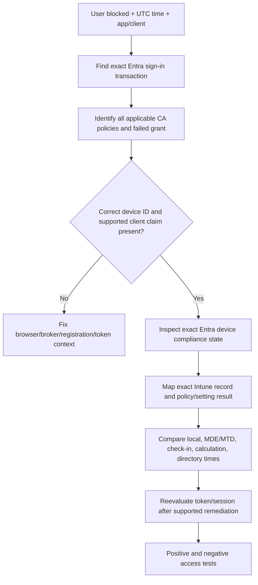

| Layer | Question | Evidence |
|---|---|---|
| User/resource | Which identity, tenant, app and resource? | UPN/object, resource ID, sign-in log |
| CA | Which policy/control failed? AND/OR combination? | Policy detail, report-only/enforced result |
| Client | Can app/browser present device or APP state? | Client type, broker, certificate/registration |
| Entra device | Which device object did transaction use? | Device ID, trust, enabled, compliant |
| Intune assignment | Which policies/actions cover exact record? | Group/filter/device/user status |
| Rule | Which setting failed/error/not applicable? | Per-setting report, remediation text |
| Health/risk | Is MDE/MTD/attestation current? | Connector/sensor/partner timestamps |
| Time/token | Has state propagated and session reevaluated? | Check-in, directory update, sign-in times |
| Service/license | Is feature entitled and service healthy? | License plan and service health |

Start from the sign-in transaction, not from a screenshot saying “Compliant.” The transaction reveals which device object and CA policy mattered.

## 21. Troubleshooting “device is noncompliant but looks healthy”

| Symptom | Plausible cause | Discriminating check |
|---|---|---|
| No policy assigned | Coverage/filter/group/default | Device compliance policy list and tenant setting |
| Password/encryption fail | Configuration not applied or report stale | Local supported query + rule timestamp |
| OS version fail after release | Maximum/minimum rule not updated | Exact parsed OS/build and policy value |
| MDE threat fail | Active alert/risk, sensor or connector delay | MDE device page/risk timestamp and connector health |
| Attestation fail | Secure Boot/TPM/firmware/network/service | Attestation-specific evidence and known-good peer |
| Custom compliance error | Script output/schema/context | Agent log, stdout JSON, rule keys/types |
| In grace but portal confusing | Action schedule and aggregation | Failure first-seen + mark time |
| Device inactive | Validity period crossed | Last successful report versus validity |
| Wrong record | Re-enrollment/duplicate object | Device ID and enrollment-certificate crosswalk |

Avoid deleting/re-enrolling until evidence shows the management relationship is corrupt. Re-enrollment changes IDs and can hide the original root cause.

## 22. Reporting, metrics, and operations

| Metric | Definition | Why it matters |
|---|---|---|
| Policy coverage | Intended managed devices with applicable compliance policy | Detects default-compliant exposure |
| Fresh compliant coverage | Intended devices compliant within freshness target | Better than raw green count |
| Noncompliance by rule | Devices failing each control | Prioritizes systemic remediation |
| Grace population/age | Devices before mark deadline | Forecasts access impact |
| Inactive/validity risk | Devices approaching validity expiry | Prevents surprise travel/offline blocks |
| MDE/MTD signal health | Onboarded/current devices and connector errors | Validates security dependency |
| CA report-only impact | Sign-ins that would fail by policy/client/platform | Rollout readiness |
| False-result rate | Confirmed false compliant/noncompliant cases | Measures trustworthiness |
| Remediation success/time | Devices recovering without exception | User/support effectiveness |
| Exception debt | Active/expired bypasses by risk owner | Prevents silent erosion |
| Mean time to isolate | Block report to proven failing layer | 24x7 support maturity |

Operating cadence: daily high-risk/systemic failures, weekly grace and stale queues, monthly coverage/exceptions, quarterly policy and platform lifecycle review, and event-driven review for OS releases, app/broker changes, licensing, partner updates, or CA feature retirement.

## 23. Consulting scenarios

### Scenario A: Move no-policy devices from Compliant to Not compliant

Inventory every managed platform and no-policy device, classify live/stale/unsupported/test/shared records, assign correct policies, validate report freshness, and run CA report-only impact. Pilot the tenant setting with a prepared rollback and support surge plan. The control is valuable only after coverage; done prematurely, it is a lockout event.

### Scenario B: MDE high risk blocks an executive

Treat it as a security signal, not an Intune inconvenience. Verify identity/device mapping, MDE alert/evidence and sensor freshness. SOC scopes and contains the threat, while service desk communicates approved alternatives. After remediation, track MDE risk → Intune compliance → Entra → new access evaluation. Do not lower the threshold for one user without risk approval and compensation.

### Scenario C: Contractor uses personal iPhone

If the requirement is supported M365 apps and work-data protection, use app protection plus app-based CA instead of whole-device compliance. Validate Authenticator/broker, supported apps, data-transfer controls, conditional launch, selective wipe, offline grace, privacy notice, and offboarding. Block unsupported unmanaged app paths explicitly.

### Scenario D: Compliant device blocked only in one browser mode

Compare normal supported browser with the failing mode, inspect sign-in device ID and CA policy result, and check documented browser limitations. Edge InPrivate on Windows does not satisfy the compliant-device grant under current guidance. Provide a supported path; do not weaken the policy tenant-wide.

### Scenario E: Compliance dashboard is nearly 100% green

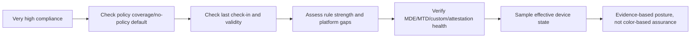

## 24. Consulting artifacts

| Artifact | Minimum contents |
|---|---|
| Compliance control matrix | Objective, platform rule, threshold, assignment, action, owner |
| Signal-flow HLD | Device/partner → Intune → Entra → CA → resource |
| CA policy matrix | Users, resources, conditions, grants, exclusions, mode, dependencies |
| Coverage report | Intended versus assigned/evaluated by platform and mode |
| Grace/action schedule | Severity, notifications, mark time, escalation, retirement review |
| Custom compliance package spec | Script/rules/version/security/tests/remediation path |
| Integration register | MDE/MTD/attestation owner, license, connector, health, privacy |
| Test and rollback plan | Positive/negative/app/device/stale/duplicate/token scenarios |
| Exception register | Reason, scope, compensation, approver, expiry, review |
| Operations runbook/dashboard | Evidence flow, metrics, alerts, RACI, vendor escalation |

## 25. Safe paper lab and evidence exercise

No tenant, device, MDE sensor, or CA change is required.

### Fictional brief

Contoso has 1,500 Windows devices, 300 Macs, corporate iPhones, contractor BYOD, and an MDE deployment at 85% coverage. The tenant still treats devices with no compliance policy as compliant. Executives travel offline for up to 21 days. The client wants compliant-device CA for corporate devices and MAM for contractors.

### Steps

1. Create personas and map corporate MDM versus MAM-only access.
2. Build platform compliance rules and explain every unsupported gap.
3. Choose a validity period and grace/action schedule by severity with reasoning.
4. Map MDE risk, device health, and a fictional custom compliance check into the signal flow.
5. Design coverage remediation before changing no-policy behavior.
6. Create two CA policies: corporate compliant-device pilot and contractor app-protection pilot; include emergency/dependency decisions.
7. Write report-only queries/questions and expected impact segments.
8. Build tests for compliant, noncompliant, grace, stale, duplicate, unsupported browser, MAM, MDE risk tabletop, and rollback.
9. Draw two timing timelines: failure-to-block and remediation-to-restored-access.
10. Create an evidence template starting from Entra sign-in ID and mapping to exact device record/rule.
11. Define metrics, RACI, on-call handoff, exception, service-health, and partner escalation.
12. Present a five-minute stakeholder update explaining why compliance is a signal, not a security guarantee.

### Evidence to retain

| Evidence | Interview value | Honesty label |
|---|---|---|
| Signal-flow diagram | Architecture thinking | Fictional design |
| Compliance/CA matrices | Policy precision | No tenant deployment |
| Timing model | Troubleshooting maturity | Assumed/test timestamps |
| Coverage/default plan | Risk-aware rollout | Paper assessment |
| Sign-in-first runbook | RCA and support transfer | Synthetic records |
| Metrics/RACI | Operational readiness | Proposed model |

## 26. JD Mapping: interview translation

| Prompt | Truthful response structure |
|---|---|
| Design compliance and CA | Personas/platforms → rules/signals → coverage/grace → report-only → tests/rings → operations |
| Troubleshoot access block | Exact sign-in → CA result → client/device claim → Entra object → Intune rule/risk → timing |
| Handle false positives | Preserve security, prove signal/source/timing, coordinate owner, use controlled exception only if approved |
| Explain Intune gap | State no production ownership; describe current paper artifacts and production RCA skills |
| Advise executives | Translate risk, productivity, privacy, offline behavior, support and residual risk into options |

## 27. Official Source Anchors

| Topic | Official Microsoft source |
|---|---|
| Compliance policy settings, validity, default and integration | [Device compliance policies in Microsoft Intune](https://learn.microsoft.com/en-us/intune/device-security/compliance/overview) |
| Create policies and refresh/evaluation | [Create a compliance policy](https://learn.microsoft.com/en-us/intune/device-security/compliance/create-policy) |
| Actions and schedules | [Configure actions for noncompliance](https://learn.microsoft.com/en-us/intune/device-security/compliance/configure-noncompliance-actions) |
| Monitor compliance | [Monitor device compliance](https://learn.microsoft.com/en-us/intune/device-security/compliance/monitor-policy) |
| Custom compliance | [Use custom compliance settings](https://learn.microsoft.com/en-us/intune/device-security/compliance/custom-settings) |
| MDE integration and device risk | [Integrate Defender for Endpoint with Intune compliance](https://learn.microsoft.com/en-us/intune/device-security/microsoft-defender/overview) |
| Compliance partners | [Third-party device compliance partners](https://learn.microsoft.com/en-us/intune/device-security/compliance/third-party-partners) |
| Intune and Conditional Access | [Use Conditional Access with Intune compliance](https://learn.microsoft.com/en-us/intune/device-security/conditional-access-integration/overview) |
| Device-based scenarios | [Device-based Conditional Access](https://learn.microsoft.com/en-us/intune/device-security/conditional-access-integration/device-based-policies) |
| App-based scenarios | [App-based Conditional Access](https://learn.microsoft.com/en-us/intune/device-security/conditional-access-integration/app-based-policies) |
| Entra compliant-device grant and client notes | [Conditional Access grant controls](https://learn.microsoft.com/en-us/entra/identity/conditional-access/concept-conditional-access-grant) |
| CA report-only | [Conditional Access report-only mode](https://learn.microsoft.com/en-us/entra/identity/conditional-access/concept-conditional-access-report-only) |
| App protection overview | [Intune app protection policies](https://learn.microsoft.com/en-us/intune/app-management/protection/overview) |
| Stale devices | [Manage stale devices in Microsoft Entra ID](https://learn.microsoft.com/en-us/entra/identity/devices/manage-stale-devices) |

---

## ⭐ Likely Interview Questions for This Section

### Q1. What is the difference between device configuration, compliance, and Conditional Access?

> **Model answer:** Configuration requests a state from the OS or app, compliance evaluates reported state against rules, and Conditional Access decides whether a sign-in may reach a resource using compliance plus identity, app, location, risk, and authentication signals. Actions for noncompliance control timing and communications. They are linked but independent: a configuration can succeed without a matching compliance check, compliance can fail because of MDE risk, and access changes only when an applicable CA policy consumes the signal.

### Q2. What is risky about “Mark devices with no compliance policy assigned as Compliant”?

> **Model answer:** It is the current default and means an enrolled device with no applicable compliance policy can appear compliant without being tested against intended rules. Before changing it to Not compliant, I build platform coverage, classify stale/unsupported exceptions, validate fresh reporting, analyze CA report-only impact, prepare support and rollback, then phase the change. The secure value without coverage can cause mass lockout.

### Q3. How do grace periods work with Conditional Access?

> **Model answer:** The practical grace period is the delay on the action that marks the device noncompliant. During the delay, notifications or remediation can occur while the device has not yet changed to noncompliant for CA. After it is marked and the signal/token path reevaluates, a CA compliant-device grant can block access. I choose timing by severity and test the complete timeline rather than assuming immediate portal-to-access behavior.

### Q4. How does Defender for Endpoint device risk affect compliance?

> **Model answer:** A healthy MDE sensor and connector provide a device risk level to Intune. A compliance policy can require risk at or below a threshold; Intune then reports the aggregate result to Entra, and CA can require compliance. If high risk blocks access, SOC investigates and remediates the threat. I track MDE risk, Intune recalculation, Entra update, and new access evaluation instead of lowering the threshold or disabling protection.

### Q5. When would you use custom compliance?

> **Model answer:** I use it when a necessary measurable posture condition is not available in built-in policy and the platform is supported. I create a deterministic, bounded, secure discovery script and matching JSON rules, test types/operators/error behavior, provide useful remediation text, version the pair, and monitor execution health. It evaluates rather than remediates, and errors must not produce false compliance.

### Q6. Compare device-based Conditional Access with app-based Conditional Access.

> **Model answer:** Device-based CA requires a supported client to present an Entra device identity whose compliance state passes; it fits managed corporate endpoints. App-based CA requires a supported app to receive Intune app protection and fits unenrolled mobile BYOD where the aim is work-data protection. Device CA can govern whole-device posture; MAM governs work identity/data inside supported apps. I use explicit persona paths and block unsupported clients rather than creating an accidental bypass.

### Q7. A user says the device is compliant but access is blocked. What do you check?

> **Model answer:** I start with the exact Entra sign-in transaction and UTC time, identify every applicable CA policy and failed grant, verify that the client presented the expected device ID/app state, open that exact Entra object, map it to the current Intune record, drill into per-policy/rule and MDE/MTD/attestation evidence, and compare check-in, calculation, directory, token, and session times. I also check duplicates, supported browser/broker behavior, licensing, and service health.

### Q8. How does your background support this work without overstating Intune experience?

> **Model answer:** My production M365 work required correlating identity, policy, client, service, and timing evidence during access and sync escalations, then validating fixes, documenting RCAs, and coordinating stakeholders. I have transferred that method into a current compliance/CA paper design with signal diagrams, coverage and grace decisions, tests, rollback, metrics, and a sign-in-first runbook. I do not present it as production Intune ownership and would implement with Intune/Entra/SOC owners.

---

## 🧠 30-Second Memory Hooks

- **Configuration** says “make it”; **compliance** asks “is it”; **CA** decides “may it enter.”
- **Compliance is a signal, not an enforcement guarantee.**
- **No-policy default green** can mean “not tested,” not “secure.”
- **Validity period** = expiry date on the last successful posture inspection.
- **Grace** lives in mark-noncompliant timing; CA impact follows signal and token reevaluation.
- **Attestation** = signed boot inspection, not remediation.
- **MDE risk** flows sensor → MDE → Intune → Entra → CA.
- **Custom compliance** = discovery JSON + rule JSON; failure must not look healthy.
- **Device gate** inspects the vehicle; **app gate** inspects the sealed work container.
- **Start with the sign-in** when access is blocked; screenshots can point to the wrong record/time.
- **Green dashboard** requires coverage + freshness + strong rules + working integrations.
- **Never cure a security signal by disabling the sensor.**
- **Candidate honesty** = production access/RCA capability plus current paper design.

---

## Completion Checklist

- [ ] I can distinguish configuration, compliance, actions, app protection, and Conditional Access.
- [ ] I can draw the device/partner → Intune → Entra → CA → resource signal path.
- [ ] I can explain the no-policy default and stage a safe move to Not compliant.
- [ ] I can choose a validity period and grace/action schedule based on risk and operations.
- [ ] I can design platform-specific built-in rules and explain aggregate status.
- [ ] I can explain health attestation, MDE risk, MTD, and compliance partners.
- [ ] I can design secure custom compliance without false-healthy error handling.
- [ ] I can model timing from local state change through access reevaluation.
- [ ] I can compare device-based CA and app-based CA/MAM accurately.
- [ ] I can identify false compliance, false noncompliance, stale and duplicate records.
- [ ] I can plan licensing, privacy, report-only rollout, tests, rollback, and exceptions.
- [ ] I can troubleshoot from exact sign-in to exact device/rule and preserve evidence.
- [ ] I can define coverage, freshness, signal-health, remediation, exception, and support metrics.
- [ ] I completed or can explain the safe paper lab as non-production evidence.
- [ ] I can answer Q1-Q8 aloud and preserve Arti's honesty boundary.
- [ ] I will recheck current platform, partner, preview, grant-retirement, licensing, and report behavior.

---

*Next suggested section:* [Part 18](Part-18-intune-apps-autopilot-updates-lifecycle.md) — extend endpoint trust into app packaging and delivery, protected app data, Windows provisioning with current and classic Autopilot, update rings and Autopatch, and controlled reset, reassignment, retirement, and deletion.