# Part 18 — Application Management, Windows Autopilot, Updates, and Device Lifecycle

> **Section goal:** Follow an endpoint from application requirement through packaging, assignment, delivery, detection, protection, Windows provisioning, update servicing, reassignment, and retirement. By the end, you should be able to design reliable Win32 and other app deployments, explain managed apps versus managed devices, distinguish current Windows Autopilot device preparation from classic Windows Autopilot, layer update policies without overlap, choose lifecycle actions safely, and troubleshoot each workflow with evidence.

This Part builds on enrollment, configuration, and compliance in [Parts 15-17](Part-17-intune-compliance-conditional-access.md). Part 19 applies the endpoint-security stack to these managed devices and applications.

> **Currency and change-sensitive note:** Product behavior was checked against official Microsoft Learn content available on **August 24, 2026**. Microsoft Store integration, WinGet behavior, Intune Management Extension (IME), app type support, Windows Autopilot modes, Enrollment Status Page (ESP), Windows Autopilot device preparation, Windows update policy names, hotpatch, Windows Autopatch entitlements, lifecycle actions, and platform support change frequently. Windows Autopilot device preparation is a separate current experience from classic Windows Autopilot: it uses enrollment-time grouping, supports Entra join only, requires supported Windows 11, and a classic Autopilot registration/profile takes precedence if the device remains registered. In April 2025 Windows Autopatch removed feature activation and expanded feature availability to documented Business Premium/A3+/E3+/F3 entitlements; verify current prerequisites and Product Terms. Mark Preview, phased rollout, licensing, and retirement notes in every client design.

## JD Mapping

| Deloitte role expectation | Capability developed in this Part | Consulting evidence |
|---|---|---|
| Design endpoint/application services | Map app type, context, requirements, detection, dependency, protection, provisioning and update architecture | App/Autopilot/update HLD and decision matrices |
| Configure and optimize Intune | Define packaging, assignments, supersedence, ESP, update rings, lifecycle actions, rollout and monitoring | LLD, app catalogue, update standard and lifecycle runbook |
| Troubleshoot platform issues | Isolate assignment, content, network, IME, installer, detection, Autopilot phase, update safeguard, and record failures | Layered runbooks and evidence packs |
| Plan migrations and coexistence | Move apps/provisioning/updates from Configuration Manager or third parties without duplicate agents/policy | Migration wave, authority map and rollback plan |
| Secure M365 data and endpoints | Combine app protection/configuration, least-privilege installers, update health, signed content and selective wipe | Security/privacy assessment and acceptance tests |
| Deliver operational readiness | Define dashboards, support states, vendor/escalation ownership, device reassignment and 24x7 handover | RACI, metrics, known-error catalogue and handover pack |

## Candidate honesty note

You can truthfully connect this Part to Microsoft 365 app/client support, OneDrive sync deployment behavior, incident triage, log correlation, customer communications, change validation, vendor/product-group escalation, documentation, and RCA. These are strong transferable skills for distinguishing an app assignment from download, installer, detection, or policy failure.

This Part does **not** claim production packaging of Win32 apps, ownership of IME deployments, Autopilot registrations/profiles, Windows Autopatch, update rings, or production reset/wipe actions. Safe wording is:

> “My production background is Microsoft 365 support and escalation rather than Intune application or Autopilot ownership. I have created a current paper design covering package trust, detection and dependencies, both Autopilot families, update policy layers, lifecycle actions, tests, rollback, and support evidence. I would execute with endpoint engineering, packaging, security, procurement, and service-desk owners.”

---

## 1. Application management has two jobs: deliver software and protect work data

**Mobile application management (MAM)** is sometimes used broadly for both app deployment and app protection. Keep the outcomes clear:

| Outcome | Intune mechanism | Example |
|---|---|---|
| Install/update/remove software | App deployment assignment | Install Microsoft 365 Apps or a Win32 client |
| Publish optional software | Available assignment in Company Portal | User chooses approved diagram tool |
| Configure app behavior | App configuration policy or Settings Catalog | Preconfigure account, server, browser preference |
| Protect work data | App protection policy | Restrict work-data transfer and selective wipe |
| Prove installation | Detection/status/inventory | File/MSI/registry/custom detection reports installed |
| Govern access | Conditional Access + APP/compliance | Require policy-managed app or compliant device |

An app can be installed but not protected, protected but installed manually, configured but not detected, or shown as failed because detection is wrong even when the executable works.

## 2. App types and source-of-truth choices

| App type | Best use | Delivery/enforcement | Key caveat |
|---|---|---|---|
| Microsoft Store app (new) | Public/Store applications through modern integration | Store/WinGet-backed service | Availability, context and package behavior vary |
| Win32 app (`.intunewin`) | Complex Windows desktop installers | IME downloads and runs command | Packaging, context, detection and return codes are critical |
| Line-of-business (LOB) | Supported platform package such as MSI/APPX/mobile package | Platform MDM/app install path | Avoid mixing Windows LOB and Win32 dependencies during setup without testing |
| Microsoft 365 Apps | Office suite configuration and install | Office deployment service/client | Existing Office architecture/channel and update authority matter |
| Web link/web app | Publish URL/shortcut | Browser/launcher | Does not install or protect arbitrary web content by itself |
| Managed Google Play app | Android Enterprise approved app | Managed Google Play | Binding, enrollment mode and store sync matter |
| Apple Apps and Books/app | Apple managed app licensing/deployment | Apple services and MDM | Token/license, supervision and Apple ID behavior matter |
| Built-in/platform app | Supported curated app type | Platform-specific | Feature parity differs |

Select an authoritative package source and owner. Do not maintain the same product independently as Store, Win32, ConfigMgr application, vendor auto-updater, and user-installed binary unless coexistence is explicitly designed.

## 3. The Intune Management Extension

The **Intune Management Extension (IME)** is a Windows agent that extends native MDM for Win32 apps, PowerShell scripts, remediations, and related functions. It is not the Windows MDM client itself.

### 🔍 Plain-English deep-dive: MDM channel versus IME agent

- **Native MDM client** — *Windows component that enrolls and processes supported CSP policy.* **Analogy:** The building's permanent mail slot. **Why it matters:** Configuration can work even if IME is unhealthy.
- **IME** — *additional Intune agent for Win32 apps and script-based work.* **Analogy:** A specialist courier who can unpack and execute complex deliveries. **Why it matters:** IME service, content cache, context, logs, and version become separate failure layers.
- **Content Management Service/CDN path** — *cloud delivery path for packaged content.* **Analogy:** The warehouse and transport network. **Why it matters:** Proxy, firewall, Delivery Optimization, disk space, and hash validation affect download.
- **Detection** — *rule that tells IME whether the app is already installed after an attempt.* **Analogy:** Inspect the finished room rather than trust the contractor's invoice. **Why it matters:** Installer exit 0 does not prove the intended product/version exists.

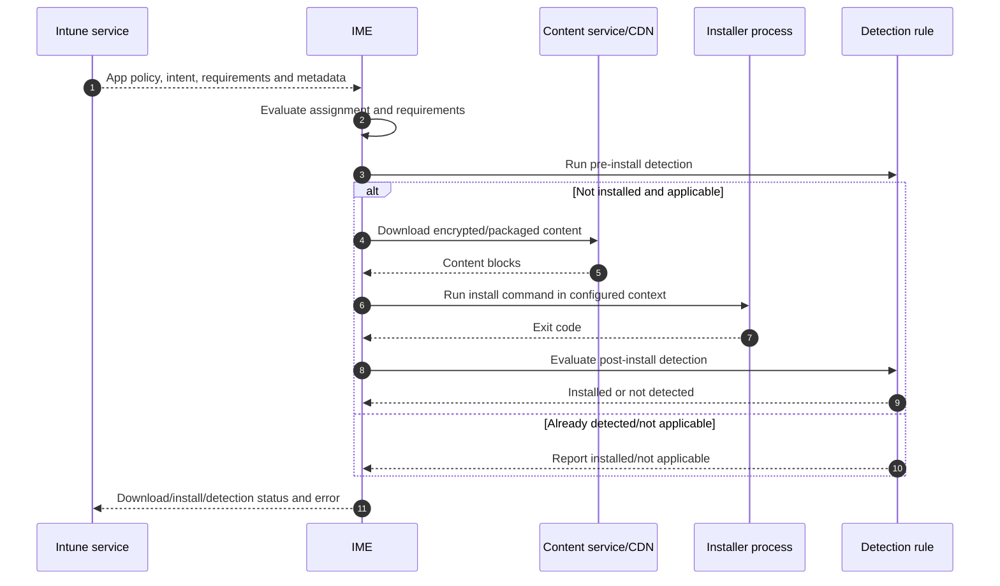

IME logs include agent, app-workload, executor and health evidence under documented Windows paths. Collect logs before deleting caches, reinstalling agents, or re-enrolling.

## 4. Win32 packaging and trust

The Microsoft Win32 Content Prep Tool wraps source files into `.intunewin`. Packaging should be reproducible and minimal.

| Package field | Design standard |
|---|---|
| Source | Vendor-authorized binary with documented version/source URL |
| Integrity | Validate signature and/or published hash; preserve evidence |
| Contents | Only required installer/configuration; no secrets or customer data |
| Install command | Silent, deterministic, documented quoting and working directory |
| Uninstall command | Tested, bounded and non-destructive to shared dependencies |
| Context | System or user chosen from application behavior |
| Restart | Correct return-code mapping and user experience |
| Detection | Product/version/state evidence independent of installer exit |
| Requirements | Architecture, OS, disk, dependencies and prerequisite state |
| Owner/lifecycle | Vendor, business owner, support, update/retirement date |

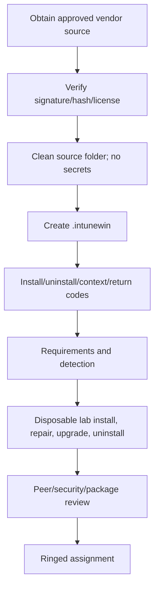

Do not repackage an untrusted executable into a trusted distribution system. Intune delivery does not make vendor code safe. Review license, privacy, network endpoints, kernel drivers, services, update behavior, and software bill-of-material risk where applicable.

## 5. Install context, requirements, and return codes

| Dimension | User context | System context |
|---|---|---|
| Identity | Signed-in user | Local system/service context |
| Typical use | Per-user app/settings | Machine-wide app/service/driver |
| Network access | User proxy/profile may apply | Machine proxy and no user credentials |
| Registry/files | User profile/HKCU | Program Files/HKLM/system paths |
| Interaction | Silent install still required | No interactive desktop assumption |
| Failure risk | No user logged in/different user | Installer expects profile or mapped drive |

Requirements prevent an app from attempting installation where prerequisites are false. Use supported architecture, OS, disk, memory, file/registry/script checks conservatively. Requirement scripts should be fast, deterministic, signed/reviewed, and return exactly the documented output/exit behavior.

Map installer return codes: success, soft reboot, hard reboot, retry, or failure. Do not map every nonzero code to success just to improve dashboards. Reboot behavior must align with user notifications, ESP, maintenance windows, and business continuity.

## 6. Detection rules: the truth function for app state

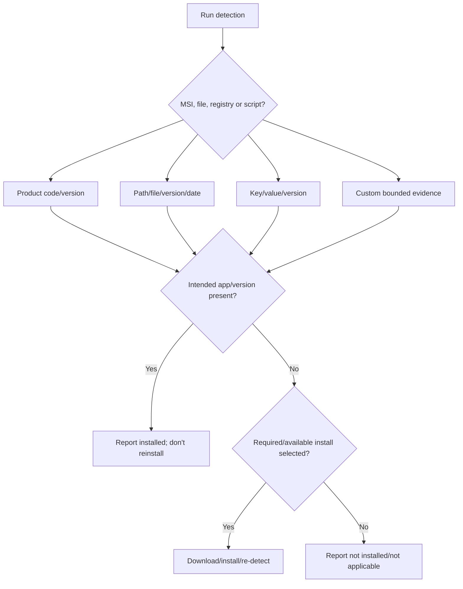

| Detection choice | Good use | Failure pattern |
|---|---|---|
| MSI product code | Stable MSI product identity | Major upgrade changes product code |
| File exists | Simple stable executable | Leftover file causes false installed |
| File version | Enforce minimum/current binary | Architecture/path/version formatting differs |
| Registry value | Vendor writes authoritative install/version state | 32/64-bit registry view mismatch |
| Custom script | Multiple conditions/complex product | Slow/error output or “always true” false success |

### 🔍 Plain-English deep-dive: installer success and detection success are different

- **Installer exit code** — *what the installer process reported.* **Analogy:** A contractor says the job completed. **Why it matters:** It can be wrong, mapped incorrectly, or represent “reboot required.”
- **Detection rule** — *Intune's independent test of installed state.* **Analogy:** An inspector checks the building. **Why it matters:** Intune bases app status and future reinstall/uninstall decisions on detection.
- **False positive detection** — *rule says installed when required product/state is absent.* **Analogy:** Inspector checks only that a box exists. **Why it matters:** Users never receive the app but portal looks green.
- **False negative detection** — *rule says absent after successful installation.* **Analogy:** Inspector looks at the wrong room. **Why it matters:** Endless reinstall attempts, ESP delay, and support incidents follow.

Test detection before install, after install, after upgrade, after repair, after uninstall, under 32/64-bit paths, and after reboot.

## 7. Dependencies, supersedence, and requirements are not interchangeable

| Relationship | Meaning | Example |
|---|---|---|
| Requirement | Target app may install only if condition is true | OS is Windows 11 x64 |
| Dependency | Another app must be installed first | Runtime before line-of-business client |
| Supersedence | New app replaces or updates another app relationship | Client v5 supersedes v4 |
| Detection | Determines whether each app is already present | Registry version >= 5.0 |
| Uninstall assignment | Actively remove targeted app | Retire vulnerable tool |

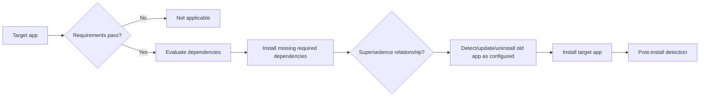

Avoid dependency loops and long chains. Supersedence does not automatically mean uninstall the old app; configure and test intended behavior. Sequence architecture changes, shared runtimes, user data, restart, and downgrade rollback.

## 8. Required, available, and uninstall assignments

| Intent | User experience | Design use | Risk |
|---|---|---|---|
| Required | Installs automatically when applicable | Mandatory security/business software | Blast radius; forced restart/conflict |
| Available for enrolled devices | User selects in Company Portal | Optional approved software | User context/license and discoverability |
| Uninstall | Removes when targeted/detected | Vulnerable/retired/unauthorized app | Data loss/shared component impact |
| Available without enrollment/web | Scenario-specific link/store experience | Lightweight discovery | Does not imply MDM or protection |

Assignments can conflict if a user/device is both required and uninstall through different groups. Calculate effective intent and test user versus device assignments. Define precedence from current official app assignment behavior rather than guessing.

Use phased required deployment. “Required to all devices” should be a final outcome after pilot evidence, not the first test.

## 9. Delivery Optimization, network, cache, and remote work

**Delivery Optimization (DO)** is a Windows content-delivery technology that can use Microsoft cloud sources and controlled peer/cache behavior. Intune Win32 delivery, Windows updates, and Microsoft content can interact with network and caching technologies depending on configuration.

| Network consideration | Question |
|---|---|
| Proxy/TLS inspection | Are required Microsoft endpoints reachable without unsupported interception? |
| VPN | Will large content hairpin through corporate network? |
| DO group/peer policy | Are peers confined to acceptable network/trust boundary? |
| Microsoft Connected Cache | Is Configuration Manager cache used for co-managed Intune Win32 delivery? |
| Metered/cellular | What user/business behavior is acceptable? |
| Content size/disk | Is cache/free space sufficient before install? |
| Branch/region | Is latency or sovereign endpoint different? |
| Hash/content failure | Can support distinguish corrupt cache from installer error? |

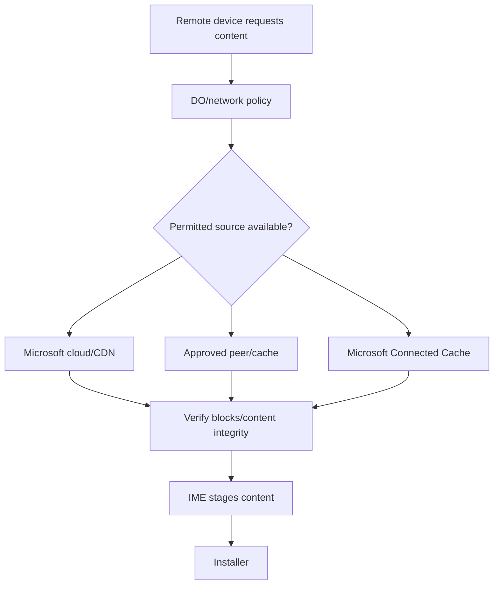

Do not advise disabling firewall, proxy validation, or security inspection globally. Isolate with an approved reference network and update precise allowlists/configuration.

## 10. App configuration: managed device versus managed app

An **app configuration policy for managed devices** is delivered through MDM to an enrolled device/app. A **managed apps** configuration can target supported apps/users through the app-management channel, including unenrolled scenarios where supported.

| Feature | Managed devices configuration | Managed apps configuration |
|---|---|---|
| Requires MDM enrollment | Yes | Not necessarily |
| Target context | Device/app installed under MDM | Work identity in supported managed app |
| Typical controls | Account/server settings, platform configuration | App key/value settings, work experience |
| Platform/app support | Varies | Requires app SDK/config support |
| Troubleshooting | MDM assignment and app state | User/app identity, SDK, policy report |

App configuration is not app protection. Configuration can prepopulate settings; protection controls work-data access and movement. Use both when needed, but document ownership and interactions.

## 11. App protection and selective wipe

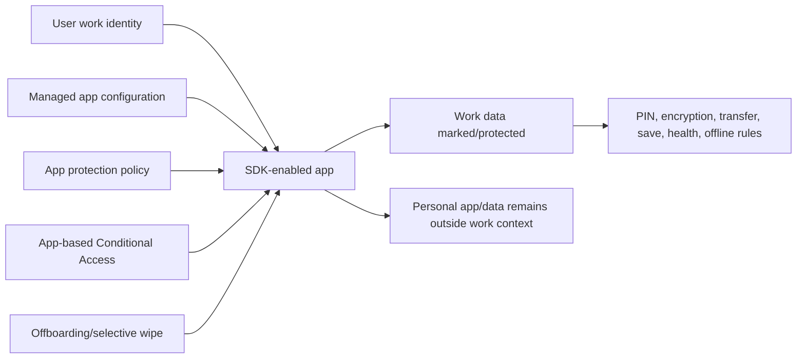

| Test | Expected outcome |
|---|---|
| Copy work to personal app | Blocked/restricted according to policy |
| Save work file | Only approved location where configured |
| Open link/document | Approved managed app/browser path |
| Add personal account | Personal context remains separate in multi-identity app |
| Offline past grace | Warn/block according to conditional launch |
| Selective wipe | Organization app data removed after app contacts service |

Selective wipe is asynchronous and app-dependent. It does not erase the device. Track request, app check-in and result; disable sessions/account access separately when offboarding risk requires immediate containment.

## 12. Windows provisioning: classic Autopilot and device preparation are separate

**Windows Autopilot** is the established collection of technologies using device registration, deployment profiles and supported modes. **Windows Autopilot device preparation** is a newer separate provisioning experience centered on enrollment-time grouping and improved reporting.

### 🔍 Plain-English deep-dive: reservation list versus trusted arrival group

- **Classic Autopilot registration** — *hardware is registered with the organization's Autopilot service before/during lifecycle.* **Analogy:** A guest is on a reservation list before arriving. **Why it matters:** The service recognizes the device and assigns a deployment profile during out-of-box experience (OOBE).
- **Deployment profile** — *classic rules for join type, OOBE, user experience and mode.* **Analogy:** Instructions attached to the reservation. **Why it matters:** Profile assignment and registration status are primary troubleshooting points.
- **Device preparation policy** — *newer profile selecting OOBE behavior, enrollment-time device group, and apps/scripts to track.* **Analogy:** On arrival, authenticated equipment is placed directly into a trusted processing lane. **Why it matters:** It simplifies setup and visibility but has different requirements/modes.
- **Enrollment-time grouping** — *Intune directly adds the device to a chosen security group during enrollment.* **Analogy:** Receiving assigns equipment to its operational team immediately rather than waiting for a dynamic inventory query. **Why it matters:** Assigned policies/apps arrive more predictably.

| Dimension | Classic Windows Autopilot | Windows Autopilot device preparation |
|---|---|---|
| Pre-registration | Uses Autopilot device registration/hardware identity | Device must not remain registered as classic; corporate identifiers may be needed when personal enrollment is blocked |
| Join | Entra join; classic also supports documented hybrid scenarios | Entra join only |
| OS | Supported Windows Autopilot versions | Supported Windows 11 builds (current docs list 22H2/23H2 with required update and 24H2+) |
| Grouping | Profile/group tag/dynamic group patterns | Enrollment-time direct device security group |
| Modes | User-driven, self-deploying, pre-provisioned, existing-device scenarios | Current device-preparation user-driven/automatic scenarios per documentation |
| Setup tracking | ESP/profile/reporting | Simplified percentage experience and near-real-time app/script reporting |
| Apps during tracked setup | ESP selected/required apps with compatibility considerations | Selected Win32 and LOB apps plus selected PowerShell scripts; only selected items tracked during OOBE |
| Policy tracking | ESP/profile behavior | Policies to device group sync, but device preparation does not track whether policies apply during deployment |
| Priority collision | Assigned classic profile governs classic registered device | Classic Autopilot profile takes precedence if device remains registered |

Do not call device preparation “Autopilot v2” in formal design without explaining the official current name and differences. It does not simply replace every classic mode.

## 13. Classic Windows Autopilot architecture and registration

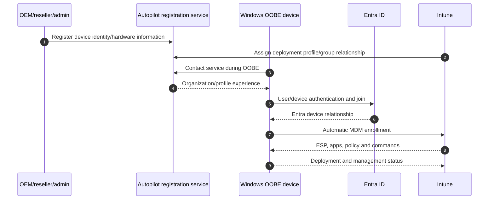

| Registration method | Governance concern |
|---|---|
| OEM/reseller registration | Contract, tenant ID accuracy, return/replacement process |
| Hardware hash upload | Privileged process, source integrity, duplicate ownership |
| Existing ConfigMgr task sequence registration | Sequence, identity, network and cleanup |
| Partner transfer | Proof of ownership and deregistration from prior tenant |

Treat hardware hash/registration data and tenant assignment as sensitive asset information. Prevent a reseller from registering devices into the wrong tenant. Define deregistration for returns, disposals, mergers, and resale.

## 14. Classic Autopilot deployment modes

| Mode | Best fit | Identity/join | Caveats |
|---|---|---|---|
| User-driven | Assigned corporate user device | User authenticates; Entra or documented hybrid join | User network/MFA/CA and ESP dependencies |
| Pre-provisioned | OEM/IT stages device before user | Technician phase then user phase | TPM attestation/network/model support; reseal process |
| Self-deploying | Shared/kiosk/no primary user | Device authenticates using supported hardware; Entra join | TPM/device attestation and userless restrictions |
| Existing devices | Reimage/prepare older managed Windows for Autopilot | Task sequence then Autopilot flow | Not same as direct cloud-first new device; infrastructure dependencies |

Hybrid Autopilot adds Intune Connector for Active Directory, domain-join profile, network/line-of-sight and Entra hybrid synchronization complexity. Use only for a proven requirement, not as a default comfort choice.

## 15. Enrollment Status Page and blocking apps

The **Enrollment Status Page (ESP)** shows and can block progress while device setup, account setup, security policies, certificates, network profiles and selected applications are processed, according to current configuration.

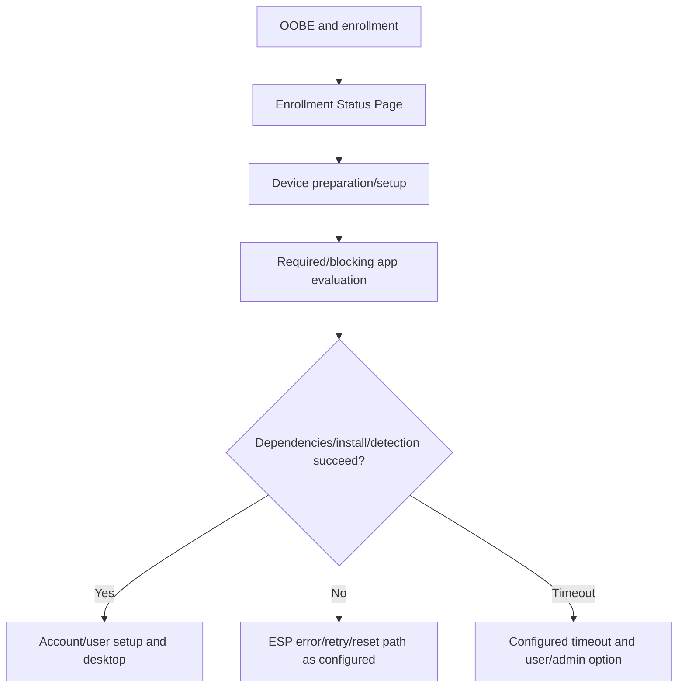

| ESP design choice | Tradeoff |
|---|---|
| Block device until all/selected apps | Higher readiness but greater failure/time risk |
| Small critical app list | Faster and clearer troubleshooting | Noncritical apps arrive after desktop |
| Mix LOB and Win32 | Supported scenarios evolve; dependencies can race | Standardize/test exact combination |
| Allow user reset/use anyway | Recovery flexibility | May release non-ready/insecure device |
| Timeout | Avoid infinite setup | Too short fails slow links; too long harms experience |

Keep blocking apps minimal: security/connectivity/management essentials with reliable silent installs and detection. One fragile large package can hold every new device at OOBE.

## 16. Windows Autopilot device preparation flow

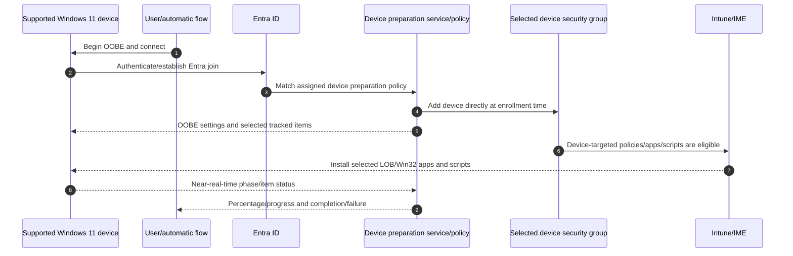

| Device-preparation prerequisite | Failure if missing |
|---|---|
| Supported Windows 11 build/update | Policy not supported/matched |
| Entra join | Hybrid requirement cannot be met by this experience |
| Correct user/license/scope | Enrollment/policy unavailable |
| Device security group and owner permissions | Enrollment-time grouping fails |
| Selected apps/scripts assigned to group | Item not delivered/tracked as expected |
| No classic Autopilot registration/profile | Classic profile takes precedence |
| Corporate identifiers when personal enrollment blocked | Device may fail authorized corporate enrollment |
| Network and time | Authentication/content/status failures |

Only selected apps and PowerShell scripts in the device-preparation profile are tracked during OOBE; additional group assignments arrive after deployment. Policies assigned to the group may sync during setup, but current documentation says device preparation does not track whether those policies applied during deployment. Do not claim “desktop means every policy is effective.”

## 17. Choosing between Autopilot models

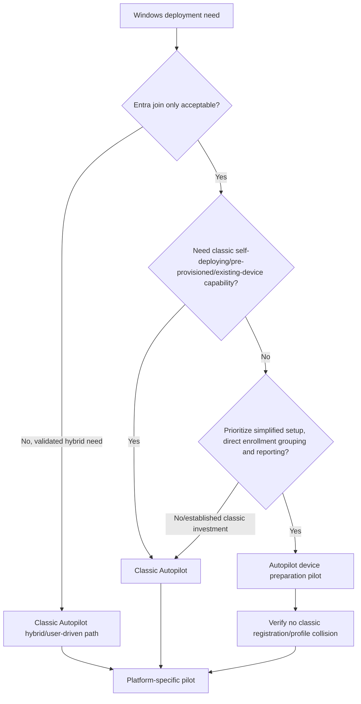

Decision criteria: join requirements, hardware procurement registration, user/shared mode, technician staging, existing investments, app mix, reporting, sovereign cloud, organizational maturity, migration effort, support skills, and rollback. A client can use both for different populations if ownership and collisions are controlled.

## 18. Windows update policy layers

Windows update management in Intune includes distinct policy types. Avoid placing every setting into “an update ring.”

| Policy | Primary job | Not the same as |
|---|---|---|
| Update ring | Deferrals, deadlines, restart/user experience and offer behavior | Pinning a specific feature version forever |
| Feature update policy | Hold/offer devices at a chosen Windows feature release and phase deployment | Monthly quality-update deadline |
| Quality update policy | Manage/expedite current quality releases under supported experience | General ring UX configuration |
| Driver update policy | Review/approve/deploy applicable drivers/firmware | Vendor app updater or arbitrary driver package |
| Hotpatch policy/context | Apply eligible security updates without restart in supported pattern | No-restart guarantee for every update/device |
| Windows Autopatch | Cloud service/experience orchestrating supported update workloads and rings | Abandoning client responsibility, app testing or incident ownership |

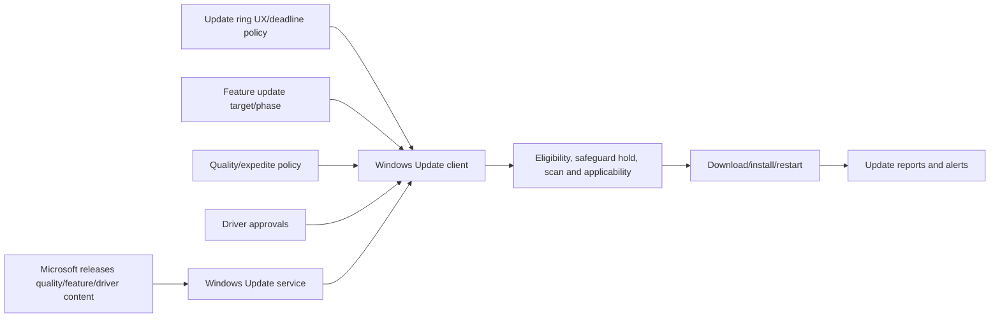

## 19. Update rings, deadlines, restart, and user experience

| Setting family | Design concern |
|---|---|
| Deferral | Delay after release; do not stack conflicting sources |
| Deadline | Maximum time before required install/restart |
| Grace period | Time after deadline conditions before forced restart behavior |
| Active hours | Reduce disruption but not an indefinite exemption |
| Auto restart notifications | Accessibility, frontline, kiosk and executive communication |
| Pause | Time-bound incident response, not permanent patch avoidance |
| Safeguard holds | Compatibility protection; override only with evidence and approval |

Use progressive rings with statistically and technically representative devices. A ring is not just “IT then everyone”; include hardware models, drivers, regions, apps, security agents, VPN, languages, and business criticality.

## 20. Feature, quality, driver, and expedite strategy

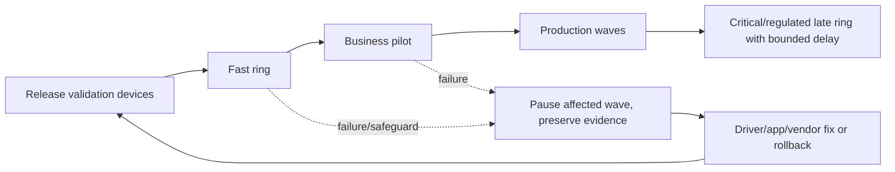

| Update class | Test focus | Rollback/recovery concept |
|---|---|---|
| Quality/security | Boot, sign-in, network, security agents, critical apps | Supported uninstall/recovery only within applicable window; fix-forward often preferred |
| Feature | Hardware/driver/app readiness, disk, language, encryption/recovery | Windows recovery/rollback window and backup; safeguard holds |
| Driver/firmware | Exact model/hardware ID, BitLocker recovery, peripherals | Vendor-supported rollback and recovery media |
| Expedite | Urgent vulnerability versus restart/disruption | Narrow target and incident approval |

Expedite is for urgent quality updates, not a general speed button. Confirm service prerequisites, update health tools, target scope, deadline/restart impact, and support readiness.

## 21. Windows Autopatch context

Autopatch automates supported update workloads using groups/rings, service orchestration, reporting, alerts and Microsoft-managed release processes. It does not remove the customer's responsibility for prerequisites, app compatibility, identity/RBAC, device health, exceptions, communications, data review, and incident response.

| Current 2026 anchor | Meaning |
|---|---|
| Feature activation removed in April 2025 | Current tenants use the evolved integrated experience; old onboarding descriptions may be stale |
| Business Premium/A3+/E3+/F3 feature availability | Verify exact plan, Windows edition and feature table in current docs |
| E3+/F3 support-request distinction | Some service engineering support capability remains entitlement-specific |
| Autopatch groups | Logical audience with Entra groups and update policies |
| Quality SLO | Service aims for documented up-to-date outcome, not a promise for every device |
| M365 Apps/Edge/Teams | Supported workloads have their own eligibility/channel behaviors |

Do not market Autopatch as “Microsoft owns patching now.” Build a shared-responsibility RACI.

## 22. Lifecycle actions: choose by business intent

### 🔍 Plain-English deep-dive: refresh, reset, retire, wipe, and delete

- **Fresh Start** — *reinstalls a clean/current Windows experience and removes installed applications, with documented option behavior for user data.* **Analogy:** Renovate the office while optionally keeping approved personal files. **Why it matters:** It is a repair/cleanup action, not ordinary app uninstall.
- **Autopilot Reset** — *returns a supported Entra-joined managed Windows device to a business-ready state while retaining the organizational join/management relationship as documented.* **Analogy:** Clear one employee's workspace but keep the office assigned to the company. **Why it matters:** Useful for reassignment; support differs by join/scenario.
- **Retire** — *remove managed organizational data/settings and management where supported.* **Analogy:** Take back company keys and folders. **Why it matters:** Intended to preserve personal content but platform behavior must be validated.
- **Wipe** — *factory reset/erase according to platform/options.* **Analogy:** Empty the building. **Why it matters:** Destructive and potentially unrecoverable under protected options.
- **Delete** — *remove a service record.* **Analogy:** Delete an asset row. **Why it matters:** Does not prove physical data erasure or remove every Entra/Autopilot/vendor record.

| Intent | Preferred action family to evaluate | Verify before action |
|---|---|---|
| Repair bloated corporate Windows | Fresh Start or supported repair | App/data backup, encryption key, join/management outcome |
| Reassign managed Windows to new user | Autopilot Reset or wipe/reprovision by scenario | Join support, data removal, profile/registration, new-user tests |
| Remove work from personal device | Retire/MAM selective wipe | Ownership, app/MDM state, personal-data boundary |
| Lost corporate device | Identity/session containment plus approved wipe/lock | Device contact, legal/HR/security, recovery and audit |
| Dispose/sell | Verified wipe plus Autopilot/ADE/Google/Entra/Intune deregistration | Chain of custody and program ownership |
| Clean stale portal object | Delete only after correlation and lifecycle proof | Live record, pending actions, downstream references |

## 23. Device record and provisioning cleanup sequence

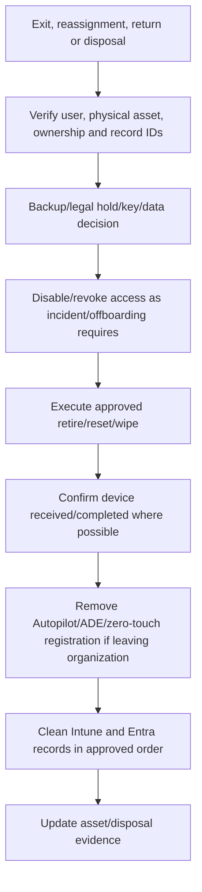

Do not deregister an Autopilot device merely because an Intune record was duplicated. Do not delete the management record before a queued retire/wipe if record removal would prevent tracking. Sequence depends on platform and business event.

## 24. Security, privacy, prerequisites, and licensing

| Domain | Minimum control |
|---|---|
| Packaging identity | Least-privilege app managers; peer approval; audit |
| Supply chain | Signed/hash-verified source, vendor security and update process |
| Installer privilege | System only when required; no user-controlled privileged arguments/paths |
| Data | No secrets in package/script/log; app privacy and telemetry review |
| App protection | Supported SDK/app, broker, license, CA and selective-wipe tests |
| Autopilot | Device ownership, registration/program, Entra/Intune licenses, network, groups, CA dependencies |
| Updates | Supported Windows edition/build, telemetry/reporting prerequisites, service endpoints |
| Autopatch | Current plan/edition/prerequisite and role verification |
| Lifecycle actions | RBAC, MAA where configured, asset/user verification, backup/legal/privacy approval |

Installer command lines and logs can expose license keys, tokens, paths and personal information. Redact evidence and use approved secret delivery mechanisms.

## 25. Deployment, testing, and rollback

| Layer | Positive tests | Negative/failure tests | Rollback |
|---|---|---|---|
| App | Install, launch, repair, upgrade, uninstall | Bad requirement, network loss, reboot, detection mismatch | Previous package/supersedence reversal where safe |
| MAM/config | Work settings/data controls/selective wipe | Unsupported app, personal account, offline grace | Restore prior policy after risk review |
| Classic Autopilot | Profile/OOBE/join/ESP/desktop | Missing registration, wrong profile, app failure, proxy | Correct assignment/reset on disposable test device |
| Device preparation | Enrollment grouping/tracked apps/scripts/report | Classic registration collision, group/app permission, unsupported build | Remove pilot assignment/correct registration then reset test device |
| Updates | Scan, offer, download, install, restart, report | Safeguard, disk, driver/app incompatibility | Pause affected ring; supported rollback/fix-forward |
| Lifecycle | Reset/retire/wipe/reassign on disposable asset | Offline/pending/wrong record safeguards | Recovery media/backup/re-enrollment process |

Never test a destructive lifecycle action on a user's production endpoint. Use disposable lab hardware or tabletop evidence.

## 26. Layered app troubleshooting

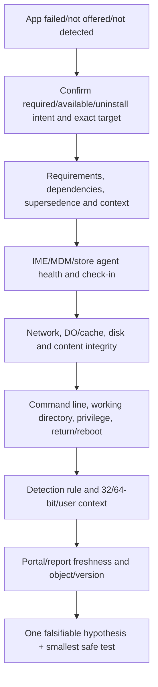

| Evidence | Question |
|---|---|
| App object/version/assignment | Is this the intended app and target? |
| Requirement/dependency evaluation | Was install eligible and prerequisite successful? |
| IME logs and service | Did the correct agent receive/process intent? |
| Download/cache/DO/network | Did complete trusted content arrive? |
| Installer log/exit/reboot | What did vendor installer actually do? |
| Detection output | Why does Intune believe installed/not installed? |
| Local app state | Does intended version launch and function? |
| Portal timestamps | Is report current after latest evaluation? |

Your support advantage is to avoid “reinstall” as the first response. First determine whether there was an install attempt at all.

## 27. Autopilot troubleshooting by phase

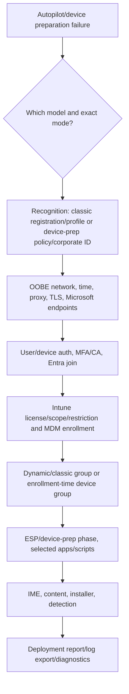

| Symptom | Discriminating check |
|---|---|
| Organization branding/profile absent | Is device in correct classic registration and assigned profile? |
| Device prep not invoked | Supported build, policy assignment, no classic registration, corporate authorization |
| Entra join fails | Sign-in/join logs, tenant, CA dependency, network/time |
| Enrollment fails | License, MDM scope, restriction, device limit/method |
| Stuck at app | Exact app/phase, IME/install/detection logs |
| Policy missing after device-prep completion | Current design tracks selected apps/scripts, not full policy application |
| Existing-device returned to wrong tenant | Registration ownership/deregistration/reseller evidence |

Export logs from the supported OOBE/deployment experience before resetting. A reset can erase the best failure evidence.

## 28. Update troubleshooting

| Layer | Evidence | Common cause |
|---|---|---|
| Authority | Intune update policy, ConfigMgr workload, GPO, Autopatch group | Two update owners |
| Eligibility | OS edition/build, feature policy target, enrollment | Unsupported/not targeted |
| Offer | Windows Update scan and policy state | Deferral/pause/target version |
| Safeguard | Update compatibility hold | Driver/app known issue |
| Network/content | Windows Update/DO logs, proxy, cache, disk | Blocked endpoint/low space |
| Install | Setup/update logs and error | Component store/driver/app failure |
| Restart | Deadline/active hours/user state | Pending reboot |
| Report | Update reports/alerts/timestamps | Telemetry latency/missing prerequisite |

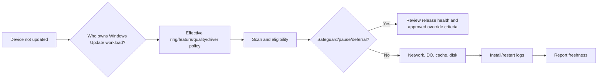

Do not bypass safeguard holds broadly to make a compliance graph green. Determine affected models/apps, test remediation, and use explicit risk approval.

## 29. Metrics and operations

| Metric | Meaning | Guardrail |
|---|---|---|
| App install success by version/ring | Reliable delivery outcome | Separate detection false results |
| Median/P95 install time | User and network impact | Segment content size/network |
| Detection mismatch rate | Installed locally but portal wrong or reverse | Sample with effective evidence |
| Autopilot completion and duration | Provisioning health by model/profile/mode | Define start/end consistently |
| ESP/device-prep failure by item | Identifies blocking package/script | Keep critical list small |
| Update compliance/freshness | Devices on required quality/feature level | Account for eligibility/safeguards |
| Update failure/rollback rate | Release quality and process | Do not hide excluded devices |
| Lifecycle action pending age | Offline/channel/record issue | Destructive completion requires proof |
| Package currency | Supported versions and vendor lifecycle | Include owner and retirement date |
| Support rate/MTTI | Incidents per deployment and time to isolate | Segment phase/root cause |

Operations need app owner/vendor contacts, packaging SLAs, release intake, certificate/token monitoring, Autopilot registration reconciliation, update release-health review, driver exception process, destructive-action approvals, spare/recovery capacity, known errors, service health, and 24x7 handover.

## 30. Consulting scenarios

### Scenario A: Win32 app reports failed but launches successfully

Compare installer exit and post-install detection. Check product/version/path, 32/64-bit view, user/system context, and reboot. Correct detection in a new app version/pilot; do not map failure to success without proof.

### Scenario B: New devices stall for 45 minutes at ESP

Identify exact phase and blocking app, then dependency/content/install/detection timing. Reduce blocking list to true prerequisites, optimize package/network, and define timeout/recovery. Do not disable ESP tenant-wide without readiness analysis.

### Scenario C: Device preparation profile never appears

Confirm supported Windows 11, Entra join scenario, user assignment/license, corporate identifier if personal enrollment is blocked, group permissions, and whether the hardware remains in classic Autopilot. Classic registration/profile precedence is a leading discriminating check.

### Scenario D: Urgent security update conflicts with business app

Use a narrow expedite/test ring, engage app vendor/security/risk owner, preserve safeguard evidence, and define containment or compensating control. Decide fix-forward, uninstall/recovery, or bounded deferment. Communicate residual risk and deadline.

### Scenario E: Departing contractor used personal phone and corporate laptop

Revoke sessions/disable identity according to offboarding, issue MAM selective wipe for supported work apps on personal phone, and use approved corporate-device reassignment/erase workflow for laptop. Correlate completion separately; do not factory-reset the personal phone.

## 31. Consulting artifacts

| Artifact | Minimum contents |
|---|---|
| App catalogue | Source, version, owner, license, context, install/uninstall, detection, dependencies, lifecycle |
| Package security record | Signature/hash, vendor, privacy/network/driver review |
| Assignment/supersedence matrix | Required/available/uninstall, targets, filters, old/new path |
| Autopilot decision record | Model/mode, join, registration, profile/group, apps, network, CA, recovery |
| ESP/device-prep critical-item list | Rationale, timeout, owner, failure procedure |
| Update architecture | Authority, rings, feature/quality/driver/hotpatch/Autopatch choices |
| Lifecycle action matrix | Intent, ownership, approval, action, data, records, verification |
| Test/rollback pack | App, MAM, provisioning, update and lifecycle cases |
| Troubleshooting runbooks | Phase-specific evidence, logs, IDs, escalation |
| Dashboard/RACI | Metrics, vendors, operations, 24x7 ownership |

## 32. Safe paper lab and evidence exercise

No production package, tenant, Autopilot registration, update, or reset is required.

### Fictional brief

Contoso needs Microsoft 365 Apps, a 2-GB Win32 finance app, an optional Store diagram tool, contractor mobile MAM, 500 new Windows laptops, and update modernization from Configuration Manager. Half the new fleet will use current device preparation if suitable; shared kiosks may need classic self-deploying mode.

### Steps

1. Build an app catalogue and choose each app type/source.
2. Design the finance app's install/uninstall context, requirements, return codes, detection, dependency and supersedence.
3. Draw IME delivery and a layered failure tree.
4. Define required, available and uninstall assignments with expected-in/out cases.
5. Write MAM/config tests for contractor supported apps and selective wipe.
6. Compare classic user-driven, pre-provisioned, self-deploying and current device-preparation paths.
7. Choose models for corporate laptops and kiosks; document rejected alternatives and classic-registration collision control.
8. Create a minimal ESP/device-prep critical app/script list and timeout/recovery.
9. Design update ring, feature, quality expedite, driver and Autopatch decisions with current licensing verification tasks.
10. Write lifecycle actions for repair, reassignment, loss, departure and disposal.
11. Create app, Autopilot and update tests including negative/failure/rollback evidence.
12. Build dashboard, RACI, 02:00 handover and Microsoft/vendor escalation templates.

### Evidence to retain

| Evidence | Interview value | Label |
|---|---|---|
| App package specification | Packaging reasoning | Paper specification; no binary |
| Detection test matrix | Reliability thinking | Synthetic paths/versions |
| Autopilot comparison/decision | Current product knowledge | Design only |
| Update/lifecycle architecture | End-to-end ownership | Proposed, not operated |
| Troubleshooting trees | RCA transfer | Synthetic error case |
| Metrics/RACI/handover | Operational readiness | Fictional organization |

## 33. JD Mapping: interview translation

| Prompt | Truthful answer structure |
|---|---|
| Package a Win32 app | Trust source → package → context/command → requirements/dependencies → detection → assignments → tests/rings → monitor/retire |
| Compare Autopilot options | Join/mode/registration/grouping/apps/reporting/support → current device prep vs classic → pilot and collision controls |
| Fix app failure | Intent → applicability → IME/content → installer → detection → report; one hypothesis and safe test |
| Plan Windows updates | Authority → rings → feature/quality/driver → safeguard → app tests → rollback/fix-forward → operations |
| Explain experience | State M365 support production evidence; show paper artifacts; partner with endpoint owner |

## 34. Official Source Anchors

| Topic | Official Microsoft source |
|---|---|
| Intune app management overview | [What is Microsoft Intune app management?](https://learn.microsoft.com/en-us/intune/app-management/overview) |
| Win32 app management | [Win32 app management in Intune](https://learn.microsoft.com/en-us/intune/app-management/deployment/win32) |
| IME | [Understand the Intune Management Extension](https://learn.microsoft.com/en-us/intune/device-management/tools/management-extension-windows) |
| Add/assign a Win32 app | [Add, assign, and monitor a Win32 app](https://learn.microsoft.com/en-us/intune/app-management/deployment/add-win32) |
| Win32 dependencies | [Add Win32 app dependencies](https://learn.microsoft.com/en-us/intune/app-management/deployment/add-win32#step-5-dependencies) |
| Win32 supersedence | [Configure Win32 app supersedence](https://learn.microsoft.com/en-us/intune/app-management/deployment/configure-win32-supersedence) |
| App protection | [App protection policies overview](https://learn.microsoft.com/en-us/intune/app-management/protection/overview) |
| Classic Windows Autopilot | [Overview of Windows Autopilot](https://learn.microsoft.com/en-us/autopilot/overview) |
| Classic requirements/modes | [Windows Autopilot requirements](https://learn.microsoft.com/en-us/autopilot/requirements) |
| Enrollment Status Page | [Set up the Enrollment Status Page](https://learn.microsoft.com/en-us/intune/device-enrollment/windows/enrollment-status) |
| Autopilot device preparation | [Overview of Windows Autopilot device preparation](https://learn.microsoft.com/en-us/autopilot/device-preparation/overview) |
| Device preparation requirements | [Windows Autopilot device preparation requirements](https://learn.microsoft.com/en-us/autopilot/device-preparation/requirements) |
| Windows updates in Intune | [Manage Windows software updates in Intune](https://learn.microsoft.com/en-us/intune/device-updates/windows/) |
| Update rings | [Windows update rings policy](https://learn.microsoft.com/en-us/intune/device-updates/windows/update-rings) |
| Feature updates | [Feature updates policy](https://learn.microsoft.com/en-us/intune/device-updates/windows/feature-updates) |
| Quality/expedite updates | [Expedite Windows quality updates](https://learn.microsoft.com/en-us/intune/device-updates/windows/expedite-updates) |
| Driver updates | [Windows driver update policies](https://learn.microsoft.com/en-us/intune/device-updates/windows/driver-updates) |
| Windows Autopatch current overview | [What is Windows Autopatch?](https://learn.microsoft.com/en-us/windows/deployment/windows-autopatch/overview/windows-autopatch-overview) |
| Device lifecycle actions | [Remote device actions](https://learn.microsoft.com/en-us/intune/device-management/actions/) |
| Fresh Start | [Fresh Start device action](https://learn.microsoft.com/en-us/intune/device-management/actions/fresh-start) |
| Autopilot Reset | [Windows Autopilot Reset](https://learn.microsoft.com/en-us/autopilot/windows-autopilot-reset) |
| Wipe | [Device action: Wipe](https://learn.microsoft.com/en-us/intune/device-management/actions/wipe) |

---

## ⭐ Likely Interview Questions for This Section

### Q1. What makes a reliable Intune Win32 app deployment?

> **Model answer:** I start with an authorized signed/hash-verified source and a minimal reproducible package. I define silent install/uninstall, user or system context, requirements, dependencies, return/restart codes, and an independent detection rule. I test preinstall, install, launch, repair, upgrade, reboot, uninstall, detection and rollback on representative endpoints, then use required/available assignments through rings. I monitor installer and detection outcomes separately and maintain an owner/version lifecycle.

### Q2. Why can a Win32 installer return success while Intune reports failure?

> **Model answer:** Installer exit code and Intune detection answer different questions. The installer may return success, but the detection rule might check the wrong file, registry view, product code, user context or version, or require a reboot. Intune then believes the intended app is absent and reports or retries accordingly. I inspect IME and vendor logs, return-code mapping, local state and post-install detection before repackaging.

### Q3. Explain dependencies, requirements, supersedence, and detection.

> **Model answer:** A requirement decides whether the target app is applicable. A dependency is another app that must be installed first. Supersedence defines how a new app relates to an older/replacement app and optionally uninstalls it. Detection decides whether each app's intended state already exists. I avoid loops, test architecture/reboot/data behavior, and do not use these terms interchangeably.

### Q4. Compare classic Windows Autopilot with Windows Autopilot device preparation.

> **Model answer:** Classic Autopilot recognizes registered hardware and uses deployment profiles for user-driven, pre-provisioned, self-deploying and existing-device scenarios, including documented hybrid options. Device preparation is a separate current Windows 11, Entra-join-only experience using enrollment-time direct grouping, selected Win32/LOB apps and scripts, simplified OOBE and near-real-time reporting. A classic registration/profile takes precedence if it remains. I choose by join, mode, procurement, staging, app/reporting and support requirements rather than calling one a universal replacement.

### Q5. What should block the Enrollment Status Page?

> **Model answer:** Only a small set of reliable, security/connectivity/management-critical items whose absence makes the endpoint unsafe or unusable. Every blocking app needs deterministic silent install and detection, controlled dependencies/restarts, representative network timing, clear logs, timeout and recovery. Noncritical or fragile large apps should normally arrive after desktop. One bad detector should not strand an entire fleet.

### Q6. How do update rings differ from feature and quality update policies?

> **Model answer:** Update rings mainly govern Windows Update client behavior such as deferrals, deadlines, restarts and user experience. Feature update policies target and phase a Windows feature release. Quality update policies can manage or expedite specific quality releases, while driver policies control applicable driver/firmware approvals. Autopatch orchestrates supported workloads but does not remove client testing/incident responsibility. I confirm one workload authority and eliminate GPO/ConfigMgr/Intune overlap.

### Q7. How do Fresh Start, Autopilot Reset, retire, wipe, and delete differ?

> **Model answer:** Fresh Start reinstalls/cleans Windows and removes apps with documented user-data options. Autopilot Reset returns a supported managed Entra-joined Windows device to a business-ready reassignment state while retaining organizational relationship. Retire removes managed work data/settings and management where supported, aiming to preserve personal data. Wipe is a destructive factory reset/erase. Delete removes a service record and proves no erase. I choose from ownership and intent, verify asset/identity/data, use approvals, and confirm completion before record cleanup.

### Q8. How does your background apply without claiming production Intune app or Autopilot ownership?

> **Model answer:** My production M365 support work includes client/app behavior, sync and access troubleshooting, incident scoping, logs, RCA, fix validation, vendor/product escalation, documentation and stakeholder updates. I have transferred that method into a current paper app/Autopilot/update/lifecycle design with package specs, detection tests, model comparison, rollout, rollback and runbooks. I would implement with endpoint packaging, security, procurement and service-desk owners.

---

## 🧠 30-Second Memory Hooks

- **Install** puts software there; **detection** tells Intune whether it is there.
- **IME** = specialist courier for Win32/scripts; native MDM is a different channel.
- **Requirement** asks “may install?”; **dependency** asks “what first?”; **supersedence** asks “what replaces?”
- **Required** pushes, **available** offers, **uninstall** removes.
- **Managed device config** rides MDM; **managed app config/protection** follows supported work app identity.
- **Classic Autopilot** = pre-registered reservation + profile/modes.
- **Device preparation** = supported Windows 11 + Entra join + enrollment-time group + selected tracked items.
- **Classic registration wins** when both Autopilot experiences collide.
- **ESP blocking list** should be small, critical and boringly reliable.
- **Ring** handles update UX; **feature** pins release; **quality expedite** accelerates urgent patch; **driver** controls hardware software.
- **Autopatch** automates shared work; it does not outsource accountability.
- **Fresh Start cleans; Autopilot Reset reassigns; retire removes work; wipe erases; delete cleans a record.**
- **Candidate honesty** = production app-support/RCA skill plus current paper design.

---

## Completion Checklist

- [ ] I can separate app deployment, configuration, protection, detection and access control.
- [ ] I can choose LOB, Store, Win32, M365, web, Apple and Android app types appropriately.
- [ ] I can draw IME policy/content/install/detection/report flow.
- [ ] I can specify secure Win32 package, context, command, requirements, return codes and detection.
- [ ] I can explain dependencies, supersedence, requirements and assignment intents.
- [ ] I can design DO/network/cache behavior without unsafe security bypasses.
- [ ] I can distinguish managed-device configuration, managed-app configuration and app protection.
- [ ] I can compare classic Autopilot modes with current Autopilot device preparation accurately.
- [ ] I can explain classic registration precedence, enrollment-time grouping, ESP and tracked items.
- [ ] I can layer update rings, feature, quality/expedite, driver, hotpatch and Autopatch context.
- [ ] I can choose Fresh Start, Autopilot Reset, retire, wipe, selective wipe and delete from intent.
- [ ] I can design security, privacy, licensing, deployment, testing, rollback and operations.
- [ ] I can troubleshoot apps, Autopilot and updates by phase with preserved evidence.
- [ ] I completed or can explain the safe paper lab as non-production evidence.
- [ ] I can answer Q1-Q8 aloud and preserve your honesty boundary.
- [ ] I will verify current app, Autopilot, update, Autopatch, preview, retirement and licensing guidance.

---

*Next suggested section:* [Part 19](Part-19-intune-endpoint-security-stack.md) — apply Defender Antivirus, attack surface reduction, application control, encryption, firewall, EDR, LAPS, Endpoint Privilege Management, and credential protections through focused, staged, observable endpoint-security policy.