# Part 19 — Intune Endpoint Security: Antivirus, ASR, Firewall, Encryption, EDR, LAPS, and EPM

> **Section goal:** Build a layered endpoint-security design in which prevention, hardening, least privilege, encryption, detection, response, and access signals reinforce one another. By the end, you should be able to choose focused Intune policy surfaces, explain Defender modes and cloud protection, stage attack surface reduction and application control, protect recovery keys and local administrator passwords, onboard MDE, avoid policy conflicts, test rollback without weakening the fleet, investigate a ransomware scenario, and hand a measurable service to operations.

This Part assumes the enrollment, policy, compliance, app, update, and lifecycle foundations from [Parts 15-18](Part-18-intune-apps-autopilot-updates-lifecycle.md). Part 20 turns these controls into a governed operating model and covers Configuration Manager/co-management authority.

> **Currency and change-sensitive note:** Product behavior was checked against official Microsoft Learn content available on **August 24, 2026**. Endpoint security policy templates, security baselines, Defender Antivirus platform behavior, tamper protection, attack surface reduction (ASR) rules, App Control for Business, BitLocker/FileVault escrow, Microsoft Defender for Endpoint (MDE) onboarding, security settings management, Windows LAPS, Endpoint Privilege Management (EPM), Windows Hello for Business, Credential Guard, security tasks, reports, and licensing change. EPM and several Intune advanced capabilities require Intune Suite or standalone add-on licensing. Windows feature defaults and support can change by release. Recheck current Microsoft Learn, Product Terms, security baseline notes, Defender portal guidance, OS build/edition, and tenant feature state before implementation.

## JD Mapping

| Deloitte role expectation | Capability developed in this Part | Consulting evidence |
|---|---|---|
| Design endpoint-security architecture | Layer AV, ASR, app control, firewall, encryption, EDR, account protection and least privilege | Endpoint-security HLD and control map |
| Configure Microsoft security products | Select Intune endpoint-security profiles, MDE integration, LAPS and EPM with one source per setting | LLD/policy workbook and authority matrix |
| Assess security posture | Measure onboarding, sensor/AV health, risky devices, exclusions, encryption, rules and exceptions | Health-check report and prioritized roadmap |
| Troubleshoot security/platform issues | Correlate policy assignment, provider state, tamper, third-party tools, MDE telemetry and local logs | Layered runbooks and evidence packs |
| Respond to security incidents | Use MDE risk/response, containment, evidence preservation, credential/key actions and recovery | Ransomware tabletop and incident runbook |
| Deliver sustainable operations | Define staged modes, metrics, exception governance, security tasks, RACI, handover and 24x7 support | Operating model, dashboard and handover pack |

## Candidate honesty note

You can credibly connect this Part to production critical-incident handling, Microsoft 365 client and access troubleshooting, RCA, fix validation, product-group/vendor coordination, documentation, KPI reporting, customer communications, and security-aligned guidance. Those skills are directly valuable when endpoint security causes or exposes an application, network, access, or service incident.

This Part does **not** claim production ownership of Defender Antivirus/ASR, BitLocker/FileVault, MDE onboarding, LAPS, EPM, firewall, application control, security baselines, or ransomware response tooling. Safe wording is:

> “My production strength is Microsoft 365 escalation engineering, critical incidents, RCA, documentation, and stakeholder coordination. I have built a current paper endpoint-security design and ransomware tabletop covering policy sources, audit-to-enforce rollout, testing, rollback, telemetry, metrics, and operations. I would implement and respond alongside endpoint engineering and the SOC, without presenting the paper exercise as production ownership.”

---

## 1. Endpoint security is a stack, not one product switch

| Layer | Primary question | Microsoft control examples |
|---|---|---|
| Identity/account | Who signs in and with what local privilege? | Windows Hello, Credential Guard, LAPS, EPM |
| Device trust | Is endpoint enrolled, healthy, compliant and encrypted? | Intune, compliance, BitLocker/FileVault |
| Prevent malware | Can known/suspicious content execute? | Defender Antivirus, cloud protection, network protection |
| Reduce attack surface | Can common abuse paths run? | ASR rules, exploit protection, device control, web protection |
| Allow trusted code | Which applications/scripts/drivers may run? | App Control for Business |
| Network containment | Which inbound/outbound paths are allowed? | Windows Defender Firewall |
| Detect/respond | What suspicious behavior occurred and what should SOC do? | MDE EDR, automated investigation, live response, isolation |
| Govern/access | How does risk affect access and remediation? | Intune compliance, Entra CA, security tasks |

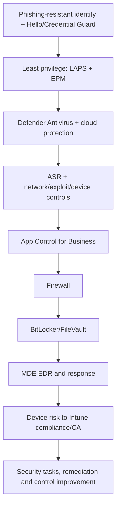

No one layer makes an endpoint “secure.” Antivirus can miss novel behavior; EDR can detect after execution; encryption protects data at rest but not a signed-in session; firewall does not stop malicious code already permitted; least privilege limits blast radius but does not remove phishing.

## 2. Intune endpoint-security policy taxonomy

The Endpoint security node exposes focused policy types. Their display location is not a separate enforcement engine; they configure underlying Windows/Apple/security providers and can overlap with Settings Catalog, device configuration, baselines, GPO, Configuration Manager, Defender security settings management, or third-party tools.

| Policy family | Typical controls | Likely owner |
|---|---|---|
| Antivirus | Defender AV scanning, cloud, behavior, exclusions, updates | Endpoint protection/SOC |
| Attack surface reduction | ASR rules, device control, web/network protection, exploit/app control profiles | Security engineering |
| Disk encryption | BitLocker/FileVault settings and recovery escrow | Endpoint/security + service desk |
| Firewall | Profiles and rules | Network/endpoint security |
| Endpoint detection and response | MDE onboarding and sensor settings | SOC/endpoint security |
| Account protection | LAPS, local users/groups, Hello-related controls | Identity/endpoint security |
| Security baselines | Versioned recommended security bundles | Security architecture |

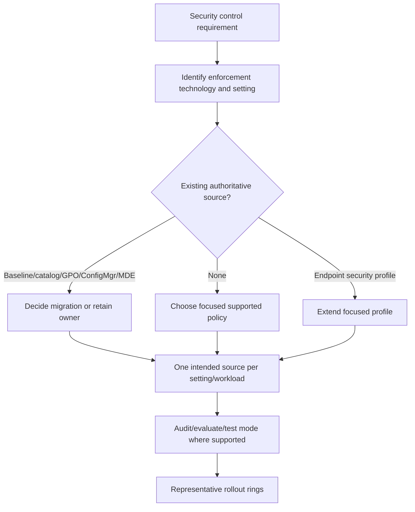

Keep profiles cohesive by technology, owner, platform and deployment cadence. Do not create one huge endpoint-security profile or dozens of single-setting profiles without an operational reason.

## 3. Defender Antivirus architecture and modes

Microsoft Defender Antivirus includes local scanning, behavior monitoring, signatures/security intelligence, cloud-delivered protection, automatic sample submission, tamper protection, remediation, and integrations with MDE.

### 🔍 Plain-English deep-dive: AV engine, EDR sensor, and mode

- **Antivirus engine** — *scans files, processes and behavior to prevent/remediate malware.* **Analogy:** A guard inspecting packages and activity at the door. **Why it matters:** Configuration, signatures, cloud reachability and exclusions determine prevention quality.
- **EDR sensor** — *records and analyzes endpoint behavior for detection and response.* **Analogy:** Cameras and an investigation team watching beyond the door. **Why it matters:** It can detect attack patterns even when a file signature is unknown.
- **Active mode** — *Defender Antivirus is the primary antimalware provider.* **Analogy:** It is the main guard. **Why it matters:** Real-time protection and remediation are expected according to policy.
- **Passive mode** — *Defender Antivirus runs in a limited/passive role when supported, commonly alongside a non-Microsoft primary antivirus and MDE requirements.* **Analogy:** An observer assists but is not the main door guard. **Why it matters:** Support, server/client behavior, licensing and onboarding prerequisites must be checked; do not assume every platform enters passive mode automatically.
- **Disabled/not running state** — *engine protection is unavailable or intentionally turned off under specific platform/tool state.* **Analogy:** No guard at that door. **Why it matters:** This is not an acceptable troubleshooting steady state.

| Component | Evidence | Risk when unhealthy |
|---|---|---|
| Real-time protection | Defender status/event/portal | Malware can execute before scheduled scan |
| Security intelligence | Version/age/update source | Known threats missed or report stale |
| Behavior monitoring | Defender preference/status | Fileless/behavioral detections weakened |
| Cloud protection | Connectivity and configured level | Slower/less informed decisions |
| Sample submission | Policy and privacy-approved behavior | Cloud analysis limited or data-handling concern |
| Platform update | Engine/platform version | Reliability/feature/security gaps |
| EDR sensor | MDE onboarding/sensor health | Detection, risk and response gaps |

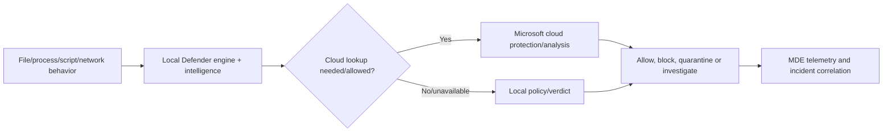

## 4. Cloud-delivered protection, block at first sight, and samples

Cloud-delivered protection uses Microsoft cloud intelligence to improve verdict speed and quality. **Block at first sight** combines cloud protection, sample submission and scanning behavior to evaluate suspicious new files.

| Design area | Question | Guardrail |
|---|---|---|
| Connectivity | Are Defender cloud endpoints reachable through proxy/firewall? | Precise allowlist and connectivity test |
| Timeout/extended cloud check | How long may endpoint wait for verdict? | Balance protection and business latency |
| Sample submission | What may upload automatically? | Privacy/legal classification and user notice |
| Cloud protection level | What aggressiveness fits risk/persona? | Audit/pilot false-positive workflow |
| Offline endpoints | What protection remains without cloud? | Current intelligence, behavior, ASR, app control |
| Sovereign/regulatory | Which cloud endpoints/data boundaries apply? | Verify environment-specific docs |

Do not disable cloud protection across the tenant because one application is slow. Reproduce, identify file/signature/network/timeout, submit false-positive evidence, and use the narrowest time-bound exception if approved.

## 5. Tamper protection and local change

**Tamper protection** helps prevent unauthorized or unapproved changes to important Defender security settings. It can cause a local or even policy-requested change to appear ignored if the management path is not supported.

> **Preview/change-sensitive:** The July 2026 Intune Antivirus guidance documents **Controlled configuration for Microsoft Defender settings (Preview)**. In its current scope, it can make Intune or MDE security settings management authoritative for applicable Defender settings delivered through Antivirus and ASR endpoint-security templates; it does not cover EDR, firewall, Settings Catalog, or unrelated policy types. Overlapping nonauthoritative settings can report Not applicable. Do not enable this one-device authority model broadly without reviewing current prerequisites, limits, reports, source migration, pilot results, and rollback.

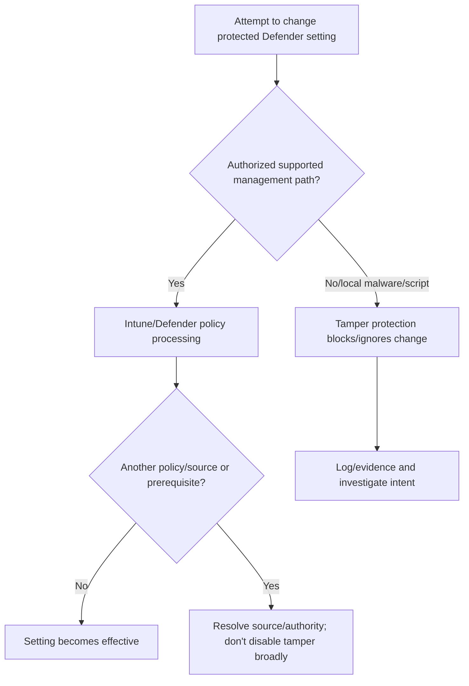

| Scenario | Safe response |
|---|---|
| Local troubleshooting needs temporary change | Use documented troubleshooting mode/approved process, narrow device/time, monitor and restore |
| Intune value not effective | Confirm exact policy source, security-management authority, tamper support and local state |
| Third-party AV migration | Follow vendor/Microsoft coexistence and onboarding sequence |
| Threat attempts to disable AV | Treat as incident signal, contain and investigate |

Tamper protection is not a nuisance to switch off. It is part of the threat model.

## 6. Exclusions: surgical exceptions, not performance tuning by deletion

An antivirus **exclusion** tells Defender not to scan a specified path, process, extension or context as fully as normal. Exclusions can create attack paths.

### 🔍 Plain-English deep-dive: an exclusion is a hole with an owner

- **Path exclusion** — *reduces scanning for a file/folder path.* **Analogy:** A warehouse aisle the guard does not inspect. **Why it matters:** Attackers can place content there if permissions allow.
- **Process exclusion** — *changes scanning behavior associated with a process under documented semantics.* **Analogy:** Trust deliveries handled by one courier. **Why it matters:** A compromised process can become an evasion route.
- **Automatic/server-role exclusion** — *product-defined exclusions for supported roles in certain contexts.* **Analogy:** A preapproved service lane designed by the building owner. **Why it matters:** Do not duplicate or broaden without current documentation.
- **Time-bound exception** — *narrow exclusion with owner, evidence, compensation and expiry.* **Analogy:** Open one lane for one maintenance window with cameras and a guard. **Why it matters:** It prevents permanent invisible weakening.

| Exclusion review field | Required content |
|---|---|
| Business/application owner | Accountable service and contact |
| Vendor/prior evidence | Current documented recommendation, not forum folklore |
| Exact scope | Path/process/extension/device group; least broad |
| Permissions | Who can write/execute in excluded location |
| Threat impact | Abuse path and likely blast radius |
| Compensating control | App control, EDR alert, restricted ACL, network control |
| Test | Performance/compatibility before and after |
| Approval/expiry | Risk owner and automatic review date |

Never exclude user-writable broad paths, entire drives, script engines, Office, browsers, or security-tool directories as a generic fix.

## 7. Attack Surface Reduction rules

ASR rules constrain behaviors commonly abused by attackers, such as Office child processes, executable content from email/webmail, credential theft from LSASS, script abuse, untrusted/unsigned processes from removable media, ransomware-like behavior, and other documented techniques.

| Mode | Meaning | Rollout use |
|---|---|---|
| Disabled/not configured | Rule does not enforce through this source | Baseline comparison only; not a test mode |
| Audit | Log what would have been affected without blocking | Discover impact and build allow strategy |
| Warn | Block with a user warning/temporary user option where rule supports it | Controlled transition; not supported by every rule/context |
| Block | Prevent behavior | Production enforcement after evidence |

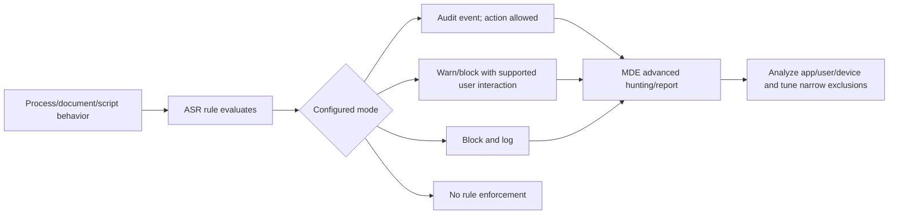

| Rollout phase | Evidence | Gate |
|---|---|---|
| Inventory | Apps, macros, scripts, admin tools, developer workflows | Owners known |
| Audit | ASR events by rule/device/app/user | Representative duration/sample |
| Explain/tune | Validate true business dependencies and malicious simulations | Narrow exclusions approved |
| Warn where supported | User/support behavior and bypass reasons | Communications/runbook ready |
| Block pilot | Block/false-positive/security telemetry | Threshold met |
| Production | Drift, exceptions, incident prevention | Continuous monitoring |

Do not enable every rule in block on all endpoints without audit. Conversely, do not leave audit forever. Set decision dates and risk owners.

## 8. App Control for Business

**App Control for Business** uses Windows application-control policy to define trusted code: executables, scripts, installers, libraries, packaged apps, and drivers according to rules. It is stronger and more complex than antivirus scanning.

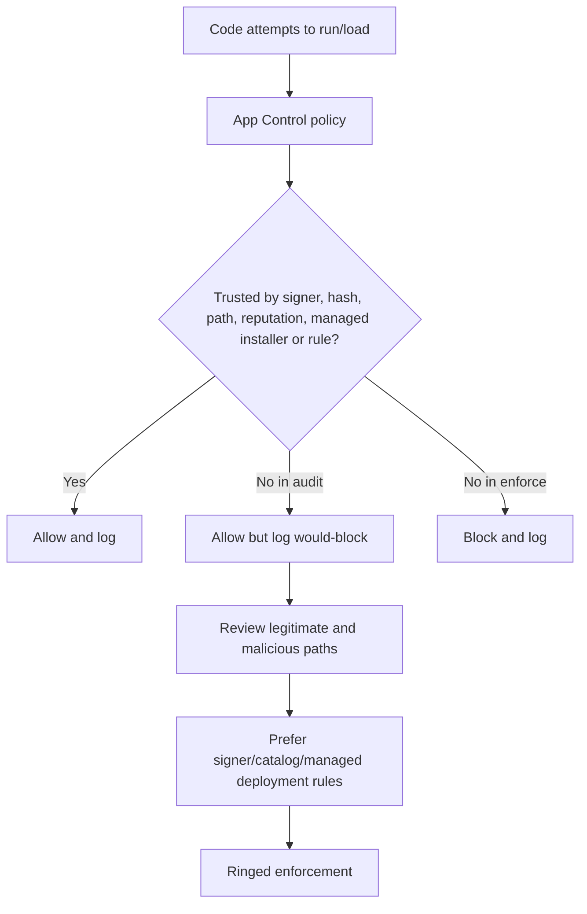

| Rule approach | Strength | Risk/caveat |
|---|---|---|
| Publisher/signer | Survives version updates from trusted signer | Broad signer trust may allow unwanted products |
| File publisher | More granular signer/product/version | Maintenance with product changes |
| Hash | Exact binary | Breaks every update; high maintenance |
| Path | Operationally simple | Unsafe if users can write path |
| Managed installer | Trusts software deployed by designated management path | Requires precise setup; trust boundary must be protected |
| Reputation/intelligent control | Cloud-informed trust in supported mode | Connectivity/support and false-positive process |

Start in audit on representative endpoints, protect boot/recovery, test security agents, drivers, update mechanisms, line-of-business apps, developer tools, scripts, accessibility and break/fix. A bad enforced policy can make endpoints unusable; rollback needs signed policy and offline recovery planning.

## 9. Disk encryption: BitLocker and FileVault

Encryption protects data at rest if a device or drive is lost. It does not protect data after an authorized user or attacker has unlocked the device.

### 🔍 Plain-English deep-dive: encryption key, protector, and escrow

- **Encryption key** — *secret material that mathematically protects disk data.* **Analogy:** The actual vault mechanism. **Why it matters:** Loss or exposure can make data unavailable or accessible.
- **Key protector** — *method that releases/protects the encryption key, such as TPM, PIN or recovery key.* **Analogy:** Approved ways to open the vault. **Why it matters:** Security, boot experience and recovery differ.
- **Recovery key** — *emergency secret used when normal protector cannot unlock.* **Analogy:** A sealed emergency vault key. **Why it matters:** It is highly sensitive and must be retrievable only by authorized roles.
- **Escrow** — *securely back up recovery information to an organizational service.* **Analogy:** Store the emergency key in a controlled safe with access logs. **Why it matters:** Encryption without reliable recovery can become data loss; broad recovery access becomes a breach risk.

| Design | BitLocker (Windows) | FileVault (macOS) |
|---|---|---|
| Enforcement | Intune disk-encryption/settings policy and Windows support | Intune macOS encryption/profile and Apple support |
| Protector | TPM/TPM+PIN/recovery depending design | Personal/institutional recovery patterns per current support |
| Escrow | Entra/Intune recovery information where configured | Intune escrowed personal recovery key where configured |
| Rotation | Recovery password/key rotation support by scenario | Recovery key rotation support by scenario |
| User experience | Silent enablement prerequisites or prompts/restarts | User authorization/secure token/bootstrap prerequisites can matter |
| Recovery | Help desk verifies identity/device/authorization | Help desk verifies identity/device/authorization |

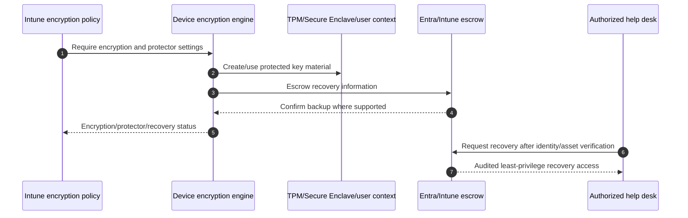

Before enforcing, verify hardware/OS, TPM/secure token state, existing encryption, third-party encryption, recovery escrow, backup, firmware update and help-desk recovery. Never include recovery keys in ordinary tickets or chat.

## 10. Windows Defender Firewall profiles and rules

Windows Defender Firewall applies profiles based on network classification: domain, private and public. Rules can filter direction, program/service, protocol, ports, addresses, interface and profile.

| Design principle | Example |
|---|---|
| Default inbound block | Permit only documented required inbound services |
| Profile awareness | Public network receives strictest exposure |
| Program/service rule | Prefer exact signed app/service over broad port where feasible |
| Address scope | Limit management traffic to approved ranges |
| Local rule merge | Decide whether local/admin rules can merge with policy |
| Logging | Log allowed/dropped traffic according to storage/privacy plan |
| Rule ownership | App/network/security owner and retirement date |

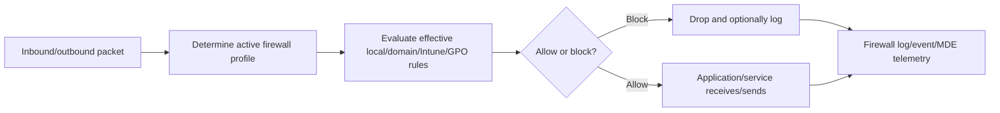

Do not disable the firewall to test connectivity. Create a narrow temporary diagnostic rule or compare an approved isolated endpoint, capture logs, identify exact flow, then implement least-privilege rule.

## 11. MDE onboarding and EDR

MDE onboarding establishes the endpoint sensor's relationship to the Defender service. Intune can deploy endpoint detection and response policy for supported devices. Onboarding is not proven by an app icon or Intune assignment; prove sensor health and portal presence.

| Layer | Evidence |
|---|---|
| Prerequisite/license | Supported OS/edition and Defender entitlement |
| Onboarding policy | Correct tenant package/config and assignment |
| Sensor service | Running and healthy local service/component |
| Connectivity | MDE service endpoints reachable |
| Portal inventory | Correct device appears with recent seen time |
| Test alert | Microsoft-approved safe detection test reaches portal |
| Integration | Intune connector/compliance/security settings status |
| Response | Device isolation/live response/action permissions and audit |

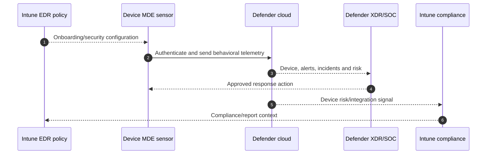

Device isolation can affect business and remote recovery. Define who can isolate, exclusions/limited connectivity required for Defender response, validation, release criteria, and communication.

## 12. MDE security settings management

MDE security settings management lets supported devices receive selected Intune endpoint-security policy through their Defender relationship even when they are not conventionally enrolled in Intune, according to current platform scope. This is not full MDM.

| Question | Why it matters |
|---|---|
| Which devices/platforms are in scope? | Support changes and not all Intune policy applies |
| Which policy types/settings are supported? | Prevent assumption of full Intune management |
| What synthetic/directory representation appears? | Inventory, targeting and cleanup differ |
| Does existing GPO/ConfigMgr/third-party manage same setting? | Conflict/last-writer risk |
| Who is authority during migration? | One source per security setting |
| How is offboarding performed? | Prevent unmanaged residue or stale objects |

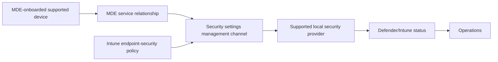

Use a pilot and explicit source migration. Do not target a setting through MDM, MDE management, GPO and ConfigMgr simultaneously.

## 13. Windows LAPS

**Windows Local Administrator Password Solution (LAPS)** manages a local administrator account password, rotates it, and backs it up to an approved directory such as Entra ID or Active Directory under supported configuration.

| LAPS control | Design question |
|---|---|
| Account | Built-in or named managed local account? Does it exist consistently? |
| Password | Length, complexity, age and automatic management mode? |
| Backup directory | Entra ID or AD DS; hybrid authority? |
| Encryption | Are directory-backed encrypted password/history features applicable? |
| Access | Which least-privilege roles can retrieve; PIM/approval? |
| Rotation | Rotate after use and on schedule; what triggers supported action? |
| Audit | Who retrieved/rotated and why? |
| Offline/recovery | What happens without directory contact? |

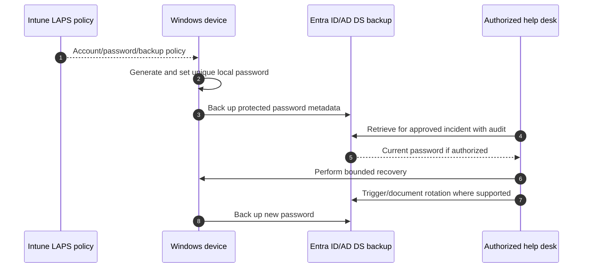

LAPS removes shared static local admin passwords. It does not justify routine use of local admin. Combine with EPM/standard-user design, restricted retrieval, rotation after use, and monitoring.

## 14. Endpoint Privilege Management

**EPM** lets standard users elevate approved processes under policy without making the user a permanent local administrator. It requires current applicable Intune Suite/standalone licensing and supported enrollment/platform prerequisites.

### 🔍 Plain-English deep-dive: elevate the task, not the person

- **Standard user** — *account without broad local administrative power.* **Analogy:** Employee can use the office but not change all building systems. **Why it matters:** Malware and mistakes inherit less privilege.
- **Elevation rule** — *policy describing which process may run elevated and under what conditions.* **Analogy:** A work order authorizes one technician and one repair. **Why it matters:** Signer/hash/file attributes, child-process behavior and user confirmation need precision.
- **User-confirmed elevation** — *user supplies approved business justification/authentication where configured.* **Analogy:** Sign out a restricted tool with a reason. **Why it matters:** It adds accountability but does not make unsafe software safe.
- **Support-approved elevation** — *workflow for an unlisted need under current feature model.* **Analogy:** Supervisor approves a one-time maintenance exception. **Why it matters:** SLA, evidence, expiration and abuse monitoring are required.

| EPM design | Guardrail |
|---|---|
| Rule identity | Prefer strong signer/certificate/product/version evidence; avoid user-writable path |
| Scope | Narrow users/devices and specific process |
| Child processes | Decide whether elevation may flow; test abuse |
| User interaction | Clear reason, authentication and support route |
| Reporting | Monitor elevation, denial, unmanaged requests and anomalies |
| App trust | EPM is not antivirus/app approval; package/security review remains |
| Rollback | Remove rule and confirm no permanent group membership/change |

EPM reduces standing privilege; it does not replace application control, LAPS, patching, or privileged-access workstations.

## 15. Windows Hello for Business and Credential Guard

**Windows Hello for Business** replaces reusable passwords for device sign-in with key- or certificate-based credentials protected by the device and unlocked by PIN/biometric. **Credential Guard** uses virtualization-based security to isolate selected secrets from the normal operating system.

| Control | Protects against | Prerequisites/caveats |
|---|---|---|
| Hello for Business | Password theft/replay/phishing for Windows sign-in | Join/trust model, TPM, user registration, recovery and app compatibility |
| Credential Guard | Theft of supported cached/domain credentials | Supported hardware/edition/build, VBS, protocol/app compatibility |
| LSA protection | Untrusted code reading/injecting Local Security Authority | Driver/plugin compatibility and audit |
| Disable legacy auth/protocol | Downgrade/replay paths | Application/domain readiness |

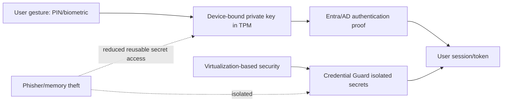

A PIN is not “just a shorter password”: it unlocks a device-bound key and is not sent to a server as a reusable password. Plan break/fix, TPM replacement, remote user registration, trust model and legacy protocol dependencies.

## 16. Baselines versus focused policies

| Strategy | Advantage | Risk | Good governance |
|---|---|---|---|
| Broad baseline | Fast recommended starting posture | Many settings and compatibility impact | Review every value; record deviations; version migration |
| Focused technology policies | Clear owner, lifecycle and troubleshooting | More objects and coordination | Naming, one setting source, coherent grouping |
| Hybrid | Baseline core plus focused exceptions/advanced controls | Hidden overlap | Normalize underlying setting IDs and authority |

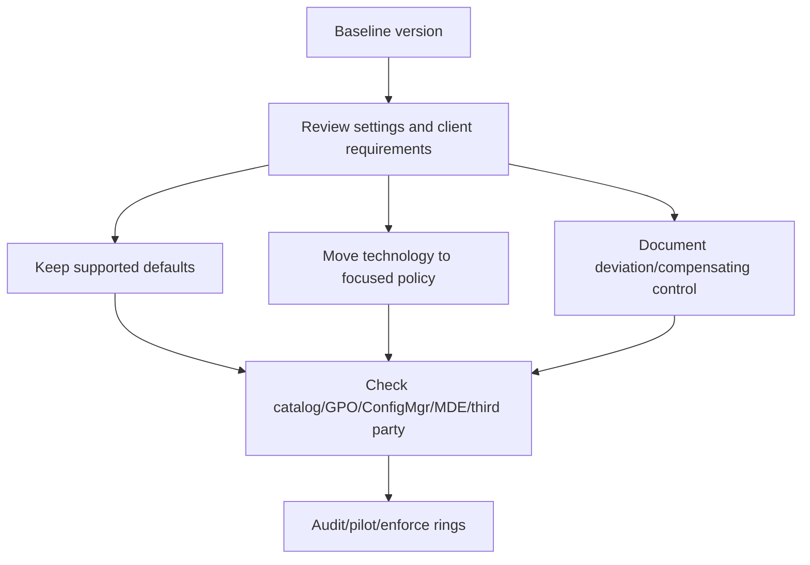

Never answer a conflict by saying “baseline wins.” Find the exact provider path, scope, authority and effective state.

## 17. Conflicts and third-party coexistence

| Conflict | Symptom | Resolution principle |
|---|---|---|
| Defender AV + third-party AV | Unexpected passive/active/disabled state or performance | Follow supported coexistence/migration; verify Security Center registration and MDE |
| Firewall from GPO + Intune | Rule/profile mismatch | Choose authority; model merge behavior; pilot |
| BitLocker ConfigMgr + Intune | Escrow/settings/status mismatch | Move workload/source in controlled sequence |
| ASR baseline + endpoint profile | Per-setting conflict/duplicate | One policy source per ASR rule |
| App control + EPM | Elevated app still blocked or unexpected trust | Design both trust/elevation; elevation does not override app control automatically |
| LAPS AD + Entra policy | Backup directory/account mismatch | Explicit hybrid authority and migration |
| MDE security management + MDM | Same endpoint security setting arrives twice | Scope one channel and monitor source |

Preserve protection during migration. For example, Configuration Manager endpoint-protection settings can remain until Intune overwrites after workload transition; test documented behavior and tattooing. Do not create a gap where neither tool protects the endpoint.

## 18. MDE security tasks and closed-loop remediation

Security tasks connect security findings in Defender with endpoint-management action in Intune. A security administrator can request remediation; the Intune team reviews, accepts/rejects, deploys change, and reports completion; security verifies risk reduction.

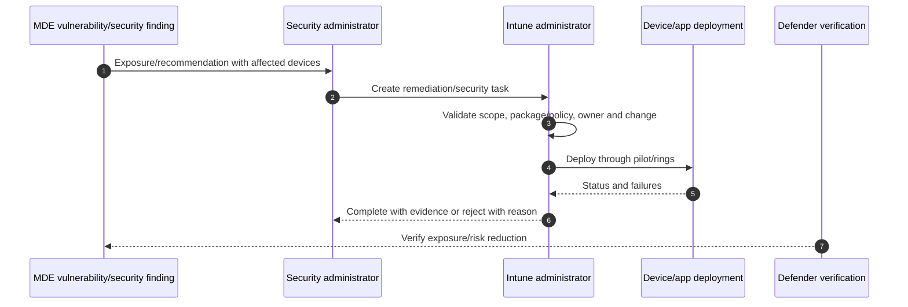

| Task state | Operational expectation |
|---|---|
| New/requested | Triage severity, exploitability, affected assets and owner |
| Accepted | Change plan, pilot, test, deadline and tracking |
| Rejected | Evidence-based reason, alternative/exception and risk owner |
| In progress | Deployment metrics, blockers and stakeholder updates |
| Completed | Effective verification, not only “policy assigned” |

## 19. Device risk as an access signal

MDE device risk can feed Intune compliance, which can feed Entra Conditional Access. Keep response ownership clear.

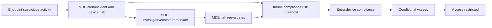

Do not have the Intune team override compliance before SOC resolves risk. Define emergency business access separately with risk owner, bounded scope, monitoring and expiry.

## 20. Staged rollout and rollback

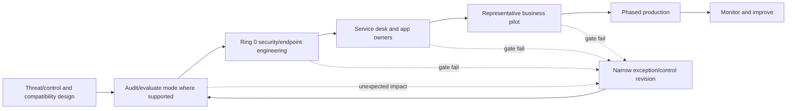

| Control | Safe pre-enforcement mode | Rollback considerations |
|---|---|---|
| ASR | Audit, then Warn where supported, then Block | Revert specific rule/ring; retain other protection |
| App Control | Audit policy | Signed policy removal/replacement and offline recovery |
| Firewall | Audit/log and narrow rule pilot | Restore prior rules/profile, not disable firewall |
| AV cloud/aggressiveness | Pilot and false-positive process | Narrow exclusion or setting revision; no broad disable |
| BitLocker/FileVault | Readiness and escrow proof | Decryption is slow/risky and rarely first rollback; preserve recovery |
| LAPS | Pilot backup/retrieval/rotation | Restore prior account process without shared password |
| EPM | Report/limited rules and user workflow | Remove rule; verify no standing admin membership |
| Credential Guard | Audit/readiness by build where available | Compatibility and restart/recovery plan |

Rollback must preserve a defensible security minimum. A business-impact incident might pause one new ASR rule, not disable AV, firewall, EDR and tamper protection.

## 21. Security and privacy testing

| Test class | Example | Safe evidence |
|---|---|---|
| AV health | Microsoft-approved harmless test file/detection method | Alert/event; no live malware |
| Cloud connectivity | Defender connectivity analyzer/current documented test | Endpoint results |
| ASR audit/block | Microsoft-documented safe demo behavior | Event and MDE query |
| App Control | Signed approved/unknown test apps in audit then enforce lab | Audit/block event |
| Encryption | Encrypt/reboot/recovery on disposable device | Escrow and recovery audit |
| Firewall | Approved test service and scoped rule | Allow/drop logs |
| MDE | Microsoft-approved detection test | Portal device/alert timing |
| LAPS | Authorized retrieval then rotation on test device | Audit and changed password |
| EPM | Approved and denied elevation cases | Rule/report and standard-user state |
| Rollback | Revert one ring/control without broad weakening | Effective state and retained protections |

Never introduce real ransomware, credential theft, exploit code, or unauthorized scans into a production network. Use Microsoft-provided simulations, harmless files, disposable isolated labs, or tabletop evidence.

## 22. Layered troubleshooting

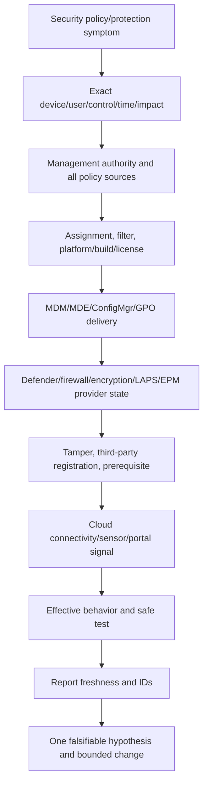

| Symptom | Common causes | Discriminating evidence |
|---|---|---|
| AV policy success but protection off | Third-party AV, mode, tamper/provider/edition issue | Defender status + Security Center registration + sources |
| ASR block unexpected | Rule/mode, app behavior, duplicate source | ASR event ID/rule GUID/process chain |
| Exclusion not effective | Wrong type/path/context, tamper or source | Effective Defender preference and exact process/path |
| BitLocker not enabling | TPM, edition, conflicting policy, escrow/readiness | BitLocker status, MDM event, key escrow |
| Recovery key unavailable | Never escrowed, wrong record/role, stale device | Exact device ID/key ID/audit |
| Firewall app fails | Wrong profile/rule/address/service path | Effective rules + firewall log + network trace |
| MDE device missing/stale | Onboarding, sensor, proxy, duplicate record | Local analyzer/sense logs/portal last seen |
| LAPS password absent | Policy/account/backup authority/sync/permission | LAPS event and directory attribute/audit |
| EPM request fails | License, assignment, rule identity, agent/context | EPM report/log and file signer/hash |

## 23. Ransomware scenario: prevent, detect, contain, recover, improve

### Scenario

A finance user opens a malicious attachment. A script launches, attempts credential theft, enumerates file shares, and begins rapid encryption. MDE correlates alerts and raises device risk.

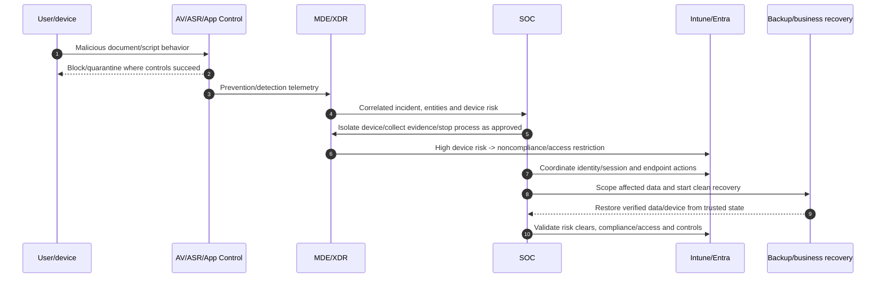

| Phase | Actions | Evidence/owner |
|---|---|---|
| Triage | Validate alert, user/device, severity, active encryption, spread | SOC incident timeline |
| Contain | Isolate endpoint; disable/revoke compromised identity; protect shares | SOC/identity/storage approvals |
| Preserve | Collect MDE timeline, files/hashes, logs, memory/live response if approved | Chain of custody/privacy |
| Eradicate | Remove persistence, patch vector, rotate exposed credentials, reimage when needed | Endpoint/identity evidence |
| Recover | Restore from known-good backup, validate encryption/AV/EDR/policy | Business owner acceptance |
| Improve | Tune ASR/app control, patch, email controls, privilege, backups, detection, training | PIR/action register |

Do not use Intune wipe as the first incident response action: it can destroy evidence and the device may be offline. SOC/forensics decides preservation and containment. If rapid destructive action is required, follow the incident authority and legal process.

## 24. Operations and metrics

| Metric | Definition | Why it matters |
|---|---|---|
| MDE onboarding/active coverage | Intended endpoints with fresh healthy sensor | EDR visibility |
| AV active/healthy coverage | Intended devices with current engine/intelligence/real-time/cloud | Prevention reliability |
| Security intelligence age | Devices beyond freshness threshold | Update/network failure |
| ASR audit/block volume by rule | Events, blocks, warns, business exceptions | Tune and prove enforcement |
| Exclusion debt | Broad/expired/unowned exclusions | Attack-surface governance |
| Encryption + escrow coverage | Encrypted devices with retrievable current recovery key | Data-at-rest and recovery |
| Firewall enabled/profile/rule drift | Effective protection and exception state | Network control integrity |
| LAPS coverage/retrieval/rotation | Unique backed-up passwords and audited use | Local privilege risk |
| EPM elevation/denial/anomaly | Approved task privilege and abuse signals | Least-privilege outcome |
| Device risk/remediation time | High-risk devices and time to clear | SOC/access integration |
| Security task closure effectiveness | Findings actually reduced after deployment | Closed-loop posture |
| Policy conflict/error age | Unresolved security setting failures | Control reliability |

Daily: high-risk device/sensor/AV outages and security incidents. Weekly: policy errors, ASR/app-control impact, security tasks and encryption gaps. Monthly: exclusions, LAPS/EPM, stale devices and exceptions. Quarterly: baseline/version, roles, recovery drills, ransomware tabletop and vendor/product roadmap.

## 25. Consulting artifacts

| Artifact | Minimum contents |
|---|---|
| Endpoint-security HLD | Trust boundaries, management sources, telemetry and access signal |
| Control/policy matrix | Technology, setting, source, mode, target, owner, test, rollback |
| Authority/overlap matrix | Intune/GPO/ConfigMgr/MDE/third-party sources |
| Baseline deviation register | Default, chosen value, risk, compensation, owner, expiry |
| Exclusion register | Scope, evidence, permissions, risk, compensation, expiry |
| Encryption/recovery design | Protectors, escrow, access, audit, rotation, recovery tests |
| LAPS/EPM design | Account/elevation rules, license, approvals, monitoring |
| MDE onboarding/response plan | Coverage, connectivity, test alert, isolation, risk signal |
| Test/rollback pack | Audit, pilot, positive/negative, recovery and safeguards |
| Ransomware runbook/PIR | Triage through improvement, roles and evidence |
| Operations dashboard/RACI | Metrics, cadence, 24x7 and vendor escalation |

## 26. Safe paper lab and evidence exercise

No security product needs to be disabled, no real malware is used, and no production device changes.

### Fictional brief

Contoso has 2,500 Windows endpoints, 300 Macs, a third-party AV contract ending in six months, Configuration Manager endpoint policy, incomplete MDE onboarding, shared local admin passwords, broad AV exclusions, and no tested recovery-key process. Finance is ransomware-sensitive and developers need controlled tools.

### Steps

1. Draw the layered endpoint-security architecture and signal flow to compliance/CA.
2. Inventory authority for AV, ASR, firewall, encryption, EDR, LAPS, EPM, Hello and Credential Guard.
3. Build a third-party AV coexistence/migration sequence preserving protection.
4. Create ASR and App Control audit-to-enforce ring plans with representative workflows.
5. Review five fictional exclusions; reject or narrow them with compensating controls and expiry.
6. Design BitLocker/FileVault escrow, least-privilege retrieval, rotation and recovery drills.
7. Design MDE onboarding, safe test alert, device isolation approval and risk signal path.
8. Define LAPS and EPM use cases that keep users standard.
9. Create positive, negative, compatibility, offline, rollback and recovery tests.
10. Run the ransomware tabletop in section 23 and produce a timeline/RACI.
11. Define metrics, alerts, security-task workflow and 24x7 handover.
12. Prepare an executive summary: top risks, quick wins, dependencies, costs, residual risk and 90-day roadmap.

### Evidence to retain

| Evidence | Interview value | Honesty label |
|---|---|---|
| Layered architecture/authority matrix | Design and coexistence thinking | Fictional paper design |
| ASR/app-control plan | Safe hardening method | No production enforcement |
| Exclusion/key/LAPS/EPM registers | Governance depth | Synthetic entries |
| MDE/risk workflow | SecOps integration | Tabletop only |
| Ransomware timeline/PIR | Incident leadership | No live attack |
| Dashboard/RACI/roadmap | Consulting and operations | Proposed client artifacts |

## 27. JD Mapping: interview translation

| Prompt | Truthful answer structure |
|---|---|
| Design endpoint protection | Threats/personas → layered controls → authority → audit/pilot → tests/rollback → SOC/operations |
| Handle application conflict | Exact control/event/process → preserve protection → narrow exception → vendor/security evidence → expiry |
| Migrate third-party AV | Readiness/coexistence → rings → verify Defender/MDE health → remove old agent → monitor/rollback |
| Respond to ransomware | SOC-led validate/contain/preserve → identity/storage scope → eradicate/recover → control improvement |
| Explain experience gap | Production incident/RCA strengths + current paper architecture/tabletop + partner-owner validation |

## 28. Official Source Anchors

| Topic | Official Microsoft source |
|---|---|
| Intune security baselines | [Intune security baselines for Windows devices](https://learn.microsoft.com/en-us/intune/device-security/security-baselines/overview) |
| Defender Antivirus policy | [Manage endpoint-security Antivirus policy](https://learn.microsoft.com/en-us/intune/device-configuration/endpoint-security/antivirus) |
| Defender Antivirus modes | [Microsoft Defender Antivirus compatibility](https://learn.microsoft.com/en-us/defender-endpoint/microsoft-defender-antivirus-compatibility) |
| Cloud protection | [Cloud protection and Microsoft Defender Antivirus](https://learn.microsoft.com/en-us/defender-endpoint/cloud-protection-microsoft-defender-antivirus) |
| Tamper protection | [Protect security settings with tamper protection](https://learn.microsoft.com/en-us/defender-endpoint/prevent-changes-to-security-settings-with-tamper-protection) |
| Exclusions | [Defender Antivirus exclusions](https://learn.microsoft.com/en-us/defender-endpoint/configure-exclusions-microsoft-defender-antivirus) |
| ASR rules | [Attack surface reduction rules overview](https://learn.microsoft.com/en-us/defender-endpoint/attack-surface-reduction-rules-reference) |
| App Control for Business | [App Control for Business overview](https://learn.microsoft.com/en-us/windows/security/application-security/application-control/app-control-for-business/appcontrol) |
| BitLocker architecture | [BitLocker overview](https://learn.microsoft.com/en-us/windows/security/operating-system-security/data-protection/bitlocker/) |
| FileVault deployment | [Apple FileVault deployment reference](https://support.apple.com/guide/deployment/dep82064ec40/web) |
| Firewall policy | [Manage endpoint-security Firewall policy](https://learn.microsoft.com/en-us/intune/device-configuration/endpoint-security/firewall) |
| MDE integration/onboarding | [Integrate Defender for Endpoint with Intune](https://learn.microsoft.com/en-us/intune/device-security/microsoft-defender/overview) |
| Security settings management | [MDE security settings management](https://learn.microsoft.com/en-us/intune/device-security/microsoft-defender/security-settings-management) |
| Windows LAPS | [Windows LAPS overview](https://learn.microsoft.com/en-us/windows-server/identity/laps/laps-overview) |
| Intune advanced capabilities and licensing context | [Microsoft Intune advanced capabilities](https://learn.microsoft.com/en-us/intune/fundamentals/advanced-capabilities) |
| Windows Hello for Business | [Windows Hello for Business overview](https://learn.microsoft.com/en-us/windows/security/identity-protection/hello-for-business/) |
| Credential Guard | [Credential Guard overview](https://learn.microsoft.com/en-us/windows/security/identity-protection/credential-guard/) |
| Security tasks | [Use security tasks to remediate vulnerabilities](https://learn.microsoft.com/en-us/intune/protect/atp-manage-vulnerabilities) |

---

## ⭐ Likely Interview Questions for This Section

### Q1. How would you describe a layered Intune endpoint-security architecture?

> **Model answer:** I layer device identity/compliance and encryption, least privilege with standard users/LAPS/EPM, Defender Antivirus and cloud protection, ASR and App Control, firewall, MDE EDR/response, then feed device risk into compliance/Conditional Access. Intune is the policy plane, while OS/Defender providers enforce and MDE/SOC investigate. I assign one source and owner per setting, stage audit-to-enforce where supported, test recovery, and measure effective health rather than policy assignment.

### Q2. What is the difference between Defender Antivirus active mode, passive mode, and MDE EDR?

> **Model answer:** In active mode Defender Antivirus is the primary antimalware provider and performs real-time prevention/remediation. Passive mode is a supported limited role in applicable MDE/third-party AV scenarios and is not automatic or identical across clients/servers; current prerequisites must be verified. MDE EDR is the behavioral telemetry, detection and response layer. EDR can coexist with an antivirus provider, but it does not make an unhealthy primary antivirus irrelevant.

### Q3. How do you manage antivirus exclusions safely?

> **Model answer:** I require vendor/prior evidence, identify exact path/process semantics and who can write/execute there, reproduce the compatibility/performance issue, and choose the narrowest scope and ring. I add compensating controls, monitoring, owner, risk approval and expiry, then retest. I reject broad user-writable paths, drives, script engines or security folders and never use exclusions to make a dashboard green.

### Q4. How would you deploy ASR and App Control without disrupting the business?

> **Model answer:** Inventory critical apps/scripts/admin/developer workflows, start ASR and App Control in audit, analyze events by rule/process/signer/user/device, validate real dependencies, and prefer strong signer/catalog/managed deployment rules over user-writable paths or hashes where practical. Use warn only where supported as a transition, then block/enforce through representative rings with communications, recovery and narrow time-bound exceptions. Set a deadline so audit does not become permanent.

### Q5. What must be ready before enforcing BitLocker or FileVault?

> **Model answer:** Supported hardware/OS, existing encryption and third-party state, TPM or Apple secure-token/bootstrap prerequisites, protector design, confirmed recovery escrow, least-privilege audited retrieval, backup, firmware/update behavior, user communication and a tested recovery drill. I verify that the key is actually retrievable for the exact live device before broad enforcement. Recovery secrets never go into normal tickets or chat.

### Q6. How do LAPS and EPM support least privilege?

> **Model answer:** LAPS gives each managed endpoint a unique rotating local admin password backed up to Entra or AD under least-privilege retrieval, eliminating shared static credentials. EPM keeps users standard and elevates only a precisely approved process/workflow, subject to current licensing. LAPS is break-glass recovery; EPM is bounded task elevation. Both need audit, rotation/rule review and do not replace app control or endpoint protection.

### Q7. How would you respond when MDE marks a device high risk during suspected ransomware?

> **Model answer:** SOC validates and scopes the incident, isolates the endpoint and preserves evidence using approved response, while identity/storage owners contain sessions, accounts and shares. Intune compliance/CA can restrict access from the risk signal, but I do not lower the threshold. We eradicate persistence, rotate exposed credentials, rebuild/recover from known-good state, validate AV/EDR/encryption/policy, then let MDE→Intune→Entra signals clear and complete a PIR with ASR/app-control/backup/detection improvements.

### Q8. How does your background support this work without claiming production endpoint-security ownership?

> **Model answer:** My production strengths are critical M365 incidents, access/client troubleshooting, hypothesis-driven RCA, fix validation, vendor/product escalation, documentation, metrics and stakeholder communication. I have transferred them into a current endpoint-security paper design and ransomware tabletop with authority mapping, staged modes, tests, rollback, runbooks and operations. I would implement and respond with endpoint security and SOC owners and would not present the exercise as production Defender/Intune ownership.

---

## 🧠 30-Second Memory Hooks

- **Endpoint security is a stack:** identity → privilege → prevention → hardening → network → encryption → detection → access.
- **AV guard** prevents; **EDR cameras/investigator** detects and responds.
- **Tamper protection** protects the protector; use approved troubleshooting paths.
- **Exclusion** = an uninspected hole with owner, compensation and expiry.
- **ASR** = audit → tune → warn where supported → block.
- **App Control** asks “is this code trusted?”; EPM asks “may this approved task elevate?”
- **Encryption protects sleeping data, not an unlocked session.**
- **Escrow** = controlled emergency key safe; retrieval must be audited.
- **Firewall troubleshooting** uses narrow rules/logs, never global disable.
- **MDE onboarding** = local sensor + connectivity + fresh portal evidence + safe test.
- **LAPS** rotates unique break-glass passwords; **EPM** elevates the task, not the person.
- **One security setting, one authority** across Intune, GPO, ConfigMgr, MDE and third party.
- **Ransomware:** contain and preserve before destructive cleanup.
- **Candidate honesty** = production incident/RCA skill plus paper design/tabletop.

---

## Completion Checklist

- [ ] I can draw a layered endpoint-security architecture and explain each layer's limitation.
- [ ] I can select focused Intune endpoint-security policies and identify underlying overlap.
- [ ] I can explain Defender AV active/passive context, EDR, cloud protection and tamper.
- [ ] I can govern exclusions as narrow, evidenced, compensated and expiring exceptions.
- [ ] I can stage ASR and App Control from audit to enforcement with recovery.
- [ ] I can design BitLocker/FileVault protectors, escrow, retrieval, rotation and drills.
- [ ] I can design firewall profiles/rules and troubleshoot without disabling protection.
- [ ] I can prove MDE onboarding, sensor health, portal freshness, response and risk integration.
- [ ] I can distinguish MDE security settings management from full MDM.
- [ ] I can explain LAPS, EPM, Windows Hello and Credential Guard accurately.
- [ ] I can rationalize baselines/focused policies and coexisting management sources.
- [ ] I can use security tasks and metrics for closed-loop remediation.
- [ ] I can plan staged deployment, safe testing, rollback and operations.
- [ ] I can lead the paper ransomware scenario with SOC/identity/storage/endpoint roles.
- [ ] I completed or can explain the safe lab as non-production evidence.
- [ ] I can answer Q1-Q8 aloud and preserve your honesty boundary.
- [ ] I will recheck current platform, baseline, licensing, preview and retirement guidance.

---

*Next suggested section:* [Part 20](Part-20-intune-operations-troubleshooting-sccm-comanagement.md) — turn Intune into an auditable 24x7 service with RBAC, scope tags, reports, logs, safe remote actions, layered troubleshooting, automation guardrails, Configuration Manager co-management, workload migration, rollback, and handover.