# Part 20 — Intune Operations, Reporting, Remediation, Troubleshooting, SCCM, and Co-Management

> **Section goal:** Turn Intune from a collection of policies into a safe, observable, supportable service. By the end, you should be able to design least-privilege administration, monitor health and changes, use remote actions and scripts safely, collect platform evidence, isolate failures by layer, build an escalation pack, explain Microsoft Configuration Manager architecture, move co-management workloads through pilot collections, distinguish tenant attach from co-management and CMG, plan migration/rollback, and hand the service to a 24x7 team.

This Part operationalizes [Parts 15-19](Part-19-intune-endpoint-security-stack.md). Part 21 moves into Exchange Online architecture and mail flow while reusing the same identity, service-health, evidence, change, and escalation disciplines.

> **Currency and change-sensitive note:** Product behavior was checked against official Microsoft Learn content available on **August 24, 2026**. Intune RBAC permissions, scope tags, reports, device actions, Multiple Administrative Approval (MAA), diagnostics, log paths, check-in intervals, remediations, Graph resources, connectors, and service-health experiences change. Configuration Manager current branch, cloud attach, tenant attach, Cloud Management Gateway (CMG), co-management prerequisites, workload names/sliders, pilot behavior, and deprecated resource-access features are version-sensitive. Current guidance says the old Configuration Manager resource-access workload is no longer supported and modern versions move that authority to Intune; verify the exact site version and upgrade blockers. Recheck Microsoft Learn, Product Terms, supported releases, tenant/site health, and privacy/data-collection notices before implementation.

## JD Mapping

| Deloitte role expectation | Capability developed in this Part | Consulting evidence |
|---|---|---|
| Operate and optimize Microsoft security services | Build RBAC, monitoring, reports, action safeguards, expiry management, runbooks and continual improvement | Intune operating model and service handbook |
| Troubleshoot complex platform issues | Isolate assignment, applicability, policy, network, token, license, service, client and authority failures | Layered decision tree and escalation evidence pack |
| Support incidents and 24x7 rotation | Define severity, triage, communications, handoff, recovery, PIR and known-error workflows | Major-incident and shift-handover runbooks |
| Design SCCM/Intune transformation | Explain Configuration Manager, co-management, cloud/tenant attach, CMG, workloads, pilots and coexistence | Current/target architecture and migration roadmap |
| Deliver least privilege and governance | Separate roles, scope groups, scope tags, MAA, audit, Graph identity and approvals | RBAC matrix and access-review evidence |
| Lead stakeholder/vendor coordination | Package evidence, ownership, SLAs, licensing, connectors and rollback decisions | RACI, dependency register and vendor action plan |

## Candidate honesty note

Arti can strongly connect this Part to production Microsoft 365 support escalation, critical-incident leadership, RCA, log and timeline analysis, vendor/product-group coordination, customer updates, knowledge articles, KPI/business reviews, mentoring, and service handover. Those are the core operating behaviors this chapter needs.

This Part does **not** claim production administration of Intune RBAC, remote actions, remediations, Microsoft Graph automation, Configuration Manager, CMG, tenant attach, or co-management workloads. Safe wording is:

> “My production experience is Microsoft 365 support operations, critical incidents, RCA, stakeholder communication, documentation, metrics, and escalation. I have created a current paper operating model and SCCM/Intune co-management migration design with authority, pilots, tests, rollback, and 24x7 handover. I would execute it with Intune, Configuration Manager, identity, network, security, and service-management owners.”

---

## 1. An endpoint-management service needs people, process, technology, and evidence

| Dimension | Questions | Deliverable |
|---|---|---|
| People | Who owns platform, policy, apps, security, service desk, SOC, network and vendors? | RACI and on-call roster |
| Process | How are requests, changes, incidents, exceptions, renewals and problems handled? | Runbooks/SOPs and workflows |
| Technology | Which tenants, platforms, agents, connectors, policies and management authorities exist? | Architecture and inventory |
| Evidence | Which logs, IDs, reports, tests, audit events and metrics prove outcome? | Evidence catalogue/dashboard |
| Governance | Who may view/change/erase, and how is access reviewed? | RBAC/MAA/access-review model |
| Resilience | What happens during outage, credential expiry, agent failure or rollback? | Continuity and recovery plan |

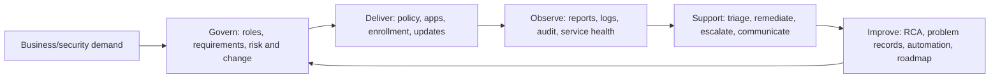

A green portal does not prove a healthy service. A healthy service knows coverage, freshness, failures, owners, expiry risks, user impact, recovery time and residual risk.

## 2. Intune RBAC: role, members, scope groups, and scope tags

**Role-based access control (RBAC)** grants only the actions and visibility needed. An Intune role assignment combines a role definition, assigned administrator members, scope groups, and scope tags.

### 🔍 Plain-English deep-dive: action scope versus visibility label

- **Role definition** — *allowed operations such as read policy, create app, or retire device.* **Analogy:** A job description listing permitted tasks. **Why it matters:** Built-in and custom roles can contain powerful remote actions.
- **Members/admin group** — *people who receive the role assignment.* **Analogy:** Employees assigned that job. **Why it matters:** Use governed groups, not unmanaged direct assignments.
- **Scope group** — *users/devices the admin may manage under the assignment.* **Analogy:** Which branch office the employee serves. **Why it matters:** It limits operational reach, not which policies devices receive.
- **Scope tag** — *label controlling which tagged Intune objects/devices an admin can see/manage.* **Analogy:** A colored filing-cabinet label. **Why it matters:** It supports distributed administration but is not an app/policy assignment filter.

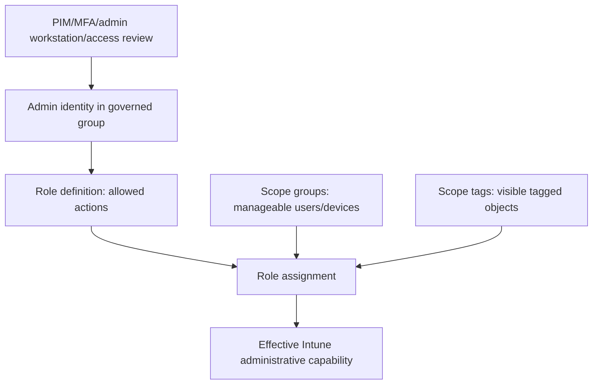

| Persona | Typical least-privilege need | Avoid |
|---|---|---|
| Service desk L1 | Read device/user/app status; sync or limited benign actions | Wipe, broad policy edit, role admin |
| Endpoint L2/L3 | Diagnose, collect logs, approved actions, manage scoped policies/apps | Global tenant administration |
| Security engineer | Endpoint-security policy/report scope | App packaging or destructive device rights unless required |
| App packager | Apps and assignments in scoped groups | Compliance/CA/security policy changes |
| Regional admin | Tagged regional objects and groups | Cross-region visibility/actions |
| Automation identity | Exact Graph application permissions for workflow | Global/delegated user password |
| Auditor | Read-only reports/audit | Change or action permissions |

Protect privileged accounts with phishing-resistant authentication, Conditional Access, privileged workstations, just-in-time activation where supported, separate daily-use accounts, and recurring review.

## 3. Scope tags are governance, not security isolation by themselves

Scope tags filter administrator visibility. Tag assignment and default-tag behavior require careful design. Untagged objects may receive/default into visibility patterns according to current behavior. Tenant-attached Configuration Manager-only devices have documented default-scope-tag limitations.

> **Preview/change-sensitive:** Microsoft introduced **Scoped permissions** as an opt-in public preview in March 2026. The current default can merge permissions across role assignments that share a permission category, broadening access across scope-tag contexts. The preview keeps each assignment's permissions in its own scope, but enabling it is a one-way tenant action. Run the Permissions Assessment Report, correct assignments, communicate reductions, test admin personas, and recheck current rollout status before opting in.

| Design question | Why it matters |
|---|---|
| Which objects/devices receive each tag? | Admin may lose or gain visibility unexpectedly |
| Can one object have multiple tags? | Shared administration and overlap need testing |
| What is default tag behavior? | Untagged/tenant-attached visibility can surprise |
| Who can assign/change tags? | Tag manipulation can expand administrative reach |
| Do scope groups align? | Tag visibility without scope-group authority can still limit action |
| Are reports/Graph consistent? | Export/API visibility depends on permissions and endpoint |

Test with dedicated admin personas. Do not validate RBAC while signed in as Global Administrator; that masks missing or excessive permissions.

## 4. Multiple Administrative Approval and destructive actions

**Multiple Administrative Approval (MAA)** can require a second administrator to approve selected protected actions/resources under current feature scope. It supports separation of duties but does not replace verification.

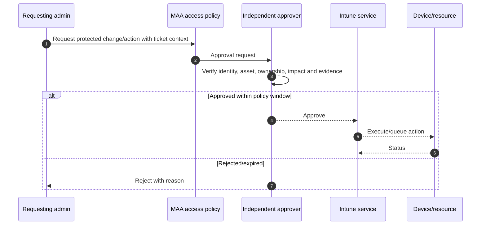

| Action risk | Required controls |
|---|---|
| Wipe/factory reset | Asset/user/ownership verification, backup/legal/security, MAA where configured, completion audit |
| Retire/MAM wipe | Work/personal boundary, identity/offboarding event, app/device contact |
| Delete device/record | Correlate live/stale records and pending actions |
| Change broad assignment | Target diff, blast-radius threshold, peer/change approval |
| Upload script/package | Code/supply-chain review, signature/hash, secret scan |
| Change RBAC | Independent privileged-access review and audit |

Never let urgency collapse identity and asset verification. During incidents, use preapproved emergency procedures with explicit authority and retrospective review.

## 5. Reports: operational, assignment, compliance, app, security, and organizational

Intune reports serve different purposes and update on different schedules.

| Report family | Question | Caveat |
|---|---|---|
| Device inventory | What endpoints/OS/ownership/check-in exist? | Inventory can be stale or platform-limited |
| Enrollment | Which enrollment attempts fail and at what stage? | Correlate user/device/method/time |
| Configuration | Which profiles/settings succeeded, conflict, error or NA? | Drill to per-setting/provider evidence |
| Compliance | Which rules fail and which devices are stale/in grace? | Green can include weak/no-policy behavior |
| App install | Required/available/uninstall state and failures | Detection defines “installed” |
| Endpoint security | AV, encryption, firewall, MDE and policy posture | Licensing/onboarding/source matter |
| Update | Quality/feature/driver status and alerts | Eligibility/safeguard/report latency |
| Endpoint analytics | Performance/user-experience insights | Data collection and licensing/privacy |
| Audit logs | Who changed what and when? | Retention/export/identity context must be governed |

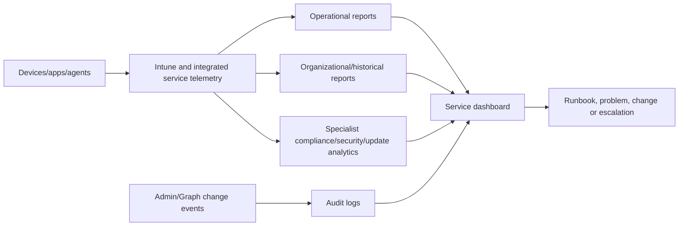

Define each metric's numerator, denominator, freshness, exclusions and owner. An exported CSV is not self-explanatory evidence.

## 6. Audit, service health, Message center, and release management

| Source | Use | Operating action |
|---|---|---|
| Intune audit logs | Admin/Graph changes and actions | Alert/review sensitive changes; retain per policy |
| Tenant Status/connector health | Service/connector state | Assign owner and escalation threshold |
| Microsoft 365 Service health | Incidents/advisories | Correlate region/time/feature; communicate impact |
| Message center | Planned changes, retirement, rollout | Triage relevance, create change/readiness task |
| Intune What's new | Product changes and removals | Update standards/runbooks/tests |
| ConfigMgr release/health | Site/client/current-branch support | Upgrade plan and prerequisite checks |
| Apple/Google/vendor notices | Token/API/OS/app changes | Dependency owner action |

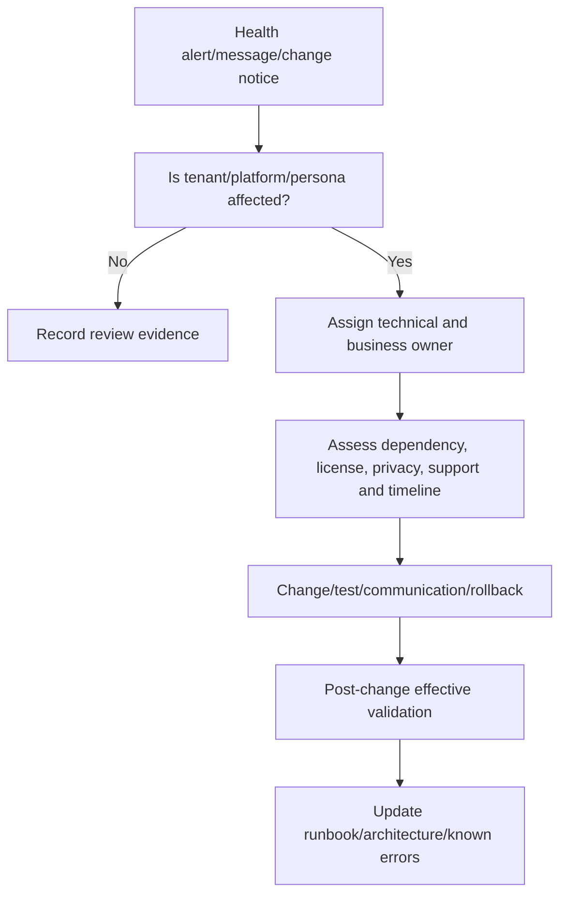

Do not wait for a retirement date to discover a dependency. Maintain a forward-change register with review dates and client-specific action.

## 7. Remote actions and command lifecycle

Remote actions are queued cloud requests executed only when a supported device/app checks in and accepts the command.

| Action family | Example intent | Verification |
|---|---|---|
| Benign refresh | Sync, restart, update inventory | New check-in/status and user impact |
| Support | Collect diagnostics, rotate keys/password, locate/lock where supported | Action status plus platform evidence |
| Security containment | Disable lost mode, isolate through MDE, wipe under authority | Incident timeline and response status |
| Lifecycle | Retire, Fresh Start, Autopilot Reset, wipe, delete | Physical data/management/record outcome separately |
| App | MAM selective wipe or app reinstall intent | App contacts service and reports result |

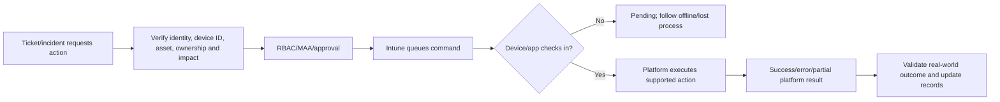

Current guidance documents daily tenant limits for some actions such as wipe; check current limits and support path before bulk incident action. Never design mass wipe as an unreviewed Graph loop.

## 8. Collect diagnostics without destroying the evidence

Diagnostic collection can be local, user-assisted, remote, or service-generated. Capture volatile evidence before reset/re-enrollment/cache deletion.

| Platform | Evidence examples | Caution |
|---|---|---|
| Windows MDM | MDM diagnostic report, DeviceManagement-Enterprise-Diagnostics-Provider events, `dsregcmd` output | Redact tenant/user/device identifiers and tokens |
| Windows IME | IntuneManagementExtension, AgentExecutor, app workload and health logs | Logs can include command lines/paths/output |
| Windows Autopilot | OOBE diagnostics/export, ESP/device-prep report, registration/profile IDs | Reset can erase local setup evidence |
| iOS/iPadOS | Company Portal logs, MDM profile/device console/vendor support logs | Personal data and Apple privacy boundary |
| macOS | Company Portal, management profile, system/unified logs, extension/FileVault evidence | Secure token/key data sensitivity |
| Android | Company Portal/Intune logs, managed Google Play/enrollment mode, bug report where approved | Personal/work-profile separation and PII |
| MDE/security | Client analyzer, Defender operational events, device timeline | SOC evidence/chain of custody |
| ConfigMgr | Client/site component logs by function | Many logs; collect exact phase/IDs/time |

### 🔍 Plain-English deep-dive: logs tell a transaction story when IDs and clocks align

- **Correlation ID** — *identifier linking one request across services.* **Analogy:** A parcel tracking number. **Why it matters:** It lets Microsoft/vendor support find the exact cloud transaction.
- **UTC timestamp** — *time normalized to Coordinated Universal Time.* **Analogy:** Every camera uses one clock. **Why it matters:** Device, Intune, Entra, Defender, ConfigMgr and proxy events can be aligned.
- **Reproduction** — *smallest repeatable steps that trigger the issue.* **Analogy:** A route where the parcel always fails at the same depot. **Why it matters:** It turns a complaint into testable evidence.
- **Evidence preservation** — *capture logs/state before changing the system.* **Analogy:** Photograph the scene before cleanup. **Why it matters:** Re-enrollment or wipe can erase the root cause.

Protect diagnostics as sensitive operational data. Define secure upload, access, retention and deletion.

## 9. Sync and check-in timelines

There is no universal instant-sync guarantee. Native MDM, IME, app protection, compliance, store delivery, ConfigMgr and partner services have different cycles and notification mechanisms.

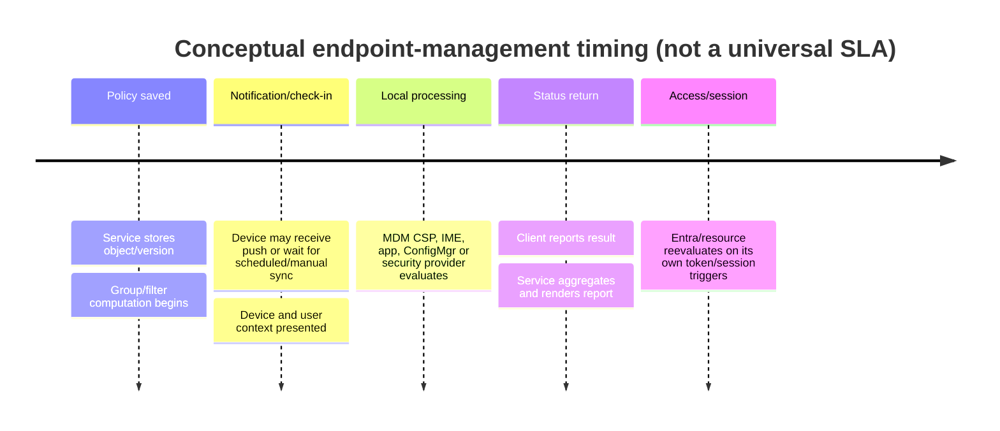

| “Sync” type | What it can trigger | What it cannot fix |
|---|---|---|
| Intune device sync | MDM check-in/request current commands | Unsupported setting, wrong assignment, dead agent |
| Company Portal sync | User-assisted management refresh | Service outage or license gap |
| IME restart/check | Agent reevaluation under documented behavior | Bad package/detection/script |
| ConfigMgr machine policy | ConfigMgr policy retrieval | Intune workload/source issue |
| App launch/check-in | APP/MAM policy/wipe check | Unsupported unmanaged app |
| Entra sign-out/token refresh | New authentication/CA evaluation | Stale Intune compliance source |

Before escalating “propagation delay,” name the exact engine, last evaluation, expected current interval, and evidence that upstream assignment is correct.

## 10. Microsoft Graph automation and operational safety

Microsoft Graph can inventory, create, update, assign and act on supported Intune resources. Automation requires stronger guardrails because mistakes scale quickly.

| Control | Minimum standard |
|---|---|
| Identity | Dedicated workload identity; certificate/federation preferred; no shared user password |
| Permission | Exact Graph scopes and Intune RBAC/application access; recurring review |
| API version | Prefer supported `v1.0`; govern `/beta` change risk |
| Input | Schema validation, target allowlist, tenant/environment ID check |
| Blast radius | Dry run/diff, maximum item/action threshold, canary |
| Approval | Peer/change and MAA where applicable |
| Reliability | Pagination, throttling/backoff, idempotency, partial-failure resume |
| Logging | Actor/app, correlation ID, object/action, status, redaction |
| Secrets/data | Approved vault; no tokens/recovery keys in output |
| Rollback | Previous state and tested restoration; destructive actions blocked by default |

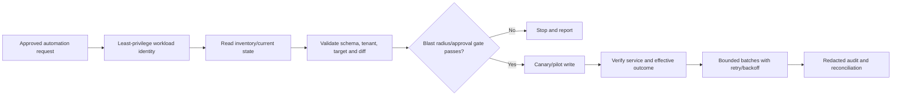

## 11. Remediations and scripts in operations

Remediations pair detection with correction for supported Windows scenarios; scripts can automate configuration or support work. They run with device privileges and must be treated as code.

| Safeguard | Example |
|---|---|
| Clear condition | Detect one measurable state, not “device is unhealthy” |
| Idempotency | Ensure state; do not append/recreate every run |
| Context | System/user and 32/64-bit behavior documented |
| Bounded change | Touch only necessary key/file/service; no broad cleanup |
| Security | Signed/reviewed, no secrets, no download-and-execute from untrusted URL |
| Output | Minimal non-PII status, stable exit codes |
| Failure | Timeouts/retries and explicit error; never return healthy on exception |
| Rollback | Prior state captured or separate tested reversal |
| Scheduling | Frequency matches risk/load; avoid synchronized fleet storm |
| Monitoring | Detection/remediation/error trends and owner |

Never deploy scripts that disable Defender, tamper protection, firewall, certificate validation, logging or UAC as a general support workaround.

## 12. Connectors, certificates, tokens, and expiry operations

| Dependency | Owner/monitor | Failure impact |
|---|---|---|
| Apple APNs certificate | Endpoint platform team; 90/60/30/14/7-day alerts | Apple management communication |
| Apple ADE/Apps and Books tokens | Apple/app owners; expiry and sync | Enrollment/app assignment |
| Managed Google Play binding | Android owner and enterprise account | Android enrollment/apps |
| Certificate connectors/NDES/PKCS/SCEP | PKI/endpoint team; service/cert/queue | Wi-Fi/VPN/client authentication |
| Intune Connector for AD | Hybrid provisioning owner | Classic hybrid Autopilot domain join |
| ConfigMgr cloud attach apps/secrets | ConfigMgr/identity owner; expiry | Device upload/actions/integration |
| CMG certificates/Entra apps | ConfigMgr/Azure/PKI owner | Internet client management |
| Automation app credential | DevSecOps/identity owner | Graph workflows |

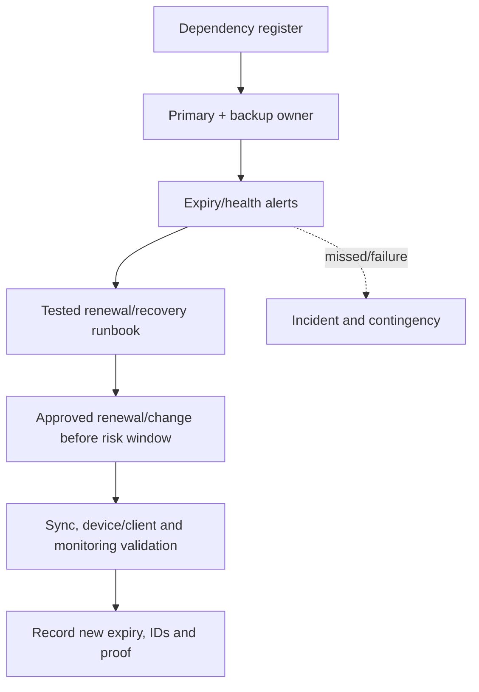

Avoid personal accounts and single custodians. Imported ConfigMgr tenant-attach app credentials may not receive the same console expiry notification, so track them externally.

## 13. Layered troubleshooting method

### 🔍 Plain-English deep-dive: management authority is the dispatcher, effective state is the destination

- **Management authority** — *the service expected to control a workload or setting.* **Analogy:** The dispatcher assigned to send the maintenance crew. **Why it matters:** In co-management, a slider and pilot collection can route one device to Intune while another stays with Configuration Manager.
- **Policy source** — *the actual profile, baseline, GPO, script, app or ConfigMgr object requesting a value.* **Analogy:** The specific work order. **Why it matters:** An authority can own a workload while duplicate old work orders still create confusion or tattooed state.
- **Effective state** — *what the endpoint currently enforces after every source and prerequisite is considered.* **Analogy:** The room's actual temperature, not the dispatch record. **Why it matters:** Portal success or slider position alone does not prove the result.
- **Control device** — *a known-good comparable endpoint outside the changed pilot.* **Analogy:** An unchanged room used to compare the heating fault. **Why it matters:** It helps distinguish service-wide behavior from a workload move, device defect or network path.

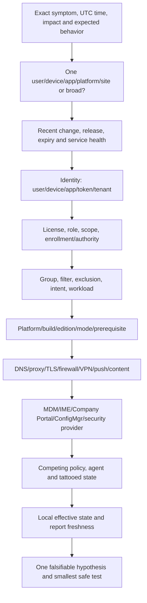

| Layer | Common cause | Evidence |
|---|---|---|
| Identity/token | Wrong tenant/device object, stale token, broker/browser limitation | Entra sign-in/device IDs |
| Licensing | Missing service plan/add-on | Entra license and Product Terms |
| Role/scope | Admin cannot see/act or sees too much | RBAC assignment/scope tag test account |
| Enrollment/authority | Device not managed by intended plane | Intune/ConfigMgr/co-management state |
| Assignment | Group/filter/exclusion/intent mismatch | Effective membership and object IDs |
| Applicability | OS/edition/mode/agent/prerequisite unsupported | Platform inventory/provider docs |
| Network | Proxy/TLS/DNS/ports/service endpoint | Client/proxy/network trace and clean comparison |
| Client/agent | MDM certificate, IME service, ConfigMgr client, Company Portal | Platform logs/health |
| Conflict | GPO/ConfigMgr/Intune/MDE/third party | Authority and effective policy results |
| Service | Intune/Entra/Defender/vendor degradation | Service health and known-good control |

## 14. Failure-pattern matrix

| Symptom | Likely first checks | Avoid |
|---|---|---|
| Admin cannot see device | Scope tag/group/role, tenant-attached default tag | Grant Global Admin |
| Policy pending | Last check-in, target, platform, current version | Re-enroll immediately |
| Policy conflict | Same setting across every source/workload | Assume “Intune wins” |
| App failed | Intent, requirement, IME, content, installer, detection | Delete cache before logs |
| Compliance green but access blocked | Exact sign-in/CA/device ID/token/app | Set device compliant manually |
| Enrollment tenant-wide fails | Service health, cert/token/connector, MDM authority | Reset all devices |
| Remote wipe pending | Device offline/channel/action status | Delete record and call it wiped |
| Graph partial update | Throttling/pagination/idempotency/permissions | Re-run entire destructive batch |
| Co-managed setting ignored | Workload slider/pilot collection/source/provider | Push same setting from both tools |
| ConfigMgr internet client stale | CMG/client identity/site communication | Assume co-management replaces CMG |

## 15. Escalation pack for Microsoft, vendor, or product group

| Field | Required detail |
|---|---|
| Business impact | Users/devices/regions/services, severity, start time, workaround |
| Environment | Tenant/cloud, Intune service release, platform/build, ConfigMgr version/site |
| Reproduction | Minimal exact steps, frequency, expected versus actual |
| Timeline | UTC events, change, first/last occurrence, service incident window |
| Identifiers | Sanitized user/device/object/policy/app/correlation/error IDs |
| Architecture path | Identity, network, management authority, connectors and dependencies |
| Evidence | Relevant logs/reports/screenshots/traces with collection time |
| Comparisons | Known-good/bad device/user/network/ring and only meaningful differences |
| Hypotheses/tests | What was tested, result, what remains falsifiable |
| Changes | Recent and troubleshooting changes; rollback status |
| Ask | Specific owner question/action and urgency |
| Privacy/security | Redaction, secure upload, evidence retention/chain of custody |

Arti's existing escalation discipline is directly applicable: a good pack reduces back-and-forth and keeps ownership factual rather than political.

## 16. Major incident and 24x7 handover

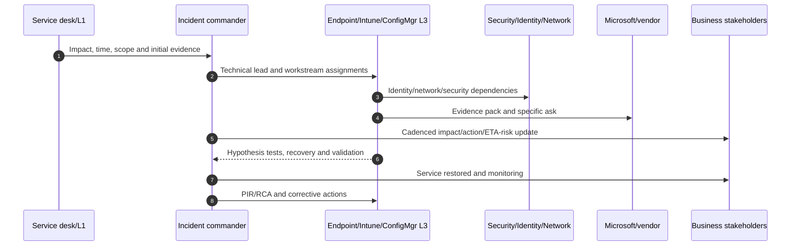

| Handover field | Content |
|---|---|
| Current impact/severity | Exact users/devices/services and business consequence |
| Timeline/changes | UTC summary and latest significant event |
| Working hypothesis | Evidence for/against and confidence |
| Actions completed | Result, not just command executed |
| Pending actions | Owner, due time, dependency and stop condition |
| Risks | Security, data, access, destructive action, SLA |
| Communications | Last/next stakeholder update and audience |
| Access/evidence | Secure locations, case IDs, dashboards, bridge |
| Recovery validation | Positive and negative tests still required |

## 17. Configuration Manager architecture from zero

Microsoft Configuration Manager, historically called SCCM and later Microsoft Endpoint Configuration Manager, is an on-premises/current-branch systems-management product. Use “Configuration Manager” in current design and explain the historical acronym when a client says SCCM.

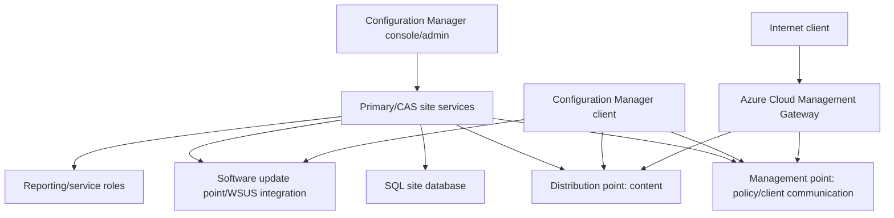

| Component | Plain meaning | Common failure evidence |
|---|---|---|
| Site server | Coordinates hierarchy/site functions | Site component/status logs |
| SQL database | Stores site inventory/configuration/status | SQL/site DB health |
| Management point | Gives policy and receives client data | Client location/policy/MP logs |
| Distribution point | Hosts app/package/update content | Content location/transfer logs |
| Software update point | Integrates update catalog/scan policy | WSUS/SUP sync and scan logs |
| Client | Local agent executing ConfigMgr policy | Client service and component logs |
| Collection | Query/direct membership target group | Evaluation and membership evidence |
| Boundary/group | Maps network location to site/content | Location/DP selection failures |
| CMG | Azure service path to manage internet clients | CMG connection/auth/client logs |

Configuration Manager is not simply “old Intune.” It has deep app, OS deployment, update, inventory, task sequence and on-premises integration capabilities. Migration must map capabilities and business use, not only agents.

## 18. Co-management: two clients, coordinated workload authority

**Co-management** means a supported Windows device has the Configuration Manager client and is enrolled in Intune. Administrators choose which workloads move from Configuration Manager to Intune. It is not the same as Entra hybrid join, tenant attach, or arbitrary third-party MDM coexistence.

### 🔍 Plain-English deep-dive: coexistence versus coordinated authority

- **Co-management** — *Configuration Manager and Intune concurrently manage one Windows device with supported workload controls.* **Analogy:** Two departments share a building with an agreed responsibility chart. **Why it matters:** The slider/pilot assignment says who owns each supported workload.
- **Coexistence** — *Configuration Manager and a third-party MDM both exist without Microsoft's workload coordination.* **Analogy:** Two contractors work in the same building without one shared duty board. **Why it matters:** Duplicate policy/agent limits and conflicts need manual design.
- **Workload** — *a management responsibility such as compliance, updates or endpoint protection.* **Analogy:** Heating, security or maintenance department. **Why it matters:** Moving one workload does not move everything.
- **Pilot collection** — *subset of ConfigMgr clients for which one workload is moved to Intune first.* **Analogy:** One floor tests the new facilities team. **Why it matters:** Each workload can have a different pilot and can remain pilot indefinitely if justified.

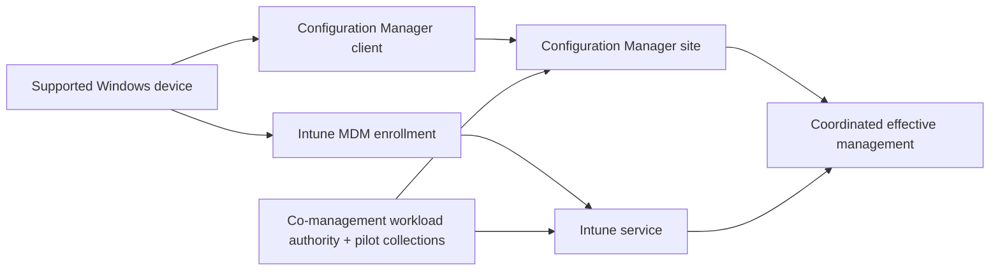

| Prerequisite domain | Current requirement to verify |
|---|---|
| Configuration Manager | Supported current branch and healthy clients/site |
| Windows | Intune-supported Windows version |
| Entra device | Entra joined or hybrid joined; registered-only is not supported |
| Intune | Tenant setup and Windows automatic enrollment |
| Licensing | Entra ID P1/P2 and current Intune/ConfigMgr rights/FAQ |
| Identity/network | Device token, service endpoints, sync; CMG for applicable internet path |
| Roles | Required ConfigMgr, Entra, Intune and Azure roles for setup |
| Duplicates | Clean/correlate stale dual Entra device records before enrollment |

## 19. Paths to co-management and enrollment behavior

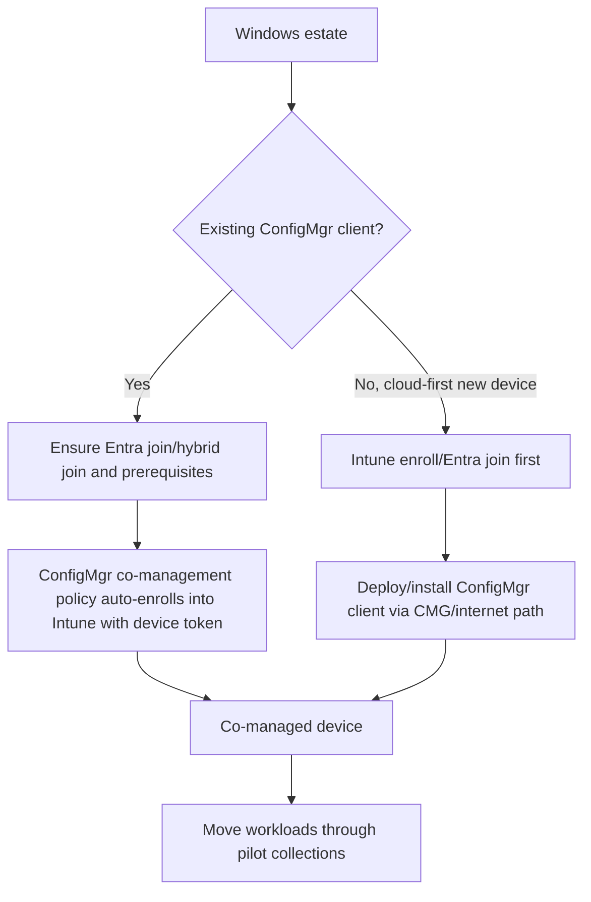

For existing clients, automatic enrollment can be Pilot, All or None. Large estates are randomized/scaled; do not expect all devices instantly. Device-token enrollment does not need a user to sign in under current behavior. Clean duplicate registered/hybrid objects first because they can break enrollment correlation.

For cloud-first internet devices, CMG is commonly required to install and sustain the Configuration Manager client. Validate exact path and authentication.

## 20. Co-management workloads and sliders

| Workload | Configuration Manager owns until | Intune design before move |
|---|---|---|
| Compliance policies | Slider/pilot moves | Platform compliance policies, CA dependencies and coverage |
| Windows Update policies | Slider/pilot moves | Update rings/feature/quality/driver authority; ConfigMgr software updates adjusted |
| Resource access | Legacy workload deprecated/mandated to Intune in current versions | Wi-Fi/VPN/certificate modern replacement and old policy cleanup |
| Endpoint Protection | Slider/pilot moves | Focused endpoint security profiles and MDE/BitLocker conflict map |
| Device configuration | Slider/pilot moves; also affects related workload behavior | Settings Catalog/baselines and GPO/ConfigMgr exception plan |
| Office Click-to-Run apps | Slider/pilot moves | M365 Apps install/update channel and app global conditions |
| Client apps | Slider/pilot moves for app authority/Company Portal experience | Win32/Store/app assignments and Software Center coexistence |

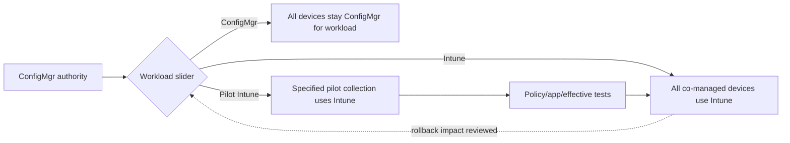

Current documentation says workloads can move back, but impact can remain: installed Windows/Office versions do not roll backward automatically; tattooed settings and app/update state persist. “Move slider back” is not a complete rollback.

## 21. Workload-specific migration traps

| Workload | Trap | Prevention |
|---|---|---|
| Updates | Intune owns update but ConfigMgr software-update client settings remain active | Adjust client settings and prove scan source/authority |
| Endpoint protection | Defender settings sent from device restrictions instead of focused antivirus profile | Use documented endpoint-security policy for slider behavior |
| Device configuration | Settings Catalog belongs to device-configuration workload regardless of settings inside | Do not infer from security content |
| Resource access | Legacy ConfigMgr policies block upgrade/move | Inventory/remove/migrate before site upgrade |
| Office apps | ConfigMgr global condition changes when Intune owns workload | Test installation/update and Company Portal/Software Center |
| Client apps | Same app required in both systems; detection/uninstall collide | App-by-app authority and duplicate suppression |
| BitLocker | Recovery escrow and management agent overlap | Confirm workload/source and key recovery before cutover |
| Scripts | Some Intune scripts can run on co-managed clients independent of client-app slider under documented versions | Inventory all script sources, not slider alone |

## 22. Tenant attach and cloud attach

**Tenant attach** uploads Configuration Manager device information to the Intune admin center and enables supported cloud console actions/features. It can be enabled without automatically enrolling devices into Intune or switching workloads. **Cloud attach** is the broader wizard/umbrella for connecting Configuration Manager to cloud capabilities, including tenant attach and optional co-management enrollment.

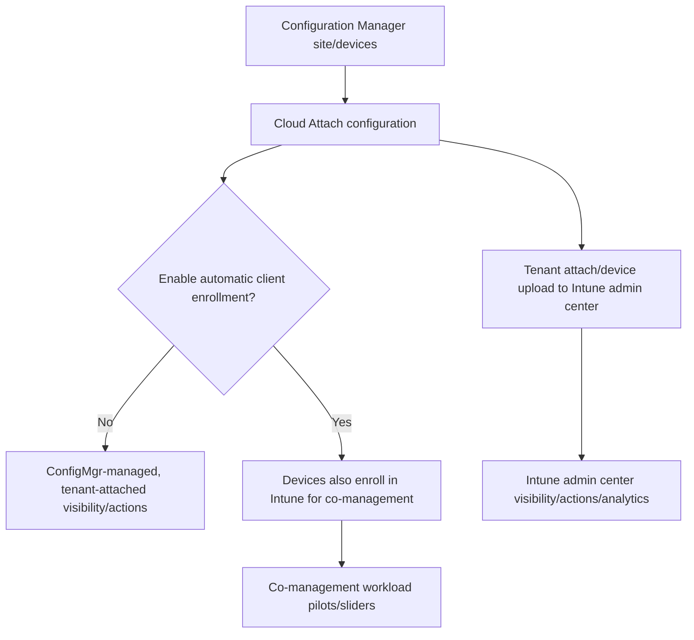

| Feature | Tenant attach | Co-management |
|---|---|---|
| Upload ConfigMgr device records to cloud console | Yes | Can coexist but distinct |
| Requires Intune MDM enrollment | No | Yes |
| Switch workload authority | No | Yes |
| ConfigMgr client required | Yes for uploaded ConfigMgr devices | Yes |
| Supported cloud actions/analytics | Yes, feature-dependent | Yes plus Intune management |
| Scope tag nuance | Tenant-attached devices use documented default tag limitations | Co-managed devices have broader Intune object/tag behavior |

Tenant attach sends documented data to Microsoft; review privacy, residency, RBAC and collection scope. Offboarding device upload is not the same as unenrolling co-managed devices or removing the ConfigMgr client.

## 23. Cloud Management Gateway is a network/service path, not a workload slider

CMG is an Azure cloud service that lets Configuration Manager clients communicate with site roles over the internet without directly exposing on-premises infrastructure.

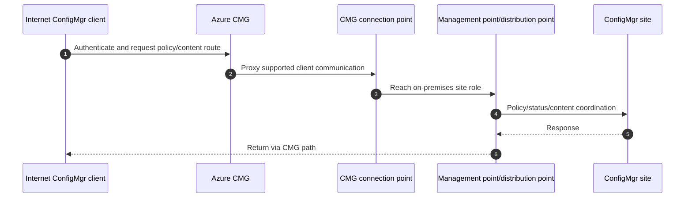

| Statement | Correct interpretation |
|---|---|
| “Co-management manages remote devices” | Intune workloads can, but ConfigMgr client still needs site communication for ConfigMgr work |
| “CMG is required for all co-management” | No; existing clients can enroll without CMG, while specific internet/new-client paths need it |
| “CMG requires co-management” | No; CMG can serve ConfigMgr internet clients independently |
| “Tenant attach replaces CMG” | No; cloud visibility/actions do not replace client-to-site path |

## 24. Migration and coexistence roadmap

```mermaid
flowchart LR
    DISCOVER[Inventory devices, apps, policies, workloads, agents and dependencies] --> HEALTH[Remediate ConfigMgr/Entra/Intune health and duplicates]
    HEALTH --> ATTACH[Optional tenant attach for visibility/value]
    ATTACH --> ENROLL[Co-management pilot enrollment]
    ENROLL --> W1[Move low-risk/high-value workload pilot]
    W1 --> W2[Move endpoint/update/config/app workloads in dependency order]
    W2 --> CLOUD[Cloud-first provisioning/operations]
    CLOUD --> DECOM[Retire ConfigMgr roles/client only after capability and rollback gates]
```

| Phase | Exit criteria |
|---|---|
| Discover | Accurate inventory, authority and capability map |
| Stabilize | Supported versions, healthy clients/site, Entra records, licenses and network |
| Attach | Data/privacy/RBAC approved and cloud visibility validated |
| Enroll | Representative pilot co-managed with correct identities |
| Workload pilots | Intune policy/app exists, tests pass, ConfigMgr source adjusted |
| Scale | Metrics/support/rollback capacity meet thresholds |
| Decommission | No required capability/dependency, retention/recovery complete, business accepts |

Do not make the first migration step “uninstall ConfigMgr client.” Preserve management while target capabilities become effective.

## 25. Duplicate policy and agent conflicts

| Conflict class | Example | Resolution |
|---|---|---|
| Same setting | Firewall/Defender/BitLocker from both planes | Workload authority + one policy source |
| Same app | ConfigMgr required install and Intune supersedence/uninstall | One deployment owner and detection map |
| Same update | WSUS/SUP scan plus Intune Windows Update policy | Move workload and adjust client settings |
| Two security agents | Third-party AV/DLP/VPN plus Defender/modern replacement | Supported coexistence, staged agent removal |
| Two MDMs | Intune plus third-party MDM | Platform limitations and migration sequence |
| Tattooed state | Old ConfigMgr/GPO setting persists after move | Explicit supported reset/new authoritative value |
| Duplicate device object | Registered and hybrid/joined records | Correlate/clean stale object before auto-enrollment |

Performance issues can be agent contention, filter drivers, scanning loops, duplicate VPN/network filters, or update ownership. Gather process, driver, service and management-source evidence before blaming “Intune.”

## 26. Testing and rollback for co-management

| Test | Expected evidence |
|---|---|
| Enrollment | Device shows correct Entra/Intune/ConfigMgr IDs and co-management status |
| Pilot membership | Only intended collection receives Intune workload |
| Authority | Effective policy source matches slider and exception design |
| App | Company Portal/Software Center behavior and no duplicate install/uninstall |
| Update | Correct scan/update source, deadlines and reporting |
| Endpoint protection | Defender/firewall/encryption settings and recovery keys correct |
| Internet | ConfigMgr client reaches CMG; Intune independently checks in |
| Offline/outage | Cached policy and recovery behavior documented |
| Slider rollback | Authority returns, but persistent versions/settings are reconciled |
| Offboard | Tenant attach/co-management/CMG removed separately according to scope |

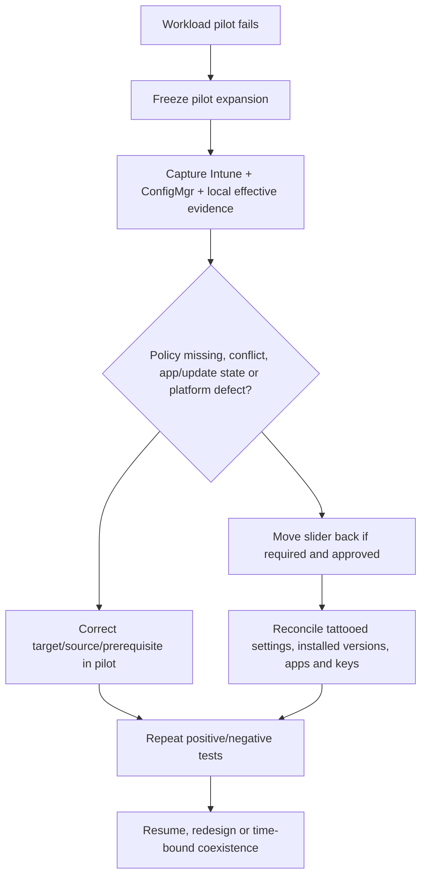

## 27. Operational readiness and 24x7 acceptance

| Readiness domain | Acceptance evidence |
|---|---|
| Architecture | Current/target diagrams, authority and data flows approved |
| Access | RBAC/scope/MAA tested with personas; emergency access documented |
| Monitoring | Dashboards, thresholds, service/connector/expiry alerts active |
| Runbooks | Enrollment, policy, app, compliance, security, update, remote action, co-management |
| Tooling | Secure diagnostics/upload, Graph automation, ticket integration |
| People | L1/L2/L3/SOC/identity/network/vendor RACI and contacts |
| Training | Scenario-based practice and knowledge checks |
| Continuity | Service outage, offline, certificate expiry, CMG/site and rollback plans |
| Metrics | Baseline measured and reporting cadence agreed |
| Handover | Open risks, known errors, exceptions, changes and warranties accepted |

Do not declare handover complete because documentation was sent. Require operational acceptance, access tests, scenario drills, owner signatures and hypercare exit criteria.

## 28. Metrics and continual improvement

| Metric | Definition | Decision it supports |
|---|---|---|
| Managed/fresh coverage | Intended endpoints with current Intune/ConfigMgr contact | Inventory and lifecycle health |
| Enrollment success/P95 time | Successful enrollments and long-tail duration | User/platform readiness |
| Policy/app/compliance error age | Persistent failures by owner | Problem management |
| MTTI/MTTR | Time to isolate and restore | Support maturity |
| Remote-action completion/pending | Outcome by action and age | Channel/lost-device operations |
| Expiry risk | Dependencies inside warning window | Preventive maintenance |
| Change failure/rollback rate | Changes causing incident or reversal | Engineering quality |
| Graph automation partial failures | Incomplete batches and reconciliation | Automation reliability |
| Co-management coverage/workload | Devices by enrollment and authority | Migration progress |
| Duplicate policy/agent/device debt | Known overlaps and stale records | Rationalization roadmap |
| Shift-handover defects | Incidents delayed by missing context | 24x7 process quality |
| User contact/CSAT | Support demand and experience | Communications/self-service improvement |

Use a problem-management backlog: recurring enrollment failures, package detection defects, expiring connectors, policy conflicts, stale devices, unsupported clients and manual toil should become owned corrective work, not endless incident tickets.

## 29. Consulting scenarios

### Scenario A: Regional help desk cannot see its devices

Test with the actual help-desk account. Inspect role assignment, members, scope group, device/user membership, scope tags/default tag and device management type. Do not grant Global Administrator. Correct the smallest RBAC component and retest positive and negative visibility.

### Scenario B: A remote wipe remains pending

Verify the exact live device ID, ownership, last contact and action audit. If offline/lost, pair identity/session containment with incident/lost-device process. Do not delete the record and report successful wipe; preserve pending evidence and track physical/asset outcome.

### Scenario C: Co-managed Windows Update behavior is inconsistent

Confirm workload slider and pilot collection, ConfigMgr software update client settings, effective Windows Update policy/GPO, target feature/quality policy, scan source, safeguard and timestamps. Compare one pilot and one control. Move one authority only after target policy is ready.

### Scenario D: Tenant attach is requested “to migrate everything”

Clarify that tenant attach uploads ConfigMgr device data and exposes supported cloud console value; it does not enroll devices or move workload authority. Present cloud attach options, privacy/RBAC, co-management prerequisites, workload roadmap and explicit decommission gates.

### Scenario E: An overnight enrollment outage affects Apple only

Check service health and APNs/ADE token/certificate status, Apple service/network endpoints, last successful enrollment and changes. Preserve Company Portal/setup logs, identify renewal owner, communicate impact and workaround, renew only through governed same-artifact procedure, validate existing and new devices, then complete RCA on expiry governance.

## 30. Consulting artifacts

| Artifact | Minimum contents |
|---|---|
| Intune operating model | Services, roles, processes, tools, governance, continuity |
| RBAC/scope/MAA matrix | Personas, permissions, groups, tags, approvals, reviews |
| Monitoring catalogue | Report/metric, freshness, threshold, owner, runbook |
| Remote-action matrix | Intent, role, approval, platform, verification, limits |
| Diagnostics catalogue | Platform logs, collection, redaction, retention |
| Expiry/dependency register | Artifact/service, owner, backup, alert, recovery |
| Troubleshooting field guide | Layered flow, evidence and discriminating checks |
| Escalation/handover templates | Impact, timeline, IDs, evidence, ask, owners |
| ConfigMgr/co-management HLD | Site/CMG/tenant attach/enrollment/workload flows |
| Workload migration matrix | Current/target authority, pilot, tests, rollback, residual state |
| 24x7 readiness pack | RACI, severity, access, dashboards, runbooks, drills, acceptance |

## 31. Safe paper lab and evidence exercise

This exercise makes no tenant, site, device, script, policy, role, or remote-action change.

### Fictional brief

Contoso has 5,000 ConfigMgr-managed Windows devices, 1,000 remote laptops, 400 Intune-only mobile devices, regional help desks, MDE, expiring Apple and PKI connectors, inconsistent app/update ownership, and a 24x7 support requirement. The client wants tenant attach, co-management pilots and an eventual cloud-first target.

### Steps

1. Draw current and target architecture: ConfigMgr site roles, CMG, Intune, Entra, MDE, connectors and clients.
2. Build an RBAC assignment table with role, members, scope groups, scope tags, MAA and positive/negative tests.
3. Create a report/metric catalogue with definition, freshness, threshold, owner and runbook.
4. Write a safe remote-action workflow for sync, diagnostics, retire, wipe and delete.
5. Build platform diagnostic and redaction checklists.
6. Create a connector/certificate/token register with 90/60/30/14/7-day controls.
7. Design a least-privilege Graph workflow and script/remediation review checklist.
8. Use the layered troubleshooting flow for one app, one compliance/access and one enrollment case.
9. Compare tenant attach, co-management and CMG in a client-facing table.
10. Design co-management prerequisites, enrollment pilot and one pilot collection per workload.
11. Create workload-specific tests, duplicate-policy/agent controls and rollback/residual-state actions.
12. Run a 02:00 major-incident handover and produce an escalation pack, stakeholder update and PIR actions.

### Evidence to retain

| Evidence | Interview value | Honesty label |
|---|---|---|
| Operating model/RBAC matrix | Governance and least privilege | Fictional paper design |
| Metrics/expiry catalogues | Preventive operations | Synthetic entries |
| Layered runbook/escalation pack | Production support transfer | Synthetic case/IDs |
| ConfigMgr/co-management architecture | Transformation knowledge | Not administered |
| Workload migration/rollback matrix | Controlled coexistence | Proposed sequence |
| 24x7 handover/PIR | Incident leadership | Tabletop only |

## 32. JD Mapping: interview translation

| Prompt | Truthful answer structure |
|---|---|
| Operate Intune | RBAC → monitor → change/action safeguards → logs/runbooks → incidents → metrics/improvement |
| Troubleshoot broadly | Symptom/scope/time → change/health → identity/license → target/applicability → network/client/authority → hypothesis |
| Explain SCCM/co-management | ConfigMgr architecture → Intune enrollment → sliders/pilot collections → tenant attach/CMG distinctions → migration/rollback |
| Lead 24x7 handover | Impact/timeline/hypothesis/actions/owners/risks/comms/evidence/next tests |
| Explain experience gap | Production M365 support operations and RCA + current paper co-management/operating artifacts |

## 33. Official Source Anchors

| Topic | Official Microsoft source |
|---|---|
| Intune RBAC | [Role-based access control for Intune](https://learn.microsoft.com/en-us/intune/fundamentals/role-based-access-control/overview) |
| Scope tags and Scoped permissions preview | [Use RBAC and scope tags for distributed IT](https://learn.microsoft.com/en-us/intune/fundamentals/role-based-access-control/scope-tags) |
| Multiple Administrative Approval | [Use MAA access policies](https://learn.microsoft.com/en-us/intune/fundamentals/role-based-access-control/multi-admin-approval) |
| Intune reports | [Intune reports overview](https://learn.microsoft.com/en-us/intune/device-management/reports/overview) |
| Audit logs | [Audit logs for Intune activities](https://learn.microsoft.com/en-us/intune/governance/monitor-audit-logs) |
| Service health/status | [View Intune service status](https://learn.microsoft.com/en-us/intune/fundamentals/tenant-status) |
| Remote actions | [Remote device actions](https://learn.microsoft.com/en-us/intune/device-management/actions/) |
| Collect diagnostics | [Collect diagnostics from a device](https://learn.microsoft.com/en-us/intune/device-management/actions/collect-diagnostics) |
| Policy refresh/troubleshooting | [Questions with policies and profiles](https://learn.microsoft.com/en-us/intune/device-configuration/troubleshoot-device-profiles) |
| IME logs | [Understand the Intune Management Extension](https://learn.microsoft.com/en-us/intune/device-management/tools/management-extension-windows) |
| Remediations | [Deploy remediations in Intune](https://learn.microsoft.com/en-us/intune/device-management/tools/deploy-remediations) |
| Graph and Intune | [Working with Intune in Microsoft Graph](https://learn.microsoft.com/en-us/graph/api/resources/intune-graph-overview) |
| ConfigMgr architecture | [Fundamentals of Configuration Manager](https://learn.microsoft.com/en-us/intune/configmgr/core/understand/fundamentals-of-configuration-manager) |
| Co-management overview/prerequisites | [Co-management for Windows devices](https://learn.microsoft.com/en-us/intune/configmgr/comanage/overview) |
| Enable co-management/pilots | [Enable co-management](https://learn.microsoft.com/en-us/intune/configmgr/comanage/how-to-enable) |
| Workload sliders | [Co-management workloads](https://learn.microsoft.com/en-us/intune/configmgr/comanage/workloads) |
| Tenant attach | [Enable Intune tenant attach](https://learn.microsoft.com/en-us/intune/configmgr/tenant-attach/device-sync-actions) |
| Cloud attach | [Cloud attach overview](https://learn.microsoft.com/en-us/intune/configmgr/cloud-attach/overview) |
| CMG | [Cloud management gateway overview](https://learn.microsoft.com/en-us/intune/configmgr/core/clients/manage/cmg/overview) |
| Monitor co-management | [Monitor co-management](https://learn.microsoft.com/en-us/intune/configmgr/comanage/how-to-monitor) |
| What's new | [What's new in Microsoft Intune](https://learn.microsoft.com/en-us/intune/fundamentals/whats-new) |

---

## ⭐ Likely Interview Questions for This Section

### Q1. How do Intune RBAC scope groups and scope tags differ?

> **Model answer:** The role definition grants actions, members receive the assignment, scope groups limit which users/devices they may manage, and scope tags limit visibility/management of tagged Intune objects and devices. Scope tags do not target policy to endpoints. I test least privilege with the real admin persona, including positive and negative cases, and protect membership with PIM/MFA/access reviews. I do not use Global Administrator to mask a bad role design.

### Q2. What evidence do you collect before resetting or re-enrolling a device?

> **Model answer:** Exact UTC time, user/device/tenant and Entra/Intune IDs, enrollment/mode/authority, last check-in, policy/app/compliance status, correlation/error IDs, MDM diagnostic report and platform events, Company Portal/IME/Autopilot logs as relevant, network/proxy evidence, recent changes and a known-good comparison. I secure and redact the bundle. Reset/re-enrollment changes IDs and can erase the first failure, so it follows evidence and a falsifiable hypothesis.

### Q3. How do you make remote actions safe?

> **Model answer:** I verify the requester, exact live device/app record, physical asset, user, ownership and business intent; check platform behavior and contact; use least-privilege RBAC, ticket/incident approval and MAA where configured; record action/correlation; then verify actual device/data outcome separately from portal status. Wipe and delete are not synonyms, pending does not mean complete, and a mass action needs blast-radius and daily-limit controls.

### Q4. Describe your layered Intune troubleshooting method.

> **Model answer:** I define symptom, scope, UTC time, expected behavior and recent changes; check service/expiry; then identity/device/app/token, license/role/enrollment authority, assignment/filter/intent/workload, platform applicability, network, client/agent/provider, competing policy/agent/tattooing, and report freshness. I preserve logs, state one falsifiable hypothesis, run the smallest safe comparison, and escalate with IDs, timeline, evidence and a specific ask.

### Q5. What is co-management, and how is it different from tenant attach and CMG?

> **Model answer:** Co-management means a supported Windows device has both the ConfigMgr client and Intune enrollment, with workload authority coordinated through ConfigMgr/Intune sliders and pilot collections. Tenant attach uploads ConfigMgr device data to the Intune admin center and enables supported cloud visibility/actions without necessarily enrolling devices or moving workloads. CMG is an Azure communication path for ConfigMgr internet clients to site roles. They can work together but solve different problems.

### Q6. How do you move a co-management workload safely?

> **Model answer:** I verify current-branch/Entra/Intune/license/network health and clean duplicate device objects. I inventory current policy/app/agent authority, build and test the equivalent Intune workload first, select a representative pilot collection, move only that workload to Pilot Intune, adjust ConfigMgr settings that would still compete, and validate local effective state plus both consoles. I scale by gates. Rollback includes moving authority back and reconciling installed versions, tattooed settings, apps and keys.

### Q7. What belongs in a 24x7 endpoint-management handover?

> **Model answer:** Current impact/severity and UTC timeline; affected identities/devices/services; recent changes; working hypothesis and evidence for/against; actions and actual results; pending actions with owner/due time; security/data/SLA risks; service/vendor cases; last/next communications; secure evidence/dashboard links; access needs; rollback state; and exact positive/negative recovery tests. Handover is accepted by the next owner, not just sent.

### Q8. How does your background support this role without claiming Intune or SCCM production ownership?

> **Model answer:** I bring production Microsoft 365 escalation operations: critical incidents, structured RCA, cross-team/vendor coordination, stakeholder updates, knowledge articles, KPIs/business reviews, mentoring and handover. I have translated that into a current paper Intune operating model and ConfigMgr/co-management migration with RBAC, reports, evidence, workload pilots, rollback and 24x7 readiness. I would execute with the platform owners and state clearly that the design exercise is not production administration.

---

## 🧠 30-Second Memory Hooks

- **Operate Intune** = govern → deliver → observe → support → improve.
- **RBAC role** says what; **scope group** says which users/devices; **scope tag** says which labeled objects are visible.
- **MAA** adds a second pair of eyes; it does not replace asset/impact verification.
- **Remote action** = verified request → approval → queued command → device contact → real outcome.
- **Preserve before reset** = IDs + UTC + logs + state + comparison.
- **Sync is engine-specific**; it cannot fix wrong scope, unsupported policy or broken code.
- **Graph safety** = least privilege + diff + blast-radius gate + canary + reconciliation.
- **Expiry incident** is prevented by owner + backup + alerts + tested renewal.
- **SCCM/ConfigMgr** = site/database + management point + distribution point + client.
- **Co-management** = two clients with a workload responsibility chart.
- **Tenant attach** uploads visibility; **CMG** carries ConfigMgr internet traffic; neither is a workload slider.
- **Pilot Intune** moves one workload for one collection; moving back does not undo persistent state.
- **Handover is a transaction:** next owner accepts impact, hypothesis, actions, risk and next tests.
- **Candidate honesty** = production support operations plus current paper platform design.

---

## Completion Checklist

- [ ] I can design people/process/technology/evidence for an endpoint-management service.
- [ ] I can explain role definitions, members, scope groups, scope tags, PIM and MAA.
- [ ] I can classify reports and account for freshness, coverage and privacy.
- [ ] I can operate audit, service health, Message center and release-readiness workflows.
- [ ] I can execute remote-action governance and distinguish queued status from outcome.
- [ ] I can collect/redact platform diagnostics before destructive troubleshooting.
- [ ] I can explain native MDM, IME, APP, ConfigMgr and token/session timing separately.
- [ ] I can design least-privilege Graph and remediation/script safeguards.
- [ ] I can manage Apple/Google/PKI/AD/CMG/app credential expiry dependencies.
- [ ] I can use the layered troubleshooting method and build an escalation pack.
- [ ] I can explain Configuration Manager site roles and CMG architecture from zero.
- [ ] I can distinguish co-management, coexistence, tenant attach, cloud attach and CMG.
- [ ] I can list co-management prerequisites, workloads, pilot collections and migration traps.
- [ ] I can design workload tests, rollback and residual-state reconciliation.
- [ ] I can define operational readiness, 24x7 handover, metrics and problem management.
- [ ] I completed or can explain the safe paper lab as non-production evidence.
- [ ] I can answer Q1-Q8 aloud and preserve Arti's honesty boundary.
- [ ] I will verify current tenant/site version, licensing, privacy, preview, retirement and workload guidance.

---

*Next suggested section:* [Part 21](Part-21-exchange-online-architecture-mail-flow.md) — apply the same identity, dependency, least-privilege, evidence, service-health and troubleshooting disciplines to Exchange Online recipients, transport, DNS, connectors, permissions, auditing, hybrid mail flow and message tracing.