# Part 21 — Exchange Online Architecture, Identity, Permissions, and Mail Flow

> **Section goal:** Build a beginner-first mental model of Exchange Online as an identity-aware messaging service rather than “an inbox in the cloud.” By the end, you should be able to explain recipients, permissions, DNS, transport stages, connectors, hybrid routing, email authentication, client access, auditing, service operations, and a safe method for diagnosing delivery, relay, spoofing, and mail-loop failures.

This Part maps directly to the Deloitte expectation to assess, design, configure, test, troubleshoot, and operationalize Microsoft 365 workloads. It turns Arti's demonstrated SharePoint Online, OneDrive, sync, migration, escalation, RCA, and customer-support evidence into a disciplined Exchange consulting approach without implying production Exchange security ownership. [Part 22](Part-22-eop-defender-office-365.md) adds the EOP and Defender for Office 365 protection stack after this mail-flow foundation.

> **Currency, portal, licensing, and change-sensitive note:** Product behavior and links were checked against official Microsoft Learn content available on **August 24, 2026**. Exchange Online limits, service descriptions, mailbox entitlements, archive features, transport rule predicates, connector validation, message trace experiences, SMTP AUTH controls, hybrid requirements, modern-authentication behavior, DNS guidance, and portal navigation change. The Exchange admin center is currently reached at `admin.exchange.microsoft.com`; Microsoft 365 service health and Message center remain separate operational sources. Recent Microsoft mail-flow guidance also warns that relay from unknown senders through on-premises paths is being tightened. Verify the current Exchange Online service description, Product Terms, Message center, accepted-domain/connector documentation, and tenant-specific rollout before implementation. Preview behavior must never be treated as a contractual production control.

## JD Mapping

| Deloitte role expectation | Capability developed here | Consulting evidence produced |
|---|---|---|
| Assess Microsoft 365 workload security | Inventory recipients, domains, routing, permissions, protocols, authentication and operations | Exchange current-state assessment workbook |
| Design and configure secure services | Select hosted/hybrid flow, connectors, TLS, DNS authentication, RBAC and delegation | High-level design, low-level settings register and decision log |
| Troubleshoot complex incidents | Correlate trace, headers, NDR, connector, DNS, audit, client and service-health evidence | Layered diagnostic tree and escalation pack |
| Deliver transformation safely | Use pilots, positive/negative tests, rollback triggers and ownership gates | Deployment and rollback plan |
| Work across vendors and protocols | Separate DNS, SMTP, TLS, identity, gateway, Exchange and recipient boundaries | Dependency map, RACI and vendor action list |
| Communicate with technical and business stakeholders | Translate delivery and spoofing risk into impact, controls and measurable outcomes | Executive summary, risk register and operational-readiness report |

## Candidate honesty note

Arti can directly claim production experience in SharePoint Online and OneDrive support, synchronization and migration troubleshooting, critical incidents, RCA, customer communication, evidence collection, product-group/vendor escalation, documentation, metrics, and Microsoft 365 service dependencies. Those skills transfer strongly to Exchange diagnosis: identify scope, preserve timestamps and IDs, isolate the failing layer, validate the fix, and communicate risk.

Arti should **not** claim production ownership of Exchange Online architecture, hybrid mail flow, connectors, transport rules, SMTP relay, Exchange RBAC, DKIM/DMARC rollout, mailbox protocols, or Exchange security configuration. Safe interview wording is:

> “My direct production depth is SharePoint Online, OneDrive, sync, migration, Microsoft 365 escalation, RCA, and stakeholder management. Exchange Online security implementation is current learning and paper-lab evidence. I can explain the architecture, design controls and tests, read trace/header/NDR evidence, and lead a structured investigation, but I would partner with the Exchange, DNS, identity, network, security, and compliance owners for production change.”

---

## 1. Exchange Online in one plain-English picture

Exchange Online is Microsoft's cloud service for email, calendars, contacts, tasks, address books, and mailbox-backed collaboration. A **tenant** is the organization's logical Microsoft 365 boundary. An **Exchange organization** is the Exchange configuration inside that tenant: accepted domains, recipients, policies, connectors, rules, permissions, and operational settings.

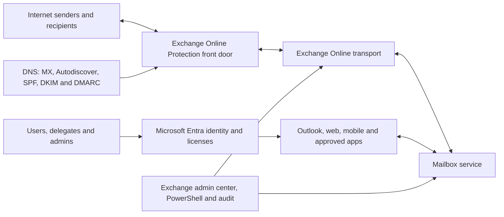

| Layer | Plain meaning | Primary evidence | Typical owner |
|---|---|---|---|
| Identity | Who the user, app or admin is | Entra sign-in, object and license | Identity team |
| Namespace/DNS | Where mail and clients should go | MX, CNAME/SRV, TXT and certificate names | DNS/domain team |
| Protection edge | First cloud connection and filtering point | Headers, trace, connector and filter verdicts | Messaging/security team |
| Transport | Routing, rules and delivery decisions | Message trace, rule audit and NDR | Messaging team |
| Mailbox | Stored mail/calendar and delegate access | Mailbox audit, permissions and client tests | Messaging/compliance team |
| Client/network | How Outlook or an app reaches service | Client logs, token, proxy, TLS and endpoint state | Endpoint/network/app team |

**Analogy:** Exchange Online is a secure postal system. DNS publishes the address, the protection edge is the receiving dock, transport is the sorting center, rules are handling instructions, a mailbox is the recipient's locked compartment, and identity determines which key a person holds.

## 2. Tenant, organization, object, and workload boundaries

The tenant is broader than Exchange. Microsoft Entra ID supplies users, groups, applications and authentication. Exchange adds mail-enabled properties and stores mailbox content. SharePoint stores Teams channel files; OneDrive stores chat-shared files; Exchange can store group conversations, calendars, compliance copies, or application-generated messages. A consultant must identify the **system of record** and not assume every object shown in one portal is owned there.

### 🔍 Plain-English deep-dive: identity object versus recipient

- **Identity object** — *a directory record for a user, group, device, or application.* **Analogy:** A person in the corporate directory. **Why it matters:** Authentication, group membership and licensing begin here.
- **Recipient** — *an Exchange object that can receive or represent an email address.* **Analogy:** A postal destination registered for delivery. **Why it matters:** A contact can be a recipient without being a sign-in identity; a user can exist before a mailbox is licensed.
- **Mailbox** — *a recipient with cloud storage for messages and calendar items.* **Analogy:** A lockable office mailbox with filing space. **Why it matters:** Mailbox permissions, protocols, archive and retention behavior apply to stored content.
- **Source of authority** — *the system allowed to change an attribute.* **Analogy:** The official records office. **Why it matters:** In synchronized environments, an Exchange attribute may need correction on-premises rather than in the cloud.

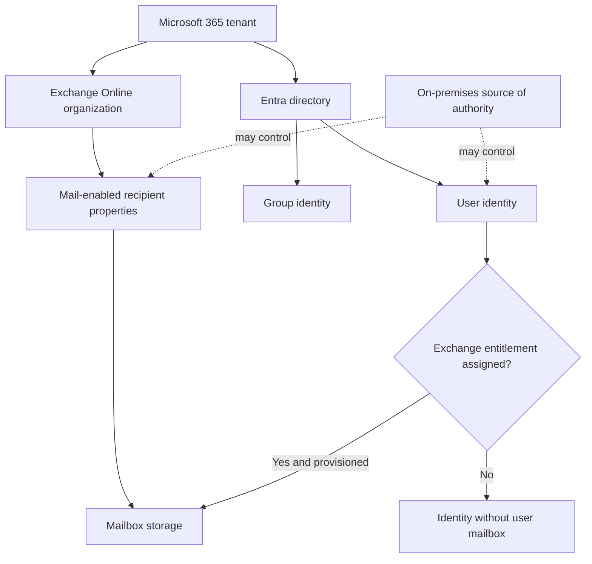

| Question | Why ask it before changing anything? |
|---|---|
| Is the object cloud-only or synchronized? | Determines where authoritative attributes are edited |
| Is it a user, shared/resource mailbox, group, contact or mail user? | Changes permissions, licensing and routing expectations |
| Which primary/proxy addresses exist? | Prevents conflicts and wrong-address diagnosis |
| Which license and service plan are assigned? | Provisioning and feature availability depend on entitlement |
| Is the mailbox on hold or retained? | Deletion/conversion can have legal and storage consequences |
| Which apps and delegates use it? | A “mailbox change” can break workflows and business processes |

## 3. Recipient types and when to use each

| Recipient | What it is | Common use | Security/governance concern |
|---|---|---|---|
| User mailbox | Licensed user identity plus personal mailbox | Employee email/calendar | Joiner-mover-leaver, delegate access, compromise |
| Shared mailbox | Mailbox accessed by delegates, normally no direct human sign-in | Support, finance, reception address | Orphan delegates, Send As abuse, licensing thresholds/features |
| Room mailbox | Resource mailbox representing a room | Meeting booking | Auto-processing and external booking rules |
| Equipment mailbox | Resource mailbox representing equipment | Vehicle/projector booking | Approval and booking ownership |
| Distribution group | Expands one address to members | Broadcast/list communication | Who may send, hidden members, stale ownership |
| Dynamic distribution group | Membership calculated from attributes at send time | Department/location targeting | Bad attributes create wrong audience |
| Mail-enabled security group | Email distribution plus permission assignment | Access and mail together | Coupled purposes complicate lifecycle |
| Microsoft 365 group | Cross-workload membership with mailbox, calendar and SharePoint site | Team collaboration | Guest/member lifecycle and connected resources |
| Mail contact | Address-book object pointing to an external address | External partner display | Spoof/confusion and stale external destination |
| Mail user | Entra user with external target address rather than cloud mailbox | Coexistence/migration | Source-of-authority and target-address errors |

Shared and resource mailbox licensing is **change-sensitive**. A shared mailbox might not require a separate Exchange license within current size and feature limits, but archive, hold, storage, Defender, Purview, or other capabilities can require licensing. Never use “shared means free” as a design rule. Confirm the current service description and every enabled feature.

## 4. Identity, licensing, provisioning, and offboarding

Mailbox creation is not one atomic event. The identity exists, an Exchange service plan is assigned, background provisioning creates the mailbox, addresses and policies apply, and clients discover the service. In hybrid identity, synchronized attributes and remote-mailbox objects complicate the path.

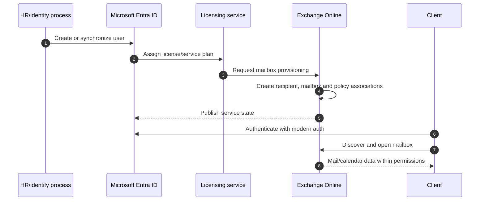

| Lifecycle phase | Required control | Failure evidence |
|---|---|---|
| Joiner | Approved identity, naming/address, correct license, role-free baseline | Object ID, license assignment, provisioning state |
| Mover | Validate aliases, group membership, delegates, policies, retention and ownership | Before/after export and approvals |
| Leave/disable | Block sign-in, revoke sessions, preserve content, transfer ownership, remove forwarding | Entra/audit/hold/delegate evidence |
| Convert/delete | Confirm legal, license, archive, shared mailbox and restore-window requirements | Change record and recovery test |
| Guest/vendor expiry | Review contacts, mail users, groups and connector dependencies | Owner attestation and stale-object report |

Removing a license can eventually affect mailbox availability and retention. Exact soft-delete, inactive-mailbox, hold and restoration behavior is feature- and timing-sensitive. A safe offboarding runbook coordinates identity, Exchange, Purview, HR, legal, application ownership, and data-transfer requirements before license removal.

## 5. Mailbox databases are a service abstraction

On-premises Exchange administrators manage servers, database availability groups, mailbox databases and queues. In Exchange Online, Microsoft operates the physical servers, storage replicas and high availability. Customers manage the **logical service configuration** and consume service health and contractual availability. A mailbox database may appear as an internal service concept or diagnostic property, but customers do not place cloud mailboxes into self-managed databases.

| Customer controls | Microsoft operates | Shared operational boundary |
|---|---|---|
| Recipients, addresses, licenses, connectors, rules, policies, roles | Physical datacenters, servers, storage, replication, patching | Service incidents and tenant configuration interaction |
| DNS and sending sources | Core transport and mailbox platform | Delivery limits, throttling and support escalation |
| Client/app configuration | Platform availability and maintenance | Protocol health, modern authentication and client compatibility |
| Retention/hold configuration | Durable service implementation | Data lifecycle outcome and evidence |

**Consulting implication:** Do not promise a server-level fix in SaaS. Preserve message IDs, timestamps, tenant IDs, trace evidence, affected regions and reproduction data so Microsoft can investigate the platform boundary.

## 6. The transport pipeline from front door to mailbox

Incoming internet mail normally reaches the Microsoft 365 protection hostname published in the recipient domain's MX record. The service evaluates the connection and message, resolves recipients, applies transport logic, routes the message, and delivers it to the mailbox. The exact internal pipeline is a managed service and evolves; use the conceptual stages for troubleshooting, not as a contractual implementation map.

### 🔍 Plain-English deep-dive: envelope, header, body, and delivery

- **SMTP envelope** — *the sender and recipient commands used by mail servers.* **Analogy:** Routing information written on a parcel wrapper. **Why it matters:** The envelope sender can differ from the visible From address and receives NDRs.
- **Message header** — *metadata such as From, To, Date, Message-ID and Received lines.* **Analogy:** Stamps and tracking labels accumulated during transit. **Why it matters:** Headers reveal hops, authentication results and timing.
- **Body** — *the content and attachments the person reads.* **Analogy:** What is inside the parcel. **Why it matters:** Rules, malware scanning and compliance controls can inspect or act on it.
- **Categorization/resolution** — *the service determines valid recipients, policies and route.* **Analogy:** The sorting center looks up the destination. **Why it matters:** Recipient, accepted-domain and routing errors surface here.

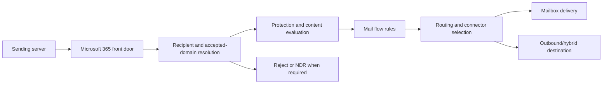

| Stage | Question | Evidence |
|---|---|---|
| Connection | Which IP connected, and was TLS negotiated? | `Received` headers, connector logs/trace, certificate details |
| Envelope | Which MAIL FROM and RCPT TO values were used? | Header/trace/NDR and sending-system log |
| Resolution | Is recipient/address/domain valid? | Recipient object, accepted domain, DBEB behavior |
| Filtering/rules | Which verdict or rule changed disposition? | Headers, policy/rule trace and audit |
| Routing | Which connector/domain path was selected? | Connector scope, route, TLS requirement and trace |
| Delivery | Was it delivered, redirected, quarantined or failed? | Message trace, mailbox search/user confirmation, NDR |

## 7. DNS: MX, Autodiscover, and mail-authentication records

**Domain Name System (DNS)** turns names into service-routing information. An **MX record** tells other mail systems where to deliver mail for a domain. An **Autodiscover** record helps supported Outlook clients find mailbox configuration. TXT/CNAME records support SPF, DKIM, DMARC and domain verification.

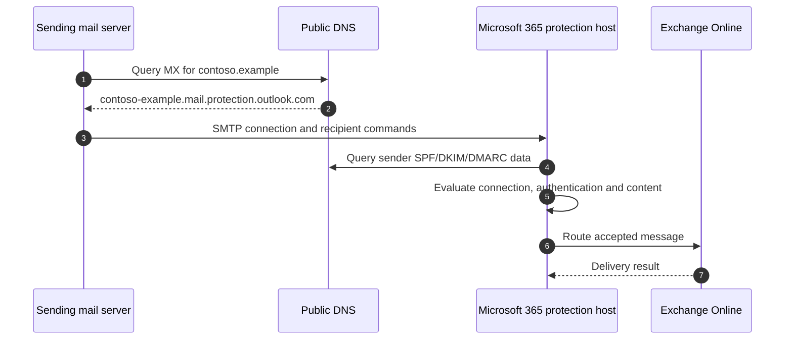

| DNS item | Purpose | Frequent failure |
|---|---|---|
| MX | Inbound routing | Old gateway target, wrong priority, propagation/cached record |
| Autodiscover CNAME/SRV | Client discovery | Split DNS, stale on-premises endpoint, proxy interception |
| SPF TXT | Authorized sending sources for envelope domain | Multiple SPF records, too many lookups, missing SaaS sender |
| DKIM CNAME | Locates public key for Microsoft signing selector | Wrong target, selector disabled, stale domain setup |
| DMARC TXT | Alignment policy and aggregate/forensic reporting choices | Enforcement before source inventory, wrong reporting address |
| Domain verification TXT | Proves ownership to Microsoft 365 | Record removed too early or created in wrong DNS zone |

DNS changes have time-to-live and resolver caching. Record the authoritative answer, resolver used, timestamp, old/new value and expected TTL. “The portal shows it” is not proof that the public internet sees it.

## 8. Accepted domains and remote domains are different controls

An **accepted domain** tells Exchange which SMTP namespaces the organization handles. An **authoritative** accepted domain means Exchange expects every valid recipient to exist in the organization and can reject unknown recipients. An **internal relay** domain permits unresolved recipients to route onward, typically during coexistence. Treat internal relay as a temporary, tightly designed routing state because mistakes can create loops or unintended relay behavior.

A **remote domain** controls message-format and automatic-reply behavior for recipients in another domain; it does not establish ownership or routing by itself.

| Control | It answers | It does not answer |
|---|---|---|
| Accepted domain | “Do we accept/route this recipient namespace?” | “Which connector is secure?” |
| Remote domain | “How should messages/features behave toward that domain?” | “Do we own that domain?” |
| Connector | “Which route and TLS/identity restrictions apply?” | “Is every recipient valid?” |
| Mail flow rule | “What action applies when conditions match?” | “Is DNS correct?” |

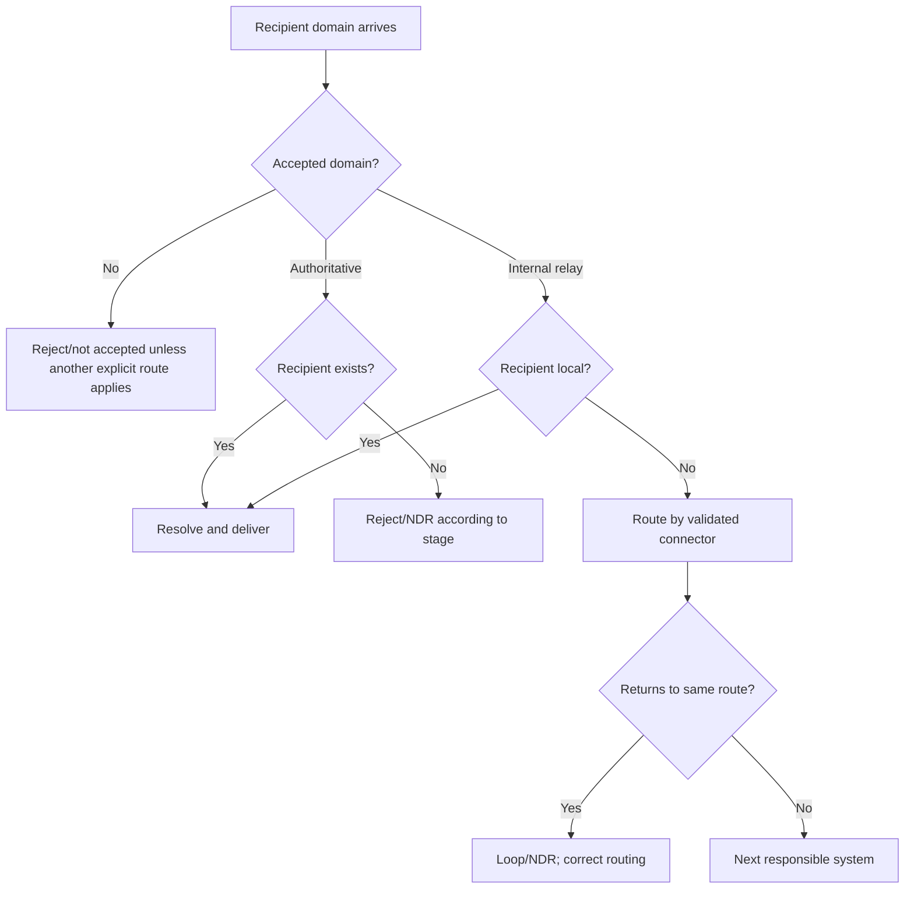

## 9. Connectors: controlled paths between mail systems

A connector is a configuration that recognizes or routes mail between Microsoft 365 and another system, such as on-premises Exchange, a partner, a third-party gateway, or a line-of-business service. Connector security can use direction, sender/recipient domain, source IP, certificate subject, smart host, and TLS requirements. Exact options depend on connector type.

### 🔍 Plain-English deep-dive: connector identity and TLS

- **Connector** — *a controlled mail lane with matching and routing conditions.* **Analogy:** A dedicated loading dock contract. **Why it matters:** Overbroad matching can trust attacker traffic or cause relay.
- **Smart host** — *a named server to which outbound mail is deliberately sent.* **Analogy:** A designated next depot. **Why it matters:** DNS-based delivery is bypassed for that route.
- **Transport Layer Security (TLS)** — *encryption and server authentication for the SMTP connection.* **Analogy:** A sealed truck whose depot identity is checked. **Why it matters:** “TLS used” is weaker than validating the expected certificate identity.
- **Opportunistic TLS** — *try encryption if the peer supports it, otherwise behavior may fall back.* **Analogy:** Use a sealed truck when available. **Why it matters:** Sensitive partner flow may require enforced TLS instead.

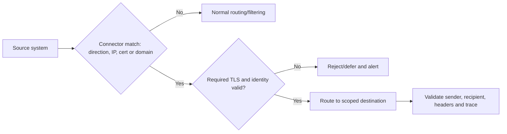

| Design check | Secure question |
|---|---|
| Scope | Is the connector limited to the exact source/destination? |
| Identity | Is source IP stable, or can certificate validation be stronger? |
| TLS | Is encryption required and is the expected certificate name validated? |
| Relay | Can an unauthenticated external party use this route? |
| Filtering | Does bypassing or changing trust reduce protection accuracy? |
| Resilience | What happens when the smart host, certificate or network path fails? |
| Evidence | Are validation results, headers and negative tests retained? |
| Lifecycle | Who owns IP/certificate/domain renewal and decommissioning? |

Do not create a broad rule that sets spam confidence to bypass filtering merely to fix delivery. Correct authentication, connector identity and source attribution first; Part 22 covers secure coexistence with gateways.

## 10. Mail flow rules: powerful, ordered, and risky

Mail flow rules, historically called **transport rules**, evaluate messages against conditions, exceptions and actions. They can add disclaimers, reject messages, route for approval, set headers, apply encryption or change handling. Rules can interact, and “stop processing more rules” changes downstream evaluation.

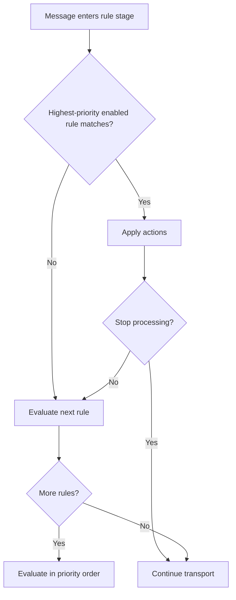

| Rule design field | Required documentation |
|---|---|
| Business/security objective | The risk or requirement, not just a setting |
| Conditions and exceptions | Exact predicates, data types and expected matches |
| Priority/interaction | Rules before/after and stop-processing behavior |
| Action | User, delivery, compliance and security impact |
| Mode | Test/audit/enforce capability currently supported |
| Scope | Pilot recipients/domains and exclusions |
| Tests | Positive, negative, boundary and rule-interaction cases |
| Rollback | Disable/revert trigger and owner |
| Expiry/review | Temporary exception date and attestation |

Common failures include matching the visible From when the design meant envelope sender, regex mistakes, missing exceptions, disclaimers breaking DKIM signatures, redirect loops, and priority conflicts. Export current rules and preserve audit evidence before editing.

## 11. Hosted, hybrid, centralized, and decentralized mail flow

In **hosted mail flow**, cloud mailboxes and Microsoft 365 handle normal inbound/outbound routing. In **hybrid**, some recipients or dependencies remain on-premises and connectors establish coexistence. **Centralized mail transport** routes cloud outbound traffic through on-premises infrastructure before the internet. A decentralized/direct model lets cloud mail use Microsoft 365 egress while on-premises mail uses its defined path.

| Pattern | Benefit | Cost/risk | Prefer when |
|---|---|---|---|
| Cloud hosted | Simpler path, fewer dependencies, full cloud edge context | Migration and legacy-app changes required | Cloud is target state |
| Hybrid direct | Coexistence without forcing all cloud egress on-prem | Two operating surfaces and synchronized objects | Staged mailbox migration |
| Centralized transport | Existing inspection/journaling or regulatory path retained | Latency, on-prem dependency, loops, source attribution loss | Requirement is proven and temporary/managed |
| Third-party gateway | Specialized filtering or migration coexistence | Double filtering, connector trust and attribution complexity | Capability/business case justifies it |

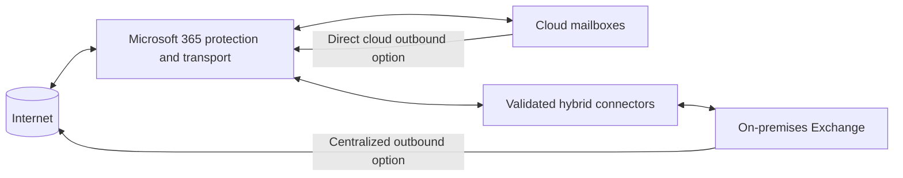

Hybrid design also includes free/busy, migration, Autodiscover, OAuth, certificates, namespaces, recipient synchronization and supportability. The Hybrid Configuration Wizard is not a substitute for documenting actual routes and ownership. Centralized transport should not be preserved from habit; validate the control requirement and resilience tradeoff.

## 12. SMTP relay, application sending, and anti-relay boundaries

Applications, printers and services often need to send mail. Common patterns include authenticated client submission, direct send to recipients in accepted domains, an inbound connector based on a controlled source, or a relay service. Feature support and authentication requirements evolve, especially for SMTP AUTH and basic authentication.

| Pattern | Authentication/identity | Recipient reach | Main risk |
|---|---|---|---|
| Modern application/API | OAuth/app permission or supported Graph/workload method | Permission-dependent | Excess application permission and secret lifecycle |
| Authenticated SMTP submission | Mailbox identity with supported auth | Service limits and policy-dependent | Legacy/basic auth, credential theft, throttling |
| Direct send | Source sends to tenant MX | Usually internal accepted recipients | No general internet relay; source reputation/filtering |
| Connector-based relay | Trusted IP/certificate and scoped connector | Designed domains | Open relay if source/scope is broad |
| On-prem relay | Internal relay service routes onward | Policy-dependent | Unpatched relay, weak network trust, loops |

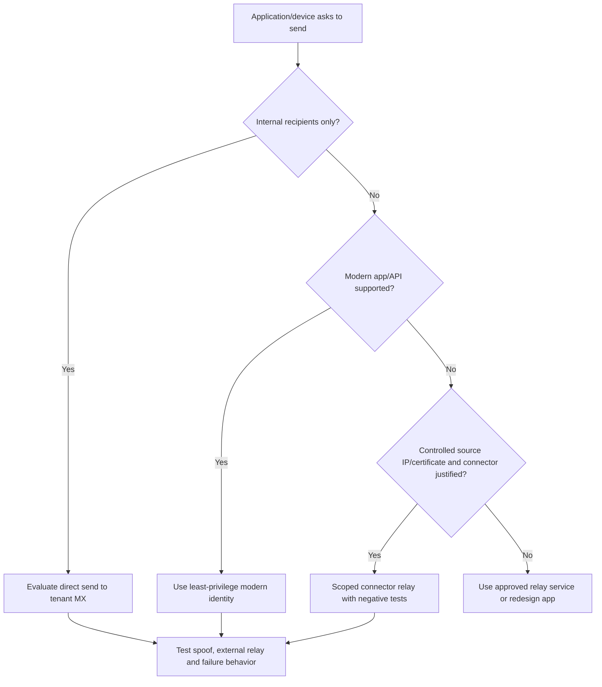

An **open relay** accepts mail from untrusted sources and sends it onward. Negative testing must prove that an unknown internet source, wrong certificate, wrong IP, unauthorized sender, and unauthorized recipient domain cannot use the path.

## 13. SPF: authorize envelope-sender infrastructure

**Sender Policy Framework (SPF)** is a DNS TXT policy listing systems permitted to send for the envelope sender domain. Receivers compare the connecting IP with that record. Publish only one SPF record per domain; include every legitimate source; respect DNS-lookup limits; and remember that subdomains need their own policy.

SPF alone does not prove the visible From domain. Forwarding can break SPF because the forwarding server becomes the connecting IP. Use SPF as one layer, not a complete anti-spoof solution.

| SPF rollout step | Evidence |
|---|---|
| Inventory all senders | Business owner, domain, source, volume and purpose |
| Remove obsolete sources | Owner confirmation and traffic observation |
| Build/flatten only with governance | Valid single TXT policy and lookup-count check |
| Start monitored policy where appropriate | Authentication results and aggregate reports |
| Move toward `-all` when inventory is reliable | No unexplained legitimate failures |
| Review after SaaS/vendor change | Change record and recurring ownership review |

## 14. DKIM: sign message content with a domain key

**DomainKeys Identified Mail (DKIM)** adds a cryptographic signature to selected headers and content. The receiving server retrieves the public key through DNS and verifies that signed elements were not altered. In Microsoft 365 custom-domain setup, selectors and CNAME targets are published and signing is enabled in the service.

DKIM can survive ordinary forwarding because it does not depend on the final connecting IP, but services that modify signed content can invalidate it. A valid DKIM signature is useful only when the signing domain aligns appropriately for DMARC.

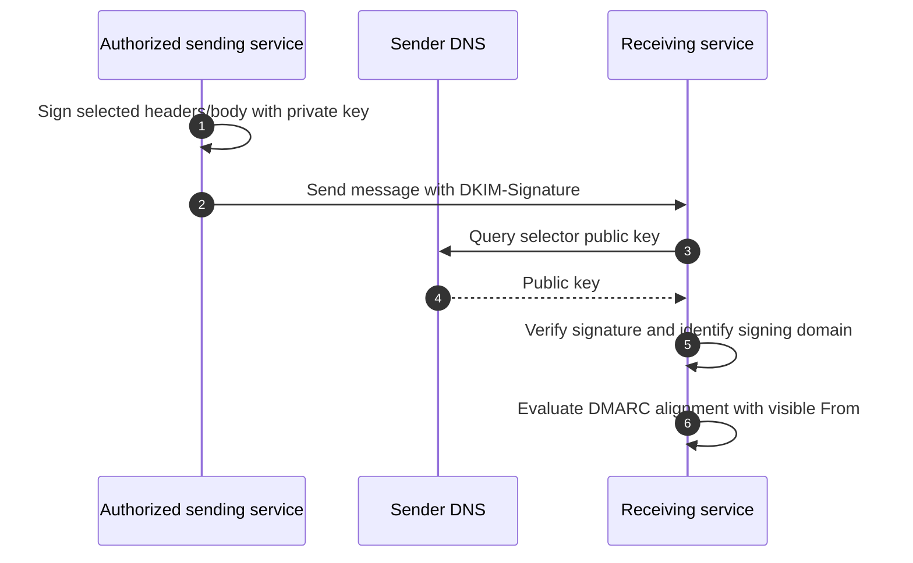

Key rotation, selector state, third-party senders, subdomains, forwarding, disclaimers and list modification belong in the design. Never share a private DKIM key in a ticket or documentation repository.

## 15. DMARC: align authentication with the visible sender

**Domain-based Message Authentication, Reporting and Conformance (DMARC)** checks whether SPF or DKIM passes **and** aligns with the domain in the visible `From:` address. It publishes a requested policy: monitor (`p=none`), quarantine, or reject, plus reporting addresses and optional percentage/subdomain settings.

### 🔍 Plain-English deep-dive: pass is not alignment

- **SPF pass** — *the connecting source is authorized for the envelope domain.* **Analogy:** The delivery truck is approved by the name on the return label. **Why it matters:** The visible sender can still show a different domain.
- **DKIM pass** — *the signature validates for its signing domain.* **Analogy:** A tamper seal from one company is intact. **Why it matters:** That company might not match the brand shown to the user.
- **Alignment** — *the authenticated SPF or DKIM domain matches, strictly or organizationally, the visible From domain.* **Analogy:** The truck authorization or seal belongs to the brand printed on the parcel. **Why it matters:** This closes a major spoofing gap.
- **DMARC report** — *receiver feedback about observed authentication.* **Analogy:** A daily report of every depot claiming your brand. **Why it matters:** It discovers unknown legitimate senders and abuse before enforcement.

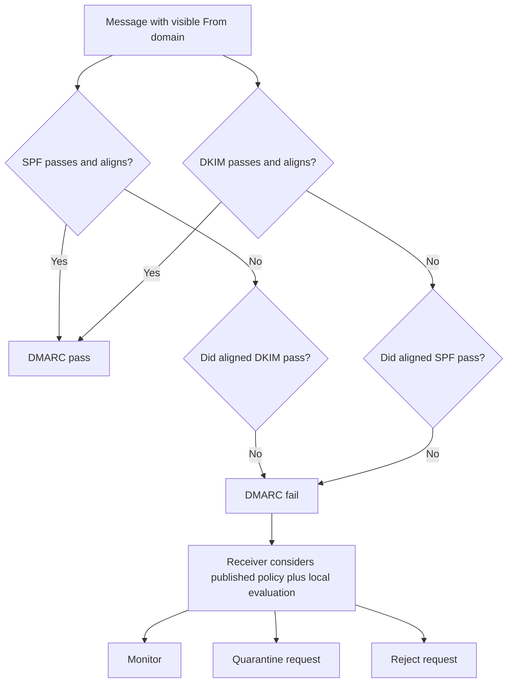

| Rollout phase | Action | Exit criterion |
|---|---|---|
| Discover | Inventory domains, subdomains, vendors and parked domains | Named owner for every source |
| Authenticate | Correct SPF and enable aligned DKIM | Expected mail passes consistently |
| Monitor | Publish DMARC reporting with `p=none` | Reports parsed and unexplained sources resolved |
| Constrain | Apply percentage/quarantine where appropriate | False-positive process and rollback ready |
| Enforce | Move to quarantine/reject per risk decision | Business, security and domain owners approve |
| Sustain | Review reports, keys and vendors | Recurring metric and change process operates |

DMARC is not a one-day DNS task. Use a controlled rollout and include non-mailing/parked domains. **Authenticated Received Chain (ARC)** can preserve authentication context through trusted intermediaries, but trust must be explicit and narrowly governed.

## 16. RBAC and administrative delegation

Exchange Online uses **role-based access control (RBAC)**. Management roles contain permissions; role groups grant administrative responsibilities; scopes constrain where supported; role assignment policies govern end-user self-service capabilities. Microsoft Entra directory roles can also grant broad Exchange administration. Use the least-privileged supported role, privileged identity controls, separate admin identities, audit, access reviews and emergency procedures.

| Persona | Likely need | Avoid |
|---|---|---|
| Help desk | Read recipient state and approved low-risk actions | Organization-wide rule/connector control |
| Recipient admin | Manage defined mailbox/group properties | Security policy and unrestricted content access |
| Transport engineer | Rules, connectors, trace and routing | Global Administrator |
| Security analyst | Investigation and protection evidence | Routine mailbox delegation changes |
| Compliance investigator | Approved search/audit/hold role | Messaging configuration outside case scope |
| Automation identity | Exact supported app/RBAC capability | Shared user password or broad unattended admin |

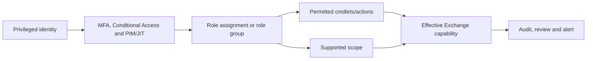

Do not test least privilege while signed in as Global Administrator. Use dedicated test personas and prove both allowed and denied actions.

## 17. Mailbox delegation: Full Access is not Send As

| Permission | What it allows | What it does not automatically allow |
|---|---|---|
| Full Access / Read and manage | Open and manage mailbox content | Send as that mailbox |
| Send As | Message appears from mailbox/delegated identity | Read mailbox content |
| Send on Behalf | Message shows delegate on behalf of mailbox | Hide delegate identity as Send As does |
| Folder/calendar permission | Access defined folder/calendar capability | Entire mailbox or arbitrary sending |

Delegation should use governed groups where supported, named owners, business approval, expiry/review, and mailbox audit. Watch for hidden persistence: old delegates, automapping, mobile profiles, inbox rules, forwarding, application access and cached tokens can make access appear inconsistent.

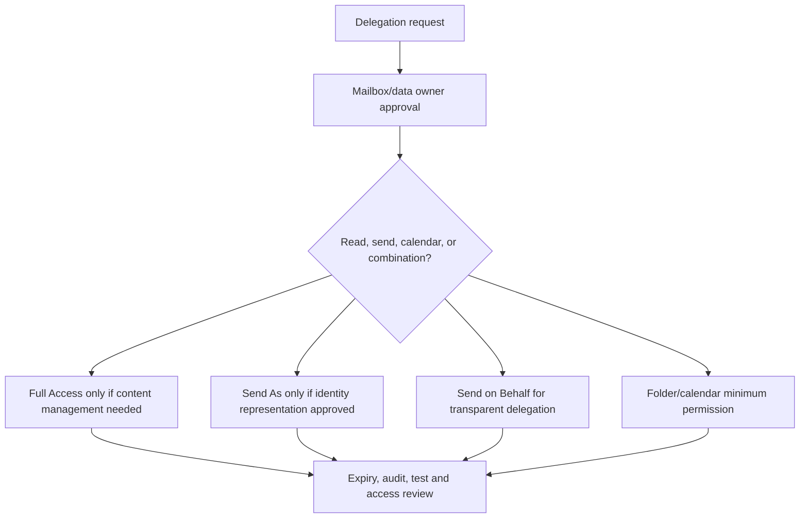

## 18. Modern authentication and mailbox protocols

**Modern authentication** uses OAuth tokens issued after Entra authentication rather than repeatedly sending a mailbox password to the service. Conditional Access, MFA, device state and session controls can participate. Protocol support and client behavior vary.

| Access method | Common role | Security question |
|---|---|---|
| Outlook on the web | Browser mailbox access | CA/session/browser/device controls and phishing resistance |
| Outlook desktop/mobile | Rich client | Supported build, token state, add-ins and device posture |
| Exchange ActiveSync | Mobile synchronization protocol | Is it needed; are clients supported and governed? |
| IMAP/POP | Legacy-style message retrieval | Can it be disabled; is OAuth supported by required app? |
| SMTP AUTH | Client submission | Is it disabled tenant/mailbox-wide unless justified and modern-auth capable? |
| Microsoft Graph/API | Application access | Delegated/application permission, consent, scoping and audit |
| EWS | Legacy service API in many integrations | Current support/deprecation path and migration plan |

Basic authentication retirement and protocol changes are ongoing. Never solve a client problem by re-enabling basic authentication broadly. Identify the app, protocol, token flow, service principal, permission and replacement roadmap.

## 19. Auditing, forwarding, inbox rules, and compromise indicators

Mailbox and administrative audit records help reconstruct actions, but availability, searchable operations and retention depend on current licensing and configuration. Preserve UTC time, user/object IDs, operation, client/app identity, IP, result and correlation data.

| Signal | Why investigate it |
|---|---|
| New external forwarding | Possible data exfiltration or business-process change |
| Inbox rule moving/deleting messages | Common account-compromise persistence/evasion |
| Added delegate or Send As | Unauthorized access or impersonation |
| New connector/rule | Tenant-level routing or filtering manipulation |
| SMTP AUTH/client app use | Legacy credential abuse or unexpected application |
| Unusual send volume/restricted sender | Compromised account or misconfigured app |
| Mailbox search/export/hold change | Sensitive compliance/security action |

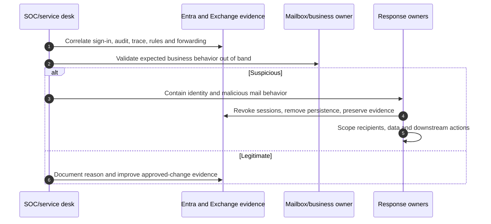

Part 22 expands phishing/BEC response. Do not delete evidence or malicious rules before recording their content, timestamps and scope unless immediate containment requires action; document every change.

## 20. Archive, retention, and holds are related but not interchangeable

An **archive mailbox** provides additional mailbox storage and lifecycle behavior. A **retention policy/label** or Exchange messaging-records capability governs preservation/deletion based on policy. A **hold** preserves content for investigation or legal requirements. Purview features, licenses and precedence are covered in Parts 26–30.

| Concept | Primary purpose | Dangerous assumption |
|---|---|---|
| Archive mailbox | Additional managed mailbox storage | “Archive automatically means legally preserved” |
| Retention policy/label | Keep/delete content according to policy | “Deleting from view means permanently deleted” |
| Litigation/eDiscovery hold | Preserve content for legal/investigative need | “Turning off hold immediately deletes everything” |
| Deleted-item recovery | User/admin recovery window | “It replaces backup/business continuity” |
| Inactive mailbox | Preserve certain departed-user mailbox content under qualifying hold/retention | “Any unlicensed mailbox becomes inactive safely” |

Before license removal, conversion or deletion, obtain legal/compliance confirmation and test restoration against the exact tenant policy.

## 21. Message trace: follow the service's delivery record

Message trace answers where Microsoft 365 observed a message and which major events occurred. Search inputs commonly include sender, recipient, time range and message identifier. Experiences, retention windows and detailed-event availability change; use the current Exchange admin center documentation.

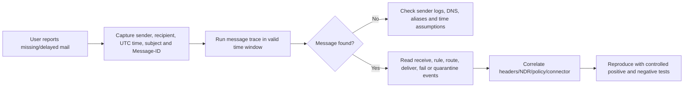

| Trace result | Next question |
|---|---|
| Delivered | Which folder, rule, delegate, client view or retention action followed? |
| Failed | What SMTP status, enhanced code and responsible hop are shown? |
| Pending/deferred | Is the destination unavailable, throttled or rejecting temporarily? |
| Quarantined/filtered | Which policy/verdict and who may release? |
| Expanded | Which group members existed at send/evaluation time? |
| Redirected/forwarded | Which rule, mailbox setting or transport action caused it? |
| Not found | Did Microsoft receive it; are time, addresses and Message-ID correct? |

Subject alone is weak evidence because it is not unique and may be modified. Prefer Internet Message-ID plus exact UTC timestamps and addresses.

## 22. Headers: reconstruct hops and authentication

Read `Received` headers from bottom to top to reconstruct the path, while recognizing that untrusted senders can forge headers below the first trusted receiving hop. Inspect `Authentication-Results`, `Received-SPF`, DKIM signature/result, DMARC result, antispam headers and organization-specific stamps.

| Header field | Use | Caution |
|---|---|---|
| Message-ID | Correlate sender/recipient/trace copies | Some systems regenerate or omit malformed IDs |
| Received | Hop, server and time sequence | Trust boundary matters; clocks and forged lines |
| Return-Path | Final envelope sender representation | Different from visible From by design in many systems |
| From | Visible author shown to user | Can be spoofed without aligned authentication |
| Authentication-Results | SPF/DKIM/DMARC/composite outcomes | Read domains, reasons and evaluating receiver |
| DKIM-Signature | Selector, signing domain and signed fields | A passing signature can be nonaligned |
| X-Forefront/X-Microsoft headers | Filtering/tenant processing clues | Names/values evolve and need current docs |

Never paste full production headers into public tools. Headers can contain addresses, IPs, internal names, tenant IDs, message IDs and security verdicts. Use approved analysis tooling and redact only after retaining a secure original.

## 23. NDRs and enhanced SMTP status codes

A **non-delivery report (NDR)** says a message could not be delivered. The most useful information is the enhanced status code, diagnostic text, responsible server/hop, original recipient and timestamp. Codes beginning conceptually with `4.x.x` are usually transient; `5.x.x` are permanent, but the diagnostic detail controls the response.

| Failure family | Example interpretation | Investigation |
|---|---|---|
| Recipient/address | Unknown, disabled or ambiguous recipient | Verify recipient object, proxy addresses, accepted-domain mode |
| Policy | Blocked by organization rule/filter | Identify policy/rule and approved exception path |
| Authentication/relay | Sender not permitted or relay denied | Connector, auth, source IP/cert, domains and route |
| Size/format | Message or attachment exceeds limit | Compare all hop, mailbox and client limits |
| TLS/certificate | Secure channel requirement failed | Certificate name, chain, expiry, protocol and connector |
| Routing/DNS | Domain/host unreachable or loop | MX, smart host, connector, accepted domain and hop count |
| Throttling/reputation | Temporary deferral or sending restriction | Volume, retry, compromised sender and service limits |

Do not retry permanent failures endlessly. Do not delete NDR diagnostic text from escalations.

## 24. Queues in cloud and hybrid thinking

In Exchange Online, customers normally use trace and service evidence rather than inspecting Microsoft-managed transport queues. In hybrid/on-premises Exchange, queue viewer/cmdlets and server logs can show messages waiting locally. A third-party gateway has its own queue and message tracking.

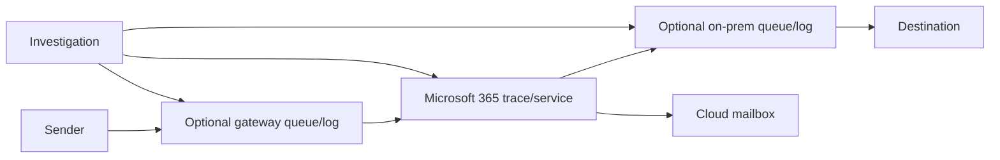

The question is not “Is there a queue?” but “Which system last accepted responsibility, what response did the next hop return, and is retry still occurring?” SMTP logs on both sides are decisive at vendor boundaries.

## 25. Layered mail-flow troubleshooting method

1. **Define scope:** one sender, recipient, domain, direction, location, client, application or all traffic?
2. **Normalize time:** capture UTC start/end and timezone of reports.
3. **Preserve identifiers:** tenant, sender, recipient, Message-ID, NDR, trace ID, connector and case IDs.
4. **Check changes and service health:** DNS, certificate, rule, connector, migration, license, identity, gateway and Microsoft advisory.
5. **Locate last success:** sender submission, gateway acceptance, Microsoft receipt, transport route or mailbox delivery.
6. **Test a competing hypothesis:** another sender, recipient, domain and route.
7. **Fix the controlling layer:** not a broad bypass.
8. **Validate positive and negative behavior:** delivery must work and unauthorized relay/spoof must still fail.
9. **Monitor and document:** trace, authentication, latency and recurrence.

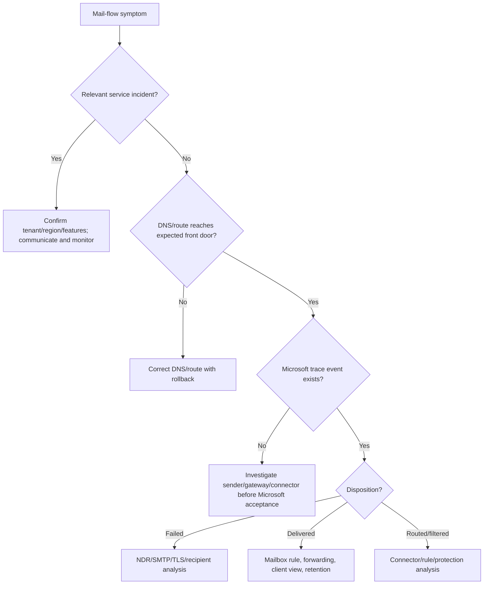

## 26. Failure and troubleshooting matrix

| Symptom | Leading hypotheses | Discriminating evidence | Unsafe shortcut |
|---|---|---|---|
| External mail missing | MX/gateway, recipient, filter, connector | Public DNS, sender log, trace, NDR | Add global allow rule |
| Outbound mail rejected | SPF/DKIM/DMARC, reputation, connector, compromise | Remote NDR, headers, sending source, volume | Add every vendor to SPF blindly |
| One mailbox cannot receive | License/provisioning, proxy conflict, delivery restriction | Recipient object, trace, NDR | Delete/recreate mailbox |
| Delay | Deferral, greylisting, attachment scan, route outage | Hop timestamps, trace events, SMTP response | Repeated manual resend |
| Client cannot connect | Token, CA, Autodiscover, proxy, protocol disabled | Sign-in, client logs, DNS and OWA comparison | Enable legacy auth |
| Hybrid recipient loop | Accepted domain/target address/connector route | Repeated Received hops, trace and objects | Increase hop limit |
| App relay failure | Wrong method, source IP/cert, TLS/auth | App SMTP log, connector match, NDR | Open relay by IP range |
| Unexpected Send As | Delegation, app permission, compromise | Permissions, audit, sign-ins, headers | Remove evidence before scope |

## 27. Scenario: mail loop after migration

**Situation:** Users receive NDRs with too many hops after a mailbox migration. Trace shows the message leaves Microsoft 365 for on-premises and returns.

**Method:** Freeze unrelated connector/rule changes. Capture one full header and Message-ID. Compare the recipient's cloud mailbox state, on-premises remote-mailbox/target address, accepted-domain type and both connector scopes. Draw the actual route. Test one migrated and one unmigrated recipient. Correct the authoritative object or route, not the symptom. Validate no loop, both directions, free/busy dependencies where relevant, and unauthorized relay denial.

**Consulting statement:** The root cause is a contradictory source-of-authority/routing decision, not “Exchange is slow.” The corrective action includes object reconciliation, route tests and a migration preflight control.

## 28. Scenario: relay denied for a line-of-business app

**Situation:** An application can send internally but receives a relay-denied NDR externally.

**Method:** Confirm whether direct send was intentionally chosen; direct send is not a general external relay pattern. Inventory app capability, source stability, volume, recipients and authentication support. Prefer a supported modern API/workload identity. If a connector relay is justified, scope source IP/certificate and sender domains, require TLS where appropriate, apply sending limits/monitoring, and negative-test wrong source, wrong sender and unauthorized domain.

**Rollback:** Disable the new connector/routing rule and return the app to the approved prior relay. Never broaden the connector during incident pressure without an explicit risk decision.

## 29. Scenario: apparent internal spoofing

**Situation:** A message appears to come from the CFO but the CFO did not send it.

**Method:** Preserve headers and trace. Compare visible From, envelope sender, DKIM signing domain, SPF result, DMARC alignment, composite authentication, connector path and submitting identity. Determine whether the message came from the internet, an application, a compromised account, delegated Send As, or an overtrusted connector. Contain based on source: identity response, connector correction, application control, or email-authentication/protection tuning.

**Do not:** Create a rule that trusts any message with the CFO's address. Part 22 adds impersonation protection, mailbox intelligence, campaign scoping and response.

## 30. Service health and operational readiness

| Operational capability | Minimum acceptance evidence |
|---|---|
| Ownership/RACI | Messaging, identity, DNS, network, security, compliance, app, vendor and service desk owners |
| Monitoring | Delivery failures, latency, restricted senders, connector/certificate health, auth reports |
| Change | Rule/connector/DNS/license/hybrid change template with tests and rollback |
| Incident | Severity, first actions, evidence, communications and Microsoft escalation runbook |
| Access | Least privilege, PIM/JIT, emergency access and quarterly review |
| Lifecycle | Shared/resource mailbox, group, delegate, contact and application-owner reviews |
| Continuity | Gateway/on-prem dependency behavior and tested recovery assumptions |
| Documentation | Current route diagram, domain/source inventory, decision records and known errors |

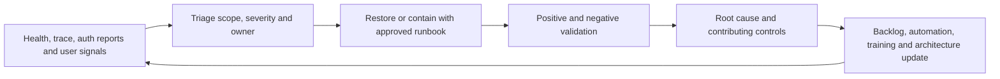

Useful metrics include accepted-to-delivered latency percentiles, failed-message rate by reason, connector/TLS failures, email-authentication pass/alignment rate by source, stale delegate/group owner percentage, high-risk protocol usage, trace-to-diagnosis time, restoration time, recurrence rate, and expiring certificate/domain-owner actions. Define numerator, denominator, exclusions, freshness and owner.

## 31. Deployment, testing, and rollback pattern

| Phase | Action | Gate |
|---|---|---|
| Discover | Inventory domains, recipients, routes, sources, rules, connectors, protocols and owners | Evidence coverage accepted |
| Design | Produce target routes, security requirements, licenses, risks and rollback | Architecture/security review |
| Build | Configure in lab or narrowly scoped pilot where tenant permits | Peer-reviewed settings export |
| Test | Internal/external, positive/negative, TLS, auth, loop, NDR, trace and client tests | Acceptance matrix passes |
| Deploy | Ringed change with TTL/certificate/vendor timing considered | Go/no-go approval |
| Hypercare | Monitor trace, latency, failures, user reports and auth data | Stable defined period |
| Handover | Runbooks, access, dashboards, known errors and training | Operations acceptance |

Rollback can mean restoring DNS, disabling a connector/rule, returning a route to the previous smart host, restoring a prior permission set, or pausing DMARC enforcement. DNS rollback is not instant because caches honor TTL. A rollback plan must state the last reversible point, propagation expectation, data/security exposure during reversal, owner and validation tests.

## 32. Consulting artifacts

1. **Current-state architecture:** tenants, domains, internet/gateway/hybrid routes, mailboxes and application senders.
2. **Recipient inventory:** type, source of authority, license, owner, delegates, archive/hold and lifecycle state.
3. **Domain and sender register:** MX, SPF, DKIM, DMARC, vendors, subdomains, owners and review dates.
4. **Connector/rule register:** direction, conditions, TLS, priority, exceptions, purpose, owner and expiry.
5. **RBAC/delegation matrix:** personas, roles, scope, approvals, review and emergency access.
6. **Risk register:** open relay, spoofing, loops, legacy protocols, stale permissions, single points of failure.
7. **Test plan:** expected path and result for every positive/negative scenario.
8. **Operational handbook:** dashboards, alerts, runbooks, escalation, RACI, service health and KPIs.
9. **Executive summary:** business impact, target control, cost/license dependency, residual risk and roadmap.

## 33. Safe paper lab: design and diagnose Contoso mail flow

This lab changes no tenant, DNS, connector, mailbox or production message. Use fictional domains such as `contoso.example` and documentation-only evidence.

### Objective and prerequisites

Design hosted Exchange Online mail flow for 500 users, one shared support mailbox, two room mailboxes, a payroll SaaS sender, a multifunction printer, and a temporary on-premises coexistence path. Assume Defender capabilities are evaluated in Part 22. Prerequisites are Parts 4–14, the conceptual SMTP/TLS/DNS foundation in Part 5, and this chapter.

### Procedure

1. Draw tenant, Entra, Exchange, public DNS, internet, temporary on-premises Exchange, payroll SaaS and printer trust boundaries.
2. Create a recipient table: user, shared, room, distribution group, contact/mail user; add source of authority, owner and license-validation field.
3. Define `contoso.example` as conceptual authoritative target after migration and document when/why internal relay would exist during coexistence.
4. Build a route matrix for internet inbound, cloud outbound, cloud-to-on-prem, on-prem-to-cloud, payroll SaaS and printer.
5. Choose a sending pattern for payroll and printer. State why direct send, modern API, or scoped connector is or is not suitable.
6. Draft connector requirements: direction, source identity, TLS, certificate/IP, domains, smart host, failure behavior and owner.
7. Draft SPF source inventory, DKIM selector plan and phased DMARC plan. Do not publish records.
8. Create one mail flow rule design, including exact conditions, exception, priority, test mode, positive/negative tests and rollback.
9. Design Exchange RBAC personas and mailbox delegation for `support@contoso.example`; separate Full Access and Send As approval.
10. Create a service-health and mail-incident runbook with evidence fields.
11. Inject three paper faults: stale MX points to old gateway; migrated user's target address loops; payroll source IP changed without connector update.
12. Walk the diagnostic tree for each fault and identify the first discriminating check.

### Test and evidence matrix

| Test | Expected result | Evidence to capture |
|---|---|---|
| Internet to valid cloud user | Accepted and delivered by planned route | Diagram path, hypothetical trace and header fields |
| Internet to invalid authoritative recipient | Rejected safely, no downstream relay | Expected SMTP/NDR stage |
| Cloud to internet | Direct approved egress; SPF/DKIM/DMARC alignment design | Auth-result expectation |
| Payroll authorized source | Accepted only through scoped method | Connector match/TLS expectation |
| Payroll wrong IP/certificate | Rejected or normal untrusted filtering, never trusted | Negative-test result |
| Printer internal recipient | Delivered through selected safe pattern | Route and limits |
| Printer external recipient | Allowed only if explicitly designed and authenticated | Relay denial or approved path |
| Hybrid migrated/unmigrated recipients | Exactly one valid route per recipient | Object/connector matrix |
| Mail-flow rule positive case | Intended action once | Rule trace expectation |
| Rule negative case | No action | Exception/priority proof |
| Delegate read versus send | Each permission grants only intended capability | RBAC/delegation matrix |
| Rollback | Previous route/settings restored conceptually | Reversal steps and validation |

### Cleanup

Delete no production data because none was created. Store the fictional diagrams and tables in an approved learning portfolio without real tenant IDs, domains, IPs, certificates, headers, addresses or customer information. Mark every screenshot or example “paper lab / fictional.”

### Interview wording

> “I completed a paper design for hosted and temporary hybrid Exchange Online mail flow. I mapped recipients and source of authority, selected safe application-sending patterns, specified connector and TLS controls, planned SPF/DKIM/DMARC rollout, separated RBAC from mailbox delegation, and built trace/header/NDR tests including loop and relay-negative cases. It is lab evidence, not production Exchange ownership. My production strength is the structured M365 support and RCA method I would bring to implementation with the workload owners.”

## 34. JD Mapping: turning knowledge into consulting behavior

| Interview prompt | Strong, honest response structure |
|---|---|
| “Assess our Exchange environment” | Scope → recipients/domains/routes/identity/licenses → DNS/auth → roles/delegates/protocols → trace/audit/health → risks/evidence → roadmap |
| “Design secure mail flow” | Requirements → route/trust boundaries → connectors/TLS → SPF/DKIM/DMARC → rules → tests/rollback → operations |
| “Mail is missing” | Scope/time/IDs → service/change → last accepted hop → trace/header/NDR → competing tests → root control → validate |
| “Move off a gateway” | Capability map → source attribution → coexistence → pilot → MX/connectors/auth → negative tests → cutover/rollback → decommission |
| “What have you done?” | Direct SPO/OneDrive/M365 escalation evidence; current Exchange learning/paper lab; no false production claim |

## 35. Official Source Anchors

These are first-party anchors checked on **August 24, 2026**. Microsoft changes documentation and service behavior; recheck each source before design or change.

| Topic | Official Microsoft source | Change-sensitive use |
|---|---|---|
| Exchange Online overview/portal | [Exchange Online](https://learn.microsoft.com/en-us/exchange/exchange-online) | EAC path, service boundary and subscriptions |
| Service features/limits | [Exchange Online service description](https://learn.microsoft.com/en-us/office365/servicedescriptions/exchange-online-service-description/exchange-online-service-description) | Plans, mailbox/archive features and limits |
| Recipients/mailboxes | [Manage user mailboxes](https://learn.microsoft.com/en-us/exchange/recipients-in-exchange-online/manage-user-mailboxes/manage-user-mailboxes) | Properties, delegation and current EAC behavior |
| Mail-flow patterns | [Mail flow best practices](https://learn.microsoft.com/en-us/exchange/mail-flow-best-practices/mail-flow-best-practices) | Hosted, third-party, hybrid and relay warning |
| Accepted domains | [Manage accepted domains](https://learn.microsoft.com/en-us/exchange/mail-flow-best-practices/manage-accepted-domains/manage-accepted-domains) | Authoritative/internal relay behavior |
| Connectors | [Configure mail flow using connectors](https://learn.microsoft.com/en-us/exchange/mail-flow-best-practices/use-connectors-to-configure-mail-flow/use-connectors-to-configure-mail-flow) | Connector types, validation and TLS |
| Mail flow rules | [Mail flow rules in Exchange Online](https://learn.microsoft.com/en-us/exchange/security-and-compliance/mail-flow-rules/mail-flow-rules) | Predicates, actions, priority and modes |
| Message trace | [Message trace in the modern EAC](https://learn.microsoft.com/en-us/exchange/monitoring/trace-an-email-message/message-trace-modern-eac) | Current trace windows and workflow |
| Permissions | [Permissions in Exchange Online](https://learn.microsoft.com/en-us/exchange/permissions-exo/permissions-exo) | RBAC model and role groups |
| Email authentication | [How email authentication works](https://learn.microsoft.com/en-us/defender-office-365/email-authentication-about) | SPF, DKIM, DMARC, ARC and composite auth; page dated July 2026 |
| SMTP/application sending | [How to set up a multifunction device or application to send email](https://learn.microsoft.com/en-us/exchange/mail-flow-best-practices/how-to-set-up-a-multifunction-device-or-application-to-send-email-using-microsoft-365-or-office-365) | Current supported patterns and requirements |
| Hybrid | [Exchange hybrid deployments](https://learn.microsoft.com/en-us/exchange/exchange-hybrid) | Current architecture, HCW and prerequisites |

---

## ⭐ Likely Interview Questions for This Section

### Q1. What happens to an inbound internet message before it reaches an Exchange Online mailbox?
> **Model answer:** Public DNS directs the sender to the domain's Microsoft 365 protection endpoint or approved gateway. SMTP connection and envelope data are evaluated, the recipient and accepted domain are resolved, protection and mail-flow rules run, routing/connectors are selected, and the message is delivered, redirected, quarantined, deferred or rejected. I would prove the path with sender logs, public DNS, headers, message trace, connector/rule evidence and any NDR rather than treating the diagram as a fixed internal implementation.

### Q2. How do accepted domains, remote domains, connectors and mail flow rules differ?
> **Model answer:** Accepted domains define namespaces Exchange handles and whether unknown recipients are authoritative or relayed. Remote domains control formatting and automatic-reply behavior toward external domains. Connectors identify or route messages between systems with controls such as IP, certificate and TLS. Rules apply ordered conditions, exceptions and actions to messages. They interact, but none substitutes for the others.

### Q3. Explain SPF, DKIM and DMARC together.
> **Model answer:** SPF authorizes sending infrastructure for the envelope domain. DKIM signs message elements using a domain key. DMARC checks whether a passing SPF or DKIM domain aligns with the visible From domain and publishes handling/reporting policy. I inventory every sender, fix SPF and aligned DKIM, monitor DMARC reports, then phase quarantine/reject with rollback. One SPF record, lookup limits, forwarding, third-party senders and subdomains are key traps.

### Q4. How would you troubleshoot a missing message?
> **Model answer:** Capture sender, recipient, exact UTC time, Message-ID, direction and NDR. Check service health and recent DNS, connector, rule, recipient, license or gateway changes. Find the last system that accepted responsibility. In Microsoft 365, use trace, then correlate headers, NDR, connector/rule/filter outcome and mailbox rules/forwarding. Test another sender, recipient and route to disprove competing hypotheses, fix the controlling layer, and validate both delivery and security-negative cases.

### Q5. What is the difference between Full Access, Send As and Send on Behalf?
> **Model answer:** Full Access permits opening and managing mailbox content but does not itself permit sending. Send As makes the message appear directly from the mailbox. Send on Behalf visibly identifies the delegate acting for it. I grant the minimum combination with owner approval, governed assignment, audit, expiry/review and tests; I never assume Full Access includes Send As.

### Q6. When would you use centralized mail transport in hybrid Exchange?
> **Model answer:** Only when a proven control or business requirement requires cloud outbound mail to traverse on-premises, such as a legacy mandatory integration that cannot yet move. It adds latency, on-premises availability dependency, routing-loop and source-attribution complexity. I document the requirement, compare cloud-native alternatives, design TLS/connectors and resilience, test both directions and failures, and keep an exit roadmap rather than preserving it by habit.

### Q7. How do you prevent an application SMTP design from becoming an open relay?
> **Model answer:** Prefer a supported modern API or workload identity. If connector relay is justified, narrowly bind it to controlled source IPs or certificates, required TLS and authorized sender/destination scope; define limits and ownership; monitor use; and negative-test wrong IP, wrong certificate, unauthorized sender and external destination. Direct send is not general internet relay. I never solve relay denial by trusting a broad network range.

### Q8. What is your honest level of Exchange Online experience?
> **Model answer:** My production evidence is SharePoint Online, OneDrive, sync, migration, Microsoft 365 support escalation, RCA, validation and stakeholder coordination. Exchange architecture and security implementation are current learning and paper-lab evidence. I can explain and document recipients, transport, connectors, DNS authentication, permissions, trace/header/NDR troubleshooting, testing and rollback, and I would deliver production change with Exchange, identity, DNS, network, security and compliance owners.

---

## 🧠 30-Second Memory Hooks

- **Tenant is the campus; Exchange organization is the mail service on that campus.**
- **Identity says who; recipient says where mail can go; mailbox stores it.**
- **MX finds the front door; Autodiscover helps clients find the mailbox service.**
- **Accepted domain owns/routes a namespace; remote domain controls behavior toward another one.**
- **Connector is a controlled lane; rule is a handling instruction.**
- **Envelope routes; header explains; body carries content.**
- **SPF authorizes the truck; DKIM seals the parcel; DMARC checks the visible brand.**
- **Full Access reads; Send As represents; Send on Behalf discloses the delegate.**
- **Trace tells what Microsoft observed; headers tell the hop story; NDR tells why delivery failed.**
- **A loop is contradictory routing; an open relay is misplaced trust.**
- **Cloud service means logical control plus evidence, not customer-managed mailbox servers.**
- **Candidate honesty: production M365 support strength, Exchange implementation lab evidence.**

---

## Completion Checklist

- [ ] I can draw tenant, identity, protection, transport, mailbox, client and DNS boundaries.
- [ ] I can compare user/shared/resource mailboxes, groups, contacts and mail users.
- [ ] I can explain licensing/provisioning and source-of-authority risks without overgeneralizing.
- [ ] I can describe front door, resolution, filtering, rules, routing and mailbox delivery.
- [ ] I can distinguish MX, Autodiscover, SPF, DKIM and DMARC records.
- [ ] I can distinguish accepted domains, remote domains, connectors and transport rules.
- [ ] I can compare hosted, hybrid, centralized and direct/decentralized flow.
- [ ] I can design a scoped application-sending pattern and prove it is not an open relay.
- [ ] I can explain RBAC and Full Access/Send As/Send on Behalf.
- [ ] I can explain modern authentication and identify legacy-protocol risk.
- [ ] I can relate archive, retention and hold without claiming they are equivalent.
- [ ] I can investigate with service health, trace, headers, NDR, DNS, connectors and audit.
- [ ] I can define deployment rings, tests, rollback, operations, metrics and consulting artifacts.
- [ ] I can present the safe paper lab and state clearly that it is not production Exchange ownership.
- [ ] I will recheck current Microsoft Learn, licensing, Message center and tenant behavior before change.

---

*Next suggested section:* [Part 22](Part-22-eop-defender-office-365.md) — add EOP and Defender for Office 365 connection, content, impersonation, Safe Links, Safe Attachments, post-delivery, investigation, response, quarantine and migration controls to this mail-flow foundation.